# IGNIÇÃO

*Enciclopédia consultiva para o empreendedor brasileiro*

> [!tip] Dica para leitura no Obsidian
> Este arquivo foi otimizado para Obsidian. Os links do Sumário são wiki-links nativos, basta clicar.
> - **Leitura fluida:** habilite **Reading Mode** (ícone de olho no canto superior direito)
> - **Navegação:** use o **Outline** no painel lateral direito (`Ctrl/Cmd + Shift + O`) para ver toda a hierarquia de headings
> - **Busca dentro deste documento:** `Ctrl/Cmd + F`
> - **Busca em todo o vault:** `Ctrl/Cmd + Shift + F`
> - **Mapa de conexões:** se dividir em múltiplos arquivos no futuro, o Graph View (`Ctrl/Cmd + G`) fica muito útil


---

## Nota do autor

Este livro começou como um arquivo de texto solto. Uma anotação aqui, uma observação ali, coisas que eu queria poder reencontrar em algum momento futuro da minha trajetória empreendedora. Quando percebi, o arquivo tinha crescido absurdamente, e com o crescimento veio uma tentação que eu resisti por algum tempo: transformar rascunho pessoal em algo mais estruturado.

Resisti porque a pergunta óbvia me incomodava. Existem centenas de livros de empreendedorismo no mercado, muitos escritos por pessoas com trajetórias mais notáveis que a minha, muitos com argumentos melhor polidos. O que justifica escrever mais um?

A resposta honesta é que este livro não foi escrito para o mercado. Foi escrito para mim. O fato de outras pessoas eventualmente poderem ler é consequência, não objetivo, e essa consequência só existe porque o livro, depois de pronto, também parece útil para quem esteja construindo algo num contexto parecido com o meu. A hierarquia importa: se eu tivesse escrito pensando primeiro em terceiros, teria escrito pior. Honestidade primeiro pra mim, qualidade pública como subproduto.

O que está aqui é, em essência, depoimento. Alguém tentando construir um negócio sério no Brasil, registrando para si mesmo o que aprendeu até onde aprendeu, na esperança de que as decisões futuras sejam um pouco menos cegas que as passadas. Não é livro de quem chegou, é o livro de quem está no meio da subida e parou para anotar o que sabia, antes que esquecesse.

Algumas coisas sobre o que isto efetivamente é, registradas para o eu de daqui a três, cinco, dez anos:

**Isto é uma enciclopédia, não um livro.** Em algum momento da escrita, eu parei de fingir que estava produzindo prosa contínua. O material não queria ser narrativa, queria ser referência. Aceitei. As fases são verbetes longos sobre etapas da trajetória, os apêndices são verbetes de profundidade temática, o ferramentário é catálogo de instrumentos. Você consulta isto, não lê. Quando precisar de algo em três parágrafos, abra em três parágrafos. O resto pode esperar até a próxima vez que precisar.

**As opiniões aqui são minhas e datadas.** Muito do que afirmo com convicção em abril de 2026 vai parecer ingênuo daqui a dez anos. Tudo bem. Documento canônico tem a vantagem de poder ser revisitado: na próxima edição, eu reescrevo os trechos que envelheceram mal. O que importa é que, neste momento, esta é a minha melhor compreensão organizada, não autoridade, não verdade final, apenas o que consegui reunir.

**Este não é o livro de um especialista.** É o livro de um praticante em formação. Se um dia eu for especialista em alguma coisa específica, escrevo um livro diferente sobre ela. Por enquanto, este é o registro do operacional que juntei, em parte do que vivi, em parte do que aprendi com quem passou antes, em parte do que estudei porque não tinha referência pronta.

**A escrita foi mais valiosa que o resultado.** Organizar o que eu sabia, descobrir o que eu *pensava que sabia* mas não articulava, pesquisar as lacunas, entrevistar mentalmente fundadores que admiro, isso produziu clareza que nenhum livro de outra pessoa produziria. Fica registrado aqui o único conselho que eu tiraria de toda essa experiência, em uma frase: o esforço de escrever ensina mais que o livro pronto. Inclusive este.

Quanto ao uso: foi feito para acompanhar decisões reais, não para ser lido de capa a capa. Quando eu estiver em crise, que eu encontre aqui não consolo abstrato, mas pergunta concreta que me force a diagnosticar o problema real. Quando eu estiver considerando pivotar, que eu encontre aqui o framework que me impeça de pivotar por desespero em vez de por evidência. Quando eu estiver prestes a fazer uma contratação sênior, que eu encontre aqui o lembrete das armadilhas específicas dessa decisão. Esse é o uso pretendido, bússola operacional para os momentos em que eu, sob pressão, não consigo pensar com a clareza que tinha quando escrevi isto.

Se você chegou até aqui e não é a pessoa para quem este livro foi escrito, o material pode te servir mesmo assim, grande parte é aplicável a qualquer fundador brasileiro. Mas alguns trechos vão parecer específicos demais ou idiossincráticos. São. É documento com autor, não com público. Use o que for útil, descarte o resto.

Boa sorte na minha jornada, em cada momento em que eu voltar aqui para buscar uma resposta que este livro possa oferecer a mim mesmo.

*Abril de 2026.*

---

## Sobre este livro

### O que isto é

Este livro tem cerca de 380 mil palavras. Cobre como começar uma empresa no Brasil, como crescê-la, e como sair dela. Está dividido em quatro partes que seguem essa ordem cronológica: Da Ideia à Operação, Do PMF à Escala, Em Escala, Ciclo Longo e Exit. Cada parte tem fases (a sequência principal) e apêndices (profundidade temática para quando você precisar). No fim há uma seção de Referência com ferramentário, templates, glossário, bibliografia e índice remissivo.

Não é narrativa contínua. Não é livro inspiracional. É um documento para consulta em decisões reais. Foi escrito assumindo que você tem pressa, tem uma dor concreta, e precisa de resposta operacional.

### As duas vozes do livro

O livro alterna entre duas vozes. Quando trata de material consagrado, frameworks como OKR, Hoshin Kanri, JTBD, Crossing the Chasm, o registro é sóbrio, próximo do verbete enciclopédico. O autor se apaga. O que importa é fidelidade ao conceito original.

Em outros momentos o livro opina. Sobre quando não empreender, sobre saúde mental do fundador, sobre o ecossistema brasileiro, sobre padrões de fracasso que vi de perto. Quando há opinião, o livro avisa. Você lê algo como "minha leitura, contestável, é que" e sabe que entrou em terreno autoral. Os dois modos coexistem ao longo do livro, e você sabe qual está lendo a cada momento.

### Por que brasileiro

Empreender no Brasil tem especificidades que raramente aparecem em livros importados. Tributação, regulação, ciclos de capital local, estrutura de canais, relação com governo, dinâmica societária, operação em múltiplas moedas. Traduzir Silicon Valley direto para São Paulo gera decisões ruins. O livro parte do contexto brasileiro e estende para o global quando necessário, não o contrário. CLT, MEI, Simples Nacional, INPI, LGPD, BNDES, BACEN, CVM, Receita Federal. Não são detalhes. São a moldura.

### Como usar

O livro não pede leitura linear. Aceita ser aberto em qualquer página por quem tem problema concreto.

Se você está pensando em empreender, comece pelas Fases 0 a 2. Preparação, encontrar a ideia, articular a ideia. Reserve três a quatro horas. Pare e execute antes de continuar.

Se você já tem uma ideia mas ainda não validou, vá para as Fases 3 a 7. Descoberta do problema até experimentos de validação. De quatro a seis horas. Consulte o BG.6 para técnica de entrevista.

Se está construindo MVP ou buscando product-market fit, são as Fases 8 a 12, mais os apêndices AB, Pivot, BG.10 e BG.11.

Se já tem PMF e está escalando, vá para a [[#FASE 13 — ESTRUTURAÇÃO JURÍDICA, FINANCEIRA E OPERACIONAL|Fase 13]] antes da [[#FASE 14 — ESCALA: TIME, OPERAÇÕES, CRESCIMENTO E CAPITAL|Fase 14]], mesmo que pareça óbvia. Quem pula estruturação volta a ela depois de quebrar coisa cara. Apêndices críticos nessa altura: V (Captação), CF (Planejamento de Rodada), CG (Growth como função), BG.17 (Liderança). Aqui a leitura é por tema, não por sequência.

Se está em crise ou considerando pivô, há três rotas combinadas. Apêndice Pivot, Apêndice de Crise, [[#APÊNDICE Y — SAÚDE MENTAL, DINÂMICA DE CO-FOUNDERS E HUMANIDADE DO FUNDADOR|Apêndice Y]] sobre saúde mental. Crise societária acrescenta [[#FASE 0 — PREPARAÇÃO DO EMPREENDEDOR|Fase 0]] e Apêndices AH e BP. Crise de caixa acrescenta [[#FASE 13 — ESTRUTURAÇÃO JURÍDICA, FINANCEIRA E OPERACIONAL|Fase 13]] e Apêndices AN e AT.

Se está preparando saída, [[#FASE 16 — EXIT STRATEGY|Fase 16]] e os Apêndices BR e BF.

Para consulta pontual use o sumário e o índice remissivo. Cada fase tem entrada padronizada (O Que, Por Que, Quando, Quem, Como, Saída) que serve para diagnóstico rápido. O ferramentário BG cataloga aproximadamente uma centena de ferramentas por categoria.

E se você só tem quinze minutos, abra a fase do seu momento atual. Leia a abertura, as armadilhas, e a saída da fase. É suficiente para reorientar foco.

### Sobre os exemplos: PadariaPro e os casos reais

Você vai encontrar PadariaPro mencionado em vários templates ao longo do livro. É um caso fictício, criado para ilustrar todo o ciclo de instrumentos do livro num único arco coerente, da Declaração Inicial da ideia, na [[#FASE 2 — ARTICULAÇÃO E CAPTURA DA IDEIA|Fase 2]], até o Plano de Exit, na [[#FASE 16 — EXIT STRATEGY|Fase 16]]. PadariaPro é um SaaS de gestão para padarias artesanais brasileiras com três a cinco lojas. Você acompanha os fundadores, também fictícios, preenchendo cada template em sequência. Story Tree, Canvas da Cunha, Banco de Hipóteses, Cartão de Experimento, Especificação de MVP, OKRs, Plano de Time, e por aí vai. A função é pedagógica. Um caso único permite ver continuidade entre os instrumentos sem ter que reaprender contexto a cada novo template.

Onde o caso real funciona melhor, o livro usa empresas brasileiras documentadas. Stone, Quinto Andar, Hotmart, Magazine Luiza, RD Station, Linx. Os pontos onde elas aparecem são Especificação de MVP, Diagnóstico de PMF, Máquina de Crescimento em escala, Análise de Segunda Curva e Plano de Exit. Casos reais nesses pontos adicionam nuance e textura que um caso fictício não consegue produzir. Em alguns templates da Parte I, como Declaração Inicial, Roteiro de Entrevista e Canvas da Cunha, você verá PadariaPro e um caso real lado a lado, para mostrar como o instrumento se comporta em contextos diferentes.

Tanto os casos reais quanto o PadariaPro são instrumentos. Nenhum dos dois é receita.

### Como este livro envelhece

Envelhece rápido: nomes de fundos, valuations específicos, ferramentas de IA, features de produtos, alíquotas tributárias, regimes regulatórios. Envelhece devagar: frameworks clássicos, padrões de descoberta, psicologia do fundador, dinâmicas de mercado. Ao reler em ano futuro, desconfie de datas e números. Confie em processos e padrões. A próxima edição vai corrigir o que envelheceu mal. Esse é o privilégio de documento canônico sobre livro impresso.

### O que este livro não é

Não substitui advogado, contador, terapeuta, consultor regulatório ou mentor humano. Não é bola de cristal. Quando diz que a chance de sucesso em X é baixa, isso reflete padrões observáveis, não destino. As respostas para seu caso específico envolvem pessoas e contextos que nenhuma enciclopédia consegue antecipar.

Empreender no Brasil é difícil. O livro não disfarça isso. Mas é possível, e milhares de pessoas conseguem todo ano. Este livro existe para aumentar a probabilidade de você estar entre elas, reduzindo erros evitáveis, preparando para os inevitáveis, e devolvendo o tempo que seria gasto descobrindo o que outros já descobriram.

---

## Mapa do livro

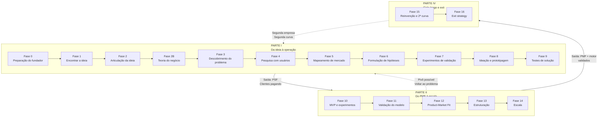

> [!note] Como navegar o livro
> O fluxo é linear (Fase 0 → 16) mas o uso é não-linear. Empreendedor em Fase 12 consulta Fases 3-4 para re-validar, apêndices para aprofundar e Fase 15 para planejar. Use o sumário abaixo para localizar o seu momento atual.

## Sumário

### [[#PARTE I — DA IDEIA À OPERAÇÃO]]

- [[#FASE 0 — PREPARAÇÃO DO EMPREENDEDOR]]
- [[#FASE 1 — ENCONTRAR A IDEIA]]
- [[#FASE 2 — ARTICULAÇÃO E CAPTURA DA IDEIA]]
- [[#FASE 2B — CONSTRUÇÃO DA TEORIA DO NEGÓCIO]]
- [[#FASE 3 — DESCOBERTA DO PROBLEMA]]
- [[#FASE 4 — PESQUISA COM USUÁRIOS (CUSTOMER DISCOVERY APROFUNDADO)]]
- [[#FASE 5 — MAPEAMENTO DE MERCADO E CONCORRÊNCIA]]
- [[#FASE 6 — FORMULAÇÃO RIGOROSA DE HIPÓTESES]]
- [[#FASE 7 — EXPERIMENTOS DE VALIDAÇÃO DO PROBLEMA]]
- [[#FASE 8 — IDEAÇÃO E PROTOTIPAGEM DE SOLUÇÕES]]
- [[#FASE 9 — TESTES DE SOLUÇÃO E USABILIDADE]]
- [[#APÊNDICE D — ARMADILHAS MENTAIS E VIESES]]
- [[#APÊNDICE AJ — DINHEIRO PESSOAL DO FUNDADOR]]
- [[#APÊNDICE Y — SAÚDE MENTAL, DINÂMICA DE CO-FOUNDERS E HUMANIDADE DO FUNDADOR]]
- [[#APÊNDICE AK — ACELERADORAS, PROGRAMAS E PARCEIROS INSTITUCIONAIS PARA STARTUP BRASILEIRA]]
- [[#APÊNDICE AL — REDE, MENTORES E ADVISORS — COMO CONSTRUIR O CAPITAL HUMANO DO EMPREENDEDOR]]
- [[#APÊNDICE F — ABORDAGEM CIENTÍFICA vs LEAN STARTUP: QUANDO USAR CADA UMA]]
- [[#APÊNDICE G — FRAMEWORK DE DECISÃO POR GATES (PROBLEM CORE + SCALE LEVERS + EXPLORATORY)]]
- [[#APÊNDICE H — TRL E CRL: MATURIDADE TECNOLÓGICA E DE MERCADO]]
- [[#APÊNDICE L — IDEA → WEDGE → SCALE: O FRAMEWORK ANTLER COMO LENTE TRANSVERSAL]]
- [[#APÊNDICE AI — CASOS DE FRACASSO BRASILEIROS E LIÇÕES]]
- [[#APÊNDICE B — COMO FECHAR UMA FASE: COMMITTED NEXT MOVE E SINAIS OBSERVÁVEIS|Apêndice B — Como fechar uma fase]]
- [[#APÊNDICE C — CATÁLOGO DE MÉTRICAS POR FASE|Apêndice C — Catálogo de Métricas por Fase]]
- [[#APÊNDICE E — RECURSOS E LEITURAS RECOMENDADAS]]

### [[#PARTE II — DO PMF À ESCALA]]

- [[#FASE 10 — MVP E EXPERIMENTOS DE MERCADO]]
- [[#FASE 11 — VALIDAÇÃO DO MODELO DE NEGÓCIO]]
- [[#FASE 12 — PRODUCT-MARKET FIT]]
- [[#FASE 13 — ESTRUTURAÇÃO JURÍDICA, FINANCEIRA E OPERACIONAL]]
- [[#FASE 14 — ESCALA: TIME, OPERAÇÕES, CRESCIMENTO E CAPITAL]]
- [[#APÊNDICE AB — PRODUTO EM ESCALA E DESCOBERTA CONTÍNUA]]
- [[#APÊNDICE CL — PIVOT: TIPOLOGIA, DECISÃO E EXECUÇÃO]]
- [[#APÊNDICE CN — DIVERSIDADE DE JORNADAS: CASOS ALÉM DO CÂNONE]]
- [[#APÊNDICE AO — DADOS, ANALYTICS E EXPERIMENTAÇÃO]]
- [[#APÊNDICE Z — AI COMO PARTE DO PRODUTO (AI-NATIVE PRODUCT)]]
- [[#APÊNDICE CP — SALES: MOTION COMPLETA, DO OUTBOUND AO RENEWAL]]
- [[#APÊNDICE CG — GROWTH COMO FUNÇÃO ORGANIZACIONAL: TIME DE GROWTH, BUILD VS HIRE, RELAÇÃO COM PRODUTO]]
- [[#APÊNDICE AY — MARKETING DE PERFORMANCE EM PROFUNDIDADE]]
- [[#APÊNDICE AR — CONTENT MARKETING E SEO COMO DISCIPLINA]]
- [[#APÊNDICE AS — COMMUNITY BUILDING COMO DISCIPLINA]]
- [[#APÊNDICE CQ — MARCA, PR E POSICIONAMENTO DE LONGO PRAZO]]
- [[#APÊNDICE X — PRICING STRATEGY COMO DISCIPLINA]]
- [[#APÊNDICE AA — CUSTOMER SUCCESS COMO DISCIPLINA]]
- [[#APÊNDICE CB — SUBSCRIPTION ECONOMY EM PROFUNDIDADE: ALÉM DO "COBRA MENSALMENTE"]]
- [[#APÊNDICE BN — EXECUTIVE HIRING: CONTRATAR LÍDERES SÊNIOR E C-LEVEL]]
- [[#APÊNDICE CO — RECRUTAMENTO TÉCNICO EM PROFUNDIDADE]]
- [[#APÊNDICE BZ — PERFORMANCE REVIEWS ESTRUTURADOS: CICLO, CALIBRAÇÃO E CONEXÃO COM COMPENSAÇÃO]]
- [[#APÊNDICE AP — CULTURA COMO DISCIPLINA]]
- [[#APÊNDICE BU — DIVERSIDADE, EQUIDADE E INCLUSÃO (DEI) EM STARTUP BRASILEIRA]]
- [[#APÊNDICE AG — REMOTE, HYBRID E DISTRIBUÍDO COMO DISCIPLINA]]
- [[#APÊNDICE CR — ENGINEERING MANAGEMENT: GESTÃO DO TIME TÉCNICO E DEVELOPER EXPERIENCE]]
- [[#APÊNDICE BC — TECHNICAL DEBT COMO DISCIPLINA GERENCIADA]]
- [[#APÊNDICE CH — IA NA ENGENHARIA INTERNA: COPILOT, AGENTES E PRODUTIVIDADE DE DEV]]
- [[#APÊNDICE V — CAPTAÇÃO DE EQUITY, PITCH E RELACIONAMENTO COM INVESTIDORES]]
- [[#APÊNDICE CF — PLANEJAMENTO DE RODADA COMO PROCESSO: FUNDRAISING COMO PROJETO ESTRUTURADO]]
- [[#APÊNDICE CE — VALUATION METHODS: COMO INVESTIDORES CALCULAM E COMO VOCÊ CALCULA PARA NEGOCIAR]]
- [[#APÊNDICE P — FINANCIAMENTO NÃO-DILUITIVO]]
- [[#APÊNDICE CS — BOOTSTRAP vs VENTURE CAPITAL: A ESCOLHA FUNDACIONAL]]
- [[#APÊNDICE AN — MODELAGEM FINANCEIRA OPERACIONAL]]
- [[#APÊNDICE AT — GESTÃO DE CAIXA EM PROFUNDIDADE]]
- [[#APÊNDICE W — CONTABILIDADE, TRIBUTÁRIO E REGIMES FISCAIS PARA STARTUP BRASILEIRA]]
- [[#APÊNDICE CD — MODELAGEM FINANCEIRA COM COHORTS: PROJEÇÕES QUE FUNCIONAM EM EMPRESA RECORRENTE]]
- [[#APÊNDICE T — LGPD, COMPLIANCE E GOVERNANÇA DE DADOS]]
- [[#APÊNDICE AH — CONTRATOS E ASPECTOS LEGAIS OPERACIONAIS]]
- [[#APÊNDICE R — FOUNDER MODE, DELEGAÇÃO E QUANDO PARAR DE FAZER]]
- [[#APÊNDICE BQ — GESTÃO DE TEMPO DO FUNDADOR E OPERATING CADENCE]]
- [[#APÊNDICE S — CATEGORY DESIGN]]
- [[#APÊNDICE I — IA GENERATIVA COMO ACELERADOR DO EMPREENDEDOR (2026)]]
- [[#APÊNDICE CT — IA COMO CO-PILOTO DO FUNDADOR (2026)]]
- [[#APÊNDICE J — FRAMEWORK DE CANAIS DE AQUISIÇÃO]]

### [[#PARTE III — EM ESCALA]]

- [[#APÊNDICE AM — BOARD E GOVERNANCE]]
- [[#APÊNDICE BI — EMPRESA FAMILIAR E SUCESSÃO: GOVERNANÇA, DINÂMICA E PSICOLOGIA]]
- [[#APÊNDICE BP — DISPUTA SOCIETÁRIA E SAÍDA DE SÓCIO]]
- [[#APÊNDICE AF — ESG, IMPACT E GOVERNANÇA PARA STARTUP]]
- [[#APÊNDICE CU — INTERNACIONALIZAÇÃO: ESTRUTURA E PRODUTO PARA MÚLTIPLOS MERCADOS]]
- [[#APÊNDICE BS — VISTO E IMIGRAÇÃO PARA FUNDADOR BRASILEIRO]]
- [[#APÊNDICE BT — HEDGING CAMBIAL E GESTÃO DE MOEDA MULTICOUNTRY]]
- [[#APÊNDICE BY — TESOURARIA EM ESCALA: GESTÃO DE CAIXA MULTI-MOEDA, MULTI-PAÍS E MULTI-CONTA]]
- [[#APÊNDICE BB — VENTURE DEBT E REVENUE-BASED FINANCING (RBF)]]
- [[#APÊNDICE BA — SECONDARY E LIQUIDEZ DE FOUNDER]]
- [[#APÊNDICE CI — EQUITY CROWDFUNDING NO BRASIL: CAPTAÇÃO PÚBLICA DE PEQUENOS INVESTIDORES]]
- [[#APÊNDICE CJ — TOKENIZAÇÃO PARA FOUNDERS: ATIVOS DIGITAIS, SECURITY TOKENS E QUANDO NÃO É HYPE]]
- [[#APÊNDICE BW — FRAUDE INTERNA E CONTROLES INTERNOS]]
- [[#APÊNDICE CV — SEGURANÇA DA INFORMAÇÃO: DA CERTIFICAÇÃO À ENGENHARIA]]
- [[#APÊNDICE CW — CRISE E CONTINUIDADE: PREVENÇÃO, RESPOSTA, RECUPERAÇÃO]]
- [[#APÊNDICE BV — LAYOFFS E DOWNSIZING: COMO DEMITIR EM ESCALA SEM DESTRUIR A EMPRESA]]
- [[#APÊNDICE AW — REGULATÓRIO SETORIAL BRASILEIRO]]
- [[#APÊNDICE CM — BIOTECH E HEALTHTECH: PLAYBOOK DE REGULAÇÃO, ENSAIOS E CAPITAL]]
- [[#APÊNDICE CA — HARDWARE E DEEP TECH: CONSTRUIR NEGÓCIO COM FABRICAÇÃO, IP E HORIZONTES LONGOS]]
- [[#APÊNDICE AE — MARKETPLACE DYNAMICS E RISCO DE PLATAFORMA]]
- [[#APÊNDICE CC — PLATAFORMA VS PRODUTO: QUANDO CONSTRUIR PLATAFORMA E QUANDO NÃO]]
- [[#APÊNDICE CK — B2B2C: QUANDO SUA EMPRESA VENDE PARA OUTRA EMPRESA QUE VENDE PARA CONSUMIDOR]]
- [[#APÊNDICE CX — CANAIS INDIRETOS E PARCERIAS: PARCERIAS, FRANQUIAS, CHANNEL]]
- [[#APÊNDICE BM — COMUNICAÇÃO PÚBLICA DO FUNDADOR: NARRATIVA, IMPRENSA E PORTA-VOZ]]
- [[#APÊNDICE CY — MARCA PESSOAL DO FUNDADOR: DISTRIBUIÇÃO, AUTORIDADE E CUSTO DE REPUTAÇÃO]]
- [[#APÊNDICE BE — OPEN SOURCE COMO ESTRATÉGIA]]

### [[#PARTE IV — CICLO LONGO E EXIT]]

- [[#FASE 15 — REINVENÇÃO E SEGUNDA CURVA]]
- [[#FASE 16 — EXIT STRATEGY]]
- [[#APÊNDICE BR — SUCESSÃO NO EXIT E TRANSIÇÃO PÓS-AQUISIÇÃO]]
- [[#APÊNDICE BJ — M&A ATIVO E ROLL-UPS: FUNDADOR COMO COMPRADOR]]
- [[#APÊNDICE BL — SEARCH FUNDS E ETA (ENTREPRENEURSHIP THROUGH ACQUISITION)]]
- [[#APÊNDICE BH — POST-MORTEMS BRASILEIROS: CATÁLOGO DE CASOS EM PROFUNDIDADE]]
- [[#APÊNDICE BF — SECOND-TIME FOUNDER]]

### [[#REFERÊNCIA]]

- [[#APÊNDICE — DATA DE COMPILAÇÃO E NOTA SOBRE ENVELHECIMENTO]]
- [[#APÊNDICE BG — FERRAMENTÁRIO COMPLETO DO EMPREENDEDOR]]
- [[#BG.1 — ESTRATÉGIA CLÁSSICA]]
- [[#BG.2 — ESTRATÉGIA MODERNA]]
- [[#BG.3 — PLANEJAMENTO ESTRATÉGICO E EXECUÇÃO DE LONGO PRAZO]]
- [[#BG.4 — PENSAMENTO ESTRUTURADO E MODELOS MENTAIS]]
- [[#BG.5 — RESOLUÇÃO DE PROBLEMAS E TOMADA DE DECISÃO]]
- [[#BG.6 — PESQUISA QUALITATIVA: MÉTODOS DE INVESTIGAÇÃO]]
- [[#BG.7 — UX RESEARCH E USABILIDADE]]
- [[#BG.8 — PESQUISA QUANTITATIVA E EXPERIMENTAÇÃO]]
- [[#BG.9 — SÍNTESE E ANÁLISE DE RESEARCH]]
- [[#BG.10 — PRODUTO: METODOLOGIAS DE DESCOBERTA E EXECUÇÃO]]
- [[#BG.11 — PRODUTO: PRIORIZAÇÃO E MÉTRICAS]]
- [[#BG.12 — GROWTH E AQUISIÇÃO]]
- [[#BG.13 — MARKETING E POSICIONAMENTO]]
- [[#BG.14 — SALES (METODOLOGIAS DE VENDAS CONSAGRADAS)]]
- [[#BG.15 — NEGOCIAÇÃO]]
- [[#BG.16 — OPERAÇÕES E EXECUÇÃO]]
- [[#BG.17 — LIDERANÇA E GESTÃO DE PESSOAS]]
- [[#BG.18 — FINANÇAS, UNIT ECONOMICS E VALUATION]]
- [[#BG.19 — INOVAÇÃO E SEGUNDA CURVA]]
- [[#APÊNDICE A — TEMPLATES PRONTOS PARA USO]]
- [[#APÊNDICE — GLOSSÁRIO DE TERMOS TÉCNICOS|Glossário de Termos Técnicos]]
- [[#APÊNDICE — ÍNDICE REMISSIVO]]
- [[#GLOSSÁRIO]]
- [[#APÊNDICE — BIBLIOGRAFIA UNIFICADA]]
- [[#APÊNDICE — LISTA DE ABREVIAÇÕES]]
- [[#EPÍLOGO]]

---

# PARTE I — DA IDEIA À OPERAÇÃO

*Antes da empresa: você, a ideia, a validação.*

---

Três caminhos costumam trazer alguém até esta parte. O primeiro: uma ideia que não sai da cabeça há semanas, e você quer descobrir se vale a pena tentar. O segundo: insatisfação com a trajetória atual, e empreender virou saída possível na sua imaginação. O terceiro: convite, um amigo, um ex-colega, um investidor te chamou para começar algo junto, e você precisa decidir se topa.

Qualquer um dos três é começo legítimo. Nenhum deles, isolado, é suficiente. A Parte I existe para transformar a situação em que você está numa decisão informada: primeiro sobre se empreender, depois sobre qual problema, depois sobre quais clientes, depois sobre que solução. Quem segue as fases em ordem chega ao final com ideia validada com usuários reais, solução testada em protótipo, e base concreta para o MVP da Parte II. Quem descobre no caminho que a ideia não era viável também ganha, economiza anos numa direção errada, com pouco dinheiro queimado.

A Parte I tem onze fases (0 a 9, mais a 2B de construção da teoria), cada uma com método próprio, executores, métricas, armadilhas, e critérios de saída. A ordem importa. Ignorar a [[#FASE 0 — PREPARAÇÃO DO EMPREENDEDOR|Fase 0]] e pular para a [[#FASE 8 — IDEAÇÃO E PROTOTIPAGEM DE SOLUÇÕES|Fase 8]] de prototipagem é a causa mais comum de empresa que nasce errada.

Um aviso: **a Parte I é lenta de propósito**. Empreendedor experiente executa essas fases em paralelo e condensado, iniciante tentando fazer o mesmo queima a primeira tentativa. Se em algum momento bater a sensação de "isso é detalhe demais para ideia que nem existe", pause em vez de acelerar. O detalhe está aqui porque a probabilidade da ideia sobreviver sem ele é baixa, e fundador iniciante quase nunca tem repertório para saber o que pode pular.

Os apêndices da Parte I, armadilhas mentais, dinheiro pessoal, saúde mental, aceleradoras, rede de mentores, casos brasileiros de fracasso, são consulta sob demanda. Não precisa ler em ordem, precisa saber que existem para quando a fase em que você está pedir.

Começa pelo começo: você.

---

## FASE 0 — PREPARAÇÃO DO EMPREENDEDOR

### O que esse apêndice cobre
Esta é a fase anterior à ideia. O objetivo é preparar a pessoa que vai empreender, não o negócio. Você avalia a sua situação de vida com honestidade. Capacidade financeira, capacidade emocional, tempo disponível, motivações reais, rede de apoio. O entregável é um documento de três a seis páginas, o Dossiê Pessoal do Empreendedor, que responde às perguntas desta fase.

### POR QUE
Empreender não é primariamente um ato técnico. É um ato psicológico e financeiro sustentado por meses ou anos. A maioria das desistências não acontece porque a ideia era ruim. Acontece porque o empreendedor não aguentou a pressão. Ficou sem dinheiro, sem apoio familiar, sem saúde mental. Ou descobriu tarde que queria outra coisa da vida. Pular esta fase significa começar um negócio sobre fundações pessoais frágeis, e qualquer crise do próprio negócio derruba tudo.

### Quando não empreender, um framework honesto de autoexclusão

A maioria dos manuais assume que o leitor já decidiu empreender e ajuda a executar bem. Esta seção é diferente. Lista situações onde empreender agora provavelmente é má ideia, independente de quão boa seja a ideia ou o time. Reconhecer essas situações antes evita sofrimento pessoal, destruição de capital, e desperdício de anos. Não é julgamento. É honestidade.

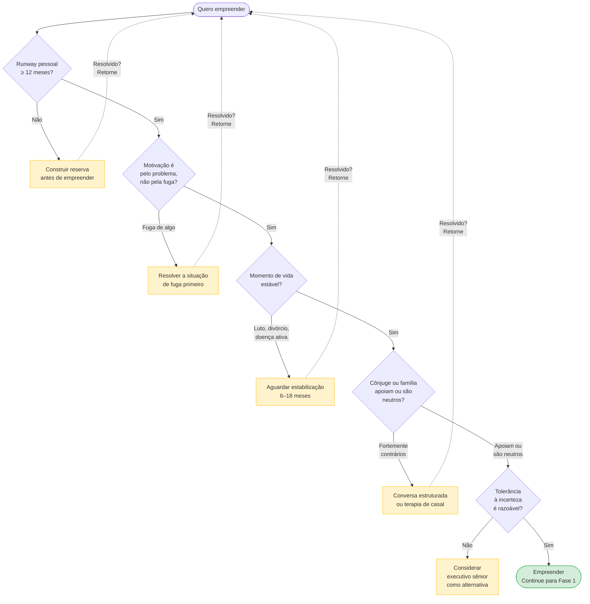

Você provavelmente não deveria empreender agora se:

1. Suas finanças pessoais estão frágeis. Dívidas pessoais altas no cartão, no rotativo, no financiamento atrasado, sem plano de quitação. Reserva de emergência abaixo de seis meses de despesas. Dependentes financeiros sem outra fonte de renda. Empreender com finanças pessoais frágeis costuma terminar em crise dupla, da empresa e da casa. A sequência melhor é resolver finanças, construir reserva, depois empreender.

2. Você está num período de vida emocionalmente turbulento. Luto recente, divórcio em curso ou recente, mudança de cidade ou país sem adaptação, diagnóstico de saúde sério em curso. A trajetória empreendedora exige resiliência emocional alta. Somada a uma crise pessoal, tende a destruir as duas. Esperar estabilizar é sábio.

3. Sua motivação principal é financeira de curto prazo. Quero ficar rico em três anos. Preciso ganhar muito rápido. Empreender paga mais que CLT. Estatisticamente a maioria dos empreendedores ganha menos que em CLT bem-remunerado pelos primeiros cinco a sete anos. Retorno financeiro real, quando vem, vem em sete a doze. Motivação só financeira costuma desistir antes desse tempo.

4. Você não tolera incerteza. Precisa de rotina, previsibilidade, feedback constante. Sente alta ansiedade em situações ambíguas. Tem dificuldade de dormir com questões não-resolvidas. Empresa em estágio inicial é incerteza por anos. Autoconhecimento aqui é honestidade. Algumas personalidades florescem melhor como executivo sênior em empresa maior.

5. Você não tem nenhum conhecimento específico do problema que quer resolver. A ideia nasceu de observação superficial. Você não conhece o cliente em profundidade. Não tem rede no setor. É possível, mas três a cinco vezes mais difícil. Alguém do setor com menos brilho resolve mais rápido. Se você quer insistir, construa conhecimento e rede do setor por seis a doze meses antes de fundar.

6. Você está empreendendo para provar algo a alguém. Aos pais que dizem "estabilize". Ao chefe que demitiu você. Ao ex-parceiro que duvidou. Motivação externa dessa forma costuma colapsar quando a trajetória fica difícil, e ela vai ficar. Motivação precisa ser interna e pelo problema em si.

7. Seu cônjuge ou companheiro é fortemente contrário. Não apenas preocupado, mas explicitamente contra e resistente mesmo após conversa longa. Empreender contra a oposição do parceiro destrói muitos casamentos. Se você quer insistir mesmo assim, considere terapia de casal antes.

8. Você está no meio de uma trajetória profissional que estava dando certo. Promoção recente, aumento significativo, caminho de liderança em empresa consolidada. Nunca vai ser o "bom momento" de sair do emprego, mas em trajetória ascendente alta o custo de oportunidade é enorme. Isso não significa que você não pode empreender. Significa que precisa de cálculo explícito. Quanto está deixando? O que vai buscar? Decisão com olhos abertos, não impulso.

9. Você tem condição de saúde mental não-tratada. Depressão, ansiedade severa, transtornos específicos sem acompanhamento. A trajetória empreendedora agrava saúde mental frágil. Não é remédio. Tratar primeiro. O [[#APÊNDICE Y — SAÚDE MENTAL, DINÂMICA DE CO-FOUNDERS E HUMANIDADE DO FUNDADOR|Apêndice Y]] detalha.

10. Você quer empreender porque odeia seu emprego atual. Fugir de algo é diferente de ir em direção a algo. Frequentemente a trajetória empreendedora fica mais difícil que o emprego ruim. Resolva o trabalho primeiro. Depois empreenda por motivo positivo, não evasivo.

> [!warning] A regra dos três pontos
> Se três ou mais desses dez pontos são verdade para você, pause. Não desista. Ajuste. Trabalhe nos pontos por seis a vinte e quatro meses antes de empreender. A trajetória depois dessa preparação é significativamente mais sustentável.

### Quando usar
Comece antes de investir qualquer recurso. Tempo acima de uma hora por dia, ou dinheiro, em uma ideia. Termine quando o Dossiê Pessoal estiver preenchido com honestidade, e você tiver clareza financeira (o seu runway pessoal mínimo definido) e clareza de motivação (você sabe por que quer fazer isso). Revisite a cada seis meses, ou sempre que houver mudança de vida significativa. Casamento, filho, doença, mudança de cidade.

### Quem envolve
O executor principal é você, o empreendedor. Os participantes são cônjuge ou companheiro se houver, familiares que dependem financeiramente de você, sócios potenciais. O decisor é exclusivamente você, mas com input real, não cerimonial, de quem compartilha sua vida financeira e emocional.

### Como executar
Execute estas oito tarefas em sequência.

1. Diagnóstico financeiro pessoal, de duas a quatro horas. Levante numa planilha três números. O seu custo de vida mensal mínimo (aluguel, comida, saúde, transporte, educação dos filhos, dívidas), o quanto você precisa para viver com dignidade básica, sem lazer. O seu custo de vida mensal atual, incluindo o padrão que você leva hoje. A sua reserva atual em dinheiro líquido, sem contar imóveis, carros, previdência travada.

> [!tip] Fórmula do Runway Pessoal
> Runway Pessoal = Reserva ÷ Custo mínimo mensal
>
> É o número de meses que você aguenta sem receita. Se é menor que seis meses, você não deve largar o seu emprego para empreender agora. Empreenda em paralelo.

2. Teste de motivação real, uma hora, em silêncio, sem pressa. Responda por escrito, com honestidade brutal. Por que eu quero empreender? Escreva cinco razões. Dessas razões, quais são sobre mim (ego, liberdade, dinheiro) e quais são sobre o problema ou o cliente? Do que eu estou fugindo? Chefe ruim, trabalho tedioso, sensação de fracasso? Cuidado: empreender para fugir de algo é fonte frequente de decisões ruins. Eu faria isso se nunca ficasse rico? Se não, qual é o valor mínimo que precisa sair disso para fazer valer a pena?

3. Inventário de habilidades e gaps, duas horas. Liste em quatro colunas. Habilidades que eu tenho e são relevantes (programação, vendas, design). Habilidades que não tenho e serão críticas (marketing digital, contabilidade, negociação). Como vou cobrir os gaps (aprender, contratar, sócio). Quanto tempo e dinheiro isso custa.

4. Conversa estruturada com quem compartilha a sua vida, uma a duas horas. Se você tem cônjuge, filhos, ou alguém que depende de você, marque uma conversa formal. Não um comentário de jantar. Apresente quanto dinheiro você planeja alocar, qual o prazo que dá a si mesmo antes de reavaliar, qual impacto isso terá na rotina familiar, qual é o plano B se não der certo. Peça uma resposta honesta. Se a pessoa não apoia, trate isso como informação crítica. Não como obstáculo a ser ignorado.

5. Avaliação de saúde física e mental, trinta minutos de reflexão. Como está o seu sono hoje? Você tem alguma condição crônica que pode piorar com estresse? Você tem rede de apoio emocional (amigos, terapeuta, família)? Empreender aumenta sintomas de ansiedade e depressão. Se você já está em tratamento, converse com o seu profissional de saúde antes de aumentar a pressão.

6. Definição de prazo e critérios de desistência, uma hora. Defina de antemão quanto tempo você dá ao projeto antes de reavaliar (sugiro doze meses para a primeira reavaliação formal). Quais sinais de fracasso justificam desistir antes (nenhum cliente pagante depois de seis meses de tentativa ativa, reserva abaixo de X reais). Quais sinais de sucesso justificam acelerar (primeiro cliente pagante recorrente em noventa dias). Esses critérios precisam ser definidos hoje, com a cabeça fria. Depois, no meio da tempestade, você não vai ter objetividade para defini-los.

7. Escolha do modelo de dedicação. Decida entre três caminhos. Full-time, largar tudo e focar, exige runway pessoal de doze meses ou mais e alta tolerância ao risco. Part-time estruturado, manter emprego e dedicar dez a vinte horas por semana ao negócio, é mais lento e mais seguro. Side project exploratório, cinco a dez horas por semana, sem pressão de transformar em empresa, serve para as fases 1 a 4 deste manual.

8. Escrita do Dossiê Pessoal. Consolide tudo acima em um documento simples. Guarde. Releia ao final de cada fase seguinte deste manual. Compare. O que você descobriu no caminho invalida algo desse dossiê? Se sim, atualize.

### O fundador como pessoa, seis ensaios de Paul Graham para calibrar expectativa

A [[#FASE 0 — PREPARAÇÃO DO EMPREENDEDOR|Fase 0]] é sobre preparar a pessoa que vai empreender, não o negócio. Paul Graham tem seis ensaios especificamente sobre essa dimensão. Sobre o tipo de pessoa que tende a ter sucesso em startup, o tipo de pensamento que ajuda, o tipo de armadilha interna que derruba. Não são conselhos de "atitude positiva". São observações baseadas na experiência de ter acompanhado mais de três mil fundadores no Y Combinator, cruzada com padrões identificados em retrospecto.

Reúno os seis em formato consolidado. A [[#FASE 0 — PREPARAÇÃO DO EMPREENDEDOR|Fase 0]] é exatamente onde eles têm maior valor. Antes de você começar a construir qualquer coisa externa, vale internalizar essas calibragens. Os ensaios são curtos. Vale ler os originais. Os links estão no [[#APÊNDICE E — RECURSOS E LEITURAS RECOMENDADAS|Apêndice E]].

#### A ideia dominante na sua cabeça, *The Top Idea in Your Mind* (Graham, 2010)

Graham observou que a maioria das pessoas tem uma única ideia dominante na mente em qualquer momento. É aquela para a qual os pensamentos migram naturalmente quando você está no banho, dirigindo, ou caminhando sem estímulo externo. É o problema em que você pensa sem tentar. E é a fonte de boa parte das suas melhores intuições operacionais e estratégicas.

A implicação para o fundador é concreta. Ser CEO de startup exige que o seu negócio seja a ideia dominante na sua cabeça durante os primeiros anos. Se o problema dominante for outro (um conflito pessoal em aberto, ansiedade financeira não-resolvida, uma briga com ex-sócio, um pleito jurídico, uma dívida não-estruturada), o seu negócio vai sofrer sistematicamente. O tempo de pensar sem tentar está sendo gasto em outro lugar. Você não controla para onde a mente vai no banho. Controla indiretamente, pelo que deixa ou não deixa ficar aberto na sua vida.

Teste simples, feito nos próximos três banhos, sem tentar. Quando a sua mente vagueia, para onde ela vai? Se não é o seu negócio, você tem duas opções. A primeira é fechar o loop do que está ocupando a mente. Resolver o conflito, pagar a dívida, enfrentar a conversa evitada, terminar o processo jurídico. Loops abertos são imãs mentais que roubam a sua capacidade de pensar em trabalho profundo. A segunda é reconhecer que você ainda não está pronto para começar uma startup. Talvez seja sensato resolver a vida pessoal primeiro, antes de somar a ela a carga cognitiva de fundar uma empresa.

Graham identifica dois tipos de pensamento particularmente perigosos para fundadores, porque roubam atenção de forma desproporcional ao benefício. Um é pensamento sobre dinheiro. Captação tende a virar atolamento mental que consome cem por cento do foco por semanas. O outro é pensamento sobre disputas. Brigas ocupam espaço imenso, e pior, têm formato velcro. Parecem ter substância, mas não têm. Se você está hoje no meio de uma captação ou de uma disputa, aceite que o seu trabalho estratégico vai sofrer durante esse período. Não marque outras decisões importantes para acontecerem em paralelo.

> [!important] Regra operacional da Fase 0
> Antes de começar, faça um inventário honesto de loops abertos na sua vida. Dívidas não-renegociadas, conflitos interpessoais, compromissos não-cumpridos, processos incompletos. Feche o máximo possível. Cada loop aberto é imposto mental sobre a sua capacidade futura de ser fundador.

#### Os cinco atributos que o YC procura, *What We Look for in Founders* (Graham, 2010)

Graham escreveu um ensaio listando, de forma direta, os cinco atributos que o Y Combinator aprendeu a identificar como preditores de sucesso em fundador. O notável é o que não está na lista. Inteligência. Não porque seja irrelevante. Graham diz explicitamente que acima de certo limiar ela importa menos que o resto. É que não é diferenciador entre fundadores que conseguiram e fundadores que não conseguiram.

Os cinco atributos, com aplicação para o seu autodiagnóstico na [[#FASE 0 — PREPARAÇÃO DO EMPREENDEDOR|Fase 0]]:

Determinação. Para Graham, o atributo mais importante. Não é vontade de ser rico nem sonho grande. É capacidade de continuar iterando apesar de obstáculos constantes, sem ser desmoralizado por semanas ruins. Teste: pense em algo difícil que você fez por dois anos ou mais seguidos, contra resistência, sem recompensa externa durante boa parte do tempo. Se você tem exemplos concretos disso, bom sinal. Se tem dificuldade em encontrar exemplos, autossuspeite.

Flexibilidade. Contraintuitivamente, é co-requisito com determinação, e frequentemente confundido com o oposto. Graham distingue determinação (persistência mais capacidade de ajustar) de teimosia (persistência mais rigidez). Quem é determinado mas não flexível empurra a ideia errada por anos. Quem é flexível mas não determinado pivota a cada semana. O encontro dos dois é raro. Teste: pense em uma ideia forte sua que você mudou drasticamente nos últimos dois anos por causa de evidência. Se não tem exemplo, você provavelmente está mais na teimosia do que na determinação.

Imaginação. Tipo específico de inteligência. Não é velocidade para resolver problemas definidos. É capacidade de gerar ideias surpreendentes. Graham observa que quase toda ideia boa de startup parece ruim no início. Se parecesse boa, alguém já estaria fazendo. A imaginação que importa é a que produz ideias que parecem um pouco malucas. Teste: quando você propõe algo novo, as reações tendem a ser "interessante" (morno, genérico) ou "isso nunca vai funcionar porque" (específico, vigoroso)? O segundo tipo de reação é frequentemente sinal de ideia com potencial.

Naughtiness. Talvez o termo mais difícil de traduzir. É disposição a quebrar regras que não importam. Não é malícia moral. É leve irreverência. Não é transgredir por transgredir. É não se curvar a regras por respeito à autoridade quando elas não fazem sentido. Sam Altman (Loopt, hoje OpenAI) é o exemplo canônico citado por Graham. Por isso o YC passou a perguntar em entrevistas: conte uma vez em que você hackeou um sistema a seu favor. Não no sentido de invadir computador. No sentido de contornar regras sem substância. Teste: em algum momento do último ano, você desobedeceu uma regra formal porque ela era obviamente burra, e isso deu certo?

Amizade entre cofundadores. Não coleguismo cordial nem parceria profissional. Relação verdadeira, de respeito, que sobrevive ao desacordo forte. Graham observa que startups quebram mais por disputas societárias do que por falha de produto, e a diferença está aqui. Cofundadores que são amigos genuínos antes de serem sócios sobrevivem a conflito, resolvem diferenças sem destruir a relação. Cofundadores que são arranjos estratégicos fragmentam sob pressão. Teste: você pegaria cinco dias de férias junto com o seu cofundador? Se hesitou, cuidado.

Se você pontua baixo em três ou mais desses cinco, vale pensar seriamente se este é o momento certo para empreender, ou se algum trabalho pessoal antes pode aumentar a sua probabilidade de sucesso. Os atributos são parcialmente treináveis. Não são destino.

#### Relentlessly resourceful, *Relentlessly Resourceful* (Graham, 2009)

Graham escreveu um ensaio curto, de 2009, com a tese mais direta que eu já li sobre fundador. Conseguir reduzir bom fundador a duas palavras levou tempo, ele diz. A resposta é "relentlessly resourceful". Implacavelmente engenhoso.

O conceito é construído em oposição a "hapless". Desamparado. Vítima passiva das circunstâncias. O ponto não é apenas trabalhar muito. Muita gente trabalha muito e continua hapless. É trabalhar muito mais continuar tentando abordagens novas quando as primeiras falham mais nunca aceitar "não tem como" como resposta final. Pessoas hapless são vitimizadas por circunstância. Pessoas relentlessly resourceful torcem circunstância até ela dar jeito.

Graham observa que a diferença aparece operacionalmente em como a pessoa reage a obstáculo. A pessoa hapless recebe um não de investidor, volta para casa, conclui "então não vai dar certo". Tenta canal de aquisição que não funciona, conclui "o canal é ruim". Tem problema técnico difícil, espera que alguém apareça para resolver. A pessoa relentlessly resourceful recebe o não de investidor, pergunta exatamente por quê, ajusta a pitch, tenta outros quinze investidores com a pitch nova. Canal de aquisição falha, ela testa outros oito mecanicamente. Problema técnico difícil, ela estuda do zero, pergunta a dez pessoas, tenta três abordagens.

Para Graham, é o teste mais útil que ele aplicava mentalmente ao conhecer fundador pela primeira vez. Sugere que é também o teste que vale você aplicar a si mesmo e a qualquer cofundador. Quando esta pessoa bate em obstáculo, ela naturalmente vai para "tem que ter um jeito" ou para "não tem como"?

Exercício concreto de [[#FASE 0 — PREPARAÇÃO DO EMPREENDEDOR|Fase 0]]. Liste cinco obstáculos significativos que você enfrentou profissionalmente nos últimos três anos. Para cada um, descreva em três frases. Qual era o obstáculo. Quantas abordagens você tentou antes de achar solução ou desistir. Quem te ajudou ou quem você envolveu. O padrão que emerge: se em três ou mais dos cinco casos você tentou duas abordagens ou menos, ou desistiu sem envolver outras pessoas, provavelmente você ainda não desenvolveu o músculo de "relentlessly resourceful". Isso é desenvolvível. Mas vale você saber que está nesse ponto antes de começar a empreender, para poder desenvolver conscientemente.

Graham termina o ensaio com uma frase que vale guardar.

> [!quote] Paul Graham, *Relentlessly Resourceful* (2009)
> "Make something people want" é o destino. "Be relentlessly resourceful" é como você chega lá.
>
> Se ele estivesse dirigindo uma startup, essa seria a frase que ele colaria no espelho.

#### Contraintuitivo, *Before the Startup* (Graham, 2014)

Graham deu uma palestra em Stanford, em 2014, com o título *Before the Startup*. O conteúdo é todo organizado em torno de uma observação única. Startups são contraintuitivas. Os seus instintos normais sobre como ter sucesso, calibrados pela escola e pelo mundo corporativo, falham em startup. Frequentemente em direção ao oposto do correto. Três pontos valem atenção especial na [[#FASE 0 — PREPARAÇÃO DO EMPREENDEDOR|Fase 0]].

Você não precisa ser expert em startups. Precisa ser expert em usuários.

Fundadores iniciantes ficam ansiosos por aprender sobre startup. Leem livros, vão a eventos, colecionam conselhos. Graham argumenta que isso importa muito menos do que se imagina, e pode ser ativamente distrativo. O que importa de verdade é expertise profunda sobre o cliente e o problema. Zuckerberg não sabia nada sobre startup quando começou o Facebook. Sabia muito sobre o que estudantes universitários queriam de uma rede social. Drew Houston não era expert em captação. Era expert em como ele mesmo queria gerenciar arquivos.

Isso é libertador. Você não precisa esperar aprender sobre startup para começar. Precisa conhecer profundamente quem você vai servir. Isso significa conversar com usuários, observar comportamento, entender contexto. Expertise sobre startup se absorve no processo. Expertise sobre usuários se constrói com intenção.

Gaming the system para de funcionar em startup.

Grande parte do sucesso profissional tradicional envolve gamar sistemas. Dar a impressão certa para o chefe certo, saber se apresentar nas reuniões certas, ser visto fazendo os movimentos certos. No mundo corporativo, isso funciona porque há juízes humanos a convencer. Chefes, clientes internos, diretoria. Em startup não há juiz humano. Há mercado. O mercado não se convence por apresentação elegante. Só por produto que funciona. Usuários não ligam para a sua narrativa. Ligam para o que a sua solução faz por eles.

Graham observa que fundadores com histórico brilhante em estruturas corporativas frequentemente se atrapalham no começo, porque tentam aplicar habilidades de fazer boa impressão onde não há ninguém para se impressionar. Isso é uma calibragem importante da [[#FASE 0 — PREPARAÇÃO DO EMPREENDEDOR|Fase 0]]. Aceite que as habilidades que te fizeram bem-sucedido no corporate podem ser parcialmente irrelevantes nos primeiros anos de startup. Em alguns casos, até prejudiciais. O que importa é construir algo que funciona, e medir isso pela vontade real dos usuários, não pela aprovação de gatekeepers.

Confie na sua intuição sobre pessoas. Desconfie da intuição sobre startup.

O único lugar onde Graham diz explicitamente para confiar na intuição em startup é na avaliação de pessoas. Cofundadores, contratações iniciais, primeiros investidores. Se algo te parece errado sobre uma pessoa, quase sempre está. Se você tem dúvida forte e não consegue articular, aja na dúvida. Raramente se arrepende.

Tudo o resto em startup, o tamanho do mercado, a qualidade da ideia, o que vai funcionar, o que não vai, a sua intuição inicial vai te enganar com frequência. O ambiente é contraintuitivo. Use dados. Use teste. Use evidência externa. Deixe a intuição para onde ela acerta. Gente.

#### Determinação não é teimosia, *The Anatomy of Determination* (Graham, 2009)

Retomo brevemente um ponto já tocado, porque Graham tem um ensaio específico sobre isso e o insight merece registro próprio. Determinação e teimosia parecem iguais de fora, mas são opostas operacionalmente.

Graham usa a analogia do running back do futebol americano. Atleta cujo trabalho é correr para o gol apesar da defesa ativa tentando detê-lo. Running back bom não é o que corre em linha reta e bate nos defensores até cair. É o que tem destino claro (o gol) mas rota flexível. Ele desvia, gira, volta, tenta de novo por outro ângulo, sempre em direção ao mesmo gol. Essa é a forma correta de determinação em startup.

Teimosia é ter rota fixa apesar de a defesa mostrar que ela não funciona. Determinação é ter gol fixo e aceitar rotas novas infinitamente até uma delas funcionar.

Sinais de que você está na teimosia disfarçada de determinação. Você está há meses rodando a mesma abordagem sem resultado, dizendo "só preciso insistir mais". Você se irrita quando alguém questiona a abordagem, não a ideia. Você mede progresso em esforço aplicado em vez de aprendizado gerado. Conversas com cliente te deixam desmoralizado em vez de curioso.

Sinais de determinação saudável. Você muda de rota com frequência, mas mantém o gol fixo por anos. Você busca ativamente evidência contrária à sua abordagem atual. Você mede progresso em incerteza reduzida e hipótese testada, não em tempo investido. Conversas com cliente, mesmo críticas, te animam porque revelam caminho.

A calibragem da [[#FASE 0 — PREPARAÇÃO DO EMPREENDEDOR|Fase 0]]. Se você está começando sem experiência como fundador, é muito provável que a sua primeira intuição de "ser persistente" vai derivar para teimosia. Crie mecanismos externos que forcem revisão. Mentor que pergunta "o que você mudou de opinião neste mês". Ritual mensal de escrever o que aprendeu. Prazo para decisão de pivô com critérios objetivos. Sem esses mecanismos, a gravidade natural do fundador iniciante é rigidez.

#### Sobre autonomia, *You Weren't Meant to Have a Boss* (Graham, 2008)

Um último ensaio vale menção porque toca uma dimensão que raramente é articulada com honestidade. Por que, no fundo, algumas pessoas precisam empreender. Graham argumenta que ter chefe, hierarquia, cadeia de comando, em outras palavras a estrutura corporativa moderna, é arranjo não-natural para humanos. E que algumas pessoas simplesmente não funcionam bem nele. Não é preguiça. Não é rebeldia. Não é vaidade de "ser próprio chefe". É desalinhamento estrutural de temperamento com estrutura.

Isso é observável. Algumas pessoas definham em emprego corporativo bem-pago, e isso não melhora com "trabalhar em empresa melhor". Melhora apenas quando assumem o próprio projeto. Outras florescem em corporate e sofrem empreendendo. É temperamento, e temperamento é pouco moldável.

A calibragem honesta para a [[#FASE 0 — PREPARAÇÃO DO EMPREENDEDOR|Fase 0]]. Empreender não é melhor nem pior que trabalhar em corporate. É adequado a um tipo de pessoa, inadequado a outro. Perguntas úteis. Nos empregos que você teve, você sofria proporcionalmente mais com quem estava acima do que com o trabalho em si? Você tem histórico de fazer coisas sem ninguém pedindo, por conta própria, porque te interessavam? Quando recebe instrução detalhada sobre como fazer algo que você sabe fazer de outro jeito, você consegue seguir a instrução sem sofrer, ou isso te desgasta desproporcionalmente?

Se os padrões apontam para "sim, sofro demais com hierarquia", empreender não é escolha arbitrária. É alinhamento com quem você é. Se os padrões apontam para "funciono bem em estrutura e até aprecio", cuidado com a decisão de empreender por razões externas. Status, narrativa, FOMO. Você pode ser melhor executivo sênior do que fundador, e isso não é derrota.

O ensaio do Graham é útil porque normaliza a necessidade de autonomia como característica legítima, em vez de tratá-la como vaidade ou irresponsabilidade. Para quem está nessa categoria, empreender é menos "grande decisão arriscada" e mais "caminho que se abre quando você aceita quem você é". Para quem não está nessa categoria, vale pensar muito bem antes de pagar o custo da trajetória só porque ela virou status.

### PERGUNTAS A RESPONDER
- Eu tenho runway pessoal de pelo menos seis meses? Sim ou não, com número.
- Por que eu quero empreender, em uma frase clara e honesta?
- As pessoas que compartilham a minha vida financeira estão a bordo? Sim ou não, com registro da conversa.
- Quais habilidades críticas faltam, e como vou adquirir?
- Qual o meu prazo formal de reavaliação?
- Quais são os meus critérios objetivos de desistência e de aceleração?
- Qual o meu modelo de dedicação? Full, part, side?

### Métricas
- Runway pessoal em meses. Idealmente doze ou mais para full-time, seis ou mais para part-time.
- Horas semanais comprometidas. Mínimo de dez para progresso real. Abaixo disso, o projeto definha.
- Nível de apoio da rede próxima, escala de um a cinco autoavaliada, com justificativa escrita.
- Clareza de motivação, autoavaliação de um a cinco. Se você não consegue articular o por quê em uma frase, está baixo.

### Escolha de sócios, a decisão mais irreversível

A [[#FASE 13 — ESTRUTURAÇÃO JURÍDICA, FINANCEIRA E OPERACIONAL|Fase 13]] cobre cap table. O [[#APÊNDICE Y — SAÚDE MENTAL, DINÂMICA DE CO-FOUNDERS E HUMANIDADE DO FUNDADOR|Apêndice Y]] cobre conflito entre sócios. Mas a escolha de sócios acontece antes de tudo isso. E é a decisão mais irreversível que você toma na trajetória empreendedora. Divórcio societário é processo doloroso, caro, que destrói empresas boas e relacionamentos antes sólidos.

Esta seção é sobre como escolher bem, antes do compromisso formal.

Primeira pergunta: você precisa de sócios?

Muitos fundadores bem-sucedidos começaram sozinhos. Sara Blakely na Spanx, Mark Pincus na Zynga nos primeiros anos, Melanie Perkins antes de cofundar a Canva. Sócio único não é defeito. É decisão com trade-offs.

As vantagens de ter sócios: complementaridade de skills (técnico, comercial, domínio), tomada de decisão compartilhada nos momentos difíceis, divisão de trabalho inicial quando capital é escasso, credibilidade maior com investidores. As desvantagens: diluição de equity (de cem por cento para cinquenta ou trinta e três), decisões compartilhadas que atrasam quando urgentes, risco de conflito (cinquenta a sessenta por cento dos times fundadores têm saída de sócios originais em cinco anos), e coordenação permanente mesmo quando um é mais ativo.

A regra prática. Se você consegue fazer setenta por cento do trabalho inicial sozinho, e tem caixa para contratar os trinta por cento que faltam, considere começar solo. Adicione sócio-chave só depois de validar.

Se vai ter sócios, cinco critérios de escolha.

O primeiro é complementaridade de skills. Os dois (ou três) cobrem dimensões distintas: produto e tecnologia, vendas e comercial, domínio do setor, operações e finanças. Se vocês têm skills muito similares, sócio errado.

O segundo é valores alinhados em dimensões centrais. Ambição (tamanho da empresa que querem construir). Timeline (sete anos, quinze anos). Visão de exit (IPO, venda, empresa de geração). Relacionamento com dinheiro (gastar contra poupar, salário contra equity). Relacionamento com risco. Prioridades de vida (família, saúde, tempo). Desalinhamento em qualquer dessas dimensões é conflito garantido em dezoito a trinta e seis meses.

O terceiro é estilo de conflito compatível. Algumas pessoas conflitam aberta e intensamente, e reconciliam rápido. Outras evitam conflito, guardam, explodem mais tarde. Misturar estilos incompatíveis é receita para sofrimento.

O quarto é confiabilidade comprovada. Vocês já trabalharam juntos em projeto sério? Você já viu essa pessoa sob pressão? Em dinheiro e compromisso? Sem evidência empírica, você está apostando em química social, e isso é insuficiente.

O quinto é química pessoal para sete a doze anos. Você aguenta quinhentas reuniões com essa pessoa? Risos em jantares não se traduzem necessariamente em resiliência em crise.

#### Como testar antes de fundar

Três opções, em ordem de preferência.

A primeira opção, e ideal, é projeto curto conjunto. Trabalhar juntos em projeto real (não hipotético) por três a seis meses antes de formalizar. Pode ser consulting conjunto, side project com cliente, hackathon prolongado. O que você está observando: como a pessoa lida com erro, com pressão, com discordância, com dinheiro, com tempo.

A segunda opção é conversas estruturadas intensivas. Oito a doze conversas de duas horas cada sobre história pessoal, finanças, família, ambições, conflitos passados, valores. Use frameworks como o "Relationship Red Flags" do fundador Institute ou o fundador compatibility interview do Nathan Rose. Ir fundo em cada área. Não superficial.

A terceira opção é retiro de alinhamento. Dois a três dias juntos focados em articular missão, valores, papéis, fronteiras. Geralmente melhor depois das opções A ou B, não antes. É complemento, não substituto.

#### Red flags

Sinais de que não é a pessoa certa para fundar com você.

1. Falta de transparência financeira. Evita falar sobre dívidas, histórico de crédito, situação patrimonial.
2. Histórico de relacionamentos rompidos, profissionais ou pessoais, sem auto-crítica.
3. Incapacidade de admitir erro. Sempre foi culpa de outros nas histórias que conta.
4. Urgência excessiva para fundar. "Vamos fazer isso esta semana" não dá tempo para vocês se conhecerem em contexto profissional.
5. Discordância em regime patrimonial. Um quer muito, outro quer médio. Um quer explodir, outro quer lifestyle sustentável.
6. Tratamento diferenciado. Como trata garçom contra como trata CEO. Como tratava você antes do compromisso contra depois.
7. Situação familiar crítica não-endereçada. Conflito conjugal agudo, problema com filhos, saúde mental não-tratada em família próxima.
8. Red flags financeiros específicos. Dívida oculta, litígio em curso, falência recente sem plano, histórico de má gestão de dinheiro próprio.
9. Incapacidade de receber feedback. Reage defensivamente em situações normais de crítica construtiva.
10. Visão incompatível de trabalho. Um quer oitenta horas por semana, outro quarenta, sem conversa explícita.

> [!warning] Regra dos red flags
> Se aparece um red flag, não funde. Não há ideia boa o suficiente para justificar sócio com red flag sério. É mais fácil esperar doze meses e encontrar outro sócio do que desfazer divórcio societário em três anos.

#### Ferramentas e equity split

Duas ferramentas úteis. o fundador/Advisor Standard Template (FAST) é desenhado para advisor mas ajuda a pensar estruturadamente sobre relação de longo prazo. *The Founder's Dilemmas* do Noam Wasserman é livro com frameworks de decisão sobre sócios, equity, e controle.

E acordo de sócios desde o dia um. Vesting agressivo (quatro anos com um ano de cliff), cláusulas de saída, resolução de conflito. O [[#APÊNDICE AH — CONTRATOS E ASPECTOS LEGAIS OPERACIONAIS|Apêndice AH]] cobre detalhes jurídicos.

Sobre equity split, três princípios. Divisão cinquenta-cinquenta exata é comum mas gera conflito em decisões empatadas. Tenha mecanismo de desempate. Divisão proporcional ao valor agregado (quem teve a ideia, quem terá maior esforço, quem trouxe capital) é mais defensável, mas mais difícil de negociar bem. Vesting é não-negociável. Quatro anos com um ano de cliff é padrão. Sem vesting, sócio que sai no mês seis fica com equity integral. Injusto, e problemático em rodadas futuras.

### Matriz de química dos cofundadores, sócio ou solo

Uma das decisões mais consequentes da [[#FASE 0 — PREPARAÇÃO DO EMPREENDEDOR|Fase 0]], frequentemente tratada com menos rigor do que a escolha do mercado, é se você vai empreender sozinho ou com sócios, e quem são eles.

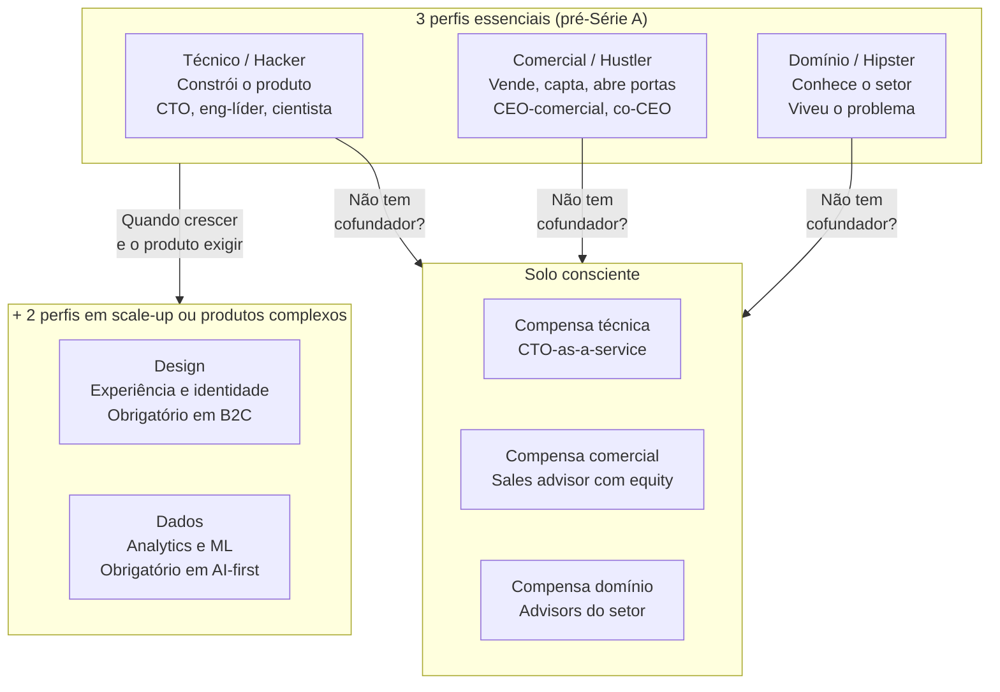

**Dados que contradizem o mito do fundador solo.**

O 10-Year Project da First Round Capital, frequentemente citado pelo programa Antler, mostra que, controlando por setor e estágio, equipes de dois a três cofundadores levantam em média trinta por cento mais investimento na rodada inicial, crescem receita cerca de três vezes mais rápido nos primeiros dezoito meses, têm vinte e cinco por cento mais valuation na rodada seed, e performam aproximadamente cento e sessenta e três por cento melhor em métricas de crescimento agregadas, comparados a fundadores solo.

A literatura tem uma contracorrente importante. O paper "Sole Survivors" (Greenberg e Mollick, Wharton, 2018) analisou cerca de três mil e quinhentas empresas e encontrou que startups de fundador solo sobrevivem mais tempo e atingem maior receita ao longo do tempo. Possivelmente por agilidade decisória e ausência de risco de conflito societário. Os dois resultados não são incompatíveis. O First Round olha trajetória de captação e crescimento. O Wharton olha sobrevivência e receita acumulada. Para o fundador iniciante: time aumenta a probabilidade de captar e crescer rápido. Solo aumenta a probabilidade de durar e operar com lucro. Escolha o critério que importa para a sua tese.

Quem decide ir solo deve fazer isso consciente de que está aceitando handicap em captação e velocidade. Não necessariamente em sucesso final.

**Os três perfis que um time de cofundadores idealmente cobre.**

O founding team ideal combina três especialidades complementares. Se faltar uma, há um buraco que vai doer nos meses seguintes. Se uma pessoa sozinha cobre as três de verdade (raro, mas possível), você pode empreender solo.

O primeiro perfil é o especialista técnico, ou hacker. Constrói o produto. Sabe arquitetar software, hardware, ou o que for o "fazer" do negócio. Em B2B SaaS é o CTO ou eng-líder. Em deeptech é o cientista ou PhD. Em serviços é o especialista em entrega. Sem essa figura, você depende de terceiros caros para construir, e perde controle do core.

O segundo perfil é o especialista comercial, ou hustler. Fecha contratos, levanta capital, abre portas, faz boca-a-boca. Sabe vender. Conforta investidor. Negocia com grandes clientes. Sem essa figura, o produto nasce e morre no porão.

O terceiro perfil é o especialista de domínio, ou hipster. Conhece o setor, os clientes, os fluxos de trabalho, a regulação. Viveu o problema. É o compasso que aponta onde exatamente a dor aperta. Sem essa figura, o time técnico-comercial constrói coisas bonitas para o cliente errado.

**Expansão para cinco elementos em estágios mais maduros.**

Em projetos mais sofisticados, especialmente aqueles com alta carga de experiência do usuário, forte dependência de dados, ou complexidade técnica alta, os três pilares acima se desdobram em cinco elementos de equipe fundadora. A formalização vem do framework Antler para founding teams.

O quarto perfil é o especialista em design. Responsável pela experiência do usuário, interação, posicionamento visual e identidade da marca. Em produtos digitais e consumer, onde cada tela é ponto de contato, ausência de design executivo significa tempo perdido em refatoração depois que o produto já está nas mãos de clientes. Em B2C essa figura é obrigatória. Em B2B emerge em estágio um pouco mais avançado.

O quinto perfil é o especialista em dados. Responsável por infraestrutura de dados, métricas, analytics, e (quando aplicável) modelos de machine learning. Em negócios onde a decisão de produto exige leitura fina de comportamento (mercados de consumo, marketplaces, produtos AI-first), ausência de alguém forte em dados significa operar no escuro. Essa figura frequentemente emerge depois da Série A. Mas em negócios data-heavy deve estar no time fundador.

Como os cinco elementos se relacionam com os três pilares originais. Produto está no cruzamento de Domínio com Design (entende o cliente, prioriza o que construir, define experiência). Domínio do negócio é o pilar Domínio puro (conhece fluxos do setor, regulação, economia unitária do cliente). Design é pilar próprio (experiência de usuário, visual, posicionamento). Engenharia é o pilar Técnico (constrói o produto de forma robusta e escalável). Dados está no cruzamento de Técnico com Estratégico (infraestrutura analítica e decisão baseada em dados).

Quando usar três e quando usar cinco. O padrão de três elementos (Técnico mais Comercial mais Domínio) serve estágios pré-Série A, onde a versatilidade dos fundadores é mais importante que especialização profunda. O padrão de cinco elementos (adicionando Design e Dados) serve estágios de scale-up, ou desde o começo em domínios com alta complexidade de UX (consumer) ou alta dependência de decisão data-driven (AI-first, marketplaces, fintech).

Em estágios iniciais, no entanto, comprimir nas três principais resolve. O risco de over-founding (time fundador de cinco a seis pessoas sem clareza sobre contribuição individual) é frequentemente maior que o risco de under-founding em estágio pré-PMF. Expanda os pilares conforme a operação exige. Não antes.

**Matriz de autoavaliação, use antes de escolher sócios.**

| Capacidade | Você (0-10) | Sócio A (0-10) | Sócio B (0-10) | Cobertura mínima? |
|---|---|---|---|---|
| Construir o produto (técnico) | | | | Alguém ≥ 7 |
| Vender e levantar capital | | | | Alguém ≥ 7 |
| Conhecer profundamente o setor/cliente | | | | Alguém ≥ 7 |

**Regras operacionais para escolha de sócios.**

Busque complementaridade. Evite sobreposição. Dois fundadores técnicos com o mesmo perfil é redundância cara. Três pessoas de vendas sem ninguém que sabe construir é pior ainda.

Diversidade de pensamento é vantagem. Pessoas que pensam de forma diferente geram debate produtivo e decisões mais robustas. Não confunda diversidade com discordância crônica.

Teste química antes do compromisso. Trabalhe em pelo menos um projeto de médio porte (um a três meses) juntos antes de formalizar sociedade. Como a pessoa reage quando dá errado é mais importante do que como reage quando dá certo.

Formalize acordo de sócios desde o dia um. Os detalhes vêm na [[#FASE 13 — ESTRUTURAÇÃO JURÍDICA, FINANCEIRA E OPERACIONAL|Fase 13]]. Mas em espírito: equity percentual, vesting (cliff de um ano e quatro anos de vesting total é padrão), papéis, tomada de decisão em impasses, saída.

Confie, mas documente. Amigos viram desconhecidos quando dinheiro entra. Documentação não é desconfiança. É higiene básica.

**Se você for empreender solo, conscientemente.**

É possível. Mas você precisa substituir o que um cofundador forneceria por mecanismos alternativos. Compense a falta de técnica contratando CTO-as-a-service ou agência de confiança para o MVP. Depois contrate head técnico em tempo cheio antes do PMF. Compense a falta de comercial contratando mentor de vendas ou sales advisor com equity pequeno. Participe de aceleradoras que oferecem conexões de cliente e investidor. Compense a falta de domínio rodeando-se de advisors do setor com reuniões mensais formais. E tenha disciplina extra para não tomar decisões sozinho no vácuo. Busque ativamente quem discorde antes de decisões grandes.

### SAÍDA DESTA FASE

Você concluiu a [[#FASE 0 — PREPARAÇÃO DO EMPREENDEDOR|Fase 0]] quando os oito critérios abaixo estão cumpridos.

1. O Dossiê Pessoal está escrito, com runway pessoal acima do mínimo para o seu modelo de dedicação, data marcada para reavaliação formal, e rede de apoio íntima consultada e respondendo (mesmo com ressalvas).
2. O texto de "por que empreender" existe, tem entre quinhentas e mil e quinhentas palavras, e foi reescrito ao menos duas vezes.
3. Lista de três advisors informais existe, com nomes reais, não cargos genéricos.
4. Conversa explícita com a pessoa afetada mais próxima aconteceu, e está documentada em um parágrafo.
5. Conversa com pelo menos um fundador com exit, e pelo menos um com falha, aconteceu nos últimos trinta dias.
6. "Fit diferencial" está escrito em um parágrafo, com verbos concretos, não adjetivos.
7. "Ponto de parada" está escrito. Quais métricas ou eventos te fariam encerrar.
8. Compromisso de tempo (horas por semana) está documentado, e o impacto disso na vida atual está mapeado.

> [!warning] Critério de saída
> Se qualquer um desses oito itens falha, não avance. Resolva antes.

**Checklist final.**

- [ ] Escrevi em uma página "por que eu quero empreender" e o texto resistiu a três dias de revisão?
- [ ] Tenho reserva pessoal equivalente a seis meses ou mais das minhas despesas mensais?
- [ ] Mapeei pessoas afetadas pela decisão (cônjuge, pais, dependentes) e tenho concordância explícita delas?
- [ ] Identifiquei o meu "fit diferencial" (setor ou problema onde tenho vantagem) em um parágrafo claro?
- [ ] Tenho três ou mais pessoas de confiança identificadas por nome como advisors informais?
- [ ] Meu estado de saúde física e mental está estável para período de alta demanda?
- [ ] Defini o meu patamar mínimo de renda pessoal aceitável pelos próximos dezoito meses?
- [ ] Sei qual seria o meu "ponto de parada", os sinais que me levariam a encerrar a empreitada?
- [ ] Conversei com pelo menos dois fundadores que já empreenderam (idealmente um com exit e um com falha)?
- [ ] Tenho, por escrito, o compromisso de tempo que vou dedicar (horas por semana) e o impacto disso na minha vida atual?

**Primeiros passos práticos.**

1. Abrir documento em branco e escrever "Por que quero empreender" em uma página, sem editar. Coloque de lado e reescreva em três dias.
2. Construir planilha simples de finanças pessoais. Despesas mensais atuais, reserva disponível, patamar mínimo aceitável por dezoito meses.
3. Agendar três conversas na próxima semana. Cônjuge ou família (a pessoa afetada principal) e dois potenciais advisors.
4. Listar por escrito três setores ou problemas onde você tem "fit diferencial", e por quê.
5. Reservar noventa minutos para conversar com um fundador com exit e um com falha. Pode ser por e-mail assíncrono, se presencial não for viável.

### EXEMPLO PRÁTICO

**Diário de preparação, fundadora fictícia "Mariana", ex-gerente de produto em fintech grande.**

*Dia 1, escrita inicial sobre "por que empreender".*

"Quero empreender porque passei sete anos construindo produtos dentro de empresa grande, vi os cantos de compromisso entre velocidade e qualidade, e acredito que consigo fazer diferente com controle total. Mas também quero ser honesta. Parte do desejo é por reconhecimento, sentir que construí algo meu. Preciso separar os dois motivos, porque o primeiro sustenta sete anos difíceis. O segundo esfria em dezoito meses."

*Dia 4, revisão.*

"Relendo, percebi que escrevi 'acredito que consigo fazer diferente' sem especificar o quê. Em que dimensão eu faria diferente? E para quem? Preciso refinar. A tese é que em SaaS B2B para PMEs brasileiras, a combinação de produto simples mais atendimento humano mais integração com sistemas legados é insuficientemente explorada. Isso é específico o bastante para testar."

*Planilha de finanças pessoais (resumo).*

| Item | Valor mensal |
|---|---|
| Despesas fixas (moradia, alimentação, saúde) | R$ 9.500 |
| Despesas variáveis (lazer, imprevistos) | R$ 1.500 |
| Total mensal mínimo | R$ 11.000 |
| Reserva atual | R$ 95.000 |
| Runway pessoal sem renda nova | 8,6 meses |
| Patamar mínimo de renda aceitável (pró-labore) por 18 meses | R$ 7.000/mês |

*Mapa de advisors informais.*

1. Pedro T., ex-CPO de SaaS. Conheci no trabalho anterior, ofereceu ajuda publicamente em LinkedIn. Ângulo: produto.
2. Ana S., founder em exit de R$ 80 milhões. Conheci em evento, conversamos três vezes. Ângulo: operações e pessoas.
3. Roberto L., advogado tributário especializado em startups, tem conta no meu ex-banco. Ângulo: jurídico e tributário.

### Armadilhas

Otimismo financeiro. Superestimar renda futura e subestimar custos. Multiplique os seus custos esperados por 1,5 e divida a sua receita esperada por 2. Esse é um cenário mais realista que o seu plano base.

Decisão romantizada. Tomar a decisão de empreender em momento emocional. Demissão, aniversário, livro motivacional. Decisões estruturais devem ser tomadas frias.

Ignorar sinais da rede. Quando cônjuge ou família expressa preocupação, muitos empreendedores interpretam como falta de visão. Às vezes é. Muitas vezes é informação válida que o seu ego está filtrando.

Subestimar impacto psicológico. Os primeiros dezoito meses de empreender costumam ser emocionalmente mais intensos que qualquer emprego. Se você não tem estratégias de manejo de estresse, crie agora.

Sociedade feita no impulso. Escolher sócio pela amizade ("meu melhor amigo topou") em vez de complementaridade. A dor aparece quando o negócio dá errado, não quando dá certo.

Sociedade sem acordo formal. "A gente se conhece, não precisa de papel." Precisa. Sempre. Documente antes de faturar o primeiro real.

---

### CASO BRASILEIRO, Fase 0, fundadores do Nubank

Em 2013, três fundadores consideraram criar uma fintech no Brasil para competir com cartões tradicionais. David Vélez tinha background em Morgan Stanley e Sequoia Capital. Cristina Junqueira vinha do Itaú e da consultoria. Edward Wible tinha experiência em produto digital e consultoria internacional.

Antes de começar, eles fizeram quatro coisas. Alinharam runway pessoal. Formalizaram sociedade com vesting. Mapearam complementaridade de perfis (capital de risco e estratégia, banking brasileiro e operações, produto e tecnologia). E garantiram rede de relacionamento com investidores internacionais já construída a partir do passado de Vélez na Sequoia.

Quando levantaram o primeiro capital, tinham preparação pessoal, complementaridade clara, e rede. Foi o que permitiu atrair Sequoia logo nas primeiras rodadas, em valuation muito acima do que fundadores sem essa preparação levantariam.

A lição transferível. Runway financeiro, clareza de complementaridade, e rede pré-existente não são luxo. São ativos que reduzem risco de execução desde o dia 1.

### CASO EXPANDIDO — Nubank: do reconhecimento da dor à validação de modelo

**Contexto.** O Brasil tem historicamente alta concentração bancária. Na primeira metade dos anos 2010, cartões de crédito comerciais cobravam anuidades altas, tinham atendimento ruim, aplicativos pobres, e taxas de juros rotativas entre as mais altas do mundo. Reclamações sobre bancos estavam entre as maiores em serviços ao consumidor.

**Cenário de partida ([[#FASE 0 — PREPARAÇÃO DO EMPREENDEDOR|Fase 0]]).** Em 2013, David Vélez era sócio da Sequoia Capital. Cristina Junqueira, ex-Itaú com profundo conhecimento do sistema bancário brasileiro. Edward Wible, engenheiro americano com expertise em produto digital. Os três cofundadores trouxeram complementaridade completa no escritório de América Latina, com background em Morgan Stanley e formação em Stanford. Frustrado com sua experiência pessoal tentando abrir conta em banco brasileiro (relatou publicamente que demorou meses e envolveu pilhas de documentos), identificou o problema não como "atendimento ruim" isolado, mas como sintoma de **ausência de competição real** num mercado estruturalmente concentrado.

**Preparação fundadora.** Vélez cofundou com Cristina Junqueira (ex-Boston Consulting Group, ex-Itaú) e Edward Wible (engenheiro de produto americano). Os três traziam complementaridade clara: finanças institucionais (Vélez), profundo conhecimento do sistema bancário brasileiro (Junqueira), e produto digital (Wible). Vélez já tinha a rede com investidores globais construída na Sequoia. Junqueira compreendia a operação regulatória brasileira. Wible garantia que o produto seria radicalmente diferente do software bancário tradicional. A primeira rodada teve Sequoia Capital como investidora principal, em condições viabilizadas por confiança pré-existente no sócio, não construída do zero.

**Lição da [[#FASE 0 — PREPARAÇÃO DO EMPREENDEDOR|Fase 0]].** FMF de alto nível não nasceu de paixão genérica por fintech. Nasceu de experiência pessoal com o problema (Vélez como cliente frustrado), somada a rede, capital e complementaridade entre cofundadores. Cada um dos três tinha "por que eu" articulável com profundidade.

**Travessia ao PMF ([[#FASE 12 — PRODUCT-MARKET FIT|Fase 12]]).** O Nubank, fundado por David Vélez, Cristina Junqueira (ex-Itaú, profundo conhecimento do sistema bancário) e Edward Wible, lançou em 2014 o cartão de crédito roxo sem anuidade, totalmente controlado por aplicativo, com atendimento por chat (depois estendido a canais adicionais) que se tornou referência de simpatia. O critério de aprovação era conservador, recusas eram frequentes nos primeiros anos. Em vez de "abrir a torneira", mantiveram o critério rigoroso e aceitaram que a demanda reprimida viraria fila de espera. Centenas de milhares de pessoas se inscreveram para receber o cartão.

A fila virou o principal motor de marketing: cada pessoa esperando convidava amigos em troca de priorização, o cartão roxo, por design visual distinto, gerava comentário espontâneo quando aparecia em mesa de restaurante. NPS ficou consistentemente acima de 80 por anos, patamar mais comum em marcas de luxo que em serviços financeiros.

**Indicadores de PMF.** (1) mercado puxava o produto, não o contrário, a fila era sinal de demanda reprimida, (2) referência espontânea era alta, CAC efetivo caia à medida que a base cresceu, (3) retenção era alta, cliente que entrava raramente voltava a banco tradicional, (4) clientes faziam o marketing pelos fundadores via comentários em redes sociais e mídia espontânea.

**Do PMF à escala.** Nos anos seguintes, expandiram linha de produtos (conta digital, produto de investimentos, seguros, crédito pessoal, conta PJ), entraram em outros países latino-americanos (México, Colômbia), e levantaram rodadas com Tencent, TCV, Tiger e Berkshire Hathaway (que investiu em 2021, pouco antes do IPO, na esteira da confiança institucional que Warren Buffett raramente concede a empresas relativamente jovens). Fizeram IPO na NYSE em dezembro de 2021 sob o ticker NU, em valuation que, no dia do IPO, os colocou entre as instituições financeiras mais valiosas da América Latina.

**Lições transferíveis.**
1. **FMF de alto nível é multifatorial**: background técnico + rede + complementaridade + experiência pessoal com o problema. A ausência de qualquer uma dessas dimensões aumenta significativamente o risco.
2. **Disciplina em critério de aprovação** na fase de PMF sinalizou ao mercado que o produto era "para quem conseguisse", gerando desejo. Apertar critério é contraintuitivo quando há demanda, mas construiu reputação de rigor.
3. **NPS sustentado acima de 80** é raro e gera composto: vira marketing orgânico, reduz CAC, aumenta LTV por referência, e filtra contratações (candidatos querem trabalhar em marcas amadas).
4. **Captação em momentos de força.** Cada rodada foi feita quando o negócio tinha milestone claro e narrativa forte, valuation progressivo, cap table preservando diluição de founders abaixo do padrão para rodadas comparáveis.

---

### Se você decidiu por sócio mas não tem candidato, como encontrar cofundador

**Nota sobre viés de cânone.** O ecossistema brasileiro tem fundadoras mulheres cujas trajetórias valem estudo específico, Cristina Junqueira (cofundadora Nubank), Luiza Trajano (liderança histórica Magazine Luiza), Alice Pena (Sanar, Salvador), Manoela Mitchell (Pipo Saúde), Camila Farani (investidora), entre outras. A literatura e o cânone público tendem a subrepresentar essas jornadas, mas elas existem e oferecem perspectivas operacionais valiosas. Fundadora(o) que busca mentoria ou referência deve ativamente procurar rede diversificada, o viés de cobertura não diminui o valor dessas trajetórias, apenas reduz sua visibilidade.

A seção anterior (Escolha de sócios) trata de como avaliar um candidato que já está no seu círculo próximo. Essa é a situação mais comum e também a mais enviesada, você tende a escolher quem está disponível, não quem é o melhor complemento. Para alguns fundadores, nenhum candidato óbvio existe no networking natural. Este trecho trata dessa situação específica.

Encontrar co-fundador é trabalho de meses, não de semanas. Um dos erros mais comuns é tratar essa busca com pressa: "preciso de alguém porque quero começar". Começar com o sócio errado piora a jornada em 10x se comparado a começar sozinho. Melhor solo por 6 meses e encontrar o sócio certo do que em par errado por 3 anos.

**Os quatro caminhos que efetivamente funcionam:**

**1. Ativar a rede ampliada de forma específica.** Em vez de dizer "procuro sócio" (vago, desencorajador), diga: "estou construindo X (problema específico) para Y (cliente específico), estou procurando uma pessoa com perfil Z (skillset complementar). Conhece alguém?". Listas de pedido concreto ativam memória específica nas pessoas, pedido vago produz "vou pensar" que nunca vira indicação. Mande essa mensagem ativamente para 30-50 pessoas da sua rede estendida ao longo de 2-3 semanas.

**2. Programas estruturados de cofundador matching.** Existem plataformas que literalmente fazem o casamento. **Antler** opera no Brasil e é o mais estruturado, programa residencial de 10 semanas com 80-100 fundadores, durante o qual squads se formam. **Y Combinator Co-Founder Matching** é plataforma online aberta globalmente. **On Deck** fez programas similares (ODF). Universidades como MIT, Stanford, INSEAD têm cursos de empreendedorismo que funcionam como matching, no Brasil, BU21, StartSe, cursos de Fundação Dom Cabral. Aceleradoras também: Distrito, Cubo Itaú, ACE são pontos de encontro.

**3. "Primeiro encontro" via micro-projeto antes de compromisso.** Se você identificou candidato promissor mas não tem confiança suficiente ainda, proponha um mini-projeto de 4-8 semanas, pode ser uma pesquisa de mercado juntos, um protótipo em nível de MVP concierge, ou uma campanha experimental. Sem cap table, sem contrato formal, apenas colaboração intensa. Pessoas que não conseguem trabalhar juntas durante 6 semanas de projeto não vão conseguir durante 6 anos de empresa. Este teste precede compromisso e salva anos.

**4. Eventos de imersão onde founders se concentram.** Hackathons (AngelHack, Startup Weekend, eventos corporativos de hackathon), demo days públicos (Cubo, Distrito, aceleradoras), conferências verticais (Web Summit Rio, VTEX Day, Fenabrave), comunidades locais (grupos de LinkedIn, Slack de founders, Discord). Frequentar consistentemente, não uma vez. A seleção natural faz o trabalho, founders sérios vão aos mesmos lugares.

**Armadilhas específicas da busca por co-fundador:**

- **Escolher por desespero de começar.** Sintoma: você relaxa critérios conforme o tempo passa. Antídoto: tenha lista escrita de critérios mínimos (skillset específico, valores inegociáveis, histórico observável) antes de começar a buscar.
- **Assumir que amigo de longa data é bom co-fundador.** Amizade e parceria empresarial testam dimensões diferentes da relação. O risco de perder o amigo E o negócio em conflito societário é real e comum.
- **Cônjuge como co-fundador sem conversa explícita sobre dinâmica.** Pode funcionar espetacularmente (Mariane e Allan Roberts da Roberts Beleza), pode destruir casamento E empresa simultaneamente. Requer blindagem explícita: decisão de separação de papéis, regras para conflitos, eventual saída de um.
- **Ignorar red flags óbvias por química pessoal forte.** Pessoas carismáticas encantam e nos fazem ignorar gaps de caráter, histórico, ou compatibilidade técnica. Se você está convencido em 1 encontro, desconfie da própria convicção, marque mais 3 encontros em contextos diferentes antes de decidir.
- **Não checar referências.** Peça para conversar com 3-5 pessoas que trabalharam com o candidato. Pergunte: "você trabalharia novamente com ele/ela? Em que contexto sim, em que contexto não?". Hesitação na resposta é informação.

**Mini-checklist de qualificação antes de formalizar:**
- [ ] Trabalhamos juntos em projeto com prazo e entrega por pelo menos 4 semanas.
- [ ] Conversamos explicitamente sobre expectativa de dedicação (tempo integral? part-time? quando vira integral?).
- [ ] Temos visão alinhada sobre aspiração final, empresa lifestyle pequena, scaleup, unicórnio.
- [ ] Conversamos sobre caso de saída (se um quiser sair em 2 anos, como fica?).
- [ ] Conversamos sobre divisão de equity, e nenhum dos dois sentiu ressentimento da conversa.
- [ ] Checamos referências externas pelo menos 3 de cada lado.
- [ ] Conhecemos famílias/parceiros um do outro, parceiros(as) sabem e apoiam o compromisso.
- [ ] Temos contrato societário rascunhado antes de operação começar de fato.

A formalização jurídica e a divisão de equity têm tratamento detalhado na [[#FASE 13 — ESTRUTURAÇÃO JURÍDICA, FINANCEIRA E OPERACIONAL|Fase 13]] (Estruturação) e no [[#APÊNDICE AH — CONTRATOS E ASPECTOS LEGAIS OPERACIONAIS|Apêndice AH]] (Contratos e Aspectos Legais). Aqui, a decisão que importa é quem é o sócio certo, a mecânica legal vem depois.

---

### FERRAMENTAS DESTA FASE

Esta fase é sobre preparação do empreendedor como pessoa. As ferramentas aqui ajudam a tomar a decisão fundamental. Empreender ou não. Quando. Em quê. Detalhamento completo de cada ferramenta no [[#APÊNDICE BG — FERRAMENTÁRIO COMPLETO DO EMPREENDEDOR|Apêndice BG]].

Hedgehog Concept (Jim Collins, *Good to Great*, 2001). Framework para encontrar a interseção de três círculos. No que você pode ser o melhor do mundo. O que impulsiona a sua máquina econômica. O que você ama profundamente. Use para escolher o seu foco empreendedor. Fundador sem hedgehog claro tende a dispersar em múltiplas ideias. Ver BG.3.4.

First Principles Thinking (Aristóteles, popularizado por Elon Musk). Decompor supostas verdades do mundo dos negócios em elementos fundamentais e reconstruir a partir do zero, em vez de raciocinar por analogia ("sempre foi feito assim"). Use antes de aceitar "precisa de MBA", "precisa de cofundador técnico", "precisa de capital". Cada uma dessas pode ser verdade ou não, dependendo de primeiros princípios do *seu* caso. Ver BG.4.1.

Second-Order Thinking (Howard Marks). Considerar consequências de segunda e terceira ordem de uma decisão, não só impacto imediato. Use ao decidir sair do emprego. Não basta "tenho dezoito meses de runway pessoal". Considere: se a startup fracassar, qual currículo fica? Que mercado reage à minha saída? Ver BG.4.2.

Inversion (Carl Jacobi, popularizado por Charlie Munger). Em vez de "como ter sucesso como empreendedor?", pergunte "como garantir que vou fracassar como empreendedor?". Gera lista concreta de armadilhas a evitar. Use na preparação mental antes de começar. Ver BG.4.3.

Pre-mortem (Gary Klein). Exercício de imaginar que a sua empresa já fracassou em dois anos, e descrever por quê, antes de começar. Revela premissas frágeis. Use antes de tomar decisão irreversível de empreender. Ver BG.5.3.

Cynefin Framework (Dave Snowden). Framework para identificar o tipo de decisão que você enfrenta. Clear, Complicated, Complex, Chaotic. Empreender é predominantemente Complex. Exige experimentação, não best practice. Use para calibrar expectativa sobre como a jornada vai se desenrolar. Ver BG.4.7.

McKinsey 7-Step Problem Solving. Simplificado nesta fase. Aplique em "devo empreender? Em quê?", tratando como problema estruturável. Ver BG.5.1 para detalhes.

---

### SÍNTESE DA FASE 0

A [[#FASE 0 — PREPARAÇÃO DO EMPREENDEDOR|Fase 0]] inverte o que a maioria dos manuais faz. Antes da ideia, antes do negócio, antes do mercado, vem a pessoa. Empreender não é primariamente um ato técnico. É um ato psicológico, e financeiro, sustentado por meses, ou anos. A maioria das desistências não acontece porque a ideia era ruim. Acontece porque o fundador não aguentou a pressão, ficou sem dinheiro, sem apoio familiar, ou sem saúde mental. E descobriu tarde que queria outra coisa da vida.

A diferença entre quem faz certo, e quem falha, está na honestidade do diagnóstico inicial. Os dez sinais de "não empreender agora" não são fraqueza. São informação. Quem reconhece três ou mais deles, e ajusta antes de começar, sobrevive à trajetória que viria. Quem ignora, e parte achando que "vai dar certo", costuma quebrar não pelo negócio, mas pelos fundamentos pessoais que nunca foram tratados.

O entregável dessa fase é o Dossiê Pessoal do Empreendedor. Não é documento que se arquiva. É referência viva, revisitada a cada seis meses, ou em mudança de vida significativa. Casamento, filho, doença, mudança de cidade. Quando a [[#FASE 0 — PREPARAÇÃO DO EMPREENDEDOR|Fase 0]] está bem-feita, o resto do livro vira execução. Quando está mal-feita, qualquer crise do negócio derruba tudo.

#fase0 #preparacao #autoconhecimento #cofundadores #runway-pessoal #motivacao

---

## FASE 1 — ENCONTRAR A IDEIA

### O que esse apêndice cobre
Esta é a fase de geração metódica de uma ideia-candidata que valha o investimento de tempo das fases seguintes. Não é "ter um insight de ducha". É processo sistemático com múltiplos métodos, filtros de qualidade, e critérios explícitos de escolha. O entregável é uma Lista Curta de Ideias. Três a cinco candidatas filtradas a partir de quinze a trinta geradas, com uma escolhida para levar à [[#FASE 2 — ARTICULAÇÃO E CAPTURA DA IDEIA|Fase 2]]. A [[#FASE 1 — ENCONTRAR A IDEIA|Fase 1]] assume que você já concluiu a [[#FASE 0 — PREPARAÇÃO DO EMPREENDEDOR|Fase 0]] e decidiu que vai empreender, mas ainda não sabe sobre o quê.

A [[#FASE 1 — ENCONTRAR A IDEIA|Fase 1]] é distinta da [[#FASE 8 — IDEAÇÃO E PROTOTIPAGEM DE SOLUÇÕES|Fase 8]], Ideação e Prototipagem de Soluções. A [[#FASE 8 — IDEAÇÃO E PROTOTIPAGEM DE SOLUÇÕES|Fase 8]] trata de gerar soluções técnicas para um problema já validado. A [[#FASE 1 — ENCONTRAR A IDEIA|Fase 1]] trata de gerar a ideia de negócio inicial, antes de qualquer problema estar validado. As duas são ideação, mas em momentos e escalas muito diferentes.

### POR QUE
A qualidade da ideia inicial limita tudo que vem depois. Fundador que escolhe mal na origem passa dois ou três anos validando uma tese que nunca teve chance. Não porque executou mal. Porque a ideia em si era de baixa probabilidade. A pressa em "começar logo" em cima da primeira ideia que apareceu é uma das causas mais subestimadas de fracasso empreendedor. A primeira ideia que vem à cabeça raramente é a melhor. É apenas a mais disponível.

Existe uma diferença importante entre esperar a ideia genial cair (atitude passiva, que pode levar anos) e gerar ideias sistematicamente aplicando métodos e filtros (atitude ativa, que se completa em semanas). Esta fase ensina o segundo caminho.

> [!info] O cálculo de custo-benefício desta fase
> O custo de fazer bem é baixo. Duas a oito semanas de trabalho predominantemente cognitivo, com pouco dinheiro gasto. O custo de pular é potencialmente catastrófico. Anos de vida investidos em uma ideia que não resistia ao primeiro filtro rigoroso, mas que você nunca aplicou antes de começar.

### Quando usar
Comece imediatamente depois da [[#FASE 0 — PREPARAÇÃO DO EMPREENDEDOR|Fase 0]], quando você decidiu que vai empreender mas não tem ideia-candidata, ou tem apenas uma intuição vaga. Termine quando você tem uma ideia-candidata escolhida, descrita em duas a três frases específicas, que passou pelos quatro filtros desta fase. Duração típica de duas a oito semanas. Menos de duas semanas costuma indicar escolha precipitada. Mais de oito costuma indicar paralisia ou perfeccionismo. Qualquer candidata boa o suficiente merece ser levada adiante para validação real. E revisite quando, nas Fases 2 a 6, você concluir que a ideia-candidata não resiste aos testes de problema. Volta à [[#FASE 1 — ENCONTRAR A IDEIA|Fase 1]], escolhe outra da Lista Curta, reentra.

### Quem envolve
Fundador sozinho é o padrão. Geração de ideia é trabalho predominantemente interno. Ninguém conhece as suas experiências, frustrações, expertises e redes melhor que você.

Cofundador potencial, se já existe, participa em paralelo, gerando a própria lista. Depois vocês comparam e discutem. A intersecção das listas costuma revelar padrões interessantes.

Parceiro de debate externo, um mentor, amigo inteligente fora do setor, ex-chefe, serve como caixa de ressonância. Não decide por você. Reage às suas candidatas com perguntas duras.

### Como executar

Sete métodos complementares, não excludentes. Cada fundador tem afinidade maior com um ou dois, mas aplicar os sete força você a explorar terrenos que sozinho você não visitaria. O trabalho ao longo desta fase é gerar candidatas em cada método, consolidar em uma lista única, depois filtrar.

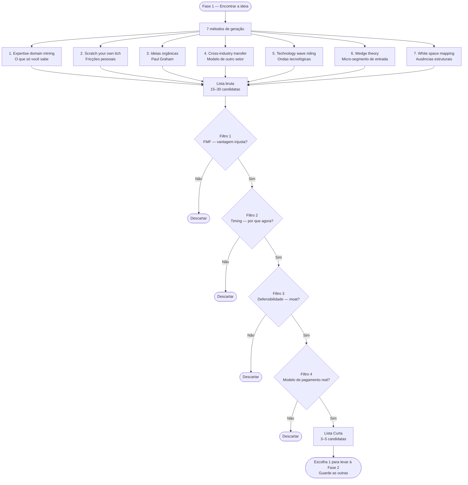

#### 1. Expertise domain mining, começar pelo que você sabe

A primeira fonte de ideias boas é você mesmo. Mais precisamente, o conhecimento que você acumulou ao longo da sua carreira, do seu hobby levado a sério, da família, do bairro, ou de uma dor pessoal repetida. Em alguma área, você sabe mais que noventa e cinco por cento das pessoas. Essa área é o seu primeiro território de busca.

A pergunta-exercício, escrita, em trinta a sessenta minutos: *o que eu aprendi no meu trabalho ou na minha vida que a maioria das pessoas não sabe?* Liste sem filtrar. Detalhes técnicos, pequenas fraudes do setor, ineficiências que todo mundo aceita como normais, fornecedores ruins sem alternativa, processos manuais que poderiam ser automatizados mas ninguém tentou. A cada item, pergunte: *existe alguém que sofre diariamente com isso e pagaria por uma solução?* A maioria dos itens cai no filtro. Os que sobrevivem são candidatas.

Exemplos do próprio ecossistema. David Vélez, Cristina Junqueira e Edward Wible uniram expertises complementares. Vélez vinha de venture capital latino-americano, e os três viveram pessoalmente a experiência frustrante de ser cliente do sistema bancário tradicional no Brasil. Acharam inaceitável a quantidade de fricção para abrir uma conta. O Nubank nasce da intersecção entre expertise em capital de risco e tecnologia, e dor pessoal com banco tradicional. Geraldo Thomaz e Mariano Gomide de Faria trabalharam com software comercial e viram o quanto o e-commerce brasileiro era mal atendido por plataformas existentes. A Vtex surge desse cruzamento entre conhecimento técnico e percepção de mercado abandonado. Marcelo Kalim trabalhou vinte anos em banco de investimento, no BTG, e fez do seu conhecimento profundo da indústria bancária brasileira a base para construir o C6. Não como cópia de Nubank. Como ataque desde dentro ao modelo de banking brasileiro.

A lição. O seu expertise é moat. Ninguém consegue competir com você no que só você viveu.

#### 2. Scratch your own itch, fricções pessoais como matéria-prima

O segundo método é capturar, por um período de duas semanas, toda vez que você diz ou pensa "tinha que existir uma solução pra isso". São as fricções diárias. Serviços ruins que você tolera, processos que detesta repetir, produtos que não existem mas deveriam, informações difíceis de encontrar, decisões sem ferramenta de apoio. Mantenha um caderno ou nota no celular. Sem filtrar. No fim das duas semanas, revise.

Dois filtros críticos separam fricção-matéria-prima de fricção-irrelevante.

O primeiro é frequência e generalização. A fricção acontece com você uma vez por mês ou uma vez por dia? Ela é comum a muitas pessoas, ou só a você no contexto muito específico que você vive? Fricções raras não sustentam negócio. Fricções exclusivas não têm mercado. Fricções frequentes e generalizáveis são ouro.

O segundo é disposição a pagar. Você pagaria para resolvê-la? Quanto? Se a resposta honesta é "não pagaria", cuidado. Ideia construída em cima de fricção que ninguém paga vira hobby. Se você pagaria cinquenta reais por mês, quantas pessoas fariam o mesmo? A matemática aproximada do mercado nasce aqui.

Gabriel Braga e Andre Penha tentaram alugar um apartamento em São Paulo em meados dos anos 2010 e se viram frustrados com o processo. Fiador, três meses de caução, vistoria agressiva, burocracia de cartório. A fricção era frequente (milhões de brasileiros alugam), generalizável (todos sofriam o mesmo processo), com disposição a pagar (as imobiliárias cobravam pesado e as pessoas já pagavam). Dessa fricção pessoal nasceu o Quinto Andar, que não inventou aluguel. Apenas eliminou as fricções mais dolorosas do processo.

#### 3. As ideias orgânicas de Paul Graham

Paul Graham, cofundador do Y Combinator, articulou um conjunto de conceitos sobre geração de ideias que vale estudar em separado. Resumo aqui os três centrais.

**Viva no futuro, depois construa o que está faltando.**

A heurística canônica de Graham é formulada assim. Pessoas na borda de um campo em rápida mudança (programadores usando stack novo, médicos testando terapia emergente, estudantes de área em transformação) vivem, na prática, num futuro que ainda não chegou para a maioria. Elas veem frustrações que ninguém mais vê ainda, porque ninguém mais está nessa fronteira. Se você é uma dessas pessoas, construa o que está faltando. Se não é, chegue a uma fronteira antes de procurar ideias. Seja usuário avançado, especialista de domínio, ou profissional sênior de um setor em transformação.

Isso normalmente leva um a dois anos, não um fim de semana de retiro. A má notícia para quem tem pressa: não há atalho real. A boa notícia: uma vez que você chega à fronteira, boa parte do trabalho de "ter ideia" acontece por conta própria. Você passa a notar o que falta em vez de pensar em abstrato. Graham usa Larry Page como exemplo. Page não inventou search engine. Era genuinamente interessado em search, estava na fronteira do tema, e por isso viu o que todos os outros não viam.

**Ideias orgânicas contra ideias não-orgânicas.**

Graham distingue dois tipos de ideia de startup. As orgânicas resolvem um problema que o fundador mesmo tem. O produto nasce com pelo menos um usuário (o fundador), e provavelmente mais. São mais previsíveis, mais executáveis, mais fáceis de validar. Têm risco menor de "resolver um problema que ninguém tem". Dropbox começou porque Drew Houston esqueceu o pen-drive várias vezes. Microsoft começou porque Bill Gates queria programar o Altair em algo melhor que machine code. Facebook começou porque Mark Zuckerberg queria que Harvard tivesse um diretório digital de estudantes. Apple começou porque Steve Wozniak queria um computador pessoal. Nenhum começou como "vamos criar uma empresa". Todos começaram como "eu tenho esse problema, quem mais tem?".

As não-orgânicas resolvem problemas que outras pessoas têm. Podem ser ótimas. Mas o risco de "resolver um problema que ninguém tem" é muito maior. Exigem mais entrevistas, mais humildade, mais ceticismo sobre a sua intuição, mais pesquisa de campo.

Se a sua ideia-candidata é orgânica, privilegie. Se não é, aceite o handicap e compense com mais pesquisa com clientes reais nas Fases 3 e 4.

**O contraponto, sitcom ideas.**

Um conceito complementar que vale conhecer. O YC chama de *sitcom ideas* (ideias de novela) aquelas que roteiristas de TV inventariam se um personagem fosse empreendedor. Plausíveis de relance, vagas na substância. Exemplos: app social para um nicho específico, um Uber para X, Airbnb de Y, plataforma de conteúdo para grupo Z.

Teste de sanidade para descartar sitcom. Quantas pessoas específicas e nomeáveis você consegue listar que querem isso agora, com urgência, não "um dia quem sabe"? Se não consegue listar cinco a dez pessoas nomeadas no momento, provavelmente é sitcom, não oportunidade. Se consegue listar, e as pessoas nomeadas te dizem espontaneamente "quando você vai fazer isso?", você está perto de algo real.

> [!quote] A pergunta operacional de Paul Graham
> O que você gostaria que alguém construísse para você?

Responda sem filtrar por mercado ou plausibilidade. A resposta honesta, repetida algumas vezes, costuma revelar candidatas que você nunca classificaria como oportunidade quando olhasse externamente. Por serem pequenas demais, técnicas demais, específicas demais. Dropbox pareceu assim antes de existir. Airbnb pareceu pior ainda. "Três caras alugando colchões de ar para quem vinha a uma conferência." Mínimo. Ridículo. Gigante.

Antes de continuar, responda por escrito, em duas frases cada. Essa minha ideia-candidata é orgânica (eu mesmo tenho o problema) ou não-orgânica? Eu estou na borda de algum campo em transformação, ou estou imaginando um futuro que ainda não vivi? Consigo listar cinco a dez pessoas nomeadas que querem a solução agora?

Se as respostas forem fracas (não-orgânica, não está na borda, não consegue listar pessoas), a sua [[#FASE 2 — ARTICULAÇÃO E CAPTURA DA IDEIA|Fase 2]] vai ser muito mais árdua que o normal. Considere pivotar para outra candidata onde as três respostas sejam mais fortes, se tiver na Lista Curta.

#### 3B. O paradoxo da ambição, frighteningly ambitious ideas

Há um ensaio de Graham que vale tratar em separado porque apresenta uma dinâmica contraintuitiva que afeta a escolha de ideia. *Frighteningly Ambitious Startup Ideas*, de 2012. A tese é que as melhores ideias de startup são frequentemente aquelas que intimidam até fundadores capazes. Parecem grandes demais, complexas demais, ambiciosas demais. E por isso, paradoxalmente, têm menos competição do que deveriam.

A lógica é psicológica antes de ser econômica. Ideias pequenas atraem dezenas de fundadores, porque parecem fazíveis, porque cabem numa apresentação, porque o pitch é fácil. Ideias assustadoramente ambiciosas afugentam a maioria dos fundadores por simples auto-filtro: "isso é grande demais para mim". Resultado: a competição por ideias grandes é sistematicamente menor que a competição por ideias pequenas, mesmo sendo as grandes mais valiosas em expectativa.

Os exemplos canônicos que Graham cita em 2012: a nova busca que substituiria o Google, o novo sistema operacional que substituiria o Windows, o novo Hollywood, a nova universidade. Em 2026, os análogos óbvios incluem o novo sistema bancário pós-incumbentes, a nova educação pós-escola tradicional, a nova medicina personalizada via IA, a nova infraestrutura de identidade digital. Cada um desses espaços intimida a ponto de ter poucos fundadores sérios trabalhando, justamente porque intimidam.

Três consequências práticas para você na [[#FASE 1 — ENCONTRAR A IDEIA|Fase 1]].

A primeira. Quando estiver listando candidatas, não descarte uma ideia só porque ela parece grande demais. Pergunte: se eu conseguisse fazer isso, mesmo que em quinze anos, não em três, ela seria valiosa? Se sim, ela merece pelo menos um lugar na Lista Curta.

A segunda. A cunha inicial pode ser pequena, mas a visão-teto não precisa ser. Stripe começou como API de pagamento para desenvolvedores (cunha pequena), mas tinha visão-teto de infraestrutura financeira global. Nubank começou como cartão de crédito digital (cunha), mas tinha visão-teto de banco completo para 100 milhões de brasileiros. Separar cunha da visão-teto permite ambição sem paralisia.

A terceira. Uma ideia ambiciosa precisa de recorte específico de entrada para ser atacável. Se você consegue articular a cunha pequena que te leva à visão grande, você tem oportunidade. Se só tem a visão grande sem cunha, você tem sonho. O trabalho da [[#FASE 1 — ENCONTRAR A IDEIA|Fase 1]] é achar a cunha dentro da ambição.

Não confunda isso com justificativa para ideias vagas e vaidosas. "Vou mudar o mundo" sem problema específico não é ambição. É fantasia. Ambição operacional é problema grande mais cunha específica mais plano de primeiro ano concreto.

#### 4. Cross-industry transfer, transferência lateral de modelos

O que funcionou em uma indústria pode funcionar em outra. Essa é a fonte de boa parte das startups de sucesso. Não invenção do zero, mas adaptação inteligente de um modelo comprovado para um contexto novo. O iFood é essencialmente transferência do modelo de delivery europeu (Just Eat, Deliveroo) para o Brasil. De forma análoga, a Enjoei (fundada por Ana Luiza McLaren e Tiê Lima em SP) trouxe para cá a dinâmica de marketplace peer-to-peer de moda com identidade visual brasileira. Com adaptações: motoqueiro como categoria operacional brasileira, integração com restaurantes informais, pagamento local. O Mercado Livre é o modelo eBay adaptado para o comércio latino-americano de pessoas físicas. O 99 (antes de ser adquirido pela Didi) é o modelo Uber aplicado a motoristas de táxi brasileiros primeiro, depois motoristas de aplicativo.

A técnica funciona em duas direções.

A direção horizontal pega modelo validado no mesmo país, em outra indústria. Se assinatura mensal funciona em softwares (SaaS), funcionaria em produtos físicos? Sim. Dollar Shave Club, Gousto, Leiturinha. No Brasil, assinatura de produtos da horta (Raízs), de cervejas artesanais (Clube do Malte), de produtos sustentáveis (Livres).

A direção vertical pega o mesmo modelo em país diferente. Se classifieds online funcionaram nos EUA (Craigslist), funcionariam no Brasil? Sim. OLX, trazida da Argentina, replicada aqui. Se rent-a-car baseado em app funciona nos EUA (Turo), funciona para app-based workers brasileiros que não têm carro? Sim. Kovi, com adaptação para o ICP específico de motoristas de Uber e 99 que alugam por semana.

Cuidado importante. O erro clássico desse método é o "Uber for X" genérico. Nem todo serviço de alta frequência se beneficia de modelo sob demanda. Nem toda fricção local exige app. Nem todo modelo americano se adapta sem entender contexto (regulação, poder de compra, comportamento). Cross-industry transfer inteligente exige entendimento profundo do *porquê* o modelo original funcionou, não apenas da mecânica. Uber funcionou porque combinou smartphone com GPS com pagamento cashless com motoristas sem hierarquia de táxi. Remover qualquer um desses pilares quebra o modelo. E "Uber for dogwalking" (sem os pilares principais) é por isso que dezenas morreram.

#### 5. Technology wave riding, ondas tecnológicas como catalisador

Toda grande onda tecnológica abre categorias inteiras de startups que antes não existiam. Mobile (2008-2012) abriu Airbnb, Uber, Instagram, Whatsapp. Cloud computing (2010-2015) abriu praticamente todo o SaaS moderno. Slack, Zoom, Notion, Figma. Marketplaces de serviços (2013-2018) abriram 99, iFood, Rappi. O momento que você está lendo isto é o meio da onda de IA generativa (2022-2028 em estimativa conservadora). Essa onda vai abrir centenas de categorias que ainda não existem.

A pergunta útil nesse método: *qual vertical é muito sensível à capacidade que a tecnologia nova oferece, mas ainda não foi adequadamente endereçado?* Jurídico? Saúde mental? Cobrança? Compliance tributário brasileiro? Educação personalizada? Cada vertical que tem dados, decisões repetitivas, texto, ou julgamento expert é candidata a transformação por IA. A maioria dessas verticais ainda não tem empresas sérias explorando-as no contexto brasileiro específico.

A armadilha desse método é FOMO tecnológico. Decidir fazer "algo com IA" sem problema claro, sem cliente claro, sem diferencial claro, apenas porque IA está quente. Isso produz projetos genéricos que morrem rapidamente. A tecnologia é meio, não fim. Use a onda como lente para descobrir onde a combinação tecnologia nova mais vertical mal atendida mais contexto brasileiro específico cria oportunidade. Ignore a tentação de "startup de IA" genérica.

#### 6. Wedge theory, começar pelo micro-segmento

Mesmo quando você tem intuição grande ("quero reinventar educação no Brasil"), o começo real é pequeno. A wedge, ou cunha, é o ponto específico pelo qual você entra no mercado. Não "estudantes brasileiros" (genérico, impossível de atender), mas "estudantes de engenharia do último ano de universidades federais que vão prestar concurso para Petrobras" (específico, endereçável, com dor identificável).

A pergunta-guia: *quem está com mais dor agora nesse problema?* A resposta é sempre um grupo específico com nome e contexto, nunca "todo mundo". Encontrar a wedge é trabalho de redução. Partindo da visão grande, filtrar por quem tem dor mais aguda, quem tem mais poder de compra, quem é mais fácil de encontrar, quem tem maior probabilidade de virar cliente entusiasmado, e não apenas tolerante.

A wedge dá três vantagens concretas. Primeira, você sabe exatamente quem entrevistar nas Fases 3 e 4. Segunda, você pode prototipar solução específica em vez de plataforma genérica. Terceira, você pode se tornar o fornecedor dominante desse micro-segmento antes de expandir. A história de dezenas de unicórnios é essa. Wedge, dominância da wedge, expansão adjacente, categoria.

Wellhub (anteriormente Gympass) começou como produto para funcionários de grandes empresas (a wedge), não como academia para todos. Anos depois, com a wedge dominada, expandiu para outros segmentos. Stone começou com pequenos comerciantes negligenciados pelas maquininhas dos grandes bancos (a wedge), não como todos os lojistas do Brasil.

#### 7. White space mapping, mercados com ausência estrutural

O último método é analítico. Mapear um setor competitivamente e procurar ausências. Monte uma matriz. Os eixos podem ser segmento de cliente por modelo de cobrança, ou canal por tamanho da empresa, ou qualquer dimensão relevante. Plote competidores conhecidos nos quadrantes. Observe os quadrantes vazios. Esses são os white spaces.

A pergunta crítica, que separa white space verdadeiro de ilusão: *se o quadrante está vazio e o modelo é óbvio, por que ninguém ocupou ainda?* Três respostas possíveis, em ordem de frequência.

A primeira é que tentaram e falharam. Alguém já ocupou o quadrante, consumiu capital, não conseguiu unit economics, quebrou. Este é o caso mais comum e o mais instrutivo. Antes de entrar, você precisa entender por que falharam. Se você sabe por que, e sabe o que faria diferente, e o contexto mudou (tecnologia, regulação, comportamento), pode ser oportunidade real. Se não sabe, você vai repetir o erro.

A segunda é que o mercado não existe. O quadrante parece vazio porque ninguém quer o produto daquela maneira. Muitas ideias "white space óbvio" são, na verdade, white space porque não tem cliente. A única forma de saber é fazer a descoberta de problema da [[#FASE 3 — DESCOBERTA DO PROBLEMA|Fase 3]]. Não assumir.

A terceira é que ninguém pensou ainda. Raro. Mercados não-óbvios existem, mas verdadeiro "ninguém pensou" em setor grande é evento raro. Quando acontece, geralmente é porque houve mudança recente (tecnológica, regulatória, demográfica) que abriu um espaço que antes não existia. Esse é o caso bom.

A honestidade sobre qual das três respostas se aplica ao seu white space é o que separa oportunidade real de fantasia de oportunidade.

### Os quatro filtros, depois de gerar, escolher

Depois de aplicar os sete métodos, você deve ter uma lista bruta de quinze a trinta candidatas. A maior parte é ruído e vai ser descartada. Aplique quatro filtros de qualidade, na ordem, eliminando candidatas que não passam em cada um.

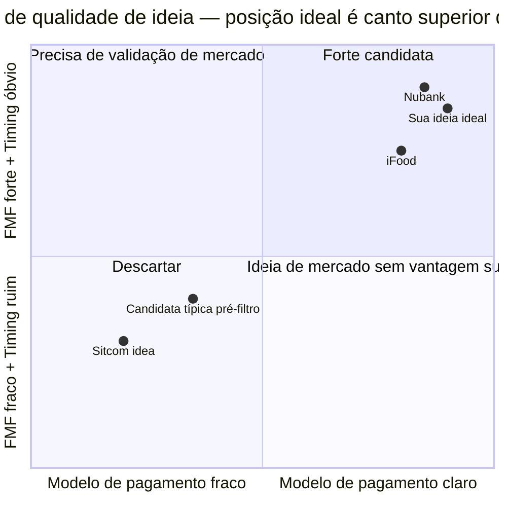

O primeiro filtro é founder-market fit. Para cada candidata, responda em uma frase: *por que eu, especificamente, tenho vantagem injusta nesse problema?* Se a resposta honesta é "ninguém me dá vantagem sobre qualquer outro fundador", provavelmente não é a sua ideia. Vantagem injusta pode vir de expertise técnica, rede específica, experiência pessoal, acesso a clientes, acesso a capital, credibilidade no setor, ou alguma combinação. Sem vantagem injusta, você vai competir no mesmo nível de cem outros, e vai perder para um deles.

O segundo filtro é timing. *O que mudou recentemente que torna esta ideia possível agora, e que daqui a cinco anos vai fazer ela parecer óbvia?* Mudança pode ser tecnológica (IA acessível, infraestrutura cloud barata), regulatória (LGPD, reforma tributária, Open Finance), comportamental (adoção de smartphone em classe C, aceitação de remote work), ou econômica (juros alto que favorece ativos X, câmbio que favorece Y). Se você não consegue responder "por que agora", a ideia chegou tarde demais ou cedo demais. Os dois erros custam caro.

O terceiro filtro é defensibilidade. *Se esta ideia funcionar, o que impede um incumbente grande, Nubank, iFood, Mercado Livre, Magazine Luiza, Natura, Google, de copiar em dezoito meses e te esmagar com distribuição superior?* Os moats possíveis são network effects (quanto mais usuários, mais valor, como em marketplaces), switching costs (trocar dói, como em software corporativo), economias de escala (você fica mais barato conforme cresce), propriedade intelectual (patente, tecnologia diferenciada), marca (confiança acumulada), efeitos de dados (o seu algoritmo melhora com uso), e acesso exclusivo (contratos, licenças). Ideia sem resposta honesta aqui é ideia de subsídio de capital. Você precisa de muito dinheiro para sobreviver até eventualmente criar moat. E muitas não chegam lá.

O quarto filtro é modelo de pagamento real. *Quem paga, quanto, e por que volta a pagar?* Não o modelo possível no futuro. O modelo que você consegue articular hoje em três frases. Ideias B2C com modelo de receita vago ("fica grátis e monetiza depois com publicidade") são dos piores ofensores. Morrem a maioria. Ideias B2B geralmente têm modelo mais claro. Empresa paga assinatura porque produto economiza custo ou gera receita mensurável. Escreva o modelo por extenso. Se você não consegue, não é porque é complicado. É porque você não pensou ainda.

No fim dos quatro filtros, idealmente você tem três a cinco ideias-candidatas finais. Escolha uma. A que melhor combina founder-market fit forte mais timing óbvio mais moat plausível mais modelo claro, para levar à [[#FASE 2 — ARTICULAÇÃO E CAPTURA DA IDEIA|Fase 2]]. Guarde as outras na Lista Curta. Se a primeira cair nas fases seguintes, você tem para onde voltar.

### Semana das Ideias, exercício prático de cinco dias

Para quem quer método concreto, esta é uma sequência de cinco dias úteis que aplica os métodos acima em dose intensiva. Cada dia tem um foco específico. Não precisa ser feito em cinco dias consecutivos. Pode ser cinco sábados. Mas espaçamento maior do que isso faz você perder o fio.

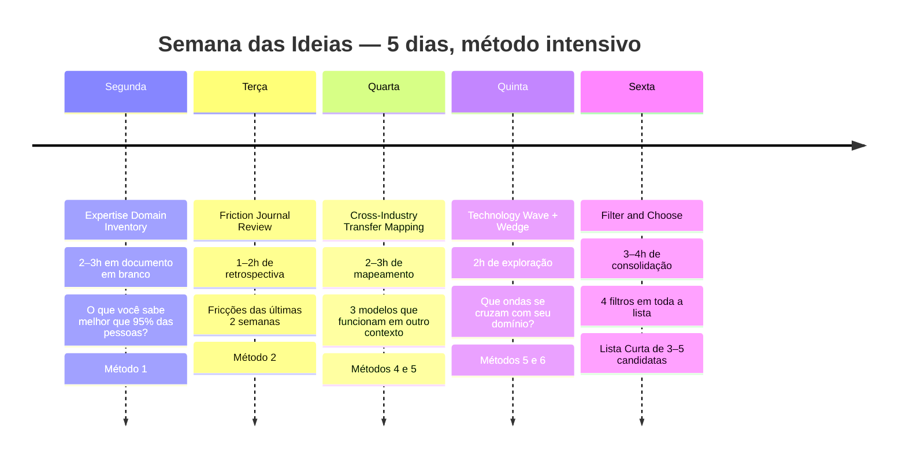

Segunda, Expertise Domain Inventory, duas a três horas. Em documento em branco, responda por escrito. *O que eu sei melhor que noventa e cinco por cento das pessoas? Quais são os cinco setores ou temas onde eu tenho experiência prática? Quais ineficiências aceitas nesses setores eu considero absurdas? Quais ferramentas eu uso no trabalho diário que são ruins, mas ninguém substitui?* Não filtre. No fim, sublinhe os cinco a dez itens mais promissores. Método 1.

Terça, Friction Journal Review, uma a duas horas. Nas duas semanas anteriores, idealmente, você manteve nota de fricções diárias. Se não manteve, faça uma retrospectiva das últimas duas semanas. Que coisas te irritaram? Que processos demoraram mais do que deveriam? Que decisões você teve dificuldade de tomar por falta de informação? Liste. Para cada fricção, pergunte: é frequente, é generalizável, pagaria para resolver? Método 2.

Quarta, Cross-Industry Transfer Mapping, duas a três horas. Escolha três modelos de negócio que funcionam em outros países ou outros setores, e imagine adaptações brasileiras. Modelos para rodar o exercício: assinatura de produtos físicos, marketplace de serviços B2B, data-as-a-service em nichos verticais, SaaS especializado em profissão regulamentada brasileira. Para cada, imagine três variações de aplicação. Métodos 4 e 5 combinados.

Quinta, Calibration Conversations, três a quatro conversas de trinta minutos. Marque conversas rápidas com três a quatro pessoas que trabalham em setores que você não conhece. Pergunte, simplesmente: *qual é a coisa mais ineficiente que você faz no trabalho hoje?* Não proponha soluções. Ouça. Anote padrões. Isso alimenta novas candidatas e dá sinal sobre frequência de dores em setores diferentes.

Sexta, Filter & Choose, três a quatro horas. Consolide toda a lista gerada (deve ter vinte a quarenta itens). Aplique os quatro filtros acima, em ordem. Descarte agressivamente. No fim do dia, você tem três a cinco candidatas. Escolha uma para levar à [[#FASE 2 — ARTICULAÇÃO E CAPTURA DA IDEIA|Fase 2]]. Escreva essa ideia escolhida em duas frases específicas: *o problema é X para o cliente Y, a solução hipotética é Z*.

Se a semana produziu candidatas mas você não tem clareza sobre qual escolher, marque uma segunda conversa com o seu parceiro de debate. Leve as três finalistas. Discuta por sessenta minutos. A discussão em voz alta com alguém inteligente quase sempre revela qual é a mais promissora.

### Armadilhas específicas desta fase

Primeira-ideia-por-cansaço. Você passa três ou quatro semanas na [[#FASE 1 — ENCONTRAR A IDEIA|Fase 1]] sem clareza e decide "vai ser essa mesmo" por fadiga decisória. A pressa de começar tem custo gigante. Uma ideia mediocremente escolhida vai te consumir anos. Se a [[#FASE 1 — ENCONTRAR A IDEIA|Fase 1]] passa das oito semanas sem resolução, o problema provavelmente é paralisia, não falta de boa candidata. Leve as três finalistas para um mentor e force decisão. Mas não escolha por cansaço.

FOMO de setor quente. "IA tá explodindo, vou fazer algo de IA." "Crypto está voltando, vou fazer algo de crypto." Setor quente não é ideia. É contexto. Se você não consegue articular qual problema específico você resolve dentro do setor, qual cliente específico paga, e por que você é a pessoa certa, a adesão ao setor é apenas marketing pessoal, não tese.

Ideia-gigante-de-plataforma. "Vou criar o novo Mercado Livre, o novo Nubank, a plataforma que resolve tudo em X." Ideias que começam como plataforma raramente pegam. Quase sempre começam como produto estreito que depois vira plataforma. Wedge theory existe por um motivo. Plataformas são destino, não ponto de partida.

"Uber for X" genérico. Veja a discussão no método 4. O modelo Uber funciona por razões específicas. Aplicar a mecânica sem entender o porquê produz startup fraca.

Educar o mercado do zero. "Minha ideia é disruptiva, vou ensinar o cliente a querer isso." Possível em tese. Raro na prática. Educar mercado é caríssimo. Você queima capital enquanto os primeiros poucos clientes entendem. A maioria das startups morre antes. Ideias que pegam grande onda comportamental já em curso, e não criam a onda do zero, têm probabilidade muito maior.

Hobby pessoal confundido com demanda de mercado. Você ama café especial, quer abrir a melhor torrefação do Brasil. Mas quantas pessoas, especificamente, pagariam R$ 80 no quilo? Hobby vira negócio com dificuldade. E só quando a paixão encontra um segmento com disposição a pagar. Não assuma que porque você ama, outros vão amar a ponto de pagar premium.

Cópia dos EUA sem entender contexto brasileiro. "Esse modelo explodiu nos EUA, vai explodir aqui." A adaptação brasileira exige entender poder de compra de classe C diferente do consumidor americano médio, regulação (ANVISA, ANATEL, CVM, BCB) que pode travar modelos inteiros, comportamento cultural (baixa disposição a comprar pets online, alta informalidade em pagamentos), e infraestrutura (logística, bancarização, cobertura celular). Modelo pode precisar ser completamente reengenheirado para funcionar aqui.

Achismo sem customer conversation. Você passa quatro semanas dentro da sua cabeça sem falar com ninguém do setor da ideia. Customer conversation não é [[#FASE 1 — ENCONTRAR A IDEIA|Fase 1]]. É [[#FASE 3 — DESCOBERTA DO PROBLEMA|Fase 3]]. Mas algumas conversas breves e direcionadas na [[#FASE 1 — ENCONTRAR A IDEIA|Fase 1]], especialmente no dia quinta do exercício acima, filtram muito. Não vire prisioneiro da própria cabeça.

Múltiplas ideias simultâneas. "Estou pensando em três ideias ao mesmo tempo." Na [[#FASE 1 — ENCONTRAR A IDEIA|Fase 1]] isso é ótimo. Quanto mais candidatas, melhor. A partir da [[#FASE 2 — ARTICULAÇÃO E CAPTURA DA IDEIA|Fase 2]], é desastroso. Leve uma. As outras esperam.

### Como fundadores brasileiros encontraram suas ideias

Observando casos brasileiros, alguns padrões se repetem. Não são receitas. São evidências de que os métodos acima aparecem no histórico real de fundadores bem-sucedidos.

Expertise domain mining puro. Geraldo Thomaz e Mariano Gomide de Faria, da Vtex, eram engenheiros e desenvolvedores que viram o e-commerce brasileiro mal atendido por plataformas existentes. Marcelo Kalim, do C6, trabalhou mais de vinte anos no BTG e conhecia banking brasileiro por dentro. Guilherme Benchimol, da XP, começou como agente autônomo de investimentos, viu de dentro a ineficiência da distribuição de produtos via grandes bancos, e construiu uma plataforma alternativa em Porto Alegre em 2001. Em todos os três, a ideia nasceu da profundidade de conhecimento prévio, não de insight externo.

Scratch your own itch amplificado. Gabriel Braga, do Quinto Andar, sofreu tentando alugar um apartamento em São Paulo. Alessandra Bezerra, da Livup, queria comida saudável entregue em casa e não encontrava oferta boa. Marcus Rosa Gomes, da Buser, viajava de ônibus interestadual no Brasil e via a fricção de cobrança fragmentada. Saiu daí o modelo de fretado coletivo. A dor pessoal genuína, transformada em hipótese de mercado mais ampla.

Cross-industry transfer inteligente. Os cofundadores do iFood (Patrick Sigrist, Felipe Fioravante, Eduardo Baer, Guilherme Bonifácio, Daniel Oliveira) observaram o modelo de delivery europeu e adaptaram para o contexto brasileiro, inclusive inventando categorias operacionais como motoqueiro-freelancer em escala. Luiza Trajano transferiu aprendizados de varejo físico familiar (Franca-SP) para plataforma digital. A Magazine Luiza era uma rede varejista tradicional que se tornou uma das maiores plataformas de e-commerce do país sob a sua liderança, combinando loja física e digital antes do omnichannel virar conceito. David Vélez, no Nubank com Cristina Junqueira e Edward Wible, viu modelos de neobanks internacionais (Simple nos EUA, N26 na Europa) e aplicou ao contexto brasileiro de bancário caro e insatisfatório. Em todos, não foi invenção. Foi adaptação bem-feita com entendimento profundo do contexto local.

Wedge theory disciplinada. Cesar Carvalho, do Wellhub, anteriormente Gympass, começou vendendo para funcionários de empresas grandes, não para "academia em geral". André Street e Eduardo Pontes, da Stone, começaram com lojistas pequenos negligenciados pelos bancos, não com "todo mercado de maquininhas". A wedge específica deu tração antes da expansão.

Technology wave riding cedo. Laércio Cosentino fundou a TOTVS (originalmente Microsiga, em 1983, com Ernesto Haberkorn) liderando a onda de software de gestão para empresas brasileiras. Thomaz Srougi fundou o Dr. Consulta com Guilherme Azevedo em 2011, aproveitando a onda de saúde privada acessível em classe C. Romero Rodrigues e cofundadores fundaram o Buscapé em 1998-1999 com Rodrigo Borges, Ronaldo Takahashi e Mario Letelier, primeira startup de comparação de preços online no Brasil. Quem entra cedo em onda real grande tem vantagem quase impossível de alcançar depois.

Nenhum desses fundadores respondeu à pergunta *"qual é a minha ideia?"* em cinco minutos. Todos levaram semanas ou meses de preparação silenciosa antes de comprometer. A [[#FASE 1 — ENCONTRAR A IDEIA|Fase 1]] existe para dar a você o mesmo tempo que eles tiveram, agora com método.

### Entregável desta fase

A Lista Curta de Ideias é um documento de duas a quatro páginas com quatro partes.

A primeira parte é o processo seguido, em uma página. Quais métodos você aplicou, quantas candidatas gerou ao todo, quantas sobreviveram a cada filtro.

A segunda é a lista final, em uma a duas páginas. Três a cinco candidatas, cada uma descrita em três a cinco frases, com respostas breves aos quatro filtros. Por que eu, por que agora, moat, modelo de pagamento.

A terceira é a escolha com justificativa, em um parágrafo. Qual candidata você vai levar à [[#FASE 2 — ARTICULAÇÃO E CAPTURA DA IDEIA|Fase 2]], e por quê.

A quarta é o plano B e C, em meia página. Quais das outras finalistas você levaria em segundo e terceiro lugar, caso a primeira caia em fase subsequente.

Esse documento deve ficar arquivado. Mesmo depois de iniciar a [[#FASE 2 — ARTICULAÇÃO E CAPTURA DA IDEIA|Fase 2]], se em algum momento a ideia escolhida cair, você volta aqui. Não precisa refazer a [[#FASE 1 — ENCONTRAR A IDEIA|Fase 1]] inteira. E em dois ou três anos, quando a sua primeira empresa estiver em algum estágio e você estiver pensando em segunda curva ou próxima empresa, vai reler este documento com ganho significativo de perspectiva.

### Checklist GO/NO-GO

Antes de avançar para a [[#FASE 2 — ARTICULAÇÃO E CAPTURA DA IDEIA|Fase 2]], confirme:

- [ ] Apliquei pelo menos quatro dos sete métodos de geração.
- [ ] Gerei entre quinze e trinta candidatas brutas. Não três ou cinco. Se foram poucas, faltou método.
- [ ] Apliquei os quatro filtros em ordem, com resposta honesta a cada um.
- [ ] Tenho três a cinco candidatas finais escritas em três a cinco frases cada.
- [ ] Escolhi uma para levar à [[#FASE 2 — ARTICULAÇÃO E CAPTURA DA IDEIA|Fase 2]], com justificativa escrita.
- [ ] Tenho candidatas B e C como fallback documentadas.
- [ ] Conversei com pelo menos três pessoas fora da minha bolha sobre pelo menos uma das finalistas. Não para validar a solução. Para testar se o problema faz sentido.
- [ ] A ideia escolhida tem resposta clara e honesta para *por que eu, por que agora, onde está o moat, quem paga quanto por quê*.
- [ ] Não escolhi por cansaço ou FOMO. Escolhi por convicção relativa às outras candidatas.

> [!warning] Critério de saída
> Se faltou algo, volte. O custo de refazer um método na Fase 1 é pequeno. O custo de avançar com ideia mal escolhida é gigante.

### Métricas de qualidade desta fase

Número de candidatas geradas. Menos de quinze indica pouco esforço de geração. Mais de quarenta indica falta de filtro ou indisciplina. Qualquer extremo costuma reduzir a qualidade da escolha final.

Diversidade de métodos usados. Aplicar apenas um ou dois métodos costuma produzir candidatas enviesadas para o tipo de pensamento do fundador. Quatro a sete métodos aumenta a diversidade de fontes.

Tempo gasto. Entre duas e oito semanas é a janela típica. Muito menos que isso indica decisão precipitada. Muito mais indica paralisia.

Clareza da escolha final. Você consegue escrever em duas frases, sem hesitação, quem é o cliente e qual é o problema? Se não consegue, ainda não tem ideia. Tem intuição.

---

### SÍNTESE DA FASE 1

A [[#FASE 1 — ENCONTRAR A IDEIA|Fase 1]] confronta um mito caro do imaginário empreendedor. O da ideia genial que cai como insight de ducha. A primeira ideia que vem à cabeça não é a melhor. É apenas a mais disponível. E a pressa em começar logo, em cima da primeira ideia que apareceu, é uma das causas mais subestimadas de fracasso. O fundador passa dois ou três anos validando uma tese que nunca teve chance, não porque executou mal, mas porque a ideia em si era de baixa probabilidade.

A diferença entre quem faz certo, e quem falha, está na atitude. Esperar a ideia genial cair é atitude passiva, que pode levar anos. Gerar ideias sistematicamente, com múltiplos métodos, e filtrar com critérios explícitos, é atitude ativa, que se completa em duas a oito semanas. Quem aplica os quatro filtros de qualidade nessa fase descarta candidatas que pareciam óbvias, e fica com candidatas que sobreviveram a teste sério. Esse trabalho cognitivo barato evita anos perdidos.

O entregável dessa fase é a Lista Curta. Três a cinco candidatas filtradas, com uma escolhida para a [[#FASE 2 — ARTICULAÇÃO E CAPTURA DA IDEIA|Fase 2]]. A escolha não é definitiva. Se nas Fases 2 a 6, a candidata escolhida não resistir aos testes, você volta à Lista Curta, escolhe outra, e reentra. Por isso a Lista Curta é guardada. Empreender com método é manter as opções vivas, não apostar tudo no primeiro palpite.

#fase1 #ideias #geracao-ideias #problema #oportunidade #filtros

---

## FASE 2 — ARTICULAÇÃO E CAPTURA DA IDEIA

### O que esse apêndice cobre
Tirar a ideia da cabeça e colocá-la em formato escrito, estruturado, comunicável. O entregável é um documento chamado Declaração Inicial da Ideia. Uma página única que articula cinco coisas. O problema percebido. Quem sofre esse problema. A solução imaginada. Por que você acha que funciona. E tudo o que você não sabe sobre a ideia. A lista de incertezas.

> [!note] Esta fase não é para validar
> Esta fase não é para validar a ideia. É apenas para capturá-la com precisão. Muitos empreendedores "têm uma ideia" há meses, mas nunca a escreveram. Quando tentam escrever, descobrem que havia três ideias misturadas, ou que não sabem explicar o problema, ou que a ideia era só um sentimento vago.

### POR QUE
Tudo o que você não escreve não existe operacionalmente. A articulação força clareza. Clareza revela lacunas. Lacunas são o material de trabalho das próximas fases. Sem esta fase, você entra no processo de validação sem saber exatamente o que está validando, e acaba validando uma versão confusa e movediça da ideia. Pior do que não validar.

E ao listar explicitamente o que você não sabe, você cria a agenda de trabalho das Fases 2 a 6. As suas incertezas de hoje são as suas hipóteses de amanhã.

### Quando usar
Comece assim que a [[#FASE 1 — ENCONTRAR A IDEIA|Fase 1]] estiver concluída. Termine quando a Declaração couber em uma página, e você conseguir explicá-la verbalmente para um estranho em noventa segundos, e esse estranho conseguir repeti-la de volta com precisão. Revisite ao final de cada fase seguinte, para atualizar com o que foi aprendido.

### Quem envolve
O executor principal é você. Os participantes são três a cinco pessoas que vão ler e dar feedback sobre a clareza da articulação, não sobre se a ideia é boa. Escolha gente que não é do seu setor. Para te forçar a explicar sem jargão. O decisor é você.

### Como executar

Sete passos em sequência.

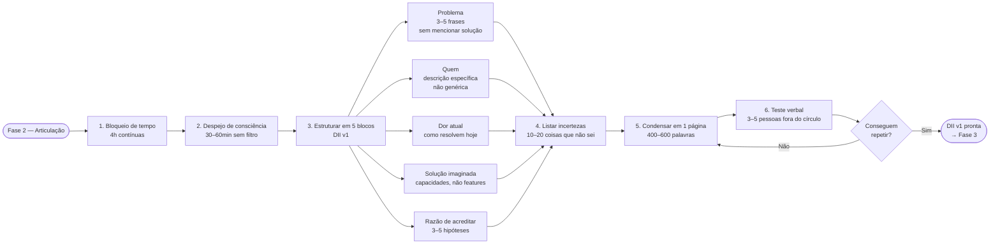

O primeiro é bloqueio de tempo. Quatro horas contínuas, ou duas sessões de duas horas (que é melhor que quatro de uma). Tire notificações. Sem celular. Caderno em branco ou documento novo.

O segundo é despejo de consciência. Escreva tudo o que você acha que sabe sobre a ideia, sem estrutura. Problema, cliente, solução, mercado, concorrentes, por que você acha que é diferente. Trinta a sessenta minutos. Não edite. Só escreva.

O terceiro é a segunda passagem, estruturando em cinco blocos.

Bloco 1, Problema. Qual problema específico existe no mundo? Descreva em três a cinco frases, sem mencionar a sua solução. Se você não consegue descrever o problema sem falar da solução, você tem uma solução em busca de problema. Perigoso.

Bloco 2, Quem. Quem tem esse problema? Seja específico. "Pequenas empresas" não é resposta. "Donos de restaurantes com uma a três unidades em capitais brasileiras que fazem delivery próprio" é resposta. Se a sua descrição cabe em cinco palavras genéricas, você ainda não pensou o suficiente.

Bloco 3, Dor atual. Como essa pessoa resolve o problema hoje? Toda pessoa com problema real tem alguma solução hoje, mesmo que ruim. Planilhas, WhatsApp, intuição, ignorar o problema. Descreva a alternativa atual em detalhe. Se você não sabe, isso é a sua primeira incerteza crítica.

Bloco 4, Solução imaginada. O que você quer construir? Descreva em termos de capacidades, não de features. "Um app" não é capacidade. "Uma forma de dar baixa automática em pagamentos de fornecedores a partir do extrato bancário" é capacidade.

Bloco 5, Razão de acreditar. Por que você acha que essa ideia tem mérito? Liste três a cinco razões. Cada razão é uma hipótese que você precisará testar. Seja cético consigo mesmo.

O quarto passo é listar as suas incertezas. Esse passo é o mais importante. Escreva dez a vinte coisas que você não sabe sobre a ideia. Por exemplo: "não sei se donos de restaurante percebem esse problema como prioridade ou como dor de fundo"; "não sei se pagariam mais de R$ 200 por mês por isso"; "não sei se existem concorrentes específicos para esse nicho"; "não sei qual o tamanho do mercado brasileiro"; "não sei se a regulamentação permite o que estou pensando". Essa lista é ouro. Vai virar as hipóteses da [[#FASE 6 — FORMULAÇÃO RIGOROSA DE HIPÓTESES|Fase 6]] e os experimentos da [[#FASE 7 — EXPERIMENTOS DE VALIDAÇÃO DO PROBLEMA|Fase 7]].

O quinto é condensar tudo em uma página só. Use este template (versão formatada no [[#APÊNDICE A — TEMPLATES PRONTOS PARA USO|Apêndice A]]).

```
DECLARAÇÃO INICIAL DA IDEIA, v1

Problema: [3 frases, sem mencionar a solução]
Para quem: [descrição específica do cliente]
Alternativa atual: [como resolvem hoje]
Solução proposta: [capacidades, não features]
Por que pode funcionar: [3 a 5 hipóteses]
O que eu não sei: [10 a 20 incertezas]
Data: [hoje]
Versão: 1
```

O sexto é teste de articulação verbal. Apresente a ideia verbalmente para três a cinco pessoas fora do seu contexto. Não amigos próximos nem família. Peça três coisas. Que repitam a ideia com as próprias palavras. Que apontem o que ficou confuso. Que perguntem o que não entenderam. Se as repetições são muito diferentes do que você quis dizer, a sua articulação está ruim. Reescreva.

O sétimo é arquivar a versão v1. Mantenha para comparar depois. A ideia vai mudar. Observar a evolução é educativo.

### PERGUNTAS A RESPONDER
- Eu consigo descrever o problema sem mencionar a minha solução?
- O meu cliente-alvo está descrito de forma específica o suficiente para eu conseguir encontrá-lo na vida real?
- Eu consigo descrever como o cliente resolve o problema hoje?
- A minha solução está descrita em termos de capacidade (o que ela faz) e não de features (como ela faz)?
- Eu consigo listar dez ou mais coisas que não sei sobre a ideia?
- Pessoas fora do meu círculo conseguem repetir a minha ideia com precisão depois de eu explicar uma vez?

### Métricas
Tamanho da Declaração. Deve caber em uma página, entre quatrocentas e seiscentas palavras. Se passa disso, ainda não está clara.

Tempo de explicação verbal. Idealmente entre sessenta e cento e vinte segundos.

Taxa de repetição correta. Dos três a cinco ouvintes, pelo menos quatro devem conseguir repetir com precisão depois de uma explicação.

Número de incertezas listadas. Mínimo dez. Se você tem menos que isso, está subestimando a sua ignorância.

### SAÍDA DESTA FASE

Você concluiu a [[#FASE 2 — ARTICULAÇÃO E CAPTURA DA IDEIA|Fase 2]] quando os oito critérios abaixo estão cumpridos.

1. A Declaração Inicial da Ideia v1 existe, com os sete campos preenchidos (formato 5W+1H aplicado à ideia, conforme Template A.1).
2. "Para quem" é específico o bastante para que você liste vinte nomes ou empresas reais que se encaixem. Não "PMEs", mas "padarias com duas a cinco lojas em São Paulo capital".
3. "Por que agora" e "por que eu" têm substrato factual (dado, número, experiência), não só adjetivos.
4. Pelo menos três a quatro de cinco ouvintes externos conseguiram repetir a ideia com precisão aceitável, sem precisar de mais que duas perguntas de esclarecimento.
5. Pelo menos uma objeção séria foi recebida, documentada, e endereçada (ou aceita como limitação conhecida).
6. A lista de incertezas tem pelo menos dez itens, incluindo ao menos uma sobre cliente, problema, concorrência, disposição a pagar, e viabilidade técnica.
7. Duas a três suposições-chave estão identificadas. Aquelas que, se falsas, matariam a ideia.
8. Você tem uma explicação verbal de noventa segundos ensaiada e fluida.

**Checklist final.**

- [ ] Escrevi a minha Declaração Inicial da Ideia em uma página (formato 5W+1H aplicado à ideia)?
- [ ] Defini o problema que resolvo em linguagem que um leigo do setor entenderia em trinta segundos?
- [ ] Defini "para quem" em uma frase específica (não "PMEs", mas "padarias com duas a cinco lojas em São Paulo capital")?
- [ ] Defini "como" em alto nível, qual é a mecânica do produto ou serviço?
- [ ] Defini "por que agora", o que mudou no mundo que justifica existir agora?
- [ ] Defini "por que eu", qual a minha vantagem diferencial para fazer isso?
- [ ] Expliquei a ideia para três pessoas fora do meu círculo imediato e elas entenderam sem perguntas óbvias?
- [ ] Recebi pelo menos uma objeção séria que me fez refinar ou defender a ideia?
- [ ] Identifiquei duas a três suposições-chave que, se falsas, matariam a ideia?
- [ ] Tenho um nome de trabalho para a ideia (pode ser provisório) para facilitar comunicação?

**Primeiros passos práticos.**

1. Abrir o Template A.1 (Declaração Inicial da Ideia) e preencher em sessenta a noventa minutos de foco.
2. Enviar a declaração para três pessoas de perfis diferentes (uma do setor, uma leiga, uma potencial usuária) e pedir feedback estruturado.
3. Listar as três suposições-chave que sustentam a ideia. Aquelas que, se falsas, matariam tudo.
4. Refinar "para quem" até caber numa frase verificável. Você consegue listar vinte nomes reais que caem nesse perfil?

### EXEMPLO PRÁTICO

**Declaração Inicial, fictícia, PadariaPro.**

O quê. Software de gestão de estoque e compras automatizado para redes pequenas de padarias artesanais, com integração direta com fornecedores de farinha e laticínios.

Por quê (problema). Padarias artesanais com duas a cinco lojas perdem em média doze a dezoito por cento de margem com ruptura de estoque de ingredientes-chave (farinha de qualidade, manteiga) ou sobra de perecíveis. A gestão manual em Excel ou caderno não escala além de uma loja. Sistemas de ERP para restaurante (como iFood Shop ou Colibri) não têm integração com fornecedores de padaria artesanal.

Para quem. Padarias artesanais com duas a cinco lojas em São Paulo capital, faturamento de R$ 80 mil a R$ 400 mil por mês por loja, donos-operadores com menos de quarenta anos e familiaridade com apps no celular. Vinte padarias possíveis já identificadas em Pinheiros, Vila Madalena, e Moema.

Como. App mobile mais web para gerente, integração com três a cinco fornecedores-chave (Anaconda, Bunge, alguns artesanais), sugestão automática de pedido baseada em consumo histórico mais previsão de demanda (fim de semana, feriados). R$ 290 a R$ 490 por mês por loja.

Por que agora. PIX e open finance permitem integração financeira com fornecedores que não existia há três anos. Padarias artesanais cresceram vinte e oito por cento no Brasil de 2020 a 2024 (ABIP). A nova geração de donos tem celular como ferramenta principal, não PC.

Por que eu. Trabalhei quatro anos em fintech de meios de pagamento, tenho contatos diretos em três distribuidoras de farinha, e a minha família tem duas padarias em Belo Horizonte. Conheço o problema de operação pessoalmente.

Nome de trabalho. PadariaPro (provisório, a ser testado).

Suposições-chave (matariam se falsas). Donos de padaria de duas a cinco lojas realmente usam app mobile no dia a dia (pode ser que ainda deleguem a gerente ou balconista, e o app não chegue à decisão). Os fornecedores aceitam integração por API, ou pelo menos dois dos cinco principais aceitam (sem integração, o valor cai em setenta por cento). O preço de R$ 290 a R$ 490 por mês é percebido como investimento que paga em menos de três meses (se for visto como mais um custo fixo, sem retorno claro, churna rápido).

**Declaração Inicial, caso real, iFood (preenchida retroativamente para 2011).**

Esta versão reconstrói como os fundadores do iFood (Patrick Sigrist, Felipe Fioravante, Eduardo Baer, Guilherme Bonifácio, Daniel Oliveira) poderiam ter preenchido o Template A.1 antes do lançamento. Baseada em entrevistas e material público.

O quê. Plataforma digital, app e web, para pedido e entrega de comida de restaurantes em domicílio no Brasil. Agrega cardápios, processa pedido, e coordena entrega via motoboys terceirizados.

Por quê (problema). Pedir comida em casa no Brasil em 2011 funciona por telefone. Ligar para o restaurante, ditar pedido, esperar quarenta a noventa minutos sem informação de status, pagar em dinheiro contado na porta. Restaurantes pequenos perdem trinta a quarenta por cento do potencial de venda por capacidade limitada de atender ligações no horário de pico. E não têm logística própria.

Para quem. No lado consumidor, classe A e B em capitais (SP, RJ, BH, POA), vinte e dois a quarenta e cinco anos, smartphone iOS ou Android, hábito de delivery uma a três vezes por semana. Estimado em quatro a seis milhões de pessoas em 2011. No lado restaurante, estabelecimentos com ticket médio de R$ 30 a R$ 80, sem operação de delivery própria estruturada, abertos a comissão de dez a quinze por cento sobre o pedido.

Como. App mobile (iOS e Android) mais site para o consumidor, portal web para o restaurante receber e gerenciar pedidos, rede de motoboys terceirizados acionada por demanda. Modelo: comissão sobre o pedido, não assinatura. Cobertura inicial: bairros da zona oeste e zona sul de São Paulo.

Por que agora. A penetração de smartphone em classe A e B passou de dez para trinta e cinco por cento entre 2009 e 2011. Modelo equivalente já comprovado fora do Brasil (Just Eat no Reino Unido, Grubhub nos EUA). E nenhum incumbente brasileiro grande oferece o serviço. O espaço está aberto.

Por que nós. Equipe combinando experiência em e-commerce (Patrick Sigrist com background em projeto digital), tecnologia (Eduardo Baer e Guilherme Bonifácio em desenvolvimento), e operação (Felipe Fioravante e Daniel Oliveira em business development). Nenhum cofundador é restaurador. O conhecimento de domínio do setor de restaurantes terá que ser construído na operação.

Nome de trabalho. iFood.

Suposições-chave (matariam se falsas). Restaurantes pequenos topam comissão de dez a quinze por cento (alguns vão considerar caro contra margem operacional já apertada). Consumidor de classe A e B aceita pagar pelo aplicativo (cartão) em vez de dinheiro na porta (historicamente o brasileiro desconfia de pagamento online). A logística por motoboys terceirizados gera experiência de entrega aceitável, ou seja, quarenta e cinco minutos ou menos do pedido em pelo menos oitenta por cento dos casos (abaixo disso, o produto não cola).

Comparando os dois casos. PadariaPro mira B2B em nicho profundo (vertical artesanal, cerca de dois mil e quinhentas padarias-alvo no Brasil). iFood mira marketplace bilateral em mercado de massa (milhões de consumidores, dezenas de milhares de restaurantes). Os instrumentos são os mesmos. Declaração Inicial em uma página, suposições-chave explícitas, "por que agora" justificado, "para quem" verificável com nomes reais. O que muda é a escala e o tipo de incerteza dominante. PadariaPro precisa validar que o nicho compra. iFood precisa validar que dois lados do marketplace aceitam o modelo simultaneamente.

### Armadilhas

Apresentar a solução como se fosse o problema. "O problema é que não existe um app que X." Não. Esse não é o problema. O problema é o que existia antes do app. Foque na dor. Não na ausência da sua solução.

Público-alvo genérico demais. "Pessoas", "empresas", "profissionais". Generalizações camuflam o fato de que você ainda não sabe quem é o cliente.

Confundir ausência de alternativa com oportunidade. "Ninguém faz isso" geralmente significa "já tentaram e não funciona", ou "ninguém quer". A ausência é sinal de cautela, não de vitória.

Esconder incertezas por orgulho. Se a sua lista de "o que não sei" tem menos de dez itens, você está mentindo para si mesmo. Mais incertezas, mais honestidade.

Enamoramento pela solução. Quando você se apega à solução imaginada, fica cego para sinais de que o problema não existe. Reforce: o problema é mais importante que a solução.

---

### CASO BRASILEIRO, Fase 2, articulação no iFood

Em 2011, a ideia de pedir comida em casa pelo celular em vez de ligar para o restaurante ainda não tinha produto dominante no Brasil. Os fundadores do iFood (Patrick Sigrist, Felipe Fioravante, Eduardo Baer, Guilherme Bonifácio, Daniel Oliveira) articularam a ideia em uma frase simples. "Queremos ser a forma mais fácil de pedir comida no Brasil."

Trabalharam contra duas alternativas teóricas. Ser um agregador de telemarketing (copiando modelos antigos), ou ser uma plataforma digital para restaurantes (novidade no país). A articulação clara permitiu testar cada versão com restaurantes e consumidores, e escolher a direção plataforma-digital. Que viria a ser o caminho consolidado.

Casos como Hotmart (plataforma de infoprodutos, Belo Horizonte) e Sanar (edtech para profissionais de saúde, Salvador, com Alice Pena cofundadora) ilustram articulação de ideia com igual rigor em contextos diferentes. Um em marketplace consumer, outro em edtech vertical, outro em healthtech B2C.

A lição transferível. Ideia bem articulada em uma frase permite comparar contra alternativas e escolher. Ideia vaga permanece em loop de discussão sem decisão.

---

### FERRAMENTAS DESTA FASE

Na articulação da ideia, ferramentas ajudam a estruturar o pensamento inicial e a evitar auto-engano com entusiasmo. Detalhamento completo no [[#APÊNDICE BG — FERRAMENTÁRIO COMPLETO DO EMPREENDEDOR|Apêndice BG]].

First Principles Thinking (Aristóteles, e popularizado por Musk). Questionar suposições escondidas na formulação da ideia. Precisa ser SaaS? Precisa ser B2B? Precisa ser no Brasil? Cada uma é suposição. Use na primeira articulação da ideia, antes de escrever pitch. Ver BG.4.1.

Blue Ocean Strategy (W. Chan Kim e Renée Mauborgne, 2005). Framework para criar espaços de mercado não-contestados. A ferramenta central é o ERRC Grid (Eliminate, Reduce, Raise, Create) aplicado à categoria onde você pensa em entrar. Use quando a ideia parece ser "outro X" ou "Y mas para Z". Blue Ocean força repensar a categoria. Ver BG.1.8.

Playing to Win (Roger Martin e A.G. Lafley, 2013). Cascata de cinco escolhas. Mesmo em ideia inicial, o rascunho das cinco escolhas (aspiração, onde jogar, como vencer, capabilities, sistemas) clarifica rapidamente a ideia. Use no primeiro rascunho de estratégia, mesmo sem pivotagens finais. Ver BG.2.1.

Good Strategy/Bad Strategy (Richard Rumelt, 2011). Diagnose, política, ação. Teste: qual o problema real que você está resolvendo? Qual a política orientadora (a abordagem geral)? Quais ações coerentes? Use quando a ideia parece ser "boa em tudo" ou carente de foco. Ver BG.2.2.

Inversion (Munger). Antes de "por que vai funcionar", pergunte: "por que esta ideia vai falhar?" Use para estressar a ideia antes de investir tempo pesado. Ver BG.4.3.

Pyramid Principle (Barbara Minto, 1978). Estruturar comunicação da ideia. Conclusão primeiro, depois três a cinco argumentos de suporte MECE. Use para escrever o pitch de elevador, ou os primeiros slides. Ver BG.4.4.

---

### SÍNTESE DA FASE 2

A [[#FASE 2 — ARTICULAÇÃO E CAPTURA DA IDEIA|Fase 2]] não é para validar a ideia. É para capturá-la com precisão. Muitos fundadores "têm uma ideia" há meses, mas nunca a escreveram. Quando tentam escrever, descobrem que havia três ideias misturadas, ou que não sabem explicar o problema, ou que a ideia era só sentimento vago. Tudo o que você não escreve não existe operacionalmente. A articulação força clareza, e clareza revela lacunas.

A diferença entre quem faz certo, e quem falha, está em assumir as próprias incertezas. A Declaração Inicial pede cinco peças. Problema percebido, quem sofre, solução imaginada, por que funciona, e tudo o que você não sabe. A quinta peça é a mais valiosa, e a mais negligenciada. Listar incertezas, em vez de mascará-las com confiança, é o que cria a agenda de trabalho das fases seguintes. As suas incertezas de hoje são as suas hipóteses de amanhã.

O entregável é uma página única, capaz de ser explicada verbalmente para um estranho em noventa segundos. E esse estranho consegue repetir de volta com precisão. Esse teste de transmissão é o filtro de clareza. Se a ideia não passa, ela ainda não está pronta para ser validada. Está pronta para ser reescrita. Quem pula essa fase entra no processo de validação sem saber exatamente o que está validando. E acaba validando uma versão confusa, e movediça, da ideia. Pior do que não validar.

#fase2 #articulacao #declaracao-inicial #incertezas #hipoteses #suposicoes-chave

---

## FASE 2B — CONSTRUÇÃO DA TEORIA DO NEGÓCIO

### O que esse apêndice cobre
Construção de uma representação causal explícita de por que você acredita que a sua ideia vai gerar valor. Na [[#FASE 2 — ARTICULAÇÃO E CAPTURA DA IDEIA|Fase 2]] você capturou a ideia num formato declarativo. Aqui você a decompõe em atributos (fatores com realização futura incerta) e os conecta por meio de relações causais com as suas respectivas crenças subjetivas (o quanto você acha que aquela relação é verdadeira).

O entregável principal é uma Árvore de Teoria, ou Story Tree, e/ou um Mapa Causal (DAG simplificado). Um diagrama onde cada nó é um atributo e cada seta é uma relação causal com um peso de confiança (baixo, médio, alto, ou probabilidade explícita de zero a cem por cento).

A estrutura conceitual da Árvore de Teoria pode ser visualizada assim:

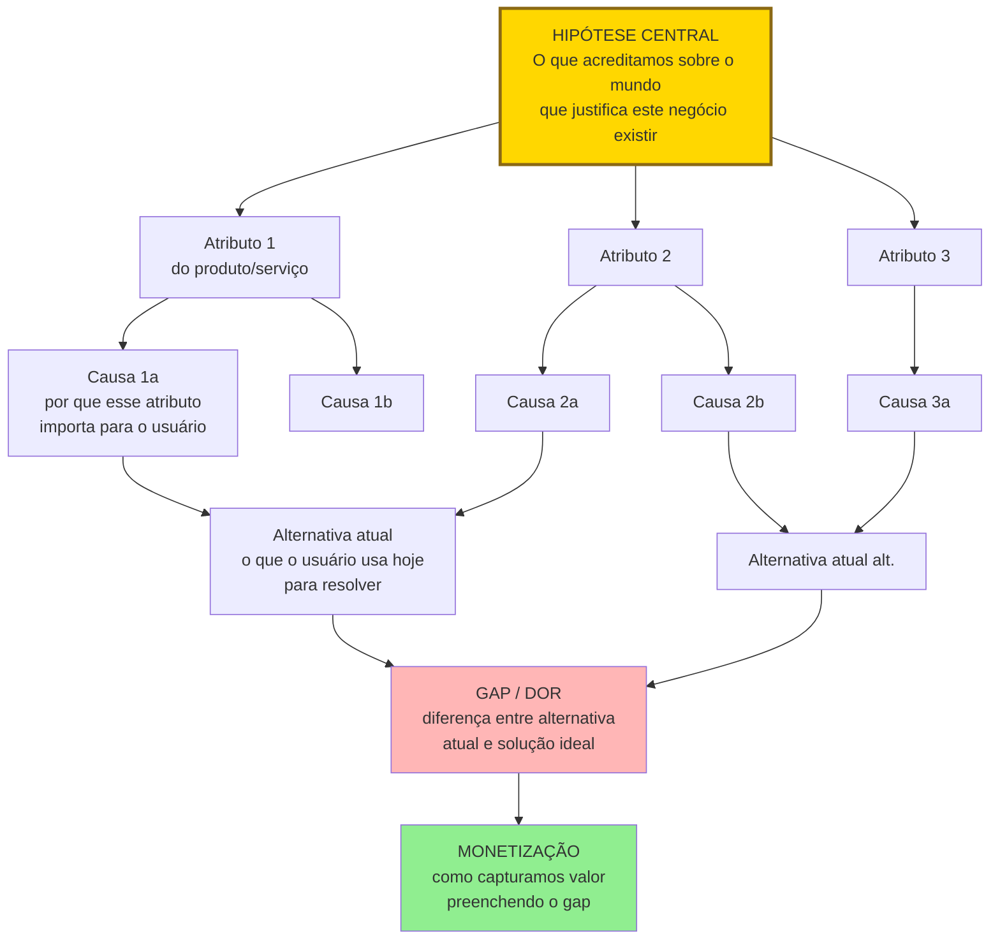

A árvore liga hipótese central, atributos, causas, alternativa atual, gap, monetização. Cada nível precisa ser testável com evidência. Nó sem teste é teoria sem rigor.

### POR QUE
A maior parte dos empreendedores pula direto da ideia para entrevistas e testes. O resultado é conhecido. Eles testam coisas que não importam, e deixam de testar o que é crítico. A teoria explícita resolve esse problema de três formas.

Primeiro, força pensamento estruturado antes de gastar dinheiro. Parte da busca acontece cognitivamente, na escrivaninha, não no mercado. Isso reduz o custo dos experimentos posteriores.

Segundo, revela os atributos realmente críticos. Quando você é obrigado a desenhar a cadeia causal, percebe quais elos são bet-the-company (se falharem, destroem a ideia) e quais são secundários.

Terceiro, permite considerar alternativas. Teoria explícita torna visível o fato de que existem outras explicações possíveis para o mesmo fenômeno. Isso abre caminho para pivôs inteligentes e previne apego prematuro à primeira hipótese.

Sem teoria explícita, o seu plano de negócios é uma opinião disfarçada. Com teoria explícita, é um objeto de estudo.

### Quando usar
Comece imediatamente depois da validação da Declaração Inicial da Ideia (v1), antes de qualquer entrevista de campo. Termine quando você tem ao menos uma árvore de teoria completa, com oito a quinze atributos, no mínimo três relações causais principais, e alternativas mapeadas. Revisite ao final de cada ciclo de experimentos (Fases 6, 9, 10, 11). A teoria deve evoluir conforme a evidência chega.

### Quem envolve
O executor principal é você. Esse é trabalho cognitivo intransferível. Se há cofundador, os dois fazem juntos. Cada um faz a sua versão primeiro, depois consolidam.

Os participantes são mentor ou par experiente, atuando como devil's advocate, questionando cada seta causal.

O decisor é você.

### Como executar

Oito passos.

#### Passo 1, três perguntas-âncora (método Story Tree)

Num papel em branco ou num arquivo de texto, responda por escrito a três perguntas.

A primeira: *qual problema ou fenômeno você está observando?* Descreva o que você vê no mundo que faz você acreditar que há oportunidade. Por exemplo, "donos de pequenos restaurantes gastam entre quatro e seis horas por semana em conciliação manual de faturas de delivery".

A segunda: *por que isso está acontecendo?* Identifique as causas raízes. Por exemplo, "porque cada plataforma (iFood, Rappi, etc) tem seu próprio formato de relatório, o software de gestão não integra, e o dono não tem pessoal administrativo treinado".

A terceira: *o que você poderia fazer a respeito?* Esboce caminhos de solução, sem se comprometer com um ainda. Por exemplo, "automatizar a extração e reconciliação desses relatórios; ou treinar equipes terceirizadas para fazer; ou criar um padrão aberto de dados".

Essas três respostas formam a narrativa mínima da sua teoria.

#### Passo 2, decomposição em atributos

Um atributo é qualquer elemento do problema ou da solução cuja realização futura é incerta. Atributos não são verdades. São apostas. Liste todos os atributos que aparecem nas respostas do passo 1. Para o caso do restaurante, exemplos de atributos: frequência semanal média de conciliação manual; tempo médio gasto por conciliação; disposição do dono a pagar por uma solução; número de plataformas com as quais o restaurante opera simultaneamente; existência e acessibilidade de APIs das plataformas; grau de aversão do dono à adoção de software novo; tamanho do segmento (restaurantes independentes com uma a três unidades no Brasil); disposição das plataformas em cooperar com integradores terceiros.

Não há número certo de atributos. Mas busque entre oito e quinze. Menos que isso costuma ser decomposição incompleta. Mais que isso geralmente inclui atributos redundantes ou irrelevantes.

#### Passo 3, conexões causais

Para cada par de atributos, pergunte: *a realização de A afeta a realização de B?* Se sim, desenhe uma seta de A para B. Por exemplo, "número de plataformas" afeta "tempo gasto em conciliação" (quanto mais plataformas, mais tempo). "Tempo gasto em conciliação" afeta "disposição a pagar" (quanto mais dolorido, mais o dono paga). "Aversão à adoção de software" afeta "disposição a pagar" (maior aversão, menor disposição).

Evite setas circulares (A para B e B para A simultaneamente). Se aparecerem, decomponha. Geralmente há uma variável intermediária, ou o relacionamento é correlacional, não causal.

#### Passo 4, crenças em cada seta

Para cada relação causal, atribua um grau de confiança. Alta (setenta a cem por cento), você tem evidência prévia robusta (literatura, dados públicos, experiência direta) de que a relação existe. Média (trinta a setenta por cento), é plausível, mas a sua confiança vem principalmente de intuição ou analogia. Baixa (zero a trinta por cento), é uma aposta com pouca base.

Marque também, para cada atributo, qual é a crença sobre sua realização. Por exemplo, "acho oitenta por cento provável que o dono médio gaste mais de quatro horas por semana em conciliação".

Essas crenças são subjetivas, e vão te parecer arbitrárias. Realmente são. O ponto não é acertar o número. É tornar explícita a sua aposta para depois comparar com o dado real.

#### Passo 5, marcação dos nós bet-the-company

Um nó é bet-the-company quando, se for falso, a ideia inteira morre. Esses são os nós que serão testados primeiro nas fases seguintes. No exemplo do restaurante: se o dono não estiver disposto a pagar por uma solução de conciliação, nada mais importa. Esse nó é o primeiro alvo.

#### Passo 6, parcimônia e modularidade

Olhe para a sua árvore e pergunte duas coisas. Parcimônia: posso remover algum atributo sem prejudicar o poder explicativo da teoria? Se sim, remova. Mais enxuto é melhor. Modularidade: consigo testar cada ramo da árvore separadamente? Se a árvore só funciona como bloco único, ela não é testável. Quebre em ramos independentes.

##### Os quatro critérios de uma boa teoria (Felin & Zenger, 2017)

Antes de declarar a árvore concluída, submeta-a a quatro testes cumulativos. Uma teoria só sustenta vantagem competitiva se atende aos quatro simultaneamente.

Novidade. A sua teoria representa uma aposta que difere da crença consensual do mercado? Se todo mundo no setor já pensa como você pensa, a teoria não gera valor novo. Apenas reproduz conhecimento comum, e o valor resultante já foi apropriado pelos incumbentes. Pergunte: *em que ponto específico a minha teoria discorda da teoria implícita dos concorrentes estabelecidos?* Se você não consegue apontar, a sua teoria é derivativa.

Simplicidade. A teoria pode ser explicada em poucas frases, com estrutura causal clara? Teorias que exigem quinze condições, quatro exceções, e três mecanismos secundários para funcionar são teorias frágeis. Complexidade é frequentemente sintoma de falta de clareza, não de sofisticação. Se você não consegue contar a história em noventa segundos, decomponha até conseguir.

Falsificabilidade. Existe observação concreta no mundo real que, se você a encontrasse, derrubaria a teoria? Se a resposta é "nenhuma observação poderia me convencer do contrário", você não tem teoria. Tem crença religiosa. Para cada atributo bet-the-company, escreva o evento específico que, se observado, faria você abandonar aquele ramo.

Generalidade. A teoria explica mais do que apenas o caso pontual que te inspirou? Se ela só funciona para o seu exemplo pessoal ou para um cliente específico, não generaliza. E sem generalização, não há mercado escalável. Teste: *a minha teoria prediz comportamento em outras situações do mesmo tipo?* Se sim, é generalizável. Se a resposta é "só no meu caso específico", decomponha em princípios mais amplos.

> [!warning] Teoria que passa nos quatro critérios é rara
> A maioria das teorias de empreendedores iniciantes falha em pelo menos um dos quatro, normalmente novidade ou generalidade. Se a sua falha, não é problema. Faça mais uma iteração na árvore, reescrevendo os atributos até os quatro critérios serem atendidos.

#### Passo 7, construa uma teoria alternativa

Esse passo é quase sempre pulado por iniciantes. Por isso é a sua maior vantagem se fizer. Escreva uma segunda árvore de teoria que explique o mesmo fenômeno com atributos ou relações diferentes. Por exemplo: e se os donos de restaurante já toleram a conciliação manual e não vão pagar por automação, mas pagariam por um serviço humano que faz para eles? Essa teoria alternativa não é "plano B". É objeto de teste paralelo. Ela protege você de apego a uma narrativa só.

#### Passo 8, conexão com o Business Model Canvas (opcional, via Theory Map)

Se você já usou BMC ou Lean Canvas, monte um Theory Map. Pegue cada bloco do canvas e, para cada um, escreva três coisas. Por que aquele elemento está ali. Qual atributo da sua árvore de teoria ele representa. Qual a relação causal com os outros blocos. Isso conecta os elementos do BMC que normalmente ficam isolados em post-its separados.

### Caso trabalhado, Emily (moda sustentável e ética)

Esse caso é o exemplo canônico usado por Coali et al. (2024) para ilustrar a construção de teoria com atributos, causas, crenças subjetivas, e teoria alternativa explícita. Ajuda a ver como o Story Tree se aplica a contexto B2C com dimensão ética e de sustentabilidade.

Contexto. Emily quer lançar uma marca de roupas sustentáveis e éticas.

Teoria principal, a árvore de Emily. O atributo final é a disposição a pagar por moda sustentável e ética. As causas antecedentes são três. Preocupação ambiental do consumidor (muitas pessoas estão conscientes do impacto ambiental da fast fashion). Preocupação social (condições trabalhistas precárias na indústria têxtil geram desconforto). Escassez de alternativas acessíveis (quem quer alternativa sustentável tipicamente acha caro demais ou estilos limitados). Os atributos de execução são três. Disponibilidade de materiais sustentáveis com custo viável. Supply chain de fornecedores certificados. Capacidade de design moderno competindo em estilo com fast fashion.

Crenças subjetivas de Emily. Probabilidade de que "consumidores-alvo aceitam premium de quinze a trinta por cento por sustentabilidade", setenta por cento. Crença alta, mas testável. Probabilidade de que "supply chain sustentável é escalável com crescimento", cinquenta por cento. Crença moderada, principal fonte de risco. Probabilidade de que "design pode competir esteticamente com fast fashion", oitenta por cento. Crença alta, baseada em evidência de marcas como Reformation.

Teoria alternativa de Emily. Uma teoria alternativa muda uma premissa central. E se consumidores declaram interesse em sustentabilidade mas não pagam premium real por ela (a discrepância "say-do gap")? Nesse mundo, o negócio precisa igualar o preço da fast fashion, não cobrar premium. Sustentabilidade vira "bônus invisível" da oferta, não âncora de preço. Estratégia muda radicalmente. Foco em eficiência de produção, não em posicionamento premium.

Cada uma das duas teorias gera hipóteses diferentes, experimentos diferentes, e potencialmente empresas diferentes. O valor de ter teoria alternativa explícita: se os primeiros experimentos refutam a teoria principal (por exemplo, consumidores dizem que querem mas compram fast fashion quando colocados à prova), Emily já tem a teoria alternativa mapeada e pode pivotar com direção conhecida, não com pânico.

A lição transferível. Uma teoria com probabilidades subjetivas e uma teoria alternativa documentada transforma o pivô de "crise existencial" em "mudança planejada de rota". Sem teoria alternativa, o empreendedor tende a insistir em teoria única até que não sobre caixa para testar outra.

### Alternativa ao Story Tree, o Value Lab

O Story Tree é a ferramenta padrão deste manual para construção de teoria. Mas não é a única. Value Lab (Felin, Gambardella, Zenger, 2021) é uma ferramenta alternativa, mais orientada à geração de ideias de valor do que à decomposição.

Story Tree serve quando você já tem uma ideia e quer mapear a cadeia causal de por que ela geraria valor. Decomposição de uma tese existente em atributos.

Value Lab serve quando você está mais cedo no processo, ainda explorando onde pode haver valor. É um método de quatro quadrantes combinando problem space, solution space, market space, e capability space, que força articulação de novidade e contrarian thinking.

Use Story Tree quando a ideia já está definida e o foco é testá-la com rigor. Use Value Lab quando ainda está explorando território e quer gerar candidatos de tese antes de escolher um. Na prática, muitos fundadores usam Value Lab na [[#FASE 2 — ARTICULAÇÃO E CAPTURA DA IDEIA|Fase 2]] (antes da articulação final) e Story Tree na [[#FASE 2B — CONSTRUÇÃO DA TEORIA DO NEGÓCIO|Fase 2B]] (depois da articulação).

### PERGUNTAS A RESPONDER
- Qual é a cadeia causal completa que explica por que o meu negócio geraria valor, do problema até a adoção?
- Quais atributos são indispensáveis (bet-the-company) e quais são secundários?
- Quais das minhas setas causais têm evidência real por trás, e quais são pura intuição?
- Existe pelo menos uma teoria alternativa capaz de explicar o mesmo fenômeno?
- Se a minha teoria está correta, que observações no mundo real eu deveria encontrar nas próximas fases? Que observações a contradisseriam?

### Métricas

Número de atributos mapeados. Alvo entre oito e quinze.

Proporção de setas causais com confiança alta. Acima de cinquenta por cento, você provavelmente está enganando a si mesmo. Abaixo de dez por cento, você ainda sabe muito pouco sobre o problema. Volte para entrevistas exploratórias.

Número de atributos bet-the-company. Idealmente dois a cinco. Se zero, a sua teoria não está testável. Se mais de sete, a sua ideia tem risco acumulado demais para avançar sem quebrar em sub-ideias menores.

Existência de teoria alternativa documentada. Sim ou não. Se não, a fase não está concluída.

### SAÍDA DESTA FASE

Você concluiu a [[#FASE 2B — CONSTRUÇÃO DA TEORIA DO NEGÓCIO|Fase 2B]] quando os oito critérios abaixo estão cumpridos.

1. O Story Tree existe em ferramenta compartilhável, com raiz, tronco e três ou mais galhos principais. É uma árvore de teoria com oito a quinze atributos e suas relações causais explícitas, com confiança atribuída.
2. O DAG existe com dez ou mais nós e quinze ou mais relações causais mapeadas. Cada nó com classificação de evidência atual: forte, fraca, ou nenhuma.
3. Pelo menos uma teoria alternativa está documentada.
4. Cinco ou mais hipóteses estão formuladas em formato testável: "se X, então Y, mensurado por Z".
5. Três nós críticos estão identificados explicitamente. Alto impacto, baixa evidência. São os dois a cinco atributos bet-the-company prioritários nos experimentos.
6. Ordem de teste prioritária está definida para os próximos trinta a sessenta dias.
7. Para cada nó da árvore, você consegue imaginar um experimento (mesmo grosseiro) que o testaria.
8. Três pessoas independentes conseguem olhar a sua árvore e explicar com as próprias palavras por que você acredita que o negócio funciona.

**Checklist final.**

- [ ] Construí a Árvore de Teoria (Story Tree) mapeando raiz, tronco, galhos?
- [ ] Identifiquei no mínimo cinco hipóteses em diferentes níveis da árvore?
- [ ] Construí o DAG (mapa causal) mostrando como crenças influenciam umas às outras?
- [ ] Identifiquei os nós críticos, aqueles que, se falsos, invalidam muitos outros?
- [ ] Conectei a teoria a um canvas de modelo de negócio (BMC ou Lean Canvas)?
- [ ] Cada hipótese tem classificação: desejabilidade, viabilidade técnica, viabilidade financeira, defensabilidade?
- [ ] Cada hipótese tem status: não testada, em teste, validada, ou invalidada?
- [ ] Tenho clareza sobre quais hipóteses precisam ser testadas primeiro (prioridade por risco mais informação)?
- [ ] O documento vivo (Story Tree mais DAG) está em ferramenta compartilhável (Miro, Figma, Notion, planilha)?

**Primeiros passos práticos.**

1. Abrir os Templates A.7 (Story Tree) e A.8 (DAG) e fazer versão inicial em duas horas.
2. Listar todas as crenças implícitas da ideia em modo brainstorm bruto. Depois classificar em níveis da árvore.
3. Para cada nó, marcar a evidência atual. Forte, fraca, nenhuma.
4. Escolher três nós críticos para testar primeiro. Aqueles com alto impacto e baixa evidência.

### EXEMPLO PRÁTICO

**Story Tree, PadariaPro (exemplo condensado).**

Raiz, missão. Reduzir em cinquenta por cento a perda de margem por gestão de estoque em padarias artesanais pequenas do Brasil.

Tronco, tese central. Padarias artesanais com duas a cinco lojas têm perda estrutural de doze a dezoito por cento da margem por gestão manual de estoque. Esse problema é solucionável por software integrado com fornecedores. É um mercado viável, com cinco mil ou mais padarias no Brasil, com disposição a pagar R$ 300 a R$ 500 por mês por loja.

Galhos principais, quatro.

O primeiro galho. O problema existe em escala. As sub-hipóteses são três. A perda é realmente de doze a dezoito por cento. O dono reconhece o problema. O problema é consistente em múltiplas cidades, não só São Paulo.

O segundo galho. A solução técnica é viável. As sub-hipóteses são três. APIs com fornecedores são obteníveis. A previsão de demanda acerta acima de setenta e cinco por cento em padarias. A integração com sistemas legados (balança, caixa) é factível.

O terceiro galho. O modelo de negócio sustenta. As sub-hipóteses são três. CAC abaixo de R$ 800. Churn abaixo de três por cento ao mês. ACV de R$ 4.000 a R$ 6.000 por ano por loja é viável.

O quarto galho. O diferencial é defensável. As sub-hipóteses são três. Integrações com fornecedores viram moat. ERPs genéricos não entrarão no nicho. Especialistas (sistemas de padaria existentes) não digitalizam rápido o bastante.

Nós críticos identificados. Galho 1, sub-hipótese (a), se a perda é só três a cinco por cento e não doze a dezoito, o valor não compensa o preço. Galho 2, sub-hipótese (a), se fornecedores não fornecem API, o produto vira "mais um ERP" sem diferencial. Galho 3, sub-hipótese (b), se churn passa de seis por cento ao mês, unit economics não fecham com o ACV projetado.

Fragmento do DAG, mapa causal. "Dor real ampla" leva a "cliente paga preço projetado", que leva a "ACV viável". "APIs com fornecedores" leva a "diferencial real", que leva a "defensabilidade", que leva a "LTV alto". "Churn abaixo de três por cento" leva a "LTV viável", que leva a "unit economics fecha".

Ordem de teste por risco mais informação. Primeiro, testar a sub-hipótese 1(a). É barato (entrevistas mais análise de dados de dez padarias) e informa tudo o resto. Em paralelo, testar a 2(a), conversando com três fornecedores grandes sobre APIs. A 3(b) só é testável com MVP pagante rodando três meses ou mais. Fica para a [[#FASE 9 — TESTES DE SOLUÇÃO E USABILIDADE|Fase 9]] em diante.

### Armadilhas

Teoria bonita demais. Se tudo se conecta perfeitamente e não há incerteza nenhuma, você não construiu teoria. Construiu narrativa. Reintroduza honestamente o que não sabe.

Confundir atributo com solução. "App com dashboard integrado" não é atributo. É solução. Atributo é "disposição do dono a usar dashboard integrado".

Causalidade inventada. "Economia de tempo causa fidelidade." Talvez. Mas sem dado, é crença. Marque como baixa confiança.

Apego à primeira teoria. Se depois de duas horas desenhando você só tem uma versão, está apegado. Desenhe duas.

Teoria que não gera hipóteses testáveis. Se a sua teoria não pode ser traduzida em hipóteses falsificáveis ([[#FASE 6 — FORMULAÇÃO RIGOROSA DE HIPÓTESES|Fase 6]]), ela é decorativa. Refaça.

Pular para canvas antes de pensar causalmente. O BMC é útil. Mas não é teoria. É inventário. Teoria é a ligação entre os itens do inventário.

---

### CASO BRASILEIRO, Fase 2B, teoria do negócio na Hotmart

Em 2011, o mercado de infoprodutos digitais no Brasil era fragmentado. Criadores vendiam cursos via PagSeguro com experiências ruins. Compradores abandonavam carrinho.

Os fundadores da Hotmart (João Pedro Resende e Mateus Bicalho, em Belo Horizonte) construíram uma teoria explícita. Se criarmos uma plataforma que une pagamento brasileiro mais hospedagem de conteúdo mais programa de afiliados, três coisas vão acontecer. A adoção por criadores vai gerar tráfego orgânico. Afiliados vão trazer escala de vendas sem CAC. Creators vão gerar retenção por receita recorrente.

A teoria explicitou as três causas. Unidade de pagamento e hospedagem. Afiliados como canal. Creators como geradores de receita. E permitiu testar cada uma em sequência. O modelo de afiliados foi o diferencial que consolidou a empresa.

A lição transferível. Teoria explícita permite testar cada premissa isoladamente. Teoria implícita mistura causas e oculta o que deu certo de verdade.

---

### FERRAMENTAS DESTA FASE

Construir teoria do negócio exige rigor analítico. Ferramentas desta fase estruturam o raciocínio causal e evitam wishful thinking. Detalhamento no [[#APÊNDICE BG — FERRAMENTÁRIO COMPLETO DO EMPREENDEDOR|Apêndice BG]].

First Principles Thinking. Questionar cada suposição na sua teoria. "Clientes vão pagar R$ X." Por que especificamente? Ver BG.4.1.

MECE (McKinsey). Estruturar elementos da teoria em categorias que não se sobrepõem e cobrem o essencial. A sua teoria tem componentes MECE, ou há sobreposição e lacunas? Use para auditoria da teoria antes de investir em validação. Ver BG.4.5.

Pyramid Principle (Minto). Comunicar a teoria em forma estruturada. Conclusão no topo, suporte abaixo. Use para documentar a teoria em formato que investidor ou advisor entenda rápido. Ver BG.4.4.

McKinsey 7-Step Problem Solving. Aplicar à pergunta central "há negócio aqui?". Define, structure, prioritize, plan analysis, analyze, synthesize, communicate. Use para desconfirmar a sua própria teoria antes de validar com o mundo. Ver BG.5.1.

5 Whys (Toyota). Aplicado à cadeia causal da teoria. "Clientes pagarão". Por quê? "Porque o problema é caro". Por que é caro? Continue. Quando a causa-raiz fica sólida, a teoria é mais sólida. Ver BG.5.2.

Cynefin Framework (Snowden). A sua teoria está em que domínio? Clear (previsível), Complicated (exige expertise), Complex (exige experimentação), Chaotic (caos). Se Complex, a teoria será refinada por experimentação, não por mais análise. Ver BG.4.7.

Second-Order Thinking (Marks). Se a teoria se materializar, quais reações do mercado? Concorrentes reagem? Reguladores? Ver BG.4.2.

---

### SÍNTESE DA FASE 2B

A [[#FASE 2B — CONSTRUÇÃO DA TEORIA DO NEGÓCIO|Fase 2B]] faz uma coisa que a maior parte dos fundadores nunca faz. Tornar explícita a teoria do negócio. Não como plano, não como projeção, mas como mapa causal de crenças. Cada nó é um atributo, cada seta é uma relação, cada relação tem peso de confiança. A árvore de teoria é o que permite distinguir o que você acredita por evidência, do que você acredita por desejo, do que você nem percebia que estava acreditando.

A diferença entre quem faz certo, e quem falha, está em aceitar pesos baixos sem disfarçar. Fundador que pinta toda a árvore de "alta confiança" não está mapeando teoria, está fazendo declaração de fé. Fundador que distingue honestamente as relações de alta confiança, das de média, das de baixa, e das de risco bet-the-company, identifica onde precisa investir validação primeiro. Esse é o ponto da [[#FASE 2B — CONSTRUÇÃO DA TEORIA DO NEGÓCIO|Fase 2B]]. Não dar respostas, mas localizar perguntas que valem o trabalho de responder.

O entregável dessa fase muda como as próximas vão ser conduzidas. As Fases 3 a 7 não testam ideia em geral. Testam crenças específicas da árvore de teoria, na ordem do risco. Quem pula a [[#FASE 2B — CONSTRUÇÃO DA TEORIA DO NEGÓCIO|Fase 2B]] entra na validação sem saber o que está validando, e acaba testando coisas fáceis de testar, em vez de coisas que importam testar. A diferença entre validar bet-the-company primeiro, e validar coisas periféricas primeiro, costuma ser a diferença entre seis meses de aprendizado real, e dois anos de fingimento.

#fase2b #teoria-do-negocio #story-tree #dag #causalidade #falsificacao #bet-the-company

---

## FASE 3 — DESCOBERTA DO PROBLEMA

> [!info] Stack mínimo da Fase 3
> Para fazer entrevistas com rigor, você não precisa de ferramenta cara. Gratuito ou de baixo custo: gravação em celular ou Google Meet (com permissão explícita do entrevistado), transcrição automática via Whisper (OpenAI) ou Loom (gratuito para uso moderado), planilha simples (Google Sheets ou Notion) para armazenar entrevistas e extrair padrões, formulário de agendamento (Calendly free).
>
> Quando crescer: Dovetail ou EnjoyHQ para organização de pesquisa qualitativa, ferramentas como Grain para gravação integrada.
>
> Não confunda sofisticação de stack com qualidade de pesquisa. Entrevistador ruim com Dovetail extrai menos que entrevistador bom com Google Forms.

### O que esse apêndice cobre
Investigação estruturada para verificar se o problema que você imaginou na [[#FASE 2 — ARTICULAÇÃO E CAPTURA DA IDEIA|Fase 2]] existe de fato na vida das pessoas que você acredita serem seus clientes. Com que frequência ocorre. Quão doloroso é. E quanto as pessoas já fazem para tentar resolvê-lo. O entregável é um relatório chamado Mapa de Problemas, que documenta o problema real (não o imaginado) com evidências de campo.

> [!important] Disciplina central desta fase
> Nesta fase, você ainda não fala da sua solução. Você só escuta. Essa disciplina é difícil, mas crítica. No momento em que você menciona a sua solução, o cliente passa a reagir à ideia em vez de descrever a realidade dele. E você perde a evidência limpa.

### POR QUE
Noventa por cento das startups que falham, falham por construir algo que ninguém quer. Na maioria dos casos, o empreendedor presumiu que o problema existia, sem verificar. A descoberta do problema é a vacina contra esse erro.

O custo de descobrir que o problema não existe antes de construir é uma conversa de café. O custo de descobrir depois de construir é meses ou anos de vida e todo o dinheiro investido.

> [!warning] Não construa uma ponte perfeita no meio do deserto
> Essa frase precisa ficar na sua cabeça em todas as etapas. É muito comum o empreendedor iniciante investir meses esculpindo uma solução elegante para um problema que ninguém realmente tem, ou tem mas não suficientemente. A descoberta do problema é onde você confirma que há gente do lado de lá da ponte.

### QUALIDADE DO PROBLEMA, o filtro que precede tudo

Antes de falar de execução, é preciso entender o que caracteriza um problema vale-a-pena-perseguir. Empreendedores messiânicos, que querem "salvar o mundo em geral", tendem a quebrar. Empreendedores que miram um problema específico e agudo tendem a crescer. Use três filtros em conjunto.

#### Filtro 1, as seis dimensões do problema ideal (framework YC)

Popular. Milhões de pessoas, ou em B2B, muitas empresas de um tipo específico, sofrem com isso.

Crescente. O mercado está crescendo, idealmente vinte por cento ou mais ao ano.

Urgente. O cliente precisa resolver agora, não "eventualmente".

Caro. O problema custa bilhões em agregado, ou a solução atual tem preço alto, justificando que outra solução também tenha preço alto.

Obrigatório. O cliente não tem escolha a não ser resolver. Por questão regulatória, contratual, ou operacional.

Frequente. O cliente encontra o problema repetidamente, diariamente ou semanalmente, não uma vez a cada cinco anos.

Você não precisa das seis dimensões. Mas se faltar a maioria, a sua ideia não tem velocidade de escape. Vai ser difícil gerar tração, atrair investimento, e reduzir custo de aquisição de cliente.

#### Filtro 2, as cinco características de um *heartfelt problem*

Um problema que mexe com o coração acende todas as cinco características abaixo. Visualização:

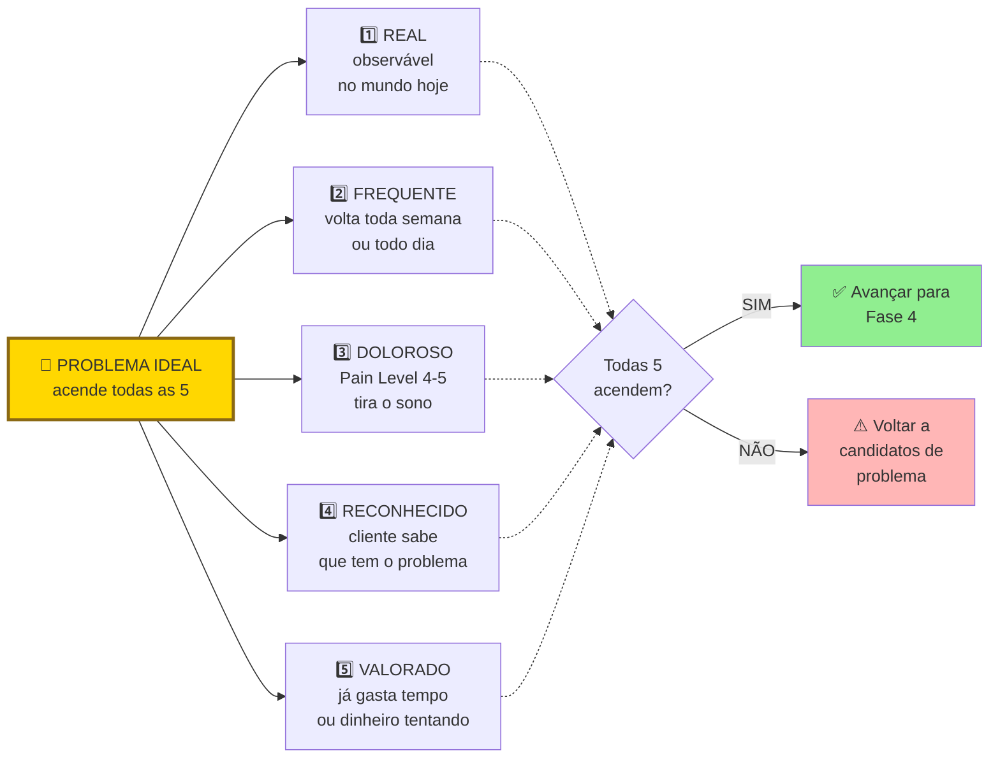

Se três ou mais características falham, o problema não é heartfelt. É "interessante". Interessante não gera negócio. Heartfelt sim. Teste cada característica com evidência de campo (entrevistas, observação, dados). Nunca com "acho que sim".

As cinco características em detalhe.

Emocional. O problema carrega emoção negativa: frustração, ansiedade, vergonha, medo. Sem emoção, não há urgência de ação.

Funcional. O problema impede o cliente de realizar uma tarefa concreta importante. Não é só um incômodo estético.

Frequente. Reforça o filtro YC. Quanto mais frequente, mais valor percebido na solução.

Urgente. Tem deadline implícito ou explícito. Algo vai dar errado se não resolver.

Inevitável (*unavoidable*). Não há jeito fácil de contornar. Se o cliente pode simplesmente ignorar ou desviar, ele não vai pagar.

#### Filtro 3, a analogia topológica (poço profundo versus poço largo)

Poço largo significa que muita gente usa. "Todo mundo usa o Google."

Poço profundo significa que quem usa, usa várias vezes ao dia. "Usamos o Google múltiplas vezes por dia."

Negócios bilionários tendem a ser profundos *e* largos. Mas iniciantes devem priorizar profundo em um nicho estreito antes de perseguir largura. Um poço profundo em nicho restrito te dá quatro coisas. Clientes que viram evangelistas. Clareza sobre o que construir. Capital intensivo não-necessário. Defensibilidade natural contra concorrentes grandes que ignoram nichos.

> [!tip] Regra operacional do poço profundo
> Se a sua empresa sumisse amanhã, um grupo bem específico de pessoas deveria reclamar muito. Se ninguém reclamaria, você não tem poço. Tem uma poça.

#### Corolário crítico, clientes desesperados e produtos imperfeitos

Uma das verdades menos intuitivas desta fase: em um mercado excelente, definido por clientes desesperados por uma solução, a primeira versão do produto não precisa ser incrível. Só precisa funcionar. Essa é a marca do produto bem-sucedido em fase inicial. Inversamente, em um mercado morno, mesmo um produto excepcional tem dificuldade de ganhar tração.

O que isso significa na prática: se você está obcecado em polir o produto antes de lançar, há boa chance de que esteja mirando o mercado errado. Mercados quentes toleram (e recompensam) produtos capengas. Mercados frios exigem produtos polidos que ainda assim falham em engajar. A obsessão com perfeição técnica é frequentemente fuga de fundador evitando o veredito do mercado real.

Este corolário se conecta a dois conceitos.

O primeiro é o Limiar de Desespero. É o nível mínimo de dor que faz um cliente aceitar um produto imperfeito para resolver o problema. Abaixo desse limiar, ele vai reclamar de cada bug e cancelar. Acima, ele vai pagar mesmo com UI feia, fluxos quebrados, e atendimento via WhatsApp. Operacionalmente, isso significa que você deve mapear o Limiar de Desespero da sua cunha antes de investir em polimento. O Pain Level 5 (orçamento comprometido) é o indicador mais forte de que o cliente está acima do limiar.

O segundo é o "problema chato", também conhecido como Schlep Blindness (Paul Graham, 2012). *Schlep* é palavra em iídiche, hoje de uso comum no inglês, que significa "tarefa tediosa e desagradável". Graham cunhou o termo *Schlep Blindness*, cegueira para schleps, para descrever o padrão pelo qual empreendedores (especialmente técnicos) sistematicamente evitam problemas que envolvem trabalho chato e sem glamour. Regulação. Negociação com bancos. Operação manual. Migração de dados legados. Compliance. Suporte trabalhoso. O inconsciente nem deixa a ideia chegar à consciência. "Isso não é um problema de startup." É exatamente aí que moram as oportunidades mais valiosas. Porque ninguém quer pegá-las.

A lógica é econômica antes de ser poética. Se todo mundo quer evitar certa categoria de trabalho, quem se dispõe a fazer encontra mercado inteiro sem concorrência real. Concorrentes evitam problemas chatos por preguiça, ego, ou risco. Empreendedor que ataca deliberadamente problemas chatos frequentemente encontra menos competição, clientes mais leais (ninguém os atende bem), e margens melhores (ninguém quer o trabalho). Se o seu problema é "sexy" demais, fácil de vender em pitch, fácil de explicar em coquetel, desconfie. Provavelmente você está competindo com cinquenta outros fundadores na mesma fatia.

##### Casos canônicos, schleps que viraram empresas bilionárias

Stripe resolveu pagamentos online. Os irmãos Patrick e John Collison atacaram o schlep que todo desenvolvedor da época reclamava mas ninguém queria consertar. Gateways de pagamento eram infernais de integrar, cheios de burocracia bancária, regulação complexa, KYC, PCI-DSS. Stripe hoje vale mais de US$ 90 bilhões. Graham usa Stripe como exemplo arquetípico no próprio ensaio.

Scale AI resolveu *data labeling*, a rotulagem manual de dados de treino para IA. Alexandr Wang, fundador, mencionou em entrevista que o ensaio de Graham foi inspiração direta. Todo pesquisador de IA sabia que era tarefa necessária. Ninguém queria fazer. Hoje a empresa vale mais de US$ 14 bilhões e é peça essencial para OpenAI, Meta, e o Pentágono.

Figma atacou design colaborativo na nuvem quando a Adobe dominava com software offline. Problema técnico schlep: reconstruir ferramenta profissional de design no navegador, com performance aceitável, parecia trabalho de anos sem recompensa evidente. Ninguém queria. Figma fez. Hoje é categoria.

Uber enfrentou schleps regulatórios e batalhas com sindicatos de táxi que eram exatamente o que fazia concorrentes desistirem. Não era sexy. Era desgastante, caro, litigioso. Foi isso que abriu espaço.

No Brasil, padrões análogos. Empresas que atacaram problemas tributários, regulatórios, de integração com sistemas legados bancários, ou de operação em cidades secundárias. O iFood resolvendo logística em cidades pequenas com motoboys desorganizados. Méliuz e Nuvemshop, na origem, tinham elementos de schlep em comum. Quase toda empresa grande brasileira, se você olhar a origem, atacou algum problema que concorrentes achavam chato demais para resolver.

##### Como usar Schlep Blindness como filtro mental para achar ideias

Em vez de perguntar "que problema eu quero resolver?", pergunte: *que problema eu gostaria que outra pessoa resolvesse para mim?* A resposta frequentemente revela um schlep escondido. Algo que te irrita e que você simplesmente aceitou como "jeito das coisas".

Escaneie o seu próprio dia a dia profissional. Onde você improvisa solução manual? Onde processos são lentos, caros, irritantes? Onde você diz "isso deveria ser automático mas não é"?

Para empreendedor iniciante, desconfie de ideias que pareceram óbvias e rápidas de construir. Se pareceu óbvio, duzentas pessoas tiveram a mesma ideia esta semana. Se pareceu difícil, chato, com hurdles regulatórios ou operacionais, pode ser exatamente a sua oportunidade.

> [!important] A regra combinada
> Persiga problemas chatos com clientes desesperados. Essa combinação, por mais deselegante, é a mais previsível fonte de tração em estágio inicial.

### TESTE DE PRIORIDADE, três perguntas rápidas (Priority Diagnostics)

Antes de avançar, submeta o seu problema a um teste de prioridade em três perguntas. É um diagnóstico operacional importado do programa da Antler. Vale aplicar sobre cada problema-candidato antes de comprometer tempo sério com ele.

> [!question] Pergunta 1, se este problema desaparecesse amanhã, quem notaria?
> Não "quem acharia bom". Quem notaria concretamente, em quarenta e oito horas, sem ninguém avisar. Se a resposta for "as pessoas em geral" ou "todo mundo", o problema não é prioritário para ninguém em específico. Resposta boa: um cargo ou pessoa nomeada, por exemplo "o gerente de operações do setor X", que usa o problema diariamente.

> [!question] Pergunta 2, qual métrica numérica e rastreada mudaria?
> Se o problema é real e prioritário, existe uma métrica que alguém já acompanha que se moveria. Tempo de ciclo. Custo por transação. Taxa de retrabalho. NPS interno. Faturamento por hora. Churn. Se nenhuma métrica rastreada se moveria, o problema pode até existir, mas ninguém tem caso de negócio para resolvê-lo. E portanto ninguém tem budget.

> [!question] Pergunta 3, alguém escalaria o problema para um nível acima?
> Problemas prioritários sobem na hierarquia. Alguém reporta ao chefe. Alguém pede recursos. Alguém marca uma reunião urgente. Se o problema existe mas ninguém o escala, ele está sendo absorvido silenciosamente. Significa que não é urgente o suficiente para forçar mudança de comportamento.

> [!warning] Regra operacional do Teste de Prioridade
> Se você não consegue responder às três perguntas com um nome de cargo, uma métrica específica, e um comportamento de escalada concreto, volte para entrevistas. Problemas que passam nas três perguntas geram urgência de compra. Os que não passam geram apenas interesse educado.

### Quando usar
Comece com a Declaração Inicial da Ideia (v1) em mãos. Termine depois de ter realizado entrevistas suficientes para chegar à saturação, o ponto em que novas entrevistas deixam de trazer informação nova. Tipicamente quinze a trinta entrevistas em profundidade. Revisite sempre que mudar de segmento de cliente ou abrir novo mercado.

### Quem envolve
O executor principal é você. Não terceirize entrevistas nesta fase. Quem conduz aprende. Quem lê relatório, não. Os participantes são os entrevistados, pessoas do público-alvo descrito na [[#FASE 2 — ARTICULAÇÃO E CAPTURA DA IDEIA|Fase 2]]. O decisor é você, com base na análise da evidência.

### Como executar

Nove passos.

#### Passo 1, perfil do entrevistado com precisão cirúrgica

Antes de sair entrevistando, escreva os critérios de inclusão e exclusão. Quem incluir: quem atende a tais e tais características. Quem excluir: quem atende a tal característica.

Exemplo ruim: "donos de restaurante". Exemplo bom: "donos ou donas, sócios ou sócias operacionais de restaurantes de uma a três unidades, localizados em capitais brasileiras, que oferecem delivery próprio (não apenas via iFood), com faturamento mensal entre R$ 50 mil e R$ 300 mil, há pelo menos dois anos no mercado".

Esse filtro é o que separa pesquisa útil de pesquisa "perdida no meio".

#### Passo 2, lista de quarenta a sessenta pessoas para abordar

Você precisará abordar três a quatro vezes o número de entrevistas que pretende realizar. Muita gente não responde, não tem tempo, ou não atende aos critérios. Fontes possíveis: LinkedIn com busca filtrada; grupos de WhatsApp e Telegram de nichos específicos; associações e entidades de classe (sindicatos, federações, coletivos); eventos presenciais do setor; introduções via conhecidos ("alguém que conhece alguém"); comunidades online (subreddits, fóruns, Discord); cold outreach estruturado (e-mail direto ou mensagem com proposta clara de trinta minutos).

#### Passo 3, escreva e teste o seu roteiro de entrevista

O roteiro tem dois princípios. Perguntas abertas, nunca fechadas. "Como você decide X?" em vez de "Você decide X dessa forma?". E perguntas sobre o passado, não sobre o futuro. "Na última vez que X aconteceu, o que você fez?" em vez de "Você usaria Y se existisse?". Respostas sobre o futuro são ficção. Sobre o passado, são evidência.

Estrutura sugerida (método Mom Test adaptado).

Aquecimento (dois minutos). Agradeça o tempo, explique que é pesquisa, não venda, peça permissão para gravar.

Contexto do entrevistado (cinco minutos). Quem é, o que faz, qual a rotina.

Exploração do domínio (dez minutos). Perguntas abertas sobre o território onde você imagina o problema, sem mencionar o problema. "Me conta como funciona o seu dia a dia com (atividade relacionada)." "Quais são as partes mais chatas disso?" "Me conta a última vez que você teve um problema com isso."

Aprofundamento (dez minutos). Sempre que algo interessante surgir, pergunte: "Me fala mais sobre isso." E: "Na última vez, como foi?"

Tentativas de solução (cinco minutos). "O que você já tentou fazer para resolver isso? Funcionou? Por que parou?" Se a pessoa nunca tentou resolver, isso é evidência forte de que o problema não é dolorido.

Encerramento (três minutos). "Tem mais alguém que você acha que passa por isso, que eu poderia conversar?" Pedido de indicação.

##### As cinco perguntas canônicas do Mom Test (cheat sheet)

Estas cinco perguntas, adaptadas ao seu domínio, formam um núcleo mínimo para qualquer entrevista de problema. Foram desenhadas para revelar a dor real, focar em comportamento passado em vez de intenção futura, e evitar que você caia na armadilha de vender a sua ideia.

> [!example] Cinco perguntas para entrevista de descoberta de problema
> 1. Qual é a parte mais difícil de (fazer a tarefa)? Identifica a dor real na linguagem do cliente, não na sua.
> 2. Me conta sobre a última vez que você encontrou esse problema. Força o entrevistado a descrever comportamento passado, que é evidência, não especulação.
> 3. Por que isso foi tão difícil? Revela as causas raízes que o seu raciocínio de ponta a ponta não consegue supor sozinho.
> 4. O que você já fez para tentar resolver isso? Se o entrevistado não fez absolutamente nada, a dor não é forte o suficiente para gerar negócio.
> 5. O que você não gosta nas soluções que já tentou? A resposta é o rascunho inicial do seu roadmap de produto, com palavras do cliente.

A pergunta bônus, que discrimina Pain Level 4 de Pain Level 5: *o que faria você pagar um pequeno depósito hoje por uma solução para isso?*. Essa pergunta separa interessados genuínos (responde com condições concretas: "se funcionasse com X, se custasse menos que Y") de interessados ornamentais (responde vago: "talvez, dependendo"). Clientes em Pain Level 5 (orçamento comprometido) tendem a dar respostas específicas e acionáveis. Clientes em Pain Level 4 ou menos tendem a hesitar. Use no fim da entrevista, depois de ter mapeado dor em profundidade. Nunca no começo, porque fica leading.

> [!tip] Regra de ouro do entrevistador
> Fale menos, ouça mais. Você não está ali para vender o seu produto. Está ali para interrogar o problema. Se você falou mais de vinte por cento do tempo, fez errado.

##### A armadilha da validação, dado ruim e dado bom

Nem todo "sinal" obtido em entrevista vale igual. Há tipos de resposta que pesam muito diferente.

| Tipo de informação | Peso como evidência | Por quê |
|---|---|---|
| Elogios ("Nossa, que ideia legal!") | Quase zero | Pessoas mentem sobre interesse por educação ou para agradar |
| Hipóteses futuras ("Eu pagaria por isso") | Baixo | Promessas sobre o futuro não se traduzem em compra real |
| Ideias soltas ("Seria legal se tivesse tal funcionalidade") | Baixo a médio | Útil para brainstorm, não para validação |
| Comportamento passado ("Semana passada gastei 4 horas nisso") | Alto | Dado verificável; ações já tomadas são a melhor evidência |
| Tentativas anteriores de solução ("Eu usei X, Y e Z, nenhum resolveu") | Alto | Prova que a dor é forte o suficiente para o cliente já ter agido |
| Métricas de custo (tempo, dinheiro, energia já gastos) | Alto | Traduzem a intensidade real da dor em números |

> [!important] Princípio operacional sobre evidência
> Pessoas mentem sobre interesse, mas não mentem sobre dor. Foque em interrogar a dor, comportamento passado, tentativas de solução, custo atual. Ignore promessas futuras e elogios.

##### Pain Level, classifique cada entrevistado

Ao final de cada entrevista, atribua ao entrevistado uma nota na escala de Pain Level, de um a cinco, que mede o estado dele em relação ao problema.

Nível 1. Tem o problema, mas nem sabe que tem. Não é cliente ainda. No máximo é foco de marketing educacional.

Nível 2. Sabe que tem o problema. Reconhece, mas tolera. Não vai pagar por solução sozinho.

Nível 3. Está ativamente procurando uma solução. Tem deadline na cabeça. É lead quente.

Nível 4. Já improvisou uma solução feia. Planilha Excel gigante, processo manual, Frankenstein de ferramentas. A existência dessa gambiarra é prova de que ele pagaria por algo melhor.

Nível 5. Tem orçamento comprometido ou facilmente acessível para comprar uma solução. Esse é o cliente ideal para a venda inicial e para o PSF (Problem-Solution Fit).

> [!important] Meta de Pain Level desta fase
> Conseguir entrevistar pelo menos cinco pessoas em Pain Level 4 ou 5. Se você não encontrar ninguém nesses níveis, você está testando um problema que o mercado ainda não sentiu o suficiente para pagar. É sinal vermelho. Volte para a Fase 2B (Teoria) e reconsidere o ICP ou a dor.

##### O que não fazer

Não pergunte "você acha que um app que faz X seria útil?". É hipotético, sobre o futuro.

Não pergunte "você pagaria R$ 99 por isso?". Inventa compromisso que a pessoa não vai cumprir.

Nunca diga "eu tive uma ideia de negócio que…". A partir daí, tudo vira cortesia.

Evite perguntas tendenciosas (*leading questions*). "Você não acharia melhor se…" ou "Seria incrível se existisse X, né?". Deixe o entrevistado dizer o que quer. Se você precisa sugerir, não é dor real.

Não misture apelos emocionais ou virtuosos (*virtue signalling*). "Você compraria um produto feito por crianças com deficiência?" Quase ninguém vai dizer não. Mas isso não significa que vai pagar. Mantenha o foco no problema, não em apelos morais que enviesam a resposta.

Não ofereça "crack grátis". "Você gostaria de receber X de graça?" Quase todo mundo diz sim. Isso não valida negócio nenhum. Só valida que as pessoas gostam de coisas grátis.

#### Passo 4, primeiras três entrevistas como teste

Grave (com permissão), transcreva, releia. Identifique três coisas. Quais perguntas funcionaram (geraram respostas longas e ricas). Quais caíram no vazio (respostas curtas, secas). E onde você cedeu à tentação de apresentar a ideia.

Ajuste o roteiro antes de seguir com as próximas.

#### Passo 5, execute quinze a trinta entrevistas no total

Ritmo saudável: três a cinco por semana. Faça sozinho, ou com um parceiro que toma notas enquanto você conduz.

#### Passo 6, registro sistemático

Para cada entrevista, preencha um template padronizado. Nome, papel, empresa (quando aplicável), data. Verbatim, ou seja, citações literais dos momentos mais importantes, exatamente o que a pessoa disse, entre aspas. Problemas mencionados (não os que você interpretou, os que foram ditos). Soluções atuais utilizadas. Quanto tempo, dinheiro, ou energia a pessoa gasta hoje com o problema. Gatilhos emocionais observados (frustração, raiva, resignação). E as suas observações pessoais em itálico, claramente separadas dos fatos.

> [!tip] Use o Template A.2 — Parte B
> O [[#APÊNDICE A — TEMPLATES PRONTOS PARA USO|Template A.2]] tem duas partes: a Parte A é o roteiro que você consulta durante a conversa; a Parte B é a síntese pós-entrevista, com 12 seções que estruturam exatamente o que este Passo 6 pede — metadados, aderência ao ICP, problemas, verbatim, vocabulário, hierarquia de sinais, Pain Level com justificativa, armadilhas (autoavaliação) e refinamento de ICP. Preencha nas 24h seguintes à entrevista, enquanto a memória está fresca. Entrevistas com a Parte B em branco contam como dado perdido.

#### Passo 7, análise depois de cada lote de cinco entrevistas

Não espere terminar tudo para analisar. A cada cinco entrevistas, faça uma síntese parcial. Quais problemas apareceram em mais de cinquenta por cento das entrevistas? Quais padrões de comportamento se repetem? Que hipóteses iniciais foram reforçadas e quais foram abaladas? Quais novos problemas apareceram que você não esperava?

> [!tip] Síntese parcial e final no Template A.30
> O [[#APÊNDICE A — TEMPLATES PRONTOS PARA USO|Template A.30 (Consolidação de Rodada)]] é o artefato dessa síntese. Use uma versão "rascunho" a cada lote de cinco para checar padrões; consolide a versão final só quando a rodada inteira fechar — consolidar antes do fim viesa as entrevistas restantes. A.30 é também o documento que registra a decisão de avanço da fase (perseverar / pivotar problema / pivotar cliente / abandonar).

#### Passo 8, chegue à saturação

Saturação é o ponto em que entrevista nova deixa de trazer informação nova. Você sente isso. "Ah, é a mesma coisa que o anterior disse." Quando isso acontecer duas ou três vezes seguidas, você chegou. Pare.

#### Passo 9, produza o Mapa de Problemas

Esse é o entregável central da [[#FASE 3 — DESCOBERTA DO PROBLEMA|Fase 3]]. Estrutura visual:

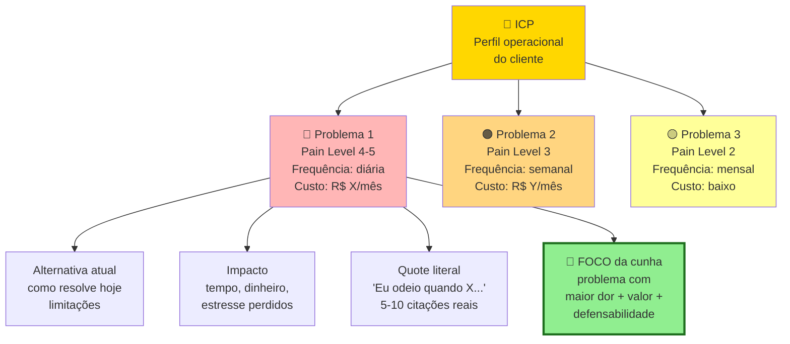

Um ICP pode ter três a cinco problemas mapeados. O foco é em um, o mais agudo, o de melhor fit. O mapa deve ser atualizado conforme as entrevistas avançam. Não é documento morto.

O documento final tem cinco a dez páginas, com o seguinte conteúdo. Perfil do entrevistado consolidado (ICP refinado). Lista dos problemas identificados, ranqueados por frequência e intensidade. Verbatim marcantes (citações literais) para cada problema. Soluções atuais identificadas e suas deficiências. Disposição emocional, ou seja, quanto as pessoas se importam com o problema. Comparação com a Declaração Inicial v1: o que se confirmou, o que se refutou, o que emergiu que você não esperava. E versão dois da Declaração da Ideia, atualizada com o que foi aprendido.

> [!note] Mapa de Problemas e A.30
> O Mapa de Problemas é a saída visual da rodada — o entregável de comunicação. O [[#APÊNDICE A — TEMPLATES PRONTOS PARA USO|Template A.30]] é a planilha de decisão estruturada que sustenta o Mapa: cruza distribuição de Pain Level, padrões agregados de problema, workarounds dominantes, vocabulário recorrente e sub-segmentos para registrar a decisão de avanço com rastro à evidência. Use os dois — o Mapa para apresentar, A.30 para defender.

### PERGUNTAS A RESPONDER
- O problema que eu imaginei existe na vida real das pessoas que eu esperava?
- Com que frequência esse problema ocorre na vida delas (diário, semanal, mensal, raro)?
- Quão doloroso é, comparado a outros problemas que elas têm?
- O que elas já fazem para resolver? Se não fazem nada, o problema não é dolorido.
- Quanto tempo, dinheiro, ou energia elas já gastam com tentativas atuais?
- Quem exatamente sofre mais com esse problema (sub-segmento mais agudo)?
- Há problemas adjacentes mais dolorosos que eu descobri por acaso?
- Qual é a linguagem que *elas* usam para descrever o problema? Anote as palavras exatas. Você vai usar no seu marketing depois.

### Métricas

Número de entrevistas concluídas. Alvo de quinze a trinta.

Número de entrevistados aderentes ao ICP. Pelo menos doze. Entrevistados fora do perfil contam como aprendizado, mas não como validação.

Frequência de menção espontânea do problema. Em que percentual das entrevistas o problema surgiu sem você precisar provocar? Alvo: cinquenta por cento ou mais para considerar o problema relevante. Setenta por cento ou mais para considerar urgente.

Índice de "já tentou resolver". Em que percentual das entrevistas a pessoa descreveu tentativas ativas de resolver? Alvo: quarenta por cento ou mais. Se as pessoas não estão tentando resolver, não vão pagar por uma nova solução.

Tempo ou dinheiro gasto com o problema hoje. Valor médio informado pelos entrevistados. Serve como proxy de disposição a pagar. Benchmark: R$ 500 por mês ou mais (B2C), ou R$ 5.000 por mês ou mais (B2B), ou cinco horas por semana ou mais de tempo próprio. Indica dor em Pain Level 4 ou 5 (dor real, já consumindo recursos). Abaixo disso, o problema pode existir mas não dói o suficiente para virar negócio.

Índice de saturação. Depois das últimas três entrevistas, quanta informação nova apareceu? Abaixo de quinze por cento indica saturação.

### SAÍDA DESTA FASE

Você concluiu a [[#FASE 3 — DESCOBERTA DO PROBLEMA|Fase 3]] quando os nove critérios abaixo estão cumpridos.

1. Você realizou quinze ou mais entrevistas com pessoas dentro do ICP, gravadas (com consentimento) ou transcritas em tempo real.
2. Você atingiu saturação. Nas últimas três entrevistas, informação nova próxima de zero.
3. Tabela de padrões existe com cinco ou mais dimensões coletadas por entrevistado.
4. Três ou mais padrões de dor consistentes estão documentados, cada um apoiado por cinco ou mais entrevistas.
5. Pelo menos um falso positivo identificado e documentado. Algo que entrevistados disseram querer mas não agiriam para obter.
6. Há evidência de que o problema existe em cinquenta por cento ou mais do ICP entrevistado, e de que é ativamente tratado (pessoas já tentam resolver) em quarenta por cento ou mais.
7. ICP foi ajustado com base no que foi ouvido. Existe registro de "antes versus depois". O sub-segmento mais doloroso está identificado.
8. Mapa de Problemas está escrito, e a Declaração da Ideia foi atualizada para v2 com mudanças explícitas em relação à v1.
9. Decisão explícita tomada: seguir, pivotar (problema ou cliente), ou encerrar. Documentada em um parágrafo.

> [!warning] Se o problema não passou no teste, momento crítico
> Os caminhos são três. Pivotar o problema (algo adjacente emergiu como mais doloroso). Pivotar o cliente (o problema existe, mas em outro perfil). Ou abandonar (volte à Fase 2 com outra ideia). Não avance para a Fase 4 com problema não-validado. Construir sobre problema inexistente é o cemitério das startups.

**Checklist final.**

- [ ] Tenho roteiro de entrevista (Template A.2) revisado, com perguntas abertas, sem linguagem que induz resposta?
- [ ] Realizei quinze ou mais entrevistas com pessoas do perfil ICP hipotético?
- [ ] As entrevistas foram gravadas (com consentimento) ou transcritas em tempo real?
- [ ] Transcrevi/anotei e categorizei as respostas em tabela de padrões?
- [ ] Identifiquei três ou mais padrões de dor consistentes entre múltiplas entrevistas?
- [ ] Identifiquei pelo menos um falso positivo (algo que entrevistados disseram querer mas não agiriam para obter)?
- [ ] Ajustei a minha hipótese de "para quem" com base no que ouvi (ICP ficou mais específico ou mudou)?
- [ ] Decidi explicitamente: continuar com a ideia, pivotar, ou abandonar?

**Primeiros passos práticos.**

1. Agendar cinco entrevistas para esta semana usando rede pessoal, LinkedIn cold outreach, ou grupos de WhatsApp do setor.
2. Revisar o Template A.2 e remover perguntas que induzem resposta ("você gostaria de um app para…?").
3. Criar tabela no Notion ou Google Sheets com colunas: nome, data, padrão de dor 1, padrão 2, padrão 3, solução atual, quanto pagaria.
4. Fazer duas entrevistas piloto, revisar o roteiro com base no que não funcionou, e então agendar as demais.

### EXEMPLO PRÁTICO

**Roteiro de Entrevista de Problema, PadariaPro.**

Abertura (dois minutos). "Oi, [Nome]. Obrigado pelo tempo. Antes de começar: não estou aqui para te vender nada. Estou pesquisando como padarias pequenas gerenciam compras e estoque, porque quero entender se tem um problema real antes de construir uma solução. Vou fazer umas perguntas abertas, sem respostas certas. A gravação fica privada, só para eu transcrever depois. Tudo bem?"

Perguntas de contexto (cinco minutos). Como você virou dono ou operador dessa padaria? Quantas lojas vocês têm hoje? Como a gestão é dividida entre elas? Quem cuida de compra de ingredientes?

Perguntas sobre dor (quinze minutos), sem mencionar produto ou solução. Como vocês decidem hoje quanto de farinha comprar por semana? Me lembra da última vez que sobrou ou faltou algum ingrediente importante. O que aconteceu? Quando isso acontece, qual o impacto, em dinheiro, em tempo, em estresse? Vocês já tentaram alguma ferramenta ou método para resolver? Funcionou? Por que sim, ou por que não? Se você pudesse acordar amanhã e ter uma coisa resolvida no negócio, seria essa, ou outra?

Perguntas sobre comportamento (cinco minutos). Como vocês controlam estoque hoje? (peça para mostrar se possível, caderno, planilha, sistema). Em uma escala de zero a dez, quanto o problema de estoque incomoda?

Fechamento (três minutos). "Última coisa, posso te ligar em trinta dias para te mostrar algo que estou desenhando, e pegar a sua opinião?"

Análise depois de dez entrevistas:

| Entrevistado | Perda financeira/mês | Método atual | Dor real (0-10) | Já pagou para resolver? |
|---|---|---|---|---|
| Padaria A (Pinheiros) | R$ 3.500 | Caderno | 7 | Não, mas pensou em Excel avançado |
| Padaria B (Vila Madá) | R$ 8.000 | Planilha | 9 | Pagou consultor R$ 2k uma vez |
| Padaria C (Moema) | R$ 2.000 | Sistema antigo | 5 | Paga R$ 150/mês ERP que não serve |
| ... | | | | |

Padrão emergente: as padarias que sentem dor 8 ou mais são aquelas com três ou mais lojas. Abaixo disso, dor é 4-6 e pagar não é prioridade. ICP refinado para três a cinco lojas, não duas a cinco como hipótese original.

**Roteiro de Entrevista, caso healthtech B2C (exemplo paralelo).**

Para mostrar como o instrumento se comporta em contexto diferente, eis um fundador hipotético investigando dor de pacientes adultos com diabetes tipo 2 que precisam ajustar dieta e medicação semanalmente. ICP imaginado: brasileiros de quarenta a sessenta e cinco anos, classe B, diagnóstico há dois a cinco anos, residentes em capitais.

Abertura (dois minutos). "Oi, [Nome]. Obrigado pelo tempo. Estou pesquisando como pessoas com diabetes tipo 2 gerenciam o dia a dia da condição. Alimentação, medicamento, consulta. Não estou vendendo nada. Quero entender o que funciona e o que não funciona, antes de pensar em qualquer solução. Tudo o que você falar fica privado. Posso gravar para transcrever depois?"

Perguntas de contexto (cinco minutos). Há quanto tempo você tem o diagnóstico? Como ele aconteceu? Quem cuida de você hoje? Endocrinologista, nutricionista, médico de família? Como é a sua semana típica em relação ao diabetes? O que você faz que outras pessoas sem diabetes não fazem?

Perguntas sobre dor (quinze minutos), sem mencionar produto ou solução. Me conta da última vez que a sua glicemia subiu mais do que devia. O que aconteceu antes? Como você descobriu? Quando você precisa decidir o que comer fora de casa, como decide? Quanto tempo por semana você gasta pensando ou fazendo coisa relacionada ao diabetes? Já tentou algum app, planilha, caderno, ou método para ajudar? Funcionou? Por que parou (se parou)? O que mais te incomoda hoje no dia a dia da condição? E o que a sua família ou parceiro reclama?

Perguntas sobre comportamento (cinco minutos). Pode me mostrar como você anota o que come, ou como acompanha a sua glicemia? (peça a tela do celular ou caderno). Em escala de zero a dez, quanto isso te incomoda? E ouça a resposta sem reagir.

Fechamento (três minutos). "Última coisa, posso te ligar em quatro semanas para te mostrar algo que estou desenhando, e ouvir a sua opinião?"

Análise depois de quinze entrevistas:

| Entrevistado | Tempo gasto/semana | Método atual | Dor real (0-10) | Pagaria por solução? |
|---|---|---|---|---|
| Maria, 52, SP | 5h | Caderno + memória | 7 | Sim, até R$ 50/mês |
| João, 61, RJ | 8h | Planilha do filho | 9 | Sim, até R$ 100/mês |
| Beatriz, 47, BH | 2h | Nada estruturado | 4 | Talvez, se médica recomendar |
| ... | | | | |

Padrão emergente: quem sente dor 8 ou mais tem três anos ou mais de diagnóstico, faz medição diária, e tem complicação concreta (ferida que não cicatriza, ajuste recente de medicação). Quem está nos primeiros doze meses ainda está em "fase de adaptação" e não vê app como prioridade. Primeiro confia no médico, depois talvez incorpore tecnologia. ICP refinado: pacientes diabéticos tipo 2 com três ou mais anos de diagnóstico, em ajuste medicamentoso ativo. Cunha mais estreita que a hipótese original.

**Comparando os dois roteiros.** A estrutura é idêntica. Abertura, contexto, dor (sem mencionar solução), comportamento, fechamento. O que muda é o vocabulário e os artefatos a observar. Caderno de padaria versus aplicativo de glicemia. E a forma como a "dor" se traduz em pagar. Margem perdida na padaria, custo emocional mais gasto com complicação para o paciente. O roteiro de entrevista é o mesmo instrumento, adaptado ao domínio.

### Armadilhas

Entrevistar amigos e família. Eles mentem para te agradar. Exclua qualquer um que tenha relação pessoal.

Falar mais do que ouvir. A regra de ouro é que o entrevistado fala oitenta por cento do tempo. Se você está falando muito, está fazendo errado.

Confirmar em vez de refutar. É tentador ouvir só o que reforça a sua tese. Obrigue-se a procurar ativamente evidência contrária. Se você só encontra confirmação, está enviesando.

Perguntas hipotéticas. "Você usaria X?" produz respostas ficcionais. Sempre ancore no passado real.

Apresentar a solução. No momento em que você mostra a ideia, a conversa muda de tom. A pessoa passa a ser gentil ou crítica com a ideia, não honesta sobre a vida.

Achar que cinco entrevistas bastam. Às vezes bastam, mas você só sabe disso depois de quinze. Não corte caminho.

Generalizar a partir de um ou dois casos marcantes. Uma entrevista apaixonada vale muito menos que um padrão em dez entrevistas.

Ignorar quando o problema é "interessante" mas não dolorido. As pessoas adoram falar sobre ineficiências, mas só pagam para resolver as que doem. Diferencie.

---

### CASO BRASILEIRO, Fase 3, descoberta do problema no iFood com restaurantes pequenos

No início da operação, a equipe do iFood (Patrick Sigrist, Felipe Fioravante, Eduardo Baer, Guilherme Bonifácio, Daniel Oliveira) tinha hipótese de que o principal cliente seria redes grandes de restaurantes. Era a aposta natural. Volume maior, ticket maior, estrutura instalada.

Antes de investir em vendas para grandes redes, com ciclo longo, fizeram dezenas de conversas diretas com donos de restaurantes pequenos. Incluindo visitas e observação de rotina. Não estavam vendendo nada. Estavam mapeando dor.

Descobriram algo contraintuitivo. Restaurantes pequenos tinham dor muito maior. Não tinham time de telemarketing. Atendimento telefônico custava tempo do dono. Pedido errado por ruído na ligação era prejuízo direto. E estavam dispostos a pagar comissão alta em troca do canal. Redes grandes, com estrutura própria, viam o iFood como ameaça à marca.

A lição transferível. Quem tem dor mais aguda paga mais, mesmo que seja cliente "menor". Entrevistar onde a dor é intensa é mais produtivo que entrevistar onde você achava que seriam os clientes.

---

### FERRAMENTAS DESTA FASE

Na descoberta do problema, ferramentas de entrevista e pesquisa são centrais. Mas a maioria delas está no Ferramentário (BG.6, Pesquisa & Descoberta). Nesta fase, disponíveis de imediato:

5 Whys (Sakichi Toyoda, Toyota). Pergunte "por quê?" cinco vezes durante entrevistas, para chegar à causa-raiz do problema (não ao sintoma declarado). Use em toda entrevista de customer discovery. Ver BG.5.2.

MECE. Estruturar os problemas reportados pelos entrevistados em categorias mutuamente exclusivas e coletivamente exaustivas. Evita lista bagunçada de "dores" sem estrutura. Use na consolidação de aprendizados depois de dez a vinte entrevistas. Ver BG.4.5.

First Principles Thinking. Resista à tendência de reformular o problema dos clientes na linguagem da sua solução. Vá ao fundamento. Qual é a dor real, sem fritura de "porque esse cliente precisaria de uma plataforma SaaS com IA"? Ver BG.4.1.

McKinsey 7-Step (passos 1 e 2). Nesta fase, Define e Structure. Articule o problema, depois estruture sub-problemas. Use issue tree MECE. Ver BG.5.1.

Pyramid Principle (Minto). Síntese das entrevistas. Apresente ao time ou aos advisors com a conclusão no topo: "o problema central dos nossos ICPs é X, por três razões: Y1, Y2, Y3". Ver BG.4.4.

> [!note] Ferramentas específicas de entrevista
> Mom Test, JTBD Switch Interviews, Laddering, Contextual Inquiry. Estarão no Ferramentário, BG.6.

---

### Exercício aplicado, mapa do problema (Fase 3)

A [[#FASE 3 — DESCOBERTA DO PROBLEMA|Fase 3]] trata de descoberta de problema. Ler é um movimento. Executar é outro. Este exercício força você a sair da teoria em quatro dias.

#### Dia 1, manhã, 90 minutos

Escreva, sem consultar ninguém, a sua melhor formulação atual do problema que a sua empresa resolverá. Formato: "o problema é X, para o cliente Y, no contexto Z, porque W". Uma frase. Se não coube em uma frase, o problema ainda não está claro.

Documente também as cinco principais suposições embutidas nessa formulação.

#### Dia 1, tarde, 2 horas

Lista de trinta pessoas que poderiam ter esse problema. Mistura: gente que você conhece bem, conhecidos distantes, e gente que você não conhece mas pode alcançar via LinkedIn. Seja específico. Não "empreendedores", mas "fundadores de e-commerce B2C que faturam entre R$ 500 mil e R$ 5 milhões por ano".

#### Dias 2 e 3, quatro conversas de trinta minutos cada

Marque as primeiras quatro conversas com quem topar mais rápido. Siga o Mom Test (BG.6.1) com rigor. Pergunte sobre a vida específica delas. Sobre problemas concretos que enfrentam. Sobre momentos específicos em que o problema apareceu. Não fale da sua solução. Não valide a sua hipótese. Escute. Anote em quatro categorias: o problema aparece? Em que contexto? Como a pessoa resolve hoje? E o quanto isso dói?

#### Dia 4, síntese, 90 minutos

Compare as quatro conversas com a sua formulação inicial do Dia 1. Pergunte-se honestamente: o problema que emergiu é o mesmo que você escreveu? A dor real é maior, menor, ou diferente do que você supôs? Alguma suposição do Dia 1 foi refutada? Qual é a formulação revisada do problema, em uma frase?

> [!tip] Sinal de que o exercício funcionou
> A sua formulação do Dia 4 é diferente da do Dia 1 em pelo menos um aspecto importante. Se ficou idêntica, você provavelmente filtrou as conversas para confirmar o que queria ouvir. Viés de confirmação. Problema comum em fundadores apaixonados.

Repita com mais seis a dez conversas nas duas semanas seguintes. Aos dez ou quinze conversas, padrões emergem. Aos vinte ou trinta, você tem problema validado ou refutado com clareza.

---

### SÍNTESE DA FASE 3

A [[#FASE 3 — DESCOBERTA DO PROBLEMA|Fase 3]] ataca o erro mais caro da indústria de startups. Construir algo que ninguém quer. Noventa por cento das empresas que falham, falham por isso. E na maioria dos casos, o fundador presumiu que o problema existia, sem verificar. A descoberta do problema é a vacina contra esse erro. O custo de descobrir que o problema não existe antes de construir é uma conversa de café. O custo de descobrir depois de construir é meses, ou anos, de vida e todo o dinheiro investido.

A diferença entre quem faz certo, e quem falha, está numa disciplina simples, e quase sempre violada. Não falar da solução. Só escutar. No momento em que você menciona a solução, o cliente passa a reagir à ideia, em vez de descrever a realidade. E você perde a evidência limpa. Aplicar o Mom Test com rigor, perguntar sobre a vida específica do cliente, sobre momentos concretos em que o problema apareceu, sobre o que ele já faz para resolver hoje, é o que separa entrevista útil de entrevista que confirma viés.

O entregável é o Mapa de Problemas. Não é coletânea de citações, é documento que distingue problemas reais (recorrentes, dolorosos, com tentativas de solução já em curso) de problemas imaginados pelo fundador. Quem chega ao fim dessa fase com a formulação do Dia 4 idêntica à do Dia 1 não validou nada. Filtrou as conversas para confirmar o que queria ouvir. A [[#FASE 3 — DESCOBERTA DO PROBLEMA|Fase 3]] bem-feita produz mudança na própria formulação do problema. Quando isso não acontece, a fase precisa ser refeita.

#fase3 #descoberta-do-problema #customer-interview #mom-test #pain-level #schlep-blindness #problema-validado

---

## FASE 4 — PESQUISA COM USUÁRIOS (CUSTOMER DISCOVERY APROFUNDADO)

### O que esse apêndice cobre
A [[#FASE 3 — DESCOBERTA DO PROBLEMA|Fase 3]] descobriu que problemas existem. A [[#FASE 4 — PESQUISA COM USUÁRIOS (CUSTOMER DISCOVERY APROFUNDADO)|Fase 4]] descobre como os usuários vivem esses problemas. Em contexto, com detalhes operacionais, emocionais, e circunstanciais. É pesquisa qualitativa mais profunda. Envolve observação (não só escuta), mapeamento de jornadas do usuário, identificação dos *Jobs to be Done*, e caracterização detalhada de personas baseadas em dados reais.

O entregável é um Dossiê do Usuário. Coletânea de personas, jornadas mapeadas, e formulação clara dos *jobs* que o usuário quer cumprir.

### POR QUE
Saber que um problema existe não basta para projetar uma solução. Você precisa saber em que contexto ele ocorre, em que sequência de eventos, com quais restrições, com quais emoções, com quais pessoas envolvidas. Soluções projetadas sem esse entendimento se chocam contra a realidade no momento da adoção. "Mas eu não posso usar isso no meio do turno." "Meu chefe nunca ia aprovar." "Isso pressupõe que eu tenho internet, e eu não tenho."

A [[#FASE 4 — PESQUISA COM USUÁRIOS (CUSTOMER DISCOVERY APROFUNDADO)|Fase 4]] também revela os *jobs to be done*: o que as pessoas contratam um produto para fazer por elas. Esse é o único ângulo que impede você de construir features irrelevantes.

### Quando usar
Comece assim que a [[#FASE 3 — DESCOBERTA DO PROBLEMA|Fase 3]] validar a existência do problema. Termine quando tiver duas a quatro personas caracterizadas com profundidade, pelo menos três jornadas mapeadas, e uma lista clara de *jobs to be done*. Revisite antes de grandes decisões de produto, e antes de entrar em novos segmentos.

### Quem envolve
O executor é você, preferencialmente com alguém que possa documentar enquanto você observa ou conversa. Os participantes são oito a quinze usuários dispostos a deixar você observá-los, ou a fazer entrevistas mais longas (sessenta a noventa minutos) em contexto. O decisor é você.

### Como executar

Sete passos.

#### Passo 1, selecione sub-grupos prioritários

Use o ICP refinado da [[#FASE 3 — DESCOBERTA DO PROBLEMA|Fase 3]]. Divida em dois ou três sub-segmentos. Por exemplo, donos que operam sozinhos versus donos que têm gerente. Você vai pesquisar cada sub-segmento separadamente, e comparar.

#### Passo 2, escolha as técnicas de pesquisa apropriadas

Quatro técnicas centrais.

A primeira é entrevista em profundidade, de sessenta a noventa minutos, presencial preferencialmente. Mais longa que a da [[#FASE 3 — DESCOBERTA DO PROBLEMA|Fase 3]]. Use a técnica de *contextual inquiry*. Peça para a pessoa te mostrar como faz. Abrir a planilha. Navegar pelo sistema. Atender um cliente.

A segunda é observação em campo (*shadowing*), de duas a quatro horas. Você acompanha um usuário na rotina real. Observa sem interromper, intervém só com perguntas pontuais. Anota tudo. O que fez. Quanto tempo. Interrupções. Frustrações. Conversas paralelas.

> [!tip] Por que shadowing revela o que entrevista esconde
> Pessoas subestimam o quanto de tempo gastam em atividades que acham triviais. Em entrevista, elas relatam o que lembram. Em campo, você vê o que de fato acontece. As duas coisas raramente coincidem.

A terceira é diário do usuário, durante uma a duas semanas. Peça a alguns usuários que registrem, durante o período, toda vez que o problema X ocorrer. O que estavam fazendo. Como se sentiram. O que fizeram para resolver. Quanto tempo perderam. Incentivo (vale-presente) ajuda a aderência.

A quarta é análise de artefatos. Peça para os usuários mostrarem e explicarem os artefatos que usam. Planilhas. Cadernos. Grupos de WhatsApp. Prints. Relatórios. Esses artefatos são fósseis do comportamento real.

#### Passo 3, conduza o mapeamento de jornada

Para cada persona, desenhe em linha do tempo a jornada relacionada ao problema. No mínimo com sete colunas. Etapa (nome da fase da jornada). Ação (o que a pessoa faz). Objetivo (o que ela quer cumprir com aquela ação). Ferramentas atuais (o que usa hoje). Pontos de dor (onde algo dá errado, demora, frustra). Emoções (o que sente: ansiedade, alívio, raiva, tédio). Oportunidades (onde existe espaço para intervenção).

> [!important] Comece a jornada antes do ponto óbvio
> Jornadas devem começar muito antes do ponto onde você imaginaria que o seu produto entraria. Por exemplo, se você está construindo um sistema de gestão de frota, a jornada começa no momento em que o dono decide contratar o motorista. Não quando o motorista já está na rua.

#### Passo 4, identifique os Jobs to be Done (JTBD)

Para cada persona, pergunte: quando eles "contratam" uma solução (qualquer solução, não a sua), que *trabalho* estão tentando fazer?

JTBDs têm três dimensões. A funcional é o que precisa ser feito operacionalmente. Por exemplo, "conciliar pagamentos do dia". A emocional é como a pessoa quer se sentir. Por exemplo, "ter paz de que nada foi esquecido". A social é como a pessoa quer ser vista. Por exemplo, "parecer profissional para a equipe e os clientes".

Escreva os jobs no formato: "Quando (situação), eu quero (motivação), para que eu consiga (resultado esperado)."

Por exemplo: "Quando encerro o dia no restaurante, eu quero bater o caixa rápido e saber que está tudo certo, para que eu possa ir embora sem levar preocupação para casa."

A estrutura visual:

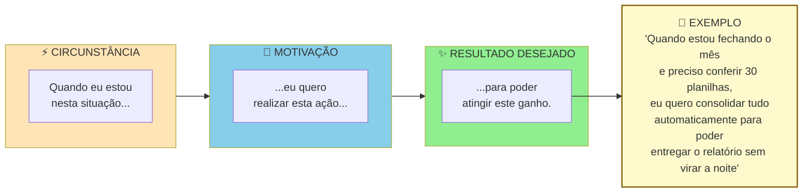

> [!warning] Um JTBD completo tem três partes
> "Quero automatizar planilhas" está incompleto. Sem circunstância e sem outcome. Solução que atende JTBD bem formulado tende a ser mais específica e mais defensável.

> [!tip] Switch Interview quando o entrevistado trocou de solução
> Quando o entrevistado **trocou** de solução (deixou um concorrente, largou um processo manual, migrou de ferramenta, mudou de fornecedor), entrevista comum de JTBD captura a versão racionalizada da decisão. A Switch Interview de Bob Moesta reconstrói o momento real, mapeando as quatro forças simultâneas — push (o que empurrou para fora do velho), pull (o que atraiu para o novo), anxiety (o que causou medo de trocar) e habit (o que segurava no antigo). Para cada switcher relevante, marque uma segunda conversa com o [[#APÊNDICE A — TEMPLATES PRONTOS PARA USO|Template A.29]]. O que ela formula é um JTBD muito mais específico do que o capturado em conversa única.

#### Passo 4B, síntese qualitativa das entrevistas (técnicas formais)

A diferença entre um empreendedor iniciante e um pesquisador de usuário maduro está aqui. O iniciante "lê as anotações" e tira conclusões com base em memória. O maduro aplica técnicas formais de síntese, que transformam centenas de quotes dispersas em padrões rigorosos. Três técnicas a dominar.

##### Affinity mapping (agrupamento por afinidade)

Processo físico ou digital (Miro, FigJam, Mural) para encontrar padrões em grandes volumes de dado qualitativo. Cinco passos.

Primeiro, extração de observações atômicas. Para cada entrevista, extraia quinze a quarenta "observações". Cada uma é um fato, citação, ou comportamento específico, escrito em post-it (um por post-it). Por exemplo, "João passa duas horas toda segunda compilando planilhas manualmente". Ou "Maria menciona três vezes que fica ansiosa com prazos de entrega".

Segundo, pool único. Junte todos os post-its de todas as entrevistas em um espaço grande. Quinze entrevistas vezes vinte e cinco observações dão trezentos e setenta e cinco post-its. É o típico.

Terceiro, agrupamento silencioso. A equipe (duas a quatro pessoas) move post-its em silêncio, agrupando por similaridade. Movimentos podem ser reorganizados. O processo é fluido.

Quarto, nomeação dos grupos. Depois do agrupamento estabilizar, em uma a duas horas, nomeie cada cluster com frase curta que captura o tema. Por exemplo: "ansiedade no fechamento do mês"; "retrabalho por falta de integração".

Quinto, priorização dos clusters. Quantos post-its cada cluster tem? Clusters grandes são temas recorrentes. Clusters pequenos mas de alto impacto também importam.

O *output* são cinco a quinze clusters temáticos com número de ocorrências e quotes exemplares.

##### Coding e thematic analysis (codificação temática)

Método mais rigoroso, derivado da pesquisa qualitativa acadêmica. Cinco passos.

Codificação aberta. Leia cada transcrição linha por linha, e atribua "códigos" (tags curtas de uma a três palavras) a trechos relevantes. Por exemplo, "ansiedade_prazo", "retrabalho_manual", "ferramenta_improvisada". Permita códigos emergentes. Não pré-defina a lista.

Revisão e consolidação. Depois de cinco a sete entrevistas codificadas, revise a lista de códigos. Combine sinônimos, elimine duplicatas, refine definições.

Codificação axial. Agrupe códigos relacionados em categorias mais abstratas. Por exemplo, os códigos "ansiedade_prazo", "pressão_chefe", "medo_errar" podem virar a categoria "pressão emocional no fluxo de trabalho".

Tema emergente. Das categorias, destaque três a sete temas que explicam a maioria das observações.

Matriz de saturação. Conte em quantas entrevistas cada tema aparece. Tema presente em sessenta por cento ou mais das entrevistas é provavelmente real. Tema em menos de trinta por cento pode ser ruído ou especificidade.

Ferramentas pagas: Dovetail, Delve, Atlas.ti. Alternativas grátis: planilha com colunas Quote, Código, Categoria, Tema.

##### Triangulação qualitativa mais quantitativa

Entrevistas sozinhas produzem hipóteses ricas mas estatisticamente frágeis. Survey sozinho produz números sem contexto. Combinar os dois é o padrão-ouro. Três passos.

Primeiro, use entrevistas (dez a trinta) para gerar temas, com os outputs do affinity mapping ou da codificação temática.

Segundo, transforme cada tema em uma a três perguntas de survey quantitativa, aplicada a cem a quinhentos respondentes do mesmo ICP.

Terceiro, compare. Tema que apareceu em setenta por cento das entrevistas e sessenta e cinco por cento do survey está validado. Tema em setenta por cento das entrevistas mas vinte por cento do survey é artefato da amostra. Tema em trinta por cento das entrevistas mas setenta por cento do survey indica que você deve fazer mais entrevistas com perfil certo.

> [!note] A regra dos cinco usuários, de Nielsen
> A regra dos cinco usuários (Jakob Nielsen) vale para teste de usabilidade especificamente, não para problem discovery. Cinco usuários já capturam cerca de oitenta e cinco por cento dos problemas de usabilidade em um fluxo específico. Acima disso, retorno decrescente. Para descoberta de problema ou domínio (esta fase), quinze a trinta ainda é o padrão correto. Domínios mais amplos exigem mais amostras para atingir saturação.

##### Diário de pesquisa estruturado

Qualquer que seja a técnica, mantenha um diário de pesquisa em formato padronizado. Template mínimo por entrevista:

```
DIÁRIO DE PESQUISA, Entrevista #___ Data: ___/___/___

Entrevistado:
 Nome (primeiro nome ou anonimizado): _______________
 Perfil (cargo, setor, idade, geo): ___________________
 Canal de recrutamento: ______________________________
 Como foi encontrado: _________________________________

Duração da entrevista: ____ minutos.

Contexto observado:
 Local: ______________________________________________
 Estado emocional aparente: __________________________
 Interrupções, ruídos, sinais não-verbais: __________

Top 3 quotes (verbatim, entre aspas, sem parafrasear):
1. "_______________________________________________"
2. "_______________________________________________"
3. "_______________________________________________"

Problemas mencionados (fatos, não interpretação):
- ____________________________________________________
- ____________________________________________________

Soluções atuais em uso (nomes específicos, comportamento):
- ____________________________________________________

Tentativas de solução no passado:
- ____________________________________________________

Custos atuais do problema (tempo/dinheiro/energia):
- ____________________________________________________

Pain Level estimado (1-5): ____. Por quê?: ____________

Reações emocionais observadas:
- ____________________________________________________

Surpresas (coisas que contradisseram minhas hipóteses):
- ____________________________________________________

Hipóteses novas geradas por esta entrevista:
- ____________________________________________________

Notas pessoais (em itálico, claramente separado do fato):
 _itálico aqui, interpretação minha, pode estar errada_
```

> [!important] Esse diário é o insumo bruto
> Sem esse nível de registro, você está reconstruindo entrevistas pela memória. E memória é enviesada.

#### Passo 5, defina personas com base nos dados coletados

Cada persona deve ter oito elementos. Nome fictício e foto representativa. Dados demográficos básicos. Contexto profissional ou pessoal relevante. Motivações principais. Frustrações principais. Comportamentos-chave observados. Ferramentas, canais, e fontes de informação. JTBDs prioritários. Citação verbatim marcante.

> [!warning] Persona sem dados é ficção bonita e inútil
> Cada elemento da persona precisa ter evidência rastreável das entrevistas. Se você não consegue apontar a entrevista que sustenta cada item, está inventando.

A estrutura visual de uma persona operacional, em contraste com persona demográfica:

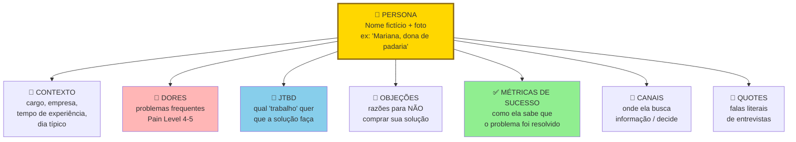

Persona operacional não é demografia. "Mulher, trinta e cinco a quarenta e cinco anos, classe B" é inútil. Não ajuda a decidir produto. "Mariana, dona de padaria artesanal de três lojas, gasta duas horas por dia conferindo insumos manualmente" é acionável.

#### Passo 5B, mapeie os três papéis no contexto de compra (crítico em B2B)

Em contextos B2B, uma persona isolada raramente explica o comportamento de compra. Três papéis distintos interagem durante a decisão. Cada um tem motivações, restrições, e critérios próprios. Confundi-los é o erro mais caro em pesquisa de usuário para vendas B2B.

Usuário. Pessoa que vai operar o produto no dia a dia. Avalia ergonomia, encaixe com a rotina, tempo economizado. Tem poder de sabotagem (se odiar, não usa, ou usa mal). Mas raramente tem poder de compra.

Campeão Interno. Pessoa que enxerga valor na solução e está disposta a brigar por ela internamente. Tipicamente é um usuário avançado, ou um gestor próximo dos usuários. É quem vai marcar a reunião com o decisor, preparar a justificativa, responder pelos riscos. Sem campeão, quase nenhuma venda B2B fecha.

Comprador Econômico. Pessoa com autoridade e orçamento para autorizar o pagamento. Avalia ROI, risco, alinhamento com prioridades corporativas. Raramente vai usar o produto. Frequentemente não conhece os detalhes operacionais.

Três princípios operacionais para a pesquisa desta fase.

Primeiro, entreviste os três papéis separadamente. Misturar em uma entrevista só ("reunião com a empresa X") gera respostas editadas politicamente. Usuários não falam mal da solução se o chefe está presente. Chefes não admitem que não conhecem o workflow se o subordinado está na sala. Separe.

Segundo, monte persona distinta para cada papel. Não uma persona média. Uma "persona da empresa" é ficção. Persona útil é do papel. Porque cada papel toma decisões diferentes com base em critérios diferentes.

Terceiro, identifique quais papéis colapsam e quais permanecem distintos no seu contexto. Em startups muito pequenas (SMB de cinco a vinte funcionários), os três podem ser a mesma pessoa, o dono. Em médias empresas, o usuário costuma estar separado dos outros dois. Em grandes, os três são sempre distintos, e podem somar um quarto papel (TI ou Procurement). Saber onde o seu ICP está nessa geometria define quantas personas você constrói.

> [!tip] B2C também pode ter mais de uma persona
> Em B2C, o trio costuma colapsar em uma pessoa só. O próprio consumidor é usuário, decisor, e pagador. Mas há exceções importantes. Produtos para crianças (pais decidem, crianças usam). Saúde de idosos (filhos frequentemente decidem). Presentes (comprador diferente de destinatário). Benefícios corporativos (empresa paga, funcionário usa). Sempre pergunte: a pessoa que usa é a mesma que paga? Se não, você tem pelo menos duas personas.

O entregável deste passo, para cada papel relevante no seu contexto, é uma persona caracterizada com os mesmos elementos do Passo 5. Motivações, frustrações, comportamentos, JTBDs, citação verbatim. Em B2B típico, três personas. Em B2C típico, uma. Em casos especiais de B2C, duas.

#### Passo 6, identifique o sub-ICP mais doloroso

Entre as personas, qual delas tem o problema mais agudo, com mais urgência, mais recursos para pagar, e é mais fácil de alcançar? Essa é a sua *beachhead*. O ponto de entrada no mercado. Você deve focar nela nas fases seguintes.

#### Passo 7, consolide o Dossiê do Usuário

Documento de dez a vinte páginas. Conteúdo: duas a quatro personas detalhadas; duas a quatro jornadas mapeadas; lista de JTBDs ranqueada por importância e frequência; identificação da beachhead (sub-ICP prioritário); Declaração da Ideia atualizada para v3.

### PERGUNTAS A RESPONDER
- Como o usuário realmente vive a rotina, não como ele diz que vive?
- Quais são os contextos (lugar, horário, estado emocional, pessoas presentes) em que o problema ocorre?
- Quais são os passos concretos da jornada atual?
- Em qual passo da jornada a dor é máxima?
- Quais ferramentas, pessoas, e processos o usuário já mobiliza?
- Que *jobs* o usuário está tentando cumprir (funcional, emocional, social)?
- Qual persona tem a dor mais aguda, e é o melhor ponto de entrada?
- O que o usuário considera "sucesso" no cumprimento do *job*?

### Métricas

Número de observações em campo realizadas. Alvo mínimo de cinco.

Número de personas validadas por dados (não imaginadas). Alvo de duas a quatro.

Número de jornadas mapeadas com profundidade. Alvo de duas a quatro.

Número de JTBDs identificados e ranqueados. Alvo de cinco a dez.

Consistência entre dado declarado e dado observado. Em que percentual das observações o que a pessoa faz bate com o que ela disse que faz? Divergência abaixo de trinta por cento é aceitável (ruído normal de memória e narrativa). Trinta a cinquenta por cento exige triangulação com mais fontes. Cinquenta por cento ou mais indica que a fala é pouco confiável. Priorize o que você observou sobre o que te disseram.

### SAÍDA DESTA FASE

Você concluiu a [[#FASE 4 — PESQUISA COM USUÁRIOS (CUSTOMER DISCOVERY APROFUNDADO)|Fase 4]] quando os oito critérios abaixo estão cumpridos.

1. O Dossiê do Usuário existe, com duas ou mais personas baseadas em dados reais (Template A.5), com seis ou mais atributos comportamentais cada, duas ou mais jornadas mapeadas, e cinco ou mais JTBDs prioritários por ordem de importância.
2. Dez ou mais entrevistas JTBD foram realizadas, com roteiro específico (não a mesma da [[#FASE 3 — DESCOBERTA DO PROBLEMA|Fase 3]]).
3. Cinco ou mais contextos de uso estão mapeados com detalhes. Quando, onde, com quem, sob qual pressão.
4. Cinco ou mais observações em campo (ou equivalente, como análise profunda de artefatos) foram realizadas.
5. A "solução atual não-óbvia" foi identificada. O que as pessoas realmente usam hoje, mesmo que não seja feito para isso.
6. Gatilhos de troca e barreiras estão mapeados em lista.
7. A tese sobre "dor real" foi refinada (antes versus depois com dado), com mais granularidade. Qual job, qual contexto, qual gatilho.
8. Você consegue escolher uma beachhead clara, com justificativa baseada em dados.

**Checklist final.**

- [ ] Aprofundei a pesquisa em dez ou mais novas entrevistas com o ICP refinado da [[#FASE 3 — DESCOBERTA DO PROBLEMA|Fase 3]]?
- [ ] Apliquei técnica de Jobs to Be Done (JTBD) em cinco ou mais entrevistas, e entendi o "job" contratado pelo produto atual?
- [ ] Mapeei "contextos de uso" (quando, onde, com quem, sob qual pressão)?
- [ ] Identifiquei "solução atual não-óbvia", o que as pessoas realmente usam hoje, mesmo que não seja feito para isso?
- [ ] Construí uma a duas personas baseadas em dados das entrevistas (Template A.5), não imaginação?
- [ ] Identifiquei "gatilhos de troca", o que faria alguém mudar da solução atual?
- [ ] Identifiquei barreiras à troca, o que seguraria alguém na solução atual mesmo que a nova fosse melhor?
- [ ] Refinei a minha tese sobre "dor real" com mais granularidade (qual job, qual contexto, qual gatilho)?

**Primeiros passos práticos.**

1. Escolher dez entrevistados da [[#FASE 3 — DESCOBERTA DO PROBLEMA|Fase 3]] que mostraram maior dor, e pedir trinta minutos de follow-up com foco em JTBD.
2. Elaborar a pergunta central JTBD: "Me conta a última vez que você precisou (job), do começo ao fim, em detalhes."
3. Construir uma persona (Template A.5) com dado real, não nome fictício sem base.
4. Mapear, em planilha, os gatilhos de troca e as barreiras identificadas.

### EXEMPLO PRÁTICO

**Entrevista JTBD, PadariaPro.**

A pergunta central: "Me leva para a última vez que você precisou reabastecer o estoque de farinha, passo a passo, do começo ao fim. Quando você percebeu, o que fez, quem envolveu, quanto tempo levou, o que deu errado?"

A resposta bruta de Fábio, dono de três padarias em Campinas:

> "Foi terça passada. O João, gerente da loja 2, me mandou áudio de WhatsApp às 7h. 'Farinha T1 tá acabando, dá pra hoje só.' Eu tava no carro indo pra loja 3. Liguei pro fornecedor, Anaconda, distribuidor regional, e a moça disse que entrega só quinta. Aí liguei pro nosso plano B, o João do Moinho da Serra, que trouxe em quatro horas mas cobrou quinze por cento mais caro. No fim a gente fez a semana, mas o dia 2 foi estresse total, eu tinha três reuniões e tive que virar comprador. Isso acontece umas duas a três vezes por mês, depende. Agora, pra evitar, o gerente geralmente pede mais do que precisa, aí sobra farinha mofando no sábado e a gente perde 200-300 reais por semana. Tô trocando perda por perda."

A análise JTBD da resposta. O job funcional é garantir continuidade de produção sem interrupção. O job emocional é não ser o operador de última hora que apaga incêndio, e não transmitir estresse para a equipe. O job social é ser visto como dono que tem o negócio sob controle pelo gerente e pelos clientes. O contexto: acontece toda semana, é interrupção de foco executivo, envolve duas a três pessoas em média. A solução atual é WhatsApp com gerente mais ligação com fornecedor mais plano B mais caro como contingência. E o "trade de perda por perda" é o ponto-chave. Ou paga mais caro (plano B), ou desperdiça (excesso). Não há caminho sem perda.

A persona resultante, em fragmento. Fábio, trinta e oito anos, padaria artesanal de três lojas em Campinas. Perfil: dono-operador, formação técnica, usa WhatsApp e planilha no celular, desconfiado de apps "modernos" mas adota se ver valor em uma semana. O job contratado é "me devolver horas de foco executivo", mais que "otimizar margem". Se o produto devolver quatro horas por semana do dono, ele paga R$ 400 por mês sem pestanejar. Se só economizar dois por cento de margem, ele questiona.

Os gatilhos de troca observados foram três. Incidente recente de ruptura que causou perda grande (mais de R$ 5 mil), ou cliente insatisfeito. Chegada de nova loja (passar de duas para três, de três para quatro) torna sistema manual inviável. Indicação de par (outro dono de padaria) sobre ferramenta que funcionou.

As barreiras à troca foram três. Percepção de que "a equipe não vai usar". Medo de investir em ferramenta que vira caro sem adoção. Integração com fornecedor atual (relacionamento pessoal) que não entra em sistema digital. Custo fixo mensal que não se sente "tangível", contra a economia, que é difusa.

### Armadilhas

Criar personas fictícias. Sem dados, persona é caricatura. Força você a dizer "a nossa persona é a Ana, uma dona de restaurante…", mas não protege decisões ruins.

Confiar só no que a pessoa diz. Pessoas relatam uma versão idealizada de si mesmas. Observe além de escutar.

Pular JTBDs. Sem clareza do *job*, você projeta features em busca de problema. JTBD é a bússola.

Persona única e genérica. Quase sempre há dois ou mais sub-segmentos relevantes. Uma persona só mascara diferenças importantes.

Perder-se em detalhes irrelevantes. Nem toda informação coletada é útil. Filtre pelo que afeta a decisão de produto.

---

### CASO BRASILEIRO, Fase 4, pesquisa com usuários no QuintoAndar e a dor do fiador

Em 2013, o mercado de aluguel residencial no Brasil tinha fricção enorme. Fiador, vistoria, caução, dois a três meses de processo. Os fundadores do QuintoAndar (Gabriel Braga e André Penha, em São Paulo) fizeram pesquisa qualitativa extensa com inquilinos e proprietários.

Descobriram algo que a hipótese inicial não previa. O ponto mais doloroso era o fiador. Não o valor. A constrangedora necessidade de pedir a alguém. A dor era social, não financeira.

A pesquisa redirecionou a proposta de valor. Em vez de "otimizar o processo de aluguel", posicionaram como "aluguel sem fiador, sem vistoria, sem caução". A dor central virou promessa central. E o produto cresceu nessa direção.

A lição transferível. Pesquisa aprofundada revela qual dor é emocionalmente mais forte, não apenas qual é operacionalmente mais cara. A proposta de valor precisa atacar a dor emocional.

---

### FERRAMENTAS DESTA FASE

Pesquisa aprofundada com usuários exige ferramentas específicas de research. A maioria delas está no Ferramentário (BG.6). Nesta fase, disponíveis de imediato:

5 Whys. Para chegar nas motivações profundas durante entrevistas. Ver BG.5.2.

MECE. Estruturar achados da pesquisa em categorias analisáveis. Ver BG.4.5.

McKinsey 7-Step (Synthesize). Consolidar achados em aprendizados, não fatos soltos. Ver BG.5.1.

Pyramid Principle. Comunicar achados ao time e aos stakeholders. Ver BG.4.4.

Second-Order Thinking. Pensar além da resposta direta do usuário. O que eles farão se a solução existir? Como o comportamento mudará? Ver BG.4.2.

> [!note] Métodos consagrados de pesquisa no Ferramentário
> O [[#APÊNDICE BG — FERRAMENTÁRIO COMPLETO DO EMPREENDEDOR|Apêndice BG]].6 adiciona: The Mom Test (Fitzpatrick), JTBD Switch Interviews (Moesta), Contextual Inquiry (Beyer e Holtzblatt), Laddering Technique, Diary Studies, Empathy Mapping (Gray), Customer Journey Mapping, Personas (Cooper), Grounded Theory, Thematic Analysis, e cerca de quinze outros métodos.

---

### SÍNTESE DA FASE 4

A [[#FASE 4 — PESQUISA COM USUÁRIOS (CUSTOMER DISCOVERY APROFUNDADO)|Fase 4]] vai além do que a [[#FASE 3 — DESCOBERTA DO PROBLEMA|Fase 3]] alcançou. Saber que um problema existe não basta para projetar uma solução. Você precisa saber em que contexto ele ocorre. Em que sequência de eventos. Com quais restrições. Com quais emoções. Com quais pessoas envolvidas. Soluções projetadas sem esse entendimento se chocam contra a realidade no momento da adoção. Mas eu não posso usar isso no meio do turno. Meu chefe nunca ia aprovar. Isso pressupõe que eu tenho internet, e eu não tenho.

A diferença entre quem faz certo, e quem falha, está em observar, e não só perguntar. Entrevista produz evidência declarada. Observação em contexto produz evidência comportamental. As duas são diferentes, e a segunda é mais valiosa. Aplicar Jobs to be Done é o que impede você de construir features irrelevantes. O usuário não quer um produto. Ele contrata o produto para fazer um job específico. Quando você descobre o job real, percebe que metade das features planejadas não serve, e que outras que você não tinha imaginado são essenciais.

O entregável é o Dossiê do Usuário. Personas baseadas em dados reais, não em intuição. Jornadas mapeadas com momentos críticos identificados. Lista clara de jobs. Esse dossiê é insumo das Fases 8 e 9, ideação e protótipo. Quem ignora a [[#FASE 4 — PESQUISA COM USUÁRIOS (CUSTOMER DISCOVERY APROFUNDADO)|Fase 4]] e pula para "vamos construir" entra na construção sem entender quem vai usar, e em que circunstância. O resultado é produto bem-feito tecnicamente, e ignorado por quem deveria adotar.

#fase4 #pesquisa-usuarios #customer-discovery #jtbd #personas #jornada-usuario #affinity-mapping #beachhead

---

## FASE 5 — MAPEAMENTO DE MERCADO E CONCORRÊNCIA

> [!question] FMF Check da Fase 5
> Você está escolhendo cunha neste momento. Pergunta: o seu fit particular com esta cunha é diferencial inimitável, ou é circunstancial? Se a resposta for "outra pessoa qualquer faria tão bem quanto", reavalie. Founder-market-fit é o que faz o próximo ano de dificuldade valer a pena. É a única coisa que diferencia quem persiste de quem desiste no mês 14.

### O que esse apêndice cobre
Levantamento estruturado do mercado em que você quer entrar. O tamanho. A dinâmica. Os principais atores. As soluções atuais (concorrentes diretos, indiretos, substitutos, alternativas). As tendências. A regulamentação aplicável. As barreiras de entrada.

O entregável é um Dossiê de Mercado. Documento que posiciona a sua oportunidade dentro de uma paisagem realista.

### POR QUE
Empreendedores apaixonados tendem a acreditar que "não há concorrentes", ou que "o mercado é enorme". Ambas as afirmações são quase sempre falsas. O mapeamento de mercado força você a enxergar a realidade competitiva. Existem soluções (mesmo que ruins). Existem substitutos (incluindo "fazer nada"). Existem players grandes que podem te copiar. Existe regulamentação que pode te inviabilizar.

Sem esse mapa, você empreende às cegas. Com ele, você toma decisões informadas sobre posicionamento, diferenciação, e estratégia.

### Quando usar
Comece em paralelo com a [[#FASE 4 — PESQUISA COM USUÁRIOS (CUSTOMER DISCOVERY APROFUNDADO)|Fase 4]], ou logo depois. Termine quando tiver clareza de onde se posiciona, e de onde vêm os principais riscos competitivos. Revisite pelo menos uma vez a cada seis meses ao longo da vida do negócio. O mercado muda.

### Quem envolve
O executor é você. Os participantes são usuários (para saber o que eles usam), especialistas de setor (para saber a dinâmica do mercado), e advogado (para regulamentação crítica, se aplicável).

### Como executar

Nove passos.

#### Passo 1, defina o mercado corretamente

Mercado não é "software". Não é "restaurantes". Mercado é a intersecção entre tipo de cliente, *job* que você resolve, e geografia. Por exemplo: "software de gestão de caixa para restaurantes de pequeno porte em capitais brasileiras que fazem delivery próprio". Isso é um mercado que pode ser estimado.

#### Passo 2, estime o tamanho do mercado (TAM, SAM, SOM)

TAM (*Total Addressable Market*) é o tamanho total do mercado global para o problema. É o teto absoluto.

SAM (*Serviceable Addressable Market*) é a parte do TAM que a sua empresa pode realisticamente atender (geograficamente, tecnologicamente, regulatoriamente).

SOM (*Serviceable Obtainable Market*) é a parte do SAM que você pode realisticamente capturar nos primeiros três a cinco anos. Em geral, é um percentual pequeno (de um a dez por cento).

A visualização em círculos concêntricos:

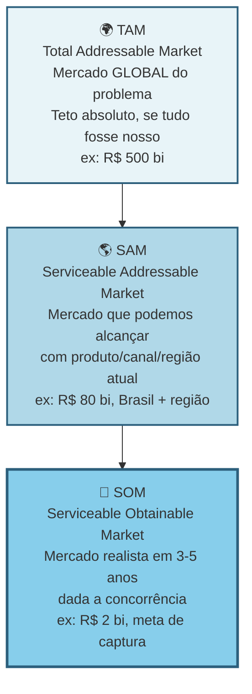

> [!warning] O que investidor checa em TAM/SAM/SOM
> Investidor checa consistência. TAM otimista sem SOM realista é sonho. SOM ambicioso sem TAM que sustenta é conta que não fecha. Estime *bottom-up* (número de clientes vezes ticket), não só *top-down* (percentual de mercado externo).

Calcule top-down e bottom-up, e compare. *Top-down*: dados de mercado públicos (IBGE, Abrasel, associações, relatórios pagos como Statista e Gartner, se acessíveis). *Bottom-up*: número estimado de clientes vezes a receita anual média por cliente.

Se os dois números divergem muito, há algo errado em uma das estimativas. Investigue.

#### Passo 3, identifique todas as alternativas atuais do usuário

Categorize em quatro grupos.

Concorrentes diretos. Outras soluções que resolvem o mesmo *job* da mesma forma. Por exemplo, outros softwares da mesma categoria.

Concorrentes indiretos. Soluções que resolvem o mesmo *job* de forma diferente. Por exemplo, planilha de Excel, caderno físico, contador terceirizado.

Substitutos. Ações que eliminam o *job*. Por exemplo, o dono decide não oferecer delivery, e evita o problema.

Status quo, ou seja, "não fazer nada". É a alternativa mais poderosa. Por que as pessoas simplesmente aceitam conviver com o problema? Subestimar o status quo é a causa de trinta por cento das startups fracassadas.

> [!important] Sua concorrência real raramente é outra startup
> A concorrência real é o jeito que o trabalho é feito hoje. O Excel do auxiliar administrativo. O grupo de WhatsApp onde o gerente despacha ordens. A planilha que ninguém entende mas todo mundo respeita. O hábito silencioso de ignorar o problema porque "sempre foi assim". Reconhecer isso muda para onde você direciona a comparação competitiva. Você para de comparar features com "a Startup X" e começa a comparar a sua proposta com o comportamento atual do cliente. É nesse comportamento que mora a urgência (ou a falta dela).

Para cada alternativa, levante seis dimensões. Quem a oferece. Preço. Pontos fortes e fracos percebidos (use verbatim das Fases 3 e 4). Posicionamento e público-alvo. Tempo de mercado. E a pergunta-chave: *por que essa alternativa é tolerada hoje?* Se ninguém está ativamente reclamando dela, procurando substituto, ou alocando tempo para contornar os defeitos, a dor provavelmente não é grande o suficiente para motivar troca. Cunhas fortes substituem coisas que doem, não coisas apenas inconvenientes.

Minimamente, faça esse levantamento para as cinco a dez alternativas mais relevantes.

#### Passo 4, entenda a dinâmica do mercado

Responda cinco perguntas. O mercado está crescendo, estável, ou encolhendo? (Busque dados dos últimos três a cinco anos.) Existem tendências estruturais? (Digitalização, regulação nova, mudanças demográficas, mudanças de comportamento.) Existe concentração em poucos players grandes, ou é fragmentado? Existem movimentos de consolidação (M&A)? Há ciclos sazonais?

#### Passo 5, mapeie os canais de aquisição de clientes usados no setor

Como os players atuais adquirem clientes? Vendas diretas. Parcerias. Marketing digital. Eventos. Boca a boca. Representantes. Isso indica o que provavelmente vai funcionar para você, e onde o custo de aquisição pode ser caro.

#### Passo 6, levante a regulamentação relevante

Se você atua em saúde, finanças, educação, transporte, alimentação, energia, telecom, ou qualquer setor regulado, há normas que podem inviabilizar a sua solução. Busque as regulamentações federais, estaduais, e municipais aplicáveis. Os órgãos fiscalizadores (ANVISA, BACEN, ANS, ANTT, CVM, e outros, no Brasil). LGPD, se você trata dados pessoais. Exigências tributárias específicas.

> [!tip] Em dúvida sobre regulação, antecipe
> Invista duas a quatro horas de consultoria jurídica agora. É muito mais barato do que descobrir depois que o seu produto é ilegal.

#### Passo 7, identifique barreiras de entrada e vantagens competitivas sustentáveis

O que impede novos concorrentes (incluindo grandes empresas) de te copiar rapidamente? Economias de escala? Network effects? Dados proprietários? Marca? Switching costs?

> [!warning] Execução não é barreira
> Seja realista. "Execução" não é barreira de entrada. Qualquer um pode executar bem. Barreira é estrutural. É o que existe depois que você sai do escritório.

#### Passo 8, faça uma matriz competitiva

A matriz competitiva 2x2 dá clareza instantânea de onde você se encaixa. Exemplo genérico:

```mermaid
quadrantChart
 title Matriz Competitiva, posicionamento no mercado
 x-axis Baixo preço --> Alto preço
 y-axis Baixa profundidade --> Alta profundidade
 quadrant-1 Premium nicho
 quadrant-2 Best-in-class
 quadrant-3 Commodity
 quadrant-4 Generalista caro
 Concorrente A: [0.2, 0.3]
 Concorrente B: [0.6, 0.7]
 Concorrente C: [0.8, 0.4]
 Concorrente D: [0.35, 0.8]
 Você (aposta): [0.45, 0.85]
```

Escolha dois eixos que importam para o ICP, não para você. Preço versus profundidade. DIY versus completo. Generalista versus vertical. Quadrantes vazios são oportunidades. Quadrantes cheios são guerras. Onde você se posiciona define a sua cunha.

A matriz visual é depois complementada por tabela comparando você com três a sete concorrentes principais em cinco a dez dimensões relevantes. Preço, features, público-alvo, pontos fortes, pontos fracos, diferenciação declarada.

#### Passo 9, sintetize o Dossiê de Mercado

Documento de dez a vinte páginas. Conteúdo: definição precisa do mercado; TAM, SAM, SOM calculados e justificados; lista de alternativas atuais categorizadas; análise de três a sete concorrentes com fichas detalhadas; matriz competitiva; tendências e dinâmicas relevantes; regulamentação mapeada; barreiras de entrada e possíveis vantagens competitivas; canais de aquisição usados no setor; e a sua hipótese de posicionamento (onde você se encaixa, para quem, contra quem).

### PERGUNTAS A RESPONDER
- Qual o tamanho real do meu mercado (SOM em R$)?
- Quem são os meus principais concorrentes diretos, indiretos, e substitutos?
- Por que o meu cliente escolheria a mim, e não a alternativa atual?
- Quais são os três maiores riscos competitivos nos próximos dois anos?
- Existe regulamentação que pode me inviabilizar? Qual?
- Quais canais de aquisição são mais promissores para este mercado?
- Qual vantagem competitiva eu posso construir nos primeiros dezoito meses?
- O mercado está crescendo, ou encolhendo?

### Métricas

SOM estimado em reais por ano. Calculado por pelo menos dois métodos convergentes. Benchmark de ambição para capital de risco: caminho crível para SOM de R$ 100 milhões ou mais em sete a dez anos. SOM abaixo disso pode ser negócio ótimo, mas provavelmente não é case de capital de risco.

Número de concorrentes mapeados. Pelo menos cinco. Entre diretos, indiretos, e substitutos (incluindo o status quo: Excel, papel e caneta, "a pessoa faz sozinha"). Se você achou zero diretos, investigue de novo.

Crescimento anual do mercado (CAGR). Estime mesmo na ausência de relatório pronto. Cruze duas fontes (Google Trends, dados setoriais públicos, proxies correlatos). Benchmark: CAGR de quinze por cento ou mais em B2B SaaS, e dez por cento ou mais em consumer, sinaliza mercado em expansão. Abaixo de cinco por cento indica mercado estagnado (possível, mas exige estratégia diferente).

Dispersão competitiva. Concentrado se um player tem quarenta por cento ou mais de share, ou se top três somam setenta por cento ou mais. Fragmentado se top cinco somam menos de trinta por cento. Fragmentado favorece entrada por cunha. Concentrado exige diferencial forte ou nicho mal-atendido.

### SAÍDA DESTA FASE

Você concluiu a [[#FASE 5 — MAPEAMENTO DE MERCADO E CONCORRÊNCIA|Fase 5]] quando os oito critérios abaixo estão cumpridos.

1. O Dossiê de Mercado existe e está escrito.
2. TAM, SAM, e SOM foram calculados bottom-up com dados reais (não top-down de relatório genérico), e com justificativas explícitas.
3. Cinco ou mais concorrentes diretos foram mapeados, com análise de cinco ou mais dimensões cada (preço, posicionamento, ICP, pontos fortes e fracos, reação potencial), mais três ou mais concorrentes indiretos ou substitutos.
4. O Canvas da Cunha (Template A.12) está preenchido e coerente, com caminho de expansão pós-cunha esboçado em três horizontes.
5. O Teste de Precisão do Comprador (Template A.11) foi aplicado, com score de quatro ou mais sobre seis.
6. O posicionamento está em dimensão não-óbvia, ou seja, não é "mais barato" nem "mais features".
7. A regulamentação aplicável foi investigada, e você sabe o que fazer para estar em conformidade.
8. Você consegue responder, em uma frase, *por que o seu cliente-alvo trocaria a alternativa atual por você*.

> [!warning] Se o item 8 não tem resposta, pare
> Se você não consegue responder o item 8, ainda não tem diferencial claro. Volte ao Dossiê do Usuário e ao Mapa de Problemas.

**Checklist final.**

- [ ] Mapeei TAM (mercado total), SAM (mercado endereçável), e SOM (mercado obtenível em três anos) com cálculo bottom-up?
- [ ] Identifiquei cinco ou mais concorrentes diretos, e três ou mais indiretos ou substitutos?
- [ ] Analisei cada concorrente em dimensões: preço, posicionamento, ICP, pontos fortes e fracos?
- [ ] Escolhi a minha cunha (Wedge), o segmento inicial específico onde competir?
- [ ] Apliquei o Canvas da Cunha (Template A.12) com critérios de entrada, valor, e defensabilidade?
- [ ] Fiz o Teste de Precisão do Comprador (Template A.11), e passei em quatro ou mais dos seis critérios?
- [ ] Posicionei a minha oferta em dimensão diferente dos concorrentes (não "mais barato" nem "mais features")?
- [ ] Identifiquei qual concorrente vai reagir se eu crescer, e como?

**Primeiros passos práticos.**

1. Abrir o Template A.12 (Canvas da Cunha) e preencher com a hipótese de segmento inicial.
2. Fazer análise competitiva em planilha. Linhas: cinco a oito concorrentes. Colunas: dimensões (preço, ICP, posicionamento, pontos fortes, pontos fracos, reação potencial).
3. Calcular TAM, SAM, e SOM bottom-up. Número de empresas vezes ticket médio vezes taxa de captura realista em três anos.
4. Aplicar o Teste de Precisão do Comprador (Template A.11). Se falhar em três ou mais critérios, refinar a cunha antes de avançar.

### EXEMPLO PRÁTICO

**Canvas da Cunha, PadariaPro.**

Segmento inicial (cunha). Padarias artesanais com três a cinco lojas, faturamento de R$ 100 mil a R$ 300 mil por mês por loja, em São Paulo capital e região metropolitana.

Por que esse segmento? A dor mais aguda foi identificada na pesquisa. A [[#FASE 4 — PESQUISA COM USUÁRIOS (CUSTOMER DISCOVERY APROFUNDADO)|Fase 4]] mostrou dor 8 ou 9 aqui, contra 4 a 6 em padarias com uma ou duas lojas. O tamanho é viável: cerca de quatrocentas padarias identificáveis nesse perfil em São Paulo (pesquisa em Sympla de eventos de panificação mais ABIP). A capacidade de pagar é boa: dono-operador com margem bruta de quarenta e cinco por cento ou mais, desembolso de R$ 1.200 a R$ 2.000 por mês é viável. E a acessibilidade é alta: a maioria está em três ou quatro bairros identificáveis, e eventos setoriais (Expo Pan) permitem contato direto.

Valor para o segmento. O problema é a perda de R$ 3 mil a R$ 8 mil por mês por loja por gestão manual de estoque, mais quatro a oito horas por semana do dono em pedido. A solução em uma frase: software mais integração com fornecedor que devolve quatro horas por semana ao dono e reduz a perda em sessenta a oitenta por cento. A prova de valor inicial é piloto com três padarias, medindo a redução de perda mês a mês.

Critérios de entrada (barreira baixa). Onboarding em menos de sete dias, sem requisito de TI. Preço em teste: R$ 400 por mês por loja, com início grátis por trinta dias. Integração inicial com dois fornecedores-chave (Anaconda e Moinho da Serra).

Defensabilidade (como ficar seguro depois de entrar). Três fontes. Integrações com fornecedores que demoram três a seis meses para replicar. Dados de demanda acumulados que geram previsão melhor que competidor sem base. Relacionamento com donos (eventos, WhatsApp) que cria efeito de comunidade.

Caminho de expansão pós-cunha. Ano 1: SP capital mais região metropolitana (meta cinquenta padarias). Ano 2: Campinas, Grande Rio, BH. Ano 3: padarias de seis a dez lojas, redes pequenas, e expansão geográfica nacional.

Competidores e reação potencial:

| Competidor | Tipo | Posicionamento | Reação à nossa entrada |
|---|---|---|---|
| SigePro | ERP horizontal | Genérico, pesado | Baixa, não enxerga nicho |
| Zenda | ERP restaurante | Foco em delivery | Média, pode adicionar feature |
| Excel/Caderno | Solução atual | Inércia | Nenhuma |
| Consultoria local | Serviço pontual | Pessoal, caro | Nenhuma ou parceria |

Teste de Precisão do Comprador, fragmento.

- [x] Consigo descrever o comprador em uma frase com quatro ou mais atributos? Sim. "Dono-operador de três a cinco padarias artesanais em SP, trinta a quarenta e cinco anos, adota app se vê valor em uma semana."
- [x] Consigo listar vinte nomes reais? Sim. Vinte e sete nomes mapeados em rede mais ABIP.
- [x] Identifiquei três gatilhos que fariam essa pessoa comprar agora? Sim. Ruptura recente, nova loja, indicação.
- [x] Tenho acesso direto ou via rede a dez ou mais pessoas desse perfil? Sim. Doze contatos diretos mais oito via rede.
- [ ] Já validei disposição a pagar com cinco ou mais pessoas do perfil? Não. Só dois até agora.
- [ ] Consigo vender para esse perfil com discurso de menos de dez minutos? Não testado ainda.

Score quatro sobre seis. A cunha é viável, mas duas dimensões precisam de validação adicional antes de investir em produto.

**Canvas da Cunha, caso real, Stone (preenchida retroativamente para 2012).**

Reconstrução do que poderia ter sido o Canvas da Cunha que André Street e Eduardo Pontes preencheram ao começar a Stone. Baseada em entrevistas, S-1, e cobertura pública da empresa.

Segmento inicial (cunha). Pequenos comerciantes (varejo, serviços) com faturamento mensal de R$ 30 mil a R$ 300 mil, em capitais e cidades de médio porte, insatisfeitos com o atendimento dos quatro grandes adquirentes (Cielo, Rede, GetNet, SafraPay). Foco geográfico inicial: Rio de Janeiro e São Paulo.

Por que esse segmento? A dor mais aguda. PMEs reclamavam de tempo de aprovação de máquina, taxas opacas, e principalmente atendimento. Call center sem resolução. Falta de agente que visitasse o estabelecimento. O tamanho é grande: cerca de cinco milhões de PMEs com aceitação de cartão no Brasil em 2012, das quais cerca de um milhão e meio no perfil-alvo. A capacidade de pagar existe: PMEs já pagam o serviço. O problema é por *qual* adquirente, não *se* adquirem. E a acessibilidade era viável via "Green Angels", executivos de venda contratados como representantes locais.

Valor para o segmento. O problema é taxa alta, mais repasse demorado (D+30 era padrão), mais atendimento sem qualidade, mais máquina quebrada sem substituição rápida. A solução em uma frase: maquininha com taxa menor, recebimento em D+1, e atendimento humano de fato. Green Angel visita, troca máquina em vinte e quatro horas, número direto de relacionamento. A prova de valor inicial: os primeiros lojistas que aceitaram fizeram a comparação direta da fatura mensal. Economia visível.

Critérios de entrada (barreira baixa). Onboarding em quarenta e oito horas ou menos (contra cinco a quinze dias dos incumbentes). Sem aluguel da máquina (contra R$ 70 a R$ 130 por mês praticado). Recebimento em D+1 (contra D+30).

Defensabilidade. Três fontes. Rede de Green Angels com relacionamento local, não replicável sem investimento de anos em campo. Custo operacional menor (sem call center terceirizado de baixa qualidade) que vira margem repassada ao lojista. Marca diferenciada por atendimento humano em mercado que tratava cliente como número.

Caminho de expansão pós-cunha. Anos 1 e 2: capitais (RJ, SP, BH, POA). Anos 3 e 4: cidades de médio porte e varejos maiores. Ano 5 em diante: serviços financeiros adicionais (conta digital, crédito), consolidando-se em fintech B2B.

Competidores e reação potencial:

| Competidor | Tipo | Posicionamento | Reação à nossa entrada |
|---|---|---|---|
| Cielo | Líder histórico | Operador estabelecido | Inicial: ignora. Depois: copia atendimento, devagar |
| Rede (Itaú) | Co-líder | Vinculado a banco | Defensiva via banco-mãe |
| GetNet | Médio | Vinculado ao Santander | Similar |
| PagSeguro | Insurgente | Online + microempreendedor individual | Concorrente direto, mira segmento adjacente |

Teste de Precisão do Comprador, fragmento.

- [x] Consigo descrever o comprador em uma frase com quatro ou mais atributos? Sim. "PME com R$ 30 a R$ 300 mil de faturamento mensal, em capital, com aceitação de cartão como canal principal, insatisfeita com atendimento atual."
- [x] Consigo listar vinte nomes reais? Sim, via rede de Green Angels já em formação.
- [x] Identifiquei três gatilhos que fariam essa pessoa comprar agora? Sim. Máquina quebrada, fatura nova chegando, fim de contrato.
- [x] Tenho acesso direto ou via rede a dez ou mais pessoas desse perfil? Sim, dezenas via rede pessoal dos fundadores no setor financeiro.
- [x] Já validei disposição a pagar com cinco ou mais pessoas do perfil? Sim, primeiros pilotos topando taxa renegociada.
- [x] Consigo vender para esse perfil com discurso de menos de dez minutos? Sim. O pitch de "menos taxa, recebimento mais rápido, atendimento que aparece" cabe em cinco minutos.

Score seis sobre seis. A cunha está pronta para investir em produto e operação.

**Comparando os dois canvas.** PadariaPro mira nicho profundo (três a cinco lojas artesanais em SP, cerca de quatrocentos alvos) com cunha geográfica e setorial estreita. Stone mirava nicho amplo (PMEs com cartão, cerca de um milhão e meio de alvos) mas dentro de uma vertical setorial que era essencialmente uma commodity insatisfeita. A diferença não é só de escala. É de tipo de defensibilidade. PadariaPro depende de integração técnica e dados acumulados. Stone dependeu de rede física humana (Green Angels) que era cara para o incumbente replicar. Ambos passam no Teste de Precisão do Comprador. Mas a natureza da cunha leva a estratégias de produto e go-to-market completamente diferentes.

### Armadilhas

"Não tenho concorrentes." Você tem. Mesmo que seja o Excel, o papel e caneta, ou "a pessoa faz sozinha". Não reconhecer isso cria falsa sensação de oportunidade.

Confundir market size com oportunidade. Um mercado de R$ 10 bilhões pode ser péssimo negócio se dominado por dois gigantes bem-financiados. E um nicho de R$ 50 milhões pode ser ótimo se ignorado e você capturar vinte por cento.

Top-down preguiçoso. Pegar um número de relatório e multiplicar por "um por cento é fácil". Cada ponto percentual de mercado é brutalmente difícil de conquistar.

Ignorar o status quo. "Ninguém faz nada hoje" é a pior das alternativas concorrentes. A inércia é invencível se a dor não for grande o suficiente.

Regulamentação como detalhe. Setores regulados (saúde, financeiro, educação) têm regras que afundam produtos inteiros. Investigue cedo.

### ESTRATÉGIA DA CUNHA (WEDGE), o trabalho mais importante da Fase 5

No fim desta fase, você precisa produzir algo que resolva a pergunta mais prática do empreendedor iniciante. *Por onde eu começo a vender, exatamente?* A resposta tem nome. Estratégia da Cunha (ou *Wedge Strategy*).

A Cunha é um ponto de entrada no mercado muito restrito e de alta alavancagem. Empresas que tentam "vender para pequenas e médias empresas em geral", ou "para criadores de conteúdo", têm quase sempre resultados ruins. O foco é largo demais. A mensagem é genérica. O custo de aquisição explode. E o produto acaba servindo mal a todo mundo. A alternativa é a Cunha. Entrar por uma fresta muito específica, dominar, e só depois expandir.

#### Anatomia de uma cunha forte, quatro elementos

Se faltar um, não é cunha.

Um ICP claramente definido. Não é "pequenas empresas". É, por exemplo, "gerentes de operação em lojas independentes de óticas, com duas a cinco unidades, no interior de São Paulo e Minas Gerais, que usam sistema de gestão próprio ou planilhas". Precisão cirúrgica.

Uma dor específica. Um fluxo de trabalho recorrente, doloroso, e frustrante. Não é "otimizar o negócio". É, por exemplo, "conciliar vendas de armações com repasse das operadoras de convênios, hoje feito manualmente toda sexta-feira, consumindo cerca de quatro horas de uma pessoa por loja".

Um resultado mensurável e imediato. O que muda na vida daquele ICP quando a dor é resolvida. Quatro categorias contam. Aumento de receita (vendeu mais, subiu ticket, cortou tempo de ciclo de venda). Redução de custo (economizou horas de pessoa, automatizou tarefa cara, reduziu erro caro). Mitigação de risco (evitou multa regulatória, evitou retrabalho, evitou perda de cliente). Economia de tempo (transformou quatro horas em quinze minutos, liberou uma pessoa para outra função). Se o benefício que você vende não cai claramente em uma dessas categorias, o seu pitch vai soar vago. E compras B2B não acontecem por pitch vago.

Um Dono do Orçamento (Economic Buyer) com autoridade para pagar. Quem, nominalmente, no organograma do cliente, tem autoridade e budget para assinar o cheque. Em B2C, é o próprio consumidor. Em B2B, pode ser o sócio-proprietário, o gerente de TI, o diretor financeiro, o head de operações. Depende. Se você não sabe quem é, vai falar com a pessoa errada e gastar meses vendendo para influenciadores em vez de decisores.

#### Teste de Precisão do Comprador, a frase que não pode travar

O elemento quatro da anatomia da cunha (Dono do Orçamento) é o que mais empreendedor iniciante pula. Parece que definir "quem decide" pode ser deixado para depois, quando o produto estiver pronto. É exatamente o contrário. Vender para o não-decisor é a razão número um de ciclos de venda que se arrastam por meses sem fechamento.

Para testar se o seu elemento quatro está preciso, complete a seguinte frase sem hesitar:

> [!important] Frase-teste do Dono do Orçamento
> "Nós vendemos para (CARGO) em (TIPO DE EMPRESA), porque essa pessoa é responsável por (RESULTADO ESPECÍFICO) e controla (ORÇAMENTO ESPECÍFICO)."

Três critérios de aprovação no teste.

Primeiro, você consegue escrever a frase em menos de trinta segundos, sem rascunhar variações.

Segundo, a frase usa cargos reais existentes no organograma do cliente. Não "tomadores de decisão". Não "gestores". Não "stakeholders". Cargo nominal, como "Diretor Financeiro", "Gerente de Operações da Unidade", "Sócio-Administrador".

Terceiro, o orçamento mencionado é uma rubrica existente. Não uma rubrica que o cliente precisaria criar para comprar de você. Se é rubrica nova, o ciclo de decisão é três a cinco vezes mais longo.

Exemplo ficcional, B2B brasileiro: "Nós vendemos para o Gerente de Operações de lojas de óptica com duas a cinco unidades no interior de SP e MG, porque essa pessoa é responsável por fechar a conciliação com operadoras de convênio toda sexta, e controla o orçamento operacional da unidade (tipicamente R$ 800 a R$ 2.500 por mês para ferramentas de gestão)."

Se a sua versão da frase exige asteriscos, exceções, ou "depende do tamanho da empresa", o elemento quatro da sua cunha ainda está instável. Volte às entrevistas ([[#FASE 4 — PESQUISA COM USUÁRIOS (CUSTOMER DISCOVERY APROFUNDADO)|Fase 4]]) com foco em três perguntas. Quem autorizou a compra mais recente de algo parecido. Quanto gastou. E qual dor específica motivou a liberação do orçamento.

> [!warning] Distinção crítica, repetidamente confundida
> Usuário, Comprador Econômico, e Campeão Interno são pessoas diferentes. O usuário é quem opera o produto no dia a dia. O campeão interno é quem vai brigar internamente para você ser aprovado (geralmente alguém que sofre com o problema mas não controla orçamento). O comprador econômico é quem assina. Vender como se os três fossem a mesma pessoa é o erro operacional mais caro em B2B. Em B2C isso colapsa em uma pessoa só (o próprio consumidor). Mas mesmo em B2C há casos onde usuário e comprador divergem. Produtos para crianças. Saúde de idosos. Presentes.

#### Teste operacional da cunha, "o teste do grupo de WhatsApp"

> [!tip] Se cabe em um grupo, está fina o suficiente
> Se você consegue listar, nominalmente, todas as pessoas-alvo iniciais da sua cunha em um grupo de WhatsApp de cem a trezentas pessoas, a sua cunha está fina o suficiente. Se você precisa de "milhões de pessoas" para rodar o modelo inicial, a sua cunha ainda está larga demais. Reduza até caber num grupo.

#### Por que cunha fina vence cunha larga (mesmo parecendo contraintuitivo)

Focar em um fluxo de trabalho minúsculo de uma persona específica, e ignorar noventa e nove por cento das outras possibilidades, parece arriscado. Como se você estivesse encolhendo o próprio horizonte. Mas fazer isso traz clareza imensa. E isso permite colocar intensidade na direção certa. Intensidade gera tração. Tração gera cinco coisas. Clientes-referência que viram evangelistas (vendem por você para os próximos). Estudos de caso com números claros (reduziu oitenta por cento do tempo de conciliação). Clareza sobre o que construir, e o que não construir. Menor custo de aquisição, porque você conhece exatamente o canal e o gancho. Defensibilidade inicial, porque grandes empresas tendem a ignorar nichos pequenos demais.

Depois de dominar a cunha, você pode expandir para nichos adjacentes (horizontal), ou para mais dor do mesmo cliente (vertical). Mas sem dominar a cunha primeiro, qualquer tentativa de expansão resulta em uma empresa sem product-market fit em lugar nenhum.

#### Cunha não é plataforma, a distinção que salva startups

Há uma tentação quase universal em empreendedores iniciantes de descrever a ideia como uma "plataforma". Soa ambicioso, soa escalável, soa investível. Quase sempre é um erro operacional grave. Plataforma e cunha são coisas opostas em estágio inicial. E confundir as duas custa caro.

Cunha é profundidade focada em um único fluxo de trabalho, para um único papel, com um único resultado mensurável. Busca dominância em uma fatia estreita.

Plataforma é amplitude através de fluxos, papéis, e integrações. Assume que expansão vai acontecer antes que a profundidade tenha sido provada em qualquer frente.

Os quatro custos operacionais de declarar "plataforma" cedo demais.

Ciclo de venda mais longo. Plataformas exigem múltiplos aprovadores dentro do cliente (cada área toca algo diferente), e cada aprovador adiciona semanas ao fechamento. Uma cunha fala com um decisor.

Onboarding mais difícil. Plataformas pressupõem integrações e configurações que dependem de decisões em várias áreas do cliente. Cunha tem onboarding de minutos ou horas.

ROI menos claro. Plataformas prometem ganhos compostos em vários processos, o que é difícil de quantificar antes de adotar. Cunhas mostram economia mensurável em uma rubrica específica do primeiro mês.

Produto construído sobre ar. Plataformas obrigam a equipe a construir muitas capacidades mínimas em paralelo, sem feedback de uso real em nenhuma delas. Cunhas constroem uma coisa bem feita.

> [!important] Plataformas são consequência, não ponto de partida
> Plataformas são tipicamente o resultado de cunhas bem-sucedidas. Stripe começou como "API simples de pagamento online para desenvolvedores", não como "infraestrutura financeira global". Figma começou como "ferramenta de design no navegador para pequenos times de produto", não como "plataforma de colaboração enterprise". OpenAI começou com uma interface conversacional para uso geral, não como infraestrutura de IA enterprise. Cada uma dessas empresas é hoje uma plataforma. Mas a plataforma foi a consequência da cunha dominada, não a aposta inicial.

Se, ao descrever a sua ideia, você sente a necessidade de usar a palavra "plataforma" para que ela pareça grande o suficiente, é sinal de que a cunha ainda não está clara. Uma cunha forte não precisa da palavra "plataforma" para soar relevante. Soa relevante pela dor específica que resolve, e pelo resultado mensurável que entrega.

#### Sinais de escopo instável, diagnóstico rápido

Antes de preencher o Canvas da Cunha, faça um diagnóstico honesto de estabilidade do escopo. Escopo instável é comumente confundido com ambição. Mas em regra é o oposto. É falta de escolha. Se o seu posicionamento muda dependendo de quem está na sua frente, a cunha ainda está em expansão, não em refinamento.

Aplique a frase-âncora:

> [!question] Frase-âncora do escopo estável
> "Estamos construindo para (UM PAPEL) lidando com (UM WORKFLOW) em (UM AMBIENTE)."

Essa frase deve soar natural e consistente em toda conversa. Com investidor, com cliente, com engenheiro que você está recrutando, com cônjuge no jantar. Se ela precisa de variações para audiências diferentes, você ainda está servindo múltiplos ICPs, workflows, ou tipos de comprador ao mesmo tempo. Isso é custo puro. Não versatilidade.

Quatro sinais operacionais de escopo instável, em ordem crescente de gravidade.

Mais de um ICP primário. Você tem "SMBs e enterprise", ou "criadores e agências", ou "varejo e food service". Cada ICP dobra o custo de mensagem, de canal de aquisição, e de decisão de roadmap.

Demos diferentes para audiências diferentes. Você prepara uma versão do pitch para investidor, outra para cliente, outra para parceiro. E cada uma enfatiza capacidades diferentes. Sinal de que o produto ainda não tem uso central dominante. Tem muitos usos equivalentes.

Propostas de valor diferentes por segmento. "Para o segmento A, reduzimos custo. Para o segmento B, aumentamos receita. Para o segmento C, mitigamos risco." Não é versatilidade de produto. É indecisão de estratégia travestida de versatilidade. Cada segmento exige máquina de vendas diferente.

Roadmap abrangendo workflows não relacionados. O backlog de features tem uma feature para automação fiscal, outra para CRM, outra para integração com marketplace, outra para BI. Se essas features não se conectam pela mesma pessoa realizando o mesmo trabalho, você não tem um roadmap. Tem vários produtos competindo pela mesma equipe.

> [!warning] Critério operacional dos sinais de escopo
> Se você reconhecer dois ou mais desses sinais no seu próprio produto hoje, a cunha ainda está instável. Não adianta avançar para a Fase 6 (hipóteses) com cunha instável. Você vai gerar hipóteses conflitantes sobre ICPs diferentes, e cada decisão nas fases seguintes vai te puxar para direções opostas.

A ação corretiva é escolher. Escolher dói, porque toda escolha fecha opções imaginadas. É exatamente por isso que precisa ser feita agora, quando o custo de fechar opções é zero. Não depois, quando o custo vem em forma de produto construído, time contratado, e clientes mal servidos.

#### Entregável, Canvas da Cunha

As seis dimensões do Canvas, em forma visual:

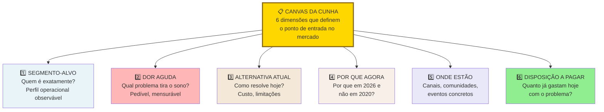

Responda com especificidade cruel. Cada resposta vaga é um ponto fraco futuro. O template textual completo:

```
CANVAS DA CUNHA, v___

ICP (preciso): _______________________________________
 _______________________________________

Dor específica: _______________________________________
(1 fluxo de trabalho) _______________________________________

Resultado mensurável: _____________________________________
(escolha 1-2 categorias: receita / custo / risco / tempo)
Métrica do resultado: _____________________________________
(ex.: "reduz de 4h para 15min por semana")

Dono do orçamento: _______________________________________
(cargo + nível hierárquico)

Teste do grupo de WhatsApp:
Quantas pessoas específicas eu consigo listar nominalmente
como potenciais primeiros clientes? _____
[ ] Cunha aprovada (100-300 pessoas listáveis).
[ ] Cunha muito larga (refinar).

Alternativa atual (o que o cliente faz hoje):
___________________________________________________________

Por que eu sou melhor do que a alternativa atual
(em 1 frase, com número se possível):
___________________________________________________________
```

Sem esse canvas preenchido, você ainda não sabe o que vai vender, nem para quem, nem por quanto. Não avance para hipóteses ([[#FASE 6 — FORMULAÇÃO RIGOROSA DE HIPÓTESES|Fase 6]]) sem isso resolvido.

### TESTE DE ESTRESSE DA CUNHA, exercício de cinco minutos (Wedge Stress Test)

O Canvas da Cunha é o instrumento estratégico. Esse teste é o instrumento tático. Use-o sempre que você descrever a cunha para alguém (investidor, mentor, cliente) e sentir que perdeu a pessoa. Ou antes de uma reunião importante, para pressionar a própria cunha e ver onde ela racha.

#### Parte 1, escreva em quatro linhas (dois minutos)

Quem é o usuário? Descrito por cargo mais contexto. Por exemplo, "Gerente de contas a pagar em escritório de advocacia de vinte a cem pessoas", não "profissionais de finanças". Se você precisa de duas sentenças para descrever o usuário, ainda está largo.

O que dispara o problema? Qual evento, data, tarefa, ou situação recorrente faz o problema aparecer. Problema sem gatilho não tem urgência. Por exemplo, "todo fim de mês, quando precisa fechar conciliação, e o sistema atual gera quarenta inconsistências que precisam ser revisadas manualmente".

O que acontece se o problema não for resolvido? Consequência concreta. Multa. Demissão. Retrabalho. Cliente perdido. Atraso em entrega. Burn-out do time. Se a resposta é "as coisas seguem como estão", não há dor. Há inconveniência.

O que o usuário faz hoje para contornar? Solução atual, mesmo precária. Planilha. Frankenstein de ferramentas. Estagiário terceirizado. A existência da gambiarra é o sinal mais forte de dor real (Pain Level 4).

#### Parte 2, duas perguntas-faca (três minutos)

Esse conjunto de clientes caberia em um único canal de Slack ou grupo de WhatsApp? Não metaforicamente. Literalmente. Se você não consegue imaginar essas trinta a oitenta pessoas reunidas no mesmo grupo trocando mensagens sobre o mesmo problema específico, a sua cunha ainda está larga. Reduza.

Se a sua empresa fechasse hoje à noite, quem reclamaria ativamente amanhã de manhã? Não "quem sentiria falta". Quem abriria o notebook, ligaria para alguém, postaria no LinkedIn. Essa lista de pessoas é a sua cunha real. Se a lista tem menos de três pessoas específicas (com nome e cargo), a sua cunha é teórica. Não está aterrada em gente.

> [!tip] Uso operacional do teste
> Rode esse teste sozinho antes de rodá-lo com outra pessoa. Se você mesmo travar em alguma das seis perguntas, não vale envergonhar-se com um mentor. Volte primeiro ao Canvas da Cunha e resolva. O teste existe para você detectar cedo onde a sua narrativa não se sustenta.

### CONCORRÊNCIA REAL, os quatro tipos de substituto que você precisa mapear

Empreendedores iniciantes tendem a listar "concorrentes diretos" (outras startups ou produtos do mesmo tipo) e acham que terminaram a análise competitiva. Não terminaram. Na maior parte dos casos, a principal concorrência não é outra startup. É o jeito atual como o trabalho é feito hoje. E esse jeito atual cai em quatro categorias bem definidas. Todas precisam ser mapeadas.

#### Tipo 1, planilhas (Excel, Google Sheets, Airtable)

Flexíveis, familiares, baixo custo percebido ("já pago por Office"). Mas manuais, propensas a erro, fragmentadas por pessoa, sem trilha de auditoria. Sinal de oportunidade: o cliente tem uma planilha-mãe com quinze ou mais abas que só ele entende, e entra em pânico quando pensa em sair de férias.

#### Tipo 2, cadeias de e-mail e WhatsApp de trabalho

Fragmentadas, difíceis de rastrear, informação dispersa em caixas de entrada. Sinal de oportunidade: o cliente perde informação importante em e-mails antigos, ou precisa reconstruir o histórico de uma decisão consultando cinco pessoas diferentes.

#### Tipo 3, ferramentas internas construídas ad-hoc

Sistemas caseiros montados por um técnico ou estagiário. Em geral desatualizados, com dívida técnica crescente, dependentes de uma pessoa específica. Sinal de oportunidade: o cliente vive com medo de que "fulano saia" e o sistema pare de funcionar.

#### Tipo 4, SaaS estabelecidos resolvendo problema adjacente

Softwares que o cliente já paga por outro motivo, e que "quase" resolvem o seu problema. É o concorrente mais subestimado. O cliente prefere forçar a ferramenta existente a caber no problema novo do que contratar nova ferramenta. Sinal de oportunidade: o cliente usa quarenta por cento das features de uma ferramenta, e improvisa o resto.

> [!important] A pergunta-chave de competição
> *Por que a alternativa atual é tolerada?* Se a resposta é "porque funciona suficientemente bem", a sua urgência é fraca, e provavelmente você não tem cunha. Cunhas fortes substituem algo doloroso. Não algo levemente inconveniente. Se os entrevistados descrevem a planilha-mãe rindo ("a minha relação de amor e ódio com aquele Excel maldito"), você tem uma fresta. Se descrevem com indiferença ("funciona, acho"), você não tem.

### Caso trabalhado, Warby Parker das Fases 1 a 5 com o Framework Antler

Esse caso ilustra a aplicação integrada dos Filtros YC mais Heartfelt, das entrevistas, das personas, e da Cunha em um exemplo B2C real.

Contexto. Warby Parker foi fundada em 2010 por quatro cofundadores na Wharton (Neil Blumenthal, Andrew Hunt, David Gilboa, e Jeffrey Raider), vendendo óculos de grau online. Hoje vale bilhões. A reconstrução abaixo é hipotética. Derivada do ensaio canônico de Greg Coticchia e da Antler.

#### Passo 1, identificação do problema (Fase 2)

Os fundadores começaram observando múltiplas dores simultâneas ao tentar comprar óculos nos EUA. Listadas com verbatim do público:

- "Óculos são caríssimos, US$ 400 a US$ 1.000 para algo simples."
- "Comprar óculos é um saco. Ir à ótica, aguentar vendedor insistindo, voltar depois."
- "A seleção é avassaladora. Centenas de armações, nenhuma destaca."

Eles não tentaram refinar para um problema cedo demais. Listaram todas as dores. O refinar viria depois.

#### Passo 2, identificação do mercado-alvo (Fase 2/3, com raciocínio hipotético-dedutivo)

Quem tem essas dores com maior intensidade? Quem precisa de óculos (cinquenta por cento ou mais da população) é o filtro inicial amplo. Quem é sensível ao preço, mas não aceita marca genérica, exclui compradores de Fendi, inclui compradores educados. Quem valoriza conveniência a ponto de pagar por isso exclui aposentados com tempo livre. Quem é sensível ao estilo exclui compradores puramente funcionais.

A intersecção: jovens profissionais urbanos, com renda média-alta, conscientes de estilo, sem tempo para ir a óticas. Esse virou o ICP inicial. Sinalmente, outros ICPs foram listados como alternativas (pais de crianças que usam óculos, idosos conscientes de preço), prontos para pivô se o primeiro falhasse.

#### Passo 3, construção da hipótese central (Fase 5, virando entrada para Fase 6)

A equipe consolidou toda a pesquisa em uma única frase testável:

> [!quote] Hipótese central do Warby Parker
> "Comprar óculos nos EUA é caro, demorado, e avassalador. Jovens profissionais querem uma forma mais acessível, conveniente, e curada de comprar óculos."

Essa é a formulação canônica de hipótese que a Antler recomenda. Uma frase sobre o problema, uma sobre o desejo do mercado-alvo.

#### Passo 4, teste da hipótese (Fase 7, em prévia)

Eles não construíram produto primeiro. Foram falar com jovens profissionais. A descoberta crítica na conversa: a maioria dos entrevistados se importava mais com conveniência e estilo do que com preço. Muitos tinham bons salários. O insight inesperado mudou o posicionamento. "Óculos bonitos entregues no escritório" virou proposta-âncora, com "mais barato" como bônus, não como âncora central.

Esse tipo de descoberta só aparece em conversas. Nunca em pesquisa secundária.

#### Passo 5, construção do Canvas da Cunha

A Cunha inicial do Warby Parker teria sido aproximadamente:

```
CANVAS DA CUNHA, Warby Parker v1

ICP (preciso): profissionais urbanos 25-40 anos, renda $60k+,
 conscientes de estilo, nos EUA (começando em NY/SF).

Dor específica: processo de comprar óculos é lento, caro e chato.
 Perder 2-3 idas a shopping + $500+ por par.

Resultado mensurável: economia de tempo (de ~6h para ~30min) +
 economia de ~60-70% no preço +
 sensação de ter óculos "descolados".

Dono do orçamento: o próprio cliente (B2C direto).

Teste do grupo de WhatsApp:
Poderíamos listar ~200 amigos e conhecidos deste perfil
em NYC/SF com interesse declarado? SIM → cunha aprovada.
```

#### Passo 6, lição do caso para o seu contexto

Note o que o Framework Antler *não fez* no Warby Parker. Não tentou resolver todo o problema da indústria óptica (muito amplo). Não começou com pais ou idosos (cada persona teria empresa diferente). Não construiu produto primeiro, validou com pessoas reais primeiro. E não assumiu que "preço baixo" era o diferencial principal antes de conversar.

> [!important] Aplique o mesmo padrão à sua ideia
> Liste dores completas. Derive ICP por filtros cumulativos. Condense em uma frase. Teste a frase antes de construir qualquer coisa. Ajuste o ICP até a Cunha caber num grupo de WhatsApp. Documente.

---

### CASO BRASILEIRO, Fase 5, cunha na Creditas

Em 2012, o mercado brasileiro de crédito era dominado por bancos com crédito pessoal sem garantia (taxas de cinco a doze por cento ao mês), e crédito com garantia via bancos tradicionais (burocracia alta, meses de processo).

Sergio Furio, fundador da Creditas, fez a escolha que define a empresa. Em vez de competir em "crédito pessoal mais barato" (cunha larga, contra bancos com muito mais capital), escolheu cunha estreita. Crédito com garantia de imóvel ou veículo, online, em dias em vez de meses. ICP inicial claro. Dor específica. Resultado mensurável (taxa muito abaixo do crédito pessoal bancário).

A cunha estreita permitiu três coisas. Construir operação especializada. Estabelecer relação com poucos tipos de cliente. E definir unit economics específicos. A expansão para outras verticais veio depois, apoiada na base.

A lição transferível. Cunha estreita no começo não limita o tamanho final do negócio. Limita o risco inicial e acelera o PMF.

---

### Transição, Fase 5 para Fase 6

O que você acabou de fazer, ao longo das Fases 0 a 5. Preparou-se como fundador. Gerou ideias. Articulou a candidata escolhida. Construiu teoria causal. Descobriu problemas reais no ICP através de entrevistas com saturação. Mapeou o mercado, e definiu cunha.

O que vem nas Fases 6 a 9. Transformar o que você *aprendeu* em *hipóteses testáveis*, e planejar experimentos rigorosos para validá-las. Você sai da fase de descoberta aberta (procurando o que não sabe) para entrar na fase de validação estruturada (testando o que acha que sabe).

> [!warning] Base sólida é pré-requisito das Fases 6 a 9
> Se você ainda está incerto sobre qualquer fase anterior, volte. As próximas exigem base sólida. Sem ICP específico, mapa de problemas, e canvas da cunha preenchidos, as hipóteses geradas serão vagas, e os experimentos virão ambíguos.

---

Visão panorâmica das Partes II a V, do problema ao PMF:

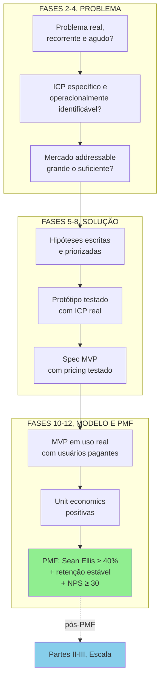

Falha em qualquer etapa significa voltar à fase anterior, não pular adiante. Cada nó "não" força retorno à fase predecessora. Mesmo que isso custe três a seis meses.

---

### FERRAMENTAS DESTA FASE

Mapeamento de mercado e concorrência é onde o ferramentário estratégico clássico mais brilha. Fase rica em aplicação de frameworks. Detalhamento no [[#APÊNDICE BG — FERRAMENTÁRIO COMPLETO DO EMPREENDEDOR|Apêndice BG]].

Porter's Five Forces (Michael Porter, 1979). Análise estrutural de atratividade da indústria. Novos entrantes, fornecedores, compradores, substitutos, rivalidade. Use para avaliar se o setor é estruturalmente atraente. Ver BG.1.1.

SWOT e TOWS Matrix (Humphrey, anos 1960). Forças, fraquezas, oportunidades, ameaças. E principalmente os cruzamentos TOWS, que geram estratégias. Use no diagnóstico inicial, depois de entender o mercado e ter visão da sua posição potencial. Ver BG.1.2.

PESTEL Analysis. Mapeamento do macroambiente. Political, Economic, Social, Technological, Environmental, Legal. Use para identificar forças macro que impactam o setor e a sua empresa em doze a sessenta meses. Ver BG.1.6.

BCG Growth-Share Matrix (Henderson, 1970). Classificação de produtos ou segmentos em Stars, Cash Cows, Question Marks, Dogs. Use se você já tem múltiplas linhas, ou pensa em expandir o portfólio. Menos útil em produto único. Ver BG.1.3.

Ansoff Matrix (Ansoff, 1957). Quatro estratégias de crescimento por produto vezes mercado. Penetração, desenvolvimento de produto, desenvolvimento de mercado, diversificação. Use para mapear opções de crescimento e decidir foco. Ver BG.1.5.

Value Chain Analysis (Porter, 1985). Decomposição das atividades da empresa para identificar onde valor é criado, e onde há ineficiência. Use para comparar a sua cadeia de valor com a de concorrentes, e identificar pontos de diferenciação ou de custo. Ver BG.1.7.

Blue Ocean Strategy (Kim e Mauborgne, 2005). ERRC Grid. Eliminate, Reduce, Raise, Create. Use para redefinir a categoria competitiva, em vez de competir frontal. Ver BG.1.8.

Playing to Win (Martin e Lafley, 2013). Cascata de cinco escolhas, com ênfase em "onde jogar" (mercado, segmento, geografia) e "como vencer" (diferenciação versus custo). Use para formular estratégia explícita a partir da análise de mercado. Ver BG.2.1.

7 Powers (Hamilton Helmer, 2016). As sete fontes de defensibilidade estrutural. Scale, Network, Counter-Positioning, Switching Costs, Branding, Cornered Resource, Process Power. Use para responder "que vantagem estrutural podemos construir?", em comparação com os concorrentes. Ver BG.2.3.

Wardley Mapping (Simon Wardley, 2005). Mapa visual de cadeia de valor versus estágio de evolução (genesis, custom, product, commodity). Use em análise estratégica sofisticada, para ver onde investir custom versus comoditizar. Ver BG.2.5.

Scenario Planning (Royal Dutch Shell, anos 1970). Construir três a quatro cenários futuros plausíveis, e testar a estratégia em cada um. Use quando há alta incerteza sobre variáveis críticas (regulação, ciclo econômico, geopolítica). Ver BG.2.6.

Core Competencies (Prahalad e Hamel, 1990). Identificação das competências distintivas que sustentam múltiplos produtos, e são difíceis de replicar. Use para validar que a sua estratégia está ancorada em capability real, não aspiracional. Ver BG.2.7.

Value Disciplines (Treacy e Wiersema, 1993). Escolha entre três disciplinas. Operational Excellence, Product Leadership, Customer Intimacy. Domine uma, mantenha padrão nas outras. Use para calibrar posicionamento estratégico. Ver BG.2.8.

---

### SÍNTESE DA FASE 5

A [[#FASE 5 — MAPEAMENTO DE MERCADO E CONCORRÊNCIA|Fase 5]] confronta dois ditos perigosos do fundador apaixonado. "Não há concorrentes." "O mercado é enorme." Ambos quase sempre são falsos. Existem soluções, mesmo que ruins. Existem substitutos, incluindo "fazer nada", que é o concorrente mais subestimado do mundo. Existem players grandes que podem te copiar quando perceberem o sinal. Existe regulamentação que pode te inviabilizar. Sem mapa de mercado, você empreende às cegas. Com ele, decide informado.

A diferença entre quem faz certo, e quem falha, está em escolher cunha em vez de mercado inteiro. A primeira venda não acontece para "todo o TAM". Acontece para um beachhead. Um sub-segmento concreto, com problema agudo, alcançável com recursos que você tem. Quem mira amplo perde foco e energia. Quem mira estreito conquista posição defensável, e expande a partir dela. A escolha da cunha é estratégica, não tática. Define quem você é nos próximos dois ou três anos.

O entregável é o Dossiê de Mercado. Mas ele não é estático. O mercado muda, novos entrantes aparecem, consolidações acontecem, regulação evolui. Revisitar pelo menos a cada seis meses não é exagero, é higiene. E o FMF Check, o teste de founder-market-fit, é o filtro que precede a escolha da cunha. Se outra pessoa qualquer faria tão bem quanto você naquele mercado, a cunha está mal escolhida. O fit particular do fundador com a cunha é o que faz o próximo ano de dificuldade valer a pena.

#fase5 #mercado #concorrencia #cunha #wedge #tam-sam-som #posicionamento #defensabilidade #blue-ocean

---

## FASE 6 — FORMULAÇÃO RIGOROSA DE HIPÓTESES

> [!important] Antes de formular hipóteses, faça a Matriz CSD
> CSD significa Certezas, Suposições, Dúvidas. Organiza o seu mapa mental antes de gerar hipóteses. Regra: teste Suposições, não Certezas. Testar Certezas é desperdício. Testar Dúvidas é cedo demais (primeiro descubra do que duvida). Suposições bet-the-company têm prioridade máxima.

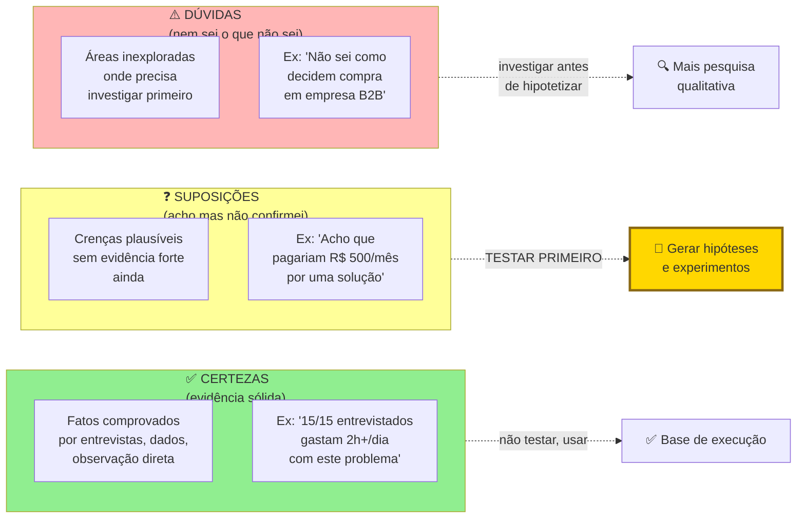

### O que esse apêndice cobre
Transformação das incertezas, crenças, e intuições acumuladas nas fases anteriores em hipóteses testáveis. Escritas em formato padronizado, priorizadas por risco e impacto. O entregável é o Banco de Hipóteses. Uma tabela viva que você vai revisitar durante todo o projeto.

### POR QUE
Toda decisão de negócio assume algo sobre o mundo. "O meu cliente vai pagar R$ 99." "O meu canal principal será Instagram." "Empresas maiores compram mais rápido." Cada uma dessas afirmações é uma hipótese. Se você as trata como verdades, constrói sobre areia. Se as escreve como hipóteses, e as testa uma a uma, constrói sobre rocha. Empreender sem hipóteses explícitas é tomar todas as decisões com base em vibração.

A priorização de hipóteses também impede que você desperdice energia testando coisas de pouco impacto. Você quer testar primeiro o que, se for falso, derruba o negócio inteiro. Isso se chama "risco-maior-primeiro".

### Quando usar
Comece imediatamente depois das Fases 2, 3, e 4. Termine quando tiver quinze a trinta hipóteses escritas, priorizadas, e souber quais são as três a cinco "bet-the-company" que vai testar primeiro. Revisite a cada duas a quatro semanas. Hipóteses antigas viram verdades (validadas), ou são refutadas, e novas emergem.

### Quem envolve
O executor é você, e os sócios se houver. Os participantes são mentores ou pessoas experientes que podem ajudar a identificar hipóteses que você não enxerga sozinho. Empreender em câmara de eco é arriscado. O decisor é você.

### Como executar

Seis passos.

#### Passo 1, levante todas as suposições implícitas

Faça uma varredura exaustiva. Categorize as hipóteses em cinco tipos.

Hipóteses de problema. O problema existe mesmo? Para quem? Quão doloroso?

Hipóteses de solução. A solução proposta resolve o problema? Os usuários vão adotá-la?

Hipóteses de cliente e mercado. Quem é o cliente ideal? Como ele decide?

Hipóteses de canal. Como eu alcanço o cliente? Qual canal tem CAC viável?

Hipóteses de monetização e modelo. O cliente vai pagar? Quanto? Com que frequência? LTV maior que CAC?

Para cada tipo, busque pelo menos três a cinco hipóteses. Total alvo: quinze a trinta hipóteses.

#### Passo 2, escreva cada hipótese no formato padronizado

Use esse formato rigoroso:

```
HIPÓTESE: [afirmação clara e falsificável]
ATRIBUTO DA TEORIA: [qual nó ou seta da sua árvore de teoria esta hipótese testa]
PORQUÊ IMPORTA: [se for falsa, qual impacto no negócio]
PARA VALIDAR PRECISO VER: [critério objetivo e numérico]
MÉTODO: [experimento ou fonte de evidência]
CUSTO ESTIMADO: [tempo + dinheiro]
```

Para entender a diferença entre hipótese ruim e hipótese boa:

> [!warning] Hipótese ruim, impossível de falsificar
> "Os clientes vão gostar do produto." Impossível de testar. "Gostar" não é mensurável.

> [!tip] Hipótese boa, falsificável e numérica
> "Pelo menos trinta por cento dos donos de restaurante do nosso ICP, depois de conhecer a solução por uma página de pré-cadastro, vão deixar e-mail e concordar com cobrança antecipada de R$ 49 para acesso ao beta. Se for falsa, significa que a nossa proposta de valor não é forte o bastante para pagamento antecipado, o que compromete a viabilidade do modelo."

#### Passo 3, aplique o critério de falsificabilidade

> [!quote] Karl Popper sobre hipóteses
> Uma afirmação só é científica se for possível imaginar um resultado que a refute.

Toda hipótese sua deve ter um caminho claro de refutação. Se não tiver, não é hipótese. É crença.

##### Teste de isolamento, uma hipótese, um elemento por vez

Esse é um dos erros mais comuns em iniciantes. Empilhar múltiplos elementos numa única hipótese. Quando você testa coisas compostas, é impossível saber qual parte foi refutada.

Exemplo de hipótese composta (ruim): "Mulheres em grandes capitais preferem táxi a bicicleta, e fazem isso por causa do conforto, mesmo pagando mais caro."

Essa hipótese junta três afirmações distintas. Mulheres em grandes capitais preferem táxi a bicicleta. O conforto é o principal fator de decisão. O preço mais alto do táxi é tolerado.

Se você testar tudo junto e quarenta e cinco por cento das entrevistadas concordar, o que isso significa? Nada. Pode ser que preferem táxi por outro motivo que não conforto. Pode ser que conforto importa, mas só para viagens longas. Pode ser que o preço é um limite, e acima de X reais elas voltam para a bicicleta. A hipótese composta esconde todas essas nuances.

A versão atômica (boa) quebra em três hipóteses separadas. Cada uma testável sozinha. Se todas forem validadas, você tem a afirmação conjunta. Se alguma for refutada, você sabe exatamente qual parte da sua teoria precisa ser revisada.

> [!important] Regra do isolamento
> Cada hipótese deve testar um e apenas um atributo, ou uma e apenas uma relação causal da sua árvore de teoria. Se há "e" ou "porque" na frase, provavelmente você precisa quebrá-la.

##### Verifique a conexão com a teoria (integração)

Pegue a sua árvore de teoria ([[#FASE 2B — CONSTRUÇÃO DA TEORIA DO NEGÓCIO|Fase 2B]]) ao lado do Banco de Hipóteses. Para cada hipótese, responda. *Esta hipótese testa qual nó ou seta da árvore?* Se uma hipótese não pode ser mapeada na árvore, ela é órfã. Ou a hipótese é irrelevante, ou a sua árvore está incompleta. Em ambos os casos, corrija.

Esse exercício costuma revelar que o empreendedor criou hipóteses sobre o que é fácil de medir, em vez do que é importante testar. Se sobraram nós bet-the-company na árvore sem hipóteses correspondentes, você está prestes a testar o acessório enquanto deixa o crítico passar.

#### Passo 4, priorize as hipóteses

Para cada hipótese, atribua duas notas, de um a cinco. Risco (R) é quão grave para o negócio se for falsa? (Cinco mata o negócio. Um é detalhe secundário.) Incerteza (I) é quanta confiança real eu tenho nela hoje? (Cinco é totalmente no escuro. Um é muito fundamentada.)

Calcule Prioridade = R vezes I.

Hipóteses com prioridade igual ou maior que quinze são as suas bet-the-company. Coisas que podem matar o negócio se forem falsas, e que você ainda não testou. Essas vêm primeiro. Hipóteses com prioridade entre oito e quatorze são secundárias. Hipóteses com prioridade abaixo de oito ficam no backlog para depois.

#### Passo 5, monte o Banco de Hipóteses como planilha

Quatorze colunas. ID (H1, H2, e assim por diante). Tipo (Problema, Solução, Cliente, Canal, Monetização). Hipótese (texto completo). Atributo da teoria (vínculo com a árvore da [[#FASE 2B — CONSTRUÇÃO DA TEORIA DO NEGÓCIO|Fase 2B]]). Porquê importa. Critério de validação. Método ou experimento. Custo estimado. Score H (Hipótese) de um a dez, quão forte é o raciocínio teórico antes de qualquer teste? Score E (Evidência) de um a dez, quanta evidência empírica você já tem hoje? Status (Nova, Em teste, Validada, Refutada, Abandonada). Resultado (quando testada). Data de teste. Aprendizado.

> [!important] Essa planilha é o coração operacional do negócio
> Nos próximos seis a doze meses, ela é o documento mais consultado da empresa. Nunca a perca de vista.

##### Sistema H/E, pontuar cada hipótese com duas notas, não uma

Esse é um dos hábitos mais subestimados. Para cada hipótese no Banco, atribua duas notas, de um a dez.

H (Hypothesis Strength) é o quão bem fundamentada a sua hipótese está do ponto de vista teórico. H igual a dez significa que a cadeia causal é clara, consistente com o que se sabe do mercado, análoga a casos de sucesso conhecidos, e faz sentido à luz da sua árvore de teoria. H igual a três significa um palpite, baseado em intuição pessoal, sem lógica rigorosa por trás.

E (Evidence Strength) é o quanto você já tem de evidência empírica a favor (ou contra) essa hipótese hoje, antes de qualquer novo experimento. E igual a dez significa dados robustos, múltiplas entrevistas consistentes, benchmarks quantitativos de setor, pilotos pagos. E igual a um significa nenhuma evidência. Só a sua própria fala.

A visualização do sistema H/E:

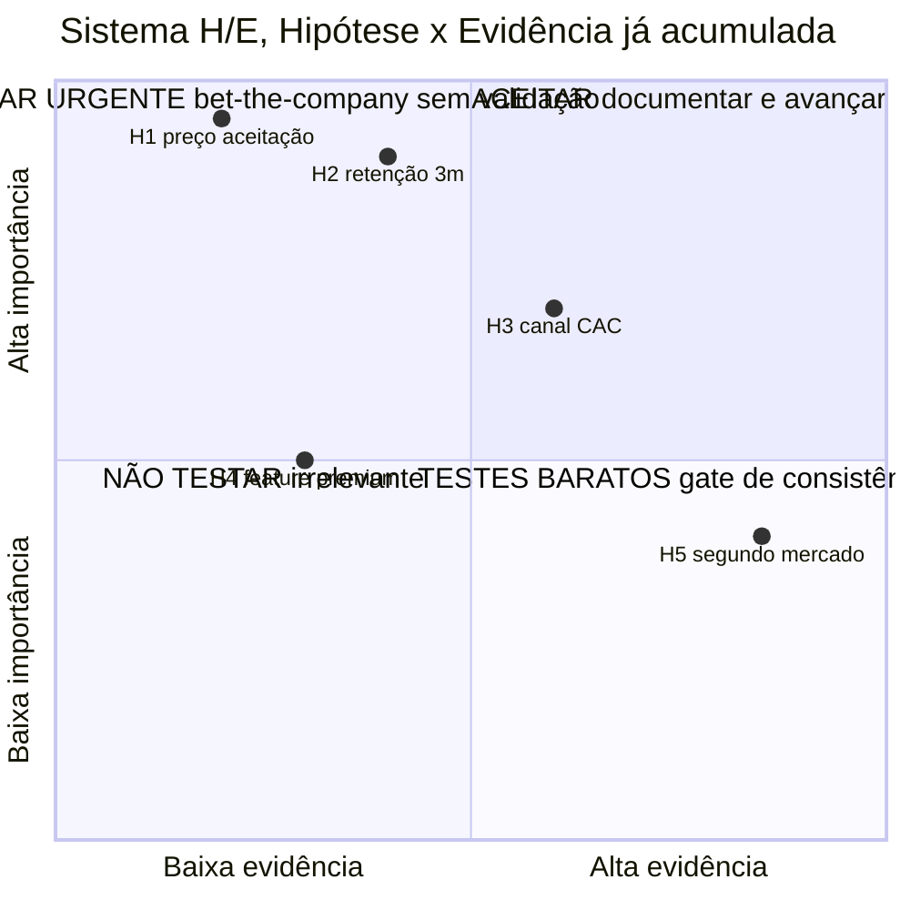

H/E responde a duas perguntas. *Essa hipótese é importante?* (H) E *já tenho evidência a favor?* (E). O quadrante superior-esquerdo (H alto e E baixo) é urgência máxima. Evita o erro comum de testar primeiro o que é fácil em vez do que é crítico.

Os dois scores juntos revelam onde você está numa hipótese:

| Perfil (H, E) | Diagnóstico | O que fazer |
|---|---|---|
| H alto, E alto (8, 8) | Hipótese bem fundamentada, e já com evidência | Avançar com investimento ou execução |
| H alto, E baixo (8, 3) | Teoria forte, falta evidência | Prioridade máxima de experimento. É aqui que a próxima rodada de testes precisa estar |
| H baixo, E alto (4, 8) | Fato observado sem teoria clara | Reabrir a árvore de teoria. Por que esse padrão acontece? Sem saber por quê, não dá para escalar |
| H baixo, E baixo (3, 2) | Palpite sem fundamento nem dado | Ou descartar, ou iniciar investigação exploratória. Nunca investir capital |

> [!warning] Regra de ouro do Sistema H/E
> Todo investimento significativo (construir feature, contratar, levantar capital, expandir canal) deve ser precedido por H maior ou igual a sete e E maior ou igual a seis para as hipóteses críticas relacionadas àquela decisão. Se qualquer uma das notas está abaixo desses patamares, corra um experimento (Fase 7) antes.

#### Passo 6, escolha as 3 a 5 primeiras hipóteses para testar

Com base na priorização e no Sistema H/E, pegue as hipóteses bet-the-company com H alto e E baixo. Essas têm o maior retorno por experimento. Teoria robusta, apenas faltando evidência. Vão para a [[#FASE 7 — EXPERIMENTOS DE VALIDAÇÃO DO PROBLEMA|Fase 7]].

### PERGUNTAS A RESPONDER
- Eu identifiquei hipóteses de todas as cinco categorias (problema, solução, cliente, canal, monetização)?
- Cada hipótese é falsificável (tem critério de refutação)?
- Eu classifiquei cada hipótese por risco e incerteza?
- Eu sei quais são as três a cinco hipóteses bet-the-company que preciso testar primeiro?
- Eu tenho método de teste imaginado para cada hipótese prioritária?

### Métricas

Número total de hipóteses catalogadas. Alvo: quinze a trinta.

Distribuição por categoria. Pelo menos três hipóteses em cada uma das cinco categorias.

Percentual de hipóteses com critério quantitativo de validação. Alvo: cem por cento. Se não é mensurável, não é hipótese.

Número de hipóteses bet-the-company identificadas. Alvo: três a cinco.

### SAÍDA DESTA FASE

Você concluiu a [[#FASE 6 — FORMULAÇÃO RIGOROSA DE HIPÓTESES|Fase 6]] quando os sete critérios abaixo estão cumpridos.

1. O Banco de Hipóteses (Template A.3) existe, com vinte ou mais itens classificados nas cinco categorias (problema, solução, cliente, canal, monetização). Todos no formato padronizado (afirmação mais porquê mais critério mais método).
2. Todas as hipóteses estão priorizadas por Risco vezes Incerteza.
3. As cinco a dez hipóteses do topo estão reformuladas em formato rigoroso SE-ENTÃO-MENSURA, com critério de falsificação explícito.
4. Três ou mais Hypothesis Canvas (Template A.10) preenchidos para hipóteses críticas.
5. Hipóteses "caras de errar" estão identificadas e priorizadas no topo. Aquelas cuja invalidação tardia custa muito.
6. O status (não testada, em teste, validada, invalidada) está marcado em todas.
7. As três a cinco hipóteses prioritárias foram escolhidas, e têm métodos de teste iniciais desenhados.

**Checklist final.**

- [ ] Listei todas as hipóteses-chave nas cinco categorias (problema, solução, cliente, canal, monetização)?
- [ ] Priorizei as hipóteses por Risco vezes Incerteza (Banco de Hipóteses, Template A.3)?
- [ ] Formulei cada hipótese priorizada como "Se X, então Y, mensurado por Z, considerado verdadeiro se W"?
- [ ] Defini métrica de falsificação para cada hipótese? O que provaria que é falsa?
- [ ] Documentei hipóteses "caras de errar" separadamente (aquelas cuja invalidação tarde custa muito)?
- [ ] Tenho Hypothesis Canvas (Template A.10) preenchido para as três a cinco hipóteses críticas?
- [ ] Revisei: as minhas hipóteses são realmente falsificáveis, ou são afirmações vagas?

**Primeiros passos práticos.**

1. Abrir o Template A.3 (Banco de Hipóteses) e listar toda hipótese implícita. Vinte a quarenta itens iniciais.
2. Classificar cada hipótese em categoria, status, e prioridade.
3. Reformular as cinco a dez prioritárias em formato falsificável rigoroso.
4. Para cada hipótese das três do topo, preencher Hypothesis Canvas (Template A.10) com detalhamento.

### EXEMPLO PRÁTICO

**Banco de Hipóteses, PadariaPro (fragmento top 10).**

| # | Hipótese | Categoria | Risco | Info | Prior. | Status |
|---|---|---|---|---|---|---|
| H1 | Donos de padaria de três a cinco lojas têm perda de oito por cento ou mais de margem por má gestão de estoque | Problema | Alto | Alto | 1 | Em teste |
| H2 | Donos pagariam R$ 400 por mês por loja se a redução de perda for demonstrada em sessenta dias | Monetização | Alto | Alto | 2 | Não testada |
| H3 | Integração via API com Anaconda é obtenível em noventa dias | Solução | Alto | Médio | 3 | Em teste |
| H4 | Algoritmo de previsão de demanda acerta setenta e cinco por cento ou mais em padaria com histórico de seis meses | Solução | Médio | Alto | 4 | Não testada |
| H5 | Churn igual ou menor a três por cento ao mês depois do ano 1, com NRR igual ou maior a cento e dez por cento | Monetização | Médio | Médio | 5 | Não testada |
| H6 | Dois de cada três donos recomendariam a padarias amigas depois de noventa dias | Cliente | Médio | Médio | 6 | Não testada |
| H7 | Integrações com fornecedores criam moat defensável, concorrente demora seis meses ou mais para replicar | Solução | Médio | Baixo | 7 | Não testada |
| H8 | Onboarding em menos de sete dias é viável sem TI | Solução | Baixo | Alto | 8 | Não testada |
| H9 | Mercado total é igual ou maior a quatrocentas padarias em SP com perfil-alvo | Cliente | Baixo | Alto | 9 | Validada |
| H10 | Canal principal inicial é indicação por dono-amigo | Canal | Médio | Médio | 10 | Não testada |

**Hypothesis Canvas, H1 (problema).**

A hipótese, em formato SE-ENTÃO-MENSURA: "Se oferecermos auditoria gratuita de estoque para donos de padaria de três a cinco lojas em SP, então setenta por cento ou mais dos auditados confirmarão perda de oito por cento ou mais da margem em ingredientes críticos. Mensurado em levantamento de dez padarias. Considerado verdadeiro se sete em dez ou mais confirmam perda de oito por cento ou mais. Considerado falso se quatro em dez ou menos confirmam."

O critério de falsificação tem três faixas. Se apenas quatro em dez ou menos confirmam perda de oito por cento ou mais, a dor não é ampla o bastante para sustentar modelo de negócio. Se cinco a seis em dez confirmam, a cunha precisa ser refinada (só rede maior? Só certo tipo de padaria?). Se sete em dez ou mais, seguir para testar H2 (disposição a pagar).

O experimento vinculado: auditoria gratuita em dez padarias do perfil, sessenta minutos cada, em duas semanas.

> [!warning] Risco de interpretação enviesada
> Donos podem subestimar a perda (vergonha de admitir), ou superestimá-la (para justificar preço de consultoria). Cruze o auto-relato com análise factual de trinta dias de notas fiscais de compra.

### Armadilhas

Hipóteses vagas. "Os clientes vão gostar." Sem número, sem teste.

Só hipóteses de solução. Empreendedores ficam obcecados em testar "a solução funciona?", e esquecem de testar "o cliente paga?", que é a hipótese mais crítica.

Priorizar baixo-risco por ser fácil. Testar primeiro o que é confortável. Princípio: teste primeiro o que pode te matar, não o que é agradável de confirmar.

Esquecer de atualizar. A lista vira zumbi se não for visitada semanalmente. Reserve trinta minutos toda segunda para revisar.

Confundir "não refutada ainda" com "validada". Uma hipótese só é validada quando você tem evidência positiva a favor dela. Não apenas ausência de evidência contra.

---

### CASO BRASILEIRO, Fase 6, hipóteses em startup imobiliária iBuyer

Uma startup imobiliária no modelo iBuyer (compra direta de imóveis para revenda rápida) precisava decidir o diferencial principal. Preço alto. Velocidade de pagamento. Qualidade de serviço.

A decisão foi formal. Em vez de escolher por intuição, formalizaram quinze hipóteses, priorizadas por R vezes I. "Se oferecermos cinco por cento abaixo do valor de mercado, com pagamento em sete dias, X por cento dos vendedores aceitarão." "Se o prazo for três dias em vez de sete, a conversão sobe em Y por cento." "Sellers urgentes (divórcio, mudança de cidade) convertem Z por cento mais que sellers oportunistas."

As hipóteses bet-the-company (conversão por urgência, sensibilidade a preço, velocidade crítica) foram testadas em sequência. Cada experimento com threshold ex-ante. O modelo final priorizou velocidade sobre preço. O oposto da intuição inicial.

A lição transferível. Hipóteses explícitas separam "o que eu acho" de "o que eu testei". A intuição inicial frequentemente é parcialmente certa e parcialmente errada. Só teste separa.

---

### FERRAMENTAS DESTA FASE

Formulação de hipóteses exige rigor. É onde o manual enfatiza disciplina analítica. Dez ferramentas essenciais, todas no [[#APÊNDICE BG — FERRAMENTÁRIO COMPLETO DO EMPREENDEDOR|Apêndice BG]].

McKinsey 7-Step Problem Solving, completo. Aplicar os sete passos ao problema central do negócio. Define (qual a questão estratégica?), Structure (issue tree MECE), Prioritize (oitenta-vinte), Plan (análises necessárias), Conduct (execute), Synthesize (aprendizados), Communicate. Use para estruturação rigorosa da tese do negócio. Ver BG.5.1.

MECE. As suas hipóteses estão mutuamente exclusivas? Coletivamente exaustivas? Hipóteses que se sobrepõem confundem experimentos. Ver BG.4.5.

Pre-mortem (Gary Klein). Para cada hipótese crítica, imaginar "daqui a seis meses, por que essa hipótese foi falsificada?". Revela sinais precoces e critérios de desconfirmação. Use antes de começar experimentos. Ver BG.5.3.

Expected Value e Bayesian Thinking. Para cada hipótese, qual o range de resultados possíveis vezes probabilidades? EV positivo justifica experimento. EV negativo sugere descartar. Use para priorizar entre múltiplas hipóteses competindo por recursos. Ver BG.5.7.

Cost-Benefit Analysis. Para cada experimento proposto, custo (tempo, capital) versus benefício esperado (confiança ganha, valor da decisão). Use para decidir quais hipóteses validar primeiro, e com que investimento. Ver BG.5.6.

Cynefin Framework (Snowden). As suas hipóteses estão em domínio Complicated (análise resolve), ou Complex (só experimentação resolve)? Calibra o método de validação. Ver BG.4.7.

Red Team e Blue Team. Para hipóteses mais críticas, montar red team (interno ou advisors) para ativamente contestá-las antes de investir em validação. Ver BG.5.4.

5 Whys (Toyota). Aplicado a cada hipótese: "por que eu acredito nisso?", cinco vezes. Se a resposta final é "intuição", ou "porque o concorrente faz", a hipótese é fraca. Exige validação urgente. Ver BG.5.2.

Pyramid Principle (Minto). Comunicar hipóteses ao time, advisors, e board em forma estruturada. Hipótese principal no topo. Sub-hipóteses no nível abaixo. Evidências em baixo. Ver BG.4.4.

Inversion (Munger). Para cada hipótese crítica, formular "sob que condições essa hipótese é falsa?". Define o critério de falsificação. Ver BG.4.3.

---

### SÍNTESE DA FASE 6

A [[#FASE 6 — FORMULAÇÃO RIGOROSA DE HIPÓTESES|Fase 6]] transforma um padrão silencioso da operação empreendedora em material de trabalho. Toda decisão de negócio assume algo sobre o mundo. O cliente vai pagar R$ 99. O canal principal será Instagram. Empresas maiores compram mais rápido. Cada uma dessas afirmações é hipótese. Se você as trata como verdades, constrói sobre areia. Se as escreve como hipóteses, e testa uma a uma, constrói sobre rocha. Empreender sem hipóteses explícitas é tomar todas as decisões com base em vibração.

A diferença entre quem faz certo, e quem falha, está na priorização por risco. O Banco de Hipóteses não é lista para checklist. É instrumento de foco. Você quer testar primeiro o que, se for falso, derruba o negócio inteiro. As bet-the-company, três a cinco no início, recebem energia primeiro. Quem desperdiça energia testando hipóteses periféricas, enquanto a hipótese central nunca foi posta à prova, gasta meses validando o errado. E descobre tarde que o pressuposto fundamental nunca tinha sido verificado.

O entregável é tabela viva, não documento que se arquiva. Hipóteses antigas viram verdades validadas, ou são refutadas, e novas emergem ao longo do projeto. Revisitar a cada duas a quatro semanas é higiene. O Banco de Hipóteses é o que estrutura todas as fases seguintes de validação. As Fases 7, 8, 9, 10 não testam ideia em geral. Testam hipóteses específicas, na ordem do risco.

#fase6 #hipoteses #falsificabilidade #csd #bet-the-company #priorizacao #sistema-h-e #banco-hipoteses

---

## FASE 7 — EXPERIMENTOS DE VALIDAÇÃO DO PROBLEMA

> [!tip] Stack mínimo da Fase 7
> Para rodar experimentos baratos. Landing pages rápidas: Webflow, Framer, Carrd, Wix (R$ 0 a R$ 100 por mês, segundo o uso). Tráfego pago para testes: Meta Ads (R$ 500 a R$ 3.000 para primeiros testes), Google Ads (similar), LinkedIn Ads (se B2B, mais caro mas direto). Analytics: Google Analytics 4 (gratuito), Hotjar ou Microsoft Clarity (gratuitos para uso moderado) para heatmap. Plausible (alternativa simples e privacy-first). Pagamentos para pré-venda: Stripe, Asaas, Pagar.me, Stone, MercadoPago (cada um com particularidades regulatórias no Brasil). Regra: o stack de experimentação deveria custar menos de R$ 1.000 por mês no começo. Se está caro antes de aprender, algo está errado.

### O que esse apêndice cobre
Execução de experimentos estruturados para testar as hipóteses prioritárias levantadas na [[#FASE 6 — FORMULAÇÃO RIGOROSA DE HIPÓTESES|Fase 6]]. Nesta fase, você ainda foca primariamente em validar o problema e o cliente, não a solução construída. Os experimentos são rápidos, baratos, e desenhados para dar evidência confiável de sim, não, ou talvez.

O entregável é um Relatório de Experimentos. Hipóteses testadas, resultados, aprendizados, e próximos passos.

### POR QUE
Hipóteses sem experimentos são só listas bonitas. Experimentos transformam suposição em evidência. Rápido e barato é fundamental. Se um experimento demora três meses, ou custa R$ 50 mil, você está gastando demais para aprender uma coisa só. Cada experimento deve gerar uma decisão clara. Continuar. Ajustar. Pivotar. Ou matar.

### Quando usar
Comece assim que a [[#FASE 6 — FORMULAÇÃO RIGOROSA DE HIPÓTESES|Fase 6]] priorizar as primeiras hipóteses. Termine quando as três a cinco hipóteses bet-the-company estiverem validadas ou refutadas com evidência suficiente. Revisite continuamente. O negócio gera novas hipóteses o tempo todo.

### Quem envolve
O executor é você. Alguns experimentos envolvem potenciais clientes, colaboradores externos, ou plataformas pagas (Facebook Ads, Google Ads, Typeform). O decisor é você, com base nos critérios de sucesso pré-definidos.

### Como executar

Dez passos.

#### Passo 1, desenhe cada experimento em cartão antes de executar

Use esse formato:

```
EXPERIMENTO #N
Hipótese: [copiar da Fase 6]
Pergunta central: [o que especificamente quero responder]
Desenho: [o que vou fazer, passo a passo]
Público: [quantas pessoas, que perfil, como alcanço]
Métrica principal: [o número que vai decidir]
Critério de sucesso: [valor da métrica pra considerar validada]
Critério de refutação: [valor da métrica pra considerar refutada]
Duração: [tempo total]
Custo: [R$ estimado]
Riscos e vieses: [o que pode distorcer o resultado]
Data de início / fim: [planejadas]
```

##### Regra operacional para a duração, a janela de duas a três semanas

Empreendedores iniciantes tendem a desenhar experimentos com "duração aberta" ("vou rodar até ter dados suficientes"), ou com janelas longas demais ("três meses para validar"). Ambos são sintomas do mesmo problema. Medo de decisão.

A regra operacional, derivada da prática de aceleradoras como Antler e Y Combinator: cada experimento da [[#FASE 7 — EXPERIMENTOS DE VALIDAÇÃO DO PROBLEMA|Fase 7]] deve caber numa janela de duas a três semanas. Do desenho à decisão. Dois motivos.

Disciplina de decisão. Experimento com prazo aberto nunca termina. Sempre "precisa de mais uma semana". Janela fechada força você a concluir com o dado disponível. Reconhecer as limitações honestamente, em vez de empurrá-las com a barriga.

Paralelização. Com janelas curtas, você roda quatro a seis experimentos em três meses. Com janelas longas, roda um a dois. A velocidade de aprendizado é composta. Mais iterações dentro do mesmo tempo total geram aprendizados muito superiores.

Há duas exceções legítimas à janela. Experimentos concierge e wizard of oz frequentemente precisam de quatro a oito semanas para revelar valor real. Não force janela curta nesses casos. E experimentos com ciclo de venda B2B enterprise naturalmente exigem seis a doze semanas. A janela aqui aplica-se ao ciclo de decisão do cliente-alvo, não ao seu.

Para qualquer outro tipo de experimento (entrevistas, landing page, fake door, pré-venda direta a PMEs, community test, A/B), se o desenho não cabe em duas a três semanas, o experimento está grande demais. Quebre em dois ou três experimentos menores. Cada um testando um atributo isolado.

> [!important] Defina o critério antes de olhar o resultado
> Se você define depois, vai ajustar o critério para "validar" o que você já queria. Isso é auto-engano.

#### Passo 2, escolha os tipos de experimento apropriados

Catálogo dos oito experimentos mais úteis para validação de problema e cliente, antes de construir produto.

##### Problem Interview (entrevista de problema)

Já coberto na [[#FASE 3 — DESCOBERTA DO PROBLEMA|Fase 3]]. Útil também para hipóteses emergentes. Custo baixo. Tempo de uma a duas semanas. Limitação: respostas são opiniões, não ações.

##### Landing Page Test ou Smoke Test

Crie uma página que descreve a sua solução como se ela já existisse. Direcione tráfego por Ads ou e-mails a grupos. Meça a taxa de conversão em cadastros de e-mail, pré-pedidos, ou cliques em "quero comprar".

Como medir: conversão de visitante em ação. Benchmarks iniciais: conversão maior que cinco por cento em e-mail é sinal bom. Maior que dez por cento é forte. Abaixo de dois por cento, a sua promessa não ressoa. Custo de R$ 500 a R$ 2.000 em Ads, mais um dia para montar a página (use Carrd, Framer, Webflow, Unbounce). Tempo de uma a três semanas. Cuidado: tráfego pago precisa ser bem segmentado. Se o público é ruim, conversão baixa não significa que a ideia é ruim.

##### Concierge Experiment

Você entrega manualmente o valor que o seu produto promete. Sem automatizar nada. Por exemplo: se o produto seria um app de gestão de frota, você mesmo gerencia a frota de um cliente usando planilha e WhatsApp, cobrando pelo serviço.

Como medir: o cliente percebeu valor? Pagou? Indicou? Custo: o seu tempo, durante duas a oito semanas. Tempo total de quatro a doze semanas. A vantagem é que descobre os detalhes operacionais que uma entrevista nunca revelaria.

##### Wizard of Oz

O produto parece funcionar com tecnologia avançada, mas por trás é você fazendo tudo manualmente. Por exemplo: você promete "IA que sugere horários de postagem ideais", e você mesmo, olhando cada cliente, sugere os horários. O cliente nem sabe.

Como medir: o usuário usa a "solução"? Volta? Paga? Custo baixo em construção, alto em tempo operacional. Tempo de quatro a doze semanas.

##### Pre-sale (venda antecipada)

Você vende o produto antes dele existir. Pede pagamento real ou carta de intenção assinada.

Como medir: número de vendas e cartas. Valor arrecadado. Critério forte: dinheiro no bolso é mais que carta de intenção, que é mais que interesse verbal. Custo baixo. Tempo de duas a seis semanas.

> [!important] Pre-sale é o experimento mais revelador de todos
> Se as pessoas pagam antecipado por algo que não existe, você tem evidência forte. Se não pagam, tem informação forte também.

##### Fake Door ou Botão Fantasma

Dentro de um produto existente (blog, comunidade), ou de uma página, você coloca um botão que promete uma feature que ainda não construiu. Quando o usuário clica, aparece "em breve" mais formulário.

Como medir: percentual de usuários que clicam. Custo muito baixo. Limitação: mede interesse, não compra.

##### Community Test

Compartilhe a ideia em comunidades relevantes (Reddit, grupos de Facebook, Discord, fóruns especializados). Meça reações genuínas, perguntas, pedidos de acesso.

Como medir: engajamento, comentários, DMs. Custo zero. Limitação: comunidades têm viés. Algumas são positivas demais. Outras cínicas demais.

##### A/B Test de proposta de valor

Teste duas ou três formas diferentes de descrever o problema ou a solução, e veja qual converte mais. Útil quando você ainda não sabe como falar com o cliente.

Como medir: conversão relativa. Custo moderado.

##### Guia rápido para escolher a técnica

| Fase de validação | Técnica mais apropriada |
|---|---|
| Entender o problema em profundidade (exploratória) | Entrevistas |
| Dimensionar o problema em escala | Questionários |
| Testar atratividade de uma proposta | Landing Page, Smoke Test, Fake Door |
| Testar disposição real a pagar | Pré-venda |
| Testar se a solução entrega valor de verdade | Concierge, Wizard of Oz |
| Comparar duas versões para identificar qual performa melhor | A/B Test |

Use entrevistas quando você precisa de profundidade e aprendizados qualitativos. Use questionários, landing pages, e pré-vendas quando precisa de números representativos e evidência quantitativa. Os dois tipos são complementares. Não substitutos.

#### Passo 3, operacionalize cada hipótese em uma medida concreta

Esse é a ponte entre teoria e experimento. E é onde a maior parte dos empreendedores se engana. Para cada hipótese prioritária, responda quatro perguntas, nessa ordem.

Qual é a hipótese testável? Texto exato da hipótese da [[#FASE 6 — FORMULAÇÃO RIGOROSA DE HIPÓTESES|Fase 6]].

O que eu vou perguntar ou observar? Pergunta específica no questionário. Ação observada no experimento. Evento rastreado no analytics.

Quais são as respostas ou eventos possíveis? Opções discretas, ou faixas numéricas.

O que eu vou efetivamente contar como medida? Fórmula exata. Por exemplo: "percentual de respondentes que escolheram X ou Y", "taxa de clique no botão Z", "valor médio ofertado em pré-venda".

Exemplo operacionalizado, inspirado no caso MiMoto, do paper de Coali e colegas (2024).

A hipótese: "Tráfego nas grandes capitais é um problema relevante para profissionais." A pergunta no questionário: "Em uma semana típica, quantos dias você fica preso no trânsito no trajeto casa-trabalho?" As respostas possíveis: (a) menos de um dia, (b) um a três dias, (c) três a cinco dias, (d) mais de cinco dias. A medida: percentual de respondentes que escolhem (c) ou (d).

O empreendedor pode escolher outra operacionalização (por exemplo, nota de um a sete, ou foco apenas na resposta "mais de cinco dias"). O importante é que a escolha seja feita antes de ver os dados, documentada, e a mesma aplicada quando a análise for feita.

> [!important] Quatro regras de operacionalização
> Ligue a medida à hipótese de forma rastreável. Se alguém te perguntar "por que você escolheu essa métrica e não outra?", você deve conseguir responder em termos da teoria. Defina ex-ante (antes de coletar). Definir medida depois de ver dados é auto-engano matemático. Você inevitavelmente vai escolher a métrica que confirma o que já acredita. Pré-teste as suas perguntas com duas a três pessoas de confiança. Pergunta mal formulada gera lixo. Ajuste antes do campo. Prefira medidas já estabelecidas (KPIs do setor, escalas validadas da literatura de pesquisa) quando existirem, em vez de inventar métricas próprias. A sua métrica só é "nova" se não existir nada comparável.

#### Passo 4, defina o threshold antes de começar

Threshold é o valor numérico da sua medida a partir do qual a hipótese será considerada suportada. É o que separa decisão científica de torcida organizada.

Por exemplo: "Vou considerar a hipótese suportada se pelo menos sessenta por cento dos respondentes do meu ICP escolherem a opção (c) ou (d), ou seja, mais de três dias por semana no trânsito."

O threshold é subjetivo. Você define com base na sua teoria e experiência. Mas uma vez definido, é imóvel até os dados serem analisados. Se você mover o threshold depois, o experimento deixa de ser teste de hipótese, e vira confirmação do que você queria.

Documente o threshold no Cartão de Experimento. Se não houver threshold escrito, o experimento não está pronto para rodar.

##### Pré-registro formal, a versão cientificamente rigorosa do threshold ex-ante

Pré-registro é a prática canônica em pesquisa científica moderna (Simmons, Nelson, e Simonsohn, 2011; Wicherts e colegas, 2016) para eliminar o que os pesquisadores chamam de "p-hacking", ou "graus de liberdade na análise". A tendência inconsciente de tomar decisões metodológicas após ver os dados, movendo goalposts até encontrar resultado desejado.

O empreendedor enfrenta exatamente o mesmo viés. Com custo maior. A análise enviesada aqui não produz artigo acadêmico duvidoso. Produz decisão de investimento com o seu próprio capital, baseada em evidência viciada.

Checklist mínimo de pré-registro a documentar antes de iniciar o experimento. Hipótese específica (texto exato, com atributo e direção). Medida operacional (fórmula exata). População-alvo, e critérios de inclusão e exclusão (quem entra no teste, quem não). Tamanho mínimo da amostra (número antes de começar, não "até o que conseguir"). Threshold de decisão (valor numérico exato). Plano de análise (como os dados serão agregados, se haverá subgrupos). O que faria você descartar resultados (contaminação, vazamento de intenção, falha técnica). O que faria você considerar resultado inconclusivo (não apenas "não suportado").

Documente isso em arquivo datado antes de iniciar o experimento. Compartilhe com sócios e advisors. Essa transparência externa cria pressão positiva para não trapacear consigo mesmo.

> [!tip] Por que pré-registro funciona em early-stage
> Pré-registro formal transforma experimento de "procura por evidência que confirme a minha ideia" em "teste imparcial da minha própria crença". É o mecanismo mais efetivo contra autoenganos. E autoenganos são a causa mais comum de decisão empreendedora catastrófica. Em contextos de alta incerteza (early-stage, deeptech, mercados novos), pré-registro é especialmente valioso. O empreendedor tipicamente tem pouca evidência externa para calibrar expectativas, e tende a preencher a incerteza com otimismo motivado.

#### Passo 5, execute

Rode o experimento dentro do prazo planejado. Resista à tentação de esticar o prazo porque o resultado está ruim ("mais tempo vai melhorar"). De mudar o critério de sucesso no meio do caminho. De parar cedo porque o resultado está bom ("já sei, não preciso terminar").

#### Passo 6, faça a due diligence da amostra antes de olhar o resultado

Esse é o passo mais negligenciado por empreendedores. E o mais importante para uma avaliação honesta. Antes de comparar o resultado com o threshold, verifique três coisas.

Tamanho da amostra. Para entrevistas e MVPs qualitativos, dez a quinze pessoas já trazem insight. Para questionários e testes de conversão, você precisa de pelo menos oitenta a cem respostas. E idealmente centenas, se o mercado é massificado. Amostras muito pequenas produzem ruído, não sinal. Se a amostra está pequena, reconheça a limitação e seja mais conservador no próximo passo.

Representatividade. A amostra que você conseguiu reflete o ICP que descreveu na teoria? Mesmo sem amostragem aleatória (quase nunca viável para um empreendedor iniciante), os respondentes precisam ser um "retrato em miniatura" do público-alvo. Se o seu ICP é "donas de pet shop no interior", e oitenta por cento dos respondentes são de capital, a sua amostra está enviesada. Se é "CFOs de empresas de cem ou mais funcionários", e você só conseguiu falar com analistas juniores, você não testou a hipótese real.

Ajuste do threshold se a amostra for enviesada. Se a sua amostra está enviesada para um lado que favorece a hipótese (você testou com early adopters quando o público final é mainstream), aumente o threshold. Seja mais rigoroso. Se está enviesada para um lado que prejudica a hipótese (você testou com um público que não tem o problema na intensidade esperada), considere se o teste faz sentido, ou se deveria ser refeito. O ajuste é registrado no Cartão de Experimento, antes de olhar o resultado final.

> [!important] O princípio da avaliação objetiva
> Você reconhece as limitações da evidência, e as incorpora ao critério. Em vez de usar as limitações depois para explicar por que o resultado ruim "não conta".

#### Passo 7, analise com honestidade

Para cada experimento, responda cinco perguntas. Qual o resultado, comparado com o critério pré-definido? A hipótese foi validada, refutada, ou inconclusiva? Quais aprendizados secundários emergiram? Quais novas hipóteses surgiram? O que eu faria diferente da próxima vez?

#### Passo 8, tome decisão clara

Depois de cada experimento, uma das quatro decisões.

Persevere. Hipótese validada. Continue no mesmo caminho.

Pivote. Hipótese refutada. Mude de direção. Cliente, problema, solução, ou canal.

Mais dados. Resultado inconclusivo. Rode variante do experimento.

Abandone. Evidência clara e consistente de que não há negócio aqui.

> [!warning] Não fique em limbo
> Decida.

#### Passo 9, compare o resultado com a teoria, não apenas com o threshold

Esse passo distingue o empreendedor científico do empreendedor meramente "lean". O threshold te diz se a hipótese foi ou não suportada pela amostra. Mas a decisão final deve ser tomada comparando o resultado com a teoria inteira. Não apenas com o número isolado.

Pergunte-se. Se a hipótese foi refutada: qual pedaço da minha árvore de teoria precisa ser revisado? Existe uma teoria alternativa (que eu já mapeei na [[#FASE 2B — CONSTRUÇÃO DA TEORIA DO NEGÓCIO|Fase 2B]]) que explica melhor esse resultado? O problema é o atributo específico, a relação causal, ou o ICP escolhido?

Se a hipótese foi suportada: o resultado é consistente com o resto da teoria? Ou há uma explicação alternativa (viés do tráfego pago, comunidade entusiasta atípica) que poderia produzir o mesmo número sem a teoria ser verdadeira?

Se foi inconclusivo: o problema é a amostra, a operacionalização, ou a teoria em si?

> [!quote] Popper sobre evidência refutadora
> Você só pode aprender que está errado por meio de evidência. Nunca pode provar que está certo em definitivo.

Resultados negativos, nesse enquadramento, são informação valiosa. Não fracasso. Um empreendedor que trata toda evidência refutadora como ruído acaba cego para os sinais que mais deveriam fazê-lo repensar.

#### Passo 10, atualize o Banco de Hipóteses, a árvore de teoria, e a Declaração da Ideia

Versione. A Declaração vai para v0.2, v0.3, v0.4. Isso é saudável. Significa que você está aprendendo.

### PERGUNTAS A RESPONDER
- A hipótese bet-the-company está validada, refutada, ou inconclusiva?
- Qual a evidência concreta? Números, verbatim, observações.
- O que eu aprendi de inesperado?
- Qual a próxima hipótese a testar?
- Continuo, ajusto, pivoto, ou abandono?

### Métricas

As métricas variam por experimento, mas em geral seis se repetem.

Taxa de conversão em landing page ou smoke test. Benchmarks para e-mail cadastrado: maior que cinco por cento é bom, maior que dez por cento é forte, abaixo de dois por cento é fraco.

Taxa de intenção de compra em pré-venda. Mais de vinte por cento dos qualificados demonstrando intenção é forte.

Taxa de conversão em venda antecipada paga. Dois a cinco por cento é sinal moderado. Mais de dez por cento é muito forte.

NPS ou similar em experimentos concierge. Mais de cinquenta sugere valor percebido.

Retenção de uso em experimentos Wizard of Oz. Se o usuário usa mais de duas vezes por semana, há valor.

Custo por aprendizado. Reais gastos divididos por hipóteses respondidas. Benchmark em early stage: até R$ 500 por hipótese respondida é saudável. Acima de R$ 3.000 sugere experimento mal-desenhado. Volte ao cartão de experimento e simplifique.

Velocidade de aprendizado. Número de hipóteses resolvidas por mês. Benchmark: duas ou mais hipóteses bet-the-company resolvidas por mês em early stage. Quatro ou mais por mês em fase de MVP. Abaixo disso, o ciclo está lento demais para acompanhar o burn.

### CALIBRANDO EXPECTATIVAS, o espectro de resultados e a regra dos nove em dez

Empreendedores iniciantes frequentemente chegam à [[#FASE 7 — EXPERIMENTOS DE VALIDAÇÃO DO PROBLEMA|Fase 7]] esperando que "o experimento vai validar a minha ideia". Essa expectativa está calibrada errada. E entender a distribuição real de resultados é o que separa o fundador que aprende do fundador que se ilude.

Os resultados de experimentos caem em um espectro, inspirado no framework Antler de validação. Com dois extremos e uma enorme zona intermediária.

O extremo negativo, "spaghetti sandwiches". A ideia teve rejeição clara. Entrevistados demonstraram pouco interesse. Landing page teve conversão baixa. Pré-venda fracassou. A decisão é fácil. Pivotar. Voltar à matriz de Problema versus ICP (Fases 2 e 4) e criar uma nova hipótese para testar.

O extremo positivo, "overnight cult following". A ideia teve adesão extraordinária. Clientes pagaram antecipado sem hesitar. Vieram indicações espontâneas. Early evangelists começaram a vender por você. Houve pedido explícito de acesso. A decisão é fácil. Construa a empresa. Esse cenário acontece em aproximadamente uma em cada dez tentativas.

O meio do espectro, "área cinzenta". Resultados fracos, confusos, conflitantes, ou enviesados. Alguns clientes interessados, outros indiferentes. Feedback misto. Esse é o cenário onde a maioria dos empreendedores realmente se encontra. E é onde a maioria também se ilude e segue construindo algo que não deveria. A decisão é difícil. Exige critérios explícitos. Não intuição.

> [!important] A regra operacional mais importante deste manual
> Assuma que, em nove de cada dez ciclos de hipótese, experimento, e análise, a conclusão correta será recomeçar ou pivotar, não seguir. Essa é a distribuição de base. Se você está sempre chegando a conclusões que favorecem seguir em frente, quase certamente está torcendo em vez de analisando.

Essa calibração tem três implicações práticas.

A primeira ideia quase certamente não é a ideia final. Se você trabalha numa ideia única e nunca considera pivotar, está negando probabilidade pura. Identifique múltiplos ICPs e múltiplas hipóteses de teoria desde a [[#FASE 2B — CONSTRUÇÃO DA TEORIA DO NEGÓCIO|Fase 2B]] exatamente porque nove em dez vão falhar.

Recomeçar não é fracasso. É o funcionamento normal do processo. O objetivo do manual inteiro é fazer você recomeçar barato, em vez de recomeçar caro. Recomeçar depois de R$ 3 mil gastos em quatro semanas é normal. Recomeçar depois de R$ 300 mil em dois anos é tragédia.

Quando você finalmente estiver naquele um em dez, vai saber. Não é ambíguo. Early adopters evangelizam, pagam antecipado, reclamam quando o produto falha, convidam outros. Se o sinal é ambíguo, você não está no um em dez. Está no meio do espectro.

##### Exemplo concreto do extremo positivo, Soylent

Quando o Soylent foi lançado por Rob Rhinehart em 2013, via crowdfunding, sem existir ainda em escala, os primeiros adopters não só compravam. Escreviam no fórum. Publicavam receitas próprias. Respondiam dúvidas de outros compradores. Reportavam bugs de formulação. Defendiam a marca publicamente contra críticos. Eram, na prática, funcionários não-pagos da empresa nascente. O que a Antler chama de evangelistas.

Se a sua base de primeiros clientes se comporta assim, sem você ter que puxar, você está naquele um em dez. Se você precisa empurrar cada venda, responder cada objeção sozinho, e os clientes não convidam mais ninguém, você não está. Independentemente do que o seu otimismo te diga.

##### Como navegar o meio do espectro

Não interprete resultados medianos como validação fraca que vai melhorar. Na maior parte das vezes, não melhora.

Aplique os critérios duros da [[#FASE 6 — FORMULAÇÃO RIGOROSA DE HIPÓTESES|Fase 6]]. Dez pagamentos antecipados, vinte cartas de intenção, ou cem e-mails a mais de quinze por cento de conversão. Abaixo disso, você está no meio. E o meio é pivô.

Considere seriamente a teoria alternativa que você mapeou na [[#FASE 2B — CONSTRUÇÃO DA TEORIA DO NEGÓCIO|Fase 2B]]. Ela pode ser o caminho real.

Evite a tentação de "esperar mais um pouco". Prazos esticados quase nunca trazem dados melhores. Trazem mais dados medianos.

> [!warning] O pior não é falhar
> O pior é ficar preso em algo medíocre que não vai a lugar nenhum, consumindo tempo, dinheiro, e moral por meses ou anos.

### SAÍDA DESTA FASE

Você concluiu a [[#FASE 7 — EXPERIMENTOS DE VALIDAÇÃO DO PROBLEMA|Fase 7]] quando os sete critérios abaixo estão cumpridos.

1. As três a cinco hipóteses bet-the-company foram testadas com experimentos apropriados, e três ou mais Cartões de Experimento (Template A.4) foram preenchidos com detalhes dos seis campos.
2. Cada experimento teve critério de falsificação numérico (não subjetivo), pré-definido, e resultado analisado contra o critério.
3. Três ou mais experimentos foram executados, com dados objetivos coletados.
4. O Banco de Hipóteses foi atualizado com status pós-experimento. Uma ou mais hipóteses foram invalidadas (e isso é considerado aprendizado, não falha).
5. A decisão está documentada depois de cada experimento (seguir, refazer, pivotar).
6. Você tem evidência forte de três coisas. O problema é real e doloroso para o ICP. O ICP está disposto a pagar (carta de intenção ou pré-venda). Você tem pelo menos um canal de aquisição possível.
7. Você decidiu entre perseverar, pivotar, ou abandonar, e começou a agir.

> [!important] Critério mais duro
> Você conseguiu pelo menos uma das três coisas seguintes. Dez pagamentos antecipados reais. Vinte cartas de intenção de compra assinadas. Ou cem e-mails qualificados em uma landing page com conversão maior que quinze por cento. Se nenhum desses aconteceu, o problema pode existir, mas não é dolorido o suficiente para virar negócio. Reconsidere antes de construir.

**Checklist final.**

- [ ] Desenhei experimento para cada hipótese prioritária (Cartão de Experimento, Template A.4)?
- [ ] Cada experimento tem hipótese, método, amostra, critério de sucesso, duração, e custo?
- [ ] Escolhi o tipo de experimento correto (landing page, fake door, concierge, Wizard of Oz, protótipo)?
- [ ] Estimei o custo total de experimentação (tempo mais dinheiro) dos próximos trinta a sessenta dias?
- [ ] Executei pelo menos três experimentos, com pelo menos um de cada tipo (adoção, pagamento, uso)?
- [ ] Coletei dados objetivos, não só "senti que deu certo"?
- [ ] Atualizei o Banco de Hipóteses com o resultado (validada, invalidada, inconclusiva)?
- [ ] Tomei decisão explícita depois de cada experimento. Seguir, refazer, ou pivotar?

**Primeiros passos práticos.**

1. Escolher as três hipóteses de maior risco não testadas, e desenhar um experimento para cada (Template A.4).
2. Estimar custo por experimento. Se algum passa de R$ 5.000 ou de trinta dias, questionar se há versão mais barata.
3. Executar o experimento mais barato primeiro. Geralmente landing page ou fake door.
4. Registrar o resultado em planilha, com decisão associada.

### EXEMPLO PRÁTICO

**Cartão de Experimento, PadariaPro, hipótese H2 (disposição a pagar).**

A estrutura visual do Cartão de Experimento (Template A.4):

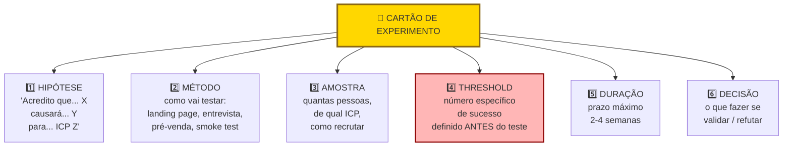

> [!important] Threshold ex-ante é o elemento não-negociável
> "Vamos ver quantos se interessam", sem número pré-definido, vira racionalização. Três clientes pagantes viram "sinal promissor". Trinta clientes viram "pouco para concluir". Com threshold (doze ou mais conversões em duas semanas, por exemplo), a decisão é automática.

A hipótese em teste. Donos de padaria pagariam R$ 400 por mês por loja pelo software, se a redução de perda for demonstrada em sessenta dias.

O tipo de experimento. Fake Door mais Carta de Intenção de Pagamento.

O desenho tem cinco passos. Criar landing page simples (Framer, quatro horas de trabalho) apresentando o PadariaPro com três planos: R$ 290, R$ 400, R$ 590 por mês por loja. CTA: "Quero ser um dos primeiros 10 a usar". Leva a formulário pedindo nome, padaria, número de lojas, telefone, e compromisso de pagar R$ X por mês se a funcionalidade Y estiver pronta em sessenta dias. Tráfego: postar em grupos de WhatsApp de donos de padaria (três grupos com cerca de oitenta donos cada), mais LinkedIn targetando dono-padaria. Duração: catorze dias. Orçamento: R$ 0 (sem ads), mais cerca de oito horas de trabalho.

A amostra mínima: trinta visitantes que se encaixem no ICP.

O critério de sucesso. Quinze por cento ou mais dos visitantes ICP preenchem formulário com compromisso real. E três dos cinco primeiros interessados confirmam em chamada telefônica disposição a pagar R$ 400 por mês.

O critério de falsificação. Se menos de cinco por cento preenchem, ou menos de dois em cinco confirmam em chamada, a hipótese está invalidada. Revisar preço ou proposta de valor.

Os riscos de interpretação. Preencher formulário é barato. Confirmação telefônica valida mais. E o selection bias é real: quem entra em grupos de WhatsApp pode não ser representativo. Cruzar com Instagram ads em SP.

O resultado, executado depois de catorze dias. Quarenta e sete visitantes ICP. Doze preencheram formulário (vinte e cinco por cento). Sete responderam à ligação. Dos sete: quatro confirmaram disposição a R$ 290, dois a R$ 400, um a R$ 590.

A decisão tomada. R$ 400 não é o preço óbvio. O mercado bifurca. A maioria aceita R$ 290 (entry), mas uma minoria valoriza o suficiente para R$ 590 (premium com integrações adicionais). A hipótese original (R$ 400 uniforme) está invalidada. A nova hipótese: tier duplo (R$ 290 entry mais R$ 590 premium) com pacote diferente.

### Armadilhas

Experimentos desenhados para validar, não para descobrir. Se a pessoa ama o empreendedor, o "experimento" sai positivo. Controle o viés.

Critérios de sucesso frouxos. "Vou considerar sucesso se alguém demonstrar interesse." Quase qualquer coisa vira sucesso. Seja rigoroso.

Ignorar resultados negativos. Muitos empreendedores desvalorizam dados contrários. "Esse grupo não era o público certo." Se você precisa justificar por que o resultado ruim "não conta", está fugindo da verdade.

Gastar muito em experimentos. Se um experimento custa mais de R$ 3.000, ou demora mais de duas semanas, provavelmente está mal desenhado. Vá mais simples.

Testar uma hipótese em vez da outra. Às vezes o que você testa não mede o que você acha. Pré-venda de um produto que não existe testa proposta mais preço mais timing. Não testa se o produto funcionaria. Saiba o que está medindo.

Não documentar o experimento. Sem registro escrito antes e depois, você reconstrói a narrativa para se beneficiar. Escreva antes e depois.

---

### CASO BRASILEIRO, Fase 7, landing page antes de construir em startup de RH

Um fundador de startup de automação em RH tinha ideia de software que mapeava cultura via respostas de funcionários. Antes de gastar seis meses construindo produto, quis validar se as empresas pagariam.

A decisão foi cirúrgica. Criou landing page em dois dias (Webflow). Investiu R$ 3.000 em LinkedIn Ads direcionado para VPs de RH em empresas médias. Ofereceu "diagnóstico de cultura" com preço anunciado.

Em três semanas, quarenta e sete leads qualificados. Doze reuniões realizadas. Três empresas ofereceram pré-pagamento. O experimento custou menos de R$ 5 mil total. E validou tanto a demanda quanto a disposição a pagar, antes de qualquer linha de código.

A lição transferível. Experimento barato antes de construir economiza meses. Pré-venda com pagamento real é o teste mais forte de demanda.

---

### Transição, Fase 7 para Fase 8

O que você acabou de fazer, ao longo das Fases 6 e 7. Gerou hipóteses bet-the-company. Aplicou CSD, H/E, e R vezes I scoring. Desenhou experimentos com threshold ex-ante. E validou (ou refutou) as premissas mais arriscadas do negócio.

O que vem nas Fases 8 e 9. Agora que você sabe que o problema é real, e que as premissas centrais se sustentam, começa o trabalho de explorar soluções. Ideação estruturada. Protótipos. Testes de solução com usuários reais. Você passa de "o problema existe?" para "qual é a melhor resposta para ele?".

> [!warning] Critério para avançar
> Pelo menos três a cinco hipóteses bet-the-company foram testadas e mantidas. Se alguma foi refutada, reavalie a teoria antes de prototipar.

### FERRAMENTAS DESTA FASE

Experimentos de validação do problema são o coração da metodologia. Essa fase usa o maior número de ferramentas de pesquisa qualitativa do manual. Detalhamento completo no [[#APÊNDICE BG — FERRAMENTÁRIO COMPLETO DO EMPREENDEDOR|Apêndice BG]].

The Mom Test (Rob Fitzpatrick, 2013). Protocolo de entrevista que evita respostas falsamente positivas. Perguntas sobre vida passada específica, não hipotéticos futuros. Use em toda entrevista de validação de problema. É a ferramenta número um desta fase. Ver BG.6.1.

JTBD Switch Interviews (Bob Moesta). Entrevista focada no momento de troca, quando o cliente largou solução anterior. As quatro forças (push, pull, anxiety, habit) revelam motivações reais de compra. Use quando há histórico de clientes que mudaram de solução, ou em entrevistas com clientes de concorrentes. Ver BG.6.2.

Contextual Inquiry (Beyer e Holtzblatt, 1997). Observar usuário realizando tarefa real no contexto de trabalho dele, perguntando sobre decisões em tempo real. Os dados incluem o que a pessoa faz, não só o que diz. Use para entender contexto real de uso, gaps invisíveis, workflows complexos. Ver BG.6.3.

Day in the Life e Ethnographic Research. Imersão longa (horas, dias) no ambiente natural do usuário. Captura rotinas, relacionamentos, ambientes físicos, tensões sociais. Use quando o contexto cultural ou operacional é crítico, e não capturável em entrevista pontual. Ver BG.6.4.

In-Depth Interviews (IDIs). Entrevistas individuais semi-estruturadas, de quarenta e cinco a noventa minutos, explorando temas em profundidade. Base para a maioria das validações qualitativas. Use dez a vinte IDIs para saturação de achados em segmento específico. Ver BG.6.6.

Laddering Technique e Means-End Chain (Gutman, 1982). "Por que isso importa pra você?" perguntado sucessivamente, até chegar em valores pessoais profundos. Revela motivações que o cliente não articula de primeira. Use quando se suspeita que a decisão de compra é emocional, além de funcional. Ver BG.6.7.

Diary Studies. Participantes registram experiências ao longo de dias ou semanas em formato estruturado. Captura comportamento cotidiano em contexto real. Reduz viés de recall. Use para entender padrões ao longo do tempo (rotinas, sazonalidades, evolução). Ver BG.6.8.

Focus Groups (Merton, Krueger). Discussão facilitada em grupo pequeno (seis a dez pessoas). O valor distintivo está na interação entre participantes. Use para explorar diversidade de perspectivas e linguagem do segmento. Cuidado em temas sensíveis. Ver BG.6.5.

Grounded Theory (Glaser e Strauss, 1967). Construir teoria a partir de dados qualitativos, através de iteração entre coleta e análise. Use em pesquisa profunda, onde queremos entender "por que" algo acontece, não apenas "o que". Ver BG.9.1.

Thematic Analysis (Braun e Clarke, 2006). Seis fases sistemáticas para identificar, analisar, e reportar temas em dados qualitativos. Mais rápido que grounded theory. Mais rigoroso que análise casual. Use como método padrão para consolidar achados de dez a vinte entrevistas. Ver BG.9.2.

Affinity Diagramming e KJ Method (Kawakita). Técnica visual para organizar grandes volumes de dados qualitativos em grupos temáticos emergentes via post-its. Use para síntese rápida em workshop colaborativo. Ver BG.9.3.

Empathy Mapping (Dave Gray, 2010). Mapa visual de estados internos do usuário em momento específico (vê, ouve, diz, faz, pensa, sente). Use depois de coletar dados, para internalização pela equipe. Ver BG.9.5.

Assumption Mapping (David Bland, 2019). Matriz de certeza versus risco das premissas do negócio. Prioriza o que testar primeiro. Use no início da fase, para definir onde focar a energia de validação. Ver BG.9.8.

Pre-mortem (Gary Klein). Imaginar que a validação falhou, e descrever por quê. Use antes de montar o plano de experimentos. Ver BG.5.3.

Expected Value (Pascal e Fermat). Priorizar hipóteses por valor esperado vezes probabilidade vezes custo. Ver BG.5.7.

---

### Exercício aplicado, semana de experimentos

A [[#FASE 7 — EXPERIMENTOS DE VALIDAÇÃO DO PROBLEMA|Fase 7]] trata de experimentos de validação de hipóteses. A teoria é clara. A execução exige prática. Esse exercício transforma teoria em trabalho específico da sua semana.

**Preparação, trinta minutos.** Liste todas as hipóteses que a sua empresa depende para funcionar, em formato testável ("se X, então Y, porque Z"). Normalmente, oito a quinze hipóteses emergem. Priorize em ordem de impacto se errada, e de incerteza atual. Escolha três para testar nesta semana.

**Design de experimento, sessenta minutos por hipótese.** Para cada hipótese escolhida, defina quatro coisas. Qual experimento vai validar ou refutar (entrevista, survey, landing page, teste A/B, observação etnográfica)? Qual o threshold de sucesso, em números específicos, não "bom" ou "razoável"? Qual o prazo, ou seja, quando você encerra o experimento? E quem é o responsável pela execução?

**Execução, cinco dias de trabalho.** Rodar os três experimentos em paralelo. Documentar tudo em um único arquivo. Um documento de experimento por hipótese. Com dados brutos, decisões tomadas, e problemas encontrados.

**Síntese, duas horas na sexta.** Para cada experimento, três perguntas. O threshold foi atingido? A hipótese está validada, refutada, ou inconclusiva? Qual a próxima ação. Dobrar aposta. Ajustar. Descartar. Ou rodar experimento de follow-up.

**Comunicação, trinta minutos.** Compartilhar a síntese com cofundador, e eventualmente com investidores. Documento de uma página por hipótese é suficiente.

> [!tip] Workflow semanal sustentável
> Esse é workflow semanal sustentável. Fazer isso doze semanas seguidas equivale a validar ou refutar trinta a trinta e seis hipóteses. Mais do que a maioria das startups faz no primeiro ano inteiro. Disciplina de execução é o que separa startup que avança de startup que gira em hipóteses.

---

### SÍNTESE DA FASE 7

A [[#FASE 7 — EXPERIMENTOS DE VALIDAÇÃO DO PROBLEMA|Fase 7]] transforma hipóteses em evidência. Hipóteses sem experimentos são listas bonitas. Experimentos transformam suposição em evidência. Mas evidência só vale se o experimento foi rápido, e barato. Se um experimento demora três meses, ou custa R$ 50 mil, você está gastando demais para aprender uma coisa só. Cada experimento deve gerar decisão clara. Continuar. Ajustar. Pivotar. Ou matar.

A diferença entre quem faz certo, e quem falha, está no rigor metodológico. Threshold pré-registrado antes de rodar o experimento, para evitar viés de confirmação. Regra de nove em dez para validações inequívocas. Disciplina de não pular do experimento "encorajador" para a construção do produto, sem antes ter passado pela ponte da validação rigorosa. Quem aceita "alguns sinais positivos" como prova entra na construção otimista, e descobre tarde que os sinais não eram o que pareciam.

O entregável é o Relatório de Experimentos. Hipóteses testadas, resultados, aprendizados, próximos passos. O que sobrevive aos testes vira insumo da [[#FASE 8 — IDEAÇÃO E PROTOTIPAGEM DE SOLUÇÕES|Fase 8]], ideação de soluções. O que é refutado força reabertura da árvore de teoria, e às vezes da escolha de cunha. A [[#FASE 7 — EXPERIMENTOS DE VALIDAÇÃO DO PROBLEMA|Fase 7]] é o ponto onde a teoria do negócio enfrenta o mundo. Quem trata isso com rigor produz aprendizado real. Quem trata como teatro de validação produz documentação para investidor, e nada mais.

#fase7 #experimentos #validacao #threshold #pre-registro #landing-page #pre-venda #fake-door #wizard-of-oz #regra-9-em-10

---

## FASE 8 — IDEAÇÃO E PROTOTIPAGEM DE SOLUÇÕES

> [!question] FMF Check da Fase 8
> As ideias de solução que estão emergindo são fruto da sua experiência única com o problema, ou são soluções genéricas que apareceriam em qualquer brainstorm? Se forem genéricas, provavelmente você não está no founder-market-fit que imagina, ou está no estágio em que precisa mergulhar mais fundo no mercado antes de prototipar. Entrevistar dez operadores experientes do setor antes de prototipar é mais barato que prototipar solução genérica.

### O que esse apêndice cobre
Geração, avaliação, e prototipagem de diferentes soluções possíveis para o problema validado. Aqui você não constrói um produto real. Constrói representações: prototipagem em papel, protótipos clicáveis, mockups, storyboards. Para testar a desejabilidade da solução antes de investir em construção.

O entregável é um Dossiê de Solução. Contém três a cinco conceitos de solução avaliados, pelo menos um protótipo interativo, e a recomendação de qual caminho seguir.

### POR QUE
Entre entender o problema e construir a solução, existe um abismo de decisões. Quase todo problema validado pode ser resolvido de várias formas. App. SaaS. Serviço. Marketplace. Hardware. Comunidade. Curso. Pular direto para "app" é a preguiça que custa caro. Explorar alternativas gera insight, e reduz risco.

Prototipagem é a forma mais barata de testar. Com um dia de trabalho, e zero código, você consegue feedback sobre experiência, fluxo, e desejabilidade.

### Quando usar
Comece depois da [[#FASE 7 — EXPERIMENTOS DE VALIDAÇÃO DO PROBLEMA|Fase 7]] confirmar que o problema é real. Termine quando tiver um protótipo interativo testado com pelo menos oito usuários, e uma direção clara de qual solução construir. Revisite antes de cada grande decisão de redesign.

### Quem envolve
O executor é você. Com apoio de designer (freelancer ou sócio) se tiver. Os participantes são oito a doze usuários do ICP, para testar protótipos. O decisor é você.

### Como executar

Oito passos.

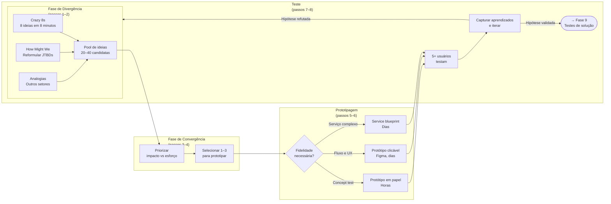

Não se limite ao que você imaginou. Faça sessões de brainstorm estruturadas. Sozinho ou com duas a três pessoas. Quatro técnicas úteis.

Crazy 8s. Oito ideias de solução em oito minutos. Uma por minuto. Força quantidade sobre qualidade.

How Might We (como poderíamos?). Reformule o *job to be done* em três a cinco perguntas abertas. Por exemplo: "Como poderíamos ajudar o dono de restaurante a encerrar o dia sem preocupação?"

Extremos. E se a solução fosse super-premium (R$ 5.000 por mês)? E se fosse de graça? E se fosse física? E se fosse humana (serviço)?

Analogias. Como outros setores resolvem problemas parecidos? O que o Uber ensinou sobre marketplaces pode se aplicar? O que o iFood ensinou sobre logística distribuída?

> [!tip] Meta da divergência
> Quinze a trinta ideias no papel, mesmo que a maioria seja ruim. A qualidade emerge da quantidade.

#### Passo 2, avalie e reduza (convergir)

Avalie cada ideia em três dimensões.

Desejabilidade. O usuário quer isso? Baseado em tudo que você aprendeu nas Fases 2 e 3.

Viabilidade. Você consegue entregar? Capacidades técnicas, financeiras, regulatórias.

Sustentabilidade. O modelo econômico fecha? Preço viável, custo viável, margem razoável.

Dê nota de um a cinco em cada dimensão. Multiplique. Selecione os três a cinco conceitos com maior score.

> [!note] DVS e matriz Impacto-Esforço são complementares
> A avaliação por Desejabilidade, Viabilidade, e Sustentabilidade (DVS) é qualitativa. Útil para reduzir trinta ideias para cinco. Já a matriz Impacto vezes Esforço (que aparece no exemplo prático mais adiante) é visual. Útil para priorizar quais protótipos rodar primeiro entre os finalistas. Use as duas em sequência. Primeiro DVS para filtrar. Depois Impacto-Esforço para ordenar.

#### Passo 3, detalhe os 3 a 5 conceitos escolhidos

Para cada conceito, escreva em uma página seis itens. Nome do conceito (dê nome, facilita comunicação). Descrição em um parágrafo. Principal diferencial. Requisitos técnicos principais. Modelo de monetização imaginado. Principais riscos.

#### Passo 4, escolha 1 ou 2 conceitos para prototipar

Escolha o(s) com maior potencial percebido. Defina o formato do protótipo. Seis opções.

##### Storyboard

Sequência de seis a doze quadros mostrando a pessoa usando a solução em contexto. Útil para validar o fluxo geral.

##### Wireframes em papel ou ferramenta

Esboços de telas. Útil para validar arquitetura de informação.

##### Mockups de alta fidelidade

Telas desenhadas com detalhe visual. Figma ou similar.

##### Protótipo clicável

Telas com fluxo de navegação. Pode ser feito em Figma, Marvel, Proto.io.

##### Protótipo em vídeo

Vídeo explicando a solução como se ela existisse. Excelente para testar com público amplo.

##### Protótipo de serviço (service blueprint)

Para negócios de serviço. Mapeie touchpoints, atores, sistemas, e tempo.

> [!tip] Para a maioria dos casos no início, protótipo clicável em Figma
> É o melhor custo-benefício. Permite testar fluxo real de navegação, sem precisar de código. Designer freelancer faz em dois ou três dias.

#### Passo 5, prepare roteiro de teste de protótipo

Cinco partes na estrutura do roteiro.

Contextualização (dois minutos). Descreva a situação real em que a pessoa estaria usando.

Tarefas (quinze minutos). Dê três a cinco tarefas para a pessoa executar no protótipo. Por exemplo: "Você acabou de fechar o caixa do dia. Use essa ferramenta para checar se houve alguma divergência."

Observação silenciosa. Deixe a pessoa errar. Anote onde ela travou.

Pensar em voz alta. Peça que verbalize o que está pensando enquanto navega.

Perguntas pós-teste (dez minutos). O que foi intuitivo? O que foi confuso? Usaria? Pagaria? Quanto?

#### Passo 6, teste com 8 a 12 usuários do ICP

A partir do oitavo teste, você começa a ver padrões claros. Se você achar que três testes bastam, está ignorando a diversidade de reações.

#### Passo 7, itere o protótipo

Depois de cada ciclo de três a quatro testes, ajuste o protótipo com base nos padrões observados. Teste a nova versão com os próximos três a quatro usuários.

#### Passo 8, consolide no Dossiê de Solução

Documento contendo seis itens. Conceitos gerados e avaliados. Conceitos selecionados, detalhados. Protótipos (ou links). Resumo dos testes com usuários (padrões observados, problemas encontrados, verbatim). Recomendação de conceito a construir, com justificativa. Riscos e incógnitas remanescentes.

### PERGUNTAS A RESPONDER
- Quais são as soluções alternativas possíveis para o problema?
- Qual conceito tem a melhor combinação de desejabilidade, viabilidade, e sustentabilidade?
- Como o usuário reage quando vê uma versão tangível da solução?
- Onde o usuário trava, se confunde, se encanta?
- O que tem que estar necessariamente no MVP? O que pode ficar para depois?
- Qual a linguagem visual e narrativa que o usuário entende e reconhece?

### Métricas

Número de conceitos gerados. Alvo: quinze ou mais no brainstorm inicial.

Número de testes de protótipo realizados. Alvo: oito a doze.

Taxa de conclusão de tarefas sem ajuda. Mais de setenta por cento indica boa clareza do fluxo.

Tempo médio para completar tarefa-chave. Meça e compare com a expectativa pré-teste. Sinal de atrito se a execução real excede a expectativa em cinquenta por cento ou mais. O conceito tem problema de fluxo que o MVP vai herdar se não corrigir.

Indicação de intenção de uso depois de ver o protótipo. Mais de cinquenta por cento dos testados demonstrando intenção real é sinal bom.

Indicação de disposição a pagar depois de ver o protótipo. Pergunte via "quanto faria sentido cobrar por isso?", em vez de "você pagaria?". Setenta por cento ou mais dos testados devem sugerir valor igual ou superior ao seu preço-alvo. Se a maioria sugere abaixo, ou o preço está errado, ou o valor percebido ainda é baixo.

### SAÍDA DESTA FASE

Você concluiu a [[#FASE 8 — IDEAÇÃO E PROTOTIPAGEM DE SOLUÇÕES|Fase 8]] quando os seis critérios abaixo estão cumpridos.

1. Você gerou dez ou mais ideias em sessão de divergência documentada (não prendeu-se à primeira ideia).
2. Matriz Impacto vezes Esforço foi aplicada com classificação clara.
3. Dois ou mais protótipos low-fi (papel ou Figma) estão prontos, resolvendo o *job* central identificado na [[#FASE 4 — PESQUISA COM USUÁRIOS (CUSTOMER DISCOVERY APROFUNDADO)|Fase 4]]. Não features periféricas.
4. Cinco ou mais testes com usuários ICP foram realizados e documentados (idealmente oito ou mais usuários para confiança maior).
5. Insights qualitativos claros emergem. Não só "gostaram". Padrões de uso e reação estão documentados.
6. Você decidiu qual conceito levar para MVP, com justificativa escrita. E tem lista clara do que é essencial versus postergável.

**Checklist final.**

- [ ] Gerei dez ou mais ideias de solução alternativas, sem ficar com a primeira?
- [ ] Apliquei técnica de divergência (Crazy 8s, brainwriting, SCAMPER) antes de convergir?
- [ ] Classifiquei ideias em dois eixos: impacto e esforço (matriz 2x2)?
- [ ] Escolhi duas ou três ideias para prototipar, não só a "preferida"?
- [ ] Os protótipos são de baixa fidelidade (papel, Figma clicável, sem código)?
- [ ] Os protótipos resolvem o *job* central identificado na [[#FASE 4 — PESQUISA COM USUÁRIOS (CUSTOMER DISCOVERY APROFUNDADO)|Fase 4]], não features periféricas?
- [ ] Mostrei os protótipos para cinco ou mais usuários do ICP?
- [ ] Identifiquei qual solução gera reação mais forte (positiva ou negativa)?

**Primeiros passos práticos.**

1. Reservar duas horas para sessão de ideação. Crazy 8s (oito ideias em oito minutos), mais detalhamento das três melhores.
2. Prototipar em Figma ou em papel as duas a três ideias mais promissoras. Low-fi. Não perca tempo em fidelidade.
3. Agendar cinco sessões com usuários ICP, mostrando os dois ou três protótipos lado a lado, e pedindo reação.
4. Documentar reações. O que chamou atenção. O que confundiu. O que ignoraram.

### EXEMPLO PRÁTICO

**Sessão de ideação, PadariaPro.**

O *job* central, identificado na [[#FASE 4 — PESQUISA COM USUÁRIOS (CUSTOMER DISCOVERY APROFUNDADO)|Fase 4]]: "Me devolver horas de foco executivo, sem aumentar o desperdício."

Crazy 8s, fragmento de oito ideias em oito minutos. App mobile para o gerente fazer pedido por voz. WhatsApp bot que pergunta o estoque diário e faz pedido automático. Dashboard web com previsão mais um clique para confirmar pedido. Etiquetas inteligentes (sensor) em sacos de farinha. Câmera no estoque com visão computacional. E-mail diário com "pedido sugerido" que requer aprovação. Integração com caixa, deduz estoque automaticamente. Parceria com fornecedor: o fornecedor envia semanalmente baseado em consumo.

Matriz Impacto vezes Esforço aplicada às oito ideias. Alto impacto e baixo esforço: a número 2 (WhatsApp bot) e a número 6 (e-mail diário). Prototipar essas duas. Alto impacto mas alto esforço: a número 3 (dashboard) e a número 7 (integração com caixa). Versão reduzida vale prototipar. Descarte inicial: a número 4 (etiquetas — caro, complexo) e a número 5 (câmera — infraestrutura). Guardar para fase pós-PMF.

**Protótipo número 2, WhatsApp Bot (low-fi).**

Sequência de seis mensagens em PDF, simulando o diálogo bot-usuário:

> *Bot:* "Bom dia, Fábio! Segundo o seu histórico, você vai precisar de 120 kg de farinha T1 esta semana. Confirmar pedido com Anaconda por R$ 2.340? (sim/não/ajustar)"
>
> *Usuário:* "Ajustar para 140 kg"
>
> *Bot:* "Ok, 140 kg por R$ 2.730. Confirmar? (sim/não)"
>
> *Usuário:* "Sim"
>
> *Bot:* "Pedido enviado. Entrega quarta-feira."

**Protótipo número 6, E-mail Diário.**

Imagem de um e-mail simulado, com lista de itens sugeridos, quantidades, valores, e dois botões. "Confirmar pedido" e "Ajustar".

**Testes com cinco usuários, reação bruta.**

| Usuário | Reação ao 2 (WhatsApp) | Reação ao 6 (E-mail) | Preferência |
|---|---|---|---|
| Fábio (Campinas) | "Isso é incrível, resolveria o meu dia" | "E-mail eu ignoro" | 2 |
| João (SP) | "Bom, mas e se errar?" | "Mais formal, mais bonito" | Empate |
| Paula (SP) | "O meu gerente não vai usar WhatsApp assim" | "E-mail ninguém abre" | Nenhum |
| Roberto (RM) | "Perfeito, WhatsApp é onde a gente vive" | "Fraco" | 2 |
| Márcia (Campinas) | "Confirmar compra de R$ 2 mil pelo WhatsApp me deixa insegura" | "Mais segurança visual" | 6 |

O aprendizado principal. WhatsApp é preferido pela conveniência, mas gera ansiedade em valores altos. E-mail gera segurança visual, mas tem problema de abertura.

> [!important] O insight crítico do teste
> Talvez a solução seja híbrida. WhatsApp para notificação, mais confirmação em app ou web para compras acima de R$ 1 mil. Não dicotomia entre os dois. Os testes raramente confirmam a hipótese binária. Geralmente revelam síntese inesperada.

### Armadilhas

Apegar-se à primeira ideia. A primeira ideia raramente é a melhor. Divergir antes de convergir dói. Mas paga.

Prototipar com alta fidelidade cedo demais. Um protótipo bonito pode esconder problemas de fluxo. Comece em baixa fidelidade.

Testar com usuários errados. Teste com o ICP. Amigo designer dando feedback não substitui usuário real.

Ouvir opinião em vez de observar comportamento. O que importa é onde o usuário trava. Não se ele "acha bonito".

Usar o teste como confirmação. O objetivo é encontrar problemas, não receber elogios. Se ninguém achou nada errado, você fez um teste fraco.

Construir direto sem prototipar. "Já sei como vai ser." Constatação final: você descobre coisas no protótipo que não imagina na cabeça.

> [!warning] Construir a solução errada para o problema certo
> Antes da Tesla, existiam carros elétricos, e ninguém os queria de forma massiva. Não porque o problema (mobilidade limpa) fosse irreal. Mas porque as montadoras tradicionais assumiram que o cliente trocaria desempenho e estética por consciência ambiental. A Tesla atacou o mesmo problema com uma solução que não pedia essa troca. A lição transferível: validar o problema não te dá cheque em branco sobre a solução. Um problema real comporta várias hipóteses de solução. E apenas algumas delas funcionam. Teste problema e solução separadamente. E desconfie quando o resultado do primeiro se transferir automaticamente para o segundo.

---

### CASO BRASILEIRO, Fase 8, prototipagem com wireframe em papel

A fundadora de uma startup de educação infantil precisava testar o fluxo de uso com crianças antes de investir em desenvolvimento.

A decisão foi simples e barata. Em vez de construir MVP digital, imprimiu telas em papel. Pediu a quinze crianças (cinco de quatro anos, cinco de seis anos, cinco de oito anos) para "usar" o papel. Ela observava como elas interpretavam cada tela.

A descoberta. O fluxo pensado para adulto (menu para categoria para item) não funcionava com crianças de quatro a seis anos. Elas esperavam ver tudo numa tela com imagens grandes. Redesenhou antes de escrever código.

A lição transferível. Protótipo em papel revela falhas de experiência a R$ 50 (custo das impressões) que revelariam a R$ 50 mil depois de desenvolvido.

---

### FERRAMENTAS DESTA FASE

Ideação e prototipagem de soluções exigem ferramentas de divergência mais convergência estruturadas. Detalhamento no [[#APÊNDICE BG — FERRAMENTÁRIO COMPLETO DO EMPREENDEDOR|Apêndice BG]]. Nove ferramentas centrais.

Design Thinking Double Diamond (IDEO e British Design Council, 2005). Processo em quatro fases (Discover, Define, Develop, Deliver), divergindo e convergindo duas vezes. Use em problemas complexos que exigem exploração antes de solução. Ver BG.10.5.

Google Design Sprint (Jake Knapp, 2016). Processo de cinco dias para ir de problema a solução testada com usuários reais. Use em decisões de produto significativas, onde se quer aprendizado rápido antes de compromisso de execução. Ver BG.10.3.

Working Backwards e PR-FAQ (Amazon). Escrever press release final do produto, mais FAQ, antes de construir. Força clareza sobre valor, cliente, e narrativa. Use antes de lançamento de feature ou produto significativo. Ver BG.10.6.

Opportunity Solution Tree (Teresa Torres). Ferramenta visual conectando outcome, oportunidades (dores do cliente), soluções, e experimentos. Use para mapear o espaço de soluções antes de priorizar. Ver BG.10.2.

Continuous Discovery Habits (Teresa Torres, 2021). Framework de descoberta contínua. Entrevistas semanais, mais OST, mais assumption testing. Use quando o time de produto quer estabelecer ritmo de aprendizado contínuo. Ver BG.10.1.

Dual-Track Agile (Marty Cagan). Dois tracks paralelos: Discovery (validar) e Delivery (construir). Use em times maiores (sete ou mais), onde há capacidade de paralelismo. Ver BG.10.9.

Personas (Alan Cooper, 1998). Representações fictícias mas baseadas em dados, de segmentos de usuários. Para ideação, personas ajudam a manter foco. Use depois de pesquisa qualitativa da [[#FASE 7 — EXPERIMENTOS DE VALIDAÇÃO DO PROBLEMA|Fase 7]]. Personas são síntese dos dados. Ver BG.9.4.

Customer Journey Mapping. Visualização da jornada do cliente em momentos, emoções, e touchpoints. Use antes de ideação, para localizar oportunidades por fase. Ver BG.9.6.

Service Blueprinting (Shostack, 1984). Mapa detalhado do serviço completo. Frontstage, backstage, e sistemas. Use em produtos com componente de serviço significativo. Ver BG.9.7.

---

### SÍNTESE DA FASE 8

A [[#FASE 8 — IDEAÇÃO E PROTOTIPAGEM DE SOLUÇÕES|Fase 8]] ataca uma preguiça que custa caro. Pular direto para "vamos fazer um app". Quase todo problema validado pode ser resolvido de várias formas. App. SaaS. Serviço. Marketplace. Hardware. Comunidade. Curso. Cada formato tem economia diferente, requisitos diferentes, riscos diferentes. Quem pula a exploração de alternativas, e parte para a primeira solução que vem à mente, costuma escolher mal. E descobre tarde que o formato escolhido era o pior, dentre os possíveis.

A diferença entre quem faz certo, e quem falha, está em separar ideação de construção. Prototipagem é a forma mais barata de testar. Com um dia de trabalho, e zero código, você consegue feedback sobre experiência, fluxo, e desejabilidade. Crazy 8s, wireframes em papel, protótipos clicáveis no Figma, são instrumentos para testar conceito antes de comprometer recursos. Quem economiza no protótipo gasta dez vezes mais na construção. E descobre os mesmos problemas, em momento mais doloroso de corrigir.

O entregável é o Dossiê de Solução. Três a cinco conceitos avaliados, pelo menos um protótipo interativo testado com oito ou mais usuários, e recomendação clara de qual caminho seguir. Esse dossiê é insumo da [[#FASE 9 — TESTES DE SOLUÇÃO E USABILIDADE|Fase 9]], refinamento e especificação do MVP. Quem chega à [[#FASE 9 — TESTES DE SOLUÇÃO E USABILIDADE|Fase 9]] sem ter explorado alternativas, e sem ter testado protótipo, entra na construção da solução com hipótese implícita não-validada. A [[#FASE 8 — IDEAÇÃO E PROTOTIPAGEM DE SOLUÇÕES|Fase 8]] bem-feita reduz a chance de retrabalho radical na [[#FASE 10 — MVP E EXPERIMENTOS DE MERCADO|Fase 10]].

#fase8 #ideacao #prototipagem #design-thinking #crazy-8s #wireframe #figma #protótipo-clicavel #service-blueprint

---

## FASE 9 — TESTES DE SOLUÇÃO E USABILIDADE

### O que esse apêndice cobre
Refinamento iterativo do conceito escolhido por meio de testes de usabilidade estruturados, entrevistas de solução (diferentes das de problema), e validação da proposta de valor em contato com usuários. Nesta fase, você também define os requisitos funcionais mínimos do MVP que será construído na [[#FASE 10 — MVP E EXPERIMENTOS DE MERCADO|Fase 10]].

O entregável é a Especificação do MVP. Documento preciso sobre o que o MVP fará, para quem, com quais limitações, e como medirá sucesso.

### POR QUE
Protótipos testam fluxo e conceito. Mas não testam valor real em uso prolongado. Esta fase aprofunda o teste de solução, e converte aprendizado em requisitos. Sem especificação clara antes de construir, você gasta mais, demora mais, e entrega menos.

### Quando usar
Comece depois da [[#FASE 8 — IDEAÇÃO E PROTOTIPAGEM DE SOLUÇÕES|Fase 8]] escolher o conceito. Termine quando a Especificação do MVP estiver escrita, priorizada, e aprovada por você (e sócios, se houver). Revisite a cada iteração maior do produto.

### Quem envolve
O executor é você. Com designer e tech lead se houver. Os participantes são dez a quinze usuários do ICP, para entrevistas de solução e testes. O decisor é você.

### Como executar

Seis passos.

#### Passo 1, conduza entrevistas de solução

Diferente da entrevista de problema ([[#FASE 3 — DESCOBERTA DO PROBLEMA|Fase 3]]), aqui você mostra o protótipo e pergunta ao usuário, estruturadamente, seis coisas. Se a solução proposta resolve o problema dele. Como ela se compara com o que ele usa hoje. Quanto faria sentido cobrar. Quais features ele sente falta, e quais acha supérfluas. Em que momento da rotina ele usaria. O que o impediria de usar.

Faça dez a quinze dessas entrevistas. Grave, transcreva, analise.

#### Passo 2, aplique a técnica das cinco escalas de valor

Para cada entrevistado, peça que avalie (em escala de um a cinco) a solução em cinco dimensões.

Relevância. "Isso resolve um problema real para você?"

Urgência. "Você precisaria disso nos próximos trinta dias?"

Preferência. "Você prefere essa solução em relação ao que usa hoje?"

Diferenciação. "Você percebe essa solução como diferente das alternativas?"

Disposição a pagar. "Quanto faria sentido cobrar?"

Calcule a média e o desvio-padrão de cada escala.

> [!warning] Urgência abaixo de três é alerta vermelho
> Se a Urgência média ficar abaixo de três, o problema existe mas não é prioridade. Você terá dificuldade de vender. Não é "ainda preciso polir o pitch". É "o problema não é dolorido o suficiente". Volte à Fase 3.

#### Passo 3, faça o teste de cinco segundos (five second test)

Mostre o protótipo ou a página principal por cinco segundos, e tire. Depois pergunte três coisas. O que você entendeu? Para quem é? Qual problema resolve?

Se cinquenta por cento dos testados não conseguem responder bem, o seu posicionamento está confuso. Isso vai matar o seu CAC depois.

#### Passo 4, teste de precificação (price sensitivity, Van Westendorp)

Pergunte quatro coisas, nessa ordem.

Em que preço você começaria a achar muito barato? A ponto de desconfiar da qualidade.

Em que preço você começaria a achar barato? Bom negócio.

Em que preço você começaria a achar caro? Mas ainda consideraria.

Em que preço você começaria a achar caro demais? Não consideraria.

Com quinze a vinte respostas, plote as quatro curvas. A intersecção entre "caro" e "barato" indica a faixa de preço psicologicamente aceitável.

> [!tip] Van Westendorp é ponto de partida, não resposta final
> Essa não é a precificação ideal. Mas é um ponto de partida muito melhor do que chutar. Preço real será descoberto em mercado.

#### Passo 4B, aplique product discovery moderno (Marty Cagan e Teresa Torres)

O padrão contemporâneo de product discovery em empresas de tecnologia maduras (Silicon Valley, scale-ups europeias, unicórnios latam) se baseia em quatro princípios que valem a pena incorporar desde cedo.

##### Continuous discovery (Teresa Torres)

Em vez de fazer "fases" de discovery separadas do desenvolvimento, o time mantém contato semanal com clientes (três a cinco entrevistas por semana, por time de produto) permanentemente. Em paralelo com o desenvolvimento. O objetivo é que qualquer decisão de produto seja informada por evidência recente. Não por discovery feito há seis meses.

A implementação mínima tem quatro elementos. Calendário recorrente de entrevistas. Cada product trio (PM mais designer mais tech lead) agenda duas a três conversas com cliente por semana. Recrutamento contínuo. Pool de usuários-teste renovado mensalmente. Use ferramentas como Respondent, UserTesting, ou recrutamento próprio em comunidade. Research Wiki. Todas as aprendizados e quotes vão para repositório central pesquisável. Weekly sync. Time inteiro discute dois a três aprendizados da semana em trinta minutos.

##### Opportunity Solution Tree (OST), de Teresa Torres

Framework visual para conectar outcomes do negócio, oportunidades (dores, desejos, jobs do cliente), soluções, e experimentos. Estrutura:

```
 OUTCOME DESEJADO
 (ex.: aumentar NRR em 15pp)
 │
 ┌──────────────┼──────────────┐
 │ │ │
 OPORTUNIDADE OPORTUNIDADE OPORTUNIDADE
 (Cliente não (Cliente não (Cliente não
 descobre entende valor sabe do produto
 features) do produto) adjacente)
 │ │ │
 ┌──┴──┐ ┌──┴──┐ ┌──┴──┐
 SOL A SOL B SOL C SOL D SOL E SOL F
 │ │ │ │ │ │
 EXP EXP EXP EXP EXP EXP
```

A lógica. Outcome é o norte. Oportunidades são formas de mover o norte. Soluções são apostas sobre como atacar a oportunidade. Experimentos testam as apostas. O OST previne o erro clássico de "ir direto para solução" sem mapear se a oportunidade é real.

> [!important] Exercício prático antes de adicionar feature
> Antes de adicionar qualquer feature ao MVP, pergunte três coisas. Qual oportunidade do cliente essa feature ataca? Qual outcome de negócio isso move? Se a oportunidade não existir, a feature vira desperdício. Volte ao discovery.

##### Dual-track agile

Em vez de alternar "sprints de discovery" com "sprints de development", rode os dois em paralelo. Discovery track (tipicamente PM mais designer mais tech lead). Continuamente entrevista clientes, prototipa, testa hipóteses. Gera oportunidades validadas e soluções prototipadas. Delivery track (engenheiros). Continuamente constrói soluções já validadas pelo discovery track.

O pipeline funciona como esteira. Discovery produz "backlogged validated solutions". Delivery puxa delas. Evita dois problemas. Engenheiros ficarem sem o que construir, enquanto discovery trabalha. E construir coisas que não foram validadas.

##### User stories com acceptance criteria estruturado (INVEST)

Ao quebrar a solução em itens de trabalho, cada user story deve atender a seis critérios.

Independent. Não depende de outras stories para ser útil.

Negotiable. Detalhes podem ser ajustados em conversa.

Valuable. Entrega valor visível ao usuário final, ou cliente interno.

Estimable. O time consegue estimar esforço com razoável precisão.

Small. Cabe em um sprint (uma a duas semanas). Se não cabe, quebre.

Testable. Tem critérios de aceite objetivos. Pode ser verificado.

Formato padrão:

```
Como [persona]
Quero [ação / funcionalidade]
Para [benefício concreto]

ACCEPTANCE CRITERIA:
[ ] Dado [estado inicial], quando [ação], então [resultado esperado]
[ ] Dado [outro estado], quando [ação], então [outro resultado]
[ ] [Critérios de UX, performance, segurança específicos]
```

Com acceptance criteria, "definição de pronto" vira auditável. Sem eles, "pronto" vira debate filosófico no planning.

#### Passo 5, mapeie requisitos por ordem de prioridade (MoSCoW)

A priorização MoSCoW para escopo de MVP, em estrutura visual:

```mermaid
flowchart LR
 subgraph M["🔴 MUST HAVE<br/>sem isso não vai ao ar<br/>5-15 itens"]
 M1[Features core]
 M2["Sem elas, MVP<br/>não resolve a dor"]
 end

 subgraph S["🟠 SHOULD HAVE<br/>importante mas<br/>pode esperar 1-2 sprints"]
 S1[Features significativas]
 S2["Workarounds existem<br/>para primeira versão"]
 end

 subgraph C["🟡 COULD HAVE<br/>nice-to-have<br/>se sobrar tempo"]
 C1[Features desejáveis]
 C2[Mas não críticas]
 end

 subgraph W["⚪ WONT HAVE<br/>explicitamente FORA<br/>do escopo deste MVP"]
 W1["Features que<br/>NÃO vão ser feitas"]
 W2["Decisão consciente,<br/>não esquecimento"]
 end

 M -.-> Build["🔨 Build MVP<br/>sprint 1-4"]
 S -.-> Later["⏳ Roadmap<br/>sprint 5+"]
 C -.-> Nice["🎁 Se sobrar<br/>capacidade"]
 W -.-> Never["❌ Nunca<br/>neste MVP"]

 style M fill:#FFB6B6,stroke:#8B0000,stroke-width:2px
 style S fill:#FFD580
 style C fill:#FFFF99
 style W fill:#D3D3D3
```

A tentação é inflar Must Have para vinte ou trinta itens. MVP com vinte Must Haves não é MVP. É produto mínimo *impossível*.

Lista de requisitos funcionais. Cada um em uma das quatro categorias. Must Have. Sem isso, não há produto. Entra no MVP obrigatoriamente. Should Have. Deveria ter, mas dá para viver um tempo sem. Sprint três pós-MVP. Could Have. Desejável. Entra se houver tempo e capacidade. Won't Have (yet). Explicitamente fora do MVP.

> [!important] Regra dura do MoSCoW
> Um MVP com mais de dez a quinze Must Haves não é MVP. É produto inflado. Se a sua lista passa de quinze, você não dominou o problema ainda. Volte e corte.

#### Passo 6, escreva a Especificação do MVP

Documento contendo dez itens.

Proposta de valor final, em uma frase. Persona foco (beachhead). JTBDs principais a resolver. Lista de Must Haves. Lista de Should e Could Haves (roadmap futuro). Explicitamente: o que o MVP *não* fará (Won't Haves). Critérios de sucesso do MVP (métricas). Faixa de preço planejada. Canais de aquisição planejados. Prazo de desenvolvimento estimado. Orçamento.

### PERGUNTAS A RESPONDER
- A solução proposta resolve o problema de forma percebida como superior pelo ICP?
- Em que faixa de preço ela cabe no orçamento da beachhead?
- Quais são os requisitos absolutamente indispensáveis (Must Haves)?
- Quais seriam dispensáveis no primeiro release?
- Como vou medir sucesso do MVP em noventa dias depois de lançar?
- Quais são os três principais riscos do MVP?

### Métricas

Score médio de Urgência. Quatro ou mais é forte. Três a quatro é aceitável. Abaixo de três é alerta.

Score médio de Preferência sobre alternativa atual. Quatro ou mais é forte.

Taxa de entendimento em cinco segundos. Setenta por cento ou mais é bom.

Faixa de preço aceitável (Van Westendorp). Indica o limite superior para cobrar.

Número de Must Haves. Idealmente cinco a dez. Crítico se mais de quinze.

### GATE DE DIRECIONALIDADE, o teste final antes do MVP

Antes de avançar para a [[#FASE 10 — MVP E EXPERIMENTOS DE MERCADO|Fase 10]] e gastar tempo e dinheiro construindo o MVP, responda em voz alta, para um interlocutor externo (cofundador, mentor, advisor), a seguinte pergunta.

> [!important] A pergunta do gate
> A solução que estamos prestes a construir reduz ou elimina, de forma direta e mensurável, a dor que identificamos na beachhead?

Os três elementos da frase importam, e cada um é um teste por si só.

Reduz ou elimina. Não é "ajuda com", "apoia", "melhora a experiência de". Uma solução que não cruza essa barreira não justifica adoção, nem pagamento. Se você se vê usando verbos fracos para descrever o impacto, provavelmente está vendendo melhoria incremental onde o cliente precisa de ruptura.

De forma direta. A cadeia causal entre usar o produto e sentir a dor diminuir precisa ser curta e óbvia. Se a redução da dor depende de o cliente também mudar comportamento, também treinar a equipe, também integrar com outros sistemas que ele ainda não tem, a cadeia é longa demais para um MVP ganhar adoção.

De forma mensurável. O cliente precisa conseguir medir a redução. Em horas, reais, erros evitados, conversões geradas. Redução "sentida" mas não medida é indistinguível de placebo. E não financia renovação de contrato.

> [!warning] Se algum dos três elementos travar, não avance
> Volte ao Passo 6 da Fase 9 (Especificação do MVP), e corte features que não contribuem diretamente para a redução da dor principal. Um MVP que resolve uma dor com direcionalidade clara supera consistentemente um MVP que resolve várias dores com direcionalidade difusa.

### SCALE READINESS CHECK, antes de acelerar o desenvolvimento

Esse checklist complementa o gate de direcionalidade. Enquanto o gate pergunta "a solução é a certa?", o Scale Readiness Check pergunta "você tem as condições para construir com segurança?". Os cinco itens precisam ser todos verdadeiros antes da [[#FASE 10 — MVP E EXPERIMENTOS DE MERCADO|Fase 10]] começar com intensidade de build.

- [ ] **Um comprador claramente definido.** Você tem nome, cargo, e empresa (ou perfil nomeado no caso B2C) do primeiro comprador. Não "pequenos negócios". Uma lista concreta de cinco a dez pessoas que você saberia chamar hoje para uma demo.
- [ ] **Um workflow doloroso identificado.** Você observou, não só ouviu, o workflow atual. Sabe onde o cliente trava, quantos minutos por semana ele gasta na gambiarra, e quem mais na organização é afetado.
- [ ] **Titularidade de orçamento clara.** Você sabe quem no fluxo comprador autoriza o gasto, de qual rubrica sai o dinheiro, e em que ordem de grandeza (R$ por mês ou por licença). Se a resposta é "a gente descobre depois", você ainda não tem clareza orçamentária suficiente para escalar.
- [ ] **Urgência observável.** Não declarada em entrevista. *Observável em comportamento*. O cliente já está pagando algo hoje para mitigar (mesmo que precariamente), já tentou resolver sozinho, ou tem prazo externo (regulatório, contratual, competitivo) que aperta.
- [ ] **Consciência de que escalar suposições amplifica ineficiência.** Você lista por escrito quais suposições ainda não foram validadas, e se comprometeu a validá-las na [[#FASE 10 — MVP E EXPERIMENTOS DE MERCADO|Fase 10]] sem construir por cima delas. Ignorar essa etapa transforma dívida de suposição em dívida de produto, e cria retrabalho caro.

> [!warning] Se algum dos cinco itens não pode ser marcado, não avance em ritmo de produção
> Continue na Fase 9 em modo de investigação até fechar o item. Escalar desenvolvimento com suposições não-testadas é como colocar mais combustível em um carro que ainda não se sabe se tem direção funcionando. Você só vai chegar mais rápido no lugar errado.

### SAÍDA DESTA FASE

Você concluiu a [[#FASE 9 — TESTES DE SOLUÇÃO E USABILIDADE|Fase 9]] quando os nove critérios abaixo estão cumpridos.

1. Especificação do MVP existe escrita, com todos os campos. Incluindo MoSCoW com cinco a quinze Must Haves.
2. Protótipo de média fidelidade clicável existe, com fluxos principais.
3. Três ou mais tarefas-chave de teste estão definidas, com critério de conclusão.
4. Dez ou mais entrevistas de solução, ou sessões de teste, foram realizadas com think-aloud, e resultados analisados.
5. Friction points estão documentados por tarefa, e por usuário (matriz).
6. Iteração do protótipo aconteceu com base nos testes.
7. Teste de precificação foi feito. Faixa de preço definida com justificativa.
8. Você tem confiança razoável de que o MVP, se bem executado, vai resolver o JTBD principal da beachhead.
9. Você passou no Gate de Direcionalidade, e no Scale Readiness Check.

**Checklist final.**

- [ ] Selecionei o protótipo mais promissor da [[#FASE 8 — IDEAÇÃO E PROTOTIPAGEM DE SOLUÇÕES|Fase 8]] para aprofundar?
- [ ] Desenvolvi protótipo de média fidelidade (clicável, simulando fluxo real)?
- [ ] Escrevi tarefas-chave para teste de usabilidade (três a cinco tarefas que o usuário tentaria completar)?
- [ ] Testei com cinco ou mais usuários do ICP, cada um por quarenta e cinco a sessenta minutos?
- [ ] Observei (não entrevistei), usando o think-aloud protocol?
- [ ] Documentei friction points específicos, não genéricos?
- [ ] Iterei o protótipo pelo menos uma vez com base no feedback?
- [ ] Identifiquei qual funcionalidade é "must-have" para ativação versus "nice-to-have"?

**Primeiros passos práticos.**

1. Escolher a solução vencedora da [[#FASE 8 — IDEAÇÃO E PROTOTIPAGEM DE SOLUÇÕES|Fase 8]], e refinar em Figma clicável (ou Webflow ou Framer, se web).
2. Escrever três a cinco tarefas concretas que um usuário novo tentaria fazer (por exemplo, "faça um pedido de farinha para a próxima semana").
3. Agendar cinco sessões de teste de usabilidade de quarenta e cinco minutos cada.
4. Pedir think-aloud. "Fale em voz alta tudo que está pensando enquanto tenta a tarefa." Observar. Não guiar.

### EXEMPLO PRÁTICO

**Roteiro de teste de usabilidade, PadariaPro (protótipo híbrido WhatsApp mais Web).**

**Briefing ao usuário (cinco minutos).**

> "Oi, [Nome]. Hoje vou te mostrar uma versão não finalizada de uma ferramenta. Quero que você tente usá-la como se fosse a sua rotina, e fale em voz alta tudo que está pensando. Não tem resposta certa. Se você se perder, ótimo. É isso que a gente precisa saber. Posso gravar a tela?"

**Tarefa 1, onboarding inicial (dez minutos).**

> "Você acabou de receber a indicação do PadariaPro. Cadastre a sua padaria e adicione o seu primeiro fornecedor (Anaconda)."

Friction points observados em cinco usuários. Quatro de cinco travaram em "Inserir CNPJ", porque o sistema exigiu formato específico sem indicar. Três de cinco não entenderam o que "vincular fornecedor" significava na tela. Cinco de cinco pularam o campo "Inserir cardápio". Acharam irrelevante para onboarding.

**Tarefa 2, confirmar pedido via WhatsApp (oito minutos).**

> "Chegou uma mensagem do PadariaPro no seu WhatsApp com sugestão de pedido. Confirme."

Observações. Cinco de cinco confirmaram sem problema via "sim". Dois de cinco tentaram "ajustar" e ficaram confusos quando o bot pediu nova quantidade. Não estava claro se era em quilos ou em sacos. Quatro de cinco elogiaram a fluidez.

**Tarefa 3, ajustar pedido recorrente (dez minutos).**

> "Você percebeu que a sua padaria está desperdiçando farinha integral. Ajuste o pedido recorrente para pedir vinte por cento a menos."

Friction points. Cinco de cinco demoraram mais de três minutos para encontrar a configuração. Três de cinco desistiram, e disseram "eu pediria pelo WhatsApp direto". O insight: configurações devem poder ser feitas pelo WhatsApp também. Não só pela web.

**Síntese pós-cinco testes.**

Must-have para ativação. Onboarding em menos de cinco minutos (hoje leva doze a vinte). CNPJ com máscara. Explicação de fornecedor. Pular cardápio opcional.

Funcionalidade crítica a simplificar. Ajuste de pedido recorrente. Mover para WhatsApp com comando natural.

Descarte. Seção "cardápio" não é essencial para MVP. Cortar.

Iteração prioritária. Simplificar onboarding para três passos. CNPJ, depois primeiro fornecedor, depois primeiro pedido teste.

### Armadilhas

Bloat de escopo. Sem disciplina, o MVP cresce. Para cada Must Have, pergunte: "se eu tirasse isso, o produto ainda resolveria o *job* principal?". Se sim, não é Must.

Confiar em "eu pagaria". A resposta é sempre mais generosa na entrevista do que na carteira. Trate com desconto de cinquenta a setenta por cento.

Ignorar quem não usaria. Quando um entrevistado diz "não é para mim", isso é informação. Pergunte por quê. Às vezes revela que o seu ICP está mal definido.

Especificar sem mensuração. "O MVP deve ser intuitivo." O que é intuitivo? Operacionalize em métricas testáveis.

Acreditar que precificação está resolvida. Van Westendorp dá um ponto de partida. Não a resposta final. Preço real será descoberto em mercado.

---

### CASO BRASILEIRO, Fase 9, Gupy e empresas-piloto

Em meados da década de 2010, a Gupy nascia da ideia de Mariana Dias, Bruna Guimarães, e Robinson Idalgo de substituir processos tradicionais de recrutamento por uma plataforma que usasse dados e IA para triagem.

A decisão foi cirúrgica. Antes de abrir comercial amplo, fizeram piloto com cinco a oito empresas-parceiras. Usavam a plataforma com acompanhamento próximo, e iteração semanal. Cada empresa tinha objetivo claro (redução de tempo de contratação, aumento de qualidade de candidato), medido pré e pós.

O resultado foi composto. As iterações cruas, baseadas em uso real, calibraram a plataforma antes do go-to-market geral. As empresas-piloto viraram primeiros cases. Depois evangelistas. Depois canal de referência. A Gupy se tornaria, anos depois, uma das maiores plataformas de recrutamento da América Latina.

A lição transferível. Piloto estruturado com poucas empresas gera aprendizados cem vezes mais úteis que lançamento aberto sem foco. E os primeiros pilotos viram, se bem cuidados, os primeiros vendedores da sua empresa.

---

### Transição, Parte I para Parte II

O que você acabou de fazer, ao longo da Parte I (Fases 0 a 9). Preparou-se como fundador. Gerou ideias com método, e escolheu uma. Articulou a candidata. Construiu teoria causal explícita. Descobriu problemas reais em campo. Mapeou usuários, mercado, e cunha. Formulou hipóteses bet-the-company, e validou as centrais com experimentos rigorosos. Gerou conceitos de solução. Prototipou. Testou com usuários reais. E chegou a uma especificação de MVP com escopo disciplinado (MoSCoW), e pricing testado.

O que vem na Parte II (Fases 10 a 14). Construir o MVP de verdade. Colocar em mercado com usuários reais que pagam (ou pagam com atenção). Medir unit economics. Perseguir Product-Market Fit. Estruturar formalmente a empresa quando os números passam a sustentar. E entrar na fase de escala. A Parte II é a mais longa, e mais difícil, do livro. Três a cinco anos típicos. Onde muitas empresas morrem por três motivos. Escalar antes do PMF. Ficar presa em "quase-PMF" sem reconhecer. Não conseguir unit economics positivas.

> [!important] Sinais de progresso versus sinal de PMF
> Sinal de progresso: usuários pagantes em uso real do MVP. Sinal de PMF: Sean Ellis maior ou igual a quarenta por cento, mais retenção estabilizada, mais crescimento orgânico.

### FERRAMENTAS DESTA FASE

Testes de solução e usabilidade exigem métodos específicos de UX research. Detalhamento no [[#APÊNDICE BG — FERRAMENTÁRIO COMPLETO DO EMPREENDEDOR|Apêndice BG]]. Sete ferramentas centrais.

Usability Testing (Nielsen e Norman). Usuários tentam completar tarefas enquanto o pesquisador observa. Cinco usuários identificam cerca de oitenta e cinco por cento dos problemas. Use em qualquer protótipo ou produto já navegável. É a ferramenta central desta fase. Ver BG.7.1.

Heuristic Evaluation (10 Heurísticas de Nielsen, 1994). Três a cinco especialistas avaliam a interface contra dez princípios consolidados. Rápido e barato para triagem. Use como complemento ao usability testing. Não substitui. Ver BG.7.2.

Cognitive Walkthrough (Polson e Lewis, 1992). Simular mentalmente o que um usuário novato pensaria em cada passo. Foco em learnability. Use para avaliar fluxos de onboarding e first-time experience. Ver BG.7.3.

Card Sorting (Spencer). Usuários organizam cards em categorias próprias. Revela modelo mental. Use no desenho de information architecture e menus. Ver BG.7.4.

Tree Testing (O'Brien). Valida se a hierarquia de navegação funciona. O usuário encontra o que busca só pela estrutura de menus. Use depois do card sorting, para validar a estrutura proposta. Ver BG.7.5.

Think-Aloud Protocol (Ericsson e Simon, 1984). Participante verbaliza pensamentos durante a tarefa. Revela raciocínio em tempo real. Use durante usability testing, como técnica complementar. Ver BG.7.6.

System Usability Scale, SUS (Brooke, 1996). Questionário de dez afirmações. Gera score de zero a cem, comparável com benchmarks globais. Use para medição quantitativa de usabilidade (complementa qualitativo). Benchmark de setor: cerca de sessenta e oito. Ver BG.7.7.

---

### SÍNTESE DA FASE 9

A [[#FASE 9 — TESTES DE SOLUÇÃO E USABILIDADE|Fase 9]] é a última ponte antes da construção. Protótipos testam fluxo, e conceito. Mas não testam valor real em uso prolongado. Essa fase aprofunda o teste de solução, e converte aprendizado em requisitos. Sem especificação clara antes de construir, você gasta mais, demora mais, e entrega menos. Quem entra na [[#FASE 10 — MVP E EXPERIMENTOS DE MERCADO|Fase 10]] sem MVP Spec rigorosa entra com escopo elástico, e descobre tarde que está construindo um produto, não um experimento.

A diferença entre quem faz certo, e quem falha, está em disciplina de escopo. MoSCoW, must-have, should-have, could-have, won't-have, é a ferramenta que separa o MVP do produto sonhado. Pricing testado com Van Westendorp, antes de construir, evita o erro caro de descobrir tarde que o cliente nunca pagaria o que você imaginava cobrar. Especificação INVEST para histórias do MVP impede o "gold-plating" da primeira versão.

O entregável é a Especificação do MVP. Documento preciso sobre o que o MVP fará, para quem, com quais limitações, e como medirá sucesso. Esse documento é contrato com o futuro próximo. A [[#FASE 10 — MVP E EXPERIMENTOS DE MERCADO|Fase 10]] implementa a spec. Quem trata a [[#FASE 9 — TESTES DE SOLUÇÃO E USABILIDADE|Fase 9]] como burocracia, e pula direto para a construção, descobre que estava construindo coisa diferente do que precisava. E retrabalho de MVP custa duas a três vezes mais do que retrabalho de spec.

#fase9 #testes-solucao #usabilidade #van-westendorp #moscow #especificacao-mvp #gate-direcionalidade #scale-readiness #invest

---


# PARTE II — DO PMF À ESCALA

*A travessia mais longa: do primeiro cliente à máquina que cresce sozinha.*

---

Três entradas costumam trazer o leitor até aqui. Você seguiu a Parte I linearmente e está pronto para construir o MVP. Você chegou direto na Parte II porque a empresa já existe há um tempo e está em algum ponto entre "tenho cliente" e "tenho máquina". Ou está voltando depois de pivotar, recomeçar, mudar de direção numa primeira tentativa. Os três casos são comuns, a Parte II foi escrita para todos.

A fase em que você está agora é a mais longa e a mais difícil da trajetória. Entre o primeiro cliente pagante e a empresa que cresce sozinha, passam-se tipicamente dois a cinco anos de trabalho contínuo. Nesses anos, a empresa muda de forma várias vezes. Você muda de forma também.

A Parte II vai do MVP em mercado real ([[#FASE 10 — MVP E EXPERIMENTOS DE MERCADO|Fase 10]]) até a máquina ligada ([[#FASE 14 — ESCALA: TIME, OPERAÇÕES, CRESCIMENTO E CAPITAL|Fase 14]]): por validação de modelo de negócio onde os números precisam fechar ([[#FASE 11 — VALIDAÇÃO DO MODELO DE NEGÓCIO|Fase 11]]), pelo PMF, o marco mais citado e mais mal-medido da literatura empreendedora ([[#FASE 12 — PRODUCT-MARKET FIT|Fase 12]]), pela estruturação formal da empresa em jurídico, contábil, tributário ([[#FASE 13 — ESTRUTURAÇÃO JURÍDICA, FINANCEIRA E OPERACIONAL|Fase 13]]), e finalmente por uma [[#FASE 14 — ESCALA: TIME, OPERAÇÕES, CRESCIMENTO E CAPITAL|Fase 14]] que não é uma fase mas três simultâneas: time e liderança em escala, operações maduras, e máquina de crescimento com capital externo. Os apêndices que acompanham a Parte II cobrem o operacional dessas transições, vendas, growth, executive hiring, captação, modelagem financeira, LGPD, cultura, e são consulta sob demanda, não leitura sequencial.

**Uma nota sobre ritmo.** A Parte II é onde a maioria das empresas brasileiras interrompe a trajetória. Algumas, corretamente, porque descobriram que não havia mercado. Outras porque ficaram presas em um platô que parecia PMF mas era fit parcial, queimando caixa para escalar o que não estava pronto. Outras ainda porque atingiram PMF mas não conseguiram montar a máquina, continuaram dependentes do fundador vendendo no um a um. Não tem atalho. O que existe é disciplina: medir o que importa, declarar PMF só quando os indicadores sustentam, formalizar a empresa quando ela deixa de ser projeto, construir time e processo que funcionem sem você.

Vamos.

---

## FASE 10 — MVP E EXPERIMENTOS DE MERCADO

> [!tip] Stack mínimo da Fase 10
> O stack tech do MVP depende muito do produto. Mas a regra é uma: escolher o stack que o time atual consegue manter, não o mais sexy. Para web: frontend (React, Next.js, Vue, ou Svelte se o time tem). Backend (Node.js, Python e Django, Ruby on Rails — comuns e com comunidade brasileira grande). Banco (Postgres, via managed service como Supabase, Neon, ou RDS). Para mobile: React Native ou Flutter (cross-platform), versus nativo (iOS Swift, Android Kotlin) só quando é justificado. Infra: AWS, GCP, ou Azure tradicional. Alternativas mais simples: Vercel (frontend), Railway, Render (fullstack rápido). Autenticação: Auth0, Clerk, Supabase Auth. Pagamento: Stripe (internacional), Asaas ou Pagar.me (Brasil). Regra crítica: usar serviço gerenciado em tudo que não é o seu diferencial. Gastar três meses montando Kubernetes em equipe pequena, em vez de usar Vercel ou Render, é erro típico.

A arquitetura típica de MVP, com decisões conscientes sobre simplicidade:

```mermaid
flowchart TB
 subgraph Front["🖥️ FRONTEND"]
 F1["React / Next.js<br/>ou Vue / Nuxt<br/>ou mobile nativo"]
 F2["Hospedagem:<br/>Vercel / Netlify"]
 end

 subgraph Back["⚙️ BACKEND"]
 B1["API: REST ou GraphQL<br/>Node / Python / Go"]
 B2["Auth: Clerk / Auth0 / Firebase<br/>não fazer do zero"]
 end

 subgraph DB["💾 DADOS"]
 D1["Postgres / MySQL<br/>managed: Supabase / Neon / RDS"]
 D2["Cache: Redis<br/>se precisar, não 'caso precise'"]
 end

 subgraph Ext["🔌 EXTERNOS"]
 E1[Pagamento: Stripe / Pagar.me]
 E2[E-mail: SendGrid / Resend]
 E3[Analytics: PostHog / Mixpanel]
 E4[Error tracking: Sentry]
 end

 subgraph Infra["☁️ INFRA"]
 I1["Cloud: AWS / GCP / Azure<br/>OU 100% managed"]
 I2["Monitoring: Grafana<br/>Datadog / ou embarcado em cloud"]
 end

 Front <--> Back <--> DB
 Back <--> Ext
 Infra -.-> Back
 Infra -.-> DB

 style Front fill:#E8F4F8
 style Back fill:#FFE4B5
 style DB fill:#87CEEB
 style Ext fill:#DDA0DD
 style Infra fill:#F5F5DC
```

> [!important] Princípio da arquitetura no MVP
> Composição de managed services no MVP. DevOps real só depois do PMF. Evite criar o seu próprio auth, criar o seu próprio sistema de e-mail, construir observability do zero. Cada "do-zero" prematuro custa três a seis meses, e quase nunca produz vantagem competitiva.

### O que esse apêndice cobre
Construção e lançamento controlado do MVP (Minimum Viable Product) com base na Especificação da [[#FASE 9 — TESTES DE SOLUÇÃO E USABILIDADE|Fase 9]]. O objetivo não é vender no grande mercado. É aprender com usuários reais usando um produto real, em ambiente real, pagando preço real (ou aceitando compromisso de pagamento).

O entregável tem dois componentes. MVP em operação, e Relatório de Aprendizado do MVP depois de oito a doze semanas de uso, por dez a cinquenta usuários.

### POR QUE
Até agora, você trabalhou com evidência declarada (entrevistas), e evidência comportamental limitada (testes de protótipo). O MVP é onde você finalmente obtém a evidência mais valiosa. O que as pessoas fazem com um produto real, pago, nas rotinas delas de verdade. Essa evidência é qualitativamente diferente. E muitas vezes surpreende.

> [!warning] MVP não é "versão capenga" do produto
> Essa é a confusão mais comum. MVP não é o produto cortado pela metade, com metade dos botões e metade do design. MVP é um processo obsessivo de validação que se concentra em responder duas perguntas por ciclo. Qual é a premissa ou hipótese mais arriscada *neste momento*? Como podemos testá-la com o menor esforço possível?

Um MVP de sucesso não é medido pela elegância do código, nem pelo polimento da interface. É medido pelo quanto de incerteza ele elimina por real investido. Se você gastou R$ 200 mil construindo um MVP, e saiu com as mesmas dúvidas que tinha no início, não foi MVP. Foi produto prematuro mal-feito.

### O ciclo MVP em três fases, construir na ordem certa

O ciclo MVP em três etapas, cada uma valida coisa diferente:

```mermaid
flowchart LR
 subgraph E1["1️⃣ MVP DE PROBLEMA"]
 M1A["Valida:<br/>pessoas TÊM<br/>o problema mesmo?"]
 M1B["Como:<br/>landing page,<br/>entrevistas em massa"]
 M1C["Sucesso:<br/>evidência de dor<br/>real em ≥ 20 casos"]
 end

 subgraph E2["2️⃣ MVP DE SOLUÇÃO"]
 M2A["Valida:<br/>solução RESOLVE<br/>o problema?"]
 M2B["Como:<br/>protótipo clicável,<br/>concierge, wizard of oz"]
 M2C["Sucesso:<br/>usuários voltam,<br/>querem mais, pagam algo"]
 end

 subgraph E3["3️⃣ MVP DE NEGÓCIO"]
 M3A["Valida:<br/>unit economics<br/>funcionam?"]
 M3B["Como:<br/>versão mínima<br/>de produto + canal real"]
 M3C["Sucesso:<br/>CAC menor que LTV,<br/>retenção estável,<br/>caminho para PMF"]
 end

 E1 --> E2 --> E3

 style E1 fill:#FFE4B5
 style E2 fill:#87CEEB
 style E3 fill:#90EE90
```

> [!warning] Pular etapas é o erro mais comum
> Construir MVP de Negócio sem validar Problema primeiro é escalar CAC em ICP errado. Validar Solução sem ter validado Problema é resolver dor inventada. A ordem importa. Não pule.

Empreendedores iniciantes tendem a pular direto para "MVP em código", e gastar quatro a seis meses, e R$ 50 mil a R$ 300 mil, antes de qualquer evidência. A alternativa estruturada é fazer o MVP em três fases sequenciais. Cada uma testando uma pergunta diferente. E só avançar quando a anterior for aprovada.

#### Fase 1 do ciclo, Teste de Demanda (Landing Page)

A pergunta que responde: existe demanda real por essa proposta de valor, a esse preço, nesse ICP?

Como fazer. Crie uma página que descreva a solução como se ela existisse. Direcione tráfego pago (Facebook, Google, LinkedIn Ads), ou orgânico (comunidade, outbound), para essa página. Ofereça um mecanismo de captura: cadastro de e-mail, pré-pedido pago (com reembolso garantido), ou lista de espera.

Métrica primária. Taxa de conversão de visitante em ação. Threshold forte: mais de dez por cento para cadastro, mais de três por cento para pré-pedido pago. Threshold crítico: menos de dois por cento para cadastro significa que o gancho não ressoa.

Custo típico de R$ 500 a R$ 3.000 em tráfego pago, mais alguns dias para montar a página (Carrd, Framer, Webflow, Unbounce). Duração de uma a três semanas. O critério de avanço é demanda confirmada acima do threshold pré-definido.

#### Fase 2 do ciclo, MVP Concierge (Manual)

A pergunta que responde: se entregarmos o valor prometido, o cliente consome, paga, e retorna? A solução realmente *mata* a dor?

Como fazer. Entregue o valor manualmente. Sem automação. Sem código. O cliente não precisa saber que é manual. Se você está fazendo um app de conciliação contábil, use planilha mais WhatsApp mais e-mail. Se é um serviço de curadoria de conteúdo, faça você mesmo a curadoria. Se é consultoria automatizada, dê consultoria humana primeiro.

Métrica primária. Retenção (o cliente volta?), NPS ou satisfação, e disposição a pagar (ele paga pelo serviço mesmo antes de haver "produto"?).

Custo típico: alto em tempo do fundador, baixo em dinheiro. Normalmente quatro a doze semanas. O critério de avanço é pelo menos cinco a dez clientes pagantes que usam regularmente, e dizem que ficariam muito decepcionados se o serviço parasse.

#### Fase 3 do ciclo, MVP em Código

A pergunta que responde: a operação que já funciona manualmente pode ser automatizada de forma a reduzir custo, e escalar?

Como fazer. Só agora construa o software. Construa apenas as partes do fluxo que você já provou ser valiosas na Fase Concierge. Não invente features. Automatize o que já existia.

Métrica primária. Retenção. Ativação. Receita. CAC. LTV. As métricas de negócio reais.

Custo típico: o mais alto dos três. Semanas ou meses de desenvolvimento. O critério de avanço é métricas melhorando ou estáveis com escala.

> [!important] A ordem importa
> Construir o MVP em código antes do Concierge é como investir em fábrica antes de saber se o produto vende. Construir o Concierge antes da Landing Page é como contratar equipe antes de saber se alguém quer o que você faz.

### Quando usar
Comece depois da [[#FASE 9 — TESTES DE SOLUÇÃO E USABILIDADE|Fase 9]] ter Especificação do MVP aprovada, e depois das Fases 1 e 2 do ciclo MVP (Landing e Concierge) terem sido concluídas com evidência positiva. Termine quando você tiver oito a doze semanas de dados de uso, retenção, e conversão. Permitindo tomar decisão sobre continuar, ajustar, ou pivotar. Revisite a cada iteração do produto depois do MVP.

### Quem envolve
O executor é você. Com time técnico (interno, terceirizado, ou sócio). Os participantes são dez a cinquenta usuários pioneiros. O decisor é você.

### Como executar

Dez passos.

#### Passo 1, construa apenas os Must Haves

Resista à tentação de "só acrescentar isso". Cada item extra atrasa, e adiciona complexidade que pode não ser necessária. Siga a especificação.

#### Passo 2, defina os critérios de sucesso antes de lançar

Estabeleça, por escrito, o que você considerará "sucesso" depois de oito a doze semanas. Seis itens. Número de usuários ativos. Taxa de retenção (D7, D30, D60). Conversão de trial para pago. NPS ou score de satisfação. Receita total. CAC médio.

Escreva também o que seria "fracasso". A faixa em que você considerará o MVP inviável, e decidirá pivotar.

#### Passo 3, escolha estratégia de lançamento

Quatro estratégias possíveis.

##### Closed beta com lista de espera

A melhor para aprender em ambiente controlado. Dez a trinta usuários pioneiros. Onboarding manual. Contato próximo.

##### Soft launch

Lançamento público mas sem grande promoção. Permite ver comportamento natural.

##### Wizard of Oz Beta

O produto parece funcionar completamente, mas parte é manual por trás. Reduz tempo de desenvolvimento. Você operacionaliza manualmente o que vai automatizar depois.

##### Concierge Beta

Entrega do valor quase inteiramente manual, com produto mínimo como interface. Útil para aprender operacionalmente antes de automatizar.

> [!tip] Para a primeira rodada, closed beta com lista de espera
> É quase sempre a melhor opção. Permite controle, aprendizado profundo, e relacionamento direto com cada usuário. Os outros formatos vêm depois, com escala.

#### Passo 4, onboarding manual intensivo, "Faça Coisas Que Não Escalam"

Nas primeiras semanas, cada novo usuário é recebido por você pessoalmente. Ligue. Faça videochamada. Ensine. Pergunte. Esse contato direto é onde mora setenta por cento do aprendizado. Automatizar onboarding cedo é erro clássico.

Esse conjunto de táticas tem nome. *Do Things That Don't Scale*, do ensaio canônico de Paul Graham, da Y Combinator. O princípio é contraintuitivo, mas provado. Nos estágios iniciais, trabalho manual intenso do fundador é exatamente o que produz PMF. Porque é o único caminho para aprendizado de alta resolução. Escala vem depois. E só funciona se o que escala foi descoberto artesanalmente primeiro.

Três táticas específicas compõem esse modo de operação.

##### Recrutamento manual de primeiros clientes

Em vez de esperar que marketing digital traga usuários "magicamente" (e gastar R$ 5 mil a R$ 20 mil em ads que convertem a meio por cento), os melhores fundadores abordam pessoas uma a uma. No público-alvo. Por LinkedIn. Por e-mail direto. Por presença em eventos do setor. Ou até presencialmente em cafés.

O exemplo canônico é o Airbnb. Brian Chesky, Joe Gebbia, e Nathan Blecharczyk fotografavam pessoalmente apartamentos dos anfitriões em Nova York para melhorar os anúncios. O Pinterest. Ben Silbermann e Evan Sharp foram literalmente a cafeterias de Palo Alto convidar pessoas para usar.

Esse tipo de recrutamento é demorado e ineficiente por design. E é exatamente por isso que funciona. Os primeiros cinquenta a cem clientes precisam ser adquiridos com atenção cirúrgica que nenhum anúncio pago consegue replicar.

##### Atendimento direto pelos founders

Nas primeiras doze a vinte e quatro semanas, fundadores devem estar na linha de frente do suporte. Não terceirize. Não contrate atendente. Responda você mesmo cada ticket. Pegue cada telefone. Rode cada reunião de onboarding.

O objetivo não é economizar dinheiro. É sentir na pele cada ponto de fricção do usuário em tempo real. O bug que o cliente encontra na quinta-feira vira ajuste no código na sexta.

##### A Máquina de Melhoria

Essa é a tática operacional mais importante dessa fase. Para cada usuário nos primeiros dias, execute um ciclo de quatro passos.

Fale com o usuário. Trinta a quarenta e cinco minutos de conversa estruturada antes do onboarding. Quais eram as expectativas dele? O que já tentou? O que espera?

Assista o usuário usar o produto. Compartilhamento de tela, ou presencialmente. Silêncio da sua parte. Observe onde ele hesita, clica errado, fecha a aba com cara de dúvida. Pontos de fricção são invisíveis em métricas. São óbvios em observação.

Corrija os erros imediatamente. Em horas ou dias. Não em semanas. Se três usuários seguidos travam no mesmo lugar, aquele lugar vai para o topo do backlog.

Repita com o próximo usuário.

> [!important] O princípio-raiz da Máquina de Melhoria
> Esse ciclo, repetido vinte a cinquenta vezes nos primeiros meses, comprime em semanas o que produto com roadmap tradicional leva doze a dezoito meses para descobrir. É ineficiente por pessoa. É devastadoramente eficiente por aprendizado gerado. E se o produto não é bom o suficiente na essência dele, nenhuma tática de escala vai te salvar. Aquisição paga, growth hacks, referral loops, tudo isso amplia sinal. Se o sinal é ruim (cliente não ama o produto), amplificar ruim dá mais ruim. A Máquina de Melhoria existe para garantir que o sinal inicial seja excelente *antes* que você gaste energia em amplificar.

#### Passo 5, instrumente o produto para medir

Antes de lançar, certifique-se de que você consegue medir quatro coisas. Eventos-chave (cadastro, primeira ação valiosa, retorno). Funil de conversão (cadastro, ativação, retenção, pagamento). Tempo gasto em cada tela ou fluxo. Abandonos (onde param).

Ferramentas comuns. Escolha uma ou duas. Mixpanel, Amplitude, PostHog. Ou simplesmente logs custom mais planilha.

#### Passo 6, defina cadência de aprendizado

Ritual semanal. Segunda-feira: revisão das métricas da semana anterior. Quarta-feira: call de trinta minutos com um usuário. Sexta-feira: síntese dos aprendizados, mais priorização do que ajustar.

> [!warning] Evite o ciclo tóxico
> "Implementar sem olhar dados, olhar dados uma vez por mês, entrar em pânico, implementar muita coisa." Esse é o caminho mais rápido para queimar capital sem aprender.

#### Passo 7, atenda usuários diretamente

Nas primeiras doze semanas, você, fundador, atende o suporte. Cada pergunta recebida é evidência. Não terceirize cedo demais.

#### Passo 8, meça retenção com rigor

Retenção é o indicador mais honesto. Construa uma curva de retenção. A coorte: usuários que ativaram na semana X. A medição: percentual dessa coorte que continua ativa em X mais 1 semana, X mais 2 semanas, e por aí vai.

Sinal de valor real: a curva se *estabiliza* (achata) em algum nível não-zero. Sinal de sem-valor: a curva cai para zero em quatro semanas.

Curva que estabiliza em vinte por cento indica que um quinto dos usuários encontrou valor real. Isso é muito melhor do que curva que inicialmente mostra oitenta por cento, mas despenca.

#### Passo 9, valide a disposição real de pagamento

Se você está em trial gratuito, tenha data de cobrança clara. Meça duas coisas. Percentual que converte de trial para pago. E as razões de não-conversão (via entrevista com quem não converteu).

#### Passo 10, produza o Relatório de Aprendizado

Depois de oito a doze semanas, consolide sete itens. Métricas comparadas com critérios pré-definidos. Aprendizados sobre o produto. Aprendizados sobre o usuário (quem ativa, e quem não ativa). Aprendizados sobre o canal (como os melhores usuários chegaram). Problemas encontrados. Oportunidades descobertas. Recomendação: perseverar, ajustar (iterar), pivotar (mudar estrutura), ou abandonar.

### PERGUNTAS A RESPONDER
- Os usuários adotam o produto (ativação)?
- Os usuários continuam usando (retenção)?
- Os usuários pagam (conversão)?
- Os usuários indicam (referência orgânica)?
- Quem é o "super-usuário" (quem mais usa, mais retém, mais paga)?
- O que faz super-usuários serem diferentes?
- Qual é o "aha moment" que correlaciona com retenção? (Por exemplo, "usuários que executam a ação X na primeira semana retêm três vezes mais.")
- Onde os usuários travam, abandonam, ou se frustram?

### Métricas

**Métricas primárias (candidatas a North Star).**

Usuários ativos semanais (WAU), ou diários (DAU). Dependendo do produto.

Retenção D30. Percentual de usuários que ativaram em T0, e continuam ativos trinta dias depois. Benchmark SaaS B2B: mais de quarenta por cento é bom. Mais de sessenta por cento é forte.

Conversão de trial para pago. Mais de quinze por cento é aceitável para SaaS. Mais de trinta por cento é forte.

Churn mensal. Idealmente menos de cinco por cento ao mês. Menos de dois por cento é excelente. Mais de dez por cento é preocupante.

**Métricas secundárias.**

Tempo para "aha moment" (ativação). Benchmarks por categoria. SaaS: menos de cinco minutos depois do sign-up. Marketplaces: primeira transação em menos de sete dias. Consumer: primeira interação de valor em menos de sessenta segundos.

Net Promoter Score (NPS). Mais de trinta é aceitável. Mais de cinquenta é forte.

Receita recorrente mensal (MRR), se aplicável. Crescimento mês a mês de dez por cento ou mais é saudável em early stage. Vinte por cento ou mais é forte.

Taxa de referência orgânica. Vinte por cento ou mais dos novos usuários vindos de indicação é sinal forte de valor percebido.

**Métricas de saúde operacional.**

Tempo médio de resposta de suporte. Até quatro horas em horário comercial para a primeira resposta. Até vinte e quatro horas para resolução em casos não-críticos.

Bugs críticos em aberto. Zero P0 (sistema fora) e zero P1 (função principal quebrada) com mais de vinte e quatro horas em aberto.

Taxa de erros. Menos de um por cento das transações ou sessões com erro, em produtos transacionais. Menos de zero vírgula um por cento em fluxos de pagamento.

### SAÍDA DESTA FASE

A [[#FASE 10 — MVP E EXPERIMENTOS DE MERCADO|Fase 10]] tem três possíveis desfechos. Todos legítimos.

##### Sucesso claro, siga para a Fase 11

Ativação acima de trinta por cento. Retenção D30 acima de quarenta por cento (ou curva que estabiliza acima de vinte por cento). Conversão de trial para pago acima de quinze por cento, se aplicável. Dez ou mais usuários pagando recorrentemente. Uma ou mais indicações orgânicas para cada dez usuários ativos. Três ou mais usuários dispostos a dar testemunhos espontaneamente.

##### Sinais mistos, itere por mais quatro a oito semanas

Ativação razoável mas retenção fraca. Usuários dizem que gostam, mas não voltam. Alguns super-usuários. Maioria silenciosa.

##### Fracasso claro, pivote ou abandone

Baixa ativação. Curva de retenção desce a zero em duas a quatro semanas. Conversão para pago menos de cinco por cento. Ausência de referência orgânica.

> [!warning] Não empurre MVP que está em fracasso para sucesso com mais marketing
> O problema não é marketing. É produto-mercado. Mais tráfego em cano furado só acelera o vazamento.

**Critérios de saída, você concluiu a [[#FASE 10 — MVP E EXPERIMENTOS DE MERCADO|Fase 10]] (cenário de sucesso) quando:**

1. Spec de MVP (Template A.6) existe, com escopo dentro e fora explícitos.
2. Três ou mais usuários reais usando o MVP em produção por quatro ou mais semanas (idealmente cinco ou mais).
3. North Star Metric definida, e sendo medida semanalmente.
4. Analytics instrumentado desde o dia um.
5. Backlog de bugs e pedidos está organizado, e sendo priorizado.
6. Conversas semanais com usuários são rotina. Não exceção.
7. Indicadores quantitativos do cenário de sucesso estão sendo atingidos.

**Checklist final.**

- [ ] Defini escopo mínimo do MVP. O que fica fora (não "pode ficar fora", *fica* fora)?
- [ ] Escolhi stack tecnológica adequada ao time atual ([[#APÊNDICE I — IA GENERATIVA COMO ACELERADOR DO EMPREENDEDOR (2026)|Apêndice I]], mais o Stack Mínimo)?
- [ ] Construí MVP em ciclos curtos (duas a quatro semanas), com revisão de escopo a cada ciclo?
- [ ] Tenho cinco ou mais usuários reais usando o MVP em produção?
- [ ] Instrumentei analytics básicos (ativação, uso, retenção)?
- [ ] Defini North Star Metric do MVP — o número que mede o valor entregue?
- [ ] Faço conversas semanais com usuários sobre o uso?
- [ ] Documento bugs, pedidos de feature, e aprendizados em backlog organizado?

**Primeiros passos práticos.**

1. Abrir o Template A.6 (Especificação de MVP), e delimitar o escopo. O que está fora é tão importante quanto o que está dentro.
2. Escolher stack com base no Stack Mínimo da [[#FASE 10 — MVP E EXPERIMENTOS DE MERCADO|Fase 10]]. Priorizar serviços gerenciados (Vercel, Supabase, Stripe).
3. Instrumentar analytics desde o dia um. Mixpanel, PostHog, ou Amplitude (free tier).
4. Recrutar os cinco primeiros usuários entre os que participaram dos testes da [[#FASE 9 — TESTES DE SOLUÇÃO E USABILIDADE|Fase 9]]. Combinar onboarding um a um.

### EXEMPLO PRÁTICO

**Especificação de MVP, caso real, Stone v0 (reconstruída para 2012).**

Reconstrução do MVP que André Street e Eduardo Pontes lançaram em 2012, antes da Stone se tornar a empresa de US$ 8 bilhões de market cap pós-IPO. Baseado em entrevistas, no S-1, e em cobertura pública.

A North Star Metric. Número de transações processadas por mês. Métrica única que conecta valor para o lojista (ele vende mais), e receita para a Stone (taxa por transação).

**Escopo dentro do MVP, seis itens.**

Maquininha de cartão homologada para débito e crédito. Hardware terceirizado nas primeiras versões. A engenharia interna de hardware veio depois.

Conta digital simples vinculada à maquininha. Recebimento dos valores em D mais um.

Portal web básico para o lojista ver transações, antecipar recebíveis, e baixar comprovantes.

Green Angel. Executivo de venda contratado como representante local, que visita o lojista, faz onboarding presencial em até quarenta e oito horas, e fica como ponto de contato direto (telefone direto, WhatsApp).

SLA de troca de maquininha em até vinte e quatro horas, em caso de defeito.

Cobertura inicial: duas capitais (Rio de Janeiro e São Paulo).

**Escopo fora do MVP, explicitamente, seis itens.**

Crédito para o lojista (capital de giro, antecipação avançada). Viria nos anos seguintes.

Conta corrente plena (open banking, PIX). Viria ao longo da década.

Integração com ERPs de varejo (TOTVS, SAP). Viria via aquisição da Linx em 2020.

Maquininha proprietária (hardware), produzida internamente. Só depois da validação do modelo comercial.

App mobile completo para o lojista. O primeiro foco era o portal web.

Operação fora de capitais. Viria depois da validação em RJ e SP.

**Stack escolhida (decisões iniciais).**

Hardware. Maquininhas terceirizadas inicialmente (homologação Bacen), com plano de internalização pós-tração.

Backend. Arquitetura desenhada para escala desde o começo (lições do passado dos fundadores em adquirência).

Integração com bandeiras (Visa, Mastercard) e Bacen. O caminho regulatório é caro, e demora meses.

Atendimento humano. Sem call center terceirizado de baixa qualidade no v0. Cada Green Angel cobria geografia limitada, para garantir qualidade.

**Cronograma, do início de 2012 ao primeiro pico.**

Mês um a seis. Estruturação societária, captação inicial, homologação Bacen, contratação dos primeiros Green Angels.

Mês sete a doze. Piloto com os primeiros cem a trezentos lojistas em RJ.

Mês treze a vinte e quatro. Expansão para SP, refinamento da operação Green Angel.

Anos dois a três. Validação de NPS altíssimo no segmento inicial. Expansão geográfica gradual.

**Lojistas-piloto, perfil.**

PMEs com faturamento de R$ 30 mil a R$ 300 mil por mês em transações de cartão. Insatisfeitas com os incumbentes (Cielo, Rede, GetNet). Geralmente porque tiveram experiência ruim de atendimento, ou de demora no recebimento. Sem grandes redes no piloto. Começar pequeno mantém o ciclo de feedback curto, e o aprendizado intenso.

**Métricas mínimas desde o dia um, cinco indicadores.**

Tempo de onboarding. Meta: até quarenta e oito horas, da primeira visita do Green Angel à primeira transação processada.

NPS pós-trinta dias. Meta: maior que setenta. Múltiplo do que os incumbentes praticavam, que era de dez a trinta.

Taxa de retenção. Lojista ainda processando transações em D mais noventa.

Volume de transações processadas por lojista (TPV). Sinal de saúde da operação do cliente.

Custo de aquisição (CAC) por lojista, dado o modelo Green Angel. CAC mais alto que canal digital. Mas LTV justifica.

**O que validou o MVP.**

NPS no perfil-alvo confirmou a hipótese de dor de atendimento como vetor de wedge. Não apenas preço.

Retenção em D mais noventa acima de noventa por cento nos primeiros lojistas. Sinal de produto pegando.

Indicações orgânicas começaram a aparecer. Lojistas satisfeitos chamavam outros (vizinhos do bairro, fornecedores, parceiros), reduzindo CAC ao longo do tempo.

A partir desses sinais, a Stone investiu em escala. Mais Green Angels. Mais capitais. E eventualmente, hardware proprietário.

> [!important] A lição transferível do MVP da Stone
> O MVP da Stone não foi "versão simples da maquininha". Foi a *menor combinação possível* de hardware mais software mais atendimento humano que demonstrava a tese de wedge: PME insatisfeita com incumbente paga premium por atendimento melhor. O que ficou de fora — crédito, app mobile, hardware próprio — entrou só depois que a tese foi validada. Empresas que lançam tudo de uma vez não conseguem isolar o que está funcionando, e o que não está. E gastam capital amplificando feature errada.

### Armadilhas

MVP que virou produto completo. O escopo inflou, demorou nove meses para lançar. Isso não é MVP. É V1.0 disfarçado. Corrija no próximo ciclo.

Ausência de medição. Lançar sem instrumentação. Você fica cego para o que acontece de verdade.

Ignorar quem abandonou. Foco excessivo em quem ficou. Quem saiu tem a informação mais valiosa.

Falsa ativação. Vaidade. Quinhentos cadastros, cinco usuários reais. Distinga cadastro de uso.

Pivotar cedo demais. Duas semanas de dados não dá conclusão. Dê pelo menos oito a doze semanas.

Persistir demais. Seis meses com curva de retenção em zero, e você continua "ajustando detalhes". Isso é negação.

Otimizar feature errada. Se a retenção está fraca, não adianta fazer login mais bonito. Identifique o verdadeiro gap.

---

### CASO BRASILEIRO, Fase 10, Stone, MVP focado e jornada ao IPO

Em 2012, o mercado brasileiro de maquininhas de cartão (adquirência) era dominado por Cielo (Bradesco mais Banco do Brasil) e Rede (Itaú). Taxas historicamente altas. Atendimento reclamado. Pouca competição no segmento de PMEs.

A decisão da Stone, fundada por André Street e Eduardo Pontes, foi cirúrgica. Lançar produto direcionado a pequenas e médias empresas, com proposta simples e agressiva. Taxas menores que as do mercado. Recebimento em menos tempo. Atendimento humano de qualidade. Modelo totalmente diferente do padrão setorial. Não buscaram atender todos os segmentos simultaneamente. Focaram em nichos específicos de PMEs onde os concorrentes eram mais fracos em atendimento.

Centenas de Green Angels, agentes de vendas próprios da Stone, foram treinados com padrões operacionais específicos. Método próximo de franquia de vendas. A operação começou pequena e cresceu mais por qualidade da experiência do cliente do que por grande orçamento de marketing.

Os unit economics foram validados em escala pequena antes de a Stone expandir agressivamente. CAC via Green Angels versus LTV de comerciantes retidos mostrava-se favorável nos perfis certos. Fraude e inadimplência foram contidas com critério rigoroso de onboarding.

Em outubro de 2018, a Stone fez IPO na NASDAQ sob o ticker STNE. Operação que atraiu investidores globais. Entre os investidores de rodadas anteriores e compradores na oferta estavam nomes como a Berkshire Hathaway, que comprou ações no IPO, em movimento comentado porque envolvia investimento da Berkshire em empresa tech, algo atípico ao perfil histórico de Buffett e Munger, e atribuído a recomendação do analista Todd Combs.

Nos anos subsequentes, a Stone expandiu para outros produtos financeiros. Software de gestão para varejo, via aquisição da Linx. Serviços bancários. Crédito. A cotação das ações oscilou significativamente com mudanças de mercado, regulação, e macro. Pico em 2020 e 2021 durante a euforia tech. Correção significativa em 2022 a 2024. Fundadores e investidores tiveram liquidez em múltiplos momentos.

**Cinco lições transferíveis.**

MVP focado em segmento específico vence pitch de mercado inteiro. A Stone não tentou ser "a melhor para todos". Foi a melhor para PMEs com atendimento pobre.

Canal de vendas próprio como diferencial. Os Green Angels não eram apenas força comercial. Eram identidade da marca, e canal de informação de mercado constante. A Stone aprendeu sobre o cliente com canal próprio, de forma que concorrentes com canal terceirizado não conseguiam.

Disciplina em unit economics antes de escalar. Validaram que o modelo funcionava em pequena escala antes de expandir agressivamente.

IPO internacional como alavanca. Listar em bolsa dos EUA permitiu acesso a capital institucional global, e valuations que o mercado brasileiro não ofereceria na mesma janela.

Volatilidade é parte do pacote. Empresas em tech que fazem IPO em mercados voláteis vivem em regime de atenção constante a cotação. Liderança madura lida com isso sem reagir operacionalmente ao preço de tela.

---

### FERRAMENTAS DESTA FASE

MVP e experimentos de mercado combinam métodos quantitativos com aprendizado iterativo. Detalhamento no [[#APÊNDICE BG — FERRAMENTÁRIO COMPLETO DO EMPREENDEDOR|Apêndice BG]]. Oito ferramentas centrais.

Lean Product Playbook (Dan Olsen, 2015). Framework iterativo de seis passos para encontrar PMF. Use como guia geral para o ciclo de MVP. Ver BG.10.8.

Stage-Gate Process (Robert Cooper, 1986). Processo de desenvolvimento em estágios separados por gates de decisão. Versão moderna "Stage-Gate Express" adapta para ciclos rápidos. Use em produtos com múltiplas linhas, ou em empresa com portfólio. Os gates evitam investimento em projetos fracos. Ver BG.10.7.

A/B Testing Rigoroso (Ron Kohavi). Experimentos controlados, com cálculo de sample size, significância, e guardrails. Use a partir de volume suficiente (mais de mil eventos por semana), para testar hipóteses específicas. Ver BG.8.4.

Survey Design (Dillman e Krosnick). Técnicas rigorosas para survey não-enviesado. Use para validar em escala quantitativa os achados qualitativos anteriores. Ver BG.8.1.

Conjoint Analysis (Paul Green, 1971). Decompor preferências em valor relativo de cada atributo. Use para definir pricing, features, e pacotes otimamente. Ver BG.8.2.

MaxDiff Analysis (Louviere e Woodworth, 1990). Priorizar atributos ou features forçando tradeoffs. Use quando há quinze a trinta features candidatas, e é preciso priorizar objetivamente. Ver BG.8.3.

Shape Up (Ryan Singer, 2019). Ciclos de seis semanas com trabalho "shaped" antes da execução. Use em times que querem autonomia, e ciclos mais longos que Scrum. Ver BG.10.4.

Dual-Track Agile (Cagan). Discovery mais Delivery em paralelo. Ver BG.10.9.

### Launch playbook, do pré-lançamento aos trinta dias depois

A seção anterior da [[#FASE 10 — MVP E EXPERIMENTOS DE MERCADO|Fase 10]] trata do ciclo de construção do MVP. Essa trata especificamente do *lançamento público*. Como sair do modo privado ou beta fechado, e fazer o produto aparecer no mundo. Em 2024 a 2026, a mecânica do launch mudou significativamente em relação a 2010 a 2020. E muitos founders seguem playbooks desatualizados que produzem resultados fracos.

> [!important] O lançamento não é um evento
> É um período de sessenta a cento e vinte dias que começa semanas antes do dia em que o produto fica público, e continua por quatro a seis semanas depois. Pensar no launch como evento ("vamos lançar segunda!") desperdiça o maior momento de atenção que a sua empresa vai ter no primeiro ano.

Os três atos do lançamento moderno.

#### Ato 1, pré-lançamento (quatro a oito semanas antes)

O pré-lançamento constrói a base de pessoas que vão *ver* o seu lançamento. Sem base, o dia do launch é um grito no vazio. Algumas centenas de visitas. Zero tração. Com base, o dia do launch é um acelerador.

##### Waitlist

Se o produto ainda não está público, criar página de waitlist (Typeform, Framer, Notion com captura de e-mail), e direcionar tráfego para ela. Meta: quinhentos a dois mil e-mails qualificados antes de abrir o produto. A waitlist funciona como lista de distribuição no dia do launch (converte muito melhor que e-mail frio), e como sinalização social ("dois mil pessoas esperando" gera FOMO).

##### Building in public

Postagens regulares do fundador (LinkedIn para B2B Brasil, Twitter para B2B e tech global, Instagram para consumer) documentando a construção. Não venda. Documente. "Essa semana descobrimos que X." "O protótipo falhou em Y, como reconstruímos." "Conversamos com vinte usuários, três padrões apareceram." Essa prática cria rede de pessoas que conhece o produto antes de virar cliente, e que compartilha o launch organicamente.

##### Rede pessoal aquecida

Mapear cinquenta a cento e cinquenta pessoas da sua rede que podem amplificar o launch. Outros founders, advisors, primeiros usuários, jornalistas se houver, influencers de nicho. Duas semanas antes do launch, conversa individual com cada uma. "Vou lançar em [data], posso contar com o seu apoio de compartilhamento?" Pedido específico e antecipado tem taxa de conversão cinco a dez vezes maior que pedido genérico no dia.

##### Kit de launch

Materiais prontos para distribuição antes do launch. Screenshots do produto em formatos ideais para cada plataforma (quadrado para Instagram, horizontal para LinkedIn, vertical para TikTok se relevante). Vídeo demo de sessenta segundos. Texto de apresentação em três tamanhos (tweet, parágrafo de LinkedIn, texto de imprensa de uma página). FAQ antecipando objeções comuns. Links de acesso fácil.

#### Ato 2, dia do launch

O dia específico em que o produto abre ao público. Datas a evitar: segundas-feiras (ninguém está focado), sextas-feiras (o fim de semana absorve atenção), vésperas de feriado. Os dias ideais são terça ou quarta, fora da semana de Black Friday, Copa do Mundo, Olimpíada, ou eventos que consomem atenção.

##### Canais de launch, priorização por setor

Para produtos de tech ou SaaS dirigidos a founders, developers, e PMs. **Product Hunt** segue sendo o canal primário globalmente. Posicionar para primeiro do dia exige estratégia. Lançar 00:01 PT (04:01 BRT). Ter vinte a trinta amigos no Product Hunt prontos para upvote nas primeiras duas horas. Responder comentários ao vivo. Fundador presente o dia inteiro. Resultado típico: dez mil a cinquenta mil visitantes de alta qualidade em quarenta e oito horas.

Para produtos B2B dirigidos ao mercado brasileiro. **LinkedIn do fundador, mais LinkedIn da empresa**, como canal primário. Post do fundador com storytelling (não anúncio), mais post da empresa com mais detalhes. Comentários e engajamento nas primeiras três horas determinam alcance orgânico. Engajamento de peers em trinta a sessenta minutos pós-publicação multiplica alcance significativamente.

Para produtos consumer brasileiros. **Instagram e TikTok** como primários. LinkedIn secundário. Formato: vídeo vertical de trinta a sessenta segundos mostrando produto em uso (não explicando), com trigger emocional forte.

Para produtos enterprise (ticket alto). **Newsletter de founders e VCs, mais imprensa setorial.** Não lançamento mass-market. Distribuir press release para Brazil Journal, Neofeed, Startups, Exame Setorial, quarenta e oito horas antes sob embargo. Com pedido de publicação no dia do launch.

**Hacker News** funciona como canal secundário para tech globalmente. As regras: post submetido pelo próprio fundador. Título simples. Sem marketing speak. HN rejeita posts promocionais agressivamente.

**Product Hunt brasileiro e startups locais.** Startups.com.br, StartupStash, comunidades do Slack (Brasil Founders, Product Days), grupos específicos no Discord e Telegram. Audiência menor, mas de alta qualidade.

#### Ato 3, trinta dias depois do launch

O período mais crítico para validar se o launch foi conversão, ou apenas atenção. Métricas a monitorar diariamente nos primeiros catorze dias, e semanalmente nos trinta dias seguintes. Seis indicadores.

Tráfego por canal. De onde vieram os visitantes? Quais canais converteram?

Conversão de waitlist (se havia). Percentual da waitlist que virou usuário ativo, ou cliente pagante.

Ativação nas primeiras vinte e quatro horas. Percentual de signups que completaram o evento-aha (a primeira experiência completa do produto) nas primeiras vinte e quatro horas.

Retorno na primeira semana. Percentual de signups que voltaram ao produto em sete dias.

Primeiros tickets de suporte. Padrões de confusão ou problema que emergem nas primeiras duas semanas frequentemente apontam ajustes urgentes no produto.

Feedback qualitativo. Entrevistas de quinze a trinta minutos com dez a quinze usuários nas primeiras quatro semanas. O objetivo é capturar a primeira impressão antes que virem usuários habituados.

##### Armadilhas comuns do launch

Lançar sem waitlist, ou base aquecida. O dia do launch vira "muito silêncio no escritório". Meses de trabalho de produto. Horas de atenção pública desperdiçadas.

Dia do launch sem fundador presente o dia inteiro. Fundador que responde comentários, DMs, e e-mails no dia, converte significativamente mais. Fundador que agendou outro trabalho desperdiça a janela.

Foco exclusivo no dia do launch, sem preparação para o dia seguinte. Muitos produtos têm spike de atenção, e depois não têm retenção. Porque o onboarding não foi preparado para escala. Testar o onboarding com dez usuários na semana anterior evita esse problema.

Esperar a imprensa ligar. A imprensa, em geral, não acha a sua empresa sozinha. Você tem que contactar jornalistas específicos, duas a três semanas antes, com pitch que está alinhado com o tipo de história que eles escrevem. Mass press release raramente gera matéria real.

Relançar continuamente. Fundadores com primeira tentativa fraca tendem a relançar com mudanças pequenas, esperando resultado melhor. Cada "relaunch" perde impacto. Melhor iterar profundamente o produto, e esperar seis a doze meses para relançamento significativo. Com nova feature, ou novo milestone (Série A, expansão geográfica, novo segmento).

Métrica de vaidade no launch. Signups, downloads, e menções em imprensa são vaidade se não convertem em uso recorrente. Reportar uso recorrente (DAU, retenção semanal) trinta a sessenta dias pós-launch é o teste real.

##### O launch que não precisa acontecer como evento

Algumas empresas crescem sem launch público tradicional. Crescem organicamente por uso e indicação. Com ciclos iterativos silenciosos. A Figma, nos primeiros anos. A Notion, por muito tempo. A Superhuman.

> [!tip] Launches orgânicos são decisão estratégica, não default
> Se a sua estratégia é growth orgânico por PLG (product-led growth), o "launch público" tradicional pode ser contraproducente. Atrai usuários errados que não têm o perfil que o produto vai reter. Nesse caso, replicar o playbook acima seria erro. Ver [[#APÊNDICE CG — GROWTH COMO FUNÇÃO ORGANIZACIONAL: TIME DE GROWTH, BUILD VS HIRE, RELAÇÃO COM PRODUTO|Apêndice CG]] (Growth como função organizacional) para quando PLG sem launch evento faz sentido. E [[#APÊNDICE CP — SALES: MOTION COMPLETA, DO OUTBOUND AO RENEWAL|Apêndice CP]] para produtos enterprise, onde launch público pode nem ser necessário (motion é um a um).

---

### SÍNTESE DA FASE 10

A [[#FASE 10 — MVP E EXPERIMENTOS DE MERCADO|Fase 10]] desfaz a maior confusão do glossário empreendedor. MVP não é "versão capenga" do produto. Não é o produto cortado pela metade, com metade dos botões e metade do design. MVP é processo obsessivo de validação que se concentra em responder duas perguntas por ciclo. Qual é a premissa mais arriscada *neste momento*? Como podemos testá-la com o menor esforço possível? Se você gastou R$ 200 mil construindo um MVP, e saiu com as mesmas dúvidas que tinha no início, não foi MVP. Foi produto prematuro mal-feito.

A diferença entre quem faz certo, e quem falha, está em medir o MVP pelo aprendizado, não pelo polimento. O ciclo MVP em três etapas (problema, solução, modelo) valida coisas diferentes em momentos diferentes. Saltar etapas é onde a maioria queima dinheiro. Faça coisas que não escalam, escutar Paul Graham aqui, é o oposto do impulso engenheiro de automatizar tudo desde o dia um. Atender os primeiros vinte clientes pessoalmente, mesmo que ineficiente, é o que produz aprendizado denso que automação esconde.

O entregável é o MVP em operação, mais o Relatório de Aprendizado depois de oito a doze semanas. Esse aprendizado é qualitativamente diferente de tudo que veio antes. Pela primeira vez, você tem evidência do que pessoas reais fazem com produto real, pago, em rotinas reais. E a evidência muitas vezes surpreende. Aprendizado denso da [[#FASE 10 — MVP E EXPERIMENTOS DE MERCADO|Fase 10]] é insumo da [[#FASE 11 — VALIDAÇÃO DO MODELO DE NEGÓCIO|Fase 11]], validação da máquina econômica.

#fase10 #mvp #ciclo-mvp #faca-coisas-que-nao-escalam #maquina-de-melhoria #stone #green-angel #launch-playbook #product-hunt #product-led-growth

---

## FASE 11 — VALIDAÇÃO DO MODELO DE NEGÓCIO

A cascata visual de Unit Economics, da receita por cliente à saúde do negócio:

```mermaid
flowchart LR
 R["💰 RECEITA POR CLIENTE<br/>ARPU ou ticket médio<br/>ex: R$ 590/mês"]

 R --> GM["📊 MARGEM BRUTA<br/>receita menos custos diretos<br/>COGS: hosting, pagamento<br/>ex: 80% = R$ 472"]

 GM --> LT["⏱️ LIFETIME<br/>meses de retenção<br/>1 dividido por churn mensal<br/>ex: 24 meses"]

 LT --> LTV["💎 LTV<br/>Lifetime Value<br/>GM x Lifetime<br/>R$ 472 x 24 = R$ 11.328"]

 CAC["🎯 CAC<br/>Customer Acquisition Cost<br/>gasto total aquisição<br/>dividido por clientes convertidos<br/>ex: R$ 1.800"]

 LTV --> Ratio["⚖️ LTV : CAC<br/>R$ 11.328 : R$ 1.800<br/>= 6.3x<br/>✅ SAUDÁVEL maior ou igual a 3x"]
 CAC --> Ratio

 CAC --> PB["📅 CAC PAYBACK<br/>CAC dividido por receita mensal x GM%<br/>R$ 1.800 / R$ 472<br/>= 3.8 meses<br/>✅ SAUDÁVEL menor ou igual a 12m"]

 style R fill:#FFD700
 style LTV fill:#90EE90,stroke:#1F6F1F,stroke-width:2px
 style CAC fill:#FFB6B6,stroke:#8B0000,stroke-width:2px
 style Ratio fill:#87CEEB,stroke:#2C5F7C,stroke-width:3px
 style PB fill:#87CEEB,stroke:#2C5F7C,stroke-width:3px
```

> [!important] Três alvos operacionais inegociáveis
> LTV dividido por CAC maior ou igual a três vezes (abaixo disso, custa mais adquirir do que o cliente vale). CAC payback de até doze meses (em SaaS B2C, até seis meses). Margem bruta de setenta por cento ou mais em SaaS. Falha em qualquer um dos três significa que o modelo ainda não funciona em escala.

A SWOT aplicada ao negócio em validação, em estrutura 2x2 clássica:

```mermaid
flowchart TB
 subgraph Internal["INTERNO, o que você controla"]
 direction LR
 S["💪 STRENGTHS<br/>Forças<br/>• time técnico forte<br/>• domínio do problema<br/>• cliente-zero já paga"]
 W["⚠️ WEAKNESSES<br/>Fraquezas<br/>• capital limitado<br/>• marca desconhecida<br/>• sem time de sales"]
 end

 subgraph External["EXTERNO, o que o mercado traz"]
 direction LR
 O["🚀 OPPORTUNITIES<br/>Oportunidades<br/>• mercado crescendo<br/>• regulação favorável<br/>• concorrente perdendo"]
 T["🔴 THREATS<br/>Ameaças<br/>• recessão econômica<br/>• big tech entrando<br/>• commoditização"]
 end

 S --> Strat1["🎯 S para O<br/>Como usar forças<br/>para capturar<br/>oportunidades"]
 W --> Strat2["🛡️ W para T<br/>Como mitigar<br/>fraquezas contra<br/>ameaças"]
 S --> Strat3["🛡️ S para T<br/>Como defender<br/>com forças"]
 W --> Strat4["🎯 W para O<br/>Como investir em<br/>fraquezas dadas<br/>oportunidades"]

 style S fill:#90EE90
 style W fill:#FFB6B6
 style O fill:#FFFF99
 style T fill:#DDA0DD
```

> [!tip] SWOT não é "listar coisas"
> É *gerar cruzamentos*. Top-right (S para O) é a sua aposta principal. Bottom-right (W para T) é o seu maior risco. Mitigue, ou seja demolido. Revisar anualmente, ou em mudança estrutural.

> [!question] FMF Check da Fase 11
> O modelo de negócio que emergiu é algo que só você desenharia com o seu conhecimento acumulado, ou é modelo óbvio que qualquer outra pessoa no mesmo mercado chegaria? Modelos óbvios têm concorrência saudando. Não são defensáveis por FMF. Modelos não-óbvios frequentemente parecem estranhos no começo (e por isso outros não tentaram), e revelam-se defensáveis depois. Se o seu modelo parece "o óbvio", revisite.

### O que esse apêndice cobre
Verificação de que o negócio faz sentido economicamente. Que você consegue adquirir clientes por um custo menor do que eles geram de valor ao longo do tempo. Com margem suficiente para sustentar a operação, e crescer. Aqui o foco sai do produto, e vai para a máquina econômica.

O entregável é o Canvas Financeiro Validado. Modelo com números reais (não estimados) sobre CAC, LTV, margem, ciclo de vendas, tempo de payback, e sustentabilidade.

### POR QUE
Produtos que usuários amam podem levar empresas à falência. Se o CAC é maior do que o LTV, cada cliente adicional destrói valor. Se a margem é baixa demais para cobrir custos operacionais, o negócio não escala. Essa fase valida a viabilidade econômica com dados reais. Não com chutes de planilha.

### Quando usar
Comece depois de oito ou mais semanas de operação do MVP com usuários pagantes. Termine quando você tiver números reais, e modelagem sustentável. Ou decidir pivotar o modelo. Revisite a cada três a seis meses durante os primeiros três anos.

### Quem envolve
O executor é você. Com apoio de alguém com habilidade em planilhas e modelagem financeira. Os participantes são o contador (para custos) e o sócio financeiro, se houver. O decisor é você.

### Como executar

Dez passos.

#### Passo 1, meça CAC real

CAC, ou Custo de Aquisição de Cliente, é o gasto total em marketing mais vendas no período, dividido pelos novos clientes pagantes adquiridos no período.

Inclua no "gasto total" quatro coisas. Ads pagos. Salário ou tempo de quem vende ou faz marketing (mesmo você — valorize o seu tempo). Ferramentas (CRM, automação, design). Custos de eventos, brindes, e campanhas.

Não inclua os custos de operação do produto em si.

> [!warning] Meça por canal separadamente
> Um canal pode ter CAC baixo, e outro altíssimo. Média esconde. Sem segmentação por canal, você não sabe qual canal está realmente funcionando.

#### Passo 2, calcule LTV (Lifetime Value)

A fórmula simples para modelo recorrente (SaaS ou assinatura): LTV é igual à receita média por cliente por mês, vezes a margem bruta, vezes os meses médios de retenção.

A fórmula simples para modelo transacional: LTV é igual à receita média por transação, vezes a margem bruta, vezes a frequência anual, vezes os anos esperados.

No início, você não tem dados históricos longos. Use proxies. A retenção observada nos primeiros três a seis meses, extrapolada com cuidado. A taxa de churn mensal observada — LTV é aproximadamente igual a ARPU dividido por churn (simplificado).

> [!important] A regra de ouro do LTV dividido por CAC
> A razão LTV dividido por CAC deve ser três ou mais para o negócio ser saudável. Abaixo de um, você destrói valor a cada cliente. Entre um e três, você sobrevive mas não cresce. Acima de três, você tem máquina potencialmente escalável.

#### Passo 3, meça o tempo de payback de CAC

Payback é igual ao CAC dividido pela receita mensal por cliente, vezes a margem.

Esse é o número de meses até você "pagar" o CAC de um cliente. Abaixo de doze meses é bom. Acima de vinte e quatro meses, você precisa de muito capital para crescer.

#### Passo 4, valide a precificação com clientes pagantes

Agora você tem dados reais. Responda quatro perguntas. A precificação atual é percebida como adequada? Há segmentos dispostos a pagar mais por mais valor? Há segmentos que precisam de versão mais barata? Tem espaço para upsell ou cross-sell?

Teste experimentalmente. Aumente o preço para novos clientes em vinte a trinta por cento. Meça a conversão. Introduza tiers (básico, profissional, enterprise). Cobre módulos ou features extras separadamente.

> [!important] Precificação não fica congelada
> Precificação é um dos principais vetores de valor. Não a deixe estática. Reavalie a cada três a seis meses. Pequenos ajustes em preço movem mais EBITDA do que grandes esforços de eficiência operacional.

#### Passo 5, mapeie todos os custos unitários e recorrentes

Quatro categorias. Custos fixos (aluguel, salários, ferramentas, SaaS). Custos variáveis por cliente (infraestrutura, suporte, transação, comissão). Investimentos pontuais (equipamentos, marcas, desenvolvimento). Impostos.

Margem bruta é igual à receita, menos os custos variáveis diretos, dividido pela receita. SaaS saudável tem mais de setenta por cento. Marketplaces tem mais de trinta por cento. Serviços podem ter menos de cinquenta por cento, e ainda ser bom negócio.

#### Passo 6, identifique alavancas de eficiência

Onde você consegue reduzir o CAC? Aumentar o LTV? Melhorar a margem? Quatro alavancas comuns. Canais de aquisição mais baratos (SEO, referência, parcerias). Mecanismos de retenção (melhor onboarding, features stick, comunidade). Upsell e expansão. Automação de suporte e operação.

#### Passo 7, modele o Canvas Financeiro

Planilha contendo cinco itens. Premissas (CAC por canal, LTV por segmento, churn, ARPU). Cenários (conservador, base, otimista). Projeção de dezoito a trinta e seis meses. Ponto de equilíbrio operacional (break-even). Necessidade de capital por cenário.

Isso não é "plano de negócios" para impressionar investidor. É ferramenta para tomar decisões operacionais.

##### Modelo financeiro profissional em três cenários

O plano de uma página é ponto de partida. Modelo financeiro completo em planilha (Excel ou Google Sheets) é obrigatório para qualquer decisão de captação, investimento em time, ou canal. O padrão mínimo exige três cenários explícitos com premissas auditáveis.

A estrutura do modelo financeiro tem cinco abas.

**Aba 1, Premissas.** Todas as variáveis que movem o modelo. Crescimento mensal de novos clientes (em percentual). Ticket médio (MRR ou ARR por cliente). Churn mensal (em percentual). NRR (em percentual). CAC por canal. Custo variável por cliente. Custos fixos mensais (folha, tools, office). Timing de contratação por função.

**Aba 2, DRE mensal projetada (dezoito a trinta e seis meses).** As linhas: Nova receita, Expansão, Churn, MRR líquido, Custo variável, Margem de contribuição, Folha, Outros custos fixos, EBITDA, e Caixa em mãos. As colunas: mês a mês por dezoito a trinta e seis meses.

**Aba 3, Três cenários.**

| Cenário | Premissas | Propósito |
|---|---|---|
| **Conservador** | Crescimento menos trinta por cento do esperado, CAC mais vinte por cento, churn mais vinte por cento, atrasos de dois a três meses em milestones. | Qual é o "piso" que me permite operar? Tenho runway aqui? |
| **Base** | Extrapolação honesta dos últimos três a seis meses de dados reais. Sem otimismo nem pessimismo. | Esse é o plano. |
| **Agressivo** | Crescimento mais trinta por cento, CAC menos quinze por cento, novo canal entra, expansão antecipada. | Tenho capacidade de execução se acelerar? Preciso contratar antes? |

> [!warning] Regra operacional do cenário conservador
> O cenário conservador deve mostrar runway de dezoito meses ou mais em qualquer momento. Se não mostra, você está sub-capitalizado. Precisa captar, ou cortar custos *agora*.

**Aba 4, Sensibilidades.**

Teste a saída principal (mês de break-even, EBITDA em vinte e quatro meses, caixa mínimo) contra variações de quatro variáveis. Crescimento (mais ou menos vinte por cento). Ticket médio (mais ou menos quinze por cento). Churn (mais ou menos vinte por cento). CAC (mais ou menos vinte e cinco por cento).

Identifique a variável mais sensível. Aquela em que pequenas mudanças movem muito o resultado. Essa variável é prioridade de atenção, e medição semanal.

**Aba 5, Break-even analysis.**

Calcule em que mês (e com quanto de ARR) você atinge três marcos. Break-even operacional (receita igual aos custos operacionais). Break-even de caixa (a operação gera caixa sem depender de captação). Break-even acumulado (todo o capital captado está "pago" pela operação).

##### Cap table básico e modelagem de diluição

Desde a primeira captação, mantenha um cap table (tabela de capital) documentado. A maioria dos fundadores negligencia isso, e acorda em Série B descobrindo que detém vinte e cinco por cento de uma empresa que vai captar mais. Surpresa cara.

A estrutura mínima do cap table:

| Detentor | Classe de ação | Número de ações | Percentual antes desta rodada | Número de ações após | Percentual após |
|---|---|---|---|---|---|
| Fundador 1 | Ordinárias | 4.000.000 | 40,0% | 4.000.000 | 32,0% |
| Fundador 2 | Ordinárias | 3.000.000 | 30,0% | 3.000.000 | 24,0% |
| Pool de opções | Reservado | 1.500.000 | 15,0% | 1.875.000 | 15,0% |
| Investidor anjo | Preferenciais A | 1.500.000 | 15,0% | 1.500.000 | 12,0% |
| Novo investidor (Série A) | Preferenciais B | — | — | 2.125.000 | 17,0% |
| **Total** | | **10.000.000** | **100,0%** | **12.500.000** | **100,0%** |

**Cinco conceitos-chave que o fundador precisa dominar.**

Pré-money valuation. Valor da empresa *antes* do investimento entrar. Por exemplo, R$ 40 milhões pré-money.

Post-money valuation. Pré-money mais o valor captado. Se capta R$ 10 milhões em pré de R$ 40 milhões, o post é R$ 50 milhões.

Percentual de diluição. Percentual de equity que sai dos atuais detentores para o novo investidor. Se o investidor entra por R$ 10 milhões em post de R$ 50 milhões, ele fica com vinte por cento, e todos os demais diluem proporcionalmente.

Pool de opções (option pool). Reserva de equity para contratações futuras. O ponto crítico: se o investidor exige aumento de pool *antes* da rodada (pre-money pool increase), a diluição sai toda dos fundadores. Se o aumento é *depois* (post-money), dilui todos. Negociar isso vale muito dinheiro.

Liquidation preference. Em exit, o investidor preferencial recebe primeiro um múltiplo do investido, antes de fundadores receberem qualquer coisa. "1x non-participating" é padrão saudável. "2x participating" é predatório (o investidor recebe duas vezes, *e* mais a parte pro-rata dele). Negocie cedo.

A modelagem de diluição ao longo de rodadas futuras. Projete (no modelo financeiro, em aba separada) o cap table em três a quatro rodadas futuras hipotéticas.

Exemplo visual de cap table evolutivo, do Seed à Série B:

```mermaid
flowchart LR
 subgraph S1["🌱 SEED<br/>R$ 2M @ R$ 10M pré"]
 SF[Founders: 80%]
 SE1[ESOP: 10%]
 SI[Seed investor: 10%]
 end

 subgraph S2["🚀 SÉRIE A<br/>R$ 15M @ R$ 60M pré<br/>diluição ~20%"]
 AF[Founders: 59%]
 AE[ESOP expandido: 13%]
 AIS[Seed: 8%]
 AIA[Série A: 20%]
 end

 subgraph S3["📈 SÉRIE B<br/>R$ 60M @ R$ 300M pré<br/>diluição ~17%"]
 BF[Founders: 41%]
 BE[ESOP: 14%]
 BIS[Seed: 6%]
 BIA[Série A: 15%]
 BIB[Série B: 24%]
 end

 S1 --> S2 --> S3

 style SF fill:#90EE90
 style AF fill:#FFFF99
 style BF fill:#FFB6B6
```

A diluição típica de founder em trajetória SaaS brasileira: oitenta por cento (Seed), depois cinquenta e nove por cento (Série A), depois quarenta e um por cento (Série B), e por fim vinte e cinco a trinta por cento (Série C ou D). A cor passa de verde a vermelho indicando atenção crescente ao controle de governança. Em torno de trinta a quarenta por cento, começam a faltar votos para decisões fundamentais.

| Rodada | Valor captado | Pré-money | Percentual diluído | Fundador 1 após |
|---|---|---|---|---|
| Hoje | — | — | — | 40,0% |
| Seed (agora) | R$ 3M | R$ 12M | 20% | 32,0% |
| Série A (18m) | R$ 15M | R$ 45M | 25% | 24,0% |
| Série B (36m) | R$ 40M | R$ 150M | 21% | 18,9% |
| Série C (54m) | R$ 80M | R$ 400M | 17% | 15,7% |

> [!important] A lição da diluição saudável
> Mesmo com diluição saudável por rodada (quinze a vinte e cinco por cento), fundadores chegam em Série C com quinze a vinte por cento da empresa. Isso é normal e saudável. Expectativa de reter cinquenta por cento em late stage é fantasia.

As ferramentas recomendadas para cap table. Planilhas (Google Sheets, Excel) para menos de dez detentores. Carta (formerly eShares), Pulley, Ledgy para estruturas mais complexas, ou ESOP (employee stock option plans) formais.

Advogado societário deve revisar o cap table antes de qualquer rodada. Custo típico de R$ 5 mil a R$ 15 mil por revisão. Retorno: evitar erros caros.

#### Passo 8, faça o teste de unit economics

A pergunta central. Se eu parasse de adquirir novos clientes agora, o negócio seria rentável operacionalmente com os clientes atuais?

Se sim, você tem unit economics saudável. Se não, ajuste preço, custo, ou churn antes de escalar.

#### Passo 9, aplique a pergunta diagnóstica canônica de Paul Graham, Default Alive ou Default Dead?

Essa é talvez a pergunta mais útil que Paul Graham formulou para fundadores em estágio pós-MVP, em ensaio de 2015. Ele conta que, quando conversa com qualquer startup com mais de oito ou nove meses de operação, a primeira coisa que pergunta é isso. E pelos dados dele, metade dos fundadores não sabe responder. Não é tecnicismo. É diagnóstico primário.

> [!quote] A pergunta de Default Alive / Default Dead
> Assumindo que os meus gastos permaneçam constantes, e o meu crescimento de receita mantenha o padrão dos últimos meses, eu chego à lucratividade com o caixa que tenho hoje? Ou não?

Duas respostas possíveis. Duas realidades muito diferentes.

Default Alive (vivo por padrão). Sim, eu chego, sem precisar de mais dinheiro externo. Tenho controle do meu destino.

Default Dead (morto por padrão). Não, eu vou quebrar antes de virar lucrativo, a menos que alguém escreva outro cheque.

A pergunta é brutal na utilidade dela porque converte "otimismo vago" em "fato numérico". Você precisa de quatro inputs para responder. Despesas atuais. Receita atual. Taxa de crescimento atual. Caixa em mãos. Uma planilha simples projeta mês a mês até caixa zero versus break-even, e dá a resposta. Graham aponta um calculador público (aord.io/calc) útil para o cálculo mecânico.

Por que isso importa operacionalmente.

O fundador Default Alive pode focar em crescimento e novas apostas. Tem liberdade. Pode experimentar, captar em boas condições, escolher parceiros.

O fundador Default Dead deveria estar focado em consertar o problema fundamental. Não em "captar mais dinheiro para esticar runway".

> [!warning] Esticar runway sem consertar o negócio
> Graham é enfático sobre isso. Esticar runway sem consertar o negócio é simplesmente adiar a morte. Não é solução.

##### O Fatal Pinch, a armadilha silenciosa mais perigosa

Graham identifica, num ensaio complementar de 2014, o cenário mais letal que uma startup pode atingir. Default Dead, mais crescimento lento, mais tempo insuficiente para corrigir, mais esperança em investidores. Ele chama de *Fatal Pinch*, o aperto fatal. E argumenta que ele mata mais startups que qualquer fraude, erro técnico, ou concorrente. O roteiro é quase sempre o mesmo, em sete passos.

Startup lança produto moderadamente atraente. Não é ruim. Mas não é irresistível.

Crescimento é "ok mas não ótimo". Digamos três a cinco por cento ao mês, não cinco a dez por cento por semana.

Fundador se convence de que a solução é contratar mais gente para "acelerar". Investidor concorda, em entusiasmo compartilhado sem dados sustentando.

Despesas sobem. Crescimento não sobe junto. Porque o produto não é bom o suficiente. E contratar mais gente para "construir o produto" em vez de "evoluir o produto" frequentemente piora.

Runway encolhe rapidamente. Fundador começa a captar.

Investidor olha os números. Burn alto. Crescimento fraco. Time grande. Passa.

Captação falha. Caixa acaba. Empresa morre.

> [!important] A lição crítica do Fatal Pinch
> Ele é quase sempre resolvido pela direção errada. O correto em Default Dead com crescimento fraco quase nunca é contratar. É parar e consertar o produto, para que ele seja genuinamente desejado. Parar de captar. Reduzir time se necessário. Voltar a conversar com cliente. Iterar no produto com time menor e mais focado. Contratar mais pessoas nessa fase é exatamente o oposto do que funciona.

A melhor forma de evitar o Fatal Pinch é fazer a pergunta Default Alive ou Default Dead cedo. Aos oito ou nove meses, não aos dezoito. Fundadores que descobrem estar Default Dead aos dezoito meses têm opções drasticamente piores do que os que descobrem aos nove meses.

#### Passo 10, persiga Ramen Profitable, o milestone subestimado

"Ramen Profitable" é outro conceito canônico de Graham, em ensaio de 2009, que merece tratamento sério aqui. Porque quase nenhum fundador brasileiro prioriza isso. E quase todos deveriam.

Uma startup é ramen-profitable quando gera receita suficiente para cobrir os custos de vida básicos dos fundadores. A origem metafórica é o ramen instantâneo, comida de cerca de R$ 3 por refeição. Não é lucratividade tradicional. Não é escala. Não é sucesso financeiro. É apenas sobrevivência infinita. A empresa pode continuar existindo indefinidamente, sem captar, porque paga o que os fundadores precisam para viver.

Por que ramen-profitable é marco estratégico (e subestimado). Quatro razões.

Tempo infinito. Você não precisa mais de captação para continuar existindo. Pode esperar pelo investidor certo, pelo momento certo do mercado, pela feature que vai destravar tudo. Essa opção, "posso simplesmente esperar", é ativo estratégico enorme.

Poder de negociação em captação. Fundos preferem dar dinheiro a quem não precisa do dinheiro. Ramen-profitable aumenta valuation, e melhora termos. Independente da performance operacional. O investidor sabe que não está salvando ninguém. Está apostando.

Redução de estresse psicológico. Muda profundamente a dinâmica interna, e com sócios. Desespero e pânico são substituídos por paciência. Decisões ruins tomadas sob pressão de caixa param de acontecer.

Filtro de seriedade. Forçar a equipe a atingir ramen-profitable é disciplina financeira que toda startup deveria ter, e poucas têm. Muitos fundadores pulam esse degrau achando que é "pensamento pequeno". É o oposto. É o primeiro degrau sólido sobre o qual escalar.

> [!important] Regra operacional simples sobre Ramen Profitable
> Se o seu modelo de negócio não permite ramen-profitable em horizonte de doze a dezoito meses (mesmo sem crescer para além disso), o modelo provavelmente tem buraco estrutural. Reconsidere o modelo, não a meta. Empresa que precisa de US$ 50 milhões antes de ser capaz de pagar dois salários mínimos aos fundadores tem problema econômico profundo.

No contexto brasileiro. Ramen-profitable para fundadores brasileiros em São Paulo tipicamente significa receita líquida mensal entre R$ 15 mil e R$ 40 mil. Dependendo de quantos fundadores, despesas pessoais, filhos. É faturamento atingível por muitas startups early-stage com disciplina. Mas que é sistematicamente ignorado em favor de "vamos captar pré-Seed". Que tipicamente traz menos dinheiro total do que doze meses de ramen-profitable consistente.

##### Combinação Default Alive vezes Ramen Profitable vezes Crescimento, matriz operacional

| Situação | Diagnóstico | Ação correta |
|---|---|---|
| Default Alive, ramen-profitable, crescendo cinco a dez por cento ao mês | Posição ideal | Crescer ambiciosamente, captar seletivamente |
| Default Alive, não-ramen-profitable, crescendo forte | Queimando capital, mas racionalmente | Continuar se o capital é abundante e a trajetória é clara |
| Default Dead, crescendo forte | Fundraising será bem-sucedido se não demorar | Captar urgentemente, e negociar bem |
| Default Dead, crescimento fraco (Fatal Pinch) | Crise silenciosa | Parar de contratar, consertar produto, cortar custos, buscar ramen-profitable |
| Ramen-profitable, crescimento estagnado | Solvente, mas sem tração | Reavaliar hipóteses (cunha, ICP, preço) |

Três perguntas de verificação mensal para a gestão de caixa. Estou Default Alive ou Default Dead hoje? Com números, não com esperança. Estou ramen-profitable, ou ainda dependo de capital externo para existir? Se a resposta para as duas anteriores é negativa, qual é o meu plano de noventa dias para mudar isso?

### PERGUNTAS A RESPONDER
- Qual é o meu CAC real por canal?
- Qual é o meu LTV real, ou estimado com base em dados?
- LTV dividido por CAC é três ou mais?
- Qual é o tempo de payback?
- Qual é a minha margem bruta?
- Onde posso reduzir CAC? Onde posso aumentar LTV?
- Se eu parar de adquirir novos clientes amanhã, sou lucrativo com os atuais?
- Quanto capital preciso para chegar ao break-even?

### Métricas

CAC por canal.

LTV por segmento.

Razão LTV dividido por CAC. Alvo: três ou mais.

Payback de CAC em meses. Alvo: até doze meses.

Margem bruta. Alvo: sessenta por cento ou mais (varia por modelo).

Churn mensal. Alvo: cinco por cento ou menos.

Burn rate mensal (queima de caixa). Meça gross burn (saída total) e net burn (saída menos entrada). Em empresas pré-PMF, net burn deve ser menor ou igual ao caixa disponível dividido por doze, para sobreviver doze meses. Burn Multiple (net burn dividido por net new ARR) menor ou igual a um vírgula cinco é saudável em SaaS. Acima de três é sinal de eficiência ruim.

Runway em meses (caixa dividido por net burn). Alvo: doze meses ou mais operacionais sempre disponíveis. Iniciar conversas de nova rodada com nove meses ou mais restantes. Menos de seis meses é zona de pânico. Decisões feitas com runway curto são quase sempre ruins.

MRR growth mensal (crescimento de receita recorrente mensal), se aplicável.

Net Revenue Retention (NRR). Receita da coorte de doze meses atrás hoje, dividida pela receita da mesma coorte naquela época. Cem por cento ou mais indica expansão.

### SAÍDA DESTA FASE

Você concluiu a [[#FASE 11 — VALIDAÇÃO DO MODELO DE NEGÓCIO|Fase 11]] quando os oito critérios abaixo estão cumpridos.

1. Canvas Financeiro existe preenchido com dados reais dos últimos três meses ou mais. E unit economics iniciais foram calculados com dados reais (mesmo com amostra de cinco ou menos).
2. Margem bruta unitária é sessenta por cento ou mais (SaaS típico), ou justificada se menor. Suficiente para sustentar a operação prevista.
3. LTV dividido por CAC é três para um ou mais em cenário realista (idealmente cinco para um ou mais), em pelo menos um canal viável.
4. Payback de doze meses ou menos (tolerável até vinte e quatro em B2B enterprise, com ACV alto e contratos multi-anuais).
5. Break-even em número de clientes está calculado.
6. Canal de aquisição principal está testado com CAC real (não estimado).
7. Plano claro existe para reduzir CAC, ou aumentar LTV. Unit economics positivos, ou caminho crível para positivos em prazo razoável.
8. Três suposições "que precisam ser verdade" estão explícitas, e com plano de teste.

**Checklist final.**

- [ ] Validei unit economics iniciais (CAC, LTV, churn, ticket médio), ainda que com dados limitados?
- [ ] Tenho hipótese de modelo de receita específica (SaaS recorrente, transacional, ou híbrido)?
- [ ] Testei dois ou três níveis de preço em pilotos distintos para calibrar elasticidade?
- [ ] Mapeei custos operacionais unitários (custo para servir um cliente por mês)?
- [ ] Projetei margem bruta esperada em escala (cem clientes ou mais)?
- [ ] Identifiquei o canal principal de aquisição com CAC estimado ([[#APÊNDICE J — FRAMEWORK DE CANAIS DE AQUISIÇÃO|Apêndice J]])?
- [ ] Projetei break-even — quantos clientes para cobrir custos fixos?
- [ ] Documentei "o que precisa ser verdade" para o modelo fechar (referência: [[#APÊNDICE D — ARMADILHAS MENTAIS E VIESES|Apêndice D]], ferramenta "What would have to be true")?

**Primeiros passos práticos.**

1. Abrir planilha de unit economics. Preencher com dados reais dos pilotos (mesmo com amostra pequena).
2. Listar os custos unitários. Infraestrutura, atendimento, aquisição estimada.
3. Fazer dois cenários. Pessimista (baseado nos dados atuais) e otimista (extrapolado para cem clientes).
4. Identificar os dois ou três "números que precisam ser verdade" para o modelo sustentar. E plano de teste de cada.

### EXEMPLO PRÁTICO

**Unit Economics, PadariaPro, depois de três meses de piloto com três clientes.**

A receita. Ticket médio mensal por cliente (três lojas cada): R$ 870 por mês (R$ 290 vezes três). Receita total atual: R$ 2.610 por mês. ACV projetado: R$ 10.440 por ano por cliente.

O custo para servir, por cliente, por mês. Infraestrutura (hospedagem mais Z-API proporcional): R$ 35. Atendimento (trinta minutos por mês, vezes R$ 80 por hora): R$ 40. Custo total para servir: R$ 75 por cliente por mês.

A margem unitária. Receita: R$ 870. Custo: R$ 75. Margem bruta: R$ 795. Ou seja, noventa e um por cento — típico de SaaS B2B leve.

O CAC estimado, com base nos três pilotos, e em extrapolação. Canal atual: indicação mais rede pessoal (CAC de aproximadamente R$ 400, em tempo do fundador). Canal projetado pós-PMF: cold outreach mais eventos mais conteúdo (CAC esperado de R$ 1.500 a R$ 2.500).

O LTV estimado, com suposições conservadoras. Churn projetado: três por cento ao mês (vira trinta e seis por cento ao ano), típico de SaaS B2B inicial. Vida média do cliente: vinte e oito meses. LTV (margem vezes vida): R$ 795 vezes 28, ou seja, R$ 22.260.

A razão LTV dividido por CAC, em três cenários. No cenário atual (indicação): 22.260 dividido por 400, ou seja, 55 para 1. Ótimo, mas irreplicável em escala. No cenário pós-PMF (cold outreach): 22.260 dividido por 2.000, ou seja, 11 para 1. Saudável. No cenário pessimista (CAC maior, churn maior): 22.260 dividido por 3.000, ou seja, 7 para 1. Ainda viável.

Os custos fixos mensais atuais. Salários (duas pessoas em parcial): R$ 18.000. Ferramentas e infra base: R$ 2.000. Total: R$ 20.000 por mês.

O break-even. Margem unitária de R$ 795. Clientes para break-even: 20.000 dividido por 795, ou seja, vinte e seis clientes. Se crescer quatro clientes por mês líquido, break-even em mês sete.

**O que precisa ser verdade para o modelo sustentar, três suposições com plano de teste.**

Churn fica em quatro por cento ao mês ou menos no ano um. Se for seis a oito por cento, o LTV cai para R$ 14 mil, e a razão fica apertada. **Teste:** manter conversa semanal com os três primeiros clientes, e medir NPS mensal.

CAC pós-PMF fica em R$ 2.500 ou menos. Se for R$ 4.000 ou mais, o payback estica, e o caixa aperta. **Teste:** depois de alcançar dez clientes orgânicos, tentar cinco por cold outreach, e medir o custo real.

ACV consegue crescer quinze por cento ao ano via expansão. Padarias adicionam lojas, produtos. **Teste:** monitorar expansão em seis a doze meses.

### Armadilhas

LTV chutado com otimismo. Assumir retenção de cinco anos com base em três meses de dados. Use premissas conservadoras.

CAC mascarado. Não contar tempo de fundador, ou campanhas pontuais como fixas. Conte tudo.

Achar que margem ruim se corrige com escala. Às vezes sim. Muitas vezes não. Se os custos variáveis são altos, escala não resolve.

Subestimar churn. Churn pequeno aparentemente (um por cento) composto por meses dá doze por cento anualizado. Composto por anos dá destruição de coorte.

Focar em receita bruta. Receita bruta com margem negativa é veneno. Foque em contribuição.

Ignorar vendas longas. B2B pode ter ciclo de seis a dezoito meses. Modele CAC com esse ciclo. Não com mês único.

---

### CASO BRASILEIRO, Fase 11, validação de unit economics em fintech de crédito consignado

Uma startup de crédito consignado precisava validar se o modelo de originação via correspondentes bancários (vendedores em pequenas cidades) tinha unit economics saudável, antes de escalar.

A decisão foi cirúrgica. Antes de contratar centenas de correspondentes, testaram com dez correspondentes por seis meses. Mediram quatro coisas. CAC (custo por empréstimo originado, incluindo comissão). LTV (margem por empréstimo mais ciclo de recompra). Inadimplência por perfil. Tempo de retorno.

A descoberta. Correspondentes de alguns perfis tinham CAC três vezes maior que outros, sem LTV proporcional. Selecionaram os perfis que funcionavam antes de escalar. Evitando queima de capital em canal ineficiente.

A lição transferível. Unit economics precisam ser provados em escala pequena antes de investir em escala grande. Modelo que "parece saudável no papel" frequentemente não é. Só o teste real revela.

---

### Transição interna, Fase 11 para Fase 12

O que você acabou de fazer na [[#FASE 11 — VALIDAÇÃO DO MODELO DE NEGÓCIO|Fase 11]]. Calculou CAC e LTV reais, com dados (não chutes). Modelou três cenários financeiros. Construiu cap table inicial. Aplicou as três perguntas diagnósticas de Paul Graham (Default Alive ou Default Dead, Fatal Pinch, Ramen Profitable). Definiu as suposições que precisam ser verdade para o modelo sustentar.

O que vem na [[#FASE 12 — PRODUCT-MARKET FIT|Fase 12]]. Product-Market Fit. Onde a métrica não é mais "o modelo funciona em pequena escala?", mas "o produto deveria existir e o mercado responde?". A [[#FASE 12 — PRODUCT-MARKET FIT|Fase 12]] é o gate antes de escalar agressivamente. Sem PMF, escalar é queimar capital. Com PMF, escalar é multiplicar valor.

> [!warning] Critério para avançar
> Unit economics positivos em pelo menos um canal. Margem bruta acima do mínimo do setor. Plano claro de redução de CAC ou aumento de LTV. Default Alive (ou Default Dead com plano de noventa dias). Se não tem isso, fique na Fase 11, ajuste.

### FERRAMENTAS DESTA FASE

Validação do modelo de negócio exige mix de qualitativo e quantitativo. Detalhamento no [[#APÊNDICE BG — FERRAMENTÁRIO COMPLETO DO EMPREENDEDOR|Apêndice BG]]. Oito ferramentas centrais.

Conjoint Analysis (Paul Green). Central para decisões de pricing e positioning. Revela willingness to pay, e a importância relativa de atributos. Ver BG.8.2.

A/B Testing Rigoroso (Kohavi). Para validar hipóteses causais em pricing, CTA, e onboarding. Ver BG.8.4.

Survey Design (Dillman e Krosnick). Escala a validação para centenas de respondentes. Ver BG.8.1.

Net Promoter Score, NPS (Reichheld, 2003). Métrica de lealdade baseada em pergunta única. Use trimestralmente, como pulse de saúde do cliente. Ver BG.8.5.

Customer Effort Score, CES (Dixon, 2010). Mede o esforço do cliente em interação específica. Correlaciona com lealdade melhor que delight. Use depois de ticket de suporte, onboarding, ou renewal. Ver BG.8.6.

Causal Inference, DiD, RDD, Propensity Score (Pearl, Rubin). Inferir causalidade de dados observacionais quando A/B test é impossível. Use para validar impacto de programas já implantados (referral, CS proativo, mudanças de pricing). Ver BG.8.7.

Assumption Mapping (Bland, 2019). Re-mapear premissas do modelo à medida que aprendizado acumula. Ver BG.9.8.

JTBD Framework (Christensen, Moesta, Ulwick). Análise completa do *job* que o cliente contrata o produto para fazer. Ver BG.11.1.

---

### Exercício aplicado, auditoria de unit economics

A [[#FASE 11 — VALIDAÇÃO DO MODELO DE NEGÓCIO|Fase 11]] trata de validação do modelo de negócio. Esse exercício força você a olhar os seus números reais, sem cosmética. E responder se o modelo fecha.

**Pré-requisito.** Você tem pelo menos cem transações ou clientes reais. Ou dados de operação por pelo menos três meses consecutivos.

Passo 1, calcular CAC real do último trimestre (duas horas).** Total gasto em marketing, vendas, ferramentas, e salários de aquisição é igual a X. Total de clientes novos adquiridos no período é igual a Y. CAC é igual a X dividido por Y. Segmente por canal: orgânico, paid social, indicação, outbound. CAC varia muito entre eles. Se você não consegue segmentar, o próximo passo é instrumentar tracking.

Passo 2, calcular LTV real (duas horas).** Receita média por cliente por mês, vezes o tempo médio como cliente (igual ao inverso do churn mensal). Subtrair o custo variável (COGS, atendimento direto) para ter LTV líquido. Segmentar por cohort se possível. Os primeiros clientes frequentemente têm dinâmica diferente.

Passo 3, calcular ratios críticos (uma hora).** LTV dividido por CAC (meta: maior que três para SaaS, varia por setor). Payback period (quantos meses para CAC se pagar, meta: menos de doze a dezoito meses). Burn multiple (net burn dividido por net new ARR, meta: menos de dois em estágio de crescimento).

Passo 4, decisão honesta.** Se os números estão dentro dos thresholds, você tem permissão de investir em crescimento. Se não estão, *pare*. Escalar um modelo que não fecha é queimar capital. A solução não é "crescer para o valuation". É ajustar até fechar, ou aceitar que não vai fechar e pivotar.

> [!important] Três perguntas diagnósticas no fim da auditoria
> O CAC pode ser reduzido estruturalmente (canal novo, melhor funil)? O LTV pode ser aumentado (upsell, retenção)? Se nenhuma das duas está disponível em seis a doze meses, o modelo está quebrado. Pivot.

**Comunicação.** Compartilhe esses números com cofundador(es), e com o investidor principal. Modelos bons geram conversas fáceis. Modelos ruins geram desculpas. Desculpas são sinal de problema, não de timing errado.

---

### SÍNTESE DA FASE 11

A [[#FASE 11 — VALIDAÇÃO DO MODELO DE NEGÓCIO|Fase 11]] entrega uma verdade que muitos fundadores resistem a ouvir. Produtos que usuários amam podem levar empresas à falência. Se o CAC é maior do que o LTV, cada cliente adicional destrói valor. Se a margem é baixa demais para cobrir custos operacionais, o negócio não escala. O foco aqui sai do produto, e vai para a máquina econômica. Esse é o capítulo onde startup deixa de ser projeto interessante, e vira ou não vira negócio.

A diferença entre quem faz certo, e quem falha, está em distinguir Default Alive de Default Dead, escutar Paul Graham aqui também. Default Alive é a empresa que, mantendo crescimento e queima atuais, atinge profitability antes do caixa acabar. Default Dead é a que não. A maioria dos fundadores acredita estar em Default Alive sem nunca ter feito a conta. A conta é simples, e o veredito frequentemente desconfortável. Ramen Profitable, ainda Paul Graham, é o estado em que a receita cobre o custo de vida dos fundadores. Esse marco modesto destrava poder de barganha em rodadas, e tempo para iterar sem pressão.

O entregável é o Canvas Financeiro Validado. Não com chutes de planilha, mas com números reais. Esse documento é teste de honestidade. Quem chega à [[#FASE 12 — PRODUCT-MARKET FIT|Fase 12]] (PMF) sem ter validado economia real costuma escalar negócio que não fecha. E descobre tarde que estava queimando capital para crescer rumo ao precipício. Validar economia antes de escalar não é desaceleração. É a diferença entre escalar negócio que existe, e simular escala em negócio que ainda não fecha.

#fase11 #unit-economics #cac #ltv #default-alive #default-dead #fatal-pinch #ramen-profitable #cap-table #burn-multiple

---

## FASE 12 — PRODUCT-MARKET FIT

### O que esse apêndice cobre

Product-Market Fit é o estado em que você construiu algo que um mercado específico quer tanto que a demanda começa a puxar o negócio. Clientes chegam por boca a boca. A retenção é alta e previsível. As vendas ficam mais fáceis. Usuários reclamam quando o produto tem problemas, sinal de que se importam. Você deixa de empurrar o produto, e começa a ser puxado pelo mercado.

Essa fase não é algo que você "faz". É um estado a ser alcançado por iteração consistente sobre o que foi construído nas fases anteriores. Você sabe que chegou lá quando chegou. E pode medir isso de forma razoavelmente objetiva.

O entregável ao fim dessa fase é um dos dois documentos. Relatório de PMF (se atingido). Ou Plano de Iteração para PMF (se ainda não).

### POR QUE

Sem PMF, toda decisão é prematura. Contratar, captar, escalar marketing, construir cultura, abrir novo mercado. Qualquer uma dessas ações, executada antes do PMF, tem expectativa negativa. Empreendedores que tentam escalar antes do PMF queimam dinheiro e moral na mesma proporção.

Com PMF, as mesmas decisões começam a fazer sentido. O time ganha confiança. O cliente paga sem precisar ser convencido a cada vez. O growth vira engenharia, e não arte. E o capital externo encontra razão para entrar. PMF é o divisor entre a jornada de descoberta e a jornada de crescimento. É, em volume e importância, o marco mais citado, e mais mal-medido, de toda a literatura empreendedora.

Esse é também o ponto em que a imprensa, os investidores, e os próprios founders, querem declarar vitória cedo.

> [!important] A lição mais importante da Fase 12
> Declare PMF quando os números sustentam. Não quando a esperança pede.

### PSF antes de PMF, não confunda as duas coisas

Um dos erros mais caros que fundadores iniciantes cometem é tratar Problem-Solution Fit (PSF) e Product-Market Fit como sinônimos. Ou tratar PSF como "PMF em pequeno". Não são a mesma coisa. São fases distintas. Com clientes distintos, preços distintos, métricas distintas, e estratégias de desenvolvimento distintas. Pular do MVP direto para a tentativa de PMF, sem passar pelo PSF, é como tentar correr uma maratona sem ter corrido dez quilômetros.

A trajetória real é PSF, depois PMF, depois Escala. Cada flecha é uma travessia que pode durar meses, e que precisa de evidências específicas para ser declarada concluída.

```mermaid
flowchart LR
    subgraph PSF["Problem-Solution Fit<br/>(Fases 10–11)"]
        direction TB
        P1[5–50 early evangelists]
        P2[Produto imperfeito tolerado]
        P3[Pagam pelo valor, não pela UX]
    end

    subgraph PMF["Product-Market Fit<br/>(Fase 12)"]
        direction TB
        M1[Centenas a milhares]
        M2[Retenção que estabiliza]
        M3[Crescimento orgânico ≥30%]
    end

    subgraph SCALE["Escala<br/>(Fase 14)"]
        direction TB
        S1[Motor de crescimento]
        S2[NRR ≥110%]
        S3[Rule of 40 positivo]
    end

    PSF -->|"Evidência: 5+ clientes<br/>pagando e retornando<br/>sem você empurrar"| PMF
    PMF -->|"Evidência: coorte<br/>estabiliza + NPS ≥40<br/>+ orgânico funciona"| SCALE
```

A curva de retenção é o sinal mais honesto. Produto sem PMF tem curva que decai para zero — cada nova coorte de usuários vai embora. Produto com PMF tem curva que estabiliza num patamar acima de zero, mesmo que seja 15% ou 20%. Isso significa que uma fração dos usuários encontrou valor real e fica.

```mermaid
xychart-beta
    title "Retenção por coorte — PMF presente vs ausente"
    x-axis "Semanas desde a aquisição" [1, 4, 8, 12, 16, 20, 24]
    y-axis "% usuários ainda ativos" 0 --> 100
    line [100, 45, 30, 22, 18, 17, 17]
    line [100, 40, 22, 12, 6, 3, 1]
```

> [!note] Como ler o gráfico
> A linha superior representa produto com PMF: retenção cai nas primeiras semanas mas estabiliza em torno de 17%. A inferior é produto sem PMF: continua caindo até quase zero. O formato da curva importa mais que o número absoluto de retenção.

| Dimensão | Problem-Solution Fit (PSF) | Product-Market Fit (PMF) |
|---|---|---|
| **Pergunta que responde** | A minha solução realmente resolve a dor de um grupo específico? | Existe um mercado amplo que quer comprar essa solução de forma repetida? |
| **Cliente-alvo** | Early evangelists em dor aguda. Pequeno grupo disposto a tolerar imperfeições para resolver problema real. | Clientes mainstream, mais aversos a risco. Esperam que o produto "funcione bem" sem maiores defeitos. |
| **Tamanho da base** | Cinco a cinquenta clientes. | Centenas a milhares, crescendo. |
| **Fonte do interesse** | Buscam ativamente uma solução porque a dor aperta. Aceitam MVP manual, concierge, produto capenga. | Descobrem o produto em canais, e decidem se adotam com base em casos e credibilidade. Esperam produto maduro. |
| **Preço** | Cobrado principalmente como ferramenta para aprender sobre disposição a pagar. Margem e lucro não são o foco. | Preço competitivo e consistente, otimizado para maximizar crescimento. Unit economics entram em cena. |
| **Métrica-chave** | Profundidade da resolução. Volta? Usa de verdade? Fica decepcionado se sumir? | Retenção agregada, crescimento orgânico, Sean Ellis acima de quarenta por cento, unit economics, conversão em escala. |
| **Duração típica** | Três a doze meses. Mais em B2B complexo. | Doze a trinta e seis meses depois do PSF. |

> [!important] A diferença entre PSF e PMF, em uma frase
> Em PSF, o empreendedor vai até o cliente oferecer a solução. Em PMF, o mercado começa a vir até o empreendedor puxar a solução. O movimento se inverte.

Os sinais de que você atingiu PSF, e pode então perseguir PMF. Pelo menos cinco clientes pagantes usam o produto recorrentemente (semanal, ou mais frequente). Pelo menos três clientes falam do produto espontaneamente para outras pessoas do mesmo nicho. O Sean Ellis Test, restrito ao nicho inicial, já responde próximo de quarenta por cento. Quando você pergunta a esses clientes "o que você usaria se o nosso produto sumisse amanhã?", eles respondem algo pior — planilha, processo manual, não usar nada — não um concorrente direto. Isso prova a lacuna que você preenche. Começaram a chegar leads por indicação, mesmo que poucos.

Os sinais de que você ainda *não* atingiu PSF, apesar de ter MVP. Clientes usam uma ou duas vezes, e param. Ninguém indica espontaneamente. Você precisa empurrar toda venda com desconto, relacionamento pessoal, ou promessa. Quando um cliente cancela, a resposta é "o produto até é legal, mas..." Qualquer frase que venha depois do "mas" é falta de PSF.

A transição de PSF para PMF tem três passos obrigatórios. Primeiro, ajustar preço para viabilidade de unit economics — o subsídio que funcionou em PSF não se sustenta em escala. Segundo, abrir canais de aquisição repetíveis, não dependentes do fundador pessoalmente buscando leads. Terceiro, expandir o perfil de cliente em ondas concêntricas a partir do ICP inicial. Não tentar atender "todo mundo" de uma vez.

### Os três testes de validação de Geoffrey Moore

Em *Crossing the Chasm*, Geoffrey Moore formaliza que PMF real exige que o produto passe em três testes simultaneamente. Não apenas em um. A maioria dos fundadores que "acha que tem PMF" falhou, sem perceber, em pelo menos um dos três.

#### Desirability, os clientes querem?

Os sinais. Sean Ellis acima de quarenta por cento. Retenção estável. NPS alto. Referências espontâneas.

A pergunta central. Se eu sumisse amanhã, quarenta por cento ou mais dos meus usuários ficariam muito decepcionados?

A falha típica. O produto gera interesse inicial (aquisição boa), mas não retenção (engagement falso, as pessoas vêm e vão).

#### Viability, o negócio ganha dinheiro?

Os sinais. LTV dividido por CAC três ou mais. Payback de doze meses ou menos. Margem bruta saudável. Unit economics positivos.

A pergunta central. Quando eu parar de subsidiar aquisição, o negócio ainda funciona?

A falha típica. Produto amado por usuários, mas com custos de entrega ou aquisição que destroem margem.

#### Feasibility, a empresa consegue entregar em escala?

Os sinais. Processos documentados. Time capaz. Infraestrutura escalável. Operações previsíveis.

A pergunta central. Se amanhã triplicar a demanda, a minha operação aguenta, ou quebra?

A falha típica. Produto desejado, e com boa margem, mas entregue artesanalmente pelo fundador. Operação não escala.

> [!warning] A regra operacional dos três testes
> Declare PMF apenas quando os três testes passarem em paralelo. Produto desejável e viável financeiramente, mas operacionalmente frágil, vira crise de entrega em seis a doze meses — o cliente abandona porque o serviço cai, fica lento, ou inconsistente. Produto desejável e operacionalmente robusto, mas economicamente inviável, vira crise de caixa — você tem fila para o que vende, mas cada venda afunda mais. Produto viável economicamente e operacionalmente, mas não-desejável, vira churn acelerado — eles compram, e saem.

Em cada iteração, aplique o checklist triplo antes de começar a investir pesadamente em marketing pago, expansão geográfica, ou contratações agressivas.

### Ciclo de maturação do PMF, não é permanente

Uma armadilha que atinge até fundadores experientes. Tratar o PMF como estado permanente depois de atingido. Não é. Modelos de crescimento saturam, em média, a cada doze a dezoito meses. Você precisa redesenhar elementos. Seja o ICP (novo segmento). Seja a proposta (nova categoria de valor). Seja o canal (nova forma de aquisição). Seja o preço (novo modelo de monetização).

Fundadores que ficam estáticos vendo o crescimento morrer aprendem tarde demais. Fundadores que anteveem e redesenham entram em novos ciclos de crescimento exponencial.

> [!important] PMF revisitado ao longo de toda a vida da empresa
> A Fase 12 é revisitada ao longo de toda a vida da empresa. Não é evento único. Uma empresa de vinte anos, se ainda existe, provavelmente renovou o PMF dela cinco ou seis vezes.

### Quando usar

Comece depois de seis a doze meses de MVP em operação com iterações, e depois de sinais claros de PSF. Termine quando PMF é atingido segundo os três testes. Ou quando você decide pivotar porque os sinais indicam que o fit não vai chegar nesse produto para esse mercado. Revisite a cada grande mudança (novo segmento, nova geografia, nova vertical), e a cada doze a dezoito meses de qualquer maneira. Modelos saturam.

### Quem envolve

O executor é você, e o time, se houver. Em empresas muito pequenas, o próprio founder faz tudo. Em empresas com time, o fundador é o sintetizador da evidência. O decisor é você. O apoio externo vem de mentores, advisors, e outros fundadores em fase semelhante. São valiosos como caixa de ressonância, especialmente para a decisão "declarar PMF, ou não". Ego contamina diagnóstico.

### Como executar

#### Passo 1, medir PMF quantitativamente

Sete técnicas complementares.

##### Teste dos 40%, Sean Ellis Test

Pergunte aos usuários ativos: "Como você se sentiria se não pudesse mais usar esse produto?" Três opções de resposta. Muito decepcionado. Um pouco decepcionado. Não me importaria.

Se quarenta por cento ou mais respondem "muito decepcionado", você tem forte indicador de PMF. Abaixo de quarenta por cento, ainda não chegou. Embora a direção importe — sair de quinze por cento para trinta por cento em seis meses é sinal muito positivo, mesmo não sendo ainda PMF.

Patamares do Sean Ellis Test, em quatro faixas.

Quarenta por cento ou mais "muito decepcionados". PMF atingido. Somado a retenção estável, e NPS de trinta ou mais, prepare para escala.

Trinta a quarenta por cento. Quase lá. Refine ICP, aprofunde core features, itere antes de escalar.

Vinte a trinta por cento. PSF, não PMF. A solução ressoa parcialmente. Revise proposta de valor. Estreite foco. Identifique subnicho.

Menos de vinte por cento. Não-fit. Considere pivot, ou descontinuação.

> [!warning] Tamanho mínimo da amostra
> Meça com pelo menos quarenta respondentes ativos e representativos do ICP. Escalar com menos de quarenta por cento de "muito decepcionados" destrói unit economics. Escala amplifica problemas, não os resolve.

##### Curva de retenção estabilizada

Esse é o sinal mais importante de PMF. Mais até do que o Sean Ellis. A curva de retenção de coortes mais novas precisa estabilizar em um nível significativamente acima de zero, e se manter estável.

Três padrões de curva, pelos quais você consegue diagnosticar em segundos o que está acontecendo. Curva que cai e continua caindo para zero — produto não tem retenção, não há PMF, o cliente entra, experimenta, vai embora, e não volta. Curva que cai e estabiliza em torno de trinta por cento — fit parcial, provavelmente em subsegmento, e o trabalho é encontrar o nicho onde estabiliza em nível mais alto. Curva que cai e estabiliza em torno de cinquenta por cento ou mais — forte indicador de PMF, e coortes recentes precisam replicar o padrão.

> [!important] A forma da curva importa mais que o número absoluto
> Decaimento contínuo é morte. Estabilização horizontal é vida. Sem estabilização, não há PMF, por definição.

Benchmark de retenção estável esperada por tipo de negócio. SaaS B2B: quarenta por cento ou mais em D90, estável até D180. SaaS B2C, ou consumer subscription: trinta por cento ou mais em D30. Marketplaces: vinte por cento ou mais em D30. Consumer apps (mídia, social, utilitários): vinte por cento ou mais em D30. E-commerce recorrente: depende da frequência de compra.

##### Crescimento orgânico

Se você desliga todo marketing pago hoje, ainda tem novos usuários amanhã? Via boca a boca, referência, SEO natural, mídia espontânea? Empresas com PMF conseguem atingir vinte por cento ou mais da aquisição total via canais orgânicos. Abaixo disso, a demanda não está puxando. Você está gerando por investimento financeiro.

##### NPS elevado e consistente

NPS acima de cinquenta em amostra representativa, com comentários qualitativos que mencionam casos de uso específicos (não apenas "produto bom"), é sinal forte. NPS acima de setenta é raro, e característico de empresas com PMF excepcional. Nubank, QuintoAndar, e RD Station passaram por essa zona em momentos distintos.

##### Demanda puxando você

Usuários entrando em contato pedindo features específicas. Mídia mencionando espontaneamente. Vendedores batendo meta sem dificuldade. Fundador sendo convidado para falar sobre o segmento em eventos e podcasts. Isso é feeling, mas é real. Quando todos esses sinais acontecem simultaneamente, o ambiente muda.

##### Taxa de crescimento semanal, o benchmark canônico de Paul Graham

Em ensaio de 2012, *Startup = Growth*, Paul Graham argumenta que o que define uma startup não é idade, tamanho, tecnologia, ou captação. É crescimento. E crescimento se mede honestamente, semana a semana, no que ele chama de taxa de crescimento semanal composta. É a métrica que o Y Combinator usa internamente para acompanhar batches inteiros. E a partir da qual toda decisão de expansão de investimento é tomada.

A fórmula simples: taxa semanal é igual à receita da semana atual, menos a receita da semana anterior, dividido pela receita da semana anterior.

Os benchmarks canônicos do YC. Referência para startup early-stage com MRR tipicamente entre R$ 25 mil e R$ 250 mil.

| Taxa de crescimento semanal | Interpretação |
|---|---|
| **Um por cento por semana** | Sinal de problema. Você ainda não descobriu o que está fazendo. PMF ausente, ou muito parcial. |
| **Cinco a sete por cento por semana** | Crescimento saudável. Padrão YC. Cerca de doze vezes ao ano. Indica PMF emergente, ou inicial. |
| **Dez por cento por semana** | Excepcional. Cerca de cento e quarenta e duas vezes ao ano. Poucas startups atingem. Sinal inequívoco de forte PMF. |

A métrica mais confiável para medir é receita. Quem paga, paga. Para startups sem monetização ainda, a métrica aproximada é usuários ativos (que correlaciona com receita futura quando monetização começar). Em B2B enterprise com contratos grandes e ciclos longos, suavize com média móvel de quatro a seis semanas. Pulsos individuais podem ser anomalias.

> [!important] O poder da composição que quase todo fundador subestima
> Uma startup faturando R$ 1.000 por mês. Crescendo a um por cento por semana, depois de quatro anos: R$ 7.900 por mês — pequena empresa. Crescendo a cinco por cento por semana, depois de quatro anos: R$ 25 milhões por mês — Série B. Crescendo a dez por cento por semana, depois de quatro anos: fora da escala de planilha (centenas de milhões por mês).

Pequenas diferenças de taxa semanal produzem diferenças astronômicas em três a quatro anos. É por isso que Graham defende escolher uma meta de crescimento semanal e usá-la como critério único para quase toda decisão operacional. "Essa reunião me ajuda a crescer essa semana? Essa feature? Essa contratação?" A pergunta é reducionista de propósito. Em estágio pré-escala, reduzir tudo a uma variável é o que evita dispersão.

A curva S do crescimento. Na prática, crescimento não é linear nem exponencial eternamente. Segue uma curva S. Startup saudável tem três fases.

Início lento (pré-PMF). Crescimento caótico, baixo, oscilante. Você ainda está procurando cunha. A taxa semanal pode ser zero a dois por cento, frequentemente negativa. Muitos fundadores desistem aqui porque confundem início lento com inviabilidade.

Crescimento rápido (PMF para Escala). O meio íngreme da curva, onde os benchmarks de cinco a sete por cento por semana do YC se aplicam. Dura um a quatro anos tipicamente. É a fase em que a empresa é financiável por VC de growth.

Maturação (pós-escala). A curva se achata. Crescimento sustentável passa a ser em percentual anual (vinte a quarenta por cento), não semanal. A empresa deixa de ser startup, e vira incumbente.

A razão pela qual startups entram no YC apostando em estar no início da fase 2 — e a razão pela qual investidores de growth pagam múltiplos altos pela mesma fase — é que ela se estende por anos com composição. Identificar quando você entrou na [[#FASE 2 — ARTICULAÇÃO E CAPTURA DA IDEIA|Fase 2]] (a "inflexão") é das decisões mais importantes de toda a trajetória da empresa. E a taxa de crescimento semanal consistente é o melhor indicador disponível.

##### Por que pequenas diferenças de performance importam tanto, Superlinear Returns

Graham tem um ensaio mais recente, de 2023, *Superlinear Returns*, que explica por que a diferença entre cinco por cento por semana e sete por cento por semana não é quarenta por cento maior. E sim muitos múltiplos maior. E por que essa matemática domina a economia de startups de uma forma que fundadores de primeira viagem quase nunca interiorizam.

A tese central. Em domínios onde há crescimento exponencial, ou thresholds (limiares a serem cruzados), pequenas diferenças de performance geram retornos radicalmente desproporcionais. Não é que "quem trabalha mais ganha mais". É que a função de recompensa é não-linear por natureza.

Duas fontes de superlinearidade.

A primeira é o crescimento exponencial. Startups compostas por crescimento semanal viraram o exemplo canônico. Duas empresas com o mesmo produto partindo do mesmo ponto, uma crescendo cinco por cento por semana e a outra sete por cento por semana, terminam quatro anos depois em ordens de grandeza diferentes. Pequena vantagem compõe até ser enorme. Por isso, em startup, acúmulo lento de pequenas vantagens semanais vale mais que ganhos grandes isolados. O pequeno ganho compõe. O grande ganho não.

A segunda é thresholds, ou limiares. Muitos resultados em mercado são winner-take-all, ou winner-take-most. Você precisa cruzar um limiar para ganhar. E uma vez cruzado, ganha desproporcionalmente. Atingir top três da App Store versus top trinta não é dez vezes melhor. É provavelmente cem vezes melhor. Porque rankings, recomendações, prêmios, imprensa, capital, talento — tudo se empilha acima do threshold.

Quatro consequências práticas da superlinearidade para você.

A sua atenção semanal deve ir para o que compõe. Coisas que criam vantagem recorrente, mesmo que pequena. Boca a boca, SEO, conteúdo, retenção, NPS, ativação — todas compõem. Anúncio pago de performance não compõe. É linear.

Em startup, é melhor estar continuamente no jogo do que fazer explosões episódicas. Explosão não compõe. Presença semanal compõe.

Cuidado com thresholds relevantes no seu mercado. Muitos não são óbvios. Pode ser ficar em lista de top N da categoria. Ser mencionado em mídia específica. Atingir um múltiplo específico de receita para ser financiável no próximo estágio. Atingir volume que gera network effects. Mapeie os thresholds do seu jogo, e otimize para cruzá-los, não para "performance média".

> [!quote] Sobre desigualdade de retornos em ambientes superlineares
> Desigualdade de retornos não é injusta. É matemática. Ambientes com retornos superlineares produzem desigualdade extrema de resultado. Um fundador fica mil vezes mais rico que outro que trabalhou quase tão duro. Aceitar isso como característica do jogo, e não como falha moral do sistema, ajuda a agir sem ressentimento.

> [!important] Regra combinada PMF mais Crescimento mais Superlinearidade
> Sean Ellis acima de quarenta por cento, *e* retenção estabilizada, *e* crescimento semanal de cinco por cento ou mais por oito ou mais semanas, é PMF confirmado. Sean Ellis abaixo de quarenta por cento, *ou* retenção caindo, *ou* crescimento abaixo de dois por cento por semana, é ainda não. Itere. Se o crescimento semanal está entre dois e cinco por cento de forma consistente e crescente por três ou mais meses, você está na virada. Continue iterando. Identifique dois ou três thresholds específicos do seu mercado, e otimize obsessivamente para cruzá-los. O retorno de cruzar um threshold relevante, em startup, é tipicamente maior do que qualquer outra alavanca de curto prazo.

#### Passo 2, identificar o segmento onde PMF aconteceu primeiro

PMF raramente chega para toda a base ao mesmo tempo. Geralmente acontece primeiro em um sub-segmento específico — a sua beachhead, ou algo próximo. Identifique com precisão. Quem são esses usuários? Cargo, setor, tamanho de empresa, localização? O que eles têm em comum? Que problema específico os une? Como chegaram até você? Qual canal funcionou para esse grupo? Que casos de uso eles resolvem com o seu produto?

Esse é o perfil que você deve expandir em ondas concêntricas.

> [!warning] Erro estratégico comum
> Tentar expandir antes de ter o perfil mapeado dilui foco, produto, e marketing em busca de um cliente genérico que não existe.

#### Passo 3, decidir entre três caminhos com base na medição

##### Caminho A, PMF claro

Prossiga para a [[#FASE 13 — ESTRUTURAÇÃO JURÍDICA, FINANCEIRA E OPERACIONAL|Fase 13]] (estruturação formal), e a [[#FASE 14 — ESCALA: TIME, OPERAÇÕES, CRESCIMENTO E CAPITAL|Fase 14]] (escala). Mas antes, reserve trinta a sessenta dias para estabilizar operações. A pior coisa que pode acontecer é escalar antes de o suporte, a infraestrutura, e o onboarding estarem prontos.

##### Caminho B, PMF parcial

Alguns usuários adoram. A maioria é indiferente. Foco no sub-segmento que adora. Mate features e mensagens voltadas para o grupo indiferente. Esclareça o posicionamento.

> [!important] Resistência ao recorte é o erro
> Fundadores frequentemente resistem a esse recorte porque parece "perder mercado". É o oposto. Você ganha profundidade e velocidade no nicho que vale.

##### Caminho C, sem PMF

Volte para as Fases 7 a 9. Reconsidere a solução. Talvez pivote para problema adjacente, ou mude o segmento. Não é fracasso. É a função normal dessa fase. Empresas que nunca deveriam ter sido feitas descobrem isso aqui — com dinheiro e moral ainda remanescentes.

#### Passo 4, documentar o "aha moment" e operacionalizar a ativação

O "aha moment" é o ponto específico na jornada do usuário em que ele percebe o valor pela primeira vez. E a partir do qual a probabilidade de retenção cresce drasticamente. Exemplos clássicos. O Slack definiu como "duas mil mensagens enviadas dentro do time". O Facebook como "sete amigos adicionados em dez dias". O Notion como "criar segunda página no primeiro dia". Para a sua empresa, é trabalho de dados — quais ações, em qual prazo, correlacionam com retenção de trinta ou noventa dias?

Depois que você identifica o aha moment, o trabalho é operacionalizar. Quantos usuários atingem? E em quanto tempo? Reestruture o onboarding para levar mais usuários ao aha em menos tempo. Essa é tipicamente a alavanca de maior impacto sobre retenção, antes mesmo de mudar produto.

O funil de ativação típico, em cinco estágios. Visitante para sign-up: conversão esperada de dois a dez por cento (varia muito por canal). Sign-up para onboarding completo: alvo sessenta por cento ou mais. Onboarding para aha moment: alvo cinquenta por cento ou mais. Aha para retorno: alvo setenta por cento ou mais no D7. Retorno para pago, ou expansion: alvo trinta por cento ou mais dos ativos.

#### Passo 5, estabilizar operações para sustentar PMF

Quando o PMF chega, a primeira coisa que tende a quebrar é a operação. O suporte fica sobrecarregado. Bugs se multiplicam. Usuários abandonam por falta de atenção a demandas básicas. Antes de crescer, estabilize cinco coisas.

Processo de suporte escalável. SLA, ferramentas, base de conhecimento, autoatendimento.

Monitoramento técnico. Alertas, painéis, on-call, SLO.

Documentação interna. Novos funcionários conseguindo se orientar sozinhos.

Onboarding padronizado. Tempo e qualidade previsíveis.

Financeiro organizado. Cobrança, fatura, inadimplência. Processos que funcionam sem você.

> [!warning] Falhar em estabilizar aqui leva a uma experiência comum
> A empresa atinge PMF, cresce três a quatro vezes em nove meses, descobre que o crescimento quebrou a operação, e vê o NPS cair de sessenta para vinte. Aí precisa parar, reconstruir, e perder meses.

### Contexto brasileiro, o PMF no Brasil tem peculiaridades

Algumas observações específicas do contexto brasileiro, aplicáveis a fundadores operando aqui.

> [!note] O "NPS alto de brasileiro" é enganoso
> A cultura brasileira tende a responder pesquisas de forma mais generosa que a americana. Por educação. Por evitar conflito. Por não querer criticar quem perguntou. Isso significa que um NPS de cinquenta no Brasil, especialmente em B2C, pode estar "inflado" em relação ao equivalente americano. Complementar com indicador comportamental (retenção) é obrigatório.

Nichos brasileiros saturam rápido. O mercado brasileiro endereçável é, tipicamente, dez a vinte por cento do americano para o mesmo segmento. Consequência prática. PMF em subnicho brasileiro pode significar cem a quinhentos clientes. Não dez mil. Planeje crescimento com esse cap em mente. E pense em expansão (vertical, horizontal, geográfica) desde cedo.

Crescimento orgânico no Brasil depende de cultura relacional. Boca a boca funciona muito no Brasil. Possivelmente mais que em mercados mais transacionais como o americano. Mas funciona melhor em redes pré-existentes. Associações de classe. Grupos de WhatsApp profissionais. Círculos de amizade. Famílias. Empresa que entende e alimenta essas redes atinge crescimento orgânico mais cedo.

Ciclo de decisão B2B brasileiro é mais longo. Em enterprise brasileiro, o ciclo de venda típico é de nove a dezoito meses. PMF em B2B enterprise pode demorar mais a ser reconhecido, porque o sinal (deals recorrentes, renewal) demora a chegar. Paciência e métricas intermediárias são importantes.

Churn brasileiro tem sazonalidade forte. Dezembro a janeiro, e junho a julho, têm picos de churn em muitos setores. Analisar retenção em ciclo de doze meses é mais confiável do que em trimestres isolados.

### Falsos positivos de PMF, o que parece PMF e não é

Os três falsos positivos mais comuns. E como diagnosticar.

#### Falso positivo 1, tração de aquisição sem retenção

Você acabou de rodar uma campanha paga excelente. Aquisição está bombando. Métricas de topo de funil parecem ótimas. Mas em trinta a sessenta dias, a maioria desses usuários evaporou.

Isso não é PMF. É um canal bom.

O teste do diagnóstico. Desligue o canal pago por trinta dias, e veja o que acontece. Se a aquisição evapora com ele, o PMF é circunstancial.

#### Falso positivo 2, cliente ancorado, não puxando

Você tem vinte clientes felizes. Todos originados da sua rede pessoal, ou de relacionamentos diretos. Eles pagam. Usam. Estão satisfeitos. Mas quando você tenta prospectar fora da sua rede, quase ninguém compra.

Isso não é PMF. É venda relacional.

O teste do diagnóstico. Quantos dos clientes atuais vieram sem que você tivesse conexão direta? Se a resposta é "menos de trinta por cento", o produto ainda não prova valor sozinho.

#### Falso positivo 3, PMF local sem escalabilidade

Você tem crescimento sólido em uma cidade, bairro, ou segmento microvertical. Mas quando tenta expandir, cada novo mercado exige reinvenção completa da abordagem.

Isso não é PMF. É fit local.

Frequentemente acontece em serviços regulados (saúde, educação), ou com forte dependência de rede local. É negócio legítimo. Mas exige estratégia diferente de uma máquina de PMF generalizado.

### Comunicar PMF a investidores

Captação de Série A e posterior exige demonstração de PMF. O que o investidor quer ver, e geralmente pede diretamente, em seis itens.

Gráfico de retenção por coorte, mostrando estabilização acima de threshold do setor.

Sean Ellis Test aplicado recentemente, com percentual e tamanho da amostra.

Net Revenue Retention (NRR) em SaaS, com a trajetória dos últimos quatro a oito trimestres.

Pipeline de indicação. Que percentual de novos clientes vem por referência?

Cohort analysis de LTV dividido por CAC. Não apenas média. Mas curva por safra.

Qualitative proof. Cinco a dez quotes de clientes, com permissão, sobre impacto concreto.

> [!warning] Founder que apresenta "temos PMF" sem esses artefatos
> É founder que ainda não mediu PMF rigorosamente. Investidor calibrado percebe em cinco minutos.

### PERGUNTAS A RESPONDER

- Eu atingi PMF? Qual é o indicador mais forte, e mais honesto?
- Se sim, em qual segmento? O que esse segmento tem em comum?
- Qual é o "aha moment" que leva à retenção?
- Se não atingi, o que está faltando? Desejabilidade, diferenciação, canal, ou precificação?
- Estou medindo os três testes (desirability, viability, e feasibility), ou só um?
- Qual é o próximo experimento para chegar lá?
- O meu crescimento orgânico é real? Ou estou dependente de aquisição paga?
- Se eu desligar a dependência do fundador em vendas amanhã, o negócio continua?

### Métricas

Sean Ellis Test. Quarenta por cento ou mais "muito decepcionados".

Retenção estabilizada. Curva achata. Thresholds por modelo. SaaS B2B quarenta por cento ou mais em D90. SaaS B2C trinta por cento ou mais em D30. Marketplaces vinte por cento ou mais em D30.

Crescimento orgânico. Vinte por cento ou mais dos novos usuários sem paid ads.

NPS. Acima de cinquenta.

Net Revenue Retention (SaaS). Cem por cento ou mais.

LTV dividido por CAC. Três ou mais. Com payback de doze meses ou menos.

### SAÍDA DESTA FASE

Você atingiu PMF ([[#FASE 12 — PRODUCT-MARKET FIT|Fase 12]]) quando, simultaneamente, os nove critérios abaixo estão cumpridos.

1. Sean Ellis Test de quarenta por cento ou mais "muito decepcionados", em amostra de trinta ou mais usuários ativos representativos.
2. Curva de retenção mostra estabilização em coortes recentes. Retenção de coorte de seis meses de setenta por cento ou mais em base pagante (benchmark SaaS B2B).
3. NPS de quarenta ou mais (idealmente acima de cinquenta), sustentado por dois ou mais trimestres.
4. Evidência de crescimento orgânico (indicação, boca a boca, inbound espontâneo) de vinte por cento ou mais da aquisição total.
5. Churn mensal de cinco por cento ou menos, sustentado por dois ou mais meses consecutivos.
6. Unit economics positivos. LTV dividido por CAC três ou mais. Payback abaixo de doze meses.
7. Evidência qualitativa documentada. Quotes de usuários. Comportamento espontâneo. Indicações. O time percebe "pull do mercado" em vez de "push constante".
8. Você consegue articular com precisão para quem o produto serve. E para quem *não* serve.
9. Falsos positivos (aquisição sem retenção, cliente ancorado, fit local) foram investigados e descartados.

**Checklist final.**

- [ ] Tenho retenção de coorte analisada (semanal ou mensal) mostrando curva achatando acima do benchmark do meu modelo?
- [ ] NPS dos usuários ativos é quarenta ou mais (típico para PMF inicial), ou justificável se menor?
- [ ] Sean Ellis Test aplicado: quarenta por cento ou mais dos usuários ativos dizem que ficariam "muito decepcionados" sem o produto?
- [ ] Crescimento orgânico (referências, boca a boca) representa vinte por cento ou mais da aquisição?
- [ ] Usuários pagantes atingem "momento aha" em até catorze dias do onboarding?
- [ ] Churn mensal caiu para cinco por cento ou menos em base pagante por dois ou mais meses consecutivos?
- [ ] Evidência qualitativa: usuários pedem features, recomendam, reclamam quando o sistema cai?
- [ ] O time está percebendo "pull do mercado" em vez de "push constante"?
- [ ] Os três testes Moore (desirability, viability, e feasibility) passam simultaneamente?
- [ ] Falsos positivos (aquisição sem retenção, cliente ancorado, fit local) foram investigados?

**Primeiros passos práticos.**

1. Rodar Sean Ellis Test. Enviar uma pergunta aos usuários ativos. "Como você se sentiria se não pudesse mais usar o produto?" Três opções: muito decepcionado, um pouco, ou não me importaria. Alvo: quarenta por cento ou mais "muito decepcionados".
2. Analisar retenção por coorte nos últimos noventa dias. Plotar retenção mês a mês. Identificar se a curva achata.
3. Conversar com cinco dos clientes mais engajados. O que especificamente faz o produto insubstituível?
4. Conversar com dois ou três que churnaram recentemente. O que faltou?
5. Calcular unit economics das coortes dos últimos seis meses.
6. Listar últimos vinte novos clientes, e classificar a origem (orgânico, indicação, pago, ou rede do fundador).

### EXEMPLO PRÁTICO

**Diagnóstico de PMF, caso real, Hotmart, reconstruído para 2014, fim do ano três de operação.**

Reconstrução do diagnóstico que João Pedro Resende e Mateus Bicalho poderiam ter feito no fim de 2014. Momento em que a Hotmart deixou de ser "uma plataforma para o JP vender o próprio ebook", e virou infraestrutura central do mercado brasileiro de infoprodutos. Baseado em entrevistas e cobertura pública.

O contexto. A Hotmart foi fundada em 2011 com produto simples. Download e pagamento online para quem vendia ebooks e cursos digitais. Faturamento inicial: R$ 182 nos primeiros dois meses. Investimento inicial: R$ 300 mil, do prêmio de competição da Buscapé em 2011. Em 2014, começou um padrão. Produtores que ganhavam dinheiro de fato (não centenas, mas dezenas de milhares de reais por mês) traziam outros produtores para a plataforma. Esse era o sinal de que algo mudou.

**Sean Ellis Test, aplicado a cinquenta produtores ativos no fim de 2014.** Sessenta e quatro por cento (32 de 50) responderam "muito decepcionado se não pudesse mais usar". Vinte e dois por cento (11 de 50) "um pouco decepcionado". Catorze por cento (7 de 50) "não me importaria". Resultado: bem acima de quarenta por cento. Sinal claro de PMF no segmento de produtores de infoproduto que faturam R$ 5 mil ou mais por mês.

**Retenção de coorte, produtores que entraram no início de 2014.** Mês um (cadastro): cem por cento. Mês três: setenta e oito por cento (ainda processam ao menos uma venda). Mês seis: sessenta e dois por cento. Mês nove: cinquenta e cinco por cento. Mês doze: cinquenta e um por cento.

A análise. A curva achata acima de cinquenta por cento no mês doze. Em marketplace bilateral de produtor independente, isso é retenção forte. Produtores que ficam tendem a aumentar volume com o tempo, não diminuir.

**NPS dos produtores ativos (2014).** Promotores (9 a 10): 28 de 50. Neutros (7 a 8): 14 de 50. Detratores (0 a 6): 8 de 50. NPS calculado: 28 menos 8, dividido por 50, vezes 100 — igual a quarenta. NPS de quarenta em B2B SaaS já é bom. Em marketplace com produtor independente que pode escolher migrar, é sinal forte.

**Crescimento orgânico no segundo semestre de 2014.** Novos produtores cadastrados: cerca de cento e cinquenta por mês ao final do ano. Cerca de setenta por cento via indicação de produtor existente (afiliados, comunidade do JP, palestras em eventos do setor de marketing digital). Cerca de vinte por cento via conteúdo (blog do JP, vídeos sobre marketing digital). Cerca de dez por cento via paid acquisition. Indicação respondia por mais da metade da aquisição. Sinal canônico de PMF.

**Evidência qualitativa documentada (paráfrase de depoimentos públicos).** Produtores diziam que sem a Hotmart não conseguiriam processar vendas e afiliados na escala que faziam, especialmente nos lançamentos. O conceito de "lançamento" — modelo Erico Rocha de campanha temporal de venda intensiva — começava a explodir, e a Hotmart era a infraestrutura, sem similar competente no Brasil. Produtores reclamavam de bugs, e features faltando, mas não de fundamentos da plataforma. Reclamação era de roadmap. Não de existência do produto.

**Crescimento de receita, em sinais agregados.** A Hotmart triplicou em 2015 (versus 2014), e novamente em 2016. Indicando que o PMF identificado em 2014 era genuíno, e escalável. A equipe cresceu de trinta e cinco para cento e sete funcionários ao longo de 2015, refletindo a pressão de demanda.

**Diagnóstico geral, na perspectiva do fim de 2014.** PMF claro no segmento-alvo (produtores brasileiros de infoproduto faturando R$ 5 mil por mês ou mais). Pull orgânico funcionando, com indicação dominante na aquisição. Retenção forte para padrão de marketplace. NPS positivo e consistente. Detrator persistente: catorze por cento, a investigar se está concentrado em sub-segmento (produtores muito pequenos? infoprodutos de nicho específico?). Próximo desafio: o PMF se sustenta ao expandir geograficamente (LatAm), e ao subir ticket (cursos de R$ 2 mil a R$ 5 mil em vez de ebooks de R$ 47)? Hipóteses a testar nas Fases 13 e 14.

A decisão, em retrospecto. Declarar PMF no segmento brasileiro de produtor de infoproduto. E investir em escala, equipe, infraestrutura técnica para suportar picos de lançamento, e expansão internacional. Foi exatamente o que aconteceu. O triplicamento de equipe em 2015, e as primeiras operações na América Latina, vieram dessa decisão.

> [!important] A lição transferível do diagnóstico Hotmart
> PMF não é métrica única. É convergência de várias métricas independentes (Sean Ellis, retenção, NPS, padrão de aquisição, depoimentos qualitativos) apontando na mesma direção. A Hotmart em 2014 não tinha ainda escala global. Mas tinha todos os sinais convergentes de PMF no nicho-alvo. Quem investe em escala antes dessa convergência queima dinheiro. Quem espera convergência absoluta (impossível) perde a janela.

### Casos brasileiros

#### Nubank e as filas de espera, de 2014 a 2016

No lançamento do cartão Nubank, a demanda superou radicalmente a capacidade de aprovação de cadastros. Formaram-se filas de espera com dezenas de milhares de pessoas. A decisão estratégica foi cirúrgica. Em vez de acelerar aprovação e arriscar inadimplência, mantiveram critério conservador, e transformaram a fila em sinal de PMF, e canal de marketing orgânico (convite para amigos permitia furar fila). O resultado: NPS consistentemente acima de oitenta nos primeiros anos, retenção forte, crescimento orgânico via referência. A fila virou ativo de marketing em vez de passivo operacional. A lição transferível: PMF real se manifesta quando a demanda puxa o negócio.

#### RD Station e o PMF em marketing digital para PME, de 2013 a 2015

A Resultados Digitais atingiu PMF em um segmento específico. PMEs brasileiras precisando organizar marketing digital. O sinal claro foi indicação em volume. Quando usuários passaram a trazer novos clientes sem precisar de push do time comercial, e quando o blog (um dos primeiros hubs de conteúdo de marketing em português) virou fonte de aquisição qualificada. A lição transferível: PMF em conteúdo-rico funciona quando o conteúdo vira produto de aquisição por si só.

#### QuintoAndar e o PMF em aluguel residencial, de 2015 a 2017

O PMF não aconteceu no lançamento. Aconteceu depois de várias iterações do produto, quando o modelo "remover burocracia do aluguel" ressoou em uma massa de inquilinos jovens em São Paulo. O sinal: NPS consistentemente alto, aluguéis fechando sem visitas presenciais, base crescendo via indicação. A lição transferível: em marketplaces, o PMF do lado do usuário ativo (inquilino) veio antes do PMF do lado do provedor (proprietário). E teve que ser trabalhado separadamente.

#### Wellhub e o PMF em benefício corporativo, de 2016 a 2019

O Wellhub começou como marketplace de academias. PMF veio quando o modelo foi reestruturado como benefício corporativo. Empresa paga, funcionário usa. O sinal foi retenção altíssima no B2B2C, e expansão rápida para novos mercados (começou no Brasil, chegou a dezenas de países em poucos anos). A lição transferível: às vezes PMF exige redesenho de quem é o cliente.

#### Caso negativo, a empresa que confundiu tração com PMF

Uma startup brasileira de educação (nome omitido) captou Série A em 2018, baseada em crescimento rápido de usuários. A retenção de trinta dias nunca ultrapassou quinze por cento. Investimento pesado em marketing encobriu o problema por dezoito meses. Quando o paid se tornou insustentável, e a aquisição caiu, a base evaporou. A empresa fechou em 2021. A lição transferível: sem retenção, todo crescimento é aluguel.

### Armadilhas

Confundir tração com PMF. Mil downloads sem retenção não é PMF. Cinquenta usuários viciados é muito mais próximo.

Declarar PMF por ego, ou pressão externa. Empreendedores ávidos por validação, ou pressionados por investidores, declaram PMF cedo demais. Rigor vence otimismo aqui.

Pulverizar-se depois de PMF parcial. Em vez de dobrar no nicho que ama, você tenta agradar a todos. Resultado: dilui PMF parcial, em vez de consolidar.

Achar que PMF é permanente. PMF se perde quando o mercado muda, a concorrência avança, ou você negligencia. É estado a ser mantido, não troféu a guardar.

Ignorar feasibility. Foco apenas em desirability e viability. Quando a escala chega, a operação quebra.

Medir com amostra não-representativa. Sean Ellis Test aplicado só nos clientes mais engajados dá resultado inflado. Amostra aleatória entre ativos é obrigatória.

Declarar PMF baseado em vaidade. Capa de revista, prêmio de startup, lista de Top 100 — nenhum desses são evidência de PMF. Retenção é.

Esperar PMF "cair" sem iteração. PMF é construído, não encontrado. Se há seis meses de operação estável sem PMF, itere no produto, no ICP, ou no canal. Não apenas espere melhorar.

### FERRAMENTAS DESTA FASE

Product-Market Fit exige medir o que importa, e priorizar com rigor. Detalhamento no [[#APÊNDICE BG — FERRAMENTÁRIO COMPLETO DO EMPREENDEDOR|Apêndice BG]] (Ferramentário Completo). Onze ferramentas centrais.

Jobs to Be Done Framework (Christensen, Moesta, Ulwick). Framework analítico. Jobs funcionais, mais emocionais, mais sociais. Importância vezes satisfação. Identifica onde o produto cria valor real versus esforço desperdiçado. Ver BG.11.1.

Kano Model (Noriaki Kano, 1984). Classifica features em Basic, Performance, Excitement, Indifferent, Reverse. Útil para priorizar roadmap pós-PMF. Ver BG.11.2.

RICE Scoring (Intercom). Reach vezes Impact vezes Confidence, dividido por Effort. Priorização pragmática de backlog. Ver BG.11.3.

ICE Scoring (Sean Ellis). Impact vezes Confidence vezes Ease. Mais simples que RICE. Popular em growth. Ver BG.11.4.

North Star Framework (Amplitude, Sean Ellis). Métrica única que captura valor para o cliente, mais input metrics, mais key results. Ver BG.11.5.

HEART Framework (Google). Cinco dimensões de UX. Happiness, Engagement, Adoption, Retention, Task Success. Processo GSM (Goals, Signals, Metrics). Ver BG.11.6.

Customer Journey Mapping. Para otimização pós-PMF, mapear a jornada atual e identificar moments of truth onde investir. Ver BG.9.6.

Personas (Cooper). Base para decisões de segmentação pós-PMF. Ver BG.9.4.

Continuous Discovery Habits (Torres). Ritual de pesquisa contínua. Ver BG.10.1.

Dual-Track Agile (Cagan). Estrutura operacional de descoberta mais entrega. Ver BG.10.9.

Thematic Analysis (Braun, Clarke). Para síntese contínua de feedback de usuários. Ver BG.9.2.

---

### Exercício aplicado, diagnóstico de PMF

PMF é declarado cedo demais em muitas empresas. Esse exercício ajuda a separar real de aparente.

**Teste 1, Sean Ellis Score (duas semanas).** Envie, para cinquenta a cem usuários ativos recentes, uma pergunta. "Como você se sentiria se não pudesse mais usar [produto]?" Quatro opções: muito decepcionado, um pouco decepcionado, não faria diferença, ou não uso mais. Se quarenta por cento ou mais responderem "muito decepcionado", o sinal de PMF é forte. Abaixo de vinte por cento, não há PMF.

**Teste 2, retenção por cohort (analisar duas horas).** Plote a retenção semanal por cohort. Semana um igual a cem por cento, semana dois igual a X por cento, semana três igual a Y por cento. Para ter PMF, a curva deve estabilizar em algum ponto (não ir a zero). Cohorts mais novos devem ter retenção igual ou melhor que cohorts antigos. Se a curva continua caindo até zero em todos os cohorts, não há PMF. Há uso experimental.

**Teste 3, referência orgânica (verificar dados).** Mínimo de quinze a vinte e cinco por cento dos novos clientes vêm por indicação espontânea, ou busca orgânica pelo nome da empresa. Se cem por cento dos novos clientes precisam ser empurrados por ads ou outbound, o mercado não está puxando. Você está empurrando.

**Teste 4, a sua própria ansiedade (honestamente).** Se você para de fazer marketing por trinta dias, o que acontece com a receita recorrente? Cai mais de vinte por cento? Não há PMF. Há inércia sustentada por aquisição paga. Cai menos de dez por cento? O produto está retendo. Entre dez e vinte por cento? Zona cinzenta. Investigue cohort a cohort.

**Síntese.** Para declarar PMF: Sean Ellis de quarenta por cento ou mais, *e* curva de retenção estabilizada, *e* quinze por cento ou mais de novos clientes orgânicos, *e* retenção de receita recorrente sem push. Três de quatro é PMF parcial (em algum segmento). Quatro de quatro é PMF. Nenhum, ou um, é pré-PMF. Continue buscando.

> [!warning] Armadilha do PMF de nicho
> Ter PMF em um segmento pequeno não significa PMF no mercado. Um nicho de cem clientes pagantes muito satisfeitos é wedge (oportunidade). Não é PMF escalável ainda.

---

### SÍNTESE DA FASE 12

A [[#FASE 12 — PRODUCT-MARKET FIT|Fase 12]] marca o divisor mais importante do livro. PMF não é algo que você "faz". É estado a ser alcançado por iteração consistente sobre o que foi construído. Você sabe que chegou lá quando chegou. Antes do PMF, toda decisão é prematura. Contratar. Captar. Escalar marketing. Construir cultura. Abrir novo mercado. Qualquer uma dessas ações, executada antes do PMF, tem expectativa negativa. Empreendedores que tentam escalar antes do PMF queimam dinheiro e moral na mesma proporção.

A diferença entre quem faz certo, e quem falha, está em medir PMF em vez de declarar PMF. A imprensa, os investidores, os próprios fundadores, querem declarar vitória cedo. Mas declarar PMF quando a esperança pede, e não quando os números sustentam, garante escalada de negócio que ainda não fecha. O Sean Ellis Score acima de quarenta por cento, mais curva de retenção estabilizada por cohort, mais quinze por cento ou mais de novos clientes orgânicos, mais resistência a parada de marketing. Quatro testes em conjunto. Três de quatro é PMF parcial em algum segmento. Quatro de quatro é PMF de verdade.

E há a confusão silenciosa entre PSF e PMF. Problem-Solution Fit não é PMF em pequeno. É fase distinta, com clientes distintos, métricas distintas, e estratégia distinta. Pular do MVP direto para tentativa de PMF, sem passar pelo PSF, é como tentar correr maratona sem ter corrido dez quilômetros. Quem confunde os dois tenta escalar PSF como se fosse PMF, e queima capital fingindo crescimento.

#fase12 #pmf #product-market-fit #sean-ellis #moore #psf #hotmart #superlinear-returns #aha-moment #retencao-coorte

---

### Transição, Fase 12 para Fase 13

O que você acabou de fazer ao longo das Fases 10 a 12. Construiu o MVP. Validou o modelo de negócio com dados reais. Atingiu PMF (ou diagnosticou que não atingiu, e está iterando). Esse trecho foi a travessia da descoberta para o mercado real. Saiu de protótipo para produto. Saiu de hipótese para fato.

O que vem nas Fases 13 e 14. A escala. A [[#FASE 13 — ESTRUTURAÇÃO JURÍDICA, FINANCEIRA E OPERACIONAL|Fase 13]] trata de estruturação jurídica, financeira, e operacional. Constituir a empresa formalmente. Organizar contratos, governança, contabilidade, RH. A [[#FASE 14 — ESCALA: TIME, OPERAÇÕES, CRESCIMENTO E CAPITAL|Fase 14]] trata da máquina de crescimento. Time, cultura, capital, expansão. Os elementos que sustentam crescimento exponencial pós-PMF.

> [!warning] Pré-condição para escalar
> Estruturar e escalar assumem PMF. Se você está aqui sem PMF sólido, pare e volte. Escalar sem PMF queima capital em ICP errado, contratações erradas, canais errados. A correção posterior custa duas a cinco vezes o desperdício imediato. PMF não é "métrica nice to have". É o gate.

A partir daqui, a empresa tem o que se pode chamar de "trabalho normal". Não mais descobrir a viabilidade. Mas executar bem a máquina que funciona.

---

## FASE 13 — ESTRUTURAÇÃO JURÍDICA, FINANCEIRA E OPERACIONAL

### O que esse apêndice cobre
Consolidação das bases formais e operacionais do negócio. Aqui você transforma a operação de "projeto informal" em "empresa estruturada" nos aspectos jurídico, contábil, tributário, trabalhista, e operacional.

O entregável é a empresa estruturada. CNPJ ativo. Regime tributário adequado. Contratos formais. Processos documentados. Compliance básico. Registros contábeis em dia.

### POR QUE
Muitos empreendedores postergam formalização. Acham que é burocracia. Na verdade, a falta de formalização gera riscos concretos. Autuações fiscais. Impossibilidade de emitir notas. Quebra de contratos por falta de amparo jurídico. Perda de funcionários por informalidade. Inviabilidade de captar investimento. Bloqueio de contas bancárias. A estruturação tarda. Mas sempre tem que acontecer. E quanto antes, melhor.

### Quando usar
Comece quando houver clientes pagantes, e receita relevante. Alguns aspectos (CNPJ) podem vir antes, se o modelo exigir emissão de notas. Termine quando os itens críticos dessa fase estão concluídos. Revisite anualmente, e a cada marco (novos sócios, captação, expansão).

### Quem envolve
O executor é você. Os participantes são o contador (obrigatório), o advogado (altamente recomendado), e os sócios. O decisor é você.

### Como executar

Dez passos.

#### Passo 1, defina o tipo societário

No Brasil, as formas mais comuns para startups são quatro.

MEI. Limitado a um faturamento anual baixo (verifique o limite atual, que é atualizado periodicamente). Útil no comecinho. Geralmente insuficiente para startups em crescimento.

EIRELI (em extinção na prática), ou Sociedade Unipessoal Limitada. Você é sócio único. Limitada.

LTDA. Mais de um sócio. Mais flexível. Capital social declarado.

S/A. Estrutura para captação robusta. Mais complexa. Obrigatória para IPO.

> [!important] Para a maioria das startups iniciais, LTDA é o ponto ideal
> S/A entra em cena quando há captações de venture capital significativas. Migrar de LTDA para S/A custa entre R$ 15 mil e R$ 40 mil em honorários jurídicos, mas é trivial — não vale antecipar a estrutura mais pesada.

#### Passo 2, escolha o regime tributário

No Brasil, três regimes principais.

Simples Nacional. Para receitas anuais até o teto definido em lei (verifique o valor atualizado). Menor complexidade. Alíquotas variam conforme atividade e faturamento.

Lucro Presumido. Para receitas até outro patamar acima do Simples. Bom para algumas atividades com margem alta.

Lucro Real. Obrigatório para receitas acima do limite do Lucro Presumido, e para certas atividades específicas. Mais complexo.

> [!warning] Consulte o seu contador antes de decidir
> A escolha errada pode custar cinco a dez por cento de margem sem necessidade. Os limites e alíquotas dos regimes mudam periodicamente — esse manual aponta a estrutura, não os números do ano corrente.

#### Passo 3, registre marca e domínio

Três providências.

Registro da marca no INPI (Brasil) para proteger nome e logo. O processo demora doze a vinte e quatro meses. Mas o protocolo já gera direitos.

Registro de domínio. .com.br, .com, e outros relevantes para o negócio.

Se operar internacionalmente, pesquise proteção internacional. Países onde a empresa terá presença, ou onde competidores podem registrar a marca antes.

#### Passo 4, estruture contratos formais

Quatro tipos de contrato.

##### Acordo de sócios, se houver sócios

Obrigatório desde o primeiro dia. Inclua sete itens. Divisão de participação. Vesting de equity (ninguém vira sócio pleno no dia zero, equity se consolida ao longo de anos). Regras de saída voluntária, involuntária, e morte. Direitos de veto em decisões críticas. Mecanismos de resolução de conflito. Não-compete, e confidencialidade. Cláusula de tag-along, e drag-along, para rodadas futuras.

```mermaid
xychart-beta
    title "Vesting padrão — 4 anos com cliff de 12 meses"
    x-axis "Meses desde o início" [0, 6, 12, 18, 24, 30, 36, 42, 48]
    y-axis "% da participação consolidada" 0 --> 100
    line [0, 0, 25, 37.5, 50, 62.5, 75, 87.5, 100]
```

> [!note] Como funciona o vesting com cliff
> Nos primeiros 12 meses (o cliff), nada vesta. No mês 13, 25% consolida de uma vez. Dos meses 13 a 48, o restante vesta mensalmente (~2,08% ao mês). Se o fundador sai antes de 12 meses, não leva nada. Se sai no mês 30, leva 50% da participação acordada. Isso protege a empresa de cofundadores que saem cedo mas mantêm participação grande.

> [!warning] Conflito entre sócios é a segunda maior causa de morte de startups no mundo
> Não pule o acordo. Casais que se separam sem contrato pré-nupcial passam por divórcio. Sócios que se separam sem acordo passam por anos de litígio.

##### Contrato com clientes

Termos de uso. Contratos de prestação de serviço. SLAs. Revisados por advogado.

##### Contrato com colaboradores

CLT, PJ, autônomo, estagiário. Cada modalidade tem regras. Informalidade aqui gera passivo trabalhista. O maior risco jurídico de empresas pequenas.

##### NDAs com terceiros críticos

Parceiros, fornecedores, e potenciais investidores quando apropriado.

#### Passo 5, adeque-se à LGPD (se trata dados pessoais)

Cinco providências. Nomeie DPO, ou encarregado. Escreva política de privacidade. Obtenha consentimento apropriado. Mantenha registro de tratamento de dados (ROPA). Tenha processo de resposta a solicitações do titular.

#### Passo 6, instale contabilidade em dia

Quatro providências. Contador mensal. Emissão de notas fiscais corretas. Registros contábeis conforme regime. Obrigações acessórias (DCTF, DEFIS, DIRF, conforme aplicável).

#### Passo 7, separe finanças pessoais e empresariais

Conta bancária exclusivamente da empresa. Cartão corporativo. Pró-labore definido. Dividendos, se houver, formalizados.

> [!warning] Misturar CPF e CNPJ é caminho para desorganização e risco fiscal
> Empréstimos do sócio para a empresa, ou da empresa para o sócio, sem contrato formal, geram autuação fiscal e descaracterização da pessoa jurídica em caso de litígio. Toda movimentação entre as duas pessoas (física e jurídica) precisa de contrato escrito.

#### Passo 8, estabeleça processos operacionais documentados

Cinco documentos vivos. Onboarding de novo cliente. Onboarding de novo funcionário. Processo de suporte. Processo de venda. Políticas internas (gastos, viagens, despesas).

> [!tip] Documente o necessário, não o exaustivo
> Não precisa ser cinquenta páginas. Precisa ser claro e usado. Documento que ninguém lê é teatro de processo. Um página por processo, em linguagem direta, vale mais do que manual elaborado que ninguém abre.

#### Passo 9, defina estrutura financeira mínima

Quatro itens. Fluxo de caixa mensal projetado para os próximos doze meses. Controle de inadimplência. Reconciliação bancária semanal. Relatório mensal de resultado.

#### Passo 10, revise seguros

Quatro modalidades, dependendo do negócio.

Responsabilidade civil. Cobre danos causados a terceiros pela operação.

Seguro de cibersegurança, se trata dados. Cobre custos de incidentes, vazamentos, e respostas regulatórias.

Seguro de erros e omissões (E&O), se oferece serviço profissional. Cobre falhas técnicas que causem prejuízo ao cliente.

Seguro de vida para sócios-chave (key person). Em sociedades pequenas, a perda repentina de um sócio operacional pode quebrar o negócio. O seguro mitiga esse risco para os sócios remanescentes.

### PERGUNTAS A RESPONDER
- Qual é a estrutura societária adequada?
- Qual regime tributário minimiza carga, e atende requisitos?
- A marca e o domínio estão protegidos?
- Existe acordo de sócios assinado?
- Os contratos com clientes e colaboradores estão formalizados, e revisados?
- Estou em conformidade com a LGPD?
- A contabilidade está em dia?
- As finanças pessoal e empresarial estão separadas?
- Os processos operacionais críticos estão documentados?

### Métricas

Checklist de itens formalizados. Meta: cem por cento.

Taxa de conformidade fiscal. Zero autos de infração em aberto. Zero atrasos em obrigações acessórias (DCTF, DEFIS, SPED) nos últimos seis meses. Certidões negativas federais, estaduais, e municipais válidas.

Tempo de fechamento contábil mensal. Meta: até dez dias depois de fechar o mês.

Cobertura de seguros em relação a riscos críticos. Responsabilidade civil cobrindo pelo menos cinco vezes o faturamento mensal. D&O (diretores e oficiais) contratado a partir de captação Série A, ou quando houver investidores no board. Cibersegurança se trata dados sensíveis.

### SAÍDA DESTA FASE

Você concluiu a [[#FASE 13 — ESTRUTURAÇÃO JURÍDICA, FINANCEIRA E OPERACIONAL|Fase 13]] quando os nove critérios abaixo estão cumpridos.

1. Empresa juridicamente constituída em formato adequado (LTDA ou S.A.), com regime tributário adequado, e contrato social revisado por advogado especializado em startups.
2. Cap table documentado com equity split e vesting dos sócios. Acordo de sócios assinado se há sócios. Padrão de quatro anos com cliff de doze meses.
3. Marca e domínio protegidos. Registro de marca iniciado, ou concluído, no INPI.
4. Contratos com clientes, colaboradores, e terceiros críticos (trabalho CLT ou PJ, termos de uso, SLA, fornecedores) padronizados.
5. Programa de LGPD básico ativo. DPO, bases legais, DPAs com operadores principais. Conformidade documentada e implementada.
6. Sistema contábil ativo (interno ou terceirizado), com fechamento mensal, DRE, e balanço, sem pendências.
7. Plano de contingência financeira e operacional documentado nos últimos doze meses.
8. Finanças pessoal e empresarial totalmente separadas.
9. Processos operacionais-chave documentados.

**Checklist final.**

- [ ] Tenho pessoa jurídica constituída em formato adequado ao estágio (LTDA ou S.A.)?
- [ ] Contrato social ou estatuto revisados por advogado especializado em startups?
- [ ] Cap table documentado com equity split e vesting dos sócios?
- [ ] Sistema contábil ativo (interno ou terceirizado), com fechamento mensal?
- [ ] Contratos de trabalho (CLT ou PJ) padronizados e revisados?
- [ ] Contratos com clientes (termos de uso, SLA, política de privacidade) em vigor?
- [ ] Programa básico de LGPD ativo ([[#APÊNDICE T — LGPD, COMPLIANCE E GOVERNANÇA DE DADOS|Apêndice T]]): DPO, bases legais, DPAs com operadores principais?
- [ ] Plano de contingência financeira e operacional documentado ([[#APÊNDICE CW — CRISE E CONTINUIDADE: PREVENÇÃO, RESPOSTA, RECUPERAÇÃO|Apêndice CW]])?
- [ ] Registro de marca em andamento, ou concluído (INPI)?
- [ ] Separação clara de finanças pessoais e empresariais?

**Primeiros passos práticos.**

1. Contratar advogado especializado em startups (não generalista) para revisar o contrato social e o cap table. Investimento de R$ 3 mil a R$ 10 mil justificável.
2. Formalizar o cap table em planilha detalhada, mais o vesting dos sócios (quatro anos com cliff de doze meses é padrão).
3. Contratar contador especializado em startup, ou serviços como Contabilizei, ou Omie mais contador, para começar fechamento mensal.
4. Iniciar registro de marca no INPI. Pode levar oito a dezoito meses. Comece cedo.
5. Redigir política de privacidade, mais termos de uso, mais mapeamento LGPD básico.

### EXEMPLO PRÁTICO

**Estruturação, PadariaPro LTDA (exemplo).**

A pessoa jurídica. O formato escolhido foi LTDA (Sociedade Limitada). Adequado até Série A. Migração para S.A. planejada se a rodada superar R$ 5 milhões. CNAE principal: 62.02-3-00 (Desenvolvimento e licenciamento de programas de computador customizáveis). Capital social: R$ 100 mil, com R$ 20 mil integralizados, e R$ 80 mil a integralizar em vinte e quatro meses.

O cap table inicial.

| Sócio | Percentual | Tipo de entrada | Vesting |
|---|---|---|---|
| Mariana (founder, CEO) | 55% | Tempo integral desde dia um | 48 meses, cliff 12m |
| Bruno (cofounder, CTO) | 35% | Tempo integral desde mês três | 48 meses, cliff 12m |
| Pedro (advisor e angel) | 5% | R$ 200 mil investidos em SAFE (pré-rodada) | — |
| ESOP (pool de equity) | 5% | Reservado para futuras contratações-chave | Por grant |

O contador. Terceirizado. Escritório especializado em startups, R$ 1.200 por mês. Fechamento mensal: DRE, e balanço gerencial. Responsável por obrigações fiscais, folha (via ferramenta integrada), e relatório gerencial.

Os contratos. Modelo de contrato PJ uniformizado para os quatro colaboradores atuais. CLT futura planejada depois da Série A. Termo de uso, mais política de privacidade, publicados no site. DPA assinado com AWS, Z-API (WhatsApp), Asaas (pagamentos), e Mailgun (e-mail transacional).

A LGPD ([[#APÊNDICE T — LGPD, COMPLIANCE E GOVERNANÇA DE DADOS|Apêndice T]]). DPO terceirizado (DPO-as-a-Service, R$ 800 por mês). Canal `privacidade@padariapro.com.br` ativo. Mapeamento de tratamentos: catorze operações documentadas, com base legal.

O registro de marca. Pedido no INPI no dia 15 de fevereiro do ano. Protocolo em andamento. Revisão prevista em doze a dezoito meses. "PadariaPro" mais logo, em classe 9 (software) e classe 42 (serviços tecnológicos).

A contingência. Reserva líquida: R$ 150 mil (cerca de três meses de despesas fixas). Plano de contingência de quatro páginas documentado ([[#APÊNDICE CW — CRISE E CONTINUIDADE: PREVENÇÃO, RESPOSTA, RECUPERAÇÃO|Apêndice CW]]), para quatro cenários: caixa crítico, churn explosivo, perda de sócio, e regulatório.

A separação financeira. Conta PJ no Nubank Empresa. Pró-labore dos founders definido em R$ 7.500 por mês (patamar mínimo aceitável definido na [[#FASE 0 — PREPARAÇÃO DO EMPREENDEDOR|Fase 0]]). Nada de "empréstimos entre sócios e empresa" sem contrato formal.

### Armadilhas

"Depois eu resolvo". Dívida fiscal e trabalhista compõe. Deixar para depois quase sempre é mais caro do que lidar agora.

Contador barato demais. Contador ruim custa mais do que contador caro. Escolha bem.

Acordo de sócios "no aperto de mão". Relações ótimas hoje viram disputas tóxicas no momento de dinheiro, ou crise. Formalize.

Ignorar LGPD. As multas vão até dois por cento do faturamento. E a exposição reputacional é pior.

Documentar demais, executar de menos. Processos escritos que ninguém segue são burocracia. Mantenha-os vivos.

---

### CASO BRASILEIRO, Fase 13, o custo de não formalizar cedo

Um padrão recorrente em startups brasileiras. Os fundadores começam a operação sob CNPJ pessoal, ou em modo informal. A receita cresce. Entra um sócio informal. Começam a contratar via PJ sem MEI formal. A decisão típica errada é postergar a formalização por meses ou anos. Assumindo que "é só burocracia".

O resultado típico aparece quando a empresa precisa levantar investimento. Disputas societárias mal-documentadas afloram. Contratações anteriores sem vínculo claro viram passivo trabalhista. A escolha tributária retroativa é limitada, e custa caro.

A lição transferível. Estruturação jurídica e tributária cedo não é excesso de rigor. É higiene básica. Custa semanas no começo. Custa meses ou milhões depois.

---

### FERRAMENTAS DESTA FASE

Estruturação jurídica, financeira, e operacional combina negociações críticas com primeiras decisões financeiras estruturais. Detalhamento no [[#APÊNDICE BG — FERRAMENTÁRIO COMPLETO DO EMPREENDEDOR|Apêndice BG]]. Nove ferramentas centrais.

##### Negociação (BG.15)

Harvard Negotiation, BATNA e ZOPA (Fisher e Ury, 1981). Principled negotiation. Interesses, opções, critérios objetivos. Use em negociações com sócios sobre equity, primeiros contratos de venda, acordos de fornecedor, discussões com advisors, e investidores seed. Ver BG.15.1.

Never Split the Difference (Chris Voss, 2016). Tactical empathy, mirror, labeling, calibrated questions. Use em negociações emocionais, ou de alta assimetria de poder. Ver BG.15.2.

Getting Past No (William Ury). Cinco passos para pessoas difíceis. Use em conflitos com cofounder, disputas com fornecedor, e impasses. Ver BG.15.4.

##### Decisão e análise financeira (BG.5 e BG.18)

Cost-Benefit Analysis. Fundamental para decisões de estrutura jurídica (S.A. versus LTDA, holding offshore), e alocação inicial de recursos. Ver BG.5.6.

Expected Value, Bayesian Thinking. Para decisões de pricing inicial, contratação com equity, e planejamento de runway. Ver BG.5.7.

Unit Economics. Análise da rentabilidade por cliente. CAC, LTV, payback period, gross margin. Use desde os primeiros clientes. Decisões de pricing precisam de unit economics minimamente ok. Ver BG.18.1.

LTV dividido por CAC, ou LTV:CAC Ratio (Skok). Saudável é três ou mais. Problemático é menos de um e meio. Segmente por canal, e por vertical. Ver BG.18.3.

Cash Conversion Cycle (CCC). DIO mais DSO menos DPO. Crítico para empresas com inventário, ou que vendem a prazo longo. Ver BG.18.8.

Burn Multiple (David Sacks, 2020). Net Burn dividido por Net New ARR. Menos de uma vez é elite. Mais de três vezes é red flag. Use trimestralmente, especialmente depois dos primeiros rounds de investimento. Ver BG.18.4.

---

### SÍNTESE DA FASE 13

A [[#FASE 13 — ESTRUTURAÇÃO JURÍDICA, FINANCEIRA E OPERACIONAL|Fase 13]] confronta um adiamento comum, e caro. Muitos fundadores postergam a formalização. Acham que é burocracia, ou que "depois resolve". Mas a falta de formalização não é neutra. Gera riscos concretos. Autuações fiscais. Impossibilidade de emitir notas. Quebra de contratos por falta de amparo jurídico. Perda de funcionários por informalidade. Inviabilidade de captar investimento. Bloqueio de contas bancárias. A estruturação tarda. Mas sempre tem que acontecer. E quanto antes, melhor.

A diferença entre quem faz certo, e quem falha, está em tratar formalização como infraestrutura, não como obstáculo. Escolha de regime tributário tem efeito multimilionário em três a cinco anos. Cap table mal-feita no início é dor de cabeça em qualquer captação séria. Acordo de sócios sem drag-along, tag-along, e cláusulas de saída, expõe os fundadores a impasses que paralisam decisões em momento crítico. Compliance LGPD em dia não é luxo, é pré-requisito para vender enterprise, ou captar série A institucional.

O entregável é a empresa estruturada. CNPJ ativo. Regime tributário adequado. Contratos formais. Processos documentados. Compliance básico. Registros contábeis em dia. Esse trabalho parece administrativo, mas é estratégico. Sem ele, as Fases 14 (Escala) e 16 (Exit) ficam impossibilitadas. Quem chega à Série A com cap table embaralhada perde capital próprio em ajustes de última hora. Quem chega ao Exit sem governança madura recebe valuation menor por desconto de risco. Estruturação é o trabalho silencioso que paga em todos os marcos seguintes.

#fase13 #estruturacao #ltda #cap-table #vesting #lgpd #regime-tributario #acordo-de-socios #compliance #contabilidade

---

## FASE 14 — ESCALA: TIME, OPERAÇÕES, CRESCIMENTO E CAPITAL

### O que esse apêndice cobre

A [[#FASE 14 — ESCALA: TIME, OPERAÇÕES, CRESCIMENTO E CAPITAL|Fase 14]] é o longo período em que a empresa transita de *ter PMF* para *ser máquina*. Aqui você sai do modo fundador-fazendo-tudo, e entra no modo empresa-institucional-funcionando-sem-você-diariamente. É a fase mais longa e trabalhosa da trajetória. Tipicamente dois a cinco anos. Com picos de atividade, mas também platôs. É também a fase onde boa parte das empresas brasileiras com PMF genuíno trava. Porque escalar envolve disciplinas que não tinham sido requeridas até aqui.

A [[#FASE 14 — ESCALA: TIME, OPERAÇÕES, CRESCIMENTO E CAPITAL|Fase 14]] tem três frentes simultâneas. Cada uma com lógica própria, mas inseparáveis na prática. Você não "termina time" antes de começar "operações". As três evoluem em paralelo. Esse capítulo trata as três em subseções ordenadas por intuição operacional. Mas na vida real, elas rodam juntas.

A frente Time e Liderança em Escala. Do primeiro funcionário além do fundador até a organização com dezenas, ou centenas, de pessoas. Primeiras lideranças. Estrutura hierárquica. Cultura declarada. Performance reviews. Compensação equitativa. DEI. Remote, e híbrido. Desenvolvimento de carreira. Promoção. Saída.

A frente Operações, Processos e Gestão em Escala. A disciplina operacional de fazer a máquina andar. OKRs. Cadência de gestão. Tooling. Métricas operacionais. Financeiro em escala. Produto como função organizacional. Engineering management em escala.

A frente Máquina de Crescimento, Capital e Expansão. Growth virando engenharia previsível. Série A em diante. Valuation. Term sheets. Dilução. Expansão geográfica e de produto. Aquisições como comprador.

### POR QUE

Sem escala, o PMF vira curiosidade histórica. Empresa que atinge PMF mas não escala é empresa que fica pequena para sempre. Possivelmente lucrativa. Possivelmente satisfatória para o fundador. Mas não é o que o ecossistema de venture capital busca financiar. Se o seu caminho é construir uma empresa de software de bilhões, a [[#FASE 14 — ESCALA: TIME, OPERAÇÕES, CRESCIMENTO E CAPITAL|Fase 14]] é onde se prova, ou não se prova.

A escala também muda quem você é como líder. Na [[#FASE 12 — PRODUCT-MARKET FIT|Fase 12]] você é artesão. Na [[#FASE 14 — ESCALA: TIME, OPERAÇÕES, CRESCIMENTO E CAPITAL|Fase 14]] você é industrial. O conjunto de habilidades é diferente. Às vezes oposto. Muitos fundadores tropeçam aqui. Não por falta de mérito. Mas porque insistem em operar como artesão quando a empresa precisa de industrial. Trocar de modo é parte da [[#FASE 14 — ESCALA: TIME, OPERAÇÕES, CRESCIMENTO E CAPITAL|Fase 14]].

### Quando usar

Comece quando você declarou PMF na [[#FASE 12 — PRODUCT-MARKET FIT|Fase 12]], e fez a estruturação formal da [[#FASE 13 — ESTRUTURAÇÃO JURÍDICA, FINANCEIRA E OPERACIONAL|Fase 13]]. Em prática, doze a dezoito meses depois do primeiro MVP validado. A [[#FASE 14 — ESCALA: TIME, OPERAÇÕES, CRESCIMENTO E CAPITAL|Fase 14]] não tem fim claro. Ela se funde à Parte III desse manual (Em Escala) quando a empresa atinge uma massa crítica. Tipicamente cento e cinquenta a quinhentos funcionários, operação em múltiplas frentes, e governance formal. A frequência de revisão é contínua. A [[#FASE 14 — ESCALA: TIME, OPERAÇÕES, CRESCIMENTO E CAPITAL|Fase 14]] não é "documento que se escreve uma vez". É rotina gerencial e estratégica permanente.

### Quem envolve

O executor principal é você, com o time executivo que começa a se formar. Primeiros VPs. Depois heads. Depois C-level. O decisor sobre arquitetura é você. O apoio externo vem de advisors, board (quando existir), e investidores (em questões de capital, e estratégia).

---

### TIME E LIDERANÇA EM ESCALA

#### O primeiro funcionário, a transição de fundador solo para mais um

A [[#FASE 14 — ESCALA: TIME, OPERAÇÕES, CRESCIMENTO E CAPITAL|Fase 14]] (Time e Liderança) trata time em escala com processos formais. Mas a transição do fundador solo, ou dupla, para fundador mais um funcionário é um momento específico que raramente é bem-tratado em manuais. Essa seção cobre.

> [!important] Por que é momento crítico
> Até aqui, o fundador fazia tudo, e delegava nada. A dificuldade é mais emocional que técnica. Aprender a *confiar* em alguém com coisas que antes você controlava. O primeiro funcionário define a cultura da empresa com peso desproporcional. Os valores dessa pessoa moldam os próximos cinco a quinze funcionários. Erros de contratação cedo são caros. Em tempo perdido. Em moral quebrada. Em aprendizado de gestão ainda embrionário no fundador. O primeiro funcionário frequentemente tem perfil diferente dos seguintes. Requer empreendedorismo no DNA, mesmo sendo funcionário.

##### Quando contratar o primeiro funcionário

Sinais de que é hora. O fundador (ou dupla) está no gargalo há dois a três meses seguidos, sem conseguir avançar em frentes específicas. Há capital disponível para doze a dezoito meses de salário dessa pessoa. Há PMF inicial, ou claro caminho para ele (receita recorrente começando, ou grande confiança). Você sabe *exatamente* o que essa pessoa vai fazer nos próximos seis meses.

Sinais de que *não* é hora. "Seria bom ter alguém, mas não sei bem para quê" — contratar por vaidade ou ansiedade. Caixa para menos de seis meses do novo salário, sem plano de caixa claro. Ainda não tem PMF, e está iterando muito. Contratação cria pressão a manter curso, e reduz flexibilidade. A sua própria agenda está quarenta por cento livre. O fundador não está no gargalo ainda.

##### Quem contratar, perfis mais eficazes

Perfil A, ex-colega sênior que já confia em você (ideal). Você já trabalhou com essa pessoa. Sabe como ela trabalha sob pressão. Ela está trocando emprego estável por aposta. Precisa acreditar em você, e na ideia. Compensação frequentemente abaixo de mercado, mais equity significativo (um a cinco por cento dependendo de perfil).

Perfil B, generalista de alto potencial. Pessoa de três a sete anos de experiência. Adaptável. Quer aprender ampliando skills em empresa pequena. Topa fazer "tudo que aparecer" nos primeiros meses. Salário próximo de mercado, mais equity modesto (zero vírgula vinte e cinco a um por cento).

Perfil C, especialista em gargalo específico. Se o fundador é técnico, e o gargalo é vendas, contratar AE sênior. Se o fundador é comercial, e o gargalo é tech, contratar full-stack sênior. Especialista com cinco a dez anos. Salário próximo a mercado.

> [!warning] Evitar no primeiro funcionário
> Júnior que precisa de muito suporte (o fundador não tem tempo). Superstar de empresa grande sem experiência em startup (cultura choque). Parente, ou amigo próximo (conflitos são mais difíceis de resolver).

##### Onde encontrar

Rede pessoal ([[#APÊNDICE AL — REDE, MENTORES E ADVISORS — COMO CONSTRUIR O CAPITAL HUMANO DO EMPREENDEDOR|Apêndice AL]]). Origem de setenta por cento das primeiras contratações bem-sucedidas. LinkedIn ativo. "Estou contratando o meu primeiro funcionário, [descrição]. Quem você conhece?" Plataformas. Gupy, Revelo no Brasil. AngelList ou Wellfound internacional. Comunidades setoriais. Grupos Slack ou Discord da sua categoria.

##### Processo de contratação para primeiro funcionário

Sete passos. Descrição da vaga (trinta minutos). Título, cinco a sete responsabilidades, e três a cinco critérios de sucesso em seis meses. Sourcing (uma a duas semanas). Rede pessoal, LinkedIn, plataformas. Vinte a quarenta candidatos conversados. Tela inicial (trinta minutos cada). Cultura fit, motivação, e match básico de skills. Oito a quinze candidatos. Entrevista técnica, ou case (noventa minutos cada). Avaliação de trabalho real. Quatro a seis candidatos. Culture fit aprofundado (sessenta minutos). Conversa sobre valores, estilo de trabalho, e tolerância a ambiguidade. Dois a três candidatos. Reference check (mínimo de duas referências trabalhadas). Conversa direta. Não e-mail. Pedir exemplos concretos. Oferta, e negociação.

Prazo total: três a seis semanas, do início ao primeiro dia.

##### Oferta para primeiro funcionário, estrutura típica

Salário de oitenta a noventa e cinco por cento do mercado, para cargo equivalente. Abaixo sinaliza startup. Perto do mercado reconhece o risco que está aceitando.

Equity de zero vírgula cinco a cinco por cento, dependendo de perfil, senioridade, equity total disponível, e quanto a pessoa está assumindo de risco.

Vesting de quatro anos, com um ano de cliff. Padrão inegociável.

Benefícios mínimos mas claros. Plano de saúde se possível. VR ou VA se CLT.

Modelo contratual. CLT padrão, ou PJ se realmente é estrutura de PJ (risco de pejotização, [[#APÊNDICE AH — CONTRATOS E ASPECTOS LEGAIS OPERACIONAIS|Apêndice AH]]).

##### Primeiros noventa dias, onboarding que dá certo

Dias 1-7. Apresentação a tudo. Produto, mercado, clientes atuais, métricas, e rede. Leitura de documentos-chave (pitch deck, declaração da ideia, mapa de problemas). Expectativas dos primeiros trinta, sessenta, e noventa dias escritas, e acordadas.

Dias 8-30. Observação estruturada de cliente-zero, chamadas de vendas, e produto real. Pequenos entregáveis com autonomia crescente. 1:1 semanal de sessenta minutos com fundador. Calibração constante.

Dias 31-60. Primeiro projeto substantivo com ownership. Feedback bidirecional formal. Introduções a rede (mentores, advisors, e clientes).

Dias 61-90. Revisão formal. Como está indo? O critério acordado no dia um está sendo atingido? Se sim, ampliar escopo. Se não, conversa honesta. Plano de recuperação, ou saída amigável.

##### A primeira demissão, quando acontecer

Estatisticamente, trinta a quarenta por cento das primeiras contratações não se encaixam. Problema de fit, de timing, de expectativa, ou de momento da empresa. Esse número parece alto. Mas é normal.

Quando precisa acontecer. Fazer rápido, mas não precipitado. Demora duas semanas de reflexão, mais uma semana de preparação jurídica. Conversa direta, com respeito. Nunca por e-mail, Slack, ou WhatsApp. Pacote justo (mínimo CLT mais algo, ou PJ com aviso razoável). Transparência com o resto do time pequeno. Sem detalhes. Mas sem disfarce.

> [!note] Lições do processo de primeira demissão
> A primeira demissão ensina dez vezes mais que a primeira contratação sobre gestão. O fundador aprende a diferenciar entre três coisas. Pessoa errada. Timing errado. Ou gestão inadequada da própria pessoa. As próximas contratações beneficiam desse aprendizado.

A evolução de estrutura organizacional, de founders para dez, cinquenta, e duzentas pessoas:

```mermaid
flowchart TD
 subgraph P1["Pré-PMF, 5 pessoas"]
 CEO1[Founders fazem tudo]
 CEO1 --> T1[Produto]
 CEO1 --> T2[Vendas]
 CEO1 --> T3[Ops]
 end

 subgraph P2["Pós-PMF, 10-30 pessoas"]
 CEO2[CEO]
 CEO2 --> HP[Head Produto]
 CEO2 --> HT[Head Tech]
 CEO2 --> HS[Head Sales/GTM]
 CEO2 --> HO[Head Operations]
 end

 subgraph P3["Escala, 50-200 pessoas"]
 CEO3[CEO]
 CEO3 --> CPO[CPO]
 CEO3 --> CTO[CTO]
 CEO3 --> CRO[CRO]
 CEO3 --> CFO[CFO]
 CEO3 --> COO[COO]
 CEO3 --> CPEO[Head People]

 CPO --> PM1[PMs]
 CPO --> DES[Designers]
 CTO --> ENG["Engineering<br/>multiple squads"]
 CRO --> AE[AEs]
 CRO --> CS[Customer Success]
 CRO --> MKT[Marketing]
 end

 P1 -.evolui.-> P2 -.evolui.-> P3

 style CEO1 fill:#FFD700
 style CEO2 fill:#FFD700
 style CEO3 fill:#FFD700
```

> [!warning] Transições não são suaves
> Cada salto (cinco para dez, dez para trinta, trinta para cem) exige mudança estrutural do fundador. Deixar de executar, depois liderar, depois liderar líderes. A maioria das crises organizacionais acontece nos saltos, não nos plateaus.

#### O QUE (Time e Liderança)
Construção deliberada do time que vai executar o crescimento pós-PMF, e da liderança (começando pelo fundador) capaz de comandar uma empresa com trinta, cinquenta, ou cem pessoas, sem virar o gargalo central. O entregável é o Plano de Time de dezoito meses, mais a Carta de Valores e Cultura, mais o Processo de Contratação documentado.

#### POR QUE (Time e Liderança)
Depois do PMF, a restrição binding muda. Antes, era "existe mercado?". Agora, é "você consegue montar o time capaz de executar?". A maioria dos fundadores que atingem PMF, e depois estagnam, não falham em produto, ou canal. Falham em contratação. Em delegação. Ou em evoluir o próprio papel de "faço tudo" para "construo quem faz".

#### QUANDO (Time e Liderança)
Comece com PMF confirmado (Sean Ellis quarenta por cento ou mais, retenção estável, e crescimento orgânico mensurável). Termine quando as cinco a sete contratações críticas dos próximos doze meses estão definidas, a cultura documentada, e os processos de hiring em operação. Revisite a cada seis meses, e a cada mudança significativa de estágio (passou de dez para trinta, de trinta para sessenta, ou de sessenta para mais de cem pessoas).

#### QUEM (Time e Liderança)
O executor principal é o fundador (CEO), e o COO se houver. Os participantes são sócios, primeiro head de RH ou People (quando houver), e advisors. O decisor final é o CEO. Com responsabilidade compartilhada em decisões de C-level.

#### COMO (Time e Liderança)

Sete passos.

##### Passo 1, faça o diagnóstico de "onde o fundador virou gargalo"

Nos doze primeiros meses pós-PMF, quase todo fundador é gargalo em pelo menos três áreas. Identifique as suas por escrito, respondendo cinco perguntas. Em quais decisões a empresa trava esperando a minha aprovação? Em quais áreas sou competente, mas outra pessoa faria melhor? Em quais áreas sou incompetente, mas continuo fazendo? Quais reuniões eu poderia sair sem prejuízo, e saio mesmo assim? Que tipo de trabalho consome mais de trinta por cento do meu tempo, mas poderia ser delegado?

As respostas revelam as primeiras contratações críticas.

> [!warning] Sinal-alerta de gargalo
> Se você se sente indispensável em tudo, você é o maior risco estrutural da empresa.

##### Passo 2, mapeie as contratações críticas dos próximos 12 meses

Use o framework dos "três pilares" (mesmo da [[#FASE 0 — PREPARAÇÃO DO EMPREENDEDOR|Fase 0]], agora em escala). Pilar Técnico: head de engenharia, VP de engenharia, ou CTO (se ainda não existe). Pilar Comercial: head of sales, head of marketing, e head of customer success. Pilar Operacional: head of finance (ou CFO), head of people, e head of operations.

A ordem típica de contratação C-level para startups SaaS B2B pós-PMF:

| Estágio | Receita aproximada | Contratações-chave |
|---|---|---|
| Pós-PMF inicial (10-20 pessoas) | R$ 1-5M ARR | Primeiros sêniores em engenharia, primeiro vendedor não-fundador, controller financeiro |
| Crescimento inicial (20-50 pessoas) | R$ 5-15M ARR | VP de Engenharia, Head of Sales, Head of Customer Success |
| Scale-up (50-100 pessoas) | R$ 15-50M ARR | CFO, Head of People, VP Marketing |
| Pré-Série B+ (100-200 pessoas) | R$ 50M+ ARR | COO, CRO (Chief Revenue Officer), General Counsel |

> [!important] Regra operacional sobre C-level
> Cada C-level só deve ser contratado quando *existir função clara, e métrica associada*. Contratar um CTO sem time técnico para liderar é pagar cargo pelo ego. Contratar CFO antes de haver complexidade financeira real é peso morto no payroll.

##### Passo 3, defina critérios de contratação de C-level (diferentes dos de IC)

Contratar um primeiro vendedor é diferente de contratar um Head of Sales. Os erros mais comuns. Contratar pela empresa anterior prestigiosa. "Veio da Google" é diferente de "vai performar aqui". Pergunte o que a pessoa fez *concretamente*, em que estágio, e com que recursos. Contratar por fit cultural apenas. É necessário, mas não suficiente. Resultado passado em contexto similar é o melhor preditor. Contratar sem contratar. Manter sócio-fundador no papel apenas porque "ele é o sócio", quando ele já não é a pessoa ideal para o estágio. Conversa difícil. Necessária. Contratar fast. Nunca. Senioridade exige três a oito entrevistas. Pelo menos um teste prático ou case. E três ou mais referências reais.

O processo padrão de contratação sênior leva quatro a seis semanas. Nove etapas. JD escrita com outcomes em três, seis, e doze meses (não só atividades). Triagem por recrutador, ou por você direto. Entrevista cultural com CEO (trinta a quarenta e cinco minutos). Entrevista técnica com profissional sênior da área, ou advisor. Case ou teste prático (quatro a oito horas de trabalho remunerado é razoável). Bar-raiser (um avaliador que não é da área, e tem poder de veto). Reference check rigoroso. Mínimo de três referências, idealmente cinco. Pergunte "em uma escala de um a dez, quão forte foi o desempenho dessa pessoa?". Qualquer coisa abaixo de nove merece investigação. Oferta, e negociação. Onboarding estruturado de noventa dias, com marcos claros.

##### Passo 4, evolua o papel do fundador (anti-gargalo)

Tipicamente, o CEO-fundador passa por três transições de papel.

De "faz tudo" para "faz algumas coisas bem" (em torno de vinte a cinquenta pessoas). Você delega sales ops, marketing operacional, e engenharia do dia a dia. Mantém visão, decisões estratégicas, contratações C-level, captação, e relacionamento com top 10 clientes.

De "gerencia diretos" para "gerencia gerentes" (em torno de cinquenta a cento e cinquenta pessoas). Você passa a ter seis a dez reportes diretos, que são VPs. O seu impacto é em cascata. Skip-levels meetings viram ritual.

De "operador" para "institucionalizador" (mais de cento e cinquenta pessoas). A sua função primária é construir a organização que construirá o produto. Decisões de design organizacional, sucessão, e cultura em escala.

> [!warning] Sinais de que você virou gargalo
> Decisões esperam você por mais de quarenta e oito horas. Reuniões sem você travam. Pessoas perguntam "o que o fundador quer?" em vez de decidir. Você tem mais de doze reportes diretos. Você aprovou mais de trinta decisões na última semana, que poderiam ter sido decididas sem você.

Quando três ou mais desses sinais aparecerem, pare e desenhe intervenção. A transição mais frequente é contratar um COO, ou segundo CEO operacional. Revisite mensalmente.

##### Passo 5, documente valores e cultura antes dos primeiros 15 contratados

Valores escritos depois que a empresa passou de quinze pessoas já estão tarde. A cultura de fato está formada. Os "valores" viram poster de parede. Antes disso, a cultura ainda é plástica. E o documento molda comportamento real.

Valores efetivos têm três características. São específicos o suficiente para gerar disputa. "Respeitamos as pessoas" é inútil — todo mundo concorda. "Priorizamos clareza sobre cordialidade em feedbacks" é acionável. Pode haver discordância legítima. E isso orienta escolha. Têm uma versão negativa explícita. "Valorizamos X, *mesmo quando* isso significa não fazer Y". Sem trade-off, é apenas aspiração. São enforçáveis. Você está disposto a demitir alguém de alta performance por violá-los. Se não está, não é valor. É preferência.

Exemplos de valores com trade-offs explícitos. "High agency. Esperamos que você tome decisões sem pedir permissão, *mesmo que isso signifique errar mais vezes*." "Radical candor. Damos feedback duro rapidamente, *mesmo quando é desconfortável*." "Customer obsession. Escutamos cliente antes de escutar intuição interna, *mesmo quando o cliente pede o que a gente sabe que é errado*. Porque o 'errado' revela a necessidade real."

Rituais que reforçam valores na prática. All-hands semanais ou quinzenais, com CEO falando. Reconhecimento público de comportamentos exemplares (weekly shoutouts). Post-mortems sem culpa (blameless), depois de incidentes grandes. Revisões 360º anuais com feedback cruzado.

##### Passo 6, construa o processo de onboarding de novos contratados

A regra. Cada pessoa que entra deve atingir "produtividade mínima" em trinta dias, e "produtividade plena" em noventa dias. Sem processo, isso leva seis a nove meses. E é fonte de churn voluntário.

Playbook de onboarding de noventa dias. Semana 1: imersão em produto, cultura, e valores. Reuniões com lideranças de cada área. Leitura obrigatória (valores, top dez estudos de caso de clientes, e histórico de pivôs). Semanas 2-4: projeto inicial pequeno e bem definido, para gerar primeira "vitória". Mês 2: projeto médio com mais autonomia. Mês 3: check-in formal. Performing, needs support, ou mismatch. Decisão explícita.

##### Passo 7, instrumente eNPS e pesquisa de clima mensal

Cultura degrada sem medição. eNPS trimestral é o mínimo. A pergunta. "Em escala de zero a dez, quão provável é você recomendar trabalhar aqui para um amigo?".

Acompanhe também três coisas. Taxa de retenção de doze meses. Tempo médio de permanência por nível de seniority. E razão de saídas (categorize, e aprenda).

#### PERGUNTAS A RESPONDER (Time e Liderança)
- Em quais três áreas eu virei gargalo no último trimestre?
- Quais são as cinco a sete contratações críticas dos próximos doze meses?
- O meu processo de contratação de C-level consegue filtrar alguém que parece bom, mas é ruim?
- Os meus valores geram disputa (sinal de especificidade), ou todos concordam (sinal de inutilidade)?
- Qual é a minha transição de papel pessoal como CEO nos próximos doze meses?
- Quando um novo contratado atinge produtividade plena?
- Eu consigo, honestamente, demitir alguém de alta performance por violação de valores?

#### MÉTRICAS (Time e Liderança)

Tempo médio para preencher vaga crítica. Alvo: até sessenta dias para especialistas. Até noventa dias para C-level.

Taxa de aceitação de oferta. Alvo: setenta por cento ou mais. Abaixo disso, a sua marca empregadora, ou remuneração, está fraca.

Retenção em doze meses pós-contratação. Alvo: oitenta e cinco por cento ou mais para seniores. Setenta e cinco por cento ou mais para todos.

eNPS. Trinta ou mais é saudável. Cinquenta ou mais é excelente. Menos de dez é preocupante.

Tempo até produtividade plena. Alvo: noventa dias ou menos.

Número de decisões por semana que só você pode tomar. Alvo: até cinco até a empresa com cinquenta pessoas. Até três acima de cem pessoas. A trajetória trimestre a trimestre deve ser decrescente. Se cresce, o gargalo de delegação está piorando.

Reportes diretos do CEO. Até dez em qualquer tamanho de empresa. Mais que isso indica estrutura organizacional disfuncional (falta camada de liderança).

#### DEFINIÇÃO DE SUCESSO (Time e Liderança)

A [[#FASE 14 — ESCALA: TIME, OPERAÇÕES, CRESCIMENTO E CAPITAL|Fase 14]] (Time e Liderança) está concluída quando os sete itens abaixo estão cumpridos.

1. Diagnóstico de gargalo do fundador está escrito, e ações de delegação definidas.
2. Plano de contratação de doze meses está documentado, priorizado, e em execução.
3. Processo de contratação sênior está formalizado. Da JD às entrevistas, ao case, ao reference, à offer.
4. Valores e cultura estão escritos, com trade-offs explícitos. Aprovados pelo time fundador.
5. Playbook de onboarding de noventa dias está em uso.
6. eNPS está sendo medido trimestralmente.
7. Você tem menos de dez reportes diretos.

**Critérios observáveis.**

1. Organograma documentado, com reportes claros.
2. Pelo menos uma contratação sênior realizada nos últimos noventa dias.
3. Rituais básicos (all-hands, 1:1, skip) acontecendo consistentemente por dois ou mais meses.
4. Valores escritos em uma página, e compartilhados no onboarding de novos.
5. Pipeline de contratação mapeado para os próximos seis meses.
6. Retenção voluntária de key-people nos últimos doze meses, noventa por cento ou mais.

**Checklist de avanço.**

- [ ] Mapeei as posições críticas para os próximos doze meses (aquelas cuja ausência cria gargalo)?
- [ ] Tenho plano de contratação com perfis definidos, não só cargos?
- [ ] Defini estrutura organizacional provisória (quem se reporta a quem)?
- [ ] Contratei pelo menos uma pessoa sênior em área-chave (engenharia lead, ou head de vendas)?
- [ ] Implementei rituais básicos (weekly all-hands, 1:1s, skip-level mensal)?
- [ ] Documentei cultura inicial (valores, comportamentos, e o que NÃO toleramos)?
- [ ] Defini framework de feedback (estrutura, frequência, formato)?
- [ ] Tenho retenção esperada mapeada (quem seria perda crítica, plano de risco)?

**Próximos passos.**

1. Listar as três próximas contratações em ordem de prioridade. Perfil, não só cargo.
2. Escrever "valores iniciais" em uma página. O que faz a sua empresa única? O que não aceitamos?
3. Definir cadência de rituais. Weekly all-hands de trinta minutos. 1:1s semanais com liderança. Skip-level mensal.
4. Identificar uma contratação-âncora nos próximos sessenta dias. Pessoa sênior, que eleva o padrão.

#### EXEMPLO PRÁTICO (Time e Liderança)

**Plano de Time, PadariaPro pós-PMF, crescendo para 15 pessoas.**

O time atual: cinco pessoas (dois founders mais três contratados).

**Próximas três contratações prioritárias.**

| # | Papel | Perfil | Justificativa |
|---|---|---|---|
| 1 | Head of Sales (sênior, 8-12 anos) | B2B SaaS, vendeu ticket R$ 5-20k, preferência experiência em food/retail | Founder está em 80% do tempo em vendas, gargalo claro |
| 2 | Staff Engineer | 8+ anos, tem conhecimento de integrações e sistemas distribuídos | Integrações com fornecedores são moat, precisamos de dono técnico |
| 3 | Customer Success Lead | 4+ anos em SaaS, empatia alta, bom em processo | Churn vai subir se NÃO tivermos CS dedicado |

**Valores iniciais (uma página).**

Obsessão pelo dono-operador. As decisões se justificam pela pergunta: "isso devolve tempo, ou reduz estresse do dono?". Se a resposta é vaga, revisitar.

Simplicidade é virtude. O nosso diferencial é resolver problema complexo com experiência simples. Engenheiro, ou designer, que justifica complexidade por "completude" está desalinhado.

Honestidade radical. Falamos o que pensamos nos rituais apropriados. Não aceitamos política de corredor. Problema na reunião, ou em 1:1. Não em conversas privadas.

Urgência com qualidade. Velocidade sem qualidade vira churn. Qualidade sem velocidade vira irrelevância. A tensão é abraçada, não resolvida.

Dono do resultado, não da tarefa. Cada área tem resultado claro. Se para entregar resultado você precisa atravessar áreas, atravessa. Se culpa outra área, errado, resolve.

**Rituais.** Weekly all-hands: trinta minutos, segundas, 9h. Agenda fixa: métricas-chave, cliente da semana, aprendizado da semana. 1:1s liderança-time: trinta minutos, semanal, cada colaborador. Skip-level CEO com cada pessoa: uma hora, mensal (ou bimestral depois de vinte e cinco pessoas). Retrospectiva quinzenal de cada time (produto, engenharia, vendas).

**Framework de feedback.** SBI (Situação-Comportamento-Impacto) como padrão. Feedback semanal em 1:1. Obrigatório pelo menos um item construtivo. Performance review formal a cada seis meses, com calibração cruzada.

**Risco de perda.** Bruno (CTO), crítico para arquitetura e moat. Mitigação: documentação técnica viva, mais Staff Engineer como back-up. Pedro (primeiro customer success contratado), tem relações profundas com quarenta por cento da base. Mitigação: handoff formal em contas-chave para mais pessoas.

#### ARMADILHAS (Time e Liderança)

Delegar antes de documentar. Passar responsabilidade sem processo definido gera confusão e frustração.

Contratar C-level sem operação que justifique. Cargo inflado custa caro, e atrapalha.

"Já tive cultura antes". É necessário re-formalizar a cada fase de crescimento. A cultura de dez pessoas não é a cultura de cinquenta.

Over-hiring em rodadas. Captar e contratar em massa antes de ter estrutura para integrar destrói cultura, e queima caixa.

Tolerar C-level ruim por amizade, ou acordo antigo. O custo acumulado é altíssimo. Demita cedo, com generosidade.

Valores "motherhood and apple pie". Valores genéricos, que todo mundo aceita, são decorativos. Valores que geram discordância legítima em contratação são úteis.

---

#### CASO BRASILEIRO, Hotmart, cultura organizacional intencional

A Hotmart foi fundada em 2011 em Belo Horizonte, por João Pedro Resende e Mateus Bicalho, como plataforma de venda de infoprodutos (cursos online, ebooks, e conteúdos digitais). Foco em creators individuais, e pequenos. A empresa fez bootstrap nos primeiros anos. Sem capital de risco. O crescimento veio pela viabilidade do modelo de comissão sobre vendas dos creators usando a plataforma.

Entre 2014 e 2020, a empresa cresceu de dezenas para mais de mil funcionários. E de operação nacional para presença em múltiplos países. Com sedes em Amsterdam, além de Belo Horizonte. A pressão sobre cultura, que até então era informal — "clube de amigos" — tornou-se problema crítico.

A decisão de documentar e ritualizar cultura. Os fundadores identificaram que cultura não se mantém sozinha em empresa crescendo rapidamente, com contratações mensais. Documentaram valores explícitos. "Obsessão por creator". Comunicação direta. Autonomia com responsabilidade. Entre outros. O processo de onboarding passou a incluir imersão formal nesses valores. As contratações incorporaram avaliação cultural, além de skill técnico. A comunicação interna estruturou-se em reuniões gerais periódicas, e cartas regulares dos fundadores ao time.

O que funcionou. A cultura documentada não substituiu a cultura vivida. Mas serviu como referência durante o crescimento acelerado. Os novos contratados chegavam sabendo o que esperar. As decisões de promoção e desligamento podiam referenciar valores concretos. A narrativa de empresa tinha consistência em canais externos (recrutamento, PR, marketing).

O que exigiu ajuste. Nem toda versão inicial dos valores sobreviveu ao escalar. Alguns valores originais mostraram-se abstratos demais em escala. Outros precisaram ser reescritos para clareza de aplicação. A cultura documentada foi revisitada e ajustada ao longo dos anos. Não foi escrita uma vez, e arquivada.

A comunicação externa da cultura. Os fundadores optaram por comunicar a construção cultural publicamente. Entrevistas em podcasts. Postagens em LinkedIn. Eventos do ecossistema. Isso gerou tanto benefícios (atração de talento, marca empregadora), quanto riscos (escrutínio público quando a cultura é testada por incidentes).

**Cinco lições transferíveis.**

Cultura informal não escala. Entre trinta e cem pessoas, cultura "sabida mas não dita" começa a derivar. Documentar e ritualizar não é burocracia. É infraestrutura para preservar o que funcionou.

Valores sem aplicação concreta são decorativos. Cada valor precisa ter comportamento observável associado. "Obsessão por creator" sem critério de quando uma decisão é, ou não, obsessiva é slogan.

Cultura é processo de contratação. É mais fácil contratar pessoas que ressoam com a cultura, do que tentar converter. Entrevistas culturais formais (não só "chemistry check") fazem diferença em dezoito meses.

Cultura evolui ou estagna. Empresa em crescimento precisa revisitar valores a cada dois a três anos, para garantir que ainda servem. Valores fossilizados viram folclore.

A comunicação externa da cultura é arma de dois gumes. Atrai talento alinhado, mas expõe a empresa quando incidentes testam os valores declarados. Valores declarados precisam resistir a testes reais.

---

#### FERRAMENTAS DESTA SUBFASE (Time e Liderança)

Time e liderança em escala é a frente central de Liderança. Detalhamento no [[#APÊNDICE BG — FERRAMENTÁRIO COMPLETO DO EMPREENDEDOR|Apêndice BG]]. Quatorze ferramentas centrais.

##### Liderança e gestão de pessoas (BG.17)

Radical Candor (Kim Scott, 2017). Care Personally, mais Challenge Directly. Evita Ruinous Empathy (ser "nice" sem feedback genuíno). Use como base de todo feedback. Diário, não acumulado. Ver BG.17.1.

Situational Leadership (Hersey e Blanchard, 1969). Quatro estilos (Directing, Coaching, Supporting, Delegating) aplicados conforme maturidade do liderado, por tarefa. Use ao gerenciar time com experiências heterogêneas. Ver BG.17.2.

5 Dysfunctions of a Team (Lencioni, 2002). Pirâmide. Absence of Trust, depois Fear of Conflict, depois Lack of Commitment, depois Avoidance of Accountability, depois Inattention to Results. Use para diagnosticar leadership teams disfuncionais. Ver BG.17.3.

Topgrading (Brad Smart, 1999). Hiring rigoroso com entrevista de três a quatro horas, cronológica. Use em contratações executivas e de impacto alto. Ver BG.17.4.

Who, A Method for Hiring (Geoff Smart e Street, 2008). Scorecard, Source, Select, Sell. Versão operacional do Topgrading. Use para estruturar processo de contratação em startups. Ver BG.17.5.

Crucial Conversations (Patterson et al., 2002). Start with Heart, Learn to Look, Make it Safe, STATE/AMPP. Use em conversas difíceis. Demissão. Feedback sobre comportamento. Renegociação. Ver BG.17.6.

Extreme Ownership (Willink e Babin, 2015). Líder assume responsabilidade total. "No bad teams, only bad leaders". Use como filosofia de liderança, especialmente depois de incidentes ou falhas. Ver BG.17.7.

The Hard Things About Hard Things (Horowitz, 2014). Decisões sem respostas bonitas. Demitir amigos. Crises existenciais. Wartime versus peacetime CEO. Use como filosofia em momentos de crise. Ver BG.17.8.

Culture Code (Coyle, 2018). Três skills. Build Safety, Share Vulnerability, Establish Purpose. Use em construção de cultura em escala. Ver BG.17.9.

No Rules Rules (Hastings e Netflix, 2020). Talent density first, freedom and responsibility, e keeper test. Use em estágios pós-escala com capacidade de pagar top-of-market. Não early-stage. Ver BG.17.10.

Servant Leadership (Greenleaf, 1970). Líder serve liderados primeiro. Listening, empathy, stewardship, e commitment to growth. Ver BG.17.11.

Intent-Based Leadership (Marquet, 2012). "I intend to..." substitui comando descendente. Leader-leader model. Use para descentralizar decisões em escala. Ver BG.17.12.

##### Negociação e decisões

Harvard Negotiation, BATNA (Fisher e Ury). Negociação de contratação para roles seniores. Retenção de top performers. Pacotes compensatórios. Ver BG.15.1.

DACI, RACI, RAPID. Papéis de decisão clara quando o time cresce. Evita paralisia. Ver BG.5.5.

---

### Transição, do Time à Operação

Com time em estrutura, e cultura declarada, o desafio seguinte vira disciplina operacional. Time bom com operação ruim vira frustração coletiva. Boas pessoas fazendo coisa errada. Ou coisa certa, sem coordenação. A frente Operações trata de montar a máquina operacional que ordena o trabalho do time que você acabou de estruturar.

---

### OPERAÇÕES, PROCESSOS E GESTÃO EM ESCALA

A hierarquia OKR, do North Star aos times:

```mermaid
flowchart TD
 NS["⭐ NORTH STAR METRIC<br/>métrica única que<br/>captura valor do produto<br/>ex: Weekly Active Accounts"]

 NS --> CO["🏢 COMPANY OBJECTIVES<br/>3-5 objetivos trimestrais<br/>da empresa"]

 CO --> O1[O1: Atingir R$ 30M ARR]
 CO --> O2[O2: Expandir 30% em NRR]
 CO --> O3[O3: Lançar produto B]

 O1 --> T1KR["Team OKRs, Sales<br/>KR1: 150 novos logos<br/>KR2: ACV médio R$ 80k"]
 O1 --> T2KR["Team OKRs, CS<br/>KR1: NRR 115%<br/>KR2: Churn menor que 2%/mês"]
 O2 --> T3KR["Team OKRs, Growth<br/>KR1: CAC payback 6m<br/>KR2: +15% conv. checkout"]
 O3 --> T4KR["Team OKRs, Product<br/>KR1: Beta B com 20 clientes<br/>KR2: NPS beta maior ou igual a 40"]

 style NS fill:#FFD700,stroke:#8B6914,stroke-width:3px
 style CO fill:#87CEEB
```

> [!important] Hierarquia descendente
> Do North Star à Company, depois aos Times. Os KRs dos times devem somar ao KR do nível acima. Senão times viram silos otimizando métricas que não movem a empresa. Revisão quinzenal de scoring (zero a um). Sweet spot: zero vírgula seis a zero vírgula sete (ambicioso, mas atingível).

> [!tip] Stack mínimo da Fase 14, frente Operações
> Em escala, stack operacional fica mais importante que stack de produto. **OKRs e gestão**: Notion, Asana, ClickUp, Linear (para times tech), ou plataformas específicas de OKR (Perdoo, Weekdone). **Documentação interna**: Notion, Confluence, Coda. **Comunicação**: Slack ou Microsoft Teams. **Videoconferência**: Google Meet, Zoom. **RH e folha**: Gupy para recrutamento. Sólides, Pipefy ou Factorial para gestão. Omie ou Conta Azul mais parceiros para folha no Brasil. **Financeiro**: Conta Azul ou Omie para ERP pequeno. Sage Intacct, NetSuite para médio. QuickBooks internacional. **Analytics de produto**: Mixpanel, Amplitude, PostHog. **CRM**: HubSpot (grátis inicial), Pipedrive, Salesforce (pesado, enterprise). **Regra**: consolidar ferramentas sempre que possível. O custo escondido de integrar vinte SaaS diferentes é altíssimo.

#### O QUE (Operações)
Transformação da operação artesanal (que funcionou do zero ao PMF) em sistemas que escalam sem multiplicar caos. O entregável é a Arquitetura Operacional. Sistema de OKRs, cadência de reuniões, playbook de processos críticos, e stack de ferramentas de gestão.

#### POR QUE (Operações)
O que funciona com dez pessoas rodando em Slack e Notion quebra com quarenta pessoas distribuídas em três times. Processos que eram implícitos precisam virar explícitos. Decisões que eram discutidas no almoço precisam de fóruns formais. Sem essa transição, a empresa desacelera exponencialmente. Cada pessoa nova reduz produtividade das existentes, porque tudo precisa ser re-explicado.

#### QUANDO (Operações)
Comece quando o time passa de cerca de quinze pessoas, ou quando comunicação começa a gerar mais atrito do que velocidade. Termine quando processos críticos estão documentados, rituais de gestão estão em cadência, e stack de ferramentas estável. Revisite a cada seis a nove meses de alta velocidade de contratação.

#### QUEM (Operações)
O executor principal é o CEO, com Head of Operations (ou Chief of Staff se houver), e lideranças de área. O decisor é o CEO em cadência. As lideranças, em execução.

#### COMO (Operações)

Sete passos.

##### Passo 1, institua cadência de gestão em três camadas

Toda empresa em escala roda em três ciclos simultâneos.

**Ciclo anual, planejamento estratégico.** Q4 do ano: revisão do ano, mais planejamento do próximo (visão, apostas estratégicas, metas anuais, orçamento, e estrutura organizacional). Os entregáveis: documento de estratégia anual, orçamento aprovado, e OKRs anuais em esboço.

**Ciclo trimestral, OKRs.** Semana 1 de cada trimestre: lançamento formal dos OKRs com todo o time. Semanas 4 e 8: check-ins de progresso (não apenas status, recalibração). Última semana: retrospectiva e scoring (zero a um por KR, com justificativa). Os entregáveis: documento de OKRs por área, e report trimestral para board (se houver).

**Ciclo semanal, operacional.** Segunda: reunião de liderança (C-level e VPs), focada nos top três a cinco bloqueios da semana. Terça ou quarta: reuniões 1:1 (cada gestor com cada reporte direto, quarenta e cinco a sessenta minutos). Quinta: reviews de área (engenharia, vendas, e CS). Sexta: all-hands, ou newsletter interna.

> [!important] A regra de fundo
> Se você não tem reunião de liderança semanal fixa, com agenda escrita, você não tem gestão. Tem reação.

##### Passo 2, implemente OKRs corretamente

A maioria implementa errado. Os erros mais comuns, em ordem de frequência.

Confundir OKR com KPI recorrente. OKRs descrevem *mudança* ("aumentar NRR de 95% para 115%"). KPIs descrevem *nível* ("NRR mensal"). Não misture.

OKRs demais. Mais de três a cinco OKRs por time é receita para não alcançar nenhum. Forçar priorização é função do processo.

Key Results que são iniciativas. "Lançar feature X" não é KR. É iniciativa. KR é o resultado mensurável que a feature deveria produzir. Por exemplo, "aumentar retenção D30 em dez pontos percentuais".

Sandbagging (metas conservadoras para garantir sucesso). OKRs ambiciosos têm threshold de sessenta a setenta por cento como "bom". Se você está batendo cem por cento sempre, as suas metas estão baixas.

Não recalibrar mid-quarter. Se nas semanas quatro a seis fica claro que um OKR vai falhar (ou exceder muito), ajuste com justificativa escrita. Rígido é pior do que honesto.

Formato canônico de OKR.

```
Objective: [direcional, ambicioso, memorável]
 KR1: [número inicial] → [número alvo] (por [data])
 KR2: [número inicial] → [número alvo]
 KR3: [número inicial] → [número alvo]
Owner: [uma pessoa responsável, não um time]
```

##### Passo 3, documente os 10 processos críticos operacionais

Cada empresa tem processos que, se quebrados, geram dor imediata. Liste os seus. Os típicos. Onboarding de novo cliente. Faturamento e cobrança (incluindo inadimplência). Suporte técnico (SLA por tier). Desenvolvimento de feature (da ideia ao deploy). Incident response (quando o produto cai). Onboarding de novo colaborador. Off-boarding de colaborador. Contratação sênior. Deal review (sales operations). Renewal e churn prevention.

Para cada um, crie playbook em texto simples (não precisa de software caro). Quem é o dono do processo. Passo a passo (numerado). SLA (tempo de resposta em cada etapa). Ferramentas usadas. Exceções conhecidas. Métrica de qualidade.

Os playbooks ficam em wiki (Notion, Confluence, GitBook). Revisão semestral obrigatória. Processos desatualizados são piores do que nenhum processo.

##### Passo 4, defina stack de ferramentas operacionais

A evolução do stack operacional por fase:

```mermaid
flowchart LR
 subgraph PreP["PRÉ-PMF (Fase 3-11)"]
 P1[Google Workspace]
 P2[Notion / Linear]
 P3[Slack]
 P4[GitHub]
 P5[Stripe / Pagar.me]
 P6[PostHog / Mixpanel]
 end

 subgraph PosP["PÓS-PMF (Fase 14, frente Time)"]
 PP1[Tudo do pré-PMF +]
 PP2[HubSpot / Salesforce CRM]
 PP3[Intercom / Zendesk]
 PP4[Amplitude]
 PP5[Datadog / Sentry]
 PP6[BambooHR / People]
 PP7[1Password / Vault]
 end

 subgraph Escala["ESCALA (Série B+)"]
 E1[Tudo anterior +]
 E2[CS: Gainsight / ChurnZero]
 E3[Data: Snowflake / BigQuery]
 E4[BI: Looker / Metabase]
 E5[Identity: Okta]
 E6[Security: Drata / Vanta]
 E7[Finance: NetSuite / Oracle]
 end

 PreP --> PosP --> Escala

 style PreP fill:#FFE4B5
 style PosP fill:#87CEEB
 style Escala fill:#90EE90
```

> [!warning] Não antecipar stack
> Adquirir ferramentas caras cedo é procrastinar com dinheiro. Ferramenta não resolve falta de processo. A regra: adicione ferramenta quando a ausência já custa mais que o custo anual da ferramenta.

| Função | Ferramentas típicas em 2026 |
|---|---|
| Comunicação | Slack, Discord, Teams |
| Documentação e wiki | Notion, Confluence, GitBook |
| Gestão de projetos | Linear, Jira, Asana |
| CRM | HubSpot, Salesforce, Attio |
| E-mail e calendário | Google Workspace, Microsoft 365 |
| Analytics de produto | Mixpanel, Amplitude, PostHog |
| Business intelligence | Metabase, Looker, Hex |
| Data warehouse | BigQuery, Snowflake, Redshift |
| Financeiro | Conta Azul, QuickBooks, Omie |
| RH e folha | Gupy, Sólides, Kenoby |
| Contratos | DocuSign, Clicksign, Zapsign |
| Pagamentos B2B | Iugu, Pagar.me, Stripe |

> [!important] Princípio do stack
> Menos é mais. Doze ferramentas bem-integradas valem mais que trinta ferramentas que ninguém usa direito. Cada ferramenta nova exige treinamento, integração, e custo marginal de atenção.

##### Passo 5, evolua a comunicação interna de 10 para 50 e para 100 pessoas

Comunicação que funcionava com dez não funciona com cinquenta. A regra operacional. Em torno de dez pessoas, Slack no geral. Todo mundo sabe o que todo mundo faz. Em torno de trinta pessoas, times virtuais por projeto. All-hands semanais. Knowledge-sharing estruturado. Em torno de cinquenta a cem pessoas, comunicação em camadas (C-level para VPs para times). Newsletter interna mensal. Decisões importantes têm "RFC" (Request for Comments) escrito. Em torno de cem ou mais, fóruns formais (engineering review, product review, business review trimestral). Townhalls mensais. Comunicação executiva top-down, com tempo para perguntas.

> [!warning] Sinal-vermelho na comunicação
> Se mais de vinte por cento das pessoas dizem "não sei o que está acontecendo" em pesquisa anônima, comunicação interna falhou.

##### Passo 6, construa data infrastructure mínima desde cedo

Antes de vinte pessoas, planilhas Google resolvem. Acima disso, você precisa de quatro coisas. Data warehouse, mesmo que pequeno: BigQuery ou Snowflake, com ingestão automática de produção, mais CRM, mais financeiro. Dashboards centrais: receita, retenção, CAC e LTV, churn, e pipeline. Atualizados diariamente. Acesso controlado: nem todos precisam ver tudo. Cultura de "dados antes de opinião": decisões grandes são acompanhadas de análise de dado antes.

##### Passo 7, institua blameless post-mortems

Quando algo dá errado (produto cai, cliente grande cancela, incidente de segurança), o processo é. Post-mortem escrito em até cinco dias. Foco em sistema, não em pessoa ("por que o processo permitiu o erro?"). Três seções: o que aconteceu, o que causou, e o que mudar. Publicação interna (toda empresa aprende). Ação de melhoria, com dono e prazo.

> [!important] Cultura de erro
> Cultura que pune erro gera ocultamento. Cultura que aprende do erro gera resiliência.

#### PERGUNTAS A RESPONDER (Operações)
- Tenho cadência semanal, trimestral, e anual formalizada?
- Os meus OKRs descrevem mudança, ou são KPIs disfarçados?
- Quais processos críticos ainda são "no implícito", e precisam virar playbook?
- A minha stack está enxuta (doze a quinze ferramentas), ou inflada?
- Pessoas entrando hoje conseguem saber o que está acontecendo em menos de uma semana?
- Quando o produto caiu da última vez, o que aprendemos formalmente?

#### MÉTRICAS (Operações)

Percentual dos processos críticos com playbook escrito. Alvo: cem por cento dos top dez.

Aderência à cadência (reuniões acontecendo na data, com agenda, e com ata). Alvo: noventa por cento ou mais.

OKRs atingidos dentro de sessenta a setenta por cento do alvo. Saudável. Cem por cento significa metas baixas.

Tempo médio de resolução de incidente (MTTR). P0 (sistema fora) menos de uma hora. P1 (função principal degradada) menos de quatro horas. P2 (não-crítico) menos de vinte e quatro horas. Trajetória trimestral decrescente em todas as severidades.

Net Promoter Score interno (eNPS). Trinta ou mais.

Percentual de decisões grandes com RFC escrito. Oitenta por cento ou mais para decisões que afetam dez ou mais pessoas, ou têm custo de R$ 100 mil ou mais.

#### DEFINIÇÃO DE SUCESSO (Operações)

A [[#FASE 14 — ESCALA: TIME, OPERAÇÕES, CRESCIMENTO E CAPITAL|Fase 14]] (Operações) está concluída quando os seis critérios abaixo estão cumpridos.

1. Cadência de gestão (semanal, trimestral, anual) está formalizada, e rodando há dois ou mais trimestres.
2. OKRs estão em uso, com scoring trimestral.
3. Os top dez processos críticos têm playbook escrito.
4. Stack operacional está estabilizada (até quinze ferramentas ativas).
5. Data infrastructure mínima está operando.
6. Blameless post-mortems estão instituídos.

**Critérios observáveis.**

1. OKRs trimestrais escritos, com revisão mensal documentada.
2. Dashboard central existe, com seis ou mais métricas atualizadas semanalmente.
3. Cinco ou mais processos críticos documentados, com dono claro.
4. Reuniões seguem agenda padrão, com decisões e ações registradas.
5. Stack de SaaS inventariado, e otimizado nos últimos seis meses.
6. Documentação interna centralizada, e atualizada.

**Checklist de avanço.**

- [ ] Implementei ciclos de planejamento (OKRs trimestrais ou equivalente)?
- [ ] Tenho dashboard operacional central, com métricas-chave atualizadas semanalmente?
- [ ] Defini processos documentados para contratação, onboarding, atendimento, e operação?
- [ ] Implementei sistema de tickets ou gestão para cada área (produto, customer, operação)?
- [ ] Tenho pessoas responsáveis nomeadas por cada sistema ou processo (dono único, não compartilhado)?
- [ ] As reuniões têm agenda, dono, duração, e saída clara (decisões ou ações)?
- [ ] Stack operacional consolidado, sem proliferação descontrolada de SaaS?
- [ ] Documentação interna centralizada (Notion, Confluence, ou equivalente)?

**Próximos passos.**

1. Rodar sessão de OKRs para o próximo trimestre. Três a cinco objetivos da empresa, mais dois a quatro key results cada.
2. Criar dashboard central em Notion, ou Looker. North Star, mais cinco a sete métricas secundárias atualizadas semanalmente.
3. Listar processos críticos ainda não documentados. Escolher dois para documentar essa semana.
4. Auditar SaaS pagos. Eliminar redundância. Consolidar onde possível.

#### EXEMPLO PRÁTICO (Operações)

**OKRs Q3, PadariaPro (exemplo).**

**O1: acelerar crescimento em SP Capital e RM, com qualidade de PMF.**
KR1: crescer de oitenta para cento e cinquenta clientes pagantes no trimestre.
KR2: manter retenção mensal de noventa e cinco por cento ou mais (churn de cinco por cento ou menos).
KR3: atingir NPS de cinquenta ou mais.

**O2: reduzir dependência do fundador em vendas.**
KR1: setenta por cento das deals do trimestre fechadas sem founder no pitch (hoje: trinta por cento).
KR2: Head of Sales contratado, e ramped em noventa dias.
KR3: Playbook de vendas v1 documentado, e usado em cem por cento das deals.

**O3: preparar expansão para duas novas cidades (Campinas, Grande Rio).**
KR1: dez clientes em Campinas até fim do Q3.
KR2: um Green Angel contratado para Campinas.
KR3: decisão go ou no-go para Grande Rio documentada até fim do Q3.

**Dashboard Central, seção principal.**

| Métrica | Meta Q3 | Hoje | Tendência |
|---|---|---|---|
| North Star: Pedidos confirmados/semana | 1.200 | 820 | ↑ |
| Clientes pagantes | 150 | 103 | ↑ |
| Churn mensal | ≤ 5% | 4,2% | → |
| NPS | ≥ 50 | 48 | → |
| CAC | ≤ R$ 2.000 | R$ 1.850 | → |
| Pipeline ativo | ≥ R$ 300k | R$ 290k | ↑ |
| NPS de colaborador | ≥ 70 | 68 | → |
| Burn mensal | ≤ R$ 85k | R$ 78k | → |

**Processos documentados (amostra).**

1. Onboarding de novo cliente (v3, dono: Paula, CS).
2. Onboarding de novo colaborador (v2, dono: Mariana, CEO).
3. Processo de triagem de bug crítico (v1, dono: Bruno, CTO).
4. Fluxo de cold outbound (v1, dono: Roberto, Sales).
5. Revisão trimestral de OKRs (v1, dono: Bruno, Estratégia).
6. Processo de contratação (v2, dono: Mariana).

#### ARMADILHAS (Operações)

"Processos matam cultura". Falso. Falta de processo mata cultura. As pessoas saem por frustração. O ponto é processos *leves e úteis*, não ausência deles.

Over-tooling. Adotar toda ferramenta nova que aparece. O resultado: quarenta logins, e nada integrado.

OKRs como teatro. A organização posta OKRs no início do trimestre, e ignora até o próximo. Os rituais de check-in são obrigatórios.

Reuniões demais sem agenda. Reunião sem agenda escrita é roubo de tempo. Cancele, ou peça para reenviarem com agenda.

"Data quando precisar". Esperar para construir infra de dados depois que já precisava é sempre mais caro do que construir cedo.

---

#### CASO BRASILEIRO, Fase 14 (Operações), VTEX e internacionalização

A VTEX, plataforma brasileira de comércio eletrônico, expandiu para LatAm, Europa, e América do Norte. A decisão. Antes de internacionalizar agressivamente, consolidaram operações internas com OKRs trimestrais, playbooks de onboarding de cliente multi-idioma, infraestrutura técnica multi-região, processo de contratação em três continentes, e governança de produto com roadmap global.

O resultado foi internacionalização bem-sucedida, com IPO em Nova York em 2021. Empresas brasileiras que tentaram internacionalizar sem infraestrutura operacional madura tipicamente falharam, ou queimaram capital excessivo na tentativa.

A lição transferível. Operação escalável é pré-requisito para internacionalização. Não consequência dela. Empresas que invertem a ordem pagam caro.

---

#### FERRAMENTAS DESTA SUBFASE (Operações)

Operações, processos, e gestão em escala são a frente central de Operações. Detalhamento no [[#APÊNDICE BG — FERRAMENTÁRIO COMPLETO DO EMPREENDEDOR|Apêndice BG]]. Catorze ferramentas centrais.

##### Operações e execução (BG.16)

OKRs, Objectives and Key Results (Andy Grove e John Doerr). Objectives qualitativos, mais Key Results quantitativos em ciclos trimestrais. Ambiciosos (setenta por cento de atingimento é meta). Desacoplados de bônus. Use como framework de metas mais usado em tech. Ver BG.16.1.

V2MOM (Marc Benioff e Salesforce, 1999). Vision, Values, Methods, Obstacles, Measures. Framework anual (versus OKR trimestral). Use em empresas que querem captar valores e visão, junto a métricas. Ver BG.16.2.

EOS, tração (Gino Wickman, 2007). Sistema operacional para PMEs. Vision, People, Data, Issues, Process, tração. Ferramentas. V/TO, Accountability Chart, Rocks, Scorecard, Level 10 Meeting. Use em empresas de dez a duzentos e cinquenta funcionários. Ver BG.16.3.

Scaling Up, Rockefeller Habits (Verne Harnish, 2014). Quatro decisões. People, Strategy, Execution, Cash. Dez Rockefeller Habits. OPSP de uma página. Meeting rhythm (daily, weekly, monthly, quarterly, annual). Use em empresas de vinte a dois mil funcionários. Ver BG.16.4.

MBO, Management by Objectives (Peter Drucker, 1954). Framework pai dos modernos. Objetivos acordados (não impostos), entre gestor e subordinado. Ver BG.16.5.

Scrum (Sutherland e Schwaber, 1995). Sprints iterativos com Product Owner, Scrum Master, e Developers. Cinco eventos. Três artefatos. Use em desenvolvimento de software com requisitos em evolução. Ver BG.16.6.

Kanban (Ohno e Anderson). Visualize workflow, limit WIP, manage flow. Mais flexível que Scrum. Bom para fluxos contínuos. Use em operações, suporte, e times com demanda contínua. Ver BG.16.7.

DORA Metrics, SPACE Framework (Forsgren et al.). Quatro métricas: Deployment Frequency, Lead Time, Change Failure Rate, Time to Restore. SPACE evolui para Satisfaction, Performance, Activity, Communication, Efficiency. Use para medir engineering performance. Ver BG.16.8.

Amazon 6-Pager (Bezos e Amazon). Documento narrativo de cerca de seis páginas, substitui PowerPoint. Os primeiros vinte minutos da reunião são leitura em silêncio. Use em decisões estratégicas grandes. Ver BG.16.9.

Weekly Business Review (Amazon). Revisão semanal de C-level de métricas-chave. Foco em exceções (red). Use como cadência de accountability em escala. Ver BG.16.10.

4 Disciplines of Execution, 4DX (McChesney, Covey, Huling, 2012). Foco em WIG (Wildly Important Goal), lead measures, scoreboard, e weekly huddle. Use para executar apesar do "whirlwind". Ver BG.16.11.

##### Complementos

Hoshin Kanri. Cascata de estratégia com catchball. Ver BG.3.1.

Balanced Scorecard (Kaplan e Norton, 1992). Quatro perspectivas: financeira, cliente, processos, e aprendizagem. Ver BG.3.3.

Lean Analytics (Croll e Yoskovitz, 2013). Métricas por estágio, mais modelo de negócio. OMTM (One Metric That Matters). Ver BG.12.8.

---

### Transição, da Operação ao Crescimento

Com time estruturado, e operação rodando, o crescimento deixa de ser subproduto, para virar motor independente. Growth vira engenharia previsível. Capital externo entra como alavanca. Expansão geográfica e de produto viram opções concretas. A frente Crescimento e Capital trata do crescimento como função organizacional. E do capital que sustenta essa função.

---

### MÁQUINA DE CRESCIMENTO, CAPITAL E EXPANSÃO

Growth loops, alternativa moderna ao funil linear (adicional ao Bullseye):

```mermaid
flowchart LR
 subgraph Loop1["🔄 LOOP DE CONTEÚDO SEO"]
 C1["Usuário cria<br/>conteúdo no produto"] --> C2["Conteúdo<br/>público indexável"]
 C2 --> C3[Google ranqueia]
 C3 --> C4["Novo visitante<br/>chega via busca"]
 C4 --> C5["Novo usuário<br/>cria mais conteúdo"]
 C5 --> C1
 end

 subgraph Loop2["🔄 LOOP VIRAL (K-factor)"]
 V1["Usuário usa<br/>produto"] --> V2["Convida<br/>colaborador"]
 V2 --> V3["Novo usuário<br/>se cadastra"]
 V3 --> V4["Novo usuário<br/>convida"]
 V4 --> V3
 end

 subgraph Loop3["🔄 LOOP DE DADOS"]
 D1["Usuário<br/>usa produto"] --> D2["Mais dados<br/>coletados"]
 D2 --> D3["ML/AI melhora<br/>com dados"]
 D3 --> D4["Produto<br/>fica melhor"]
 D4 --> D5["Mais usuários<br/>chegam e usam"]
 D5 --> D1
 end

 style Loop1 fill:#E8F4F8
 style Loop2 fill:#FFE4B5
 style Loop3 fill:#E8F8E8
```

> [!important] A diferença entre funil e loop
> Funil precisa de input constante (CAC por visitante). Loop *se alimenta*. Exemplos reais. Glassdoor (loop de conteúdo). Dropbox (loop viral de referência). Spotify (loop de dados). Os melhores SaaS modernos têm dois a três loops simultâneos. Sem loop, o crescimento é linear com investimento. Com loop, é composto.

> [!question] Pergunta de FMF nessa fase
> Em escala, a tentação é delegar tudo, e virar administrador. A pergunta de FMF aqui é. *Há decisões estratégicas que só você pode tomar, porque só você tem o contexto de mercado construído?* Se sim, delegar essas é destruir valor. Se não, se qualquer executivo profissional tomaria as mesmas decisões, o seu valor marginal como fundador está em declínio. Ambas as respostas têm implicações. A primeira pede preservação de Founder Mode seletivo ([[#APÊNDICE R — FOUNDER MODE, DELEGAÇÃO E QUANDO PARAR DE FAZER|Apêndice R]]). A segunda pede consideração de sucessão, ou exit.

#### O QUE (Crescimento e Capital)
Transformação do motor de aquisição (que provou unit economics em pequena escala na [[#FASE 11 — VALIDAÇÃO DO MODELO DE NEGÓCIO|Fase 11]]) em uma máquina de crescimento previsível, repetível, e escalável. Com capital estruturado para financiá-la. Os entregáveis são o Growth Plan de dezoito meses, mais o Capital Plan, mais o Expansion Plan (novos segmentos, geografias, ou produtos).

#### POR QUE (Crescimento e Capital)
Crescer três a cinco vezes ao ano exige infraestrutura. Vendas fundador-led não escala acima de R$ 5-10 milhões de ARR. Marketing ad-hoc não gera previsibilidade. Internacionalização intuitiva queima caixa. Cada uma dessas áreas tem padrões conhecidos de sucesso e falha. E ignorá-los é optar por aprender caro. Adicionalmente, captação estratégica, versus oportunista, é a diferença entre rodadas que aceleram, e rodadas que estrangulam.

#### QUANDO (Crescimento e Capital)
Comece depois da [[#FASE 14 — ESCALA: TIME, OPERAÇÕES, CRESCIMENTO E CAPITAL|Fase 14]] em operação estável. Termine quando a máquina de aquisição estiver previsível, o plano de capital executado (ou em execução), e a expansão (se aplicável) em curso, com pelo menos uma vertical, ou geografia, nova validada. Revisite anualmente. E a cada saturação de canal (a cada doze a dezoito meses).

#### QUEM (Crescimento e Capital)
O executor principal é o CEO, mais o Head of Sales ou Marketing, mais o CFO. Os participantes são o board, advisors, e investidores potenciais.

#### COMO (Crescimento e Capital)

Sete passos.

##### Passo 0, entenda o Motor de Crescimento como sistema integrado

Antes de otimizar qualquer peça específica (vendas, marketing, retenção), entenda. Um motor de crescimento é *sistema*, não componente. A formulação canônica (derivada do framework Antler) define quatro componentes interdependentes.

```mermaid
flowchart TD
    subgraph MOTOR["Motor de Crescimento"]
        P["Pessoas<br/>Quem executa<br/>Vendas, CS, Growth"]
        PR["Processos<br/>Como executam<br/>Playbooks, cadências, handoffs"]
        E["Estratégia<br/>Para onde direcionam<br/>ICP, canal, pricing"]
        D["Dados<br/>Como aprendem<br/>Funnel, coortes, experimentos"]

        P <--> PR
        PR <--> E
        E <--> D
        D <--> P
    end

    MOTOR --> OUT["Crescimento<br/>composto"]

    style MOTOR fill:#f9f9f9,stroke:#666
```

> [!warning] A regra do motor quebrado
> Se qualquer um dos quatro componentes falha, o motor inteiro gira no vazio. Pessoas certas + processos + estratégia, mas sem dados: "não sabem se estão ganhando, otimizam por intuição." Pessoas + processos + dados, mas sem estratégia: "executam bem a coisa errada, aceleram na direção do penhasco."

Diagnóstico mensal do motor. A cada trinta dias, avalie honestamente cada um dos quatro em escala de um a cinco.

| Componente | 1-2 (quebrado) | 3 (ok) | 4-5 (forte) |
|---|---|---|---|
| Pessoas | Vagas críticas abertas >6m, rotatividade >25%/ano | Vagas chave preenchidas, rotatividade aceitável | Bench forte, retenção >85%, perfil sênior atrai pares |
| Processos | Documentação ausente, handoffs informais | Top 5 processos documentados, cadência funcional | Playbooks revisados trimestralmente, onboarding sistemático |
| Estratégia | ICP difuso, canais não priorizados | ICP definido, 1-2 canais focados | Estratégia escrita, testada, revista por board |
| Dados | Decisões por opinião, sem dashboard | Dashboards principais, análise quinzenal | Data warehouse, experimentação contínua, cultura data-first |

> [!important] Quando qualquer componente fica vermelho
> Se qualquer componente marcar um a dois por dois trimestres consecutivos, *pare de escalar investimento*, e conserte antes de acelerar. Multiplicar investimento sobre motor quebrado multiplica queima. Não crescimento.

##### Passo 1, transforme venda fundador-led em motor repetível (se B2B)

Três perguntas diagnósticas. Que percentual das vendas fechadas nos últimos seis meses teve envolvimento direto do fundador? O primeiro vendedor não-fundador fecha com CAC comparável? Você tem três ou mais vendedores batendo quota consistentemente?

Se "não" para qualquer uma, você ainda está em venda fundador-led. A transição exige cinco itens.

Playbook de vendas escrito. Scripts de outbound, roteiros de discovery, objection handling, critérios de qualificação (MEDDPICC), e propostas padronizadas.

Pipeline hygiene. CRM com estágios claros, taxas de conversão conhecidas por estágio, e forecasting semanal.

Ramp time definido. Novo AE atinge quota em três a seis meses. Acima disso, a contratação, ou o onboarding, falhou.

Compensação variável. Vendedores recebem OTE (on-target earnings), com cinquenta a setenta por cento base, e trinta a cinquenta por cento variável. Comissão paga por deal fechado. Não só por pipeline.

Sales operations. Pessoa dedicada a CRM, forecasting, contest, e comp plan. A partir de cerca de cinco vendedores.

Framework de maturidade da equipe de vendas:

| Estágio | Composição | O que medir |
|---|---|---|
| Fundador-led | 1 fundador vendendo | Taxa de fechamento, ACV |
| Primeira contratação | 1 AE + fundador | Se AE atinge 80% da produtividade do fundador em 6 meses |
| Time de 3 | 3 AEs + 1 SDR | Consistência: os 3 estão batendo quota? |
| Time estruturado | 5+ AEs, 2+ SDRs, 1 sales ops, 1 manager | Velocity, magic number, pipeline coverage |
| Sales machine | Times por segmento (SMB/Mid/Enterprise), regiões, verticais | NRR, win rate por segmento |

##### Passo 2, escale marketing baseado no canal validado

Lembre-se do [[#APÊNDICE J — FRAMEWORK DE CANAIS DE AQUISIÇÃO|Apêndice J]]. Você deve ter escolhido um a dois canais validados na [[#FASE 11 — VALIDAÇÃO DO MODELO DE NEGÓCIO|Fase 11]]. Agora, escalar.

A estratégia por canal escalado, em seis frentes.

SEO mais content marketing. Contratar um a dois estrategistas de conteúdo, mais produtor. Produção consistente de quatro a doze pieces por mês. Keyword research estruturado. Link-building deliberado. Resultados em seis a doze meses.

Paid (Google, Meta, LinkedIn). Contratar paid specialist. Build de playbook de criativos. A/B testing contínuo. Attribution modeling (não só last-click).

Outbound. SDRs em time. Cadências estruturadas. Ferramentas (Outreach, Apollo.io, LinkedIn Sales Navigator).

Partnerships. Partnership manager, mais programa formal (tier, comissão, MDF, co-marketing).

Comunidade. Community manager, mais rituais (eventos, Slack ou Discord, conteúdo UGC).

Events. Events manager, mais calendário anual, mais ROI por evento.

> [!warning] Regra de escala de canal
> Não escale um segundo canal até o primeiro estar saturado (atingindo setenta por cento ou mais de alocação ótima).

##### Passo 3, defina e monitore métricas de saúde financeira

Pós-PMF, as métricas financeiras viram decisão estratégica. Acompanhe nove métricas.

| Métrica | Definição | Alvo SaaS |
|---|---|---|
| ARR / MRR | Receita recorrente anualizada/mensal | Crescimento 2-3x/ano em estágio de scale-up |
| Gross Margin | (Receita - custo de entrega) / Receita | SaaS B2B: 70-85%. Serviços: 40-60% |
| Net Revenue Retention (NRR) | (MRR inicial + expansão - contração - churn) / MRR inicial | ≥110% excelente, 100-110% saudável, <100% vazando |
| Gross Revenue Retention (GRR) | (MRR inicial - churn - contração) / MRR inicial | ≥90% saudável |
| Burn Multiple | Caixa queimado no período / ARR adicionado | <1 excelente, 1-2 bom, >3 queima caixa sem eficiência |
| Magic Number | ARR adicionado no trimestre x 4 / S&M do trimestre anterior | >1 saudável, >1.5 ótimo |
| CAC Payback | CAC / (ARR mensal x gross margin) | <12 meses B2B SaaS, <6 meses mais rápido |
| Rule of 40 | % crescimento de ARR + % EBITDA margin | ≥40 é benchmark de investidores |
| Cash runway | Caixa / burn mensal | ≥18 meses recomendado |

##### Passo 4, estruture captação estratégica (não oportunista)

Captar capital é decisão estratégica. Não sorte. Quatro perguntas antes de iniciar rodada.

Por quê. Qual o uso específico do capital? (Time, canal, M&A, runway). Vago é ruim.

Quanto. Valor para atingir o próximo milestone (dezoito a vinte e quatro meses), com buffer de trinta a cinquenta por cento. Nem mais, nem menos.

De quem. Investidor estratégico (traz conexões, expertise) versus investidor financeiro (só dinheiro). Ambos legítimos. Prioridades diferentes.

Quando. Capte com força em métricas. Não com desespero em caixa. Idealmente, comece rodada com nove a doze meses de runway. Depois dos seis meses, você está em modo sobrevivência. E perde poder de negociação.

A timeline típica de rodada Série A no Brasil e LatAm em 2026, em cinco janelas. Semanas 1-4: preparação (pitch deck, data room, modelo financeiro). Semanas 4-10: conversas iniciais com quinze a vinte e cinco fundos. Semanas 10-16: due diligence aprofundada com três a cinco fundos sérios. Semanas 16-20: term sheets e negociação. Semanas 20-28: closing (documentação legal, KYC). Total: cinco a sete meses.

> [!important] Comece cedo
> Sete meses de processo é o normal. Empresa que começa a captar com cinco meses de runway está em desespero. E os investidores percebem em dez minutos.

Os documentos necessários, em seis itens. Pitch deck (dez a quinze slides). Executive summary (duas páginas). Data room (financeiros auditados, cap table, KPIs, contratos materiais, e documentação legal). Modelo financeiro em Excel (base mais cenários). Deck de produto (demo mais roadmap). Referências (clientes, investidores atuais, e advisors).

Os termos críticos em term sheet, que não-especialistas ignoram. Em nove pontos.

Valuation pré e pós-money. Óbvio. Mas calcule a diluição real.

Option pool. Quanto de equity fica reservado para futuros contratados, antes ou depois do investimento (afeta valuation de fundadores).

Liquidation preference. Uma vez non-participating é padrão saudável. Duas vezes participating com cap é predatório.

Anti-dilution. Weighted average (padrão) versus full-ratchet (predatório).

Vesting de fundadores. Re-vesting parcial é comum em Série A. Termos fora do padrão merecem atenção.

Board composition. Quantos assentos os fundadores mantêm, quantos os investidores ganham, e quem escolhe o(s) independente(s).

Pro-rata rights. Direito de investir proporcionalmente em rodadas futuras. Padrão.

Protective provisions. Quais decisões precisam de aprovação do investidor (venda da empresa, novo investimento, mudança estratégica).

Drag-along, tag-along. Obrigações e direitos em cenário de venda.

> [!warning] Recomendação firme sobre advogado
> Contrate advogado com experiência em VC (não advogado generalista) antes de assinar qualquer term sheet. Os erros mais caros que founders cometem em term sheet vêm de não ter alguém ao lado que já viu duzentos deals fecharem. A economia de R$ 15-30 mil em honorários custa, em cenário ruim, dezenas de milhões em equity de fundador.

##### Passo 5, planeje expansão em dois eixos, começando pela profundidade antes da amplitude

Quando o PMF está consolidado em um segmento, a próxima fronteira é a expansão. Aqui mora um erro comum. Empreendedores tratam "expansão" como sinônimo de "conquistar clientes novos". Mas expansão tem dois eixos independentes. Com economias muito diferentes. E a sequência certa entre eles é o que separa crescimento sustentável de crescimento queimado.

Eixo 1, intra-conta (profundidade). Vender mais para quem você já atende. O CAC é baixo (cliente já comprou antes). O ciclo é curto (relação existente). O risco é menor (produto e processo já validados).

Eixo 2, extra-conta (amplitude). Conquistar clientes novos em segmentos, geografias, ou com produtos adicionais. O CAC é alto. O ciclo é longo. O risco é maior. Todo ganho novo custa mais que o anterior.

> [!important] Esgote a profundidade antes da amplitude
> Se o seu NRR está abaixo de cento e dez por cento, você está vazando valor dos clientes que já tem. Expandir para novos clientes sem estancar esse vazamento é repor água em balde furado. Profundidade vem primeiro.

**Eixo 1, expansão intra-conta, os três caminhos.**

Caminho 1, workflow adjacente no mesmo papel. Estenda o produto para o próximo passo lógico no mesmo processo da mesma pessoa. Reuse os mesmos dados, integrações, e comprador. Por exemplo, se você automatiza revisão de KYC para *compliance managers*, o próximo caminho é monitoramento de transações, depois relatório regulatório. O mesmo papel. O mesmo comprador. A mesma infra. Só outra fatia do mesmo workflow. A vantagem: CAC marginal próximo de zero. A venda é reunião de "expansão" com cliente atual. O risco: o "próximo workflow" pode ter concorrentes diferentes, e exigir especialização técnica nova.

Caminho 2, papel adjacente na mesma organização. Uma vez estabelecido com um papel, expanda para papéis vizinhos que dependem do workflow inicial. Por exemplo, do *compliance manager* para o time de risco, depois para o *head of operations*. Use a prova interna (clientes felizes na primeira área) para encurtar o ciclo de adoção na segunda área. Cresça dentro da mesma conta antes de buscar contas novas. A vantagem: já há campeão interno. Ciclo de venda trinta a cinquenta por cento mais curto que para conta nova. O risco: cada papel novo é um novo comprador econômico, com critérios próprios. Repita o Teste de Precisão do Comprador ([[#FASE 5 — MAPEAMENTO DE MERCADO E CONCORRÊNCIA|Fase 5]]) antes de cada papel adicional.

Caminho 3, ownership de sistema (de ferramenta a infraestrutura). Mova-se de ferramenta pontual para infraestrutura mais ampla. Integre sistemas upstream e downstream. Introduza visibilidade de sistema. Torne-se a camada de orquestração. Por exemplo, ferramenta de workflow de compliance vira dashboard unificado de risco, depois orquestração de compliance cross-border. Esse caminho é o mais ambicioso. E a antessala de se tornar plataforma (lembre. Plataforma é *resultado* de cunha dominada, ver [[#FASE 5 — MAPEAMENTO DE MERCADO E CONCORRÊNCIA|Fase 5]]). A vantagem: cada integração adiciona switching cost. O cliente tem cada vez mais caro trocar. O risco: cada integração puxa complexidade técnica, e de manutenção. Só siga esse caminho depois de ter os Caminhos 1 e 2 rodando com NRR previsível.

A métrica-guia do Eixo 1 é o NRR (Net Revenue Retention). Se o seu NRR está em cem a cento e dez por cento, o Caminho 1 já está rodando minimamente. Para chegar a cento e vinte a cento e trinta por cento ou mais (nível excepcional), os três caminhos intra-conta precisam estar ativos em sequência.

**Eixo 2, expansão extra-conta, os três caminhos.**

Caminho 4, expansão de segmento (ICP adjacente). Por exemplo, validou em startups de dez a cinquenta funcionários. Expandir para cinquenta a duzentos. As mudanças esperadas. Sales motion diferente. ACV maior. CAC maior. Ciclo mais longo. O risco. Diluir foco. A defesa. Manter time core no original. Time novo no adjacente.

Caminho 5, expansão geográfica. Por exemplo, do Brasil para o México. Ou de LatAm para os EUA. As mudanças. Localização (idioma, moeda, tax, regulatório). Canais diferentes. Competição diferente. O risco é alto. Setenta por cento das expansões internacionais em seed e Série A falham. Validação cuidadosa. Não deploy em larga escala. O playbook de entrada em novo mercado, em seis meses típicos, em cinco passos. Research inicial (três a quatro semanas): tamanho, competição, regulação, e cultura comercial. Primeiras vinte entrevistas (quatro a seis semanas), com ICP local. Piloto com três a dez clientes (dois a três meses). Contratação de primeiro country lead (forte em sales local). Scale gradual.

Caminho 6, expansão de produto (novo produto, ou feature-line). Por exemplo, SaaS de gestão adiciona módulo de BI. As mudanças. P&D novo. Time adicional. Posicionamento mais complexo. O risco. Diluir marca. A defesa. Novo produto deve claramente *reforçar* a proposição central. Não divergir.

> [!tip] A regra dos 70/20/10
> Alocação de recursos por tipo de investimento. Setenta por cento em core: otimização e crescimento do negócio existente (incluindo Caminhos 1 e 2 do Eixo 1). Vinte por cento em adjacent: Caminhos 3 e 4, expansão adjacente de risco médio. Dez por cento em moonshot: Caminhos 5 e 6, apostas transformacionais de alto risco, alto retorno, e horizonte longo.

**Regra transversal. Mude uma variável por vez.**

Independente do caminho escolhido (intra ou extra-conta), respeite o princípio da variável isolada. Uma operação de expansão não deve mudar múltiplas dimensões ao mesmo tempo. As cinco dimensões relevantes são. Papel do usuário. Produto. Workflow. Segmento. E geografia.

Fazer. Mesmo papel mais mesmo produto mais workflow adjacente (muda só o workflow). Mesmo segmento mais nova geografia (muda só a geografia).

Não fazer. Novo segmento mais nova geografia mais novo produto simultaneamente. Isso é lançar uma segunda empresa. Não expandir a primeira.

Por que isso importa na prática. Quando você muda duas ou mais variáveis ao mesmo tempo, e o resultado é ruim, você não consegue atribuir a causa. Foi o novo segmento que rejeitou o produto? Foi a geografia nova que rejeitou a proposta de valor? Foi o produto novo que não encaixou com o ICP atual? Sem poder atribuir, você perde o aprendizado do experimento, e gasta as duas coisas (tempo e dinheiro) sem acumular inteligência.

Na prática, isso significa escolher *um caminho por vez* (dos seis), e executar por pelo menos um a dois trimestres antes de abrir um segundo movimento. Empresas que tentam três expansões simultaneamente geralmente terminam com três ciclos de venda estagnados, em vez de um ciclo validado.

##### Passo 6, monitore eficiência de capital (não apenas crescimento)

Em 2021 e 2022, o mercado premiava crescimento a qualquer custo. Desde 2023 e 2024, premia crescimento eficiente. As métricas-chave. Burn multiple abaixo de um vírgula cinco em SaaS B2B de scale-up. Payback abaixo de doze meses (tolerável até vinte e quatro meses em B2B enterprise com ACV alto, e contratos multi-anuais). Rule of 40 de quarenta ou mais (crescimento mais margem EBITDA). Gross margin trajectory: deveria melhorar com escala. Não degradar.

> [!warning] Eficiência versus crescimento bruto
> Se você está crescendo cem por cento ao ano, queimando R$ 5 para cada R$ 1 de ARR adicionado (burn multiple cinco), você vai ter dificuldade em Série B ou posterior. Se está crescendo setenta por cento ao ano, queimando R$ 1,20 por R$ 1 de ARR, investidor vai competir para entrar. Crescimento bruto, em ambiente de capital escasso, sem eficiência de fundo, é vaidade que não financia próxima rodada.

#### Aquisições como Comprador, quando a startup vira compradora

A [[#FASE 16 — EXIT STRATEGY|Fase 16]] cobre aquisição como evento de exit. Quando você vende a sua empresa. Essa subseção cobre o inverso. Quando a startup pós-PMF se torna adquirente. E passa a comprar outras empresas para acelerar crescimento, ou defender posição. É um movimento que, bem-feito, multiplica velocidade. Mal-feito, destrói valor mais rápido do que qualquer outra decisão estratégica.

##### Quando considerar M&A como comprador

Três condições precisam ser verdadeiras simultaneamente.

PMF sólido, e unit economics saudáveis. Empresa que ainda não achou PMF comprando outra é estratégia de desespero, disfarçada de ambição.

Caixa, ou equity forte para pagar. Caixa recente (pós-rodada). Múltiplos em alta. Ou equity com liquidez programada (IPO próximo, secondary disponível).

Tese estratégica clara. Você sabe exatamente por que essa aquisição é melhor que construir internamente, ou fazer parceria. Se a resposta for "ganhamos velocidade", é fraca. Velocidade para onde?

> [!warning] Se qualquer uma das três falta
> A aquisição tem probabilidade alta de ser destruidora de valor. M&A não é resposta para fraqueza estratégica. É amplificador de força estratégica que já existe.

##### Os três tipos de aquisição como comprador

**Tipo 1, Tuck-in (aquisição complementar pequena).**
Você compra uma startup pequena (uma a quinze pessoas), cujo produto, time, ou tecnologia complementa o seu core. Por que fazer. Evitar doze a vinte e quatro meses de construção interna. Adquirir time especializado (acqui-hire com produto). Entrar em segmento adjacente rapidamente. O preço típico: R$ 2-20 milhões em startups brasileiras, frequentemente em mix cash mais equity. O cuidado crítico: integração cultural consome seis a doze meses. Se o time adquirido sai em seis meses, você comprou código e lista de clientes. O que raramente era o valor real. Sinal de tuck-in bem-feito: oitenta por cento ou mais do time adquirido está na empresa dezoito meses depois.

**Tipo 2, aquisição horizontal (consolidação de concorrente).**
Você compra um concorrente direto. Mesmo produto, mesmo mercado, para consolidar. Por que fazer. Aumentar participação de mercado. Eliminar concorrente que pressiona preço. Adquirir base de clientes instantaneamente. O preço típico varia enormemente. Duas a oito vezes a receita em SaaS com boa saúde. Menos em empresas em estresse. O cuidado crítico: canibalização da base em trinta a sessenta por cento é padrão. Não espere manter cem por cento dos clientes. Planeje sobre cinquenta a setenta por cento. Sinal de consolidação bem-feita: margem operacional combinada em dezoito meses maior ou igual à média das duas separadas. E não há revolta silenciosa de clientes.

**Tipo 3, aquisição vertical (integração de fornecedor, ou canal).**
Você compra um player no estágio anterior, ou posterior, da sua cadeia. Um fornecedor crítico. Um canal de distribuição. Um integrador que atende os seus clientes. Por que fazer. Internalizar margem de terceiros. Eliminar dependência de player externo. Capturar dado, ou conhecimento, de cliente. O preço típico: múltiplos geralmente menores que SaaS. Duas a seis vezes EBITDA em serviços. Três a oito vezes receita em software especializado. O cuidado crítico: você vai herdar o negócio do adquirido. Não apenas a sua função. Se não souber operar aquele tipo de negócio, vai aprender caro. Sinal de aquisição vertical bem-feita: margem integrada maior que margem separada mais premium operacional.

##### Como estruturar o processo de M&A

Seis passos.

Definir tese de M&A antes de procurar alvo. Escreva em uma página. Por que M&A nesse momento. Qual o orçamento. Que tipo(s) priorizar. Qual o critério de sucesso de dezoito meses. Sem essa página, você vai avaliar tudo, e comprar nada. Ou comprar o que apareceu primeiro, por ansiedade.

Lista inicial de dez a vinte alvos. Os critérios. Fit estratégico (passa na tese?). Viabilidade (dona disposta a considerar? tamanho comprável?). Fit cultural preliminar (leitura de LinkedIn, conteúdo, reputação). Sinais de estresse, ou abertura (rodada levantada há muito tempo, dona buscando exit).

Abordagem inicial, e NDA. Abordagem tipicamente via CEO-to-CEO. Não via banker no começo. A primeira conversa é exploratória. "Vocês topariam conversar sobre possibilidades de combinação?". Se houver interesse recíproco, NDA e informação básica.

Due diligence feita pela startup compradora (diferente da [[#FASE 16 — EXIT STRATEGY|Fase 16]]). Os mesmos temas (financeiro, jurídico, operacional, tecnológico). Mas agora você é quem pergunta. Os pontos críticos em aquisição por startup. Integração técnica: os sistemas são integráveis, ou é rescrita de doze meses? Cultura, e retenção do time-chave: quem é imprescindível, e qual a probabilidade de ficar pós-deal? Clientes: que percentual da base é de risco de churn pós-aquisição? Existe cláusula de change-of-control em contratos grandes? Propriedade intelectual: o IP está claro? Há disputas abertas? Earnouts no time adquirido: há cláusulas que criam incentivo perverso nos doze a vinte e quatro meses seguintes?

Estrutura do deal. Em aquisições por startup, a estrutura típica inclui quatro componentes. Cash upfront: quarenta a setenta por cento do valor total. Equity da adquirente: vinte a quarenta por cento do valor, com vesting de dois a quatro anos para o time adquirido. Earnout: zero a vinte e cinco por cento do valor total, atrelado a métricas pós-deal. Prefira métricas de integração (retenção de clientes, entrega de produto) a métricas puras de receita (que criam incentivo a foco de curto prazo). Retention package: para founders, e time-chave. Bônus extras além do equity geral. Vinculados a permanência por dezoito a trinta e seis meses.

Integração, onde setenta por cento das aquisições destroem valor. Os modelos possíveis. Integração total (time adquirido some, produto absorvido). Útil em aquisições de tuck-in de tecnologia, ou time. Alto risco cultural se mal-feito. Integração operacional com marca separada. Útil em aquisições de concorrente com base fiel à marca adquirida. Manter marca por um a três anos, enquanto migra clientes. Subsidiária autônoma. Útil em aquisições verticais, ou de segmento distinto. Mantém operação separada indefinidamente.

> [!warning] Escolher o modelo antes
> Escolha o modelo de integração *antes* de fechar o deal. Não depois. Modelo errado custa doze a dezoito meses de caos. Aquisição é evento de uma noite. Integração é processo de dois anos. Quem entra em uma sem ter pensado a outra paga preço alto.

##### Alternativas a considerar antes de M&A

Quatro caminhos alternativos.

Partnership comercial (ver [[#APÊNDICE CX — CANAIS INDIRETOS E PARCERIAS: PARCERIAS, FRANQUIAS, CHANNEL|Apêndice CX]]). Frequentemente resolve sessenta a oitenta por cento do que M&A resolveria. Sem custo de integração.

Aquisição de time apenas (acqui-hire reverso). Contratar grupo de três a oito pessoas de outra empresa. Com pacote de compensação equivalente. Custa uma fração de M&A completo.

Licenciamento de tecnologia. Se o valor está no produto, ou algoritmo, e não no time, licenciar pode ser mais barato.

Joint venture. Em geografias novas, ou segmentos em que você não domina, JV reduz risco de aquisição completa.

> [!important] A regra de decisão sobre M&A
> M&A é resposta quando três condições se sobrepõem. Partnership não resolve. *E* build interno levaria dezoito ou mais meses. *E* o adquirido tem ativo que você não consegue recriar (marca, time muito específico, base de clientes com troca difícil). Faltando qualquer uma das três, o caminho mais barato é melhor.

#### Critérios observáveis de sucesso

Seis critérios. Dois ou mais canais de aquisição validados, com unit economics saudáveis. Payback de CAC abaixo de dezoito meses no canal principal. NRR de cento e dez por cento ou mais, medido nos últimos doze meses. Governança mínima ativa (board ou advisory, mais reporting trimestral). Plano de Financiamento de dezoito meses documentado (Template A.14). Sistema de parcerias estratégicas operacional, com três ou mais parcerias ativas, ou em negociação.

#### Checklist de avanço

- [ ] Tenho motor de aquisição replicável e escalável (dois ou mais canais validados, sem dependência única)?
- [ ] Tenho payback de CAC abaixo de dezoito meses no canal principal?
- [ ] NRR (Net Revenue Retention) está em cento e dez por cento ou mais?
- [ ] Tenho governança mínima (conselho, ainda que consultivo, e reporting trimestral)?
- [ ] Avaliei quais tipos de capital usar nos próximos vinte e quatro meses (equity, debt, não-diluitivo, [[#APÊNDICE P — FINANCIAMENTO NÃO-DILUITIVO|Apêndice P]])?
- [ ] Tenho plano de expansão geográfica, ou vertical, documentado, com milestones?
- [ ] Estou avaliando parcerias estratégicas sistematicamente ([[#APÊNDICE CX — CANAIS INDIRETOS E PARCERIAS: PARCERIAS, FRANQUIAS, CHANNEL|Apêndice CX]])?
- [ ] Considerei (pelo menos pensei estrategicamente) em M&A como adquirente?

#### Próximos passos

1. Mapear canais de aquisição em planilha. Percentual do pipeline, CAC, LTV, payback por canal.
2. Calcular NRR dos últimos doze meses (receita na base atual, versus base há doze meses).
3. Abrir Template A.14 (Plano de Financiamento), e definir os próximos dezoito meses de caixa.
4. Listar três a cinco parceiros potenciais que podem acelerar distribuição ([[#APÊNDICE CX — CANAIS INDIRETOS E PARCERIAS: PARCERIAS, FRANQUIAS, CHANNEL|Apêndice CX]]).

#### EXEMPLO PRÁTICO (Crescimento e Capital)

**Máquina de Crescimento, Stone reconstruída para 2014-2018, escala pós-PMF até IPO.**

Reconstrução da máquina de crescimento da Stone no período entre validação inicial do MVP (cerca de 2013 a 2014), e o IPO na NASDAQ em outubro de 2018. Quando a empresa atingiu valuation de US$ 7,5 bilhões. Baseado em S-1, entrevistas dos fundadores (André Street, Eduardo Pontes, Augusto Lins), e cobertura pública.

**Os canais validados, no pico de eficiência (cerca de 2016 e 2017).**

| Canal | % novos lojistas | CAC | Payback | Escalabilidade |
|---|---|---|---|---|
| Green Angels (venda direta) | ~55% | R$ 1.500-2.500 | 6-9 meses | Alta (modelo replicável em nova capital adicionando hub) |
| Indicação de lojista satisfeito | ~25% | ~R$ 200 (incentivo) | 3-4 meses | Média (limitada por base e densidade local) |
| Parcerias com bancos regionais e contadores | ~10% | R$ 800-1.200 | 6-8 meses | Média |
| Marketing digital e brand | ~10% | Variável | 9-12 meses | Crescente (papel maior pós-IPO) |

O NRR estimado para a base ativa: acima de cento e dez por cento. A expansão veio por aumento de TPV (lojista vendendo mais com o tempo), mais adoção de produtos adicionais (antecipação de recebíveis, conta digital, e eventualmente crédito).

As unit economics escaladas, perfil aproximado pré-IPO. ARPU médio crescente, com valor agregado por lojista subindo conforme produtos cross-sell entram (antecipação, depois crédito). Churn baixo no segmento-alvo (PMEs satisfeitas raramente migram, dado o custo de troca, mais a relação humana com Green Angel). LTV alto, e crescente. Lojista ativo gera receita por anos a fio. LTV dividido por CAC acima de cinco para um. Melhorando ao longo do tempo conforme o CAC blended cai pela proporção crescente de indicação.

**Plano de Financiamento, rodadas-chave.**

| Fonte | Valor aproximado (US$) | Ano | Instrumento |
|---|---|---|---|
| Capital próprio + investidores iniciais | ~5-10M | 2012-2013 | Equity inicial |
| Madrone Capital (rodada-âncora) | ~150M | 2014-2015 | Equity (Série B/C) |
| Capital adicional de PE/VCs (T. Rowe Price, Tiger Global) | ~330M | 2016-2018 | Equity de crescimento |
| IPO NASDAQ (oferta primária) | ~1,15 bi | Out/2018 | Equity público |
| Total captado pré-IPO | ~500M+ | | |

A Stone foi um caso atípico de captação concentrada em poucos investidores grandes (Madrone, depois Tiger e T. Rowe), em vez de muitas rodadas pequenas. Viabilizado por CEO com background em finanças, e tese clara apresentável a PE.

**Parcerias estratégicas mapeadas ([[#APÊNDICE CX — CANAIS INDIRETOS E PARCERIAS: PARCERIAS, FRANQUIAS, CHANNEL|Apêndice CX]]).** Tipo 1, distribuição: acordos com associações comerciais e câmaras setoriais em capitais. Facilitam acesso a lojistas via cabeças de rede. Tipo 3, tecnológica: integrações com ERPs e gateways de pagamento. Permitem cross-sell para clientes que usam múltiplas ferramentas. Tipo 4, canal: rede de contadores e consultores que trabalham com PMEs como canal de indicação.

**Aquisições estratégicas, M&A como comprador.** Linx (anunciada em 2020, fechada em 2021). A Stone adquiriu a Linx, líder em software de gestão para varejo, por aproximadamente R$ 6,7 bilhões. A tese: combinar adquirência (Stone) com software de gestão (Linx) para criar oferta completa "PME que vende e gerencia tudo na mesma stack". A integração foi mais complexa do que projetado. E a Stone enfrentou turbulência operacional, e de mercado, em 2021 e 2022. Demonstrando que mesmo M&A com tese sólida exige execução exemplar para gerar valor. Outras aquisições menores (Equals, Vitta, etc.) complementaram a oferta com dados de venda, e benefícios para funcionários do lojista.

**O que de fato aconteceu, resultado público.** IPO em outubro de 2018. Valuation US$ 7,5 bilhões no day-one trading. Base de clientes: cerca de duzentos mil lojistas no IPO. Crescendo rápido. Posição de mercado: terceiro maior adquirente do Brasil pós-IPO. Atrás apenas de Cielo e Rede. Pós-IPO: turbulência em 2021 e 2022 (problema de crédito decorrente do produto Stone Mais, integração da Linx, mudança de cenário macroeconômico). Mostra que escala, e máquina de crescimento, não imunizam contra erros de execução em produtos adjacentes.

> [!important] A lição transferível da Stone
> A máquina de crescimento da Stone tinha quatro propriedades difíceis de replicar simultaneamente. Wedge claro: PME insatisfeita com atendimento dos incumbentes. Canal próprio defensável: Green Angels como diferencial humano que incumbente caro não consegue copiar. Financiamento concentrado: investidores grandes (Madrone, Tiger) que aportaram cheques significativos, em vez de muitas rodadas pequenas. Tese de cross-sell clara: antecipação, depois crédito, depois software de gestão (via Linx). Cada produto adicional aumentando ARPU sem aumentar significativamente o CAC. Empresas que copiam só uma dessas propriedades raramente conseguem escalar com a mesma velocidade.

#### Armadilhas específicas de M&A por startup

"Comprar para evitar concorrência" sem tese operacional. Compra concorrente em estresse, achando que elimina pressão. Descobre que a pressão de preço vem de dinâmica estrutural. Não do concorrente específico. Comprou passivo, sem resolver problema.

Comprar em momento de caixa forte, depois arrepender-se em momento de caixa apertado. Aquisições feitas em janela de euforia (pós-rodada grande, múltiplos altos), com pouco rigor, viram peso morto quando o mercado aperta.

Subestimar custos de integração. Modelos de aquisição internos frequentemente mostram R$ 2-3 milhões de custos de integração. O real fica entre R$ 5-15 milhões em deals médios. Quando se conta tempo de liderança, consultores, migração técnica, e desgaste de base.

Integração cultural ignorada até estourar. Adquirida tinha cultura de autonomia. Adquirente tem cultura de processo. Time adquirido sai em doze meses. Frequentemente para competir. Avaliar fit cultural é tão importante quanto financeiro.

Earnouts mal-desenhados, que geram perversão. Earnout atrelado a receita do time adquirido faz com que o time adquirido resista a cross-sell (que beneficiaria a empresa, mas não a métrica deles). Design do earnout importa tanto quanto valor.

"Fundador vem trabalhar com a gente por três anos". Geralmente não vem. Fundador de adquirida sai em doze a dezoito meses em sessenta a oitenta por cento dos casos. Planeje a aquisição assumindo que ele sai. E desenhe retention para o time abaixo do fundador.

Aquisição como distração. Fundadora de empresa sem PMF consolidado embarca em processo de M&A de seis meses. Volta, e descobre que o negócio principal estagnou. Atenção é recurso escasso. M&A consome trinta a cinquenta por cento do tempo do CEO durante o processo.

> [!quote] Heurística de operadores brasileiros experientes
> "Se não estamos dispostos a passar dois anos operando a empresa adquirida mesmo que o deal não tivesse acontecido, não deveríamos comprá-la." É rigoroso. E corrige a maioria dos erros. Elimina aquisições por moda. Por oportunidade. Por ansiedade competitiva.

##### Definição de sucesso da aquisição como comprador

A aquisição como comprador é bem-sucedida quando os cinco critérios abaixo estão cumpridos.

1. Tese estratégica escrita antes da busca foi validada em dezoito meses.
2. Retenção do time-chave adquirido em setenta por cento ou mais em dezoito meses.
3. Clientes-chave retidos em oitenta por cento ou mais em doze meses.
4. Custo total (preço, mais integração, mais atenção) é menor ou igual à alternativa de build interno.
5. Não há arrependimento declarado do CEO, e cofundadores, ao olhar em retrospecto.

> [!warning] Se qualquer dos cinco falha
> Foi aquisição que destruiu valor. Independente de a métrica de receita agregada ter subido. Receita pode subir porque você somou duas. Não porque criou valor.

---

#### PERGUNTAS A RESPONDER (Crescimento e Capital)
- A minha venda é repetível, ou depende de mim pessoalmente?
- O meu canal principal está saturado, ou tem headroom?
- O meu burn multiple está sustentável?
- O meu plano de capital cobre os próximos dezoito a vinte e quatro meses, com buffer?
- Se eu expandir, qual caminho (dos seis disponíveis, intra ou extra-conta) tem melhor risco-retorno no meu momento?
- Os meus termos de captação são padrão saudável, ou têm armadilhas?
- Estou alocando 70/20/10, ou concentrei tudo em core?

#### MÉTRICAS (Crescimento e Capital)

Taxa de fechamento por vendedor não-fundador, versus fundador. Alvo: setenta por cento ou mais.

Ramp time de novo vendedor. Alvo: até seis meses.

Burn multiple. Até um vírgula cinco.

NRR. Cento e dez por cento ou mais.

CAC payback. Abaixo de doze meses.

Rule of 40. Quarenta ou mais.

Runway depois da rodada. Dezoito a vinte e quatro meses.

Eficiência do canal primário. CAC por canal está crescendo, ou estável?

Se expandiu, receita de novo segmento, geografia, ou produto, em percentual do total. Alvo: dez por cento ou mais em doze meses de expansão.

#### DEFINIÇÃO DE SUCESSO (Crescimento e Capital)

A [[#FASE 14 — ESCALA: TIME, OPERAÇÕES, CRESCIMENTO E CAPITAL|Fase 14]] (Crescimento e Capital) está concluída quando os cinco critérios abaixo estão cumpridos.

1. Motor de vendas, e aquisição, opera sem envolvimento direto do fundador em mais de setenta por cento dos deals.
2. Métricas financeiras estão em faixas saudáveis (NRR cento e dez por cento ou mais, burn multiple até um vírgula cinco, Rule of 40 quarenta ou mais).
3. Plano de capital para dezoito a vinte e quatro meses está executado (rodada fechada), ou em execução com clareza sobre timing.
4. Se aplicável: expansão (segmento, geografia, ou produto) foi iniciada com primeiro piloto concluído.
5. Termos de captação foram negociados com advogado especializado, e estão dentro de padrão saudável.

#### ARMADILHAS (Crescimento e Capital)

"Crescimento resolve tudo". Falso. Crescimento ineficiente acelera morte em downturn.

Escalar vendas sem playbook. Contratar dez vendedores com CAC desconhecido é queimar caixa.

Captar de fundo errado. VC de growth investindo em seed, ou vice-versa, gera expectativas desalinhadas.

Ignorar termos não-financeiros. Liquidation preference de duas vezes participating em rodada pequena pode custar o exit inteiro dos fundadores em cenário ruim.

Expansão "oportunista". "Esse cliente grande nos pediu, vamos atender", sem análise estratégica, vira distração crônica.

Over-hiring depois da rodada. A pressão para "gastar o dinheiro" destrói cultura, e caixa.

Foco em vanity metrics. GMV, pageviews, e usuários totais, se não conectam a receita, são teatro.

---

#### CASO BRASILEIRO, Crescimento e Capital, Nubank e rodadas progressivas

Entre 2013 e 2021, o Nubank passou por múltiplas rodadas com investidores globais de primeira linha (Sequoia, Tiger, Berkshire), em valuations crescentes até o IPO. A decisão. Cada rodada tinha milestone claro (PMF, expansão de produto, expansão internacional, e preparação IPO). As rodadas não foram "levantar o que tiver para levantar". Foram instrumentos para atingir marcos específicos.

O resultado. O cap table preservou percentual de founders, e early team, relativamente saudável mesmo com múltiplas rodadas. Porque cada rodada foi feita em momento de força (valuation alto, narrativa clara).

> [!important] A lição transferível do Nubank
> Rodadas são combustível para milestones específicos. Não objetivo em si. "Quantos milhões você levantou" é menos importante que "o que você bateu com cada milhão". Founder que se orgulha do cheque, sem articular o que vai bater com ele, está pedindo a vela que precede o naufrágio.

---

#### FERRAMENTAS DESTA SUBFASE (Crescimento e Capital)

Crescimento e capital é a frente central de Growth, Marketing, Sales, e Negociação. Combina com ferramentas financeiras essenciais para avaliar saúde da máquina de crescimento. Detalhamento no [[#APÊNDICE BG — FERRAMENTÁRIO COMPLETO DO EMPREENDEDOR|Apêndice BG]]. Trinta e duas ferramentas centrais.

##### Growth e aquisição (BG.12)

AARRR Pirate Metrics (McClure). Acquisition, Activation, Retention, Referral, Revenue. Ver BG.12.1.

Growth Loops (Balfour). Output vira input (loops viral, content, paid, sales, data). Ver BG.12.2.

T2D3 (Agrawal). Triple, Triple, Double, Double, Double. Benchmark para SaaS B2B pós-PMF. Ver BG.12.3.

Bullseye Framework (Weinberg e Mares). Processo entre dezenove canais de aquisição. Ver BG.12.4.

Blitzscaling (Hoffman e Yeh). Velocidade maior que eficiência em mercados winner-takes-most. Ver BG.12.5.

Crossing the Chasm (Moore). Bowling alley strategy para sair do Early Adopter. Ver BG.12.6.

Category Design (Play Bigger). Criar categoria nova, ser o "king". Ver BG.12.7.

Lean Analytics (Croll e Yoskovitz, 2013). OMTM, e benchmarks por estágio e modelo. Ver BG.12.8.

Growth Hacking (Sean Ellis). Marketing mais engineering mais analytics. GROWS process. Ver BG.12.9.

##### Marketing e posicionamento (BG.13)

Positioning (Ries e Trout). 22 Leis Imutáveis. Palavra única na mente. Ver BG.13.1.

Obviously Awesome (April Dunford). Dez componentes operacionais para positioning B2B. Ver BG.13.2.

StoryBrand (Donald Miller). SB7. Cliente é herói. Empresa é guia. Ver BG.13.3.

Brand Archetypes (Pearson e Jung). Doze arquétipos para personalidade de marca. Ver BG.13.4.

Content Marketing Flywheel (HubSpot). Attract, Engage, Delight, e topic clusters. Ver BG.13.5.

##### Sales (BG.14)

BANT (IBM). Qualificação clássica (Budget, Authority, Need, Timeline). Ver BG.14.1.

SPIN Selling (Neil Rackham). Situation, Problem, Implication, Need-Payoff. Ver BG.14.2.

Solution Selling (Bosworth). Coconstrução de vision. Ver BG.14.3.

Challenger Sale (Dixon e Adamson). Teach, Tailor, Take Control. Ver BG.14.4.

MEDDIC, MEDDPICC (Napoli e Dunkel). Padrão-ouro em enterprise. Ver BG.14.5.

Sandler Selling System. Sete passos com upfront contracts. Ver BG.14.6.

Command of the Message (Force Management). Alinhamento org-wide. Ver BG.14.7.

##### Negociação (BG.15)

Harvard Negotiation, BATNA e ZOPA. Ver BG.15.1.

Never Split the Difference (Voss). Ver BG.15.2.

Ackerman Method. Protocolo FBI de counter-offers. Ver BG.15.3.

Getting Past No (Ury). Cinco passos para impasses. Ver BG.15.4.

##### Finanças (BG.18, essenciais nessa fase)

Unit Economics. CAC, LTV, payback, gross margin. Sem isso, decisões de scale são cegas. Ver BG.18.1.

Cohort Analysis. Retenção por cohort, que revela tendências que blended esconde. Ver BG.18.2.

LTV:CAC Ratio (Skok). Saudável é três ou mais. Ver BG.18.3.

Burn Multiple (David Sacks, 2020). Net Burn dividido por Net New ARR. Elite abaixo de uma vez. Red flag acima de três vezes. Crítico em scaling. Ver BG.18.4.

Rule of 40 (Feld e SaaS community). Growth mais Profit Margin igual a quarenta por cento ou mais. Use em SaaS acima de US$ 10 milhões em ARR. Ver BG.18.5.

Magic Number (Scale VP). Eficiência de S&M. Acima de um significa que pode acelerar investimento. Ver BG.18.6.

SaaS Quick Ratio (Hamid). (New mais Expansion) dividido por (Churned mais Contraction). Ver BG.18.7.

---

### SÍNTESE DA FASE 14

A [[#FASE 14 — ESCALA: TIME, OPERAÇÕES, CRESCIMENTO E CAPITAL|Fase 14]] é marcada por simultaneidade. Você não pode priorizar uma das três frentes em detrimento das outras por muito tempo, sem custo. Time sem operação tropeça. Operação sem crescimento estagna. Crescimento sem time sustenta-se por alguns trimestres, e depois colapsa. A arte do fundador em escala é manter as três balanceadas. Sabendo que em qualquer momento uma delas vai pesar mais.

A duração típica da [[#FASE 14 — ESCALA: TIME, OPERAÇÕES, CRESCIMENTO E CAPITAL|Fase 14]], dois a cinco anos, é também a janela em que a empresa passa de "startup" para "empresa" no olhar do mercado. O fim da [[#FASE 14 — ESCALA: TIME, OPERAÇÕES, CRESCIMENTO E CAPITAL|Fase 14]] não é um marco claro. É uma transição gradual para a Parte III desse manual. Onde você encontra os temas das empresas já consolidadas. Governance madura. Internacionalização. Tesouraria em escala. Disputas societárias. Crise e continuidade.

Quando você olhar para trás, ao fim da [[#FASE 14 — ESCALA: TIME, OPERAÇÕES, CRESCIMENTO E CAPITAL|Fase 14]], vai reconhecer duas coisas. Primeira. A empresa é maior, mais complexa, e mais resiliente do que você imaginava possível. Segunda. Você também é. Ambas as transformações são parte da mesma jornada.

#fase14 #escala #time-em-escala #lideranca #okrs #operacoes #growth #captacao #serie-a #m-and-a

---

### APÊNDICES DA PARTE II

## APÊNDICE AB — PRODUTO EM ESCALA E DESCOBERTA CONTÍNUA

> [!note] Nota de validade
> Os frameworks de descoberta contínua (Teresa Torres), priorização (RICE, Kano, WSJF), Jobs to be Done, e design systems, têm vida útil longa. Ferramentas específicas evoluem a cada dezoito a vinte e quatro meses. Revisar nesse intervalo.

As Fases 2 a 11 cobrem produto até o PMF. Descoberta, validação, MVP, atingir fit. Depois disso, produto vira disciplina contínua, em contexto diferente. Time maior. Múltiplos stakeholders. Roadmap sendo disputado. Sistema complexo. Clientes com expectativas altas. Esse território pós-PMF fica subcoberto no manual até aqui.

Esse apêndice cobre como Product funciona em empresa pós-PMF escalando para cinquenta a duzentas pessoas. Onde a disciplina que fez você chegar até aqui é insuficiente para o que vem a seguir.

### O que esse apêndice cobre

Cinco territórios em Product pós-PMF. Descoberta contínua, pesquisa de usuário não para em PMF, evolui de exploratória para iterativa. Priorização, framework estruturado, não opinião do CEO ou HIPPO. Roadmap, como comunicação de aposta, não contrato de entrega. Design Systems, infraestrutura de UI que permite velocity em escala. Collaboration Product e Engineering, ritos, specs, definition of ready e done.

Os entregáveis são opportunity solution tree viva, framework de priorização aplicado, roadmap de três horizontes, design system documentado, e processo de spec até implementação.

### POR QUE

Empresa em escala precisa de produto como disciplina, não como intuição. O que funcionou no founder sozinho não escala para quatro squads em paralelo. Sem descoberta contínua, a empresa vira feature factory. Constrói o que stakeholders pedem, não o que gera valor.

Priorização sem framework é política. Quem grita mais alto, ou tem mais acesso ao CEO, ganha. Destrói moral, e qualidade. Design sem system vira caos visual. Inconsistência agride o usuário, e consome velocity de engineering. Product e Engineering sem ritos vira retrabalho. Specs vagas. Entregas erradas. Moral em queda.

### Quando usar

[[#FASE 12 — PRODUCT-MARKET FIT|Fase 12]], primeiras disciplinas estruturadas (descoberta contínua, e priorização leve). [[#FASE 14 — ESCALA: TIME, OPERAÇÕES, CRESCIMENTO E CAPITAL|Fase 14]] com primeiros Product Managers contratados, todos os territórios começam a importar. [[#FASE 14 — ESCALA: TIME, OPERAÇÕES, CRESCIMENTO E CAPITAL|Fase 14]] com múltiplos squads, Product Ops emerge como função. [[#FASE 14 — ESCALA: TIME, OPERAÇÕES, CRESCIMENTO E CAPITAL|Fase 14]] em diante, Design System e Platform Product Management.

### Quem envolve

CPO, ou VP Product, lidera disciplina. Product Managers, um PM por squad, e um a dois squads por PM senior. Product Designers, idealmente um designer por squad. User Researchers, um UR para dois a quatro squads em escala. Product Ops, uma pessoa dedicada a partir de cerca de seis PMs. Staff e Principal PMs, para problemas transversais, e iniciativas estratégicas.

### Como executar

#### 1. Descoberta Contínua, framework Teresa Torres

O problema resolvido. Evitar que o produto vire "o que o CEO quer", ou "o que clientes gritam mais alto". Mantendo foco em valor.

Os ingredientes em duas peças. Weekly interviewing habit, a equipe de produto entrevista pelo menos um usuário por semana. Toda semana. Opportunity Solution Tree, árvore visual que conecta outcome desejado (raiz, por exemplo "aumentar retenção de clientes de três para seis meses"), opportunities (galhos, problemas ou necessidades do usuário que, se endereçadas, movem o outcome), solutions (folhas, ideias de produto que endereçam a opportunity), e experiments (testes para validar se a solução move a opportunity).

A estrutura de uma Opportunity Solution Tree.

```mermaid
flowchart TD
 O["🎯 OUTCOME DESEJADO<br/>Ex: aumentar retenção<br/>3 → 6 meses"]

 O --> Op1["Opportunity 1<br/>Onboarding<br/>confuso"]
 O --> Op2["Opportunity 2<br/>Valor demora<br/>a aparecer"]
 O --> Op3["Opportunity 3<br/>Falta hábito<br/>de uso"]

 Op1 --> S1a["💡 Tutorial<br/>interativo"]
 Op1 --> S1b["💡 CSM dedicado<br/>no mês 1"]
 Op2 --> S2a["💡 Quick win<br/>no dia 1"]
 Op2 --> S2b["💡 Dashboard<br/>de valor"]
 Op3 --> S3a["💡 Notificações<br/>inteligentes"]
 Op3 --> S3b["💡 Streak /<br/>gamification"]

 S1a --> E1["🧪 A/B tutorial<br/>vs atual"]
 S1b --> E2["🧪 Coorte com<br/>CSM"]
 S2a --> E3["🧪 Streamline<br/>onboarding"]
 S2b --> E4["🧪 Beta<br/>dashboard"]

 style O fill:#FFD700,stroke:#8B6914,stroke-width:3px
 style Op1 fill:#87CEEB
 style Op2 fill:#87CEEB
 style Op3 fill:#87CEEB
 style E1 fill:#90EE90
 style E2 fill:#90EE90
 style E3 fill:#90EE90
 style E4 fill:#90EE90
```

A árvore é viva, não documento morto. Descoberta semanal adiciona, e refina, nós. Se não atualiza em duas semanas, o hábito morreu.

O processo semanal em cinco passos. Entrevistar um a três usuários em torno do outcome atual. Adicionar opportunities novas na árvore, ou refinar existentes. Gerar solutions para opportunities que parecem promissoras. Escolher experiments para testar solutions. Executar o experiment, medir, ajustar.

> [!important] Papel do CPO em descoberta contínua
> Fazer a árvore viver. Revisão quinzenal. Evitar que vire documento morto. CPO que delega a árvore para PM júnior, e nunca olha de novo, garante que a descoberta vire teatro depois de três meses.

Livro-fonte. *Continuous Discovery Habits*, Teresa Torres.

#### 2. Priorização, frameworks aplicados

Framework define processo, não resultado. O resultado ainda é decisão humana informada.

**RICE (Reach, Impact, Confidence, Effort).** Reach, quantos usuários, ou clientes, afetados em período específico. Impact, quanto cada usuário ou cliente beneficiado (escala um a cinco, ou massive, high, medium, low, minimal). Confidence, quão seguros sobre Reach, e Impact (em percentual). Effort, pessoa-meses estimados. O score é (Reach vezes Impact vezes Confidence) dividido por Effort.

Matriz visual de priorização R x I.

```mermaid
quadrantChart
 title Priorização R × I, Risco vs Impacto se falhar
 x-axis Baixo risco --> Alto risco
 y-axis Baixo impacto --> Alto impacto
 quadrant-1 Bet-the-company TESTAR PRIMEIRO
 quadrant-2 Monitorar
 quadrant-3 Ignorar
 quadrant-4 Fazer rápido
 H1 preço aceitação: [0.8, 0.9]
 H2 retenção 3m: [0.7, 0.85]
 H3 canal de aquisição: [0.5, 0.6]
 H4 feature X: [0.3, 0.4]
 H5 integração Y: [0.2, 0.25]
```

O quadrante superior-direito (alto risco mais alto impacto se falhar) contém hipóteses bet-the-company. Essas são as que, se refutadas, destroem o negócio. Teste-as primeiro. Com mais rigor. Inferior-esquerdo (baixo risco mais baixo impacto), ignore. Não gere experimento. Útil para priorizar lista longa de features com dados.

**WSJF (Weighted Shortest Job First, do SAFe).** O score é (Business Value mais Time Criticality mais Risk Reduction ou Opportunity Enablement) dividido por Job Size. Útil para contexto mais enterprise, com coordenação entre múltiplos squads.

**Kano Model.** Categoriza features em cinco grupos. Basic (must-have), ausência frustra, presença não delighta. Performance, mais é melhor, linear. Delighter, inesperado, cria entusiasmo. Indifferent, o usuário não se importa. Reverse, o usuário prefere ausência.

Curvas do Kano Model (satisfação versus implementação).

> [!note] Compatibilidade — requer Mermaid 10+ (Obsidian 1.4+)

```mermaid
xychart-beta
 title "Kano Model, satisfação vs implementação"
 x-axis "Grau de implementação" [0, 25, 50, 75, 100]
 y-axis "Satisfação" -100 --> 100
 line [-95, -70, -40, -10, 0]
 line [-50, -25, 0, 25, 50]
 line [0, 15, 35, 60, 90]
```

Três curvas principais. A linha inferior (Must-have) tem teto em zero. Ausência frustra, presença não delighta. A linha intermediária (Performance) é linear. Mais é melhor proporcional. A linha superior (Delighter) começa neutra, e sobe forte. Sequência: Basic, depois Performance, depois Delighter. Pular etapa destrói experiência. Útil para balancear "tapar buracos" com "criar amor".

**MoSCoW.** Must, Should, Could, Won't. Simples. Útil para alinhamento rápido de escopo em sprints.

**Opportunity Prioritization (Torres).** Dentro do Opportunity Solution Tree, escolher a próxima opportunity baseado em três critérios. Impacto esperado no outcome. Evidência acumulada (quantas entrevistas validam). Addressability (resolvível por solução factível).

A escolha do framework varia por estágio. [[#FASE 12 — PRODUCT-MARKET FIT|Fase 12]] a 13A, Opportunity mais RICE leve. [[#FASE 14 — ESCALA: TIME, OPERAÇÕES, CRESCIMENTO E CAPITAL|Fase 14]] (Operações em diante), RICE mais Kano. Enterprise com múltiplos squads, WSJF.

#### 3. Roadmap, comunicação de aposta

O problema clássico. Roadmap virou contrato. Cliente, vendedor, ou board, pede "quando X?". Produto responde data. A data não bate. A confiança erode.

A reformulação é roadmap de três horizontes.

Now (próximas quatro a oito semanas). Comprometido. Data, e escopo, claros. Entrega prevista com alta confiança.

Next (próximos dois a quatro meses). Direção clara. Escopo provável. Não comprometido em data.

Later (seis ou mais meses). Área de foco estratégico. Sem escopo, ou data, específicos.

As regras. Now é "contrato" interno. O time não muda exceto por emergência. Next é conversa regular. Pode mudar conforme aprendizado. Later é visão. Ajustada trimestralmente.

A comunicação. Sales tem acesso, com treinamento sobre o que comunicar externamente. O cliente recebe Now como certeza. Next como provável. Later como visão. O board vê os três com contexto estratégico.

#### 4. Design Systems, infraestrutura visual

Quando implementar. Quando há dois ou mais designers, e dez ou mais engenheiros front-end, trabalhando no mesmo produto.

Os componentes em quatro camadas. Tokens, cores, tipografia, espaçamentos, sombras (variáveis base). Components, botões, inputs, cards, modais, tabelas (composições). Patterns, flows comuns (auth, checkout, onboarding). Documentação, como usar, quando usar, e exemplos.

Storage. Design em Figma, com bibliotecas compartilhadas. Código em biblioteca de componentes em React, Vue, ou Svelte, com Storybook.

Ownership. Inicialmente, design e engineer compartilhados. Em escala, Design Systems Team (uma a três pessoas) full-time.

Ferramentas. Figma, Storybook, Chromatic (visual regression), Tailwind mais shadcn/ui como base comum.

#### 5. Product e Engineering, ritos e specs

**Spec (PRD, Product Requirements Document).** Spec moderno não é "documento de vinte páginas". Em formato moderno, tem seis peças. Problema, um a dois parágrafos sobre o problema, ou opportunity. Success metrics, o que vai mudar, quantificado. User stories, ou JTBD, cenários reais de uso. Scope IN e OUT, explícito. Mocks, ou wireframes, link para o Figma. Open questions, o que ainda precisa decidir. Tamanho ideal, duas a cinco páginas. Mais longo significa que o spec não convergiu.

**Definition of Ready (quando o spec está pronto para dev).** Problema, e solução, claros. Designs (mocks, ou hi-fi) prontos. Success metrics definidas. Scope congelado (mudanças viram nova spec). Engineering teve sessão de Q&A.

**Definition of Done (quando a feature está pronta).** Código em produção. Analytics instrumentado para success metrics. Documentação atualizada. QA passou. Comunicação a clientes, ou a Sales, feita (se aplicável).

**Os ritos.** Product triad weekly (PM mais Design mais Eng lead), sessenta minutos por semana, alinhamento contínuo. Sprint review quinzenal, demo mais feedback. Squad retrospective quinzenal, o que melhorar. Planning semanal, próxima semana, com clareza em cada item.

#### 6. Jobs to be Done aplicado em produto maduro

JTBD ([[#FASE 4 — PESQUISA COM USUÁRIOS (CUSTOMER DISCOVERY APROFUNDADO)|Fase 4]] na descoberta inicial) continua relevante em escala. Mas em forma evoluída.

**Switch interview (Alan Klement).** Entrevistar clientes que recentemente mudaram para o seu produto (de competidor, ou de nenhum produto). Mapear evento gatilho, forças puxando para mudança, forças resistindo à mudança, e forças puxando de volta. Output: entendimento profundo do "job" que o produto está sendo contratado para fazer.

Aplicação em roadmap. Features que reforçam pull forces do job principal valem mais do que features random. Mesmo que populares.

### Métricas

**Descoberta e validação.** Interviews por semana, ou mês, por squad. Opportunities na árvore (status: exploração, validação, ou endereçada). Experiments rodados por trimestre.

**Execução.** Cycle time (spec até produção). Escopo entregue versus planejado por sprint. Bug backlog.

**Impacto.** Impacto em North Star Metric por feature entregue. Adoption rate de novas features. Deprecation rate (features removidas por falta de uso).

**Organização.** PM e eng ratio (alvo de um para seis até um para dez). Design e eng ratio (alvo de um para cinco até um para oito). Squads autônomos (outcome definido, decisão local).

### Definição de sucesso

Produto em escala está no padrão quando os sete itens estão em pé.

1. Descoberta contínua é hábito (entrevistas semanais, OST viva).
2. Priorização usa framework documentado, não política.
3. Roadmap em três horizontes é comunicado, e respeitado.
4. Design System existe, e é usado em oitenta por cento ou mais de novas features.
5. Spec padrão implementado, com Definition of Ready e Done.
6. Squads autônomos operando com outcome claro.
7. Impacto de features é medido. Não suposto.

### Armadilhas

Feature factory. O time constrói o que stakeholders pedem, sem validação. Muito output. Pouco impacto.

Descoberta que para em PMF. "Atingimos PMF, agora é só escalar." Não. Descoberta continua em forma diferente.

Priorização baseada em quem grita. Sem framework, decisão política. Qualidade degrada.

Roadmap como contrato. Prometer data em "Later", e não cumprir. A confiança erode.

Design sem system. Cada feature com variação. UX inconsistente. Velocity destruída.

Spec vago. O engineer adivinha o que o PM queria. Retrabalho.

PM sem tempo para descoberta. Cem por cento do tempo em execution. Vira "project manager", não product.

HIPPO (Highest Paid Person's Opinion). O CEO muda roadmap em conversas de corredor.

Squad sem outcome claro. O time focado em output (features), não em outcome (métrica de negócio).

Métricas de vanity em review. "Lançamos doze features" não é sucesso. "Moveu a métrica X de Y para Z" é.

### Checklist

- [ ] Weekly interviewing habit implementado (todas as squads)?
- [ ] Opportunity Solution Tree existe, e é mantida ativa?
- [ ] Framework de priorização escolhido, e aplicado consistentemente?
- [ ] Roadmap em três horizontes (Now, Next, Later) documentado, e comunicado?
- [ ] Design System implementado, e adotado em novas features?
- [ ] Spec padrão (PRD) definido, com Definition of Ready e Done?
- [ ] Squads autônomos com outcome claro, não apenas lista de features?
- [ ] Product triad (PM, Design, Eng) em cadência semanal?
- [ ] Impacto de features é medido, e reportado?
- [ ] Switch interviews (JTBD aplicado) rodam periodicamente?

### Ver também

[[#APÊNDICE CB — SUBSCRIPTION ECONOMY EM PROFUNDIDADE: ALÉM DO "COBRA MENSALMENTE"|Apêndice CB]], Subscription economy. [[#APÊNDICE CC — PLATAFORMA VS PRODUTO: QUANDO CONSTRUIR PLATAFORMA E QUANDO NÃO|Apêndice CC]], Plataforma versus produto. [[#APÊNDICE AE — MARKETPLACE DYNAMICS E RISCO DE PLATAFORMA|Apêndice AE]], Marketplace dynamics. [[#APÊNDICE AA — CUSTOMER SUCCESS COMO DISCIPLINA|Apêndice AA]], Customer Success.

---

## APÊNDICE CL — PIVOT: TIPOLOGIA, DECISÃO E EXECUÇÃO

Pivot é o termo mais usado, e menos entendido, da literatura de startup. Eric Ries popularizou o conceito no Lean Startup, mas a frase "pivotamos" virou, em muitos contextos, eufemismo para "estávamos fazendo algo, mudamos para outra coisa, e não queremos falar publicamente sobre por quê". Esse apêndice reconstrói o conceito como ferramenta operacional. Que tipos de pivot existem. Quando pivotar faz sentido. Quando pivot é, na verdade, shutdown disfarçado. E como executar bem um pivot quando a decisão está tomada.

Menções a pivot aparecem em várias fases do manual (Descoberta, Validação, PMF) como opção tática dentro da fase. Esse apêndice consolida o tema como decisão estratégica, com framework próprio.

### Definição precisa de pivot

Pivot é mudança estrutural em um ou mais elementos-chave do negócio. Mantendo o aprendizado acumulado como base. Os elementos-chave são seis. Problema atendido, cliente servido, solução oferecida, modelo de negócio, canal de distribuição, e tecnologia central. Um pivot mantém pelo menos um desses elementos, e muda outros.

> [!warning] Pivot não é
> Ajuste tático pequeno (mudar preço, ajustar feature, trocar canal de marketing secundário). Isso é iteração normal. Mudança total em que todos os elementos mudam. Isso é shutdown e recomeço. Pivot "narrativo" em que o discurso muda, mas a operação não. Isso é rebranding.

A distinção importa porque cada categoria tem implicações diferentes. Iteração pode ser decidida pelo fundador sozinho, em dias. Pivot exige comunicação formal a stakeholders (time, investidores, clientes), e toma semanas, ou meses, para executar. Shutdown é decisão de encerrar negócio (ver subseção sobre shutdown voluntário na [[#FASE 16 — EXIT STRATEGY|Fase 16]]). Rebranding sem pivot real é dissonância que time, e mercado, percebem.

### Os seis tipos de pivot

**1. Customer pivot.** Mantém o problema, e a solução. Muda o cliente-alvo. O padrão. Você descobre que o cliente que imaginava inicialmente não é quem mais sofre, ou mais paga, por esse problema. Um cliente adjacente emerge como mais adequado. Exemplo. Produto pensado para pequena empresa, mas que decola em médias. O pivot é reposicionar ICP, e go-to-market, sem mudar o produto materialmente.

**2. Problem pivot.** Mantém o cliente, e o conhecimento do contexto. Muda o problema específico sendo atendido. O padrão. Descoberta de que o problema priorizado inicialmente é menos doloroso que um problema adjacente que o mesmo cliente tem. Exemplo. Startup que começou oferecendo ferramenta de CRM para pequenas empresas, pivotar para ferramenta de contabilidade para essas mesmas empresas. O cliente é o mesmo. A dor atendida é diferente.

**3. Solution pivot.** Mantém o problema, e o cliente. Muda radicalmente a solução. O padrão. A solução imaginada não é escalável, não tem unit economics, ou não é adotada. Mas a dor é real, e o cliente existe. Exemplo. Startup que tentou solução de software puro para problema de logística, percebeu que exige serviço híbrido (software mais operação manual), e pivotou para modelo operacional diferente. Mantendo cliente, e problema.

**4. Business model pivot.** Mantém produto, e cliente. Muda como cobra. O padrão mais comum. B2C com monetização publicitária pivot para subscription (ou vice-versa). SaaS com licença por usuário pivot para modelo por uso. Freemium agressivo pivot para gated freemium. Exemplo. Muitas fintechs começaram com monetização via float, ou lending. Descobriram que subscription complementar tornaria o negócio mais defensável. Adicionaram.

**5. Channel pivot.** Mantém produto, cliente, e problema. Muda como o produto chega. O padrão. Descobrir que o canal de aquisição inicial não escala. Pivotar para canal diferente (direct-to-consumer para canal indireto, inbound para outbound, PLG para enterprise sales). Exemplo. SaaS que começou PLG puro pivot para motion híbrida (PLG mais sales assisted), quando descobre que clientes maiores não convertem sem intervenção humana.

**6. Technology pivot.** Mantém proposta de valor. Muda tecnologia central. O padrão. A plataforma técnica escolhida inicialmente não escala, não performa, ou tem custo desalinhado com o modelo. Stack completamente diferente é adotado. Mais raro que os outros pivots. Mas importante em deep tech, ou em startups que apostaram em tecnologia emergente que não amadureceu.

### Pivots que funcionam, pivots que falham

Analisando casos brasileiros, e globais, documentados, padrões emergem.

**Pivots que funcionam tipicamente têm três características.**

Sinal claro antes da decisão. Dados específicos (a retenção cai, o CAC não paga, pesquisa com clientes mostra outra dor maior) indicaram a direção. Pivot feito por evidência. Não por pânico.

A maior parte do aprendizado se mantém. O time continua produtivo. O conhecimento do setor é aproveitado. Relações com clientes são preservadas. Ou convertidas em parceiros do pivot.

A nova direção tem hipótese específica, não apenas "tentar outra coisa". O fundador consegue articular por que a nova direção tem maior probabilidade de sucesso que a anterior.

**Casos brasileiros, e globais, de pivot bem-sucedido.**

Instagram (caso global relevante). Começou como Burbn, app de geolocalização com fotos. Pivotou para foto como core, depois de observar que os usuários usavam apenas essa feature. Customer pivot mais solution pivot combinados.

Viralogy para PicPay. A empresa começou com modelo diferente, antes de pivotar para pagamentos entre pessoas. Preservou time, e tecnologia.

99 nos primeiros anos. O modelo evoluiu conforme o mercado mudou. Eventualmente pivotou para incluir motoristas não-taxistas (customer pivot).

Loft em várias épocas. Adaptou o modelo conforme testava segmentos de imóvel diferentes.

Movile e PlayKids. Pivot de carrier billing para app store. Mantendo conteúdo infantil como core.

**Pivots que falham tipicamente têm três sinais.**

Pânico como motivador. Decisão tomada em resposta a ansiedade (runway curto, investidor pressionando, time desmoralizando). Sem dados direcionais específicos. Tentativa de "virar qualquer coisa, desde que mude".

Mudança de múltiplos elementos simultaneamente. Cliente, problema, solução, canal, tudo muda. Isso não é pivot. É shutdown e recomeço. Mas mantendo o CNPJ. Equipe, e investidores, perdem referência.

Nova direção sem conhecimento específico da nova área. Pivot para setor onde o fundador não tem expertise. O time não tem rede. Os investidores não têm contexto. Frequentemente termina em segunda quebra, doze a dezoito meses depois.

> [!warning] Pivot frequentemente disfarçado de shutdown
> Alguns "pivots" são operações de preservação do ego do fundador, e do capital remanescente. Não mudança estratégica real. Os sintomas. A empresa não consegue articular consistentemente o que faz agora (a cada conversa, a explicação muda). O time não sabe o que é prioridade da semana. As métricas antigas são abandonadas, e novas métricas não são estabelecidas. A comunicação a investidores é vaga, genérica, e não entra em detalhes específicos. Nesses casos, o honesto seria shutdown ordenado. Pivot prolongado mascara o problema, e consome capital que poderia ser preservado.

### Quando pivotar, o framework

Pivot é sério. Não deve ser default. Nem evitado. A decisão exige três filtros.

**Filtro 1, evidência direta.** Você tem dados específicos que indicam que a direção atual não funciona? Os dados podem ser. Métricas de produto (a retenção cai, a ativação está baixa). Unit economics (o CAC não paga). Pesquisa com clientes (a dor real é diferente). Sinal competitivo (concorrente maior está dominando). Pivot sem evidência é chute.

**Filtro 2, hipótese específica da nova direção.** Você tem tese articulável sobre por que a nova direção tem maior probabilidade de sucesso? A tese pode ser. Cliente diferente tem dor maior (customer pivot). Problema adjacente é mais urgente (problem pivot). Canal diferente escala melhor (channel pivot). A tese vaga "vamos tentar consumer" não é tese. É esperança.

**Filtro 3, capacidade de executar.** Você tem runway (capital) para o pivot? Tem time que consegue adaptar? Tem expertise no novo território? Pivot prematuro com runway curto resulta em empresa que não testou nem a direção antiga, nem a nova, adequadamente. Dupla quebra.

Se os três filtros apontam para "sim", pivot é decisão razoável. Se algum aponta para "não", ou "duvidoso", provavelmente não é o momento. Você está em iteração (não pivot), ou em caminho para shutdown (não pivot).

### Como executar um pivot bem

Decisão tomada, a execução tem três partes. Comunicação, operação, e medição.

#### Comunicação

Primeiro ao time. Em reunião presencial (ou vídeo, se distribuído). Sem pressa. Explicar a evidência que motivou a decisão. A nova direção específica, com hipótese. O que muda no dia a dia de cada função. Quem sai. Quem fica. O novo roadmap dos próximos noventa dias. As perguntas são bem-vindas, e esperadas. Time que descobre pivot por boato é time que nunca mais confia na liderança.

Depois aos investidores. Individualmente, se possível. Slide deck curto (cinco a dez slides), com a mesma estrutura. Evidência. Nova tese. Plano de execução. Marcos de validação. Investidores profissionais preferem pivot bem fundamentado a persistência em caminho que não funciona. Pivot comunicado bem preserva relação. Pivot silencioso, descoberto por terceiros, queima confiança.

Depois aos clientes existentes. Se a nova direção continua a servi-los, mensagem simples. "Continuamos atendendo vocês, além disso...". Se a nova direção significa que eles não são mais foco, conversa direta sobre timeline de descontinuidade, alternativas que podemos sugerir, e preservação de dados. Os clientes descontinuados mal viram detratores públicos. Os descontinuados bem viram apoiadores para a próxima direção.

#### Operação

Redefinir o roadmap de produto em função da nova tese. Identificar o que do antigo se preserva (componentes, aprendizado, clientes, contratos), e o que se descontinua (features, processos, contratos). Plano de execução de trinta, sessenta, e noventa dias, com marcos específicos.

Redefinir as métricas de sucesso. As métricas do negócio antigo não servem para medir o novo. Decidir explicitamente. Qual a métrica principal do pivot nos próximos noventa dias? Qual o número que indica "isso está funcionando"? Sem métrica redefinida, a empresa vive em limbo onde nada é avaliável.

Recalibrar a equipe. Alguns perfis do time anterior não se encaixam na nova direção. Diálogo franco é necessário. Algumas pessoas encontram novo papel. Outras saem. Melhor separação consensual e rápida do que permanência forçada em papel inadequado.

#### Medição

Pivot precisa de prazo. Tipicamente noventa a cento e oitenta dias para gerar sinal direcional claro. Marcos intermediários a cada trinta dias. A nova direção está produzindo os sinais esperados? Se sim, continuar. Se não, segundo pivot geralmente não é a resposta. Shutdown voluntário é mais honesto que série de pivots em sequência.

> [!important] O pior cenário do pivot
> Empresa pivotando indefinidamente. Cada vez consumindo mais capital. Sem nunca validar nada. Medição rigorosa, com prazo definido, é o que evita esse cenário. Pivot sem prazo não é pivot. É deriva estratégica.

### Armadilhas do pivot

**1. Pivot como procrastinação da decisão de shutdown.** O fundador não aceita que a empresa não vai dar certo. Inicia pivot como forma de "manter esperança". Pivot sem convicção real da nova direção consome tempo, e capital, sem resolver nada.

**2. Pivot por pressão de investidor sem convicção do fundador.** O investidor sugere direção que parece promissora. O fundador aceita, para não perder apoio. Sem convicção interna, a execução é medíocre. O pivot falha. Mas agora com ressentimento mútuo entre fundador, e investidor.

**3. Múltiplos pivots em sequência.** A cada seis meses, nova direção. O time se desgasta. Os investidores perdem confiança. A narrativa da empresa se torna incompreensível. Regra informal. Se você pivotou mais de uma vez nos últimos dezoito meses, o problema provavelmente não é a direção. É a capacidade de validação antes do pivot.

**4. Pivot que muda tudo, exceto a equipe.** Customer, e problema, e solução novos. Mas com time contratado para a direção antiga. Pode funcionar se o time for senior, e adaptável. Frequentemente não funciona se o time for especializado na direção antiga.

**5. Comunicar o pivot como "evolução", em vez de "mudança".** Para proteger o ego do fundador, a narrativa é de "estamos evoluindo para atender melhor". O time, e os investidores, percebem a maquiagem. Perdem confiança na comunicação subsequente da empresa. Honestidade direta ("estávamos em X, decidimos ir para Y por razões Z") funciona melhor que narrativa polida.

**6. Pivotar sem desligar a direção antiga.** A empresa tenta executar caminho novo, e antigo, simultaneamente, por "segurança". Resultado. Execução medíocre em ambos. Nenhum validado. Capital queimado duplamente. Pivot real exige decisão de descontinuar o antigo. Mesmo com dor.

### Sinais de que você precisa pivotar

Lista de sintomas observáveis, priorizada por gravidade.

Retenção de usuários consistentemente abaixo do benchmark do seu segmento por três ou mais meses.

Crescimento de receita desacelerando, ou estagnado, por dois ou mais trimestres.

CAC consistentemente acima do que LTV suporta. Mesmo com otimizações.

Pesquisa com clientes atuais revela que eles não recomendariam ativamente.

Clientes novos não vêm por indicação (o crescimento sempre precisa de push de marketing).

Time desmotivado por falta de sinal claro de progresso.

Investidores manifestando preocupação em várias reuniões consecutivas.

Concorrente com modelo diferente está crescendo claramente mais rápido.

Um, ou dois, desses sinais não exige pivot. Exige investigação. Quatro, ou mais, sinais simultaneamente, sustentados por dois ou mais trimestres, é momento de considerar pivot seriamente.

### Sinais de que você NÃO precisa pivotar

Crescimento lento, mas consistente, com PMF moderado.

Retenção boa em nicho específico, com dificuldade em expandir além dele (isso é wedge, e o trabalho de expansão é diferente de pivot).

Desafios de execução (contratação, operação) que não são sobre direção do negócio.

Pressão de investidores por crescimento mais rápido, sem sinais operacionais de problema do modelo.

Comparação com concorrentes em outro tipo de negócio (que não compete diretamente).

Confundir problemas de execução com necessidade de pivot é armadilha comum. Pivot muda direção. Problemas de execução exigem melhoria de operação na direção atual. Ações diferentes.

### Fechamento

Pivot bem executado é uma das ferramentas mais poderosas do fundador. Muitas empresas grandes hoje existem porque o fundador original pivotou no momento certo. Mas pivot mal executado, ou pivot como disfarce de shutdown, é uma das causas mais comuns de empresa que quebra.

A diferença entre os dois é disciplina. Evidência antes da decisão. Tese específica da nova direção. Comunicação aberta a stakeholders. Medição rigorosa do novo caminho. Falta de qualquer um dos quatro quase sempre indica que o "pivot" é, na verdade, outra coisa menos útil.
---

## APÊNDICE CN — DIVERSIDADE DE JORNADAS: CASOS ALÉM DO CÂNONE

O cânone do empreendedorismo brasileiro tende a girar em torno de um conjunto pequeno de casos visíveis. Nubank, iFood, Stone, Wellhub, QuintoAndar, XP, Mercado Livre, Magalu. Esses casos aparecem repetidamente nesse livro porque são bem documentados, têm dados públicos confiáveis, e cobrem arquétipos úteis. Mas esse cânone é também estreito. Dominado por fundadores homens brancos de São Paulo. Predominantemente tech. Esse apêndice amplia propositalmente o repertório.

### Mulheres fundadoras no Brasil

A invisibilidade relativa de fundadoras mulheres no ecossistema de venture não reflete ausência delas. Reflete o viés de cobertura. Algumas trajetórias que valem estudo.

**Cristina Junqueira (Nubank).** Cofundadora com David Vélez, e Edward Wible. Ex-Itaú, com profundo conhecimento do sistema bancário, e da dor da inclusão financeira. Liderou o produto do cartão de crédito sem anuidade, o wedge que abriu o mercado. Cristina foi frequentemente o elo entre visão do fundador, e execução de produto regulamentado. Papel subestimado em histórias que focam apenas em captação, e valuation.

**Manoela Mitchell (Pipo Saúde).** Cofundadora de plataforma de saúde corporativa. Trajetória que saiu de consultoria de gestão. Passou por operação de healthtech. E chegou à fundação de empresa que opera na intersecção de RH, e saúde. Segmento que exige navegação fina entre regulamentação de saúde, reguladores de seguro, e necessidades de empresas.

**Camila Farani.** Investidora-anjo brasileira, conhecida publicamente pelo Shark Tank Brasil. Uma das vozes femininas mais proeminentes no ecossistema de venture. Representa o caminho de fundador-investidor. Tornando-se referência para founders de primeira viagem, especialmente no varejo e consumo. A sua trajetória mostra que transição entre empreendedorismo, e investimento, é rota legítima e produtiva.

**Alice Pena (Sanar).** Cofundadora de edtech focada em profissionais de saúde. Empresa construída a partir de Salvador, na Bahia. Um dos poucos casos de scaleup relevante fora do eixo SP-RJ. Alice operou a empresa desde a descoberta do problema (formação continuada de médicos) até escala nacional.

**Renata Quintini.** Uma das brasileiras mais seniores em venture capital globalmente (Renegade Partners, antes Lux Capital, antes Felicis Ventures). Não é fundadora de operadora. Mas a sua carreira oferece lente sobre como VC decide, e como fundadora brasileira pode navegar o mundo de capital global. Exemplo de que a trajetória pode começar em operação, e evoluir para alocação de capital.

**Bruna Vaz (RD+).** Cofundadora, e CEO, da RD+. Conglomerado que inclui Resultados Digitais, Tallos, e outras. Trajetória de operadora que passou a conglomerada. Exemplifica o caminho de founder que constrói além da empresa inicial.

**Kim Kubo (The.Care).** Cofundadora de healthtech. Exemplo de founder que vem do setor tradicional (saúde), e constrói produto digital em cima do conhecimento operacional prévio. O reverso do padrão comum (founder tech descobre saúde).

**Luiza Trajano (Magazine Luiza).** Fundadora-líder de uma das maiores varejistas brasileiras. Com trajetória pré-tech de décadas. Luiza é referência sobre liderança feminina em empresa tradicional, que se transformou em plataforma digital. A sua forma de liderar (comunicação direta com funcionários de loja, uso de rede social pessoal como canal estratégico) virou playbook copiado.

> [!note] Outras trajetórias para pesquisa
> Marcia Jordão (Accelera). Andrea Bisker (Pacífica Holding). Karen Habib (SERASA Experian). Marina Proença (Solides). Luisa Ribeiro Lins (RD+). Eli Guinther (cofundadora Orion). O ecossistema de 2025 e 2026 tem mais mulheres em papéis de founder, e C-level, do que a cobertura sugere. Pesquisa específica com Distrito, Endeavor, e Women in Tech BR traz dezenas de casos relevantes.

### Casos fora do eixo São Paulo–Rio

O ecossistema brasileiro se concentra em SP-RJ. Mas núcleos relevantes existem em outras regiões.

**Florianópolis e Sul.** Resultados Digitais (hoje RD+) nasceu em Floripa em 2011. Referência de SaaS B2B construído longe de eixo financeiro. Neoway (inteligência de dados) também de Florianópolis, depois adquirida por B3. Cittus, Acate, Sapiens Park. Polo tech de Floripa, mais organizado do que muitos supõem. O ecossistema de Floripa tem custos operacionais quarenta a cinquenta por cento menores que SP, e qualidade de vida que atrai talento.

**Recife e Nordeste.** Porto Digital em Recife é um dos maiores parques tecnológicos brasileiros. Gerencianet, CESAR, Grupo MV (sistemas hospitalares) são alguns exemplos. Recife tem cluster forte em fintech, e healthtech. Fortaleza também. Hapvida (saúde) nasceu lá. Enjoei (fundado por Ana Luiza McLaren e Tiê Lima) teve operação de Fortaleza. Outros cases em fintech.

**Belo Horizonte.** Hotmart, plataforma de infoprodutos que virou unicórnio saindo de BH. Méliuz, fintech de cashback, também de BH, listada em bolsa. Localiza, gigante de aluguel de carros, original de BH. Ecossistema maduro, com forte presença de fintechs, e edtechs.

**Curitiba.** Contabilizei, SaaS de contabilidade online, crescido em Curitiba. MadeiraMadeira, marketplace de móveis, com trajetória relevante em capital eficiente. Boticário Group, conglomerado de cosméticos, com histórico longo de franchising.

**Porto Alegre.** Conta Azul (em alguns períodos), Zenklub (healthtech de saúde mental), Ambev (origens históricas em SP, mas com forte presença no Sul).

> [!important] O fundador fora do eixo SP-RJ
> Enfrenta desafios específicos. Menos capital local disponível (precisa captar em SP, ou internacional). Menos eventos de networking. Menos pool de talento sênior. Mas ganha. CAC menor. Retenção de time melhor. Custos operacionais favoráveis. E menos concorrência direta. Para alguns modelos de negócio (especialmente SaaS B2B, e serviços profissionais), operar fora do eixo é vantagem competitiva real, não obstáculo.

### Empreendedorismo em setores não-tech

A fascinação do ecossistema com tech, SaaS, e venture-backed startups, obscurece uma verdade. A maior parte dos empreendedores brasileiros bem-sucedidos não está nesses segmentos. Setores que esse livro menciona menos, mas que são rotas legítimas.

**Agronegócio, e agtech.** O Brasil é líder agrícola global. Empresas como Solinftec (automação agrícola, pioneira brasileira), Agrosmart (IoT para agricultura, fundada por Mariana Vasconcelos, em Minas Gerais), Aegro (software de gestão agrícola), TerraMagna (crédito rural), operam em nicho com unit economics robustos, e menos competição internacional. Ciclo de venda mais longo. Mas ticket maior, e retenção alta.

**Manufatura, e indústria tradicional.** Empresas como WEG (motores elétricos, fundada em 1961 em Jaraguá do Sul, em Santa Catarina, um dos mais notáveis cases industriais brasileiros, saída de município pequeno), Embraer (aviação, fundada em São José dos Campos), Tigre (tubos, sediada em Santa Catarina), Randon (implementos rodoviários, em Caxias do Sul), Marcopolo (ônibus, sediada em Caxias do Sul, no Rio Grande do Sul, na serra gaúcha, exportando para mais de cem países), são cases de indústria brasileira escalada globalmente. O empreendedor moderno também pode operar aqui. E há startups de "indústria 4.0" conectando o tradicional com tecnologia (Plataforma Verde, EuMaquina, etc.).

**Varejo, e consumo.** Havaianas (Alpargatas), Natura (cofundada por Guilherme Leal, Antônio Luiz Seabra, Pedro Passos em 1969, comprou Avon em 2019 em movimento de consolidação global, liderada ao longo do tempo por gestão diversa, é B-Corp certificada, referência global em sustentabilidade e modelo de vendas diretas), Boticário, Magazine Luiza (sob Luiza Trajano), são exemplos de marcas brasileiras globais construídas por gerações. Em formato startup, Cia Maritima, Farm, Reserva (fundado por Rony Meisler), Osklen, Animale. Moda brasileira com presença internacional. Chilli Beans (acessórios), Granado (cosméticos centenário, com renovação recente). Varejo físico mais e-commerce continua a ser rota viável para fundadores com capital de giro.

**Serviços profissionais.** Grandes escritórios de advocacia (Pinheiro Neto, Machado Meyer, Mattos Filho), consultorias (Integration, Bain SP, Roland Berger), e escritórios boutique construídos ao longo de décadas, são empreendimentos que raramente aparecem em newsletter de startup. Mas são modelos válidos de empresa. Alto ticket. Margem alta. Crescimento sustentável. Sem VC.

**Franquia.** Modelo dominante em varejo, e serviços, brasileiros. McDonald's, Subway, Cacau Show (fundada por Alexandre Tadeu da Costa, em Itapecerica, em Minas Gerais), O Boticário (construído a partir de Curitiba), Mundo Verde, Chilli Beans (de Caito Maia), representam parcela significativa do PIB empreendedor. Franqueador, e franqueado, são papéis empreendedores distintos, com dinâmicas próprias. Mereceriam tratamento dedicado, que esse livro não oferece, por foco em outra direção.

**Agência, e serviços criativos.** Africa, AlmapBBDO, WMcCann, DPZ&T, Ogilvy Brasil, David (agência de publicidade, fundada por Anselmo Ramos), construídos como empresas brasileiras, ou braço local. Agências digitais como F.biz (adquirida), Wunderman, R/GA. Modelo de negócio diferente (venda de tempo, ou criatividade, com margem menor, e dependente de talento). Mas é empreendedorismo válido. E brasileiro.

**Saúde (além de healthtech).** Hospitais privados (Einstein, Sírio-Libanês, Oswaldo Cruz). Planos de saúde. Rede de clínicas especializadas. Telemedicina pré-tech. Laboratórios clínicos. Setor regulado. Margem razoável. Crescimento previsível.

### Empreendedorismo de impacto, e questões éticas

Esse livro trata empreendedorismo predominantemente em termos de descoberta de oportunidade, construção de produto, captação de capital, e escala. Existe uma dimensão complementar. Qual é o impacto da sua empresa no mundo. E quais tensões éticas você encontra ao longo do caminho.

**Negócios de impacto social como tese.** B-corps. Empresas híbridas entre for-profit, e impacto (Outbound, VU Brasil, Instituto Trata Brasil em forma empresarial, Gerando Falcões ecosystem). Framework de Theory of Change, descrever como atividades da empresa produzem mudança social mensurável. Aplicável a qualquer empresa que queira comunicar impacto além do lucro. Impacto pode ser tese central de negócio (e não trade-off com lucro) em setores como educação básica, saúde popular, saneamento, e energia limpa.

**ESG como estratégia, não apenas compliance.** Empresas em 2024 a 2026 enfrentam pressão crescente de investidores institucionais, reguladores, e clientes, para divulgar métricas ESG (ambientais, sociais, e de governança). Para algumas empresas, compliance mínimo é suficiente. Para outras, especialmente as que vendem para grandes corporações, ou que captam de fundos internacionais, ESG vira vantagem competitiva mensurável. O líder vegetal Fazenda Futuro, por exemplo, construiu narrativa ESG como produto. Ambipar (gestão ambiental) construiu negócio em torno de serviço ambiental a outras empresas.

**Tensões éticas setoriais.** Fundador que escolhe operar em setores com questões éticas enfrenta dilemas específicos.

Crédito para população vulnerável. Fintechs de crédito pessoal atendem necessidade real. Mas taxas altas, e cobrança agressiva, podem reforçar ciclo de endividamento. Como balancear acessibilidade, e responsabilidade? Regulação avança, mas é insuficiente. A decisão ética frequentemente está na operação do fundador.

Mídia, e atenção. Empresas de conteúdo, jogos, e social media, lucram com engajamento que pode virar vício. TikTok, jogos mobile com loot boxes, apostas online. Todos enfrentam essa questão. O fundador precisa pensar. Até onde vai o "engajamento saudável" versus o "design para dependência"?

Apostas, e jogos. Mercado legalizado no Brasil em 2024 e 2025, com bets esportivas. Setor com demanda alta, mas com impactos sociais mensuráveis (endividamento, vício). O fundador que opera aqui precisa decidir entre responsabilidade operacional, e oportunismo de mercado.

Dados pessoais, e privacidade. Além de LGPD compliance, há decisão ética sobre o quanto você extrai de usuários, e como você usa. Quem vende dados para terceiros? Quem compra? Em que condição? Cada empresa define linha que pode ser além, ou aquém, da lei.

Trabalho precário, ou gig economy. Plataformas de entrega, motorista, e freelance. iFood, Uber, 99, Rappi. Oferecem renda a milhões. Mas com condições de trabalho debatidas. O fundador aqui enfrenta tensão entre escala do negócio, e dignidade do trabalho que viabiliza a escala.

IA, e futuro do trabalho. Empresas construindo IA que substitui humanos em setores específicos (atendimento, design, legal, saúde) enfrentam questão. Como apoiar transição de profissionais afetados? Ou apenas lucrar com a eficiência?

**Capitalismo de stakeholder versus shareholder.** Debate reintroduzido nos anos 2020 por Business Roundtable, e Larry Fink da BlackRock. A empresa opera para maximizar retorno ao acionista (visão Friedman clássica)? Ou para entregar valor equilibrado a múltiplos stakeholders (empregados, clientes, comunidade, meio ambiente, e acionistas)? A escolha não é acadêmica. Afeta como a empresa distribui recursos, negocia, contrata, demite, e comunica. Fundadores brasileiros em 2024 a 2026 enfrentam escolha entre modelos americanos de governança (mais shareholder-oriented), e europeus (mais stakeholder-oriented).

**Empresas familiares, e sucessão.** O Brasil tem tradição forte de empresas familiares (Votorantim, Odebrecht, Gerdau, Itaú Unibanco, Klabin, Grupo Ultra, Safra). Quem opera negócio familiar enfrenta dilemas específicos. Sucessão entre gerações. Profissionalização com membros da família ainda ativos. Tensões entre lógica de negócio, e lógica familiar. Conflito de interesses em decisão de exit, ou captação. Esse livro não trata desses casos diretamente. Mas o empreendedor de empresa familiar em transição (segunda, ou terceira geração, querendo escalar ou inovar) encontra ferramentas úteis ao longo do livro. Especialmente sobre governança, profissionalização, e transformação cultural.

### Nota de método

Os casos listados aqui são apontamentos. Não estudos de caso completos. O objetivo é ampliar o repertório do leitor para além do cânone concentrado. Não fornecer profundidade sobre cada um. Para aprofundamento. Documentários, livros biográficos, entrevistas em podcasts (especialmente *Trip Nordeste*, *Café com Capital*, *StartSe*, *Flow*, *Cheddar*) oferecem material rico sobre trajetórias específicas. Bases como Distrito, Endeavor Insights, Instituto Empreender Endeavor, relatórios da ABVCAP, e publicações do Sebrae, dão dados agregados e casos documentados em profundidade.

O livro poderia ter sido construído em torno de casos fora do cânone. Não foi. Por opção editorial do autor. O cânone dá referências amplamente reconhecíveis, e comparáveis. Esse apêndice reconhece o limite dessa escolha, e oferece rota de expansão.

---
## APÊNDICE AO — DADOS, ANALYTICS E EXPERIMENTAÇÃO

> [!note] Nota de validade
> Arquitetura de dados evolui em ciclos de três a cinco anos (Lambda, depois Kappa, depois Modern Data Stack, depois emergente). Ferramentas específicas mudam a cada doze a vinte e quatro meses. Princípios (métricas claras, experimentação rigorosa, dado como contrato) são estáveis. Revisar anualmente.

Vários pontos do manual mencionam dados de forma tangencial. [[#APÊNDICE J — FRAMEWORK DE CANAIS DE AQUISIÇÃO|Apêndice J]] (AARRR), [[#APÊNDICE AB — PRODUTO EM ESCALA E DESCOBERTA CONTÍNUA|Apêndice AB]] (produto em escala), métricas em cada fase. Mas dados como disciplina operacional unificada (stack, time, processos, experimentação rigorosa) não tem casa no manual. Empresa pós-PMF, sem infra de dados funcional, toma decisões no escuro, executa experimentos que não medem o que dizem medir, e compromete escala.

Esse apêndice cobre dados como função. Stack moderno. Papéis do time de dados. Métricas com formulações precisas. Experimentação rigorosa (A/B testing com estatística, não achismo). E evolução em escala.

### O que esse apêndice cobre

Quatro camadas. Infraestrutura de dados (ingestão, armazenamento, transformação, consumo). Analytics e métricas (quais medir, como formular, como reportar). Experimentação (A/B testing rigoroso, design experimental, leitura correta de resultados). Time de dados (papéis, quando contratar, como estruturar).

### POR QUE

Decisões sem dados são achismos em escala. Em pré-PMF, a intuição do fundador é frequentemente correta (contexto denso, mercado pequeno). Em escala, ninguém vê o todo. Dados são única forma de ver.

Experimentos mal desenhados são piores que não experimentar. Resultado "ganhamos quinze por cento" em A/B test com amostra pequena, sem significância estatística, pode ser ruído. Decisão baseada nisso piora a empresa.

Stack de dados é infraestrutura. Não luxo. Sem stack adequado, os dados ficam em silos (CRM, produto, financeiro). As análises levam dias. Inconsistências entre áreas.

Time de dados em escala é multi-função. Analytics engineer, data scientist, PM de dados, data engineer. Papéis distintos que o fundador iniciante frequentemente confunde.

### Quando usar

Pré-PMF (Fases 2 a 11). Ferramentas simples (PostHog, Mixpanel, Google Analytics, planilha). Os dados são importantes, mas não requerem stack.

Pós-PMF ([[#FASE 12 — PRODUCT-MARKET FIT|Fase 12]] em diante). Começar a investir em stack moderno. Data warehouse, ferramentas de BI, processo de experimentação.

Pós-Série A. Primeira contratação de dados (analytics engineer, ou data engineer).

Pós-Série B. Time de dados formalizado (três a seis pessoas). Experimentação como disciplina, com plataforma dedicada.

### Quem envolve

Os papéis em time de dados, em escala crescente.

Analytics Engineer. Constrói transformações (dbt, SQL). Mantém modelo dimensional. Entrega data mart para analistas. Papel emergente, mais importante em data stack moderno.

Data Analyst. Constrói dashboards. Responde perguntas específicas de negócio. Trabalha com stakeholders.

Data Scientist. Modelagem estatística, ML, e experimentação complexa. Em muitas empresas, mais junior do que o título sugere.

Data Engineer. Pipelines de ingestão. Infraestrutura. Confiabilidade de dados.

ML Engineer. Opera modelos em produção (distinto de DS, que os constrói).

Data PM, ou Head of Data. Prioriza roadmap de dados. Stakeholder management com outras áreas.

Estágio versus contratação.

| Fase | Time típico |
|---|---|
| Pré-Seed | Ninguém dedicado, fundador técnico faz queries |
| Seed | Primeiro analista, part-time ou full-time generalista |
| Série A | Dois a três, analytics engineer mais um a dois analistas |
| Série B | Cinco a dez, head of data mais dois analytics eng, mais dois a três analistas, mais um DS |
| Série C em diante | Quinze a cinquenta ou mais, separação por domínio (produto, growth, finance) |

### Como executar

#### 1. Modern Data Stack

Arquitetura padrão em SaaS moderno (2023 a 2026).

```
FONTES TRANSPORTE ARMAZENAMENTO MODELAGEM CONSUMO
- App database → - Fivetran → - Snowflake → - dbt → - Looker / Metabase
- CRM (HubSpot) - Airbyte - BigQuery - Coalesce - Mode / Hex
- CRM (Salesforce) - Stitch - Databricks - Notebooks
- Marketing - Redshift - Reverse ETL (Hightouch)
- Eventos (app) → - Segment → - Operacional
```

Os princípios em cinco peças.

ELT, não ETL. Ingestão bruta (Extract, Load), transformação no warehouse (dbt). Mais escalável, e reprocessável.

dbt como camada de transformação. Código versionado, testado, e documentado. Substitui stored procedures frágeis.

Warehouse dedicado. Não consultar direto na DB de produção (lock, lentidão, risco).

BI self-service. Os usuários de negócio podem fazer as próprias perguntas, sem passar por fila de analista.

Reverse ETL. Os dados transformados voltam para sistemas operacionais (enriquecimento de CRM, por exemplo).

Custo mensal típico, em empresa Série A. Fivetran, R$ 1-5 mil. Snowflake, R$ 2-10 mil. dbt Cloud, R$ 500-2 mil. Looker ou Metabase, R$ 1-5 mil. Segment, R$ 2-8 mil. Total. R$ 6-30 mil por mês. Escala com volume.

#### 2. Métricas, formulações precisas

Erro comum. Métrica nomeada ambiguamente, que cada área calcula diferente. "Churn de abril" varia por coorte (novos versus existentes), base (logo versus revenue), prazo (mensal versus anualizado), e pagamento versus uso.

> [!important] Regra para definir métricas-chave
> Toda métrica-chave da empresa deve ter definição formal escrita. Fórmula matemática. Fonte de dados. Cadência de update. Quem é dono. Sem isso, cada área reporta número diferente, e o board fica confuso.

Exemplo, churn de logo mensal.

```
Fórmula:
 Churn_mensal(T) = Clientes_cancelados(T) / Clientes_ativos_no_início(T)

Definições:
 "Clientes_cancelados(T)": clientes cuja assinatura expirou em T sem renovação
 "Clientes_ativos_no_início(T)": clientes com assinatura ativa no dia 1 de T

Fonte: CRM (Salesforce), campo "cancellation_date"
Update: mensal, no dia 5 do mês seguinte
Dono: Head of CS
Dashboards: board_deck, cs_operational
```

Métricas SaaS essenciais com formulações.

MRR (Monthly Recurring Revenue). Soma de assinaturas recorrentes, normalizadas para valor mensal.

ARR (Annual Recurring Revenue). MRR vezes doze.

Net New MRR. Novo MRR mais Expansion MRR menos Churn MRR menos Contraction MRR.

NRR (Net Revenue Retention). (ARR_inicial_cohort mais Expansion menos Churn menos Contraction) dividido por ARR_inicial_cohort.

GRR (Gross Revenue Retention). (ARR_inicial_cohort menos Churn menos Contraction) dividido por ARR_inicial_cohort. A diferença em relação ao NRR. Não inclui expansion.

CAC. Gastos de S&M no período divididos por novos logos adquiridos no período.

LTV. (ARPU vezes Margem Bruta) dividido por Churn Mensal.

CAC Payback. CAC dividido por (ARPU vezes Margem Bruta) vezes doze, em meses.

Burn Multiple. Burn líquido no período dividido por Net New ARR no período.

Rule of 40. Percentual de Growth mais percentual de EBITDA Margin.

#### 3. Framework de experimentação (A/B testing rigoroso)

Erro clássico. Experimento sem significância estatística, tratado como "deu certo".

Os princípios corretos vêm em quatro fases.

**[[#FASE 1 — ENCONTRAR A IDEIA|Fase 1]], design do experimento.** Hipótese explícita ("Se mudarmos X, a métrica Y moverá em Z por cento ou mais"). Métrica primária clara, uma, não cinco. Métricas secundárias para guardrails. Sample size calculation, quantos usuários precisam passar pelo experimento para detectar efeito com oitenta por cento de power, e noventa e cinco por cento de confiança? Duração definida, baseada em cálculo, não "rodar até dar certo". Guardrails, métricas que NÃO podem cair (por exemplo, não queremos aumentar ativação às custas de churn).

Cálculo de sample size. Para A/B simples com métrica de conversão, fórmula aproximada.

```
n = 16 × baseline_rate × (1 - baseline_rate) / MDE²

onde MDE = Minimum Detectable Effect (em pontos absolutos de conversão)
```

Exemplo. Baseline de conversão de vinte por cento, queremos detectar melhoria de dois pontos (vinte e dois por cento).

```
n = 16 × 0.20 × 0.80 / 0.02² = 6.400 usuários por variante
```

Calculadoras online (Evan Miller's A/B test calculator, Optimizely Sample Size Calculator) fazem o cálculo com menos fricção.

**[[#FASE 2 — ARTICULAÇÃO E CAPTURA DA IDEIA|Fase 2]], execução.** Randomização rigorosa, por user ID hash, não round-robin (causa viés temporal). Sem peeking. Olhar resultado parcial leva a parar cedo quando "está ganhando", e continuar quando não. Destrói validade estatística. Revisar só no prazo pré-definido. Controle de confounders. Não rodar duas mudanças simultâneas. Considerar sazonalidade.

**[[#FASE 3 — DESCOBERTA DO PROBLEMA|Fase 3]], leitura de resultados.** P-value e intervalo de confiança, reportar ambos. P menor que zero vírgula cinco é convenção. A empresa pode ter política diferente (zero vírgula cinco mais conservador). Significância prática versus estatística. Zero vírgula um por cento de melhoria pode ser estatisticamente significante, mas sem impacto de negócio. Efeito em métricas guardrail. Se ganhou em primária, mas caiu em guardrail, é trade-off. Não vitória. Interpretação cuidadosa. Correlação. Causalidade. Generalização.

**Ferramentas.** Plataformas dedicadas. Optimizely, Eppo, Statsig, LaunchDarkly (feature flags mais experimentation), GrowthBook (open source). Mais simples. Google Optimize (descontinuado), VWO, Convert. In-house. Construir em cima de warehouse, e feature flags internos.

#### 4. Quando experimentar, e quando não experimentar

Experimentar é adequado quando o volume é suficiente para detectar efeito em prazo razoável (menos de oito semanas). O efeito esperado é mensurável numericamente. Há reversibilidade, se a variante perder, o custo de reverter é baixo. Há múltiplas ideias competindo por implementação.

Experimentar NÃO é adequado quando o volume é baixo demais (o resultado vai levar seis meses). A decisão é estratégica, ou estrutural (entrar em novo mercado, pivô). O efeito é qualitativo (melhorar brand perception). O custo de implementar a variante é altíssimo (refazer pricing, por exemplo).

Em pré-PMF, experimentação rigorosa raramente é possível (volume baixo). Os métodos alternativos são qualitativos (entrevistas), quasi-experimentos (comparar antes e depois com controle), e decisão por julgamento informado.

#### 5. Data team em escala, estrutura

**Padrão centralized.** Time de dados único, serve todas as áreas. Pros: foco, padrão, eficiência. Cons: pode virar gargalo, e desconhece contexto de áreas.

**Padrão embedded.** Data people alocados dentro de áreas (growth, produto, finance). Pros: contexto profundo, e velocidade. Cons: fragmentação, e inconsistências entre times.

**Padrão hub-and-spoke.** Time central mantém stack, e padrões. Data people embarcados em áreas usam o stack. Pros: melhor dos dois mundos. Cons: requer maturidade organizacional.

Em empresa Série A a B, centralized é mais pragmático. Hub-and-spoke vira sensato em Série C em diante.

#### 6. Governança de dados

Temas que aparecem em escala (Série B em diante). Data catalog, documentação de tabelas, colunas, e significados. Data lineage, rastreabilidade de onde vem cada número. Data quality, testes automatizados (dbt tests), e alertas para anomalias. Privacy e LGPD, quem pode acessar o quê, pseudonimização, e direito de esquecimento. SLA de dados, quando dashboards atualizam, e quem responde por atraso.

### Métricas

Tempo médio para responder pergunta de dados simples. Menos de um dia.

Percentual de métricas-chave com definição formal documentada. Cem por cento.

Cobertura de testes em pipelines de dados (dbt). Acima de oitenta por cento.

Disponibilidade de dashboards críticos. Acima de noventa e nove por cento.

Experimentos rodados por trimestre. Varia por time de produto, ou growth.

Percentual de experimentos com significância estatística atingida. Acima de sessenta por cento.

Adoção de BI self-service (usuários ativos semanais). Acima de cinquenta por cento dos usuários não-técnicos elegíveis.

### Definição de sucesso

Time, e stack, de dados estão saudáveis quando os oito itens estão em pé.

1. Modern data stack implementado (warehouse mais ELT mais dbt mais BI).
2. Métricas-chave têm definição formal escrita, e dono.
3. Dashboards críticos atualizados com SLA claro.
4. Experimentação usa framework rigoroso (sample size, duração, significância).
5. Time proporcional ao estágio, e à carga de trabalho.
6. Áreas de negócio conseguem fazer perguntas self-service para sessenta a oitenta por cento das dúvidas.
7. Board recebe dashboard consistente mensalmente.
8. Os dados são commoditizados, não gargalo.

### Armadilhas

"Precisamos de ML antes de ter dados consistentes". A empresa contrata DS sênior antes de ter o warehouse funcionando. O sênior fica frustrado, e vai embora.

Métricas sem definição. Cada área reporta número diferente. O board fica confuso.

Experimentos sem sample size calculation. Resultados falsos passam como verdade.

Peeking em experimentos. Olhar resultados diariamente destrói validade.

Comprar tool sem time. Snowflake ocioso, sem analytics engineer para usar bem.

Dashboard sem dono. A métrica quebra, ninguém nota, e decisões erradas são tomadas baseadas em número errado por semanas.

Centralização extrema. Fila de quarenta requests para o time de dados. As áreas esperando duas semanas para número trivial.

Ignorar qualidade. Os dados vão para dashboard sem teste. "Churn caiu trinta por cento", por bug em pipeline.

LGPD ignorada. Dados pessoais tratados sem pseudonimização. Acessíveis amplamente.

Correlação tratada como causalidade. Experimento mal desenhado gera insight espúrio, que vira estratégia.

### Checklist

- [ ] Stack de dados definido para o estágio atual?
- [ ] Métricas-chave têm definição formal documentada?
- [ ] Warehouse de dados implementado (Série A em diante)?
- [ ] dbt, ou equivalente, usado para transformações?
- [ ] BI com acesso self-service disponível?
- [ ] Framework de experimentação documentado?
- [ ] Calculadora de sample size usada antes de cada A/B?
- [ ] Duração, e guardrails, definidos pré-experimento?
- [ ] Análise de resultados considera significância estatística?
- [ ] Time de dados proporcional ao estágio?
- [ ] Data quality (testes, alertas) implementado?
- [ ] Governança LGPD para dados pessoais em dia?

### Ver também

[[#APÊNDICE CG — GROWTH COMO FUNÇÃO ORGANIZACIONAL: TIME DE GROWTH, BUILD VS HIRE, RELAÇÃO COM PRODUTO|Apêndice CG]], Growth como função. [[#APÊNDICE CD — MODELAGEM FINANCEIRA COM COHORTS: PROJEÇÕES QUE FUNCIONAM EM EMPRESA RECORRENTE|Apêndice CD]], Cohorts. [[#APÊNDICE AN — MODELAGEM FINANCEIRA OPERACIONAL|Apêndice AN]], Modelagem financeira.

---

---

## APÊNDICE Z — AI COMO PARTE DO PRODUTO (AI-NATIVE PRODUCT)

> [!warning] Nota de validade
> Esse é o apêndice que envelhece mais rápido no manual. Panorama de modelos, custos, ferramentas, e práticas de abril de 2026 será parcialmente obsoleto em doze a dezoito meses. Os princípios (avaliação rigorosa, mitigação de alucinação, margem real incluindo custo de inferência) têm vida mais longa. Revisar a cada doze meses.

O [[#APÊNDICE I — IA GENERATIVA COMO ACELERADOR DO EMPREENDEDOR (2026)|Apêndice I]] cobre IA como ferramenta do fundador. Acelerador de produtividade pessoal. Esse apêndice é diferente. Cobre IA como parte do produto que vai a mercado. RAG. Evaluations. Mitigação de alucinação. Seleção de modelo. Economia de inferência. Latência. E tudo que muda quando o LLM é componente crítico do produto, não acessório.

Empresa construindo produto AI-native em 2026 enfrenta disciplinas novas que não existiam em SaaS tradicional. Erros aqui geram produto que alucina em escala. Margens que viram negativas. Latência que mata UX. Ou dependência de um provedor que vira risco estrutural.

### O que esse apêndice cobre

Componentes centrais de produto AI-native, em nove peças.

Model selection. Qual modelo, para qual tarefa, com que trade-offs.

Prompt engineering em produção. Não "prompts espertos". Disciplina operacional.

RAG (Retrieval-Augmented Generation). Quando usar. Como construir. Como medir.

Evaluations. Como medir qualidade de output, de forma sistemática.

Hallucination mitigation. Técnicas para reduzir output confidently wrong.

Cost economics. Custo por query, por usuário, por tier. Como isso afeta margem.

Latency. LLMs são lentos. UX precisa ser desenhada para isso.

Fine-tuning versus RAG versus prompt. Quando cada um.

Observability. Monitorar quality drift, cost drift, e latência em produção.

### POR QUE

Produto AI ruim é pior que produto sem AI. Alucinação em contexto crítico (saúde, jurídico, finanças) é perda de cliente, mais passivo.

Margens desaparecem sem disciplina de custo. Uso intensivo de GPT-4, ou Claude Opus, pode custar R$ 2 a 20 por usuário ativo, por mês. Em SaaS com ticket de R$ 50 por mês, vira prejuízo.

Latência mata adoção. Cinco segundos de resposta em interface conversacional destrói engajamento. UX AI-native exige técnicas específicas.

Dependência de provedor é risco estrutural. Se o seu produto só funciona com GPT-4 da OpenAI, e a OpenAI muda o preço três vezes (já aconteceu), a empresa quebra.

### Quando usar

Esse apêndice aplica quando o LLM é componente central do produto (não auxiliar). Quando o volume de uso é igual ou maior que mil inferências por dia (abaixo disso, o `openai.chat` simples basta). E quando a qualidade do output afeta diretamente retenção, ou monetização.

### Quem envolve

ML/AI Engineer, ou AI Product Engineer. Profissional que entende modelos, prompts, e evals. Pode ser generalist engineer treinado, ou especialista.

Product. Define os casos de uso, thresholds de qualidade, e UX.

Finance, ou CFO. Monitora custo de inferência versus receita.

Ops, ou SRE. Monitora latência, disponibilidade, e quality drift.

### Como executar

#### 1. Model selection, a árvore de decisão básica

Os critérios em quatro peças. Qualidade necessária, para a tarefa, qual patamar mínimo de saída é aceitável? Latência, tempo máximo aceitável na UX. Custo por 1M tokens, input e output. Privacidade, os dados podem sair para API de terceiro?

Panorama em abril de 2026, em mudança rápida.

Modelos de fronteira (mais capazes, mais caros). Claude Opus 4.7, GPT-4.5 e 5, Gemini Ultra. Custo de cerca de US$ 10 a 75 por 1M tokens output. Usar apenas onde a qualidade é crítica.

Modelos balanceados. Claude Sonnet 4.6, GPT-4o mini, Gemini Flash. Custo de US$ 3 a 15 por 1M tokens. "Default" para produção, na maioria dos casos.

Modelos pequenos (fast, cheap). Claude Haiku, GPT-4o nano, Gemini Nano. Custo de US$ 0,5 a 3 por 1M tokens. Tarefas de classificação, extração, e roteamento.

Modelos open-source (self-hosted). Llama 3, Mistral, Qwen. Custo de infra de cerca de US$ 0,5 a 2 por 1M tokens, se bem-operado. Privacidade, mais controle total. Complexidade operacional maior.

A decisão típica. Nunca "sempre Opus para tudo". Queima dinheiro. Nunca "sempre Haiku para tudo". A qualidade fica inconsistente.

A arquitetura de cascata de modelos é o padrão econômico.

```mermaid
flowchart TD
 I[Input do usuário] --> Cls{"Classificador<br/>leve de<br/>complexidade"}

 Cls -->|"Simples<br/>~80%"| S["⚡ Modelo pequeno<br/>Haiku / Nano / Flash<br/>US$ 0,5-3 / 1M tokens<br/>latência < 500ms"]
 Cls -->|"Médio<br/>~15%"| M["⚖️ Modelo balanceado<br/>Sonnet / 4o mini / Pro<br/>US$ 3-15 / 1M tokens<br/>latência 1-3s"]
 Cls -->|"Complexo<br/>~5%"| L["🎯 Modelo fronteira<br/>Opus / GPT-4.5 / Ultra<br/>US$ 10-75 / 1M tokens<br/>latência 3-10s"]

 S --> Conf{"Confiança<br/>≥ threshold?"}
 M --> Conf

 Conf -->|Sim| Out[✅ Resposta]
 Conf -->|Não| Esc[↗️ Escalar]

 Esc -.-> M
 Esc -.-> L
 L --> Out

 style S fill:#90EE90
 style M fill:#FFFF99
 style L fill:#FFB6B6
 style Out fill:#87CEEB
```

A cascata economiza setenta a noventa por cento de custo, em relação a "sempre fronteira". Mantendo qualidade onde importa. Requer classificador leve (heurística, ou modelo pequeno), e confidence scoring para escalar.

A regra. Cascata de modelos. Tentar modelo pequeno. Escalar para maior se a confiança estiver baixa, ou houver falha específica.

#### 2. Prompt engineering em produção

Prompt em produção é código. O tratamento adequado é em quatro pontos.

Versionado. Cada prompt tem versão, histórico, e autor da mudança. Testado. A mudança de prompt passa por eval suite antes de ir a produção. Estruturado. Templates com variáveis, não strings hardcoded. Documentado. Contexto do uso, casos de erro conhecidos, e critério de sucesso.

Ferramentas. LangSmith, PromptLayer, Humanloop, Braintrust. Plataformas de gestão de prompts em produção, com versionamento, e eval, integrados.

> [!important] Regras práticas de prompt em produção
> Prompts em produção em arquivos separados, não strings no código principal. Variáveis de sistema claramente separadas de input de usuário (evita prompt injection). Exemplos few-shot quando a tarefa beneficia (raciocínio, formatação específica). Instruções claras sobre formato de saída (JSON, markdown, etc.), com fallback para parsing falho.

#### 3. RAG, quando e como

Quando usar RAG. Conhecimento específico do cliente (contratos, documentação interna, base de produtos). Informação que muda frequentemente (preços, políticas). Volume de conhecimento maior que o context window do modelo. Necessidade de citar fontes.

Quando NÃO usar RAG. O conhecimento já está no modelo (fatos gerais, línguas, domínio amplo). Volume pequeno de contexto, que cabe em prompt.

Arquitetura RAG moderna (2026), em quatro etapas.

1. Ingestão. Documentos para chunking (parágrafos coerentes, de duzentos a oitocentos tokens), depois embeddings, depois vetores em DB.
2. DB vetorial. Pinecone, Weaviate, Qdrant, pgvector (extension do Postgres), ChromaDB.
3. Retrieval. Consulta para embedding, depois busca semântica top-K, depois re-ranking opcional.
4. Generation. Contexto recuperado mais pergunta, depois LLM, depois resposta.

A arquitetura RAG completa, incluindo técnicas avançadas.

```mermaid
flowchart LR
 subgraph Ingest["📥 INGESTÃO (offline)"]
 D1["Documentos<br/>PDFs, docs, bases"] --> C1["Chunking<br/>200-800 tokens<br/>coerente"]
 C1 --> E1["Embeddings<br/>modelo embedding"]
 E1 --> VDB["(🔵 Vector DB<br/>Pinecone / Weaviate<br/>Qdrant / pgvector)"]
 end

 subgraph Query["🔍 QUERY (runtime)"]
 U["❓ Pergunta<br/>do usuário"] --> QR["Query rewriting<br/>LLM opcional"]
 QR --> HS["Hybrid search<br/>semantic + BM25"]
 HS --> VDB
 VDB --> TopK["Top-K<br/>documentos"]
 TopK --> RR["Re-ranking<br/>cross-encoder<br/>Cohere / Voyage"]
 RR --> Ctx["📋 Contexto<br/>selecionado"]
 Ctx --> LLM["🤖 LLM Generation<br/>com citações obrigatórias"]
 U --> LLM
 LLM --> R["✅ Resposta<br/>+ fontes"]
 end

 style VDB fill:#FFD700,stroke:#8B6914,stroke-width:2px
 style LLM fill:#87CEEB,stroke:#2C5F7C,stroke-width:2px
 style R fill:#90EE90
```

A Vector DB (dourada) é coração da infraestrutura. O LLM (azul) é onde acontece generation. Citações obrigatórias permitem auditoria do que foi efetivamente usado.

Técnicas avançadas. Hybrid search, embedding mais BM25 (keyword). Pega tanto semântica, quanto termos exatos. Re-ranking, modelo cross-encoder para re-ordenar top-K, antes de passar ao LLM (Cohere Rerank, Voyage). Query rewriting, usar LLM para reformular a pergunta do usuário, antes de retrieval. HyDE (Hypothetical Document Embeddings), gerar resposta hipotética primeiro, e usar embedding dela para busca.

Métricas-chave de RAG. Retrieval accuracy, percentual de consultas onde o documento relevante está no top-K. Answer faithfulness, a resposta está efetivamente baseada no contexto recuperado? Answer relevance, a resposta endereça a pergunta?

#### 4. Evaluations, disciplina de medir qualidade

O problema. Como saber se o seu produto AI está funcionando bem?

Não é "testei cinco exemplos manuais, e pareceu ok". É disciplina sistemática.

Componentes de uma eval suite, em quatro partes. Dataset de teste, cinquenta a quinhentos casos representativos, com output esperado. Métricas, exact match, semantic similarity, LLM-as-judge, human eval. Pipeline automatizado, rodar suite em cada mudança de prompt, ou modelo. Tracking histórico, a quality não degradou com mudanças?

Tipos de eval. Automated rule-based, checa formato, presença de palavras-chave, e validação de JSON. LLM-as-judge, outro LLM avalia qualidade. Cuidado com viés do judge. Human eval, avaliação humana de subset. Caro, mas gold standard para temas críticos. A/B em produção, feedback implícito (rating, thumbs up ou down, completion), e explícito.

Ferramentas. LangSmith, Braintrust, Helicone, Arize. Plataformas de LLM observability, e eval.

> [!important] Regra operacional de eval
> Não entra em produção mudança de prompt, ou modelo, que não passou na eval suite com score igual ou maior que o baseline. Sem isso, qualidade degrada por deriva silenciosa, e ninguém percebe até o cliente reclamar.

#### 5. Mitigação de alucinação

Alucinação. Quando o LLM produz resposta plausível, mas factualmente incorreta.

Técnicas, em ordem de eficácia mais custo.

Grounding em RAG. Forçar o modelo a responder baseado em contexto recuperado, não em conhecimento paramétrico. Prompt: "Responda apenas com base no contexto abaixo. Se a resposta não está no contexto, diga 'não sei'."

Structured output. Forçar JSON schema. Reduz invenção de fatos, porque o modelo tem que preencher campos específicos.

Citação obrigatória. Exigir que a resposta cite a passagem específica do contexto. Auditável.

Verification loop. Segundo LLM verifica se a resposta do primeiro está coerente com o contexto.

Confidence scoring. O modelo fornece confiança. Abaixo de threshold, rota para humano, ou fallback.

Fine-tuning, com dataset curado. Última linha de defesa. Caro. Complexo. Mas elimina classes de erro.

Domínios críticos. Saúde, jurídico, finanças, segurança. Nesses, alucinação é inaceitável. A arquitetura deve incluir human-in-the-loop, ou confidence gates rígidos.

#### 6. Custo de inferência, o assassino silencioso

Cálculo padrão.

```
Custo por usuário ativo/mês =
 (inferências/usuário/mês) ×
 (tokens médios/inferência) ×
 (custo por token)
```

Exemplo realista (produto de chat com RAG). Vinte inferências por usuário, por mês. Dois mil tokens de input (contexto mais pergunta), e quinhentos tokens output. Modelo intermediário, US$ 5 por 1M input tokens, e US$ 15 por 1M output tokens.

Custo. 20 vezes (2.000 vezes 5 mais 500 vezes 15) dividido por 1.000.000 igual a US$ 0,35 por usuário, por mês, ou cerca de R$ 1,80.

Parece pequeno. Mas. Power users consomem dez a cinquenta vezes isso. Se dez por cento da base consome cinquenta vezes, o custo efetivo sobe para US$ 1 a 5 por usuário, por mês. Em produto com ticket de US$ 10, a margem só de AI vira cinquenta a noventa por cento.

Técnicas de redução de custo. Caching, respostas idênticas, ou similares, reutilizadas. Reduções de trinta a setenta por cento em workflows repetitivos. Modelo cascata, tentar barato primeiro, e escalar se necessário. Prompt enxuto, cada palavra custa. Auditar prompts por ineficiência. Fine-tuning, modelo pequeno fine-tuned pode substituir modelo grande genérico (até dez vezes menor custo). Rate limiting por tier, freemium com limite, e paid tiers com caps. Monitoramento por usuário, detectar outliers que consomem desproporcionalmente.

#### 7. Latência, UX AI-native

LLMs de fronteira têm latência de um a dez segundos. Em UI interativa, isso destrói a UX.

Técnicas. Streaming, mostrar tokens à medida que são gerados. Percepção de latência menos setenta por cento. Feedback visual, "pensando...", "consultando dados...", animação. O usuário espera, se entende que está acontecendo algo. Otimistic UI, começar a mostrar UI enquanto a resposta é gerada. Pré-computation, responder antes que o usuário peça (por exemplo, sugestões prontas ao abrir tela). Cascata de modelos, modelo rápido para primeira resposta, e modelo melhor em background, se o usuário pedir aprofundamento.

Targets saudáveis. Primeiro token, igual ou menor que um segundo (com streaming). Resposta completa para tarefa curta, igual ou menor que cinco segundos. Tarefas longas (documento, análise), igual ou menor que vinte segundos, com feedback de progresso.

#### 8. Fine-tuning versus RAG versus Prompt, quando cada um

| Técnica | Custo | Tempo | Melhor para |
|---|---|---|---|
| Prompt engineering | Baixo | Horas | Tarefas bem definidas, casos gerais |
| Few-shot prompting | Baixo | Horas | Formatação específica, tom, estilo |
| RAG | Médio | Semanas | Conhecimento específico, informação atualizada |
| Fine-tuning | Alto | Semanas-meses | Padrão muito específico, redução de latência/custo |

A regra. Começar sempre por prompt. Se não funciona, RAG. Fine-tuning só quando há mais de mil exemplos de treino curados, e o ROI justifica.

#### 9. Observability em produção

Em produção, monitorar. Latência (p50, p95, p99). Custo por inferência (agregado, e por usuário). Taxa de erro (timeouts, API errors). Qualidade (quando houver feedback signal: thumbs, rating, completion rate). Quality drift, degradação gradual de qualidade (comum quando o provedor atualiza o modelo silenciosamente).

Ferramentas. Helicone (LLM-specific), Langfuse, Datadog com custom metrics, Grafana.

### Métricas

Custo por usuário ativo, por mês (AI-specific). Alvo, igual ou menor que trinta por cento do ticket mensal.

Latência p95 (primeiro token). Igual ou menor que um segundo e meio.

Qualidade em eval suite. Igual ou maior que oitenta e cinco por cento (definido por produto).

Taxa de fallback ou erro. Igual ou menor que dois por cento das inferências.

Cost per conversion. Custo AI para atingir conversão medida.

Quality drift detection. Alerta em queda igual ou maior que cinco por cento em eval score.

### Definição de sucesso

AI-native está no padrão quando os seis itens estão em pé.

1. Eval suite formal existe, e roda em cada deploy.
2. Custo por usuário está mapeado, e dentro de target de margem.
3. Latency em UI conversacional está sob dois segundos p95, com streaming.
4. Mitigação de alucinação é ativa, não retórica.
5. Observability completo. Latência, custo, qualidade, e drift, monitorados.
6. Não há dependência única de provedor crítico, sem plano B.

### Armadilhas

"GPT-4 funciona, tá bom". Sem eval, não sabe se mantém qualidade quando o provedor atualiza o modelo silenciosamente.

Prompt no meio do código. Não versionado, não testado, e não auditável.

Ignorar custo em base gratuita. Freemium sem cap de inferência vira prejuízo.

Latência desconsiderada no design. UI que assume resposta instantânea quebra em cem por cento dos casos AI-native.

Confiar em output sem verificação em domínio crítico. Saúde, jurídico, ou finanças, sem human-in-loop, é passivo.

Fine-tuning prematuro. Gastar meses fine-tunando, quando prompt mais RAG resolvia.

Dependência cem por cento de um provedor. Quando OpenAI muda preço, ou capacidade, a sua empresa vai junto.

Não medir quality drift. Degradação gradual passa despercebida. O cliente reclama três meses depois.

Prompt injection ignorado. Usuário malicioso consegue extrair system prompt. Instruir o modelo a ignorar regras. Exige defesa.

Hallucination em output estruturado. O modelo preenche campos com dados inventados se o JSON obriga. Validação, e retry, necessários.

### Checklist

- [ ] Model selection foi decidido com critério, não default?
- [ ] Eval suite formal existe, com dataset representativo?
- [ ] Prompts versionados, testados, e documentados?
- [ ] RAG implementado onde faz sentido (não onde não faz)?
- [ ] Custo por usuário, por mês, mapeado, e sob target de margem?
- [ ] Latency p95 sob dois segundos em UI interativa (com streaming)?
- [ ] Técnicas de mitigação de alucinação aplicadas onde crítico?
- [ ] Observability completo. Latência, custo, qualidade, drift?
- [ ] Plano B de provedor mapeado (não dependência única)?
- [ ] Prompt injection defense implementado?
- [ ] Human-in-loop em domínios críticos (saúde, jurídico, finanças)?

---

---

## APÊNDICE CP — SALES: MOTION COMPLETA, DO OUTBOUND AO RENEWAL

Vender é a disciplina operacional mais subestimada pelos fundadores no Brasil. O estereótipo do fundador-técnico genial, que constrói algo incrível, e espera o produto vender sozinho, existe porque é verdade em um número pequeno de casos. E falso nos outros noventa e cinco por cento. Se a sua empresa tem qualquer componente B2B, você vai vender. O seu time vai vender. E quanto mais cedo você tratar vendas como disciplina (com método, ferramentas, métricas, e processo), mais a sua empresa se tornará previsível.

Esse apêndice foi construído para atender três leitores distintos dentro do mesmo fundador. Você que vai fazer a sua primeira venda B2B. Você que tentou vender para uma empresa grande, ou para o governo, e apanhou. E você que está montando uma máquina de vendas para atender clientes pequenos, em volume, via inside sales, ou produto self-serve. Cada um desses três cenários tem motion própria. Métricas próprias. E armadilhas específicas. Em empresas de crescimento médio, é comum que os três coexistam.

O apêndice está organizado em quatro partes. A Parte 1 cobre a motion B2B clássica, do outbound ao renewal, que serve como base para qualquer venda para outra empresa. A Parte 2 trata de enterprise, e venda para governo, onde o jogo muda. Compradores profissionais. Editais. Contratos de centenas de páginas. Ciclos de um ano ou mais. A Parte 3 cobre SMB, inside sales, e product-led growth, o oposto polar do enterprise. Muitos clientes. Ticket médio baixo. Ciclo curto. Automação. A Parte 4 fecha com Revenue Operations, a função que, em escala, passa a costurar todas as motion de receita em um sistema único.

---

### Parte 1 — MOTION B2B: DO OUTBOUND AO RENEWAL

#### Por que esse é o ponto de partida

A motion B2B clássica é o esqueleto de qualquer venda entre empresas. Mesmo se a sua empresa termina optando por PLG, ou focando em enterprise, é provável que nos primeiros meses você esteja fazendo outbound manual. Qualificando leads um a um. Negociando preço em ligações. E aprendendo sobre objeções reais. Esse é o laboratório onde você descobre se existe alguém disposto a pagar pelo que você faz. Essa Parte 1 é o laboratório estruturado.

#### O funil completo

A venda B2B percorre oito estágios definidos. Cada um tem objetivo próprio, critério de avanço, e métrica específica.

**Prospecção.** Gerar lista de contas (ICP, ideal customer profile), e contatos dentro delas. Ferramentas. LinkedIn Sales Navigator, Apollo, Cognism, Lusha. Critério de saída. Lead no CRM, com dados verificados.

**Outreach.** Tentativa de contato. Sequência multi-canal (email mais LinkedIn mais ligação mais, eventualmente, WhatsApp). Ferramentas. Outreach, Salesloft, Lemlist, HubSpot Sequences. Critério de saída. Resposta positiva, ou demonstração de interesse.

**Discovery call.** Primeira conversa estruturada. Descobrir dor real, contexto do comprador, quem decide, budget aproximado, e timeline. Método mais consagrado. SPIN Selling (Situation, Problem, Implication, Need-payoff), de Neil Rackham. Critério de saída. Lead qualificado pelos critérios MEDDIC, ou BANT.

**Demo, ou solução.** Apresentação do produto, contextualizada nas dores descobertas no discovery. Não é demo genérica. É "olha como resolvo X, que você me disse na conversa passada". Critério de saída. Stakeholders relevantes viram, e reagiram.

**Proposta.** Documento formal, ou apresentação, com escopo, preço, timeline, e termos. Em enterprise, envolve custom pricing, descontos, e concessões. Critério de saída. Proposta entregue, e recebida.

**Negociação.** Ajustes finais de preço, termos, e escopo. Aqui aplicam Voss (*Never Split the Difference*), Fisher e Ury (*Getting to Yes*), Ackerman (sequência de contra-ofertas). Critério de saída. Alinhamento mútuo.

**Fechamento.** Assinatura. Pagamento. Início. Critério de saída. Contrato assinado, e primeiro pagamento recebido.

**Pós-venda. Onboarding, depois expansion, depois renewal.** Customer Success leva daqui pra frente (ver [[#APÊNDICE AA — CUSTOMER SUCCESS COMO DISCIPLINA|Apêndice AA]]). Mas a relação entre vendas, e pós-venda, importa. Vendas que prometem o que o produto não entrega destroem CS, destroem renovação, e destroem reputação.

#### Qualificação. BANT, MEDDIC, MEDDPICC

Qualificar significa decidir se vale a pena investir tempo em um lead. A qualificação ruim, investir em leads que não iriam fechar de qualquer jeito, é a forma mais cara de perder tempo comercial.

**BANT** (IBM, anos 60) é o mais antigo, e simples. Budget, Authority, Need, Timeline. Tem orçamento? Tem autoridade de decisão? Tem necessidade real? Tem prazo? Útil para qualificação rápida em vendas transacionais.

**MEDDIC** (criado na Parametric Technology Corporation nos anos 90) é mais rigoroso para venda de médio, e alto, ticket. Metrics (quantificação da dor em números), Economic Buyer (quem assina o cheque), Decision Criteria (o que eles vão comparar), Decision Process (como decidem, em quantas etapas), Identify Pain (a dor específica), Champion (alguém de dentro torcendo por você).

**MEDDPICC** adiciona Paper Process (processo de contrato), e Competition (quem mais está disputando). É o padrão-ouro em enterprise SaaS atualmente. Se você vai vender para empresa grande no Brasil, aprender MEDDPICC é investimento obrigatório.

#### Sales stack brasileira típica

A "pilha" de ferramentas que um time B2B brasileiro de crescimento usa tem mais ou menos esse formato.

CRM. HubSpot, ou Pipedrive, para early stage. Salesforce para enterprise, ou grande volume. Evite planilha além de vinte deals ativos. Você vai perder follow-up. Vai perder deal.

Sales engagement. Outreach, Salesloft, ou HubSpot Sequences. Automatiza sequências, e mede resposta.

Sales intelligence. LinkedIn Sales Navigator (padrão), Apollo, Cognism, Lusha, ZoomInfo. No Brasil, Cortex, e Econodata, têm dados locais.

Conversation intelligence. Gong, Chorus, Clari Copilot. Gravam, e analisam, ligações de venda. Poderosíssimo em escala.

Proposta, e contrato. PandaDoc, DocuSign, ClickSign (BR). Assinatura eletrônica com validade jurídica.

Forecasting, e analytics. Clari, BoostUp, ou dashboards custom em Looker, Tableau, Metabase.

> [!important] Ferramentas não substituem método
> Um time com Salesforce, Gong, e Outreach, mas sem playbook, vende pior do que um time com planilha, e Google Calendar, mas com método claro. Comprar tool antes de ter processo é gasto puro.

#### Funil de métricas, e benchmarks

A tabela abaixo mostra taxas de conversão aproximadas em B2B SaaS médio. Os seus números podem variar. Mas, se variar muito pra baixo, há problema no funil.

| Etapa | Taxa típica de avanço |
|---|---|
| Outreach → resposta positiva | 3-8% |
| Discovery → qualificado | 40-60% |
| Qualificado → demo realizada | 70-85% |
| Demo → proposta entregue | 50-70% |
| Proposta → negociação | 60-80% |
| Negociação → fechamento | 50-70% |
| **Outreach → fechamento (agregado)** | **1-3%** |

O ciclo de venda em B2B SaaS brasileiro varia entre trinta, e cento e oitenta dias, no mid-market. Podendo chegar a duzentos e setenta dias, ou mais, em enterprise. Se o seu ciclo está muito acima dessa faixa, investigue. Qualificação ruim. Produto imaturo. Ou equipe sem método.

#### Comp plan. Como pagar o seu time de vendas

A estrutura padrão de remuneração de vendedor é variável alta. Base salarial mais comissão sobre resultado. No Brasil, CLT típico tem base de cinquenta a setenta por cento do OTE (On-Target Earnings, remuneração esperada se bater cem por cento da meta), e comissão de trinta a cinquenta por cento. PJ tende a ter menos base, e mais variável.

Algumas regras que funcionam.

Comissão linear até cem por cento da meta, acelerada depois. Exemplo. Zero a cem por cento paga uma vez. Cem a cento e cinquenta por cento paga uma vírgula cinco vezes. Acima paga duas vezes. Isso recompensa quem bate, e supera meta. Em vez de quem fica confortável em oitenta por cento.

Pagar por MRR ou ARR. Não por deal. Comissão sobre receita recorrente alinha o vendedor ao cliente que fica. Não ao cliente que fecha, e cancela.

Clawback para churn cedo. Se o cliente cancela nos primeiros três a seis meses, parte da comissão volta. Alinha o vendedor a fechar cliente de verdade. Não a vender para qualquer um.

SPIFFs (bônus pontuais). Para empurrar comportamentos específicos em janelas curtas. "Bônus extra de R$ 2 mil por deal fechado em produto novo X nesse trimestre."

SDRs (Sales Development Reps, os que prospectam, e qualificam) ganham menos que AEs (Account Executives, os que fecham). OTE típica de SDR é quarenta a sessenta por cento da OTE de AE. É função de entrada em vendas. Costuma promover a AE em doze a vinte e quatro meses.

#### Armadilhas da motion B2B

Qualificar mal. O vendedor com pipeline lotado de leads que não iriam comprar de jeito nenhum. Tempo caro.

Descontar sem razão. Dar desconto para fechar, sem o cliente ter pedido. Ou dar desconto na primeira objeção. Você está treinando o mercado a sempre pedir desconto.

Falar mais do que ouvir em discovery. O vendedor que passou mais de quarenta por cento do tempo falando no primeiro call, provavelmente, não entendeu a dor.

Sem champion, avançar de qualquer jeito. Vender para uma empresa onde ninguém de dentro torce por você é venda que encalha em qualquer objeção.

Cadência de follow-up fraca. A média de deals B2B precisa de cinco a doze toques para fechar. O vendedor que desiste no terceiro follow-up perde trinta a quarenta por cento do potencial.

CRM como caixa postal de cada vendedor. Sem disciplina de atualização, você não tem pipeline. Tem ficção.

---

### Parte 2 — ENTERPRISE E VENDA PARA GOVERNO

#### Por que enterprise é outro jogo

Vender para uma empresa grande brasileira (Itaú, Ambev, Petrobras, Natura, Magazine Luiza), ou para um órgão público (Receita, BNDES, Banco Central, prefeitura, secretaria estadual), não é "SMB com ticket maior". É uma motion completamente diferente. Com compradores profissionais. Processos documentados. Lead time mais longo. Requisitos regulatórios. E ticket que justifica tudo isso.

Se a sua empresa está caminhando para enterprise, prepare-se para três mudanças. O ciclo de venda vira de seis a vinte e quatro meses. Você vai precisar dedicar mesmo time comercial ao cliente individual. E contratos, e compliance, viram disciplina própria.

#### Procurement profissional, e como pensar

A diferença entre SMB, e enterprise, começa na estrutura da contraparte. Em SMB, você fala com o dono, ou com um gestor que decide. Em enterprise, você enfrenta procurement (área de compras), jurídico, segurança da informação, compliance, user (o departamento que vai usar), finance (que vai pagar), e frequentemente comitê de riscos, ou comitê de fornecedores. Cada um tem agenda própria. Critério próprio. Poder de veto próprio. Vender para enterprise é, em boa parte, orquestrar esse tabuleiro.

Princípios para operar em enterprise.

Multi-threading é obrigatório. Se o seu único contato é o usuário, você é extremamente vulnerável. Champion precisa existir. Mas você também precisa de relacionamentos em procurement, em segurança, em jurídico, e em finance. Um grupo de três, ou quatro, pessoas te conhecendo dá segurança contra single point of failure (champion sai da empresa, é realocado, ou muda de opinião).

Procurement não é inimigo. É profissional executando o seu papel. Muitos fundadores brasileiros tratam procurement como "o cara difícil". É a pessoa encarregada de conseguir o melhor preço, e os melhores termos, pra empresa. Respeite o papel, entenda o incentivo, e negocie com elegância.

Processo deles, não seu. Enterprise tem processo documentado de onboarding de fornecedor, de RFP, de POC (prova de conceito), e de contrato. Siga o processo deles. Tentar pular etapa queima a sua credibilidade.

RFI, RFP, RFQ. Três estágios típicos de compra. Request For Information (a empresa explora o mercado). Request For Proposal (a empresa seleciona finalistas). Request For Quote (a empresa decide preço). Responder RFP exige trabalho estruturado. Frequentemente, um time.

#### Venda para governo. A Nova Lei de Licitações

Vender para o governo brasileiro é possível, legítimo, e constitui um mercado enorme. Cerca de quinze por cento do PIB nacional. Também é um mercado com regras próprias, processos burocráticos, e realidade política que altera a dinâmica de negócio. A Nova Lei de Licitações (Lei 14.133/2021) é o marco atual, substituindo a Lei 8.666 de 1993.

Modalidades principais.

Pregão eletrônico. Padrão para aquisição de bens, e serviços, comuns. Menor preço vence, desde que habilitado. Plataforma Comprasnet (federal), ou plataformas estaduais, ou municipais. Ciclo típico. Trinta a noventa dias da publicação ao resultado.

Concorrência. Modalidade para obras, serviços especializados, ou contratações de alta complexidade. O critério pode ser menor preço, melhor técnica, ou técnica-e-preço.

Diálogo competitivo. Novidade da 14.133. O governo conversa com potenciais fornecedores, para desenhar solução, antes de publicar edital. Útil em temas inovadores.

Contratação direta por inexigibilidade, ou dispensa. Situações específicas. Fornecedor único. Emergência. Valor abaixo de teto. Estreito, mas aplicável em compras de startup inovadora em alguns casos. O Marco Legal das Startups (Lei Complementar 182/2021) introduziu o Contrato Público para Solução Inovadora (CPSI), exatamente para isso.

Requisitos documentais típicos. SICAF (Sistema de Cadastramento Unificado de Fornecedores) em dia. CNDs (Certidões Negativas de Débitos) federais, e estaduais. Comprovação de capacidade técnica. Atestados. Declarações de idoneidade. Preparar essa documentação pela primeira vez leva semanas. Mantê-la em dia é trabalho contínuo.

> [!warning] Particularidades de venda para governo
> O pagamento do governo demora. Trinta, sessenta, noventa, às vezes cento e oitenta dias. A sua tesouraria precisa comportar. A política afeta. Mudança de governo reverte prioridades. Os contratos em andamento raramente são cancelados, mas novos podem ser paralisados. O compliance é reforçado. A Lei Anticorrupção (12.846/2013) pune pessoas jurídicas que oferecem vantagem indevida. O seu time comercial precisa saber o que pode, e não pode, fazer em jantar, evento, ou presente. Não subestime.

GovTech brasileiro está crescendo. Iniciativas como InovAtiva Brasil, CPSI, e programas de startups em secretarias, têm facilitado entrada. Procure casos recentes antes de concluir que governo é impossível.

#### Enterprise sales stack

A stack de enterprise sales é semelhante à B2B clássica, com adições.

CRM robusto (Salesforce, ou HubSpot Enterprise). Planilha não sobrevive ciclo de doze meses, com vinte stakeholders no mesmo deal.

Account Mapping. Crossbeam, Reveal. Mapeia, com parceiros, quem toca as mesmas contas.

Value selling tools. Ferramentas de ROI calculator, e business case builder. Em enterprise, o custo do produto é comparado contra valor gerado. Precisa ser articulado em linguagem do CFO do cliente.

Security & compliance repository. SOC 2, ISO 27001, LGPD statement, DPA templates. O cliente enterprise vai pedir antes do primeiro meeting.

#### Comp plan em enterprise

Enterprise sales comp costuma ter quatro características. OTE maior. R$ 300 mil a R$ 800 mil ou mais por ano em AE enterprise no Brasil. Split base e variable mais equilibrado. Cinquenta cinquenta é comum. Quota anual, não trimestral. Os ciclos são longos. Medir trimestralmente penaliza o vendedor trabalhando em deal de doze meses. MBO (Management By Objectives) como complemento. Parte do variável atada a objetivos qualitativos (manter top dez contas ativas, desenvolver relacionamento em X conta estratégica).

---

### Parte 3 — SMB, INSIDE SALES, SELF-SERVE E PRODUCT-LED GROWTH

#### O polo oposto do enterprise

Se enterprise é "poucos clientes, ticket alto, ciclo longo, e venda customizada", SMB e PLG são "muitos clientes, ticket baixo, ciclo curto, e venda padronizada, ou automatizada". As motion são tão diferentes que vale pensar nelas como negócios separados, dentro da mesma empresa.

As opções dentro desse polo.

**SMB field sales.** AE com território regional. Visita o cliente. Fecha deal médio (R$ 10 a 100 mil em ARR). Ticket alto pra ser puro inside. Baixo demais pra enterprise.

**Inside sales.** AE remoto. Fecha por telefone, e videoconferência. Sem viagem. Ticket típico, R$ 3 a 30 mil em ARR. Volume maior. Eficiência maior.

**Self-serve.** O cliente se cadastra, testa, e paga. Tudo sem falar com humano. Ticket típico, R$ 50 a 3 mil em MRR. Exige produto fluido. Pricing transparente. Onboarding automatizado.

**Product-Led Growth (PLG).** Produto com viralidade, ou gancho, que traz usuários organicamente. Mercantilização posterior (freemium, premium, enterprise upgrade). Exemplos globais clássicos. Dropbox, Slack, Notion, Figma. No Brasil. Resultados Digitais nos primórdios, RD Station, Conta Azul.

A escolha entre essas opções depende principalmente de quatro fatores. Ticket médio viável. Complexidade do produto. Volume de mercado. Caixa disponível. Não tente PLG com ticket de R$ 50 mil por ano. Ninguém se cadastra, e paga 50 mil, sem falar com ninguém.

#### PLG estruturado. Os conceitos que importam

Se o seu caminho é PLG, alguns conceitos precisam virar fluentes.

```mermaid
flowchart LR
    subgraph PLG["Product-Led Growth (PLG)"]
        P1(["Usuário experimenta<br/>grátis"]) --> P2[Atinge aha moment]
        P2 --> P3["Convida colegas<br/>ou compartilha"]
        P3 --> P4[Novos usuários entram]
        P4 --> P2
        P2 --> P5{"PQL?<br/>Limite atingido?"}
        P5 -->|Sim| P6(["Upgrade pago<br/>automático"])
    end

    subgraph SLG["Sales-Led Growth (SLG)"]
        S1(["Lead gerado<br/>marketing ou outbound"]) --> S2[SDR qualifica]
        S2 --> S3[AE apresenta demo]
        S3 --> S4[Proposta e negociação]
        S4 --> S5([Contrato fechado])
        S5 --> S6["CS renova<br/>e expande"]
        S6 --> S7([Upsell / referral])
    end

    subgraph CL["Community-Led Growth"]
        C1(["Conteúdo útil<br/>publicado"]) --> C2[Comunidade engaja]
        C2 --> C3["Membros geram<br/>novo conteúdo"]
        C3 --> C4["Novos membros<br/>entram"]
        C4 --> C2
        C2 --> C5(["Convertem em<br/>clientes"])
    end

    note["Modelos não são<br/>excludentes: PLG +<br/>Sales-assisted é<br/>comum em scale-up"]
    style note fill:#f9f9f9,stroke:#999
```

**Freemium versus trial.** Freemium. Versão gratuita permanente, com funcionalidade limitada. Upgrade opcional. Viabiliza viralidade. Dilui receita. Trial. Versão completa por tempo limitado (sete a trinta dias). Depois exige pagamento. Converte mais rápido. Menos viral. Híbrido. Freemium com trial temporário de features premium. Mais complexo. Pode confundir pricing.

**Activation, e aha moment.** O momento em que o novo usuário percebe valor pela primeira vez. O objetivo. Reduzir tempo entre signup e aha. Dropbox. Arquivo sincronizado entre dispositivos. Slack. Mensagem enviada em canal de time real. Figma. Arquivo colaborado em tempo real. A sua empresa tem que identificar o aha, e instrumentar para medir quantos usuários atingem.

**PQL (Product Qualified Lead).** Usuário que, pela forma como usa o produto, está sinalizando prontidão para upgrade. Por exemplo. Atingiu limite do plano grátis. Convidou N pessoas. Usou feature premium. Teve N dias de uso consecutivo. PQL é o equivalente PLG do MQL.

**Viral loops.** Mecanismos que fazem usuários trazerem outros usuários. Exemplos. Convite obrigatório, Slack só funciona com outros na empresa. Branding viral, email do Superhuman saindo com "enviado via Superhuman". Incentivo por indicação, Dropbox dando espaço extra por amigo convidado. Colaboração, Figma exigindo compartilhamento, para que o colega possa editar. K-factor acima de um significa crescimento orgânico exponencial. Raro, e valioso.

**Product-led onboarding.** Tutorial in-product, tooltips, e checklists de progresso. Cada usuário avança sozinho. Sem CSM dedicado. Ferramentas. Appcues, Userflow, Pendo, Chameleon.

**Reverse trial.** O usuário começa com todas as features (trial). Algumas desaparecem no dia quatorze. Mas o produto continua funcionando. Converte melhor que trial puro, porque já criou hábito.

#### Volume, e automação

Em SMB, e self-serve, as métricas críticas mudam.

Custo de Aquisição (CAC). Precisa ser baixo. Self-serve típico. CAC de R$ 200 a 2 mil. Payback de seis a dezoito meses.

Conversão de trial, ou freemium, em pagante. Dois a cinco por cento em freemium. Dez a vinte e cinco por cento em trial.

Time to first value (TTFV). Tempo do signup ao aha. Menor é melhor. Conversão melhor.

Automação de onboarding. Emails sequenciais. In-app tours. Demo self-serve. Inside sales pode ter SDR assistindo. Mas o processo é majoritariamente automático.

#### Armadilhas de SMB e PLG

Forçar PLG onde não cabe. Produto complexo, que exige integração, ou treinamento, não se vende self-serve. Não adianta "modernizar" com PLG, se o negócio é consultivo por natureza.

Monetização tardia. Freemium muito generoso atrai usuários que nunca pagam. Encontrar o limite certo entre "gratuito útil o suficiente pra usar", e "pago necessário pra tirar valor real", é ciência.

Descolamento PLG e vendas. Quando o cliente PLG cresce, e precisa de enterprise upgrade, o vendedor entra tarde, e atrapalha. Precisa de motion sales-assisted bem desenhada.

---

### Parte 4 — REVENUE OPERATIONS (REVOPS)

#### Por que RevOps existe

Em empresas pequenas, vendas, marketing, e customer success, operam com ferramentas, e processos, independentes. Em empresas maiores, essa independência vira incompatibilidade. Os dados no CRM não batem com dados no marketing. O forecast não bate com o fechamento. Metas de times diferentes se contradizem. Revenue Operations é a função que resolve isso. O setor que costura vendas, marketing, CS, e finance, em uma engrenagem única de receita previsível.

RevOps virou função formal em SaaS americano em 2018 a 2020. No Brasil, virou padrão em scale-ups a partir de 2021. Antes disso, funções fragmentadas (Sales Ops, Marketing Ops, CS Ops) tentavam fazer o mesmo de forma descoordenada.

#### O que o time de RevOps faz

**Processos.** Desenha, e documenta, funil de ponta a ponta (do MQL ao renewal). Define estágios, critérios de avanço, e responsabilidades. Orquestra handoffs entre marketing, SDR, AE, e CS.

**Tecnologia.** Dono da sales stack. CRM, sales engagement, marketing automation, CS platform. Decide arquitetura, integrações, e segurança de dados. Evita "shadow IT", cada time comprando a sua ferramenta sem falar com outros.

**Analytics.** KPIs de receita previsível. Pipeline, velocity, win rate, ticket médio, ciclo, churn, NRR, GRR. Forecasting. Previsão de receita trimestral, com metodologia. Deal inspection. Análise qualitativa de deals em pipeline, para identificar riscos.

**Enablement.** Treinamento do time de vendas, e CS, em processos, ferramentas, e playbooks. Mantém sales playbook atualizado. Onboarding de novos vendedores, e CSMs.

**Compensation.** Desenho, e administração, de comp plans. Cálculo de comissões. Alinhamento com finance.

#### Quando montar

Zero a vinte vendedores. Não precisa ainda. Founder, ou Head of Sales, acumula.

Vinte a cinquenta. Primeira contratação de Sales Ops (uma pessoa).

Cinquenta a cento e cinquenta. RevOps vira time (três a seis pessoas), gerenciado por Head of RevOps.

Cento e cinquenta em diante. RevOps é função estratégica, com VP, ou C-level próprio (Chief Revenue Officer, ou Chief Customer Officer).

#### Armadilhas em RevOps

Virar burocracia. RevOps que gasta mais tempo fazendo relatório, do que resolvendo problema.

Brigas territoriais. Sales, Marketing, e CS, resistem a perder controle de "suas" ferramentas. Solução. Mandato claro do CEO.

Dado sem ação. Dashboards bonitos que ninguém usa para decisão.

Over-engineering. Empresa de trinta pessoas com stack de quinze ferramentas integradas. Paga caro pra manter.

---

### CHECKLIST TRANSVERSAL DE VENDAS

Independente de motion (B2B, enterprise, SMB, PLG), qualquer operação de vendas madura tem.

- [ ] ICP definido, escrito, e compartilhado
- [ ] Playbook de vendas versionado, e atualizado
- [ ] Funil, e estágios, com critérios explícitos
- [ ] CRM populado (não fictício), com cadência de atualização
- [ ] Framework de qualificação aplicado consistentemente (BANT, MEDDIC, MEDDPICC)
- [ ] Comp plan alinhado ao comportamento desejado (ARR, não deal, com clawback de churn)
- [ ] Métricas mensais. Pipeline, velocity, win rate, ciclo, conversão por etapa
- [ ] Forecast com metodologia, e hit rate medido
- [ ] Onboarding de novo vendedor, com playbook, mais ramp de noventa dias
- [ ] Handoff vendas para CS documentado
- [ ] Pipeline review semanal, com inspeção qualitativa de deals top
- [ ] Sales training contínuo, não só em onboarding

### Ver também

[[#APÊNDICE CG — GROWTH COMO FUNÇÃO ORGANIZACIONAL: TIME DE GROWTH, BUILD VS HIRE, RELAÇÃO COM PRODUTO|Apêndice CG]], Growth como função organizacional. [[#APÊNDICE AA — CUSTOMER SUCCESS COMO DISCIPLINA|Apêndice AA]], Customer Success como disciplina. [[#APÊNDICE X — PRICING STRATEGY COMO DISCIPLINA|Apêndice X]], Pricing strategy. [[#APÊNDICE CB — SUBSCRIPTION ECONOMY EM PROFUNDIDADE: ALÉM DO "COBRA MENSALMENTE"|Apêndice CB]], Subscription economy. [[#APÊNDICE T — LGPD, COMPLIANCE E GOVERNANÇA DE DADOS|Apêndice T]], LGPD, compliance, e governança de dados. Apêndice de Canais Indiretos, quando parte da venda é via terceiros.

---

## APÊNDICE CG — GROWTH COMO FUNÇÃO ORGANIZACIONAL: TIME DE GROWTH, BUILD VS HIRE, RELAÇÃO COM PRODUTO

### O QUE É

Growth, em startups modernas, não é "marketing com nome cool". É uma disciplina organizacional que combina aquisição, ativação, retenção, referral, e monetização (o funil AARRR de Dave McClure). Usando experimentação quantitativa como metodologia. O growth team bem estruturado opera na interseção entre marketing, produto, e dados. Faz experimentos em features do produto para aumentar ativação. Roda campanhas para testar canais. Modela cohorts para entender retention. Constrói viral loops. Otimiza pricing.

A origem do conceito. Facebook (por volta de 2007), Airbnb, Uber, e Dropbox, popularizaram "growth hacking" nos anos 2010. Sean Ellis, Andrew Chen, e Reforge, formalizaram a disciplina. Hoje, empresas maduras como Canva, Notion, Figma, e ClickUp, têm growth teams de trinta a cem pessoas.

No Brasil, poucas empresas têm growth function madura. Nubank, Wellhub, MadeiraMadeira, iFood, RD Station, têm. Muitas startups confundem growth com performance marketing, ou com product marketing. Perdendo o valor combinado das duas disciplinas.

Esse apêndice trata de quando montar growth team. Como estruturar. Como contratar. Como operar. Onde cai.

### POR QUE IMPORTA

Growth team bem montado destrava crescimento de forma eficiente em capital. Sem ele, o crescimento depende de escalar S&M linearmente. Mais budget igual a mais crescimento. Com ele, o crescimento vem de mecânicas não-lineares (viral loops, product-led growth, unlock de canais novos). O CAC cai, ou se mantém, enquanto o volume escala.

Produto, e marketing, ficam desconectados sem growth. O marketing roda campanha. A landing page converte mal. O produto recebe usuários que não ativam. Cada função culpa a outra. O growth team é a "cola" que conecta o funil end-to-end, e assume ownership.

Experimentação estruturada destrava aprendizado. Empresas sem growth rodam mudanças sem medir rigorosamente. "Achamos que funcionou." Growth traz disciplina de A/B testing, holdout groups, e significância estatística. O aprendizado acumulado é moat.

Entrar cedo demais, ou tarde demais, tem custo. Montar growth team em empresa de vinte pessoas é overkill. Não ter em empresa de duzentas, gerando queda de eficiência de growth, é tarde. Timing importa.

### QUANDO MONTAR GROWTH TEAM

Estágio 1, founder-led growth (pré-seed a Seed, até R$ 3 a 5 mi de ARR). O fundador faz growth. Roda experimentos. Escolhe canais. Vende. Otimiza ativação. Não há função separada. Se o fundador não entende growth, contrata consultor, ou advisor, nessa fase. Contratar "Head of Growth" com R$ 5 mi de ARR é prematuro. Vira gargalo, sem dados suficientes para trabalhar.

Estágio 2, growth owner (Série A, R$ 5 a 15 mi de ARR). Uma pessoa (tipicamente Head of Marketing, ou VP Growth) acumula a função. Times de uma a três pessoas. Performance marketer mais data analyst mais product manager de growth (cross-functional).

Estágio 3, growth team (Série A tardia a B, R$ 15 a 50 mi de ARR). Time dedicado de cinco a dez pessoas. Head of Growth, dois a três growth PMs, um a dois growth engineers, um a dois data analysts, e performance marketers. Pode reportar ao CEO, ao CPO, ou ao CMO, dependendo da estrutura.

Estágio 4, growth organization (Série B a C, R$ 50 a 200 mi de ARR). Time de vinte a quarenta pessoas. Subdivisões. Acquisition. Activation. Retention. Monetization. Possivelmente international growth. Integra com produto, e marketing, pesado.

Estágio 5, growth org em escala (Série C em diante, R$ 200 mi de ARR ou mais). Quarenta ou mais pessoas. Especialistas em cada vertical. SEO team. Paid team. Lifecycle team. Referral, ou viral team. Pricing team. Empresas maduras (Canva, Notion) têm estruturas dessa escala.

### QUEM COMPÕE O TIME

Head of Growth, ou VP Growth. Perfil raro. Soma de marketing (entende canais, CAC, LTV), produto (pensa em features, e experiência), dados (sabe ler cohort, e rodar análise), e engineering (dialoga com tech). Tipicamente vem de background em empresas de tecnologia globais com growth team. Salário. R$ 40 a 80 mil por mês em 2025, dependendo da escala.

Growth PM (Product Manager for Growth). PM especializado em growth features. Diferente de PM tradicional (que trabalha em core product features). Roda experimentos em onboarding, referral, e cross-sell. Tipicamente, três a cinco PMs em time de growth.

Growth Engineer. Desenvolvedor que trabalha especificamente em features de growth. Precisa ser rápido (builds por experimentação, MVPs, não código altamente robusto). Tipicamente, dois a quatro engineers em time de dez pessoas.

Growth Designer. Designer que otimiza landing pages, UI de onboarding, e flows de conversão. Foco em conversão, não em estética pura.

Data Analyst de Growth. Roda análises de experimentos, cohort, e funil. Ferramentas. Amplitude, Mixpanel, SQL, Python. Critical role.

Performance Marketer. Especialista em canais pagos. Google, Meta, LinkedIn, TikTok. Embora também exista no time de marketing tradicional, performance em growth team trabalha mais integrado com produto.

Lifecycle Marketer. Email, push notification, in-app messaging. Foca em engajamento contínuo, e retention.

SEO Specialist. Otimização para busca orgânica. Canal de aquisição crítico para muitos produtos.

Referral, ou Viral PM. Especialista em mecânicas de referral, e viral loops.

### ESTRUTURA ORGANIZACIONAL

Três modelos comuns.

**Modelo 1, growth como função separada.** Head of Growth reporta ao CEO, ou ao CPO. Time cross-funcional, com as próprias PMs, engineers, e designers. Pro. Foco. Velocidade. Accountability clara. Contra. Pode criar silos com o time de produto core. "Eles constroem feature, nós construímos growth feature." Duplicação, e conflito.

**Modelo 2, growth embutido no produto.** Growth PMs estão no time de produto, mas com foco específico. Eng, e design, são compartilhados. Pro. Integração forte com produto, sem silos. Contra. Growth pode ser priorizado abaixo de features core. Perde foco em experimentação.

**Modelo 3, growth como função de serviços internos.** Growth team tem capacidade analítica, e metodológica. Empresta experts a outros times. Como "consultoria interna". Pro. Escalabilidade. Propagação de cultura de growth para toda a empresa. Contra. Sem ownership direto de output, pode virar "dá conselho, mas não constrói".

A escolha depende de maturidade da empresa. Startup em Série A a B, frequentemente, começa com modelo 1, para foco. Escala para modelo 2, ou 3, em estágios maduros.

### COMO OPERAR. O CICLO DE GROWTH

Growth team opera em ciclos de experimentação, em seis passos.

Passo 1, hipótese.** "Acreditamos que se [mudança], então [métrica] [aumentará, ou diminuirá] em X por cento, porque [razão]." Exemplo. "Acreditamos que se adicionarmos um tour guiado no primeiro login, a ativação em sete dias aumentará em quinze por cento, porque o usuário entenderá valor antes de abandonar."

Passo 2, experimento.** Desenhar A/B test. Variante versus controle. Sample size baseado em significância estatística. Duração mínima (tipicamente, duas semanas).

Passo 3, implementação.** Engenheiro, ou designer, constrói. PM valida. O experimento liga.

Passo 4, análise.** Após a duração mínima, análise. Impacto em métrica primária. Impacto em métricas secundárias (não deteriorou outra?). Significância estatística.

Passo 5, decisão.** Winner. Ship para cem por cento. Loser. Kill. Aprendizado documentado. Incerto. Estender, ou rodar variante.

Passo 6, documentação.** Wiki de experimentos. Hipótese. Resultado. Aprendizado. Funciona como memória organizacional. Evita rodar o mesmo experimento duas vezes.

> [!important] Ritmo de ciclos
> Time bom roda cinco a quinze experimentos por mês. Menos é sub-capacidade. Mais é experimentação sem rigor. Success rate típico, dez a vinte por cento dos experimentos ganham. A maioria perde, ou é neutra, e tudo bem. Isso é aprendizado.

Ferramentas. A/B testing. Optimizely, VWO, LaunchDarkly, Statsig, Eppo, GrowthBook. Analytics. Amplitude, Mixpanel, Heap, Pendo. Customer data. Segment, mParticle, RudderStack. Landing pages. Unbounce, Instapage, Webflow. Email. Customer.io, Iterable, Braze.

### MÉTRICAS, E OKRS

Growth team tem métricas claras, em quatro categorias.

Métricas de topo de funil. CAC por canal. CAC blended. Qualidade do tráfego (conversion rate por canal).

Métricas de ativação. Activation rate (usuários que atingem "aha moment" em tempo X). Time to first value. Funnel drop-off.

Métricas de retenção. D1, D7, D30 retention. Engagement (DAU, ou MAU). Cohort curves (NRR, ou GRR, em SaaS, ou retention em consumer).

Métricas de monetização. Conversion rate (free para paid). ARPU (Average Revenue per User). LTV por segmento.

Métricas de referral, ou viral. K-factor (quantos novos users cada user traz). Viral cycle time.

OKRs trimestrais típicos. "Aumentar activation rate (D7) de quarenta por cento para cinquenta e cinco por cento." "Reduzir CAC blended de R$ 350 para R$ 280." "Aumentar retention D30 de vinte e cinco por cento para trinta e cinco por cento." "Lançar programa de referral com K-factor maior que zero vírgula três."

### PRODUCT-LED GROWTH (PLG) VERSUS SALES-LED GROWTH (SLG) VERSUS MARKETING-LED

Growth nos anos 2020 convergiu para dois modelos dominantes em SaaS.

PLG (Product-Led Growth). O produto vende. O usuário faz self-signup. Usa free tier. Converte para paid dentro do produto. Slack, Notion, Figma, Canva, ClickUp. O growth team foca em freemium design, activation, in-product viral loops, e self-service upsell.

SLG (Sales-Led Growth). Sales vende. Lead qualificado, depois SDR, depois AE, depois deal. Salesforce, Oracle, SAP, Pipefy enterprise. O growth team foca em demand generation, MQL qualification, pipeline acceleration, e enablement de sales.

Hybrid. Parte do funnel é PLG (descoberta, trial). Parte é SLG (enterprise deals). HubSpot, Zendesk, Atlassian modernas. O growth team precisa dominar os dois.

No Brasil. SaaS vertical brasileiro historicamente SLG-heavy (Totvs, ContaAzul, RD Station). A tendência em novos entrantes (Pipefy em alguns segmentos, Sense, Resultados Digitais) inclui mais PLG. Em produto para consumer, PLG domina.

A decisão PLG versus SLG depende de ticket médio, complexidade do produto, tempo para "aha moment", e necessidade de customização.

### BUILD VERSUS BUY VERSUS HIRE DE GROWTH

Build. Treinar growth team internamente. Lento. Mas cria cultura. Útil quando a empresa tem produto viral natural, e precisa maximizar (Figma, Notion).

Hire. Contratar Head of Growth externo, mais time. Mais rápido. Traz know-how. Risco. Não aderir à cultura. Não entender o produto.

Buy (agência, ou consultor). Terceirizar growth operations para agência. Funciona em canais específicos (performance marketing via agência), mas não para estratégia core. Agências não têm accountability profunda em produto.

A combinação mais comum. Hire Head of Growth sênior de fora. Montar time interno. Usar consultores, ou agências, para canais pontuais (SEO, especialista em TikTok Ads), onde expertise vertical é rara.

### Armadilhas

Crescer CAC sem olhar LTV. O growth team otimiza "CAC de 300 para 250", bom? Depende. Se o LTV caiu junto (porque o cliente errado entrou), pior. Sempre olhar LTV sobre CAC. Não só CAC.

A/B tests sem significância estatística. "Variante A ganhou com cinco por cento de lift", em sample de duzentos usuários. Ruído. Rigor estatístico é essencial. Ferramentas como Eppo, GrowthBook, e Statsig forçam isso.

Growth team operando em silo. O time constrói features fora do produto core. Produto core reclama que as growth features não estão integradas. Solução. Weekly sync. Shared roadmap. Cultura de "um time".

Experimentação sem hypothesis. "Vamos mudar o CTA do botão para ver o que acontece." Sem hypothesis clara, o resultado é ruído. Cada experimento precisa de resposta a "por que vai funcionar?".

Focar só em aquisição. Times de growth em startup inicial focam em aquisição (topo do funil). Negligenciam ativação, e retenção. Que têm ROI muito maior em estágio mid. Aquisição com vinte por cento de retention é buraco.

Growth como função "mágica". O CEO contrata Head of Growth esperando "unlock 10x growth". Growth team é disciplina rigorosa. Não magia. Incrementos de dez a trinta por cento ao trimestre é bom resultado. Cem por cento acontece raramente.

Não documentar experimentos. O time roda experimento. Ninguém registra. Meses depois, o time novo roda o mesmo experimento. Desperdício. Wiki de experimentos é obrigatória.

> [!warning] Ignorar long-term consequences de growth hacks
> Dark patterns (botão "cancelar" escondido). Referral com incentivo agressivo, que atrai usuário ruim. SEO spam. Ganham curto prazo. Destroem longo prazo (reputação, churn, ban de plataforma).

Over-engineering em growth. O time constrói infraestrutura para experimentos, em vez de experimentos. "Vamos gastar seis meses montando plataforma de A/B test", enquanto Optimizely, ou GrowthBook, resolvem off-the-shelf.

Copy-paste de playbook. "Funcionou em Airbnb, vamos fazer aqui." Contexto diferente. Incentivo de referral que funciona em consumer não funciona em B2B. Playbook precisa adaptação.

Head of Growth sem poder. O CEO contrata Head of Growth, mas dá apenas a responsabilidade de marketing. Produto, e eng, não reportam. O Head vira marqueteiro, sem capacidade de alterar produto. Foge.

Métricas vaidosas. "Total de signups subiu cinquenta por cento". Se os signups não ativam, e não convertem, o total é irrelevante. As métricas que importam. Ativação, retenção, e revenue expandido.

Não alinhar com modelo de negócio. Growth team em empresa enterprise SLG foca em experimentos de onboarding self-service, que noventa por cento dos clientes não usam. Growth em PLG foca em otimizar pipeline enterprise, que é cinco por cento do volume. Alinhamento com modelo é essencial.

### Checklist

- [ ] Decisão. Temos o estágio certo para montar growth team? (ARR, maturidade)
- [ ] Modelo definido. Função separada, embutida em produto, ou de serviços internos
- [ ] PLG versus SLG versus hybrid. Qual motion é dominante?
- [ ] Head of Growth contratado (ou founder assume temporariamente)
- [ ] Core team mínimo. Um PM, um analista, um engineer, um designer, um performance marketer
- [ ] Ferramentas. Analytics (Amplitude, Mixpanel), A/B testing, CDP (Segment), CRM
- [ ] Ciclo de experimentação definido. Hipótese, depois experimento, depois análise, depois decisão
- [ ] Cinco a quinze experimentos por mês rodando
- [ ] Wiki de experimentos com histórico, e aprendizados
- [ ] Métricas de aquisição, ativação, retenção, e monetização, mensuradas separadamente
- [ ] OKRs trimestrais com métricas específicas
- [ ] Integração com time de produto (shared roadmap, syncs)
- [ ] Integração com marketing (brand versus performance alinhados)
- [ ] Rigor estatístico em A/B tests (sample size adequado)
- [ ] Cohort analysis sendo executada continuamente
- [ ] Experimentos rodando ao longo do funil completo (não só topo)
- [ ] Growth team com autoridade para mudar produto (não só marketing)
- [ ] Cultura de "fail fast" aceita. A maioria dos experimentos perdem. É normal
- [ ] Playbook adaptado ao contexto próprio. Não copy-paste de casos famosos

Referências úteis. Reforge (curso, e community, de growth). Andrew Chen (*The Cold Start Problem*). Sean Ellis (*Hacking Growth*). Brian Balfour (blog). First Round Review. No Brasil, Growth.Digital Brasil, Resultados Digitais, e palestras da Nubank, trazem perspectiva local.

### Ver também

[[#APÊNDICE CP — SALES: MOTION COMPLETA, DO OUTBOUND AO RENEWAL|Apêndice CP]], Sales B2B, e SMB e PLG. [[#APÊNDICE AO — DADOS, ANALYTICS E EXPERIMENTAÇÃO|Apêndice AO]], Dados, e experimentação. [[#APÊNDICE AY — MARKETING DE PERFORMANCE EM PROFUNDIDADE|Apêndice AY]], Marketing de performance.

---

### ESTRUTURA ORGANIZACIONAL

Três modelos comuns.

**Modelo 1, growth como função separada.** Head of Growth reporta ao CEO, ou ao CPO. Time cross-funcional, com as próprias PMs, engineers, e designers. Pro. Foco. Velocidade. Accountability clara. Contra. Pode criar silos com o time de produto core. "Eles constroem feature, nós construímos growth feature." Duplicação, e conflito.

**Modelo 2, growth embutido no produto.** Growth PMs estão no time de produto, mas com foco específico. Eng, e design, são compartilhados. Pro. Integração forte com produto, sem silos. Contra. Growth pode ser priorizado abaixo de features core. Perde foco em experimentação.

**Modelo 3, growth como função de serviços internos.** Growth team tem capacidade analítica, e metodológica. Empresta experts a outros times. Como "consultoria interna". Pro. Escalabilidade. Propagação de cultura de growth para toda a empresa. Contra. Sem ownership direto de output, pode virar "dá conselho, mas não constrói".

A escolha depende de maturidade da empresa. Startup em Série A a B, frequentemente, começa com modelo 1, para foco. Escala para modelo 2, ou 3, em estágios maduros.

### COMO OPERAR. O CICLO DE GROWTH

Growth team opera em ciclos de experimentação.

Passo 1, hipótese.** "Acreditamos que se [mudança], então [métrica] [aumentará, ou diminuirá] em X por cento, porque [razão]." Exemplo. "Acreditamos que se adicionarmos um tour guiado no primeiro login, a ativação em sete dias aumentará em quinze por cento, porque o usuário entenderá valor antes de abandonar."

Passo 2, experimento.** Desenhar A/B test. Variante versus controle. Sample size baseado em significância estatística. Duração mínima (tipicamente, duas semanas).

Passo 3, implementação.** Engenheiro ou designer constrói. PM valida. O experimento liga.

Passo 4, análise.** Após a duração mínima, análise. Impacto em métrica primária. Impacto em métricas secundárias (não deteriorou outra?). Significância estatística.

Passo 5, decisão.** Winner. Ship para cem por cento. Loser. Kill. Aprendizado documentado. Incerto. Estender, ou rodar variante.

Passo 6, documentação.** Wiki de experimentos. Hipótese. Resultado. Aprendizado. Funciona como memória organizacional. Evita rodar o mesmo experimento duas vezes.

> [!important] Ritmo de ciclos
> Time bom roda cinco a quinze experimentos por mês. Menos é sub-capacidade. Mais é experimentação sem rigor. Success rate típico, dez a vinte por cento dos experimentos ganham. A maioria perde, ou é neutra, e tudo bem. Isso é aprendizado.

Ferramentas. A/B testing. Optimizely, VWO, LaunchDarkly, Statsig, Eppo, GrowthBook. Analytics. Amplitude, Mixpanel, Heap, Pendo. Customer data. Segment, mParticle, RudderStack. Landing pages. Unbounce, Instapage, Webflow. Email. Customer.io, Iterable, Braze.

### MÉTRICAS, E OKRS

Growth team tem métricas claras.

**Métricas de topo de funil.** CAC por canal. CAC blended. Qualidade do tráfego (conversion rate por canal).

**Métricas de ativação.** Activation rate (usuários que atingem "aha moment" em tempo X). Time to first value. Funnel drop-off.

**Métricas de retenção.** D1, D7, D30 retention. Engagement (DAU, ou MAU). Cohort curves (NRR, ou GRR, em SaaS, ou retention em consumer).

**Métricas de monetização.** Conversion rate (free para paid). ARPU (Average Revenue per User). LTV por segmento.

**Métricas de referral, ou viral.** K-factor (quantos novos users cada user traz). Viral cycle time.

OKRs trimestrais típicos. "Aumentar activation rate (D7) de quarenta por cento para cinquenta e cinco por cento." "Reduzir CAC blended de R$ 350 para R$ 280." "Aumentar retention D30 de vinte e cinco por cento para trinta e cinco por cento." "Lançar programa de referral com K-factor maior que zero vírgula três."

### PRODUCT-LED GROWTH (PLG) VERSUS SALES-LED GROWTH (SLG) VERSUS MARKETING-LED

Growth nos anos 2020 convergiu para dois modelos dominantes em SaaS.

**PLG (Product-Led Growth).** O produto vende. O usuário faz self-signup. Usa free tier. Converte para paid dentro do produto. Slack, Notion, Figma, Canva, ClickUp. O growth team foca em freemium design, activation, in-product viral loops, e self-service upsell.

**SLG (Sales-Led Growth).** Sales vende. Lead qualificado, depois SDR, depois AE, depois deal. Salesforce, Oracle, SAP, Pipefy enterprise. O growth team foca em demand generation, MQL qualification, pipeline acceleration, e enablement de sales.

**Hybrid.** Parte do funnel é PLG (descoberta, trial). Parte é SLG (enterprise deals). HubSpot, Zendesk, Atlassian modernas. O growth team precisa dominar os dois.

No Brasil. SaaS vertical brasileiro historicamente SLG-heavy (Totvs, ContaAzul, RD Station). A tendência em novos entrantes (Pipefy em alguns segmentos, Sense, Resultados Digitais) inclui mais PLG. Em produto para consumer, PLG domina.

A decisão PLG versus SLG depende de ticket médio, complexidade do produto, tempo para "aha moment", e necessidade de customização.

### BUILD VERSUS BUY VERSUS HIRE DE GROWTH

**Build.** Treinar growth team internamente. Lento. Mas cria cultura. Útil quando a empresa tem produto viral natural, e precisa maximizar (Figma, Notion).

**Hire.** Contratar Head of Growth externo, mais time. Mais rápido. Traz know-how. Risco. Não aderir à cultura. Não entender o produto.

**Buy (agência, ou consultor).** Terceirizar growth operations para agência. Funciona em canais específicos (performance marketing via agência), mas não para estratégia core. Agências não têm accountability profunda em produto.

A combinação mais comum. Hire Head of Growth sênior de fora. Montar time interno. Usar consultores, ou agências, para canais pontuais (SEO, especialista em TikTok Ads), onde expertise vertical é rara.

### Armadilhas

Crescer CAC sem olhar LTV. O growth team otimiza "CAC de 300 para 250", bom? Depende. Se o LTV caiu junto (porque o cliente errado entrou), pior. Sempre olhar LTV sobre CAC. Não só CAC.

A/B tests sem significância estatística. "Variante A ganhou com cinco por cento de lift", em sample de duzentos usuários. Ruído. Rigor estatístico é essencial. Ferramentas como Eppo, GrowthBook, e Statsig forçam isso.

Growth team operando em silo. O time constrói features fora do produto core. Produto core reclama que as growth features não estão integradas. Solução. Weekly sync. Shared roadmap. Cultura de "um time".

Experimentação sem hypothesis. "Vamos mudar o CTA do botão para ver o que acontece." Sem hypothesis clara, o resultado é ruído. Cada experimento precisa de resposta a "por que vai funcionar?".

Focar só em aquisição. Times de growth em startup inicial focam em aquisição (topo do funil). Negligenciam ativação, e retenção. Que têm ROI muito maior em estágio mid. Aquisição com vinte por cento de retention é buraco.

Growth como função "mágica". O CEO contrata Head of Growth esperando "unlock 10x growth". Growth team é disciplina rigorosa. Não magia. Incrementos de dez a trinta por cento ao trimestre é bom resultado. Cem por cento acontece raramente.

Não documentar experimentos. O time roda experimento. Ninguém registra. Meses depois, o time novo roda o mesmo experimento. Desperdício. Wiki de experimentos é obrigatória.

> [!warning] Ignorar long-term consequences de growth hacks
> Dark patterns (botão "cancelar" escondido). Referral com incentivo agressivo, que atrai usuário ruim. SEO spam. Ganham curto prazo. Destroem longo prazo (reputação, churn, ban de plataforma).

Over-engineering em growth. O time constrói infraestrutura para experimentos, em vez de experimentos. "Vamos gastar seis meses montando plataforma de A/B test", enquanto Optimizely, ou GrowthBook, resolvem off-the-shelf.

Copy-paste de playbook. "Funcionou em Airbnb, vamos fazer aqui." Contexto diferente. Incentivo de referral que funciona em consumer não funciona em B2B. Playbook precisa adaptação.

Head of Growth sem poder. O CEO contrata Head of Growth, mas dá apenas a responsabilidade de marketing. Produto, e eng, não reportam. O Head vira marqueteiro, sem capacidade de alterar produto. Foge.

Métricas vaidosas. "Total de signups subiu cinquenta por cento". Se os signups não ativam, e não convertem, o total é irrelevante. As métricas que importam. Ativação, retenção, e revenue expandido.

Não alinhar com modelo de negócio. Growth team em empresa enterprise SLG foca em experimentos de onboarding self-service, que noventa por cento dos clientes não usam. Growth em PLG foca em otimizar pipeline enterprise, que é cinco por cento do volume. Alinhamento com modelo é essencial.

### Checklist

- [ ] Decisão. Temos o estágio certo para montar growth team? (ARR, maturidade)
- [ ] Modelo definido. Função separada, embutida em produto, ou de serviços internos
- [ ] PLG versus SLG versus hybrid. Qual motion é dominante?
- [ ] Head of Growth contratado (ou founder assume temporariamente)
- [ ] Core team mínimo. Um PM, um analista, um engineer, um designer, um performance marketer
- [ ] Ferramentas. Analytics (Amplitude, Mixpanel), A/B testing, CDP (Segment), CRM
- [ ] Ciclo de experimentação definido. Hipótese, depois experimento, depois análise, depois decisão
- [ ] Cinco a quinze experimentos por mês rodando
- [ ] Wiki de experimentos com histórico, e aprendizados
- [ ] Métricas de aquisição, ativação, retenção, e monetização, mensuradas separadamente
- [ ] OKRs trimestrais com métricas específicas
- [ ] Integração com time de produto (shared roadmap, syncs)
- [ ] Integração com marketing (brand versus performance alinhados)
- [ ] Rigor estatístico em A/B tests (sample size adequado)
- [ ] Cohort analysis sendo executada continuamente
- [ ] Experimentos rodando ao longo do funil completo (não só topo)
- [ ] Growth team com autoridade para mudar produto (não só marketing)
- [ ] Cultura de "fail fast" aceita. A maioria dos experimentos perdem. É normal
- [ ] Playbook adaptado ao contexto próprio. Não copy-paste de casos famosos

Referências úteis. Reforge (curso, e community, de growth). Andrew Chen (*The Cold Start Problem*). Sean Ellis (*Hacking Growth*). Brian Balfour (blog). First Round Review. No Brasil, Growth.Digital Brasil, Resultados Digitais, e palestras da Nubank, trazem perspectiva local.

### Ver também

[[#APÊNDICE CP — SALES: MOTION COMPLETA, DO OUTBOUND AO RENEWAL|Apêndice CP]], Sales B2B, e SMB e PLG. [[#APÊNDICE AO — DADOS, ANALYTICS E EXPERIMENTAÇÃO|Apêndice AO]], Dados, e experimentação. [[#APÊNDICE AY — MARKETING DE PERFORMANCE EM PROFUNDIDADE|Apêndice AY]], Marketing de performance.

---

## APÊNDICE AY — MARKETING DE PERFORMANCE EM PROFUNDIDADE

> [!note] Aplicabilidade
> Empresas dependentes de paid ads (Google, Meta, LinkedIn) como canal primário.

### O que esse apêndice cobre

Disciplina de gerenciar campanhas pagas com rigor quantitativo. Estruturação. Otimização contínua. Atribuição. Escalabilidade.

### POR QUE

CAC via paid cresce com escala. Os primeiros leads são baratos. Os próximos, mais caros.

Incrementalidade. Quanto do que paid gera aconteceria organicamente? Frequentemente, trinta a cinquenta por cento.

Regulação crescente. iOS 14.5 em diante impactou Meta Ads. Cookies estão sendo phased out. A medição fica mais difícil.

### Como executar

**1. Estruturação de contas.** Google Ads. Separar por intent (Search versus Display), por produto, e por geografia. Grupos por tema. Meta Ads. CBO (Campaign Budget Optimization) versus ABO. Lookalikes versus interest-based versus retargeting. LinkedIn Ads. Fundamentalmente para B2B. Pode ter CPC cinco a dez vezes maior. Mas conversão muito maior.

**2. Attribution.** Last-click. Simples. Subestima paid em jornadas longas. Multi-touch. Mais justo. Mais complexo. MMM (Marketing Mix Modeling). Estatístico. Bom para escala. Incrementality testing. Grupos de teste, e controle. Gold standard. Mas complexo.

**3. Otimização.** Creative iteration. Testes A/B de criativos. Creative fatigue. A performance cai após duas a quatro semanas. Bidding strategy. Manual versus automated. Automated (tCPA, ROAS) melhora com volume. Landing page. Tão importante quanto o ad. Optimization separada.

**4. Métricas.** CPA, ou CAC. Custo por ação, ou cliente. LTV sobre CAC. Saúde da economia. ROAS. Return on ad spend (curto prazo). Payback period. Meses para recuperar CAC. Incremental ROAS. Só o que paid adicionou.

**5. Escalabilidade.** O budget pode escalar vinte a trinta por cento ao mês, sem quebrar eficiência. Escalar muito rápido (duas, ou três vezes em trinta dias) quebra algoritmos, e queima budget. Diminishing returns. Cada real adicional tem menor retorno.

> [!warning] A regra dos vinte por cento de escala
> Os algoritmos de Google, e Meta, têm fase de aprendizado. Mudanças bruscas de budget reiniciam essa fase. Resultado. Performance cai por uma a duas semanas, e não há tempo de recuperação se a campanha for de prazo curto. A regra prática. Aumentar até vinte por cento por semana, ou trinta por cento por mês, mantém o algoritmo estável.

### Checklist

- [ ] Contas estruturadas por intent, produto, e geo?
- [ ] Creative refresh frequente (duas a quatro semanas)?
- [ ] Attribution model consciente (não só last-click)?
- [ ] Incrementalidade testada periodicamente?
- [ ] Métricas de payback calculadas?
- [ ] Budget escalado em passos moderados?

---

---

## APÊNDICE AR — CONTENT MARKETING E SEO COMO DISCIPLINA

> [!note] Nota de validade
> Algoritmos de busca evoluem continuamente (Google core updates três a quatro vezes por ano). O papel de AI-generated content, e AI-driven search (Perplexity, ChatGPT Search), está em flux significativo entre 2024 e 2026. Revisar táticas anualmente. Os princípios (autoridade, utilidade real, E-E-A-T) são estáveis.

O [[#APÊNDICE J — FRAMEWORK DE CANAIS DE AQUISIÇÃO|Apêndice J]] menciona content, e SEO, como canais em alto nível. Para muitas startups B2B SaaS brasileiras, content é o canal de menor CAC a longo prazo. Mas exige disciplina de doze a vinte e quatro meses antes de retornar.

### O que esse apêndice cobre

Disciplina de produzir conteúdo que atrai (o público certo, via busca orgânica, ou SEO), educa (sobre o problema, ou solução, na jornada de compra), converte (em leads, ou vendas), e retém (como mídia própria de longo prazo).

### POR QUE

Canal proprietário. Não depende de Google Ads, ou Meta Ads, ou de algoritmos voláteis (em parte).

ROI cresce com tempo. O conteúdo antigo continua gerando tráfego. Paid precisa de investimento constante.

Credibilidade, mais lead gen, simultâneos. Thought leadership atrai talento, parceiros, e investidores.

Em B2B SaaS, é canal dominante para muitos verticais. A HubSpot construiu império em content marketing.

### Quando usar

Pré-PMF. Pouco útil ainda. O foco está em produto, e descoberta.

Pós-PMF. Começar. Os primeiros seis meses, sem retorno visível. Os meses doze a vinte e quatro, começam retornos consistentes. Ano três em diante, vira motor.

### Como executar

**1. Estratégia de tópicos (topic clusters).** Escolher três a cinco "pillars". Temas centrais onde a empresa tem expertise única, e o ICP busca ativamente. Cada pillar desdobra em dez a trinta sub-tópicos. Exemplo. PadariaPro (padarias artesanais) tem pillar "gestão de insumos". Sub-tópicos. "Controle de estoque em padaria", "ficha técnica de produção", "fornecedores de farinha premium", e por aí vai.

**2. Pesquisa de palavra-chave.** Tools. Ahrefs, SEMrush, Moz, Google Search Console. Critérios. Volume de busca suficiente. Intenção relevante (comercial, ou informacional). Dificuldade de ranking factível. Foco inicial. Long-tail. Menos competição. Mais específico. Melhor conversão.

**3. Content tiers.** Pillar pages, três a cinco mil palavras. Abrangente. Autoridade. Cluster content, mil a dois mil palavras. Mais específico. Conecta ao pillar. Supporting content, quinhentas a mil palavras. Responde questão específica.

**4. Cadência, e qualidade.** Dois a quatro posts substantivos por mês valem mais que vinte posts superficiais. Qualidade editorial. Pessoa revisando. Dados atualizados. Exemplos reais. Originalidade. Ponto de vista. Não paráfrase de concorrentes.

**5. Distribuição.** SEO (orgânico) é o principal. Mas não único. Newsletter (Substack, ConvertKit). Amplifica, e fideliza. LinkedIn. Versões curtas de pillars. Comunidades. Participação relevante (não spam). Parcerias. Guest posts em sites maiores.

**6. Métricas.** Tráfego orgânico (Google Analytics). Crescimento mês a mês. Keywords ranqueadas. Posição média, e keywords no top dez. Conversion rate do tráfego orgânico. Assisted conversions, quantos deals tiveram touch de conteúdo antes. Authority building. Backlinks, menções, e convites para falar.

**7. Investimento.** Internal. Writer ou editor dedicado (R$ 6 a 15 mil por mês). SEO lead (R$ 12 a 25 mil por mês). Designer para gráficos. External. Agência, ou freelancers (R$ 20 a 80 mil por mês). Tools. Ahrefs, ou SEMrush (R$ 2 a 5 mil por mês).

> [!important] Regra de expectativa em SEO
> Espere ver ROI em doze a dezoito meses. Não em três. Quem desiste em seis meses, abandona o trabalho exatamente quando ele começa a render.

### Armadilhas

Impaciência. Parar em seis meses, achando que "não funciona". SEO é maratona.

Content fino. Dez posts de quinhentas palavras por mês, com pouca substância, não constrói autoridade.

SEO-first, humano-second. Escrever para algoritmo, não para leitor. O Google penaliza isso agora.

AI-generated sem curadoria. Tentação de produzir em volume com ChatGPT, sem review editorial. A qualidade cai. Os rankings caem com updates algorítmicos.

Não medir conversion. Volume de tráfego sem conversion é vanity metric.

### Checklist

- [ ] Topic clusters definidos (três a cinco pillars)?
- [ ] Pesquisa de palavra-chave feita para cluster?
- [ ] Cadência sustentável definida (dois a quatro posts substantivos por mês)?
- [ ] Qualidade editorial. Revisão, dados, e exemplos?
- [ ] Distribuição além de SEO orgânico?
- [ ] Métricas rastreadas mensalmente (tráfego, keywords, conversion)?
- [ ] Expectativa realista de ROI (doze a dezoito meses)?
- [ ] Investimento alocado, e sustentado?

---

## APÊNDICE AS — COMMUNITY BUILDING COMO DISCIPLINA

> [!note] Nota de validade
> Plataformas específicas (Slack, Discord, Circle, Mighty Networks, Heartbeat) evoluem rapidamente. Os princípios (reciprocidade, criação de valor antes de extração, moderação deliberada) são estáveis.

Menção breve no manual apenas. Em SaaS moderno, comunidade é simultaneamente canal de aquisição, suporte, advocacy, e fonte de feedback de produto.

### O que esse apêndice cobre

Comunidade é grupo estruturado de clientes, usuários, ou pessoas do ICP, conectadas entre si com valor mútuo. Não só com a empresa. A empresa fornece infraestrutura, e estímulo. O valor emerge horizontalmente.

Exemplos brasileiros, e globais. HubSpot Academy, ou Community. Educação, mais networking. Notion HQ, ou Ambassadors. Creators em torno de produto. Lenny's Newsletter Slack. Community de PMs. RD Station, ou RD Community. Event-driven.

### POR QUE

Aquisição com baixo CAC. Os membros convidam outros. Recomendação peer-to-peer.

Suporte peer-to-peer. Os membros respondem uns aos outros. Reduz a carga em CS.

Advocacy orgânica. Os members se tornam defensores em redes.

Feedback de produto. Canal direto para o que os clientes precisam.

Retenção. Pertencer à comunidade aumenta switching cost.

### Quando usar

Pós-PMF. Com base de cem ou mais clientes, ou usuários, engajados. Antes, vira espaço vazio.

ICP que tem afinidade entre si. Profissionais de mesma função. Executivos de setor. Comunidades funcionam quando os ICPs têm interesse mútuo.

### Como executar

**1. Plataforma.** Slack. Profissional. Comum para B2B. Free com limitações. Pro para empresas médias em diante. Discord. Mais jovem. Melhor para gaming, creator, ou crypto. Circle (circle.so). Built-for-community. Melhor que Slack para estruturas formais. LinkedIn Groups. Amplo alcance. Baixa intimidade. Facebook Groups. B2C. Audiência não-profissional.

**2. Papéis.** Community Manager. Dedicado, full-time, a partir de quinhentos a mil membros ativos. Salário, R$ 10 a 25 mil por mês. Moderadores (ambassadors). Membros voluntários que apoiam. Advocates. Super-usuários que defendem em redes externas.

**3. Rituais.** AMAs (Ask Me Anything) com CEO, executivos, ou especialistas externos. Um a dois por mês. Encontros presenciais (se B2B local). Trimestrais, ou semestrais. Eventos virtuais. Webinars, e workshops. Challenges, ou programs. Gamificação pontual para engajamento. Newsletter interna da comunidade. Conteúdo, mais highlights de membros.

**4. Princípios de saúde.** Valor antes de extração. Oitenta por cento do conteúdo gerado pela comunidade deve ser sobre os membros. Vinte por cento sobre a empresa. Moderação deliberada. Guidelines claros. Enforcement consistente. Tóxicos expulsos. Diversidade. Evitar dominância de um tipo de usuário, ou voz. Sem ads internas. Spam destrói comunidade. Auto-promoção limitada a canais específicos.

**5. Métricas.** Active members (posting, ou responding, não só joined). Mais de dez por cento do total é bom. Response rate a perguntas. Mais de setenta por cento em menos de vinte e quatro horas. Sentiment. Positivo dominante. Referrals to product. Quantos novos clientes vêm indicados por membros. Churn de membros ativos. Baixo.

### Armadilhas

> [!warning] Começar cedo demais
> Base pequena igual a espaço vazio igual a morte. Comunidade lançada com vinte membros, sem rituais, sem post diário, vira fantasma em três semanas. E reabrir comunidade fantasma é mais difícil do que abrir do zero. Se você tem menos de cem clientes engajados, não monte comunidade ainda. Faça WhatsApp Group, ou Slack improvisado, com os dez primeiros, e espere a base crescer.

Broadcast, não community. A empresa fala. Ninguém responde. Vira newsletter em formato ruim.

Falta de moderação. Tóxicos dominam. Membros saudáveis saem.

Extrair antes de dar. Pedir muito. Oferecer pouco. A comunidade se dissolve.

Sem investimento real. Community Manager part-time em empresa de mil membros igual a comunidade morta.

Ignorar onboarding de novos membros. Eles chegam, não se integram, e saem.

### Checklist

- [ ] Base de membros justificando comunidade (cem ou mais engajados)?
- [ ] ICP com afinidade mútua natural?
- [ ] Plataforma escolhida adequada ao segmento?
- [ ] Community Manager dedicado (full, ou part-time, proporcional)?
- [ ] Guidelines escritos, e moderação ativa?
- [ ] Rituais recorrentes (AMAs, eventos, newsletter)?
- [ ] Diversidade de vozes ativa?
- [ ] Métricas de saúde monitoradas?
- [ ] Investimento sustentado (não abandonar em seis meses)?

---

## APÊNDICE CQ — MARCA, PR E POSICIONAMENTO DE LONGO PRAZO

Marca é um daqueles temas que founders B2B tendem a subestimar por anos. Até o dia em que precisam vender para uma empresa grande, cujo comprador nunca ouviu falar de você. Ou contratar um executivo sênior, que nunca considerou trabalhar em um lugar que ele não conhece. Ou captar Série C com um fundo, que fez due diligence em toda a trilha digital da sua empresa. Nesse dia, você descobre que marca não era luxo de empresa madura. Era infraestrutura de credibilidade, que deveria ter começado a ser construída três anos antes.

Esse apêndice trata marca em duas camadas. A primeira, marketing de marca, PR, e awareness, é sobre construir presença pública consistente, de forma repetível, ao longo do tempo. É o trabalho que precede, e acompanha, toda venda. A segunda, brand como ativo de longo prazo, é sobre tratar a marca como patrimônio, com valor econômico mensurável, que se constrói por anos, e se destrói em semanas, como qualquer ativo frágil.

---

### Parte 1 — MARKETING DE MARCA, PR E AWARENESS

#### Por que marca importa, mesmo em B2B

O argumento contra investir em marca em B2B é quase sempre o mesmo. "Meu cliente é racional. Decide por ROI. Não por emoção." O argumento tem mérito parcial, e defeito estrutural. Mérito. Sim, o comprador B2B justifica decisões por números. Defeito. Ele escolhe quem convidar para a conversa com critérios que são, no fundo, emocionais. Confiança. Reputação. Familiaridade. Conforto. Marca é a diferença entre "vou chamar a Stone, e a PagSeguro", e "vou chamar a Stone, a PagSeguro, e uma terceira, que alguém me falou hoje". Se você é a terceira, e o comprador nunca ouviu falar, a conversa nem começa.

No Brasil, marca em B2B tem peso adicional. As nossas decisões de compra em empresa grande são mais relacionais. Mais baseadas em rede, e confiança. Menos em editais frios. Ter presença, em mídia especializada, em eventos, e em palestra, acelera venda de forma que ROI direto de marketing não captura bem.

#### Os três objetivos de marca

Qualquer ação de marca, se bem desenhada, atinge um, ou mais, de três objetivos.

**Awareness (reconhecimento).** O cliente-alvo sabe que a sua empresa existe. Métrica típica. Unaided brand recall ("liste três empresas que fazem X"), e aided brand recall ("você conhece a empresa Y?").

**Consideração (relevância).** O cliente-alvo inclui você no shortlist quando tem problema. Métrica. Menções espontâneas em RFPs. Participação em concorrências. Crescimento de pipeline inbound.

**Preferência (desejabilidade).** O cliente-alvo prefere você entre alternativas. Métrica. Win rate contra concorrentes específicos. NPS. Sentiment em social listening.

Não misture os três em uma mesma campanha. Conteúdo para awareness (quem sou, o que faço) é diferente de conteúdo para consideração (por que eu sou melhor), é diferente de conteúdo para preferência (por que o concorrente é pior, embora raramente frontal).

#### Canais de marca por tipo de empresa

Conteúdo proprietário. Blog, newsletter, podcast, e canal YouTube. Controle total. Construção lenta. Valor cumulativo. Exemplos brasileiros. Blog da RD Station. Podcast Like a Boss. Canal Warren.

Earned media (relações com imprensa). Menções em veículos que não são seus. EXAME, Valor, Folha, InfoMoney, Estadão, The Rider, Brazil Journal. Mais difícil. Maior credibilidade implícita. Envolve ter assessoria de imprensa (interna, ou agência), e estar disposto a falar com jornalistas.

Paid media. Anúncios pagos em veículos segmentados. LinkedIn Ads para B2B. Google Ads para intenção. Meta para volume. Pago garante entrega. Não garante que alguém lembre de você.

Eventos. Proprietários (o seu evento). Participação (patrocínio, ou palestra, em eventos de terceiros). Web Summit Rio, RD Summit, The Developers Conference, Campus Party, HSM Expo.

Palestras, e participação em painéis. O fundador sendo convidado para eventos da indústria. Ativa percepção de autoridade.

Aulas em universidades, e MBA. FGV, Insper, Ibmec, Fundação Dom Cabral. Formato. Aula ao vivo, ou participação em painéis de curso. Custo. Tempo. Retorno. Rede, e reputação.

Mídia social do fundador. LinkedIn como canal principal no Brasil B2B. Twitter para casos específicos (tech brasileira, fintech, crypto). Consistência importa muito mais que viralidade ocasional. Ver [[#APÊNDICE BM — COMUNICAÇÃO PÚBLICA DO FUNDADOR: NARRATIVA, IMPRENSA E PORTA-VOZ|Apêndice BM]], Comunicação Pública do Fundador, para profundidade.

Awards, e rankings. Startup Awards, Great Place to Work, 100 Startups to Watch. Validações externas.

#### Construindo uma prática de PR

PR (Public Relations, relações com a imprensa) é disciplina própria. Não derivada de marketing. Quem nunca fez PR, frequentemente, acha que "PR é vendedor chato atrás de jornalista". Na verdade, é construção de relacionamento longo prazo, com pessoas que têm poder de amplificar a sua história.

Um programa mínimo de PR envolve seis peças.

**Definir narrativa da empresa.** Qual é a sua história central? Por que vocês existem? Por que agora? Por que aqui? Essa narrativa precisa caber em trinta segundos (elevator pitch), em três minutos (pitch de podcast), e em trinta minutos (entrevista profunda). Coerência entre os três importa.

**Mapear jornalistas-alvo.** Quem cobre o seu mercado? Em quais veículos? Com que linha editorial? Ler os últimos vinte artigos deles antes de tentar pitch.

**Construir relacionamento antes de precisar.** Comentar artigos no LinkedIn. Responder tweets. Ir em evento, e apresentar-se sem pedir nada. Só pedir cobertura depois de já existir familiaridade.

**Ter materiais prontos.** Kit de imprensa (sobre a empresa, bio do fundador, fotos em alta resolução, números chave). Estudos de caso autorizados por cliente. Bordões de tendência de mercado, que você pode comentar com expertise.

**Responder rápido a pedidos.** Jornalista com deadline apertado, que pediu comentário, e você respondeu em trinta minutos, vira fã. A mesma pessoa, que ignorou, ou respondeu em dois dias, vira ex-contato.

**Agência, ou in-house.** Agências brasileiras fortes em tech. Ideal H+K, Global, Ketchum, Edelman. Custo. R$ 15 a 80 mil por mês. In-house. Profissional sênior, R$ 20 a 40 mil por mês, mais liberdade total sobre estratégia.

#### Armadilhas de marca em B2B

Pressa por resultado. Marca se constrói em anos. Qualquer métrica de ROI em noventa dias frustra. Investir em marca por três meses, e desistir porque "não trouxe cliente", é desperdiçar investimento feito.

Conteúdo sem tese. Blog genérico, com "cinco dicas para melhorar produtividade", é conteúdo de preenchimento. Conteúdo com tese forte ("por que a maioria das empresas brasileiras precifica errado", "por que o modelo freemium está morrendo em B2B") atrai, engaja, e diferencia.

Confundir volume com presença. Postar cinco vezes por dia em LinkedIn, com conteúdo fraco, destrói percepção. Melhor duas vezes por semana, com coisa boa.

Fundador ausente. Marca B2B brasileira é muito personalista. Se o fundador não aparece, a empresa parece sem alma. Mas o oposto, founder onipresente sem conteúdo, só promovendo a empresa, também queima.

Não diferenciar linguagem por persona. Técnico, comprador, e CEO consomem conteúdo diferente. Mesmo material pra todos atinge ninguém.

---

### Parte 2 — BRAND COMO ATIVO DE LONGO PRAZO

#### Brand é ativo, não despesa

A maior diferença entre empresas que tratam brand estrategicamente, e as que não tratam, está na contabilidade mental da empresa. Empresa que vê brand como despesa corta em momento de aperto. Com efeito de curto prazo positivo. E de médio prazo devastador. Empresa que vê brand como ativo entende que brand é patrimônio acumulado ao longo de anos. Cujo valor pode ser destruído em semanas, com decisões erradas. E cujo valor sustenta prêmio de preço, velocidade de vendas, retenção, aquisição de talento, e até valuation em uma captação, ou exit.

> [!important] Brand equity como linha do balanço
> Em empresas públicas, brand equity é linha mensurável do balanço (goodwill). Em startup, o conceito não entra na contabilidade formal. Mas está lá. E fundos de VC ajustam valuation por brand strength, mesmo sem dizer.

#### Os elementos de brand que se acumulam no tempo

Identidade visual, e verbal. Logo consistente. Paleta de cores estável. Tipografia própria. Tom de voz consistente (você é formal, ou coloquial? Técnico, ou acessível? Irreverente, ou sério?). Tom muda em dezoito meses, igual a empresa sem identidade. Nomenclatura de produtos coerente (Apple. iPhone, iPad, iMac, iCloud. Padrão claro).

Signatures, e assinaturas. Uma frase que a empresa repete, e que o cliente internalizou. "Just Do It" da Nike. "Think Different" da Apple. No Brasil, "Acha que é só andar" da Uber, veio disso. "O Itaú é feito para você", durou décadas. Esses bordões só funcionam por repetição ao longo de anos. Trocar toda campanha queima acúmulo.

Narrativa corporativa. Por que a empresa existe. Qual é a sua missão. Quais são os seus valores. Quando isso é claro, crível, e consistente, vira magnetismo. Para cliente, para funcionário, e para investidor. Nubank construiu parte relevante do valuation em narrativa (simplicidade contra complexidade bancária). Mercado Livre em outra (empoderar vendedor brasileiro).

Prova social de longo prazo. Histórico de casos de clientes importantes. Awards, e reconhecimentos. Fundadores convidados a opinar sobre o setor. Publicações regulares de pesquisa, ou estudo próprio.

Consistência de experiência. O cliente, que interage com você pelo site, pelo app, pelo suporte, e pelo vendedor, tem todas as interações coerentes na sensação.

#### Como proteger o ativo brand

Brand book vivo. Documento interno, com identidade visual, tom de voz, exemplos de aplicação, e exemplos do que não fazer. Todo novo funcionário de marketing, produto, ou comunicação recebe.

Governança de uso. Quem pode aprovar uso do logo, e da marca, em qual contexto? Descentralizar cedo. Governar sempre.

Monitoramento de sentiment. Social listening. Análise de mídia. Pesquisa de brand health. Trimestral é ritmo saudável em empresas em crescimento.

Relacionamento com jornalistas, mesmo em momentos calmos. Relação construída ao longo de anos é o que você aciona em crise.

Crisis communications pronto. Playbook de como responder em duas, quatro, doze, e vinte e quatro horas, a diferentes tipos de crise. Testado em simulação, antes de precisar.

#### Brand, e exit

Em um M&A, o comprador paga pelo fluxo de caixa futuro. Mas avalia qualidade, e risco, desse fluxo por brand. Uma empresa com brand forte tem múltiplo mais alto, porque o comprador acredita na durabilidade da receita. Uma empresa com brand fraca tem múltiplo mais baixo, porque o comprador precifica risco de erosão competitiva.

Em IPO, brand move mais ainda. O investidor de mercado público aloca parcialmente por fundamentos, e parcialmente por narrativa. Empresa sem narrativa estruturada precifica mal. Stone, Nubank, MercadoLibre captaram com múltiplos elevados, em boa parte, por brand premium.

#### Armadilhas de brand em escala

Rebranding por impulso. Novo CMO muda logo, tom de voz, e site. Destrói acúmulo, por preferência pessoal. Rebranding precisa ser decisão de board. Não de executivo novo.

Diluição por extensões. Marca mãe forte em um produto, lançando linha de produto diferente, com o mesmo nome. Arriscado. Separar sub-marcas, se necessário.

Perder consistência em escala. Dez funcionários mantêm tom naturalmente. Quinhentos, não. Brand guidelines, e treinamento, viram obrigatórios.

Esquecer legacy audience. Crescer segmentos novos, sem atender o cliente antigo, degrada NPS cedo, ou tarde.

---

### Checklist

- [ ] Narrativa corporativa escrita, crível, e repetível
- [ ] Brand book com identidade visual, e verbal, documentados
- [ ] Conteúdo proprietário regular (blog, newsletter, podcast, ou vídeo)
- [ ] Presença em pelo menos dois veículos earned media relevantes, por ano
- [ ] LinkedIn do fundador ativo (ver Apêndice de Comunicação Pública)
- [ ] Relações com imprensa. Assessoria interna, ou agência. Mapa de jornalistas
- [ ] Kit de imprensa atualizado (about, bios, fotos, estudos de caso)
- [ ] Brand tracking trimestral (social listening, mais pesquisa em cliente)
- [ ] Crisis communications playbook testado
- [ ] Governance de uso de marca (quem aprova o quê)
- [ ] Revisão anual de consistência cross-canais

### Ver também

[[#APÊNDICE BM — COMUNICAÇÃO PÚBLICA DO FUNDADOR: NARRATIVA, IMPRENSA E PORTA-VOZ|Apêndice BM]], Comunicação Pública do Fundador. [[#APÊNDICE AR — CONTENT MARKETING E SEO COMO DISCIPLINA|Apêndice AR]], Content Marketing e SEO. [[#APÊNDICE AS — COMMUNITY BUILDING COMO DISCIPLINA|Apêndice AS]], Community Building. [[#APÊNDICE AY — MARKETING DE PERFORMANCE EM PROFUNDIDADE|Apêndice AY]], Marketing de Performance. Apêndice de Crise e Continuidade.

---

## APÊNDICE X — PRICING STRATEGY COMO DISCIPLINA

> [!note] Nota de validade
> Os princípios de pricing (valor percebido, disposição a pagar, elasticidade, packaging) são estáveis ao longo de décadas. O que muda. Benchmarks setoriais. Padrões de pricing de SaaS versus usage-based versus hybrid. Ferramentas de pricing analytics. Revisar benchmarks a cada dezoito a vinte e quatro meses. A emergência de modelos AI-native em 2024 a 2026 tem trazido novos padrões (usage-based, outcome-based, credit-based) que ainda se estabilizam.

A [[#FASE 11 — VALIDAÇÃO DO MODELO DE NEGÓCIO|Fase 11]] cobre validação do modelo de negócio. Incluindo hipóteses de preço em alto nível. Esse apêndice trata pricing como disciplina operacional contínua. Não decisão única. Pricing é uma das alavancas mais subutilizadas em startup brasileira. Os fundadores tipicamente subprecificam por três a cinco anos antes de acordar. Deixando trinta a sessenta por cento de receita potencial na mesa. Correção de pricing bem-feita pode dobrar ARR sem adicionar cliente. ROI que nenhum movimento operacional iguala.

### O que esse apêndice cobre

Pricing strategy é a disciplina de descobrir, testar, estruturar, e evoluir, preço ao longo do tempo. Envolve quatro frentes. Pesquisa de disposição a pagar (willingness to pay). Estrutura (tiered, usage-based, hybrid, enterprise custom). Packaging (o que está em cada tier, como features mapeiam a valor). Evolução (reajustes anuais, grandfathering, reposicionamento).

Os entregáveis. Documento de pricing com racional (não só tabela de preços). Resultados de testes. Política de reajustes, e descontos. Playbook de negociação para Sales.

### POR QUE

Pricing é a alavanca de maior impacto no valuation. Aumento de dez por cento em preço raramente perde dez por cento de clientes. Efeito líquido. Mais oito a dez por cento em receita. Que vira mais oito a dez por cento em ARR. Que vira mais oito a dez por cento em valuation. Tudo sem custo marginal.

Preço comunica posicionamento. Preço muito baixo sinaliza produto genérico. Preço alto sinaliza valor premium. Mudar preço muda percepção.

Pricing ruim atrai cliente errado. Preço baixo atrai ICP errado (menos pagante, mais exigente). Preço alto filtra ICP de maior LTV.

Captura de valor é tão importante quanto criação. Startups que criam valor, mas capturam pouco, são absorvidas por quem captura bem (classical Porter).

### Quando usar

Primeira definição. [[#FASE 11 — VALIDAÇÃO DO MODELO DE NEGÓCIO|Fase 11]] (modelo de negócio).

Primeiro teste sério. [[#FASE 12 — PRODUCT-MARKET FIT|Fase 12]] (pós-PMF inicial).

Revisão de estrutura. A cada doze a dezoito meses.

Reajuste anual. Obrigatório em SaaS (mínimo IPCA mais um a três pontos percentuais).

Reposicionamento. Quando há expansão de ICP. Novo produto. Ou mudança de posicionamento.

### Quem envolve

CEO, ou founder. Lidera decisão estratégica de pricing.

Finance, ou CFO. Modela impacto de cenários, e simula LTV, e unit economics.

Product. Conecta preço a features, e valor percebido.

Sales. Feedback de negociação, e elasticidade observada.

Consultoria especializada (opcional, para re-pricing grandes). Simon-Kucher, PriceIntelligently (hoje ProfitWell), Pricing I/O. Custo típico, R$ 50 a 300 mil por projeto.

### Como executar

#### 1. Pesquisa de Willingness to Pay

**Van Westendorp Price Sensitivity Meter (PSM).** Metodologia de pesquisa com quatro perguntas a potenciais clientes. A partir de qual preço o produto parece caro demais para considerar? A partir de qual preço o produto parece barato demais (sinal de baixa qualidade)? Qual preço parece caro, mas aceitável? Qual preço parece um bom negócio?

A plotagem cruza as quatro curvas, e revela.

Visualização das quatro curvas do PSM (exemplo ilustrativo).

> [!note] Compatibilidade — requer Mermaid 10+ (Obsidian 1.4+)

```mermaid
xychart-beta
 title "Van Westendorp, curvas de sensibilidade a preço"
 x-axis "Preço (R$/mês)" [100, 200, 300, 400, 500, 600, 700, 800, 900, 1000]
 y-axis "% respondentes acumulado" 0 --> 100
 line [5, 10, 20, 35, 55, 70, 82, 90, 95, 98]
 line [90, 75, 55, 35, 20, 12, 7, 4, 2, 1]
 line [10, 25, 45, 65, 75, 70, 50, 30, 15, 8]
 line [85, 75, 65, 50, 35, 22, 12, 6, 3, 1]
```

Leitura. A curva crescente mais agressiva é "caro demais, nem considero". A curva decrescente mais agressiva é "barato demais, suspeito". As curvas em sino são "aceitável", e "bom negócio". O OPP fica na intersecção das duas primeiras. O RAP é a faixa entre rejeições.

Optimum Price Point (OPP). Onde a intersecção de "caro demais", e "barato demais", está em equilíbrio.

Range of Acceptable Prices (RAP). Faixa entre o ponto de rejeição por barato, e a rejeição por caro.

Amostra mínima. Trinta a cinquenta respostas em ICP definido. Ferramentas. Google Forms, ou Typeform, bastam.

**Value-based pricing, método direto.** Perguntar ao cliente. "Que valor você obtém com o produto em doze meses?" (economia, receita adicional, tempo economizado vezes salário). Precificar em dez a trinta por cento desse valor entregue. Deixa setenta a noventa por cento como ROI claro para o cliente.

> [!important] Gabriel Weinberg, "10x rule"
> Preço onde o cliente percebe valor igual, ou maior, a dez vezes o preço, cria tração orgânica. A relação típica em SaaS B2B maduro. Valor percebido três a oito vezes preço. Produto excepcional, dez vezes ou mais.

#### 2. Estrutura de pricing, modelos principais

**Flat Monthly Fee.** Um preço, sem variação. Simples. Funciona em produtos de baixa diferenciação de uso. Exemplo. R$ 290 por mês para PadariaPro.

**Tiered (Good-Better-Best).** Três tiers (raramente quatro ou mais). Estrutura clássica de SaaS. Padrão de adoção em SaaS B2B. Vinte por cento tier baixo, sessenta por cento tier médio, vinte por cento tier alto (lei de 80/20 aplicada). Exemplo. Basic R$ 290, Pro R$ 590, Enterprise R$ 1.290 por mês. Regra de psicologia. O tier do meio deve ser o mais "óbvio". Decoy effect aplicado.

```mermaid
flowchart LR
 subgraph Basic["🥉 BASIC<br/>R$ 290/mês<br/>~20% adotam"]
 B1[Essenciais core]
 B2[Support email 48h]
 B3[Até 3 usuários]
 B4[Relatórios básicos]
 end

 subgraph Pro["🥈 PRO ⭐ âncora<br/>R$ 590/mês<br/>~60% adotam"]
 P1[Tudo do Basic +]
 P2[Integrações avançadas]
 P3[Relatórios customizados]
 P4[Suporte priority 12h]
 P5[Até 15 usuários]
 P6[API access]
 end

 subgraph Ent["🥇 ENTERPRISE<br/>R$ 1.290+/mês<br/>~20% adotam"]
 E1[Tudo do Pro +]
 E2[SSO SAML/OIDC]
 E3[SLA contratual 99.9%]
 E4[CSM dedicado]
 E5[Usuários ilimitados]
 E6[Audit logs + compliance]
 end

 Basic -. upgrade.-> Pro
 Pro -. upgrade.-> Ent

 style Pro fill:#FFD700,stroke:#8B6914,stroke-width:3px
```

Decoy effect aplicado. O tier do meio deve ser a escolha "óbvia". Se noventa e cinco por cento escolhem Basic, os tiers estão mal-desenhados. Basic com valor demais. Ou Pro com justificativa fraca.

**Per-User (seat-based).** Preço escala com número de usuários. Padrão em Slack, Notion, Linear. Vantagem. Cresce organicamente com adoção. Desvantagem. O cliente economiza compartilhando contas.

**Usage-based (consumption).** Preço por consumo (API calls, transações, GB de dados). Cresce fortemente entre 2022 e 2026, com produtos AI-native. Vantagem. Alinha preço ao valor entregue, e escala com sucesso do cliente. Desvantagem. Imprevisibilidade de receita, e de custo, para o cliente. Exemplos. Snowflake, Twilio, OpenAI.

**Hybrid (base, mais usage).** Preço mínimo fixo, mais componente variável. Captura melhor valor em base heterogênea. Exemplo. R$ 490 por mês inclui dez mil API calls. R$ 0,05 por call adicional.

**Enterprise Custom.** Sem preço público. Negociação. Acima de ticket de R$ 50 a 100 mil por ano, ou em deals estratégicos. Base. "Floor price" interno, mais flex de vinte a quarenta por cento em negociação.

#### 3. Packaging, como features mapeiam a tiers

Princípios. O tier baixo captura alcance amplo (self-serve, PMEs). Features. Essenciais, sem restrições operacionais severas. O tier médio é onde a maior parte converte. Features. Integrações, relatórios avançados, suporte estendido. O tier alto é para enterprise. Features. SSO, SLA, security compliance, CSM dedicado, custom contracts.

Features que tipicamente são "enterprise-only". SSO (Single Sign-On) via SAML, ou OIDC. Audit logs completos. Controle granular de permissões. Integrações avançadas (API, webhooks com SLA). SOC 2, ou ISO 27001, compliance demonstrado. SLA com penalidade. Account Manager dedicado.

Se as enterprise-only features são o que diferencia o produto, o que está nos tiers menores precisa ser genuinamente útil. Senão, só o tier alto paga. E o funil trava.

#### 4. Reajustes anuais, a política que ninguém segue, e todo mundo precisa

Regra mínima para SaaS brasileiro. Reajuste anual igual a IPCA mais um a três pontos percentuais. Cobre inflação, mais captura de valor agregado pelo produto.

Estrutura de comunicação. Comunicar com sessenta a noventa dias de antecedência. Explicar racional (novas features, melhorias, inflação). Oferecer lock-in de um a dois anos, com preço atual, a quem aceitar. Grandfathering. Manter clientes muito antigos no preço antigo, por período limitado (seis a dezoito meses), depois migrar.

Elasticidade típica observada em SaaS B2B. Reajuste de cinco a oito por cento. O churn marginal aumenta zero vírgula cinco a um por cento. A receita líquida sobe. Reajuste de dez a quinze por cento. O churn aumenta dois a quatro por cento. Ainda rende líquido. Reajuste maior que vinte por cento. Perigoso, sem repositioning de valor.

Test-first approach. Aplicar reajuste em coorte pequena (novos clientes) primeiro. Medir conversão, e churn, três a seis meses. Ajustar antes de rolar para a base completa.

#### 5. Descontos, política clara, não improviso

> [!important] Regra de descontos
> Desconto concedido em Sales precisa ter contrapartida. Pagamento anual. Multi-ano. Co-marketing. Case study. Desconto sem contrapartida sinaliza que o preço original era inflado. E destrói preço de mercado.

Estrutura saudável. Desconto anual, pago adiantado. Dez a quinze por cento. Multi-ano (dois anos). Quinze a vinte por cento adicional. Enterprise com compromisso de volume. Negociável, dentro do floor. Nunca, desconto sem contrapartida.

Autoridade de desconto. Rep de Sales. Até dez por cento, sem aprovação. Head of Sales. Até vinte por cento. CEO, ou CFO. Acima de vinte por cento.

#### 6. A/B testing de pricing, quando, e como

Quando faz sentido. Empresa com pelo menos quinhentos leads por mês (base para detectar sinal). Produto self-serve (aplicação em landing page, ou checkout). Mudança incremental (dez a vinte e cinco por cento), não estrutural.

Quando NÃO faz sentido. Enterprise sales (amostra pequena, confounders demais). Mudança estrutural (tier novo, modelo novo). Use research first.

Como. Segmentar tráfego cinquenta cinquenta, por hash de visitor ID. Medir. Conversão, ticket médio, churn de noventa dias, e LTV estimado. Mínimo de quatro a oito semanas, para dado robusto. Ferramentas. Stripe, Chargebee, ferramentas nativas de payment.

Ética, e legal. Evitar cobrar preços diferentes para perfis diferentes, sem justificativa (pode violar CDC). Teste A/B por timing, ou cohort, é aceito.

#### 7. Modelos AI-native de pricing (2024 a 2026)

Emergentes, com produtos que usam LLM.

Credit-based. O cliente compra créditos, que consomem em features AI (por exemplo, Canva, Notion AI).

Outcome-based. Preço por resultado entregue (por exemplo, lead qualificado pelo AI, documento gerado).

Seat mais AI consumption. Seat-based para acesso, mais extra para uso intensivo AI.

Tensão atual. O custo de inferência de LLMs cai rápido (trinta a cinquenta por cento ao ano). Se o preço não acompanha, as margens inflam. Mas o cliente sente abuso, quando compara com alternativas. Mercado ainda se estabilizando.

### Métricas

ACV (Average Contract Value). Deve crescer dez a vinte por cento ao ano em SaaS pós-PMF.

ARPU (Average Revenue Per User). Métrica por conta, ou por usuário.

Price realization. Percentual do preço de lista, efetivamente cobrado. Alvo igual, ou maior, a oitenta por cento, em B2B saudável.

Discount leakage. Desconto médio concedido em deals. Alvo igual, ou menor, a quinze por cento, sem contrapartida.

Elasticidade observada. Churn dividido por variação de preço, em testes.

Expansion MRR percentual. Contribuição de upgrades, e expansão de contas, para crescimento.

Downgrade rate. Percentual que migra para tier inferior. Alvo menor que dois por cento ao ano.

Time to first reajuste. Alvo igual, ou menor, a doze meses, do contrato inicial.

### Definição de sucesso

Pricing como disciplina está no padrão quando os sete itens estão em pé.

1. Documento de pricing (estrutura, mais racional) existe, e é revisado anualmente.
2. Pesquisa de WTP foi feita nos últimos dezoito meses.
3. Política de reajuste anual está implementada (IPCA mais spread).
4. Política de desconto tem autoridade definida, e contrapartida obrigatória.
5. Price realization igual, ou maior, a oitenta por cento, e discount leakage igual, ou menor, a quinze por cento.
6. Tiers têm distribuição de adoção saudável (nem noventa e cinco por cento em baixo, nem vazio em alto).
7. Reajustes não destruíram retenção (churn pós-reajuste igual, ou menor, a mais um por cento do base rate).

### Armadilhas

Subprecificação crônica. "Tenho medo de cobrar mais." Custo. Trinta a sessenta por cento de receita deixada na mesa, por anos. Test cedo. Ajustar. Seguir.

Pricing sem research. Preço decidido por "achismo", ou copiando concorrente. Frequentemente, longe do ótimo, para o seu ICP, e produto.

Mudança de pricing sem grandfathering. Reajustar clientes antigos abruptamente destrói relacionamento.

Tier sem diferencial claro. "Qual a diferença do Basic para Pro?" é resposta confusa em quarenta por cento dos SaaS brasileiros.

Desconto como closer. Virou atalho. Destrói preço de mercado, e sinaliza ao cliente que o preço era inflado.

Não reajustar anualmente. A receita real erode por inflação. Três anos sem reajuste igual a quinze a vinte e cinco por cento de valor perdido.

Copy-paste de pricing americano. R$ igual a US$ vezes cinco raramente funciona. Adaptação a poder de compra brasileiro é obrigatória, em ICP local.

Pricing complexo demais. Sete tiers, três add-ons, quatro modalidades. Os clientes paralisam na escolha. O vendedor não consegue articular. Simplicidade vence.

Não treinar Sales em pricing. O vendedor que não articula valor entra em guerra de preço automaticamente.

Ignorar custo unitário variável em modelo usage-based. Se a margem marginal diminui em escala (custo AI aumenta por usage), o modelo pode virar prejuízo.

### Checklist

- [ ] Documento de pricing com estrutura, mais racional, existe, e foi revisado nos últimos doze meses?
- [ ] Pesquisa de WTP (PSM, ou value-based) foi conduzida nos últimos dezoito meses?
- [ ] Tiers (se aplicável) têm distribuição saudável de adoção?
- [ ] Política de reajuste anual formal implementada?
- [ ] Política de desconto com autoridade, e contrapartida, documentada?
- [ ] Price realization, e discount leakage, medidos mensalmente?
- [ ] Sales treinado em articular valor, e negociar, sem default em desconto?
- [ ] Grandfathering, e comunicação de reajuste, formalizados?
- [ ] Se usage-based. Custo unitário variável mapeado, e margem em escala modelada?
- [ ] Enterprise pricing tem "floor price" interno definido, não só negociação livre?

### Ver também

[[#APÊNDICE CB — SUBSCRIPTION ECONOMY EM PROFUNDIDADE: ALÉM DO "COBRA MENSALMENTE"|Apêndice CB]], Subscription economy. [[#APÊNDICE CE — VALUATION METHODS: COMO INVESTIDORES CALCULAM E COMO VOCÊ CALCULA PARA NEGOCIAR|Apêndice CE]], Valuation methods. [[#APÊNDICE AN — MODELAGEM FINANCEIRA OPERACIONAL|Apêndice AN]], Modelagem financeira.

---

## APÊNDICE AA — CUSTOMER SUCCESS COMO DISCIPLINA

> [!note] Nota de validade
> Frameworks de CS (health score, onboarding estruturado, QBR, renewal motion) têm vida útil longa. O que evolui. Ferramentas específicas. Integrações com produto. Uso de AI em CS (previsão de churn, assistentes de CSM). Revisar a cada vinte e quatro meses.

O [[#APÊNDICE CP — SALES: MOTION COMPLETA, DO OUTBOUND AO RENEWAL|Apêndice CP]] cobre Sales B2B, do outbound ao closing, com expansão para motion enterprise (MEDDIC, Command of the Message, negociação multi-ano). Esse apêndice cobre o que acontece depois. Customer Success como disciplina operacional, que determina se a empresa realmente faz dinheiro em SaaS.

Em SaaS B2B maduro, sessenta a oitenta por cento do valor total de um cliente vem de expansão, e renovação. Não da primeira venda. CS é a disciplina que operacionaliza isso. Fundadores que tratam CS como "atendimento", ou "suporte premium", deixam dinheiro na mesa em escala que nenhuma outra ineficiência compete.

### O que esse apêndice cobre

Customer Success é a disciplina de garantir que clientes atinjam os seus resultados desejados com o produto. Convertendo isso em retenção, expansão, e advocacy. Envolve seis frentes.

Onboarding estruturado, primeiros trinta a noventa dias do cliente. Health scoring, monitoramento de saúde da conta. Renewal motion, gestão estruturada de renovações. Expansion motion, upsell, e cross-sell, com base em valor entregue. Churn mitigation, antecipação, e resposta, a sinais de saída. Advocacy, transformar clientes em referências, cases, e referrals.

Os entregáveis. CS playbook. Health score model. QBR template. Renewal process. Expansion framework.

### POR QUE

Economia de SaaS. CAC para adquirir novo cliente. Cinco a dez vezes o custo de expandir cliente existente. Probabilidade de vender para cliente atual. Sessenta a setenta por cento. Probabilidade para lead frio. Cinco a vinte por cento. NRR alto (igual ou maior que cento e vinte por cento) é o que separa SaaS com valuation alto de SaaS mediano.

Números de referência. Churn logo mensal saudável SaaS PME. Um a três por cento. Churn logo mensal enterprise. Zero vírgula cinco a um vírgula cinco por cento. NRR saudável (base line). Igual ou maior que cem por cento. Forte. Igual ou maior que cento e dez por cento. Excepcional. Igual ou maior que cento e vinte e cinco por cento. Percentual de receita via expansion em SaaS maduro. Trinta a sessenta por cento.

Empresa sem CS estruturado tipicamente tem churn duas a cinco vezes maior do que poderia. NRR menor que cem por cento. Nenhum advocacy sistemático.

### Quando usar

[[#FASE 12 — PRODUCT-MARKET FIT|Fase 12]] (pós-PMF inicial). Primeiros processos de onboarding, e suporte.

[[#FASE 14 — ESCALA: TIME, OPERAÇÕES, CRESCIMENTO E CAPITAL|Fase 14]] (Time e Liderança). Contratar primeiro CSM (Customer Success Manager).

[[#FASE 14 — ESCALA: TIME, OPERAÇÕES, CRESCIMENTO E CAPITAL|Fase 14]] (Operações em escala). CS como função, com métricas, playbooks, e tooling.

Série B em diante (se enterprise). Segmentação CS (High-Touch, Tech-Touch, Low-Touch).

### Quem envolve

Estrutura típica de time CS, conforme estágio.

**[[#FASE 12 — PRODUCT-MARKET FIT|Fase 12]] a 13A (pré-Série A).** O CEO, ou founder, faz CS pessoalmente até cerca de cinquenta clientes. Primeiro contratado. Customer Success Manager generalista.

**[[#FASE 14 — ESCALA: TIME, OPERAÇÕES, CRESCIMENTO E CAPITAL|Fase 14]] (Time e Liderança), da escala inicial à Série B (Série A a B).** Head of CS. CSMs segmentados por tier (SMB, Mid-Market, Enterprise). Primeiro CS Operations (processos, tooling, e analytics).

**Série B em diante.** VP Customer Success reportando ao CEO, ou ao CRO. CSM Team com tiers claros. Implementation Specialists (onboarding dedicado). Support (reativo, ticket-based) separado de CS (proativo, account-based). Renewals team (às vezes separado de CSM).

> [!important] Distinção crítica entre CS, e Support
> Support é reativo, e transacional. Resolve tickets. CS é proativo, e estratégico. Acompanha conta, antecipa problemas, e impulsiona valor. Empresas que confundem os dois tratam CS como "suporte VIP", e perdem a parte estratégica.

### Como executar

#### 1. Onboarding estruturado, os primeiros trinta a noventa dias decidem tudo

Cliente que não ativa em trinta a sessenta dias tem probabilidade de churn três a cinco vezes maior. Onboarding é a disciplina de garantir ativação, e time-to-value curto.

Os componentes de onboarding maduro, em três janelas.

**Primeiros sete dias, ativação.** Kickoff call (uma hora), apresentação, alinhamento de objetivos, e definição de success metrics específicas para esse cliente. Primeira ação de valor (TTV 1), o cliente completa tarefa-chave. Treinamento inicial (vídeo, documentação, ou sessão ao vivo).

**Dias sete a trinta, adoção.** Dois a três check-ins proativos. Monitoramento de uso, o cliente está usando features-chave? Ajuste de configuração baseado em padrão de uso. Primeira win documentada.

**Dias trinta a noventa, expansão inicial.** Revisão de primeiros resultados versus success metrics. Identificação de casos de uso adicionais. Introdução de usuários adicionais na conta (multi-seat). Graduação do onboarding para CSM de base.

Ferramentas. Playbooks em Notion, ou Guru. Check-list de onboarding (CSM platforms. Gainsight, ChurnZero, Totango, Vitally). Automações (e-mails drip, in-product tours).

Métricas de onboarding. Activation rate, percentual que completa ação-chave em trinta dias, alvo igual ou maior que setenta por cento. Time to First Value (TTFV), dias entre signup e primeiro resultado, alvo varia por produto. Onboarding completion, percentual que completa sequência formal, alvo igual ou maior que sessenta por cento. 90-day churn, percentual que cancela em noventa dias, alvo menor que cinco por cento.

#### 2. Health Score, sinal antes do churn

Health score é modelo que prediz saúde da conta. Probabilidade de renovação, expansão, e churn.

As dimensões típicas, em cinco peças. Uso do produto. Logins, features-chave usadas, DAU sobre MAU. Engagement. Abertura de e-mails, resposta a outreach do CSM, e participação em QBR. Sentiment. NPS, CSAT, tickets abertos, e tone de suporte. Business outcome. O cliente está atingindo as métricas que definiu no onboarding? Expansion potential. Crescimento do uso, e upsell triggers.

Health score composto, com triggers por cor.

```mermaid
flowchart LR
 subgraph Inputs["📊 INPUTS, 5 dimensões"]
 I1["📈 Uso do produto<br/>DAU/MAU<br/>features-chave"]
 I2["💬 Engagement<br/>resposta a outreach<br/>participação QBR"]
 I3["🎯 Business outcome<br/>métricas do cliente<br/>success criteria"]
 I4["😊 Sentiment<br/>NPS, CSAT<br/>tone de tickets"]
 I5["📈 Expansion signals<br/>crescimento de uso<br/>multi-seat adoption"]
 end

 Inputs --> Score["⚙️ HEALTH SCORE<br/>composto ponderado"]

 Score --> G["🟢 VERDE<br/>Saudável<br/>Renovação provável<br/>Expansion candidate"]
 Score --> Y["🟡 AMARELO<br/>Alerta<br/>CSM touch específico<br/>Plano de ação"]
 Score --> R["🔴 VERMELHO<br/>Risco<br/>Save motion urgente<br/>Escalação"]

 G -.-> Act1["Ação: advocacy<br/>expansion play"]
 Y -.-> Act2["Ação: recovery<br/>QBR extraordinário"]
 R -.-> Act3["Ação: exec sponsor<br/>save offer"]

 style G fill:#90EE90,stroke:#1F6F1F,stroke-width:2px
 style Y fill:#FFFF99,stroke:#8B8B00,stroke-width:2px
 style R fill:#FFB6B6,stroke:#8B0000,stroke-width:2px
```

Cinco dimensões compõem um score único. Triggers automáticos por cor. Verde para advocacy. Amarelo para touch preventivo. Vermelho para escalação com exec sponsor.

Score composto (exemplo simplificado). Verde (saudável), renovação provável, e candidato a expansion. Amarelo (alerta), desengajamento parcial, e o CSM aciona touch específico. Vermelho (risco), intervenção urgente, e save motion acionada.

Automação. As ferramentas de CS permitem health score automatizado, mais triggers de ação. "Se conta fica vermelha por quatorze dias, agendar call de save com CSM, mais escalação para Head of CS, se valor for maior que R$ X."

#### 3. QBR (Quarterly Business Review), o ritual de valor

QBR é reunião trimestral formal, entre CSM, e cliente-chave. Onde se faz cinco coisas. Review de resultados, métricas contratadas versus atingidas. Feedback do cliente, o que está indo bem, e o que precisa de atenção. Roadmap discussion, o que vem no produto, e o que o cliente precisa. Expansion discussion, novos casos de uso, mais seats, e novos produtos. Renewal planning, timeline para a próxima renovação.

Boas práticas. Preparação. O CSM envia deck setenta e duas horas antes. Duração. Sessenta a noventa minutos. Participantes do lado cliente. Champion mais executive sponsor, idealmente. Outcomes. Ações acordadas, e próximo QBR na agenda.

Quando fazer QBR. Contas de ticket alto (R$ 5 mil ou mais por mês em SaaS mid-market, R$ 20 mil ou mais em enterprise). Contas estratégicas (referenceabilidade, e influência). Não fazer QBR em cem por cento da base. Muito caro. Segmentação é chave.

#### 4. Renewal motion, a venda que ninguém vê

Renewal não é "momento de assinar contrato". É processo estruturado, que começa noventa a cento e vinte dias antes da renovação.

Pipeline de renewal. T menos cento e vinte dias, health score review, identificar riscos. T menos noventa dias, outreach inicial do CSM, discussão de ROI entregue, e dos próximos doze meses. T menos sessenta dias, proposta de renovação (se houver expansion opportunity, incluir). T menos trinta dias, negociação final (se aplicável). T zero, contrato assinado, ou cliente em processo de churn.

Pipeline de renewal em forma de timeline.

```mermaid
timeline
 title Renewal Pipeline, T-120 a T-0
 T-120 dias : Health score review
 : Identificar riscos
 : Alinhamento CSM + Sales
 T-90 dias : Outreach inicial do CSM
 : Review ROI entregue
 : Conversa próximos 12m
 T-60 dias : Proposta de renovação
 : Incluir expansion se houver oportunidade
 : Sponsor executivo alinhado
 T-30 dias : Negociação final se aplicável
 : Escalação se vermelho
 : Decisão go / no-go
 T-0 : Contrato assinado
 : OU churn formal com exit interview
```

> [!important] Renewal é processo, não evento
> Renewal é processo de noventa a cento e vinte dias. Não evento pontual. Começar em T menos trinta é tarde demais para salvar contas em risco, ou para capturar expansion. CSM que descobre renewal trinta dias antes garante que perdeu metade do que poderia ter capturado.

Tecnologia. CRM mais CS platform integrados. Visibilidade de renewal pipeline ao nível de Finance, e CEO.

Métricas. Renewal rate (gross), percentual das contas renovando no valor original, ou maior, alvo igual ou maior que noventa por cento. Expansion at renewal, percentual das renovações com expansão, alvo igual ou maior que trinta por cento. Time to renewal resolution, dias entre T menos noventa e a decisão (fechada), alvo igual ou menor que setenta e cinco.

#### 5. Expansion motion, upsell e cross-sell com disciplina

Expansion é distinta de sales inicial. Envolve três tipos. Upsell, mais do mesmo produto (mais seats, ou maior tier). Cross-sell, produto, ou módulo, adicional. Usage expansion, consumo natural cresce (usage-based).

Gatilhos de expansion. Uso do cliente atingindo setenta a oitenta por cento do tier atual. Novos usuários sendo adicionados de forma orgânica. Caso de uso novo mencionado pelo champion. Crescimento da empresa do cliente (nova loja, nova unidade, etc.). Introdução de novo produto pela sua empresa.

Quem conduz. O CSM identifica, e qualifica, oportunidade. Em deals grandes, Account Executive (Sales) pode conduzir fechamento. Em organizações maduras, CS tem quota de expansion.

Playbook. Identificar oportunidade via sinais (uso, QBR, feedback). Quantificar valor ("se você usa X, adicionar Y economiza Z"). Proposta clara, preço, prazo, e condições. Fechamento, pode ser via amendment a contrato existente.

#### 6. Churn mitigation, ação quando sinais aparecem

Tipos de churn. Voluntary, o cliente decide sair, por valor, por preço, ou por fit. Involuntary, payment failure, troca de sistema, ou evento externo.

Mitigação de voluntary. Save offer, desconto temporário, upgrade para tier melhor, ou pausa em vez de cancelamento. Retention calls, executivo (Head of CS, ou CSM sênior) entra em contato. Win-back, ex-cliente sendo recuperado três a seis meses depois (frequentemente, a frustração inicial passou).

Mitigação de involuntary. Payment failure automation, retry inteligente, múltiplos métodos, e notification antes do débito. Credit card update flow, lembrete antes de expiração.

Post-mortem de churn. Toda conta que churnar deve ter exit interview. Padrões emergem.

#### 7. Advocacy, transformar clientes em multiplicadores

Programa de advocacy inclui cinco peças. Referrals, incentivo para o cliente indicar novos. Case studies, o cliente aparece como caso público. Reviews, G2, Capterra, Trustpilot. Speaking opportunities, o cliente no painel do seu evento. Advisory board, clientes-chave dão input em roadmap.

Incentivos. Monetários (comissão, desconto, crédito). Reconhecimento (logo no site, prêmio anual, menção pública). Acesso (beta features, e eventos exclusivos).

> [!warning] Não pedir advocacy a conta amarela ou vermelha
> Advocacy exige conta saudável. Pedir referência a cliente em estado amarelo, ou vermelho, queima o relacionamento, e gera referência negativa. Espere o cliente estar em verde sustentado por três meses, antes de pedir caso público, ou indicação.

### Métricas

**Retention.** Gross Revenue Retention (GRR), receita retida sem expansion, alvo igual ou maior que noventa e cinco por cento em SaaS maduro. Net Revenue Retention (NRR), receita retida mais expansion, alvo igual ou maior que cento e dez por cento. Logo retention mensal, percentual de clientes retidos MoM. Churn rate (logo, e revenue).

**Adoption.** Activation rate (onboarding), igual ou maior que setenta por cento. Feature adoption, percentual usando features-chave. DAU sobre MAU ratio, engagement frequency.

**Satisfaction.** NPS (trimestral), igual ou maior que quarenta saudável, igual ou maior que sessenta excepcional. CSAT (ticket-level), igual ou maior que quatro vírgula cinco em cinco. Customer Effort Score (CES).

**Expansion.** Expansion MRR, receita adicional em base existente. Expansion at renewal, percentual com expansão. Cross-sell rate, percentual com múltiplos produtos.

**Operacional.** CSM ratio, accounts per CSM (segmentado por tier). Time to respond, e time to resolve. QBR coverage, percentual de contas-alvo com QBR no trimestre.

### Definição de sucesso

CS como disciplina está no padrão quando os oito itens estão em pé.

1. Onboarding estruturado existe, com métricas monitoradas.
2. Health score modelo está implementado, e acionável.
3. QBR acontece com contas-chave trimestralmente.
4. Renewal motion é processo estruturado. Não evento.
5. Expansion é parte do papel do CSM (com quota, ou KPI).
6. NRR igual ou maior que cento e dez por cento sustentado nos últimos doze meses.
7. Programa de advocacy existe, com dez ou mais referências ativas.
8. CS tem visibilidade no board (renewal pipeline, NRR, e health trends).

### Armadilhas

CS como suporte. Confundir função estratégica com atendimento reativo. Perde o papel de expansion, e retention proativo.

CSM sem quota. Sem accountability por expansion, ou renewal, vira "fazer bonito com cliente". Não escala.

Health score sem ação. Score bonito no dashboard, e ninguém age sobre amarelo, ou vermelho.

QBR genérico. Reunião que vira "atualização de status". O cliente cansa, e para de aceitar.

Renewal como surpresa. CSM descobre renewal trinta dias antes. Sem runway para negociar, salvar, ou expandir.

Sem segmentação. Mesma motion para cliente de R$ 500 por mês, e R$ 50 mil por mês. Economicamente ruim.

Ignorar usage data. Monitorar NPS, mas não uso real do produto. NPS pode ser alto enquanto o uso despenca.

Save offers sem limite. Desconto para todo cliente que ameaça sair destrói o preço de mercado.

CS desalinhado com Product. O CSM sabe a pain dos clientes. Mas o feedback não chega ao roadmap.

Pedir advocacy cedo. Cliente no mês 2 ainda não é advocate. Pedir referência destrói relacionamento frágil.

### Checklist

- [ ] Onboarding estruturado, com etapas claras, e métricas definidas?
- [ ] Health score modelo implementado, com triggers de ação?
- [ ] QBR template, e cadência, definidos para contas-chave?
- [ ] Renewal pipeline com visibilidade T menos cento e vinte dias?
- [ ] CSMs têm quota, ou KPI, de expansion definido?
- [ ] Segmentação clara (High-Touch, Tech-Touch, Low-Touch), conforme ticket, ou estratégia?
- [ ] Churn exit interview aplicado a cem por cento das saídas voluntárias?
- [ ] Programa de advocacy ativo, com benefícios claros?
- [ ] CS platform (Gainsight, ChurnZero, Totango, Vitally, ou equivalente) em uso?
- [ ] NRR, e GRR, medidos, e reportados, ao board mensalmente?

### Ver também

[[#APÊNDICE AB — PRODUTO EM ESCALA E DESCOBERTA CONTÍNUA|Apêndice AB]], Produto em escala. [[#APÊNDICE CB — SUBSCRIPTION ECONOMY EM PROFUNDIDADE: ALÉM DO "COBRA MENSALMENTE"|Apêndice CB]], Subscription economy. [[#APÊNDICE CD — MODELAGEM FINANCEIRA COM COHORTS: PROJEÇÕES QUE FUNCIONAM EM EMPRESA RECORRENTE|Apêndice CD]], Cohorts.

---

---

## APÊNDICE CB — SUBSCRIPTION ECONOMY EM PROFUNDIDADE: ALÉM DO "COBRA MENSALMENTE"

### O QUE É

Subscription economy é o conjunto de modelos de negócio em que o cliente paga recorrentemente (mensal, anual, ou por uso) por acesso contínuo ao produto, ou serviço. Em vez de fazer transação única de compra. O termo ganhou tração com Tien Tzuo (fundador da Zuora) no livro homônimo em 2018. E cobre seis categorias. SaaS (software). D2C por assinatura (Netflix, Dollar Shave Club, Allbirds Club). Serviços contínuos (academias, streaming, news). Equipamentos-como-serviço (impressoras-como-serviço, carros-como-serviço). Modelos industriais emergentes (turbinas-como-serviço da Rolls-Royce, iluminação-como-serviço da Signify).

Esse apêndice trata de subscription economy em profundidade. Não como "o que é SaaS" (básico em qualquer manual). Mas como segunda camada. Métricas avançadas. Armadilhas estruturais. Desenho de planos. Transição de transacional para recorrente. Governança de churn. Expansion como engine de crescimento. Quando subscription quebra, e quando subscription engana o modelo.

### POR QUE IMPORTA

Subscription não é só "forma de cobrar diferente". É mudança estrutural em como a empresa opera, em cinco eixos.

A economia muda. CAC pago uma vez. LTV acumulado ao longo de anos. Break-even de cohort em meses, ou anos. Toda análise financeira vira cohort-based.

O produto muda. Produto transacional otimiza compra única. Produto subscription otimiza engajamento contínuo. Features diferentes. UX diferente.

O go-to-market muda. Vendas não é "fechar deal". É "fechar deal mais manter mais expandir". Customer Success não é afterthought. É função core.

As finanças mudam. Receita reconhecida ao longo do tempo (accounting). Não upfront. Deferred revenue no balanço. Métricas específicas (ARR, NRR, GRR), em vez de só revenue.

O capital eficiente muda. Assinatura gera caixa previsível. Funciona bem com dívida (venture debt, RBF). Diferente de transacional imprevisível.

> [!warning] Subscription como estrutura, não como billing
> Falhar em entender subscription como estrutura (não só como billing) é fonte comum de dois erros. Empresa transacional que "vira subscription" desenhando plano mensal sem mudar nada mais, e frustra clientes. Fundador que acha que cobrar mensalmente garante retention. Não garante.

### TAXONOMIA, NÃO TUDO É SAAS B2B

Subscription tem muitos formatos. Cada um tem economia, e playbook, próprios.

**SaaS puro B2B.** Salesforce, Slack, Notion, Linear, Totvs, ContaAzul, Omie, RD Station, Pipefy, Sense, Resultados Digitais, Conta Simples. Ticket de R$ 100 a R$ 10 mil por mês. CAC com payback de seis a dezoito meses. Churn anual de cinco a quinze por cento.

**SaaS vertical B2B.** Software específico para dentista (Dental Office), médico (Doutor247), restaurante (Taqtile, Goomer), logística (Cobli, Contabilizei B2B). Ticket menor. Moat maior (vertical integration).

**SaaS enterprise.** Oracle, SAP, Salesforce Enterprise, Totvs Protheus. Ticket de R$ 50 a R$ 500 mil por mês. Ciclo de venda de seis a dezoito meses. Contratos plurianuais.

**D2C assinatura produto físico.** Leiturinha (livros infantis), Wine.com.br (vinho), Dollar Shave Club (lâminas), Allbirds Club (sapatos), BirchBox (cosméticos). Retenção muito mais difícil que SaaS. Produto físico entrega valor recorrente?

**D2C assinatura digital.** Netflix, Spotify, Disney+, Globoplay, Star+, Audible, Revista Piauí, Jota. Economia se parece com SaaS B2C. Tickets pequenos. Escala massiva. Churn sensível a conteúdo.

**Assinatura de serviço.** Smart Fit (academia), Club La Pasta (conveniência), Buser (transporte), Tenpoo (limpeza), RelaxeBem (massagem). Serviço físico recorrente. CAC versus LTV sensível a frequência de uso.

**Subscription enterprise outputs-as-service.** Rolls-Royce TotalCare (turbina-como-serviço, pagar por hora voada). Hilti Fleet Management (ferramentas-como-serviço). Signify (iluminação-como-serviço). Indústria pesada descobriu.

**Hybrid (transacional mais recorrente).** Amazon Prime mais transações. Netflix mais compras, ou aluguel, avulsos. iFood (transacional) mais iFood Card (assinatura).

Cada formato precisa de playbook próprio. Esse apêndice foca nos desafios avançados comuns a vários deles. Com ênfase em SaaS B2B, e D2C físico, por serem mais representativos no Brasil.

### MÉTRICAS AVANÇADAS, ALÉM DE ARR

Métricas básicas (ARR, MRR, CAC, LTV, churn) estão em qualquer primer de SaaS. Para operar em escala, as seguintes são essenciais.

**NRR (Net Revenue Retention).** ((MRR cohort hoje) dividido por (MRR cohort doze meses atrás)) vezes cem. NRR considera expansão, downgrade, e churn. Best-in-class SaaS B2B. Cento e vinte a cento e quarenta por cento. Bom. Cento e cinco a cento e vinte por cento. Alarmante. Menor que noventa e cinco por cento. NRR maior que cem por cento significa que a receita cresce, mesmo sem novos clientes. É o motor de eficiência do SaaS.

**GRR (Gross Revenue Retention).** ((MRR cohort hoje, excluindo expansão) dividido por (MRR cohort doze meses atrás)) vezes cem. Mede só churn, e downgrade, sem compensação por expansão. Best-in-class. Maior que noventa por cento. Bom. Oitenta e cinco a noventa por cento. Alarmante. Menor que oitenta por cento. GRR baixo com NRR alto indica dependência de expansão para compensar fuga. Estruturalmente frágil.

**CAC Payback.** CAC dividido por (Gross margin vezes MRR). Quantos meses de margem para pagar o CAC. Best-in-class SaaS B2B. Menor que doze meses. Aceitável. Doze a vinte e quatro. Problema. Maior que vinte e quatro meses. Em D2C físico, payback mais apertado (três a seis meses), dado risco de churn mais alto.

**Quick Ratio.** (Novos MRR mais Expansão MRR) dividido por (Churn MRR mais Downgrade MRR). Mede eficiência do motor de growth versus leaks. Maior que quatro é excelente. Dois a quatro é saudável. Menor que dois é alarmante.

**Magic Number.** ARR added no período dividido por S&M spend no período. Maior que um é excelente. Zero vírgula setenta e cinco a um é aceitável. Menor que zero vírgula setenta e cinco sugere que S&M está ineficiente.

**Cohort LTV curve.** Receita acumulada por cohort, ao longo dos meses. Curva que sobe sustentadamente igual a NRR maior que cem por cento, e cohort saudável. Curva que desce igual a cohort perdendo dinheiro ao longo do tempo.

**Logo retention versus revenue retention.** Percentual de clientes que ficaram (logo) versus percentual de receita mantida. Em B2B, logo retention de oitenta por cento, com revenue retention de cento e dez por cento, é excelente (fugiram contas pequenas, e as grandes expandiram). Logo retention de noventa e cinco por cento, com revenue retention de noventa por cento, é sinal ruim (as contas ficaram, mas estão pagando menos).

**Engagement metrics.** Usuários ativos sobre total de usuários, frequência de uso, e features ativadas. Subscription que não é usado vira churn futuro. Monitorar engajamento é leading indicator de retention.

**Expansion categories.** Expansão via seat (mais usuários) versus tier (plano superior) versus cross-sell (módulo novo) versus usage (plano por consumo). Cada uma tem mecânica diferente, e investimento diferente.

### DESENHO DE PLANOS (PRICING PACKAGING)

> [!important] Primeiro princípio
> Valor percebido vale mais que complexidade de pricing. Pricing confuso não extrai valor. Aliena o cliente.

**Modelo 1, Per-seat, ou per-user.** Mais comum em SaaS B2B. Cobrar por usuário ativo. Pro. Simples, e escala com tamanho de equipe. Contra. O cliente pode limitar acesso (efeito "adoção restrita") para não pagar mais.

**Modelo 2, Per-feature, ou tiered.** Planos Básico, Pro, e Enterprise. Features diferentes. Pro. Force upgrade. Contra. Design complexo. O cliente frustra quando faz upgrade por feature.

**Modelo 3, Per-usage, ou consumption.** Pagar pelo que usa (gigabytes, chamadas de API, transações). Stripe, Twilio, AWS, Pagar.me usam. Pro. Alinha com valor. Contra. Imprevisibilidade para o cliente. Difícil para o CFO aprovar.

**Modelo 4, Flat-rate por empresa.** Um preço, e infinitos usuários. Pro. Simples. Contra. Subsidia clientes grandes. Penaliza pequenos. Raro em escala.

**Modelo 5, Hybrid.** Combinação. Por exemplo, base fee mais per-seat mais per-usage. Mais extração. Mas mais complexo. Salesforce, ServiceNow, e muitas enterprise, são hybrid.

**Modelo 6, Freemium mais paid tiers.** Plano gratuito limitado, mais planos pagos. Slack, Notion, Figma, Canva. Pro. Aquisição massiva. Contra. Free users consomem CAC. Conversão baixa (dois a cinco por cento típico).

**Modelo 7, Trial mais paid.** Quatorze a trinta dias grátis, mais converter. Mais comum em B2B enterprise. HubSpot, Pipefy. Pro. Valida intenção de compra. Contra. Não vira viral como freemium.

**Desenhando planos que convertem.** Três tiers é o sweet spot. Menos limita upsell. Mais confunde. Ancoragem. Tier alto (enterprise, "fale conosco") ancora. O tier médio ("mais popular") é onde sessenta por cento converte. O tier baixo entra consumidor price-sensitive. Diferenciação clara. As features devem ser entendíveis em dez segundos. Checklist com "incluso", e "não incluso". Tabela comparativa é padrão. Price anchor. O enterprise tier com preço alto torna o Pro tier "barato por comparação". Sem anchor, o Pro parece caro. Annual discount. Desconto de quinze a vinte por cento, para pagar anual. Melhora cash-flow, e reduz churn.

**Pricing review cadence.** Pricing não é decidido uma vez. Revisão trimestral. As perguntas. O plano mais barato está atraindo clientes errados? O plano mais caro está sendo usado? O desconto médio está crescendo? O upselling está funcionando?

### GOVERNANÇA DE CHURN

Churn é inimigo número um de subscription. Governança de churn é combinação de três frentes.

**Pré-churn (prevenir).** Onboarding robusto. Os primeiros quatorze a trinta dias definem retention de longo prazo. Cliente que não atingiu "aha moment" sai em noventa dias. Engagement monitoring. Detectar queda de uso semanas antes do cancelamento. Ferramentas. Mixpanel, Amplitude, Pendo, Heap. Customer success proativo. CSM (Customer Success Manager) com carteira de contas, escalona quando vê risco. Health score. Algoritmo que dá score zero a cem por conta. Combinando uso, NPS, support tickets, e expansion signals.

**Em-churn (reduzir).** Processo de cancelamento intencionalmente calibrado. Nem muito fácil (o cliente cancela por impulso, e retorna depois). Nem muito difícil (dark pattern, regulação brasileira veta). Save offers. Desconto, pausa de trinta dias, ou downgrade para tier menor. Save rate típico de vinte a quarenta por cento. Exit interview. Entender razão real do churn. Alimenta roadmap, e GTM.

**Pós-churn (reativar).** Win-back campaigns. Cliente que cancelou há seis a doze meses. Contato com novidade, desconto, ou oferta especial. Alumni program. O cliente que saiu bem pode voltar. Manter contato via newsletter, e convites para eventos.

Métricas de governança de churn. Churn rate (mensal, anual). Voluntary versus involuntary churn (cartão expirou, pagamento falhou). Involuntary é vinte a quarenta por cento do churn em D2C. E pode ser reduzido com dunning management (Recurly, Chargebee, Vindi no Brasil). Churn por cohort, por plano, por canal de aquisição, e por região. Time-to-churn (quantos meses até cancelar). Reactivation rate (percentual de clientes churnados que voltam em doze meses).

### EXPANSÃO COMO MOTOR DE CRESCIMENTO

Em SaaS B2B maduro, quarenta a sessenta por cento do crescimento de receita vem de expansão. Não de novos logos. O expansion engine.

Motions de expansão. Seat expansion. A empresa contrata mais pessoas, e usa mais seats do produto. Motor automático em empresas em crescimento. Tier upgrade. A empresa migra de Pro para Enterprise, após uso crescente. Upgrade path precisa estar claro no produto. Cross-sell. A empresa compra módulo adicional (HubSpot Marketing Hub mais Sales Hub mais Service Hub). O produto precisa ser modular. Usage expansion. O plano de consumo cresce naturalmente com o uso (Twilio, Stripe, AWS). Geography expansion. A empresa expande para outro país, e contrata localmente. Mais seats. Mais módulos.

Quem executa expansão. Account Management (AM) para contas enterprise. Customer Success para contas mid-market. Product-led, ou self-service, para contas SMB (upgrade automático no produto).

Incentivos. AMs têm quota de expansion (não só renewal). AEs de novos logos podem ter parte do bônus em expansão do primeiro ano (reduce rotation incentive). A quota de CSM pode ter componente de expansão, se tiver responsabilidade de upsell (cultural trade-off, CSM com quota agressiva vira AM disfarçado).

### TRANSIÇÃO DE TRANSACIONAL PARA RECORRENTE

Empresas transacionais (e-commerce, varejo, serviço pontual) frequentemente tentam "virar subscription". Captar receita recorrente, e valuation de múltiplo maior. A transição é difícil. Erros comuns.

**Erro 1, criar subscription sem mudar produto.** Amazon mais assinatura de entregas igual a Amazon Prime (produto diferente). E-commerce qualquer, "agora é assinatura mensal pelos mesmos produtos", não gera retention. O cliente compra o que precisa, quando precisa. Assinatura vira trava.

**Erro 2, não entender canibalização.** Cliente que pagava R$ 200 por compra vira assinante de R$ 100 por mês. Receita do cliente por ano. R$ 1.200, se assina doze vezes (com frequência mensal). R$ 2.400, se comprava doze vezes. Sem análise de canibalização, a receita por cliente cai.

**Erro 3, churn subestimado.** Cliente transacional nunca "se comprometeu" com assinatura. O churn pode ser trinta a cinquenta por cento ao ano em D2C físico. Completamente diferente de SaaS B2B (cinco a dez por cento).

Quando a transição faz sentido. O produto tem uso contínuo (não compra esporádica). Há valor incremental na recorrência (conveniência, preço menor, exclusividade). A categoria permite previsibilidade de uso (alimentos, cosméticos, produtos de conveniência).

Exemplos brasileiros bem-sucedidos. Leiturinha. Livro infantil mensal, com curadoria. Valor incremental, curadoria educacional. Wine.com.br. Vinho mensal, com curadoria. Valor incremental, acesso a vinhos que não encontraria. Smart Fit Passport. Acesso multi-academias. Valor incremental, flexibilidade.

Exemplos que não deram certo. Vários boxes de beleza pós-2015 (Birchbox brasileiro, Lookfantastic, clubes de beleza). Churn alto. Produto saturado. Assinatura de comida pronta (diversos pós-2018). O cliente quer flexibilidade. Assinatura fixa frustra.

### QUANDO SUBSCRIPTION NÃO SERVE

Nem todo negócio deve ser subscription. Sinais de que não serve.

Uso esporádico, e imprevisível (ninguém quer pagar mensalidade por algo que usa três vezes por ano).

Commoditização alta (o cliente compra de quem for mais barato no momento).

Categoria onde propriedade importa mais que uso (algumas categorias de luxo, itens emocionais).

Volume de compra natural já é recorrente (o cliente compra café toda semana, e forçar assinatura não adiciona, só rouba flexibilidade).

Subscription sensível demais ao preço é sinal ruim. Se o cliente cancela assinatura, em vez de pausar com desconto, o valor percebido era baixo.

### GOVERNANÇA FINANCEIRA DE SUBSCRIPTION

Deferred revenue. Assinatura anual cobra R$ 12 mil no início. A receita reconhecida é R$ 1 mil por mês. O balanço tem R$ 11 mil como passivo (deferred revenue) no mês 1. O CFO precisa entender.

Cash versus accrual. SaaS anual tem caixa concentrado no início do contrato. A receita distribuída. Runway via caixa versus via receita contábil pode dar resposta muito diferente.

Forecasting em subscription. A previsão de receita tem três componentes. Base existente (cohorts que já pagam). Novos contratos. Churn, e expansão. Modelo financeiro sofisticado não soma só ARR. Projeta por cohort.

Contabilidade fiscal Brasil. No Brasil, ASAAS, ou PagSeguro, como gateway. NFS-e emitida mensalmente (ou anualmente, no caso de contrato anual). Regras específicas para SaaS. Lei Complementar 116/2003. ISS no município do prestador (ou tomador, dependendo de Convenção). PIS, e COFINS, no regime cumulativo (três vírgula sessenta e cinco por cento, regime cumulativo típico para SaaS MEI, ou Simples), ou não-cumulativo (nove vírgula vinte e cinco por cento, em Lucro Real).

### Definição de sucesso

Subscription business saudável tem dez características.

1. NRR maior que cento e dez por cento (expansão compensa churn com folga).
2. GRR maior que oitenta e oito por cento (churn bruto sob controle).
3. CAC payback menor que dezoito meses.
4. LTV sobre CAC maior que três vezes.
5. Magic Number maior que zero vírgula setenta e cinco.
6. Rule of 40 (Growth percentual mais EBITDA percentual) maior que quarenta por cento.
7. Engagement crescendo (DAU sobre MAU, features ativadas).
8. Cohort LTV curve ascendente.
9. Expansion revenue maior que trinta por cento do crescimento total.
10. Churn por cohort estabiliza em nível saudável (não piorando).

### Armadilhas

Otimizar para ARR, e ignorar receita em caixa. ARR é métrica de sinal. Não de dinheiro. Empresa com ARR de R$ 100 milhões, e setenta por cento de pagamento mensal, tem caixa muito menor que empresa com mesmo ARR, e noventa por cento de pagamento anual.

Descontos desordenados em venda enterprise. Sales fecha deal com desconto de quarenta por cento "só esse ano". No ano seguinte, o cliente quer renovar com mesmo desconto. Disciplina em aprovação de desconto é essencial. O CFO precisa aprovar desconto maior que X por cento.

Confundir activation (login inicial) com adoption (uso recorrente). O cliente fez login uma vez. O CSM marca como "ativado". Meses depois, churnou. As métricas precisam medir uso sustentado. Não só primeiro acesso.

Freemium sem path de conversão clara. Produto grátis usa recursos sem converter. CAC negativo (free user custa para servir). Freemium bem desenhado tem moment em que o usuário precisa do plano pago. Sem isso, é só caridade.

Churn oculto em indicadores médios. Cohort 2022 tem churn de oito por cento. Cohort 2024 tem churn de vinte e cinco por cento. Média de quinze por cento parece aceitável. Olhar cohort-a-cohort expõe deterioração.

Customer Success que vira "helpdesk com título diferente". CSM reativo (responde quando o cliente pede) não move retention. CSM proativo (detecta risco, agenda calls, expande) move.

Não investir em billing infrastructure. Dunning (cobrança de pagamento falhado), retenção de cartão, pricing changes, upgrades mid-cycle. Tudo isso requer sistema. Subscription management (Stripe Billing, Recurly, Chargebee, Vindi no Brasil) é investimento essencial em escala.

Pricing changes frequentes. Empresa muda preços a cada seis meses. Os clientes se sentem traídos. O churn sobe. Pricing deve mudar no máximo uma vez por ano. Com comunicação antecipada, e grandfather para clientes existentes, quando relevante.

Multi-year contracts com pricing fixo em mercado inflacionário. Brasil tem inflação. Contratos de três anos em real, sem reajuste, corroem margem. Incluir cláusula de reajuste (IPCA, ou IGP-M, mais X por cento) é padrão.

Ignorar involuntary churn. Trinta por cento do churn em D2C é cartão expirado, ou sem saldo. Dunning inteligente (retry automático, com intervalos otimizados, notificação ao cliente, e update de cartão self-service) recupera metade.

Não segmentar NRR por tier, ou tamanho. NRR global de cento e dez por cento. NRR enterprise de cento e trinta e cinco por cento. NRR SMB de oitenta e cinco por cento. Conclusão diferente. SMB não está funcionando. Precisa reformular. NRR global esconde.

### Checklist

- [ ] Tipo de subscription definido (SaaS B2B, D2C digital, D2C físico, ou serviço)
- [ ] Pricing tiers desenhados (recomendado, três tiers mais enterprise custom)
- [ ] Annual discount (quinze a vinte por cento) definido para incentivar ciclo anual
- [ ] NRR, GRR, CAC, LTV, Quick Ratio, e Magic Number, calculados mensalmente
- [ ] Cohort analysis montada, e revisada, trimestralmente
- [ ] Segmentação (por tier, tamanho, região, ou canal) aplicada às métricas
- [ ] Customer Success team com health scores, e carteira por CSM
- [ ] Onboarding documentado, e medido (time-to-first-value, activation rate)
- [ ] Expansion motion definido (AM, CS proativo, product-led upsell)
- [ ] Billing infrastructure robusta (dunning, card update self-service)
- [ ] Processo de cancelamento respeitoso, e mensurado (save rate)
- [ ] Win-back campaign ativa para clientes churnados
- [ ] Pricing revisado anualmente, com análise de impacto
- [ ] Deferred revenue, e governança contábil, entendidas pelo CFO
- [ ] Modelo financeiro com forecasting por cohort
- [ ] Rule of 40 calculado, e monitorado, como métrica guia
- [ ] Contrato multi-year com cláusula de reajuste inflacionário (Brasil)
- [ ] Análise de canibalização, se está transicionando transacional para subscription
- [ ] Definição clara de quando assinatura NÃO é apropriada (evitar forçar)
- [ ] Desenho de plano revisado com cliente real, antes de lançar mudança

### Ver também

[[#APÊNDICE AA — CUSTOMER SUCCESS COMO DISCIPLINA|Apêndice AA]], Customer Success. [[#APÊNDICE AB — PRODUTO EM ESCALA E DESCOBERTA CONTÍNUA|Apêndice AB]], Produto em escala. [[#APÊNDICE CD — MODELAGEM FINANCEIRA COM COHORTS: PROJEÇÕES QUE FUNCIONAM EM EMPRESA RECORRENTE|Apêndice CD]], Modelagem com cohorts. [[#APÊNDICE X — PRICING STRATEGY COMO DISCIPLINA|Apêndice X]], Pricing strategy.

---

---

## APÊNDICE BN — EXECUTIVE HIRING: CONTRATAR LÍDERES SÊNIOR E C-LEVEL

> [!note] Nota de validade
> Compensação executiva, e práticas de executive search, evoluem. Os valores refletem realidade brasileira em abril de 2026. Revisar anualmente.

O [[#APÊNDICE R — FOUNDER MODE, DELEGAÇÃO E QUANDO PARAR DE FAZER|Apêndice R]] cobre founder mode, e delegação. O [[#APÊNDICE AH — CONTRATOS E ASPECTOS LEGAIS OPERACIONAIS|Apêndice AH]] cobre contratos. Esse apêndice cobre o que está no meio, e é frequentemente mal-executado. Como encontrar, avaliar, contratar, e integrar, líderes sênior, e C-levels. Contratações executivas ruins são causa frequente de desaceleração em Série A em diante. Contratações executivas boas são catalisador. Ambos acontecem. E a diferença entre uma, e outra, não é sorte. É processo.

### O que esse apêndice cobre

Executive hiring é processo estruturado para contratar VPs, e C-levels (CTO, CFO, CPO, CRO, COO, Head of Engineering, Head of Product, etc.). Em sete frentes.

Job spec rigoroso, com clareza de outcomes esperados nos primeiros doze a dezoito meses. Sourcing amplo, e direcionado (network, executive search firm, LinkedIn targeted, referral). Processo de entrevista estruturado, com critérios pré-definidos, e entrevistadores treinados. Reference checks obrigatórios, e profundos. Compensation package estruturado (base mais bônus mais equity mais benefits). Onboarding com plano de trinta-sessenta-noventa dias, objetivos claros, e suporte do CEO. Integração cultural deliberada.

Os entregáveis. Job spec documentado. Short-list de três a cinco candidatos finalistas. Decisão formal registrada. Pacote de remuneração aprovado pelo board (para posições C-level). Plano de integração.

### POR QUE

> [!warning] Wrong hire executivo custa seis a dezoito meses de empresa
> Não são só os meses em que a pessoa está na posição. São os meses para reconhecer o problema. Os meses até a saída. E os meses até substituir. Em uma fase de vinte e quatro meses, entre Série A, e B, perder doze em wrong hire é quase metade da janela.

O custo financeiro direto é alto. Package executivo C-level no Brasil. R$ 40 a R$ 120 mil por mês de salário, mais bônus de trinta a cem por cento, mais equity de zero vírgula cinco a três por cento fully diluted, mais benefits. Wrong hire igual a R$ 1 a R$ 5 milhões desperdiçados em doze meses.

Damage cultural é maior que o financeiro. Executivo errado desmobiliza time, queima confiança do board, e desvia estratégia. O efeito dura mais que a passagem dele pela empresa.

Contratar right executive multiplica. Líder sênior, capaz de contratar dez a cinquenta pessoas abaixo, montar função do zero, e operar sem supervisão diária, libera o fundador para decisões de nível mais um.

O processo brasileiro é diferente do americano. O mercado executivo brasileiro é menor, mais interconectado, e com compensation practices diferentes. Copiar processo de Silicon Valley sem adaptação falha.

### Quando usar

Antes da Série A. Tipicamente, ainda é o fundador fazendo cada função. Exceções. Head of engineering, se o fundador é não-técnico. Head of growth, se o negócio é heavy em aquisição.

Pós-Série A (cerca de R$ 20 a R$ 50 milhões de ARR). Primeira onda executiva. Tipicamente VP Engineering, ou CTO (se o fundador é CEO não-técnico), Head of Sales, ou CRO, e CFO.

Pré-Série B, ou em Série B. Segunda onda. VP Product, ou CPO. VP Marketing, ou CMO. VP People, ou CHRO.

Pós-Série B. Executivos de funções específicas (Legal, IT, Data, Security).

Nunca contrate executivo antes de saber exatamente qual é o outcome esperado. Se você não sabe, provavelmente ainda é você fazendo.

### Quem envolve

Quem lidera o processo. CEO é sempre o dono final da contratação de C-levels que reportam a ele. Board aprova package de C-level, e participa de entrevistas finais. Head of People (se existe) estrutura o processo. Executive search firm (external) pode ser contratada para busca. Cofundador relevante participa ativamente, especialmente CTO para engineering hires, e CPO para product.

Executive search firms no Brasil. Korn Ferry, Spencer Stuart, Egon Zehnder, Russell Reynolds. Big four global, com presença forte no Brasil. Fee típico, trinta a trinta e três por cento do first-year cash compensation. Usadas para C-levels seniores, principalmente CFO, CEO, e board members. Heidrick & Struggles. Global, bem posicionada no Brasil. Flow Executive Finders, Talenses, Michael Page Executive, Exec. Mid-market. Fee de vinte a trinta por cento. Boas para VP, e Head-level. Boutiques em tech. Mindeq, True Search (tem presença no Brasil), Daversa (global tech-focused, opera no Brasil via network). Recrutadoras especializadas em tech. Gupy for Executives, Revelo Senior, Tawen, Matchbox (para roles de engenharia sênior).

Alternativas a firm externa. In-house recruiter sênior (executive recruiter), R$ 25 a R$ 50 mil por mês. Network do CEO, e do board. Tipicamente gratuita. Mas limitada pelo tamanho da rede. Referral do time atual. Bônus de referência de R$ 5 a R$ 20 mil por C-level bem-sucedido.

### Como executar

#### 1. Antes de começar, definir o role com rigor

Os seis documentos que precedem o início de qualquer executive search.

**a) Scorecard** (conceito de Geoff Smart, livro *Who*). Mission, frase única sobre por que essa posição existe. Outcomes, três a sete resultados mensuráveis esperados em doze a dezoito meses. Concretos. "Dobrar ARR de R$ 30 milhões para R$ 60 milhões". "Reduzir CAC em trinta por cento em dezoito meses". "Construir time de vinte e cinco engenheiros, com turnover menor que quinze por cento ao ano". Competencies, cinco a dez competências necessárias para atingir os outcomes. Habilidades técnicas, mais de liderança, mais culturais.

**b) Org chart atual, e futuro.** Como está hoje, como fica com a pessoa entrada, e como deve estar em doze meses. Quantas pessoas no direct report do novo executivo. Budget que ele vai gerir. Reporting line clara (a quem reporta, e quem reporta a ele).

**c) Compensation framework.** Range de base salary aprovado internamente (com CFO, e board). Estrutura de bônus. Faixa de equity, com vesting schedule (quatro anos, e um year cliff, é padrão). Benefits diferenciais (signing bonus, relocation, acceleration clauses).

**d) Ideal candidate profile.** Backgrounds preferidos (por exemplo, "cinco ou mais anos como VP Eng em SaaS B2B, escalando de R$ 20 milhões para R$ 100 milhões ou mais de ARR"). Backgrounds aceitáveis, com trade-offs. Backgrounds que NÃO servem (por exemplo, "corporate career sem experiência em startup" é frequentemente deal-breaker).

**e) Success and failure scenarios.** Como seria os primeiros seis meses, se der muito certo? E se der muito errado? Quais sinais (indicadores precoces) distinguiriam um do outro?

**f) Stakeholders a envolver no processo.** Quem entrevista, lista nomeada, e cada um com foco específico. Quem decide, tipicamente CEO mais board approval, para C-level. Quem dá reference check, interno ao processo (comitê), ou delegado ao CEO.

> [!important] Teste crítico de prontidão
> Se você não consegue escrever esses seis documentos, não está pronto para contratar. Feche o processo, e gaste mais duas a quatro semanas pensando.

#### 2. Sourcing, onde encontrar candidatos

**Fonte 1, network do CEO, e do board (primária).** Sessenta a oitenta por cento dos best C-level hires vêm de referral de network pessoal. Lista de trinta a cinquenta contatos de segundo grau (pessoas que o seu network conhece). Abordagem. "Estou procurando VP Engineering. Você conhece alguém que fez X, Y, Z, e poderia estar aberto a conversar?". Os investidores são fonte rica. As portfolio companies têm gente boa saindo com frequência.

**Fonte 2, executive search firm (secundária).** Usada quando o network não produziu, ou quando quer cobertura ampla. Fee típico, vinte e cinco a trinta e três por cento do first-year cash. Prazo típico, três a seis meses, do kickoff ao candidato aceito. Importante. Firm boa traz short-list de seis a dez candidatos mapeados profundamente. Não cinquenta CVs soltos.

**Fonte 3, sourcing direto (LinkedIn, cold outreach).** Efetivo para roles menos concorridos. LinkedIn Recruiter mais cold outreach calibrado (mensagem pessoal, não template). Taxa de resposta realista. Dez a vinte e cinco por cento, para C-levels, se a mensagem é boa.

**Fonte 4, referral interno.** O time atual conhece gente. Bônus de referência formalizado motiva.

**Fonte 5, talent communities, e eventos.** Comunidades como Lab Gerando Falcões, Endeavor, e aceleradoras (Cubo, Ventiur). Eventos executivos (CASE, HSM, Web Summit Rio). Academic networks (alumni de Insper, FGV, GV, MBA exterior).

A regra prática. Rodar fonte 1 primeiro, por quatro a oito semanas. Se não produziu, acionar search firm, ou sourcing direto.

#### 3. Processo de entrevista estruturado

Os estágios típicos (sete a nove semanas para C-level).

**Estágio 1, screening inicial (uma a duas semanas).** Call de trinta a quarenta e cinco minutos, com CEO, ou head of talent. Objetivo, confirmar interesse mútuo, validar fit básico com outcomes, e verificar deal-breakers (compensação, localização, timing). Saída, go, ou no-go.

**Estágio 2, deep dive com CEO (uma a duas semanas).** Conversa de noventa minutos com CEO, sem apresentação formal. Objetivo, avaliar chemistry, visão estratégica, comunicação, e capacidade de debate. Perguntas-âncora (exemplos). "Me conte sobre a coisa mais difícil que você construiu profissionalmente. O que foi hard, e como você superou?". "Me dê exemplo específico, onde você teve que tomar decisão com informação incompleta. Qual o processo, e o resultado?". "Por que essa oportunidade, especificamente, e não outras?". "O que você precisaria, para fazer essa posição uma vitória pessoal?".

**Estágio 3, entrevistas com panel (uma a duas semanas).** Quatro a sete entrevistas, com stakeholders-chave (cofundadores, outros C-levels, futuros subordinados sênior, e board member representativo). Cada entrevista, com foco pré-definido. Cofundador técnico foca em hard skills, mais cultura. Peer C-level foca em como a pessoa opera em reunião, e colabora. Futuro subordinado sênior (skip-level interview) foca em liderança, "você gostaria de trabalhar para essa pessoa?". Board member foca em visão estratégica, e maturidade executiva. Panel calibration. Os entrevistadores se encontram antes (calibração), e depois (debrief), para alinhar critérios.

**Estágio 4, case study, ou apresentação (uma semana).** O candidato prepara apresentação, ou exercício, com problema real da empresa. Exemplos. CFO, "modele cenários de rodada nos próximos dezoito meses, com base nesses dados". CTO, "revise nossa arquitetura atual, e apresente plano para escalar dez vezes". CPO, "revise nosso roadmap, e proponha mudanças, com argumentação". Apresentação de sessenta a noventa minutos, para CEO, mais panel. Objetivo, ver como a pessoa pensa sob contexto real. Não só teoriza.

**Estágio 5, reference checks (uma a duas semanas).** Mínimo de quatro a seis references. Ideal de oito a dez, para C-level. Mix. Dois a três peers (colegas do mesmo nível). Dois a três ex-chefes. Dois a três ex-subordinados. Back-channel references (pessoas que o candidato NÃO listou, mas você encontrou via network) são frequentemente mais valiosas.

> [!tip] Perguntas que funcionam melhor que "como foi trabalhar com X?"
> "Em quais três áreas X era excepcional, e em quais três áreas X tinha dificuldade?". "Se você fosse contratar X de novo, faria? Em qual tipo de role X brilharia, e qual X deveria evitar?". "Como era X em momento de crise? Em momento de conflito?". "Me conte sobre uma decisão de X que você questionou. O que aconteceu?". "Se X tivesse que melhorar em uma coisa, para chegar no próximo nível, o que seria?".

**Estágio 6, board approval, e offer (uma semana).** Para C-level, o board tipicamente aprova package. Offer letter detalhado, com todos os termos. Negociação. Assinatura.

**Estágio 7, closing (uma a duas semanas).** Mesmo após o offer aceito, o candidato pode receber counter-offer do empregador atual. "Sell side" contínuo. Reforçar motivos pela mudança, envolvimento do board, e conversas com peer executives, que já estão na empresa. Relacionamento pré-início. Convidar para dinners, reuniões estratégicas como observador, e integração leve, antes do day 1.

#### 4. Compensação executiva em startup brasileira

Estrutura típica em 2026.

Base salary (cash anual). CEO (founder), R$ 300 a R$ 800 mil (muitos founders tomam salário baixo em early stage). CEO (contratado externamente), R$ 800 mil a R$ 2,5 milhões em startups Série B em diante. CFO, R$ 500 mil a R$ 1,8 milhão, conforme estágio. CTO, ou VP Engineering, R$ 500 mil a R$ 1,5 milhão. CPO, ou VP Product, R$ 400 mil a R$ 1,2 milhão. CRO, ou VP Sales, R$ 400 mil a R$ 1,2 milhão, mais comissões. CMO, ou VP Marketing, R$ 350 mil a R$ 1 milhão. VP People, ou CHRO, R$ 300 mil a R$ 900 mil.

Bônus anual (percentual da base). Early-stage (pré-Série B), quinze a trinta por cento típico. Scale-up (Série B em diante), vinte e cinco a cinquenta por cento. Vinculado a metas específicas (company-level OKRs, role-specific KPIs).

Equity (percentual fully diluted na entrada). C-level em Série A, zero vírgula cinco a três por cento. C-level em Série B, zero vírgula dois a um por cento. C-level em Série C em diante, zero vírgula um a zero vírgula cinco por cento. Vesting padrão, quatro anos com um year cliff. Accelerations. Single-trigger (acceleration em change of control), cautela, e o board pode resistir. Double-trigger (change of control mais termination involuntary), padrão.

Benefícios, e perks típicos. Plano de saúde executivo premium (family plan), R$ 3 a R$ 8 mil por mês. Previdência privada (PGBL, ou VGBL) com match, três a dez por cento da base. Vale-refeição premium, R$ 1.500 a R$ 3.000 por mês. Vehicle allowance, ou company car (mais comum em CEOs), R$ 5 a R$ 15 mil por mês. Celular, notebook, e home office setup. Executive health check anual. Educação continuada (MBAs, executive programs), até R$ 50 a R$ 150 mil.

Signing bonus, ou joining bonus. Comum para C-level vindo de Big Tech, ou consulting, R$ 100 a R$ 500 mil one-time. Justificativa, compensa bônus, ou equity, "perdidos" ao sair do empregador anterior.

Relocation (se aplicável). Package completo, R$ 50 a R$ 200 mil mais apartamento por três a seis meses, mais flights. Para executivo vindo do exterior (Delaware Flip), mais complexo. Ver Apêndice de Visto.

> [!tip] Negociação que fundador iniciante deveria saber
> Os candidatos C-level bons têm múltiplas ofertas. Não é a sua única chance. Equity é mais negociável que salário (você tem mais flexibilidade com equity, do que com cash). Acceleration clauses são frequentemente negociáveis. Severance package (por exemplo, seis meses de severance, se demitido sem cause) é padrão em C-level. Retention bonus (bônus pago após dois a três anos) é ferramenta de longo prazo.

#### 5. Onboarding executivo, trinta-sessenta-noventa dias

Antes do day 1. Intro meetings agendados, com todos os peers, e key stakeholders. Documentos essenciais (metas anuais, OKRs, últimas board decks, e strategic plans) enviados para leitura prévia. Laptop, acessos, e email configurados. Welcome post para o time publicado.

Days 1 a 30, aprendizado. Listen tour, conversas um a um com vinte a quarenta pessoas-chave. Shadowing de operações. Review de métricas, e dashboards. Nenhuma decisão estrutural ainda. Só observar, e entender. Weekly check-in com CEO.

Days 31 a 60, diagnóstico. Formulação de thesis sobre função (o que está funcionando, e o que não está). Apresentação preliminar de thesis para CEO. Identificação de quick wins (coisas que podem ser melhoradas em noventa dias) versus long-term bets (transformações de seis a dezoito meses). Começo de pequenas mudanças, de baixo risco.

Days 61 a 90, ação. Plano formal de doze meses apresentado ao board. Execução dos quick wins. Início de planejamento de contratações de time abaixo. Integração com peer C-levels em cadence formal.

Checkpoint noventa dias. Review formal do CEO mais board, sobre fit. Feedback explícito do executivo, sobre o que precisa para ser bem-sucedido. Ajustes (se necessários) em scope, compensation, e equipe.

#### 6. Casos brasileiros ilustrativos

Padrões de contratações executivas bem-sucedidas em startups brasileiras.

Nubank. Histórico forte de atrair executivos sêniors de Big Tech global (Google, Goldman, McKinsey) para posições de liderança. Padrão. Mission-driven storytelling, mais compensation competitiva em USD via Delaware C-corp, mais equity meaningful.

Stone. Trouxe executivos do mercado financeiro tradicional (bancos, adquirentes) para acelerar enterprise sales, e regulação.

iFood. Executivos sêniors de varejo, tech, e consumer, para diferentes fases.

Creditas. Mix de ex-McKinsey, ou Bain, mais ex-bancos, mais ex-big tech, para diferentes funções.

Padrões de contratações executivas problemáticas.

Senior hire de Big Co sem experiência em startup. A pessoa traz processos de empresa com cinquenta mil funcionários, e tenta aplicar em empresa de cinquenta. Fricção imediata. Fit cultural falha.

Executive em fase de empresa errada. VP Engineering com experiência só em Série C em diante, em empresa Seed, ou Série A. Não sabe construir do zero. Precisa de infra que ainda não existe.

C-level contratado "para dar nome" (ex-VP de empresa famosa), sem avaliação rigorosa de fit específico. A pessoa vende-se bem em entrevista. Mas não entrega, porque o role é diferente do que parecia.

Rushed hiring (pressão de investidor, ou de tempo, forçando contratação rápida). Skip em reference checks, panel interviews corridas, e decisão em cima da hora. Fracasso frequente.

### Métricas

Tempo de busca. Alvo de oito a dezesseis semanas para C-level. Mais que vinte semanas é sinal de spec errado, ou sourcing fraco.

Short-list quality. Três a cinco candidatos finalistas qualificados. Menos que três é sinal de restrição de fit, ou mercado. Mais que sete é dispersão.

Offer acceptance rate. Alvo de setenta a noventa por cento. Baixo igual a proposta não-competitiva, ou processo ruim.

Retention de C-levels (manter por dois ou mais anos). Alvo de oitenta por cento ou mais. Abaixo de sessenta por cento é sinal de hiring, ou ambiente, ruim.

Performance at 12 months. Review formal sinaliza "excedendo", "atingindo", ou "abaixo" das expectativas. Alvo de setenta por cento ou mais "atingindo, ou excedendo".

Custo total de busca. Search fee, mais tempo interno, mais signing bonus, mais onboarding. Budget C-level típico, R$ 300 a R$ 800 mil all-in.

### Definição de sucesso

O processo de executive hiring está maduro quando os oito itens estão em pé.

1. Scorecard rigoroso produzido antes de cada hire, com outcomes específicos.
2. Sourcing múltiplo (network, mais search firm, quando cabível) produzindo short-list qualificado.
3. Panel de entrevistas estruturado, com calibração, e debrief, formais.
4. Reference checks profundos, com back-channel.
5. Compensation package competitivo, e aprovado pelo board.
6. Onboarding estruturado, com plano trinta-sessenta-noventa.
7. Retention de oitenta por cento ou mais, em dois anos, dos C-levels contratados.
8. Reviews trimestrais dos C-levels pelo CEO, e anuais, pelo board.

### Armadilhas

Hiring sem scorecard. "Preciso de um CTO", sem definição de outcomes. Os candidatos se vendem para gap genérico. Wrong fit é regra. Não exceção.

Contratar para o estágio errado. VP de enterprise quando empresa é SMB. Executivo de big tech quando empresa é startup de vinte.

Rushed process. Pressão de board, ou de tempo, cortando etapas críticas (references, panel debrief, case).

Ignorar reference checks. "A pessoa parece ótima, não preciso checar" é o erro mais caro em executive hiring.

Ignorar fit cultural. A pessoa capaz tecnicamente, mas desalinhada com cultura, destrói times em seis meses.

Over-rely em search firm. A firm cobra trinta por cento, e apresenta candidatos. O fundador delega decisão, em vez de conduzir.

Comp mal-estruturada. Base alta sem equity significativo, ou equity alto sem base suficiente para a pessoa viver. Desalinhamento de incentivos.

Sem plano trinta-sessenta-noventa. O executivo chega, não sabe o que fazer, e o time não sabe o que esperar. Os primeiros três meses desperdiçados.

Contratar para resolver o seu próprio desconforto. Fundador cansado contrata "para tirar peso dele". O executivo chega, e o fundador ainda não largou operação. Fricção permanente.

Não envolver board em C-level hire. Decisão unilateral do CEO. Board surpreendido é board desconfortável.

Negociação ruim. O fundador cede em tudo, para fechar. Ou, oposto, é inflexível em detalhes. Ambos são sinais.

Wrong hire não-demitido. Reconhecer wrong hire em seis meses, e demorar outros seis meses para agir. O custo se multiplica.

### Checklist

**Preparação:**
- [ ] Scorecard completo (mission, outcomes, competencies)?
- [ ] Org chart atual, e futuro?
- [ ] Compensation framework aprovado internamente?
- [ ] Ideal candidate profile definido?
- [ ] Stakeholders de entrevista mapeados, com foco de cada um?
- [ ] Board informado, e alinhado (se aplicável)?

**Sourcing:**
- [ ] Network do CEO ativado primeiro?
- [ ] Board contatado para referrals?
- [ ] Search firm contratada, se network não produzir em quatro a oito semanas?
- [ ] Múltiplos source streams rodando em paralelo?

**Processo:**
- [ ] Entrevistas com critérios pré-definidos?
- [ ] Panel de entrevistadores treinado, e calibrado?
- [ ] Case study relevante preparado?
- [ ] Reference checks profundos (mínimo de quatro a seis, ideal oito a dez)?
- [ ] Back-channel references feitas?
- [ ] Debrief formal do panel?

**Decisão:**
- [ ] Board approval para package (C-level)?
- [ ] Offer letter completo, com todos os termos?
- [ ] Espaço para negociação definido?

**Closing:**
- [ ] Relacionamento mantido, entre offer, e start date?
- [ ] Onboarding planejado, antes do day 1?

**Onboarding:**
- [ ] Plano trinta-sessenta-noventa, com o executivo, nos primeiros dias?
- [ ] Intro meetings agendados?
- [ ] Weekly um a um com CEO, nos primeiros noventa dias?
- [ ] Checkpoint noventa dias formal?

**Retenção:**
- [ ] Reviews trimestrais?
- [ ] Feedback em ambas as direções?
- [ ] Compensation review anual?
- [ ] Equity acceleration discussions, se apropriado?

### Ver também

[[#APÊNDICE BZ — PERFORMANCE REVIEWS ESTRUTURADOS: CICLO, CALIBRAÇÃO E CONEXÃO COM COMPENSAÇÃO|Apêndice BZ]], Performance reviews. [[#APÊNDICE AM — BOARD E GOVERNANCE|Apêndice AM]], Board e governance. [[#APÊNDICE CO — RECRUTAMENTO TÉCNICO EM PROFUNDIDADE|Apêndice CO]], Recrutamento técnico.

---

---

## APÊNDICE CO — RECRUTAMENTO TÉCNICO EM PROFUNDIDADE

### O QUE É

Processo completo de atrair, avaliar, contratar, e integrar, engenheiros, e talentos técnicos (software, dados, ML, produto, design técnico, SRE, security, platform). Cobre sourcing, avaliação, decisão, oferta, onboarding, e retenção. E os trade-offs entre velocidade, qualidade, e custo.

Esse apêndice diferencia-se dos apêndices gerais de pessoas, ou talentos, por focar nas particularidades da função técnica. Pipelines escassos. Sinais difíceis de ler. Remuneração pressionada por mercado global. Avaliação que exige rigor, sem virar teatro.

### POR QUE IMPORTA

Engenharia é produto. Produto é empresa. Contratar errado em eng degrada velocidade, qualidade, e moral.

O mercado é global, e competitivo. Dev sênior brasileiro compete com ofertas de gringa em dólar. Perder três contratações seguidas para gringa pode custar seis a doze meses de roadmap.

> [!warning] Custo de erro em engenharia
> Dev ruim contratado demora seis a doze meses para sair. Deixa dívida técnica. Contamina cultura. E ainda gasta tempo de sêniors que poderiam estar construindo, em code review remediativo.

A diversidade de time importa. Times homogêneos têm pontos cegos previsíveis.

Os engenheiros avaliam o processo. Processo ruim perde bons candidatos, que têm várias opções.

### QUEM CONDUZ

Founders, ou CTO. Em early stage, o fundador técnico conduz as entrevistas mais importantes. Não delegável antes de cerca de vinte engs.

Engineering Managers. Hiring managers responsáveis por contratações no time deles.

Senior, Staff, ou Principal Engineers. Conduzem entrevistas técnicas profundas.

Recruiters in-house, ou tech recruiters. Sourcing, triagem, coordenação, e fechamento.

Agências (última opção). Caras. Mas úteis para posições críticas, e difíceis (por exemplo, staff em diante, com expertise rara). Custo de quinze a vinte e cinco por cento do salário anual.

Recruiting coordinators. Logística de entrevista em empresas maiores.

### FUNIL CLÁSSICO (E VARIAÇÕES)

Funil padrão para engenheiros, em ordem aproximada.

1. Sourcing, ou applicants. Os candidatos entram (inbound, ou outbound).
2. Recruiter screen. Vinte a trinta minutos. Filtra expectativas, motivação, e compensação.
3. Hiring manager screen. Trinta a quarenta e cinco minutos. Fit técnico, e de contexto.
4. Technical screen(s). Uma a duas sessões de sessenta a noventa minutos. Coding, system design, ou case técnico.
5. On-site (remoto, ou presencial). Três a cinco sessões em bloco. Coding, system design, behavioral, values, e tech leadership.
6. Debrief. Painel discute, e decide.
7. Reference checks. Dois a três ex-colegas, ou gestores.
8. Offer mais fechamento. Negocia, e fecha.

Taxa de conversão esperada. Sourcing para hire, cerca de um a três por cento no inbound. Outbound ativo, três a oito por cento.

### SOURCING, ONDE ENCONTRAR

**Inbound.** Página de carreiras. Objetiva, atrativa, e honesta. Descrição realista, salário (transparência vale ouro), stack, valores, e processo. LinkedIn Jobs, AngelList (Wellfound), Programa Vagas.com, Revelo, Turing, e similares. GitHub. Perfil público, issues abertas, e contribuições open source. Twitter, ou X técnico. Pessoas que escrevem sobre tech. Discord, ou Slack communities. Dev Brasil, Stack Overflow, Reactiflux, Rust, Go, etc. Referrals. Bônus para indicação (R$ 3 a R$ 10 mil é padrão). Indicações têm taxa de contratação três a cinco vezes maior que inbound frio. Eventos técnicos. RubyConf Brasil, The Developers Conference (TDC), Rust BR, PyCon, e meetups regionais.

**Outbound.** LinkedIn Recruiter. Mensagem personalizada, não template. GitHub search, mais e-mail. Funciona, se a mensagem for específica (viu projeto dele, elogio real, pergunta real). Sequences com toque humano. Lemlist, Gem, Woodpecker, são ferramentas. Mas a mensagem precisa ser de humano. Reverse-recruit (Gupy, Revelo). Os candidatos cadastrados, e você busca. Poaching ético. Mira em empresas adjacentes, com gente insatisfeita. Pesquisa via Glassdoor, LinkedIn, e network.

O que converte. Mensagem que mostra pesquisa genuína (não template). Clareza sobre o que a vaga é, e não é. Transparência de salário (mesmo que faixa ampla). Valor além de salário, o que o cara vai aprender, quem trabalhará com ele, e o impacto real.

O que não converte. Template que claramente é template. "Temos uma vaga incrível", sem dizer qual. Cold mais vaga júnior mais ping genérico mais exigência de leetcode. Processo com oito etapas.

### AVALIAÇÃO TÉCNICA, O TRADE-OFF CENTRAL

**Leetcode, ou algoritmos puros.** Prós. Escalável, mensurável, e reduz variância entre entrevistadores. Contras. Mede habilidade desligada do trabalho real. Favorece quem pode estudar, ou treinar (viés de classe). Hostil. Muitos bons engenheiros recusam. Quando faz sentido. FAANG competindo por volume massivo. Para startups, raramente faz sentido.

**Pair programming, ou live coding em problema real (não leetcode).** Prós. Mede como a pessoa pensa, colabora, debuga, e comunica. Contras. Nervosismo deforma sinal. Exige entrevistador treinado. Bom padrão. Sessenta a noventa minutos, problema real (extensão do que o seu time faz), com suporte (Google, docs permitidos, IDE local).

**Take-home challenge.** Prós. Ambiente calmo. Simula trabalho real. O candidato mostra estilo. Contras. Exige tempo do candidato (cinco a dez horas, e o sênior com oferta competitiva não faz). Difícil garantir autoria (agora com IA, ainda mais). Viés a favor de quem tem tempo. Bom padrão. Take-home pequeno (duas a três horas no máximo), com discussão pós, via call de quarenta e cinco minutos.

**System design.** Prós. Fundamental para sênior em diante. Mede abstração, trade-offs, e experiência. Contras. Exige entrevistador experiente. Sinal ruim, se mal conduzido. Bom padrão. Problema aberto, quarenta e cinco a sessenta minutos, entrevistador guia com perguntas, e o candidato projeta sistema discutindo alternativas.

**Behavioral, ou situation.** Prós. Mede cultura, comunicação, e maturidade. Contras. Fácil de fakear, sem rubric. Bom padrão. STAR method (Situation, Task, Action, Result). Perguntas comportamentais específicas. Rubric escrito. Entrevistador treinado.

**Work sample, ou projeto colaborativo.** Prós. Sinal altíssimo. O candidato passa um a dois dias dentro do time. Contras. Exige candidato disponível (raro em sênior empregado). Pagar pelo tempo. Quando. Contratações críticas (staff em diante, e fundadores técnicos adjacentes).

> [!tip] Recomendação sintética para startup brasileira
> Evitar leetcode clássico. Usar problemas reais. Mix. Recruiter screen mais hiring manager screen mais um coding real mais um system design (para sênior) mais um behavioral, ou values, mais debrief, mais references. Total. Cinco a sete horas para o candidato. Mais do que isso, e você está perdendo bons candidatos.

### O QUE AVALIAR (RUBRIC)

Sinais que realmente importam.

Qualidade do pensamento. Ordena ideias, identifica trade-offs, e considera casos de borda.

Domínio técnico. Profundidade na stack relevante mais amplitude.

Capacidade de aprender. Não precisa saber tudo. Precisa aprender rápido.

Comunicação. Explica decisões, recebe feedback, e argumenta sem ego.

Autonomia, e julgamento. Decide sozinho, ou precisa de mão na cabeça?

Entrega. Histórico de coisas completadas (não começadas).

Colaboração. Trabalha com PM, design, outras engs, e stakeholders.

Values fit. Alinha com como você trabalha (não "gosta de cerveja igual").

Ownership. Acha problema, e resolve? Ou só reclama que o time anterior era ruim?

Sinais enganosos (não confiar). Currículo impressionante, sem profundidade na conversa. Muita teoria, sem experiência prática. "Construí sistema X", sem detalhar contribuição real. Carisma alto, mais respostas vagas. Exatamente o perfil que você imaginou (viés de confirmação).

### LEVEL SETTING: JUNIOR, PLENO, SENIOR, STAFF, PRINCIPAL

Framework típico (varia por empresa).

Junior (L1 a L2). Autônomo em tarefas simples. Precisa de supervisão para projetos. Zero a dois anos.

Mid, ou Pleno (L3). Autônomo em features. Contribui para decisões técnicas. Dois a cinco anos.

Senior (L4 a L5). Autônomo em projetos grandes. Mentora plenos, e juniors. Técnico sólido mais comunicação. Cinco a dez anos.

Staff (L6). Impacto cross-team. Define arquitetura. Multiplica o time. Raro. Dez ou mais anos, com histórico excepcional.

Principal, ou Distinguished (L7 em diante). Impacto na empresa. Visão técnica de longo prazo. Muito raro. Geralmente contratação mundial.

> [!warning] Armadilha de nivelamento
> Nivelar errado na oferta. Contratar "senior" alguém pleno, porque você precisa desesperadamente, igual a frustração de ambos os lados em seis meses. A pessoa pleno não consegue entregar no nível esperado, e perde confiança. A empresa frustra-se com a entrega, e não consegue justificar o salário.

### REMUNERAÇÃO

Mercado brasileiro de engenharia (ordens de grandeza 2024 a 2026, sujeito a mudança).

Junior. R$ 4 a R$ 10 mil por mês CLT, ou R$ 8 a R$ 15 mil PJ.

Mid, ou Pleno. R$ 10 a R$ 22 mil CLT, ou R$ 18 a R$ 35 mil PJ.

Senior. R$ 20 a R$ 40 mil CLT, ou R$ 30 a R$ 60 mil PJ.

Staff. R$ 40 a R$ 80 mil CLT, ou R$ 60 a R$ 120 mil PJ.

Principal. R$ 60 a R$ 150 mil em diante, ou equivalente.

Ofertas gringa para brasileiros (cem por cento remoto). Senior, US$ 80 a US$ 180 mil (R$ 400 mil a R$ 900 mil ao ano). Competição direta. Staff em diante, US$ 200 a US$ 400 mil em diante all-in.

Decisões. CLT versus PJ. O candidato ganha mais PJ. Mas perde benefícios. Mix é comum. Em scale-up regulada, forçar CLT pode custar salário. Equity. Em startup early-stage, parte da comp é equity. Explique bem. Quanto é, strike price, vesting (quatro anos, e um cliff), e o que acontece no exit. Bônus. Menos comum em tech brasileiro do que nos EUA. Startups em crescimento, às vezes, têm bônus semestral. Benefícios. PJ sem plano de saúde, mais VR, mais VT, é oferta inferior. CLT tem CLT.

Transparência de salário. Alinhe cedo (recruiter screen). Candidato com expectativa de R$ 50 mil, sabendo que o teto é R$ 30 mil, economiza tempo de todos. Páginas de carreiras com faixas salariais convertem mais (vide empresas como Buffer, Basecamp, e muitas startups europeias).

### DIVERSIDADE

Se você não age ativamente, acaba com time de homens brancos de seis universidades. Não é acaso. É pipeline, viés de entrevista, e rede.

Ações que movem. Sourcing deliberado. Fontes específicas (PrograMaria, PretaLab, Reprograma, Code Like a Girl). Não depende só de indicações. Job description neutra. Linguagem inclusiva, sem exigir unicórnios. "Requisitos" curtos, "nice-to-have" separados. Panels diversos. Candidato mulher vê só homens no processo. Passa por cima de você. Rubric escrito. Reduz viés subjetivo. Treinamento em viés inconsciente, para entrevistadores. Meta por nível, ou time. Não "contratar mais mulheres" genérico. "Em doze meses, pipeline L3 de eng precisa ser trinta e cinco por cento mulheres, ou minorias". Paridade de oferta. Revisar ofertas por demografia. Pay gap surge por diferença de negociação.

### ONBOARDING TÉCNICO

Primeira semana. Laptop configurado no dia 1. Acessos resolvidos. Buddy técnico designado. Setup local funcional. Repositório clonado, build passa, testes rodam. Primeira PR (pequena), arrumar typo, ou adicionar teste. Objetivo. Contribuir código na primeira semana. Não no primeiro mês.

Primeiras duas a quatro semanas. Dominar primeiro serviço, ou área. Sombrear, ou pair programar, com duas a três pessoas do time. Ler documentação arquitetural, runbooks, e histórico de decisões. Participar de code reviews (passivamente primeiro).

Trinta-sessenta-noventa. Trinta dias, código em produção. Entende time, e contexto. Sessenta dias, feature pequena sua, fim-a-fim. Noventa dias, contribuição estável. Autonomia em tarefas de tamanho médio. Conversa de calibração com manager.

Red flags no onboarding. Buddy inexistente, ou desinteressado. Documentação ausente, ou errada. "Corre" já no primeiro mês. Ninguém explica "por que" das coisas. Expectativas não claras.

### RETENÇÃO

Contratar é metade da guerra. Reter é a outra metade.

Drivers de retenção técnica, em ordem de impacto. Qualidade do trabalho, problemas interessantes, tecnologia relevante, e aprendizado contínuo. Time, pessoas respeitáveis, e relações saudáveis. Manager, as pessoas saem de managers, não de empresas. Progresso de carreira, caminho visível, e promoções com critério. Compensação, dentro do mercado, e revisada. Autonomia, e propósito, confiança, impacto, e significado do trabalho. Flex, ou remoto, cultura de flexibilidade importa.

Drivers de saída, em ordem de prevalência. Manager ruim. Pouco aprendizado. Oferta melhor externa (salário, ou problema). Política interna, ou time tóxico. Falta de carreira visível. Burnout.

Intervenções. Um a um semanais regulares (manager-engineer), sem cancelar. Career conversations trimestrais. Revisão de compensação anual, idealmente duas vezes por ano para top performers. Internal mobility, mover dentro, em vez de perder. Stay interviews (perguntar "o que te manteria aqui?", antes da exit interview).

### Armadilhas

Over-hiring em bull market. Contratar cinquenta em seis meses, depois precisar demitir vinte. Destrói cultura.

Pressão por "fill the seat". Baixar barra, porque tem vaga aberta há quatro meses. Erro dolorosíssimo depois.

Processo lento. Candidato esperou três semanas pela oferta. Já tem outra.

Debrief fraco. "Ele é bom?". "Acho que sim". Decisão sem rubric.

Entrevista sem rubric. Viés vence. Qualidade desce.

Falta de bar-raiser. Ninguém responsável por manter barra, quando há pressão para contratar.

CTO que contrata por gut feeling. Funciona até os primeiros dez. Depois, quebra.

Excesso de etapas. Sete entrevistas, para um pleno.

Entrevistadores despreparados. Chegam sem ler CV. Fazem mesma pergunta cinco vezes.

"Cultural fit" sem definição. Virou proxy de "parece comigo". Define valores concretos, e avalia contra eles.

Ignorar referência. Reference check bem feito capta sinais que cinco entrevistas não pegam.

Contratar só seniors. Time sem pipeline jr, ou mid, fica caro. E tem problemas de mentoria invertida.

Contratar só juniors. Sem sêniors para mentorar, os juniors não crescem. O produto decai.

Contratar estranho "brilhante". 160 QI mais personalidade difícil afunda time inteiro.

Perder candidato bom por R$ 2 mil. Economia pontual, que custa três a seis meses de busca.

### CONTEXTO BRASIL

Mercado aquecido, para sênior em diante, que fala inglês. Competição direta com gringa.

Juniors abundantes. Pretos no mercado limitado. Formar juniors é investimento necessário. Mas não cabe em tudo.

PJ predominante em tech. CLT vira obstáculo em atração. Mas scale-ups reguladas (fintech com cuidado CARF, financeiras BCB) frequentemente forçam CLT.

Home office, ou remoto, virou default em tech pós-2020. Empresas que forçam presencial perdem talento.

Bootcamps, e programas alternativos (Kenzie Academy, Driven, Reprograma, Awari, Trybe), formam devs sem graduação tradicional. Sinal válido. Olhe portfolio, ou código.

Universidades referência. USP, Unicamp, UFMG, UFRJ, ITA, UFPE, UFRGS, UnB. Mas pedigree não é tudo. Muitos excelentes vieram de outros caminhos.

Regulatório. eSocial, e CLT, traz obrigações pesadas. PJ com exclusividade é frequentemente reclassificado pelo fisco. Risco real.

### Checklist

- [ ] JDs honestas, com salário ou faixa, stack real, e o que é, e não é
- [ ] Funil de entrevista definido (cinco a sete etapas, no máximo, para a maioria)
- [ ] Rubric escrito, por tipo de entrevista
- [ ] Entrevistadores treinados (inclusive em viés)
- [ ] Diversidade no painel
- [ ] Debrief estruturado, com decisão clara
- [ ] Reference checks antes da oferta
- [ ] Oferta rápida (idealmente vinte e quatro a quarenta e oito horas, após a decisão)
- [ ] Negociação com flexibilidade, mais equity explicada
- [ ] Onboarding com buddy, e primeira PR em uma semana
- [ ] Trinta-sessenta-noventa review com manager
- [ ] Um a um semanais estabelecidos
- [ ] Revisão de compensação pelo menos anual
- [ ] Stay interviews com top performers
- [ ] Offboarding construtivo, quando sai

### Ver também

[[#APÊNDICE BN — EXECUTIVE HIRING: CONTRATAR LÍDERES SÊNIOR E C-LEVEL|Apêndice BN]], Executive hiring. [[#APÊNDICE BZ — PERFORMANCE REVIEWS ESTRUTURADOS: CICLO, CALIBRAÇÃO E CONEXÃO COM COMPENSAÇÃO|Apêndice BZ]], Performance reviews. [[#APÊNDICE AP — CULTURA COMO DISCIPLINA|Apêndice AP]], Cultura. [[#APÊNDICE BU — DIVERSIDADE, EQUIDADE E INCLUSÃO (DEI) EM STARTUP BRASILEIRA|Apêndice BU]], DEI. [[#APÊNDICE CR — ENGINEERING MANAGEMENT: GESTÃO DO TIME TÉCNICO E DEVELOPER EXPERIENCE|Apêndice CR]], Engineering management em escala.

---

---

## APÊNDICE BZ — PERFORMANCE REVIEWS ESTRUTURADOS: CICLO, CALIBRAÇÃO E CONEXÃO COM COMPENSAÇÃO

### O QUE É

Performance review é o processo formal pelo qual uma empresa avalia o desempenho de seus colaboradores em um período. Documenta essa avaliação. Dá feedback explícito. E toma decisões derivadas. Promoção, aumento salarial, bônus, PIP (Performance Improvement Plan), ou desligamento. Performance review estruturado significa quatro coisas. Ciclo previsível (tipicamente semestral, ou anual). Processo padronizado (mesmo formulário, mesmos critérios). Calibração entre gestores (para evitar que o gestor A seja sistematicamente mais rigoroso que o gestor B). E conexão formal entre avaliação, e decisões, de carreira, e remuneração.

Há performance review "por conversa de corredor". O gestor elogia, ou critica, quando dá. O aumento sai quando alguém ameaça pedir demissão. A promoção é decidida em almoço. E há performance review estruturado. Ciclo com data, critérios escritos, calibração formal, e decisões registradas. A diferença é material. Empresas sem estrutura perdem talento para empresas estruturadas. Porque talento bom quer saber onde está, e onde pode chegar.

Esse apêndice trata de performance review formal, como função organizacional. Quando montar. Como montar. Armadilhas. É diferente de um a um (conversa contínua entre gestor, e colaborador), e de feedback (comunicação imediata sobre um evento). Performance review é o agregado estruturado desses sinais.

### POR QUE IMPORTA

Sem performance review estruturado, três problemas aparecem.

Problema 1, decisões de compensação viram política. Quem fala mais alto ganha aumento. Quem tem gestor agressivo na hora da rodada de aumentos ganha. Quem tem gestor tímido é esquecido. Resultado. Alocação de compensação descorrelacionada com desempenho. Gerando turnover de bons, e retenção de mediocridade.

Problema 2, pessoas de alta performance não sabem que são. Sem review formal, o bom colaborador recebe feedback ambíguo. Começa a duvidar. Sai quando chega oferta externa. A empresa perde pessoa pedindo "só R$ 3 mil a mais", porque não sinalizou a tempo que estava no top dez por cento.

Problema 3, pessoas de baixa performance ficam. O gestor evita conversa difícil. Performance review estruturado força documentação. Sem documentação, demissão vira risco trabalhista elevado. Com documentação (avaliações sucessivas fracas, e PIP formal), demissão é defensível, e justa.

Para startups, performance review estruturado vira obrigatório entre trinta, e oitenta funcionários. Menos que isso, conversa informal funciona (o CEO conhece todos). Mais que isso, sem estrutura, desigualdades viram cultura ruim, e turnover indesejado.

Adicionalmente, investidores, e compradores, em due diligence, olham. "Existe processo de performance review?". "Quando foi o último ciclo?". "Quem são os seus top performers, e os low performers?". Ausência de dados estruturados em uma empresa de duzentas pessoas é sinal de imaturidade organizacional, que deprime valuation.

### QUANDO IMPLEMENTAR

Até trinta funcionários. Um a um semanais, mais conversa informal de carreira trimestral, mais aumento anual discutido entre founders. Não precisa de processo formal.

Trinta a oitenta funcionários. Primeiro ciclo formal, anual, e leve (auto-avaliação, mais avaliação do gestor, mais conversa de uma hora). Sem 360. Sem calibração formal. É o MVP.

Oitenta a duzentos funcionários. Semestral, com calibração entre gestores (sessão formal, onde grupos de gestores discutem ratings, para evitar inflação, ou deflação). Conexão explícita com mérito anual. Possivelmente 360 para líderes.

Duzentos a quinhentos funcionários. Semestral completo. Auto-avaliação, avaliação do gestor, 360 para cargos de liderança, calibração cross-gestor, e cross-função, e conexão formal com merit increase, e bônus. Processo documentado. People Ops (ou RH com competência) orquestra.

Quinhentos em diante. Processo maduro com Learning Management System, ou HRIS (BambooHR, Rippling, Wellhub People, Lattice, Culture Amp, 15Five). Rolling reviews em alguns casos (review em aniversário do colaborador, em vez de ciclo fixo). Processo diferenciado por tracks (engenharia, vendas, corporate).

### QUEM CONDUZ

People Ops, ou RH. Define processo, orquestra ciclo, treina gestores, consolida resultados, e cuida de sistema. Não decide avaliação. O gestor decide.

Gestor direto. Avalia. Responsabilidade indelegável. A conversa final é sempre presencial (ou videochamada para remoto). Nunca escrita só.

Skip-level (gestor do gestor). Valida avaliação. Participa de calibração. Em casos de divergência significativa entre auto-avaliação, e avaliação do gestor, pode conversar diretamente.

Comitê de calibração. Grupo de gestores (tipicamente cinco a dez) que se reúnem para revisar ratings, antes de finalizar. Objetivo. Evitar variação arbitrária entre gestores. CHRO, ou Head of People, facilita.

CEO. Aprova distribuição final. Nos primeiros ciclos, participa ativamente. Em empresas maiores que duzentos, aprova políticas (curva forçada ou não, distribuição alvo), e acompanha alto-nível.

Board. Não participa. Pode receber report sobre distribuição, retention de top talent, e cobertura do ciclo.

### COMO MONTAR (PASSO A PASSO)

#### Fase 2, design do ciclo

Decisões estruturais, antes de rolar ciclo, em cinco eixos.

**a) Frequência.** Anual, ou semestral? Semestral é o padrão emergente em startups de tecnologia. Dá ritmo. Feedback mais fresco. Ajustes mais rápidos. Anual é mais leve, mas menos responsivo. Recomendação. Semestral, a partir de oitenta pessoas.

**b) Escala de rating.** Quatro opções principais.

Escala numérica (um a cinco). Clara, e fácil de calibrar. Mas pressiona para 3 (média). Usar quatro pontos ("abaixo", "atinge", "excede", "muito excede") elimina média, e força decisão.

Labels descritivos. "Not meeting, Meeting, Exceeding, Far exceeding". Mesmo efeito da quatro pontos.

Duas dimensões. "Performance" (o que entregou), mais "Potential" (o que consegue entregar). Matriz 9-box clássica. Útil para sucessão.

Sem rating. Algumas empresas (Adobe, Deloitte) abandonaram rating, mantendo só feedback qualitativo. Funciona só em culturas muito maduras. Em startup brasileira, rating explícito funciona melhor, porque força clareza.

**c) Conexão com compensação.** Três modelos.

Direto. Rating X igual a merit increase Y. "Atinge" igual a três por cento. "Excede" igual a sete por cento. "Muito excede" igual a doze por cento. Simples, transparente, e previsível.

Indireto. O rating informa. Mas a decisão de merit é separada. CFO, ou CEO, tem discricionariedade. Menos mecânico. Mais política.

Duplo. Merit increase via rating. Bônus via atingimento de metas específicas (OKRs). Engenharia, com mais objetivos quantitativos, pode ter modelo diferente de corporate.

Para startup, modelo direto é mais limpo em fase inicial. Híbrido vem depois.

**d) Curva de distribuição.** Debate antigo. Forçar curva (por exemplo, "top vinte por cento, mid setenta por cento, bottom dez por cento"), ou deixar livre?

Curva forçada força calibração. Evita inflação de ratings. Mas gera política. Reduz moral. E em time pequeno, alinhado, pode ser injusto (todos são top performers).

Sem curva, mas com calibração real, funciona se os gestores são honestos. Em startups brasileiras, sem curva tende a inflacionar. Oitenta por cento dos colaboradores "atingem, ou excedem". O que torna o rating inútil.

> [!tip] Recomendação pragmática
> Curva-alvo não-vinculante. Política que diz "esperamos aproximadamente quinze a vinte por cento 'excede', sessenta a setenta por cento 'atinge', e dez a quinze por cento 'abaixo'". Com calibração que pressiona para essa distribuição, sem ser lei. Força calibração, sem virar cota cega.

**e) Calibração.** Pré-requisito. Sessões de calibração entre gestores, antes de os resultados irem para os colaboradores. Como funciona. Cada gestor traz propostas de rating para o seu time. O skip-level (gestor do gestor) participa. O grupo discute casos extremos. "Todos do seu time excedem? Conte-me sobre cada um". Os ajustes são feitos. O rating final sai da sala.

Sem calibração, os ratings viram reflexo do gestor. Não do colaborador. Gestor rigoroso deprime time. Gestor leniente infla. Calibração nivela.

#### Fase 3, comunicação do ciclo

Duas a três semanas antes do início. Email, ou anúncio geral, descrevendo o processo (ou lembrando, em ciclos subsequentes). Timeline clara. "Auto-avaliação aberta de X a Y. Avaliação do gestor de Z a W. Calibração em [data]. Conversas de feedback de A a B. Decisões comunicadas em C". Treinamento curto para gestores (uma hora). Como escrever avaliação. Como conduzir conversa. Como lidar com disagreement.

#### Fase 4, execução

Auto-avaliação primeiro (opcional, mas recomendado). O colaborador responde a quatro a seis perguntas. O que você acha que entregou de mais relevante? Onde ficou aquém? Onde quer crescer? Como pode melhorar?

A auto-avaliação não define rating. Mas informa. O gestor vê o que o colaborador acha de si, antes de escrever a própria avaliação. Reduz surpresas em conversa final.

Avaliação do gestor. Seis a dez perguntas, que cobrem. Desempenho em objetivos do período (específicos, se houver OKRs, ou genéricos, se não). Desempenho em competências, ou valores (três a cinco comportamentos-chave). Pontos fortes. Áreas de desenvolvimento. Rating geral. Recomendação de carreira (manter cargo, preparar para promoção em X meses, considerar mudança lateral, ou abaixo da expectativa sustentada, iniciar PIP).

#### Fase 5, calibração

Sessões por grupo de gestores, moderadas por People Ops, com skip-level presente. Ritmo típico. Meia semana de trabalho perdida em calibração, em empresas de duzentas a quinhentas pessoas. Não é perdido. É onde a qualidade da avaliação se define.

#### Fase 6, conversas de feedback

O gestor agenda uma hora com cada colaborador direto. Estrutura sugerida da conversa, em cinco blocos.

Cinco minutos. Abertura, emocional, "como você está".

Quinze minutos. Recapitulação do período, e contribuições.

Quinze minutos. Rating, justificativa, e áreas de desenvolvimento.

Quinze minutos. Próximos passos de carreira.

Dez minutos. Compensação (se for anunciada nesse momento. Em algumas empresas, separa-se em conversa posterior).

#### Fase 7, decisões de compensação

Normalmente comunicadas duas a quatro semanas após a conversa de rating. Separar evita que a pessoa deixe de processar feedback, porque está fixada em salário.

#### Fase 8, PIP quando aplicável

Colaborador classificado como "abaixo da expectativa" entra em Performance Improvement Plan. Plano formal de trinta a noventa dias, com metas específicas, reuniões semanais de acompanhamento, e documentação explícita.

> [!warning] PIP em má-fé quebra confiança do time
> PIP é instrumento sério. Se o gestor não acredita que o colaborador tem chance real de melhorar, a conversa é outra (separação direta). PIP para "esfriar", ou "documentar demissão", é má-fé. E quebra confiança do time. Quem está na sala vê. E quem não está, vai saber.

### ESTRUTURA IDEAL DO FORMULÁRIO DE AVALIAÇÃO

Formulário de avaliação não deve ter mais que dez a doze campos. Modelos inchados (vinte ou mais perguntas) pioram qualidade. O gestor copia, ou cola. O colaborador não lê.

Estrutura que funciona, em três seções.

**Seção 1, contexto (colaborador preenche).** Principais objetivos do período. Três conquistas mais relevantes. Um aprendizado material.

**Seção 2, avaliação (gestor preenche).** Avaliação em relação a objetivos (texto livre, um a dois parágrafos). Avaliação em relação a valores, ou competências (texto livre, um a dois parágrafos). Pontos fortes (três itens). Áreas de desenvolvimento (dois itens, com plano concreto). Rating geral (escala). Recomendação de carreira (dropdown).

**Seção 3, discussão (preenchido após conversa).** Resumo da conversa. Próximos compromissos (ambos lados). Assinatura digital (colaborador, e gestor).

### RITMO DE FEEDBACK DENTRO DO CICLO

Performance review é agregado. Feedback contínuo é o que faz funcionar. Sem um a um semanais, ou quinzenais, e feedback pontual no momento, review semestral vira surpresa. E surpresa em review é falha de gestão.

> [!important] Regra inegociável
> Nada no review pode ser novidade. Se o colaborador descobre em review que está abaixo da expectativa, o gestor falhou. Deveria ter comunicado meses antes. Review é formalização. Não revelação.

### MÉTRICAS DO PROCESSO

Taxa de cobertura. Percentual de colaboradores com review completo no ciclo. Meta, maior que noventa e cinco por cento.

Taxa de calibração efetiva. Percentual de ratings revisados em calibração. Sem isso, o gestor tem cem por cento de discricionariedade.

Distribuição de ratings. Comparar com alvo. Se oitenta e cinco por cento "excede", a calibração falhou.

Tempo médio de conversa. Menos que quarenta e cinco minutos é superficial. Mais que noventa minutos pode indicar falta de feedback contínuo, ao longo do período.

NPS do processo (feedback dos colaboradores). Pesquisa pós-ciclo, sobre utilidade, clareza, e justiça percebida.

Retention correlacionada com rating. Top performers (alto rating) ficando na empresa é sinal saudável. Top performers saindo em desproporção é sinal de problema estrutural (compensação, oportunidade, liderança).

Promoção via processo. Percentual de promoções que vieram de review formal, versus ad-hoc. Alto percentual igual a processo é decisório. Baixo igual a processo é teatro.

### Definição de sucesso

Performance review está saudável quando os oito itens estão em pé.

1. O ciclo acontece nas datas planejadas, consistentemente.
2. Os gestores escrevem avaliações substantivas (não parágrafo genérico).
3. A calibração ajusta ratings em pelo menos dez a vinte por cento dos casos.
4. Os top performers se sentem reconhecidos (retention alta, NPS alto no processo).
5. Os low performers recebem feedback claro, e ou melhoram, ou saem em prazo razoável (três a seis meses).
6. As decisões de compensação, e promoção, derivam do processo. Não de conversas paralelas.
7. Board, e líderes, conseguem responder "quem são os nossos top vinte por cento, e como os retemos?".
8. Ausência de surpresas nas conversas de feedback.

Performance review está falhando quando o rating médio é 4,2 em escala de 5 (inflação). Os colaboradores descrevem o processo como "teatro". Os top performers saem logo após o ciclo (provavelmente aumento abaixo de mercado). Os gestores copiam avaliações do ciclo anterior. O CEO toma decisões de promoção fora do processo. Os PIPs são usados como mecanismo de demissão. Não melhoria. Diferença de ratings entre gestores, sem justificativa (viés).

### Armadilhas

Inflação de ratings. Gestor bem-intencionado dá rating alto, para "motivar". Resultado. Os ratings perdem sinal. O top performer recebe a mesma classificação que o colega médio. Calibração bem feita é antídoto único.

Halo effect, e recency bias. O gestor avalia baseado no último mês (recency), ou em impressão geral (halo). Defesa. Ao longo do período, o gestor mantém notas sobre eventos específicos, contribuições, e incidentes. Sem isso, a avaliação vira memória seletiva.

PIP como mecanismo de demissão. Colocar pessoa em PIP, sabendo que será demitida. Legalmente útil (documentação). Eticamente duvidoso. Culturalmente destrutivo (o time vê, e perde confiança). Se a decisão de demissão já está tomada, demitir é mais honesto.

Review como surpresa. O colaborador recebe feedback crítico pela primeira vez, em conversa formal. Falha do gestor, que deveria ter dito antes. Correção. Investir em um a um, e feedback pontual.

Processos inchados. Formulário de trinta perguntas. Processo de seis semanas. Consulta a doze stakeholders, via 360. Resulta em qualidade pior. Não melhor. As pessoas se cansam, e preenchem no automático. Simplicidade com disciplina vale mais que complexidade sem rigor.

360 usado cedo demais. 360 para todos os colaboradores em empresa de oitenta pessoas é overhead enorme. 360 faz sentido para cargos de liderança, em empresas maiores que cento e cinquenta. E ainda assim deve ser focado (quatro a seis avaliadores, não quinze).

Não conectar rating com compensação. O rating existe. Mas o aumento sai "por conversa". O rating vira ornamento. Correção. Política escrita, conectando ratings a bandas de merit.

Conectar rating rigidamente demais. Fórmula rígida ignora contexto (mercado aquecido para engenharia de software exige aumento maior do que marketing. Recency de rodada afeta capacidade de aumentar). Balanço. Política com bandas amplas, e ajustes em casos específicos.

Colaboradores não veem critérios. O gestor "sabe" o que é performance de "excede". Mas o colaborador não. Força o gestor a escrever. Critérios por nível, exemplos concretos, e rubric claro. Career framework (plano de carreira formal) ajuda enormemente.

Pular ciclo. "Estamos ocupados, pulamos esse semestre". Primeiro sinal de que o processo não tem dono. Se pular uma vez, perde credibilidade. Se pular duas, vira "a gente faz quando dá". Solução. Assumir que performance review é prioridade inegociável. Com dono (VP People, ou equivalente) responsável.

Conversa de feedback escrita só. Enviar avaliação por email, e considerar "feito". A conversa presencial é onde o feedback é digerido. Onde o colaborador faz perguntas. Onde o emocional é processado. Pular isso reduz review a burocracia.

Colaborador discorda, e fica sem canal. Sem processo de appeal (recurso), o colaborador que discorda guarda ressentimento. Processo saudável permite. "Discordei da avaliação. Posso pedir reuniões com skip-level". Resolver aumenta confiança. Não resolver erode.

Não documentar decisões. O review acontece. A conversa acontece. Mas nada fica em sistema. Meses depois, ninguém lembra ratings anteriores. Mínimo. Sistema (mesmo planilha estruturada) que armazena rating, e comentários.

### Checklist

- [ ] Frequência definida (semestral, ou anual)
- [ ] Escala de rating definida (quatro pontos, cinco pontos, ou 9-box)
- [ ] Formulário de auto-avaliação desenhado (quatro a seis perguntas)
- [ ] Formulário de avaliação do gestor desenhado (seis a dez perguntas)
- [ ] Career framework, ou critérios por nível, disponíveis
- [ ] Política de conexão com compensação escrita
- [ ] Curva-alvo definida (mesmo que não-vinculante)
- [ ] Treinamento de gestores antes de cada ciclo
- [ ] Sessões de calibração agendadas com antecedência
- [ ] Skip-level presente em calibração
- [ ] Conversas de feedback agendadas para todos (cem por cento de cobertura)
- [ ] Processo de PIP definido (critérios, duração, follow-up)
- [ ] Processo de appeal documentado
- [ ] Sistema (HRIS, Lattice, Culture Amp, ou planilha) para armazenar
- [ ] NPS do processo medido pós-ciclo
- [ ] Distribuição de ratings revisada por People Ops, e CEO
- [ ] Retention de top performers monitorada trimestralmente
- [ ] Correlação rating-promoção-retention revisada anualmente
- [ ] Revisão do processo a cada dois ciclos (o que ajustar, simplificar, melhorar)

> [!note] Nota sobre amadurecimento
> Performance review maduro amadurece ao longo de ciclos. Primeiro ciclo em startup de oitenta pessoas, tipicamente, é desajeitado. A forma está lá. A qualidade do conteúdo, ainda não. Não se frustrar. É iteração. A alternativa (não fazer) é muito pior do que fazer com imperfeições.

### Ver também

[[#APÊNDICE AP — CULTURA COMO DISCIPLINA|Apêndice AP]], Cultura. [[#APÊNDICE BN — EXECUTIVE HIRING: CONTRATAR LÍDERES SÊNIOR E C-LEVEL|Apêndice BN]], Executive hiring. [[#APÊNDICE CO — RECRUTAMENTO TÉCNICO EM PROFUNDIDADE|Apêndice CO]], Recrutamento técnico.

---

---

## APÊNDICE AP — CULTURA COMO DISCIPLINA

> [!note] Nota de validade
> Princípios de construção de cultura são estáveis ao longo de décadas. Ferramentas (engagement surveys, OKRs, ferramentas de feedback) evoluem em três a cinco anos. Revisar bienalmente.

A [[#FASE 14 — ESCALA: TIME, OPERAÇÕES, CRESCIMENTO E CAPITAL|Fase 14]] (Time e Liderança) menciona "valores documentados" como entregável. O [[#APÊNDICE R — FOUNDER MODE, DELEGAÇÃO E QUANDO PARAR DE FAZER|Apêndice R]] (Founder Mode) toca em liderança. Mas cultura como disciplina gerenciada — como escrever valores que não sejam clichês, como mantê-los em escala, como medir, rituais de reforço, sinais de toxicidade — não tem apêndice dedicado. É lacuna consequente. Cultura ruim não mata empresa no curto prazo. Mas erode talento, produtividade, e marca empregadora, ao longo de anos.

Esse apêndice cobre cultura, não como "valores no cartaz". Mas como comportamento agregado, que pode ser gerenciado deliberadamente.

### O que esse apêndice cobre

Cultura é o que as pessoas fazem, quando ninguém está olhando. Somada em escala. "O jeito que as coisas são feitas aqui".

Três dimensões gerenciáveis. Valores articulados, o que a empresa declara que importa. Comportamentos reforçados, o que a empresa efetivamente recompensa, e pune. Rituais, e símbolos, como a cultura se renova diariamente.

Os entregáveis. Documento de valores substantivo. Rituais formalizados. Sistema de medição (engagement, mais indicadores qualitativos). Plano de ação, quando há desalinhamento.

### POR QUE

Cultura se consolida cedo, e muda devagar. Os primeiros dez a cinquenta funcionários moldam padrão, que vai influenciar quinhentos, ou cinco mil. Erro de dez vira dívida cultural enorme em quinhentos.

"Valores" no cartaz, sem prática diária, é pior que nenhum valor. Os funcionários leem a hipocrisia, e ficam cínicos.

Cultura é principal fator de retenção em escala. Salário compete. Cultura distingue. Silicon Valley mostra isso há décadas.

Empresa com cultura ruim recruta errado. O talento top não entra. Quando entra, sai em dezoito meses. Custo oculto gigante.

### Quando usar

[[#FASE 0 — PREPARAÇÃO DO EMPREENDEDOR|Fase 0]] (antes mesmo de primeira contratação). os fundadores articulam valores que acreditam.

[[#FASE 14 — ESCALA: TIME, OPERAÇÕES, CRESCIMENTO E CAPITAL|Fase 14]] (Time e Liderança), primeiros dez funcionários. Cultura se forma. Deliberadamente, ou por padrão.

[[#FASE 14 — ESCALA: TIME, OPERAÇÕES, CRESCIMENTO E CAPITAL|Fase 14]] (Operações, da escala inicial à Série C), dez para cem ou mais pessoas. Cultura precisa de reforço explícito. Rituais, comunicação, e onboarding estruturado.

Série B em diante (cem ou mais pessoas). Cultura vira função (pessoas, ou people ops, formalizado). Medição sistemática.

[[#FASE 15 — REINVENÇÃO E SEGUNDA CURVA|Fase 15]] (momento de reinvenção). Cultura frequentemente precisa de recalibração.

### Quem envolve

CEO. Guardião primário da cultura. Modelagem pessoal é o principal vetor.

Liderança executiva. Multiplicadores. Se a liderança não vive os valores, ninguém mais vive.

Head of People, ou HRBP. Operacionaliza. Onboarding, rituais, medição, e intervenção.

Peer leaders (ICs respeitados). Cultura horizontal. Não só top-down.

Culture committee (em escala). Grupo rotativo de funcionários, que defende cultura, e propõe iniciativas.

### Como executar

#### 1. Articulação de valores, não clichê

> [!important] Teste de valor real
> Se você pode inverter, e outra empresa também poderia adotar, não é valor real. É platitude.

Exemplo de clichê. "Integridade". Qual empresa diria "temos baixa integridade"? Nenhuma. Logo, não distingue.

Exemplo de valor real. "Intensidade antes de perfeição". Distingue. Outra empresa pode genuinamente valorizar "perfeição antes de intensidade". Implica escolhas diferentes de contratação, processo, e comunicação.

Outros valores com tensão real. "Transparência radical" (versus "discreto, e profissional"). "Debate acalorado, depois commit" (versus "consenso sempre"). "Ownership individual" (versus "decisão coletiva"). "Data wins arguments" (versus "experience wins arguments"). "Ship fast, fix forward" (versus "ship right, don't break").

Processo de articulação, em cinco passos.

1. Observar comportamentos que você admira na empresa hoje. Quais pessoas exemplificam o que você quer que cresça?
2. Articular o que essas pessoas fazem, que é distinto. Não generalidades. Ações específicas.
3. Testar tensão. A formulação reversa faz sentido para outra empresa? Se sim, bom.
4. Limitar a quatro a sete valores. Mais vira lista ignorada.
5. Cada valor com explicação de dois a três parágrafos. O que significa, o que NÃO significa, e exemplos concretos.

Exemplos de articulação boa (publicamente disponíveis). Netflix Culture Deck (original 2009, e revisões). Amazon Leadership Principles. Stripe's "The Stripe Way". GitLab's public handbook. Estudar, não para copiar. Mas para ver como articulam, sem clichê.

#### 2. Comportamentos reforçados, onde cultura vive

Princípio. Cultura não é o que está no documento de valores. É o que acontece quando.

Alguém entrega resultado excepcional, sendo "culturalmente estranho". Promoção, ou não? Alguém entrega ok, sendo "culturalmente ideal". Retido, ou não? Decisão difícil, prazo versus qualidade. Qual vence? Conflito entre áreas. Resolvido por hierarquia, ou por debate? Funcionário erra. Sancionado, ignorado, ou usado como aprendizado?

> [!warning] No asshole rule (Robert Sutton)
> Empresa declara "não toleramos tóxicos", mas mantém vendedor que bate meta batendo no time. Sinal claro de que os valores são performáticos. Os funcionários leem isso. E adaptam comportamento ao que a empresa de fato recompensa. Não ao que ela diz que valoriza.

Decisões de contratar, e demitir, são os sinais mais claros de cultura real. Os funcionários leem quem fica, e quem sai, com muito mais atenção do que discursos.

#### 3. Rituais de reforço

Cultura precisa de renovação constante. Rituais específicos.

**All-hands (semanal, ou quinzenal).** Número, e métricas (transparência). Reconhecimento público (Nome X demonstrou valor Y, nessa situação específica). Perguntas, e respostas, abertas, incluindo temas difíceis. Frequência vale mais que tamanho. All-hands curto semanal vale mais que all-hands longo trimestral.

**Onboarding como "cultura bootcamp".** Primeiro dia de novo funcionário, dia de cultura. Não de produto. Sessão com fundador, sobre história, valores, e decisões difíceis passadas. Shadowing com colegas de culturas diversas na empresa. "Manual pessoal", cada funcionário escreve uma página, sobre como trabalha melhor.

**Rituais de reconhecimento.** Kudos públicos em all-hands, ou canal dedicado ("Alguém demonstrou valor X esse mês? Marque aqui"). Peer bonuses (programas onde colaboradores podem premiar uns aos outros). Histórias narradas, o CEO conta histórias específicas, de decisões culturais difíceis tomadas.

**Rituais de feedback.** Retrospectivas trimestrais abertas, sobre cultura. O que está indo bem? Onde estamos falhando contra os nossos valores? Skip-level meetings, os funcionários conversam com líder do seu líder, regularmente.

**Rituais de pertencimento.** Offsites anuais (se remote), ou retiros estratégicos. Celebração de marcos (primeira rodada, primeiro cliente âncora, aniversários de empresa). Projetos inter-áreas (hackathons, workshops), que juntam pessoas que não trabalhariam juntas.

Cuidado. Os rituais podem virar teatro. Kudos performáticos, onboarding superficial, retrospectivas onde ninguém fala a verdade. Renovar formato, quando autenticidade cair.

#### 4. Medição, como saber se cultura está saudável

Indicadores quantitativos. eNPS (Employee Net Promoter Score), "você recomendaria trabalhar aqui para amigo?". Escala menos cem a mais cem. Saudável, mais trinta a mais sessenta. Excepcional, mais sessenta em diante. Engagement score, ferramentas como CultureAmp, Lattice, Officevibe, Gallup Q12. Trimestral, ou bianual. Retention rate, um ano, dois anos, três anos. Sector-specific (tech tende a quinze a vinte por cento anual. Acima é ruim). Regrettable attrition rate, percentual de saídas que a empresa gostaria de ter retido. Alvo menor que cinquenta por cento do attrition total. Internal mobility, percentual das contratações seniores preenchidas internamente. Alvo crescente. Employee referrals, percentual de contratações vindas de referência interna. Alvo maior que trinta por cento. Alta sinaliza que os funcionários recomendam a empresa. Glassdoor, ou LinkedIn. Reviews externas. Monitorar. Não obsessar.

Indicadores qualitativos. Exit interviews, quando a pessoa sai, honestamente, o que motivou? Processo estruturado, trinta a sessenta minutos, com alguém que não é gerente direto. Stay interviews, regularmente, com pessoas-chave retidas, "por que você fica?". Skip-level observation, o líder do líder ouve pontos que o direct report não ouve. Anonymous pulse, tools dedicadas (Peakon, CultureAmp pulse), respostas anônimas semanais, ou quinzenais, sobre temas específicos.

Triangulação. Nenhum indicador sozinho é suficiente. eNPS alto, mais retenção em queda, igual a ainda tem problema escondido.

#### 5. Sinais de cultura tóxica

Red flags que exigem intervenção. Alto turnover de mulheres, ou minorias específicas. Sinaliza problemas específicos. Gossip, em vez de feedback direto. As coisas difíceis são ditas nos bastidores, não em reuniões. Fundador, ou liderança, imune a feedback. Crítica constante punida. Elogio constante recompensado. "Alto performer tóxico" tolerado. Vendedor com top number, que abusa do time, fica por "resultados". Decisões personalíssimas. Quem tem acesso ao fundador manda. O resto é excluído. Cultura of silence em conflito. Os problemas não são endereçados. Acumulam-se. Over-work celebrado como valor. Oitenta horas de semana, como sinal de "compromisso". Burnout sistêmico. Medo de falhar. Erro é punido. Então ninguém toma risco. Inovação morre. Saídas no mesmo time em seis meses. Não é coincidência. Há causa sistêmica.

Intervenção, quando detectado. Ver [[#APÊNDICE CW — CRISE E CONTINUIDADE: PREVENÇÃO, RESPOSTA, RECUPERAÇÃO|Apêndice CW]] (Crise). Cultura tóxica pode ser crise silenciosa, que erode a empresa por anos, antes de explodir.

#### 6. Cultura em escala, mantendo identidade

Desafios de escala (cem para quinhentos para mil ou mais pessoas).

Sem conhecer todo mundo, os valores precisam ser mais explícitos. Não implícitos.

Liderança intermediária (gerentes de gerentes) torna-se multiplicadora crítica. Seleção, e treinamento, de managers vale muito mais que onboarding de contribuidores individuais.

Distância do fundador aumenta. Rituais onde o fundador aparece regularmente (all-hands, skip-levels) preservam conexão.

Comunicação assimétrica. O que o fundador diz é amplificado. Precisa de cuidado adicional.

Sub-culturas emergem (vendas versus engenharia, squads diferentes). Saudável, se compartilham base. Problemático, se entram em conflito.

Mecanismos de preservação. Written company handbook (GitLab é referência pública). Culture stories, histórias específicas repetidas. Leadership development programs, focados em cultura, não só em skills gerenciais. Culture interview em hiring, ainda entrevista explícita sobre fit com valores (cuidado com viés, não "achei legal", "tem as disposições que buscamos").

#### 7. Quando cultura precisa de intervenção ativa

Momentos-gatilho. Após crescimento acelerado (dobrou time em doze meses). Após integração de aquisição. Após saída significativa de funcionários. Após mudança de CEO, ou C-level chave. Após crise pública ([[#APÊNDICE CW — CRISE E CONTINUIDADE: PREVENÇÃO, RESPOSTA, RECUPERAÇÃO|Apêndice CW]]). Após virada estratégica (expansão internacional, ou pivô).

Processo de recalibração, em cinco passos.

1. Diagnóstico. Engagement surveys, um a um estruturados, e exit interviews dos últimos seis meses.
2. Articulação. O que está desviando? Por quê?
3. Plano de ação. Mudanças estruturais (processo, rituais), e mudanças de liderança, se necessário.
4. Comunicação honesta. O fundador admite publicamente que há problema. Compromete-se com correção.
5. Follow-up. Mesmo processo, em três a seis meses. Mudanças visíveis, ou escalação.

### Métricas

eNPS. Alvo igual ou maior que mais trinta. Excepcional igual ou maior que mais sessenta.

Retention rate, um ano. Alvo igual ou maior que oitenta e cinco por cento.

Retention rate, dois anos. Alvo igual ou maior que setenta por cento.

Regrettable attrition. Alvo menor que cinquenta por cento do attrition total.

Referral hire rate. Alvo igual ou maior que trinta por cento.

Engagement survey participation. Alvo igual ou maior que oitenta e cinco por cento.

Tempo médio no cargo, antes de promoção interna. Contextual. Mas rastreado.

Glassdoor rating. Alvo igual ou maior que quatro vírgula zero em cinco.

CEO approval rating (Glassdoor). Alvo igual ou maior que oitenta por cento.

### Definição de sucesso

Cultura está saudável quando os oito itens estão em pé.

1. Valores articulados com substância (não clichês), e testados com reversibilidade.
2. CEO, e liderança, vivem valores publicamente, e nas decisões difíceis.
3. Rituais de reforço acontecem consistentemente (all-hands, onboarding, kudos, retrospectivas).
4. Engagement surveys semestrais, com participação alta, e scores saudáveis.
5. Exit interviews estruturados, com síntese regular à liderança.
6. Problemas culturais endereçados proativamente, quando sinalizados.
7. Retenção, e referrals, indicam que os funcionários recomendam a empresa.
8. Cultura mantida em escala, via handbook escrito, leadership development, e rituais.

### Armadilhas

Valores no cartaz, prática diferente. A hipocrisia visível é destrutiva.

Valores copiados de Netflix, ou Amazon. Não são seus. Não viveram pela sua trajetória. Os funcionários percebem.

Cultura como perk. "Temos mesa de pebolim, e cerveja grátis", não é cultura. Isso é benefício. Cultura é comportamento agregado.

Fundador imune a feedback. Se o valor é "transparência radical", e o fundador não aceita crítica direta, a cultura é performativa.

Demitir tarde demais por "cultura". Os funcionários leem lentidão, como sinal de que os valores não importam.

Contratar rápido, e comprometer fit. Em escala, diluição é fatal.

Cultura só top-down. Os funcionários experientes, de todos os níveis, precisam ser co-criadores.

Ignorar sub-culturas tóxicas. Time pequeno problemático se propaga, se não endereçado.

Medir cultura, e não agir sobre resultados. Engagement survey com score baixo, seguido de inação. Destrói credibilidade do próprio processo.

Sobre-articular em pouco. Doze valores, ninguém decora.

Onboarding superficial. Primeiro dia com paperwork de RH, em vez de cultura, é oportunidade perdida.

### Checklist

- [ ] Valores articulados com substância (não clichês), e testados com reversibilidade?
- [ ] Quatro a sete valores, cada um com dois a três parágrafos de explicação?
- [ ] CEO modelando valores pessoalmente, em decisões difíceis?
- [ ] Liderança executiva alinhada, e vivendo valores?
- [ ] Rituais de reforço formais (all-hands, onboarding, kudos, retrospectivas)?
- [ ] Engagement survey semestral, com mais que oitenta e cinco por cento de participação?
- [ ] Exit interviews estruturados aplicados em cem por cento das saídas?
- [ ] Red flags culturais monitorados (regrettable attrition, silêncio em feedback, outros sinais)?
- [ ] Written handbook (pelo menos rudimentar) existe em empresa de cinquenta em diante?
- [ ] Leadership development program em empresa de cem em diante?
- [ ] Culture committee, ou equivalente, em empresa de duzentos em diante?
- [ ] Plano de intervenção ativa, quando sinais aparecem?

### Ver também

[[#APÊNDICE BU — DIVERSIDADE, EQUIDADE E INCLUSÃO (DEI) EM STARTUP BRASILEIRA|Apêndice BU]], DEI em profundidade. [[#APÊNDICE BV — LAYOFFS E DOWNSIZING: COMO DEMITIR EM ESCALA SEM DESTRUIR A EMPRESA|Apêndice BV]], Layoffs. [[#APÊNDICE BZ — PERFORMANCE REVIEWS ESTRUTURADOS: CICLO, CALIBRAÇÃO E CONEXÃO COM COMPENSAÇÃO|Apêndice BZ]], Performance reviews. [[#APÊNDICE CO — RECRUTAMENTO TÉCNICO EM PROFUNDIDADE|Apêndice CO]], Recrutamento técnico.

---

---

## APÊNDICE BU — DIVERSIDADE, EQUIDADE E INCLUSÃO (DEI) EM STARTUP BRASILEIRA

> [!note] Nota de contexto
> A política DEI tornou-se tema polarizado em ecossistema global em 2024 a 2026. Esse apêndice aborda DEI como prática operacional em startup brasileira. Com racional de negócio, e com honestidade sobre trade-offs.

O [[#APÊNDICE AF — ESG, IMPACT E GOVERNANÇA PARA STARTUP|Apêndice AF]] cobre ESG (incluindo Social como pilar). Esse apêndice entra em profundidade operacional específica de diversidade, equidade, e inclusão (DEI), em startup brasileira. Tema que muitas startups tratam como retórica de PR. E que, quando feito sério, é ferramenta real de recrutamento, retenção, e tomada de decisão.

### O que esse apêndice cobre

DEI em startup envolve três dimensões relacionadas, mas distintas.

Diversidade. Composição do time em dimensões variadas. Gênero, raça, ou cor, orientação sexual, origem regional, classe social, idade, deficiência, formação educacional, e experiência profissional.

Equidade. Processos, e oportunidades, que reconhecem pontos de partida diferentes, e ajustam para resultado justo. Não "todo mundo igual". Mas "todo mundo com acesso real".

Inclusão. Ambiente onde pessoas diversas se sentem ouvidas, respeitadas, e capazes de contribuir plenamente. Não só "presença". Mas "voz, e espaço".

Os entregáveis típicos. Dados de composição do time. Metas de contratação por faixa de diversidade. Processos de recrutamento, e promoção, auditados. Treinamento de liderança. Canal de reporte de problemas. Engagement survey com recorte demográfico.

### POR QUE

A diversidade de perspectiva melhora decisão. Times homogêneos atingem consenso mais rápido. Mas erram na mesma direção. Times diversos discutem mais, e decidem melhor, em problemas complexos. A evidência em dados de performance corporativo é robusta.

O Brasil tem talento subaproveitado em segmentos específicos. Mulheres em tech. Pretos, e pardos, em liderança. Pessoas do Norte, e Nordeste, em SP, ou RJ. Pools profundos, mas subrepresentados em startups. Empresa que sabe recrutar desses pools tem vantagem competitiva estrutural.

Os clientes são diversos. Time homogêneo tem blind spots sobre clientes. Produto financeiro com time noventa por cento classe A não entende fricções reais de classe C, ou D.

Os investidores institucionais exigem. IFC, BID, fundos ESG, e famílias de investidores sofisticados, cada vez mais perguntam sobre diversidade em due diligence.

A retenção de talento underrepresented depende de inclusão real. Contratar mulher preta, e deixá-la isolada em time cem por cento homem branco, gera turnover. E reputação negativa.

> [!warning] Risco reputacional assimétrico
> O risco de DEI mal-feita é assimétrico. Fazer bem traz upside moderado. Fazer mal, ou fingir fazer, traz downside significativo (crítica pública, reputation damage, dificuldade de hiring).

Evitar polarização retórica. DEI "performativa" (só branding) é atacada por ambos os lados do debate. Fazer DEI real (operacional, com métricas, com humildade) é defensável.

### Quando usar

Desde os primeiros hires. Cultura se solidifica rápido. As contratações 1 a 10 definem oitenta por cento da trajetória cultural.

Com quinze a trinta pessoas. As primeiras políticas formais fazem sentido.

Com cinquenta em diante. Métricas, processos auditados, e treinamento.

Com cem em diante. Função dedicada (Head of People com mandato DEI explícito).

Nunca como reação a crise. Fazer DEI só depois de escândalo público não funciona.

### Quem envolve

CEO. Owns commitment visível. DEI como valor declarado deve ter o CEO como líder visível.

Head of People, ou CHRO. Operacionaliza.

Managers de linha. Executam em recrutamento, um a um, e promoção.

Comitê DEI, ou ERGs (Employee Resource Groups). Em escala, times voluntários por afinidade.

Consultores externos. Auditoria, treinamento, e assessment. Por exemplo, Mulheres em Produto, Iumi, Empregos.io, e consultorias especializadas no Brasil.

### Como executar

#### 1. Diagnóstico honesto, dados primeiro

Dados de composição a coletar (voluntário, e anônimo, em compliance com LGPD). Gênero (incluindo não-binário). Raça, ou cor (autodeclaração conforme IBGE, branco, preto, pardo, amarelo, indígena). Orientação sexual (opcional, mais sensível). Pessoa com deficiência. Origem regional, ou estado. Primeira pessoa da família com ensino superior (proxy de classe social). Idade.

Por nível hierárquico. Liderança executiva (C-level). Liderança média (managers, heads). Time individual contribuidor (IC).

Por função. Engineering, Product, Design, Sales, Marketing, Operations, etc.

Benchmarks brasileiros (aproximados, variam). População brasileira, cerca de cinquenta e um por cento mulheres, e cerca de cinquenta e seis por cento negros (pretos mais pardos). Tech brasileiro 2025, cerca de trinta a trinta e cinco por cento mulheres em roles técnicos, cerca de vinte e cinco a trinta por cento negros, cerca de dez a quinze por cento mulheres em C-level tech, e cerca de cinco a dez por cento negros em C-level tech. O gap é estrutural. Não acidental.

#### 2. Recrutamento, onde DEI mais importa

Sourcing ampliado. Parcerias com programas específicos. Laboratória (mulheres em tech), Minas Programam, Tera (diversidade), Black Dev Exchange, Afroecobrasil, Tecnologia Preta, Programa Inclua-se, Vai na Web, {reprograma}, Mastertech, Digital House. Universidades fora do eixo. UFs de outros estados, IFs (Institutos Federais), e universidades comunitárias. Bootcamps sociais. Perfil de formação não-tradicional pode produzir talento excelente.

Job specs revisados. Remover jargão que filtra (por exemplo, "ninja", "rockstar", "guerreiro" atraem perfil específico). Remover "nice to have" que não é realmente necessário (degrees específicos, experiência em empresas específicas). Explicitar compromisso, "encorajamos aplicações de grupos sub-representados".

Panel diverso em entrevistas. Pelo menos uma pessoa de perfil diverso em cada panel. Treinamento em bias inconsciente. Structured interviews (perguntas pré-definidas, e scoring rubric) reduz bias.

Métricas de funil de recrutamento. Aplicantes por grupo, depois shortlist, depois entrevistas, depois offers, depois aceitos. Taxa de conversão em cada etapa por grupo demográfico. Queda em etapa específica igual a bias, ou fricção localizada, para investigar.

> [!important] Não quotas rígidas, mas metas aspiracionais com accountability
> Quota rígida ("trinta por cento mulheres obrigatoriamente") é frequentemente contraproducente. Força compromisso em qualidade, ou acelera resentimento. Meta aspiracional com accountability ("queremos quarenta por cento mulheres em eng em três anos, aqui estão as ações específicas") funciona melhor.

#### 3. Equidade, processos auditados

Compensação equitativa. Pay equity analysis, comparar salários por role, e nível, controlando por tempo de empresa, e performance. Gap inexplicado por grupo igual a bias sistêmico. Pay bands transparentes, faixas públicas internamente reduzem negotiation-based pay gap (pessoas de grupos minoritários frequentemente negociam menos agressivamente). Revisão anual explícita, comp review com lente de equidade. Não só mérito.

Promoção equitativa. Critérios de promoção documentados (não informal "ele está pronto"). Calibration sessions, promoções revistas em comitê, para identificar bias. Análise retrospectiva, quem foi promovido no último ano? Perfil demográfico, versus pool elegível?

Distribuição de oportunidades. Projetos visíveis, clientes estratégicos, speaking engagements, conferências. Quem recebe? Frequentemente, o bias aparece aqui. Oportunidades alocadas via network informal desfavorecem pessoas fora do network dominante.

#### 4. Inclusão, ambiente operacional

Normas de reunião inclusivas. Facilitação que garante voz a todos. Não interrupção sistêmica (comum, homens interrompem mulheres proporcionalmente mais). Credit atribuído corretamente (comum, ideias de mulheres atribuídas a homens que repetem).

Comunicação. Linguagem não-excludente (neutra onde possível, direcionamento claro em português, sem forçar neologismos polêmicos. Cada empresa adapta). Imagens em website, decks, e material interno. Representação visual importa.

Benefits inclusivos. Licença parental genuinamente igualitária (paternidade além do mínimo legal). Plano de saúde que cobre dependentes em arranjos familiares diversos (casais mesmo sexo, dependentes não-biológicos). Flexibilidade para responsabilidades de cuidado (filhos, pais idosos). Suporte para mulheres em pós-parto (fase de retorno, amamentação, e flexibilidade). Suporte para pessoas com deficiência (acessibilidade física, e digital).

Canal para reportar problemas. Canal formal confidencial (Ouvidoria, ethics hotline). Processo claro de investigação, e resposta. Proteção contra retaliação.

Cultural events, e espaço de celebração. Reconhecer Dia Internacional da Mulher, Consciência Negra, Pride, e Dia da Pessoa com Deficiência, com conteúdo substantivo (não só post).

#### 5. Medição, e accountability

Métricas-chave. Representação por nível (IC, manager, liderança, C-level), e função. Hiring pipeline conversion por grupo. Pay equity (gap ajustado). Promotion rate por grupo. Retention, ou turnover, por grupo. Engagement, ou inclusion scores (survey com recorte demográfico). Reports de incidentes, e resolução.

Cadência. Dashboard mensal para management. Report trimestral para board (em empresas avançadas). Annual DEI report (público, ou interno).

Accountability. Metas DEI em OKRs de liderança. Comp de liderança parcialmente atrelada a metas (controverso, funciona em alguns contextos). Review anual do CEO pelo board inclui dimensão DEI.

#### 6. Trade-offs honestos

Realidade. DEI tem custos, e trade-offs.

Tempo. Recrutamento diverso pode levar mais tempo (pool menor em certas categorias).

Custo. Programas, treinamentos, e function dedicada custam.

Atrito temporário. Mudanças culturais geram fricção durante transição.

Risk de backlash. Em ambiente polarizado, DEI pode atrair crítica interna, ou externa.

> [!tip] O que funciona para mitigar
> Comunicar racional de negócio, não só ético. "Diversidade nos torna melhores em servir clientes diversos, e em tomar decisões robustas" conecta com objetivo da empresa. Treinamento real (não teatro). Workshop de duas horas com video genérico não move nada. Treinamento substantivo, com follow-up, faz diferença. Liderança visível. Não só RH. CEO falando honestamente sobre o próprio bias tem impacto maior que política em papel. Humildade. Admitir onde você ainda está aprendendo. Over-claim gera cinismo. Under-claim com ação consistente gera trust.

### Métricas

Representação por nível (percentual mulheres, percentual negros, percentual de outros grupos específicos ao contexto).

Hiring pipeline conversion por grupo (application para offer).

Pay equity gap ajustado. Target menor que três por cento.

Promotion rate equitativo. Ratio entre grupos.

Retention diferencial. Turnover não deveria ser significativamente maior em grupos minoritários.

Inclusion score em engagement survey (pergunta específica de pertencimento), com recorte demográfico.

Tempo de resposta a incidentes reportados. Target menor que quatorze dias para investigação inicial.

### Definição de sucesso

DEI é funcional quando os nove itens estão em pé.

1. Dados coletados voluntariamente, e tratados com cuidado LGPD.
2. Representação crescente, em direção a pool disponível (não necessariamente equality absoluta. Mas trajetória).
3. Pay equity mantida, ou gap pequeno, e decrescente.
4. Inclusion score alto, e similar entre grupos.
5. Retention equivalente entre grupos.
6. Processos de recrutamento, promoção, e comp, auditados regularmente.
7. Liderança diversa em crescimento (mais difícil, e mais importante).
8. Canal funcional de reporting, com responses documentadas.
9. Commitment público coerente com dados privados (sem gap entre retórica, e realidade).

### Armadilhas

Performative DEI. Post no LinkedIn, linha em website, e zero mudança operacional.

Quota rígida. Força hires que não passam da barra. Alimenta backlash.

Apenas no recrutamento. Contratar diverso, sem retenção, ou promoção, igual a revolving door.

Sem métricas. "Fazemos DEI" sem dados é retórica.

Treinamento teatral. Vídeo de compliance uma vez por ano não move nada.

Responsabilidade em RH apenas. Os line managers isentos não internalizam.

Token diverse hires. Uma mulher em board de dez homens não é diversidade. É decoração.

Ignorar inter-seccionalidade. Mulher branca classe média não é igual a mulher preta nordestina, em mesma função.

Exagerar compromisso. Over-promise leva a breach of trust.

Ignorar backlash interno. Dismiss preocupações é erro. Engagement honesto é melhor.

Reagir a crise só depois do escândalo. Instituições que fizeram DEI-washing pós-incidente são detectadas.

Sem budget real. Declaração pública sem alocação de recursos.

Esperar perfeição antes de começar. DEI é jornada. Não destino.

### Checklist

**Diagnóstico:**
- [ ] Dados demográficos voluntários coletados?
- [ ] Breakdown por nível, e função?
- [ ] Benchmarks de mercado consultados?
- [ ] Gaps identificados, e priorizados?

**Recrutamento:**
- [ ] Parcerias com programas de diversidade?
- [ ] Job specs revisados para evitar viés excludente?
- [ ] Panel de entrevistas diverso?
- [ ] Structured interviews com rubric?
- [ ] Pipeline tracking por grupo?

**Equidade:**
- [ ] Pay equity analysis anual?
- [ ] Pay bands transparentes?
- [ ] Promoção com critérios documentados?
- [ ] Calibration sessions?

**Inclusão:**
- [ ] Normas de reunião inclusivas?
- [ ] Benefits equitativos (licença parental, dependentes diversos)?
- [ ] Canal confidencial de reporte?
- [ ] Events, e celebrations, substantivos?

**Accountability:**
- [ ] Métricas DEI em OKRs de liderança?
- [ ] Dashboard mensal?
- [ ] Board review trimestral?
- [ ] Commitment público proporcional à prática?

### Ver também

[[#APÊNDICE AP — CULTURA COMO DISCIPLINA|Apêndice AP]], Cultura como disciplina. [[#APÊNDICE BV — LAYOFFS E DOWNSIZING: COMO DEMITIR EM ESCALA SEM DESTRUIR A EMPRESA|Apêndice BV]], Layoffs. [[#APÊNDICE CO — RECRUTAMENTO TÉCNICO EM PROFUNDIDADE|Apêndice CO]], Recrutamento técnico.

---

---

## APÊNDICE AG — REMOTE, HYBRID E DISTRIBUÍDO COMO DISCIPLINA

> [!note] Nota de validade
> Ferramentas de colaboração evoluem rapidamente. Princípios (comunicação escrita, rituais assíncronos, trust-based management) são estáveis. Revisar a cada vinte e quatro meses.

Após 2020, e 2021, empresas brasileiras operam em mix de remote, hybrid, e presencial. Decidir como operar e, mais importante, executar bem a escolha, é diferencial competitivo. Empresas que fazem bem atraem talento nacional, e internacional. Empresas que fazem mal perdem produtividade, cultura, e gente.

Esse apêndice cobre remote, ou hybrid, como disciplina operacional. Não como "deixar pessoas trabalharem de casa".

### O que esse apêndice cobre

Três modelos comuns.

Remote-first. Sem escritório central. Operação distribuída.

Hybrid. Escritório, mais trabalho remoto, combinados, com políticas claras.

Office-first com flex. Presencial padrão. Remoto como exceção.

Cada um exige disciplinas distintas. Erro clássico. Operar em hybrid, ou remote, com práticas de office-first (meetings síncronas demais, decisões em corredores, cultura pessoal como proxy de trabalho).

### POR QUE

Pool de talento remote é múltiplas vezes maior que local (qualquer cidade).

Custos de operação reduzidos (escritório, vale transporte, etc.). Embora parcialmente compensados por tooling, e benefícios distribuídos.

Retenção maior, quando remote é bem-feito (flexibilidade, menos turnover).

Risco. Se mal-executado, a cultura se dilui, a produtividade cai, e as decisões ficam confusas.

### Quando usar

Decisão estrutural inicial ([[#FASE 14 — ESCALA: TIME, OPERAÇÕES, CRESCIMENTO E CAPITAL|Fase 14]], Time e Liderança, ou antes).

Revisão pós-eventos grandes (Covid, contratações em outras cidades, mudança de liderança).

### Quem envolve

CEO define modelo estratégico. Head of People, ou COO, operacionaliza. Cada team lead aplica no seu time.

### Como executar

#### 1. Comunicação escrita como padrão

Em remote, ou hybrid, maduro.

Default assíncrono. Tudo importante em escrito.

Meetings são minoria. Se precisa de cinco pessoas em reunião diária, provavelmente pode ser Slack, ou Notion.

Documentação viva. Notion, Confluence, Coda. Decisões, projetos, e contexto.

Readme pessoal. Cada pessoa tem doc explicando como trabalha (preferências de comunicação, horários, superpoderes, e pontos cegos).

#### 2. Rituais que mantêm cultura

All-hands quinzenal (trinta a quarenta e cinco minutos), com gravação. Um a um semanais (líder-liderado). Team sync semanal, ou quinzenal, de cada squad. Retrospectivas mensais. Virtual coffee, pareamentos aleatórios quinzenais (ferramentas, Donut bot no Slack). Encontros presenciais trimestrais, ou semestrais (offsite, workations, summit). Investimento essencial em remote puro.

#### 3. Hiring distribuído

Interview process cem por cento remote (vídeo padrão). Onboarding remote estruturado (buddy, checklist primeiros noventa dias, e reuniões pré-marcadas). Work sample (take-home) com maior peso que "feeling" do entrevistador. Time zones, decidir se aceita overlap parcial, ou exige overlap total (quatro horas mínimo, com core hours).

#### 4. Ferramentas

Comunicação. Slack, ou Teams. Docs. Notion, Confluence, Coda. Video. Google Meet, Zoom. Projetos. Linear, Jira, ClickUp, Asana. Async video. Loom, Vimeo Record. Pulse de moral. Officevibe, CultureAmp, ou questionário interno.

#### 5. Compensação distribuída

Modelos. Mesma compensação global, paga igual independente de localização (Stripe, GitLab). Ajustada por localização, paga sessenta a oitenta e cinco por cento do benchmark local. Cost of living based, ajuste contínuo por cidade.

Brasileiros em empresas globais. Tipicamente sessenta a oitenta por cento do salário equivalente nos EUA. Empresas brasileiras remote. Salário São Paulo padrão. Ou ajuste de menos dez a vinte por cento, para cidades menores.

#### 6. Jurídico remote

CLT. Trabalho remoto regulamentado (Lei 14.442/2022, MP da reforma trabalhista).

PJ. Comum em tech. Atenção a não ser pejotização (relação de emprego disfarçada).

Contratação internacional. Brazilian entity pagando pessoa em outro país igual a tributação, e compliance, complexo. Soluções. EOR (Employer of Record), Deel, Remote, Oyster.

### Métricas

Engagement score (pulse surveys). Retention rate. Meetings por semana por pessoa (alvo, menor que dez horas). NPS interno. Time-to-productivity em novos hires.

### Definição de sucesso

Os sete itens em pé.

1. Modelo (remote, hybrid, ou office) declarado explicitamente.
2. Default assíncrono em comunicação.
3. Documentação viva centralizada.
4. Rituais regulares (all-hands, um a um, sync).
5. Encontros presenciais periódicos (se remote).
6. Onboarding remote estruturado.
7. Engagement score estável, ou crescente.

### Armadilhas

"Remote é o mesmo, mas em casa". Tentativa de replicar office virtualmente destrói ambos os modelos.

Meetings demais. "Tudo precisa de reunião" vira síncrono exaustivo.

Decisões em corredores virtuais. Três pessoas decidem em DM. O resto descobre depois.

Documentação inexistente. Conhecimento nas cabeças. A pessoa sai. Vira vácuo.

Sem encontros presenciais. A cultura se dissolve em doze a vinte e quatro meses.

Hiring só em uma cidade. Mesmo remote, viés para "a nossa turma" limita diversidade.

> [!warning] Pejotização em remote
> PJs com horário fixo, subordinação, e exclusividade, igual a passivo trabalhista. Mesmo em remote, a Justiça do Trabalho brasileira reclassifica relações com sinais clássicos de vínculo empregatício. Se você precisa de cinco PJs trabalhando das nove às seis, com tarefas dadas pelo seu time, e sem outros clientes, está montando passivo, não estrutura.

### Checklist

- [ ] Modelo (remote, hybrid, ou office-first) declarado, e comunicado?
- [ ] Default assíncrono em comunicação estabelecido?
- [ ] Documentação viva (Notion, ou Confluence) mantida?
- [ ] Rituais regulares (all-hands, um a um, retros) acontecendo?
- [ ] Onboarding remote estruturado?
- [ ] Encontros presenciais periódicos (se remote)?
- [ ] Hiring distribuído com processo cem por cento remote?
- [ ] Compensação política clara (global versus localizada)?
- [ ] Legal (CLT, PJ, ou EOR) estruturado conforme modelo?
- [ ] Pulse de engagement medido regularmente?

---

### Aprofundamento, operação de remote em escala

O conteúdo acima cobre modelos, rituais, e ferramentas, em alto nível. Esse aprofundamento adiciona operação em escala.

#### 1. Compensação em time globalmente distribuído

Três modelos de policy.

Global flat. Paga o mesmo, independente de localização. Defendido por GitLab, e parte do Stripe. Justo em princípio. Caro em países de alto custo (SF, NYC). Over-paid em países de baixo custo relativo.

Cost-of-living indexed. Paga percentual do benchmark local. A empresa usa benchmark (Mercer, Radford) por cidade. Mais equitativo em termos de poder de compra. Complexo de operar.

Anchor-based. Define um mercado como anchor (por exemplo, SF), e aplica percentuais por localização (por exemplo, Brasil igual a cinquenta a sessenta e cinco por cento do anchor). Simples. Potencialmente injusto em percentual exato.

Brasileiro em empresa global. Tipicamente cinquenta e cinco a setenta e cinco por cento do equivalente US. Varia por função.

#### 2. Time zones, e coordenação

Categorização. Overlapping, mesma timezone mais ou menos três horas. Comunicação síncrona viável. Semi-overlap, três a seis horas de diferença. Alguma sobreposição. Maioria assíncrona. Non-overlapping, mais de oito horas de diferença. Quase cem por cento assíncrono.

Regras operacionais. Core hours, janela fixa (por exemplo, dez às quatorze locais), onde todos estão disponíveis. Fora disso, assíncrono. Rotating meeting times, meetings globais alternam horário, para não penalizar sempre a mesma região. Async by default, decisão padrão é documento, mais comentários assíncronos. Reunião só se não resolve em async.

#### 3. Hiring internacional brasileiro, estruturas legais

Empresa brasileira contratando no exterior.

EOR (Employer of Record). Deel, Remote, Oyster, Remofirst. Contrata a pessoa como se fosse funcionário do EOR, que terceiriza para a sua empresa. Custo, dez a vinte por cento sobre salário.

Entity local. Abrir filial, ou subsidiária. Complexo (R$ 50 a R$ 200 mil setup). Justifica-se com dez ou mais contratações.

Contractor direto (PJ equivalente internacional). Mais simples. Mas risco legal (misclassification pode gerar multas).

Empresa estrangeira contratando no Brasil.

EOR. Mesmas plataformas acima, operando reversamente.

Entity BR. Abrir subsidiária brasileira. Comum para empresas grandes.

Contractor (PJ). Usado, mas com risco de pejotização (ver [[#APÊNDICE AH — CONTRATOS E ASPECTOS LEGAIS OPERACIONAIS|Apêndice AH]]).

#### 4. Performance management em remote

Mais difícil do que presencial. Não há "ver pessoa em ação". Substituir por.

Outcome-based. Medir resultado. Não horas, ou atividade.

Documented goals. OKRs claros, e revisados.

Regular um a um. Quinzenais, no mínimo.

Written performance reviews. Estruturados, com input de pares (360).

Performance Improvement Plans (PIP). Escritos, claros, e time-bounded.

> [!warning] Gestão por presença não escala em remote
> Os gerentes que só gerenciam "por presença" (Slack status, tempo online) falham em remote. Requer recalibração. Slack verde por dez horas não é entrega. E entrega de seis horas com Slack apagado pode ser excelente. Recalibrar não é opcional. É a diferença entre liderança madura, e micromanagement disfarçado.

#### 5. Ritos de cultura em escala remota

Empresas de cinquenta a duzentas pessoas. All-hands quinzenal (trinta a quarenta e cinco minutos), com Q&A. Retrospectiva trimestral da empresa. Virtual coffee chats (Donut bot), emparelhamentos quinzenais aleatórios.

Empresas de duzentas a mil pessoas. All-hands mensal (tamanho limita frequência). Weeklies por time, ou departamento. Offsite anual global, três a cinco dias, todos presenciais. Investimento significativo (R$ 3 a R$ 10 mil por pessoa). Mas crítico. Mini-offsites regionais.

Empresas de mil pessoas em diante. All-hands trimestral. Structured onboarding global (remote). Hubs regionais, mini-offices em cidades com concentração de funcionários, para encontros opcionais.

#### 6. Wellbeing em remote

Problemas específicos. Isolamento, quarenta a cinquenta por cento dos trabalhadores remote reportam. Sério. Blur de trabalho, e casa, overwork. Sedentarismo, sem commute natural. Saúde mental, aumento observado em pesquisas pós-2020.

Mitigações da empresa. Mental health benefits, subsídio para terapia (R$ 500 a R$ 1.500 por mês). PTO generoso, e encorajado, culturas remote saudáveis têm igual ou mais que vinte dias, mais feriados. Sabbatical, quatro a seis semanas, a cada três a cinco anos. Subsídio para home office, R$ 2 a R$ 5 mil upfront, mais R$ 200 a R$ 500 por mês, para co-working se quiser. Stipend para wellness, gym, e mindfulness apps.

#### 7. Knowledge management

Documentação escrita vira infraestrutura crítica.

Handbook central (Notion, Confluence, GitBook). Decision logs, por que decidimos X. Preserva raciocínio para futuros. Meeting notes obrigatórias, toda reunião tem notes acessíveis. Quem não esteve pode acompanhar. Search funciona, ferramentas com boa busca interna.

Exemplos públicos referência. GitLab Handbook (cerca de duas mil páginas público). Basecamp Handbook.

### Ver também

[[#APÊNDICE AP — CULTURA COMO DISCIPLINA|Apêndice AP]], Cultura. [[#APÊNDICE AH — CONTRATOS E ASPECTOS LEGAIS OPERACIONAIS|Apêndice AH]], Contratos operacionais. [[#APÊNDICE BN — EXECUTIVE HIRING: CONTRATAR LÍDERES SÊNIOR E C-LEVEL|Apêndice BN]], Executive hiring.

---

---

## APÊNDICE CR — ENGINEERING MANAGEMENT: GESTÃO DO TIME TÉCNICO E DEVELOPER EXPERIENCE

Engenharia é a função organizacional que escala mais diferente das outras. As regras que funcionam para um time de vendas de 20 pessoas não funcionam para um time de engenharia de 20 pessoas, as ferramentas de performance management de marketing não cabem em avaliação técnica, a estrutura hierárquica que dá certo em operações quebra em produto de software. Fundadores não-técnicos frequentemente tentam aplicar ao time de engenharia o que aprenderam em outras áreas, e o resultado é saída de engenheiros bons, débito técnico crescente, e time cada vez menos produtivo a cada contratação.

Esse apêndice trata das duas faces da disciplina. A **Parte 1** cobre Engineering Management em escala, career ladders, levels, performance reviews, estrutura organizacional, o que fazer com o IC sênior que não quer ser gerente, como montar chapters e squads, como dimensionar headcount. A **Parte 2** cobre Developer Experience como disciplina, relevante para empresas cujo produto é consumido por desenvolvedores (APIs, SDKs, developer tools), mas com princípios que se aplicam também ao DX interno da sua própria engenharia.

---

### Parte 1 — ENGINEERING MANAGEMENT EM ESCALA

#### Por que engenharia precisa de regras próprias

Três características tornam engenharia uma disciplina de gestão particular. Primeira: o produto do trabalho é código, que é inspecionável de forma diferente de uma campanha de marketing ou de uma meta de vendas. Segunda: o melhor engenheiro individual pode gerar mais valor do que cinco engenheiros medianos juntos, o que distorce a economia do time. Terceira: há uma fratura cultural persistente entre os que querem codar para sempre e os que querem gerenciar pessoas, forçar o caminho errado destrói talento em ambos os lados.

A consequência prática dessas três características é que Engineering Management tem um conjunto de boas práticas específicas, construídas pela indústria ao longo de décadas. As principais você encontra abaixo.

#### Career ladders duais: IC e Manager

O primeiro princípio: oferecer duas trilhas paralelas de carreira, não forçar todo engenheiro a virar gerente.

**Trilha de Individual Contributor (IC).** L3 Engineer (início de carreira), L4 Senior Engineer, L5 Staff Engineer, L6 Principal Engineer, L7+ Distinguished ou Fellow. Staff+ é um IC com impacto organizacional comparável ao de um gerente, frequentemente maior. Pessoas como Jeff Dean e Sanjay Ghemawat fizeram Google ser o que é sem nunca gerenciar ninguém oficialmente.

**Trilha de Manager.** L4 ou L5 Engineering Manager (gerencia 5-10 reports), L6 Senior EM (gerencia outros gerentes), L7 Director, L8 VP Engineering, L9 CTO.

Três princípios tornam o sistema funcional: (1) em cada level equivalente, IC e Manager têm o **mesmo impacto esperado e a mesma compensação**: um L5 Staff Engineer ganha o mesmo que um L5 EM, (2) a pessoa pode **transicionar entre trilhas** sem perder level, um Staff que quer virar EM, ou um EM que quer voltar para IC, mantém seu nível, (3) a trilha de IC tem teto alto, um Principal Engineer pode ter mais influência na empresa do que um Director.

Sem career ladder dual explícito, você perde o top IC que não quer gerenciar, e cria pressão perversa para que bons engenheiros virem maus gerentes só para subir.

#### Levels e critérios

Cada level precisa ter critérios **explícitos e documentados** do que se espera em três dimensões:

**Escopo.** O tamanho do problema que a pessoa resolve sozinha. L3: tarefa bem definida. L4: feature. L5: sistema. L6: plataforma. L7: estratégia técnica.

**Impacto.** O alcance do resultado. L3: no próprio time. L4: no time. L5: em múltiplos times. L6: na organização. L7: na indústria.

**Autonomia.** O grau de supervisão necessário. L3: supervisionado. L4: independente. L5: define direção de time. L6: define direção de área. L7: define direção da empresa.

Os critérios têm que estar escritos e ser compartilhados. Se a pergunta "por que ele é Senior e eu não?" não tem resposta clara e comparável, você tem um sistema injusto, e funcionários saindo como consequência.

#### Compensação por level

Empresas transparentes (GitLab, Buffer, Stripe em algumas faixas) publicam as bandas. Padrão médio de SaaS brasileiro mid-size em 2025-2026:

| Level | Salário mensal (R$) | Equity inicial |
|---|---|---|
| L3 | 10-16k | 0-0,05% |
| L4 | 15-25k | 0,05-0,15% |
| L5 Staff | 22-38k | 0,15-0,3% |
| L6 Principal | 30-55k | 0,2-0,5% |

Para empresas que captam em USD e operam no Brasil, as faixas podem ser substancialmente superiores. Benchmarking com serviços especializados (Radford, Option Impact, Pave) é obrigatório para evitar pagar muito acima ou muito abaixo do mercado, os dois destroem o time de formas diferentes.

Revisar bandas anualmente. Mercado de engenharia no Brasil teve inflação salarial entre 2020-2022 (dolarização, remoto global), correção parcial em 2023-2024, manter bandas estáticas por dois anos é fonte garantida de saídas.

#### Performance reviews

A estrutura que funciona tem cadência semestral ou anual com cinco componentes. Self-review: o engenheiro escreve o que entregou, o impacto gerado e seus pontos de desenvolvimento. Manager review: avaliação do gerente direto, alinhada aos critérios do nível. Peer 360: feedback de três a cinco colegas próximos. Skip-level: conversa com o gerente do gerente, para capturar sinal que normalmente não sobe. Calibration: managers se reúnem em grupo para comparar notas e garantir consistência entre reviewers — sem calibration, gerente severo pune o próprio time e gerente leniente favorece o dele.

Ferramentas: Lattice, 15Five, Culture Amp. Empresas menores usam templates próprios em Notion ou documentos.

#### Tech Lead vs Engineering Manager

Um dos erros mais comuns em empresas brasileiras de porte médio: acumular as duas funções na mesma pessoa. Tech Lead e EM são papéis **diferentes**:

- **Tech Lead** é um IC com responsabilidade técnica sobre um time, define arquitetura, faz code reviews críticas, bloqueia decisões técnicas importantes. Não gerencia pessoas, não aprova férias, não faz 1:1s de desenvolvimento pessoal.
- **Engineering Manager** gerencia pessoas, desenvolvimento de carreira, performance reviews, alocação, contratações. Pode ou não codar no dia a dia, se codar, tende a fazer em menor escopo.

Acumular os dois papéis normalmente leva a negligência em um deles, ou a pessoa gerencia bem e o time perde referência técnica, ou a pessoa mantém contribuição técnica forte e abandona gestão. Em times de 6-10 pessoas, separar os papéis desde o começo é investimento com retorno garantido.

#### Chapters, Squads e Guilds

Modelos de organização em escala. O mais famoso é o modelo Spotify (publicado em 2012-2014 e adaptado em várias empresas desde então). Squads são times cross-funcionais orientados a produto ou missão, de seis a dez pessoas, com autonomia sobre como entregar. Chapters são agrupamentos horizontais por disciplina — todos os backend engineers de todos os squads formam um chapter, e o EM de backend gerencia o chapter, não o squad. Guilds são comunidades de interesse voluntárias (quem quer discutir IA/ML, segurança ou testing se junta à guild correspondente). Tribes são agrupamentos de squads relacionados.

O modelo funciona bem em empresas com mais de cem engenheiros. Abaixo disso, é complexo demais — introduz overhead organizacional sem o benefício que justifica. Para times menores, estruturas mais simples (squads ou um único time) funcionam melhor.

#### Headcount planning

Duas razões críticas que, desbalanceadas, criam problemas:

**Ratio Sênior:Júnior.** Ideal tipicamente 60:40, 60% de sêniores. Abaixo disso, você acumula débito de mentoria e qualidade técnica cai. Acima disso, você gasta caro sem retorno proporcional e pode sufocar desenvolvimento de júniores. Empresas early-stage tendem a ter ratio distorcido para sênior (não há tempo de treinar júnior), empresas maduras podem absorver mais júnior.

**Ratio EM:IC.** Ideal 1:6-8 (um gerente para cada 6 a 8 engenheiros). Acima de 1:10, a qualidade do management cai, o gerente não consegue acompanhar cada pessoa. Abaixo de 1:5, você tem mais managers do que o necessário, com overhead e risco de micromanagement.

#### Cultura de engenharia

Além de estrutura formal, há práticas culturais que definem times de engenharia saudáveis.

Code review obrigatório: todo merge precisa de pelo menos uma revisão de par. Exceções apenas para hotfix crítico, com post-review. Deployment frequente: continuous deployment ou, no mínimo, diário — releases mensais gigantescos geram risco e concentram debugging. Blameless post-mortems: quando algo dá errado, a investigação foca em sistema e processo, não em culpados. On-call justo: rotação com compensação adequada, alertas bem calibrados e documentação de runbooks. Tempo para refatoração e débito técnico: dez a vinte por cento do tempo do time alocado para trabalho não-de-feature. E decisões técnicas documentadas: ADRs (Architecture Decision Records) ou equivalente, para que quem chega depois entenda por que algo foi feito daquele jeito.

#### Promoção: processo, não prêmio

Promover é decisão organizacional, não recompensa por lealdade. Processo saudável de promoção:

1. **Pessoa candidata** ou gerente sinaliza que a pessoa está operando em level mais alto há algum tempo.
2. **Dossiê de promoção** é construído com evidências: projetos entregues, impacto medido, peer feedback, exemplos concretos do escopo/impacto/autonomia do novo level.
3. **Comitê de promoção** (managers pares do nível alvo ou acima) revisa o dossiê, compara com candidatos em outros times, toma decisão.
4. **Promoção oficializada** com mudança de level, título e compensação, tudo junto.

Promoção anunciada sem dossiê, sem comitê, sem comparação com outros candidatos é promoção enfraquecida. A pessoa promovida sente a diferença, colegas sentem a diferença.

---

### Parte 2 — DEVELOPER EXPERIENCE: PRODUTO PARA DEVELOPERS (E INTERNO)

#### O que é DX e por que importa

Developer Experience é a disciplina de construir produtos e interfaces técnicas que geram adoção e produtividade via qualidade técnica percebida. Aplica-se em dois contextos:

**DX externo:** quando seu produto é consumido por desenvolvedores, API, SDK, CLI, biblioteca, developer tool. Neste caso, DX é o equivalente do UX para consumer, a principal alavanca de adoção. Exemplos: Stripe, Twilio, Vercel, Pagar.me, Pluggy.

**DX interno:** a experiência dos engenheiros da sua empresa em trabalhar no seu próprio codebase. Quanto tempo leva para um novo dev rodar o projeto pela primeira vez? Testes passam rápido? Build é rápido? Deploy é simples? DX interno ruim é uma das principais fontes de queda de produtividade em empresas de engenharia em escala.

Esse apêndice foca principalmente em DX externo, mas os princípios se aplicam nos dois.

#### Por que DX é decisivo em produtos para devs

Desenvolvedores não toleram produtos mal-feitos. Documentação confusa, API inconsistente, error messages opacos, SDK com bugs, em minutos, o developer avaliando o seu produto decide que não vai adotar, e vai para o concorrente. Não há processo de venda que compense DX ruim: a decisão técnica acontece antes do comercial.

Produtos para developers frequentemente têm padrão de adoção bottom-up: o developer descobre, experimenta, integra, e depois a empresa paga. Se o desenvolvedor individual não consegue fazer o primeiro hello world em 5 minutos, nunca haverá cliente corporativo. DX ruim compromete o funil inteiro.

#### Os pilares de DX externo

**Documentação como produto.** Documentação não é auxílio à venda. É o produto em si, do ponto de vista do comprador. Investimento equivalente ao engineering do produto. Elementos.

Quickstart. Tutorial de "Hello World" em menos de cinco minutos. Copy-paste funciona. Stripe é referência. Em quatro linhas, você cobra a primeira taxa.

Guias de uso. Narrativos, por caso de uso ("Como receber pagamento por PIX", "Como listar usuários"). Não apenas referência.

API reference completo. Todos os endpoints, parâmetros, respostas, e códigos de erro. Exemplos em múltiplas linguagens.

Exemplos executáveis. Playgrounds, sandboxes, e Postman collections.

Versioning claro. O que mudou entre versões. Deprecations com prazo. Migration guides.

Ferramentas. Stoplight, ReadMe, Mintlify, Docusaurus. Empresas mais técnicas preferem Docusaurus mais custom.

**SDKs de qualidade.** Cobrir as linguagens principais do ICP (tipicamente Python, JS, ou TS, Go, Ruby, Java, PHP, e às vezes C#, ou Elixir). Type-safe, onde a linguagem permite. Retry, rate limiting, e error handling, built-in. Auto-gerados a partir da API spec (OpenAPI) mantêm consistência. Mas requerem revisão manual de ergonomia.

**Error messages que ajudam.** Mensagem clara do que deu errado (não apenas código genérico). Sugestão de solução, ou link para doc específica. Request ID para debug. Rate limit, quando aplicável, com `Retry-After` header. Error message ruim custa hora de suporte por cliente.

**Developer portal.** Playground para testar sem credenciais. API explorer inline na documentação. Dashboard de uso, logs, e debugging. Gestão de API keys. Webhook tester.

**Developer Relations (DevRel).** Engenheiros-advocates. Não marketeiros disfarçados. Perfil. Experiência de desenvolvimento real, capacidade de escrever código, e produzir conteúdo técnico, e presença em comunidade. Papel. Conteúdo técnico, participação em eventos, resposta em HackerNews, e Stack Overflow, e criação de exemplos. DevRel bem posicionado entrega pipeline qualificado. Mal posicionado vira marketing caro.

#### Métricas de DX

DX é disciplina mensurável.

TTFHW (Time To First Hello World). Tempo médio do signup, até a primeira chamada de API bem-sucedida. Minutos. Não horas.

TTFV (Time To First Value). Tempo do signup, até a primeira integração produtiva. Dias. Não semanas.

Weekly Active Developers (WAD). Developers únicos ativos por semana.

Ticket volume por MAU. Volume de support tickets, dividido por Monthly Active Users. Baixo é bom. Alto indica documentação, ou produto, ruim.

Developer NPS. Pesquisa direta com developers. Benchmark global. Trinta ou mais é bom. Cinquenta ou mais é excelente.

#### DX interno

Se os seus próprios engineers gastam horas por dia contornando a complexidade interna do seu produto, a produtividade cai linearmente. Sinais de DX interno ruim.

Setup de ambiente leva mais de meio dia, para novo dev.

Testes locais são lentos (mais de cinco minutos, para feedback).

Build lento, ou flaky.

Deploy complexo, requer memória humana ("precisa rodar script X antes").

Documentação interna desatualizada. Ou inexistente.

Débito técnico sobrepondo a qualquer feature nova.

> [!tip] Platform Engineering como ROI mensurável
> Investir em DX interno (Platform Engineering, como às vezes é chamado) é investimento com ROI mensurável. Um time de plataforma de dois a cinco engenheiros, atendendo trinta a cinquenta engenheiros de produto, pode ter ROI de duas a cinco vezes em produtividade. A matemática é simples. Cada hora economizada por engenheiro, multiplicada por trinta a cinquenta engenheiros, multiplicada por duzentos dias úteis, paga o time de plataforma rapidamente.

---

### ARMADILHAS EM ENGINEERING MANAGEMENT

Forçar carreira única. Toda pessoa boa "tem que virar gerente" é receita para perder IC bom.

Título sem critério. Dar Senior para todo mundo com três anos de experiência dilui o significado, e mina calibração.

Calibration ignorada. Managers severos punem times. Managers lenientes favorecem times. Sem calibration entre managers, a meritocracia é fictícia.

EM que também é tech lead de time grande. Sobrecarga garantida. Separar.

Headcount desalinhado. Crescer time sem sêniores suficientes para mentorar gera débito de qualidade.

Ignorar DX interno. Toda hora gasta contornando o produto próprio é hora não produzindo valor.

DX externo como afterthought. Em produto para dev, documentação é o produto. Tratar como "vamos fazer depois que tiver usuário" garante que não vai ter usuário.

---

### Checklist

**Engineering Management:**
- [ ] Career ladder dual (IC, mais Manager) documentado
- [ ] Levels com critérios explícitos (escopo, impacto, autonomia)
- [ ] Compensation bands definidos, e revisados anualmente
- [ ] Performance reviews com cadência fixa, e calibration
- [ ] Tech Lead, e EM, como papéis separados
- [ ] Ratio EM:IC saudável (um para seis a oito)
- [ ] Ratio sênior:júnior calibrado à fase da empresa
- [ ] Processo de promotion com dossiê, e comitê
- [ ] On-call rotation com compensação

**Developer Experience externo (se aplicável):**
- [ ] TTFHW medido, e otimizado para menos de cinco minutos
- [ ] SDKs nas linguagens principais do ICP
- [ ] API reference completo, e atualizado
- [ ] Error messages acionáveis, com request ID
- [ ] Playground, ou sandbox, funcional
- [ ] DevRel com engineering background
- [ ] Ticket volume por MAU monitorado

**Developer Experience interno:**
- [ ] Setup do ambiente menor que meio dia
- [ ] Testes locais menores que cinco minutos
- [ ] Deploy simples, e documentado
- [ ] Documentação interna viva
- [ ] Platform team proporcional à escala

### Ver também

[[#APÊNDICE BC — TECHNICAL DEBT COMO DISCIPLINA GERENCIADA|Apêndice BC]], Technical debt como disciplina. [[#APÊNDICE CH — IA NA ENGENHARIA INTERNA: COPILOT, AGENTES E PRODUTIVIDADE DE DEV|Apêndice CH]], IA na engenharia interna (Copilot, e AI tooling no time). [[#APÊNDICE CO — RECRUTAMENTO TÉCNICO EM PROFUNDIDADE|Apêndice CO]], Recrutamento técnico. [[#APÊNDICE AP — CULTURA COMO DISCIPLINA|Apêndice AP]], Cultura organizacional, incluindo cultura de engenharia.

---

---

## APÊNDICE BC — TECHNICAL DEBT COMO DISCIPLINA GERENCIADA

> [!note] Aplicabilidade
> Empresas pós-Série A, com time de engenharia de dez ou mais pessoas.

### O que esse apêndice cobre

Technical debt é trabalho de engenharia acumulado que, deixado em aberto, aumenta o custo de mudanças futuras. Analogia. Juros compostos negativos em codebase.

### POR QUE

Sem gestão explícita, o tech debt acumula até travar desenvolvimento.

Sintomas. Velocity caindo, bugs aumentando, contratados desistindo, e incidents crescendo.

> [!warning] Board, e investidor, não veem
> Tech debt é problema invisível, até explodir. O board olha para velocity, e roadmap, sem ver as causas. Quando a velocity cai trinta por cento de um trimestre para o outro, e o "porquê" é débito acumulado por dois anos, a conversa é dolorosa. Antecipar essa conversa é parte da disciplina.

### Como executar

#### 1. Medição

Qualitativo. Ticket bugs por sprint, e tempo para adicionar feature simples.

Engineering Time Survey. Percentual de tempo em "necessário, mas não agrega valor" (manutenção, e workarounds).

SPACE framework. Satisfaction, Performance, Activity, Communication, Efficiency.

DORA metrics. Deployment frequency, lead time for changes, MTTR, e change failure rate.

#### 2. Categorização

Deliberate debt. Conscientemente contraído por prazo ("vamos arrumar depois"). Deve ter prazo de pagamento.

Accidental debt. A decisão foi boa na hora. O contexto mudou. E agora é débito.

Rot. Debt de dependências desatualizadas, linguagens, ou frameworks antigos.

#### 3. Priorização de pagamento

High frequency vezes high cost. Pagar primeiro. Code path mexido diariamente, com custo alto de mudança.

Blocker. Bloqueia features planejadas.

Risk. Segurança, e confiabilidade.

Low frequency vezes low cost. Aceitar. Não pagar.

#### 4. Alocação de capacity

> [!important] Regra dos vinte por cento
> Vinte por cento do sprint capacity dedicado a debt. Não negociável. Cair abaixo disso por mais de dois trimestres seguidos é o sinal mais claro de que a empresa está priorizando velocity de curto prazo, em detrimento de capacidade de execução de longo prazo. A consequência aparece seis a doze meses depois. Sempre.

Fix-it weeks. Uma a duas semanas por trimestre, dedicadas cem por cento a debt.

Rewrite versus refactor. Reescrita raramente justifica custo. Refactor incremental é norma.

#### 5. Comunicação ao board

Em termos de business. Não "temos debt técnico". Mas "velocity caiu trinta por cento, quarenta por cento do tempo vai em manutenção, e isso impacta delivery de roadmap em dois trimestres".

Tradeoff explícito. Features de produto, versus pagamento de debt. O board precisa saber.

KPIs. Deployment frequency, MTTR, e percentual de tempo em features versus manutenção.

#### 6. Prevention

Code review rigoroso. Catch debt antes de merge.

Automated testing. Regression prevention.

Architecture decisions documented (ADRs). Raciocínio preservado.

Regular refactoring. Pequenos pagamentos contínuos.

### Checklist

- [ ] Tech debt mensurado (qualitativa, ou quantitativamente)?
- [ ] Capacity dedicado regularmente (regra dos vinte por cento, ou fix-it weeks)?
- [ ] Priorização clara (high-freq vezes high-cost primeiro)?
- [ ] Comunicação estruturada ao board, ou liderança não-técnica?
- [ ] DORA metrics, ou equivalente, rastreados?
- [ ] Prevention prática (reviews, testing, ADRs)?

### Ver também

[[#APÊNDICE CH — IA NA ENGENHARIA INTERNA: COPILOT, AGENTES E PRODUTIVIDADE DE DEV|Apêndice CH]], IA na engenharia interna. [[#APÊNDICE CR — ENGINEERING MANAGEMENT: GESTÃO DO TIME TÉCNICO E DEVELOPER EXPERIENCE|Apêndice CR]], Engineering management em escala, e Developer Experience.

---

---

## APÊNDICE CH — IA NA ENGENHARIA INTERNA: COPILOT, AGENTES E PRODUTIVIDADE DE DEV

### O QUE É

IA na engenharia interna significa uso de ferramentas baseadas em large language models (LLMs), e agentes autônomos, dentro do fluxo de trabalho de desenvolvimento de software. Code completion (Copilot, Codeium, Tabnine). Code generation assistida (Cursor, Windsurf, Cody). Agentes autônomos para tarefas (Claude Code, Devin, AI-SWE, Factory). Auxílio em code review (Greptile, CodeRabbit). Documentação automática. Geração de testes. Migração de código legado. Análise de logs, e debugging.

Não é "IA no produto" (chatbot do lado do cliente, ou feature de ML em produto). É IA como ferramenta de produtividade interna. Os devs do time usando IA para escrever, revisar, testar, e manter código.

Até 2022, IA em engenharia era marginal (autocompleters de VSCode, com qualidade razoável). GitHub Copilot (2021 a 2022) popularizou code completion baseado em LLM. Cursor (2023) introduziu UX, onde o LLM é co-piloto ativo. Não só completador. Claude Code (2024 a 2025) levou ao agente autônomo, que executa tarefas complexas. Em 2026, os times de engenharia que não usam IA em pelo menos vinte a quarenta por cento do workflow estão ficando para trás em produtividade.

Esse apêndice trata de quando adotar, como adotar, quais ferramentas usar em quais contextos, como gerenciar riscos (segurança, qualidade, dependência), e como medir impacto real.

### POR QUE IMPORTA

A produtividade de dev é fator de custo massivo. Engenheiro sênior no Brasil custa R$ 20 a R$ 40 mil por mês. Em empresas globais, R$ 50 a R$ 100 mil ou mais por mês (US$ 150 a US$ 250 mil por ano). Time de trinta engenheiros custa R$ 10 a R$ 20 milhões por ano. Aumento de produtividade de vinte a trinta por cento (ordem de magnitude típica reportada) equivale a economia, ou output adicional, de R$ 2 a R$ 6 milhões por ano.

A velocidade de execução vira vantagem competitiva. Startup que lança produto em três meses, versus concorrente que lança em seis, tem janela. IA na engenharia comprime ciclos.

A qualidade aumenta, quando usada bem. Code review assistida por IA pega bugs que humanos perderiam. Testes gerados automaticamente aumentam cobertura. Refactoring suportado por IA reduz risco em mudanças grandes.

A qualidade diminui, quando usada mal. Devs que aceitam sugestões sem entender produzem bugs sutis. Código gerado por IA, sem revisão, pode ter problemas de segurança, performance, ou licenciamento.

Contratação, e cultura, mudam. O perfil de engineer ideal evolui. Menos "digite rápido". Mais "defina problema bem, revise criticamente, arquiture sistema". O time precisa adaptar expectativas, e processos.

### O ESTADO DA ARTE (ABRIL 2026)

> [!note] Nota de validade
> O espaço evolui em trimestres. Não em anos. Ferramentas, e capacidades descritas aqui, refletem o momento dessa edição. Revisitar anualmente.

**Tier 1, code completion.** GitHub Copilot. Maduro, integrado em VSCode, e IDEs JetBrains. Sugere próximas linhas. Útil para boilerplate, e padrões conhecidos. Codeium, ou Windsurf. Alternativa open-source-leaning. Similar em output. Cursor. Cresceu como IDE alternativa, com experiência LLM-first. Chat com código, multi-file edits, e comandos customizáveis. Claude Code. Agentes para execução de tarefas complexas (não só completar código).

**Tier 2, agentes autônomos.** Claude Code, Devin AI, Factory AI, AI Software Engineer. Recebem tarefa de alto nível ("implemente feature X"), executam com autonomia (ler código, escrever código, testar, e iterar). Produtividade substancial em tarefas bem escopadas. Ainda precisam supervisão. Copilot Workspace. Interpretação de issues, e geração de PRs. Open Interpreter, Aider. Open-source na mesma direção.

**Tier 3, ferramentas de apoio.** Code review. Greptile, CodeRabbit, Graphite AI review. Substituem, ou augmentam, revisão humana. Testes. QA Wolf, Devzero, TestGPT. Geram testes automatizados a partir de código. Debugging. Tusk, Sentry AI, Datadog AI ops. Analisam logs, e stack traces. Documentação. Mintlify, Readme AI. Geram docs a partir de código. Migration. Gemini Code Transform, Facet. Migram código de uma tecnologia para outra.

**Tier 4, infraestrutura de model.** Self-hosted LLMs (Llama, Mistral, DeepSeek Coder), em empresas sensíveis a dados. API providers (Anthropic, OpenAI, Google), para uso geral. Fine-tuned models customizados (empresas com base de código grande, e recursos, treinam modelo próprio).

### QUANDO ADOTAR

> [!important] Recomendação pragmática em 2026
> Toda empresa de software deveria estar usando code completion. Não usar é deixar de ganhar produtividade gratuita, ou muito barata (US$ 10 a US$ 30 por mês por dev).

Decisão caso-a-caso.

Code completion (tier 1). Toda empresa com time de dev de três pessoas em diante. Sem argumento a favor de não usar.

Agentes autônomos (tier 2). Empresas com pipeline de tarefas bem definidas (bug fixes, migrations simples, feature requests de estilo conhecido). Em empresas com código altamente customizado, ou domínio muito específico, a adoção ainda é experimental.

Ferramentas de apoio (tier 3). Adoção seletiva por caso de uso. Code review AI para times grandes, com alta taxa de PRs. Geração de testes para áreas com baixa cobertura. Docs AI para projetos open-source, ou APIs públicas.

Infraestrutura self-hosted (tier 4). Apenas empresas com fortes restrições de dados (healthtech, fintech, govtech, dados regulamentados de clientes). Overhead grande.

### COMO ADOTAR (FRAMEWORK)

#### Fase 2, assessment (mês 1)

Entender o que o time usa hoje, o que sabe, e o que precisa. Perguntas. Quantos devs já usam Copilot, ou similares? (Tipicamente, alguns adotaram individualmente). Quais linguagens, e frameworks dominantes? (Algumas ferramentas são melhores em certas linguagens). Quais restrições de dados? (O código pode sair para API de modelo? Cliente confidencial?). Qual o estado do onboarding de novos devs? (IA pode acelerar). Quais são os gargalos atuais, testes, revisão, bug fixing, ou feature velocity?

#### Fase 3, piloto (mês 2 a 3)

Escolher duas a três ferramentas. Testar em subset do time (cinco a dez devs). Critérios de sucesso. Os developers relatam produtividade subjetiva. Métricas. PRs mergeados por dev por semana, bugs escapando para produção, e cycle time. Custo por dev por mês, versus benefício percebido.

#### Fase 4, rollout, e governança (mês 3 a 6)

Se o piloto for sucesso, rollout para todo o time. Treinamento em boas práticas de prompting. Política de segurança, o que pode, e o que não pode, ser compartilhado com IA externa. Guidelines, quando usar IA, e quando não usar (decisões de arquitetura, código sensível). Revisão contínua, a ferramenta X está gerando valor? Substituir?

#### Fase 5, maturidade (mês 6 em diante)

Integração profunda em workflow. Modelos fine-tuned para o código-base da empresa (se justifica). Agentes autônomos para tarefas repetitivas. Medição sistemática de produtividade, e qualidade. Evolução de role descriptions de engineer, para refletir a nova realidade.

### CASOS DE USO DE ALTO IMPACTO

**Caso 1, onboarding.** Dev novo em empresa pode demorar duas a quatro semanas para entender o código-base. Com IA acessando código, mais docs, mais explicações ("explique o que faz esse módulo"), o tempo cai para três a sete dias.

**Caso 2, bug fixing.** Bug em código legado. O dev lê stack trace, e pergunta à IA "o que pode estar causando esse erro?". A IA sugere hipóteses baseadas em código. O dev investiga. Tempo de resolução de bug cai trinta a cinquenta por cento, em casos comuns.

**Caso 3, refactoring.** Tornar código mais legível, mudar padrão arquitetural, ou migrar de library antiga, para nova. Tarefas tediosas, que devs evitam. IA assistindo reduz sessenta a setenta por cento o esforço.

**Caso 4, documentation.** Dev escreve pouca documentação, por preguiça, ou pressa. IA gera documentação a partir de código. O dev revisa, e ajusta. A cobertura de docs sobe substancialmente.

**Caso 5, test generation.** Gerar unit tests para código existente. IA escreve testes baseados no código. O dev revisa qualidade. A cobertura sobe. As regressões caem.

**Caso 6, code review.** PR grande, com muitos arquivos. IA faz primeira passada de revisão (comentários sobre bugs potenciais, performance, segurança). O reviewer humano foca em partes onde a IA sinalizou. Revisão mais rápida, e mais cuidadosa.

**Caso 7, investigação de produção.** Alert de produção. Dev usa IA para correlacionar logs, stack traces, e métricas. Hipóteses de causa raiz. Resolução mais rápida.

**Caso 8, migração tecnológica.** Migrar código de Python 2 para Python 3. De AngularJS para Angular 16. De Ruby 2 para Ruby 3. Tarefas com padrões claros, mas volume alto. IA aumenta velocidade três a cinco vezes.

**Caso 9, entendimento de código legado.** O dev precisa modificar função escrita há cinco anos, por alguém que saiu. IA lê função, explica em português, e sugere como modificar. Tempo reduzido significativamente.

**Caso 10, geração de boilerplate.** Novo endpoint REST, novo CRUD, ou nova migração de database. Padrões repetitivos. IA gera oitenta por cento do código. O dev ajusta. Tempo por task cai cinquenta a setenta por cento.

### CASOS ONDE IA É MARGINAL OU PROBLEMÁTICA

Decisões de arquitetura. "Devo usar microserviços, ou monolito?". A IA pode dar pros, e contras. Mas a decisão precisa entender contexto específico da empresa, que a IA não tem.

Código altamente customizado, com domínio. Sistema de trading, com algoritmos proprietários. A IA não tem treinamento relevante. As sugestões podem ser perigosamente erradas.

Código de segurança crítica. Criptografia, autenticação, validação de input em áreas sensíveis. Erro sutil gerado por IA pode virar vulnerabilidade. Revisão humana rigorosa é essencial.

Debugging de problemas complexos, envolvendo race conditions, ou concurrency. A IA ainda é fraca em raciocinar sobre execução multi-threaded.

Performance optimization em hot paths. Requer perfil detalhado, e trade-offs profundos. A IA pode sugerir mudança "limpa", que piora performance crítica.

Entendimento de business logic complexa, que só o dev sênior tem. A IA não substitui conhecimento tácito.

### SEGURANÇA E GOVERNANÇA

Riscos.

Vazamento de código para API externa. Dev cola código proprietário no prompt. O código vai para servidor de terceiro. Pode ser usado em treinamento de modelo futuro. GitHub Copilot Enterprise, Claude Enterprise, e outros planos, têm cláusulas de não-treinamento. As versões grátis frequentemente não.

Geração de código inseguro. IA gera SQL injection, XSS vulnerabilities, ou hardcoded credentials. O dev aceita sem revisar. Revisão de segurança é essencial.

Dependência excessiva. O dev perde skills de escrever código do zero. Em cenário de falha de IA (outage, ou API blocked), a produtividade despenca.

Viés, e desinformação. IA treinada em código antigo pode sugerir padrões deprecados. Exemplo. Sugerir jQuery, quando o padrão moderno é React. O dev precisa conhecer boas práticas, para filtrar.

Licenciamento. Código gerado por IA pode derivar de código open-source, com licença restritiva. Risco legal em alguns casos. Política. Documentar uso. Evitar copy-paste direto de sugestões em código sensível.

Alucinação. A IA gera API call que não existe, ou função de library que não existe, ou padrão sintático errado. O dev aceita. O código não compila. Ou pior, compila, mas falha em runtime. Crítico em código não testado.

> [!warning] Governança não é opcional
> Política formal de uso de IA escrita, e comunicada. Ferramentas aprovadas pela empresa (lista limitada). Regra. Código sensível (auth, crypto, payment) requer revisão adicional pós-IA. Nunca colocar em prompt. Credenciais, dados pessoais de clientes, ou IP proprietário crítico. Training de todo dev sobre boas práticas. Auditoria periódica. Como o time usa IA? Há incidentes de código ruim aceito?

### MEDIÇÃO DE IMPACTO

Medir "aumento de produtividade por IA" é difícil. Mas essencial.

Métricas úteis.

Cycle time (issue até PR merged). Reduzir indica velocidade.

PRs mergeados por dev por semana. Aumentar indica throughput.

Bug escape rate (bugs encontrados em produção, após merge). Aumentar é sinal ruim (IA gerando código com defeito). Diminuir é sinal bom.

Test coverage. Aumentar é bom (IA gerando testes).

Time-to-onboard de novos devs. Reduzir é sinal de IA ajudando.

Developer satisfaction, ou NPS. Pesquisa trimestral com time.

Tempo em code review. Reduzir por IA é bom. Aumentar indica revisão mais cuidadosa (também pode ser bom).

Custo de ferramentas por dev por mês. Comparar com ganho.

Estudos externos relevantes. GitHub reportou estudos com Copilot, mostrando trinta a cinquenta e cinco por cento de aumento em produtividade percebida, e redução de tempo em tarefas específicas. METR (Model Evaluation and Threat Research) publicou estudos mais recentes, com achados mistos. Ganhos em tarefas simples, ou padronizadas. Ganhos menores, ou nulos, em tarefas complexas, ou domain-specific. Internal studies de empresas grandes (Meta, Google, Microsoft) reportam ganhos variando quinze a quarenta por cento, dependendo de tipo de código.

> [!warning] Cuidado com gains reportados por vendors
> Os ganhos reportados por vendors são otimistas. Medição interna honesta é essencial. "Copilot aumenta produtividade em cinquenta e cinco por cento" provavelmente é exagero. Medir internamente.

### CONTRATAÇÃO E CULTURA

A IA altera o perfil do engineer ideal. Tendências.

Habilidades que sobem em valor. Arquitetura, e design de sistemas. Critical thinking, e code review. Debugging, e análise de problemas complexos. Product sense, e tradeoffs. Capacidade de escrever especificações claras (prompts bons). Skills de domínio específico.

Habilidades que descem em valor relativo. Digitação rápida. Conhecimento memorizado de sintaxe. Escrita de boilerplate. Busca em Stack Overflow (a IA substitui).

Implicações.

As entrevistas precisam evoluir. Em vez de "resolve em quadro branco sem IA", permitir uso de IA, e avaliar como o candidato usa.

Junior devs. A IA comprime aprendizado. Mas também pode mascarar falta de entendimento. Os seniors precisam mentorar, para garantir profundidade.

Ramp-up mais rápido. O time pode absorver juniors mais rapidamente.

Seniors são mais valiosos (não menos). Arquitetura, decisões, revisão de IA output. Tudo depende de senior judgment.

### CENÁRIOS BRASILEIROS ESPECÍFICOS

Custo de ferramentas em real. Copilot custa US$ 10 a US$ 20 por mês por dev (cerca de R$ 50 a R$ 100). Cursor Pro é US$ 20 por mês. Claude Code, Claude Pro, ou API. Gemini Pro. Os custos variam. Para time de trinta devs, o custo de ferramenta-IA é R$ 1.500 a R$ 3.000 por mês. Baixo, comparado a payroll de R$ 600 mil a R$ 1,2 milhão por mês. ROI é positivo, mesmo com ganho marginal.

Regulamentação LGPD. Código em empresa que processa dados pessoais (maioria das startups brasileiras) não pode ser compartilhado com API de terceiro, se contiver dados pessoais. Usar ferramenta que garanta não-treinamento é condição. Versões enterprise (Copilot Enterprise, Claude Enterprise, Cursor Business) têm garantias adequadas.

Competência do time brasileiro. Os devs brasileiros tipicamente têm bom inglês (maioria), e adaptam-se rápido a ferramentas americanas. A barreira de adoção é cultura interna ("não vou usar, prefiro pensar sozinho"), mais que competência técnica.

Escassez de talento sênior. O Brasil tem escassez estrutural de engs seniors (muitos foram para empresas gringas, com salário em dólar). A IA pode compensar parcialmente. Junior, mais IA, em algumas tarefas, substitui mid-level.

### Definição de sucesso

Time de engenharia maduro em uso de IA tem os dez itens em pé.

1. Cem por cento dos devs usando code completion diariamente.
2. Cultura de "use IA para rascunho, e revise criticamente" firmemente estabelecida.
3. Ferramentas integradas em workflow. IDE, code review, CI/CD, on-call.
4. Agentes autônomos rodando tarefas específicas, com supervisão.
5. Onboarding de novos devs em menos de uma semana, em vez de um mês.
6. Code review assistida por IA, com reviewer humano focando em decisões.
7. Bug escape rate em queda (IA pega bugs antes do merge).
8. Developer satisfaction alta (o time se sente alavancado, não substituído).
9. Segurança governada. Políticas claras, treinamento, e auditoria.
10. ROI positivo claro. Gasto em ferramentas muito menor que ganho em produtividade.

### Armadilhas

Aceitar sugestão de IA, sem revisar. O código compila. O dev assume que está correto. Bug sutil em produção. "A IA disse que estava certo" não é desculpa.

Usar IA para evitar aprender. Junior dev aceita sugestões. Mas não entende fundamentos. Dois anos depois, tem título sênior, mas não consegue debug bug fora do caminho batido. Investir em learning, mesmo com IA.

Copy-paste direto de código IA, em domínio sensível. Sistema de pagamentos, autenticação, ou encryption. A IA pode produzir código plausível, mas inseguro. Revisão humana rigorosa, mais teste de segurança, é essencial.

Ignorar custos em escala. API de modelo cobra por token. Time de cinquenta devs, usando intensivamente, pode gerar custo de dezenas de milhares por mês. Monitorar, e otimizar.

Assumir que "agora um dev rende três". Os ganhos reais tendem a quinze a quarenta por cento. Não duzentos por cento. Decisão de redução de time, baseada em premissa otimista, leva a under-staffing.

Não ter plano de contingência. O dev depende cem por cento de IA. A API fica indisponível. O time para. Manter capacidade de trabalhar sem IA.

Ignorar dimensão de segurança. O dev cola código com credenciais em prompt. A credencial vaza. O dev cola código de cliente em prompt. O dado sensível vaza. Políticas, e training, essenciais.

Não atualizar ferramentas. O espaço evolui rápido. A ferramenta líder de hoje pode ser superada em seis meses. Revisão anual mínima.

Contratar só por capacidade de usar IA. "Vibe coding" sem fundamentos gera dev que funciona em cenário simples, mas trava em complexidade. Os fundamentos continuam essenciais.

Política "só posso usar IA em código não-crítico". Muito restritiva. Os devs usam escondido. Melhor. Política específica sobre dados sensíveis. Não sobre criticidade.

Acreditar em números de vendor. Medir internamente.

Desprezar ferramentas open-source. Aider, Continue, Open Interpreter têm capacidades comparáveis para alguns casos, com melhor privacidade. Avaliar.

Ignorar que a ferramenta certa depende do caso de uso. Copilot para code completion. Cursor para refactoring grande. Claude Code para agentes autônomos em tarefas longas. Greptile para code review. Não há ferramenta única que seja melhor em tudo.

### Checklist

- [ ] Assessment do estado atual de adoção de IA no time
- [ ] Política formal de uso de IA escrita, e comunicada (segurança, dados sensíveis, ferramentas aprovadas)
- [ ] Code completion (Copilot, Cursor, Codeium) disponível para cem por cento dos devs
- [ ] Licenças Enterprise, ou Business, em ferramentas, para garantir não-uso de código em training
- [ ] Training inicial para devs sobre boas práticas de prompting
- [ ] Guidelines documentados. Quando usar, quando não usar
- [ ] Revisão adicional de segurança para código IA-generated em áreas sensíveis
- [ ] Agentes autônomos (Claude Code, Devin) avaliados para tarefas específicas
- [ ] Code review assistida por IA (Greptile, CodeRabbit) piloto considerado
- [ ] Métricas de produtividade (cycle time, PRs por dev, bug escape rate) instrumentadas
- [ ] Revisão trimestral de ferramentas usadas, e resultados
- [ ] Onboarding de novos devs com IA como parte do fluxo
- [ ] Plano de contingência para indisponibilidade de ferramentas IA
- [ ] Monitoramento de custo. Gasto total por mês em APIs, e licenças
- [ ] Auditoria periódica. Vazamento de dados sensíveis, e incidentes de código ruim
- [ ] Adaptação de entrevistas de contratação, para permitir, e avaliar, uso de IA
- [ ] Reforço cultural. Os fundamentos de engenharia continuam essenciais

> [!note] Nota de validade crítica
> Esse apêndice descreve o estado da arte em abril de 2026. O espaço evolui em trimestres. Ferramentas, modelos, capacidades, e práticas recomendadas, mudam rapidamente. Revisar esse apêndice a cada seis a doze meses.

### Ver também

[[#APÊNDICE BC — TECHNICAL DEBT COMO DISCIPLINA GERENCIADA|Apêndice BC]], Technical debt. [[#APÊNDICE CR — ENGINEERING MANAGEMENT: GESTÃO DO TIME TÉCNICO E DEVELOPER EXPERIENCE|Apêndice CR]], Engineering management. [[#APÊNDICE I — IA GENERATIVA COMO ACELERADOR DO EMPREENDEDOR (2026)|Apêndice I]], IA generativa como acelerador.

---

---

## APÊNDICE V — CAPTAÇÃO DE EQUITY, PITCH E RELACIONAMENTO COM INVESTIDORES

> [!note] Nota de validade
> Esse apêndice reflete práticas de captação de equity no ecossistema brasileiro, e internacional, em abril de 2026. Os fundamentos (narrativa, unit economics, termos-chave de term sheet, cadência de investor update) são estáveis ao longo de dez ou mais anos. O que muda mais rapidamente é a temperatura do mercado de capitais (valuations, e disponibilidade), os termos específicos em voga (por exemplo, participating versus non-participating preference varia por ciclo), e as ferramentas de processo (plataformas de data room, pitch, e investor relations). Revisar anualmente, com atenção especial ao ciclo de mercado vigente ao captar.

O [[#APÊNDICE P — FINANCIAMENTO NÃO-DILUITIVO|Apêndice P]] cobre financiamento não-diluitivo. Dívida, grants, RBF, e antecipação de recebíveis. Esse apêndice cobre financiamento diluitivo. A venda de equity (participação societária), em troca de capital, tipicamente a investidores profissionais (anjos, fundos de venture capital, private equity, corporate venture). Os dois são complementares. Não substitutos. A maior parte das startups que escalam usa combinações dos dois ao longo do tempo.

Esse apêndice é extenso, porque captação é disciplina densa, com muitos pontos não-óbvios. Os fundadores que o tratam de forma amadora tipicamente levantam em condições piores (valuation menor, e termos pesados), consomem tempo excessivo em processos que morrem por má execução, constroem relacionamentos de investor-fundador que envenenam anos, e perdem optionality em rodadas futuras, por erros iniciais.

Os fundadores que tratam captação como disciplina, com preparação séria, processo estruturado, narrativa clara, perguntas praticadas, e relacionamento consistente, captam mais, em condições melhores. E constroem rede de investidores que gera composição ao longo da trajetória.

### Como investidores pensam, duas peças que mudam a perspectiva

Antes de entrar no processo, vale calibrar como o outro lado da mesa pensa. Há dois ensaios de Paul Graham que, quando você os interioriza, fazem captação de equity deixar de ser combate, e virar algo mais parecido com conversa técnica entre pessoas que estão na mesma matemática. Resumo abaixo os dois. Porque respeitar como o VC pensa muda tática de captação profundamente.

**Black Swan Farming, a matemática power-law do VC (Graham, 2012).**

A intuição dominante entre fundadores iniciantes é que VC é "banco que cobra muito". Dão dinheiro esperando retorno razoável, e acompanhamento de governança. Está errado. VC opera dentro de uma matemática radicalmente diferente. De cada dez empresas financiadas por um fundo de early-stage, estatisticamente, uma paga todo o fundo, e gera o lucro. Duas, ou três, empatam. Seis, ou sete, somem. A distribuição de retornos é uma power-law, não uma curva normal. Graham chama isso de "black swan farming". A atividade de investir em coisas que individualmente provavelmente falham, mas que coletivamente se pagam, porque uma, ou outra, vira múltiplo gigante.

Três consequências práticas que isso tem para o fundador.

> [!important] VC não está interessado em "sucesso modesto"
> Se a sua empresa tem potencial teto de R$ 50 milhões, ela não encaixa na matemática de um fundo com tese de múltiplo dez vezes sobre US$ 500 milhões. Não é desprezo. É matemática. Busque investidor cujo fundo faça sentido para a sua escala potencial. Anjo, family office, fundo micro-VC, ou fundo nichado.

Risco baixo é desinteressante para o VC. O fundo precisa de empresas com chance real de serem enormes. Mesmo que tenham alta probabilidade de fracasso. Fundador que, numa reunião, se esforça para "provar que não vai quebrar", está otimizando para o critério errado. O critério correto é. "Se isso der certo, dá certo em escala relevante para o seu fundo?".

Contrato de VC reflete essa matemática. Liquidation preference, anti-dilution, pro-rata rights. Tudo existe para otimizar um portfólio, onde poucas empresas precisam carregar tudo. Entender a origem do termo ajuda a negociá-lo, sem demonização.

O ensaio de Graham também argumenta que os melhores VCs estão dispostos a tolerar ideias que parecem loucas. Porque a ideia que parece óbvia já teria sido feita por alguém, e não geraria o cem vezes. Isso é licença para você não aguar a ideia, para parecer mais conservadora. A sua ideia precisa parecer grande, e levemente maluca, para ser financiável por fundo power-law.

**How to Raise Money, as táticas de Graham (ensaio de 2013, paulgraham.com/fr.html).**

Ensaio denso, que vale leitura integral antes da sua primeira captação. Sumário operacional das táticas que eu achei mais úteis.

Capte em modo fundraising, não "sempre captando". Captação é estado que consome cem por cento do CEO. Não dá para captar, e construir, ao mesmo tempo. Alternar entre modos é mais rentável do que estar em ambos simultaneamente.

Faça você mesmo processo paralelo. Não serial. Marque vinte a trinta reuniões numa janela de duas a três semanas. Não uma por vez. Isso cria urgência real (não fabricada). O segundo investidor sabe que há primeiro em fase avançada. E a concorrência entre eles fecha o round mais rápido, e em melhores condições.

Não estabeleça deadline artificial, se você não pode cumpri-lo. A mentira de "vou fechar semana que vem" morre quando a semana chega, e você continua captando. Reputação queima instantaneamente. Use deadlines reais (sair de caixa, janela de produto, decisão de contratação esperando). Ou não use deadline.

Separe fatos de esperança em projeções. Investidor experiente vê claramente a diferença entre "vendemos para 12 clientes que pagam R$ 8 mil por mês" (fato), e "o TAM é R$ 4 bilhões" (esperança). Quanto mais você enfatizar fato, mais credibilidade ganha. Esperança tem espaço. Mas nomeada como esperança.

"Expected value" da reunião importa. Cada conversa com investidor tem um valor esperado. Probabilidade de checar, vezes tamanho do cheque, vezes contribuição além-dinheiro. Se uma conversa tem expected value baixa (investidor que provavelmente não checa, cheque pequeno, e sem rede útil), declinar educadamente é racional. E libera tempo para conversas melhores.

Captar menos é frequentemente mais fácil que captar mais. Cheques menores vêm de menos pessoas. A diligência é mais leve. O processo, mais rápido. Startup early-stage deve resistir à tentação de "rodada big bang". E preferir captações menores, com frequência maior.

Investidor que diz "não" é favor. "Estamos avaliando" por três semanas destrói runway, e foco. "Não, porque X" libera você para a próxima conversa. Empurre por respostas rápidas. Aprecie o "não" mais do que o "talvez".

Duas lições que eu considero as mais importantes dos dois ensaios juntos.

> [!important] Você não está pedindo dinheiro
> Você está oferecendo uma oportunidade que encaixa na matemática do fundo do outro lado da mesa. Se não encaixa, é porque o fundo está errado. Não você. Encontre o fundo certo.

Captação é um projeto com deadline próprio. Não um estado permanente. Enquanto está captando, você não está construindo. Enquanto não está captando, não fale com VC (exceto em modo relacionamento, via update mensal). Mistura de modos destrói tanto a captação, quanto a construção.

### O que esse apêndice cobre

Captação de equity é um processo (não evento), que envolve quatro frentes.

1. Preparação. Narrativa, pitch deck, modelo financeiro, e data room.
2. Processo. Rodar timeline estruturada, com múltiplos investidores em paralelo.
3. Fechamento. Negociação de term sheet, due diligence, e documentação legal.
4. Relacionamento pós-rodada. Comunicação, governança, e preparação da próxima rodada.

Entregáveis tangíveis. Pitch Deck (doze a quinze slides), estruturado, e adaptável ao público. Modelo Financeiro (planilha), com unit economics, projeção três a cinco anos, e cenários. Data Room (pasta estruturada em Google Drive, Notion, ou plataforma dedicada), com documentos organizados. Investor Update mensal, ou bimestral (documento recorrente). Lista de Investidores-Alvo, com prioridade, status, e pontos de contato.

### POR QUE

Três razões pelas quais captação bem-feita muda a trajetória da empresa, para além do capital.

Capital é a parte menor do que você captou. O que realmente importa. A rede do investidor (portfolio, LPs, conselheiros). A credibilidade no mercado (contratações, clientes, imprensa). O acesso a investidores de rodadas futuras. Investidor ruim é capital bom. Mas tudo o resto ausente. Ou pior. Negativo.

Condições de rodada compostas. Valuation baixo em seed, liquidation preference pesada em Série A, e anti-dilution ratchet. Tudo isso compõe ao longo das rodadas. Empresa que fez term sheet ruim no seed descobre, em Série B, que os fundadores têm 18% da empresa, quando deveriam ter 40%. Mudança de jogo.

Relacionamento define optionality em crise. Os momentos difíceis (caixa crítico, pivô, perda de cliente-âncora) são quando você descobre se os investidores estão com você. Investidores que tiveram relacionamento transparente, e recorrente, ajudam em crise. Investidores que foram negligenciados reagem mal, atrasam aprovação de bridge, espalham dúvida no mercado, e bloqueiam opções.

> [!warning] Custo de pular esse apêndice
> Os fundadores que aprendem captação no processo tipicamente desperdiçam dois a quatro meses de runway na primeira rodada (versus seis a dez semanas com preparação), aceitam termos que dificultam rodadas futuras, e constroem relacionamentos de investor-fundador sem rigor profissional. Com consequências que se estendem por anos.

### Quando usar

**Quando captar equity.** O negócio tem motor de crescimento validado, que escala com capital (não "bootstrappa naturalmente"). A janela de mercado é limitada, e velocidade importa (categoria sendo disputada). A necessidade de capital excede a capacidade de dívida razoável (ver [[#APÊNDICE P — FINANCIAMENTO NÃO-DILUITIVO|Apêndice P]]). Há capacidade operacional para absorver capital, sem virar bagunça. O time está pronto para governança formal (board, e reporting).

**Quando NÃO captar equity.** Negócio bootstrap-avel (margens fortes, e crescimento orgânico). Ainda em fase de validação (Fases 2 a 8). Captação antes de PMF tende a destruir valor. O time não está pronto para board, e reporting (ou o fundador não quer esse nível de accountability). Mercado em janela ruim (valuations baixos, e termos pesados), e não é urgente.

**Timeline por estágio:**

| Rodada | Estágio típico | Valor BR típico 2024-2026 | Diluição | Uso |
|---|---|---|---|---|
| Pre-Seed | Ideia + time | R$ 500k-2M | 10-20% | Validar PMF inicial |
| Seed | PSF / primeiros sinais PMF | R$ 2-15M | 15-25% | Escalar para PMF claro |
| Série A | PMF + motor validado | R$ 15-80M | 15-25% | Escalar motor de vendas |
| Série B | Crescimento + unit economics | R$ 80-300M | 15-20% | Escala geográfica / vertical |
| Série C+ | Escala institucional | R$ 300M+ | 10-15% | Maturidade / preparação exit |

Os valores, e diluições, variam significativamente com ciclo de mercado, e setor.

```mermaid
xychart-beta
    title "Evolução da participação dos fundadores por rodada (cenário típico)"
    x-axis "Rodada" ["Fundação", "Pre-Seed", "Seed", "Série A", "Série B", "Série C", "Exit"]
    y-axis "% dos fundadores" 0 --> 100
    line [100, 82, 65, 50, 40, 33, 28]
    bar [100, 82, 65, 50, 40, 33, 28]
```

> [!note] Como ler o gráfico
> Fundadores começam com 100% e cada rodada dilui a participação. No cenário típico, ao exit (IPO ou M&A), fundadores têm 25–35% se a trajetória foi eficiente. Valores muito abaixo de 20% no exit sugerem que os termos de rodadas anteriores foram desfavoráveis (liquidation preference excessiva, anti-dilution ratchets, diluição não-planejada). A participação final é consequência acumulada de cada term sheet assinado.

### Quem envolve

**Quem lidera no lado da empresa.** O CEO sempre. Captação é venda. E venda de equity só é feita pelo fundador-CEO. CFO, ou finance lead (se houver), suporta com modelo financeiro, métricas, e due diligence. Jurídico externo, especializado em VC, é obrigatório. Não negociável. Generalista custa caro em rodadas complexas.

**Tipos de investidor no ecossistema brasileiro.**

Anjos (R$ 50 mil a R$ 500 mil por cheque, pré-seed a seed). Operadores experientes, investindo capital próprio. Valor maior. Mentoria, rede, e credibilidade. Busque anjos com experiência operacional no seu setor.

Micro-VCs (fundos pequenos, R$ 500 mil a R$ 3 milhões por cheque, pré-seed a seed). Fundos com até R$ 50 milhões AUM, focados em early-stage. Valor. Mais estruturado que anjo. Menos burocracia que fundo grande.

Seed Funds (R$ 1 a R$ 10 milhões, seed). Canary, Kaszek, Monashees Seed, ACE. Expectativa de pelo menos early PMF, mais time forte.

Early-stage VCs, ou Série A (R$ 10 a R$ 80 milhões). Monashees, Kaszek, Valor, Riverwood, Endeavor Catalyst. Expectativa. PMF claro, mais motor validado.

Growth VCs, ou Série B em diante (R$ 50 milhões em diante). SoftBank LatAm, Tiger Global (quando ativo), General Atlantic. Expectativa. Escala, mais métricas defensáveis.

Corporate Venture (CVC), com tickets variados. Qualcomm Ventures, Globo Ventures, Redpoint eVentures, BTG Pactual. Valor além do capital. Acesso a canais, validação corporativa, e potencial cliente. Risco. Decisão mais lenta. Agenda corporativa pode não alinhar.

Private Equity (tickets grandes, growth, ou pre-IPO). Advent, CVC Capital, Warburg Pincus. Tipicamente para empresas com igual ou maior que R$ 50 milhões de receita, e unit economics maduros.

Family Offices, e investidores institucionais brasileiros. Crescente papel em tech brasileira. Tipicamente investem via fundos de venture, mas cada vez mais direto.

### Como executar

#### 1. Preparação da Narrativa, SCQA

SCQA (Situation, Complication, Question, Answer) é framework de storytelling formalizado por Barbara Minto (ex-McKinsey), no *Pyramid Principle*. É a espinha dorsal de qualquer comunicação persuasiva de negócio. E é particularmente poderoso em pitch, porque força o narrador a estabelecer contexto, tensão, pergunta central, e resposta, de forma sequencial, e clara.

**Estrutura.**

**S, Situação (Situation).** Descrição objetiva do estado atual do mundo, ou mercado. Fatos não contestáveis. Estabelece terreno comum com o investidor.

Exemplo (PadariaPro). "O Brasil tem cerca de 71 mil padarias, das quais cerca de 8 mil são artesanais com múltiplas lojas. Esse segmento cresceu 28% de 2020 a 2024, e movimenta R$ 14 bilhões por ano. São negócios tradicionais em digitalização tardia. 85% ainda fazem gestão de estoque em Excel, ou caderno".

**C, Complicação (Complication).** O que é insatisfatório, perigoso, ou limitante na situação atual. A tensão que torna a situação instável. Precisa ser verificável. Não retórica.

Exemplo. "Padarias com 3-5 lojas perdem em média 12-18% da margem bruta por gestão manual de estoque, ruptura de ingredientes que custa venda, e desperdício de perecíveis. ERPs horizontais não têm integração com fornecedores de padaria artesanal. Sistemas verticais brasileiros focam em caixa, ou balança. Não em gestão de compras. O dono-operador (tipicamente segunda geração, 30-45 anos, e fluente em mobile) passa 6-10 horas por semana apagando incêndios de estoque".

**Q, Questão (Question).** A pergunta central que a situação, mais a complicação, levantam. É o "então o quê?" que o investidor implicitamente está fazendo.

Exemplo. "Como trazer automação de gestão de estoque, mais integração com fornecedores, para padarias artesanais com 3-5 lojas, de forma que o dono adote em 1 semana, e veja retorno claro em 60 dias?".

**A, Resposta (Answer).** O que a empresa é, faz, e prova. A resposta à pergunta. Estrutura típica da resposta. O produto, mais por que funciona, mais evidência de que já funciona.

Exemplo. "Construímos PadariaPro. Um sistema que conecta dono, operação, e fornecedor, via WhatsApp, mais dashboard web, com previsão de demanda baseada em histórico, e confirmação de pedido em 1 clique. Hoje operamos com 103 padarias pagantes em SP, e região metropolitana. Com NPS 48, retenção mensal de 95%, e NRR 112%. A nossa cunha inicial (3-5 lojas, e Sudeste) representa TAM de cerca de 2.500 padarias, e R$ 250 milhões de ARR, em janela de 5-7 anos".

**Como aplicar SCQA ao pitch deck.** Slides 1 e 2 (Capa, mais tagline). Introduz SCQA em versão ultra-condensada. Slide 3 (Situação). S do SCQA como slide próprio. Mostra mercado. Slide 4 (Complicação). C do SCQA. Mostra o problema. Slide 5 (Questão, ou Oportunidade). Q do SCQA. Articula a pergunta que o produto responde. Slide 6 em diante. A do SCQA detalhado. Produto, tração, time, financeiro, e rodada.

> [!warning] Quando o SCQA falha
> Se a Situação é óbvia demais, a Complicação é fraca, a Questão é forçada, ou a Resposta é desproporcional à Complicação declarada, o pitch sente falso. Revisar iterativamente com mentores, antes de apresentar a investidores.

#### 2. Pitch Deck, estrutura de doze a quinze slides

Estrutura consolidada que funciona em oitenta por cento dos casos. Adaptar se setor, ou estágio, exigir variação.

**Slide 1, capa.** Nome da empresa, tagline de uma frase, data, nome do fundador, e papel. Evitar barulho visual.

**Slide 2, tagline (opcional, alguns agrupam com capa).** Uma frase descrevendo o que a empresa faz, e para quem. Exemplo. *"PadariaPro. Software de gestão de estoque, e compras, com integração a fornecedores, para padarias artesanais brasileiras com 3-5 lojas."*

**Slide 3, situação, ou mercado.** Dados do mercado em poucos números. TAM, crescimento, e estrutura (fragmentação, ou concentração).

**Slide 4, complicação, ou problema.** A dor específica que a empresa resolve. Quantificada se possível. Uma quote de cliente real é ouro aqui.

**Slide 5, questão, ou oportunidade.** A pergunta que o mercado está esperando alguém responder. A janela de "por que agora".

**Slide 6, produto, ou solução.** O que a empresa faz. Screenshots reais. Não mockups idealizados. Foco no mecanismo. Não na lista de features.

**Slide 7, tração.** Métricas fortes até hoje. Ordem típica. Número de clientes, receita (ARR ou MRR), crescimento MoM ou YoY, retenção, e NPS. Se pré-receita, métricas proxies (usuários ativos, LOIs, e pilotos).

**Slide 8, modelo de negócio, ou unit economics.** Como ganha dinheiro. Ticket, LTV:CAC, e margem. Números reais se existem. Projeções se não.

**Slide 9, canal de distribuição, ou go-to-market.** Como adquire clientes hoje. Que canais validados. Plano para os próximos 12-18 meses.

**Slide 10, competição, ou diferenciação.** Mapa competitivo (grid 2x2 é clichê, mas funciona). Honesto sobre quem são os concorrentes. O que é moat.

**Slide 11, time.** Fundadores, e contratações-chave. Background relevante. Não CV completo. Por que esse time vai executar.

**Slide 12, projeção financeira.** 3-5 anos. Receita, margem, burn, runway, e unit economics em escala. Premissas por trás.

**Slide 13, rodada.** Quanto está captando, para quê, milestones que atinge com esse capital, e cronograma até a próxima rodada.

**Slide 14, ask, ou contato.** Ponto de contato, e próximos passos.

**Slide 15, apêndice (opcional).** Slides de suporte, que aparecem só se perguntado. Detalhes de métrica, cap table, e roadmap de produto.

> [!tip] Dois pitch decks diferentes
> Teaser (cinco a dez slides). Enviado frio por e-mail, ou LinkedIn. Objetivo, gerar interesse para reunião. Sem informações sensíveis (cap table, e métricas proprietárias). Full (doze a quinze slides). Apresentado em reunião. Mais detalhado. Já pressupõe NDA, ou confiança.

#### 3. As Perguntas Mais Feitas por Investidores

Investidores sérios têm conjunto razoavelmente consistente de perguntas. Preparação significa ter respostas claras para todas, antes da primeira reunião.

**Perguntas sobre mercado.** Qual é o TAM real bottom-up, não top-down? (Mostre o cálculo). Por que agora? Que mudança externa (tecnológica, regulatória, ou comportamental) torna esse o momento? Qual é a velocidade natural do mercado? Está crescendo dez por cento ao ano, ou cinquenta por cento? Quem mais está tentando resolver esse problema?

**Perguntas sobre produto, e diferenciação.** O que especificamente o seu produto faz, que o concorrente X não faz? Qual é o moat daqui a três anos? Se concorrente com dez vezes o seu capital decide atacar, o que acontece? Qual é o insight não-óbvio que vocês têm sobre esse mercado?

**Perguntas sobre tração, e métricas.** Qual é a retenção por coorte, nos últimos doze meses? (Prepare gráfico). Qual é o NRR, e como está evoluindo? Qual é o payback de CAC, e em quais canais? O churn está subindo, estável, ou caindo? Por quê? Qual é o seu North Star Metric, e por que esse?

**Perguntas sobre time.** Por que esse time? Qual é o fundador-market-fit específico? Quais são as próximas três contratações? Quando fecha cada uma? Quem poderia sair, e destruir a empresa? Como vocês se dividem founders? Qual o cap table?

**Perguntas sobre modelo, e unit economics.** Qual é a margem bruta na escala atual? Como evolui em escala? Qual é o CAC por canal? Qual canal escala? Se o ciclo de mercado aperta, como defende o negócio?

**Perguntas sobre captação, e uso de capital.** Com esse capital, onde vocês estão em 18-24 meses? Quais são os três riscos maiores de não atingir esses milestones? Quanto vale a empresa, e por que esse valuation? Quem mais está na rodada? Para o que especificamente o dinheiro vai (percentual em produto, time, marketing)?

**Perguntas sobre exit, ou visão longa.** Qual é o caminho para R$ 1 bilhão de receita? Quem são os compradores potenciais em 5-7 anos? O que precisa ser verdade, para que essa empresa faça IPO?

**Perguntas de stress-test.** Qual é a pior coisa que poderia acontecer com a empresa, nos próximos doze meses? Que suposição-chave do seu plano está mais frágil? Como testa?

> [!important] Como responder bem
> Números concretos, sempre que existam. Sem "muito", "bastante", ou "rápido". Ignorância assumida é melhor que números inventados. "Não sei, mas vou mandar essa análise até sexta" gera confiança. Número falso destrói em due diligence. Tensões reconhecidas. "O churn está em seis por cento, e queremos chegar a quatro. Está sendo o nosso foco trimestral" é mais forte que "o churn está ótimo". Prática. Rodar "mock pitch" com mentores, ou advisors, antes de encontros reais. Gravar, assistir, e ajustar.

#### 4. Rodando o Processo de Rodada

**Timing ideal (16-20 semanas):**

| Semanas | Atividade |
|---|---|
| 1-4 | Preparação: pitch deck v1, modelo financeiro, data room, lista de 30-50 investidores-alvo priorizada. |
| 5-6 | Warm intros: ativação de rede (outros fundadores, investidores atuais, advisors) para introduções calorosas a top 15-20 investidores-alvo. |
| 7-9 | Primeiras reuniões. Não fechar em primeira reunião. Ouvir, refinar pitch. |
| 10-14 | Múltiplos processos em paralelo: partners meetings, due diligence preliminar, references. |
| 15-16 | Term sheets chegando. Negociação. |
| 17-20 | Due diligence final, documentação legal, fechamento. |

**Warm intro versus cold outreach.** Warm intro (via pessoa de confiança do investidor). Taxa de resposta de setenta a noventa por cento. Reunião provável de quarenta a sessenta por cento. Cold outreach (direto, sem intro). Taxa de resposta de três a dez por cento. Reunião provável de um a três por cento.

Warm intro é o padrão. Cold é último recurso, para investidores específicos sem conexão mútua.

**Como conseguir warm intros.** Outros fundadores de portfolio do investidor (melhor fonte). Advisors, ou anjos da empresa, que conheçam o investidor. Colegas anteriores (ex-chefes, ou ex-colegas de empresa forte). LinkedIn com segundo grau, e pedir introdução explícita a contato mútuo. Eventos setoriais (quando possível).

> [!important] Paralelização é obrigatória
> Rodar um investidor de cada vez estica timeline para seis a doze meses, e elimina leverage. Rodar quinze a vinte em paralelo cria competição saudável, e respeita timeline. Calendar-driven. "Temos três term sheets até [data]. Precisamos decidir" é conversa diferente de "estamos captando, sem pressa".

> [!warning] Criação de FOMO sem blefe
> Blefe ("temos cinco term sheets" quando tem um) é descoberto em semanas, e destrói confiança. FOMO real ("estamos em processos avançados com três fundos. Vamos decidir em duas semanas") funciona se for verdade.

#### 5. Data Room, o que incluir

Data room é estruturado em pastas numeradas. Investidores sérios esperam acesso após primeira reunião positiva.

**Estrutura típica.**

1. Visão Geral. Deck atualizado, one-pager, e sumário executivo.
2. Time. CVs dos founders, cap table detalhado, e contratos de vesting.
3. Produto. Arquitetura técnica em alto nível, roadmap doze meses, e métricas de uso.
4. Clientes, e Receita. Contratos de top dez clientes (anonimizados se sensível), análise de coorte, e LTV/CAC detalhado.
5. Unit Economics, e Financeiro. DREs mensais últimos vinte e quatro meses, balanço, projeção 36-60 meses, e modelo financeiro Excel.
6. Legal. Contrato social, atas de deliberação, contratos com fornecedores-chave, IP (marcas, patentes), e compliance LGPD ([[#APÊNDICE T — LGPD, COMPLIANCE E GOVERNANÇA DE DADOS|Apêndice T]]).
7. Governança. Estatuto, acordo de sócios, e decisões relevantes.
8. Pessoas. Organograma, política de compensação, e pipeline de contratação.
9. Métricas detalhadas. KPI dashboards, analytics de produto, e métricas de aquisição por canal.
10. Materiais de mercado. Análise competitiva, pesquisas setoriais, e estudos próprios.

Ferramentas. Google Drive (gratuito, e simples). Notion (mais estruturado). DocSend, Brex Data Room, Carta (para cap table). Em rodadas maiores, plataformas dedicadas (Ansarada, iDeals).

Logs de acesso. Ferramentas como DocSend mostram quem viu cada documento, e por quanto tempo. Útil para priorizar follow-up.

#### 6. Term Sheet, termos-chave

Term sheet é documento não-vinculante (exceto cláusulas específicas como exclusividade, e confidencialidade), que resume condições da rodada. Tamanho típico, três a seis páginas.

**Termos financeiros principais.**

Pre-money valuation. Valor da empresa antes do capital novo. Pre, mais capital, igual a Post-money. Exemplo. R$ 20 milhões pre, mais R$ 5 milhões de rodada, igual a R$ 25 milhões post. O investidor fica com vinte por cento.

Liquidation Preference. Em caso de venda, ou liquidação, quanto o investidor recebe antes dos founders. Padrão saudável. 1x non-participating (o investidor escolhe entre recuperar o cheque, OU converter, e participar pro-rata). Evitar. 2x ou 3x participating (o investidor recupera duas a três vezes, E participa pro-rata. Pode consumir exit inteiro em cenário médio).

Anti-dilution. Proteção do investidor, se rodada futura acontece em valuation menor. Dois tipos. Weighted Average (mais justo), ajuste proporcional. Full Ratchet (pesado), conversão ao preço da rodada nova, mesmo que só uma ação seja emitida a esse preço. Evitar.

Vesting de founders. os fundadores também vestam o seu equity (mesmo já tendo). Padrão. Quatro anos, com um ano de cliff. Acelerações. Single trigger (na venda). Double trigger (venda, mais demissão sem causa). Double trigger é padrão saudável.

Pool de ESOP (Employee Stock Option Pool). Ações reservadas para contratações futuras. Padrão. Dez a quinze por cento pós-rodada. Atenção. ESOP é criado pré-money. Ou seja, dilui founders. Não novos investidores.

**Termos de governança.**

Board seats. Rodadas seed tipicamente três seats (dois founders, mais um investidor). Série A cinco seats (dois founders, mais dois investidores, mais um independente). Série B em diante pode chegar a sete.

Protective Provisions. Lista de decisões que precisam de aprovação do board, ou dos investidores. Padrão. Venda da empresa, emissão de novas ações, dívida acima de X, e mudança no contrato social. Cuidado com provisions muito amplas, que limitam operação.

Information Rights. Direito do investidor a reports. Padrão. Relatório mensal, quarterly report, e annual audited. Quanto mais granular, mais trabalho operacional.

Pro-rata Rights. Direito de investidor participar de rodadas futuras, mantendo percentual. Padrão, sim.

ROFR (Right of First Refusal). Direito de investidor comprar primeiro, se o fundador vender ações. Padrão, sim em ações primárias.

**Termos brasileiros específicos.**

No-shop (exclusividade). Compromisso do fundador de não negociar com outros investidores, após assinar term sheet, por trinta a sessenta dias. Vinculante.

Conversibilidade. Ações preferenciais convertem em ordinárias, em evento de liquidez, ou automaticamente em IPO.

Cláusulas de saída. Drag-along, tag-along, e right of first offer, em venda de controle.

> [!important] Recomendação crítica
> Contrate advogado especializado em VC, antes de assinar qualquer term sheet. Não generalista. Escritórios brasileiros com especialização. Mattos Filho, Machado Meyer, Demarest, Derraik, entre outros. Custo típico em Série A, R$ 80 a R$ 200 mil. Paga-se sozinho em apenas um termo mal-negociado.

#### 7. Due Diligence, o que esperar

**Sequência típica de um processo de DD.**

```mermaid
sequenceDiagram
 autonumber
 participant F as 👤 Founder
 participant VC as 💼 VC
 participant L as ⚖️ Lawyers (ambos lados)
 participant A as 📊 Auditors / Tax

 F->>VC: 1º pitch meeting
 VC-->>F: Interesse, 2nd meeting
 F->>VC: Deep dive (produto, time, métricas)
 VC-->>F: Term sheet indicativo
 F->>VC: Negociação do term sheet
 VC->>F: Term sheet assinado (~30d)

 Note over F,A: 🔍 INÍCIO DA DD FORMAL

 VC->>F: Data room request (checklist)
 F->>VC: Data room aberto

 par DD em paralelo
 VC->>L: DD legal (contratos, IP, litígios)
 VC->>A: DD financeiro (livros, impostos, projeções)
 VC->>VC: DD comercial (refs, clientes)
 end

 L-->>VC: Legal DD report
 A-->>VC: Financial DD report
 VC->>F: Red flags + questions
 F-->>VC: Responses + remediation

 VC->>L: Draft docs finais (SSA, SHA, by-laws)
 L->>F: Negociação de docs
 F->>L: Assinatura
 L-->>VC: Closing docs
 VC->>F: 💰 Wire transfer, closing

 Note over F,VC: ✅ Deal fechado (~90-120 dias total)
```

*Processo típico de rodada com DD em três frentes paralelas. Sem data room organizado desde dia 1, o processo trava aqui. E trava em momento ruim. Term sheet assinado, due diligence expondo fraquezas, e bridge de capital se encerrando.*

Após o term sheet assinado, segue due diligence formal (trinta a quarenta e cinco dias típicos).

**A due diligence tipicamente cobre.**

Financial DD. Revisão de DREs, balanços, fluxo de caixa, reconciliação com sistema contábil, análise de qualidade de receita (não-recorrente versus recorrente), e contratos de top dez clientes.

Legal DD. Revisão de contrato social, todos os contratos relevantes, IP, passivos, e processos.

Tax DD. Obrigações fiscais, contencioso tributário, e benefícios fiscais usados.

HR DD. Contratos de trabalho, políticas, e passivos trabalhistas.

Technical DD. Arquitetura, dívida técnica, e processos de desenvolvimento. Em rodadas seed, ou A, pode ser leve. Em B em diante, fica sério.

Customer DD. Calls com três a cinco clientes da empresa, para validar uso, e satisfação.

Reference checks. Conversas com ex-colegas, ex-investidores, e advisors do fundador.

**Como se preparar.** Data room organizado desde o início da rodada acelera DD significativamente. Avisar cinco clientes-referência, que podem receber ligação. E garantir que são clientes felizes. Listar dez pessoas para reference check, que vão falar bem, e com substância. Não esconder problemas. A DD descobre. Proativo é melhor que reativo.

> [!warning] Armadilha comum
> A DD demora duas a três vezes o planejado, por buracos no data room, mais surpresas. Fechar rodada de R$ 20 milhões em trinta dias é padrão para empresa preparada. Vira noventa dias se a documentação estiver ruim.

### RELACIONAMENTO PÓS-RODADA

A rodada fechou. O dinheiro entrou. Agora começa a parte longa. Os fundadores que tratam fechamento como "fim" fazem pior em todas as próximas rodadas. Os fundadores que tratam fechamento como "começo do relacionamento" constroem redes, que compõem em dez a vinte anos de trajetória.

#### 1. Investor Update, o hábito mais subestimado

Investor update é comunicação recorrente, e estruturada, do CEO para todos os investidores. Frequência padrão. Mensal para early-stage. Bimestral, ou trimestral, para maduros. É o hábito mais underrated da captação. Os fundadores que o mantêm por anos captam melhor nas próximas rodadas, têm acesso a mais recursos informais (intro para clientes, candidatos, e outros investidores), e criam comunidade, em vez de contrato.

**Estrutura típica do Investor Update mensal.**

```
ASSUNTO: [Empresa], Update [Mês/Ano]

TL;DR: [2-3 frases com o mais importante do mês]

MÉTRICAS-CHAVE:
Receita: R$ X (crescimento Y% MoM)
Clientes: N total (+X novos, -Y churn)
Burn: R$ Z / mês | Runway: M meses
North Star: [número]

DESTAQUES DO MÊS:
1. [Conquista concreta]
2. [Movimento estratégico]
3. [Contratação-chave ou perda]

DESAFIOS:
1. [Problema honesto 1]
2. [Problema honesto 2]

PEDIDOS DE AJUDA:
1. [Intro específica para Y]
2. [Candidato para posição Z]
3. [Feedback sobre decisão estratégica]

PRÓXIMOS 30 DIAS:
1. [Objetivo mensurável 1]
2. [Objetivo mensurável 2]

[Nome]
CEO, [Empresa]
```

**Princípios do bom investor update.**

Transparência radical. Compartilha problemas, junto com conquistas. A tentativa de parecer perfeito destrói credibilidade, quando as coisas quebram (e vão quebrar).

Números consistentes. Mesmas métricas em todo update. Adicionar nova métrica só com contexto.

Pedidos específicos. "Ajudem" é ruim. "Vocês conhecem alguém em [empresa X], em posição de [cargo Y]?" é acionável.

Pontualidade. Mesmo dia do mês, e consistente. Sinal de disciplina.

Tom. Profissional, mas humano. Nem robótico, nem drama.

Ferramentas. E-mail simples funciona perfeitamente (reply-all restringido). Ferramentas especializadas. Visible, Standard Metrics, Carta Investor Updates. Para começar, basta e-mail.

#### 2. Board Governance

Após a rodada, há board formal, ou informal. Como usá-lo bem.

**Reunião de board, estrutura padrão (reunião trimestral, duas a três horas).**

1. Check-in (15 min). Cada membro compartilha estado atual.
2. Métricas, e financials (30 min). O CEO apresenta resultado do trimestre versus OKRs.
3. Tópicos estratégicos (60-90 min). Dois a três tópicos em profundidade. Lista pré-circulada.
4. Decisões pendentes (15 min). O que precisa de aprovação.
5. Executive session (15-30 min). Investidores sozinhos (sem founders). Padrão saudável para discussão franca.

**Material para board, enviado 72 horas antes.** Board deck (10-20 slides), métricas, OKRs, riscos, e decisões. Report detalhado (texto, 5-15 páginas), aprofundamento das áreas. Financials do trimestre, mais projeções.

> [!important] Princípio crítico
> Board não é para o CEO buscar aprovação. É fórum para o CEO buscar input estratégico, e desafio honesto. Trate os membros como recursos. Não como supervisores.

**Quando o board vira problema.** Membro que dá opinião sem ler material (sinal de desengajamento). Membro que tenta operar a empresa (fora do papel). Dinâmica onde decisões acontecem em pre-board calls privadas, e não na reunião. Conflito entre investidores não-endereçado, que trava decisões.

**Como endereçar board disfuncional.** Conversa direta com chair (se houver), ou com cada membro um a um. Em casos extremos, renegociar composição em próxima rodada.

#### 3. Relacionamento Individual com Investidores

Para além de board, e updates formais, os relacionamentos individuais compõem ao longo do tempo.

Coffee, ou call, bimestral, com principais investidores. Informal. Atualização sem agenda fixa.

Pedidos específicos em momentos oportunos. "Estou fechando candidato. Queria a sua opinião sobre oferta". "Clientes desse perfil, conheces alguém na minha network?".

Compartilhamento de contexto. Situações complexas, que não cabem em update formal, mas merecem atenção.

Reciprocidade. Oferecer valor ao investidor também. Intro para startups do seu radar. Feedback sobre teses. Dados de mercado.

> [!warning] Armadilha comum
> CEO que só fala com investidores quando precisa de algo. Cria transacional. Não relacional. Os melhores relacionamentos founder-investor são setenta por cento conversa ampla sobre mercado, indústria, e oportunidades. E trinta por cento pedidos específicos.

#### 4. Gestão de Crise com Investidores (cross-referência [[#APÊNDICE CW — CRISE E CONTINUIDADE: PREVENÇÃO, RESPOSTA, RECUPERAÇÃO|Apêndice CW]])

Em crise, o relacionamento construído previamente é o que determina se os investidores ajudam, ou atrapalham.

**Regras.** Transparência imediata. O investidor descobre primeiro pelo CEO. Não por terceiros. Plano apresentado. "É crise. Aqui está o plano. Preciso de X de vocês". Cadência aumentada. Em crise, semanal (não mensal). Não esconder número ruim. Esconder piora quando sai.

Exemplo condensado de e-mail de crise.

*"Pessoal, estamos enfrentando caixa crítico. Runway caiu para 5 meses, com trajetória atual. Aqui está o plano [detalhes]. Precisamos de bridge round de R$ X até [data], para não parar operação. Quem topa?"*

Investidores que receberam updates honestos por dezoito meses tendem a responder. Investidores que foram negligenciados tendem a atrasar, ou recusar.

#### 5. Captação de Próxima Rodada Começa Dia 1 Pós-Atual

Ciclo típico de startup que escala. Série A fechou, depois 18-24 meses para Série B. Quem começa a captar três meses antes de acabar caixa, capta pior. Quem trabalhou relacionamento desde dia um pós-Série A, tem três a cinco fundos conversando proativamente, quando for hora de captar formalmente.

**Como preparar Série B desde o dia 1 da Série A.** Identificar dez a vinte fundos-alvo de Série B. Reunião de café semestral com cada top cinco. Sem pedir nada. Só update. Convidá-los para board observer, quando possível. Compartilhar updates do investidor, incluindo esses fundos no cc. Construir pipeline de métricas, que cada fundo específico busca, para Série B.

Quando for hora de captar, três dos cinco já conhecem a empresa profundamente. E o processo de term sheet é semanas. Não meses.

### PERGUNTAS A RESPONDER

Temos SCQA articulado, e testado com mentores? Pitch deck de doze a quinze slides está atualizado no último trimestre? Modelo financeiro, com três cenários (pessimista, realista, otimista), existe? Data room organizado permanentemente, e não só durante processo de captação? Lista de trinta a cinquenta investidores-alvo priorizada, com path to warm intro? Respostas preparadas para as trinta perguntas clássicas, praticadas em mock pitch? Investor update mensal é hábito estabelecido, ou só quando convém? Relacionamento com top investidores atuais é transacional, ou relacional? Cronograma realista para próxima rodada está claro no board? Jurídico especializado em VC está contratado, ou em short-list?

### Métricas

Do processo de captação. Tempo total do processo (primeira warm intro até fechamento), alvo igual ou menor que vinte semanas em seed. Igual ou menor que dezesseis semanas em Série A em diante. Taxa de resposta de warm intros, alvo igual ou maior que setenta por cento. Taxa de primeira reunião para segunda reunião, igual ou maior que quarenta por cento, em processo bem-calibrado. Taxa de segunda reunião para term sheet, igual ou maior que vinte por cento. Número de term sheets para escolher, alvo dois a cinco em processos competitivos. Diluição efetiva versus alvo, igual ou menor que cinco por cento acima do alvo, indica processo saudável.

Do relacionamento pós-rodada. Cadência de investor update, mensal consistente. Taxa de resposta dos investidores aos updates, igual ou maior que quarenta por cento. Reuniões individuais por trimestre com top cinco investidores, igual ou maior que uma cada. Pedidos de ajuda feitos, e atendidos, igual ou maior que três por trimestre.

### Definição de sucesso

Captação está no padrão quando os oito itens estão em pé.

1. SCQA articulado, pitch deck atualizado, e modelo financeiro com três cenários.
2. Data room organizado, e mantido permanentemente.
3. Processo de rodada foi conduzido em timeline igual ou menor que vinte semanas.
4. Rodada foi fechada em condições compatíveis com benchmarks do estágio.
5. Term sheet foi revisado por advogado especializado em VC, antes de assinar.
6. Investor update mensal é ritual estabelecido.
7. Reuniões de board acontecem no ritmo acordado, com material enviado com antecedência.
8. Relacionamento com top investidores é relacional. Não transacional.

### Armadilhas

Captar antes de PMF sólido. Quase sempre destrói valor. Valuation baixo, mais pressão investidor, em empresa ainda em descoberta, igual a receita de morte. Bootstrappar, ou não-diluitivo (ver [[#APÊNDICE P — FINANCIAMENTO NÃO-DILUITIVO|Apêndice P]]), até PMF claro.

Warm intro negligenciada. Começar cold em vez de investir duas a três semanas em ativar rede. Cold outreach é último recurso. Não padrão.

Processo serial (um investidor de cada vez). Destrói timing, e leverage. Paralelização é obrigatória.

Blefe em FOMO. Dizer "temos cinco term sheets" quando tem um. Os investidores conversam entre si, e descobrem.

Ignorar termos não-financeiros. Obsessão com valuation, ignorando liquidation preference, anti-dilution, e governança. Liquidation 2x participating pode custar exit inteiro.

Advogado generalista. Pode custar R$ 500 mil a R$ 2 milhões em termos mal-negociados, por economia de R$ 50 a R$ 100 mil em fees.

Esconder problemas em DD. Vai ser descoberto. Fechar negócio escondendo problema destrói confiança. E pode ser quebra de contrato (declarações falsas).

Investor update como obrigação, não ferramenta. Enviar update mecânico, sem pedidos, e sem substância. Desperdiça o único canal estruturado com os seus maiores aliados.

Board como palco de CEO. Usar board para "prestar contas", em vez de buscar input. O board se torna carimbo. Não recurso.

Negligenciar investidores entre rodadas. Só falar quando precisa. Transforma investidor em fornecedor. Deveria ser parceiro.

Captar da pessoa errada, mesmo com cheque bom. Investidor que não entende o setor, não tem rede aplicável, ou tem estilo que conflita com founder. Cheque é temporário. Relacionamento é longo.

Não rodar mock pitch antes de reuniões reais. Apresentar frio para os primeiros investidores é desperdício. O pitch será melhor na quinta reunião. Rodar três a cinco mocks com advisors, antes dos primeiros reais.

Esquecer de preparar próxima rodada. Fechar Série A, e esquecer que Série B começa em dezoito meses. Três meses antes de acabar caixa, começar processo sob pressão.

Confundir valuation alto com sucesso. Valuation muito acima do mercado cria pressão insustentável para próxima rodada. "Down round" é muito pior do que rodada sólida em valuation moderado.

### CHECKLIST DE PARTIDA

Para validar prontidão para captar.

- [ ] PMF confirmado ([[#FASE 12 — PRODUCT-MARKET FIT|Fase 12]] fechada)?
- [ ] Pitch deck atualizado, e testado em três ou mais mock pitches?
- [ ] SCQA articulado em um parágrafo?
- [ ] Modelo financeiro com três cenários existe?
- [ ] Data room organizado, e mantido?
- [ ] Lista de trinta a cinquenta investidores-alvo priorizada, com path to warm intro?
- [ ] Advisors, ou rede, ativados para introduções?
- [ ] Trinta perguntas clássicas têm respostas praticadas?
- [ ] Advogado especializado em VC contratado, ou em short-list?
- [ ] Cronograma realista comunicado ao board, ou advisors?
- [ ] Timeline de 16-20 semanas mapeado com milestones?

> [!warning] Sinal de prematuridade
> Se há três ou mais "não" nos cinco primeiros itens, captação provavelmente é prematura. Priorizar preparação, antes de iniciar warm intros.

### Ver também

[[#APÊNDICE CF — PLANEJAMENTO DE RODADA COMO PROCESSO: FUNDRAISING COMO PROJETO ESTRUTURADO|Apêndice CF]], Planejamento de rodada como processo. [[#APÊNDICE AM — BOARD E GOVERNANCE|Apêndice AM]], Board, e governance. [[#APÊNDICE CE — VALUATION METHODS: COMO INVESTIDORES CALCULAM E COMO VOCÊ CALCULA PARA NEGOCIAR|Apêndice CE]], Valuation methods. [[#APÊNDICE BA — SECONDARY E LIQUIDEZ DE FOUNDER|Apêndice BA]], Secondary, e liquidez de founder. [[#APÊNDICE BB — VENTURE DEBT E REVENUE-BASED FINANCING (RBF)|Apêndice BB]], Venture debt, e RBF.

### Escolhendo o investidor, a diligência do fundador sobre o VC

A maior parte desse apêndice trata de como captar. Pitch, processo, term sheet, e negociação. Essa seção trata de algo logicamente anterior. Como você decide se aceita o cheque, quando o investidor oferece. A diligência é bidirecional. O VC te investiga por quatro a oito semanas antes de assinar. Você deveria fazer o mesmo, por pelo menos metade desse tempo. Na prática, a maioria dos fundadores faz pouco, ou nenhum, desse trabalho. E isso produz alguns dos erros mais caros da trajetória.

Investidor errado, com cheque bom, pode destruir a empresa em três a cinco anos. Board dominado por VC tóxico impõe decisões que quebram produto, esgotam time, e aceleram timeline artificialmente. Investidor certo, com cheque menor, pode ser multiplicador, que salva a empresa em momentos críticos, abre portas, traz co-investidores, introduz primeiros clientes enterprise, e apoia nos momentos difíceis. A assimetria entre bom, e ruim, é gigante. E o custo de escolher mal é alto, porque a saída é praticamente impossível, uma vez comprometido.

**Quatro dimensões de avaliação do VC candidato.**

**1. Histórico operacional, e padrão de decisão.**

Pergunte nas suas conversas iniciais. Quantas empresas do portfólio em estágios similares ao seu? Quais delas ainda estão ativas, versus quebraram? Quantas chegaram a rodadas subsequentes? Percentual que fez exit, versus percentual que ficou no zombie status (viva, mas sem tração)? Esses dados raramente estão públicos. Você precisa perguntar diretamente. Respostas vagas, ou recusa de compartilhar, é sinal.

Além dos números. Como o VC se comporta em crises do portfólio? Ele segue investindo na empresa em rodada de follow-on? Ou abandona na primeira queda? Ele ajuda fundador a pivotar? Ou pressiona por exit fire-sale?

**2. Valor além do cheque, o que o VC realmente entrega.**

Bom VC entrega três tipos de valor. Capital (o cheque). Sinalização (a marca dele atrai talento, co-investidores, e imprensa). E trabalho operacional (apresentações a clientes, apoio em contratação, orientação estratégica, e introduções para rodadas futuras).

Capital é commodity. Cheque de um fundo é igual ao cheque de outro. A sinalização varia muito. Marca forte (Monashees, Kaszek, Valor, Lux no Brasil) abre portas que marca fraca não abre. O trabalho operacional varia enormemente entre partners do mesmo fundo. O partner que será o seu ponto de contato importa mais que o fundo em si.

Pergunte aos fundadores do portfólio. "Quanto tempo o Fulano dá por mês? O que ele efetivamente ajudou a resolver no último ano? Em que momento específico ele fez diferença?". Histórias concretas importam. Generalidades ("o Fulano é ótimo") não.

**3. Expectativa de governance, e controle.**

Cláusulas comuns no term sheet têm impacto enorme na operação. Assentos no board (quantos, com direito a voto em quais decisões), drag-along (capacidade do investidor forçar venda), liquidation preference (ordem de pagamento em exit), anti-dilution (proteção do investidor em rodada subsequente de menor valor), e vesting reset (equity do fundador volta a cliff se sair).

VC agressivo tentará maximizar essas cláusulas. VC razoável aceita padrões de mercado. Entender o que é "padrão" no seu estágio (seed, Série A, B) te protege de aceitar termos, que depois vão travar a sua flexibilidade. Advogado especialista em venture (não advogado generalista) é investimento obrigatório, antes de assinar.

**4. Reputação no ecossistema de founders.**

Fundadores de empresas que quebraram, ou em crise, falam com franqueza sobre VCs que os apoiaram, ou abandonaram. Antes de aceitar cheque, marque conversas de vinte a trinta minutos, com três a cinco fundadores de portfólio. Especialmente os que não estão nos momentos ótimos. Pergunte explicitamente. "Em que situações o VC foi mais útil? Em que foi pior do que você esperava?". Se há relutância em dar referências nessas condições, sinal fraco.

O ecossistema brasileiro de venture é pequeno. Reputação não desaparece. Lista informal de VCs "tóxicos" circula em grupos de founders. Peça aos seus mentores para te indicar essa lista, antes de fechar com alguém.

> [!warning] Red flags que devem acionar extrema cautela
> VC que oferece term sheet com prazo curto para assinar ("vence sexta"). A pressão artificial costuma esconder termos desfavoráveis, que eles esperam que você não leia com atenção. Recusa explícita de conectar você a fundadores do portfólio. Board seat com veto em decisões operacionais amplas (contratação de C-level, pivots, roadmap de produto). É estrutura para microgestão. Liquidation preference acima de 1x non-participating em seed, ou Série A. O mercado padrão é 1x. Acima disso, protege investidor, às custas do fundador. Promessas verbais que não entram no term sheet. "Vamos te ajudar com X" que não está escrito não será entregue. Valuation muito acima do mercado, acompanhado de cláusulas agressivas. O valuation alto vira ancoragem, que te obriga a crescer rápido. As cláusulas garantem que você paga o custo, se não conseguir.

**Quando passar em cheque, mesmo bom.**

Às vezes, o melhor movimento é recusar. Sinais de que vale passar.

Você não confia no partner que vai te acompanhar. O investidor precisa controlar demais para você executar livremente. As cláusulas te prendem em timeline, que pode não fazer sentido em dezoito meses. O cheque vem com co-investidor que você não quer (os VCs muitas vezes trazem parceiros). Você está desconfortável com a tese que o VC te impõe sobre o seu próprio negócio.

Passar em cheque dói no momento. Mas empresa quebrada por investidor errado dói por anos. O ecossistema brasileiro de venture continua a crescer. Se você tem tração, outra oportunidade virá. Fundador sem tração que aceita qualquer cheque por desespero costuma agravar o problema. Não resolvê-lo.

**Checklist rápido antes de aceitar term sheet.**

- [ ] Conversei com três ou mais fundadores do portfólio do VC, dos quais pelo menos um em situação difícil.
- [ ] Entendo exatamente quem será o meu partner de contato, e tenho boa relação com ele, ou ela.
- [ ] Revisei o term sheet com advogado especialista em venture (não generalista).
- [ ] Comparei as cláusulas com pelo menos um outro term sheet recente, no mesmo estágio.
- [ ] Entendo as implicações de cada cláusula em três cenários. Empresa cresce rápido, empresa cresce devagar, e empresa quebra.
- [ ] Confortável com valuation. Nem alto demais (pressiona a rodada subsequente). Nem baixo demais (dilui cedo).
- [ ] Sem red flags conhecidos sobre reputação do VC no ecossistema.
- [ ] Pronto para conviver com esse investidor por cinco a dez anos.

---

## APÊNDICE CF — PLANEJAMENTO DE RODADA COMO PROCESSO: FUNDRAISING COMO PROJETO ESTRUTURADO

### O QUE É

Fundraising é frequentemente tratado como atividade reativa. "Preciso captar, vamos começar a conversar com VCs". O fundador liga para contatos, manda pitch deck pouco polido, recebe feedback genérico, volta, ajusta, e pitcha de novo. Processo diluído. Múltiplas rodadas de feedback sem closing. Meses perdidos.

Planejar rodada como processo significa tratar fundraising como um projeto. Com objetivo claro (valor captado, valuation, e termos), timeline definido (tipicamente três a seis meses de pré-fase, e seis a dez semanas de fase ativa), entregáveis específicos (data room, modelo financeiro, e deck), pipeline estruturado de investidores (lista longa priorizada, não "vou conversar com quem aparecer"), processo formal com deadlines, e governança interna (quem decide, quem negocia, e quem comunica).

Fundador sofisticado em estágio Série B em diante trata fundraising como M&A. Projeto de quatro a seis meses, time dedicado, advisor (banqueiro, ou consultor), e processo competitivo, que gera múltiplas ofertas, e termo melhor. Fundador iniciante em Seed, ou A, trata como "vou ver quem investe". E fica vulnerável a oferta única, com termos ruins.

### POR QUE IMPORTA

Rodada mal planejada destrói capital do fundador. Captar a múltiplo baixo, ou com liquidation preference pesada, custa pontos percentuais de ownership em exit. Em exit de R$ 1 bilhão, cinco por cento a mais de dilution são R$ 50 milhões a menos no bolso do fundador.

Planejamento cria leverage. Processo competitivo (múltiplos investidores interessados simultaneamente) move valuation, e termos. Sem processo, o investidor faz preço.

Timing afeta valuation dramaticamente. Captar quando as métricas estão em alta, e o mercado está aquecido, versus captar em downturn, muda valuation em quarenta a sessenta por cento. O planejamento inclui antecipar janela.

Comunicação interna fica ordenada. O time, e o board, sabem o que esperar, quando, e com que métricas. Sem plano, o time vira refém do fundador em modo "caça capital" permanente. Perdendo foco operacional.

> [!warning] Diligência sem preparo trava o deal
> O investidor pede documentos, modelo, e detalhamento. Tomar três semanas para responder (porque nada estava pronto) esfria momentum. O deal morre. Data room organizado desde o dia um da fase de preparação não é luxo. É infraestrutura.

### TIMING: QUANDO COMEÇAR A PLANEJAR

Regra geral. Começar planejamento seis a doze meses antes de precisar do dinheiro. A fase ativa (pitching) começa três a seis meses antes do runway acabar.

Planejar doze meses antes. Alinhar governance interna (board, e cofundadores) sobre tese de próxima rodada. Começar métricas a evoluir na direção desejada (NRR, ARR growth, payback). Começar relações com VCs-alvo antes de precisar (conversa consultiva, não sale).

Planejar seis meses antes. Definir alvo de rodada (tamanho, e valuation target). Começar a preparar material. Mapear fundos-alvo em detalhe.

Fase ativa, três a seis meses antes do runway acabar. Lançar processo formal. Primeiras conversas, depois due diligence, depois term sheet, depois fechamento. Captar com três ou mais meses de runway restante. Margem de segurança.

> [!warning] Errado
> Começar com quatro meses de runway. Pressão evidente para o investidor. Perde leverage. A fórmula do desespero é a mais cara de todas.

### QUEM PARTICIPA

CEO. Líder do processo. Face principal com investidores. Pitcher primário. Negociador.

CFO. Modelagem, data room, e due diligence financeira. Acompanha o CEO em conversas, quando o modelo é questionado.

Cofundadores. Apoiam em áreas específicas (CTO em technical diligence, e VP Sales em GTM discussion).

Chief of Staff, ou coordenador. Organização logística, coordenação de material, agenda, e follow-ups. Sem isso, o processo vira caos.

Board advisors, ou investors existentes. Intros para novos investidores, feedback em deck, e às vezes negociação direta em nome da empresa.

Banqueiro, ou M&A advisor (Série B em diante). Em rodadas grandes (R$ 200 milhões em diante), faz sentido contratar. Custo, um a três por cento do valor captado, mais retainer. Benefício, processo estruturado, competição garantida, negociação profissional, e cobertura de universo amplo de investidores. Não contratar em Seed, ou A. É overkill, e caro.

Legal. Advogado especializado em VC (Pinheiro Neto, Demarest, Mattos Filho, Stocche Forbes, VMCA, KLA, Freitas Leite). Crítico em term sheet, e documentação. Tentar economizar aqui é penny-wise, pound-foolish.

### FASE 1, PREPARAÇÃO (6 MESES ANTES)

#### 1.1 Definir objetivo da rodada

Sem clareza do objetivo, a negociação vira vaga. Definir.

Valor. Quanto precisa. Calcular com base em 18-24 meses de runway, mais buffer. Não pegar "o que conseguir". Pode ser demais (diluição desnecessária), ou de menos (volta-em-18-meses).

Uso dos fundos. Alocação específica. Team build, GTM, expansão geográfica, ou produto. O investidor vai perguntar.

Valuation target. Faixa defensável, baseada em comparables, e modelo (ver [[#APÊNDICE CE — VALUATION METHODS: COMO INVESTIDORES CALCULAM E COMO VOCÊ CALCULA PARA NEGOCIAR|Apêndice CE]]).

Tipo de investidor ideal. Growth VC, strategic, corporate VC, ou PE? Cada um tem expectativas, e termos, diferentes.

Board seat? Quantos assentos a rodada adiciona, e quem ocupa.

#### 1.2 Preparar métricas

Investidor decide em cima de métricas. Seis meses antes, decidir. Quais métricas queremos mostrar em sua melhor forma? Então operacionalmente trabalhar para que estejam bem no dia do pitch. Exemplos.

NRR. Se está em 105%, pode melhorar via foco em expansion, para chegar a 115% em seis meses.

Burn multiple. Reduzir, ou estabilizar, queima pode melhorar a métrica.

Logo acquisition velocity. Acelerar aquisição dos últimos dois a três trimestres (mesmo que à custa de um pouco de CAC) gera linha de crescimento forte.

> [!important] Foco não é manipulação
> Não é "manipular métricas". É "focar em métricas que o investidor vai avaliar". A diferença é honestidade.

#### 1.3 Construir modelo financeiro robusto

Modelo que projeta 36 meses forward (com cenários base, upside, e downside, ver [[#APÊNDICE CD — MODELAGEM FINANCEIRA COM COHORTS: PROJEÇÕES QUE FUNCIONAM EM EMPRESA RECORRENTE|Apêndice CD]]). Usa cohort analysis. Mostra unit economics (CAC, LTV, payback) por segmento. Tem lógica defensável (não "chuto que vai dobrar"). Tem sanity check com benchmark de setor. Bate com receita real dos últimos trimestres (modelo que projeta crescimento forte, mas contraria os últimos meses, é red flag).

O modelo precisa ser defensável em uma reunião de sessenta minutos, com VC técnico. Testar internamente antes. CTO, advisor, e CFO interrogam o modelo.

#### 1.4 Construir data room preliminar

Data room é espaço (Drive, DocSend, Dropbox, Notion), onde os documentos ficam organizados. Estrutura típica.

1. Company Overview (deck, e one-pager).
2. Financials (modelo, P&L histórico, balanço, e caixa).
3. Product (roadmap, product strategy, e technical architecture).
4. Go-to-Market (sales strategy, funil, e pipeline).
5. Customers (casos, contratos, e retention analysis).
6. Team (org chart, e key profiles).
7. Legal (cap table, contratos-chave, e IP).
8. Market (TAM analysis, e competitive cenário).

Ter preparado antes de sair em roadshow reduz friction em due diligence, de semanas para dias.

#### 1.5 Preparar pitch deck

Pitch deck curto (12-15 slides), cobrindo. Problem. Solution, ou Product. Market (TAM). Business Model. tração, ou Growth. Unit Economics. Go-to-Market. Team. Competition, ou Moat. Financials, ou Projections. Round, ou Use of Funds. Ask.

Variantes. Deck curto (dez slides, para ice breaker), enviado a VC antes de primeiro call. Deck completo (15-20 slides), para pitch presencial. Investor memo (documento de cinco a dez páginas), substituto ao deck para VCs sofisticados, que preferem narrativa escrita.

Iterar com três a cinco advisors, antes de sair em roadshow. Cada iteração melhora.

### FASE 2, MAPEAMENTO DE INVESTIDORES (4-5 MESES ANTES)

#### 2.1 Construir lista longa

Universo potencial. Trinta a oitenta fundos. Segmentar por estágio (seed, A, B, growth, PE), geografia (BR, LatAm, US, Global), tese (SaaS, fintech, marketplace, health, etc.), tamanho de cheque (Seed R$ 2 a R$ 10 milhões, A 10 a 30 milhões, B 30 a 100 milhões, C 100 a 300 milhões), e atividade recente (fundo que captou LP recentemente, versus fundo em fim de ciclo, sem dry powder).

Ferramentas. Crunchbase. Distrito (Brasil-focus). DealRoom. PitchBook (pago). Networking com founders em estágio similar. LinkedIn, para identificar partners ativos.

#### 2.2 Priorizar short list

De trinta a oitenta para dez a quinze alvos primários. Critérios. Tese alinhada (investe em SaaS? No seu setor?). Partner com track record relevante. Ticket size compatível. Relationship leverage (existing investor, board advisor, ou founder network, pode introduzir). Reputação no mercado (fundo que respeita founders, versus fundo que tem fama de negociação pesada).

#### 2.3 Pipeline de intros

Para cada VC-alvo, identificar o melhor caminho de intro. Existing investor na empresa, que conhece o VC, é o preferred (warm intro). Founder colega, que captou do VC recentemente, também é bom. Partner específico com histórico compatível, pesquisar e abordar. Cold outreach via Twitter, LinkedIn, ou email, é último recurso.

#### 2.4 Timing de abordagem

Plano de semana-a-semana. Semana menos doze, conversas informais com top cinco (off-the-record, "não estou captando, só conversando"). Semana menos oito, abrir processo formal, e convidar top dez a quinze para primeiro call. Semana menos seis a menos quatro, first calls agendados. Semana menos três a menos um, second meetings, product demos, e team meetings. Semana zero, term sheets.

### FASE 3, PROCESSO ATIVO (6-10 SEMANAS)

#### 3.1 Primeira reunião com cada VC

Sessenta a noventa minutos. Agenda típica. Cinco minutos, quebra-gelo. Trinta a quarenta minutos, deck pitch. Vinte a trinta minutos, Q&A.

Objetivo. Qualificar interesse. Se o VC sai sem "next steps" claros, não tem interesse. Seguir em frente.

#### 3.2 Second meetings, ou diligence

VCs interessados avançam para. Product demo profunda. Financial model deep dive. Customer references. Team meetings.

Em paralelo, o data room é acessado. Os pedidos de informação são respondidos.

#### 3.3 Partner meeting

Em grandes fundos, a decisão final requer "partner meeting", apresentação para comitê de partners. Preparar especificamente. Entender preferências de cada partner, questões que vão surgir, e como o CEO vai se apresentar.

#### 3.4 Term sheets

> [!important] Objetivo do processo
> Múltiplos term sheets competitivos, em janela de duas a três semanas. Isso exige comunicar a todos os VCs mais ou menos o mesmo timeline, manter pressão (follow-ups semanais em VCs que prometeram, mas não entregaram), e aceitar que alguns vão dropar (normal).

Com múltiplos term sheets, a negociação ganha leverage. Sem, o VC solo negocia forte.

#### 3.5 Negociação de term sheet

Term sheet contém. Valuation (pre-money, e post-money). Investment amount. Option pool (tipicamente 10-15%, expandido pre-money). Liquidation preference (1x non-participating é padrão. 2x ou participating é agressivo). Anti-dilution (broad-based weighted average é padrão. Full ratchet é predatório). Board composition (quantos assentos, e quem ocupa). Protective provisions (veto rights). Drag-along, e tag-along. Founder vesting (padrão, quatro anos com um ano cliff, em re-vest de unvested equity). Pro rata rights (o VC tem direito a preservar ownership em próxima rodada).

Term sheet bom para fundador. 1x non-participating liquidation preference. Broad-based weighted anti-dilution. Board cinco ou sete membros, com composição balanceada. Option pool expandido pre-money, mas razoável (10-12%, não 20%). Founder vesting razoável (sem reset agressivo do que já vestou).

Negociar com advogado especializado (ver [[#APÊNDICE V — CAPTAÇÃO DE EQUITY, PITCH E RELACIONAMENTO COM INVESTIDORES|Apêndice V]] sobre term sheet completo).

#### 3.6 Due diligence formal

Após o term sheet assinado, a DD formal começa. Legal DD (contratos, IP, compliance, governança). Financial DD (validação do modelo, e auditoria de MRR reportado). Commercial DD (entrevistas com clientes, e análise de mercado). Technical DD (review de tecnologia, escalabilidade, e segurança).

Duração. Quatro a dez semanas em Série B em diante. Menos em Seed, ou A. Data room bem preparado acelera.

#### 3.7 Documentação e fechamento

Os advogados dos dois lados redigem. Subscription Agreement. Shareholders Agreement. Articles of Incorporation, ou Investor Rights Agreement. Side letters específicos.

Assinatura, depois captação, depois anúncio (se for o caso).

### FASE 4, PÓS-FECHAMENTO (IMEDIATO)

#### 4.1 Comunicação interna

O time precisa saber. A rodada fechou, o que muda, prioridades, e expectativas. Sem isso, o time se sente em limbo.

#### 4.2 Onboarding do novo investidor

VC novo precisa entender operação, calendar, e comunicação. Primeiros trinta dias. Reuniões um a um com novo board member. Acesso a dashboards de métricas. Alinhamento de cadence de reporting.

#### 4.3 Comunicação externa

Anúncio (ou não). Algumas empresas preferem ficar quietas. Outras usam para recrutamento, e mídia. Em Brasil, anunciar rodada Série B em diante é praticamente obrigatório, por pressão de recrutamento, e competição.

#### 4.4 Execução do plano apresentado

Os VCs vão monitorar. "Você prometeu X para Y mês. Você entregou?". Não entregar gera desconfiança, que afeta a próxima rodada.

### MÉTRICAS DO PROCESSO

Número de VCs em lista long list (trinta a oitenta é range típico). Número de first calls agendados (cinquenta a oitenta por cento da lista). Número de second meetings (vinte a quarenta por cento das first calls). Número de term sheets recebidos (dois a cinco é processo saudável. Um é solitude. Zero é falha). Spread de valuation entre term sheets (vinte a quarenta por cento de spread indica processo competitivo). Tempo total do processo (três a seis meses é típico). Dias de diligence (15-30 dias em Série A, 30-60 em Série B, 60-90 em diante em Série C em diante).

### Definição de sucesso

Fundraising estruturado é sucesso quando os sete itens estão em pé.

1. Captou o valor planejado (ou mais).
2. Valuation igual, ou acima, do target.
3. Termos razoáveis (liquidation preference 1x, anti-dilution broad-based, e composição de board saudável).
4. Board ganhou um bom partner (o investidor traz valor adicional ao capital).
5. Processo foi rápido o suficiente, para não paralisar operação.
6. Runway resultante de 18-30 meses.
7. O time permaneceu focado durante o processo (founder não se isolou demais).

Falha. Captou bem menos do que planejado. Valuation trinta por cento ou mais abaixo da meta. Termos predatórios (2x participating, e full ratchet). Novo investidor brigando com existentes, logo no início. Time operacionalmente paralisado por três a seis meses.

### Armadilhas

Captar quando as métricas estão em queda. Investidor bom espera "hoje, ou nos próximos seis meses, as métricas sobem, ou caem?". Captar em queda significa aceitar desconto. Esperar (se o runway permitir), aguentar alguns meses, e voltar com tendência positiva.

Processo "one-off" com um VC. Sem competição, o VC ataca valuation. Sempre rodar cinco a dez fundos em paralelo. Mesmo se um está muito interessado.

Abrir kimono antes de processo formal. Revelar números detalhados a VC, em conversa informal, sem intenção de fechar. O VC pode usar em compete, ou contra você, em negociação futura.

Não preparar modelo financeiro com cohort. Modelo sem cohort, em SaaS B2B, revela imaturidade. Investidor sofisticado pede cohort analysis na primeira reunião.

Aceitar dilution invisível, via option pool alargado. O VC pede option pool "post-money" de quinze por cento. Vem do fundador. Não do investor. Negociar isso.

Exagerar pipeline. "Temos R$ 50 milhões de pipeline 2024". O VC valida com clientes. Descobre R$ 15 milhões. Credibilidade destruída. Ser conservador em forecast gera mais credibilidade.

Não pesquisar VCs. Cada VC tem personality, style, track record, e portfolio. Abordar sem pesquisar é insulto. E reduz chance de interest.

Negociar com advogado genérico. Advogado de PJ, sem experiência em VC brasileiro, negocia term sheet como contrato regular. Perde pontos importantes. Especialista em VC é obrigatório.

Focar só em valuation. Não em termos. Valuation alto com termos ruins (2x liquidation, full ratchet) é armadilha. Valuation dez por cento menor, com termos limpos, é muito melhor.

Subestimar complexidade de rodada internacional. Fundo americano quer estrutura Delaware, ou Cayman. Reestruturar durante rodada (em vez de antes) atrasa deal, e pode matar. Planejar estrutura societária adequada meses antes.

Fechar sem cláusula de board que faça sentido. Rodada Série B, que traz VCs novos sem ajustar composição de board (founders perdem controle), ou mantém controle intacto (VCs recusam). O equilíbrio precisa ser feito.

Captar overcapital. Receber R$ 200 milhões, quando o plano precisa de R$ 80 milhões. Dilution desnecessária. Sobre-investimento gera queima ineficiente. Disciplina para captar o necessário.

Captar undercapital, para "não diluir". Captar R$ 50 milhões, quando precisa de R$ 100 milhões. Volta em doze meses, sob pressão, com menos leverage. Captar com folga, para evitar shortfall.

Prometer inatingível. "Vamos dobrar em doze meses". O VC investe esperando isso. Realiza quarenta por cento no ano. Crise em próxima rodada, porque a narrative quebrou. Promessa defensável vem de histórico.

Ignorar regulação de captação pública. Captar R$ 200 milhões com cinquenta pequenos investidores, sem estrutura correta, cai em caos fiscal. Captar de VCs institucionais é mais simples. Captação via equity crowdfunding tem estrutura própria (ver Apêndice de equity crowdfunding).

Não ter reserva para secundária de founder. Em rodadas Série B em diante, os fundadores podem negociar liquidez parcial (cinco a quinze por cento das suas ações). Não discutir é perder oportunidade. Discutir antes de fechar é boa prática.

### Checklist

- [ ] Objetivo da rodada definido (valor, uso, valuation target), seis meses antes
- [ ] Alinhamento com board, e cofundadores, sobre tese
- [ ] Métricas-alvo identificadas, e operacionalizadas, seis meses antes
- [ ] Modelo financeiro com cohort analysis robusto, e testado internamente
- [ ] Pitch deck iterado com três a cinco advisors
- [ ] Data room completo, e organizado, antes do processo ativo
- [ ] Lista de trinta a oitenta VCs potenciais mapeada
- [ ] Short list de dez a quinze primary targets definida
- [ ] Intros quentes identificadas para cada alvo
- [ ] Banqueiro, ou advisor, contratado (se Série B em diante, R$ 200 milhões em diante)
- [ ] Advogado especializado em VC engajado, antes de term sheet
- [ ] Agenda de first meetings, second meetings, e partner meetings, estruturada
- [ ] Três a cinco term sheets alvejados, em janela de duas a três semanas
- [ ] Diligence preparada (legal, financial, commercial, e technical, ready)
- [ ] Estrutura societária adequada para investidor (BR, Delaware, ou Cayman)
- [ ] Negociação de termos, além de valuation (liquidation preference, anti-dilution, board)
- [ ] Runway target de 18-30 meses pós-rodada
- [ ] Comunicação interna, e externa, planejada para pós-fechamento
- [ ] Onboarding do novo investidor estruturado
- [ ] Plan vs actual tracking estabelecido, para monitoramento pós-rodada
- [ ] Reserva para secundária de founder considerada (Série B em diante)

### Ver também

[[#APÊNDICE V — CAPTAÇÃO DE EQUITY, PITCH E RELACIONAMENTO COM INVESTIDORES|Apêndice V]], Captação de equity, e pitch. [[#APÊNDICE CE — VALUATION METHODS: COMO INVESTIDORES CALCULAM E COMO VOCÊ CALCULA PARA NEGOCIAR|Apêndice CE]], Valuation methods. [[#APÊNDICE AM — BOARD E GOVERNANCE|Apêndice AM]], Board, e governance.

---

---

## APÊNDICE CE — VALUATION METHODS: COMO INVESTIDORES CALCULAM E COMO VOCÊ CALCULA PARA NEGOCIAR

### O QUE É

Valuation é o valor atribuído a uma empresa, em uma determinada data, e em um determinado contexto. Não existe "o valuation". Existe valuation em rodada de investimento, em aquisição, em IPO, em disputa societária, e em planejamento fiscal. Cada contexto usa método, e raciocínio, diferente. Esse apêndice trata do arsenal completo. O fundador precisa entender por que cada método é usado em qual contexto, qual método o investidor, ou comprador, está usando quando te oferece um número, e como construir o seu próprio valuation, para negociar com base sólida.

Há três categorias principais de métodos.

1. Múltiplos de mercado (comparáveis de empresas similares). O mais usado em venture capital, e M&A tech.
2. Fluxo de caixa descontado (DCF). Método acadêmico. Usado em empresas maduras, e PE.
3. Métodos específicos por estágio. Berkus, Scorecard, e Risk Factor Summation, para early-stage. Venture Capital method, para Série A, ou B. LBO model, para PE. Sum-of-the-parts, para conglomerados.

### POR QUE IMPORTA

Negociar mal por desconhecimento é comum, e caro. O fundador aceita valuation que o VC propõe, "porque não tem argumento". Seis meses depois, descobre que empresa similar captou com múltiplo trinta por cento maior. E era tarde. Ter modelo próprio é poder de barganha.

Entender a lógica do investidor vira argumento. "Você está usando múltiplo seis vezes revenue. Mas a empresa X, no mesmo setor, captou a nove vezes há três meses. Por que descontando?". Argumento válido só se o fundador entende o método.

Decisões internas dependem de valuation honesto. Quanto vale a stock option que estou dando ao VP? Quanto vale o equity que o cofundador quer em renegociação? Quanto vale o pedacinho que quero vender em secundária? Valuation interno mal calculado gera injustiça, ou surpresa.

Em exit, a diferença entre métodos pode ser bilhões. Empresa com ARR de US$ 100 milhões vale US$ 800 milhões (oito vezes receita), ou US$ 1,5 bilhão (quinze vezes receita), ou US$ 300 milhões (DCF com desconto alto). Todos "defensáveis", dependendo do método. Saber argumentar método é a diferença material.

> [!important] Em disputa societária, divórcio, ou partilha
> O juiz pede laudo de avaliação. O perito vai usar algum método. Se o fundador conhece, pode contestar. Se não, aceita o que o perito escolher. O método pode afetar o resultado em duas a três vezes.

### MÉTODO 1, MÚLTIPLOS DE MERCADO (COMPARABLE MULTIPLES)

**Como funciona.** Identificar empresas similares (setor, estágio, tamanho), cujo valuation é conhecido. Extrair múltiplo (por exemplo, valor sobre receita, valor sobre EBITDA, valor sobre GMV, valor sobre usuário). Aplicar à sua empresa.

**Múltiplos comuns por setor.**

SaaS B2B. Early (Seed a Série A). Oito a vinte vezes ARR em períodos aquecidos. Cinco a dez vezes em períodos normais. Três a seis vezes em períodos frios (2023 a 2024, pós-correção). Growth (Série B a C). Seis a doze vezes ARR em 2025. Dez a vinte vezes em 2021. Mature (late-stage, IPO track). Cinco a dez vezes ARR. Ajustes. NRR maior que 120% adiciona vinte a quarenta por cento ao múltiplo. Growth rate maior que 100% dobra múltiplo. Rule of 40 maior que sessenta adiciona.

Marketplace, ou plataforma. Maduros. Três a seis vezes GMV em operadores clássicos. Quatro a oito vezes take rate revenue. Early. Duas a cinco vezes GMV projetado.

Fintech, ou banco digital. Early. Cinco a quinze vezes revenue run rate. Valoração por usuário em alguns modelos (US$ 200 a US$ 500 por usuário ativo). Late. Price/book value em duas a quatro vezes para bancos digitais. Múltiplos de receita em escala tech.

D2C e-commerce. Uma a três vezes revenue (e-commerce está em múltiplos comprimidos pós-2022). Ajustes por margem bruta, retention, e marca.

HealthTech, ou Biotech. Pré-revenue. Múltiplos sobre valor da tecnologia, fase de ensaio clínico, e área terapêutica. Não cabe em múltiplo simples. Revenue-stage. Cinco a quinze vezes revenue, dependendo de modelo (SaaS-like versus serviço).

HRtech, EdTech, e Construtech vertical. Similar a SaaS B2B. Ajustes por nicho, e tamanho de mercado.

**Como obter comparables.**

Fontes de comparables brasileiros. Distrito (relatórios públicos anuais). Crunchbase (rodadas globais). PitchBook (acesso pago, mais detalhado). B3 (empresas listadas). Rankings, e reports, de VCs (Astella, Kaszek, Monashees publicam análises). DealRoom Brazil. Conversas com banqueiros de investimento (BTG, Itaú BBA, XP), em setores específicos.

> [!warning] Cuidados com comparables
> Comparables perfeitos raramente existem. Ajustar por tamanho, geografia, mercado, e momento. Rodadas recentes são mais relevantes. Mercado de 2021 não é igual a mercado 2024. Public multiples (empresas listadas) tipicamente aplicados com desconto de ilíquidez de vinte a trinta por cento, para empresas privadas comparáveis.

**Exemplo prático.**

Sua empresa. SaaS B2B, ARR R$ 50 milhões, crescendo sessenta por cento ao ano, NRR 125%, e Rule of 40 igual a quarenta.

Comparables. Pipefy em sua Série B (2020). ARR R$ 15 milhões, captou US$ 75 milhões a valuation reportado de US$ 300 milhões. Múltiplo, vinte vezes (era 2020 aquecido). RD Station antes do M&A com Totvs (2021). Receita cerca de R$ 400 milhões, múltiplo reportado cerca de cinco a sete vezes em aquisição (mercado de cash-flow já maduro). ContaAzul antes de deal Stone. Receita cerca de R$ 80 milhões, valoração pré-IPO cerca de R$ 500 milhões (cerca de seis vezes).

Ajustes ao seu. Você cresce sessenta por cento. Não hiper crescimento. Mas saudável. Múltiplo mid-pack. NRR 125% alta. Prêmio de quinze a vinte e cinco por cento. Rule of 40 igual a quarenta. Saudável, mas não top decile.

Conclusão. Múltiplo razoável de sete a dez vezes ARR em 2025. Valuation defendível, R$ 350 a R$ 500 milhões. VC oferecendo cinco vezes (R$ 250 milhões) está no low-ball. Aceitar oito a nove vezes (R$ 400 a R$ 450 milhões) seria razoável.

**Armadilhas de múltiplos.** Comparables superficiais. "É SaaS, então dez vezes ARR", sem ajustar por crescimento, NRR, ou margem. Selection bias. Só olhar comparables favoráveis. Ignorar timing. Rodadas de 2021 não servem como benchmark em 2025. Confundir revenue run rate (últimos trinta dias anualizados) com ARR (contratos vigentes). A diferença pode ser substancial.

### MÉTODO 2, FLUXO DE CAIXA DESCONTADO (DCF)

**Como funciona.** Projetar fluxo de caixa livre da empresa por cinco a dez anos. Calcular valor terminal. Descontar tudo a valor presente, usando custo de capital (WACC).

Valor igual a soma de (FCF ano N, dividido por 1 mais WACC, elevado a N), mais (valor terminal, dividido por 1 mais WACC, elevado a N).

Onde. FCF é free cash flow, igual a EBITDA, menos CapEx, menos delta Working Capital, menos Impostos. WACC é weighted average cost of capital. Para startup, custo de equity é muito maior que custo de dívida. WACC típico de startup em estágio Série A, ou B, é quinze a vinte e cinco por cento. Valor terminal. Aplicar múltiplo de saída (exit multiple) ao último FCF projetado. Ou calcular como perpetuidade com crescimento.

**Quando DCF funciona.** Empresa madura com FCF previsível. Negócios com poucos cenários de ruptura. Análise de aquisição por strategic buyer, que vai operar o negócio por décadas.

**Quando DCF falha.** Startup pré-receita, ou com receita muito volátil. Mercado com alta incerteza sobre trajetória. Empresa cujo valor está em opcionalidade (patentes, dados, network effect, que pode ou não materializar).

> [!warning] DCF é sensível a premissas
> Mesmo em casos que DCF "funciona", o WACC é sensível. Variar WACC de quinze por cento para vinte por cento muda valuation em trinta por cento. Variar crescimento terminal de três por cento para dois por cento muda valuation em quinze por cento. DCF é ferramenta de ordem de grandeza. Não de precisão.

**Exemplo simplificado.**

Empresa madura com EBITDA projetado. Ano um, R$ 20 milhões. Ano dois, R$ 30 milhões. Ano três, R$ 45 milhões. Ano quatro, R$ 65 milhões. Ano cinco, R$ 85 milhões.

CapEx, R$ 3 a R$ 5 milhões por ano. WACC, quinze por cento. Valor terminal, múltiplo oito vezes EBITDA ano cinco, igual a R$ 680 milhões.

Valor presente dos FCFs, cerca de R$ 150 milhões. Valor presente do terminal, R$ 680 milhões dividido por 1,15 elevado a cinco, igual a R$ 338 milhões.

Valuation total. R$ 488 milhões.

**Para startup.** DCF de startup pré-Série B é pouco útil. Os cenários são tão amplos (a startup pode dez vezes, ou ir a zero), que as projeções parecem ficcionais. Use DCF em startup só como reference point. O motor real é múltiplo de mercado.

### MÉTODO 3, VENTURE CAPITAL METHOD

**Como funciona.** O investidor projeta valor de saída (exit) em cinco a sete anos. Aplica TIR (taxa interna de retorno) desejada para descontar. Calcula valuation atual.

Valor hoje igual a valor na saída, dividido por 1 mais TIR esperada, elevado a anos até a saída.

Onde. TIR típica de VC early-stage, trinta a cinquenta por cento ao ano (dobra do capital a cada dezoito a vinte e quatro meses). Valor na saída igual a receita no ano cinco a sete, vezes múltiplo de saída esperado (típico SaaS, oito a quinze vezes).

**Exemplo.**

Startup projeta ARR R$ 200 milhões no ano cinco. Múltiplo de saída dez vezes igual a valor na saída R$ 2 bilhões. VC quer TIR de trinta e cinco por cento ao ano. Valuation hoje igual a R$ 2 bilhões dividido por 1,35 elevado a cinco, igual a R$ 445 milhões.

Se o VC está investindo R$ 50 milhões, o ownership é R$ 50 milhões dividido por R$ 445 milhões, igual a cerca de onze por cento.

**Quando VC Method é usado.** Série A, e B. Lógica padrão de venture. Projeções, e múltiplos, saem de benchmarks. TIR sai da tese do fundo.

**Armadilhas.** TIR demanda alta reduz valuation. Fundo que quer cinquenta por cento de TIR te valoriza muito menos que fundo que aceita vinte e cinco por cento. Projeções otimistas tornam valuation irreal. Se você promete R$ 500 milhões de ARR no ano cinco, para vir a quinze vezes múltiplo, o VC deve descontar. E desconta.

### MÉTODO 4, EARLY-STAGE (BERKUS, SCORECARD, RISK FACTOR)

Para empresas pré-receita, ou muito cedo, métodos estruturados de "heurística".

**Berkus Method.** Soma de valor atribuído a cinco fatores. Cada um até US$ 500 mil. Ideia sólida, R$ 0 a R$ 500 mil. Protótipo, R$ 0 a R$ 500 mil. Time de qualidade, R$ 0 a R$ 500 mil. Relações estratégicas, R$ 0 a R$ 500 mil. Vendas iniciais, R$ 0 a R$ 500 mil. Máximo, R$ 2,5 milhões. Usado em pre-seed, ou seed, em mercados desenvolvidos. No Brasil, ajustar para R$ 1 a R$ 10 milhões em pré-receita.

**Scorecard Method.** Valuation médio do mercado em pré-seed (por exemplo, R$ 5 milhões), ajustado para cima, ou para baixo, por fatores. Qualidade do time (trinta por cento do peso). Tamanho de oportunidade (vinte e cinco por cento). Produto, ou tecnologia (quinze por cento). Ambiente competitivo (dez por cento). Marketing, vendas, e parcerias (dez por cento). Necessidade de capital adicional (cinco por cento). Outros (cinco por cento).

Cada fator. Mais ou menos X por cento do valuation base.

**Risk Factor Summation.** Valuation base ajustado por doze fatores de risco. Tecnologia, capital, regulatório, competição, gestão, etc. Cada fator menos dois a mais dois pontos. Cada ponto, mais ou menos R$ 250 mil.

Esses métodos são usados por angels, e pre-seed investors, brasileiros (Bossa Nova, Domo, KPTL), para "disciplinar" negociação em estágio muito cedo. Não são precisos. São heurística para justificar cheque.

### MÉTODO 5, MÉTODOS PARA M&A (STRATEGIC BUYER)

Comprador estratégico (corporate acquirer) usa métodos específicos.

Accretion, ou dilution analysis. O adquirente pergunta. "Essa aquisição vai aumentar, ou diminuir, o meu lucro por ação?". Impacta a decisão.

Sinergia específica. "Quanto custo consigo cortar? Quanto revenue consigo cross-sell?". O valor da sinergia, acima do stand-alone value, é pago ao vendedor como prêmio.

Strategic value acima de múltiplos. Empresa incumbent pode pagar duas a três vezes acima do múltiplo de mercado, se a aquisição é estrategicamente crítica (bloquear concorrente, entrar em mercado, adquirir tech, ou adquirir talento). RD Station vendida para Totvs. Mercado Bitcoin vendido para 2TM. Movile comprando iFood. Todos casos em que o comprador pagou acima do múltiplo tech, por razão estratégica.

### MÉTODO 6, PRIVATE EQUITY (LBO MODEL)

PE compra empresa madura, com mix equity, mais dívida. Opera por três a sete anos. Vende. Modelo.

1. LBO model. Quanta dívida a empresa consegue suportar, mais quanto equity o PE precisa colocar.
2. Return target. PE quer TIR de vinte a vinte e cinco por cento ao ano em equity investido.
3. Valuation máximo pago igual a valor de saída projetada, dividido por 1 mais TIR, elevado a anos. Menos dívida paga ao longo do período.

PE no Brasil (Actis, Patria Investimentos, Advent, HIG, KKR, Vinci) tipicamente compra empresas com EBITDA de R$ 50 milhões em diante, e múltiplos de cinco a oito vezes EBITDA. Menos relevante para startup típica. Mais relevante se a empresa atinge maturidade, e o PE vira caminho (Stone foi comprada por Advent. Arco foi IPO, mas tinha PE involvement. Netshoes, pré-IPO).

### MÉTODO 7, AJUSTES ESPECÍFICOS BRASILEIROS

Valuation brasileiro, versus global, tem alguns ajustes frequentes.

Country risk premium. VC, ou PE, global pode aplicar dois a cinco por cento a mais no WACC, por country risk (real versus dólar, e macro). Resulta em valuation quinze a vinte e cinco por cento abaixo da comparable americana.

Câmbio. Empresa com receita em dólar, e custo em real, vale relativamente mais em período de dólar forte. Ajustar comparables.

Liquidez secundária. No Brasil, saídas secundárias (vendas por founders em pré-IPO) são menos comuns. Desconto de liquidez, vinte a trinta por cento.

Tax efficiency. Estrutura Cayman, mais LP no exterior, versus estrutura brasileira, pode afetar valuation final por efeito fiscal. Investidor sofisticado considera.

### CONSTRUINDO SEU PRÓPRIO VALUATION (FRAMEWORK)

Para fundador antes de rodada, ou aquisição.

Passo 1, triangulação.** Usar três ou mais métodos. Comparar resultados. Múltiplos de mercado (primário). DCF, se maduro suficiente. VC method (o que o VC usaria). Comparable transactions recentes.

Passo 2, cenários.** Valuation em cenário conservador (base), cenário otimista (upside), e cenário pessimista (downside). Se o range é R$ 200 a R$ 600 milhões, a negociação será nessa faixa.

Passo 3, storytelling numérico.** Valuation alto precisa ser defendido com narrativa. Por que múltiplo Y, e não X? Por que comparables Z, e não W? Por que esse crescimento é sustentável? Sem narrativa, número é só número. O VC, ou comprador, precisa "comprar a story" antes do número.

Passo 4, precedentes de mercado.** Quem captou em setor similar recentemente? Qual valuation? Qual condição? Esses números são base. Desviar precisa justificar.

Passo 5, assessoria profissional (Série B em diante).** Banqueiros de investimento (BTG, Itaú BBA, XP, Santander). Advisors de M&A (Stream Capital, Igah Ventures Advisory, Vinci Advisory). Consultorias de valuation (PwC, EY, KPMG, Deloitte). Honorários R$ 200 mil a R$ 2 milhões, dependendo do tamanho. Em captação Série B em diante, ou M&A de R$ 100 milhões em diante, vale muito. Em seed, caro demais.

### MÉTRICAS FLUENTEMENTE CITADAS EM NEGOCIAÇÃO

Para parecer (e ser) competente.

ARR (Annual Recurring Revenue), para SaaS. NRR (Net Revenue Retention), revela expansão. GRR (Gross Revenue Retention), revela churn puro. Rule of 40, igual a growth percentual mais profit percentual (maior que quarenta por cento é saudável para SaaS). Burn multiple, igual a net burn dividido por net new ARR (menor que dois é saudável). CAC payback em meses. LTV/CAC multiplicador. Magic Number, igual a new ARR dividido por S&M spend. Quick Ratio, igual a (new MRR mais expansion) dividido por (churn mais downgrade). Margem bruta (maior que setenta por cento é padrão SaaS). Gross margin por cohort, quando aplicável.

> [!tip] Fluência sinaliza sofisticação
> Fundador que conversa fluente nesses termos sinaliza sofisticação. Material em negociação. Os investidores ajustam expectativas para cima, quando percebem que estão lidando com alguém que entende o jogo.

### Definição de sucesso

Fundador domina valuation, quando os sete itens estão em pé.

1. Consegue calcular valuation da própria empresa, usando três ou mais métodos.
2. Identifica cinco a dez comparables relevantes do setor.
3. Entende múltiplos aplicáveis, e pode justificar ajustes.
4. Sabe o que cada tipo de investidor (early-stage VC, growth VC, strategic acquirer, PE) valoriza diferentemente.
5. Tem cenários base, upside, e downside, construídos.
6. Pode responder "por que R$ X, e não R$ Y?", com lógica defensável.
7. Consegue conversar com banqueiro, ou advisor, no mesmo nível.

### Armadilhas

Confiar em projeções muito otimistas. Valuation com projeção de duzentos por cento de growth sustentado por cinco anos vai levar a desapontamento, quando o real entrega oitenta por cento. O investidor de próxima rodada vai cobrar a promessa.

Comparar com unicórnios como benchmark. "O meu valuation tem que ser tipo Nubank". Nubank é outlier. Comparables realistas são empresas dez a cem vezes menores.

Ignorar estágio. Valuation de Série B não serve para benchmark de Seed. Múltiplos diferem por estágio.

Foco só em valuation. Não em termos. Rodada a R$ 500 milhões com liquidation preference 2x pode render menos que rodada a R$ 400 milhões com 1x. Termos importam (ver [[#APÊNDICE V — CAPTAÇÃO DE EQUITY, PITCH E RELACIONAMENTO COM INVESTIDORES|Apêndice V]]).

Negociar com dado desatualizado. O mercado mudou de 2021 para 2024. Múltiplos caíram cinquenta a setenta por cento em SaaS. Operar com 2021 numbers é negociação perdida.

Super-ajustar DCF com hockey stick. Projeção de FCF que dobra a cada ano, por cinco anos, não é realista. DCF baseado nisso é exercício fictício.

Não considerar dilution futura. Valuation hoje R$ 300 milhões. Ownership quarenta por cento. Duas rodadas adiante, dilui para vinte por cento. Em exit de R$ 1 bilhão, o fundador leva R$ 200 milhões. Saber desde já.

Aceitar "valuation é só um número", sem pushing back. O VC diz "vamos com o número, foque em crescer". Mas o ownership final é função do valuation de hoje. Cada ponto percentual de ownership em exit futuro é material.

Não formalizar avaliação em eventos especiais. Stock options, earn-outs, buyouts parciais, e secundária de sócio. Tudo requer valuation formal. Sem laudo, vira pilha de atritos depois.

Confundir pre-money com post-money. Pre-money mais rodada igual a post-money. Ownership do investidor igual a rodada dividido por post-money. Confundir é erro clássico em negociação.

Achar que valuation em mercado aquecido virou "novo normal". 2021 foi bolha. 2024 a 2025 é normalização. Valuation trinta vezes ARR em 2021 virou oito a dez vezes em 2025, para a mesma empresa. Mental model precisa acompanhar.

### Checklist

- [ ] Múltiplos típicos do setor identificados, e documentados
- [ ] Cinco a dez comparables (rodadas, ou M&As) recentes no setor listados
- [ ] Ajustes dos comparables (tamanho, geografia, crescimento) aplicados
- [ ] Valuation por múltiplo de mercado calculado (base case)
- [ ] Valuation por VC method calculado (simular lógica do investidor)
- [ ] DCF construído, se a maturidade permite (Série C em diante)
- [ ] Cenários (base, upside, downside) construídos
- [ ] Faixa de valuation defensável identificada (range, não ponto único)
- [ ] Narrativa de defesa de valuation escrita (por que esse múltiplo, por que esses comparables)
- [ ] Key metrics (ARR, NRR, GRR, Rule of 40, burn multiple, etc.) prontas, e defensáveis
- [ ] Termos de rodada (não só valuation) modelados (liquidation preference, anti-dilution)
- [ ] Dilution futura projetada para próximas duas a três rodadas
- [ ] Assessoria profissional em Série B em diante, ou M&A de R$ 100 milhões em diante
- [ ] Laudo formal em eventos especiais (secundária, buyout, disputa)
- [ ] Entendimento de perspectiva do investidor (TIR, e tese de fundo)
- [ ] Entendimento de perspectiva do comprador estratégico (sinergia, e strategic fit)
- [ ] Comparáveis públicos aplicados com desconto de ilíquidez (vinte a trinta por cento)
- [ ] Ajustes brasileiros considerados (country risk, e liquidez secundária)

### Ver também

[[#APÊNDICE V — CAPTAÇÃO DE EQUITY, PITCH E RELACIONAMENTO COM INVESTIDORES|Apêndice V]], Captação de equity. [[#APÊNDICE CF — PLANEJAMENTO DE RODADA COMO PROCESSO: FUNDRAISING COMO PROJETO ESTRUTURADO|Apêndice CF]], Planejamento de rodada. [[#APÊNDICE AN — MODELAGEM FINANCEIRA OPERACIONAL|Apêndice AN]], Modelagem financeira operacional. [[#APÊNDICE CD — MODELAGEM FINANCEIRA COM COHORTS: PROJEÇÕES QUE FUNCIONAM EM EMPRESA RECORRENTE|Apêndice CD]], Modelagem com cohorts.

---

---

## APÊNDICE P — FINANCIAMENTO NÃO-DILUITIVO

Os fundadores iniciantes tratam "captação" como sinônimo de vender equity. Não é. Equity é só uma das formas de financiar uma startup. E frequentemente a mais cara, porque o custo de vender um pedaço da empresa para sempre, calculado em termos do valor futuro, é muito maior do que o custo de pagar juros, ou dividir receita, por um período limitado.

Esse apêndice cobre sete instrumentos de financiamento não-diluitivo disponíveis no Brasil, quando cada um faz sentido, e quais armadilhas são específicas de cada um.

> [!important] Regra geral
> Equity primeiro, quando você precisa de alguém no barco. Dívida, ou não-diluitivo, quando você precisa só do dinheiro.

### O que esse apêndice cobre

Financiamento não-diluitivo é qualquer forma de capital, que não exige venda de participação societária. Você pega dinheiro, paga de volta (com juros, com revenue share, com entrega de serviço, ou simplesmente consumindo o benefício fiscal), e continua dono do que era seu. Alguns instrumentos têm "pegadinha diluitiva" disfarçada. Warrants em venture debt, por exemplo. E esse apêndice explicita cada uma.

Entregável. Plano de Financiamento. Documento de duas a três páginas que mapeia necessidade de caixa nos próximos dezoito meses, qual fração será equity, e qual não-diluitivo, e justificativa para a escolha de cada instrumento.

### POR QUE

Três razões para priorizar não-diluitivo, antes de cada rodada de equity.

Diluição preservada para o exit. Cada ponto percentual preservado em cap table, pela [[#FASE 14 — ESCALA: TIME, OPERAÇÕES, CRESCIMENTO E CAPITAL|Fase 14]] (Crescimento e Capital), vira valor monetário no exit. um fundador que diluiu sessenta por cento até Série C realiza metade do que realizaria, se tivesse diluído quarenta por cento. Financiamento não-diluitivo bem usado preserva cinco a quinze pontos percentuais de founders, e early team, até o exit.

Disciplina operacional. Dívida cobra juros em caixa. Revenue share consome margem. Grants exigem prestação de contas. Todos forçam disciplina, que equity não força. Equity permite queimar dinheiro com pouca cobrança de curto prazo. O que é a origem de operações infladas, que quebram quando o mercado aperta.

Bridge entre rodadas. Entre uma Série A e uma Série B, a startup frequentemente precisa de seis a doze meses extras de runway, para bater milestone. Levantar bridge round em equity é caro (valuation pressionado), e sinaliza fraqueza. Venture debt, ou receivables financing, cobrem o bridge sem o custo de sinal.

> [!warning] Custo de pular essa seção
> os fundadores que ignoram não-diluitivo vendem equity cedo demais. Para uma necessidade que poderia ser coberta com instrumento mais barato. Exemplo típico. Startup levanta Série A de R$ 15 milhões em valuation de R$ 50 milhões (dilui vinte e três por cento), quando R$ 5 milhões em venture debt, mais R$ 3 milhões em Lei do Bem, mais foco operacional, teriam coberto os próximos doze meses sem diluição.

### Quando usar

Pós-PSF ([[#FASE 12 — PRODUCT-MARKET FIT|Fase 12]]), para a maioria dos instrumentos. Antes disso, a sua receita é pequena demais para suportar dívida. E os grants exigem estruturação que não existe.

Exceções que cabem antes. Grants específicos para ideação (editais SEBRAE, alguns FAPESP). Crowdfunding equity (CVM regulamentou para pre-seed). Lei do Bem, quando você já tem CNPJ tributado no Lucro Real, com P&D mensurável (raro pre-PMF).

Revisitar. A cada seis meses, junto com revisão de caixa. Os instrumentos mudam condição de mercado rapidamente. Spread de venture debt em 2024 é muito diferente de 2022.

### Quem envolve

Executor principal. CFO (se houver), ou CEO. Financiamento não-diluitivo tem contratos complexos, com covenants, cláusulas de aceleração, e garantias reais, ou fiduciárias. Não delegar para alguém sem fluência financeira.

Participantes. Advogado especializado em dívida corporativa, ou financiamento de startups (diferente de advogado de M&A). Contador para estruturação de incentivos fiscais. Sócios (aprovação de garantias pessoais, se exigidas).

Decisor final. CEO, ou CFO, com aprovação de board em instrumentos que criam covenants, ou garantias, sobre ativos materiais da empresa.

### Como executar

#### Os sete instrumentos não-diluitivos

**Instrumento 1, Venture Debt.**

Dívida corporativa especializada em startups VC-backed. Tipicamente levantada junto, ou imediatamente após, uma rodada de equity.

Como funciona. Empréstimo de doze a trinta e seis meses. Juros doze a vinte por cento ao ano. Geralmente acompanhado de warrants (direito de o credor comprar 0,5 a 2 por cento de equity em condições predefinidas).

Quando faz sentido. Entre Série A, e Série B, para cobrir CapEx específico (equipamento, ou infra), e para estender runway por seis a doze meses, sem nova rodada.

Requisitos típicos. Rodada de equity recente (últimos seis a doze meses), com fundo reconhecido. ARR igual ou maior que R$ 3 a R$ 10 milhões. Crescimento YoY igual ou maior que oitenta por cento. Unit economics defensáveis.

Provedores no Brasil. A55 Capital, Siclo, Kamaroopin (com fundos específicos), Monkey (receivables, mas opera dívida também). Fundos internacionais com presença LatAm (Partners for Growth, Lighter Capital).

> [!warning] Armadilhas de venture debt
> Os warrants aparentam pequenos até o exit. 1,5% em Série C vira milhões. Os covenants financeiros (burn cap, revenue floor) podem ser violados em crise, e acionam aceleração. Garantias sobre propriedade intelectual bloqueiam M&A futuro. Cross-default. Default num contrato aciona default em todos.

**Instrumento 2, Revenue-Based Financing (RBF).**

Capital em troca de percentual de receita futura, por período, ou até atingir cap de retorno.

Como funciona. O credor aporta R$ X. Em troca, recebe Y por cento da receita mensal, até receber 1,3 a 2,0 vezes o valor original (ou até passar N meses). Sem juros nominais. O custo é o cap total dividido pelo tempo de payback.

Quando faz sentido. SaaS com MRR estável, e previsível. E-commerce com margem bruta maior que quarenta por cento, e receita recorrente. Negócios em crescimento, que preferem variabilização (pagamento menor em meses piores), a parcela fixa.

Requisitos. MRR, ou receita mensal, de R$ 100 a R$ 500 mil em diante. Histórico de seis a doze meses. Margem bruta saudável. Churn documentado.

Provedores no Brasil. a55, Clearco (internacional, atuou no Brasil), Tap to Pay (Stone), e alguns bancos digitais com produto específico para SaaS.

Armadilhas. Pareceu barato no papel, ficou caro quando a empresa cresceu mais rápido que o previsto (cap pago antes, custo efetivo altíssimo). Caps acima de 1,5x em prazo curto são juros disfarçados de trinta por cento ou mais. Limita captação futura, se o RBF senior pedir exclusividade em receivables.

**Instrumento 3, Antecipação de Recebíveis (Receivables Financing).**

Você vende os recebíveis futuros, para receber à vista (com desconto). É commodity financeira. Todo banco, e boa parte das fintechs, oferece.

Como funciona. Você tem contratos, ou notas fiscais, a receber em 30, 60, ou 90 dias. A instituição adianta o valor com deságio (1 a 4 por cento ao mês tipicamente).

Quando faz sentido. Ciclo de caixa negativo em operação, que já tem receita recorrente. Preferível a dívida tradicional. Porque não entra como passivo controverso em due diligence.

Provedores. Praticamente qualquer banco (Itaú, Bradesco, Santander têm produtos). Fintechs especializadas (Monkey Exchange, Open.co, Nexoos, Capital Empreendedor).

> [!warning] Armadilha das antecipações
> O custo efetivo real precisa considerar taxa de desconto, mais tarifas, mais IOF. Os 1,5% ao mês anunciados viram 2,3% ao mês efetivos. Tomar antecipação crônica cria ciclo de dependência. Você vira escravo do próprio recebimento.

**Instrumento 4, Grants e Editais (Recursos Não-Reembolsáveis).**

Dinheiro que você recebe, e não devolve, em troca de cumprir metas predefinidas do edital.

Provedores principais no Brasil.

FINEP (Financiadora de Estudos e Projetos). Programa Centelha, Tecnova, e Inovacred. Valores de R$ 150 mil a R$ 10 milhões em diante, dependendo do edital, e tamanho da empresa.

BNDES. BNDES Startups (em parcerias), BNDES Mais Inovação, e fundos temáticos.

FAPESP, e congêneres estaduais (FAPERJ, FAPEMIG, etc.). PIPE (Pesquisa Inovativa em Pequenas Empresas), fases um, dois, e três. Com valores de R$ 200 mil a R$ 1 milhão em diante.

SEBRAE. Programa ALI Inovação, editais regionais, e co-financiamento com Finep.

EMBRAPII. Co-financiamento de projetos de desenvolvimento tecnológico, com ICT (instituições de ciência e tecnologia) credenciadas.

Inovativa Brasil, e Startup Brasil. Programas de aceleração federal, com repasses diretos, ou indiretos.

Quando faz sentido. Quase sempre. É dinheiro não-diluitivo, e não-reembolsável. A pergunta correta é. O custo de elaborar proposta, e prestar contas, compensa o valor?

Armadilhas. Prestação de contas consome cinco a quinze por cento do valor captado, em tempo, e serviços contábeis especializados. As metas do edital podem desalinhar com estratégia real. Você faz projeto "para o edital" em paralelo ao negócio. Contrapartida financeira obrigatória (você coloca vinte a cinquenta por cento do valor do projeto) exige caixa próprio. Exclusividade, ou confidencialidade, de IP gerado pode bloquear comercialização.

**Instrumento 5, Incentivos Fiscais.**

Reduções de imposto a pagar, em troca de realizar atividades específicas.

Lei do Bem (Lei 11.196/2005). Dedução de até sessenta a oitenta por cento dos gastos com P&D do Imposto de Renda, para empresas no Lucro Real. Exige CNPJ com atividade de P&D documentada, e auditável. Retorno, quinze a trinta por cento do gasto com P&D, em redução de IR/CSLL.

Lei da Informática (Lei 8.248/1991, atualizada pela 13.969/2019). Redução de IPI em hardware fabricado no Brasil, mais incentivos a P&D em bens de informática.

Programa Rota 2030 (setor automotivo), e regimes específicos para determinadas indústrias.

SUDAM, ou SUDENE. Redução de IRPJ (até setenta e cinco por cento), para empresas instaladas em áreas específicas do Norte, ou Nordeste.

ICMS estadual. TechSampa (SP), e programas similares em outros estados, para empresas de tecnologia.

> [!important] Lei do Bem é dinheiro deixado na mesa
> Qualquer empresa Lucro Real com P&D estruturado deveria aplicar Lei do Bem. É literalmente dinheiro deixado na mesa, se não aplicar.

Armadilhas. Exige documentação rigorosa de P&D (projetos, horas de pessoal, gastos). Documentação ruim é auto-de-infração na primeira fiscalização. Empresa no Simples, ou Lucro Presumido, não se beneficia da Lei do Bem. Os incentivos regionais exigem operação efetiva na região. Não apenas CNPJ.

**Instrumento 6, Crowdfunding Equity Regulamentado.**

Investimento de pequenos investidores pessoa física, em empresas early-stage, via plataformas autorizadas pela CVM.

Como funciona. Plataforma autorizada (Kria, Broota, StartMeUp, CapTable) capta entre R$ 500 mil, e R$ 15 milhões por operação. De dezenas a centenas de investidores. Em equity (ações, ou cotas), ou instrumentos conversíveis (mútuo conversível).

Regulamentação. Resolução CVM 88/2022 atualizou limites, e condições. Empresa com receita anual até R$ 40 milhões pode captar até R$ 15 milhões em doze meses, via crowdfunding.

Quando faz sentido. Early stage com comunidade orgânica de apoiadores (clientes, usuários, comunidade setorial). Impossibilidade de acessar fundos VC tradicionais. Validação social como co-benefício.

Armadilhas. Cap table com cinquenta investidores em diante vira pesadelo em rodadas futuras. Os VCs pedem consolidação. Obrigação de reporte trimestral, ou semestral, a investidores mínimos consome tempo do CEO. Percepção de mercado. Rodada via crowdfunding pode ser lida como "não conseguiu com fundos sérios". Isso é injusto, mas é real.

> [!note] Aviso
> Tecnicamente, crowdfunding equity É diluitivo. Apareceu nesse apêndice como alternativa a rodada VC tradicional. Leia com essa ressalva.

**Instrumento 7, Debêntures Conversíveis, ou Notas Conversíveis Estruturadas.**

Dívida que pode virar equity em condições predefinidas (próxima rodada, evento de liquidez, ou prazo).

Como funciona. Instrumento jurídico formal (diferente do SAFE informal), com prazo, juros, evento de conversão, valuation cap, e desconto. Estruturado via escritura de debêntures, ou nota comercial.

Quando faz sentido. Bridges entre rodadas. Aportes de investidores estratégicos, sem definir valuation imediato. Scaleups emitindo debêntures incentivadas (infraestrutura).

Provedores. Fundos de crédito privado, family offices, e corporates via corporate venture.

Armadilhas. Os juros acumulados viram equity convertido no valuation futuro. O custo real aparece só na rodada seguinte. Cláusulas de MFN (most favored nation) amarram todas as notas subsequentes nas piores condições. Se não houver evento de conversão, vira dívida pura, com resgate obrigatório.

#### Matriz comparativa, qual instrumento usar quando

| Instrumento | Dilui? | Custo aproximado | Velocidade | Estágio ideal | Principal risco |
|---|---|---|---|---|---|
| Venture Debt | Pouco (via warrants) | 12-20% a.a. + 0,5-2% warrants | 6-12 sem | Pós-Série A | Covenants/aceleração |
| RBF | Não | Cap 1,3x-2,0x em 18-36m | 4-8 sem | MRR ≥ R$ 100k | Cap pago cedo = juro disfarçado alto |
| Antecipação recebíveis | Não | 1,5-3% a.m. efetivo | 1-2 sem | Qualquer estágio com receita | Dependência crônica |
| Grants/Editais | Não | Custo de compliance 5-15% | 3-9 meses | Qualquer, incluindo pré-receita | Meta do edital desalinha da estratégia |
| Incentivos fiscais | Não | Custo de estruturação | 3-12 meses | Lucro Real com P&D | Documentação rigorosa exigida |
| Crowdfunding Equity | Sim | Taxa plataforma 7-12% | 2-4 meses | Pre-seed a Series A | Cap table poluído |
| Debêntures conversíveis | Depende | Juros + desconto de conversão | 4-8 sem | Bridge entre rodadas | Custo aparece na conversão |

#### Ordem de ataque recomendada

Para startup pós-PSF, com necessidade de caixa para dezoito meses.

1. **Primeiro, incentivos fiscais.** Implementar Lei do Bem antes de qualquer captação, se for Lucro Real com P&D. Pode render quinze a trinta por cento dos gastos de P&D em caixa economizado. Sem contrapartida, além de documentação.
2. **Segundo, grants aplicáveis.** Mapear três a cinco editais abertos, ou previstos no próximo trimestre. Priorizar pelos que exigem menos contrapartida financeira própria.
3. **Terceiro, antecipação de recebíveis** para cobrir ciclo operacional, se houver. Evita precisar levantar dinheiro para working capital puro.
4. **Quarto, RBF, ou Venture Debt**, dependendo do perfil (receita recorrente estável, igual a RBF. CapEx, ou bridge, igual a venture debt).
5. **Só depois, considerar rodada de equity** para tudo que restou. Cada etapa anterior reduz o tamanho da rodada necessária, e o valuation exigido.

### PERGUNTAS A RESPONDER

Qual é o meu caixa atual, e caixa projetado, nos próximos dezoito meses, com premissas conservadoras? Qual parcela do gap posso cobrir com incentivos fiscais, e grants, antes de ir para dívida, ou equity? A minha estrutura tributária (Simples, Presumido, Real) permite aproveitar Lei do Bem? Tenho MRR igual ou maior que R$ 100 mil estável para RBF? Tenho Série A recente para venture debt? Quais covenants eu consigo cumprir, sem comprometer flexibilidade operacional? Quais garantias estou disposto a dar (recebíveis, IP, garantia pessoal de sócio)? Qual o cenário pessimista? Se a receita cair trinta por cento, ainda consigo pagar esse instrumento?

### Métricas

Percentual de caixa captado não-diluitivo, dividido por captado total. Alvo igual ou maior que vinte por cento, em startups pós-Série A bem-geridas.

Custo efetivo anualizado (all-in cost) de cada instrumento. Deve ser sempre calculado com juros, mais warrants, mais custos de estruturação, mais compliance. Não só a taxa nominal.

Debt-to-Revenue Ratio. Dívida total dividida por receita anualizada. Saudável abaixo de 0,5x, para startup em crescimento. Alerta acima de 1x.

Runway pós-captação não-diluitiva. Quantos meses de operação o dinheiro cobre, considerando burn atual.

Cobertura de serviço da dívida. EBITDA dividido por pagamentos de dívida (juros mais principal). Saudável acima de 1,5x. Crítico abaixo de 1x.

### Definição de sucesso

Um programa de financiamento não-diluitivo está no padrão quando os seis itens estão em pé.

1. Plano de Financiamento documenta os próximos dezoito meses, com instrumentos mapeados.
2. Pelo menos dois instrumentos não-diluitivos estão ativos, ou em uso (por exemplo, Lei do Bem, mais antecipação de recebíveis).
3. Cada instrumento tem custo efetivo calculado, e comparado a custo de equity (hurdle rate da empresa).
4. Cap table preservou diluição anual de founders abaixo de vinte por cento por rodada.
5. Nenhum covenant vigente está com folga menor que vinte por cento do limite.
6. Advogado especializado em dívida corporativa revisou cada contrato, antes de assinatura.

### Armadilhas

Confundir dívida com "dinheiro fácil". Dívida cobra em caixa todo mês. Independente de o negócio estar bem. Equity não cobra. E é por isso que parece mais caro no exit. Mas é mais seguro operacionalmente.

Warrants em venture debt tratados como "taxinha pequena". 1,5% de warrant em startup, que vai para Série C, vira R$ 5 a R$ 20 milhões. Calcule custo fully diluted. Sempre.

Ignorar covenants. "Burn cap máximo de R$ 3 milhões por mês" parece generoso, até o mês em que você precisou queimar R$ 3,5 milhões para bater uma oportunidade. Default em covenant aciona aceleração. A dívida inteira vence imediatamente.

Lei do Bem sem documentação rigorosa. Os benefícios aproveitados sem projeto formal de P&D, sem apontamento de horas, e sem comprovação técnica, viram auto-de-infração, com multa de cento e cinquenta a duzentos e vinte e cinco por cento do benefício.

Grant como estratégia-mãe. Empresa que organiza estratégia em torno do próximo edital perde foco no cliente. Grants são combustível complementar. Nunca principal.

> [!warning] Garantia pessoal do sócio em venture debt
> Muitos contratos exigem. Isso transforma dívida da empresa em dívida pessoal. O sócio responde com patrimônio próprio, em caso de default. Evitar a todo custo. Se obrigatório, capped por montante específico.

Antecipação crônica de recebíveis. Usar antecipação para cobrir déficit operacional crônico (não apenas bridge) cria dependência. Você não consegue mais parar, sem quebrar.

Não atualizar estruturas, quando crescer. Instrumento que era barato em estágio X, vira caro em estágio X mais 2. Revisitar a cada rodada, se os instrumentos antigos deveriam ser liquidados, ou renegociados.

### CHECKLIST OPERACIONAL

Antes de assinar qualquer contrato não-diluitivo.

- [ ] Custo efetivo anualizado foi calculado, incluindo warrants, taxas de estruturação, compliance, e custos indiretos?
- [ ] Covenants foram simulados em cenário pessimista (receita menos trinta por cento, runway reduzido), e ainda cumpríveis?
- [ ] Há garantia pessoal exigida? Se sim, capped, e negociada?
- [ ] Garantias corporativas (IP, recebíveis, equipamento) não bloqueiam captações, ou M&A, futuros?
- [ ] Advogado especializado em dívida corporativa (não apenas societária) revisou?
- [ ] Cláusulas de aceleração foram mapeadas? O que dispara?
- [ ] Cross-default com outros instrumentos foi identificado, e quantificado?
- [ ] Impacto em cap table em caso de conversão (se for conversível) foi modelado?
- [ ] Alternativas comparadas em matriz? Esse é de fato o instrumento mais barato para esse uso?

> [!warning] Sinal de problema
> Se há três ou mais "não", renegocie, ou busque alternativa. Dívida mal-estruturada quebra startup mais rápido que falta de dinheiro.

---

---

## APÊNDICE CS — BOOTSTRAP vs VENTURE CAPITAL: A ESCOLHA FUNDACIONAL

A literatura de empreendedorismo tem viés forte para a narrativa do venture capital. A maioria dos livros assume que você vai captar. Fala em termos de "rodada seed", "Série A", e "IPO como exit". E apresenta bootstrapping como opção marginal. Ou como consolação para quem não conseguiu investidor. Esse apêndice inverte essa premissa. A decisão entre crescer com capital próprio (ou similar), e crescer com capital institucional externo, é uma das mais consequentes da trajetória. E fazê-la por default, "todo mundo capta, eu vou captar", produz erros caros, e crescimentos inadequados ao tipo de negócio.

Esse apêndice trata de bootstrap como opção séria. VC como opção séria. E de como decidir entre as duas com clareza. Em vez de por pressão social do ecossistema.

### Definições práticas

**Bootstrap.** Crescer usando receita própria da empresa, capital dos fundadores (savings, reinvestimento de salário reduzido, friends and family em quantia pequena), e eventualmente instrumentos não-dilutivos (revenue-based financing, dívida estratégica, e crédito BNDES-like para pequenos negócios). Sem equity cedido a fundos institucionais.

**Venture capital.** Capital de fundo institucional, em troca de equity. O fundo levanta capital de LPs (limited partners. Institucionais, family offices, e endowments). Investe em startups com perfil específico (alto risco, e alto potencial de retorno). Espera retornos via exit em sete a dez anos. A estrutura de pagamento do fundo (dois por cento de management fee, mais vinte por cento de carry sobre retornos) alinha o VC com outliers gigantescos. Não com empresas médias lucrativas.

**Opções híbridas.** Angel, ou friends & family. Capital individual, cheques menores (R$ 50 a R$ 500 mil típicos no Brasil), menos pressão por exit rápido, e mais flexível. Revenue-based financing (RBF). Capital em troca de percentual de receita futura, até multiplicador (1,3 a 1,6 vezes o investido), sem equity, e sem diluição. Venture debt. Dívida estruturada para startup pós-VC. Complementa equity, sem mais diluição. Equity crowdfunding. Captação pública pequena, via plataforma regulada (Captable.com.br, BeeTheFirst, Broota). Revenue-funded growth. Modelo em que a própria receita financia crescimento, sem capital externo.

### A diferença fundamental, expectativa de outlier

Isso é o que a maioria dos fundadores não entende ao escolher o caminho.

> [!important] VC não está no negócio de financiar empresas boas
> VC está no negócio de financiar empresas que viram outliers. Empresas que retornam dez a cem vezes o capital investido. Porque a matemática de fundo requer isso. Oitenta por cento do portfolio perde, ou faz retorno modesto. Vinte por cento precisa de múltiplos altos para salvar o fundo inteiro.

Se a sua empresa vai ser um outlier potencial, winner-take-all, mercado enorme, efeitos de rede, e janela estreita de oportunidade, VC é a ferramenta certa. A expectativa está alinhada.

Se a sua empresa é um bom negócio, mas não outlier potencial, SaaS vertical de nicho, com um a cinco por cento do mercado, serviço B2B com ticket alto mas mercado limitado, ou consumer brand de nicho, VC é ferramenta errada. Você vai ser pressionado a crescer em direções que destroem o valor real da empresa. Ou será considerada zombie do portfolio, e abandonada quando o fundo não tiver mais paciência.

> [!warning] A tragédia comum
> Empresa que teria sido ótimo bootstrap, de R$ 30 a R$ 50 milhões de receita, com quarenta por cento de EBITDA, capta VC, é pressionada a crescer três vezes em dois anos, sacrifica margem, chega na próxima rodada sem métricas suficientes, e quebra em quatro a cinco anos. Bem-sucedida em teste de outlier? Não. Bem-sucedida em teste de bootstrap? Teria sido. O VC destruiu o que funcionaria.

### Quando bootstrap é a escolha certa

Quatro características indicam bootstrap adequado.

Unit economics positivos cedo. O seu produto consegue payback de CAC em seis a doze meses, com preço, e custo, atual. Você vê caminho claro para margem saudável (trinta a sessenta por cento operacional para SaaS, varia por setor). Capital inicial pequeno (R$ 200 mil a R$ 2 milhões) te leva ao ponto onde a receita financia crescimento.

Mercado grande, mas não winner-take-all. Espaço com muitos clientes potenciais, e ausência de dinâmica onde "o maior vence". SaaS vertical de nicho, serviços B2B profissionais, marketplace pequeno e saudável, e produto consumer de nicho. Você não precisa dominar mercado para ter empresa bem-sucedida.

Fundador com capital próprio, ou baixa necessidade de custo pessoal. Savings de doze a trinta e seis meses, ou parceiro com renda que sustenta durante a construção, ou status de vida que tolera salário reduzido por dois a três anos. Bootstrap exige isso. Não dá para fazer sem.

Preferência por controle, e ritmo próprio. Valor pessoal em manter equity majoritário, decisões sem board, e ritmo sustentável em vez de hipercrescimento. Empresas lifestyle ricas (R$ 10 a R$ 100 milhões por ano de receita, vendidas por R$ 30 a R$ 500 milhões em algum momento, fundador com sessenta a oitenta por cento da equity ao longo da trajetória) são outcomes legítimos, e valiosos.

**Exemplos brasileiros de bootstrap bem-sucedido.**

Resultados Digitais, nos primeiros quatro a cinco anos, até começar a captar depois. SaaS B2B de nicho (marketing automation brasileiro). A receita financiava crescimento.

Granatum. Software financeiro para pequenas empresas. Bootstrapped até exit (aquisição pela Omie).

Neoway, em estágios iniciais. Inteligência de dados B2B.

Tray. E-commerce SaaS. Bootstrapped por anos, antes de fusão com Locaweb.

Contabilizei. SaaS de contabilidade online, Curitiba. Outro exemplo de crescimento disciplinado, fora do eixo SP-RJ.

Conta Azul, em alguns estágios iniciais.

Muitas empresas de software de gestão vertical (setor bancário, jurídico, e saúde) que crescem bem sem VC. Agências de marketing digital que viram produto SaaS.

Essas empresas existem. Muitas são bem-sucedidas. E raramente aparecem na mídia do ecossistema, que premia narrativa de captação gigante.

### Quando VC é a escolha certa (ou obrigatória)

Cinco características indicam VC adequado, ou obrigatório.

Winner-takes-all, ou efeitos de rede fortes. Marketplaces (iFood, Mercado Livre, Wellhub). Redes sociais. Fintechs consumer (Nubank, PicPay). Quem chega primeiro em escala domina permanentemente. Chegar em segundo é pior do que não chegar. Velocidade é crítica. Velocidade exige capital.

Janela de tempo estreita por onda tecnológica. Período em que mudança exógena (regulação, tecnologia, ou comportamento) abre oportunidade por tempo limitado. Fintech pós-Open Finance. Produtos de IA em 2023 a 2026. Delivery pós-pandemia. Capital para aproveitar janela, antes que feche.

Investimento pesado em P&D antes de receita. Deep tech (hardware, biotech, cleantech). Produtos regulados que exigem certificação longa (medicamentos, dispositivos médicos). Tecnologia de fronteira (quantum, robotics). A receita chega só depois de anos de investimento.

Competição pesada por talento. Setores onde engenheiro sênior custa R$ 40 a R$ 80 mil por mês, e cresce vinte a trinta por cento ao ano na remuneração. Sem capital, você não contrata. Sem contratar, não executa. Capital é ingresso para jogar.

Capital como moat. Fintechs reguladas precisam de capital regulatório como ativo. Insurtechs precisam de capital de risco para underwrite. Alguns negócios literalmente não existem sem capital significativo.

**Exemplos brasileiros bem-sucedidos com captação disciplinada incluem também.** Hotmart (plataforma de infoprodutos nascida em Belo Horizonte, hoje presente em 188 países) construiu escala com múltiplas rodadas, mas preservou cultura, e foco. Méliuz (fintech de cashback também de BH) abriu capital na B3. Ambos são referências do ecossistema, além do eixo SP-RJ.

**Exemplos brasileiros que exigiram VC.**

Nubank (Cristina Junqueira, David Vélez, Edward Wible). Consumer fintech nacional em país de duzentos milhões de pessoas. Janela pós-abertura regulatória.

iFood. Marketplace com efeitos de rede fortes. Competição com Uber Eats, e Rappi.

Loggi. Logística última-milha exige escala geográfica rápida.

QuintoAndar. Marketplace imobiliário, exigiu base enorme de inventário antes de matching funcionar.

Wellhub. B2B2C, com expansão geográfica internacional, exigiu capital rápido.

Creditas. Fintech com necessidade de capital regulatório, e originação.

### O ponto de não-retorno

Uma vez captado VC, o caminho de volta para bootstrap é praticamente impossível. Isso é subestimado na decisão inicial. Implicações.

Taxa de crescimento esperada. Fundo VC brasileiro tipicamente espera ARR de R$ 5 a R$ 20 milhões no momento da Série A. Crescimento de cem a cento e cinquenta por cento ano-sobre-ano nos primeiros anos pós-investimento. Fundo internacional em LatAm espera mais. Empresa que não entrega perde valuation na rodada seguinte. A equipe perde motivação, via stock options que não maturam. Board questiona o fundador. Pressão por crescimento é real, e inegociável.

Horizonte de exit. O fundo tem sete a dez anos de vida. A empresa do portfólio precisa gerar evento de liquidez (exit) dentro da vida do fundo. Se o seu negócio é de ciclo longo (vinte a trinta anos para amadurecer), o VC não vai esperar. Você será pressionado a exit prematuro.

Controle diluído. Após primeira rodada, o fundador tipicamente tem sessenta a setenta e cinco por cento da equity. Mas frequentemente menos de cinquenta por cento já na Série A. Após Série B, os fundadores raramente passam de trinta e cinco por cento. Liquidation preferences, anti-dilution, e outras cláusulas, podem reduzir o que você recebe em exit, mesmo a empresa valendo bem. O fundador, ao final do caminho, tipicamente controla dez a vinte e cinco por cento em exit.

Decisões compartilhadas. O board tem assento com direito a voto em decisões importantes. Pivot, contratação de C-level, novos investimentos, venda, e novo plano estratégico. Você não decide sozinho. Conflito com investidor em decisão estratégica vira ponto de fricção operacional permanente.

Sinalização externa. Uma vez captado VC, mudança para bootstrap subsequente é lida como "deu errado". Nunca se faz naturalmente o caminho "captamos Série A, mas percebemos que bootstrap era melhor, devolvemos o capital e seguimos". Não acontece. Tecnicamente possível. Praticamente raro. O caminho é unilateral.

### Framework de decisão, as quatro perguntas

Antes de decidir, responda essas quatro perguntas por escrito, com honestidade.

**Pergunta 1, unit economics, e capital necessário.** O seu produto tem caminho claro para payback de CAC em seis a doze meses? Você consegue chegar a primeiro cliente pagante com capital inicial menor que R$ 500 mil? Projeção honesta. Quanto capital total é necessário para chegar a break-even?

Se as respostas são. Sim, sim, e menor que R$ 3 milhões. Bootstrap é plausível. Se as respostas são. Duvidoso, não, e maior que R$ 5 milhões. VC pode ser necessário.

**Pergunta 2, estrutura de mercado.** O seu mercado é winner-takes-all? Existe janela de tempo estreita, ou competição agressiva capitalizada? Você precisa de escala rápida, para que o produto faça sentido?

Se as respostas são. Sim, sim, e sim. VC é necessário. Se as respostas são. Não, não, e não. Bootstrap é plausível, e provavelmente melhor.

**Pergunta 3, perfil pessoal do fundador.** Você valoriza mais controle, ou velocidade? Você tem capital pessoal, ou estrutura familiar, que permite salário reduzido por dois a três anos? Você está confortável com crescimento mais lento, e mais sustentável?

Se as respostas são. Controle, sim, e sim. Bootstrap é a escolha certa. Se as respostas são. Velocidade, não, e não. VC é a escolha certa.

**Pergunta 4, horizonte de vida pessoal.** Você quer ser fundador-operador por dez a vinte anos, ou prefere exit em cinco a sete anos? Você consegue manter energia para crescimento agressivo por cinco a sete anos contínuos? Pós-exit, o que você quer fazer?

Se as respostas são. Operar, não, e não tenho certeza. Bootstrap mais alinhado. Se as respostas são. Exit, sim, e sei o que quero. VC mais alinhado.

> [!tip] Como ler as quatro perguntas
> Se as quatro perguntas apontam na mesma direção, decisão clara. Se apontam em direções diferentes, decisão requer mais deliberação. Geralmente com mentor, ou advisor sênior.

### O caminho híbrido

Alguns fundadores conseguem combinar. Bootstrap até PMF confirmado. Depois captação seletiva para escala. Caminho mais disciplinado. Preserva controle. Reduz diluição cumulativa. Exemplos. Shopify (bootstrapped por anos antes de capital). Atlassian (bootstrapped até grande escala). Mailchimp (bootstrapped até venda por US$ 12 bilhões).

Brasileiros. Stone em parte (embora capital entrou cedo). Wildlife (misto com secondary antes de Série A). Algumas SaaS verticais (bootstrap até R$ 10 milhões de ARR. Depois crescimento acelerado com capital).

Requisitos para o caminho híbrido. Unit economics positivos desde cedo (requisito do bootstrap). Modelo que não seja winner-take-all puro (para permitir tempo). Fundador disciplinado, para não captar cedo por ego, ou impaciência. Capacidade de resistir FOMO do ecossistema.

Vantagens. Quando capta, capta em posição de força. Receita real, métricas sólidas, valuation alto, e negociação equilibrada com investidor. O fundador mantém mais equity após Série A, porque dilui em estágio posterior (valuation maior).

### Armadilhas clássicas

Default "vou captar" por pressão social do ecossistema. Evento de startup te ensina captação como trajetória padrão. A primeira pergunta social ("vocês captaram quanto?") pressiona. Ignorar isso, e pensar nos próprios trade-offs.

Captar cedo demais por ansiedade. Fundador que poderia bootstrappar captação seed, por "segurança", dilui quinze a vinte e cinco por cento da empresa. Atrai obrigações de board. Reduz flexibilidade. Frequentemente prematuramente.

Bootstrap em negócio que precisaria de VC. Empresa que compete com startup capitalizada não consegue acompanhar velocidade. Perde talento. Perde mercado. Quebra lenta.

VC em negócio que não é outlier potencial. Empresa média bem-sucedida é pressionada a virar gigante. Se recusa a virar gigante, se transforma em zombie do portfolio.

Captar de angel errado cedo. Cheque de R$ 500 mil de angel inexperiente, com expectativas desalinhadas, pode ser pior que não captar. Angel que exige board seat, mensalmente microgerencia, ou tem expectativas de retorno desalinhadas com tipo de negócio, é passivo. Não ativo.

Não reconsiderar a decisão após doze a vinte e quatro meses. O caminho escolhido no início pode deixar de fazer sentido. Empresa que começou como bootstrap pode se tornar outlier, e fazer sentido captar. Empresa que captou pode descobrir que bootstrap teria sido melhor. Reavaliar anualmente é disciplina.

### Sinal final

A escolha entre bootstrap, e VC, tem peso de decisão fundacional. Faça-a com a mesma seriedade que a escolha de sócio, ou de mercado. Fale com três a cinco fundadores que escolheram cada caminho (idealmente dois de cada), antes de decidir. As conversas diretas com quem viveu valem mais que qualquer artigo de newsletter. Inclusive esse.

> [!warning] Verdade desconfortável
> O ecossistema brasileiro de venture, em 2024 a 2026, tem viés forte para captação. Eventos, newsletters, podcasts, aceleradoras, e grupos de founders, privilegiam a narrativa do capital. Bootstrap existe. Mas é menos visível. Se você escolhe bootstrap, aceite que a sua trajetória será menos celebrada publicamente. E em troca, você pode ter uma empresa que vale mais, com mais controle, por mais tempo.

---

## APÊNDICE AN — MODELAGEM FINANCEIRA OPERACIONAL

> [!note] Nota de validade
> A estrutura de modelagem financeira (três demonstrações, drivers, cenários) é estável ao longo de décadas. O que evolui. Ferramentas (Excel, depois Google Sheets, depois modelos em notebook Python, ou R, depois Runway, Causal, Anaplan para escala). Padrões de revenue recognition (IFRS 15). Métricas SaaS específicas em evolução. Revisar anualmente.

Vários pontos do manual mencionam "modelo financeiro". [[#FASE 11 — VALIDAÇÃO DO MODELO DE NEGÓCIO|Fase 11]] (validação do modelo de negócio), [[#APÊNDICE V — CAPTAÇÃO DE EQUITY, PITCH E RELACIONAMENTO COM INVESTIDORES|Apêndice V]] (captação), e [[#APÊNDICE P — FINANCIAMENTO NÃO-DILUITIVO|Apêndice P]] (financiamento). Mas como efetivamente construir um modelo financeiro operacional está ausente. Fundador iniciante que nunca modelou chega à primeira captação com planilha improvisada, que o investidor rejeita em dois minutos.

Esse apêndice cobre modelagem financeira como disciplina. Estrutura, drivers, cenários, análise de sensibilidade, e como usar modelo como instrumento de decisão operacional. Não só como deliverable para investidor.

### O que esse apêndice cobre

Modelo financeiro operacional é planilha, ou ferramenta estruturada, que projeta futuro financeiro da empresa, a partir de drivers operacionais (não de números inventados). Três demonstrações integradas.

1. DRE (P&L). Receita, custos, margem, despesas, e EBITDA.
2. Balanço. Ativo, passivo, e patrimônio.
3. Fluxo de Caixa. Entrada, e saída de caixa, efetivamente disponível.

Tudo derivado de drivers. Número de clientes, ticket médio, churn, CAC, headcount, etc.

Entregáveis. Modelo em planilha (Google Sheets, Excel), ou ferramenta dedicada (Causal, Runway.com, Anaplan em escala). Cenários base, upside, e downside. Análise de sensibilidade.

### POR QUE

Modelo financeiro é instrumento de pensamento. Não só documento. Forçar-se a escrever equações entre variáveis força clareza sobre o que move o negócio.

Decisões operacionais grandes (contratar dez pessoas? Captar R$ 30 milhões? Entrar em novo mercado?) precisam de simulação antes. O modelo é onde acontece.

Rodadas de captação exigem modelo apresentável em 24 a 72 horas de DD. Não dá para construir sob pressão.

Board, e investidores, esperam visibilidade do plano financeiro em cada trimestre.

> [!important] Modelo expõe fragilidades
> O modelo expõe fragilidades do plano, antes de serem expostas pela realidade. Melhor descobrir que LTV não cobre CAC em planilha, do que depois de gastar R$ 5 milhões tentando.

### Quando usar

[[#FASE 11 — VALIDAÇÃO DO MODELO DE NEGÓCIO|Fase 11]]. Primeiro modelo formal.

Pré-captação (seed, Série A, ou B). Atualizar modelo para rodada.

Início de cada trimestre. Revisar modelo versus realizado. Ajustar plano.

Antes de decisão estratégica grande. Rodar cenários no modelo.

### Quem envolve

Fase inicial. CEO, ou CFO fundador, constrói.

Pós-Série A. Finance lead, ou CFO, constrói. CEO usa como instrumento.

Série B em diante. FP&A (Financial Planning & Analysis) team mantém atualizado mensalmente. CFO usa em board.

### Como executar

#### 1. Estrutura básica, três demonstrações integradas

Princípio. Tudo conecta. Mudança em qualquer driver (número de clientes, salário médio, ou churn) deve se propagar automaticamente, por DRE, balanço, e fluxo de caixa.

**DRE (Demonstração de Resultado).**

```
Receita Bruta
(-) Impostos sobre receita
= Receita Líquida
(-) COGS (custos variáveis diretos)
= Margem Bruta
(-) Sales & Marketing
(-) R&D / Engenharia
(-) G&A (administrativo)
= EBITDA
(-) Depreciação & Amortização
= EBIT
(-) Juros
= Lucro antes de IR
(-) Imposto de Renda
= Lucro Líquido
```

**Balanço.**

```
ATIVO PASSIVO + PL
- Caixa - Contas a pagar
- Contas a receber - Empréstimos
- Estoque (se aplicável) - Receita diferida
- Ativo imobilizado - Patrimônio líquido
- Intangível (capital + reservas + lucros)
```

**Fluxo de Caixa.**

```
ENTRADAS
+ Recebimentos de clientes
+ Captação de capital

SAÍDAS
- Pagamentos a fornecedores
- Folha de pagamento
- Impostos efetivos
- CAPEX

= Caixa líquido do período
+ Caixa inicial
= Caixa final
```

Integração. Lucro líquido do DRE vai para patrimônio no balanço. Mudança em caixa do balanço igual a caixa líquido do fluxo de caixa. Contas a receber, e a pagar, do balanço, geram defasagens entre receita reconhecida (DRE), e caixa efetivo (FC).

#### 2. Drivers operacionais, o coração do modelo

> [!important] Princípio do modelo
> Receita, custos, e caixa, NÃO são inputs. São outputs calculados de drivers operacionais.

**Drivers de receita (SaaS B2B exemplo).**

```
Novos logos por mês = f(leads, taxa de conversão)
ARR novo = Novos logos × ACV médio
Churn mensal = % base × ARR médio
Expansion MRR = % base ativa × multiplicador
NRR = (receita inicial - churn + expansion) / receita inicial
ARR = ARR_anterior + ARR novo + expansion - churn
MRR = ARR / 12
Revenue reconhecido = MRR (competência mensal)
```

**Drivers de custos (headcount-driven, típico em tech).**

```
Headcount por função = plano trimestral
Custo/cabeça por função = salário + encargos + benefícios
Total payroll = Σ (headcount × custo/cabeça)
```

**Drivers variáveis.**

```
COGS = receita × (1 - margem bruta target)
 ou
COGS = hosting (function de usage) + processamento (function de transactions) + etc.

Sales & Marketing = salários de sales + marketing paid + eventos + ferramentas
CAC = Sales & Marketing / novos logos
```

> [!warning] Regra operacional
> Todo número em DRE deve ser calculado a partir de driver. Se você digitou "receita igual a R$ 5 milhões no mês três", o modelo é decorativo.

#### 3. Horizonte temporal

Para startup em early-mid stage. Mês a mês, próximos vinte e quatro meses. Trimestre a trimestre, meses 25 a 36. Ano a ano, anos quatro, e cinco.

Por que. Decisões de curto prazo (contratações, e captação) acontecem em cadência mensal. Decisões estratégicas (expansão, e M&A) em cadência anual.

Horizonte mais longo que cinco anos tende a ser exercício de criatividade. Não planejamento. Pode aparecer em pitch de Série A em diante, como "potencial de mercado em dez anos". Separado do modelo operacional.

#### 4. Cenários, base, upside, e downside

**Cenário Base (P50).** Hipóteses centrais realistas. O que você acredita que vai acontecer, com probabilidade cerca de cinquenta por cento. Métricas de PMF mantidas. Crescimento moderado. CAC estável.

**Cenário Upside (P80).** Hipóteses otimistas, ainda defensáveis. Expansion MRR acelerando. CAC caindo. Retenção melhorando. Mundo em que a estratégia dá certo, acima da expectativa.

**Cenário Downside (P20).** Hipóteses pessimistas realistas. Não catástrofe. Churn subindo. CAC subindo mais do que esperado. Vendas lentas. Mundo em que a empresa ainda sobrevive. Mas com crescimento abaixo do esperado.

> [!important] Regra prática sobre cenários
> O investidor lê os três. Mas foca no Downside. "Se o pior realista acontecer, a empresa ainda tem runway? Ainda faz sentido investir?".

Os três cenários compartilham estrutura, e drivers. Diferem apenas em valores dos drivers-chave (churn, CAC, e velocidade de crescimento).

#### 5. Análise de sensibilidade

Ferramenta complementar. Variar um driver por vez, e medir impacto em métricas-chave.

Exemplo. Quanto cada variação de dez por cento em churn mensal afeta o runway?

| Churn mensal | Runway projetado | ARR fim de 24m |
|---|---|---|
| 2% | 28 meses | R$ 48M |
| 3% | 22 meses | R$ 40M |
| 4% | 17 meses | R$ 33M |
| 5% | 13 meses | R$ 27M |

Revelação comum. Um a dois pontos percentuais a mais em churn destrói runway. Porque a receita recorrente é fundamentalmente multiplicativa no tempo.

Drivers tipicamente mais sensíveis em SaaS. Churn (cada ponto percentual importa). ACV médio. CAC. Velocidade de contratação (headcount burn). Timing de captação (adiar rodada seis meses muda tudo).

#### 6. Métricas calculadas, o dashboard financeiro

Do modelo saem as métricas de operação.

**Unit economics.** CAC igual a S&M dividido por novos logos. LTV igual a ACV vezes margem bruta vezes (1 dividido por churn). LTV:CAC ratio. CAC payback igual a CAC dividido por (ACV vezes margem bruta) vezes 12.

**Eficiência de capital.** Burn multiple igual a Burn líquido dividido por ARR novo em período. Saudável menor que 1,5x. Excelente menor que 1x. Rule of 40 igual a percentual de crescimento mais percentual de margem EBITDA. Saudável igual ou maior que quarenta em SaaS maduro. Magic Number igual a (ARR novo vezes 4) dividido por S&M do período anterior. Saudável igual ou maior que 0,7.

**Financeiras.** Margem bruta, EBITDA margin, e net margin. Runway em meses. Cash flow from operations. Working capital requirements.

#### 7. Revisão versus realizado, fechamento mensal

Processo mensal (sete a dez dias úteis após fim do mês).

1. Import de dados reais. CRM (MRR), contábil (despesas), e banco (caixa).
2. Comparação plan versus actual. Variações por linha.
3. Explicação de variações significativas (maior que dez por cento). Por que S&M estourou? Por que churn subiu?
4. Forecast re-run. Próximos doze a vinte e quatro meses, com dados atualizados.
5. Apresentação a liderança, ou board. Mudanças significativas de trajetória discutidas.

> [!warning] Regra operacional
> Se o modelo tem divergência maior que vinte por cento entre plan, e actual, por dois meses consecutivos em qualquer linha-chave, o plano está desatualizado. Recalibrar. Não apenas remendar.

#### 8. Ferramentas

**Excel, ou Google Sheets.** Pros. Universal, barato, todos sabem usar, e flexibilidade máxima. Cons. Frágil em escala (uma fórmula errada em célula quebra tudo). Versionamento complicado. Recomendação. Padrão até Série A. Adotar convenções (cores para inputs, fórmulas locked, e sheet separado por seção).

**Causal, Runway.com, Mosaic.tech.** Pros. Modelagem dedicada. Cenários fáceis. Integração com contábil, ou ERP. Colaboração real-time. Cons. Custo (R$ 1 a R$ 5 mil por mês). Lock-in na ferramenta. Recomendação. Considerar Série A em diante, quando o modelo fica complexo demais para planilha.

**Adaptive Insights, Anaplan.** Pros. Enterprise-grade. Integração completa com ERP. Cons. Caro (R$ 20 mil em diante por mês). Complexidade de implementação. Recomendação. Série B em diante, ou empresas com modelagem complexa.

Python, ou R notebooks. Para simulações estatísticas (Monte Carlo). Não substitui modelo financeiro tradicional.

#### 9. Erros comuns em modelos de fundador iniciante

"Receita cresce vinte por cento ao mês por trinta e seis meses". Matematicamente leva a números absurdos. Crescimento assim ocorre só em fase inicial.

Churn não modelado, ou subestimado. Começar com três a quatro por cento mensal é mais realista que 0,5%.

CAC constante. A realidade é que o CAC cresce com escala (os leads fáceis acabam). Modelar pelo menos algum aumento.

Headcount explodindo, sem justificativa operacional. "Em doze meses temos duzentas pessoas", sem mapear cada função, gera plano inviável.

Working capital ignorado. Empresa B2B com sessenta a noventa dias de prazo para receber tem lag significativo entre receita DRE, e caixa.

Não integrar três demonstrações. DRE boa, balanço irreal, e FC impossível. Sinais de modelo decorativo. Não operacional.

Sensitivity analysis ausente. Investidor pergunta "e se churn dobrar?", e o fundador não sabe responder rapidamente.

### Métricas

Tempo para atualizar modelo mensalmente. Alvo igual ou menor que três dias úteis.

Divergência plan versus actual em linhas-chave. Igual ou menor que quinze por cento, em média móvel de três meses.

Cobertura de drivers. Cem por cento dos números em DRE saem de drivers. Zero por cento digitados.

Cenários atualizados. Base, upside, e downside, revisados a cada ciclo de planning (trimestral).

Integração DRE-Balanço-FC. Automática. Não manual.

Tempo de resposta a pergunta de investidor sobre modelo. Igual ou menor que vinte e quatro horas, com cenário rodado.

### Definição de sucesso

Modelagem financeira está saudável quando os oito itens estão em pé.

1. Modelo operacional existe, com três demonstrações integradas.
2. Todos os outputs são calculados a partir de drivers. Não digitados.
3. Três cenários (base, upside, e downside) mantidos atualizados.
4. Revisão plan-versus-actual mensal acontece, com variações explicadas.
5. Métricas SaaS (CAC, LTV, burn multiple, NRR, etc.) calculadas automaticamente.
6. Modelo é usado para decisões reais (contratação, captação, e pivô). Não só entregável.
7. Responde a perguntas de investidor em igual ou menor que vinte e quatro horas, com cenário rodado.
8. Board recebe dashboard consolidado trimestralmente.

### Armadilhas

Modelo decorativo. Feito para rodada. Nunca mais atualizado. Quando a próxima rodada chegar, refazer do zero.

Otimismo sistemático. Hipóteses agressivas em base case. Quando a realidade bater trinta por cento abaixo, a confiança do board erode.

Complexidade exagerada. 47 abas, 500 drivers, ninguém mais entende. Simplicidade é elegância em modelagem.

Drivers sem fundamentação. "Churn será dois por cento", sem evidência de por quê. Benchmarks do setor, mais dados internos, devem sustentar.

Ignorar realidade brasileira. Modelo copiado de templates americanos, sem adaptação (regime tributário, sazonalidade local, e prazo de recebimento).

Não modelar opção de captação. Empresa assume captação certa em mês dezoito. Mas o timing é incerto. Cenário com atraso de seis meses na rodada.

Misturar fundador com CFO. o fundador faz modelo improvisado, e se recusa a contratar finance sério. Problema latente até rodada grande.

Não comunicar mudanças. Modelo atualizado. Mas a liderança, ou board, não sabe. Surpresas destroem credibilidade.

### Checklist

- [ ] Modelo financeiro com três demonstrações integradas existe?
- [ ] Todos os outputs são calculados de drivers operacionais?
- [ ] Horizonte de 24-36 meses coberto?
- [ ] Três cenários (base, upside, downside) mantidos atualizados?
- [ ] Análise de sensibilidade rodada para três a cinco drivers-chave?
- [ ] Processo mensal de plan versus actual formalizado?
- [ ] Unit economics (CAC, LTV, payback) calculados automaticamente?
- [ ] Modelo é usado em decisões operacionais reais?
- [ ] Ferramenta escolhida adequada ao estágio?
- [ ] Pelo menos uma pessoa além do CEO entende, e consegue atualizar?
- [ ] Benchmarks externos referenciados, para validar premissas?

### Ver também

[[#APÊNDICE CD — MODELAGEM FINANCEIRA COM COHORTS: PROJEÇÕES QUE FUNCIONAM EM EMPRESA RECORRENTE|Apêndice CD]], Modelagem com cohorts. [[#APÊNDICE CE — VALUATION METHODS: COMO INVESTIDORES CALCULAM E COMO VOCÊ CALCULA PARA NEGOCIAR|Apêndice CE]], Valuation methods. [[#APÊNDICE AT — GESTÃO DE CAIXA EM PROFUNDIDADE|Apêndice AT]], Gestão de caixa em profundidade. [[#APÊNDICE W — CONTABILIDADE, TRIBUTÁRIO E REGIMES FISCAIS PARA STARTUP BRASILEIRA|Apêndice W]], Contabilidade, e tributário, BR.

---

---

## APÊNDICE AT — GESTÃO DE CAIXA EM PROFUNDIDADE

> [!note] Nota de validade
> Os instrumentos financeiros, e taxas, evoluem com ciclos macro. Os principais princípios (forecasting, capital de giro, e negociação com fornecedores) são estáveis. Revisar anualmente.

O [[#APÊNDICE AJ — DINHEIRO PESSOAL DO FUNDADOR|Apêndice AJ]] cobre dinheiro pessoal. [[#APÊNDICE AN — MODELAGEM FINANCEIRA OPERACIONAL|Apêndice AN]] cobre modelagem. [[#APÊNDICE P — FINANCIAMENTO NÃO-DILUITIVO|Apêndice P]] cobre fomento. [[#APÊNDICE V — CAPTAÇÃO DE EQUITY, PITCH E RELACIONAMENTO COM INVESTIDORES|Apêndice V]] cobre equity. Falta a disciplina operacional diária de gestão de caixa. Que é onde as startups brasileiras mais morrem. Mais empresas quebram por gestão de caixa ruim do que por estratégia equivocada.

### O que esse apêndice cobre

Gestão diária, ou semanal, do fluxo de caixa operacional.

1. Forecasting semanal do caixa nas próximas treze semanas (13-week rolling cash forecast).
2. Capital de giro. Gerenciamento de contas a receber, contas a pagar, e estoque.
3. Negociação com fornecedores. Prazos, e descontos por antecipação.
4. Antecipação de recebíveis. Factoring, antecipação de duplicatas, e RBF leve.
5. Alertas, e triggers. Quando agir.

### POR QUE

Receita não é igual a caixa. Empresa pode ter R$ 2 milhões de MRR, e estar quebrando por caixa.

B2B brasileiro. Prazo de recebimento de trinta a noventa dias. A empresa cresce, e o caixa não acompanha.

> [!warning] Quando o caixa fica crítico
> Quando o caixa fica crítico, as decisões ficam ruins. Aceitar term sheet pior. Perder talento. Cortar errado.

Prevenção é barata. Um financeiro sênior bem-estruturado evita crise, que custa muito mais.

### Quando usar

[[#FASE 9 — TESTES DE SOLUÇÃO E USABILIDADE|Fase 9]] em diante (MVP operando). Começar forecasting simples.

[[#FASE 12 — PRODUCT-MARKET FIT|Fase 12]] em diante (faturando R$ 100 mil em diante por mês). Disciplina formal.

[[#FASE 14 — ESCALA: TIME, OPERAÇÕES, CRESCIMENTO E CAPITAL|Fase 14]] (Time, e Liderança, em diante). Controller, ou CFO part-time.

Série A em diante. CFO, ou finance lead, interno.

### Como executar

#### 1. 13-week rolling cash forecast

Planilha semanal, que projeta treze semanas à frente. Caixa inicial da semana. Entradas projetadas. Recebimentos de clientes por semana (baseado em faturas emitidas, e prazo médio). Saídas projetadas. Folha, fornecedores, impostos, aluguel, etc. Caixa final da semana.

Atualizar toda segunda-feira.

> [!important] Trigger imediato
> Se em qualquer semana das treze o caixa fica negativo, ação imediata necessária.

#### 2. DSO, DPO, DIO (dias)

DSO (Days Sales Outstanding). Média de dias entre emissão de fatura, e recebimento. Saudável B2B brasileiro, trinta a quarenta e cinco dias. Acima de sessenta dias é problema.

DPO (Days Payable Outstanding). Média de dias entre receber fatura de fornecedor, e pagar. Saudável, trinta a quarenta e cinco dias. Negociar prazo com fornecedores é ferramenta de caixa.

DIO (Days Inventory Outstanding). Dias de estoque (para empresas com produto físico).

CCC (Cash Conversion Cycle), igual a DSO mais DIO menos DPO. Meta. CCC baixo, ou negativo.

#### 3. Negociação com fornecedores

Prazos. Cada trinta dias de DPO maior, igual a menos necessidade de capital de giro.

Descontos por antecipação. "Pago em dez dias com dois por cento de desconto, em vez de trinta dias". Calcular se vale.

Contratos anuais. Negociar com pagamento trimestral, ou semestral, em vez de mensal antecipado.

#### 4. Gestão de recebíveis

Onboarding com clareza de prazo. No contrato, prazo de pagamento claro, e multa por atraso definida.

Faturamento sem atraso. Emitir no dia. Não acumular.

Follow-up automatizado. Lembrete antes do vencimento. Cobrança escalada em atraso.

Cobrança jurídica, para casos antigos (maior que noventa dias atrasados). Vale a pena estrutura mesmo pequena.

#### 5. Antecipação de recebíveis

Factoring. Venda de recebíveis com desconto (taxa um a quatro por cento ao mês). Caro. Mas resolve caixa imediato.

Antecipação bancária. Os bancos oferecem linha de antecipação de duplicatas.

Cartão de crédito corporativo com prazo. Pagar em quarenta a sessenta dias os fornecedores que aceitam. Ter quarenta a sessenta dias de "empréstimo grátis".

Receita adiantada. Anuais pagos upfront (com desconto para cliente, mas caixa imediato).

#### 6. Revenue-Based Financing (RBF), e venture debt

RBF. Crescente no Brasil (a55, Stone Capital, Cora, Clearco no passado). Empresa recebe capital hoje. Paga percentual de receita futura. Não-diluitivo. Mas caro (taxa efetiva dez a vinte e cinco por cento ao ano).

Venture debt. Linhas de dívida para startup venture-backed. BNDES. Alguns bancos privados (Santander, BV, Bradesco em programas específicos). Taxa oito a quinze por cento.

Uso apropriado. Capital de giro. Extensão de runway entre rodadas. Investimento com retorno rápido. Não para queimar em growth experimental.

#### 7. Alertas, e triggers

Políticas escritas para quando acionar quais ações.

| Meses de runway | Ação |
|---|---|
| > 18 | Execução normal |
| 12-18 | Começar processo de rodada |
| 6-12 | Rodada em curso urgente OU bridge |
| 3-6 | Modo sobrevivência, cortar custos agressivamente, aceitar term sheet pior |
| < 3 | Crise aguda. CEO full-time em captação, corte profundo |

### Armadilhas

Confundir receita com caixa. "Tem R$ 500 mil de MRR, estamos bem", sem checar recebimentos.

Ignorar DSO. Cresceu três vezes em doze meses, mas o prazo de recebimento foi para setenta e cinco dias. Caixa despenca, apesar de receita crescer.

Factoring caro sem necessidade. Usar linha cara, quando tinha opção de negociar com fornecedor primeiro.

> [!warning] Não antecipar rodada
> Descobrir que precisa captar, com três meses de runway, é igual a term sheet horrível.

Gestão reativa. Não proativa. Só olha caixa quando já está em crise.

Receita adiantada sem disciplina. Vender anual, mas gastar imediatamente, como se fosse receita mensal. Buraco em dez meses.

### Checklist

- [ ] 13-week rolling cash forecast atualizado semanalmente?
- [ ] DSO, DPO, e CCC monitorados mensalmente?
- [ ] Cobrança estruturada com follow-up automático?
- [ ] Prazos com fornecedores negociados favoravelmente?
- [ ] Alternativas de antecipação de recebíveis mapeadas?
- [ ] Políticas de alerta por runway definidas?
- [ ] Finance lead, ou CFO part-time (pós-Série A)?
- [ ] Rodada de captação iniciada com igual ou maior que doze meses de runway?
- [ ] Receita adiantada gerenciada com disciplina (não gasta como mensal)?

### Ver também

[[#APÊNDICE AN — MODELAGEM FINANCEIRA OPERACIONAL|Apêndice AN]], Modelagem financeira. [[#APÊNDICE BY — TESOURARIA EM ESCALA: GESTÃO DE CAIXA MULTI-MOEDA, MULTI-PAÍS E MULTI-CONTA|Apêndice BY]], Tesouraria em escala. [[#APÊNDICE BT — HEDGING CAMBIAL E GESTÃO DE MOEDA MULTICOUNTRY|Apêndice BT]], Hedging cambial.

---

---

## APÊNDICE W — CONTABILIDADE, TRIBUTÁRIO E REGIMES FISCAIS PARA STARTUP BRASILEIRA

> [!note] Nota de validade
> A legislação tributária brasileira muda frequentemente. Reformas, alíquotas, e regimes especiais. Esse apêndice reflete o cenário de abril de 2026, pós-Reforma Tributária do Consumo (EC 132/2023) em fase de transição (IBS, mais CBS, gradualmente substituindo ICMS, ISS, PIS, Cofins, IPI até 2033). Revisar anualmente, idealmente com contador especializado em startup. Os princípios (separação pessoal/empresarial, documentação, planejamento tributário antecipado) têm vida útil mais longa que alíquotas, e regimes específicos.

A [[#FASE 13 — ESTRUTURAÇÃO JURÍDICA, FINANCEIRA E OPERACIONAL|Fase 13]] cobre constituição da empresa, cap table, e contratos. Esse apêndice aprofunda o que muitos fundadores brasileiros aprendem errado, ou tarde. Contabilidade, e tributação, como disciplinas operacionais. Erros aqui podem gerar passivos de R$ 5 a R$ 50 milhões, descobertos em due diligence. E fazer exit desmoronar por questões que custariam R$ 50 mil para prevenir.

### O que esse apêndice cobre

Três camadas.

1. Contabilidade gerencial, e fiscal. Registro organizado de receitas, despesas, ativos, e passivos. Fechamento mensal. Conciliações. DRE, balanço, e DFC.
2. Tributação. Quais tributos incidem, em que regime, com qual planejamento antecipado.
3. Compliance fiscal. Obrigações acessórias (ECF, ECD, EFD, Sped, DCTF, RAIS, ou eSocial), sem atraso.

Entregáveis. Livros contábeis em dia. DRE mensal. Reconciliações. Sem pendências em receita, estadual, ou municipal. Contador terceirizado (ou interno em escala) como infraestrutura.

### POR QUE

Due diligence em M&A, ou captação, descobre tudo. Dívida oculta, passivo contingente, e crédito tributário não reconhecido. Tudo vira ajuste no valor. O comprador sério sai do deal, ou quer desconto.

Multas crescem em juros, e Selic. Atraso de três anos em obrigação acessória vira quarenta a sessenta por cento sobre tributo devido.

Benefícios fiscais exigem documentação rigorosa. Lei do Bem, incentivos regionais, e SuperSimples. Se não comprovar com papel certo, viram autuação.

> [!important] Planejamento tributário aumenta margem
> Planejamento tributário bem-feito aumenta margem líquida em dois a oito por cento, em SaaS, ou tech. Impacto direto em caixa, e valuation.

### Quando usar

Dia um da empresa. Contador especializado. Não generalista. Não "contador do meu primo".

[[#FASE 12 — PRODUCT-MARKET FIT|Fase 12]]. Decisão de regime tributário, com visão de dezoito a vinte e quatro meses.

[[#FASE 14 — ESCALA: TIME, OPERAÇÕES, CRESCIMENTO E CAPITAL|Fase 14]] (Time, e Liderança, da escala inicial à Série B). Considerar trazer para dentro um controller, ou FP&A. Não substitui contador externo.

Pré-captação Série A em diante. Preparação formal para DD (livros auditados, ou revisados).

Antes de atingir R$ 4,8 milhões de faturamento por ano. Decidir Simples versus Lucro Presumido, antes do próximo ano-calendário.

### Quem envolve

Contador externo especializado em startup. Escritórios como Contabilizei (tecnologia), Conube, e CLM Controller. Especializados setoriais. Valor típico, R$ 1.500 a R$ 5.000 por mês na fase inicial.

Advogado tributarista. Consultivo. Não diário. Acionar em decisões críticas.

Controller interno. Da [[#FASE 14 — ESCALA: TIME, OPERAÇÕES, CRESCIMENTO E CAPITAL|Fase 14]] (Operações) em diante (R$ 120 a R$ 180 mil por ano no Brasil).

FP&A (Financial Planning & Analysis). Série B em diante, para cenários, orçamento, e KPIs financeiros.

Auditoria externa. Série A em diante, ou exigência de investidor (custo R$ 30 a R$ 200 mil por ano).

### Como executar

#### 1. Regimes tributários brasileiros, escolha consciente

Três regimes principais. A escolha é anual (outubro a dezembro, para vigorar no ano seguinte). Raramente revogável no ano.

**Simples Nacional (faturamento até R$ 4,8 milhões por ano).** Alíquota unificada progressiva (seis a trinta e três por cento, no Anexo III, ou V, para serviços, ou tech). Inclui IRPJ, CSLL, IRS, PIS, Cofins, ISS, e INSS patronal. Vantagens. Simplicidade administrativa. Carga relativamente baixa, até cerca de R$ 2 milhões de faturamento. Desvantagens. Teto de faturamento. Algumas atividades excluídas. Não permite certos créditos. Fator R (só anexos III, ou V). Se a folha de pagamento é igual ou maior que vinte e oito por cento do faturamento, cai em anexo mais barato. Relevante em SaaS com time forte.

**Lucro Presumido (faturamento até R$ 78 milhões por ano).** IRPJ, e CSLL, sobre margem presumida (trinta e dois por cento para serviços. Oito por cento para comércio). PIS/Cofins cumulativo (3,65% sobre receita bruta). ISS municipal (dois a cinco por cento, dependendo da cidade, e atividade). Vantagens. Permite créditos em algumas operações. Previsibilidade. Desvantagens. Se a margem real é menor que a margem presumida, paga mais imposto que justo.

**Lucro Real (obrigatório acima de R$ 78 milhões por ano, ou atividades específicas).** IRPJ quinze por cento, mais dez por cento de adicional sobre acima de R$ 20 mil por mês de lucro. CSLL nove por cento sobre lucro. PIS/Cofins não-cumulativo (9,25% combinado, com créditos). ISS municipal. Vantagens. Tributação sobre lucro real. Permite aproveitamento de prejuízos. Créditos amplos. Desvantagens. Complexidade. Auditoria fiscal rigorosa.

> [!tip] Regra prática para regime
> Faturamento menor que R$ 2 milhões por ano, e margem alta. O Simples tende a vencer. R$ 2 a R$ 10 milhões por ano, com margem média (tech SaaS típico). O Lucro Presumido frequentemente vence. Qualquer faturamento com margem baixa, ou alto volume de custos dedutíveis. O Lucro Real vale simulação.

> [!warning] Simulação obrigatória
> Rodar cálculo do próximo ano em cada regime, antes de escolher. Diferenças de R$ 200 a R$ 500 mil por ano, em empresa de R$ 10 milhões de faturamento, são comuns.

#### 2. Reforma Tributária do Consumo, transição 2026-2033

A EC 132/2023 substitui progressivamente ICMS, ISS, PIS, Cofins, e IPI, por IBS (Imposto sobre Bens e Serviços, estadual, e municipal), mais CBS (Contribuição sobre Bens e Serviços, federal). Alíquota combinada projetada, cerca de vinte e sete a vinte e oito por cento.

**Cronograma.** 2026, teste sem cobrança. 2027 a 2028, CBS entra em vigor gradualmente. 2029 a 2032, IBS substitui ICMS, e ISS, progressivamente. 2033, sistema atual totalmente substituído.

**Cronograma visual da transição IBS, mais CBS.**

```mermaid
gantt
 title Reforma Tributária do Consumo EC 132/2023, transição
 dateFormat YYYY
 axisFormat %Y
 todayMarker off

 section Sistema atual
 ICMS, ISS, PIS, Cofins, IPI :active, a1, 2023, 2033

 section Transição
 2026 - Teste sem cobrança (CBS + IBS) :milestone, t1, 2026, 1d
 2027-2028 - CBS entra (federal) :t2, 2027, 2y
 2029-2032 - IBS substitui ICMS/ISS :t3, 2029, 4y

 section Sistema novo
 2033+ IBS + CBS plenos (~27-28%) :crit, n1, 2033, 2y
```

*Transição escalonada em dez anos. Planejamento empresarial deve incluir cenários de 2027 (CBS entrando), e 2033 (sistema novo totalmente vigente). Simples Nacional terá regime adaptado. Lucro Real terá créditos não-cumulativos mais amplos. Lucro Presumido deixará de existir na forma atual.*

**Impacto em startup.** SaaS hoje pagando ISS de dois a cinco por cento, pode ver carga consumo subir para cerca de vinte e sete por cento. Mas com créditos não-cumulativos mais amplos. Simplificação administrativa (um imposto no lugar de quatro).

> [!important] Planejar cenários 2027 em diante
> Planejar cenários 2027 em diante, agora, com contador tributarista.

#### 3. Tributação de stock options, e planos de incentivo de longo prazo (ILP)

Stock options no Brasil são tema com histórico de disputas regulatórias. O estado da arte em 2026 reflete decisões acumuladas em tribunais administrativos, e judiciais, sobre se o ganho é "natureza mercantil" (ganho de capital), ou "natureza trabalhista" (remuneração salarial). A diferença tributária é enorme. Quinze por cento, versus até 27,5%, mais encargos.

**Natureza mercantil (favorável).** O colaborador paga strike price no exercício (oneroso). Risco genuíno (a opção pode não ter valor. O strike price pode ser superior a preço de mercado). Voluntariedade (não é obrigatório participar). Tempo de vesting razoável (geralmente quatro anos). Sem vinculação direta a desempenho salarial (não é bônus em ações mascarado).

Com esses elementos, o entendimento majoritário em 2026 é tributação como ganho de capital. Quinze a 22,5%, progressivo, sobre o ganho na venda das ações. Favorável ao colaborador.

**Natureza trabalhista (desfavorável).** Plano é essencialmente bônus em ações (sem strike price, ou simbólico). Sem risco real (ações entregues gratuitamente, ou quase). Vinculado diretamente a metas de desempenho, com entrega garantida. Tempo de vesting curto, ou eventos de aceleração frequentes.

Nesse caso, tributação como salário. 7,5 a 27,5% na tabela progressiva, mais INSS (até teto), mais FGTS, mais 13º proporcional, mais encargos patronais.

**Desenho de plano que maximiza chance de classificação mercantil.**

1. Strike price igual ou maior que fair market value, no momento da concessão (FMV pode ser baseado em última rodada, ou valuation formal).
2. Vesting mínimo de quatro anos, com cliff de um ano (padrão internacional).
3. Exercício voluntário. O colaborador decide quando, e se, exerce.
4. Aprovação societária formal do plano (assembleia).
5. Plano como documento corporativo formal (não cláusula em contrato de trabalho).
6. Tratamento contábil em conta de patrimônio líquido. Não em despesa de pessoal.
7. Sem vinculação direta a salário (não é "quinze por cento do salário em ações").
8. Comunicação alinhada. Em documentos internos, e externos, tratar como participação societária.

**Modelos práticos.**

**Plano clássico de Stock Options (padrão YC adaptado).** Concessão de opções com strike price FMV. Vesting quatro anos, com cliff de um ano. Exercício em janela (tipicamente noventa dias após saída. Algumas empresas estendem para sete a dez anos, "long exercise window"). Exercício exige pagamento em dinheiro (salvo "cashless exercise" em eventos de liquidez).

**RSU, Restricted Stock Units.** Direito a receber ações após vesting (sem pagamento de strike). Por natureza, tende mais à classificação trabalhista. Usado mais em empresas listadas, ou pré-IPO. Nas estruturas Delaware Flip, RSUs no nível da holding DE podem ter tratamento diferenciado.

**Phantom Stock (modelo alternativo crescente).** Direito a receber dinheiro equivalente à valorização de ações (sem entregar ações). Tributação clara como bônus em dinheiro (remuneração). Vantagem. Sem diluição societária. Sem complexidade de registro. Desvantagem. Tributariamente desvantajoso (todo ganho é salário). Usado em empresas com sócios que não querem diluir, ou em estágios pré-captação.

**Stock Appreciation Rights (SAR).** Similar ao Phantom Stock. Menos comum no Brasil.

**Profit Sharing, ou Performance Bonus.** Não é equity. É bônus em dinheiro, baseado em lucro. Regido pela Lei 10.101/2000 (PLR). Tributação em tabela própria (mais favorável que salário). Limitado a pagamentos até duas vezes por ano. Não substitui equity. Complementa.

**Eventos tributários em stock options.**

1. Concessão (grant). Geralmente não tributada. Apenas direito de opção futura.
2. Vesting. Geralmente não tributado. Direito se consolida.
3. Exercício (exercise). Sob natureza mercantil. Sem tributação imediata (apenas custo de aquisição igual a strike price). Sob natureza trabalhista. Diferença entre FMV, e strike, é tributada como salário no momento.
4. Venda das ações. Sob natureza mercantil. Ganho de capital (FMV na venda menos strike) tributado a quinze a 22,5%. Sob natureza trabalhista. Venda apenas tributa diferença entre FMV no exercício, e FMV na venda (se existir).

**Em estrutura com Delaware Flip.** Funcionário pode ter opções sobre ações da holding DE. Tributação segue regras americanas no nível da holding. ISOs (Incentive Stock Options), e NSOs (Non-Qualified), têm tratamentos diferentes nos EUA. No Brasil, mesmo sendo ações estrangeiras, ganho de capital em alienação é tributado no Brasil (na declaração do funcionário residente).

**Casos brasileiros com decisões relevantes.** Caso Skyworks, ou Alphabet Brasil. Jurisprudência favorável à natureza mercantil. Caso IBM Brasil. Várias decisões do CARF (Conselho Administrativo de Recursos Fiscais) com vitórias para empresa, em planos bem-desenhados. Caso Petrobras. PLR em ações tratada como salário (como esperado. Era bônus, não opção).

> [!important] Recomendação operacional sobre stock options
> Plano desenhado por tributarista especializado (R$ 20 a R$ 60 mil de projeto). Pareceres tributários antes da implementação. Revisão anual do plano, considerando mudanças regulatórias. Documentação rigorosa de cada concessão, exercício, e vesting. Consciência de que tributação pode mudar. O estado da arte em 2026 pode evoluir em qualquer direção.

**Benchmark de tamanho de ESOP.** Startups em seed. Pool de dez a quinze por cento, reservado para funcionários. Série A. Ampliar para quinze a vinte por cento. Série B a C. Vinte a vinte e cinco por cento. Executivos chave (C-level). 0,5 a três por cento individual. Engineers senior. 0,1 a 0,5 por cento individual. Early employees (cinco a vinte primeiros). 0,5 a dois por cento individual.

#### 4. Benefícios fiscais para startup

**Lei do Bem (Lei 11.196/2005).** Empresa em Lucro Real pode deduzir até duzentos por cento dos gastos com P&D (pesquisa, e desenvolvimento), na apuração de IRPJ, e CSLL. Requer ser do Lucro Real, ter certificação técnica dos projetos, e documentar hora-a-hora. MCTI/SEMPI é o órgão. Benefício típico, R$ 200 mil a R$ 2 milhões de redução de imposto anual, em startup tech de R$ 30 a R$ 150 milhões de faturamento.

> [!warning] Lei do Bem sem documentação
> Sem documentação rigorosa, a autuação é garantida.

**Regionais (SUDAM, SUDENE, ZFM).** SUDAM (Norte), e SUDENE (Nordeste), oferecem redução de IRPJ para empresas em regiões específicas. Até setenta e cinco por cento de redução, por dez anos. Zona Franca de Manaus tem regime próprio (industrial, com vantagens especiais para eletrônicos).

**Setoriais.** Audiovisual. Lei do Audiovisual (Ancine). Cultura. Lei Rouanet. Inovação. Editais BNDES, FINEP, e FAPESP (combinam bem com Lei do Bem).

**Incentivos estaduais.** Vários estados têm programas de atração (Minas, Paraná, RS, Ceará). Vale a pena pesquisar, se expansão geográfica for opção.

#### 5. Rotinas operacionais mensais

**Fechamento contábil (até dia quinze do mês seguinte).** Contas a pagar, e a receber, conciliadas. Extratos bancários reconciliados. Provisões lançadas (férias, 13º, e juros). DRE gerencial produzida, e revisada.

**Obrigações acessórias (não atrasar).** eSocial (mensal). DCTF Mensal (tributos federais). SPED Fiscal (mensal, aplicável conforme regime). ECD, e ECF (anual). Relatórios estaduais, ou municipais (varia).

**Controller check mensal.** Caixa versus DRE (diferença entre regime de caixa, e competência). Margens por produto, ou segmento. Contas em variação acima de dez por cento do mês anterior (investigar).

#### 6. Investimento-anjo no Brasil, mútuo conversível, SAFE-BR, e Lei Complementar 155/2016

Investimento-anjo no Brasil opera sob regime específico, estabelecido pela Lei Complementar 155/2016 (que incluiu Art. 61-A na LC 123/2006). Confirmado posteriormente pela Lei 13.176/2015. O estado da arte em 2026 tem instrumentos maduros. Mas ainda em evolução, comparado a estruturas americanas.

Problema histórico. Antes de 2016, o investidor-anjo em Ltda brasileira tinha risco de desconsideração de personalidade jurídica. Podia ser responsabilizado pessoalmente por dívidas trabalhistas, fiscais, e civis, da empresa. Isso afastava investidores.

LC 155/2016 resolveu. O investidor-anjo NÃO é sócio formal da empresa. Não responde por dívidas da empresa (proteção patrimonial). Participa nos resultados (remuneração até cinquenta por cento do lucro, limitado). Investimento por prazo definido (até sete anos). Possibilidade de conversão em participação societária ao fim do prazo.

#### Mútuo Conversível, instrumento dominante

O que é. Contrato em que o investidor empresta capital à empresa, com direito de converter em participação societária, em evento futuro (geralmente próxima rodada de captação).

**Estrutura típica.** Valor do investimento. R$ 50 mil a R$ 5 milhões em rodadas anjo brasileiras. Prazo. Três a sete anos tipicamente. Taxa de juros. Zero por cento, a IPCA mais quatro por cento (varia muito). Evento de conversão. Próxima rodada acima de valuation, ou volume específico, ou termo do contrato. Desconto em conversão. Quinze a trinta por cento sobre valuation da próxima rodada. Cap de valuation. Limite superior do valuation de conversão (proteção ao anjo). Garantias. Em caso de inadimplência, retorno do principal mais juros.

**Vantagens para empresa.** Rápido. Fechado em dias, ou semanas. Não meses. Não dilui imediatamente. A conversão apenas em evento futuro. Sem governança imediata. O anjo geralmente é conselheiro informal. Barato. Contratos padrões existem (templates Anjos do Brasil, ABVCAP).

**Vantagens para investidor.** Proteção da LC 155/2016. Desconto em conversão (entra mais cedo, por preço melhor). Cap de valuation (se a empresa explode, o anjo não é diluído demais). Juros garantidos em caso de não-conversão.

**Cláusulas críticas em mútuo conversível.**

1. Trigger de conversão automática. Rodada acima de R$ X, e/ou com investidor qualificado.
2. Trigger de conversão opcional. O investidor pode escolher converter em certos eventos.
3. Desconto. Aplicado sobre preço por quota, ou ação, da nova rodada.
4. Valuation cap. Ceiling para proteção, em caso de mega-rodada.
5. MFN (Most Favored Nation). Se o próximo investidor tiver termos melhores, o anjo iguala.
6. Pro-rata rights. Direito de participar de rodadas futuras.
7. Informação. Relatórios periódicos, e inspeção.
8. Tag-along. Se os fundadores venderem, o anjo tem direito de vender também.
9. Anti-diluição. Proteção contra down-rounds.

> [!warning] Armadilhas em mútuo conversível
> Múltiplos mútuos sem coordenação. A conversão simultânea complica cap table. Valuation cap muito baixo. O anjo captura demais em sucesso. Valuation cap muito alto. O anjo não tem proteção real. Conversion trigger mal-definido. Ambiguidade em evento ativa disputa. Prazo sem evento. Ao fim do prazo, a empresa pode não ter capital para quitar. Juros altos. Se não converter, a empresa carrega dívida pesada.

#### SAFE adaptado ao Brasil (SAFE-BR)

SAFE (Simple Agreement for Future Equity). Instrumento criado pela Y Combinator (2013), para investimentos seed nos EUA. É promessa de equity futuro, sem ser dívida formal.

**SAFE nos EUA.** Não é mútuo (sem juros, e sem prazo de quitação). Converte em equity em próxima rodada qualificada. Simplicidade extrema (documento de cerca de cinco páginas). Funciona bem em Delaware LLC, ou Inc.

**Adaptação ao Brasil.** Estrutura SAFE pura não é juridicamente reconhecida no Brasil, como contrato societário. Tentativas de adaptação usam combinação de mútuo conversível, mais promessa de compra futura, mais opções. "SAFE-BR" é termo informal para essas adaptações. Ainda em evolução jurisprudencial.

**Quando SAFE-BR faz sentido.** Investidor internacional que conhece SAFE. Estrutura já em Delaware Flip (SAFE em DE). Rodada muito rápida, onde as partes priorizam simplicidade.

**Quando não faz sentido.** Primeiros anjos brasileiros (mútuo conversível é mais reconhecido). Valores altos com complexidade (mútuo conversível com cláusulas detalhadas é superior).

#### Outros instrumentos

Equity direto (compra de quotas, ou ações). O investidor vira sócio formal. Sem proteção da LC 155/2016 (responde por dívidas proporcionalmente). Usado em rodadas maiores, com investidores sofisticados, e estrutura de S.A.

Convertible Note (nota promissória conversível). Dívida formal, que pode ser convertida. Muito similar ao mútuo conversível, mas com registro diferente. Menos comum em rodadas anjo BR. Mais em venture debt.

Mútuo participativo. Híbrido. Parte mútuo, parte participação. Estrutura complexa. Tributariamente desafiadora. Uso limitado.

#### Termos típicos de rodada anjo BR (2026)

Ticket médio individual. R$ 100 a R$ 500 mil. Rodada anjo completa. R$ 500 mil a R$ 3 milhões. Valuation pré-money. R$ 3 a R$ 20 milhões (varia enormemente por setor, e tração). Desconto em conversão. Vinte a vinte e cinco por cento, comum. Valuation cap. Duas a três vezes o valuation atual. Prazo de conversão. 36 a 60 meses.

**Fontes de investimento-anjo no Brasil.** Anjos individuais. Alta dispersão. Rede de networking. Grupos formais. Anjos do Brasil, Harvard Angels, Gávea Angels, Anjos SP. Programas estruturados. Bossa Nova, DOMO Invest, Canary (seed). Super-anjos. Indivíduos que fazem muitos cheques (Mauricio Benvenutti, Mate Pencz, e outros). Family offices. Crescente em seed BR.

#### Considerações tributárias em investimento-anjo BR

**Para o investidor-anjo pessoa física.** Juros recebidos. Tributados como rendimento (tabela progressiva até 27,5%). Ganho em conversão (diferença entre valor investido, e valor das quotas, ou ações, recebidas). Ganho de capital (quinze a 22,5%). Venda posterior das quotas, ou ações. Ganho de capital.

**Para o investidor-anjo pessoa jurídica.** Juros recebidos. Receita financeira (IRPJ, mais CSLL, mais PIS/Cofins sobre receita). Ganho em conversão, e venda. Depende do regime tributário da PJ.

**Para a empresa.** Recebimento do valor. Não é receita tributável (é capital, ou dívida). Conversão. Não gera fato gerador de IRPJ, ou CSLL (ajuste de capital). Pagamento de juros. Dedutível (se a empresa em Lucro Real).

#### 7. Cap table brasileiro em profundidade

Cap table (capitalization table) é o mapa de propriedade da empresa. Em startup brasileira, a complexidade vem de dois lados. Tipo societário (Ltda versus S.A.), e instrumentos de investimento (mútuos, SAFEs, e opções).

#### Ltda versus S.A., impactos no cap table

**Sociedade Limitada (Ltda).** Capital dividido em quotas (não ações). Transferência de quotas. Requer alteração contratual (assinatura no contrato social). Todos os sócios geralmente constam no contrato social (público). Uma classe única de quotas, na maioria dos casos (dificulta estruturação de preferred shares). Limite informal. Cerca de dez a trinta sócios torna gestão complicada.

**Sociedade Anônima (S.A.).** Capital dividido em ações. Transferência. Via registro no livro de ações (privado, ou via certificadora). Acionistas podem permanecer confidenciais. Múltiplas classes de ações possíveis (ordinárias, preferenciais, com direitos diversos). Estrutura para centenas, ou milhares, de acionistas.

**Quando migrar de Ltda para S.A.** Captação Série A em diante, internacional. Geralmente exigida. Mais de quinze a vinte acionistas planejados. Plano de ESOP significativo (S.A. facilita). Preparação para IPO.

Custo de migração. R$ 30 a R$ 100 mil em advogados, mais custos cartoriais, mais reestruturação societária.

#### Classes de ações em S.A. brasileira

**Ações Ordinárias (ON).** Direito a voto. Dividendos proporcionais. Residuais em liquidação (última classe a receber).

**Ações Preferenciais (PN).** Geralmente sem direito a voto (exceto em casos específicos). Preferência em dividendos (mínimo legal), ou em liquidação. Podem ter direitos especiais (conversibilidade, e participação).

**Classes específicas para investidores.** PN Série A. Preferred stock estilo americano, adaptado. PN Série B (etc.). Classes posteriores, com direitos diferenciados. Liquidation preference. 1x, 2x, ou 3x (ordem de pagamento em exit). Participating versus non-participating. Participating recebe preferência, E participa do residual. Conversion rights. Converter em ON em eventos específicos. Anti-dilution. Broad-based weighted average (comum). Narrow-based. Ratchet (raro). Drag-along. Maioria pode forçar minoria a vender em exit. Tag-along. Minoria tem direito de vender, junto com majoritários.

#### Exemplo de cap table em evolução

**Estágio 0, fundação.**
```
Fundador A: 60%
Fundador B: 40%
Total: 100%
```

**Estágio 1, após rodada anjo (R$ 1 milhão com mútuo conversível).**

Cap table "formal" (antes da conversão) permanece.
```
Fundador A: 60%
Fundador B: 40%
```
Mas há pendente. Mútuo conversível R$ 1 milhão a converter em próxima rodada, com desconto vinte por cento, e cap R$ 8 milhões.

**Estágio 2, após Série A (R$ 10 milhões, pre-money R$ 20 milhões).**

Conversão do mútuo. Cap, R$ 8 milhões dividido por R$ 20 milhões, igual a quarenta por cento de desconto implícito via cap. O investidor converte a R$ 8 milhões de valuation. R$ 1 milhão dividido por R$ 8 milhões, igual a 12,5% da empresa, ao investidor anjo.

Nova rodada. R$ 10 milhões pre-money R$ 20 milhões, igual a 10 dividido por 30, igual a 33,3% aos investidores Série A.

Post-money cap table.
```
Fundador A: 60% × 66,7% × 87,5% = 35,0%
Fundador B: 40% × 66,7% × 87,5% = 23,3%
Anjo: 12,5% × 66,7% = 8,3%
Série A: 33,3%
Total: 100,0%
```

Nota. ESOP pool geralmente criado antes da rodada (dez a quinze por cento). Dilui fundadores.

Pre-rodada, com ESOP quinze por cento.
```
Fundadores pós-diluição para pool: 85% × distribuição original
Anjos (já diluídos por ESOP): proporcional
ESOP reservado: 15%
```

Post-rodada completa, com tudo.
```
Fundador A: ~30%
Fundador B: ~20%
Anjo: ~7%
ESOP pool: ~13%
Série A: ~30%
Total: 100%
```

**Estágio 3, Série B, ou C.** Novas rodadas diluem todos proporcionalmente. Os fundadores frequentemente têm cinco a vinte por cento na Série C.

#### Ferramentas de cap table

Carta (cartainc.com). Padrão internacional. Excelente para estrutura Delaware.

Captable.io, e Pulley. Alternativas.

Eqvista, e Shareworks. Opções diferentes.

No Brasil sem flip. Planilha estruturada, mais controle formal via contrato social, ou livro de ações. Menos automatizado. Mais manual.

#### Armadilhas típicas em cap table BR

Diluição invisível. Os fundadores não percebem impacto cumulativo de rodadas.

Classes mal-desenhadas. Preferences muito agressivas em early rounds, complicam later rounds.

Múltiplos mútuos sem coordenação. Conversão simultânea com termos conflitantes.

ESOP pool não-reservado antes da rodada. Dilui fundadores na criação do pool.

Anti-diluição ratchet. Em down-round, o investidor anterior não é diluído. Os fundadores absorvem tudo.

Cláusulas de vesting reverso, sem proteção. O fundador sai, e perde ações rapidamente.

Sem acordo de acionistas formal. Disputas societárias sem resolução clara.

---

### Métricas

Pontualidade em obrigações acessórias. Cem por cento. Nada de "pagou com atraso".

Tempo de fechamento mensal. Alvo igual ou menor que dez dias úteis após fim do mês.

Percentual de reconciliações bancárias completas mensalmente. Cem por cento.

Divergências DRE gerencial versus fiscal. Igual ou menor que cinco por cento.

Créditos tributários recuperáveis identificados. Revisão trimestral.

Tempo para produzir dados em DD. Igual ou menor que uma semana, com data room em dia.

### Definição de sucesso

Disciplina fiscal está no padrão quando os seis itens estão em pé.

1. Contador externo especializado contratado desde dia um.
2. Regime tributário foi escolhido com simulação anual em outubro a dezembro.
3. Fechamento contábil mensal acontece em igual ou menor que dez dias úteis.
4. Sem pendências em órgãos fiscais (Receita Federal, Estado, Município, e INSS).
5. Plano de stock options, se existe, foi desenhado por tributarista especializado.
6. Benefícios fiscais aplicáveis (Lei do Bem, e regionais) estão mapeados, e em uso.

### Armadilhas

Contador generalista, ou família. "Meu tio contador" gera passivos em DD.

Regime tributário errado por preguiça. Escolher Simples só porque "todo mundo começa com Simples", sem simular. Em SaaS com alta margem, o Lucro Presumido pode ser melhor desde R$ 1 milhão de faturamento.

Benefícios fiscais sem documentação. Usar Lei do Bem sem docs de P&D gera autuação.

Stock options como remuneração, sem estrutura tributária. Vira tributação salarial, que destrói o incentivo.

Misturar pessoal, e empresarial. "PIX do CNPJ da empresa pagando Uber pessoal" vira autuação por despesa indedutível, e problema em DD.

Ignorar municipal (ISS). Cada município tem alíquota, e regras próprias. Operação em dez cidades, igual a dez compliances municipais distintos.

Reforma Tributária ignorada. Empresa não se planeja para transição 2027 a 2033, e descobre mudança abrupta de carga.

Não reconhecer prejuízos fiscais acumulados (Lucro Real). Podem compensar lucros futuros. Ativo fiscal ignorado é dinheiro na mesa.

### Checklist

- [ ] Contador especializado em startup contratado?
- [ ] Regime tributário escolhido com simulação formal do próximo ano?
- [ ] Fechamento contábil mensal acontece em igual ou menor que dez dias úteis?
- [ ] Obrigações acessórias (DCTF, eSocial, SPED, ECF, ECD) em dia?
- [ ] Plano de stock options, se houver, foi revisado por tributarista?
- [ ] Benefícios fiscais aplicáveis (Lei do Bem, SUDAM, ou SUDENE, regionais) mapeados?
- [ ] Separação clara de pessoal, e empresarial, com políticas escritas?
- [ ] Reconciliações bancárias cem por cento mensais?
- [ ] Plano de transição da Reforma Tributária (IBS, mais CBS) mapeado?
- [ ] Advogado tributarista identificado, para questões críticas?

### Ver também

[[#APÊNDICE AN — MODELAGEM FINANCEIRA OPERACIONAL|Apêndice AN]], Modelagem financeira. [[#APÊNDICE AT — GESTÃO DE CAIXA EM PROFUNDIDADE|Apêndice AT]], Gestão de caixa. [[#APÊNDICE BY — TESOURARIA EM ESCALA: GESTÃO DE CAIXA MULTI-MOEDA, MULTI-PAÍS E MULTI-CONTA|Apêndice BY]], Tesouraria em escala. [[#APÊNDICE BT — HEDGING CAMBIAL E GESTÃO DE MOEDA MULTICOUNTRY|Apêndice BT]], Hedging cambial.

---

---

## APÊNDICE CD — MODELAGEM FINANCEIRA COM COHORTS: PROJEÇÕES QUE FUNCIONAM EM EMPRESA RECORRENTE

### O QUE É

Modelagem financeira com cohorts é a forma de projetar receita, custo, e caixa, de uma empresa de receita recorrente (SaaS, D2C assinatura, ou serviço continuado). Em que a projeção não parte de "vou vender X em Y". Parte de "cada grupo de clientes adquiridos no mês Y vai se comportar assim ao longo dos próximos N meses". A soma dessas cohorts, compostas mês a mês, produz projeção que reflete a realidade da retention, e expansão. Em vez da fantasia de vender, e reter, tudo igual.

A diferença entre modelo "tradicional", e modelo com cohorts, é tão significativa que muitos founders olham projeção convencional de uma startup de assinatura, e concluem "esse modelo não diz nada real". O motivo. A receita de SaaS no mês 24 não é "quanto vendi no mês 24". É "soma do que ficou vivo de cada cohort, desde o mês um até o mês 24. Cada um com sua curva de churn, e expansão". Projeção sem cohort ignora esse mecanismo.

Esse apêndice é o que separa financeiro que entende subscription, de financeiro que faz orçamento de varejo com nome diferente. É material técnico. Assume que o leitor conhece conceitos de MRR, ARR, LTV, e CAC (cobertos em apêndices anteriores).

### POR QUE IMPORTA

Projeção realista é condição de sobrevivência. Empresa que projeta com modelo errado decide investir baseado em receita fantasiada. Chega no mês dezoito sem a receita. Caixa queimado. Modelo de cohort revelaria "essa tese precisa de melhor retention para fazer sentido" antes de investir.

Fundraising mais sofisticado exige cohort. Os VCs Série A em diante não olham "receita projetada" sem olhar cohorts. Investidor bom quer ver. Como o cohort 2023 performa? E 2022? Degradação? Melhora? Empresa que não tem essa análise aparenta imaturidade.

Decisões de produto, e GTM, dependem. Churn concentrado em cohort de clientes pequenos? O produto para SMB tem problema. Churn alto em clientes vindo de canal X? O canal está vendendo errado. Sem cohort, o diagnóstico é genérico.

Valuation depende de cohort curves. Comprador enterprise, ou VC, que faz diligência financeira vai construir cohort analysis da sua empresa. Se a sua cohort curve é saudável, o valuation é defendível. Se é ruim, o valuation cai, ou o deal não fecha. Melhor conhecer a sua cohort antes do comprador.

> [!warning] Diferença invisível em métricas agregadas
> A diferença entre sucesso, e falha, em cohort é invisível em métricas agregadas. Empresa pode ter MRR crescendo, e cohorts de 2023 colapsando. Métricas agregadas dizem "tudo bem". Cohort analysis diz "o crescimento depende só de aquisição. E quando aquisição parar, MRR cai". Sem cohort, o CEO é surpreendido.

### COHORT 101 (FUNDAMENTOS RÁPIDOS)

Cohort é o grupo de clientes adquiridos em um determinado período (tipicamente mês, ou trimestre), e analisado ao longo do tempo.

**Cohort de retention em logos.** Percentual de clientes adquiridos no período, que ainda estão ativos N meses depois.

Exemplo. Cohort jan/2024 tem 100 clientes. Mês um, 100 ativos (cem por cento). Mês três, 92 ativos (noventa e dois por cento). Mês seis, 85 ativos (oitenta e cinco por cento). Mês doze, 76 ativos (setenta e seis por cento).

Essa é a cohort curve de retention em logos.

**Cohort de retention em receita.** Percentual da receita inicial do cohort, que ainda está presente N meses depois. Considerando churn, downgrade, e upgrade.

Mesmo cohort jan/2024, com MRR inicial de R$ 10.000. Mês um, R$ 10.000 (cem por cento). Mês três, R$ 10.500 (cento e cinco por cento). Alguns clientes expandiram. Mês seis, R$ 11.200 (cento e doze por cento). Mês doze, R$ 13.500 (cento e trinta e cinco por cento).

> [!important] NRR no cohort
> Curva crescente igual a NRR maior que cem por cento no cohort. É o objetivo. Se a curva cai, NRR é menor que cem por cento no cohort, e a empresa precisa adquirir só para repor.

### CONSTRUÇÃO DO MODELO, PASSO A PASSO

Passo 1, histórico por cohort.**

Reunir dados históricos. Para cada cohort (mês, ou trimestre, de aquisição). Número de clientes, e MRR inicial. Para cada cohort, status mensal. Quantos ainda ativos, MRR total, downgrade, upgrade, e churn.

Planilha, ou tool. Looker, Tableau, Power BI, Amplitude, Mixpanel, ou Excel para empresas menores. No mínimo doze meses de histórico, para construir curva confiável.

Passo 2, identificar padrões de cohort curves.**

Padrões típicos em SaaS B2B.

Curva "J" (ideal). Cai um pouco nos primeiros meses (alguns cancelam após trial). Estabiliza. Depois sobe por expansão. Final após vinte e quatro meses, cento e dez a cento e quarenta por cento do inicial.

Curva "plateau". Cai para cerca de oitenta por cento nos primeiros doze meses. Fica constante. NRR cerca de oitenta por cento. SaaS comum em SMB.

Curva "decay". Cai continuamente, sem estabilizar. Setenta por cento aos doze meses. Cinquenta por cento aos vinte e quatro. Problema estrutural de retention. Típico em D2C de assinatura, com produto commodity.

Curva "J invertida". Sobe nos primeiros meses, e cai depois. Sinal de que o aha moment é rápido, mas o produto não sustenta valor de longo prazo.

Passo 3, segmentar cohorts.**

Um cohort agregado esconde variação. Segmentações úteis. Por canal de aquisição (direto, pago, referral, ou parceiro). Por tier, ou plano (SMB, Mid-Market, ou Enterprise). Por vertical (setor do cliente). Por geografia (BR, US, EU, ou LatAm). Por produto principal contratado (se multi-produto). Por volume de uso inicial (heavy user versus light user).

Cada segmento pode ter cohort curve muito diferente. A média esconde sinal. Por exemplo, cohort enterprise pode ter NRR de cento e trinta por cento, enquanto SMB tem NRR de oitenta e cinco por cento.

Passo 4, fitting de curva, e projeção forward.**

Com histórico de doze meses ou mais, ajustar função matemática que descreva o comportamento médio de cohorts. Abordagens.

**Abordagem simples (spreadsheet).** Calcular percentual de retention por mês, como média dos cohorts históricos. Aplicar essa percentagem a novos cohorts projetados.

Exemplo. Cohorts históricos mostram em média noventa e cinco por cento de retention no mês um, noventa por cento no mês três, oitenta e cinco por cento no mês seis, oitenta por cento no mês doze, e setenta e cinco por cento no mês 24. Para cohort projetado de jun/2026, com 200 novos clientes a R$ 500 por mês. MRR inicial, R$ 100.000. Mês um projetado, R$ 95.000. Mês três projetado, R$ 90.000. Mês doze projetado, R$ 85.000. Etc.

**Abordagem sofisticada (modelagem estatística).** Modelo de sobrevivência (Kaplan-Meier, ou Weibull) para churn. Regressão para expansion. Validação out-of-sample (predizer cohort 2024 usando modelo treinado em cohort 2022. Verificar erro).

Para startup Série A, a abordagem simples basta. Para Série C em diante, com sofisticação financeira, a abordagem estatística.

Passo 5, compor receita total por mês.**

Receita do mês X é soma das cohorts ativas.

MRR(X) igual a MRR remanescente de cohorts anteriores, mais MRR de novo cohort no mês X.

Em planilha, tipicamente. Linha, mês. Colunas, cohorts (cohort jan/24, fev/24, mar/24, etc.). Cada célula, MRR da cohort Y no mês X.

Cohort jan/24 no mês jan/24, MRR inicial. Cohort jan/24 no mês fev/24, MRR inicial vezes retention percentual. Cohort fev/24 no mês fev/24, MRR inicial de fev/24. E assim por diante. Soma de cada linha igual a MRR total do mês.

Passo 6, projetar aquisição de novos cohorts.**

A projeção de novos cohorts é onde mora a imaginação (e o erro). Precisa ser honesto sobre. Canais de aquisição, e quanto vão gerar. CAC por canal (esperado versus histórico). Ciclo de venda (lead, depois close). Saturação de canal (conforme cresce, o CAC sobe).

Métodos. Bottom-up. Capacidade de cada canal, vezes eficácia. Por exemplo, SEO gera mil leads por mês. Conversão cinco por cento. Ticket médio R$ 500, igual a R$ 25.000 em novos MRR via SEO. Top-down. Mercado endereçável, vezes share, vezes growth. "Podemos alcançar dez por cento do mercado SMB de financeiro em três anos". Útil para visão. Ruim para modelagem operacional.

Modelo saudável usa bottom-up, com constraints realistas. Canal X saturará em Y escala. O ciclo de venda é Z. A conversão costuma ser W por cento.

Passo 7, custos variáveis por cohort.**

Cada cohort tem custo associado. CAC inicial (marketing, mais sales, alocado). COGS por mês por cliente ativo (infra, suporte, e CS). Onboarding, ou implementação (one-time, nos primeiros meses).

Permitindo calcular LTV por cohort. LTV igual a soma (MRR por mês, vezes gross margin) ao longo da vida esperada da cohort. Se o cohort tem NRR de cento e dez por cento, o LTV cresce com o tempo.

LTV dividido por CAC, por cohort. Métrica-chave. Maior que três vezes em SaaS B2B é saudável. Menor que dois vezes preocupa. Maior que cinco vezes pode indicar sub-investimento em aquisição (oportunidade).

Passo 8, cenários.**

Modelo completo projeta três cenários. Base. Premissas realistas, com base em histórico. Upside. Retention melhora cinco pontos percentuais. Aquisição vinte por cento maior. Expansão trinta por cento maior. Downside. Retention piora dez pontos percentuais. Aquisição quarenta por cento abaixo. Expansão estagna.

Runway em cada cenário. Decisões disparadas por cada cenário. Ponto de no-return em downside.

### SINAIS QUE SÓ COHORT REVELA

**Sinal 1, retention melhorando entre cohorts.** Cohort 2023 estava em oitenta por cento no mês doze. Cohort 2024 está em oitenta e sete por cento no mês doze. O produto está melhorando. O onboarding evoluiu. O ICP (Ideal Customer Profile) está mais afinado. Sinal bom.

**Sinal 2, retention piorando entre cohorts.** Cohort 2022 em oitenta e cinco por cento. Cohort 2023 em setenta e cinco por cento. Cohort 2024 projeta setenta por cento. Algo estrutural piorando. Pode ser. Cliente errado entrando (canal pago mais agressivo trazendo ICP errado). Concorrência crescente. Produto estagnado. Onboarding pior. Diagnóstico urgente.

**Sinal 3, expansão concentrada em poucos cohorts.** Oitenta por cento da expansão vem de cohorts pré-2020. Cohorts novos não estão expandindo. Pode significar. Mercado de SMB tem menos headroom. Novo produto não está sendo comprado por clientes novos. Upsell depende de relacionamento de longo prazo.

**Sinal 4, churn concentrado em um segmento.** A segmentação revela. Cohorts de clientes adquiridos via ad pago têm churn três vezes maior que orgânico. O CAC justifica esse churn? Se não, o canal está destruindo valor. Com cohort segmentado, fica claro. Sem, invisível.

**Sinal 5, payback aumentando.** CAC payback em cohort 2022 era catorze meses. Em 2024 é vinte e dois meses. O custo de aquisição cresceu mais rápido que LTV. Economia piorando. A empresa cresce ARR, mas perde dinheiro por cliente marginal.

### APLICAÇÃO, DECISÕES BASEADAS EM COHORT

**Decisão 1, investir ou não em canal.** Canal X tem CAC alto, mas cohort curve forte (NRR cento e trinta por cento). Payback longo. LTV alto. Investir. Canal Y tem CAC baixo, mas cohort curve ruim (NRR oitenta por cento). Payback curto. LTV baixo. Cuidado com escalada.

**Decisão 2, segmentar produto.** Cohort segmentado revela. Tier Basic tem NRR de setenta e cinco por cento. Tier Pro tem NRR de cento e quinze por cento. Tier Enterprise tem NRR de cento e quarenta por cento. Conclusão. Investir em elevação (mais cohort Pro, ou Enterprise). Possivelmente descontinuar, ou endurecer, tier Basic.

**Decisão 3, foco geográfico.** Cohort por geografia. BR NRR cento e dez por cento. LatAm NRR noventa e cinco por cento. US NRR cento e vinte e cinco por cento. Expansão US (apesar de difícil) parece mais rentável que LatAm.

**Decisão 4, preço.** Cohort de clientes que compraram com desconto de vinte por cento ou mais, tem churn duas vezes maior. O desconto está atraindo cliente errado. O cliente não vê valor real. Revisar política de desconto.

**Decisão 5, fundraising timing.** Cohort curve mostra que NRR vai superar cento e vinte por cento em seis meses, com melhorias de produto previstas. Esperar para fundraise, até as métricas consolidarem. O valuation sobe. Ou captar agora, e usar capital para acelerar.

### FERRAMENTAS

**Startup seed, ou Série A.** Excel, ou Google Sheets. Com template bom (templates gratuitos da Christoph Janz, Jason Lemkin, e OpenView), é suficiente.

**Série B a C.** Tools específicos de SaaS analytics. ChartMogul, ProfitWell (agora Paddle), Baremetrics, e Recurly Analytics. Integram com Stripe, ou Chargebee, e geram cohort analysis automaticamente.

**Série C em diante.** BI tools (Looker, Tableau, PowerBI, Metabase, e Hex), com modelagem própria. Time de Data Analytics dedicado. Modelos financeiros em Anaplan, Pigment, Causal, Finmark, ou similares.

### VALIDADE E REAVALIAÇÃO

A cohort curve pode mudar com o tempo. Razões. Produto melhorou, ou piorou. ICP mudou (segmentos diferentes entraram). Mercado mudou (concorrência, ou macroeconomia). Preço mudou. Processo de CS mudou.

> [!warning] Modelo desatualizado
> O modelo precisa ser revisto trimestralmente. Com cohorts mais recentes atualizando as premissas. Cohort que ficou doze meses sem atualizar pode estar projetando curva de dois anos atrás, num mercado diferente.

### DEFINIÇÃO DE SUCESSO DO MODELO

Modelo de cohort é bom quando os sete itens estão em pé.

1. Projeta com erro menor que dez por cento, para seis meses à frente. Validar sempre que cohort real chega a seis meses. Comparar real versus previsto.
2. Segmentação revela padrões acionáveis. Não é cohort agregado único. É análise que gera decisão por segmento.
3. Três cenários construídos consistentemente. Base, up, e down, com premissas explícitas.
4. Atualizado trimestralmente, com novos dados reais.
5. Usado em decisões de board. Não só em pitch. Se o modelo só sai para VC em rodada, virou pitch deck. Se é a referência operacional, virou ferramenta.
6. CFO, e CEO, entendem as premissas. Não é modelo só da analista financeira. É modelo que liderança interroga, e usa.
7. Custo de erro de premissa testado. "Se NRR cai dez pontos percentuais, o runway cai três meses. Ação. Reduzir S&M em X". O modelo responde "e se".

### Armadilhas

Premissas chutadas. "NRR vai ser cento e quinze por cento em dois anos". Com base em quê? Sem lastro em histórico, é pensamento positivo. Não projeção.

Single cohort agregado. O cohort médio esconde tudo. Segmentar é essencial.

Ignorar seasonalidade. Cohort de dezembro pode comportar diferente de cohort de julho (sazonalidade de compra de SaaS, e inverno de consumo). Normalizar, ou segmentar, por mês de aquisição.

Não separar logos de receita. Cohort em logos. Quantos clientes ficaram. Cohort em receita. Quanto de MRR ficou. Ambos são relevantes, e podem divergir significativamente.

Tratar projeção como garantia. O modelo projeta. O real ajusta. Se o time acredita em projeção como certeza, não reage a sinais de desvio.

Não conectar com caixa. O modelo projeta receita, mas não caixa (cobrança anual versus mensal afeta caixa). Caixa real pode ser muito diferente de receita projetada.

Confundir crescimento com cohort saudável. Empresa com MRR crescendo pode ter cohorts piorando. Cresce porque adquire muito. Não porque retém bem. Se a aquisição parar, MRR despenca.

Linear no que não é linear. Cohort curves são tipicamente não-lineares (decaem rápido no começo, e estabilizam). Modelo linear projeta errado.

Modelo complexo demais, sem adicionar valor. Modelo com cinquenta abas, mil premissas, e linhas que ninguém entende. Funcionalidade é maior que sofisticação. Modelo que CEO pode olhar, e interrogar, é útil. Modelo ilegível não.

Não atualizar premissas. Cohort curve medida em 2022, aplicada a projeção de 2026. Mercado mudou. Produto mudou. Premissas desatualizadas.

Ignorar canibalização. Lançamento de tier Pro tira clientes de tier Basic. Sem modelar, a receita nova parece cem por cento incremental. Na verdade, é sessenta por cento. Modelo sem canibalização super-estima.

Não validar CAC atribuído a cohort. O modelo assume "CAC é X, aplicado ao cohort de janeiro". Mas o CAC real foi atribuído errado (marketing de janeiro gerou leads em março). Timing de CAC versus receita importa.

### Checklist

- [ ] Dados históricos de doze meses ou mais por cohort disponíveis
- [ ] MRR por mês por cohort ativo (matriz cohort versus mês)
- [ ] Cohorts segmentadas por canal, tier, vertical, e geografia
- [ ] Cohort curve em logos, e em receita, calculadas separadamente
- [ ] Padrão de cohort identificado (J, plateau, decay, ou J-invertida)
- [ ] Função, ou percentual médio, de retention extraída para projeção forward
- [ ] NRR por cohort calculado (não só agregado)
- [ ] LTV por cohort, com gross margin, e custos variáveis, incluídos
- [ ] CAC por cohort, e por canal, com atribuição correta de timing
- [ ] LTV dividido por CAC, por cohort, vigiado. Alerta se menor que três vezes
- [ ] CAC payback por cohort calculado
- [ ] Modelo projeta 24-36 meses forward, com cohorts novos, e existentes
- [ ] Três cenários (base, up, down) construídos, e documentados
- [ ] Runway calculado em cada cenário
- [ ] Gatilhos de ação por cenário documentados ("se X, faço Y")
- [ ] Validação out-of-sample aplicada (projetar cohort real, e comparar com previsto)
- [ ] Modelo atualizado trimestralmente, com cohorts atualizadas
- [ ] CFO, e CEO, interrogam o modelo regularmente (não é tabela esquecida)
- [ ] Análise de sensibilidade documentada (mudar NRR em cinco pontos percentuais. Quanto muda tudo)
- [ ] Canibalização modelada, se há múltiplos produtos, ou tiers
- [ ] Conectado a projeção de caixa (não só receita contábil)
- [ ] Premissas explícitas (não chutadas), com fonte, ou histórico, documentado

> [!tip] Referências úteis
> Christoph Janz (Point Nine) tem templates públicos excelentes. Jason Lemkin (SaaStr) para benchmarks setoriais. Livro "Hypergrowth", de David Skok, e blog For Entrepreneurs. Tom Tunguz (Theory Ventures) para análises quantitativas específicas. Pigment, e Finmark, para tools modernas de FP&A.

### Ver também

[[#APÊNDICE AN — MODELAGEM FINANCEIRA OPERACIONAL|Apêndice AN]], Modelagem financeira. [[#APÊNDICE CE — VALUATION METHODS: COMO INVESTIDORES CALCULAM E COMO VOCÊ CALCULA PARA NEGOCIAR|Apêndice CE]], Valuation methods. [[#APÊNDICE CB — SUBSCRIPTION ECONOMY EM PROFUNDIDADE: ALÉM DO "COBRA MENSALMENTE"|Apêndice CB]], Subscription economy.

---

---

## APÊNDICE T — LGPD, COMPLIANCE E GOVERNANÇA DE DADOS

> [!note] Nota de validade
> Esse apêndice reflete o estado da regulação de dados pessoais brasileira, e as práticas de mercado, em abril de 2026. LGPD, regulamentações da ANPD, decisões judiciais, e regulações setoriais (Bacen, ANS, etc.), evoluem ano a ano. Revisar anualmente. Especialmente. Novas resoluções da ANPD. Mudanças setoriais aplicáveis ao seu negócio. Jurisprudência relevante sobre multas, e responsabilidade. Quando houver divergência entre esse apêndice, e a regulação atual, a regulação atual prevalece.

A [[#FASE 13 — ESTRUTURAÇÃO JURÍDICA, FINANCEIRA E OPERACIONAL|Fase 13]] (Estruturação Jurídica, Financeira, e Operacional) cobre o essencial de formalização da empresa. Esse apêndice expande o tratamento de dados pessoais, e compliance. Tema que deixa de ser "papel do jurídico", quando a startup passa a operar com volumes relevantes de dados pessoais (que é tipicamente a partir da [[#FASE 11 — VALIDAÇÃO DO MODELO DE NEGÓCIO|Fase 11]]). E vira risco existencial se mal-conduzido.

A LGPD (Lei Geral de Proteção de Dados, Lei 13.709/2018) entrou em vigor em 2020. E as sanções em 2021. Para a maioria das startups brasileiras pós-PMF, LGPD não é opcional. Nem "avaliar depois". É infraestrutura. As multas podem chegar a dois por cento do faturamento da pessoa jurídica (limitado a R$ 50 milhões por infração).

> [!warning] A multa é o menor dos problemas
> O risco maior é vazamento de dados, com exposição pública, que destrói reputação em semanas.

### O que esse apêndice cobre

Programa de LGPD, e governança de dados, é o conjunto de processos, pessoas, e ferramentas, que garante.

1. Bases legais claras para cada tratamento de dados (consentimento, execução de contrato, legítimo interesse, cumprimento de obrigação legal, etc.).
2. Direitos dos titulares operacionalizados. Acesso, correção, anonimização, portabilidade, revogação de consentimento, e eliminação.
3. Encarregado (DPO) formal, com canal de contato público.
4. Registro de operações (RIPD, Relatório de Impacto à Proteção de Dados), quando aplicável.
5. Resposta a incidentes de segurança envolvendo dados pessoais.

Entregável. Manual de Privacidade, e Dados. Documento interno de dez a vinte páginas, que articula política de privacidade pública, processos internos, e papéis, e responsabilidades.

### POR QUE

Risco financeiro. Multas de até dois por cento do faturamento, mais reparação civil por vazamentos. Tanto ANPD (Autoridade Nacional de Proteção de Dados), quanto ações civis individuais, e coletivas, são realidades.

Risco reputacional. Vazamento público destrói marca. Bases de clientes podem cair vinte a quarenta por cento em noventa dias, pós-incidente mal-gerido.

Risco comercial. Clientes enterprise fazem due diligence de privacidade, como pré-requisito de contrato. Sem compliance demonstrável, você não vende.

Risco em M&A. Due diligence de adquirente identifica passivo de privacidade, como motivo de ajuste de preço, ou quebra de deal.

> [!warning] Custo de pular
> Startups que ignoram LGPD até "ter tempo", tipicamente têm dois despertares. Um cliente enterprise pede SOC 2, mais LGPD, como pré-requisito. Há incidente de segurança. Em ambos, reagir sob pressão é cinco a dez vezes mais caro, que ter implementado preventivamente.

### Quando usar

Base mínima (contratos, política de privacidade, e termos de uso). [[#FASE 13 — ESTRUTURAÇÃO JURÍDICA, FINANCEIRA E OPERACIONAL|Fase 13]]. Sem exceção.

DPO formal, e processos operacionais. [[#FASE 12 — PRODUCT-MARKET FIT|Fase 12]] (pós-PMF), ou [[#FASE 14 — ESCALA: TIME, OPERAÇÕES, CRESCIMENTO E CAPITAL|Fase 14]] (Time, e Liderança). Conforme escala de dados pessoais.

Programa estruturado (auditorias, RIPDs, e governança). [[#FASE 14 — ESCALA: TIME, OPERAÇÕES, CRESCIMENTO E CAPITAL|Fase 14]] (Operações) em diante. Ou antes, se for B2B enterprise, financeiro, ou saúde.

Certificações adicionais (ISO 27001, e SOC 2). [[#FASE 14 — ESCALA: TIME, OPERAÇÕES, CRESCIMENTO E CAPITAL|Fase 14]] (Operações, da escala inicial à Série C). Guiadas por demanda comercial.

### Quem envolve

Executor inicial. CEO, mais advogado externo especializado em proteção de dados. Não delegue para generalista.

DPO (Encarregado). Pode ser interno (a partir de certo tamanho), ou externo (comum em startups pequenas). Deve ser figura independente, com autonomia.

Área técnica. CTO, mais security engineer (pode ser freelance inicialmente), para implementação de medidas técnicas.

Jurídico. Interno, ou externo. Para contratos, cláusulas de proteção de dados com parceiros, e resposta a solicitações de titulares.

Operação (atendimento). Treinamento de quem recebe solicitações de titulares. A linha de frente precisa saber identificar, e escalonar.

### Como executar

#### 1. Bases legais, o núcleo conceitual

Toda operação com dados pessoais precisa estar em uma das dez bases legais do Art. 7º (dados pessoais), ou Art. 11 (dados sensíveis). As mais usadas em startup.

Consentimento. Explícito, específico, e revogável. Não é base padrão. É base de último recurso. Porque pode ser revogado.

Execução de contrato. Dados necessários para executar o contrato com o titular. Cobre a maior parte de operação SaaS.

Legítimo interesse. Tratamento necessário para interesse legítimo do controlador. Desde que não sobreponha direitos do titular. Exige análise, e documentação.

Cumprimento de obrigação legal. Dados obrigatórios por lei (fiscal, e trabalhista).

Exercício regular de direitos em processo. Em litígio.

> [!warning] Erro comum sobre consentimento
> Startups adotam "consentimento" como base universal. Errado. Se você coleta dado para executar contrato (por exemplo, nome, e endereço, para entregar produto), a base é "execução de contrato". Não consentimento. E o titular não pode simplesmente "revogar consentimento", para deixar de receber o produto.

#### 2. Os direitos dos titulares, operacionalizados

O titular (pessoa física cujos dados são tratados) tem direitos que a empresa obrigatoriamente precisa atender. Não basta ter política linkada no rodapé do site. Tem que ter processo.

Confirmação, e acesso. O titular pede "quais dados vocês têm sobre mim?". A empresa responde em até quinze dias.

Correção. O titular aponta dado errado. A empresa corrige.

Anonimização, bloqueio, ou eliminação, de dados desnecessários, ou tratados em desconformidade.

Portabilidade. O titular pede dados, para levar a outro serviço.

Eliminação de dados tratados com base em consentimento.

Informação sobre compartilhamento com terceiros.

Revogação de consentimento.

Entregável prático. Canal de atendimento a titulares (email dedicado, tipo `privacidade@empresa.com.br`). Fluxo documentado internamente. Prazo de quinze dias respeitado. Log de todas as solicitações.

#### 3. O papel do DPO (Encarregado)

Pessoa indicada pelo controlador, com contato público, responsável por. Receber reclamações, e comunicações, de titulares. Receber comunicações da ANPD, e prestar esclarecimentos. Orientar funcionários sobre práticas. Executar demais atribuições regulamentadas.

Pode ser interno, ou externo (DPO as a Service). Em startups até cerca de trinta pessoas, DPO externo, com contato regular, é padrão viável. Acima disso, interno faz mais sentido.

> [!important] Contato do DPO público
> O contato do DPO precisa estar público (site, e política de privacidade). Não basta ter. Precisa estar acessível.

#### 4. Medidas técnicas, o que a área de engenharia precisa garantir

Criptografia em trânsito, e em repouso. TLS obrigatório em APIs. Criptografia em banco de dados, para campos sensíveis (CPF, cartão, e saúde).

Controle de acesso por princípio de menor privilégio. Cada funcionário acessa só o que precisa. Auditoria periódica.

Logs de auditoria. Quem acessou o quê, e quando. Retenção mínima de seis meses.

Backup, e recuperação testados. Não basta ter. Tem que funcionar (teste de restore trimestral).

Segregação de ambientes. Dados reais não vão para dev, ou homologação, sem anonimização.

Resposta a incidentes documentada. Runbook claro. Quem aciona quem, em que prazo.

Em B2B enterprise, isso evolui para certificações formais (SOC 2 Tipo II, e ISO 27001). Que viram pré-requisito comercial em clientes grandes.

#### 5. Contratos com operadores (terceiros)

Qualquer fornecedor que trata dados pessoais em nome da empresa, é um operador na terminologia LGPD. E precisa de contrato com cláusulas específicas. Objeto, e finalidade, do tratamento definidos. Obrigação de seguir instruções do controlador. Confidencialidade, e medidas de segurança. Devolução, ou eliminação, de dados ao fim do contrato. Direito do controlador auditar. Subcontratação condicionada a autorização. Responsabilidade por incidentes.

Operadores típicos em startup. AWS, GCP, ou Azure. Provedores de email marketing. CRMs. Plataformas de atendimento. Processadoras de pagamento. Provedores de RH. Ferramentas de analytics.

Os contratos padrão desses provedores (DPA, Data Processing Agreement) cobrem maior parte. Revisar, e assinar DPA, de cada fornecedor principal, é trabalho inicial típico de DPO.

#### 6. Resposta a incidente de segurança

Incidente que cause risco, ou dano relevante, a titulares, exige comunicação à ANPD, e aos titulares afetados, em prazo razoável (a ANPD sugere 48 a 72 horas). Se a empresa nunca pensou sobre incidentes antes do primeiro, vai responder mal.

**Runbook mínimo.**

1. Detecção, e contenção técnica (engineering). Parar o vazamento. Preservar evidências.
2. Avaliação de impacto (DPO, mais jurídico). Quantos titulares afetados, que dados, e risco.
3. Comunicação à ANPD, se aplicável.
4. Comunicação aos titulares, se risco relevante.
5. Revisão pós-incidente. O que falhou. Como evitar recorrência.

> [!tip] Simulação pré-incidente
> Pré-incidente. Rodar simulação de incidente, pelo menos uma vez por ano (tabletop exercise). O time fica destravado quando acontece de verdade.

#### 7. Compliance setorial específico

A LGPD é base. Mas não basta para setores regulados.

Financeiro. Bacen (resoluções sobre cibersegurança, e Open Finance). CVM para corretoras, ou fintechs de investimento.

Saúde. LGPD, mais resoluções CFM, ou ANS, mais Lei 13.787/2018 (prontuário eletrônico). Dados de saúde são sensíveis. Regime mais rigoroso.

Menores. Art. 14 LGPD, mais ECA. Consentimento específico de responsáveis. Dificuldade estrutural de operar com menores.

Educação. LGPD, mais LDB, mais portarias setoriais.

Marketing, ou telemarketing. LGPD, mais Código de Defesa do Consumidor, mais regras do Procon.

Startup em setor regulado precisa mapear regime completo (não só LGPD) na [[#FASE 13 — ESTRUTURAÇÃO JURÍDICA, FINANCEIRA E OPERACIONAL|Fase 13]]. Idealmente com especialista do setor.

### PERGUNTAS A RESPONDER

Que bases legais usamos para cada tipo de tratamento? Está documentado?

Temos DPO formal, com contato público?

O titular consegue exercer os nove direitos em menos de quinze dias?

Os contratos com operadores principais (AWS, email marketing, CRM, etc.) têm DPA assinado?

O nosso produto, por design, trata dados mínimos necessários?

Temos runbook de incidente, testado nos últimos doze meses?

Estamos em setor regulado? Se sim, mapeamos regime completo, além da LGPD?

### Métricas

Percentual de operações de tratamento mapeadas, e com base legal definida. Alvo igual ou maior que noventa e cinco por cento.

Tempo médio de resposta a solicitações de titulares. Alvo igual ou menor que dez dias (o prazo legal é quinze).

Percentual de operadores principais com DPA assinado. Alvo cem por cento, em seis meses.

Incidentes detectados, divididos por estimados. Em empresa com bom monitoramento, razão próxima a um. Em empresa imatura, só os catastróficos chegam ao radar.

Tempo entre detecção, e contenção técnica. Alvo menor que quatro horas, para incidentes severos.

### Definição de sucesso

Programa de LGPD está no padrão, quando os sete itens estão em pé.

1. Manual de Privacidade, e Dados, existe. Atualizado nos últimos doze meses.
2. DPO formal, com canal público ativo.
3. Todas as bases legais documentadas, em mapeamento de tratamentos.
4. Direitos dos titulares operacionalizados, com SLA.
5. DPAs com todos os operadores principais.
6. Runbook de incidente testado, nos últimos doze meses.
7. Comunicação comercial (marketing) revisada, quanto a consentimentos.

### Armadilhas

Tratar LGPD como "compliance paper". Política de privacidade linda no site. Nada acontece internamente. No primeiro pedido de titular, ou incidente, desmorona.

Consentimento como base universal. Base errada para a maior parte das operações. Exporta ao titular o direito de travar a operação contratual.

DPO sem autonomia, ou sem contato público. Nomeação formal sem poder efetivo. Não atende requisito legal na prática.

Ignorar operadores. Usar Mailchimp, HubSpot, ou AWS, sem DPA assinado, é exposição direta. O fornecedor responde no contrato dele. Mas se você não tem contrato, você responde sozinho.

> [!warning] SaaS famoso não é automaticamente compliant
> Mesmo Google, AWS, e Microsoft, operam sob modelos de responsabilidade compartilhada. Configuração insegura do cliente (bucket público, ou permissão ampla) é responsabilidade do cliente.

Retenção eterna de dados. "Guardamos para análise futura", sem prazo definido, é não-conformidade. A política de retenção precisa ser específica por tipo de dado.

Treino de equipe negligenciado. O time de atendimento não reconhece solicitação de titular. Perde prazo. O titular denuncia à ANPD. A empresa é autuada.

Marketing inconsciente da LGPD. Envio de email marketing para base coletada, sem base legal adequada. Uso de cookies de tracking, sem banner adequado. Multa via Procon é corriqueira.

Vazamento tratado como problema só técnico. A engenharia contém. Mas ninguém comunica à ANPD, nem aos titulares. Autuação por falta de comunicação é padrão.

### CHECKLIST OPERACIONAL

Para validar programa de LGPD, e governança.

- [ ] Mapeamento de tratamentos, com base legal para cada operação?
- [ ] DPO formalmente nomeado, com contato público no site?
- [ ] Canal de atendimento a titulares, com SLA interno?
- [ ] DPAs com todos os operadores principais?
- [ ] Política de retenção por tipo de dado, com automação de eliminação?
- [ ] Criptografia em trânsito, e em repouso, para dados sensíveis?
- [ ] Controle de acesso por menor privilégio, mais auditoria periódica?
- [ ] Runbook de incidente, com responsáveis nomeados, testado no último ano?
- [ ] Treinamento anual obrigatório do time, sobre LGPD?
- [ ] Se setor regulado. Regime específico mapeado, além da LGPD?

> [!important] Frágil ou não
> Se há três ou mais "não", o programa está frágil. Priorizar nos próximos noventa dias.

### Ver também

[[#APÊNDICE CV — SEGURANÇA DA INFORMAÇÃO: DA CERTIFICAÇÃO À ENGENHARIA|Apêndice CV]], Segurança, e certificações. [[#APÊNDICE CV — SEGURANÇA DA INFORMAÇÃO: DA CERTIFICAÇÃO À ENGENHARIA|Apêndice CV]], Security engineering. [[#APÊNDICE AW — REGULATÓRIO SETORIAL BRASILEIRO|Apêndice AW]], Regulatório setorial.

---

---

## APÊNDICE AH — CONTRATOS E ASPECTOS LEGAIS OPERACIONAIS

> [!note] Nota de validade
> A legislação contratual, e de consumidor, evolui em ciclos de cinco a dez anos. Códigos específicos (CDC, CLT, e Marco Civil) mudam periodicamente. Revisar a cada vinte e quatro meses, idealmente com advogado brasileiro especializado.

A [[#FASE 13 — ESTRUTURAÇÃO JURÍDICA, FINANCEIRA E OPERACIONAL|Fase 13]] cobre constituição da empresa. O [[#APÊNDICE T — LGPD, COMPLIANCE E GOVERNANÇA DE DADOS|Apêndice T]] cobre LGPD. O [[#APÊNDICE W — CONTABILIDADE, TRIBUTÁRIO E REGIMES FISCAIS PARA STARTUP BRASILEIRA|Apêndice W]] cobre tributário. Esse apêndice cobre contratos operacionais, e aspectos legais não-cobertos em outros. Contratos com clientes (além de política de privacidade), termos de uso robustos, contratos com fornecedores, contratos com freelancers, IP, e propriedade intelectual, aspectos trabalhistas em startup, e litígios.

### O que esse apêndice cobre

Cinco áreas.

1. Contratos com clientes. Termos de uso, MSA (Master Service Agreement), e SLA.
2. Contratos com fornecedores. SaaS vendors, consultorias, e freelancers.
3. Contratos com colaboradores. CLT, PJ, estágio, e ESOP.
4. Propriedade intelectual. Marca, patente, direitos autorais, e código.
5. Litígios, e disputas. Prevenção, gestão, e documentação.

### POR QUE

Contratos ruins geram passivos, que aparecem em due diligence, e travam exits.

Disputas consomem tempo executivo. Três meses de CEO em processo trabalhista, é igual a muito caro.

IP mal-estruturado pode inviabilizar venda da empresa (cliente que "é dono" do código por contrato ambíguo).

Termo de uso fraco expõe empresa a pleitos de cliente.

### Quando usar

[[#FASE 13 — ESTRUTURAÇÃO JURÍDICA, FINANCEIRA E OPERACIONAL|Fase 13]]. Contratos base (termos de uso, e contrato de trabalho padrão).

[[#FASE 14 — ESCALA: TIME, OPERAÇÕES, CRESCIMENTO E CAPITAL|Fase 14]] (Time, e Liderança, em diante). Contratos customizados com clientes enterprise.

Pré-rodada. Revisão completa para DD.

Pré-exit. Auditoria jurídica profunda.

### Quem envolve

Advogado especializado em startup. Relacionamento contínuo.

In-house counsel. A partir de Série B, ou cerca de oitenta pessoas.

Especialistas pontuais. Trabalhista, tributário, IP, ou M&A, conforme necessidade.

### Como executar

#### 1. Contratos com clientes

**Termos de Uso (Terms of Service).** Escopo do serviço. Condições de uso aceitável. Limitações de responsabilidade. Propriedade intelectual. Renovação, cancelamento, e reembolso. Foro, e lei aplicável. Integrado com Política de Privacidade (LGPD, [[#APÊNDICE T — LGPD, COMPLIANCE E GOVERNANÇA DE DADOS|Apêndice T]]).

**Master Service Agreement (MSA), contratos enterprise.** Base geral do relacionamento. Statements of Work (SOW) específicos para cada engajamento. SLA (Service Level Agreement), com métricas, e remédios. Data Processing Agreement (DPA), LGPD. Confidentiality, IP, e indemnities. Payment terms, renovação, e termination.

**SLA (Service Level Agreement).** Uptime target, por exemplo, 99,9% mensal igual a quarenta e três minutos de downtime permitido. Remédios. Crédito em fatura, se não atingir. Exclusions. Manutenção programada, e força maior.

> [!warning] Armadilhas em contratos enterprise BR
> Cliente exige "tudo" (uptime 99,99%, indemnity sem cap, IP amplo). Negociar caps. Auto-renewal sem notice period. Preso no contrato. SLA sem exclusões. Punição por downtime de terceiro não-atribuível.

#### 2. Contratos com fornecedores

SaaS vendors. Revisão de DPA, data residency, e termination clauses.

Consultorias. Scope of work claro, deliverables, e pagamento.

Freelancers (PJ). Cuidado com pejotização.

Infraestrutura (cloud). Cost commitments versus flexibilidade.

#### 3. Contratos de trabalho

**CLT.** Padrão no Brasil. Direitos claros. FGTS, férias, 13º, e aviso prévio. Custo total (CLT, mais encargos), cerca de setenta a oitenta e cinco por cento sobre salário bruto. Cláusulas-chave. Confidencialidade, IP assignment (código é da empresa), e non-compete razoável.

**PJ.** Comum em tech. Legítimo se a relação é genuinamente de serviço.

> [!warning] Risco de pejotização
> Se há subordinação, habitualidade, pessoalidade, exclusividade, e salário, igual a vínculo empregatício disfarçado. Passivo trabalhista enorme. Para evitar. Horário flexível. Múltiplos clientes possíveis. Não-subordinação direta. Pagamento por entrega.

**Estágio.** Lei do Estágio (Lei 11.788/2008). Bolsa, mais auxílio transporte, sem encargos trabalhistas. Atenção ao limite de carga horária.

**ESOP.** Planos de opções estruturados conforme [[#APÊNDICE W — CONTABILIDADE, TRIBUTÁRIO E REGIMES FISCAIS PARA STARTUP BRASILEIRA|Apêndice W]] (tributário). Contrato específico, com vesting, cliff, strike, e exercise window.

#### 4. Propriedade intelectual

**Marca (INPI).** Registrar cedo (pode levar doze a vinte e quatro meses). Classes aplicáveis ao seu negócio (9, e 42 para tech. Outras para setoriais). Considerar registro em Madrid Protocol, para expansão internacional.

**Patente.** Raramente aplicável em software puro (barra de patenteabilidade alta no Brasil). Relevante em hardware, biotech, e processos industriais.

**Direito autoral.** Código é automaticamente protegido por direito autoral. Obra coletiva versus individual. Atenção a contratos com freelancers (cessão de direitos explícita).

**IP Assignment.** Contratos com colaboradores (CLT, ou PJ) devem ter cláusula explícita de cessão de IP. "Tudo que você criou usando recursos da empresa, em tempo de trabalho, pertence à empresa". Freelancers. Cláusula específica de cessão de direitos autorais (não basta pagar. Precisa estar no contrato).

#### 5. Litígios

**Prevenção.** Contratos claros, revisados por advogado. Comunicação documentada (email, e Slack). Termination clauses claras. Escalation clauses (mediação antes de litígio).

**Gestão quando acontece.** Advogado especializado (não generalista). Preservação de evidências. Não falar com a parte contrária, sem advogado. Avaliar acordo versus processo (tempo, mais custo, mais risco).

**Processos trabalhistas.** Comuns em startup em escala (turnover, mais escala). Preventivo. Contratos bem-feitos. Folha correta. Horas extras documentadas. Ambiente saudável. Reativo. Resposta rápida com advogado trabalhista. Documentação completa.

### Métricas

Contratos-padrão em template (percentual de coverage).

Tempo médio para fechar contrato enterprise.

Percentual de contratos com revisão jurídica externa.

Processos em andamento (trabalhista, cível, ou tributário).

Cobertura de IP (percentual de produtos, ou marcas, com proteção formal).

### Definição de sucesso

1. Contratos-padrão (termos de uso, CLT, NDA, e MSA) em template atualizado.
2. Advogado especializado, com relacionamento contínuo.
3. SLA, e DPA, em todo contrato enterprise.
4. IP assignment explícito, em todo contrato de colaborador.
5. Marca registrada, ou em processo.
6. Processos preventivos (contratos bem-feitos) reduzem litígios a mínimo.

### Armadilhas

Contrato genérico copiado da internet. Não cobre específicos do negócio brasileiro.

Pejotização. Vira passivo de dezenas de PJs simultaneamente.

IP Assignment ausente em contrato de colaborador. Freelancer, ou ex-funcionário, disputa ownership.

Marca não-registrada. Concorrente registra. Você precisa mudar nome, em anos críticos.

SLA irreal. Promessa de 99,99% sem arquitetura para isso. Crédito crescente.

Contratos enterprise sem cap de liability. Cliente usa serviço de R$ 100 mil, processa por R$ 10 milhões.

Não revisar contratos antes de DD. O comprador encontra problemas. O preço cai, ou o deal morre.

Negligenciar trabalhista em contratos. Demissões geram processos em massa, se os contratos foram ruins.

Litígio sem advogado especializado. Perde causa que era ganhável.

### Checklist

- [ ] Termos de uso, e política de privacidade, atualizados?
- [ ] MSA padrão para enterprise, com DPA, e SLA?
- [ ] Contratos de trabalho (CLT), com IP assignment, e confidentiality?
- [ ] Contratos PJ estruturados, para evitar pejotização?
- [ ] ESOP com contratos específicos, e tributação otimizada?
- [ ] Marca registrada, ou em processo, no INPI?
- [ ] Contratos com fornecedores revisados (DPA, termination, e data)?
- [ ] Advogado especializado em startup, com relação contínua?
- [ ] Processos preventivos (revisão anual de contratos) em prática?
- [ ] IP de freelancers, com cessão explícita de direitos autorais?

---

## APÊNDICE R — FOUNDER MODE, DELEGAÇÃO E QUANDO PARAR DE FAZER

Uma das discussões mais intensas entre operadores nos últimos anos é a tensão entre Founder Mode, e Manager Mode. Articulada por Paul Graham (YC) em 2024, após observação de que CEOs fundadores que delegavam "como ensinado em MBA" frequentemente destruíam valor. Enquanto os que mantinham envolvimento direto em decisões-chave, escalaram melhor.

A discussão não é "fundador deve fazer tudo" versus "fundador deve delegar tudo". É sobre quando mudar de modo, em quais domínios, e com quais mecanismos. Fundadores iniciantes frequentemente perdem valor em dois extremos. Delegam cedo demais (contratam VP, e saem do caminho, antes da pessoa conhecer o negócio). Ou tarde demais (viram gargalo, quando a empresa tem oitenta pessoas, e ainda aprovam compra de cadeira).

Esse apêndice mapeia os dois modos. Articula quando operar em cada um. E dá mecanismos concretos de transição. Sem romantizar nenhum lado.

### A origem do termo, o que Chesky disse, e o que Graham escreveu

Vale conhecer a origem factual do debate. Porque o termo virou meme, e perdeu um pouco do significado original.

Em setembro de 2024, num evento do Y Combinator fechado para fundadores, Brian Chesky (CEO da Airbnb) fez uma fala improvisada que deveria durar trinta minutos, e se estendeu por duas horas. Ele contou que, na fase de crescimento pós-IPO, seguiu o conselho convencional repetido em todo livro de gestão. *"Contrate gente boa, e dê espaço para ela fazer o trabalho"*. E o resultado foi desastroso. O produto começou a perder consistência. As decisões viraram comitê. A empresa perdeu velocidade. A pandemia em 2020 obrigou uma reavaliação brutal. A Airbnb teve que demitir vinte e cinco por cento do time.

Foi nesse momento que Chesky teve uma conversa com Jony Ive (ex-chefe de design da Apple, e amigo próximo), que lhe disse a frase que ele cita desde então. *"Você não gerencia pessoas. Você gerencia pessoas através do trabalho"*. Chesky passou a estudar como Steve Jobs administrava a Apple, e adotou uma versão do modelo. Envolvimento direto em decisões de produto, estética, e contratações-chave. E relação direta com o time estendido.

Paul Graham estava na plateia do evento do YC. Dias depois, escreveu o ensaio *Founder Mode* (paulgraham.com/foundermode.html), nomeando o fenômeno. A plateia do evento, segundo Graham, era composta dos fundadores mais bem-sucedidos já financiados pelo YC. E a reação foi unânime. Muitos disseram ter ouvido a mesma coisa de conselheiros experientes, e ignorado. Porque contrariava todo o catecismo de "escalar com profissionalização".

> [!quote] Como Chesky descreve a prática hoje
> Fala textual em podcast do Social Radars, 2025.
>
> *"Eu trato todos eles como meus diretos. Faço skip-level, co-contrato com eles, e tomo decisões sobre se estão funcionando ou não, como hire, fire, promote e gerenciar. Pode parecer muito trabalho, mas é necessário. O conselho convencional diz para você montar um time executivo top-tier e sair do caminho. Isso, para mim, é absolutamente o que você NÃO deveria fazer. O que você precisa é ter relações com o máximo de pessoas possível na empresa."*

A Airbnb tem cerca de 7.300 funcionários. Chesky trata como "diretos" aproximadamente cinquenta pessoas. Distribuídas em vários níveis do organograma. Em empresas de produto como Airbnb, Apple, e Tesla, esse envolvimento direto do fundador é o que preserva a alma do produto, contra a derivação típica de empresas grandes.

**Crítica honesta ao conceito.** Porque nem tudo é absoluto.

O termo virou meme após o ensaio. E atraiu crítica relevante. Três pontos que vale considerar.

*Phocuswire* (setembro de 2024) publicou texto argumentando que "Founder Mode" é formulação vaga, que pode virar desculpa para CEOs abusarem de controle, sob rótulo de "visão". O crítico observa que Chesky teve um período de execução ruim, e pode estar correlacionando duas coisas separadas. Envolvimento direto, e boa execução.

O próprio Chesky, depois, tentou descolar a prática do termo viral. *"Eu nunca chamei isso de founder mode. Paul cunhou a expressão. Eu falo de estar nos detalhes sem micromanagement"*. A ironia é que a palavra colou, e virou bandeira de CEOs controladores. Que é exatamente o que Chesky não advoga.

Founder Mode é claramente mais aplicável a CEO-fundador, que a CEO profissional contratado. E é mais aplicável a empresas de produto com alta especificidade (Airbnb, Apple, Tesla), do que a negócios de operação complexa (logística, fintech pesada em regulação), onde a delegação profunda para especialistas é genuinamente necessária.

> [!important] O insight que sobrevive à crítica
> Em estágios pré-Série B, fundador que tenta "delegar tudo" cedo demais, provavelmente está fugindo de trabalho que só ele pode fazer. Ser a cola entre produto, cultura, e time-chave. O ensaio do Graham é, nesse sentido, uma permissão explícita para você não adotar o conselho convencional, sem pensar.

### O que esse apêndice cobre

**Founder Mode** é um estilo de liderança no qual o fundador mantém envolvimento direto em decisões operacionais. Talks diretamente com quem está duas, ou três, camadas abaixo no organograma. E não filtra informação por hierarquia formal. É o contrário do "fundador CEO que vira administrador de administradores".

**Manager Mode** (o modo tradicional de livros-texto de gestão) é delegação hierárquica. O fundador fala com C-level. C-level fala com VP. VP com diretor. Diretor com gerente. Gerente com IC. Informação sobe, e decisão desce. Filtrada em cada camada.

Ambos são válidos em contextos diferentes. A arte é saber onde, quando, e quanto, de cada.

Entregável. Mapa de Modos. Documento de duas páginas que declara explicitamente em quais áreas o fundador opera em Founder Mode, em quais em Manager Mode, e quais são os gatilhos para transição.

### POR QUE

Quatro razões pelas quais essa discussão não é acadêmica.

Delegação cedo demais destrói vantagem fundadora. O fundador tem um ativo que nenhum contratado tem. Memória de todas as decisões. Intuição de cliente, construída em milhares de conversas. Rede fora do organograma. Quando delega antes de transferir isso, delega poder sem transferir sabedoria. Resultado. O VP novo toma decisões razoáveis em média, que destroem diferencial específico.

Gargalo fundador quebra empresa depois. O oposto. Fundador que faz tudo em empresa com cinco pessoas é produtivo. Em empresa com cinquenta, vira gargalo crítico. As decisões param. Gente qualificada vai embora, por falta de autonomia. A qualidade cai.

Contratações C-level falham mais do que se admite publicamente. A taxa de rotatividade de C-level no primeiro ano em startups é significativamente alta. Ordens de grandeza maior, que em corporate maduro. Fundador que "delega e some" não cria as condições para o VP succeder.

A transição Founder para Manager Mode não é permanente, ou unidirecional. o fundador pode, e deve, voltar ao fundador Mode em áreas específicas, ou momentos específicos (crise, reinvenção, lançamento, ou entrada em segmento novo). Tratar a transição como "evolução permanente de fundador em CEO profissional" ignora a natureza oscilante da liderança em startup.

> [!warning] Custo de pular essa seção
> Fundadores que copiam o modelo de "CEO maduro distanciado" cedo demais, produzem empresas medianas. Fundadores que nunca delegam, produzem empresas que param em trinta pessoas. Esse apêndice existe para que você decida conscientemente em qual modo operar em cada área. Não por default. Não por FOMO.

### Quando usar

Pré-PMF (até [[#FASE 12 — PRODUCT-MARKET FIT|Fase 12]]). Founder Mode em quase tudo. Não há nada grande o suficiente para delegar com autonomia real. Contratações de "VP de X" antes de PMF são quase sempre erros. O job ainda não existe.

PMF a Série A (Fases 11-13A). Transição seletiva. O fundador delega áreas não-diferencial (financeiro, RH operacional, e jurídico), e mantém Founder Mode em produto, principais clientes, cultura, e estratégia.

Série A em diante a Série C (13C em diante). Zona de maior risco de erro de modo. Pressão externa (board, e VCs) empurra para Manager Mode "profissionalizado". Esse é o momento em que a maioria das empresas perde alma. Resistir seletivamente. Especialmente em produto, e narrativa.

Pós-Série C. Combinação customizada. Empresas que atingem escala, preservando Founder Mode em duas a três áreas-chave (produto em muitas software companies, cliente em empresas de hospitalidade, design em empresas de consumo), mantêm diferencial. Empresas que delegam tudo viram commodities.

Crise, reinvenção ([[#FASE 15 — REINVENÇÃO E SEGUNDA CURVA|Fase 15]]), entrada em mercado novo, ou captação grande. O fundador volta ao fundador Mode temporariamente. Mesmo em áreas que havia delegado. Isso não é falha. É design.

### Quem envolve

Executor principal. Fundador, ou fundadora, CEO. A decisão de modo não é delegável.

Participantes. Cofundadores (alinhamento sobre onde cada um opera em que modo). Coaches, e board observers experientes (trazem perspectiva externa, quando o fundador não vê que virou gargalo, ou que delegou demais). VPs, e C-level diretos (precisam entender onde o fundador vai continuar em Founder Mode, e aceitar isso).

Decisor final. CEO. Mas o board, e os cofundadores, devem desafiar quando o modo escolhido começa a gerar disfunção.

### Como executar

#### 1. Mapa de Modos, o exercício base

Esse é o entregável fundamental. Pegue os dez a quinze domínios operacionais da empresa, e declare explicitamente em qual modo você opera em cada.

**Domínios típicos em startup.** Produto, e roadmap. Design, e UX. Engenharia. Vendas (top clientes, e base). Marketing, e marca. Finanças, e captação. Jurídico. Operações, e processos. Pessoas, ou RH. Atendimento ao cliente. Parcerias estratégicas. Internacionalização. Inovação, ou laboratório.

Para cada, declare.

| Domínio | Modo atual | Gatilho para mudar | Quem é o delegado |
|---|---|---|---|
| Ex: Produto | Founder Mode | Quando ARR > R$ 50M e 2+ linhas de produto | Ainda não tem |
| Ex: Jurídico | Manager Mode | (permanente) | Advogada contratada externa |
| Ex: Top 10 contas | Founder Mode | Quando ARR > R$ 100M | Head de Sales |
| Ex: Contas médias | Manager Mode | | Sales rep |

> [!question] Teste honesto cada linha
> "Estou em Founder Mode aqui, porque agrega valor diferencial, ou porque não sei soltar?". E o inverso. "Estou em Manager Mode aqui, porque delega bem, ou porque quero evitar o desconforto de dizer 'não' para alguém?". Respostas honestas doem, e são úteis.

#### 2. Os três sinais de que está em Founder Mode tarde demais

**Sinal 1, decisões param quando você viaja.** Você tira duas semanas de férias. Quarenta por cento dos deals ficam em limbo. Orçamentos não são aprovados. Contratações pausam. Isso é gargalo. Não engajamento.

**Sinal 2, C-level contratados saem em menos de doze meses.** Se vários C-level pedem demissão, citando "sem autonomia", ou "não consegui ter voz", o problema não é a contratação. É você não abrindo espaço. Um caso é ruído. Três são padrão.

**Sinal 3, reuniões operacionais que não deveriam ser sua, consomem trinta por cento ou mais do seu tempo.** Revisar cada decisão de R$ 20 mil. Aprovar redação de emails externos. Revisar PRs de engenharia pontuais. Faça auditoria semanal do calendário. Quanto disso um CEO de empresa do seu estágio faria?

#### 3. Os três sinais de que delegou cedo demais

**Sinal 1, reclamações recorrentes de clientes que você nunca ouviu antes.** Antes, você conhecia cada cliente, e a dor dele. Agora descobre em QBR que quinze por cento da base reclama da mesma coisa há quatro meses, e ninguém te contou. Isso é desconexão. Não profissionalização.

**Sinal 2, decisões de produto que você não teria tomado.** O VP de Produto lança feature que não faz sentido para o cliente que você conhece. Não é que o VP está errado necessariamente. É que você perdeu o canal de informação que te permitia sentir, quando a direção estava errada, antes de virar feature lançada.

**Sinal 3, cultura mudando sem você perceber.** As contratações recentes falam de uma empresa diferente da que você construiu. Os valores têm interpretações que você não reconhece. Isso é sinal de que a camada fundadora virou folclore, e a camada operacional virou real.

#### 4. Mecanismos para operar em ambos os modos ao mesmo tempo

O verdadeiro domínio não é escolher um modo. É saber ter mecanismos que preservam o melhor dos dois simultaneamente.

**Skip-level 1:1s.** O CEO conversa diretamente, mensalmente, com pessoas duas camadas abaixo. Não para passar por cima do gerente. Mas para manter canal de informação direto. Combinação explícita com o gerente. "Vou falar direto, te faço resumo, decisões não passam no skip-level".

**Office hours semanais do CEO.** Uma a duas horas por semana, abertas para qualquer pessoa da empresa agendar quinze minutos com o CEO. Funciona como canal de calor. Problemas que não iriam subir pelo canal formal chegam.

**Cliente-tour mensal.** O CEO dedica um dia por mês para conversas com três a cinco clientes da base (top, médio, e saindo). Mesmo em empresa com quinhentas pessoas, esse ritual preserva intuição de cliente.

**Desafios rotativos.** O CEO assume pessoalmente, por trinta a noventa dias, um problema operacional que normalmente estaria delegado. Rotaciona área a cada trimestre. Isso gera aprendizado. Sinaliza aos delegados onde precisa melhorar. E evita distanciamento crônico.

> [!warning] Anti-padrão dos "all hands teatrais"
> Reuniões mensais de toda a empresa viram comunicação one-way, quando são a única interação do CEO com base. Se for o caso, é Manager Mode disfarçado de Founder Mode. Solução. Combinar all hands (necessário) com canais diretos (obrigatório).

#### 5. Como contratar C-level, sem cair no padrão "delegou e quebrou"

A taxa de fracasso de contratações C-level em startup é alta. E grande parte do problema é como a contratação é feita. Não quem é contratado.

**Período de onboarding com Founder Mode explícito.** Primeiros noventa dias. Fundador, e C-level, operam juntos em decisões do domínio. O fundador não "delega e sai". O fundador explica, deixa o C-level decidir, e discute resultado. Só depois de noventa dias há delegação real, com autonomia.

**Feedback loop formal de 30-60-90.** Em trinta, sessenta, e noventa dias, conversa formal entre fundador, e C-level. O que está funcionando. Onde o fundador ainda precisa estar envolvido. Onde o C-level precisa mais autonomia. Sem essa estrutura, as tensões se acumulam, e exploram em oito a dez meses.

**Critério de "mão-na-massa" no perfil.** Em startup pré-Série B, C-level que "não opera" não serve. O perfil deve incluir capacidade (e disposição) de operar diretamente trinta a cinquenta por cento do tempo, nos primeiros dezoito meses. Candidatos que só fazem "estratégia, e gestão de time", não encaixam no estágio.

**Transferência documentada.** Antes de delegar, o fundador escreve documento curto com. Decisões-chave tomadas historicamente. Lógica de cada uma. Clientes, e situações atípicos. Relações-chave. Transferência de sabedoria. Não só de função.

#### 6. Retornos táticos ao fundador Mode

Situações em que o fundador retoma Founder Mode em áreas delegadas. Mesmo que temporariamente.

Crise existencial. Runway crítico. Churn anômalo. Processo regulatório grave.

Reinvenção ([[#FASE 15 — REINVENÇÃO E SEGUNDA CURVA|Fase 15]]). A segunda curva exige o fundador no detalhe. Porque é equivalente a iniciar outra empresa dentro da empresa.

Entrada em novo mercado. Geográfico. Segmento. Produto adjacente. Fase de descoberta exige fundador. Como foi no primeiro PMF.

Captação grande (Série B em diante). O fundador é o que o investidor compra. Delegar prospecção de investidores é romantismo. Precisa ser fundador.

Lançamento de produto estratégico. Similar a entrada em mercado.

Pós-crise de executivo-chave. Se o VP sai em momento ruim, o fundador retoma área diretamente, por três a seis meses. Até contratar substituto, ou promover interno.

> [!important] Retornos táticos não são regressão
> São design. Comunicar explicitamente ao time. "Por N meses vou voltar a estar em X. Isso não é sinal de que vocês não confiam. É sinal de que essa fase exige fundador".

### PERGUNTAS A RESPONDER

Em quais três a cinco domínios a minha presença direta gera valor diferencial inimitável, e em quais é vício de controle?

Quando foi a última vez que perdi capacidade de intuir sobre cliente, produto, ou operação, porque deleguei sem transferir sabedoria?

Meu calendário reflete o modo que declarei? Ou sou Manager Mode no discurso, e Founder Mode no comportamento (ou vice-versa)?

Meus C-level têm autonomia real, ou simulada? As decisões deles viram para mim para aprovação?

Tenho skip-level regular, office hours, cliente-tour? Ou perdi contato com a empresa viva?

Qual é o gatilho concreto, para eu voltar ao fundador Mode numa área delegada? E estou observando esse gatilho?

### Métricas

Tempo do CEO em decisões menores que R$ X. Onde X é valor abaixo do qual a decisão deveria estar delegada (varia por estágio. R$ 5 mil pré-Série A. R$ 50 mil pós-Série B). CEO passando vinte por cento ou mais do tempo em decisões abaixo de X, é gargalo.

Taxa de retenção de C-level no primeiro ano. Alvo igual ou maior que oitenta e cinco por cento. Abaixo disso, indica problema sistêmico no processo de transição.

Pulse survey "tenho autonomia para tomar decisões do meu escopo". Medido em head-level, e diretor-level. Alvo igual ou maior que sete sobre dez. Abaixo de seis, gargalo declarado pela organização.

Decisões que pararam por ausência do CEO. Medir em semanas com viagem, ou férias, do CEO. Alvo igual ou menor que duas decisões travadas por semana de ausência.

Frequência de contato direto do CEO com cliente. Três a cinco conversas profundas por mês, para CEOs pós-Série A. Abaixo disso, risco de desconexão.

### Definição de sucesso

Operar com Founder, ou Manager Mode, saudável quando os seis itens estão em pé.

1. Mapa de Modos está explícito, e compartilhado com C-level.
2. Há pelo menos três mecanismos de preservação de Founder Mode em funcionamento (skip-level, office hours, cliente-tour, ou desafios rotativos).
3. A taxa de retenção de C-level no primeiro ano está acima de oitenta e cinco por cento.
4. O calendário do CEO reflete declaração de modos. Audit semanal confirma.
5. Houve pelo menos um retorno consciente, e comunicado, ao fundador Mode em situação específica, nos últimos doze meses.
6. Sinais de gargalo (decisões paradas, C-level saindo), ou de desconexão (reclamações não escutadas, cultura derivando), não estão presentes em intensidade crítica.

### Armadilhas

Copiar modelo de CEO de empresa grande. CEO de empresa pública que "só faz estratégia" está num contexto diferente. Tentar imitar em startup de quarenta pessoas, vira abandono operacional, disfarçado de profissionalização.

Delegar para resolver desconforto pessoal. Fundador que odeia finanças contrata CFO rápido, para não ter que pensar no assunto. Problema. Quem não entende finanças não consegue avaliar CFO. Resultado típico. CFO mediano gestionando mal por dezoito meses, sem ninguém perceber.

> [!warning] Founder Mode é diferente de micromanagement
> Não é a mesma coisa. Founder Mode é envolvimento nos temas certos, em profundidade. Micromanagement é envolvimento em tudo, sem profundidade. O teste. Quando você está envolvido, está ensinando, ou decidindo? Ou está controlando?

Operar em Founder Mode permanentemente, em todas as áreas. Gargalo garantido. Founder Mode é seletivo por design. Duas a quatro áreas. Não doze.

Transitar para Manager Mode sob pressão de board. Conselheiros, e VCs, frequentemente empurram para "profissionalização", porque é o padrão que eles conhecem. Às vezes é correto. Frequentemente é prematuro. Discutir, não obedecer automaticamente.

Não comunicar retornos táticos ao fundador Mode. O fundador volta a operar área delegada, sem explicar ao time. Os C-level interpretam como perda de confiança, e pedem demissão. Retorno tático deve ser sempre comunicado, temporalizado, e explicado.

Founder Mode como narrativa, Manager Mode como prática. O fundador fala em entrevistas sobre ser "mão na massa", enquanto o calendário mostra oito reuniões por dia de status. O tempo real não mente.

### CHECKLIST OPERACIONAL

Para audit semestral de modo de operação.

- [ ] Mapa de Modos está atualizado, nos últimos seis meses?
- [ ] Cada C-level sabe em quais áreas o CEO opera em Founder Mode, e aceita isso?
- [ ] Calendário semanal do CEO reflete o mapa? (fazer audit de quatro semanas)
- [ ] Há mecanismos ativos de informação direta (skip-level, office hours, ou cliente-tour)?
- [ ] Retenção de C-level no primeiro ano está acima de oitenta e cinco por cento?
- [ ] Pulse de autonomia (head-level em diante) está acima de sete sobre dez?
- [ ] Houve retorno consciente ao fundador Mode, em área delegada, nos últimos doze meses, comunicado ao time?
- [ ] Fundador consegue articular, em três frases, por que está em Founder Mode em área X, e em Manager Mode em área Y?

> [!important] Recalibrar
> Se há três ou mais "não", há desalinhamento entre declarado, e praticado. Recalibrar.

### Ver também

[[#APÊNDICE BQ — GESTÃO DE TEMPO DO FUNDADOR E OPERATING CADENCE|Apêndice BQ]], Gestão de tempo, e operating cadence. [[#APÊNDICE AP — CULTURA COMO DISCIPLINA|Apêndice AP]], Cultura. [[#APÊNDICE BN — EXECUTIVE HIRING: CONTRATAR LÍDERES SÊNIOR E C-LEVEL|Apêndice BN]], Executive hiring.

---

## APÊNDICE BQ — GESTÃO DE TEMPO DO FUNDADOR E OPERATING CADENCE

> [!note] Nota
> O conteúdo desse apêndice combina práticas consolidadas em literatura sobre execução (Bill Campbell, Andy Grove, John Doerr, e Ben Horowitz), com adaptação ao contexto brasileiro.

O [[#APÊNDICE R — FOUNDER MODE, DELEGAÇÃO E QUANDO PARAR DE FAZER|Apêndice R]] cobre founder mode, e delegação. Esse apêndice cobre o lado que vem antes, e sustenta. Como um fundador organiza o seu próprio tempo, o tempo do time, e os ritmos da empresa, para que a execução aconteça em escala. É tema subestimado por fundadores iniciantes. E frequentemente causa de empresas que "correm muito, e andam pouco".

> [!important] Tempo do fundador é vantagem competitiva estrutural
> O tempo do fundador é o recurso mais escasso da empresa early-stage. Usar bem é vantagem competitiva estrutural.

### O que esse apêndice cobre

Três dimensões integradas.

**1. Gestão de tempo pessoal do fundador.** Agenda semanal. Protocolos de foco. Política de email, ou Slack. Gestão de reuniões. Tempo de pensamento. Tempo de recuperação.

**2. Operating cadence da empresa.** Rituais recorrentes (diários, semanais, mensais, trimestrais, e anuais), que definem como decisões são tomadas, como informações circulam, e como prioridades são revisadas.

**3. Planning, e execution rhythm.** OKRs. Planning de sprints, trimestres, e anos. Reviews de performance. Ajustes estratégicos.

Entregáveis. Agenda semanal padronizada do fundador. Calendário de rituais da empresa. OKRs documentados, e cascateados. Dashboards de métricas. Mecanismo de ajuste trimestral.

### POR QUE

O tempo do fundador é o recurso mais escasso, e mais valioso. Não é dinheiro (pode levantar). Não é talento (pode contratar). Não é produto (pode desenvolver). É tempo do CEO. Desperdício aqui é desperdício de tudo.

Fundador sem agenda deliberada vira reativo. Manhã cheia de emails. Tarde cheia de reuniões. Noite cheia de catch-up. Sem espaço para pensar, decidir, ou fazer o trabalho importante. Resultado. A empresa executa mal, o que não foi pensado.

Time sem ritmo claro especula. Quando não há rituais, cada pessoa tem que adivinhar. Quando vou saber como estamos? Quando posso trazer esse tema? Quem decide o quê? Fricção constante. A velocidade cai.

Execução em escala exige sistema. Não heroísmo. Empresa de cinco pessoas coordena-se ad-hoc. Empresa de cinquenta sem sistema, para em problemas de informação, e decisão. Empresa de quinhentas sem sistema, colapsa.

Cadências mal-escolhidas geram teatro. All-hands semanal quando mensal bastaria. OKR trimestral retrabalhado todo mês. Planning anual que ninguém consulta em março. Cadência tem que servir execução. Não o contrário.

> [!important] Fundador é modelo do ritmo da empresa
> Se o CEO chega às onze, responde email às duas da manhã, e nunca tira férias, o time espelha (mal). Se o CEO é disciplinado, o time segue.

### Quando usar

Desde day um como pessoa (gestão de tempo pessoal do fundador).

Pós-MVP, ou com três ou mais pessoas no time (operating cadence básica. Pelo menos 1:1, e weekly review).

Com dez ou mais pessoas (cadence expandida. Daily standups por time. Weekly all-hands. Monthly review).

Com trinta ou mais pessoas (planning trimestral formal com OKRs. Monthly business reviews por função).

Com cem ou mais pessoas (operating rhythm de scale-up. Offsite trimestral. QBR formal. Annual planning. Operating review semanal executivo).

### Quem envolve

**Quem é responsável pela operating cadence.** CEO. Owns a cadence geral. Define frequency, formato, e participantes. Chief of Staff (a partir de Série A em diante). Operacionaliza. Prepara agendas. Documenta decisões. Garante que a cadence roda. COO (onde existe). Cuida de execução cross-funcional. Cadence de operações. Head of People. Cuida de cadence de pessoas (1:1s, performance reviews, e engagement surveys).

**Quem participa de cada cadence.** Daily standups. Times pequenos (cinco a nove pessoas). Weekly. Management team. Função-específico por time. Monthly. Leadership extended. All-hands. Quarterly. Board. QBR executivo. OKR review. Annual. Board retreat. Company offsite. Annual planning.

### Como executar

#### 1. Gestão de tempo pessoal do fundador

**Princípios fundamentais.**

**Princípio 1, proteja o que não se recupera.** Sono, exercício, relacionamentos próximos, e tempo de reflexão profunda, não são "negociáveis" quando há pressão. Fundador que sacrifica consistentemente esses itens, não está "mais comprometido". Está em caminho para decisão ruim, burnout, ou ambos.

**Princípio 2, categorize tarefas por tipo de atenção requerida.** Não todas as tarefas exigem o mesmo tipo de atenção. Trabalho de execução rasa (email, Slack, e aprovações). Cinco a quinze minutos cada. Fragmentável. Trabalho de decisão (reuniões 1:1, e decisões estratégicas específicas). Trinta a sessenta minutos cada. Focado, mas interrupcionável. Trabalho profundo (escrever estratégia, pensar em problema, ou criar algo novo). Duas a quatro horas contínuas, sem interrupção.

> [!warning] Não misturar tipos de atenção
> Bloco de trabalho profundo, fragmentado por Slack, igual a não é trabalho profundo.

**Princípio 3, agenda reflete prioridade. Não negociação.** Onde você gasta seu tempo é o que você acha prioritário. Ponto. Se você diz "prioridade é produto", mas gasta oitenta por cento em vendas, produto não é prioridade.

Olhar calendar do mês passado, e responder honestamente. Onde foi o tempo? Se não bate com estratégia declarada, a agenda está errada (ou a estratégia está).

**Princípio 4, deep work precisa de proteção ativa.** Tempo de deep work (pensar, escrever, decidir importante) não sobrevive como default. Precisa ser agendado como compromisso não-cancelável consigo mesmo. Blocos de duas a quatro horas, duas a quatro vezes por semana, em horário de maior energia cognitiva (tipicamente manhã, para a maioria).

**Princípio 5, Maker's Schedule versus Manager's Schedule (Paul Graham, 2009).**

Há uma distinção que Graham articulou num ensaio curto de 2009, e que eu só entendi de verdade depois de sofrer com ela. Existem dois modos radicalmente diferentes de usar o tempo de trabalho. E o fundador-CEO opera em ambos, muitas vezes no mesmo dia.

Manager's schedule. Dia dividido em slots de uma hora. Cada hora tem algo agendado. Trocar de contexto a cada hora é custo aceitável. O trabalho é, precisamente, tomar decisões rápidas em sequência, absorver contexto de várias fontes, e orquestrar. Reuniões são a moeda do trabalho. Bom para COO, Head of Sales, e Chief of Staff.

Maker's schedule. Dia organizado em blocos de meia-jornada (quatro ou mais horas). Escrever estratégia, pensar em produto, desenhar arquitetura, criar narrativa nova, ou resolver problema conceitual difícil. Tudo isso exige blocos longos. Porque o "custo de entrada" na tarefa (carregar contexto, e reaquecer o raciocínio) é alto. Uma reunião no meio da tarde destrói a tarde inteira. Porque quebra dois blocos produtivos de duas horas, em dois blocos improdutivos de uma hora cada.

**O que isso significa para o fundador-CEO.**

Você é as duas coisas ao mesmo tempo. Oficialmente é manager (reuniões, decisões, e alinhamentos). Mas o seu trabalho de maior alavancagem (estratégia, produto, e pensamento profundo) é trabalho de maker.

> [!warning] Calendário de oito reuniões de trinta minutos
> Se o seu calendário vira oito reuniões de trinta minutos por dia, você não está gerenciando. Está apagando incêndios, enquanto a sua capacidade de pensar se atrofia. A empresa começa a andar mais rápido, e pensar pior. Fenômeno que só se percebe seis meses depois. Quando você olha para trás, e constata que a estratégia do último semestre foi reativa. Não construída.

**Regras operacionais derivadas.**

Reserve blocos de meia-jornada (idealmente manhãs inteiras, três a quatro vezes por semana) como "tempo de pensar". Intocável no calendário. Defenda com a mesma seriedade que você defenderia uma reunião com o maior cliente da empresa. Porque em termos de impacto estratégico, o valor é maior.

Agrupe reuniões em janelas específicas ("só aceito reuniões nas tardes de terça, e quinta", é razoável a partir de certa escala. Pode parecer arrogante no começo, mas salva o seu pensamento).

Use o mecanismo de office hours (proposto pelo próprio Graham no ensaio, e praticado por ele no YC). Reserve blocos fixos para "qualquer um da empresa pode agendar comigo". E fora desses blocos, esteja genuinamente indisponível. Isso canaliza o acesso informal para janelas previsíveis.

No final do dia, agrupe as tarefas de manager's schedule (email, Slack, e aprovações) em um bloco contínuo de sessenta a noventa minutos. Não "pulverize" ao longo do dia.

> [!warning] O erro clássico do fundador sênior
> Tenta responder Slack em tempo real. Toma reuniões "rápidas de quinze minutos" entre compromissos. Aceita qualquer convite para café. Resultado. Calendar visualmente cheio. Produtividade estratégica próxima de zero. E, pior. Capacidade de dar feedback profundo em qualquer área se atrofia. Porque dar feedback profundo também é trabalho de maker.

**Agenda-modelo do fundador (por estágio).**

**Pré-PMF (zero a vinte pessoas).** Cinquenta por cento de tempo, produto (visão, especificação, e validação com usuários). Trinta por cento, vendas (desde o primeiro cliente até cerca de R$ 5 milhões de ARR. Founder vende). Dez por cento, time (hiring, e 1:1 com core team). Dez por cento, administrativo, e investidores (board updates, fundraising, e operacional).

**PMF atingido, ou scale-up (vinte a cem pessoas).** Trinta por cento, produto (direção estratégica. Não dia-a-dia). Vinte e cinco por cento, time (hiring sênior, 1:1 com C-level, e cultura). Vinte por cento, clientes (key accounts, customer advisory board, e feedback direto). Quinze por cento, investidores, board, ou fundraising. Dez por cento, operações, e administrativo.

**Escala (cem a quinhentas em diante pessoas).** Trinta por cento, time, e cultura (hiring executivo, e development de liderança). Vinte e cinco por cento, estratégia (market, produto direction, e categoria). Vinte por cento, stakeholders externos (investidores, board, parceiros estratégicos, e PR). Quinze por cento, operação interna (operating reviews, e decisões grandes). Dez por cento, direto com clientes, e produto (manter pulse).

**A semana do fundador, estrutura típica.**

**Segunda (planejamento).** Nove às dez. Weekly review pessoal (revisar semana passada, e priorizar presente). Dez ao meio-dia. Management team weekly (priorities, blockers, e decisions). Meio-dia às 13h30. Almoço, mais break. 13h30 às dezessete. 1:1s estratégicos (dois a três). Dezessete às dezoito. Email, ou Slack catchup.

**Terça e quarta (execução profunda).** Nove ao meio-dia. Deep work block (estratégia, escrita, e decisões grandes). Meio-dia às 13h30. Almoço com colaborador chave, ou cliente. 13h30 às dezessete. Reuniões focadas (produto, clientes, e time). Dezessete às dezoito. Email catchup.

**Quinta (externos, mais review).** Nove às onze. Investidores, board, ou parceiros. Onze ao meio-dia. Deep work, ou tempo aberto. Meio-dia às catorze. Almoço, mais break. Catorze às dezessete. 1:1s, e reuniões cross-funcionais. Dezessete às dezoito. Prep para próxima semana.

**Sexta (flex, mais wrap-up).** Nove às onze. Deep work, ou catch-up. Onze às treze. All-hands semanal (se cadência semanal). Treze às 14h30. Almoço. 14h30 às 16h30. Reuniões flex. 16h30 às dezoito. Retrospective pessoal, mais prep próxima semana.

**Fim de semana.** Não-negociável off do trabalho operacional, na maior parte dos fins de semana. Leitura estratégica leve é ok (livros, newsletters, e podcasts). Emails só em emergência real (definir explicitamente o que é emergência). Pelo menos um dia totalmente off.

> [!tip] Ajustes realistas
> Esse é modelo. Cada fundador ajusta a ritmo pessoal, cultura da empresa, e fase.

#### 2. Operating cadence, rituais recorrentes

**Daily (diário).**

Daily standup, ou scrum (para times de desenvolvimento, ou operação). Dez a quinze minutos, mesmo horário todo dia. Três perguntas. O que fiz ontem. O que vou fazer hoje. O que está bloqueando. Não é status report ao chefe. É sincronização de time. Fundador em time pequeno participa. Em time grande, só do time de C-levels.

Check-in executivo (CEO). Cinco a dez minutos no início do dia. Quais os três top priorities de hoje. Para si mesmo. Não para reportar.

**Weekly (semanal).**

Weekly 1:1s. CEO com cada direct report. Trinta a sessenta minutos por semana. Formato. Agenda construída pelo report (não pelo CEO). Força autonomia. Updates de operação (cinco a dez minutos). Discussões de decisão (trinta a quarenta minutos). Feedback em ambas as direções (cinco a dez minutos). Career development tópicos (mensalmente).

> [!important] Cancelar 1:1 é exceção
> Cancelar 1:1 é exceção, não norma. Consistência é mais importante que perfeição.

Management team weekly. CEO, mais todos direct reports (quatro a dez pessoas). Sessenta a noventa minutos. Agenda. Metrics review (dez a quinze minutos). Priorities update (cada pessoa, dois a três minutos). Topics for discussion, ou decision (trinta a sessenta minutos). Announcements, e asks (dez minutos).

Weekly all-hands (se empresa menor que cinquenta pessoas. Ajustar para menos frequente em maior). Trinta a sessenta minutos. CEO apresenta. Métricas, highlights, e próximas prioridades. Por vezes guest presenter (time específico apresenta seu trabalho). Q&A ao final (obrigatório. Sem perguntas é sinal ruim).

Weekly one-pager (CEO). Short email ao time. Highlights da semana, aprendizados, e próximos passos. Mantém alinhamento, e visibilidade.

**Monthly (mensal).**

Monthly business review (MBR). Leadership extended (C-levels, mais diretores). Duas a três horas. Métricas por função. Progresso em OKRs. Red, yellow, ou green em iniciativas. Decisões que requerem grupo maior.

Monthly all-hands (se empresa cinquenta a duzentas). Sessenta a noventa minutos. Métricas da empresa. Celebrações. Hire announcements. Guest speakers.

Monthly investor update. Email formal de uma a duas páginas. KPIs, wins, challenges, e asks. Mesmo formato mês a mês (comparável).

**Quarterly (trimestral).**

Quarterly business review (QBR). Liderança extendida, mais selected team members. Half-day, ou full-day. Review de OKRs do trimestre anterior (o que atingiu, o que não, e por quê). Aprovação de OKRs do próximo trimestre. Strategic discussions.

Board meeting. Duas a quatro horas. Agenda. Financials, progress versus plan, strategic discussions, e votes. Pre-read enviado três a cinco dias antes.

Quarterly team offsite (escala permitindo). Half-day, ou full-day. Planejamento do trimestre. Team building. Por time, ou cross-funcional.

Engagement, ou culture pulse survey. Quantitativa (eNPS, satisfação, e clareza), mais qualitativa. Resultados compartilhados abertamente. Ações visíveis.

**Annual (anual).**

Annual planning. Duas a quatro semanas de trabalho intenso (setembro a novembro tipicamente, para ano seguinte). Processo. Strategic review (onde estamos. Onde o mercado está). Goals de negócio (receita, margem, e milestones). OKRs por função. Budget, e headcount. Mapping de risco. Documentação. Annual plan de vinte a cinquenta páginas, ou equivalente.

Annual offsite. Dois a três dias com leadership team. Strategic reflection. Alinhamento profundo sobre direção.

Annual all-hands. Company-wide event. Year in review, mais year ahead. Reconhecimentos, e milestones.

Performance reviews. Formal annual review de cada pessoa. Feedback 360º (onde aplicável). Comp review em ciclo definido.

Board annual review. Review da performance do CEO pelo board. Strategic direction para o ano.

#### 3. OKRs como operating system

**OKR básico.** Objective. O que queremos atingir (qualitativo, e inspirador). Key Results. Como vamos medir (quantitativo, três a cinco por objetivo).

**Boas práticas em implementação.**

Começar com OKRs da empresa (três a cinco objectives). Cascatear para times (cada time tem três a cinco objectives, que conectam aos da empresa). Individual OKRs. Opcional em muitas empresas. Às vezes mais atrapalha que ajuda. Weekly check-in de progresso por time. Mid-quarter review para ajustes. End-of-quarter scoring (zero a um). 0,7 é "atingido" (stretch, mas possível). 1,0 é "excedeu".

> [!warning] Common pitfalls com OKRs
> OKRs como task list. "Implementar feature X" não é KR (é task). KR é "reduzir churn de cinco por cento para três por cento". OKRs cascateados top-down sem diálogo. Time recebe objetivos, e key results, sem input. Não se sente dono. Too many OKRs. Quinze objectives, igual a zero prioridade. Três a cinco é limite. OKRs revisados constantemente. Perde credibilidade. Sagrado até próximo review. Comp atrelado a OKRs. Incentiva sandbagging (KRs conservadores para garantir bônus).

#### 4. Meeting hygiene, regras de reuniões

**Antes da reunião.** Agenda enviada antes (mínimo vinte e quatro horas). Sem agenda, igual a sem reunião. Pre-read quando aplicável (documentos, e métricas). Participants mínimos necessários (cada pessoa extra, igual a custo multiplicado). Objetivo claro. Informar, debater, ou decidir? Se "informar", considere se pode ser email.

**Durante a reunião.** Alguém facilita. Outra pessoa anota decisões, e action items. Phones, ou laptops, só quando necessário para a reunião. Começar, e terminar, no horário (ambos são disciplina). Parking lot para tópicos que desviam.

**Depois da reunião.** Notes enviadas em vinte e quatro horas (decisions, action items com owner, e prazo). Follow-up no próximo encontro.

**Types of meetings que funcionam.** Decision meeting. Problema concreto. Stakeholders relevantes. Decide ali. Brainstorm. Gerar opções sem decidir. Só se explicitamente brainstorm. Status update. Idealmente curto. Ou substituído por documento assíncrono. 1:1. Regular, estruturado, e confidencial. All-hands. Informação, mais cultura, mais energia.

**Meetings que não deveriam acontecer.** Reunião onde o resultado esperado é "vou atualizar você" (email resolve). Reunião com quinze pessoas onde três falam (demais são audiência cara). Reunião sem agenda nem objetivo ("queria conversar sobre X"). Reunião recorrente que não tem output consistente (review periódico, cancele).

"No meeting day". Alguns times implementam quarta, ou quinta, sem reuniões. Foco profundo. Requer cultura de comunicação assíncrona forte.

#### 5. Communication cadence assíncrona

**Documentação que substitui reunião.** Product spec (para features). Problema, proposta, impacto esperado, e trade-offs. Design docs (para engenharia). Arquitetura, decisões, e alternativas consideradas. RFC (Request for Comments). Propostas com prazo para feedback. Weekly team updates. Documento semanal por time, com progress, blockers, e asks. Monthly business review (documento). Métricas, mais narrative. Strategy memos. Documentos longos sobre estratégia (style Amazon 6-pager).

**Ferramentas.** Notion, Coda, e Confluence. Knowledge management, e documentos longos. Slack, e Microsoft Teams. Comunicação em tempo real. Loom. Async video (melhor que live meeting para muitos casos). Asana, Linear, Jira, e Monday. Project, ou task management. Google Docs, e Microsoft 365. Collaborative documents.

**Princípio cultural.** Async default. Se pode resolver por texto, ou vídeo async, resolva async. Sync exception. Reuniões síncronas para. Decisões difíceis. Conversas emocionais. Brainstorming ativo. 1:1s. Eventos de cultura. Documentation culture. Nada crítico fica só em conversa.

#### 6. Brasileiros, adaptações culturais

**Especificidades do contexto brasileiro em operating cadence.**

Pontualidade. A cultura brasileira tende a ser mais flexível com horário. Reunião começar cinco a dez minutos tarde é comum. E destrói eficiência. o fundador pode elevar padrão de pontualidade, sem virar "o gringo chato", com comunicação clara.

"Sim" que significa "vou considerar". A cultura brasileira evita "não" direto. o fundador precisa ensinar o time a dar feedback direto, e a registrar decisões em documento (para evitar ambiguidade).

Sazonalidade forte. Carnaval, festas de fim de ano, julho (férias escolares), e dezembro (festas de empresa). Planejar cadence contornando esses períodos.

Horário brasileiro típico. Nove às dezoito, com uma hora de almoço. Empresas mais tradicionais têm padrão mais rígido. Startups tendem a ser mais flexíveis. Mas atenção para não virar "sempre disponível".

Cultura de presença física. Ainda há bias a favor de "estar no escritório". Em empresa híbrida, ou remote, o fundador precisa demonstrar confiança em async work, explicitamente.

### Métricas

**Métricas de gestão de tempo pessoal do fundador.** Percentual de tempo em deep work. Alvo vinte e cinco a quarenta por cento, em fase de construção estratégica. Percentual de tempo em meetings. Alvo menor que cinquenta por cento (acima é reativo). Horas de sono médias. Alvo sete a oito por noite (crônico abaixo é red flag). Exercício físico por semana. Três a cinco sessões. Days off reais por ano. Mínimo quinze (férias, mais finais de semana sem trabalho). Email, ou Slack latency target. Definir (por exemplo, respondo em vinte e quatro horas em dia útil. Quarenta e oito horas em fim de semana).

**Métricas de operating cadence.** Percentual de 1:1s realizados (versus agendados). Alvo noventa por cento ou mais. Meetings com agenda prévia. Alvo cem por cento. Meetings com notes publicados em vinte e quatro horas. Alvo cem por cento, para reuniões de decisão. Action items com owner, e prazo. Alvo cem por cento das decisões. OKRs score average final do trimestre. Alvo 0,6 a 0,7 (sandbagging abaixo, inatingível acima). Attendance em all-hands. Alvo oitenta e cinco por cento ou mais. Engagement score, ou eNPS. Baseline, e trend.

### Definição de sucesso

Operating rhythm está maduro quando os dez itens estão em pé.

1. Fundador tem agenda deliberada, com blocos de deep work protegidos.
2. Cada pessoa do time sabe o que está acontecendo, em cadência previsível.
3. Decisões são tomadas em cadence (não só quando crise emerge).
4. OKRs estão cascateados, e revisados em cadência.
5. All-hands não é teatro. Informação real, discussão real, e cultura real.
6. 1:1s acontecem em noventa por cento ou mais dos cases.
7. Meeting hygiene é cultural (agenda, notes, e action items).
8. Async versus sync é escolhido deliberadamente. Não por default.
9. Cadence ajusta-se à escala da empresa (não a mesma de dez pessoas em duzentas).
10. Fundador descansa. A empresa não desmorona em férias de duas semanas.

### Armadilhas

Agenda reativa. Preenchida por terceiros, em vez de protegida por prioridades do fundador.

Sem deep work. Todas as horas são de interrupção. Pensamento estratégico fica para fim de semana (que também é invadido).

Meetings demais. Oitenta por cento do tempo em reuniões. Operação para.

Reuniões sem agenda. Conversas longas, sem decisões, e sem action items.

All-hands monótono. Repetitivo, sem novas informações, e baixo engajamento.

OKRs como placebo. Documentados, mas não consultados.

1:1s canceladas frequentemente. Quebra confiança. O direct report se sente subprioridade.

No personal time. Fundador sempre on. O time espelha. Burnout sistêmico.

Culture of exception. Tudo vira emergência. A cadência não tem autoridade.

Cadência copiada de outra empresa. Empresa Série C copia cadência do Google. Ritual sem sentido.

Cadência fixa em empresa que escala. Dez pessoas, e duzentas, na mesma cadência. Os rituais param de servir.

Planning anual não consultado. Documento de cinquenta páginas publicado em janeiro. Arquivado em fevereiro.

OKRs vinculados a comp. Sandbagging cultural.

No retrospective. Os erros repetem-se, porque ninguém pausa para aprender.

Sem pre-read para reuniões importantes. Tempo desperdiçado em contexto que podia ter sido lido antes.

### Checklist

**Pessoal do fundador.**
- [ ] Agenda semanal modelada, e revista trimestralmente?
- [ ] Blocos de deep work protegidos (mínimo duas a quatro vezes por semana)?
- [ ] 1:1s regulares com diretos, e com mentor, ou executive coach?
- [ ] Exercício físico agendado?
- [ ] Days off explícitos no calendário?
- [ ] Policy pessoal de email, ou Slack, comunicada ao time?
- [ ] Review pessoal semanal (o que funcionou, o que não)?

**Cadência operacional.**
- [ ] Daily standups onde fazem sentido?
- [ ] Weekly 1:1s agendados, e realizados em noventa por cento ou mais?
- [ ] Weekly management team meeting, com agenda, e decisões registradas?
- [ ] Weekly all-hands (ou adaptado a tamanho)?
- [ ] Monthly business review, com métricas, e OKRs?
- [ ] Monthly investor update?
- [ ] Quarterly business review, mais board meeting?
- [ ] Annual planning, com output documentado?
- [ ] Performance review annual de todos?

**OKRs.**
- [ ] Objetivos (três a cinco), e KRs (três a cinco por objective), da empresa definidos?
- [ ] Cascateamento para times?
- [ ] Weekly check-in de progresso?
- [ ] Mid-quarter review para ajustes?
- [ ] End-of-quarter scoring, e retrospective?

**Meeting hygiene.**
- [ ] Agenda, mais pre-read, obrigatórios para reuniões de decisão?
- [ ] Notes, mais action items, em vinte e quatro horas?
- [ ] Follow-up em próxima reunião?
- [ ] Participants minimizados?
- [ ] "No meeting day", ou blocks definidos?

**Async.**
- [ ] Documentation culture (specs, design docs, e RFCs)?
- [ ] Ferramentas async definidas, e em uso (Notion, Slack, e Loom)?
- [ ] Princípio "async default, sync exception" praticado?

**Brasileiro.**
- [ ] Pontualidade como valor explícito?
- [ ] "Disagree and commit" em vez de "consenso forçado"?
- [ ] Sazonalidade (Carnaval, julho, e dezembro) incorporada ao planning?
- [ ] Horário não-invasivo (email só em horário comercial, exceto emergência)?

### Ver também

[[#APÊNDICE R — FOUNDER MODE, DELEGAÇÃO E QUANDO PARAR DE FAZER|Apêndice R]], Founder mode, e delegação. [[#APÊNDICE AP — CULTURA COMO DISCIPLINA|Apêndice AP]], Cultura. [[#APÊNDICE BZ — PERFORMANCE REVIEWS ESTRUTURADOS: CICLO, CALIBRAÇÃO E CONEXÃO COM COMPENSAÇÃO|Apêndice BZ]], Performance reviews.

---

---

## APÊNDICE S — CATEGORY DESIGN

> [!note] Nota de validade
> Category Design como disciplina consolidou-se pós-*Play Bigger* (2016), e amadureceu no período 2018-2024. Os princípios cobertos aqui têm vida útil longa. O que evolui mais rapidamente são os exemplos setoriais, e os playbooks táticos (por exemplo, Lightning Strike em era de AI muda de formato). Revisar a cada vinte e quatro meses, com atenção a. Novas empresas que criaram categorias em mercados emergentes. Evolução do papel de analistas setoriais brasileiros. Mudanças em canais de evangelização (podcast, conferência, conteúdo long-form versus short-form).

O manual, até a v3, tratava startup como "jogadora dentro de uma categoria existente". Você escolhe um mercado (por exemplo, CRM, gestão financeira para PMEs, ou logística de última milha). Identifica cunha. Compete por posição dentro dele. Funciona para a maioria dos casos. E é o padrão desse manual.

Esse apêndice cobre o caso menos frequente, mas de impacto enorme. Quando faz sentido não competir numa categoria, mas criar uma. É o território do framework Category Design, formalizado no livro *Play Bigger* (Ramadan, Peterson, Lochhead, e Maney). Que observa que empresas que criam categorias capturam desproporcionalmente mais valor do que empresas que competem em categorias existentes. Em alguns casos, mais de setenta e cinco por cento do valor de mercado da categoria inteira vai para a empresa que a criou.

### O que esse apêndice cobre

Category Design é a disciplina de nomear, definir, e reivindicar uma nova categoria de produto, ou serviço. Em vez de competir dentro de uma categoria já estabelecida. É diferente de diferenciação (ser melhor que concorrentes em dimensões conhecidas). É reformular o terreno em que se compete.

Categoria é o nome que clientes, analistas, e mídia, usam para pensar sobre o seu tipo de produto. Se a categoria é "CRM", você vai ser comparado a Salesforce, e HubSpot, em dimensões como "funcionalidade de pipeline", "integrações", e "preço por seat". Se você cria a categoria "Revenue Intelligence", Gong é a referência. E a comparação muda de dimensão.

Entregável. Category POV (Ponto de Vista da Categoria). Documento de duas a quatro páginas, que articula. O problema de mundo que define a categoria nova. Por que categorias existentes não o resolvem. Qual é o nome da categoria. E o que faz dessa empresa a referência dela.

### POR QUE

Três razões pelas quais fundadores ambiciosos deveriam ao menos considerar category design.

Categorias existentes têm líderes estabelecidos. Categorias novas têm você. Se você ataca CRM tradicional, está competindo contra Salesforce. Se você define "Revenue Orchestration", ou "Conversational Intelligence", você define a régua. E a régua favorece quem a escreveu.

Preço é função de categoria. Não de produto. Um "CRM" custa R$ X por mês por seat, porque é a régua da categoria. Um "Revenue Platform" custa cinco a dez vezes mais, porque tem régua diferente. Mudar a categoria muda o preço defensável. Não só o produto.

> [!important] Category leaders capturam valor desproporcional
> Estudos de Play Bigger mostram padrão consistente. A empresa que cria a categoria tende a capturar entre sessenta, e oitenta por cento, do valor de mercado de toda a categoria, por um período extenso. Todo o resto compete por fatias menores.

> [!warning] Custo de pular essa seção
> Fundadores que se posicionam default dentro de categoria existente, frequentemente constroem bom produto, mas capturam pouco valor. Porque o upside estrutural está com quem definiu o jogo. Ignorar category design não é neutro. É escolher implicitamente pelo lado menos rentável.

### QUANDO CONSIDERAR

Category design faz sentido quando, simultaneamente.

1. O problema que você resolve não tem nome óbvio no mercado. Se o cliente ideal busca no Google por "melhor [X]", e a sua solução não é [X], você está em categoria diferente. Ou em nenhuma.
2. Você tem insight não-óbvio sobre o mundo, que sustenta o problema. Category creation não é rebranding. É *thesis-driven*. Você tem visão de mundo, que justifica nova categoria existir.
3. Você tem capital, e tempo, para investir dois a quatro anos evangelizando a categoria. Criar categoria é caro. Se você não tem fôlego, opte por competir em categoria existente.
4. Você tem ambição de ser o líder. Não só um player. Category design não é estratégia de nicho. É reivindicação de liderança.

**Quando NÃO faz sentido.** A categoria existe, e tem espaço para múltiplos players. Compita dentro. Você não tem visão de mundo específica. Só "melhor produto". Compita dentro. Runway curto. A categoria demora a emergir.

### Como executar

#### 1. Os quatro pilares do framework (Play Bigger)

**Pilar 1, Point of View (POV).** Declaração de como o mundo está mudando, e por que o status quo é insustentável. Não é sobre o seu produto. É sobre o mundo. Exemplo conceitual. "Dados de vendas estão fragmentados em emails, reuniões, e CRMs. Decisões são tomadas por intuição. Existe uma camada de *inteligência de receita* que precisa existir".

O POV define a "condição diferente". Há uma mudança tangível no mundo, que torna a categoria necessária *agora*. Sem mudança tangível, a categoria não tem "por que agora".

**Pilar 2, Category Design (propriamente dito).** Nomear a categoria. Literalmente o vocabulário que o mercado vai usar. O nome precisa ser. Memorável. Duas, ou três palavras. Fácil de dizer em conversa. Distinto. Não confunde com categorias existentes. Evoca o problema. O nome sugere o que resolve. Pronunciável em várias línguas. Se for escalar globalmente.

Exemplos conceituais. "CRM" (Siebel). "Business Intelligence" (Gartner, mais players). "Observability" (Datadog, e New Relic). "Revenue Intelligence" (Gong). "Workflow Automation" (Zapier).

**Pilar 3, Company Design.** Alinhar a empresa inteira à categoria. Isso não é só marketing. É produto, vendas, contratação, narrativa interna, e cultura. Se a sua categoria é "Revenue Intelligence", mas você contrata vendedores que falam como vendedores de CRM, a categoria morre na prática.

**Pilar 4, Product Design.** Produto que parece, se comporta, e entrega, a categoria. Não pode ser CRM com novo nome. Precisa ser fundamentalmente diferente em arquitetura, UX, e outcomes. Categoria design sem produto correspondente é vaporware. E morre em dezoito meses.

#### 2. Lightning Strike, o movimento de reivindicação

Play Bigger formaliza o Lightning Strike. Um evento concentrado (lançamento, conferência, ou campanha), que projeta a categoria ao mercado em intensidade alta, e curta duração. É o oposto de campanha gradual. É explosão deliberada.

**Ingredientes típicos.** Evento-âncora. Conferência própria, relatório setorial com números, ou campanha de PR orquestrada. Momento-chave. Janela de quatro a doze semanas, onde toda a comunicação da empresa é sobre a categoria. Recrutamento de aliados. Analistas (Gartner, IDC, e Forrester internacionalmente. TGI, Abrasca, e ABES no Brasil setorialmente). Jornalistas-chave. Clientes-referência dispostos a falar. Diferenciação explícita de categorias adjacentes. O material cita por nome o que a categoria não é.

> [!tip] Lightning Strike no Brasil
> Lightning Strike em escala internacional é difícil para a maioria das startups brasileiras. Adaptar para evento setorial próprio, em combinação com relatório próprio, mais três a cinco clientes-case, mais circuito de podcasts, é versão viável.

#### 3. Narrativa de categoria, a estrutura textual

Uma narrativa de categoria madura tem estrutura consistente.

1. Mundo antes. Como era o status quo. Por que era insatisfatório (não só incômodo. Insustentável).
2. Força de mudança. O que mudou externamente (tecnologia, regulação, ou comportamento), que torna novo modelo possível.
3. Nome da categoria. "Chamamos isso de [X]".
4. Por que [X] é diferente. Em que dimensão operacional a categoria nova funciona diferente (não só "melhor". Diferente).
5. Quem precisa. ICP específico, com dor específica, que a categoria nova endereça.
6. Por que agora. Janela temporal específica.
7. Por que essa empresa. Por que somos os que definem [X]. Histórico, visão, times, e clientes iniciais.

O texto dessa narrativa vira material-base para website, pitch deck, onboarding de vendedores, entrevistas de fundadores, e keynotes de conferência.

### RELAÇÃO COM O RESTO DO MANUAL

Category Design não substitui Idea, Wedge, e Scale ([[#APÊNDICE L — IDEA → WEDGE → SCALE: O FRAMEWORK ANTLER COMO LENTE TRANSVERSAL|Apêndice L]]). Complementa. A cunha continua sendo o segmento inicial de ataque. O que muda é o *posicionamento* da cunha.

Cunha sem Category Design. "Servimos empresas médias no setor X, com [produto categoria Y]". Competição direta por market share.

Cunha com Category Design. "Servimos empresas médias no setor X, como porta de entrada para a categoria Z, que estamos criando". Competição pela definição da categoria.

> [!important] Founder-Market-Fit e Category Design
> Category Design exige founder com visão de mundo articulável publicamente. Fundador técnico que odeia falar em público tem disciplina extra para desenvolver. Ou precisa de co-fundador que a tenha. Não tem escapatória. Category leaders têm voz reconhecível no mercado.

### PERGUNTAS A RESPONDER

Temos POV genuíno sobre como o mundo está mudando? Ou estamos construindo "melhor [produto existente]"?

Qual seria o nome da nossa categoria, se nós a nomeássemos?

Existe mudança tangível no mundo (tecnológica, regulatória, ou comportamental), que explica "por que agora"?

Temos capital, tempo, e fôlego, para investir dois a quatro anos em evangelização?

O fundador (ou co-fundador) tem voz pública capaz de carregar categoria?

O produto, se construíssemos como categoria declara, seria mesmo diferente? Ou só rebranding?

Temos três a cinco clientes dispostos a ser referências públicas, da categoria nova?

> [!warning] Três ou mais "não"
> Se há três ou mais "não", category design provavelmente não é estratégia boa para esse momento. Compita dentro de categoria existente, e revisite em doze a dezoito meses.

### Métricas

Share of voice na categoria declarada. Percentual de menções que citam nosso nome, quando a categoria é mencionada. Alvo. Igual ou maior que quarenta por cento, em dezoito meses pós-Lightning Strike.

Google Trends do nome da categoria. Crescimento sustentado mês a mês. Categoria sem crescimento de interesse é categoria falhando.

Analistas reconhecendo a categoria. Gartner, Forrester (internacionalmente), ou equivalentes setoriais brasileiros, publicando sobre a categoria. Demora doze a 36 meses.

Competidores reposicionando-se dentro da categoria. Quando um concorrente grande muda website para falar "também somos [categoria nova]", você validou a categoria.

Preço defensável premium versus categoria adjacente. Categoria nova deveria sustentar preço duas a cinco vezes superior, a categoria substituta, em segmentos comparáveis.

### Definição de sucesso

Category design está dando certo, quando os cinco itens estão em pé.

1. Nome da categoria aparece em publicações especializadas, sem citação do seu nome (virou termo genérico).
2. Analistas setoriais começam a publicar sobre a categoria (não sobre você. Sobre a categoria).
3. Concorrentes reposicionam-se para competir *dentro* da categoria que você criou.
4. Clientes em descoberta já chegam buscando "[categoria]", não "[seu nome]".
5. Preços sustentam premium relativo a categorias adjacentes, em comparáveis controlados.

> [!important] Quando recuar
> Se nenhum desses cinco acontece em vinte e quatro a 36 meses, a categoria não pegou. Recuar para competição dentro de categoria existente é decisão legítima.

### Armadilhas

Confundir rebranding com category design. Trocar o nome do seu CRM para "Revenue Operating System", sem mudanças profundas em produto, time, e narrativa, é marketing de fachada. O mercado detecta em seis meses.

Criar categoria sem demanda. Categoria linda de slide deck, que não corresponde a dor real de cliente pagador. Categoria sem demanda é ficção. Morre junto com o orçamento de marketing.

POV fraco, ou já conhecido. "O mundo precisa de mais automação" não é POV. É truísmo. POV tem que ser específico, defensável, e parcialmente contrarian.

Guerra de definição com concorrente estabelecido. Se você tenta redefinir categoria existente ("CRM morreu, chegou [X]"), o concorrente estabelecido tem dez vezes o seu orçamento para defender o terreno. Escolher categoria adjacente, em vez de guerra frontal.

Fundador sem voz pública. Category design depende de comunicação do fundador por anos. Se o fundador odeia palestra, entrevista, e escrita, a categoria morre por falta de evangelista.

Lightning Strike sem produto correspondente. Evento grande lança categoria, mas o produto ainda é versão 0,3. A imprensa testa. Vaza review ruim. A categoria queima antes de consolidar.

Esquecer que categoria também envelhece. Categorias têm ciclo. "CRM" foi category design em 1993. Hoje é commodity. Empresas que defendem categoria antiga por tempo demais, viram prisioneiras dela. Category leaders maduros criam subcategorias, ou migram.

### CHECKLIST PARA DECIDIR SE VALE TENTAR

- [ ] Temos POV articulado em um parágrafo, sobre como o mundo está mudando?
- [ ] O nome da categoria é memorável, distinto, e evoca o problema?
- [ ] Existe mudança externa tangível (tecnologia, regulação, ou comportamento), que explica "por que agora"?
- [ ] Nosso produto, no estado atual, ou roadmap próximo, é mesmo diferente, ou só rebranding?
- [ ] Temos capital para investir dois a quatro anos em evangelização?
- [ ] Fundador (ou co-fundador) tem voz pública capaz de sustentar narrativa por anos?
- [ ] Há três a cinco clientes potenciais dispostos a ser referências públicas?
- [ ] Concorrentes adjacentes estão ignorando esse espaço, ou ocupando superficialmente?

> [!tip] Quatro ou mais "sim"
> Se há quatro ou mais "sim", com os dois primeiros entre eles, category design vale exploração séria. Abaixo disso, compita dentro de categoria existente, e revisite.

---

## APÊNDICE I — IA GENERATIVA COMO ACELERADOR DO EMPREENDEDOR (2026)

> [!note] Nota de validade
> Esse apêndice reflete o estado da IA generativa em abril de 2026, e deve ser revisitado anualmente. Modelos, ferramentas, preços, e práticas mudam rapidamente. Algumas ferramentas citadas podem estar descontinuadas, fundidas, ou superadas em doze meses. Os princípios (IA como acelerador, não substituto. Verificação crítica. Avaliar custo real, incluindo tempo humano) têm vida útil mais longa que as ferramentas específicas. Quando houver divergência entre esse apêndice, e a realidade atual, confie na realidade atual, e atualize esse apêndice na próxima revisão.

Empreender em 2026, sem usar modelos de linguagem (LLMs), e ferramentas de IA generativa como acelerador, é, metaforicamente, empreender com uma mão nas costas.

> [!important] IA não substitui o julgamento
> Isso não significa que a IA substitui o julgamento do empreendedor. Significa que tarefas que antes exigiam quatro horas, agora levam vinte minutos. Liberando tempo para o que realmente importa. Falar com clientes, pensar teoria, e tomar decisões.

Esse apêndice mapeia, fase a fase, como usar IA generativa como alavanca.

> [!warning] Regra de ouro antes de qualquer uso de IA
> Trate a saída do LLM como uma primeira versão a ser criticada. Não como resposta final. Os LLMs alucinam. Produzem textos plausíveis, mas incorretos. E refletem vieses dos dados de treinamento. Use-os como co-piloto. Nunca como oráculo.

### Fase 0 a 1B, Preparação, Articulação, e Teoria

Estruturar Dossiê Pessoal. Forneça ao LLM o seu CV, e peça que identifique lacunas de experiência em relação ao setor-alvo. Peça também um plano de leitura, ou aprendizado, para fechar as lacunas.

Rodar análise SWOT pessoal. "Com base nisto [contexto], gere três cenários realistas onde eu falho, e por quê". Use para estressar a sua decisão antes de empreender.

Articular a ideia ([[#FASE 2 — ARTICULAÇÃO E CAPTURA DA IDEIA|Fase 2]]). Escreva a sua declaração de ideia, e peça ao LLM para reescrever três versões. Uma focada em problema, uma em cliente, e uma em mecanismo. Compare. A versão que ressoa mais indica o seu ponto de gravidade natural.

Construir Árvore de Teoria ([[#FASE 2B — CONSTRUÇÃO DA TEORIA DO NEGÓCIO|Fase 2B]]). Peça ao LLM para listar quinze a vinte atributos potenciais para a sua ideia, e identificar pares com relação causal provável. Revise criticamente. A saída é um draft, não verdade. Depois peça duas teorias alternativas, com atributos diferentes.

Geração de ICPs hipotéticos. Descreva o seu domínio, e peça cinco perfis de ICP candidatos, com justificativa para cada. Use como ponto de partida para entrevistas.

### Fase 3, Descoberta do Problema, e Pesquisa com Usuários

Gerar roteiros de entrevista personalizados. Forneça o perfil do entrevistado, e peça um roteiro adaptando o Mom Test ao contexto específico.

Pré-testar perguntas. "Essas perguntas sofrem de viés? Levam o entrevistado para alguma direção? Alguma seria confusa para um profissional do setor X?".

Transcrever entrevistas automaticamente. Whisper, Otter, e Fireflies. Economia, cerca de noventa por cento do tempo de transcrição manual.

Sintetizar múltiplas entrevistas (poderoso). Carregue dez a vinte transcrições para um LLM com contexto longo (Claude, ou GPT-4 Turbo), e peça. Temas recorrentes, com verbatims de suporte. Divergências entre entrevistados. Pain Levels estimados para cada. Hipóteses emergentes.

> [!warning] Sempre cheque três a cinco citações
> Voltando às transcrições originais. A alucinação é risco real.

Fazer affinity mapping automatizado. Peça ao LLM para agrupar quotes por tema. Use como primeiro draft do mapa, que você vai revisar.

Criar personas baseadas em dados. Carregue transcrições de entrevistas de um mesmo perfil, e peça a geração de persona com citações reais. Valide manualmente cada atributo.

Identificar JTBDs (Jobs to be Done). Peça "Extraia dos relatos de entrevista os 'jobs funcionais, emocionais, e sociais', que os usuários estão tentando cumprir". Output. Ponto de partida. Não conclusão.

### Fase 5, Mapeamento de Mercado

Dimensionar TAM, SAM, e SOM (com cautela). Peça ao LLM para triangular estimativas com referências públicas.

> [!warning] Sempre verifique as fontes
> Muitos números são inventados, com confiança falsa.

Research de concorrentes. Peça uma matriz competitiva preliminar. Use como ponto de partida para investigação manual em sites, LinkedIn, e press releases.

Análise de regulação. "Quais as principais regulações aplicáveis a [setor] no Brasil em 2026? Quais órgãos? Quais riscos de descumprimento?". Trate como bússola preliminar. Valide com advogado.

Afinar Canvas da Cunha. Peça crítica cética. "Aponte fragilidades dessa cunha, onde ela está larga demais, e sugira três nichos mais estreitos dentro dela".

### Fase 6, Hipóteses, e Experimentos

Gerar hipóteses a partir da teoria. Carregue a sua árvore de teoria, e peça trinta hipóteses candidatas, categorizadas por tipo (problema, cliente, solução, canal, ou monetização).

Avaliar falsificabilidade. "Essa hipótese é falsificável? Se sim, como? Se não, reescreva-a para que seja".

Desenhar experimentos. Forneça a hipótese, e peça três tipos de experimento, com custo, e tempo, estimados. Use como cardápio para escolher.

Definir threshold ex-ante. "Para essa hipótese, e esse experimento, qual seria um threshold conservador? E ambicioso? Justifique".

Simular resultados. Peça ao LLM para gerar três cenários de resultado (forte, fraco, e inconclusivo), e qual seria a decisão em cada. Isso te força a se comprometer antes de coletar dado. O cerne do princípio de avaliação objetiva.

Análise pós-experimento. Carregue dados brutos, mais threshold, mais teoria, e peça avaliação crítica. "Dado isso, a hipótese foi suportada? Há explicações alternativas? Que fraquezas amostrais afetam a conclusão?".

### Fase 8, Ideação, e Testes de Solução

Divergência (Crazy 8s automatizado). "Gere dez abordagens radicalmente diferentes, para resolver [problema] para [ICP]". Use como expansão do espaço de soluções, antes de convergir.

Geração de protótipos de UI. Figma, mais plugins de IA. Galileo AI. v0.dev. Podem gerar wireframes a partir de descrições textuais, em minutos.

Redação de copy de landing page, e anúncios. Gere cinco a dez variações de headline, mais subheadline, mais CTA. A/B teste, para identificar campeã.

Pricing research. Peça ao LLM para listar preços de produtos comparáveis em mercados similares, com fontes. Combine com Van Westendorp.

### Fase 10, MVP, e Validação de Modelo

Prototipagem rápida em código. Ferramentas como Cursor, Claude Code, GitHub Copilot, e Replit Agent, aceleram dramaticamente o MVP, para fundadores com algum background técnico. Fundadores não-técnicos podem, com cautela, construir v1 funcional.

MVP Concierge semi-automatizado. Use LLMs para automatizar partes repetitivas do serviço manual (resposta inicial a cliente, classificação de pedidos, e resumos). Cuidado. Valide saída humanamente, antes do cliente ver. No começo.

Análise de dados de uso. Carregue CSVs de analytics, e peça identificação de cohortes com retenção anômala, funis com queda suspeita, e segmentos de usuários com padrões diferentes.

Modelagem financeira. Peça ao LLM para gerar planilha de unit economics, dado input de custos, e receitas.

> [!warning] Sempre cheque fórmulas manualmente
> Os LLMs erram aritmética surpreendentemente.

Análise de churn qualitativa. Carregue emails de cancelamento, e peça categorização das razões, mais contagem.

### Fase 12 a 13, PMF, Estruturação, e Escala

Monitoramento de sinais de PMF. Pipeline automatizado, que ingere feedback de usuários, e sintetiza semanalmente. O LLM identifica mudanças de sentimento, antes de elas aparecerem em métricas agregadas.

Research para expansão de mercado. "O meu produto funciona para [ICP X]. Quais ICPs adjacentes têm as maiores chances de adoção, e quais as adaptações necessárias?".

Preparação de pitch para investidores. Carregue o seu pitch deck, e peça crítica sob perspectivas de diferentes investidores (seed, Série A, e corporate venture). Peça também vinte perguntas difíceis prováveis, para você praticar respostas.

Contratação, e onboarding. Geração de descrições de cargo, perguntas de entrevista, e checklist de onboarding.

Comunicação interna. Geração de primeiras versões de políticas internas, newsletters, e resumos de reuniões.

### Fase 15, Reinvenção, e Exit

Monitoramento de sinais de saturação ([[#FASE 15 — REINVENÇÃO E SEGUNDA CURVA|Fase 15]]). Pipeline automatizado, que analisa NPS comments, tickets de suporte, reviews públicos, e transcrições de calls de venda em massa. O LLM detecta mudanças qualitativas de sentimento, e padrões recorrentes de reclamação, que precedem em seis a dezoito meses a queda visível em métricas agregadas.

Scanning de mercado, e concorrência ([[#FASE 15 — REINVENÇÃO E SEGUNDA CURVA|Fase 15]]). Rotina semanal, que coleta movimentos de concorrentes (novos produtos, rodadas, contratações-chave, e reviews públicos), e sintetiza tendências. Útil para antecipar consolidação de setor, e entrada de incumbentes generalistas (Microsoft, Google, SAP, Salesforce) no seu nicho.

Brainstorm estruturado de segunda curva ([[#FASE 15 — REINVENÇÃO E SEGUNDA CURVA|Fase 15]]). "Nosso core atual é [descrição]. Considerando os nossos ativos de dados, base de clientes, e capacidades internas, gere dez possíveis segundas curvas, com análise de proximidade (setenta e cinco por cento core, cinquenta por cento core, vinte e cinco por cento core). Para cada uma, liste quais premissas precisariam ser verdadeiras, e quais testes rápidos poderiam falsificá-las em quatro a oito semanas".

Simulação de alocação 70/20/10 ([[#FASE 15 — REINVENÇÃO E SEGUNDA CURVA|Fase 15]]). Teste de trade-offs de alocação (pessoas, orçamento, atenção do CEO) entre core, adjacente, e moonshot. Particularmente útil para detectar quando a alocação declarada (dez por cento moonshot) diverge da alocação real em atenção, e caixa (frequentemente dois por cento, ou menos).

Preparação de data room ([[#FASE 16 — EXIT STRATEGY|Fase 16]]). Indexação automática de documentos, e detecção de inconsistências (contratos sem assinatura, políticas desatualizadas, e docs ausentes na árvore típica de due diligence de M&A, ou IPO). Reduz em quarenta a sessenta por cento o tempo de preparação.

Due diligence reversa ([[#FASE 16 — EXIT STRATEGY|Fase 16]]). "Você é um tax advisor, ou M&A banker, ou corporate strategic acquirer, avaliando uma empresa com [métricas, e descrição]. Liste as trinta perguntas mais duras que você faria no primeiro call de diligence". Use para preparar respostas, antes do processo começar.

Modelagem comparativa de cenários de exit ([[#FASE 16 — EXIT STRATEGY|Fase 16]]). Comparação de M&A estratégico, M&A financeiro, IPO, e secondary, com múltiplos comparáveis do setor, e análise de sensibilidade a premissas-chave (crescimento, margem, e múltiplo aplicado). A IA gera rápido os cenários. Tributarista, e banker, decidem qual caminho seguir.

Refinamento iterativo do equity story ([[#FASE 16 — EXIT STRATEGY|Fase 16]]). Carregue narrativa, métricas, e comparáveis. Peça crítica sob perspectivas distintas (PE buyer, strategic acquirer, e public market investor). Cada perspectiva revela lacunas diferentes na história. A versão final costuma ser três a quatro iterações depois.

> [!warning] Alerta específico para Fases 15 e 16
> São as fases onde o custo de um erro de decisão é o mais alto do manual inteiro (troca de direção estratégica, e venda da empresa). A IA generativa aqui serve para expandir opções. Não para decidir. Use-a para gerar dez cenários, que um humano filtra para dois a três executáveis. Nunca use para validar uma decisão que você já tomou. É exatamente o caso em que o viés de confirmação causa mais prejuízo. E o LLM tende a concordar com a premissa implícita da pergunta. Complemente sempre com contador, tributarista, advogado de M&A, e banker, quando aplicável. A IA não substitui nenhum desses.

### Usos transversais (em qualquer fase)

Devil's advocate. "Critique duramente esse plano, ou texto, ou hipótese, ou decisão. Aponte os cinco maiores riscos que estou ignorando".

Simulação de squad. "Aja como um [CFO cético, ou CPO experiente, ou VC de Série A, ou cliente enterprise], e avalie essa proposta".

Aprendizado acelerado. "Me ensine [conceito] como se eu fosse um empreendedor de primeira viagem, com exemplos do setor X".

Resumo de conteúdo denso. Carregue papers, livros, e relatórios, e extraia os dez pontos mais relevantes para o seu contexto.

Brainstorm estruturado. Peça ao LLM para aplicar frameworks específicos (SWOT, PESTEL, Porter, ou Jobs to be Done), a uma situação.

### Armadilhas a evitar ao usar IA generativa

Alucinação com confiança. Os LLMs produzem textos coerentes, e confiantes, mesmo quando estão inventando. Sempre valide dados numéricos, citações, fontes, e fatos específicos.

Falso consenso. Ao pedir opiniões ao LLM, ele tende a devolver uma média polida de pontos de vista. Isso pode fazer você pensar que há consenso, onde há debate. Peça explicitamente pontos de vista divergentes.

Perder a voz própria. Os textos gerados por LLM tendem a um tom médio, genérico, e "esponjoso". A sua voz, e a sua tese distintas, desaparecem. Use IA para draft. Não para cópia final.

Substituir conversa com cliente. A tentação de "deixa a IA analisar o mercado, em vez de eu entrevistar", é fatal. Nenhuma quantidade de análise por IA substitui trinta entrevistas reais.

Vazar informação sensível. Ao usar modelos hospedados por terceiros, trate tudo que você cola como potencialmente público. Para informações de clientes, dados pessoais, e estratégia competitiva, use modelos self-hosted, ou com contratos enterprise, com compromissos de privacidade.

Dependência crônica. Construir o hábito de "perguntar para IA antes de pensar", atrofia capacidade analítica própria. A IA deve ser usada depois de você ter pensado. Para estressar, e expandir. Não antes, como substituto.

Código com vulnerabilidade. Os LLMs geram código que "funciona", mas frequentemente tem falhas de segurança, tratamento inadequado de erros, ou dependências obsoletas. A revisão por dev experiente é indispensável.

### Stack recomendado (minimalista) para empreendedor iniciante em 2026

Um LLM generalista para conversação, ou raciocínio. Claude, ChatGPT, ou similar. Escolha um, e domine.

Uma ferramenta de transcrição. Otter, Fireflies, ou Whisper.

Uma ferramenta de análise de dados. Claude com Code Execution, ChatGPT Data Analysis, ou similar.

Uma ferramenta de prototipação visual. Figma, mais IA. Ou v0.dev. Ou Galileo.

Uma ferramenta de prototipação de código (se relevante). Cursor, Claude Code, ou Replit Agent.

Uma ferramenta de automação simples. Zapier, Make, ou n8n, para ligar as coisas acima.

> [!tip] Não coleção de vinte ferramentas
> Seis ferramentas bem-dominadas rendem mais do que vinte superficialmente.

---

## APÊNDICE CT — IA COMO CO-PILOTO DO FUNDADOR (2026)

Esse apêndice é versão atualizada (abril de 2026) do [[#APÊNDICE I — IA GENERATIVA COMO ACELERADOR DO EMPREENDEDOR (2026)|Apêndice I]] original, que tratava de IA como acelerador. O estado da arte em ferramentas de IA para uso do fundador evoluiu significativamente entre 2023 e 2026. E algumas práticas que faziam sentido em 2023 são obsoletas em 2026. Enquanto novas capacidades surgiram.

Essa seção trata de como o fundador usa IA no dia-a-dia. Não IA embarcada no produto (isso é o [[#APÊNDICE Z — AI COMO PARTE DO PRODUTO (AI-NATIVE PRODUCT)|Apêndice Z]]). Mas IA como ferramenta pessoal de produtividade do empreendedor.

### O estado de abril de 2026

Em 2026, a IA deixou de ser novidade opcional, e virou ferramenta básica esperada em qualquer profissional sério.

> [!important] Fundador em 2026 sem IA
> Fundador em 2026 que não usa IA no dia-a-dia opera como alguém que em 2010 não usava Google. Tecnicamente possível. Praticamente incompetente. A questão não é *se* usar. Mas *como* usar bem.

Três modelos dominam 2026 para uso de fundador. Claude (Anthropic). ChatGPT (OpenAI). E Gemini (Google). Cada um com pontos fortes diferentes. A prática mais comum é usar dois a três modelos em paralelo. Comparando resultados para tarefas importantes. Diferenças. Claude costuma ser preferido para escrita longa, e raciocínio crítico. ChatGPT, para tarefas rápidas, e uso via APIs. Gemini, para integração com ecossistema Google (Workspace, Gmail, e Drive).

### Casos de uso de alto ROI para o fundador

**Escrita.** Drafts de comunicação interna, posts públicos, atualizações a investidores, pitch decks (texto. Não design), e apresentações. Produtividade em 2026. Três a cinco vezes mais rápido que 2023, para fundador que domina o uso.

> [!important] Regra essencial sobre escrita com IA
> A IA faz setenta a oitenta por cento do trabalho. O fundador finaliza os vinte a trinta por cento finais. Onde está a voz, o julgamento específico, e o contexto pessoal.

**Pesquisa.** Perplexity tornou-se padrão em 2025 a 2026, para pesquisa web com citação. Claude, mais ChatGPT, servem para síntese de múltiplas fontes, e análise profunda. Pesquisa de mercado que em 2020 levava uma semana, hoje leva tarde.

> [!warning] Verificar sempre as fontes
> A IA ainda erra em datas, números específicos, e atribuições.

**Análise de dados.** Claude, ChatGPT, e Gemini, todos conseguem analisar planilhas, CSVs, e dashboards. O fundador pode jogar dados operacionais (com cuidado com dados sensíveis), e obter análise em minutos. Útil para. Identificar anomalias. Comparar cohorts. Calcular unit economics. Modelar cenários de captação.

**Reuniões.** Granola, Fireflies, e Otter. Transcrição automática com sumário, e ações. Gong, e Chorus. Para reuniões de vendas. Em 2026, padrão é ter IA participando de toda reunião importante. Gerando ata, e extraindo compromissos. Ganho. Uma a duas horas por semana, só com a geração automática de atas.

**Coding, ou prototipagem.** Para fundadores com alguma base técnica, ou mesmo para fundadores sem background técnico, Claude Code, Cursor, Windsurf, e v0, permitem construir protótipos funcionais sem contratar engenheiro. Limite. Vai até onde o prompt chega. Produto complexo ainda exige engenharia real. Para MVPs, e experimentos, revolucionário.

**Pensamento, e decisão.** Usar IA como "sounding board". Submeter um problema complexo, e perguntar "o que estou não considerando?", "quais os maiores riscos dessa decisão?", "qual análise contrária eu deveria fazer?". Claude, e ChatGPT, frequentemente levantam ângulos que o fundador não havia considerado.

> [!important] IA estrutura, mas não decide
> A IA produz respostas confiáveis sobre estruturas, e trade-offs. Mas não sobre o contexto específico da sua empresa. Use para estruturar. Não para decidir.

### Workflows que valem adotar em 2026

**Rotina semanal de noventa minutos com IA.** Uma sessão focada por semana. Tipicamente segunda de manhã. Agenda. Revisar a semana anterior (o que funcionou, o que não). Planejar a próxima (três a cinco prioridades top). Pedir análise sobre decisões pendentes. Escrever qualquer comunicação relevante. Cadência consistente. Não reativa.

**"Segundo cérebro" em IA.** Usar ferramentas como Notion AI, Mem, Reflect, e ChatGPT com projects, para acumular contexto sobre a sua empresa ao longo do tempo. IA que conhece o seu contexto (métricas, time, dores, e oportunidades) dá respostas significativamente melhores que IA consultada do zero em cada sessão. Investimento de duas a quatro horas para configurar, compensa em meses de uso.

**Revisão de candidatos.** Upload de CV, ou LinkedIn, e análise de IA identificando pontos fortes, red flags, e perguntas específicas para entrevista. Não substitui entrevista. Mas prepara melhor a entrevista. Economiza trinta a sessenta minutos por candidato.

**Due diligence inversa.** Antes de aceitar cheque de VC, usar IA para pesquisar fundo, partner, portfolio, e histórico público de decisões. Dados públicos alimentados em Perplexity, ou Claude, produzem panorama razoável em trinta a sessenta minutos.

**Preparação de pitch.** Iteração de pitch deck text, e narrativa, com IA, antes de mostrar a investidor. Submeter versão, e perguntar "quais seriam as dez perguntas mais difíceis que um VC faria?". Preparar respostas para cada uma. Esse exercício melhora conversão em captação significativamente.

### Armadilhas frequentes

Delegação excessiva. Fundador que deixa IA escrever toda comunicação, preparar toda análise, e tomar toda decisão, sem revisão real, perde voz própria, e capacidade de julgamento. Sinal. Quando alguém familiar diz "isso não parece você", você está delegando demais.

> [!warning] Vazamento de informação sensível
> A IA pública (ChatGPT gratuito, ou Claude gratuito) não oferece garantias de confidencialidade sobre dados enviados. Documentos estratégicos, termos de contrato, dados de clientes, e financeiros internos, não colocar em IA pública, sem camada corporativa. Versões enterprise (ChatGPT Enterprise, Claude for Work, ou Google Workspace com AI) oferecem controle de dados.

Confiança excessiva em números. A IA ainda erra em cálculos complexos, datas específicas, e referências bibliográficas. Para qualquer output com número, que vai entrar em decisão, verificar.

Dependência que corrói habilidade. Usar IA para toda escrita pode, ao longo de meses, corroer a habilidade pessoal de escrever. Manter algumas atividades "sem IA" (notas diárias, reflexões pessoais, e primeiros drafts), preserva capacidade.

Obsolescência das ferramentas mencionadas. As ferramentas específicas listadas acima vão envelhecer. Em 2028, alguma dessas estará obsoleta. Outras que não existem hoje serão essenciais. A prática geral, usar IA como co-piloto, com supervisão humana, deve persistir. As ferramentas específicas são substituíveis.

### Para fundador que está começando a usar IA sériamente

Se você está em 2026, e sente que não usa IA o suficiente. Dedique quatro horas a experimentar. Faça três tarefas que você tipicamente leva tempo. Redigir uma comunicação interna longa. Analisar uma planilha. Pesquisar um mercado novo. Usando IA versus sem IA. Compare resultado, e tempo. Essa comparação concreta supera qualquer argumento abstrato sobre utilidade.

> [!tip] Audite o seu uso
> Se você já usa IA. Audite o seu uso. O fundador médio em 2026 usa IA em vinte a trinta por cento do tempo operacional. Best-in-class chegam a cinquenta a sessenta por cento. Há tarefas que você ainda faz manualmente, que deveria delegar a IA? Há tarefas que você delegou a IA, mas deveria reabsorver?

---

## APÊNDICE J — FRAMEWORK DE CANAIS DE AQUISIÇÃO

Essa lacuna aparece principalmente nas Fases 9, 10, e 11. E é frequentemente o ponto onde empreendedores com produto bom falham comercialmente. Construir produto é tecnicamente desafiador. Achar canal repetível de aquisição é onde a maioria quebra. Esse apêndice fornece o framework.

### Princípio central, canal é pesquisa. Não palpite

A maioria dos fundadores iniciantes testa um a dois canais favoritos (tipicamente Google Ads, Facebook Ads, ou LinkedIn orgânico). Não consegue resultado. E conclui que "marketing não funciona para o meu negócio". A verdade é que eles testaram apenas dez a quinze por cento do espaço possível. O framework a seguir obriga a considerar o espaço inteiro antes de focar.

### Os 19 Canais de Tração (Weinberg & Mares, framework "Bullseye")

1. Viral marketing. Convidar traz mais usuários (por exemplo, Dropbox, e WhatsApp).
2. Relações públicas (PR). Mídia tradicional.
3. PR não-convencional. Stunts, guerrilha, e campanhas memoráveis.
4. Marketing em buscadores (SEM). Google Ads, e Bing Ads.
5. Anúncios em redes sociais. Facebook, Instagram, TikTok, e LinkedIn.
6. Anúncios offline. Rádio, TV, outdoor, e revista.
7. Otimização para buscadores (SEO). Tráfego orgânico em buscadores.
8. Content marketing. Blog, YouTube, podcasts, e newsletters.
9. Email marketing. Listas próprias, e nutrição de leads.
10. Engenharia como marketing. Ferramentas grátis que atraem leads (por exemplo, HubSpot Website Grader).
11. Blogs direcionados. Aparecer em blogs que o público já lê.
12. Desenvolvimento de negócios (BizDev). Parcerias estratégicas.
13. Vendas diretas. Outbound B2B, cold outreach, e SDR.
14. Programas de afiliados. Terceiros vendem para você por comissão.
15. Plataformas existentes. App Stores, marketplaces de plugins, e extensões.
16. Feiras, e eventos. Networking presencial setorial.
17. Eventos offline próprios. Meetups, conferências, e hackathons.
18. Palestras (speaking engagements). Autoridade construída em palco.
19. Construção de comunidade. Comunidade que viraliza o produto (por exemplo, Notion, e Figma).

### Bullseye Framework, como escolher

**Bullseye visualizado. Teste outer, refine middle, foco no inner.**

```mermaid
flowchart TD
 Outer["🔵 OUTER RING<br/>'Possíveis'<br/>todos os 19 canais<br/>brainstorm inicial"]

 Outer --> Middle["🟡 MIDDLE RING<br/>'Prometedores'<br/>3-5 canais com hipótese<br/>de funcionar no seu caso"]

 Middle --> Inner["🟢 INNER RING<br/>'Funcionando'<br/>1-2 canais testados<br/>com CAC aceitável"]

 Inner --> Focus["🎯 FOCO total<br/>dobrar e refinar<br/>o canal ganhador"]

 Outer -.testes rápidos baratos.-> Middle
 Middle -.experimentos estruturados.-> Inner

 Middle --> Ex["📝 Exemplos de canais:<br/>Viral, PR, Unconventional,<br/>SEM, Social Ads, Offline Ads,<br/>SEO, Content Marketing,<br/>Email, Engineering as MKT,<br/>Targeting Blogs, Business Dev,<br/>Sales, Affiliate, Existing Platforms,<br/>Trade Shows, Offline Events,<br/>Speaking, Community Building"]

 style Outer fill:#E8F4F8
 style Middle fill:#FFFF99
 style Inner fill:#90EE90
 style Focus fill:#FFD700,stroke:#8B6914,stroke-width:3px
```

> [!warning] Erro clássico de orçamento
> Distribuir orçamento em cinco canais simultaneamente "para ver qual funciona". Resultado. Nenhum canal recebe investimento suficiente para sair do ruído. Bullseye. Teste rápido (três a quatro semanas) em três a cinco canais. Escolha um a dois. Foque oitenta por cento do recurso lá.

O método Bullseye tem três anéis. Externo (todos os dezenove canais). Meio (top três candidatos). Interno (um canal vencedor).

**1. Fase de brainstorm.** Para cada um dos dezenove canais, anote uma hipótese concreta de como seria aplicá-lo ao seu negócio. Mesmo que pareça ruim. Exemplo. "Palestras. Posso apresentar em dois meetups do setor X por mês, atingindo cerca de cinquenta decisores por evento". Se a sua primeira reação é "esse canal não se aplica", force-se a elaborar um cenário. Muitos descobrem aplicações inesperadas nessa etapa.

**2. Fase de ranking.** Elimine canais claramente incompatíveis com o seu estágio, CAC, ou LTV (por exemplo, TV é inviável para startup seed B2B SaaS). Dos restantes, escolha os três mais promissores. Critérios. Alcance. O canal consegue tocar o volume de ICPs que você precisa? CAC estimado. Dado LTV que você tem evidência, cabe no canal? Velocidade de feedback. Quanto tempo até saber se está funcionando? Compatibilidade com produto. O canal é apropriado para esse tipo de solução? Diferencial versus concorrentes. Concorrentes saturam esse canal, ou ignoram?

**3. Fase de teste.** Escolha apenas um canal, e teste a sério por trinta a sessenta dias. Com investimento modesto, mas suficiente (tipicamente R$ 5 mil a R$ 20 mil para canais pagos, ou equivalente em horas para canais orgânicos). Meça rigorosamente.

**4. Fase de dobrada, ou pivô.** Se o canal escolhido atingir a métrica-alvo, invista pesado. Se não, teste o próximo do top três.

> [!important] Não teste três canais em paralelo no começo
> Você não tem banda para otimizar três coisas ao mesmo tempo.

### Distinção crítica, PLG versus Sales-led versus Hybrid

O motor primário de aquisição é escolhido por tipo de produto. Não por preferência do fundador.

| Modelo | Quando faz sentido | Canais tipicamente vencedores | Desafios |
|---|---|---|---|
| **Product-Led Growth (PLG)** | Produto de auto-serviço, ticket baixo/médio, adoção individual em B2C ou B2B. Valor perceptível em minutos. | Content/SEO + viral + comunidade + freemium. | Monetização demorada, conversão free → paid baixa, difícil escalar ACV. |
| **Sales-Led Growth (SLG)** | Ticket alto, venda B2B enterprise, ciclo longo, múltiplos decisores. | Vendas diretas (outbound + inbound) + PR + eventos + BizDev. | CAC alto, dependência de vendedores-estrela, lento de escalar. |
| **Hybrid (PLG + SLG)** | Produto auto-serviço no começo (bottom-up), sales fecha contratos enterprise (top-down). Ex.: Slack, Notion, Figma. | Todos os acima, coordenados. | Complexidade organizacional alta, exige time e dados maduros. |

> [!warning] Escolha o modelo que a natureza do produto exige
> Iniciantes com B2B enterprise frequentemente tentam PLG, e falham. Iniciantes com produto de consumo frequentemente contratam vendedor, e falham. Escolha o modelo que a natureza do seu produto exige. Não o que parece "mais moderno".

### Métricas AARRR (Pirate Metrics) por canal

Para cada canal testado, meça as cinco camadas.

1. Acquisition. Quantas pessoas entram (visitantes, leads, ou cliques)?
2. Activation. Quantas tomam a primeira ação significativa (sign-up, demo, ou trial start)?
3. Retention. Quantas voltam (DAU/MAU, retenção de trinta ou noventa dias)?
4. Revenue. Quantas pagam, e quanto (conversão, ARPU, ou ticket médio)?
5. Referral. Quantas indicam outras (taxa de indicação, ou viral coefficient K).

Um canal com alta aquisição, mas baixa ativação, está trazendo o público errado. Um com alta ativação, mas baixa retenção, está prometendo algo que o produto não entrega. Um com alta retenção, mas baixo revenue, está resolvendo problema grátis. A monetização está errada. As métricas AARRR te ajudam a diagnosticar *onde exatamente* o funil está quebrando.

**O funil AARRR com loop de crescimento composto.**

```mermaid
flowchart TD
 Aq["🎯 AQUISIÇÃO<br/>Canal → visitante/lead<br/>Métrica: CAC, volume, CAC payback"]
 Ac["✨ ATIVAÇÃO<br/>Primeira experiência de valor<br/>Métrica: % que completa ação-chave em D1-D7"]
 Rt["🔁 RETENÇÃO<br/>Volta e usa recorrentemente<br/>Métrica: W1/W4/M3/M6 retention"]
 Rv["💰 RECEITA<br/>Paga, upgrade, expande<br/>Métrica: ARPU, LTV, NRR, expansion MRR"]
 Rf["📢 REFERRAL<br/>Indica outros ativamente<br/>Métrica: K-factor, NPS, viral coefficient"]

 Aq --> Ac
 Ac --> Rt
 Rt --> Rv
 Rv --> Rf

 Rf -. LOOP DE CRESCIMENTO.-> Aq

 style Aq fill:#FFE4B5
 style Ac fill:#FFCC99
 style Rt fill:#98FB98
 style Rv fill:#87CEEB
 style Rf fill:#DDA0DD
```

> [!important] Referral fechando o loop
> Referral fechando o loop é o que cria crescimento composto. Sem loop de referral, cada real de receita exige um real proporcional de aquisição. Empresas com K-factor maior que um crescem sem gastar em aquisição.

### Métricas específicas por canal

CAC por canal. Custo total do canal, dividido por novos clientes pagantes via ele.

Payback period por canal. Quantos meses até recuperar o CAC.

Volume mensal sustentável. Quanto o canal entrega por mês, sem degradação.

Saturação estimada. A qual investimento o canal começa a dar retorno decrescente.

Tempo até primeiro resultado. Canais orgânicos, três a seis meses. Pagos, uma a quatro semanas. Vendas diretas, dois a seis meses.

### Armadilhas comuns

"Funnel hacking" dos outros. Copiar canais usados por concorrentes maiores geralmente falha. Porque eles têm orçamentos, e marcas, que você não tem. Copiar estratégia de Nubank para uma fintech seed é receita de queima de caixa.

"O canal está saturado". Frase que esconde falta de criatividade. Todo canal foi "saturado" em algum momento. E operadores criativos sempre encontram ângulos dentro dele.

Ignorar retenção. Canal barato trazendo gente errada custa mais caro do que canal caro trazendo cliente certo. Meça retenção pelo canal de origem.

Atribuição ingênua. O cliente raramente vem de um único canal. Atribuir cem por cento ao último toque, esconde o papel de canais de topo de funil (PR, SEO, e brand).

Diversificar cedo demais. Três canais ruins são piores do que um canal bom. Maturidade de canal igual ou maior que maturidade de produto, em termos de foco.

Dependência de canal único. Quando o canal vencedor atinge maturidade (doze a dezoito meses depois), você precisa ter um segundo canal testado, e crescendo. Planeje a diversificação com antecedência.

> [!note] Nota de validade da seção Product-Led Growth
> PLG como estratégia tem evoluído rapidamente desde 2015 a 2020 (era de ouro), e continua mudando. Em abril de 2026, o ecossistema brasileiro de PLG ainda é relativamente nascente. O que cria oportunidade. E também significa que as melhores práticas mudam rápido. Revisar anualmente. Métricas-padrão evoluem (por exemplo, "activation rate" tem definições diferentes em 2020 versus hoje). Ferramentas de instrumentação (PostHog, Mixpanel, e Amplitude) mudam features relevantes. Modelos híbridos (PLG, mais Sales) evoluem em formato. Os princípios fundamentais (tempo-até-valor, self-serve, e viralidade intrínseca) são mais estáveis.

### EXPANSÃO, PRODUCT-LED GROWTH (PLG)

Os canais pagos, orgânicos, e de parceria, cobertos acima, são motores *externos* de aquisição. Você vai ao cliente. Product-Led Growth é o motor oposto. O próprio produto é o canal de aquisição, ativação, retenção, e expansão. O usuário descobre, tenta, ama, e expande, sem passar por sales humano (ou com envolvimento mínimo).

PLG ganhou proeminência como estratégia dominante em SaaS nos anos 2010 a 2020, com empresas como Slack, Zoom, Calendly, Notion, Figma, Dropbox, e Airtable. Entender PLG não significa que toda startup deveria adotá-lo. Significa entender quando faz sentido, quando não faz, e quais os trade-offs de combiná-lo com motion sales tradicional.

#### Quando PLG funciona

Cinco condições precisam estar substancialmente presentes.

1. **Tempo-até-valor curto (minutos. Não dias).** O usuário precisa experimentar valor na primeira sessão. Se o seu produto só faz sentido depois de duas semanas de onboarding, e configuração, PLG não é para você.
2. **Uso self-serve viável.** O usuário consegue configurar, usar, e obter valor, sem humano do seu lado. O onboarding tem que ser educativo por design. Não por tutorial externo.
3. **Valor individual antes de valor coletivo.** Uma única pessoa obtém valor antes que a equipe inteira adote. Empresa em que PLG exigia adoção de vinte pessoas simultaneamente, raramente funciona.
4. **Viralidade intrínseca, ou loop natural.** Compartilhar, colaborar, ou convidar, é parte do fluxo natural de uso. Calendly espalha porque quem manda link implica compartilhamento. Dropbox idem.
5. **Ticket relativamente baixo em tier de entrada.** Pagar R$ 10 a R$ 300 por mês é decisão individual. Pagar R$ 5 mil por mês não é. PLG puro raramente funciona em tickets enterprise-only.

#### Quando PLG NÃO funciona (ou funciona mal)

O produto exige implementação customizada (integrações complexas, migração de dados, ou treino extenso).

O comprador não é usuário. O diretor compra. O analista usa. Self-serve do usuário não converte. Porque quem paga não experimenta.

Setor conservador com processo de compras formal. Finanças, saúde, e infraestrutura crítica. O processo exige RFP, security review, e jurídico. Self-serve não alcança.

Ticket muito alto, mesmo no tier de entrada.

Valor latente (o cliente só percebe benefício depois de três a seis meses de uso). Paciência que PLG raramente tem.

#### Métricas-chave específicas de PLG

**Time to Value (TTV).** Tempo entre primeiro uso, e primeiro momento de valor real para o usuário. Alvo. Minutos em PLG maduro. Dias em PLG inicial. TTV curto é pré-requisito. Não é métrica a otimizar depois.

**Activation Rate.** Percentual de usuários que completam a "ação de ativação". Definida como ação que correlaciona com retenção de longo prazo. Por exemplo, Slack identificou que equipes que enviavam duas mil mensagens, eram propensas a ficar.

**Product-Qualified Leads (PQL).** Usuários que demonstraram interesse via uso do produto. Não via formulário. PQL pode ser. Ativou X vezes. Adicionou Y membros. Atingiu Z limite gratuito. PQL converte três a dez vezes melhor que MQL clássico em PLG.

**Self-Serve Conversion Rate.** Percentual de usuários em tier gratuito, ou trial, que convertem para pagante, sem fala humana. Alvo em PLG puro. Cinco a vinte e cinco por cento, dependendo do modelo (freemium converte pior em percentual, mas capta mais em absoluto. Trial converte melhor em percentual, mas filtra antes).

**Expansion Revenue.** Receita vinda de crescimento dentro de conta existente (mais usuários, tier superior, ou add-ons). Em PLG maduro, expansão é motor. Trinta a setenta por cento da receita incremental vem de expansão. Não de novos logos.

**Net Revenue Retention (NRR).** Retenção líquida de receita (expansão menos churn). Empresas PLG públicas de ponta têm NRR em faixas altas (acima de cento e vinte por cento). Enquanto NRR abaixo de cem por cento indica que churn supera expansão.

#### Combinando PLG com Sales (Product-Led Sales, PLS)

Empresas que dominam PLG puro em tier baixo, frequentemente adicionam camada sales para expansão enterprise. É o híbrido *Product-Led Sales* (PLS). Padrão típico.

O usuário inicia uso self-serve, no tier gratuito, ou baixo.

O uso cresce na organização (viralidade intrínseca).

Em determinado volume, ou uso, o Sales é notificado (via PQL), para abordar o comprador corporativo, com plano enterprise, SSO, compliance, e suporte.

O Sales não prospecta o "frio". Prospecta onde o uso já existe.

> [!important] PLS resolve o teto estrutural do PLG puro
> PLS resolve o teto estrutural do PLG puro em enterprise (segurança, contratos, e compliance). Sem destruir o motor inicial.

#### Cases brasileiros, e internacionais

**Internacionais clássicos.** Slack, Zoom, Calendly, Notion, Figma, e Canva (que também opera no Brasil). Todos com forte DNA PLG.

**Brasil.** Alguns SaaS brasileiros têm tier self-serve operante (RD Station em tiers menores, Conta Azul, e Sympla para organizadores). Mas PLG puro como motor primário é ainda relativamente raro em SaaS brasileiro. O mercado é mais dominado por motion B2B tradicional, com vendedor. Isso é tanto oportunidade (espaço para novos entrantes com PLG real). Quanto sinal de que o ICP brasileiro tem ritmo de adoção mais conservador.

#### Armadilhas específicas de PLG

Tentar fazer PLG em produto que exige handholding. O usuário não consegue se ativar sozinho. Desiste. Churn em sete dias. PLG exige onboarding extraordinário. Não acessório.

Tier gratuito sem limitação clara. O gratuito vira eterno. Ninguém converte. Limitação natural (seats, uso, ou features) precisa existir, bem desenhada.

Ignorar sinais PQL. O time de produto tem os dados. O sales não usa. Leads de alta intenção passam sem ação.

Tentar vender enterprise em self-serve. Os contratos corporativos exigem negociação, SSO, e SOC 2. Ignorar isso faz deals grandes morrerem no checkout.

Dashboards de analytics insuficientes. PLG sem instrumentação é operação cega. Investir em analytics de produto (Mixpanel, Amplitude, ou PostHog) é pré-requisito.

---

### Exercício aplicado — Diagnóstico organizacional (Fase 14)

A [[#FASE 14 — ESCALA: TIME, OPERAÇÕES, CRESCIMENTO E CAPITAL|Fase 14]] é a mais longa e mais difícil. Esse exercício ajuda a identificar onde você está no espectro de escala e o que precisa acontecer nos próximos noventa dias.

Passo 1 (30 minutos). Conte pessoas na empresa e use as faixas: abaixo de 20 é empresa-fundador, você conhece todos pelo nome e a cultura é transmitida por osmose diária. De 20 a 50, a primeira estrutura emerge com primeiros líderes de área e processos começando a existir. De 50 a 100 é a transição dolorosa, onde o fundador não consegue mais gerir diretamente todos. De 100 a 250 é scaleup estruturada com gerentes de gerente, processos formais e RH estabelecido. Acima de 250, empresa-organização com hierarquia real e especialização funcional clara.

Passo 2 (60 minutos). Responda honestamente quatro perguntas: você conhece o nome da última pessoa contratada, qual função ela tem e qual problema está resolvendo esta semana? Se uma decisão importante de produto acontecer esta semana, ela chega em você para aprovar ou é tomada sem seu input? Você sabe, sem perguntar ao RH, quem deixou a empresa nos últimos sessenta dias e por quê? Os seus top cinco líderes têm conversas de desenvolvimento de carreira com você pelo menos a cada três meses?

Passo 3 (30 minutos, análise). Respondeu "sim" a todas com empresa abaixo de 50 pessoas: operando bem. Respondeu "sim" a todas com empresa acima de 100: bandeira amarela, você está delegando pouco ou a empresa está pequena demais para o estágio. Respondeu "não" a várias com empresa abaixo de 50: bandeira vermelha, cultura e alinhamento estão em risco, investir em one-on-ones e comunicação. Respondeu "não" a várias com empresa acima de 100: é o esperado, garantir que as pessoas certas estão fazendo essas perguntas a quem reporta direto a elas.

Passo 4 (90 minutos, planejamento). Identifique as três mudanças organizacionais mais urgentes para os próximos noventa dias: contratar VP de Engineering, estruturar o primeiro RH, documentar processo de revisão de performance, criar primeiro framework de valores escritos, demitir alguém cujo encaixe não está funcionando há meses, criar calendário de reuniões recorrentes com lideranças-chave.

Passo 5 (comunicação). Compartilhe o plano com cofundadores e top líderes. Escala sem alinhamento gera caos, alinhamento sem execução gera letargia.

> [!warning] Armadilha específica da fase
> Fundador que resiste a deixar de ser "fundador-operador" vira gargalo. Sintoma: decisões se acumulam, reuniões multiplicam, time demora para executar. Solução: identificar conscientemente quais decisões você deve manter (estratégia, contratações sênior, cap table) e quais deve delegar (operação diária, contratações de nível médio, processos). Escrever a lista é o primeiro passo. Disciplina de seguir é o exercício real.

### O momento 20 a 100 pessoas — a transição mais difícil e menos documentada

Essa é uma das seções mais importantes da [[#FASE 14 — ESCALA: TIME, OPERAÇÕES, CRESCIMENTO E CAPITAL|Fase 14]], e merece tratamento dedicado porque representa o ponto onde muitas scaleups brasileiras quebram — não por falta de PMF, não por falta de capital, mas por não conseguir fazer a transição organizacional específica desse tamanho.

Abaixo de 20 pessoas, a empresa opera como time estendido. O fundador conhece cada pessoa, participa de cada decisão importante e a cultura é transmitida por osmose diária. Acima de 100, a empresa necessariamente tem estrutura formal, gerentes de gerentes, processos escritos e RH estabelecido. Entre 20 e 100, o fundador vive a transição mais dolorosa da trajetória: tem que deixar de ser "o fundador que sabe tudo" para ser "o CEO que confia em quem sabe". Esse ajuste organizacional é o que separa scaleup bem-sucedida de empresa que quebra em crescimento.

Os quatro pontos de fragilidade específicos desse momento são os seguintes.

O primeiro é a primeira contratação de "gerente de gerente" (em torno de 30 a 50 pessoas). Até aqui o fundador foi o gerente direto de todos os líderes de área. A primeira vez que você contrata alguém que vai gerenciar outros gerentes — tipicamente VP de Engenharia, COO ou Head de Produto sênior — é ponto de inflexão. Essa pessoa vai tomar decisões que você não vai saber sobre elas até semanas depois. Delegação real começa aqui. A contratação errada (VP que não se adapta ou que concentra poder sem performar) é o dano mais frequente desse estágio.

O segundo é a primeira crise de cultura escrita versus praticada (40 a 70 pessoas). Até 30 pessoas, cultura é o que você faz. Depois de 40 a 50, cultura é o que você tolera, e tolerar uma pessoa difícil vira modelo para todas as outras. Fundador que não age rápido em problema cultural aprende com custo alto. A primeira tentativa formal de documentar valores, comportamentos e anti-comportamentos normalmente acontece aqui, e raramente dá certo na primeira tentativa. Luiza Trajano, ao conduzir o Magazine Luiza durante a transformação de varejista tradicional em plataforma digital, construiu cultura que escalou sem perder identidade — comunicação direta com todos os níveis, cafés presenciais com funcionários de loja e presença ativa em redes sociais como canal de liderança. Para fundadores que querem aprender sobre cultura forte em escala, o caso Magazine Luiza é referência obrigatória.

O terceiro é o primeiro RH estruturado (50 a 80 pessoas). Até aqui, contratação foi feita por fundador mais manager de área. Demissões foram eventos raros, geridos diretamente. Avaliações de performance foram conversas informais. Em 50 a 80 pessoas, a ausência de estrutura começa a custar: contratações que não dão certo porque o processo é ad-hoc, demissões que viram processos trabalhistas, avaliações que geram ressentimento sem produzir desenvolvimento real. Contratar RH sênior (não assistente — profissional que vai estruturar políticas) é decisão crítica. Contratar junior cedo demais consome recursos sem resolver. Esperar demais cria dívida de processos cara de reverter.

O quarto é a primeira quebra de "transparência total" (60 a 100 pessoas). Até 50 pessoas, all-hands semanal com dados financeiros abertos era viável. Em 80 ou mais, certas informações precisam ser gerenciadas — nem tudo pode ser compartilhado com todos. A primeira decisão de reduzir transparência é politicamente carregada: funcionários veteranos sentem a perda, novos não notam. Comunicação sobre essa mudança é crítica. Executar em silêncio gera ressentimento silencioso que explode meses depois.

Os sinais de que você está errando nessa fase: taxa de turnover de veteranos subindo (pessoas que estavam há dois ou mais anos começando a sair), recrutamento cada vez mais dependente de você pessoalmente em vez de processos que rodam sem você, decisões voltando para você porque ninguém se sente confortável em decidir, reuniões multiplicando como substituto para clareza de responsabilidades, reclamações em canais informais (DMs, grupos de WhatsApp paralelos) em vez de discussão direta e contratações sênior que não ficam (VPs saindo em seis a doze meses).
- Você sentindo que está gastando mais tempo em gestão de pessoas do que em estratégia ou produto

**Movimentos que funcionam nesse estágio:**

Contrate executive coach para você mesmo, não terapeuta, coach especializado em transição CEO. Pagar R$15-30k/mês por 6-12 meses é investimento que se paga em evitar contratação ruim ou estratégia desalinhada. Ben Horowitz e muitos outros founders de referência usaram coach nesse estágio.

Documente três coisas antes que você esqueça: (a) como você decide (framework explícito de decisão, não apenas intuição), (b) quais são os 5-7 princípios culturais não-negociáveis, (c) quem decide o quê (RACI real, em escrito, atualizado).

Mapeamento explícito de "quem pode ser demitido sem dano existencial à empresa" vs "quem é ponto de falha único". Em startup 20-100 pessoas, tipicamente 5-10 pessoas são críticas a ponto de que a saída delas pararia operação. Mapear isso e mitigar (sucessor em treinamento, documentação crítica, pagamento retentivo) protege a empresa.

Implementar primeira matriz formal de performance avaliation, não complexa, mas existente. Rituais trimestrais onde líderes avaliam time, fundador avalia líderes, e feedback é dado explicitamente. Sem isso, decisões de promoção, compensação e saída viram políticas em vez de mérito.

Revisar valores e comportamentos publicamente a cada ano, não como exercício de marketing, mas como teste de realidade. Luiza Trajano no Magazine Luiza faz revisões abertas com base de funcionários grande, exemplo brasileiro de cultura viva mantida por décadas. Valores que não refletem comportamento atual precisam ser ajustados ou enforcados, fingir que cultura é a escrita quando operação é outra corrói confiança mais do que falta de valores escritos.

**Casos brasileiros instrutivos:** **Magazine Luiza** (Luiza Trajano) fez essa transição há décadas preservando cultura familiar em escala de milhares de funcionários, referência brasileira de liderança em cultura. **Creditas** entre 2018-2020 atravessou essa transição e teve período duro, turnover alto de lideranças, adaptação do fundador. **Resultados Digitais** (pré-fusão) conseguiu transição relativamente suave por investir em cultura escrita cedo. **Wildlife Studios** viveu essa fase em 2020-2022 com desafios documentados publicamente (demissões em escala, recalibração estratégica). Padrão comum: nenhuma das três fez a transição sem turbulência. Turbulência é característica da fase, não sinal de fracasso, mas turbulência sem movimento (contratar coach, documentar cultura, estruturar RH, etc) vira fracasso progressivo.

**Leitura obrigatória para este momento:** *The Hard Things About Hard Things* (Ben Horowitz), *High Output Management* (Andy Grove), *Scaling People* (Claire Hughes Johnson, 2023). Os três foram escritos para fundador transicionando de operador a gestor de gestores.

---

### Transição, Parte II para Parte III

O que você acabou de fazer, ao longo da Parte II (Fases 10 a 14). Construiu o MVP. Validou o modelo de negócio. Atingiu PMF. Estruturou a empresa juridicamente. E entrou na fase de escala. Time, operação, crescimento, capital, e M&A como comprador. A Parte II foi a travessia que separa a startup do scaleup.

O que vem na Parte III. A Parte III não é sequência linear de fases. É referência temática para problemas que só aparecem depois que a empresa já cresceu. Disputas societárias. Crise operacional em escala. Internacionalização. Construção de conselho. Tesouraria em escala. Regulatório setorial. Risco e controles. Os problemas daqui não são sobre começar uma empresa. São sobre manter uma empresa grande funcionando.

> [!important] Como usar a Parte III
> Você não lê a Parte III do começo ao fim. Você consulta o apêndice correspondente quando o problema aparece. O sumário lista todos os apêndices temáticos por categoria. Cada apêndice é autônomo, e foi escrito para ser referência operacional, não leitura sequencial.

---

# PARTE III — EM ESCALA

*Os problemas que só aparecem depois que a empresa já cresceu.*

---

A Parte III não é linear. Se você chegou aqui, sua empresa tem dezenas ou centenas de funcionários, receita consolidada, possivelmente mais de uma linha de produto, clientes de tamanho variado, operação em mais de uma cidade ou país, e uma lista de problemas que não estavam no manual da Parte II. Os problemas daqui não são sobre começar uma empresa, são sobre manter uma empresa grande funcionando.

Por isso a Parte III é majoritariamente apêndices temáticos, não fases sequenciais. Você usa esta parte como referência. Surgiu disputa societária, abre o apêndice correspondente. Crise operacional, vai em continuidade de negócio. Entrando em outro país, abre internacionalização. Construindo conselho, abre board e governance. O sumário lista os apêndices por tema (governance, internacionalização, tesouraria em escala, risco e controles, regulatório setorial, modelos de negócio em escala, operação e comunicação), não preciso replicar a lista aqui.

Muitos problemas de escala se interconectam. Crise de segurança da informação pode ativar continuidade de negócio e comunicação pública simultaneamente. Internacionalização ativa hedging cambial e visto. Disputa societária toca governance e, eventualmente, sucessão no exit. Os blocos "Ver também" ao final dos apêndices fazem essas pontes.

**Um aviso de tom.** Os temas da Parte III são menos romantizados que os da Parte I. Não é jornada do empreendedor, é manutenção do patrimônio construído. Você passa grande parte do tempo resolvendo problemas que, idealmente, não deveriam existir. Isso é normal. É o custo de ter construído algo grande.

Se você chegou até aqui, está numa minoria pequena dos fundadores brasileiros. Este livro acompanha o que vem depois da conquista.

---

### APÊNDICES DA PARTE III

## APÊNDICE AM — BOARD E GOVERNANCE

> [!note] Nota de validade
> As estruturas, e boas práticas de governance, evoluem lentamente (década). O que muda mais rápido. Ferramentas de board portal (Diligent, BoardEffect, e Notion com templates). Padrões de ESG disclosure. Regulação societária específica. Revisar anualmente. Os princípios (composição balanceada, preparação estruturada, e decisões documentadas) são estáveis.

A [[#FASE 13 — ESTRUTURAÇÃO JURÍDICA, FINANCEIRA E OPERACIONAL|Fase 13]] cobre constituição, e cap table. O [[#APÊNDICE V — CAPTAÇÃO DE EQUITY, PITCH E RELACIONAMENTO COM INVESTIDORES|Apêndice V]] cobre captação. Mas operar com board saudável é disciplina em si. Raramente tratada em manuais brasileiros de empreendedorismo. Fundador em Série A que nunca preparou material de board, nunca conduziu uma reunião, e nunca demitiu membro improdutivo, chega despreparado à situação mais consequente do seu calendário trimestral.

Esse apêndice cobre board como disciplina operacional. Composição. Cadência. Preparação de materiais. Condução de reuniões. Gestão de membros difíceis. E evolução do board, conforme empresa cresce.

### O que esse apêndice cobre

Três camadas.

1. Estrutura do board. Quantos membros. Qual composição (founders, investidores, ou independentes). Quando expandir.
2. Operação do board. Cadência de reuniões. Formato. Preparação. Condução. Documentação.
3. Gestão de membros. Relacionamento contínuo com cada membro. Identificação de performance. Substituição quando necessário.

Entregáveis. Composição documentada. Cadência calendarizada. Template de deck de board. Atas formais. Plano de sucessão, ou rotação de membros.

### POR QUE

> [!important] Board é o único fórum onde o CEO é formalmente supervisionado
> Decisões estratégicas críticas passam por ali (rodadas, aquisições, pivôs, demissão de executivos sêniores, e exit).

Board saudável é acelerador. Board ruim é freio. Board com membros engajados, preparados, e complementares, acelera decisões difíceis. Board com políticas internas, membros desengajados, ou conflitos não-resolvidos, trava empresa em momentos críticos.

A legislação brasileira atribui responsabilidade jurídica ao conselho. As decisões de M&A, rodadas, e mudanças estatutárias, passam por deliberação formal documentada. Sem ata adequada, há exposição legal.

O fundador iniciante raramente foi board member antes. Aprende no próprio gargalo. Em momentos de alta pressão. Material preventivo reduz curva de aprendizado.

### Quando usar

[[#FASE 13 — ESTRUTURAÇÃO JURÍDICA, FINANCEIRA E OPERACIONAL|Fase 13]]. Primeiros "observers", ou advisors, como proxy de board embrionário.

Pós-Seed, ou pré-Série A. Primeiro board formal (dois a três membros típico).

Série A. Board formal com três a cinco membros (founders, mais um a dois investidores, mais zero a um independente).

Série B em diante. Board com cinco a sete membros. Dois a três independentes. Comitês (audit, e compensation).

Pré-IPO. Board formal com majoritária de independentes. Comitês completos. Governance madura.

### Quem envolve

**Tipos de membros.**

Inside directors (internos). Founders, ou CEO. Conhecem a empresa profundamente. Tomam decisões executivas.

Investor directors. Representantes de VCs com cadeira. Trazem visão de mercado, rede, e lógica de capital. Podem ter conflito entre o que é melhor para o fundo, versus para a empresa.

> [!important] Independent directors são os mais valiosos em governance
> Não têm interesse econômico material na empresa (além de stipend modesto). Trazem perspectiva externa, expertise específica, e credibilidade.

Board observers. Presença nas reuniões sem direito de voto. Comum para investidores que não têm cadeira formal, mas querem acompanhar.

**Composição por estágio (padrão típico).**

| Estágio | Tamanho | Composição típica |
|---|---|---|
| Pré-Seed | 0-2 | Founders only |
| Seed | 2-3 | 1-2 founders + 1 investidor |
| Série A | 3-5 | 1-2 founders + 1-2 investidores + 0-1 independente |
| Série B | 5-7 | 1-2 founders + 2-3 investidores + 1-2 independentes |
| Série C+ | 5-9 | 1 founder + 2-3 investidores + 2-3 independentes + 0-1 executivo externo |
| Pré-IPO | 7-11 | Maioria de independentes (requisito regulatório) |

### Como executar

#### 1. Composição, quem convidar para independent seat

Quando chega o momento de trazer primeiro independente (tipicamente Série A), critérios.

**Perfil ideal.** Experiência operacional executiva. Ex-CEO, ex-presidente, ou ex-operador sênior em empresa similar, em estágio mais adiantado. Expertise específica que a empresa precisa, e que founders, mais investidores, não cobrem (GTM enterprise, expansão internacional, finance em escala, ou ESG, ou governance). Disponibilidade real. Não acumula dez boards. Química. Capacidade de ser crítico construtivo. Não hostil, nem subserviente. Rede complementar. Abre portas que founders, ou investidores, não abrem.

> [!warning] Armadilhas em independent
> Nome famoso sem engajamento. Celebridade da indústria que aceitou cadeira, mas não aparece em reuniões. Custo de equity sem retorno. Conflito latente. Independente que, doze meses depois, está advisando concorrente, ou fundador pré-concorrente. Concordância constante. Independente que nunca discorda é teatro. Valor vem da discordância qualificada.

**Compensação típica de independent brasileiro.** Equity. 0,25 por cento a um por cento, com vesting quatro anos, e cliff um ano. Mais próximo a 0,5 por cento em Série A, ou B. Stipend em caixa. Raro em estágio inicial brasileiro. Padrão em empresas maiores. R$ 30 mil a R$ 120 mil por ano. Comitê chair recebe mais.

> [!important] D&O insurance é pré-requisito
> D&O insurance (Directors & Officers). A empresa contrata seguro que cobre responsabilidade pessoal dos diretores. Valor anual. R$ 15 mil a R$ 80 mil em Série A. Cresce com tamanho. Sem D&O, independent qualificado não aceita.

**Como abordar.** Relacionamento prévio de seis a doze meses (não convite cold). Conversa específica sobre contribuição esperada, frequência, e compromisso de tempo. Formalização em documento (Board Service Agreement), com vesting, expectativas, e saída. Primeira reunião. Onboarding estruturado. Tour produto. Meeting com cada executivo sênior. Leitura de material de histórico.

#### 2. Cadência de reuniões

**Padrão típico brasileiro em startup.** Pré-Série A. Mensal, ou a cada seis semanas. Série A a B. Trimestral presencial, mais chamadas mensais de update. Série C em diante. Trimestral presencial, mais chamadas mensais, mais comitês entre reuniões.

**Duração típica.** Trimestral presencial. Quatro a seis horas (mais jantar opcional na noite anterior). Chamadas mensais. Sessenta a noventa minutos.

**Formato recomendado de reunião trimestral.**

Material enviado cinco a sete dias antes da reunião (board book).

Pre-read expectation explícita. "Time espera que material seja lido antes. A reunião é para discussão. Não recap".

Agenda de cinco a seis blocos.

1. Approval da ata anterior, mais follow-ups (dez minutos).
2. CEO Update. Estratégia, highlights, e lowlights (vinte minutos).
3. Financial Update. P&L, caixa, e métricas-chave (vinte minutos).
4. Um a dois tópicos estratégicos de deep-dive (sessenta a noventa minutos).
5. Executive session (membros, mais CEO, sem outros executivos). Trinta minutos.
6. Independent session (só independentes, mais investidores, sem CEO). Trinta minutos opcional.

> [!important] Executive e independent sessions são críticas
> Espaço para conversas francas sobre CEO, estratégia, e riscos, que não funcionam com CEO, ou time presente.

#### 3. Board Book, o material de preparação

Padrão ouro de material de board em startup moderna (seguindo modelo YC).

**Estrutura (doze a vinte e cinco páginas total).**

1. Executive Summary (uma página). Três a cinco highlights. Três a cinco lowlights. Três a cinco decisões, ou inputs necessários.
2. Key Metrics Dashboard (uma a duas páginas). ARR, MRR, churn, NRR, CAC, LTV, burn, runway, e team size. Tendência de seis a doze meses.
3. Financial Detail (três a cinco páginas). P&L detalhado, balanço, fluxo de caixa, e comparação versus plano.
4. Business Update (três a cinco páginas). Produto, go-to-market, pessoas, e operações.
5. Strategic Deep Dives (cinco a dez páginas). Um a dois tópicos específicos, que precisam decisão, ou input do board. Por exemplo, expansão internacional, nova captação, ou aquisição em consideração.
6. Asks (uma página). O que especificamente você pede do board. Intros, decisões, ou feedback em tema X.

> [!important] O CEO escreve o board book
> Não delega integralmente. O material é investimento pessoal do CEO. Não é deck bonito com animações. É documento de análise, com tabelas, e gráficos. Funcional. Não performático.

#### 4. Condução da reunião, papel do CEO como chair

**Antes.** Garantir que material foi enviado a tempo. Chamada 1:1 com membros-chave, três a sete dias antes, para pré-alinhar tópicos sensíveis ("Vou apresentar proposta de captação de R$ 50 milhões. Quero ouvir a sua opinião antes"). Preparar respostas para perguntas previsíveis.

**Durante.** Começar no horário. Terminar no horário. Seguir agenda. Não deixar tangentes tomarem metade da reunião.

> [!tip] Estimular discordância estruturada
> "Quem tem visão contrária? Maria, o que você vê diferente?". Board que só concorda com CEO é inútil.

Tomar notas de commitments (seus, e do board). Registrar decisões formalmente em ata.

**Depois.** Ata enviada em uma semana, para aprovação. Follow-up em duas semanas. "Aqui estão as cinco ações que assumi. Status de cada". Comunicação entre reuniões. Não ficar três meses sem contato com membros-chave.

#### 5. Decisões que requerem aprovação formal

**Estatutariamente (Brasil), e por acordo de acionistas (SHA) típico.**

Rodadas de captação (novos investidores, ou novas condições). Aquisições, e vendas de ativos materiais. Contratação de C-level (CEO, CFO, e às vezes CTO, ou CPO). Demissão, ou promoção a C-level. Ampliação de option pool (ESOP). Distribuição de dividendos (quando aplicável). Entrada em novas categorias de negócio. Entrada em novos mercados geográficos (operação internacional formal). Gastos acima de threshold pré-acordado (capex significativo). Mudanças em estratégia corporativa declarada. Contratação, ou demissão, de auditor externo.

**Matriz de decisão (exemplo).**

| Decisão | Aprovação necessária |
|---|---|
| Gastos até R$ 500k | CEO |
| Gastos R$ 500k-5M | CEO + CFO |
| Gastos R$ 5-20M | Board |
| Gastos > R$ 20M | Board + Majority-of-preferred (em SHA) |
| Nova captação | Board + investor consent |
| Aquisição | Board + investor consent |

Documente essa matriz no início do relacionamento com o board. Evita fricção em cada decisão.

#### 6. Comitês, quando, e para quê

**Audit Committee (Comitê de Auditoria).** Obrigatório em empresas listadas. Recomendado a partir de Série B em diante. Composição. Dois a três independentes. Um financially literate. Responsabilidade. Supervisionar auditoria externa. Revisar demonstrações financeiras. Oversight de controles internos. Frequência. Trimestral.

**Compensation Committee (Comitê de Compensação).** Recomendado a partir de Série B em diante. Composição. Dois a três independentes, mais um investor director. Responsabilidade. Política de compensação de executivos, ESOP, stock options pricing, e bonus. Frequência. Duas a quatro vezes por ano.

**Nominating, ou Governance Committee.** Pré-IPO, e pós-IPO. Responsabilidade. Seleção de novos membros de board. Avaliação anual de performance do board. Políticas de governance.

> [!warning] Em startup pré-Série B, comitês são geralmente desnecessários
> As reuniões de board cobrem tudo. Criar comitê antes da escala gera overhead, sem retorno.

#### 7. Gestão de membros difíceis

**Tipos problemáticos.**

O desengajado. Some entre reuniões. Não lê material. Faz perguntas superficiais. Ação. Conversa 1:1 direta. "Tenho sentido menor engajamento. Precisamos recalibrar expectativa, ou buscar substituto?".

O dominante. Fala setenta por cento do tempo em reuniões. Desencoraja outras vozes. Ação. Chair (CEO) intervém em tempo real. "Obrigada, João. Marina, qual a sua visão?".

O obstrutivo. Bloqueia decisões por razões pessoais, ou de fundo (interesse de fundo conflitante com empresa). Ação. Executive sessions entre outros membros, para calibrar. Em extremo, substituição com negociação formal.

O vazador. Compartilha informação de board com terceiros (outros portfolio, ou mídia). Ação. Conversa imediata, mais revisão de confidentiality obligations. Em reincidência, saída formal.

**Substituição de membro.** Contratualmente complexo (especialmente investor director. Board seat é direito contratual do fundo). Investor director. Negociar com sócio sênior do fundo. Se o problema é a pessoa específica, pode trocar por outra do mesmo fundo. Independent director. Termination cláusulas em Board Service Agreement. Vesting não-exercido geralmente retorna.

> [!warning] Sempre com advogado
> Riscos de disputa, e danos morais.

#### 8. Evolução do board ao longo da trajetória

**Séries iniciais (zero a dois anos pós-Série A).** Board pequeno. Founders, mais investidores. Foco em product-market fit, e growth early. Pouca ênfase em comitês.

**Escala (dois a cinco anos pós-PMF).** Adiciona um a dois independentes, com expertise específica. Formaliza cadência trimestral, mais comitês essenciais. Foco em expansão, M&A, e operações em escala.

**Pré-IPO, ou pré-venda grande.** Reestrutura para composição com maioria de independentes. Formaliza todos os comitês (audit, compensation, e nominating). Governance profissional, e documentação rigorosa. CEO possivelmente prepara para deixar cadeira de chair (transição para Chairman independente).

### Métricas

Difícil quantificar qualidade de board. Mas.

Presença média em reuniões. Maior que noventa por cento.

Preparação evidente (perguntas específicas sobre material). Maior que oitenta por cento dos membros.

Turnover anual. Menor que vinte por cento (exceto transições planejadas).

Cumprimento de follow-ups (CEO, e board). Maior que oitenta por cento em prazo.

Diversidade (gênero, experiência, e background). Deliberadamente monitorada.

Independents como percentual do board. Crescente ao longo dos anos.

Sessions executive, ou independent acontecem. Maior que setenta e cinco por cento das reuniões trimestrais.

### Definição de sucesso

Board está saudável quando os dez itens estão em pé.

1. Composição alinhada a estágio (não sub-dimensionada, nem inchada).
2. Pelo menos um independente ativo, a partir de Série A.
3. Cadência trimestral respeitada, com participação alta.
4. Board book enviado a tempo (cinco a sete dias antes), e lido.
5. Reuniões geram decisões documentadas em ata. Não só updates.
6. Executive, e independent sessions, acontecem.
7. Relação entre CEO, e board, não é puramente formal. Existe confiança, e discordância construtiva.
8. Membros problemáticos são endereçados proativamente. Não tolerados indefinidamente.
9. D&O insurance vigente.
10. Comitês estabelecidos quando estágio exige.

### Armadilhas

Fundador vendo board como "inimigo", ou "chefe". A relação que funciona é parceria com tensão construtiva. Não servidão. Não guerra.

Board só com investidores. Falta perspectiva externa crítica. Adicionar independente cedo.

Independent sem engajamento real. Vaidade de nome bonito sem presença. Melhor seat vago, do que independente ausente.

Reuniões sem agenda, ou material. Vira conversa de status. Desperdiça tempo de cinco a sete executivos caríssimos.

Board book produzido em pressa. Sinaliza que CEO não priorizou. Perde credibilidade.

Reuniões dominadas por um membro. Dinâmica que se agrava sem intervenção do chair.

Conflitos de fundos não-endereçados. Investidor em portfolio com concorrente cria problemas estruturais. Discutir antes que exploda.

Sem atas formais. Decisão contestada depois, sem registro. Problemas legais.

D&O insurance ausente em Série A em diante. Independente qualificado recusa cadeira. O fundador expõe-se pessoalmente.

Comitê sem agenda, versus sem existir. Criar comitê "para parecer" não funciona. Só se tiver função real.

Não preparar investor director antes de rodada seguinte. Investor director que descobre em reunião que nova rodada está acontecendo, fica ofendido, e trava apoio.

Substituir membro sem conversa prévia. Drama público desnecessário. Sempre conversa privada primeiro.

### Checklist

- [ ] Composição do board adequada ao estágio atual?
- [ ] Pelo menos um independente ativo (pós-Série A)?
- [ ] D&O insurance contratada, e vigente?
- [ ] Cadência formal de reuniões no calendário de doze meses?
- [ ] Template de board book padronizado?
- [ ] Matriz de decisões documentada (o que requer aprovação de quem)?
- [ ] Board Service Agreement assinado com cada membro (termos, equity, confidentiality, e saída)?
- [ ] Comitês estabelecidos se Série B em diante?
- [ ] Executive, ou independent sessions, acontecem pelo menos trimestralmente?
- [ ] Relacionamento 1:1 com cada membro, entre reuniões?
- [ ] Atas formais de cada reunião, aprovadas, e arquivadas?
- [ ] Follow-ups rastreados, e reportados na reunião seguinte?

### Ver também

[[#APÊNDICE BI — EMPRESA FAMILIAR E SUCESSÃO: GOVERNANÇA, DINÂMICA E PSICOLOGIA|Apêndice BI]], Empresa familiar. [[#APÊNDICE BW — FRAUDE INTERNA E CONTROLES INTERNOS|Apêndice BW]], Fraude, e controles internos. [[#APÊNDICE V — CAPTAÇÃO DE EQUITY, PITCH E RELACIONAMENTO COM INVESTIDORES|Apêndice V]], Captação de equity.

---

## APÊNDICE BI — EMPRESA FAMILIAR E SUCESSÃO: GOVERNANÇA, DINÂMICA E PSICOLOGIA

> [!note] Nota de integridade
> Esse apêndice trata de empresa familiar tanto em dimensão operacional (governança, sucessão, estrutura) quanto em dimensão emocional profunda (identidade, conflito entre gerações, papel na família). As duas são inseparáveis. Onde o tema toca em sofrimento psicológico genuíno, o texto sinaliza os limites e recomenda apoio profissional especializado: psicólogo organizacional com formação específica, terapeuta familiar sistêmico, consultores do IBGC ou da FDC. Referências brasileiras relevantes: João Bosco Lodi, IBGC, Fundação Dom Cabral. Referências internacionais: John Ward, Fred Neubauer e John Davis (Harvard).

Esse apêndice cobre três tipos de fundador na órbita da empresa familiar. O primeiro é o fundador que herda ou sucede uma empresa familiar, alguém cuja família tem empresa e que está avaliando, entrando ou já operando. O segundo é o fundador cuja startup é familiar na origem, empresa começada com pai, mãe, irmãos, cônjuge, primos ou parentes diretos. O terceiro é o fundador que traz parentes para a empresa em escala, startup originalmente não-familiar onde o fundador contrata familiares conforme cresce. As três situações têm particularidades, mas compartilham o núcleo: família e empresa misturam dinâmicas que têm lógicas próprias e frequentemente conflitantes. Sem estruturação consciente, as duas sofrem.

O tema é crítico no Brasil por razões estruturais. Empresas familiares dominam a economia brasileira, com estimativas que apontam mais de noventa por cento das empresas brasileiras como familiares em alguma forma, respondendo por parcela muito significativa do PIB e do emprego privado formal. A taxa de sucessão geracional é baixa: dados internacionais mostram que cerca de trinta por cento das empresas familiares sobrevivem à segunda geração, doze por cento à terceira e apenas três por cento à quarta. Brasil não foge ao padrão e possivelmente é pior em alguns setores. A cultura brasileira favorece a mistura entre família e negócio: laços familiares fortes, confiança baseada em parentesco, histórico de empresas-família como base do capitalismo industrial brasileiro (Votorantim, Odebrecht, Itaúsa, Gerdau, JBS, Klabin). Mas isso também gera conflito estrutural: herdeiros com níveis diversos de preparo, cônjuges ingressando via casamento, divórcios dividindo patrimônio, irmãos com visões conflitantes.

A startup de fundador com empresa familiar anterior é tema específico. O fundador pode estar fugindo da empresa da família (empreendedorismo como declaração de independência), construindo algo para herdar junto com a empresa familiar, ou usando capital e rede familiar como apoio à startup, o que cria dinâmicas específicas de accountability. Casar com sócio ou sócia e ter empresa com cônjuge merece tratamento específico pelo risco de o casamento virar sociedade forçada, pelo divórcio que pode paralisar a empresa, e pela dinâmica diária que mistura intimidade e profissionalismo.

Os momentos de aplicação são vários. Antes de aceitar entrar em empresa familiar (Fase -1, antes da [[#FASE 0 — PREPARAÇÃO DO EMPREENDEDOR|Fase 0]]), com clareza sobre expectativas, papel e caminho. Fases 0 a 1 com cofundador familiar, com acordo explícito e formal desde o início. [[#FASE 13 — ESTRUTURAÇÃO JURÍDICA, FINANCEIRA E OPERACIONAL|Fase 13]] em diante com sucessão iminente, com preparação estruturada de cinco a quinze anos. E em qualquer fase com conflito familiar emergente, com intervenção profissional imediata, porque problemas familiares em empresa raramente se resolvem sozinhos.

Os profissionais que ajudam são bem definidos. Conselheiro de família, profissional externo especializado em empresa familiar, custa de quinze a quarenta mil reais por mês em empresas grandes e de cinco a quinze mil em startups e médias. Terapeuta familiar sistêmico, psicólogo com formação em dinâmicas familiares, para situações com sofrimento emocional ou conflito significativo. Advogado especializado em governança familiar, para contratos familiares, holdings e acordos societários específicos. Consultor em sucessão, via IBGC, FDC ou butiques especializadas. E mentor sênior com experiência em empresa familiar, alguém que viveu a transição de geração com sucesso e pode guiar informalmente.

### O modelo dos três círculos

O modelo canônico para entender empresa familiar é o dos três círculos de John Davis (Harvard). Três círculos interdependentes — família (todos os membros, herdeiros, cônjuges, filhos, parentes), propriedade (quem possui ações ou quotas) e empresa (quem trabalha operacionalmente). Cada pessoa está em um, dois ou três círculos simultaneamente, e a lógica muda dependendo da posição.

Na sobreposição dos três círculos está o membro da família que é dono e gestor (CEO fundador ainda ativo, por exemplo). Máximo poder, máxima complexidade. No cruzamento entre família e propriedade sem trabalhar estão os herdeiros não-ativos, com expectativas sobre dividendos e opinião sobre gestão sem accountability. No cruzamento entre família e empresa sem propriedade está o parente trabalhando mas sem ações, num dilema entre tratamento diferenciado (injusto com outros) ou igual a não-família (sem compensação pelo vínculo emocional). No cruzamento entre propriedade e empresa sem família está o executivo não-familiar com participação, em dinâmica entre valores familiares e perfil profissional. E sozinho em cada círculo está o primo sem envolvimento, o acionista externo, o funcionário sem parentesco, cada um com perspectiva diferente. A aplicação prática é mapear sua empresa nesses círculos. Muitos conflitos emergem quando pessoas em posições diferentes assumem que têm a mesma perspectiva.

### Estruturas societárias típicas

A holding familiar é a entidade jurídica (geralmente S.A. ou Ltda) que possui participação nas empresas operacionais. Todos os membros da família têm ações ou quotas da holding, o que simplifica sucessão (as ações passam aos herdeiros) e permite acordo de acionistas único para toda a família. Custo de estruturação entre cinquenta e duzentos mil reais, mantida por contador familiar.

Holding mais conselho de família é a estrutura com órgão de governança familiar específico. O conselho trata de assuntos da família (não da empresa operacional), em reuniões periódicas trimestrais ou semestrais, gerenciando expectativas, comunicação e desenvolvimento da próxima geração. Em famílias grandes, cada ramo (filhos do fundador) tem sua holding, e essas holdings de ramo possuem ações da holding principal. Isso protege contra conflitos interfamiliares e facilita dissolução se necessário.

O acordo de acionistas é documento fundamental. Regula como decisões são tomadas, direito de preferência (se alguém quiser vender, outros têm primeira opção), tag-along e drag-along, valuation em caso de saída por fórmula pré-acordada, mecanismos de resolução de conflito (mediação, arbitragem), regras sobre cônjuges, divórcio e herdeiros, e regras de governança (quem pode ser membro do conselho).

> [!important] Quando assinar o acordo
> Acordo de acionistas deve ser feito quando os relacionamentos estão bons. Fazer em meio a conflito é quase impossível. A inércia aqui é o inimigo: a família que adia o tema "para um momento melhor" é a mesma que vai precisar dele em emergência, sem tempo para negociar com calma.

### Governança corporativa

O Conselho de Administração é distinto do conselho de família. Sua composição é uma mistura de membros da família (propriedade representada) com independentes. A recomendação do IBGC é pelo menos um terço de conselheiros independentes em empresa familiar de qualquer tamanho, idealmente cinquenta por cento ou mais em empresa madura. Sua função é supervisão estratégica, não gestão diária. Decisões típicas incluem nomeação de CEO, aprovação de orçamento e direção estratégica.

O Conselho de Família, composto por membros da família com ou sem participação operacional, tem função distinta: alinhamento familiar, comunicação, desenvolvimento de próximas gerações, resolução de conflitos. Não toma decisões operacionais, mas sintetiza a posição da família para levar ao conselho de administração. A separação entre os dois órgãos é o que faz o sistema funcionar. O conselho de família resolve o que a família quer. O conselho de administração resolve o que é bom para a empresa. Quando alinhados, a empresa prospera. Quando conflitam, o conselho de família tem que ser consultado mas não dita a operação.

### Política de emprego familiar

A pergunta fundamental é se parentes podem trabalhar na empresa, e em que condições. Existem cinco posições principais. A política restritiva, em que parentes não podem trabalhar na empresa, elimina ambiguidade mas pode perder talento genuíno. A meritocracia estrita, em que parentes podem mas sob os mesmos critérios que não-parentes, exige avaliação honesta e na prática é difícil de manter. A preparação obrigatória antes, em que o parente só pode entrar depois de alguns anos de experiência externa, formação específica ou qualificação comprovada, é o padrão em grandes famílias empresariais. A carreira paralela, em que o parente entra por processo formal igual a não-parente mas tem mentor familiar interno, balanceia tratamento justo com aproveitamento do vínculo. E a posição societária sem operação, em que o parente é acionista ou conselheiro mas não trabalha operacionalmente, elimina o conflito diário.

Em qualquer política, alguns elementos são críticos. Processo de entrada formal, mesmo que o parente seja contratado, com etapas documentadas. Reporte direto fora do parentesco — sobrinho não reporta para tio, e o reporte vai para não-familiar. Avaliação periódica honesta, sem tratamento diferenciado. Política de saída clara, para quando o parente não está performando. E comunicação com não-parentes, porque os funcionários não-familiares precisam ver que o sistema é justo.

### Sucessão como projeto de cinco a quinze anos

Sucessão eficaz é projeto, não evento. As fases típicas se desenrolam ao longo de uma década ou mais.

A preparação dura os anos um a três antes da transição. O fundador reconhece a necessidade de sucessão, identifica candidatos (família ou não-família), começa o desenvolvimento estruturado deles e comunica os critérios e o processo com clareza. A transição dura os anos quatro a sete. O sucessor assume responsabilidades crescentes, o fundador gradualmente se afasta das decisões operacionais, o board assume papel mais ativo de supervisão, e candidatos são testados em situações difíceis para validar capacidade. A consolidação dura dos anos oito ao quinze. O fundador está em papel de conselho ou afastado da operação, o sucessor totalmente no comando, e a próxima geração começa a ser preparada para sua eventual transição.

> [!warning] Erros clássicos de sucessão brasileira
> Sucessão não-decidida até tarde demais — o fundador adia a decisão, e a sucessão acontece por crise (morte, doença) em vez de planejamento, levando a empresa a um vácuo de liderança. Filho primogênito "automático" — assumir que o filho mais velho é sucessor natural sem avaliar capacidade, interesse, fit. A cultura brasileira historicamente favorece primogenitura masculina, legado problemático. Dividir igualmente entre filhos sem clareza operacional — quatro filhos, vinte e cinco por cento cada, nenhum no comando, paralisia garantida. CEO familiar sem qualificação — "é da família" não qualifica para CEO. Fundador que não sai — anuncia sucessão mas continua tomando decisões em paralelo, minando a autoridade do sucessor. E fundador que sai abruptamente — corta todos os laços de repente, deixando o sucessor sem apoio em transição.

Casos brasileiros relevantes ajudam a calibrar o que funciona. O Grupo Votorantim, das famílias Ermírio de Moraes e Antunes, é exemplo frequentemente citado de governança familiar estruturada em múltiplas gerações, com conselho de família, separação entre propriedade e gestão e CEO profissional não-familiar por décadas. A Gerdau, da família Gerdau Johannpeter, é grupo multinacional com múltiplas gerações envolvidas, estrutura de holding complexa, processo de sucessão estruturado e abertura gradual para executivos não-familiares em posições-chave. A Itaúsa, das famílias Setubal e Villela, é a holding que controla Itaú Unibanco e outras empresas, com governança famosa pela profissionalização. O Magazine Luiza, da família Trajano, viu Luiza Helena Trajano transferir a operação para o filho Frederico em transição bastante estruturada, e é caso frequentemente estudado de transformação familiar-para-listada com continuidade da família no comando. O Pão de Açúcar é caso mais complexo, com disputas públicas entre Abilio Diniz e o Casino após a venda, ilustrando como dependência de único controlador externo pode destruir a estratégia familiar. Odebrecht, OAS e grandes construtoras envolvidas na Lava Jato ilustram como governança familiar e corporativa pode falhar em níveis múltiplos simultaneamente.

### Profissionalização

Profissionalização é a transição de gestão baseada em intuição familiar para gestão baseada em processos, métricas e executivos qualificados. Os elementos típicos são CFO não-familiar com autonomia real (frequentemente o primeiro executivo sênior não-família), conselho consultivo ou de administração com independentes, processos formais (orçamento anual, planejamento estratégico, avaliação de desempenho), separação de despesa pessoal e empresarial (um dos primeiros pontos problemáticos), relatórios gerenciais mensais estruturados em vez do "eu sei o que está acontecendo", e definição formal de cargos e responsabilidades em vez do "faz tudo que precisar". A dificuldade típica é o fundador que construiu a empresa "na intuição" e resiste à profissionalização, sentindo como crítica ao seu legado. O conselheiro externo frequentemente é a ponte.

> [!warning] Sinais de necessidade urgente de profissionalização
> Crescimento estagnou mesmo com mercado favorável. Próxima geração não quer trabalhar com o estilo do fundador. Talento não-familiar não fica. Due diligence bancária ou de investidor aponta problemas. E o fundador está esgotado ou com saúde comprometida. Quando dois ou mais desses sinais coexistem, a profissionalização deixou de ser opcional.

### A dimensão emocional do tema

Uma verdade pouco discutida: empresa familiar é palco onde dinâmicas familiares mais profundas encontram dimensão operacional. Conflitos antigos entre irmãos, expectativas não-ditas entre pais e filhos, ressentimentos de décadas, tudo pode aparecer numa reunião de orçamento.

A dinâmica fundador/primogênito é típica. O filho cresceu ouvindo "tudo isso será seu", carrega pressão imensa frequentemente desde a infância, e algumas pessoas florescem enquanto outras carregam peso que destrói a saúde. Alguns se rebelam (não querem seguir), outros submetem sem questionar, e ambos os extremos são problemáticos. A dinâmica fundador/filho não-primogênito é diferente: o filho talvez "mais talentoso" mas não-sucessor natural, que pode virar CEO de fato com primogênito como figura, ser preterido (gerando ressentimento), ou sair da empresa e construir identidade separada.

A dinâmica entre irmãos na empresa é particularmente carregada. Competição fraterna canalizada em disputa profissional. Um pode ser mais reconhecido pelo pai, outro pela mãe. Cônjuges de cada irmão entram na equação. Conflitos de infância são reativados em idade adulta. A dinâmica entre cônjuges e herdeiros tem peso próprio: o cônjuge casa com a família empresarial, não escolhe a empresa, pode trabalhar nela ou não. Divórcio pode quebrar a empresa, e reciprocamente, a empresa pode quebrar o casamento (tempo, dinheiro, prioridades). A dinâmica da próxima geração — netos, bisnetos — adiciona dispersão de herdeiros ao longo de gerações, criando acionistas desconectados da operação. Alguns querem dinheiro, outros querem perpetuar legado, e gestão de expectativas é desafio permanente.

A pergunta central de identidade para o fundador-herdeiro é: quem você é fora da empresa da família? O fundador-herdeiro que nunca saiu — entrou na empresa logo após a formação, nunca teve carreira fora, tem identidade quase fundida com a empresa — corre risco grave: quando a empresa fracassa ou a sucessão dá errado, vem crise de identidade profunda, sem referência externa de valor próprio. O fundador-herdeiro que saiu e voltou (experiência externa em outra empresa, outra carreira ou exterior antes de entrar) tem perspectiva adicional e clareza sobre valor próprio independente da empresa, retornando por escolha e não por default. O fundador que rejeita a empresa da família constrói startup intencionalmente fora do círculo familiar, frequentemente em setor diferente, numa declaração de independência onde sucesso é "ter conseguido sem a família" e fracasso traz pressão de retorno ("te disse que não dava certo"). E o fundador que complementa constrói startup em setor adjacente ao da família, usando rede mas com operação separada, aproveitando vínculos familiares como recurso sem absorver a dinâmica de sucessão. Cada caso tem custos e benefícios emocionais distintos. Nenhum é "certo" em absoluto, depende de personalidade, contexto familiar e vocação.

> [!warning] Quando buscar ajuda profissional
> Sinais vermelhos exigindo ajuda urgente: conflito familiar impedindo decisões operacionais há semanas ou meses, comunicação entre membros só via advogados, sintomas de saúde mental em membros (depressão, ansiedade, burnout), ameaças ou confrontos emocionalmente agressivos em reuniões, herdeiro se afastando abruptamente sem explicação, suicídio de membro da família em qualquer contexto. Sinais amarelos pedindo ajuda recomendada: tensão crônica em reuniões familiares, decisões importantes sendo adiadas por desconforto, sensação de "pisar em ovos" ao falar de empresa em família, cônjuges da família distantes ou críticos em privado, próxima geração sinalizando desinteresse, fundador resistindo a qualquer discussão sobre sucessão. E sinais verdes preventivos onde ajuda é recomendada: empresa familiar crescendo e adicionando novos membros, próxima geração começando a entrar, mudanças significativas (casamento, divórcio, morte), planejamento de sucessão iniciando, abertura de capital ou entrada de investidor externo.

Os tipos de ajuda profissional são distintos. Terapeuta familiar sistêmico trata dinâmicas entre membros da família, com foco em comunicação, padrões e traumas. Psicólogo organizacional especializado em empresa familiar é a ponte entre psicologia e governança, e entende os dois mundos. Consultor de empresa familiar estrutura processos, facilita reuniões difíceis e medeia conflitos operacionais. Coach executivo trabalha com indivíduo específico (fundador, sucessor, outro líder familiar). E mediador ou árbitro atua em casos de conflito societário específico com risco de litígio. A resistência comum é "a gente resolve em casa" — empresa familiar frequentemente subestima o valor de ajuda externa. O custo dessa ajuda é fração do custo do conflito não-tratado.

Casos específicos sensíveis exigem tratamento próprio. No divórcio com empresa em comum, o acordo pré-nupcial protege a empresa quando existe; sem pré-nupcial, a empresa é bem comum na maioria dos regimes brasileiros de casamento. As possibilidades incluem venda da empresa, compra da parte do ex-cônjuge ou manutenção de participação cruzada, com implicações emocionais e operacionais simultâneas. Na morte súbita do fundador sem sucessão planejada, há vácuo imediato de liderança e herdeiros em luto tomando decisões sob pressão. Mecanismos de emergência (CEO interino, conselho ativado) e a lição clara: seguro de vida de sócio-chave mais sucessão-emergência documentada são necessários. Em doença séria de membro-chave, há redução gradual de capacidade, dificuldade de discutir saúde abertamente e necessidade de planejamento com dignidade. Na divisão entre ramos familiares (primos, sobrinhos), depois de duas ou três gerações a família pode ter dezenas de membros com interesses divergentes, e a governança precisa ser formal. E na falência da empresa familiar, o luto não é só financeiro — a identidade familiar está vinculada à empresa, e a reconstrução de identidade é processo longo.

### Métricas que importam

As métricas operacionais são poucas e binárias. Acordo de acionistas em vigor (sim ou não, ausência é red flag). Separação entre pessoal e empresarial (despesas, patrimônio, uso de recursos). Política de emprego familiar documentada. Conselho de administração com percentual claro de independentes. Plano de sucessão documentado, comunicado e em execução. Tempo médio de discussão difícil — quanto tempo leva para a família discutir tema sensível. Reuniões familiares regulares, com frequência, participação e eficácia conhecidas.

### Definição de sucesso

Na dimensão operacional, sucesso é ter holding familiar estruturada com assessoria jurídico-tributária, acordo de acionistas assinado por todos os membros relevantes, conselho de administração com independentes, política de emprego familiar documentada e aplicada consistentemente, separação total entre contas pessoais e empresariais, plano de sucessão em desenvolvimento há pelo menos três a cinco anos antes da transição prevista, e próxima geração em desenvolvimento estruturado.

Na dimensão emocional e familiar, sucesso é ter comunicação aberta sobre questões da empresa em ambiente familiar, conflitos sendo tratados com apoio profissional quando necessário, identidade individual de cada membro reconhecida além do papel empresarial, cônjuges e não-familiares integrados na conversa familiar sobre empresa, próxima geração com escolha genuína sobre envolvimento, e sensação compartilhada de legado e propósito (não apenas obrigação).

### Armadilhas

Armadilhas operacionais. Adiar acordo de acionistas, deixando para depois até explodir conflito. Tratamento diferenciado sem política, com parente ganhando mais e tendo menos accountability sem racional documentado. CEO familiar sem qualificação, com "é da família" como único critério. Fundador que não sai, anunciando sucessão mas mantendo poder informal. Misturar pessoal e empresarial — carro, casa, viagem, cartão — gerando passivo tributário e conflito. Herdeiros como acionistas passivos sem engajamento, com expectativa crescente sobre dividendos sem contribuição. E resistir à profissionalização, com "sempre fizemos assim" virando âncora que afunda.

Armadilhas emocionais. "Na família a gente resolve", recusando ajuda profissional. Não falar do indizível — saúde, morte, divórcio, sucessão — porque o silêncio adia mas não resolve. Projetar expectativas na próxima geração, com filhos sentindo obrigação não-escolhida. Pai-fundador que não reconhece os próprios limites de saúde, capacidade, hora de sair. Irmãos replicando dinâmicas de infância no trabalho, com competição que era de brincadeira virando destrutiva. Cônjuges não-familiares isolados, com conversas importantes acontecendo sem eles. E mistura de luto e decisão, com a morte de um membro coincidindo com decisões operacionais simultâneas.

Armadilhas psicológicas do fundador individualmente. Identidade fundida com a empresa, em que "eu sou a empresa" significa que quando a empresa muda, vem a crise. Perfeccionismo que paralisa a sucessão, em que ninguém é "bom o bastante" para suceder. Medo de perder relevância, com a pergunta "se eu não tomar decisão, o que eu faço?". Culpa por pesar na família, com "estou velho, atrapalhando". E dificuldade de lidar com a própria mortalidade, adiando conversas sobre o fim.

### Checklist

Estrutura operacional. Holding familiar estruturada. Acordo de acionistas em vigor. Política de emprego familiar documentada. Conselho de administração com independentes. Separação total pessoal e empresarial. Plano de sucessão documentado. Profissionalização de funções-chave (CFO, COO) em andamento.

Dinâmica familiar. Reuniões de família regulares estruturadas. Conselho de família em empresas com múltiplos membros. Comunicação sobre empresa permitida em ambiente familiar. Cônjuges e não-familiares integrados adequadamente. Próxima geração engajada (mas não forçada).

Apoio profissional. Conselheiro externo de empresa familiar. Terapeuta familiar ou psicólogo disponível se necessário. Advogado especializado em governança familiar. Mentor sênior com experiência familiar.

Preparação para eventos críticos. Testamentos atualizados. Seguro de vida de sócios-chave. CEO interino definido para emergência. Protocolo familiar para divórcio, morte e doença grave.

Dimensão pessoal do fundador. Identidade individual além da empresa desenvolvida. Vida pessoal e hobbies fora do trabalho. Conversas honestas sobre expectativas com a família. Preparação emocional para eventual transição.

### Ver também

[[#APÊNDICE BR — SUCESSÃO NO EXIT E TRANSIÇÃO PÓS-AQUISIÇÃO|Apêndice BR]] sobre sucessão no exit, [[#APÊNDICE AM — BOARD E GOVERNANCE|Apêndice AM]] sobre board e governance, e [[#APÊNDICE Y — SAÚDE MENTAL, DINÂMICA DE CO-FOUNDERS E HUMANIDADE DO FUNDADOR|Apêndice Y]] sobre humanidade do fundador.

---

## APÊNDICE BP — DISPUTA SOCIETÁRIA E SAÍDA DE SÓCIO

> [!note] Nota de validade
> Processo societário brasileiro é regulado principalmente pelo Código Civil (artigos 997 a 1.141 para Ltda) e pela Lei 6.404 de 1976 para S.A., com jurisprudência em evolução. Advogado societário especializado é essencial. Esse apêndice é mapa operacional, não parecer jurídico.

O [[#APÊNDICE Y — SAÚDE MENTAL, DINÂMICA DE CO-FOUNDERS E HUMANIDADE DO FUNDADOR|Apêndice Y]] cobre dinâmica entre cofundadores como relação humana. O [[#APÊNDICE AH — CONTRATOS E ASPECTOS LEGAIS OPERACIONAIS|Apêndice AH]] cobre contratos. Esse apêndice cobre o evento operacional mais comum e mal-executado nas startups brasileiras: o dia em que um sócio vai sair. Seja por decisão mútua, por conflito, por desempenho, por mudança de vida ou por oferta externa, cada startup tem probabilidade não-zero de passar por isso. A diferença entre fazer bem e mal pode definir se a empresa sobrevive.

Saída de sócio é processo multidimensional. Tem dimensão relacional, com conversas difíceis, emoções e ruptura de vínculo que frequentemente foi constitutivo da empresa. Tem dimensão jurídica, com alteração de contrato social ou estatuto, formalização da saída e cláusulas específicas (vesting, lock-up, non-compete, confidentiality). Tem dimensão financeira, com apuração de haveres, pagamento, divisão de equity e possível buyout. Tem dimensão operacional, com transição de responsabilidades, relacionamentos e conhecimento institucional. Tem dimensão reputacional, com narrativa pública e privada da saída, impacto em time, investidores, clientes e mercado. E tem dimensão estratégica, com mudanças na empresa, na governança e no plano. Os entregáveis típicos são termo de saída formal, alteração contratual registrada, acordo financeiro documentado, comunicação estruturada a stakeholders e plano de transição executado.

> [!warning] Por que tratar bem
> Saída mal-executada destrói empresa. Conflito entre sócios é causa direta ou indireta de encerramento em parte significativa das startups que fecham nos primeiros três anos. Passivo jurídico de saída mal-feita sobrevive por anos: sócio que saiu contestando acordo pode processar por cinco a dez anos, e acordo mal-estruturado vira ativo-problema na due diligence de rodada ou exit. Mercado sabe — o ecossistema brasileiro é pequeno, e saída complicada circula rapidamente em VCs, outros empreendedores e mercado de talento, com reputação que demora anos para reconstruir. Time sofre, com funcionários observando, especulando e questionando lealdade, e comunicação ruim gera onda de resignations. Investidor exige resolução: nenhum VC investe em empresa com "disputa societária em curso" como status, e fechar a questão é pré-requisito para próxima rodada. Psicologicamente é caro: o fundador que passa por saída mal-feita carrega peso emocional que afeta capacidade de liderar por meses ou anos.

Saída de sócio pode ser necessária em diversos momentos. Pré-PMF, com early cofundador que não se encaixa mais, decisão de não continuar junto antes de a empresa crescer, ou realinhamento de visão. Pós-PMF e Série A, com cofundador que quer coisa diferente, papel que virou obsoleto com a escala, ou performance abaixo do esperado. Série B em diante, com executive early founder que não escala, founder que decide sair por questões pessoais ou conflito estratégico com investidores. Pré-exit, com preparação societária para venda ou founder que não quer continuar pós-aquisição. Após exit, na continuidade do fundador que quer sair (tema do [[#APÊNDICE BR — SUCESSÃO NO EXIT E TRANSIÇÃO PÓS-AQUISIÇÃO|Apêndice BR]]).

Os sinais de que a saída é necessária são reconhecíveis. Performance — sócio não entrega consistentemente em sua área de responsabilidade, com feedback estruturado tentado e sem melhora. Alinhamento estratégico — visões divergentes sobre direção, não-reconciliáveis após tentativas. Conflito interpessoal — hostilidade aberta, incapacidade de colaborar, lados polarizando o time. Mudança pessoal — sócio quer outra coisa (voltar para emprego, fazer outro projeto, dedicar-se à família, mudar de cidade). Ética ou conduta — quebra de confiança, conflito de interesse não-declarado, má conduta comprovada. Ou saúde — condição que impede continuidade com dignidade.

Os sinais de que a saída ainda não é necessária também merecem atenção. Desavença em uma decisão específica resolve com conversa. Fase difícil emocional pode ser resolvida com pausa, terapia e apoio. Performance ruim em um ou dois meses pode ser corrigível com feedback. E conflito por falta de clareza de papéis se resolve com recontratação interna.

Os protagonistas diretos são os sócios remanescentes (quem fica, e lidera a decisão e o processo), o sócio saindo (parte interessada com voz, não só objeto) e os demais cofundadores (cujo alinhamento interno é pré-requisito). O apoio essencial inclui advogado societário não-generalista mas especialista em disputa entre sócios, com custo entre oitocentos e dois mil e quinhentos reais por hora, e casos típicos entre trinta e cento e cinquenta mil reais. Advogado trabalhista, se o sócio também é funcionário. Mediador ou facilitador, em casos de conflito, terceiro neutro que facilita a conversa, podendo ser advisor sênior, mentor, psicólogo organizacional ou ex-founder respeitado. Auditor independente, para apuração de haveres em casos complexos. E contador, para avaliação patrimonial e ajustes fiscais. Como apoio secundário entram investidores principais (se a empresa é investida, informados cedo, podendo ajudar com rede ou mediação), board (em empresas com governança madura, participa da decisão) e advisors e mentores sêniors (perspectiva externa).

Quem não deve estar envolvido também merece menção: funcionários de linha (o processo é confidencial até a comunicação formal), familiares dos sócios (a opinião pode nublar, embora o apoio emocional seja válido) e mídia (nunca, até o processo estar totalmente resolvido e a decisão de comunicação pública ter sido tomada).

### Antes da conversa

A clareza interna entre os sócios remanescentes é o primeiro passo. Antes de qualquer conversa com o sócio que vai sair, é preciso responder com firmeza: a saída é necessária, e quais são os motivos específicos documentados? Foram esgotadas alternativas (recontratação de papéis, pausa, coaching, mudança de scope)? Qual é o outcome desejado (saída amigável, buyout, manter como advisor, afastamento total)? Qual a urgência (precisa sair em trinta dias, seis meses, negociar com calma)? Quais são as implicações em cap table, governança e funções operacionais?

A revisão dos acordos existentes vem em seguida. Contrato social ou estatuto, com cláusulas de saída, direito de preferência, drag-along, tag-along, vesting. Acordo de sócios, com vesting schedule do sócio saindo, cláusulas de forfeit, compra e venda. Vesting schedule, com a pergunta sobre qual percentual já vestiu e qual não vestiu. Cláusulas de confidentiality e non-compete, com duração, abrangência e enforceabilidade. Direitos de IP, com a pergunta sobre o que do código ou produto pertence ao sócio saindo versus a empresa. Se não há acordo de sócios — comum em startups early — o documento formal precisa ser estruturado agora, antes da conversa.

A simulação financeira é o terceiro passo. Qual o valuation atual da empresa (409A formal ou estimativa recente de rodada)? Qual percentual o sócio tem do total e do vestido? Qual o valor teórico das quotas dele em evento de liquidez? A empresa tem caixa para buyout? Se não, como estruturar o pagamento (parcelado, contingente)? Qual o impacto fiscal para ambas as partes? E o quarto passo é a consultoria jurídica: o advogado societário especializado revisa documentos existentes e aconselha sobre opções, que podem ser saída com buyout (empresa ou outros sócios compram quotas), saída sem buyout (sócio mantém quotas mas fora da operação) ou saída por exclusão judicial (último recurso, em conflito severo).

### A conversa com o sócio

A preparação imediata para a conversa importa muito. Agendar conversa presencial sempre que possível, nunca por telefone, nunca por mensagem. Lugar neutro e privado, não escritório da empresa nem casa. Tempo reservado de duas a quatro horas sem interrupção. Presença ideal de um a dois sócios remanescentes, não a turma toda nem só um. Mental readiness: reconhecer que é conversa difícil, não entrar em raiva, desprezo ou culpa.

A estrutura da conversa segue um arco previsível, adaptável ao caso. A abertura, de cinco a dez minutos, agradece a disponibilidade e reconhece que é conversa importante: "queremos ter uma conversa honesta com você sobre a sua continuidade na empresa". A mensagem central, clara e sem floreio, dura de dez a vinte minutos: "chegamos à conclusão de que sua saída da empresa é o melhor caminho", seguida do porquê em fatos não acusações ("os últimos seis meses mostraram que [situação específica, comportamento observado, resultados ou falta deles]"), confirmando que não é impulso ("essa foi uma decisão estruturada, conversada, e não tomada de última hora"). O espaço para reação, de trinta a sessenta minutos, é momento de ouvir sem interromper, validar emoções sem concordar com conclusões ("entendo que isso é difícil, queremos entender sua perspectiva"), e crucialmente, não entrar em debate sobre os fatos do passado, focando em olhar para frente.

A apresentação de como vai ser a saída ocupa de trinta a sessenta minutos. Apresenta opções e termos iniciais propostos, timing (saída em trinta a noventa dias tipicamente, com transição estruturada), financeiro (buyout, vesting cleanup, compensação durante transição), operacional (o que muda na empresa, como funções serão reassumidas), comunicação (quando e como time, investidores e clientes vão saber) e pós-saída (advisor role, clean break, non-compete). Os próximos passos, em dez a quinze minutos, fecham o encontro: "você não precisa responder agora, recomendo que consulte advogado próprio", com prazos realistas de duas a quatro semanas para acordar termos e a próxima reunião agendada.

> [!warning] O que não fazer na conversa
> Atacar a pessoa em vez do comportamento. Misturar com mágoas antigas não-relacionadas. Oferecer solução final como ultimato, sem deixar espaço de negociação. Prometer coisas que não se pode cumprir. Falar de terceiros que "concordaram" sem autorização. Levar celular gravando sem comunicar (ilegal e antiético). E agir defensivamente quando o outro ataca: a postura é manter firmeza sem agressão.

### Negociação de termos

As principais variáveis em negociação se organizam em algumas frentes. Em equity, as vested shares (já vestidas pelo schedule) são do sócio saindo, salvo cláusula específica. As unvested shares têm cláusula padrão de forfeit, voltando para empresa ou pool, com exceções raras que precisam de justificativa forte. O clawback é cláusula que permite à empresa recuperar shares já vestidas em certas condições (fraude, breach material), raramente invocada, mas a presença no contrato é ferramenta de negociação. Acceleration em saída involuntária sem cause pode ter aceleração parcial em alguns acordos. E o buyout, em que empresa ou outros sócios compram shares, traz discussão sobre preço (valuation justo), timing (à vista, parcelado) e termos (cash, nota promissória, secondary em próxima rodada).

As fórmulas de buyout em Ltda brasileira variam. O valor contábil (patrimônio líquido vezes percentual de participação) é tipicamente baixo, podendo ser injusto em empresa com valor de mercado maior. O valor de mercado (fair market value baseado em última rodada ou avaliação independente) é mais justo e mais caro para a empresa. Múltiplo de receita ou EBITDA é tradicional em empresas lucrativas. Discounted cash flow é complexo e depende de projeções. E a fórmula híbrida pré-acordada, se há acordo de sócios, frequentemente está lá registrada.

O non-compete tem duração típica de seis a vinte e quatro meses após a saída, com abrangência em setor e/ou geografia específica. A enforceabilidade no Brasil é historicamente restritiva pela Justiça do Trabalho quando há desequilíbrio, e non-compete forte geralmente exige compensação financeira durante o período. Cláusulas razoáveis são mais enforceable que abrangentes demais. O non-solicit proíbe contratar ex-colegas por doze a vinte e quatro meses e aproveitar clientes da empresa por tempo determinado, sendo tipicamente mais enforceable que non-compete genérico. A confidentiality (NDA) traz obrigações de manter segredo sobre informações da empresa, tipicamente perpétuo para segredos comerciais com limitações de tempo para informação geral.

A transição é o período em que o sócio saindo ainda está disponível para consulta (típico trinta a noventa dias), com compensação durante a transição (salário e benefícios) e entregas específicas (documentação, handover, intros). A comunicação cobre o que e quando comunicar a time, investidores e clientes, com narrativa acordada (não mentir, mas narrativa que ambas as partes podem apoiar) e uso de título no LinkedIn pós-saída ("cofundador 2019-2025", por exemplo). A reciprocidade pode incluir pedidos do sócio saindo: carta de recomendação, intros para próxima oportunidade, cobertura de custos legais, termo de não-disparagement mútuo. E a resolução de disputas geralmente fica em cláusula de arbitragem (preferida ao judicial em conflitos societários, mais rápida e mais privada) com mediação obrigatória antes de litígio.

### Documentação formal

Os documentos a produzir são vários. Termo de acordo (memorando inicial, estabelecendo termos acordados em alto nível). Alteração do contrato social (Ltda) ou alteração estatutária (S.A.), formalizando saída societária e registrada em Junta Comercial. Acordo de saída detalhado, com todos os termos específicos (buyout, non-compete, confidentiality, transição). Termo de quitação mútua, em que ambas as partes declaram que não têm pendências uma com a outra (crítico para evitar litígio futuro). Ajustes em acordo de investidores se aplicável, porque muitas vezes a saída precisa de aprovação dos investidores. Documentação fiscal, com apuração de haveres, declarações tributárias e impactos em IR do sócio e da empresa. E atas de reuniões com deliberações formais registradas.

O checklist documental é direto: termo de acordo assinado, alteração contratual registrada em Junta Comercial, acordo de saída detalhado assinado, quitação mútua assinada, investidores aprovaram (se aplicável), fiscal com apuração e pagamentos processados, e atas registradas. O tempo típico de documentação completa é de seis a dezesseis semanas dos termos acordados até documentos finais assinados.

### Comunicação a stakeholders

A ordem e o timing importam. Primeiro o board, se existe, antes da comunicação ao time, mesmo que o board já estivesse informado informalmente. Em segundo, os investidores principais, em conversa individual antes do comunicado geral, reforçando saída amigável e estruturada, plano de continuidade e impacto operacional minimal. Em terceiro, o time, com liderança primeiro e depois todos, em comunicado estruturado em all-hands; a presença do sócio saindo é ideal se a relação permite. Em quarto, os clientes-chave (se o sócio saindo tinha relacionamento direto), em comunicação pessoal do fundador remanescente mais transição de ponto de contato. Em quinto, fornecedores e parceiros conforme relevância. E em sexto, comunicação pública se aplicável (LinkedIn post, press release), com timing e tom negociados entre as partes.

As mensagens-chave seguem padrão ajustável: "[Sócio] está deixando a empresa para [próximo passo, se aplicável]; após [X anos], [ele ou ela] decidiu [motivo público acordado]"; "queremos reconhecer o que [ele ou ela] construiu aqui"; "[Nova distribuição de responsabilidades]"; "a empresa segue focada em [próximo marco]". O que evitar é falar de detalhes do conflito (se houve), culpar uma parte, minimizar a contribuição histórica ou super-positividade forçada que soa falsa.

### Casos extremos — quando é conflito grave

Os tipos de situação extrema são identificáveis. Sócio se recusa a sair após a saída ser determinada por decisão majoritária. Sócio alega fraude ou má conduta de outros sócios. Sócio quer forçar venda da empresa contra desejo da maioria. Disputa sobre IP ou informação proprietária, com sócio saindo alegando propriedade sobre código ou patentes. E saída com ação judicial em curso (ação por danos, ação trabalhista).

As ferramentas em situação grave são quatro. Exclusão judicial de sócio, prevista no artigo 1.030 do Código Civil — a maioria dos sócios pode excluir sócio em caso de "falta grave" ou "incapacidade superveniente", em processo judicial com contraditório que pode levar de um a três anos, com custo entre cem e quinhentos mil reais em casos complexos, último recurso quando a negociação fracassa. Ação de apuração de haveres, processo específico para determinar valor das quotas do sócio que sai, podendo ser amigável (laudos contábeis) ou litigiosa. Arbitragem, se o contrato social prevê, com disputa indo para câmara arbitral (CCBC, CIESP/FIESP, CAM-CCBC), mais rápida (seis a dezoito meses típico) e privada, com custo de duzentos mil a dois milhões de reais conforme valor em disputa. E mediação pré-litígio em câmaras de mediação (Cesa, CBMA) ou mediador privado, tentando resolver antes de escalar, com custo entre trinta e cento e cinquenta mil reais.

> [!important] Prevenção tem ROI altíssimo
> Ter acordo de sócios robusto com cláusulas de resolução de conflito pré-contratadas reduz enormemente o risco de escalação. Acordo de sócios é um dos investimentos com maior ROI que startup early pode fazer — entre trinta e oitenta mil reais em advogado, contra passivo potencial de milhões em disputa não-estruturada.

Casos brasileiros observáveis (com base em informação pública) ajudam a calibrar. Padrões de saídas amigáveis bem-executadas envolvem transição longa: founder anuncia saída seis a dezoito meses antes, faz handover estruturado e mantém role de advisor ou board member, como em várias saídas de cofundadores de Nubank, Stone, Creditas ao longo dos anos. Saídas por mudança de fase de vida, com founder decidindo dedicar-se à família, outro projeto ou causa social, deixando a empresa continuar com outros fundadores. Saídas para fundar nova empresa, comuns em serial entrepreneurs, com gestão cuidadosa de non-compete e potenciais conflitos.

Padrões de saídas conflituosas publicamente observadas envolvem disputa entre cofundadores que viram processos, com casos brasileiros de ações judiciais prolongadas entre ex-sócios e impacto em time, investidores e reputação. Saída forçada com amargura pública, em que fundador comunica saída por conta própria em rede social com narrativa conflitante com a versão oficial. E disputa sobre IP pós-saída, com ex-sócio alegando propriedade sobre tecnologia e tentativas de lançar produto similar.

As lições transversais são quatro. Prevenção (acordo de sócios robusto) é melhor que remediação (disputa em curso). Rapidez de decisão importa: arrastar saída contaminada prolonga o dano. Diálogo antes de escalação jurídica sempre que possível. E reputação é ativo de longo prazo — queimar em disputa pública cobra por anos.

### Métricas

Saída de sócio idealmente não é recorrente, então as "métricas" são de estado e processo. Acordo de sócios em vigor (binário; antes de qualquer rodada, antes de o segundo sócio entrar, antes de um ano de operação — qualquer um desses deve disparar a estruturação). Vesting schedules documentados para todos os sócios (binário). Cláusulas de saída definidas em acordo (binário). Cláusulas de resolução de conflito (mediação e arbitragem) pré-definidas (binário). E cap table limpo e atualizado (binário, atualizado após cada evento). Em processo de saída, o tempo de conversa inicial até termo de acordo tem alvo de quatro a doze semanas, o tempo de termo até documentação final tem alvo de seis a dezesseis semanas, o impacto em runway e caixa é mensurado versus planejado, e o turnover de time nos seis meses seguintes deve ficar idealmente até dez por cento acima da baseline.

### Definição de sucesso

Saída de sócio é bem-executada quando a decisão foi tomada com clareza e alinhamento entre sócios remanescentes, a conversa foi conduzida com respeito e profissionalismo mesmo em conflito, os termos foram justos para ambas as partes (sem windfall para nenhum lado), a documentação formal está completa e registrada, a comunicação foi estruturada a todos os stakeholders, a transição operacional aconteceu sem colapso de funções, o relacionamento pós-saída é gerenciável (não precisa ser amigo, mas não é inimigo público), e há zero litígio em curso doze meses após a saída formal.

### Armadilhas

Sem acordo de sócios, qualquer disputa vira "palavra contra palavra", aumentando o custo de resolução em múltiplas vezes. Adiar decisão, quando há sinal claro há meses de que a saída é necessária — silêncio ou postergação contamina o time e toma o tempo do CEO. Agir sob raiva: decisão importante tomada em momento emocional vira passivo. Conversa por mensagem: comunicação difícil merece presença física. Sem advogado societário: self-service aqui é aposta alta. Termos "amigáveis" sem documentação: acordo verbal vira processo quando a relação azeda. Non-compete abusivo, não-enforceable e gerador de ressentimento. Buyout subvalorizado, com sócio saindo sentindo que foi ferrado e virando adversário de longo prazo. Buyout sobrevalorizado, com a empresa drenando caixa que precisava para a operação, e outros sócios sentindo injustiça. Comunicação pública descoordenada, com versões conflitantes no mercado. Sócio saindo que fica circulando na empresa, com transição mal-definida e time confuso sobre autoridade. Ignorar o trabalhista se o sócio também é funcionário, com risco de ação trabalhista paralela. Esquecer de atualizar cap table e registros societários, com burocracia inacabada virando problema em próxima rodada ou DD. Acordo sem cláusula de quitação mútua, com porta aberta para processos futuros. Ignorar investidores, que surpreendidos ou mal-informados reagem mal e podem travar a próxima rodada. E usar o time para tomar lado, politizando internamente e destruindo a cultura.

### Checklist

Prevenção (pré-conflito): acordo de sócios com cláusulas de saída, vesting e fórmula de buyout, vesting schedules de todos os sócios documentados, cláusulas de resolução de conflito (mediação primeiro, arbitragem depois), cap table atualizado e limpo.

Diagnóstico (quando surge a necessidade): sócios remanescentes alinhados sobre a necessidade, alternativas a saída esgotadas (feedback, mudança de papel, pausa), revisão de contrato social e acordos existentes, simulação financeira do impacto, consultoria jurídica societária contratada.

Conversa: preparação mental sem raiva e com fatos, local e tempo apropriados, presença correta de um a dois sócios, roteiro mental (abertura, mensagem, espaço, termos, próximos passos), espaço para o sócio consultar advogado próprio.

Negociação: termos de equity (vested, unvested, buyout) definidos, non-compete razoável e defensável, non-solicit pactuado, confidentiality e NDA assinado, período de transição acordado, comunicação a stakeholders acordada, quitação mútua incluída, cláusula de arbitragem em disputas.

Documentação: termo de acordo inicial, alteração contratual registrada em Junta Comercial, acordo de saída detalhado, quitação mútua formal, aprovação de investidores se aplicável, ajustes fiscais processados.

Comunicação: board informado primeiro, investidores principais em conversa individual, all-hands ao time, clientes-chave se aplicável, comunicação pública se aplicável e acordada.

Pós-saída: funções transicionadas, cap table e registros atualizados, acessos desligados (email, sistemas, cartões), follow-up com time sobre dúvidas e preocupações, relacionamento com sócio saindo em estado gerenciável, lições documentadas para futuros sócios.

### Ver também

[[#APÊNDICE AM — BOARD E GOVERNANCE|Apêndice AM]] sobre board e governance, [[#APÊNDICE V — CAPTAÇÃO DE EQUITY, PITCH E RELACIONAMENTO COM INVESTIDORES|Apêndice V]] sobre captação de equity, [[#APÊNDICE W — CONTABILIDADE, TRIBUTÁRIO E REGIMES FISCAIS PARA STARTUP BRASILEIRA|Apêndice W]] sobre contabilidade BR, [[#APÊNDICE AH — CONTRATOS E ASPECTOS LEGAIS OPERACIONAIS|Apêndice AH]] sobre contratos operacionais e [[#APÊNDICE Y — SAÚDE MENTAL, DINÂMICA DE CO-FOUNDERS E HUMANIDADE DO FUNDADOR|Apêndice Y]] sobre humanidade do fundador.

---

## APÊNDICE AF — ESG, IMPACT E GOVERNANÇA PARA STARTUP

> [!note] Nota de validade
> ESG é agenda em evolução rápida. Exigências de investidores variam por fundo, e estágio. Revisar anualmente. Especialmente pré-rodadas com fundos europeus.

ESG (Environmental, Social, Governance), e Impact, deixaram de ser "nice-to-have", para virarem fator em captação com fundos internacionais, em parcerias corporativas, e em atração de talento. Empresa brasileira mirando captação com Série A em diante de fundos globais, ou que quer atrair talento jovem, precisa tratar ESG como disciplina. Não marketing.

### O que esse apêndice cobre

Três dimensões.

1. Environmental. Pegada ambiental da operação (pegada carbono, e uso de recursos).
2. Social. Impacto em colaboradores, clientes, comunidade, e diversidade.
3. Governance. Estrutura de governança, transparência, e compliance.

Em startup tech, ESG tipicamente foca em consumo de energia de infra (especialmente AI), práticas de contratação e diversidade, estrutura de board e governança, e transparência em dados, métricas, e reporting.

### POR QUE

Os fundos ESG-focused cresceram em trilhões globalmente. Acessar esse capital exige minimamente ESG report.

Os clientes enterprise pedem ESG statement em DD.

O talento geracional valoriza empresa com propósito articulado.

A regulação emergente (CSRD europeia, e SEC climate disclosure) cria obrigações crescentes.

### Quando usar

[[#FASE 12 — PRODUCT-MARKET FIT|Fase 12]] em diante. Estrutura de governança básica.

Pré-Série A (se fundos internacionais). ESG statement.

Série B em diante. Report formal, ou B Corp certification (se apropriado).

### Quem envolve

CEO, mais Head of People, responsáveis por social. CTO por environmental (infra). Board, mais advogados, por governance. Consultoria ESG (Sistema B, B Lab, ou empresas especializadas) para frameworks formais.

### Como executar

#### Environmental (em startup tech)

Medir emissões de infra (AWS, GCP, e Azure têm calculadoras).

Priorizar cloud com renewable commitment (GCP, e Azure sustainability).

Otimizar uso (caching, modelos menores, e inference efficiency em AI).

Offsets quando aplicável, com transparência (não "greenwashing").

#### Social

Diversidade no time. Metas transparentes. Contratação intencional.

Políticas de parentalidade progressivas.

Saúde mental. Benefícios de terapia. PTO mental health (ver [[#APÊNDICE Y — SAÚDE MENTAL, DINÂMICA DE CO-FOUNDERS E HUMANIDADE DO FUNDADOR|Apêndice Y]]).

Compensação equitativa. Audit periódico de pay gap.

Impacto em clientes, ou comunidade. Se aplicável, métricas de impacto (emprego gerado, economia para cliente, etc.).

#### Governance

Board independente, com pelo menos um membro diverso.

Compliance. LGPD (T), tributário (W), e trabalhista.

Whistleblowing channel. Mecanismo anônimo para denúncias internas.

Code of conduct escrito, e aplicado.

#### B Corp Certification

Certificação internacional para "business as a force for good".

Score mínimo oitenta sobre duzentos em B Impact Assessment.

Custo. R$ 5 mil a R$ 30 mil por ano, dependendo de tamanho.

Valor. Credibilidade, marca empregadora, e acesso a comunidade.

### Métricas

Pegada de carbono (toneladas CO2e por receita). Percentual de diversidade no time (gênero, raça, e região). Pay gap entre grupos demográficos. Employee NPS, ou retenção. Percentual de board independente. Tempo para resposta a reports de conduta. Social impact metrics (específicas do negócio).

### Definição de sucesso

1. Governance estruturada (board com independente, e compliance).
2. Métricas de diversidade, e inclusão, medidas, e reportadas.
3. Pegada ambiental medida. Objetivos de redução declarados.
4. Código de conduta escrito, e aplicado.
5. Whistleblowing channel ativo.
6. Se apropriado. B Corp certification, ou ESG statement formal.

### Armadilhas

ESG como marketing. Statement no site. Nada mudou operacionalmente.

Greenwashing. Offsets comprados sem redução real.

Diversity theatre. Contratação de face sem inclusão real.

Governance performático. Board com perfis certos, mas decisões continuam tomadas unilateralmente.

> [!warning] Ignorar até captar
> Os fundos descobrem lacunas em DD. A rodada atrasa três meses.

### Checklist

- [ ] Board com pelo menos um independente?
- [ ] Código de conduta escrito, e disseminado?
- [ ] Whistleblowing channel ativo?
- [ ] Diversidade medida (gênero, e raça), com metas?
- [ ] Pay equity audit nos últimos doze meses?
- [ ] Emissions de infra medidas?
- [ ] Policy de parental leave progressiva?
- [ ] Benefícios de saúde mental (terapia, e PTO)?
- [ ] Impact metrics (se aplicável ao negócio) definidas?
- [ ] ESG statement, ou B Corp em avaliação?

---

### Aprofundamento, ESG operacional por tamanho

O conteúdo atual cobre princípios gerais. Esse aprofundamento adiciona práticas específicas por tamanho de empresa, e por dimensão (E, S, G).

#### Environmental, detalhamento operacional

**Medição de emissões.** Scope 1. Emissões diretas (combustível em veículos, e equipamentos). Em startup tech, tipicamente mínimo. Scope 2. Emissões de energia comprada (eletricidade de escritório). Medível via faturas. Scope 3. Emissões da cadeia (fornecedores, viagens de funcionários, e commuting). Maior em tech SaaS.

**Ferramentas.** Greenly, Plan A, Watershed. Calculadoras automatizadas para startups.

**Ações com ROI real.** Cloud em regiões de energia renovável. GCP (mais verde em geral). Azure (Irlanda, e Europa). Otimização de compute. Rightsizing, spot instances, e deleção de workloads não usados. Remote-first, ou hybrid. Reduz commuting. Políticas de viagem. Trem, ou ônibus, preferido quando viável. Voos só quando necessário.

#### Social, operacional

**Diversidade.** Metas explícitas (percentual de mulheres, percentual de pessoas negras, ou pessoas com deficiência), em liderança, e em nova contratação. Medição, e reporting. Trimestral interno. Anual público (em escala). Pay equity audit. Comparação estatística de remuneração por grupo demográfico, controlando por função, ou experiência. Anual.

**Inclusão.** ERGs (Employee Resource Groups). Comunidades internas (mulheres, LGBTQ+, e pessoas negras). Políticas. Parental leave generoso (seis ou mais meses recomendado). Acomodações para pessoas com deficiência. Cultural holidays flexíveis. Acessibilidade digital. WCAG compliance no produto.

**Community impact.** Voluntariado. Tempo remunerado para funcionários (dezesseis a quarenta horas por ano, comuns). Donation matching. A empresa iguala doações de funcionários. Pro-bono work. Um a três por cento do time dedicado a causas sociais.

#### Governance, detalhamento

**Board diversity.** Meta explícita (igual ou maior que trinta por cento mulheres, ou underrepresented, é padrão crescente em 2025 em diante).

**Ethics.** Code of conduct escrito, e treinado anualmente. Whistleblowing. Canal anônimo (SpeakUp, EthicsPoint, ou interno). Anti-corruption policy. Explícita. Treinamento anual.

**Transparência.** ESG report anual (a partir de Série B, crescentemente esperado). Auditoria externa ESG (em escala, necessário para listagem, ou investidores institucionais).

#### B Corp versus outras certificações

| Certificação | Foco | Custo anual | Adequação |
|---|---|---|---|
| **B Corp** | Holistic (E+S+G) | R$ 3-30k | Empresas early-mid stage com propósito |
| **ISO 14001** | Environmental management | R$ 20-100k | Empresas com operação física significativa |
| **SA8000** | Social accountability | R$ 30-80k | Empresas com supply chain intenso |
| **CDP** | Carbon disclosure | Grátis reporting | Empresas maiores que querem transparência |
| **GRI** | Reporting framework | Grátis | Padrão de reporting, não certificação |

#### Integração com captação

Fundos ESG-focused. Double Impact, Positive Ventures, e Vox Capital, no Brasil. TPG Rise, e Generation Investment Management, globais.

LP requirements. Alguns LPs institucionais exigem ESG reporting de fundos que investem.

Impact-linked compensation. Bonus executivo atrelado a métricas ESG (emergente).

### Ver também

[[#APÊNDICE AP — CULTURA COMO DISCIPLINA|Apêndice AP]], Cultura. [[#APÊNDICE BU — DIVERSIDADE, EQUIDADE E INCLUSÃO (DEI) EM STARTUP BRASILEIRA|Apêndice BU]], DEI em profundidade.

---

## APÊNDICE CU — INTERNACIONALIZAÇÃO: ESTRUTURA E PRODUTO PARA MÚLTIPLOS MERCADOS

Internacionalizar uma empresa brasileira é decisão que, quando feita cedo demais, queima dinheiro; feita tarde demais, perde janela competitiva; e feita bem, transforma o tamanho potencial da empresa em ordens de grandeza. A decisão é estratégica e cheia de dimensões técnicas que são, na prática, inseparáveis: estrutura societária internacional, tratados de bitributação, transfer pricing, EOR e PEO, Delaware Flip, produto localizado, expansão comercial, cultura organizacional multi-país.

Esse apêndice integra duas camadas. A primeira trata da estrutura — o desenho societário, fiscal, operacional e trabalhista que sustenta a operação internacional. A segunda trata do produto — como preparar a camada técnica e de experiência para múltiplos mercados (i18n e l10n). As duas operam juntas em empresas que fazem isso a sério, e tratá-las separadas por clareza pedagógica não deve confundir o operador.

### Por que, quando e como decidir

Empresas brasileiras internacionalizam por três razões principais. Acesso a mercado (LatAm, EUA, Europa) é a mais comum, porque o mercado brasileiro não é suficiente para a ambição de crescimento. Acesso a capital vem logo depois, porque investidores americanos preferem empresa com holding Delaware ou Cayman, e empresas vendendo em dólar têm valuation superior. E otimização de operação é a terceira: equipes em múltiplos fusos, menor dependência de um único regime tributário, acesso a talento global.

Nem toda empresa precisa internacionalizar. Nichos domésticos maduros podem crescer muito sem sair do país. Empresas reguladas localmente (saúde, educação formal, jurídico) enfrentam barreiras significativas. E internacionalização consome capital e atenção do fundador — recursos escassos. Gastá-los em expansão internacional quando o crescimento local não está nem perto do teto costuma ser mau uso.

Quando internacionalizar faz sentido, fazê-lo em sequência estruturada é mais eficiente que improvisar. A sequência típica começa pela primeira contratação internacional, com um funcionário-chave no mercado-alvo via EOR. Em seguida vêm os primeiros clientes internacionais, validando que o produto funciona no novo mercado. Depois vem a estrutura societária internacional, com abertura de subsidiária ou flip da holding. Em quarto, a operação plena no mercado-alvo, com time local, estrutura fiscal e processos. E finalmente a expansão para mercado adicional, replicando o padrão com menor custo marginal. Pular etapas é possível, mas a conta vem em retrabalho, reestruturação cara ou problemas fiscais.

### EOR e PEO antes de ter estrutura

Antes de abrir subsidiária, a forma mais comum de contratar no exterior é via EOR (Employer of Record). Funciona assim: uma empresa especializada contrata seu funcionário formalmente, cumpre todas as obrigações trabalhistas locais, paga salário e fatura você com markup. Os principais provedores globais são Deel, Remote, Oyster, Rippling, Papaya Global e Multiplier, com markup típico entre quinhentos e mil e quinhentos dólares por funcionário por mês, fora salário e encargos.

EOR faz sentido quando você tem menos de cinco a dez funcionários no país, ainda não decidiu sobre abertura de subsidiária, quer velocidade (setup em dias, não meses) e quer reduzir o risco de classificação errada ou compliance. Não faz sentido quando o volume de funcionários já justifica o custo fixo de subsidiária (em geral acima de quinze a vinte pessoas), quando você precisa de entidade legal local para contratos comerciais, open banking e licenciamento, ou quando o mercado-alvo não é bem servido por EORs (alguns países com mercado trabalhista idiossincrático). PEO (Professional Employer Organization) é formato semelhante mais comum nos EUA, no qual o modelo é co-employer — você e o PEO são co-empregadores do funcionário —, e é menos relevante fora dos EUA.

### Estruturas societárias

Quando a operação internacional amadurece, a estrutura societária precisa refletir essa maturidade. As três arquiteturas mais comuns são a operação via subsidiária direta, em que a Ltda ou S.A. brasileira abre uma subsidiária no país-alvo (LLC no Delaware, GmbH na Alemanha, e assim por diante), simples juridicamente mas frequentemente ineficiente fiscalmente. O Delaware Flip cria uma holding americana (Delaware C-Corp tipicamente) que passa a ser controladora da empresa brasileira, que vira subsidiária; a operação brasileira continua rodando, mas quem controla é a americana. As vantagens são estrutura preferida por VCs americanos, facilidade para IPO eventual na NASDAQ e eficiência em estruturas de opção (stock options) para time global. As desvantagens são custo jurídico de implementação entre trinta e cem mil dólares, taxa de royalties e serviços intercompany, e atenção fiscal redobrada às regras de CFC (Controlled Foreign Corporation). E o Cayman como holding é variação usada em alguns casos pela neutralidade fiscal (Caymans não cobram imposto corporativo) e pela aceitação em IPO asiático, mais comum em estruturas de investimento sofisticadas e menos relevante para startup brasileira média.

A decisão entre estruturas é principalmente função de onde você vai captar (EUA leva a Delaware Flip, Europa a holding europeia, Brasil ao Brasil mesmo), onde vai fazer exit (IPO em NYSE leva a Delaware, M&A no Brasil leva a estrutura brasileira), e do perfil dos investidores.

### Tratados de bitributação

Quando se opera em dois ou mais países, o risco de pagar imposto duas vezes sobre a mesma renda é real. Tratados de bitributação resolvem isso por uma de duas lógicas: ou a renda é tributada em um país e isenta no outro, ou é tributada nos dois com crédito no país de residência. Brasil tem tratados com vários países (Portugal, Espanha, França, Alemanha, Itália, Japão, Argentina, Chile, Canadá, México, China, Índia, entre outros). Notadamente, não tem tratado com os EUA, embora haja reciprocidade em alguns casos específicos. A ausência de tratado Brasil-EUA é dor operacional significativa para empresas com operação nos dois lados. Na prática, ao estruturar operação multi-país, jurídico-fiscal especializado é obrigatório. Advisors brasileiros com prática internacional incluem Machado Meyer, Demarest, Pinheiro Neto, Trench Rossi Watanabe e Mattos Filho.

### Transfer pricing

Quando duas empresas do mesmo grupo negociam entre si — subsidiária comprando da matriz, matriz prestando serviço à subsidiária — o preço dessas transações é sensível fiscalmente. Não pode ser "qualquer valor", tem que ser preço de mercado entre partes independentes (arm's length). No Brasil, transfer pricing é regulamentado pela Receita Federal. Desde 2023 (Lei 14.596), o Brasil adotou as regras OCDE, alinhando-se ao padrão internacional, uma mudança relevante que removeu vários descompassos anteriores. Em empresas com operação internacional significativa, transfer pricing documentation deixa de ser formalidade anual e vira disciplina, envolvendo estudo de benchmarking, documentação master file mais local file, e declarações obrigatórias (eCAC, DIRBI para grandes empresas).

### Gestão cambial — resumo operacional

Operação internacional traz exposição cambial. O tema completo está no [[#APÊNDICE BT — HEDGING CAMBIAL E GESTÃO DE MOEDA MULTICOUNTRY|Apêndice BT]] sobre Hedging Cambial. Aqui, o essencial: natural hedge (casar receitas e despesas na mesma moeda sempre que possível — empresa com receita em dólar e salários em reais tem risco cambial, empresa com time brasileiro pago em reais e receita em reais está naturalmente hedgeada). Hedge financeiro com NDF (Non-Deliverable Forward), opções e swaps para fluxos significativos e previsíveis, reduzindo a volatilidade do resultado. Multi-currency accounts (manter conta em dólar e euro evita conversão desnecessária em cada transação). E timing de remessas, convertendo em janelas favoráveis com política escrita, não em dia de desespero ou euforia.

### Particularidades de mercados específicos

Estados Unidos. Delaware é padrão para C-Corp, com subsidiária operacional separada em estado de atividade. SALT (state and local taxes) varia, com Califórnia pesada e Texas e Nevada leves. W-8BEN-E para evitar withholding em pagamentos. Sales tax estadual por estado, com nexus rules.

Portugal. Porta de entrada comum para a Europa, com Sociedade por Quotas Unipessoal ou Anónima como estruturas. Regime fiscal atraente (IFICI/RNH reformado em 2024). Tratado Portugal-Brasil facilita. Vistos D7, D2 e Golden Visa possíveis para fundadores (ver [[#APÊNDICE BS — VISTO E IMIGRAÇÃO PARA FUNDADOR BRASILEIRO|Apêndice BS]] sobre visto e imigração).

México. Maior economia da LatAm depois do Brasil. Regime fiscal complexo, alta informalidade, oportunidades em fintech e logística. SAPI é a estrutura preferida para startups.

Reino Unido. Pós-Brexit com complicações adicionais. Private Limited Company (Ltd). Sistema fiscal competitivo para tecnologia. Relevante para fintechs.

Cingapura, Hong Kong, Dubai. Hubs asiáticos e Oriente Médio, atrativos fiscalmente, usados por estruturas sofisticadas. Menos comum para startup brasileira média, mais comum em empresas já consolidadas buscando diversificação fiscal.

### Produto internacionalizado: i18n e l10n

A camada técnica da internacionalização tem dois termos específicos. O i18n (de "internationalization", com 18 letras entre o "i" e o "n") é o trabalho técnico de preparar o produto para suportar múltiplos idiomas, moedas, fusos horários, formatos de data e números, direção de texto. Feito uma vez, permite adicionar idiomas sem reescrever código. O l10n (de "localization", com 10 letras entre o "l" e o "n") é o trabalho por mercado de adaptar conteúdo específico — traduzir strings, ajustar imagens, adequar exemplos, considerar cultura, validar legal. Feito toda vez que se entra em novo mercado.

Separar i18n de l10n é importante porque são disciplinas diferentes com times diferentes. i18n é feito por engenharia. l10n é feito por produto, marketing e legal, com apoio de tradutores profissionais e revisores nativos.

> [!tip] Checklist técnico de i18n
> Produto preparado para i18n tem, no mínimo, strings fora do código (toda string visível extraída para arquivos de tradução em JSON, PO, XLIFF, e nunca hardcoded). Framework de i18n (react-intl, i18next, FormatJS, react-i18next para React; LinguiJS para apps; gettext em backends Python; Phoenix Gettext em Elixir). Pluralização — "1 arquivo" versus "2 arquivos" versus "0 arquivos", com cada idioma tendo regras próprias (árabe tem seis formas, por exemplo) e o framework precisando suportar isso. Formatação de datas via Date-fns, Day.js ou Intl API nativa, respeitando o formato local (dd/MM/yyyy no Brasil, MM/dd/yyyy nos EUA). Formatação de números, com separador de milhar (ponto no Brasil, vírgula nos EUA) e separador decimal (vírgula no Brasil, ponto nos EUA). Moedas com suporte nativo a múltiplas moedas e formatação por locale. Fusos horários, timezone-aware no backend e com conversão para o fuso do usuário no frontend. Direção de texto, com RTL (right-to-left) para árabe e hebraico — layouts CSS precisam se adaptar. Encoding UTF-8 em todo o stack. E URLs multi-locale, via domínios, subdomínios ou path (example.com/pt versus example.com/en).

Nem todo conteúdo precisa ser traduzido igualmente. Obrigatórios são interface do produto, mensagens de erro, emails transacionais, termos de uso e política de privacidade. Altamente recomendados são help center, onboarding e materiais de vendas. Opcionais são blog posts, estudos de caso e webinars, dependendo da estratégia de marketing. Traduzir tudo antes de validar produto-mercado é desperdício. Validar primeiro com inglês (lingua franca dos early adopters), depois localizar conforme tração.

Localização real vai além do texto. Exemplos apropriados — um produto financeiro americano mostra exemplos em USD, e ao entrar no Brasil os exemplos precisam ser em BRL com valores realistas para o contexto. Imagens culturalmente adequadas, com foto de brasileiros usando o produto, não americanos translated. Regulamentação adaptada à LGPD no Brasil, GDPR na Europa. Métodos de pagamento — PIX e boleto essenciais no Brasil, PayPal comum nos EUA, SEPA na Europa, WeChat Pay e Alipay na China. E cultura de atendimento, com tom mais formal em alguns mercados e mais informal em outros.

### Processo de tradução

As opções vão de tradução interna (funcionário bilíngue traduz, com qualidade variável) a tradução freelance (tradutor profissional por projeto, com qualidade boa e escala limitada), agência de tradução (Gengo, Smartling, Lokalise, Transifex — escala, tooling, custo maior), machine translation com revisão humana (DeepL, Google Translate para primeira passagem, com revisão humana, boa relação custo-qualidade em volume), e Translation Management System ou TMS (plataformas como Lokalise, Crowdin e Phrase que centralizam strings, tradutores e versões, necessárias em escala).

> [!important] Revisão por nativo
> Independentemente da opção escolhida, revisão por nativo do mercado-alvo é obrigatória. Tradução direta de português para inglês feita por brasileiro fluente tem tendências ("brasileirismos traduzidos") que nativo pega imediatamente. Pular essa etapa é ostentar amadorismo no canal mais visível para o cliente.

### Casos brasileiros

Nubank expandiu para o México primeiro (em 2019), depois Colômbia (2020). A estrutura usa subsidiárias mexicana e colombiana sob holding brasileira. A localização de produto incluiu moeda, idioma, integração bancária local e cartão local. A lição transversal é investir em operação local robusta desde o começo, não apenas colocar produto BR em outra língua.

Stone fez expansão cautelosa para LatAm, com foco em adjacências antes de saltos grandes. A estrutura é holding no Brasil com aquisições locais (como a aquisição da Linx).

iFood teve expansão regional (Colômbia, México, Argentina) seguida de retrações. A lição pública documentada é que mercado de food delivery varia enormemente por país e replicação mecânica não funciona.

Creditas escolheu o México como primeiro alvo, depois exploração na Espanha, com estrutura de subsidiárias com autonomia para adaptar produto ao mercado local. Loggi teve expansão brasileira seguida de saída de mercados externos, com lição pública clara sobre foco em ganhar Brasil antes de espalhar.

> [!warning] Armadilhas de internacionalização
> Internacionalizar cedo demais — antes de dominar mercado brasileiro, espalhar em outros lugares é dispersão; exceções existem (produto tech puro com demanda global imediata), mas são minoria. Copiar-colar brasileiro — assumir que produto BR funciona identicamente em outros mercados; produto precisa de l10n, não só tradução. Subestimar o custo de operação multi-país — três operações pequenas custam mais que uma operação do mesmo tamanho total, com compliance, fiscal e RH multiplicando. Estrutura societária improvisada — decidir Delaware Flip em 48 horas porque o investidor pediu é receita para tentar desfazer depois; planejar antes. Transfer pricing descuidado — auditoria fiscal em transfer pricing mal documentado é cara e pode ser catastrófica. Cultura organizacional fragmentada — times multi-país com baixa comunicação viram ilhas, e a cultura precisa ser cultivada intencionalmente. E expectativa de retorno rápido — mercado novo leva de doze a trinta e seis meses para começar a gerar receita significativa, se for gerar.

### Checklist

Antes de internacionalizar. Tese clara de por que esse mercado, nesse momento. Mercado brasileiro já em trajetória saudável e que não requer seu tempo integral. Validação mínima de que o produto tem demanda no mercado-alvo (conversas, early adopters, piloto). Capital alocado para vinte e quatro a trinta e seis meses no novo mercado sem esperar retorno. Assessoria jurídico-fiscal especializada contratada.

Na execução estrutural. Estrutura societária desenhada (subsidiária, flip, Cayman) com justificativa. EOR ou PEO selecionado para primeiras contratações. Tratados de bitributação mapeados. Política de transfer pricing documentada. Multi-currency accounts abertas. Hedge cambial desenhado.

Na execução de produto. Framework de i18n implementado (strings fora de código, pluralização, datas, números, moedas, fusos). Tradução inicial feita para idioma de entrada (frequentemente inglês). Revisão por nativo do mercado. Exemplos, imagens e regulação adaptados. Métodos de pagamento locais integrados. TMS implementado se houver múltiplos idiomas em escala.

Na operação comercial. Primeiro funcionário local (comercial ou customer success). Primeiros clientes locais com case público. Marketing adaptado (canais, mensagem, linguagem). Atendimento em horário local. Contratos, termos de uso e política de privacidade locais.

### Ver também

[[#APÊNDICE BT — HEDGING CAMBIAL E GESTÃO DE MOEDA MULTICOUNTRY|Apêndice BT]] para profundidade em gestão cambial, [[#APÊNDICE BS — VISTO E IMIGRAÇÃO PARA FUNDADOR BRASILEIRO|Apêndice BS]] sobre fundador que se muda junto com a empresa, [[#APÊNDICE BY — TESOURARIA EM ESCALA: GESTÃO DE CAIXA MULTI-MOEDA, MULTI-PAÍS E MULTI-CONTA|Apêndice BY]] sobre operação multi-moeda em volume, e [[#APÊNDICE W — CONTABILIDADE, TRIBUTÁRIO E REGIMES FISCAIS PARA STARTUP BRASILEIRA|Apêndice W]] sobre a base fiscal brasileira.

---

## APÊNDICE BS — VISTO E IMIGRAÇÃO PARA FUNDADOR BRASILEIRO

> [!warning] Validade
> Política migratória muda frequentemente. As informações refletem o cenário de abril de 2026. Para decisões reais, advogado de imigração especializado é essencial. Esse apêndice é mapa, não substitui consultoria. Mudanças no governo americano a partir de 2025, política europeia e regulamentações específicas precisam ser confirmadas no momento da decisão.

Fundador brasileiro que decide expandir internacionalmente frequentemente enfrenta uma pergunta pessoal: onde vou viver? Deal de Série A com investidor americano, cliente enterprise nos EUA, operação em Europa, cada um desses traz à mesa a questão de relocation, visto, imigração. Esse apêndice cobre os principais caminhos migratórios para fundadores brasileiros, com foco em Estados Unidos (destino mais comum), e também Portugal, Reino Unido e Canadá.

### O que

Visto e imigração para fundador envolve sete frentes que se entrelaçam. Diagnóstico de necessidade (você realmente precisa morar fora ou viagens frequentes resolvem?). Escolha do país, com trade-offs entre EUA, Portugal, Reino Unido, Canadá e outros. Escolha do tipo de visto, já que cada país tem múltiplas categorias com requisitos distintos. Processo de aplicação, com preparação, timeline e custos. Transição familiar envolvendo cônjuge, filhos, escola, adaptação. Planejamento fiscal cobrindo dupla tributação, exit tax brasileiro, remessa de recursos. E caminho para permanência, ou seja, green card nos EUA, residência permanente em outros países, cidadania eventual.

Os entregáveis são diagnóstico com país e visto escolhidos, plano de aplicação, timeline realista, budget completo, plano de relocation familiar e estrutura fiscal.

### Por que importa

São seis razões. A primeira é que investidores americanos frequentemente esperam fundador in loco para startups com mercado-alvo EUA. A narrativa de fundador baseado no Brasil liderando startup americana funciona em alguns casos, mas tende a adicionar fricção que vira drag em rodadas e em vendas. A segunda é que rede de contatos em startup é local-dependente. Fundador em San Francisco tem acesso diário a investidores, talento e peers que em São Paulo se limita a viagens trimestrais. A terceira é que sales enterprise nos EUA exige presença. Fechar deals corporate em indústrias específicas frequentemente requer face-to-face, múltiplas visitas e relationship building impossível remotamente. A quarta é que Delaware Flip frequentemente acompanha relocation. Empresa estruturada como Delaware C-Corp com operação nos EUA beneficia-se de fundador residente para fiscal, operacional e legal. A quinta é que a família tem voz. Decisão de relocation afeta cônjuge (carreira própria), filhos (escola, cultura, idioma) e pais (distância, cuidado). São trade-offs reais. A sexta é que o custo fiscal e financeiro da mudança é significativo, entre quinhentos mil reais e dois milhões em custos diretos, mais impactos fiscais como exit tax brasileiro eventualmente.

### Quando

Pré-Série A raramente vale. Fundador ainda está validando, viagens resolvem. Série A fechada com fundo americano ou após Delaware Flip, a decisão começa a fazer sentido. Pré-Série B, se ainda não decidiu, é momento de conversa madura com board e cofundadores. Pós-Série B, se o mercado-alvo é internacional, relocation frequentemente já é tarde demais, porque concorrentes que estão lá têm dois ou três anos de vantagem. Pós-exit, alguns fundadores se mudam por preservação de patrimônio, próximo projeto ou família.

### Quem

A primeira figura é o advogado de imigração especializado, não generalista. Para EUA, escritórios como Fragomen, Ogletree Deakins, Wolfsdorf Rosenthal, ou boutiques como Alcorn Immigration, Wagaman, Torchia. Custo típico de cinco a vinte e cinco mil dólares por aplicação, mais taxas de governo. A segunda é o consultor fiscal internacional. Cross-border taxation é complexo. Big Four ou boutique (Mazars, Grant Thornton) faz sentido para patrimônio acima de certo ponto. A terceira é o serviço de imigração da própria empresa, se o flip foi feito e há operação nos EUA. A quarta é a relocation agency, para resolver família, escola, moradia e setup prático. A quinta é o financial advisor cross-border, para gestão de patrimônio em múltiplas jurisdições. E a sexta, informal mas valiosa, é a rede de brasileiros em São Francisco e Nova York. Grupos de Brazilians in Tech em Slack, LinkedIn e WhatsApp são acervo vivo de informação prática.

### Como nos Estados Unidos (destino mais comum)

Os EUA são o destino principal para fundadores brasileiros por três razões. É o mercado-alvo de muitas startups, é o ecossistema de capital e talento mais profundo do mundo, e tem estrutura (via Delaware Flip) que muitas empresas já têm.

#### Principais tipos de visto para fundadores

O **O-1A (Extraordinary Ability, Business e Tech)** é tipicamente o visto mais acessível para fundadores de startups bem-sucedidas. Destina-se a pessoas com extraordinary ability em business, technology, sciences ou education. O critério é atingir pelo menos três de oito itens, que incluem awards, press, papers, organization membership, judging, original contributions, publications, high salary, e critical role em distinguished organization. Validade de três anos, renovável. Permite trabalho com empregador no US, que pode ser a própria startup. Timeline típico de três a cinco meses, e Premium Processing reduz para quinze dias úteis. Custo entre dez e vinte e cinco mil dólares de advogado, mais fees de governo.

> [!tip] Evidências fortes para fundador brasileiro no O-1A
> Press coverage (Estadão, Forbes BR, Reuters, TechCrunch se internacional). Awards (Endeavor Entrepreneur, Forbes 30 Under 30, vencedor de competições). Funding raised, com documentação de rodadas significativas. Posições de advisor ou board em outras empresas. Membership em organizações seletivas. Critical role documentado, com evidência de que a empresa depende do fundador. High salary, com documentação de comp e equity.

O **E-2 (Treaty Investor)** tem um problema específico para brasileiros. O Brasil não tem treaty com os EUA para E-2, então brasileiros não são elegíveis diretamente. A solução comum é obter cidadania de país que tem treaty (Portugal, Espanha, Grenada) primeiro e depois aplicar para E-2. Cidadania de Grenada por investimento custa cerca de cento e cinquenta a duzentos mil dólares mais fees, com prazo de seis a doze meses para a cidadania. O E-2 via Grenada exige cento e cinquenta mil dólares ou mais de investimento no negócio americano.

O **L-1 (Intracompany Transfer)** serve para transferência de executivo, manager ou specialized knowledge de empresa estrangeira para subsidiária americana. Requer um ano full-time trabalhando na empresa estrangeira nos últimos três anos, e exige empresa brasileira mais empresa americana, configuração que a estrutura típica pós-Delaware Flip fornece. L-1A (manager ou executive) tem validade de sete anos no total. L-1B (specialized knowledge), cinco anos. Timeline de dois a quatro meses. Custo entre dez e vinte mil dólares de advogado mais fees de governo.

O **EB-1A (Extraordinary Ability, Green Card)** é green card para aliens of extraordinary ability. Critérios semelhantes ao O-1A mas mais exigentes. Permite self-petition, ou seja, fundador pode se auto-patrocinar sem precisar de empregador. Timeline de um a três anos, dependendo de backlog e país de origem. Custo entre quinze e trinta mil dólares de advogado mais fees.

O **EB-2 NIW (National Interest Waiver)** é green card para profissionais com advanced degree mais demonstração de que o trabalho é de interesse nacional. Fundador com startup que cria empregos, inova em área crítica e tem impacto maior que só o próprio benefício se enquadra. Self-petition possível. Timeline de um a três anos. Custo entre quinze e vinte e cinco mil dólares de advogado mais fees.

O **EB-5 (Investment Green Card)** é green card via investimento. Mínimo de oitocentos mil dólares em área rural ou de alta unemployment (Target Employment Area), ou um milhão e cinquenta mil fora de TEA. Requer criar ou preservar dez empregos full-time para US workers. Timeline de dois a quatro anos. É complexo, com alta exposição de capital e processo restritivo, e nem sempre é o caminho recomendado.

O **H-1B (Specialty Occupation)** é o visto mais conhecido mas tipicamente não é ideal para fundador. Requer empregador patrocinador mais lottery, com chance de vinte e cinco a cinquenta por cento por ciclo. Requer college degree em área relacionada ao trabalho. Não é self-petition, então precisa de empregador além de você. Para fundador, O-1A geralmente é o caminho melhor.

#### Timeline típico, do brainstorming ao green card

Do mês zero ao terceiro acontece o diagnóstico. Decisão de mover, consulta com advogado de imigração, escolha do visto path e conversas familiares. Do terceiro ao sexto mês acontece a preparação. Documentação (press, awards, funding, letters of recommendation), advogado preparando a petição, consulta fiscal cross-border. Do sexto ao décimo, a aplicação O-1A. Petição protocolada, RFEs (Request for Evidence) possíveis adicionando dois a quatro meses, aprovação, e consular processing (se fora dos EUA) em duas a quatro semanas. Do décimo ao décimo segundo, relocation. Encontrar moradia, escolher escola dos filhos se aplicável, fazer setup bancário, fiscal e operacional, e o primeiro dia de trabalho a partir dos EUA. Nos anos dois e três, renovação do O-1A ou aplicação para green card. O-1A pode ser renovada indefinidamente, mas muitos fundadores aplicam para EB-1A ou EB-2 NIW no segundo ou terceiro ano. Do terceiro ao sexto ano, green card obtido. Aplicação para citizenship após cinco anos de green card é o passo final.

#### Custo total estimado nos EUA

Advogados de imigração custam entre trinta e setenta mil dólares ao longo do processo (O-1A mais renovação mais green card). Fees de governo somam entre cinco e quinze mil dólares. Relocation entre vinte e oitenta mil dólares (moving, temporary housing, setup). Cross-border tax advisor entre dez e trinta mil iniciais mais dez a vinte mil por ano de manutenção. E há os diferenciais de custo de vida. Viver em San Francisco ou Nova York é duas a quatro vezes mais caro que São Paulo na maioria das categorias. O budget precisa refletir isso.

### Como em Portugal

Portugal virou destino popular para brasileiros por razões práticas: idioma, cultura próxima, acesso à União Europeia, custos relativamente acessíveis.

#### Tipos de visto relevantes em Portugal

O **D7 (Passive Income, Retirement)** exige renda passiva comprovada (investimentos, aluguéis, pensão), com cerca de nove mil cento e vinte euros anuais para single, mais para família. Não é ideal para fundador ativo, porque requer não-trabalho em Portugal.

O **D2 (Entrepreneur Visa)** é para empreendedores criando negócio em Portugal. Exige plano de negócio, capital e demonstração de impacto. É adequado para fundador que estabelece operação de União Europeia via Portugal. Prazo de quatro a oito meses.

O **D3 (Highly Qualified Workers ou Tech Visa)** é para profissionais qualificados em tech. Requer oferta de empresa certificada (há lista de empresas elegíveis). Rápido, entre um e três meses.

O **Golden Visa** foi reformulado em 2023. Não está mais disponível via compra de imóvel residencial, mas continua disponível via investimento em fundos, capital em empresas ou projetos culturais. Tipicamente quinhentos mil euros ou mais. Adequado para fundador com patrimônio. Cinco anos para citizenship.

A **cidadania portuguesa via descendência** é um caminho específico. Brasileiros com ancestrais portugueses (até bisavô em alguns casos) podem ter acesso direto à cidadania. O processo envolve pesquisa genealógica mais documentação mais aplicação. Há também o caminho específico de descendentes de sefardim (judeus expulsos em 1496), encerrado em 2024 para novas aplicações mas em apreciação transitional. Cidadania portuguesa é cidadania da União Europeia, ou seja, direito a trabalhar em toda a Europa.

#### Vantagens e desvantagens de Portugal

As vantagens são o idioma, o passaporte UE via citizenship em cinco anos ou mais, custo de vida menor que EUA, taxas fiscais específicas (RNH, Non-Habitual Resident, com benefícios fiscais, em reforma a partir de 2024), cultura próxima e timezone favorável para operar com Brasil.

As desvantagens são o mercado pequeno se Portugal for o destino em si (quinze milhões de pessoas, parcela pequena de compra corporativa relevante), burocracia portuguesa que pode ser lenta, custos que subiram significativamente entre 2020 e 2025, e a housing crisis em Lisboa e Porto que afeta brasileiros diretamente.

### Como no Reino Unido

#### Tipos de visto relevantes no Reino Unido

O **Innovator Founder Visa** substituiu o Start-up Visa e o Innovator Visa em 2023. Exige endorsement de um endorsing body aprovado, plano de negócio inovador, escalável e viável. Não há requisito mínimo de capital (foi removido). Três anos, renovável. Path para Indefinite Leave to Remain (residência permanente) após três anos.

O **Global Talent Visa** é para exceptional talent em digital tech, science, academia ou arts. Requer endorsement de autoridade aprovada (Tech Nation foi extinta, outras autoridades assumem o papel). É flexível, permitindo trabalhar em qualquer empresa ou self-employed. Cinco anos, renovável.

O **Skilled Worker Visa** é o tradicional visto de trabalho. Requer sponsoring employer. Menos relevante para fundador, mais para empregado.

#### Vantagens e desvantagens do Reino Unido

As vantagens são o ecossistema tech maduro em Londres, a rede de VCs e capital, o language benefit, a connection global e cidadania britânica após cinco anos de residência permanente.

As desvantagens são que pós-Brexit o Reino Unido não é mais passaporte UE, custos em Londres muito altos, clima (que pesa para alguns), e distância do Brasil maior que para os EUA.

### Como no Canadá

#### Tipos de visto relevantes no Canadá

O **Start-up Visa Program** dá residência permanente para empreendedores apoiados por designated organization canadense (VC, angel group, incubadora). Exige inglês ou francês obrigatório (CLB cinco ou mais). É uma das opções mais diretas, porque vira PR direto sem precisar de visto temporário primeiro. Timeline de doze a vinte e quatro meses.

O **Express Entry (Federal Skilled Worker)** é sistema de pontos baseado em idade, educação, experiência profissional, idioma e outros critérios. Pode levar a PR. Requer pontos altos. Fundador com MBA mais alta fluência mais experiência executiva qualifica.

O **Self-Employed Persons Program** é para indivíduos em áreas específicas como cultura ou atletismo. Raramente aplicável a fundadores.

#### Vantagens e desvantagens do Canadá

As vantagens são o sistema direto para PR, qualidade de vida, universal healthcare, proximidade com EUA via NAFTA e USMCA, e política de imigração relativamente aberta.

As desvantagens são o mercado menor que EUA, ecossistema tech menor (Toronto e Vancouver são fortes mas não atingem o nível de San Francisco), clima e menos capital disponível que nos EUA.

### Considerações fiscais cross-border

Os tópicos a seguir são complexos e exigem consultoria especializada. O que segue é apenas mapa dos pontos críticos.

#### Tributação brasileira pós-saída

A saída fiscal do Brasil acontece via Comunicação de Saída Definitiva (CSD) à Receita Federal. Para brasileiro que se torna não-residente fiscal, é preciso formalizar a CSD. A partir dela, a residência fiscal passa a ser outro país. Se a CSD não é comunicada, a pessoa continua sendo residente fiscal brasileiro mais residente fiscal no novo país, situação que gera dupla tributação em cenários sem treaty.

O imposto de saída (Exit Tax) incide sobre ganho de capital em ativos detidos até a saída fiscal. A tributação é de quinze por cento (alíquota padrão de ganho de capital, podendo chegar a vinte e dois e meio por cento para valores altos). Pode ser pago ao longo de seis anos com garantia. Os ativos incluem participações em empresas, imóveis e investimentos financeiros.

A declaração anual de bens no exterior também exige atenção. Se o fundador mantém residência fiscal brasileira (não fez CSD), precisa declarar bens no exterior. Há também a declaração BCB (Capitais Brasileiros no Exterior) se acima de um milhão de dólares.

> [!warning] Exit tax surpresa
> Não planejar o exit tax é um dos erros mais comuns. Fundador descobre no ato que deve quantia significativa de imposto e não tem caixa para pagar. Planejamento com seis a doze meses de antecedência é o mínimo.

#### Tributação americana

Green card holder é US tax resident e tributa renda global. Visa holders (O-1, L-1, H-1B) entram no substantial presence test. Acima de cento e oitenta e três dias no ano, viram tax resident. Brasil e EUA têm tax treaty para alguns aspectos mas não é abrangente, parte da dupla tributação não é evitada. Tax equalization (se a estrutura de comp inclui) é arranjo em que a empresa compensa por diferença de imposto.

#### Tributação portuguesa

O RNH (Regime de Residente Não-Habitual) oferece dez anos de benefícios fiscais para novos residentes. Alíquota fixa de vinte por cento em renda profissional high-value. Isenção em muitos tipos de renda estrangeira. A reforma de 2024 em diante pode alterar o escopo.

#### Tributação canadense

A tax residency começa com PR ou domicílio. O Canadá também tem exit tax ao deixar a residência.

### Considerações familiares

#### Cônjuge

Nos EUA, cônjuge de O-1 recebe O-3 e pode trabalhar em alguns casos. Os O-3 dependentes tradicionalmente não trabalhavam, mas mudanças recentes permitem em alguns casos. No Reino Unido, dependents podem trabalhar. No Canadá e em Portugal, cônjuge geralmente pode trabalhar.

#### Filhos

Escolas internacionais são comuns em San Francisco, Nova York, Londres, Lisboa e Toronto. Os custos ficam entre cento e cinquenta e quatrocentos mil reais por ano por filho. Escola pública local é gratuita mas exige adaptação linguística e cultural. Funciona bem para crianças pequenas mas é desafio para adolescentes. Homeschooling é opção em alguns contextos.

#### Animais de estimação

O processo é significativo (vacinas, exames, quarentena em alguns casos). Planeje três a seis meses antes da mudança.

#### Bens e propriedades

Casa no Brasil exige decisão entre manter para voltar, vender ou alugar. Carros transportar é caro, frequentemente é melhor vender e comprar no destino. Móveis e pertences em moving internacional custam vinte a cinquenta mil dólares.

#### Cultura e adaptação

O primeiro ano é universalmente difícil. A rede de brasileiros no destino é fundamental, e grupos de WhatsApp, comunidades locais, são vitais. Saúde mental merece atenção, e terapia em português está disponível remotamente, vale usar. A relação com o Brasil precisa ser mantida via visitas, contato com família de origem e amigos.

### Casos brasileiros

Os casos a seguir são baseados em informação pública. David Vélez, fundador do Nubank, é colombiano e era baseado em San Francisco antes de fundar o Nubank, tendo se relocado para o Brasil para fundar. Bruno Henrique, do Nubank, continua baseado em São Paulo. Vários fundadores de unicórnios brasileiros pós-Série B e C fizeram movimento de relocation, fenômeno comum entre 2018 e 2022. Flavio Augusto (Wise Up) se relocou para Orlando, Florida.

Em Portugal, o movimento é mais recente, entre 2020 e 2024, muito por conta da COVID. Lisboa tem comunidade tech brasileira relevante. No Reino Unido, fundadores brasileiros são menos comuns que nos EUA, geralmente em fintech global ou consumer tech. No Canadá, há crescimento nos últimos anos, com Toronto especificamente atraindo.

### Métricas

O tempo total do diagnóstico ao move-in é tipicamente doze a dezoito meses. O custo total tem o detalhamento por categoria descrito acima. O success rate de aplicações O-1A para fundadores qualificados é entre oitenta e noventa e cinco por cento, com bom advogado. O satisfaction score doze meses pós-mudança é frequentemente mais baixo no primeiro ano e recupera no segundo ou terceiro.

### Definição de sucesso

Visto e imigração está bem-executado quando a decisão de mudar foi tomada com clareza e após avaliação honesta de trade-offs. O visto escolhido é o right fit para a sua situação e timeline. O advogado de imigração qualificado foi contratado desde cedo. A documentação está robusta. O processo foi aprovado dentro do timeline esperado. A família está em transição saudável (apoio, escola, rede). A estrutura fiscal está otimizada em ambas as jurisdições. O caminho para permanência (green card, PR) está mapeado. E a identidade profissional está preservada na transição.

### Armadilhas

São doze armadilhas recorrentes. Aplicar para visto errado, como fundador qualifica para O-1A mas tenta H-1B, expondo-se a lottery e delay. Documentação fraca. Sem press coverage ou evidence de extraordinary ability, O-1A vai para RFE ou denial. Advogado de imigração genérico, escritório que não fez O-1A para fundador especificamente. Timing errado. Tentar relocation pré-Série A geralmente falha em demonstrar critical role ou extraordinary ability. Não planejar fiscal. Sair do Brasil sem CSD adequada, double taxation em alguns anos. Exit tax não planejado, descoberto no ato. Família não alinhada. Mudar sem que cônjuge ou filhos estejam genuinamente onboard, resentimento, volta prematura. Expectativa errada de adaptação. "Vai ser fácil, sou apaixonado por essa cidade" vira "odiei o primeiro ano". Ignorar custo real de vida. Salário em USD parece alto, custo em USD também é. Não manter conexão com Brasil, queimar pontes que podem ser valiosas. Não considerar green card path desde o início. O-1A renovação após renovação sem nunca aplicar para green card vira limbo. E subestimar a complexidade fiscal nos EUA. O IRS é rigoroso, erro custa caro.

### Checklist

Pré-decisão: realmente precisa morar fora ou viagens frequentes resolvem? Família alinhada com a decisão? Board e investidores informados ou alinhados? País escolhido com razões claras (não só "é o óbvio")?

Preparação: advogado de imigração especializado contratado? Tipo de visto escolhido com aconselhamento? Documentação preparada (press, awards, letters)? Consultor fiscal cross-border engajado? Budget completo estimado?

Aplicação: petição protocolada? RFEs respondidas rapidamente se surgirem? Consular processing (se aplicável) agendado? Aprovação formal recebida?

Relocation: moradia estabelecida? Escola dos filhos garantida? Setup bancário e fiscal em dia? Moving de pertences organizado? CSD à Receita Federal feita? Exit tax planejado e tratado?

Primeiros doze meses: rede de brasileiros no local identificada? Terapia ou apoio para adaptação familiar? Work routine estabelecida no novo país? Connection com Brasil mantida (visitas, família)?

Longo prazo: plano para green card ou PR em progresso? Decisão sobre citizenship futura tomada (se aplicável)? Revisão anual da estrutura fiscal cross-border? Relacionamento com Brasil preservado (viagens, família, network)?

### Ver também

[[#APÊNDICE CU — INTERNACIONALIZAÇÃO: ESTRUTURA E PRODUTO PARA MÚLTIPLOS MERCADOS|Apêndice CU]] sobre internacionalização estruturada. [[#APÊNDICE BT — HEDGING CAMBIAL E GESTÃO DE MOEDA MULTICOUNTRY|Apêndice BT]] sobre hedging cambial.

---

## APÊNDICE BT — HEDGING CAMBIAL E GESTÃO DE MOEDA MULTICOUNTRY

> [!warning] Validade
> Cenário cambial BRL/USD e instrumentos de hedge refletem mercado de abril de 2026. Práticas de hedging evoluem, regulamentação BCB e Receita sobre operações em moeda estrangeira muda periodicamente. Consultoria com tesoureiro experiente e instituição financeira parceira é essencial em operações reais.

Empresa brasileira com operação internacional ou com investidor em USD enfrenta exposição cambial que pode transformar bons resultados operacionais em P&L volátil. Esse apêndice cobre como identificar, medir e gerenciar exposição cambial, do natural hedge estrutural a instrumentos financeiros (NDF, opções, swaps) e estruturas multicountry para tesouraria e pagamentos.

### O que

Gestão cambial em startup com exposição internacional envolve sete frentes. Identificação de exposição (receita em moeda estrangeira, custos em moeda estrangeira, obrigações em moeda estrangeira, posições em caixa em diferentes moedas). Natural hedging, ou seja, alinhar receita e custo na mesma moeda tanto quanto possível. Financial hedging, com instrumentos como NDF, forwards, opções e swaps para fixar ou proteger taxa de câmbio em operações conhecidas. Tesouraria multi-moeda, com contas bancárias em diferentes moedas e gestão de liquidez por jurisdição. Transfer pricing, ou seja, como entidades do grupo cobram entre si por funções compartilhadas. Payroll internacional, para pagamento de times distribuídos em múltiplos países. E repatriação de lucros, que envolve trazer recursos de subsidiárias estrangeiras para o Brasil ou o contrário.

Os entregáveis são política de gestão cambial documentada, exposure report mensal, instrumentos de hedge em vigor, estrutura corporativa multicountry funcional e relatórios fiscais conformes em cada jurisdição.

### Por que importa

São sete razões. A volatilidade cambial brasileira é estrutural. BRL/USD oscila regularmente dez a trinta por cento em janela anual. Sem gestão, startup com receita em BRL e gastos em USD pode ver margem desaparecer em ciclo cambial. Investimento em USD cria exposição operacional permanente. Startup que captou dez milhões de dólares em Série A, converteu em BRL para operar, e nos reports seguintes "perde" valor em USD reportado a investidores internacionais. Custos em USD são crescentes. Cloud (AWS, GCP, Azure), SaaS tools (Salesforce, Notion, Slack), consultoria internacional, alguns salários de sêniors, cada vez mais em USD. Delaware Flip mais operação brasileira cria complexidade. Holding nos EUA, operação no Brasil, possíveis subsidiárias em Portugal e LATAM. Cada entidade em moeda funcional diferente. Contabilidade e reporting ficam complicados. Investidor americano quer reporting em USD, regulador brasileiro quer BRL, moeda funcional versus moeda de transação é diferença material. Unit economics mudam com câmbio. Empresa com receita em BRL e custo significativo em USD tem CAC, LTV e margem variando com USD/BRL, não é só operação. E o custo de não fazer nada pode ser alto. Startup que captou vinte milhões de dólares em 2020 a BRL cinco e cinquenta gerou cento e dez milhões de reais. Dois anos depois, reportar USD em BRL cinco contra BRL cinco e cinquenta significa P&L distorcido.

### Quando

Desde a primeira receita em USD ou primeiro custo relevante em USD, geralmente já na [[#FASE 10 — MVP E EXPERIMENTOS DE MERCADO|Fase 10]]. Pós-captação em USD, especialmente após a primeira rodada com investidor internacional. Pós-Delaware Flip, quando estrutura corporativa multicountry requer política formal. Quando exposição passa a ser maior que dez por cento de revenue mensal, justifica hedging financeiro ativo. E pós-Série B, com expansão internacional formal, múltiplas entidades, tesouraria ativa.

### Quem

Os responsáveis internos são cinco. CFO owns a política de tesouraria e hedging. Controller cuida de execução, reporting e compliance. Em escala, Financial Controller ou Treasurer especialista em tesouraria. CEO aprova política e decisões estratégicas (nível de hedge, tolerância a volatilidade). Board revisa política anualmente e aprova grandes decisões.

Os parceiros externos também são cinco. Tesouraria de banco parceiro como Itaú BBA, Bradesco, Santander, XP, BTG Pactual, JPMorgan (para operações USD), Bank of America, que executa operações de câmbio e hedge. Corretora de câmbio como alternativa ao banco para operações comerciais (frequentemente melhor spread). Advogado tributário internacional para estrutura fiscal, transfer pricing e compliance BEPS. Big Four (Deloitte, PwC, EY, KPMG) para auditoria e advisory em reporting multi-moeda. E consultor de estrutura offshore (onde aplicável e legal) para planejamento de entidades em jurisdições como Delaware, Reino Unido, Portugal e Uruguai.

### Como

#### Identificação e mensuração de exposição

O mapa de exposição começa com perguntas iniciais. Qual percentual de revenue é em USD, em EUR, em outras moedas? Qual percentual de custo direto está em cada moeda? Qual a moeda funcional de cada entidade corporativa? Quanto do caixa está em BRL, em USD, em outras moedas? Quais as obrigações futuras conhecidas em moeda estrangeira (payroll, cloud bills, contratos com vendors, dívida)? Qual a receita futura contratada em moeda estrangeira (contratos anuais, ARR de clientes USD)? Quanto do equity captado em moeda estrangeira está em caixa em cada moeda?

Há três tipos de exposição. A primeira é exposição transacional, ligada a operações do dia-a-dia em moeda não funcional. Receber cem mil dólares de cliente americano gera exposição entre reconhecimento e recebimento. Pagar cinquenta mil dólares de AWS gera exposição entre budget e pagamento. A segunda é exposição translacional (tradução contábil), que aparece na consolidação de demonstrações em moeda diferente das entidades. Subsidiária portuguesa (EUR funcional) consolidada em grupo com moeda funcional USD, por exemplo. Afeta reporting mas não caixa imediato. A terceira é exposição econômica, em que o valor da empresa varia com câmbio mesmo sem transação específica. Empresa com contratos futuros em USD vê NPV oscilar com câmbio.

Um report mensal de exposição típico tem o formato a seguir.

| Categoria | BRL | USD | EUR | Outras | Total (BRL eq) |
|---|---|---|---|---|---|
| Cash e equivalentes | R$ 8M | US$ 2M (= R$ 10M) | - | - | R$ 18M |
| Accounts receivable | R$ 3M | US$ 500k (= R$ 2,5M) | - | - | R$ 5,5M |
| Accounts payable | R$ 2M | US$ 300k (= R$ 1,5M) | - | - | R$ 3,5M |
| Revenue mensal esperado | R$ 4M | US$ 200k (= R$ 1M) | - | - | R$ 5M |
| Custos mensais | R$ 3M | US$ 150k (= R$ 750k) | - | - | R$ 3,75M |
| **Net exposure USD** | - | **US$ 50k/mês** | - | - | - |

Esse é exemplo conceitual. Exposure líquida mensal de cinquenta mil dólares requer política explícita de hedge ou aceitação consciente de volatilidade.

#### Natural hedging, estratégia estrutural

O princípio é simples: casar receita e custo na mesma moeda, reduzindo exposição sem usar instrumentos financeiros.

Há cinco estratégias de natural hedging. A primeira é pricing em múltiplas moedas: cobrar clientes nos EUA em USD, clientes brasileiros em BRL, clientes europeus em EUR. Requer sistemas que suportem multi-moeda (Stripe, banks, billing tools), e o cliente frequentemente prefere ser cobrado em sua própria moeda, o que reduz fricção. A segunda é pagar times onde o time está. Time no Brasil em BRL, time nos EUA em USD, time em Portugal em EUR. Reduz exposição de payroll, frequentemente a maior linha de custo. Requer entidades nas jurisdições. A terceira é dívida e capital na mesma moeda da receita dominante. Empresa com receita predominante em USD deveria ter dívida e algum capital em USD. Evita hedging do serviço de dívida. A quarta é contratos com indexação cambial, ou seja, contratos em BRL com cláusula de reajuste pelo USD (algo como "preço mensal equivalente a cinco mil dólares convertido pelo PTAX do dia do faturamento"). Transfere risco cambial para o cliente, que pode ou não aceitar. É comum em contratos tech B2B em que o comprador entende o custo USD do vendor. A quinta é tesouraria alocada por moeda futura de uso. Se a empresa sabe que vai gastar quinhentos mil dólares em cloud nos próximos doze meses, mantém caixa em USD no equivalente. Se vai pagar trinta milhões de reais em payroll brasileiro, mantém em BRL.

> [!warning] Limites do natural hedge
> Nem sempre é possível alinhar (SaaS que só vende no Brasil mas paga AWS em USD, por exemplo). Adiciona complexidade operacional (múltiplas contas, reconciliação, compliance). Pode gerar ineficiência em escala (spreads de conversão, taxas, fricções operacionais).

#### Financial hedging, instrumentos

O **NDF (Non-Deliverable Forward)** é contrato para fixar taxa de câmbio em data futura, sem entrega física de moeda. A diferença entre taxa fixada e taxa spot na data de liquidação é paga (ou recebida) em BRL. Uso típico: proteger receita futura em USD já contratada. Exemplo concreto: contrato NDF de quinhentos mil dólares em noventa dias à taxa cinco. Se USD spot em noventa dias for quatro e oitenta, a empresa recebe cem mil reais (compensa a perda cambial na conversão real). Se spot for cinco e vinte, a empresa paga cem mil reais. O custo é o spread do banco mais o diferencial de juros entre moedas, tipicamente meio a um e meio por cento do nocional para noventa dias. É adequado quando a empresa quer fixar taxa e está disposta a abrir mão de upside.

O **forward com entrega física** é similar a NDF mas com entrega efetiva de moedas. É menos usado no Brasil por questões regulatórias e operacionais.

As **opções de câmbio** dão direito (não obrigação) de comprar ou vender moeda a taxa determinada em data futura. Call option é direito de comprar USD a taxa X. Put option é direito de vender USD a taxa X. A vantagem é manter upside se câmbio se mover favoravelmente. O custo é o prêmio pago upfront, tipicamente um a quatro por cento do nocional para opções at-the-money a noventa dias. É adequado quando a empresa quer proteção downside mas manter upside, e o custo do prêmio é aceitável.

Os **collars** combinam compra de put mais venda de call (para quem quer proteger receita em USD). Definem banda dentro da qual a exposição é tolerada. Custo menor que opção pura, porque a venda da call compensa o custo da put. Adequado quando a empresa aceita limites em ambas as direções.

Os **swaps cambiais** envolvem troca de obrigações em duas moedas durante período longo. São menos comuns em startups, mais em empresas com dívida longa em moeda estrangeira.

> [!tip] Estrutura típica de política de hedge para startup
> Hedge de cinquenta a oitenta por cento de exposição conhecida (não cem por cento, mantém flexibilidade). Janela de hedge de três a doze meses à frente (longo demais aumenta custo). Rolling hedge, renovando hedges periodicamente em vez de travar longo prazo. Nocional máximo por contrato, com limite para evitar concentração. Contrapartes múltiplas, operando com dois ou três bancos e corretoras para ter cotações competitivas.

Um exemplo de política em texto seria: "Hedge de setenta por cento da receita em USD contratada (contratos assinados) para os próximos seis meses, via NDF, com renovação trimestral. Contrapartes: banco A e corretora B com spreads competitivos. Nenhum hedge especulativo (posição não amparada em exposição real)."

#### Tesouraria multi-moeda

A estrutura de contas bancárias por moeda é o ponto de partida. No Brasil, a empresa precisa de conta PJ em BRL como conta principal da operação brasileira. Contas em USD no Brasil (CC 4.373) servem para operações em USD que não saem do Brasil, sob regulamentação BCB específica. Nos Estados Unidos, conta corporate em USD é o padrão para entidade Delaware C-Corp, com bancos como Mercury, SVB (pós-reconstrução), JPMorgan, Bank of America e Chase. Money market accounts servem para caixa de prazo mais longo, e Treasury Bills para maior rendimento com segurança em valores grandes. Na Europa, conta EUR em Portugal, Luxemburgo, Irlanda ou Reino Unido (se a estrutura local existir). Bancos como N26, Revolut Business e Wise Business oferecem acessibilidade para operações menores.

Os multi-currency accounts mais recentes simplificaram a operação. Wise Business (antiga TransferWise) oferece contas em múltiplas moedas com conversão em spreads baixos. Mercury é conta nos EUA com funcionalidades para startups. Brex é similar. Nubank Global atende brasileiros, com experience específica.

As regras práticas de alocação são três. Caixa operacional de sessenta dias mantido em moeda de gastos operacionais imediatos. Reserva estratégica em moeda de confiança (USD tipicamente) mais um pouco em moeda local. Investimento em yield em jurisdições onde é permitido e eficiente (US Treasuries, CDB BR, money markets).

> [!warning] Compliance multi-moeda
> A declaração BCB (CBE, Capitais Brasileiros no Exterior) é obrigatória se o grupo brasileiro tem ativos acima de um milhão de dólares no exterior. FATCA e CRS fazem com que contas de brasileiros no exterior sejam reportadas à Receita Federal. Transfer Pricing exige que operações entre entidades do grupo sigam regras BEPS.

#### Transfer pricing, operações intercompany

O conceito é direto. Quando entidades do mesmo grupo operam em jurisdições diferentes, transações entre elas (serviços, royalties, uso de IP, compartilhamento de custos) devem ser precificadas em arm's length, como se fossem entre terceiros.

Os arranjos típicos para startup multi-country são três. Cost-plus para serviços da subsidiária brasileira, em que a subsidiária presta serviços de engenharia ou desenvolvimento para a holding Delaware, cobrando custo mais margem (tipicamente cinco a quinze por cento). Reduz tax exposure no Brasil (margem menor) e aumenta dedutibilidade na holding US (despesa completa). Royalty por uso de IP, em que o IP tipicamente fica na holding (Delaware ou jurisdição favorável) e as subsidiárias pagam royalty para usar o IP. Regras de transfer pricing limitam o percentual de royalty. E cost sharing agreements, para grandes investimentos em R&D, com pesquisa compartilhada entre entidades. Complexidade alta.

O compliance de transfer pricing no Brasil é regido pela Lei 9.430/96 e sucessoras. O Brasil aderiu às guidelines OECD BEPS via Lei 14.596/2023. A documentação obrigatória inclui estudos de transfer pricing, comparáveis de mercado e justificativa de margens. Multas significativas se aplicam quando inadequação é detectada em auditoria. O aconselhamento profissional é essencial. Big Four ou boutique especializada, com custo entre cinquenta e trezentos mil reais por ano conforme complexidade.

#### Payroll internacional

Há quatro opções para pagar time em outros países. A primeira é contratar como PJ ou contractor: a pessoa no outro país abre empresa própria local e fatura para a empresa brasileira ou a holding Delaware. É simples no início, complica em escala (risco de reclassificação como employment). Comum em times pequenos ou início de operação. A segunda é Employer of Record (EoR), em que empresa terceirizada (Deel, Remote, Papaya Global, Velocity Global, RippleHire) atua como empregador local. A empresa paga o EoR, e o EoR paga o funcionário com todos os benefits locais. Custo típico de dez a vinte por cento sobre o salário bruto. A vantagem é ser rápido, compliant e sem necessidade de abrir entidade local. A desvantagem é o custo adicional, e o EoR controla a relação formal. A terceira é abrir entidade local. Subsidiária (Ltd, LLC, Inc, SARL) no país do funcionário, com contratação direta via essa entidade. A vantagem é melhor controle e custo mais eficiente em escala. A desvantagem é o setup (três a doze meses, dez a cem mil dólares iniciais) e a manutenção (contabilidade, auditoria, tax). O break-even com EoR é tipicamente cinco a quinze funcionários no país, e varia. A quarta é a abordagem remote-first com profissionais em seus países de origem. É abordagem crescente. Contratos estruturados, pagamentos via EoR ou contractor, benefícios globais padronizados.

> [!warning] PE risk
> Permanent Establishment risk é frequentemente subestimado. Ter funcionário em determinado país pode constituir PE para a empresa nesse país, criando tax exposure corporativa que vai muito além do imposto do funcionário. Consultoria fiscal antes de contratar internacional é mandatória.

#### Repatriação de lucros

Há três cenários comuns. No cenário em que holding Delaware tem subsidiária brasileira gerando lucro, o lucro pode ser distribuído como dividendo. No Brasil, dividendo não é tributado desde 1996. Essa norma está em revisão política e se mantém até abril de 2026. Nos EUA, dividendo recebido por parent C-Corp é parcialmente tributado, dependendo de percentual de ownership e natureza. No cenário em que holding brasileira tem subsidiária internacional gerando lucro, o lucro é tributado na jurisdição da subsidiária. Quando distribuído como dividendo para holding brasileira, é tributado novamente por CFC rules brasileiras. No cenário de venda de participação ou exit de subsidiária, o ganho de capital é tributado conforme a jurisdição. Tratados para evitar dupla tributação podem reduzir o impacto.

Algumas estruturas eficientes mas complexas existem. Delaware holding mais subsidiária brasileira para minimizar tax friction em uma direção. Delaware holding mais Portuguese holding (com RNH ou estrutura fiscal) mais operação brasileira para dupla jurisdição flexível. Uruguayan holding para operações LATAM, pouco usada mas existe.

> [!important] Regra de ouro
> Estrutura multicountry deve resolver problema real (operação, fundraising, exit), não ser exclusivamente tax optimization. Auditoria internacional pós-exit desfaz estruturas mal justificadas, e o fundador pode descobrir tarde demais que a "economia fiscal" virou passivo.

#### Política de gestão cambial: template

Uma política típica organiza-se em sete blocos. Os objetivos definem o propósito: reduzir volatilidade de P&L causada por variação cambial, preservar caixa em moeda apropriada para obrigações futuras, manter compliance em todas as jurisdições, não especular, apenas proteger exposição real. As responsabilidades distribuem o trabalho: CFO aprova política anualmente e revisa trimestralmente, controller executa hedges e faz report mensal, board aprova política e decisões grandes. Os limites de exposição estabelecem aceitação de net exposure até X por cento de revenue mensal, com hedge obrigatório acima disso. Os instrumentos permitidos especificam o que pode ser usado: NDF permitido, opções permitidas, swaps com aprovação específica, posições especulativas e leverage proibidas. As contrapartes determinam um mínimo de dois bancos ou corretoras para cotação, com rating mínimo. O reporting cobre exposure report mensal, mark-to-market de hedges mensal, revisão trimestral com CFO e board. E os ajustes definem quando revisar a política e que triggers disparam ajustes extraordinários (como mudança maior que quinze por cento em câmbio em trinta dias).

### Métricas

As principais métricas a acompanhar são oito. Net exposure por moeda (mensal), em USD e em BRL equivalente. Percentual de receita em moeda estrangeira hedged, com target típico de cinquenta a oitenta por cento. Custo de hedge como percentual do nocional, acompanhando trend. Mark-to-market de posições de hedge, atualizado mensalmente. Volatilidade de P&L devida a câmbio, mensurada e com target de redução. Custo total de tesouraria (fees bancários, spreads, custodia) como percentual de turnover. Tempo de reconciliação de contas multi-moeda, com target abaixo de cinco dias após mês.

### Definição de sucesso

Gestão cambial está madura quando a política está documentada e aprovada pelo board, a exposição é identificada e mensurada mensalmente, o natural hedging foi explorado onde possível estruturalmente, os financial hedges são executados em cobertura consistente com política, a tesouraria multi-moeda é funcional e eficiente, transfer pricing está compliant em todas as jurisdições, payroll internacional opera sem incidentes de compliance, repatriação de lucros está planejada quando relevante, há reporting trimestral ao board sobre posições e resultados, e a volatilidade de P&L por câmbio está dentro de tolerância pré-estabelecida.

### Armadilhas

Há quinze armadilhas principais. Ignorar exposição até a crise (a primeira vez que câmbio destrói margem ensina caro). Hedging especulativo (fazer apostas em direção de câmbio sem exposure real, resultado tipicamente ruim). Hedge cem por cento de longo prazo (trava taxa para doze ou mais meses, pode ser ruim se cenário muda; rolling hedges são mais flexíveis). Contraparte única (operação só com um banco sem comparação de cotações, spread alto). Ignorar mark-to-market (posição aberta vira surpresa no fechamento contábil). Transfer pricing não documentado (auditoria questiona, multas aplicam). Entidades offshore sem propósito operacional (BEPS rules e auditorias desfazem, passivo fiscal e multa). Payroll internacional via contractor não compliant (reclassificação como employment gera passivos trabalhistas e fiscais no país do funcionário). PE risk ignorado (ter funcionário no país cria tax nexus inesperado). Caixa em moeda errada (gastar USD enquanto caixa em BRL, conversões constantes com spread). Declaração BCB ignorada (capital no exterior não declarado tem penalidades). FATCA e CRS não tratados (compliance falha gera multas e reporting reverse flag). Overhedging (custo de hedge supera benefício, P&L fica fraco). Não considerar dividendo tax (estrutura ignora tributação de repatriação, exit surpresa). Câmbio em parallel market ou operação não oficial (ilegal, risco altíssimo).

### Checklist

Diagnóstico inicial: mapa de exposição por moeda preparado? Exposições transacional, translacional e econômica distinguidas? Natural hedges identificados? Política cambial documentada?

Estrutural: pricing em múltiplas moedas onde faz sentido? Payroll alinhado com geografia do time? Caixa alocado por uso futuro de moeda? Contratos com cláusulas cambiais quando apropriado?

Financial hedging: instrumentos permitidos definidos (NDF, opções)? Limites de exposure tolerável estabelecidos? Janela de hedge (três a doze meses) definida? Contrapartes múltiplas para cotação? Hedges renovados em cadência? Mark-to-market mensal?

Tesouraria: contas bancárias em cada moeda relevante? Multi-currency account (Wise, Mercury) se cabível? Yields aplicáveis onde jurídico e eficiente? Reconciliação mensal dentro de cinco dias?

Transfer pricing: estrutura intercompany documentada? Margens dentro de arm's length? Estudo de TP formal em lugar? Compliance BEPS?

Payroll internacional: modalidade escolhida (PJ, EoR, entidade) apropriada? PE risk avaliado? Benefits adequados por jurisdição? Compliance fiscal em cada país?

Compliance: declaração BCB (CBE) em dia? FATCA e CRS tratados? Transfer pricing documentado? Reporting multi-jurisdição alinhado?

Governance: política aprovada pelo board? Reporting trimestral ao board? Revisão anual da política? Profissionais (advogado, Big Four, banco) engajados?

### Ver também

[[#APÊNDICE BY — TESOURARIA EM ESCALA: GESTÃO DE CAIXA MULTI-MOEDA, MULTI-PAÍS E MULTI-CONTA|Apêndice BY]] sobre tesouraria em escala. [[#APÊNDICE CU — INTERNACIONALIZAÇÃO: ESTRUTURA E PRODUTO PARA MÚLTIPLOS MERCADOS|Apêndice CU]] sobre internacionalização estruturada. [[#APÊNDICE W — CONTABILIDADE, TRIBUTÁRIO E REGIMES FISCAIS PARA STARTUP BRASILEIRA|Apêndice W]] sobre contabilidade brasileira.

---

## APÊNDICE BY — TESOURARIA EM ESCALA: GESTÃO DE CAIXA MULTI-MOEDA, MULTI-PAÍS E MULTI-CONTA

> [!warning] Validade
> Esse apêndice reflete taxas, produtos e práticas típicas de tesouraria corporativa para startups brasileiras em 2025 e 2026. Taxas (CDI, SOFR), instrumentos disponíveis, regulamentação cambial BCB e condições bancárias evoluem. Revisar anualmente. Para aprofundamento, materiais da Association for Financial Professionals (AFP) sobre corporate treasury. Tesouraria Corporativa e Administração Financeira (Fernando Motta Fortuna) para contexto brasileiro. CFA Institute, seção de corporate finance, para frameworks conceituais.

### O que é

Tesouraria em escala é a função financeira que gerencia caixa, liquidez, moedas e contas bancárias de uma empresa que deixou de ter "uma conta no Itaú e outra no Bradesco" e passou a ter dezenas de contas, em múltiplas moedas, em vários países, com necessidades de pagamento diárias que somam centenas de milhões de reais por mês. É diferente de finanças corporativas (que planeja) e de FP&A (que analisa resultado). Tesouraria executa: move dinheiro, garante liquidez, protege caixa, otimiza rendimento do ocioso, paga fornecedores e salários, recebe de clientes, faz hedge, gerencia relacionamento bancário.

Para startups, tesouraria vira função dedicada quando três condições se acumulam. Caixa relevante (mais de cinquenta milhões de reais ou equivalente em dólar). Operação multi-moeda ou multi-país. E volume de pagamentos que não cabe mais em processo manual. Antes disso, CFO ou controller acumula a função. Depois disso, sem tesoureiro dedicado, a empresa perde dinheiro de quatro formas. Em FX mal executado. Em conta errada. Em liquidez insuficiente forçando venda de ativo em má hora. E em fraude operacional por falta de controle.

### Por que importa

Tesouraria mal executada é sangria silenciosa. Nenhum resultado trimestral explode por isso, mas meio ponto percentual de spread cambial mal negociado em vinte milhões de dólares de pagamento mensal são cem mil dólares por mês, um milhão e duzentos mil dólares por ano, equivalente a dois engenheiros sêniores. Caixa em conta corrente rendendo zero quando poderia render CDI são milhões por ano jogados fora. Conta em moeda errada forçando conversão em spot urgente paga spread de dois a três por cento em operação que poderia ter custado meio por cento. Operação multi-país sem visibilidade consolidada de caixa implica em captar dívida no Brasil enquanto sobra caixa na subsidiária mexicana, ou seja, capital que você paga juro sem precisar.

No Brasil, tesouraria tem camada adicional. IOF, retenção na fonte, remessa BCB, registro de operação cambial, limite de saída de dólar sem burocracia adicional. Empresa que cresce multi-país e não estrutura tesouraria desde cedo vira refém de banco, paga o que banco cobra, aceita condições que banco oferece, perde controle sobre o próprio caixa.

> [!important] Runway extra via tesouraria
> Para startups com caixa de rodada de Série B (tipicamente trinta a cem milhões de dólares), tesouraria é diferença entre runway extra de três a seis meses só por gestão melhor e mesmo montante captado mal gerido. É diferença material entre empresas que sobrevivem ao inverno e empresas que não sobrevivem.

### Quando estruturar

Há cinco fases de maturação da função.

Na primeira, "CFO faz" (pré-Série A, até dez ou vinte milhões de reais em caixa), a estrutura é simples: uma conta PJ por empresa (Itaú, Bradesco, BTG, C6, Inter), aplicação automática em CDB ou fundo DI rendendo ao redor de CDI, controller ou CFO executando pagamentos manualmente ou via Omie, ContaAzul. Tesouraria como função não existe.

Na segunda, "Controller dedicado a caixa" (Série A e B, vinte a cem milhões de reais em caixa), há duas a cinco contas PJ (operacional, aplicação, folha, offshore se houver operação). CDB DI, LFT, fundo de renda fixa. Reconciliação diária. Planejamento de caixa semanal. Controller sênior acumula a função com CFO supervisionando. Possivelmente já há exposição cambial e precisa-se de NDF ocasional (tratado no [[#APÊNDICE BT — HEDGING CAMBIAL E GESTÃO DE MOEDA MULTICOUNTRY|Apêndice BT]]).

Na terceira, "Tesoureiro dedicado" (Série B, cem a quinhentos milhões de reais em caixa, multi-país), entra tesoureiro com dez a quinze anos de experiência (normalmente vindo de corporate treasury de multinacional ou de banco, mesa de tesouraria). Dez a trinta contas, três a oito moedas, cinco a quinze bancos. TMS (Treasury Management System), Kyriba, Reval, GTreasury, ou solução customizada. Gestão ativa de caixa, política de investimento escrita, relacionamento com mesa institucional.

Na quarta, "Treasury department" (Série D, mais de duzentos milhões de dólares em caixa, operação internacional consolidada), há equipe de três a seis pessoas. Tesoureiro mais dois ou três analistas mais coordenador de relacionamento bancário. Política de tesouraria formal aprovada por board. Comitê de tesouraria mensal. Política de hedge, investment policy statement, controle de contrapartes, relatório de exposure semanal. Tesoureiro reporta ao CFO mas tem linha pontilhada para CEO em decisões materiais.

### Quem faz

O tesoureiro (treasurer) é função que deveria ser sênior dentro da empresa, não analista. Reporta ao CFO. Perfil: CFA, formação em finanças ou economia, dez ou mais anos de experiência (sendo pelo menos cinco em tesouraria de verdade, em corporate, banking ou fundo), fluência em inglês (lida com bancos internacionais e contrapartes em FX), noção de sistemas (TMS, integração bancária), maturidade para dizer não a fornecedor que quer antecipar pagamento fora do prazo aprovado.

O analista de tesouraria tem perfil júnior ou pleno. Executa operações, concilia contas, monitora saldos, prepara reports. Reporta ao tesoureiro. Pode crescer para tesoureiro em cinco a oito anos.

O coordenador de relacionamento bancário, em empresas grandes, é pessoa dedicada a gerir relacionamento com dez a quinze bancos. Negocia taxas, linhas de crédito, tarifas, serviços. Muitas vezes acumulado com o tesoureiro ou o CFO em fases intermediárias.

O CFO supervisiona, aprova política, aprova contrapartes, aprova investimentos acima de threshold. Não executa. O board aprova política de tesouraria (investment policy statement, política de hedge) e recebe report trimestral.

### Como estruturar

#### Arquitetura de contas

O princípio é uma conta por função, não "uma conta que serve para tudo". Modelo típico de startup Série C com operação em Brasil, EUA e México fica assim. No Brasil (entidade R$), conta operacional para pagamentos de fornecedores, conta de folha (separada por compliance e controle), conta de recebimento (clientes pagam aqui, varre para operacional ou aplicação), conta de aplicação (CDB, fundo DI), conta de reserva estratégica (só movimenta com aprovação CFO mais CEO). Nos EUA (entidade USD), conta operacional (SVB, Mercury, Brex, JP Morgan), conta de aplicação (Treasury bills, money market fund), conta de recebimento em outra moeda se cliente paga em MXN ou GBP. No México (entidade MXN), conta operacional local, conta em dólar se recebe ou paga em dólar. E se houver holding offshore (Cayman ou Delaware), conta em dólar.

Isso parece excesso. Não é. Conta dedicada a folha protege empresa de fraude (nenhum outro pagamento sai dessa conta). Conta de recebimento separada facilita reconciliação automática. Conta de aplicação separada evita que caixa de trabalho seja sacado acidentalmente de aplicação.

#### Visibilidade consolidada (cash position)

TMS ou planilha viva que mostra, por dia: saldo por conta por moeda, saldo consolidado em moeda base (normalmente USD ou BRL, dependendo da empresa), fluxo esperado dos próximos trinta a noventa dias (contas a pagar e a receber), posição líquida de caixa (depois de obrigações), exposição cambial líquida.

Empresas Série B normalmente fazem isso em planilha atualizada diariamente. Série C migra para TMS. Planilha funciona mas é frágil: depende de uma pessoa atualizar, propensa a erro humano, sem trilha de auditoria.

#### Política de investimento (Investment Policy Statement, IPS)

Documento aprovado por board que define o objetivo da tesouraria (tipicamente preservação de capital, depois liquidez, depois rendimento, nessa ordem); os instrumentos permitidos (CDB DI de banco com rating mínimo X, LFT, fundo DI, Treasury bills até doze meses, money market fund com rating AAA); os instrumentos proibidos (ações, crypto, derivativo especulativo, fundo multimercado alavancado); concentração máxima por contraparte (vinte por cento do caixa total em único banco, dez por cento em único fundo, por exemplo); duration máxima (noventa dias no Brasil, doze meses nos EUA, por exemplo); e a política de hedge (quando hedgiar, percentual, instrumentos).

> [!tip] IPS é proteção pessoal
> IPS formal protege CFO e CEO de board depois. Decisão seguiu IPS aprovado. Sem IPS, toda perda vira questionamento pessoal.

#### Política de pagamentos (Treasury Operations Manual)

Define quem aprova o que (matriz de alçada: até cinquenta mil reais, controller; até quinhentos mil, CFO; até cinco milhões, CEO; até vinte milhões, board). Define o processo de pagamento (PO, fatura, aprovação, agendamento, liberação). Estabelece segregação de funções (quem aprova nunca executa). Define dupla assinatura acima de threshold. Exige fornecedor cadastrado antes de pagamento, com prazo mínimo de quarenta e oito horas entre cadastro e primeiro pagamento, o que reduz fraude por engenharia social. E exige conferência de dados bancários por canal alternativo, ou seja, não aceitar mudança de conta bancária só por email.

#### Relacionamento bancário

O princípio é mínimo de três bancos, máximo de sete. Três para redundância e competição. Sete como teto, porque cada relacionamento tem custo.

No Brasil, mix típico: um grande (Itaú ou Bradesco) para operação tradicional, um digital (BTG, Inter, C6) para tarifa baixa e API, um internacional (Santander ou substituto do HSBC) para operação em moeda. Em dólar, mix típico: um grande americano (JP Morgan, Citi, BofA) para treasury, um especialista em startup (Mercury, Brex, ou pós-SVB First Citizens, ou Stripe Treasury) para operação ágil, um private banking se o caixa pessoal do fundador também está envolvido.

O tratamento bancário escalona com a empresa. Série A tem atendimento via gerente de PJ. Série B consegue middle market. Série C consegue corporate. Série D tem mesa institucional dedicada. Em cada nível, taxas caem e serviços crescem.

#### Pricing de operações

Tudo é negociável. A lista do que negociar inclui taxas de câmbio (spread sobre PTAX em operações acima de cem mil dólares); tarifas de TED, DOC, PIX (muitas vezes zero em alto volume); tarifas de manutenção de conta (zero em contas PJ de alto saldo); spread em aplicação (CDB DI a cento e dois por cento contra noventa e oito por cento, em cem milhões de reais é quatro milhões por ano de diferença); linhas de crédito (mesmo sem usar, linha pré-aprovada barata é seguro); tarifas de cobrança e boletagem (relevante em empresa com muitos recebimentos); comissões de derivativos (NDF, swap).

Tesoureiro bom renegocia bancário pelo menos anualmente. O benchmark é consultoria de tesouraria (A2 Banking, Tesouro Direto Consultoria, Tesouraria Empresarial) ou ex-colega em outra empresa, comparando condições.

#### Gestão de liquidez

Há três níveis. Liquidez operacional (zero a trinta dias) cobre folha, aluguel, fornecedores essenciais. Mantém em conta corrente ou CDB DI de liquidez diária. Tipicamente um a dois meses de queima. Liquidez tática (trinta a cento e oitenta dias) cobre operação planejada, pagamentos grandes previstos (imposto trimestral, bônus anual). CDB com carência de trinta a noventa dias, LFT curta. Reserva estratégica (cento e oitenta dias ou mais) é caixa de reserva para investimento, aquisição, inverno. LFT longa, Treasury bills, aplicação com rendimento maior aceitando menos liquidez.

> [!warning] Erros típicos em liquidez
> Deixar tudo em conta corrente por "precaução" é precaução cara: em cem milhões de reais, rendimento perdido é doze a quinze milhões por ano. Mas deixar tudo em aplicação de liquidez diária "por se acaso" também é caro. A diferença entre CDB DI 103% (liquidez diária) e CDB 109% (trinta dias de carência) é seis por cento ao ano. Em cem milhões de reais, são seis milhões por ano. Segmentação por liquidez requer planejamento de caixa real, e ele existe em toda empresa com tesoureiro competente.

Cash pooling multi-país é a oitava camada. Empresa com operação em Brasil, México e Estados Unidos tem caixa distribuído, e existem três caminhos. O primeiro é não ter pool nenhum. Cada entidade gere o próprio caixa, simples mas ineficiente, porque uma entidade pode estar sobrando enquanto outra capta dívida cara para tampar buraco. O segundo é o pool físico, em que o caixa é efetivamente concentrado numa entidade (em geral a holding) e repassado via empréstimo intercompany ou capital. Funciona, mas exige documentação fiscal séria (transfer pricing, tratado em [[#APÊNDICE BT — HEDGING CAMBIAL E GESTÃO DE MOEDA MULTICOUNTRY|Apêndice BT]]) e tem custo de remessa. O terceiro é o pool virtual, ou notional pooling, em que o banco agrupa saldos virtualmente para fins de cálculo de rendimento e custo, sem movimentar dinheiro. É mais comum na Europa, está disponível com JP Morgan, Citi e HSBC, e no Brasil é limitado pela regulação cambial.

A decisão depende de escala, estrutura societária e tolerância a complexidade. Abaixo de cem milhões de dólares em caixa total, normalmente não compensa montar pool. O custo operacional supera o ganho.

A nona camada é risco de contraparte, e ela merece atenção redobrada. Depois do colapso do SVB em março de 2023, ficou claro que "banco é seguro" é premissa frágil. A gestão prática passa por distribuir caixa entre bancos (máximo de trinta a quarenta por cento em um único banco), monitorar rating (Moody's, S&P, Fitch) dos bancos com exposição relevante, e entender as garantias reais. FDIC nos Estados Unidos cobre até duzentos e cinquenta mil dólares. FGC no Brasil cobre até duzentos e cinquenta mil reais por CPF ou CNPJ, irrelevante em empresa com cem milhões em caixa. Em operação de derivativo (NDF, swap), ISDA Master Agreement com cláusulas de collateral é o piso, e em volume grande o CSA (Credit Support Annex) exige garantia quando a exposição passa de um threshold definido.

> [!warning] Lição do SVB
> Empresas brasileiras que tinham exposição em SVB em março de 2023 e sobreviveram fizeram três coisas. Diversificavam entre bancos antes da crise. Atuaram nas primeiras quarenta e oito horas movendo fundos. Tinham garantia FDIC ou linha de crédito alternativa pré-aprovada. Quem dependia de um banco só para caixa, folha e linha de crédito teve dia ruim. Quem dependia de um banco só e estava acima dos duzentos e cinquenta mil de FDIC teve semana ruim.

A décima camada é a rotina diária. Um tesoureiro competente trabalha com cadência clara. Pela manhã cedo, entre oito e nove, faz a posição de caixa consolidada do dia anterior, checa pagamentos executados, valida recebimentos. Entre nove e onze, executa pagamentos do dia, operações de câmbio se houver, aplicações e resgates. No meio-dia, review com o CFO se aparecer item material. À tarde, planejamento da semana, reconciliação bancária, revisão de contas a pagar, projeção de caixa atualizada. Toda sexta, report de tesouraria para o CFO com caixa total, exposição cambial, investimentos e próximas necessidades. Mensalmente, report para CEO e board, renegociação bancária se houver, análise de performance da tesouraria (yield contra benchmark).

### Métricas que tesouraria acompanha

Caixa disponível total, em dólar, em real e na soma consolidada. Runway, ou seja, meses de caixa divididos pela queima mensal. Yield da carteira contra benchmark (CDI no Brasil, SOFR nos Estados Unidos), com meta entre noventa e oito e cento e cinco por cento do benchmark. Custo de capital efetivo, o custo médio ponderado de dívida mais equity, útil para decidir entre investir caixa e pagar dívida. Concentração por contraparte, em percentual por banco, por fundo e por instrumento. Exposição cambial líquida, ativos menos passivos em cada moeda. Dias de caixa operacional, quantos dias de operação o caixa cobre sem entrar nada. Working capital (contas a receber mais estoque menos contas a pagar). DSO, ou Days Sales Outstanding, quanto tempo médio o cliente leva para pagar. DPO, ou Days Payable Outstanding, quanto tempo a empresa leva para pagar fornecedor.

### Definição de sucesso

Sucesso em tesouraria é silencioso. Você sabe que a tesouraria está bem quando o CEO nunca precisa perguntar "temos caixa pra fazer isso?", quando nenhum pagamento atrasou por falha operacional, quando o yield da carteira fica consistentemente acima do benchmark, quando há zero incidente de fraude em pagamento, quando o caixa está visível em dashboard que qualquer diretor pode checar a qualquer momento, quando o board recebe report trimestral sem surpresas, e quando o banco liga para oferecer produtos em vez de cobrar.

Falha em tesouraria, ao contrário, fica muito visível. Folha atrasa porque saiu da conta errada. Pagamento para fornecedor em moeda errada custou três por cento extra. Caixa em conta corrente rendendo zero enquanto o CDI está em treze. Fraude em transferência porque fornecedor novo foi cadastrado com conta errada. Banco principal entra em dificuldade e a empresa não tem alternativa rápida. Liquidez insuficiente para pagamento trimestral de imposto, forçando resgate antecipado com perda.

### Armadilhas

A primeira armadilha é manter "o CFO faz" depois de cem milhões de reais em caixa. O CFO tem outras funções. Tesouraria executada como tarefa secundária perde dinheiro silenciosamente. Contratar tesoureiro custa entre quarenta e setenta mil reais por mês incluindo encargos, e o retorno é cinco a dez vezes em empresa de escala adequada.

A segunda é banco único. Cômodo, arriscado. Queda do banco (SVB), mudança de política (limite de crédito revisado de uma hora para outra), conflito de relacionamento, qualquer um desses vira crise quando você só tem um. Mínimo três, mesmo que um seja pequeno.

> [!warning] Aplicação em fundo multimercado "por melhor rendimento"
> Fundo multimercado tem risco de perda material. Tesouraria corporativa existe para preservar capital, não para buscar alpha. Fundo multimercado é aceitável na pessoa física do fundador, não no caixa corporativo de uma startup. Quando o tesoureiro vier oferecer "olha, esse fundo deu vinte por cento ano passado", a resposta é não. Aliás, esse "vinte por cento ano passado" geralmente vem com drawdown de quinze por cento em algum mês que você não vai querer ver no extrato.

Empréstimo intercompany sem documentação é outro clássico. A matriz transfere dinheiro para a subsidiária como "capital". Anos depois, a Receita questiona se aquilo era dívida (com juros, retenção) ou capital (com impacto em patrimônio líquido). Documentar desde o dia um. Tratado em detalhe no [[#APÊNDICE BT — HEDGING CAMBIAL E GESTÃO DE MOEDA MULTICOUNTRY|Apêndice BT]].

Mudança de dados bancários por email é a fraude que mais derruba empresa séria. Golpista manda email "olá, mudamos de banco, agora é a conta X". Tesouraria paga sem validar. Milhões perdidos. A regra é simples e inegociável: mudança de conta bancária só com validação por telefone usando o número cadastrado, nunca com o número do email.

> [!warning] Single point of failure no tesoureiro
> Tesoureiro fica duas semanas doente e a operação quebra porque só ele sabe a senha, o token, o processo, o contato no banco. Em algum momento isso acontece, e quando acontece é caro. Ter analista de tesouraria treinado para assumir em emergência, documentação de processo atualizada, e duplo factor de autenticação acessível por mais de uma pessoa autorizada. Não é paranoia, é continuidade.

Over-hedge é a armadilha do tesoureiro que quer parecer prudente. Hedge é caro. Fazer hedge de cem por cento da exposição é comprar seguro caro que você nem sempre precisa. Política de hedge define percentual, tipicamente cinquenta a oitenta por cento da exposição conhecida dos próximos doze meses. Acima disso é especulação, mesmo que com boa intenção. Detalhado no [[#APÊNDICE BT — HEDGING CAMBIAL E GESTÃO DE MOEDA MULTICOUNTRY|Apêndice BT]].

Relação pessoal com o gerente do banco viesando decisões aparece em quase toda empresa. O gerente é amigo, oferece CDB "especial", você aceita. As condições eram piores que mercado, só você não comparou. Benchmarking via consultoria de tesouraria ou par de outra empresa é barato e resolve.

Política de investimento não atualizada também derruba muita empresa em auditoria. IPS aprovado em 2020 com duration máxima de cento e oitenta dias. Em 2024, o tesoureiro investe em LFT de vinte e quatro meses sem atualizar a política. Auditoria depois questiona. Política deve ser revista anualmente, ponto.

Ignorar IOF e retenções em remessa é a última armadilha clássica. Remessa Brasil para o exterior tem IOF (zero vírgula trinta e oito por cento, ou um vírgula um, ou três vírgula cinco, dependendo do tipo de operação), tem retenção de imposto de renda (quinze ou vinte e cinco por cento), tem registro no Banco Central. Pagamento de cem mil dólares pode custar cento e quatro a cento e dez mil com tributação mal planejada. Tesoureiro precisa conhecer.

### Checklist

- [ ] Arquitetura de contas definida (mínimo: operacional, folha, recebimento, aplicação por entidade)
- [ ] Cash position consolidado atualizado diariamente, acessível a CFO e CEO
- [ ] Política de investimento (IPS) escrita e aprovada por board
- [ ] Política de pagamentos (matriz de alçada, segregação de funções) escrita
- [ ] Mínimo três bancos no Brasil, mínimo dois em cada país estrangeiro de operação
- [ ] Tesoureiro dedicado a partir de cem milhões de reais em caixa ou operação multi-país
- [ ] Analista de tesouraria backup para o tesoureiro (evitar single point of failure)
- [ ] Yield da carteira medido mensalmente contra benchmark (CDI ou SOFR)
- [ ] Concentração por contraparte monitorada semanalmente (teto vinte a trinta por cento por banco)
- [ ] Exposição cambial líquida calculada semanalmente
- [ ] Política de hedge escrita, aprovada e revisada trimestralmente
- [ ] Relacionamento bancário renegociado anualmente
- [ ] Benchmark externo de condições (consultoria ou par) anualmente
- [ ] Report de tesouraria para CFO semanal, para CEO mensal, para board trimestral
- [ ] Documentação de processos em lugar acessível ao analista backup
- [ ] Validação de mudança de dados bancários por canal alternativo ao email
- [ ] Auditoria interna de tesouraria anual (pode ser rotação com time financeiro)
- [ ] ISDA Master Agreement com contrapartes de derivativos
- [ ] Linha de crédito pré-aprovada com mínimo dois bancos (mesmo sem usar)
- [ ] Plano de contingência para queda de banco principal (playbook escrito)

> [!note] Validade
> Esse apêndice reflete taxas, produtos e práticas típicas de tesouraria corporativa para startups brasileiras em 2025 e 2026. Taxas (CDI, SOFR), instrumentos disponíveis, regulamentação cambial do BCB e condições bancárias evoluem. Revisar anualmente. Para aprofundamento: Association for Financial Professionals (AFP) tem material sólido sobre corporate treasury. *Tesouraria Corporativa e Administração Financeira* (Fernando Motta Fortuna) cobre o contexto brasileiro. O CFA Institute, na seção de corporate finance, tem frameworks conceituais sólidos.

### Ver também

- [[#APÊNDICE AT — GESTÃO DE CAIXA EM PROFUNDIDADE|Apêndice AT]] sobre gestão de caixa em pré-operação e sobrevivência em crise.
- [[#APÊNDICE BT — HEDGING CAMBIAL E GESTÃO DE MOEDA MULTICOUNTRY|Apêndice BT]] sobre hedging cambial e operação em múltiplas moedas.
- [[#APÊNDICE W — CONTABILIDADE, TRIBUTÁRIO E REGIMES FISCAIS PARA STARTUP BRASILEIRA|Apêndice W]] sobre contabilidade para startups brasileiras.

---

## APÊNDICE BB — VENTURE DEBT E REVENUE-BASED FINANCING (RBF)

> [!note] Nota de validade
> Os produtos de financiamento não-diluitivo no Brasil estão em forte evolução, 2023 a 2026. Termos, taxas, e providers mudam. Revisar anualmente.

### O que esse apêndice cobre

Alternativas a equity para financiar crescimento.

1. Venture debt. Dívida para startups venture-backed, frequentemente com warrants.
2. RBF (Revenue-Based Financing). Capital em troca de percentual da receita futura, até cap definido.

### POR QUE

Não-diluitivo. o fundador preserva equity.

Pode ser mais barato que equity, dependendo do crescimento (equity mais caro em hindsight, se empresa vale muito mais depois).

Útil para casos específicos. Extensão de runway. Capital de giro. Aquisição. Investimento com retorno rápido.

Menos governance burden. Dívida não tem board seat, ou voto.

### QUANDO USAR

**Adequado.** Pós-PMF, com receita recorrente previsível. Uso específico de capital com ROI claro (capital de giro, aquisição, ou growth rodada previsível). Complemento a rodada de equity (não substituto). Extensão de runway entre rodadas.

**Inadequado.** Pré-PMF (receita imprevisível, e risco de default). Para queimar em experimentos sem retorno claro. Como alternativa a rodada impossível (se equity não vem, debt provavelmente também não).

### Como executar

**1. Venture debt (players brasileiros, e internacionais).**

BNDES (programas específicos para inovação). Taxas favoráveis. Burocracia alta. Banco Santander, BV, e Bradesco. Em programas específicos para startups venture-backed. Internacional. Silicon Valley Bank (pós-reestruturação 2023), Hercules Capital, TriplePoint, e Vector Capital. Brazilian-focused. Fintechs especializadas emergentes.

**Termos típicos.** Prazo. Vinte e quatro a quarenta e oito meses. Taxa. CDI mais três a oito por cento (dez a vinte por cento ao ano em 2025 a 2026). Warrants. Direito de comprar percentual das ações em valuation fixa (equity upside para lender). Covenants. Métricas que não podem ser violadas (mínimo de caixa, cap em burn, ou LTV:CAC mínimo). Garantias. Frequentemente tudo que a empresa tem (IP, e recebíveis).

**2. RBF (Revenue-Based Financing).**

Players brasileiros. a55, Stone Capital, Linker, Cora, e Trigg. Clearco operou BR até 2022, ou 2023. Players internacionais com BR. Pipe (descontinuou), Capchase, e Founderpath.

**Termos típicos.** Capital. R$ 100 mil a R$ 20 milhões. Cap total a pagar. 1,3 a 1,8 vezes o capital (trinta a oitenta por cento de custo efetivo). Pagamento. Percentual mensal da receita (cinco a quinze por cento do MRR tipicamente). Sem garantias pessoais (em RBF bem estruturado). Sem warrants. Decisão em uma a quatro semanas (mais rápido que equity).

**Quando RBF faz sentido.** Investimento em aquisição, paga com retorno rápido (três a nove meses). Extensão de runway de três a seis meses, entre rodadas. Capital de giro para B2B com recebimento atrasado.

> [!warning] Quando RBF é armadilha
> Uso para queimar em CAC experimental. Empresa com receita irregular (percentual vira grande em picos. Sufocante). Se usar recorrentemente, vira estrutural, e comprime unit economics.

**3. Estruturação.** Advogado financeiro (não generalista) crítico. Leia todas as cláusulas. Especialmente covenants, default, e acceleration clauses. Entenda gatilhos de chamada antecipada.

### Checklist

- [ ] Uso específico do capital com ROI claro?
- [ ] Empresa pós-PMF com receita previsível?
- [ ] Comparação de custo efetivo de dívida versus diluição equity?
- [ ] Covenants factíveis dado plano operacional?
- [ ] Advogado especializado revisou termos?
- [ ] Plano de repagamento consistente com fluxo de caixa?
- [ ] Não é substituto de equity necessário?

### Ver também

[[#APÊNDICE V — CAPTAÇÃO DE EQUITY, PITCH E RELACIONAMENTO COM INVESTIDORES|Apêndice V]], Captação de equity. [[#APÊNDICE AT — GESTÃO DE CAIXA EM PROFUNDIDADE|Apêndice AT]], Gestão de caixa em profundidade. [[#APÊNDICE BA — SECONDARY E LIQUIDEZ DE FOUNDER|Apêndice BA]], Secondary.

---

## APÊNDICE BA — SECONDARY E LIQUIDEZ DE FOUNDER

> [!note] Aplicabilidade
> Founders em empresas pós-Série B, com equity significativo não-líquido, e pressão financeira pessoal.

### O que esse apêndice cobre

Venda de ações existentes (não nova emissão), por founders ou early employees, para terceiros. Permitindo liquidez parcial, antes do exit formal (IPO, ou M&A). Distinto de rodada primária (a empresa emite novas ações. O dinheiro vai para caixa da empresa). Em secondary, o dinheiro vai para quem vendeu.

### POR QUE

> [!important] A situação distorcida do fundador em Série B em diante
> Founder em Série B em diante frequentemente tem patrimônio de R$ 50 milhões a R$ 500 milhões no papel. E R$ 100 mil na conta. Aliviar pressão pessoal permite decisões estratégicas de longo prazo melhor. Founder desesperado por caixa aceita term sheet ruim, ou vende cedo.

Investidores institucionais frequentemente endossam. Founder estressado financeiramente é risco.

Alternativa ao exit prematuro. Em vez de vender empresa toda cedo, vende parte do equity próprio.

### Quando usar

Série B em diante, tipicamente. Valuations iguais ou maiores que R$ 500 milhões. Empresa com runway longo, crescimento saudável, e sem crise aguda. Pré-IPO (um a dois anos antes). É comum empregados, e founders, venderem dez a vinte por cento em tender offer organizado.

### Como executar

**1. Tipos de transação.**

Direct secondary. o fundador negocia individualmente com investidor (novo, ou existente), para vender bloco de ações.

Tender offer. A empresa organiza processo estruturado, onde múltiplos funcionários podem vender porcentagem de suas ações, a um preço fixo. Comum pré-IPO.

Secondary rounds. Rodada dedicada a liquidez. Não primária. Mais raro. Mas acontece.

**2. Valuations.** Secondary tipicamente fecha em dez a trinta por cento de desconto, versus última rodada primária. Em empresas mais maduras (Série D em diante), desconto menor (cinco a quinze por cento). Quantidade vendida importa. Liquidez alta de uma tranche puxa desconto maior.

**3. Aprovação necessária.** Right of First Refusal (ROFR). Investidores existentes normalmente têm direito de comprar primeiro. Board approval. Praticamente sempre exigido. Acordo de acionistas. Cláusulas específicas sobre secondary (lock-up, quantidade máxima, e aprovação).

**4. Limites típicos.** Founder pode vender dez a vinte por cento do seu equity tipicamente. Vender mais sinaliza falta de compromisso, e pode gerar problema com investidores. Muitos SHAs limitam secondary a "percentual anual", ou "percentual total de founders".

**5. Implicações fiscais (Brasil).** Ganho de capital em venda de quotas, ou ações. Quinze a 22,5 por cento de IR, dependendo do valor. Planejamento tributário prévio relevante (consultar contador). Empresa-veículo (holding familiar) pode ser usada em alguns cenários.

**6. Implicações práticas.** Sinal ao mercado. Bem comunicado, igual a maturidade. Mal comunicado, igual a fraqueza. Impacto em team. Funcionários podem querer o mesmo. Tender offer resolve. Motivação pós-secondary. Founder que tirou R$ 5 milhões da mesa ainda motivado? Alinhamento com vesting remanescente importante.

### Checklist

- [ ] Estágio apropriado (Série B em diante, e valuation significativa)?
- [ ] Pressão financeira pessoal real justifica?
- [ ] Permissão no acordo de acionistas?
- [ ] ROFR respeitado?
- [ ] Aprovação de board?
- [ ] Quantidade dentro de limites saudáveis (igual ou menor que dez a vinte por cento do equity)?
- [ ] Planejamento tributário feito?
- [ ] Comunicação preparada para time, e stakeholders?

### Ver também

[[#APÊNDICE V — CAPTAÇÃO DE EQUITY, PITCH E RELACIONAMENTO COM INVESTIDORES|Apêndice V]], Captação de equity. [[#APÊNDICE BB — VENTURE DEBT E REVENUE-BASED FINANCING (RBF)|Apêndice BB]], Venture debt e RBF.

---

## APÊNDICE CI — EQUITY CROWDFUNDING NO BRASIL: CAPTAÇÃO PÚBLICA DE PEQUENOS INVESTIDORES

### O QUE É

Equity crowdfunding é a modalidade de captação de recursos em que uma empresa vende participação societária (equity), ou instrumentos conversíveis em equity, para um número grande de investidores. Tipicamente centenas, ou milhares. Em um único movimento. Através de plataforma regulamentada. Diferente de captação privada via VCs (poucos investidores, tickets grandes, e negociação bilateral), equity crowdfunding é captação pública (embora restrita em montante, e alcance), com divulgação padronizada, tickets pequenos (R$ 1 mil a R$ 100 mil por investidor), e processo conduzido por plataforma intermediária.

> [!note] Regulação atual no Brasil
> No Brasil, equity crowdfunding é regulado pela Resolução CVM 88, de 2022 (que substituiu a Instrução CVM 588, de 2017). A regulação define teto de captação (atualmente R$ 15 milhões por empresa por doze meses), plataformas autorizadas (registradas na CVM), regras de disclosure, limites de investimento por pessoa física (baseados em renda, ou patrimônio), governança, e obrigações pós-captação.

Principais plataformas brasileiras em 2026. Kria (ex-EqSeed), CapTable, StartMeUp, Basement, e Bloxs. Cada uma com tese, e perfil de deal diferentes.

### POR QUE IMPORTA

Equity crowdfunding ganhou tração em Brasil para três tipos de situação.

**1. Empresas fora do radar de VC.** Negócios de economia real (alimentação, pequena indústria, varejo, e hospitalidade). SaaS verticais B2B com TAM pequeno. Empresas regionais. Frequentemente não são "tese" para VCs institucionais. Mas têm modelo viável, e podem captar R$ 2 milhões a R$ 10 milhões com 200 a 1.500 investidores pessoa física.

**2. Bridge antes de Série A.** Startup com tração inicial (R$ 1 milhão a R$ 5 milhões ARR), que ainda não é robusta o suficiente para fechar Série A. Mas precisa de capital. Crowdfunding permite captar R$ 3 milhões a R$ 8 milhões, sem o padrão alto de due diligence de VCs institucionais.

**3. Captação com narrativa de comunidade.** Marcas com base de usuários, ou fãs (clubes de futebol, ventures de impacto social, ou produtos D2C com base leal). Crowdfunding vira ferramenta de engajamento além de capital. Investidor vira embaixador.

> [!warning] Quando não serve
> Equity crowdfunding não serve para captações pós-Série A onde termos estruturados são necessários. Negócios complexos que exigem diligência profunda. Fundadores que não querem trezentos ou mais sócios no cap table. Empresas com estrutura Delaware, ou Cayman pré-existente (crowdfunding BR requer entidade BR).

### QUANDO CONSIDERAR

**Quando faz sentido.** Capital necessário entre R$ 1 milhão, e R$ 15 milhões (teto da regulação). Empresa tem MVP, ou produto no mercado com tração inicial. Narrativa comunicável a investidor leigo (não investidor institucional sofisticado). Sem fit imediato com fundo de VC, ou tempo até captar VC é muito longo. Comunidade, ou network de investidores pessoa física pré-existente.

**Quando NÃO faz sentido.** Precisa de capital menor que R$ 500 mil (overhead não compensa). Precisa mais que R$ 15 milhões (passa do teto. E em duas campanhas em doze meses não é possível). Tem acesso viável a VCs (crowdfunding é mais caro em diluição efetiva, e overhead). Negócio é complexo demais para explicar em pitch de cinco páginas. Não quer cap table inflado com duzentos ou mais nomes. Tem estrutura internacional (Delaware, Cayman). Precisa reestruturar para entidade BR.

### ESTRUTURA TÍPICA DE UMA RODADA

**Valor captado.** R$ 2 milhões a R$ 10 milhões é a faixa típica. R$ 15 milhões é teto atual da CVM.

**Tipo de instrumento.** Ações ordinárias (mais raro. Implica diluição imediata). Ações preferenciais (com direitos específicos). Dívida conversível (mútuo conversível). Mais comum. Converte em ações na próxima rodada qualificada. Revenue share, ou royalties. Modalidades híbridas. Algumas plataformas exploram.

**Valuation.** Pre-money definido pelo empreendedor. Validado pela plataforma. Faixa típica. R$ 10 milhões a R$ 80 milhões.

**Comissão da plataforma.** Cinco a doze por cento do valor captado, mais taxa fixa R$ 5 mil a R$ 30 mil. Varia por plataforma, e complexidade.

**Diluição efetiva.** Se empresa vale R$ 30 milhões pre-money, e capta R$ 5 milhões, o post-money é igual a R$ 35 milhões. Diluição igual a quatorze por cento para crowdfunders. (Em mútuo conversível, diluição só acontece em conversão. Tipicamente na próxima rodada).

**Investidores.** Tickets comuns. R$ 1 mil a R$ 50 mil por investidor pessoa física. Algumas rodadas têm tickets âncora de R$ 100 mil a R$ 500 mil de investidores maiores.

**Número de investidores.** Tipicamente cem a 1.500 por rodada. Uma rodada de R$ 5 milhões com ticket médio de R$ 10 mil tem cerca de quinhentos investidores.

### PROCESSO DE UMA CAMPANHA

**[[#FASE 2 — ARTICULAÇÃO E CAPTURA DA IDEIA|Fase 2]], Pré-launch (oito a doze semanas antes).** Escolher plataforma (análise comparativa, taxa, ajuste com tese, e track record). Submeter empresa à plataforma (diligência básica da plataforma. Documentação legal, métricas, e contratos-chave). Definir estrutura da oferta (valor, valuation, instrumento, e direitos). Preparar material. Memorial descritivo, pitch vídeo, documentação financeira, e projeções. Comunicação. Criar comunidade de interessados (warm lead) pré-lançamento. Essencial para momentum.

**[[#FASE 3 — DESCOBERTA DO PROBLEMA|Fase 3]], Launch e campanha (seis a doze semanas).** Abertura oficial na plataforma. Divulgação. Mídia owned (email, e redes sociais), earned (PR), e paid (ads). Eventos online, e presenciais com investidores. Q&A aberto. Investidores fazem perguntas públicas na plataforma. Atualizações de progresso.

**[[#FASE 4 — PESQUISA COM USUÁRIOS (CUSTOMER DISCOVERY APROFUNDADO)|Fase 4]], Fechamento (última semana).** Confirmar intenções (investidor reserva, depois confirma, depois paga). Threshold atingido? (Maioria das plataformas tem valor mínimo. Se não atingido, rodada cancela, e dinheiro volta). Fechamento formal. Contratos assinados, transferência de recursos, e emissão de títulos.

**[[#FASE 5 — MAPEAMENTO DE MERCADO E CONCORRÊNCIA|Fase 5]], Pós-rodada.** Entrada dos investidores no cap table (via título, ou conversão futura). Obrigações de reporting periódico (trimestral, ou semestral). Gestão de comunicação com base ampla de investidores. Próximos eventos corporativos (rodada, exit, ou dividendos) passam por essa base.

### POR QUE É MAIS COMPLEXO DO QUE PARECE

> [!warning] Cap table com centenas de nomes
> Série A de VC tem um a três investidores. Crowdfunding tem quinhentos. Implica. Quorum em AGEs é mais difícil. Votação de decisões corporativas vira administrativa. Aprovação de futuras rodadas pode ter fricção (crowdfunders frequentemente dormem em matéria de negócio).

Solução parcial. Usar estrutura de SPV (Special Purpose Vehicle), ou sociedade em conta de participação. Crowdfunders investem em veículo agregador. Veículo tem assento de cap table único na empresa. Reduz complexidade.

Disclosure público. Empresa listou números, estratégia, e contratos-chave em plataforma. Informação fica pública (ou semi-pública). Concorrentes têm acesso.

Investidores leigos têm expectativas descalibradas. Alguns esperam retorno rápido (em dois a três anos). Outros não entendem iliquidez de startup. Outros reagem emocionalmente a notícias ruins. Gestão de relacionamento é trabalhosa.

Potencial conflito em rodada futura. VC Série A olha cap table. Vê quinhentos investidores. Pode exigir consolidação (drag-along para todos saírem), reestruturação, ou simplesmente passar do deal por complexidade.

Obrigações regulatórias pós-captação. Reporting CVM, divulgação em plataforma, e AGs regulares. Overhead administrativo.

### IMPACTO EM CAPTAÇÕES FUTURAS

**Negativo (parcial).** Cap table complicado pode desencorajar VCs que querem limpar. Alguns VCs preferem empresas que não fizeram crowdfunding, por sinalizar "não conseguiu VC antes". Valuation antigo de crowdfunding pode âncorar próxima rodada abaixo do ideal.

**Positivo.** Tração demonstrada com base de usuários, e investidores, pode virar argumento de Série A. Comunidade engajada pode acelerar growth (investidores viram usuários, ou promotores). Crowdfunding bem executado demonstra capacidade de execução, e comunicação.

Gestão. Avisar claramente em pitch de Série A que a campanha de crowdfunding foi estratégica. Com resultado mensurado. E que está sendo agregada via SPV para simplicidade. Preparado para perguntas.

### CASOS BRASILEIROS EMBLEMÁTICOS

Ambipar (antes de IPO). Fez captação via plataforma alternativa antes de entrar na bolsa.

Grupo Trigo (Spoleto, e China in Box). Fez várias rodadas via crowdfunding.

Liv Up. Crowdfunding como bridge.

Futebol, ou clubes (Santos, Flamengo, e Cruzeiro SAF). Crowdfunding para fãs.

Várias startups early-stage em agtech, edtech, e retailtech. Cada ano plataformas lançam cinquenta a cem campanhas.

> [!note] Cuidado com generalização
> Alguns têm continuidade sólida. Outros quebram (como qualquer população de startups). Sucesso de campanha é diferente de sucesso do negócio. Investidor precisa saber.

### Métricas

Valor captado versus valor alvo. Número de investidores. Ticket médio. Sobre-demanda (captação com lista de espera, ou oversubscription). Custo de aquisição de investidor (quanto gastou em marketing, ou plataforma, por investidor). NPS dos investidores pós-campanha. Engajamento em reports trimestrais. Retention em próxima rodada (quantos crowdfunders participam de extensão, ou follow-on).

### Definição de sucesso

**Rodada bem-sucedida.** Atingiu valor alvo em prazo planejado. Investidores diversos, não dependente de dois a três tickets âncora. Base de investidores engajada pós-rodada. Estrutura societária administrável (SPV, ou consolidação). Próxima rodada viável sem grande atrito por cap table.

**Rodada problemática.** Captação incompleta (abaixo do threshold. Rodada cancelada). Captação concentrada em dois a três investidores grandes, não é crowdfunding efetivo. É captação privada com taxa de plataforma. Cap table caótico que complica Série A. Investidores frustrados por falta de comunicação pós-rodada.

### Armadilhas

Achar que é "dinheiro fácil". A campanha dá trabalho de seis meses ao fundador (comunicação, Q&A, e eventos). Custo de oportunidade real.

Valuation inflado. Empreendedor define valuation alto "porque crowdfunder não questiona". Próxima rodada VC vem, e pressiona para baixo. Crowdfunders sofrem down round. Reputação afetada. Melhor. Valuation realista desde o início.

Cap table sem SPV. Inserir quatrocentos investidores diretamente na sociedade. Inviabiliza decisões corporativas. Usar SPV desde o início.

Comunicação pós-rodada inexistente. Founder captou. Não dá satisfação. Investidores descobrem por via alternativa que empresa vai mal. Reputação destruída. Próximo crowdfunding (se necessário) fracassa. Reports trimestrais mínimos são essenciais.

Contratos genéricos da plataforma. Plataforma oferece template. Founder assina sem revisar com advogado. Cláusulas problemáticas depois. Revisão legal é obrigatória.

Ignorar CVM. Descumprir limite (mais que R$ 15 milhões, ou segunda campanha em menos que doze meses). Não seguir diligência. Disclosure insuficiente. Multas, e restrições futuras.

Não entender LGPD. Dados de quinhentos investidores. Contatos. CPFs. Se vaza, complicação regulatória.

Promessas em pitch que não cumpriu. "Vamos lançar em seis meses em cinco países". Realiza um país em doze meses. Investidores acionam. Reserva honesta é melhor.

Achar que rodada substitui VC. Crowdfunding é bridge, ou alternativa. Não substituto. Para scale substantivo, VC ou equivalente é frequentemente necessário.

Rodar crowdfunding durante inverno macro. Investidor PF retrai primeiro em recessão. Rodadas em 2023 tiveram taxa menor de fechamento. Timing de mercado importa.

Sub-contratar comunicação. Agência de marketing sem vínculo emocional com empresa não consegue gerar energia necessária. Founder precisa ser face principal.

### Checklist

- [ ] Necessidade de capital compatível com teto (R$ 15 milhões), e prazo?
- [ ] Plataforma selecionada após análise (taxas, tese, e track record)?
- [ ] Empresa estruturada como entidade brasileira (ou plano de restruturação)?
- [ ] SPV, ou veículo agregador desenhado para cap table simplificado?
- [ ] Material preparado. Deck, vídeo, memorial, projeções, e contratos-chave?
- [ ] Pré-lista de interessados (warm leads) com três a cinco vezes valor alvo?
- [ ] Estratégia de comunicação (earned, owned, e paid) planejada?
- [ ] Valuation realista validado com advisor, ou comparables?
- [ ] Instrumento definido (dívida conversível é padrão, ações em casos específicos)?
- [ ] Contratos da plataforma revisados por advogado especializado?
- [ ] CVM compliance garantido (limites, disclosure, e documentação)?
- [ ] LGPD compliance para gestão de dados de investidores?
- [ ] Plano de reporting pós-campanha (trimestral mínimo)?
- [ ] Estratégia para próxima rodada considerando cap table resultante?
- [ ] Expectativa clara com investidores sobre timeline, e risco?
- [ ] Budget para comissão de plataforma, e custos da campanha?
- [ ] Dedicação de três a seis meses de founder ao processo planejada?

> [!note] Nota de validade
> Resolução CVM 88, de 2022, está em vigor. Mas pode ser atualizada. Tetos, requisitos de disclosure, e obrigações, mudam. Consultar plataforma, e advogado especializado, sobre estado vigente. Consultar também site da CVM (cvm.gov.br) para atualizações oficiais.

### Ver também

[[#APÊNDICE V — CAPTAÇÃO DE EQUITY, PITCH E RELACIONAMENTO COM INVESTIDORES|Apêndice V]], Captação de equity. [[#APÊNDICE CJ — TOKENIZAÇÃO PARA FOUNDERS: ATIVOS DIGITAIS, SECURITY TOKENS E QUANDO NÃO É HYPE|Apêndice CJ]], Tokenização. [[#APÊNDICE BA — SECONDARY E LIQUIDEZ DE FOUNDER|Apêndice BA]], Secondary e liquidez.

---

## APÊNDICE CJ — TOKENIZAÇÃO PARA FOUNDERS: ATIVOS DIGITAIS, SECURITY TOKENS E QUANDO NÃO É HYPE

### O QUE É

Tokenização é o processo de representar um ativo (ação, título de dívida, participação em receita, obra de arte, imóvel, ou commodity), como um token digital registrado em blockchain. O token carrega direitos econômicos, ou de propriedade. E pode ser transferido, fracionado, comercializado, e liquidado, com custos operacionais menores que o equivalente tradicional.

Para founders, tokenização pode ser relevante em três contextos principais.

1. Captação de recursos via security tokens (tokenização de equity, ou dívida da própria empresa).
2. Produto próprio baseado em tokenização (startup que cria plataforma tokenizando ativos de terceiros, imóveis, precatórios, ou recebíveis).
3. Estruturação de equity para colaboradores via token (alternativa não-conventional a stock options. Raríssimo hoje. Mas explorado em alguns casos).

Esse apêndice foca principalmente em (1), e (3), para fundador como captador, ou estruturador. Com nota breve sobre (2) como negócio.

> [!note] Quadro regulatório no Brasil
> No Brasil, tokenização ganhou tração regulatória a partir da Resolução CVM 175, de 2022 (regula fundos de investimento incluindo token-based). A CVM 88, de 2022 (crowdfunding que aceita emissão tokenizada). E guidelines sobre ativos digitais que a CVM vem publicando. O Banco Central regulou stablecoins, e ativos virtuais, pela Lei 14.478, de 2022 (Marco Legal dos Cripto-ativos), e instruções derivadas. Com implementação ocorrendo em etapas.

Em 2026, o quadro é. Tokenização de ativos específicos (precatórios, recebíveis, e imóveis) está operacional, e legal, via plataformas registradas. Tokenização de equity de startup ainda é experimental. E frequentemente se enquadra como security token, exigindo estruturação cuidadosa.

### POR QUE IMPORTA (E QUANDO É HYPE)

**O que tokenização resolve (de verdade).** Fracionamento de ativos caros (imóvel de R$ 50 milhões fracionado em cinco mil tokens de R$ 10 mil). Liquidez secundária (tokens podem ser revendidos em marketplace). Embora liquidez real dependa de volume real. Não de promessa. Transparência (blockchain registra histórico de propriedade). Automação (smart contracts executam distribuição de dividendos, pagamentos, e governança). Redução de intermediários em certas operações (cartório, clearing, e custódia).

> [!warning] O que tokenização NÃO resolve
> Frequentemente é vendido como se resolvesse. Valuation. Token não "descobre preço" em ativo ilíquido. Negociação continua difícil. Liquidez em ativo sem demanda. Tokenizar imóvel em local sem compradores não cria compradores. Regulatório. Security token ainda é security. Sujeito a regras tradicionais de mercado de capitais. Governança de empresa. Assembleias, votação, e conflitos. Tudo continua existindo. Só com interface digital. Descentralização de risco. Risco de operação continua no emissor. Blockchain não garante performance do ativo subjacente.

**Hype versus realidade.** Em 2017 a 2018 (primeiro ciclo), e 2021 (segundo ciclo), tokenização foi vendida como revolução iminente. A maioria das ICOs, e STOs (Security Token Offerings), fracassou. O que sobrevive em 2026. Stablecoins (transferência de valor). Tokenização de ativos específicos com liquidez real (imóveis premium, títulos de dívida corporativa, precatórios, e alguns créditos). Plataformas que tokenizam recebíveis (fintech B2B).

> [!important] como fundador brasileiro deve tratar tokenização
> Founder brasileiro deve tratar tokenização como ferramenta específica para problema específico. Não como "tech da vez". Fazer tokenização sem problema claro resolve problema nenhum, e agrega risco regulatório, mais complexidade operacional.

### USO 1, CAPTAÇÃO VIA SECURITY TOKEN

**O que seria.** Empresa emite token que representa ação, ou direito sobre receita futura. Investidores compram token via plataforma registrada. Empresa recebe capital. Tokens ficam em carteira digital do investidor.

**Por que raramente é melhor que alternativas.** Para volume pequeno (R$ 1 milhão a R$ 15 milhões), equity crowdfunding tradicional ([[#APÊNDICE CI — EQUITY CROWDFUNDING NO BRASIL: CAPTAÇÃO PÚBLICA DE PEQUENOS INVESTIDORES|Apêndice CI]]) é mais simples, e regulatoriamente limpo. Para volume médio, ou grande (R$ 15 milhões em diante), VCs institucionais são a rota padrão. Security token exige plataforma emissora registrada, mais custódia de cripto-ativos, mais compliance adicional. Investidores sofisticados ainda preferem estrutura legal tradicional.

**Quando pode fazer sentido.** Empresa com comunidade internacional (cripto-natives) que prefere receber tokens. Liquidez secundária via marketplace é valor percebido real (raro em fase inicial). Operação Web3, ou blockchain, onde token faz parte da narrativa.

**Plataformas no Brasil.** Liqi, Mercado Bitcoin Tokens, BasisBlockchain, BlockBR, e Ribus. Cada uma com tese, e custo próprios. Processo. Estrutura jurídica, mais documentação, mais emissão, mais distribuição.

### USO 2, PRODUTO TOKENIZANDO ATIVOS DE TERCEIROS

**Tese de produto.** Startup cria plataforma que tokeniza imóveis, precatórios, recebíveis, commodities, art, ou royalties.

**Exemplos brasileiros operacionais em 2026.** Liqi. Tokenização de precatórios, royalties de música, e créditos estruturados. Hurst. Tokenização de precatórios (conflito com iniciativas semelhantes). Tokenoveo, ou Credify. Tokenização de recebíveis. HomeBroker, ou Alter. Experiências com tokenização de fundos de investimento. KPTL Venture Builder, e Bloxs, têm iniciativas.

**Potencial real.** Tokenização de recebíveis, crédito estruturado, e alguns setores de imóveis (especialmente multifamily income), está gerando volume relevante. Rails tradicionais (contratos de cessão de crédito, FIDCs, e FIIs) têm overhead significativo. Tokenização reduz esse overhead em alguns casos.

**Desafios.** Regulatório ainda evoluindo (CVM, e BC). Liquidez secundária real depende de volume real (muitas plataformas têm volume pequeno). Investidor educado é escasso. Concorrência intensa de rails tradicionais maduros.

**para fundador considerando negócio de tokenização.** Validar que existe problema real sendo resolvido que rails tradicionais não resolvem. Tem regulatório sob controle. Tem distribuição (forma de trazer investidores, e ativos). Sem os três, é mais provável virar estudo de caso do que negócio.

### USO 3, EQUITY PARA COLABORADORES VIA TOKEN

**Ideia.** Substituir stock options tradicionais por tokens, que representam direito sobre equity, ou sobre receita futura. Pitched como mais transparente, líquido, e moderno.

**Realidade em 2026.** Estrutura legal é complexa (token é security. Regulamentado). Taxação é indefinida em muitos casos (token é rendimento? Ganho de capital? No Brasil, e no exterior?). Colaboradores sofisticados preferem stock options tradicionais (cap table claro. Estrutura conhecida). Colaboradores novos podem se encantar com token. Mas não entendem direitos reais.

> [!warning] Recomendação
> Evitar. Exceto se contexto muito específico (empresa Web3, ou crypto nativa) justifica. Stock options com boa documentação, mais vesting, mais acordo de acionistas, resolve noventa e nove por cento dos casos sem overhead regulatório adicional.

### REGULATÓRIO BRASILEIRO

**Marcos legais principais.**

Lei 14.478, de 2022 (Marco Legal dos Cripto-ativos). Definiu cripto-ativos. Deu autoridade ao BC para regular prestadores de serviços.

Instruções BC. Credenciamento de exchanges, regras de custódia, e compliance PLD, ou KYC.

Resolução CVM 175, de 2022. Integra fundos tokenizados no marco regulatório tradicional.

Ofício CVM 4, de 2018. Classificou ICOs como valor mobiliário em muitos casos (ainda vigente como orientação).

Lei 13.506, de 2017 (ainda referência). Aplicação de regras de mercado de capitais.

LGPD (Lei 13.709, de 2018). Dados de investidores.

Receita Federal, IN 1.888, de 2019 (atualizada). Declaração de cripto-ativos por pessoa física, e jurídica.

**Status prático.** Tokenização de ativos específicos tem framework regulatório mais claro. Tokenização de equity pode requerer classificação como security token, e seguir regras de oferta pública. Plataformas operando precisam de registro apropriado (VASP, Securities, etc).

> [!important] Consultoria legal especializada em cripto-ativos é imprescindível
> Escritórios com prática. Demarest, Mattos Filho, Pinheiro Neto, KLA, Cascione, BMA, e FreitasLeite.

### ASPECTOS FISCAIS

**Para pessoa jurídica emissora.** Token pode ser tratado como captação de recursos (não tributável na emissão. Mas gera obrigações). Se token representa participação em receita, distribuições podem ter tratamento específico. Despesas com plataforma, advogados, e tecnologia, são dedutíveis normais.

**Para investidor pessoa física.** Cripto-ativo tem tratamento específico. Ganhos mensais acima de R$ 35 mil por mês tributados a quinze a 22,5 por cento conforme faixa. Declaração obrigatória em IR de cripto-ativos em carteira (IN 1.888). Eventos de rendimento (dividendos tokenizados) podem ter retenção na fonte.

**Para investidor PJ.** Cripto-ativos como investimento. Regime normal de ganhos (Lucro Real, ou Presumido).

Fiscalidade evolui. Consultar contador especializado antes de estruturar.

### CUSTOS TÍPICOS

**Emissão de security token (rodada R$ 5 milhões).** Plataforma emissora. Três a oito por cento do valor captado. Smart contract development. R$ 30 mil a R$ 150 mil (se contratado separadamente). Advogado especializado. R$ 50 mil a R$ 250 mil. Auditoria de smart contract (em operação séria). R$ 50 mil a R$ 200 mil. Marketing, e distribuição. Três a dez por cento do valor captado. Compliance contínuo. R$ 5 mil a R$ 30 mil por mês.

> [!warning] Total típico
> Dez a vinte e cinco por cento do valor captado em custos diretos. Compare com crowdfunding tradicional (sete a quinze por cento), ou VC (zero a dois por cento).

### Definição de sucesso

Tokenização foi sucesso quando. O problema específico que motivou tokenização foi resolvido (liquidez, fracionamento, ou automação). Regulatório foi seguido (sem notificações, multas, ou investigações). Liquidez secundária real existe (se esse era objetivo). Custos não superaram benefícios. Comunicação com investidores está ordenada. Estrutura societária resultante é administrável.

Tokenização foi problemática quando. Processo foi "tecnologia a procura de problema". Regulador questionou estrutura posteriormente. Liquidez prometida não se materializou. Complexidade operacional superou benefício. Investidores se frustraram com falta de direitos esperados.

### Armadilhas

Fazer para marketing. Não para resolver problema. "Vamos tokenizar porque é moderno". Custa caro. Adiciona risco. Não traz resultado.

Confundir token com liquidez. Token é representação digital. Liquidez exige comprador disposto. Mercado secundário vazio é diferente de liquidez real.

Ignorar regulamentação. "Cripto é descentralizado. Não precisa seguir CVM". Errado. Security token é security. CVM tem jurisdição.

Smart contract mal auditado. Bug em contrato pode causar perda irreversível (token travado, ou exploit). Auditoria é essencial em operação séria.

Custódia centralizada sem segurança adequada. Plataforma que custodia tokens dos investidores precisa segurança robusta. Hack causa perda de patrimônio dos investidores.

Promessas regulatórias não endossadas. "Token vai poder ser vendido em qualquer exchange do mundo". Na prática, depende de cada exchange, e cada jurisdição. Não prometer o que não controla.

Ignorar tributação para investidor. Investidor recebe token. Não entende que precisa declarar. RFB questiona anos depois. Orientação clara desde início.

Criar governança desconectada de realidade. Smart contract com votação automatizada sem entender dinâmica de governança real. Empresa trava em decisão, porque cinquenta e dois por cento dos tokens não votam.

Copiar estruturas de fora sem adaptação. Estrutura DAO (Decentralized Autonomous Organization) funciona em contextos específicos. Tentar em empresa BR tradicional vira caos jurídico.

Gastar em marketing cripto sem base sólida. Grupos Telegram, influencers cripto, airdrops, e ferramentas de hype. Sem produto, e governança sólidos, atrai investidor especulador, que fica desapontado, e vai a público reclamar.

Subestimar custos contínuos. Plataforma cobra manutenção. Compliance exige reporting. Infraestrutura requer manutenção. Custo contínuo. Não só emissão.

### Checklist

- [ ] Problema específico que tokenização resolve está claro, e mensurável?
- [ ] Alternativas tradicionais (crowdfunding, VC, ou dívida) avaliadas, e rejeitadas, com razão clara?
- [ ] Estrutura jurídica mapeada por advogado especializado em cripto-ativos?
- [ ] Classificação regulatória (security? Utility? Ativo virtual?) determinada?
- [ ] Plataforma emissora selecionada, e avaliada (track record, compliance, e custo)?
- [ ] Smart contract desenvolvido, e auditado externamente?
- [ ] Custódia definida (self-custody versus plataforma), com considerações de segurança?
- [ ] Marketing adequado ao público-alvo (sem hype vazio)?
- [ ] Disclosure completo aos investidores (direitos, riscos, e iliquidez)?
- [ ] Tributação mapeada para emissor, e para investidores?
- [ ] Governança desenhada pragmaticamente (evitar votos automatizados sem entender dinâmica)?
- [ ] Reporting pós-emissão planejado?
- [ ] Budget de custos total calculado (emissão, auditoria, compliance contínuo, e marketing)?
- [ ] Plano B se liquidez secundária não se materializar?
- [ ] CVM, e BC, consultados se operação é inédita, ou fronteira?
- [ ] Documentação de todas as decisões para futuras rodadas, ou M&A?

> [!note] Nota de validade importante
> Área em evolução regulatória rápida. Resolução CVM, instruções do BC, orientações da Receita Federal, Lei 14.478, tudo está sendo interpretado, e refinado continuamente. Consultar especialistas sobre estado vigente, antes de operar. Esse apêndice reflete abril de 2026. Pode estar defasado em seis a doze meses.

### Ver também

[[#APÊNDICE AW — REGULATÓRIO SETORIAL BRASILEIRO|Apêndice AW]], Regulatório setorial BR. [[#APÊNDICE CI — EQUITY CROWDFUNDING NO BRASIL: CAPTAÇÃO PÚBLICA DE PEQUENOS INVESTIDORES|Apêndice CI]], Equity crowdfunding. [[#APÊNDICE V — CAPTAÇÃO DE EQUITY, PITCH E RELACIONAMENTO COM INVESTIDORES|Apêndice V]], Captação de equity.

---

## APÊNDICE BW — FRAUDE INTERNA E CONTROLES INTERNOS

> [!warning] Tema sensível
> Fraude interna é tema que fundadores subestimam de forma quase universal. Probabilidade e impacto reais são maiores do que a intuição diz. Esse apêndice é mapa preventivo, não exercício de paranoia.

[[#APÊNDICE CW — CRISE E CONTINUIDADE: PREVENÇÃO, RESPOSTA, RECUPERAÇÃO|Apêndice CW]] e [[#APÊNDICE CP — SALES: MOTION COMPLETA, DO OUTBOUND AO RENEWAL|Apêndice CP]] tocam tangencialmente em controles internos. Esse apêndice trata em profundidade. O que é fraude interna, como se previne, como se detecta e como se responde quando acontece. É tema que fundador cedo resiste a tratar (alegando confiança no time) e que scale-ups descobrem caro que deveriam ter estruturado antes.

### O que é fraude interna

Fraude interna é ato intencional de colaborador, prestador ou terceiro com acesso privilegiado que causa dano financeiro ou reputacional à empresa. As categorias principais são seis e cobrem quase todos os casos vistos.

A primeira é apropriação de ativos. Roubo de caixa ou valores. Fraude em reembolsos via notas fiscais falsas. Uso indevido de cartões corporativos. Desvio de inventário ou bens.

A segunda é corrupção. Suborno (receber ou pagar em troca de benefícios). Conflito de interesse não declarado, como fornecedor que é parente, ou negociação com empresa de sócio oculto. Kickback, que é a comissão paga a funcionário por fornecedor.

A terceira é fraude em demonstrações financeiras. Reconhecimento de receita inflado. Despesas mascaradas ou diferidas indevidamente. Ativos superavaliados. Tipicamente envolve gestão sênior e tem motivação ligada a meta, valuation, bônus.

A quarta é fraude em pagamentos. Transferências para contas pessoais disfarçadas de pagamentos a fornecedores. Fornecedor fantasma, ou seja, empresa fictícia que fatura. Payroll fantasma, ou seja, funcionário que não existe recebendo salário.

A quinta é roubo de IP ou de informação. Vazamento de código, dados de clientes, planos estratégicos. Venda ou uso para concorrente.

A sexta é cyber-fraud interno. Acesso não autorizado a sistemas. Manipulação de dados. Facilitação de ataques externos por insider.

### Por que importa

Fraude é mais comum do que fundadores acreditam. Estatísticas globais da ACFE (Association of Certified Fraud Examiners) indicam que empresas típicas perdem cerca de cinco por cento de receita anual para fraude interna. Em startups em crescimento rápido com controles frágeis, a taxa pode ser maior.

A frequência aumenta em fases de crescimento acelerado. Time expande, volume de transações cresce, controles não acompanham. A janela de oportunidade para fraude se abre.

Fundador é alvo específico. Atacantes externos sabem que fundador está distraído construindo produto, e ataques de Business Email Compromise (BEC) exploram isso de forma sistemática. Email falso do CEO pedindo transferência urgente é vetor recorrente.

O impacto vai além de perda financeira. Confiança de time, de clientes e de investidores é abalada. Founder pode enfrentar responsabilização pessoal se controles eram claramente inexistentes. Evidência de "due care" é requerida por investidores. Rodada Série B em diante exige controles formais. Compliance regulatório (PCI DSS, GDPR, LGPD, SOC 2, ISO 27001) também exige framework de controles.

### Quando estruturar

Desde o primeiro funcionário cabe segregação de funções básica, mesmo informal. Com dez a vinte pessoas, surgem os primeiros controles formais (aprovações, política de reembolso, expense approval). Com cinquenta ou mais, framework de controles internos documentado. Com cem ou mais, ou pré-Série B, vem a função formal (controller, compliance officer, internal audit). Pós-Série B e pré-IPO, SOC 2, ISO 27001 e possivelmente SOX readiness.

### Quem responde

CFO ou Controller é dono do framework de controles internos. CTO ou CISO cuida dos controles de TI e segurança. Head of Legal ou Compliance Officer cuida do framework ético, do canal whistleblower e das investigações. Auditoria interna, em escala, é independente e reporta ao board. Big 4 ou boutique faz auditoria externa, SOC 2 e advisory. Forensic accountant entra em cena se fraude é detectada, na investigação. Advogado criminal entra se a fraude é severa o bastante para gerar ação criminal. Seguro D&O e cyber insurance cobrem parte do risco financeiro.

### Framework de controles internos

O padrão internacional de referência é o COSO (Committee of Sponsoring Organizations), que organiza controles em cinco componentes que funcionam em conjunto.

O primeiro é o ambiente de controle. Tone at the top, com liderança demonstrando integridade. Código de ética. Políticas de RH com background checks e compliance no hiring. Estrutura organizacional com autoridades claras.

O segundo é avaliação de riscos. Identificar onde fraude pode ocorrer. Avaliar probabilidade e impacto. Priorizar áreas de maior risco.

O terceiro é atividades de controle. Segregação de funções. Aprovações com limites em camadas. Reconciliação regular de contas bancárias e caixa. Segurança física de ativos e documentos. Controles gerais de TI sobre acesso, mudança e backup.

O quarto é informação e comunicação. Reporting acurado e tempestivo. Canais de comunicação que incluem o whistleblower. Documentação de políticas.

O quinto é monitoramento. Supervisão de controles. Auditoria interna. Follow-up de exceções e violações.

### Controles específicos

Os controles financeiros começam pela segregação de funções. Quem aprova não pode executar, quem executa não pode reconciliar. O funcionário que paga fornecedor não pode ser o mesmo que aprova nota fiscal. CFO não deve ter acesso a executar pagamentos e reconciliar contas simultaneamente.

Os limites de aprovação em camadas dão estrutura previsível. Até R$ 5 mil, qualquer manager aprova. De R$ 5 mil a R$ 50 mil, exige aprovação de VP ou diretor mais CFO. De R$ 50 mil a R$ 200 mil, CFO mais CEO. Acima de R$ 200 mil, CEO mais board ou mandatários. Os valores são exemplos a ajustar pelo perfil da empresa.

Dual signature em transferências acima de valor limite é controle simples e eficaz. Reconciliação bancária semanal ou mensal por pessoa independente de quem faz pagamentos é outro controle de baixo custo e alto impacto. Reviews de expense reports passam por manager mais RH ou compliance. Validação de fornecedores via KYC do fornecedor (CNPJ ativo, pessoas físicas não duplicadas com funcionários, endereço legítimo) bloqueia o vetor de fornecedor fantasma. Rotação de funções, onde possível, evita acumulação de conhecimento e acesso não auditado.

Os controles operacionais incluem inventory counts regulares quando aplicável, key controls documentados e testados em processos críticos, e canal whistleblower confidencial hospedado por terceiro.

Os controles de TI funcionam em camadas. Least privilege access, com pessoas tendo acesso apenas ao necessário. MFA obrigatório em sistemas críticos. Access reviews trimestrais. Remoção imediata de acesso ao desligamento. Logging e monitoring de atividades privilegiadas. Separação de ambientes de dev, staging e produção.

Os controles de RH abrangem background checks pré-hire (especialmente para roles com acesso a valores ou dados sensíveis), reference checks obrigatórias, code of conduct assinado por todos, compliance training anual e performance management que identifica outliers.

### Áreas de maior risco em startup brasileira

> [!warning] Sete focos de risco recorrentes
> **Reembolsos.** Colaborador reembolsa despesas pessoais ou fictícias. Controle: review por manager mais amostragem por compliance, corporate card com auto-reconciliação (Vexpenses, Clicko), categorização mandatória.
>
> **Fornecedores.** Fornecedor-fantasma (empresa fictícia que fatura), fornecedor real com kickback. Controle: KYC obrigatório, detecção de duplicidade por CNPJ, endereço e titular, verificação de conta bancária, auditorias aleatórias.
>
> **Payroll.** Funcionário fantasma, ajustes indevidos de salário. Controle: review mensal por manager, aprovação separada por RH e Finance, anomaly detection.
>
> **Caixa.** Pequeno caixa sem controles. Controle: reconciliação semanal, petty cash com limite pequeno, eliminar dinheiro físico onde possível.
>
> **BEC (Business Email Compromise).** Email falso do CEO pedindo transferência urgente. Controle: protocolos de verificação com call-back para números conhecidos antes de transferências grandes, training de awareness.
>
> **Acesso privilegiado em sistemas.** Admin de tech roubando dados ou manipulando. Controle: logging extenso, segregação de funções em DevOps, controles tipo SOC 2.
>
> **Vendor invoices duplicadas.** Fornecedor (ou cúmplice interno) envia nota duas vezes. Controle: AP software com detecção de duplicatas, approval workflow.

### Ferramentas e software

Em ERP e contabilidade vão Omie, Conta Azul, Sage e SAP no nível enterprise, todos com controles nativos. Em AP automation entram Tipalti, Bill.com, Pleo e Okoa, com approval workflows. Em expense management entram Expensify, Ramp, Vexpenses e Clicko, com integração de corporate card. Em procurement enterprise vão Coupa e Oracle Procurement. Em audit tools, AuditBoard e Workiva. Em whistleblower, EthicsPoint, Convercent e Navex. Em access management, Okta, OneLogin e Auth0. Em logging e SIEM, Splunk, Datadog Security e Panther.

### Detecção de fraude em curso

Os red flags financeiros são variações inusitadas em contas, pagamentos round-number (R$ 50.000,00 exato versus R$ 48.342,50), fornecedores novos com volume crescente rápido. Os comportamentais incluem funcionário que nunca tira férias (sinal clássico, pode estar ocultando ato contínuo), lifestyle acima do salário, fornecedor exclusivo com um funcionário como contato. Os operacionais incluem reconciliação demorada ou não feita, exceptions acumuladas, acesso fora de horário inusitado. Em métricas, outliers em expense reports, cartão corporativo usado em fins de semana em locais não relacionados a trabalho, aprovações após o expediente.

Em analytics, Lei de Benford (frequência de dígitos em dados financeiros) detecta desvios que indicam manipulação. Anomaly detection com ML. Data analytics em auditoria via ACL ou IDEA.

> [!important] Whistleblower é o canal número um de detecção
> Globalmente, cerca de quarenta por cento das fraudes grandes são descobertas via tip. Cultura de não retaliação é essencial. Sem ela, o canal fica silenciado e a detecção depende exclusivamente de auditoria, que costuma ser tarde demais.

### Resposta a fraude detectada

Quando evidência preliminar de fraude aparece, a resposta tem fases.

A contenção, nas primeiras vinte e quatro a setenta e duas horas, começa com reunião confidencial entre CEO, CFO, Legal, CHRO se envolvido, e outside counsel. Não confrontar a pessoa suspeita imediatamente. Confrontação prematura destrói evidências. Preservar evidências (emails, logs, documentos). Considerar forensic specialist para preservação. Suspender acessos do suspeito se necessário, com justificativa neutra. Comunicação zero ao time até a estratégia estar clara.

A investigação leva tipicamente uma a doze semanas. Forensic accountant mais advogado mais investigador interno ou externo. Revisão de documentos, emails, transações. Entrevistas com pessoas não suspeitas que tenham informação. Entrevista formal com suspeito (com representação legal própria, com documentação rigorosa). Quantificação da perda.

A ação depende do que a investigação confirmar. Se confirmado, demissão por justa causa (CLT Art. 482, inciso "a", ato de improbidade). Ação civil para recuperar valores via processo de cobrança e penhora de bens. Possibilidade de ação criminal por estelionato, apropriação indébita ou lavagem em alguns casos. Notificação a autoridades (Polícia, Receita Federal, BCB se aplicável, CVM se empresa listada). Reporting a investidores e board. Claim em seguro se houver cobertura.

A remediação fecha o ciclo. Fortalecer os controles que falharam. Training para o time. Comunicação ao time, balanceando transparência e privacidade. Comunicação externa se necessário. Lessons learned documentadas.

> [!info] Timeline e custo
> Do detect ao caso fechado, seis a dezoito meses. Forensic e legal somam de R$ 100 mil a R$ 500 mil tipicamente. Loss direto é variável, com mediana global da ACFE em US$ 150 mil para SMBs. O impacto reputacional é difícil de quantificar mas real.

### Governance de controles

Em startup Série A ou B, CFO ou controller é o owner, com review anual de framework e board audit committee se o board for sofisticado.

Em escala (Série C ou pré-IPO), surgem internal audit function, audit committee formal no board, external audit anual via Big 4, SOC 2 Type II ou similar e SOX readiness se IPO se aproxima.

### Métricas

Loss por fraude detectada, em porcentagem de receita, comparada a benchmarks. Tempo médio de detecção do ato à descoberta, com target abaixo de doze meses. Porcentagem de tips investigados (todos devem ser tratados com rigor). Internal audit coverage, ou seja, porcentagem de áreas críticas auditadas anualmente. Completude de access reviews realizados no trimestre. Compliance training completion. Time-to-remediation de exceções encontradas até fechamento.

### Definição de sucesso

Programa de controles funciona quando há framework documentado baseado em COSO ou similar, segregação de funções em processos críticos, limites de aprovação definidos e seguidos, reconciliações regulares feitas por pessoas independentes, access management com least privilege e reviews, canal whistleblower operacional e confidencial, compliance training anual para todos, audit trail digital para transações críticas, plano de resposta a fraude pronto antes de precisar, e incidents baixos e bem-resolvidos quando acontecem.

### Armadilhas

> [!warning] Padrões que falham com regularidade
> A síndrome do "confio no meu time" garante que controles nunca sejam estruturados. Sem controles, fraude vira questão de tempo.
>
> Founder com acesso total ironicamente é o maior risco. CEO costuma ser quem cria a maior exposição.
>
> Sem segregação de funções, mesma pessoa executa e aprova. Sistema falha por design.
>
> Approval limits muito altos fazem com que tudo passe sem review real. Limites desenhados para conveniência viram convite à fraude.
>
> Reconciliação bancária atrasada deixa manipulação sem detecção em tempo útil.
>
> Vendor master contaminado, com duplicatas e fictícios acumulados, é vetor clássico que ninguém limpa.
>
> Whistleblower canal não confidencial não é usado. Detecção fica para auditoria anual, tarde demais.
>
> Cultura de retaliação seca o pipeline de tips. Quem reportaria é punido, então ninguém reporta.
>
> Resposta desorganizada. Fraude detectada e confrontação impulsiva produz evidências destruídas.
>
> Sem forensic profissional, investigação amadora produz caso inconsistente no tribunal.
>
> Sem seguro D&O ou crime, perda não recuperada vira perda definitiva.
>
> Só tecnologia sem cultura. Sistemas sofisticados sem tone at the top falham.

### Checklist

> [!tip] Auditoria de controles internos
> **Fundação.** Código de ética escrito e assinado, framework de controles documentado, risk assessment anual, segregação de funções em processos financeiros.
>
> **Controles financeiros.** Limites de aprovação em camadas, dual signature acima de threshold, reconciliação bancária mensal por pessoa independente, review de expense reports, vendor master com KYC, validação de payroll independente.
>
> **Controles de TI.** Least privilege access, MFA obrigatório, access reviews trimestrais, remoção imediata de acesso em desligamento, logging de atividades privilegiadas.
>
> **RH.** Background checks para roles sensíveis, code of conduct assinado, compliance training anual, performance reviews com sinais de anomalia observados.
>
> **Detecção.** Whistleblower channel confidencial, analytics de red flags, auditoria interna ou outsourced, dashboard de exceções.
>
> **Resposta.** Response plan documentado, outside counsel identificado preemptivamente, forensic partner identificado, seguro D&O e crime em vigor.
>
> **Governance.** CFO ou controller responsável formal, audit committee em board (em escala), external audit anual, SOC 2 ou ISO 27001 (em escala).

### Ver também

[[#APÊNDICE AM — BOARD E GOVERNANCE|Apêndice AM]] cobre board e governance. [[#APÊNDICE CV — SEGURANÇA DA INFORMAÇÃO: DA CERTIFICAÇÃO À ENGENHARIA|Apêndice CV]] cobre segurança da informação e security engineering. [[#APÊNDICE T — LGPD, COMPLIANCE E GOVERNANÇA DE DADOS|Apêndice T]] cobre LGPD em detalhe.

---

## APÊNDICE CV — SEGURANÇA DA INFORMAÇÃO: DA CERTIFICAÇÃO À ENGENHARIA

Segurança da informação é aquele tema que todo fundador trata como importante em abstrato e adia em concreto, até o dia em que um cliente enterprise pede seu SOC 2, até o dia em que alguém comete o primeiro incidente, ou até o dia em que a ANPD ativa uma investigação após um vazamento. Nesse dia, a empresa tipicamente descobre que segurança não era linha de despesa opcional. Era infraestrutura de sobrevivência.

Esse apêndice divide-se em duas partes. A Parte 1 cobre a visão geral da segurança como disciplina, o que você precisa implementar, certificações relevantes, frameworks, decisões básicas. É o que todo fundador precisa entender, mesmo que nunca contrate um security engineer. A Parte 2 entra em profundidade na engenharia de segurança como disciplina organizacional, como montar um programa que escala, como responder a incidentes, como pensar em arquitetura zero-trust.

---

### Parte 1 — Segurança da informação: visão geral e certificações

#### Por que segurança importa cedo

Em startups, a tentação é tratar segurança como "coisa de empresa grande". Essa é uma tentação perigosa por três razões.

A primeira é regulação. A LGPD (Lei 13.709 de 2018), vigente desde 2020, atribui responsabilidades a qualquer empresa que trate dados pessoais de brasileiros. Multas podem chegar a dois por cento da receita anual, com teto de cinquenta milhões de reais por infração. A ANPD começou fiscalização ativa em 2022 e escalou desde então. Startup brasileira que trata dados de cliente brasileiro tem de cumprir.

A segunda é venda. Qualquer cliente enterprise vai pedir, antes ou durante a diligência, seu relatório de segurança. Se você não tem SOC 2 Type II ou ISO 27001, o ciclo de venda trava, e às vezes termina. Empresas que deixam a certificação para quando um cliente pede descobrem que ela leva seis a doze meses, e o cliente já fechou com o concorrente.

A terceira é risco concreto. Ataques acontecem. Ransomware virou indústria bilionária. Empresas brasileiras são alvos conhecidos. JBS pagou onze milhões de dólares em 2021. Renner, Havan, Lojas Americanas, CVC e órgãos de governo sofreram ataques de grande escala. Startup média sem postura de segurança é alvo fácil. O incidente custa cinco a vinte vezes o que teria custado prevenção.

#### A fundação mínima que qualquer empresa precisa

Mesmo uma empresa com cinco funcionários tem obrigações de segurança que não podem ser adiadas. A base é estável e conhecida.

Controle de acesso é o primeiro item. Todos os sistemas críticos precisam de autenticação multi-fator (MFA). Email, produção, admin panels, VPN. Use authenticator app ou chave de hardware (Yubikey). SMS é fraco e deve ser evitado. Single Sign-On (SSO) via Okta, Google Workspace ou Azure AD unifica acesso a aplicativos corporativos e reduz vetor de ataque.

Gerenciamento de senhas é o segundo. Password manager corporativo (1Password, Bitwarden) é obrigatório. Senha compartilhada via Slack é erro fatal recorrente.

Princípio do menor privilégio é o terceiro. Ninguém tem mais acesso do que precisa para fazer seu trabalho. Acesso a produção é restrito a quem opera, revisado mensalmente.

Criptografia em repouso e em trânsito é o quarto. TLS em todas as conexões, discos criptografados, dados sensíveis em banco também criptografados.

Gestão de secrets é o quinto. Credenciais e chaves de API vivem em gerenciador de secrets (AWS Secrets Manager, HashiCorp Vault), nunca em código. Arquivo `.env` commitado no Git é erro infantil com consequências graves.

Logs centralizados são o sexto. CloudWatch, Datadog, Splunk, ELK. Sem logs, você não consegue investigar incidente. Retenção mínima: um ano.

Backup com teste de restore é o sétimo. Backup que nunca foi restaurado é esperança, não segurança. Teste trimestralmente.

Offboarding rigoroso é o oitavo. Quando funcionário sai, acessos revogados em menos de vinte e quatro horas. Lista de sistemas para revogar documentada.

Patching automatizado é o nono. Sistemas operacionais e aplicações atualizados automaticamente. Vulnerabilidades conhecidas não remediadas são o vetor número um de ataques.

#### As certificações que importam no Brasil

Uma vez que a fundação está em pé, sua empresa eventualmente vai buscar certificação formal. As três mais relevantes no contexto brasileiro são SOC 2 Type II, ISO 27001 e PCI DSS.

SOC 2 Type II é o padrão americano da AICPA. Avalia desenho e operação efetiva de controles em cinco critérios (segurança, disponibilidade, integridade, confidencialidade, privacidade). Auditoria externa em janela de seis a doze meses. Custo típico: oitenta a trezentos mil reais por ano de auditoria, mais trinta a cem mil reais por ano de plataforma (Vanta, Drata, SecureFrame), mais tempo interno. Quando fazer: quando primeiros clientes enterprise pedem, o que em fintech e SaaS B2B acontece cedo.

ISO 27001 é o padrão internacional (ISO/IEC). Baseia-se em um Sistema de Gestão de Segurança da Informação (SGSI). Preferida em mercados europeus e em setores regulados no Brasil. Auditoria por certificadora acreditada (BSI, BVQI, DNV, TÜV). Custo e prazo similares ao SOC 2.

PCI DSS é obrigatório para qualquer empresa que processa, armazena ou transmite dados de cartão de crédito, não apenas processadoras. Use tokenização via Stripe, Pagar.me, MercadoPago ou Cielo para reduzir o escopo e, idealmente, sair dele.

Além dessas, em contextos específicos, há HIPAA (se você atende clientes americanos na área de saúde), LGPD (obrigatória no Brasil, não é certificação mas é lei) e Marco Civil da Internet (responsabilidades de guarda de logs e notificação).

#### Maturidade média: a camada de crescimento

Quando você tem cinquenta ou mais funcionários e atende B2B com dados sensíveis, a fundação mínima não basta. Você precisa de oito coisas adicionais. Vulnerability management com scanners contínuos (Snyk, Dependabot, AWS Inspector, Qualys, Tenable) e SLA para corrigir críticos e altos. SAST, DAST, SCA, ferramentas de análise de código estático, dinâmico e de dependências no pipeline. WAF e DDoS protection (Cloudflare, AWS WAF, Akamai). Endpoint Detection and Response (EDR) em todo laptop corporativo (CrowdStrike, SentinelOne, Microsoft Defender for Endpoint). DLP (Data Loss Prevention) que controla onde dados sensíveis podem ir. Security awareness training (KnowBe4, Hoxhunt, Ninjio) com phishing simulado trimestral. Incident Response Plan escrito e testado via tabletop exercises. E on-call de segurança, alguém que atenda às três da manhã se der ataque.

---

### Parte 2 — Security engineering: como defender uma empresa que cresce

#### Segurança como disciplina organizacional

A Parte 1 desse apêndice descreveu o que. A Parte 2 trata do como. Como construir um programa de segurança que escala, quem contratar, em que ordem, como responder quando algo dá errado. Essa é a visão de engenheiro de segurança, não de compliance officer.

Security Engineering, como disciplina, tem oito sub-áreas que eventualmente viram especialidades separadas em empresas grandes. Application Security (AppSec) cuida da segurança do código que você escreve. Infrastructure Security (InfraSec ou Cloud Security) cuida da infraestrutura (AWS, GCP, Kubernetes, redes). Identity and Access Management (IAM) cuida de quem tem acesso a quê. Data Security cobre criptografia, classificação, DLP. Endpoint Security cuida de laptops e celulares de funcionários. Security Operations (SecOps, SOC) faz monitoramento, detecção, resposta. Governance, Risk and Compliance (GRC) cuida de políticas, auditoria, certificações. E Privacy Engineering cuida de LGPD, GDPR, tratamento de dados pessoais.

#### Escalonamento do time de segurança

Como em quase toda função, a pergunta certa não é "quando contratar um CISO", mas "qual é o nível de investimento em segurança para minha fase".

Em estágio early (zero a quinze funcionários), o fundador cuida. Básico: MFA, password manager, backup, revisão de código por par. Sem CISO.

Em growth (quinze a cinquenta), um engenheiro de plataforma ou DevOps acumula responsabilidade de segurança. Começa a consultar consultor externo especializado.

De cinquenta a cento e cinquenta funcionários, vem o primeiro contrato de security engineer dedicado, ou head of security part-time. Início de SOC 2 ou ISO 27001. Formalização de políticas.

De cento e cinquenta a quinhentos, time de três a oito pessoas. Normalmente um líder, um a dois AppSec, um a dois InfraSec, um GRC, um SecOps. CISO dedicado entra nesse range.

Acima de quinhentos, organização completa: AppSec, InfraSec, IAM, SecOps/SOC, GRC, Privacy, Red Team, DFIR (Digital Forensics and Incident Response). CISO reporta ao CEO, COO, ou às vezes ao Conselho diretamente.

#### Maturidade alta: os elementos de enterprise-grade

Quando sua empresa tem duzentas ou mais pessoas e vende para enterprise, a camada de maturidade alta inclui várias práticas adicionais.

Zero Trust Architecture significa que ninguém é confiável por localização, nem mesmo na rede interna. Cada acesso é autenticado, autorizado e registrado. A referência canônica é o BeyondCorp do Google.

Privileged Access Management (PAM) trata acesso a sistemas críticos como just-in-time e gravado. Ferramentas: CyberArk, BeyondTrust.

Threat intelligence monitora ameaças relevantes ao seu setor. Intel 471, Recorded Future, SOCRadar.

SIEM (Security Information and Event Management) correlaciona logs de toda a operação. Splunk, Sumo Logic, Datadog Security Monitoring, Panther.

SOC 24/7, próprio ou terceirizado (MDR, Managed Detection and Response). No Brasil: Tempest, CIPHER, NEC. Globais: CrowdStrike Falcon Complete, Arctic Wolf.

Red team e pentest recorrente. Pentest anual no mínimo. Red team interno ou contratado em empresas maiores.

Bug bounty via plataformas (HackerOne, Bugcrowd) ou programa próprio. Hackers éticos reportam falhas em troca de recompensa, tipicamente de quinhentos a cinquenta mil reais por bug, dependendo da severidade.

Supply chain security parte de uma constatação simples: você é tão seguro quanto seus fornecedores. Pedir SOC 2 ou ISO de vendors críticos, vendor risk management.

Privacy by design. DPO dedicado, LGPD compliance estruturado, DPIA (Data Protection Impact Assessment) em tratamentos de risco, registro de operações.

#### Resposta a incidentes

Mesmo em programas maduros, incidentes acontecem. A diferença entre empresas que sobrevivem e empresas que não é a qualidade da resposta.

O framework de referência é NIST SP 800-61, em quatro fases. Preparação (plano, ferramentas, runbooks, contatos, feito antes). Detecção e análise (SOC recebe alerta, triage, escalação). Contenção, erradicação e recuperação (isolar, remover causa, restaurar). E pós-incidente (análise de causa raiz, lições aprendidas, atualização de controles).

> [!warning] Decisões críticas em tempo real
> Comunique cedo e claro. Ocultar resulta pior do que admitir. A LGPD exige comunicação à ANPD e a titulares em prazo razoável (a ANPD aplicou multas em casos com dias ou semanas de delay). O GDPR exige setenta e duas horas.
>
> Pagamento de ransomware é controverso. FBI e polícia geralmente orientam não pagar. Backup testado evita precisar. OFAC nos EUA pode penalizar pagamento a entidades sancionadas.
>
> Acionar autoridades. Polícia Federal (DCIBER), ANPD (vazamento), CVM ou BCB se aplicável ao setor.
>
> PR e comunicação. Pré-defina porta-voz e template de comunicado.
>
> Forense. Preservar evidências. Contratar DFIR (Mandiant, CrowdStrike Services, Deloitte, Big 4. Brasileiras: Apura, Tempest).
>
> Jurídico. Notificar seguradora (cyber insurance), preparar defesa contra processos.

#### Métricas de segurança

Um programa de segurança sem métricas é fé, não disciplina. As métricas que importam começam por MTTD (Mean Time To Detect), do início do ataque à detecção. Excelente é abaixo de uma hora, bom é abaixo de vinte e quatro horas, ruim é dias ou semanas. Em seguida vem MTTR (Mean Time To Respond), da detecção até contenção e recuperação. Depois, número de vulnerabilidades por severidade e tempo para remediar (SLA por severidade). Percentual de funcionários com MFA ativado. Percentual de cobertura de logs. Taxa de cliques em phishing simulado (decrescente ao longo do tempo significa awareness funcionando). Conformidade com controles SOC 2 ou ISO 27001. Risk score interno.

#### Armadilhas em segurança

> [!warning] Armadilhas recorrentes
> Security theater. Processos burocráticos sem redução real de risco. Auditoria feliz, empresa insegura.
>
> "Vamos terceirizar tudo". MSSP (provedor gerenciado) sem dono interno significa que ninguém é responsável. Você precisa de pelo menos um cérebro interno, mesmo que pequeno.
>
> CISO sem poder. Se o CISO não pode vetar lançamento ou exigir mudança de processo, é figurante.
>
> Segurança depois do crescimento. Deixar para "quando crescer". O débito fica impagável e um vazamento chega antes.
>
> Confiar apenas em firewall. Firewall é um de muitos controles, não THE control. Zero trust assume que rede interna também é hostil.
>
> Ex-funcionários com acesso. Offboarding mal feito é breach esperando acontecer.
>
> Logs sem análise. Coletar sem olhar vira espelho para auditor, não segurança real.
>
> Certificação como fim em si. Passar em SOC 2 não significa estar seguro. Significa passar em SOC 2. São coisas diferentes.

---

### Contexto brasileiro

A ANPD está ativa desde 2020, e a fiscalização acelerou em 2022 e 2023. Casos conhecidos: Serasa Experian, Decolar, entre outros sob investigação.

O framework regulatório brasileiro é composto por LGPD, Marco Civil da Internet, e resoluções específicas setoriais (CMN e BCB para bancário, Circular SUSEP para seguros, RDC ANVISA para saúde).

Fraude e engenharia social têm incidência alta no Brasil. PIX, boleto falso, SIM swap. Fintechs precisam de time antifraude separado de cybersec clássico.

O mercado de fornecedores brasileiros inclui Tempest, Apura, Kryptus, CIPHER, Blockbit. Multinacionais bem estabelecidas: CrowdStrike, Palo Alto, Fortinet, Cisco Talos.

Cyber insurance é mercado nascente no Brasil, e cresceu pós-2020. Apólices exigem comprovação de maturidade (auditorias, controles) antes da contratação.

A Polícia Federal Cibercrime (DCIBER) responde, mas com capacidade limitada. Casos grandes são encaminhados para lá.

> [!tip] Checklist mínimo aplicável a qualquer empresa
> - MFA obrigatório em todos os sistemas críticos
> - SSO implementado
> - Password manager corporativo
> - Acesso a produção restrito e auditado
> - Backup automatizado com teste de restore periódico
> - Logs centralizados (mínimo um ano de retenção)
> - Vulnerability scanning contínuo em código e infraestrutura
> - Secrets fora do código, em vault
> - WAF e DDoS protection em apps públicas
> - EDR em laptops
> - Awareness training e phishing simulado
> - Incident Response Plan escrito e testado
> - Políticas formais (acesso, senha, incidente, BYOD)
> - LGPD compliance: DPO (se aplicável), registro de tratamento, canal titular
> - Vendor risk management para fornecedores críticos
> - Cyber insurance cotada
> - Offboarding checklist (revogação de acesso em até vinte e quatro horas)
> - Plano de continuidade em caso de ransomware

### Ver também

[[#APÊNDICE T — LGPD, COMPLIANCE E GOVERNANÇA DE DADOS|Apêndice T]] cobre a camada legal de LGPD e governança de dados. [[#APÊNDICE BW — FRAUDE INTERNA E CONTROLES INTERNOS|Apêndice BW]] cobre segurança contra fraude interna, não apenas cyber. [[#APÊNDICE CW — CRISE E CONTINUIDADE: PREVENÇÃO, RESPOSTA, RECUPERAÇÃO|Apêndice CW]] cobre resposta a incidentes em escopo maior. [[#APÊNDICE CR — ENGINEERING MANAGEMENT: GESTÃO DO TIME TÉCNICO E DEVELOPER EXPERIENCE|Apêndice CR]] cobre cultura de segurança no time de engenharia.

---

## APÊNDICE CW — CRISE E CONTINUIDADE: PREVENÇÃO, RESPOSTA, RECUPERAÇÃO

Toda empresa enfrenta, mais cedo ou mais tarde, um momento em que as coisas dão muito errado. Pode ser um vazamento de dados, um cliente grande saindo de forma ruidosa, um ataque de ransomware, uma demissão em massa mal conduzida, um escândalo envolvendo um executivo, um bug em produção que tirou serviço do ar por dezoito horas, a falência de um fornecedor crítico, uma decisão judicial adversa inesperada, ou simplesmente o primeiro trimestre em que a empresa deixa de bater meta de forma impossível de disfarçar.

O que diferencia empresas que sobrevivem dessas situações das que sucumbem não é a ausência de crise. É a qualidade da resposta. E o que diferencia uma resposta boa de uma ruim não é improviso heroico no momento do aperto. É preparação feita com calma quando nada estava dando errado.

Esse apêndice trata do ciclo completo de crise. A primeira parte cobre continuidade de negócio, as práticas preventivas que reduzem a probabilidade e o impacto de eventos adversos e mantêm operação funcionando durante crise. É trabalho que se faz em tempo de paz. A segunda parte entra em crise e recuperação em sentido estrito: como responder quando a situação ruim já aconteceu, e como reconstruir depois.

---

### Parte 1 — Continuidade de negócio: o trabalho preventivo

#### O que é BCP e por que importa

Business Continuity Planning (BCP) é a disciplina de antecipar eventos adversos e garantir que a empresa continue operando, talvez em modo degradado, mas continue, quando esses eventos acontecem. Inclui identificação de riscos, mapeamento de processos críticos, planos documentados para cada cenário e testes periódicos para garantir que os planos funcionam.

BCP costuma ser confundido com DRP (Disaster Recovery Plan). A distinção: DRP é subconjunto de BCP focado em recuperação técnica de infraestrutura (backup, failover, restore). BCP é mais amplo e cobre pessoas, processos, fornecedores e comunicação, não apenas tecnologia.

> [!warning] BCP não é "coisa de empresa grande"
> Startup depende mais de fornecedores críticos específicos (provedor de cloud único, um dev sênior detentor de todo conhecimento, um cliente representando quarenta por cento da receita) do que empresa grande, e portanto é mais vulnerável a eventos adversos.

#### Identificação de riscos

O primeiro passo é mapear o que pode dar errado. Uma estrutura útil divide riscos em cinco categorias. Tecnológicos: queda de cloud, perda de dados, ataque cibernético, falha de sistema crítico, expiração de certificado, bug em produção com impacto financeiro. Operacionais: perda de pessoa-chave, falência de fornecedor, perda de escritório (incêndio, inundação, assalto), greve, desastre natural. Financeiros: perda de cliente grande, bloqueio de conta bancária, desvio de caixa, fraude interna, investigação fiscal, não renovação de crédito. Regulatórios e legais: processo trabalhista, ação cível significativa, investigação da ANPD, multa regulatória, mudança de lei desfavorável. Reputacionais: escândalo público, declaração infeliz de executivo, vazamento interno, protesto organizado.

Para cada risco identificado, avaliar probabilidade (baixa, média, alta) e impacto (baixo, médio, alto). Riscos de alta probabilidade e alto impacto viram prioridade de mitigação imediata. Riscos de baixa probabilidade e alto impacto viram prioridade de planejamento (você quer saber o que fazer se acontecer, mesmo que seja improvável).

#### Mapeamento de processos críticos

Depois de listar os riscos, mapear os processos que, se interrompidos, paralisam o negócio. Quais sistemas são indispensáveis para operação? Quais fornecedores, se falharem, interrompem entrega? Quais pessoas, se saírem abruptamente, deixam buracos graves? Quais clientes, se cancelarem, criam crise de caixa? Quais eventos regulatórios, se negativos, paralisam atividade?

Para cada processo crítico: qual o tempo máximo tolerável de interrupção (RTO, Recovery Time Objective)? Quanta perda de dados é aceitável (RPO, Recovery Point Objective)? Quem é o responsável pela restauração?

#### Planos documentados por cenário

Um BCP minimamente operacional tem runbooks por cenário. Cada runbook responde seis perguntas: o que aciona este runbook (condição de disparo), quem é acionado imediatamente (lista de contatos), quais as primeiras ações nos primeiros trinta minutos, duas horas e vinte e quatro horas, quem decide o que em cada ponto, como se comunica interna e externamente, quando considerar a crise encerrada e como documentar e aprender para a próxima.

> [!tip] Cenários que toda startup deveria ter runbook
> Queda do provedor principal de cloud. Ataque de ransomware. Vazamento de dados sensíveis. Incidente envolvendo executivo-chave. Perda de cliente representando mais de dez por cento da receita. Bloqueio de conta bancária. Ação judicial significativa.

#### Testes periódicos (tabletop exercises)

Plano escrito que nunca foi testado é ficção. Tabletop exercises são simulações em sala onde a liderança da empresa trabalha um cenário de crise conforme os runbooks, identifica gaps e atualiza os planos. Cadência saudável: um tabletop por trimestre cobrindo cenário diferente, revisando runbook ao final.

Tabletop simples para startup early-stage: noventa minutos, quatro a seis pessoas-chave, cenário específico ("vazamento de base de clientes detectado sexta-feira às dezoito horas"), rodagem de runbook passo a passo, identificação do que estava faltando.

#### Dependências de fornecedores e terceiros

Grande parte dos riscos de continuidade em startup vem de terceiros. A regra: para todo fornecedor crítico, existe plano alternativo. Provedor de cloud (AWS, GCP, Azure) precisa de backup em outra região como padrão, e em outro provedor para empresas mais maduras. Provedor de pagamento (Stripe, Adyen, Mercado Pago, Pagar.me) precisa de arranjo com segundo provedor como fallback. Fornecedores de infraestrutura crítica (banco de dados gerenciado, email, CDN) precisam de plano B mapeado. SaaS críticos (CRM, ERP, comunicação interna) precisam de exportação periódica de dados e plano de migração se necessário.

#### Pessoas-chave e continuidade de conhecimento

Risco comum em startup: concentração de conhecimento em poucas pessoas. Se o dev sênior que fez toda a arquitetura sai sem aviso, quantos meses até o time recuperar? As mitigações são quatro. Documentação viva: arquitetura documentada, decisões registradas (ADRs), runbooks de operação. Pair programming e knowledge sharing: ninguém é único detentor de parte crítica do sistema. Buddy system: cada pessoa crítica tem um "buddy" que acompanha trabalho e pode assumir em caso de ausência. Cross-training: times rotacionam em áreas vizinhas.

---

### Parte 2 — Crise e recuperação: a resposta ao inesperado

#### O que caracteriza crise

Nem todo problema é crise. Problema é o normal da operação: bug, cliente insatisfeito, meta não batida, funcionário pedindo demissão, fornecedor atrasando entrega. Crise é problema que escala para ameaçar a sobrevivência, a reputação ou a operação da empresa em horizonte curto.

Crise tem quatro características que a distinguem de problema. Urgência: requer ação em horas ou dias, não em semanas. Visibilidade: atinge ou pode atingir stakeholders externos (clientes, imprensa, reguladores, funcionários). Ambiguidade: informação inicial é parcial, contraditória ou, pior, enganosa. Dano potencial: pode gerar perdas significativas se mal conduzida.

Reconhecer que um problema virou crise é a primeira decisão executiva. Demorar a reconhecer custa caro.

#### O primeiro turno: trinta minutos a quatro horas

O que você faz na primeira janela determina boa parte do resultado. Convoque war room imediatamente. Pequeno grupo de três a cinco pessoas: CEO, CTO ou COO, advogado, PR, a pessoa com mais contexto do evento. Reunião única, presencial ou virtual, sem interrupção.

Estabeleça fatos. O que sabemos? O que presumimos? O que não sabemos? Separar as três categorias antes de tomar decisão. Decisão baseada em presunção tratada como fato é a fonte número um de erros em crise.

Identifique decisões que precisam ser tomadas já. Comunicação pública? Comunicação a cliente? Intervenção técnica? Notificação regulatória? Contratação de especialista externo? Liste, priorize, atribua responsável para cada uma.

Comunicação interna antes de externa. Time precisa saber o que está acontecendo antes de saber pela imprensa. Mensagem calibrada, nem minimizadora (gera desconfiança depois) nem alarmista (gera pânico desnecessário).

Decida porta-voz único. Todas as comunicações externas saem de uma única pessoa. Porta-voz inconsistente destrói credibilidade.

Registre tudo em tempo real. Alguém da equipe documenta decisões tomadas, hora, contexto. Isso vira registro para pós-crise e, eventualmente, defesa legal.

#### Comunicação em crise

A regra geral: transparência temperada com prudência legal. Diga o que você sabe, não especule. "No momento, estamos investigando se X aconteceu" é aceitável. "Provavelmente foi X" sem base é erro. Comunique cedo, mesmo com informação parcial. Silêncio é interpretado como esconderijo. Admitir "estamos investigando" cedo é melhor que aparecer com informação completa tarde. Reconheça impacto. Quem foi afetado precisa ser nomeado e ter o impacto reconhecido. Descumprir isso vira escândalo adicional. Ação concreta, não apenas desculpa. "Estamos sentidos pelo ocorrido e vamos fazer X, Y, Z, com prazo T" funciona. "Estamos sentidos pelo ocorrido e vamos aprender com isso" não. Follow-up. Primeira comunicação nunca é a última. Seguir atualizando, mesmo que "ainda não há novidades, aqui está o que sabemos".

#### Cenários específicos e sua resposta

Em ataque cibernético ou vazamento de dados: isolar ambiente afetado imediatamente, contratar DFIR externo (Mandiant, CrowdStrike, Tempest, Apura), notificar ANPD (LGPD exige comunicação em prazo razoável) e titulares afetados, preparar statement público em coordenação com jurídico e acionar seguro cyber se houver.

Em demissão em massa (layoff): a decisão precisa estar pronta antes de comunicar. Quem sai, quando, quanto recebe, o que acontece com equity, como comunicar a quem fica. Nunca anuncie sem tudo decidido, porque fofoca interna destrói moral. Comunicação em dia único, presencialmente sempre que possível. Pacote de saída digno, carta de recomendação, apoio de recolocação. Comunicação ao time remanescente no mesmo dia: o que aconteceu, por que, o que vem. Expectativa realista: você vai perder pessoas boas nos meses seguintes. Parte da conta.

Em crise envolvendo executivo (misconduct, escândalo, declaração infeliz): investigação interna imediata (via RH ou advogado externo, dependendo do caso), afastamento temporário enquanto se investiga, decisão clara (manter, demitir, transferir) baseada no resultado da investigação e não em pressão externa pura, comunicação proporcional ao caso.

Em falência ou saída abrupta de cliente grande: calcular impacto em caixa imediatamente (runway cai de quanto para quanto?), decidir ação (corte de custos, captação emergencial, renegociação de dívidas), comunicar board (se houver) antes de outras ações estruturais, não esconder do time.

Em processo judicial significativo: advogado especializado imediatamente, preservação de evidências (ninguém apaga nada, nem por limpeza de rotina), communication hold se necessário, comunicação interna discreta.

Em queda prolongada de serviço: status page atualizada em tempo real, comunicação por email, Slack ou dashboard para clientes afetados, post-mortem público após resolução (isso vira confiança recuperada) e eventual SLA credits.

#### Recuperação pós-crise

A crise não termina quando o incêndio apaga. Termina quando a empresa processou a experiência e saiu melhor.

Post-mortem honesto. Reunir envolvidos em cinco a dez dias após resolução. Documento escrito: o que aconteceu, linha do tempo, quais decisões foram boas, quais foram ruins, o que mudaremos. Blameless (foco em sistema, não em culpados) mas não eufemístico.

Atualização de runbooks e BCP. Incorporar aprendizado. Se o cenário não tinha runbook, criar um. Se tinha mas falhou, revisar por quê.

Rebuild de relacionamentos danificados. Clientes afetados, funcionários abalados, parceiros irritados. Processo de meses, às vezes anos.

Monitoramento de sequelas. Crise grande reverbera: processos judiciais surgem meses depois, cobertura de imprensa retorna em aniversário do evento, funcionários saem com delay de três a doze meses.

Cuidado com o fundador. Crise aguda gera trauma. Burnout pós-crise é comum. Terapia, férias, apoio, não como luxo, como manutenção.

#### Fases emocionais da crise

O fundador ou fundadora passa por fases previsíveis em crise grande. Choque (horas): dificuldade de processar, decisões erráticas possíveis. Ação intensa (dias): adrenalina permite funcionamento extraordinário, cuidado com decisões não-revistas. Exaustão (semanas): depois da ação intensa, crash emocional e físico. Processamento (meses): raiva, culpa, questionamento, pode vir depressão. Integração (seis a dezoito meses): a crise vira parte da história da empresa, aprendizado consolidado.

Reconhecer as fases ajuda a não se surpreender com elas. Ter rede de apoio (cofundadores, mentores, terapeuta) importa mais em crise do que em tempo de paz.

---

### Armadilhas centrais

> [!warning] Armadilhas de crise
> Minimizar no primeiro momento. "Não é grande coisa" dito a cliente ou imprensa quando era grande coisa vira escândalo adicional.
>
> Esconder do board. Board precisa saber. Descobrir por terceiro destrói confiança permanentemente.
>
> Blame games internos. Procurar culpados antes de entender sistema. Destrói colaboração justamente quando ela é mais necessária.
>
> Crise virando normal. Empresa em crise permanente normaliza o anormal. Se há mais de um tabletop de emergência por trimestre, algo sistemático está errado.
>
> Ignorar saúde do fundador. Crise custa fundador. Ignorar até quebrar custa duas vezes.

---

> [!tip] Checklist de prevenção (sempre)
> Mapa de riscos com probabilidade e impacto. Processos críticos identificados com RTO/RPO. Runbooks para cinco a dez cenários críticos. Tabletop trimestral cobrindo cenários diferentes. Fornecedores críticos com plano B mapeado. Documentação viva e conhecimento compartilhado. Seguro cyber (quando aplicável). Relacionamento estabelecido com jurídico, PR e DFIR.

> [!tip] Checklist de resposta (quando acontece)
> War room convocado em uma a duas horas. Fatos versus presunções separados. Porta-voz único definido. Comunicação interna antes da externa. Registro de decisões em tempo real. Notificações regulatórias quando devidas, no prazo.

> [!tip] Checklist de recuperação (depois)
> Post-mortem honesto em cinco a dez dias. BCP atualizado com aprendizado. Relacionamentos danificados reconstruídos. Saúde do fundador e líderes monitorada. Sequelas acompanhadas por seis a dezoito meses.

### Ver também

[[#APÊNDICE CV — SEGURANÇA DA INFORMAÇÃO: DA CERTIFICAÇÃO À ENGENHARIA|Apêndice CV]] cobre prevenção técnica de incidentes cyber. [[#APÊNDICE BV — LAYOFFS E DOWNSIZING: COMO DEMITIR EM ESCALA SEM DESTRUIR A EMPRESA|Apêndice BV]] cobre demissão em massa. [[#APÊNDICE Y — SAÚDE MENTAL, DINÂMICA DE CO-FOUNDERS E HUMANIDADE DO FUNDADOR|Apêndice Y]] cobre o aspecto pessoal de passar por crise. [[#APÊNDICE BW — FRAUDE INTERNA E CONTROLES INTERNOS|Apêndice BW]] cobre prevenção de fraude interna. [[#APÊNDICE BH — POST-MORTEMS BRASILEIROS: CATÁLOGO DE CASOS EM PROFUNDIDADE|Apêndice BH]] cobre casos nomeados de crise.

---

## APÊNDICE BV — LAYOFFS E DOWNSIZING: COMO DEMITIR EM ESCALA SEM DESTRUIR A EMPRESA

> [!warning] Tema com peso jurídico
> Layoff no Brasil é regulado por CLT, convenções coletivas e jurisprudência específica. Advogado trabalhista é essencial em layoffs acima de certo tamanho. Esse apêndice é mapa operacional, não parecer jurídico.

[[#APÊNDICE CW — CRISE E CONTINUIDADE: PREVENÇÃO, RESPOSTA, RECUPERAÇÃO|Apêndice CW]] cobre downturns e cortes como cenário. Esse apêndice entra em profundidade operacional sobre layoff, ou seja, demissão coletiva por razões econômicas, de reestruturação ou de pivô estratégico. É um dos momentos mais difíceis na vida de um fundador, e executar bem faz diferença enorme em sobrevivência da empresa e em dignidade das pessoas envolvidas.

### O que é layoff

Layoff é demissão de múltiplas pessoas simultaneamente (ou em janela curta) por razões não relacionadas à performance individual. Diferencia-se da demissão por performance individual, da demissão por justa causa (CLT Art. 482), do pedido de demissão (iniciativa do funcionário) e da saída amigável negociada (rescisão por acordo).

Layoff tem tipicamente cinco origens. Financial runway, em que a empresa precisa reduzir burn para estender caixa. Reestruturação, em que função ou produto é descontinuado. Pivô, em que a mudança de direção deixa certos skills desnecessários. Fusão ou aquisição, com redundâncias pós-integração. Macroeconômico, em que downturn afeta demanda e a empresa ajusta custos.

### Por que importa

Não agir é alternativa pior. Empresa sem runway fecha e demite cem por cento das pessoas. Layoff preventivo de vinte por cento pode preservar os oitenta por cento e o negócio.

Velocidade pesa mais que perfeição. Layoff arrastado por semanas ou feito em múltiplas rodadas destrói moral permanentemente. Um corte significativo e único, bem executado, recupera-se melhor que vários cortes menores.

Dignidade importa não só por ética, mas por sobrevivência. As pessoas que ficam observam como quem saiu foi tratado. Layoff cruel contamina cultura de quem fica. Layoff digno preserva confiança.

A reputação externa afeta recrutamento futuro. O mercado brasileiro de tech é pequeno, e layoff mal conduzido aparece em Glassdoor, LinkedIn e conversas. A próxima onda de hiring sofre.

Compliance trabalhista é essencial. A CLT tem regras específicas, e descumprir gera ações trabalhistas individuais e possíveis ações coletivas via sindicato.

### Quando

Quando runway está abaixo de doze meses e não há rodada visível, layoff que estenda runway para dezoito meses ou mais dá espaço para executar ou captar. Quando o mercado mudou estruturalmente (não é ciclo de três meses, é mudança de contexto). Quando função ou produto foi descontinuado e não há trabalho para o time existente. Quando board ou investidores exigem como governance response a uma situação.

> [!warning] Quando layoff não deveria acontecer
> Como reação impulsiva a mau trimestre. Antes de tentar outras alavancas (cortar marketing, negociar fornecedores, reduzir salários voluntariamente). Múltiplas vezes em poucos meses, ou seja, em rolling layoffs. Single cut is better than rolling layoffs, sempre.

### Quem responde

CEO é dono da decisão final. CFO modela impacto financeiro e define target de redução de burn. Head of People ou CHRO orquestra a execução. C-levels e managers de linha identificam quem vai e fazem a comunicação direta. Advogado trabalhista cuida do compliance legal e da documentação. Comunicação ou PR define a narrativa externa. Board é informado e alinhado antes, sem surpresas.

### Como decidir

Os critérios para definir o tamanho do corte começam pelo target de redução de burn. Quanto precisa cortar para atingir o runway-target. Análise por função, ou seja, onde estão as pessoas e quais funções podem reduzir sem colapsar operação. Análise de produtividade, quais roles têm ROI claro versus pouco claro. Análise estratégica, quais áreas são core versus periphery na nova estratégia.

Os fatores de decisão sobre quem têm uma ordem que importa. Função elegível para corte (determinada pela estratégia, todos em função X). Performance individual dentro da função (quem fica se apenas alguns são cortados). Tempo de casa, frequentemente secundário, não deve ser primário, mas pode servir como tiebreaker. Critérios protegidos: não pode cortar por gênero, raça, idade, orientação, deficiência, maternidade. Bias implícito em escolha de "performance" pode ser alegado, e documentação formal é crítica.

> [!important] Processo formal de decisão
> Matriz de decisão com cada pessoa avaliada por critérios documentados. Revisão em calibration session com managers e RH em comitê. Review por C-level antes da lista final. Legal review com advogado trabalhista validando a matriz contra risco discriminatório.

### Preparação antes do anúncio

A modelagem financeira cobre custo de severance (rescisões, multas, aviso prévio), custo de litígio potencial (estimar dez a vinte por cento das rescisões como risco), benefícios continuados (saúde por X meses é gesto comum), e impacto em runway pós-layoff.

O package de saída tem dois patamares. O legal mínimo (CLT) inclui aviso prévio (trinta dias mais três dias por ano de casa), 13º proporcional, férias proporcionais mais um terço, multa de quarenta por cento sobre o FGTS e saque do FGTS. Acima do mínimo, comum em layoffs bem conduzidos, vão severance adicional de um a três meses de salário além do legal, continuação de plano de saúde por três a doze meses após a saída, outplacement services (consultoria de carreira, LinkedIn coaching), flexibilidade em vesting de equity (se aplicável), aceleração de vesting para pessoas com muito tempo de casa, e cartas de recomendação.

A comunicação preparada tem quatro audiências distintas. Mensagem ao time: clara, honesta, sem corporate-speak. Por que aconteceu, o que a empresa fez ou tentou antes, por que esse tamanho, como as pessoas foram escolhidas em nível alto, como será o processo. Mensagem a pessoas afetadas: conversa direta com cada pessoa, não email frio. Mensagem ao resto do time: quem fica precisa entender a nova realidade e o caminho à frente. Mensagem externa para imprensa, clientes e parceiros, alinhada com a interna.

A logística cobre timing (tipicamente em um dia único, começo de semana, segunda ou terça permite processing antes do fim de semana), meetings agendados (1:1s com pessoas afetadas antes do all-hands), acessos a sistemas (definir quando serão desabilitados, imediato para alguns casos, ao fim do aviso prévio para outros), e paperwork pronto (rescisões, documentos, instruções sobre próximos passos).

O advogado trabalhista revisa a lista contra risco discriminatório, prepara documentação, avalia se cabe PDV (Plano de Demissão Voluntária) para evitar passivo maior, e prepara a empresa para possível ação trabalhista.

### Execução, o dia

> [!important] Timing típico em um dia
> Cedo (nove da manhã), CEO comunica a managers em primeiro encontro. Das nove e meia às onze, managers têm 1:1 com cada pessoa afetada em seu time. Das onze às onze e meia, all-hands company-wide com CEO explicando decisão, próximos passos e plano à frente. A partir das onze e meia, pessoas afetadas têm conversas com RH sobre detalhes (severance, logística). À tarde, foco nas pessoas que ficam (one-on-ones informais, walk-throughs, estabilização).

A conversa 1:1 com a pessoa afetada dura de quinze a trinta minutos, com manager direto e representante de RH presentes (ideal). A estrutura é simples e dolorosa: "infelizmente tenho notícia difícil. Sua posição é uma das que foi eliminada como parte de reestruturação." Pausa. Ouvir. "Aqui está o que vamos oferecer [package]." "RH vai falar com você sobre detalhes." "Reconheço sua contribuição. [específico]." Oferece suporte. Responde a perguntas. O que não fazer: debater a decisão, prometer coisas não autorizadas, minimizar o impacto, culpar a pessoa.

A mensagem ao time no all-hands é conduzida pessoalmente pelo CEO, sem delegar para CHRO. É momento de liderança. A estrutura cobre o fato (quantas pessoas afetadas), o porquê (honest reasoning), o como (processo seguido), gratidão (reconhecimento a quem saiu), o caminho à frente (nova realidade, próximos marcos) e abertura para perguntas. O tom é sério, humano, honesto. Não upbeat forçado.

Os cuidados durante incluem ambiente físico (quem será notificado em sala separada, privacidade), evitar "marcha da morte" (não fazer pessoas afetadas esperarem visivelmente), notificar todos no mesmo dia (evitar rumor que prolonga agonia), e oferecer tempo para metabolizar antes de logística detalhada.

### Compliance brasileiro

CLT e obrigações começam pelo aviso prévio de trinta dias mais três dias adicionais por ano de empresa, que pode ser trabalhado ou indenizado. Rescisão completa: calcular e pagar dentro dos prazos legais (dez dias da saída para aviso indenizado). Homologação: para contratos acima de um ano, homologação (sindicato ou MTE) é recomendada. FGTS: multa rescisória de quarenta por cento sobre saldo, saque pelo ex-funcionário. Seguro-desemprego dado conforme tempo de casa.

Convenção coletiva precisa ser checada. Se a CCT aplicável tem cláusulas adicionais (PLR, benefícios estendidos em rescisão), categorias sindicais diferentes podem ter termos diferentes.

PDV (Plano de Demissão Voluntária) é oferta formal de saída com pacote melhor que a CLT. A pessoa aceita voluntariamente. Se estruturado corretamente, com homologação, pode reduzir significativamente o passivo trabalhista. Usado em grandes empresas, é menos comum em startups, mas pode ser ferramenta.

Banco de horas, benefícios e equipamentos exigem restituir horas não utilizadas, reembolsar benefícios pagos antecipadamente (flexibilidade aqui dá goodwill) e devolver equipamentos (laptop, celular). Algumas empresas deixam o laptop como gesto.

> [!info] Probabilidade de ação trabalhista
> Em layoff bem executado, cinco a quinze por cento dos desligados entram com ação. Razões comuns: horas extras, equiparação salarial, danos morais. Documentação prévia e processo bem conduzido reduzem muito o risco. Provisionar reserva para ações (dez a vinte por cento do custo total do layoff).

### Pós-layoff

No dia seguinte, all-hands de follow-up com CEO reforçando visão e respondendo perguntas que vieram depois. 1:1s com managers que ficaram, para apoiar, responder dúvidas, realinhar prioridades. Estabilizar operações: quem agora cobre o que, transições de projetos.

Na primeira semana, pulse survey medindo como o time está se sentindo. Manager check-ins com cada membro. Comunicações a clientes e parceiros afetados por mudanças.

No primeiro mês, rituais de cultura (all-hands, happy hours) para reconstruir senso de time. Recalibração de OKRs e roadmap. Reforço do caminho positivo à frente.

Em três meses, avaliação se o layoff atingiu o objetivo financeiro. Engagement medido, ajustes feitos. Hiring seletivo, se cabível, para preencher gaps críticos.

> [!warning] Sobrevivente, sequela e rotatividade
> Survivor's guilt é real. Manager precisa acolher e normalizar. Produtividade pode cair temporariamente, e o planning deve prever. Perdas colaterais existem: algumas pessoas que ficaram vão sair voluntariamente nos próximos três a seis meses, frequentemente as mais empregáveis.

### Alternativas a layoff

Antes de cortar pessoas, vale considerar o conjunto. Redução voluntária de salários em C-level e sênior primeiro, mostrando liderança. Redução de benefícios não críticos (travel, meals, perks). Freeze de contratação. Renegociação com fornecedores e contratos. Cortar marketing e growth spend. Reduzir jornada (redução proporcional de horas e salário). Férias coletivas enquanto reestrutura. Sabbaticals não remunerados voluntários. A ordem das alavancas depende do contexto. Algumas podem parecer pequenas, mas somadas viabilizam evitar layoff.

### Casos brasileiros de referência

Várias empresas brasileiras de tech fizeram layoffs significativos em 2022 e 2023 em resposta a tightening de capital global e ajustes setoriais. Casos de execução relativamente boa (comunicação transparente, pacotes acima do mínimo, suporte à recolocação) coexistiram com casos de má execução (layoffs em múltiplas rodadas, comunicação fria via email, pacotes mínimos). A lição transversal foi clara. Empresas que comunicaram com clareza e ofereceram pacote digno recuperaram confiança interna e externa mais rapidamente.

### Métricas

Tamanho do corte em porcentagem do headcount. Impacto em burn (redução mensal, runway novo). Custo do layoff (severance total, contingências, legal). Porcentagem de ações trabalhistas pós-layoff, com objetivo abaixo de dez por cento. Retention em noventa dias pós-layoff de quem ficou, com objetivo acima de oitenta e cinco por cento. Engagement ou trust score pós versus pré (drop esperado, target de recuperação em seis meses). Reputação externa via Glassdoor e LinkedIn sentiment.

### Definição de sucesso

Layoff bem executado tem perfil reconhecível. Decisão tomada deliberadamente, com critérios documentados e sem bias evidente. Tamanho certo (não pequeno demais que precisa repetir, nem grande demais que destrói). Velocidade de um corte único em um dia, não arrastado. Package digno acima do mínimo legal, com suporte à transição. Comunicação transparente com o time entendendo o que aconteceu e por quê. Dignidade no processo (1:1s, privacidade, respeito). Compliance, com ações trabalhistas abaixo de dez por cento dos desligados. Recuperação de engagement e produtividade em três a seis meses. Runway atingido, com objetivo financeiro cumprido.

### Armadilhas

> [!warning] O catálogo de erros
> Delay. Decisão adiada por meses, crise agrava, corte precisa ser maior.
>
> Múltiplas rodadas. Rolling layoffs destroem moral. Confiança não se recupera.
>
> Comunicação fria. Email, massivo, sem conversa 1:1.
>
> Package mínimo. Ex-funcionários viram detratores públicos.
>
> Decisões discriminatórias. Bias em escolha de "performance" gera ações discriminatórias mais reputation damage.
>
> CEO ausente. Delegar comunicação ao CHRO perde-se legitimidade.
>
> Agir sem advogado. CLT é complexa, erros caros.
>
> Over-promise para quem fica. "Last one" frequentemente não é, credibilidade perdida.
>
> Ignorar quem fica. Foco todo nos que saíram, sobreviventes sentem-se abandonados.
>
> Sem plano pós-layoff. Confusão sobre quem faz o quê, produtividade cai mais.
>
> Leak prévio. Alguém sabe, conta, rumores destroem processo.
>
> Layoff em sexta-feira. Pessoas vão para fim de semana sem apoio.
>
> Acesso cortado antes da conversa. Pessoa descobre por ser deslogada. Brutal.
>
> Fabricação de performance. Inventar justificativa de performance quando layoff é econômico. Risco legal mais violação ética.

### Checklist

> [!tip] Decisão
> Alternativas a layoff tentadas primeiro. Target financeiro modelado. Critérios de escolha documentados. Matriz de decisão por pessoa. Calibration session realizada. Legal review da lista. Board alinhado.

> [!tip] Preparação
> Package de saída definido (acima do mínimo). Advogado trabalhista contratado. Comunicação a time preparada. 1:1s agendados para cada pessoa afetada. Comunicação externa preparada. Logística de acessos e equipamentos. All-hands agendado.

> [!tip] Execução
> 1:1s realizados com dignidade. All-hands conduzido pelo CEO. Pessoas afetadas notificadas no mesmo dia. Paperwork e rescisões processadas. Acessos desligados conforme planejado.

> [!tip] Pós
> Follow-up com quem ficou. Reorganização documentada. Pulse survey. Comunicação a clientes e parceiros. Monitoramento de engagement e produtividade. Provisão para ações trabalhistas. Revisão do impacto financeiro.

### Ver também

[[#APÊNDICE CW — CRISE E CONTINUIDADE: PREVENÇÃO, RESPOSTA, RECUPERAÇÃO|Apêndice CW]] cobre crise e recuperação no escopo amplo. [[#APÊNDICE BU — DIVERSIDADE, EQUIDADE E INCLUSÃO (DEI) EM STARTUP BRASILEIRA|Apêndice BU]] cobre DEI e o cuidado com bias em decisões de corte. [[#APÊNDICE AP — CULTURA COMO DISCIPLINA|Apêndice AP]] cobre cultura, que é o que se preserva ou se destrói no processo. [[#APÊNDICE Y — SAÚDE MENTAL, DINÂMICA DE CO-FOUNDERS E HUMANIDADE DO FUNDADOR|Apêndice Y]] cobre o impacto pessoal de conduzir layoff em quem decide.

---

## APÊNDICE AW — REGULATÓRIO SETORIAL BRASILEIRO

> [!note] Nota de validade
> Regulação setorial muda frequentemente no Brasil. Alíquotas, prazos de tramitação, entendimento fronteiriço e custos específicos têm meia-vida de doze a vinte e quatro meses. Esse apêndice reflete o cenário de abril de 2026 e é mapa estrutural: não substitui advogado setorial especializado para decisões operacionais. Princípios (arquitetura de reguladores, ordem de magnitude de custo, armadilhas recorrentes) têm validade mais longa que detalhes pontuais.

### O que esse apêndice cobre

Cobertura regulatória específica por setor. Fundador em vertical regulado enfrenta obrigações que vão além de LGPD, tributário e trabalhista genéricos. Regulação setorial é pré-requisito operacional: sem ela, empresa não opera legalmente, sofre multa ou é forçada a suspender operação. Custo de errar aqui é frequentemente ordens de magnitude maior que em outras áreas.

### Por que importa

Compliance setorial é pré-requisito, não opção. Não há "escolha" em fintech regulada: ou você tem licença, ou não pode operar. Autuações setoriais podem ser existenciais, com multas de milhões, suspensão imediata de operação, reputação destruída e inviabilidade de captação subsequente. Reguladores brasileiros variam em agilidade e previsibilidade. O BCB é relativamente previsível. ANVISA tem backlog crônico. ANEEL tem regulamentação em mudança. Conhecer o regulador específico é parte do trabalho.

Competição entre startups reguladas é filtrada por compliance: quem não consegue atingir requisitos sai do jogo cedo. Isso gera tanto barreira de entrada quanto oportunidade para quem domina. E investidor sério não investe em empresa regulada com compliance em atraso: due diligence descobre, e risco regulatório é deal-killer.

### Quando agir

Na [[#FASE 3 — DESCOBERTA DO PROBLEMA|Fase 3]]-4 (descoberta do problema), se você identifica oportunidade em setor regulado, entenda a arquitetura regulatória antes de construir MVP. Descobrir que seu produto exige licença de dezoito meses depois de construí-lo é catastrófico. Na [[#FASE 10 — MVP E EXPERIMENTOS DE MERCADO|Fase 10]] (MVP), busque primeiras licenças piloto ou sandboxes regulatórios (quando existem). Na [[#FASE 12 — PRODUCT-MARKET FIT|Fase 12]] (PMF), compliance pleno é pré-requisito para captar Série A em setor regulado. Da [[#FASE 14 — ESCALA: TIME, OPERAÇÕES, CRESCIMENTO E CAPITAL|Fase 14]] em diante, compliance officer dedicado, relacionamento estruturado com regulador e participação em consultas públicas.

### Quem envolver

Advogado regulatório setorial, não generalista. Fintech pede advogado com experiência em BCB e CVM. Healthtech pede advogado com experiência em ANVISA, ANS e CFM. Custo: quatrocentos a mil e quinhentos reais por hora no Brasil, projetos típicos de vinte a duzentos mil reais.

Compliance officer dedicado a partir de Série A em setores regulados. Consultorias regulatórias especializadas (Demarest, Mattos Filho, Veirano, BMA, Machado Meyer, Pinheiro Neto têm áreas regulatórias robustas, e butiques especializadas por setor existem). Relacionamento com regulador via associações setoriais (ABFintechs, Anbima, Sindusfarma, Abranet, Abcomm) que têm canais estruturados. Public affairs a partir de Série B em setores muito regulados, com profissional dedicado a relacionamento institucional.

### Como — setores em profundidade

#### 1. FINTECH — regulação pelo Banco Central (BCB) e CVM

**Arquitetura regulatória:**

O Brasil tem uma das arquiteturas fintech mais articuladas do mundo, com o BCB funcionando como regulador ativo, iniciador de inovações (Pix, Open Finance) e supervisor. Agenda BC# do BCB estrutura prioridades regulatórias em cinco eixos: inclusão, competitividade, transparência, educação e sustentabilidade.

**Tipos de autorização/licença relevantes:**

**Instituição de Pagamento (IP)**: regulada pela Lei 12.865/2013 e Resoluções BCB. Três subcategorias:
- **Emissor de moeda eletrônica** (wallets, cartões pré-pagos): capital mínimo R$ 2M.
- **Emissor de instrumentos de pagamento pós-pago** (cartões de crédito, BNPL): capital mínimo R$ 2M.
- **Credenciadora** (adquirência): capital mínimo R$ 2M.
- **Iniciador de Transação de Pagamento (ITP)**: categoria nova no Open Finance, capital mínimo R$ 1M.

**Processo de autorização IP:** submissão a BCB com plano de negócios, estrutura societária, governança, compliance, prevenção a lavagem, tecnologia. Tramitação típica: 6-18 meses, frequentemente mais. Custo de assessoria: R$ 300-800k. **Antes da autorização**: empresa opera sob arrangement com IP licenciada (BaaS, Banking as a Service).

**Sociedade de Crédito Direto (SCD)**: regulada pela Resolução CMN 4.656/2018. Modelo para fintechs de crédito. Capital mínimo R$ 1M. Limite: empresa só pode operar com capital próprio (não capta depósito).
- Processo de autorização: 4-12 meses, custo: R$ 200-500k.
- SCD tornou viável para fintech pequena operar crédito sem virar banco completo.

**Sociedade de Empréstimo entre Pessoas (SEP)**: regulada pela mesma resolução. Modelo peer-to-peer lending. Capital mínimo R$ 1M. Limitações específicas de concentração por investidor.

**Banco Digital (Banco Múltiplo ou Banco Comercial)**: autorização plena. Capital mínimo de R$ 17,5M (banco comercial). Tramitação 12-36 meses. Custo: R$ 2-10M só em processo. Caminho de Nubank, Inter, C6 após atingirem maturidade.

**Cooperativa de Crédito**: alternativa menos usada em tech, modelo cooperativista. Regulada pela Lei 4.595/1964 e Resolução CMN.

**CVM, regulação de valores mobiliários:**
- **Gestora de recursos**: exige registro CVM, gestor qualificado CGA/Anbima.
- **Distribuidora de valores mobiliários**: autorização para distribuir produtos de investimento.
- **Crowdfunding de investimento**: regulada pela Instrução CVM 88 (2022). Startups podem captar até R$ 15M/ano via plataformas autorizadas.
- **Tokenização**: regulamentação em construção. CVM classificou alguns tokens como valores mobiliários, depende da natureza.

**COAF, prevenção a lavagem de dinheiro:**
- Toda fintech deve ter programa AML/PLD (Prevenção à Lavagem de Dinheiro).
- Cadastro obrigatório no COAF.
- Obrigação de reportar operações suspeitas.
- Auditoria periódica.

**Sandbox Regulatório BCB (Lab BCB)**:
- Programa para startups testarem soluções inovadoras em ambiente controlado.
- Não substitui licença plena mas permite operação piloto com flexibilização regulatória.
- Ciclos de seleção semestrais.
- Alternativa valiosa para startups em fronteira regulatória.

**Cripto e ativos virtuais:**
- Lei 14.478/2022 (Marco Legal dos Criptoativos): estabeleceu regulação para Prestadores de Serviços de Ativos Virtuais (PSAV).
- BCB é o regulador designado (Decreto 11.563/2023).
- Regulamentação específica em desenvolvimento (2026).
- Empresas como Mercado Bitcoin, Foxbit, Bitso operam neste regime.

**Open Finance:**
- Fase de implementação avançada em 2026.
- Fintechs podem participar como iniciadoras (ITP) ou agregadoras.
- Exige padronização técnica (APIs regulamentadas) e compliance específico.

**Custo típico de compliance em fintech operacional:**
- Capital mínimo: R$ 1-17,5M dependendo da licença.
- Compliance officer + time jurídico: R$ 500k-2M/ano.
- Auditoria e certificações: R$ 200-500k/ano.
- Tecnologia de compliance (RegTech): R$ 100-500k/ano.
- Total: 5-15% do OpEx em fase inicial, reduz com escala.

**Armadilhas específicas de fintech BR:**
- Operar em "área cinza" esperando BCB não ver, resulta em notificação e suspensão.
- Subcapitalizar para chegar ao mínimo legal, investidor percebe, round morre.
- Ignorar AML/PLD por "ainda somos pequenos", multas automáticas quando COAF detecta.
- Usar BaaS como solução permanente, cresce a dependência estrutural do parceiro, viabilidade questionada em DD.
- Assumir que regulação americana (SEC) ou europeia (PSD2) vale no Brasil, arquitetura é diferente.

**Referências práticas:**
- BCB: www.bcb.gov.br (Agenda BC#, resoluções, circulares).
- CVM: www.cvm.gov.br.
- ABFintechs: www.abfintechs.com.br (associação, canais com reguladores).
- Anbima: www.anbima.com.br (regulação autorregulatória).

#### 2. HEALTHTECH — regulação pela ANVISA, ANS, CFM e conselhos profissionais

**Arquitetura regulatória:**

Saúde no Brasil tem múltiplos reguladores com jurisdições parcialmente sobrepostas. Desafio fundador: entender qual(is) regulador(es) incidem sobre seu produto específico.

**ANVISA, Agência Nacional de Vigilância Sanitária:**

Regula **dispositivos médicos** (RDC 751/2022), classificados em 4 classes:
- **Classe I** (baixo risco): termômetros, estetoscópios, apps de wellness. Notificação simples.
- **Classe II** (médio risco): monitores cardíacos, bombas de infusão. Registro obrigatório.
- **Classe III** (alto risco): stents, próteses. Registro mais rigoroso.
- **Classe IV** (máximo risco): implantes cardíacos, equipamentos de suporte à vida.

**Software como Dispositivo Médico (SaMD, Software as a Medical Device):**
- RDC 657/2022 específica para SaMD.
- Classificação baseada em impacto (diagnóstico, monitoramento, suporte à decisão) e severidade (condição séria vs. não-séria).
- App de diagnóstico de diabetes baseado em IA pode ser Classe II ou III dependendo de uso.
- Registro ANVISA para Classe II+: 6-24 meses, R$ 50-300k em projeto.

**Telemedicina, regulação combinada:**
- Lei 14.510/2022 legalizou telemedicina em caráter permanente.
- Resolução CFM 2.314/2022 regulamenta prática.
- Resolução CFM 2.381/2024 atualizou critérios.
- Exigências: consentimento informado, prontuário eletrônico, conexão segura, identificação de profissional.
- **Prescrição eletrônica**: regulamentada, receita via sistemas autorizados (Memed, iClinic, Receita Digital Nacional).

**ANS, Agência Nacional de Saúde Suplementar:**

Regula planos e operadoras de saúde. Startup saúde complementar (novos modelos de plano de saúde) enfrenta:
- Registro como operadora: processo longo (12-24 meses), capital mínimo R$ 5-12M dependendo do porte.
- Constituição de reservas técnicas, solvência, compliance atuarial.
- Comercialização supervisionada.
- Custo típico: R$ 2-5M para estruturar operação.

Modelos alternativos que escapam do registro ANS:
- **Cartão de descontos** (não é plano): regras específicas, não oferece cobertura real.
- **Coparticipação em custos reais** (healthcare como benefício corporativo): estrutura diferente de plano.
- **Telemedicina avulsa**: não requer registro ANS, mas requer compliance CFM.

**CFM e conselhos profissionais:**
- Conselho Federal de Medicina regula prática médica.
- Conselhos estaduais (CREMESP, CREMERJ) têm regulamentações próprias.
- Odontologia (CFO), psicologia (CFP), enfermagem (COFEN), fisioterapia (COFFITO) têm conselhos análogos com regras para ato profissional à distância, propaganda, limite de atuação.

**LGPD específica para saúde:**
- Dados de saúde são **dados sensíveis** (Art. 5, II da LGPD).
- Tratamento exige consentimento específico ou hipóteses legais estritas (tutela de saúde por profissional, emergência).
- Vazamento de dados de saúde tem penalidade maior (até R$ 50M/infração).

**ANVISA para medicamentos, suplementos e cosméticos:**
- Medicamentos: regulação rigorosa, exclui maior parte das startups sem experiência pharma.
- Suplementos alimentares: regulados pela ANVISA via RDC 243/2018.
- Cosméticos: RDC 752/2022 define categorias e registro.

**Armadilhas específicas de healthtech BR:**
- Construir app de "bem-estar" que vira SaMD por features adicionadas, acaba em zona cinzenta ANVISA.
- Telemedicina sem compliance CFM, suspensão e processo ético.
- Dado de saúde tratado como dado comum, multa LGPD ampliada.
- Claim médico em marketing sem registro ANVISA, autuação de publicidade.
- Prescrição eletrônica fora de sistema autorizado, inválida legalmente.
- Modelo de "plano de saúde" mascarado de cartão de descontos, ANS autua.

**Referências práticas:**
- ANVISA: www.gov.br/anvisa (consultas técnicas, classificação de dispositivos).
- ANS: www.gov.br/ans.
- CFM: portal.cfm.org.br.
- Sindusfarma, Abimed (associações setoriais).

#### 3. EDTECH — regulação pelo MEC, CAPES, conselhos

**Arquitetura regulatória:**

Educação tem duas camadas principais: educação **livre** (mercado aberto, sem acreditação) e educação **formal** (certificados com valor legal). Distinção é fundamental, estruturas regulatórias são completamente diferentes.

**Educação livre:**
- Cursos de aperfeiçoamento, profissionalizante, extensão (sem certificado com valor legal para carreira formal).
- Não requer reconhecimento MEC.
- Exemplos: Alura, Rocketseat, Hotmart, Coursera operando no BR.
- Regulação principal: CDC (Código de Defesa do Consumidor), LGPD, contratos.
- Marco Legal da Primeira Infância (Lei 13.257/2016) se conteúdo é para menores de 6 anos.

**Educação formal:**
- Cursos regulares de ensino superior, técnico, médio.
- Exige reconhecimento MEC via portaria específica.
- EAD tem regulamentação própria (Decreto 9.057/2017 e atualizações).
- Exemplos: Estácio, Uninter, Cruzeiro do Sul, UniCesumar em EAD.

**Processo de reconhecimento MEC para ensino superior:**
- Credenciamento institucional: 12-36 meses, investimento R$ 1-10M.
- Autorização de curso: 6-18 meses por curso.
- Reconhecimento (após primeira turma): processo formal.
- Renovação periódica obrigatória.

**CAPES, Coordenação de Aperfeiçoamento de Pessoal de Nível Superior:**
- Regula pós-graduação stricto sensu (mestrado, doutorado).
- Avaliação quadrienal de programas.
- Escopo muito específico, startup típica não opera neste nível.

**LGPD específica para educação:**
- Dados de menores: consentimento dos pais/responsáveis, finalidade estrita.
- Dados de desempenho: sensíveis quando derivam perfil comportamental.
- Plataformas escolares (K-12): compliance rigoroso.
- **Autoridade Nacional de Proteção de Dados (ANPD) tem sinalizado foco em edtech com dados de menores.**

**Conselhos profissionais em educação:**
- Conselhos de classe (CREFITO, CRA, CRP, CRM) regulamentam formação específica de profissionais de suas áreas. Curso que "forma" profissional destas classes entra na órbita do respectivo conselho.
- Cursos preparatórios para OAB, concursos, residência médica: mercado livre, mas conteúdo pode gerar questionamentos éticos (uso de material das bancas sem autorização).

**ENADE e avaliação:**
- Alunos de cursos reconhecidos são avaliados via ENADE.
- Performance afeta reconhecimento do curso.
- Para edtech em educação formal, gestão de ENADE é crítica.

**Marco Legal da Educação à Distância:**
- Decreto 9.057/2017: regulamenta EAD.
- Atualização 2024 (Decreto 11.871/2024) restringiu algumas modalidades.
- Cursos de medicina, odontologia e enfermagem têm restrições específicas ao EAD.

**Armadilhas específicas de edtech BR:**
- "Nossa formação tem valor de certificado reconhecido" quando não tem, propaganda enganosa, autuação PROCON.
- Coletar dados de menores sem compliance LGPD, multa ampliada.
- Modelo híbrido sem enquadramento claro (parte livre, parte formal), complicação regulatória.
- Usar conteúdo licenciado sem autorização, violação de direito autoral.
- Publicidade com claim de empregabilidade sem dados, problema CDC.

#### 4. AGRITECH — regulação pelo MAPA, IBAMA, INPI, e estaduais

**Arquitetura regulatória:**

Agronegócio brasileiro é economicamente dominante mas tem regulação fragmentada (federal, estadual, municipal) e específica por cadeia produtiva.

**MAPA, Ministério da Agricultura, Pecuária e Abastecimento:**
- Registros de produtos agropecuários.
- Regulamentação de defensivos agrícolas (agrotóxicos).
- Regras de rastreabilidade (carnes, lácteos, grãos).
- Certificação orgânica.
- Sanidade animal e vegetal.

**Lei 14.785/2023 (nova Lei dos Agrotóxicos):**
- Substituiu Lei 7.802/1989.
- Muda arquitetura de aprovação de novos produtos.
- Transição em implementação.

**IBAMA, Instituto Brasileiro do Meio Ambiente:**
- Licenciamento ambiental (quando aplicável).
- Controle de produtos e resíduos.
- Relevante para agritech que lida com impacto ambiental direto.

**INPI, cultivares:**
- Proteção de cultivares (sementes, variedades).
- Lei 9.456/1997.
- Relevante para agritech de genética/melhoramento.

**Regulamentação estadual:**
- Cada estado tem secretarias de agricultura com competências próprias.
- Defesa agropecuária estadual: inspeções sanitárias, certificações.
- Produtos específicos (café em MG, soja em MT) podem ter regulamentação regional.

**Conectividade rural e regulação:**
- ANATEL regula serviços de telecomunicações.
- Programa Nacional de Conectividade (Wi-Fi Brasil, internet rural) cria oportunidades regulatórias específicas.

**Crédito rural:**
- Crédito rural regulamentado via BCB (SNCR, Sistema Nacional de Crédito Rural).
- CPR (Cédula de Produto Rural): instrumento específico de crédito agrícola.
- Fintechs em crédito rural enfrentam regulação cruzada (BCB + MAPA).

**ESG e ASV:**
- Rastreabilidade de origem (boi, soja) virou exigência comercial (Moratória da Soja, compromissos climáticos).
- Agritech de rastreabilidade opera em espaço regulatório + contratual.

**Armadilhas específicas de agritech BR:**
- Ignorar especificidades estaduais, operação que funciona em SP falha em MT.
- Subestimar sazonalidade regulatória (safras, calendários).
- Ignorar cooperativismo (forte no setor), cooperativas têm poder regulatório informal significativo.
- Produto sem registro MAPA quando necessário, suspensão comercial.

#### 5. BLOCKCHAIN E CRIPTO — regulação pela CVM, BCB, COAF, Receita Federal

**Arquitetura regulatória:**

Regulação de criptoativos no Brasil avançou significativamente entre 2022-2026, mas ainda em desenvolvimento. Lei 14.478/2022 (Marco Legal dos Criptoativos) foi marco estrutural.

**Prestadores de Serviços de Ativos Virtuais (PSAV):**
- Lei 14.478/2022 define PSAV e estabelece regras de operação.
- Decreto 11.563/2023 designou BCB como regulador.
- Exchanges (Mercado Bitcoin, Foxbit, Bitso) operam neste regime.
- Regulamentação específica em construção, empresas operam em transição.

**CVM e tokens:**
- Token classificado como valor mobiliário exige registro CVM.
- Parecer de Orientação 40 da CVM (2022) estabeleceu critérios Howey-like adaptados ao Brasil.
- Tokens de investimento, dívida, ações são valores mobiliários, tokens de utilidade pura podem não ser.
- Ofertas públicas de tokens (ICO) exigem enquadramento cuidadoso.

**COAF e AML/PLD:**
- PSAV tem obrigação de cadastro e reporte no COAF.
- KYC rigoroso.
- Reporte de operações suspeitas.

**Receita Federal:**
- Operações com criptoativos têm obrigação declaratória (IN 1.888/2019).
- Ganhos tributados como ganho de capital (15-22,5%).
- Exchange reporta mensalmente para Receita Federal operações dos clientes.

**Armadilhas específicas de cripto BR:**
- Token utility mascarando token de investimento, CVM autua.
- Operação sem cadastro PSAV após regulamentação plena, operação suspensa.
- KYC frágil, COAF autua.
- Claim de retorno garantido, configuração de pirâmide. MP atua.

#### 6. MOBILITY — regulação pelo CONTRAN/DENATRAN, ANTT, municipal

**Regulação federal:**
- CONTRAN e DENATRAN: registro de veículos, regulamentação.
- ANTT (Agência Nacional de Transportes Terrestres): transporte rodoviário de carga e passageiros.

**Regulação estadual e municipal:**
- Transporte por aplicativo: regulamentado por cada município desde Lei 13.640/2018.
- Cadastro municipal, taxas, seguros obrigatórios variam.
- SP, RJ, BH têm regulamentações robustas, cidades menores frequentemente não têm regras específicas.

**Mobilidade urbana:**
- Patinetes, bikes, scooters: regulamentação municipal.
- Car sharing: regulamentação municipal.

**Segurança veicular (autônomos, ADAS):**
- Regulamentação em desenvolvimento.
- CONTRAN publicou resoluções sobre tecnologias de assistência.
- Veículos autônomos plenos não têm regulamentação clara ainda (2026).

**Armadilhas:**
- Operar em cidade sem compliance municipal, multas acumuladas.
- Motoristas como CLT vs. PJ vs. app, discussão trabalhista enorme (tema do STF).

#### 7. ENERGIA — regulação pela ANEEL e ONS

**Arquitetura regulatória:**

Setor elétrico brasileiro é um dos mais regulados do país. ANEEL é reguladora. ONS (Operador Nacional do Sistema) é operador técnico. MME (Ministério de Minas e Energia) define políticas.

**Geração distribuída:**
- Lei 14.300/2022: marco legal da geração distribuída.
- Pequenas usinas solares, eólicas.
- Sistema de compensação de energia (net metering) em transição.

**Comercialização de energia:**
- Mercado cativo (concessionárias) vs. mercado livre (consumidores grandes).
- Expansão do mercado livre programada para 2026-2028.
- Comercializadoras de energia exigem registro.

**Eficiência energética:**
- PROCEL, Selo Procel.
- Incentivos regulatórios para eficiência.

**Armadilhas:**
- Modelos de compensação complexos mal entendidos.
- Contratos de energia com cláusulas mal calibradas (take-or-pay).
- Regulação mudando durante operação.

#### 8. OUTROS SETORES REGULADOS (breve)

**Telecom**: ANATEL, licenças SCM, STFC, SMP, MVNO. Startup de conectividade rural enfrenta esse.

**Turismo**: Cadastur (Ministério do Turismo), regulamentação de agências, hospedagem, guias.

**Seguros**: SUSEP, resseguros, seguros paramétricos, insurtech. Capital mínimo elevado (R$ 15-30M para seguradora plena).

**Previdência complementar**: Previc, fundos de pensão.

**Defensivos e químicos**: ANVISA + MAPA + IBAMA para produtos químicos industriais.

**Aviação**: ANAC, drones, mobilidade aérea urbana.

**Armas e segurança**: Exército, sistemas de vigilância com armas integradas.

**Mídia e radiodifusão**: ANATEL, limitação constitucional à propriedade.

### Métricas

As métricas de compliance regulatório são diretas. Licenças obtidas vs requeridas, onde cem por cento é o único aceitável. Tempo médio de obtenção de licenças, benchmarkado por setor. Custo de compliance como porcentagem de OpEx (cinco a quinze por cento em setores altamente regulados). Autuações pendentes, onde zero é o alvo e qualquer autuação ativa é red flag em DD. Renovações em dia (cem por cento). Pendências em órgãos reguladores (zero).

### Definição de sucesso

Compliance regulatório funciona quando há mapeamento completo de todas as regulamentações aplicáveis ao setor, advogado regulatório setorial com relacionamento contínuo, licenças primárias obtidas ou em tramitação clara, compliance officer (ou equivalente funcional) com responsabilidade definida, processos internos documentados em linha com regulação, monitoramento contínuo de mudanças regulatórias, relacionamento com regulador ou associação setorial e orçamento anual de compliance dimensionado realisticamente.

### Armadilhas

> [!warning] Armadilhas regulatórias
> Assumir que regulação internacional se aplica (GDPR, SEC, PSD2). Cada jurisdição tem arquitetura própria. Esperar regulação "chegar" antes de agir: em setores em desenvolvimento (cripto, autônomos), esperar significa perder janela. Reagir a autuação em vez de prevenir: custo de prevenção é fração do custo de correção. Advogado generalista em setor regulado: não tem expertise necessária, passa pano em problemas reais. Subcapitalizar compliance: "começamos pequenos" é desculpa que acaba em operação paralisada. Ignorar regulador como "inimigo": regulador é stakeholder, relacionamento produtivo vale muito. Construir produto sem checar regulação: descobrir depois que precisa licença de dezoito meses é catastrófico. Pedir consulta formal ao regulador cedo demais: algumas consultas formalmente vinculam, avaliar timing.

> [!tip] Checklist
> Mapeei todos os reguladores que incidem sobre meu negócio? Tenho advogado regulatório especializado no(s) setor(es) relevante(s)? Licenças necessárias identificadas com cronograma realista? Compliance officer ou responsável funcional designado? Orçamento de compliance dimensionado (cinco a quinze por cento de OpEx em setores regulados)? Associação setorial relevante integrada (canal com reguladores)? Sandbox regulatório aplicável avaliado? Processos internos auditáveis implementados? Monitoramento de mudanças regulatórias em cadência (mensal ou trimestral)? Relacionamento institucional com regulador em desenvolvimento?

### Ver também

[[#APÊNDICE T — LGPD, COMPLIANCE E GOVERNANÇA DE DADOS|Apêndice T]] cobre LGPD. [[#APÊNDICE CM — BIOTECH E HEALTHTECH: PLAYBOOK DE REGULAÇÃO, ENSAIOS E CAPITAL|Apêndice CM]] cobre biotech e healthtech em profundidade.

---

## APÊNDICE CM — BIOTECH E HEALTHTECH: PLAYBOOK DE REGULAÇÃO, ENSAIOS E CAPITAL

### O QUE É

Empreender em saúde é jogar um jogo diferente. Os ciclos são mais longos. O capital é mais pesado. A regulação é parte do produto (não obstáculo externo). E a prova de valor exige evidência clínica. Esse apêndice cobre.

Healthtech (software, ou serviço de saúde). Prontuário eletrônico, telemedicina, operadora, gestão, IA diagnóstica, e dispositivos conectados.

Medtech, ou dispositivos médicos. Equipamentos, wearables clínicos, implantes, e kits de diagnóstico.

Biotech, ou farma. Moléculas, terapias, e biotecnologia de ponta (terapia gênica, e celular).

Diagnóstico. Laboratórios, testes genéticos, e imagens.

Cada um tem particularidades. Trechos marcados indicam qual subcategoria aplica.

### POR QUE IMPORTA

Saúde é nove a dez por cento do PIB global. No Brasil, cerca de 9,6 por cento. Mercado vasto.

Barreiras regulatórias altas criam moats reais. Quem passa, tem vantagem durável.

Outcomes importam literalmente. Vidas. Não métricas.

Capital, e paciência. Ciclos de três a dez ou mais anos. Startups saúde de sucesso (Dasa, Fleury, Hapvida, Alice, Sami, Dr. Consulta) levaram décadas. Ou foram construídas sobre empresas existentes.

> [!warning] Erros de execução em saúde
> Têm custo moral, e criminal. Não só comercial.

### QUANDO CONSIDERAR

Você precisa ter ao menos um dos seguintes. Founder médico, ou cientista, com expertise técnica profunda. Acesso a hospital, operadora, ou centro acadêmico, para validação. Capital paciente (anjos, e VCs de saúde, ou seed com runway de vinte e quatro ou mais meses para primeira fase). Network regulatório (ex-ANVISA, consultores regulatórios, e advogados especializados).

> [!important] Se não tem nenhum
> Se não tem nenhum, é altamente provável que você subestime o desafio. Não é impossível. Mas risco de naufrágio é alto.

### Quem envolve

**Cofundadores típicos.** Médico, ou cientista. Dá legitimidade. Abre portas. Entende clínica. Tech, ou produto. Traduz ciência em software, ou dispositivo. Regulatório, ou business. Navega ANVISA, FDA, capital, e parcerias.

**Contratações críticas cedo.** Medical Director, ou Chief Medical Officer (CMO). Médico sênior responsável por decisões clínicas. Obrigatório em vários contextos (telemedicina, e dispositivos). Em farma, dirige ensaios. Regulatory Affairs lead. Especialista ANVISA, FDA, ou CE Mark. Pode ser consultor terceirizado no início. Quality Assurance (QA), ou QMS lead. Gestor de sistema de qualidade (obrigatório ISO 13485 para dispositivos. BPF para farma). Clinical Operations. Gerencia ensaios, sites, e protocolos. Biostatistics. Estatístico clínico para desenho, e análise de estudos.

### COMO NAVEGAR REGULAÇÃO

**Healthtech (software, ou SaaS de saúde).**

Se é apenas registro, agendamento, ou gestão administrativa. Regulação leve. Principalmente LGPD, mais RDC 509, de 2021 (ANVISA, sobre software de gestão em saúde quando aplicável), mais eventualmente normas CFM.

Se é software como dispositivo médico (SaMD). Função clínica (diagnóstico, triagem, ou recomendação de tratamento). Regulado como dispositivo médico pela ANVISA (Brasil), FDA (EUA), ou MDR (Europa).

Telemedicina no Brasil. Lei 14.510, de 2022, regulamenta. CFM Resolução 2.314, de 2022, define padrões. Consulta válida por telemedicina.

Prontuário eletrônico. Resolução CFM 1.821, de 2007, e RDC 509, de 2021, exigem certificação SBIS-CFM (NGS1, ou NGS2) para prontuário com eliminação de papel.

Dados sensíveis de saúde. LGPD classifica como "dado pessoal sensível". Tratamento exige consentimento específico, ou base legal robusta (prestação de serviço de saúde, pesquisa, etc).

**Dispositivos médicos (Brasil).**

Classes de risco. I (baixo), II (médio), III (alto), e IV (máximo). Risco aumenta. Exigências aumentam.

Registro ANVISA. Obrigatório para comercialização. Tempo médio. Seis a vinte e quatro ou mais meses, dependendo da classe.

ISO 13485. Sistema de gestão de qualidade para dispositivos médicos. Praticamente obrigatório.

Clinical evaluation. Para classes II a IV, evidência clínica é exigida.

Mercados internacionais. FDA (EUA). 510(k) para dispositivos equivalentes a predicato. PMA para alto risco, ou novidade. De Novo para novidades de baixo risco. Tempos, e custos, variam de cerca de US$ 50 mil (510k simples), a US$ 2 milhões ou mais (PMA). CE Mark (Europa). MDR (Medical Device Regulation), desde 2021, endureceu muito. Notified Body audita. Estratégia comum. Priorizar BR mais EUA, ou BR mais Europa, conforme foco comercial.

**Farma e terapias (biotech).**

Processo clássico.

1. Pré-clínico. Pesquisa em laboratório, e animais. Três a seis anos. Custo tipicamente US$ 5 milhões a US$ 10 milhões.
2. Fase I. Segurança em humanos saudáveis (vinte a cem). Um a dois anos. US$ 2 milhões a US$ 10 milhões.
3. Fase II. Eficácia, e dose, em pacientes (cem a quinhentos). Dois a três anos. US$ 10 milhões a US$ 50 milhões.
4. Fase III. Confirmação em larga escala (mil a cinco mil ou mais). Três a cinco anos. US$ 50 milhões a US$ 500 milhões ou mais.
5. Submissão regulatória. NDA, ou BLA (FDA). NDS (Canadá). Dossiê ANVISA. Um a dois anos.
6. Fase IV. Pós-marketing. Contínuo.

> [!warning] Taxa de sucesso acumulada
> Cerca de dez por cento de moléculas que entram em Fase I chegam ao mercado.

**Atalhos possíveis.** Drug repurposing. Reposicionar molécula já aprovada para nova indicação. Pula pré-clínica. Às vezes parte da Fase I, ou II. Orphan drug. Para doenças raras. FDA, ou ANVISA, dão incentivos (exclusividade, fast-track, e redução de taxas). Fast-track, Breakthrough, ou Accelerated Approval. Regimes especiais FDA para necessidades médicas não atendidas. Licenciamento. Comprar molécula de universidade, ou concorrente, em fase inicial.

### COMO EXECUTAR ENSAIOS CLÍNICOS

Desenho do estudo. Objetivo (endpoint primário), critério inclusão, ou exclusão, e n amostral, e duração. Biostatistics desenha poder estatístico.

Protocolo. Documento mestre aprovado pelo CEP (Comitê de Ética em Pesquisa), mais CONEP (Comissão Nacional), para estudos com seres humanos no Brasil.

Sites (centros de pesquisa). Hospitais, ou clínicas, que recrutam, e conduzem. Relacionamento é tudo.

CRO (Contract Research Organization). Terceiriza condução. Grandes CROs no Brasil. IQVIA, Icon, Worldwide, LabCorp (Covance), e PPD. Mais locais. Custo enorme. Mas reduz risco operacional.

Recrutamento. Geralmente o gargalo. Pacientes demoram. Protocolo é difícil. Site não performa.

Monitoria. CRAs (Clinical Research Associates) visitam sites, checam dados, e garantem GCP.

Banco de dados, e análise. EDC (Electronic Data Capture), Medidata, Oracle Clinical, e Veeva. Estatístico analisa no fim.

Relatório clínico (CSR). Documento mestre com resultados.

> [!info] Custos típicos de ensaio no Brasil
> Fase II, cerca de R$ 5 milhões a R$ 20 milhões. Fase III, cerca de R$ 30 milhões a R$ 200 milhões ou mais. Dependendo de tamanho, e complexidade.

### COMO FINANCIAR

Capital do zero até comercialização é longo.

**Grants e fomento.** FINEP. Subvenção econômica, e crédito, para biotech, ou healthtech. Editais recorrentes. BNDES. Linhas de biotecnologia, e saúde. FAPESP. Fomento SP. Programas PIPE para startups. FAPERJ, FAPEMIG, etc. Estaduais. CNPq. Bolsas. Internacionais. Gates Foundation, Bill and Melinda Gates, NIH grants (EUA), e Horizon (Europa) para parcerias.

**Angels especializados.** Anjos com experiência em saúde (muitos são ex-médicos bem-sucedidos, ou executivos farma). Ticket típico R$ 200 mil a R$ 2 milhões.

**VC especializado.** Brasil. Kortex Ventures, Astella (saúde é vertical), Valor Capital, Canary, e DOMO. Fundos específicos de saúde ainda nascentes no país. LatAm, ou Global. Kaszek, monashees, Andreessen Horowitz (bio fund), Flagship Pioneering, OrbiMed, RA Capital, ARCH, e fundos globais de biotech. Corporate VC. Braços VC de farmacêuticas (Novartis Venture Fund, Pfizer Ventures, e J&J Innovation).

**Parcerias estratégicas (não-diluitivas).** Licenciamento de molécula para farma em troca de milestones, mais royalties. Comum em biotech. Co-desenvolvimento com hospital, ou operadora (por exemplo, Alice com Einstein, e Sírio). Contratos de pesquisa com farmas.

**Debt.** Linhas BNDES, ou FINEP, como acima. Venture debt. Poucos no Brasil topam saúde pre-revenue.

**IPO, ou exit.** Mercado BR de IPO biotech é raso. Dasa, Fleury, Hapvida, e NotreDame Intermédica, são casos consolidados. Mas na prática via grupos econômicos. EUA. NASDAQ aceita biotech pre-revenue, com Fase II, ou III, promissora. Exemplo brasileiro. Vitru, e Biotoscana (antes fusão). M&A por farma global, ou operadora. Caminho mais comum para liquidez em biotech early.

### MODELOS DE NEGÓCIO EM HEALTHTECH

Alguns padrões recorrentes.

**Operadora, ou plano verticalizado (Alice, Sami, e Qsaúde).** Vende plano. Controla experiência, e rede. Economics. ARPU alto. Retenção boa. CAC alto. Sinistralidade determina margem. Regulado pela ANS. Requer registro como operadora, reservas, e normas.

**Clínica própria, ou franquia (Dr. Consulta, Docway, e Teladoc).** Atendimento direto ao paciente. Cash, ou via convênios. Economics. Volume vezes ticket, menos custos fixos (imóvel, equipamento, e pessoal).

**SaaS para clínicas, ou hospitais (iClinic, Feegow, Nexxera, e TOTVS Saúde).** Vende software para profissionais, e instituições. Economics. SaaS clássico. Ticket baixo. Volume alto.

**Serviço diagnóstico (Dasa, Fleury, Genera, e Mendelics).** Laboratório (in-house, ou parceria). Recebe amostras. Entrega resultado. Economics. Volume vezes margem por teste. Unidade de serviço fundamental.

**Plataforma de dados, ou IA (MIT Tech, Radiologia.ai, e Pixeon).** Licencia IA para hospitais, ou radiologistas. Economics. SaaS. Mas venda enterprise lenta.

**Benefícios corporativos (Conexa, Wellhub saúde, e Alice empresas).** Vende para RH. Entrega para funcionários. Economics. B2B2C. CAC amortizado em volume.

### ARMADILHAS ESPECÍFICAS

Subestimar tempo regulatório. "Vamos lançar em seis meses" para dispositivo classe II ou III é irrealista.

Fazer software "que faz diagnóstico" sem registro. Operar como SaMD sem cumprir regulação. Risco de interdição ANVISA. Processo. Fim da empresa.

Publicidade enganosa em saúde. Afirmações sem base científica violam Código de Ética Médica (CRM), CFM, Procon, e ANVISA.

Conflito de interesse médico. Médico dono, mais médico prescritor. Limites éticos CFM.

LGPD, mais dados de saúde. Breach é fatal. Investimento em segurança é obrigatório.

Telemedicina sem CRM válido no estado. Ilegal.

Subestimar capital. Biotech que levanta R$ 5 milhões achando que é suficiente para Fase II está quebrando.

Pulando validação clínica. Venda antes de evidência. Funciona por tempo curto. Depois quebra com resistência médica, ou incidente.

Founder médico sem produto. Domina medicina. Não domina produto, ou vendas. Precisa de cofundador complementar.

Founder tech sem medicina. Domina software. Subestima complexidade clínica. Cria solução elegante que não se aplica.

Medicina privada brasileira é peculiar. ANS regula operadoras. Mercado fragmentado. Fee-for-service versus capitation. Relacionamento hospital, e operadora, complicado.

SUS é mercado gigante. Mas difícil. Compras públicas, pregões, e relacionamento político. Nem todo founder quer esse jogo.

### MÉTRICAS-CHAVE

**Healthtech operadora, ou plano.** Vidas ativas, ARPU, sinistralidade (loss ratio), NPS médico, NPS paciente, e churn.

**Healthtech clínica.** Consultas por mês, ticket médio, ocupação, profissionais ativos, e retorno do paciente.

**SaaS saúde.** MRR, churn, NRR, e adoção (percentual ativos sobre total).

**Medtech.** Unidades vendidas, ASP (average selling price), cycle time de venda, e pipeline.

**Biotech.** Marcos regulatórios atingidos, pacientes recrutados por mês, caixa versus burn, parcerias assinadas, e pipeline pré-clínico, ou clínico.

### Definição de sucesso

Evidência clínica publicada em revista peer-reviewed. Aprovação, ou registro regulatório, relevante (ANVISA, FDA, ou CE). Uso por médicos, ou instituições de referência (Einstein, Sírio, HCFMUSP, e Oswaldo Cruz). Economics saudáveis dado o contexto. Em biotech, "queimar capital com marcos claros" conta como saúde. Reputação médica. Founders, e produto, bem vistos em congressos, sociedades, e escolas de medicina.

### CONTEXTO BRASIL

Mercado saúde BR. Cerca de R$ 800 bilhões a R$ 900 bilhões por ano. Cerca de nove a dez por cento do PIB.

Divisão. Cerca de sessenta por cento SUS. Cerca de quarenta por cento suplementar (planos). Cada um com lógicas, e compradores, distintos.

Operadoras (ANS). Cerca de cinquenta milhões de vidas. Mercado concentrado (Bradesco, SulAmérica, Hapvida, Amil, e Unimeds).

Hospitais. Cerca de sete mil estabelecimentos. Grandes redes privadas. Einstein, Sírio-Libanês, HCor, Oswaldo Cruz, São Camilo, e D'Or.

Médicos. Cerca de quinhentos e cinquenta mil registrados no CFM.

Farmas locais. EMS, Hypera, Eurofarma, Aché, e Libbs. Maioria foco em genéricos, e similares. Inovação concentra-se em multinacionais.

Biotech BR nascente. Nintx, Recepta, Cristália, Hypera Innovation, e iniciativas de universidades (USP, Unicamp, e UFRJ). Ainda longe de Boston, ou Bay Area, em densidade.

Vantagens BR. Diversidade genética única (atrativa para biotech). Custo de ensaio menor que EUA. Centros de excelência de classe mundial (Einstein, HCFMUSP, Sírio, e InCor).

Desvantagens BR. Capital pequeno. Saída limitada. Regulação lenta. Sistema público com dinâmica política.

### Checklist

- [ ] Clareza sobre classe regulatória do produto (SaMD, dispositivo classe X, farma, ou serviço)?
- [ ] Consultor regulatório contratado (interno, ou terceirizado), antes de decisões de produto críticas?
- [ ] QMS (ISO 13485, ou BPF) em construção se dispositivo, ou farma?
- [ ] Protocolo de ensaio com CEP, ou CONEP, se envolve pesquisa em humanos?
- [ ] Compliance LGPD específico para dados sensíveis de saúde?
- [ ] Medical Director, ou CMO, definido (pode ser consultor inicialmente)?
- [ ] Plano financeiro com cenários realistas de prazo regulatório (não otimistas)?
- [ ] Estratégia de evidência clínica. Quais estudos, onde publicar, e com quem?
- [ ] Parcerias hospitalares, ou operadoras, para validação?
- [ ] Cap table com espaço para capital de longo prazo?
- [ ] Relacionamento com fomentos (FINEP, BNDES, FAPESPs, e FAPs estaduais)?
- [ ] Mapeamento de exits plausíveis (M&A por farma, IPO NASDAQ, ou venda para operadora)?

### Ver também

[[#APÊNDICE AW — REGULATÓRIO SETORIAL BRASILEIRO|Apêndice AW]], Regulatório setorial BR. [[#APÊNDICE CA — HARDWARE E DEEP TECH: CONSTRUIR NEGÓCIO COM FABRICAÇÃO, IP E HORIZONTES LONGOS|Apêndice CA]], Hardware e deep tech.

---

## APÊNDICE CA — HARDWARE E DEEP TECH: CONSTRUIR NEGÓCIO COM FABRICAÇÃO, IP E HORIZONTES LONGOS

### O QUE É

Deep tech é o conjunto de startups cuja proposta de valor depende de avanço científico ou técnico substancial. Não é app bem feito nem marketplace bem executado. É nova física, nova química, nova biologia, novos materiais, nova arquitetura de hardware. Hardware é a categoria mais tangível dentro de deep tech, empresas que fabricam coisas, dispositivos médicos, semicondutores, robótica, drones, satélites, baterias, sensores, equipamentos industriais, produtos IoT. Pode haver software junto, mas o produto físico é o centro.

A diferença gigantesca entre hardware ou deep tech e software puro é o ciclo. Software vai de ideia a MVP em três meses e de MVP a produto com cliente pagante em seis a doze. Hardware vai de ideia a protótipo em doze a dezoito meses e de protótipo a produto escalável em três a cinco anos. Deep tech biofarma exige oito a doze anos de ciclo pré-receita. A matemática de venture capital convencional, que pressupõe retorno em sete a dez anos, aperta hardware. Em biofarma, frequentemente nem fecha sem capital paciente específico.

No Brasil, deep tech ganhou tração nos últimos dez anos. Fundos especializados surgiram, Vox Capital, Bossa Nova, KPTL, ABSeed em tese tech-pro-mercado, Domo Invest e Astella com teses específicas, fundos de corporate venture de grandes indústrias. Academia se conectou mais, USP, IPT, Unicamp, INPE e Embrapa fazem transferência de tecnologia com frequência crescente. Algumas histórias de sucesso parciais apareceram, Kovi e Loft em modelos operacionais, WEG como referência industrial histórica, CI&T como serviço industrial de tecnologia, ISA CTEEP como infraestrutura. Empresas puras de hardware brasileiras com exit relevante ainda são raras, o que torna esse apêndice mais um guia de "como montar pra fugir das armadilhas" do que "como replicar casos locais".

### POR QUE IMPORTA

Há quatro razões pelas quais deep tech e hardware merecem atenção num manual de empreendedorismo brasileiro.

A primeira é oportunidade científica real. Brasil tem ciência de ponta em agro, biotecnologia vegetal, energia renovável, materiais de biomassa, mineração e aviação. Academia brasileira, USP, UFMG, UFRJ, UFSC, Unicamp, produz tecnologia que morre em paper por falta de empreendedores tecnicamente competentes pra levar a mercado. Transferência de tecnologia continua sendo oportunidade relevante e mal explorada.

A segunda é vantagem geográfica em agro e biotecnologia. Brasil produz quase trinta por cento de alimentos e soja mundiais, tem sessenta por cento de biodiversidade terrestre, matriz elétrica oitenta por cento renovável, segundo maior programa aeroespacial emergente da América do Sul. Startups de hardware em agrotech, biotech, energia e aviação podem nascer aqui com vantagem de mercado local que não tem paralelo.

A terceira é capital global disponível. Capital de venture global pra deep tech disparou pós-2020. ClimateTech tem Breakthrough Energy Ventures, Lowercarbon, Energy Impact Partners. Semicondutores ganharam funding público pós-CHIPS Act. Defesa e aeroespacial atraíram OTOH e Lux Capital. Biotech tem fundos generalistas voltados pra first-in-class. Fundador brasileiro capacitado consegue capital gringo se a tese for boa.

A quarta é moat real. Hardware bem executado, com patentes, know-how de fabricação e relacionamentos de supply chain, cria moat duradouro que software raramente cria. Empresa de hardware com cem patentes ativas, cinco fábricas e cinquenta parceiros de fornecimento é difícil de copiar. Software é muitas vezes copiável em seis meses.

### QUANDO É DEEP TECH DE VERDADE

O teste é direto. O que você está construindo seria possível fazer melhor, mais barato ou mais rápido com avanço em algum paper acadêmico dos últimos dez anos, alguma patente específica, ou alguma técnica de fabricação que poucos no mundo dominam?

Se sim, é deep tech. Se não, se é "software com plataforma", não é deep tech, é software com narrativa pesada. Fundador precisa ser honesto consigo nesse ponto. Deep tech no discurso e software na execução vira híbrido mal-resolvido que atrai investidor errado, deep tech paciente fica frustrado com cadência rápida, VC generalista fica frustrado com timeline longo.

> [!example] É deep tech ou não é
> **É:** Ambev Food Labs lançando alternativas proteicas via precision fermentation. Embraer com eVTOL. Stone Age, agrotech de análise genômica de solo. Estoque digital que usa ML proprietário pra inventário industrial.
> **Não é (apesar de complexo):** Fintech com modelo de crédito, marketplace de carros com ML de precificação, HRtech com sistema de pontos.

### QUANDO COMEÇAR

A jornada de deep tech tem quatro estágios típicos antes de virar empresa industrial madura.

No pré-spin-off acadêmico, dos zero aos doze meses, há um pesquisador ou engenheiro com invenção técnica validada em ambiente controlado. Tem paper, patente ou protótipo de laboratório. Não tem empresa ainda. Prioridade nessa fase é validar se mercado existe e se a tecnologia chega a produto comercial. Métodos típicos: entrevistas com trinta a cinquenta potenciais compradores industriais, análise de processo de produção, análise de propriedade intelectual concorrente.

No spin-off técnico, dos doze aos vinte e quatro meses, a empresa está constituída, o protótipo funciona fora de laboratório, o freedom-to-operate (FTO, levantamento legal de patentes concorrentes) está concluído, e os primeiros testes com cliente piloto estão rodando. Financiamento típico vem de FAPs estaduais (FAPESP, FAPERJ, FAPEMIG), Finep, BNDES, programas universitários de empreendedorismo, e grants internacionais (Bill & Melinda Gates pra health, BGE e Founders Pledge pra climate, ARPA-E e DARPA pra quem consegue acessar).

No pré-produto comercial, dos vinte e quatro aos quarenta e oito meses, o produto está validado em piloto e prepara escala. Primeiras vendas B2B aparecem, com tickets pequenos, mais validação que receita. Série seed ou A específica de deep tech entra. Surge necessidade de contratação industrial real, supply chain, manufacturing, qualidade.

Na produção em escala, a partir dos quarenta e oito meses, o produto vende consistentemente, a fábrica (própria ou contratada) opera, e a série B+ já tem lógica de growth. A empresa passa a se comportar mais como indústria do que como startup, com preocupações de margem bruta, inventário e logística.

> [!warning] Biotech farma é outro animal
> Ciclo pré-receita é de oito a doze anos, financiado por séries seguidas (seed, A, B, C, D) antes do primeiro produto. Venture capital biotech especializado e IPO em pré-receita são normais. Brasil tem muito pouco disso. Maioria das biotechs brasileiras é spin-off que vai pros EUA ou Europa porque ecossistema local não sustenta o ciclo.

### Quem compõe o time

Times de deep tech têm estrutura diferente de software.

O CEO é normalmente fundador técnico ou executivo de indústria com conhecimento técnico suficiente. Não precisa ser PhD, mas precisa entender tecnologia para defendê-la com investidor e cliente. CEO "só de vendas" sem backup técnico cofundador tem dificuldade em deep tech.

O CTO ou Chief Science Officer é PhD ou MSc com publicações relevantes e experiência de produto, responsável pela tecnologia. Em biotech farma, CSO separado de CTO (CSO cuida de ciência, CTO cuida de desenvolvimento de produto). Em hardware puro, normalmente é uma pessoa só.

O Head of Engineering ou VP Engineering é engenheiro de produto (mecânico, elétrico, eletrônico dependendo do setor) com experiência em levar produto do protótipo à produção. Brasil tem escassez, mas Embraer, Petrobras e WEG formam engenheiros sêniores que podem ir para startup.

O Head of Manufacturing ou Operations é alguém que já fez supply chain, contract manufacturing e qualidade. Em hardware, função crítica e subestimada por fundadores técnicos.

O Head of Regulatory (em setores regulados) lida com ANVISA (saúde), ANAC (aviação), ANATEL (telecom), INPE (espaço) e IBAMA (ambiental). Sem alguém dedicado, processos regulatórios atrasam lançamento em meses ou anos.

O Head of BD ou Vendas B2B complexas é vendedor com experiência em ciclo longo industrial. Não é SDR ou AE de SaaS. É gerente de conta industrial com relacionamentos de vinte anos.

Advisors científicos formam um painel de três a cinco PhDs ou executivos de indústria que ajudam credibilidade científica e abrem portas. Pagos em equity (zero vírgula um a zero vírgula cinco por cento cada).

Head of People entra mais tarde mas é relevante. Cultura de hardware precisa equilibrar rigor de engenharia, ritmo de startup e respeito a cronogramas industriais.

### Como montar (framework de execução)

O primeiro elemento é propriedade intelectual. IP em deep tech não é opcional. Quatro princípios governam.

Patentear cedo e estrategicamente. Patentes são caras (cerca de trinta a oitenta mil reais por família para cobertura Brasil, EUA e Europa) e demoradas (três a cinco anos para concessão), mas essenciais. Priorizar invenção core do produto e cobertura em mercados que importam. Não patentear tudo: processo industrial (trade secret) às vezes é melhor que patente pública.

Freedom-to-operate (FTO). Análise legal: minha invenção viola patente de terceiro? Essencial antes de investir em desenvolvimento. Fundadores brasileiros subestimam custo de FTO internacional. Advogado especializado (Dannemann Siemsen, Brasil Norte, KPW, Daniel Advogados) é obrigatório em aplicação comercial nos EUA e Europa.

Gestão de IP quando há universidade envolvida. Spin-off acadêmico normalmente compartilha IP com universidade (via NIT, Núcleo de Inovação Tecnológica). Negociar cedo: quem é titular, quem licencia, royalties, exclusividade. Contrato mal feito na origem vira problema recorrente na vida da empresa.

Proteção internacional. PCT (Patent Cooperation Treaty) permite depositar em um lugar com prioridade para outros países por trinta meses. Usar para ganhar tempo até entender onde o mercado está.

O segundo elemento é o roadmap técnico vs business. Deep tech tem dois roadmaps que precisam ser sincronizados. O roadmap técnico vai de TRL 1 (conceito) a TRL 9 (produto comercial pleno), com passagens entre TRLs que requerem engenharia, testes e prototipagem em escalas crescentes. O roadmap business vai do primeiro cliente-piloto ao primeiro produto vendido em escala comercial. Erro comum: roadmap técnico atrasa (o que é normal) e business ignora atraso, continua prometendo receita. Resultado: board pressiona, time técnico corta canto, produto sai com qualidade inferior, mercado rejeita. Alternativa: sincronizar. Se técnico escorrega seis meses, business recalibra. Investidor paciente aceita. Investidor errado não aceita.

O terceiro elemento é supply chain. Hardware é supply chain. Setenta por cento do custo unitário é componente mais fabricação, não engenharia. Isso tem implicações profundas.

Early design for manufacturability: engenheiro que desenha produto precisa pensar em produção em massa desde o início. "Vamos otimizar isso na v2" vira retrabalho completo. Fornecedores qualificados: componentes têm variação, mesmo componente de fornecedor diferente pode alterar performance. Qualificar fornecedores (bring-up, testes) e manter segundo fornecedor qualificado em componentes críticos. Gestão de inventário: hardware sem gestão de inventário queima caixa absurdamente. Fábrica parada por falta de componente custa mais que estoque elevado, mas estoque elevado em hardware com ciclo longo tem risco de obsolescência. Contract manufacturers (CM) vs fábrica própria: startup típica usa CM (Flex, Jabil, Foxconn internacionalmente; Positivo, Digibras, Multilaser Industrial no Brasil para eletrônica). Fábrica própria faz sentido só em escala grande ou em IP crítico que precisa controle total. Nearshoring e reshoring: pós-2020 (pandemia, tensões EUA-China), movimento de reshoring favorece Brasil em alguns setores (eletrônica leve, autopeças, agro). Oportunidade para hardware brasileiro que vende para clientes americanos que querem reduzir exposição chinesa.

O quarto elemento é regulatório. Deep tech em setores regulados tem regulatório como gating. Em saúde (ANVISA, FDA, EMA), dispositivos médicos têm classes I, II e III. Classe I tem processo simples, classe III (implantáveis, alto risco) pode levar três a sete anos e custar milhões. Orçamento e cronograma precisam refletir. Em aviação (ANAC, FAA, EASA), certificação de aeronaves ou componentes críticos é decenal e multimilionária. Em espaço (INPE, FCC, ITU), satélites têm requisitos de frequência, licenciamento e seguro. Em meio ambiente (IBAMA e conselhos estaduais), agrotech, energia e mineração têm licenciamento ambiental com timeline de um a três anos. Em químico e farma (ANVISA, INPI), farmoquímica tem GMP, registro ANVISA e testes clínicos se medicamento, com ciclo de seis a doze anos de pré-commercial. Contratar regulatório cedo. Trabalhar com consultorias especializadas. Brasileiro típico subestima regulatório em duas a três vezes tempo e custo.

> [!important] Fator de correção
> Aplicar fator dois vezes em tempo e custo sobre orçamento e cronograma originais. Se ainda não fecha, projeto está subfinanciado.

O quinto elemento é capital. Deep tech requer capital em ciclos específicos. Grants (não-diluitivo): FAPs estaduais, Finep, BNDES, EU Horizon Europe, NIH-SBIR americano, Eureka europeia, programas BMGF. Planejar dois a cinco grants ao longo dos primeiros cinco anos pode trazer dois a dez milhões de reais sem diluir. Venture capital especializado: globalmente, Lux Capital, Founders Fund, Union Square, 8VC, Cantos, Engine, Lowercarbon, Breakthrough Energy Ventures, Bessemer Deep Tech, Playground Global. No Brasil: Bossa Nova Deep Tech, Vox Capital (impacto), KPTL (venture builder), Astella (seleciona), Kaszek (ocasional). Corporate venture: grandes indústrias brasileiras com programas de CV (Ambev Tech, Vale Ventures, Petrobras Tech Ventures, Embraer X, Azul X, Braskem, Ultra Ventures). CV tem vantagem de sinergia industrial e potencialmente clientes. Desvantagem: conflito de interesse em exit, ritmo lento, às vezes requisitos de exclusividade. Negociar com cuidado. Dívida para hardware: hardware vende inventário, inventário pode ser colateral. BNDES Cartão, linhas de capital de giro, factoring para receita. Revenue-based financing: para hardware com vendas recorrentes (contratos de manutenção, software vendido junto), RBF brasileiro (Cora, a55, Divibank) pode financiar.

O sexto elemento é parcerias. Deep tech em grande escala raramente é vendida sozinha por startup pequena. Parceria industrial: startup desenvolve produto, empresa grande (OEM) vende sob sua marca (Embraer faz isso com startups de aviação, Natura com biotech de cosmético, Ambev com food tech). Parceria bem negociada traz mercado e capital sem diluir equity. Mal negociada amarra. Licenciamento: startup licencia IP ou tecnologia para empresa industrial que vende e paga royalty. Modelo clássico de biotech. Menos equity, mais segurança. Venda de componente: startup vende componente para OEM que integra em produto final. Margem menor mas escala mais rápida. Joint venture: startup e indústria criam empresa conjunta. Uso em setores com capital intensivo (energia, infraestrutura). Governança complexa, fundador pode perder controle.

### Métricas que deep tech acompanha

As métricas diferem entre setores, mas as mais comuns incluem TRL (progresso técnico), patentes concedidas vs depositadas (robustez de IP), freedom-to-operate score (risco legal), custo por unidade em diferentes volumes (curva de aprendizado industrial), yield de produção (porcentagem de unidades boas saindo da fábrica), time-to-first-revenue-customer (primeiro cliente pagante), pipeline industrial (número de clientes em piloto e em venda ativa), burn multiple específico (deep tech tem burn maior, ajustar benchmarks), milestones regulatórios (status de certificações relevantes) e papers publicados ou apresentações em conferências (credibilidade técnica).

Métricas convencionais de SaaS (ARR, churn, NRR, CAC) são parcialmente relevantes em deep tech, mas burn multiple típico de SaaS (menor que duas vezes) não se aplica. Deep tech frequentemente tem burn multiple de cinco a dez vezes nos primeiros anos.

### Definição de sucesso

Deep tech tem três marcos principais.

O primeiro é TRL 6-7 (protótipo validado em ambiente representativo). A tecnologia saiu do laboratório, funciona em campo em condições reais. Primeiros pilotos com cliente-early-adopter.

O segundo é primeiro produto comercial vendido em volume. Consistência operacional: produto sai da fábrica, funciona, cliente paga. Unit economics começam a fazer sentido (margem bruta positiva, mesmo baixa).

O terceiro é escala industrial. Múltiplos clientes pagando, fábrica operando, margem bruta expandindo, mercado reconhecendo. Aqui deep tech vira empresa industrial madura.

Exit típico: aquisição por indústria grande (não por tech company), IPO tardio (após dez a quinze anos) ou venda para PE industrial. Múltiplos de revenue em hardware são menores que software (duas a cinco vezes vs dez a vinte vezes), o que significa que o modelo de negócio precisa gerar escala maior para chegar ao mesmo valuation.

### Armadilhas

> [!warning] Armadilhas de deep tech e hardware
> Fundador técnico sem cofundador CEO-oriented. Cientista brilhante que vira CEO sem habilidades de mercado sofre em venda complexa, comunicação com investidor, gestão de equipe e negociação industrial. Solução: cofundador complementar desde cedo.
>
> Subestimar cronograma e orçamento em duas a três vezes. "Em dezoito meses a gente lança o produto" vira três a quatro anos. "Três milhões é suficiente para primeira fase" vira dez a quinze milhões.
>
> Contratar VC convencional que não entende timeline. VC de SaaS generalista pressiona por crescimento rápido, resulta em cortes de canto, lançamento prematuro e fracasso. Fundador precisa fazer due diligence reversa: o VC entende o setor? Tem portfolio similar? Aceita timeline?
>
> Não investir em regulatório cedo. "Depois a gente vê isso." Depois é tarde. Produto inteiro precisa ser redesenhado para atender norma que não foi considerada no início.
>
> Perder foco perseguindo múltiplas aplicações. "Nossa tecnologia serve para agro, saúde, energia, defesa..." Cinco mercados é igual a zero mercado. Foco em uma aplicação primária, validar ali, expandir depois.
>
> Ignorar supply chain até precisar produzir. Descobrir que componente-chave não está disponível, ou tem lead time de nove meses, ou só tem um fornecedor no mundo com queue de dezoito meses. Começar negociação com fornecedores cedo.
>
> Gestão de IP ruim com universidade. Acordo original concede muito à universidade (cinquenta por cento de royalty, exclusividade de uso). Investidor futuro vê e desiste ou exige renegociação difícil.
>
> Parceria industrial com cláusula de exclusividade ampla demais. OEM oferece parceria mas pede exclusividade em setor inteiro por dez anos. Negociar exclusividade limitada (geografia, aplicação, janela de tempo).
>
> Focar em tecnologia e esquecer pricing. Produto incrível que ninguém pagaria esse preço. Validar willingness-to-pay cedo com potenciais compradores reais.
>
> Rever patente antes de PCT. PCT deadline passa sem depositar internacionalmente. Proteção fica só no Brasil. Produto é copiado por concorrente americano. Sem volta.

> [!tip] Checklist
> Honestidade sobre ser ou não deep tech (teste: depende de avanço científico real?). Cofundador técnico (PhD ou MSc) mais cofundador business, ou fundador híbrido claro. Invention disclosure e patente depositada antes de publicação ou apresentação pública. FTO realizado para mercado prioritário. Acordo com universidade (se aplicável) negociado por advogado antes de spin-off. TRL atual honestamente avaliado. Roadmap técnico e business sincronizados, revisados trimestralmente. Regulatório identificado nos primeiros seis meses (agências, cronograma, custo). Supply chain desenhada com pelo menos dois fornecedores qualificados em componentes críticos. Contract manufacturer vs fábrica própria decidido com base em escala e IP. Grants aplicados (mínimo três tentativas nos primeiros dois anos). VCs contatados que têm portfolio em setor similar (não VCs generalistas). Advisors científicos no board técnico. Estratégia de IP revisada anualmente. Fator duas vezes aplicado em orçamento e cronograma originais como premissa. Métricas setoriais acompanhadas trimestralmente. Parceria industrial estudada antes de assinar. Presença internacional avaliada no ano dois a três.

> [!note] Nota de validade
> Setor em evolução rápida pós-CHIPS Act (EUA, 2022), IRA (Inflation Reduction Act, 2022), pacote europeu de green deal e política industrial brasileira (2023 em diante). Programas, fundos e prioridades de governo mudam. Revisar ecossistema anualmente.

### Ver também

[[#APÊNDICE AW — REGULATÓRIO SETORIAL BRASILEIRO|Apêndice AW]] cobre regulatório em profundidade. [[#APÊNDICE P — FINANCIAMENTO NÃO-DILUITIVO|Apêndice P]] cobre financiamento não-diluitivo.

---

## APÊNDICE AE — MARKETPLACE DYNAMICS E RISCO DE PLATAFORMA

> [!note] Nota de validade
> As dinâmicas de marketplace (liquidez, efeitos de rede, e disintermediação) têm vida útil longa. As políticas específicas de plataformas (Apple, Google, AWS, e Shopify) mudam. Revisar anualmente, se a sua empresa depende delas.

Categoria crescente de startups opera como marketplace (conectando dois ou mais lados, oferta e demanda), ou construindo em cima de plataformas (apps em App Store, extensões de Shopify, ou integradores com ERPs). Essas têm dinâmicas que não aparecem em SaaS clássico.

> [!warning] Risco de plataforma é frequentemente maior que risco de produto
> A Apple muda regra de trinta por cento. A AWS muda preço. O Google muda algoritmo. O Shopify compra concorrente. A empresa constrói três anos, e perde cinquenta por cento de margem em uma semana.

### O que esse apêndice cobre

Dois temas relacionados.

1. Marketplace dynamics. Liquidez, matching, cold start, defensibilidade, e disintermediação.
2. Dependência de plataforma. Quando a sua empresa é acessório de outra. Gestão deliberada do risco.

### POR QUE

Os marketplaces têm dinâmicas próprias, que não se aplicam em SaaS. Erro de entender, igual a fracasso estrutural.

A dependência de plataforma é categoria invisível de risco, até acontecer. Empresa saudável pode virar crítica em dias.

### Quando usar

Esse apêndice aplica se. O seu produto é marketplace (conecta dois ou mais lados não-relacionados). O seu produto vive dentro de plataforma de terceiro (app, extensão, ou integração). O seu canal de aquisição depende crucialmente de uma plataforma (Google, Meta, ou Apple).

### Quem envolve

CEO, mais estratégia, como dono do risco de plataforma. Dedicated relationship, ou partnerships manager, com plataforma-chave em escala.

### Como executar

#### 1. Marketplace dynamics

**Problema do cold start.** Oferta sem demanda, e vice-versa, igual a morte. Padrões de solução. Single-side bootstrap. Começar resolvendo um lado (oferta, ou demanda) sozinho, sem marketplace (por exemplo, OpenTable começou como software SaaS para restaurantes, antes de virar marketplace). Subsídio. Pagar um lado para entrar (Airbnb pagando fotógrafos para listings). Restrição geográfica. Começar em um bairro, ou cidade. Garantir liquidez local antes de expandir. Importar oferta. Trazer dados de fontes externas para simular (OLX, early days).

**Liquidez.** Métrica crítica. Percentual de queries que resultam em match. Abaixo de threshold (varia. Cerca de trinta por cento em mobility. Cerca de quinze por cento em trabalho), o marketplace não funciona. Cold start é resolver liquidez em sub-mercado, antes de expandir.

**Defensibilidade.** Network effects. Mais usuários, igual a mais valor para usuários. Forte. Mas precisa ser cultivado. Data effects. Mais uso, igual a dados melhores, igual a produto melhor. Switching costs. Reputação acumulada, e histórico. Brand. Marketplace viram verbo (Uber, e Airbnb).

**Disintermediação.** Risco. Os usuários trocam off-platform após primeiro contato (contratam pedreiro diretamente, sem pagar fee ao marketplace). Mitigações. Pagamento escrow, seguros, warranties, identidade verificada, e features que só acontecem on-platform.

#### 2. Tipos de dependência de plataforma

**Dependência de distribuição.** App Store (Apple, e Google Play). Quinze a trinta por cento de fee. Guidelines arbitrárias. Possibilidade de remoção. Shopify App Store, Salesforce AppExchange, e Microsoft AppSource. Fee, mais aprovação, mais visibilidade algorítmica.

**Dependência técnica.** AWS, Google Cloud, e Azure. Mudança de preço, discontinuação de serviços, e lock-in. APIs de terceiros. Mudança de cota, deprecation, e preço.

**Dependência de canal.** Google Ads, e Meta Ads. Mudança de algoritmo. Preço do CPC. SEO. O Google atualiza. Tráfego orgânico cai trinta a sessenta por cento. Social. A plataforma prioriza conteúdo próprio. Reach de brand despenca.

**Dependência de integração.** Conectado a Salesforce, HubSpot, ou ERP específico. Se a plataforma fechar conexão, o produto perde valor para sessenta por cento dos clientes.

#### 3. Gestão de risco de plataforma

**Diagnóstico.** Listar toda plataforma em que a empresa tem dependência material. Para cada, percentual de receita, ou usuários, ou infraestrutura, dependente. Qual a probabilidade de mudança adversa em doze a vinte e quatro meses?

**Mitigações.** Diversificação. Múltiplas plataformas de distribuição, ou canal. Relação direta com usuário. Coletar email. Build community off-platform. Infraestrutura multicloud. Design que permite mudança de cloud (mais caro. Mas reduz lock-in). Relacionamento formal. Em plataforma-chave, ter sponsor interno. Participar de programas de partner. Plano B ativo. Não só teórico. Testado.

#### 4. Negociação com plataformas

Em escala, a empresa pode ter alavancagem.

Programas de partnership. Apple's App Store Small Business Program (quinze por cento para empresas menores que US$ 1 milhão). Shopify Plus partners.

Acordos customizados. Grandes clientes negociam terms específicos.

Antitrust, ou regulação. Empresas grandes sob pressão regulatória podem ceder.

### Métricas

**Marketplace.** Liquidity rate (percentual de queries com match). Take rate (fee, dividido por GMV). Repeat rate (percentual de usuários retornando). Match time (tempo para match). Disintermediation rate (estimada).

**Risco de plataforma.** Percentual de receita, ou usuários, dependente de cada plataforma. Concentration risk (se a top plataforma some, quanto sobra?). Cobertura de plano B (percentual de dependência com plano B ativo).

### Definição de sucesso

1. Se marketplace. Liquidez medida, e ação quando abaixo de threshold.
2. Dependência de plataforma listada, e quantificada.
3. Plano B testado para cada plataforma crítica.
4. Diversificação ativa em canais, ou plataformas principais.
5. Relação direta com usuário (email, e comunidade) construída.
6. Monitoring de mudanças em políticas de plataformas-chave.

### Armadilhas

Cem por cento de aquisição em um canal. A Meta muda algoritmo. A receita cai quarenta por cento.

Infraestrutura em uma cloud, sem plano B. A AWS sobe trinta por cento. As margens viram negativas.

App em uma store, sem canal próprio. A Apple remove app. A empresa morre.

Ignorar mudanças em guidelines. App rejeitado em review. Revenda crítica não autorizada.

Não construir marca própria. O cliente só vê "App do [Marketplace]". Não "empresa X".

Complacência em marketplace. Liquidez estável vira risco, quando concorrente oferece melhor.

Disintermediação ignorada. Os usuários saem off-platform, sem sinal de alarme.

### Checklist

- [ ] Se marketplace. Liquidez medida mensalmente?
- [ ] Lista formal de todas as dependências de plataforma?
- [ ] Percentual de receita, ou operação, em cada plataforma crítica mapeado?
- [ ] Plano B ativo, e testado, para cada plataforma crítica?
- [ ] Canal de aquisição diversificado (não um canal maior que cinquenta por cento)?
- [ ] Relação direta com usuário (email, e comunidade), em construção?
- [ ] Monitoring de mudanças em guidelines, ou políticas, das plataformas-chave?
- [ ] Se marketplace. Mitigações de disintermediação implementadas?

---

### Aprofundamento, mecânica operacional de marketplace

O conteúdo atual do AE cobre cold start, liquidez, defensibilidade, e risco de plataforma. Esse aprofundamento adiciona disciplinas operacionais específicas.

#### 1. Medição detalhada de liquidez

Liquidez por sub-mercado. Marketplace agregado pode ter liquidez global de trinta e cinco por cento. Mas sub-mercados (São Paulo versus interior. Categoria A versus categoria B), com liquidez muito diferente. Medir por geografia, mais categoria, mais timing, revela problemas ocultos.

Time-to-fill (tempo entre query, e match). Métrica complementar. Mesmo com trinta e cinco por cento de match rate, se leva quarenta e oito horas, a experiência é ruim. Alvo varia por categoria. Mobility. Segundos a minutos. Labor marketplace. Horas a dias. M&A. Semanas a meses.

Fill rate por horário, ou sazonalidade. Demanda concentrada em horário sem oferta suficiente, igual a experiência ruim, mesmo com liquidez agregada boa. Incentivos dinâmicos (surge pricing) ajustam.

#### 2. Take rate, quanto cobrar

Take rate, igual a fee do marketplace sobre GMV.

**Benchmarks globais.** Mobility (Uber, e 99). Vinte a trinta por cento. Food delivery (iFood, e Rappi). Vinte a trinta por cento. Horizontal marketplace (Mercado Livre). Dez a quinze por cento. Vertical especializado (StockX, e 1stDibs). Dez a vinte por cento. Real estate, ou M&A. Três a seis por cento. Professional services. Quinze a vinte e cinco por cento.

Decisão de take rate. Trade-off entre revenue da empresa, e atratividade para oferta (sellers). Take rate alto financia marketplace, mas reduz supply. Take rate baixo atrai supply, mas restringe revenue da empresa.

Estrutura de take rate por tier. Grandes sellers pagam menos (volume-based tiering). Comum em marketplaces maduros.

#### 3. Supply acquisition versus demand acquisition

> [!warning] Erro comum
> Tratar os dois lados como se fossem equivalentes. Em prática.

Supply-constrained markets (por exemplo, mobility em pico). O dinheiro vai para atrair motoristas.

Demand-constrained markets (por exemplo, maioria dos B2B marketplaces iniciais). O dinheiro vai para atrair compradores.

Identificar o lado constrained. Se baixar preço de aquisição de um lado, não melhora fill rate, esse não é o gargalo.

#### 4. Fraud management

Marketplaces são alvo fácil de fraude. Operação madura requer.

KYC (Know Your Customer). Verificação de identidade de ambos os lados.

Pagamento via plataforma. Nunca off-platform (gera disintermediação, mais fraude).

Escrow. A empresa retém valor até conclusão da transação.

Reviews, e reputação. Mecanismo de filtragem orgânica.

Team anti-fraude. Humanos, mais ML, para detectar patterns.

> [!important] Investimento típico em anti-fraude
> Um a cinco por cento do GMV. Sem isso, marketplace vira alvo.

#### 5. Regulamentação setorial específica

Dependendo do vertical. Mobility. Regulação municipal de Uber, ou 99-type services. Food delivery. Regulamentações sanitárias. Financial marketplaces. CVM, Banco Central, e prevenção a lavagem. Healthcare. ANVISA, CFM, e questões éticas. Real estate. CRECI, e regulação de corretagem.

Compliance específico pode ser custo estrutural, que define viabilidade.

### Ver também

[[#APÊNDICE CC — PLATAFORMA VS PRODUTO: QUANDO CONSTRUIR PLATAFORMA E QUANDO NÃO|Apêndice CC]], Plataforma versus produto. [[#APÊNDICE CK — B2B2C: QUANDO SUA EMPRESA VENDE PARA OUTRA EMPRESA QUE VENDE PARA CONSUMIDOR|Apêndice CK]], B2B2C.

---

## APÊNDICE CC — PLATAFORMA VS PRODUTO: QUANDO CONSTRUIR PLATAFORMA E QUANDO NÃO

### O que é

Produto é um negócio que entrega valor direto ao cliente. Ele paga, recebe o que precisa, fim. Software de gestão financeira para PME é produto. Banco digital é produto. Carro vendido é produto.

Plataforma é um negócio que cria valor conectando múltiplos lados, oferta e demanda, facilitando transações entre eles. iFood conecta restaurantes e consumidores. Mercado Livre conecta vendedores e compradores. Airbnb conecta anfitriões e hóspedes. Nubank Marketplace conecta usuários Nubank e fornecedores de serviços financeiros. A empresa cria infraestrutura, governança e monetização. A escala vem do crescimento combinado dos dois lados.

A distinção é crítica por três razões estratégicas. A economia é muito diferente (margens, unit economics, defensabilidade). A execução é muito diferente (construir dois lados ao mesmo tempo é exponencialmente mais difícil). E o sucesso é muito diferente. Quando funciona, winner-takes-most. Quando não funciona, queima capital monumental.

Fundadores cometem um erro clássico. Lançam como produto, pensam "agora vou virar plataforma" e travam. Ou lançam como plataforma sem entender dinâmica de rede e queimam capital inicial por falta de massa crítica. Esse apêndice trata de quando cada modelo é apropriado, como executar cada um, e como fazer transições quando necessário.

### Por que importa

Valuation é radicalmente diferente. Empresa de produto de software (SaaS B2B) vende em múltiplo de cinco a quinze vezes receita. Plataforma que alcança escala vende em dez a trinta vezes receita, e ocasionalmente mais (iFood, Mercado Livre, Uber em momentos). A diferença vem de network effects. Plataforma defendida tem moat crescente, produto precisa manter competitividade continuamente.

A exigência de capital difere drasticamente. Produto SaaS B2B pode alcançar break-even com R$ 30 a 50 milhões de capital. Plataforma frequentemente precisa de R$ 200 milhões a R$ 1 bilhão para atingir massa crítica. Antes disso, unit economics é deficitário em pelo menos um lado. iFood captou mais de US$ 1 bilhão antes de ser rentável. Mercado Livre levou quase vinte anos para estabilizar. 99 foi vendida por US$ 1 bilhão para Didi ainda queimando. Capital é parte do plano.

A dinâmica competitiva difere. Produto compete em features, preço, experiência. Plataforma compete em liquidez (quem tem mais oferta e demanda). Em plataforma, segundo lugar raramente existe. É Uber ou nada, iFood ou marginal. Produto pode ter cinco concorrentes saudáveis no mesmo mercado.

> [!example] Casos brasileiros emblemáticos
> Plataformas que vingaram: Mercado Livre, iFood, StoneCo (antes de virar produto), Rappi (parcialmente), 99 (exit via Didi), Loggi (parcialmente), Nubank Marketplace (em construção), GetNinjas (nicho).
>
> Plataformas que não vingaram: Easy Taxi (perdeu para 99 e Uber), Loggi foi ajustada para produto operacional, Magazine Luiza tentou seller marketplace e ainda busca escala, Americanas teve marketplace estruturalmente complicado.
>
> Produtos que poderiam ser plataformas mas não são, e fazem bem: Nubank (banco direto, não marketplace), Totvs (ERP, não plataforma), Creditas (crédito direto, não marketplace).

### Quando plataforma é o modelo certo

Plataforma funciona quando seis condições são verdadeiras simultaneamente.

Existem múltiplos lados com necessidade mútua. Oferta e demanda precisam existir independentemente, com necessidade de se encontrar. Restaurante quer vender mais, consumidor quer comer em casa sem cozinhar. Motorista quer trabalhar, passageiro quer transporte sob demanda. Sem esses dois lados com real necessidade, não é plataforma, é só software com ambição de plataforma.

Cada lado sozinho não resolve o problema. Consumidor não consegue facilmente encontrar restaurantes que entregam. Restaurante não consegue escalar delivery sozinho. Passageiro não conhece motorista. Motorista não sabe onde estão passageiros. A plataforma resolve esse matching problem.

A escala gera valor crescente (network effects). Mais restaurantes igual a mais opções igual a mais consumidores igual a mais pedidos igual a mais restaurantes. Loop positivo. Sem network effect, é só diretório. Sem diretório, é só marketplace estagnado.

As transações são recorrentes. Plataforma vive de frequência. Comida (iFood): várias vezes por semana. Transporte (Uber): várias vezes por semana. E-commerce (Mercado Livre): mensal para muitos usuários. Se a transação é rara (comprar carro a cada dez anos), a dinâmica de plataforma fica mais frágil. OLX, Webmotors existem, mas com valuation menor.

A liquidez importa mais que feature. Se o cliente escolhe por quem tem mais oferta disponível, plataforma vence. Se o cliente escolhe por feature, produto integrado pode vencer.

A monetização é viável sem ser extrativa demais. Plataforma que extrai trinta por cento ou mais do GMV gera revolta (Uber no Brasil, comissão de iFood debatida). Take rate viável depende do setor (vinte a trinta por cento em comida, dez a vinte por cento em varejo, um a três por cento em fintech por transação). Se só funciona com take rate alto, lado da oferta eventualmente foge.

> [!warning] Critério mínimo
> Se menos de cinco desses pontos estão presentes, reexamine a premissa. Pode ser produto com interface de marketplace, não verdadeira plataforma.

### Quando produto é o modelo certo

Produto funciona bem em sete condições.

O cliente paga diretamente pelo valor entregue, sem intermediação de "lado". SaaS cobra pelo uso do software. Banco cobra pela conta e crédito. Varejo cobra pelo produto físico.

O valor entregue é concreto e controlável. A empresa controla qualidade end-to-end. Não depende de terceiro (restaurante, motorista, vendedor) para entregar.

Feature e qualidade diferenciam. O cliente escolhe entre opções baseado em produto, não em oferta. HubSpot vence RD Station em feature, não em "ter mais clientes".

A escala não é exigida para viabilidade. Produto pode ser rentável com dez mil clientes. Plataforma frequentemente precisa de dez milhões ou mais para ser saudável.

A economia é previsível. Produto com unit economics positivo em cada cliente. Plataforma frequentemente tem unit economics negativo em um lado (motorista, ou restaurante) por longo período.

O capital disponível é limitado. Produto pode vingar com R$ 30 a 80 milhões total até break-even. Plataforma precisa ordens de magnitude a mais.

A defensabilidade vem de execução, não escala. Totvs tem moat por integração com ERP e conhecimento fiscal brasileiro, não por network effects. WEG tem moat por escala industrial e marca, não por plataforma.

### Dinâmicas críticas de plataformas

Se a decisão é ir para plataforma, há seis conceitos que definem a diferença entre queimar capital com propósito e queimar capital à toa.

O primeiro é o problema do ovo-e-galinha. Restaurante não entra se não há consumidor, consumidor não entra se não há restaurante. Resolver isso é o maior desafio de execução em plataforma. As estratégias que funcionam na prática são cinco. Subsidiar um lado agressivamente (Uber subsidiava motorista com garantia mínima, iFood subsidia restaurante com taxa reduzida no início, Mercado Pago subsidiou comerciante com maquininha barata e dinheiro na hora). Começar single-sided e escalar (Airbnb começou com quem aluga para hóspedes em eventos específicos, aos poucos adicionou demanda). Consolidar oferta existente antes de lançar para consumidor, fazendo parceria com cinquenta restaurantes, motoristas ou vendedores antes de abrir para o público (iFood e Rappi fizeram isso). Explorar assimetria de incentivos, porque motorista tem tempo ocioso e restaurante tem cozinha subutilizada fora do pico, e incentivar o lado com capacidade ociosa é sempre mais barato. E expansão geografia por geografia, atingindo liquidez local antes de ir para a próxima cidade (Uber, iFood e 99 operaram assim).

O segundo conceito é escala mínima viável. Quanto volume é necessário para a experiência funcionar? Em iFood, restaurante precisa de mais de cinco pedidos por dia para ser retido. Consumidor precisa de mais de dez opções de comida para voltar. Abaixo desses limiares, experiência é ruim e churn do lado A puxa churn do lado B numa espiral negativa. Toda plataforma precisa calcular quanto capital é necessário para atingir escala mínima, por geografia.

O terceiro é a distinção entre liquidez local e global. Comida é local (quem mora em São Paulo quer comer em São Paulo). Transporte é local. Classificados são locais. E-commerce é nacional ou global. Airbnb tem efeito global, porque quem vai viajar pode escolher qualquer lugar. Plataforma com liquidez local precisa atingir massa crítica cidade por cidade, o que encarece o CAC inicial.

O quarto é gestão de take rate. Cobrar demais expulsa o lado da oferta. Cobrar pouco não sustenta a operação. Os benchmarks setoriais são referência útil: food delivery fica entre quinze e trinta por cento do ticket (brasileiros reclamam de iFood cobrando entre vinte e dois e trinta por cento), ride sharing entre vinte e trinta por cento, e-commerce horizontal entre dez e vinte por cento do GMV, e-commerce vertical entre oito e quinze por cento, classificados entre zero e dez por cento (frequentemente por assinatura), fintech entre um e três por cento por transação, serviços profissionais entre dez e vinte e cinco por cento.

O quinto é qualidade como filtro. Plataforma que não filtra oferta ruim (restaurante que entrega atrasado, motorista com rating baixo, vendedor que envia errado) afasta demanda. Rating, reviews, ranking e penalização por performance são governança essencial.

O sexto é multi-homing. O lado da oferta frequentemente está em múltiplas plataformas (restaurante em iFood e Rappi, motorista em Uber e 99). Mitigar exige incentivos de exclusividade, features únicas e UX superior.

### Como construir plataforma (framework de execução)

A construção segue quatro fases que raramente são encurtáveis.

Na validação pré-plataforma (zero a doze meses), antes de investir em construir, o fundador precisa validar quatro coisas. Oferta e demanda reais existem? Não pergunte "você usaria?", observe comportamento atual ("onde você pede comida hoje?"). A dinâmica de matching resolve problema real? Entreviste cinquenta pessoas em cada lado. Monetização sustentável é possível? Se o take rate necessário é cinquenta por cento do GMV, não há plataforma sustentável. Escala mínima estimada em capital? Se é quinhentos milhões de reais ou mais e você não tem acesso a capital compatível, replaneje.

Na construção de massa crítica mínima (doze a vinte e quatro meses), o trabalho é construir o primeiro lado com capital subsidiário ou rent-seeking. Foco geográfico em uma cidade, bairro ou vertical. Subsídio agressivo do lado mais difícil. Produto single-sided que gere valor mesmo antes de ter dois lados. As métricas que importam nessa fase são número de ativos em cada lado, frequência de transação e liquidez local.

Na fase de liquidez e expansão (vinte e quatro a quarenta e oito meses), com um mercado funcionando, a expansão pode começar. Próximas geografias cidade a cidade, capitais primeiro. Verticais adjacentes (iFood lançou mercados, Rappi lançou farmácia, Uber lançou Uber Eats). E redução gradual de subsídio à medida que a liquidez se consolida.

Na fase de rentabilidade e moat (quarenta e oito meses em diante), liquidez consolidada gera poder de precificação. Competidores são afastados pelo custo de CAC. A plataforma se torna rentável e expande para categorias adjacentes, monetização secundária (publicidade, fintech, dados) e defensabilidade via network effect e switching cost.

### Exemplos brasileiros com aprendizados

iFood começou cidade a cidade, subsidiou restaurante. Conquistou o mercado brasileiro com capital massivo (Movile investiu, Just Eat via fusão parcial, SoftBank indireto). O take rate subiu ao longo do tempo, gerando atrito com restaurantes e um movimento de chefes contra a plataforma pós-2020. O moat atual é liquidez de consumidor, muito difícil de duplicar.

Mercado Livre é a plataforma brasileira que resistiu mais tempo. O diferencial foi construir Mercado Pago e Mercado Envios junto, criando ecossistema integrado. Network effect mais moat de logística mais moat de pagamentos.

99 entrou em mercado com Uber já estabelecido. Competiu por capital (SoftBank, Didi). Se diferenciou com bandeiras específicas para o Brasil, incluindo opção de pagamento em dinheiro. Exit via Didi em 2018 por um bilhão de dólares.

OLX opera classificados locais com take rate baixo, monetizando via assinatura de vendedor profissional e ads. A estratégia foi focar em verticais críticas (imóveis, carros, empregos). Mantém liderança em classificados mas com valuation menor que e-commerce transacional.

Magalu Seller (marketplace da Magazine Luiza) é a tentativa de transformar varejista em plataforma. Tem tração mas compete com Mercado Livre em liquidez, disputa estruturalmente difícil.

Rappi apostou em expansão agressiva em múltiplos verticais ao mesmo tempo (comida, farmácia, mercado, turbo). Queimou capital substancial. Ainda não é rentável no Brasil.

Loggi começou como plataforma de matching entre motoboy e demanda de entrega. Com o tempo virou mais operacional, com frota própria e contratos B2B. Modelo híbrido que ilustra a tensão entre plataforma pura e produto operacional.

### Transição entre produto e plataforma

A transição produto para plataforma é comum mas difícil. Nubank saiu de cartão e conta (produto) para Nubank Marketplace (plataforma), usando base de mais de cem milhões de clientes para monetizar via marketplace de produtos financeiros. Totvs saiu de ERP (produto) para Totvs Marketplace de apps, onde desenvolvedores terceiros criam módulos. Globo saiu de conteúdo (produto) para Globoplay com conteúdo de terceiros, construção ainda em andamento. A dificuldade é que base de clientes de produto não necessariamente tem necessidade de marketplace. Adicionar lado de oferta exige construir do zero.

A transição plataforma para produto é menos comum mas acontece. Airbnb adicionou Airbnb Plus (curado) e Airbnb Luxe (premium), ainda marketplace mas com verificação proprietária. Stone começou em maquininha (produto), evoluiu para banking e marketplace, modelo híbrido. iFood adicionou cozinhas próprias em alguns mercados, tentativa de verticalização. Produto vertical dentro de plataforma faz sentido quando a categoria tem oferta insuficiente que a plataforma pode preencher, quando qualidade é diferenciador e a plataforma pode controlar, e quando a margem do vertical é alta o suficiente para justificar a operação.

### Métricas

Para produto, as métricas são as clássicas de SaaS: ARR, MRR, CAC, LTV, churn, expansion, NPS, engagement (DAU sobre MAU), margem bruta e margem de contribuição.

Para plataforma, as métricas mudam de natureza: GMV (soma de transações), take rate (porcentagem da GMV que vira receita), número de ativos em cada lado (supply e demand), frequência de transação por usuário ativo, liquidez local (pedidos por dia por região, motoristas disponíveis por dia por região), multi-homing rate (porcentagem da oferta e demanda também em concorrentes), churn de oferta e demanda separadamente, network density (interações por nó, concentração) e unit economics por lado.

### Definição de sucesso

Plataforma saudável tem liquidez auto-sustentável (não depende de subsídio contínuo), network effect tangível (cada novo usuário aumenta valor para os existentes), take rate sustentável sem forçar fuga do lado da oferta e moat crescente com escala.

Produto saudável tem rentabilidade clara (Rule of 40 positivo), retenção alta (NRR acima de cento e dez por cento em B2B, acima de noventa por cento em B2C) e defensabilidade via switching cost, integração ou dados.

### Armadilhas

> [!warning] Armadilhas de plataforma vs produto
> Anunciar plataforma antes de ter liquidez. Marketing diz "marketplace de X", mas só existem três vendedores e dez compradores. Demanda chega, frustra, vai embora. Lance como marketplace só quando a liquidez mínima estiver operando.
>
> Confundir diretório com marketplace. Lista de fornecedores não é marketplace. Marketplace tem transação, pagamento, governança, rating, descoberta inteligente. Diretório é produto informacional. A diferença é estrutural.
>
> Take rate inicial alto demais. O lado da oferta reluta, CAC sobe. Comece baixo e suba gradualmente, mas se subir demais depois, a oferta se revolta. Dinâmica complicada que exige ajuste fino.
>
> Ignorar governança. Vendedor ruim, motorista ruim, conteúdo ruim geram experiência ruim na plataforma. Sem regras, verificação, rating ativo e remoção de maus atores, plataforma vira feira desorganizada.
>
> Tentar escalar todos os lados simultaneamente. Capital se esgota antes de atingir massa crítica em qualquer um deles. Foco em uma geografia, uma vertical, uma sequência (supply primeiro ou demand primeiro).
>
> Competir em capital com rival maior. Plataformas bem capitalizadas vencem guerras de subsídio. Entrar competindo frontalmente com Uber ou iFood raramente funciona. A alternativa é nicho vertical.
>
> Plataforma criada por varejista sem mindset de plataforma. Varejista pensa "é meu cliente", plataforma precisa pensar "cliente é do marketplace". Magazine Luiza, Americanas e Submarino lutaram com essa tensão cultural.
>
> Monetização secundária sem liquidez primária. Plataforma que tenta ganhar via ads antes de ter transações. Publicidade em marketplace pequeno rende pouco e rouba experiência.
>
> Tentar ser plataforma quando produto basta. Fundador brasileiro frequentemente romantiza plataforma pelo valuation maior. Produto pode ser igualmente bom negócio e muito mais executável. Nubank escolheu produto. Totvs escolheu produto. Creditas escolheu produto.

> [!tip] Checklist
> Decisão plataforma vs produto tomada com honestidade (seis ou mais critérios de plataforma presentes ou não?). Se plataforma: problema do ovo-e-galinha mapeado e estratégia definida. Capital estimado para atingir massa crítica em ordens de magnitude, não cinquenta por cento a mais. Foco geográfico inicial decidido. Take rate sustentável calculado e testado com oferta. Métricas duplas (supply, demand, GMV, liquidez) instrumentadas. Governança (rating, remoção, verificação) desenhada desde o MVP. Multi-homing monitorado com estratégia de retenção da oferta. Se produto: métricas SaaS ou transacionais instrumentadas. Defensabilidade via feature, integração ou switching cost planejada. Evitar pretensão de plataforma prematura. Transição produto para plataforma (se planejada): base de clientes adequada e ecossistema viável. Benchmarks setoriais revisados antes de modelagem financeira.

### Ver também

[[#APÊNDICE AB — PRODUTO EM ESCALA E DESCOBERTA CONTÍNUA|Apêndice AB]] cobre produto em escala. [[#APÊNDICE AE — MARKETPLACE DYNAMICS E RISCO DE PLATAFORMA|Apêndice AE]] cobre marketplace dynamics. [[#APÊNDICE CX — CANAIS INDIRETOS E PARCERIAS: PARCERIAS, FRANQUIAS, CHANNEL|Apêndice CX]] cobre franquias e canais.

---

## APÊNDICE CK — B2B2C: QUANDO SUA EMPRESA VENDE PARA OUTRA EMPRESA QUE VENDE PARA CONSUMIDOR

### O que é

B2B2C é o modelo de negócio em que você (empresa A) vende produto ou serviço para outra empresa (B), que por sua vez usa esse produto para atender seu próprio consumidor final (C). Você não atende C diretamente. C frequentemente sabe da sua existência (via branding, marca visível) ou não (via white-label).

A diferença para B2B puro é simples. Em B2B puro, o cliente B usa o produto internamente (ERP, CRM, ferramentas). Em B2B2C, o cliente B usa o produto para servir outro cliente. Os exemplos brasileiros ajudam a fixar a ideia. Pagar.me e Stripe vendem para lojistas (B), que cobram seus próprios clientes (C). Nuvemshop e VTEX vendem plataforma de e-commerce para lojistas (B), que vendem produtos a consumidores (C). Wellhub vende para empresas (B), que oferecem como benefício a funcionários (C). Olist integra sellers pequenos (B) em marketplaces, ajudando-os a vender para consumidores (C). Hiandros e Evino vendem atacado para restaurantes e bares (B), que servem aos consumidores finais (C). O Nubank Marketplace é uma plataforma que integra fornecedores de serviços financeiros (B) para atender clientes Nubank (C). O iFood vende ferramentas aos restaurantes (B) que atendem usuários iFood (C). E o universo de white-label de fintech (BaaS, Banking-as-a-Service) inclui Dock, Matera e Fitbank, que oferecem infraestrutura bancária a empresas (B) que oferecem contas digitais (C).

B2B2C é categoria ampla que combina dinâmicas de B2B (ciclo de venda complexo, contratos enterprise) com economia de C (volume, frequência, unit economics por consumidor final). Esse híbrido exige estratégia específica.

### Por que importa

A primeira razão é alavancagem: uma venda, muitos consumidores. Vender para cem empresas B que cada uma tem dez mil consumidores significa alcance de um milhão de consumidores sem CAC direto. A escala vem de cada B representar uma base ampla.

A segunda é moat via integração. Produto integrado ao stack de B é difícil de substituir. B que usa Pagar.me como gateway não troca facilmente, porque a migração afeta milhares de clientes finais.

A terceira é dados e network effects. Com muitos Bs no sistema, você acumula dados agregados de comportamento de C. Insights valem ouro. Os efeitos de rede também aparecem: mais Bs atraem mais integrações, mais integrações atraem mais Bs.

A quarta razão é o oposto da terceira: complexidade dobrada. Satisfazer B (contrato, integração, SLA, conformidade) e atender C indiretamente (experiência, disputas, atendimento) ao mesmo tempo. Mais moving parts.

A quinta razão é tensão estrutural. Os interesses de B e C podem divergir. Se a plataforma favorece C, B reclama. Se favorece B, C reclama. É gestão contínua de trade-offs.

### Quando B2B2C é o modelo certo

Os critérios positivos são quatro. B tem necessidade que você resolve melhor do que B resolveria sozinho (expertise específica, tecnologia, escala). C é melhor atendido se o serviço vier via B do que via você direto (contexto, B conhece C melhor). Volume de C atrás de cada B é suficiente para justificar a complexidade. E B está disposto a pagar por valor que você agrega (não é só "gateway" comoditizado).

Os critérios que sugerem modelo alternativo são igualmente claros. C é melhor atendido por você direto (B2C puro pode ser melhor). B resolve o problema internamente sem precisar de você. Comoditização alta (o spread que você ganha é fino demais para sustentar). Nenhum dos lados (B nem C) tem necessidade material.

### Arquétipos de B2B2C

São cinco arquétipos clássicos, e quase todo modelo B2B2C cabe em um deles.

O primeiro é white-label infrastructure. Você constrói a infra. B entrega ao C com a marca do B. BaaS (Dock, Swap, Matera), SaaS white-label, gateways de pagamento. C frequentemente nem sabe que você existe. Revenue vem de comissão sobre transações, fee por uso, ou assinatura. O moat é integração profunda, compliance certificada, confiabilidade.

O segundo é co-brand ou endorsed. Sua marca aparece ao lado do B. Wellhub (app Wellhub mais empresa cliente), parcerias Nubank, programas de milhagem com cartão de banco. C sabe de ambas as marcas. O revenue é híbrido, parte do B, parte do C às vezes. O moat é a experiência combinada.

O terceiro é enabler. Você fornece serviço especializado que B não faria internamente. Dock para fintech, Smartbill para emissão fiscal, integradores de logística como Loggi B2B e Kangu B2B. C raramente nota sua presença direta. Revenue vem de fee por uso ou comissão. O moat é especialização vertical.

O quarto é marketplace ou distribuição. Você dá a B distribuição para atingir C. Olist, Mercado Livre Marketplace, iFood para restaurantes, Magalu Seller. C sabe da plataforma e B aparece como vendor. O revenue vem de comissão sobre GMV, assinatura de seller. O moat é liquidez nos dois lados e tecnologia de matching.

O quinto é aggregation ou embedded. O produto entra embutido na experiência do B. Seguro embutido em venda de produto (ConsigaPar dentro do Magazine Luiza), crédito embutido em checkout (Creditas via parceiros). É contextual, integrado no fluxo de C com B. Revenue vem de fee por transação ou take rate. O moat é o ponto de venda proprietário.

### Estrutura de vendas em B2B2C

O ciclo de venda é mais longo que B2C, similar a B2B enterprise. Prospecção de B leva frequentemente seis a doze meses. A negociação de contrato leva três a nove meses em enterprise. A integração técnica leva três a doze meses. O ramp-up até volume pleno leva mais seis a dezoito meses.

> [!info] Tempo total ao volume pleno
> Em B2B2C enterprise, do primeiro contato ao volume pleno são dezoito a trinta e seis meses. Isso afeta burn, forecasting e paciência. Modele caixa contando com isso.

O tamanho da equipe de vendas é menor que B2B puro (menos deals, maiores) e maior que B2C (precisa de AEs). O CAC por B é alto, mas o LTV (via agregado de Cs) pode ser muito alto. A análise de unit economics precisa ser por B, não por C. E a função de Customer Success é tão crítica quanto a de vendas. B que implementa sua solução precisa de suporte para fazer ramp-up bem. CS ruim significa churn de B, que significa perda massiva.

### Produto para B2B2C

São dois usuários, com interesses diferentes. O usuário B (admin, comprador) precisa de dashboard, integração, compliance, SLA, suporte enterprise. O usuário C (fim) precisa de UX suave, confiabilidade, resposta rápida, talvez integração com a vida diária.

O produto tem duas "superfícies". A interface B (admin, analytics, customization, settings) e a interface C (produto final, white-label, cobranded, ou integrado no produto do B). Ambas precisam ser boas. Negligenciar qualquer uma quebra o modelo.

APIs e SDKs frequentemente são o "produto". B integra a API. Qualidade de documentação, developer experience, exemplos de código, SDK em múltiplas linguagens são diferencial competitivo.

White-label customization é outra dimensão. B quer colocar sua marca, suas cores, seu domínio. O produto precisa permitir isso (via admin) sem duplicação de código.

### Regulatório e compliance

B2B2C frequentemente opera em setores regulados (fintech, saúde, seguros). Há duas camadas de compliance. A primeira é sua empresa como prestadora: registros, licenças, compliance LGPD, auditoria. A segunda é B como seu cliente, que pode exigir compliance da sua parte para C (ISO 27001, SOC 2, PCI-DSS, HIPAA no exterior, LGPD detalhado).

Em BaaS, por exemplo, sua empresa tem licença de banco (ou parceria com um). B contrata sua infraestrutura para oferecer contas digitais. O compliance com KYC, PLD, Bacen, Receita, é tudo orquestrado entre você, B e, em última análise, C.

> [!warning] Compliance trava deals
> Compliance mal estruturado trava negócios. Enterprise no Brasil (especialmente grandes bancos e corporates) exige vendor assessment rigoroso. Ter SOC 2 Type II e ISO 27001 é diferencial de venda. Inicie o processo de certificação cedo, são seis a doze meses para SOC 2 Type II.

### Economia

Os unit economics são analisados em duas camadas. Por B: o CAC de aquisição de B é alto (sales cycle longo, enterprise). O revenue por B é variável (depende do tamanho da base de C de B). A margem por B depende do pricing model. Por C: o revenue por C é frequentemente pequeno (comissão ou fee pequeno por transação). O volume cruzado (Cs vezes transações por C) é o que gera escala.

Um modelo típico ajuda a visualizar. Imagine que B1 tem dez mil Cs. Cada C realiza cinco transações por ano. Sua comissão por transação é dois reais. O revenue anual de B1 é dez mil vezes cinco vezes dois, ou seja, cem mil reais. Com cem Bs desse perfil, são dez milhões de reais anuais. Com mil Bs, são cem milhões anuais. A escala vem da multiplicação, não do ticket grande de cada B.

### Riscos específicos

Há seis riscos que você precisa monitorar com vigilância.

A concentração por B é o primeiro. Se um B representa trinta por cento ou mais da sua receita, a perda desse B é material. É similar a concentração em cliente B2B, mas pior porque o impacto é mais amplo (perda de acesso a todos os Cs de B).

A desintermediação é o segundo. B aprende que pode construir infraestrutura internamente ou trocar de fornecedor. Se seu custo de switching é baixo, B vai. A defesa é integração profunda, SLA excelente, pricing competitivo, roadmap de features que B não consegue construir sozinho.

C muda expectativas e B pressiona você. Esse é o terceiro. C reclama de experiência. B te cobra. Você precisa ajustar. Os contratos de SLA precisam ser claros sobre responsabilidades.

O regulador muda regras e B te pressiona. O Bacen muda exigência de KYC, todos os Bs que usam você precisam atualizar, os custos de implementação sobem. Você absorve ou repassa.

Disputa entre B e C envolve você. C reclama diretamente do seu produto (mesmo sendo serviço de B). Atendimento, responsabilidade e resolução em contratos precisam definir claramente quem responde por quê.

E multi-tenancy técnico é o sexto. A plataforma serve múltiplos Bs com dados isolados, performance adequada a todos, sem um B impactar outro. Arquitetura multi-tenant desde o início. Retrofit é caríssimo.

### Métricas específicas

Além das métricas usuais (ARR, NRR, CAC, LTV), há algumas específicas de B2B2C. GMV (Gross Merchandise Value), que é o volume de transações processadas via seus Bs. Take rate, a porcentagem que você captura da GMV. Revenue por B e por cohort de B. NRR por B (expansão de B via mais Cs ou mais uso). Volume de Cs atingidos (alcance). Transações por C. Concentração (porcentagem de revenue de top dez Bs). Time-to-integration de novos Bs. B onboarding completion rate. SLA uptime por B.

### Definição de sucesso

B2B2C saudável tem perfil claro. Diversidade de Bs (nenhum acima de quinze a vinte por cento da receita). NRR de Bs acima de cento e dez por cento (expansão contínua). Time-to-integration decrescente (processo refinando). Alcance de Cs crescendo exponencialmente. Margem melhorando com escala (efeito de fixed cost dilution). Compliance em dia (SOC 2, ISO, e o que mais for relevante). Relacionamento com top Bs forte (referência, case, retention).

O perfil problemático é o oposto. Concentração alta (top três Bs representando sessenta por cento ou mais). Churn de Bs alto (acima de quinze por cento ao ano). Suporte sobrecarregado (B acha que você deve resolver reclamação de C). Compliance reativo (toda nova regulação vira crise).

### Armadilhas

> [!warning] Armadilhas mais comuns
> Vender a um B sem validar demanda de C. Contrato fechado, integração feita, B não consegue vender a seus Cs. Produto não se move. Cobrança diminui. B quer sair.
>
> Produto com duas interfaces mal pensadas. B reclama de admin ruim. C reclama de experiência. Produto tenta servir dois donos e serve mal aos dois.
>
> Pricing simplista demais. "Cobro dois por cento de transação" sem entender que alguns Bs são rentáveis e outros não. O pricing precisa tierar por volume, setor, risco.
>
> SLA sem definição clara. "Downtime máximo um por cento" mas sem especificar janela de medição, manutenção planejada, reembolso. Briga quando o incidente acontece.
>
> Não investir em developer experience. B decide usar competidor que tem doc melhor, SDK mais claro. DevX é competência core em B2B2C com API.
>
> Depender de um mega-B para validar modelo. Contrato com unicórnio valida mercado, mas se aquele cliente falha ou renegocia, toda a tese cai. Diversifique desde cedo.
>
> Escalar operações sem preparar compliance. Enterprise no Brasil exige SOC 2 e ISO. Sem isso, perde deals mesmo com produto competitivo.
>
> Ignorar relacionamento pós-signing. Contrato assinado. CS passa para operação. B se sente abandonado. CSM dedicado ao B é crítico.
>
> Monetização só via B, ignorando oportunidade em C. Algumas oportunidades permitem cross-sell de produto próprio para Cs (desde que B aprove). Deixar na mesa é perda.
>
> Não antecipar risco de B construir internamente. Fintech grande pode decidir construir infra própria. Antecipe com integração profunda, features únicas, roadmap que supera build-internal decision.
>
> Contrato com B sem cláusula de exclusividade ou non-compete adequada. B usa sua plataforma e a do competidor ao mesmo tempo, te usando como leverage de preço.

### Checklist

> [!tip] Checklist de B2B2C
> - Arquétipo B2B2C identificado (white-label, cobrand, enabler, marketplace, aggregation)
> - Dois usuários (B admin e C final) mapeados com necessidades distintas
> - Produto com duas interfaces pensadas (admin mais experiência final)
> - API ou SDK de alta qualidade mais developer docs (se relevante)
> - White-label customization suportada (marca, cores, domínio)
> - Pricing tierado por volume, setor e risco
> - SLA claro com métricas, janelas e consequências
> - Time de vendas enterprise preparado para ciclo longo
> - Customer Success dedicado para ramp-up pós-signing
> - Multi-tenancy arquitetural desde o início
> - Compliance (SOC 2, ISO, setoriais) planejado
> - Concentração monitorada (alerta se top B passar de vinte por cento)
> - NRR por B medido
> - Time-to-integration de novos Bs mensurado e reduzido
> - Contrato com cláusulas claras: responsabilidades, disputas C, confidencialidade, exclusividade
> - Estratégia para prevenção de B construir internamente
> - Relacionamento com top Bs cultivado (executive sponsor, trimestrais)
> - Alcance de Cs medido e reportado
> - Economics por B e por C separadamente modelados
> - Plano de expansão para novos arquétipos e segmentos de B

### Ver também

[[#APÊNDICE CX — CANAIS INDIRETOS E PARCERIAS: PARCERIAS, FRANQUIAS, CHANNEL|Apêndice CX]] cobre parcerias estratégicas, franquias, e channel partnerships. [[#APÊNDICE AE — MARKETPLACE DYNAMICS E RISCO DE PLATAFORMA|Apêndice AE]] cobre marketplace dynamics quando o B2B2C é especificamente do tipo marketplace.

---

## APÊNDICE CX — CANAIS INDIRETOS E PARCERIAS: PARCERIAS, FRANQUIAS, CHANNEL

Chegou um momento, em praticamente toda empresa B2B brasileira em crescimento, em que o time comercial sozinho deixa de ser suficiente. Ou porque a capilaridade geográfica do país exige alguém em Teresina quando o time está em São Paulo. Ou porque o comprador enterprise só confia em fornecedor local que ele já conhece. Ou porque o produto começa a ser vendido junto com serviço que sua empresa não quer entregar. Ou porque a escala desejada simplesmente não cabe em venda direta. Em qualquer desses casos, a resposta é a mesma: você precisa vender **através de terceiros**.

Vender através de terceiros tem três formatos principais no Brasil. **Parcerias estratégicas** são relações com empresas que complementam ou amplificam seu produto, sem uma estrutura contratual de canal formal. **Franquias e licenciamento** são estruturas formais onde um parceiro opera um negócio sob sua marca, com padrões definidos. **Channel partnerships** é o universo técnico de revendas, integradores de sistemas, OEM e marketplaces, o vocabulário importado do mundo de software enterprise americano.

Esse apêndice trata os três em profundidade. A Parte 1 cobre parcerias estratégicas de forma ampla. A Parte 2 entra em franquias e licenciamento, com o marco legal brasileiro específico. A Parte 3 cobre channel partnerships clássico, com suas economics, conflitos, e sistemas de gestão.

---

### Parte 1 — PARCERIAS ESTRATÉGICAS

#### O que é e quando faz sentido

Parceria estratégica, em sentido amplo, é qualquer acordo entre empresas onde ambas se beneficiam mutuamente sem que uma compre a outra. Pode ir de uma simples carta de referência até uma joint venture formal com capital compartilhado. Em startup brasileira, parcerias bem construídas costumam se encaixar em cinco arquétipos.

A primeira é a parceria de distribuição. Você paga comissão ou divide receita com empresa que tem acesso a cliente que você não tem. Típico em fintech vendendo para associações de classe, em edtech vendendo através de escolas, em healthtech vendendo através de operadoras.

A segunda é parceria de co-marketing. Ambas se beneficiam da audiência uma da outra. Webinar conjunto, relatório co-assinado, evento compartilhado. Custo baixo, retorno variável.

A terceira é parceria de integração tecnológica. Sua API conecta-se à plataforma deles. Útil quando o cliente comum quer os dois produtos falando entre si. Stone integrada com Conta Azul. RD Station integrada com Pipedrive.

A quarta é parceria de produto conjunto. Vocês desenvolvem algo juntos que nenhuma das duas faria sozinha. Raro, trabalhoso, poderoso quando dá certo.

A quinta é parceria de canal indireto. A empresa parceira revende, implementa ou recomenda seu produto. Quando formalizada, vira channel partnership da Parte 3 desse apêndice.

#### Armadilhas comuns antes do parceiro existir

> [!warning] Cinco perguntas antes de assinar
> Antes de assinar qualquer parceria, passe pelas cinco perguntas. Se três ou mais respostas forem "não" ou "não sei", pause.
>
> Existe métrica clara para declarar essa parceria como bem-sucedida em seis meses? As equipes dos dois lados sabem quem é a contraparte e se falam diretamente? Existe um POC de noventa dias definido antes de compromisso formal longo? O contrato tem escopo, SLA, saída, tratamento de dados e revisão trimestral? Existe plano B caso a parceria não funcione ou o parceiro saia do jogo?
>
> Parceria assinada sem essas cinco variáveis bem pensadas vira peso morto, consome tempo de relacionamento, gera expectativas de cliente, e quando desfaz, queima confiança.

#### Como estruturar uma parceria

A estrutura recomendada tem cinco passos. Definição de tese, ou seja, por que essa empresa, qual problema compartilhado, qual acúmulo mútuo. Piloto curto de sessenta a noventa dias, com objetivo único e métrica única (evite parceria que começa "ampla" e nunca afina). Review honesto no fim do piloto, com as duas equipes decidindo entre expandir, redesenhar ou encerrar (encerrar com elegância é parte do jogo). Formalização via contrato, SLA, revisão trimestral e ponto focal em cada lado. E cadência de manutenção: relacionamento de parceria esfria quando não é regado, então reuniões mensais operacionais, trimestrais estratégicas e anuais de revisão.

---

### Parte 2 — FRANQUIAS E LICENCIAMENTO

#### Quando a franquia faz sentido

Franquia é modelo de canal formalizado por lei brasileira (Lei 13.966/2019, que revogou a antiga 8.955/1994). O franqueador é o dono da marca e do know-how. O franqueado compra o direito de operar um negócio sob aquela marca, seguindo padrões pré-definidos, em troca de taxas iniciais e royalties contínuos.

Franquia no Brasil é mercado vasto. Mais de três mil redes operando, mais de cento e oitenta mil unidades, faturamento setorial acima de R$ 220 bilhões em 2024 (dados ABF). Casos conhecidos: O Boticário (maior rede franqueadora do Brasil por décadas), Cacau Show, Espaçolaser, McDonald's, Subway, Wizard, Yázigi, Kumon.

Franquia faz sentido quando o modelo operacional é replicável (receita, processos, treinamento claro), quando existe marca forte o suficiente para que o cliente busque, quando cada unidade atende mercado local (a geografia importa), quando há valor em padronização da experiência do cliente, e quando capital de expansão é restrição (o franqueado paga para crescer).

Franquia não faz sentido se o produto exige inovação contínua que o franqueado não consegue acompanhar, se a qualidade depende de características não replicáveis (talento único, tecnologia proprietária que você não quer licenciar), ou se o mercado é nacional e digital sem aderência a território local.

#### Tipos de franquia

O formato clássico é business format franchising. Franqueado opera unidade sob sua marca, seguindo manual operacional detalhado, paga taxa inicial e royalties. McDonald's, Subway, O Boticário.

A microfranquia é franquia de baixo investimento inicial, tipicamente até R$ 100 a 150 mil. Popular no Brasil por permitir que o pequeno empreendedor entre em marca estabelecida com menos capital. Mr. Sheha, muitas redes de limpeza.

A master franquia é arranjo em que um franqueado master adquire direito regional (estado ou país) e sub-franqueia dali. Usada por redes internacionais para entrar em mercado novo. O master vira pequeno franqueador local.

A franquia de conversão é a estrutura em que empresa existente se converte em franqueada. Usa a marca estabelecida sem começar do zero. Comum em redes imobiliárias e de seguros.

#### Lei 13.966/2019: o que você precisa saber

A lei define franquia e obriga o franqueador a entregar ao candidato a franqueado, por escrito, dez dias antes de qualquer pagamento ou assinatura, a Circular de Oferta de Franquia (COF). É documento denso e importante. Se você pensa em montar franquia, deve ser redigido por advogado especializado.

> [!important] Conteúdo obrigatório da COF
> A COF deve trazer, conforme o artigo segundo da lei, histórico resumido do franqueador e da empresa, balanços e demonstrações financeiras dos últimos dois anos, pendências judiciais relevantes do franqueador e sócios, descrição detalhada da franquia e do negócio, perfil do franqueado ideal, total estimado do investimento inicial, valor da taxa inicial de adesão e das taxas periódicas (royalties, fundo de publicidade), valor aproximado do capital de giro necessário, informações sobre imóvel e território exclusivo, obrigações do franqueado com produtos, serviços e insumos, relação completa de franqueados ativos e que saíram nos últimos vinte e quatro meses, descrição das sanções previstas em caso de descumprimento, e indicação do que acontece ao fim do contrato.
>
> Omissão ou inveracidade em COF dá ao franqueado direito de anular contrato e receber de volta os valores pagos, corrigidos, mais perdas e danos. É cláusula séria.

#### Estruturação financeira de uma franquia

A taxa inicial de adesão é o valor único pago pelo franqueado para entrar na rede. Cobre direito de uso da marca, treinamento inicial, manual operacional e apoio pré-abertura. Varia enormemente: microfranquia pode ser R$ 20 mil, franquia de rede grande pode ser R$ 200 mil, franquia internacional pode passar de R$ 1 milhão.

Os royalties são pagamento recorrente sobre faturamento do franqueado, tipicamente quatro a dez por cento ao mês. O fundo de propaganda é contribuição para ações nacionais de marketing, tipicamente um a quatro por cento ao mês. A taxa de renovação é paga ao fim do contrato (normalmente cinco anos), e é menor que a adesão inicial.

#### Armadilhas em franquia

> [!warning] Quatro padrões clássicos de falha
> Franqueado como investidor, não como operador. Franqueado que não opera o negócio pessoalmente tem qualidade inferior. Rede com muitos franqueados-investidores degrada qualidade média.
>
> Expansão rápida demais. Abrir cem unidades em dezoito meses sem infraestrutura de suporte vira colapso. Franqueado mal atendido vira processo judicial e reputação destruída.
>
> Padronização insuficiente. Cada franqueado fazendo "à sua maneira" destrói a promessa da franquia. Experiência do cliente flutua, marca erode.
>
> Royalty mal dimensionado. Royalty alto demais sufoca franqueado, baixo demais não sustenta operação do franqueador.

---

### Parte 3 — CHANNEL PARTNERSHIPS: REVENDAS, INTEGRADORES, OEM, MARKETPLACES

#### O vocabulário de canal em software

Se sua empresa vende software ou SaaS e cresce a ponto de não atender todo o mercado direto, vai encontrar o vocabulário de canal técnico importado do mercado americano. Vale aprender antes de precisar.

Revendas (resellers) compram de você com desconto, revendem ao cliente pelo preço cheio e ficam com a margem. É o modelo tradicional de software on-premise e hardware. VARs (Value-Added Resellers) revendem mais implementam mais customizam, e cobram pelo serviço além da venda. Comum em software B2B complexo. Integradores de sistemas (SIs) implementam soluções complexas para grandes empresas. No Brasil, Accenture, Deloitte, IBM Services, Stefanini, TIVIT, Sonda, CI&T, DB1.

OEM (Original Equipment Manufacturer) é o caso em que seu produto entra embutido no produto de outro, white-label ou co-branded. Marketplaces são listagens em plataformas de terceiro: AWS Marketplace, Azure Marketplace, Salesforce AppExchange, HubSpot Marketplace. Afiliados ou indicadores empurram leads em troca de comissão, sem tocar em venda ou entrega. Consultorias-parceiras recomendam você dentro de projetos próprios.

#### Estruturação de programa de canal

A primeira decisão é tiering. A nomenclatura varia por empresa, mas a estrutura típica fica clara em quatro níveis.

| Tier | Critério | Benefício |
|---|---|---|
| Registered | Inscrito, ainda não faturou | Material, treinamento básico |
| Silver | Faturou X, uma certificação | Margem padrão, co-marketing básico |
| Gold | Faturou YY, três ou mais certificações, case | Margem maior, MDF, beta |
| Platinum | Top cinco a dez por cento, especialização | Margem máxima, account planning, exclusividades regionais |

A economia do programa se desenha por margem e comissão. Margem direta significa que o parceiro compra com desconto, revende pelo preço cheio e fica com a diferença. Comissão de indicação é o caso em que o parceiro traz lead, você fecha e paga dez a vinte por cento do primeiro ano. Revenue share recorrente é o parceiro recebendo percentual enquanto o cliente está ativo. A regra prática é simples: canal precisa ganhar duas a três vezes o custo de venda para compensar esforço.

Deal registration é o processo formal em que o parceiro registra oportunidade antes de trabalhá-la, protegendo contra conflito com venda direta ou outro parceiro. Sem deal registration, canal morre. Parceiros não investem em prospecção se podem ser atropelados.

Enablement é o pacote de treinamento, certificação, sandbox de teste e material de vendas. Investimento pesado, mas sem ele os parceiros vendem errado e destroem reputação. MDF (Market Development Funds) é a verba para parceiros investirem em marketing do seu produto, tipicamente um a três por cento da receita gerada no ano anterior. PRM (Partner Relationship Management) é o sistema onde os parceiros acessam catálogo, deal registration, material, treinamentos e comissionamento. Impartner, Crossbeam, PartnerStack e Allbound são opções consolidadas.

#### Channel conflict, o problema central

> [!warning] Quatro tipos de conflito recorrente
> Direto contra canal. Time direto prospecta cliente que parceiro já trabalhava.
>
> Canal contra canal. Dois parceiros disputam o mesmo cliente.
>
> Canal contra self-serve. Cliente compra direto no site, parceiro reclama.
>
> Regional contra global. Parceiro brasileiro vende para subsidiária de cliente que parceiro global já atende.
>
> Mitigação: rules of engagement escritas, deal registration rigoroso, segmentação clara (SMB vai para canal, Enterprise fica direto, ou vertical X com parceiro Y exclusivo), mesa de conflito trimestral, e em alguns casos comissão dupla (direto e parceiro recebem simultaneamente).

#### Recrutamento e gestão de parceiros

O perfil ideal de parceiro é quem já vende produto adjacente para o mesmo ICP, tem time comercial e técnico, e tem presença geográfica ou vertical onde você é fraco.

Ativação nos primeiros noventa dias passa por treinamento inicial, certificação, primeiro lead compartilhado em co-venda e primeira venda fechada. Depois disso, o parceiro é real.

A regra do setenta-vinte aplica-se com fidelidade. Setenta a oitenta por cento da receita vem de vinte por cento dos parceiros. Não distribuir esforço igualmente. Channel Account Managers cobrem top parceiros com cadência semanal, tier intermediário mensalmente, long tail via portal self-serve.

Reciclagem é parte do programa saudável. Parceiros que não faturam em doze meses entram em conversa difícil, plano ou descontinuação. Programas saudáveis têm taxa de parceiros ativos acima de sessenta por cento. Quinhentos registrados e cinquenta ativos é vaidade.

#### Contexto brasileiro

TOTVS, SAP Brasil e Oracle Brasil operam mais de setenta por cento via parceiros. Revendas regionais são instituições em cada estado. SIs grandes (Accenture, Deloitte, IBM Services, Stefanini, TIVIT, Sonda) têm fortes verticais.

Cloud marketplaces (AWS, Azure, GCP) cresceram como canal indireto. Listar seu SaaS lá pode trazer deals enterprise que nunca chegariam direto.

Contratos públicos e grandes empresas frequentemente exigem canal local com CNPJ brasileiro e histórico. Startup estrangeira sem parceiro brasileiro não vende para Petrobras, Banco do Brasil ou governo.

A cultura também pesa. Relacionamento importa mais que contrato. Jantar, evento, presença física nas regiões onde o parceiro opera faz diferença mensurável.

---

### Checklist

> [!tip] Para qualquer modalidade
> Tese clara sobre por que esse canal para esse produto. Métrica única para declarar sucesso em seis meses. POC ou piloto curto antes de formalização. Contrato com escopo, SLA, saída e tratamento de dados. Cadência de relacionamento definida.

> [!tip] Para franquia
> COF elaborada por advogado especializado. Manual operacional completo. Programa de suporte a franqueado. Modelagem financeira para você e para franqueado. Plano de expansão dimensionado à capacidade de suporte.

> [!tip] Para channel partnerships
> Estratégia de canal definida (mix direto-indireto, segmentação, verticais). Economia calculada (margem, LTV/CAC de canal). Tiers e critérios definidos. Deal registration implementado. PRM ou sistema de tracking. Enablement com treinamento, certificação e sandbox. Rules of engagement entre direto e canal. CAMs contratados para top parceiros. Dashboard de saúde do programa.

### Ver também

[[#APÊNDICE AE — MARKETPLACE DYNAMICS E RISCO DE PLATAFORMA|Apêndice AE]] cobre marketplace como modelo adjacente. [[#APÊNDICE CK — B2B2C: QUANDO SUA EMPRESA VENDE PARA OUTRA EMPRESA QUE VENDE PARA CONSUMIDOR|Apêndice CK]] cobre o caso em que parte da venda é via outra empresa servindo consumidor. [[#APÊNDICE CU — INTERNACIONALIZAÇÃO: ESTRUTURA E PRODUTO PARA MÚLTIPLOS MERCADOS|Apêndice CU]] cobre expansão geográfica via canal.

---

## APÊNDICE BM — COMUNICAÇÃO PÚBLICA DO FUNDADOR: NARRATIVA, IMPRENSA E PORTA-VOZ

> [!note] Nota editorial
> Esse apêndice trata do fundador como figura pública. Material referente a figuras brasileiras citadas baseia-se em domínio público (entrevistas, livros, reportagens, postagens). Não há juízo pessoal sobre motivações, apenas análise de padrões comunicacionais observáveis.

O manual até aqui cobre comunicação como ferramenta operacional (pitch, vendas, cultura interna). Esse apêndice cobre a dimensão pública: quando, como, por que (e quando não) o fundador se posiciona publicamente. É disciplina subestimada por fundadores brasileiros iniciantes. Alguns superexpõem e destroem credibilidade, outros fogem de exposição e perdem ferramenta crítica de captação, venda e recrutamento. Ambos os erros são evitáveis com método.

### O que esse apêndice cobre

Comunicação pública do fundador envolve cinco vertentes distintas. Narrativa pessoal: quem você é, o que representa, como sua história conecta ao problema da empresa. Imprensa (earned media): entrevistas, coberturas, menções editoriais em veículos jornalísticos. Redes sociais e canais próprios: LinkedIn, X (Twitter), newsletter, podcast, YouTube como superfícies controladas. Palestras, painéis e eventos: presença pública em eventos setoriais, congressos, universidades. Crisis communication pessoal: quando empresa tem problema (vazamento, demissão em massa, escândalo, crise financeira), posicionamento do fundador como porta-voz.

Os entregáveis típicos são: posicionamento narrativo documentado, media kit atualizado, biblioteca de mensagens-chave, relação com cinco a quinze jornalistas-referência do setor, cadência de postagem em canais próprios, protocolo de crisis comm com advogado e assessoria.

### Por que importa

Captação depende de narrativa clara do fundador. Investidor sério quer entender quem está liderando, como pensa, por que é a pessoa certa para resolver esse problema. Narrativa fraca ou inconsistente é sinal amarelo.

Recrutamento sênior escuta o fundador antes de aceitar oferta. Candidato a VP ou C-level pesquisa fundador: entrevistas, postagens, reputação. Fundador invisível ou inconsistente perde talento para quem é visível e coerente.

Vendas enterprise compra o fundador. Cliente grande (bancos, varejistas, governo) faz diligência reputacional. Narrativa pública é parte do due diligence informal.

Crise sem comunicação é crise amplificada. Empresa que enfrenta crise real e fundador silencia transfere narrativa para o vácuo, e jornalista, concorrente ou ex-funcionário insatisfeito preenchem. Silêncio é posicionamento (ruim) por default.

Exposição sem estratégia queima capital reputacional. Fundador que fala demais, opina sobre tudo e briga em rede social destrói marca pessoal e corporativa simultaneamente.

Brand pessoal e corporativo são ativos separados e cruzados. Separam em exit ("vendi a empresa mas continuo como figura pública"), em crise ("a empresa tem problema, mas fundador mantém credibilidade") e em pivô. Construir ambos deliberadamente.

### Quando usar

- **[[#FASE 0 — PREPARAÇÃO DO EMPREENDEDOR|Fase 0]]-1:** narrativa interna consolidada (quem sou, por que faço isso). Ainda não exposição pública significativa.
- **[[#FASE 5 — MAPEAMENTO DE MERCADO E CONCORRÊNCIA|Fase 5]]-6:** começar a construir rede e presença em eventos setoriais (painel, conversa em associação). Não ainda imprensa.
- **[[#FASE 10 — MVP E EXPERIMENTOS DE MERCADO|Fase 10]]-10 (pós-MVP/PMF):** iniciar presença em redes próprias (LinkedIn principalmente) com cadência leve (1-2 postagens/semana).
- **[[#FASE 12 — PRODUCT-MARKET FIT|Fase 12]]-12 (pós-rodada relevante):** primeira onda de imprensa consciente, entrevistas planejadas, não reativas. Press release do marco (Série A), conteúdo de thought leadership.
- **[[#FASE 14 — ESCALA: TIME, OPERAÇÕES, CRESCIMENTO E CAPITAL|Fase 14]] (Time e Liderança em diante) (escala):** comunicação institucional estruturada, assessoria de imprensa contratada, porta-voz com treinamento formal, protocolo de crisis comm ativado.
- **Contínuo:** revisar narrativa anualmente, ajustar posicionamento conforme empresa evolui.
- **Em crise:** protocolo específico (ver COMO, seção crisis).

### Quem envolve

- **Fundador principal** (CEO): protagonista da comunicação pública. Não delegável no essencial.
- **Co-fundadores**: complementares. Podem ter narrativas próprias (CTO como voz técnica. CPO como voz de produto).
- **Head of Communications / assessoria de imprensa**: a partir de Série A significativa. Opções: agência boutique (Ponte Consultoria, Idea Partners, Terra Aliena, InPress, Weber Shandwick BR) ou profissional interno.
- **Ghostwriter / redator profissional**: para conteúdo longo em redes (artigos, newsletter). Comum em C-level ocupado. Não é trapaça se voz do fundador é fielmente capturada e fundador revisa e aprova.
- **Media trainer**: profissional que prepara fundador para entrevistas (TV, rádio, podcast, impresso). R$ 5-20k para workshop inicial, retainer mensal em fase crítica (pré-IPO, crise).
- **Advogado de mídia**: para crisis comm, defesa de imagem, direito de resposta. Não é "advogado geral", é especialista (Bruno Rubino, Silvia Regina, boutiques específicas).

### Como executar

#### 1. Construir narrativa pessoal fundante

O framework de narrativa do fundador tem cinco elementos. Origem: de onde você vem, em que contexto se formou como pessoa. Não é "currículo" — é "por que você virou quem é". Vale mencionar contexto familiar (empresa da família? primeiro universitário? imigração? perda?) apenas se for genuinamente formador. Evitar dramatização sem substância.

Fricção: qual dor, injustiça, ineficiência ou oportunidade você viveu pessoalmente que conecta ao problema da empresa. "Minha mãe teve dificuldade X, por isso estou resolvendo Y." "Trabalhei em empresa A e vi Z, sabia que tinha que existir forma melhor." O teste de autenticidade: se qualquer fundador no seu setor pode contar a mesma história com adaptações mínimas, a narrativa é genérica demais.

Escolha: o momento em que você decidiu fazer isso, e o que estava em jogo. Deixar emprego estável? Virar empreendedor depois de carreira em empresa? Fundar após evento pessoal marcante?

Missão: o que você está construindo e por quê. Formato curto (uma frase) e longo (trinta segundos).

Contradição útil: alguma dualidade em você que é genuína e humaniza. "Engenheiro que queria ser músico." "Descobri o problema trabalhando no setor que hoje critico." Contradições humanizam. Narrativas puras soam falsas.

Os cuidados: evitar clichês ("sempre soube que queria empreender"), superlativos ("paixão desde criança") e mitologização exagerada (garage stories inventadas).

Os exemplos brasileiros mais bem-trabalhados ilustram perfis distintos. David Vélez (Nubank): colombiano, rejeição de bancos brasileiros como cliente, Stanford, Sequoia Capital, "construir banco que não odiasse o cliente" — narrativa pessoal mais problema mais missão em três linhas. Luiza Trajano (Magazine Luiza): herdeira de empresa pequena, feminino em varejo majoritariamente masculino, transformação de loja regional em rede nacional — narrativa de continuidade mais ambição mais representatividade. Guilherme Benchimol (XP): trabalhador de corretora grande, insatisfação com modelo, criar para "democratizar" investimento — insider virado outsider ambicioso. Flavio Augusto (Wise Up): vendedor de enciclopédia, franquia de inglês, sucesso, venda, novos negócios — trabalho duro mais resultado mais reinvenção. Jorge Paulo Lemann (3G Capital/Ambev/Garantia): tênis profissional, Harvard, banco, cerveja, fast-food global — disciplina mais meritocracia mais ambição silenciosa, intencionalmente discreto por décadas.

O espectro de exposição não tem resposta universal. Muito exposto (Flavio Augusto, Thiago Nigro, Bruno Perini): brand pessoal massivo com retornos reais (reach, empresa financiada por audiência) mas risco reputacional alto. Muito discreto (Lemann, David Vélez relativamente, Guilherme Leal da Natura): comunicação calibrada onde escassez aumenta o valor de cada aparição. A escolha depende da estratégia da empresa, do setor e da personalidade. Empresa que precisa de mercado amplo (varejo, consumer tech) tende a se beneficiar mais de exposição. Fundador em setor institucional (banco, seguro, indústria) frequentemente se beneficia de moderação.

#### 2. Canais próprios — LinkedIn, X, newsletter

LinkedIn é a plataforma dominante para fundador B2B no Brasil em 2026. A audiência relevante inclui investidores (VCs leem LinkedIn com frequência), clientes corporativos e talentos sênior. A cadência recomendada para fundador iniciante a intermediário é uma a duas postagens por semana: consistência vence volume. Os formatos que funcionam são texto estruturado de duzentas a seiscentas palavras (observação mais análise mais conclusão), aprendizado genuíno ("errei X, aqui está o que aprendi" — funciona mais que sucessos), análise de tendência setorial com dados e behind-the-scenes moderado (decisão difícil, dilema executivo). Os formatos a evitar são motivacional genérico ("monday mindset"), auto-parabenização sem conteúdo, reposts sem contexto próprio e reclamação pública de cliente, funcionário ou parceiro. Texto puro tem performance próxima ou superior a imagem e vídeo no LinkedIn brasileiro. Vídeo exige produção maior com retorno incerto para fundador não-profissional de mídia.

X (Twitter) tem penetração menor no Brasil que o LinkedIn, mas específica para nichos: tech, startup, mídia, política. Se você está em tech, SaaS ou consumer com viés global, vale presença. Se você está em indústria, varejo ou enterprise brasileiro, o LinkedIn vence. O ritmo pode ser mais alto (três a dez posts por semana) porque o formato é mais curto. Cuidado especial: X amplifica controvérsia, é fácil sair mal em debate. Evitar discussão de política partidária salvo se for a missão explícita da empresa.

Newsletter própria é canal de alta intenção — quem assina quer ler. Cadência quinzenal ou mensal (semanal é insustentável para fundador ocupado na maioria dos casos). Formato: análise substantiva, não news aggregation. Plataformas: Substack, Ghost, Beehiiv, Buttondown. Podcast só vale se há voz própria forte, tempo consistente e paciência para dezoito a trinta e seis meses de tração lenta. Alto compromisso de tempo (duas a seis horas por semana de produção) com retorno de autoridade substantiva se bem-feito, ou commoditizado se medíocre.

#### 3. Imprensa e earned media

Os tipos de cobertura têm perfis distintos. Veículos especializados tier 1 (TechCrunch, Bloomberg, Reuters, Valor Econômico, Exame, NeoFeed, Brazil Journal) alcançam investidores, executivos e outras startups. Valem para anúncio de rodada Série A ou mais, lançamento significativo, parceria estratégica ou liderança setorial. O acesso é via assessoria de imprensa ou contato direto com o jornalista do setor.

Veículos de negócio de alcance amplo tier 2 (Folha, Estadão, O Globo, Veja, Forbes Brasil, Istoé Dinheiro) alcançam público geral, potenciais clientes B2C e reguladores. Valem para produto com apelo ao consumidor, marcos relevantes ou momento de categoria. Cuidado: jornalistas de negócios generalistas fazem perguntas difíceis e preparo é crítico.

Imprensa de nicho e setorial tier 3 (Portal do Agro, Valor Investe, PME Admin, podcasts setoriais) tem alcance menor mas segmentado, baixo risco e agenda mais fácil. Vale quase sempre.

Mídia local e regional tier 4 é útil para empresa com base geográfica clara. Constrói reputação local antes de nacional.

Para construir relacionamento com a imprensa, identificar cinco a quinze jornalistas do seu setor que escrevem relevantemente e ler tudo deles. Introduzir-se sem pauta primeiro: "queria me apresentar, coloco-me à disposição para background sobre o setor quando precisar". Jornalista guarda contato útil. Oferecer background sem querer cobertura imediata vira fonte confiável. Quando tiver pauta real, ligar ou escrever com substância: dados, acesso, exclusividade se couber. Respeitar o deadline do jornalista. Nunca pedir para "mudar" matéria publicada: jornalismo independente não funciona assim e pedidos desse tipo queimam a relação.

**Entrevistas, preparo:**
- Saber 3-5 mensagens-chave que quer transmitir. Voltar a elas nas respostas.
- Preparar com assessoria para perguntas difíceis ("sua empresa demitiu 20%, por que?"). Resposta honesta curta > resposta defensiva longa.
- **Não responder ao que não sabe.** "Não tenho esse dado agora, mando por email" é melhor que chutar.
- Gravar cópia própria da entrevista (ético fazer isso, informar o jornalista).
- Para TV: treinamento visual (olhar para câmera, postura, vestuário, luz).

**Quando recusar cobertura:**
- Pauta ruim ou negativa onde você não tem o que dizer de útil, declinar com educação.
- Veículo ruim ou sensacionalista, participação queima credibilidade.
- Momento errado da empresa (crise não resolvida), tempo não para isso.

**Crises e direito de resposta:**
- Se matéria tem erro factual: pedir correção formal (jornalista ou editor) com evidência.
- Direito de resposta: último recurso, legal, específico (Lei 13.188/2015).
- Processar jornalista: geralmente péssimo. Amplia problema e cria Streisand Effect.

#### 4. Palestras, painéis e eventos

Os formatos têm perfis de retorno bem distintos. Painel setorial em congresso tem baixo esforço e alcance segmentado. O problema é que um painel com cinco pessoas em quarenta minutos oferece três a quatro minutos de fala por pessoa — rendimento marginal. Keynote curta (quinze a trinta minutos) oferece controle narrativo e posicionamento como especialista. Requer trabalho real de roteiro, ensaio e slides, mas o ROI é alto se o conteúdo for bom. Aula em universidade (business school, MBA) tem alcance menor mas qualificado (futuros executivos e empreendedores), com retorno de longo prazo via rede de ex-alunos. O custo típico é duas a quatro horas de preparação mais uma a duas horas de aula. Fireside chat ou entrevista em evento tem formato conversacional que posiciona como líder, mas depende muito da qualidade do entrevistador.

Os eventos que valem atenção no Brasil incluem CASE (ABStartups) como o maior de startup no país, Web Summit Rio (global grande, relativamente caro e concorrido), Rio Innovation Week (crescente, bem posicionado), South Summit Brasil (desde 2023, atrai VCs internacionais) e eventos setoriais específicos como Febraban Tech (fintech), Hospitalar (healthtech), AgroBrasília e Agrishow (agro). Nas universidades, Insper, FGV, USP, PUC-Rio, PUC-RS, ITA, Inteli e vários MBAs são boas plataformas.

A regra de ouro para eventos: preparar conteúdo real (não "impressionar") e calibrar frequência. Keynote exige no mínimo oito a doze horas de preparação para estar pronto de verdade.

**Recusar convites:**
- Eventos ruins ou desalinhados queimam tempo e contexto.
- Aprender a dizer não. Critérios: audiência relevante? formato permite fala substantiva? pago? vale tempo?

#### 5. Crisis communication — quando empresa tem problema

Os tipos de crise que exigem o fundador como porta-voz têm dinâmicas próprias.

Vazamento de dados (LGPD) exige comunicação imediata obrigatória para ANPD e clientes afetados. Fundador como voz no comunicado oficial, assessoria de imprensa proativa com jornalistas principais. A qualidade da resposta de empresas brasileiras em incidentes de 2021 a 2024 variou enormemente.

Demissão em massa afeta imagem interna e externa. Fundador comunica internamente primeiro (allhands honesto) e externamente depois (com transparência calibrada). Algumas empresas comunicaram bem demissões em 2022 e 2023 (Loft, Quinto Andar em algumas rodadas), outras mal, com vazamentos internos que escalaram.

Crise financeira, rodada não-fechada ou insolvência iminente exige comunicação sequenciada para time, investidores atuais, credores e clientes, cada um em ordem e momento apropriado. Advogado de insolvência (se for o caso) e assessoria jurídica obrigatórios antes de comunicar externamente. O caso 123 Milhas em 2023 é exemplo de comunicação inicial fraca que amplificou a crise (ver [[#APÊNDICE BH — POST-MORTEMS BRASILEIROS: CATÁLOGO DE CASOS EM PROFUNDIDADE|Apêndice BH]]).

Escândalo (fraude, assédio, má conduta) exige investigação antes de qualquer posicionamento público. Falar sem saber vira passivo legal e reputacional maior. Advogado, RH e assessoria juntos definem narrativa. Fundador fala apenas com roteiro validado. Transparência calibrada: não mentir, mas também não especular publicamente.

Conflito com investidor, saída de sócio ou briga de board: regra geral é silêncio público. Discussão de board é privada. Se for inevitável comunicar (saída pública de cofundador), comunicado conjunto é ideal. Se impossível, comunicado factual sem ataque ao outro lado.

**Protocolo de crisis (estrutura):**

1. **Primeiras 2 horas**: convocar advogado + assessoria + co-fundadores críticos. Estabelecer fatos confirmados vs rumores.
2. **2-6 horas**: definir mensagem-chave (1-3 frases). Definir quem comunica a quem e quando.
3. **6-24 horas**: comunicação interna (time) + comunicação com stakeholders principais (investidores, clientes-chave, reguladores se aplicável).
4. **24-72 horas**: comunicação pública (release, entrevista controlada se necessário).
5. **Primeiras 2 semanas**: gerenciar follow-ups, ajustar narrativa conforme informação nova, transparência calibrada.
6. **Mês 1-3**: continuidade (mostrar correção de rota, não apenas contrição).

**Erros comuns em crisis comm:**
- **Silêncio estendido**: transfere narrativa para vácuo.
- **Negação sem base**: quando fatos aparecem depois, destrói credibilidade de forma irreversível.
- **Culpar subalternos**: sinaliza liderança fraca.
- **Comunicação defensiva-agressiva** ("jornalista está sendo injusto"), amplifica.
- **Múltiplos porta-vozes descoordenados**: mensagens contraditórias saem piores que silêncio.
- **Sumir depois do primeiro comunicado**: história continua, fundador precisa continuar também.

**Exemplo positivo comparativo**: vazamentos de dados em Nubank ao longo dos anos, comunicação transparente, rápida, com medidas de mitigação claras. Preservou confiança.

**Exemplo negativo comparativo**: Americanas 2023, comunicação inicial minimizando problema ("inconsistências contábeis" para R$ 20-40 bi de fraude) destruiu credibilidade restante. Fundadores (trio 3G) silenciaram publicamente por meses, vácuo foi preenchido por especulação e vazamentos. Ver [[#APÊNDICE BH — POST-MORTEMS BRASILEIROS: CATÁLOGO DE CASOS EM PROFUNDIDADE|Apêndice BH]] para análise completa.

#### 6. Brand pessoal vs corporativo

Há três razões para separar deliberadamente brand pessoal de brand corporativo. No exit, o fundador sai da empresa mas mantém vida pública — se o brand pessoal depende totalmente da empresa, exit vira crise de identidade. Em crise, o brand pessoal pode sustentar parte da reputação enquanto o corporativo é pressionado. E para próximas empresas, second-time founder com brand pessoal construído tem vantagem enorme (ver [[#APÊNDICE BF — SECOND-TIME FOUNDER|Apêndice BF]]).

Para construir brand pessoal separadamente: desenvolver presença em temas adjacentes que não são só da empresa (liderança, setor amplo, tecnologia em geral), participar de conselhos externos, fazer investimentos angel e mentoring, e escrever ou falar sobre temas de interesse próprio que transcendam a empresa atual.

Os cuidados necessários são três. Over-personal branding que ofusca a empresa: investidor começa a achar que o fundador "se diverte mais com a fama que com a empresa", e isso é red flag. Brand pessoal que contradiz empresa: fundador promovendo estilo de vida que contradiz valores da marca corporativa. E misturar negócios pessoais com empresa: fundador vira influencer e monetiza seguidores com produtos próprios sem clareza, criando confusão de mandato.

Luiza Trajano é exemplo de brand pessoal bem-construído no Brasil: ligado ao Magazine Luiza mas com autoridade própria em política, diversidade e questões sociais, que transcende a empresa. Carlos Wizard Martins construiu brand pessoal antes e depois da Wizard, com identidade que continua mesmo após a saída.

### Métricas

As métricas de comunicação pública incluem: narrativa pessoal documentada e testada (testar significa que três ou mais pessoas independentes descrevem sua narrativa de forma coerente depois de cinco minutos de conversa com você). Cadência de postagem em canais próprios (LinkedIn, X) com meta de uma a duas vezes por semana sustentadas por três ou mais meses. Engajamento por post (comentários substantivos, não likes), acompanhando tendência ao longo do tempo. Relacionamento com jornalistas de referência do setor: número de jornalistas que você pode ligar ou escrever quando precisar, meta de cinco a quinze em setor core. Earned media relevante por ano (entrevistas, menções em veículos de tier um e dois), com meta de quatro a doze em fase de escala e uma a três em early. Palestras e painéis, entre seis e vinte por ano em fase de escala. Tempo de preparação por evento ou entrevista: duas a quatro horas mínimas (caso contrário fica improvisado). Crisis comm readiness: protocolo documentado, advogado mais assessoria pré-contratados, mensagens-chave em draft para cenários principais. E a pergunta: você consegue articular a diferença entre brand pessoal e corporativo em trinta segundos?

### Definição de sucesso

Comunicação pública está em padrão quando a narrativa pessoal está documentada, consistente e testada externamente. Presença calibrada em um a dois canais próprios (não precisa estar em tudo). Relacionamento estruturado com cinco a quinze jornalistas de referência. Cadência de earned media compatível com estágio da empresa. Protocolo de crisis comm documentado com assessoria e advogado pré-engajados. Brand pessoal e corporativo diferenciados mas alinhados. Mídia training feito pelo menos uma vez, atualizado anualmente. E você recusa setenta por cento ou mais dos convites de exposição (sinal de calibragem, não de fuga).

### Armadilhas

> [!warning] Armadilhas de comunicação pública
> Overexposure em rede social: fundador virando influencer sem resultado na empresa. Underexposure total: fundador invisível em momento que precisava ser visível. Inconsistência narrativa: versão da história muda entre entrevistas, sinal de falta de introspecção ou oportunismo. Crisis comm delegada demais: fundador some em momento crítico, stakeholders sentem ausência. Crisis comm não-delegada o suficiente: fundador fala sem preparo em entrevista crítica. Resposta a crítica em rede social: "respondi aquele hater" vira screenshot circulando, nunca vale. Opinião política partidária: na maioria dos casos, custo é maior que benefício. Falar sobre tópico que não domina: soar raso ou erroneamente específico. Mentir ou dramatizar narrativa: origin stories inventadas são descobertas em algum momento. Assessoria cara demais cedo em pre-seed. Deixar vazar informação estratégica em redes. Subestimar tempo de comunicação pública: são duas a cinco horas por semana consistentes. Media training ignorado: entrevista importante sem preparo vira gaffe viral.

> [!tip] Checklist
> Narrativa pessoal escrita em documento de uma a duas páginas? Testada externamente? Media kit pronto (bio, fotos profissionais, press kit)? Canal próprio principal escolhido e cadência estabelecida? Consistência mínima de três meses antes de avaliar? Lista de cinco a quinze jornalistas com contato e histórico? Media training feito ao menos uma vez? Assessoria de imprensa contratada em fase adequada (Série A típico)? Protocolo de crisis comm documentado? Advogado de mídia identificado para crises? Cenários de crise com mensagens-chave em draft? Brand pessoal e corporativo diferenciados? Cadência de earned media compatível com estágio? Decisão consciente sobre exposição em temas controversos? Revisão anual de narrativa e posicionamento?

### Ver também

[[#APÊNDICE CQ — MARCA, PR E POSICIONAMENTO DE LONGO PRAZO|Apêndice CQ]] cobre marketing de marca e PR. [[#APÊNDICE Y — SAÚDE MENTAL, DINÂMICA DE CO-FOUNDERS E HUMANIDADE DO FUNDADOR|Apêndice Y]] cobre humanidade do fundador. [[#APÊNDICE CW — CRISE E CONTINUIDADE: PREVENÇÃO, RESPOSTA, RECUPERAÇÃO|Apêndice CW]] cobre crise e recuperação.

---

## APÊNDICE CY — MARCA PESSOAL DO FUNDADOR: DISTRIBUIÇÃO, AUTORIDADE E CUSTO DE REPUTAÇÃO

Durante muito tempo, "marca pessoal" foi associada a coaches de LinkedIn, e a posts genéricos de motivação corporativa. Essa associação desmotivou uma geração inteira de fundadores sérios a construir presença pública. Considerado coisa de charlatão. Em 2024 a 2026, esse cálculo mudou. Em vários setores brasileiros, e globais, a marca pessoal do fundador tornou-se um canal real de aquisição, recrutamento, captação, e defensibilidade. E o fundador que ignora esse canal deixa dinheiro, talento, e oportunidade na mesa.

Esse apêndice trata da construção deliberada da marca pessoal do fundador. Não como vaidade. Mas como ferramenta de negócio, com custos, benefícios, riscos, e métricas específicas. E trata também do limite dela. Porque marca pessoal forte pode sair do controle, e se tornar passivo.

### O que marca pessoal do fundador realmente produz

Em termos mensuráveis, o fundador com marca pessoal bem construída produz cinco coisas para a empresa.

**1. Canal de aquisição com CAC marginal baixo.** Posts orgânicos do fundador no LinkedIn (no caso B2B Brasil), ou Twitter (B2B global), geram leads inbound sem custo direto de mídia. Fundador com 30 mil a 50 mil seguidores, e engajamento autêntico, produz pipeline significativo via DM, comentário, e menção. Para startups B2B early-stage, isso costuma ser o canal mais barato, e mais qualificado disponível.

**2. Vantagem em recrutamento.** Candidatos de alto nível escolhem empresa em parte pela reputação do fundador. Seguir o fundador no LinkedIn por seis meses, e ver como ele pensa, decide, e comunica, é forma direta de avaliar se a pessoa quer trabalhar nesse ambiente. Empresas com fundador conhecido fecham contratações sênior em tempo menor, e com menor desembolso em recrutamento externo.

**3. Facilidade em captação.** VC investe em pessoas. VC que segue o fundador por um a dois anos antes da rodada chega à conversa já convicto. Trajetória acompanhada é diligência acumulada. Para primeira rodada, ter investidores que te conhecem de longe via conteúdo reduz ciclo de captação de meses para semanas.

**4. Resiliência em momentos difíceis.** Empresa em crise (problema de produto, lawsuit, ou crítica pública) se defende melhor quando o fundador tem rede pública de pessoas que confia nele. O inverso também é verdadeiro. Fundador sem presença pública em crise tem voz silenciosa, versus críticos amplificados.

**5. Sinalização, e distribuição em launches.** Produto novo da empresa, rodada anunciada, ou marcos importantes, circulam pela rede do fundador instantaneamente, e sem custo. Fundador sem rede depende de PR pago, ou paid media, para alcançar audiência similar.

### O custo real de construir marca pessoal

O que aparece pouco nos manuais de LinkedIn. Construção de marca pessoal de verdade exige três a sete horas por semana, por pelo menos dezoito a vinte e quatro meses, antes de ter alcance relevante. Tempo escrevendo, pensando, engajando, e respondendo. Esse é tempo real subtraído da empresa.

> [!warning] O trade-off do tempo
> Existe trade-off. Fundador que dedica cinco horas por semana a marca pessoal tem cinco horas por semana a menos, para produto, vendas, e contratação. Fazer esse trade-off no timing certo é a decisão.

**Quando NÃO investir em marca pessoal.**

Pré-PMF com runway curto (menor que doze meses). Energia na empresa. Não na rede.

Setor onde cliente nem usa redes sociais (alguns verticais B2B industriais, e setor público).

Fundador desconfortável com exposição pública, ao ponto de isso ser sofrimento.

Segundo time founder que já tem rede grande de venda anterior (rede existe. Não precisa construir do zero).

**Quando INVESTIR em marca pessoal.**

Estágio próximo, ou pós-PMF, com intenção de captar Série A, ou B.

Produto B2B com ICP que usa LinkedIn ativamente (majoritário em 2026).

Setor onde expertise do fundador é diferencial (SaaS vertical, fintech, ou healthtech).

Fundadora, ou fundador first-time, que precisa construir credibilidade sem histórico prévio.

Produto com ciclo de venda longo (consultivo, ou enterprise), onde relacionamento é parte do valor.

### Os quatro níveis da marca pessoal

Marca pessoal não é binário. É espectro. Quatro níveis. Cada um com retornos, e custos diferentes.

**Nível 1, Profissional competente (baseline).** Perfil de LinkedIn atualizado, foto profissional, headline clara, e descrição da empresa. Sem conteúdo regular. Esse nível é *obrigatório*. Não fazer é sinalização negativa. Custo. Três a quatro horas, uma vez. Retorno. Evitar sinalização ruim.

**Nível 2, Contribuidor de conteúdo.** Um a dois posts por semana sobre o que a empresa faz, o que o fundador aprende, e comentários sobre notícia do setor. Sem estratégia específica. Mas consistência. Rede gradual de dois a cinco mil seguidores em doze a dezoito meses. Custo. Três a cinco horas por semana. Retorno. Algumas oportunidades inbound. Melhoria de sinalização em contratação.

**Nível 3, Voz reconhecida no setor.** Três a cinco posts por semana. Pelo menos um original, e profundo. Presença consistente em eventos (painéis, keynotes, e podcasts como convidado). Newsletter própria, ou publicação em plataforma editorial (Substack, Medium, ou newsletters setoriais). Rede de vinte a cinquenta mil seguidores em dois a três anos. Custo. Sete a dez horas por semana. Retorno. Pipeline significativo. Vantagem em captação. Convites a eventos que abrem portas.

**Nível 4, Thought leader setorial.** Voz que define direção do setor. Posts de profundidade. Talks em eventos-âncora (Web Summit Rio, ou TED-like). Livro, ou conteúdo autoral de peso. Entrevistas em mídia de massa. Rede de cem mil em diante seguidores. Custo. Quinze ou mais horas por semana. E equipe de apoio (ghostwriter, editor, e produtor de podcast). Retorno. Distribuição própria para lançar produtos. Autoridade para pivotar o setor. Oportunidades de investimento, e advisory.

A maioria dos fundadores brasileiros que operam em nível 3, ou 4, em 2024 a 2026. Cesar Carvalho (Wellhub). Rafael Perez (Loggi no começo). Pedro Arnt (Mercado Livre CFO antes de virar founder). Paulo Feitosa (RD Station original. Gui Conceição depois). Bruna Vaz (RD+). Pedro Englert (StartSe). Lucas Aisenberg (Kin advisory). Rebeca Vergueiro (Olist anteriormente). Fabio Povoa (CEO da NeoGrid, ou Movile, e investidor). Bruno Nardon (Kanui, ou ex-Amazon, ou consultor).

> [!tip] Estudar quem já está em nível 3 ou 4
> Observar como eles produzem conteúdo (cadência, formato, profundidade, e engajamento com comentários) ensina mais do que qualquer curso de LinkedIn.

### Os formatos que funcionam em 2026

**Post curto com insight específico (LinkedIn, 150 a 300 palavras).** Formato dominante em B2B Brasil. Estrutura. Abertura específica (não "vou falar sobre..."). Dado, ou experiência concreta. Insight derivado. Chamada para engajamento (pergunta aberta, ou convite a discordar). Evitar. Linguagem corporativa. Listas de sete motivos. Emojis em excesso.

**Post longo em formato narrativo (LinkedIn, 500 a 1.000 palavras).** Para temas complexos. Formato "story-driven". Começa com momento específico (você fez X em 2024, descobriu Y). Expande para padrão mais amplo. Conclui com lição. Funciona melhor que posts analíticos genéricos.

**Newsletter própria (Substack, Beehiiv, ou Ghost).** Para fundadores já com base de cinco mil ou mais, e disposição de escrever artigo longo semanal, ou quinzenal. Cadência consistente importa mais que qualidade perfeita. Semanal mediano supera quinzenal excelente.

**Podcast como convidado.** Maior ROI por hora em termos de construção de voz. Sessenta minutos de conversa em podcast setorial distribui para rede nova, e gera cinco a dez clips para redes sociais. Começar aceitando convites pequenos (podcasts de nicho com quinhentos a dois mil ouvintes) antes dos grandes.

**Podcast próprio.** Custo alto (editor, produtor, identidade visual, convidados, e cadência). E retorno lento. Só faz sentido se o fundador tem motivação genuína, e capacidade de manter cadência por doze ou mais meses. Podcasts abandonados no episódio oito são pior do que não ter.

**Talks em eventos.** Maior conversão por evento individual. Audiência presente está engajada por trinta a sessenta minutos. Começar por painéis menores. Evoluir para keynotes. Evitar o circuito exaustivo de eventos, que consome mais do que devolve.

### O lado sombrio, quando marca pessoal vira passivo

> [!warning] Distração do fundador
> Fundador que gasta quinze horas por semana em conteúdo, e tem produto parado, é marca-pessoal-sem-empresa. Conteúdo sustenta narrativa por algum tempo. Mas as métricas da empresa eventualmente contradizem narrativa. Quando contradição aparece, o colapso da narrativa é rápido, e custoso.

Exposição de opiniões pessoais irrelevantes ao negócio. Fundador que entra em debate político, religioso, ou cultural polêmico, fora do escopo do negócio, aliena parte dos clientes, talento, ou investidores. Julgamento sobre o que expor. Tem a ver com a empresa? Contribui com valor para público? Se não, silêncio vale mais.

Crises amplificadas. Fundador com presença pública grande em crise tem cobertura massiva. Problema de produto vira thread viral. Comentário infeliz vira manchete. Exposição aumenta riscos específicos, que fundador sem marca não enfrenta.

Custo em relações internas. Time que acompanha fundador criando conteúdo sobre o que deveria ser trabalho coletivo, desenvolve ressentimento legítimo. "O fundador conta história heroica sobre decisão que eu implementei" é queixa comum. Atribuição explícita de crédito em conteúdo reduz esse problema significativamente.

Dependência do canal. O LinkedIn muda algoritmo. O Twitter é adquirido, e tem regras novas. O TikTok é banido em alguns mercados. Fundador com marca pessoal cem por cento dependente de uma plataforma, é fundador exposto a mudança fora do controle dele.

### Armadilhas específicas

Copiar conteúdo de gurus de marca pessoal. Voz emprestada soa emprestada. A audiência percebe em semanas. Voz própria (mesmo imperfeita) é requisito. Não opcional.

Ghostwriting visível. Contratar ghostwriter é aceitável em qualquer nível. Mas a voz precisa soar como a do fundador. Posts claramente terceirizados (genéricos, sem detalhes específicos) prejudicam mais do que ajudam.

Controvérsia por controvérsia. Algumas pessoas descobriram que posts polêmicos geram engajamento maior. Verdade. Mas engajamento é vaidade. Conversão de engajamento em pipeline, e recrutamento, é o que importa. Controvérsia sem substância gera ruído, que afasta audiência séria.

Over-personal branding que ofusca a empresa. Fundador mais conhecido que o produto é sinal de desequilíbrio. Investidores percebem. E red flag "ele prefere ser famoso a construir empresa" apaga rodadas.

> [!warning] Stop and start
> Construir por seis meses, parar por três, e retomar. Consistência é o único ativo que dá retorno composto. Melhor cadência baixa, e estável (um post por semana), do que alta, e errática (cinco por semana por quatro semanas, depois zero).

### Framework simples para começar

Para fundador que decide investir em marca pessoal deliberadamente, o framework que tem funcionado bem em 2024 a 2026.

**Semanas 1 a 8.** Atualizar perfil (nível um). Definir três a cinco temas sobre os quais vai falar (intersecção de expertise, mais interesse do público-alvo, mais originalidade relativa). Publicar um post por semana sobre um desses temas. Não se preocupar com alcance inicial.

**Meses 3 a 6.** Aumentar para dois posts por semana. Engajar consistentemente com dez a vinte posts de outros por dia (comentários substantivos. Não likes). Começar a ser convidado como convidado em podcasts pequenos. Primeiros sinais de inbound.

**Meses 7 a 12.** Três a quatro posts por semana. Primeira newsletter, ou primeiro artigo longo. Primeiro keynote em evento pequeno. Rede de cinco a quinze mil seguidores, com engajamento real.

**Meses 13 a 24.** Voz estabelecida. Oportunidades inbound substanciais. Decisão. Evoluir para nível 3 a 4 (com custo grande)? Ou manter nível 2 a 3, que já produz retorno sem consumir tempo demais?

> [!important] Marca pessoal é trabalho de 24 meses
> Marca pessoal não é trabalho de trinta dias. É trabalho de vinte e quatro meses, para valer a pena. Fundadores que tratam como projeto curto desistem antes do momento em que retorno começa a aparecer. O que é justamente por que muitos fundadores desacreditam da prática.

---

## APÊNDICE BE — OPEN SOURCE COMO ESTRATÉGIA

> **Aplicabilidade**: empresas dev-tools ou infra. Crescente em SaaS moderno.

### O que esse apêndice cobre

Usar open source como **estratégia de go-to-market**, não só como prática de engenharia. Projeto open source vira funil de awareness, community, e conversão.

### Por que importa

- **Adoção orgânica massiva**: developers experimentam sem atrito.
- **Community como moat**: ecossistema de plugins, integrações, contribuidores.
- **Credibilidade técnica**: código aberto sinaliza confiança.
- **CAC muito baixo**: conversão via product usage, não via sales.

### Como executar

**1. Modelos de negócio:**

- **Open Core**: core open source + features pagas. Ex: GitLab, MongoDB.
- **SaaS sobre OSS**: managed hosting de projeto open source. Ex: Databricks, Confluent.
- **Serviços/support**: OSS grátis + support pago. Ex: Red Hat tradicional.
- **Dual licensing**: OSS com licença restritiva + licença comercial alternativa. Ex: MySQL histórico.

**2. Licenças principais:**

| Licença | Permissividade | Uso típico |
|---|---|---|
| **MIT** | Muito permissiva | Biblioteca que você quer ampla adoção |
| **Apache 2.0** | Permissiva + patent grant | Mais comum em empresa-backed |
| **GPL** | Copyleft | Ecossistema Linux |
| **AGPL** | Copyleft sobre rede | Evita "SaaS sem contribuir back" |
| **BSL (Business Source)** | Source-available, vira OSS depois de X anos | MariaDB, HashiCorp, CockroachDB |
| **SSPL** | Controversa, bloqueia cloud providers | MongoDB recent |

Escolha importa: MIT max adoção, pouco controle. AGPL/BSL mais controle, menos adoção.

**3. Community building:**

- **Docs excepcionais** (ver [[#APÊNDICE CR — ENGINEERING MANAGEMENT: GESTÃO DO TIME TÉCNICO E DEVELOPER EXPERIENCE|Apêndice CR]]).
- **Contributing guide** claro.
- **Welcome experience** para new contributors.
- **Governance**: quem decide? Em OSS empresa-backed, empresa tem controle, comunicar claramente.
- **Events e conferences**.

**4. Commercial conversion:**

- **OSS users → aware of commercial**: footer, docs, repo, product-led discovery.
- **Self-serve tier paid**: Hobby/Starter → Pro → Enterprise.
- **Enterprise sales** para grandes contas.

**5. Casos bem-sucedidos:**

- **MongoDB**: OSS → SaaS → IPO.
- **Elastic**: OSS → managed Elasticsearch → IPO.
- **Databricks**: construído sobre Apache Spark (OSS contribution).
- **Supabase**: OSS Firebase alternative → managed.
- **Hashi Corp**: múltiplos OSS projects → commercial offerings.

**6. Armadilhas:**

- **Cloud providers "stealing"**: Amazon oferecendo serviço baseado em seu OSS. MongoDB e Elastic mudaram licenças por isso.
- **Community expectations**: comunidade pode exigir features não-monetizáveis.
- **Support burden**: muitos users grátis geram tickets.
- **Conversão baixa**: 0.5-2% de free OSS users viram paid.

### Checklist

- [ ] Modelo de negócio claro (open core / SaaS / etc.)?
- [ ] Licença escolhida conscientemente?
- [ ] Community strategy (governance, contributing, docs)?
- [ ] Path de conversion OSS → paid definido?
- [ ] Defesa contra cloud providers pensada?
- [ ] Capacity de support planejado?

---

### Transição, Parte III para Parte IV

O que você acabou de fazer, ao longo da Parte III. Consultou os apêndices temáticos sobre os problemas que aparecem em escala. Governança consolidada. Internacionalização. Tesouraria sofisticada. Risco e controles. Modelos de negócio em escala. A Parte III não é leitura sequencial. É biblioteca de referência para problemas que só surgem em empresas grandes, e foi consultada por você na ordem em que os problemas apareceram.

O que vem na Parte IV. O ciclo longo da empresa, e o exit. A [[#FASE 15 — REINVENÇÃO E SEGUNDA CURVA|Fase 15]] trata de reinvenção e segunda curva. Diagnosticar saturação do modelo atual, e construir a próxima fonte de crescimento, antes que a atual colapse. A [[#FASE 16 — EXIT STRATEGY|Fase 16]] trata de exit strategy. Os cinco tipos principais (M&A estratégico, M&A financeiro, IPO, secondary, acqui-hire). A preparação operacional, jurídica, e fiscal. Os seis passos do processo. E a subseção sobre encerramento voluntário com dignidade, quando o exit é shutdown.

> [!important] A Parte IV é onde toda empresa eventualmente chega
> Toda empresa termina. A questão é como. Aquisição, IPO, cisão, fechamento, sucessão familiar, cansaço do fundador. Saber que vai terminar não é pessimismo. É planejamento. A Parte IV trata o fim como parte legítima, e planejável, do ciclo. Não como fracasso a evitar, nem sucesso a postergar indefinidamente.

---

# PARTE IV — CICLO LONGO E EXIT

*Toda empresa termina. A questão é como.*

---

A forma de terminar varia: aquisição, IPO, cisão, fechamento, sucessão familiar, cansaço do fundador. Saber que vai terminar não é pessimismo, é planejamento. A Parte IV trata o fim de uma empresa como parte legítima e planejável do ciclo, não como fracasso a evitar nem sucesso a postergar indefinidamente.

Duas entradas costumam trazer o leitor até aqui. A primeira: a empresa atingiu maturidade, está em escala consolidada, e você começa a pensar em segunda curva, em sair, ou em passar o bastão. A segunda: a empresa está encerrando por outro motivo, dificuldade persistente, decisão estratégica, mudança de vida, e você precisa encerrar com dignidade e aprender com o que aconteceu.

Os dois caminhos têm dignidade. Este livro não glorifica exit de bilhão nem desistência consciente, trata ambos como momentos reais da trajetória, com método próprio. A Parte IV cobre reinvenção e segunda curva ([[#FASE 15 — REINVENÇÃO E SEGUNDA CURVA|Fase 15]]), exit strategy nas três formas principais, M&A, IPO, private equity ([[#FASE 16 — EXIT STRATEGY|Fase 16]]), sucessão pós-aquisição, M&A ativo como comprador, search funds e ETA, post-mortems nomeados de empresas brasileiras, e second-time founder.

**Uma nota sobre encerrar bem.** Fundadores dedicam anos a construir e, com frequência, apenas semanas a encerrar, por pressa, vergonha, ou por ter ficado longo demais. O resultado é encerramento mal feito: relações rompidas, lições não internalizadas, marca pessoal prejudicada, dinheiro perdido que podia ter sido preservado. A Parte IV existe para você encerrar, quando for a hora, com a mesma disciplina com que começou. Seja o encerramento um exit de sonho, uma reinvenção profunda, ou um fechamento honesto. A forma como você termina determina, em grande medida, o que constrói depois.

Vamos ao fim, que é, sempre, também um começo.

---

## FASE 15 — REINVENÇÃO E SEGUNDA CURVA

> [!question] Pergunta de FMF nessa fase
> Você atingiu desaceleração, e está considerando segunda curva. A pergunta crítica. *Você tem founder-market-fit com a nova curva também, ou está projetando a sua competência da curva atual numa área onde não tem a mesma profundidade?* Fundadores de sucesso na curva 1 frequentemente falham na curva 2 porque assumem que a vantagem transfere. Frequentemente não transfere. Mergulho de validação (Fases 2 a 4) é obrigatório na curva 2. Não é redundância. É reconhecimento de que você é iniciante no novo terreno.

### O que esse apêndice cobre

Detecção antecipada de saturação do modelo de crescimento vigente, e construção deliberada da próxima fonte de crescimento, antes que a atual colapse. O entregável é o Diagnóstico de Saturação, mais o Plano de Segunda Curva (pivô maduro, expansão transformacional, ou autodisrupção controlada).

### POR QUE

Nenhum modelo de crescimento dura para sempre. O princípio de "a cada doze a dezoito meses o modelo satura" (ver [[#FASE 12 — PRODUCT-MARKET FIT|Fase 12]]) opera em toda empresa pós-PMF. Fundadores que anteveem a curva de saturação entram em novos ciclos de crescimento exponencial. Fundadores que não anteveem vivem a decadência da curva anterior. Frequentemente sem perceber que já passaram do pico, até que fique tarde demais.

Essa fase é recorrente. Não pontual. Empresas saudáveis entram nela a cada doze a vinte e quatro meses, e saem com uma nova aposta estratégica em execução. *Enquanto a aposta anterior ainda roda*. A falha clássica é esperar que o modelo principal quebre antes de construir o próximo. Nessa altura, não há mais caixa, nem moral, para reinventar.

### Quando usar

Comece quando pelo menos dois dos sinais antecedentes de saturação (listados no COMO) aparecem por dois ou mais trimestres consecutivos. Termine quando a segunda curva está em operação, com sinais iniciais de tração (não apenas decidida no papel). Revisite ciclicamente. Idealmente, em grandes empresas maduras, sempre há uma "[[#FASE 15 — REINVENÇÃO E SEGUNDA CURVA|Fase 15]]" rodando em paralelo com a operação principal.

### Quem envolve

O executor principal é o CEO, diretamente. Essa não é tarefa delegável. Exige visão estratégica, e autoridade para alocar recursos contra inércia organizacional. Os participantes são a liderança C-level, board, advisors estratégicos, e clientes-âncora (em modo consultivo). O decisor é o CEO. Com input do board em decisões sobre alocação de capital, ou pivôs drásticos.

### Como executar

Seis passos. Mais uma pergunta de pré-checagem.

```mermaid
xychart-beta
    title "S-curves de crescimento — quando construir a próxima curva"
    x-axis "Tempo" [1, 2, 3, 4, 5, 6, 7, 8, 9, 10, 11, 12]
    y-axis "Receita / Valor" 0 --> 100
    line [5, 15, 30, 50, 68, 80, 87, 91, 94, 96, 97, 98]
    line [0, 0, 0, 5, 15, 30, 52, 70, 83, 90, 94, 97]
    line [0, 0, 0, 0, 0, 0, 3, 10, 25, 45, 65, 82]
```

> [!note] Como ler as três curvas
> Curva 1 (superior) é o core atual: cresce rápido, depois desacelera e satura. Curva 2 (média) é a segunda aposta: deve começar a ser construída enquanto a curva 1 ainda está crescendo — não depois de saturar. Curva 3 (inferior) é a aposta futura. Empresas que constroem a próxima curva tarde ficam sem caixa e moral para fazê-lo. Empresas que constroem cedo têm a curva 1 financiando a construção da curva 2.

```mermaid
flowchart LR
    subgraph H1["Horizonte 1 — Core<br/>70% do investimento"]
        A["Modelo atual<br/>Otimizar e defender"]
    end
    subgraph H2["Horizonte 2 — Adjacente<br/>20% do investimento"]
        B["Pivot maduro<br/>Novo segmento ou canal"]
    end
    subgraph H3["Horizonte 3 — Moonshot<br/>10% do investimento"]
        C["Aposta transformacional<br/>Tecnologia ou modelo novo"]
    end

    H1 -->|"Gera caixa para<br/>financiar"| H2
    H1 -->|"Financia pesquisa<br/>de longo prazo"| H3
    H2 -->|"Se funcionar,<br/>vira H1 em 3–5 anos"| H1
    H3 -->|"Se funcionar,<br/>vira H2 em 5–10 anos"| H2
```

#### Antes de começar, esgotou os seis caminhos de expansão?

Uma confusão comum em fundadores é tomar saturação de *um* caminho de crescimento como saturação *geral*, e partir prematuramente para reinvenção. Quando ainda há espaço na [[#FASE 14 — ESCALA: TIME, OPERAÇÕES, CRESCIMENTO E CAPITAL|Fase 14]] (Crescimento e Capital). Antes de abrir um ciclo de reinvenção, faça o diagnóstico honesto. Dos seis caminhos de expansão disciplinada da [[#FASE 14 — ESCALA: TIME, OPERAÇÕES, CRESCIMENTO E CAPITAL|Fase 14]], três intra-conta (workflow adjacente, papel adjacente, ownership de sistema), e três extra-conta (segmento, geografia, produto), quantos você efetivamente ativou e esgotou? Fundadores experientes costumam entrar na [[#FASE 15 — REINVENÇÃO E SEGUNDA CURVA|Fase 15]] real só depois de ter rodado pelo menos três ou quatro dos seis caminhos com seriedade.

> [!warning] Saturação real versus cansaço do fundador
> Saturação real existe, e exige reinvenção. Mas "saturação" invocada para justificar troca de direção antes da hora é frequentemente uma racionalização para o cansaço do fundador. E troca de direção feita por cansaço produz segundas curvas que nascem mortas. Se você ainda não tentou expandir intra-conta com método, o que parece saturação do negócio pode ser apenas saturação de um canal específico. Resolvível com movimento muito mais barato do que reinvenção.

#### Passo 1, monitore os sinais antecedentes de saturação

A saturação não acontece de repente. Dá sinais seis a dezoito meses antes da queda visível. Monitore mensalmente, em cinco categorias.

**Sinais de saturação de canal.** CAC crescente por três ou mais meses consecutivos, sem aumento proporcional de LTV. Pipeline coverage diminuindo trimestre a trimestre. Taxa de conversão por etapa do funil degradando. "Custos escondidos" crescendo. Mais SDRs por AE. Mais ads por lead. Mais conteúdo por MQL.

**Sinais de saturação de produto.** NPS decrescente em coortes novas (comparado com coortes antigas na mesma época). As features mais usadas são as mesmas há doze ou mais meses (estagnação do surface product). Os clientes-top começam a pedir o que os concorrentes já oferecem. Retention D90 degradando por coorte.

**Sinais de saturação de mercado.** Crescimento absoluto da indústria desacelera. Múltiplos concorrentes entrando (antes éramos dois ou três, agora somos dez ou mais). Consolidação por M&A entre concorrentes. Grandes players generalistas (Microsoft, Google, SAP, Salesforce) entrando no seu nicho.

**Sinais de saturação de ICP.** Taxa de penetração no ICP-alvo acima de quarenta por cento (sobrou pouco mercado virgem). Novos deals vêm crescentemente de segmentos adjacentes "por acidente". NRR caindo, porque contas-grandes já estão no limite de expansion.

**Sinais de saturação interna.** Time sênior em platô (ficam na empresa, mas param de gerar ideias novas). Reuniões de estratégia viram reuniões de otimização. Talento sênior externo recusa ofertas, citando "não vi o próximo capítulo".

> [!important] Regra operacional
> Se dois ou mais sinais em duas ou mais categorias aparecem por dois ou mais trimestres, você está em saturação. Se três ou mais categorias, a saturação é urgente.

#### Passo 2, diagnostique o tipo de saturação e o caminho de reinvenção

Nem toda saturação exige a mesma resposta. Há seis taxonomias clássicas de pivô maduro.

| Tipo de pivô | Quando aplicar | Exemplo |
|---|---|---|
| Platform pivot | Produto virou feature, há espaço para plataforma sob o produto | Slack era jogo (Glitch), virou plataforma de mensagens |
| Segment pivot | PMF em um ICP, mas mercado adjacente é maior | Superhuman começou em fundadores tech, expandiu enterprise |
| Technology pivot | Base tecnológica ficou obsoleta (IA, cloud, mobile-first) | Muitos SaaS pré-2023 reconstruíram sobre LLMs |
| Customer need pivot | Mesmo cliente, dor diferente que descobriu-se mais valiosa | Instagram era Burbn (check-in app), virou fotos |
| Value capture pivot | Produto funciona, modelo de monetização errado | Freemium para enterprise. Transacional para SaaS |
| Engine of growth pivot | Canal saturou, precisa trocar motor | PLG para Sales-led. Viral para Paid. Inbound para Outbound |

Cada tipo exige intervenção diferente em quatro frentes. Produto (quanto reconstruir). Time (que skills adicionar). GTM (que canal e motion). Capital (quanto, e de quem).

O processo de diagnóstico, em três a seis semanas. Em quatro etapas. Semanas 1-2: análise dos sinais de saturação por categoria. Dados quantitativos, mais entrevistas qualitativas com clientes (churn interviews, won/lost analysis, top clientes felizes). Semana 3: workshop de liderança (off-site de dois a três dias) para mapear possíveis pivôs. Semana 4: scoring dos pivôs (tamanho da oportunidade, fit com capacidades, custo de execução, reversibilidade). Semanas 5-6: decisão, planejamento inicial, comunicação ao time e (se houver) ao board.

#### Passo 3, aplique ambidestria organizacional (70/20/10 modificado)

Reinvenção não significa parar o negócio atual. Significa rodar duas ou três apostas em paralelo. Com alocação deliberada.

Setenta por cento do investimento, e do time, em core atual (otimização, defesa, extensão da curva). Vinte por cento em adjacente (pivot maduro, expansão de ICP, nova geografia). Dez por cento em moonshot (aposta transformacional, tecnologia nova, modelo novo).

Essa alocação varia por estágio. Empresas muito maduras (ou em saturação aguda) aumentam adjacente para trinta a quarenta por cento. Empresas em crescimento forte do core mantêm em dez a quinze por cento.

> [!warning] Erros comuns de implementação
> Alocação no papel, não na prática. Dez por cento de moonshot vira dois por cento em dinheiro real, e zero por cento em atenção do CEO. Se não é defendido ativamente, morre. Time misto. Pessoas do core tentando tocar moonshot em vinte por cento do tempo. Resultado. Nenhum dos dois anda. Moonshot exige time dedicado. Métricas iguais. Exigir do moonshot as mesmas métricas do core (NRR, CAC payback) mata a aposta. Moonshot tem métricas de *aprendizado*, não de *resultado financeiro*.

A estrutura organizacional para ambidestria, em três camadas. Core business unit. CEO, ou COO, tocando. Métricas de crescimento, e eficiência. New venture unit. Líder dedicado, reportando direto ao CEO. Métricas de validação (hipóteses testadas, clientes-piloto, aprendizados). Governança separada. Board review separado para cada unit. Cadência diferente. Critérios de sucesso diferentes.

#### Passo 4, lide com o Innovator's Dilemma (autodisrupção)

Clayton Christensen documentou por que empresas bem-sucedidas tendem a ser disrompidas. Elas racionalmente continuam otimizando para clientes atuais (que pagam mais, e pedem mais do mesmo), enquanto novos entrantes atacam por baixo, com produtos mais simples e baratos. Que eventualmente se tornam bons o suficiente para o mainstream.

> [!warning] Sinais de que você está do lado errado do Innovator's Dilemma
> Os seus clientes top pedem features incrementais cada vez mais complexas. Você tem três ou mais concorrentes "muito pequenos para levar a sério". Os seus clientes do SMB estão migrando para os entrantes. A sua margem vem crescentemente dos top vinte por cento de clientes.

A estratégia de autodisrupção tem quatro elementos. Separe o experimento disruptivo em unit, com brand distinta, time distinto, e margem inferior tolerada. Aceite que pode canibalizar parte do core. Melhor canibalizar você mesmo do que deixar outro fazer. Meça diferente. Volume de adoção, e velocidade de aprendizado. Não receita imediata. Dê tempo. Dezoito a trinta e seis meses é prazo realista para autodisrupção mostrar tração.

O exemplo canônico. Microsoft se autodisrompendo de licenças perpétuas (Office) para subscrição cloud (Office 365). No início, cada usuário que migrava gerava menos receita imediata. Em cinco anos, transformou a empresa.

#### Passo 5, considere M&A como alavanca de reinvenção

Quando construir a segunda curva internamente é lento, ou arriscado demais, comprar pode ser mais rápido. Três modalidades.

Acqui-hire (comprar time). Startup pequena com time técnico excepcional. Você assume o time, e descontinua o produto. Paga-se frequentemente R$ 500 mil a R$ 3 milhões por engenheiro sênior.

Tuck-in acquisition (comprar produto complementar). Empresa pequena com produto que encaixa no seu roadmap. Valuations típicos: três a oito vezes ARR.

Strategic acquisition (comprar empresa que dá capacidade nova). Produto, mercado, ou tecnologia que levariam anos para construir. Valuations variam muito. Cinco a vinte vezes ARR em SaaS.

Os critérios para avaliar aquisição, em cinco itens. Custo de construir internamente, versus custo de comprar. Tempo até impacto (internamente: dezoito a trinta e seis meses. M&A: seis a doze meses, mais integração). Risco de execução. Fit cultural (mais importante do que fit técnico). Capacidade de integrar (M&A mal integrado é mais de sessenta por cento dos casos).

#### Passo 6, comunique a reinvenção ao time

Frequentemente, a parte mais difícil. O time que construiu a primeira curva é emocionalmente investido nela. Comunicar que "agora vamos construir uma segunda coisa em paralelo" gera ansiedade. Fofoca. Saída de talento.

Cinco elementos do playbook.

Transparência sobre o porquê. Os dados de saturação compartilhados. Não é "mudança por mudança". É diagnóstico sério.

Respeito pelo que foi construído. A primeira curva não é "errada". É "ciclo natural".

Convite, não imposição. Quem quer trabalhar na nova curva se oferece. Quem prefere core fica no core.

Commitment temporal. "Nos próximos dezoito meses, vamos testar X. Se funcionar, expandimos. Se não, voltamos ao foco exclusivo no core."

Celebre mini-wins públicos da segunda curva, logo que aparecerem. Mantém moral.

### PERGUNTAS A RESPONDER

- Em quais das cinco categorias de saturação eu tenho sinais acumulados nos últimos dois trimestres?
- Qual é o tipo de pivô maduro que melhor responde ao meu diagnóstico?
- Tenho ambidestria organizacional real, ou os dez por cento de moonshot existem apenas no papel?
- Estou do lado certo, ou errado, do Innovator's Dilemma?
- Construir, ou comprar, é mais rápido para a segunda curva?
- O meu time entende o porquê da reinvenção, ou está em modo "espera para ver"?
- Tenho caixa suficiente para financiar dezoito a trinta e seis meses de segunda curva, enquanto o core sustenta a empresa?

### Métricas

Taxa de crescimento do core. Alerta se desacelera por mais de dois trimestres consecutivos.

Percentual de revenue de produtos lançados nos últimos vinte e quatro meses. Saudável: acima de quinze a vinte e cinco por cento em empresas em scale-up.

NPS por coorte temporal. Coortes novas devem ter NPS maior ou igual ao das coortes antigas.

Concentração de revenue (percentual dos top vinte por cento dos clientes). Crescente é sinal de saturação.

Métricas da segunda curva (separadas das do core). Cinco ou mais hipóteses bet-the-company testadas por trimestre. Três ou mais clientes-piloto ativos no primeiro semestre da segunda curva. Learning velocity (hipóteses resolvidas por mês) pelo menos igual à da [[#FASE 7 — EXPERIMENTOS DE VALIDAÇÃO DO PROBLEMA|Fase 7]] original. Se é menor, a segunda curva está sendo tratada como projeto lateral. Não como fundação.

Alocação de tempo do CEO entre core, e new ventures. Medir mensalmente via calendar audit. Alvo mínimo de quinze por cento em new ventures nos primeiros seis meses da [[#FASE 15 — REINVENÇÃO E SEGUNDA CURVA|Fase 15]]. Vinte e cinco por cento ou mais se há sinais positivos iniciais. Abaixo de dez por cento por três meses consecutivos é sinal de que o core está absorvendo atenção. Risco de matar a segunda curva por negligência.

### SAÍDA DESSA FASE

Os critérios de saída. Você concluiu a [[#FASE 15 — REINVENÇÃO E SEGUNDA CURVA|Fase 15]] (em qualquer ciclo) quando os oito itens abaixo estão cumpridos.

1. Diagnóstico de saturação está escrito com dados (não apenas intuição). Os sinais de desaceleração documentados com números.
2. Três ou mais candidatas a segunda curva foram avaliadas em TAM mais FMF. FMF Check aplicado à candidata escolhida.
3. Tipo de pivô, ou reinvenção, está escolhido com justificativa.
4. Critério go ou no-go explícito, com métricas e prazo, está definido.
5. Ambidestria organizacional real está operando. Time dedicado à nova curva, métricas próprias, e orçamento próprio (recurso separado da operação atual).
6. Segunda curva tem primeiros sinais de tração (não só decisão). Clientes-piloto, receita inicial, ou adoção mensurável.
7. O time entende a lógica, e está engajado (sem êxodo motivado por incerteza).
8. Comunicação ao board, e ao time, documentada.

**Checklist final.**

- [ ] Identifiquei sinais de desaceleração (crescimento caindo, NRR estagnando, TAM do segmento atual se esgotando)?
- [ ] Avaliei potenciais "segundas curvas". Novos segmentos, novos produtos, ou nova categoria?
- [ ] Apliquei FMF Check sobre a nova curva. Tenho founder-market-fit na nova direção?
- [ ] Defini critério go ou no-go para a nova aposta com métricas observáveis?
- [ ] Dediquei recurso específico (time mais capital) para a nova curva, separado da operação atual?
- [ ] Tenho plano de sucessão na curva atual, caso o fundador migre prioridade para a curva nova?
- [ ] Comuniquei a intenção ao conselho, e ao time principal, com clareza?
- [ ] Defini horizonte de avaliação. Quando decido se a segunda curva está emergindo, ou não?

**Primeiros passos práticos.**

1. Listar sinais de desaceleração objetivos. Números. Não intuição.
2. Brainstormar três a cinco possíveis "segundas curvas", com avaliação inicial de TAM mais FMF.
3. Aplicar o FMF Check sobre cada candidata.
4. Escolher uma para explorar seriamente. Alocar recurso específico por seis meses, antes de decidir.

### EXEMPLO PRÁTICO

**Análise de Segunda Curva, Magazine Luiza reconstruída para 2014-2016, sob Frederico Trajano.**

Reconstrução do diagnóstico que Frederico Trajano e a liderança da Magazine Luiza poderiam ter feito por volta de 2014 e 2016. Quando a empresa decidiu transformar profundamente a operação digital. A análise que segue é didática. Não é documento interno da Magalu. Mas espelha as alavancas que a literatura empresarial, e a comunicação pública da empresa, indicam que foram avaliadas.

**Sinais de saturação da primeira curva (varejo físico de eletrodomésticos, interior do Sudeste).** Crescimento de same-store sales (lojas comparáveis em períodos comparáveis) desacelerando. O varejo físico no Brasil entrava em fase de baixa expansão, com pressão competitiva crescente. Ticket médio em produtos categoria âncora (eletrodomésticos linha branca, eletrônicos) sob pressão por concorrência online. Concorrentes online (Americanas, Submarino, Mercado Livre) crescendo a taxas de trinta a cinquenta por cento ao ano, enquanto o varejo físico crescia em um dígito. Perfil do consumidor jovem (dezoito a trinta e cinco anos) majoritariamente comprando online. Varejo físico ficando concentrado em consumidor mais de quarenta e cinco anos, e em geografias específicas. Margem do varejo físico estável, mas comprimida por aluguel, mais folha, mais concorrência.

**Candidatas a segunda curva.**

| Candidata | TAM | Vantagem competitiva potencial | Observação |
|---|---|---|---|
| A. E-commerce próprio integrado a lojas físicas (omnichannel) | Mercado de e-commerce BR, ~R$ 100 bi+ em 2015 | Alta. Uso da rede física como nó logístico que pure players online não têm | Exige reinventar tecnologia, equipe, cultura |
| B. Marketplace abrindo plataforma para terceiros | Sub-segmento do TAM e-commerce | Média. Mercado Livre já tinha vantagem de rede | Exige escala e tecnologia de plataforma |
| C. Verticalizar para serviços financeiros (crédito ao consumidor) | Mercado de crédito popular | Média. Base de clientes existente | Exige licença bancária ou parceria, risco regulatório |
| D. Vender dados e inteligência de varejo para terceiros | Pequeno mas crescente | Baixa. Não era posicionamento natural | TAM modesto |

**FMF Check, Candidata A (omnichannel).** A organização tem conhecimento profundo do mercado de varejo? Sim. Quase sessenta anos de operação no setor. A empresa tem ativos diferenciados? Sim. Rede de lojas físicas em cidades onde concorrentes online não tinham presença logística. A liderança tem energia, e convicção, para sustentar transformação de cinco a dez anos? Sim. Frederico Trajano publicamente comprometido. Conselho alinhado. Controle familiar permitindo horizonte longo de pagamento. Veredito: aposta-âncora natural.

**FMF Check, Candidata B (marketplace).** Conhecimento do mercado? Sim, indireto (varejo). Vantagem competitiva contra Mercado Livre, líder consolidado? Difícil. Mercado Livre já tinha rede massiva de sellers e consumidores. Veredito: vale como complemento da Candidata A. Não como aposta isolada.

**FMF Check, Candidata C (serviços financeiros).** Conhecimento? Limitado. Varejo conhece consumidor. Não conhece banking. Veredito: considerar via parceria, não construção própria, em fase posterior.

**Decisão estratégica que de fato aconteceu.** Aposta-âncora: Candidata A. Omnichannel integrado, com tecnologia própria, e investimento massivo em equipe digital. Complemento: Candidata B. Abrir o marketplace Magalu progressivamente para sellers de terceiros, usando a base logística como diferencial. Posterior: variantes da Candidata C. Magalu Pay (carteira digital) e parcerias financeiras vieram nos anos seguintes. Depois que o omnichannel já estava consolidado.

**Critério de sucesso de longo prazo (cinco a dez anos).** Receita digital crescer de minoria para maioria do faturamento total. Margem combinada (físico mais digital) estável, ou crescente, mesmo com mix mudando para online (que tipicamente tem margem menor). Capitalização da empresa refletir a tese transformacional (múltiplos de tech, não de retail tradicional).

**O que de fato aconteceu, resultado público.** Entre 2015 e 2020, a Magalu investiu massivamente em tecnologia. Contratação de engenheiros e designers em escala atípica para varejo. Escritório tech em São Paulo. Aquisições de empresas digitais (Netshoes em 2019, Estante Virtual, Época Cosméticos, e outras). A integração físico-digital virou diferencial real. As lojas funcionavam como pontos de retirada, devolução, e como hub logístico para entrega rápida em cidades onde Mercado Livre não tinha presença. O marketplace Magalu abriu para sellers terceiros, e cresceu até virar parte significativa da receita. O pico de valuation da empresa em 2020 (durante a pandemia, com aceleração de e-commerce) foi de ordem de R$ 130 bilhões. Múltiplos de empresa tech. Não de varejista tradicional. Correção posterior em 2022 a 2024 (alta de juros, pós-pandemia) mostrou volatilidade do mercado. Mas a transformação estrutural do negócio se consolidou. A Magalu já não era a Magalu de 2010.

> [!important] A lição transferível da Magalu
> Análise de segunda curva exige três coisas que a Magalu fez certo. Diagnóstico honesto da saturação da curva atual. Não esperar a curva atual cair antes de investir na próxima. Escolha de candidata baseada em ativo diferenciado que a empresa já tem (no caso, lojas físicas como rede logística). Não em "o que está na moda". Comprometimento de longo prazo da liderança. Transformação digital de varejista tradicional é trabalho de uma década. E exige CEO disposto a defender o investimento em todos os trimestres ruins do caminho. Quem trata segunda curva como "projeto especial" com prazo de doze meses sempre falha. Quem trata como nova curva de receita sustentada por cinco a dez anos pode ter êxito.

### Armadilhas

Negação de saturação. "O nosso canal ainda vai voltar". Quase nunca volta no mesmo formato.

Pivô reflexivo. Mudar tudo aos primeiros sinais ruins, sem diagnóstico. Saturação real, e flutuação normal, são diferentes.

Segunda curva cosmética. Lançar "nova feature!", ou "nova marca!", sem mudar a natureza do motor de crescimento.

Abandonar o core cedo demais. O core financia a segunda curva. Matar core prematuramente mata a empresa inteira.

Segunda curva em comitê. Envolver quinze VPs em cada decisão da nova aposta mata velocidade. New venture unit precisa de autonomia.

"Vamos contratar um VP de Inovação". Sem autonomia real, e sem poder de decisão, viram teatros caros.

Ignorar o Innovator's Dilemma. Achar que "somos diferentes, o nosso setor não é assim". Os clientes top sempre querem mais do mesmo. Os disruptores sempre começam por baixo.

---

### CASO BRASILEIRO, Magazine Luiza, a segunda curva sob a família Trajano

A Magazine Luiza é rede de varejo tradicional brasileira, fundada em 1957 em Franca, São Paulo. Nos anos 2010, o varejo brasileiro enfrentava ascensão acelerada do e-commerce. Liderada inicialmente por Americanas, Submarino, e posteriormente por Mercado Livre como marketplace.

O ponto de decisão (início da [[#FASE 15 — REINVENÇÃO E SEGUNDA CURVA|Fase 15]]). Em torno de 2015 a 2016, sob liderança de Frederico Trajano (filho de Luiza Helena Trajano, CEO histórica), a empresa decidiu que transformação digital não era projeto auxiliar. Era *segunda curva de negócio*. A primeira curva (varejo físico de eletrodomésticos no interior de SP e MG) estava sendo pressionada por e-commerce nacional. Continuar fazendo o mesmo garantiria declínio.

**Cinco movimentos de reinvenção.**

Integração físico-digital. Lojas físicas viraram pontos de retirada, e de experiência. Estoque foi unificado. Aplicativo passou a ser protagonista.

Marketplace próprio. A Magalu abriu plataforma para sellers terceiros. Replicando modelo do Mercado Livre, mas com braço logístico das lojas físicas.

Aquisições estratégicas. A Magazine Luiza comprou diversas empresas de tech durante a década (Netshoes, Estante Virtual, Época Cosméticos, entre outras). Incorporando capacidades de e-commerce especializado.

Cultura tech dentro de varejista tradicional. Contratação massiva de engenheiros, designers, e produtos. Escritório tech em São Paulo. Salários e benefícios em linha com startups de tecnologia.

Comunicação ao mercado. Frederico Trajano tornou-se uma das vozes públicas mais articuladas sobre transformação digital de varejo no Brasil. Gerando reconhecimento institucional.

A duração e o custo. A transformação não foi evento. Foi sustentada por uma década. Investimento em tecnologia, e aquisições, consumiu grande parte do caixa gerado pelo varejo físico durante anos. O momento de máxima valorização veio em 2020 e 2021, durante a aceleração de e-commerce na pandemia. A correção posterior (2022 a 2024) mostrou a volatilidade do mercado. Mas a reinvenção havia sido estrutural, não conjuntural.

**Cinco lições transferíveis.**

Reinvenção é estratégia, não projeto. Quem trata como projeto auxiliar falha. Quem trata como segunda curva sustentada por cinco a dez anos pode ter êxito.

Integração entre curvas antiga, e nova, é diferencial. A Magalu conseguiu usar o ativo da primeira curva (lojas físicas) para alimentar a segunda (logística distribuída do e-commerce). Combinação que pure players não tinham.

Liderança fundadora com voz pública acelera transformação. Em mercado de capitais, e em mercado de talento. CEO que articula narrativa atrai ambos.

Aquisições como alavanca de competência. Não substitutas de construção interna. A empresa comprou capacidades específicas, enquanto construía internamente o restante.

Transformações bem-feitas ainda enfrentam ciclos. Valor de mercado de empresas em transformação oscila com macro. O teste verdadeiro é o da persistência. Não o do pico.

---

### FERRAMENTAS DESSA FASE

Reinvenção e segunda curva combinam estratégia, growth, posicionamento, e ferramentas de inovação. Detalhamento no [[#APÊNDICE BG — FERRAMENTÁRIO COMPLETO DO EMPREENDEDOR|Apêndice BG]]. Onze ferramentas centrais.

##### Inovação (BG.19)

Innovator's Dilemma, Disruptive Innovation (Clayton Christensen, 1997). Por que empresas bem-sucedidas falham em adotar tecnologias disruptivas. Low-end disruption versus New-market disruption. Use ao enfrentar competidores com tecnologia "inferior" em dimensões atuais, mas superior em outras. Ver BG.19.1.

Ambidextrous Organization (O'Reilly e Tushman, 2004). Exploit mais Explore simultaneamente, com unidades separadas. Resposta estrutural ao Innovator's Dilemma. Use quando empresa madura precisa inovar sem sufocar core business. Ver BG.19.2.

Open Innovation (Henry Chesbrough, 2003). Importar e exportar ideias sistematicamente. Corporate VC, innovation challenges, university partnerships, e acqui-hires. Ver BG.19.3.

S-Curves of Innovation (Richard Foster, 1986). Tecnologias seguem curva S (emergência, depois aceleração, depois maturidade). Os incumbentes estão em platô quando os entrantes estão em aceleração. Ver BG.19.4.

##### Estratégia

Three Horizons Framework (McKinsey). H1 core, mais H2 emerging, mais H3 apostas futuras. Ver BG.2.4.

Category Design (Play Bigger). Redefinir categoria quando segunda curva exige. Ver BG.12.7.

Crossing the Chasm (Moore). Expansão para verticais adjacentes. Ver BG.12.6.

Blitzscaling (Hoffman e Yeh). Se reinvenção é em mercado winner-takes-most. Ver BG.12.5.

Playing to Win (Martin e Lafley). Reexaminar as cinco escolhas. Ver BG.2.1.

Scenario Planning (Shell e Schwartz). Testar estratégia contra múltiplos futuros. Ver BG.2.6.

Wardley Mapping. Revisitar evolução dos componentes (custom, depois product, depois commodity). Ver BG.2.5.

---

### SÍNTESE DA FASE 15

Reinvenção é a fase mais contraintuitiva do livro. No momento em que a curva atual ainda está crescendo (mas mostrando sinais de saturação), você tem que tirar atenção, capital, e talento, dela, e investir em algo que ainda não existe. Quem espera o core quebrar para começar a segunda curva, começa sem caixa, sem moral, e sem tempo. Quem começa cedo demais, sem sinais reais de saturação, queima energia em troca de direção movida por cansaço.

A diferença entre as duas falhas é o diagnóstico honesto dos seis caminhos da [[#FASE 14 — ESCALA: TIME, OPERAÇÕES, CRESCIMENTO E CAPITAL|Fase 14]], antes de declarar saturação. Se você ainda não esgotou a profundidade intra-conta, e a amplitude extra-conta, o que parece saturação do negócio pode ser apenas saturação de um canal. E reinvenção feita por quem ainda tinha caminhos à frente é cara, e desnecessária.

A reinvenção bem-feita é estrutural. Não cosmética. Magalu virando empresa tech levou uma década, não um trimestre. Microsoft virando subscription levou cinco anos com canibalização tolerada. Empresas que tratam [[#FASE 15 — REINVENÇÃO E SEGUNDA CURVA|Fase 15]] como "projeto de inovação" com prazo curto sempre falham. Empresas que tratam como nova curva, sustentada por liderança fundadora, capital de longo prazo, e ambidestria organizacional real, podem ter êxito.

#fase15 #reinvencao #segunda-curva #pivot #saturacao #innovators-dilemma #ambidestria #autodisrupcao #m-and-a #magalu

---

## FASE 16 — EXIT STRATEGY

### O que esse apêndice cobre

Planejamento, e execução, da saída do(s) fundador(es), total ou parcial, do negócio construído. O entregável é o Plano de Exit. Contendo cenários, preparação, estrutura fiscal, e decisões estratégicas sobre timing, e método.

### POR QUE

Exit é frequentemente tratado como "fim" distante. Algo para se preocupar "quando chegar lá". É um erro. Exit é evento planejado, não sorteado. E decisões tomadas três a cinco anos antes dele determinam o valor realizado, e o custo fiscal.

Os fundadores que pensam em exit só quando aparece comprador tipicamente recebem valuations trinta a sessenta por cento menores do que poderiam. Pagam duas a três vezes mais em impostos do que poderiam ter pagado com estrutura preparada. Vendem em janela ruim (mercado em baixa). E perdem alinhamento com cofundadores e investidores na reta final.

> [!important] O sentido do planejamento de exit
> Planejamento de exit não é sobre vender logo. É sobre *ter a opção* quando fizer sentido vender. Founder que mantém a opção em aberto tem poder de barganha. Founder que precisa vender, quando o telefone toca, vende mal.

### Quando usar

Comece o planejamento estratégico dois a três anos antes de qualquer exit provável. Isso significa: começar a pensar em exit de Série A em diante. A execução leva seis a dezoito meses entre a decisão de vender, e o fechamento. Revisite anualmente. Mesmo se o exit não é prioridade imediata. As condições de mercado mudam.

### Quem envolve

O executor principal é o CEO. Com CFO, e advisor de M&A. Os participantes são cofundadores, board, maior investidor, advogados especializados em M&A, e banker (se IPO, ou M&A grande). O decisor final são os sócios fundadores. Com aprovação do board, conforme termos.

### Como executar

Seis passos.

```mermaid
flowchart TD
    START([Decisão de exit]) --> Q1{"Empresa tem<br/>receita ≥ R$10M ARR<br/>e crescendo?"}

    Q1 -->|Não| Q2{"Time é excepcional<br/>e produto pode<br/>ser descontinuado?"}
    Q2 -->|Sim| ACQUI["Acqui-hire<br/>Valor: time<br/>R$500k–3M por eng sênior"]
    Q2 -->|Não| SHUT["Encerramento<br/>voluntário com<br/>dignidade"]

    Q1 -->|Sim| Q3{"Busca liquidez<br/>parcial mantendo<br/>a empresa?"}
    Q3 -->|Sim| SEC["Secondary sale<br/>Venda parcial de ações<br/>Desconto 10–30% vs primary"]

    Q3 -->|Não| Q4{"Empresa é<br/>líder ou tem<br/>defensabilidade clara?"}
    Q4 -->|"EBITDA positivo<br/>e estável"| PE["M&A Financeiro<br/>Private Equity<br/>4–10x EBITDA"]
    Q4 -->|"Crescimento alto<br/>e tech diferenciada"| Q5{"ARR ≥ R$500M<br/>e crescimento ≥40%?"}

    Q5 -->|Sim| IPO["IPO<br/>Valuation máximo<br/>Custo R$30–100M"]
    Q5 -->|Não| STRATEGIC["M&A Estratégico<br/>Comprador do setor<br/>5–15x ARR"]
```

> [!tip] Regra de ouro do exit
> Nenhum tipo de exit é "melhor" em abstrato. O melhor é aquele que combina: sinais de mercado favoráveis (múltiplos altos), empresa preparada (data room, métricas auditáveis), e fundador com clareza sobre o próximo capítulo. Quando os três se alinham, exit flui. Quando um está fora, você negocia em desvantagem.

#### Passo 1, mapeie os 5 tipos principais de exit

Cada um tem timing, valuation, requisitos, e implicações fundamentalmente diferentes.

##### Tipo A, M&A estratégico, venda para concorrente ou complementar

O comprador típico é empresa maior do mesmo setor, ou de setor adjacente. Buscando consolidação, expansão geográfica, ou tecnologia. O valuation típico é cinco a quinze vezes ARR para SaaS B2B. Uma a cinco vezes a receita para serviços. Múltiplos mais altos para tech diferenciada. Os requisitos: ARR de R$ 10-20 milhões ou mais, crescimento saudável, e defensibilidade identificável. O tempo do processo: seis a doze meses do primeiro contato ao closing. Os prós: liquidez total rápida, e prêmio estratégico possível. Os contras: integração pode destruir valor, cultura se perde, e lock-ups longos frequentes (dezoito a trinta e seis meses).

##### Tipo B, M&A financeiro, venda para private equity

O comprador típico é fundo de PE, buscando negócio com fluxo de caixa estável. O valuation típico é quatro a dez vezes EBITDA (dependente de crescimento, recorrência, e margem). Os requisitos: EBITDA positivo e crescente, métricas operacionais maduras, e team management sólido. O tempo: seis a nove meses. Os prós: preserva a empresa como entidade. Liquidez parcial, ou total, para fundadores. Os contras: PE tipicamente quer setenta a cem por cento do equity. A direção da empresa passa para eles.

##### Tipo C, IPO (Initial Public Offering)

Viável quando a receita é de R$ 500 milhões a R$ 1 bilhão anualizada, com crescimento alto (quarenta por cento ano contra ano ou mais em B2B SaaS), e path to profitability claro. A preparação necessária: dois a três anos de auditoria. Governança corporativa em nível de empresa pública. CFO experiente em mercados públicos. Banker selecionado. O tempo do processo formal: seis a nove meses de preparação do S-1 ou prospecto, mais roadshow. Os prós: valuation potencialmente mais alto. Liquidez contínua para todos os stakeholders. Os contras: muito caro (R$ 30-100 milhões ou mais em custos). Exposição a mercado. Escrutínio trimestral. Regulação pesada.

##### Tipo D, Secondary sale (venda parcial)

Os fundadores e funcionários vendem parte das suas ações antes do exit final. Tipicamente para fundos de secondary, ou em rodada primária estruturada. Usado em empresas pós-Série B ou C. Quando os fundadores querem "tirar algumas fichas da mesa" sem vender a empresa. O valuation: geralmente dez a trinta por cento de desconto sobre valuation primary. Os prós: alivia risco pessoal do fundador. Preserva upside futuro. Não exige vender a empresa. Os contras: transfere parcela de controle. Pode gerar desalinhamento com investidores que ainda não têm liquidez.

##### Tipo E, Acqui-hire

Usado quando o produto, ou mercado, não funcionou. Mas o time é excelente. O comprador típico: big tech, ou scale-up, precisando de time técnico. A estrutura: empresa adquirida é descontinuada. Equity dos fundadores convertido em pacote de retenção (RSUs com vesting de dois a quatro anos). O "valuation" típico: R$ 500 mil a R$ 3 milhões por engenheiro sênior, mais retention bonus. Os prós: alternativa a fechar a empresa com perdas. Time preservado. Os contras: fundadores tipicamente realizam muito pouco. Investidores podem não recuperar o capital.

#### Passo 2, entenda os sinais de que é hora de considerar vender

A decisão de vender não é só sobre oportunidade do comprador. É também sobre contexto do mercado, da empresa, e dos fundadores. Em três categorias.

**Sinais externos (mercado).** Múltiplos de mercado no topo histórico do setor. Consolidação acelerando (dois ou mais grandes M&A em doze meses no setor). Concorrente levantou rodada gigante, e vai investir agressivamente (a sua defesa fica mais cara). Mudança regulatória, ou tecnológica, iminente que pode mudar o jogo.

**Sinais internos (empresa).** Crescimento desacelerando, e pivô difícil de executar. Capital necessário para o próximo salto é grande demais para cenários VC realistas. Time fundador em desalinhamento crônico sobre direção. Concentração em clientes, ou canais, expondo a risco crescente.

**Sinais pessoais (fundador).** Paixão, e energia, decrescendo depois de cinco a dez anos na jornada. Oportunidades pessoais (outro negócio, saúde, família) competindo. Risco pessoal desproporcional (patrimônio líquido todo concentrado no negócio). O próximo capítulo exige skills que você não tem, ou não quer desenvolver.

> [!important] Regra operacional sobre sinais de exit
> Dois ou mais sinais em duas ou mais categorias merece considerar a sério. Não significa decidir. Significa abrir a conversa com board, e advisors. Sinais isolados em uma única categoria são mais frequentemente ruído do que sinal.

#### Passo 3, prepare a empresa para exit (2-3 anos antes)

Empresa preparada para exit vale vinte a quarenta por cento mais que empresa em estado "operacional normal". O que preparar, em cinco frentes.

##### Preparação financeira

Auditoria externa das demonstrações (últimos três anos). DRE, balanço, e fluxo de caixa, limpos e defendíveis. Cap table organizada, e sem zonas cinzentas. Contratos materiais documentados. Projeções financeiras de três a cinco anos, com premissas claras.

##### Preparação operacional

Processos críticos documentados (vide [[#FASE 14 — ESCALA: TIME, OPERAÇÕES, CRESCIMENTO E CAPITAL|Fase 14]], Operações). KPIs recorrentemente medidos, e reportados. Organograma limpo, sem dependências excessivas de pessoas-chave. Dados históricos organizados em data warehouse acessível.

##### Preparação jurídica

Due diligence interno feito (contratos de trabalho, IP, marcas, licenças, contratos comerciais, e compliance regulatório). Propriedade intelectual claramente atribuída à empresa. Compliance LGPD em dia, e auditável. Acordo de sócios atualizado (drag-along, tag-along, saída).

##### Preparação de governança

Board formal, com pelo menos um independente. Reuniões regulares, com atas. Decisões estratégicas documentadas.

##### Data room pronto

Documentação organizada para apresentar a potenciais compradores. Em nove categorias. Estrutura legal e societária. Financeiros históricos auditados, mais projeções. KPIs operacionais por ano e trimestre. Cohort analysis. Pipeline comercial. Contratos materiais (top vinte clientes, parcerias estratégicas, e fornecedores críticos). Documentação de IP. Contratos trabalhistas, e policies de RH. Relatórios de compliance (fiscal, LGPD, trabalhista).

##### Preparação do CEO

Narrativa estratégica da empresa praticada (pitch de trinta minutos para compradores). Relações com potenciais compradores construídas (eventos, intros via banker). Advisor de M&A, ou banker, contratado.

#### Passo 4, estruture o processo de venda (quando decidir executar)

**Timeline típica de M&A estratégico, em seis janelas.** Mês 1-2: contratação de banker, ou M&A advisor. Preparação do material. Mês 2-4: criação de shortlist de potenciais compradores (dez a vinte e cinco empresas). Primeiras conversas via banker, ou network. Mês 4-6: assinatura de NDAs. Envio de CIM (Confidential Information Memorandum). Recebimento de IOIs (Indications of Interest). Mês 6-8: management presentations com três a cinco compradores sérios. Recebimento de LOIs (Letters of Intent). Mês 8-10: seleção de comprador preferido. Exclusividade (sessenta a noventa dias). Due diligence profunda. Mês 10-12: negociação do SPA (Share Purchase Agreement). Closing.

> [!important] O papel do banker, ou advisor
> Cobra dois a cinco por cento do valor da transação. Mas tipicamente aumenta o preço em quinze a trinta por cento versus venda direta. E evita armadilhas legais e fiscais. Em deals acima de R$ 50 milhões, praticamente obrigatório. O fee parece alto até você ver o que ele recupera em negociação.

**Os elementos-chave do SPA (Share Purchase Agreement), em sete pontos.**

Purchase price. Valor total, e forma (cash, equity, seller note, earnout).

Earnout. Parcela do preço condicionada a performance futura (tipicamente quinze a trinta e cinco por cento do total, pagos em um a três anos). Cuidado: earnouts frequentemente não são pagos integralmente.

Lock-up. Fundadores ficam X meses, ou anos, pós-closing. Típico: dezoito a trinta e seis meses, com retention bonus.

Non-compete. Fundadores não podem competir por X anos em Y mercados.

Representations and Warranties. Declarações sobre estado da empresa. Falsidade gera indenização.

Escrow. Parcela do preço retida em conta-escrow (tipicamente dez a quinze por cento por doze a dezoito meses) para cobrir eventuais claims.

Closing conditions. O que precisa acontecer entre assinatura, e closing (aprovações regulatórias, consentimentos de terceiros, etc.).

#### Passo 5, planeje tax structuring (pode salvar 20-40% do exit)

Esse é o ponto mais negligenciado pelos fundadores. E o mais consequente. Decisões feitas *anos antes* do exit afetam drasticamente o IR pago.

**No Brasil, quatro estruturas comuns.**

Pessoa física recebendo. IR sobre ganho de capital (quinze a vinte e dois vírgula cinco por cento progressivo). Simples, mas caro.

Holding pessoal (PJ). Distribui dividendos isentos (regra atual). Mas pode gerar IR sobre ganho de capital na venda da empresa subjacente.

Estrutura offshore. Delaware, Cayman, BVI, Luxemburgo. Legal se estruturada cedo. Com CFC rules, e tratados. Complexidade legal, e compliance, alta. Exige contador, mais advogado, especializados.

Seção 1202 QSBS (se empresa americana). Isenção, ou desconto, em ganho de capital se deter ações por cinco anos ou mais. Pode economizar cem por cento do imposto federal em até US$ 10 milhões.

> [!warning] Princípio sobre tax structuring
> Qualquer estrutura exige preparação de dois a cinco anos antes do exit. Fazer na última hora é fazer errado. E fazer errado, em deal de R$ 100 milhões, custa R$ 10-30 milhões em imposto evitável.

> [!important] Recomendação firme sobre tax advisor
> Contrate tax advisor especializado em M&A (não contador regular) dois ou mais anos antes do exit esperado. O custo: R$ 50-200 mil. O retorno: frequentemente R$ 1-20 milhões ou mais economizados.

#### Passo 6, alinhe com cofundadores, investidores e time-chave

Exit gera conflitos previsíveis. Em três frentes.

**Entre cofundadores.** Um quer vender, outro não. O valuation "satisfatório" diverge entre sócios. Lock-up pós-venda é tolerável para um, prisão para outro. Prevenção: o acordo de sócios deve prever drag-along (maioria obriga minoria a vender), tag-along (minoria pode exigir vender junto), e critério claro para decisão de venda (percentual de aprovação).

**Entre fundadores e investidores.** Investidor quer liquidez. Fundador quer continuar crescendo. Liquidation preference gera desalinhamento. Se o preço é menor que duas a três vezes o valuation, o investidor preferencial recebe mais, e o fundador, menos. Prevenção: o acordo de sócios deve prever protective provisions claras, e alinhamento formal sobre quando vender (por exemplo, "se a oferta é maior ou igual a X, o board vota").

**Com time-chave.** Exit frequentemente significa saída de C-level pós-lockup. Retention bonuses pós-closing para reter talento crítico. Stock options precisam ter aceleração em change-of-control para funcionar como ferramenta de retenção.

### PERGUNTAS A RESPONDER

- Qual dos cinco tipos de exit é mais provável no meu horizonte de três a cinco anos?
- A minha empresa está preparada operacionalmente, financeiramente, e juridicamente, para exit?
- O meu tax structuring foi feito com antecedência de dois ou mais anos?
- Tenho board, banker, e advisors especializados, quando a hora chegar?
- O meu acordo de sócios cobre drag-along, tag-along, e protective provisions claras?
- Cofundadores, e investidores, estão alinhados sobre "quando vender"?
- Qual é o meu número mínimo aceitável (walk-away), e qual é o alvo?
- Tenho plano de vida pós-exit (próximo capítulo profissional, e pessoal)?

### Métricas

Múltiplos de saída comparáveis no setor. Mapear três ou mais transações comparáveis por trimestre (mesmo setor, estágio, e geografia similar). Dispersão entre comps abaixo de trinta por cento sinaliza base sólida para negociação. Acima de cinquenta por cento indica que o seu setor não tem preço consensual, e o exit será mais negociação do que referência.

Qualidade do data room (checklist de quarenta a sessenta itens). Percentual preenchido.

Pipeline de compradores potenciais. Dez a vinte e cinco contatos mapeados. Relacionamento em construção.

Diferencial entre valuation interno (DCF), e valuation de mercado comparável. Abaixo de vinte por cento de divergência.

Percentual dos fundadores com tax structuring implementado. Cem por cento.

Tempo de preparação pré-exit. Idealmente, dezoito meses ou mais.

### SAÍDA DESSA FASE

**Critérios de saída, [[#FASE 16 — EXIT STRATEGY|Fase 16]] como preparação.** A preparação está concluída quando os dez itens abaixo estão cumpridos.

1. Plano de Exit está documentado, com cenários e timing esperado. Critério pessoal de exit documentado em uma página (valor, controle, lock-up aceitável, visão pós-exit).
2. Tipos de exit viáveis estão mapeados com racional estratégico (IPO, strategic sale, secondary, buyback).
3. Empresa está operacionalmente preparada. Data room em preparação. Documentos contábeis, contratos, e métricas auditáveis começando a ser organizados.
4. Tax structuring foi implementado há dois ou mais anos do exit esperado.
5. Acordo de sócios está robusto (drag-along, tag-along, protections).
6. Cinco a quinze potenciais compradores, ou parceiros, estão identificados com racional. Relações com potenciais compradores estão sendo construídas.
7. Assessor financeiro qualificado (banco de investimento, ou M&A advisor) está contratado, ou em conversa avançada.
8. Janela temporal realista (um a três anos), e gatilhos (métricas ou eventos), para iniciar processo estão definidos.
9. Alinhamento entre fundadores, investidores, e time-chave, está documentado.
10. Plano pós-exit definido. Os primeiros seis meses mapeados.

**Critérios de saída, [[#FASE 16 — EXIT STRATEGY|Fase 16]] como execução.** A execução está concluída quando o exit acontece com. Preço dentro, ou acima, da faixa-alvo. Termos (earnout, lock-up, non-compete) negociados de forma justa. Tax load otimizado. Transição pós-closing planejada.

**Checklist final.**

- [ ] Defini critério pessoal de exit. O que eu quero em termos de valor, controle, e pós-vida?
- [ ] Tenho clareza sobre tipos de exit viáveis (IPO, strategic sale, secondary, buyback)?
- [ ] Tenho assessor financeiro qualificado (banco de investimento, ou M&A advisor) contratado, ou em conversa?
- [ ] Preparei data room inicial (documentos contábeis, contratos, e métricas auditáveis)?
- [ ] Mapeei cinco a quinze potenciais compradores, parceiros de rodada, ou subscritores de IPO?
- [ ] Defini janela temporal realista (um a três anos), e gatilhos (métricas ou eventos), para iniciar processo?
- [ ] Considerei implicações pessoais, e fiscais (lock-up, earnout, implicações tributárias)?
- [ ] Tenho plano do que fazer nos próximos seis meses pós-exit (não cair em vazio)?

**Primeiros passos práticos.**

1. Escrever em uma página o que você quer pessoalmente do exit. Valor, controle, lock-up aceitável, e visão pós-exit.
2. Listar cinco a quinze potenciais compradores, ou investidores, com racional estratégico para cada um.
3. Agendar conversa preliminar (sem commitment) com um a dois bancos de investimento, ou M&A advisors.
4. Começar a organizar data room. Mesmo que o processo seja em dezoito meses. Preparação leva tempo.

### EXEMPLO PRÁTICO

**Plano de Exit, RD Station reconstruído para 2020-2021, ano da venda à TOTVS.**

Reconstrução do plano de exit que a RD Station, pioneira brasileira de marketing automation, fundada em 2011 em Florianópolis por Eric Santos, Pedro Ivo Sebba, André Siqueira, Bruno Vargas, e Guilherme Lopes, poderia ter formalizado nos meses que antecederam a venda à TOTVS. Anunciada em outubro de 2021, por R$ 1,86 bilhão.

**O que os fundadores queriam pessoalmente, hipóteses razoáveis.** Valor: realização de capital substancial depois de uma década de construção. Liquidez parcial para founders, e early team, já alcançada em rodadas anteriores. Exit consolida o restante. Controle pós-exit: continuar liderando a operação dentro do grupo TOTVS por um período de transição, com autonomia operacional preservada. Lock-up, e earnout: aceitáveis dado o perfil de comprador estratégico de longo prazo (TOTVS, não fundo financeiro). Pós-exit: continuidade na operação no curto prazo. Investimento, e empreendedorismo, como caminho de longo prazo.

**Tipo de exit priorizado.** Strategic sale a um player brasileiro de software empresarial, que pudesse acelerar a tese da RD em mid-market e enterprise. E oferecer canal cruzado para a base instalada do comprador.

**Mapa de potenciais compradores, provavelmente avaliados.**

| Comprador | Racional estratégico | Prioridade |
|---|---|---|
| TOTVS | Líder em ERP brasileiro, sem braço de marketing automation, canal massivo de PMEs, sinergia clara | Alta |
| Salesforce | Player global em CRM, já tem Marketing Cloud, mas integraria base BR | Média (preço potencial alto, mas integração complicada) |
| HubSpot | Concorrente direto em marketing automation, aquisição de mercado-país | Média (overlap de produto, antitruste possível) |
| Locaweb / Stone (via Linx) | Players brasileiros com base PME | Média |
| Private Equity | Buy-and-build em SaaS B2B brasileiro | Média (preço típico abaixo de strategic) |

**Preparação do data room (seis a doze meses antes do processo).** Em sete frentes. Balanços, e DREs auditados, dos últimos cinco anos. Métricas SaaS detalhadas: ARR, NRR, GRR, CAC, payback, magic number, expansão por coorte. Cap table detalhado, com vesting de fundadores e early team, e opções outstanding. Contratos-chave: top cinquenta clientes, parceiros de canal, e fornecedores de tecnologia. IP: patentes, marcas registradas, repositórios de código documentados, e dependências open source. Compliance: LGPD (RD lida com dados de marketing, material), trabalhista, e fiscal. Documentação organizacional: estrutura de C-level, planos de retenção, e pipeline de talento.

**Banco de investimento contratado.** Bancos brasileiros com prática consolidada em tech M&A (Itaú BBA, BTG Pactual, ou XP Investimentos, têm divisões competentes. Boutiques como Riza Capital, e Vinci Partners, também atuam). Fee típico: um a três por cento para deals desse porte.

**Janela temporal, reconstrução.** Iniciar preparação: cerca de doze meses antes da carta de intenção. Data room pronto: cerca de seis meses antes. Conversas exploratórias com três a cinco compradores, em paralelo: quatro a seis meses antes da carta de intenção. Processo formal de due diligence: três a quatro meses. Fechamento: anúncio público em outubro de 2021. Closing depois das aprovações regulatórias.

**Implicações pessoais, e fiscais.** Ganho de capital pessoa física: alíquota progressiva de quinze a vinte e dois vírgula cinco por cento (faixa máxima para deals desse porte). Planejamento tributário via advogado fiscal: estrutura de offshore controlado, holdings, e timing de reconhecimento do ganho. Earnout estruturado: parte do valor condicionado a metas operacionais nos vinte e quatro a trinta e seis meses pós-deal. Alinhando interesses dos fundadores remanescentes com o comprador.

**Plano pós-exit, provável.** Continuidade operacional, com integração progressiva à TOTVS. Eric Santos como CEO da RD Station dentro do grupo nos primeiros anos. Founders eventualmente migrando para investimento, e empreendedorismo (Eric Santos virou figura ativa do ecossistema brasileiro pós-deal. Outros fundadores em trajetórias paralelas).

**O que de fato aconteceu, resultado público.** Em outubro de 2021, a TOTVS anunciou aquisição da RD Station por R$ 1,86 bilhão (combinação de cash, mais ações TOTVS, mais earnout). A operação foi descrita como uma das maiores aquisições de SaaS já feitas no Brasil até aquele momento. E tornou a TOTVS uma plataforma com oferta integrada de ERP mais marketing automation para mid-market brasileiro. Eric Santos seguiu como CEO da RD Station dentro do grupo nos anos seguintes. A integração foi descrita como bem-sucedida em comunicação pública da TOTVS. Para o ecossistema brasileiro, o deal funcionou como prova de conceito de exit estratégico de SaaS B2B brasileiro vendido para comprador também brasileiro, em escala bilionária. Sem ter que ir para fora.

> [!important] A lição transferível da RD Station
> Exit não é evento de um dia. É processo de doze a vinte e quatro meses, que começa com preparação operacional muito antes de o telefone tocar. Métricas SaaS auditáveis, governança madura, equipe que sobrevive à saída do fundador, e relacionamento prévio com bancos de investimento, e potenciais compradores, são pré-requisitos. Quem improvisa essas peças quando o comprador aparece negocia em desvantagem, e perde vinte a quarenta por cento do preço final.

### Armadilhas

"Exit quando chegar a hora". Decisões retroativas não funcionam. Prepare desde Série A.

Venda com um único interessado. Nunca negocie exit sem pelo menos dois ou três compradores em paralelo. Competição vale vinte a cinquenta por cento do preço final.

Aceitar earnouts sem cuidado. Earnouts de trinta por cento ou mais frequentemente não são pagos. Prefira cash no closing, quando possível.

Ignorar lock-up. Três anos de lock-up em empresa que você vendeu pode ser pior do que não vender. Avalie.

Desconsiderar tax structuring. A diferença entre estrutura bem-planejada, e mal-planejada, pode ser trinta a cinquenta por cento do valor realizado.

Vender por exaustão, não por estratégia. Se você vende porque não aguenta mais, o seu preço será ruim. Se possível, resolva exaustão antes (descanso, advisor, delegação). Depois avalie exit racionalmente.

"Não preciso de banker". Em deals acima de R$ 30 milhões, banker quase sempre paga o próprio fee em preço adicional.

Falar com comprador sem NDA. Informação estratégica vazada sem proteção legal.

Due diligence superficial do comprador. Você está comprando-o também. Especialmente se há earnout, ou lock-up. Veja-o operar antes de assinar.

---

### CASO BRASILEIRO, Movile e a estratégia de exits sequenciais

A Movile é holding brasileira de tecnologia, fundada em 1998. Ao longo dos anos 2000 e 2010, acumulou participações em dezenas de startups brasileiras, e latino-americanas, em setores variados (delivery, educação infantil, eventos, mídia móvel, pagamentos). O acionista principal foi Fabrício Bloisi (CEO por longo período), com participação relevante da Naspers, depois Prosus, como investidora.

A decisão estratégica. Em vez de perseguir IPO único da holding (caminho natural para grupo com portfolio), a Movile executou estratégia de *exits sequenciais por ativo*. Cada empresa do portfolio era desenvolvida até amadurecimento. Monetizada em momento favorável individualmente. E o caixa reinvestido no ativo-chave (iFood).

**Exits representativos.** Sympla foi vendida em parte para a Movile consolidar controle. E posteriormente teve movimentos estratégicos adicionais. PlayKids teve evolução, e exits em momentos distintos. iFood tornou-se o ativo central. Em transações progressivas, a Naspers/Prosus aumentou participação. E a Movile reestruturou o seu papel em torno do iFood como negócio principal. Outros ativos (Wavy em mídia mobile, entre outros) tiveram trajetórias específicas.

O papel do iFood no grupo. iFood tornou-se a maior empresa de delivery de comida da América Latina. Com participação dominante no mercado brasileiro, e presença relevante em outros países. Discussões públicas sobre IPO de iFood recorreram durante a década. Com janelas abertas, e fechadas, dependendo de condições de mercado.

**Cinco lições transferíveis.**

Exit não precisa ser evento único. Em portfolio com múltiplos ativos, exits sequenciais podem maximizar valor total, e reduzir risco de timing. Se um mercado está ruim no ano, outro pode estar bom.

Concentração de capital no vencedor. Reinvestir recursos dos exits menores no ativo de maior escala (iFood) acelera posição competitiva do ativo-chave.

Strategic versus financial optionality. A Movile manteve optionality ao não se comprometer com IPO único, ou venda única. Flexibilidade que custa em complexidade de governança. Mas preserva janelas de decisão.

Investidor de longo prazo como viabilizador. Naspers/Prosus como investidora principal, com horizonte longo, permitiu estratégia não-linear que VC tradicional, com fundos de sete a dez anos, teria dificuldade em tolerar.

Fundador com capital de paciência. Executar estratégia de décadas sem exit imediato exige fundador que não esteja financeiramente pressionado a liquidar. A incompatibilidade entre pressa pessoal do fundador, e paciência institucional do grupo, é fratura comum em holdings.

---

### FERRAMENTAS DESSA FASE

Exit strategy combina negociação de alto impacto, mais valuation rigorosa. Detalhamento no [[#APÊNDICE BG — FERRAMENTÁRIO COMPLETO DO EMPREENDEDOR|Apêndice BG]]. Treze ferramentas centrais.

##### Valuation (BG.18)

Discounted Cash Flow (DCF). Valor presente de FCFs futuros, descontados por WACC. Padrão em corporate finance. Limitado em startups early-stage. Use em empresas maduras, com FCF previsível. Ver BG.18.9.

Comparable Company Analysis e Precedent Transactions. Valuation via múltiplos de empresas similares públicas, ou M&A recentes. EV/Revenue, EV/EBITDA. Use em triangulação com DCF. Mais relevante para startups. Ver BG.18.10.

##### Negociação (BG.15)

Harvard Negotiation, BATNA e ZOPA (Fisher e Ury, 1981). Essencial em M&A. O seu BATNA é continuar o negócio, ou outras ofertas. Ver BG.15.1.

Never Split the Difference (Voss, 2016). Tactical empathy para entender motivações reais do comprador (estratégicas versus financeiras). Ver BG.15.2.

Ackerman Method. Protocolo de counter-offers, e non-monetary extras (earn-out, retention bonus, advisor role). Ver BG.15.3.

Getting Past No (Ury, 1991). Para impasses emocionais. Ver BG.15.4.

##### Decisão e análise (BG.5)

Expected Value, Bayesian Thinking. Avaliar opções. Aceitar oferta X com probabilidade Y, versus continuar crescendo. Ver BG.5.7.

Cost-Benefit Analysis. NPV de opções de exit, versus continuar operando. Custo de oportunidade. Ver BG.5.6.

Pre-mortem (Klein, 2007). Imaginar que o deal fracassou. Revela integration, earn-out, e retention risks, antes de assinar. Ver BG.5.3.

Red Team / Blue Team. Contestar valuation, e termos, antes de assinar. Ver BG.5.4.

##### Comunicação e posicionamento

Pyramid Principle (Minto, 1987). Estruturar teaser, memorandum, e management presentations. Ver BG.4.4.

Positioning (Ries e Trout, 1981). Posicionar empresa como categoria única para comprador. Categoria vende com múltiplo prêmio. Ver BG.13.1.

Unit Economics e Rule of 40. Sinais de saúde da empresa, que o comprador vai analisar. Estar acima de benchmarks significa múltiplo maior. Ver BG.18.1, e BG.18.5.

---

### Quando exit é shutdown, encerramento voluntário com dignidade

A maior parte desse livro trata a saída da empresa como venda (M&A), ou listagem (IPO). Mas existe uma forma de exit que raramente aparece em manuais. E que, na prática, é mais comum. *O encerramento voluntário*. Não é fracasso dramático, nem venda negociada. É decisão consciente de encerrar a operação enquanto ainda é possível fazê-lo com dignidade. Preservando relações, e recursos.

Os fundadores dedicam anos a construir as suas empresas. E, com frequência, apenas semanas a encerrá-las. Por pressa. Por vergonha. Por ter ficado longo demais. O resultado é encerramento mal feito. Relacionamentos rompidos. Lições não internalizadas. Marca pessoal prejudicada. Dinheiro perdido que poderia ter sido preservado. O encerramento bem-feito é trabalho tão profissional quanto o começo bem-feito. E merece planejamento específico.

#### Três cenários de encerramento voluntário

**Cenário A, o modelo não fecha.** A empresa tem produto. Tem alguns clientes. Mas os unit economics não chegam no território viável. E você testou todas as variações razoáveis. Diferente de fracasso. Aqui, você *validou* que o modelo não funciona. O que é aprendizado real. O capital restante permite encerramento ordenado.

**Cenário B, mudança da situação pessoal do fundador.** Você continua a acreditar na empresa, mas não pode continuar operando. Doença grave. Situação familiar que exige tempo integral. Oportunidade profissional externa impossível de recusar. A empresa é viável. Você é quem não pode continuar. A escolha entre encerrar, e transferir a liderança, é real.

**Cenário C, pivot que exigiria recomeçar.** A empresa atual não é mais o que você quer construir. E o pivot necessário é tão grande que equivale a começar outra empresa. Encerrar a atual, devolver capital ainda disponível, e começar a nova é mais honesto do que fingir que é pivot da atual.

Em todos os três, *o encerramento voluntário acontece enquanto ainda existe capital, e escolha*. Diferente do encerramento por insolvência, que é imposto, e tem regras legais rígidas, o voluntário permite escolhas sobre ritmo, comunicação, e preservação de valor residual.

#### Os seis passos do encerramento ordenado

##### Passo 1, confirme a decisão com três perspectivas externas, antes de comunicar

Converse com cofounder (se houver), um mentor sênior, e pelo menos um investidor, antes de anunciar. Não para pedir permissão. A decisão é sua. Mas para testar se não existe rota que você não viu. Se as três pessoas confirmam que encerrar é a decisão certa, você reduz a chance de arrependimento posterior.

##### Passo 2, mapeie obrigações e recursos antes de comunicar

Quanto de caixa resta? Quantos contratos vigentes? Quantos funcionários, e com que obrigações trabalhistas? Quais clientes em serviço ativo? Quais fornecedores com contratos em curso? Esse mapa de duas a três páginas é o que permite fazer o encerramento ordenado. Sem ele, você entra em modo reativo conforme cada parte descobre.

##### Passo 3, comunique ao time antes de qualquer parte externa

Sempre. Sem exceção. Time que descobre por boato, ou por terceiros, é time que nunca mais confia. E você vai trabalhar com algumas dessas pessoas por décadas na vida. Direta, ou indiretamente. A comunicação ao time é presencial, se possível. Em horário pensado (idealmente manhã de segunda, não sexta à tarde). Com tempo para perguntas.

O conteúdo da comunicação. A decisão foi tomada. Por que foi tomada. Timeline do encerramento. O que acontece com cada funcionário (quando é o último dia, qual rescisão, quais referências prometidas, quais ajudas de recolocação). Qual o papel esperado de cada um nas próximas semanas.

##### Passo 4, comunique aos investidores de forma estruturada

Investidor profissional prefere ser informado cedo, e com plano, do que tarde, e em caos. O formato: reunião individual (por videoconferência, se necessário) com cada investidor de equity significativo. Idealmente, vinte e quatro a quarenta e oito horas antes da comunicação pública. Explicar decisão, plano de encerramento, valor residual de capital a ser devolvido (se houver), e timeline. Pedir feedback sobre o plano, antes de executar.

> [!tip] Como investidores reagem a encerramento bem-feito
> Os investidores reagem melhor do que os fundadores tipicamente esperam. Porque VC que viu muitos portfolios sabe que a maioria não dá certo. Fundador que encerra bem preserva relação para a próxima empresa. Fundador que some, ou faz encerramento caótico, queima ponte profissional.

##### Passo 5, comunique a clientes, fornecedores e parceiros no momento certo

Clientes ativos merecem aviso antecipado (trinta a noventa dias, tipicamente). Com plano de transição. Ajuda a encontrar alternativas. Exportação de dados. Contratos que podem ser transferidos. Os fornecedores precisam saber de não-renovação de contratos. Os parceiros (integradores, revendedores) merecem conversa individual sobre implicações.

A comunicação pública formal (LinkedIn post do fundador, post no blog da empresa se houver, nota de imprensa se a empresa tinha perfil público) acontece *depois* dessas conversas privadas. Não antes. A comunicação pública genérica antes de avisos privados é percebida como frieza. E prejudica relações de longo prazo.

##### Passo 6, encerramento operacional e contábil

Quitar débitos existentes. Receber recebíveis. Cancelar contratos recorrentes (SaaS, infraestrutura, contador, etc.). Fazer rescisões trabalhistas corretas. Dar baixa em órgãos relevantes (Junta Comercial, Receita, CNPJ). Preservar documentação para eventuais obrigações fiscais futuras. Esse trabalho leva três a nove meses depois do anúncio. E é tipicamente conduzido em conjunto com contador, e advogado.

> [!warning] A tentação de delegar tudo e ir embora
> A tentação de "delegar tudo, e ir embora" é forte depois do desgaste emocional. Resistir a essa tentação preserva você de problemas futuros com a Receita, ou com ex-funcionários. Encerramento mal-feito tem cauda longa. Reaparece em audits fiscais três anos depois, ou em ações trabalhistas cinco anos depois.

#### O que preservar ao encerrar

Em cinco frentes.

Valor residual de capital. Se há caixa, devolver aos investidores na proporção do que investiram (respeitando liquidation preferences no contrato de investimento). Mesmo quantia pequena devolvida é sinalização poderosa.

Relações com o time. Carta pessoal de recomendação para cada funcionário. Disposição de fazer intros para recolocação. Disponibilidade para referências futuras.

Relações com investidores. Conversa sobre aprendizados específicos. Documentação do que deu errado (essa documentação tem valor de pesquisa para o VC). Disposição de apoiar em due diligence de outras empresas.

Lições documentadas. Escrever para si um documento de três a cinco páginas, com o que aprendeu, o que faria diferente, e o que valeu do esforço. Esse documento é insumo crítico para a próxima empresa (se houver).

Marca pessoal. Encerrar bem tipicamente *fortalece* a reputação do fundador. Muitos founders que viram second-time founders, ou advisors, começam essa segunda fase com equity na nova empresa, porque encerraram a primeira com dignidade.

#### Armadilhas típicas do encerramento

Adiar a decisão por esperança irrealista. Cada mês adicional com a decisão adiada corrói capital, relações, e energia.

Encerrar sem comunicar adequadamente. Time, ou investidor, descobrindo por terceiros.

Encerrar sem preservar documentação fiscal. Obrigações residuais aparecem dois a três anos depois.

Comunicação pública de encerramento com tom amargo, ou acusatório. Marca pessoal prejudicada por anos.

Não buscar apoio profissional (contador, advogado, terapeuta) durante o processo.

Isolamento social pós-encerramento. Muitos fundadores sofrem depressão situacional.

> [!important] Encerrar bem é insumo da próxima empresa
> Encerramento voluntário feito bem é, muitas vezes, o que separa fundador que recomeça do que desiste de empreender para sempre. *Como você encerra a empresa anterior é a maior variável preditiva de como será a próxima*.

---

### SÍNTESE DA FASE 16

Exit não é o oposto de construir empresa. É continuação dela, em outro modo. Quem trata o exit como evento que aparece sozinho perde vinte a quarenta por cento do valor que poderia ter realizado, e paga duas a três vezes mais imposto do que pagaria com estrutura preparada. Quem trata exit como capítulo planejado, com dois a três anos de preparação, negocia com poder, escolhe o comprador, e desenha os termos.

A diferença entre os dois caminhos é o tempo. Tax structuring exige dois a cinco anos. Data room exige seis a doze meses. Pipeline de compradores exige relação construída ao longo de anos, não primeiro contato em pânico. Cada uma dessas peças, feita na última hora, custa mais do que custaria feita com antecedência. Somadas, custam o suficiente para definir o resultado financeiro de uma década de trabalho.

Os cinco tipos de exit (M&A estratégico, M&A financeiro, IPO, secondary, acqui-hire) servem a fundadores e empresas diferentes. O tipo certo é escolha consciente, não default do mercado. E o exit certo, no timing certo, é alinhamento entre os três fatores. Sinais de mercado favoráveis, empresa preparada, fundador com clareza sobre o próximo capítulo. Quando os três se encontram, o exit é trabalho fluido. Quando um está fora, o exit é negociação em desvantagem.

Exit também não é sempre venda. O encerramento voluntário, com dignidade, é exit raramente discutido em manuais. Mas frequentemente o caminho certo. Encerrar bem preserva capital residual, relações com time, investidores, e o próprio fundador para a próxima jornada. *Como você encerra a empresa anterior é a maior variável preditiva de como será a próxima*.

#fase16 #exit #m-and-a #ipo #secondary #acqui-hire #shutdown #tax-structuring #lock-up #earnout

---

### APÊNDICES DA PARTE IV

## APÊNDICE BR — SUCESSÃO NO EXIT E TRANSIÇÃO PÓS-AQUISIÇÃO

> [!note] Nota de escopo
> Esse apêndice cobre o que acontece com o fundador e a empresa depois de venda ou exit. Complementa a Fase 16 (exit) com profundidade operacional sobre os doze a trinta e seis meses pós-deal. Casos brasileiros baseados em informação pública.

A [[#FASE 16 — EXIT STRATEGY|Fase 16]] trata da decisão e execução da venda. Esse apêndice trata do que vem depois: os doze a trinta e seis meses pós-aquisição, quando o fundador frequentemente permanece na empresa sob novo dono, o earnout é pago ou não, a retenção de time é testada e a trajetória pessoal do fundador é redefinida. É fase crítica e mal-preparada. Fundadores chegam ao exit planejando "finalmente descansar" e descobrem que o trabalho mais difícil pode estar por vir.

### O que esse apêndice cobre

Sucessão no exit envolve seis dimensões. Estrutura contratual do deal (earnout, retention, clawback, continuidade como CEO ou executive). Papel operacional pós-aquisição (fundador como CEO, conselheiro, liderança funcional ou totalmente fora). Retention do time-chave (o que mantém as pessoas certas na empresa após o deal). Integração cultural (como a empresa adquirida absorve ou coexiste com a cultura do comprador). Transição do fundador (dimensão pessoal, psicológica, profissional). Vida do fundador pós-exit (o que vem depois, financeira e profissionalmente).

Os entregáveis típicos incluem contrato detalhado com cláusulas de earnout, retention e transição, plano de integração, retention packages para time-chave e plano de transição executivo.

### Por que importa

Exit não é o fim, é o começo de outra fase. Fundadores que tratam a venda como "line in the sand" chegam despreparados para o que vem depois. Ressentimento, conflito com comprador, earnout perdido, reputação arranhada.

Dinheiro do exit pode ser largamente contingente. Muitos deals têm trinta a sessenta por cento do valor em earnout ou retention, que só fecha se o fundador executar bem pós-deal. Negociar bem antes é essencial.

Time sai se fundador sai mal. Colaboradores que seguiram o fundador através dos anos podem seguir ao exit, mas se fundador sai amargurado ou apressado, time segue junto e empresa adquirida vira shell.

Cultura não sobrevive sem cuidado deliberado. Empresa de duzentas pessoas com cultura forte absorvida por corporate de cinquenta mil funcionários pode perder tudo que fez ela valiosa, e comprador percebe tarde.

> [!warning] Identidade em jogo
> Fundador perde identidade. Anos construindo algo próprio, de repente sócio de zero por cento, funcionário do comprador, decisões fora de suas mãos. Transição pessoal é real. Segunda empresa é prejudicada se a primeira termina mal. Second-time founder com saída pós-exit amarga carrega peso reputacional e psicológico que afeta novo empreendimento.

### Quando atuar

Durante negociação do deal: estrutura de earnout, retention e continuidade precisa ser pensada antes de assinar. Pós-closing, primeiros cem dias: integração inicial, definição de papel operacional, retention de time. Seis a dezoito meses pós-closing: execução de earnout metrics, adaptação cultural, decisões de continuidade. Doze a trinta e seis meses pós-closing: fim de earnout típico, decisão de ficar ou sair, transição para próxima fase pessoal.

### Quem envolver

Na negociação: fundador (dono da decisão), cofundadores (se existem, decisões conjuntas), board e investidores (aprovam deal, podem ter preferências diferentes das do fundador), advogado M&A (do lado vendedor, negocia termos, identifica riscos), investment banker ou M&A advisor (conduz processo, maximiza valuation) e advisor pessoal do fundador (sobre implicações financeiras, fiscais, pessoais).

Pós-deal: fundador (se continua, reporta a nova liderança), C-level da empresa comprada (definem se ficam ou saem), integration lead (do comprador, coordena integração), buyer CEO ou responsável pela aquisição (relacionamento direto com fundador) e HR/People de ambos os lados (retention, integração cultural).

Na dimensão pessoal: família e parceiro (dimensão pessoal é grande), financial advisor ou wealth manager (gestão do patrimônio pós-liquidez) e terapeuta ou coach (se necessário, para transição pessoal).

### Como executar

#### 1. Estrutura de deal — o que negociar antes de assinar

Os componentes típicos do valor total de um deal de exit são cinco.

Cash upfront é o valor pago no closing. É mais importante para fundadores com dívidas a resolver ou que querem sair completamente. Em deals com earnout significativo, representa porcentagem menor do total.

Stock do comprador (quando aplicável) são ações da empresa compradora (se pública ou provável IPO) com lock-up period de seis a vinte e quatro meses. Vale mais se o comprador é saudável e cresce, aproxima-se de zero se o comprador tem problemas.

Earnout é o valor contingente pago ao longo de doze a trinta e seis meses se metas forem atingidas. As metas típicas incluem revenue targets, EBITDA targets, retention de time-chave e integrações entregues. Earnout com metas agressivas que dependem de recursos do comprador pode ser impossível de atingir por fatores fora do controle do fundador.

Retention ou continuidade é a compensação pelo fundador permanecer na empresa por período específico. Pode ser cash bonus, equity nova, RSUs do comprador ou mix, com vesting típico de dois a quatro anos pós-closing.

Clawback é a cláusula que permite ao comprador recuperar valor pago se o fundador violar termos (competir, quebrar NDA, má-fé). É normal, mas negociar escopo e condições.

Os trade-offs centrais da negociação são três. O fundador tipicamente prefere mais cash upfront enquanto o comprador prefere mais earnout (reduz risco). Fundador confiante prefere metas agressivas com valor alto enquanto comprador cético prefere conservadoras. E a questão de controle operacional durante o earnout: quanto o comprador vai influenciar as decisões? Quanto budget e autonomia o fundador tem?

Earnout bem-estruturado tem metas claras, objetivas e atingíveis com esforço razoável, proteção contra interferência do comprador (se o comprador reduz o budget de marketing e por isso a receita cai, o fundador não pode ser penalizado), termos de substituição se o fundador for demitido "without cause" (full earnout ou pro-rated), auditoria independente em caso de disputa e prazo razoável (vinte e quatro meses é bom, quarenta e oito ou mais é longo demais).

> [!warning] Sinais de earnout mal-estruturado
> Metas subjetivas ("success on integration"). Metas dependentes de recursos do comprador sem proteção. Pagamento "all or nothing" (atingiu cem por cento ganha tudo, noventa e nove por cento ganha zero). Vinculado a métricas do comprador inteiro, não só da empresa adquirida.

#### 2. Papel operacional pós-aquisição

São cinco as opções típicas de continuidade.

Fundador continua como CEO da empresa adquirida. É comum em aquisições estratégicas onde o comprador quer preservar identidade e operação. Reporta para o CEO do comprador ou SVP/EVP, com autonomia operacional média (OKRs alinhados mas execução local) por período típico de dois a quatro anos.

Fundador continua como President ou Division Lead. A empresa adquirida vira unidade dentro do comprador, com role executivo de escopo mais integrado e possibilidade de ter equipe e P&L próprios.

Fundador continua como C-level no comprador inteiro (CTO, CPO ou similar). Cargo maior mas menos autonomia sobre "sua" empresa. Comum quando o comprador vê o fundador como talento individual valioso mais do que como operador da unidade.

Fundador vira Board Member ou Advisor, com reduced engagement e papel estratégico. Comum quando o fundador não quer operar mas o comprador quer manter o expertise e o relacionamento.

Fundador sai imediatamente (clean break). Raro em deals grandes, mais comum em deals pequenos ou acqui-hires. Earnout menor ou zero, tudo em cash upfront. Decisão pessoal: dinheiro suficiente mais desejo de começar outra coisa.

A decisão-chave é: qual opção serve você? As perguntas são diretas. Quanto do meu patrimônio depende do earnout? Tenho apetite de continuar em ambiente corporate? Meu produto continua interessante para mim pessoalmente? Posso aguentar perder autonomia (decisões não serão mais minhas)? Tenho próximo projeto em mente ou preciso de pausa? Família e pessoas próximas suportam mais dois a quatro anos nessa intensidade?

> [!important] Honestidade radical obrigatória
> Muitos fundadores negociam continuidade como padrão ("claro que vou ficar, é o que esperam") sem avaliar honestamente se querem. O resultado são um a dois anos de miséria e saída ruim. A negociação é o único momento em que você tem poder real para definir o papel — use esse poder.

#### 3. Primeiros 100 dias pós-closing

Nas semanas um e dois: anunciar internamente para os times de ambas as empresas, realizar town hall conjunto do fundador com o CEO do comprador comunicando visão, identificar dois a três quick wins visíveis que melhoram imediatamente por causa da aquisição (benefícios, ferramentas, recursos) e comunicar o que da empresa adquirida não vai mudar.

Nas semanas três a seis: fazer assessment do comprador (como opera, cultura, processos), identificar integrações prioritárias (o que integra primeiro: tech stack, RH, finanças, vendas), fazer retention conversations com time-chave e construir relacionamento com peers do comprador (C-levels, VPs).

Nas semanas sete a doze: apresentar o plano de integração formal, executar os primeiros quick wins, iniciar o cultura blending de forma deliberada e fazer comunicações externas (clientes, parceiros, imprensa) sobre continuidade.

Nas semanas treze a dezesseis: check-in dos cem dias com o CEO do comprador, ajustes no plano baseados em aprendizados e medição de moral do time (pulse survey, one-on-ones).

#### 4. Retention de time-chave

Time-chave no contexto de exit inclui cofundadores (se existem), C-levels e VPs, engineering leads críticos, clientes com key account owners dedicados e product leads com conhecimento institucional.

Os retention packages típicos cobrem três modalidades. Retention bonus: cash pago após determinado período de permanência (tipicamente doze a vinte e quatro meses), no valor de vinte a cem por cento do salário anual, em tranches ou ao final. Equity refresh: RSUs do comprador vestidas ao longo de dois a quatro anos, no valor equivalente a meio a duas vezes o salário anual. Promoção ou novo role maior dentro do comprador como forma de retenção.

> [!tip] Boas práticas de retention
> Comunicar retention packages cedo — antes do closing — dá tempo para a pessoa planejar. A abordagem precisa ser pessoal e não-uniforme: cada pessoa-chave tem contexto próprio. O fundador do lado vendedor precisa lutar pelos seus, porque o comprador nem sempre sabe quem importa de verdade. Com quem sair apesar de retention, fazer exit interviews para entender o motivo.

#### 5. Integração cultural — o mais difícil

Há três tipos de aquisição por intenção de integração. Full integration: empresa adquirida absorvida completamente, marca some ou fica para trás, produtos integrados ao portfolio do comprador, mudança cultural significativa. Autonomous operation: empresa adquirida continua com marca, time e cultura próprias, relação de holding mais do que integração, comprador espera ROI sem interferir no dia a dia (como Facebook com Instagram por anos ou Google com YouTube). Hybrid (o mais comum): algumas funções integradas (finanças, RH, jurídico, TI) e outras permanecem (produto, engenharia, marketing, CS), negociado caso a caso.

As armadilhas culturais mais comuns são: imposição de processos do comprador que triplicam o tempo de aprovações, tool switching forçado que derruba produtividade, cadência de reuniões corporate pesada sobre equipe acostumada com ritmo de startup, diferenças de comp bands descobertas pelo time e decisions bottleneck em aprovações que antes eram locais.

O que o fundador pode fazer: negociar carve-outs antes do closing para preservar certas práticas, defender os interesses da empresa adquirida no comprador, educar o comprador sobre por que certas coisas funcionam e comunicar com transparência o que muda e o que não muda, sem prometer o que não pode cumprir.

#### 6. Transição do fundador — dimensão pessoal

As mudanças de identidade são três: de "CEO e dono" para "funcionário e sócio minoritário ou zero", de "última palavra em tudo" para "aprovação necessária em muita coisa" e de "empresa é minha" para "empresa é do comprador, eu trabalho lá".

As fases emocionais comuns têm progressão previsível. Euforia do closing nas primeiras uma a quatro semanas: deal fechado, dinheiro recebido, reconhecimento, sensação de conquista. Realidade operacional no primeiro a quarto mês: primeiras decisões que não são mais suas, primeiras reuniões corporate desnecessárias, primeiro "não, isso precisa passar por aprovação", frustração começa a se acumular. Adaptação ou resistência dos quatro aos doze meses: o fundador ou se adapta (encontra espaço, constrói relacionamentos, foca nas earnout metrics) ou resiste e vira figura problemática (reclama, subverte, perde interesse). Estabilidade ou saída dos doze aos vinte e quatro meses: ou o fundador encontra modo de operar que funciona, ou decide que não vale continuar. Vida pós-empresa após a saída: reinvenção pessoal e profissional.

O que ajuda na transição: expectativas realistas antes do deal (conversar com outros founders pós-exit), terapeuta ou executive coach desde o primeiro mês pós-closing, hobbies e relacionamentos fora do trabalho mantidos, foco em quick wins e pequenos sucessos diários, saúde física como âncora e cronograma claro do que vem depois do earnout. O que agrava: ausência de plano pós-exit, identidade cem por cento fundida à empresa, isolamento, e relacionamentos pessoais negligenciados durante os anos da empresa — o fundador chega no exit com casamento em crise, filhos distantes, família ressentida, e o dinheiro não resolve.

#### 7. Vida financeira pós-exit

A sequência recomendada de wealth management tem três passos. Primeiro: pagar impostos devidos (ver [[#APÊNDICE W — CONTABILIDADE, TRIBUTÁRIO E REGIMES FISCAIS PARA STARTUP BRASILEIRA|Apêndice W]], a estrutura pós-deal afeta isso). Segundo: reserva de segurança de dezoito a trinta e seis meses de despesas pessoais em caixa ou aplicação líquida. Terceiro: alocação estratégica com diversificação, horizonte e risco definidos. Financial advisor sênior é quase obrigatório em deals acima de certo valor.

As armadilhas financeiras mais comuns são quatro. Gastos excessivos imediatos (casa grande, carro caro, gastos adiados): razoável em escala, mas se somado passa de dez a vinte por cento do total líquido é red flag. Investimentos em "causa de amigo": todo mundo quer que você invista na startup deles agora, e boa fração são projetos que não teriam conseguido capital em mercado normal. Concentração residual em stock do comprador: se o deal foi em ações, pode haver dependência em um ticker, e diversificar é possível após lock-up. E não planejar fiscalmente: IR sobre ganho de capital, estrutura offshore (quando aplicável dentro da lei) e previdência precisam de atenção.

> [!important] Regras de ouro
> Não tome decisão financeira grande nos seis meses após o closing (casa, apartamento, grande investimento, doação significativa). Pressa aqui cria erros permanentes. Cerque-se de profissionais experientes: financial advisor mais tax advisor e possivelmente family office advisor. Documentação fiscal impecável — auditoria pode vir.

#### 8. Próxima fase profissional

As opções mais comuns são seis, e a maioria dos fundadores combina duas ou três delas.

Second empreendimento: tempo ideal antes de começar é de doze a vinte e quatro meses para processar e reinventar. Ver [[#APÊNDICE BF — SECOND-TIME FOUNDER|Apêndice BF]] e [[#APÊNDICE Y — SAÚDE MENTAL, DINÂMICA DE CO-FOUNDERS E HUMANIDADE DO FUNDADOR|Apêndice Y]].

Venture capital (investidor profissional): criar fundo próprio ou entrar em fundo existente. Usa a expertise adquirida, mas é carreira diferente, não "semi-retirement".

Angel investor e advisor portfolio: meio-termo entre "trabalhar" e "aposentar", com dez a trinta investimentos individuais mais três a oito advisor roles. Renda moderada mais upside nos home runs.

Executive role em outra empresa: alguns fundadores se tornam CEO de empresa mais madura (escolhida) ou C-level em empresa grande. Troca de complexidade (menos ambiguidade, mais escala).

Pausa estruturada (sabático): seis a vinte e quatro meses intencionalmente off. Leitura, viagem, estudo, projeto pessoal. Difícil para fundadores acostumados à intensidade, mas frequentemente necessário.

Filantropia e impacto social: fundação própria, board de organização, projeto de impacto. Alguns fundadores descobrem propósito aqui que não encontraram no mundo comercial.

A combinação mais comum é sessenta por cento do tempo em angel e advisor portfolio, vinte por cento em second empreendimento (quando chegar), dez por cento em board positions externos e dez por cento em vida pessoal expandida.

#### 9. Casos brasileiros

> [!note] Nota metodológica
> Análise baseada em informação pública. Respeita privacidade nas dimensões não-públicas.

Os padrões observáveis em fundadores brasileiros pós-exit são quatro. Fundadores que permaneceram e se integraram bem executaram o earnout, construíram carreira dentro do comprador e chegaram a roles executivos regionais ou globais. Fundadores que saíram cedo mas amigavelmente completaram o primeiro ano ou earnout inicial, transicionaram para advisor ou board role e buscaram próximo projeto. Fundadores que se tornaram investidores criaram fundos próprios (family offices, micro VCs) ou se juntaram a fundos estabelecidos. Fundadores que fizeram second empreendimento — com resultado variado, alguns com sucesso novo, outros enfrentando dificuldades do segundo ato.

Os casos brasileiros notáveis para estudo incluem Movile para Naspers/Prosus (vários deals ao longo dos anos com iFood, Sympla, outros): estudo de integração parcial com autonomia operacional. 99 para Didi em 2018: fundadores Ariel Lambrecht, Paulo Veras e Renato Freitas continuaram por diferentes períodos, alguns saíram para novos empreendimentos. Resultados Digitais para Totvs em 2021: consolidação setorial com founders em transição. E exemplos como Hi Platform para Apollo.io (exit internacional) e casos de founders que pivotaram para thought leadership e educação.

Quatro lições transversais emergem. Earnout bem-negociado é a diferença entre exit de sucesso e exit decepcionante. Integração cultural é a área onde mais deals "dão certo no papel e errado na prática". Fundadores que se prepararam para a transição (mental e financeiramente) se adaptam melhor. E a rede de relacionamentos construída durante a empresa é ativo durador que vale muito no pós-exit.

### Métricas

Na fase pré-closing: porcentagem do deal em cash upfront vs earnout (depende da estrutura preferida), clareza de earnout metrics e protections contra interferência do comprador, retention packages negociados para time-chave.

Nos primeiros cem dias: retention rate de time-chave (alvo de noventa por cento ou mais), retention rate de clientes-chave (alvo de noventa e cinco por cento ou mais), integration milestones atingidos conforme plano.

Durante o earnout: performance vs metas trimestral, satisfação do fundador semestral (com coach ou internamente), satisfação do CEO comprador com integração via one-on-ones.

Pós-earnout: porcentagem do earnout pago vs prometido (alvo de oitenta por cento ou mais), decisão de continuar ou sair como ponto de decisão explícito, retention rate final da adquirida trinta e seis meses pós-deal.

### Definição de sucesso

Sucessão no exit está bem-executada quando o deal está estruturado com termos justos para fundador e comprador, cash upfront é suficiente para segurança pessoal independente de earnout, earnout metrics são claras, objetivas e atingíveis com proteções contra interferência, retention packages para time-chave foram negociados antes do closing, primeiros cem dias foram executados bem (comunicação, quick wins, relacionamentos construídos), retention de time-chave ficou acima de oitenta por cento em doze meses, cultura foi preservada onde importa e integrada onde faz sentido, earnout foi atingido em nível razoável (acima de setenta por cento do total possível), transição pessoal do fundador foi processada com apoio adequado, relacionamento pós-exit entre fundador e comprador é funcional e fundador tem próxima fase clara.

### Armadilhas

> [!warning] Armadilhas de pós-exit
> Deal com earnout agressivo sem proteções: fundador perde por fatores fora do controle. Aceitar continuidade como default sem avaliar honestamente se quer. Não negociar retention para time-chave: time sai, earnout desaba. Não planejar integração: cultura morre, produtividade cai. Over-promise ao time sobre "nada vai mudar": mudanças inevitáveis quebram confiança.
>
> Fricção pública com comprador: briga no Twitter ou LinkedIn destrói earnout e reputação. Ausência durante primeiros cem dias: fundador de férias ou checked-out no momento crítico. Ignorar integração cultural focando só na técnica e operacional.
>
> Não ter plano pós-exit: vácuo emocional vira crise. Gastos compulsivos pós-closing: decisões financeiras ruins. Virar figura problemática pós-aquisição: reclamar publicamente, subverter, sabotar queima todos os bridges. Não cuidar da saúde mental durante transição: desmoronar silenciosamente. Second empreendimento compulsivo: começar nova empresa sem processar a primeira.

> [!tip] Checklist
> Pré-closing: estrutura de deal (cash vs earnout vs stock) alinhada com objetivos pessoais? Earnout metrics claras, objetivas, atingíveis? Protections em earnout (buyer interference clauses)? Change-of-control e termination-without-cause protections? Retention packages para time-chave negociados e comunicados? Role operacional pós-closing definido e aceito? Non-compete, non-solicit e confidentiality negociados? Plano pessoal pós-exit esboçado? Financial advisor e tax advisor engajados?
>
> Primeiros cem dias: announcement executado em ambas as empresas? Town hall conjunto realizado? Quick wins identificados e executados? Preserving what works comunicado? Relationship building com peers do comprador? Integration plan formal apresentado? One-on-ones regulares com CEO comprador? Cem-day check-in formal?
>
> Earnout period: performance vs metas monitorada trimestralmente? Ajustes negociados quando metas impactadas por decisões do comprador? Time-chave retido? Cultura mantida onde importa? Fundador com coach ou terapeuta para transição? Saúde física e relacionamentos pessoais mantidos?
>
> Pós-earnout: earnout finalizado e documentado? Decisão de continuar ou sair tomada com clareza? Transição executada sem queimar bridges? Próxima fase pessoal e profissional mapeada? Wealth management estruturado? Rede de relacionamentos mantida?

### Ver também

[[#APÊNDICE BI — EMPRESA FAMILIAR E SUCESSÃO: GOVERNANÇA, DINÂMICA E PSICOLOGIA|Apêndice BI]] cobre empresa familiar e sucessão. [[#APÊNDICE BJ — M&A ATIVO E ROLL-UPS: FUNDADOR COMO COMPRADOR|Apêndice BJ]] cobre M&A ativo. [[#APÊNDICE Y — SAÚDE MENTAL, DINÂMICA DE CO-FOUNDERS E HUMANIDADE DO FUNDADOR|Apêndice Y]] cobre humanidade do fundador.

---

## APÊNDICE BJ — M&A ATIVO E ROLL-UPS: FUNDADOR COMO COMPRADOR

> [!note] Nota de validade
> M&A é disciplina com múltiplas fontes de aprendizado. Esse apêndice cobre a perspectiva específica de fundador que adquire outras empresas como estratégia de crescimento ou consolidação, o oposto da visão "fundador como vendido" coberta em outros apêndices. Regulação antitruste e tributária muda. Revisar com advogado especializado em M&A.

### O que esse apêndice cobre

São três situações em que o fundador passa ao papel de comprador. A primeira é aquisição pontual estratégica: empresa compra outra para adicionar produto, tecnologia, talento ou entrar em mercado adjacente (também chamada de bolt-on acquisition). A segunda é acqui-hire: compra primariamente por talento, geralmente time técnico ou executivo da empresa adquirida, com produto secundário. A terceira é roll-up strategy: estratégia deliberada de consolidar mercado fragmentado por meio de múltiplas aquisições, criando empresa de escala. Comum em serviços profissionais, software B2B vertical, clínicas médicas e academias. As três compartilham mecânica (avaliar, negociar, fechar, integrar) mas diferem em tese, preço e complexidade.

### Por que fazer (e por que é difícil)

Empresa faz M&A ativo por seis razões. Velocidade vs build: construir competência pode demorar dois a três anos, comprar equipe pronta leva três a seis meses. Entrada em mercado adjacente por aquisição de player local em vez de começar do zero. Consolidação de fragmentação, porque mercados brasileiros são tipicamente fragmentados (farmácias, academias, clínicas, agências digitais) e quem consolida captura valor. Aquisição de clientes e receita, porque empresa pequena com cem clientes vale mais integrada a plataforma maior do que como empresa standalone. Eliminação de concorrência (controverso mas real). E talento difícil de contratar individualmente, porque time técnico completo vale mais junto do que disperso.

> [!warning] Por que M&A é difícil
> Dados do BCG e outras consultorias apontam que cinquenta a setenta por cento das aquisições destroem valor para o comprador. Sucesso não é default. A integração é frequentemente subestimada: o deal é vinte por cento do trabalho, integração é oitenta por cento. Cultura desalinhada destrói valor. Preço pago frequentemente reflete otimismo excessivo sobre sinergias que não se materializam.

### Quando considerar (e quando não)

Considere M&A ativo quando tiver PMF sólido (empresa adquirente precisa estar em posição operacional sólida), caixa e capacidade de integração (não só capital para compra, mas equipe para integrar), tese clara ("por que essa empresa? como integrar? qual valor concreto?" — tese genérica como "crescer" é red flag), e mercado fragmentado no caso de roll-up.

Não faça M&A quando a empresa ainda busca PMF, quando caixa é insuficiente para integração (além da compra), quando time executivo não tem experiência em integração, quando cultura própria não está consolidada (absorver outra cultura com a sua instável é desastre), ou quando a tese foi construída em retrospecto para justificar oportunidade que apareceu.

### Quem envolver

Equipe mínima para M&A inclui sponsor (tipicamente CEO, lidera tese e decide em instâncias críticas), Corporate Development ou M&A Lead (a partir de Série B, pode ser contratado externo), CFO para diligência financeira e estruturação, advisor ou banker para deals acima de dez milhões de dólares (boutiques como Banco Modal M&A, XP M&A, grandes bancos para deals maiores), advogado especializado em M&A (Mattos Filho, Pinheiro Neto, Machado Meyer, Demarest ou butiques especializadas), contador especializado em due diligence e time de integração separado ou parte do time de operações que começa a trabalhar antes do closing.

Os custos de assessoria são significativos. Investment banker em deals de dez a cem milhões cobra um a três por cento do deal value. Advogados custam cem a quinhentos mil dólares por deal. Contadores para DD custam cinquenta a duzentos mil dólares. Consultores estratégicos custam cinquenta a quinhentos mil dólares dependendo do escopo.

### Como executar

#### Tese de aquisição

Antes de começar qualquer deal, deve existir tese articulada. Tese ruim leva a deals ruins. Cinco componentes: o problema que a aquisição resolve (lacuna de produto, mercado, talento, escala), a hipótese de valor pós-integração (quanto vale a empresa combinada vs separadas?), sinergias específicas e não genéricas ("redução de vinte por cento em SG&A por consolidação de áreas administrativas" ou "aumento de quinze por cento em ARPU por cross-sell em base consolidada"), riscos identificados (o que pode dar errado, cenários) e plano de integração básico (como as duas empresas viram uma).

> [!example] Tese bem-articulada vs fraca
> Bem-articulada: "Adquirir Empresa X (SaaS de gestão de clínicas de fisioterapia, quatrocentos clientes no Brasil, ARR de oito milhões de reais) complementa nossa plataforma de saúde (hoje focada em clínicas médicas) e abre vertical novo. Sinergias: cross-sell da plataforma existente para os quatrocentos clientes de X (estimado em trinta por cento de adoção em doze meses), consolidação de equipe técnica (economia de cerca de dois milhões por ano), aumento de TAM em cinquenta milhões anuais. Pagamento estimado: vinte e cinco a trinta e cinco milhões (três a quatro vezes ARR). Payback esperado: trinta a trinta e seis meses. Riscos: fundador de X é peça-chave (acordo de retenção obrigatório), integração técnica é complexa (estimativa seis meses), possível churn de clientes de X se mal-integrado."
>
> Fraca: "Vamos adquirir Empresa Y porque está disponível, tem bom time e pode complementar alguma coisa que faremos no futuro."

#### Sourcing e pipeline

As fontes de deal flow incluem banqueiros e advisors com pipelines ativos, network pessoal (fundadores de concorrentes, ex-colegas, investidores), proactive outreach (listar empresas-alvo e abordar diretamente, taxa de sucesso baixa mas controle alto), auctions formais (empresas sendo vendidas com processo estruturado, competição alta, preços altos), carve-outs de corporações, recuperações judiciais ou distressed (preços baixos mas alta complexidade) e investidores e VCs próprios que podem apresentar oportunidades.

Qualificação inicial cobre tamanho (receita, funcionários, clientes), estágio (lucratividade, trajetória), disponibilidade (querem vender?), fit estratégico preliminar e faixa de preço esperada.

Ratio típico: cem empresas identificadas geram vinte qualificadas, que geram dez abordagens, que geram três em negociação, que geram um deal fechado.

#### Due diligence

A DD cobre oito áreas principais. Financeira: auditoria de receita, despesa e margem, análise de unit economics por segmento e cliente, validação de projeções vs histórico, compromissos não-contabilizados (off-balance-sheet) e capital de giro normalizado. Comercial: análise da base de clientes (concentração, retenção, NPS), pipeline e previsibilidade de vendas, contratos com clientes (renovação, cancelamento, riscos) e competição. Operacional: processos, sistemas, eficiência, capacidade de escala e dependências críticas. Tecnológica (para empresas de tech): arquitetura, qualidade de código, dívida técnica, escalabilidade, segurança, LGPD, propriedade intelectual e dependência de pessoas-chave (bus factor). Legal: estrutura societária, contratos relevantes, litígios pendentes e potenciais, compliance regulatório e propriedade intelectual formal. Tributária: passivos tributários reconhecidos e contingentes, operações com risco e benefícios fiscais utilizados. Trabalhista: passivo trabalhista, estrutura de contratos (CLT vs PJ, pejotização), programas de benefícios e ESOP, e riscos de turnover. Compliance: programa de integridade em setores regulados, histórico de autuações e relacionamento com reguladores.

O processo usa data room virtual (Intralinks, Datasite, Drooms), acesso estruturado por time do comprador, Q&A tracker e relatório consolidado com flags. Duração típica: deal pequeno (menor que cinco milhões) leva quatro a oito semanas. Deal médio (cinco a cinquenta milhões) leva oito a dezesseis semanas. Deal grande (acima de cinquenta milhões) leva três a seis meses.

#### Valuation

Os métodos principais são três. Múltiplos de mercado: EV/Revenue (principalmente para growth companies pré-lucro), EV/EBITDA (empresas lucrativas) e múltiplos de clientes, assinantes ou outras métricas operacionais. Os benchmarks típicos no Brasil em 2026 são: SaaS growth company de quatro a dez vezes ARR dependendo de crescimento, SaaS maduro lucrativo de dez a vinte vezes EBITDA, marketplace de zero vírgula oito a duas vírgula cinco vezes GMV ou oito a vinte vezes receita líquida, clínicas e academias de três a seis vezes EBITDA, consultoria e serviços de três a oito vezes EBITDA dependendo de recorrência.

DCF (Discounted Cash Flow): projeção detalhada de fluxo de caixa futuro, taxa de desconto (WACC) ajustada a risco e valor terminal. Mais rigoroso em teoria, muito sensível a premissas na prática.

Análise de transações comparáveis: deals recentes em setor e geografia similares. Dados difíceis de obter em deals privados, usar bases como PitchBook, Mergermarket e CB Insights.

A valuation de sinergias distingue sinergias de custo (mais concretas, como redução de SG&A consolidado) de sinergias de receita (mais especulativas, como cross-sell e upsell). Regra prática: pagar por sinergias que você controla, não pagar por sinergias otimistas. O preço final combina valor standalone da empresa (múltiplos, DCF) mais parte das sinergias (negociação entre comprador e vendedor) menos desconto por risco de execução.

#### Estrutura de deal

As formas de pagamento mais comuns são seis. Cem por cento cash: simples, vendedor tem liquidez imediata, comprador assume todo risco pós-closing, usado em deals pequenos e médios. Cem por cento stock (ações do comprador): vendedor aposta na trajetória do comprador, alinhamento de incentivos pós-closing, comum em consolidações de roll-up, risco se ações do comprador caem. Mix cash mais stock: combina liquidez imediata com alinhamento, comum em deals médios e grandes.

Earnouts: parte do preço paga condicionalmente a resultados pós-closing, estrutura típica de vinte a quarenta por cento do deal value ao longo de um a três anos, com métricas como receita, EBITDA, clientes ou milestones. Bom earnout tem métricas claras, auditáveis e significativas para o negócio. Mau earnout tem métricas que o comprador pode manipular ou que perdem relevância pós-integração.

Seller notes (nota promissória do vendedor): parte do preço financiada pelo próprio vendedor, comprador paga ao longo de dois a cinco anos com juros definidos, usado quando comprador não tem caixa total.

Rollover equity: em private equity ou roll-up, vendedor mantém parte de ações em nova entidade, incentivo para permanência pós-closing com potencial upside em exit futuro. Retention packages para founders e executivos (salário mais bônus por dois a quatro anos pós-closing, vesting específico de retenção) são componente vital quando fundador é peça-chave.

#### Documentação essencial

LOI (Letter of Intent) ou Term Sheet: geralmente não-vinculante, contém preço proposto, estrutura e condições, exclusividade durante DD (comum sessenta a noventa dias), assinada antes de começar DD formal.

SPA (Share Purchase Agreement): contrato principal de compra, representações e garantias (reps & warranties), indenizações, condições precedentes (closing conditions) e cláusulas de não-competição.

Employment agreements: retenção de founders e executivos-chave, compensação, vesting e não-compete. Escrow agreement: parte do preço mantida em conta bloqueada por doze a vinte e quatro meses, liberação condicionada a ausência de reclamações. Disclosure schedules: listagem formal de exceções às representações, vital para vendedor.

#### Integração pós-closing

Os primeiros cem dias pós-closing são críticos. Time de integração dedicado, comunicação clara com time adquirido e quick wins visíveis. As dimensões de integração são cinco. Operacional: sistemas (CRM, ERP, plataformas), processos, estrutura organizacional e facilities. Cultural: valores e comportamentos, estilo de liderança, rituais (reuniões, celebrações). Essa é a parte mais difícil e subestimada. Técnica: integração de stacks, consolidação de bases de dados e arquitetura unificada. Comercial: times de vendas, pricing e posicionamento, cross-sell e upsell estruturado. Gestão de talento: identificar keep, develop e let-go logo, retenção de key people, promoções ou realocações, demissões necessárias (idealmente concluídas em sessenta a noventa dias).

> [!warning] Armadilhas de integração
> "Deixar como está por enquanto": atraso em decisões sobre integração gera incerteza e turnover. Integração total abrupta: eliminar totalmente cultura adquirida pode destruir valor. Perda de founders-chave: se founder adquirido sai em seis a doze meses, frequentemente aquisição falha. Clientes perdidos na transição: comunicação ruim com clientes adquiridos acelera churn.

#### Roll-up — estratégia de consolidação

No roll-up clássico, uma empresa-âncora identifica mercado fragmentado com lógica de consolidação, adquire múltiplas empresas menores em sequência, integra operações gradualmente (ou mantém separadas inicialmente). A tese é que empresa consolidada vale múltiplo maior que soma das partes (multiple arbitrage).

Setores brasileiros típicos para roll-up incluem clínicas médicas e odontológicas (historicamente fragmentadas), farmácias (consolidação em curso há décadas, RaiaDrogasil), academias (Smartfit liderou consolidação), agências digitais (em consolidação), software B2B vertical (Totvs historicamente, vários nichos atualmente) e serviços profissionais (consultorias, contabilidades, como Contabilizei adquirindo players menores).

As mecânicas típicas são três. Hub and spoke: empresa-âncora forte com aquisições menores. String of pearls: múltiplas aquisições de tamanho similar que somam escala. Platform-based: adquirente é plataforma tecnológica que incorpora empresas menores operando sob sua tecnologia.

Os riscos específicos de roll-up incluem integração cumulativa (cada nova aquisição aumenta complexidade, em algum ponto integração trava operação), diluição cultural (muitas culturas diferentes sendo absorvidas), multiple compression em exit (mercado pode não pagar multiple arbitrage esperado) e dependência de deal flow (se mercado se consolida mais rápido que suas aquisições, players baratos somem).

### Métricas

Para aquisição específica: ROI de aquisição (valor criado vs investimento, payback menor que quatro a cinco anos é saudável), retenção de clientes da empresa adquirida (acima de oitenta por cento em doze meses é alvo), retenção de funcionários-chave (acima de setenta por cento dos identificados como críticos em dezoito meses), realização de sinergias projetadas (porcentagem efetivamente capturada) e NPS interno pós-integração.

Para estratégia de M&A ativo contínuo: deal flow pipeline (quantas oportunidades por trimestre), conversion rate (porcentagem de oportunidades que fecham), tempo médio de deal (da primeira conversa ao closing) e custo total de M&A (advisors, advogados, integração, como porcentagem do deal value).

### Definição de sucesso

M&A funciona quando a tese de aquisição está articulada antes de qualquer deal específico, o processo de DD é estruturado e replicável, documentação legal template existe com advogados de confiança, há time de integração dedicado ou processo claro, retenção de setenta por cento ou mais de key people e oitenta por cento ou mais de clientes pós-aquisição, criação de valor mensurável em vinte e quatro a trinta e seis meses e aprendizado compilado para próximos deals.

### Armadilhas

> [!warning] Armadilhas de M&A ativo
> Deal antes de tese: oportunidade aparece, tese é construída em retrospecto. Subestimar integração: comprador foca noventa por cento em fechar deal, dez por cento em integrar. Deveria ser quarenta/sessenta. Earnout com métricas manipuláveis que vira disputa. Ignorar cultura: dois times que não se entendem é valor destruído. Retenção inadequada de key people: comprar estrutura sem pessoas é comprar pouco valor. Pagar demais por auction competitivo, otimismo sobre sinergias ou pressão para fechar. Roll-up sem integração gradual: cada nova empresa adiciona complexidade sem valor. M&A enquanto empresa própria está em crise: absorver outra empresa quando a sua está instável gera duas empresas em crise. Sem experiência em M&A tentando sem advisors: primeiros deals sem apoio externo são desastrosos. Concentração de decisão no CEO: CEO sozinho em M&A toma decisões emocionais, board e time executivo precisam validar.

> [!tip] Checklist
> Pré-deal: tese de aquisição articulada e escrita? Validação com board? Time de M&A identificado (interno mais advisors)? Advogado especializado contratado? Capacidade financeira confirmada?
>
> Durante processo: LOI ou Term Sheet assinado antes de DD formal? DD completa em todas as áreas? Valuation triangulado por múltiplos métodos? Estrutura de deal calibrada? SPA robusto com reps & warranties? Retenção de key people negociada em paralelo?
>
> Integração: plano de cem dias documentado antes do closing? Time de integração formado antes do closing? Comunicação com time adquirido planejada? Comunicação com clientes preparada? Quick wins identificados? Decisões sobre cultura tomadas?
>
> Pós-integração: sinergias rastreadas mensalmente? Retenção de clientes monitorada? Retenção de key people monitorada? NPS interno pós-integração medido? Lições aprendidas documentadas para próximos deals?

### Ver também

[[#APÊNDICE CE — VALUATION METHODS: COMO INVESTIDORES CALCULAM E COMO VOCÊ CALCULA PARA NEGOCIAR|Apêndice CE]] cobre métodos de valuation em profundidade.

---

## APÊNDICE BL — SEARCH FUNDS E ETA (ENTREPRENEURSHIP THROUGH ACQUISITION)

> [!note] Nota de validade
> ETA é estrutura de aquisição que nasceu em Stanford nos anos 1980, e ganhou tração no Brasil mais recentemente (especialmente após 2018 a 2020). Base regulatória (estruturação, fundos, e tributação) varia por jurisdição, e evolui. Revisar com advogado especializado em investimentos, e tributação.

### O que esse apêndice cobre

Entrepreneurship Through Acquisition (ETA) é caminho de empreendedorismo, pelo qual indivíduo adquire empresa existente, e a gere como CEO, em vez de fundar empresa do zero. Search fund é o veículo financeiro mais comum para viabilizar ETA.

Três modalidades principais.

1. **Traditional Search Fund.** Búsqueda financiada por investidores que cobrem custos do processo de procura (tipicamente dezoito a vinte e quatro meses). E que depois têm direito de participar da compra. Modelo canônico de Stanford Graduate School of Business.

2. **Self-funded search.** Empresário financia próprio processo de busca com capital próprio. Mais flexibilidade. Mais risco pessoal.

3. **Entrepreneurship fellowship, ou accelerated search.** Variações com estruturas específicas (por exemplo, busca em seis a doze meses, ou grupo de buscadores).

O "empreendedor" via ETA (chamado searcher, ou entrepreneur through acquisition) compra empresa em funcionamento. Geralmente de porte médio. E assume operação. Perfil típico. Trinta a quarenta e cinco anos. Com experiência executiva prévia. Busca empresa de US$ 2 milhões a US$ 30 milhões de receita.

### POR QUE

**Por que ETA versus founding.** Zero a um é desproporcionalmente difícil. Fundar do zero envolve PMF, construção de time, e descoberta de cliente. ETA pula essa fase. Empresa comprada tem receita, clientes, e operação. Menos risco binário. Aproveitamento de mercados maduros. Muitos mercados não precisam de novo entrante. Precisam de operador melhor em empresa existente. Transição generacional. Baby boomers donos de empresas brasileiras estão em idade de aposentadoria. Muitas empresas saudáveis precisam de sucessor. Match entre capital, e talento. Capital está disponível (search funds, e family offices). Talento executivo disponível (ex-consultores, e ex-executivos).

**Por que ETA é atraente no Brasil.** Mercado fragmentado em muitos setores. Empresas médias com donos-fundadores próximos da aposentadoria. Ausência de sucessão estruturada. Muitas empresas familiares brasileiras não têm plano. Valuation razoáveis. Múltiplos mais baixos que em países maduros (EUA tem multiples inflados). Crescimento subjacente. Brasil ainda tem espaço de crescimento em várias categorias.

> [!warning] Por que ETA é difícil
> Busca é processo longo, e frustrante. Dezoito a vinte e quatro meses de procura. Maioria dos deals não fecha. Operação de empresa existente é diferente de fundar. Cultura instalada, funcionários de longa data, e processos acumulados. Vendedor pode ser desafiador. Fundador original pode não querer vender de verdade, ou ter expectativas irreais. Financiamento complexo. Combinação de equity (investidores), dívida (bancos), e rollover (vendedor).

### Quando usar

**Quando ETA faz sentido para você.** Experiência executiva prévia. Cinco a quinze anos em posições de liderança. ETA não é primeiro emprego. Capital pessoal alocável. Disposição a investir parcela significativa próprio. Tolerância a processo longo. Busca demora. Paciência é requerida. Visão empresarial versus técnica. ETA privilegia operadores gerais. Não especialistas ultra-focados. Preferência por empresas de porte médio versus startups.

**Quando NÃO considerar ETA.** Início de carreira sem experiência executiva. Paixão por tecnologia de fronteira (ETA raramente é tech pura). Necessidade de retorno rápido (ETA é cinco a dez anos de horizonte). Aversão a ser CEO (ETA. Você vira CEO).

### QUEM, ecossistema ETA

**Principais fontes de capital (internacional).** Search Fund investors. Family offices, investidores individuais sofisticados, e MBA funds (Stanford, Harvard, e Wharton). Padrões. Search Fund Accelerator, Pacific Lake Partners, e Relay Investments. Fundos de ETA dedicados. Vários emergentes globalmente.

**Principais fontes de capital (Brasil).** Family offices brasileiros. Várias famílias têm participação em search funds. Investidores individuais experientes. Ex-executivos de consultoria, e finanças. Fundos específicos em desenvolvimento. Ecossistema brasileiro está crescendo. Mas ainda pequeno comparado a EUA.

**Programas, e comunidades.** Stanford Graduate School of Business. Epicentro histórico de search funds. IBP Capital, Endeavor, e Latitud. Apoio brasileiro. ACG (Association for Corporate Growth). Networking de M&A. Harvard Business School Search Fund Primer. Referência formal do modelo.

**Advisors típicos.** Advogado especializado em M&A. Compra de empresa envolve SPA robusto. Contador para DD. Auditoria financeira da empresa alvo. Consultor estratégico. Thesis validation. Banco de investimento. Deals médios, e grandes.

### Como executar

#### 1. Fase 2, Estruturação (antes da busca)

**Definir thesis.** Tipo de empresa. Setor, porte, e localização. Tese de valor pós-aquisição. O que você vai mudar, ou acelerar? Duração da busca. Doze a vinte e quatro meses típico.

**Search fund traditional.** Captar capital de procura (search capital). US$ 400 mil a US$ 600 mil típico nos EUA. Proporcionalmente menor no Brasil. Dez a quinze investidores tipicamente. Investidores têm direito de participar (pro rata) na aquisição eventual. Searcher recebe salário modesto durante busca.

**Self-funded.** Usar capital próprio para custos de busca. Flexibilidade total. Mais risco pessoal.

**Estrutura legal.** LLC, ou entidade equivalente, para conduzir busca, e aquisição. Memorando de investimento definindo termos com investidores.

#### 2. Fase 3, Busca (doze a vinte e quatro meses)

**Definição de critérios específicos.** Tamanho. Receita US$ 3 milhões a US$ 30 milhões típico. EBITDA margem. Dez a vinte e cinco por cento ou mais. Setor. Serviços profissionais, distribuição, e nichos B2B recorrentes. Geografia. Tipicamente próxima ao searcher. Dono preparado para sair. Chave.

**Sourcing.** Brokers de negócios (business brokers). Listas de empresas à venda. Quantidade grande. Qualidade variável. M&A advisors formais. Deals organizados. Competição maior. Preços maiores. Proprietary search. Abordagem direta a proprietários. Alta qualidade quando funciona. Baixa taxa de sucesso. Network. Contatos indicam oportunidades. Plataformas BR. BizBuySell Brasil, negocios.com, e outras.

**Ritmo típico.** Quinhentos a dois mil empresas identificadas. Cinquenta a duzentos conversas iniciais. Vinte a cinquenta reuniões com proprietários. Cinco a quinze LOIs (carta de intenção). Um deal fechado (taxa baixíssima).

> [!warning] Frustração é parte do processo
> Maioria dos searchers passa dezoito ou mais meses sem fechar deal. Alguns desistem.

#### 3. Fase 4, Diligência e estruturação

**Due diligence similar a M&A clássico** (ver [[#APÊNDICE BJ — M&A ATIVO E ROLL-UPS: FUNDADOR COMO COMPRADOR|Apêndice BJ]]). Financeira, comercial, operacional, legal, tributária, e trabalhista. Específica em ETA. Dependência do dono atual, bus factor, e sustentabilidade pós-transição.

**Valuation típico.** Small, ou Medium Business (SMB). Três a seis vezes EBITDA. Negócios com componente recorrente. Quatro a oito vezes EBITDA. Abaixo de US$ 5 milhões EBITDA. Multiples tendem menores.

**Estrutura de financiamento.** Equity investors (search fund investors, mais novos). Trinta a cinquenta por cento do preço. Dívida bancária. Quarenta a sessenta por cento (leveraged acquisition). Seller notes. Dez a trinta por cento (vendedor financia parte). Rollover equity do vendedor. Zero a vinte por cento (vendedor mantém parte). Capital próprio do searcher. Um a dez por cento.

**Incentivos do searcher.** Vested equity. Vinte a trinta por cento das ações da empresa. Mas sujeitas a vesting (quatro a seis anos). Performance-based. Adicional baseado em retornos aos investidores.

#### 4. Fase 5, Operação e exit

**Primeiros 100 dias como CEO.** Entender operação em profundidade. Identificar key people. Manter o que funciona. Mudar o que precisa. Comunicação clara com time, clientes, e fornecedores.

**Execução do plano.** Melhoria operacional (margem, e eficiência). Crescimento orgânico (vendas, e marketing). Possíveis aquisições complementares (bolt-on). Profissionalização (processos, e sistemas).

**Horizonte de holding.** Típico. Cinco a dez anos. Alguns ETAs viram empresas permanentes do searcher. Outros exits. Venda a strategic, private equity, IPO (raro em ETA), ou segundo search fund comprando.

**Retornos aos investidores.** Benchmarks internacionais. ETA médio gera IRR de vinte a trinta por cento para investidores. Distribuição bimodal. Alguns deals explodem (cinco a dez vezes capital). Outros ficam abaixo do esperado.

### CONSIDERAÇÕES ESPECÍFICAS PARA BRASIL

#### 1. Ecossistema em desenvolvimento

Stanford Search Fund Model é referência. Mas adaptação ao Brasil é necessária. Investidores brasileiros estão mais familiarizados com private equity, e venture capital. Search fund é categoria intermediária menos conhecida. Comunidade de ETA brasileira está crescendo. Mas é pequena.

#### 2. Aspectos jurídico-tributários

Estrutura societária. LLC, ou Ltda holding, adquire empresa operacional. Tributação de ganho de capital. Quinze a 22,5 por cento sobre eventual exit. Ágio por expectativa de rentabilidade futura. Pode gerar benefício fiscal em amortização. Transferência de titularidade. Processo formal exige tempo.

#### 3. Diferenças culturais com modelo americano

Relacionamento com vendedor-fundador. No Brasil, frequentemente há componente emocional forte. Vendedor quer saber que comprador "cuidará" da empresa. Funcionários de longa data. Empresas familiares brasileiras têm funcionários com décadas de casa. Transição exige sensibilidade. Expectativas sobre preço. Vendedores brasileiros podem ter expectativas não-ancoradas em multiples de mercado.

#### 4. Setores com oportunidade

**Onde ETA faz sentido no Brasil.** Serviços B2B recorrentes. Contabilidade, manutenção industrial, limpeza, e segurança. Distribuição especializada. Distribuidores de nichos (peças, equipamentos, e consumíveis). Educação continuada. Cursos técnicos, profissionalizantes, e escolas de idiomas médias. Saúde ambulatorial. Clínicas médicas, odontológicas, e diagnóstico. Manufatura de nicho. Indústrias específicas com produto defensável. Franchising master. Comprar master franchise em território.

**Onde ETA é mais difícil.** Tech, ou SaaS puro. Multiples altos. Competição por deals. Varejo puro. Margem comprimida. Competição de gigantes. Commodities. Sem diferenciação. Setores altamente regulados, onde searcher não tem expertise.

### Métricas

**Durante busca.** Deal flow rate. Quantas oportunidades qualificadas por mês. Qualification-to-LOI ratio. Percentual de oportunidades que chegam a LOI. LOI-to-close ratio. Percentual de LOIs que fecham. Burn rate versus search capital. Sustentabilidade financeira da busca.

**Pós-aquisição.** Aderência ao business plan. Receita, e EBITDA, versus projeção. Retenção de clientes. Continuidade pós-transição. Retenção de funcionários-chave. NPS interno, e externo. IRR projetado para investidores.

### Definição de sucesso

1. Processo de busca estruturado, com thesis claro.
2. Deal fechado em empresa alinhada a critérios.
3. Transição com vendedor, e funcionários, preservando cultura essencial.
4. Operação estável nos primeiros doze meses.
5. Plano de crescimento executado, com resultados mensuráveis.
6. Retornos aos investidores satisfatórios em cinco a dez anos.

### Armadilhas

**Durante busca.** Thesis muito genérico. Busca sem foco. Thesis mudando frequentemente. Procrastinação disfarçada. Aceitar deal ruim por cansaço. Depois de dezoito meses de busca, pressão para fechar qualquer coisa. Subestimar tempo de busca. Comprometer doze meses para processo de vinte e quatro. Brokers ruins. Deal flow contaminado com empresas ruins.

**Durante aquisição.** Pagar demais. Otimismo sobre capacidade de melhoria. DD superficial. Descobertas pós-closing. Estrutura de deal desfavorável. Earnouts difíceis. Dívida excessiva.

> [!warning] Pós-aquisição
> Mudar tudo de uma vez. Destrói cultura, e relacionamentos. Não mudar nada. Empresa permanece estagnada. Subestimar diferença entre consultor, ou executivo, e CEO. Searcher ex-consultor frequentemente surpreende-se com operação diária. Dependência de vendedor para transição. Vendedor sai. Operação quebra. Ignorar cultura. Tentativa de impor práticas novas em cultura resistente.

### Checklist

**Pré-busca.**

- [ ] Experiência executiva adequada (cinco a quinze anos em liderança)?
- [ ] Capital pessoal disponível?
- [ ] Tolerância a dezoito a vinte e quatro meses de busca?
- [ ] Thesis claro (setor, porte, geografia, e tipo)?
- [ ] Decisão entre traditional search fund versus self-funded?
- [ ] Investidores identificados (se traditional)?
- [ ] Advisor, ou mentor, com experiência em ETA?
- [ ] Estrutura legal básica?

**Durante busca.**

- [ ] Processo disciplinado de qualificação?
- [ ] Pipeline de vinte a cinquenta oportunidades em avaliação constante?
- [ ] Network sendo cultivado (brokers, advisors, e proprietários)?
- [ ] Bases de dados em uso (BizBuySell, etc)?
- [ ] LOIs assinados em deals qualificados?

**Durante aquisição.**

- [ ] DD completa (financeira, comercial, operacional, legal, tributária, e trabalhista)?
- [ ] Valuation triangulado?
- [ ] Estrutura de financiamento definida (equity, debt, seller notes, e rollover)?
- [ ] SPA robusto?
- [ ] Plano de transição com vendedor?
- [ ] Plano de cem dias?

**Pós-aquisição.**

- [ ] CEO imerso em operação?
- [ ] Key people identificados, e engajados?
- [ ] Comunicação clara com time, e clientes?
- [ ] Business plan sendo executado?
- [ ] KPIs rastreados, e comunicados a investidores?
- [ ] Horizonte de exit em discussão a partir do ano três?

### Ver também

[[#APÊNDICE BJ — M&A ATIVO E ROLL-UPS: FUNDADOR COMO COMPRADOR|Apêndice BJ]], M&A ativo e roll-ups. [[#APÊNDICE BR — SUCESSÃO NO EXIT E TRANSIÇÃO PÓS-AQUISIÇÃO|Apêndice BR]], Sucessão no exit.

---

## APÊNDICE BH — POST-MORTEMS BRASILEIROS: CATÁLOGO DE CASOS EM PROFUNDIDADE

> [!note] Nota de integridade
> Esse apêndice complementa o [[#APÊNDICE AI — CASOS DE FRACASSO BRASILEIROS E LIÇÕES|Apêndice AI]] (que é temático e extrai padrões). Aqui, tratamos casos específicos brasileiros em profundidade individual, com nome da empresa, trajetória e análise honesta. Base: material público exclusivamente (reportagens, entrevistas de fundadores, relatórios financeiros de empresas listadas, livros e podcasts publicados). Nenhuma especulação sobre motivações pessoais. Quando contexto completo é desconhecido, declaramos. Propósito é aprender padrões com humildade analítica, não julgar pessoas.

### O que esse apêndice cobre

Catálogo de doze casos brasileiros: colapsos, dificuldades estruturais, vitórias com lições e casos em progresso com sinais ambíguos. Cada caso está estruturado em cinco seções. Contexto: quando, quem, mercado, tese original. Trajetória: marcos, números, eventos-chave. Diagnóstico: o que deu (ou está dando) errado. Contrafactuais: o que poderia ter mudado o curso, com humildade. Lições transferíveis: o que fundador hoje extrai.

### Por que importa

Casos em profundidade complementam padrões. O [[#APÊNDICE AI — CASOS DE FRACASSO BRASILEIROS E LIÇÕES|Apêndice AI]] traz sete padrões, abstratos por necessidade. Esse apêndice traz o tecido concreto: como o padrão se manifesta numa empresa real, quais foram os sinais, como foi a velocidade de degradação.

Empresas brasileiras têm contexto único (macro, regulação, capital, cultura). Cases americanos ensinam estratégia. Cases brasileiros ensinam adaptação local. Fundador aprende mais com fracasso detalhado que com sucesso detalhado, porque sucesso é multicausal e difícil de replicar, enquanto fracasso é diagnóstico com padrões emergentes. E honestidade analítica sobre o ecossistema brasileiro importa: celebrar só sucessos cria mitologia que desserve empreendedores iniciantes.

### Quando usar

Antes da [[#FASE 0 — PREPARAÇÃO DO EMPREENDEDOR|Fase 0]], para calibrar expectativa. Antes de decisão estratégica grande, lendo caso análogo ao que você considera. Em momento de tração forte, lendo casos de empresas que também voavam antes de cair (humildade analítica). Em decisão de captação ou exit, porque os casos ensinam dinâmicas de mercado de capital brasileiro.

### Organização dos casos

Os doze casos estão agrupados por natureza. Cada caso pode ser lido individualmente, a ordem não é estrita.

---

## Grupo 1 — COLAPSOS COM PADRÕES CLAROS

### Caso 1 — Peixe Urbano e o colapso do modelo daily deals

**Contexto:**
Peixe Urbano foi fundada em 2010 por Emerson Andrade, Alex Tabor e Julio Vasconcellos, inspirada no sucesso americano do Groupon. Modelo: email diário ofertando descontos agressivos (30-80%) em restaurantes, beleza, entretenimento, viagens. Cresceu explosivamente no primeiro ano, atingindo milhões de usuários em meses.

**Trajetória:**
- **2010-2011**: crescimento explosivo. Captação de US$ 75M (uma das maiores rodadas seed brasileiras da época). Expansão para 30+ cidades.
- **2011**: negociação com Groupon culmina em aquisição de ~US$ 300M em ações do Groupon pós-IPO.
- **2012-2013**: Groupon globalmente enfrenta queda massiva de ações (pico US$ 26 → vale de US$ 5). Valor de aquisição evapora.
- **2014-2015**: Groupon vende operação brasileira de volta. Peixe Urbano pivota múltiplas vezes.
- **2016**: aquisição por Baidu (Chinesa) por valor não-divulgado, estimativas de mercado apontam para fração do valor original.
- **2019-2020**: Peixe Urbano continua operando mas em escala drasticamente reduzida. Modelo daily deals essencialmente morto globalmente.

**Diagnóstico:**
Mercado daily deals tinha características de bolha: crescimento rápido de ambos os lados (consumidor ama desconto, comércio ama tráfego) sem retenção real. Comércios descobriram problemas estruturais: "caçadores de cupom" não viraram clientes recorrentes. Margem negativa em venda promocional não compensava em vendas subsequentes. Unit economics inexoravelmente degradavam: aquisição de consumidor barata no início, comércios desistiam após 1-2 ciclos, precisava de mais comércios para manter oferta, cada novo comércio adicionava menos valor. Competição global: Groupon, LivingSocial e outras queimaram capital simultaneamente, mercado inteiro descobriu que modelo não sustentava retenção. Timing infeliz do deal Groupon: aquisição em ações de empresa pré-IPO que desabaria, fundadores vendem quando mercado "quente" mas valor resulta em fração do esperado após 24 meses.


**Contrafactuais (com humildade):**
- Pivotar mais cedo para modelo diferente de relacionamento com consumidor? Possivelmente, mas modelo que virou viável (engagement, serviços recorrentes) já estava sendo explorado por outros.
- Vender deal no ponto mais alto em 2011? Deal efetivamente foi assim, problema foi que ações do Groupon despencaram depois.
- Não aceitar pagamento em ações do Groupon? Negociar em dinheiro era difícil dado tamanho do deal.

**Lições transferíveis:**
1. **Crescimento explosivo não é PMF**: é tração inicial potencialmente transitória. Validar retenção em coortes antes de assumir PMF.
2. **Unit economics devem melhorar com escala, não piorar**: se cada novo cliente/comércio custa mais que o anterior, modelo não escala.
3. **Pagamento em ações de empresa pública é risco**: avaliar lockup, volatilidade, trajetória antes de aceitar.
4. **Cuidado com modelos "que todo mundo está fazendo"**: hype global é sinal de possível bolha, maioria não sobrevive.
5. **Diversificação de saída**: dependência de um comprador (Groupon) limitou opções.

---

### Caso 2 — Easy Taxi: pioneira que perdeu a liderança

**Contexto:**
Easy Taxi foi fundada em 2011 no Rio de Janeiro por Tallis Gomes e Daniel Cohen, com Vinicius Gracia e Bernardo Bicalho integrando o time fundador nas primeiras semanas. Primeira a agregar táxis em app no Brasil, anteriormente à entrada de Uber. Rapidamente expandiu para mais de 30 países pelo mundo. Rocket Internet entrou como investidor a partir de 2012 e se tornou parceira-chave da expansão internacional.

**Trajetória:**
- **2011-2013**: crescimento explosivo. Primeira em vários mercados emergentes globais.
- **2013**: captação de US$ 15M (Série A). Expansão agressiva.
- **2014**: Uber entra no Brasil. Inicia transformação da categoria.
- **2014-2015**: captações adicionais ($80M+ totais). Batalhas regulatórias e de mercado em paralelo.
- **2016**: fusão com Cabify, com Easy Taxi operando sob marca Cabify em alguns mercados.
- **2019**: 99 (já adquirida por Didi em 2018 por US$ 600M-1B) e Uber dominam mercado brasileiro. Easy Taxi essencialmente desaparece.
- **2020-2025**: marca Easy Taxi sobrevive em nichos pequenos, operação principal encerrada em mercados maiores.

**Diagnóstico:**
Modelo de agregação sem lock-in real: Easy Taxi conectava táxis existentes a passageiros. Sem switching cost, passageiro ia onde tinha carro mais perto, motorista ia onde tinha corrida. Primeiro a chegar não se traduziu em liderança sustentável. Uber trouxe produto estruturalmente diferente: carros particulares, dispatch algorítmico, preço dinâmico, cashless desde sempre, experiência de usuário superior. Não era "concorrente direto", era categoria adjacente. 99 (inicialmente 99Taxis) também evoluiu: competiu agressivamente, captou capital, foi adquirida pela Didi (que trouxe playbook chinês de intensa competição). Expansão internacional diluiu foco: em 30+ países com operação rasa em cada um vs. concorrentes focados em poucos mercados com profundidade. Pivô tardio: quando tentou replicar modelo Uber (carros particulares), já era tarde, Uber dominava mindshare.


**Contrafactuais:**
- Focar em Brasil e 1-2 LatAm em vez de 30+ países globais? Possivelmente teria construído defensibilidade local mais forte.
- Lançar produto Uber-like antes da Uber chegar? Dependeria de ter visão e capital. Easy Taxi em 2011-2013 estava competindo com outros "agregadores de táxi", não antecipando mercado diferente.
- Merger com 99 mais cedo (em vez de Cabify)? Consolidação doméstica teria criado player mais forte.

**Lições transferíveis:**
1. **Primeiro no mercado não é defensibilidade**. Network effects superficiais (agregação sem lock-in) são fracos.
2. **Produto estruturalmente superior vence first-mover**. Uber não competiu com Easy Taxi, redefiniu categoria.
3. **Expansão geográfica excessiva dilui foco**. Rocket Internet pressionou por 30+ países, resultado foi presença rasa em todos.
4. **Categoria pode mudar embaixo dos seus pés**. Vigilância contínua sobre mudanças estruturais.
5. **Capital é condição necessária mas não suficiente**: Easy Taxi captou muito, não salvou.

---

### Caso 3 — 123 Milhas: colapso de modelo que dependia de crescimento perpétuo

**Contexto:**
123 Milhas foi fundada em 2013 por Ramiro Madeira em Belo Horizonte. Modelo inicial: venda de passagens aéreas com desconto, financiadas por antecipações e contratos com adiantamento dos clientes. Cresceu para virar uma das maiores agências de viagens online do Brasil.

**Trajetória:**
- **2013-2019**: crescimento consistente em nicho de turismo acessível.
- **2020**: pandemia afeta operação mas empresa sobrevive.
- **2021-2022**: crescimento acelerado, faturamento em torno de R$ 2-3 bilhões.
- **2023 (agosto)**: anúncio abrupto de suspensão de pacotes e cancelamento de reservas pagas antecipadamente. Milhares de clientes afetados. R$ 2,3 bilhões em reservas pendentes estimadas.
- **2023 (setembro)**: pedido de recuperação judicial.
- **2024-2025**: recuperação judicial em andamento, disputa judicial com clientes, intervenção de órgãos de defesa do consumidor.

**Diagnóstico:**
Modelo dependia de fluxo de caixa antecipado crescente: clientes pagavam antecipadamente, empresa usava caixa para operar e para campanhas agressivas, sucesso dependia de **sempre entrar mais dinheiro do que sair**. Descasamento fundamental: passagens emitidas no futuro (6-18 meses depois) com dinheiro já gasto. Se fluxo de novos clientes caísse, descasamento viraria insolvência. Crescimento dos ingressos virou dependência: empresa precisava crescer para honrar compromissos antigos. Pirâmide financeira em essência, sem necessariamente intenção de fraude, modelo estruturalmente frágil. Mudanças de mercado: alta dos preços de passagens aéreas, fim de subsídios de pandemia a companhias, custos de combustível, tudo pressionando modelo que já operava em margem fina. Ausência de reservas regulatórias: diferentemente de operadoras formais de turismo, 123 Milhas operava com estrutura societária que não exigia reservas de capital correspondentes a compromissos futuros.


**Contrafactuais:**
- Modelo alternativo com garantia de emissão em janela menor? Reduziria risco mas também reduziria competitividade de preço.
- Estruturação como operadora com reservas técnicas? Mudaria regime regulatório e custos.
- Suspensão controlada de novas vendas em 2022-2023 quando sinais apareciam? Possivelmente, mas teria sinalizado problemas ao mercado e acelerado crise.

**Lições transferíveis:**
1. **Modelos com caixa antecipado e entrega futura são frágeis**. Se fluxo cai, insolvência é imediata.
2. **Regulação existe por razão**. Operadoras de turismo têm reservas exigidas, quem opera fora do regime corre risco maior.
3. **Crescimento obrigatório para sobrevivência é red flag**. Empresas saudáveis conseguem estabilizar em qualquer tamanho.
4. **Transparência com clientes em tempo de crise**: anúncio abrupto destruiu qualquer chance de solução ordenada.
5. **Empresa que não pode fazer pausa sem quebrar é empresa em risco permanente**.

---

### Caso 4 — Hi Technologies: IPO desastroso e lições de governança

**Contexto:**
Hi Technologies (Laboratório Hi Tech) foi fundada em 1985 por Vagner Nardi, focada em diagnóstico médico. Em 2020, na onda de IPOs de empresas ligadas à pandemia, realizou IPO na B3.

**Trajetória:**
- **Pré-IPO (até 2020)**: empresa estabelecida em diagnóstico laboratorial, com expansão em kits de teste durante pandemia.
- **Setembro 2020**: IPO na B3 a R$ 13,50/ação. Captação de ~R$ 700M.
- **Final 2020 - início 2021**: ação sobe para ~R$ 18-20.
- **2021-2022**: problemas começam a emergir. Questionamentos sobre receita, governança, auditoria.
- **2023-2024**: ações em queda livre. Investigações. Suspensão da negociação em momentos.
- **2024-2025**: ações valendo fração do preço de IPO. Processos em curso.

**Diagnóstico:**
Timing de IPO em janela favorável demais: pandemia criou apetite por qualquer empresa de saúde/diagnóstico, premissas otimistas passaram sem escrutínio profundo. Governança pré-IPO insuficiente: empresa familiar transitando para listada precisa de estrutura robusta. Transição pode ter sido apressada. Dependência de receita pandêmica: testes COVID geraram receita excepcional, contração pós-pandemia expôs fragilidade estrutural. Estrutura de controle familiar: não é erro intrínseco, mas exige governança ainda mais rigorosa em empresa listada. Conflitos aparentes entre controle familiar e interesse de acionistas minoritários. Mercado de capital brasileiro: IPO em janela quente vs. empresa genuinamente preparada é distinção importante.


**Contrafactuais:**
- IPO 12-18 meses depois, com estrutura mais robusta e governança madura? Possivelmente teria melhor trajetória pós-listagem.
- Transição para S.A. e profissionalização antes do IPO? Processo exige tempo que janela de mercado não permite.
- Due diligence mais rigorosa por underwriters? Mercado aquecido reduz rigor, é padrão.

**Lições transferíveis:**
1. **Janela de mercado quente não justifica IPO prematuro**. Empresa precisa estar genuinamente pronta.
2. **Governança pré-IPO é investimento, não despesa**. Estrutura robusta protege empresa e fundadores em longo prazo.
3. **Receita extraordinária pandêmica não deve ser extrapolada**. Separar receita recorrente de receita conjuntural.
4. **Transição de empresa familiar para listada exige maturidade de décadas**, não meses.
5. **Mercado brasileiro cobra caro pós-IPO problemático**: confiança institucional perdida leva anos para reconstruir.

---

### Caso 5 — Americanas: fraude contábil e fim de era

**Contexto:**
Americanas S.A. é uma das mais antigas empresas brasileiras (fundada em 1929). Varejista histórica, com operações físicas e digitais, parte do controle do trio 3G Capital (Lemann, Telles, Sicupira) desde 1982. Em janeiro de 2023, empresa divulgou descoberta de "inconsistências contábeis" de ~R$ 20 bilhões, depois revisadas para R$ 40+ bilhões.

**Trajetória (crise):**
- **Janeiro 2023**: CEO recém-empossado (Sergio Rial) divulga "inconsistências contábeis". Ação despenca 80%+ em um dia. Rial renuncia em 10 dias.
- **Janeiro 2023**: pedido de recuperação judicial.
- **Fevereiro-Junho 2023**: investigações avançam. Esquema envolve contabilização indevida de "risco sacado", operações com fornecedores classificadas incorretamente como fluxo operacional, ocultando dívida efetiva.
- **2024-2025**: recuperação judicial em andamento. Acordos com credores. Investigações criminais. Processos contra administradores, auditores (PwC), reguladores.

**Diagnóstico:**
Fraude contábil estruturada por anos: não foi erro, foi prática deliberada de ocultar dívida operacional. Falha de auditoria: auditor externo (PwC) assinou balanços por anos. Mecanismos de controle falharam. Falha de governança: conselho, comitê de auditoria, controladores, múltiplas camadas de governança falharam. Pressão competitiva: varejo físico perdendo para e-commerce, pressão para mostrar desempenho pode ter incentivado distorções. Controladores de peso: 3G Capital é referência global de governança, caso gera questionamentos sobre como fraude passou.


**Contrafactuais:**
- Não é "se fundador tivesse feito diferente", é caso de governança sistêmica falhando. Múltiplos atores (administradores, auditores, conselho) falharam simultaneamente.
- Sistema de denúncias internas mais robusto poderia ter revelado antes? Possivelmente.

**Lições transferíveis:**
1. **Fraude contábil destrói valor irrecuperavelmente e rápido**. R$ 40+ bilhões em valor de mercado evaporaram em dias.
2. **Governança robusta não é garantia contra fraude**, mas é a única defesa estrutural. Sistemas múltiplos de verificação independente são essenciais.
3. **Auditoria externa é segunda linha, não primeira**. Controles internos são primeira linha, auditoria verifica.
4. **Pressão de mercado pode corromper cultura**: quando competir "limpo" parece insuficiente, alguns recorrem a atalhos contábeis.
5. **"Risco sacado" e outras práticas financeiras complexas precisam de controles**: empresa grande tem múltiplos instrumentos, cada um exige controle específico.
6. **Para startup**: estabelecer cultura de transparência contábil **desde o início**. É muito mais fácil criar cultura que corrigir depois.

---

## Grupo 2 — DIFICULDADES ESTRUTURAIS E APRENDIZADOS

### Caso 6 — Kekanto e a featurização por plataformas globais

**Contexto:**
Kekanto foi fundada em 2008 por Eduardo Henrique. Plataforma brasileira de reviews de restaurantes, comércio local, serviços. Modelo semelhante a Yelp e TripAdvisor. Atingiu ~5 milhões de usuários em seu pico.

**Trajetória:**
- **2008-2012**: crescimento em categoria emergente.
- **2012-2014**: expansão, captações. Posição forte em reviews locais no Brasil.
- **2014 em diante**: Google Maps incorpora reviews como feature central. TripAdvisor expande. Foursquare/Swarm no auge. Facebook adiciona recomendações.
- **2015-2018**: declínio gradual de tráfego e engajamento.
- **2018+**: encerramento ou operação residual. Empresa efetivamente desaparece do mainstream.

**Diagnóstico:**
Featurização clássica: categoria "reviews de lugares" virou feature de plataforma dominante (Google Maps) em vez de produto próprio. Usuário já estava na plataforma global para outras coisas: busca no Google, navegação com Google Maps. Reviews integradas ali eliminavam razão para Kekanto. Sem defensibilidade específica: conteúdo (reviews) não tinha efeito de rede forte em dimensão local. Google agregou reviews de múltiplas fontes e dominou. Transição gradual não provocou reação: decline lento é mais difícil de diagnosticar que colapso abrupto. Quando empresa percebeu escala do problema, já era tarde.


**Contrafactuais:**
- Pivotar para nicho vertical (reviews de restaurantes de alta gastronomia, reviews B2B, reviews com componente profissional)? Possivelmente.
- Integrar-se com Google Maps como provedor de dados? Poderia ter virado empresa menor e sustentável.
- Expandir para serviços além de reviews (reservas, pagamentos, fidelidade)? Tentativas foram feitas mas sem escala.

**Lições transferíveis:**
1. **Featurização é risco categorial**. Pergunta constante: "se Google/Amazon/Meta virar isso em feature, sobrevivo?"
2. **Decline gradual é mais difícil de combater que colapso**. Sintomas demoram a ser claros.
3. **Conteúdo gerado por usuários não é moat se plataforma maior pode agregar**. Google indexou reviews de todos.
4. **Network effects precisam ser fortes e locais**: reviews genéricas não têm efeito de rede forte.
5. **Janela para pivô existe mas fecha**: empresa em categoria featurizada tem 2-4 anos tipicamente, depois é exit ou fim.

---

### Caso 7 — Brainn: bootstrap até aquisição

**Contexto:**
Brainn.co foi fundada em 2013 por Andre Castellar e outros, como consultoria digital boutique em Curitiba. Bootstrapped (sem captação de venture capital). Construiu reputação em desenvolvimento de software de qualidade, especialmente em setores regulados (saúde, financeiro).

**Trajetória:**
- **2013-2018**: crescimento orgânico. ~30-50 pessoas. Qualidade reconhecida no ecossistema tech brasileiro.
- **2019**: expansão cuidadosa. ~80 pessoas.
- **2020-2021**: adquirida por DXC Technology (gigante global de serviços). Valor não-divulgado, estimativas apontam para múltiplos saudáveis sobre receita.
- **Pós-aquisição**: integração com DXC. Fundadores permaneceram por período de transição.

**Diagnóstico (sucesso com aprendizados):**
- **Escolha deliberada de bootstrap**: nunca captou VC. Crescimento mais lento mas controle total.
- **Foco em nicho de qualidade**: não competiu em escala, competiu em excelência técnica.
- **Cultura consistente**: baixo turnover, forte engajamento, marca empregadora forte em tech BR.
- **Exit não por urgência, mas por fit estratégico**: DXC trouxe escala internacional que Brainn não conseguiria organicamente.

**Lições transferíveis (no lado positivo):**
1. **Bootstrap é caminho viável** quando mercado e margem permitem. Não é inferior, é diferente.
2. **Nicho de excelência vale mais que escala ruim**. Cliente paga premium por qualidade em serviço profissional.
3. **Cultura pode ser moat sustentável**. Talento top vai onde se sente valorizado.
4. **Exit por estratégia, não por desespero**: melhor posição de negociação.
5. **Cidade secundária pode ser vantagem**: menos competição por talento, custos menores, diferenciação cultural.

**Limitações do modelo:**
- Escala é inerentemente menor. Bootstrap não chega a unicórnio tipicamente.
- Fundadores carregam risco por mais tempo.
- Janela de exit mais estreita (menos compradores naturais para boutique).

---

### Caso 8 — Enjoei: IPO, correção e aprendizado de escala

**Contexto:**
Enjoei foi fundada em 2009 por Tiê Tavares e Ana Luiza McLaren. Marketplace de moda usada com estética curada. Começou como blog, virou plataforma. Posicionamento de "consumo consciente" antes de ser tendência mainstream.

**Trajetória:**
- **2009-2016**: crescimento orgânico, posicionamento único, base fiel.
- **2017-2019**: captações, crescimento acelerado.
- **Novembro 2020**: IPO na B3. Captação R$ 1,1 bilhão. Ação abre a R$ 10,25.
- **2021**: ação sobe para pico ~R$ 20.
- **2022-2023**: correção profunda. Ação cai para ~R$ 0,80-1,50. Market cap evapora de ~R$ 2,5 bilhões para ~R$ 200M.
- **2024-2025**: empresa opera, ajustando estrutura de custos e buscando viabilidade em estrutura mais enxuta.

**Diagnóstico:**
Expansão agressiva pós-IPO: com capital de R$ 1,1 bilhão, empresa investiu pesadamente em crescimento. Marketing, operações, estrutura. Unit economics em pressão: marketplace de moda usada tem ticket baixo, frete caro, margem apertada. Escala não necessariamente melhorou unit economics. Tech stack e operações em expansão rápida: problemas operacionais, reclamações de usuários em volume. Mercado público impiedoso com queda de crescimento: empresa listada enfrenta pressão trimestral. Empresa sobreviveu: diferentemente de casos 1-5, Enjoei continua operando com ajustes. Lição é sobre **calibração**, não colapso total.


**Contrafactuais:**
- IPO menor (captação R$ 300-500M em vez de R$ 1,1 bi)? Teria menos pressão para crescimento agressivo.
- Manutenção de foco em nicho de "consumo consciente" em vez de marketplace amplo? Diferenciação mais sustentável.
- Fase privada mais longa antes de IPO? Modelo mais testado antes de escrutínio público.

**Lições transferíveis:**
1. **IPO não resolve problemas, expõe eles**. Capital público não cria unit economics, requer que já existam.
2. **Pressão trimestral muda incentivos**. Decisões que faziam sentido em privado podem prejudicar em pública.
3. **Marketplace vertical com margem fina precisa de volume absurdo**. Avaliar realisticamente se modelo chega lá.
4. **Diferenciação de nicho pode ser mais defensável que liderança em categoria ampla**.
5. **Sobrevivência é sucesso**: Enjoei continua existindo, calibrou estrutura de custos. Fundadores aprenderam e ajustaram. Caminho não-linear é caminho comum.

---

### Caso 9 — Loggi: hypergrowth e calibração pós-ajuste

**Contexto:**
Loggi foi fundada em 2013 por Fabien Mendez. Serviço de delivery/last-mile, começando com motoboys em São Paulo e expandindo para mercado de encomendas e-commerce. Atingiu status de unicórnio em 2019.

**Trajetória:**
- **2013-2017**: crescimento em nicho de motoboys urbanos.
- **2018-2019**: pivô para e-commerce delivery. Captações crescentes. Unicórnio em 2019 (valuation US$ 1 bi+).
- **2020-2021**: explosão com pandemia. Expansão agressiva. Rumores de IPO iminente.
- **2022-2023**: IPO adiado indefinidamente. Correção de expectativas. Demissões significativas.
- **2024-2025**: empresa opera, focada em eficiência operacional e caminho para lucratividade.

**Diagnóstico:**
Last-mile delivery tem unit economics estruturalmente desafiadoras: frete, operação, escala de logística. Margens são pequenas mesmo em escala. Crescimento pandêmico foi conjuntural: e-commerce cresceu desproporcionalmente, estrutura de custos cresceu proporcional, mercado normalizou e estrutura ficou sobredimensionada. Pressão de valuation: empresa que captou em valuation alto precisa crescer agressivamente ou aceitar down-round. Competição intensa: mercado de last-mile tem múltiplos players (Mercado Livre com logística própria, Correios, entregas nativas de varejistas, múltiplas startups). Ajustes operacionais significativos: demissões, revisão de rotas, foco em eficiência.


**Contrafactuais:**
- Expansão mais conservadora durante pandemia? Difícil, mercado parecia crescer permanentemente.
- IPO em 2021 na janela quente? Possivelmente teria captado mais capital mas também expôs problemas mais cedo.
- Foco em nicho mais rentável (delivery premium, B2B)? Possivelmente maior margem mas menor escala.

**Lições transferíveis:**
1. **Crescimento conjuntural não deve virar estrutural**: se demanda cresceu por razão extraordinária, estrutura não deve assumir permanência.
2. **Unit economics de logística são estruturalmente difíceis**: margem baixa, escala exigida é enorme, competição intensa.
3. **IPO adiado não é fracasso**: ajustar timing é decisão correta se condições não estão prontas.
4. **Correção é dolorosa mas necessária**: demissões em massa são fracasso, mas aceitar cedo é melhor que cortar tarde.
5. **Empresa sobrevive ajustando**: ajuste estrutural não é fim.

---

## Grupo 3 — VITÓRIAS COM LIÇÕES TRANSFERÍVEIS

> [!note] Mapa dos padrões — todos os grupos
> Antes de ler os casos individuais, o mapa abaixo mostra como os doze casos se distribuem pelos sete padrões arquetípicos. Use como guia de navegação rápida.

```mermaid
quadrantChart
    title Casos brasileiros — Impacto do fracasso vs Clareza do diagnóstico
    x-axis Diagnóstico ambíguo --> Diagnóstico claro
    y-axis Impacto menor --> Impacto alto
    quadrant-1 Lições mais transferíveis
    quadrant-2 Estudo obrigatório
    quadrant-3 Casos de menor prioridade
    quadrant-4 Muito capital, pouca lição
    Peixe Urbano: [0.85, 0.75]
    Wildlife Studios: [0.78, 0.70]
    Loggi: [0.55, 0.65]
    Olist pivô: [0.70, 0.55]
    Liv Up: [0.80, 0.50]
    123 Milhas: [0.65, 0.85]
    Rappi BR: [0.60, 0.72]
    Escale shutdown: [0.90, 0.35]
    iFood vitória: [0.88, 0.80]
    Stone escala: [0.85, 0.78]
    RD Station exit: [0.92, 0.72]
```

| Padrão de fracasso | Casos arquetípicos | Fase de risco |
|---|---|---|
| 1. Sem defensibilidade estrutural | Easy Taxi | [[#FASE 5 — MAPEAMENTO DE MERCADO E CONCORRÊNCIA|Fase 5]]-6 |
| 2. PMF falso (retenção não existe) | Peixe Urbano, daily deals | [[#FASE 11 — VALIDAÇÃO DO MODELO DE NEGÓCIO|Fase 11]]-12 |
| 3. Unit economics ruins em escala | Delivery verticais 2014-17, Liv Up | [[#FASE 11 — VALIDAÇÃO DO MODELO DE NEGÓCIO|Fase 11]]-14 |
| 4. Dependência de fundador único | Múltiplos casos | [[#FASE 13 — ESTRUTURAÇÃO JURÍDICA, FINANCEIRA E OPERACIONAL|Fase 13]]-14 |
| 5. Mudança estrutural ignorada | Kekanto, reviews locais | [[#FASE 14 — ESCALA: TIME, OPERAÇÕES, CRESCIMENTO E CAPITAL|Fase 14]]-15 |
| 6. Sobreextensão geográfica precoce | Rappi, múltiplos LatAm | [[#FASE 14 — ESCALA: TIME, OPERAÇÕES, CRESCIMENTO E CAPITAL|Fase 14]] |
| 7. Perda de momentum de produto | Casos variados em escala | [[#FASE 14 — ESCALA: TIME, OPERAÇÕES, CRESCIMENTO E CAPITAL|Fase 14]]-15 |

### Caso 10 — iFood: vitória brutal contra Rappi e lições de execução

**Contexto:**
iFood foi fundada em 2011 por Patrick Sigrist, Felipe Fioravante, Eduardo Baer, Guilherme Bonifácio e Daniel Oliveira. Modelo inicial: agregador de restaurantes para pedidos. Adquirida por Movile (subsidiária da Naspers/Prosus) em 2013. Competiu com múltiplos players, vitória decisiva contra Rappi em 2018-2022 consolidou liderança.

**Trajetória:**
- **2011-2015**: crescimento nacional com consolidação de players locais.
- **2016-2018**: competição com Rappi (colombiana) que entrou agressivamente no BR. iFood respondeu com investimento massivo (Movile/Prosus injetou bilhões).
- **2018-2021**: "guerra de delivery". Ambos queimaram capital. iFood venceu em escala e presença.
- **2022**: Rappi reduziu operação BR substancialmente, iFood consolidou liderança.
- **2023-2025**: iFood em operação dominante, em busca de rentabilidade sustentada.

**Diagnóstico (vitória com contexto):**
- **Backing de Prosus foi fundamental**: capital "paciente" e em volume massivo permitiu suportar guerra prolongada.
- **Execução operacional superior**: iFood aprendeu rápido, adaptou localmente, construiu relações com restaurantes.
- **Cobertura nacional antes de Rappi entrar**: iFood já tinha presença em milhares de cidades. Rappi precisaria expandir em paralelo à competição.
- **Vantagem de dados**: iFood acumulou dados comportamentais por anos antes.
- **Brand local**: "iFood" virou verbo no Brasil ("vou pedir iFood").

**Contrafactuais (lado Rappi):**
- Rappi poderia ter focado só em LatAm fora do BR? Possivelmente, mas ausência do BR era problemática para thesis LatAm.
- Aliança com player local em vez de entrada direta? iFood provavelmente não aceitaria. Uber Eats também tentou e falhou.

**Lições transferíveis:**
1. **Defender liderança em mercado atacado exige capital e execução simultâneos**.
2. **Corporate VC paciente (Prosus) permitiu iFood suportar guerra que outras empresas teriam perdido**.
3. **Primeira escala em mercado doméstico é defensibilidade real** quando network effects existem de verdade (dois lados: restaurantes e consumidores).
4. **Execução é vantagem competitiva quantificável**: melhor app, mais restaurantes, entregas mais rápidas consistentemente ganham.
5. **Brand como substantivo** ("iFoodar") é marca de dominância.

---

### Caso 11 — Nubank: sucesso, mas com lições de trajetória longa

**Contexto:**
Nubank foi fundada em 2013 por David Vélez (colombiano), Cristina Junqueira (brasileira) e Edward Wible (americano). Tese: construir banco digital no Brasil desafiando oligopólio bancário (Itaú, Bradesco, Santander, BB, Caixa). Começou com cartão de crédito sem anuidade.

**Trajetória:**
- **2013-2015**: construção do produto. Lista de espera de centenas de milhares.
- **2015-2018**: crescimento viral. Cartão de crédito digital vira fenômeno.
- **2019-2021**: expansão para conta digital, crédito, investimentos, México, Colômbia.
- **Dezembro 2021**: IPO na NYSE. Valuation pico ~US$ 50 bilhões.
- **2022-2023**: correção macro global afeta ações. Queda significativa no valuation.
- **2024-2025**: recuperação. Empresa atinge lucratividade sustentada. Valuation se recupera parcialmente.

**Lições transferíveis (vitória com contexto):**
1. **Timing de mercado foi importante**: bancos tradicionais tinham NPS baixíssimo e produtos ruins. Janela existia.
2. **Foco em experiência do cliente como moat**: simplicidade, sem anuidade, design, tudo construído contra o que bancos faziam.
3. **Backing de VC internacional top-tier** (Sequoia, Tiger Global, Berkshire Hathaway posteriormente): capital e credibilidade.
4. **Fundador com skin in the game**: David Vélez não brasileiro, vinha de Sequoia, não tinha laços com incumbentes, visão de outsider ajudou.
5. **Persistência em thesis longa**: 8+ anos até IPO. Short-term thinking não funcionaria.
6. **Expansão internacional pós-PMF sólido**: México e Colômbia depois de domínio no Brasil.
7. **Correção pós-IPO é parte da jornada**: empresa madura sobrevive correção de mercado, não-madura quebra.

**Limitações do modelo:**
- Replicar Nubank é praticamente impossível, timing, capital, talento, janela regulatória foram excepcionais.
- Outras fintechs (Inter, C6, Stone) são sucessos também mas em trajetórias próprias.
- Sucesso não é garantia de lucratividade, Nubank atingiu lucratividade só em 2023-2024 após uma década de operação.

---

### Caso 12 — Ebanx: de bootstrapped em Curitiba a IPO adiado

**Contexto:**
Ebanx foi fundada em 2012 por Alphonse Voigt, Wagner Ruiz e João Del Valle em Curitiba. Inicialmente: gateway de pagamento para empresas internacionais venderem no Brasil (cross-border payments). Foco em pagamentos locais (boleto, parcelamento) para e-commerce internacional.

**Trajetória:**
- **2012-2017**: crescimento orgânico, bootstrapped por anos. Foco em cross-border para Brasil.
- **2018-2021**: expansão LatAm. Captações. Atingiu unicórnio.
- **2021**: planejou IPO nos EUA com valuation alvo ~US$ 10 bi.
- **2022**: IPO adiado devido a condições de mercado.
- **2022-2023**: ajustes operacionais, demissões.
- **2024-2025**: empresa opera, processos de exit em avaliação.

**Diagnóstico:**
Bootstrap inicial foi vantagem e limitação: construiu negócio sustentável sem queimar, mas escala demorou. Captação grande em 2021 foi em janela quente: valuations inflados. IPO adiado não é fracasso: empresa continua operacional, ajustando. Modelo tem margem comprimida: processamento de pagamentos é commodity em competição com gigantes (Stripe, Adyen, players locais). Vantagem em LatAm específica: conhecimento profundo de pagamentos locais (boleto, PIX, OXXO) é diferencial difícil de replicar.


**Lições transferíveis:**
1. **Bootstrap longo pode construir negócio real antes de capital**: Ebanx provou viabilidade por 6+ anos antes de grande captação.
2. **Expansão para LatAm como thesis**: fit entre Brasil e outros mercados LatAm em pagamentos é real.
3. **Valuation em janela quente vira âncora quando janela fecha**: captar em múltiplo alto cria pressão difícil de sustentar.
4. **Cidade secundária pode ser vantagem em atração de talento e retenção**: Curitiba tem menos competição por talento tech que São Paulo.
5. **Processos de pagamento são complexos e defensíveis**: Ebanx construiu relações regulatórias e operacionais em cada país ao longo de anos.

---

## PADRÕES TRANSVERSAIS NOS 12 CASOS

Lendo os casos transversalmente, cinco padrões emergem:

**1. Unit economics são destino.** Peixe Urbano, 123 Milhas, delivery verticais, e outros modelos com unit economics problemáticos eventualmente colapsaram ou foram drasticamente ajustados. Loggi, iFood enfrentaram desafios estruturais de margem fina. Sem unit economics que melhoram com escala, capital atrasa mas não evita o desfecho.

**2. Defensibilidade exige esforço deliberado.** Easy Taxi e Kekanto tinham liderança de tempo mas não de estrutura. Uber e Google não eram "concorrentes diretos", redefiniram categorias. Empresas vencedoras (iFood, Nubank) construíram moats ativamente: rede densa, dados proprietários, relacionamento regulatório, experiência superior.

**3. Governança escala mais devagar que operação.** Americanas, Hi Technologies, e outros casos de problemas em empresas listadas ou grandes mostram que governança precisa ser construída ativamente. Crescimento operacional é mais fácil que crescimento de governança.

**4. Janela de mercado importa mas não define.** Nubank aproveitou janela, bancos demoraram a reagir. Mas janela fechada não é desculpa, Brainn venceu em nicho apesar de não ter janela favorável. iFood derrotou Rappi em guerra onde ambos tinham capital.

**5. Correção é regra, não exceção.** Enjoei, Loggi, Ebanx tiveram ajustes significativos sem colapsar. Nubank teve correção pós-IPO e recuperou. Empresas que aprendem a corrigir sobrevivem, que não corrigem morrem.

---

## MÉTRICAS E AUTOAVALIAÇÃO

Use os 12 casos como lente para sua empresa:

| Caso/Padrão | Pergunta para sua empresa | Ação se resposta é "sim" |
|---|---|---|
| Peixe Urbano | Minha tração é retenção real ou novidade+capital? | Medir cohort de 6+ meses |
| Easy Taxi | Sou primeiro sem defensibilidade? | Construir moat ativo |
| 123 Milhas | Dependo de fluxo de caixa crescente para honrar compromissos? | Revisitar modelo urgentemente |
| Hi Technologies | Meu IPO (se planejado) é por janela ou por prontidão? | Adiar se não pronto |
| Americanas | Tenho controles internos independentes da administração? | Implementar antes de crescer |
| Kekanto | Featurização por big tech é ameaça real? | Construir defensibilidade específica |
| Brainn | Bootstrap é viável em meu mercado? | Considerar vs. VC |
| Enjoei | IPO captaria mais do que preciso? | Calibrar captação |
| Loggi | Crescimento atual é conjuntural ou estrutural? | Separar receitas |
| iFood | Liderança em mercado doméstico está consolidada? | Antes de expandir |
| Nubank | Minha thesis sobrevive 8+ anos? | Alongar horizonte |
| Ebanx | Bootstrap pré-capital traz vantagem? | Considerar |

### Definição de sucesso

Você aplicou esse apêndice bem quando identificou três a cinco casos análogos ao seu contexto, extraiu de cada caso relevante uma lição específica transferível, usou padrões transversais para autoavaliação trimestral e compartilhou casos relevantes com time executivo e board.

### Armadilhas

> [!warning] Armadilhas ao estudar post-mortems
> "Não é meu caso" é padrão comum antes do colapso. Cada um desses fundadores provavelmente disse o mesmo em algum momento. Julgar em retrospecto distorce: decisões que parecem óbvias hoje eram ambíguas no momento. Copiar vencedores sem contexto é erro simétrico: Nubank é irrepetível, lições gerais sim, receita específica não. Ignorar casos porque são "grandes demais" é desperdício, porque padrões se manifestam em qualquer tamanho. Leitura de uma só vez é insuficiente: revisitar periodicamente conforme empresa evolui.

> [!tip] Checklist
> Li os doze casos ao menos uma vez? Identifiquei três a cinco mais análogos à minha situação? Extraí lição específica de cada análogo? Revisitei quando empresa atinge milestone importante (primeira captação, cinquenta funcionários, internacionalização, IPO)? Compartilho lições com cofundadores e board? Consigo dizer "o que não faria" tão claramente quanto "o que farei"?

### Ver também

[[#APÊNDICE AI — CASOS DE FRACASSO BRASILEIROS E LIÇÕES|Apêndice AI]] cobre casos de fracasso brasileiros (temático). [[#APÊNDICE CW — CRISE E CONTINUIDADE: PREVENÇÃO, RESPOSTA, RECUPERAÇÃO|Apêndice CW]] cobre crise e recuperação. [[#APÊNDICE BV — LAYOFFS E DOWNSIZING: COMO DEMITIR EM ESCALA SEM DESTRUIR A EMPRESA|Apêndice BV]] cobre layoffs.

---

## APÊNDICE BF — SECOND-TIME FOUNDER

> [!note] Aplicabilidade
> Fundadores que já tiveram empresa anterior (exit, fechamento, ou aprendizado). Minoria dos leitores. Mas com dinâmica específica.

### O que esse apêndice cobre

Dinâmica de empreender segunda vez. Diferente de primeira porque o fundador tem recursos, rede, cicatrizes, e armadilhas próprias.

### POR QUE

Second-time founders têm taxa de sucesso maior em média. Mas não automática.

Há armadilhas específicas que first-time founders não têm.

Vantagens. Rede, capital próprio, credibilidade com investidores, e aprendizado.

### VANTAGENS E ARMADILHAS

**Vantagens reais.**

1. Rede de investidores já estabelecida. Warm intros em qualquer VC relevante.
2. Rede de talento. Pessoas de empresa anterior topam trabalhar de novo.
3. Capital próprio. Do exit anterior. Reduz pressão financeira pessoal.
4. Credibilidade de mercado. PR mais fácil. Primeiros clientes mais dispostos.
5. Aprendizado real. Erros concretos não cometer de novo.
6. Padrões de execução internalizados. Onboarding, processos, e decisões mais rápidas.

> [!warning] Armadilhas específicas
> "Já fiz isso antes". Contexto anterior é diferente de contexto atual. O mercado muda, o cliente muda, a tecnologia muda. Replicar playbook antigo é erro.
> Hubris. Os investidores enchem de capital cedo. Tentação de escalar antes de PMF. Same story from zero.
>
> Recusar mentoria. Sucesso anterior inibe buscar conselhos. Piora decisões.
>
> Nova ideia menos genuína. Frequente fundador "volta porque deve". Não porque encontrou dor real. Empresa bootstrapped por obrigação.
>
> Atrito com cofundadores novos. Fundador veterano, mais novatos, cria dinâmica de poder desbalanceada.
>
> Conforto financeiro reduz urgência. Fundador com R$ 10 milhões do exit anterior não tem pressão. Pode deixar empresa deriva por anos.
>
> Comparação com a anterior. "Na outra empresa em doze meses tínhamos R$ 10 milhões de ARR". Ignora que contexto era diferente.
>
> ### RECOMENDAÇÕES
>
> **1. Validar fome genuína.** Antes de começar, responder honestamente. Estou empreendendo porque encontrei problema que me obceca? Ou porque é "o que eu faço"? Se segundo, pausar.
>

**2. Tratar como primeira vez onde relevante.** Customer discovery rigorosa (não assumir que sabe ICP). Validação de hipóteses com disciplina (ver [[#FASE 6 — FORMULAÇÃO RIGOROSA DE HIPÓTESES|Fase 6]]). Humildade em novo contexto, ou mercado.

**3. Usar vantagens estruturais inteligentemente.** Rede para primeiros clientes. Não para pular etapas. Capital próprio como runway maior. Não como desculpa para ineficiência.

**4. Buscar novos mentores.** Pessoas que fizeram o que você está tentando fazer *agora*. Não o que você fez antes. Advisors em categoria diferente da empresa anterior.

**5. Cofundador com peso similar.** Se veterano, mais novato, formalizar equity significantly unequal (reflete experiência trazida). Alinhar expectativas de "jeito de trabalhar". Veterano pode ter opiniões fortes que sufocam.

**6. Board cedo, e com independentes.** Even more importante que primeira vez. Veterano com tudo nas mãos sem contrapeso, igual a decisões ruins.

**7. Rigor com equity.** Vesting next empresa. Quatro anos. Cliff um ano. Mesmo para founders que já tiveram sucesso. Não diluir extra sem contrapartida.

> [!important] Saúde mental
> Empreender é maratona. Não importa quantas vezes já correu. O esgotamento acumula. Segundo esgotamento em quinze anos é diferente do primeiro. Se primeiro teve trauma (exit ruim, conflito, ou burnout), tratar antes de repetir.

### Checklist

- [ ] Validei fome genuína pela ideia (versus inércia profissional)?
- [ ] Tratando com disciplina de primeira vez nos elementos estruturais?
- [ ] Buscando mentores em contexto *atual*, não repetindo conselheiros anteriores?
- [ ] Cofundadores com dinâmica alinhada (expectativas de trabalho, e poder)?
- [ ] Board com independentes cedo?
- [ ] Equity, e vesting, rigorosos (mesmo sendo veterano)?
- [ ] Saúde mental de trauma anterior endereçada?
- [ ] Cautela com capital próprio (não como desculpa para ineficiência)?

---

# REFERÊNCIA

## APÊNDICE — DATA DE COMPILAÇÃO E NOTA SOBRE ENVELHECIMENTO

**Versão Ignição, compilada em abril de 2026.**

Esta edição foi montada em abril de 2026 e reflete o estado do ecossistema empreendedor brasileiro e o entendimento do autor naquele momento. Partes do livro envelhecem em velocidades diferentes.

**Envelhece devagar (meia-vida de décadas):** frameworks clássicos (Porter, Osterwalder, Christensen), padrões psicológicos do fundador, dinâmicas societárias, estruturas genéricas de captação, princípios de descoberta de cliente, lógica de unit economics.

**Envelhece em anos (revisão bianual recomendada):** quadro regulatório brasileiro (reforma tributária em fase de implementação inicial 2026-2032 após promulgação da EC 132/2023), ferramentas específicas de IA para fundador, plataformas de distribuição (LinkedIn, TikTok, etc), valuations típicos de rodadas, instrumentos de captação (SAFE no BR ainda em consolidação), casos brasileiros específicos (startups em trajetórias ainda em curso).

**Envelhece em meses (verificar antes de usar):** dados específicos de mercado, múltiplos de valuation, features de produtos de IA de terceiros, nomes de fundos/investidores ativos, rankings e prêmios, números concretos de arrecadação ou market cap, notícias sobre empresas mencionadas.

Ao consultar este livro depois de 2027, tenha esse mapa em mente. O que parece verdade universal pode ser apenas estado do mundo de abril de 2026. Verifique antes de agir sobre dado específico.

---

*Consulta vitalícia*

---

Esta seção do livro foi desenhada para ser consultada por você durante toda a sua trajetória, não apenas enquanto você lê pela primeira vez, mas durante os anos em que você estiver construindo, operando, escalando e eventualmente vendendo sua empresa.

Três blocos compõem a Referência:

**O Ferramentário Completo do Empreendedor.** Cento e quarenta e uma ferramentas gerenciais consagradas, organizadas em dezenove categorias, estratégia clássica e moderna, planejamento, pensamento estruturado, resolução de problemas, pesquisa qualitativa e quantitativa, UX research, metodologias e priorização de produto, growth e aquisição, marketing e posicionamento, sales, negociação, operações e execução, liderança e gestão de pessoas, finanças e valuation, inovação e segunda curva. Cada ferramenta apresentada com origem histórica, princípios, como aplicar do jeito certo, exemplo aplicado ao contexto brasileiro, erros comuns, quando não usar, e leitura adicional. É, em volume, um livro dentro deste livro, e pode ser lido como tal, ou consultado ponto a ponto.

**Glossário.** Termos técnicos usados recorrentemente ao longo do manual, agrupados por tema (produto, métricas, captação, operação, etc.). Quando um termo aparece pela primeira vez no corpo principal, ele é definido no contexto, aqui está a referência canônica.

**Templates Prontos para Uso.** Declaração inicial, guia de entrevista de descoberta, banco de hipóteses, cartão de experimento, perfil de persona, spec de MVP, story tree, DAG de métricas, theory map, hypothesis canvas, canvas da cunha, teste de precisão do comprador, matriz de parcerias, plano de financiamento, plano de marca, mapa de modos do fundador, pitch deck SCQA, investor update. Cada template acompanhado de instruções de preenchimento e exemplo.

### Como usar a Referência

Se você está começando, não se intimide com o tamanho do Ferramentário. Ele não foi feito para ser lido de uma vez. As próprias fases e apêndices do livro vão te remeter a ferramentas específicas quando forem aplicáveis, use a seção como manual de apoio, não como leitura obrigatória.

Se você já opera, provavelmente vai chegar à Referência buscando uma ferramenta específica que alguém mencionou em uma reunião ou um artigo, "o que é mesmo MEDDPICC?", "qual é o modelo de 7 Powers?", "como calcula Rule of 40?". Consulte o índice do Ferramentário por categoria e vá direto ao ponto.

O Glossário e os Templates são de acesso permanente. Use o Glossário como dicionário do manual, use os Templates como ponto de partida para seus próprios documentos, não os reinvente do zero, adapte.

---

## APÊNDICE BG — FERRAMENTÁRIO COMPLETO DO EMPREENDEDOR

> [!note] Como usar esse apêndice
> Esse apêndice consolida ferramentas, frameworks, metodologias e protocolos de grandes consultorias (McKinsey, BCG, Bain), autores consagrados (Porter, Drucker, Christensen, Collins), empreendedores-metodologistas (Peter Thiel, Reid Hoffman, Eric Ries) e escolas acadêmicas (Harvard, Stanford, IDEO). Cada ferramenta apresentada com: origem, o que é, princípios ou estrutura, como aplicar do jeito certo, erros comuns a evitar, quando não usar, e leitura adicional.

> [!tip] Navegação
> Não é leitura linear. Use o mapa "Ferramentas por Fases" ao final do apêndice para encontrar as aplicáveis à sua situação atual. Cada fase (0-15) também referencia as ferramentas prioritárias. São dezenove categorias e cerca de cento e trinta ferramentas no total.

---

## BG.1 — ESTRATÉGIA CLÁSSICA

As ferramentas desta seção são o repertório padrão de consultorias estratégicas desde os anos 1960-1980. Foram refinadas em centenas de milhares de análises estratégicas reais. Algumas envelheceram em partes, princípios centrais permanecem aplicáveis.

---

## BG.1.1 — Porter's Five Forces (Michael Porter, 1979)

### Origem

Michael Porter, professor de Harvard Business School, publicou "How Competitive Forces Shape Strategy" na Harvard Business Review em 1979. O framework foi consolidado em seu livro *Competitive Strategy* (1980), obra considerada fundacional da estratégia corporativa moderna. A motivação era responder à pergunta: **por que algumas indústrias são estruturalmente mais lucrativas que outras?**

### O que é

Framework que analisa a **atratividade estrutural** de uma indústria (ou setor) através de cinco forças que determinam o poder competitivo e, consequentemente, a lucratividade média das empresas naquele setor. A análise é estática em um momento, mas deve ser revisitada periodicamente, indústrias mudam de estrutura (ex.: varejo pré e pós e-commerce).

### Princípios / estrutura

As cinco forças que compõem a análise:

1. Ameaça de novos entrantes: quão fácil é para novas empresas entrarem e capturarem mercado? Barreiras de entrada altas (capital, regulação, marca, economias de escala, tecnologia proprietária) protegem incumbentes.

2. Poder de barganha dos fornecedores: quando fornecedores são poucos ou têm produto único, podem ditar preço e condições, comprimindo margem.

3. Poder de barganha dos compradores: quando compradores são grandes, poucos ou bem-informados, podem exigir preços baixos e condições favoráveis.

4. Ameaça de produtos substitutos: produtos de outras categorias que resolvem o mesmo JTBD. Ex.: Zoom substitui voos de negócios. Netflix substitui cinema.

5. Rivalidade entre competidores existentes: intensidade da competição atual. Muitos competidores semelhantes, crescimento lento, custos fixos altos e barreiras de saída amplificam rivalidade.

### Como aplicar do jeito certo

Passo 1, Definir a indústria com precisão. "Software" é amplo demais, "software de gestão de caixa para PMEs brasileiras" é útil. Indústria definida ampla demais dilui análise, estreita demais ignora substitutos relevantes.

Passo 2, Para cada força, listar evidências concretas. Não basta "o poder do comprador é alto", especificar quem é o comprador, quantos são, qual o share médio de cada, qual a elasticidade de preço.

Passo 3, Classificar cada força como ALTA, MÉDIA ou BAIXA. Justificar com dados de mercado, não impressão.

Passo 4, Identificar onde há oportunidade estratégica. Forças altas contra sua empresa = pressão na margem, forças altas contra concorrentes = oportunidade.

Passo 5, Desenhar ações defensivas e ofensivas. Para cada força alta negativa: como mitigar? Exclusividade com fornecedor, diversificação de clientes, aumento de switching costs.

Passo 6, Revisitar a cada 12-24 meses. Indústrias mudam.

### Exemplo aplicado

Indústria: SaaS B2B de gestão financeira para PMEs brasileiras (estilo Conta Azul, Omie).

- *Novos entrantes*: MÉDIO. Capital inicial moderado (R$ 2-5M para MVP competitivo), mas marca e integrações com bancos/Receita Federal criam barreiras.
- *Fornecedores*: BAIXO. Cloud commoditizado (AWS/GCP), frameworks open-source.
- *Compradores*: MÉDIO. PMEs são muitas (baixa concentração), mas sensíveis a preço, churn em período de crise é alto.
- *Substitutos*: ALTO. Planilha Excel, contador terceirizado, ferramentas globais (QuickBooks), ERPs baratos (Bling, Tiny).
- *Rivalidade*: ALTO. Conta Azul, Omie, Nibo, Xero, QuickBooks, ContaAzul, ContaSimples, muitos com funding significativo.

Leitura: setor atrativo para incumbentes estabelecidos, difícil para novos entrantes competirem em preço. Estratégia defensável precisa de diferenciação (verticalização por setor, integração profunda com bancos, ou serviço em camada).

### Erros comuns

Análise superficial: "rivalidade é alta" sem mapear quantos competidores, market share, diferenciação. Indústria mal definida: "restaurantes" é inútil, "restaurantes de alta gastronomia em São Paulo" é analisável. Estático demais: análise de 2015 aplicada em 2026 sem considerar mudanças estruturais. Ignorar complementadores: Porter não inclui essa sexta força, mas Brandenburger e Nalebuff (*Co-opetition*, 1996) argumentam que complementadores (ex.: app stores para iOS/Android) são força relevante. Vale considerar. Confundir atratividade setorial com performance da sua empresa: indústria atrativa não garante sucesso, indústria feia não condena. Sua posição importa. Usar como análise isolada: 5 Forças responde "setor é atrativo?", não responde "como devo jogar neste setor?". Combine com Playing to Win (BG.2.1) e 7 Powers (BG.2.4).


### Quando NÃO usar

Em estágios muito iniciais de ideação, quando o "setor" ainda não está definido, prematuro. Como framework principal para estratégia interna de empresa (diferente de análise competitiva). Use OKRs ou Playing to Win. Em contextos de inovação disruptiva onde a indústria está sendo redefinida, as forças mudam em tempo real.


### Leitura adicional

- Porter, M. E. (1980). *Competitive Strategy: Techniques for Analyzing Industries and Competitors*. Free Press.
- Porter, M. E. (2008). "The Five Competitive Forces That Shape Strategy". *Harvard Business Review*, January 2008 (revisão 30 anos depois).
- Brandenburger, A. & Nalebuff, B. (1996). *Co-opetition*. Currency.

---

## BG.1.2 — SWOT / TOWS Matrix (Albert Humphrey, 1960s)

### Origem

SWOT (Strengths, Weaknesses, Opportunities, Threats) foi desenvolvido por Albert Humphrey em Stanford Research Institute nos anos 1960, em estudo de planejamento estratégico de empresas da Fortune 500. A variação TOWS foi proposta por Heinz Weihrich em 1982, invertendo a ordem para enfatizar o cruzamento entre fatores internos e externos. Virou uma das ferramentas mais usadas (e mais mal-usadas) de gestão no mundo.

### O que é

Framework de diagnóstico estratégico que mapeia:

- Fatores internos (controláveis pela empresa): Strengths (forças) e Weaknesses (fraquezas).
- Fatores externos (do mercado/contexto): Opportunities (oportunidades) e Threats (ameaças).

O valor real não está na listagem dos 4 quadrantes, está nos **cruzamentos** da matriz TOWS, que geram estratégias específicas.

### Princípios / estrutura

Matriz 2x2 com cruzamento:

| | Oportunidades | Ameaças |
|---|---|---|
| **Forças** | **SO** (Maxi-Maxi): usar forças para capturar oportunidades | **ST** (Maxi-Mini): usar forças para mitigar ameaças |
| **Fraquezas** | **WO** (Mini-Maxi): superar fraquezas para aproveitar oportunidades | **WT** (Mini-Mini): minimizar fraquezas e ameaças |

Cada quadrante gera **uma categoria de estratégia**:
- SO: aposta ofensiva. Onde você deve investir mais.
- ST: defesa. Use pontos fortes para bloquear riscos.
- WO: desenvolvimento. Investir em capability para capturar janela de mercado.
- WT: sobrevivência. Estratégias conservadoras, às vezes saída do segmento.

### Como aplicar do jeito certo

Passo 1, Contextualize antes de listar. SWOT sem contexto vira lista genérica. Defina: SWOT para quê? Para entrar em novo mercado? Defender posição? Captar investimento? O contexto muda o que é força vs. fraqueza.

Passo 2, Forças e fraquezas: interno, relativo aos concorrentes. "Temos time técnico bom", comparado a quem? Força só é força se diferencia. Escreva sempre em forma comparativa: "time técnico mais denso em ML do que principais concorrentes locais".

Passo 3, Oportunidades e ameaças: tendências estruturais, não táticas. "Concorrente X fez promoção" não é ameaça estrutural. "Entrada de big tech americana no vertical" é.

Passo 4, Limite a 5-7 itens por quadrante. Mais vira lista que ninguém usa. Escolha os de maior impacto.

Passo 5, Construa os 4 cruzamentos TOWS. Isso é onde a ferramenta ganha utilidade. Cada célula deve gerar 2-4 estratégias específicas.

Passo 6, Priorize. Dos ~8-16 movimentos possíveis, quais 3-4 você vai executar este ano? SWOT sem priorização é relatório.

### Exemplo aplicado

Startup: fintech de gestão de gastos corporativos para médias empresas brasileiras (estilo Conta Azul B2B ou Clara/Ramp).

Forças (S):
- Time com 2 engenheiros seniores ex-bancos tier-1.
- Fluent em regulação BACEN/Receita Federal.
- 18 clientes-piloto em SP já pagando.

Fraquezas (W):
- Marca desconhecida fora de SP.
- Sem time de vendas (fundadores vendendo).
- Runway de 14 meses.

Oportunidades (O):
- Reforma tributária em fase de regulamentação.
- Consolidação da categoria global (Ramp/Brex ~US$ 10B valuations).
- PMEs migrando de planilha para SaaS financeiro.

Ameaças (T):
- Entrada anunciada de Brex/Ramp no Brasil em 2026-2027.
- Banco Central restringindo novas licenças de IP.
- Competição intensa de Conta Azul, Omie, Clara.

TOWS, estratégias cruzadas:

- SO: aproveitar expertise em regulação + tração inicial para capturar clientes médios SP antes da entrada dos americanos (2026 é a janela).
- ST: construir defensibilidade em serviço (implementação consultiva) que SaaS americano terá dificuldade em replicar no BR.
- WO: contratar Head of Sales e acelerar geograficamente em 12 meses.
- WT: evitar competir por preço agressivo com Conta Azul, manter foco em nicho de médio porte onde operadoras maiores não atendem bem.

### Erros comuns

Vira lista de adjetivos: "time bom, produto bom, mercado bom". Sem especificidade. Forças e fraquezas não-comparativas: "temos boa cultura" (comparado a quem?). Oportunidades e ameaças táticas, não estruturais. Sem cruzamentos TOWS: usar só os 4 quadrantes separadamente. Valor está no cruzamento. Quadrantes desequilibrados: 20 forças, 2 ameaças. Sinal de auto-engano (fundador super-otimista). Mesmo item em múltiplos quadrantes: "tamanho pequeno é força e fraqueza", escolher. Força por ágil? Fraqueza por vulnerável? Decida. Usado como ponto final, não de partida: SWOT é diagnóstico, estratégia exige decisões a partir dele. Sem as decisões, é exercício acadêmico.


### Quando NÃO usar

Quando a pergunta é sobre execução tática de curto prazo (OKRs trimestrais são melhores). Como única ferramenta estratégica, SWOT é genérico demais para ser plano. Combine com Playing to Win e/ou Good Strategy/Bad Strategy. Em contextos onde força vs. fraqueza depende totalmente de contexto ("agilidade" pode ser força em mercado disruptivo, fraqueza em mercado regulado).


### Leitura adicional

- Weihrich, H. (1982). "The TOWS Matrix: A Tool for Situational Analysis". *Long Range Planning*.
- Harvard Business Review crítica comum: muitos autores argumentam que SWOT pura é fraca, deve ser usada como diagnóstico inicial, não framework principal. Ver: Roger Martin, *Playing to Win*.

---

## BG.1.3 — BCG Growth-Share Matrix (Bruce Henderson, 1970)

### Origem

Bruce Henderson, fundador do Boston Consulting Group (BCG), publicou a matriz em 1970 no artigo "The Product Portfolio". Tornou-se talvez o framework de portfólio mais icônico do século XX, usado intensamente por conglomerados nas décadas de 70-80. Base conceitual: curva de experiência (custo cai com volume acumulado) + ciclo de vida do produto.

### O que é

Matriz 2x2 que classifica unidades de negócio (ou produtos) em um portfólio corporativo segundo dois eixos:

- Eixo X: Participação relativa de mercado (vs. maior concorrente).
- Eixo Y: Taxa de crescimento do mercado.

Quatro quadrantes:

| | Alta participação | Baixa participação |
|---|---|---|
| **Alto crescimento** | **STAR** (Estrela): investir para manter liderança | **QUESTION MARK** (Interrogação): investir ou sair? |
| **Baixo crescimento** | **CASH COW** (Vaca leiteira): maximizar caixa | **DOG** (Abacaxi): reestruturar ou desinvestir |

### Princípios / estrutura

Stars: líderes em mercados em crescimento. Consomem caixa (para defender liderança) mas geram retorno futuro. Estratégia: investir. Cash Cows: líderes em mercados maduros. Geram muito caixa, exigem pouco investimento. Estratégia: extrair caixa para financiar Stars e Question Marks. Question Marks: baixo market share em mercado crescendo. Precisam de investimento grande para virar Stars, ou devem ser abandonados. Decisão difícil. Dogs: baixa participação em mercado estagnado. Típica recomendação BCG: divest (vender, fechar, ou turnaround com custo mínimo).


### Como aplicar do jeito certo

Passo 1, Defina o escopo: portfólio da empresa. Funciona bem para conglomerados com múltiplas BUs, menos útil para startup single-product.

Passo 2, Quantifique os eixos.
- *Market share relativo*: seu share dividido pelo share do maior concorrente. > 1 = você é líder, < 1 = segue.
- *Taxa de crescimento*: % ao ano de crescimento do mercado, não da sua empresa.

Passo 3, Alinhe thresholds.
- Alta vs. baixa participação: historicamente BCG usa 1x como threshold (líder vs. não-líder), ajuste conforme indústria.
- Alto vs. baixo crescimento: tipicamente 10% a.a. Ajuste por contexto (tech pode usar 20%+, indústria madura, 5%).

Passo 4, Plote cada unidade/produto. Use área do círculo para representar receita (visualização clássica BCG).

Passo 5, Defina estratégia por quadrante. Investir, ordenhar, desinvestir, decidir.

Passo 6, Balanceie o portfólio. Conglomerado saudável tem mix: Cash Cows financiando Stars e Question Marks selecionados.

### Exemplo aplicado

Grupo brasileiro com 4 unidades de negócio (exemplo hipotético):

- Unidade A, Streaming de conteúdo religioso: 40% market share no segmento, mercado cresce 20% a.a. → **STAR**. Investir.
- Unidade B, Portal de notícias gospel: 55% market share, mercado cresce 2% a.a. → **CASH COW**. Ordenhar caixa para financiar Unidade A.
- Unidade C, Loja virtual de livros: 5% market share, mercado cresce 15% a.a. → **QUESTION MARK**. Decidir: investir pesado para virar Star, ou sair.
- Unidade D, Revista impressa: 8% market share, mercado encolhe 10% a.a. → **DOG**. Turnaround ou desinvestir.

### Erros comuns

Aplicar a startup single-product: BCG foi pensado para portfólio. Startup com 1 produto não se beneficia. Confundir Dog com produto ruim: Dog pode ser lucrativo (mesmo nicho baixo, pode ter margem alta). BCG original assume curva de experiência que pode não valer. Esquecer sinergias entre unidades: Dog pode ser complementar a Cash Cow (upsell, cross-sell). Não olhar isolado. Threshold rígido demais: 1x market share ou 10% growth são benchmarks, ajustar por indústria. Abandonar Question Marks cedo demais: muitos se tornam Stars com tempo e investimento focado. Ignorar dinâmica temporal: Stars viram Cash Cows. Cash Cows decaem em Dogs. Portfólio é dinâmico. Framework usado como desculpa para corte: "é Dog, vamos fechar" sem análise profunda. Turnaround é opção.


### Quando NÃO usar

Single-product ou early-stage startup, sem portfólio, não há o que matricilar. Quando a curva de experiência (BCG assume) não se aplica, indústrias onde economia de escala é pequena. Em setores muito fragmentados onde "líder" tem 5% de share (não há Cash Cow possível). Para decisão de produtos individuais dentro de uma BU, use Kano ou RICE (BG.4).


### Leitura adicional

- Henderson, B. (1970). "The Product Portfolio". BCG Perspectives.
- Henderson, B. (1979). *Henderson on Corporate Strategy*.
- Crítica: Martin, R. (2014). *Playing to Win*, argumenta que BCG incentiva pensamento portfolio-management em vez de criação estratégica real.

---

## BG.1.4 — GE/McKinsey 9-Box Matrix (1970s)

### Origem

Desenvolvida em parceria entre General Electric e McKinsey nos anos 1970, como **evolução da BCG Matrix**. GE, sob liderança de Fred Borch e posteriormente Jack Welch, usou-a para gerir portfólio complexo de ~150 unidades de negócio. A McKinsey Matrix (ou GE-McKinsey Matrix) supera o BCG ao ser **multivariada** em ambos eixos.

### O que é

Matriz 3x3 (9 células) que posiciona unidades de negócio segundo:

- Eixo X, Competitividade / Posição competitiva da empresa na unidade: composto de market share, crescimento, qualidade do produto, marca, rede de distribuição, tecnologia. Pontuado como Alto, Médio, Baixo.
- Eixo Y, Atratividade da indústria: composto de tamanho, crescimento, margens, intensidade competitiva, regulação, sazonalidade, requisitos de capital. Pontuado como Alto, Médio, Baixo.

### Princípios / estrutura

Resultado em 9 células agrupadas em 3 zonas:

- Zona de investimento (verde, 3 células superiores/esquerda): investir para crescer.
- Zona de seletividade (amarela, 3 células diagonais): investir seletivamente, proteger.
- Zona de cosecha (vermelha, 3 células inferiores/direita): extrair caixa, desinvestir ou reestruturar.

### Como aplicar do jeito certo

Passo 1, Defina os fatores de atratividade da indústria. Peso cada fator (tamanho=20%, crescimento=20%, margens=15%, etc.). Some 100%.

Passo 2, Defina os fatores de posição competitiva. Market share, participação em segmentos-chave, qualidade, marca, custo, rede. Também com pesos.

Passo 3, Pontue cada unidade. Escala 1-5 (ou 1-10) em cada fator. Multiplique por peso. Some. Resultado vai para cada eixo.

Passo 4, Plote na matriz. Alto (acima de 3.67 em escala 1-5), Médio (2.34-3.66), Baixo (até 2.33).

Passo 5, Estratégia por zona.

### Exemplo aplicado

Conglomerado diversificado com 5 unidades:

- U1, SaaS de gestão hospitalar: atratividade alta (setor cresce 18%/ano, margem 75%), posição alta (40% share em nicho) → **Zona Verde. Investir agressivamente**.
- U2, Distribuidora de medicamentos: atratividade média, posição alta → **Zona Amarela. Proteger posição.**
- U3, Loja virtual de suplementos: atratividade média, posição baixa → **Zona Amarela. Seletividade ou sair.**
- U4, Editora impressa: atratividade baixa, posição média → **Zona Vermelha. Ordenhar caixa.**
- U5, Rádio local: atratividade baixa, posição baixa → **Zona Vermelha. Desinvestir.**

### Erros comuns

Pesos arbitrários: sem fundamentação, pontuação vira intuição formalizada. Pontuação enviesada por executivo da unidade: cada um diz que sua unidade é "competitividade alta". Exigir evidência. Ignorar interdependências: unidades podem ter sinergias que matriz não captura. Análise estática: indústrias mudam rápido, revisitar anualmente. Aplicar a startup single-product: mesmo problema do BCG, esta é para portfólio. Confundir com análise de produto individual: 9-box é para BU/linha de negócio, não features.


### Quando NÃO usar

Single-product ou startup early-stage, Quando definição de fatores ou pesos é muito subjetiva/difícil, Em casos de disrupção ativa (Innovator's Dilemma), onde medir "atratividade" de indústria emergente é inerentemente incerto.


### Leitura adicional

- McKinsey Quarterly (2008). "Enduring Ideas: The GE–McKinsey nine-box matrix".
- Welch, J. (2001). *Jack: Straight from the Gut*. Autobiografia que descreve aplicação da matriz em GE.

---

## BG.1.5 — Ansoff Matrix (Igor Ansoff, 1957)

### Origem

Igor Ansoff, professor russo-americano conhecido como "pai da gestão estratégica", publicou o framework em "Strategies for Diversification" na Harvard Business Review em 1957. Consolidou em *Corporate Strategy* (1965). Ansoff argumentava que decisões de crescimento eram a essência da estratégia corporativa, e a matriz organiza o espaço de opções.

### O que é

Matriz 2x2 que estrutura **quatro estratégias de crescimento** segundo dois eixos:

- Eixo X, Mercado: existente ou novo.
- Eixo Y, Produto: existente ou novo.

### Princípios / estrutura

| | Produto existente | Produto novo |
|---|---|---|
| **Mercado existente** | **Penetração de mercado** (baixo risco) | **Desenvolvimento de produto** (risco médio) |
| **Mercado novo** | **Desenvolvimento de mercado** (risco médio) | **Diversificação** (alto risco) |

- Penetração de mercado: vender mais do produto atual a clientes atuais (e capturar clientes similares). Risco baixo, retorno limitado. Táticas: mais marketing, melhor pricing, expansion dentro da base.
- Desenvolvimento de produto: novos produtos para a mesma base de clientes. Vantagem: conhece o cliente. Risco médio.
- Desenvolvimento de mercado: levar produto atual para novos mercados (geografia, segmento, vertical). Risco médio. Vantagem: produto conhecido.
- Diversificação: produto novo, mercado novo. Risco máximo. Pode ser relacionada (sinergia com core) ou não relacionada (puro portfolio play).

### Como aplicar do jeito certo

Passo 1, Inventariar produtos e mercados atuais. Liste com clareza.

Passo 2, Para cada quadrante, gere opções. Penetração: que clientes similares posso ganhar? Desenvolvimento de produto: que novo produto minha base quer? Desenvolvimento de mercado: que mercado adjacente posso servir com produto atual? Diversificação: há apostas ortogonais interessantes?

Passo 3, Quantifique potencial e risco. Market size, tempo até retorno, investimento necessário, probabilidade de sucesso.

Passo 4, Distribua esforço. Regra prática: 70% penetração, 20% desenvolvimento (de produto ou mercado), 10% diversificação. Ajuste por estágio.

Passo 5, Sequenciar. Ansoff não diz "faça tudo junto", diz "escolha conscientemente". Fazer 3-4 movimentos simultâneos dilui foco.

### Exemplo aplicado

SaaS de gestão financeira para PMEs (retomando exemplo anterior):

- Penetração: aumentar adoção entre PMEs de SP já prospectadas. Mais marketing digital, programa de indicação, upsell features.
- Desenvolvimento de produto: lançar módulo de emissão fiscal para base existente. Cross-sell.
- Desenvolvimento de mercado: levar produto atual para pequenas empresas de Minas Gerais e Paraná. Novo time de vendas regional.
- Diversificação: crédito para PMEs baseado em dados transacionais do software (fintech vertical). Alto risco, alto retorno potencial.

Sequenciamento recomendado: focar em Penetração + Desenvolvimento de Produto nos próximos 18 meses. Desenvolvimento de Mercado em 18-36 meses. Diversificação (crédito) só após ter PMF expandido + runway robusto.

### Erros comuns

Diversificação prematura: startup com 1 produto tenta lançar linha ortogonal antes de consolidar core. Dilui foco e capital. Confundir expansão geográfica com mercado novo: vender para outra cidade com mesmo ICP frequentemente é penetração, não desenvolvimento de mercado. Desenvolvimento de produto que não serve base existente: novos produtos precisam de JTBD compartilhado com base atual para aproveitar conhecimento do cliente. Ignorar capability gaps: mover para novo quadrante exige capabilities novas (ex.: penetração usa sales, diversificação pode exigir P&D, regulatório, operação completamente diferente). Esquecer que risco cresce conforme quadrante: diversificação é maior risco, esperar taxa de sucesso inferior e planejar capital reserva.


### Quando NÃO usar

Antes de PMF: Ansoff é ferramenta de crescimento, assume produto que funciona. Quando a decisão é "pivotar ou perseverar", Lean Startup (BG.5) é melhor. Para decisões táticas de pricing, posicionamento, canal, frameworks específicos de marketing (BG.5) são melhores.


### Leitura adicional

- Ansoff, H. I. (1957). "Strategies for Diversification". *Harvard Business Review*.
- Ansoff, H. I. (1965). *Corporate Strategy*. McGraw-Hill.
- Martin, R. (2022). *A New Way to Think*. Contém crítica e atualização do framework.

---

## BG.1.6 — PESTEL Analysis (vários, 1960s-1990s)

### Origem

PEST (Political, Economic, Social, Technological) foi atribuído a Francis Aguilar em *Scanning the Business Environment* (1967). Com tempo, expandiu para PESTEL (adicionando Environmental e Legal), PESTLE, PESTELID (adicionando International e Demographic) e outras variações. É framework de análise de **macroambiente**.

### O que é

Framework para mapear forças externas ao negócio que podem impactar operação e estratégia. Diferente das 5 Forças (que analisam indústria), PESTEL analisa o **ambiente macro**.

### Princípios / estrutura

P, Political: estabilidade de governo, políticas de governo, guerras, comércio internacional, impostos, regulação.

E, Economic: taxa de juros, inflação, câmbio, crescimento do PIB, desemprego, ciclo econômico.

S, Social: demografia, mudanças culturais, estilo de vida, valores sociais, saúde pública, educação.

T, Technological: inovações, obsolescência, adoção de tecnologias (IA, blockchain), automação, P&D.

E, Environmental: mudanças climáticas, regulações ambientais, sustentabilidade, recursos naturais.

L, Legal: leis trabalhistas, leis antitrust, proteção ao consumidor, propriedade intelectual, compliance regulatório.

### Como aplicar do jeito certo

Passo 1, Horizonte temporal claro. PESTEL para 12 meses é diferente de PESTEL para 5 anos.

Passo 2, Para cada dimensão, identificar 3-5 forças materialmente relevantes. Não listar tudo, só o que impacta seu negócio.

Passo 3, Classificar cada força: impacto (alto/médio/baixo) × probabilidade (alto/médio/baixo).

Passo 4, Forças de alto impacto + alta probabilidade viram drivers de planejamento. Forças altas com baixa probabilidade são riscos a monitorar.

Passo 5, Converter em ação. Cada driver crítico gera: oportunidade estratégica, risco mitigado, ou mudança operacional.

Passo 6, Revisitar semestralmente. Macroambiente é volátil.

### Exemplo aplicado

Fintech brasileira de empréstimo para PMEs:

- P: eleições 2026, mudança de presidência BACEN, possível ajuste na Lei do Marco Legal das Garantias → MONITORAR.
- E: Selic atual em 12%, inflação em 4.5%, PMEs em dificuldade com crédito → DRIVER CRÍTICO (tese da empresa).
- S: digitalização acelerada pós-pandemia, PMEs adotando tech → OPORTUNIDADE.
- T: IA generativa mudando underwriting, open banking já implementado → OPORTUNIDADE + RISCO (concorrentes usam mesmo arsenal).
- E (env): menor impacto direto, mas ESG começando a pesar em captações → MONITORAR.
- L: Lei 14.478 sobre cripto em evolução, LGPD com fiscalização crescente, regulação BACEN sobre BNPL → COMPLIANCE CRÍTICO.

Drivers consolidados: oportunidade de conquistar PMEs sub-servidas por bancos (ambiente econômico apertado + digitalização), mas risco regulatório exige compliance forte.

### Erros comuns

Lista exaustiva não-priorizada: 40 itens sem classificação de impacto. Nada acionável. Genérico: "inflação pode impactar negócio" sem quantificar. Específico: "cada 1pp de Selic eleva custo de capital em R$ 350k/mês para nossa operação de empréstimos". Viés de disponibilidade: foca em manchetes recentes, ignora tendências estruturais. Estático: análise de dezembro não atualizada em junho. Desconexão com estratégia: PESTEL que não vira ação é relatório morto. Ignorar dimensões menos familiares: fundador técnico subdimensiona Político, fundador MBA subdimensiona Technological.


### Quando NÃO usar

Para decisões táticas curto-prazo, PESTEL é macro/estrutural. Em setores muito estáveis, dimensões macro são pouco voláteis, revisão anual é suficiente, não semestral. Como única análise, combine com 5 Forças (indústria) e análise interna (capabilities).


### Leitura adicional

- Aguilar, F. (1967). *Scanning the Business Environment*.
- Johnson, G., Scholes, K., Whittington, R. (2005). *Exploring Corporate Strategy*. Capítulo sobre macroambiente.

---

## BG.1.7 — Value Chain Analysis (Michael Porter, 1985)

### Origem

Michael Porter introduziu a Value Chain em *Competitive Advantage* (1985), sequência de *Competitive Strategy*. Ferramenta para decompor empresa em atividades primárias e de suporte, entendendo onde valor é criado e onde há oportunidades de vantagem competitiva ou corte de custos.

### O que é

Framework que mapeia as **atividades que uma empresa realiza** para entregar valor ao cliente. Cada atividade é oportunidade de: (a) criar valor diferenciado, (b) reduzir custo, ou (c) ambos. A margem é resultado da diferença entre valor percebido e custo total da cadeia.

### Princípios / estrutura

Atividades primárias (tocam o produto/serviço direto):
1. Inbound logistics: recebimento, armazenagem, distribuição interna.
2. Operations: transformação de insumos em produto.
3. Outbound logistics: entrega ao cliente.
4. Marketing & Sales: geração e captura de demanda.
5. Service: suporte pós-venda.

Atividades de suporte (perpassam todas):
- Infrastructure: gestão, finanças, legal.
- HR management: recrutar, treinar, reter, remunerar.
- Technology development: P&D, IT.
- Procurement: aquisição de insumos.

Cada atividade tem custo e cada uma pode ser fonte de diferenciação.

### Como aplicar do jeito certo

Passo 1, Adapte a cadeia ao seu negócio. Porter pensou em indústria, software tem cadeia diferente (desenvolvimento → hosting → customer success). Use o framework como estrutura, não dogma.

Passo 2, Para cada atividade, mapeie custo. Percent do total, tendência (crescendo/caindo), drivers.

Passo 3, Para cada atividade, mapeie criação de valor. Quanto essa atividade contribui para diferenciação percebida?

Passo 4, Identifique os elos (linkages). Atividades se conectam, melhorar uma afeta outra. Exemplo: investir em onboarding melhor (operations) reduz tickets de suporte (service).

Passo 5, Compare com concorrentes. Onde você tem vantagem estrutural? Onde desvantagem? Vantagem em value chain é frequentemente mais defensável que vantagem em produto pontual.

Passo 6, Decida: onde investir, onde cortar, onde terceirizar.

### Exemplo aplicado

SaaS B2B de gestão financeira:

- *Development* (tech): 40% dos custos, fonte de diferenciação (produto core).
- *Customer success*: 15% dos custos, fonte crítica de retenção (NRR alto).
- *Marketing & Sales*: 25% dos custos, fonte de aquisição.
- *Infrastructure (hosting/SaaS tools)*: 8% dos custos.
- *G&A*: 12% dos custos.

Análise: development e CS são os diferenciadores. Marketing é gasto alto mas não é vantagem competitiva (todos concorrentes gastam igual proporcionalmente). Decisão: manter investimento alto em dev+CS, testar redução em marketing via loops orgânicos (BG.5).

### Erros comuns

Cadeia genérica: aplicar template industrial sem adaptar a negócio digital. Medir custo sem medir valor: só vê redução de custo, perde oportunidade de diferenciar. Ignorar linkages: decisão em atividade isolada quebra outra. Análise sem benchmark: saber que marketing é 25% do custo não diz nada sem comparação setorial. Terceirizar atividade central por equivocada leitura de custo: terceirizar customer success em SaaS para reduzir custo frequentemente destrói valor muito maior do que poupou.


### Quando NÃO usar

Early-stage quando operação ainda está sendo desenhada, cadeia ainda não existe para analisar. Para decisões de produto individual (Kano, RICE são melhores). Em negócios onde estrutura Porter clássica não se aplica (marketplaces, plataformas, use Platform Thinking ou framework específico).


### Leitura adicional

- Porter, M. E. (1985). *Competitive Advantage*. Free Press.
- Hagel, J. & Singer, M. (1999). "Unbundling the Corporation". HBR, argumenta que value chain tradicional está sendo desmontada em especialistas.

---

## BG.1.8 — Blue Ocean Strategy (W. Chan Kim & Renée Mauborgne, 2005)

### Origem

W. Chan Kim e Renée Mauborgne, professores de INSEAD, publicaram *Blue Ocean Strategy* em 2005 após 15 anos de pesquisa analisando 150 movimentos estratégicos em 30 indústrias ao longo de 100+ anos. O livro virou bestseller global (> 4 milhões de cópias). Argumento central: **competir em mercado saturado (red ocean) é destrutivo, criar novo espaço de mercado (blue ocean) é a estratégia vencedora**.

### O que é

Framework para **criar espaços de mercado não-contestados** em vez de competir em indústrias existentes. Foco em inovação de valor, simultaneamente diferenciar e reduzir custos (rejeita o tradeoff Porter entre diferenciação e custo).

### Princípios / estrutura

Red Ocean (mercados existentes):
- Regras competitivas definidas.
- Fronteiras da indústria claras.
- Competir por participação.
- Exploit demand existente.
- Escolher entre valor e custo (tradeoff Porter).

Blue Ocean (mercados novos):
- Regras ainda não definidas.
- Fronteiras redesenhadas.
- Crescer criando demanda nova.
- Reach non-customers.
- Romper tradeoff valor-custo.

Framework analítico central, ERRC Grid (Eliminate, Reduce, Raise, Create):
- Eliminate: quais fatores que a indústria assume como necessários podem ser eliminados?
- Reduce: quais fatores podem ser reduzidos muito abaixo do padrão da indústria?
- Raise: quais fatores podem ser elevados muito acima do padrão?
- Create: quais fatores novos podem ser criados, que indústria nunca ofereceu?

O resultado é o **Strategy Canvas**: gráfico que compara seu perfil de valor com concorrentes.

### Como aplicar do jeito certo

Passo 1, Mapear o setor atual (Strategy Canvas). Listar 8-15 fatores de competição do setor, desenhar curvas de valor dos principais concorrentes.

Passo 2, Identificar non-customers. Três camadas: (a) near-customers (consomem mínimo, pouca satisfação), (b) refusing customers (rejeitam ativamente), (c) unexplored customers (nunca consideraram). Onde está o maior pool de non-customers? Por quê?

Passo 3, Aplicar o ERRC Grid. Para cada fator de competição, decidir: eliminar, reduzir, elevar ou criar. Esse é o coração da ferramenta.

Passo 4, Testar as três condições de uma boa blue ocean:
- Foco: a nova curva de valor é clara, não tenta ser tudo para todos.
- Divergência: visualmente distinta dos concorrentes.
- Tagline: comunicável em frase curta.

Passo 5, Validar com non-customers. A nova proposta atrai quem não era cliente?

Passo 6, Executar. Blue ocean requer execução precisa, teoria sem execução vira ideia de powerpoint.

### Exemplo aplicado (original do livro)

Cirque du Soleil:
- Mercado existente (circo tradicional): atacado por TV e Disney, em declínio.
- Movimento Blue Ocean: criar categoria entre circo e teatro.
- ERRC:
 - *Eliminate*: animais, desconforto dos assentos, múltiplas apresentações simultâneas.
 - *Reduce*: diversão para crianças (infantilização).
 - *Raise*: tema, ambiente refinado, música original.
 - *Create*: narrativa sofisticada, produção artística teatral.
- Resultado: preço de ingresso 4-5x maior que circo tradicional, público adulto pagante, crescimento massivo.

Exemplo brasileiro (análise posterior): Nubank.
- Mercado existente (bancos tradicionais): alta tarifa, atendimento ruim, processos burocráticos.
- ERRC:
 - *Eliminate*: agências físicas, maioria das tarifas.
 - *Reduce*: papelada, burocracia de abertura.
 - *Raise*: experiência digital, transparência, atendimento humano (no início).
 - *Create*: cartão roxo com status, cultura brand-first.
- Resultado: categoria nova de fintech "digital-only humano", crescimento para 80M+ clientes.

### Erros comuns

Confundir blue ocean com "ideia inovadora qualquer": blue ocean tem lógica estrutural (rompe tradeoff valor-custo, alcança non-customers). Nem toda ideia nova é blue ocean. Pular a análise do red ocean atual: blue ocean só faz sentido depois de entender o mapa competitivo atual. Ferramenta depende do contraste. Fazer ERRC pela metade: só Raise e Create, sem Eliminate e Reduce. Sem eliminar/reduzir, custo explode, não há inovação de valor real. Ignorar execução: livro é forte em conceito, fraco em execução. Blue ocean só funciona se empresa consegue construir capabilities novas. Assumir que blue ocean é protegido para sempre: com sucesso, concorrentes copiam. Blue ocean vira red ocean em 5-10 anos. Necessário re-inventar. Aplicar em contexto mal-estudado: non-customers existem? Qual o tamanho? ERRC sem pesquisa é especulação. Hubris do fundador: "minha ideia é blue ocean". Validar empiricamente.


### Quando NÃO usar

Em indústrias muito estabelecidas com altas barreiras estruturais, blue ocean pode ser difícil ou impossível. Quando startup não tem capital/time para redefinir categoria, blue ocean exige investimento substancial. Para decisões táticas de curto prazo, é ferramenta de inovação estratégica, não operacional.


### Leitura adicional

- Kim, W. C. & Mauborgne, R. (2005). *Blue Ocean Strategy*. Harvard Business Press.
- Kim, W. C. & Mauborgne, R. (2017). *Blue Ocean Shift*. Versão com playbook mais executivo.
- Crítica: McGahan, A. (2004). "How Industries Evolve". Argumenta que indústrias têm dinâmicas evolutivas próprias, nem sempre blue ocean é possível.

---

## BG.2 — ESTRATÉGIA MODERNA

As ferramentas desta seção foram desenvolvidas ou popularizadas a partir dos anos 1990-2020. Refletem a realidade de indústrias mais dinâmicas, tecnológicas e plataformizadas. Algumas superam limitações dos frameworks clássicos, outras complementam.

---

## BG.2.1 — Playing to Win (Roger Martin & A.G. Lafley, 2013)

### Origem

A.G. Lafley (então CEO da P&G) e Roger Martin (dean da Rotman School) desenvolveram o framework durante a transformação da P&G entre 2000-2013 (receita passou de US$ 39B para US$ 84B, market cap dobrou). Publicaram *Playing to Win: How Strategy Really Works* em 2013. O livro é hoje uma das referências mais sólidas sobre estratégia corporativa, especialmente em contextos de escala.

### O que é

Framework de **estratégia como cascata de cinco escolhas integradas**. Martin argumenta que estratégia é fazer escolhas, não listar objetivos. E que essas escolhas devem ser **interdependentes e reforçadoras**.

### Princípios / estrutura — A cascata

Escolha 1, Qual é a nossa aspiração vencedora?
Definição de sucesso em termos qualitativos e quantitativos. "Vencer" significa algo específico, não "ser bom" ou "crescer". Para P&G: "melhorar a vida de clientes em todo o mundo".

Escolha 2, Onde vamos jogar?
Escopo. Em quais mercados/segmentos/canais/geografias/categorias? Explicitamente onde **NÃO** vamos jogar. A maioria dos fracassos estratégicos vem de "jogar em todo lugar".

Escolha 3, Como vamos vencer?
Proposta de valor e vantagem competitiva específica. Duas opções clássicas (Porter): diferenciação de produto ou liderança em custo. Martin expande: qualidade única de experiência, relacionamento, canal, etc.

Escolha 4, Quais capabilities devemos ter?
As 4-6 habilidades organizacionais que precisamos dominar para vencer. Não tudo, as que são distintivas e críticas.

Escolha 5, Quais sistemas de gestão são necessários?
Estruturas, processos, métricas e cultura que sustentam e renovam a estratégia. Sem sistemas, as 4 outras escolhas se erodem com tempo.

### Como aplicar do jeito certo

Passo 1, Faça em cascata, mas itere. As escolhas influenciam-se mutuamente. Começar pela aspiração, descer até sistemas, voltar e ajustar. Leva semanas ou meses, não é workshop de um dia.

Passo 2, Escolha explícita = rejeição explícita. Cada escolha precisa incluir o que rejeitamos. "Jogamos em PMEs brasileiras" deve incluir "NÃO jogamos em enterprise nem em LatAm neste horizonte".

Passo 3, Teste coerência interna. Aspiração → onde jogar → como vencer → capabilities → sistemas. Se capability definida não serve ao "como vencer", há incoerência. Reajuste.

Passo 4, Envolva o time executivo. Estratégia é dos tomadores de decisão, não do consultor. Playing to Win funciona bem em workshops estruturados com liderança.

Passo 5, Documente em uma página. Strategy on a page. Se não cabe, está excessivamente complexo ou não há escolha clara.

Passo 6, Cadência de revisão. Revisar em profundidade a cada 18-24 meses (mais frequente em early-stage), ajustes táticos trimestralmente.

### Exemplo aplicado

SaaS brasileiro de onboarding digital para PMEs (ficcional, estilo Hondana):

- Aspiração: ser a primeira ferramenta de onboarding digital adotada por PMEs brasileiras, categoria definida pela marca.
- Onde jogar: PMEs brasileiras de 20-200 funcionários nos setores de varejo e saúde. Canal: digital self-serve + parceiros (contadores). NÃO jogamos em grandes empresas, nem em LatAm hispânica neste horizonte.
- Como vencer: experiência de onboarding nativa brasileira (CLT, LGPD, contratos tipicamente nacionais) + preço acessível (R$ 5-15/funcionário/mês vs. R$ 30+ de concorrentes internacionais).
- Capabilities: (1) Product velocity em território regulatório brasileiro, (2) Canal de parceiros com 500+ contadores, (3) Content marketing em SEO brasileiro, (4) Customer success proativo em PT-BR.
- Sistemas: OKRs trimestrais, weekly business review, program de enablement de contadores, métrica NPS brasileira.

### Erros comuns

"Estratégia" vira aspiração + objetivos sem escolhas: "seremos líderes" é aspiração, não estratégia. Onde jogar amplo demais: "todas as PMEs do Brasil" é jogar em todo lugar = jogar em lugar nenhum. Focar. Como vencer genérico: "melhor produto" não é vantagem, é clichê. Vantagem precisa ser específica e testável. Capabilities não-diferenciadas: "temos que ter boa tecnologia". Todos precisam. O que é seu distintivo? Sistemas ignorados: times executam escolhas 1-3 mas esquecem que sistemas de gestão (4 e 5) sustentam. Erode em 18 meses. Não rejeitar explicitamente: não dizer "NÃO faremos X" deixa organização tentando fazer tudo. Estratégia escrita em 100 páginas: Martin insiste em strategy on a page. Se não cabe, está incoerente.


### Quando NÃO usar

Pré-PMF em startup muito early-stage: escolhas 4-5 (capabilities e sistemas) são prematuras, foque em descoberta de problema/solução. Quando urgência operacional não permite iteração multi-semanal. Como ferramenta isolada sem comprometimento da liderança, estratégia sem owner executivo não se executa.


### Leitura adicional

- Martin, R. & Lafley, A. G. (2013). *Playing to Win: How Strategy Really Works*. Harvard Business Press.
- Martin, R. (2022). *A New Way to Think*. Harvard Business Press.
- Martin, R. (continuous). Blog pessoal *Playing to Win* no Medium, aplicações atualizadas.

---

## BG.2.2 — Good Strategy / Bad Strategy (Richard Rumelt, 2011)

### Origem

Richard Rumelt, professor de UCLA Anderson, publicou *Good Strategy / Bad Strategy: The Difference and Why It Matters* em 2011. Rumelt é um dos estrategistas acadêmicos mais respeitados (Economist o chamou de "guru dos gurus de estratégia"). Argumento central do livro: **a maior parte do que é chamado de "estratégia" nas empresas é, na verdade, "estratégia ruim", uma mistura de aspirações, visões e metas sem substância analítica**.

### O que é

Framework que define o que é estratégia real versus o que é "bad strategy" (aspirações travestidas de estratégia). Apresenta **o kernel da boa estratégia**: três componentes indispensáveis.

### Princípios / estrutura

O Kernel da Boa Estratégia (3 partes):

1. Diagnóstico: identificação honesta do desafio crítico. Uma análise do problema real, não lista de sintomas. Rumelt enfatiza: **boa estratégia diagnostica antes de prescrever**. Se o diagnóstico é raso ou errado, o resto é teatro.

2. Política orientadora: abordagem geral para enfrentar o desafio. Não é ação específica, é a escolha central que restringe e orienta todas as ações. Ex.: "focaremos em mercado enterprise" é política, "contratar 5 AEs" é tática.

3. Ações coerentes: conjunto coordenado de passos que implementam a política. Cada ação deve reforçar as outras, não podem ser movimentos desconexos.

Sinais de Bad Strategy (Rumelt identifica 4):

1. Fluff (conversa fiada): uso de palavras pretensiosas e abstratas para sugerir pensamento sofisticado. "Alavancar sinergias para maximizar valor stakeholder" não significa nada concreto.

2. Falha em enfrentar o desafio: bad strategy não reconhece ou define o problema real. Ou o define como "atingir metas", o que é circular.

3. Confundir metas com estratégia: "crescer 30% este ano" é meta, não estratégia. Estratégia é **como** chegar lá.

4. Objetivos estratégicos ruins: listas longas de "imperativos estratégicos" sem priorização, sem ligação entre si, sem reconhecimento de trade-offs.

### Como aplicar do jeito certo

Passo 1, Comece pelo diagnóstico, não pela solução. Gaste tempo real entendendo o problema. Rumelt cita exemplos onde diagnóstico correto levou 70% do trabalho, solução veio naturalmente.

Passo 2, Escreva o diagnóstico em 1-2 parágrafos. Se precisa de 10 páginas para diagnosticar, algo está confuso. Essência do problema cabe em poucas frases.

Passo 3, Política orientadora em 1 frase. "Vamos [X] como resposta ao desafio [Y]." Se não cabe em uma frase, está vago.

Passo 4, Liste 3-7 ações coerentes. Cada ação reforça as outras. Se uma contradiz outra, revisite política.

Passo 5, Teste com "pergunta do porquê". Para cada ação, perguntar: por que fazemos isso? A resposta deve ser "porque implementa nossa política de [Y]". Se é "porque é importante", a coerência falhou.

Passo 6, Alinhe métricas. Meta vem depois de estratégia, não antes. Métricas medem execução da estratégia.

### Exemplo aplicado

Fintech early-stage em crise de CAC (exemplo hipotético):

Bad strategy (o que frequentemente se vê): "Nossa estratégia é crescer 200% este ano, ser referência em experiência do cliente, capturar o mercado PME e atingir break-even."
Isso é lista de aspirações, não há diagnóstico, política, nem coerência entre ações.

Good strategy aplicando Rumelt:

- Diagnóstico: CAC cresceu 3x em 12 meses porque: (a) saturamos os 20% mais qualificados do nosso ICP, (b) iniciamos campanhas paid quando organic ainda estava funcionando, (c) métrica de growth distorceu decisões. Problema real: não temos máquina de aquisição sustentável, só temos aquisição paga sobre ICP saturado.

- Política orientadora: nos próximos 12 meses, reconstruir aquisição via canais orgânicos e bottom-up (product-led), pausando ou reduzindo paid drasticamente.

- Ações coerentes:
 1. Pausar 80% do paid (mantém apenas 1 canal comprovadamente rentável).
 2. Investir em content marketing + SEO ([[#APÊNDICE AR — CONTENT MARKETING E SEO COMO DISCIPLINA|Apêndice AR]]), 2-3 artigos/semana, pillar strategy.
 3. Construir produto freemium para trial bottom-up (ver [[#APÊNDICE J — FRAMEWORK DE CANAIS DE AQUISIÇÃO|Apêndice J]], PLG).
 4. Criar programa de referral com recompensa.
 5. Hire content lead em vez de Head of Paid.
 6. Métricas: organic % do CAC total (meta: ≥ 60% em 12m), CAC blended (meta: ↓ 40%).

Cada ação reforça as outras. Política é coerente com diagnóstico. Estratégia real.

### Erros comuns

Pular diagnóstico: "sabemos o problema, vamos para solução". Frequente e caro. Aspirações disfarçadas de estratégia: "seremos líderes" não é estratégia. Lista de objetivos sem política orientadora central: 10 "imperativos estratégicos" sem escolha real. Ações desconexas: cada uma pode fazer sentido, mas não reforçam política única. Medo do diagnóstico honesto: problema real é desconfortável. Empresas preferem diagnóstico "confortável mas errado". Exige coragem. Fluff executivo: linguagem vaga que mascara ausência de pensamento. Rumelt cita exemplos reais de relatórios anuais de gigantes americanas. Estratégia que não exige trade-off: se estratégia não obriga a "não fazer X para fazer Y", provavelmente não é estratégia real.


### Quando NÃO usar

Rumelt funciona em qualquer estágio, mas pré-ideia é prematuro. Como framework único, combine com Playing to Win (política orientadora + onde jogar + como vencer) e 7 Powers (análise de vantagem).


### Leitura adicional

- Rumelt, R. (2011). *Good Strategy / Bad Strategy*. Crown Business.
- Rumelt, R. (2022). *The Crux: How Leaders Become Strategists*. Sequência prática.

---

## BG.2.3 — 7 Powers (Hamilton Helmer, 2016)

### Origem

Hamilton Helmer é estrategista com formação em PhD em economia em Yale, fundador da Strategy Capital e professor da Stanford. Trabalhou com Spotify, Netflix, Wikipedia em definições estratégicas. Publicou *7 Powers: The Foundations of Business Strategy* em 2016, com uma tese ambiciosa: existem **apenas 7 formas fundamentais de poder** (vantagem competitiva sustentável), e empresas duradouras têm uma ou mais.

### O que é

Framework para analisar **defensibilidade estrutural**: o que faz empresa gerar retornos acima do custo de capital **de forma persistente**. Complementa 5 Forças (que olha indústria) e Playing to Win (que olha escolhas estratégicas).

### Princípios / estrutura — Os 7 Poderes

1. Scale Economies: custo unitário cai com volume. Clássico. Ex.: Netflix com conteúdo (produção de custo fixo diluída em milhões de assinantes).

2. Network Economies: valor do produto aumenta com número de usuários. Ex.: WhatsApp, LinkedIn, marketplaces.

3. Counter-Positioning: incumbente não pode copiar seu modelo sem canibalizar próprio negócio. Ex.: Vanguard (fundos passivos) vs. gestoras ativas tradicionais.

4. Switching Costs: custo para cliente migrar para concorrente (financeiro, operacional, de relacionamento). Ex.: Salesforce, Slack.

5. Branding: marca que cria valor percebido acima do funcional. Ex.: Apple, Tiffany, Hermès.

6. Cornered Resource: acesso exclusivo a recurso crítico (patente, contrato, talento único). Ex.: de Beers com diamantes por décadas, certas patentes farmacêuticas.

7. Process Power: conjunto de processos complexos que concorrentes não conseguem replicar rapidamente. Ex.: Toyota Production System, Amazon supply chain.

Cada poder tem **benefício** (efeito de vantagem) e **barreira** (o que impede concorrentes de copiar). Ambos necessários.

### Como aplicar do jeito certo

Passo 1, Questione: qual poder sustenta nossa vantagem? Se resposta é "excelência operacional", isso NÃO é poder, é execução. Empresas durables têm poder estrutural.

Passo 2, Para cada poder potencial, teste benefício e barreira.
- Benefício: melhora margem, preço ou volume?
- Barreira: por que concorrente não pode simplesmente copiar?

Passo 3, Identifique momento de criação do poder. Helmer argumenta que poderes são criados em momentos específicos da trajetória, "origination", e essas janelas se fecham. Network effects de redes sociais foram criados em 2003-2015, hoje é difícil construir nova rede social geral.

Passo 4, Estratégia deve ser consistente com poder pretendido. Buscar scale economies exige volume, buscar counter-positioning exige modelo disruptivo ao incumbente. Não dá para buscar todos simultaneamente cedo.

Passo 5, Mapeie poderes de concorrentes. Onde eles têm poder que você não tem? O que você pode construir que eles não podem replicar?

### Exemplo aplicado

Nubank (análise posterior à trajetória):

- Scale Economies (SIM): custo de servir cliente cai com volume digital.
- Network Economies (PARCIAL): efeito comunidade de usuários, mas não tão forte quanto marketplace.
- Counter-Positioning (SIM, no início): bancos tradicionais não podiam lançar app sem agência sem canibalizar receita de tarifas/agências.
- Switching Costs (SIM, crescente): histórico bancário, débitos automáticos, integrações tornam migração custosa.
- Branding (SIM): marca roxa, cultura, identificação geracional.
- Cornered Resource (NÃO): não tem recurso exclusivo, capital e talento são disponíveis.
- Process Power (EMERGENTE): underwriting proprietário com dados, ops digitais.

Nubank reúne 4-5 poderes (raro). Isso explica trajetória de fundação até IPO em ~8 anos.

### Erros comuns

Confundir poder com execução: "somos melhores operadores" não é poder. Poder é estrutura. Listar poderes sem testar barreira: "temos network effects", mas concorrente lança rede similar em 6 meses? Então não é poder de fato. Assumir que poder dura para sempre: poderes se erodem (especialmente cornered resource e branding). Renovação necessária. Buscar os 7 simultaneamente cedo: early-stage raramente tem mais de 1. Buscar 1 forte primeiro. Ignorar janelas de origination: tentar construir poder que só podia ser criado em contexto histórico específico. Process power confundido com "nossos processos são bons": processo comum não é poder. Processo que é complexo E que cria vantagem E que é difícil de replicar é poder.


### Quando NÃO usar

Pré-PMF: muito cedo para mapear poder estrutural, ainda definindo produto. Como único framework: 7 Powers analisa estrutura, combine com Playing to Win (escolhas) e 5 Forças (indústria).


### Leitura adicional

- Helmer, H. (2016). *7 Powers: The Foundations of Business Strategy*. Deep Strategy.
- Helmer, H. (vários podcasts com Tim Ferriss, Patrick O'Shaughnessy, Invest Like the Best).

---

## BG.2.4 — Three Horizons Framework (McKinsey, 1999)

### Origem

Desenvolvido por McKinsey no fim dos anos 1990, publicado em *The Alchemy of Growth* (Mehrdad Baghai, Stephen Coley, David White, 1999). Respondia à pergunta: **como empresa madura continua crescendo sem cair na armadilha "dividend trap" (core gera caixa, mas empresa estagna)?** O framework virou padrão em estratégia de inovação corporativa.

### O que é

Framework que organiza iniciativas de crescimento em **três horizontes temporais**, exigindo que empresa gerencie os três simultaneamente:

### Princípios / estrutura

Horizon 1, Extend & defend core: melhorias e expansões do core business atual. Retorno em 6-18 meses. 70% do esforço tipicamente.

Horizon 2, Build emerging businesses: novas linhas de negócio em crescimento, adjacentes ao core. Retorno em 2-4 anos. 20% do esforço.

Horizon 3, Create viable options for future: exploração de ideias disruptivas ou novos mercados. Retorno em 5+ anos (se houver). 10% do esforço.

Metáfora da alquimia: H1 gera caixa que financia H2. H2 cresce e alguns viram novos cores. H3 explora futuro.

### Como aplicar do jeito certo

Passo 1, Defina o core atual com precisão. H1 só é claro quando sabemos o que é "core" vs. adjacência.

Passo 2, Mapeie iniciativas atuais em horizontes. Cada projeto, produto ou investimento vai para H1, H2 ou H3.

Passo 3, Teste balanceamento. Muito H1 = futuro comprometido. Muito H3 = caixa hoje comprometido. Empresa saudável tem distribuição adequada ao estágio.

Passo 4, Separe métricas por horizonte. H1 mede performance (receita, margem). H2 mede crescimento e tração (adoção, engagement). H3 mede aprendizado (hipóteses testadas, opções viáveis).

Passo 5, Governance distinta por horizonte. H1 em comitê operacional. H3 frequentemente em entidade separada (skunkworks, corporate venture) para proteger de lógica de core.

Passo 6, Revise anualmente. Horizontes evoluem: H3 pode virar H2. H2 pode virar novo H1.

### Exemplo aplicado

Empresa SaaS brasileira com R$ 80M ARR (hipotético):

- H1 (core, gestão financeira PME): acelerar adoção em SP/RJ, lançar mobile app, otimizar pricing. 70% do time e budget. Meta: manter crescimento de 30% ao ano.

- H2 (adjacências): crédito para PMEs baseado em dados da plataforma, folha de pagamento integrada. 20% do esforço. Meta: atingir R$ 15M ARR em 36 meses.

- H3 (apostas): AI-driven forecasting como produto autônomo, marketplace de serviços contábeis. 10% do esforço. Meta: validar 1-2 hipóteses por ano, matar as que não validam.

### Erros comuns

Ignorar H2 e H3: empresa foca 100% em H1. Parece rentável por 3-5 anos, depois core estagna e não há sucessão. Financiar H3 como se fosse H1: esperar retornos rápidos de apostas de longo prazo. Desestimula experimentação. Misturar métricas e governance: tratar H3 com KPIs de H1 mata a inovação. Time H2/H3 sem proteção: sem autonomia e cobertura do CEO, time H3 é sufocado pelo urgente de H1. Proporções rígidas (70/20/10): são benchmarks, não regras. Ajuste por estágio e contexto. H3 vira "inovação theater": hackathons sem follow-through. Precisa de capital, tempo, foco.


### Quando NÃO usar

Pré-PMF: empresa ainda está construindo H1, prematuro H2-H3, Startup early Series A focada em PMF: foco total em core é correto, Quando capital ou time é estritamente insuficiente para três horizontes, fingir é pior que focar.


### Leitura adicional

- Baghai, M., Coley, S. & White, D. (1999). *The Alchemy of Growth*. Perseus.
- McKinsey Quarterly (atualizações periódicas do framework).

---

## BG.2.5 — Wardley Mapping (Simon Wardley, 2005)

### Origem

Simon Wardley, ex-CEO de empresa inglesa que fazia comércio eletrônico (Fotango), desenvolveu o mapeamento em 2005 após frustração com frameworks estratégicos existentes (SWOT, 5 Forças), que não davam clareza sobre "o que fazer". Wardley Mapping combina **posição** (eixo X: estágio de evolução do componente, de genesis a commodity) com **dependência** (eixo Y: quão próximo do usuário final). Usado hoje em Amazon, governo britânico (cabinet office), muitas big techs. Curiosamente, Wardley publica tudo em Creative Commons, material é open source.

### O que é

Ferramenta visual para mapear **cadeia de valor** de negócio contra **evolução tecnológica**. Permite ver: onde investir custom vs. onde usar commodity, onde há oportunidade disruptiva, onde temos vantagem vs. onde é ilusão.

### Princípios / estrutura

Eixo X, Estágios de evolução (da esquerda para direita):
1. Genesis: exploração, custom-built, raro.
2. Custom-built: único, desenvolvido sob medida.
3. Product (+ rental): produto maduro com versões, compete por features.
4. Commodity (+ utility): indiferenciado, competição por preço, fornecido como utility.

Eixo Y, Visibilidade ao usuário: no topo, componentes que o usuário vê direto (UX), embaixo, componentes de infraestrutura invisíveis.

**Componentes são colocados no mapa** e **linhas de dependência** entre eles são desenhadas. Resultado: imagem clara de onde empresa investe valor custom vs. commodity.

### Doutrinas (princípios derivados do mapping):

- Foque em necessidades do usuário.
- Use mapas apropriados para contextar.
- Remova duplicação e bias.
- Use componentes commoditizados quando disponíveis.
- Use Genesis/Custom quando quer diferenciar.
- Pense sobre movimentos de concorrentes e ambiente.

### Como aplicar do jeito certo

Passo 1, Identifique o usuário e a necessidade. Topo do mapa sempre começa com usuário e JTBD.

Passo 2, Desça a cadeia de valor. Que componentes são necessários para entregar valor ao usuário? Produtos, dados, infraestrutura, habilidades.

Passo 3, Classifique cada componente no eixo de evolução. É genesis (ainda novo), custom-built (único para nós), product (comprável), ou commodity (utility)?

Passo 4, Analise movimentos. Componentes evoluem da esquerda para direita ao longo do tempo. O que é custom-built hoje será commodity em 5 anos. Planejar essa evolução.

Passo 5, Identifique onde investir custom vs. commodity. Regra: investir pesado em componentes custom quando criam diferenciação, comoditizar tudo mais. Amazon faz isso no extremo (AWS é monetização da comoditização de componentes internos).

Passo 6, Jogue cenários. E se concorrente comoditizar nosso componente custom? E se nova tecnologia acelerar evolução? Wardley usa "climatic patterns", forças inevitáveis de evolução.

### Exemplo aplicado

Startup de e-commerce para artistas (produtor físico + loja online):

Topo (usuário): artista que quer vender produtos customizados.

Descendo a cadeia:
- Loja online customizada (custom-built → product): Shopify resolve isso bem. Commoditizar via Shopify.
- Integração com produção sob demanda (custom-built): nossa diferenciação. Investir.
- Marketplace de produção (fornecedores) (genesis-to-custom): único aspecto novo, próprio.
- Pagamento (commodity): usar Stripe/Pagar.me, não construir.
- Infraestrutura cloud (commodity): usar AWS/GCP.
- Logística (product): terceirizar com Loggi/Correios.

Conclusão estratégica: investir pesado em marketplace de produção, usar componentes comoditizados em tudo mais. Competir em nosso diferencial, não em logística ou pagamento.

### Erros comuns

Mapear componente errado: classificar como custom-built algo que é commodity no mercado. Investir em reinventar roda. Ignorar evolução temporal: hoje custom, amanhã commodity. Empresa fica presa em custom por anos. Mapa estático: não revisitar. Mapas devem ser refeitos em ciclos de 6-12 meses. Desconexão com estratégia: mapa lindo mas não vira decisão de investimento. Ferramenta exige compromisso em agir sobre ela. Aplicar sem entendimento prévio: Wardley mapping tem curva de aprendizado. Primeiros mapas geralmente são imprecisos. Prática. Só mapear uma vez: sem iteração, ferramenta tem valor limitado.


### Quando NÃO usar

Early-stage antes de saber qual é o core produto/valor, difícil mapear sem concreção, Quando organização não está disposta a agir sobre resultados, Em indústrias muito estáveis onde evolução é lenta e irrelevante.


### Leitura adicional

- Wardley, S. (livre na web): *Wardley Maps* (livro open-source em Medium/GitBook).
- Vídeos da OSCON 2014, 2015 (Wardley apresentando), disponíveis em YouTube.
- Comunidade wardleymaps.com.

---

## BG.2.6 — Scenario Planning (Royal Dutch Shell, anos 1970)

### Origem

Scenario planning foi popularizado pela Royal Dutch Shell nos anos 1970, liderado por Pierre Wack, e permitiu à Shell antecipar e responder melhor que concorrentes aos choques do petróleo em 1973 e 1979. O método foi refinado por Peter Schwartz em *The Art of the Long View* (1991), e continua como padrão em planejamento estratégico de longo prazo (especialmente em setores de capital intensivo, energia, defesa, saúde).

### O que é

Método estruturado para **planejar em ambientes de alta incerteza**. Em vez de prever "o que vai acontecer", desenvolve **múltiplos cenários plausíveis** e identifica estratégias que funcionam em cada, ou estratégias robustas que funcionam em todos.

### Princípios / estrutura

1. Cenários ≠ previsões.** Não se está tentando prever, está-se preparando para múltiplos futuros possíveis.

2. Tipicamente 3-4 cenários.** Dois são insuficientes (viés bimodal), muitos dilui foco.

3. Cenários são narrativas, não listas de variáveis.** Contados como história: o que aconteceu, por quê, quais consequências.

4. Driven por drivers e incertezas.** Drivers são forças que impactam todos os cenários (ex.: envelhecimento demográfico), incertezas criam divergência entre cenários (ex.: Trump reeleito vs. Democrata vence).

### Como aplicar do jeito certo

Passo 1, Pergunta foco. "O que acontece com nosso setor nos próximos 5 anos?" ou "Como nosso negócio deveria se preparar para próxima década?"

Passo 2, Identifique drivers e incertezas. Drivers: forças certas (demografia, tendências tecnológicas). Incertezas: forças com resultado ambíguo (geopolítica, regulação).

Passo 3, Selecione 2 dimensões críticas de incerteza. Forma uma matriz 2x2. Cada célula é um cenário.

Passo 4, Desenvolva as narrativas. Para cada cenário, o que está acontecendo? Como chegamos lá? Quem ganha, quem perde? Indicadores precoces.

Passo 5, Teste estratégia atual em cada cenário. Funciona em todos? Só em alguns? Identifique robustez.

Passo 6, Desenvolva estratégias por cenário. Movimentos contingentes.

Passo 7, Identifique estratégias robustas. O que você faria em todos os 4 cenários? Essas são prioridade, são "no-regret moves".

Passo 8, Monitore indicadores de cenário. Quais sinais antecipam qual cenário está se materializando? Atualize planejamento conforme.

### Exemplo aplicado

Empresa brasileira de SaaS B2B planejando 5 anos (2026-2031):

Pergunta foco: como nossa posição deveria ser em 2031, considerando incertezas?

Drivers (certos): digitalização continua. AI se torna infra, competição global intensifica.

2 incertezas críticas:
- X (economia brasileira): recuperação forte vs. estagnação prolongada.
- Y (regulação de IA): ligeira/permissiva vs. pesada/restritiva.

4 cenários:

1. Boom tecnológico brasileiro (X+ Y+): Brasil cresce, IA flui, PMEs investem em SaaS. Cenário ótimo.
2. Brasil rico, mas restrito (X+ Y-): crescimento, mas regulação pesada força adaptações de produto e custo de compliance.
3. Brasil pobre, mas liberado (X- Y+): PMEs em dificuldade, mas tech livre. Competição por preço intensa.
4. Brasil pobre e restrito (X- Y-): mercado fraco + compliance caro. Cenário pior.

Estratégias contingentes:
- Em cenário 1: escalar agressivo, levantar capital, capturar market share.
- Em cenário 2: investir em compliance layer como diferenciação.
- Em cenário 3: produto low-end, self-serve, bootstrapped.
- Em cenário 4: reduzir, buscar nicho rentável, sobreviver.

Estratégias robustas (no-regret):
- Investir em marca, funciona em todos.
- Eficiência operacional, importante em todos.
- Diversificação de receita (não depender só de PMEs novas), importante nos 4.

### Erros comuns

Criar cenários plausíveis mas não extremos: cenários muito parecidos não preparam para surpresa. Tratar como previsão: apostar num cenário e ignorar outros. Perde todo valor. Narrativas genéricas: cenários que podem ser aplicados a qualquer empresa. Sem especificidade, sem valor. Não traduzir em estratégia acionável: scenario planning vira exercício intelectual sem integração com decisões. Fazer uma vez e esquecer: cenários precisam ser revisados quando eventos novos emergem. Incertezas erradas: escolher variáveis que são na verdade certas (drivers) ou irrelevantes. Reconhecer um cenário tarde demais: monitoramento de indicadores é parte essencial.


### Quando NÃO usar

Para planejamento operacional de curto prazo (OKRs, orçamento anual), Em ambientes muito estáveis onde variabilidade de cenários é baixa, Como substituto de estratégia, cenários informam estratégia, não a substituem.


### Leitura adicional

- Schwartz, P. (1991). *The Art of the Long View*. Currency.
- Van der Heijden, K. (1996). *Scenarios: The Art of Strategic Conversation*. Wiley.
- Shell (publicações regulares): *Shell Scenarios* (disponíveis online).

---

## BG.2.7 — Core Competencies (C.K. Prahalad & Gary Hamel, 1990)

### Origem

C.K. Prahalad e Gary Hamel publicaram "The Core Competence of the Corporation" na Harvard Business Review em 1990, um dos artigos mais citados em estratégia. Surgiu como resposta à diversificação excessiva dos anos 1980: conglomerados massivos com portfolio amplo mas sem coerência competitiva. Prahalad e Hamel argumentavam que empresas duráveis não são portfólios de negócios, são portfólios de **competências**.

### O que é

Framework que identifica as **habilidades organizacionais coletivas** que fornecem vantagem competitiva estrutural. Competências centrais são raízes que sustentam múltiplos produtos ("árvores"). Hamel usa metáfora árvore-raízes.

### Princípios / estrutura

Três testes de Core Competency:

1. Acesso a múltiplos mercados: competência que sustenta 1 só produto é capability de produto, não core competency.

2. Contribuição significativa ao valor percebido pelo cliente: cliente precisa valorizar o que essa competência produz.

3. Difícil de replicar pelos concorrentes: se concorrentes replicam rapidamente, não é core, é commodity.

Exemplos clássicos (do paper original):
- Honda: motores. Sustenta carros, motos, geradores, aparadores de grama, barcos.
- Sony: miniaturização. Sustenta walkman, handycam, laptops, etc.
- Canon: óptica, imaging, controles microeletrônicos.

### Como aplicar do jeito certo

Passo 1, Inventaire capabilities organizacionais. O que sabemos fazer bem? Não produtos, habilidades subjacentes.

Passo 2, Aplique os três testes. Qual dessas capabilities realmente passa?

Passo 3, Identifique lacunas. Quais competências que concorrentes têm e nós não? Quais devemos construir?

Passo 4, Alinhe investimentos. Decisões de produto, M&A, hiring devem reforçar core competencies. Se M&A não agrega a competência, é provável que gere diversificação ruim.

Passo 5, Proteja e renove. Core competencies erodem, concorrentes eventualmente alcançam. Renovação contínua é necessária.

Passo 6, Pense em "core products" e depois "end products". Core competencies produzem core products (plataformas/componentes) que viabilizam múltiplos end products.

### Exemplo aplicado

Empresa de tecnologia hipotética com múltiplas linhas (SaaS financeiro para PMEs + empréstimos + folha):

Capabilities candidatas:
- Engineering velocity em regulação brasileira → **SIM** (sustenta SaaS + crédito + folha, valorizada, difícil replicar).
- Design de UX brasileira → **SIM** (todos produtos), mas **replicável** com tempo. Marginal.
- Relacionamento com contadores como canal → **SIM** (competência de distribuição, única).
- Rede bancária → **SIM** se for única, se commodity, não.

Core competencies reais: engineering em regulação + rede de contadores. Tudo deve reforçar essas duas.

### Erros comuns

Confundir produto com competência: "nosso produto é core competency", produto é expressão, competência está embaixo. Listar capabilities sem testar: tudo vira core competency. Teste rigoroso necessário. Descontinuar core competency em nome de foco curto prazo: corte de orçamento de P&D mata competência em 3-5 anos, reconstruir custa 10x mais. Ignorar erosão: assumir que competência atual se mantém para sempre. M&A inconsistente: adquirir empresas não relacionadas a core competency. Sinergia ilusória. Construir competência "da moda": empresas que gastaram milhões em "big data competency" ou "AI competency" sem lógica estratégica.


### Quando NÃO usar

Early-stage startup: competência organizacional emerge com tempo, não há core ainda, Quando análise é para produto individual, use frameworks de produto.


### Leitura adicional

- Prahalad, C.K. & Hamel, G. (1990). "The Core Competence of the Corporation". *HBR*, May-June.
- Hamel, G. (2000). *Leading the Revolution*. Plume.

---

## BG.2.8 — Value Disciplines (Michael Treacy & Fred Wiersema, 1993)

### Origem

Michael Treacy e Fred Wiersema, ex-consultores de CSC Index, publicaram *The Discipline of Market Leaders* em 1993, após estudo de 80 empresas líderes. Argumento: empresas duradouras escolhem **uma de três disciplinas de valor** e a dominam, não tentam ser excelentes em tudo.

### O que é

Framework que identifica **três disciplinas de valor** como escolhas estratégicas fundamentais. Empresa deve escolher qual dominar e organizar tudo em torno dela:

### Princípios / estrutura

1. Operational Excellence: entrega preço baixo + conveniência, com processos ultra-eficientes.
- Exemplos: Walmart, McDonald's, Ryanair, Dell (em sua era pré-compra).
- Organização: ênfase em eficiência, padronização, supply chain.

2. Product Leadership: produtos tecnicamente superiores, inovação contínua, valor premium.
- Exemplos: Apple, Tesla, Intel (em sua era dominante), 3M.
- Organização: ênfase em P&D, tolerância a experimentação, time cycles curtos.

3. Customer Intimacy: soluções personalizadas, relacionamento profundo, serviço premium.
- Exemplos: Nordstrom, IBM Global Services, consultorias McKinsey/BCG, Salesforce em enterprise.
- Organização: ênfase em relacionamento, flexibilidade, customização.

Regra central (e controversa): empresa deve **liderar em uma** e **manter padrão mínimo aceitável nas outras duas**. Tentar ser #1 nas três é receita para mediocridade em todas.

### Como aplicar do jeito certo

Passo 1, Escolha conscientemente uma disciplina. Não "acontece", é decisão estratégica que molda tudo.

Passo 2, Desenhe organização em torno da disciplina.
- Operational excellence: processos, sistemas, supply chain, automação.
- Product leadership: P&D, experimentação, velocity de lançamento.
- Customer intimacy: relacionamento, customização, CS profundo.

Passo 3, Comunique claramente. Time precisa saber "somos companhia de Produto" ou "somos companhia de Operação". Dúvida gera execução morna.

Passo 4, Invista assimetricamente. 60-70% dos recursos em disciplina escolhida, 30-40% para manter padrão nas outras.

Passo 5, Evite "middle". Empresas que tentam ser 2º ou 3º em cada disciplina são derrotadas por focadas.

### Exemplo aplicado

Startup SaaS brasileira em fase de escolher posicionamento competitivo:

Análise das opções:

- Operational Excellence: preço baixo via automação. Mas mercado brasileiro tem Conta Azul e Omie já baratos. Difícil competir em preço.
- Product Leadership: produto mais avançado (AI-first, integrations mais profundas). Requer investimento alto em P&D, tempo até ROI.
- Customer Intimacy: relacionamento profundo com PMEs, implementação consultiva. Exige time de CS forte, mas diferencia de concorrentes self-serve.

Decisão: escolher **Customer Intimacy** em nicho específico (ex.: PMEs do varejo). Preço médio-alto, implementação concierge, onboarding consultivo. Manter padrão aceitável em Operational (preço não exorbitante) e Product (features competitivas, mas não mais avançadas).

### Erros comuns

Tentar "ser excelente em tudo": falácia comum. Resultado: mediocridade em todas. Escolher disciplina sem capability para suportar: "queremos ser product leader" mas time sem capacity de P&D. Frustração. Mudar disciplina frequentemente: disciplinas demandam tempo (3-5 anos para consolidar). Oscilação destrói. Ignorar que disciplina escolhida tem custos: operational excellence sacrifica customização, product leadership sacrifica preço baixo. Não alinhar cultura/contratação com disciplina: contratar engenheiros criativos para operational excellence, choque cultural.


### Quando NÃO usar

Pré-PMF: ainda está encontrando encaixe, disciplina emerge depois. Empresa já enorme e diversificada: pode ter múltiplas BUs em disciplinas diferentes (aceitável, mas cada BU precisa escolher a sua). Em nichos muito pequenos: pode não ter espaço para múltiplas disciplinas, a escolha vira menos estratégica.


### Leitura adicional

- Treacy, M. & Wiersema, F. (1993). "Customer Intimacy and Other Value Disciplines". *HBR*, Jan-Feb.
- Treacy, M. & Wiersema, F. (1995). *The Discipline of Market Leaders*. Perseus Books.

---

## BG.2.9 — Business Model Canvas (Alexander Osterwalder, 2010)

Origem histórica. Proposto por Alexander Osterwalder na tese de doutorado (2004) e sistematizado no livro *Business Model Generation* (2010), co-autoria com Yves Pigneur. Tornou-se o framework mais utilizado globalmente para representar modelos de negócio de forma visual e colaborativa. Adotado por milhões de empreendedores, professores de empreendedorismo e consultorias em todo o mundo, incluindo no Brasil onde virou padrão em aceleradoras, disciplinas acadêmicas e órgãos de fomento (Sebrae, Endeavor, Distrito).

O que é. Ferramenta visual de uma página que representa como uma empresa cria, entrega e captura valor. Organiza o modelo de negócio em **nove blocos**: Segmentos de Clientes, Proposta de Valor, Canais, Relacionamento com Clientes, Fontes de Receita, Recursos-Chave, Atividades-Chave, Parcerias-Chave, Estrutura de Custos. Lida na ordem correta (começando pelos segmentos de clientes e proposta de valor), a tela expõe coerência ou inconsistências do modelo.

Princípios. Cada bloco é interdependente, mudança em um afeta vários. A ferramenta é descritiva (mapeia o que você entende do negócio), não prescritiva (não diz se o modelo é bom). O BMC é mais útil como ferramenta de *conversa* colaborativa entre fundadores e stakeholders do que como artefato final de planejamento.

Como aplicar. Preencher colaborativamente em 60-120 minutos com co-fundadores e, idealmente, com mentor externo. Começar por Segmentos de Clientes (quem) e Proposta de Valor (por que eles pagam). Mover para Canais (como chegam) e Relacionamento (como mantêm). Dimensão de receita e custo ao final. Revisitar mensalmente nas fases iniciais, trimestralmente quando estável. Cada bloco deve ter 3-5 post-its/bullets, não parágrafos longos.

Exemplo aplicado, Nubank em 2014. Segmentos de Clientes: brasileiros urbanos 25-40 anos, insatisfeitos com banco tradicional, familiares com smartphone. Proposta de Valor: cartão de crédito sem anuidade, gerido 100% por app, atendimento humano via chat, transparência. Canais: app mobile, marketing digital orgânico e viral (fila de espera). Relacionamento: self-service em app + suporte humano on-demand. Fontes de Receita: intercâmbio de cartão + juros rotativo. Recursos-Chave: equipe de engenharia, licenças regulatórias, capital. Atividades-Chave: tecnologia, aquisição, credit scoring. Parcerias-Chave: bandeiras (Visa/Master), processadoras, reguladores. Estrutura de Custos: tecnologia, atendimento, marketing, risco de crédito.

Erros comuns. (1) Preencher sozinho na cabeça em vez de conversa colaborativa, o valor está no debate. (2) Parar de revisar depois do primeiro preenchimento, o BMC é documento vivo, não artefato estático. (3) Confundir clareza do BMC com validação real, ter BMC coerente não significa que o mercado existe. (4) Excesso de detalhe em cada bloco, se precisa de parágrafo para explicar um bloco, a ideia não está clara.

Quando NÃO usar. Quando já existe modelo estabelecido e operando (BMC é mais útil em ideação e validação inicial, em empresas maduras, frameworks de execução como OGSM ou Balanced Scorecard servem melhor). Quando negócio é muito simples (serviço de consultoria solo, por exemplo), BMC introduz overhead sem valor. Quando negócio é complexo com múltiplas linhas distintas, cada linha precisa de BMC próprio, não cabe um único.

Leitura adicional. *Business Model Generation* (Osterwalder & Pigneur, 2010), *Value Proposition Design* (Osterwalder et al., 2014), *Testing Business Ideas* (David Bland & Osterwalder, 2019). Strategyzer.com (ferramenta online + cursos).

---

## BG.2.10 — Lean Canvas (Ash Maurya, 2012)

Origem histórica. Ash Maurya criou o Lean Canvas em 2012 como adaptação do Business Model Canvas especificamente para startups em estágio inicial, documentada no livro *Running Lean*. Maurya era fundador que aplicou Lean Startup em suas próprias empresas e percebeu que o BMC original não priorizava adequadamente os elementos críticos para startups (problema, solução, métricas-chave, vantagem injusta). O Lean Canvas substituiu quatro dos nove blocos do BMC para capturar melhor a realidade pré-PMF.

O que é. Ferramenta visual de uma página, nove blocos, inspirada no BMC mas com substituições: **Problema** (substitui Parcerias-Chave), **Solução** (substitui Atividades-Chave), **Métricas-Chave** (substitui Recursos-Chave), **Vantagem Injusta** (substitui Relacionamento com Clientes). Mantém Segmentos de Clientes, Proposta Única de Valor, Canais, Estrutura de Custos, Fontes de Receita. O foco é testabilidade, cada bloco deve corresponder a hipóteses específicas que podem ser validadas em experimentos de curto prazo.

Princípios. Startups pré-PMF não têm parcerias estabelecidas nem atividades-chave definidas, têm problema hipotético e solução hipotética para testar. O Lean Canvas força a explicitar: qual problema, para quem, que métricas validam, e qual vantagem injusta a empresa terá se funcionar.

Como aplicar. Mesmo uso do BMC (preenchimento colaborativo, 60-90 min) mas com foco em testabilidade. Cada bloco deve ser escrito em formato verificável: "o problema é X para cliente Y" (não "todos sofrem com X"). Preencher múltiplos Lean Canvas para diferentes segmentos, não forçar um único para todos.

Exemplo aplicado, QuintoAndar em 2015. Problema: alugar apartamento em SP exige fiador, três meses de caução, vistoria agressiva, burocracia de cartório, demora semanas e é doloroso. Segmentos: jovens profissionais classe A/B em SP que alugam apartamento. Proposta Única de Valor: alugue em horas, sem fiador, sem caução exagerada, 100% online. Solução: plataforma online de aluguel com seguro substituindo fiador, vistoria digital, contrato digital. Canais: tráfego orgânico + parceria com portais imobiliários + marketing digital. Métricas-Chave: contratos assinados/mês, tempo da busca à assinatura, NPS. Vantagem Injusta: dados proprietários de locatários que permitem underwriting de seguro próprio. Estrutura de Custos: tecnologia + marketing + equipe + risco de seguro. Fontes de Receita: taxa sobre aluguel (administração) + comissão de corretagem.

Erros comuns. (1) Tratar como BMC simplificado, o Lean Canvas tem filosofia distinta focada em testabilidade. (2) Preencher bloco "Vantagem Injusta" com generalidades ("nosso time" ou "tecnologia"), se é vantagem que qualquer concorrente teria, não é vantagem injusta. (3) Não articular Problema de forma específica, "pessoas querem X" não é problema testável, "pessoa tipo Y sofre com Z em contexto W" é testável.

Quando NÃO usar. Mesmo critério do BMC (maduro vs startup inicial). Use BMC quando negócio é pré-fundador ou já tem tração. Lean Canvas quando você está em Fases 1-9 (da ideia ao PMF).

Leitura adicional. *Running Lean* (Ash Maurya, 2012, 3ª edição 2022), *Scaling Lean* (Ash Maurya, 2016), blog leanstack.com.

---

## BG.2.11 — Effectuation (Saras Sarasvathy, 2001)

Origem histórica. Saras Sarasvathy (Darden School, Universidade de Virgínia) conduziu pesquisa empírica com 27 empreendedores seriais experientes (fundadores de empresas entre US$200M e US$6B) entre 1997-2001. Descobriu que empreendedores experientes pensam sobre decisão de forma sistematicamente diferente de gerentes corporativos, não aplicam lógica causal (definir objetivo, planejar caminho, executar) mas lógica *efectual* (começar com recursos disponíveis, descobrir objetivo ao longo do caminho). Publicou tese em 2001, virou referência acadêmica central e ganhou diversos prêmios.

O que é. Modelo descritivo-prescritivo de como pensar empreendedoramente. **Cinco princípios centrais**: *(1) Bird-in-Hand*, começar com o que você tem (quem você é, o que sabe, quem conhece), não com o que idealmente precisaria. *(2) Affordable Loss*, não maximize retorno esperado, minimize perda aceitável (quanto estou disposto a perder para aprender?). *(3) Crazy Quilt*, parcerias construídas organicamente com quem topa trabalhar com você, sem pré-seleção rigorosa de "parceiro ideal". *(4) Lemonade*, quando surpresa aparece (limão), transforme em oportunidade (limonada), não lute contra o que não planejou. *(5) Pilot-in-the-Plane*, o empreendedor tem agência, o futuro é construído, não previsto.

Princípios. Empreendedorismo experiente não é planejamento estratégico aplicado, é navegação adaptativa. Executivos gerenciam causando efeitos previsíveis, empreendedores gerenciam criando efeitos imprevisíveis. Esta diferença explica por que empreendedores seriais de sucesso não seguem planos de negócio rígidos e por que tentar aplicar metodologia corporativa clássica em contexto empreendedor frequentemente falha.

Como aplicar. Em decisão de empreender: (a) Inventário de recursos disponíveis (o que eu tenho, skills, rede, capital). (b) Definir affordable loss (quanto estou disposto a perder nesta aposta? 6 meses? R$100k? um ano?). (c) Começar com pequenos experimentos que cabem dentro desse budget de perda. (d) Deixar que objetivos emergentes, não pré-definidos, guiem próximos passos. (e) Aceitar e incorporar surpresas, não defendê-las como desvios. Framework especialmente útil para [[#FASE 1 — ENCONTRAR A IDEIA|Fase 1]] (Encontrar a Ideia) e início da [[#FASE 3 — DESCOBERTA DO PROBLEMA|Fase 3]] (Descoberta do Problema).

Exemplo aplicado, fundadores seriais brasileiros. Quando David Vélez criou o Nubank, não começou com "vou criar neobanco brasileiro bilionário", começou com "sou ex-venture capital, conheço LatAm, tenho acesso a capital internacional, estou insatisfeito com banco brasileiro, o que dá para construir com isso?". O projeto específico emergiu da intersecção entre recursos (bird-in-hand) e experimentos baratos (affordable loss). Marcelo Kalim no C6 Bank seguiu caminho similar, começou com expertise específica do setor bancário, não com "visão de neobank", e usou rede de ex-BTG (crazy quilt) como vantagem inicial.

Erros comuns. (1) Confundir effectuation com "fazer qualquer coisa sem método", effectuation é metodológica, apenas não causal. (2) Aplicar a contextos maduros onde causal funciona bem (empresa estabelecida executando estratégia conhecida). (3) Usar como desculpa para não ter tese, effectuation exige tese emergente articulada, não ausência de tese. (4) Ignorar o princípio de affordable loss por empolgação, "cabe no meu budget" precisa ser calculado, não intuído.

Quando NÃO usar. Em contextos de alta previsibilidade (mercado maduro, produto estabelecido, execução em escala), causal é melhor. Quando você tem muito capital e pouco tempo (effectuation otimiza para aprendizado barato, não para velocidade). Quando stakeholders externos (investidores, parceiros) exigem plano causal formal, aí você precisa traduzir effectuation em linguagem causal para comunicação externa.

Leitura adicional. *Effectuation: Elements of Entrepreneurial Expertise* (Saras Sarasvathy, 2008), *Effectual Entrepreneurship* (Read, Sarasvathy, Dew, Wiltbank, Ohlsson, 2011, 2ª ed. 2017), effectuation.org.

## BG.3 — PLANEJAMENTO ESTRATÉGICO E EXECUÇÃO DE LONGO PRAZO

Ferramentas que traduzem estratégia em execução organizacional. Diferem das ferramentas táticas (OKRs, scrum, que estão em BG.9) por operarem em horizonte de 3-10 anos.

---

## BG.3.1 — Hoshin Kanri (Japão, anos 1950-1970)

### Origem

Hoshin Kanri ("gestão de direção") foi desenvolvido no Japão nos anos 1950-60 por empresas como Toyota, Komatsu e Bridgestone, consolidando-se em 1968 quando Bridgestone Tire ganhou o Deming Prize aplicando a metodologia. Chegou ao ocidente nos anos 1980 via adoção de HP, Xerox, Florida Power & Light e outras. Hoje é o método preferido em empresas industriais japonesas e em algumas ocidentais como Danaher, Intel.

### O que é

Sistema de **planejamento estratégico em cascata** que alinha toda a organização a 3-5 objetivos estratégicos de longo prazo (3-5 anos), desdobrados em metas anuais e atividades mensais. O **valor distintivo** é a **catchball**: negociação iterativa entre níveis (cima-baixo e baixo-cima) até alinhamento.

### Princípios / estrutura

Componentes:
1. True North (Norte Verdadeiro): aspiração de longo prazo (10+ anos), frequentemente inatingível. Orienta direção, não meta.
2. Breakthrough Objectives: 3-5 objetivos estratégicos de 3-5 anos. São "quebra-paradigmas", não incrementais.
3. Annual Objectives: desdobramento do breakthrough para o ano.
4. Táticas (iniciativas) e Indicadores: como atingir anual + como medir.
5. Reviews: mensais em todos os níveis.

Catchball process: objetivos não são impostos. Liderança propõe, times revisam e propõem ajustes, ciclo de 2-4 rodadas até alinhamento. Isso gera comprometimento (accountability), diferentemente de objetivos "top-down puros" que geram compliance sem buy-in.

### Como aplicar do jeito certo

Passo 1, Defina o True North (3-6 meses de trabalho executivo sênior).

Passo 2, Identifique 3-5 Breakthrough Objectives (BOs): não mais. Cada BO deve exigir transformação real, não melhoria incremental.

Passo 3, Cascateie via catchball. Equipe executiva propõe anual. VPs propõem como atingem, diretores propõem iniciativas, etc. Cada nível negocia com o acima.

Passo 4, X-Matrix: ferramenta visual clássica que alinha, em uma única página, BOs, objetivos anuais, iniciativas, indicadores, e responsáveis. Tudo conecta.

Passo 5, Revisão mensal em todos os níveis. Não é cadência de performance (exige compliance), é cadência de aprendizado.

Passo 6, Anual review do Hoshin. O que funcionou? O que não? Ajustar BOs.

### Exemplo aplicado

Empresa SaaS brasileira madura (R$ 120M ARR):

- True North: ser a plataforma de gestão financeira mais adotada por PMEs brasileiras (10+ anos).
- Breakthrough Objectives (3 anos):
 1. Dobrar ARR mantendo margem bruta ≥ 75%.
 2. Expandir LatAm (México + Colômbia).
 3. Lançar vertical de crédito + folha integrada.
- Annual Objectives (Ano 1):
 - Atingir R$ 180M ARR.
 - Validar entry em México com 100 clientes.
 - Lançar Crédito Beta com 500 clientes.
- Iniciativas: hire Head of LatAm, parceiria com banco para Crédito, consolidar onboarding digital.
- Indicadores: MRR, NPS, NRR, cobertura de pipeline LatAm.

### Erros comuns

BOs ambíguos: "melhorar qualidade" é slogan, não é Hoshin. Precisa ser testável, Mais de 5 BOs: destrói foco, Catchball ignorado: objetivos impostos sem negociação = Hoshin em nome, comando-e-controle na prática, X-Matrix decorativa: se não conecta, não é X-Matrix, Revisões pulam níveis: cascata exige revisão em todos os níveis, Adotado sem cultura de aprendizagem: Hoshin pressupõe que "falha é aprendizado", não "punição". Sem essa cultura, catchball vira farsa.


### Quando NÃO usar

Startup pré-PMF: Hoshin é de escala (empresas de 100+ pessoas, usualmente 500+), Culturas muito hierárquicas/punitivas: catchball não funciona.


### Leitura adicional

- Jackson, T. (2006). *Hoshin Kanri for the Lean Enterprise*. Productivity Press.
- Akao, Y. (1991). *Hoshin Kanri: Policy Deployment for Successful TQM*. Productivity Press.

---

## BG.3.2 — OGSM (Procter & Gamble, anos 1950)

### Origem

OGSM (Objective, Goals, Strategies, Measures) foi desenvolvido na P&G durante os anos 1950, refinado ao longo de décadas e exportado para outras empresas (Coca-Cola, Mars, Honda). É o "irmão ocidental" do Hoshin Kanri, mais simples de explicar e implementar.

### O que é

Framework de planejamento estratégico em 4 níveis que cabe em uma página:

- O, Objective (Objetivo): visão qualitativa do sucesso em 3-5 anos.
- G, Goals (Metas): tradução quantitativa, 3-5 números.
- S, Strategies (Estratégias): como atingiremos, 3-5 escolhas.
- M, Measures (Medidas): KPIs operacionais, 5-10.

### Como aplicar do jeito certo

Passo 1, Objective narrativo, não genérico. "Ser empresa de R$ 500M em 2030 servindo 200k PMEs com experiência ímpar."

Passo 2, Goals SMART. 3-5 números. "Atingir R$ 150M em 2027."

Passo 3, Strategies como decisões. "Focaremos em varejo e saúde" (excluindo outros setores).

Passo 4, Measures operacionais. ARR, NRR, NPS, CAC:LTV, etc.

Passo 5, Uma página. Princípio inegociável do OGSM.

Passo 6, Review trimestral.

### Exemplo aplicado

Mesma empresa SaaS:

- O: ser a plataforma #1 de gestão financeira para PMEs BR até 2030.
- G (2028): R$ 300M ARR, 100k clientes pagantes. NRR ≥ 115%. EBITDA positivo.
- S: foco em PMEs de varejo e saúde, canal de contadores, pricing diferenciado por setor, expansão LatAm gradual.
- M: novos logos/mês, churn logo, NPS, CAC, LTV, margem, % crescimento receita.

### Erros comuns

Objective como slogan: vazio, não narrativo, Goals sem quantificação: "crescer substancialmente" não é goal, Strategies como lista de ações: estratégia é escolha, não to-do list, Measures ausentes: sem medida, execução é invisível, Mais de uma página: sinal de falta de escolha.


### Quando NÃO usar

Startup muito early: objetivos de 5 anos são prematuros, Organizações com cadência de mudança extrema (mensal/semanal), OGSM é anual/trianual.


### Leitura adicional

- Van Eikenhorst, M. & Koenders, L. (2018). *OGSM: The One Page Strategy*. Scriptum Publishing.

---

## BG.3.3 — Balanced Scorecard (Robert Kaplan & David Norton, 1992)

### Origem

Kaplan (Harvard) e Norton (Renaissance Solutions) publicaram "The Balanced Scorecard: Measures That Drive Performance" na HBR em 1992. O framework respondeu à crise das métricas financeiras dos anos 80: empresas focavam só em trimestrais, negligenciando investimentos de longo prazo (P&D, treinamento). Balanced Scorecard adicionou 3 dimensões não-financeiras para balancear.

### O que é

Sistema de medição e gestão estratégica que mede performance em **4 perspectivas**:

1. Financeira: "como nos vemos para acionistas?" (receita, lucro, ROI).
2. Cliente: "como nos vemos para clientes?" (satisfação, retenção, share).
3. Processos Internos: "no que devemos ser excelentes?" (qualidade, velocity, custo).
4. Aprendizagem e Crescimento: "como continuar melhorando?" (capabilities, cultura, inovação).

Tese: **medir só financeiro é como dirigir olhando só pelo retrovisor**. Financeiro é resultado, os outros 3 são drivers.

### Princípios / estrutura

Cada perspectiva tem: objetivos, medidas, targets, iniciativas.

Strategy Map: evolução do framework (Kaplan & Norton, 2001) que visualiza relações causais entre perspectivas. Exemplo: aprendizagem → processos → cliente → financeiro.

### Como aplicar do jeito certo

Passo 1, Identifique 3-5 objetivos por perspectiva. Não mais. Sobrepõe = diluição.

Passo 2, Para cada objetivo, 1-2 medidas. Financeiras (lagging), outras (leading).

Passo 3, Relações causais. Melhoria em "aprendizagem" causa melhoria em "processos" que causa "cliente" que causa "financeiro". Ou não. Teste causalidade.

Passo 4, Strategy Map. Uma página com todas as conexões.

Passo 5, Cascateie para unidades. Cada unidade tem seu BSC alinhado.

Passo 6, Review trimestral. Métricas não-financeiras puxam, financeiras confirmam.

### Erros comuns

Virar relatório de KPIs: 47 métricas, sem priorização. Confusão. Medidas financeiras ainda dominam: rituais antigos. Precisa disciplina para honrar não-financeiras. Relações causais assumidas, não testadas: "treinamento melhora satisfação do cliente". Será? Testar. Cascade mecânica: cada unidade tem mesmas medidas, sem adaptação. Sem linking com remuneração: se bonus só depende de financeiro, outras 3 são decorativas.


### Quando NÃO usar

Startup early: 4 perspectivas é overkill, foque em 1-2 North Star metrics, Organizações que precisam de simplicidade radical.


### Leitura adicional

- Kaplan, R. & Norton, D. (1996). *The Balanced Scorecard*. HBS Press.
- Kaplan, R. & Norton, D. (2001). *The Strategy-Focused Organization*. HBS Press.

---

## BG.3.4 — Hedgehog Concept (Jim Collins, 2001)

### Origem

Jim Collins, em *Good to Great* (2001), após estudar 11 empresas que transicionaram de boa para grande (superando S&P 500 em 3x por 15+ anos), identificou um padrão: **todas tinham clareza radical sobre 3 círculos**. A metáfora vem do ensaio de Isaiah Berlin "O ouriço e a raposa", a raposa sabe muitas coisas, o ouriço sabe uma grande coisa. Collins argumenta que grandeza empresarial vem do foco (ouriço), não diversificação (raposa).

### O que é

Framework para **encontrar o ponto de foco estratégico**: a interseção de três círculos:

1. No que podemos ser os melhores do mundo? (não "queremos ser", podemos efetivamente).
2. O que impulsiona nossa máquina econômica? (qual é o driver de lucro por unidade econômica, por cliente, por funcionário, por ativo?).
3. O que nos apaixona profundamente? (o que a organização genuinamente cuida).

O Hedgehog Concept é a interseção, fazer só o que está nos três simultaneamente.

### Como aplicar do jeito certo

Passo 1, Círculo 1 é honestidade brutal. Não basta "ser bom", precisa ser o melhor do mundo (ou ao menos em nicho). Pode não existir ainda, então a pergunta é "no que poderíamos ser?"

Passo 2, Círculo 2 é mensurável. Lucro por X (cliente, funcionário, produto). Identificar o driver específico que melhor prediz sucesso.

Passo 3, Círculo 3 é autêntico. Não "dizemos que amamos isso", amamos de fato. Revela-se em decisões difíceis (o que cortamos? o que protegemos?).

Passo 4, Interseção demora. Collins descreve companies que levaram 4+ anos para descobrir seu hedgehog. É processo iterativo.

Passo 5, Uma vez encontrado, disciplina. Tudo que não está na interseção é distração.

### Exemplo aplicado

Walgreens (exemplo de Collins):
- Círculo 1: operação de farmácias de conveniência.
- Círculo 2: lucro por visita do cliente (driver específico).
- Círculo 3: apaixonada por farmácia de conveniência de excelência.
- Hedgehog: abrir farmácias de conveniência maximizando visitas. Focou nisso por 15 anos, resultado: 15x S&P 500.

Startup brasileira (aplicando):

- Círculo 1: "podemos ser os melhores do Brasil em SaaS de onboarding para PMEs de varejo" (verificar com pesquisa).
- Círculo 2: lucro por cliente PME médio-porte. Driver: LTV:CAC no segmento.
- Círculo 3: "acreditamos genuinamente em formalização trabalhista e eficiência de PMEs BR".
- Hedgehog: ser #1 em onboarding digital para PMEs BR. Sem distração com enterprise, sem LatAm prematuro, sem verticais fora de varejo.

### Erros comuns

Círculo 1 wishful thinking: "queremos ser melhores em X" sem evidência. Círculo 2 superficial: "receita" é medida, não é driver. Identifica o específico. Círculo 3 fabricado: se paixão é fingida, cultura não sustenta. Interseção ampla demais: "ser melhores em tecnologia para empresas", muito amplo. Estreitar até doer. Abandonar hedgehog na primeira dificuldade: Collins enfatiza que grandes empresas mantêm por décadas.


### Quando NÃO usar

Muito early: hedgehog emerge com tempo e iteração, Em organizações sem estabilidade para perseguir por 5+ anos.


### Leitura adicional

- Collins, J. (2001). *Good to Great*. HarperBusiness.
- Collins, J. (2009). *How the Mighty Fall*. HarperBusiness (complemento).

---

## BG.4 — PENSAMENTO ESTRUTURADO E MODELOS MENTAIS

Ferramentas de **como pensar**, não "o que fazer". São universais, aplicam em qualquer fase de empresa, qualquer tipo de problema.

---

## BG.4.1 — First Principles Thinking (Aristóteles, ~350 a.C.; popularizado por Elon Musk, anos 2010)

### Origem

O conceito remonta a Aristóteles (*Organon*, *Metafísica*), que definia "primeiros princípios" como "o primeiro basis from which a thing is known". Foi resgatado e popularizado no século XXI por Elon Musk, que atribui sucessos de SpaceX e Tesla à aplicação sistemática do método. Musk: "Em vez de raciocinar por analogia, raciocino a partir dos primeiros princípios."

### O que é

Método de análise que **decompõe um problema até seus elementos fundamentais** (primeiros princípios = verdades básicas que não podem ser deduzidas de outras), e depois reconstrói a solução a partir desses elementos, **em vez de raciocinar por analogia** ("sempre foi feito assim").

### Princípios / estrutura

Dois modos de raciocínio:

1. Analogia (default humano): "esta empresa é como aquela outra, vamos fazer parecido". Rápido, baixo esforço, frequentemente bom. Falha em contextos de disrupção, onde analogias anteriores não se aplicam.

2. First Principles: "quais são as verdades fundamentais neste problema?". Lento, alto esforço, frequentemente revelador.

Exemplo icônico de Musk (SpaceX): foguetes custavam US$ 65M. Analogia: "foguetes são caros". First principles: "qual o custo de matéria-prima (alumínio, cobre, titânio) em um foguete?" Resposta: ~2% do preço. Conclusão: 98% é margem + ineficiência de processo. Se pudermos construir nós mesmos, pode ser 10-100x mais barato.

### Como aplicar do jeito certo

Passo 1, Identifique a suposição a ser desafiada. "Sales precisa de SDRs" é suposição. Por quê?

Passo 2, Pergunte "por quê?" até chegar em verdade fundamental. (Similar ao 5 Whys mas aplicado a crenças, não problemas.) "Precisamos de SDRs porque precisamos qualificar leads." Por quê? "Porque AEs caros não podem perder tempo com leads ruins." Por quê? "Porque tempo de AE é escasso." Verdade fundamental: precisa-se de filtro antes de AE engajar.

Passo 3, Pergunte: qual a forma mais fundamental de resolver? Filtro pode ser SDR (humano), chatbot (bot), self-serve form, scoring automatizado. SDRs é uma instância, não é a verdade.

Passo 4, Reconstrua a partir da verdade. Desenhe solução nova, liberta da analogia.

Passo 5, Teste empiricamente. First principles sem teste pode ser arrogância intelectual.

### Exemplo aplicado

"Startups precisam de escritório físico":

- Suposição questionada.
- Por quê? "Porque colaboração presencial é melhor."
- Por quê melhor? "Mais criatividade, ritmo, cultura."
- Verdade fundamental: **precisa-se de colaboração, ritmo e cultura** (não necessariamente escritório).
- Reconstrução: qual a forma mais fundamental de gerar cada? Colaboração via Slack/Zoom + offsites trimestrais pode ser suficiente? Ritmo via rituals digitais? Cultura via handbook + onboarding estruturado?
- GitLab e Automattic construíram empresas de bilhões em modelo 100% remoto, aplicando esse raciocínio.

### Erros comuns

Confundir first principles com "opinião contrária": não é sempre que analogia está errada. Maioria das vezes, analogia é boa e suficiente. Para em suposição superficial: "por quê?" precisa ir fundo. 2 níveis é raso. Arrogância sem teste: "reinventei X porque first principles". Sem validação empírica, vira hubris. Aplicar a tudo: first principles custa tempo/energia. Aplicar em decisões importantes, não triviais. Ignorar restrições reais: às vezes analogia persiste porque restrição real (regulação, física, etc.) a justifica. Over-engineering: reinventar roda que já está bem construída.


### Quando NÃO usar

Decisões cotidianas triviais, Em áreas onde você tem conhecimento profundo, analogia provavelmente é suficiente, Sob pressão de tempo extrema.


### Leitura adicional

- Aristóteles, *Metafísica*, Livro IV (raízes filosóficas).
- Shane Parrish, Farnam Street blog (ensaios extensos sobre first principles).
- Ashlee Vance (2015). *Elon Musk: Tesla, SpaceX, and the Quest for a Fantastic Future*. Ecco.

---

## BG.4.2 — Second-Order Thinking (Howard Marks, 2013)

### Origem

Howard Marks, co-fundador da Oaktree Capital (US$ 180B AUM), cunhou o termo no livro *The Most Important Thing* (2011) e desenvolveu em memos aos investidores. Argumento: investidores medíocres pensam em primeira ordem ("isso é bom, vou comprar"), investidores excepcionais pensam em segunda ordem ("isso é bom, então muitos compraram, então preço já incorpora a expectativa, então minha oportunidade está onde?").

### O que é

Framework de tomada de decisão que considera **consequências de segunda ordem, terceira ordem e subsequentes** de uma ação, não só o efeito imediato.

### Princípios / estrutura

Primeira ordem: "se fizermos X, Y acontece."
Segunda ordem: "se Y acontece, Z acontece, outros vão reagir assim, incentivos se alteram."
Terceira ordem: "se Z e reação, W acontece, equilíbrio muda."

Exemplo clássico: aumentar preço em 20%.
- 1ª ordem: receita sobe 20% (se tudo mais igual).
- 2ª ordem: clientes reagem, alguns cancelam, sensibilidade importa.
- 3ª ordem: concorrentes reagem, podem subir ou manter, dinâmica competitiva muda.
- 4ª ordem: comunicação afeta percepção de marca de longo prazo.

### Como aplicar do jeito certo

Passo 1, Para cada decisão importante, liste efeitos de 1ª ordem.

Passo 2, Para cada efeito, pergunte: "e depois?"

Passo 3, Continue até 3-4 ordens, ou até retorno diminuir. Além de 4 ordens, incerteza é alta demais, preditividade cai.

Passo 4, Considere reações de múltiplos agentes. Clientes, concorrentes, reguladores, mídia, time interno.

Passo 5, Questione premissas implícitas. "Assumir tudo igual" raramente é verdade.

Passo 6, Tome decisão com entendimento de ordens.

### Exemplo aplicado

Startup considerando demitir 15% do time para preservar caixa:

- 1ª ordem: custo cai R$ 500k/mês, runway +6 meses.
- 2ª ordem: moral do time restante cai, produtividade cai, risco de top performers saírem voluntariamente. Mitigação: comunicação cuidadosa, pacote, transparência.
- 3ª ordem: mercado percebe como sinal de dificuldade, afeta captação futura, afeta recrutamento quando quiser voltar a contratar. Mitigação: narrativa correta, preparação para rodada.
- 4ª ordem: se crise acabar em 6 meses e precisarmos re-contratar, custo de recontratação alto, perdemos know-how. Trade-off entre caixa hoje e capability amanhã.

Decisão melhor-informada.

### Erros comuns

Parar em primeira ordem: "vai economizar caixa, faça". Perde consequências críticas. Over-thinking: simular 10 ordens de consequências, paralisia analítica. Ignorar reações de agentes: assume que outros não reagem. Confundir complexidade com precisão: análise elaborada sobre base frágil de premissas. Complexidade não é qualidade.


### Quando NÃO usar

Decisões reversíveis/pequenas (Jeff Bezos "one-way vs. two-way doors"), gaste pensamento em decisões irreversíveis.


### Leitura adicional

- Marks, H. (2011). *The Most Important Thing*. Columbia Business.
- Marks, H. (memos regulares, disponíveis em oaktreecapital.com).
- Shane Parrish, Farnam Street (popularizou em startup world).

---

## BG.4.3 — Inversion (Carl Jacobi; Charlie Munger, popularizado)

### Origem

Inversion tem origem na matemática, Carl Gustav Jacobi (séc. XIX) era famoso pelo princípio "man muss immer umkehren" ("sempre inverter"). Charlie Munger, sócio de Warren Buffett e vice-chairman da Berkshire Hathaway, popularizou para tomada de decisão empresarial. Munger: "Invert, always invert. Turn a situation or problem upside down."

### O que é

Método de **pensar em reverso**: em vez de perguntar "como atingir sucesso?", perguntar **"como evitar falha?"**. Frequentemente mais frutífero, evitar armadilhas conhecidas é mais tratável do que prever rota vitoriosa.

### Princípios / estrutura

Dois modos:
1. Forward thinking: "como construir empresa de sucesso?" Resposta: vaga, muitos caminhos.
2. Inversion: "como falhar como empresa?" Resposta: concreta, sem PMF, sem unit economics, sem runway, cofundadores em conflito. Lista de evitações é concreta.

### Como aplicar do jeito certo

Passo 1, Formule a pergunta original.

Passo 2, Inverta: "como garantir que falhamos em X?"

Passo 3, Liste armadilhas, sejam generosos (10-20 itens).

Passo 4, Para cada armadilha, desenhe prevenção.

Passo 5, Compare inversion com forward thinking original. Frequentemente revela riscos esquecidos.

### Exemplo aplicado

"Como construir cultura saudável em empresa em escala?"

Inversion: "Como garantir cultura tóxica em empresa em escala?"
- Tolerar alto performer abusivo.
- Não documentar valores.
- Liderança incoerente entre discurso e ação.
- Demitir por razões políticas.
- Bonificar comportamento puramente individual em times.
- Ignorar feedback de saídas.
- Ignorar turnover de certas minorias.
- Contratar rápido, demitir lento.
- Rituais sem substância.
- etc.

Prevenção: lista concreta de 15 comportamentos a evitar + sistemas para prevenir.

### Erros comuns

Inversion como pessimismo puro: "tudo vai dar errado". Não é o ponto, é identificar armadilhas. Só inversion, sem forward thinking: focar só em evitar erros não cria valor. Complementar. Lista abstrata: "evitar má gestão" não é útil, "não tolerar alto performer abusivo" é.


### Quando NÃO usar

Em decisões onde armadilhas já são conhecidas, forward é suficiente.


### Leitura adicional

- Munger, C. (2005). *Poor Charlie's Almanack*. Collection of his speeches.
- Clark, K. & Vesterlund, L. (2013). "Decision by default". Research sobre como inversion reduz viés.

---

## BG.4.4 — Pyramid Principle (Barbara Minto, 1978)

### Origem

Barbara Minto, primeira mulher consultora da McKinsey (anos 1960), desenvolveu o método ao longo de anos para estruturar comunicação escrita de consultores. Publicou *The Pyramid Principle* em 1978, virou padrão em McKinsey e se espalhou por consultorias e empresas globalmente. Até hoje é referência em comunicação executiva estruturada.

### O que é

Método para **estruturar comunicação** (escrita e oral) em forma de pirâmide: começa com a **conclusão principal** (topo da pirâmide) e desce para argumentos de suporte e dados.

### Princípios / estrutura

Regra central: SCQA framework para introdução + estrutura de pirâmide para conteúdo.

SCQA (introdução):
- Situation: contexto estabelecido (o que o leitor já sabe).
- Complication: mudança/problema que aparece.
- Question: pergunta-chave que precisa ser respondida.
- Answer: a resposta, que vira o topo da pirâmide.

Pirâmide (corpo):
- Topo: ideia principal (resposta à pergunta).
- Nível 2: 3-5 argumentos de suporte (MECE, mutually exclusive, collectively exhaustive).
- Nível 3 e abaixo: dados, exemplos, detalhes sustentando cada argumento.

Regras:
- Cada nível suporta o nível acima logicamente.
- Ideias do mesmo nível são MECE.
- Ordenar por lógica (dedutiva ou indutiva), não ordem cronológica.

### Como aplicar do jeito certo

Passo 1, Identifique o destinatário e a pergunta. Pyramid é design centrado no leitor/ouvinte.

Passo 2, Formule a resposta em 1 sentença (o topo). Se não cabe em uma sentença, você não sabe a resposta ainda.

Passo 3, Estruture 3-5 argumentos de suporte. MECE: não se sobrepõem e cobrem o essencial.

Passo 4, Para cada argumento, dados e exemplos.

Passo 5, Teste SCQA na introdução. Leitor entende contexto → problema → pergunta → resposta?

Passo 6, Escreva top-down. Conclusão primeiro, depois suporte. Contrário da tendência natural (contar história cronológica).

### Exemplo aplicado

Deck de apresentação ao board: "Devemos captar Série B?"

SCQA:
- S: crescemos R$ 40M → R$ 85M ARR em 18 meses.
- C: para sustentar crescimento, runway atual termina em 8 meses.
- Q: devemos captar agora ou esperar?
- A (topo da pirâmide): **devemos captar em Q2/2026, alvo US$ 40M, priorizando fundos tier-1 que já expressaram interesse.**

Pirâmide:
1. Timing é agora. Sub-argumentos: runway, sinal de mercado, tese do produto madura.
2. US$ 40M é o montante certo. Sub: cobre plano de 24 meses com buffer.
3. Tier-1 maximiza valor além do cheque. Sub: sinal, network, expertise.

Cada sub-argumento com dados.

### Erros comuns

Conclusão no final: escreve "descobertas, análise, conclusão". Leitor lê até conclusão para entender resposta. Pyramid inverte: conclusão primeiro. Argumentos que se sobrepõem: não-MECE. Confusão. Detalhes onde deveriam estar argumentos: detalhes de baixo nível subindo na pirâmide. Ordem cronológica em vez de lógica: "fizemos A, depois B, depois C". Leitor não quer história, quer conclusão + suporte.


### Quando NÃO usar

Em narrativas genuinamente cronológicas (história de fundação, lição de vida), Em comunicação muito informal.


### Leitura adicional

- Minto, B. (1978, 2009 ed.). *The Pyramid Principle*. Prentice Hall.
- Reinhart, C. & Rogoff, K. (2009). *This Time is Different*. Exemplo aplicado em livro de economia.

---

## BG.4.5 — MECE (Mutually Exclusive, Collectively Exhaustive) — McKinsey

### Origem

MECE é princípio metodológico central da McKinsey, ensinado sistematicamente em onboarding de consultores. Origem incerta, atribuído a Barbara Minto (anos 1960-70) e refinado ao longo de décadas. Hoje é padrão em todas as top-tier strategy consulting firms.

### O que é

Princípio de estruturação: categorias ou ideias são **Mutually Exclusive** (não se sobrepõem) e **Collectively Exhaustive** (cobrem tudo que é relevante).

### Princípios / estrutura

Mutually Exclusive: cada item pertence a apenas uma categoria. Nada "em ambas".

Collectively Exhaustive: juntas, as categorias cobrem 100% do espaço em questão. Nada "de fora".

Exemplo MECE de segmentação:
- Por geografia: Brasil, LatAm ex-Brasil, EUA, Europa, Ásia, Outros. Cada cliente fica em 1 categoria. Todos os clientes estão cobertos.

Exemplo NÃO-MECE:
- Por segmento: PMEs, Grandes Empresas, Empresas de Tecnologia, Empresas B2B.
- Problema: empresa de tech B2B de grande porte está em 3 categorias (sobreposição), e PMEs B2C ficam em "PMEs" mas categoria não reflete isso (exhaustividade ambígua).

### Como aplicar do jeito certo

Passo 1, Defina o espaço a ser estruturado.

Passo 2, Escolha dimensão de categorização. Frequentemente tem múltiplas dimensões úteis, escolher a que revela mais.

Passo 3, Liste categorias iniciais.

Passo 4, Teste exclusividade. Para 10 exemplos aleatórios, cada fica em exatamente 1 categoria?

Passo 5, Teste exhaustividade. Há exemplo que não cabe em nenhuma? Adicionar categoria "Outros" é aceitável se minoritário.

Passo 6, Revise. Primeira tentativa raramente é MECE perfeita.

### Exemplo aplicado

Analisando por que CAC dobrou no último trimestre:

Dimensão 1: canal de aquisição (MECE)
- Google Ads, Meta Ads, LinkedIn Ads, Email, Orgânico, Referral. Cada lead via 1 canal primário.

Dimensão 2: estágio do funil onde caímos (MECE)
- Top (visitor → signup), Middle (signup → qualificação), Bottom (qualificação → fechamento).

Análise MECE revela: CAC dobrou devido a Bottom funnel (conversão caiu 50%) em Google Ads especificamente. Não é problema geral, é problema específico de 1 célula da matriz.

### Erros comuns

Categorias que se sobrepõem sutilmente: "clientes grandes" e "clientes enterprise", onde está a linha? Categorias arbitrariamente quebradas: dividir por preço em 5 faixas quando 3 capturam 99%. Análise com MECE de dimensão errada: MECE por região quando o problema é setor. Análise rigorosa mas não revela insight. Perfeccionismo MECE paralisante: às vezes "85% MECE" é suficiente para decisão.


### Quando NÃO usar

Em contextos genuinamente fuzzy (emoções humanas, preferências complexas), MECE artificial distorce.


### Leitura adicional

- Minto, B. (2009). *The Pyramid Principle*. Capítulos sobre MECE.
- Ethan Rasiel (1999). *The McKinsey Way*.

---

## BG.4.6 — OODA Loop (John Boyd, anos 1950)

### Origem

Coronel John Boyd (piloto de caça da USAF) desenvolveu o loop OODA (Observe, Orient, Decide, Act) como framework de combate aéreo nos anos 1950-60. Expandiu para estratégia militar e, posteriormente (anos 1980-90), foi adotado em negócios como framework de decisão em ambientes voláteis. Hoje é referência em cybersecurity, military, esportes competitivos, e estratégia empresarial.

### O que é

Loop de tomada de decisão em 4 fases que **repete rapidamente**. A tese de Boyd: **quem completa o loop mais rápido ganha**. Não é necessariamente quem tem decisão "melhor", é quem decide e age enquanto outros ainda orientam.

### Princípios / estrutura

1. Observe: coletar dados do ambiente, o que está acontecendo?
2. Orient: interpretar dados, qual o contexto, padrões, modelos? **Fase mais crítica**. Dados só importam depois de interpretados.
3. Decide: escolher curso de ação.
4. Act: executar.

Resultado da ação → novo Observe → loop continua.

### Como aplicar do jeito certo

Passo 1, Reduza latência do loop completo. Em negócio, o equivalente militar de "agilidade" é: quanto tempo entre receber dado e agir sobre ele?

Passo 2, Invista em Orient. Coletar dados (Observe) é commodity, saber o que significam (Orient) é vantagem.

Passo 3, Decida imperfeitamente. Perfeccionismo trava o loop. Decisões 70% boas agora > 95% boas daqui 3 meses.

Passo 4, Tight feedback. Act produz dados novos, incorporar rápido.

### Exemplo aplicado

Startup early-stage em fase de PMF, cenário clássico OODA:

- Observe: métricas semanais (MRR, churn, NPS), entrevistas contínuas com clientes.
- Orient: o que elas significam? Retenção caindo é churn estrutural ou usuário errado?
- Decide: mudar pricing, product, target, ou perseverar?
- Act: implementar mudança.

Loop de 2-4 semanas = saudável para PMF.

### Erros comuns

Ignorar Orient: colhe dados, age, colhe dados, age. Sem interpretação, é reativo, Analisar demais (stuck em Orient): dados acumulam sem ação, loop trava, Ignorar sinais do ambiente: decide baseado em modelo interno desatualizado.


### Quando NÃO usar

Decisões que exigem deliberação longa (M&A, rodadas), OODA rápido pode levar a erros.


### Leitura adicional

- Coram, R. (2002). *Boyd: The Fighter Pilot Who Changed the Art of War*.
- Osinga, F. (2006). *Science, Strategy and War: The Strategic Theory of John Boyd*.

---

## BG.4.7 — Cynefin Framework (Dave Snowden, 1999)

### Origem

Dave Snowden, pesquisador galês de complexidade, desenvolveu Cynefin (palavra galesa para "habitat") no IBM Knowledge Management Institute entre 1999-2002. Framework reconhece que diferentes tipos de problemas exigem diferentes modos de decisão, e erro comum é aplicar "best practice" em contexto onde não cabe.

### O que é

Framework que classifica problemas em **5 domínios** baseado em relação entre causa e efeito:

### Princípios / estrutura

1. Clear (Simples): causa-efeito óbvia. Best practice aplica. Ação: sense → categorize → respond.
2. Complicated: causa-efeito existe mas exige análise. Good practice aplica (há múltiplas respostas certas). Ação: sense → analyze → respond. Peritos são essenciais.
3. Complex: causa-efeito só é visível em retrospecto, sistema adaptativo. Probe → sense → respond. Experimentar e aprender.
4. Chaotic: sem causa-efeito identificável, crise. Act → sense → respond. Agir para estabilizar primeiro, entender depois.
5. Confusion (Disorder): não sabe em qual domínio está. Sair desse estado é prioridade.

### Como aplicar do jeito certo

Passo 1, Classificar o problema no domínio correto.

Passo 2, Aplicar modo apropriado. Simples: manual. Complicated: consultoria especialista. Complex: experimentação. Chaotic: ação imediata.

Passo 3, Reconhecer transições. Problemas migram entre domínios com o tempo.

Passo 4, Evitar aplicar processo de um domínio em outro. Best practice (Clear) em contexto Complex paralisa inovação. Complex thinking (experimentação) em Chaotic perde tempo precioso.

### Exemplo aplicado

Startup enfrentando 4 situações no mesmo trimestre:

- Onboarding de novo funcionário: **Clear**. Manual, checklist.
- Decisão de M&A: **Complicated**. Contratar M&A advisor.
- Achar PMF em produto novo: **Complex**. Experimentação iterativa.
- Crise de segurança (breach): **Chaotic**. Agir (contenção) primeiro, depois entender.

Cada modo exige liderança, time, e processo diferentes.

### Erros comuns

Tratar tudo como Complicated: "vamos contratar consultoria" para problema Complex. Experimentação, não análise, é a resposta. Tratar Complex como Clear: implementar "best practice" de outra empresa em contexto novo. Frequente em empresas que escalam via playbooks rígidos. Paralisia em Chaotic: analisando enquanto empresa queima. Ação primeiro.


### Quando NÃO usar

Em problemas bem-definidos e pequenos, classificação exaustiva é overkill.


### Leitura adicional

- Snowden, D. & Boone, M. (2007). "A Leader's Framework for Decision Making". *HBR*, November.
- Cognitive Edge (firma de Snowden), papers e materiais.

---

## BG.5 — RESOLUÇÃO DE PROBLEMAS E TOMADA DE DECISÃO

Ferramentas para atacar problemas complexos, tomar decisões sob incerteza, e evitar armadilhas cognitivas comuns. Aplicam-se em todas as fases, especialmente em crises, pivôs, e decisões estratégicas.

---

## BG.5.1 — McKinsey 7-Step Problem Solving

### Origem

Framework desenvolvido e refinado dentro da McKinsey ao longo de décadas (anos 1950-presente), ensinado sistematicamente em onboarding de novos consultores. Consolidado publicamente em *Bulletproof Problem Solving* (Charles Conn & Robert McLean, 2019), ambos ex-diretores seniores da McKinsey. É o método padrão de consultoria de estratégia de alto nível.

### O que é

Processo estruturado de 7 passos para atacar problemas complexos de negócio. Aplica rigor analítico + experiência prática acumulada em milhares de engagements.

### Princípios / estrutura — Os 7 Passos

1. Define the problem (Definir o problema): articulação clara, específica, mensurável do problema. Não "nosso CAC está alto", "nosso CAC cresceu 80% em 6 meses, está em R$ 3.200 vs. meta R$ 1.800, afetando LTV:CAC em 30%".

2. Structure the problem (Estruturar): decompor em sub-problemas via issue tree (árvore MECE). Exemplo: "CAC alto" → canais caros, conversão caindo, ICP mudando, ou combinação.

3. Prioritize the issues (Priorizar): nem todo sub-problema merece mesma atenção. Aplicar 80/20, focar em branches que explicam maior parte do problema.

4. Plan the analysis (Planejar análise): para cada branch priorizada, que análises resolverão? Quais dados, de onde, em quanto tempo?

5. Conduct analysis (Executar): fazer as análises planejadas. Sem pular para respostas.

6. Synthesize findings (Sintetizar): conectar findings em narrativa coerente, não lista de fatos.

7. Communicate the recommendation (Comunicar): formatar em forma decisória (Pyramid Principle, BG.4.4).

### Como aplicar do jeito certo

Passo 1, Resistir à tentação de pular para solução. Fundadores/executivos sob pressão querem "solução já". McKinsey 7-step demora dias/semanas, mas chega em resposta melhor.

Passo 2, Definição do problema é 30% do trabalho. "A problem well-defined is half-solved", Einstein atribuído. Em consultoria: definir problema errado = projeto inteiro perdido.

Passo 3, Issue tree rigorosa MECE. Se branches sobrepõem ou faltam, análise vai ser fraca.

Passo 4, Priorizar antes de analisar. Evitar "análise de tudo", tempo/recurso finito.

Passo 5, Síntese ≠ sumário. Sumário é lista, síntese é insight derivado da combinação dos dados.

Passo 6, Comunicação top-down. Recomendação primeiro, suporte depois (Pyramid).

### Exemplo aplicado

Problema: "Churn de logo aumentou de 1.2% para 2.8% mensais nos últimos 3 meses."

- Define: churn dobrou em 90 dias, impactando NRR em -6pp e ARR em R$ 2.3M.
- Structure: por que churn cresceu? 4 branches MECE:
 - Produto piorou (bugs, downtime).
 - Cliente mudou (ICP mudando, dificuldades financeiras).
 - Concorrência intensificada (novos entrantes, preços mais baixos).
 - Nosso CS falhou (onboarding, health scores).
- Prioritize: análise preliminar mostra 60% dos churns vêm de clientes do vertical X. Focar aí.
- Plan analysis: entrevistar 20 clientes churned do vertical X, comparar NPS deles com não-churned, analisar logs de uso.
- Conduct: fazer.
- Synthesize: descoberta, concorrente Y lançou produto vertical X mais barato, clientes estão migrando. Mas 30% dos churns seriam recuperáveis com intervenção precoce.
- Communicate: recomendação ao CEO: (a) desenvolver feature específica para vertical X em 90 dias, (b) implementar health score com intervenção nos 30% recuperáveis, (c) revisar pricing no vertical X.

### Erros comuns

Pular para solução sem definir problema: "churn aumentou, vamos descontar". Resposta errada se causa é produto, Issue tree não-MECE: branches se sobrepõem, análise fragmentada, Analisar tudo: sem priorização, recurso se dilui, Síntese fraca: apresenta 50 datapoints sem insight, Comunicação bottom-up: começa com metodologia, termina com conclusão. Leitor perde paciência.


### Quando NÃO usar

Problemas simples com solução conhecida (manual > 7-step), Crises em tempo real (OODA Loop é mais rápido), Quando dados necessários não existem e não são obteníveis.


### Leitura adicional

- Conn, C. & McLean, R. (2019). *Bulletproof Problem Solving*. Wiley.
- Rasiel, E. & Friga, P. (2001). *The McKinsey Way*. McGraw-Hill.

---

## BG.5.2 — 5 Whys (Sakichi Toyoda / Toyota, anos 1930)

### Origem

Sakichi Toyoda, fundador da Toyota Industries, desenvolveu a técnica nos anos 1930. Taiichi Ohno formalizou no Toyota Production System nos anos 1950. Técnica tornou-se central em Lean Manufacturing e depois em Lean Startup (Eric Ries). Princípio: ir além de sintomas até chegar em causa-raiz perguntando "por quê?" cinco vezes.

### O que é

Técnica simples de análise de causa-raiz. Diante de problema, perguntar "por quê?" sequencialmente até chegar em causa fundamental acionável. Cinco é número médio, pode ser menos (3) ou mais (7) dependendo do problema.

### Princípios / estrutura

Exemplo clássico da Toyota:
- Problema: máquina parou.
- Por quê? Fusível queimado.
- Por quê? Sobrecarga.
- Por quê? Mancal sem lubrificação.
- Por quê? Bomba de lubrificação falhou.
- Por quê? Eixo da bomba desgastado por causa de sujeira.

Causa-raiz: **sujeira no ar do chão de fábrica**. Solução: filtro. Sem 5 Whys, solução seria "trocar fusível" (trata sintoma, repete problema).

### Como aplicar do jeito certo

Passo 1, Formule problema específico e mensurável.

Passo 2, Pergunte "por quê?" focando em processos/sistemas, não em pessoas. "Por que João fez errado" leva a culpa, "Por que o sistema permitiu isso" leva a melhoria.

Passo 3, Cada "por quê" deve ser respondido com evidência. Não especulação.

Passo 4, Pare quando: (a) causa é acionável e (b) mais "por quês" geram respostas externas à sua capacidade de controle.

Passo 5, Teste solução na causa-raiz. Monitor para confirmar resolução.

### Exemplo aplicado

Problema: "Nosso deploy de produção falhou na sexta-feira causando 3h de downtime."

- Por quê? Migração de banco falhou.
- Por quê? Script de migração tinha bug em caso de edge.
- Por quê? Bug não foi detectado em staging.
- Por quê? Staging não tinha dados que triggeram o edge case.
- Por quê? Nosso processo de staging não espelha prod em volume.

Causa-raiz: **processo de staging inadequado**. Solução: sync staging com subset representativo de prod + smoke tests obrigatórios.

### Erros comuns

Focar em pessoas: "por que o engenheiro não testou?" vira culpa. "Por que nosso processo não exige teste?" vira melhoria. Parar cedo demais: "bug no script" não é causa-raiz, é sintoma. Especular em vez de investigar: 5 Whys sem dados vira ficção criativa. Buscar "a" causa-raiz quando há múltiplas: problemas complexos podem ter múltiplas causas, fazer 5 Whys para cada.


### Quando NÃO usar

Problemas com causas múltiplas e sistêmicas (exige análise mais sofisticada como Ishikawa/Fishbone), Em ambientes com cultura de blame, vira witch hunt.


### Leitura adicional

- Ohno, T. (1988). *Toyota Production System*. Productivity Press.
- Ries, E. (2011). *The Lean Startup*. Capítulos sobre 5 Whys.

---

## BG.5.3 — Pre-mortem (Gary Klein, 2007)

### Origem

Gary Klein, psicólogo pesquisador de decisão em ambientes complexos (recipient da APA Award for Outstanding Lifetime Contributions to Applied Psychology), publicou "Performing a Project Pre-mortem" na HBR em 2007. Baseado em décadas de pesquisa em decisão militar e de emergência. Inverte post-mortem (aprender após fracasso) para **aprender antes**.

### O que é

Exercício estruturado onde time **imagina que projeto/decisão fracassou** e analisa retrospectivamente por que falhou, **antes** do projeto começar. Revela riscos e premissas frágeis que excesso de otimismo do planejamento esconde.

### Princípios / estrutura

Base psicológica: "prospective hindsight" (pesquisa de Mitchell et al., 1989), imaginar fracasso aumenta em 30% a identificação de riscos comparado a "listar riscos".

Processo simples:
1. Após plano estar fechado (mas antes de execução), reunir time.
2. Exercício: "imagine que estamos 1 ano no futuro. O projeto fracassou totalmente. Por que aconteceu?"
3. Cada membro escreve individualmente (5-10 min) razões plausíveis.
4. Compartilhar e discutir.
5. Identificar riscos mitigáveis, ajustar plano.

### Como aplicar do jeito certo

Passo 1, Após plano existir. Fazer pre-mortem antes de existir plano gera lista teórica sem tração.

Passo 2, Escrita individual primeiro. Se começa em discussão, primeiros a falar ancoram os outros. Escrita individual gera diversidade.

Passo 3, Gerar riscos especificamente, não genericamente. "Faltou capital" é genérico, "não captamos a Série A em Q3/2026 porque mercado de venture esfriou + nossos números de retenção caíram no Q2" é específico.

Passo 4, Categorizar riscos. Externos vs. internos, controláveis vs. incontroláveis, altos vs. baixos impacto.

Passo 5, Mitigar controláveis. Para cada risco alto + controlável, o que fazemos para reduzir probabilidade?

Passo 6, Monitorar incontroláveis. Os que não controla, mas pode antecipar, entram em radar com triggers.

### Exemplo aplicado

Pre-mortem antes de iniciar expansão para México:

Cada membro escreve por que expansão fracassou em 12 meses:
- Não conseguimos contratar Country Manager adequado.
- Produto não se adaptou a CFDI (regulação fiscal mexicana).
- Competição local (Clip, Kueski) é mais forte que imaginamos.
- Dedicamos muito tempo de engineering, atrasando roadmap do BR.
- Real desvalorizou, custo operacional ficou insustentável.
- Cultura organizacional não suportou diferença geográfica.
- Canal de aquisição (que funcionou no BR) não funcionou no México.
- Parceria estratégica não se materializou como esperado.

Análise: 4 riscos são controláveis (contratação, produto, dedicação de eng, canal), 4 são externos mas mitigáveis (competição, câmbio, cultura, parceria).

Ajustes no plano: contratar Country Manager antes de anunciar expansão, alocar time dedicado, não emprestado do BR, pilot de 3 meses com canal local antes de investimento pesado.

### Erros comuns

Feito depois que projeto começou: perde valor preventivo, vira check-the-box. Discussão aberta sem escrita individual: primeiros a falar influenciam. Diversidade perdida. Otimismo "performativo": time escreve "talvez algo desse errado", sem comprometimento com riscos reais. Cultura tem que aceitar crítica. Mitigar tudo: nem todo risco é mitigável com custo aceitável. Alguns são "aceitáveis". Esquecer do pre-mortem: documentar, mas não voltar a consultar. Sem revisão, exercício é wasted.


### Quando NÃO usar

Projetos triviais, overkill, Em urgência extrema, decisão precisa ser rápida, Em cultura de punição, riscos identificados viram "você falhou em prever".


### Leitura adicional

- Klein, G. (2007). "Performing a Project Pre-mortem". *HBR*, September.
- Klein, G. (1998). *Sources of Power: How People Make Decisions*. MIT Press.
- Kahneman, D. (2011). *Thinking, Fast and Slow*, discute prospective hindsight.

---

## BG.5.4 — Red Team / Blue Team

### Origem

Prática militar americana dos anos 1960 (desenvolvida durante Guerra Fria para simular raciocínio soviético). Expandiu para cybersecurity nos anos 1990 (red team = atacantes simulados, blue team = defensores). Adotada em corporações grandes (Microsoft, Google, governments) para stress-testar decisões estratégicas.

### O que é

Técnica de **desafio estruturado a uma decisão ou plano**: um time (red) ativamente busca fraquezas, outro (blue) defende ou refina. Força rigor. Previne groupthink.

### Princípios / estrutura

Red Team: time designado para **atacar** a proposta/plano. Encontrar fraquezas. Agir como concorrente/adversário.

Blue Team: time que **defende** ou propõe, o time que fez o plano original.

Exercício: red team apresenta críticas, blue team responde. Se blue team não consegue defender, plano tem fraqueza real.

### Como aplicar do jeito certo

Passo 1, Decisões importantes o suficiente para o esforço. Go/no-go em rodada, M&A, grande produto. Não para trivialidades.

Passo 2, Red team deve ter independência. Membros com autoridade para dissidência real. Não "red team que concorda no final por medo".

Passo 3, Red team prepara em separado. Com tempo adequado para análise crítica genuína.

Passo 4, Sessão formal. Apresentação do plano (blue), ataques (red), defesa (blue), discussão.

Passo 5, Documentar críticas e respostas. Mesmo se plano seguir, registro do que foi questionado.

Passo 6, Se red team conseguiu minar, revisar plano.

### Exemplo aplicado

Decisão de aquisição de concorrente:

- Blue team (CEO + CFO + time de deal): apresenta tese, sinergia de clientes, ARR combinado, expansion.
- Red team (2 board members + 1 advisor externo): por uma semana, analisa crítica. Trazem: "integração cultural falha em 70% dos M&A, vocês nunca integraram, concorrente tem debt oculto, preço está no topo do razoável, oportunidade de custo alto (time executivo desviado por 18 meses)."
- Discussão: CEO convence em alguns pontos, mas concede em outros. Preço é renegociado para baixo, acordo estrutura earn-out para mitigar risco, integration team é pré-contratado.

Resultado: deal melhor (ou deal evitado, que também pode ser bom).

### Erros comuns

Red team "de fachada": pessoas que vão dizer "tá tudo ok". Sem valor. Blue team defensivo em vez de analítico: reage emocionalmente a críticas em vez de refinar plano. Sem tempo adequado para red team: "analise este deal em 4 horas", vira checkbox. Não documentar decisão final: se 3 meses depois problema surge, sem rastro de que foi antecipado.


### Quando NÃO usar

Decisões menores (custo do exercício > benefício), Em ambientes onde dissenso é punido, red team honesto impossível.


### Leitura adicional

- Zenko, M. (2015). *Red Team: How to Succeed by Thinking Like the Enemy*. Basic Books.

---

## BG.5.5 — DACI / RACI / RAPID (Bain & Company)

### Origem

- RACI: origem anos 1970 em gestão de projetos genérica.
- DACI: popularizado por Atlassian, usado em tech companies.
- RAPID: framework proprietário da Bain & Company desde anos 2000 para decisões executivas complexas.

Todos são variações do mesmo problema: **quem é responsável por o quê em uma decisão ou projeto?**

### O que é — Comparação

RACI (melhor para execução de tarefas):
- Responsible: quem faz o trabalho.
- Accountable: quem é dono final (uma pessoa só).
- Consulted: quem dá input antes da decisão.
- Informed: quem é notificado após.

DACI (melhor para decisões de projeto):
- Driver: quem conduz o processo decisório.
- Approver: quem aprova decisão final (uma pessoa).
- Contributors: quem traz expertise.
- Informed: quem é notificado.

RAPID (melhor para decisões complexas, especialmente estratégicas/corporativas):
- Recommend: quem desenvolve proposta.
- Agree: quem precisa concordar (pode vetar).
- Perform: quem executa.
- Input: quem é consultado.
- Decide: quem decide final (uma pessoa).

### Princípios / estrutura

Todos compartilham: clareza sobre uma pessoa com autoridade final + papéis de suporte não confundidos.

Diferenças:
- RACI: tarefas operacionais, simples.
- DACI: projetos/decisões de médio porte, comum em tech.
- RAPID: decisões grandes/estratégicas, rigor adicional de "Agree" (permite veto, não só input).

### Como aplicar do jeito certo

Passo 1, Identificar a decisão/projeto específico.

Passo 2, Listar stakeholders.

Passo 3, Atribuir papel a cada. Regra: uma pessoa no Decide/Approver/Accountable. Decisão com "2 aprovadores" = sem aprovador.

Passo 4, Validar com envolvidos. Surpreendentemente comum: atribuir papel sem confirmar que pessoa aceita.

Passo 5, Documentar em 1 página.

Passo 6, Aplicar. Se decisão fica travada, voltar: papel claro? Conflito entre papéis?

### Exemplo aplicado — RAPID para decisão de rebranding

- R (Recommend): CMO + agência contratada. Desenvolvem proposta.
- A (Agree): CEO, CPO, Head of Sales. Qualquer um pode vetar, força alinhamento.
- P (Perform): time de marketing + agência. Executam após decisão.
- I (Input): Board members, alguns advisors, funcionários-chave. Consulta sem poder de veto.
- D (Decide): CEO. Decisão final.

### Erros comuns

Múltiplos accountable/decide: "decisão conjunta" = sem decisão, Confundir consulted com approver: "consultamos você" ≠ "precisamos de seu sim", RACI para decisões. DACI para tarefas operacionais: usar framework errado para contexto, Não comunicar papéis: atribuição em documento, mas pessoas não sabem seu papel, Esquecer de revisar com crescimento: papéis mudam com escala.


### Quando NÃO usar

Times muito pequenos (5 pessoas), overhead excessivo, Decisões triviais.


### Leitura adicional

- Rogers, P. & Blenko, M. (2006). "Who Has the D? How Clear Decision Roles Enhance Organizational Performance". *HBR*. Artigo seminal da Bain sobre RAPID.
- Atlassian blog, DACI template e best practices.

---

## BG.5.6 — Cost-Benefit Analysis (Jules Dupuit, 1848; refinado no séc. XX)

### Origem

Engenheiro francês Jules Dupuit publicou *On the Measurement of the Utility of Public Works* em 1848, estabelecendo os fundamentos. Pigou e outros economistas refinaram no início do séc. XX. Hoje é padrão em decisões governamentais (análise de impacto de políticas), infraestrutura (projetos de engenharia) e decisões empresariais com múltiplos fatores.

### O que é

Método sistemático de **comparar custos e benefícios quantificáveis** de uma decisão, frequentemente convertidos em valor monetário, permitindo decisão baseada em NPV (Net Present Value) ou ratio benefício/custo.

### Princípios / estrutura

Componentes:
1. Identificar todos os custos (diretos, indiretos, de oportunidade).
2. Identificar todos os benefícios (monetários e não-monetários).
3. Quantificar em unidade comum (geralmente moeda).
4. Ajustar no tempo (net present value).
5. Calcular NPV ou razão B/C.
6. Considerar riscos (análise de sensibilidade).

### Como aplicar do jeito certo

Passo 1, Horizonte temporal claro. CBA de 2 anos é muito diferente de 10.

Passo 2, Taxa de desconto apropriada. Custo de capital da empresa (WACC) ou taxa livre de risco ajustada.

Passo 3, Incluir custos de oportunidade. Se eng team trabalha em X, não trabalha em Y. Y é custo de oportunidade.

Passo 4, Quantificar benefícios intangíveis. Brand, cultura, learning, são reais mas difíceis. Usar proxies ou ranges.

Passo 5, Análise de sensibilidade. E se premissa X for 20% diferente? Decisão muda?

Passo 6, Documentar premissas. Facilita revisão e aprendizado.

### Exemplo aplicado

Decisão: construir feature X (custo R$ 500k em engineering, 4 meses).

Custos:
- Engineering: R$ 500k.
- Oportunidade: 4 meses sem trabalhar em feature Y (valor estimado: R$ 800k em receita adicional).
- Maintenance ongoing: R$ 50k/ano.

Benefícios (horizonte 3 anos):
- Receita nova projetada: R$ 2.5M (Ano 1), R$ 4M (Ano 2), R$ 5M (Ano 3).
- Redução de churn em segmento que adota: R$ 600k/ano.
- Brand/differentiation: difícil quantificar, estimativa R$ 200k/ano.

NPV (desconto 12% a.a.):
- Custos descontados: R$ 1.350k.
- Benefícios descontados: R$ 7.8M.
- NPV: R$ 6.45M. Razão B/C: 5.8x.

Sensibilidade: se receita for 50% do projetado, NPV ainda positivo (R$ 2.7M). Robusto.

Decisão: feature X tem retorno forte mesmo em cenários pessimistas.

### Erros comuns

Esquecer custos de oportunidade: muito comum. Faz todas as opções parecerem boas. Over-quantificar intangíveis: inventar número para "motivação do time" pode ser pior que admitir qualitativo. Ignorar sensibilidade: NPV positivo apenas em cenário ótimo. Decisão frágil. Horizonte curto demais: CBA de 6 meses ignora benefícios de longo prazo. Análise sem considerar risco/probabilidade: NPV esperado ≠ NPV garantido.


### Quando NÃO usar

Decisões estratégicas que envolvem principalmente fatores qualitativos (cultura, posicionamento), quantificar distorce, Ambientes de alta incerteza onde premissas são chutes, Decisões reversíveis pequenas, overhead não vale.


### Leitura adicional

- Boardman, A. et al. (2018). *Cost-Benefit Analysis: Concepts and Practice*. Cambridge UP.

---

## BG.5.7 — Expected Value / Bayesian Thinking

### Origem

Expected Value: conceito estatístico formalizado por Pierre Fermat e Blaise Pascal no séc. XVII. Aplicação a decisão de negócio popularizada por von Neumann e Morgenstern em *Theory of Games and Economic Behavior* (1944).

Bayesian Thinking: Thomas Bayes (séc. XVIII), popularizado em decisão contemporânea por Annie Duke (*Thinking in Bets*, 2018, ex-poker profissional). Aplicado em VCs (Chamath Palihapitiya, Elad Gil), trading, medicina.

### O que é

Expected Value (EV): em decisão sob incerteza, calcular valor esperado ponderando resultados possíveis por suas probabilidades.

Bayesian Thinking: atualizar crenças (probabilidades) conforme nova evidência chega, em vez de tratar decisões como "certezas".

### Princípios / estrutura

Expected Value fórmula:
EV = Σ (probabilidade_i × resultado_i)

Exemplo: investimento de R$ 1M com:
- 40% de chance de retornar R$ 5M.
- 40% de chance de retornar R$ 1M.
- 20% de chance de retornar R$ 0.

EV = (0.4 × 5M) + (0.4 × 1M) + (0.2 × 0) = R$ 2.4M.

Investimento positivo EV. Mas: **variância alta** (pode perder tudo). EV não mostra risco de ruína.

Bayesian:
- Começa com prior (crença inicial).
- Evidência nova chega.
- Atualiza para posterior (crença revisada).
- Decisões baseadas em posteriors atualizados, não em priors estáticos.

### Como aplicar do jeito certo

EV:
1. Liste resultados possíveis.
2. Estime probabilidade de cada (difícil, mas tentar).
3. Estime valor/payoff de cada.
4. Multiplique e some.
5. Compare alternativas por EV.
6. Considere risco: EV sozinho ignora ruína.

Bayesian:
1. Comece com prior explícito (% de chance de hipótese ser verdade).
2. Ao receber evidência, pergunte: quão provável é essa evidência se hipótese for verdade vs. falsa?
3. Atualize usando Teorema de Bayes (ou aproximação informal).
4. Decisões baseadas em posteriors.

### Exemplo aplicado

Decisão: perseverar em vertical X ou pivotar?

Opção A (perseverar):
- 30% chance: vertical ganha tração em 12 meses → R$ 20M ARR em 3 anos. Valor R$ 40M.
- 40% chance: tração moderada → R$ 5M ARR. Valor R$ 10M.
- 30% chance: falha → receita cai, encerramento. Valor R$ -5M (custo reestruturação).
- EV = (0.3 × 40) + (0.4 × 10) + (0.3 × -5) = 12 + 4 - 1.5 = **R$ 14.5M**.

Opção B (pivotar para vertical Y):
- 20% chance: vertical Y muito forte → Valor R$ 50M.
- 50% chance: tração ok → Valor R$ 8M.
- 30% chance: falha → Valor R$ -3M.
- EV = (0.2 × 50) + (0.5 × 8) + (0.3 × -3) = 10 + 4 - 0.9 = **R$ 13.1M**.

EV favorece opção A marginalmente. Mas considerar: variância, timing, opcionalidades futuras, etc.

### Erros comuns

Probabilidades estimadas com precisão falsa: "30.2% de chance" quando realmente é "mais ou menos 25-35%". Ignorar risco de ruína: EV positivo com 5% de chance de falência = decisão ruim. Priors preguiçosos: começar análise Bayesiana com "não sei, 50%". Melhor pesquisar e estimar prior decente. Não atualizar Bayesian com evidência: trata priors como certezas. Quantificar o inquantificável: forçar números onde não há base vira teatro.


### Quando NÃO usar

Decisões onde probabilidades são genuinamente impossíveis de estimar. Decisões onde resultado de single event importa mais que valor esperado (jogar russos roleta com EV positivo mas 17% de morte não é decisão racional).


### Leitura adicional

- Duke, A. (2018). *Thinking in Bets*. Portfolio.
- Kahneman, D. (2011). *Thinking, Fast and Slow*.
- Silver, N. (2012). *The Signal and the Noise*. Penguin.

---

## BG.5.8 — Ishikawa / Fishbone Diagram (Kaoru Ishikawa, 1968)

Origem histórica. Kaoru Ishikawa, professor da Universidade de Tóquio e pioneiro do controle de qualidade japonês, desenvolveu o diagrama nos anos 1960 para a Kawasaki Steel Works. Publicou formalmente em *Guide to Quality Control* (1968). Ferramenta central do Toyota Production System e do Total Quality Management, expandiu globalmente a partir dos anos 1980 via movimento Six Sigma.

O que é. Diagrama visual que estrutura investigação de causa-raiz de um problema. **Eixo principal (espinha)** representa o problema a ser analisado, ramos saindo da espinha principal são **categorias de causas possíveis**. As categorias tradicionais (método 6M) são: *Material, Máquina, Método, Medida, Mão-de-obra, Meio-ambiente*. Em contextos de software/serviços, adaptações comuns usam: *Processo, Pessoas, Tecnologia, Dados, Contexto externo*.

Como aplicar. Passo 1: definir o problema a analisar com precisão (não "vendas caíram", "conversão de free para paid caiu de 8% para 5% no último trimestre"). Passo 2: para cada categoria, em sessão colaborativa, listar hipóteses de causa (5-10 por categoria). Passo 3: priorizar as hipóteses mais plausíveis. Passo 4: investigar cada hipótese prioritária com dados. Passo 5: identificar causas-raiz reais e eliminar hipóteses não confirmadas.

Exemplo aplicado, conversão caindo em SaaS. Problema: conversão trial → paid caiu 30% no trimestre. Método: onboarding mudou sem testes A/B? Pessoas: time comercial rotatividade alta? Tecnologia: bug em fluxo de pagamento? Processo: novo target cliente com fit pior? Dados: mudança no tracking que mascarou conversões reais? Contexto: concorrente lançou produto com oferta agressiva? Após investigação, causa-raiz: novo onboarding adicionou fricção em passo crítico, rollback resolveu.

Erros comuns. Parar no primeiro diagnóstico plausível sem investigar dados, usar diagrama sem seguir com investigação real, categorias genéricas demais que viram balaio. **Quando NÃO usar**: para problemas com causa óbvia (não precisa de Ishikawa), para decisões sobre o futuro (Ishikawa é retrospectivo).

Leitura adicional. *Guide to Quality Control* (Kaoru Ishikawa, 1968, reedições), *The Toyota Way* (Jeffrey Liker, 2004).

---

## BG.5.9 — Pareto Analysis (Joseph Juran, 1940s; Vilfredo Pareto, 1896)

Origem histórica. Baseada em observação de Vilfredo Pareto em 1896 de que 80% das terras italianas eram de 20% dos proprietários. Joseph Juran, pioneiro do controle de qualidade (contemporâneo de Ishikawa), formalizou a aplicação empresarial nos anos 1940 como "Princípio de Pareto" ou "Regra 80/20". Adoção massiva em qualidade, vendas, gestão de problemas, e eventualmente em todas áreas de gestão.

O que é. Observação empírica de que, em uma população de itens, uma minoria contribui com a maioria do efeito. Regra heurística: tipicamente 80% dos problemas vêm de 20% das causas, 80% das vendas de 20% dos clientes, 80% dos bugs de 20% dos módulos de código. A proporção exata varia (pode ser 70/30, 90/10), mas o princípio de desbalanceamento é robusto. O diagrama visual (Pareto Chart) é barras ordenadas decrescentemente com linha cumulativa acima, mostrando onde "corta" os 80%.

Como aplicar. Passo 1: listar itens com contribuição mensurável (causas de defeito com frequência, clientes com receita, bugs com ocorrência). Passo 2: ordenar decrescentemente. Passo 3: calcular percentual acumulado. Passo 4: identificar o ponto onde 80% do efeito está acumulado. Passo 5: focar esforço nos itens que compõem esses 80%, deprioritzar os demais.

Exemplo aplicado. Customer Success em SaaS descobre que 80% dos tickets de suporte vêm de 20% dos clientes. Ação: investigar esses clientes específicos, são PME que não deveriam estar usando o produto? Fit errado no funil de vendas? Onboarding ineficaz para eles? Corrigir upstream (não atender mais esse segmento, ou melhorar onboarding) resolve 80% do problema com esforço pequeno.

Erros comuns. Aplicar Pareto como regra literal "tem que ser 80/20", é heurística, a proporção real varia. Focar apenas nos 20% sem analisar os 80%, às vezes os 80% são onde está o crescimento potencial. Não reaplicar periodicamente, distribuições mudam. **Quando NÃO usar**: em populações muito pequenas (< 20 itens) onde concentração não é informativa, em situações onde todos itens são estrategicamente importantes (sem 80/20).

Leitura adicional. *Quality Control Handbook* (Juran, 1951), *The 80/20 Principle* (Richard Koch, 1997).

---

## BG.5.10 — FMEA — Failure Mode and Effects Analysis (US Military, 1949)

Origem histórica. Desenvolvida pelo exército dos EUA em 1949 (procedimento MIL-P-1629) para sistemas de defesa. Adotada pela NASA nos projetos Apollo. Expandiu para indústria automotiva (Ford nos anos 1970), aeronáutica, farmacêutica, e eventualmente tecnologia. Ferramenta central do Six Sigma e de gestão de risco em sistemas complexos.

O que é. Método sistemático para identificar, priorizar e mitigar modos de falha antes que ocorram. Para cada componente/processo: (1) identificar **modos de falha possíveis**, (2) avaliar **severidade** da consequência (1-10), (3) avaliar **ocorrência** estimada (1-10), (4) avaliar **detecção** (1-10, sendo 10 = muito difícil detectar antes do impacto). Multiplicar os três números gera o **RPN** (Risk Priority Number). Priorizar mitigação por RPN decrescente.

Como aplicar. Sessão com equipe multifuncional de 4-8 pessoas. Passo 1: listar componentes/processos a analisar (não tudo, o mais crítico). Passo 2: para cada um, brainstorm dos modos de falha (o que pode dar errado?). Passo 3: avaliar Severidade/Ocorrência/Detecção em escala 1-10 (usar guidelines para calibrar). Passo 4: calcular RPN. Passo 5: para RPN > 100 (ou threshold escolhido), definir ações de mitigação. Passo 6: revisar periodicamente conforme sistema evolui.

Exemplo aplicado, Fintech brasileira processando PIX. Componente: autorização de transação. Modos de falha: (a) sistema autoriza transação fraudulenta (S=10, O=5, D=6, RPN=300), (b) sistema nega transação legítima (S=7, O=4, D=3, RPN=84), (c) sistema fica fora por banco lento (S=8, O=2, D=2, RPN=32). Priorização: (a) requer ação imediata (adicionar modelo anti-fraude, monitoramento), (b) aceitável com monitoramento, (c) aceitável. Sem FMEA, intuição tende a focar em (c) porque é o mais visível. FMEA mostra (a) como risco muito maior.

Erros comuns. Pontuação inconsistente entre sessões (S/O/D calibrado diferente). FMEA como documento morto que ninguém revisa, foco apenas em RPN sem considerar impactos não-quantificáveis (reputação, regulatório). **Quando NÃO usar**: em sistemas simples onde análise é overkill, em estágio inicial de produto (iteração rápida é mais valiosa que análise de risco detalhada), em decisões estratégicas (ferramenta é para risco operacional).

Leitura adicional. *Effective FMEAs* (Carlson, 2012), materiais AIAG (Automotive Industry Action Group). ISO 31000 (gestão de risco).

---

## BG.6 — PESQUISA QUALITATIVA: MÉTODOS DE INVESTIGAÇÃO

Esta categoria cobre os métodos consagrados de pesquisa qualitativa que empreendedores usam para entender profundamente clientes, problemas e comportamentos. São ferramentas com **décadas de validação acadêmica e prática**: não improvisações. Cada método tem contexto de aplicação específico, escolher o errado gera aprendizados falsos.

Aplicabilidade geral: Fases 2, 3, 6, 7, 8, 11.

---

## BG.6.1 — The Mom Test (Rob Fitzpatrick, 2013)

### Origem

Rob Fitzpatrick, fundador serial britânico (Founder Centric, The Cranium), publicou *The Mom Test* em 2013, livro curto (~130 páginas) e direto. O título vem da regra central: **mesmo sua mãe diria que sua ideia é boa se perguntada diretamente**, o desafio é fazer perguntas que extraiam verdade mesmo dela. O livro virou referência em Customer Discovery, citado em programas como YC, Techstars, 500 Startups.

### O que é

Protocolo de entrevista para validar ideias de negócio **evitando respostas falsamente positivas** ("educadamente inúteis") dos entrevistados. Não é framework acadêmico, é guia prático baseado em milhares de entrevistas conduzidas pelo autor e por mentorados.

### Princípios / estrutura

Três regras fundamentais:

1. Fale da vida deles, não da sua ideia. Perguntas sobre problema do entrevistado em contexto real, sem apresentar sua solução.

2. Pergunte sobre o passado específico, não sobre hipotéticos futuros. "Quando foi a última vez que [problema] aconteceu?" em vez de "Você usaria uma ferramenta que [solução]?".

3. Fale menos, ouça mais. Proporção ideal: entrevistado fala 80% do tempo, você fala 20% (para introduzir perguntas e clarificar).

O que evitar (as "3 coisas ruins"):
- Elogios: "gostei da sua ideia", não significa nada.
- Conversa fiada hipotética: "eu definitivamente usaria isso", opinião sobre futuro não é dado.
- Ideias que o entrevistado sugere: "deveriam adicionar feature X", não é seu dever incorporar, pode ser ruído.

O que buscar (sinais de verdade):
- Comportamentos específicos no passado ("fiz X em Y situação").
- Pagamentos já feitos (ou tentativas): "gastei R$ Z tentando resolver isso".
- Intensidade emocional genuína (frustração visível, não educada).
- Quantidade concreta de tempo/dinheiro já investido tentando resolver.

### Como aplicar do jeito certo

Passo 1, Prepare agenda sem mencionar sua solução. Lista de 5-7 perguntas sobre a vida deles relacionada ao problema.

Passo 2, Abra com contexto. "Estou estudando como [tipo de pessoa] lida com [domínio], posso fazer umas perguntas?" Não "estou validando minha startup".

Passo 3, Faça perguntas abertas sobre passado. "Como foi a última vez que X?" em vez de "Se houvesse Y, você usaria?".

Passo 4, Aprofunde em momentos específicos. "Me conte mais sobre aquela terça-feira quando aconteceu." Detalhamento é onde verdade mora.

Passo 5, Procure evidência de ação já tomada. Se entrevistado nunca tentou resolver o problema, pode não ser dor real.

Passo 6, Pergunte sobre prioridade relativa. "Onde isso se encaixa entre suas preocupações de mês?" Se não é top 3-5, provavelmente não vale produto dedicado.

Passo 7, Transição natural para commitment (se relevante). No fim de conversas com candidatos reais a ICP: "Tenho ideias do que poderia ajudar, posso te mostrar em 2 semanas?" Tentativa de agendar segunda conversa testa interesse real.

Passo 8, Documente. Notas durante (ou logo após) com: quotes literais, comportamentos reportados, sinais emocionais, próximos passos.

### Exemplo aplicado

Mal feito (pergunta típica fundador):
"Tenho uma ideia de app que ajuda contadores a processar nota fiscal mais rápido. Você pagaria R$ 200/mês por isso?"
Resposta típica: "Sim, parece útil!" (sem valor).

Bem feito (Mom Test):
- "Como foi sua última semana processando notas fiscais?"
- "O que foi mais demorado?"
- "Quanto tempo você gasta por mês nisso?"
- "O que você já tentou para agilizar?"
- "Você usa alguma ferramenta? Qual? Por quê?"
- "Quanto custa pra você (tempo, dinheiro) essa parte do trabalho?"
- "Se tivesse uma varinha mágica, o que mudaria?"

Respostas revelam: se problema é real (via especificidade), intenso (via frustração), de alta prioridade (via dinheiro/tempo investido tentando), e se há gap que solução pode preencher.

### Erros comuns

Pitch disfarçado de entrevista: "quero te entrevistar" mas fala sobre a ideia. Vira validação teatral. Perguntas guiadas: "concorda que X é frustrante?", já sugere a resposta. Desvio para futuros hipotéticos: entrevistado começa a fantasiar, vire para passado. Ignorar sinais negativos: entrevistado diz "não é um problema grande pra mim", fundador insiste ou reinterpreta. Erro grave. Viés de confirmação na análise: só lembra de quotes que apoiam hipótese, ignora os que contradizem. Documentar *tudo* protege. Amostra enviesada: entrevistar só pessoas próximas (cordiais). Buscar ICPs reais, mesmo frios. Parar cedo (3 entrevistas não bastam): padrão começa a emergir em 8-12, confidence em 15-25.


### Quando NÃO usar

Quando você precisa de dados estatísticos (usar survey), Para validar preferência entre 2 features específicas (A/B testing é melhor), Em [[#FASE 7 — EXPERIMENTOS DE VALIDAÇÃO DO PROBLEMA|Fase 7]]+ quando produto já existe (usability testing, não Mom Test).


### Leitura adicional

- Fitzpatrick, R. (2013). *The Mom Test*. Self-published.
- Cooper, B. & Vlaskovits, P. (2010). *The Entrepreneur's Guide to Customer Development*.
- Ries, E. (2011). *The Lean Startup*. Capítulos sobre customer interviews.

---

## BG.6.2 — Jobs to Be Done Switch Interviews (Bob Moesta & Chris Spiek, via Clayton Christensen)

### Origem

Metodologia desenvolvida por Bob Moesta e Chris Spiek no Re-Wired Group nos anos 2000, refinando a teoria **Jobs to Be Done** de Clayton Christensen (Harvard Business School). Moesta colaborou com Christensen em pesquisas sobre motivação de compra. *Competing Against Luck* (Christensen, Dillon, Hall, Duncan, 2016) consolidou publicamente a teoria. Moesta publicou *Demand-Side Sales 101* (2020) com o método operacional.

### O que é

Protocolo de entrevista focado no **momento de "troca"** (switch), quando cliente largou solução anterior e adotou uma nova. Revela as **forças causais** por trás da decisão de compra, em vez de preferências declaradas ou features desejadas.

### Princípios / estrutura — As 4 Forças

Em toda decisão de compra, 4 forças atuam:

1. Push (empurrar) da situação atual: insatisfação com solução atual ou status quo.
2. Pull (puxar) da nova solução: atração pela alternativa.
3. Anxiety (ansiedade) da nova solução: medo do que vai dar errado com nova.
4. Habit (hábito) da situação atual: inércia, familiaridade.

Compra acontece quando: Push + Pull > Anxiety + Habit.

Timeline da compra (estrutura do entrevista):
1. First thought: primeira vez que a pessoa pensou em mudar.
2. Passive looking: períodos de consideração sem ação.
3. Active looking: busca ativa, comparação.
4. Deciding: momento da decisão.
5. Consuming: uso da nova solução.
6. Satisfaction: avaliação ex-post.

### Como aplicar do jeito certo

Passo 1, Selecione entrevistados que fizeram a troca recentemente. Idealmente últimos 60-90 dias, memória ainda fresca. Clientes próprios ou de concorrentes, não prospects.

Passo 2, Comece pelo fim: "quando você comprou X?" Data específica.

Passo 3, Trabalhe a timeline para trás. Quando decidiu? Quando começou a considerar seriamente? Quando primeiro pensou em mudar? Objetivo: reconstruir arco emocional e racional completo.

Passo 4, Identifique as 4 forças em cada ponto. Push: o que pressionava? Pull: o que atraía? Anxiety: o que preocupava? Habit: o que prendia ao antigo?

Passo 5, Atenção a triggers específicos. Qual evento específico elevou o first thought para passive looking? De passive para active? Triggers são frequentemente inesperados ("conversei com colega que mencionou X", "li artigo", "tive problema inesperado").

Passo 6, Explore rejeição também. Soluções consideradas e rejeitadas, por quê? Revela pull fracos ou anxiety altas.

Passo 7, Sintetize em padrões. Após 10-15 switch interviews, quais forças dominam? Quais triggers recorrem?

### Exemplo aplicado

Entrevista com PME que migrou de planilha Excel para SaaS de gestão financeira:

- First thought (6 meses atrás): contador reclamou que fechamento do mês levou 5 dias úteis.
- Passive looking: olhou 2 ferramentas por curiosidade, achou "muito para mim ainda".
- Active looking (3 meses atrás): comparou 3 ferramentas em spreadsheet, pediu demos.
- Deciding (6 semanas atrás): escolheu Ferramenta Y em 2 dias.

Forças identificadas:
- Push: medo de erro crescente com crescimento da empresa, contador irritado, tempo pessoal excessivo.
- Pull: ferramenta Y tinha integração com Omie (seu ERP antigo), demo rápida, preço acessível.
- Anxiety: "vou perder dados?", "meu time vai adotar?", "vai caber no orçamento?".
- Habit: "Excel sempre funcionou, familiar, sem custo adicional".

Trigger específico de passive → active: amigo dono de empresa similar falou "migrei para SaaS há 1 ano, mudou minha vida". Boca-a-boca foi catalisador.

Implicação para startup: growth loop de referência é alavanca poderosa, invest em programa de indicação.

### Erros comuns

Entrevistar prospects, não clientes que já trocaram: prospects falam de hipóteses, quem trocou fala de realidade. Focar só em features desejadas: JTBD Switch busca forças emocionais/situacionais, não checklist de features. Ignorar anxiety: empresas frequentemente investem em pull (marketing de features) e ignoram anxiety (ansiedade do cliente). Reduzir anxiety via onboarding, trial, guarantees tem impacto enorme. Não identificar triggers específicos: "estava insatisfeito" é genérico, "meu contador gritou comigo" é específico e replicável em marketing. Sample pequeno: 3 switch interviews não revelam padrão, precisa 10-15.


### Quando NÃO usar

Produto totalmente novo sem "switch" anterior, não há histórico de troca para mapear, Cliente que comprou há anos, memória deteriorada demais.


### Leitura adicional

- Christensen, C., Dillon, K., Hall, T. & Duncan, D. (2016). *Competing Against Luck*. HarperBusiness.
- Moesta, B. & Spiek, C. (2020). *Demand-Side Sales 101*.
- Jobs to Be Done Radio (podcast com Moesta).

---

## BG.6.3 — Contextual Inquiry (Hugh Beyer & Karen Holtzblatt, 1997)

### Origem

Hugh Beyer e Karen Holtzblatt, da InContext Design, desenvolveram Contextual Inquiry nos anos 1990, consolidando em *Contextual Design: Defining Customer-Centered Systems* (1997). Método emergiu da observação de que usuários **não conseguem descrever com precisão** o que fazem, mas observá-los no contexto real revela. Virou fundacional em UX research e design de software.

### O que é

Método de pesquisa etnográfica aplicada a software/produtos: **observar o usuário realizando tarefas no seu contexto real** (trabalho, casa, escola) enquanto você pergunta sobre decisões em tempo real. Dados incluem o que pessoa **faz**, não só o que pessoa **diz**.

### Princípios / estrutura

4 princípios fundamentais:

1. Contexto: observe o trabalho real, não abstrações. Vá ao escritório, clínica, caminhão.
2. Parceria: pesquisador e usuário são parceiros entendendo juntos, não avaliador/avaliado.
3. Interpretação: pesquisador interpreta em tempo real e checa interpretação com usuário. "Pareceu que você estava frustrado aqui. É isso mesmo?"
4. Foco: pesquisador traz perspectiva explícita de aprendizado (não "assistir como usuário geral").

### Como aplicar do jeito certo

Passo 1, Selecione 4-8 participantes representativos. Diversidade de experiência, contexto, role.

Passo 2, Agende 2-4h no local de trabalho real deles. No escritório, chão de fábrica, casa, onde tarefa acontece.

Passo 3, Introdução curta (15 min). Explicar: "quero te observar trabalhando, vou perguntar por que você faz o que faz, vou te interromper às vezes. Não é avaliação, é aprendizado."

Passo 4, Observe tarefa natural. Participante faz trabalho real, você observa.

Passo 5, Pergunte em tempo real. "Por que você clicou aí?" "O que você estava procurando?" "Por que essa ordem?"

Passo 6, Interprete e confirme. "Pareceu que você achou difícil encontrar X. É isso?"

Passo 7, Anote tudo: ações, objetos físicos no ambiente, fluxos, comunicações, emoções.

Passo 8, Debrief com time. Em até 48h, compartilhar observações, gerar aprendizados.

### Exemplo aplicado

Startup de software para clínicas de fisioterapia:

Visita à clínica de 3 fisioterapeutas em Curitiba, 3 horas. Observações:

- Fisioterapeuta 1 usa caderno físico + agenda papel + WhatsApp para marcações.
- Entre pacientes, gasta 4-5 min só achando ficha.
- WhatsApp tem histórico de 200+ mensagens não-lidas, decide "resolvo depois".
- Recepcionista imprime planilha do dia, risca à mão.
- Comunicação entre recepção e fisio é via "gritar de um consultório a outro" quando paciente chega.

Insights gerados:
- Problema real não é "agenda digital", é **comunicação entre recepção e consultório**.
- Backlog de WhatsApp sinaliza "caos invisível", mostrar no dashboard pode ser diferencial.
- Entre pacientes (4-5 min) é janela crítica, produto precisa funcionar **ultra-rápido**.
- Ambiente tem muitos papéis físicos, integração com impressão importa (diferentemente de PME tech-savvy).

Nenhum desses aprendizados emergiria de entrevista fora do contexto.

### Erros comuns

"Lab usability test" disfarçado de contextual inquiry: chamar usuário para escritório do pesquisador. Contexto se perde. Falar demais: contextual inquiry é 70% observação, 30% diálogo. Interrompendo em momentos críticos: interromper durante tarefa complexa distorce. Esperar pausas naturais. Sem documentação visual: fotos de ambiente, diagramas de fluxo, ajudam análise posterior. Análise superficial: observar muito, interpretar pouco. Passar tempo pós-visita sintetizando. Generalização de n=1: 1 visita não representa, precisa 4-8 para padrões.


### Quando NÃO usar

Quando contexto físico não importa (produto puramente digital consumido em qualquer lugar), Quando usuário recusa observação (violação de privacidade, confidencialidade), Quando recurso (tempo, deslocamento) é severamente limitado.


### Leitura adicional

- Beyer, H. & Holtzblatt, K. (1997). *Contextual Design*. Morgan Kaufmann.
- Holtzblatt, K. & Beyer, H. (2016). *Contextual Design (2nd ed)*. Morgan Kaufmann, versão atualizada para produtos digitais modernos.

---

## BG.6.4 — Day in the Life / Ethnographic Research

### Origem

Método etnográfico tem raízes em antropologia cultural (Bronisław Malinowski, Margaret Mead, início do séc. XX). Aplicação a design de produtos emergiu nos anos 1970-80 com IDEO e Xerox PARC. Lucy Suchman (Xerox PARC) foi pioneira em "ethnography of work". Método virou padrão em design de produtos complexos e serviços.

### O que é

Pesquisa imersiva em que observador **acompanha usuário por período extenso** (meio dia a vários dias) em ambiente natural, observando sem intervir muito. Diferente do Contextual Inquiry (que é interventivo e focado em tarefa), etnografia é **holística** e captura contexto amplo de vida/trabalho.

### Princípios / estrutura

Características:
- Imersão longa (não sessão de 1h).
- Observação participante ou não-participante.
- Captura holística: relacionamentos, rotinas, ambiente físico, rituais, tensões sociais.
- Menos intervenção: não perguntar a cada passo, deixar vida acontecer.
- Multi-método: observação + conversa informal + shadowing + análise de artefatos.

### Como aplicar do jeito certo

Passo 1, Defina pergunta de pesquisa ampla. "Como é o dia de um dono de bar de bairro?" não "testar nosso app".

Passo 2, Negocie acesso. Ganhar confiança para presença extensa, ser claro sobre propósito.

Passo 3, Observação longa. Mínimo 4-6 horas, idealmente dia completo. Alguns projetos: semanas.

Passo 4, Observe o invisível. Como decisões são tomadas, quem tem voz, o que não é dito, rotinas tão naturais que participante não descreveria.

Passo 5, Conversas informais, não entrevistas estruturadas. Deixar diálogo emergir naturalmente.

Passo 6, Documente extensivamente. Caderno de campo detalhado, fotos (com permissão), vídeos quando possível.

Passo 7, Saída e análise. Pós-visita: escrever narrativas densas, buscar padrões através de múltiplas visitas.

### Exemplo aplicado

Startup de soluções para pequenos varejistas no Nordeste:

Fundador passa 3 dias em Caruaru (PE) acompanhando donos de mercadinhos de bairro. Observações-chave:

- Dia não começa em hora fixa, depende de fornecedor chegando.
- Relação com clientes é personalíssima, "fiado" é instrumento cultural crítico, não só financeiro.
- Computador existe mas é usado apenas 15 min/dia (nota fiscal), tudo mais em caderno ou cabeça.
- Maior "ferramenta" é memória pessoal do dono, substituí-la sem respeitar é ameaça.
- Família (esposa, filhos) está no fluxo, separar "trabalho" e "casa" é artificial.

Insights para produto:
- Produto fin digital tem que respeitar "fiado" como categoria (não como "crédito").
- Onboarding tem que valer a pena em < 30 minutos ou nunca será adotado.
- Linguagem não pode ser corporativa, tem que falar do jeito que dono fala.
- Aprovação da esposa/filhos frequentemente é gate de adoção, marketing pode falar com família, não só dono.

Nenhum desses aprendizados emergiria de entrevista telefônica.

### Erros comuns

Curto demais: 1 hora não é etnografia, é entrevista com deslocamento. Observação sem pergunta de pesquisa: dispersão, não sabe o que busca. Viés de observador: você muda o ambiente só estando lá. Mitigar: voltar múltiplas vezes até se tornar invisível. Hipótese confirmatória: procurar o que você já acha. Disciplina de registrar surpresas (o que contradiz expectativa). Generalização de uma visita: preciso múltiplos contextos para padrões. Extrair sem reciprocidade: participante dá tempo, acesso, confiança, reciprocar (valor, pagamento, share de aprendizados).


### Quando NÃO usar

Restrição de tempo severa, etnografia exige investimento, Quando problema é estritamente digital e contexto não agrega, Questões estatísticas (etnografia é qualitativa).


### Leitura adicional

- Suchman, L. (1987). *Plans and Situated Actions*. Cambridge UP.
- Norman, D. (1988). *The Design of Everyday Things*. Basic Books. (Não é etnografia, mas fundamenta importância de contexto).
- Madsbjerg, C. (2017). *Sensemaking: The Power of the Humanities in the Age of the Algorithm*. Hachette.

---

## BG.6.5 — Focus Groups (Robert Merton, anos 1940; refinado por Richard Krueger)

### Origem

Sociólogo Robert K. Merton desenvolveu "focused interviews" nos anos 1940 analisando reações de audiência a filmes de propaganda da Segunda Guerra. Comercialmente, virou "focus group" nos anos 1950 com aplicação a pesquisa de mercado (TV, produtos). Richard Krueger (U. Minnesota) refinou metodologicamente em *Focus Groups: A Practical Guide for Applied Research* (1988+). Uso excessivo em marketing dos anos 80-90 gerou críticas, método ainda é útil se bem aplicado.

### O que é

Discussão facilitada em grupo pequeno (6-10 pessoas) sobre tópico específico. O valor distintivo: **interação entre participantes** gera aprendizados que entrevistas individuais não produzem, pessoas reagem umas às outras, revelam disagreements, expandem ideias.

### Princípios / estrutura

Uso apropriado:
- Entender **diversidade** de perspectivas sobre um tópico.
- Explorar **linguagem** que pessoas usam (como falam sobre um domínio).
- Testar **conceitos em estágio inicial** (reactions preliminares).
- Observar **dinâmica social** em torno de decisão.

Uso inapropriado:
- Pesquisa individual profunda (one-on-one é melhor).
- Temas sensíveis (pessoas não falam livremente).
- Dados estatísticos (survey é melhor).
- Pesquisa comportamental (observação é melhor).

### Como aplicar do jeito certo

Passo 1, Defina objetivo específico. "Explorar como PMEs brasileiras falam sobre gestão financeira" é claro.

Passo 2, Recrute homogeneidade interna + diversidade entre grupos. Grupo 1: PMEs do varejo. Grupo 2: PMEs de serviços. Dentro do grupo, perfis similares reduzem timidez.

Passo 3, 4-8 grupos idealmente. Menos gera insight fraco, saturação acontece em 4-6.

Passo 4, 6-10 participantes por grupo. Menos: conversa minguam, mais: participantes ficam silenciosos.

Passo 5, Prepare roteiro semi-estruturado. 5-8 perguntas abertas, 90-120 min total.

Passo 6, Facilitador treinado. Habilidades: gerar conversa, gerenciar dominantes, extrair silenciosos, seguir threads emergentes sem perder objetivo.

Passo 7, Grave e transcreva. Análise qualitativa rigorosa exige transcrição.

Passo 8, Análise temática com triangulação entre grupos. Quais temas emergem em múltiplos grupos? Quais são específicos de um?

### Exemplo aplicado

Startup de delivery de comida saudável para B2C:

4 focus groups em São Paulo (40 participantes total):
- Grupo 1: Mulheres 25-35 anos, alta renda.
- Grupo 2: Homens 30-45 anos, média-alta renda.
- Grupo 3: Mulheres 35-50 anos, média renda.
- Grupo 4: Profissionais saúde (nutri, PT, médicos).

Pergunta central: "Como vocês decidem o que comer durante a semana?"

Insights emergentes:
- "Saudável" é linguagem super carregada emocionalmente, resistência vs. apelo ambíguo.
- Nos grupos 1 e 3, "saudável" é sinônimo de "controle", gera autorrecriminação.
- No grupo 2, "saudável" é sinônimo de "performance", associação com academia, energy.
- Grupo 4 (profissionais): maior ceticismo com marketing de saudável, buscam evidência real.
- Família (filhos pequenos) em grupos 1 e 3 complica tudo, "não compro saudável pra mim porque cozinho para filhos".

Implicação para produto: segmentação por público é crítica. Mensagem unificada "saudável" é frouxa. Cada grupo precisa linguagem própria (controle vs. performance vs. conveniência vs. evidência).

### Erros comuns

Pensar que focus groups substituem entrevistas individuais: complementam. Um não substitui o outro. Recrutamento desleixado: amigos do fundador ou públicos não-representativos. Facilitador vira palestrante: fala demais, lidera participantes a respostas desejadas. Dominante monopoliza: 1 pessoa fala 60% do tempo, outros ficam em silêncio. Grupos muito heterogêneos: CEO e estagiário no mesmo grupo, hierarquia sufoca falas. Análise só de destaques: lembrar apenas de quotes marcantes ignora padrões profundos. Uso para decisões quantitativas: "6 de 10 pessoas gostaram", n=10 em grupo não é estatística.


### Quando NÃO usar

Para obter dados estatísticos, Para temas que exigem privacidade (finanças pessoais, saúde íntima), Para avaliar comportamento real (observação é melhor), Quando não há budget para 4+ grupos bem conduzidos.


### Leitura adicional

- Krueger, R. & Casey, M. (2014). *Focus Groups: A Practical Guide for Applied Research* (5th ed.). Sage.
- Morgan, D. (1996). *Focus Groups as Qualitative Research*. Sage.

---

## BG.6.6 — In-Depth Interviews (IDIs) — padrão acadêmico/comercial

### Origem

Entrevista em profundidade tem raízes em sociologia qualitativa do séc. XX (Max Weber, Pierre Bourdieu). Consolidou como método de pesquisa de mercado através de empresas como Greenberg, Quirk's, e academia (Juliet Corbin, Anselm Strauss). É método-guarda-chuva que cobre vários protocolos específicos (inclusive Mom Test e JTBD Switch são variações), aqui cobrimos princípios gerais.

### O que é

Entrevista individual semi-estruturada de 45-90 minutos com participante representativo, explorando temas em profundidade. Mais flexível que survey, mais sistemática que conversa informal.

### Princípios / estrutura

Semi-estruturada: roteiro com temas e perguntas-guia, flexibilidade para seguir threads emergentes.

Elementos essenciais:
- Rapport: primeiros 10 min construindo conforto.
- Abertura ampla: "me conta sobre sua experiência com X".
- Aprofundamento em pontos: "pode me dar um exemplo?"
- Clarificação: "quando você diz Y, o que quer dizer especificamente?"
- Encerramento: "mais algo que você acha que eu deveria saber?"

### Como aplicar do jeito certo

Passo 1, Roteiro estruturado com flexibilidade. 5-7 temas grandes, 3-5 perguntas-guia por tema, espaço para seguir onde participante leva.

Passo 2, Rapport: primeiros 10 min. Small talk genuíno, explicar propósito e confidencialidade.

Passo 3, Open-ended perguntas. "Como foi X?" em vez de "X foi bom?". Perguntas fechadas limitam riqueza.

Passo 4, Silêncio como ferramenta. Após resposta, pause 3-5 segundos. Frequentemente participante adiciona espontaneamente.

Passo 5, "Por quê?" e "Me fale mais". Ferramentas simples, poderosas. Múltiplos níveis de profundidade.

Passo 6, Escuta ativa. Refletir, parafrasear, confirmar entendimento.

Passo 7, Gravar + notas. Gravação para análise posterior, notas para capturar nuances (linguagem corporal, entusiasmo).

Passo 8, 10-20 entrevistas para saturação. Mais entrevistas não adicionam, menos, não revelam padrão. Depende de homogeneidade do segmento.

### Exemplo aplicado

Startup validando SaaS para gestão de escolas pequenas:

15 IDIs de 60 min cada com diretores de escolas pequenas (100-400 alunos) em SP e MG.

Tópicos:
1. Rotina típica do diretor.
2. Uso atual de tecnologia (quais ferramentas).
3. Processos problemáticos.
4. Orçamento de tecnologia e quem decide.
5. Expectativas para os próximos 12 meses.

Insights emergentes:
- 85% reportam que "tempo em papelada" é maior frustração, mas papelada é tão diversa que solução pontual não resolve.
- Decisão de compra varia: em 40%, diretor decide sozinho (< R$ 500/mês), em 60%, mantenedor/família decide.
- WhatsApp é canal central (pais, professores, pagamento), não será substituído, produto tem que integrar.
- "Sistema" já existe em 100% das escolas, mas todos reportam insatisfação alta (NPS provável negativo).

### Erros comuns

Perguntas fechadas excessivas: vira survey verbal, perde nuance, Facilitador falando muito: regra de 70/30 (participante/você), Roteiro rígido: recusar seguir thread emergente rica. Flexibilidade importa, Analisar sem transcrever: confiar em memória, perde quotes específicos, Generalização prematura: 3 entrevistas concordam em X, 20 entrevistadas revelam muito mais diversidade, Viés de recência: lembrar da última entrevista, análise enviesada.


### Quando NÃO usar

Amostra muito grande necessária (survey), Tempo/orçamento limitados para > 10 IDIs, Pergunta é quantitativa.


### Leitura adicional

- Portigal, S. (2013). *Interviewing Users*. Rosenfeld Media.
- Kvale, S. & Brinkmann, S. (2009). *InterViews* (2nd ed). Sage.

---

## BG.6.7 — Laddering Technique / Means-End Chain (Jonathan Gutman, 1982)

### Origem

Jonathan Gutman, pesquisador de marketing, publicou "A Means-End Chain Model Based on Consumer Categorization Processes" em *Journal of Marketing* (1982). Técnica emergiu de pesquisa sobre como consumidores conectam atributos de produto → benefícios funcionais → valores pessoais profundos. Hoje é padrão em pesquisa de marca, posicionamento, e UX research profunda.

### O que é

Técnica de entrevista que conecta **atributos** declarados de um produto aos **benefícios funcionais** que geram, até chegar em **valores pessoais fundamentais** que sustentam a preferência. Revela motivações profundas que cliente **não articula** de primeira.

### Princípios / estrutura — Means-End Chain

Cadeia em 3 níveis:

1. Atributos (concreto): features do produto. Ex.: "tem integração com WhatsApp".
2. Consequências/Benefícios (intermediário): o que atributo permite. Ex.: "resolvo mais rápido com clientes".
3. Valores pessoais (abstrato): por que benefício importa. Ex.: "eu quero me sentir em controle do meu negócio" ou "quero ter mais tempo com minha família".

Técnica do laddering: pergunta "por que isso importa pra você?" sucessivamente, subindo a escada (ladder) de concreto para abstrato.

### Como aplicar do jeito certo

Passo 1, Comece com escolha concreta do entrevistado. "Você disse que prefere Ferramenta A. Qual atributo específico?"

Passo 2, Por quê isso importa? Sobe do atributo para consequência.

Passo 3, Por quê isso importa? Sobe da consequência para valor.

Passo 4, Continue 4-6 níveis. Até chegar em valor pessoal profundo (autoestima, segurança, pertencimento, controle, etc.).

Passo 5, Quando entrevistado fica relutante ou superficial, use técnicas de desvio:
- "Negative laddering": "Por que não é importante X?"
- "Contextual probe": "Em que situação isso seria mais importante?"
- "Time probe": "Isso era importante pra você há 5 anos? Por quê mudou?"

Passo 6, Sintetize cadeias. Após 15-20 IDIs com laddering, mapear cadeias comuns.

Passo 7, Use valores identificados em marketing e posicionamento. Comunicação que conecta produto a valor ressoa profundamente.

### Exemplo aplicado

Empreendedor entrevistando usuária de app de produtividade:

- Atributo: "gosto que tem modo dark."
- Por quê? "Porque meus olhos cansam menos."
- Por quê isso importa? "Porque trabalho muito de noite."
- Por quê você trabalha muito de noite? "Porque dia é caótico com crianças."
- Por quê isso importa? "Porque noite é meu tempo de fazer algo só meu."
- Por quê "algo só seu" importa? "Porque sinto que preciso de espaço para mim, senão desapareço como pessoa."

Valor identificado: identidade pessoal, autonomia, senso de self. Modo dark → conforto físico → tempo noturno de trabalho → espaço de auto-expressão → preservação da identidade.

Implicação: marketing que fala só de "produtividade" perde esse público. Mensagem que fala de "seu espaço, seu tempo, sua identidade" ressoa em nível muito mais profundo.

### Erros comuns

Parar em benefício funcional: "pra economizar tempo" é intermediário, continuar até valor pessoal, Entrevistadora impaciente: laddering é mais lento, dar espaço para reflexão, Guiar para valor desejado: "isso é porque você valoriza liberdade?", enviesa resposta, Laddering de tudo: é ferramenta complementar a IDIs, não substituto, Análise rasa: mapear cadeias exige análise transversal, não quote isolados.


### Quando NÃO usar

Entrevistas muito curtas (< 30 min), Entrevistados que não estão em estado emocional para reflexão profunda, Temas superficiais (decisão trivial).


### Leitura adicional

- Gutman, J. (1982). "A Means-End Chain Model Based on Consumer Categorization Processes". *Journal of Marketing*, 46(2).
- Reynolds, T. & Olson, J. (2001). *Understanding Consumer Decision-Making: The Means-End Approach*. Psychology Press.

---

## BG.6.8 — Diary Studies (vários, anos 1970-presente)

### Origem

Diary studies surgem em sociologia e psicologia no séc. XX. Adoção sistemática em UX research emergiu nos anos 2000 com ferramentas digitais (dScout, Indeemo, Ethnio). Método-chave em comportamento de longo prazo.

### O que é

Participantes **registram suas experiências** ao longo de um período (dias a semanas) em formato estruturado (app, planilha, gravação de vídeo). Dados são coletados **no momento em que acontecem**, evitando viés de recall.

### Princípios / estrutura

Vantagens:
- Captura comportamento cotidiano em contexto real.
- Reduz viés de memória (recall).
- Revela padrões ao longo do tempo.
- Custo relativamente baixo por participante.

Desvantagens:
- Alta demanda cognitiva para participantes (dropouts).
- Dependência de adesão dos participantes.
- Dados menos ricos que observação direta.
- Viés de participação (quem aceita fazer pode não ser representativo).

### Como aplicar do jeito certo

Passo 1, Pergunta de pesquisa específica: "como PMEs usam seu sistema financeiro ao longo de uma semana típica?"

Passo 2, Design da prompt: perguntas curtas, respondíveis em 2-3 min, enviadas em cadência definida (diária, ao fim do dia, ou ao vivo por evento).

Passo 3, Escolha plataforma: dScout, Indeemo, Dovetail (diary features), ou Google Forms simples.

Passo 4, Recrute com disciplina: 8-15 participantes, remunerar (R$ 200-800 por estudo), explicar compromisso.

Passo 5, Onboarding: demo de uso da ferramenta, o que registrar, exemplos.

Passo 6, Moderação ativa: check-ins diários para garantir adesão, responder dúvidas, incentivar quando engajamento cai.

Passo 7, Análise ao final: análise temática (BG.9.2), identificação de padrões temporais, triangulação com outras fontes.

### Exemplo aplicado

Diary study de 7 dias com 10 freelancers brasileiros (estudando rotina financeira):

Prompt diário (fim do dia, 3 min):
1. Você teve alguma preocupação com dinheiro hoje? O quê?
2. Fez alguma ação relacionada (pagamento, cobrança, planejamento)? Qual?
3. Que ferramenta usou? (Excel, app, banco, papel).
4. 1 palavra para descrever como se sentiu em relação a dinheiro hoje.
5. Foto ou screenshot de algo relevante (opcional).

Insights ao fim de 7 dias:
- Preocupações com dinheiro aparecem em 60% dos dias, quase sempre à noite.
- Ações concentram-se em segunda e sexta (início e fim de semana).
- "Ansiedade" e "incerteza" são palavras dominantes, "controle" raro.
- Todos usam 3-5 ferramentas diferentes (banco + Excel + WhatsApp com contador + caderno).
- Fragmentação é tema central, ninguém tem visão única.

Implicação: produto que resolve fragmentação (visão única) atacaria dor documentada quase diária.

### Erros comuns

Prompt longo demais: dropouts aumentam rapidamente com fadiga, Sem moderação: participantes param de responder após dia 3-4, Análise sem triangulação: confiar só em diary, combinar com IDIs finalmente, Amostra pequena demais: 3-5 participantes com dropouts = dados quase inúteis, Prompt enviesado: "você teve problemas?" sugere resposta. Neutro: "como foi sua experiência?".


### Quando NÃO usar

Comportamento muito específico/raro (eventual, não cotidiano), Contextos onde gravação é invasiva (médico, íntimo sem consentimento forte), Participantes com baixa alfabetização digital.


### Leitura adicional

- Bolger, N., Davis, A. & Rafaeli, E. (2003). "Diary Methods: Capturing Life as It Is Lived". *Annual Review of Psychology*, 54.
- Lazar, J., Feng, J. & Hochheiser, H. (2017). *Research Methods in Human-Computer Interaction*. Morgan Kaufmann.

---

## BG.7 — UX RESEARCH E USABILIDADE

Ferramentas específicas para pesquisa de experiência de uso e identificação de problemas de usabilidade em interfaces. Complementam a pesquisa qualitativa (BG.6) mas têm foco em produto já existente (MVP, beta, ou v1+).

Aplicabilidade geral: Fases 7, 8, 9, 11, 13B.

---

## BG.7.1 — Usability Testing (Jakob Nielsen & Don Norman, anos 1990)

### Origem

Jakob Nielsen e Don Norman fundaram a Nielsen Norman Group em 1998, após Nielsen popularizar testes de usabilidade via "discount usability engineering" nos anos 1990. A prática remonta antes (Xerox PARC nos anos 1970, Apple no desenvolvimento do Macintosh), mas Nielsen formalizou como método estruturado replicável. Steve Krug (*Don't Make Me Think*, 2000) popularizou versões simplificadas para times sem pesquisador dedicado.

### O que é

Método de avaliação em que usuários representativos **tentam completar tarefas** em um produto enquanto pesquisadores **observam** as dificuldades encontradas. Foco em identificar problemas de usabilidade, não em validar ideia de negócio.

### Princípios / estrutura

**5 usuários bastam?** Nielsen (2000) argumenta que 5 usuários identificam ~85% dos problemas de usabilidade, depois, retorno diminui drasticamente. Debate acadêmico continua (alguns contestam), mas para contextos de startup early-stage, 5-8 usuários por rodada é pragmático.

Tipos:
- Moderated: pesquisador presente, conduz sessão (in-person ou remota). Rico, caro.
- Unmoderated: ferramentas como UserTesting.com, Maze. Escala, menos profundo.
- Formative (formativo): durante design, rápido, iterativo.
- Summative (somativo): ao fim de ciclo, avalia atingimento de metas.

### Como aplicar do jeito certo

Passo 1, Defina tarefas específicas, não avaliações gerais. "Crie sua primeira nota fiscal" > "veja se gosta do app".

Passo 2, Recrute representativos. Usuários que parecem ICP, não colegas.

Passo 3, Roteiro de 45-60 min com 4-6 tarefas.

Passo 4, Think-aloud protocol (BG.7.6): usuário verbaliza pensamento enquanto faz.

Passo 5, Observe + não ajude. Tentador dar dica, resiste. Ajudar destrói o teste.

Passo 6, Documente tudo: gravação, notas, screenshots.

Passo 7, Analise por severidade: problema que bloqueia vs. problema estético.

Passo 8, Priorize fix: alto-impacto + alto-frequência primeiro.

### Exemplo aplicado

Teste de usabilidade de app de gestão financeira para PMEs (5 sessões):

Tarefas:
1. Criar cadastro (0-5 min esperado).
2. Importar primeira transação do extrato bancário.
3. Categorizar 5 transações.
4. Gerar relatório mensal.
5. Exportar para contador.

Problemas identificados (5 sessões):
- 5/5 usuários hesitaram em "Categorizar", termo confuso, preferem "Classificar".
- 4/5 tentaram importar extrato antes de cadastrar empresa, fluxo força ordem não-natural.
- 3/5 perderam-se ao buscar onde gerar relatório (ícone inadequado).
- 2/5 desistiram de exportar para contador.

Prioridades: renomear "Categorizar", permitir importação antes de cadastro (salvando onboarding), melhorar ícone de relatório.

### Erros comuns

Testa com colegas ou amigos: feedback é superficial ou enviesado, Fundador guia o teste: "aqui você clicaria...". Destrói teste, Tarefa vaga: "teste o app" não gera dado, Análise só de "likes": "gostou?" é inútil, onde falhou?, Não iterar: testa, lista problemas, nunca corrige, Pula para quantitativo cedo: n=5 é qualitativo, não gera estatística.


### Quando NÃO usar

Quando produto não existe ainda (use Wizard of Oz, prototype testing), Para validar ideia de negócio (usability testing assume que há produto valendo a pena).


### Leitura adicional

- Nielsen, J. (1993). *Usability Engineering*. Morgan Kaufmann.
- Krug, S. (2000). *Don't Make Me Think*. New Riders.
- Krug, S. (2009). *Rocket Surgery Made Easy*. New Riders (usability testing simplificado).
- Norman, D. (1988). *The Design of Everyday Things*. Basic Books.

---

## BG.7.2 — Heuristic Evaluation (10 Usability Heuristics, Jakob Nielsen, 1994)

### Origem

Jakob Nielsen publicou as 10 heurísticas em 1994 após revisão de centenas de estudos de usabilidade. As heurísticas são princípios gerais, não regras rígidas. Base da avaliação heurística: especialistas comparam interface contra princípios consolidados e identificam violações.

### O que é

Método de avaliação em que 3-5 especialistas em UX avaliam interface **independentemente** contra lista de heurísticas consolidadas, identificando violações. Complementa (não substitui) testes com usuários reais, mas é rápido e barato para triagem inicial.

### Princípios / estrutura — As 10 Heurísticas de Nielsen

1. Visibilidade do status do sistema: usuário sempre sabe o que está acontecendo.
2. Correspondência entre sistema e mundo real: linguagem do usuário, não jargão técnico.
3. Controle e liberdade do usuário: "saídas de emergência" (desfazer, cancelar).
4. Consistência e padrões: mesma ação tem mesmo label em todo o produto.
5. Prevenção de erros: melhor que tratamento de erro é impedir erro.
6. Reconhecimento em vez de memorização: opções visíveis, não "lembrar onde fica".
7. Flexibilidade e eficiência de uso: atalhos para power users.
8. Design estético e minimalista: só o que é relevante.
9. Ajudar usuários a reconhecer, diagnosticar e se recuperar de erros: mensagens claras.
10. Ajuda e documentação: quando necessária, fácil de encontrar.

### Como aplicar do jeito certo

Passo 1, 3-5 avaliadores independentes. Cada um vê ~30% dos problemas, juntos, 75%+.

Passo 2, Cada avaliador percorre a interface duas vezes. Primeira: visão holística. Segunda: cada tela contra cada heurística.

Passo 3, Documente violações: qual heurística + descrição + screenshot.

Passo 4, Severidade: 0 (não é problema), 1 (cosmético), 2 (menor), 3 (maior), 4 (catastrófico).

Passo 5, Consolidar achados.

Passo 6, Priorizar fixes: severidade 4 e 3 primeiro.

### Exemplo aplicado

Heuristic evaluation de app fintech:

3 avaliadores identificam 47 violações agregadas:
- 12 violações de H1 (visibilidade do status): "operação em processamento" sem feedback.
- 9 violações de H2 (linguagem): jargão tech ("endpoint", "webhook") em tela de usuário final.
- 8 violações de H3 (controle): confirmações irreversíveis sem "cancelar".
- 7 violações de H5 (prevenção de erro): formulários que aceitam input inválido.
- 11 violações diversas.

Severidade: 4 violações catastróficas (severity 4), 15 maiores (severity 3).

Ação: fix dos 19 itens críticos antes de próxima release.

### Erros comuns

Um único avaliador: detecta só 30% dos problemas, Avaliadores sem experiência: identificam violações superficiais, não profundas, Confundir com usability testing: heurística é avaliação de especialista, teste é de usuário, Não priorizar: lista de 100 violações sem severidade vira paralisia.


### Quando NÃO usar

Substituto de usability testing com usuários reais (é complementar), Avaliador sem treinamento em UX.


### Leitura adicional

- Nielsen, J. (1994). "Enhancing the Explanatory Power of Usability Heuristics". *CHI '94*.
- Nielsen Norman Group (articles em nngroup.com, inúmeros exemplos aplicados).

---

## BG.7.3 — Cognitive Walkthrough (Polson, Lewis, Rieman, Wharton, 1992)

### Origem

Desenvolvido por Cathleen Wharton e Clayton Lewis em University of Colorado em 1990-92, cognitive walkthrough focou em pessoas novas ao sistema, imitando como novato raciocina. Inspirado em teoria de aprendizado por exploração ("exploratory learning"). É complementar a heuristic evaluation, foca em tarefa específica em vez de avaliação holística.

### O que é

Método em que avaliadores **simulam mentalmente** o que usuário novato pensaria e faria em cada passo de uma tarefa específica, identificando onde o fluxo quebra. Foco: **aprendizado ao usar pela primeira vez** (learnability).

### Princípios / estrutura

4 perguntas centrais em cada passo:
1. O usuário vai tentar fazer a ação correta?
2. O usuário vai perceber que a ação correta está disponível?
3. O usuário vai reconhecer que a ação leva ao efeito desejado?
4. Após ação, o usuário vai entender o feedback do sistema?

Se qualquer resposta é "não", há problema de usabilidade.

### Como aplicar do jeito certo

Passo 1, Defina tarefa específica (ex.: "primeiro usuário cria primeira nota fiscal").

Passo 2, Liste os passos corretos para completar a tarefa.

Passo 3, Avaliadores percorrem cada passo aplicando as 4 perguntas.

Passo 4, Documente onde falha.

Passo 5, Priorizar por impacto no onboarding.

### Exemplo aplicado

Cognitive walkthrough de onboarding de SaaS:

Tarefa: "Novo usuário completa configuração inicial e faz primeira ação."

Passos corretos:
1. Criar conta.
2. Confirmar email.
3. Preencher info da empresa.
4. Importar primeiro dado.
5. Executar primeira ação (criar orçamento).

Walkthrough revelou:
- Passo 2: usuário pode não perceber que email precisa ser confirmado (botão "continuar" ainda visível).
- Passo 4: opções de importação confusas, usuário pode tentar a errada.
- Passo 5: após importar, interface não dá pista clara sobre "próximo passo".

Fixes propostos: bloquear continuação até confirmar email, tutoriais contextuais em passo 4, call-to-action claro após importação.

### Erros comuns

Avaliadores assumem familiaridade: esquecem que são experts, novato não sabe nada, Walkthrough mecânico: aplicar as 4 perguntas rapidamente sem reflexão real, Só tarefa principal: ignoram paths alternativos que usuário pode tomar.


### Quando NÃO usar

Usuários experientes (é método focado em learnability), Substituição de teste real com novatos.


### Leitura adicional

- Wharton, C., Rieman, J., Lewis, C. & Polson, P. (1994). "The cognitive walkthrough method: A practitioner's guide". In Nielsen & Mack (eds.), *Usability Inspection Methods*. Wiley.

---

## BG.7.4 — Card Sorting (vários, anos 1980-presente)

### Origem

Método de psicologia cognitiva adaptado para design de informação nos anos 1980. Consolidou como técnica padrão em information architecture com Donna Spencer (*Card Sorting: Designing Usable Categories*, 2009) e Rosenfeld & Morville (*Information Architecture*).

### O que é

Método para entender **como usuários mentalmente categorizam** conteúdo ou funcionalidades. Participantes recebem conjunto de cards (cada com item ou conceito) e organizam em grupos que fazem sentido para eles. Revela modelo mental do usuário, base para information architecture e menus de navegação.

### Princípios / estrutura

Três variações:

1. Open card sort: usuário cria categorias próprias e nomeia. Melhor para entender modelo mental livre.
2. Closed card sort: categorias pré-definidas, usuário aloca cards em categorias dadas. Testa se categorias propostas fazem sentido.
3. Hybrid: categorias iniciais + permissão de criar novas.

### Como aplicar do jeito certo

Passo 1, Selecione 30-60 cards representativos da informação/funcionalidade.

Passo 2, Recrute 15-30 participantes (números baseados em pesquisa de Spencer).

Passo 3, Instruções claras: "agrupe estes cards em categorias que façam sentido pra você".

Passo 4, Remoto ou presencial: ferramentas como Optimal Workshop, UserZoom facilitam remoto.

Passo 5, Análise: matriz de co-ocorrência (qual par de cards foi mais frequentemente agrupado).

Passo 6, Cluster analysis: dendrograma ou algoritmo para identificar categorias emergentes.

Passo 7, Teste resultados com tree testing (BG.7.5).

### Exemplo aplicado

Card sort de 45 funcionalidades em SaaS financeiro (25 participantes):

Cards incluíam: "Criar nota fiscal", "Conciliar extrato bancário", "Gerar DRE", "Cadastrar cliente", "Relatório de fluxo de caixa", etc.

Resultado, categorias emergentes dos participantes:
- "Dia a dia": criação de notas, recebimentos, pagamentos.
- "Financeiro": DRE, fluxo de caixa, relatórios.
- "Cadastros": clientes, fornecedores, produtos.
- "Fiscal/Contábil": DARF, impostos, obrigações.
- "Bancário": conciliação, extrato, tesouraria.

Insight: 5 categorias, não 3 (como inicialmente previsto pelo time). Menu redesenhado em 5 módulos.

### Erros comuns

Amostra pequena (< 15): resultados não generalizam, Cards ambíguos: participantes confusos, dados ruins, Ignorar variabilidade: focar em "média" mas variações entre participantes revelam sub-segmentos.


### Quando NÃO usar

Produto com poucos itens (< 15-20 cards), Informação altamente hierárquica já definida por padrão da indústria.


### Leitura adicional

- Spencer, D. (2009). *Card Sorting: Designing Usable Categories*. Rosenfeld Media.
- Rosenfeld, L., Morville, P. & Arango, J. (2015). *Information Architecture* (4th ed.). O'Reilly.

---

## BG.7.5 — Tree Testing (Dave O'Brien, 2013)

### Origem

Método popularizado por Donna Spencer e Dave O'Brien no contexto de information architecture nos anos 2010. Ferramentas como Treejack (Optimal Workshop, 2011) tornaram aplicação rotineira. Complementa card sorting, enquanto card sorting explora modelo mental, tree testing valida estrutura existente.

### O que é

Teste que valida **se hierarquia de navegação funciona**. Participantes recebem tarefa ("Onde você iria para fazer X?") e navegam **apenas pela estrutura de menus** (sem interface visual, sem busca). Mede: taxa de sucesso, diretness do caminho, confiança.

### Princípios / estrutura

Task formulada como pergunta: "Você quer fazer X. Onde você clicaria primeiro?"

**Tree** = hierarquia de links, sem UI. Isola navegação de outros fatores.

Métricas:
- Success: % que chegou no destino correto.
- Directness: % que foi direto (sem voltar atrás).
- Confidence: o quanto estavam seguros da escolha.
- Path analysis: onde a maioria erra? Qual categoria é magnética?

### Como aplicar do jeito certo

Passo 1, Prepare estrutura a testar: árvore completa de menus.

Passo 2, Formule 5-10 tarefas representativas do que usuários querem fazer.

Passo 3, Recrute 30-50 participantes.

Passo 4, Ferramenta como Treejack conduz teste remotamente.

Passo 5, Analise por tarefa: quais tiveram baixa taxa de sucesso? Quais categorias confundem?

Passo 6, Iterar estrutura: mover item, renomear categoria, dividir categoria saturada.

### Exemplo aplicado

Tree test de menu de SaaS financeiro (40 participantes):

Tarefa: "Onde você iria para **conciliar extrato bancário**?"

Resultado:
- 45% clicaram primeiro em "Financeiro" (caminho correto).
- 30% clicaram em "Bancário" (caminho incorreto mas plausível).
- 15% clicaram em "Dia a dia" (inesperado).
- 10% outros.

Success rate: 40% (baixa).

Ação: mover "Conciliação bancária" de "Financeiro" para "Bancário" (onde maioria esperava), ou duplicar em ambos.

### Erros comuns

Tarefa enviesada: "ir para bancário e conciliar" sugere caminho, Amostra pequena: resultados instáveis, Testar só novos cenários: testar também fluxos atuais para validar que não piora.


### Quando NÃO usar

Produto simples com menu óbvio, Em estágio onde estrutura ainda está em definição (card sorting primeiro).


### Leitura adicional

- O'Brien, D. (2013). *Tree Testing*. Posts em optimalworkshop.com.
- Whitenton, K. (2016). "Tree Testing: Fast, Iterative Evaluation of Menu Labels and Categories". NNgroup.

---

## BG.7.6 — Think-Aloud Protocol (K. Anders Ericsson & Herbert Simon, 1984)

### Origem

Psicólogos K. Anders Ericsson e Herbert A. Simon (Nobel de Economia 1978) publicaram *Protocol Analysis: Verbal Reports as Data* em 1984, estabelecendo bases teóricas do método. Adaptado para HCI/UX em *Think Aloud* clássico de Jakob Nielsen nos anos 1990. Virou padrão de usability testing.

### O que é

Método em que participante **verbaliza pensamentos** enquanto realiza tarefa. Dados capturam raciocínio em tempo real, não recall post-hoc. Revela o "por que" por trás das ações.

### Princípios / estrutura

Dois tipos:
- Concurrent think-aloud: verbalização durante ação.
- Retrospective think-aloud: participante descreve após tarefa, vendo gravação.

**Concurrent é mais rico** mas pode interferir com cognição (especialmente tarefas complexas).

### Como aplicar do jeito certo

Passo 1, Treine participante: "quero que você fale em voz alta o que está pensando enquanto faz a tarefa. Não é para me explicar, é para eu ouvir seus pensamentos. Pode ser fragmentos, dúvidas, tudo."

Passo 2, Pratique com tarefa neutra (1-2 min) para participante se acostumar.

Passo 3, Durante tarefa real, pesquisador fica em silêncio. Só intervém se participante para de falar por > 15 seg: "o que está pensando?"

Passo 4, Grave (audio + tela).

Passo 5, Analise: onde houve confusão? Onde expressou frustração? Onde pensou em abandonar?

### Exemplo aplicado

Think-aloud de novo usuário em app de investimentos:

Usuário: "OK, entrei, vejo... meu saldo. Vou clicar em 'Investir'... hum, aparece 'Renda Fixa', 'Fundos', 'Ações'... não sei a diferença. Vou clicar em 'Renda Fixa' porque parece seguro... agora aparece 'CDB', 'LCI', 'Tesouro'... isso é confuso. Quem sou eu para decidir? Vou sair..."

Insight: novos usuários (sem literacy financeira) travam imediatamente com opções técnicas. Sem camada de educação ou wizard, conversão de onboarding é baixa.

### Erros comuns

Pesquisador interrompe: interrompe pensamento genuíno, Participante explica em vez de pensar em voz alta: diferença sutil mas importante. Treino ajuda, Analisar só conclusões: os momentos de confusão ou pausa dizem mais.


### Quando NÃO usar

Tarefas com cognição complexa demais (verbalizar atrapalha demais), Culturas onde "pensar em voz alta" é desconfortável.


### Leitura adicional

- Ericsson, K. A. & Simon, H. A. (1984). *Protocol Analysis: Verbal Reports as Data*. MIT Press.
- Nielsen, J. (2012). "Thinking Aloud: The #1 Usability Tool". NNgroup article.

---

## BG.7.7 — System Usability Scale (John Brooke, 1996)

### Origem

John Brooke desenvolveu SUS em 1986 na Digital Equipment Corporation para medir usabilidade de sistemas de escritório. Publicado formalmente em 1996. É a escala de usabilidade **mais usada no mundo**: milhares de estudos a aplicaram, permitindo benchmarks robustos. É disponibilizado gratuitamente em domínio público.

### O que é

Questionário de **10 afirmações** com escala Likert 1-5, aplicado após usuário usar um sistema. Gera **score 0-100** de usabilidade, comparável com benchmarks.

### Princípios / estrutura — As 10 afirmações

Alternadas positivas e negativas:

1. Eu gostaria de usar este sistema frequentemente.
2. Achei o sistema desnecessariamente complexo.
3. Achei o sistema fácil de usar.
4. Achei que precisaria de apoio técnico para usar este sistema.
5. Achei que as funções eram bem integradas.
6. Achei muita inconsistência neste sistema.
7. Imagino que a maioria aprenderia a usar rápido.
8. Achei o sistema muito incômodo de usar.
9. Senti-me muito confiante usando o sistema.
10. Precisei aprender muitas coisas antes de começar.

### Como aplicar do jeito certo

Passo 1, Aplicar logo após uso real (não descrito, mas experiência).

Passo 2, Cálculo:
- Ímpares: subtrair 1 da resposta.
- Pares: 5 menos a resposta.
- Somar tudo.
- Multiplicar por 2.5.
- Resultado: 0-100.

Passo 3, Interpretação:
- < 50: baixa usabilidade.
- 50-68: média.
- 68-80: boa.
- \> 80: excelente.
- Média global histórica: ~68.

Passo 4, Benchmark com concorrentes (quando possível).

### Erros comuns

Amostra pequena (< 20): baixa confiança estatística, Aplicar sem uso real: "com base na descrição" invalida, Interpretar score absoluto sem contexto: comparar com benchmark é chave, Ignorar que SUS é unidimensional: não captura preferências específicas, só usabilidade geral.


### Quando NÃO usar

Produto muito específico sem precedente (benchmark falta), Substituir pesquisa qualitativa (SUS mede, não diagnostica).


### Leitura adicional

- Brooke, J. (1996). "SUS: A 'quick and dirty' usability scale". In P. W. Jordan et al. (eds.), *Usability Evaluation in Industry*. Taylor & Francis.
- Lewis, J. R. & Sauro, J. (2009). "The factor structure of the System Usability Scale".

---

## BG.8 — PESQUISA QUANTITATIVA E EXPERIMENTAÇÃO

Ferramentas que geram **dados estatísticos generalizáveis**, complementando pesquisa qualitativa. Essenciais em fase pós-PMF para otimização e em validação de hipóteses que exigem números.

Aplicabilidade geral: Fases 5, 6, 10, 11, 13B, 13C.

---

## BG.8.1 — Survey Design (Don Dillman & Jon Krosnick, padrão moderno)

### Origem

Don Dillman (Washington State University) é referência global em metodologia de survey, *Internet, Phone, Mail and Mixed-Mode Surveys: The Tailored Design Method* (1ª edição 1978, 5ª edição 2014) é texto canônico. Jon Krosnick (Stanford) complementa com pesquisa sobre **como formular perguntas** para minimizar viés de resposta. Juntos, são os dois nomes mais citados em literatura acadêmica de surveys.

### O que é

Coleção de técnicas cientificamente validadas para **formular, administrar e analisar surveys** de forma a minimizar viés e maximizar validade. Fundador que aplica "4 perguntas no Google Forms" sem rigor coleta dados enganadores, pior que não coletar.

### Princípios / estrutura

Erros comuns em surveys informais:
- Leading questions: "você concorda que X é importante?"
- Double-barreled: "o produto é fácil e bonito?" (2 perguntas em 1).
- Vagueness: "você usa com frequência?" (frequência o quê? Por dia/semana/mês?).
- Ordem enviesada: pergunta sobre satisfação após elogio enviesa, após reclamação, enviesa outro jeito.
- Escalas inconsistentes: ora 1-5, ora 0-10, confunde.
- Amostra auto-selecionada: só respondem quem já gosta.

Princípios de design rigoroso:

1. Objetivos claros: cada pergunta deve ter propósito de uso específico.
2. Perguntas específicas, concretas, unidimensionais.
3. Escalas consistentes (1-5 ou 0-10, usar uma).
4. Ordem aleatória de opções para evitar viés de posição.
5. Amostragem representativa (não só quem responde voluntário).
6. Tamanho de amostra suficiente para poder estatístico.
7. Piloto: testar survey com 10-20 pessoas antes de rodar em escala.

### Como aplicar do jeito certo

Passo 1, Defina pergunta de pesquisa: "qual fração do nosso ICP está insatisfeita com solução atual?"

Passo 2, Desenhe amostra. Probabilística (ideal) ou pragmática (definida). Evitar "quem abrir o link".

Passo 3, Formule perguntas:
- Comportamentais: "na última semana, quantas vezes você usou X?"
- Atitudinais: "em escala 1-5, quão frustrado ficou com Y?"
- Factuais: "em que faixa de receita sua empresa está?"

Passo 4, Calcule tamanho de amostra. Para populações grandes, margem de erro 5% em CI 95% ≈ 385 respostas. Calculadoras online fazem o cálculo.

Passo 5, Piloto: 10-20 respostas, ajustar ambiguidades.

Passo 6, Distribua: mix de canais para reduzir viés (email, social, CRM).

Passo 7, Analise: estatística descritiva + cruzamentos por segmento + teste de significância quando comparar grupos.

### Exemplo aplicado

Survey para validar dor em PMEs brasileiras:

- População: PMEs brasileiras com 5-100 funcionários.
- Amostra alvo: 400 respostas.
- Canais: email do próprio CRM + 2 parceiros (contabilidades) + anúncio LinkedIn.
- Perguntas:
 1. Em quais dos seguintes processos você gasta mais tempo por semana? (multi-select).
 2. Especificamente em [processo top], quantas horas/semana? (faixas).
 3. Em escala 1-5, quão frustrado você está com esse processo?
 4. Você já pagou por solução para este processo? Quanto?
 5. Dados demográficos (setor, porte, localização).

Insights (n=412):
- 68% respondem "gestão financeira" como top 3, 41% como #1.
- Entre os que citam financeiro como top: 73% gastam 5+ horas/semana, 22% gastam 15+.
- Frustração média 3.8/5 (alta).
- 34% já pagaram por solução, ticket médio R$ 180/mês.

Implicação: dor validada em escala. Willingness to pay existe.

### Erros comuns

Perguntas leading: "você concorda que nossa solução resolve X?", Amostra viesada: só respondem clientes satisfeitos, n pequeno: 30 respostas não generalizam, Ignorar non-response bias: 10% dos enviados responderam, quem são os 90%?, Over-survey: 25 perguntas, dropout enorme, dados ruim.


### Quando NÃO usar

Descoberta inicial (qualitativo é melhor), Comportamentos que as pessoas não relatam acuradamente (observar, não perguntar), Quando amostra suficiente é inviável.


### Leitura adicional

- Dillman, D., Smyth, J. & Christian, L. (2014). *Internet, Phone, Mail and Mixed-Mode Surveys* (5th ed.). Wiley.
- Krosnick, J. (1999). "Survey Research". *Annual Review of Psychology*.
- Sauro, J. & Lewis, J. (2012). *Quantifying the User Experience*.

---

## BG.8.2 — Conjoint Analysis (Paul Green, 1971)

### Origem

Paul Green, professor da Wharton, e V. Srinivasan (Stanford) desenvolveram conjoint nos anos 1970 para analisar preferências de consumidores. "Conjoint Measurement for Quantifying Judgmental Data" (Green & Rao, 1971) é paper seminal. Hoje é padrão em pricing research, product positioning e desenvolvimento de produto em empresas como McKinsey, Bain, e grandes CPGs.

### O que é

Técnica estatística que **decompõe preferências declaradas** em valor relativo de cada atributo que compõe a oferta. Usa o fato que consumidores fazem tradeoffs: não queremos tudo, negociamos features vs. preço vs. outras dimensões.

### Princípios / estrutura

Problema que resolve: pergunte diretamente "quanto você pagaria por feature X?", respostas são infladas. Conjoint apresenta **bundles** realistas (ex.: "feature A + B + preço R$ 80/mês" vs. "feature C + D + preço R$ 150/mês") e pede preferência. Decompor matematicamente revela valor de cada atributo.

Tipos:
- CBC (Choice-Based Conjoint): mais popular. Usuário escolhe entre 2-3 bundles.
- Adaptive Choice-Based: dinamicamente ajusta opções.
- MaxDiff (BG.8.3): variação para atributos individuais.

### Como aplicar do jeito certo

Passo 1, Defina 3-6 atributos com 2-4 níveis cada. Ex.: pricing (R$ 50/100/200/400), suporte (email/chat/telefone/dedicado), features (básico/avançado/premium), etc.

Passo 2, Use ferramenta especializada: Sawtooth (padrão), Conjoint.ly, Qualtrics. DIY em Excel é possível mas limitado.

Passo 3, Amostra: 200-500 respondentes do ICP.

Passo 4, Desenho experimental: ferramenta gera bundles a mostrar (fractional factorial design).

Passo 5, Respondente escolhe entre bundles. Típico: 10-20 cenários.

Passo 6, Análise estatística: ferramenta calcula utilidades (part-worths) de cada nível de cada atributo.

Passo 7, Interpreta: qual atributo tem maior importância? Qual nível maximiza preferência?

Passo 8, Simulação: testa cenários de bundle novo vs. concorrência.

### Exemplo aplicado

Conjoint para definir pricing e features de SaaS B2B:

Atributos:
- Preço: R$ 50, 100, 200, 400/mês.
- Suporte: email / chat / telefone / dedicado.
- Features: básico (só core), avançado (+relatórios), premium (+integrações).
- Contrato: mensal / anual com desconto.

Resultado (n=320 respondentes ICP):
- Preço é 45% da importância (sensibilidade alta).
- Features 25%.
- Suporte 20%.
- Contrato 10%.

Utilidades de preço: R$ 50 (+1.8), R$ 100 (+0.5), R$ 200 (-0.3), R$ 400 (-2.0). Preço acima de R$ 200 reduz drasticamente, abaixo de R$ 100 é quase equivalente.

Insight: empresa pode ir até R$ 200 sem perder muitos, acima disso, abandona. Features intermediárias (avançadas) são "sweet spot", premium agrega pouco incremental vs. avançado.

### Erros comuns

Muitos atributos: > 6 atributos → fadiga cognitiva → respostas ruidosas, Níveis irrealistas: preço muito absurdo atrapalha, Não validar com comportamento real: conjoint é declarado, sempre complementar com dados reais (A/B tests de pricing), Amostra não-ICP: respondentes aleatórios viesam.


### Quando NÃO usar

Early-stage sem claras dimensões de oferta, Produtos com muitos atributos não-comparáveis, Quando comportamento real já está disponível (use-o).


### Leitura adicional

- Orme, B. (2010). *Getting Started with Conjoint Analysis*. Research Publishers.
- Rao, V. (2014). *Applied Conjoint Analysis*. Springer.

---

## BG.8.3 — MaxDiff Analysis (Louviere & Woodworth, 1990; popularizado por Sawtooth)

### Origem

Jordan Louviere e George Woodworth desenvolveram o método em 1990. Consolidou como alternativa pragmática a ranking para casos com muitos itens. Popularizou via Sawtooth Software nos anos 2000.

### O que é

Técnica estatística para **priorizar um conjunto de atributos ou itens**. Respondente vê subsets de 4-5 itens e escolhe **o mais importante** e **o menos importante** (maximum difference). Repetido várias vezes, gera ranking completo com precisão estatística.

### Princípios / estrutura

Problema que resolve: quando você tem 20 features candidatas e quer saber quais priorizar, perguntar "em escala 1-10, quão importante é X?" 20 vezes gera ratings inflacionados (tudo parece 8-9). MaxDiff força tradeoffs.

### Como aplicar do jeito certo

Passo 1, Liste 15-30 itens a priorizar.

Passo 2, Ferramenta gera subsets: cada respondente vê ~12-15 sets de 4-5 itens.

Passo 3, Em cada set, respondente escolhe mais importante + menos importante.

Passo 4, Análise: algoritmo calcula score de importância de cada item (Hierarchical Bayes é padrão).

Passo 5, Ranking estatisticamente válido.

### Exemplo aplicado

MaxDiff para priorizar 20 features candidatas:

Amostra: 250 clientes + prospects do ICP.

Resultado (top 5 e bottom 5):

Top 5 (prioridade alta):
1. Integração automática com bancos (score 9.2/10).
2. Relatório fiscal simplificado (8.7).
3. Dashboard móvel (7.8).
4. Notificações inteligentes de vencimento (7.2).
5. Importação de extratos PDF (6.9).

Bottom 5 (baixa prioridade):
16. Integração com Zapier (2.1).
17. Tema dark mode (1.8).
18. Modo offline (1.3).
19. Widget de calendário (1.1).
20. Assinatura eletrônica (0.8).

Insight: roadmap focado em integrações bancárias e relatórios fiscais, features como dark mode, Zapier, offline ficam para depois. Validação quantitativa clara.

### Erros comuns

Items que se sobrepõem: "dashboard mobile" e "app iOS", qual é diferente?, n pequeno: < 100 respondentes gera estabilidade baixa, Items mal-descritos: respondente tem interpretação diferente do mesmo item.


### Quando NÃO usar

Items < 10 (ranking direto suficiente), Items com dimensões muito diferentes (não são comparáveis).


### Leitura adicional

- Orme, B. (2009). *MaxDiff Analysis: Simple Counting, Individual-Level Logit, and HB*. Sawtooth.

---

## BG.8.4 — A/B Testing Rigoroso (Ron Kohavi, décadas de pesquisa na Microsoft/Airbnb)

### Origem

Ron Kohavi é referência mundial em A/B testing, com carreira em Amazon, Microsoft (onde rodou + 200k experimentos), e Airbnb. *Trustworthy Online Controlled Experiments* (Kohavi, Tang & Xu, 2020) é texto canônico. A prática de A/B test bem feito é rara, maioria das empresas roda "A/B tests" que não são estatisticamente válidos.

### O que é

Experimento controlado em que usuários são aleatoriamente divididos em **grupo de controle** (vê versão atual) e **grupo de tratamento** (vê versão modificada), métricas-chave são comparadas. **Diferença significativa** revela efeito causal (não só correlação).

### Princípios / estrutura — Como fazer rigoroso

1. Hipótese explícita: "se mudarmos X, conversão move em Z% ou mais."

2. Métrica primária clara: uma. Métricas secundárias como guardrails.

3. Sample size calculation (antes do teste, não depois):
```
n = 16 × p(1-p) / MDE²
```
Onde p = baseline conversion rate, MDE = minimum detectable effect em pontos absolutos.

4. Duração pré-definida: baseada em cálculo, não "rodar até dar certo".

5. Randomização correta: por user ID hash, não round-robin (que gera viés temporal).

6. Sem peeking: não olhar resultado parcial, destrói validade estatística. Revisar só no prazo.

7. Guardrails: métricas que NÃO podem cair. Se ganhar primária mas cair guardrail, é tradeoff.

8. Significância + efeito prático: p < 0.05 é convenção, 0.5% de melhoria pode ser estatisticamente significante mas sem valor de negócio.

9. Interpretação cuidadosa: correlation ≠ causation? Já é causal por design. Mas generalização (novos contextos, novos usuários) exige cautela.

### Como aplicar do jeito certo

Passo 1, Hipótese específica. Não "melhorar onboarding", "se adicionarmos progress bar na tela 2, conversão de signup completo sobe de 22% para 25%+".

Passo 2, Calcule sample size necessário.

Passo 3, Guardrails: quais métricas não podem cair? (churn, retenção, revenue).

Passo 4, Implemente com feature flag ou tool (Optimizely, Eppo, Statsig, LaunchDarkly, GrowthBook).

Passo 5, Randomize corretamente.

Passo 6, Rode até sample alvo (não pare antes nem depois).

Passo 7, Analise com rigor: significância, intervalo de confiança, guardrails.

Passo 8, Documente: hipótese, desenho, resultado, decisão.

### Exemplo aplicado

Teste de CTA em landing page:

- Hipótese: CTA "Começar grátis" gera mais conversão que "Saiba mais".
- Baseline: 3.2% conversion atual.
- MDE: detectar 10% relativa (de 3.2% para 3.52%).
- Sample size calculado: ~28k visitantes por variante.
- Duração estimada: 14 dias (2k visitantes/dia).
- Guardrails: bounce rate não pode subir > 5%, tempo em página não pode cair > 15%.

Resultado após 14 dias:
- Controle: 3.18% (n=27,400).
- Tratamento: 3.67% (n=28,100).
- Diferença: +15% relativa, p < 0.001.
- Guardrails: bounce +2% (ok), tempo +3% (ok).

Decisão: implementar "Começar grátis".

### Erros comuns

Peeking: olhando e parando quando "está ganhando". Invalida estatística. Sem sample size calculation: roda até "parecer diferente", falsos positivos. Múltiplas variantes simultâneas sem correção: Bonferroni ou similar necessário. Analisar subgroups post-hoc: "funcionou para mobile, não desktop", cherry-picking. Confundir significância com relevância: 0.1% melhoria com p<0.05, estatisticamente significante, praticamente irrelevante. Rodar em volume baixo: 500 visitantes não tem poder estatístico para detectar diferenças realistas.


### Quando NÃO usar

Volume muito baixo (< 1k eventos/semana), resultado demora demais, Mudanças totalmente qualitativas (marca, positioning), outros métodos, Decisões onde reversibilidade é alta e custo de errar é baixo (apenas faça).


### Leitura adicional

- Kohavi, R., Tang, D. & Xu, Y. (2020). *Trustworthy Online Controlled Experiments*. Cambridge UP.
- Kohavi, R. et al. (2009). "Controlled experiments on the web". *KDD*.

---

## BG.8.5 — Net Promoter Score (Fred Reichheld, 2003)

### Origem

Fred Reichheld, da Bain & Company, publicou "The One Number You Need to Grow" na HBR (2003), propondo NPS como métrica unificada de satisfação/lealdade. Baseado em pesquisa com milhares de empresas mostrando correlação entre NPS e crescimento. Virou padrão em SaaS e serviços globalmente.

### O que é

Métrica baseada em **única pergunta**: "Em escala 0-10, quão provável você recomendaria [empresa/produto] a um amigo/colega?"

Respondentes categorizados:
- Detratores (0-6): churn potencial, word-of-mouth negativo.
- Passivos (7-8): satisfeitos mas sem advocacy.
- Promotores (9-10): advocates, crescimento via boca-a-boca.

NPS = % Promotores - % Detratores. Range: -100 a +100.

### Como aplicar do jeito certo

Passo 1, Pergunta padronizada (não improvisar wording).

Passo 2, Follow-up qualitativo: "por que essa nota?", revela drivers.

Passo 3, Timing adequado: após experiência material (não imediatamente após onboarding). Transacional (após interação) vs. relacional (anual).

Passo 4, Cadência: mensal, trimestral ou anual. Saas típico: trimestral.

Passo 5, Benchmarks: NPS varia fortemente por indústria. B2B SaaS médio: 30-40. Exemplares (Apple, Netflix): 50-70+.

Passo 6, Close the loop: contatar detratores individualmente. Reduz churn, aprende dor.

### Exemplo aplicado

SaaS B2B brasileiro, survey trimestral, n=240:

- Promotores (9-10): 35% (84 pessoas).
- Passivos (7-8): 42% (101).
- Detratores (0-6): 23% (55).
- NPS = 35 - 23 = +12.

Benchmark setor: 30-40. **Empresa está abaixo**.

Follow-up com detratores: 70% citam "suporte lento" como #1. Implicação: investimento em CS.

### Erros comuns

NPS como métrica única: simplifica demais, complementar com CSAT, CES, retention real, Ignorar follow-up qualitativo: score sem diagnóstico não ajuda, NPS inflado via sampling: só perguntar a clientes engajados, Obsession com score em vez de ação: medir, medir, medir, sem agir, Comparar NPS absolutos entre indústrias: não são comparáveis.


### Quando NÃO usar

Como única métrica de saúde de cliente, Amostra muito pequena (< 30).


### Leitura adicional

- Reichheld, F. (2003). "The One Number You Need to Grow". *HBR*.
- Reichheld, F. (2011). *The Ultimate Question 2.0*. HBS Press.

---

## BG.8.6 — Customer Effort Score (Matthew Dixon, Karen Freeman & Nicholas Toman, 2010)

### Origem

Publicado em "Stop Trying to Delight Your Customers" (HBR 2010) por Matthew Dixon e colegas (CEB Research). Argumento contra-intuitivo: **reduzir esforço do cliente** prevê lealdade melhor do que "encantar". Developed from pesquisa com 75k+ clientes.

### O que é

Métrica que mede **facilidade** de uma interação. Pergunta principal: "A empresa facilitou a resolução do seu problema?" em escala 1-5 ou 1-7.

### Princípios / estrutura

Baseado em insight: clientes não ficam tão felizes quando "encantados" quanto raivosos quando têm que esforçar-se. Redução de esforço tem impacto maior que aumento de "delight".

### Como aplicar do jeito certo

Passo 1, Aplicar após interação específica (não ampla): fim de ticket de suporte, após onboarding, após compra.

Passo 2, Pergunta core + follow-up qualitativo.

Passo 3, Análise de momentos de alto esforço: ticket system, checkout, renewal, cancellation.

Passo 4, Ação focada em reduzir atrito, não em "superar expectativas".

### Exemplo aplicado

CES após ticket de suporte:

n=450 tickets, 3 meses.
- Média CES: 5.2/7 (moderado).
- Segmento que deu CES baixo (< 4): 22%. Razão top: "tive que explicar o problema 3 vezes a pessoas diferentes".

Ação: implementar context passing entre agentes. CES subiu para 6.1 em 2 meses.

### Erros comuns

Misturar CES com CSAT: medem coisas diferentes. Não substituem, Aplicar em todo momento sem propósito: vira fadiga.


### Quando NÃO usar

Produtos/serviços onde esforço é intrínseco ao valor (educação: aprender exige esforço).


### Leitura adicional

- Dixon, M., Freeman, K. & Toman, N. (2010). "Stop Trying to Delight Your Customers". *HBR*.
- Dixon, M. & McKenna, L. (2013). *The Effortless Experience*. Portfolio.

---

## BG.8.7 — Causal Inference: DiD, RDD, Propensity Score (Judea Pearl, Donald Rubin, décadas)

### Origem

Donald Rubin (Harvard) desenvolveu o framework de "potential outcomes" na estatística de causal inference (anos 1970-80). **Judea Pearl** (UCLA, Turing Award 2011) desenvolveu the framework de "causal graphs" e do-calculus. Aplicação em economia por Angrist, Imbens (Nobel Economia 2021), Card. Em startups modernas, popularizado por data scientists em Uber, Airbnb, Netflix.

### O que é

Conjunto de técnicas estatísticas para **inferir causalidade a partir de dados observacionais** (quando A/B test não é possível). Útil quando experimento randomizado é impraticável (ético, caro, ou simplesmente já aconteceu).

### Princípios / estrutura — Principais métodos

Difference-in-Differences (DiD): compara mudança em grupo tratado vs. grupo controle ao longo do tempo. Controla tendências subjacentes.

Regression Discontinuity Design (RDD): quando tratamento depende de threshold (ex.: crédito aprovado se score > X), compara quem está logo acima vs. logo abaixo. Diferença é atribuída ao tratamento.

Propensity Score Matching: emparelha indivíduos tratados e não-tratados com características similares (probabilidade similar de receber tratamento), aproximando condições de experimento.

Instrumental Variables: usa variável que afeta tratamento mas não outcome diretamente, para isolar efeito causal.

### Como aplicar do jeito certo

Passo 1, Formule pergunta causal explícita: "nosso feature X aumentou retenção?"

Passo 2, Escolha método adequado a dados disponíveis.

Passo 3, Use ferramentas estatísticas: R, Python (statsmodels, causalinference), ou help de data scientist.

Passo 4, Teste suposições (paralelismo em DiD, continuidade em RDD, etc).

Passo 5, Interprete com cautela: causal inference é sempre mais frágil que experimento random.

### Exemplo aplicado

Pergunta: nosso programa de referral aumenta retenção?

- Não podemos fazer A/B test (programa já existe).
- Observacional: usuários que trouxeram referrals têm 30% mais retenção. Causal? Ou usuários engajados fazem mais referrals E retêm mais?
- Propensity Score Matching: emparelha usuários com características similares que fizeram/não fizeram referral. Diferença atribuível ao referral: 12% de retenção extra (vs. 30% ingênuo).

Insight: programa tem efeito causal real, mas menor do que correlação sugere.

### Erros comuns

Confundir correlação com causalidade em dados observacionais, Assumir que controles são iguais: grupo tratado frequentemente difere de não-tratado, Método sem validação de suposições, Overclaiming: "provamos causalidade", dados observacionais sempre têm incerteza residual.


### Quando NÃO usar

Quando A/B test é possível (sempre melhor), Quando você não tem competência estatística adequada.


### Leitura adicional

- Pearl, J. (2009). *Causality: Models, Reasoning and Inference*. Cambridge UP.
- Angrist, J. & Pischke, J. (2014). *Mastering 'Metrics*. Princeton UP.
- Cunningham, S. (2021). *Causal Inference: The Mixtape*. Yale UP (gratuito online).

---

## BG.9 — SÍNTESE E ANÁLISE DE RESEARCH

Ferramentas para **transformar dados brutos de pesquisa em aprendizados acionáveis**. Research sem síntese estruturada vira gaveta de quotes, síntese sem research vira ficção. Ambos necessários.

Aplicabilidade geral: Fases 2, 3, 6, 7, 8, 11.

---

## BG.9.1 — Grounded Theory (Barney Glaser & Anselm Strauss, 1967)

### Origem

Barney Glaser (Columbia) e Anselm Strauss (UCSF) publicaram *The Discovery of Grounded Theory* em 1967, resposta à dominância de sociologia teórica-dedutiva. Tese: teoria deve **emergir dos dados** (ground up), não ser imposta. Método tornou-se padrão em pesquisa qualitativa acadêmica. Versões modernas (Kathy Charmaz, 2006, constructivist GT) atualizam para paradigma contemporâneo.

### O que é

Método sistemático de **construir teoria a partir de dados qualitativos** através de iteração entre coleta e análise. Diferente de análise "descritiva" (resumo do que foi dito), grounded theory busca **conceitualizar** fenômenos observados.

### Princípios / estrutura

Três fases de codificação:

1. Open coding: ler dados (entrevistas, notas) identificando conceitos e categorias emergentes. Código linha-a-linha em pesquisa rigorosa.

2. Axial coding: relacionar categorias, identificando sub-categorias, condições, consequências, estratégias de ação.

3. Selective coding: integrar ao redor de **categoria core** que explica fenômeno central. Teoria emerge.

Constant comparative method: comparar cada novo dado com análise prévia, refinar categorias iterativamente.

Theoretical sampling: amostra de dados não é fixa, é guiada por onde teoria emergente precisa refinamento.

Saturation: coletar dados até novos dados não adicionarem à teoria.

### Como aplicar do jeito certo

Passo 1, Entre com mente aberta (ou o mais aberta possível). Evite forçar dados em teoria pré-concebida.

Passo 2, Colete dados (entrevistas, observação). Começar com 5-8 casos iniciais.

Passo 3, Open coding logo após coleta. Código cada frase, parágrafo, ou episódio com conceito emergente.

Passo 4, Ferramentas: NVivo, Atlas.ti, Dedoose, ou simples spreadsheet para startups.

Passo 5, Compare códigos: quais convergem em categorias? Quais se relacionam?

Passo 6, Axial coding: identifique relações entre categorias.

Passo 7, Theoretical sampling: colete mais dados em áreas onde teoria é fraca.

Passo 8, Saturation: pare quando novos dados confirmam sem adicionar.

Passo 9, Selective coding + memo writing: identifique categoria core, escreva teoria.

### Exemplo aplicado

Pesquisa sobre por que PMEs brasileiras abandonam softwares de gestão após 3-6 meses:

Dados: 18 entrevistas, 120 min cada, com PMEs que abandonaram em 6 meses.

**Open coding** gera 200+ códigos como: "complexidade", "ausência de onboarding", "migração parcial", "equipe resistente", "custo-benefício incerto", "preferência por WhatsApp", "falta de tempo", etc.

**Axial coding** agrupa em categorias:
- Gap de onboarding (onboarding fraco + complexidade + resistência).
- Atrito operacional (migração parcial + falta de tempo + preferência por ferramentas habituais).
- Dúvida de valor (custo-benefício + "não via retorno" + "complicou mais que resolveu").

Selective coding: categoria core emerge, **"transição parcial e reversível"**. PMEs não abandonam por uma razão, abandonam porque **nunca fizeram transição completa**: mantiveram ferramentas paralelas, usavam software a meio-gás, a dor original não desapareceu porque solução antiga continuou ativa. No momento de crise ou sobrecarga, voltam para o antigo (mais familiar).

Teoria emergente: retenção de PME em software depende de **transição completa forçada**: onboarding que não permite "paralelismo", migração obrigatória, quebra das ferramentas antigas. Empresas que permitem "usa um pouco de cada" têm churn alto.

Implicação de produto: onboarding agressivo com migração forçada + bloqueio de ferramentas antigas.

### Erros comuns

Entrar com teoria pronta: confirma o que queria achar, Codificação superficial: "um código por entrevista", perde granularidade, Pular iteração: analisar tudo só no fim, em vez de em paralelo, Theoretical sampling ignorado: amostra fixa predefinida, Não escrever memos: grounded theory pede escrita frequente sobre aprendizados emergentes, Generalizar prematuramente: pequeno n não justifica teoria de grande alcance.


### Quando NÃO usar

Pesquisa aplicada super-rápida (grounded theory rigoroso leva semanas), Contextos com teoria forte existente (use teoria, não reinvente).


### Leitura adicional

- Glaser, B. & Strauss, A. (1967). *The Discovery of Grounded Theory*. Aldine.
- Charmaz, K. (2006). *Constructing Grounded Theory*. Sage.
- Corbin, J. & Strauss, A. (2014). *Basics of Qualitative Research* (4th ed.). Sage.

---

## BG.9.2 — Thematic Analysis (Virginia Braun & Victoria Clarke, 2006)

### Origem

Virginia Braun (Auckland) e Victoria Clarke (UWE Bristol) publicaram "Using Thematic Analysis in Psychology" em 2006, sistematizando método amplamente usado mas pouco documentado. Resposta à falta de rigor metodológico comum: "thematic analysis" virou termo genérico para qualquer análise qualitativa casual. Braun & Clarke deram estrutura. Hoje é um dos métodos mais usados em pesquisa qualitativa aplicada (incluindo UX research).

### O que é

Método sistemático para **identificar, analisar e reportar temas** (padrões) em dados qualitativos. Menos teórico que grounded theory (BG.9.1), mais flexível para pesquisa aplicada.

### Princípios / estrutura — 6 fases de Braun & Clarke

1. Familiarização com dados (ler, re-ler, anotar impressões iniciais).
2. Geração de códigos iniciais (linha-a-linha ou tópico-a-tópico).
3. Busca por temas (agrupar códigos em candidatos a temas).
4. Revisão de temas (testar contra dados, refinar).
5. Definição e nomeação de temas.
6. Produção do relatório (com análise + quotes representativos).

### Como aplicar do jeito certo

Passo 1, Transcreva tudo (ou note detalhadamente).

Passo 2, Leia sem analisar primeiro. Impressão holística.

Passo 3, Codifique sistematicamente. Cada quote/episódio ganha código descritivo.

Passo 4, Agrupe códigos em temas candidatos. Temas são padrões significativos.

Passo 5, Teste temas: voltam a cada entrevista, ainda fazem sentido? Precisam dividir ou unir?

Passo 6, Defina escopo de cada tema claramente.

Passo 7, Escreva análise com quotes mais fortes sustentando cada tema.

Passo 8, Síntese: como temas se relacionam? Narrativa integrativa?

### Exemplo aplicado

Análise temática de 12 entrevistas com freelancers brasileiros sobre gestão financeira:

Após codificação:
- ~180 códigos iniciais.
- 5 temas candidatos emergem.

Temas finais:

1. "Dinheiro é tabu emocional": freelancers evitam pensar em finanças, adiam até crise. Quotes: "Odeio fechar o mês", "Finge que vai dar certo", "Só olho quando não tem jeito".

2. "Ferramentas fragmentadas": todos usam 3-6 ferramentas (planilha + banco + WhatsApp com contador + caderno + app eventual). Nenhum centralizado. Quotes: "Sempre esqueço onde anotei", "Cada ferramenta faz uma coisa".

3. "Pressão do imediato": foco só em próxima semana, planejamento de mês+ raro. "Não tenho tempo nem cabeça para pensar 3 meses à frente".

4. "Desconfiança com automação": mesmo com apps, conferem manualmente. "Não confio 100%, tenho que checar".

5. "Contador como parceiro essencial": 100% têm contador, contato frequente (semanal-mensal). "Meu contador salva minha vida".

Narrativa integrativa: freelancer brasileiro vive finanças em modo "ansiedade intermitente", evita planejar, gerencia reativo, desconfia de automação, depende fortemente de contador humano. Produto tem que respeitar essa psicologia (não forçar planejamento, reduzir fragmentação, integrar com contador, validar sem substituir).

### Erros comuns

"Themes" que são apenas categorias descritivas: tema é padrão significativo, não apenas agrupamento. Cherry-picking quotes: escolher só os que sustentam narrativa preferida, ignorar contradições. Análise rasa: "temas" são literais do que foi dito, sem interpretação. Não revisar temas: primeira estrutura fica, pode não capturar nuances.


### Quando NÃO usar

Pesquisa quantitativa, Quando rigor teórico maior necessário (grounded theory).


### Leitura adicional

- Braun, V. & Clarke, V. (2006). "Using Thematic Analysis in Psychology". *Qualitative Research in Psychology*, 3(2).
- Braun, V. & Clarke, V. (2013). *Successful Qualitative Research*. Sage.

---

## BG.9.3 — Affinity Diagramming / KJ Method (Jiro Kawakita, 1960s)

### Origem

Jiro Kawakita, antropólogo japonês, desenvolveu o "KJ Method" nos anos 1960 para análise de dados de campo. Foi adaptado para Design Thinking (IDEO, Stanford d.school), UX research, e workshops de inovação. Virou uma das técnicas visuais mais usadas para síntese.

### O que é

Técnica visual para **organizar grandes volumes de dados qualitativos em grupos temáticos emergentes**. Cada insight, quote ou observação em post-it, grupo organiza fisicamente (ou digitalmente) por afinidade, temas emergem.

### Princípios / estrutura

Diferenças do thematic analysis:
- Affinity diagramming é visual, colaborativo, rápido (sessão de 2-4h).
- Thematic analysis é textual, frequentemente individual, rigoroso (dias-semanas).

Affinity é excelente para: síntese rápida após workshop, priorização de ideias, agrupamento de aprendizados de múltiplas fontes.

### Como aplicar do jeito certo

Passo 1, Cada dado/insight em um post-it (físico ou Miro/Mural). Regra: uma ideia por post-it.

Passo 2, Silêncio inicial: cada participante coloca post-its na parede sem categorizar.

Passo 3, Agrupamento silencioso: cada participante move post-its próximos quando sentir afinidade, sem discutir ainda.

Passo 4, Discussão sobre grupos: quando movimento diminui, time discute e refina agrupamentos.

Passo 5, Nomeia cada grupo: label que captura tema.

Passo 6, Hierarquia: se necessário, super-grupos agregam grupos relacionados.

Passo 7, Priorização: dots, votes, ou ranking.

### Exemplo aplicado

Workshop de síntese após 20 entrevistas com compradores de um SaaS:

- Cada insight/quote vai para post-it: ~150 post-its.
- Agrupamento silencioso de 6 participantes (30 min).
- Discussão e refinamento (60 min).

Grupos emergentes:
- "Confusão no onboarding" (22 post-its).
- "Preço é principal objeção" (18 post-its).
- "Feature X frequentemente pedida" (15 post-its).
- "Churn por concorrência" (12 post-its).
- "Expectativas mal-gerenciadas no sales" (10 post-its).
- E mais 6 grupos menores.

Resultado rápido: priorização clara em 3h de workshop, time alinhado, decisões de roadmap acionáveis.

### Erros comuns

Discutir durante agrupamento silencioso: destrói a dinâmica emergente, Grupos rígidos demais: não permitir reorganização quando novo insight aparece, Nomes vagos: "Problemas de produto", não ajuda, Achar que affinity substitui análise rigorosa: rapidez tem custo, não é thematic analysis.


### Quando NÃO usar

Pesquisa que exige rigor acadêmico, Quando dados são quantitativos.


### Leitura adicional

- Kawakita, J. (1975). "The KJ Method".
- Gray, D., Brown, S. & Macanufo, J. (2010). *Gamestorming*. O'Reilly.

---

## BG.9.4 — Personas (Alan Cooper, 1998)

### Origem

Alan Cooper, criador do Visual Basic, publicou *The Inmates Are Running the Asylum* em 1998, introduzindo personas como ferramenta de design. Argumento: projetar para "usuários genéricos" leva a produtos para ninguém, personas específicas forçam decisões concretas. Hoje é prática padrão em UX, produto e marketing.

### O que é

**Representações fictícias, mas baseadas em dados**, de usuários-alvo. Cada persona é uma síntese das características, comportamentos, motivações e dores comuns a um segmento de usuários.

### Princípios / estrutura

Componentes de uma persona bem feita:
- Nome + foto (humaniza).
- Demografia relevante.
- Contexto/cenário típico de uso.
- Objetivos (o que querem atingir).
- Frustrações (o que os impede).
- Comportamentos e preferências.
- Motivações profundas.
- Quote representativo.

Tipos:
- Primary persona: o principal usuário, otimizar para essa.
- Secondary: importante mas não prioritário.
- Anti-persona: quem **não é** seu usuário (útil para posicionamento).

### Como aplicar do jeito certo

Passo 1, Baseado em dados reais de pesquisa (entrevistas, analytics), não imaginação.

Passo 2, 2-5 personas. Mais dilui foco, 1 só é insuficiente para segmentos diferentes.

Passo 3, Nível de detalhe proporcional a uso. Se persona será referenciada diariamente, detalhar, se vai ficar na parede, não precisa ser livro.

Passo 4, Use em decisões: ao discutir feature, perguntar "isso ajuda [Persona X] atingir seu objetivo?" Se persona não ajuda a decidir, não está servindo.

Passo 5, Atualize anualmente. Usuários e mercado mudam.

### Exemplo aplicado

Persona primária para SaaS de gestão financeira:

Camila, 38 anos: dona de clínica de fisioterapia (Curitiba)
- Contexto: 2 sócios, 8 funcionários, atende 80 pacientes/semana.
- Objetivos: ter mais tempo para família, não depender de planilhas do marido (atual responsável fin).
- Frustrações: não entende relatórios do contador, descobre problemas tarde, medo de perder dinheiro.
- Comportamento: usa WhatsApp intensamente, desconfia de tecnologia complexa, pede opinião do contador para tudo.
- Motivações: autonomia, segurança, orgulho profissional.
- Quote: "Eu só queria saber se tá dando certo sem precisar pedir ajuda pro marido e pro contador toda hora."

Uso em decisões: feature de "relatório em linguagem simples" ganha prioridade (alinha com Camila), feature de "API para integração" desce prioridade (Camila não usa).

### Erros comuns

Personas inventadas: sem dados reais, é ficção. Não ajuda, Demografia sem comportamento: "Maria, 32 anos, SP" não diz nada. Comportamento e motivação são o que importa, Muitas personas: 12 personas ≈ sem foco, Persona como decoração: posters na parede que ninguém consulta. Usar ou descartar, Estático: não atualizado por anos, irrelevante.


### Quando NÃO usar

B2B muito complexo (múltiplos decisores, usar "buying committee" em vez de persona individual), Produtos muito horizontais (difícil definir persona específica).


### Leitura adicional

- Cooper, A. (1998). *The Inmates Are Running the Asylum*. SAMS.
- Goodwin, K. (2009). *Designing for the Digital Age*. Wiley.

---

## BG.9.5 — Empathy Map (Dave Gray / XPlane, 2010)

### Origem

Dave Gray, fundador da XPlane, popularizou empathy map em *Gamestorming* (2010). Método complementa personas, enquanto persona é descrição, empathy map é mapa visual de estados internos do usuário em momento específico.

### O que é

Template visual que organiza entendimento empático sobre usuário em 6 quadrantes:
- O que **vê**?
- O que **ouve**?
- O que **diz e faz**?
- O que **pensa e sente**?
- Dores.
- Ganhos (aspirações).

### Princípios / estrutura

Uso típico: workshop de 60-90 min onde time preenche empathy map baseado em dados de pesquisa. Foco em momento específico ("quando Camila abre o app às 22h após fechar clínica").

### Como aplicar do jeito certo

Passo 1, Escolha persona + momento específico.

Passo 2, Equipe preenche cada quadrante com dados de entrevistas, observações.

Passo 3, Discuta contradições**: o que usuário **diz** vs. o que **pensa**, o que **faz** vs. o que diz fazer. Gap é insight.

Passo 4, Identifique oportunidades: endereçar dor, potencializar ganho.

### Exemplo aplicado

Empathy map de Camila (persona acima) no momento "fim de dia":

- Vê: 40 mensagens não-lidas no WhatsApp, pilha de notas fiscais, boletos vencidos.
- Ouve: filho pedindo atenção, marido dizendo "você se preocupa demais".
- Diz e faz: "vou resolver amanhã", procrastina, abre o app, fecha sem fazer nada.
- Pensa e sente: "estou falhando", ansiedade, culpa por adiar, medo de descobrir algo ruim.
- Dores: sobrecarga, solidão na gestão, medo de erro, senso de ser insuficiente.
- Ganhos aspiracionais: controle, orgulho, tempo com família, sentir-se capaz.

Insights: produto que **reduz medo e culpa** vale mais que produto que "oferece mais dados". UX tem que respeitar carga emocional do momento.

### Erros comuns

Preencher por imaginação: sem dados reais, é estereótipo, Foco em demografia em vez de estados internos, Empathy map no vácuo: sem momento específico, fica genérico.


### Quando NÃO usar

Quando personas ainda não existem, criar persona primeiro, Produtos muito utilitários onde dimensão emocional é mínima.


### Leitura adicional

- Gray, D., Brown, S. & Macanufo, J. (2010). *Gamestorming*. O'Reilly.
- Osterwalder, A. (empathy map canvas variation em *Value Proposition Design*, 2014).

---

## BG.9.6 — Customer Journey Mapping

### Origem

Popularizado nos anos 2000 em design de serviços (Jan-Erik Baars, MIT) e em customer experience (Bruce Temkin, Forrester). Integração com design thinking consolidou método como padrão.

### O que é

Visualização da **jornada completa do cliente** em momentos e touch points, capturando ações, emoções, pontos de contato, e oportunidades de melhoria em cada etapa.

### Princípios / estrutura

Fases típicas:
- Awareness (toma conhecimento).
- Consideration (avalia).
- Purchase (compra).
- Onboarding.
- Usage (uso contínuo).
- Advocacy ou churn.

Para cada fase:
- Ações do cliente.
- Pontos de contato com marca.
- Pensamentos e sentimentos.
- Oportunidades de melhoria.
- Métricas.

### Como aplicar do jeito certo

Passo 1, Base em dados reais (entrevistas, analytics, suporte).

Passo 2, Escolha persona e escopo (jornada de compra? jornada de adoção? anual?).

Passo 3, Mapeie com granularidade proporcional à importância.

Passo 4, Visualize emoção: linha curva marcando altos e baixos.

Passo 5**: Identifique **moments of truth: momentos de alta ansiedade ou alta importância.

Passo 6, Oportunidades específicas: por fase, o que pode melhorar?

### Exemplo aplicado

Customer journey de PME adotando SaaS financeiro:

- Awareness (mês -3): contador recomenda, emoção: cautela.
- Consideration (mês -2): compara 3 opções, lê reviews, pede demo, emoção: confusão + esperança.
- Purchase (mês -1): trial 14 dias, hesitação em preço, emoção: ansiedade.
- Onboarding (mês 0-1): importação de dados difícil, suporte responde, emoção: frustração seguida de alívio.
- Usage (mês 2-6): uso gradual. WhatsApp com suporte, emoção: satisfação leve.
- Advocacy ou churn (mês 6+): se bem, recomenda, se mal, churn silencioso, emoção: ou confiança ou decepção.

Moments of truth identificados: consideração (escolha), onboarding (importação), mês 3 (decisão implícita de ficar).

Oportunidades:
- Consideração: comparativo claro vs. concorrentes.
- Onboarding: remover atrito na importação.
- Mês 3: health check proativo.

### Erros comuns

Idealizada: jornada "que queremos", não "real", Genérica: sem persona específica, Sem métricas: descreve mas não mede, Estática: não atualizada.


### Quando NÃO usar

Produtos de compra simples sem jornada complexa, Quando dados não existem (mapear imaginação = ficção).


### Leitura adicional

- Kalbach, J. (2016). *Mapping Experiences*. O'Reilly.
- Temkin, B. (blog e publicações em Qualtrics/XM Institute).

---

## BG.9.7 — Service Blueprinting (G. Lynn Shostack, 1984)

### Origem

G. Lynn Shostack, executiva do Citibank, publicou "Designing Services That Deliver" na HBR em 1984. Serviços (vs. produtos físicos) precisavam método de design específico. Blueprint virou ferramenta padrão em service design.

### O que é

Mapa visual detalhado de **um serviço completo**, mostrando: experiência do cliente, ações visíveis (frontstage), ações invisíveis (backstage), sistemas de suporte. Identifica pontos de falha, gargalos, e oportunidades.

### Princípios / estrutura

Camadas verticais:

1. Evidência física: o que cliente vê/toca (app, email, documento).
2. Ações do cliente: o que cliente faz.
3. Linha de interação: separa cliente de empresa.
4. Ações frontstage (empregado visível): o que funcionário faz na frente do cliente.
5. Linha de visibilidade.
6. Ações backstage (empregado invisível): o que acontece "nos bastidores".
7. Linha de interação interna.
8. Sistemas de suporte: tecnologia, processos, parcerias.

### Como aplicar do jeito certo

Passo 1, Mapeie jornada fase a fase.

Passo 2, Em cada fase, detalhe todas as 8 camadas.

Passo 3**: Identifique **pontos de falha (onde service pode quebrar).

Passo 4**: Identifique **waits (onde cliente espera).

Passo 5**: Identifique **decisões (momentos onde funcionário ou sistema decide).

Passo 6, Meça tempo e custo em cada fase.

### Exemplo aplicado

Blueprint de "primeira implementação" de SaaS B2B:

Fases: kickoff call → import de dados → configuração → treinamento → go-live.

Em cada fase mapeia:
- O que cliente vê (emails, docs, tela).
- O que cliente faz.
- O que CS faz visivelmente.
- O que CS faz invisivelmente (prepara, verifica, aciona eng).
- Sistemas (CRM, ferramentas internas, APIs).

Identifica:
- Gargalo: "import de dados" depende de eng (SLA 3 dias), pode virar 1 semana em pico.
- Wait: cliente espera 48h após configuração para treinamento (perde momentum).
- Falha potencial: se import falhar silenciosamente, cliente descobre só em treinamento.

Fixes:
- Self-service de import para dados simples.
- Agendamento de treinamento logo após import.
- Alertas automáticos de import failure.

### Erros comuns

Blueprint sem implementação: documento bonito, processo não muda, Granularidade errada: muito detalhado (paralisa) ou muito superficial (inútil), Sem métricas: blueprint qualitativo sem tempo/custo não prioriza.


### Quando NÃO usar

Produto sem componente de serviço (SaaS puramente self-serve, B2C app).


### Leitura adicional

- Shostack, G. L. (1984). "Designing Services That Deliver". *HBR*.
- Stickdorn, M. & Schneider, J. (2011). *This is Service Design Thinking*. BIS Publishers.

---

## BG.9.8 — Assumption Mapping (David J. Bland, 2019)

### Origem

David J. Bland, colaborador de Alex Osterwalder (Strategyzer), publicou *Testing Business Ideas* (2019) sistematizando assumption mapping como prática. Baseado em décadas de Lean Startup e Customer Development, formalizou processo de mapeamento de premissas pré-experimentação.

### O que é

Ferramenta para **mapear premissas** de uma ideia/produto em matriz 2x2 de **certeza × risco**, priorizando quais testar primeiro.

### Princípios / estrutura

Matriz 2x2:
- Eixo X, Certeza: temos evidência para suportar? (baixa a alta).
- Eixo Y, Risco: se premissa for falsa, quebra o negócio? (alta = quebra).

Quadrantes:
- Alta certeza + alto risco: confortável, monitorar.
- Alta certeza + baixo risco: ignorar.
- Baixa certeza + alto risco: **testar URGENTEMENTE**. Premissas críticas não-validadas.
- Baixa certeza + baixo risco: testar depois.

### Como aplicar do jeito certo

Passo 1, Liste premissas subjacentes à ideia. 3 categorias:
- Desejabilidade: clientes querem isso?
- Viabilidade: negócio fecha?
- Factibilidade: conseguimos construir?

Passo 2, Plote cada premissa na matriz.

Passo 3, Priorize quadrante "baixa certeza + alto risco".

Passo 4, Desenhe experimentos para cada premissa prioritária.

Passo 5, Teste, atualize mapa, itere.

### Exemplo aplicado

Startup pré-MVP mapeia premissas:

Premissas listadas:
1. "PMEs pagarão R$ 200/mês", baixa certeza, alto risco → **PRIORIDADE**.
2. "Conseguimos construir integração com bancos", alta certeza, médio risco → monitorar.
3. "Mercado total é grande (> R$ 100M)", alta certeza, médio risco → monitorar.
4. "Contadores vão recomendar", baixa certeza, alto risco → **PRIORIDADE**.
5. "Adoção self-serve funciona", baixa certeza, médio risco → testar em seguida.

Experimentos prioritários:
- Premissa 1: Wizard of Oz / landing page com preço, medir intenção.
- Premissa 4: entrevistar 20 contadores sobre produto/parceria.

### Erros comuns

Lista genérica de premissas: sem especificidade, teste é difícil, Autoavaliar certeza otimista: empreendedor confia na própria ideia, inflar certeza, Pular para experimentação sem mapear: testa algo aleatório, não o que mais importa.


### Quando NÃO usar

Produto já validado no mercado (assumption mapping é para pré-PMF).


### Leitura adicional

- Bland, D. & Osterwalder, A. (2019). *Testing Business Ideas*. Wiley/Strategyzer.

---

## BG.10 — PRODUTO: METODOLOGIAS DE DESCOBERTA E EXECUÇÃO

Frameworks e protocolos para **descoberta de oportunidades de produto e execução**. Cobrem desde descoberta contínua (ongoing) até sprints pontuais e sistemas de execução.

Aplicabilidade geral: Fases 7, 8, 9, 11, 13A, 13B.

---

## BG.10.1 — Continuous Discovery Habits (Teresa Torres, 2021)

### Origem

Teresa Torres, coach de produto com carreira em empresas como SurveyMonkey e HubSpot, publicou *Continuous Discovery Habits* em 2021 consolidando anos de consultoria com times de produto. Livro se tornou referência moderna em product discovery, ensinado em Reforge e escolas de produto globalmente.

### O que é

Framework de **descoberta contínua** de produto (em oposição a descoberta em projetos pontuais). Tese central: times de produto devem ter **contato semanal com clientes** e **estruturar aprendizado** em torno de uma ferramenta visual, a **Opportunity Solution Tree** (BG.10.2).

### Princípios / estrutura

Hábitos principais:

1. Interviewing semanal: time de produto entrevista pelo menos 1-2 clientes por semana. Não eventual, ritual.
2. Opportunity Solution Tree (OST): ferramenta visual conectando outcome desejado → oportunidades (problemas/necessidades do cliente) → soluções candidatas → experimentos.
3. Assumption testing: cada solução tem premissas, testar as mais arriscadas antes de construir.
4. Decision logs: documentar decisões e raciocínio, evitar revisitar mesma discussão.
5. Time outcome-oriented: time mede sucesso por outcome (métrica de impacto), não output (features entregues).

### Como aplicar do jeito certo

Passo 1, Defina outcome claro (ex.: "aumentar retenção no dia 30 de 40% para 55%"). Não é "lançar feature X".

Passo 2, Entrevistas semanais com 1-2 clientes do ICP target. Produto Manager + designer + engenheiro juntos quando possível.

Passo 3, Após entrevistas, atualize OST: novas oportunidades identificadas, quais são mais promissoras para o outcome?

Passo 4, Para cada oportunidade promissora, brainstorm soluções candidatas (múltiplas, não única).

Passo 5, Priorize 1-2 soluções para experimentar.

Passo 6, Assumption test rápido: o que precisa ser verdade para a solução funcionar? Teste a premissa mais arriscada.

Passo 7, Construa e libere quando evidência suficiente, volte a descobrir.

### Exemplo aplicado

Time de SaaS B2B implementa continuous discovery:

Outcome: aumentar conversão trial → paid de 8% para 15%.

Entrevistas semanais com usuários em trial:

Semana 1-4: identifica 4 oportunidades principais via OST:
- "Usuários não entendem valor na 1ª hora."
- "Configuração inicial trava 40% dos usuários."
- "Preço parece alto sem contexto."
- "Falta de urgência para converter."

Prioriza "configuração inicial trava 40%":
- Soluções candidatas: (a) onboarding guiado, (b) setup pré-populado, (c) concierge setup (CS faz).
- Assumption test: qual das 3 abordagens os usuários preferem?
- Experimento: oferece (b) e (c) para próximos 20 trials, mede conclusão de setup.

Resultado: setup pré-populado resolve 70% dos casos, concierge para os 30% restantes. Conversão sobe para 13% em 6 semanas.

### Erros comuns

Entrevistas eventuais: ritual de 1x por trimestre não gera continuous discovery. OST no papel, decisões no ad-hoc: árvore decorativa, time decide por outros critérios. Uma solução por oportunidade: elimina comparação, primeiro pensamento nem sempre é melhor. Pular assumption test: constrói feature grande, descobre que premissa base era falsa. Time output-oriented: mede "features entregues", não impacto em métrica.


### Quando NÃO usar

Pré-PMF em fase de descoberta ampla, Teresa recomenda framework mais exploratório primeiro, Times muito pequenos sem PM dedicado, difícil manter cadência.


### Leitura adicional

- Torres, T. (2021). *Continuous Discovery Habits*. Product Talk.
- Blog producttalk.org (Teresa Torres, artigos e vídeos regulares).

---

## BG.10.2 — Opportunity Solution Tree (Teresa Torres)

### Origem

Teresa Torres desenvolveu OST ao longo dos anos 2010s, consolidando em *Continuous Discovery Habits*. Inspirada em work breakdown structures e em árvores de decisão, adaptada para discovery de produto.

### O que é

Ferramenta visual em formato de árvore que conecta:
- Outcome desejado (topo).
- Opportunities (necessidades/dores do cliente que, se endereçadas, movem o outcome).
- Solutions (ideias de como endereçar cada oportunidade).
- Experiments (como testar cada solução).

### Princípios / estrutura

```
 OUTCOME
 |
 ----------------------------------------
 | | | |
OPPORTUNITY 1 OPPORTUNITY 2 OPPORTUNITY 3...
 | | |
 --- --- ---
 | | |
SOLUTION A SOLUTION B SOLUTION C
 | | |
EXPERIMENT EXPERIMENT EXPERIMENT
```

Princípios-chave:
- Oportunidades vêm de pesquisa com clientes, não de brainstorm interno.
- Múltiplas soluções por oportunidade: força comparação.
- Priorização por impacto no outcome, não por "ideia mais legal".
- Experimentos vêm antes de execução completa.

### Como aplicar do jeito certo

Passo 1, Formule outcome mensurável.

Passo 2, Colete oportunidades via entrevistas com clientes (não speculation).

Passo 3, Para cada oportunidade, gere 3-5 soluções.

Passo 4, Priorize oportunidades por impacto potencial no outcome.

Passo 5, Para oportunidade top, priorize solução com melhor risk/reward.

Passo 6, Desenhe experimento mais rápido/barato para testar premissas.

Passo 7, Atualize árvore com aprendizados.

### Exemplo aplicado

OST para outcome "aumentar NRR de 95% para 110%":

- Oportunidade 1: clientes não descobrem features avançadas (NRR impactado por baixo engagement).
 - Solução 1.1: tutorial contextual.
 - Solução 1.2: emails de ativação segmentados.
 - Solução 1.3: AI-recommended features.
 - Experimento prioritário: A/B test de 1.2 (mais simples, menor risco).

- Oportunidade 2: preços dos upgrades desconhecidos.
 - Solução 2.1: página de pricing na app.
 - Solução 2.2: in-app prompts para upgrade.
 - Experimento: 2.1 primeiro.

- Oportunidade 3: contato com CS só na crise (não expansion).
 - Solução 3.1: QBRs proativos.
 - Solução 3.2: health score + outreach.
 - Experimento: 3.2.

### Erros comuns

Oportunidades = features: oportunidade é problema/necessidade do cliente, feature é solução, Árvore estática: não atualiza com pesquisa contínua, Soluções pré-decididas: árvore é retroajustada para justificar decisão.


### Quando NÃO usar

Pré-PMF onde outcome ainda é ambíguo, Times que ainda não têm disciplina de discovery contínuo.


### Leitura adicional

- Torres, T. (2021). *Continuous Discovery Habits*. Product Talk.

---

## BG.10.3 — Google Design Sprint (Jake Knapp, 2016)

### Origem

Jake Knapp desenvolveu o Design Sprint no Google Ventures (GV) entre 2012-2016, aplicando em dezenas de startups do portfolio. *Sprint: How to Solve Big Problems and Test New Ideas in Just Five Days* (Knapp, Zeratsky & Kowitz, 2016) consolidou o método publicamente. Virou padrão em product discovery global.

### O que é

**Processo de 5 dias** para ir de problema a solução testada. Cada dia tem atividades específicas:
- Segunda: entender o problema (mapear, expert interviews).
- Terça: gerar ideias (sketch individual).
- Quarta: decidir (votação estruturada, storyboard).
- Quinta: prototipar.
- Sexta: testar com 5 usuários reais.

Resultado: aprendizado rápido sobre direção promissora ou má.

### Princípios / estrutura

Participantes: time de 5-7 pessoas (decisor, facilitador, designer, engineer, PM, outros especialistas).

Time boxed: 5 dias, não mais. Evita over-engineering.

Foco: 1 problema grande, não roadmap geral.

Método estruturado: atividades pré-definidas, minimiza discussão improdutiva.

### Como aplicar do jeito certo

Segunda-feira: map do problema, long-term goal, sprint questions, 3-5 expert interviews, "How might we" notes, target definido.

Terça-feira: lightning demos (inspiração), sketch individual (4 etapas: notes, ideas, crazy 8s, solution sketch).

Quarta-feira: heatmap de sketches, speed critique, voto, supervote do decisor, storyboard.

Quinta-feira: prototype (facade, 10 horas). Pode ser Figma clicável, Keynote, ou realmente HTML/CSS.

Sexta-feira: testes com 5 usuários (entrevistas de 60 min, think-aloud).

### Exemplo aplicado

Sprint em fintech early-stage para feature de "análise de gastos":

Segunda: define problema (usuários abandonam app após ver extrato sem aprendizados). Sprint question: "faremos o insight tão útil que users voltam diariamente?"

Terça: sketches individuais com ideias variadas (categorização automática, comparação com média, alertas, gráficos, AI suggestions).

Quarta: storyboard escolhido: categorização + comparação com pares + alerta de anomalia.

Quinta: prototype clicável em Figma, 8 telas.

Sexta: 5 entrevistas. Resultado: categorização adorada, comparação com pares gera desconforto, alerta útil mas intrusivo.

Decisão: lançar MVP com categorização, testar comparação com UI opcional, iterar em alerta.

### Erros comuns

Extender o sprint para 2-3 semanas: perde rigor, decisões se arrastam, Decisor não participa: sem supervote, sprint trava, Não testar com usuários reais na sexta: 5 entrevistas são o coração do sprint, Decisor muda decisão na semana seguinte: trabalho jogado fora.


### Quando NÃO usar

Problemas sem espaço para sprint (crise ativa, bug urgente), Decisões triviais (overkill), Quando não é possível liberar 5-7 pessoas por uma semana inteira.


### Leitura adicional

- Knapp, J., Zeratsky, J. & Kowitz, B. (2016). *Sprint*. Simon & Schuster.
- gv.com/sprint, recursos online do Google Ventures.

---

## BG.10.4 — Shape Up (Ryan Singer / Basecamp, 2019)

### Origem

Ryan Singer, ex-VP Produto da Basecamp, publicou *Shape Up* (gratuitamente online em basecamp.com/shapeup) em 2019, consolidando método interno da Basecamp desde ~2009. Alternativa ao Scrum, propondo **ciclos mais longos (6 semanas)**, **trabalho shaped (não user stories)**, e **autonomia de time**.

### O que é

Método de desenvolvimento de produto que se opõe a Scrum tradicional, com três princípios centrais:
- Shaped work: problemas são "shaped" em documento detalhado antes de chegar ao time, elimina ambiguidade.
- Ciclos de 6 semanas: tempo suficiente para trabalho significativo, pressão para foco.
- Betting table: liderança "aposta" em projetos a cada ciclo (não backlog interminável).

### Princípios / estrutura

Fases:

1. Shaping: senior people (PM, designer senior) tomam tempo "shape" o problema, definem appetite (tempo), boundaries (o que não fará), e risco. 1-2 semanas.

2. Betting: a cada 6 semanas, leadership "aposta" em 4-5 shaped projects. Descartados não viram "debt", somem.

3. Building: times pequenos (1-3 pessoas) executam, têm autonomia total sobre como.

4. Cooldown: 2 semanas após ciclo de 6 semanas para manutenção, tech debt, exploração.

Hill chart: ferramenta visual de progresso. Times acompanham projeto "subindo a colina" (desconhecidos) e "descendo" (conhecidos, em execução).

### Como aplicar do jeito certo

Passo 1, Cultura de shaping: invista em gente sênior para fazer shaping decente. Shape ruim = projeto ruim.

Passo 2, Ciclos de 6 semanas: resiste a "adicionar no meio", no meio do ciclo, foco total.

Passo 3, Appetite (não estimate): "este problema vale 6 semanas?", se não cabe, reduza escopo ou descarte.

Passo 4, Time pequeno autônomo: não micromanage, entregam ou não entregam.

Passo 5, Cooldown: não cortar. Cooldown é onde surge criatividade e saúde técnica.

### Exemplo aplicado

SaaS adota Shape Up:

Ciclo de 6 semanas:
- Apostas: (a) redesign de dashboard, (b) feature de automação recorrente, (c) integração com ferramenta X.
- Time de 2 pessoas em cada.
- Liderança não interfere por 6 semanas.
- Hill chart atualizado semanalmente: Shape Up visível sobre o que está incerto vs. decidido.

Final do ciclo:
- Dashboard: shipped.
- Automação: 85% pronto, leva 1 semana extra do cooldown.
- Integração X: abandonado (mais complexo que apetite de 6 semanas comportava). Re-shape futuro.

Cooldown de 2 semanas: tech debt, bugs, exploração.

### Erros comuns

Ciclo de 6 semanas com adições no meio: destrói o método, Shaping superficial: projeto começa com problema vago, termina em confusão, Time sem autonomia real: micromanagement quebra o princípio, Aplicar a time muito grande: Shape Up funciona melhor em times de 3-15 pessoas, em escala grande, adaptações são necessárias.


### Quando NÃO usar

Startup pré-PMF com pivot frequente, Contextos regulatórios com sprint obrigatório (ex.: governo), Times sem maturidade para autonomia.


### Leitura adicional

- Singer, R. (2019). *Shape Up*. basecamp.com/shapeup (gratuito).

---

## BG.10.5 — Design Thinking Double Diamond (IDEO / British Design Council, 2005)

### Origem

Design Thinking tem raízes em Stanford d.school (David Kelley) e IDEO (fundada por Kelley em 1991). O "Double Diamond" é a visualização formal desenvolvida pelo British Design Council em 2005. IDEO popularizou em produtos e serviços. Aplicado em empresas (P&G, Airbnb, Bank of America) e governos.

### O que é

Processo de design em 4 fases, visualizado como dois diamantes:

Diamante 1, Discover → Define (o problema certo)
- Discover (abrir): pesquisa ampla, empatia, observação.
- Define (fechar): sintetizar, definir problema específico a resolver.

Diamante 2, Develop → Deliver (a solução certa)
- Develop (abrir): gerar muitas soluções possíveis.
- Deliver (fechar): selecionar, prototipar, testar.

Princípio-chave: **divergir antes de convergir** em cada diamante.

### Princípios / estrutura

3 lentes de IDEO:
- Desirability: pessoas querem?
- Viability: negócio fecha?
- Feasibility: conseguimos construir?

Solução boa está na interseção.

5 fases operacionais (versão Stanford):
1. Empathize (empatizar).
2. Define (definir problema).
3. Ideate (ideias).
4. Prototype.
5. Test.

### Como aplicar do jeito certo

Passo 1, Empathize: pesquisa profunda com usuários (pode ser 2-6 semanas).

Passo 2, Define: sintetize em "point of view" statement, "[Usuário] precisa [necessidade] porque [insight]".

Passo 3, Ideate: brainstorm extenso, "crazy 8s", "worst possible idea", outras técnicas.

Passo 4, Prototype: baixa fidelidade, rápido e descartável.

Passo 5, Test: com usuários reais, iterate.

### Exemplo aplicado

Aplicação em serviço de atendimento ao cliente (case real IDEO):

- Empathize: shadowing de clientes e representantes por semanas.
- Define: "Clientes com problema urgente precisam de solução rápida porque estresse amplifica frustração."
- Ideate: 50+ ideias, app priorizando urgentes, chat humano proativo, "salas" para casos complexos, etc.
- Prototype: 5 protótipos de baixa fidelidade.
- Test: 15 usuários, refina para 2 conceitos, itera.

### Erros comuns

Pular empatia: vai para ideação direto, soluciona problema errado, Ideate sem divergência real: grupo converge cedo na ideia do chefe, Prototype alto fidelidade muito cedo: desperdício quando iteração ainda necessária, Test com não-usuários: feedback enganoso.


### Quando NÃO usar

Decisões quantitativas (design thinking é qualitativo), Problemas técnicos puros (engenharia, não design), Contextos com urgência extrema.


### Leitura adicional

- Brown, T. (2009). *Change by Design*. HarperBusiness.
- IDEO (2015). *The Field Guide to Human-Centered Design* (gratuito online).

---

## BG.10.6 — Working Backwards / PR-FAQ (Amazon, internal method)

### Origem

Amazon desenvolveu "Working Backwards" internamente desde início dos anos 2000, formalizado por Ian McAllister e outros VPs. Publicado externamente em *Working Backwards* (Colin Bryar e Bill Carr, 2021) após ambos saírem da Amazon. Método central em cultura de produto da Amazon.

### O que é

Processo de desenvolvimento de produto que começa **escrevendo a press release final** e FAQ do produto **antes de construir**. Força clareza sobre: quem é o cliente, qual problema, qual solução, como explicar em linguagem clara, quais objeções existem.

### Princípios / estrutura

Dois documentos:

Press Release (1-1.5 página): como seria a release quando produto launching.
- Headline.
- Summary.
- Customer problem.
- Solution.
- Quote executivo.
- Quote de cliente fictício.
- Call-to-action.

FAQ (3-5 páginas):
- Customer FAQ (perguntas que usuário faria).
- Internal FAQ (perguntas difíceis que executivos fariam).

### Como aplicar do jeito certo

Passo 1, Escreva PR primeiro, antes de design, antes de código.

Passo 2, Linguagem clara, não jargão técnico. Se cliente não entende PR, produto não tem clareza.

Passo 3, FAQ cobre objeções internas reais: custo, prazo, risco, cannibalization, competição.

Passo 4, Itere: revise PR/FAQ antes de commit. Mudanças são baratas aqui.

Passo 5, Aprovação do PR/FAQ antes de ir para execução.

Passo 6, Executivos leem em silêncio no início de reuniões (~30 min), depois discutem. Sem decks, só documento.

### Exemplo aplicado

PR-FAQ para nova feature de SaaS:

PR (simplificado):
"Empresa X anuncia Conciliação Inteligente, nova feature que automatiza conciliação bancária para PMEs... reduz tempo de 5 horas por mês para 15 minutos... 'Antes eu passava madrugada fechando o mês, agora faço antes do almoço', disse Maria, dona de loja em Curitiba..."

FAQ:
- "Quanto custa implementar esta feature?"
- "Por que não fizemos isso antes?"
- "Como competimos com ferramenta X que já oferece?"
- "Quais integrações bancárias são obrigatórias?"
- "E se banco não tiver API?"
- "Qual o impacto esperado em retenção?"
- "Quantos engenheiros/trimestres?"

Processo: liderança lê PR-FAQ, pergunta questões difíceis antes de aprovar, ajusta com clareza, depois vai para execução.

### Erros comuns

Deck em vez de documento: slides simplificam demais, escrita força raciocínio, PR vaga: "revolucionaria", "incrível", sem especificidade, FAQ só com perguntas fáceis: evita dificuldades, fraqueza em raciocínio, Pular PR-FAQ para "ir mais rápido": ironia, pula rigor, constrói errado, refaz.


### Quando NÃO usar

Decisões pequenas/táticas (overhead desnecessário), Produtos já validados em iteração pequena.


### Leitura adicional

- Bryar, C. & Carr, B. (2021). *Working Backwards*. St. Martin's Press.

---

## BG.10.7 — Stage-Gate Process (Robert Cooper, 1986)

### Origem

Robert Cooper (professor McMaster University) desenvolveu Stage-Gate em estudos com empresas industriais nos anos 1980. *Winning at New Products* (1986) é texto canônico. Adotado por milhares de empresas (Procter & Gamble, 3M, Lego) em desenvolvimento de novos produtos. Versão moderna "Stage-Gate Express" adapta para ciclos rápidos.

### O que é

Processo de desenvolvimento de novos produtos dividido em **estágios** separados por **gates** (pontos de decisão go/no-go). Reduz risco ao investir gradualmente e filtrar projetos fracos cedo.

### Princípios / estrutura

Estágios clássicos (5 + discovery):

0. Discovery: geração de ideias.
1. Scoping: análise preliminar.
2. Business case: análise detalhada + plano.
3. Development: desenvolvimento.
4. Testing & validation: testes com usuários.
5. Launch: lançamento e comercialização.

Entre cada estágio, um Gate: grupo decide go/kill/recycle/hold. Critérios específicos: mercado viável? Técnica factível? Negócio atrativo? Alinhado à estratégia?

### Como aplicar do jeito certo

Passo 1, Defina estágios e gates claros.

Passo 2, Gates com critérios objetivos, não políticos.

Passo 3, Investimento escalonado: mais recurso em estágios avançados, pouco em iniciais.

Passo 4, Willingness to kill: gates são para filtrar. Se nunca kill, gates são teatro.

Passo 5, Ciclos curtos em versões modernas: Stage-Gate Express reduz duração de cada estágio.

### Exemplo aplicado

Empresa de CPG testando novo produto:

- Discovery: 40 ideias.
- Gate 1: 10 sobrevivem.
- Scoping (2 semanas, R$ 50k): análise de mercado rápida.
- Gate 2: 5 sobrevivem.
- Business case (3 meses, R$ 500k): pesquisa, protótipo, business plan.
- Gate 3: 2 sobrevivem.
- Development (9 meses, R$ 3M): produto funcional.
- Gate 4: 1 sobrevive.
- Testing (3 meses).
- Gate 5: launch aprovado.
- Launch.

Resultado: 1 em 40 chega ao mercado, mas com alta probabilidade de sucesso. Investimento médio por projeto baixo.

### Erros comuns

Gates como formalidade: todos passam, sem filtro real, Critérios subjetivos: "executivo gostou" não é critério, Rígido demais em contextos digitais: lean/agile são mais adequados para software em muitos casos.


### Quando NÃO usar

Software SaaS early-stage (iteração rápida é melhor), Contextos muito incertos onde "critérios" são artificiais.


### Leitura adicional

- Cooper, R. G. (1986, multiple editions). *Winning at New Products*. Basic Books.
- Cooper, R. (2017). "Stage-Gate for the Digital Age", versão atualizada.

---

## BG.10.8 — Lean Product Playbook (Dan Olsen, 2015)

### Origem

Dan Olsen, consultor de produto com experiência em Intuit, publicou *The Lean Product Playbook* em 2015. Integra Lean Startup com práticas específicas de produto, proposta como método prático para PMs.

### O que é

Framework iterativo em 6 passos para encontrar PMF:

1. Determinar o target customer.
2. Identificar unmet customer needs.
3. Definir a value proposition.
4. Especificar feature set do MVP.
5. Criar o MVP prototype.
6. Testar MVP com clientes.

### Princípios / estrutura

Pirâmide de PMF (conceitual): mercado (base) → unmet needs → value proposition → feature set → UX → topo (PMF).

Cada passo é iterativo, voltam-se a passos anteriores conforme evidência.

### Como aplicar do jeito certo

Passos 1-6 como acima. Em cada, disciplina de **evidência**: target real, needs reais, não especulação.

### Erros comuns

Pular target customer: construir genérico, Feature set ambicioso: MVP grande, não é "mínimo" nem "viable", Teste teatral: não com clientes reais.


### Quando NÃO usar

Pós-PMF (framework é pré-PMF).


### Leitura adicional

- Olsen, D. (2015). *The Lean Product Playbook*. Wiley.

---

## BG.10.9 — Dual-Track Agile (Marty Cagan, década de 2010)

### Origem

Marty Cagan, ex-CPO eBay e fundador da Silicon Valley Product Group (SVPG), popularizou Dual-Track Agile em *Inspired* (2008, 2017). Responde à crítica: Agile/Scrum clássico foca em **delivery**, não **discovery**. Dual-Track separa as duas tracks, paralelas.

### O que é

Método que opera **dois tracks paralelos**:

1. Discovery Track: PM, designer, engineer-lead exploram problemas e validam soluções com usuários. Output: solutions validadas.

2. Delivery Track: engineering constrói e entrega o que discovery validou. Output: produto em produção.

Ambos acontecem ao mesmo tempo, discovery da próxima feature enquanto engineering entrega a atual.

### Princípios / estrutura

Discovery track é contínuo, não pontual:
- Entrevistas semanais.
- Prototipação rápida.
- Assumption testing.
- Validação antes de entrega.

Delivery track tem Scrum/Kanban/Shape Up conforme preferência do time.

### Como aplicar do jeito certo

Passo 1, PM + designer + tech lead dedicam tempo a discovery (20-50% da semana).

Passo 2, Discovery é estruturado: entrevistas, testes, prototypes. Não "reunião ad-hoc".

Passo 3, Só entrega o que discovery validou: features sem evidência não entram em delivery.

Passo 4, Sprints de delivery operam paralelos: engineering builds o que já foi validado.

Passo 5, Métricas separadas: discovery mede aprendizado (hipóteses testadas), delivery mede entrega.

### Exemplo aplicado

Time de 7 pessoas (1 PM, 1 designer, 4 engs, 1 tech lead):

Semana típica:
- PM + designer + tech lead: 40% do tempo em discovery.
 - 2 entrevistas com usuários.
 - 1 teste de usabilidade com protótipo.
 - 1 assumption test.
- Engineering: 100% em delivery.
 - Sprint de 2 semanas executando features validadas 2-4 semanas antes.

Flow: feature idea → validada em discovery → entra em backlog de delivery → implementada → medida em produção → aprendizados alimentam discovery.

### Erros comuns

Discovery cosmético: PM "valida" via opinião de colegas em vez de usuários, Delivery constrói sem validação: engineering em sprint enquanto descoberta é ignorada, Um track só: empresa diz "fazemos dual track" mas discovery some.


### Quando NÃO usar

Times muito pequenos (< 5) sem recursos para dois tracks, Contextos muito regulamentados onde escopo é imposto externamente.


### Leitura adicional

- Cagan, M. (2017). *Inspired* (2nd ed.). Wiley.
- Cagan, M. & Jones, C. (2020). *Empowered*. Wiley.

---

## BG.10.10 — Value Proposition Canvas (Alexander Osterwalder, 2014)

Origem histórica. Extensão do Business Model Canvas pela mesma equipe (Osterwalder, Pigneur, Bernarda, Smith) no livro *Value Proposition Design* (2014). Criado para aprofundar o bloco "Proposta de Valor" do BMC, que é o bloco mais importante e tipicamente preenchido de forma vaga. O VPC separa o mapa do cliente (Customer Profile) do mapa do produto (Value Map) e força a verificar explicitamente se um encaixa no outro.

O que é. Ferramenta visual de duas partes: **Customer Profile** (à direita) com três elementos, Jobs (o que o cliente tenta fazer), Pains (frustrações, riscos, obstáculos), Gains (benefícios esperados, desejados, inesperados). **Value Map** (à esquerda) com três elementos, Products & Services (o que você oferece), Pain Relievers (como o produto reduz os pains), Gain Creators (como o produto produz os gains). O encaixe (fit) acontece quando os Pain Relievers e Gain Creators do produto correspondem aos Pains e Gains reais do cliente.

Princípios. Proposta de valor não é o que você diz que o produto faz, é a correspondência entre as frustrações/desejos do cliente e o que seu produto efetivamente alivia/entrega. Fit entre os dois lados não se presume, verifica-se com entrevistas, testes, observação. Falha mais comum de startup não é produto ruim, é produto bom atacando problema que o cliente não considera importante.

Como aplicar. Preencher primeiro o Customer Profile com base em pesquisa real ([[#APÊNDICE BG — FERRAMENTÁRIO COMPLETO DO EMPREENDEDOR|Apêndice BG]].6, Pesquisa Qualitativa). Não inventar jobs, pains, gains, extrair de entrevistas documentadas. Preencher depois o Value Map representando o produto como é hoje (ou como você planeja construir). Avaliar fit: cada Pain do cliente tem um Pain Reliever correspondente? Cada Gain tem um Gain Creator? Pains/Gains sem correspondência indicam oportunidade não endereçada. Pain Relievers/Gain Creators sem correspondência indicam features que o cliente não valoriza (potencial desperdício).

Exemplo aplicado, Wellhub em 2016. Customer Profile (RH de empresa média): Jobs, oferecer benefício que ajude retenção, gerenciar programa de bem-estar sem overhead, prestar contas a diretoria sobre ROI. Pains, caro contratar academia única que não serve todos, funcionários pedem benefício de academia mas subsídio direto é complicado, difícil medir uso e impacto. Gains, retenção melhor, marca empregadora, dados de engajamento. Value Map (Wellhub): Product, plataforma com acesso a milhares de academias via assinatura empresarial. Pain Relievers, uma assinatura cobre todas academias (flexibilidade), plataforma administra acesso (sem overhead), dashboard de uso (accountability). Gain Creators, benefício percebido pelo funcionário gera retenção, oferta diversa atende diferentes perfis, dados de uso para relatórios. Fit forte.

Erros comuns. (1) Preencher Customer Profile com intuições em vez de dados reais, resulta em VPC teórico que não representa mercado. (2) Fazer VPC genérico para "todos os clientes", diferentes segmentos têm Jobs/Pains/Gains diferentes, precisa VPC por segmento. (3) Inflar Gain Creators, listar benefícios que o produto teoricamente poderia entregar mas não entrega ainda. (4) Ignorar pains sem Pain Reliever correspondente, essas lacunas são normalmente os motivos de churn.

Quando NÃO usar. Quando mercado já está super estabilizado com propostas de valor bem conhecidas (commoditizado). Quando produto é B2B enterprise muito complexo, a unidade "cliente" tem stakeholders múltiplos e cada um tem seu VPC próprio (melhor abordar com ferramentas de stakeholder mapping).

Leitura adicional. *Value Proposition Design* (Osterwalder, Pigneur, Bernarda, Smith, 2014), strategyzer.com/canvas/value-proposition-canvas.

---

## BG.10.11 — Pretotyping (Alberto Savoia, 2011)

Origem histórica. Alberto Savoia, ex-engineering director do Google que liderou iniciativas de Inovação (Adwords, Google Shopping), cunhou o termo "pretotype" em 2011 (anterior ao "prototype"). Formalizou no livro *The Right It* (2019). Distingue **prototipo** (construir a coisa certa) de **pretotipo** (validar se a coisa é certa antes de construir). Savoia argumenta que 90% dos produtos lançados falham, mas não porque são mal construídos, e sim porque construíram a coisa errada.

O que é. Conjunto de técnicas rápidas e baratas para validar demanda por uma solução antes de gastar tempo construindo-a. **Oito técnicas principais**: (1) *The Pinocchio*, construir maquete não-funcional e testar se uso surge, (2) *The Mechanical Turk*, simular automação com humano por trás, (3) *Fake Door*, colocar botão/feature que não existe e medir clicks, (4) *One-Night Stand*, pretotipo funcional por um único uso, (5) *The Impersonator*, usar produto existente sob sua marca para testar demanda, (6) *The Relabel*, mudar apenas etiqueta/nome, (7) *The YouTube*, fazer vídeo demo do produto que ainda não existe, (8) *Provincial*, testar em um mercado pequeno antes de lançar global.

Princípios. Ideia + dado do mundo real > ideia + opinião de amigos. Dados do tipo YODA (*Your Own Data, acquired through Active experiments*) valem muito mais que opiniões, sondagens ou intuição. Custo de pretotype é medido em horas ou dias, não semanas, custo de protótipo é semanas ou meses. Errar rápido e barato em pretotype é aceitar que a maioria das ideias iniciais são erradas, mas aprender isso antes de investir.

Como aplicar. Para cada hipótese de produto: identificar qual é a decisão binária "vamos construir ou não". Escolher uma das oito técnicas que melhor responde essa decisão. Definir threshold de sucesso **antes** do experimento (quantos clicks no fake door? quantas compras no One-Night Stand?). Rodar por 1-7 dias. Decidir na base dos dados, não do desejo.

Exemplo aplicado, Airbnb 2007. Antes do produto existir, fundadores alugaram ar-mattress no próprio apartamento durante conferência de design em San Francisco. Três pessoas pagaram US$80 cada para dormir no chão em colchão de ar. Pretotype: comprovou que alguém paga por estadia alternativa no contexto específico (conferência sem hotel disponível). Decidiu a construção do produto.

Exemplo brasileiro, Wellhub pré-launch. Cesar Carvalho rodou teste em uma empresa grande (primeira em São Paulo, 2013) com planilha em Excel e lista manual de academias parceiras, sem app, sem plataforma. Pretotype: validou que RH queria benefício unificado e que funcionários usariam. Só então investiu em construir tecnologia.

Erros comuns. (1) Pretotype sem threshold pré-definido, vira teatro. (2) Confundir pretotype com MVP, MVP é produto mínimo que funciona, pretotype é simulação de produto que não existe. (3) Fazer pretotype e ignorar resultado negativo ("mas eu acho que..."), dado é dado. (4) Um único pretotype, comportamento binário (funcionou/não funcionou) sem contexto pode induzir erro, múltiplos pretotypes em diferentes variações fornecem sinal melhor.

Quando NÃO usar. Em produtos que requerem integração complexa para gerar valor (não dá para pretotipar SaaS enterprise que exige acesso a dados do cliente). Em produtos puramente técnicos onde a pergunta é "funciona?" e não "alguém quer?", aí protótipo técnico, não pretotype.

Leitura adicional. *The Right It* (Alberto Savoia, 2019), *Pretotype It* (Savoia, e-book, 2011, grátis).

---

## BG.10.12 — Customer Development (Steve Blank, 2005)

Origem histórica. Steve Blank, fundador de oito startups e professor de Stanford/Berkeley, sistematizou Customer Development a partir de suas próprias experiências como fundador nos anos 1980-1990. Primeiro artigo em 2005, livro de referência *The Four Steps to the Epiphany* (2005) e *The Startup Owner's Manual* (2012, com Bob Dorf). É o framework que inspirou diretamente o Lean Startup de Eric Ries (seu aluno). Distinção central entre Customer Development (externo, descoberta e validação com clientes) e Product Development (interno, construção do produto), operando em paralelo.

O que é. Processo de quatro etapas sequenciais: (1) **Customer Discovery**: formular e testar hipóteses sobre quem é o cliente e qual problema eles têm, (2) **Customer Validation**: confirmar que os clientes pagarão pela solução proposta, construindo processo de venda repetível e escalável, (3) **Customer Creation**: crescer demanda no mercado primário e secundário, (4) **Company Building**: transição de modo "startup de busca" para modo "empresa de execução". As duas primeiras etapas são **iterativas**, o processo pode voltar a Discovery quando Validation revela que problema estava mal formulado.

Princípios. "Get out of the building", o mais citado axioma de Blank. Hipóteses sobre clientes não podem ser validadas dentro do escritório, precisam confrontar realidade externa. Startup não é versão pequena de empresa grande, é organização temporária buscando modelo de negócio repetível e escalável, até achar esse modelo, executar como empresa é erro.

Como aplicar. Em Customer Discovery: 50-100 conversas com prospects potenciais nos primeiros meses ([[#FASE 3 — DESCOBERTA DO PROBLEMA|Fase 3]] do manual). Documentar hipóteses antes das conversas (quem, problema, solução). Ajustar hipóteses depois de cada conjunto de 5-10 conversas. Em Customer Validation: vender o produto (mesmo que ainda não existe plenamente) para primeiros early adopters, documentar processo de venda que funciona. Customer Creation e Company Building vêm após validação comprovada, correspondem às Fases 11-14 do manual.

Exemplo aplicado. Steve Blank usou Customer Development na E.piphany (sua startup de marketing software nos anos 1990). Processo: 6 meses em Customer Discovery conversando com VPs de Marketing de 60 empresas Fortune 500. Descobriu que problema inicial formulado (software de análise de campanhas) não era dor principal, dor real era integração de dados de múltiplos sistemas. Pivot orientado por Customer Discovery salvou a empresa, levou a IPO em 1999 com valuation de US$2.5B.

Erros comuns. (1) Pular Customer Discovery por "urgência" de construir produto, erro mais comum e mais caro do empreendedorismo tech. (2) Confundir Customer Development com pesquisa de mercado tradicional (focus groups, surveys), é descoberta por conversa 1-a-1, não quantitativa. (3) Parar conversa com cliente depois do pitch, a maior parte do aprendizado vem das perguntas *depois* que o cliente reage, não do seu pitch. (4) Descartar Customer Development como obsoleto depois de Lean Startup, os dois são complementares, não substitutos. Lean Startup adicionou Build-Measure-Learn mas Customer Development segue sendo método válido de descoberta.

Quando NÃO usar. Em empresa já estabelecida com produto e clientes existentes, Customer Development é framework de busca, execução usa ferramentas diferentes. Em produtos B2C massivos com milhões de usuários potenciais, conversa 1-a-1 é insuficiente, complementar com métodos quantitativos (BG.8).

Leitura adicional. *The Four Steps to the Epiphany* (Steve Blank, 2005), *The Startup Owner's Manual* (Blank & Dorf, 2012), blog steveblank.com (ativo desde 2009).

---

## BG.10.13 — Build-Measure-Learn Loop (Eric Ries, 2011)

Origem histórica. Eric Ries, aluno de Steve Blank em Berkeley e ex-fundador/CTO da IMVU, popularizou o ciclo Build-Measure-Learn no livro *The Lean Startup* (2011). Adaptou princípios do *Lean Manufacturing* de Toyota (minimizar desperdício, feedback rápido) para o contexto de desenvolvimento de produtos digitais em startups. Tornou-se o framework mais influente de empreendedorismo pós-2011, adotado por Google, GE, aceleradoras globais e disciplinas de empreendedorismo em universidades.

O que é. Ciclo iterativo de três etapas: **Build** (construir o menor experimento possível, MVP, para testar uma hipótese), **Measure** (coletar dados de uso, comportamento, feedback), **Learn** (decidir *continuar*, *pivotar*, ou *matar* com base no aprendizado). O objetivo não é entregar produto rápido, é acelerar o *aprendizado validado* sobre o que funciona e o que não funciona. Cada ciclo é curto (dias a semanas), múltiplos ciclos formam a jornada de validação.

Princípios. *Aprendizado validado* é o tipo de progresso que importa, progressão em features construídas sem validação de mercado é desperdício. *Innovation accounting*, medir progresso em métricas que indicam aprendizado (retenção por cohort, conversão em cada etapa do funil), não em métricas de vaidade (downloads, pageviews). *Pivot ou persevere*, decisão explícita e documentada ao final de cada ciclo, não deriva implícita.

Como aplicar. Para cada hipótese de produto: (1) Definir métrica que validará ou refutará a hipótese. (2) Construir o menor MVP que permita medir essa métrica (pode ser pretotype, landing page, concierge MVP, ou versão funcional). (3) Rodar experimento por tempo suficiente para acumular dados estatisticamente significativos. (4) Medir resultado contra threshold pré-definido. (5) Decidir explicitamente o próximo ciclo: dobrar aposta, ajustar, ou pivotar. Documentar cada ciclo em 1 página, construir biblioteca de aprendizados.

Exemplo aplicado, Dropbox 2008. Hipótese: pessoas querem sincronização automática de arquivos entre dispositivos. Desafio: construir funcionalidade técnica é trabalho de meses. **Build**: Drew Houston fez vídeo demo de 3 minutos mostrando como o Dropbox funcionaria, postou no Hacker News. **Measure**: em um dia, waitlist cresceu de 5.000 para 75.000 pessoas. **Learn**: validou demanda antes de construir produto. Construiu depois com confiança de que mercado existia.

Erros comuns. (1) Build longo demais, se o ciclo dura meses, não é Build-Measure-Learn, é desenvolvimento tradicional. (2) Métrica vaga, "uso do produto" não é métrica, retenção na segunda semana é. (3) Learn sem decisão, ciclo termina com "vamos continuar refinando" sem pivot/persevere explícito, isso é deriva, não aprendizado validado. (4) Confundir com método Agile, Agile é sobre *entregar produto*. BML é sobre *validar modelo de negócio*. Agile pode ser bom e ainda assim BML ruim.

Quando NÃO usar. Em produtos físicos de hardware onde ciclo de build é inerentemente longo (meses a anos), BML precisa adaptação significativa. Em produtos regulados (saúde, fintech, aviação) onde "MVP" tem custo regulatório alto. Em segmentos enterprise complexos onde venda consultiva precede experimentação, BML ainda se aplica, mas ciclos são mais longos.

Leitura adicional. *The Lean Startup* (Eric Ries, 2011), *The Startup Way* (Eric Ries, 2017), blog startuplessonslearned.com.

---

## BG.11 — PRODUTO: PRIORIZAÇÃO E MÉTRICAS

Frameworks para **decidir o que construir primeiro** e **medir se está funcionando**. Ausência de priorização sistemática leva a roadmap dirigido pelo mais barulhento, ausência de métricas boas leva a sucesso imaginado.

Aplicabilidade geral: Fases 7, 8, 9, 11, 13A, 13B, 14.

---

## BG.11.1 — Jobs to Be Done Framework (Clayton Christensen, Anthony Ulwick, Bob Moesta)

### Origem

**Theodore Levitt** articulou a semente em 1960 ("Marketing Myopia"): "pessoas não compram uma furadeira de 1/4 de polegada, compram um furo de 1/4 de polegada na parede". **Anthony Ulwick** (Strategyn) formalizou ODI (Outcome-Driven Innovation) nos anos 1990. **Clayton Christensen** (Harvard) popularizou com "milkshake case study" em *Competing Against Luck* (2016) com Moesta, Dillon, Duncan. **Bob Moesta** desenvolveu o protocolo operacional (Switch Interviews, BG.6.2). Hoje JTBD é uma das teorias mais influentes em produto.

### O que é

Framework analítico completo (não só entrevista como BG.6.2) para **entender o que cliente está "contratando" o produto para fazer**. Foco nos "jobs" (tarefas, progressos, resultados) que cliente quer realizar, não em demografia, persona, ou preferência declarada.

### Princípios / estrutura

Dimensões de um Job:

1. Functional job: o que cliente quer fazer concretamente (ex.: "pagar fornecedor rapidamente").
2. Emotional job: como quer se sentir (ex.: "em controle", "sem ansiedade").
3. Social job: como quer ser percebido (ex.: "empresário organizado").

Circumstâncias: contexto matters. Mesmo cliente tem jobs diferentes em diferentes situações.

Progress: clientes contratam produtos para fazer **progresso** de situação A (dor) para situação B (aspiração).

Competition redefinida: concorrentes são qualquer coisa que cliente considera para fazer o mesmo job, não apenas produtos da mesma categoria. Café pode competir com energético para job "acordar cedo".

### Como aplicar do jeito certo

Passo 1, Articule jobs em forma padrão: "Quando [situação], quero [motivação], para que [resultado]."

Exemplo: "Quando estou fechando o mês, quero conferir meu fluxo de caixa em segundos, para que eu saia do escritório a tempo de buscar meus filhos."

Passo 2, Identifique jobs via switch interviews (BG.6.2) + observação + análise de concorrência ampla.

Passo 3, Priorize jobs por importância × satisfação**: ODI de Ulwick mede cada outcome em 2 dimensões: importance (1-5) + satisfaction com soluções atuais (1-5). Jobs importantes + insatisfeitos = oportunidade.

Passo 4, Desenhe produto para fazer o job melhor, não apenas adicionar features.

Passo 5, Medir em "jobs made easier", não só "features usadas".

### Exemplo aplicado

SaaS de gestão financeira, análise JTBD:

Jobs identificados:

Job 1, "Fechar o mês rapidamente" (importância 5/5, satisfação 2/5): OPORTUNIDADE.
- Emotional: "aliviar ansiedade de não saber o resultado".
- Social: "parecer profissional para contador e sócios".

Job 2, "Entender onde o dinheiro foi" (importância 4/5, satisfação 3/5): oportunidade menor.

Job 3, "Descobrir problema financeiro antes que vire crise" (importância 5/5, satisfação 1/5): GRANDE OPORTUNIDADE.
- Emotional: "sentir que está no controle".
- Social: "não parecer incompetente perante sócios ou família".

Implicação: produto que **faz Job 3 (alerta proativo de anomalias)** tem mais valor do que Job 1 ou 2 individualmente. Roadmap prioriza anomaly detection, health score proativo, aprendizados preditivos.

Concorrência redefinida: para Job 3, competidor não é só outros SaaS financeiros, é também "contador que telefona em crise", "WhatsApp com sócio". Design do produto considera essas alternativas.

### Erros comuns

Confundir job com feature desejada: cliente diz "queria um botão X", job não é "botão X", é o que cliente quer realizar com ele. Jobs demográficos: "jobs de PMEs", jobs são universais dentro de situações, ignorar demografia em favor de circumstance. Esquecer dimensões emotional e social: focar só em functional perde motivação mais profunda. Análise por opinião, sem switch interviews: especulação. Job abstrato demais: "crescer o negócio" é job macro, não acionável. Específico: "decidir se devo contratar mais um funcionário este mês".


### Quando NÃO usar

Quando dados de comportamento real são limitados (JTBD precisa de pesquisa profunda), Produtos novos sem "jobs" claros no mercado, em exploração puramente.


### Leitura adicional

- Christensen, C., Dillon, K., Hall, T. & Duncan, D. (2016). *Competing Against Luck*. HarperBusiness.
- Ulwick, A. (2016). *Jobs to Be Done: Theory to Practice*. Idea Bite Press.
- Moesta, B. (2020). *Demand-Side Sales 101*.
- Levitt, T. (1960). "Marketing Myopia". *HBR*.

---

## BG.11.2 — Kano Model (Noriaki Kano, 1984)

### Origem

Noriaki Kano, professor da Tokyo University of Science, publicou o modelo em 1984 em estudos sobre qualidade no Japão pós-guerra. Responde à pergunta: **nem todas as features são iguais, algumas são obrigatórias, outras encantam, outras são indiferentes**. Hoje é padrão em product management.

### O que é

Framework que classifica features em **5 categorias** baseado em impacto na satisfação do cliente:

1. Basic (must-haves): cliente não nota quando presente, frustra quando ausente. Ex.: senha funcionando em login.

2. Performance (one-dimensional): mais é melhor, satisfação cresce linearmente com presença. Ex.: velocidade do app.

3. Excitement (delighters): cliente não espera, quando presente, cria entusiasmo. Pode virar basic com tempo (ex.: câmera de ré em carros era excitement em 2010, hoje é basic).

4. Indifferent: cliente não se importa, esforço desperdiçado.

5. Reverse: mais piora. Ex.: muitas notificações podem diminuir satisfação.

### Princípios / estrutura

Pesquisa Kano: questionário de dupla formulação para cada feature:
- "Como você se sentiria SE o produto TIVESSE feature X?"
- "Como você se sentiria SE o produto NÃO TIVESSE feature X?"

Respostas (Kano 5-point scale): "Eu gostaria", "É esperado", "Neutro", "Posso aceitar", "Eu não gostaria".

Cruzar respostas gera classificação.

### Como aplicar do jeito certo

Passo 1, Liste 10-20 features candidatas.

Passo 2, Pesquisa com 100+ respondentes do ICP.

Passo 3, Classifique cada feature.

Passo 4, Priorize:
- Basic: obrigatório. Resolver.
- Performance: investir proporcionalmente ao valor.
- Excitement: 1-2 delighters diferencia, mais dilui foco.
- Indifferent: não construir.
- Reverse: evitar ou ser opcional.

Passo 5, Re-classifique periodicamente: excitement de hoje é basic de amanhã (ratchet effect).

### Exemplo aplicado

Kano survey para SaaS financeiro, 15 features candidatas:

- Login seguro com 2FA: **Basic** (obrigatório).
- Dashboard rápido (< 2s): **Performance** (importante).
- Integração com bancos: **Basic** em SaaS financeiro brasileiro (espera-se).
- AI que sugere categorização automática: **Excitement**.
- Relatório de fluxo de caixa: **Performance**.
- Integração com Zapier: **Indifferent**.
- Notificações por email diárias: **Reverse** (muitos responderam "não gostaria").
- Previsão de receita com IA: **Excitement**.
- Dark mode: **Indifferent** (neste ICP, pode ser diferente em outros).

Ação roadmap: basics são gates (sem eles, sem cliente), performance é competição linear, 1-2 excitement para diferenciar (AI categorização), cortar indifferent (Zapier), redesenhar reverse (notificações com controle).

### Erros comuns

Pesquisa com ICP errado: respondentes não-target classificam features diferente, Todos features viram "Performance": sinal de amostra pequena ou questionário ruim, Construir "Excitement" sem os "Basics": produto encanta mas falha no básico, morre, Não re-classificar: excitement vira basic, produto estagna.


### Quando NÃO usar

Pré-PMF onde ICP ainda é ambíguo, Features técnicas backend (Kano é mais útil em features visíveis).


### Leitura adicional

- Kano, N. et al. (1984). "Attractive Quality and Must-Be Quality".
- Löfgren, M. & Witell, L. (2008). "Two Decades of Using Kano's Theory of Attractive Quality".

---

## BG.11.3 — RICE Scoring (Intercom, circa 2016)

### Origem

Intercom publicou RICE em seu blog em 2016 (Sean McBride). Framework pragmático para priorização de backlog em ambientes de software. Virou popular em product management por simplicidade.

### O que é

Fórmula simples para pontuar features:

RICE = (Reach × Impact × Confidence) / Effort

- Reach: quantos usuários/mês a feature impacta?
- Impact: impacto em cada usuário (escala: 3 = massivo, 2 = alto, 1 = médio, 0.5 = baixo, 0.25 = mínimo).
- Confidence: confiança na estimativa (100%, 80%, 50%).
- Effort: pessoa-mês necessárias.

### Como aplicar do jeito certo

Passo 1, Para cada feature candidata, estime as 4 dimensões.

Passo 2, Reach baseado em dados: se 10% dos usuários usa funcionalidade X, e temos 50k usuários/mês, Reach = 5000.

Passo 3, Impact com escala consistente aplicada pelo mesmo time.

Passo 4, Confidence: 100% se baseado em dados sólidos, 50% se baseado em intuição.

Passo 5, Effort em pessoa-mês estimado por tech lead.

Passo 6, Calcule RICE para cada feature e ordene.

### Exemplo aplicado

Priorização de 6 features:

| Feature | Reach | Impact | Conf | Effort | RICE |
|---------|-------|--------|------|--------|------|
| Automatização de conciliação | 40k | 3 | 80% | 3 | 32.000 |
| Dark mode | 30k | 0.5 | 100% | 1 | 15.000 |
| Relatórios customizados | 15k | 2 | 50% | 4 | 3.750 |
| Integração com Zapier | 5k | 1 | 80% | 2 | 2.000 |
| AI categorização | 50k | 2 | 30% | 6 | 5.000 |
| Mobile app refactor | 25k | 1 | 100% | 5 | 5.000 |

Prioridade: conciliação > dark mode > AI > mobile refactor > relatórios > Zapier.

### Erros comuns

Estimativas infladas: fundador infla Impact, todos viram alta prioridade. Effort otimista: engineering subestima, prazos estouram. Confidence como 100% sempre: vira (Reach × Impact) / Effort, perde proteção contra incerteza. Priorização por número, ignorando dependências: feature A tem maior RICE, requer B como pré-requisito. Rodar RICE sem conectar a outcome: feature com maior RICE pode ter impacto baixo em métrica que importa.


### Quando NÃO usar

Roadmap de longo prazo estratégico (RICE é tático), Features de longo prazo com muito incerteza (effort e reach são chutes).


### Leitura adicional

- McBride, S. (2016). "RICE: Simple prioritization for product managers". Intercom blog.

---

## BG.11.4 — ICE Scoring (Sean Ellis)

### Origem

Sean Ellis, growth hacker que inventou o termo "growth hacking" (2010) e foi head of growth em Dropbox, Eventbrite, LogMeIn, popularizou ICE em GrowthHackers.com. Método mais simples que RICE, usado em experimentação de growth.

### O que é

Fórmula para priorizar **ideias de experimentos** (não só features):

ICE = (Impact × Confidence × Ease) / 3 (ou produto simples)

Onde:
- Impact: se der certo, quão grande é o impacto? (1-10)
- Confidence: quão confiante você está que vai funcionar? (1-10)
- Ease: quão fácil de executar? (1-10)

### Como aplicar do jeito certo

Passo 1, Liste ideias de experimentos de growth, features, etc.

Passo 2, Score cada dimensão 1-10.

Passo 3, Calcule ICE.

Passo 4, Priorize top-score para próximo sprint.

Passo 5, Revise regularmente (semanal em contextos de growth).

### Exemplo aplicado

Growth team priorizando experimentos:

| Experimento | Impact | Conf | Ease | ICE |
|-------------|--------|------|------|-----|
| Mudar headline da landing | 6 | 7 | 9 | 378 |
| Adicionar programa de referral | 9 | 5 | 3 | 135 |
| A/B test CTA | 4 | 8 | 9 | 288 |
| Rebranding completo | 8 | 3 | 2 | 48 |
| Emails de ativação | 7 | 7 | 6 | 294 |

Prioridade: mudar headline > emails de ativação > A/B CTA > referral > rebranding.

### Erros comuns

Score sem base empírica: ICE vira votação subjetiva, Confidence inflado sempre: cada membro acha que a ideia dele vai funcionar, Desconexão com aprendizado: rodar experimentos com alto ICE mas sem aprendizado de longo prazo.


### Quando NÃO usar

Decisões grandes/estratégicas (ICE é tático), Quando diferenças entre ideias são pequenas, força decisões artificiais.


### Leitura adicional

- Ellis, S. & Brown, M. (2017). *Hacking Growth*. Crown Business.

---

## BG.11.5 — North Star Framework (Amplitude / Sean Ellis)

### Origem

Conceito de "North Star Metric" popularizado por Sean Ellis nos anos 2010s, framework mais estruturado desenvolvido pela Amplitude em *The North Star Playbook* (John Cutler, 2020, gratuito). Responde à pergunta: **qual é a métrica única que deve guiar toda a empresa?**

### O que é

Framework de métricas em 3 camadas:

1. North Star Metric: métrica que captura o valor entregue ao cliente. Se isto cresce, o negócio cresce.

2. Input metrics (3-5): drivers de curto prazo que impactam a North Star.

3. Key results: táticos, mensuráveis, diretamente executáveis pelos times.

Critérios de boa North Star:
- Captura valor para cliente (não apenas receita).
- Líder (leading indicator) de receita/retenção.
- Actionable pelo time.
- Mensurável e granulável.
- Compreensível pela empresa inteira.

### Como aplicar do jeito certo

Passo 1, Identifique qual métrica captura valor. Exemplos:
- Airbnb: nights booked.
- Spotify: tempo escutado.
- Slack: messages sent.
- E-commerce: GMV transacionado.
- SaaS B2B: sessões ativas semanais.

Passo 2, Valide: a North Star lidera ou lagga receita?

Passo 3, Identifique input metrics que drive a North Star.

Passo 4, Cada time escolhe 1-2 inputs para focar.

Passo 5, Mede e revisa em cadência definida.

### Exemplo aplicado

SaaS B2B de gestão financeira:

- North Star: "Weekly Active Companies" (empresas com ao menos 1 ação significativa por semana).

- Input metrics:
 - New activations (empresas novas fazendo 1ª ação).
 - Retention (empresas que continuam ativas semana a semana).
 - Expansion (empresas adicionando usuários/features).
 - Frequency (ações por empresa ativa).

- Squad mapping:
 - Squad de Onboarding: activations.
 - Squad de Growth: expansion.
 - Squad de Product: frequency.
 - Squad de CS: retention.

Toda empresa alinhada em "aumentar Weekly Active Companies", cada squad tem input específico, decisões sobre roadmap podem ser testadas contra impacto no input.

### Erros comuns

North Star = receita: receita é lagging, não lidera mudança comportamental, Vanity metric como North Star: pageviews, signups. Não captura valor entregue, Múltiplas North Stars simultâneas: dilui foco. Uma, Inputs desconectados: métricas que não comprovadamente impactam North Star, Troca frequente: North Star precisa estabilidade para times se orientarem.


### Quando NÃO usar

Pré-PMF (North Star pressupõe modelo de valor definido), Portfólios muito diversos (BUs diferentes podem precisar North Stars diferentes).


### Leitura adicional

- Cutler, J. (2020). *The North Star Playbook*. Amplitude (gratuito).
- Ellis, S. (multiple blog posts em GrowthHackers.com).

---

## BG.11.6 — HEART Framework (Google, Kerry Rodden et al., 2010)

### Origem

Kerry Rodden e colegas do Google publicaram "Measuring the User Experience on a Large Scale: User-Centered Metrics for Web Applications" no CHI 2010. Framework proprietário do Google popularizado em UX research global.

### O que é

Framework para medir UX em 5 dimensões:

- H, Happiness: satisfação subjetiva (NPS, CSAT, ratings).
- E, Engagement: profundidade de envolvimento (sessões/user, tempo).
- A, Adoption: novos usuários / quem adota nova feature.
- R, Retention: quem continua usando ao longo do tempo.
- T, Task Success: completa tarefas? (conversion, error rate, time to complete).

Para cada dimensão: **Goals → Signals → Metrics** (GSM).

### Princípios / estrutura

GSM process:
- Goals: o que queremos para usuários?
- Signals: o que user faria se goal acontecer (qualitativo)?
- Metrics: como quantificamos signal?

### Como aplicar do jeito certo

Passo 1, Para cada dimensão HEART relevante (nem todas aplicam a todo produto).

Passo 2, Define Goals claros. "Usuários sentem produto é confiável."

Passo 3, Signals: qual comportamento indicaria o goal? "Voltam a usar sem reclamar."

Passo 4, Metrics: "NPS acima de 40", "retention D30 > 55%", "erro rate < 2%".

Passo 5, Dashboards para tracking.

### Exemplo aplicado

SaaS financeiro:

- H (Happiness): NPS trimestral alvo 40+. CSAT pós-onboarding 4.5+.
- E (Engagement): Weekly Active Users, ações por sessão, tempo médio em app.
- A (Adoption): novos cadastros por mês, % que ativa (primeira ação) em 7 dias.
- R (Retention): D7, D30, D90, mês 3 retention, anual retention.
- T (Task Success): conversion de onboarding, erro em fechamento de mês, tempo para gerar relatório.

Dashboard unificado permite triangulação, feature nova aumenta Engagement mas derruba Task Success? Revisitar.

### Erros comuns

Medir tudo sem priorizar: muitas métricas, decisões paralisadas, Happiness substitui todas: NPS bom, produto ruim em task success, Vanity engagement: "tempo em app alto" pode ser ruim (usuários perdidos, não engajados).


### Quando NÃO usar

Produtos muito simples onde poucas métricas bastam, Early stage pré-dados.


### Leitura adicional

- Rodden, K. et al. (2010). "Measuring the User Experience on a Large Scale". CHI 2010.

---

## BG.11.7 — Story Mapping (Jeff Patton, 2014)

Origem histórica. Jeff Patton, consultor e escritor de agile, popularizou Story Mapping em artigo de 2005 e no livro *User Story Mapping* (2014). Criado como resposta a uma frustração com product backlogs planos (listas lineares de features): não mostram jornada do usuário, não priorizam por liberação de valor, não facilitam conversas entre product e engenharia. Story Mapping organiza trabalho por jornada, não por ordem.

O que é. Representação visual bidimensional do produto: **eixo horizontal** é a jornada do usuário (atividades sequenciais que ele precisa fazer), **eixo vertical** é a profundidade de cada atividade (de essencial a avançado). As features do produto organizadas nessa grade. Na base, **releases horizontais**: primeira liberação corta uma faixa horizontal atravessando toda a jornada (MVP end-to-end), segunda liberação aprofunda funcionalidades, e assim por diante.

Princípios. Produto não se entrega por features, entrega-se por jornadas de usuário completas. MVP horizontal (thin slice através de toda a jornada) entrega valor real ao usuário, features isoladas verticalmente não entregam valor até a jornada completa estar funcional. Conversa em volta do mapa produz alinhamento entre stakeholders que backlog linear nunca produz.

Como aplicar. Passo 1: mapear a jornada do usuário horizontalmente com post-its (ou equivalente digital em Miro/FigJam), cada post-it é uma "atividade de alto nível" que o usuário precisa fazer. Passo 2: para cada atividade, listar as "tarefas" concretas que a constituem. Passo 3: para cada tarefa, listar as "user stories" específicas em profundidade. Passo 4: desenhar linhas horizontais cortando o mapa, cada linha é um release. Primeiro release (MVP) corta o mínimo em cada coluna que ainda entrega jornada completa. Releases posteriores aprofundam.

Exemplo aplicado, E-commerce. Jornada horizontal: *Descobrir produto → Adicionar ao carrinho → Checkout → Pagar → Receber notificação → Recebimento*. Profundidade vertical em "Checkout": essencial (endereço único, frete grátis), intermediário (múltiplos endereços, escolha de frete), avançado (presentear, wishlist). MVP horizontal: apenas essencial em cada coluna, usuário consegue completar jornada inteira, mesmo que limitada. Release 2: adicionar intermediário nas colunas críticas (checkout, pagamento). Release 3: avançado.

Erros comuns. (1) Confundir com fluxograma, Story Map não é sobre lógica de fluxo (if-then), é sobre jornada do usuário. (2) Release vertical em vez de horizontal, "primeiro vamos fazer todo o checkout, depois todo o pagamento", isso entrega features, não jornadas. (3) Mapear sem ter pesquisa com usuário, Story Map baseado em hipótese sobre jornada é frequentemente errado, conectar com Customer Discovery (BG.10.12) ou JTBD Interview (BG.6.2) antes. (4) Mapa grande demais, mais que 20-30 atividades horizontais vira ilegível, decomponha em mapas por persona ou por jornada principal vs auxiliar.

Quando NÃO usar. Em produtos sem jornada clara de usuário (plataformas de API, produtos de infraestrutura), Story Mapping foi projetado para produtos com UX e jornada visível. Em times pequenos (< 5 pessoas) com comunicação próxima, o valor do Story Map é alinhamento em grupos maiores, em times pequenos, backlog regular funciona.

Leitura adicional. *User Story Mapping* (Jeff Patton, 2014), storymapping.com, blog jpattonassociates.com.

---

## BG.11.8 — Outcome-Driven Innovation (Anthony Ulwick, 2005)

Origem histórica. Anthony Ulwick desenvolveu ODI nos anos 1990 baseado em pesquisa extensiva com clientes em diferentes indústrias. Formalizou no livro *What Customers Want* (2005) e *Jobs to Be Done: Theory to Practice* (2016). ODI é a versão mais rigorosa e quantitativa do JTBD (Jobs to Be Done), mesma filosofia, metodologia mais estruturada. Ulwick colaborou com Clayton Christensen em algumas aplicações. Usado por SAP, Microsoft, GE, Hershey's, entre outros.

O que é. Metodologia de descoberta de oportunidade de produto baseada em mensuração quantitativa de *outcomes* (resultados desejados pelo cliente). Diferencia-se do JTBD clássico por ser **quantitativo**: para cada Job, identificar 50-150 outcomes desejados, medir em pesquisa estruturada (importância × satisfação), e identificar os **under-served outcomes** (alta importância, baixa satisfação), essas são as oportunidades de inovação. O produto que resolve under-served outcomes ganha mercado, produto que resolve over-served outcomes (alta importância, alta satisfação) está em território saturado.

Como aplicar. Passo 1: definir o Job (missão do cliente ao usar o produto, ex.: "completar declaração de IR pessoal"). Passo 2: mapear outcomes em formato padronizado ("Minimizar o tempo necessário para...", "Maximizar a probabilidade de..."). Passo 3: survey quantitativo com 100-500 clientes rating importância e satisfação de cada outcome (escala 1-5). Passo 4: calcular Opportunity Score = Importância + max(Importância − Satisfação, 0). Passo 5: outcomes com Score > 10 são oportunidades, > 12 são grandes oportunidades. Passo 6: priorizar desenvolvimento baseado em outcomes priorizados, não em features intuídas.

Exemplo aplicado, intuição vs ODI. Empresa de CRM assume que "reduzir tempo para adicionar contato" é prioritária. ODI com 200 vendedores B2B revela: esse outcome tem importância média, satisfação alta → over-served. O outcome crítico realmente é "maximizar confiança de que o follow-up aconteceu no momento certo", alta importância, baixa satisfação → under-served, oportunidade real. Produto que investe nisso ganha market share, produto que continua otimizando adição de contatos desperdiça esforço.

Erros comuns. Confundir outcomes com features, outcome é resultado para o cliente ("minimizar tempo X"), feature é implementação ("botão de adicionar rápido"). Amostra pequena demais (< 50 clientes) não produz priorização robusta. Não segmentar por tipo de cliente, outcomes de enterprise vs SMB podem ser diferentes, média agregada engana. **Quando NÃO usar**: em mercados muito novos sem clientes existentes para entrevistar, em produtos B2C massivos onde a complexidade de um Job específico não justifica custo, quando o produto é categoria nova sem Jobs pré-existentes comparáveis.

Leitura adicional. *Jobs to Be Done: Theory to Practice* (Anthony Ulwick, 2016), *What Customers Want* (Ulwick, 2005), site strategyn.com.

## BG.12 — GROWTH E AQUISIÇÃO

Frameworks e metodologias para **crescer negócio de forma sistemática**: aquisição, ativação, retenção, referral, receita. Diferem de marketing tradicional por serem baseados em experimentação, dados e loops que se auto-reforçam.

Aplicabilidade geral: Fases 9, 10, 11, 13B, 13C, 14.

---

## BG.12.1 — AARRR Pirate Metrics (Dave McClure, 2007)

### Origem

Dave McClure, fundador do 500 Startups, publicou "Startup Metrics for Pirates: AARRR!" em 2007 como deck no SlideShare. Respondia à bagunça métrica comum em early-stage: startups mediam "vanity metrics" (pageviews, signups) sem entender o funil completo. AARRR virou o framework de growth mais citado da década de 2010, e base para praticamente toda startup moderna.

### O que é

Framework que organiza métricas de startup em **5 estágios do funil de valor**, formando o acrônimo pirata AARRR:

1. Acquisition: visitantes chegam ao produto/site.
2. Activation: visitantes têm primeira experiência positiva.
3. Retention: usuários voltam e continuam usando.
4. Referral: usuários trazem outros usuários.
5. Revenue: usuários monetizam.

### Princípios / estrutura

Cada estágio tem métricas-chave:

- Acquisition: visitantes/mês, CAC por canal, taxa de captura de email.
- Activation: % de visitantes que fazem "aha moment" (primeiro valor), tempo até activation.
- Retention: D1/D7/D30 retention. MAU/WAU. DAU/MAU ratio, cohort curves.
- Referral: viral coefficient (K-factor). NPS, shares/referrals por usuário.
- Revenue: ARPU, LTV, taxa de conversão para paid, upsell/expansion.

Filosofia de McClure:
- Focar em 1-2 estágios por vez. Não dá para otimizar tudo simultaneamente.
- Retention > Acquisition. Empresa que não retém é balde furado.
- Activation é gate. Sem ativação, todo acquisition vira churn imediato.

### Como aplicar do jeito certo

Passo 1, Mapeie o funil específico do seu produto. Definir o que é "aha moment" (activation) para você.

Passo 2, Instrumentação: Mixpanel, Amplitude, Heap, ou GA4 bem configurado.

Passo 3, Meça cada estágio com números reais.

Passo 4, Identifique o gargalo. Onde maior porcentagem se perde?

Passo 5, Experimente no gargalo. Se activation é 15%, subir para 25% tem mais impacto que dobrar acquisition.

Passo 6, Monitore cohort curves. Retention acontece em curvas ao longo do tempo, cohort por mês revela tendências.

### Exemplo aplicado

SaaS B2B com 10k visitantes/mês:

| Estágio | Métrica | Valor | % |
|---------|---------|-------|---|
| Acquisition | Visitantes → signups | 10k → 800 | 8% |
| Activation | Signup → 1ª ação relevante | 800 → 240 | 30% |
| Retention | D30 retention | 240 → 170 | 71% |
| Referral | K-factor | 0.15 |, |
| Revenue | Free → paid (60d) | 170 → 40 | 23% |

Conclusão: activation (30%) é o maior gargalo relativo vs. benchmarks setoriais (~50% em SaaS com onboarding bom). Dobrar activation de 30% → 50% geraria **R$ 340/mês extra em MRR** (assumindo ticket R$ 200) vs. investimento em acquisition.

### Erros comuns

Focar em acquisition antes de retention: dump de visitantes num produto que não retém. Activation mal definida: "cadastrou" não é activation. Activation é primeiro valor real entregue. Sem cohort analysis: retention medida em blended, escondendo tendências. Ignorar referral: é o único estágio com lógica de "quanto mais usuários, mais aquisição grátis". Vanity metrics: pageviews, signups sem conversão, likes sociais.


### Quando NÃO usar

Produtos muito simples com ciclos curtos (1-time purchase, por exemplo), Early-stage sem tráfego real, mede sobre n=10 e extrapola. Inútil.


### Leitura adicional

- McClure, D. (2007). "Startup Metrics for Pirates: AARRR!" SlideShare.
- Croll, A. & Yoskovitz, B. (2013). *Lean Analytics*. O'Reilly.

---

## BG.12.2 — Growth Loops (Brian Balfour / Reforge, 2019)

### Origem

Brian Balfour, ex-VP Growth da HubSpot e fundador da Reforge, popularizou "Growth Loops" em 2019 como evolução do funnel tradicional (AARRR). Argumento: funnels têm **entrada única** (aquisição paga), loops têm **output que vira input** (usuários criam crescimento). Empresas duráveis são loops, não funnels.

### O que é

Conceito de **mecanismos auto-reforçados** onde a própria atividade do usuário gera mais aquisição de novos usuários (ou retenção, ou receita). O output do loop alimenta o input.

### Princípios / estrutura

Estrutura de um loop:
1. Input (novo usuário ou ação).
2. Ações que o usuário faz.
3. Output (conteúdo, convite, dado, etc.).
4. Output vira input novo (aquisição de outro usuário, engajamento, etc.).

Tipos de loops:

- Viral loops: usuário convida outros (WhatsApp, Dropbox).
- Content loops: usuário cria conteúdo que atrai outros (Quora, Pinterest, YouTube).
- Paid loops: LTV de um usuário financia aquisição de próximo (Netflix).
- Sales-led loops: clientes satisfeitos recomendam via word-of-mouth para seu network (Slack, Notion).
- Data loops: mais usuários geram mais dados que melhoram o produto que atrai mais usuários (Google, Amazon, Waze).

### Como aplicar do jeito certo

Passo 1, Identifique o loop dominante do seu negócio.

Passo 2, Mapeie cada passo explicitamente.

Passo 3, Otimize o loop, não etapas isoladas. Melhorar uma etapa sem considerar efeito no resto quebra o loop.

Passo 4, Meça o fator de amplificação: cada usuário gera X usuários via loop? Se X ≥ 1, crescimento autosustentável.

Passo 5, Identifique o gargalo do loop.

### Exemplo aplicado

Content loop de Quora:
- Input: pessoa busca no Google "como fazer X".
- Google mostra resposta do Quora.
- Pessoa lê resposta, percebe valor.
- Se se cadastra, recebe mais perguntas similares.
- Algumas pessoas **respondem** perguntas (action).
- Nova resposta é indexada pelo Google → aparece em busca → atrai nova pessoa.

Loop = content em Quora atrai mais users que criam mais content.

Viral loop de Dropbox (clássico):
- Usuário instala Dropbox.
- Dropbox oferece espaço grátis se convidar amigo.
- Amigo aceita, instala.
- Ambos usuários têm mais espaço.
- Amigo convida próximo.

K-factor atingiu > 1 em certo período, crescimento explosivo sem gastar em paid.

### Erros comuns

Achar que tem loop quando tem funnel: "temos acquisition, activation, retention", é funnel. Loop requer OUTPUT que vira INPUT. Múltiplos loops dispersos: melhor um loop forte que cinco fracos. Otimizar sem entender o loop inteiro: mudar uma etapa quebra outra. Forçar viralidade em produto que não é viral: não é todo produto que tem loop viral, alguns são content, alguns são paid.


### Quando NÃO usar

Produtos single-player sem mecanismo social ou de conteúdo, força loops artificiais, Early-stage onde product-market fit ainda é incerto.


### Leitura adicional

- Balfour, B. (múltiplos posts em reforge.com e brianbalfour.com).
- Reforge (cursos de growth executivo).

---

## BG.12.3 — T2D3 (Neeraj Agrawal, 2015)

### Origem

Neeraj Agrawal, partner da Battery Ventures, publicou "The SaaS Adventure" em 2015 descrevendo o padrão de crescimento de empresas SaaS que viraram unicórnios. T2D3 é a **trajetória de receita** esperada dessas empresas: Triple, Triple, Double, Double, Double. Virou benchmark informal em SaaS B2B.

### O que é

Padrão de crescimento de ARR (Annual Recurring Revenue) de SaaS de sucesso:

- Ano 1 (após $1-2M ARR): **Triplica** para $3-6M.
- Ano 2: **Triplica** para $9-18M.
- Ano 3: **Dobra** para $18-36M.
- Ano 4: **Dobra** para $36-72M.
- Ano 5: **Dobra** para $72-144M (próximo de IPO).

### Princípios / estrutura

Agrawal observou empresas como Salesforce, NetSuite, Workday, MarkLogic, Omniture seguindo esse padrão aproximado. Empresas que desviavam significativamente tendiam a não atingir IPO em prazo similar.

Implicações:
- Crescimento que decai em ritmo T2D3 é natural: empresas mais maduras crescem mais devagar em %.
- Se está crescendo menos: sinal de alerta (produto, canal, mercado).
- Se está crescendo mais: ótimo, mas sustentabilidade?
- Ritmo deve ser mantido via investimento em sales, produto, marketing.

### Como aplicar do jeito certo

Passo 1, Use como benchmark, não como meta rígida.

Passo 2, Após atingir $1M ARR (marco crítico), esperar crescimento 3x nos próximos 12 meses.

Passo 3, Acompanhe quarterly: crescimento de 3x em 12 meses = ~31% QoQ compounded. Meta trimestral clara.

Passo 4, Identifique desvios cedo. Se Q1 ficou abaixo, ajustar Q2 para compensar ou revisar expectativa.

Passo 5, Investimentos devem acompanhar: T2D3 exige hiring agressivo em sales, investimento em marketing, iteração rápida em produto.

### Exemplo aplicado

Benchmark simulado de SaaS B2B brasileiro:

- ARR atingiu $1M em janeiro 2024.
- Meta T2D3 para 2024: $3M ARR.
- Meta 2025: $9M.
- Meta 2026: $18M.
- Meta 2027: $36M.
- Meta 2028: $72M, sinal para IPO ou grande Series D.

Se em jun/2024 ARR está em $1.6M (50% do path para $3M em dezembro), está dentro da curva. Se está em $1.2M, sinal de alerta.

### Erros comuns

Aplicar a SaaS vertical/nicho: T2D3 assume mercado grande horizontal. Nichos crescem mais devagar. Não significa fracasso. Pressão para T2D3 em empresas que não são SaaS: marketplaces, e-commerce, consumer apps têm dinâmicas diferentes. Perseguir crescimento a qualquer custo: CAC explode, unit economics quebra. Não é T2D3 sustentável, é queimar capital. Não adaptar a contexto macro: 2022-2023 teve freada global. T2D3 puxado ficou menos comum.


### Quando NÃO usar

Empresas não-SaaS, SaaS bootstrapped ou vertical de nicho, Em contextos de crise macro onde mercado todo desacelera.


### Leitura adicional

- Agrawal, N. (2015). "The SaaS Adventure". Medium.
- Skok, D. (For Entrepreneurs blog), análises complementares de SaaS metrics.

---

## BG.12.4 — Bullseye Framework (Gabriel Weinberg & Justin Mares, 2014)

### Origem

Gabriel Weinberg (fundador do DuckDuckGo) e Justin Mares publicaram *tração* em 2014, baseado em entrevistas com 40+ founders bem-sucedidos. Tese: **startups morrem por falta de tração, não por falta de produto**. Maioria dos founders escolhe canais errados por hábito, framework força escolha estruturada.

### O que é

Processo para **escolher sistematicamente canais de aquisição** entre 19 canais conhecidos, usando metáfora de alvo com 3 anéis (bullseye):

- Anel externo: todos os canais possíveis.
- Anel do meio: canais promissores (teste).
- Centro (bullseye): canal que está funcionando (invista pesado).

### Princípios / estrutura

Os 19 canais de tração:

1. Targeting blogs (guest posts, partnerships).
2. Publicity (PR, imprensa).
3. Unconventional PR (stunts).
4. SEM (Google Ads).
5. Social & display ads.
6. Offline ads (TV, rádio, outdoor).
7. SEO.
8. Content marketing.
9. Email marketing.
10. Viral marketing.
11. Engineering as marketing (tools grátis).
12. Business development (parcerias).
13. Sales (outbound).
14. Affiliate programs.
15. Existing platforms (integrações).
16. Trade shows.
17. Offline events.
18. Speaking engagements.
19. Community building.

Processo:
1. Brainstorm específico para cada canal (não "descartar de cara").
2. Ranking em 3 grupos: promissor / possível / improvável.
3. Teste leve de 3-5 canais promissores em paralelo.
4. Duplique aposta no que funcionou (bullseye).
5. Scale até canal saturar, reinicie processo.

### Como aplicar do jeito certo

Passo 1, Workshop com time (founders + marketing): gere ideias concretas para TODOS os 19 canais.

Passo 2, Não descarte cedo: "SEO demora demais" pode ser verdade, mas o exercício é para considerar antes de eliminar.

Passo 3, Priorize 3-5 para testar: canais com maior potencial × menor custo de teste.

Passo 4, Testes leves ($500-5k por canal): objetivo é aprender, não escalar.

Passo 5, Métricas de teste claras: CAC, qualidade de lead, scalability do canal.

Passo 6, Um canal ganha: foco total nele.

Passo 7, Repita quando saturar: a cada 6-12 meses.

### Exemplo aplicado

Startup B2B de gestão financeira para PMEs, bullseye exercício:

Anel externo (brainstorm todos os 19):
- Publicity: release com Conta Azul como caso de sucesso → possível.
- SEM: "sistema gestão financeira PME" → promissor.
- Content marketing: blog sobre contabilidade → promissor.
- Sales outbound: ligar para 100 PMEs → promissor mas caro.
- Partnerships: contadores → muito promissor.
- Community: grupo no Discord → improvável (PMEs não estão lá).
- Engineering as marketing: calculadora grátis de fluxo de caixa → promissor.
-... (rest).

Anel do meio (testes paralelos de 4 canais):
- SEM: R$ 5k em 6 semanas.
- Content: 8 artigos + otimização técnica.
- Partnerships: 20 conversas com contadores.
- Engineering as mkt: calculadora lançada + SEO.

Resultados após 6 semanas:
- SEM: CAC R$ 850 (alto).
- Content: tráfego crescendo lentamente. CAC R$ 120 (baixo mas small volume).
- Partnerships: 3 contadores indicaram 8 leads. CAC ~R$ 50 (muito baixo), boa qualidade.
- Engineering as mkt: 2.000 downloads de calculadora, 5% convertem em trial.

Bullseye: partnerships com contadores. Investir pesado, programa de indicação estruturado, materiais, eventos.

### Erros comuns

Ignorar brainstorm completo: "já sabemos que canais funcionam". Frequentemente não sabem. Testes muito grandes: R$ 50k em cada canal antes de aprender, desperdício. Paralelismo excessivo: testar 10 canais simultaneamente dilui aprendizado. Canal ganha, mas persiste em outros: sem foco, saturação demora, competidor que focou ganha vantagem. Não re-visitar: bullseye atual vai saturar, re-exercício em 12 meses.


### Quando NÃO usar

Pós-PMF com canal já claramente funcionando e escalável, Mercados verticais muito específicos onde só 2-3 canais fazem sentido.


### Leitura adicional

- Weinberg, G. & Mares, J. (2014). *tração*. S-Curves Publishing.

---

## BG.12.5 — Blitzscaling (Reid Hoffman & Chris Yeh, 2018)

### Origem

Reid Hoffman (co-fundador LinkedIn, sócio Greylock) e Chris Yeh publicaram *Blitzscaling* em 2018, baseado em curso de Stanford ministrado por Hoffman. Conceito formaliza estratégia de **priorizar velocidade sobre eficiência** para capturar mercados "winner-takes-most", comum em tech (LinkedIn, Airbnb, Uber, Facebook).

### O que é

Estratégia de crescimento que aceita **ineficiências temporárias massivas** (perder dinheiro, ter caos organizacional, contratar rápido demais) para **escalar muito mais rápido que concorrentes** em mercados onde primeiro a grande escala domina.

### Princípios / estrutura

5 estágios de Blitzscaling (por número de funcionários):

1. Family (1-9): founder-led, tudo manual.
2. Tribe (10-99): contratação crítica, cultura emerge.
3. Village (100-999): processos necessários, primeira camada de gestão.
4. City (1.000-9.999): divisões autônomas, sistemas de escala.
5. Nation (10.000+): maturidade corporativa, inovação interna.

3 técnicas-chave:
- Aceitar caos: priorizar velocidade vs. perfeição.
- Contraintuitive moves: tocar "fogo no processo" para liberar velocidade (abolir permissões, desligar features).
- Gerir rapidamente "demissão de rules": processos que funcionaram em tribo quebram em village, destruir e reinventar.

Condição para usar: mercado com **network effects**, **escala como vantagem**, ou **winner-takes-most dynamics**. Blitzscaling em mercado fragmentado é suicídio.

### Como aplicar do jeito certo

Passo 1, Validar que mercado suporta blitzscaling (network effects, escala ou switching costs fortes).

Passo 2, Levantar capital suficiente para 24+ meses de queima agressiva.

Passo 3, Contratação velocidade > qualidade individual: em blitzscaling, 70% de hires ok são melhores que 95% de hires perfeitos (velocidade).

Passo 4, Priorizar adoção sobre unit economics: LTV:CAC ruim no curto prazo é aceitável SE loops de network/escala se manifestam.

Passo 5, Gestão de "fires": aceitar débito em compliance, tech, cultura, a pagar depois.

Passo 6, Quando atingir liderança, mudar modo: blitzscaling não é permanente. Fase de consolidação vem depois.

### Exemplo aplicado

LinkedIn (exemplo icônico de Hoffman):

- 2003-2006: crescimento moderado, validando modelo.
- 2007-2011: blitzscaling. Contratação agressiva (time cresce 10x), expansão internacional, produtos múltiplos simultâneos, compliance atrasado.
- 2011: IPO a $9B.
- 2016: adquirido Microsoft por $26B.

Empresa aceitou caos temporário para capturar posição dominante em social profissional, mercado winner-takes-most.

Caso negativo: startup de e-commerce fragmentado que tentou blitzscale. Queimou $100M, não atingiu escala onde economia muda, faliu. Mercado não suportava.

### Erros comuns

Blitzscaling em mercado errado: sem network effects ou escala-moat, queima de capital sem retorno. Ignorar unit economics para sempre: blitzscaling compra tempo, eventualmente unit economics têm que fechar. Caos virando cultura permanente: após escala atingida, caos mata. Transição para rigor é crítica. Hires erradas em velocidade extrema: contratar 100/mês sem filtro, vem demissão em massa depois. Sub-capitalização: iniciou blitzscaling sem runway. Demite em 12 meses, arruína credibilidade.


### Quando NÃO usar

Mercados fragmentados sem winner-takes-most, Bootstrapped ou sem capital de blitzscaling, Empresas em fase de consolidação (pós-liderança de mercado), Cultura fundadora que valoriza rigor sobre velocidade.


### Leitura adicional

- Hoffman, R. & Yeh, C. (2018). *Blitzscaling*. Currency.
- Hoffman, R. (podcast "Masters of Scale").

---

## BG.12.6 — Crossing the Chasm (Geoffrey Moore, 1991)

### Origem

Geoffrey Moore, consultor de estratégia tecnológica, publicou *Crossing the Chasm* em 1991. O livro respondeu à observação empírica: empresas tech que conquistavam early adopters frequentemente falhavam em atingir majority market. Moore identificou o "chasm" (abismo) entre early adopters e early majority como zona de morte de startups. Virou texto canônico em go-to-market tech.

### O que é

Framework que mapeia adoção de tecnologia em 5 estágios (Technology Adoption Lifecycle de Everett Rogers) com foco em **atravessar o chasm** entre Early Adopters e Early Majority, onde maioria das startups morre.

### Princípios / estrutura

5 segmentos (Rogers. Moore adapta):

1. Innovators (2.5%): experimentadores, tolerantes a bugs.
2. Early Adopters (13.5%): visionários, querem vantagem competitiva.
3. Early Majority (34%): pragmáticos, querem referências sólidas.
4. Late Majority (34%): conservadores, compram quando tudo claro.
5. Laggards (16%): resistentes, último a adotar.

O Chasm: Early Adopters querem inovação. Early Majority quer **solução comprovada para problema específico**. São mercados quase distintos, o que vende para um não vende para outro.

Solução de Moore, Bowling Alley Strategy:
- Focar em **1 vertical** (beachhead) inicialmente.
- Construir solução completa para esse vertical.
- Capturar referências sólidas naquele vertical.
- Expandir para verticais adjacentes (pins do bowling).
- Eventualmente, atingir mainstream.

### Como aplicar do jeito certo

Passo 1, Identifique onde sua empresa está: se vende só para Early Adopters, chasm à vista.

Passo 2, Escolha 1 vertical/segmento como beachhead. Critérios: dor aguda, orçamento, referências em rede, viabilidade para construir solução completa.

Passo 3, Solução completa (whole product): produto + serviços + integração + treinamento + garantias. Early Majority quer solução, não "produto bruto".

Passo 4, Cases e referências: testemunhos de empresas do mesmo vertical são críticos.

Passo 5, Mensagem ajustada: não "tecnologia revolucionária" (Early Adopters), sim "resolvemos problema específico de [vertical] como [caso X]" (Early Majority).

Passo 6, Após dominância em vertical 1, expandir para adjacentes.

### Exemplo aplicado

Startup SaaS B2B com 50 Early Adopters distribuídos em 10 verticais:

Diagnóstico: está no chasm. 50 logos mas sem concentração. Early Majority vê: "não é usado em meu vertical".

Estratégia bowling alley:
- Beachhead: PMEs de contabilidade (10 clientes existentes, rede densa, dor clara).
- Solução completa: integração com ferramentas de contabilidade, templates de processos, suporte especializado, cases do vertical.
- Próximos 12 meses: dominar 30% de PMEs de contabilidade com 80+ clientes e cases.
- Ano 2: expandir para PMEs de advocacia (vertical adjacente, similar em gestão de casos).
- Ano 3-4: PMEs de saúde, engenharia, etc.
- Ano 5: horizontal cross-vertical.

### Erros comuns

Tentar "horizontal" cedo: "serve qualquer PME", ninguém se identifica, ninguém compra. Pular beachhead: expansão geográfica ou de produto antes de dominar vertical. Whole product incompleto: só produto bruto. Early Majority recusa. Mensagem de Early Adopters para Early Majority: "inovador", "revolucionário" afastam pragmáticos. Subestimar chasm: pensa que Early Adopter sucesso garante mainstream. Erro clássico.


### Quando NÃO usar

Produtos consumer mass-market onde adoção é difusa, Mercados muito pequenos onde vertical único esgota potencial, Early-stage pré-Early Adopters (Crossing the Chasm assume tração inicial).


### Leitura adicional

- Moore, G. (1991, revised 2014). *Crossing the Chasm*. HarperBusiness.
- Moore, G. (1995). *Inside the Tornado*.

---

## BG.12.7 — Category Design (Play Bigger, 2016)

### Origem

Al Ramadan, Christopher Lochhead, Dave Peterson e Kevin Maney publicaram *Play Bigger: How Pirates, Dreamers, and Innovators Create and Dominate Markets* em 2016. Tese: em vez de competir em categoria existente, **criar e dominar categoria nova**. Empresas "category kings" (Uber, Airbnb, Salesforce) capturam 70-80% do valor de sua categoria.

### O que é

Framework para **criar uma nova categoria de mercado** em vez de competir em categoria existente. Requires definir o problema de uma nova forma, nomear a categoria, educar o mercado, e virar líder incontestável.

### Princípios / estrutura

3 passos de Category Design:

1. Design the problem (redefine a conversa): o problema que seu produto resolve é diferente dos que concorrentes resolvem. Ex.: Salesforce não é "melhor CRM", é "fim do software tradicional" (categoria: cloud apps).

2. Design the category: nomeie, defina, promova ativamente a nova categoria.

3. Design the company: empresa alinhada como "category king", produto, marketing, vendas, cultura.

Mountain (metáfora): categoria nova é uma montanha vazia. Primeiro a alcançar topo define regras. Concorrentes subindo depois recebem "as sobras".

### Como aplicar do jeito certo

Passo 1, Observe categoria existente onde você jogar. Está saturada? É commodity? Clientes reclamam do status quo?

Passo 2, Redefina o problema de forma que concorrentes atuais não endereçam bem. Se redefinição não muda "o que clientes realmente querem", não é category design.

Passo 3, Nomeie a categoria nova. Nome memorável, Googleável.

Passo 4, Invista em educação de mercado: conteúdo, eventos, analistas, imprensa.

Passo 5, Seja coerente: produto, mensagem, sales, cultura alinhados à categoria.

Passo 6, Vença em 2-3 anos: category kings se estabelecem rápido. Procrastinar permite concorrente definir categoria.

### Exemplo aplicado

HubSpot como category king de "Inbound Marketing":

- 2006: marketing tradicional (outbound) era norma. Cold calls, interrupções, ads.
- HubSpot: em vez de "melhor ferramenta de marketing", criou categoria "Inbound Marketing".
- Livro *Inbound Marketing* (2009). Inbound Conference (crescendo de 200 para 30k+ pessoas), certificações, academy.
- Categoria consolidou-se. HubSpot virou o "king".
- Até hoje, HubSpot = Inbound. Concorrentes competem em "também fazemos inbound".

Caso brasileiro: Nubank criando categoria "banco digital brasileiro", não "banco melhor", mas categoria nova com regras diferentes.

### Erros comuns

Categoria sem problema real: nomear categoria que não responde a tensão no mercado, ninguém compra. Category design superficial: nome de categoria inventado sem investimento em educação. Não ser o king: definir categoria mas não liderar, concorrente entra e captura. Produto sem coerência com categoria: marketing diz "inbound", produto é só ferramenta de automação. Dissonância. Mainstream rejection: categoria muito nicho não atinge massa.


### Quando NÃO usar

Mercados muito maduros onde categoria nova é artificial, Empresas pequenas sem capital para educação de mercado, Produtos claramente commodity.


### Leitura adicional

- Ramadan, A., Lochhead, C., Peterson, D. & Maney, K. (2016). *Play Bigger*. HarperBusiness.
- Lochhead, C. (podcast *Lochhead on Marketing* e *Category Pirates*).

---

## BG.12.8 — Lean Analytics (Alistair Croll & Benjamin Yoskovitz, 2013)

### Origem

Alistair Croll e Benjamin Yoskovitz, empreendedores seriais e mentores de startup, publicaram *Lean Analytics* em 2013 (O'Reilly). Responde à lacuna entre Lean Startup (Ries, 2011) que fala em "build-measure-learn" e realidade de founders que não sabiam **o que medir**. Livro oferece playbook de métricas por estágio e modelo de negócio.

### O que é

Framework abrangente que:
- Define **6 modelos de negócio**: e-commerce, SaaS, marketplace, media, user-generated content, mobile app.
- Identifica **5 estágios de maturidade**: empathy, stickiness, virality, revenue, scale.
- Para cada combinação, sugere **métricas-chave** e **benchmarks**.
- Princípio central: **One Metric That Matters (OMTM)**: métrica única, por estágio, que foca toda a empresa.

### Princípios / estrutura

Stages:
1. Empathy: descobrir se dor real existe.
2. Stickiness: construir produto que retém.
3. Virality: crescer via usuários trazendo usuários.
4. Revenue: monetizar comprovadamente.
5. Scale: crescer ordens de magnitude.

Para cada stage, métricas e benchmarks específicos (ex.: SaaS B2B em Stickiness: retention D30 > 60%. Monthly churn < 5%. NPS > 30).

OMTM: em cada momento, **1 métrica** (não 20 num dashboard) guia decisão. Troca com estágios.

### Como aplicar do jeito certo

Passo 1, Identifique modelo de negócio e estágio atual.

Passo 2, Consulte benchmarks do livro (ou em referências online).

Passo 3, Escolha 1 OMTM: a métrica que se move, move o negócio.

Passo 4, Instrumente para medir OMTM em tempo real.

Passo 5, Experimentos focados em mover OMTM.

Passo 6, Quando OMTM atingido, avance estágio, troque métrica.

### Exemplo aplicado

SaaS B2B em estágio Stickiness:

- OMTM: Cohort retention D30.
- Baseline: 40%.
- Meta: 60% (benchmark saudável).
- Foco: melhorar onboarding, habits, value delivery.
- Experimentos: 5 em 3 meses, todos focados em D30.
- Resultado: 55%. Quase lá. Mais um ciclo.

Sem OMTM, time tenta melhorar "tudo" e melhora pouco em cada dimensão.

### Erros comuns

Dashboard de 50 métricas: paralisia analítica, OMTM estática por anos: troca com estágios, Benchmarks sem contexto: "meu CAC está alto", comparado com quê? Setor? Geografia?, Métrica sem acionabilidade: medir não é agir.


### Quando NÃO usar

Produtos muito simples onde métricas múltiplas são triviais.


### Leitura adicional

- Croll, A. & Yoskovitz, B. (2013). *Lean Analytics*. O'Reilly.
- leananalyticsbook.com (recursos complementares).

---

## BG.12.9 — Growth Hacking (Sean Ellis, 2010)

### Origem

Sean Ellis cunhou "growth hacker" em post de 2010 ("Find a Growth Hacker for Your Startup") após papéis como primeiro head of growth de Dropbox, LogMeIn, Eventbrite. Conceito formalizou prática de **marketing + engenharia + análise de dados** combinados.

### O que é

**Disciplina e mentalidade** para crescimento orientado por experimentação rápida e análise de dados. Growth hacker é quem combina:
- Criatividade de marketing.
- Habilidade técnica (ou proximidade com engineering).
- Rigor em análise de dados.
- Obsessão com métricas acionáveis.

Diferença para marketing tradicional: focado no funnel completo (não só top), experimentação em vez de "best practices", integração produto ↔ marketing.

### Princípios / estrutura

GROWS process (Growth Hackers):
1. Gather ideas.
2. Rank ideas (ICE).
3. Outline experiments.
4. Work on experiments.
5. Study data.

Iterar semanalmente.

North Star metric: ferramenta de foco.

Product-led growth: produto é principal motor de aquisição.

### Como aplicar do jeito certo

Passo 1, Monte growth team multidisciplinar (mkt + eng + analytics + design + produto). Reporta a CEO ou CPO.

Passo 2, Semanal: gather ideas, rank, experiment.

Passo 3, Experimentos rápidos (1-2 semanas por experimento, não meses).

Passo 4, Documente aprendizados: não só experimentos bem-sucedidos.

Passo 5, Foco em North Star.

### Exemplo aplicado

Hotmail (clássico growth hack):
- Cada email enviado tinha assinatura "P.S. Get your free email at Hotmail."
- 12 milhões de usuários em 18 meses, custo mínimo.

Growth hack = criatividade + tech (feature no produto) + rigor (meça e otimize).

### Erros comuns

Copiar hacks: "fazer referral como Dropbox". Contexto importa, cada empresa tem hacks próprios, Tricks sem substância: "hacks" vazios sem produto real por trás, Experimentação aleatória: experimentar sem hipótese forte desperdiça, Time isolado: growth team separado demais de produto/eng não alavanca efetivamente.


### Quando NÃO usar

Como substituto de produto-fit. Growth hacking amplifica produto bom, não salva produto ruim.


### Leitura adicional

- Ellis, S. (2010). "Find a Growth Hacker for Your Startup". startup-marketing.com.
- Ellis, S. & Brown, M. (2017). *Hacking Growth*. Crown Business.

---

## BG.12.10 — Cold Start Problem (Andrew Chen, 2021)

Origem histórica. Andrew Chen, ex-head of Rider Growth da Uber e atualmente general partner na Andreessen Horowitz (a16z), sistematizou o Cold Start Problem no livro de mesmo nome (2021). Baseado em sua experiência escalando Uber e em entrevistas com founders de produtos com efeitos de rede (Slack, Zoom, Dropbox, Airbnb, LinkedIn, Instagram, Tinder, TikTok). Resolve problema específico que Clayton Christensen, Andrew Grove e outros não endereçaram diretamente: como *começar* um produto com efeito de rede, quando por definição o produto não tem valor até ter muitos usuários.

O que é. Framework para construir e escalar produtos com efeitos de rede, organizado em cinco estágios sequenciais: (1) *Cold Start Problem*, atingir "atomic network", a menor rede viável que gera valor (ex.: um Slack workspace ativo, um Uber city, um Airbnb cidade), (2) *Tipping Point*, pontos de inflexão onde o crescimento acelera, (3) *Escape Velocity*, crescimento autossustentável via três loops (engagement loop, acquisition loop, economic loop), (4) *The Ceiling*, saturação de mercado e estratégias para furar o teto, (5) *The Moat*, como o efeito de rede vira defensibilidade duradoura.

Princípios. Efeitos de rede não são uma coisa, são cinco coisas diferentes que operam de formas diferentes. "Hard Side" (lado mais difícil de recrutar, tipicamente fornecedores/criadores) precisa ser resolvido primeiro, "Easy Side" (consumidores) vem depois quando o Hard Side gera valor. Atomic Network é o menor grupo coerente onde o produto funciona, para Uber era uma cidade específica, para Slack era uma empresa específica, para Tinder era uma universidade específica. Uma vez que uma Atomic Network funciona, replicação para outras Atomic Networks é técnica, não existencial.

Como aplicar. Passo 1: identificar se o produto tem efeitos de rede reais (nem todo marketplace/social tem efeito de rede verdadeiro, alguns apenas *parecem* ter). Passo 2: definir Atomic Network (o menor grupo onde produto funciona sem precisar de nada maior). Passo 3: identificar Hard Side e estratégia específica para adquirir primeiros 10, 100, 1000 do Hard Side (tipicamente manualmente, por founders, em processo "unscalable"). Passo 4: construir três growth loops (engagement para retenção, acquisition para aquisição, economic para unit economics). Passo 5: uma vez que uma Atomic Network funciona, replicar com playbook.

Exemplo aplicado, iFood. Atomic Network: restaurantes + consumidores em um bairro ou cidade pequena. Hard Side: restaurantes (difícil convencer a aderir antes de haver consumidores). Estratégia inicial: founders pessoalmente recrutaram dezenas de restaurantes nos primeiros meses, muitas vezes sem pagar taxa, em troca de exclusividade soft. Quando crítica massa foi atingida em Belo Horizonte (primeira Atomic Network), consumidores apareceram organicamente. Replicação: playbook para cada nova cidade foi expandindo gradualmente.

Erros comuns. (1) Lançar em mercado grande demais de uma vez (São Paulo inteira) em vez de Atomic Network menor (bairro específico ou vertical específico). (2) Focar no Easy Side antes do Hard Side, consumidores sem fornecedores é site vazio. (3) Usar marketing pago para resolver Cold Start, paga traz usuário mas não resolve Hard Side, que é problema de valor, não de descoberta. (4) Confundir efeito de rede real com efeito de escala, Netflix tem escala (mais conteúdo), não rede. Uber tem rede (mais motoristas = menos espera).

Quando NÃO usar. Em produtos sem efeito de rede real (SaaS vertical B2B onde cada cliente é ilha, serviços profissionais, produtos sem componente social). O framework foi projetado para marketplaces, redes sociais, plataformas, outros negócios têm dinâmicas diferentes.

Leitura adicional. *The Cold Start Problem* (Andrew Chen, 2021), blog andrewchen.com, a16z.com.

---

## BG.13 — MARKETING E POSICIONAMENTO

Frameworks para definir **como sua empresa é percebida** (positioning), **como comunicar** (messaging), e **como gerar demanda** (marketing estratégico). Complementam growth (que é tático/experimental) com dimensão estratégica mais estável.

Aplicabilidade geral: Fases 4, 9, 11, 13C, 14.

---

## BG.13.1 — Positioning (Al Ries & Jack Trout, 1981)

### Origem

Al Ries e Jack Trout publicaram série de artigos "The Positioning Era" em Advertising Age nos anos 1970, consolidados em *Positioning: The Battle for Your Mind* em 1981. Livro foi o mais influente em marketing estratégico das últimas 4 décadas. Argumento central: **positioning não é o que você faz com o produto, é o que você faz com a mente do prospect**.

### O que é

Framework para definir **como seu produto/empresa ocupa um lugar único na mente do cliente** em comparação a concorrentes. Positioning é cognitivo, não do produto. Não é sobre "ser melhor", é sobre "ser diferente" de forma relevante.

### Princípios / estrutura

Leis de positioning (entre 22 do livro *The 22 Immutable Laws of Marketing* de Ries & Trout, 1993):

1. Lei da Liderança: é melhor ser primeiro que melhor.
2. Lei da Categoria: se não pode ser primeiro, crie categoria nova.
3. Lei da Mente: é melhor estar primeiro na mente que primeiro no mercado.
4. Lei do Foco: conceito mais poderoso em marketing = ser dono de palavra única na mente do cliente.
5. Lei da Exclusividade: 2 empresas não podem ocupar mesma palavra na mente do cliente.
6. Lei da Dualidade: no longo prazo, mercado vira corrida de 2 cavalos.
7. Lei da Franqueza: admitir uma fraqueza pode ser desarme poderoso ("somos a 2ª maior locadora").

### Como aplicar do jeito certo

Passo 1, Mapeie mente do mercado: qual palavra/conceito cada concorrente já ocupa?

Passo 2, Identifique posição vazia: que palavra/conceito relevante ainda não é ocupada?

Passo 3, Teste se é defensável: concorrente pode tomar facilmente? Posição é sustentável?

Passo 4, Escolha UMA palavra/posição e comprometa-se.

Passo 5, Alinhe tudo à posição: produto, marketing, vendas, pricing.

Passo 6, Repita mensagem por anos: positioning não muda em meses, exige consistência prolongada.

### Exemplo aplicado

Volvo, "segurança": nos anos 1970, Volvo apostou em "segurança" como posição. Concorrentes focavam em performance, luxo, design. Volvo se afastou. Décadas depois, Volvo = segurança na mente do consumidor. Posição defensável por 40+ anos.

Exemplo brasileiro, Havaianas: antes dos anos 1990, Havaianas = "produto barato, sandália pobre". Rebranding posicionou como "orgulho brasileiro, alegre, acessível", palavra-chave "brasilidade alegre". Mudança cognitiva ancorou premium pricing global.

Aplicação a SaaS:
- Salesforce: "no software" (cloud antes do cloud ser palavra comum).
- Slack: "fim do email corporativo".
- Notion: "all-in-one workspace".
- Monday: "work OS".

### Erros comuns

Querer múltiplas posições: "somos seguros E rápidos E baratos E inovadores". Nada é memorável, Posição sem defensibilidade: concorrente copia, você perde, Inconsistência: positioning mudado a cada 6 meses, cliente não cria associação, Posição não relevante: "único" mas não importa pro cliente.


### Quando NÃO usar

Produtos commodity genuínos onde diferenciação é impossível, Empresas com portfolio muito amplo sem identidade.


### Leitura adicional

- Ries, A. & Trout, J. (1981). *Positioning: The Battle for Your Mind*. McGraw-Hill.
- Ries, A. & Trout, J. (1993). *The 22 Immutable Laws of Marketing*. HarperBusiness.

---

## BG.13.2 — Obviously Awesome / April Dunford Positioning (April Dunford, 2019)

### Origem

April Dunford, ex-VP marketing de várias startups e consultora de positioning, publicou *Obviously Awesome* em 2019. Frustrada com positioning vago ou caricato, desenvolveu método operacional em 10 passos. Responde às limitações de Ries/Trout para era SaaS/tech moderna, mais tático, mais específico a B2B.

### O que é

Framework operacional em 10 componentes para definir positioning específico, testável e acionável.

### Princípios / estrutura

Os 10 componentes:

1. Understand buyers who love your product: começar de quem já ama.
2. Competitive alternatives: o que buyers realmente comparam (pode não ser outro software, pode ser Excel, contratar pessoa, ou nada).
3. Unique features / attributes: capabilities que você tem e concorrentes não.
4. Unique value: valor para cliente que vem das features únicas.
5. Who cares a lot: qual segmento valoriza extraordinariamente essa unique value?
6. Market category: em que categoria você se posiciona (a palavra que define sua prateleira).
7. Reframe competitive alternatives: mostrar por que alternativas são inadequadas.
8. Relevant trends: tendências de mercado que validam sua posição.
9. Positioning statement: síntese em forma clara.
10. Test and iterate: com vendas, marketing, clientes.

### Como aplicar do jeito certo

Passo 1, Workshop com time comercial: sales sabe o que cliente realmente compara.

Passo 2, Identifique clientes que AMAM seu produto (não só compraram, amam). Entreviste. Padrões emergem.

Passo 3, Competitive alternatives REAIS: não a competição oficial. O que cliente estava fazendo antes?

Passo 4, Destile 2-3 unique value: não features, valor que cliente colhe.

Passo 5, Escolha categoria estratégica: onde cliente já tem orçamento.

Passo 6, Positioning statement estruturado (template):
"Para [segmento] que [problema], [produto] é um [categoria] que [unique value], diferentemente de [alternativas], oferece [unique benefits]."

### Exemplo aplicado

Startup SaaS brasileiro, ajuste de positioning:

Antes:
- Categoria: "sistema de gestão".
- Valor: "eficiência".
- Competição: "outros SaaS similares".

Após workshop com April Dunford framework:
- Clientes que amam: PMEs de varejo que migraram de Excel.
- Alternativa real: Excel + contador humano.
- Unique features: integração direta com NFe + WhatsApp para cliente final.
- Unique value: fechamento mensal em 30 min vs. 5 dias.
- Who cares: donos de varejo de 3-30 funcionários que gerenciam sozinhos.
- Market category: "operações financeiras para pequeno varejo".
- Positioning statement: "Para donos de pequeno varejo que gerenciam finanças sozinhos, [Produto] é uma plataforma de operações financeiras que transforma fechamento de 5 dias em 30 minutos, diferentemente de Excel ou sistemas genéricos, automatizando NFe, extratos e comunicação com clientes via WhatsApp."

Resultado: conversion de landing page +40%, sales cycle reduziu 3 semanas.

### Erros comuns

Positioning statement genérico: "para todos os que querem mais eficiência". Sem especificidade, sem tração. Ignorar competitive alternatives reais: acha que compete com SaaS, cliente compara com Excel. Features vs. valor: listar features, valor é o que cliente extrai. Fazer positioning sem sales: quem vende sabe o que cliente realmente compra e compara.


### Quando NÃO usar

Consumer products onde positioning é emocional/brand-led, Pré-PMF onde ainda não há clientes que "amam".


### Leitura adicional

- Dunford, A. (2019). *Obviously Awesome*. Ambient Press.
- Dunford, A. (2023). *Sales Pitch*. Ambient Press (como traduzir positioning em pitch de venda).

---

## BG.13.3 — StoryBrand Framework (Donald Miller, 2017)

### Origem

Donald Miller, ex-autor de memórias, fundou StoryBrand após perceber que marketing de empresas era "sobre a empresa" em vez de "sobre o cliente". Publicou *Building a StoryBrand* em 2017, framework virou padrão em marketing de pequenas e médias empresas, especialmente EUA.

### O que é

Framework para estruturar **comunicação de marketing como narrativa** onde **cliente é o herói** e empresa é o **guia** (não o herói).

### Princípios / estrutura — SB7 Framework

7 elementos de qualquer história boa aplicados a marketing:

1. A character (cliente = herói).
2. Has a problem (problema do cliente: externo, interno, filosófico).
3. And meets a guide (empresa é guia, não herói).
4. Who gives them a plan (passos claros para resolver).
5. And calls them to action.
6. That helps them avoid failure.
7. And ends in success.

### Como aplicar do jeito certo

Passo 1, Cliente é o herói, empresa é guia (Yoda, não Luke Skywalker).

Passo 2, Problema em 3 dimensões:
- Externo: problema prático (ex.: "não tenho controle financeiro").
- Interno: como se sente (ex.: "me sinto incompetente").
- Filosófico: por que é injusto (ex.: "donos de PME deveriam ter as ferramentas que grandes empresas têm").

Passo 3, Empresa se apresenta como guia com authority + empathy.

Passo 4, Plano simples: 3 passos claros.

Passo 5, Call-to-action direto: botão, frase. Sem ambiguidade.

Passo 6, Visualize failure + success: o que acontece se não agir, o que acontece se agir.

### Exemplo aplicado

Landing page de SaaS financeiro, StoryBrand:

Problema (externo): "Você perde horas com planilhas e ainda tem medo de errar."
Problema (interno): "Não deveria ser tão complicado gerenciar suas próprias finanças."
Problema (filosófico): "Empresas brasileiras merecem as ferramentas que as de fora já têm."

Guia (authority + empathy): "Já ajudamos 2.000 PMEs brasileiras a eliminar essas dores, somos o time que entende o seu contexto."

Plano (3 passos):
1. Conecte seus bancos em 5 minutos.
2. Deixe a gente categorizar automaticamente.
3. Receba seus relatórios mensais no WhatsApp.

Call-to-action: "Comece grátis hoje."

Failure: "Continue perdendo 10h/mês em planilhas e acordando às 3h preocupado se fechou certo."
Success: "Fechamento mensal em 30 min. Durma bem."

### Erros comuns

Empresa como herói: "Somos a melhor empresa de...", cliente não se importa, Jargão: "solução escalável de gestão integrada", StoryBrand pede clareza radical, CTA fraco: "Saiba mais", não decisivo, Plano genérico ou complexo: 3 passos claros é o ponto.


### Quando NÃO usar

B2B enterprise muito técnico onde comprador exige sofisticação, Produtos commodity onde emoção importa pouco.


### Leitura adicional

- Miller, D. (2017). *Building a StoryBrand*. HarperCollins Leadership.

---

## BG.13.4 — Brand Archetypes (Carol Pearson / Carl Jung)

### Origem

Carl Jung desenvolveu arquétipos como padrões psicológicos universais (*Archetypes and the Collective Unconscious*, 1959). Carol Pearson aplicou a narrativa heroica em *The Hero Within* (1986). Margaret Mark e Carol Pearson aplicaram a branding em *The Hero and the Outlaw* (2001), que virou texto fundador de brand archetypes.

### O que é

Framework para dar **personalidade coerente à marca** baseado em 12 arquétipos psicológicos universais. Cada arquétipo tem valores, motivações e "voz" distintos. Marca escolhe 1 primário (e talvez 1 secundário).

### Princípios / estrutura — 12 Arquétipos

1. The Innocent: otimismo, pureza, simplicidade (Coca-Cola, Dove).
2. The Everyman: pertencimento, realismo (IKEA, Target).
3. The Hero: coragem, superação (Nike, FedEx).
4. The Outlaw: rebeldia, transgressão (Harley-Davidson, Virgin).
5. The Explorer: liberdade, aventura (Jeep, The North Face).
6. The Creator: inovação, autenticidade (Apple, Lego).
7. The Ruler: controle, prestígio (Rolex, Mercedes).
8. The Magician: transformação, visão (Disney, Tesla).
9. The Lover: paixão, intimidade (Victoria's Secret, Chanel).
10. The Caregiver: cuidado, serviço (Volvo, Johnson & Johnson).
11. The Jester: humor, alegria (Old Spice, M&M's).
12. The Sage: sabedoria, verdade (Google, BBC, Harvard).

### Como aplicar do jeito certo

Passo 1, Identifique valores centrais da empresa.

Passo 2, Escolha 1 arquétipo que ressoa profundamente. Teste: "somos [arquétipo]" soa verdade?

Passo 3, Secundário complementa (opcional).

Passo 4, Voz, tom, visual alinhados: Outlaw não fala como Caregiver.

Passo 5, Consistência em cada touchpoint.

### Exemplo aplicado

Harley-Davidson (Outlaw):
- Valores: rebeldia, liberdade, não-conformismo.
- Comunicação: imagens de motoqueiros independentes, paisagens selvagens.
- Produto: motos altas, barulho emblemático.
- Cultura: eventos tribais (HOG), tatuagens do logo.
- Competidor que imita (Honda) fica forçado. Harley é autêntica.

Aplicação brasileira, Natura (Caregiver + Sage):
- Cuidado com pessoas e natureza.
- Sustentabilidade, responsabilidade social.
- Voz educativa (Sage): explica ingredientes, processos.
- Não é Outlaw nem Hero, é Caregiver consistente.

### Erros comuns

Múltiplos arquétipos ao mesmo tempo: diluição de identidade. Arquétipo aspiracional vs. real: "somos Hero" mas agimos como Everyman. Inconsistência destrói. Arquétipo fora do contexto cultural: Outlaw pode funcionar em tech americano mas chocar em tradicionais brasileiros. Decorar parede com arquétipo, não aplicar: uso sem disciplina é teatro.


### Quando NÃO usar

Marcas muito funcionais onde personalidade pouco importa, B2B muito técnico onde racionalidade domina sobre emoção.


### Leitura adicional

- Mark, M. & Pearson, C. (2001). *The Hero and the Outlaw*. McGraw-Hill.
- Pearson, C. (1986). *The Hero Within*. HarperSanFrancisco.

---

## BG.13.5 — Content Marketing Flywheel (HubSpot, Brian Halligan)

### Origem

Brian Halligan e Dharmesh Shah fundaram HubSpot em 2006, o conceito "inbound marketing" nasceu junto. Em 2018, HubSpot substituiu o tradicional "funnel" pelo "flywheel", metáfora de roda que gira com energia acumulada e se auto-reforça. Content marketing é o motor principal.

### O que é

Modelo de marketing em que **conteúdo relevante cria público → público confia → público compra → clientes geram referências**: ciclo que se auto-reforça vs. funnel linear.

### Princípios / estrutura

3 fases do flywheel:
1. Attract: conteúdo educacional atrai público qualificado.
2. Engage: conteúdo aprofundado + experiência de produto cria relacionamento.
3. Delight: clientes felizes viram promotores, alimentam Attract.

Conteúdo estruturado em Topic Clusters:
- Pillar page: página ampla sobre tópico principal.
- Cluster content: 10-30 artigos sobre subtópicos, linkando para pillar.
- Internal linking: eleva SEO.

### Como aplicar do jeito certo

Passo 1, Identifique 5-10 tópicos centrais que seu ICP busca.

Passo 2, Pillar page por tópico (2000-4000 palavras, guia definitivo).

Passo 3, Cluster content (posts de 1500 palavras cada sobre subtópicos).

Passo 4, Interlinking estratégico: clusters linkam pillar, pillar linka clusters.

Passo 5, CTA em cada conteúdo: capturar lead com material aprofundado (ebook, webinar, trial).

Passo 6, Email nurturing: leads recebem série de conteúdos relevantes ao longo de semanas/meses.

Passo 7, Sales handoff no momento certo: lead quente (múltiplas interações) vira oportunidade.

Passo 8, Pós-venda: clientes recebem conteúdo para se tornarem advocates.

### Exemplo aplicado

HubSpot próprio: blog com 6000+ artigos, tráfego orgânico de 18M+ visitantes/mês, 60%+ de aquisição via inbound. Mini-universidade de marketing (HubSpot Academy) com milhões de certificados.

Startup brasileira, exemplo: blog sobre "gestão financeira para PMEs" com 200+ artigos em 18 meses, 50k+ visitantes/mês. CAC via content = R$ 40 vs. R$ 600 via paid.

### Erros comuns

Conteúdo sem estratégia de topics: posts aleatórios. SEO fraco, não ranqueia, Qualidade baixa: "publicar 3x por semana" sem conteúdo genuíno, Google não rankeia, público não engaja, Sem CTA claro: gera tráfego, não conversão, Ignorar SEO técnico: blog sem estrutura técnica adequada, Esperar resultado rápido: content marketing demora 6-18 meses para ganhar tração.


### Quando NÃO usar

Pós-PMF mas antes de ter recursos (1-2 pessoas dedicadas mínimo), Produtos de ciclo de decisão ultra-curto.


### Leitura adicional

- Halligan, B. & Shah, D. (2014). *Inbound Marketing* (rev. ed.). Wiley.
- blog.hubspot.com (biblioteca própria exemplar).

---

## BG.14 — SALES (METODOLOGIAS DE VENDAS CONSAGRADAS)

Metodologias sistemáticas de vendas, desde qualificação de leads até fechamento de contratos enterprise. Cada metodologia tem contexto ideal, misturar inadequadamente prejudica taxa de fechamento.

Aplicabilidade geral: Fases 9, 11, 13A, 13C, 14.

---

## BG.14.1 — BANT (IBM, anos 1960)

### Origem

BANT (Budget, Authority, Need, Timeline) foi desenvolvido pela IBM nos anos 1960 para qualificação sistemática de oportunidades de venda de mainframes. Tornou-se o framework de qualificação mais conhecido, ensinado em escolas de vendas por décadas. Hoje considerado **antiquado** para vendas modernas em muitos contextos, mas ainda útil como base.

### O que é

4 critérios para qualificar um lead como oportunidade real:

1. Budget: tem orçamento?
2. Authority: é decisor?
3. Need: tem necessidade?
4. Timeline: quando vai decidir?

Se todos sim, lead qualificado. Se algum não, desqualificar ou trabalhar.

### Como aplicar do jeito certo

Passo 1, Integre perguntas BANT em discovery calls de forma natural, não inquisitiva.

Passo 2, Budget: "Qual o range de orçamento?", ou indireto: "quando vocês fizeram última compra similar, o que foi o ponto?".

Passo 3, Authority: "Quem mais participa da decisão?", identifica stakeholders.

Passo 4, Need: "O que aconteceria se esse problema continuasse?", quantifica dor.

Passo 5, Timeline: "Quando precisam ter isso implementado?", urgência real.

Passo 6, Desqualificar sem dó: leads sem BANT raramente fecham em prazo útil.

### Críticas modernas

BANT tem limitações para B2B moderno:
- Budget pode emergir: em compras maiores ou transformacionais, budget vem depois do valor percebido.
- Authority é diluída: comitês de compra em SaaS enterprise têm 5-10 stakeholders, "decisor único" é minoria.
- Need é inadequado: clientes que "não têm need" podem ter antes de reconhecer.
- Timeline pode ser construída: vendedor pode criar urgência (desconto de fim de trimestre, case time-sensitive).

Substituídos por MEDDIC, MEDDPICC em muitos contextos enterprise.

### Quando usar

- Inbound simples com alto volume e baixo ticket.
- PMEs com ciclos rápidos.
- Vendas transacionais (vs. consultivas).

### Quando NÃO usar

Vendas enterprise complexas (MEDDIC é superior), Categorias novas onde cliente não sabe que tem need, Ciclos longos onde perguntas BANT parecem pressão antes de valor.


### Leitura adicional

- IBM, vários materiais internos (históricos).
- Critique moderna em Rackham (SPIN, BG.14.2).

---

## BG.14.2 — SPIN Selling (Neil Rackham, 1988)

### Origem

Neil Rackham liderou pesquisa de 12 anos sobre vendas complexas, analisando 35.000+ sales calls em 23 países, o estudo mais rigoroso já feito em sales. *SPIN Selling* (1988) apresentou achados. Conclusão central: **técnicas que funcionam em vendas simples (ex.: "closing aggressive") destroem vendas complexas**. SPIN é metodologia para vendas de alto valor/ciclo longo.

### O que é

Framework de perguntas em 4 categorias sequenciais em discovery call:

- S, Situation: entender contexto atual do cliente.
- P, Problem: identificar problemas específicos.
- I, Implication: explorar consequências dos problemas.
- N, Need-Payoff: ajudar cliente a articular valor da solução.

### Princípios / estrutura

Pesquisa de Rackham mostrou que:
- Vendedores excepcionais fazem **muito mais perguntas** (especialmente Implication e Need-Payoff).
- Técnicas de "closing aggressive" pioram resultados em vendas complexas.
- Objeções não devem ser "superadas": devem ser **prevenidas** via boas perguntas anteriores.

### Como aplicar do jeito certo

Passo 1, Situation questions (contexto): "Como vocês fazem X hoje?". Cuidado: muitas situation questions = cliente fica entediado. Fazer pesquisa prévia para minimizar.

Passo 2, Problem questions: "Onde isso dá problema?". Faz cliente verbalizar dor.

Passo 3, Implication questions (foco principal): "Se esse problema continuar, qual o impacto?". Amplifica dor, cliente realiza gravidade.

Passo 4, Need-Payoff questions**: "Se conseguíssemos resolver X, que valor isso traria?". Cliente ele mesmo articula valor. Muito mais poderoso do que vendedor articular.

Passo 5, Apresentar solução alinhada com necessidades verbalizadas.

### Exemplo aplicado

Discovery call para SaaS financeiro (90 min):

- Situation (20 min): entender operação atual. "Quantas PMEs vocês atendem? Que ferramentas usam? Quantas horas por mês em conciliação?"

- Problem (25 min): "Onde o processo atual quebra? O que mais dá retrabalho? Quando teve erro mais recente?"

- Implication (30 min): "Se um erro desse passasse, qual seria o impacto? Já aconteceu? O que custou? Se retrabalho continuar crescendo, como afeta sua capacidade de crescimento?"

- Need-Payoff (15 min): "Se tivéssemos automação que eliminasse 80% desse retrabalho, quanto tempo livraria? Em que você investiria esse tempo? Vale quanto para sua empresa?"

Cliente sai da call articulando valor em centenas de milhares. Fechamento natural.

### Erros comuns

Pular para apresentação sem SPIN: "apresenta produto" cedo, cliente não verbalizou dor, objeções explodem. Situation questions demais: entediam, gaste-os em pesquisa prévia. Problem questions sem Implication: cliente reconhece problema mas minimiza, precisa amplificação. Need-Payoff artificial: tentar forçar em lead sem problema, soa manipulador.


### Quando NÃO usar

Vendas transacionais baratas, SPIN é overkill, Contextos onde cliente já decidiu e só quer fechar, pular para transação.


### Leitura adicional

- Rackham, N. (1988). *SPIN Selling*. McGraw-Hill.

---

## BG.14.3 — Solution Selling (Mike Bosworth, 1988)

### Origem

Mike Bosworth desenvolveu Solution Selling na IBM e Xerox nos anos 1970-80, publicou *Solution Selling* em 1994. Popularizou a ideia de **vendedor como consultor de problemas**, não demonstrador de features. Base para metodologias subsequentes (MEDDIC, Challenger).

### O que é

Metodologia em que vendedor **diagnóstica necessidades** e **co-constrói solução** com cliente, em vez de empurrar produto pré-definido. Vendedor é mais próximo de consultor de negócio do que de salesperson tradicional.

### Princípios / estrutura

9 blocos:
1. Preparation.
2. Opening.
3. Diagnosing pain.
4. Creating vision.
5. Negotiating access to power.
6. Handling objections.
7. Closing.
8. Implementation.
9. Follow-up.

Princípio-chave: se cliente não tem **dor reconhecida e quantificada**, não há venda. Primeiro trabalho é **ativar a dor** (fazer cliente perceber problema).

### Como aplicar

Similar a SPIN (BG.14.2) em muitos aspectos. Solution Selling enfatiza mais a **co-construção de vision**: cliente não só reconhece dor, mas imagina o "estado desejado" com a solução.

### Exemplo aplicado

Vendedor B2B para CFO de varejista:

Em vez de "apresento nosso produto", pergunta: "Se pudéssemos eliminar 10 horas por semana de reconciliação manual, como isso afetaria decisões que você toma todos os dias?"

CFO elabora: menos retrabalho → decisões mais rápidas → mais reactive à mudança → maior margin via otimização contínua.

Solução co-construída: CFO possui a vision, vendedor é o enabler.

### Erros comuns

"Vendedor consultivo" que é apenas "vendedor amigável": sem rigor diagnóstico, Diagnóstico superficial: 5 minutos de perguntas, pular para produto, Forçar vision: vendedor empurra sua visão, cliente desengaja.


### Leitura adicional

- Bosworth, M. (1994). *Solution Selling*. McGraw-Hill.
- Eades, K. (2003). *The New Solution Selling* (atualização com Bosworth).

---

## BG.14.4 — Challenger Sale (Matthew Dixon & Brent Adamson, 2011)

### Origem

Matthew Dixon e Brent Adamson, do CEB (Corporate Executive Board), publicaram *The Challenger Sale* em 2011 após pesquisa com 6.000 sales reps em 90 empresas. Descoberta contra-intuitiva: em vendas complexas, o perfil "relationship builder" (construir amizade com cliente) **não é o mais eficaz**. Perfil "Challenger" (que desafia cliente) supera todos em complexas.

### O que é

Teoria que categoriza sales reps em **5 perfis** e identifica o **Challenger** como o que performa melhor em vendas complexas B2B.

### Princípios / estrutura — 5 perfis de sales rep

1. The Relationship Builder: foca em relacionamento, evita conflito. **Performa mal em vendas complexas**.
2. The Hard Worker: dedicação, persistência, segue playbook.
3. The Lone Wolf: independente, improvisa, difícil de gerenciar.
4. The Reactive Problem Solver: resolve issues do cliente.
5. The Challenger: **melhor em vendas complexas**.

Challenger tem 3 capabilities:
- Teach: ensina cliente algo novo sobre seu próprio negócio.
- Tailor: adapta a conversa a stakeholder específico.
- Take control: direciona conversa, não bajula.

Commercial teaching: aprendizados educacionais que levam cliente a reconsiderar premissas sobre seu negócio, e posicionam vendedor/empresa como autoridade.

### Como aplicar do jeito certo

Passo 1, Desenvolva aprendizados proprietários sobre o setor do cliente. Pesquisa profunda + dados agregados.

Passo 2, Reframe o problema**: faça cliente perceber que o problema é maior ou diferente do que pensava.

Passo 3, Construa "commercial teaching": 3-5 aprendizados que desafiam premissas comuns.

Passo 4, Tailor para stakeholder: CFO quer dados financeiros. CTO quer arquitetura. CEO quer estratégia.

Passo 5, Take control da conversa: não espera cliente guiar, conduz.

Passo 6, Assert constructive tension: incômodo produtivo que leva à mudança.

### Exemplo aplicado

Vendedor Challenger em call com CFO de rede de varejo:

Relationship builder diria: "O que podemos fazer por vocês?"

Challenger diz: "Analisamos dados de 200 varejistas do seu tamanho. 83% estão **perdendo 15-20% de margem** em ineficiências de conciliação que não aparecem em seus relatórios atuais, porque estão medindo a coisa errada. Posso mostrar como?"

CFO: interessado, sente-se desafiado, aprende algo novo. Conversa vira sobre **reframing** do problema (não "quanto custa?"), vendedor controla agenda.

Fechamento mais rápido, valor percebido mais alto.

### Erros comuns

"Challenger" vira grosseiro: confronta sem valor agregado. Challenger é **insightful**, não rude, Insights genéricos: "vocês precisam de transformação digital", aprendizados triviais não desafiam, Não tailoring: mesmo pitch para CFO e CTO, Confrontação sem construção: diz "você está errado" sem apresentar melhor caminho.


### Quando NÃO usar

Contextos transacionais onde decisão é racional/preço, Culturas de alta formalidade onde challenge é inadequado.


### Leitura adicional

- Dixon, M. & Adamson, B. (2011). *The Challenger Sale*. Portfolio.
- Dixon, M. & Adamson, B. (2015). *The Challenger Customer* (sequência sobre comitês de compra).

---

## BG.14.5 — MEDDIC / MEDDPICC (Jack Napoli / Dick Dunkel, PTC, 1996)

### Origem

MEDDIC foi desenvolvido na PTC (Parametric Technology Corporation) por Jack Napoli e Dick Dunkel em 1996. Durante 10 anos, PTC cresceu de $300M para $1B com MEDDIC como metodologia central. Versão MEDDPICC (adiciona Paper Process e Competition) foi desenvolvida posteriormente. Hoje é **padrão-ouro em sales enterprise de alta complexidade** (tech, software, equipamentos industriais).

### O que é

Framework de qualificação para **vendas complexas B2B enterprise** com múltiplos stakeholders, alto ticket, ciclos longos. Cada letra é critério que PRECISA ser verificado.

### Princípios / estrutura

MEDDIC (6 critérios):

- M, Metrics: qual KPI quantificável a solução impacta?
- E, Economic Buyer: quem assina o contrato (final decisor de orçamento)?
- D, Decision Criteria: como cliente avalia soluções?
- D, Decision Process: etapas do processo decisório?
- I, Identify Pain: dor quantificada + implicação de não resolver?
- C, Champion: quem dentro do cliente defende você nos bastidores?

**MEDDPICC** adiciona:
- P, Paper Process: como contrato é revisado/assinado (jurídico, procurement)?
- C, Competition: com quem competimos?

### Como aplicar do jeito certo

Passo 1, Metrics: pergunte cedo. "Qual número específico esperam impactar?" Se cliente não sabe, é red flag.

Passo 2, Economic Buyer: identifique e eventualmente acesse. Vender para não-decisor é desperdício.

Passo 3, Decision Criteria: explicite. "Como vão avaliar opções?" Lista de critérios = guia seu pitch.

Passo 4, Decision Process: mapear todas as etapas (demos, POCs, pricing, legal, procurement, aprovações). Timelines realistas.

Passo 5, Identify Pain: use SPIN/Solution Selling para extrair dor quantificada.

Passo 6, Champion**: identifique aliado interno. Sem champion, deal não fecha em enterprise.

Passo 7, MEDDIC scoring: pontue deal em cada letra. Deals com MEDDIC completo fecham 80%+, incompleto, menos de 30%.

Passo 8, Sales management: review semanal de pipeline via MEDDIC. Deals sem Economic Buyer conhecido são de risco.

### Exemplo aplicado

Deal B2B enterprise de R$ 2M ARR:

| MEDDIC | Status | Próximo passo |
|--------|--------|---------------|
| M | R$ 30M/ano em ineficiência identificada | Validar com CFO |
| E | CFO Roberto Silva | Agendar call direto |
| D (criteria) | ROI > 3x, integração SAP, 6 semanas implement | Produzir business case |
| D (process) | POC → business case → procurement → legal → CEO signoff | Acelerar POC |
| I | Pain confirmed, quantificado em business case | Amplificar para CEO |
| C | Maria (diretora ops), defensora | Capacitá-la com materiais para vender internamente |

Deal com MEDDIC completo → alta probabilidade de fechar.

### Erros comuns

Vender sem Economic Buyer identificado: perde-se meses falando com não-decisor, Sem champion: deal morre em alguma etapa interna sem defensor, Ignorar decision process: surpresas tardias (procurement, legal) matam deals, Metrics genéricas: "melhorar eficiência" não é metric, "reduzir 15% de CAC" é, Usar MEDDIC em deals pequenos: overhead excessivo.


### Quando NÃO usar

Vendas transacionais/self-serve, PMEs com ticket abaixo de ~R$ 100k anual.


### Leitura adicional

- Napoli, J. & Dunkel, D. (internal PTC materials, popularizados via MEDDIC Academy).
- meddic.academy (recursos online).

---

## BG.14.6 — Sandler Selling System (David Sandler, 1967)

### Origem

David Sandler fundou a Sandler Training em 1967 após décadas em vendas. Sistema foi desenvolvido como alternativa ao "traditional sales" dos anos 1960 que Sandler considerava manipulativo e de baixa eficácia. Sandler Training virou uma das maiores franquias globais de treinamento de vendas.

### O que é

Metodologia de vendas estruturada em 7 passos, com ênfase em **equal business stature** (vendedor e cliente como pares, não subordinado), **questioning relentlessly**, e **upfront contracts** (acordos explícitos sobre processo).

### Princípios / estrutura — Submarine (7 compartimentos)

1. Bonding & Rapport: construir relacionamento.
2. Up-front Contract: acordo explícito sobre objetivos/próximos passos da call.
3. Pain: descobrir dor real (equivalente a SPIN Problem/Implication).
4. Budget: capacidade financeira.
5. Decision: processo decisório.
6. Fulfillment: apresentar solução.
7. Post-sell: garantir no deal fechado (evitar remorso do comprador).

### Como aplicar do jeito certo

**Upfront contract** é signature: logo no início, acordar explicitamente o que a call vai cobrir e próximos passos. "Hoje vou te entender melhor, vou apresentar se fizer sentido, ao fim, ou agendamos próxima call ou decidimos parar. Combinado?"

Pain profundo: Sandler insiste em "pain funnel", 3 níveis abaixo da superfície ("... e o que isso gera em relação ao seu negócio?").

Técnica "pain reverser": quando cliente traz objeção, "reversa" a pergunta. Cliente: "é caro". Vendedor: "você considera caro, comparado a quê?"

### Exemplo aplicado

Sales call com Sandler método:

- Abertura: "Obrigado pelo tempo. Tempo está apertado pra nós dois. Hoje proponho: 30 min de conversa, se eu identificar que faz sentido, apresentamos proposta, se não, combinamos fim do processo. Topa?"
- Pain funnel:
 - "O que mais incomoda no seu processo atual?"
 - "Como isso te afeta pessoalmente?"
 - "E se continuar assim pelos próximos 6 meses?"
 - "... e qual o custo real disso?"
- Se resistência: reversa. "Entendo que soa caro. Em comparação a quê?"

### Erros comuns

Upfront contract robotizado: soa forçado se não-natural, Pain funnel invasivo: cliente se sente psico-analisado, Sandler em contextos culturais errados: estilo direto americano pode soar agressivo em BR/Japão/cultura relacional.


### Leitura adicional

- Sandler, D. (1995). *You Can't Teach a Kid to Ride a Bike at a Seminar*. Sandler Training.

---

## BG.14.7 — Command of the Message / Force Management

### Origem

Metodologia proprietária da Force Management, consultoria de sales enablement founded by John Kaplan. Aplicada em empresas enterprise (Salesforce, IBM, cognizant). Foca em **alinhamento de narrativa** entre sales, marketing e produto.

### O que é

Framework para construir mensagem de venda que captura **value propositions, differentiators, proof points, and business outcomes** de forma alinhada e repetível em toda a organização.

### Princípios / estrutura

Componentes:
- Required capabilities: capabilities que cliente precisa ter (categoria).
- Unique capabilities: o que você faz que concorrentes não fazem.
- Positive business outcomes: resultados mensuráveis que cliente alcança.
- Metrics: como medir outcomes.
- Proof points: cases que provam.

### Como aplicar

Deep alinhamento org-wide em:
- Mensagem consistente de product → marketing → sales.
- Treinamento de sales com "message house" (hierarquia clara).
- Sales pode articular o que é importante sem decorar pitch.

### Leitura adicional

- Kaplan, J. (Force Management publications).

---

## BG.15 — NEGOCIAÇÃO

Frameworks e metodologias para **negociar efetivamente**: em deals com clientes, investidores, sócios, parceiros, funcionários. Negociação é disciplina aprendível, improvisação frequentemente perde valor.

Aplicabilidade geral: Fases 10, 11, 12, 13A, 13C, 14, 15.

---

## BG.15.1 — Harvard Negotiation / BATNA & ZOPA (Roger Fisher & William Ury, 1981)

### Origem

Roger Fisher e William Ury, fundadores do Harvard Negotiation Project, publicaram *Getting to Yes* em 1981, livro mais vendido da história em negociação (15M+ cópias). Pesquisa baseada em décadas de negociações internacionais reais, incluindo Camp David Accords (1978). Virou método-padrão ensinado em Harvard Law School e escolas de negócio globalmente.

### O que é

Framework de **principled negotiation** (negociação por princípios) que se opõe a "hard bargaining" (posicional) e "soft" (concessivo). Foca em **interesses**, não **posições**, busca **mutual gain** em vez de "win-lose".

### Princípios / estrutura — 4 princípios

1. Separe as pessoas do problema: emoções e relacionamento não devem distorcer análise.
2. Foque em interesses, não posições: posição é "quero X", interesse é "por que quero X". Interesses frequentemente são compatíveis mesmo quando posições parecem opostas.
3. Invente opções de ganho mútuo: antes de decidir, gerar alternativas.
4. Insista em critérios objetivos: legitimar decisões via padrões independentes (mercado, precedente, expertise).

Conceitos-chave:

- BATNA (Best Alternative to a Negotiated Agreement): o que você faz se a negociação fracassar? BATNA forte = alavanca forte.

- ZOPA (Zone of Possible Agreement): range entre o mínimo aceitável de A e o máximo aceitável de B. Se existe, deal é possível. Se não, não é.

- Reservation value: ponto em que "sair" é melhor que "fechar".

### Como aplicar do jeito certo

Passo 1, Prepare (70% do resultado depende de preparação):
- Seu BATNA.
- BATNA estimado do outro.
- Seus interesses (não só posições).
- Interesses esperados do outro.
- Critérios objetivos aplicáveis.

Passo 2, Na mesa, explore interesses antes de apresentar posições.

Passo 3, Brainstorming conjunto: "antes de decidir, que opções existem?"

Passo 4, Critérios objetivos: "mercado paga X para essa role, vamos usar isso como base".

Passo 5, Teste deal contra BATNA: se deal oferecido é pior que BATNA, recuse.

### Exemplo aplicado

Negociação de aquisição de startup:

- Fundador BATNA: continuar crescendo empresa (valor esperado R$ 80M em 3 anos, probabilidade 60%).
- Comprador BATNA: construir internamente (custo R$ 30M + 2 anos).
- Posição inicial fundador: R$ 100M agora.
- Posição inicial comprador: R$ 50M.

Parece impasse. Mas explorando **interesses**:
- Fundador quer: liquidez pessoal + continuar dirigindo por 3 anos + proteção para time.
- Comprador quer: tecnologia + time + velocidade (não quer construir).

Opções criativas: R$ 60M upfront + R$ 30M earn-out atrelado a métricas + equity retention em NewCo + retention bonuses para time.

ZOPA existe, apenas não era visível só via posições.

Critério objetivo: múltiplo de ARR em deals comparáveis = 5-8x, empresa tem R$ 12M ARR, range saudável = R$ 60-96M. Legitima conversa.

Deal fecha a R$ 75M total package.

### Erros comuns

Negociar sem BATNA claro: você não sabe quando sair, pode aceitar deal ruim, Fixar em posições: "eu quero $100M" sem flexibilidade, outro também fixa, impasse, Confundir interesses com posições: negociador experiente extrai interesses do outro, Pressão para fechar: decisão emocional "no momento". Pausar é sempre direito, Sem critérios objetivos: vira disputa de vontades, outro lado cede menos.


### Quando NÃO usar

Negociações ultra-adversariais onde outra parte não joga por princípios, Transações puramente commodity onde não há interesses complexos.


### Leitura adicional

- Fisher, R. & Ury, W. (1981, rev. 2011). *Getting to Yes*. Penguin.
- Ury, W. (2007). *Getting Past No*. Bantam (para negociações difíceis).
- Harvard Negotiation Project (pon.harvard.edu).

---

## BG.15.2 — Never Split the Difference (Chris Voss, 2016)

### Origem

Chris Voss, ex-negociador chefe do FBI em sequestros internacionais (24 anos de carreira), publicou *Never Split the Difference* em 2016 após se aposentar. Thesis: negociação não é racional como Fisher/Ury sugerem, é **emocional**. Voss aplica técnicas de negociação de crise (onde vida está em jogo) a negociação de negócios. Livro virou best-seller global.

### O que é

Metodologia que rejeita "win-win" como ingênuo e aplica **técnicas táticas emocionais** testadas em situações de crise real. Foca em **tactical empathy**, **mirror**, **labels**, **calibrated questions**, e **black swans** (informações desconhecidas que mudam tudo).

### Princípios / estrutura — Técnicas-chave

1. Tactical empathy: demonstrar que você entende o estado emocional do outro. Não concordar, só entender.

2. Mirror: repita 1-3 últimas palavras do que o outro disse. Faz outro elaborar. Técnica simples, surpreendentemente poderosa.

3. Labeling: nomeie emoção do outro. "Parece que isso te frustra." Ou "Sou levado a pensar que..." Descarrega emoção.

4. "No" é seguro: em vez de forçar "yes", faça perguntas que permitem "no". "É uma ideia ridícula?", "não" do outro gera engajamento.

5. Calibrated questions: "Como" e "O que" em vez de sim/não. "Como posso fazer isso?" coloca problema no outro.

6. "That's right" vs. "you're right": "you're right" é educado, "that's right" significa cliente sentiu-se compreendido profundamente. Sinal de breakthrough.

7. Ackerman method (BG.15.3): protocolo de counter-offers.

8. Black swans: 3 pedaços de informação que, se descobertos, mudam tudo, procurar ativamente.

### Como aplicar do jeito certo

Passo 1, Preparação emocional tanto quanto racional.

Passo 2, Mirror + label desde o início. Desarma.

Passo 3, Calibrated questions em vez de demandas. "Como podemos fazer isso funcionar pra você?" move para outro lado o peso da solução.

Passo 4, Dance com "no": busca-o em vez de evitar. "É impossível?", "É uma ideia ruim?"

Passo 5, Busca "that's right". Sinal de profundo entendimento, tipicamente precede acordo.

### Exemplo aplicado

Negociação de pricing com enterprise:

Cliente: "Seu preço está 40% acima dos concorrentes."

Resposta ruim (splitting): "OK, posso descontar 20%."

Resposta Voss:
- Mirror: "40% acima?"
- Cliente elabora: "Sim, Concorrente X cobra R$ 80k, vocês R$ 120k. É difícil justificar pro meu CFO."
- Label: "Parece que está sob pressão pra mostrar que fez deal inteligente."
- Cliente: "That's right!" (breakthrough)
- Calibrated question: "Como posso te ajudar a justificar isso pro seu CFO?"
- Cliente começa a co-construir racional de valor (tempo economizado, ROI, features exclusivas).
- Desconto cai para 10-15% com sentido justificável + case study como bônus.

### Erros comuns

Usar só mecanicamente: labels robóticos soam falsos. Empatia genuína. "Never split" como agressivo: técnicas são para extrair valor, não para ser duro. Ignorar contexto cultural: "no" construtivo é tático americano, pode chocar em culturas mais colaborativas.


### Quando NÃO usar

Situações onde relacionamento de longo prazo importa mais que deal pontual, Negociações muito simples/transacionais.


### Leitura adicional

- Voss, C. (2016). *Never Split the Difference*. HarperBusiness.
- Voss, C. MasterClass (curso online).

---

## BG.15.3 — Ackerman Method (FBI hostage negotiation)

### Origem

Desenvolvido pelo FBI para negociações de sequestro, nomeado após Mike Ackerman (CEO da Ackerman Group). Chris Voss (*Never Split the Difference*) popularizou aplicação a negócios.

### O que é

Protocolo específico para sequência de **counter-offers** em negociação de preço. Busca aproximar-se de valor desejado em passos calculados.

### Princípios / estrutura

5 passos:

1. Target price: defina seu preço-alvo (ex.: R$ 100k).
2. First offer: 65% do target (ou inverso, se você é vendedor e quer vender por R$ 100k, comece em R$ 150k, se é comprador e quer pagar R$ 100k, comece em R$ 65k).
3. Second offer: 85% of target.
4. Third offer: 95% of target.
5. Final offer: 100% + número "estranho" (precision). Ex.: R$ 100.123 (não R$ 100.000, precisão sugere seriedade), e **oferece algo não-monetário** (item, extensão, service grátis).

Entre cada oferta, **calibrated questions** e **pausas**: não só contra-oferta mecânica.

### Como aplicar do jeito certo

Aplicado em compras/vendas que permitem multiple rounds (imóveis, equipamentos, serviços, freelance). Não aplicável a pricing de produto em massa.

### Exemplo aplicado

Freelancer negociando projeto:

Target: R$ 50k.
- Cliente propõe R$ 20k.
- Freelancer: R$ 77k (65% acima do target, de forma invertida: target é 65% da oferta).
 - Espera, faz calibrated questions.
- Cliente contra-oferta: R$ 30k.
- Freelancer: R$ 58k (85%+... espere, this is complex, simplificando:):

Actually, **aplicação mais correta para vendedor**:

Target: R$ 50k.
- First ask: R$ 65k (130% of target, buscar 30% acima para negociar).
 - Or: if comprando em R$ 50k, last ask deve ser 65%: R$ 32.500.
 - Reduce gradually to R$ 50k via 3 steps.

A regra original é do comprador (descontar). Aplicação a venda inverte lógica.

### Erros comuns

Aplicar mecanicamente: sem ler reação, ofertas viram formalidade, Esquecer pausas e calibrated questions: só números, Precisão falsa: R$ 50.437,19 sem justificação soa absurdo.


### Quando NÃO usar

Negociações onde posição inicial não-agressiva é cultural (evita percepção de ser "agressivo").


### Leitura adicional

- Voss, C. (2016). *Never Split the Difference*. Capítulo sobre Ackerman.

---

## BG.15.4 — Getting Past No (William Ury, 1991)

### Origem

William Ury, co-autor de *Getting to Yes* (BG.15.1), publicou *Getting Past No* em 1991 como sequência focada em **negociações difíceis**: onde outro lado é hostil, não-cooperativo, ou irracional. Baseado em experiência mediando conflitos internacionais (Oriente Médio, Balcãs).

### O que é

Framework de 5 passos para negociar com pessoas difíceis:

1. Don't react (go to the balcony): primeiro passo é controle emocional. Pausa mental, não reage impulsivamente.

2. Disarm them (step to their side): em vez de contra-argumentar, entenda e reconheça. "Entendo sua posição" não é concessão, é desarmamento.

3. Reframe (change the game): converta posição para interesse, ataque para problema.

4. Build golden bridge: facilite para outro lado dizer "sim". Remova obstáculos. "Como posso facilitar sua decisão?"

5. Use power to educate: se outro lado resiste completamente, demonstre custo de não-acordo. Não ameaçar, educar sobre realidade.

### Como aplicar

Cada etapa em seu momento. Se pulo para "use power" antes de "disarm", escalation é certa.

### Exemplo aplicado

Disputa com cofundador sobre equity:

Cofundador A: "Eu mereço 60%, sem mim, essa empresa não existiria."

Step 1 (balcony): A não reage. Pausa 5 segundos. "Entendo."

Step 2 (disarm): "Você tem razão que sem você muita coisa não aconteceria. Quero entender como chegou em 60%."

Step 3 (reframe): "Se o objetivo é refletir contribuição justa, e ambos queremos isso, que critérios poderiam ser aceitos por ambos? Time dedicado? Dinheiro investido? Risco?"

Step 4 (golden bridge): "Se usarmos [framework como Slicing Pie ou Foundrs.com], como ficariam os números?"

Step 5 (use power, se necessário): "Se não chegarmos a acordo, qual é o cenário? Vale a pena?"

Conflito que seria quebra-de-sócio vira negociação.

### Erros comuns

Pular para poder: "se você não aceitar, vou sair" cedo demais escala, Desarmar sem limites: vira rollover, Reframe artificial: outro percebe como manipulação.


### Quando NÃO usar

Quando relacionamento já está além de salvação, Contextos adversariais legais puros (advocacia).


### Leitura adicional

- Ury, W. (1991). *Getting Past No*. Bantam.
- Ury, W. (2007). *The Power of a Positive No*. Bantam.

---

## BG.16 — OPERAÇÕES E EXECUÇÃO

Frameworks e sistemas para **execução sistemática em escala**: definir objetivos, cascatar prioridades, rodar cadência de acompanhamento, gerir trabalho de times, medir o que importa. São os "encanamentos" organizacionais que separam empresas que executam de empresas que planejam.

Aplicabilidade geral: Fases 11, 12, 13A, 13B, 13C, 14.

---

## BG.16.1 — OKRs — Objectives and Key Results (Andy Grove, 1970s; John Doerr, popularizou)

### Origem

**Andy Grove**, CEO da Intel nos anos 1970-80, desenvolveu OKRs a partir do MBO de Drucker (BG.16.5). Grove ensinou **John Doerr** (que trabalhou na Intel antes da Kleiner Perkins). Em 1999, Doerr apresentou OKRs ao Larry Page e Sergey Brin na Google (empresa com ~40 pessoas). Google adotou e nunca abandonou. Doerr publicou *Measure What Matters* (2018) consolidando método. Hoje OKR é o framework de metas mais usado em tech globalmente.

### O que é

Framework de definição e medição de metas em **ciclos trimestrais** (padrão) com dois componentes por meta:

- Objective: qualitativo, aspiracional, inspirador. "O que queremos alcançar?"
- Key Results (3-5 por objective): **quantitativos**, mensuráveis, ambiciosos. "Como saberemos que alcançamos?"

### Princípios / estrutura

Características dos OKRs bem feitos:

- Ambiciosos: meta "segura" é mal definida. Alvo ideal = 70% de atingimento (10/10 é fácil demais).
- Transparentes: OKRs de todos (incluindo CEO) são visíveis a toda empresa.
- Cascateados: OKRs do time derivam dos da empresa, com alinhamento bi-direcional (alguns emergem de baixo).
- Desacoplados de compensação: OKR ligado a bônus gera gaming (metas que "batem 100%" mas pouco ambiciosas).
- Ciclos curtos: trimestral é padrão. Alguns usam mensal ou anual.

Diferença de KPIs: KPI é métrica contínua. OKR é meta com prazo. "MRR" é KPI, "atingir R$ 500k MRR até março" é KR.

### Como aplicar do jeito certo

Passo 1, OKRs da empresa (top-level): CEO/liderança define 3-5 Os corporativos por trimestre. Cada O tem 3-5 KRs.

Passo 2, Cascata para times: cada time define seus OKRs, alinhados (não idênticos) aos da empresa.

Passo 3, Review em cadência: check-ins semanais (5 min por OKR: on track/at risk/off track + ação). Review formal mensal.

Passo 4, Score ao fim do trimestre: cada KR pontuado 0.0-1.0. Média do O é sua pontuação.

Passo 5, Retrospectiva: o que funcionou? O que aprendemos? Definir OKRs do próximo trimestre.

Passo 6, NÃO conectar a bônus: se conectar, funcionários definem Os conservadores para garantir bônus.

### Exemplo aplicado

SaaS B2B brasileiro, OKR corporativo Q2 2026:

Objective: Construir motor de crescimento que escala sem depender de founder.

Key Results:
- KR1: CAC por canal < R$ 180 em 3 canais pagos (baseline: R$ 340).
- KR2: 40% de leads gerados por conteúdo orgânico (baseline: 15%).
- KR3: Contratar VP de Growth com experiência em SaaS $10M-50M ARR.
- KR4: Pipeline qualificado sustentar $1M em new ARR em junho (baseline: $400k).

Cascata, time de Marketing:
Objective: Construir motor de conteúdo orgânico sustentável.
- KR1: 50 artigos publicados em Q2.
- KR2: Sessões orgânicas mensais crescem de 8k → 25k.
- KR3: Top 3 no Google para 12 keywords-alvo.

Check-ins semanais. Ao fim de Q2: KR1 = 1.0 (hit). KR2 = 0.7 (22k). KR3 = 0.5 (6 keywords). Média = 0.73. Ambição apropriada.

### Erros comuns

OKRs safety ("sandbagging"): metas fáceis para "bater 100%". Sinal: atingimento médio é 95%+, ambição baixa, Todo mundo com 10+ OKRs: dilui foco. 3-5 por time é teto, KRs como tarefas: "entregar feature X" é task, não KR. KR é resultado mensurável, Conectar OKR a bônus: distorce comportamentos, Sem check-ins: OKRs ficam esquecidos, revisão só no fim do trimestre = reativo demais, Copiar da Google sem adaptar: métodos operacionais precisam tunning local.


### Quando NÃO usar

Startups pré-PMF com alta incerteza (trimestres inteiros podem mudar direção), Empresas muito pequenas (< 10 pessoas), overhead relativo alto, Ambientes com cultura rígida de cumprir-metas-ou-demissão (causará sandbagging).


### Leitura adicional

- Doerr, J. (2018). *Measure What Matters*. Portfolio.
- Grove, A. (1983). *High Output Management*. Vintage.
- Site whatmatters.com (recursos de Doerr).

---

## BG.16.2 — V2MOM (Marc Benioff / Salesforce, 1999)

### Origem

**Marc Benioff**, fundador da Salesforce, criou V2MOM no primeiro ano da empresa (1999), inspirado em Oracle (onde trabalhou) mas querendo algo mais simples. Usado em todo ciclo de planejamento da Salesforce desde então. Benioff publicou sobre V2MOM em *Trailblazer* (2019). É base para como Salesforce cresceu de 3 pessoas para 80k+.

### O que é

Framework de planejamento em **5 camadas** (acrônimo V2MOM):

- V, Vision: o que queremos alcançar? (aspirational, 3-5 anos).
- V, Values: quais valores guiam como chegamos lá?
- M, Methods: como executamos? (estratégias-chave).
- O, Obstacles: o que pode impedir?
- M, Measures: como saberemos que chegamos?

### Princípios / estrutura

Diferença para OKRs: OKR foca em metas de curto prazo (trimestral). V2MOM captura **visão de longo prazo + valores + obstáculos** além de métricas. Mais holístico, menos trimestral.

Princípios:
- Cascata: CEO escreve V2MOM. VPs escrevem alinhando, times escrevem alinhando.
- Atualização anual (não trimestral).
- Valores explícitos: Salesforce tem "Trust" como #1 desde 1999.

### Como aplicar do jeito certo

Passo 1, CEO/fundador escreve V2MOM para empresa toda.

Passo 2, Cada VP/líder escreve V2MOM do seu time, derivando da empresa.

Passo 3, Times executam contra V2MOM todo o ano.

Passo 4, Revisão anual: o que funcionou? O que não? Ajustar.

Passo 5, Valores são imutáveis (ou quase). Vision, Methods, Measures evoluem.

### Exemplo aplicado

Startup brasileira de educação, V2MOM 2026:

Vision: Ser a principal plataforma de educação profissional no Brasil, formando 100k profissionais/ano em 3 anos.

Values:
1. Estudante no centro (decisões focam no resultado do estudante, não no nosso).
2. Excelência pedagógica (conteúdo testado, não empacotado).
3. Transparência radical (dados de resultado publicados).
4. Time forte e resiliente.

Methods:
1. Parcerias com top-3 escolas de cada área.
2. Plataforma de aprendizado adaptativo.
3. Garantia de emprego (ou devolução) em 12 meses.
4. Conteúdo em video + ao vivo + comunidade.

Obstacles:
1. Competição com Alura, Coursera, Hotmart em mercado já saturado.
2. Garantir empregabilidade depende de parcerias corporativas sólidas.
3. Custo elevado de produção de conteúdo top.
4. Ciclo de caixa longo (assinatura vs. CAC).

Measures:
1. 25k estudantes matriculados em Q4 2026.
2. Taxa de empregabilidade 65%+ em coortes formadas.
3. NPS > 60.
4. ARR R$ 80M em 2026.

### Erros comuns

V sem verdade: vision é aspiracional mas precisa ser genuína. Copy-paste de outras empresas, Values que não pautam decisões reais: valores decoração, Methods desconectadas de obstacles: "vamos crescer 5x" sem addressing o obstáculo que impede, V2MOM sem cascata: documento do CEO, times operam sem referência.


### Quando NÃO usar

Empresas que preferem frameworks mais focados (OKR trimestral), Contextos de alta incerteza onde Vision de 3-5 anos é ficção.


### Leitura adicional

- Benioff, M. (2019). *Trailblazer*. Currency.
- Blog Salesforce (materiais internos tornados públicos sobre V2MOM).

---

## BG.16.3 — EOS / tração (Gino Wickman, 2007)

### Origem

**Gino Wickman** desenvolveu EOS (Entrepreneurial Operating System) em 2003 baseado em experiência de 25 anos como consultor de PMEs. Publicou *tração* em 2007, mais de 2M cópias vendidas. EOS é sistema operacional completo para empresas de 10-250 funcionários, principalmente PMEs tradicionais (não tech startups). Tem rede de Implementers certificados globalmente.

### O que é

Sistema operacional que define **6 componentes-chave** que toda empresa precisa dominar: Vision, People, Data, Issues, Process, tração. Para cada, ferramentas específicas.

### Princípios / estrutura

6 componentes:

1. Vision: todos conhecem e concordam com destino.
2. People: pessoas certas, nos lugares certos.
3. Data: scorecard com métricas centrais.
4. Issues: cadência para identificar e resolver problemas.
5. Process: processos documentados e executados consistentemente.
6. tração: sistema para cascatar metas e executar.

Ferramentas-chave do EOS:

- V/TO (Vision/tração Organizer): documento de visão em 2 páginas.
- Accountability Chart: organograma por função (não pessoa).
- Rocks: 3-7 prioridades trimestrais por pessoa.
- Scorecard: 5-15 números semanais que prevem saúde.
- Level 10 Meeting: reunião semanal de 90 min, estrutura rígida.
- IDS: framework de resolução de problemas (Identify, Discuss, Solve).

### Como aplicar do jeito certo

Passo 1, Liderança define V/TO (vision em 10 perguntas-chave).

Passo 2, Accountability Chart: cada função tem dono claro, elimina "quem faz o quê?".

Passo 3, Rocks trimestrais: 3-7 prioridades por pessoa (compatível com OKR em princípio).

Passo 4, Scorecard semanal: 5-15 números que time líder revisa toda semana.

Passo 5, Level 10 Meeting toda semana (90 min, horário fixo).

Passo 6, Processos documentados: 8-12 processos core "FBA" (Followed By All).

Passo 7, Revisões trimestrais e anuais: rocks, scorecard, V/TO.

### Exemplo aplicado

Empresa brasileira de 40 pessoas em serviços profissionais implementa EOS:

Ano 0: caos operacional. Sem clareza de quem faz o quê. Reuniões improdutivas. Sócios discordam em prioridades.

Implementação EOS (9 meses com Implementer certificado):

- V/TO: clareza sobre 10 anos de vision + 3 anos pictures + 1 ano plan.
- Accountability Chart: redesenhado, 2 roles redundantes eliminadas, 1 nova role (CFO fractional) criada.
- Rocks: cada pessoa do leadership tem 3-5 rocks trimestrais.
- Scorecard: 10 números-chave (MRR, churn, pipeline, caixa, NPS, etc.).
- Level 10 Meeting: toda segunda, 90 min, agenda rígida.
- IDS: issues identificados são resolvidos estruturadamente.

Resultado após 12 meses: receita +35%, margem +8 pp, retenção de funcionários melhora, sócios alinhados.

### Erros comuns

EOS parcial: implementar só L10 meeting sem V/TO, rocks, scorecard, fica sem força. Sem Implementer (DIY): maioria das PMEs não consegue implementar sozinhas, custa tempo que vale investir em coach. L10 meeting virando chat: estrutura rígida existe por razão. Rocks virando to-do list: rocks são prioridades grandes, não 50 micro-tarefas.


### Quando NÃO usar

Tech startups com alta incerteza (OKR é mais ágil), Empresas muito pequenas (< 10 pessoas), Empresas > 300 pessoas (Scaling Up é superior, BG.16.4).


### Leitura adicional

- Wickman, G. (2007). *tração*. BenBella Books.
- eosworldwide.com (recursos oficiais).

---

## BG.16.4 — Scaling Up / Rockefeller Habits (Verne Harnish, 2014)

### Origem

**Verne Harnish**, fundador da YPO/EO (Young Presidents Organization/Entrepreneurs Organization) e da Gazelles (consultoria), desenvolveu os "Rockefeller Habits" nos anos 1990, baseado em práticas de John D. Rockefeller aplicadas ao management moderno. Publicou *Mastering the Rockefeller Habits* em 2002, *Scaling Up* em 2014 com versão evoluída. Foco: empresas de 20-2000 funcionários em crescimento.

### O que é

Framework para scaling baseado em **4 decisões fundamentais**: People, Strategy, Execution, Cash. Cada uma tem ferramentas específicas.

### Princípios / estrutura

4 decisões:

1. People: pessoas certas em lugares certos (A-players).
2. Strategy: estratégia diferenciada e sustentável.
3. Execution: consistência em execução (os "habits").
4. Cash: fluxo de caixa saudável. Cash Conversion Cycle.

10 Rockefeller Habits (listagem resumida):
1. Equipe executiva saudável e alinhada.
2. Todos alinhados com # 1 prioridade trimestral.
3. Cadência de comunicação (daily huddle, weekly, monthly, quarterly).
4. Cada função tem um "accountable" primário.
5. Feedback de funcionários coletado continuamente.
6. Feedback de clientes coletado continuamente.
7. Valores vividos (contratar/desligar por valores).
8. Brand Promise (promessa diferenciada monitorada).
9. Funcionários podem descrever estratégia em 1 frase.
10. Funcionários engajados e produtivos.

Ferramentas-chave:
- One-Page Strategic Plan (OPSP): 1 página com vision + execution.
- Priorities (similar a rocks do EOS).
- Meeting rhythm: daily huddle, weekly, monthly, quarterly, annual.
- BHAG (Big Hairy Audacious Goal): meta de 10-25 anos.

### Como aplicar do jeito certo

Passo 1, OPSP: liderança preenche página estratégica.

Passo 2, Implementar meeting rhythm:
- Daily huddle (5-15 min): cada pessoa compartilha prioridade do dia + bloqueios.
- Weekly meeting (60-90 min): revisar prioridades semanais.
- Monthly meeting (4 horas): revisar métricas mensais, resolver issues grandes.
- Quarterly offsite (1-2 dias): rocks do trimestre.
- Annual offsite (2-3 dias): estratégia anual.

Passo 3, People: filtrar As (top performers) vs. Bs/Cs. A-player no lugar certo.

Passo 4, Cash: Cash Conversion Cycle monitorado semanalmente.

### Exemplo aplicado

**Empresa brasileira de tech services, 150 pessoas, receita R$ 60M**, usando Scaling Up por 3 anos:

- OPSP preenchida anualmente.
- BHAG: "Ser top 3 em consultoria SAP no Brasil até 2030".
- Daily huddles em cada squad.
- Weekly leadership review.
- Quarterly offsite com 15 líderes.
- Cash Conversion Cycle reduziu de 85 dias para 42 (foco disciplinado).
- Receita +38% ao ano, margem +6 pp em 3 anos.

### Erros comuns

Meeting rhythm sem rigor: cancela weekly, daily vira desmotivado, OPSP decorativa: preenche, ninguém olha, People sem accountability: "todo mundo ajuda" vira "ninguém responsável", Implementar sem coach: Harnish enfatiza coaching.


### Quando NÃO usar

Empresas < 20 pessoas (overhead), Startups early-stage com pivots frequentes.


### Leitura adicional

- Harnish, V. (2014). *Scaling Up*. Gazelles.
- scalingup.com (ferramentas).

---

## BG.16.5 — Management by Objectives (Peter Drucker, 1954)

### Origem

**Peter Drucker**, o "pai do management moderno", introduziu MBO em *The Practice of Management* (1954). Primeiro framework sistemático de gestão por metas. Inspirou OKRs (Grove), V2MOM (Benioff), e praticamente todos os sistemas modernos. Drucker enfatizava que **trabalhadores do conhecimento precisam entender por que fazem o que fazem**, metas conectam ação a propósito.

### O que é

Sistema de management em que:
1. Objetivos organizacionais são estabelecidos.
2. Objetivos individuais são derivados dos organizacionais.
3. Funcionários e gestores **acordam** (não impõem) objetivos específicos.
4. Desempenho é avaliado contra objetivos.

### Princípios / estrutura

5 passos:
1. Revisar objetivos organizacionais.
2. Definir objetivos individuais.
3. Monitorar progresso.
4. Avaliar desempenho.
5. Recompensar desempenho.

Características de objetivos bem definidos (via Drucker, precedendo SMART):
- Específicos.
- Mensuráveis.
- Acordados.
- Realistas.
- Time-bound.

### Como aplicar do jeito certo

MBO hoje frequentemente é praticado via OKRs ou variações. Drucker original é mais **individual** (gestor-funcionário) que organizacional.

Passo 1, Objetivos cascateados: empresa → divisão → time → indivíduo.

Passo 2, Acordo 1:1 entre gestor e subordinado.

Passo 3, Revisão periódica (trimestral padrão).

Passo 4, Feedback constante.

### Erros comuns

MBO antigo focado só em output quantitativo: pode distorcer (tipos específicos de trabalho não são 100% quantificáveis). Top-down sem participação: Drucker original enfatizava acordo mútuo.


### Quando NÃO usar

Substituído em contexto moderno por OKRs em maior parte dos casos.


### Leitura adicional

- Drucker, P. (1954). *The Practice of Management*. Harper & Brothers.
- Drucker, P. (1999). *Management Challenges for the 21st Century*.

---

## BG.16.6 — Scrum (Jeff Sutherland & Ken Schwaber, 1995)

### Origem

**Jeff Sutherland** e **Ken Schwaber** apresentaram Scrum na OOPSLA '95. Nome "Scrum" vem de estudo de Nonaka & Takeuchi ("The New New Product Development Game", HBR 1986) sobre times japoneses que agiam como rugby team. Scrum Guide primeiro publicado em 2010, revisões em 2017 e 2020. É a metodologia ágil mais usada globalmente (72% dos times ágeis segundo State of Agile 2023).

### O que é

Framework iterativo para desenvolvimento de produto baseado em **sprints** (iterações de 1-4 semanas) com papéis, cerimônias e artefatos definidos.

### Princípios / estrutura

3 papéis:
- Product Owner: o "quê" e "porquê". Prioriza backlog.
- Scrum Master: facilita processo, remove impedimentos.
- Developers: executam.

5 eventos (cerimônias):
- Sprint Planning (início do sprint).
- Daily Scrum (15 min diário).
- Sprint Review (demo de fim de sprint).
- Sprint Retrospective (melhorar processo).
- The Sprint (contêiner dos outros).

3 artefatos:
- Product Backlog: tudo que pode ser feito.
- Sprint Backlog: tudo selecionado para este sprint.
- Increment: o que foi entregue no sprint.

### Como aplicar do jeito certo

Passo 1, Definir sprint length (2 semanas é padrão).

Passo 2, Sprint planning: o que levar, com que capacidade?

Passo 3, Daily scrums: o que fiz, o que farei, bloqueios?

Passo 4, Ao fim do sprint: review + retrospective.

Passo 5, Próximo sprint começa imediatamente.

### Erros comuns

Scrum em nome só: "daily sync" sem disciplina vira status update teatral, Sprint virando micro-waterfall: tudo planejado cedo, sem adaptação, Scrum Master como tech lead: papéis confundidos, Ignorar retrospective: melhoria contínua morre, Estimativas em horas: Scrum usa story points para abstrair incerteza.


### Quando NÃO usar

Contextos não-iterativos (operações, atendimento ao cliente), Times pequenos muito maduros (menos overhead ajuda), Contextos com scope muito instável (Kanban pode ser melhor).


### Leitura adicional

- Sutherland, J. (2014). *Scrum: The Art of Doing Twice the Work in Half the Time*. Crown Business.
- Scrum Guide (scrumguides.org, gratuito, atualizado).

---

## BG.16.7 — Kanban (Taiichi Ohno, 1940s; David Anderson, 2010 para software)

### Origem

**Taiichi Ohno**, engenheiro da Toyota, desenvolveu Kanban nos anos 1940-50 como parte do Toyota Production System. Nome vem de "sinal visual" em japonês. **David J. Anderson** adaptou para software em *Kanban: Successful Evolutionary Change for Your Technology Business* (2010). Alternativa/complemento ao Scrum com filosofia pull system.

### O que é

Método de visualização e gestão de fluxo de trabalho com 6 práticas-chave. Menos prescriptivo que Scrum, foca em **fluxo contínuo** e **limite de WIP (Work In Progress)**.

### Princípios / estrutura

6 práticas:
1. Visualize workflow (board com colunas: to do, doing, done).
2. Limit WIP (ex.: max 3 tarefas em "doing" simultaneamente).
3. Manage flow (meça cycle time, throughput).
4. Make policies explicit ("definition of done" documentada).
5. Implement feedback loops (retrospectives).
6. Improve collaboratively (evolução contínua).

Métricas-chave:
- Cycle time: tempo de "doing" a "done".
- Lead time: tempo de "criação" a "done".
- Throughput: quantas tarefas concluídas por período.
- WIP: quantas tarefas em paralelo.

### Como aplicar do jeito certo

Passo 1, Board visual (físico ou Trello/Jira/Linear).

Passo 2, WIP limit: regra central. Ninguém pega nova tarefa se limite atingido.

Passo 3, Meça cycle time por tarefa.

Passo 4, Retrospectives regulares.

Passo 5, Evolua limites e processo baseado em dados.

### Exemplo aplicado

Time de suporte ao cliente (10 pessoas):

Antes: caixa de entrada caótica, tickets resolvidos em 5-15 dias. SLA violado frequentemente.

Kanban implementado:
- Board: Novo → Triagem → Em andamento → Aguardando cliente → Resolvido.
- WIP limit: cada atendente max 3 tickets "em andamento".
- Cycle time médio monitorado.

Após 3 meses: cycle time médio 5 dias → 1.8 dias. SLA cumprido 94% → 99%.

### Erros comuns

Kanban sem WIP limit: vira só board bonito, fluxo não melhora, WIP limit sem rigor: excedido rotineiramente "só hoje", Sem métricas: não monitora cycle time, throughput, não sabe se melhorou.


### Quando NÃO usar

Contextos que exigem comprometimento de prazo fixo (projetos complexos pode precisar Scrum).


### Leitura adicional

- Anderson, D. (2010). *Kanban*. Blue Hole Press.
- Ohno, T. (1988). *Toyota Production System*. Productivity Press.

---

## BG.16.8 — DORA Metrics / SPACE Framework

### Origem

DORA (DevOps Research and Assessment) foi grupo de pesquisa liderado por **Nicole Forsgren** (*Accelerate*, 2018). Pesquisa identificou 4 métricas que separam times de software de alto desempenho dos demais. Acquired por Google em 2018. **SPACE Framework** (GitHub, 2021, Forsgren et al.) evoluiu para capturar mais dimensões.

### O que é

DORA: 4 métricas de engineering performance:

1. Deployment Frequency: com que frequência deployamos?
2. Lead Time for Changes: tempo de commit a produção.
3. Change Failure Rate: % de deploys que causam incidentes.
4. Time to Restore Service: tempo para recuperar após falha.

SPACE: 5 dimensões de desenvolvedor:
- Satisfaction.
- Performance.
- Activity.
- Communication/Collaboration.
- Efficiency.

### Benchmarks DORA (2023)

| Tier | Deploy freq | Lead time | CFR | Recovery |
|------|-------------|-----------|-----|----------|
| Elite | Múltiplos/dia | < 1 hora | < 5% | < 1 hora |
| High | 1x/semana | < 1 semana | < 10% | < 1 dia |
| Medium | 1x/mês | 1 semana-1 mês | 10-15% | < 1 semana |
| Low | < 1x/mês | > 1 mês | > 15% | > 1 semana |

### Como aplicar do jeito certo

Passo 1, Instrumentar pipeline: CI/CD gera dados automaticamente.

Passo 2, Dashboard com 4 métricas DORA.

Passo 3, Objetivo trimestral: subir tier (ex.: Medium → High).

Passo 4, Retrospectivas focadas em melhorar métricas.

Passo 5, SPACE complementa com dimensões mais suaves.

### Erros comuns

Medir só Activity: commits/dia é vanity, diz pouco sobre valor entregue, Otimizar uma métrica isoladamente: subir deploy freq sem cuidar de CFR = caos, Ignorar satisfação: equipes exaustas têm métricas boas hoje, colapso amanhã.


### Leitura adicional

- Forsgren, N., Humble, J. & Kim, G. (2018). *Accelerate*. IT Revolution.
- GitHub State of the Octoverse (dados anuais).

---

## BG.16.9 — Amazon 6-Pager (Jeff Bezos, Amazon)

### Origem

**Jeff Bezos** baniu PowerPoint em reuniões executivas da Amazon nos anos 2000. Substituiu por documento estruturado de 6 páginas que time executivo **lê em silêncio** nos primeiros 20-30 min da reunião, antes de discutir.

### O que é

Documento narrativo de ~6 páginas (máximo) que substitui slides em reuniões estratégicas. Estrutura força raciocínio coerente e completo, bullets simplificam demais, prosa exige lógica.

### Princípios / estrutura

Estrutura típica:
1. Contexto/problema.
2. Abordagem proposta.
3. Opções consideradas.
4. Recomendação.
5. Riscos/mitigações.
6. FAQs antecipados.

Regras:
- 6 páginas máximo (força priorização).
- Sem bullets extensos (prosa real).
- Dados completos (tabelas em apêndices ok).
- Anticipar perguntas (FAQ seção).

### Como aplicar

Reuniões estratégicas (decisões grandes, aprovação de projetos, planejamento anual). Primeiros 20 min = silêncio, leitura. Depois, perguntas/discussão.

### Exemplo aplicado

Proposta para investir R$ 2M em novo mercado:

1. Contexto: mercado Y tem $X bilhões com crescimento 15% a.a. Nossa presença atual: 0%.
2. Proposta: lançar piloto em 6 meses com R$ 2M (team, marketing, produto).
3. Opções:
 - (a) Greenfield (nossa proposta).
 - (b) Parceria com player local.
 - (c) M&A.
4. Recomendação: greenfield por razões 1, 2, 3.
5. Riscos: mercado ser menor que estimado, competição reagir, time não performar.
6. FAQ: 8-10 perguntas antecipadas.

### Erros comuns

Virar slide disfarçado: bullets longos fingindo ser prosa, Sem FAQ genuíno: "todas perguntas fáceis", reunião expõe fraqueza.


### Leitura adicional

- Bryar, C. & Carr, B. (2021). *Working Backwards*. St. Martin's.

---

## BG.16.10 — Weekly Business Review (Bezos/Amazon)

### Origem

Amazon usa ciclo semanal de review em que C-level revê métricas-chave de toda a empresa. Popularizado em *Working Backwards* (Bryar & Carr, 2021).

### O que é

**Reunião semanal de 1-3 horas** em que executivos revisam métricas-chave, questões de performance, e decisões. Foca em **inputs** (comportamentos que drivam outputs) mais que outputs (que laggam).

### Princípios / estrutura

Estrutura típica:
- Deep dive em 3-5 métricas "red" (underperforming).
- Status de iniciativas-chave.
- Issues a resolver.
- Decisões pendentes.

Mindset: "controlar o controlável", monitorar inputs que lead outputs.

### Como aplicar

Passo 1, Definir KPIs com owner clear.

Passo 2, Weekly update: cada owner traz status.

Passo 3, Foco em exceções (o que está fora da curva).

Passo 4, Decisões registradas.

### Erros comuns

WBR vira reporting ritual: 2h de sludge sem decisão, Todos KPIs revisados superficialmente: prefira 3-5 em profundidade a 30 superficiais.


### Leitura adicional

- Bryar & Carr (2021). *Working Backwards*.

---

## BG.16.11 — 4 Disciplines of Execution / 4DX (Chris McChesney, Sean Covey, Jim Huling, 2012)

### Origem

Franklin Covey (empresa do Stephen Covey) desenvolveu 4DX ao longo dos anos 2000. Chris McChesney, Sean Covey e Jim Huling publicaram *The 4 Disciplines of Execution* em 2012. Pesquisa baseada em 1500+ implementações. Foco: executar apesar do "whirlwind" (caos cotidiano).

### O que é

Framework de 4 disciplinas para executar **Wildly Important Goals (WIGs)** em meio ao dia-a-dia.

### Princípios / estrutura

4 disciplinas:

1. Foco no WIG (wildly important goal): 1-2 metas, não 15.
2. Agir em lead measures: inputs que driven outputs (ao contrário de lag measures, que só reportam).
3. Scoreboard compelling: visual, atualizado, todos conhecem o score.
4. Cadence of accountability: weekly huddle (20 min) para commit-ment pessoal.

Diferença do OKR: 4DX foca mais em execution-focus (1-2 metas por vez, lead measures). OKR é mais flexível mas menos focado.

### Como aplicar

Passo 1, Definir 1-2 WIGs por time.

Passo 2, Identificar lead measures: comportamentos controláveis que drivão o WIG.

Passo 3, Criar scoreboard visível.

Passo 4, Weekly huddle 20 min: "o que eu fiz semana passada contra o scoreboard? O que farei esta semana?"

### Exemplo aplicado

Time de vendas:
- WIG: aumentar MRR de R$ 1M para R$ 1.5M em 6 meses.
- Lag measure: MRR.
- Lead measures (controláveis): 50 discovery calls/semana, 20 demos/semana, 5 propostas/semana.
- Scoreboard visível: resultados lead measures atualizados diário.
- Weekly huddle: cada rep compromete-se com próxima semana.

Após 3 meses: lead measures consistentemente batidos. MRR em trajetória +50%.

### Erros comuns

Muitos WIGs: dilui foco, Lag measures como lead: "vamos olhar MRR" sem identificar inputs, Scoreboard escondido: funcionários não veem progresso.


### Leitura adicional

- McChesney, C., Covey, S. & Huling, J. (2012). *The 4 Disciplines of Execution*. Free Press.

---

## BG.16.12 — SIPOC (Motorola, anos 1980)

Origem histórica. Desenvolvida na Motorola nos anos 1980 como parte da implementação inicial do Six Sigma. Ferramenta de alto nível usada nas fases iniciais de análise de processo, antes de mapeamento detalhado (process flow, value stream mapping). Adotada globalmente com expansão do Six Sigma.

O que é. Tabela de 5 colunas que mapeia um processo em alto nível: **S**uppliers (fornecedores), **I**nputs (entradas), **P**rocess (processo em 5-7 passos), **O**utputs (saídas), **C**ustomers (clientes). Uma única página captura o essencial de qualquer processo, tornando explícitas as dependências externas (Suppliers e Customers) que mapeamentos tradicionais de processo frequentemente ignoram.

Como aplicar. Começar pelo fim: quem são os Customers? O que eles recebem (Outputs)? De volta, o Process em 5-7 passos principais (não detalhar mais). Depois: que Inputs o processo precisa? E quem fornece esses Inputs (Suppliers)? Preencher em sessão de 60-90 min com equipe operacional que conhece o processo.

Exemplo aplicado, Onboarding de novo cliente SaaS. Suppliers: Sales (info do cliente), Finance (contrato), Engineering (ambiente provisionado). Inputs: dados de cadastro, contrato assinado, ambiente setup. Process: (1) Recepção de dados, (2) Validação KYC, (3) Provisionamento de conta, (4) Call de kickoff, (5) Handoff para CS. Outputs: conta ativa, cliente treinado, documentação entregue. Customers: o cliente (primário), CS team (secundário que assume relacionamento).

Erros comuns. Processo detalhado demais (mais que 7 passos), SIPOC perde função de visão de alto nível, esquecer Suppliers externos (fornecedores que travam processo se falham), não validar com quem executa (SIPOC criado por gestão sem confirmação operacional frequentemente está errado). **Quando NÃO usar**: quando análise detalhada de fluxo já foi feita (SIPOC é predecessor, não substituto), processos pequenos onde 1 página de documentação é overkill.

Leitura adicional. *The Six Sigma Handbook* (Thomas Pyzdek, 2018), materiais iSixSigma.com.

---

## BG.17 — LIDERANÇA E GESTÃO DE PESSOAS

Frameworks e metodologias consagradas para **liderança eficaz em escala**: desde feedback pessoal até contratações críticas, dinâmica de times, conversas difíceis e cultura organizacional. São ferramentas que separam fundadores-gerentes de fundadores-CEOs.

Aplicabilidade geral: Fases 11, 13A, 13B, 13C, 14.

---

## BG.17.1 — Radical Candor (Kim Scott, 2017)

### Origem

**Kim Scott**, ex-executiva da Google, Apple, Twitter e YouTube (como coach de CEO), publicou *Radical Candor* em 2017 baseado em coaching de centenas de executivos. O livro é resposta à falsa dicotomia entre "ser legal" e "ser direto", Scott argumenta que o melhor feedback é **diretamente honesto e profundamente afetuoso ao mesmo tempo**.

### O que é

Framework de feedback em 2 eixos:
- Care Personally (importar-se genuinamente com a pessoa).
- Challenge Directly (desafiar diretamente o trabalho).

4 quadrantes:
- Radical Candor (alto em ambos): desejado.
- Ruinous Empathy (care alto, challenge baixo): "nice" mas sem feedback útil. **Mais comum**.
- Obnoxious Aggression (care baixo, challenge alto): "brutally honest" sem empatia.
- Manipulative Insincerity (ambos baixos): politicking, fofocas.

### Princípios / estrutura

Princípios-chave:
- Feedback deve ser **específico** e **imediato** (não acumulado para review anual).
- Solicitar feedback antes de dar, reduz defensividade.
- Public praise, private criticism.
- Ruinous Empathy é o inimigo principal: bem-intencionado, mas trunca crescimento.

### Como aplicar do jeito certo

Passo 1, Construa confiança primeiro. Care Personally não é ato, é relacionamento.

Passo 2, Dê feedback imediato, específico, em privado** (crítica) ou público (elogio).

Passo 3, Peça feedback primeiro: "tem algo que eu poderia fazer melhor?" Abre ciclo.

Passo 4, Evite ruinous empathy: não amenize feedback genuíno para "proteger sentimentos". A longo prazo, é mais cruel.

Passo 5, Desafie respeitosamente, não humilhe.

### Exemplo aplicado

Funcionário com código de má qualidade:

Ruinous Empathy (erro comum): "É... tá bom, talvez a gente possa ajustar pequenos detalhes..."
Resultado: pessoa não melhora, tempo/time desperdiçado, eventualmente demissão surpresa.

Radical Candor: "Maria, esse PR tem 3 problemas significativos: [X, Y, Z]. Preciso que você reescreva. Estou te falando isso porque te vejo com potencial de senior engineer em 12-18 meses, e essa qualidade precisa subir pra chegar lá. Como posso ajudar?"

Resultado: Maria sabe exatamente o que melhorar, sabe que CEO se importa, tem caminho claro.

### Erros comuns

Radical Candor sem care genuíno: vira obnoxious aggression, Feedback acumulado para 1:1 mensal: urgência perdida, Criticar publicamente: mesmo bem-intencionado, humilha, Não pedir feedback próprio: cultura só flui de cima para baixo.


### Quando NÃO usar

Contextos culturais onde criticismo direto é severamente tabu (adapter linguagem, não princípio).


### Leitura adicional

- Scott, K. (2017). *Radical Candor*. St. Martin's Press.
- radicalcandor.com (recursos).

---

## BG.17.2 — Situational Leadership (Paul Hersey & Ken Blanchard, 1969)

### Origem

Paul Hersey (Ohio University) e **Ken Blanchard** (University of Massachusetts) desenvolveram Situational Leadership em 1969, publicado em *Management of Organizational Behavior* (1972). Blanchard evoluiu em *Leadership and the One Minute Manager* (1985). Tese: não existe "melhor estilo de liderança", estilo deve variar com a **maturidade do liderado na tarefa**.

### O que é

Framework que classifica liderados em **4 níveis de desenvolvimento** (combinação de competência + comprometimento) e propõe **4 estilos de liderança** correspondentes.

### Princípios / estrutura

4 níveis de desenvolvimento do liderado:
- D1: baixa competência + alto comprometimento (entusiasta iniciante).
- D2: alguma competência + baixo comprometimento (desiludido aprendiz).
- D3: alta competência + comprometimento variável (cauteloso performer).
- D4: alta competência + alto comprometimento (alto performer autodirigido).

4 estilos de liderança:
- S1, Directing (alta direção, baixo apoio): aplica a D1.
- S2, Coaching (alta direção, alto apoio): aplica a D2.
- S3, Supporting (baixa direção, alto apoio): aplica a D3.
- S4, Delegating (baixa direção, baixo apoio): aplica a D4.

### Como aplicar do jeito certo

Passo 1, Avalie cada subordinado em cada tarefa (mesma pessoa é D4 numa tarefa e D1 em outra).

Passo 2, Adapte estilo: novo em task = directing, confortável = delegating.

Passo 3, Mova pessoa pelos estágios: novo funcionário em D1 pode evoluir a D4 em meses.

Passo 4, Evite estilo fixo: "sempre delego" falha com D1, "sempre dirijo" sufoca D4.

### Exemplo aplicado

Líder com 3 subordinados na mesma tarefa "criar feature X":

- Ana (junior, primeira feature): D1. Estilo: Directing, instruções específicas, checkins diários.
- Bruno (mid-level, já fez 3 features mas essa é diferente): D2. Estilo: Coaching, explicar o "porquê", 1:1s frequentes.
- Carlos (senior, já fez 30 features): D4. Estilo: Delegating, "vai fazer, me avisa se precisar".

Mesmo líder, estilos diferentes, respeita onde cada um está.

### Erros comuns

Estilo uniforme: "eu delego para todos", D1 e D2 quebram, Micromanage D4: top performer deixa em meses, Não reavaliar: pessoa evolui, tratamento não acompanha.


### Quando NÃO usar

Times de 2-3 pessoas onde overhead de análise é maior que benefício.


### Leitura adicional

- Hersey, P. & Blanchard, K. (1972, rev). *Management of Organizational Behavior*. Prentice Hall.
- Blanchard, K. (1985). *Leadership and the One Minute Manager*. William Morrow.

---

## BG.17.3 — 5 Dysfunctions of a Team (Patrick Lencioni, 2002)

### Origem

**Patrick Lencioni**, fundador do The Table Group, publicou *The Five Dysfunctions of a Team* em 2002 como fábula de negócios. Baseado em 15+ anos de consultoria executiva. Mais de 3M cópias vendidas. Framework padrão para diagnóstico de disfunção em leadership teams.

### O que é

Pirâmide de 5 disfunções que emergem sequencialmente em times. Cada camada causa a seguinte. Resolver exige trabalhar de baixo pra cima.

### Princípios / estrutura — A Pirâmide

De baixo para cima:

1. Absence of Trust: time não confia o suficiente para mostrar vulnerabilidades. Causa raiz.
2. Fear of Conflict: sem trust, evita conflito produtivo. "Harmonia artificial".
3. Lack of Commitment: sem debate, não há commitment real às decisões.
4. Avoidance of Accountability: sem commitment, ninguém cobra ninguém.
5. Inattention to Results: cada um cuida do seu, resultados coletivos ignorados.

### Como aplicar do jeito certo

Passo 1, Diagnose: assessment de 38 perguntas (Lencioni disponibiliza).

Passo 2, Trust: construído por vulnerabilidade do líder primeiro. "História pessoal" exercise é comum.

Passo 3, Conflict: incentive debate construtivo. "Mining for conflict", líder provoca discordância.

Passo 4, Commitment: após debate, decisão clara. "Disagree and commit" (Bezos).

Passo 5, Accountability: peer accountability é superior a líder-accountability.

Passo 6, Results: team scoreboard visível, resultados coletivos acima de individuais.

### Exemplo aplicado

Leadership team de startup de 40 pessoas, sinais de disfunção:

Sintomas observáveis:
- Reuniões sem debate (todos concordam).
- Decisões revisitadas mil vezes sem execução.
- Sócios se queixam entre si sobre outros (back-channel).
- Times isolados em silos.

Intervenção Lencioni:
- Offsite de 2 dias com facilitador externo.
- Exercício "personal histories" (sócios abrem vulnerabilidades).
- Debate estruturado sobre 3 decisões pendentes.
- "Team charter" com compromissos claros.

Após 6 meses: reuniões ganham energia, decisões mais rápidas, conflito produtivo aumentou, times mais alinhados.

### Erros comuns

Pular trust-building: "vamos direto à estratégia". Sem trust, debate não acontece, Conflito pessoal confundido com conflito produtivo: pessoal ataca pessoa, produtivo ataca ideia, Accountability só de cima: peer-to-peer é o real game changer.


### Quando NÃO usar

Times não-permanentes (task forces), Quando líder não está disposto a mostrar vulnerabilidade primeiro.


### Leitura adicional

- Lencioni, P. (2002). *The Five Dysfunctions of a Team*. Jossey-Bass.
- Lencioni, P. (2005). *Overcoming the Five Dysfunctions of a Team* (workbook).

---

## BG.17.4 — Topgrading (Brad Smart, 1999)

### Origem

**Brad Smart**, psicólogo organizacional PhD, desenvolveu Topgrading ao longo de 40 anos de consultoria executiva. Publicou *Topgrading* em 1999 (3ª edição 2012). Pesquisa com 4000+ contratações executivas. Empresas adotantes incluem GE (era de Jack Welch), Honeywell, American Heart Association.

### O que é

Metodologia rigorosa de contratação que busca encher empresa com "A-players" (top 10%). Diferenciador: **entrevista de Topgrading de 3-4 horas** que cobre toda carreira profissional do candidato cronologicamente.

### Princípios / estrutura

Topgrading Interview:
- 3-4 horas (não 45 min).
- Cronológico: começa primeiro emprego, avança ano a ano.
- Cada emprego: metas, resultados, highlights, lowlights, avaliação do supervisor, razão para sair.
- Threat of Reference Check (TORC): "vou entrar em contato com todos seus ex-chefes", elimina mentiras sobre passado.

Pilares:
- Scorecard de role (antes de entrevistar): o que A-player faria?
- Interview sourcing de 10:1 (entrevistar 10 para contratar 1).
- Topgrading interview (rigoroso).
- Reference checks genuínos (falando com ex-chefes, não 2 referências pessoais).

### Como aplicar

Passo 1, Scorecard: mission da role, 5-7 outcomes esperados, 8-10 competências.

Passo 2, Sourcing amplo: networking referrals, LinkedIn, headhunter.

Passo 3, Screen: 30 min para eliminar óbvios.

Passo 4, Topgrading interview de 3-4 horas com 2 entrevistadores.

Passo 5, Reference checks genuínos.

Passo 6, Decisão.

### Exemplo aplicado

Contratação de VP de Engineering:

Scorecard:
- Mission: escalar engineering de 15 para 45 pessoas em 18 meses com delivery consistente.
- Outcomes: reduzir time-to-ship em 40%, contratar 30 engineers, implementar SRE.
- Competências: scaling experience, hiring, prior CTO/VP, SRE, hands-on capability.

Fontes: 120 candidatos identificados. Screen: 25 qualificados. Topgrading interviews: 8. Finalistas: 2. Escolhido: 1.

Taxa histórica de erro em hires: 25% (muitos don't fit). Com Topgrading: 7% em estudos de Smart.

### Erros comuns

Entrevista superficial: 45 min não capta profundidade, Ignorar reference checks: "confio no que o candidato disse", Sem scorecard: entrevista sem clareza do que buscar, Contratar para "gaps": pessoa 80%, cultura de mediocridade instaurada.


### Quando NÃO usar

Roles altamente commoditizadas (overhead), Contratação de estagiários/junior muito junior (escala não compatível).


### Leitura adicional

- Smart, B. (2005, 3rd ed. 2012). *Topgrading*. Portfolio.

---

## BG.17.5 — Who / A Method for Hiring (Geoff Smart & Randy Street, 2008)

### Origem

Geoff Smart (filho de Brad Smart, BG.17.4) e **Randy Street**, ambos da ghSMART (consultoria CEO), publicaram *Who* em 2008. Simplificação operacional do Topgrading para empresas menores. Baseado em 1300+ horas de entrevistas com CEOs. Livro virou padrão em hiring de startups.

### O que é

Metodologia de 4 passos, **Scorecard, Source, Select, Sell**: com ferramentas específicas para cada.

### Princípios / estrutura — A-Method

Scorecard (antes de entrevistar):
- Mission da role.
- 5-8 outcomes mensuráveis.
- 8-12 competências.

Source (sourcing ativo):
- Peça 3 referências por rede.
- Construa pipeline contínuo (não só quando preciso).

Select (4 entrevistas sequenciais):
1. Screening interview (30 min): fit básico.
2. Topgrading interview (estilo Brad Smart).
3. Focused interview: deep-dive em competências-chave.
4. Reference interview: 5+ referências com perguntas estruturadas.

Sell (onboarding começa no offer):
- 5 Fs: fit, family, freedom, fortune, fun.
- Onboarding com clareza total.

### Como aplicar

Operacionalização do Topgrading:
- Scorecard de 1 página por role.
- Processo de entrevista documentado (não improvisado).
- Reference checks reais com perguntas específicas.

### Exemplo aplicado

Startup contrata Head of Sales:

Scorecard:
- Mission: construir motor de vendas que atinge $5M ARR em 12 meses.
- Outcomes: contratar 5 AEs. CAC < R$ 25k, conversion lead→close 18%.
- Competências: sales hiring, process building, enterprise SaaS sales experience, coaching.

Sourcing: rede + referrals + LinkedIn = 80 candidatos. Screening: 20. Topgrading + focused: 6. Reference checks: 3 finalistas. Sell: offer + 5 Fs.

### Erros comuns

Scorecard genérica: "bom comunicador" em vez de outcome específico, Pular reference checks: 50% dos candidatos inflamam passado, Sell depois da decisão: ganha candidato ruim que sai em 6 meses.


### Leitura adicional

- Smart, G. & Street, R. (2008). *Who: The A Method for Hiring*. Ballantine Books.
- ghsmart.com.

---

## BG.17.6 — Crucial Conversations (Patterson, Grenny, McMillan, Switzler, 2002)

### Origem

**Kerry Patterson, Joseph Grenny, Ron McMillan, Al Switzler**, fundadores do VitalSmarts, publicaram *Crucial Conversations* em 2002 baseado em 20+ anos de pesquisa com milhares de "opinion leaders" em organizações. Livro vendeu 5M+ cópias. Foco: conversas onde stakes altos, opiniões divergentes, emoções fortes, situações onde maioria falha.

### O que é

Framework para **conversar produtivamente em situações críticas**: feedback difícil, conflito, negociação sob pressão, conversas que podem quebrar relacionamentos.

### Princípios / estrutura

7 princípios:

1. Start with heart: qual seu motivo real? "Quero que o outro melhore" vs. "quero ganhar discussão".

2. Learn to look: note quando conversa vira crucial (tom muda, emoções sobem, silêncios).

3. Make it safe: garantir que outro se sinta seguro para falar. Mutual purpose + mutual respect.

4. Master my stories: entre fato e emoção há "story" (narrativa que construímos). Desafie suas próprias stories.

5. STATE my path: Share facts, Tell story, Ask for others' paths, Talk tentatively, Encourage testing.

6. Explore others' paths: Ask, Mirror, Paraphrase, Prime, técnicas AMPP para extrair perspectiva do outro.

7. Move to action: decisão clara + owner + deadline + follow-up.

### Como aplicar

Preparação:
- Clarify intention (start with heart).
- Gather facts (não story + emoção).

Durante:
- Watch for safety signals.
- Use STATE para falar sem blame.
- Use AMPP para ouvir.
- Fechar com ação.

### Exemplo aplicado

Cofundador precisa dar feedback a outro sobre performance:

Sem Crucial Conversations:
"Você não tá entregando. Parece que você não tá commit com a empresa."
Outro reage defensivo, relacionamento quebra.

Com Crucial Conversations:
1. Heart: meu motivo é salvar empresa e relacionamento.
2. Safe: "preciso conversar sobre algo difícil. Quero que você saiba que nosso relacionamento importa muito pra mim."
3. STATE facts: "Nos últimos 60 dias, vi: milestones X e Y não atingidos, 3 oportunidades onde esperava ver você liderar que não aconteceram."
4. Story: "Minha story que construí é: você pode estar desengajado. Mas preciso checar, essa story pode estar errada."
5. Ask: "Como você vê isso?"
6. Explore: escuta de verdade, 30 min.
7. Move to action: decisão clara. Talvez ele precisava de X. Talvez não é fit.

Resultado: ou problema é endereçado produtivamente, ou separação respeitosa (não guerra).

### Erros comuns

Pular safety: foca em conteúdo, outro fecha, Confundir story com fact: "você não liga" é story, fatos são comportamentos, Sem action concreta: conversa terapêutica, nada muda.


### Leitura adicional

- Patterson, K., Grenny, J., McMillan, R. & Switzler, A. (2002). *Crucial Conversations*. McGraw-Hill.

---

## BG.17.7 — Extreme Ownership (Jocko Willink & Leif Babin, 2015)

### Origem

**Jocko Willink** e **Leif Babin**, ex-Navy SEALs da Task Unit Bruiser (Battle of Ramadi, Iraq 2006), publicaram *Extreme Ownership* em 2015. Aplicam princípios de liderança de combate ao mundo corporativo. Willink tem podcast enorme e coaches executivos globalmente.

### O que é

Filosofia de liderança em que **líder assume responsabilidade total** por tudo, incluindo falhas de subordinados, equipamento, circunstâncias. Sem exceções, sem desculpas.

### Princípios / estrutura

Princípios centrais:

1. Extreme Ownership: líder é responsável por tudo. Se subordinado falha, líder falhou em ensinar/supervisionar.

2. No bad teams, only bad leaders: mude líder, time mesmo performa diferente.

3. Believe: líder deve genuinamente acreditar na missão, sem crença, time sente.

4. Check the ego: ego trava decisões boas. "Eu estava errado" é muscle para desenvolver.

5. Cover and move: times apoiam uns aos outros, não silos competitivos.

6. Simple: instruções complexas falham sob pressão.

7. Prioritize and execute: em caos, foque no item mais crítico primeiro.

8. Decentralized command: líder não gerencia tudo, empoderar subordinados a decidir.

9. Discipline equals freedom: disciplina em processos gera liberdade para criar.

### Como aplicar

Passo 1, Auto-exame: quando algo falha, primeira pergunta é "o que eu poderia ter feito diferente?"

Passo 2, Comunicar missão clara com por quê.

Passo 3, Empoderar decisões: subordinados decidem no nível que conseguem.

Passo 4, Priorize e execute: em crise, um item de cada vez.

Passo 5, Ego check constante: não defenda posições só porque são suas.

### Exemplo aplicado

Deploy quebra em produção no fim de semana:

Sem Extreme Ownership: "Foi o engineer júnior que pushou código ruim. Vou falar com o manager dele."

Com Extreme Ownership: "Eu sou o VP. Eu falhei em:
- Garantir que júnior tivesse buddy system para PR review.
- Implementar pipeline de testes que pegasse isso antes.
- Treinar time em incident response.
- Definir processo de deploy em horários críticos.
Eu preciso fix o sistema."

Sistema melhora permanentemente, júnior aprende em vez de ser queimado.

### Erros comuns

"Extreme Ownership" como hyper-controle: ownership não significa fazer tudo, significa ser responsável. Culpa eterna: virar "eu sou culpado por tudo" paralisa. Ownership é sobre ação próxima, não sentimento. Aplicar só em crises: extreme ownership é mindset contínuo.


### Leitura adicional

- Willink, J. & Babin, L. (2015). *Extreme Ownership*. St. Martin's.
- Willink, J. (2020). *Leadership Strategy and Tactics*. St. Martin's.

---

## BG.17.8 — The Hard Things About Hard Things (Ben Horowitz, 2014)

### Origem

**Ben Horowitz**, co-fundador da Andreessen Horowitz (a16z) e ex-CEO da Opsware (vendida por $1.6B para HP), publicou *The Hard Things About Hard Things* em 2014. Livro não é framework formal, é coletânea de aprendizados sobre **situações em que não há respostas bonitas**: demitir amigos, enfrentar crises existenciais, lidar com psicose do CEO.

### O que é

Filosofia de liderança que enfrenta o **lado brutal** de construir empresas: decisões impossíveis, pressão psicológica extrema, conflitos sem solução limpa. Anti-framework em estilo, não promete método.

### Princípios / estrutura

Temas recorrentes:

1. There are no silver bullets: maioria das situações difíceis não tem resposta clean.

2. The struggle: momentos em que CEO questiona tudo. Normalize.

3. Peacetime vs. wartime CEO: peacetime CEO cresce via otimização, wartime CEO sobrevive via decisões brutais. Diferentes skills.

4. Demitir bons amigos: quando role cresce além de capacidade.

5. Hiring executives: buscar "pico" em 1-2 capabilities, não "sem fraqueza".

6. Promotions: "Peter Principle" em startups, senior promovido para role que não pode.

7. Managing your mind: psicologia de CEO em crise.

### Como aplicar

Mais como **filosofia** que aplicar:
- Normalize struggle.
- Enfrente decisões impossíveis sem procrastinar.
- Cuide da saúde mental.
- Seja honesto no diagnóstico, mesmo que doloroso.

### Exemplo aplicado

Fundador tem de demitir cofundador que é amigo de infância:

Horowitz: amizade e empresa são coisas diferentes. Manter cofundador incompetente em role executivo prejudica empresa (e, eventualmente, amizade). Conversa honesta cedo é mais gentil que demora.

Estrutura: transição de role (para algo que serve competência), ou saída respeitosa com equity preservada, ou renegociação de papéis.

Não existe saída "limpa", só menos destrutivas.

### Erros comuns

Procrastinar decisão difícil: espera melhorar, piora, Vestir peacetime quando é wartime (ou vice-versa): inadequado ao momento, Ignorar saúde mental: burn-out do CEO quebra empresa.


### Leitura adicional

- Horowitz, B. (2014). *The Hard Things About Hard Things*. HarperBusiness.
- Horowitz, B. (2019). *What You Do Is Who You Are* (sobre cultura).

---

## BG.17.9 — The Culture Code (Daniel Coyle, 2018)

### Origem

**Daniel Coyle**, jornalista e autor (*The Talent Code*), publicou *The Culture Code* em 2018 após estudar 8 das culturas mais bem-sucedidas do mundo, Navy SEALs, Pixar, IDEO, San Antonio Spurs. Objetivo: destilar padrões comuns em "supercultures".

### O que é

Análise dos mecanismos que constroem culturas de **alta performance + alta segurança psicológica**: combinação rara mas identificável em pesquisa.

### Princípios / estrutura — 3 Skills

1. Build Safety (segurança psicológica como base):
- Sinais pequenos de "pertencimento" frequentes.
- Overcommunicate que todos pertencem.
- Tolerar falha produtiva.

2. Share Vulnerability:
- Líder mostra vulnerabilidade primeiro.
- "Não sei" é sinal de força, não fraqueza.
- Feedback mútuo constante.

3. Establish Purpose:
- Missão clara, repetida ao exausto.
- Rituais que lembram purpose.
- Histórias que reforçam cultura.

### Como aplicar

Safety:
- Líder chega cedo, cumprimenta todos.
- "Thank you" específicos e genuínos.
- Safe para errar publicamente (pequenas coisas).

Vulnerability:
- Líder admite "não sei" em meetings.
- Pós-mortems honestos.
- Peer-to-peer feedback.

Purpose:
- Missão repetida semanalmente (não anualmente).
- Rituais de celebração de valores.
- Conectar trabalho diário a purpose maior.

### Exemplo aplicado

Pixar (exemplo do livro):
- "Braintrust" reunião: 5-10 diretores dão feedback brutal sobre filme em progresso. Seguro porque é entre pares.
- "Post-mortem" de cada filme: inclusive dos sucessos.
- Missão clara: "contar grandes histórias".

### Erros comuns

Cultura como poster na parede: valores escritos sem prática, Psychological safety sem high standards: vira complacência, Culture como HR issue: é responsabilidade do líder.


### Leitura adicional

- Coyle, D. (2018). *The Culture Code*. Bantam.
- Edmondson, A. (2019). *The Fearless Organization* (complementar).

---

## BG.17.10 — No Rules Rules / Freedom and Responsibility (Reed Hastings, 2020)

### Origem

**Reed Hastings**, co-fundador da Netflix, publicou *No Rules Rules* em 2020 com **Erin Meyer** (INSEAD). Explica cultura Netflix, "freedom and responsibility", que se distingue radicalmente de cultura corporativa tradicional.

### O que é

Filosofia em que empresa remove regras/processos **progressivamente** à medida que talent density (densidade de A-players) aumenta. Autonomia ampla para talento top, remoção de políticas que tratam todos como potenciais fraudadores.

### Princípios / estrutura

Princípios centrais:

1. Talent density first: só funciona com A-players em massa.

2. Candor frequent: feedback direto e constante, "360 candor".

3. Remove controls:
- Sem política de férias (tire quando quiser).
- Sem aprovação de despesas (use bom julgamento).
- Sem sign-off para decisões.

4. Keeper test: "eu faria tudo para manter essa pessoa?" Se não, separação generosa.

5. Context, not control: líder dá contexto, não micromanage decisões.

6. Top of market pay: pagar melhor que mercado para atrair talento top.

### Como aplicar

Não é para todo mundo. Requer:
- Capacidade de pagar acima do mercado.
- Tolerância a demissão por baixo fit.
- Maturidade organizacional.

Passo 1, Densidade de talento: elimine underperformers agressivamente.

Passo 2, Remova controls gradualmente: expense policy primeiro.

Passo 3, Candor estruturado: 360 reviews frequentes.

Passo 4, Context gerencial: documente "why" claramente.

### Exemplo aplicado

Expense policy Netflix: "Act in Netflix's best interest."

Sem limites específicos, sem pré-aprovações. Funcionários gastam mais ou menos?

Netflix reporta: **menos**. Responsabilidade pessoal pesa mais que política. Além disso, elimina overhead de approval bureaucracy.

### Erros comuns

Implementar cultura sem talent density: caos, underperformers abusam, Keeper test como eufemismo para "demitir qualquer um": baratel cultura, gera medo, Feedback sem candor real: vira feedback polido inútil.


### Quando NÃO usar

Startups early-stage não tem recursos, Indústrias regulamentadas (finanças, saúde), Culturas nacionais muito hierárquicas (Japão, Coreia).


### Leitura adicional

- Hastings, R. & Meyer, E. (2020). *No Rules Rules*. Penguin.

---

## BG.17.11 — Servant Leadership (Robert Greenleaf, 1970)

### Origem

**Robert Greenleaf**, ex-executivo AT&T, publicou o ensaio *The Servant as Leader* em 1970. Fundou Greenleaf Center for Servant Leadership. Inspiração: passagem de *Viagem ao Oriente* de Hermann Hesse sobre servant Leo. Adotado por empresas como Starbucks (Howard Schultz), Southwest Airlines (Herb Kelleher), Marriott, Zappos.

### O que é

Filosofia em que **líder serve liderados primeiro**: invertendo hierarquia tradicional. Sucesso do líder é medido por sucesso dos liderados.

### Princípios / estrutura

10 características (compiladas por Larry Spears, ex-CEO do Greenleaf Center):
1. Listening.
2. Empathy.
3. Healing.
4. Awareness.
5. Persuasion (não coerção).
6. Conceptualization.
7. Foresight.
8. Stewardship.
9. Commitment to growth of people.
10. Building community.

### Como aplicar

Passo 1, Mindset: "como ajudo meu time a ter sucesso?" antes de "como atinjo minhas metas?"

Passo 2, Decision-making: quando possível, envolva.

Passo 3, Remove obstáculos do caminho do time.

Passo 4, Invista no crescimento de subordinados: mesmo que saiam.

Passo 5, Humildade sobre autoridade formal.

### Exemplo aplicado

Líder servant em momento de crise:

Em vez de dirigir "aqui está o plano", pergunta: "o que vocês precisam para navegar isso? Como posso ajudar?"

Time sente ownership, soluções vêm dos que estão mais perto do problema, buy-in automático.

### Erros comuns

Servant leadership como fraqueza: servir ≠ não ter padrões. Pode demitir, pode pushar, Abdicar de decisões difíceis: servant líder ainda decide quando precisa.


### Leitura adicional

- Greenleaf, R. (1977). *Servant Leadership*. Paulist Press.
- Sipe, J. & Frick, D. (2009). *Seven Pillars of Servant Leadership*.

---

## BG.17.12 — Intent-Based Leadership / Turn the Ship Around (L. David Marquet, 2012)

### Origem

**L. David Marquet**, capitão de submarino da US Navy no USS Santa Fe (submarino nuclear), publicou *Turn the Ship Around!* em 2012. Transformou submarino de "pior" para "melhor" da frota mudando do modelo "command-and-control" para "leader-leader". Framework aplicável a qualquer organização hierárquica.

### O que é

Filosofia em que líder **não dá ordens**: subordinados **declaram intenções** ("intento X porque Y") e líder aprova/questiona.

### Princípios / estrutura

Shift fundamental:
- Old: "Do X" (comando descendente).
- New: "I intend to do X because Y" (intenção ascendente).

Resultado:
- Subordinados pensam antes de agir (articulação de porquê).
- Líder é consultor, não dono de cada decisão.
- Empowerment sem caos (checagem de intenção).

Princípios complementares:
- Technical competence first: pessoas precisam saber o quê fazer antes de ter autoridade.
- Clarity sobre purpose: sem purpose claro, intent não tem critério.
- Think out loud: cultura de verbalizar raciocínio.

### Como aplicar

Passo 1, Treine pessoas: competência técnica primeiro.

Passo 2, Clarity sobre purpose: missão e princípios explícitos.

Passo 3, Linguagem muda: "I intend to..." vira norma.

Passo 4, Líder questiona intent, não dá ordens.

Passo 5, Celebrar decisões boas do time sem precisar intervenção.

### Exemplo aplicado

Startup de 50 pessoas adota intent-based:

Antes:
- Engineer: "Boss, what should I do about bug X?"
- CEO: "Do Y."

Depois:
- Engineer: "I intend to fix bug X by doing Y because that addresses root cause observed in logs."
- CEO: "Sounds good. Proceed."

Em meses: CEO recebe menos perguntas, times decidem mais rapidamente, quality das decisões sobe (porque há articulação de reasoning).

### Erros comuns

Intent sem competência: time decide mal por falta de skill, resultado ruim, Intent como decoração: líder ainda veta tudo, intent não é real, Clareza de purpose ausente: intent sem critério vira aleatório.


### Leitura adicional

- Marquet, L. D. (2012). *Turn the Ship Around!*. Portfolio.

---

## BG.17.13 — Spotify Model (Henrik Kniberg & Anders Ivarsson, 2012)

Origem histórica. Henrik Kniberg, coach ágil da Spotify, e Anders Ivarsson publicaram em 2012 white paper descrevendo o modelo organizacional da Spotify, *Squads, Tribes, Chapters, Guilds*. O modelo tornou-se o padrão *de facto* de organização ágil em escala em empresas de tecnologia entre 2013-2022. A própria Spotify evoluiu o modelo desde então (documentado em posts subsequentes), mas a versão original virou referência base. Adotado por ING, LEGO Digital, Starbucks, empresas brasileiras (Nubank em alguns estágios, Creditas, várias scaleups tech).

O que é. Estrutura organizacional para times de produto/engineering em escala. **Squad**: time pequeno (6-12 pessoas), autônomo, com missão única, multifuncional (produto + engenharia + design + eventualmente data). **Tribe**: coleção de squads que trabalham em área relacionada (ex.: Tribe de Pagamentos agrupa squads de checkout, assinatura, anti-fraude). **Chapter**: agrupamento funcional horizontal dentro de uma tribe (ex.: todos engenheiros backend de uma tribe são um Chapter, reportam ao Chapter Lead mesmo estando em squads diferentes). **Guild**: comunidade de interesse voluntária que atravessa a organização (Guild de Testing, Guild de Mobile, Guild de Acessibilidade).

Princípios. Autonomia de squad como default, cada squad decide tech stack, processo, roadmap tático dentro da missão que recebeu. Alinhamento estratégico via missão clara e OKRs compartilhados, não via controle central. Chapters preservam excelência técnica (Chapter Lead é mentor técnico + carreira, não gestor operacional). Guilds disseminam conhecimento e práticas sem hierarquia.

Como aplicar. Implementar quando organização passa de ~50-80 pessoas e squads únicas viram insuficiente. Definir missões claras e estáveis para cada squad (não projetos, missões de 12+ meses). Nomear Chapter Leads internamente (engenheiros seniores respeitados, não gestores trazidos externamente). Começar com Guilds naturais (voluntárias), não forçadas. Pilotar em uma tribe antes de expandir para toda organização. Revisar periodicamente, modelo não deve virar burocracia em si.

Exemplo aplicado, Nubank em escala. Implementou versão customizada do Spotify Model entre 2017-2021. Squads por área de produto (cartão, conta, lending, investimentos). Tribes agrupando squads adjacentes. Chapters por função técnica (iOS, Android, Backend, Data). Guilds por interesse (Security Guild, Scala Guild, Kotlin Guild). A empresa modificou com o tempo, menos rígida, mais focada em outcome compartilhado do que em estrutura formal.

Erros comuns. (1) Copiar estrutura sem cultura, o Spotify Model funciona parcialmente porque a Spotify tinha cultura de autonomia e confiança, implementar a estrutura em cultura de comando-e-controle produz teatro. (2) Virar religião, Spotify Model é uma forma, não a forma, a própria Spotify evoluiu e modificou. (3) Chapter Lead como gestor disfarçado, Chapter Lead deve ser mentor técnico, se vira gestor de performance, hierarquia dupla confunde reports. (4) Guilds forçadas, Guild funciona porque é voluntária. Guild obrigatória é comitê ruim. (5) Squad com missão vaga, "squad de melhorias do produto" não é missão, "squad de checkout com objetivo de aumentar conversão de 15 para 25%" é missão.

Quando NÃO usar. Em organização pequena (< 30-50 pessoas), overhead da estrutura não compensa. Em indústria fortemente regulada onde aprovações centralizadas são obrigatórias (não dá para squad autônoma em farmacêutica aprovando próprios trials). Quando cultura subjacente é fortemente hierárquica e mudança cultural não faz parte da iniciativa.

Leitura adicional. *Scaling Agile @ Spotify* (Kniberg & Ivarsson, 2012, white paper), *Team Topologies* (Matthew Skelton & Manuel Pais, 2019), evolução conceitual do Spotify Model, blog crisp.se (Kniberg).

## BG.18 — FINANÇAS, UNIT ECONOMICS E VALUATION

Frameworks e métricas financeiras específicas de startups e empresas de alto crescimento. Focam em **saúde unitária** (cada cliente gera lucro?), **eficiência de capital** (quanto queima por $ novo de receita?), e **valuation** (quanto a empresa vale?).

Aplicabilidade geral: Fases 10, 11, 12, 13C, 14, 15.

---

## BG.18.1 — Unit Economics

### Origem

Conceito vindo de economia clássica (análise de custo marginal/receita marginal), popularizado em startups nos anos 2010 via SaaS analysts (David Skok, Tomasz Tunguz, Bill Gurley). Hoje é vocabulário universal em VC e startup finance.

### O que é

Análise da **rentabilidade de um único cliente** ao longo de sua vida com a empresa. Se unit economics negativas, empresa perde dinheiro a cada cliente, crescer acelera falência. Se positivas, empresa ganha com escala.

### Princípios / estrutura

Componentes essenciais:

- CAC (Customer Acquisition Cost): total de sales + marketing ÷ novos clientes. Fully-loaded (incluindo salários de sales).

- LTV (Lifetime Value): receita líquida total esperada de um cliente durante sua vida.

Fórmulas básicas LTV para SaaS:
- LTV simples = ARPU × Gross Margin × (1 / Monthly Churn).
- LTV sofisticado considera expansion e decline.

- Payback period: meses até recuperar CAC. Padrão saudável: < 12 meses, ideal < 6.

- Contribution margin: gross margin - CAC allocation.

### Benchmarks (SaaS B2B)

- LTV:CAC: saudável 3:1+, excelente 5:1+, problemático < 1.5:1.
- Payback < 12 meses: saudável para growth stage.
- Gross margin > 70%: padrão SaaS.
- Burn Multiple (ver BG.18.4) < 1: elite.

### Como aplicar

Passo 1, Instrumente métricas em seu sistema (CRM + billing + marketing).

Passo 2, Segmente por canal, vertical, tamanho. Unit economics blended escondem gigantes negativos.

Passo 3, Decisões baseadas em cohort: LTV requer dados de cohorts reais com tempo.

Passo 4, Ação em canais/segmentos com LTV:CAC < 2: fix ou pare.

### Exemplo aplicado

SaaS B2B com blended metrics aparentemente ok:
- LTV: R$ 18.000.
- CAC: R$ 4.200.
- LTV:CAC: 4.3, parece bom.

Segmentado:
- PMEs < 10 func: LTV R$ 8k. CAC R$ 2k, ratio 4:1 ✓.
- Mid-market 50-200 func: LTV R$ 35k. CAC R$ 6k, ratio 5.8:1 ✓.
- Enterprise 500+: LTV R$ 80k. CAC R$ 38k, ratio 2.1:1 ⚠.

Blended esconde enterprise sendo marginal. Ou não investir em enterprise, ou ajustar sales (pricing maior, close rate maior, etc.).

### Erros comuns

Confundir revenue com gross profit: LTV deve usar gross profit, não revenue bruto, CAC não fully-loaded: excluir salários subestima CAC, LTV com churn pré-PMF: muito cedo, dados instáveis, Blended analysis sem segmentação: esconde problemas.


### Leitura adicional

- Skok, D. (forentrepreneurs.com), ampla biblioteca SaaS metrics.
- Gurley, B. (above-the-crowd.com).

---

## BG.18.2 — Cohort Analysis

### Origem

Técnica de análise vinda da epidemiologia e marketing direct-response. Popularizada em startups SaaS como forma rigorosa de medir retention (vs. blended churn).

### O que é

Análise que agrupa clientes por período de aquisição (ex.: "todos que assinaram em janeiro 2025") e acompanha seu comportamento ao longo do tempo. Revela como comportamento evolui e se produto melhora.

### Princípios / estrutura

Cohort retention table:

| | M0 | M1 | M2 | M3 | M6 | M12 |
|----------|-----|-----|-----|-----|-----|-----|
| Jan 2025 | 100%| 85% | 78% | 73% | 68% | 62% |
| Feb 2025 | 100%| 88% | 82% | 78% | 72% |, |
| Mar 2025 | 100%| 90% | 84% | 80% |, |, |

O que observar:
- Retention melhora por cohort? (Feb > Jan = produto está melhorando.)
- Quando estabiliza? (M6 pode virar "piso".)
- Revenue retention (não só usuários): considera upsells/downgrades.

### Como aplicar

Passo 1, Defina cohort criteria: mês de signup é padrão.

Passo 2, Métricas por cohort: retention, revenue, expansion, churn.

Passo 3, Ferramentas: Amplitude, Mixpanel, Heap, ou SQL custom.

Passo 4, Compare cohorts: tendência melhorando?

Passo 5, Investigue rupturas: cohort específica com retenção anomalamente baixa, o que aconteceu?

### Exemplo aplicado

SaaS notou churn blended estável em 8%, cohort analysis revela:
- Cohorts de 2024 H1: M12 retention 70%.
- Cohorts 2024 H2: M12 retention 58%.
- Cohorts 2025 H1: M6 retention projeta 50%.

Alerta: produto ou aquisição quality deteriorou. Investigação:
- Canal de aquisição virou paid-heavy (menos qualificado).
- Novo competitor com preço agressivo entrou.

Ação: reforçar content channel, ajustar pricing.

### Erros comuns

Só blended: esconde tendências críticas, Cohort muito granular: weekly cohorts com 5 clientes/semana = ruído, Não separar revenue de user retention: usuário continua, revenue caiu via downgrade.


### Leitura adicional

- Fader, P. & Hardie, B. (research papers em customer analytics).
- ClickHouse blog sobre cohort analysis em SQL.

---

## BG.18.3 — LTV:CAC Ratio

### Origem

Métrica popularizada por **David Skok** (ex-VC da Matrix Partners, blog forentrepreneurs.com) ao longo dos anos 2010. Hoje é métrica padrão para avaliar saúde de SaaS.

### O que é

Razão entre LTV (Lifetime Value) e CAC (Customer Acquisition Cost). Responde: "para cada R$ 1 gasto adquirindo cliente, quantos R$ de valor trazemos ao longo da vida?"

### Benchmarks

- < 1: empresa perde dinheiro por cliente. Insustentável.
- 1-3: sobrevive mas cresce lentamente.
- 3-5: saudável para SaaS B2B growth stage.
- 5-10: excelente, pode investir mais agressivamente em growth.
- > 10: raramente sustentável, provavelmente sob-investindo em growth.

### Princípios / estrutura

LTV:CAC de 3+ combinado com payback < 12 meses = empresa pode escalar sem explodir em unit economics.

LTV:CAC alto mas payback longo = risco de capital (precisa financiar gap).

### Como aplicar

Passo 1, Calcular LTV e CAC bem (BG.18.1).

Passo 2, LTV:CAC por segmento.

Passo 3, Monitorar ao longo do tempo: LTV:CAC caindo = sinal de alerta.

Passo 4, Investir onde LTV:CAC > 3, reduzir onde < 2.

### Erros comuns

LTV inflacionado por assumir churn atual permanente: churn pode subir com scale, CAC subestimado: só marketing, sem salários de sales, Cross-segment averaging: 1 segmento excelente carrega 4 ruins.


### Leitura adicional

- Skok, D. "SaaS Metrics 2.0". forentrepreneurs.com.

---

## BG.18.4 — Burn Multiple (David Sacks, 2020)

### Origem

**David Sacks**, ex-COO do PayPal, CEO da Yammer (vendida Microsoft), fundador da Craft Ventures, publicou "Burn Multiple" em 2020. Métrica única que combina burn rate e growth rate em número simples. Virou métrica padrão em VC após 2022-2023 quando eficiência de capital voltou a importar.

### O que é

Burn Multiple = Net Burn / Net New ARR

- Net Burn: caixa gasto - receita (burn líquido).
- Net New ARR: novo ARR - churn - downgrades.

Responde: "para cada R$ 1 de novo ARR, quanto queimamos de caixa?"

### Benchmarks (Sacks)

| Burn Multiple | Classificação |
|---------------|---------------|
| < 1x | Amazing (elite) |
| 1x - 1.5x | Great |
| 1.5x - 2x | Good |
| 2x - 3x | Suspect |
| > 3x | Bad |

### Como aplicar

Passo 1, Calcule trimestralmente:
- Total burn em Q ÷ New ARR added em Q.

Passo 2, Track tendência: BM melhorando ou piorando?

Passo 3, Meta < 2 para growth-stage saudável.

Passo 4, BM > 3 por 2+ trimestres: red flag. Investigar e agir.

### Exemplo aplicado

SaaS em Series B:
- Q1 2026: burn R$ 3M, new ARR R$ 2M. BM = 1.5 (Great).
- Q2 2026: burn R$ 4M, new ARR R$ 2M. BM = 2.0 (Suspect).
- Q3 2026: burn R$ 5M, new ARR R$ 1.5M. BM = 3.3 (Bad).

Deterioração clara. Burn subiu sem acompanhamento em ARR. Ação: cortar custos, desacelerar hiring, ou aceitar que mercado está hostile.

### Erros comuns

Burn sem net: burn bruto sem considerar receita. Distorce, ARR sem net: novo ARR sem churn. Infla, BM trimestral sem tendência: 1 quarter ruim pode ser sazonalidade.


### Leitura adicional

- Sacks, D. (2020). "The Burn Multiple". craftventures.com.

---

## BG.18.5 — Rule of 40 (Brad Feld / SaaS community)

### Origem

Origem informal em early 2010s, atribuída a **Brad Feld** (Foundry Group) e popularizada em SaaS community. Hoje é benchmark universal para SaaS maduro (> $10M ARR).

### O que é

Rule of 40: Growth rate (%) + Profit margin (%) ≥ 40%.

Reconhece trade-off entre crescimento e rentabilidade. Empresa pode crescer 50% perdendo 10% (OK). Ou crescer 20% com margem 20% (também OK). 80% growth com -60% margem (não OK, queima demais).

### Como aplicar

Passo 1, Calcule YoY growth rate (receita ano atual vs. ano anterior).

Passo 2, Calcule EBITDA margin (EBITDA ÷ receita).

Passo 3, Soma. Se ≥ 40%, saudável.

Passo 4, Trade-offs explícitos: decisão "crescer 30% mais queimando 20% mais" passa teste?

### Benchmarks

- ≥ 40: saudável.
- 40-60: bom.
- > 60: excepcional (empresas como Zoom em 2020, Salesforce em picos).
- < 40: preocupante para SaaS maduro, pode ser ok em early-stage growth-focused.

### Exemplo aplicado

- Empresa A: cresce 60% a.a., margem -10%. 60 + (-10) = 50. Passa.
- Empresa B: cresce 15% a.a., margem 25%. 15 + 25 = 40. Passa no limite.
- Empresa C: cresce 80% a.a., margem -50%. 80 + (-50) = 30. Falha.

### Erros comuns

Aplicar a early-stage: Rule of 40 é para SaaS $10M+ ARR. Pré-PMF foca em crescimento, EBITDA cosmética: ajustes agressivos mascaram real burn.


### Leitura adicional

- SaaS Capital reports (anuais, Rule of 40 benchmarks).

---

## BG.18.6 — Magic Number (Scale Venture Partners, 2008)

### Origem

**Scale Venture Partners** publicou em 2008 paper com "Magic Number" como métrica de eficiência de sales & marketing. Virou padrão em avaliação de escalabilidade.

### O que é

Magic Number = (ARR Q atual - ARR Q anterior) × 4 / S&M spend Q anterior

Ou seja: ARR anualizado gerado em um trimestre ÷ gasto em S&M do trimestre anterior.

### Benchmarks

- > 1.0: cada $ em S&M gera > $1 em ARR anualizado. Investir mais.
- 0.5 - 1.0: ok, investir com ajustes.
- < 0.5: S&M ineficiente. Revisar processo, não escalar.

### Como aplicar

Passo 1, Trimestralmente calcular.

Passo 2, Tendência: subindo ou caindo?

Passo 3, Segmentar por canal quando possível.

Passo 4, Magic Number > 1 por 2+ trimestres = pode acelerar investimento em S&M.

### Exemplo aplicado

- Q1: ARR $10M. S&M gasto Q1: $2M.
- Q2: ARR $12M. S&M gasto Q2: $2.5M.
- Magic Number Q2 = ($12M - $10M) × 4 / $2M = $8M / $2M = 4.0.

Muito alto. S&M é altamente eficiente. Oportunidade de escalar investimento.

### Erros comuns

Aplicar a companies pré-PMF: sem scale de revenue, número instável, S&M não comprehensive: inclusive salários, ferramentas, contratos.


### Leitura adicional

- Scale Venture Partners papers (scalevp.com blog).

---

## BG.18.7 — SaaS Quick Ratio (Mamoon Hamid, 2015)

### Origem

**Mamoon Hamid**, VC da Kleiner Perkins (ex-Social Capital), popularizou Quick Ratio para SaaS em mid-2010s. Métrica de crescimento bruto vs. churn.

### O que é

SaaS Quick Ratio = (New MRR + Expansion MRR) / (Churned MRR + Contraction MRR)

Razão entre crescimento bruto e perdas.

### Benchmarks

- < 1: empresa encolhendo.
- 1 - 2: crescimento lento.
- 2 - 4: crescimento saudável.
- > 4: hyper-growth.

### Como aplicar

Métrica mensal ou trimestral. Tendência revela saúde.

### Exemplo aplicado

- Mês: new MRR R$ 200k, expansion R$ 50k, churned R$ 60k, contraction R$ 20k.
- Quick Ratio = (200 + 50) / (60 + 20) = 250 / 80 = 3.1. Crescimento saudável.

### Erros comuns

Ignorar contraction: downgrades escondem churn real.


### Leitura adicional

- Hamid, M. blog posts (2015-2018).

---

## BG.18.8 — Cash Conversion Cycle (CCC)

### Origem

Métrica tradicional de gestão financeira, central em manual de CFOs e texto como Brealey & Myers *Principles of Corporate Finance*. Especialmente importante em empresas com inventário (e-commerce, distribuição) e B2B com prazos de pagamento.

### O que é

CCC = DIO + DSO - DPO

- DIO (Days Inventory Outstanding): dias com inventário antes de vender.
- DSO (Days Sales Outstanding): dias para receber pagamento após vender.
- DPO (Days Payable Outstanding): dias para pagar fornecedores.

Interpretação: quantos dias empresa "financia" o ciclo. CCC = 45 → empresa precisa cobrir 45 dias de operação com caixa próprio antes de receber retorno.

### Benchmarks

- Negativo: empresa é financiada pelos fornecedores e clientes. Amazon, Apple, Dell, modelo excelente.
- 0-30: muito saudável.
- 30-60: aceitável.
- 60-120: apertado, requer capital de giro significativo.
- > 120: estresse financeiro.

### Como aplicar

Passo 1, Calcular cada componente.

Passo 2, CCC alto? Fix o componente mais problemático:
- DIO alto: inventário excessivo, otimizar.
- DSO alto: clientes demoram a pagar, cobrança mais agressiva, factoring.
- DPO baixo: pagando rápido demais, negociar prazos.

Passo 3, Monitoramento mensal.

### Exemplo aplicado

E-commerce brasileiro:
- DIO: 60 dias (inventário).
- DSO: 2 dias (cobra no ato).
- DPO: 45 dias (acordo com fornecedores).
- CCC = 60 + 2 - 45 = 17 dias.

Saudável. Precisa financiar 17 dias de operação.

B2B que vende a grandes redes:
- DIO: 30 dias.
- DSO: 90 dias (redes pagam em 90).
- DPO: 30 dias (paga fornecedores em 30).
- CCC = 30 + 90 - 30 = 90 dias.

Apertado. Precisa de R$ 90 dias × R$ X/dia de caixa para operar. Factoring pode reduzir DSO.

### Leitura adicional

- Brealey, Myers & Allen. *Principles of Corporate Finance*.

---

## BG.18.9 — Discounted Cash Flow (DCF)

### Origem

DCF tem raízes em trabalhos de **John Burr Williams** (*The Theory of Investment Value*, 1938) e **Irving Fisher**. Consolidou-se como método de valuation em finanças corporativas ao longo do séc. XX. Texto clássico: McKinsey's *Valuation* (Koller, Goedhart, Wessels, atualizado periodicamente).

### O que é

Método de valuation que calcula **valor presente de fluxos de caixa futuros esperados**, descontando pelo custo de capital (WACC).

### Princípios / estrutura

Fórmula básica:
Valor = Σ (FCFt / (1+r)^t) + Terminal Value

Onde:
- FCFt = free cash flow no ano t.
- r = taxa de desconto (custo de capital).
- Terminal Value = valor dos fluxos após projeção explícita (geralmente 5-10 anos).

Terminal Value típico: Gordon Growth, FCF_(n+1) / (r - g), onde g = growth rate perpétuo.

### Como aplicar

Passo 1, Projete FCF para 5-10 anos: receita, COGS, OpEx, CapEx, taxes, working capital changes.

Passo 2, Calcule WACC: custo de dívida + custo de equity ponderados.

Passo 3, Desconte FCFs a valor presente.

Passo 4, Calcule Terminal Value.

Passo 5, Some. Ajuste por net debt.

### Limitações em startups

DCF é **ruim para early-stage startups** porque:
- FCF negativo por anos, projeções são ficção.
- Growth rates imprevisíveis.
- WACC difícil de estimar.

Pre-revenue startups usam **Comparable Company Analysis** (BG.18.10) ou **método de Berkus** (ajustes qualitativos).

### Erros comuns

Projeções otimistas: todas crescem 50% a.a, WACC subestimado: risco real é alto em startup, Terminal Value dominando valuation: Terminal > 60% do valor = perigoso, DCF em startup pre-revenue: método errado.


### Leitura adicional

- Koller, Goedhart & Wessels. *Valuation: Measuring and Managing the Value of Companies*. Wiley.
- Damodaran, A. (damodaran.com, recursos gratuitos).

---

## BG.18.10 — Comparable Company Analysis / Precedent Transactions

### Origem

Método de valuation consagrado em investment banking e M&A. Usado há décadas, texto referência: Rosenbaum & Pearl, *Investment Banking* (atualizado).

### O que é

Valuation baseado em **múltiplos** de empresas comparáveis:

- Comparable Company (public companies com atividade similar): EV/Revenue, EV/EBITDA, P/E.
- Precedent Transactions (M&A recentes): múltiplos pagos em transações similares.

### Múltiplos típicos SaaS

- EV/Revenue (ARR): 5-15x em SaaS crescendo. Em mercados otimistas (2020-2021): 25-50x. Em mercados deprimidos (2022-2023): 4-8x.
- EV/EBITDA: 15-30x para empresas lucrativas.
- Rule of 40 adjusted: empresas com Rule of 40 alto ganham prêmio.

### Como aplicar

Passo 1, Seleção de comparáveis: empresas similares em setor, tamanho, growth, geografia.

Passo 2, Cálculo de múltiplos de cada comparável.

Passo 3, Estatísticas: média, mediana, range.

Passo 4, Aplicar ao alvo: target's revenue × múltiplo mediano = valor implícito.

Passo 5, Ajustar por especificidades: discount/premium por size, growth, profitability.

### Exemplo aplicado

Valuation de SaaS B2B brasileiro com R$ 30M ARR, crescendo 60% a.a.:

Comparáveis públicos (ajustados para BR):
- Empresa A: 8x ARR.
- Empresa B: 12x ARR.
- Empresa C: 10x ARR.
- Empresa D: 6x ARR.

Mediana: 9x. Para empresa crescendo 60% (acima da média dos comparáveis), prêmio modesto.

Valuation implícito: R$ 30M × 10x = **R$ 300M** (range R$ 270-360M).

Precedent transactions: busca M&A de SaaS similares nos últimos 24 meses. Múltiplos pagos variam.

Valuation final: triangulação. Ex.: R$ 280-340M.

### Erros comuns

Comparáveis não comparáveis: comparar SaaS B2B enterprise com SaaS consumer distorce, Ignorar ciclo de mercado: múltiplos variam 3-5x com ciclo (2021 hot → 2023 cold), Cherry-picking: escolher só comparáveis altos.


### Leitura adicional

- Rosenbaum, J. & Pearl, J. *Investment Banking: Valuation, Leveraged Buyouts, and Mergers & Acquisitions*. Wiley.

---

## BG.19 — INOVAÇÃO E SEGUNDA CURVA

Frameworks para entender **por que empresas bem-sucedidas falham em inovar** e **como navegar transições disruptivas**. Central para empresas estabelecidas em fase de reinvenção, útil também para startups para entender o campo competitivo.

Aplicabilidade geral: Fases 13C, 14.

---

## BG.19.1 — Innovator's Dilemma / Disruptive Innovation (Clayton Christensen, 1997)

### Origem

**Clayton Christensen**, professor de Harvard Business School, publicou *The Innovator's Dilemma* em 1997 após anos de pesquisa em indústria de hard drives. Teoria responde a mistério: **por que empresas líderes de mercado, bem administradas, com recursos abundantes, falham em adotar tecnologias que no fim as destroem?** Christensen foi nomeado o pensador de management mais influente por décadas. Faleceu em 2020.

### O que é

Teoria que distingue **2 tipos de inovação**:

1. Sustaining Innovation: melhora produtos existentes para clientes atuais. Empresas incumbentes fazem bem, é seu core.

2. Disruptive Innovation: tecnologia inicialmente inferior em dimensões que clientes atuais valorizam, mas **superior em dimensões diferentes** (preço, simplicidade, conveniência) que atraem novos mercados ou segmentos underserved. Cresce e eventualmente **destrói** o incumbente.

### Princípios / estrutura

Por que incumbentes falham:

1. Clientes atuais rejeitam disruptiva: "não tem performance que precisamos". Empresa ouve clientes, ignora disrupção.

2. Unit economics ruins no início: disruptiva tem margem baixa, incumbente tem overhead que não cabe.

3. Distribuição diferente: disruptiva vende em canais que incumbente não serve.

4. Execução é racional mas miope: cada decisão incremental faz sentido, conjunto leva à morte.

Low-end disruption: começa vendendo o mais barato para clientes mais sensíveis a preço. Incumbente cede segmento "não-lucrativo", feliz de se livrar dele. Disruptiva melhora, sobe. Eventualmente, domina.

New-market disruption: atende non-consumers (pessoas que não consumiam pelo preço ou complexidade do incumbente). Expande mercado total, incumbente não percebe até tarde.

### Exemplos clássicos

- Hard drives: drives de 8" (1970s) substituíram 14", 5.25" substituiu 8", 3.5" substituiu 5.25, 2.5" substituiu 3.5". Cada transição, empresas líderes perderam liderança.
- Aço: mini-mills disrompeu integrated mills.
- Cameras digitais: destruíram Kodak e Polaroid.
- Netflix: streaming disrompeu Blockbuster (que rejeitou comprar Netflix por $50M em 2000).
- Smartphones: disromperam câmeras compactas, GPS dedicado, MP3 players, calculadoras, PDAs.

### Como aplicar do jeito certo

Para incumbente:

1. Monitore low-end do mercado: competidores atendendo segmentos que você abandonou?

2. Monitore non-consumers: quem não usa seu produto e por quê?

3. Autonomous disruption unit: times separados com freedom para experimentar, sem amarras de processo, margem, clientes atuais. (Este é o padrão em companies that survived disruption.)

4. "Jobs to Be Done" framework (também Christensen, BG.11.1): entende o job que cliente contrata produto para fazer, não features.

Para startup:

1. Disrupt alguém grande: atende non-consumers ou low-end.

2. Aceite margem baixa inicialmente: incumbente não vai competir em low-end.

3. Cresça para cima: sobre no mercado com produto melhorando.

### Erros comuns

Rotular tudo como "disruptive": Christensen tem teoria específica. Inovação é ampla, disruptive é subset. Incumbentes tentando disromper internamente: processo de core business mata disrupção nascente. Precisa unidade autônoma. Esperar "momento único de decisão": disruption é processo de anos, não evento.


### Quando NÃO usar

Como framework único (inovação tem múltiplas teorias), Para prever com precisão quem vai disromper quem (teoria é descritiva em retrospectiva).


### Leitura adicional

- Christensen, C. (1997). *The Innovator's Dilemma*. Harvard Business Review Press.
- Christensen, C., Raynor, M. & McDonald, R. (2015). "What Is Disruptive Innovation?". *HBR*.

---

## BG.19.2 — Ambidextrous Organization (Charles O'Reilly & Michael Tushman, 2004)

### Origem

Charles O'Reilly (Stanford) e **Michael Tushman** (Harvard) publicaram "The Ambidextrous Organization" na HBR em 2004 e livro *Lead and Disrupt* em 2016. Respondem à pergunta: **dado que disruption mata incumbentes (Christensen), como empresas podem evitar o destino?** Resposta: estrutura organizacional com **exploit + explore simultaneamente**.

### O que é

Teoria organizacional que argumenta que empresas sustentáveis operam **dois modos simultâneos**:

- Exploitation: otimizar core business atual. Eficiência, quality, previsibilidade.
- Exploration: experimentar inovações disruptivas. Autonomia, experimentação, tolerância a erro.

Problema: exploit e explore requerem **culturas e processos incompatíveis**. Rodar ambos na mesma estrutura falha.

Solução: **ambidexterity estrutural**: unidades separadas, culturas separadas, mas integradas no topo (CEO alinha ambas).

### Princípios / estrutura

Características:

- Separação estrutural: explore unit é separada fisicamente, culturalmente, em processos. Não é "20% do time".
- Integração no topo: CEO ou C-level entende ambos, aloca recursos, protege explore de interferência do exploit.
- Recursos compartilhados seletivos: brand, algumas capabilities. Nem tudo separado.
- Senior leadership com tolerância a ambiguidade: exploit exige rigor, explore exige experimentação. Líderes precisam entender ambos.

### Exemplos clássicos

- IBM: mainframes (exploit) + PC division separada em Boca Raton (explore) nos anos 1980. PC sucesso.
- Ciba-Geigy / Novartis: pharma (exploit) + genomics research (explore).
- Amazon AWS: e-commerce (exploit) + AWS como separate unit que virou gigante.
- Microsoft Azure: Windows/Office (exploit) + Azure (explore, virou driver principal).

Caso negativo: Kodak tinha tecnologia digital internamente mas não deu autonomia, core business (film) "protegeu" e matou oportunidade.

### Como aplicar

Passo 1, Identifique explore opportunities: onde está o futuro não-óbvio?

Passo 2, Crie unidade separada:
- Localização física distinta (quando possível).
- Métricas diferentes (não receita-per-head, aprendizado-per-quarter).
- Processos próprios (não aprovação corporativa lenta).
- Líder dedicado com autonomia.

Passo 3, CEO aloca recursos explicitamente: quanto para exploit, quanto para explore?

Passo 4, Proteja explore de interferência: executivos de core business frequentemente atacam explore ("não dá receita", "arrisca a marca").

Passo 5, Integre quando explore matura: em algum momento, unidade explore pode virar nova core.

### Erros comuns

Explore como "afterhour project": times fazem em 20% do tempo, sem foco real, Mesma cultura para ambos: explore com rigor de exploit = experimentação morre, Sem proteção executiva: explore é sabotado por incumbentes internos, Explore isolado demais: sem integração, nunca beneficia core, Explore que vira burocracia: "temos 5 innovation labs", cada um pequeno demais, todos médios em vez de 1 focado.


### Quando NÃO usar

Startups early-stage (ainda exploratórias por natureza), Empresas em crise de sobrevivência (exploit é prioridade total).


### Leitura adicional

- O'Reilly, C. & Tushman, M. (2016). *Lead and Disrupt*. Stanford University Press.
- Tushman, M. & O'Reilly, C. (1996). "Ambidextrous Organizations". *California Management Review*.

---

## BG.19.3 — Open Innovation (Henry Chesbrough, 2003)

### Origem

**Henry Chesbrough**, UC Berkeley, publicou *Open Innovation: The New Imperative for Creating and Profiting from Technology* em 2003. Argumenta que R&D puramente interno (closed innovation) está obsoleto, empresas devem **importar e exportar ideias** sistematicamente.

### O que é

Modelo em que empresa **não depende só de R&D interno** para inovação. Usa fluxos:

- Outside-in: ideias externas (startups, universidades, parceiros, crowdsourcing) fluem para empresa.
- Inside-out: ideias internas não aproveitadas pela empresa são licenciadas ou spin-out.
- Coupled: alianças, joint ventures, pools de IP.

### Princípios / estrutura

Mudança de mindset:

| Closed Innovation | Open Innovation |
|-------------------|-----------------|
| "Todas pessoas inteligentes trabalham pra nós" | "Pessoas inteligentes estão em toda parte, temos que colaborar" |
| "Só R&D interno cria valor" | "R&D externa também cria valor. R&D interna captura parte dele" |
| "Precisamos descobrir primeiro para ganhar" | "Construir melhor modelo de negócio > descobrir primeiro" |
| "Precisamos de IP para evitar que concorrentes copiem" | "Empresas devem lucrar com IP de outros e também licenciar o nosso quando conveniente" |

### Como aplicar

Ferramentas:

- Corporate Venture Capital (CVC): investir em startups relevantes.
- Innovation challenges: prêmios para soluções externas.
- University partnerships: research joint com academia.
- Acqui-hires: adquirir startup por talento + tecnologia.
- Licensing: in e out.
- Incubators/accelerators: programas patrocinados.

### Exemplos clássicos

- Procter & Gamble "Connect + Develop": busca 50% de inovação vindo de fora. Programa explícito.
- InnoCentive: plataforma que empresas usam para postar problemas, comunidade resolve.
- IBM patents: em vez de só proteger, monetiza via licensing.
- Google Ventures: corporate VC.

### Erros comuns

Open innovation como outsourcing de R&D: empresa não constrói absorptive capacity, não consegue usar ideias externas. IP não protegido: open innovation vira dar tudo de graça. "NIH syndrome" (Not Invented Here): engineers internos rejeitam ideias externas.


### Quando NÃO usar

Empresas com IP muito core e ciclos de produto muito longos (pharma pode ser híbrido).


### Leitura adicional

- Chesbrough, H. (2003). *Open Innovation*. HBS Press.
- Chesbrough, H. (2006). *Open Business Models*.

---

## BG.19.4 — S-Curves of Innovation (Richard Foster, 1986)

### Origem

**Richard Foster**, consultor da McKinsey, publicou *Innovation: The Attacker's Advantage* em 1986. Formalizou padrão em S: tecnologias começam com adoção lenta, aceleram, e depois platô à medida que atingem limites físicos/econômicos.

### O que é

Modelo gráfico em que **performance de uma tecnologia ao longo do tempo/investimento forma um S**:

- [[#FASE 2 — ARTICULAÇÃO E CAPTURA DA IDEIA|Fase 2]], Emergência: performance lenta, ceticismo.
- [[#FASE 3 — DESCOBERTA DO PROBLEMA|Fase 3]], Aceleração: hockey stick, tecnologia domina.
- [[#FASE 4 — PESQUISA COM USUÁRIOS (CUSTOMER DISCOVERY APROFUNDADO)|Fase 4]], Maturidade: platô, limites aparecem, investimentos geram pouco retorno.

Nova tecnologia começa outra S (geralmente enquanto a atual está em aceleração). Quando nova ultrapassa antiga, **disruption** acontece.

### Princípios / estrutura

Discontinuities: pontos em que nova S curve ultrapassa anterior. Incumbentes frequentemente estão em maturity (platô) enquanto entrants estão em aceleração.

Limite físico: cada S tem teto (velocidade do som para aviões, miniaturização para transistors, Moore's Law eventual limite).

Estratégia: saber em que S você está e quando mudar para próxima é diferencial competitivo.

### Como aplicar

Passo 1, Identifique S do seu tecnologia core: jovem, madura, platô?

Passo 2, Monitore novas S emergentes: quais tecnologias estão em emergência que podem disromper?

Passo 3, Investimento cruzado: dedique recursos a próxima S antes que atual platô.

Passo 4, Transição timing: cedo demais = desperdício, tarde demais = disruption.

### Exemplos

- Internal combustion engine → **Electric vehicle**: engine em maturity (melhorias marginais). EV em aceleração acentuada em 2020s.
- Traditional advertising → **Digital advertising**: traditional em decline, digital em aceleração.
- Hard disk → **SSD**: HD em platô. SSD em aceleração.

### Erros comuns

Assumir que S atual nunca acaba: "nossa tecnologia ainda tem décadas". Maybe sim, maybe não, Investir em próxima S cedo demais: tecnologia não estava madura, desperdiça capital, Não investir: incumbente clássico, disruption acontece.


### Leitura adicional

- Foster, R. (1986). *Innovation: The Attacker's Advantage*. Summit Books.

---

# APÊNDICES TEMÁTICOS


---


## APÊNDICE C — CATÁLOGO DE MÉTRICAS POR FASE

> [!note] Como usar
> Esse apêndice consolida as métricas-chave de cada fase em formato de referência rápida. Para cada fase, apresenta: as métricas centrais de acompanhamento, os benchmarks de referência quando existem e os sinais de alerta. Não substitui a leitura de cada fase, mas serve como painel de controle para diagnóstico rápido de onde a empresa está e o que medir no momento atual.

O diagnóstico correto começa pela fase. Se você não sabe em qual fase está, leia as seções de abertura de [[#FASE 10 — MVP E EXPERIMENTOS DE MERCADO|Fase 10]] a [[#FASE 14 — ESCALA: TIME, OPERAÇÕES, CRESCIMENTO E CAPITAL|Fase 14]] e verifique qual descreve sua situação. Cada fase tem métricas próprias que fazem sentido naquele contexto. Aplicar métricas de [[#FASE 14 — ESCALA: TIME, OPERAÇÕES, CRESCIMENTO E CAPITAL|Fase 14]] (escala) em empresa de [[#FASE 10 — MVP E EXPERIMENTOS DE MERCADO|Fase 10]] (MVP) gera decisões erradas.

---

### Fase 0 — Preparação do empreendedor

As métricas de preparação são qualitativas. Runway pessoal em meses de subsistência sem renda (mínimo doze, ideal vinte e quatro). Clareza de motivação validada externamente (três ou mais pessoas próximas conseguem descrever sua motivação com precisão). Candidatos a cofundador entrevistados (cinco a dez pessoas). Horas dedicadas a exploração de problema (mínimo quarenta horas antes de qualquer decisão de build). Exercícios de autoconhecimento concluídos (FMF Check, teste de personalidade, análise de forças).

> [!warning] Sinal de alerta
> Runway menor que doze meses sem fonte de renda alternativa é pré-condição de falha, não de sucesso. Capital pessoal insuficiente produz decisões de negócio ruins.

---

### Fase 1 — Encontrar a ideia

| Métrica | O que medir | Referência saudável |
|---|---|---|
| Candidatas geradas | Total de ideias avaliadas | 20 ou mais antes de decidir |
| Filtros aplicados | FMF, timing, mercado, execução | 4 filtros em todas as candidatas |
| Schlep blindness testada | Você consegue articular por que outros evitam o problema? | Sim |
| Janelas de timing mapeadas | Por que agora? | Resposta articulada em 2 frases |

---

### Fase 2 — Articulação da ideia

| Métrica | O que medir | Referência saudável |
|---|---|---|
| Declaração Inicial preenchida | 6 campos da DII completos | Sim |
| Incertezas mapeadas | Número de incertezas críticas listadas | 10 a 20 |
| Suposições classificadas | % das suposições com peso e testabilidade | 100% |
| Inversão de Munger aplicada | Cenário de falha articulado | Sim |

---

### Fase 2B — Teoria do negócio

| Métrica | O que medir | Referência saudável |
|---|---|---|
| Story Tree construída | Nós de causa-efeito com lógica causal explícita | Pelo menos 3 níveis |
| Apostas bet-the-company | Número de apostas centrais identificadas | 2 a 5 |
| Falsificabilidade | Cada aposta tem condição de refutação clara | Sim |
| DAG sem ciclos | Grafo causal sem loops | Sim |

---

### Fase 3 — Descoberta do problema

| Métrica | O que medir | Referência saudável |
|---|---|---|
| Entrevistas realizadas | Total de entrevistas de problema | ≥ 20 antes de qualquer conclusão |
| Dores nível 8+ | % das entrevistas com dor acima de 8 em 10 | ≥ 60% |
| Citações documentadas | Citações verbatim sobre o problema | ≥ 30 |
| Padrões emergentes | Temas recorrentes identificados | 3 a 5 temas claros |
| Alternativas atuais mapeadas | Soluções que o cliente usa hoje | Mapeadas em 100% das entrevistas |
| Mom Test score | Entrevistas sem leading questions | ≥ 80% das perguntas abertas |

> [!important] Marco de saída da Fase 3
> Mínimo 20 entrevistas com pelo menos 12 confirmando dor nível 8 ou mais, descrevendo comportamento atual, e dispostos a ser early adopters.

---

### Fase 4 — Pesquisa com usuários

| Métrica | O que medir | Referência saudável |
|---|---|---|
| Jobs-to-be-done mapeados | Jobs funcionais, emocionais e sociais identificados | ≥ 3 jobs por segmento |
| Jornada documentada | Pontos de dor na jornada atual mapeados | ≥ 5 pontos de fricção |
| Personas validadas | Personas com dados reais (não fictícios) | 2 a 3 personas primárias |
| Beachhead segment definido | Segmento inicial de 100 a 1.000 clientes | Identificado e justificado |
| Customer discovery score | Novos aprendizados por entrevista | Decrescente (sinal de saturação) |

---

### Fase 5 — Mapeamento de mercado

| Métrica | O que medir | Referência saudável |
|---|---|---|
| TAM calculado | Mercado total endereçável | Metodologia bottom-up |
| SAM calculado | Mercado serviceable com seu GTM | 1 a 10% do TAM |
| SOM ano 3 | Participação realista em 3 anos | 1 a 5% do SAM |
| Concorrentes mapeados | Diretos, indiretos e substitutos | ≥ 10 alternativas mapeadas |
| Wedge identificado | Ponto de entrada diferenciado | Sim, defensável |
| 5 Forças de Porter aplicadas | Análise estrutural da indústria | Completada |
| Posicionamento no Mapa de Valor | Localização diferenciada | Diferente de qualquer player |

---

### Fase 6 — Formulação de hipóteses

| Métrica | O que medir | Referência saudável |
|---|---|---|
| Banco de hipóteses preenchido | Hipóteses críticas priorizadas | ≥ 10 hipóteses classificadas |
| Hipóteses bet-the-company | Apostas de alto impacto e alta incerteza | 2 a 5 identificadas |
| Sistema H-E (Hipótese/Experimento) | Cada hipótese tem experimento mapeado | 100% das bet-the-company |
| Critério de falsificação | Cada hipótese tem threshold de refutação | Sim |
| CSD (Certezas, Suposições, Dúvidas) | Distribuição documentada | Atualizado semanalmente |

---

### Fase 7 — Experimentos de validação

| Métrica | O que medir | Referência saudável |
|---|---|---|
| Taxa de acerto de hipóteses | % confirmadas vs refutadas | 30 a 50% (muito alto = pouca aprendizagem) |
| Velocidade de aprendizado | Hipóteses testadas por semana | ≥ 2 por semana em sprint |
| Regra 9 em 10 | Threshold mínimo antes de pivotar | Definido antes do experimento |
| Pre-registro | % dos experimentos com hipótese registrada antes | 100% |
| Evidência qualitativa | Entrevistas de validação complementares | ≥ 5 por experimento crítico |
| Pré-vendas ou LOIs | Cartas de intenção ou pagamentos antes do produto | ≥ 3 antes de construir |

---

### Fase 8 — Ideação e prototipagem

| Métrica | O que medir | Referência saudável |
|---|---|---|
| Variantes de solução testadas | Quantas ideias de solução avaliadas antes de escolher | ≥ 5 (Crazy 8s) |
| Fidelidade do protótipo | Nível de acabamento necessário para validar hipótese | Mínimo que responde à pergunta |
| Custo do protótipo | Tempo e recursos investidos antes de teste | Semanas, não meses |
| Feedback coletado | Usuários que testaram o protótipo | ≥ 5 por iteração |

---

### Fase 9 — Testes de solução

| Métrica | O que medir | Referência saudável |
|---|---|---|
| Task completion rate | % dos usuários que completam tarefa-chave no protótipo | ≥ 70% |
| Erros de usabilidade críticos | Erros que bloqueiam uso | 0 antes de seguir |
| SUS (System Usability Scale) | Score de usabilidade padronizado | ≥ 68 (acima da média) |
| Desejabilidade | % que diz "compraria" ou "usaria" | ≥ 60% do segmento-alvo |
| Net Promoter Score de protótipo | Intenção de recomendar | ≥ 40 |

---

### Fase 10 — MVP e experimentos de mercado

| Métrica | O que medir | Referência saudável |
|---|---|---|
| Tempo para primeiro usuário | Dias desde o lançamento | ≤ 30 dias |
| Tempo para primeiro pagante | Dias desde o lançamento | ≤ 60 dias (B2C), ≤ 90 dias (B2B) |
| Ativação | % dos usuários que atingem "momento aha" | ≥ 40% em D7 |
| Retenção D30 | % que retorna em 30 dias | ≥ 20% B2C, ≥ 40% B2B |
| Aprendizados por sprint | Hipóteses resolvidas por semana | ≥ 2 |
| Feature usage | Funcionalidades usadas por usuário ativo | Core features: ≥ 70% de adoção |

> [!warning] Sinal de alerta
> Retenção D30 abaixo de 15% em B2C ou 30% em B2B indica ausência de valor real. Adicionar funcionalidades não resolve retenção baixa.

---

### Fase 11 — Validação do modelo de negócio

| Métrica | O que medir | Referência saudável |
|---|---|---|
| CAC (Custo de Aquisição de Cliente) | Custo total de marketing e vendas / novos clientes | Calculado por canal, não blended |
| LTV (Lifetime Value) | Receita líquida por cliente ao longo da vida | LTV/CAC ≥ 3x |
| CAC Payback | Meses para recuperar custo de aquisição | ≤ 12 meses B2C, ≤ 18 meses B2B |
| Margem bruta | (Receita - COGS) / Receita | ≥ 60% SaaS, ≥ 40% marketplace |
| Churn mensal | % da receita perdida por mês | ≤ 2% B2C, ≤ 1% B2B |
| MRR | Receita recorrente mensal | Crescendo ≥ 10% mês a mês |
| Magic Number | Net new ARR / Sales & Marketing spend | ≥ 0.75 para escalar |

---

### Fase 12 — Product-Market Fit

| Métrica | O que medir | Referência saudável |
|---|---|---|
| Retenção por coorte | Curva que estabiliza (não cai para zero) | Estabilização em ≥ 20% |
| NPS | Net Promoter Score | ≥ 40 consumer, ≥ 30 enterprise |
| Sean Ellis Test | % que ficaria "muito desapontado" sem o produto | ≥ 40% |
| Crescimento orgânico | % de novos usuários sem gasto em paid | ≥ 30% |
| Engagement (DAU/MAU) | Usuários diários / mensais | ≥ 20% produtos de frequência alta |
| NRR (Net Revenue Retention) | Expansão de receita na base atual | ≥ 100% (≥ 110% é excelente) |
| Qualitative PMF signals | Usuários reclamando quando feature some, compartilhando espontaneamente | Presente e documentado |

> [!important] Definição operacional de PMF
> PMF não é número. É curva de retenção que estabiliza, mais NPS acima de 40, mais crescimento orgânico ≥ 30%, mais evidência qualitativa de que a vida do cliente é pior sem o produto. Os três juntos.

---

### Fase 13 — Estruturação

| Métrica | O que medir | Referência saudável |
|---|---|---|
| MRR | Receita recorrente mensal | R$ 100 mil a R$ 500 mil (Série A típica) |
| Crescimento MoM | Crescimento mês a mês | ≥ 10-15% ao mês |
| Runway | Meses de caixa disponível | ≥ 18 meses pós-rodada |
| Cap table limpa | Sem problemas de governança ou direitos conflitantes | Sim |
| Compliance básico | LGPD, trabalhista, tributário em dia | Sim |
| Acordo de sócios | Vesting, drag-along, tag-along definidos | Sim |
| Data room Série A | Documentos para due diligence organizados | ≥ 80% completo |

---

### Fase 14 — Escala

| Métrica | O que medir | Referência saudável |
|---|---|---|
| ARR | Receita anual recorrente | Crescendo ≥ 3x ano a ano |
| NRR | Net Revenue Retention | ≥ 110% (expansão supera churn) |
| CAC Payback | Meses para recuperar aquisição | ≤ 18 meses |
| Magic Number | Net new ARR / S&M spend | ≥ 0.75 |
| Rule of 40 | Crescimento % + Margem EBITDA % | ≥ 40 |
| Headcount growth | Pessoas contratadas / quarter | Proporcional à receita |
| eNPS | Employee NPS | ≥ 30 |
| Attrition voluntária | % de saídas voluntárias / ano | ≤ 15% |
| Burn Multiple | Net burn / Net new ARR | ≤ 1.5x (eficiente), ≤ 2.5x (aceitável) |

> [!warning] Sinal de alerta
> Rule of 40 abaixo de 20 combinado com NRR abaixo de 100% indica empresa em deterioração. CAC Payback acima de 24 meses sem melhora trimestral indica modelo não escalável no ritmo atual.

---

### Fase 15 — Reinvenção e segunda curva

| Métrica | O que medir | Referência saudável |
|---|---|---|
| Crescimento do core | Deceleração do modelo atual | Alerta se declina 2 trimestres |
| Revenue de produtos novos | % da receita de lançamentos <24 meses | ≥ 15-25% em scaleup |
| NPS por coorte temporal | Coortes novas vs antigas | Coorte nova ≥ coorte antiga |
| Concentração de receita | Top 20% dos clientes como % da receita | Crescente é sinal de saturação |
| Learning velocity (2ª curva) | Hipóteses resolvidas por mês na aposta nova | ≥ igual à [[#FASE 7 — EXPERIMENTOS DE VALIDAÇÃO DO PROBLEMA|Fase 7]] original |
| Alocação de tempo do CEO | % em new ventures vs core | ≥ 15-25% em new ventures |
| Pipeline segunda curva | Clientes-piloto ativos | ≥ 3 em primeiros 6 meses |

---

### Fase 16 — Exit

| Métrica | O que medir | Referência saudável |
|---|---|---|
| Múltiplos de comparáveis | EV/ARR de transações similares no setor | Mapear 3+ por trimestre |
| Data room completude | % da documentação de DD organizada | ≥ 90% antes do processo |
| Pipeline de compradores | Potenciais compradores mapeados | 10 a 25 contatos |
| Diferença DCF vs market comp | Divergência entre métodos | ≤ 20% |
| Tax structuring implementado | Estrutura tributária preparada | Sim, ≥ 2 anos antes |
| Acordo de sócios robusto | Drag-along, tag-along, protections | Sim |
| Tempo de preparação | Meses antes do processo formal | ≥ 18 meses |

---

### Índice de benchmarks de referência rápida

| Métrica | Early-stage | Growth | Maduro |
|---|---|---|---|
| NRR | — | ≥ 100% | ≥ 110% |
| CAC Payback | ≤ 18 meses | ≤ 12 meses | ≤ 9 meses |
| Margem bruta SaaS | ≥ 50% | ≥ 65% | ≥ 75% |
| Churn mensal | ≤ 3% | ≤ 2% | ≤ 1% |
| Magic Number | — | ≥ 0.75 | ≥ 1.0 |
| Rule of 40 | — | ≥ 20 | ≥ 40 |
| Burn Multiple | — | ≤ 2.5x | ≤ 1.5x |
| DAU/MAU | ≥ 10% | ≥ 20% | ≥ 30% |
| NPS (consumer) | ≥ 30 | ≥ 40 | ≥ 50 |
| NPS (enterprise) | ≥ 20 | ≥ 30 | ≥ 40 |
| eNPS | — | ≥ 20 | ≥ 30 |

> [!note] Nota sobre benchmarks
> Benchmarks são médias de mercado e variam por setor, modelo de negócio e contexto macroeconômico. Usar como referência de diagnóstico, não como meta absoluta. O que importa é a tendência ao longo do tempo para a sua empresa, não a distância de um número de mercado.

### Ver também

[[#APÊNDICE BG — FERRAMENTÁRIO COMPLETO DO EMPREENDEDOR|Apêndice BG]] contém as ferramentas analíticas para cada métrica. As seções BG.18 (Finanças e Unit Economics) e BG.11 (Produto: Priorização e Métricas) aprofundam os cálculos.


---

## APÊNDICE D — ARMADILHAS MENTAIS E VIESES

> [!note] Como usar esse apêndice
> Esses são os vieses que mais afetam empreendedores iniciantes. Releia periodicamente. A primeira parte cobre os dez vieses cognitivos mais frequentes. As seções subsequentes são listas de armadilhas específicas por domínio (parcerias, financiamento, marca, founder mode, M&A, sales enterprise, category design, PLG, LGPD, crise) que apontam para os apêndices onde cada tema é tratado em profundidade. Use como checklist de auto-diagnóstico.

Os dez vieses fundamentais que merecem releitura mensal:

**Viés de confirmação.** Você procura evidência que confirma sua tese e ignora o que a refuta. O antídoto é se obrigar explicitamente a buscar evidência contrária. Escreva uma tese oposta e tente defendê-la.

**Falácia do custo afundado.** Como você já investiu muito tempo ou dinheiro, continua mesmo quando a evidência aponta para parar. O antídoto é basear decisões em expectativas futuras, não em sunk cost. Pergunte: se eu começasse hoje, do zero, essa seria minha escolha?

**Viés do planejamento.** Você subestima tempo e custo sistematicamente. O antídoto é multiplicar a estimativa de tempo por dois e a de custo por uma vez e meia.

**Otimismo desarmado.** Você acredita que as coisas vão dar certo "de alguma forma". O antídoto é fazer pre-mortem. Imagine que o projeto falhou em dois anos. Por quê? Lide com os motivos.

**Ancoragem.** Você fica preso ao primeiro número ou conceito que considerou. O antídoto é sempre gerar três a cinco alternativas antes de decidir.

**Efeito IKEA.** Você valoriza desproporcionalmente o que construiu com as próprias mãos. O antídoto é submeter o trabalho a crítica externa rigorosa e desconfiar do próprio apego.

**Ilusão de controle.** Você acredita que controla mais variáveis do que controla de fato. O antídoto é mapear o que depende de você versus do mercado e dos outros.

**Falácia do "eu saberia".** Você acha que vai perceber quando precisar mudar de rumo. Na prática, raramente percebe. O antídoto é definir critérios de decisão antes, com a cabeça fria, e revisar regularmente com disciplina.

**Survivorship bias.** Você lê livros sobre empresas bem-sucedidas e extrai lições que talvez nem sejam as causas reais do sucesso. O antídoto é estudar fracassos com igual profundidade.

**Hero narrative.** Você se vê como o fundador épico enfrentando tudo. Isso leva a não ouvir, não delegar, não pivotar. O antídoto é cultivar humildade ativa, pedir feedback real, escutar especialmente quem discorda.

> [!warning] Sinal de alerta
> Se você reconhece três ou mais desses vieses operando em si simultaneamente neste momento, pare e diagnostique antes de continuar tomando decisões grandes.

### Armadilhas de parcerias (ver [[#APÊNDICE CX — CANAIS INDIRETOS E PARCERIAS: PARCERIAS, FRANQUIAS, CHANNEL|Apêndice CX]])

Parceria com quem te faz sentir poderoso mas não move resultado. Misturar tipos de parceria no mesmo acordo. Exclusividade ampla concedida cedo demais. Parceria com corporate tradicional sem sponsor sênior. Parceria como atalho que mata founder-market-fit. Parceiro que quer dono da experiência do cliente. Não encerrar parcerias zumbis.

### Armadilhas de financiamento (ver [[#APÊNDICE P — FINANCIAMENTO NÃO-DILUITIVO|Apêndice P]])

Confundir dívida com "dinheiro fácil". Warrants em venture debt tratados como "taxinha pequena". Ignorar covenants até violá-los. Lei do Bem sem documentação rigorosa (auto-de-infração garantido). Grant como estratégia-mãe em vez de combustível complementar. Garantia pessoal em venture debt. Antecipação crônica de recebíveis criando dependência.

### Armadilhas de marca e PR (ver [[#APÊNDICE CQ — MARCA, PR E POSICIONAMENTO DE LONGO PRAZO|Apêndice CQ]])

Terceirizar voz do fundador para agência. PR contratado sem KPI definido. Correr atrás do viral em vez de construção cumulativa. Confundir visibilidade com credibilidade. Estudos setoriais com amostra fake (cinquenta amigos não é pesquisa). Narrativa que muda a cada trimestre. Eventos próprios caros antes da hora.

### Armadilhas de founder mode e delegação (ver [[#APÊNDICE R — FOUNDER MODE, DELEGAÇÃO E QUANDO PARAR DE FAZER|Apêndice R]])

Copiar modelo de CEO de empresa grande em startup pequena. Delegar para resolver desconforto pessoal (odeia finanças, contrata CFO rápido). Confundir Founder Mode com micromanagement. Operar em Founder Mode permanentemente em todas as áreas. Transitar para Manager Mode sob pressão de board sem avaliação. Não comunicar retornos táticos ao fundador Mode. Founder Mode como narrativa, Manager Mode como prática.

### Armadilhas de M&A como comprador (ver Subseção 13C)

"Comprar para evitar concorrência" sem tese operacional. Comprar em janela de caixa forte sem rigor de tese. Subestimar custos reais de integração (cinco a quinze vezes os modelados). Integração cultural ignorada até estourar. Earnouts mal-desenhados que geram perversão. Assumir que fundador adquirido fica três anos (geralmente não fica). M&A como distração que para o negócio principal.

### Armadilhas de sales enterprise (expansão K)

Pitch em discovery (é perguntar, não apresentar). Proposta antes de MEDDIC score igual ou superior a quarenta. Single-threaded (uma única pessoa como contato). Desconto como ferramenta de fechamento, sem contrapartida. Procurement tratado como obstáculo em vez de parceiro.

### Armadilhas de category design (ver [[#APÊNDICE S — CATEGORY DESIGN|Apêndice S]])

Confundir rebranding com category design. Criar categoria sem demanda real. POV fraco ou truísmo. Guerra de definição frontal com concorrente estabelecido. Lightning Strike sem produto correspondente. Esquecer que categorias também envelhecem.

### Armadilhas de PLG (expansão J)

Tentar PLG em produto que exige handholding. Tier gratuito sem limitação clara (ninguém converte). Ignorar sinais PQL. Tentar vender enterprise em self-serve. PLG sem instrumentação analítica.

### Armadilhas de LGPD e dados (ver [[#APÊNDICE T — LGPD, COMPLIANCE E GOVERNANÇA DE DADOS|Apêndice T]])

LGPD como "compliance paper". Consentimento como base legal universal (é quase sempre base errada). DPO sem autonomia ou contato público. Ignorar operadores (sem DPA assinado). Assumir que SaaS "famoso" é compliant automático. Retenção eterna sem política definida. Vazamento tratado como problema só técnico, sem comunicação legal.

### Armadilhas de crise (ver [[#APÊNDICE CW — CRISE E CONTINUIDADE: PREVENÇÃO, RESPOSTA, RECUPERAÇÃO|Apêndice CW]])

Negação nas primeiras duas semanas. Otimismo tóxico com o time. Esconder da base (clientes, time, investidores). Ação errática (mudar plano a cada quarenta e oito horas). Cortar sem critério (demissões por antiguidade). Buscar salvação em investidor único. Ignorar saúde mental do fundador. Não documentar aprendizado pós-crise.

### Armadilhas de captação de equity (ver [[#APÊNDICE V — CAPTAÇÃO DE EQUITY, PITCH E RELACIONAMENTO COM INVESTIDORES|Apêndice V]])

Captar antes de PMF sólido (destrói valor por valuation baixo mais pressão cedo). Warm intro negligenciada em favor de cold outreach como padrão. Processo serial (um investidor de cada vez) em vez de paralelização. Blefe em FOMO ("tenho cinco term sheets" quando tem um). Obsessão com valuation, ignorando termos não-financeiros como liquidation preference e anti-dilution. Advogado generalista em rodada complexa (economia de cem mil reais gera passivo de milhões). Esconder problemas em due diligence. Investor update como obrigação, não ferramenta. Board como palco do CEO, não fórum de input. Negligenciar investidores entre rodadas (só falar quando precisa). Captar da pessoa errada mesmo com cheque bom. Não rodar mock pitch antes de reuniões reais. Esquecer de preparar a próxima rodada desde o dia um da atual. Confundir valuation alto com sucesso (gera pressão insustentável em B).

### Ferramentas de contra-pensamento

A maioria das armadilhas listadas nesse apêndice é evitável. Mas só quando o fundador sistematicamente procura por elas. Quatro ferramentas ajudam: pre-mortem, inversão, red teaming e steel-manning.

**Pre-mortem (Klein, 1998, popularizado por Kahneman).** Antes de começar projeto ou decisão importante, faça o exercício: imagine que estamos doze meses no futuro e esse projeto falhou espetacularmente. O que aconteceu? Cada pessoa da equipe escreve, individualmente e por dez minutos, os motivos da falha. Depois compartilha. Tipicamente emergem entre quinze e trinta motivos que não apareceriam em brainstorm otimista, e muitos são mitigáveis antes de começar. Pre-mortem não é pessimismo. É engenharia de risco aplicada antes de engajar capital.

**Inversão (Charlie Munger, via Carl Jacobi).** Para qualquer objetivo, pergunte o oposto: se eu quisesse garantir que esse projeto falhasse, o que faria? A lista do "o que não fazer" frequentemente é mais acionável que a lista do "o que fazer". Para garantir que uma parceria não dê certo, você faria acordo vago, não definiria sponsor, concederia exclusividade ampla. Fazer o inverso de cada item aumenta a probabilidade de sucesso e é concreto. A inversão é particularmente útil em decisões em que o caminho do sucesso é diverso (muitos caminhos possíveis), mas o caminho do fracasso é concentrado (poucos erros causam a maior parte dos fracassos).

**Red teaming.** Antes de decisão importante (contratação C-level, deal de M&A, rodada, pivô), designe uma pessoa ou grupo cujo único papel é argumentar contra. O red team não está "sendo chato". Está fazendo trabalho estruturado para identificar buracos que o time entusiasmado não vê. A diferença chave do mero contraponto é a formalização. Red team tem tempo, tem autoridade para bloquear decisão se identificar falha grave. Sem formalização, vira ruído ignorável.

**Steel-manning (versus straw-manning).** Antes de refutar uma posição, formule-a na versão mais forte possível, mais forte do que o defensor mais articulado da posição formularia. Se você ainda consegue refutar a versão forte, sua refutação é sólida. Se você só consegue refutar a versão fraca, sua refutação é suspeita. Steel-manning se aplica a decisões em que há divergência interna ou contra feedback de mercado. Antes de descartar crítica, formule a versão mais forte dela. E só descarte se a forte também não se sustenta.

**"What would have to be true?" (Roger Martin).** Quando duas opções parecem razoáveis mas não há dado para escolher, pergunte para cada uma: o que precisaria ser verdade sobre o mundo, o cliente ou o mercado para que essa opção fosse a correta? A pergunta converte decisão de opinião em lista de condições testáveis. As condições viram hipóteses. Hipóteses são testáveis. A decisão se baseia no teste, não na opinião. Ferramenta poderosa quando o time está travado em debate sem fim.

### Armadilhas específicas de geração de ideias (Fase 1)

Esses são os vieses que mais afetam a escolha da ideia inicial. Cobertos com profundidade na [[#FASE 1 — ENCONTRAR A IDEIA|Fase 1]], listados aqui para consulta rápida em momentos de dúvida sobre ideia-candidata.

**Primeira-ideia-por-cansaço.** Você escolhe a primeira ideia que vem depois de semanas de busca só porque está cansado de procurar. O antídoto: se passar oito semanas na [[#FASE 1 — ENCONTRAR A IDEIA|Fase 1]] sem decidir, leve três finalistas a um mentor e force decisão em conversa. Mas não escolha sozinho por fadiga.

**FOMO de setor quente.** "IA está explodindo, vou fazer algo de IA." Setor quente é contexto, não ideia. O antídoto é dentro do setor articular qual problema específico, qual cliente específico, por que você. Se não consegue, a adesão ao setor é marketing, não tese.

**Ideia-gigante-de-plataforma.** Você quer criar o "novo Nubank" ou a "plataforma que resolve tudo em X". Plataformas são destino, não ponto de partida. O antídoto é aplicar wedge theory: quem está com mais dor agora nesse problema? Comece por esse grupo específico.

**"Uber for X" genérico.** Você copia a mecânica do Uber sem entender por que o Uber funcionou (smartphone mais GPS mais pagamento cashless mais motoristas sem hierarquia). O antídoto: antes de adaptar qualquer modelo validado, articule as três razões de sucesso do original e verifique se a sua adaptação mantém todas.

**Educar o mercado do zero.** "Minha ideia é disruptiva, vou ensinar o cliente a querer isso." Educar mercado custa caro. A maioria das startups morre antes. O antídoto é preferir ideias que pegam onda comportamental já em curso, não as que criam onda nova.

**Hobby pessoal confundido com mercado.** Você ama café especial e acha que todo mundo vai pagar premium por café especial. O antídoto é separar "o que você ama" de "quem está disposto a pagar". Faça aritmética do mercado antes de assumir.

**Cópia dos EUA sem contexto BR.** "Esse modelo explodiu lá, vai explodir aqui." Ignora poder de compra, regulação, comportamento, infraestrutura. O antídoto: antes de adaptar modelo americano, liste explicitamente quais premissas do contexto original não se aplicam ao Brasil.

**Achismo sem customer conversation.** Você passa a [[#FASE 1 — ENCONTRAR A IDEIA|Fase 1]] inteira dentro da própria cabeça, sem falar com ninguém do setor da ideia. O antídoto é marcar três conversas breves de trinta minutos com pessoas do setor antes de fechar a escolha da ideia. Não para validar solução, mas para testar se o problema é real.

**Múltiplas ideias simultâneas depois da escolha.** Você escolheu uma ideia na [[#FASE 1 — ENCONTRAR A IDEIA|Fase 1]], mas continua flertando com duas ou três em paralelo ao entrar na [[#FASE 2 — ARTICULAÇÃO E CAPTURA DA IDEIA|Fase 2]]. O antídoto é levar uma só adiante. As outras vão para o arquivo "Lista Curta" e retornam se a primeira cair.

**Confundir intuição com tese.** Você tem feeling forte sobre uma ideia, pula a [[#FASE 1 — ENCONTRAR A IDEIA|Fase 1]] inteira, vai direto para a [[#FASE 2 — ARTICULAÇÃO E CAPTURA DA IDEIA|Fase 2]]. O antídoto: feeling é sinal, não tese. Mesmo com intuição fortíssima, aplicar os quatro filtros (founder-market fit, timing, moat, modelo de pagamento) leva poucos dias e pode salvar meses.

### Os dezoito erros que matam startups — síntese canônica (Paul Graham, 2006)

Em 2006, Paul Graham escreveu um dos ensaios mais citados sobre startups, *The 18 Mistakes That Kill Startups*. A ideia é simples. Graham lista dezoito erros, mas argumenta que todos se reduzem a um só: não fazer algo que as pessoas querem. Os outros dezessete são formas diferentes de esse erro primário acontecer.

Incluo abaixo porque é uma lista com nomes concretos para padrões de falha que aparecem aqui em vários apêndices em formas dispersas. Leia como checklist periódico. Se você reconhece três ou mais em si simultaneamente, pare e diagnostique.

**Sobre time e ponto de partida.** Fundador único: Graham é explícito de que um único fundador é sinal estatístico ruim. As empresas bem-sucedidas quase sempre tiveram dois ou três cofundadores. Não porque o trabalho individual seja impossível, mas porque o fato de você não ter convencido ninguém a empreender com você é sinal, a carga emocional de longo prazo é difícil demais sozinho, e você perde a dinâmica de disagreement produtivo que corrige erros. Aplicação: [[#FASE 0 — PREPARAÇÃO DO EMPREENDEDOR|Fase 0]], [[#APÊNDICE Y — SAÚDE MENTAL, DINÂMICA DE CO-FOUNDERS E HUMANIDADE DO FUNDADOR|Apêndice Y]]. Localização ruim: Graham escreve do ponto de vista americano, em Silicon Valley. A versão brasileira do mesmo princípio é estar em ecossistema com densidade de talento, capital e clientes. São Paulo, Rio, Florianópolis e Recife têm densidade. Cidades menores dificultam captação, recrutamento de seniors e acesso a clientes enterprise. Não é impossível empreender fora desses hubs, mas é mais difícil. Tenha consciência do custo. Nicho marginal: escolher nicho pequeno porque "assim não tem concorrência" é armadilha clássica. Concorrência é sinal de mercado real. Ausência de concorrência frequentemente é sinal de mercado inexistente. Aplicação: [[#FASE 5 — MAPEAMENTO DE MERCADO E CONCORRÊNCIA|Fase 5]]. Ideia derivativa: "Twitter para veterinários", "Airbnb para piscinas", "Uber para lavanderia". A próxima empresa relevante da sua categoria não vai parecer com a anterior. Vai ser algo que ainda não tem analogia óbvia. Aplicação: [[#FASE 1 — ENCONTRAR A IDEIA|Fase 1]].

**Sobre execução de desenvolvimento.** Obstinação: insistir no plano original quando os dados claramente sugerem ajuste. Diferente de persistência. Aplicação: apêndice sobre Pivot, e o conceito de "determinação flexível" em [[#FASE 0 — PREPARAÇÃO DO EMPREENDEDOR|Fase 0]]. Contratar programadores ruins: Graham é focado em tech, mas a versão geral é contratar gente errada nas primeiras dez vagas. É caro de corrigir. Os primeiros dez empregados definem cultura, ritmo, qualidade. Aplicação: Apêndices [[#APÊNDICE BN — EXECUTIVE HIRING: CONTRATAR LÍDERES SÊNIOR E C-LEVEL|BN]] e [[#APÊNDICE CO — RECRUTAMENTO TÉCNICO EM PROFUNDIDADE|CO]]. Escolher a plataforma tecnológica errada: menos relevante hoje do que em 2006 (stacks modernas são mais flexíveis), mas o princípio subsiste. Decisões tecnológicas muito cedo, tomadas sem reversibilidade em mente, custam caro. Demorar para lançar: lançamento tardio é muito mais comum, e muito mais letal, do que lançamento cedo demais. Aplicação: [[#FASE 10 — MVP E EXPERIMENTOS DE MERCADO|Fase 10]], princípio "launch fast" de Startups in 13 Sentences.

**Sobre o produto e o usuário.** Lançar cedo demais: o oposto do erro anterior. Menos comum, mas existe. Produto lançado sem núcleo funcional mínimo queima reputação e dificulta relançamento. A solução é o MVP genuíno: algo que resolve um problema específico bem, mesmo que limitado. Não ter modelo de usuário-referência bem definido: "construímos para todo mundo" é outra forma de "construímos para ninguém". Aplicação: [[#FASE 4 — PESQUISA COM USUÁRIOS (CUSTOMER DISCOVERY APROFUNDADO)|Fase 4]]. Recusar financiamento: há momentos em que recusar termo ruim é acerto, há momentos em que recusar por orgulho ou medo de diluição é erro que mata a empresa. Saber distinguir é parte do trabalho. Aplicação: [[#APÊNDICE V — CAPTAÇÃO DE EQUITY, PITCH E RELACIONAMENTO COM INVESTIDORES|Apêndice V]]. Aceitar financiamento em excesso: o oposto. Captar muito cedo demais inflaciona valuation, cria pressão para crescer mais rápido do que o produto suporta, e dilui fundadores prematuramente. Ramen-profitable ([[#FASE 11 — VALIDAÇÃO DO MODELO DE NEGÓCIO|Fase 11]]) é antídoto parcial.

**Sobre operação e foco.** Gestão ruim de investidores: não dar updates, esconder problemas, não cultivar relacionamento. Quando a crise chega, investidor que foi negligenciado não ajuda. Aplicação: [[#APÊNDICE V — CAPTAÇÃO DE EQUITY, PITCH E RELACIONAMENTO COM INVESTIDORES|Apêndice V]]. Sacrificar usuários em prol de suposto lucro: reduzir qualidade para melhorar margem quando ainda não há PMF destrói retenção, destrói boca a boca, destrói crescimento. Em startup early-stage, usuários satisfeitos são o ativo. Lucro vem depois. Não querer sujar as mãos: fundador que se recusa a fazer vendas, suporte, conversas difíceis. Aplicação: Faça Coisas Que Não Escalam ([[#FASE 10 — MVP E EXPERIMENTOS DE MERCADO|Fase 10]]). Brigas entre cofundadores: conflito societário que não se resolve é causa comum de morte de startup. Aplicação: [[#APÊNDICE Y — SAÚDE MENTAL, DINÂMICA DE CO-FOUNDERS E HUMANIDADE DO FUNDADOR|Apêndice Y]], seções 4 e 5.

**Sobre energia e esforço.** Esforço parcial: tratar a startup como projeto paralelo, manter emprego, dividir energia. Graham é enfático: a maioria das startups que poderiam ter dado certo morreu por não receber esforço total. Se não é possível esforço total agora, espere o momento em que seja. Ficar sem dinheiro: causa imediata mais comum de morte. Graham argumenta que a causa subjacente é geralmente uma das outras dezessete, mas ficar sem caixa é o desfecho mecânico. Gestão de caixa é disciplina a ser aprendida, não improvisada. Aplicação: [[#FASE 11 — VALIDAÇÃO DO MODELO DE NEGÓCIO|Fase 11]], [[#APÊNDICE AT — GESTÃO DE CAIXA EM PROFUNDIDADE|Apêndice AT]].

> [!quote] A síntese de Graham
> "Num sentido, só há um erro que mata startups: não fazer algo que as pessoas querem. Se você faz algo que as pessoas querem, provavelmente vai ficar bem, faça o que mais fizer. Se não faz algo que as pessoas querem, está morto, faça o que mais fizer."

Os outros dezessete são apenas descrições de caminhos pelos quais você chega a não fazer algo que as pessoas querem. Reler a lista mensalmente, com honestidade, é um dos exercícios de autocorreção mais baratos que um fundador pode ter.

---

## APÊNDICE AJ — DINHEIRO PESSOAL DO FUNDADOR

> [!note] Validade
> Práticas financeiras pessoais (tributação PF, produtos de seguro, mecânica de score de crédito, isenções) evoluem a cada três a cinco anos. Revise bienalmente com contador e corretor de seguros brasileiros.

A [[#FASE 0 — PREPARAÇÃO DO EMPREENDEDOR|Fase 0]] toca em runway pessoal em alto nível: ter seis a doze meses de reserva. Esse apêndice aprofunda um território que manuais brasileiros de empreendedorismo tipicamente ignoram ou tratam superficialmente: como o fundador sobrevive financeiramente durante anos de renda irregular ou abaixo do mercado, sem destruir a vida pessoal, a saúde financeira da família ou o futuro.

É tema prático e crítico. Fundador que falha em dinheiro pessoal frequentemente falha também na empresa. Não por causalidade direta, mas porque estresse financeiro corrói julgamento, relacionamento, saúde, e a urgência das decisões. Resulta em mau timing de saída da empresa, aceite de term sheet ruim por desespero, recusa de oportunidade boa por medo.

### O quê

Cinco dimensões da gestão financeira pessoal durante a trajetória empreendedora. A reserva financeira cobre quanto, onde, por quanto tempo. O salário do fundador trata de quando começar a se pagar, quanto, e como evoluir. A proteção patrimonial envolve seguros essenciais, separação pessoal e empresarial, e cônjuge. A gestão de crédito e o relacionamento bancário tratam da realidade de operar com renda irregular. E o impacto familiar cobre a preparação de cônjuge, filhos e pais, mais a gestão de expectativa ao longo de três a sete anos.

### Por quê

Fundador com problema financeiro pessoal toma piores decisões profissionais. Aceita term sheet ruim por desespero de caixa. Não sai de empresa que deveria ter fechado porque precisa do salário mínimo. Não negocia com força. A família é parte estrutural da trajetória. Cônjuge que não entende, filhos que sentem instabilidade, pais preocupados — tudo impacta a energia disponível para a empresa. O Brasil tem sistemas financeiros punitivos para quem tem renda irregular. O score cai, o crédito desaparece, o financiamento imobiliário fica inacessível, o convênio médico exige CLT ou empresa consolidada. Planejar contorna. E o "vou resolver isso depois" não funciona. Depois do exit você descobre que perdeu cinco anos de contribuição ao INSS, não pôde comprar casa, e o cônjuge carregou a família financeiramente sem você endereçar formalmente. Dívidas emocionais também importam.

### Quando

Antes da [[#FASE 0 — PREPARAÇÃO DO EMPREENDEDOR|Fase 0]], calibre com cônjuge e família. Na [[#FASE 0 — PREPARAÇÃO DO EMPREENDEDOR|Fase 0]], monte a reserva e a estrutura de seguros. Na revisão anual, audite reserva, salário, seguros, impacto familiar. E em momentos-chave — rodada de captação, crescimento de caixa pessoal, eventos de vida como casamento, filhos, divórcio, saúde — pare e ajuste.

### Quem

O fundador e o cônjuge ou companheira(o) são decisores conjuntos em todas as dimensões. O contador pessoal cuida da declaração de IR, da gestão entre dividendos e pro-labore, e da estruturação de PF e PJ. O corretor de seguros (independente, não atrelado a uma seguradora) cuida de vida, saúde e invalidez. O planejador financeiro com certificação CFP estrutura o longo prazo, aposentadoria e aplicações. O advogado civilista entra em momentos específicos: pacto antenupcial ou pós-nupcial, testamento. O custo típico fica entre seis e vinte e cinco mil reais por ano somando todos. Investimento que se paga ao evitar erros caros.

### Como

**Reserva financeira pessoal.** A regra operacional tem três faixas. O mínimo são seis meses de despesas pessoais totais — não só sobrevivência, mas incluindo lazer realista, saúde, imprevistos. O desejável são doze a dezoito meses. Com dependentes ou hipoteca, dezoito a vinte e quatro meses. Onde aplicar varia pela camada. A reserva de três a seis meses precisa de liquidez imediata: CDB com liquidez diária em banco grande (CDI em torno de treze a quatorze por cento ao ano em 2025 e 2026), Tesouro Selic, ou fundo simples referenciado DI. A reserva de seis a vinte e quatro meses pode ir em CDB com vencimento, LCI ou LCA (isentos de IR), parcela em Tesouro Prefixado, fundos conservadores. Nunca: ações, criptomoedas, qualquer coisa com volatilidade alta. Reserva é para emergência, não para fazer dinheiro render. Para montar, se você ainda não tem, trabalhe doze a vinte e quatro meses em CLT ou PJ bem-remunerado antes da [[#FASE 0 — PREPARAÇÃO DO EMPREENDEDOR|Fase 0]], poupando agressivamente entre quarenta e sessenta por cento da renda líquida. Ou capital de família explicitado como empréstimo documentado (não como "ajuda") — isso protege relacionamento. Ou venda de ativo, como imóvel não-essencial ou carro sobrando, só se realmente sobrando.

> [!warning] Sinal de perigo
> Começar empresa com reserva abaixo de seis meses e dependentes. Probabilidade alta de crise financeira pessoal antes do PMF, que demora dezoito a trinta e seis meses em média.

**Salário do fundador.** Na [[#FASE 0 — PREPARAÇÃO DO EMPREENDEDOR|Fase 0]] (pré-validação), zero salário. Vive da reserva. Duração típica de seis a doze meses. Nas Fases 2 a 9 (validação, pré-PMF), se captou seed com investidor, o salário é mínimo de sobrevivência, tipicamente oito a quinze mil reais por mês para São Paulo. Investidor espera frugalidade. Se bootstrapped, depende do caixa. Muitos fundadores tiram zero ou três a cinco mil até haver receita recorrente. Na [[#FASE 11 — VALIDAÇÃO DO MODELO DE NEGÓCIO|Fase 11]] (pré-PMF tardio para PMF), o fundador começa a se pagar salário "abaixo de mercado mas digno", quinze a vinte e cinco mil reais por mês para CEO em São Paulo. Investidores aceitam e esperam isso nesse estágio. Na [[#FASE 13 — ESTRUTURAÇÃO JURÍDICA, FINANCEIRA E OPERACIONAL|Fase 13]] (pós-PMF, time em escala), o salário sobe para patamar de cinquenta a setenta por cento do mercado para cargo equivalente — CEO de empresa com trinta milhões de reais de ARR fica em quarenta a setenta mil por mês. Ainda abaixo de mercado, sinal de alinhamento com investidores e time. Em Série B em diante, o salário se aproxima do patamar de mercado entre oitenta e cem por cento. Os benchmarks vêm de Radford, Mercer ou consultorias de comp e equity como Pave e Option Impact.

> [!important] Equity vale mais que salário em trajetória saudável
> Fundador que insiste em salário alto cedo demais sinaliza desconfiança no próprio negócio e consome caixa valioso. A exceção é fundador com dependentes múltiplos ou situação financeira pessoal específica, que pode negociar com investidor um salário um pouco maior em troca de vesting mais agressivo ou clawback. Transparência desde o início.

Sobre tributação: o fundador que se remunera via empresa tem opções entre pro-labore (incide INSS) e dividendos (isentos se houver lucro). Estratégia comum em Lucro Presumido: pro-labore em valor baixo, com um salário mínimo, mais dividendos do lucro. Valide com contador. Depende do regime, do capital social integralizado e da distribuição formal em ata. Erros viram autuação.

**Proteção patrimonial.** Os seguros essenciais são quatro. O seguro de vida é indispensável e cobre a família em caso de morte do fundador. O valor recomendado é dez vezes a renda familiar anual (ou equivalente para quitar hipoteca, educação dos filhos e cinco anos de reserva). O custo fica entre cento e cinquenta e oitocentos reais por mês dependendo da idade e da saúde. As opções incluem seguros de mercado (Zurich, Bradesco Vida, Prudential) ou via PJ (seguros corporativos). O seguro saúde, ou plano de saúde, é fornecido em CLT. Em PJ ou como fundador, você precisa contratar PF ou via a própria empresa como benefício. O custo fica entre quatrocentos e dois mil e quinhentos reais por mês por pessoa, dependendo da idade, da cidade e do nível de cobertura. Priorize rede com hospital de referência (Einstein, Sírio, Oswaldo Cruz, Moinhos de Vento). Não economize aqui. O seguro de invalidez ou incapacidade cobre perda de capacidade laboral e é frequentemente ignorado. Custa entre cem e quatrocentos reais por mês. Especialmente crítico para fundador sem CLT, que não tem INSS robusto nem FGTS. O seguro residencial é padrão e custa de cinquenta a duzentos reais por mês.

A separação pessoal e empresarial precisa ser rigorosa. Conta bancária PF separada de PJ. Nunca misture (já falamos no [[#APÊNDICE W — CONTABILIDADE, TRIBUTÁRIO E REGIMES FISCAIS PARA STARTUP BRASILEIRA|Apêndice W]] mas é crucial repetir aqui). Gastos pessoais com cartão pessoal, não corporativo. Mesmo "um Uber para cliente" é expense reimbursement documentado, não débito direto no PJ. Cartão corporativo, se houver, usado só para gastos corporativos com prestação de contas mensal. E nunca pegar empréstimo pessoal para a empresa em nome próprio, exceto via contrato formal de mútuo com juros de mercado. Caso contrário, vira distribuição de lucro disfarçada com problemas tributários.

Sobre pacto antenupcial e pós-nupcial: se você é casado em comunhão parcial (regime padrão brasileiro), bens adquiridos após o casamento, inclusive equity da empresa, são metade do cônjuge em eventual divórcio. Se captou antes de casar, o equity pré-casamento é seu. O pós-casamento entra em comunhão, exceto se houver pacto específico. Cônjuge tem direitos reais e importantes. Não é questão de se proteger dele ou dela, é questão de alinhar expectativas e estruturar com clareza. Em casos onde a empresa é grande ou a variação de valor esperada é alta, converse com advogado sobre pacto antenupcial (antes de casar) ou alteração de regime depois (via processo judicial no Brasil, que é complexo). E o testamento define como equity e bens vão em caso de morte. Essencial com filhos menores.

**Crédito e relacionamento bancário.** Os desafios específicos do fundador são quatro. Renda irregular rebaixa o score. Banco grande geralmente não entende PJ pequeno ou renda de dividendos. Financiamento imobiliário exige comprovação de renda constante e prefere CLT. Cartão de crédito pode ter limite baixo mesmo com histórico bom. As estratégias para contornar são manter algum vínculo que comprove renda regular (por exemplo pro-labore constante mínimo por doze a vinte e quatro meses ajuda em análises de crédito), entrar em banco privado ou private banking (a partir de patrimônio líquido declarado de quinhentos mil a um milhão de reais, bancos grandes oferecem canal privado onde o fundador PJ é entendido como cliente premium e não como CLT atípico — Bradesco Prime, Itaú Personnalité, BB Estilo, Santander Select, com entrada tipicamente em duzentos a quinhentos mil em investimentos na instituição), usar carta de crédito imobiliário via consórcio como alternativa a financiamento direto (com menos exigência de comprovação de renda constante), manter dois ou três cartões de crédito diferentes com uso regular e pagamento em dia para construir histórico, não zerar contas antigas (tempo de relacionamento com banco conta no score), e monitorar Serasa e score trimestralmente (Serasa Premium oferece acompanhamento e alertas).

Para financiamento imobiliário com renda irregular, bancos específicos têm linhas para autônomos e PJ (Santander, Itaú, BTG em algumas linhas). A comprovação via movimentação (extrato bancário de doze a vinte e quatro meses) substitui holerite. Últimas duas a três declarações de IR que mostrem renda consistente ajudam. E avalista, se a família puder, facilita.

**Impacto familiar e gestão de expectativa.** A conversa inicial com cônjuge ou companheira(o) precisa acontecer antes de iniciar a trajetória. Sessenta a noventa minutos estruturados cobrindo: por quanto tempo posso estar sem renda competitiva (estimar três a cinco anos é realista, podemos ajustar)? Como isso afeta o planejamento familiar (casa, filhos, escola, férias)? Quanto da reserva é intocável (sobrevivência) versus quanto pode cobrir seis meses extras se precisar? O que eu espero do cônjuge em termos de carga mental e financeira? Quais são os sinais de que devo encerrar a empresa e voltar ao CLT (acordo antes, não durante o estresse)? Como vamos comunicar à família estendida, aos filhos, ao círculo social? Essa conversa precisa ser repetida anualmente, porque realidades mudam: filhos chegam, pais envelhecem, cônjuge tem novas aspirações profissionais, mercado imobiliário oscila, saúde aparece.

> [!warning] Sinais de risco no relacionamento
> Cônjuge evita perguntar sobre a empresa. Conversas regulares sobre "até quando isso?". Cônjuge assumiu carga financeira desproporcional sem combinar previamente. Tensão ao tocar em assuntos financeiros. Cônjuge começa a sentir que "empresa vem antes da família" mesmo quando não é verdade. A intervenção é terapia de casal (ver [[#APÊNDICE Y — SAÚDE MENTAL, DINÂMICA DE CO-FOUNDERS E HUMANIDADE DO FUNDADOR|Apêndice Y]]). Melhor investimento preventivo. Casar de novo após divórcio custa cinco a dez vezes mais que terapia preventiva.

Com filhos, mantenha transparência apropriada à idade. Crianças percebem o estresse parental mesmo quando ele não é verbalizado. A conversa precisa ser proporcional à idade ("mamãe ou papai está trabalhando muito em algo novo, vai ser difícil mas é importante"). Os rituais devem ser preservados: dormir com os filhos, refeições juntos, fim de semana protegido, mesmo na fase mais intensa. E dinheiro: não esconda, mas não alarme. "Vamos economizar em férias este ano" é OK. "Estamos sem dinheiro" não é conversa para criança. Com pais e sogros, gerencie expectativa. A geração anterior frequentemente não entende empreendedorismo (associa a "desemprego sofisticado"). Explique sem se justificar excessivamente. E cuidado financeiro: seja transparente se vai precisar contar com eles para algo, ou se eles vão contar com você no futuro. Promessas sem base geram ressentimento.

**Checklist anual de saúde financeira pessoal.** Anualmente — ou semestralmente em fase de alta pressão — confira: a reserva ainda cobre seis a vinte e quatro meses de despesas atualizadas? Os seguros (vida, saúde, invalidez, residencial) foram revisados em cobertura e valor? A declaração de IR está em dia e sem pendências? A separação PF e PJ ficou sem mistura nos últimos doze meses? O score de crédito foi mantido ou melhorado? O relacionamento bancário está saudável com canal acessível para crédito se precisar? A conversa estruturada com o cônjuge aconteceu nos últimos doze meses? A previdência está em dia (INSS ou previdência privada contratada)? O testamento existe e está atualizado com a realidade familiar atual? O pacto matrimonial está alinhado com a estrutura patrimonial atual?

### Métricas

Runway pessoal em meses: alvo de doze a vinte e quatro, mínimo de seis. Percentual de despesas fixas cobertas por reserva: cem por cento. Cobertura de seguro de vida: pelo menos dez vezes a renda familiar anual. Score de crédito Serasa: pelo menos setecentos. Conversa formal com cônjuge sobre a empresa: pelo menos uma vez por ano. Distribuição rigorosa entre PF e PJ: cem por cento dos meses sem mistura.

### Definição de sucesso

A finança pessoal do fundador está saudável quando a reserva cobre pelo menos doze meses de despesas atuais, os seguros essenciais estão contratados e atualizados, não há dívidas pessoais em situação delicada, o cônjuge está informado e alinhado e tem voz em decisões financeiras importantes, o patrimônio pessoal está estruturado (testamento, pacto se aplicável), a relação com bancos e o score de crédito são saudáveis, e a revisão anual acontece em calendário fixo.

### Armadilhas

A primeira é "resolvo isso depois do exit". Depois do exit é tarde. Décadas de não-contribuição à previdência, oportunidades de crédito perdidas, vida familiar corroída. A segunda é misturar dinheiro pessoal e da empresa. Clássico brasileiro. Desastre em DD, em divórcio, em auditoria fiscal. A terceira é tirar salário alto demais cedo demais. Sinaliza aos investidores falta de foco e consome caixa valioso da empresa. A quarta é tirar salário baixo demais por tempo demais. Fundador no vermelho pessoal toma decisões ruins na empresa. Encontre o equilíbrio. A quinta é deixar o cônjuge fora da conversa. Constrói ressentimento e risco relacional. Inclua desde o início. A sexta é ignorar seguro de invalidez. Evento raro mas devastador se acontecer. A sétima é ignorar INSS e previdência. Fundador sem previdência estruturada aos sessenta anos está em risco mesmo se o exit foi bom. A oitava é pacto matrimonial tardio. Pensar só no divórcio é visão estreita. É sobre clareza e alinhamento. A nona é score baixo por descuido. Uma conta atrasada, um cartão com fatura não paga por descuido, corrige devagar. A décima é confiar em promessas verbais com investidor sobre equity pessoal. Se o cônjuge vai ter direito a parte do equity, isso precisa estar em documento, não em conversa.

### Ver também

[[#APÊNDICE BA — SECONDARY E LIQUIDEZ DE FOUNDER|Apêndice BA]] (secondary e liquidez), [[#APÊNDICE W — CONTABILIDADE, TRIBUTÁRIO E REGIMES FISCAIS PARA STARTUP BRASILEIRA|Apêndice W]] (contabilidade e tributário BR), [[#APÊNDICE Y — SAÚDE MENTAL, DINÂMICA DE CO-FOUNDERS E HUMANIDADE DO FUNDADOR|Apêndice Y]] (humanidade do fundador).

---

## APÊNDICE Y — SAÚDE MENTAL, DINÂMICA DE CO-FOUNDERS E HUMANIDADE DO FUNDADOR

> [!note] Nota de validade
> Os princípios cobertos aqui (identidade além da empresa, hábitos de recuperação, estrutura de conflito entre sócios, quando buscar ajuda profissional) são atemporais. O que evolui são recursos disponíveis (modalidades de terapia, aplicativos, grupos de peer support, regulamentação de aposentadoria de sócios). Revisar a cada vinte e quatro a trinta e seis meses.

A [[#FASE 0 — PREPARAÇÃO DO EMPREENDEDOR|Fase 0]] toca em preparação pessoal e finanças pessoais. O [[#APÊNDICE CW — CRISE E CONTINUIDADE: PREVENÇÃO, RESPOSTA, RECUPERAÇÃO|Apêndice CW]] menciona perda de founder como um dos seis tipos de crise. Esse apêndice cobre o que falta: a vida interior do fundador ao longo de sete a doze anos de trajetória e a química operacional entre cofounders em momentos difíceis. Não é decoração. É operacional: mais empresas quebram por burnout sem tratamento, depressão não-declarada ou conflito societário mal-resolvido do que por erro estratégico.

A literatura de empreendedorismo trata esses temas como tabu ou como posfácio. Esse apêndice os trata como disciplina, com a mesma seriedade dedicada a unit economics.

### O que esse apêndice cobre

Três territórios. Saúde mental do fundador individualmente: burnout, ansiedade, depressão, isolamento, vícios subclínicos (álcool, trabalho compulsivo, redes). Dinâmica de cofounders: química, conflito produtivo, conflito destrutivo, divórcio societário com dignidade. E relacionamentos externos: parceiro ou parceira, família, amizades, em contexto de empresa que consome tempo e energia em escala não-normal.

Os entregáveis são: hábitos sustentáveis (não "dicas"), estrutura de conversa difícil, rede de apoio com nomes e plano de contingência pessoal.

### Por que importa

Três razões que não são discutidas o suficiente.

Fundador deteriorado toma decisões piores. Privação de sono crônica reduz funcionamento executivo em nível equivalente a embriaguez. Depressão não-tratada distorce percepção de risco, relacionamento e futuro. Empresa não sobrevive muitas decisões ruins seguidas.

Conflito societário silencioso envenena por doze a vinte e quatro meses antes de explodir. Quando explode, a empresa já perdeu velocidade, moral do time e clareza de direção. Muitas startups "que quase deram certo" tinham conflito de cofounders que ninguém endereçou.

Custos pessoais fora da empresa destroem o fundador. Casamento em ruínas, filhos distantes, saúde física declinando, amizades perdidas. Fundador atinge exit financeiro e descobre que o resto da vida ficou em pedaços. Isso não tem que ser assim. É resultado de escolhas, e escolhas podem ser diferentes.

> [!warning] Custo de pular esse apêndice
> Fundador que ignora esse território até quebrar descobre que recuperar anos de abandono é muito mais difícil do que prevenir. Terapia semanal preventiva custa quatrocentos a oitocentos reais por semana. Colapso de burnout em alta temporada custa meses de operação mais custo humano incalculável.

### Quando aplicar

Sempre. Esse apêndice não tem "fase certa para aplicar". É infraestrutura contínua. Momentos especiais incluem crise operacional, rodada intensa, conflito com sócio, perda de pessoa-chave, birthday number (quarenta, quarenta e cinco, cinquenta), nascimento de filho e separação. Qualquer evento de alto impacto pessoal ou profissional é gatilho para revisão consciente.

### Quem envolver

Terapeuta individual, idealmente com experiência em fundadores, executivos de alta demanda ou terapia orientada a desempenho. No Brasil, buscar CFP/APA, especialidades em TCC, ACT ou psicodinâmica conforme preferência pessoal. Peer support group: grupos formais ou informais de fundadores (Endeavor, YPO Forum, peer groups orgânicos). Mentor ou advisor pessoal: alguém que passou por trajetória similar, diferente de advisor de negócio. Médico clínico geral que acompanha anualmente. Parceiro ou parceira e família como parte central da vida, incluindo ativamente. Coach executivo é opcional e com critério — cuidado com coaches sem formação clínica tratando quadros que exigem terapia.

### Como executar

#### 1. Autoconhecimento operacional — reconhecendo próprios padrões

Fundador típico não tem linguagem para descrever seu próprio estado interno. Ferramentas:

```mermaid
flowchart LR
    A(["Cansaço normal<br/>Resolve com descanso"]) -->|"Persiste<br/>>2 semanas"| B(["Estresse elevado<br/>Irritação, insônia leve<br/>Alerta amarelo"])
    B -->|"Persiste<br/>>4 semanas<br/>sem melhora"| C(["Esgotamento<br/>Cinismo, baixo engajamento<br/>Alerta laranja"])
    C -->|"Persiste ou<br/>podernote"| D(["Burnout clínico<br/>Condição médica<br/>Alerta vermelho — buscar ajuda"])

    A -.->|"Férias, sono,<br/>exercício"| A
    B -.->|"Reduzir carga,<br/>conversar com par"| A
    C -.->|"Terapeuta,<br/>mudança estrutural"| B
    D -.->|"Psiquiatra +<br/>terapeuta + afastamento"| C

    style A fill:#d4edda,stroke:#28a745
    style B fill:#fff3cd,stroke:#ffc107
    style C fill:#fde8d8,stroke:#fd7e14
    style D fill:#f8d7da,stroke:#dc3545
```

**Check-in semanal (5 minutos, dominga a noite):**
- Energia física (0-10): _____
- Clareza mental (0-10): _____
- Conexão emocional com a empresa (0-10): _____
- Conexão emocional com pessoas próximas (0-10): _____
- Qualidade do sono (0-10): _____
- Alguma coisa escondida/ignorada nesta semana? _____

Abaixo de 5 em ≥ 2 categorias por 2 semanas consecutivas = alerta amarelo. Abaixo de 4 em ≥ 3 categorias = alerta vermelho. Ação: conversa com terapeuta ou peer.

**Red flags específicas de burnout (diferentes de cansaço normal):**
- Cinismo crônico sobre trabalho (não ocasional).
- Despersonalização: "eu sinto isso" vira "se sente isso".
- Sensação de ineficácia apesar de esforço intenso.
- Perda de prazer em coisas que antes traziam prazer.
- Sono ruim mesmo quando há tempo.
- Irritação desproporcional a eventos pequenos.
- Desejo crescente de "fugir", bebida, trabalho excessivo, escapismo.

Burnout não é "estou cansado, fim de semana resolve". É condição clínica que frequentemente exige intervenção (terapia, medicação em casos, mudança estrutural de trabalho) para reverter.

#### 2. Hábitos de recuperação — não são luxo

Fundadores que duram dez ou mais anos em trajetória intensa têm hábitos comuns. Não são "dicas de bem-estar" — são infraestrutura operacional.

Sono: meta de sete a oito horas por noite em cinco ou mais dias por semana, com hora fixa de deitar (mesmo nos fins de semana, variação de até uma hora) e zero telas nos trinta a sessenta minutos antes de dormir. Quarto escuro, temperatura entre dezoito e vinte graus. Não é sobre "quantas horas funciona" — é sobre resiliência cumulativa.

Movimento: exercício pelo menos três vezes por semana em qualquer forma que o fundador goste (não "deveria gostar"). Os efeitos são concretos: redução de cortisol, melhora de sono, humor e cognição. Fim de semana sem movimento piora a semana seguinte.

Alimentação e hidratação: não "dieta" — apenas comer comida de verdade regularmente, sem delivery hiper-calórico dominando a semana. Hidratação de dois a três litros por dia tem impacto maior do que a maioria reconhece.

Nutrição mental: alguma prática contemplativa (meditação, oração, journaling) de dez a vinte minutos por dia. Literatura ou mídia fora do mundo de negócios (ficção, poesia, história, cinema). Aprendizado de algo não-instrumental (idioma, instrumento, culinária).

Relacionamento: tempo com parceiro ou parceira e família sem celular, semanalmente. Contato com dois a três amigos próximos mensalmente, não apenas networking profissional. Presença com filhos (se aplicável) que não seja só "tempo compartilhado".

Férias: reais — pelo menos dez dias por ano, sem email. Não "férias ao lado do laptop". Desacoplamento físico e mental da operação. Empresa sobrevive. Se não sobrevive, o sinal é de gargalo organizacional, não de indispensabilidade do fundador.

#### 3. Identidade além da empresa

A frase "a empresa sou eu" é sinal de alarme. Empresa é o que o fundador faz, não o que o fundador é. Quando os dois se fundem, crítica à empresa vira ataque pessoal, decepção com resultado vira colapso existencial e exit ou fechamento vira crise de identidade.

Exercício: escrever dez frases "eu sou _____" sem nenhuma delas mencionar a empresa ou papel profissional. Dificuldade neste exercício é sinal de fusão identidade-empresa.

Construir identidade fora da empresa não é deslealdade com o projeto. É infraestrutura para sustentá-lo por dez anos sem destruir a pessoa que o conduz.

Mantenha sua identidade pequena — complemento intelectual (Paul Graham, 2009)

Graham tem um ensaio curto, *Keep Your Identity Small*, que é complementar útil à ideia de "identidade além da empresa". O argumento é sobre uma forma específica de dano que acontece quando a gente adota identidades fortes, ser "liberal", "conservador", "vegetariano militante", "crypto-maximalista", "anti-crypto", "fundador em série", "early adopter", "techie", "anti-techie". Cada identidade forte que a gente adota **reduz a capacidade de pensar com clareza** sobre o tema correspondente, porque qualquer discussão vira ataque ao "eu" em vez de análise do assunto.

O insight operacional para fundador: **quanto mais identidades fortes você acumula publicamente, menos você consegue mudar de ideia**. E mudar de ideia, sobre produto, sobre mercado, sobre time, sobre estratégia, é exatamente o que a trajetória de fundador exige que você faça o tempo todo. Fundador com identidade pública de "anti-VC" trava quando o negócio precisa de VC, fundador com identidade pública de "maximalista em IA" trava quando precisa reduzir escopo de IA, fundador com identidade de "fundador 100% hands-on" trava quando precisa delegar.

Regra prática derivada: resista a coletar labels públicos sobre si mesmo. Você é "uma pessoa trabalhando em X hoje", não "o CEO-fundador visionário de Y". Quanto mais enxuta a sua identidade pública, maior a sua liberdade interna de reavaliar, aprender, mudar de rumo. Isso vale para postagens em LinkedIn, para conversas em eventos, para entrevistas. Você pode manter convicções profundas sem transformá-las em bandeira de identidade.

Earnestness, fazer algo pelos motivos certos (Graham, 2020)

Há outro ensaio que vale mencionar neste apêndice, embora trate de um aspecto menos visível da trajetória do fundador: *Earnestness* (algo entre "sinceridade" e "seriedade genuína"). Graham argumenta que **fazer algo pelos motivos certos**: curiosidade real pelo problema, cuidado com o cliente, interesse genuíno no ofício, em vez de fazer por status, riqueza, ou para provar algo a alguém, é fator competitivo subestimado em startup.

A razão é prática: trabalho duro por longos períodos sem resultado imediato (o que é a condição normal dos primeiros anos de startup) só é sustentável se há ligação genuína com o trabalho em si. Pessoas que começam startup "para ficar ricas" tipicamente desistem antes dos 5-7 anos, porque o retorno financeiro (quando vem) vem depois disso. Pessoas que começam porque **se importam genuinamente com o problema** conseguem sustentar o ritmo pelo tempo necessário.

Isso não é romantismo. É operacional. E aparece em três dimensões mensuráveis:

Em qualidade da decisão sob pressão: fundador earnest volta à pergunta "o que é certo para o cliente e para a empresa?", fundador não-earnest volta à pergunta "o que parece bom? o que vai me fazer ganhar mais/parecer mais sucesso?". As duas perguntas produzem decisões diferentes, e a diferença compõe ao longo de anos. Em atração de talento: pessoas boas percebem earnestness, não conseguem articular, mas sentem. Fundador earnest atrai primeiros funcionários de qualidade desproporcional aos salários que oferece. Em resiliência à crítica: crítica pública machuca fundador não-earnest porque ataca a fachada, fundador earnest absorve, pergunta "há algo verdadeiro aqui?", e segue. A diferença é enorme em momentos de pressão pública.

Teste simples para autoavaliação: **se você descobrisse amanhã que essa empresa nunca vai ficar grande, mas ainda teria trabalho interessante por 10 anos construindo algo útil para 500 clientes que te pagam bem, você continuaria?** Se sim, você é provavelmente earnest sobre o problema. Se não, você está trabalhando pela recompensa externa, e isso é frágil.

Mean People Fail, caráter como fator competitivo (Graham, 2014)

Um terceiro ensaio vale menção aqui, porque trata de algo que a literatura de startup raramente articula: **ser pessoa ruim, moralmente, também é desvantagem competitiva em startup**: não apenas moral, mas economicamente.

Graham argumenta que isso é mais verdadeiro em startup do que em qualquer outro ambiente, por duas razões:

- **Startup depende desproporcionalmente de aliados.** Primeiros 20 funcionários, primeiros investidores, primeiros parceiros comerciais, primeiros conselheiros, todos escolhem trabalhar com você num momento em que você ainda não tem quase nada a oferecer além de você mesmo. Pessoas com opção escolhem trabalhar com pessoas de quem gostam, pessoas boas têm opção, então startup fundada por pessoa moralmente problemática sistematicamente atrai aliados de qualidade inferior.
- **Reputação em mercado pequeno compõe.** Ecossistema de startup é pequeno. Você faz algo desonesto com investidor, todos os outros investidores daquela tese sabem em 72 horas. Você trata funcionário ou fornecedor mal, isso vira história contada em eventos. A distância entre "mesquinharia invisível" e "vetado em cinco fundos" é menor do que parece.

Graham é honesto: há exceções, pessoas moralmente problemáticas que tiveram sucesso gigante. Mas são exceções raras, e custaram caro em termos humanos, mesmo quando renderam financeiramente. Para a maioria, **ser decente é não só moral, é também estratégia comercial**.

No contexto brasileiro, onde o ecossistema é ainda menor que o americano e a cultura valoriza muito relacionamento pessoal, o efeito é ainda mais intenso. "Fulano é difícil de trabalhar" vira informação pública entre investidores brasileiros em semanas. Investir em caráter, tratar pessoas com dignidade mesmo quando não é obrigatório, ser justo em situações onde podia ser explorador, cumprir compromissos mesmo em custo, é investimento com retorno composto.

#### 4. Dinâmica de cofundadores — química operacional

Cofundadores funcionam quando há complementaridade clara de skills (técnico mais comercial mais domínio), quando discordam com vigor sobre decisão e depois se alinham e executam, quando cada um acredita na integridade do outro mesmo em discordância, quando há canais estruturados de conversa (one-on-one semanal, retrospectiva trimestral) e quando o trabalho está dividido em escopo claro (cada um tem "território" de decisão).

Os sinais de deterioração são reconhecíveis antes do colapso: conversas importantes migrando para canais privados (WhatsApp pessoal em vez de grupo compartilhado), decisões tomadas unilateralmente sem comunicar, evitamento ("vou falar com ele depois" que vira "um dia"), acúmulo de ressentimento não-endereçado, time percebendo tensão e começando a escolher lados, e frases recorrentes como "ele nunca entende" ou "ela sempre faz isso".

O protocolo de conversa difícil entre sócios tem sete passos. Preparar: escrever o que se quer dizer e o que se quer ouvir. Combinar formato: conversa de sessenta a noventa minutos, presencial ou vídeo, sem interrupções. Abertura: cada um fala dez minutos sem interrupção, o outro ouve sem defender. Clarificação: perguntas de entendimento, sem julgamento. Impacto: cada um articula como o que ouviu afetou. Decisões: o que muda, quem faz o que, quando reencontram. Rituais: conversa similar trimestral, pré-agendada, sem esperar crise.

Ferramentas externas: coach executivo com experiência em dinâmicas de sócios (diferente de coach de carreira), mediador em conflitos avançados (pessoa neutra com experiência formal) e advisor compartilhado que tem autoridade moral sobre ambos.

#### 5. Divórcio societário com dignidade

Nem todo cofundador permanece. Cerca de sessenta e cinco por cento dos times fundadores originais têm ao menos uma saída nos primeiros cinco anos. É comum, não é falha moral.

É hora de considerar separação quando há conflito estrutural que não resolve com duas a três conversas sérias, quando a visão de empresa divergiu profundamente sem reconciliação possível, quando estilos de trabalho são incompatíveis em dimensões centrais, ou quando a confiança quebrou por evento específico não-reversível.

Como conduzir com dignidade: conversa pessoal primeiro (entre os sócios, não no board, sem surpresas públicas), advogado especializado para cada lado (depois advogado de deal se consensuado), acordo de saída cobrindo vesting, liquidação de equity não-vestida, não-concorrência e confidencialidade, comunicação coordenada ao time e investidores (respeitosa, factual, sem lavar roupa suja em público), processo de transição de trinta a noventa dias para handoff de responsabilidades e respeito de longo prazo (o mundo do fundador é pequeno, cuidar da reputação de quem está saindo é ética e também estratégia).

> [!warning] Armadilhas do divórcio societário
> Arrastar o conflito por medo de decidir. Decidir sem advogado no calor do momento. Tornar público o que deveria ser privado. Queimar relacionamento futuro por diferença pequena de vesting.

#### 6. Relacionamentos externos — o outro lado do exit

Parceiros, filhos, amigos, pais. Frequentemente tratados como "custo" pelo fundador, tempo que não-pude-dar. Isso é erro de framing.

**Reformulação:** parceiros, filhos, amigos, pais são **infraestrutura da vida pessoal** e **refúgio operacional**: não competidores pelo tempo.

**Práticas concretas:**
- Calendário inclui explicitamente tempo com parceiro(a), filhos, pais. Se não está no calendário, não acontece.
- Zero celular em refeições familiares (zero mesmo, não "rápido de checar").
- Explicar à família, uma vez por ano minimamente, o estado da empresa e da sua energia. Família que entende é família que suporta.
- Atos simbólicos: um aniversário não-esquecido, um apoio em momento difícil, uma presença quando ninguém pede.

#### 7. Quando buscar ajuda profissional

Terapia individual é adequada quando há algum sinal de burnout sustentado por mais de quatro semanas, perda de prazer em coisas que antes traziam prazer, sono ruim crônico, humor irritado, ansioso ou deprimido por períodos longos, ideação de desistência persistente (não "estou cansado"), qualquer pensamento de autoagressão (imediatamente, sem esperar), uso crescente de substâncias para regular estado emocional, conflito relacional importante que não consegue resolver sozinho, ou evento de vida grande (separação, luto, diagnóstico).

Psiquiatra é adequado quando terapeuta recomenda avaliação medicamentosa, quando há quadro depressivo ou ansioso com impacto funcional significativo, ou quando há transtornos específicos diagnosticados (TDAH adulto, TOC, transtorno bipolar).

Grupos de peer support são complemento, não substituto, da terapia. Servem para normalizar experiências (burnout é menos assustador quando outros fundadores descrevem o mesmo) e trocar táticas operacionais específicas.

> [!important] Em crise aguda
> CVV (Centro de Valorização da Vida): 188, vinte e quatro horas, gratuito. Psiquiatra de pronto-atendimento: Hospital Albert Einstein, Hospital Sírio-Libanês, Hospital das Clínicas têm serviços de urgência psiquiátrica em São Paulo. Em ideação ou tentativa de autoagressão: emergência médica, sem hesitação.

### Métricas

Mais qualitativas que quantitativas, mas úteis. Qualidade do sono (horas mais subjetiva de zero a dez), alvo de sete a oito horas com subjetiva igual ou superior a sete. Exercício, pelo menos três sessões por semana. Tempo com parceiro ou parceira e família sem celular, pelo menos oito horas por semana. Contato com amigo próximo, pelo menos uma conversa substantiva por mês. Terapia em frequência consistente (se aplicável). Dias de férias reais por ano, pelo menos dez. Red flags (burnout checklist) presentes: zero sustentados. Conversas estruturadas com cofounders, pelo menos uma por trimestre.

### Definição de sucesso

Saúde mental e relacionamentos estão no padrão quando o fundador mantém identidade e interesses fora da empresa, hábitos de sono, movimento e alimentação são consistentes, terapeuta ou equivalente está ativo e acionável, parceiro ou parceira e família recebem atenção regular (não só "quando sobra tempo"), rituais com cofounders estão estabelecidos (one-on-one semanal, retrospectiva trimestral), red flags de burnout são monitorados e endereçados quando aparecem e férias reais acontecem pelo menos uma vez por ano.

### Armadilhas

> [!warning] Armadilhas de saúde mental e humanidade
> "Eu resolvo com mais força de vontade." Burnout clínico não responde a força de vontade. Requer mudança estrutural ou intervenção.
>
> "Vou cuidar disso depois do exit." Depois do exit você descobre que perdeu o casamento, a saúde e não sabe mais quem é. "Depois" não existe.
>
> "Terapia é para gente com problema grave." Terapia é manutenção preventiva, não cirurgia de emergência.
>
> "Cofounder vai passar." Conflito não endereçado amplifica, não passa. Dezoito a vinte e quatro meses depois explode em momento pior.
>
> Usar bebida, remédio ou trabalho para regular emocional sem tratar causa vira dependência, não solução. Isolar-se na crise ("não posso mostrar fraqueza ao time") é exatamente o momento mais importante para ter alguém fora com quem falar. Comparar-se com fundadores "superman" em redes é armadilha: instagram de fundador mostra highlights, não três da manhã de domingo com insônia. Tratar parceiro ou parceira como coadjuvante da empresa é injusto: pessoa que viveu a trajetória junto merece protagonismo, não papel de apoio.

> [!tip] Checklist
> Terapeuta individual contratado e em uso? Hábitos de sono, movimento e alimentação consistentes nos últimos trinta dias? Identidade articulável fora da empresa (mínimo três dimensões não-profissionais)? Tempo agendado no calendário com parceiro ou parceira e família, semanalmente? One-on-one semanal com cofounders consistente? Retrospectiva trimestral entre sócios acontecendo? Red flags de burnout monitoradas (check-in semanal ou equivalente)? Dois a três amigos próximos com contato mensal substantivo? Férias reais (sem email) tiradas nos últimos doze meses? Plano de contingência pessoal (o que fazer se fundador ficar incapacitado) documentado?

---

### Momentos-chave psicológicos — guidance específico para eventos críticos

O [[#APÊNDICE Y — SAÚDE MENTAL, DINÂMICA DE CO-FOUNDERS E HUMANIDADE DO FUNDADOR|Apêndice Y]] cobre saúde mental como disciplina contínua (burnout, hábitos, cofundadores, relacionamentos). **Esta seção adiciona guidance específico para momentos pontuais** com dinâmica psicológica própria, onde o fundador enfrenta picos de estresse, dúvida, luto, ou mudança de identidade. Cada um merece preparação distinta.

#### Momento 1 — O primeiro "não" importante de investidor

**O que acontece**: investidor que você considerava certo declina a rodada. Pode ser seed, pode ser Série A. Fundador interpreta como validação negativa do negócio inteiro.

**Dinâmica psicológica**:
- Choque inicial → raiva → dúvida profunda → rumination por dias.
- Questionamento de "será que é só comigo?" ou "a ideia não presta?"
- Impulso de re-pitch imediatamente em busca de validação.

**Guidance prático**:
1. **Não responder nas primeiras 24h**. Email de "obrigado pelo retorno" pode esperar. Reação a quente vira queixa ou desespero.
2. **Separar sinal de ruído**: investidor recusa por 1.000 razões (tese do fundo não se encaixa, timing do portfolio, etc.), só uma delas é "ideia é ruim". Maioria não é.
3. **Pedir feedback específico** em 48h: "O que precisaria ser verdade para você investir?" Respostas são aprendizado, ausência de resposta é sinal também (investidor que não respeita o suficiente para responder).
4. **Não confundir "não agora" com "não nunca"**: investidores frequentemente voltam em próxima rodada.
5. **Não discutir com investidor**: convencê-lo a mudar posição raramente funciona e queima relação futura.

**O que isso significa psicologicamente**: a habilidade de processar "não" sem tomar pessoalmente vai ser testada dezenas de vezes na trajetória. Primeiro "não" é o primeiro passo de construção dessa capacidade.

**Conversa com alguém**: cofundador, mentor, terapeuta. Não processar sozinho.

#### Momento 2 — A primeira demissão

**O que acontece**: fundador demite primeiro funcionário. Pode ser por performance, por fit, por redução. Fundador frequentemente carrega culpa como se tivesse "fracassado com essa pessoa".

**Dinâmica psicológica**:
- Ansiedade antecipatória por dias antes.
- Durante: desconforto físico, palavras que falham, racionalização excessiva.
- Depois: alívio misturado com culpa. Ruminação por semanas.
- Frequentemente o primeiro teste de liderança real.

**Guidance prático**:
1. **Fazer rápido uma vez decidido**. Demora cruel para ambas as partes.
2. **Preparar a conversa**: 3-5 sentenças escritas de abertura. Razão clara, não justificativa elaborada.
3. **Sexta-feira ou segunda-feira?** Debate comum. Segunda-feira dá à pessoa semana inteira para começar a processar e buscar próximos passos, sexta dá fim de semana para respirar. Minha leitura: segunda é melhor para a pessoa, sexta é mais confortável para quem demite (o que é sinal de evitar).
4. **Pacote justo**: mínimo CLT + algo, clarear com advogado antes.
5. **Comunicação ao time pequeno**: honestidade proporcional à privacidade, "João decidiu [ou 'decidimos juntos']seguir outros caminhos. Respeitamos sua jornada aqui." Sem detalhes, sem drama.
6. **Luto permitido**: sentir pesar é apropriado. Não é fraqueza, é humanidade. Conversa com mentor, terapeuta.

**Perspectiva**: demitir é parte de liderar. 30-50% das primeiras contratações não se encaixam (não porque pessoas são ruins, porque early startup é caótico). Aprender a fazer bem é habilidade essencial.

#### Momento 3 — O primeiro churn grande

**O que acontece**: cliente-âncora (10-30% da receita) cancela. Pode ser por motivo seu (produto falha), deles (empresa fechando, mudança de direção), ou estrutural (adquirida por concorrente).

**Dinâmica psicológica**:
- Cortisol alto, caixa impactado imediatamente.
- Medo de que seja sinal de início de desagregação (outros clientes seguirão?).
- Impulso de salvá-lo a qualquer custo, incluindo descontos absurdos ou promessas não-executáveis.
- Questionamento de estratégia inteira.

**Guidance prático**:
1. **Reunião de save em 48h**: entender motivo real. Frequentemente não é o que foi dito por primeiro.
2. **Separar razões reversíveis de irreversíveis**: se cliente está fechando, não adianta, se está com gerente novo que prefere alternativa, talvez adiante.
3. **Save offer limitado**: desconto temporário, upgrade, serviço extra. Nunca promessas impossíveis.
4. **Se não reverter, fazer com dignidade**: oferecer transição suave, dados exportáveis, suporte final. Relacionamento futuro importa, 30% dos win-backs acontecem 6-18 meses depois.
5. **Comunicação interna honesta**: time precisa saber, não em drama. "Perdemos cliente X, aqui está o impacto, aqui está o plano."
6. **Post-mortem estruturado**: o que preveniria? Sinais perdidos? Monitoring não implementado? Aprendizado vai para próximos contratos.

**Perspectiva**: primeira perda grande ensina mais do que 10 vitórias. Disciplina de CS ([[#APÊNDICE AA — CUSTOMER SUCCESS COMO DISCIPLINA|Apêndice AA]]) em geral nasce da primeira dor grande.

#### Momento 4 — A primeira crise pública

**O que acontece**: escândalo, breach de dados, cliente insatisfeito fazendo thread viral, notícia negativa. Pode ser totalmente sua culpa ou só parcialmente.

**Dinâmica psicológica**:
- Pânico, sensação de que "tudo pode acabar agora".
- Impulso de responder publicamente imediatamente (frequentemente erro).
- Intrusão na vida pessoal (família, amigos veem, perguntam).
- Cortisol crônico por dias/semanas.

**Guidance prático** ([[#APÊNDICE CW — CRISE E CONTINUIDADE: PREVENÇÃO, RESPOSTA, RECUPERAÇÃO|Apêndice CW]] cobre crise em detalhe, aqui foco no psicológico):
1. **Não responder nos primeiros 60-90 minutos**. Respiração, conversa com cofundador, advogado e/ou PR antes de comunicação.
2. **Se responsabilidade é sua, assumir rápido**: silêncio prolongado vira história maior.
3. **Honestidade > defensividade**: público percebe quando empresa está mentindo ou cobrindo.
4. **Proteger família e time**: comunicar internamente antes do externo. Preparar família para ciclo da mídia.
5. **Suporte profissional**: terapeuta pode ser crítico em crise aguda. Adrenalina e cortisol crônicos destroem sono, clareza, relações.
6. **Não tomar decisões estratégicas grandes durante crise aguda**. Decisões tomadas em pânico geralmente são erradas.

**Perspectiva**: crise pública é um dos pontos mais difíceis da trajetória. Empresas sobrevivem crises, raramente **quebram por crise bem-manejada**. Mas o fundador pode sair psicologicamente marcado se não cuidar. Proteção deliberada da saúde mental durante e após é não-negociável.

#### Momento 5 — O exit (luto do que a empresa foi)

**O que acontece**: venda, IPO, fechamento. Mesmo em exit bem-sucedido financeiramente, fundador frequentemente enfrenta crise de identidade após.

**Dinâmica psicológica**:
- Pré-exit: ansiedade e euforia alternadas.
- Durante negociação (M&A): estresse agudo por 3-9 meses.
- Pós-exit: euforia curta (dias-semanas) → vazio existencial profundo.
- "Quem eu sou agora?", identidade construída ao redor da empresa entrou em crise.
- Sintomas comuns: depressão pós-parto empresarial (fundadores descrevem assim), perda de sentido, dificuldade de re-engajar, tédio crônico.

**Guidance prático**:
1. **Planejar "o que vem depois" antes do exit**. Minimamente: próximos 6 meses de agenda. Próxima empresa, sabático, família, hobbies.
2. **Não decidir próxima empresa nos primeiros 6-12 meses**. Impulso comum, frequentemente é reação ansiosa a vazio, não vontade genuína.
3. **Terapia estruturada**: transições grandes de vida se beneficiam de processo terapêutico. Não opcional, recomendado.
4. **Reconhecer luto**: empresa foi um "filho" emocional por anos. Luto é real. Chorar, se precisar. Processar.
5. **Relacionamentos perdidos**: cofundadores e time com quem você viveu intensidade diária podem se distanciar pós-exit. Normal, mas doloroso.
6. **Uso saudável do dinheiro**: frequentemente exits geram capital que não existia. Gestão financeira pessoal séria ([[#APÊNDICE AJ — DINHEIRO PESSOAL DO FUNDADOR|Apêndice AJ]]) vira crítica. Não gastar impulsivamente nos primeiros 12-24 meses.

**Perspectiva**: fundadores que são bem-sucedidos em múltiplas empresas (serial entrepreneurs saudáveis) frequentemente descrevem 6-18 meses de "travessia do deserto" entre empresas. É processo, não fracasso.

#### Padrão comum a todos os 5 momentos

- **Reação imediata raramente é a melhor**. Dar-se tempo.
- **Isolamento é o inimigo**. Buscar cofundador, mentor, terapeuta, parceiro(a).
- **Separar emoção da análise**. Ambas são válidas, nenhuma sozinha é suficiente para decisão.
- **Saúde física não-opcional**: sono, exercício, alimentação mantêm capacidade cognitiva em momentos difíceis.
- **Linha de emergência**: CVV 188 se em qualquer momento ideação suicida ou crise aguda. Sem hesitação.

### Fechamento por fracasso e lições de encerramento Fechamento por fracasso: dimensão emocional

*Esta seção amplia o [[#APÊNDICE Y — SAÚDE MENTAL, DINÂMICA DE CO-FOUNDERS E HUMANIDADE DO FUNDADOR|Apêndice Y]] (Saúde Mental) com tratamento específico do momento mais difícil da trajetória empreendedora: encerrar uma empresa porque não deu certo. É complementar à dimensão operacional do mesmo evento tratada no [[#APÊNDICE CW — CRISE E CONTINUIDADE: PREVENÇÃO, RESPOSTA, RECUPERAÇÃO|Apêndice CW]].*

### Fechamento por fracasso — o que acontece dentro do fundador

O fechamento de uma empresa por insucesso é evento psicológico de intensidade comparável ao luto por morte, divórcio difícil, ou trauma grave. Não é metáfora, é descrição clínica. Fundadores que passam por esse processo sem preparação psicológica ou suporte apropriado têm maior incidência documentada de depressão, ansiedade severa, esgotamento clínico, abuso de substâncias e, em casos extremos, ideação suicida.

Esse manual, até aqui, cobriu a empresa como projeto profissional e financeiro. Esta seção reconhece o que frequentemente não é discutido publicamente: **fundador que fecha empresa perde muito mais do que capital**. Perde identidade construída ao longo de anos, relações profissionais que se configuraram em torno do projeto, narrativa pessoal pública, rotina diária, senso de propósito, e frequentemente também parte relevante da rede social.

O manual é honesto sobre isso porque silenciar é pior. Fundador que sabe antes o que o aguarda tem chance significativamente maior de atravessar bem.

#### As fases emocionais observáveis

**[[#FASE 2 — ARTICULAÇÃO E CAPTURA DA IDEIA|Fase 2]], Negação operacional (semanas a meses antes do fechamento):**

Empresa já mostra sinais claros de inviabilidade (caixa curto, rodada que não fecha, churn alto, produto que não ganha tração). Fundador intelectualmente sabe, mas emocionalmente trabalha como se ainda desse para virar. Trabalha mais horas, corta gastos pessoais para ajudar empresa, adiciona pivôs desesperados, mantém discurso externo otimista.

Psicologicamente: **dissonância entre o que vê e o que aceita**. Custa em sono, relações próximas, capacidade de decisão. Frequentemente acompanhado de sintomas físicos (insônia, problemas digestivos, tensão muscular crônica).

Sinal de alerta: fundador parou de ser honesto consigo mesmo sobre o estado real da empresa. Se você não consegue dizer em voz alta "a empresa pode fechar em X meses", provavelmente está nessa fase.

**[[#FASE 3 — DESCOBERTA DO PROBLEMA|Fase 3]], Reconhecimento forçado (dias a semanas antes):**

Evento catalisador (rodada rejeitada em definitivo, cliente grande saindo, prazo de caixa ficando curto o suficiente para exigir ação) força fundador a admitir internamente. Momento geralmente solitário, frequentemente durante noite insone, em conversa privada com cofundador, ou depois de reunião específica.

Psicologicamente: **choque contido**. Fundador ainda precisa funcionar operacionalmente, então compartimentaliza. Dor aguda ainda não aflora por completo porque precisa ainda comunicar, encerrar operações, lidar com decisões.

Risco nesta fase: compressão do processo emocional para "depois". Fundador decide "resolver tudo operacionalmente primeiro, depois eu desmorono". Em alguns casos funciona, em muitos, "depois" vira desmoronamento descontrolado meses à frente, quando defesas se exaurem.

**[[#FASE 4 — PESQUISA COM USUÁRIOS (CUSTOMER DISCOVERY APROFUNDADO)|Fase 4]], Execução do fechamento (semanas a meses):**

Fundador está em modo operacional intenso. Comunicando com time, investidores, credores, advogado, parceiros. Pouco tempo para processar emoção.

Psicologicamente: **adrenalina + funcionalidade + desconexão**. É comum sentir-se anestesiado, surreal, "como se não fosse comigo". É defesa psíquica útil no curto prazo, permite funcionar. Perigoso se estender além da necessidade.

Frequentemente acompanhado de: energia compensatória (trabalhar 14h/dia encerrando coisas), apetite irregular, sono fragmentado, irritabilidade com pessoas próximas (cônjuge, filhos, família levam o impacto porque time da empresa é priorizado).

**[[#FASE 5 — MAPEAMENTO DE MERCADO E CONCORRÊNCIA|Fase 5]], Vazio pós-encerramento (dias a semanas após):**

Última reunião aconteceu, CNPJ está sendo baixado, site foi desligado, email corporativo encerrado. Pela primeira vez em anos, fundador acorda sem ter o que fazer pela empresa.

Psicologicamente: **colapso controlado**. Adrenalina baixa, defesas caem. Aqui é onde tipicamente aparece dor intensa que foi adiada. Sintomas comuns: choro inesperado, sensação de vazio, questionamento da própria competência e identidade, raiva (contra si mesmo, contra cofundador, contra investidor, contra "mercado"), vergonha social.

Duração típica: 2-12 semanas de intensidade aguda, outros 3-9 meses de processo mais lento.

Aqui é o ponto de maior risco psicológico. Fundador pode: cair em depressão clínica, isolar-se socialmente, usar álcool ou outras substâncias para anestesiar, tomar decisões pessoais impulsivas (divórcio, mudança drástica de cidade, começar novo negócio sem processar o anterior).

**[[#FASE 6 — FORMULAÇÃO RIGOROSA DE HIPÓTESES|Fase 6]], Reconstrução de identidade (meses a anos):**

Fundador começa a se separar da empresa-que-fechou como identidade. Reconhece aprendizados sem romantização. Começa a considerar o que vem depois.

Psicologicamente: **processo não-linear**. Dias bons e dias ruins. Gradualmente os dias bons se tornam maioria. Retomada de interesses que foram negligenciados durante empresa. Reconexão com relacionamentos que foram deixados em segundo plano.

Sinais de que está acontecendo bem: fundador consegue falar sobre a empresa sem cair em dor aguda, consegue extrair lições sem autoflagelação, começa a ter curiosidade sobre próximos projetos sem pressa compulsiva, humor geral volta a níveis próximos do habitual.

**[[#FASE 7 — EXPERIMENTOS DE VALIDAÇÃO DO PROBLEMA|Fase 7]], Reintegração (6 meses a 2+ anos):**

Fundador reassume vida profissional em formato novo. Pode ser: novo empreendimento (second-time founder, [[#APÊNDICE BF — SECOND-TIME FOUNDER|Apêndice BF]]), emprego em outra empresa (incluindo potencialmente uma que ele mesmo teria sonhado competir contra), função de investidor / advisor, pausa estruturada.

Psicologicamente: **nova identidade integrada**. Empresa que fechou torna-se parte do passado construtor de quem você é, não ferida aberta.

#### Identidade e fracasso — desacoplar fundador de empresa

Fundadores brasileiros frequentemente sofrem mais com fechamento do que fundadores em ecossistemas onde fracasso é mais normalizado (Silicon Valley, Israel). Razões culturais:

- **Estigma social do fracasso no Brasil**: cultura ainda associa fracasso a falha de caráter, não a risco estrutural do empreendedorismo.
- **Identidade enredada com empresa**: fundador de Nome-da-Empresa é "o cara/a cara da Nome-da-Empresa". Empresa fecha, quem ele é?
- **Pressão familiar implícita**: família brasileira frequentemente questiona por que deixou carreira estável para empreender, fracasso amplifica o questionamento.
- **Rede profissional que se organizou em torno da empresa**: cofundadores, investidores, funcionários, parceiros viram pontos de dor, não de suporte.
- **Compromissos financeiros pessoais** (dívida com CNPJ, garantia pessoal em empréstimos, gasto de reserva pessoal) que não somem com fechamento.

**Como trabalhar identidade durante e após fechamento:**

1. **Nomear explicitamente.** "Minha identidade não é essa empresa. Sou pessoa que fundou essa empresa entre ano X e ano Y, isso é parte do meu histórico, não meu nome." Soa trivial, mas reprogramar self-talk leva meses.

2. **Listar identidades pré-empresa e extraprofissionais.** Filho, pai/mãe, cônjuge, amigo, esportista amador, músico, cientista, voluntário, professor, consultor, leitor, viajante. Quanto mais dimensões ativas, menor o estrago quando uma (trabalho) se esvazia.

3. **Distinguir fracasso operacional de fracasso moral.** Empresa falhou por motivos que não têm a ver com seu caráter: timing errado, mercado que mudou, competição que não foi prevista, unit economics que não fecharam. Fracasso moral seria: roubar, trair, violar ética. **Falhar é normal. Falhar com integridade é honroso.**

4. **Fazer o post-mortem pessoal.** Não só "o que errei na empresa" (que é operacional, [[#APÊNDICE CW — CRISE E CONTINUIDADE: PREVENÇÃO, RESPOSTA, RECUPERAÇÃO|Apêndice CW]] e AI cobrem). Mas: "o que aprendi sobre mim? o que descobri que tolero ou não tolero? em que contextos floreço? o que me desgasta?". Esse aprendizado é insumo da próxima fase da vida, mesmo que não seja empreender de novo.

#### Relacionamento próximo durante e após fechamento

Durante a empresa em dificuldade, o cônjuge frequentemente carrega peso emocional que o fundador não pode descarregar no time. Escuta crises diárias, absorve ansiedade, vê o fundador ausente emocionalmente mesmo quando fisicamente presente. Quando a empresa fecha, duas dinâmicas são possíveis. A primeira é alívio compartilhado ("finalmente acabou, vamos respirar") — relação sai mais forte. A segunda é ressentimento acumulado: anos de ausência, sacrifício financeiro, estresse. Quando o fundador está emocionalmente pronto para se reconectar, o cônjuge está exausto.

Para trabalhar a relação durante o fechamento: reconhecer explicitamente ("eu vejo o que você carregou, obrigado, não foi trivial"), pedir ajuda específica em vez de esperar apoio genérico ("preciso de duas horas sozinho hoje para processar, você pode cuidar das crianças?" em vez de "estou mal, me ajuda"), reservar tempo protegido não relacionado à empresa (jantar, passeio, fim de semana em outro lugar). Se a relação está em risco real: terapia de casal antes de esperar a crise.

Filhos pequenos sentem a tensão mesmo sem entender. Adolescentes entendem e frequentemente compartilham a ansiedade. O fundador ausente emocionalmente durante anos de construção continua ausente no fechamento (absorvido no processo). Mudança de padrão de vida (menos viagens, menos gastos, redução de rotina de lazer) impacta diretamente. Para trabalhar: honestidade apropriada à idade ("a empresa que a mamãe/o papai construiu não deu certo, a gente vai ficar bem, mas vai ser diferente por um tempo"), manutenção de rotinas que dão segurança (escola, atividades, horário de jantar) e, para filhos mais velhos, inclusão em nível apropriado sem esconder a ponto de descobrirem por terceiros.

Com pais e família estendida, o fechamento pode virar momento de "eu te disse" potencial. Alguns oferecem suporte genuíno e não-julgador. Outros reciclam ressentimentos antigos ou oferecem sugestões não-solicitadas. A estratégia é controlar a narrativa com uma frase curta, ensaiada e repetível: "a empresa fechou, foi decisão considerada, aprendi X e Y, próximo passo é Z". Quem quer mais detalhe, ganha. Quem quer reciclar críticas, não ganha plataforma. Aceitar que alguns vão apoiar e outros não — investir energia em convencer os que não apoiam é desperdício.

**Co-fundadores:**

Relação entre cofundadores durante fechamento é área de altíssimo risco emocional. Anos de intensidade, sonho compartilhado, decisões impossíveis. Fechamento pode:

- Fortalecer para toda vida, trauma compartilhado que cria vínculo.
- Destruir a relação, culpa, ressentimento, versões diferentes da história, disputa sobre ativos residuais.

**Como trabalhar:**
- **Processar juntos**: reservar tempo especificamente para discutir o que aconteceu, fora de conversa operacional. Vale considerar facilitação por terceiro neutro (mentor sênior, terapeuta organizacional).
- **Acordar narrativa externa**: vocês vão contar a mesma história ou cada um a sua? Se diferentes, pelo menos não-contraditórias.
- **Aceitar distância temporária**: alguns cofundadores precisam de meses longe antes de poder ter relação de amizade novamente. É saudável.
- **Não tomar decisões estruturais** (sobre próximos projetos, sobre divisão de ativos residuais) nos 3-6 meses de maior carga emocional. Pressa aqui gera acordos que ficam.

#### Quando buscar ajuda profissional

O luto saudável de fechamento segue curso reconhecível: dias bons e ruins com tendência gradual de melhora em dois a seis meses, capacidade razoável de dormir, manutenção de relações próximas, capacidade de fazer atividades básicas (comer, higiene, exercício mínimo) e capacidade de falar sobre o que aconteceu, mesmo com dor.

Os sinais de que chegou a hora de buscar ajuda profissional são: dias ruins constantes sem tendência de melhora após oito a doze semanas, insônia crônica ou hipersônia (dormir demais para fugir), abandono de higiene pessoal, alimentação e atividades básicas, isolamento social prolongado (não ver pessoas por semanas), uso crescente de álcool ou outras substâncias para anestesiar, pensamentos persistentes de inutilidade ou culpa irreparável. Pensamento de autolesão ou suicídio: buscar ajuda imediata.

Os recursos no Brasil: psicoterapia individual com psicólogo ou psicanalista com experiência em questões profissionais e empreendedorismo (custos variam, convênios cobrem parcialmente), psiquiatra para avaliação de necessidade de medicação quando sintomas são severos, terapia breve focada de doze a vinte sessões (EMDR, TCC focada em trauma) para processamento de eventos específicos, grupos de apoio para empreendedores (formais em algumas aceleradoras, informais entre fundadores que passaram por fechamento) e CVV (Centro de Valorização da Vida) pelo 188 ou cvv.org.br para crise aguda com ideação suicida — atendimento vinte e quatro horas, gratuito, anônimo.

Procurar ajuda não é sinal de fraqueza. É sinal de saúde e inteligência. Fundadores bem-sucedidos em segunda tentativa frequentemente atribuem parte do sucesso ao processo terapêutico entre a empresa encerrada e a nova.

#### Segunda chance depois de fechamento

O [[#APÊNDICE BF — SECOND-TIME FOUNDER|Apêndice BF]] (Second-Time Founder) cobre o lado operacional da reinvenção. Aqui, o lado psicológico:

**Quando não empreender de novo imediatamente:**
- Se ainda está em [[#FASE 3 — DESCOBERTA DO PROBLEMA|Fase 3]] ou 4 (execução do fechamento ou vazio pós-encerramento), empreender agora vai ser reação compulsiva, não decisão.
- Se dinâmica familiar está instável, nova empresa vai piorar.
- Se saúde física/mental está comprometida, construir de dentro antes de construir fora.
- Se não consegue fazer post-mortem honesto da anterior, vai cometer os mesmos erros em vocabulário novo.

**Quando empreender de novo pode ser saudável:**
- [[#FASE 6 — FORMULAÇÃO RIGOROSA DE HIPÓTESES|Fase 6]] ou 6 processada com integridade.
- Ideia nova vem de curiosidade genuína, não de urgência em provar algo.
- Você consegue articular claramente o que seria diferente dessa vez (operacional e emocionalmente).
- Pessoas próximas relevantes (cônjuge, sócios potenciais, investidores) têm confiança em você, não por mitologia mas por observação do processo recente.

**Alternativas a empreender de novo:**

Fracasso não obriga a empreender novamente. Empreendedorismo **não é ética de vida**: é escolha profissional entre muitas.

- Empregar-se em empresa maior, frequentemente com ganho material e emocional significativo, liberdade de criatividade pode vir de cargo sênior em empresa estável.
- Virar investidor / VC, muitos VCs brasileiros excelentes são ex-empreendedores que fecharam empresa.
- Virar advisor / consultor, construir carreira valiosa sem risco ou intensidade de empresa.
- Pausar, trabalhar menos, recuperar família, ler, viajar, fazer mestrado. Alguns meses ou anos de pausa estruturada dão retorno enorme se bem usados.
- **Empresa familiar ou herança**: voltar a trabalhar no negócio da família se existir ([[#APÊNDICE BI — EMPRESA FAMILIAR E SUCESSÃO: GOVERNANÇA, DINÂMICA E PSICOLOGIA|Apêndice BI]]).

#### Exemplos de fundadores brasileiros que atravessaram fechamento e reinvenção

*Nota: tratamento é cuidadoso, material é público, mas análise respeita privacidade sobre dimensões mais íntimas do processo.*

**Padrões observáveis em trajetórias públicas bem-documentadas:**

Alguns fundadores brasileiros construíram segunda ou terceira empresa depois de fechamento da primeira. Padrões comuns em narrativas públicas:

- Pausa estruturada entre empresas (6-24 meses).
- Aprendizado explicitado em entrevistas, livros, podcasts, processamento público é forma de consolidação.
- Reinvestimento em relações pessoais negligenciadas na primeira rodada.
- Nova empresa com estrutura diferente: mais investidores certos, cofundadores complementares, escopo mais focado.
- Saúde física e mental priorizadas explicitamente (relatos de retomada de atividade física, terapia, mudança de estilo de vida).

**Padrões observáveis em trajetórias de colapso sem reinvenção:**

Outros fundadores não voltaram ao empreendedorismo depois de fechamento. Padrões:

- Desaparecimento da cena pública empresarial.
- Frequentemente emprego em outra empresa, consultoria, ou retorno à família de origem.
- Em casos extremos documentados: processos psicológicos graves, raros casos de suicídio em empreendedorismo brasileiro tornaram-se públicos e aumentaram conscientização sobre o tema.

**O silêncio sobre saúde mental no empreendedorismo brasileiro** diminuiu nos últimos anos mas ainda é significativo. Cada fundador que fala publicamente sobre processo (positivo ou negativo) ajuda outros que virão.

#### Armadilhas específicas da dimensão emocional do fechamento

- **"Ainda dá para virar"**: negação operacional estendida além do ponto de retorno gera dor adicional desnecessária e pode agravar exposição legal/financeira pessoal.
- **Comprimir o processo emocional**: "eu resolvo depois" vira desmoronamento descontrolado.
- **Empreender de novo compulsivamente**: criar nova empresa para não lidar com dor da anterior. Repete ciclo.
- **Culpar única variável**: "foi o investidor/o mercado/o cofundador". Reduz aprendizado.
- **Autoculpa total**: "foi tudo culpa minha". Igualmente não-útil. Causas são sempre multifatoriais.
- **Isolamento social prolongado**: perda de rede de suporte acelera espiral.
- **Automedicação com álcool/substâncias**: anestesia curto prazo, piora médio e longo.
- **Adiar indefinidamente busca de ajuda**: "semana que vem eu procuro terapeuta" repetido por meses.
- **Tratar cônjuge como terapeuta**: descarregar tudo emocional em pessoa próxima sem reciprocidade leva à exaustão da relação.
- **Decisões grandes no auge do vazio**: mudar cidade, pedir divórcio, começar empresa, fazer grande investimento financeiro nos 3-6 meses de maior turbulência emocional. Esperar.

#### Checklist específico para dimensão emocional do fechamento

- [ ] Reconhecimento honesto do estado real da empresa ([[#FASE 1 — ENCONTRAR A IDEIA|Fase 1]] → 2)?
- [ ] Plano explícito para processar o processo, não só executar operacionalmente?
- [ ] Rede de suporte pessoal (3-5 pessoas próximas) ativada e informada?
- [ ] Conversa específica com cônjuge sobre o momento atual e o que vem?
- [ ] Terapeuta identificado, mesmo antes de precisar urgentemente?
- [ ] CVV (188) salvo no telefone, para você ou para quem precisar?
- [ ] Co-fundador(es): processo combinado, não delegado nem improvisado?
- [ ] Decisão consciente de não tomar decisões estruturais pessoais por 3-6 meses?
- [ ] Espaço protegido para atividades não-relacionadas à empresa (esporte, música, natureza, leitura)?
- [ ] Aceitação de que recuperação é não-linear?
- [ ] Disposição para buscar ajuda profissional se sinais de alerta aparecerem?
- [ ] Compaixão consigo mesmo, empreender é atividade com taxa estatística de fracasso alta, falhar é evento, não veredicto?

### A saúde mental ao longo das fases — mapa do que esperar quando

Esse apêndice trata de saúde mental do fundador de forma transversal. Este trecho traz um mapa específico: **qual tipo de fragilidade mental tende a aparecer em qual fase da jornada**. Ter esse mapa antecipado permite reconhecer "estou nessa zona" e pedir ajuda antes de crise aguda, em vez de atribuir cada crise à circunstância específica do momento.

Esses padrões são observados em founders diferentes, em setores diferentes, em décadas diferentes, não são aleatórios. Conhecer o mapa reduz o isolamento que torna a experiência pior ("só eu passo por isso?"), e permite preparo específico.

**[[#FASE 0 — PREPARAÇÃO DO EMPREENDEDOR|Fase 0]] (Preparação), Ansiedade da autoexclusão.** Você está decidindo se é ou não é o tipo de pessoa que deveria empreender. A dúvida é saudável. A forma insalubre aparece como paralisia permanente, procrastinação da decisão por meses, ansiedade generalizada sobre o próprio futuro. Se a ansiedade ultrapassa 3-4 semanas sem resolução, buscar orientação externa (coach, terapeuta, mentor já empreendedor) é apropriado.

**[[#FASE 1 — ENCONTRAR A IDEIA|Fase 1]] (Encontrar a Ideia), Dúvida existencial sobre capacidade de ter ideias boas.** "Todo mundo tem ideias melhores que as minhas." Síndrome do impostor em forma nascente. É comum e passa quando o processo começa a produzir candidatas reais. Se ficar travado em "não tenho ideia boa" por mais de 6 semanas, o problema raramente é ausência de ideia, é algum bloqueio emocional que merece trabalho específico.

**Fases 3-7 (Descoberta do Problema até Validação), Frustração da pesquisa que não vai.** Entrevistas cancelam, usuários não aparecem, hipóteses refutadas ferem o ego, colegas que não empreendem dizem "ainda nisso?". Essa fase é emocionalmente longa, 4 a 8 meses para um fundador iniciante. A forma insalubre: isolamento progressivo, redução de contato com rede, declínio de autoestima. Antídoto: grupo de pares empreendedores (outros na mesma fase), cadência semanal ou quinzenal com mentor que já passou.

**Fases 8-9 (Ideação/Testes), Apego excessivo à solução imaginada.** Depois de meses de pesquisa, você finalmente está construindo. O apego torna doloroso admitir quando o protótipo não funciona como imaginado. Muitos fundadores aqui adoecem de "otimismo compulsivo", insistem em caminho que os dados já refutaram. O adoecimento é negação ativa. Observadores externos (mentor, co-fundador) costumam ver antes do próprio fundador.

**[[#FASE 10 — MVP E EXPERIMENTOS DE MERCADO|Fase 10]] (MVP), Ansiedade da primeira exposição ao mercado.** O produto está rodando. Primeiras pessoas estão usando. Medo do julgamento é universal e intenso. Alguns fundadores não dormem nas primeiras semanas pós-MVP, outros evitam olhar métricas, outros reagem excessivamente a cada feedback negativo. Forma insalubre: paralisia de decisão por excesso de input, obsessão por métricas impossibilitando trabalho normal. Técnica: uma janela diária de 30 min para revisar métricas, fora desse horário não olhar.

**[[#FASE 11 — VALIDAÇÃO DO MODELO DE NEGÓCIO|Fase 11]] (Validação do Modelo), Desesperança se unit economics não fecham.** Alguns descobrem aqui que o modelo nunca ia fechar matematicamente. Outros descobrem que fecha mas exige escala grande que eles não têm capital pra alcançar. Depressão situacional é comum nesse ponto, sensação de "investi 2 anos numa coisa que não vai dar certo". Forma insalubre: ruminação prolongada, incapacidade de pivotar por apego, ou pivotagem caótica por pânico. Decisões importantes nessa fase devem passar por sanity check com pelo menos dois mentores.

**[[#FASE 12 — PRODUCT-MARKET FIT|Fase 12]] (PMF), Ansiedade da responsabilidade repentina.** Bom PMF vem com pressão de escala inesperada. Usuários pedem mais, investidores pedem mais, time pede direção, e você percebeu que não sabe bem como escalar o que está funcionando. Síndrome do impostor em forma madura, "eu só tive sorte, vão descobrir". Extremamente comum. Antídoto parcial: escrever o que de fato funcionou e por quê, transformar intuição tácita em lógica explícita reduz a sensação de "foi sorte".

**[[#FASE 13 — ESTRUTURAÇÃO JURÍDICA, FINANCEIRA E OPERACIONAL|Fase 13]] (Estruturação), Cansaço da formalidade burocrática.** Depois de anos de trabalho criativo, a fase jurídica/tributária é monótona e te expõe a riscos (tributários, trabalhistas, contratuais) que você não viu antes. Alguns fundadores entram em desanimação passageira, "eu assinei pra isso?". Dura 3-6 meses e passa. Delegar o máximo possível dessa fase para profissionais (contador, advogado) e proteger 30-50% do tempo para trabalho de produto preserva a motivação.

**[[#FASE 14 — ESCALA: TIME, OPERAÇÕES, CRESCIMENTO E CAPITAL|Fase 14]] (Escala), Esgotamento crônico e identidade exclusivamente profissional.** Fase mais longa do manual (2-5 anos típicos) e mais propícia a burnout real. Os sintomas vêm devagar, irritabilidade, sono prejudicado, alegria reduzida, pensamento obsessivo com trabalho, relacionamentos familiares deteriorando. Fundadores frequentemente só identificam burnout depois que já estão profundamente nele. Checkpoints regulares com terapeuta (mensal ou quinzenal) funcionam melhor como prevenção do que como tratamento depois da crise.

**[[#FASE 15 — REINVENÇÃO E SEGUNDA CURVA|Fase 15]] (Reinvenção), Crise de identidade do fundador maduro.** Se a primeira curva foi bem, a próxima curva significa desconstruir parte do que te trouxe até aqui. É intelectualmente desafiador e psicologicamente doloroso. Muitos fundadores aqui ou lançam segunda curva reativa (sem convicção) ou travam na primeira. Espaço para reflexão longa, retiros, sabáticos, tempo sem agenda, é o que permite reinvenção genuína.

**[[#FASE 16 — EXIT STRATEGY|Fase 16]] (Exit), Vazio pós-concretização.** O dia depois da venda assinar é, para muitos fundadores, o dia mais emocionalmente estranho da vida. Você tem dinheiro, tempo, liberdade, e não sabe o que fazer com si. Perda de identidade é literal. Depressão pós-exit é documentada academicamente. Preparação começa 12 meses antes: pensar em "o que faço 6 meses pós-exit" evita o vazio de chegar lá sem ideia.

**Transição pós-venture (fora do manual), Adaptação à nova fase de vida.** Aposentadoria compulsória após earnout, mudança de identidade de "founder" para "investidor" ou "advisor", redefinição de propósito. Esta é a fase mais subestimada e menos documentada. Para alguns fundadores, é a mais difícil.

**Princípio geral do mapa.** Cada fase tem sua cor emocional dominante. Conhecer antecipadamente ajuda em dois momentos: quando o sentimento aparece, reconhecê-lo como "comum nesta fase, passa" (não sinal de falha pessoal), e quando ele se intensifica além do padrão esperado, saber que é o momento de buscar suporte profissional específico (terapeuta, psiquiatra, médico). Saúde mental de fundador não é sinal de fraqueza, é ferramenta operacional. Fundador em crise toma decisões piores, demite mal, capta mal, esgota time. Cuidar da própria saúde mental é decisão de negócio, não apenas de bem-estar.
---

## APÊNDICE AK — ACELERADORAS, PROGRAMAS E PARCEIROS INSTITUCIONAIS PARA STARTUP BRASILEIRA

> [!note] Validade
> Programas, aceleradoras e seus focos mudam continuamente. Essa lista reflete o panorama de 2025 e 2026. Termos de aceitação, ticket de investimento e equity esperado variam por ciclo. Revise anualmente antes de aplicar. Consulte o site oficial e converse com fundadores recentes antes de aceitar qualquer oferta.

A [[#FASE 14 — ESCALA: TIME, OPERAÇÕES, CRESCIMENTO E CAPITAL|Fase 14]] e o [[#APÊNDICE V — CAPTAÇÃO DE EQUITY, PITCH E RELACIONAMENTO COM INVESTIDORES|Apêndice V]] tocam em captação de equity. Esse apêndice cobre um território adjacente: os programas institucionais que oferecem capital, mentoria, rede ou credibilidade em troca de participação, custo ou tempo. É uma categoria importante para o fundador iniciante brasileiro que ainda não tem rede direta de investidor.

O que segue é sobre quando faz sentido aplicar a qual programa, como avaliar a oferta recebida, e quando recusar. Porque nem toda oferta é boa, mesmo vinda de programa prestigiado.

### O quê

Existem seis categorias de programa relevantes para a startup brasileira. As aceleradoras tradicionais (Endeavor, Ace, Visualmind e outras), as aceleradoras corporativas (Cubo Itaú, Liga Ventures, InovaBRA), os programas de governo e fomento (InovAtiva, Finep, BNDES Garagem), os programas internacionais com entrada brasileira (Y Combinator, Techstars, 500 Global, Antler), os programas setoriais focados em fintech, healthtech, agritech ou edtech, e por fim as incubadoras universitárias e regionais como USP, UFMG, Inova e Senai. Cada uma tem critério, ticket, equity esperado, duração e valor agregado distintos.

### Por quê

O fundador iniciante sem rede pré-existente precisa de um caminho estruturado para acessar capital, mentoria e credibilidade. O programa certo acelera a trajetória entre doze e vinte e quatro meses em aprendizado, conexões e validação. O programa errado consome tempo e equity sem retorno proporcional. Existem aceleradoras medíocres que pedem cinco ou dez por cento por valor limitado. Alguns programas são sinal de qualidade para investidores futuros, como Y Combinator e Endeavor. Outros não movem ponteiro nenhum.

### Quando

Em pré-[[#FASE 0 — PREPARAÇÃO DO EMPREENDEDOR|Fase 0]] ou [[#FASE 0 — PREPARAÇÃO DO EMPREENDEDOR|Fase 0]] alguns programas pré-aceleração existem para ideias validadas textualmente mas sem execução, como o Antler em algumas edições. Entre as fases dois e três entram as aceleradoras brasileiras que aceitam ideias pré-MVP. Das fases sete a nove está a faixa de maior aplicação, com MVP ou PMF inicial e captação do primeiro capital estruturado. Da [[#FASE 11 — VALIDAÇÃO DO MODELO DE NEGÓCIO|Fase 11]] em diante são os programas de escala como Endeavor Scale-up e 500 Global. Da [[#FASE 12 — PRODUCT-MARKET FIT|Fase 12]] em diante focam em internacionalização e captação de rodadas maiores.

### Quem

O fundador e os co-fundadores aplicam e participam. Um advisor ou mentor pode indicar ou fazer warm intro, e isso aumenta muito a chance de aceite. Um advogado precisa revisar os termos antes da assinatura, porque nem todo programa é padrão. Alguns têm cláusulas problemáticas.

### Como mapear programas por categoria

**Aceleradoras brasileiras tradicionais.** A Endeavor Brasil não investe dinheiro em troca de equity, oferece rede, mentoria de alto nível e exposição institucional. O critério são fundadores de alto potencial com empresas em crescimento, tipicamente com cinco milhões de reais ou mais em receita anual. É programa contínuo com seleção anual via Endeavor Search, e uma vez selecionado vira relacionamento de longo prazo. O custo é uma taxa modesta mais o tempo investido em eventos e mentoria. O valor é a rede de fundadores brasileiros de primeira linha, a credibilidade institucional e o acesso a mentores globais via Endeavor Network internacional. Faz sentido aplicar pós-PMF, no momento de escala. A Ace Startups é aceleradora clássica com investimento e equity, foco em early-stage, ticket típico entre duzentos e quinhentos mil reais por cinco a dez por cento de equity (verifique a edição atual). Visualmind, Catarse e outras regionais variam de foco entre ESG, impacto social e setoriais, com ticket menor e equity também menor.

**Aceleradoras corporativas.** O Cubo Itaú é o hub de inovação do Itaú em São Paulo. Não investe diretamente na maioria dos casos, oferece espaço físico, eventos e conexões com o banco e o mercado. Faz sentido para fintechs, B2B SaaS que possam servir o Itaú e startups que valorizam rede e ambiente. A Liga Ventures é aceleradora de corporate venture building e conecta startups a grandes corporações parceiras, com pilotos rápidos e validação B2B acelerada. Faz sentido para B2B com hipótese de grande empresa como cliente. A InovaBRA é o programa de inovação do Bradesco com tracks distintos como habitat e ventures. Há ainda Alpha do BMG, Eretz.bio do Einstein em healthtech, e outros corporativos setoriais.

**Programas de governo e fomento.** O InovAtiva Brasil do MDIC é programa gratuito de aceleração federal, seis meses com conteúdo e mentoria. Custo zero, não pede equity, não há investimento direto mas credibiliza para investidores. Faz sentido para pré-MVP ou MVP inicial, excelente para ideias iniciantes sem rede. Finep e BNDES Garagem oferecem capital de fomento público, em geral por empréstimo e não por equity, com taxas abaixo de mercado. Capital não-diluitivo, prazos longos, cobre capital de giro, P&D e expansão. A armadilha é a burocracia pesada, as exigências de garantias e as prestações de contas complexas. Não é dinheiro fácil. BNDES Social Bond, Desenvolve SP estadual e programas regionais oferecem linhas setoriais com condições favoráveis. Editais específicos como FAPESP, FAPEMIG, CNPq e Centelha tipicamente cobrem componente de P&D ou inovação tecnológica.

**Programas internacionais com entrada brasileira.** O Y Combinator é a aceleradora americana mais prestigiada, três meses em San Francisco ou remota. O ticket em 2025 e 2026 é de quinhentos mil dólares (cerca de dois milhões e meio de reais) em troca de sete por cento de equity. O bar é altíssimo, com seleção entre meio por cento e um por cento dos aplicantes. O valor é credibilidade imediata no mundo investidor (Série A fica mais fácil), rede extensa e ativa de ex-YC, aprendizado direto com fundadores em trajetória global. A armadilha é a pressão enorme para crescer. Startup brasileira em mercado brasileiro pode ser pressionada a ir para os Estados Unidos antes do tempo. Aplique com PMF inicial em tração, ambição global, time bilíngue ou disposto a viver em SF por três meses. Para maximizar chance, busque warm intro via ex-YC brasileiro (existem muitos agora), aplicação cuidadosa em todos os campos, vídeo de um minuto direto ao ponto, métricas reais. O Techstars é aceleradora global com múltiplos programas por cidade ou setor, ticket típico de cento e vinte mil dólares (cerca de seiscentos mil reais) por seis a nove por cento de equity. Bom para setores onde tem força, como healthtech em Boston, fintech em Nova York, sustainability em Berlim. O 500 Global tem ticket menor, entre cento e cinquenta mil e duzentos e cinquenta mil dólares, ênfase em growth, rede latam especialmente ativa. O Antler é único: aplica pré-fundação, aceita indivíduos sem cofundador ou ideia, ajuda a formar times e validar ideias durante o programa. Ticket varia por região, entre cem mil e duzentos mil dólares por cerca de dez por cento de equity nas empresas que saem. Seis meses no total: três de formação, três de validação. Faz sentido para fundador que ainda não tem ideia ou time mas tem perfil forte e quer ambiente estruturado.

**Programas setoriais.** Em fintech, Cubo Itaú, InovaBRA e tracks fintech-specific em Techstars Nova York e Londres. Em healthtech, Eretz.bio do Einstein, HealthTech Hub do HCor, Techstars Healthcare. Em agritech, SP Ventures, iniciativas regionais e AgTech Garage de Piracicaba. Em edtech, Programa iED e alguns tracks corporativos como Ânima e Kroton. Em impacto e ESG, Quintessa, NAB Brasil e Sistema B. Em deep tech e hard science, Embrapii, SENAI Inovação e parcerias FAPESP-empresas.

**Incubadoras universitárias e regionais.** CIETEC da USP, InovaTivo da UFMG, Tecnopuc da PUC-RS, Grupo Raiar da PUC-SP, Inova da Unicamp, Instituto Gênesis da PUC-Rio. Espaço físico em ambiente universitário, conexão com pesquisa, suporte a patentes, acesso a editais. Custo modesto e variável, algumas exigem vínculo com a universidade. Especialmente útil para empresas deep-tech com propriedade intelectual ou fundadores vindos de pesquisa.

### Como avaliar uma oferta

Antes de aceitar, faça sete perguntas obrigatórias. Quanto equity estão pedindo, e em troca de quê? O benchmark é YC com sete por cento por meio milhão de dólares mais rede e credibilidade. Aceleradora local pedindo dez por cento ou mais por cem ou duzentos mil reais sem rede ou credibilidade equivalente é ruim. Quem são os ex-participantes e onde estão hoje? Ligue para três a cinco fundadores que passaram pelo programa, e se indicarem valor real é sinal positivo. Quem são os mentores e estão ativos? Lista de mentores com nome mas sem engajamento real é teatro. O valor da mentoria depende de mentores presentes e competentes para o seu estágio. O que acontece após os três a seis meses? Alguns programas viram conexão de longo prazo, outros são formatura e tchau. Quais são as condições financeiras contratuais? SAFE pré-YC é padrão justo, SAFE com cap agressivo (baixo cap, alta diluição depois) é ruim, equity direto cedo em valuation pequeno machuca em rodadas futuras. Há compatibilidade geográfica e temporal? Programa em SF por três meses é custoso em moradia e tempo sem o time brasileiro. Pondere. Há referências de quem recusou? Quem declinou a oferta e por quê dá sinal forte.

> [!warning] Red flags
> Equity alto por valor pequeno (dez por cento ou mais por menos de quinhentos mil reais sem marca forte). Cláusulas incomuns como pro-rata agressivo, anti-dilution ou direito de veto amplo em contrato inicial. Pressão para aceitar em quarenta e oito horas. Mentores ausentes ou sem experiência relevante. Cobrança alta por participação além do equity. Localização obrigatória onde você não pode ou não quer ir. Programa novo sem histórico de saídas.

### Estratégia de aplicação

Se está nas fases dois a seis (ideação e validação), considere InovAtiva (gratuito, bom para começar), Ace ou aceleradoras brasileiras menores, e Antler caso queira ambiente para formar time ou ideia. Se está nas fases sete a onze (MVP até PMF), Y Combinator e Techstars caso tenha ambição global, Endeavor Search se a empresa já fatura, e programas setoriais relevantes. Se está na [[#FASE 12 — PRODUCT-MARKET FIT|Fase 12]] ou além (escala), Endeavor Scale-up, programas específicos de expansão internacional, e parcerias corporativas como Cubo e InovaBRA para acesso a grandes clientes. Em paralelo, editais de fomento (Finep, BNDES, FAPESP) são não-diluitivos e complementam bem.

### Métricas

É difícil quantificar o valor de um programa antes, mas alguns indicadores ajudam. A chance de Série A pós-programa, com benchmark histórico. O múltiplo de captação alcançado em rodadas subsequentes. A percentagem de ex-participantes que atingiram exit significativo. O NPS de ex-participantes, quando acessível por conversa direta.

### Definição de sucesso

Você aplicou esse apêndice bem quando mapeou três a cinco programas relevantes para o seu estágio e setor, aplicou com narrativa forte (não aplicou só por aplicar), avaliou a oferta recebida contra critérios objetivos de equity, valor agregado e rede, falou com pelo menos três ex-participantes antes de aceitar, recusou ofertas ruins (sim, recusar às vezes é o correto), e, se aceitou, extraiu valor máximo durante o programa via presença em eventos, uso de mentoria e networking ativo.

### Armadilhas

A primeira é aceitar a primeira oferta por ansiedade. Programa médio por equity alto destrói cap table. A segunda é aplicar a vinte programas sem diferenciar. Cada aplicação consome tempo. Qualidade vence volume. A terceira é confundir programa com salvação. Nenhum programa resolve PMF ruim ou time errado. Programa amplifica o que existe. A quarta é subestimar o custo de tempo. Participação ativa em aceleração consome quarenta a sessenta por cento do tempo do fundador por três a seis meses. Isso sai da execução. A quinta é ignorar o que vem depois. Aceleração de seis meses acaba, e o fundador se pergunta "e agora?" sem planejamento. A sexta é a pressão por expansão prematura. Alguns programas pressionam por expansão geográfica ou pivô para TAM maior antes da hora. A sétima é comprar hype sem substância. Marca bonita como Google for Startups não basta. O que importa é o conteúdo, os mentores e a rede. A oitava é ignorar incubadoras universitárias. Especialmente para deep tech, às vezes são melhor caminho que aceleradoras tradicionais.

> [!tip] Antes de aceitar
> Mapeou três a cinco programas relevantes para estágio e setor atuais? Para cada, verificou histórico de saídas nos últimos três a cinco anos? Entrou em contato com pelo menos três ex-participantes? Avaliou termos financeiros (SAFE, equity, cláusulas) com advogado? Considerou custo de tempo e localização? Preparou narrativa forte e diferenciada para aplicações (sem copy-paste)? Tem warm intro para o programa-alvo prioritário? A aplicação contempla em paralelo editais de fomento não-diluitivos? Plano claro de o que fazer pós-programa? Red flags checados quanto a equity alto, cláusulas incomuns, pressão para decidir?

---

## APÊNDICE AL — REDE, MENTORES E ADVISORS — COMO CONSTRUIR O CAPITAL HUMANO DO EMPREENDEDOR

> [!note] Validade
> Plataformas específicas como LinkedIn, X e comunidades online evoluem em dois ou três anos. Os princípios de networking, mentoria e advisory (reciprocidade, especificidade, construção antes da necessidade) são estáveis ao longo de décadas.

A [[#FASE 14 — ESCALA: TIME, OPERAÇÕES, CRESCIMENTO E CAPITAL|Fase 14]] cobre contratação quando há PMF e processos formais. O [[#APÊNDICE CP — SALES: MOTION COMPLETA, DO OUTBOUND AO RENEWAL|Apêndice CP]] cobre vendas. O [[#APÊNDICE V — CAPTAÇÃO DE EQUITY, PITCH E RELACIONAMENTO COM INVESTIDORES|Apêndice V]] cobre captação. Mas antes de qualquer contratação formal, venda estruturada ou rodada de investimento, o fundador iniciante precisa responder a uma pergunta anterior. Como encontro as pessoas certas? Mentores para conselho, advisors para validação, primeiros clientes que acreditam no produto sem track-record, primeiros funcionários que topam o risco, anjos que abrem portas.

Networking como disciplina estruturada está ausente do manual até aqui. Esse apêndice cobre o que o fundador iniciante raramente é ensinado: como construir rede antes de precisar dela, como acionar a rede quando precisa, e como ser contribuinte líquido na rede em vez de só receptor.

### O quê

Existem quatro frentes de construção de capital humano. Os mentores são pessoas com experiência relevante que dão conselho periódico. Os advisors são mentores formalizados, tipicamente com equity em troca de compromisso mais estruturado. A warm network é o conjunto de pessoas que conhecem você bem o suficiente para fazer apresentações de qualidade. E a comunidade pública é a presença intencional onde clientes, funcionários e investidores podem encontrar você organicamente.

Os entregáveis são uma lista de dez a trinta pessoas-chave em evolução, uma cadência de contato documentada, dois a cinco advisors formais com acordo escrito, e uma presença pública modesta mas consistente.

### Por quê

Empresa não é construída sozinho. Mesmo com co-fundador brilhante, há decisões em que visão externa qualificada salva meses de erro. A pergunta de como contratar o primeiro funcionário tem resposta: via rede ativa, não via job board. Quase todas as melhores contratações iniciais em startups vêm da rede pessoal do fundador. Os primeiros clientes em B2B vêm de relacionamento, não de marketing. Até um a três milhões de reais de ARR, sales é CEO-driven via rede. Investidores sérios investem em pessoas que conhecem ou que são recomendadas por quem confiam. Cold outreach raramente funciona. Warm intro tem taxa de resposta dez a trinta vezes maior. E o ponto mais importante: construir rede antes de precisar é dez vezes mais eficaz que construir rede quando precisa. Quando você precisa, já é tarde, e o pedido parece oportunista.

### Quando

Antes da [[#FASE 0 — PREPARAÇÃO DO EMPREENDEDOR|Fase 0]], comece a construir rede se ainda não tem. Nas Fases 0 a 2, identifique mentores específicos e busque os primeiros advisors. Nas Fases 4 a 9, ative a rede para entrevistas, primeiros clientes e feedback de produto. Na [[#FASE 11 — VALIDAÇÃO DO MODELO DE NEGÓCIO|Fase 11]], acione para contratações-chave e warm intros para investidores. Da [[#FASE 12 — PRODUCT-MARKET FIT|Fase 12]] em diante, formalize o advisory board e construa rede global.

### Quem

O fundador lidera a construção da rede. Isso é intransferível. Os co-fundadores têm redes próprias e complementares. Os primeiros investidores e advisors tornam-se extensão da rede e abrem portas que o fundador ainda não tem.

### Como

**Mentores: identificação e cadência.** O perfil de bom mentor combina alguns traços. Já passou por desafio similar (mesmo setor, mesmo estágio, ou mesma decisão específica). Está cinco a dez anos à frente — não trinta, porque distância grande perde relevância — ou em posição complementar. Está disposto a dar tempo regular, em torno de uma hora por mês até uma hora por trimestre. Não tem interesse financeiro direto (não é investidor, não é vendedor). Comunica-se em linguagem que você entende. Para identificar, comece pelas pessoas que você já conhece razoavelmente bem e têm experiência relevante. Depois, autores de conteúdo que você consome (blog, podcast, livro) ou participantes de eventos. Founders de empresas um ou dois estágios à frente, no mesmo setor. Ex-colegas seniores. Pessoas apresentadas por conexão mútua.

> [!example] Template de abordagem
> "[Nome], [contexto da conexão: 'Fulano sugeriu que eu falasse com você' ou 'vi seu artigo sobre X']. Estou construindo [descrição em uma frase] e estou exatamente no desafio de [problema específico]. Vi que você passou por [experiência relevante]. Posso te pagar um café de trinta minutos em [data] ou marcar um Zoom semana que vem? Quero aprender com sua experiência sobre [uma ou duas perguntas específicas, não 'picking your brain' genérico]."

Funciona porque mostra homework (você sabe quem é a pessoa), pede algo específico e limitado (trinta minutos, não conversa longa), tem contexto claro do que você quer aprender, e respeita o tempo. Depois do primeiro encontro, envie nota curta agradecendo mais dois ou três pontos específicos que aplicou ou vai aplicar. Faça follow-up em dois ou três meses reportando progresso concreto nas áreas que discutiram. Se a química é boa, proponha cadência regular. E nunca desapareça. Relacionamento se constrói com contato consistente, não com raridade.

> [!tip] Roteiro estruturado para a conversa em si
> O template acima resolve a abordagem. Para a conversa propriamente dita — quando o objetivo é extrair insight de setor, mapa competitivo, anti-cases, "what would have to be true" — use o [[#APÊNDICE A — TEMPLATES PRONTOS PARA USO|Template A.27 (Conversa com Especialista de Mercado)]]. Ele tem Parte A (roteiro durante, com a seção "confronto à nossa tese" como núcleo) e Parte B (síntese pós, com hierarquia de sinais que separa dado verificável de heurística genérica). Importante: especialista informa como construir; não valida que há mercado. Para validar mercado, A.2.

Para ser mentorado bem, prepare agenda antes de cada encontro com duas ou três perguntas específicas, tome notas, implemente pelo menos uma sugestão antes do próximo encontro e reporte, respeite o tempo combinado, e reciproque quando possível com apresentações, feedback e introduções a outras pessoas que possam ser úteis.

**Advisors formalizados.** Faz sentido formalizar quando o relacionamento já existe e tem profundidade (não com mentor novo), quando a pessoa tem experiência crítica específica e o tempo dela vai ser pedido regularmente, e quando você tem algo específico a oferecer além de "abrir portas". A estrutura típica brasileira e internacional combina equity de zero vírgula um por cento a um por cento com vesting de dois a quatro anos, compromisso de duas a cinco horas por mês com disponibilidade razoável, valor esperado em conselhos regulares, warm intros e referências para investidores, parceiros e talentos. O documento de referência comum é o FAST (Founder/Advisor Standard Template).

Para pedir, espere ter relacionamento substantivo (pelo menos seis meses de mentoria informal funcionando), e converse:

> [!example] Conversa de formalização
> "[Nome], você tem sido incrivelmente útil nesses últimos meses. Queria formalizar nossa relação como advisor, com equity e compromisso mais estruturado. Especificamente, seria zero vírgula vinte e cinco a zero vírgula cinco por cento de equity com vesting quatro anos, duas a três horas por mês, focando em [áreas específicas]. Faz sentido explorar?"

> [!tip] Conversa de decisão com advisor já formalizado
> Depois que o advisor está no jogo, o instrumento para extrair valor de cada conversa é o [[#APÊNDICE A — TEMPLATES PRONTOS PARA USO|Template A.28 (Conversa com Advisor)]]. Use quando há decisão concreta em cima da mesa — não para descobrir problema, não para mapear setor (advisor não substitui A.2 nem A.27). Estrutura: decisão em uma frase, opções, reenquadramento (advisor pode ver pergunta diferente da que você trouxe), recomendação com convicção, objeções explícitas, casos análogos e separação fato vs. opinião vs. heurística pessoal. Inclui reflexão interna 30 min depois, sem o advisor — porque a decisão é sua, informada por ele.

Os sinais de que advisor é bom: responde emails em até quarenta e oito horas, participa dos encontros agendados, proativamente faz introduções quando surgem oportunidades, dá feedback construtivo (não só "bom trabalho"), e a empresa tem progresso real após os conselhos aplicados. Os sinais de que é ruim: some por semanas, vem despreparado, não faz as intros prometidas, opina genericamente sem imersão real, ou tenta vender serviços próprios ou da rede dele para você.

> [!warning] Advisor ruim custa tempo e equity
> Tenha coragem de terminar o acordo em seis a doze meses se não está funcionando, via conversa honesta. Carregar advisor inativo no cap table é problema duplo: tira espaço de gente boa e sinaliza falta de seletividade.

**Primeiros clientes via rede.** Para B2B especialmente (B2C tem dinâmica diferente), os primeiros cinco a dez clientes quase sempre vêm da rede direta ou de primeiro grau. O caminho típico: o fundador lista todas as empresas onde tem contato sênior (CEO, VP, diretor) no ICP, prioriza vinte a trinta, pede quinze minutos para conversar sobre o problema (não venda, conversa de descoberta), e em quinze a vinte por cento dos casos a empresa tem exatamente o problema, mais o budget, mais a vontade. Esses viram os primeiros clientes. Exemplo concreto: o fundador de SaaS para padarias artesanais (caso PadariaPro). Lista quarenta donos de padaria em São Paulo e Rio que conhece ou tem conexão de primeiro grau. Liga para todos com pitch de uma frase. Oito topam conversa. Dois ou três viram primeiros clientes em piloto. Isso é sales no estágio inicial. Automação, funil, SDR, tudo isso vem depois, pós-PMF. Antes, o CEO vende via rede. Se você não tem rede no ICP, construa antes de fundar via comunidades, eventos, fóruns do setor. Empresa em ICP onde você não tem nenhum contato significativo é caminho mais difícil. Factível, mas adiciona seis a doze meses de construção de rede em paralelo à construção de produto.

**Primeiros funcionários via rede.** O padrão observado é claro. Funcionário um a cinco: ex-colegas que o fundador conhece bem e em quem confia. Recrutamento aqui é venda da visão, eles estão trocando emprego estável por aposta. Funcionário seis a quinze: rede de primeiro grau do time existente. "Quem você conhece que é excelente?" Funcionário dezesseis em diante: processo mais estruturado, mas a rede ainda é canal importante. A implicação é direta: o fundador precisa ter mantido relacionamento com ex-colegas competentes. Se queimou pontes em empregos anteriores, vai pagar agora. Para fundador sem rede de talento, presença pública intencional atrai interessados, advisors podem fazer apresentações, e plataformas como LinkedIn ativo, Gupy, Revelo, AngelList/Wellfound (em tech internacional) e job boards no Notion ajudam.

**Investidores via rede via warm intro.** Estatística que se repete: investidores sérios recebem cem a quinhentos pitches por mês. Leem dez a vinte por cento dos pitches frios. Respondem um ou dois por cento dos frios. Warm intros têm taxa de leitura e resposta acima de oitenta por cento. A construção da rede de investidor começa meses antes de você precisar. Liste cinquenta a cem investidores relevantes (anjos, seed, VCs Série A). Priorize vinte a trinta por fit (setor, estágio, cheque típico, valores). Para cada, mapeie o warm path: quem você conhece que conhece bem o investidor? Para os cinco a dez prioritários, busque warm intro três a seis meses antes da rodada, sem pedir dinheiro. Apresente o que está construindo, peça feedback ao longo dos meses. Funciona porque o investidor vê evolução ao longo do tempo (sinal de execução), e quando você pede a rodada ele já conhece o contexto. A decisão acontece em semanas, não em meses. Cold outreach é último recurso, só se warm não é possível, com mensagem curta, específica, com tração objetiva. Aceite que resposta não é garantida.

**Presença pública intencional.** Não é "ser influenciador". É deixar rastro pesquisável do que você pensa sobre seu setor, problema ou disciplina. As formas funcionais são LinkedIn ativo (dois a quatro posts por semana, substantivos, não auto-promocionais; compartilhar aprendizado, modelos mentais, dilemas reais), blog ou Substack pessoal ou da empresa (ensaios de oitocentas a duas mil palavras, um a quatro por mês), X com threads sobre assunto específico e interação com outros founders e especialistas, podcasts (aparecer em podcasts do setor é mais fácil de obter do que parece — fundador de empresa real tem histórias), e palestras em eventos do setor. O efeito é composto: depois de doze a vinte e quatro meses de presença consistente, pessoas começam a procurar você para mentoria, trabalho, parceria, investimento. A rede cresce passivamente. O aviso é que nos primeiros seis a doze meses parece que ninguém está lendo. Depois vira vantagem silenciosa.

**Reciprocidade — como ser contribuinte na rede.** O erro comum é buscar a rede só quando precisa de cliente, emprego, intro ou feedback. A prática saudável é o oposto: faça introduções sem ser pedido (você conhece A, encontra B com problema que A resolve, conecta), dê feedback quando pedido, rapidamente, compartilhe aprendizado publicamente sem reserva, ajude outros founders em estágio inicial (pague para trás o que você recebeu), e adote a regra dos cinco minutos. Se alguém precisa de algo que você pode entregar em até cinco minutos (intro, resposta, comentário), entregue sem relutar. O resultado é que quando você precisar da rede, ela estará presente. E quando ninguém precisar, você terá relações mais ricas.

### Métricas

Faça autoavaliação trimestral. Mentores ativos (com quem conversei nos últimos seis meses): alvo de pelo menos cinco. Advisors formais: alvo entre dois e cinco (mais que cinco vira problema de gestão). Intros feitas por mim para outras pessoas no período: pelo menos dez por trimestre. Intros recebidas da minha rede: o volume e a qualidade são indicador de saúde da rede. Presença pública: frequência de publicação mais engajamento significativo (não vanity metrics, mas pessoas relevantes comentando). Touch com dez a vinte pessoas-chave: toquei cada uma nos últimos sessenta a noventa dias? Tabela simples em Notion ou Airtable resolve.

### Definição de sucesso

O capital humano está bem-construído quando você tem cinco a dez mentores ativos em tópicos relevantes, dois a cinco advisors formais com contrato e engajamento real, rede de trinta a cinquenta pessoas-chave com contato pelo menos trimestral, primeiros clientes B2B saídos da rede (não de aquisição paga), primeiros funcionários saídos da rede ou de ex-colegas, presença pública consistente há pelo menos doze meses com rastro pesquisável, solicitação regular para introduções (sinal de que é valioso), e a rede se auto-alimentando com novas pessoas chegando via pessoas existentes.

### Armadilhas

A primeira é networking superficial em escala. LinkedIn com cinco mil conexões sem profundidade em nenhuma. Prefira cinquenta conexões fortes. A segunda é só acionar a rede quando precisa. É transparente. As pessoas percebem e param de responder. A terceira é evitar construir rede porque parece "vendedor demais". É a disciplina mais importante do empreendedorismo bem-sucedido. Não é opcional. A quarta é copiar fundadores extrovertidos. Introvertidos podem construir rede incrível via escrita pública, conversas individuais profundas e contribuição consistente. Não precisa ser galera de evento. A quinta é over-formalizar advisors cedo. Dar um por cento de equity a alguém depois de dois encontros é prematuro. Espere seis meses de relacionamento real. A sexta é ignorar os co-fundadores no networking. Co-fundadores têm redes próprias, e coordenar evita sobreposição e diversifica alcance. A sétima é desrespeitar o tempo dos mentores. Remarcar muito, chegar atrasado, não aplicar conselhos. Queima mentor em duas ou três ocorrências. A oitava é presença pública performática. Posts genéricos, copy-paste de templates, sem substância. Pior do que não postar. Sinaliza superficialidade. A nona é buscar só pessoas famosas. Às vezes o melhor advisor é alguém pouco conhecido com dez anos de experiência muito específica. Nome famoso não é igual a valor real. A décima é não atualizar a rede. Desaparecer por seis meses e reaparecer pedindo favor. Terrível.

> [!tip] Antes de continuar
> Listou trinta a cinquenta pessoas-chave da rede atual ou potencial? Identificou cinco a dez mentores em potencial em áreas relevantes? Fez primeiro contato com pelo menos três mentores nos últimos noventa dias? Tem um a três advisors formais ou em formalização? Construiu warm path para pelo menos dez investidores relevantes? Tem CRM pessoal (tabela em Notion ou Airtable) com cadência de contato? Presença pública ativa em pelo menos um canal há pelo menos seis meses? Pratica reciprocidade, fez intros ou ajuda inversa recentemente? Primeiros clientes, funcionários e advisors vieram da rede e não de aquisição fria? Co-fundadores também estão construindo rede em frentes complementares?

---

## APÊNDICE F — ABORDAGEM CIENTÍFICA vs LEAN STARTUP: QUANDO USAR CADA UMA

Esse manual se baseia na abordagem científica ao empreendedorismo (Camuffo et al., 2020, 2024. Felin et al., 2024. Coali et al., 2024), que tem pontos em comum com o Lean Startup (Ries, 2011. Blank, 2013. Maurya, 2016) mas se distingue em aspectos importantes. Entender essas diferenças ajuda você a escolher a ferramenta certa para cada tipo de decisão.

### Fundamentação acadêmica, as duas tradições por trás dos frameworks

Para entender por que esses dois frameworks coexistem (e por que nenhum é "certo" isoladamente), vale saber a linhagem intelectual de cada um. Ott et al. (2017) categoriza as abordagens à tomada de decisão em incerteza em duas famílias.

A primeira família é a das *cognition-based approaches*, abordagens baseadas em cognição. Elas pressupõem que decisores podem ganhar compreensão abrangente do mercado e do comportamento do cliente raciocinando através de modelos mentais e estruturas cognitivas. A estratégia emerge de uma representação mental clara do problema. Os principais autores são Csaszar (2018), Csaszar e Laureiro-Martínez (2018), Csaszar e Levinthal (2016), Gary e Wood (2011), Walsh (1995), Felin e Zenger (2009, 2017), Ehrig e Schmidt (2022). O insight central é simples: pensar primeiro (teoria, atributos, causas), agir depois. Representação cognitiva bem-feita reduz o espaço de busca.

A segunda família é a das *action-based approaches*, abordagens baseadas em ação. Elas pressupõem que a estratégia se forma iterativamente a partir do feedback de um conjunto inicial de ações. O aprendizado emerge da experimentação controlada. Os autores principais são Ries (2011), Blank (2013), Bingham e Davis (2012), Bingham e Eisenhardt (2011). O insight central inverte o anterior: fazer primeiro (MVP, experimentos), aprender depois. O contato com o mercado gera dados que o modelo mental não pode antecipar.

A abordagem científica é uma síntese (Ott e Eisenhardt, 2020. Camuffo et al., 2020, 2024). Ela começa cognition-based (teoria, atributos, hipóteses) e passa a action-based (experimentos, evidência, avaliação). As duas tradições não são mutuamente exclusivas. São complementares quando integradas. O Lean Startup enfatiza fortemente a tradição action-based. A abordagem científica integra as duas com igual peso.

### Evidência empírica, os RCTs que mudaram a discussão

A abordagem científica não é só filosofia. Tem evidência empírica robusta de múltiplos RCTs (Randomized Controlled Trials) que comparam empreendedores treinados para usar a abordagem científica com grupos de controle que usam abordagens tradicionais.

Camuffo et al. (2020) fizeram o primeiro RCT, com cento e dezesseis startups italianas. Empreendedores treinados na abordagem científica apresentaram seleção de projetos melhor e performance de receita superior.

Camuffo et al. (2024) replicaram em escala muito maior, com mais de setecentos e cinquenta empreendedores early-stage em quatro países e quatro cortes temporais. Os resultados foram consistentes em três dimensões: taxa maior de terminação de projetos (sinal de seleção mais honesta, não de fraqueza), pivôs mais focados (em vez de mudanças aleatórias) e receita realizada superior no período de observação.

Agarwal et al. (2024) rodaram um RCT na Tanzânia, no setor agrícola, com foco em theory-building. Empreendedores treinados em scientific approach com ênfase em teoria tiveram performance econômica superior e fizeram mudanças mais holísticas no modelo de negócio.

Novelli e Spina (2024) analisaram a moderação por estágio. O benefício da abordagem científica varia conforme o estágio de desenvolvimento do modelo de negócio. Empreendedores com modelo já parcialmente comprometido se beneficiam rapidamente (ajuste fino). Empreendedores ainda muito cedo são "puxados de volta à prancheta" com aumento temporário de incerteza epistêmica, mas com retornos positivos de longo prazo.

Coali et al. (2024), em análise longitudinal, mostraram que empreendedores científicos não descartam projetos melhores. Não há viés de excesso de terminação. Os projetos selecionados são, em média, melhores que os do grupo de controle, com performance superior persistente anos após o treinamento.

> [!info] Implicações para o leitor
> Quando esse manual insiste em formulação de teoria antes de teste, em thresholds ex-ante, em due diligence de amostra, não é rigor por rigor. É tradução de achados empíricos que mostram diferenças mensuráveis de performance entre empreendedores que aplicam esses princípios e os que pulam direto para "construir e ver". A abordagem tem custo (tempo de teorização, desconforto de falsificar suas próprias teses), mas o retorno é sistemático.

### Pontos em comum

Ambas as abordagens recusam a ideia de plano de negócios extenso como ponto de partida. Tratam o empreendedor como alguém que precisa sair do prédio e buscar evidência real no mercado. Usam hipóteses testáveis e experimentação como motor de aprendizado. Preferem falhar cedo e barato a falhar tarde e caro. E valorizam MVPs e iteração.

### Diferenças fundamentais

| Dimensão | Lean Startup | Abordagem Científica |
|---|---|---|
| **Ponto de partida** | Hipóteses sobre o modelo de negócio (BMC/Lean Canvas) | Teoria causal explícita dos atributos e suas relações (Árvore de Teoria, DAG) |
| **Premissa sobre o cliente** | Assimetria de **informação**: o cliente tem conhecimento que o empreendedor precisa extrair | Assimetria de **crenças**: empreendedor e cliente têm representações diferentes do mundo, e a do empreendedor pode gerar valor novo |
| **Função da teoria** | Geralmente implícita, teoria emerge dos testes | Explícita e anterior, teoria guia quais testes vale a pena fazer |
| **Escolha de experimentos** | Iterativa, "construir-medir-aprender" baseado em aprendizado recente | Deliberada, experimentos escolhidos para testar os atributos bet-the-company primeiro |
| **Papel da probabilidade** | Pouco formalizado | Explícito, empreendedor atribui crenças subjetivas antes de testar |
| **Threshold de decisão** | Frequentemente formado após olhar os dados | Definido ex-ante e ajustado apenas por due diligence da amostra |
| **Resposta a resultado negativo** | Pivotar rápido para próxima hipótese | Comparar com a teoria completa, pivô pode ser dentro da teoria, mudança de teoria, ou abandono |
| **Natureza** | Mais adaptativa e representacional (espelhar o mercado existente) | Mais generativa (criar novas fontes de valor a partir de uma visão teórica) |

### Quando cada abordagem brilha

O Lean Startup é mais útil quando o problema é relativamente estruturado e há exemplos de negócios similares no mercado. Quando o custo marginal de experimentar é muito baixo (produto cem por cento digital, com usuários abundantes). Quando você tem muitos dados disponíveis sobre comportamento do mercado. Quando a solução é incremental, não radical. E quando a velocidade de iteração é mais importante que a profundidade de uma única decisão. Exemplo típico: app de produtividade em mercado com dezenas de concorrentes, onde a questão é "qual feature específica resolve melhor?".

A abordagem científica é mais útil quando o problema é Knightiano, com alta incerteza, poucos precedentes e nenhum mercado comparável. Quando experimentar é caro (produto físico, regulado, B2B enterprise). Quando as decisões são "low-frequency, high-impact" e erros grandes têm consequência grande. Quando a solução é potencialmente radical ou depende de mudança de comportamento. Quando você precisa reduzir o espaço de solução antes de gastar dinheiro em testes. Exemplo típico: hardware médico, novo mercado em país emergente, plataforma B2B com venda consultiva longa, biotecnologia.

### Como combinar as duas

Na prática, os bons empreendedores usam as duas de forma integrada.

Comece científico nas Fases 0 a 6 desse manual. Gaste tempo na teoria, atributos, hipóteses, thresholds. Isso reduz drasticamente o risco de testar a coisa errada nos meses seguintes.

Vire lean quando a teoria central estiver validada, nas Fases 7 a 10. Uma vez que você sabe que o problema é real, o ICP está certo, e há disposição a pagar, o ciclo construir-medir-aprender se torna muito eficaz. A teoria já filtrou as apostas ruins, agora é hora de iterar rapidamente sobre os detalhes.

Volte ao modo científico em decisões estratégicas grandes na [[#FASE 11 — VALIDAÇÃO DO MODELO DE NEGÓCIO|Fase 11]] em diante. Quando precisar decidir sobre novo mercado, expansão internacional, novo produto, rodada de investimento ou mudança significativa de modelo, volte à árvore de teoria. Essas são novamente decisões de baixa frequência e alto impacto.

> [!warning] O erro mais comum
> Aplicar lean onde a abordagem científica é necessária (iterar muito sem teoria produz confusão e custo). Ou abordagem científica onde lean bastaria (teorizar demais quando o problema já está bem definido desacelera o aprendizado). Conheça seu contexto.

### Glossário comparativo rápido

"Hipótese" no Lean Startup é tipicamente sobre o modelo de negócio (por exemplo, "clientes B2B vão adotar auto-serviço"). Na abordagem científica, hipóteses são derivadas explicitamente de uma teoria causal sobre atributos do problema e da solução.

"Pivot" no Lean Startup é uma mudança de direção após aprendizado. Na abordagem científica, o pivô é informado pela teoria alternativa já mapeada. Você já sabia quais eram as direções possíveis.

"MVP" no Lean Startup é um produto mínimo que gera aprendizado. Na abordagem científica, o MVP é um experimento específico que testa uma hipótese específica derivada da teoria. Não é uma versão genérica do produto.

"Validado" no Lean Startup tende a significar "resultado positivo no último experimento". Na abordagem científica, validação é a convergência entre a teoria inicial, os resultados ajustados por due diligence da amostra, e a comparação com explicações alternativas.

### Como os três frameworks desse manual se relacionam

O manual articula três frameworks complementares. Empreendedores iniciantes às vezes se confundem sobre qual usar quando. Esse mapa esclarece.

O primeiro é a Abordagem Científica ao Empreendedorismo (Coali, Camuffo, Novelli, Spina e outros). É uma metodologia acadêmica de tomada de decisão baseada em teoria explícita mais hipóteses falsificáveis mais evidência rigorosa mais avaliação objetiva. Aparece na Introdução (com os cinco princípios), na [[#FASE 2B — CONSTRUÇÃO DA TEORIA DO NEGÓCIO|Fase 2B]] (teoria), na [[#FASE 6 — FORMULAÇÃO RIGOROSA DE HIPÓTESES|Fase 6]] (hipóteses), na [[#FASE 7 — EXPERIMENTOS DE VALIDAÇÃO DO PROBLEMA|Fase 7]] (experimentos mais due diligence mais thresholds), e como ossatura metodológica de todas as fases. As ferramentas centrais são Story Tree, DAG, Theory Map, Hypothesis Canvas. Priorize esse framework em decisões de alta incerteza e alto impacto (contextos Knightianos), em estágios iniciais, em deeptech, em B2B enterprise com ciclo longo.

O segundo é o Operacional-prático (YC, Antler, João Prado, Blank, Maurya). Reúne heurísticas e frameworks de operadores de campo para diagnosticar qualidade de ideia, estreitar foco, e tomar decisões rápidas. Aparece nos filtros de problema ideal ([[#FASE 3 — DESCOBERTA DO PROBLEMA|Fase 3]]), Pain Levels ([[#FASE 3 — DESCOBERTA DO PROBLEMA|Fase 3]]), Estratégia da Cunha ([[#FASE 5 — MAPEAMENTO DE MERCADO E CONCORRÊNCIA|Fase 5]]), Sistema H/E ([[#FASE 6 — FORMULAÇÃO RIGOROSA DE HIPÓTESES|Fase 6]]), Ciclo MVP em três fases ([[#FASE 10 — MVP E EXPERIMENTOS DE MERCADO|Fase 10]]), Framework de Decisão por Gates ([[#APÊNDICE G — FRAMEWORK DE DECISÃO POR GATES (PROBLEM CORE + SCALE LEVERS + EXPLORATORY)|Apêndice G]]). Ferramentas centrais: Canvas da Cunha, scorecard de dez gates, Mom Test cheat sheet. Priorize esse framework para avaliação rápida de ideia, tomada de decisão sobre captação ou expansão, e diagnóstico de saúde do negócio em qualquer momento.

O terceiro é a Jornada PSF para PMF para Escala (Maurya, Moore, Ries). É o modelo de estágios pelo qual toda startup passa, cada um com clientes-alvo, métricas e focos diferentes. Aparece na distinção PSF versus PMF na [[#FASE 12 — PRODUCT-MARKET FIT|Fase 12]], no ciclo de saturação de dezoito meses, na transição entre Fases 10 e 11. Ferramentas centrais: Sean Ellis Test, escolha de canvas por estágio (Opportunity Canvas para Lean Canvas para BMC). Priorize quando precisar saber em que ponto do ciclo você está e qual é o próximo milestone realista.

Como os três se encaixam na prática? No começo (Fases 0 a 1B), o Framework 1 (científico) domina. Você constrói teoria explícita com atributos e causas. O Framework 2 ajuda a filtrar se o problema tem qualidade (seis dimensões YC, cinco heartfelt). O Framework 3 te situa: você está em pré-PSF, começando o ciclo.

Na descoberta de problema e mercado (Fases 2 a 4), o Framework 2 domina na execução (Mom Test, Pain Levels, Cunha). O Framework 1 garante rigor metodológico (entrevistas estruturadas, saturação, evidência diferente de opinião). O Framework 3 é referência silenciosa, ainda pré-PSF.

Nas hipóteses e experimentos (Fases 5 e 6), os Frameworks 1 e 2 se fundem. O Framework 1 dá a disciplina (falsificabilidade, threshold ex-ante, due diligence de amostra). O Framework 2 dá a priorização operacional (R vezes I e H sobre E). O Framework 3 diz em qual tipo de validação você está (problema, oferta, ou solução).

Na construção de solução e MVP (Fases 7 a 9), o Framework 2 domina (ciclo MVP em três fases). O Framework 1 entra quando você precisa decidir entre alternativas competidoras (DAG comparando duas teorias da solução). O Framework 3 te diz: você está atravessando pré-PSF para PSF.

Na validação de modelo e PMF (Fases 10 e 11), o Framework 3 domina (PSF para PMF com métricas e sinais). O Framework 2 entra no Framework de Decisão por Gates ([[#APÊNDICE G — FRAMEWORK DE DECISÃO POR GATES (PROBLEM CORE + SCALE LEVERS + EXPLORATORY)|Apêndice G]]). O Framework 1 é revisitado toda vez que uma decisão estratégica grande é feita (captar, expandir, pivotar).

Na estruturação e escala (Fases 12 e 13), os três frameworks quase desaparecem e entram outros (governança, finanças, recrutamento). Mas voltam em pontos específicos. Por exemplo, ao abrir novo mercado, você retorna ao Framework 1 (teoria do novo mercado) e ao Framework 2 (cunha do novo mercado).

> [!question] Confusões comuns entre as ferramentas
> "Uso R vezes I ou H sobre E para priorizar hipóteses?" Os dois, para propósitos diferentes. R vezes I (Risco vezes Incerteza) prioriza o que testar primeiro, quais hipóteses podem matar o negócio se falharem. H sobre E (Hypothesis Strength sobre Evidence Strength) informa quando investir capital. Não invista em nada com H abaixo de sete ou E abaixo de seis.
>
> "Fase 7 e Fase 10 ambas falam em Landing Page e Concierge. Preciso fazer duas vezes?" Não. Fase 6 usa essas técnicas para validar problema (dor existe? é dolorida? tem disposição a pagar?). Fase 9 usa as mesmas técnicas dentro do ciclo MVP para validar solução (a feature X realmente resolve? em qual versão?). Mesma ferramenta, pergunta diferente.
>
> "Sean Ellis quarenta por cento aparece em várias fases. É a mesma medida?" Sim, mas aplicada em escopos diferentes. Na Fase 10, você mede em cerca de dez usuários pioneiros para detectar sinal precoce. Na Fase 12, em centenas, para confirmar PMF. Na descrição PSF, pode ser aplicado ao nicho inicial (cerca de vinte evangelists). O threshold de quarenta por cento é o mesmo, a população muda.
>
> "Pain Level, CRL, PSF/PMF, Moore's Chasm, qual taxonomia devo usar para meus clientes?" Use em conjunto. Pain Level (um a cinco) classifica cada entrevistado individualmente. CRL (um a sete) classifica a maturidade da sua relação com o mercado como um todo (útil em editais). PSF/PMF classifica o estágio da sua startup. Moore classifica em qual onda de adoção você está (early adopters, early majority, late majority).
>
> "Árvore de teoria é o mesmo que Business Model Canvas?" Não. BMC é um inventário de blocos (o que você tem). Árvore de teoria é uma rede causal (por que funciona). O Theory Map ([[#APÊNDICE A — TEMPLATES PRONTOS PARA USO|Apêndice A]].9) conecta os dois explicitamente.

Tabela de tradução entre taxonomias de cliente e produto:

| Pain Level | CRL | PSF/PMF | Moore's Chasm |
|---|---|---|---|
| 1 (tem problema, nem sabe) | CRL 1 | Pré-descoberta | — |
| 2 (sabe que tem) | CRL 2 | Descoberta | — |
| 3 (procurando solução) | CRL 3 | Pré-PSF / Descoberta | Innovator |
| 4 (improvisou solução feia) | CRL 4 | PSF em validação | Early adopter |
| 5 (orçamento comprometido) | CRL 5-6 | PSF validado / PMF inicial | Early adopter / Early majority |
| — | CRL 7 | PMF estabelecido | Early majority |

> [!important] Regra final dos três frameworks
> Nenhum dos três é suficiente sozinho. Um empreendedor que só usa o Framework 1 (científico) teoriza demais e age pouco. Um que só usa o Framework 2 (operacional) toma atalhos e acumula decisões mal-fundamentadas. Um que só usa o Framework 3 (jornada) acerta o estágio mas não sabe o que fazer dentro dele. Os três são necessários e se reforçam mutuamente.

### Escolha de canvas por estágio: Opportunity, Lean, BMC

Uma confusão recorrente entre empreendedores iniciantes é qual "canvas" usar. Existem vários, e a maioria os trata como intercambiáveis. Não são. Cada canvas é otimizado para um estágio diferente do negócio. Usar o canvas errado no estágio errado produz documentos que parecem estruturados mas não ajudam em decisão nenhuma.

Há três canvases principais, e a ordem de uso importa.

O **Opportunity Canvas** é a ferramenta das Fases 1 a 4 (pré-PSF inicial). Seu propósito é avaliar se uma oportunidade específica merece investimento de desenvolvimento, antes de escrever a primeira linha de código. O foco é granular: usuários e clientes, problemas, soluções atuais, ideia de solução, o que os usuários vão fazer para obter valor, estratégia de adoção, métricas de usuário, desafios de negócio, budget, impacto de negócio. Use quando você tem uma ideia preliminar e precisa decidir se a oportunidade vale o custo de desenvolvimento. É útil em empresas estabelecidas com muitas ideias competindo por recursos e em startups em pré-seed avaliando pivots. Não use em negócios já em validação avançada. O Opportunity Canvas fica estreito para representar um modelo de negócio completo.

O **Lean Canvas** é a ferramenta das Fases 5 a 10 (alta incerteza, MVP, validação de modelo). Seu propósito é estruturar hipóteses de negócio sob alta incerteza, com foco em aprender rápido. Substitui o BMC quando o que importa é testar o problema e a solução antes de otimizar o modelo. Os nove blocos são Problema, Solução, Métricas-Chave, Proposta Única de Valor, Vantagem Injusta (esses cinco substituem os blocos do BMC focados em execução), mais Segmentos de Clientes, Canais, Estrutura de Custos e Fontes de Receita. Use em startup em estágio inicial, com alta incerteza sobre problema, cliente ou solução. Iterações rápidas (revise semanalmente ou quinzenalmente). Não use em negócios com modelo já validado, onde o foco é execução e expansão, ou em conversas com parceiros estratégicos corporativos que querem ver o BMC "sério".

O **Business Model Canvas (BMC)** é a ferramenta da [[#FASE 11 — VALIDAÇÃO DO MODELO DE NEGÓCIO|Fase 11]] em diante (pós-PSF, estruturação, escala e revisão no ciclo longo). Seu propósito é descrever o modelo de negócio já funcionando de forma compreensível para stakeholders externos. É visão macro, parceiros, canais de escala, estrutura de custos. Os nove blocos são Parceiros-Chave, Atividades-Chave, Recursos-Chave, Proposta de Valor, Relacionamento com Clientes, Canais, Segmentos de Clientes, Estrutura de Custos e Fontes de Receita. Use quando o negócio tem PMF confirmado, está buscando investimento Série A ou superior, está buscando parcerias estratégicas, ou está consolidando operação. Use também na [[#FASE 14 — ESCALA: TIME, OPERAÇÕES, CRESCIMENTO E CAPITAL|Fase 14]] (reinvenção) para revisar explicitamente o modelo vigente antes de desenhar a segunda curva, e na [[#FASE 15 — REINVENÇÃO E SEGUNDA CURVA|Fase 15]] (exit) como documento de referência para due diligence e equity story. Não use em estágios iniciais de incerteza. O BMC incentiva otimização prematura porque seus blocos assumem que você já sabe o modelo, quando o ponto de uma startup inicial é descobri-lo. Na [[#FASE 15 — REINVENÇÃO E SEGUNDA CURVA|Fase 15]], quando a segunda curva exige testar hipóteses novas sob alta incerteza, volte ao Lean Canvas para a curva nova enquanto mantém o BMC para o negócio principal.

> [!warning] O erro típico do iniciante
> Começar direto pelo BMC porque é o mais famoso. Resultado: nove blocos preenchidos com suposições disfarçadas de fatos, que ninguém testa depois. O caminho correto é subir na escada de canvases conforme a incerteza diminui.

| Estágio | Canvas principal | Por que |
|---|---|---|
| Ideia solta, múltiplas oportunidades competindo | Opportunity Canvas | Decidir qual oportunidade priorizar |
| Validação de problema e solução em curso | Lean Canvas | Estruturar hipóteses para teste |
| PSF confirmado, preparando PMF e captação | BMC | Comunicar modelo a stakeholders externos |
| Reinvenção ([[#FASE 15 — REINVENÇÃO E SEGUNDA CURVA|Fase 15]]), segunda curva em exploração | Lean Canvas (para a curva nova) e BMC (para o core) em paralelo | Curva nova volta a ter incerteza alta, core existente precisa de clareza para stakeholders |
| Exit ([[#FASE 16 — EXIT STRATEGY|Fase 16]]), preparação e execução | BMC como referência canônica | Base para due diligence, tax structuring e equity story |

Cada canvas é a ferramenta certa para o seu momento. Usar o canvas errado não é neutro. É atraso disfarçado de produtividade.

Vale notar que canvases não se substituem completamente. Mesmo depois de ter BMC, você revisita Lean Canvas ao entrar em novo segmento de mercado (a incerteza volta a subir). E mesmo depois de Lean Canvas, você revisita Opportunity Canvas ao avaliar se vale expandir para produto adjacente. É uma escada, mas você pode descer degraus conforme a incerteza do problema aumenta.

### Sobre o quarto framework: Idea, Wedge, Scale (Antler)

Até aqui esse apêndice articulou três frameworks como ossatura metodológica do manual: o Científico, o Operacional-prático, e a Jornada PSF para PMF para Escala. Um leitor atento notará, no [[#APÊNDICE L — IDEA → WEDGE → SCALE: O FRAMEWORK ANTLER COMO LENTE TRANSVERSAL|Apêndice L]], a apresentação de um quarto framework: *Idea, Wedge, Scale*, derivado do corpo de pensamento da Antler. Por que a contagem muda entre os dois apêndices?

A razão é editorial, não contradição. O framework Antler é parte do Framework 2 (Operacional-prático, junto com YC, João Prado, Blank, Maurya) em sentido estrito. Mas sua síntese de três estágios é densa o bastante, e está integrada de forma profunda o bastante ao manual (Fases 3, 4, 6, 8, 13C, 14), para merecer tratamento próprio como lente transversal. O [[#APÊNDICE L — IDEA → WEDGE → SCALE: O FRAMEWORK ANTLER COMO LENTE TRANSVERSAL|Apêndice L]] não substitui o que esse [[#APÊNDICE F — ABORDAGEM CIENTÍFICA vs LEAN STARTUP: QUANDO USAR CADA UMA|Apêndice F]] descreve. Ele complementa, dando ao leitor um mapa consolidado de onde cada elemento Antler vive e como usá-lo em paralelo com os outros três.

Ordem prática de uso: esse [[#APÊNDICE F — ABORDAGEM CIENTÍFICA vs LEAN STARTUP: QUANDO USAR CADA UMA|Apêndice F]] é o mapa metodológico (como decidir). O [[#APÊNDICE L — IDEA → WEDGE → SCALE: O FRAMEWORK ANTLER COMO LENTE TRANSVERSAL|Apêndice L]] é o mapa sequencial (o que fazer em que ordem). Ambos descrevem a mesma realidade por lentes diferentes.

---

### Como os três frameworks se reconciliam fase a fase

Esse apêndice já cobriu a integração entre os frameworks científico (João Prado), operacional (YC e Antler), e descoberta contínua (Teresa Torres). Essa seção adiciona uma matriz de uso específico: em qual fase cada framework deve ser mais enfatizado, sem que os outros desapareçam.

```mermaid
flowchart LR
 subgraph Fund["Fases 0-1B"]
 F1A["📚 CIENTÍFICO<br/>protagonista"]
 F1B["⚙️ OPERACIONAL<br/>apoio"]
 F1C["🔍 DESCOBERTA<br/>apoio"]
 end

 subgraph Desc["Fases 2-4"]
 D1A["📚 CIENTÍFICO<br/>apoio"]
 D1B["⚙️ OPERACIONAL<br/>protagonista"]
 D1C["🔍 DESCOBERTA<br/>crescente"]
 end

 subgraph Hip["Fases 5-6"]
 H1A["📚 CIENTÍFICO<br/>protagonista"]
 H1B["⚙️ OPERACIONAL<br/>apoio"]
 H1C["🔍 DESCOBERTA<br/>apoio"]
 end

 subgraph Sol["Fases 7-11"]
 S1A["📚 CIENTÍFICO<br/>apoio"]
 S1B["⚙️ OPERACIONAL<br/>protagonista"]
 S1C["🔍 DESCOBERTA<br/>crescente"]
 end

 subgraph Esc["Fases 12-15"]
 E1A["📚 CIENTÍFICO<br/>pontual"]
 E1B["⚙️ OPERACIONAL<br/>forte"]
 E1C["🔍 DESCOBERTA<br/>PROTAGONISTA"]
 end

 Fund --> Desc --> Hip --> Sol --> Esc

 style F1A fill:#87CEEB,stroke:#2C5F7C,stroke-width:3px
 style H1A fill:#87CEEB,stroke:#2C5F7C,stroke-width:3px
 style D1B fill:#FFD700,stroke:#8B6914,stroke-width:3px
 style S1B fill:#FFD700,stroke:#8B6914,stroke-width:3px
 style E1C fill:#90EE90,stroke:#1F6F1F,stroke-width:3px
```

Como interpretar. Nas Fases 0 a 1B (Fundação), há protagonismo do científico (teoria explícita, modelos causais, árvore de teoria). Os outros apoiam mas não são centrais. Você está pensando antes de agir.

Nas Fases 2 a 4 (Descoberta), há protagonismo do operacional (YC mom test, filtros de problema ideal, Pain Levels, cunha). A ciência apoia com estrutura. A descoberta contínua começa a ser construída como hábito.

Nas Fases 5 e 6 (Hipóteses), o protagonismo do científico volta (hipóteses falsificáveis, H sobre E scoring, threshold ex-ante, decisão baseada em evidência). O operacional apoia com filtros práticos. A descoberta continua.

Nas Fases 7 a 11 (Solução e Validação), há protagonismo do operacional (MVP em três etapas, AARRR, sistema de métricas, Sean Ellis). A ciência ajuda em decisões críticas. A descoberta contínua já virou hábito permanente.

Nas Fases 12 a 15 (Escala), a descoberta contínua vira protagonista. Agora é disciplina permanente do time de produto. O operacional continua forte. O científico aparece em decisões estratégicas (novas categorias, pivôs, rodadas grandes).

> [!important] Princípio geral
> Nenhum framework desaparece em nenhuma fase. O que muda é qual está em primeiro plano. Fundador iniciante que usa só um framework em todas as fases está sub-otimizando. Reconhecer em qual modo estar e quando trocar é parte do método.

---

## APÊNDICE G — FRAMEWORK DE DECISÃO POR GATES (PROBLEM CORE + SCALE LEVERS + EXPLORATORY)

> [!note] Quando aplicar
> Esse apêndice é um sistema de avaliação numérica que você aplica à sua ideia em qualquer fase. É especialmente útil ao final da Fase 5 (para decidir se prossegue) e ao final da Fase 11 (para decidir se levanta capital ou escala). O framework combina o Sistema H/E (ver Fase 6) com gates de decisão em três categorias, derivadas do trabalho de operadores e investidores em estágio inicial.

O princípio fundamental é simples. Em qualquer ideia de negócio há perguntas que são deal-breakers (se qualquer uma falhar, mata a ideia) e perguntas que são levers (fatores que, juntos, determinam a velocidade e a amplitude do crescimento). Não dá para compensar uma nota baixa num deal-breaker com notas altas nos levers. Daí a estrutura em duas fases.

Para ideias frontier (radicais, contrarian, criadoras de mercado novo) há uma terceira categoria, chamada Exploratory Gates. Algumas dessas ideias falham todos os deal-breakers tradicionais e ainda assim são as que definem a década. OpenAI, Tesla e SpaceX em seus momentos iniciais são exemplos.

### Como pontuar — o Sistema H/E aplicado a cada gate

Para cada gate você atribui duas notas, ambas de um a dez. O H (Hypothesis) mede a força do raciocínio teórico a favor da sua posição nesse gate antes de evidência empírica. H igual a dez é teoria robusta, H igual a um é palpite. O E (Evidence) mede a quantidade e a qualidade da evidência empírica que você acumulou. E igual a dez é dados robustos, múltiplos pilotos pagos, benchmarks de setor. E igual a um é nenhum dado.

A pontuação do gate é uma combinação dos dois. Se a avaliação é prospectiva (você está começando, quase sem dado), use H como número principal mas obrigatoriamente registre E. Se a avaliação é retrospectiva (já existem clientes, MVP em operação), use E como número principal. Um gate está em "Proceed" se H for maior ou igual a sete e E maior ou igual a seis. Está em "Iterate" se a combinação cair entre seis e sete. Está em "Pivot ou Kill" abaixo de seis, principalmente no Problem Core.

### Fase 2 do framework — Problem Core (deal-breakers)

Os quatro gates a seguir são deal-breakers. Qualquer um com nota H abaixo de sete significa que você ainda não pode seguir adiante e precisa voltar a gerar teoria ou coletar evidência. Antes de considerar qualquer lever, todos os quatro devem estar em H igual ou superior a sete, e idealmente E igual ou superior a seis.

**Gate 1, Problem Intensity (Intensidade do Problema).** A pergunta central: quem exatamente tem o problema, quão doloroso é, com que frequência ocorre, quanto custa hoje, o que acontece se for ignorado? Os sinais de H alto incluem você conseguir descrever o problema com verbatims de clientes, com métricas de tempo, dinheiro e risco, e os clientes reconhecerem que têm o problema e se importarem com ele. Sinais de E alto: pelo menos quinze entrevistas com Pain Level médio igual ou superior a quatro, pelo menos cinco clientes em Pain Level cinco (orçamento comprometido), e tentativas de solução improvisadas identificadas. Sinais de H ou E baixo: descrever o problema em termos genéricos como "gestão ineficiente" ou "falta de produtividade", entrevistados precisarem ser educados sobre o problema para reconhecê-lo.

**Gate 2, Economic Buyer (Comprador Econômico).** A pergunta central: quem paga, de qual rubrica orçamentária, quanto tempo leva a aprovação de compra, a pessoa tem autoridade e budget agora? Sinais de H alto: o comprador está mapeado nominalmente, você conhece o cargo, a rubrica e o ciclo de aprovação típico. Sinais de E alto: duas ou mais empresas assinaram cartas de intenção ou LOIs, pelo menos um piloto pago em andamento ou fechado. Sinais baixos: vender para influenciadores (quem usa) em vez de decisores (quem paga), ciclo de compra acima de seis meses sem justificativa clara.

**Gate 3, Market Size (Tamanho de Mercado).** Pergunta central: existe caminho crível para cem milhões de reais ou mais de receita recorrente anual em sete a dez anos? Quantos ICPs existem? Qual participação você pode ganhar? Sinais de H alto: modelo bottom-up triangulado com fontes públicas, você consegue explicar de onde vem cada número, múltiplos cenários. Sinais de E alto: dados de associações do setor, relatórios de pesquisa, benchmarks de empresas comparáveis. Sinais baixos: top-down preguiçoso ("mercado é de dez bilhões, só preciso um por cento"), ausência de número concreto, mercado em contração.

**Gate 4, Willingness to Pay e ROI (Disposição a Pagar).** Pergunta central: qual valor você cria em reais, e os compradores concordam? Eles têm orçamento substancial para resolver? Estão dispostos a comprar agora? Sinais de H alto: a proposta tem ROI claro (por exemplo, "economiza cinquenta mil reais por ano em mão de obra, custa dez mil em licença, ROI de cinco vezes no primeiro ano"). Sinais de E alto: pilotos pagantes com preço real, testes de Van Westendorp, pré-vendas realizadas. Sinais baixos: cliente elogia mas não paga, você precisa oferecer "grátis por enquanto" para conseguir uso.

> [!important] Regra dos quatro gates
> Todos os quatro deal-breakers devem atingir H igual ou superior a sete (idealmente E maior ou igual a seis) antes de você se mover para Scale Levers. Se qualquer um falhar, corrija antes de avançar. Capital aplicado em Problem Core fraco é capital queimado.

### Fase 3 do framework — Scale Levers (ponderados)

Os seis gates a seguir são ponderados. Nenhum sozinho é deal-breaker, mas juntos determinam a velocidade de crescimento e a capacidade de atrair investimento. Calcule a pontuação total somando o H de cada gate (máximo de sessenta) e compare com os thresholds no fim da seção.

**Gate 5, Must-Have Resonance (Ressonância de Indispensabilidade).** Os usuários ficariam muito decepcionados se o produto sumisse amanhã? Mede-se com Sean Ellis Test, e o threshold é pelo menos quarenta por cento de "muito decepcionado". Sinais fortes: retenção semanal alta, uso espontâneo em horários fora do esperado, reclamações ativas quando há bugs.

**Gate 6, GTM Fit e Unit Economics.** Você alcança o ICP repetidamente com CAC e LTV viáveis? Mede-se com LTV/CAC maior ou igual a três, payback abaixo de doze meses (B2B SaaS) ou abaixo de seis meses (consumo), canal repetível identificado. Sinais fracos: toda venda depende do fundador, canal único, CAC em crescimento mês a mês sem contrapartida em LTV.

**Gate 7, Defensibility Design (Defensibilidade).** Que fossos (moats) existem ou podem ser construídos? Por que comprariam de você e não de alternativa? Sinais fortes: efeito de rede, dados proprietários crescentes com uso, marca em nicho, integrações profundas, propriedade intelectual, switching costs altos. Sinais fracos: "fazemos melhor", qualquer concorrente pode copiar em três a seis meses.

**Gate 8, Retention e Expansion (Retenção e Expansão).** Clientes ficam? Expandem (upsell, cross-sell, mais usuários)? Mede-se com retenção de receita líquida (NRR) acima de cem por cento (excelente), churn mensal abaixo de três por cento para B2B SaaS, coortes com curva flattening (não zerando). Sinais fracos: churn crescente, clientes que pilotam e não convertem, sem expansão.

**Gate 9, Timing e Catalysts.** Por que agora? Que mudança externa (regulatória, tecnológica, comportamental) cria a janela? Sinais fortes: mudança regulatória recente, nova tecnologia habilitadora (LLMs para produtos de IA, por exemplo), mudança demográfica ou de comportamento identificada. Sinais fracos: "esse problema sempre existiu", nenhuma nova capacidade habilita a solução.

**Gate 10, Capital Intensity e Liquidity.** O negócio pode escalar de forma eficiente com dinheiro de VC? Ou consome capital demais? Sinais fortes: modelo SaaS com margens acima de setenta por cento, custos marginais baixos, unit economics melhoram com escala. Sinais fracos: negócio depende de ativo fixo pesado, margens baixas estruturalmente, escalar requer proporcionalmente mais capital.

### Como somar a pontuação total e decidir

Para cada gate de um a dez, anote a nota H. Some os dez Hs e use a tabela abaixo:

| Pontuação total H | Problem Core (Gates 1-4) | Decisão |
|---|---|---|
| ≥ 75 | Todos ≥ 7 | ✅ Proceed: captar ou escalar |
| 60 a 74 | Todos ≥ 7 | 🔄 Iterate: identificar os 2-3 gates mais fracos e rodar experimentos específicos |
| < 60 | — | 🔴 Pivot/Kill: o conjunto não sustenta um negócio viável |
| Qualquer | Qualquer Core < 7 | 🔴 Pivot/Kill ou voltar — Core quebrado mata a ideia |

### Exemplo trabalhado — LexiAI (assistente de IA para advogados de property conveyancing)

Esse exemplo foi adaptado de caso real e ilustra como o framework revela forças e fraquezas.

No Problem Core: Gate 1 (Problem Intensity) com H igual a nove (advogados gastam semanas caçando documentos, gargalo claro) e E igual a cinco (seis entrevistas estruturadas confirmam dor mas amostra é limitada), decisão é iterar com mais entrevistas. Gate 2 (Economic Buyer) com H igual a oito (sócios gerenciadores aprovam tecnologia que reduz tempo de caso) e E igual a seis (duas firmas disseram que pagariam mas nenhum piloto assinado), decisão é iterar e fechar três a cinco pilotos. Gate 3 (Market Size) com H igual a oito (cinquenta mil firmas vezes dez mil libras de ARPA vezes vinte por cento de penetração igual a cem milhões de libras de ARR) e E igual a sete (modelo bottom-up triangulado com dados da UK Law Society), decisão é prosseguir. Gate 4 (Willingness to Pay) com H igual a nove (ferramenta economiza cinquenta mil libras por ano em tempo faturável, preço de dez mil libras por ano) e E igual a oito (advogados em pilotos aceitaram preço), decisão é prosseguir.

Nos Scale Levers: Gate 5 (Must-have) com H igual a sete e E igual a quatro (ainda nice-to-have para alguns). Gate 6 (GTM Fit) com H igual a seis e E igual a três (canal não comprovado). Gate 7 (Defensibility) com H igual a seis e E igual a dois (sem moat ainda). Gate 8 (Retention) com H igual a sete e E igual a três (uso recorrente não comprovado). Gate 9 (Timing) com H igual a oito e E igual a seis (pressão regulatória em direção à automação). Gate 10 (Capital Intensity) com H igual a oito e E igual a sete (modelo tipo SaaS, boas margens).

Total H igual a setenta e seis, mas a decisão é Iterate. Embora o Problem Core seja forte e o total passe de setenta e cinco, os gates de GTM, Defensibility e Retention têm E muito baixo (igual ou inferior a três), o que significa que a evidência não está madura para justificar captação de escala. A mensagem é clara: não matar a ideia, mas não levantar rodada até fortalecer esses gates.

Esse é exatamente o tipo de clareza que fundadores e investidores precisam. O framework evita dois erros opostos. Matar prematuramente uma ideia com Problem Core forte. Ou levantar capital com evidência insuficiente em Scale Levers.

### Fase 4 do framework — Exploratory Gates (para outliers)

Algumas ideias não passam pelo Problem Core tradicional, mas ainda assim podem ser apostas que definem a década. Para essas há uma avaliação alternativa, aplicada apenas quando a ideia é frontier (radical, contrarian, criadora de mercado novo).

OpenAI em 2015 é o exemplo canônico. Problem Core falharia (não havia comprador claro, TAM mensurável ou ROI conhecido). Mas em Exploratory Gates tinha notas iguais ou superiores a nove em Tese Contrarian, Timing e Moat. Isso justificou mantê-la como aposta de longo prazo.

Os cinco Exploratory Gates são os seguintes. **Gate E1, Market Creation Potential**: a ideia pode criar um mercado novo, e não apenas disputar fatia de mercado existente? Airbnb criou o mercado de acomodação peer-to-peer. **Gate E2, Contrarian Thesis**: existe uma crença do mercado que sua tese questiona? "Modelos transformer escalam com compute" era contrarian em 2015. **Gate E3, Timing Inflection**: há um ponto de inflexão tecnológico ou comportamental que torna a ideia viável agora, quando era inviável cinco anos atrás? Custo de GPUs mais avanços em deep learning. **Gate E4, Compounding Moats**: os moats que a ideia pode construir compõem ao longo do tempo (dados, talento, compute, rede)? OpenAI acumulou talento mais compute mais dados de uso, reforçando a posição a cada ano. **Gate E5, Option Value**: mesmo se a tese principal falhar, a empresa terá construído capacidades valiosas (tecnologia, marca, equipe) que abrem outras opções?

> [!warning] Quando usar e quando não usar Exploratory
> Uma ou duas notas iguais ou superiores a nove em Exploratory Gates podem justificar manter viva uma ideia que falha Problem Core, como option play (aposta de opção). Mas isso só faz sentido quando você (ou o investidor) tem apetite real para perda total, o horizonte é de sete a dez anos ou mais, e há capacidade técnico-científica diferenciada para executar a tese. Para noventa e cinco por cento das ideias, ignore esse framework e use os dois primeiros (Problem Core e Scale Levers). Exploratory é para deep tech e ideias contrarian. Usá-lo como desculpa para ignorar fundamentos é auto-sabotagem.

**Segundo exemplo, Airbnb em 2008.** Airbnb também falharia em Problem Core tradicional. Hospedar estranhos na sua casa parecia absurdo. Não havia TAM mensurável de "pessoas querendo dormir no sofá alheio", e o ICP era difuso. Mas em Exploratory Gates tinha perfil distintivo. Market Creation Potential igual a nove (mercado peer-to-peer de acomodação era inexistente, seria criado). Contrarian Thesis igual a nove (a tese de que confiança entre estranhos pode escalar com reviews e pagamento protegido ia contra a sabedoria convencional da época). Timing Inflection igual a oito (smartphones mais pagamentos online mais a crise financeira de 2008 pressionando renda extra). Compounding Moats igual a sete (efeito de rede forte, mas não tão extremo quanto compute de IA). Option Value igual a dez (se a tese específica falhasse, a tecnologia e a marca ainda teriam valor em adjacências, viagens, experiências).

| Gate | OpenAI 2015 | Airbnb 2008 |
|---|---|---|
| Market Creation | 7 | 9 |
| Contrarian Thesis | 10 | 9 |
| Timing Inflection | 9 | 8 |
| Compounding Moats | 10 | 7 |
| Option Value | 8 | 10 |

Ambas as ideias tinham perfis Exploratory muito fortes, mas em dimensões diferentes. OpenAI apostava em compounding tecnológico. Airbnb em criação de mercado novo. A lição é que não há um perfil único de ideia frontier. Há pelo menos dois (tech-compounding e market-creation), e o framework distingue os dois.

### Template de scorecard

```
SCORECARD DA IDEIA, v___ Data: ___/___/___

PROBLEM CORE (deal-breakers, todos devem ser H≥7)
Gate                           H (1-10)   E (1-10)   Decisão
1. Problem Intensity             ___        ___        ___
2. Economic Buyer                ___        ___        ___
3. Market Size                   ___        ___        ___
4. Willingness to Pay            ___        ___        ___

Algum Core < 7 em H? [ ] Não [ ] Sim → ⚠️ Voltar antes de prosseguir

SCALE LEVERS (ponderados)
Gate                           H (1-10)   E (1-10)
5. Must-Have Resonance           ___        ___
6. GTM Fit & Unit Economics      ___        ___
7. Defensibility                 ___        ___
8. Retention & Expansion         ___        ___
9. Timing & Catalysts            ___        ___
10. Capital Intensity            ___        ___

Pontuação total H (soma 1-10): _____

DECISÃO
[ ] ≥75 e Core ≥7 → ✅ Proceed
[ ] 60-74 e Core ≥7 → 🔄 Iterate (listar 2-3 gates mais fracos abaixo)
[ ] <60 ou Core <7 → 🔴 Pivot/Kill

Gates prioritários para experimentação nos próximos 90 dias:
1. _________________________________________________
2. _________________________________________________
3. _________________________________________________

EXPLORATORY GATES (apenas se ideia é frontier)
E1. Market Creation              ___
E2. Contrarian Thesis            ___
E3. Timing Inflection            ___
E4. Compounding Moats            ___
E5. Option Value                 ___

Justificativa para manter como option play, se aplicável:
___________________________________________________________
```

> [!tip] Ritmo de aplicação
> Aplique o scorecard ao final da Fase 5, depois ao final da Fase 11, e periodicamente daí em diante (trimestralmente nos primeiros dois anos, semestralmente depois). As variações ao longo do tempo contam uma história: em que gates você está melhorando? em quais está estagnando? Isso direciona onde investir energia.

---

## APÊNDICE H — TRL E CRL: MATURIDADE TECNOLÓGICA E DE MERCADO

Esse apêndice é especialmente relevante para empreendedores que trabalham com tecnologia complexa (deeptech, biotech, energia, indústria, ou hardware), ou que pretendem participar de programas corporativos de inovação (Petrobras, BNDES, Embraer, Embrapii, Inova Empresa, ou editais de fomento governamental). Para negócios puramente digitais, ou de serviços simples, os conceitos são úteis. Mas menos críticos.

### TRL, Technology Readiness Level

TRL é uma escala de maturidade tecnológica de um a nove. Criada pela NASA nos anos 1970. E hoje padronizada internacionalmente (inclusive pela ISO 16290). É universalmente aceita por programas de fomento, investidores em deeptech, e áreas de inovação aberta de grandes empresas.

| TRL | Descrição | Situação típica |
|---|---|---|
| TRL 1 | Princípio básico observado | Só existe como ideia ou insight teórico. |
| TRL 2 | Conceito tecnológico formulado | Conceito articulado, sem experimento. Papers, whitepapers. |
| TRL 3 | Prova de conceito experimental | Experimentos em bancada demonstram viabilidade crítica. |
| TRL 4 | Componentes validados em laboratório | Subsistemas testados em ambiente laboratorial controlado. |
| TRL 5 | Tecnologia validada em ambiente relevante simulado | Sistema integrado funcionando em simulação realista. |
| TRL 6 | Sistema demonstrado em ambiente operacional relevante | Piloto em ambiente próximo ao real, com limitações. |
| TRL 7 | Protótipo demonstrado em ambiente operacional real | Protótipo funcional em campo, uso real mas limitado. |
| TRL 8 | Sistema completo e qualificado | Produto final testado, certificado, pronto para operação. |
| TRL 9 | Sistema comprovado em operação real | Em operação comercial contínua, com histórico. |

**Como usar TRL no manual.**

Se a sua ideia é TRL 1 a 3, você ainda está em pesquisa, e desenvolvimento. Capital de risco tradicional não investe nesse estágio. A fonte típica é fomento público (FINEP, CNPq, Embrapii, e FAP estaduais), grants universitários, ou "friends and family".

Se é TRL 4 a 6, você está na zona de "vale da morte". A tecnologia existe. Mas falta integração, e mercado. Capital típico. Pré-seed, corporate venture, e aceleradoras técnicas.

Se é TRL 7 a 9, você é comercializável. Capital de VC tradicional faz sentido.

> [!warning] Não confunda TRL com estágio de startup
> Uma startup de software pode nascer em TRL 7 a 8 (a tecnologia base, a linguagem, o framework, já é madura). O que ela testa é *aplicação*. Já uma startup de biotech pode estar em TRL 3, mesmo após cinco anos de operação. Se estiver em ensaios clínicos.

### CRL, Customer Readiness Level

CRL complementa TRL medindo a maturidade da relação com o mercado, e clientes. É menos padronizado que TRL. Cada programa define a sua versão própria. Mas a seguinte gradação (usada pelo Radar Petrobras, e por outros programas brasileiros), é uma referência útil.

| CRL | Descrição |
|---|---|
| CRL 1 | Problema identificado, sem validação com clientes. |
| CRL 2 | Problema validado com entrevistas ou pesquisa (equivalente a final da [[#FASE 3 — DESCOBERTA DO PROBLEMA|Fase 3]] deste manual). |
| CRL 3 | Solução apresentada e interesse confirmado por potenciais clientes (equivalente a final da [[#FASE 6 — FORMULAÇÃO RIGOROSA DE HIPÓTESES|Fase 6]]/8). |
| CRL 4 | Proposta de valor validada, MVP testado com usuários reais (equivalente a [[#FASE 10 — MVP E EXPERIMENTOS DE MERCADO|Fase 10]] em curso). |
| CRL 5 | Piloto em andamento com cliente real (equivalente a final da [[#FASE 9 — TESTES DE SOLUÇÃO E USABILIDADE|Fase 9]]/10). |
| CRL 6 | Primeiro contrato ou receita gerada. |
| CRL 7 | Solução adotada por múltiplos clientes (equivalente a PMF na [[#FASE 12 — PRODUCT-MARKET FIT|Fase 12]]). |

### Matriz combinada TRL versus CRL

Tecnologia madura sem mercado (TRL 9, e CRL 1) é tão ruim quanto mercado ávido sem tecnologia (CRL 5, e TRL 2). O ideal é progressão equilibrada dos dois eixos.

| TRL ↓ / CRL → | CRL 1-2 (Descoberta) | CRL 3-5 (Validação) | CRL 6-7 (Comercial) |
|---|---|---|---|
| TRL 1-3 | Zona de pesquisa (grants, labs) | Inconsistente, mercado ávido, tecnologia imatura. **Acelerar TRL**. | Raro e perigoso, vender sem tecnologia é risco alto. |
| TRL 4-6 | Zona de engenharia (seed, corporate) | **Zona-alvo para startups deeptech em aceleração**. | Ótima zona, tecnologia validada internamente, mercado pagante. |
| TRL 7-9 | Inconsistente, tecnologia pronta, mercado não conhece. **Investir em GTM**. | Zona comum de growth-stage. | Zona de escala, série A+ e além. |

### Mapeamento Fases do manual para TRL/CRL (referência)

| Fase do manual | TRL aproximado | CRL aproximado |
|---|---|---|
| 0-1 (preparação, ideia) | TRL 1-2 | CRL 1 |
| 1B-2 (teoria, problema) | TRL 1-2 | CRL 1-2 |
| 3-4 (usuários, mercado) | TRL 2 | CRL 2 |
| 5-6 (hipóteses, experimentos) | TRL 2-3 | CRL 2-3 |
| 7-8 (ideação, solução) | TRL 3-5 | CRL 3 |
| 9 (MVP) | TRL 5-7 | CRL 4-5 |
| 10 (validação de modelo) | TRL 7 | CRL 5-6 |
| 11 (PMF) | TRL 7-8 | CRL 6-7 |
| 12-13 (estruturação, escala) | TRL 8-9 | CRL 7+ |

Esse mapeamento é aproximado, e varia por setor. Use-o para se situar ao aplicar a editais, e fichas de cadastro em programas que exigem essas escalas. E para diagnosticar desbalanceamento entre os seus dois eixos de maturidade.

### Fases de captação (pré-Seed para Exit), escala de estágio da startup

Além de TRL (tecnologia), e CRL (cliente), existe uma terceira escala que você encontrará em formulários de editais, pitch decks, cadastros em hubs de inovação, e interações com investidores. Ela descreve o estágio de captação, e maturidade organizacional, da startup. Existe variação menor entre usuários, mas o padrão canônico (usado por Radar Petrobras, SP Stars, Scale-Up, e grande parte dos editais brasileiros), é o seguinte.

| Fase | Descrição | Características operacionais típicas | Captação típica |
|---|---|---|---|
| **Pré-Seed** | Fase de ideação e validação do problema | Sem produto acabado. Fundador(es) trabalhando em tempo integral ou parcial. Validação de problema em curso. | Recursos próprios, FFF (friends, family, fools), bootstrap. R$ 0 a R$ 500k. |
| **Seed** | Construção do MVP e validação com primeiros clientes | MVP em operação. Primeiros 5-30 clientes pagantes. PSF emergente. Time em formação. | Investidores-anjo, seed funds, aceleradoras. R$ 500k a R$ 5M. |
| **Early Stage** | Produto desenvolvido e em fase de tração inicial, fortalecendo base de clientes | PSF confirmado. Entre dezenas e centenas de clientes. Time estruturado. Canais de aquisição em teste. | Série A. R$ 5M a R$ 30M. |
| **Scale Up** | Modelo de negócio validado e em expansão no mercado | PMF confirmado. Crescimento acelerado (≥3x ao ano). Múltiplos canais, múltiplas geografias ou verticais. | Série B, C. R$ 30M a R$ 300M+. |
| **Late Stage** | Fase madura e estabelecida, otimização da lucratividade, preparação para IPO | Posição de mercado consolidada. Foco em margem, eficiência, expansão de categorias. | Série D+, pré-IPO. R$ 300M+. |
| **Exit** | Vendida (M&A) ou abertura de capital (IPO) | Liquidez para fundadores e investidores. | |

**Como usar essa escala.**

Ao preencher formulários (editais Inovativa, InovAtiva Brasil, BNDES Garagem, SP Stars, ou programas corporativos de inovação). Autoavalie honestamente. A maior parte dos editais é desenhada para estágios específicos. Aplicar fora do estágio previsto é desperdício de tempo.

Ao conversar com investidores. Saber em qual fase você está ajuda a evitar erros de enquadramento. Pitch de seed para fundo de Série A é perda mútua. Vice-versa também.

Ao preparar o pitch deck. A narrativa, e os números esperados, variam drasticamente. Pré-seed, ou Seed, vende visão, e evidência de PSF. Série A vende unit economics, e canal. Série B em diante vende máquina de crescimento.

**Mapeamento Fase do manual para Fase de captação (aproximação).**

| Fases do manual | Fase de captação correspondente |
|---|---|
| 0 a 6 | Pré-Seed |
| 7 a 10 | Pré-Seed tardio → Seed |
| 11 (PSF → PMF inicial) | Seed |
| 11 (PMF consolidado) | Early Stage |
| 12 a 13 | Early Stage → Scale Up |
| 14 (reinvenção) | Scale Up → Late Stage (reinvenção acontece em qualquer estágio pós-PMF) |
| 15 (exit) | Late Stage → Exit |

> [!warning] Falsos amigos de terminologia
> "Seed" significa coisas diferentes em diferentes ecossistemas. Para um VC americano pré-2020, "seed" podia significar algo entre pré-seed, e Série A brasileira. Hoje, pré-seed se consolidou como categoria à parte no Brasil, e EUA. Quando em dúvida, descreva por métricas (ARR, clientes, e time), em vez de nome do estágio.

### Como usar em formulários de editais, e programas corporativos

A maioria dos editais brasileiros de fomento, e programas corporativos, pede que você se autoavalie em TRL, e CRL. A tendência do iniciante é inflacionar as notas. Não faça isso. Os avaliadores são técnicos experientes, e identificam autoenganos rapidamente.

A avaliação honesta. Conta a seu favor em editais que buscam estágios específicos (TRL 4 a 6 é ouro para muitos programas de escalonamento). Evita você ser excluído em etapa posterior por desalinhamento. Mostra maturidade empreendedora. Autoconsciência é valorizada.

> [!tip] Se você não sabe onde está
> Prefira subestimar TRL, ou CRL, na primeira submissão. Você pode argumentar na entrevista que acabou de validar o salto para o próximo nível.

---

## APÊNDICE L — IDEA → WEDGE → SCALE: O FRAMEWORK ANTLER COMO LENTE TRANSVERSAL

### Por que esse apêndice existe

No [[#APÊNDICE F — ABORDAGEM CIENTÍFICA vs LEAN STARTUP: QUANDO USAR CADA UMA|Apêndice F]], o "Antler" aparece citado dentro do Framework 2, Operacional-prático (junto com YC, João Prado, Blank, e Maurya). Em sentido estrito, está correto. O Antler é uma voz do conjunto de operadores de campo. E o seu vocabulário (cunha, Pain Level, Mom Test, e *heartfelt problems*) é compartilhado com outros. Mas há um corpo específico de pensamento, a síntese "Idea para Wedge para Scale", que merece tratamento destacado por três razões.

A primeira. É um framework integrado com três estágios sequenciais. Não uma coleção de heurísticas. Funciona como mapa de progressão do negócio, de forma análoga ao Framework 3 (PSF para PMF para Escala). E os dois frameworks se complementam, ao ponto de quase se fundirem.

A segunda. Foi integrado de forma profunda a esse manual. Dezenas de elementos Antler estão distribuídos hoje nas Fases 3, 4, 6, 8, 13C, e 14. Sem um mapa consolidado, a dívida conceitual com o framework fica invisível. E o leitor perde a capacidade de usar Antler como lente transversal, quando está trabalhando em várias fases simultaneamente.

A terceira. O Antler tem um vocabulário próprio, e preciso (wedge, scope instability, platform versus wedge, e expansion discipline), que merece registro consolidado para consulta rápida.

Esse apêndice, portanto, complementa o [[#APÊNDICE F — ABORDAGEM CIENTÍFICA vs LEAN STARTUP: QUANDO USAR CADA UMA|Apêndice F]]. Trata o Antler como lente transversal, que pode ser invocada em qualquer fase. Não apenas como um item em uma lista de operadores.

### Os três estágios

O framework Antler propõe uma progressão sequencial, que vai da concepção da ideia à capacidade de escalar, em três estágios fundamentais.

**1. Idea (Ideia).** O estágio em que o empreendedor ainda está identificando o problema, o ICP, e a proposição de valor. Perguntas dominantes. A dor é priorizada? O comprador é claro? O escopo é estável? Os riscos típicos nesse estágio são quatro sintomas clássicos listados no Antler. Escopo largo demais. Problema não-prioritário. Comprador mal definido. Construção antes da validação. Esse estágio mapeia essencialmente nas Fases 1 a 3 do manual.

**2. Wedge (Cunha).** O estágio em que a ideia genérica se transforma em um ponto de entrada cirúrgico. Um papel claro. Um workflow doloroso, e recorrente. Um resultado mensurável. E um comprador econômico específico.

> [!important] O estágio mais crítico do framework
> A passagem da Ideia para a Cunha é onde a maior parte dos fundadores falha. Porque exige renunciar a alternativas imaginadas, em troca de precisão. Mapeia essencialmente na Fase 4 (onde a Estratégia da Cunha é o entregável central).

**3. Scale (Escala).** O estágio em que a cunha dominada gera autorização para expandir. Em ordem, e com disciplina. Expansão respeita eixos (intra-conta antes de extra-conta), e a regra de variável isolada.

> [!warning] A passagem prematura à escala
> Sem a cunha realmente dominada, é o erro que o framework trata com mais rigor. "Plataforma é resultado de cunha dominada, não ponto de partida". Mapeia essencialmente na Fase 14 (Crescimento e Capital), com ecos na Fase 15 para diagnóstico de saturação.

A pedra angular do framework é que a progressão é unidirecional, e cumulativa. Você não pula da Ideia direto para a Escala. E não volta da Escala para a Ideia, sem ter estragado alguma coisa pelo caminho. Cada estágio autoriza o próximo. Nenhum estágio substitui o anterior.

### Mapa de integração, onde cada elemento Antler vive no manual

A tabela abaixo mapeia os principais elementos operacionais do framework, e onde eles são trabalhados em profundidade.

| Elemento Antler | Estágio | Onde vive no manual |
|---|---|---|
| Quatro sintomas de ideia estagnada (escopo largo, problema não-prioritário, comprador indefinido, construção antes da validação) | Idea | Implícito em Fases 1-3, explicitado nas Armadilhas das Fases 1 e 2 |
| Trio Usuário / Campeão Interno / Comprador Econômico | Idea→Wedge | [[#FASE 4 — PESQUISA COM USUÁRIOS (CUSTOMER DISCOVERY APROFUNDADO)|Fase 4]], Passo 5B |
| Anatomia da Cunha (1 papel + 1 workflow + 1 resultado + 1 comprador) | Wedge | [[#FASE 5 — MAPEAMENTO DE MERCADO E CONCORRÊNCIA|Fase 5]], Estratégia da Cunha |
| Teste de Precisão do Comprador | Wedge | [[#FASE 5 — MAPEAMENTO DE MERCADO E CONCORRÊNCIA|Fase 5]], subseção própria, template A.11 |
| Teste do grupo de WhatsApp | Wedge | [[#FASE 5 — MAPEAMENTO DE MERCADO E CONCORRÊNCIA|Fase 5]], Estratégia da Cunha |
| Wedge vs Plataforma (distinção) | Wedge | [[#FASE 5 — MAPEAMENTO DE MERCADO E CONCORRÊNCIA|Fase 5]], subseção própria |
| Sinais de escopo instável (4 sinais ordenados por gravidade) | Wedge | [[#FASE 5 — MAPEAMENTO DE MERCADO E CONCORRÊNCIA|Fase 5]], subseção própria |
| Canvas da Cunha | Wedge | [[#FASE 5 — MAPEAMENTO DE MERCADO E CONCORRÊNCIA|Fase 5]], entregável final |
| Concorrência como comportamento atual (não como outra startup) | Wedge | [[#FASE 5 — MAPEAMENTO DE MERCADO E CONCORRÊNCIA|Fase 5]], Passo 3 do COMO |
| Janela de 2 a 3 semanas por experimento | Idea→Wedge | [[#FASE 7 — EXPERIMENTOS DE VALIDAÇÃO DO PROBLEMA|Fase 7]], Passo 1 do COMO |
| Gate de direcionalidade ("reduz ou elimina a dor") | Wedge→Scale | [[#FASE 9 — TESTES DE SOLUÇÃO E USABILIDADE|Fase 9]], Definição de Sucesso |
| Três caminhos de expansão intra-conta (workflow adjacente, papel adjacente, ownership de sistema) | Scale | [[#FASE 14 — ESCALA: TIME, OPERAÇÕES, CRESCIMENTO E CAPITAL|Fase 14]] (Crescimento e Capital), Passo 5 |
| Regra "mude uma variável por vez" | Scale | [[#FASE 14 — ESCALA: TIME, OPERAÇÕES, CRESCIMENTO E CAPITAL|Fase 14]] (Crescimento e Capital), Passo 5 |
| Gate pré-reinvenção ("esgotou os seis caminhos?") | Scale | [[#FASE 15 — REINVENÇÃO E SEGUNDA CURVA|Fase 15]], abertura do COMO |
| Epígrafe "startup é um experimento para provar uma hipótese não-óbvia" | Transversal | Abertura dos Princípios Fundamentais |

### Como Idea → Wedge → Scale se relaciona com os outros três frameworks

O quarto framework não substitui os três anteriores. Ele se inscreve neles. Trazendo um recorte pedagógico específico.

**Com o Framework 1 (Científico).** O Antler é silencioso sobre rigor metodológico de evidência (thresholds ex-ante, due diligence de amostra, e falsificabilidade). Essas continuam vindo do Framework 1. O Antler contribui com a hierarquia de decisões. O que validar primeiro, e em que ordem. Quando os dois se combinam, você obtém experimentos cientificamente sólidos sobre os atributos certos, na sequência certa.

**Com o Framework 2 (Operacional).** Há sobreposição real. Mom Test, Pain Levels, e filtros de problema ideal, são compartilhados entre operadores (YC, Antler, e João Prado). A contribuição específica do Antler, dentro do Framework 2, é a ênfase em disciplina de sequência. Não apenas "foque", mas "foque *nesse* ponto *nessa* ordem". O rigor sequencial é maior no Antler do que no YC original.

**Com o Framework 3 (Jornada PSF para PMF para Escala).** Os dois frameworks são quase isomórficos em seus primeiros movimentos. Mas com ênfases diferentes. PSF é atingido quando a Cunha está comprovada (o produto entrega o *job* principal para o ICP definido). PMF é atingido quando a expansão intra-conta começa a gerar retenção positiva (NRR maior que cem por cento). A Escala do Antler corresponde ao pós-PMF do Framework 3. Quando usados juntos, o Antler traz o *como* (três caminhos intra, mais três extra, mais disciplina de variável isolada). E o Framework 3 traz o *quando* (métricas de transição entre estágios).

> [!tip] Regra prática
> Quando em dúvida sobre qual framework invocar, pergunte o tipo de dúvida que está sendo feita.
>
> "Minha evidência é confiável?". Framework 1.
>
> "Minha ideia tem qualidade?". Framework 2 (filtros).
>
> "Em que ponto do ciclo eu estou, e o que esperar daqui?". Framework 3.
>
> "O que fazer *em ordem* para avançar daqui?". Framework 4 (Antler).

### Glossário Antler

Os conceitos abaixo aparecem em várias fases, e merecem definição consolidada. Para que o leitor possa navegar entre fases sem precisar reler o contexto de origem.

**Wedge (Cunha).** Ponto de entrada estreito no mercado. Definido por quatro elementos não-negociáveis. Um papel claro. Um workflow doloroso, e recorrente. Um resultado mensurável. Um comprador econômico, com orçamento identificado. A cunha é o equivalente operacional do *beachhead*.

**Scope Instability (Escopo Instável).** Situação em que o posicionamento do produto muda dependendo da audiência da conversa. Sintomas. Múltiplos ICPs primários. Demos diferentes para audiências diferentes. Propostas de valor diferentes por segmento. Roadmap cobrindo workflows não relacionados. Escopo instável é comumente confundido com ambição. Na prática, é falta de escolha.

**Buyer Precision Test (Teste de Precisão do Comprador).** Frase completável que valida o elemento quatro da Cunha. *"Nós vendemos para [cargo] em [tipo de empresa] porque essa pessoa é responsável por [resultado] e controla [orçamento]"*. Três critérios. Frase escrita em menos de trinta segundos. Cargo real (não genérico). Orçamento em rubrica existente (não nova).

**Platform vs Wedge.** Plataforma é amplitude de workflows, papéis, e integrações. Cunha é profundidade em um workflow, um papel, um resultado. Plataforma é tipicamente o *resultado* de cunha dominada. Não o ponto de partida.

**Expansion Discipline.** Princípio de que a expansão deve mudar uma variável por vez (papel, produto, workflow, segmento, ou geografia). Para preservar atribuição causal dos resultados. Violar esse princípio não é crescer mais rápido. É gastar tempo sem acumular aprendizado.

**Change One Variable at a Time.** Regra operacional correspondente ao Expansion Discipline. Escolher um caminho de expansão por vez. E executar por um a dois trimestres antes de abrir o segundo movimento. Expansões simultâneas em múltiplas dimensões transformam aprendizado em confusão.

**Directionality (Direcionalidade).** Propriedade da solução. Deve reduzir, ou eliminar, a dor (não apenas "ajudar com"). De forma direta (cadeia causal curta), e mensurável (cliente consegue quantificar o efeito). Gate obrigatório antes da construção do MVP.

**Idea → Wedge → Scale.** Progressão sequencial obrigatória. Saltar estágios produz, ou produto sem cliente (Idea para Scale), ou cliente sem produto escalável (Idea para Wedge ignorado). A passagem Ideia para Cunha é a mais difícil. A passagem Cunha para Escala é a mais frequentemente violada.

### Regra final

O framework Antler é especialmente útil, quando o empreendedor reconhece um ou mais desses sintomas. Não sabe por onde começar a vender. Tem cunha instável, mesmo após múltiplas iterações. Sente que "escalar" não está funcionando. Ou está prestes a declarar saturação, sem ter esgotado caminhos de expansão. Nesses momentos, abrir esse apêndice, e percorrer o mapa de integração, tipicamente revela qual fase do manual precisa ser revisitada com atenção renovada.

> [!important] Antler é o mais prescritivo dos quatro frameworks
> Dos quatro frameworks articulados nesse manual, o Antler é o mais prescritivo. Ele diz o que fazer, em que ordem. Isso é força, e limite. É força quando o empreendedor está paralisado por excesso de opções, e precisa de disciplina de sequência. É limite quando o contexto exige reconfiguração não-sequencial. Por exemplo, em deeptech onde a tecnologia precisa amadurecer, antes da cunha ser definível. Ou em *platform plays* genuínos, onde amplitude inicial é intencional. Como qualquer framework, é ferramenta, não religião. Use onde ajuda. Adapte onde atrapalha.

---

## APÊNDICE AI — CASOS DE FRACASSO BRASILEIROS E LIÇÕES

> [!note] Nota de integridade
> Esse apêndice analisa casos de startups brasileiras que falharam ou perderam posições de liderança significativas. As análises são baseadas em reportagens públicas, entrevistas com ex-fundadores e pós-mortems publicados. Não pretendem ser julgamentos definitivos — contexto completo raramente é conhecido. Propósito pedagógico: extrair padrões arquetípicos de falha que se repetem. Em casos onde há dúvida sobre causa-raiz, apresento múltiplas hipóteses, não conclusões unilaterais.

O manual até aqui traz mais de vinte casos brasileiros de sucesso (Nubank, Magazine Luiza, Stone, Movile, Hotmart, Natura, Quinto Andar, RD Station, entre outros) usados como referências reais em pontos-chave do livro, mais o caso fictício PadariaPro como instrumento pedagógico recorrente. Casos de sucesso ensinam o que funcionou naquele contexto específico. Casos de fracasso ensinam padrões que se repetem em múltiplos contextos, frequentemente mais generalizáveis. Fundador iniciante aprende tanto com "por que X quebrou" quanto com "por que Y deu certo".

### O que esse apêndice cobre

São sete padrões de falha, cada um ilustrado por caso brasileiro documentado publicamente. A estrutura prioriza a lição sobre a empresa. O objetivo é extrair princípios, não atribuir culpa. Os sete padrões são: crescer em mercado sem defensibilidade estrutural (Easy Taxi), confundir tração inicial com PMF sustentável (Peixe Urbano e daily deals), queimar capital sem unit economics validadas (delivery verticais 2014-2017), fracasso de sucessão ou dependência de fundador único (múltiplos casos), ignorar mudança estrutural de mercado (Kekanto e reviews locais), sobreextensão geográfica antes de consolidar mercado doméstico (múltiplos LatAm) e perder o momentum de produto em empresa que já escalou (casos variados).

### Por que estudar fracassos

Empresas bem-sucedidas têm muitas explicações contraditórias para seu sucesso: sorte, timing, execução, decisões acertadas. É difícil isolar o que realmente fez diferença. Fracassos tendem a ter padrões mais claros. Dinheiro acaba. Mercado muda. Concorrente come. Pode ser analisado.

Survivor bias é a maior distorção no aprendizado de empreendedorismo. Livros e palestras focam nos que venceram, criando impressão de que as decisões deles foram "obviamente certas". A mesma decisão em outra empresa que quebrou teria sido "obviamente errada". Aprender com ambos reduz o viés.

Em trajetória de fundador, é mais útil saber o que evitar do que o que copiar. Copiar Nubank é impossível (contexto único, timing único, capital único). Evitar padrões de falha é universalmente aplicável.

### Quando usar esse apêndice

Antes da [[#FASE 0 — PREPARAÇÃO DO EMPREENDEDOR|Fase 0]], para calibrar expectativa e motivação. Antes de cada decisão estratégica grande (novo mercado, captação, pivô, expansão internacional, contratação executiva), lendo o padrão relevante. E periodicamente em momentos de boa tração, porque quando a empresa está voando é o momento de maior perigo por menor vigilância.

### Os sete padrões

#### Padrão 1 — Crescer em mercado sem defensibilidade estrutural

Caso arquetípico: Easy Taxi (2011-2018). Fundada em 2011 por Tallis Gomes e cofundadores no Rio de Janeiro, com investimento posterior da Rocket Internet, Easy Taxi foi pioneira absoluta em agregação de táxis por app no Brasil. Cresceu rápido, expandiu para mais de trinta países, captou mais de oitenta milhões de dólares em rodadas. Perdeu liderança gradualmente para 99 (e depois 99 pós-aquisição pela Didi) e Uber, que entrou em 2014.

As hipóteses sobre as causas (não conclusivas) convergem para três pontos. O modelo agregava táxis existentes sem exclusividade real com motoristas ou passageiros. Passageiro ia para onde tinha carro mais perto, motorista ia para onde tinha corrida. Sem switching cost, liderança inicial não se converte em liderança sustentável. Uber trouxe modelo diferente (carros particulares, dispatch algorítmico, preço dinâmico) que era produto superior, não apenas concorrente direto. E a expansão internacional acelerada dispersou foco antes de consolidar o mercado doméstico.

Lição extraível: ser primeiro num mercado não é defensibilidade. Network effects superficiais (passageiro vai onde tem carro, carro vai onde tem passageiro, mas nenhum lado tem lock-in real com a plataforma) são fracos. A defesa exige exclusividade, switching costs, dados proprietários ou marca forte o suficiente para que o cliente não procure alternativa.

> [!question] Teste de defensibilidade para seu negócio
> Se um concorrente bem capitalizado lançar produto vinte por cento melhor amanhã, quantos por cento dos seus clientes ficam com você em doze meses? Se a resposta for menor que sessenta por cento, defensibilidade é fraca.

#### Padrão 2 — Confundir tração inicial com PMF sustentável

Caso arquetípico: Peixe Urbano e o modelo daily deals (2010-2015). Peixe Urbano foi adquirida pelo Groupon em 2011 por cerca de trezentos milhões de dólares em stock, depois revertida e ressuscitada várias vezes. O modelo daily deals inteiro (descontos agressivos em serviços locais via email diário) teve explosão entre 2010 e 2012 e colapso pós-2013 em vários mercados globalmente.

O padrão observado é nítido. Tração inicial explosiva: consumidores amavam desconto, comércios amavam volume inicial. Retenção de comércios caiu rapidamente: descontos massivos não geravam cliente recorrente, geravam "caçadores de cupom" que sumiam após a promoção. Unit economics degradaram com escala: quanto mais cidades e parceiros, menos controle de qualidade, mais reclamação. O que parecia PMF no ano um não era PMF. Era novidade mais agressividade mais capital barato. Quando qualquer um dos três desapareceu, a tração desapareceu junto.

Lição extraível: crescimento rápido nem sempre é PMF. PMF exige retenção estável em coortes diferentes, não apenas aquisição crescente. Cada categoria de "explosão repentina" dos últimos quinze anos (daily deals, QR code payments, social commerce, cursos online massivos, vários ciclos de fintech) teve sua fase de "parece PMF mas não é".

> [!warning] Testes de PMF real vs falso
> Curva de retenção em coortes de três a seis meses estabiliza? (Se não: falso PMF.) Cliente volta sem campanha, desconto ou promoção ativa? (Se não: falso PMF.) Se pausar aquisição paga, crescimento orgânico continua? (Se não: falso PMF.) Unit economics melhoram com volume ou pioram? (Se pioram: falso PMF.)

#### Padrão 3 — Queimar capital sem unit economics validadas

Caso arquetípico: ciclo de delivery verticais (2014-2017). Entre 2014 e 2017, dezenas de startups brasileiras (e globais) tentaram delivery verticalizado: só pizza, só sushi, só saudável, só farmácia, só mercado. Captaram capital significativo. A grande maioria fechou ou foi consolidada sem retorno.

A operação de delivery tem margens estruturalmente baixas (frete, embalagem, risco, reclamação, logística de última milha). Escala horizontal (muitos restaurantes) tem network effects, vertical (um tipo) não. Startups verticais assumiam que foco trazia eficiência operacional. Na prática, trazia concentração de risco e dependência de parceiros específicos (se cinco pizzarias saem, quarenta por cento da receita some). CAC crescente mais AOV estagnado mais margem baixa gera unit economics negativos que não melhoram com escala.

Lição extraível: capital não resolve unit economics ruins, amplifica o problema. Empresa queimando cem mil reais por mês com unit economics negativos vira empresa queimando cinco milhões por mês com unit economics negativos, só que em escala maior. Nenhuma tática operacional (mais automação, mais desconto, mais rota otimizada) resolve modelo estruturalmente negativo.

> [!important] Regra operacional
> Não capte capital significativo antes de ter unit economics positivas em subescala. Se LTV/CAC for menor que três vezes em subescala, vai piorar em escala (quase sempre).

#### Padrão 4 — Dependência de fundador único

Padrão arquetípico (múltiplos casos brasileiros). Empresas brasileiras com fundador fortemente identificado com a marca e sem infraestrutura de liderança compartilhada enfrentam risco existencial quando o fundador tem problema de saúde, se esgota (burnout) e precisa se afastar, tem problema pessoal significativo (divórcio, luto, conflito legal) ou decide sair (para novo projeto, por discórdia com board, por exit forçado).

Os sinais de dependência excessiva são: nenhuma decisão importante acontece sem o fundador, time executivo fraco ou marginalizado, fundador é a única pessoa que entende a estratégia completa, fundador é único ponto de contato com investidores, parceiros grandes e clientes-chave, e cultura é "o jeito que o fundador faz" sem formalização.

Lição extraível: empresa dependente de fundador único é mais frágil do que um gráfico de crescimento saudável sugere. Construir líderes complementares, documentar visão estratégica e distribuir relacionamento externo. Isso é [[#APÊNDICE Y — SAÚDE MENTAL, DINÂMICA DE CO-FOUNDERS E HUMANIDADE DO FUNDADOR|Apêndice Y]] mais [[#APÊNDICE CW — CRISE E CONTINUIDADE: PREVENÇÃO, RESPOSTA, RECUPERAÇÃO|Apêndice CW]] mais [[#FASE 14 — ESCALA: TIME, OPERAÇÕES, CRESCIMENTO E CAPITAL|Fase 14]] em prática.

> [!question] Teste
> Se você sumir por sessenta dias (férias longas, saúde, qualquer coisa), a empresa para? Degrada? Continua? A resposta "continua" significa que a fundação é saudável. "Para" significa risco estrutural.

#### Padrão 5 — Ignorar mudança estrutural de mercado

Caso arquetípico: Kekanto e reviews locais (2008-2015). Kekanto foi plataforma brasileira de reviews de restaurantes e comércio local, lançada em 2008, anterior à entrada forte do Google Maps com reviews integradas, TripAdvisor em escala e Foursquare/Swarm no auge. Teve tração real, cerca de cinco milhões de usuários no pico, mas foi progressivamente comprimida por plataformas globais que agregaram reviews ao produto principal (mapas, buscas, GPS).

O padrão é recorrente. Empresa bem-sucedida em categoria emergente. Plataforma global incorpora a funcionalidade como feature, não como produto. Usuário já está na plataforma global para outras coisas, custo de mudar é alto. Empresa de nicho não tem força para competir com bundling. Saída de categoria é gradual, não súbita, e o fundador pode demorar a reconhecer.

Lição extraível: featurização é risco categorial. Pergunte periodicamente: "se o Google, Amazon, Facebook, Apple ou Microsoft adicionasse o que fazemos como feature em seu produto principal, ainda teríamos negócio?" Se a resposta é não, é questão de tempo e você precisa se preparar: construir defensibilidade específica, vertical profundo ou exit antecipado. As empresas que escaparam disso construíram algo que plataforma global não pode replicar sem custo altíssimo (dados proprietários, relacionamento B2B profundo, regulação local específica, marca muito forte em nicho).

#### Padrão 6 — Sobreextensão geográfica antes de consolidar doméstico

Padrão observado (múltiplos casos LatAm). Startups brasileiras que, com capital de Série A ou B, lançam em três a cinco países simultaneamente frequentemente descobrem quatro problemas. Execução em paralelo dispersa foco. Adaptação local (localização real, não só tradução) é mais custosa do que estimado. Cada país tem dinâmica regulatória, de canal e de cultura própria. E a base brasileira ainda não estava consolidada — saiu para LatAm com PMF parcial no Brasil. Desastre composto: operação brasileira piora por falta de foco e operações LatAm não engrenam por falta de profundidade.

Lição extraível: internacionalização é o [[#APÊNDICE CU — INTERNACIONALIZAÇÃO: ESTRUTURA E PRODUTO PARA MÚLTIPLOS MERCADOS|Apêndice CU]] inteiro por uma razão. Pré-requisito não é "temos capital", é "PMF sólido mais operação que não precisa mais do fundador diariamente mais caixa para dezoito meses ou mais de operação paralela". Sem esses três, expansão acelera destruição, não crescimento. Nubank é exceção relevante: expandiu para México e Colômbia depois de estabelecer mercado brasileiro, com capital suficiente para três a cinco anos de operação paralela, com executivos locais de primeira linha. Empresa diferente em estágio, recursos e estrutura.

#### Padrão 7 — Perder momentum de produto em empresa que já escalou

Padrão observado (casos variados). Empresas que atingiram PMF e escalaram razoavelmente bem (Série B ou mais, mais de duzentas pessoas, receita acima de cem milhões de reais) frequentemente perdem capacidade de inovação de produto. As causas típicas são cinco: fundador se afastou do produto (virou CEO operacional), time de produto virou mercenário e não missionário, processo de produto virou pesado (comitês, aprovações, política), cliente grande adquirido dita roadmap (lock-in em cliente-âncora), e inovação disruptiva vem de concorrente menor e mais ágil que é ignorado até ser tarde.

Os sinais de perda de momentum incluem release notes sobre features táticas e não sobre direção, métricas principais estagnando (retenção, NPS, adoption de novas features), turnover alto dos seniores no time de produto e "innovation theater" (hackathons sem follow-through, comitês de inovação sem poder).

Lição extraível: escala mata produto se não houver sistema deliberado para preservá-lo. O [[#APÊNDICE AB — PRODUTO EM ESCALA E DESCOBERTA CONTÍNUA|Apêndice AB]] cobre isso em profundidade. Fundador precisa manter mão no produto mesmo como CEO — não no dia a dia, mas em decisão de direção.

### Autoavaliação de risco estratégico

Esse apêndice não tem métricas operacionais. Use como checklist de risco estratégico, trimestralmente.

| Padrão | Pergunta crítica | Referência saudável |
|---|---|---|
| 1 | Se concorrente capitalizado lançar produto vinte por cento melhor, quanto por cento dos clientes fica em doze meses? | Sessenta por cento ou mais |
| 2 | Coorte de três a seis meses estabiliza em nível positivo? | Sim |
| 3 | LTV/CAC é maior ou igual a três vezes em subescala? | Sim |
| 4 | Se fundador sumir sessenta dias, empresa continua? | Sim |
| 5 | Se Google ou big tech vira isso feature, você sobrevive? | Sim |
| 6 | Expansão internacional respeita os três pré-requisitos? | Sim antes de expandir |
| 7 | Time de produto sênior está retido? Métricas-chave crescem? | Sim |

### Definição de sucesso

Você aplicou esse apêndice bem quando reconhece pelo menos dois dos sete padrões como risco real para seu negócio atual, tem plano concreto de mitigação para cada um, revisita o checklist trimestralmente em reunião de board ou liderança, e quando decide sobre rodada, expansão, nova categoria ou pivô, passa a decisão pelos padrões relevantes.

### Armadilhas

> [!warning] Armadilhas ao estudar fracassos
> "Não é meu caso" é a reação mais comum, e mais perigosa. Cada um dos sete padrões apareceu em empresas onde fundadores diziam exatamente isso antes do colapso. Humildade analítica é proteção.
>
> Usar como justificativa para inação é o erro oposto. "Tudo dá errado, melhor não fazer." Empreender é risco. Padrões não são determinísticos. Eles informam, não paralisam.
>
> Focar só em fracassos desequilibra a perspectiva. Casos de sucesso ensinam complementarmente. Ambos.
>
> Comparar empresa de estágio A com padrão de estágio D distorce a análise. Alguns padrões só aparecem em escala (quatro e sete), outros em pré-PMF (dois e três). Aplicar ao seu estágio.
>
> Julgar ex-fundadores com olhar moralista é armadilha moral. Quem fracassou cometeu erros que parecem óbvios em retrospecto mas não eram no momento. Estudar com respeito.

> [!tip] Checklist
> Leu os sete padrões e identificou os dois ou três mais relevantes para seu estágio atual? Para cada padrão relevante, tem plano de mitigação documentado? Teste de defensibilidade (padrão um) aplicado recentemente? Teste de PMF real vs falso (padrão dois) validado com dados? Unit economics positivas em subescala antes de capital significativo (padrão três)? Dependência de fundador único avaliada e mitigada (padrão quatro)? Cenário "big tech vira feature" mapeado (padrão cinco)? Internacionalização respeita pré-requisitos (padrão seis)? Sistema de preservação de produto em escala funciona (padrão sete)? Revisão trimestral agendada no calendário?

### Ver também

[[#APÊNDICE BH — POST-MORTEMS BRASILEIROS: CATÁLOGO DE CASOS EM PROFUNDIDADE|Apêndice BH]] traz catálogo expandido de post-mortems brasileiros. [[#APÊNDICE CW — CRISE E CONTINUIDADE: PREVENÇÃO, RESPOSTA, RECUPERAÇÃO|Apêndice CW]] cobre crise e recuperação. [[#APÊNDICE Y — SAÚDE MENTAL, DINÂMICA DE CO-FOUNDERS E HUMANIDADE DO FUNDADOR|Apêndice Y]] cobre humanidade do fundador.

---

### Casos brasileiros 2024-2026 — padrões da era pós-bolha

O apêndice na sua versão original analisa padrões de fracasso usando casos pré-2023. Em 2024-2026, o ecossistema brasileiro viveu uma nova onda de fracassos com características distintas, resultado do "venture winter" que começou em 2022, da correção pós-exuberância de 2021 e da consolidação forçada de setores inteiros. Os padrões de 2024-2026 ensinam lições que não apareciam na onda anterior.

> [!note] Nota metodológica
> Algumas das empresas abaixo ainda estão em operação ou em processo de reestruturação, não são todas "fracassos totais". A análise foca nos padrões que levaram ao momento difícil, não em julgamento binário sobre se a empresa "deu certo" ou "não deu". Trajetórias em andamento podem virar. O aprendizado disponível hoje não prejudica o que elas ainda podem se tornar amanhã.

Wildlife Studios, fundada pelos irmãos Arthur e Victor Lazarte, foi uma das maiores empresas de games brasileiras, chegando a valuation de três bilhões de dólares em rodada de 2020. Contratou agressivamente até 2021 (mais de mil pessoas), apostando em múltiplos jogos simultaneamente. Entre 2022 e 2024 passou por rodadas sucessivas de demissões, uma das maiores histórias de redução em escala no ecossistema tech brasileiro. O padrão instrutivo é crescer equipe antes de ter certeza sobre qual jogo funciona. Em gaming, onde noventa e cinco por cento dos jogos lançados falham comercialmente, contratar massa em todos os times simultaneamente amplifica o risco. Quando múltiplos títulos decepcionam, demitir a massa vira movimento estratégico necessário e doloroso. A lição operacional: captação grande sem decisão clara de "onde apostar" vira passivo. Dinheiro em caixa cria ilusão de flexibilidade mas reduz urgência de escolher. Escolher dói. Não escolher custa mais.

Liv Up construiu operação de refeições saudáveis por assinatura, atingiu escala relevante em São Paulo e algumas regiões, captou mais de duzentos milhões de reais em rodadas sucessivas. Em 2024 foi vendida em processo com valuation significativamente menor que o último round privado, reestruturação que evitou shutdown total mas sinalizou fim do ciclo como empresa independente. O padrão instrutivo é produto excelente em nicho premium combinado com operação logística de alto capex. Unit economics desafiadores em escala, custos de produção, armazenagem e entrega em janela curta de frescor não conseguiram acomodar margens sustentáveis. A lição operacional: em negócios com capex operacional elevado e margem comprimida, o valuation inicial da rodada tem que ser calibrado para que o caminho até break-even seja matematicamente viável, não apenas "potencialmente viável se tudo der certo".

Olist viveu trajetória intensa: captou rodadas grandes durante pandemia com tese de unificar logística de e-commerce para PMEs, atingiu valuation bilionário e em 2023-2024 passou por reestruturação significativa, demissões e retirada do core de mercado original, com foco em vertical mais específico. O padrão instrutivo é empresa capitalizada em narrativa A que descobre que narrativa B é mais viável, mas não consegue re-narrar para investidores e mercado sem perder valuation e talento. A desconfiança pós-pivô é real: investidores temem que o próximo pivô virá em doze meses, talento cético não topa seguir transição. A lição operacional: pivôs grandes em empresa já capitalizada exigem recalibração completa da base de stakeholders. Conversas individuais com board e investidores antes de mudança pública. Plano de dezoito a vinte e quatro meses com marcos claros para reconstruir confiança. Aceitação de que valuation vai precisar ser ajustado. Fingir que é "evolução" quando é pivô destrói credibilidade.

Loggi captou rodadas substanciais ao longo dos anos, chegou a valuation bilionário, mas vive tensão constante com rentabilidade de última milha no mercado brasileiro, particularmente complexo por geografia do país, diversidade regulatória entre municípios e custo de mão de obra em setor trabalhista contencioso. O padrão instrutivo é que infraestrutura física no Brasil carrega fricções (regulatórias, trabalhistas, tributárias) que não aparecem no pitch inicial e não desaparecem com escala. Tecnologia pode otimizar rota e precificação, mas não elimina custo de funcionário, combustível, frota, seguro e tempo perdido em trânsito urbano. A lição operacional: em negócios que dependem da física do mundo, descontar a estimativa inicial de unit economics em trinta a cinquenta por cento é prudente. Multiplicar capital de reserva para absorver surpresas é defensivo.

Escale, marketplace que conectava consumidores a provedores de serviços, anunciou em 2023 o encerramento ordenado da operação. Fundadores comunicaram publicamente, fizeram rescisão ordenada de contratos e devolveram capital residual a investidores. Não foi falência, foi decisão consciente de encerrar quando viram que o modelo não convergiria. Esse é um padrão instrutivo positivo: encerramento voluntário executado com dignidade é caso raro e exemplar. Em vez de estender agonia até insolvência técnica, fundadores reconheceram realidade e agiram. Relações com investidores, time e clientes foram preservadas, e os fundadores manterão capacidade de começar de novo. A seção sobre Shutdown Voluntário na [[#FASE 16 — EXIT STRATEGY|Fase 16]] desse livro foi inspirada parcialmente por casos como Escale.

C2 Ventures e o encolhimento de fundos de venture ilustra o padrão sistêmico. Não é empresa operacional, mas é parte da mesma história. O fundo encerrou ou reduziu significativamente operação entre 2022 e 2024, junto com vários outros fundos pequenos e médios do ecossistema. O ciclo de venture brasileiro teve contração forte: menos cheques sendo escritos, valuations menores, due diligences mais rigorosas. O ecossistema VC é pró-cíclico. Quando mercado aquece, muitos fundos abrem; quando esfria, muitos fecham. Empresas que captaram em ciclo de alta (2020-2021) em valuations inflados carregam peso extra nas rodadas subsequentes. A lição operacional: considere em que momento do ciclo você está captando. Captar em topo de euforia é comodidade imediata mas passivo futuro. Captar em vale é doloroso de executar mas frequentemente produz empresa mais disciplinada.

### Padrões transversais da era 2022-2024

Olhando para os casos acima em conjunto, três padrões aparecem consistentemente.

O primeiro: excesso de capital em 2020-2021 criou condições para correção severa em 2022-2024. Empresas que levantaram valuations muito acima de fundamentais operacionais tiveram que "crescer para o valuation" em velocidade impossível, ou aceitar down rounds. Disciplina de captação em bolha protege mais do que parece no momento de euforia.

O segundo: contratação agressiva em fase de alta vira liability estrutural. Time grande é custo fixo. Em scaleup com unit economics desafiadores, custo fixo é multiplicador de risco. Demitir em escala é sempre pior do que contratar com disciplina, tanto para o time quanto para a marca empregadora.

O terceiro: reputação do fundador no encerramento define trajetória pós-saída. Os fundadores de empresas que encerraram bem (mesmo perdendo o negócio atual) mantêm capacidade de captar de novo, recrutar de novo e ser relevantes no ecossistema. Os que encerraram mal — som fechado, capital desaparecido, time sem comunicação — pagam preço de reputação por anos.

Os sete padrões originais (escalar antes do PMF, queimar caixa em aquisição sem retenção, confundir hype com tração, assumir dívida de produto, entre outros) seguem todos válidos. Os casos de 2022-2024 adicionam padrões de ciclo aos padrões de produto e execução. Fundador completo atenta para ambos.

---

## APÊNDICE B — COMO FECHAR UMA FASE: COMMITTED NEXT MOVE E SINAIS OBSERVÁVEIS

Esse apêndice trata de algo que o checklist de SAÍDA DESTA FASE de cada fase não cobre. A estrutura do próximo passo que você está se comprometendo a executar, antes de virar a página. As checklists de saída dizem "o que você precisa ter feito". Esse apêndice diz "como você sabe que o que você vai fazer a seguir é mesmo um experimento comprometido. Não procrastinação disfarçada de rigor". Aplicável ao fim de qualquer fase.

### COMMITTED NEXT MOVE, a estrutura do próximo passo ao fim de cada fase

Antes de encerrar qualquer fase, e abrir a próxima, valide que você tem as quatro peças abaixo definidas com precisão. Elas são a tradução da disciplina "committed experiments, not prolonged exploration" do programa da Antler para o trabalho fase a fase desse manual.

> [!warning] A ausência de qualquer uma das quatro
> A ausência de qualquer uma das quatro é sinal de que você está ainda em exploração. Não em compromisso.

- [ ] **Uma cunha definida.** O comprador, o workflow, e o resultado exatos, que você está mirando *primeiro*. Se essa descrição muda dependendo do interlocutor, a cunha ainda não fechou (veja o Wedge Stress Test da [[#FASE 5 — MAPEAMENTO DE MERCADO E CONCORRÊNCIA|Fase 5]]).
- [ ] **Uma hipótese testável.** Uma afirmação única, falsificável, sobre o que precisa ser verdade para a fase avançar. Escrita antes do teste, com threshold ex-ante (veja [[#APÊNDICE F — ABORDAGEM CIENTÍFICA vs LEAN STARTUP: QUANDO USAR CADA UMA|Apêndice F]] sobre abordagem científica).
- [ ] **Um caminho de validação concreto.** A técnica específica que você vai usar para gerar o sinal. Não "várias técnicas possíveis" (veja a tabela A.9 para escolher entre entrevista, questionário, pré-venda, MVP, etc.).
- [ ] **Uma janela curta de execução.** Data de início, e data de fim. Duas a três semanas é o padrão para experimentos em early stage. Mais que isso geralmente é procrastinação disfarçada de rigor. Janelas curtas forçam decisão. Janelas longas adiam o momento da verdade.

> [!important] Se as quatro peças não estão claras por escrito
> Se as quatro peças não estão claras por escrito, você ainda não tem um próximo passo comprometido. Tem uma lista de ideias. Resolva antes de considerar a fase fechada.

### SINAIS OBSERVÁVEIS, quatro formatos de evidência que provam que o próximo passo está andando

Um próximo passo bom produz evidência. Não apenas atividade. Pergunte, antes de começar. *Se o experimento funcionar, o que eu vou observar?*. Os quatro formatos de sinal abaixo, qualquer um deles, contam como evidência real. Se nenhum se materializa na janela de execução, o experimento não gerou aprendizado útil. Independentemente de quantas horas você gastou nele.

**Sinal de produto.** O mesmo usuário volta, e repete o workflow, sem você ter que convidar, lembrar, ou empurrar. Uso espontâneo repetido é o sinal mais forte em early stage. Curiosidade one-off não conta.

**Adoção no fluxo de trabalho.** O produto deixa de ser "uma demo que eu testei", e vira parte do processo real do cliente. Aparece no passo-a-passo natural dele. É mencionado em reuniões internas. Substitui algo que ele usava antes.

**Sinal econômico.** O cliente abre a conversa sobre orçamento. Pede proposta. Pergunta preço sem você puxar. Ou aloca tempo interno para avaliar compra. Interesse que se traduz em movimentação de recursos é diferente de interesse educado.

**Compromisso comportamental do comprador.** O comprador formal (não apenas usuário, ou champion) aceita fazer um piloto com critérios. Assinar carta de intenção. Disponibilizar um canal interno para o projeto. Ou permitir acesso à equipe. Qualquer um desses é ponte para contrato real.

> [!important] Regra combinada
> Para o Committed Next Move ser considerado bem-desenhado, ele precisa nominalmente especificar qual dos quatro sinais você espera ver. E qual volume desse sinal você considera suficiente para declarar sucesso. Sem essa especificação ex-ante, você vai terminar a janela olhando os dados em busca de confirmação. E isso é viés. Não aprendizado.


## APÊNDICE E — RECURSOS E LEITURAS RECOMENDADAS

> [!note] Como usar
> Esse apêndice é catálogo, não roteiro linear. Use como mapa de leitura para aprofundar pontos específicos do livro. As listas estão organizadas por estágio e por tema para consulta dirigida. As únicas seções em prosa são os ensaios de Paul Graham e o one-pager final, que sintetiza o que reli mais vezes ao longo dos anos.

### Leituras fundamentais (livros)

*The Mom Test*, de Rob Fitzpatrick: como conduzir entrevistas que produzem evidência real, não validação enganosa. *The Lean Startup*, de Eric Ries: ciclo build-measure-learn e pensamento de experimento aplicado a negócios. *Running Lean*, de Ash Maurya: metodologia operacional para validação de startups. *Talking to Humans*, de Giff Constable: guia prático de customer discovery. *Jobs to Be Done*, de Anthony Ulwick e Clayton Christensen: framework para entender motivação real do cliente. *The Four Steps to the Epiphany*, de Steve Blank: clássico sobre customer development. *Zero to One*, de Peter Thiel: pensamento contrarian sobre monopólios e diferenciação. *Inspired*, de Marty Cagan: gestão de produto moderna. *Predictable Revenue*, de Aaron Ross: escalabilidade de vendas B2B. *tração*, de Gabriel Weinberg: como escolher canais de aquisição. *The Logic of Scientific Discovery*, de Karl Popper: fundação da lógica de falsificação. Leitura densa, mas essencial para quem quer entender por que hipóteses falsificáveis importam. *Experimentation Works*, de Stefan Thomke: cultura de experimentação em empresas estabelecidas, complementar ao Lean Startup em estágios mais avançados.

### Artigos e papers acadêmicos sobre a abordagem científica

Camuffo, A., Cordova, A., Gambardella, A., e Spina, C. (2020). *A scientific approach to entrepreneurial decision making: Evidence from a randomized control trial*. Management Science. O estudo fundador que mostrou efeito positivo sobre performance. Camuffo, A., Gambardella, A., Messinese, D., Novelli, E., Paolucci, E., e Spina, C. (2024). *A scientific approach to entrepreneurial decision-making: Large-scale replication and extension*. Strategic Management Journal. Replicação em larga escala (mais de setecentos e cinquenta empreendedores) confirmando os achados. Coali, A., Novelli, E., Sirigiri, A., e Spina, C. (2024). *A scientific approach to decision-making: Key tools and design principles*. Journal of Business Venturing Design. O paper-fonte dos conceitos de atributos, teoria do negócio, thresholds e due diligence de amostra usados nesse manual. Felin, T., Gambardella, A., Novelli, E., e Zenger, T. (2024). *A scientific method for startups*. Journal of Management. Diferenças conceituais entre abordagem científica e Lean Startup. Novelli, E., e Spina, C. (2024). *Making business model decisions like scientists: Strategic commitment, uncertainty and economic performance*. Strategic Management Journal. Como o estágio de desenvolvimento do negócio modera o efeito da abordagem científica. Agarwal, R. et al. (2024). *Does a theory-of-value add value? Evidence from a Randomized Control Trial with Tanzanian Entrepreneurs*. Evidência do valor específico do componente de construção de teoria em contexto emergente. Ehrig, T., e Schmidt, J. (2022). *Theory-based learning and experimentation*. Strategic Management Journal. Fundamentação sobre como estratégias são geradas a partir de teorias. Zellweger, T. M., e Zenger, T. R. (2021). *Entrepreneurs as scientists: A pragmatist approach to producing value out of uncertainty*. Academy of Management Review. Perspectiva filosófica sobre empreendedor-cientista.

### Artigos práticos abertos ao público

Spina, C., Camuffo, A., e Gambardella, A. (2020). *Founders, apply the scientific method to your startup*. Harvard Business Review. Blank, S. (2013). *Why the Lean Start-Up Changes Everything*. Harvard Business Review. Kozyrkov, C. (2019). *The first thing great decision makers do*. Harvard Business Review. Sobre a importância crítica de definir thresholds ex-ante.

### Frameworks e ferramentas úteis

Business Model Canvas e Lean Canvas. Value Proposition Canvas (Strategyzer). Double Diamond (Design Council). Jobs-to-be-Done Framework. RICE para priorização. OKRs para gestão por metas. Kanban para gestão de experimentos.

### Tipos de comunidades e recursos online para empreendedores

Comunidades de founders locais via associações, eventos e encontros. Programas de aceleração — estude com rigor antes de entrar. Muitos são mais ruins do que bons. Mentoria estruturada com gente que já construiu, não só investiu ou escreveu. Cursos de Y Combinator Startup School, gratuitos.

### Profissionais que você vai precisar

Contador com experiência em startups e PMEs. Advogado com prática em societário, contratos e LGPD. Designer (de produto ou de serviço) freelancer. Tech lead ou desenvolvedor (se o produto exige tecnologia). Eventualmente: especialista em marketing digital, especialista em vendas B2B.

### Leituras complementares ao [[#APÊNDICE CP — SALES: MOTION COMPLETA, DO OUTBOUND AO RENEWAL|Apêndice CP]] — Sales enterprise

*Mastering Technical Sales*, de John Care e Aron Bohlig (referência original do MEDDIC em vendas técnicas complexas). *The Challenger Sale*, de Matthew Dixon e Brent Adamson (vendas consultivas em complexidade alta). Materiais e treinamentos formais de MEDDIC Academy e Force Management / Command of the Message (cursos comerciais, mas referência do framework). *Gap Selling*, de Keenan (discovery como disciplina).

### Leituras complementares ao [[#APÊNDICE CQ — MARCA, PR E POSICIONAMENTO DE LONGO PRAZO|Apêndice CQ]] — Marca, PR e narrativa

*Crossing the Chasm*, de Geoffrey Moore (movimento de mainstream, segmentação de adopters). *Play Bigger*, de Al Ramadan, Dave Peterson, Christopher Lochhead e Kevin Maney (category design formalizado). *Building a StoryBrand*, de Donald Miller (narrativa voltada ao cliente). *Obviously Awesome*, de April Dunford (posicionamento como disciplina).

### Leituras complementares ao [[#APÊNDICE R — FOUNDER MODE, DELEGAÇÃO E QUANDO PARAR DE FAZER|Apêndice R]] — Founder Mode, gestão e liderança

*Founder Mode*, ensaio de Paul Graham (2024), originalmente publicado em paulgraham.com/foundermode.html. *The Hard Thing About Hard Things*, de Ben Horowitz (relato honesto sobre crises de CEO). *High Output Management*, de Andrew Grove (clássico de gestão aplicável em escala). *The Great CEO Within*, de Matt Mochary (operacional para fundadores em escala).

### Leituras complementares ao [[#APÊNDICE P — FINANCIAMENTO NÃO-DILUITIVO|Apêndice P]] — Financiamento

*Venture Deals*, de Brad Feld e Jason Mendelson (referência de termos de investimento, aplicável também a não-diluitivo). Material técnico da Finep, BNDES e FAPESP disponível nos próprios sites. *The Messy Marketplace*, de Brent Beshore (relevante para exit, mas tem ângulos de financiamento estruturado).

### Leituras complementares ao [[#APÊNDICE J — FRAMEWORK DE CANAIS DE AQUISIÇÃO|Apêndice J]] — Product-Led Growth

*Product-Led Growth*, de Wes Bush (referência operacional). *Product-Led Onboarding*, de Ramli John (disciplina de ativação). Blog e relatórios da OpenView Partners (acervo público sobre PLG).

### Leituras complementares ao [[#APÊNDICE S — CATEGORY DESIGN|Apêndice S]] — Category Design

*Play Bigger* (também listado em Marca). *Obviously Awesome*, de April Dunford. Podcasts: *Category Thinkers*, com Lochhead.

### Leituras complementares ao [[#APÊNDICE T — LGPD, COMPLIANCE E GOVERNANÇA DE DADOS|Apêndice T]] — LGPD e privacidade

Manual de LGPD da ANPD (Autoridade Nacional de Proteção de Dados). *Privacy Law Fundamentals*, de Daniel Solove e Paul Schwartz (referência acadêmica internacional). Material operacional de plataformas como IAPP (International Association of Privacy Professionals).

### Leituras complementares ao [[#APÊNDICE CW — CRISE E CONTINUIDADE: PREVENÇÃO, RESPOSTA, RECUPERAÇÃO|Apêndice CW]] — Crise e recuperação

*The Hard Thing About Hard Things*, de Horowitz (crises em CEOs). *Shoe Dog*, de Phil Knight (relato autobiográfico de crises de caixa). *Bad Blood*, de John Carreyrou (como as coisas viram catastróficas quando encobertas). *Thinking in Bets*, de Annie Duke (decisão sob incerteza, aplicável a crise).

### Leituras complementares ao [[#APÊNDICE D — ARMADILHAS MENTAIS E VIESES|Apêndice D]] — Decisão, pensamento crítico e armadilhas mentais

*Thinking, Fast and Slow*, de Daniel Kahneman (heurísticas, vieses, sistemas um e dois). *Poor Charlie's Almanack*, de Charlie Munger (inversão, mental models). *Superforecasting*, de Philip Tetlock e Dan Gardner (previsão com rigor). Pre-Mortem, conceito original de Gary Klein (artigos acadêmicos disponíveis). *Playing to Win*, de A.G. Lafley e Roger Martin (origem de "what would have to be true?").

### Leituras complementares ao [[#APÊNDICE V — CAPTAÇÃO DE EQUITY, PITCH E RELACIONAMENTO COM INVESTIDORES|Apêndice V]] — Captação de equity, pitch e relacionamento

*Pyramid Principle*, de Barbara Minto (origem do SCQA e pensamento estruturado). *Venture Deals*, de Brad Feld e Jason Mendelson (term sheets em profundidade, referência obrigatória). *Secrets of Sand Hill Road*, de Scott Kupor (a16z), sobre como VCs pensam internamente. *Raising Venture Capital for the Serious Entrepreneur*, de Dermot Berkery. *The Hard Thing About Hard Things*, de Ben Horowitz (relacionamento board-CEO em crise). Blog de Paul Graham, especialmente os ensaios sobre investidores em paulgraham.com/invtrend.html e paulgraham.com/fundraising.html. *Fundraising Playbook* da First Round Capital (disponível online). *Startup Funding Masterclass*, série de posts de Brad Feld (Foundry Group). Para contexto brasileiro: materiais da ACE Startups, Distrito e ABVCAP (associação de venture capital).

### Ensaios canônicos de Paul Graham — referência consolidada

Paul Graham escreveu aproximadamente duzentos ensaios entre 1993 e 2024, publicados gratuitamente em paulgraham.com. Muitos viraram vocabulário básico do ecossistema de startups: "do things that don't scale", "default alive", "ramen profitable", "schlep blindness", "founder mode". Boa parte do que eu articulo nesse livro tem raiz naqueles textos. Cito-os ao longo do material, mas reúno aqui a referência consolidada para que você tenha um mapa de leitura.

A organização abaixo é por utilidade operacional para fundador em construção, não cronológica. A leitura recomendada é em sessão única de duas a três horas dos primeiros oito, depois releitura seletiva anual de acordo com a fase que você estiver vivendo.

**Para a fase de encontrar ideia (Fases 1 a 3).** *How to Get Startup Ideas* (2012), em paulgraham.com/startupideas.html. "Live in the future, then build what's missing." Sobre ideias orgânicas, sitcom ideas, estar na borda. *Schlep Blindness* (2012), em paulgraham.com/schlep.html. Por que problemas chatos são frequentemente as maiores oportunidades. Caso canônico Stripe. *Frighteningly Ambitious Startup Ideas* (2012), em paulgraham.com/ambitious.html. Por que as ideias mais ambiciosas intimidam e por isso são oportunidade. *Organic Startup Ideas* (2010), em paulgraham.com/organic.html. Desenvolvimento específico do conceito de ideias que nascem de necessidade própria.

**Para construir e crescer (Fases 9 a 14).** *Do Things That Don't Scale* (2013), em paulgraham.com/ds.html. Por que trabalho manual intenso é o que produz PMF. *Startup = Growth* (2012), em paulgraham.com/growth.html. Benchmarks YC: cinco a sete por cento por semana é saudável, dez por cento é excepcional. *Default Alive or Default Dead* (2015), em paulgraham.com/aord.html. A pergunta diagnóstica mais importante que você precisa responder a partir dos oito ou nove meses de operação. *The Fatal Pinch* (2014), em paulgraham.com/pinch.html. O cenário letal que mata mais startups que qualquer fraude. *Ramen Profitable* (2009), em paulgraham.com/ramenprofitable.html. Por que cobrir custos de vida dos fundadores é milestone subestimado. *Superlinear Returns* (2023), em paulgraham.com/superlinear.html. Por que pequenas diferenças de performance produzem retornos gigantescamente desproporcionais. *Startups in 13 Sentences* (2009), em paulgraham.com/13sentences.html. Treze princípios condensados, um dos ensaios que mais reli ao longo dos anos. Detalhado abaixo como one-pager.

**Sobre o fundador (transversal a todas as fases).** *What We Look for in Founders* (2010), em paulgraham.com/founders.html. Os cinco atributos YC: determinação, flexibilidade, imaginação, naughtiness, amizade. Note que inteligência não aparece na lista. *Relentlessly Resourceful* (2009), em paulgraham.com/relres.html. A essência de bom fundador em duas palavras, e o antônimo, "hapless", como alerta. *The Anatomy of Determination* (2009), em paulgraham.com/determination.html. Determinação é vontade mais flexibilidade, não teimosia. A analogia do running back. *Before the Startup* (2014), em paulgraham.com/before.html. "Seja expert em usuários, não em startups." Gaming the system para de funcionar. *Earnestness* (2020), em paulgraham.com/earnest.html. Sinceridade como fator competitivo subestimado. *Mean People Fail* (2014), em paulgraham.com/mean.html. Por que caráter importa economicamente, não só moralmente. *Keep Your Identity Small* (2009), em paulgraham.com/identity.html. Como ideologias roubam capacidade de pensar com clareza. *You Weren't Meant to Have a Boss* (2008), em paulgraham.com/boss.html. Reflexão sobre autonomia, útil para calibrar expectativa pessoal. *The Top Idea in Your Mind* (2010), em paulgraham.com/top.html. O que ocupa sua mente no banho define sua produtividade.

**Sobre escala e delegação.** *Founder Mode* (2024), em paulgraham.com/foundermode.html. Por que o conselho convencional de "contratar pessoas boas e sair do caminho" pode ser desastre. *Maker's Schedule, Manager's Schedule* (2009), em paulgraham.com/makersschedule.html. Dois modos de usar o tempo e a razão pela qual fundadores perdem capacidade de pensar em escala.

**Sobre captação e VC.** *How to Raise Money* (2013), em paulgraham.com/fr.html. Guia tático denso, complementa o [[#APÊNDICE V — CAPTAÇÃO DE EQUITY, PITCH E RELACIONAMENTO COM INVESTIDORES|Apêndice V]] desse livro. *Black Swan Farming* (2012), em paulgraham.com/swan.html. Entender como VCs pensam através da distribuição power-law dos retornos. *Investor Herd Dynamics* (2013), em paulgraham.com/herd.html. Por que captação oscila entre "impossível" e "fácil demais" sem meio-termo.

**Sobre erros que matam.** *The 18 Mistakes That Kill Startups* (2006), em paulgraham.com/startupmistakes.html. Lista canônica dos erros mais frequentes. O insight central é que todos se reduzem a "não fazer algo que usuários querem".

**Sobre como pensar.** *Keep Your Identity Small* (2009), já citado, aplicável também a pensamento estratégico. *How to Disagree* (2008), em paulgraham.com/disagree.html. Hierarquia de formas de discordar, útil para cultura interna e debates com sócios.

> [!tip] Por onde começar
> Se está começando agora, leia antes de tudo *How to Get Startup Ideas*, *Do Things That Don't Scale* e *Startups in 13 Sentences*. Nessa ordem. São os três que mais mudam a forma de trabalhar.

### Startups em 13 frases — one-pager canônico (Paul Graham, 2009)

Em fevereiro de 2009, Graham escreveu o ensaio *Startups in 13 Sentences*, uma tentativa de condensar tudo que ele diria a um fundador se só pudesse falar treze coisas. Derivou da frase de Paul Buchheit que virou mantra do YC: "é melhor fazer poucas pessoas extremamente felizes do que muitas pessoas semi-felizes."

Reproduzo as treze em formato consolidado aqui, com comentário operacional. Serve como one-pager final para releitura periódica. Eu imprimo e guardo próximo. Não porque as esqueço. Porque esquecer uma e só lembrar dela seis meses depois, num momento ruim, é o tipo de erro que dá para prevenir simplesmente relendo a lista mensalmente.

Graham mesmo indica: se tivesse que escolher uma das treze, seria a quarta (entender seus usuários). Concordo.

**Escolha bons cofundadores.** "Cofundadores são para uma startup o que localização é para imóveis: você pode mudar qualquer coisa numa casa, exceto onde ela está." Você pode mudar ideia, produto, mercado, modelo. Mas trocar cofundador é caro emocional e operacionalmente. O sucesso da startup é, quase sempre, função dos fundadores. Aplicação: [[#FASE 0 — PREPARAÇÃO DO EMPREENDEDOR|Fase 0]], [[#APÊNDICE Y — SAÚDE MENTAL, DINÂMICA DE CO-FOUNDERS E HUMANIDADE DO FUNDADOR|Apêndice Y]].

**Lance rápido.** Não porque "time to market" seja tudo, mas porque você ainda não começou a trabalhar no produto de verdade enquanto não lançou. Lançar te ensina o que você deveria estar construindo. Até lá, você está no escuro, mesmo que não perceba. Aplicação: [[#FASE 10 — MVP E EXPERIMENTOS DE MERCADO|Fase 10]].

**Deixe a ideia evoluir.** "É um erro tratar startup como se fosse só a implementação de uma ideia inicial brilhante." A ideia inicial é semente. A empresa que você acaba construindo é o resultado da interação entre semente e mercado real. Aplicação: [[#FASE 12 — PRODUCT-MARKET FIT|Fase 12]].

**Entenda seus usuários.** A única que Graham escolheria se só pudesse manter uma. "A tarefa essencial de uma startup é criar riqueza, a dimensão da riqueza sobre a qual você tem mais controle é quanto melhora a vida dos seus usuários, e a parte mais difícil disso é saber o que construir para eles." Aplicação: Fases 3 e 4.

**Melhor fazer poucos usuários amarem do que muitos ficarem indiferentes.** Inicialmente, você tem que escolher entre satisfazer todas as necessidades de um subconjunto de potenciais usuários, ou satisfazer um subconjunto das necessidades de todos os potenciais usuários. Escolha a primeira. Aplicação: Estratégia da Cunha ([[#APÊNDICE L — IDEA → WEDGE → SCALE: O FRAMEWORK ANTLER COMO LENTE TRANSVERSAL|Apêndice L]]).

**Ofereça um atendimento surpreendentemente bom.** Clientes estão acostumados a serem maltratados. Tente fazer seu atendimento não apenas bom, mas surpreendentemente bom. Em estágio inicial, o fundador deve estar pessoalmente na linha de frente. Aplicação: [[#FASE 10 — MVP E EXPERIMENTOS DE MERCADO|Fase 10]].

**Você produz o que mede.** Se você quer que algo cresça, meça diariamente. Se quer usuários ativos, meça usuários ativos todo dia. Se quer receita, meça receita semanal. O simples ato de medir já muda o comportamento do time. Aplicação: [[#APÊNDICE BG — FERRAMENTÁRIO COMPLETO DO EMPREENDEDOR|Apêndice BG]].

**Gaste pouco.** A forma mais comum de morte de startup é ficar sem dinheiro. Ser barato é quase sinônimo de iterar rápido. Mais do que isso: cultura de frugalidade mantém a empresa jovem, assim como exercício mantém pessoas jovens. Aplicação: [[#FASE 11 — VALIDAÇÃO DO MODELO DE NEGÓCIO|Fase 11]], [[#APÊNDICE AJ — DINHEIRO PESSOAL DO FUNDADOR|Apêndice AJ]].

**Chegue a ramen-profitable.** Ramen-profitable significa gerar receita suficiente para cobrir custos básicos de vida dos fundadores. Não é riqueza. É sobrevivência infinita. Uma vez que você cruza essa linha, muda radicalmente sua relação com investidores. Você passa a negociar de força, não de urgência. Aplicação: [[#FASE 11 — VALIDAÇÃO DO MODELO DE NEGÓCIO|Fase 11]].

**Evite distrações.** "A startup pode ter mais potencial de longo prazo, mas você sempre vai interromper o trabalho nela para trabalhar em outra coisa." Graham identifica fundraising como a distração campeã. Captação tende a se tornar a "ideia principal na sua cabeça" e roubar cem por cento do seu foco. Minimize tempo em distrações. Quando precisar captar, faça-o rápido e decisivo. E volte a construir. Aplicação: [[#FASE 0 — PREPARAÇÃO DO EMPREENDEDOR|Fase 0]], [[#APÊNDICE R — FOUNDER MODE, DELEGAÇÃO E QUANDO PARAR DE FAZER|Apêndice R]] e [[#APÊNDICE BQ — GESTÃO DE TEMPO DO FUNDADOR E OPERATING CADENCE|Apêndice BQ]].

**Não se desmoralize.** Embora a causa imediata de morte de uma startup seja "ficar sem dinheiro", a causa subjacente é geralmente falta de foco causada por desmoralização. Começar uma startup carrega peso emocional enorme. Entenda isso e faça esforço consciente para não se deixar esmagar, como você cuida de flexionar os joelhos ao levantar uma caixa pesada. Aplicação: [[#APÊNDICE Y — SAÚDE MENTAL, DINÂMICA DE CO-FOUNDERS E HUMANIDADE DO FUNDADOR|Apêndice Y]].

**Não desista.** "Você consegue ir surpreendentemente longe apenas por não desistir." Em matemática, persistência sem talento não produz resultado. Em startups, esforço puro frequentemente é suficiente, desde que você continue ajustando a ideia. Aplicação: apêndice sobre Pivot.

**Deals caem.** "Uma das habilidades mais úteis que aprendemos no Viaweb foi não criar expectativas." Graham e o time tiveram cerca de vinte deals caírem. Aprenderam a tratar deals como processos de fundo que você ignora até terminarem. É perigoso para o moral depender de um deal antes dele fechar. E pior: essa dependência torna o deal menos provável de fechar (a urgência que o outro lado sente gera desconfiança). Aplicação: [[#APÊNDICE V — CAPTAÇÃO DE EQUITY, PITCH E RELACIONAMENTO COM INVESTIDORES|Apêndice V]].

> [!important] Se tiver que escolher uma para aplicar hoje, releia a quarta
> Todo o resto flui daí.

---

## APÊNDICE A — TEMPLATES PRONTOS PARA USO

> [!note] Como usar
> Esse apêndice reúne todos os templates operacionais referenciados ao longo do livro. Cada template tem indicação da fase ou apêndice de origem. Copie, adapte ao seu contexto e preencha. Templates são ponto de partida, não camisa-de-força. Se o formato não funcionar para o seu negócio, modifique. O que importa é o raciocínio que o template força, não a forma exata.

> [!important] Família discovery — A.2, A.27, A.28, A.29 e A.30
> Cinco dos templates deste apêndice formam um conjunto coerente de artefatos de discovery, cada um para um tipo distinto de conversa. Confundi-los é o erro clássico que o IGNIÇÃO denuncia: tratar opinião de especialista como evidência de cliente, ou conselho de advisor como dado de mercado. Use o template certo para o tipo certo. A tabela e a regra de ouro abaixo guiam a escolha.

| Template | Use quando… | NÃO use quando… |
|---|---|---|
| **A.2 — Entrevista de Problema** | Está validando se um problema existe, com que frequência, e quão doloroso é, na vida de um cliente potencial. [[#FASE 3 — DESCOBERTA DO PROBLEMA\|Fase 3]]. | Já tem produto e quer validar solução. Está buscando opinião de quem não sofre o problema. |
| **A.27 — Conversa com Especialista de Mercado** | Quer mapear setor, dinâmicas competitivas, pontos cegos, tendências regulatórias. A pessoa conhece o mercado — não necessariamente é cliente dele. | Quer saber se *o cliente* tem dor. Especialista opina; cliente prova com comportamento. |
| **A.28 — Conversa com Advisor** | Tem decisão específica em cima da mesa e quer conselho tático/estratégico de alguém com experiência relevante. | Ainda está explorando. Advisor é para refinar decisão, não para descobrir o problema. |
| **A.29 — JTBD Switch Interview** | A pessoa **trocou** de solução (deixou um concorrente, largou um processo manual, migrou de ferramenta). Foco no momento da troca, com as 4 forças de Moesta. | A pessoa nunca trocou de nada — não há "switch" para investigar. Use A.2. |
| **A.30 — Consolidação de Rodada** | Rodou 15-30 entrevistas e precisa sintetizar o agregado para decidir avanço de fase: perseverar, pivotar problema, pivotar cliente ou abandonar. | Ainda está no meio da coleta. Consolidar cedo vicia a análise — espere a rodada fechar. |

**Regra de ouro.** Apenas A.2 e A.29 geram evidência de comportamento de cliente. A.27 e A.28 informam como construir, não se há mercado. A.30 é quem decide avanço de fase — nenhuma entrevista individual decide sozinha.

### A.1 Declaração Inicial da Ideia (Fase 2)

```
DECLARAÇÃO INICIAL DA IDEIA
Versão: ___ | Data: ___

1. PROBLEMA (3 frases, sem mencionar sua solução)
___________________________________________
___________________________________________

2. PARA QUEM (descrição específica e filtrável)
___________________________________________

3. ALTERNATIVA ATUAL (como o cliente resolve hoje)
___________________________________________

4. SOLUÇÃO PROPOSTA (capacidades, não features)
___________________________________________

5. POR QUE PODE FUNCIONAR (3-5 razões/hipóteses)
1) _______________________________________
2) _______________________________________
3) _______________________________________

6. O QUE EU NÃO SEI (10-20 incertezas)
1) _______________________________________
...
```

### A.2 Entrevista de Problema (Fase 3)

> [!important] Disciplina central
> Nesta entrevista você **não fala da sua solução**. Você escuta. No momento em que apresenta a ideia, o entrevistado reage à ideia em vez de descrever a realidade dele — e você perde a evidência limpa.

Este template tem duas partes. A **Parte A** é o roteiro para consultar *durante* a conversa (deixe aberto na tela ou imprima). A **Parte B** é a síntese para preencher *depois* — idealmente nas 24h seguintes, enquanto a memória está fresca. As duas formam um único artefato: roteiro sem síntese vira entrevista perdida; síntese sem roteiro vira interpretação livre. Use as duas em todas as entrevistas da rodada.

#### Parte A — Roteiro da Entrevista (uso durante a conversa)

**Duração alvo:** 30-45 min · **Balanço de fala:** o entrevistado fala a maior parte do tempo. Se você se pegar falando mais que ele em qualquer trecho de 5 minutos, volte a fazer perguntas abertas.

**Abertura (2 min)**

> "Oi, obrigado pelo tempo. Antes de começar: não estou aqui pra te vender nada. Estou pesquisando como [público-alvo] lidam com [área ampla], porque quero entender se existe um problema real antes de construir qualquer coisa. Vou fazer perguntas abertas, sem respostas certas. Posso gravar pra transcrever depois? A gravação fica privada."

**Contexto (5 min)**

- Me conta um pouco sobre o que você faz no dia a dia.
- Quanto tempo você está nesse papel / nessa empresa?
- Quem mais na sua rotina está envolvido em [área ampla]?

**Exploração (10 min) — *ainda sem falar da sua solução***

- Me descreve como funciona a rotina quando [atividade relacionada ao problema].
- Quais são as partes mais chatas dessa rotina?
- Me conta a última vez que algo deu errado nisso.

**Aprofundamento por problema mencionado (10-15 min)**

Para cada problema que a pessoa citar espontaneamente:

- Me fala mais sobre isso.
- Quando foi a última vez que aconteceu?
- O que você fez?
- Quanto tempo / dinheiro isso custou?
- O que acontece se você simplesmente **não** resolver? *(mapeia escalação)*

**Tentativas de solução (5 min)**

- O que você já tentou pra resolver?
- Funcionou? Por que parou ou continua usando?
- **Já gastou dinheiro (ferramenta, consultor, pessoa extra) pra resolver isso?**
- Quanto? Por quanto tempo?

**Encerramento (3 min)**

- Tem mais alguém que passa por isso e que eu poderia conversar?
- Posso voltar se surgirem mais perguntas?
- Topa ver um protótipo em 30-60 dias e dar sua opinião?

**NÃO PERGUNTAR (lista de proibições)**

- "Você pagaria R$X por isso?"
- "Se existisse Y, você usaria?"
- "Você acha que isso seria útil?"
- "Eu tive uma ideia, o que você acha?"
- "Você não acharia melhor se…?"
- Qualquer pergunta que comece com hipótese sua a ser validada pelo entrevistado.

#### Parte B — Síntese Pós-Entrevista

##### Metadados

| Campo | Valor |
|---|---|
| **ID** | `ENTR-[AAAA-MM-DD]-[##]` |
| **Data e hora** | `[DD/MM/AAAA — HH:MM]` |
| **Duração real** | `[min]` |
| **Formato** | `[ ] Remoto  [ ] Presencial` |
| **Gravação (com consentimento)** | `[link ou "não gravada"]` |
| **Transcrição** | `[link]` |
| **Entrevistador** | `[Nome]` |
| **Anotador (se houver)** | `[Nome]` |
| **Relação com a hipótese** | `[ID da hipótese em teste, se formal]` |

##### Perfil do Entrevistado e Aderência ao ICP

| Campo | Valor |
|---|---|
| **Nome** | `[...]` |
| **Papel / cargo** | `[...]` |
| **Empresa / contexto** | `[...]` |
| **Porte do negócio** | `[nº funcionários / faturamento / estágio — seja específico]` |
| **Localização** | `[cidade / estado / país]` |
| **Fonte do contato** | `[rede pessoal / LinkedIn / indicação / cold outreach]` |
| **Vínculo pessoal com o entrevistador?** | `[ ] Não  [ ] Sim` — *se sim: atenção a viés de cortesia nas respostas.* |
| **Aderente ao ICP hipotético?** | `[ ] Sim  [ ] Parcial  [ ] Não` |

> *Se "Não", a entrevista vale como aprendizado mas **não conta** para o denominador de validação (regra da [[#FASE 3 — DESCOBERTA DO PROBLEMA|Fase 3]]).*

##### 1. Contexto e rotina

> *Não pergunte sobre o problema ainda. Deixe a pessoa descrever o mundo dela. Pergunte sobre rotina, responsabilidades, ferramentas, periodicidade. Aqui você calibra o universo onde o problema vive.*

**Descrição geral.** `[Descreva em prosa o que a pessoa faz. Use as palavras dela. 3-5 linhas.]`

**Processo atual mapeado em fases.** *Se o problema investigado tem a forma de um processo ou workflow (recrutamento, compra, onboarding, fechamento, reconciliação, etc.), documente em fases numeradas. Isso ancora onde cada dor acontece — a mesma pessoa pode ter dor forte na Fase 2 e nenhuma na Fase 5. Sem esse mapa, você registra "dor em recrutamento" quando na verdade é "dor em triagem inicial", que é outro problema.*

- **Fase 1 — `[nome curto]`:** `[o que acontece, quem faz, com que ferramenta, quanto tempo leva]`
- **Fase 2 — `[nome curto]`:** `[...]`
- **Fase 3 — `[nome curto]`:** `[...]`
- **Fase 4 — `[nome curto]`:** `[...]`

*(adicione ou remova fases conforme o caso)*

**Ferramentas e stack atual.**

- `[ferramenta — para que usa]`
- `[...]`

##### 2. Problemas mencionados (o que foi dito — não o que você interpretou)

> *Para cada problema que emergiu na conversa, preencha um bloco. **Crítico:** documente apenas o que o entrevistado disse espontaneamente ou em resposta a pergunta aberta. Problemas que você "provocou" com pergunta tendenciosa valem zero.*

**Problema A — `[título curto, nas palavras do entrevistado se possível]`**

- **Descrição literal:** `[...]`
- **Era esperado ou inesperado?** `[ ] Esperado (ligado à hipótese em teste)  [ ] Inesperado (surgiu e não estávamos procurando — pode ser o ouro do discovery)`
- **Em qual fase do processo ocorre?** `[Fase 1 / Fase 2 / transversal / fora do processo mapeado]`
- **Menção foi espontânea ou provocada?** `[ ] Espontânea  [ ] Provocada por pergunta aberta  [ ] Provocada por pergunta tendenciosa (descartar)`
- **Frequência observável:** `[diária / semanal / mensal / esporádica]`
- **Última ocorrência (comportamento passado):** `[quando? o que aconteceu?]`
- **Custo atual (tempo / dinheiro / energia):** `[número ou descrição concreta]`
- **Emoção observada:** `[exemplo: frustração, resignação, vergonha, medo — use a palavra que cabe]`
- **Tentativas anteriores de resolver:** `[o que já tentou? funcionou? por que parou ou continuou?]`
- **Já gastou dinheiro para resolver?** `[ ] Não  [ ] Sim — quanto? em que? por quanto tempo?]` — *sinal operacional mais limpo de dor. Dinheiro já gasto > promessa de pagar.*
- **Escalação — o que piora se NÃO resolver?** `[perde cliente / perde contrato / multa / perde emprego / nada concreto]` — *separa urgência real de incômodo crônico.*

**Problema B — `[...]`** `[bloco com mesma estrutura do Problema A]`

**Problema C — `[...]`** `[bloco com mesma estrutura do Problema A]`

##### 3. Verbatim (citações literais)

> *Transcreva exatamente o que a pessoa falou, entre aspas. Mínimo 3 citações marcantes. Verbatim é ouro — serve de evidência em deck interno, no pitch, no roadmap.*

1. > *"[citação literal]"* — sobre `[Problema A]`
2. > *"[citação literal]"* — sobre `[Problema B]`
3. > *"[citação literal]"* — sobre `[tema]`
4. > *"[citação literal]"* — sobre `[tema]`

##### 4. Vocabulário do cliente

> *Anote as palavras e expressões **exatas** que a pessoa usou para descrever o problema, a rotina e as soluções atuais. Não parafraseie. Esse vocabulário vai direto para o marketing, para a landing page e para o roteiro de vendas depois — se você usa a linguagem do cliente, ele se reconhece; se você usa a sua, ele ignora.*

| Como a pessoa chama | Contexto em que usou |
|---|---|
| `[palavra / expressão exata]` | `[o que ela estava descrevendo]` |
| `[...]` | `[...]` |
| `[...]` | `[...]` |

**Termos que ela *não* usou e que nós estávamos prontos a usar:** `[...]` — *se a pessoa não usa a nossa palavra, provavelmente estamos falando a linguagem errada.*

##### 5. Hierarquia de sinais coletados

> *Classifique a evidência desta entrevista pelo tipo de sinal. **Esta tabela é o filtro central do Mom Test:** só os três primeiros tipos movem decisão — os três últimos enganam.*

| Sinal | Peso | O que veio nesta entrevista? |
|---|---|---|
| **Comportamento passado** ("semana passada gastei 4h nisso") | Alto | `[...]` |
| **Tentativas anteriores de solução** ("usei X, Y e Z, nada resolveu") | Alto | `[...]` |
| **Métricas de custo** (tempo, dinheiro, energia já gastos) | Alto | `[...]` |
| **Ideias soltas** ("seria legal se tivesse X") | Baixo-médio | `[...]` |
| **Hipóteses futuras** ("eu pagaria por isso") | Baixo | `[...]` — *não usar para decisão* |
| **Elogios** ("que ideia legal!") | Zero | `[...]` — *descartar* |

##### 6. Classificação de Pain Level

> *Atribua **um único nível** ao entrevistado. Padrão de Pain Level 4+ em volume (tipicamente ≥5 entrevistas) é o que move a tese; uma entrevista isolada em nível 3 não descarta a investigação, só ainda não confirma.*

- [ ] **Nível 1** — Tem o problema, mas não sabe que tem.
- [ ] **Nível 2** — Sabe que tem, mas tolera. Não vai pagar sozinho.
- [ ] **Nível 3** — Está ativamente procurando solução. Lead quente.
- [ ] **Nível 4** — Já improvisou gambiarra (planilha Frankenstein, processo manual, ferramenta adaptada). Forte evidência de que pagaria.
- [ ] **Nível 5** — Tem orçamento comprometido ou facilmente acessível para comprar solução. Cliente ideal.

> *Nível 5 se verifica por **sinal indireto**, nunca por pergunta direta sobre disposição a pagar (que é armadilha e está na lista de proibições da Parte A). Pistas válidas: a pessoa mencionou espontaneamente valor já gasto, contratação de alguém para resolver, mensalidade paga em ferramenta análoga, verba carimbada no orçamento do ano.*

**Justificativa da classificação:** `[1-2 linhas com a evidência direta — não interpretação — que sustenta a nota.]`

##### 7. Observações do entrevistador

> *Separadas dos fatos. Use itálico. Aqui entram sua leitura da linguagem corporal, tom, nível de energia e suspeitas. Fatos acima; interpretação aqui.*

*`[...]`*

*`[...]`*

##### 8. Armadilhas — autoavaliação pós-entrevista

> *Esta seção verifica se as proibições da Parte A foram respeitadas. Marque honestamente o que aconteceu.*

- [ ] Cheguei a apresentar minha solução em algum momento? — *se sim, dados após esse ponto devem ser lidos com ceticismo.*
- [ ] Fiz pergunta tendenciosa tipo "você não acharia melhor se…"?
- [ ] Fiz pergunta hipotética sobre o futuro ("você usaria X?", "pagaria Y?")?
- [ ] Em algum trecho de 5 min, falei mais que o entrevistado?
- [ ] Filtrei o que ouvi para confirmar tese que eu já tinha?
- [ ] Tratei uma fala apaixonada como equivalente a um padrão de 10 entrevistas?

> *Cada marca acima contamina parte da evidência. Anote **quais achados ficam sob suspeita** em função dessas contaminações:* `[...]`

##### 9. Refinamento do ICP

> *ICP não muda a cada entrevista — muda quando padrão aparece em 5-10 conversas. Esta seção registra sinais individuais que, acumulados com os de outras entrevistas, podem mover o recorte. Exemplo: a hipótese original do iFood era "redes grandes"; entrevistas acumuladas refinaram para "restaurantes pequenos sem telemarketing".*

**Sub-segmento mais agudo observado nesta entrevista.** *Dentro do perfil entrevistado, o que parece correlacionado com sofrer mais? Porte? Setor? Senioridade? Estágio? Tempo no cargo? Stack? Volume? Anote o recorte que se destacou.*

`[Ex: "padarias com 3+ lojas sentem; com 1-2 não" — ou — "só operadores que fazem a reconciliação manualmente, não quem tem financeiro dedicado"]`

**Esta entrevista sugere algum refino de ICP?**

- [ ] **Estreitou** — ICP ficou mais específico. Novo recorte: `[...]`
- [ ] **Ampliou** — ICP precisa incluir um perfil que não tínhamos mapeado: `[...]`
- [ ] **Mudou de direção** — perfil entrevistado era hipótese, mas a dor real aparece em outro lugar: `[...]`
- [ ] **Confirmou** — ICP atual permanece. Esta entrevista não muda o recorte.

##### 10. Indicações (snowball)

- **Outras pessoas que passam por isso e que podemos conversar:** `[nome — contato — por que foi indicado]`
- **Posso voltar para nova conversa?** `[ ] Sim  [ ] Não`
- **Topa ver um protótipo em 30-60 dias?** `[ ] Sim  [ ] Não`

##### 11. Decisão pós-entrevista individual

> *Uma única entrevista não decide nada — mas cada entrevista move a agulha. Marque para onde ela moveu.*

- [ ] **Reforça** a hipótese de problema em teste
- [ ] **Enfraquece** a hipótese
- [ ] **Ambígua** — precisa de mais dados
- [ ] **Falso positivo identificado** (pessoa disse que tem o problema mas o comportamento refuta)

**Justificativa (2-3 linhas):** `[...]`

##### 12. Próximos passos de investigação

> *Distintos de "ações internas de produto". Aqui registramos **perguntas novas que esta entrevista gerou** e que informam a próxima entrevista, uma pesquisa desk, ou um dado a buscar externamente. É o espírito iterativo do discovery: cada conversa afina a próxima.*

**Perguntas a incluir em próximas entrevistas.**

- `[...]`
- `[...]`

**Dados a buscar externamente (pesquisa desk, benchmark, números de mercado).**

- `[...]`
- `[...]`

**Perfis diferentes a entrevistar para cruzar padrões.** *"Esta dor é padrão no setor ou é específica desta empresa? Preciso falar com alguém de porte X ou região Y para comparar."*

- `[...]`

##### Anexos

- Gravação: `[link]`
- Transcrição: `[link]`
- Artefatos compartilhados pelo entrevistado (prints, planilhas): `[link]`
- Entrevistas relacionadas: `[ENTR-..., ENTR-...]`

*Preenchido por `[Nome]` em `[DD/MM/AAAA]`.*

> [!tip] Consolidação da rodada
> Cada entrevista preenchida pela Parte B é uma linha do agregado. A decisão de avanço de fase não sai daqui — sai do **A.30 (Consolidação de Rodada)**, que cruza Pain Level, padrões, workarounds e vocabulário das 15-30 entrevistas para decidir perseverar, pivotar problema, pivotar cliente ou abandonar.

### A.3 Banco de Hipóteses — modelo de planilha (Fase 6)

| ID | Tipo | Hipótese | Porquê importa | Critério validação | Método | Custo | Status | Resultado |
|----|------|----------|----------------|-------------------|--------|-------|--------|-----------|
| H01 | Problema | Donos de restaurante perdem ≥3h/semana com conciliação de frete | Se falso, o problema não é dolorido o suficiente | ≥60% dos 20 entrevistados menciona espontaneamente | Entrevistas de problema | R$0 + 3 semanas | Em teste |, |
| H02 | Monetização | ICP pagará ≥R$149/mês pela solução | Determina viabilidade do modelo | ≥15% conversão em landing page com oferta | Smoke test + pré-venda | R$1.500 + 3 semanas | Nova |, |

### A.4 Cartão de Experimento (Fase 7)

```
EXPERIMENTO #___
Data planejada: ___ a ___

HIPÓTESE TESTADA
___________________________________________

PERGUNTA CENTRAL
___________________________________________

DESENHO (passo a passo)
1) _______________________________________
2) _______________________________________
3) _______________________________________

PÚBLICO
Quantidade: _____ Perfil: _____________
Como alcanço: ___________________________

MÉTRICA PRINCIPAL
___________________________________________

CRITÉRIO DE SUCESSO (antes de ver resultado)
Validar se: ________________________________
Refutar se: _______________________________

DURAÇÃO E CUSTO
Tempo: _____ dias Custo: R$ _____

RISCOS E VIESES
___________________________________________

RESULTADO (preencher depois)
___________________________________________

DECISÃO
 Persevere Ajuste Pivote Abandone

APRENDIZADOS
___________________________________________
```

### A.5 Persona com dados (Fase 4)

```
PERSONA: [nome fictício]

Contexto profissional/pessoal
___________________________________________

Perfil demográfico
___________________________________________

Motivações principais (do que se importa)
1) _______________________________________
2) _______________________________________

Frustrações principais
1) _______________________________________
2) _______________________________________

Comportamentos observados (não declarados)
1) _______________________________________
2) _______________________________________

Ferramentas/canais/fontes que usa
___________________________________________

JTBDs prioritários
1) Quando _____, eu quero _____, para que _____.
2) Quando _____, eu quero _____, para que _____.

Citação verbatim representativa
"___________________________________________"

Base de evidência: [quantas entrevistas, quais]
```

### A.6 Especificação de MVP (Fase 9)

```
ESPECIFICAÇÃO DO MVP
Versão: ___ | Data: ___

PROPOSTA DE VALOR (uma frase)
___________________________________________

PERSONA FOCO (beachhead)
___________________________________________

JTBDs PRINCIPAIS A RESOLVER
1) _______________________________________
2) _______________________________________

MUST HAVES (máximo 15)
□ _______________________________________
□ _______________________________________
...

SHOULD HAVES (roadmap pós-MVP)
□ _______________________________________

COULD HAVES (se tempo permitir)
□ _______________________________________

WON'T HAVES (explicitamente fora)
× _______________________________________

CRITÉRIOS DE SUCESSO DO MVP (após 90 dias)
- Usuários ativos: _____
- Retenção D30: _____
- Conversão trial → pago: _____
- NPS mínimo: _____

FAIXA DE PREÇO PLANEJADA
R$ ____ a R$ ____

CANAIS DE AQUISIÇÃO INICIAIS
1) _______________________________________
2) _______________________________________

PRAZO DE DESENVOLVIMENTO
Início: ___ Lançamento: ___

ORÇAMENTO
R$ _____
```

### A.7 Árvore de Teoria — Story Tree (Fase 2B)

```
ÁRVORE DE TEORIA, v___ Data: ___/___/___

PERGUNTAS-ÂNCORA:

(a) Qual problema ou fenômeno você está observando?
____________________________________________________________
____________________________________________________________

(b) Por que isso está acontecendo? (causas-raízes)
____________________________________________________________
____________________________________________________________

(c) O que você poderia fazer a respeito? (caminhos de solução)
____________________________________________________________
____________________________________________________________

ATRIBUTOS (elementos com realização incerta):

ID | Atributo | Crença sobre realização (0-100%)
----|-----------------------------------|-----------------------------------
A1 | |
A2 | |
A3 | |
A4 | |
A5 | |
A6 | |
A7 | |
A8 | |
...

RELAÇÕES CAUSAIS (A → B):

De | Para | Direção do efeito | Confiança (alta/média/baixa) | Evidência prévia
------|-------|-------------------|------------------------------|------------------
A1 | A2 | + ou - | |
A2 | A3 | + ou - | |
...

ATRIBUTOS BET-THE-COMPANY (2 a 5):

Marque os atributos cuja refutação destruiria a ideia inteira:
[ ] A___ Justificativa: __________________________________
[ ] A___ Justificativa: __________________________________
[ ] A___ Justificativa: __________________________________

TESTE DE PARCIMÔNIA:

Quais atributos eu posso remover sem perder poder explicativo?
Removidos nesta versão: _________________________________

TESTE DE ALTERNATIVA:

Teoria alternativa (explicação diferente para o mesmo fenômeno):
____________________________________________________________
Principais atributos diferentes: _________________________
Como saberei qual teoria é melhor: _______________________

VALIDAÇÃO EXTERNA:

Três pessoas que conseguiram repetir minha teoria com as próprias palavras:
1) _______________________ Data: ___
2) _______________________ Data: ___
3) _______________________ Data: ___
```

### A.8 Mapa Causal — DAG Simplificado (Fase 2B)

Use esta representação quando quiser uma visão mais precisa e probabilística da teoria. É o passo seguinte ao Story Tree, para empreendedores que já dominam o básico.

```
MAPA CAUSAL, v___

Instruções:
1) Liste atributos em caixas.
2) Desenhe setas apenas em uma direção (sem ciclos).
3) Sobre cada seta, anote a probabilidade subjetiva de que a relação seja verdadeira.
4) Sobre cada nó, anote a probabilidade subjetiva de que aquele atributo se realize.

Representação textual (desenhe no papel ou ferramenta de diagrama):

 [Atributo A] P(A)=___%
 |
 | P(A→B)=___%
 v
 [Atributo B] P(B|A)=___%
 |
 | P(B→C)=___%
 v
 [Atributo C] P(C|B)=___% <-- bet-the-company

VERIFICAÇÃO:

[ ] Não há setas circulares (A→B→A).
[ ] Cada nó tem uma probabilidade marginal estimada.
[ ] Cada seta tem uma probabilidade condicional estimada.
[ ] Os nós bet-the-company estão destacados.
[ ] Existe ao menos uma folha terminal (nó sem saída) que representa o outcome final (ex.: "cliente paga", "cliente adota").

CÁLCULO DE PLAUSIBILIDADE GERAL (opcional):

Multiplicando as probabilidades ao longo do caminho crítico:
P(caminho) = P(A) × P(A→B) × P(B→C) ×... = ___%

Interpretação: se o resultado for <10%, sua ideia está assumindo
uma cadeia muito frágil. Se >70%, provavelmente você está otimista
demais. Sweet spot inicial: entre 15% e 50%.
```

### A.9 Theory Map — Conexão com Business Model Canvas (Fase 2B)

Use este template quando já preencheu um BMC ou Lean Canvas e precisa transformá-lo em teoria causal.

```
THEORY MAP, Conexão BMC ↔ Teoria v___

Para cada bloco do BMC, responda as três perguntas:

BLOCO: SEGMENTOS DE CLIENTES
(i) Quem exatamente? ____________________________________
(ii) Qual atributo da minha árvore este bloco representa? A___
(iii) Como se conecta causalmente com os outros blocos?
 Afeta: _____________________________________________
 É afetado por: _____________________________________

BLOCO: PROPOSTA DE VALOR
(i) Valor concreto oferecido? __________________________
(ii) Qual atributo? A___
(iii) Conexões causais:
 Afeta: _____________________________________________
 É afetado por: _____________________________________

BLOCO: CANAIS
(i) Quais canais? _______________________________________
(ii) Qual atributo? A___
(iii) Conexões causais:
 Afeta: _____________________________________________
 É afetado por: _____________________________________

BLOCO: RELACIONAMENTO COM CLIENTES
(i) Tipo de relação? ____________________________________
(ii) Qual atributo? A___
(iii) Conexões causais: ________________________________

BLOCO: FONTES DE RECEITA
(i) Como monetiza? ______________________________________
(ii) Qual atributo? A___
(iii) Conexões causais: ________________________________

BLOCO: RECURSOS-CHAVE
(i) O que é indispensável? ______________________________
(ii) Qual atributo? A___
(iii) Conexões causais: ________________________________

BLOCO: ATIVIDADES-CHAVE
(i) Quais ações? ________________________________________
(ii) Qual atributo? A___
(iii) Conexões causais: ________________________________

BLOCO: PARCEIROS-CHAVE
(i) Quem? _______________________________________________
(ii) Qual atributo? A___
(iii) Conexões causais: ________________________________

BLOCO: ESTRUTURA DE CUSTOS
(i) Principais custos? __________________________________
(ii) Qual atributo? A___
(iii) Conexões causais: ________________________________

DIAGNÓSTICO:

[ ] Existe algum bloco do BMC sem atributo correspondente na árvore?
 Se sim, o BMC tem um item sem justificativa teórica. Remova ou
 adicione à árvore.

[ ] Existe algum atributo da árvore sem bloco correspondente no BMC?
 Se sim, seu modelo de negócio está incompleto. Reabra o BMC.

[ ] Blocos do BMC que eu removi após este exercício:
 _______________________________________________________

[ ] Atributos da árvore que surgiram durante este exercício:
 _______________________________________________________
```

### A.10 Hypothesis Canvas (Fases 5 + 6)

Template central para conectar teoria, hipótese, evidência e avaliação. Use um canvas por hipótese prioritária. Preencha os blocos superior e médio **antes** de coletar dado, os blocos inferiores são preenchidos **após** a coleta, respeitando a ordem indicada.

```
╔══════════════════════════════════════════════════════════╗
║ HYPOTHESIS CANVAS #___ ║
╠════════════════════════════╦═════════════════════════════╣
║ TEORIA ║ HIPÓTESE ║
║ Qual parte da sua árvore ║ Afirmação falsificável a ║
║ esta hipótese testa? ║ testar: ║
║ ║ ║
║ Atributo/seta: ___________ ║ ___________________________ ║
║ Importância (1-5): _______ ║ ___________________________ ║
║ É bet-the-company? S / N ║ ___________________________ ║
╠════════════════════════════╬═════════════════════════════╣
║ EVIDÊNCIA ║ MEDIDAS ║
║ Como vou coletar? ║ O que especificamente vou ║
║ [ ] Entrevista ║ contar? ║
║ [ ] Questionário ║ ║
║ [ ] Landing page ║ Pergunta/evento: __________ ║
║ [ ] Pré-venda ║ Respostas possíveis: ______ ║
║ [ ] Concierge ║ Fórmula da medida: ________ ║
║ [ ] Wizard of Oz ║ ___________________________ ║
║ [ ] A/B test ║ ║
║ [ ] Fake door ║ Medidas ALTERNATIVAS que eu ║
║ [ ] Outro: _______ ║ descartei e por quê: ______ ║
║ ║ ___________________________ ║
║ Público-alvo: ____________ ║ ║
║ Tamanho planejado: _______ ║ ║
║ Duração: _________________ ║ ║
║ Custo: R$ ________________ ║ ║
╠════════════════════════════╩═════════════════════════════╣
║ THRESHOLD (preencher ANTES de olhar os dados) ║
║ ║
║ Minha crença subjetiva Resultado mínimo para ║
║ sobre o valor real: considerar SUPORTADA: ║
║ ║
║ [ __________ ] [ __________ ] ║
║ ║
║ Resultado que considerarei REFUTADO: ║
║ [ __________ ] ║
║ ║
║ Zona INCONCLUSIVA (exige novo experimento): ║
║ entre [ ______ ] e [ ______ ] ║
║ ║
║ Justificativa do threshold: _____________________________ ║
║ __________________________________________________________ ║
╠════════════════════════════════════════════════════════════╣
║ DUE DILIGENCE DA AMOSTRA (antes de comparar com threshold)║
║ ║
║ Tamanho efetivo coletado: _____ ║
║ Adequado para o tipo de teste? [ ] Sim [ ] Não ║
║ ║
║ A amostra representa o ICP? [ ] Sim [ ] Parcial [ ] Não ║
║ Vieses identificados: ____________________________________║
║ ___________________________________________________________║
║ ║
║ AJUSTE DO THRESHOLD: ║
║ [ ] Mantido ║
║ [ ] Aumentado para ______ (amostra favorece a hipótese) ║
║ [ ] Diminuído para ______ (amostra desfavorece hipótese) ║
║ Justificativa do ajuste: ________________________________ ║
╠════════════════════════════╦═════════════════════════════╣
║ AVALIAÇÃO ║ DECISÃO ║
║ ║ ║
║ Resultado observado: ║ [ ] Perseverar ║
║ [ _____________ ] ║ [ ] Pivotar ║
║ ║ [ ] Mais dados ║
║ Vs. threshold ajustado: ║ [ ] Abandonar ║
║ [ ] SUPORTADA ║ ║
║ [ ] REFUTADA ║ Próxima ação concreta: ║
║ [ ] INCONCLUSIVA ║ __________________________ ║
║ ║ __________________________ ║
║ Explicação alternativa ║ ║
║ plausível? ______________ ║ Impacto na árvore de teoria:║
║ ________________________ ║ __________________________ ║
║ ║ __________________________ ║
╚════════════════════════════╩═════════════════════════════╝

Data de preenchimento inicial: ___/___/___
Data de conclusão: ___/___/___
Assinatura do empreendedor: _______________________________
```

**Observação sobre o Hypothesis Canvas**: o propósito dele é forçar o empreendedor a tornar visível cada passo do raciocínio. O canvas não é decorativo, se algum bloco estiver em branco quando o experimento começa, é porque esse passo não foi pensado. E um experimento iniciado com passos não pensados é um experimento que vai produzir conclusões erradas, mesmo se o resultado parecer claro.

### A.11 Teste de Precisão do Comprador (Fase 5)

Use este template para validar o elemento #4 da Anatomia da Cunha (Dono do Orçamento) antes de avançar para a [[#FASE 6 — FORMULAÇÃO RIGOROSA DE HIPÓTESES|Fase 6]]. É exercício de 10-15 minutos, se demora mais, o próprio atraso já é o diagnóstico.

```
TESTE DE PRECISÃO DO COMPRADOR, v___ Data: ___/___/___

A FRASE QUE NÃO DEVE TRAVAR:

"Nós vendemos para [CARGO] em [TIPO DE EMPRESA] porque essa pessoa
é responsável por [RESULTADO ESPECÍFICO] e controla
[ORÇAMENTO ESPECÍFICO]."

MINHA VERSÃO:

CARGO (nominal, existente no organograma do cliente):
___________________________________________________________

TIPO DE EMPRESA (tamanho + setor + segmento):
___________________________________________________________

RESULTADO ESPECÍFICO (pelo qual esse cargo responde):
___________________________________________________________

ORÇAMENTO ESPECÍFICO (rubrica + faixa de valor):
___________________________________________________________

CRITÉRIOS DE APROVAÇÃO (3 checks obrigatórios):

[ ] (1) Frase escrita em menos de 30 segundos, sem rascunhar
 variações para audiências diferentes.

[ ] (2) Cargo é REAL e existente no organograma típico do ICP
 (não usar "decisor", "stakeholder", "gestor", "líder").

[ ] (3) Orçamento é RUBRICA EXISTENTE no cliente
 (não criar rubrica nova para comprar de você:
 rubricas novas triplicam o ciclo de decisão).

SE REPROVOU:

Qual item travou? __________________________________________

Hipótese sobre o motivo
(ex.: venda depende de múltiplos papéis, ICP ainda misturado,
comprador econômico não conhecido, produto exige nova rubrica):
___________________________________________________________
___________________________________________________________

Próxima ação
(voltar à Fase 4 com foco em qual pergunta específica?):
___________________________________________________________

CHECK DE SEPARAÇÃO DE PAPÉIS (B2B):

No meu contexto, Usuário, Campeão Interno e Comprador
Econômico são:

[ ] A mesma pessoa (contexto B2C ou SMB muito pequeno).
[ ] Duas pessoas distintas, especifique:
 Usuário/Campeão: ___________________________
 Comprador Econômico: ___________________________
[ ] Três pessoas distintas, especifique cada uma:
 Usuário: ___________________________
 Campeão Interno: ___________________________
 Comprador Econômico: ___________________________

VALIDAÇÃO EXTERNA:

Três pessoas independentes que conseguiram repetir a frase
sem ajuste e a consideraram plausível para o ICP:

1) _______________________ Data: ___/___/___
2) _______________________ Data: ___/___/___
3) _______________________ Data: ___/___/___
```

**Observação sobre o Teste de Precisão do Comprador**: reprovar neste teste raramente significa que sua ideia é ruim, significa que a pesquisa de usuário da [[#FASE 4 — PESQUISA COM USUÁRIOS (CUSTOMER DISCOVERY APROFUNDADO)|Fase 4]] ficou centrada em quem usa o produto e não em quem paga pelo produto. Em B2B, são quase sempre pessoas diferentes, e essa diferença é o motivo mais comum de ciclo de venda travado. Reprovação aqui é um presente: revela a lacuna antes dela custar meses de vendas fracassadas.

### A.12 Canvas da Cunha (Fase 5)

Use este template como entregável final da [[#FASE 5 — MAPEAMENTO DE MERCADO E CONCORRÊNCIA|Fase 5]]. Ele consolida os quatro elementos da Anatomia da Cunha, o Teste do Grupo de WhatsApp e a comparação com a alternativa atual. Preencha **antes** de avançar para a [[#FASE 6 — FORMULAÇÃO RIGOROSA DE HIPÓTESES|Fase 6]], sem ele, as hipóteses da fase seguinte não terão ancoragem no mercado específico que você escolheu atacar.

```
CANVAS DA CUNHA, v___ Data: ___/___/___

ICP (preciso): _______________________________________
 _______________________________________

Dor específica: _______________________________________
(1 fluxo de trabalho) _______________________________________

Resultado mensurável: _____________________________________
(escolha 1-2 categorias: receita / custo / risco / tempo)
Métrica do resultado: _____________________________________
(ex.: "reduz de 4h para 15min por semana")

Dono do orçamento: _______________________________________
(cargo + nível hierárquico)

Teste do grupo de WhatsApp:
Quantas pessoas específicas eu consigo listar nominalmente
como potenciais primeiros clientes? _____
[ ] Cunha aprovada (100-300 pessoas listáveis).
[ ] Cunha muito larga (refinar).

Alternativa atual (o que o cliente faz hoje):
___________________________________________________________

Por que eu sou melhor do que a alternativa atual
(em 1 frase, com número se possível):
___________________________________________________________

VERIFICAÇÕES COMPLEMENTARES:

[ ] Teste de Precisão do Comprador (template A.11) aprovado.
[ ] Nenhum ou no máximo 1 dos 4 sinais de escopo instável presentes.
[ ] Distinção Cunha vs Plataforma compreendida, a ideia é vendável
 como cunha autônoma, sem depender de promessa de roadmap futuro.

VALIDAÇÃO EXTERNA:

Três pessoas independentes (mentor, cliente-alvo, investidor)
que confirmaram a Cunha como plausível e bem definida:

1) _______________________ Data: ___/___/___
2) _______________________ Data: ___/___/___
3) _______________________ Data: ___/___/___
```

**Observação sobre o Canvas da Cunha**: o canvas sozinho é um artefato morto se não passar pelos três testes acima (Precisão do Comprador, ausência de escopo instável, independência de plataforma). Cada um desses testes revela um tipo diferente de fragilidade oculta. Canvas preenchido + três testes aprovados = autorização para avançar à [[#FASE 6 — FORMULAÇÃO RIGOROSA DE HIPÓTESES|Fase 6]]. Canvas preenchido mas algum teste reprovado = refinar antes de avançar, não pular.

### A.19 Tabela de técnicas de validação por tipo de hipótese (Fases 2-9)

Esta tabela resume as técnicas de coleta de evidência mais usadas no manual, organizadas pelo tipo de hipótese que cada uma testa melhor. Inspirada na Tabela 1 de Coali et al. (2024), com ajustes para operadores brasileiros.

| Técnica | Descrição | Melhor para... | Amostra típica | Onde no manual |
|---|---|---|---|---|
| **Entrevistas 1-a-1** | Conversas estruturadas de 30-60 min com perguntas no estilo Mom Test | Desenvolvimento de teoria ([[#FASE 2B — CONSTRUÇÃO DA TEORIA DO NEGÓCIO|Fase 2B]]), validação de problema ([[#FASE 3 — DESCOBERTA DO PROBLEMA|Fase 3]]), mecanismos causais da dor ([[#FASE 4 — PESQUISA COM USUÁRIOS (CUSTOMER DISCOVERY APROFUNDADO)|Fase 4]]) | 15-30 entrevistados | [[#FASE 3 — DESCOBERTA DO PROBLEMA|Fase 3]]-3 |
| **Questionários (surveys)** | Série de perguntas fechadas em escala, distribuídas em grupos maiores | Validação de problema em escala, validação de atratividade de proposta | 100-500 respondentes | [[#FASE 3 — DESCOBERTA DO PROBLEMA|Fase 3]] late, 5-6 |
| **Landing page / smoke test** | Página descrevendo o produto antes dele existir, mede conversão de interesse | Validação de proposta de valor, teste de canal de aquisição, "fake door" | 500-5.000 visitantes | [[#FASE 7 — EXPERIMENTOS DE VALIDAÇÃO DO PROBLEMA|Fase 7]] |
| **Pré-venda** | Aceitar pagamento antecipado sem produto pronto | Teste máximo de Willingness to Pay, elimina viés de "eu pagaria" declarado | 10+ pagamentos reais | [[#FASE 7 — EXPERIMENTOS DE VALIDAÇÃO DO PROBLEMA|Fase 7]] |
| **Concierge / Wizard of Oz** | Entregar manualmente o valor que a solução automatizaria | Validar solução antes de build, aprender requisitos reais de uso | 3-10 clientes durante 4-8 semanas | [[#FASE 8 — IDEAÇÃO E PROTOTIPAGEM DE SOLUÇÕES|Fase 8]]-8 |
| **Protótipo interativo** | Versão clicável/funcional parcial submetida a uso real | Validação de fluxo de solução, identificação de pontos de atrito | 8-15 usuários qualitativo | [[#FASE 8 — IDEAÇÃO E PROTOTIPAGEM DE SOLUÇÕES|Fase 8]] |
| **MVP real** | Versão funcional mínima em produção com usuários pagantes | Validação de valor em uso prolongado, retenção, economics | 10+ usuários pagantes, 8-12 semanas | [[#FASE 10 — MVP E EXPERIMENTOS DE MERCADO|Fase 10]] |
| **Teste A/B** | Comparação experimental controlada entre 2+ versões | Comparação de features, proposta de valor ou pricing, identificação de causalidade | Centenas a milhares de exposições | [[#FASE 10 — MVP E EXPERIMENTOS DE MERCADO|Fase 10]], 13C |

**Regra de escolha rápida**: quanto menos evidência você tem sobre o problema, mais qualitativa deve ser a técnica (entrevistas > questionários > A/B test). Quanto mais avançada a validação, mais quantitativa (A/B test > questionário > entrevistas). Landing page, pré-venda e concierge ficam no meio, são qualitativas em amostra e quantitativas em conversão.

**Nota de tradução vocabular, Problem / Offer / Solution validation (Ries, 2011).** Quem vem da literatura do Lean Startup encontrará três tipos distintos de validação que este manual cobre mas não nomeia sempre de forma unificada. A correspondência é:

- **Problem validation** (o problema é real, agudo, no ICP certo?) = Fases 2, 3 e parte da 6.
- **Offer validation** (a proposta de valor é atrativa? o cliente quer comprar isso?) = [[#FASE 7 — EXPERIMENTOS DE VALIDAÇÃO DO PROBLEMA|Fase 7]] late, 7 e 8.
- **Solution validation** (a solução específica funciona, escala, tem economics?) = Fases 8, 9 e 10.

Essa distinção importa operacionalmente: falhar na **Problem validation** exige pivotar de ICP ou problema (volta à [[#FASE 3 — DESCOBERTA DO PROBLEMA|Fase 3]]). Falhar na **Offer validation** pode significar que o problema está certo mas a proposta de valor ou o preço estão errados (volta à [[#FASE 6 — FORMULAÇÃO RIGOROSA DE HIPÓTESES|Fase 6]] ou 7). Falhar na **Solution validation** sugere que o problema e a oferta estão ok, mas a execução da solução não, iterar dentro da [[#FASE 9 — TESTES DE SOLUÇÃO E USABILIDADE|Fase 9]]-9 costuma bastar. Saber qual das três está quebrando muda a decisão de pivot vs. iterate.

### A.13 Matriz de Parcerias ([[#APÊNDICE CX — CANAIS INDIRETOS E PARCERIAS: PARCERIAS, FRANQUIAS, CHANNEL|Apêndice CX]])

Documento único para gestão de pipeline de parcerias. Atualizar mensalmente.

| # | Parceiro | Tipo (1-5) | Estágio | Métrica sucesso 90d | Sponsor do lado deles | Sponsor nosso | Próximo passo | Data próximo passo | Status |
|---|---|---|---|---|---|---|---|---|---|
| 1 | | | Prospecção / Discovery / POC / Contrato / Ativo / Encerrada | | | | | | Verde / Amarelo / Vermelho |

Preencher com 5-15 parcerias ativamente em movimento. Parcerias em "standby há 2+ trimestres" devem ser encerradas formalmente ou reativadas, não deixar zumbis.

### A.14 Plano de Financiamento Não-Diluitivo ([[#APÊNDICE P — FINANCIAMENTO NÃO-DILUITIVO|Apêndice P]])

Documento de 2-3 páginas, revisão semestral.

**Necessidade de caixa nos próximos 18 meses:**
- Cenário conservador: R$ _____
- Cenário realista: R$ _____
- Cenário pessimista: R$ _____

**Composição planejada:**

| Fonte | Valor (R$) | % do total | Janela | Status |
|---|---|---|---|---|
| Caixa atual | | |, | Ativo |
| Receita orgânica prevista | | | 18m |, |
| Incentivos fiscais (Lei do Bem etc.) | | | 12m | Planejado / Em análise |
| Grants/editais (Finep, BNDES, FAPESP) | | | 3-9m |, |
| Antecipação de recebíveis | | | Contínuo |, |
| Venture Debt | | |, |, |
| RBF | | |, |, |
| Equity (rodada) | | |, |, |
| **Total** | | 100% | | |

**Decisões-chave:**
- Qual o gap a cobrir, após receita orgânica?
- Qual a ordem de ataque (priorizar não-diluitivo antes de equity)?
- Quais covenants/condições são aceitáveis?
- Quais garantias corporativas ou pessoais estão na mesa?

**Próximos 90 dias:**
1. _____
2. _____
3. _____

### A.15 Plano de Marca e PR ([[#APÊNDICE CQ — MARCA, PR E POSICIONAMENTO DE LONGO PRAZO|Apêndice CQ]])

Documento vivo de 4-6 páginas, revisão trimestral.

**Narrativa Oficial (uma página):**
- Para quem somos a primeira escolha, e por quê?
- Qual mudança no mundo justifica existirmos agora?
- Qual é a "inimiga declarada"?

**Cadência do fundador:**
- LinkedIn: [X posts/semana]
- Newsletter: [quinzenal/mensal, tamanho]
- Podcasts: [X por trimestre]

**Relações com imprensa:**
- Lista viva de 10-20 jornalistas-chave (nome, veículo, última interação, status relação)
- Press releases: calendário + critério de release

**Conteúdo institucional:**
- Blog: [X posts/mês]
- Recursos baixáveis: [X por ano]
- Estudos setoriais próprios: [cronograma]

**Eventos:**
- Que patrocinamos: [lista]
- Em quais falamos: [lista]
- Próprios: [cronograma]

**Métricas mensais:**
- Share of Voice: _____
- Branded Search: _____
- Direct Traffic: _____
- Cobertura editorial: _____
- Pipeline atribuído a marca/referência: _____
- NPS: _____

### A.16 Mapa de Modos — Founder Mode vs Manager Mode ([[#APÊNDICE R — FOUNDER MODE, DELEGAÇÃO E QUANDO PARAR DE FAZER|Apêndice R]])

Documento de 2 páginas, revisão semestral, compartilhado com C-level.

| Domínio | Modo atual (Founder / Manager / Híbrido) | Gatilho para mudar | Delegado atual | Revisitar em |
|---|---|---|---|---|
| Produto e roadmap | | | | |
| Engenharia | | | | |
| Design e UX | | | | |
| Vendas, top 10 contas | | | | |
| Vendas, base | | | | |
| Marketing de marca | | | | |
| Marketing performance | | | | |
| Finanças/captação | | | | |
| Jurídico | | | | |
| Operações | | | | |
| Pessoas/RH | | | | |
| Atendimento a cliente | | | | |
| Parcerias estratégicas | | | | |

**Teste de honestidade** (responder por escrito, para si mesmo):
- Em quais domínios estou em Founder Mode porque agrega valor diferencial, e em quais por vício de controle?
- Em quais estou em Manager Mode porque delega bem, e em quais por não querer dizer "não"?

**Mecanismos ativos de preservação de Founder Mode:**
- [ ] Skip-level 1:1s mensais?
- [ ] Office hours semanais?
- [ ] Cliente-tour mensal?
- [ ] Desafios rotativos trimestrais?

### A.17 Pitch Deck SCQA — Esqueleto ([[#APÊNDICE V — CAPTAÇÃO DE EQUITY, PITCH E RELACIONAMENTO COM INVESTIDORES|Apêndice V]])

Documento Google Slides ou Keynote de 12-15 slides, estrutura sugerida:

**Slide 1, Capa**
- Nome da empresa + logo
- Tagline de 1 frase
- Data | Nome do fundador | Papel

**Slide 2, Tagline expandida (opcional)**
- Uma frase: "[Empresa] é [categoria] para [ICP] que faz [job] de forma [diferencial]."

**Slide 3, SITUAÇÃO (S do SCQA)**
- 3-5 dados do mercado atual
- TAM e crescimento
- Estrutura do mercado (fragmentação, concentração, comportamento)

**Slide 4, COMPLICAÇÃO (C do SCQA)**
- O problema específico que o mercado atual não resolve
- Quantificação (dor em R$, tempo, fricção)
- Uma quote de cliente real (opcional, mas forte)

**Slide 5, QUESTÃO (Q do SCQA)**
- Pergunta central que a situação + complicação levantam
- Janela de "por que agora"

**Slide 6, RESPOSTA / Produto (A do SCQA, início)**
- O que a empresa faz
- Screenshot real (não mockup)
- Mecanismo (como funciona), não lista de features

**Slide 7, Tração**
- ARR/MRR atual + crescimento MoM/YoY
- Número de clientes + churn mensal
- NPS ou outra métrica de satisfação
- Coortes de retenção (gráfico)

**Slide 8, Modelo de Negócio / Unit Economics**
- Ticket médio (ACV)
- Margem bruta
- LTV : CAC e payback
- Observação sobre como escalam

**Slide 9, Go-to-Market**
- Canais validados com % da aquisição
- CAC por canal
- Plano de expansão 12-18 meses

**Slide 10, Competição**
- Mapa competitivo (grid 2x2 ou tabela comparativa)
- Diferenciação em dimensão não-óbvia
- Moat estrutural

**Slide 11, Time**
- Fundadores (background relevante, 2-3 linhas cada)
- Contratações-chave recentes
- "Por que este time ganha" em 1 frase

**Slide 12, Projeção Financeira**
- 3-5 anos: receita, margem, burn, headcount
- Premissas por trás
- 3 cenários (pessimista, realista, otimista)

**Slide 13, Rodada**
- Valor captando e estágio (Seed / Série A / etc.)
- Uso de capital (% produto, time, marketing, etc.)
- Milestones que atingem com capital
- Cronograma para próxima rodada

**Slide 14, Contato / Ask**
- Próximos passos sugeridos
- Informações de contato
- O que estão buscando além de capital (conselheiros, intros, etc.)

**Slide 15, Apêndice (opcional)**
- Cap table detalhado
- Roadmap de produto
- Análise competitiva detalhada
- Casos de uso reais

---

### A.18 Investor Update Mensal — Template ([[#APÊNDICE V — CAPTAÇÃO DE EQUITY, PITCH E RELACIONAMENTO COM INVESTIDORES|Apêndice V]])

E-mail mensal para todos os investidores. Enviar no mesmo dia de cada mês (ex.: sempre dia 5).

```
Assunto: [Empresa], Update [Mês/Ano]

Olá investidores,

**TL;DR:**
[2-3 frases sintetizando o mais importante do mês]

**MÉTRICAS-CHAVE**
- MRR/ARR: R$ X (crescimento Y% MoM)
- Clientes: N total (+X novos, -Y churn)
- Churn mensal: Z%
- Burn: R$ W / mês
- Runway: M meses
- North Star [métrica]: [número] (+X% MoM)

**DESTAQUES DO MÊS**
1. [Conquista operacional concreta]
2. [Movimento estratégico ou parceria]
3. [Contratação-chave ou perda relevante]
4. [Outro destaque, se houver]

**DESAFIOS**
1. [Problema honesto 1, o que está fazendo a respeito]
2. [Problema honesto 2, o que está fazendo a respeito]

**PEDIDOS DE AJUDA**
1. [Intro específica: "conhecem alguém em [empresa/função]?"]
2. [Candidato: "buscando [perfil] para [posição]"]
3. [Feedback: "queremos input sobre [decisão estratégica]"]

**PRÓXIMOS 30 DIAS**
1. [Objetivo mensurável 1]
2. [Objetivo mensurável 2]
3. [Objetivo mensurável 3]

Como sempre, estão à disposição para conversas.

Abraço,
[Nome]
CEO, [Empresa]
```

Regras:
- Enviar mesmo dia do mês, sempre.
- Mesmas métricas, todo update (não trocar sem contexto).
- Pedidos específicos, não "ajuda geral".
- Transparência em desafios, não maquiar.
- Manter formato consistente para leitura rápida.

---

## Templates preenchidos com casos brasileiros

Esta seção traz versões preenchidas de templates-chave do [[#APÊNDICE A — TEMPLATES PRONTOS PARA USO|Apêndice A]] com exemplos baseados em empresas brasileiras reais. Cada template em branco tem sua utilidade, mas aprendizado de verdade vem de ver a ferramenta aplicada a caso concreto, não abstratamente. Os casos abaixo são reconstruções aproximadas baseadas em informação pública, números e detalhes específicos foram simplificados para fins didáticos.

### A.20 Business Model Canvas preenchido — Nubank (2014)

| Segmentos de Clientes | Proposta de Valor | Canais | Relacionamento com Clientes | Fontes de Receita |
|---|---|---|---|---|
| Brasileiros 25-40 anos, urbanos, insatisfeitos com banco tradicional | Cartão de crédito sem anuidade, gerenciado 100% por app, sem burocracia, atendimento humano via chat | App mobile (iOS + Android), landing page, marketing digital orgânico, convite por fila de espera viral | Self-service via app, suporte humano on-demand via chat, comunicação pelo nome próprio | Intercâmbio (percentual sobre transações), juros rotativo, futuro: receitas adjacentes (lending, investimento) |

| Recursos-Chave | Atividades-Chave | Parcerias-Chave | Estrutura de Custos |
|---|---|---|---|
| Equipe técnica (engenharia, produto, design), licenças regulatórias (IP, adquirência), capital, algoritmos de credit scoring | Desenvolvimento de produto tecnológico, aquisição de clientes, gestão de risco de crédito, atendimento ao cliente | Bandeiras (Mastercard, Visa), processadoras de pagamento, reguladores (BACEN), fornecedores de infraestrutura cloud | Salários de tecnologia (majoritário), atendimento, marketing, provisões de risco de crédito, compliance |

**Insight do caso:** o BMC do Nubank em 2014 mostra um modelo surpreendentemente enxuto, poucos blocos complexos, foco em um único produto (cartão) e um único segmento. A disciplina foi não adicionar produtos/segmentos antes de dominar o primeiro. Expansão para conta corrente, lending, investimentos só aconteceu depois de 2017, com cartão já dominando.

---

### A.21 Lean Canvas preenchido — QuintoAndar (2015)

| Problema | Segmentos de Clientes | Proposta Única de Valor |
|---|---|---|
| Alugar apartamento em SP exige fiador, três meses de caução, vistoria agressiva, burocracia de cartório, semanas de sofrimento para alugar algo que você só vai ver por 1-2 anos | Inquilinos: jovens profissionais classe A/B em SP, primeira ou segunda experiência de aluguel. Proprietários: pessoas físicas com 1-3 imóveis, não imobiliária | Alugue em horas, sem fiador, sem caução exagerada, 100% online |

| Solução | Canais | Métricas-Chave |
|---|---|---|
| Plataforma online, seguro substituindo fiador, vistoria digital, contrato digital assinado remotamente, pagamento de aluguel e boleto automatizado | Tráfego orgânico via SEO, parcerias com portais imobiliários, marketing digital (Facebook, Google), indicação boca a boca | Contratos assinados/mês, tempo médio da busca à assinatura. NPS, churn de locatários, ticket médio (aluguel médio) |

| Vantagem Injusta | Estrutura de Custos | Fontes de Receita |
|---|---|---|
| Dados proprietários de locatários (comportamento de pagamento histórico) permitem underwriting de seguro próprio, concorrentes novos precisariam anos para acumular | Tecnologia e produto, marketing e aquisição, operação de vistorias, sinistros de seguro, equipe de matching | Taxa de administração sobre aluguel mensal, comissão de corretagem sobre assinatura inicial, eventualmente, produtos financeiros adjacentes |

**Insight do caso:** note que o problema é altamente específico (SP, jovens profissionais, fiador), não "imóveis no Brasil". Isso é wedge theory em ação. A expansão para outras cidades e para aluguel de outros perfis veio depois, construída sobre base específica dominada.

---

### A.22 Value Proposition Canvas preenchido — Wellhub (2016, B2B)

**Customer Profile**: Head de RH de empresa média (200-1000 funcionários)

| Customer Jobs | Pains | Gains |
|---|---|---|
| Oferecer benefício que ajude retenção | Caro contratar academia única que não atende todos os funcionários | Retenção mensurável melhor |
| Gerenciar programa de bem-estar sem overhead interno | Funcionários pedem benefício de academia mas subsídio direto é complicado (tributário, equidade) | Marca empregadora fortalecida |
| Prestar contas à diretoria sobre ROI de benefício | Difícil medir uso real e impacto em produtividade/saúde | Dados de engajamento para relatório ao C-level |
| Atender perfis diversos (academia, yoga, crossfit, natação) sem caos administrativo | Negociar com múltiplos fornecedores consome tempo | Benefício percebido pelo funcionário sem esforço administrativo |

**Value Map**: Wellhub (o que oferece)

| Products & Services | Pain Relievers | Gain Creators |
|---|---|---|
| Plataforma empresarial com acesso a milhares de academias via assinatura | Uma única assinatura cobre todas academias (flexibilidade sem multiplicação de contratos) | Benefício percebido pelo funcionário gera retenção mensurável |
| Dashboard de uso para RH | Plataforma administra matrícula, pagamento, cancelamento (zero overhead para RH) | Oferta diversa (academia, yoga, pilates, natação, crossfit) atende diferentes perfis de funcionário |
| App para funcionário escolher academia | Estrutura tributária correta (benefício registrado corretamente) | Dados de uso para relatórios executivos sobre engagement e ROI |
| Suporte para RH e funcionário | Negociação consolidada com uma empresa só (em vez de 50 academias) | Fortalecimento da marca empregadora |

**Fit analysis:** correspondência forte entre quase todos os Pains/Gains e Pain Relievers/Gain Creators. Note que a oferta não precisa inovar radicalmente, apenas eliminar as fricções específicas que o RH enfrentava no modelo tradicional. Value proposition forte quando há fit preciso, não quando há "features impressionantes".

---

### A.23 Diagrama de Opportunity Solution Tree (Teresa Torres) — exemplo em SaaS brasileiro

```mermaid
graph TD
    A[Outcome: Aumentar retenção D30 de 45% para 60%] --> B1[Opportunity: Usuários não descobrem a feature core no primeiro dia]
    A --> B2[Opportunity: Onboarding focado em features, não em resultado]
    A --> B3[Opportunity: Falta de feedback positivo nas primeiras 72h de uso]

    B1 --> C1[Solução 1: Tour interativo no login]
    B1 --> C2[Solução 2: E-mail automático no D0 com link direto à feature]
    B1 --> C3[Solução 3: Pop-up contextual quando usuário está perdido]

    B2 --> C4[Solução 4: Redesenhar onboarding em torno de job-to-be-done]
    B2 --> C5[Solução 5: Case-study no onboarding com cliente similar]

    B3 --> C6[Solução 6: Notificação celebrando primeira ação completa]
    B3 --> C7[Solução 7: Follow-up humano da CS no D3]

    C1 --> D1{Experimento: A/B testing 2 semanas}
    C6 --> D2{Experimento: rollout 50/50 com medição}
```

**Uso:** o topo da árvore é o outcome desejado (métrica mensurável). Opportunities são hipóteses sobre o que, se resolvido, moveria o outcome. Solutions são experimentos específicos para cada opportunity. A disciplina é nunca pular direto de outcome para solution, sempre explicitar qual opportunity a solução tenta endereçar.

---

### A.24 Customer Journey Map em Mermaid — compra em e-commerce brasileiro

> [!note] Compatibilidade — tipo journey, renderiza com plugin Mermaid atualizado

```mermaid
journey
    title Jornada do Cliente, primeira compra em e-commerce B2C
    section Descoberta
      Vê anúncio no Instagram: 3: Cliente
      Clica no link, vê produto: 4: Cliente
      Pesquisa avaliações fora do site: 3: Cliente
    section Consideração
      Retorna ao site via retargeting: 4: Cliente
      Compara com concorrente: 2: Cliente
      Lê reviews de compradores: 5: Cliente
    section Decisão
      Adiciona ao carrinho: 5: Cliente
      Preenche cadastro: 2: Cliente
      Escolhe frete e pagamento: 3: Cliente
      Finaliza compra: 4: Cliente
    section Pós-compra
      Recebe e-mail de confirmação: 5: Cliente
      Aguarda entrega: 2: Cliente
      Produto chega: 5: Cliente
      Usa produto e avalia: 5: Cliente
```

**Uso:** mapas de jornada revelam pontos de fricção (notas baixas) que exigem investigação. Neste exemplo, "comparar com concorrente" e "preencher cadastro" são as friccções mais dolorosas, candidatas a otimização prioritária.

---

### A.25 Story Map exemplo — MVP de app de entrega regional

Horizontal (jornada): cliente *Descobre* → *Seleciona loja* → *Escolhe produtos* → *Paga* → *Acompanha* → *Recebe*

| Atividade | Essencial (Release 1) | Intermediário (Release 2) | Avançado (Release 3) |
|---|---|---|---|
| Descobre | Busca por CEP | Ordenação por distância | Recomendação personalizada |
| Seleciona loja | Lista com foto e nota média | Filtro por categoria | Favoritos e histórico |
| Escolhe produtos | Cardápio simples, uma foto por item | Variações (tamanho, sabor) | Personalização detalhada, combos |
| Paga | Cartão de crédito via gateway | PIX + carteira digital | Cashback, cupons, parcelamento |
| Acompanha | Status em texto (recebido, em preparo, saindo) | Mapa em tempo real | Chat com entregador |
| Recebe | Confirmação por SMS | Avaliação da entrega | Foto do produto na entrega |

**Insight:** Release 1 corta horizontalmente a jornada inteira, cliente consegue fazer todo o fluxo, mesmo que limitado. Release 1 é MVP de verdade. A tentação de começar por "release vertical" (construir todo o módulo de pagamento primeiro) é erro clássico: não entrega valor completo até o último release.

---

### A.26 Template de OKRs trimestral preenchido — scaleup brasileira em PMF

**Objetivo 1: Transformar retention em motor de crescimento sustentável**

- KR1: Aumentar retenção D30 de 45% para 58% (medido em cohort trimestral)
- KR2: Reduzir churn mensal de 8% para 5%
- KR3: Elevar NPS de 32 para 45

**Objetivo 2: Abrir canal de crescimento indirecto escalável**

- KR1: Fechar 3 parcerias estratégicas com volume mínimo de 500 usuários/mês cada
- KR2: Lançar programa de indicação com taxa de conversão >= 15%
- KR3: Atingir 30% de aquisição mensal via canais não-pagos (vs 12% atual)

**Objetivo 3: Profissionalizar operação de produto**

- KR1: Implementar descoberta contínua com 3 entrevistas de usuário por PM por semana
- KR2: Rodar 8 experimentos controlados (A/B) no trimestre com resultado decisivo
- KR3: Documentar roadmap priorizado usando RICE para todos os features de prioridade P0/P1

**Insight do exemplo:** OKRs boas são *mensuráveis* (números específicos), *desafiadoras* (se você atinge 100%, provavelmente foram fáceis demais, atingir 70% é sucesso), e *alinhadas* entre si (neste caso, retenção melhor viabiliza programa de indicação, ambos viabilizam canal sustentável). Três objetivos é o máximo recomendado por ciclo, mais que isso dilui foco.

---

### A.27 Conversa com Especialista de Mercado (mapa de setor · Fases 3-5)

> [!important] Disciplina central
> Aqui você **quer opinião** — é legítimo. Mas opinião de especialista é hipótese a testar, não evidência de cliente. O erro é tratar "o especialista disse X" como validação. A especialista conhece o mercado; quem prova o mercado é o cliente com a carteira.

Use quando precisa mapear setor, dinâmicas competitivas, pontos cegos e tendências regulatórias — a pessoa conhece o mercado, não necessariamente é cliente dele. Não use para saber se *o cliente* tem dor; para isso o instrumento é A.2. Como o A.2, este template tem Parte A (roteiro durante) e Parte B (síntese pós-conversa, idealmente em 24h).

#### Parte A — Roteiro da Conversa (uso durante)

**Duração alvo:** 45-60 min · **Balanço de fala:** o especialista fala mais que você, mas aqui é legítimo intervir para confrontar e pedir exemplos específicos.

**Abertura (3 min)**

> "Obrigado pelo tempo. Estou pesquisando [setor/dinâmica] porque estou construindo uma tese sobre [resumo em uma frase]. Quero muito ouvir onde você acha que estou errado, quais sinais eu não estou vendo e que anti-cases você já viu. Posso gravar?"

**Calibração (5 min)**

- Há quanto tempo você está nesse setor?
- Em quais posições você viu a dinâmica de perto?
- O que mudou no setor nos últimos 3 anos?

**Mapa do setor (10 min)**

- Quem são os players relevantes hoje, e por que cada um ainda existe?
- Qual é a dinâmica competitiva dominante — preço, tecnologia, canal, rede, regulação?
- Que ciclos e sazonalidades afetam o setor?

**Confronto à nossa tese (15-20 min — seção mais valiosa).** *Esta é a seção mais importante. Se a pessoa só elogia, você perdeu a conversa.*

- Nossa hipótese é [X]. **Onde você acha que está mais fraca?**
- Que premissas dessa tese são não-triviais — o que teria que ser verdade pra ela funcionar?
- Você já viu alguém tentar algo parecido? O que aconteceu?
- Se isso fosse fácil, por que ninguém fez ainda?

**Especificidades de contexto (5 min)**

- Que particularidades regulatórias / tributárias / culturais do Brasil mudam essa tese?
- Como funciona o capital nesse setor no Brasil?

**Pontos cegos e redes (5 min)**

- O que eu ainda não perguntei e deveria?
- Outras pessoas com quem eu deveria conversar?
- Leituras / relatórios que você recomendaria?

**Encerramento (2 min)**

- Posso voltar com dúvidas?
- Topa receber o resumo do que aprendi em 48h?

**NÃO CONFUNDIR**

- Opinião informada ≠ dado de cliente. Anotar como opinião, não como validação.
- Elogio à tese é ruído — se não houve pushback, a conversa foi incompleta.
- "Eu sempre vi assim" ≠ "isso se aplica ao seu caso". Heurística do veterano precisa de fit específico.

#### Parte B — Síntese Pós-Conversa

##### Metadados

| Campo | Valor |
|---|---|
| **ID** | `ESP-[AAAA-MM-DD]-[##]` |
| **Data e hora** | `[DD/MM/AAAA]` |
| **Duração** | `[min]` |
| **Formato** | `[ ] Remoto  [ ] Presencial` |
| **Entrevistador(es)** | `[Nome]` |
| **Gravação / transcrição** | `[link]` |
| **Conflito de interesse?** | `[ ] Nenhum  [ ] Consultor pago  [ ] Investidor no setor  [ ] Trabalha em concorrente  [ ] Outro]` — *descrever* |

##### Perfil do Especialista

| Campo | Valor |
|---|---|
| **Nome** | `[...]` |
| **Posição atual / papel** | `[...]` |
| **Tempo na área** | `[...]` |
| **Credenciais relevantes** | `[empresas onde atuou, publicações, deals, etc.]` |
| **Recorte de expertise** | `[técnico / comercial / regulatório / financeiro / operacional]` |
| **Por que esta pessoa?** | `[1-2 linhas sobre a adequação dela à pergunta em aberto]` |

##### 1. Objetivo da conversa

**Qual hipótese de mercado estamos testando?** `[...]`

**O que precisamos sair sabendo?**

- `[...]`
- `[...]`
- `[...]`

**O que já presumíamos e queríamos ver se ela confirma ou refuta?**

- `[...]`
- `[...]`

##### 2. Mapa do setor (na visão dela)

**Players relevantes e como se posicionam.**

| Player | Posicionamento | Vantagens | Fraquezas |
|---|---|---|---|
| `[...]` | `[...]` | `[...]` | `[...]` |

**Dinâmica competitiva dominante hoje.** `[preço? tecnologia? canal? marca? rede? regulatório?]`

**Tendências relevantes (3-5 anos).**

- `[...]`
- `[...]`

**Ciclos e sazonalidades do setor.** `[...]`

##### 3. Onde o especialista acha que estamos errados

> *Esta é a seção mais valiosa. Pergunte explicitamente: "onde você acha que nossa tese está mais fraca?" Se a pessoa só elogia, você perdeu a conversa.*

- **Fragilidade apontada 1:** `[...]`
- **Fragilidade apontada 2:** `[...]`
- **Fragilidade apontada 3:** `[...]`

**Anti-cases mencionados (onde tese parecida já falhou).**

| Empresa / caso | O que tentou | Por que quebrou |
|---|---|---|
| `[...]` | `[...]` | `[...]` |

##### 4. "What would have to be true" para a nossa tese

> *Pergunta enquadradora útil em conversa com especialista: "para essa tese dar certo, o que teria que ser verdade sobre o mercado, cliente, regulação, tecnologia?"*

Premissas que a pessoa identificou como *críticas e não-triviais*:

1. `[premissa — e por que é não-trivial]`
2. `[...]`
3. `[...]`

##### 5. Especificidades contextuais (Brasil, setor, regulatório)

> *Especialistas brasileiros valem muito por capturar o que livro importado ignora: tributação real, ciclo de capital local, cultura de negócio, governo.*

- **Regulatório / tributário:** `[...]`
- **Canais dominantes no Brasil:** `[...]`
- **Dinâmica de capital / investidores relevantes:** `[...]`
- **Relação com governo / compras públicas (se aplicável):** `[...]`
- **Padrões culturais que afetam adoção:** `[...]`

##### 6. Hierarquia de sinais da conversa

> *Especialista mistura cinco tipos de afirmação em qualquer conversa — e elas **não têm o mesmo peso**. Classificar o que ouvimos força leitura crítica pós-conversa. Quanto mais alto na tabela, mais peso na decisão.*

| Tipo de sinal | Peso | O que veio nesta conversa? |
|---|---|---|
| **Dado verificável** (estatística, relatório, regulação, fonte pública nomeada) | Alto | `[...]` |
| **Caso pessoal vivido** (ela mesma operou, decidiu, observou de perto — com detalhe específico) | Alto | `[...]` |
| **Opinião informada** (tese construída com base em padrão repetido observado, mas sem dado formal) | Médio | `[...]` |
| **Intuição de veterano** ("tenho a sensação de que…", reconhecimento de padrão sem articulação clara) | Baixo-médio | `[...]` — *tratar como hipótese a testar* |
| **Heurística genérica** ("eu sempre acho que…", máxima aplicada sem fit específico ao nosso caso) | Baixo | `[...]` — *descartar para decisão* |

**Fatos verificáveis a checar depois.** *Listar aqui especificamente o que cai na primeira linha — porque tem que ir para a fila de verificação.*

| Afirmação | Fonte sugerida | Responsável | Prazo |
|---|---|---|---|
| `[...]` | `[link / órgão / relatório]` | `[Nome]` | `[DD/MM]` |

##### 7. Pontos cegos identificados

> *"Coisas que eu não sabia que não sabia." Catalogue aqui temas que só apareceram porque a pessoa levantou.*

- `[...]`
- `[...]`

##### 8. Vocabulário setorial

> *Especialistas dominam o jargão do setor. Capturar como a tribo realmente se expressa vale para marketing, pitch a investidor e conversa com próximo especialista.*

| Termo / expressão | O que significa na prática do setor |
|---|---|
| `[termo exato]` | `[...]` |
| `[...]` | `[...]` |

##### 9. Citações marcantes

> *Não com o mesmo peso da Entrevista de Problema, mas guardar frases bem articuladas do especialista ajuda a reutilizar em deck e memorando interno.*

1. > *"[citação]"*
2. > *"[citação]"*

##### 10. Armadilhas — autoavaliação pós-conversa

> *Marque honestamente o que aconteceu. Cada item contamina parte da evidência coletada.*

- [ ] Tratei elogio à tese como validação?
- [ ] Aceitei "eu sempre vi assim" sem pedir caso específico?
- [ ] Confundi opinião informada com dado verificável?
- [ ] Deixei passar contradição entre o que ela disse agora e o que disse antes?
- [ ] Não pedi pushback explícito — só ouvi concordância?
- [ ] Entrei na conversa sem tese clara a confrontar, e saí com "muitas perspectivas" em vez de direção?

**Achados sob suspeita em função dessas contaminações:** `[...]`

##### 11. Referências, leituras e redes

- **Livros / papers / relatórios indicados:** `[...]`
- **Outras pessoas que deveríamos conversar:** `[nome — por quê — se topa fazer intro]`
- **Eventos / comunidades relevantes:** `[...]`

##### 12. Ações internas pós-conversa

**Hipóteses que mudaram.**

- `[hipótese X — como mudou]`

**Hipóteses novas geradas.**

- `[...]`

**Outras ações.**

| Ação | Responsável | Prazo |
|---|---|---|
| `[...]` | `[Nome]` | `[DD/MM]` |

**Follow-up com a pessoa.**

- [ ] Agradecer e compartilhar resumo (dentro de 48h)
- [ ] Compartilhar material prometido: `[...]`
- [ ] Convidar para conversa futura em: `[gatilho / data]`
- [ ] Avaliar como advisor formal? `[ ] Sim  [ ] Não`

##### 13. Próximos passos de investigação

> *Perguntas novas que esta conversa gerou. Especialistas tipicamente abrem mais frentes do que fecham — registre as frentes abertas para não perder o fio.*

**Perguntas a explorar com outros especialistas.** `[...]`

**Dados a buscar externamente.** `[...]`

**Hipóteses de mercado a testar com cliente (entrevista de problema A.2).** `[...]`

*Preenchido por `[Nome]` em `[DD/MM/AAAA]`.*

---

### A.28 Conversa com Advisor (decisão específica · tradeoffs)

> [!important] Disciplina central
> Advisor é para **refinar decisão que já está em cima da mesa**, não para descobrir o problema. Se você não consegue nomear a decisão em uma frase, você não está pronto para essa conversa — volte para A.2 (entrevista de problema) ou A.27 (especialista). Pareamento natural com o [[#APÊNDICE AL — REDE, MENTORES E ADVISORS — COMO CONSTRUIR O CAPITAL HUMANO DO EMPREENDEDOR|Apêndice AL]], que cobre como construir e formalizar a relação com advisors. Este template é o que se usa **dentro** da conversa, depois que o advisor já está no jogo.

#### Parte A — Roteiro da Conversa (uso durante)

**Duração alvo:** 60-90 min · **Balanço de fala:** advisor fala bastante, mas você conduz — prepare a pauta e volte a ela quando a conversa derivar.

**Abertura (3 min)**

> "Obrigado pelo tempo. A decisão que temos em cima da mesa é [frase única]. As opções são [A, B, C]. Meu objetivo nessa conversa é ouvir como você veria o problema, que contra-argumentos você enxerga, e que casos parecidos você já viu. Posso gravar para o time ouvir depois?"

**Contexto (5 min)**

- Apresentar em 3 minutos: onde estamos, a decisão, o que tentamos, o que já descartamos e por quê.
- Confirmar que a pessoa teve acesso ao material prévio, ou resumir o que ela não viu.

**Reenquadramento (10 min — antes de pedir recomendação).** *Frequentemente o valor do advisor está em reformular a pergunta, não em responder a que você trouxe.*

- Do jeito que eu descrevi, a decisão parece a decisão certa a tomar? Ou você formularia diferente?
- Que pergunta anterior a essa nós ainda não respondemos?

**Recomendação e raciocínio (15 min)**

- Qual é sua recomendação? (Forçar decisão binária: A, B ou C, não "depende".)
- Qual é a convicção — alta, média, baixa?
- Me leva pelo raciocínio — o que te fez chegar aí?

**Objeções e condições de reversão (10 min).** *Advisor bom lista o que pode dar errado com a própria recomendação. Se não ouviu objeção nenhuma, pergunte explicitamente.*

- Se você estivesse no nosso lugar, o que te faria mudar de ideia?
- Em que condições essa recomendação deixaria de valer?
- Já viu essa recomendação dar errado? Quando?

**Casos análogos (10 min)**

- Você já viu empresa parecida tomar decisão parecida? O que rolou?
- Onde o caso que você está citando **não** se aplica ao nosso?

**Riscos e pontos cegos (5 min)**

- Que riscos nós não estamos pesando?
- Que riscos você acha que estamos superdimensionando?

**Encerramento (3 min)**

- O que você faria nos próximos 30 dias se fosse nós?
- Topa reportar o resultado dessa decisão em [prazo]?

**NÃO FAZER**

- Pedir recomendação sem apresentar o problema com rigor — vira conversa de opinião genérica.
- Engolir a recomendação sem confronto — advisor não decide por você.
- Confundir "já vi isso" com "isso se aplica aqui".
- Tratar heurística pessoal ("eu sempre fiz X") como lei do setor.

#### Parte B — Síntese Pós-Conversa

##### Metadados

| Campo | Valor |
|---|---|
| **ID** | `ADV-[AAAA-MM-DD]-[##]` |
| **Data e hora** | `[DD/MM/AAAA]` |
| **Duração** | `[min]` |
| **Formato** | `[ ] Remoto  [ ] Presencial` |
| **Participantes internos** | `[Nome(s)]` |
| **Gravação / notas compartilhadas** | `[link]` |
| **Tipo de relação** | `[ ] Board member  [ ] Advisor formal com equity  [ ] Advisor informal  [ ] Consultor remunerado  [ ] Mentor pontual]` |
| **Remuneração / contrato** | `[equity %, fee, pro bono, etc.]` |
| **Conflitos de interesse conhecidos** | `[...]` |

##### Perfil do Advisor

| Campo | Valor |
|---|---|
| **Nome** | `[...]` |
| **Trajetória curta** | `[2-3 linhas sobre empresas, papéis, resultados relevantes]` |
| **Por que esta pessoa para esta decisão?** | `[fit específico — experiência prévia, rede, especialidade]` |
| **Já tomou decisão parecida?** | `[ ] Sim — detalhe  [ ] Análoga  [ ] Não, mas observou de perto]` |

##### 1. Decisão em pauta

**A decisão, em uma frase.** *Teste: se você não consegue enquadrar em uma frase com verbo claro, a conversa vai para todo lado. Volte e afie antes.*

`[Ex: "Devemos levantar Series A agora com US$ 8M em termos X, ou esperar 9 meses com mais tração?"]`

**Janela de decisão.**

- **Prazo que temos para decidir:** `[...]`
- **Custo de adiar:** `[...]`
- **Reversibilidade:** `[ ] Reversível  [ ] Parcialmente reversível  [ ] Irreversível]`

**Opções em cima da mesa.**

| Opção | Descrição curta | Quem defende internamente |
|---|---|---|
| A | `[...]` | `[...]` |
| B | `[...]` | `[...]` |
| C (status quo) | `[...]` | `[...]` |

##### 2. Contexto compartilhado antes da conversa

> *O advisor recebeu briefing? Leu material? Quanto viu dos números? Isso modula o peso da recomendação.*

- **Material enviado antes:** `[link ou descrição]`
- **Tempo de preparo da pessoa:** `[...]`
- **Lacunas que ficaram — o que ela não viu:** `[...]`

##### 3. Como o advisor reenquadrou o problema

> *Frequentemente o valor do advisor não está na resposta — está no reenquadramento. "Vocês estão fazendo a pergunta errada" vale mais do que "a resposta é B".*

**Ela viu a decisão diferente de como chegamos?** `[ ] Sim, de forma significativa  [ ] Sim, em aspecto pontual  [ ] Não, viu igual`

**Qual foi o reenquadramento? (se houve)** `[...]`

##### 4. Recomendação

**Recomendação principal (em uma frase).** `[...]`

**Convicção do advisor.** `[ ] Alta ("eu faria isso")  [ ] Média ("tendo a achar que…")  [ ] Baixa ("não tenho certeza, mas considere…")`

**Linha de raciocínio (principais porquês).**

1. `[...]`
2. `[...]`
3. `[...]`

##### 5. Objeções e contra-argumentos levantados

> *Advisor bom lista o que pode dar errado com a própria recomendação. Se você não ouviu objeção nenhuma, ou ela foi frouxa ou você não perguntou.*

- **Contra-argumento 1:** `[...]`
- **Contra-argumento 2:** `[...]`
- **Condições em que a recomendação mudaria:** `[...]`

##### 6. Tradeoffs destacados

| Tradeoff | O que ganhamos | O que perdemos |
|---|---|---|
| `[...]` | `[...]` | `[...]` |
| `[...]` | `[...]` | `[...]` |

##### 7. Casos e analogias citadas

> *"Já vi isso acontecer em [empresa X]" é o ativo central do advisor. Registre — inclusive para comparar entre advisors sobre a mesma decisão.*

| Caso / empresa | O que rolou | Como se aplica ao nosso caso | Como não se aplica |
|---|---|---|---|
| `[...]` | `[...]` | `[...]` | `[...]` |

##### 8. Riscos destacados

- **Riscos que não havíamos pesado:** `[...]`
- **Riscos que já víamos mas foram amplificados:** `[...]`
- **Riscos que ela acha que estamos superdimensionando:** `[...]`

##### 9. Separação fato vs. opinião vs. heurística pessoal

> *Advisor mistura três coisas em qualquer conversa: fato (verificável), opinião (tese informada) e heurística pessoal ("eu sempre fiz assim"). Separar ajuda a decidir o que pesar.*

**Fatos citados (checáveis).** `[...]`

**Opiniões (com base em experiência mas não necessariamente generalizáveis).** `[...]`

**Heurísticas pessoais (padrão pessoal da pessoa, tratar com cautela).** `[...]`

##### 10. Vocabulário e quadros mentais

> *Advisor bom traz quadros mentais (frameworks, analogias, axiomas) que organizam a decisão. Registre os que ressoaram — você vai reutilizar em pitch, board e nas próximas conversas internas.*

| Termo / framework / analogia | Como ela usou |
|---|---|
| `[...]` | `[...]` |

##### 11. Armadilhas — autoavaliação pós-conversa

> *Marque honestamente. Advisor tem autoridade natural — isso contamina a escuta se você não checar.*

- [ ] Engoli a recomendação sem confronto porque a pessoa tem muita credibilidade?
- [ ] Tratei caso pessoal dela como generalizável sem verificar o fit com nosso contexto?
- [ ] Aceitei heurística pessoal ("eu sempre fiz assim") como lei do setor?
- [ ] Pedi recomendação sem ter apresentado a decisão com rigor?
- [ ] Deixei de pedir objeção / contra-argumento explicitamente?
- [ ] Confundi convicção dela com qualidade do argumento?

**Achados sob suspeita:** `[...]`

##### 12. Nossa posição pós-conversa

> *Tão importante quanto ouvir é registrar o que fizemos com o que ouvimos. Advisor não decide por nós. Decidimos nós, informados por ela.*

**Frente à recomendação.**

- [ ] **Aceitamos integralmente** — justificativa: `[...]`
- [ ] **Aceitamos com modificação** — modificação e por quê: `[...]`
- [ ] **Rejeitamos** — justificativa: `[...]`
- [ ] **Adiamos decisão** — o que falta saber antes: `[...]`

**Convicção interna após a conversa.** `[ ] Aumentou  [ ] Diminuiu  [ ] Mesma, melhor argumentada  [ ] Gerou confusão — precisamos reprocessar]`

##### 13. Ações acordadas

| Ação | Responsável | Prazo |
|---|---|---|
| `[...]` | `[Nome]` | `[DD/MM]` |

**Follow-up com o advisor.**

- [ ] Enviar resumo desta conversa em até 48h (com o que decidimos, inclusive quando decidimos diferente da recomendação)
- [ ] Reportar resultado da decisão em: `[prazo]`
- [ ] Próxima conversa agendada? `[data / gatilho]`

##### 14. Reflexão interna (pós-conversa, sem o advisor)

> *Fazer 30 min depois da conversa, só com o time interno. Três perguntas.*

**O que foi sinal e o que foi ruído nesta conversa?** `[...]`

**Onde ela pode estar errada em função do viés dela (experiência datada, setor diferente, ego)?** `[...]`

**Se seguirmos a recomendação e der errado, conseguimos explicar por que parecia razoável na hora?** `[...]`

##### 15. Próximos passos de investigação

> *Perguntas que esta conversa gerou e que precisam ser respondidas antes da próxima rodada de decisão.*

**Outras fontes a consultar antes de decidir.**

- `[outro advisor com viés complementar / especialista no tema / dado externo]`
- `[...]`

**Dados internos a levantar.** `[...]`

**Se decidirmos, o que precisa estar pronto?** `[...]`

*Preenchido por `[Nome]` em `[DD/MM/AAAA]`.*

---

### A.29 JTBD Switch Interview (entrevista de troca · Fase 4)

> [!important] Disciplina central
> Esta entrevista **só se aplica a quem trocou** — deixou um concorrente, largou um processo manual, migrou de ferramenta, mudou de fornecedor. O foco **não é** na rotina atual nem na dor genérica: é no **momento específico** em que a pessoa decidiu que o velho não servia mais. Sem um switch real para investigar, use o A.2.

A Switch Interview é o instrumento da escola JTBD de Bob Moesta para reconstruir o momento da decisão. Pareia diretamente com a [[#FASE 4 — PESQUISA COM USUÁRIOS (CUSTOMER DISCOVERY APROFUNDADO)|Fase 4]], onde JTBDs são formulados pela primeira vez. Use quando entrevistados na rodada da Fase 3 mencionam que trocaram de algo — esses entrevistados merecem uma segunda conversa, agora estruturada pelas 4 forças (push, pull, anxiety, habit). Como os outros templates da família, tem Parte A (roteiro durante) e Parte B (síntese pós).

#### Parte A — Roteiro da Entrevista (uso durante a conversa)

**Duração alvo:** 45-60 min · **Balanço de fala:** o entrevistado fala a maior parte do tempo. Se você se pegar falando mais que ele em qualquer trecho de 5 minutos, volte a fazer perguntas abertas.

**Abertura (2 min)**

> "Oi, obrigado pelo tempo. Estou pesquisando como pessoas como você decidiram trocar de [categoria antiga] para [categoria nova]. Não estou te vendendo nada — quero entender a história dessa decisão em detalhe, o que estava acontecendo antes, o que mudou, como foi. Posso gravar?"

**Linha do tempo da troca (15 min).** *O coração da Switch Interview: reconstruir a timeline específica, de trás pra frente. A pessoa comprou uma coisa nova num momento específico. Quando foi? O que estava acontecendo antes?*

- Quando você começou a usar [nova solução]?
- Antes dela, o que você usava? Por quanto tempo?
- Quando foi a **primeira vez** que você pensou "isso aqui não está funcionando"? Me conta essa cena.
- Entre esse momento e quando você realmente trocou, quanto tempo passou?
- O que aconteceu nesse meio-tempo?

**O momento do empurrão (push) — 10 min.** *O que estava acontecendo com a solução antiga que empurrou a pessoa pra fora dela?*

- Me conta a gota d'água. Qual foi o episódio específico?
- Antes dessa gota, o que te irritava no dia a dia da [solução antiga]?
- Tinha algo que você fazia pra contornar o problema? O que?
- Você reclamou com alguém? Com quem? O que eles disseram?

**O momento da atração (pull) — 10 min.** *O que puxou a pessoa pra nova solução? Como ela soube que existia?*

- Como você conheceu [nova solução]? Foi busca ativa ou veio até você?
- O que chamou sua atenção no primeiro contato?
- O que você **imaginava** que a nova solução ia fazer por você? (Essa imagem mental, lá atrás.)
- Chegou a considerar outras opções nessa hora? Quais? Por que essas?

**Ansiedades e hábitos (10 min).** *As duas forças de resistência: medo da mudança (ansiedade) e inércia do jeito antigo (hábito).*

- O que te preocupava sobre trocar?
- Teve algum momento em que você quase desistiu da troca? O que trouxe você de volta?
- Que parte da rotina antiga você sentiu falta depois?
- Alguém foi contra a troca? Como você lidou?

**Implementação e resultado (8 min)**

- Como foi a primeira semana com a nova solução?
- Faltou algo que você esperava e não veio?
- Hoje, retrospectivamente, a troca valeu? Em que medida?
- Em que condições você voltaria pra solução antiga?

**Encerramento (3 min)**

- Tem outras pessoas que passaram por troca parecida e que eu poderia conversar?
- Posso voltar se surgirem mais perguntas?

**NÃO PERGUNTAR**

- "Se a [nova solução] tivesse [feature X], seria melhor?" — *hipótese futura, contamina dado.*
- "O que você acharia de um produto que fizesse Y?" — *apresentação de ideia disfarçada.*
- "Por que você escolheu?" em genérico — *pergunta muito aberta gera racionalização pós-hoc.*

#### Parte B — Síntese Pós-Entrevista

##### Metadados

| Campo | Valor |
|---|---|
| **ID** | `JTBD-[AAAA-MM-DD]-[##]` |
| **Data e hora** | `[DD/MM/AAAA]` |
| **Duração real** | `[min]` |
| **Formato** | `[ ] Remoto  [ ] Presencial` |
| **Gravação (com consentimento)** | `[link]` |
| **Transcrição** | `[link]` |
| **Entrevistador** | `[Nome]` |

##### Perfil e contexto da troca

| Campo | Valor |
|---|---|
| **Nome / empresa do entrevistado** | `[...]` |
| **Papel / cargo** | `[...]` |
| **Porte do negócio** | `[nº funcionários / faturamento / estágio]` |
| **Localização** | `[cidade / estado / país]` |
| **Solução antiga** | `[o que usava antes — nome específico, não categoria]` |
| **Solução nova** | `[para onde migrou]` |
| **Data da troca** | `[mês/ano]` |
| **Tempo na solução antiga antes de trocar** | `[...]` |
| **Tempo na solução nova até hoje** | `[...]` |
| **Decisor da troca** | `[ela mesma / chefe / time / comitê]` |

##### 1. Timeline da troca

> *Reconstrua em 4 marcos. Seja específico com datas, episódios, gatilhos. A timeline é o núcleo da Switch Interview.*

| Marco | Quando | O que aconteceu |
|---|---|---|
| **Primeiro pensamento** ("isso não está funcionando") | `[...]` | `[...]` |
| **Evento de ativação** (gota d'água) | `[...]` | `[...]` |
| **Decisão de trocar** | `[...]` | `[...]` |
| **Primeira utilização da solução nova** | `[...]` | `[...]` |

**Intervalo entre "primeiro pensamento" e "decisão de trocar":** `[quanto tempo passou? o que aconteceu no meio?]`

##### 2. As quatro forças (Moesta)

> *Toda troca é resultado de quatro forças simultâneas. Duas empurram para fora do velho e atraem para o novo (push e pull); duas resistem à troca (anxiety e habit). Se as forças de mudança não superam as de resistência, não há troca. Esta é a variável central da análise.*

**PUSH — o que empurrou para fora da solução antiga.** `[Falhas, frustrações, episódios específicos. Cite verbatim onde possível.]`

- `[...]`
- `[...]`
- `[...]`

**PULL — o que atraiu para a solução nova.** `[O que a pessoa imaginava que ganharia. Promessa percebida, não funcionalidade listada.]`

- `[...]`
- `[...]`
- `[...]`

**ANXIETY — o que causou ansiedade sobre trocar.** `[Medos, riscos percebidos, objeções de stakeholders. O que quase fez desistir.]`

- `[...]`
- `[...]`

**HABIT — a inércia do jeito antigo.** `[Conforto com rotina conhecida, sunk cost, relacionamentos, dados históricos.]`

- `[...]`
- `[...]`

##### 3. Conjunto de comparação (comparison set)

> *O que a pessoa comparou antes de escolher? A "categoria concorrente" do ponto de vista dela frequentemente não é o que a gente presume. Às vezes nossa concorrência real é Excel + WhatsApp, não o competidor óbvio.*

| Opção considerada | Como soube dela | Por que descartou |
|---|---|---|
| `[nova solução escolhida]` | `[...]` | *(escolhida)* `[por quê?]` |
| `[alternativa A]` | `[...]` | `[...]` |
| `[alternativa B]` | `[...]` | `[...]` |
| `[status quo — ficar com a antiga]` | — | `[por que não ficou?]` |

##### 4. Job to be Done formulado

> *Com base nas 4 forças e no comparison set, formule o job que a pessoa estava contratando a solução nova para cumprir. Estrutura: "Quando [situação], eu quero [motivação], para que [resultado esperado]."*

**Formulação:** `Quando [...], eu quero [...], para que [...]`

**Evidência direta que sustenta essa formulação:** `[cite verbatim ou descreva episódio específico]`

##### 5. Verbatim (citações literais)

1. > *"[citação sobre o push]"*
2. > *"[citação sobre o pull]"*
3. > *"[citação sobre ansiedade]"*
4. > *"[citação sobre a gota d'água]"*

##### 6. Vocabulário do cliente

| Como a pessoa chamou | Contexto |
|---|---|
| `[palavra / expressão exata]` | `[o que descrevia]` |

##### 7. Observações do entrevistador

*`[leitura de linguagem corporal, tom, hesitações, momentos de energia alta/baixa]`*

*`[...]`*

##### 8. Racionalização vs. razão real

> *Pessoas reconstroem as próprias decisões depois que tomam. O que ela diz hoje que foi o motivo pode ser racionalização pós-hoc. Confronte: a razão declarada bate com a timeline reconstruída?*

- **Razão declarada pela pessoa:** `[...]`
- **O que a timeline sugere que foi o motivo real:** `[...]`
- **Divergem?** `[ ] Sim  [ ] Não` — *se sim, descreva a diferença e explique o que a pessoa pode estar racionalizando.*

##### 9. Calibração da nossa narrativa

> *O que esta entrevista faz com a nossa tese de por que as pessoas trocam? Toda Switch Interview deveria mexer em algum dos quatro vetores. Se não mexer, revise a análise.*

- **Push que subestimamos:** `[...]`
- **Pull que estávamos usando e não ressoou:** `[...]`
- **Anxiety que não tínhamos mapeado:** `[...]`
- **Habit mais forte do que imaginávamos:** `[...]`

**Implicação para o posicionamento / mensagem / onboarding:** `[...]`

##### 10. Armadilhas — autoavaliação pós-entrevista

- [ ] Perguntei sobre hipótese futura ("se tivesse X…")?
- [ ] Aceitei a primeira explicação ("troquei porque é melhor") sem pedir o episódio específico?
- [ ] A timeline tem buracos grandes que eu não investiguei?
- [ ] Falei mais de 20% do tempo?
- [ ] Confundi o que ela disse hoje com o que ela pensava na hora da decisão?

**Achados sob suspeita:** `[...]`

##### 11. Indicações (snowball)

- **Outras pessoas que fizeram troca parecida:** `[...]`
- **Posso voltar?** `[ ] Sim  [ ] Não`
- **Topa ver algo que estamos construindo em 30-60 dias?** `[ ] Sim  [ ] Não`

##### 12. Próximos passos de investigação

> *Perguntas novas geradas por esta Switch Interview que informam próximas conversas ou pesquisa externa. Switch Interviews tipicamente geram dois tipos de pergunta: padrões a verificar em outros switchers (a timeline desse cara bate com a do próximo?) e dados de mercado a buscar (qual é o volume real de quem troca, qual é o ciclo médio de decisão no segmento).*

**Perguntas a incluir em próximas Switch Interviews.**

- `[...]`
- `[...]`

**Dados a buscar externamente (mercado, comparação, benchmark).**

- `[...]`
- `[...]`

**Perfis diferentes a entrevistar para cruzar padrões de troca.** `[...]`

##### Anexos

- Gravação: `[link]`
- Transcrição: `[link]`
- Artefatos compartilhados: `[link]`
- Switch Interviews relacionadas: `[JTBD-..., JTBD-...]`

*Preenchido por `[Nome]` em `[DD/MM/AAAA]`.*

---

### A.30 Consolidação de Rodada de Discovery (decisão de avanço · Fase 3 → Fase 4)

> [!important] Disciplina central
> Este não é registro de conversa — é o artefato em que o agregado de entrevistas vira decisão. É aqui que a frase "5 pessoas disseram isso" vira "o problema existe, neste recorte, com esta dor, e devemos perseverar" — ou o contrário. Nenhuma entrevista individual é suficiente para essa decisão; nenhuma consolidação feita **antes** da rodada fechar é confiável, porque viesa as entrevistas restantes. Consolide só quando a rodada terminou.

A.30 é o entregável da [[#FASE 3 — DESCOBERTA DO PROBLEMA|Fase 3]] que sustenta o Mapa de Problemas e a decisão de avanço. Feito em reunião de time (2-4 pessoas) após a rodada fechar, duração típica 2-4h. Deve ser rodado com todas as sínteses individuais (Partes B do A.2, A.29 e, opcionalmente, A.27) abertas e referenciadas. A decisão final registrada aqui tem mais autoridade do que qualquer conversa individual.

#### Metadados da rodada

| Campo | Valor |
|---|---|
| **ID da rodada** | `ROUND-[AAAA-MM]-[##]` |
| **Período coberto** | `[DD/MM a DD/MM]` |
| **Duração total da rodada** | `[semanas]` |
| **Participantes da consolidação** | `[Nomes]` |
| **Data da consolidação** | `[DD/MM/AAAA]` |
| **Status** | `[ ] Rascunho  [ ] Em revisão  [ ] Decisão tomada]` |

#### Hipótese em teste (ao iniciar a rodada)

> *Registre como a hipótese estava formulada **quando a rodada começou**, não como está hoje. O que muda entre o início e o fim é parte do aprendizado.*

**Hipótese de problema.** `[...]`

**ICP hipotético inicial.** `[...]`

**Critério de sucesso da rodada definido no início.** *Exemplo do livro: ≥5 entrevistados em Pain Level 4 ou 5; sub-segmento agudo identificado; padrão de workaround consistente.*

`[...]`

#### Entrevistas consolidadas

> *Rastreabilidade. Liste cada entrevista por ID. Sem esse mapa, a consolidação vira retórica — aqui cada afirmação deve voltar a uma conversa documentada.*

| ID | Tipo | Data | Aderente ao ICP? | Pain Level | Sob suspeita? |
|---|---|---|---|---|---|
| `ENTR-...-01` | Problema (A.2) | `[DD/MM]` | `[Sim / Parcial / Não]` | `[1-5]` | `[ ] Não  [ ] Sim — motivo]` |
| `ENTR-...-02` | Problema (A.2) | `[DD/MM]` | `[...]` | `[...]` | `[...]` |
| `JTBD-...-01` | Switch (A.29) | `[DD/MM]` | `[...]` | — | `[...]` |
| `ESP-...-01` | Especialista (A.27) | `[DD/MM]` | — | — | `[...]` |
| … | | | | | |

**Totais.**

- Entrevistas de Problema (A.2): `[N]` (aderentes ao ICP: `[N]`)
- Switch Interviews (A.29): `[N]`
- Conversas com Especialistas (A.27): `[N]`
- Contaminadas / sob suspeita (a não computar no denominador): `[N]`

##### 1. Distribuição de Pain Level (só entrevistas aderentes ao ICP)

> *Esta é a tabela central da consolidação. Critério do livro para avanço: **≥5 entrevistas em Pain Level 4 ou 5**. Se não chegou nisso, a hipótese de problema ainda não está validada — independente do que "a gente sentiu" nas conversas.*

| Pain Level | Nº de entrevistas | % do total aderente |
|---|---|---|
| 1 — Tem mas não sabe | `[N]` | `[%]` |
| 2 — Sabe mas tolera | `[N]` | `[%]` |
| 3 — Buscando solução | `[N]` | `[%]` |
| 4 — Tem gambiarra rodando | `[N]` | `[%]` |
| 5 — Orçamento comprometido | `[N]` | `[%]` |
| **Total nível 4+** | **`[N]`** | **`[%]`** |

**Atingimos o benchmark de ≥5 em Pain Level 4+?** `[ ] Sim  [ ] Não`

##### 2. Padrões de problema (agregação por problema, não por pessoa)

> *Aqui você agrupa problemas que apareceram em múltiplas entrevistas. A unidade de análise deixa de ser a pessoa e passa a ser o problema recorrente. Um problema citado em 1 entrevista é anedota; em 10, é padrão.*

| Problema | Nº entrevistas que mencionaram | Espontâneo em quantas? | Frequência típica | Custo médio reportado | Pain Level médio dos que citaram |
|---|---|---|---|---|---|
| `[título do problema]` | `[N / total]` | `[N]` | `[diária / semanal / mensal]` | `[tempo / dinheiro]` | `[1-5]` |
| `[...]` | `[...]` | `[...]` | `[...]` | `[...]` | `[...]` |
| `[...]` | `[...]` | `[...]` | `[...]` | `[...]` | `[...]` |

**Problema dominante (mais recorrente + mais severo):** `[...]`

**Problemas "inesperados" que apareceram em mais de uma entrevista (ouro emergente):** `[...]`

##### 3. Workarounds e alternativas dominantes

> *Se múltiplas pessoas resolvem o problema da mesma forma improvisada, você descobriu o concorrente real — frequentemente é Excel, WhatsApp, ou planilha Frankenstein, não a categoria óbvia.*

| Solução atual (workaround) | Nº entrevistas que usam | O que falta / frustra |
|---|---|---|
| `[...]` | `[N / total]` | `[...]` |
| `[...]` | `[...]` | `[...]` |

**Concorrente real identificado no agregado:** `[...]`

**Pessoas que já gastaram dinheiro tentando resolver:** `[N]` *(sinal operacional mais forte do que intenção declarada)*

##### 4. Vocabulário agregado do cliente

> *Cruze os campos "Vocabulário do Cliente" de todas as entrevistas de problema. Termos que aparecem em 3+ conversas são os que o cliente usa de fato. Isto vai direto para a landing page, o pitch e o roteiro de vendas.*

**Termos recorrentes (mencionados por 3+ entrevistados).**

| Termo / expressão | Nº de entrevistas | Contexto típico |
|---|---|---|
| `[...]` | `[N]` | `[...]` |
| `[...]` | `[...]` | `[...]` |

**Termos que NÓS usávamos e que o cliente NÃO usou.** *Se uma palavra que estava no nosso pitch não aparece em nenhuma entrevista, provavelmente ela não ressoa. Candidata a corte.*

- `[...]`
- `[...]`

##### 5. Refinamento do ICP

**ICP inicial (hipótese que entrou na rodada).** `[...]`

**Sub-segmento mais agudo identificado na rodada.** *O recorte dentro do ICP inicial que sofreu mais — mais Pain Level 4+, mais frequência, mais workaround ativo. Exemplo: "padarias com 3+ lojas, não com 1-2".*

`[...]`

**Perfis dentro do ICP inicial que NÃO deram sinal.** *Descartes são tão informativos quanto confirmações. Se um perfil que parecia óbvio não sofreu, o ICP precisa cortar esse perfil.*

- `[perfil] — motivo: [...]`
- `[...]`

**ICP refinado ao final da rodada.** `[nova formulação, mais específica do que a inicial]`

##### 6. Hierarquia de sinais no agregado

> *Some a hierarquia de cada entrevista individual. O balanço entre evidência forte e ruído diz se a rodada foi rica ou rasa.*

| Tipo de sinal | Contagem agregada (quantas entrevistas trouxeram) |
|---|---|
| Comportamento passado concreto | `[N]` |
| Tentativas anteriores de solução | `[N]` |
| Métricas de custo (tempo / dinheiro reportado) | `[N]` |
| Ideias soltas / hipóteses futuras | `[N]` |
| Elogios sem substância | `[N]` |

**Balanço:** `[os sinais fortes dominam / empatam / são minoria em relação ao ruído?]`

##### 7. Análise de contaminação

> *Quantas entrevistas tiveram armadilhas marcadas na autoavaliação pós-entrevista? Achados contaminados precisam ser segregados antes de entrar na decisão.*

| Tipo de contaminação | Nº entrevistas afetadas | Achados específicos sob suspeita |
|---|---|---|
| Apresentei solução durante a conversa | `[N]` | `[...]` |
| Pergunta tendenciosa ou hipotética | `[N]` | `[...]` |
| Falei mais que o entrevistado em trechos | `[N]` | `[...]` |
| Filtrei para confirmar tese prévia | `[N]` | `[...]` |

**Achados descartados dessa consolidação por contaminação:** `[...]`

##### 8. Insights emergentes (só visíveis no agregado)

> *Coisas que nenhuma entrevista individual mostrou, mas que aparecem quando você empilha as 20. Padrões, correlações, contradições. Frequentemente este é o trecho mais valioso da consolidação.*

- **Padrão 1:** `[...]`
- **Padrão 2:** `[...]`
- **Correlação observada:** `[ex: "todos os que sentem mais dor têm mais de 3 anos no cargo"]`
- **Contradição a investigar:** `[...]`

##### 9. Decisão de avanço de fase

> *Use o vocabulário específico do livro. Evite "Hold" ou "Go/No-Go genérico" — cada decisão abaixo dispara uma ação diferente.*

**Decisão.**

- [ ] **Perseverar** — problema validado, ICP refinado, sub-segmento agudo identificado. Avançar para [[#FASE 4 — PESQUISA COM USUÁRIOS (CUSTOMER DISCOVERY APROFUNDADO)|Fase 4]] (Pesquisa Aprofundada) com a hipótese atual.
- [ ] **Pivotar problema** — o problema que estávamos investigando não se confirmou, mas outro emergiu do agregado. Reformular hipótese e rodar nova rodada focada no novo problema.
- [ ] **Pivotar cliente** — o problema existe, mas não no perfil que estávamos investigando. Mudar o ICP e rodar nova rodada com o novo perfil.
- [ ] **Abandonar** — nem problema claro, nem ICP promissor. Liberar recurso, documentar aprendizados, pensar em outra direção.

**Justificativa (5-10 linhas).** *Aponte explicitamente para as tabelas acima: Pain Level, padrões de problema, workarounds, sub-segmento agudo. A decisão tem que ser rastreável à evidência, não à sensação do time.*

`[...]`

**Nível de confiança na decisão.**

- [ ] Alto — evidência clara, benchmark atingido, time alinhado
- [ ] Médio — alguns sinais fortes mas lacunas em áreas específicas (descrever): `[...]`
- [ ] Baixo — decisão forçada por prazo; idealmente precisaríamos de mais: `[...]`

**Votos divergentes do time (se houver).** *Se alguém do time discordou, registre. É memória útil quando a decisão for revisitada em 6 meses.*

- `[Nome] discordou porque: [...]`

##### 10. Próximos passos (por ramo de decisão)

**Se PERSEVERAR.**

- [ ] Atualizar documento de ICP com a versão refinada desta rodada
- [ ] Produzir persona v1 com base no sub-segmento agudo (template [[#A.5 Persona com dados (Fase 4)|A.5]])
- [ ] Avançar para [[#FASE 4 — PESQUISA COM USUÁRIOS (CUSTOMER DISCOVERY APROFUNDADO)|Fase 4]] (Pesquisa Aprofundada)
- [ ] Seguir rodada com Switch Interviews (A.29) focadas no sub-segmento agudo? `[ ] Sim  [ ] Não`
- [ ] Definir experimentos de solução a montar na [[#FASE 5 — MAPEAMENTO DE MERCADO E CONCORRÊNCIA|Fase 5]]: `[...]`

**Se PIVOTAR (problema ou cliente).**

- [ ] Documentar por que a hipótese anterior falhou — aprendizado vale para futuras rodadas
- [ ] Formular nova hipótese: `[...]`
- [ ] Definir escopo da nova rodada: quantas entrevistas, em quanto tempo, com qual perfil
- [ ] Reusar quais contatos / indicações da rodada atual? `[...]`

**Se ABANDONAR.**

- [ ] Escrever post-mortem: o que aprendemos sobre o mercado / cliente que continua valendo
- [ ] Manter rede de contatos viva? `[ ] Sim — como  [ ] Não, encerrar`
- [ ] Próxima tese a explorar (se houver): `[...]`

##### 11. Artefatos a produzir a partir desta consolidação

> *A.30 gera output — documentos novos, não só decisão. Liste o que essa consolidação obriga a produzir.*

| Artefato | Responsável | Prazo | Status |
|---|---|---|---|
| ICP refinado v[N] | `[Nome]` | `[DD/MM]` | `[ ] Pendente  [ ] Em curso  [ ] Feito` |
| Persona v1 (sub-segmento agudo) | `[Nome]` | `[DD/MM]` | `[...]` |
| Landing page com vocabulário do cliente | `[Nome]` | `[DD/MM]` | `[...]` |
| Post-mortem da rodada (aprendizados) | `[Nome]` | `[DD/MM]` | `[...]` |
| Plano da próxima rodada (se pivotar) | `[Nome]` | `[DD/MM]` | `[...]` |

##### 12. Follow-up externo

- [ ] Agradecer todos os entrevistados da rodada com resumo não-confidencial do que aprendemos
- [ ] Convidar entrevistados Pain Level 4+ para lista de early adopters / beta
- [ ] Compartilhar aprendizados com advisors envolvidos (A.28) e pedir reação

##### Anexos

- Todas as sínteses individuais de entrevista: `[links ENTR-..., JTBD-..., ESP-...]`
- Transcrições: `[link de pasta]`
- Planilha de distribuição Pain Level: `[link]`
- Documento de ICP inicial (antes da rodada): `[link]`
- Rodadas anteriores (para comparação): `[ROUND-..., ROUND-...]`

*Consolidado por `[Nomes]` em `[DD/MM/AAAA]`. Versão `[1.0]`.*

---

## APÊNDICE — GLOSSÁRIO DE TERMOS TÉCNICOS

> [!note] Como usar
> Glossário de termos técnicos usados ao longo do livro. Organizado alfabeticamente. Para cada termo: definição em uma frase, contexto de uso e, quando relevante, fase ou apêndice onde o conceito é desenvolvido em profundidade.

---

### A

**Acqui-hire.** Aquisição de empresa cujo objetivo principal é contratar o time, não o produto ou receita. O produto é frequentemente descontinuado. Pagamento típico: R$ 500 mil a R$ 3 milhões por engenheiro sênior em pacote de retenção. Ver [[#FASE 16 — EXIT STRATEGY|Fase 16]].

**ADR (Architecture Decision Record).** Documento que registra decisões arquiteturais de software, incluindo o contexto, a decisão tomada e as alternativas consideradas. Ferramenta de knowledge management em times de engenharia.

**Ambidestria organizacional.** Capacidade de uma empresa de explorar o modelo atual (exploit) e explorar novos modelos (explore) simultaneamente. Estrutura central na [[#FASE 15 — REINVENÇÃO E SEGUNDA CURVA|Fase 15]] (Reinvenção).

**ARR (Annual Recurring Revenue).** Receita anual recorrente. Soma de todos os contratos ativos anualizados. Principal métrica de tamanho de empresa SaaS. ARR = MRR × 12.

---

### B

**Beachhead.** Segmento inicial de mercado onde a empresa concentra esforços antes de expandir. Derivado da estratégia militar (cabeça de praia). O beachhead deve ser pequeno o suficiente para ser dominado, mas grande o suficiente para financiar a expansão. Ver [[#FASE 5 — MAPEAMENTO DE MERCADO E CONCORRÊNCIA|Fase 5]].

**Bet-the-company (aposta central).** Hipótese cuja refutação invalida o modelo de negócio inteiro. Diferente de hipóteses secundárias, que podem ser refutadas sem comprometer a empresa. Todo negócio tem duas a cinco apostas-centrais. Ver [[#FASE 2B — CONSTRUÇÃO DA TEORIA DO NEGÓCIO|Fase 2B]].

**BaaS (Banking as a Service).** Infraestrutura bancária fornecida como serviço por empresa licenciada. Permite fintechs operarem sem licença bancária própria, integrando serviços financeiros via API.

**Blitzscaling.** Estratégia de crescimento deliberadamente ineficiente em velocidade extrema para capturar mercado winner-takes-most antes dos competidores. Conceito de Reid Hoffman. Aceita custo e caos em troca de velocidade. Ver BG.12.5.

**Bootstrap / Bootstrapped.** Empresa financiada exclusivamente pelo capital dos fundadores e pela própria receita, sem capital externo de risco.

**Burn Multiple.** Net burn (caixa gasto) dividido por net new ARR gerado. Mede eficiência de queima de caixa. Referência: ≤ 1.5x excelente, ≤ 2.5x aceitável, acima de 3x preocupante.

**Burn rate.** Velocidade de consumo de caixa por mês. Caixa disponível dividido pelo burn rate mensal = runway.

---

### C

**CAC (Customer Acquisition Cost).** Custo total de marketing e vendas dividido pelo número de novos clientes no período. Calculado por canal para diagnóstico preciso, não apenas blended.

**CAC Payback.** Número de meses necessários para recuperar o CAC com a margem bruta gerada pelo cliente. Referência: ≤ 12 meses B2C, ≤ 18 meses B2B enterprise.

**Cap table (Tabela de capitalização).** Documento que registra a estrutura de propriedade de uma empresa: quem tem quantas ações, de qual classe, com qual vesting e a que preço foram emitidas.

**Carta de intenção (LOI, Letter of Intent).** Documento não-vinculante que formaliza interesse de uma parte em realizar transação (investimento, aquisição) com outra, antes da due diligence completa.

**Category design.** Estratégia de criar e dominar uma categoria de mercado nova, em vez de competir em categoria existente. Empresa define o problema de forma nova, tornando-se referência da categoria. Ver BG.12.7.

**Churn.** Taxa de cancelamento ou perda de clientes ou receita em um período. Churn de clientes: percentual de clientes que cancelaram. Churn de receita (MRR churn): percentual da receita mensal perdida por cancelamentos e downgrades.

**Cliff (de vesting).** Período inicial de vesting em que nenhuma parte da participação veste. Tipicamente 12 meses para cofundadores e funcionários: se sair antes de 1 ano, não recebe nada. Ver [[#FASE 13 — ESTRUTURAÇÃO JURÍDICA, FINANCEIRA E OPERACIONAL|Fase 13]].

**COGS (Cost of Goods Sold).** Custo dos produtos ou serviços vendidos. Em SaaS: custos de infraestrutura, suporte e serviços diretamente vinculados à entrega. Determina a margem bruta.

**Continuous discovery.** Prática de pesquisa contínua com usuários integrada ao ciclo de desenvolvimento de produto, em vez de pesquisas pontuais. Conceito de Teresa Torres. Ver BG.10.

**CRM (Customer Relationship Management).** Sistema de gestão de relacionamento com clientes. Registra interações, pipeline de vendas e histórico do cliente. Exemplos: Salesforce, HubSpot, Pipedrive.

**CSD (Certezas, Suposições, Dúvidas).** Framework de mapeamento de hipóteses que separa o que se sabe com certeza, o que se supõe e o que é genuinamente desconhecido. Ver [[#FASE 6 — FORMULAÇÃO RIGOROSA DE HIPÓTESES|Fase 6]].

---

### D

**DAU/MAU.** Proporção de usuários ativos diários sobre usuários ativos mensais. Indica frequência de uso do produto. ≥ 20% é referência para produto de uso frequente.

**DCF (Discounted Cash Flow).** Método de valuation que desconta fluxos de caixa futuros pelo custo de capital (WACC). Teoricamente rigoroso, altamente sensível a premissas em startups.

**Deal flow.** Fluxo de oportunidades de investimento ou aquisição que chega a um investidor ou a uma empresa compradora.

**Dilution.** Redução da participação percentual de um acionista em decorrência de novas emissões de ações. Ocorre em cada rodada de captação.

**Down round.** Rodada de captação a valuation menor que o da rodada anterior. Penaliza fundadores e investidores anteriores.

**Drag-along.** Cláusula societária que permite ao acionista majoritário forçar os minoritários a vender suas participações nas mesmas condições, em caso de venda da empresa. Ver [[#FASE 13 — ESTRUTURAÇÃO JURÍDICA, FINANCEIRA E OPERACIONAL|Fase 13]].

**Due diligence (DD).** Processo de investigação e verificação de informações sobre empresa-alvo antes de investimento ou aquisição. Cobre dimensões financeiras, jurídicas, operacionais, tecnológicas e tributárias.

---

### E

**Earnout.** Parte do preço de aquisição condicionada ao atingimento de metas pós-closing. Tipicamente 20-40% do deal value, pago ao longo de 12 a 36 meses. Ver [[#FASE 16 — EXIT STRATEGY|Fase 16]] e Apêndice BR.

**eNPS (Employee Net Promoter Score).** Adaptação do NPS para medir engajamento e satisfação de funcionários. Pergunta: "Em escala de 0 a 10, o quanto você recomendaria trabalhar aqui a um amigo?" Referência saudável: ≥ 30.

**ERP (Enterprise Resource Planning).** Sistema de gestão integrada que centraliza processos operacionais como financeiro, estoque, RH e produção. Exemplos: SAP, Totvs, Oracle.

**EV (Enterprise Value).** Valor total da empresa: capitalização de mercado mais dívida líquida. Usado como numerador nos múltiplos de valuation (EV/ARR, EV/EBITDA).

---

### F

**FMF (Founder-Market Fit).** Alinhamento entre o perfil, experiência e motivação do fundador e as características do problema e mercado que a empresa ataca. Primeiro filtro de avaliação de ideia. Ver [[#FASE 1 — ENCONTRAR A IDEIA|Fase 1]].

**Freemium.** Modelo de negócio com camada gratuita permanente e camada paga com funcionalidades avançadas. Taxa de conversão típica: 2 a 5% dos usuários gratuitos.

**FRR (Feature Request Rate).** Taxa de solicitações de novas funcionalidades por cliente. Alta FRR indica gaps no produto ou base de clientes inadequada para o produto atual.

---

### G

**GMV (Gross Merchandise Value).** Volume bruto de transações processadas em uma plataforma. A receita da plataforma é o take rate aplicado sobre o GMV.

**Go-to-market (GTM).** Estratégia de como a empresa leva o produto ao mercado: quais segmentos atacar, por quais canais, com qual motion de vendas e posicionamento.

**GRR (Gross Revenue Retention).** Percentual da receita mantida de um período para o outro, excluindo expansão. Mede churn puro. GRR ideal: acima de 90% em B2B.

---

### H

**Headcount.** Número total de funcionários de uma empresa.

**Hipótese falsificável.** Hipótese que pode ser refutada por evidência observável. Hipóteses não-falsificáveis são crenças, não hipóteses científicas. Central na metodologia do livro. Ver [[#FASE 6 — FORMULAÇÃO RIGOROSA DE HIPÓTESES|Fase 6]].

---

### I

**ICP (Ideal Customer Profile).** Perfil ideal do cliente: a empresa ou pessoa para quem o produto foi especificamente construído e que extrai mais valor dele. Mais específico que persona, que é mais específico que segmento.

**Innovator's Dilemma.** Fenômeno documentado por Clayton Christensen onde empresas bem-sucedidas são incapazes de adotar tecnologias disruptivas por serem racionalmente focadas em seus clientes atuais. Ver BG.19.1 e [[#FASE 15 — REINVENÇÃO E SEGUNDA CURVA|Fase 15]].

---

### J

**JTBD (Jobs to be Done).** Framework de pesquisa que entende comportamento do consumidor como contratação de produtos para realizar um "trabalho" funcional, emocional ou social. Desenvolvido por Clayton Christensen e Bob Moesta. Ver BG.6.

---

### L

**Lead.** Potencial cliente que demonstrou interesse inicial. Pode ser MQL (Marketing Qualified Lead) ou SQL (Sales Qualified Lead) dependendo do nível de qualificação.

**Liquidation preference.** Direito dos investidores preferenciais de receber seu investimento de volta (com ou sem juros) antes dos fundadores e acionistas ordinários em caso de exit. Pode ser 1x, 2x ou mais.

**Lock-up.** Período pós-IPO ou pós-aquisição durante o qual os acionistas (fundadores, investidores) não podem vender suas ações. Tipicamente 180 dias pós-IPO, 12 a 36 meses pós-M&A.

**LTV (Lifetime Value).** Valor presente líquido da receita gerada por um cliente ao longo de toda a sua relação com a empresa. LTV/CAC ≥ 3x é referência para modelo sustentável.

---

### M

**Magic Number.** Net new ARR do período dividido pelo investimento em Sales & Marketing do período anterior. Mede eficiência de crescimento. ≥ 0.75 indica que escalar gasto em GTM faz sentido.

**Margem bruta.** (Receita - COGS) / Receita. Em SaaS: tipicamente 65-80%. Em marketplace: 30-50%. Em hardware: 30-55%.

**Market fit.** Versão mais ampla de PMF que inclui adequação ao momento de mercado, não apenas ao produto.

**MoM (Month over Month).** Crescimento mês a mês. Em early-stage, crescimento saudável é ≥ 10% MoM sustentado.

**MQL (Marketing Qualified Lead).** Lead qualificado pelo marketing com base em critérios de engajamento, mas ainda não abordado pelo time de vendas.

**MRR (Monthly Recurring Revenue).** Receita recorrente mensal. Soma de todos os contratos ativos, normalizada para mensal.

**MVP (Minimum Viable Product).** Versão mínima do produto com funcionalidades suficientes para validar hipóteses críticas com usuários reais e coletar feedback. Não é produto incompleto: é produto deliberadamente mínimo. Ver [[#FASE 10 — MVP E EXPERIMENTOS DE MERCADO|Fase 10]].

---

### N

**NDA (Non-Disclosure Agreement).** Acordo de confidencialidade. Documento legal que restringe o compartilhamento de informações confidenciais entre as partes.

**Net Revenue Retention (NRR).** Percentual da receita mantida e expandida em coorte de clientes existentes. Inclui upsell, cross-sell, expansão de seats e desconta churn e downgrades. NRR ≥ 110% indica crescimento orgânico da base.

**NPS (Net Promoter Score).** Métrica de lealdade e satisfação. Pergunta: "Em escala de 0 a 10, o quanto você recomendaria [empresa/produto] para um amigo?" Promotores (9-10) menos Detratores (0-6) = NPS. Referência: ≥ 40 consumer, ≥ 30 enterprise.

---

### O

**OKR (Objectives and Key Results).** Framework de definição de metas com objetivo qualitativo e resultados-chave mensuráveis. Criado na Intel por Andy Grove, popularizado pelo Google. Ver BG.3.

**Outbound.** Motion de vendas onde a empresa ativamente prospecta clientes, em vez de esperar inbound. Inclui cold outreach, SDRs e prospecção ativa.

---

### P

**Parity feature.** Funcionalidade necessária para não perder clientes para concorrentes, mas que não gera diferenciação. Distinta de features que geram vantagem competitiva.

**Pivot.** Mudança estrutural de uma ou mais dimensões do modelo de negócio (cliente, problema, solução, canal, modelo de receita) mantendo aprendizados anteriores. Diferente de pivô cosmético (renomear) e de "abandonar". Ver Apêndice CL.

**PLG (Product-Led Growth).** Motion de crescimento onde o produto é o principal veículo de aquisição, conversão e expansão. Produto gera valor suficiente para que usuário traga outros usuários. Contraposto a SLG (Sales-Led Growth).

**PMF (Product-Market Fit).** Momento em que produto e mercado se encaixam: produto resolve dor real de segmento identificado de forma que gera retenção, engajamento e crescimento orgânico. Diagnóstico central da [[#FASE 12 — PRODUCT-MARKET FIT|Fase 12]].

**Post-mortem.** Análise retrospectiva de falha ou incidente, com foco em aprendizado sistêmico em vez de atribuição de culpa. Blameless post-mortem é variante que explicitamente remove julgamento pessoal.

**Pre-seed.** Rodada de captação anterior à Série Seed. Tipicamente R$ 300 mil a R$ 3 milhões, de anjos ou fundos micro-VC, para time e MVP inicial.

---

### R

**Ratchet.** Mecanismo de proteção do investidor que ajusta sua participação para cima se a empresa não atingir metas. Gerado por rodadas de valorização ou metas de performance não atingidas.

**Retenção por coorte.** Análise de quanto uma grupo de usuários adquiridos no mesmo período continua ativo ao longo do tempo. Curva que estabiliza (não vai a zero) é o sinal central de PMF.

**RPO (Recovery Point Objective).** Quantidade máxima de dados que a empresa pode perder em caso de falha, medida em tempo. Define frequência de backups. Parte do BCP.

**RTO (Recovery Time Objective).** Tempo máximo tolerável de interrupção de um processo crítico antes que cause dano irreparável. Define prioridade de recuperação.

**Rule of 40.** Crescimento percentual de ARR somado com margem EBITDA percentual. Startups saudáveis em escala devem ter Rule of 40 ≥ 40. Criada para avaliar trade-off entre crescimento e lucratividade.

**Runway.** Número de meses antes de a empresa ficar sem caixa, considerando o burn rate atual. Referência: mínimo 12 meses após rodada, ideal 18 a 24 meses.

---

### S

**SAM (Serviceable Addressable Market).** Porção do TAM que sua empresa pode realisticamente alcançar com seu modelo de negócio e GTM atual.

**SDK (Software Development Kit).** Conjunto de ferramentas, bibliotecas e documentação que facilita o desenvolvimento de aplicações em uma plataforma específica.

**Seed.** Rodada de captação inicial de startup. No Brasil, tipicamente R$ 1 milhão a R$ 10 milhões, de fundos seed ou anjos, para validar PMF e motor inicial de crescimento.

**SLA (Service Level Agreement).** Acordo de nível de serviço. Define métricas de disponibilidade, performance e tempo de resposta que a empresa se compromete a manter. Violações geram créditos ou penalidades.

**SOM (Serviceable Obtainable Market).** Parcela do SAM que a empresa pode realisticamente capturar nos próximos 3 anos. Base para projeções de crescimento defensáveis.

**SQL (Sales Qualified Lead).** Lead qualificado pelo time de vendas como oportunidade real. Critérios BANT: Budget, Authority, Need, Timeline.

---

### T

**Tag-along.** Cláusula que garante ao acionista minoritário o direito de vender suas ações nas mesmas condições que o majoritário em caso de venda. Proteção do minoritário. Ver [[#FASE 13 — ESTRUTURAÇÃO JURÍDICA, FINANCEIRA E OPERACIONAL|Fase 13]].

**TAM (Total Addressable Market).** Mercado total endereçável: receita máxima possível se a empresa capturasse 100% do mercado. Calculado preferencialmente bottom-up.

**Take rate.** Percentual do GMV que a plataforma retém como receita. Varia por setor: delivery 15-30%, ride-sharing 20-30%, marketplace 10-20%.

**Technical debt (dívida técnica).** Custo futuro de retrabalho decorrente de decisões técnicas rápidas feitas no passado para ganhar velocidade. Como dívida financeira: acumula juros (velocidade de desenvolvimento decrescente) se não paga.

**TRL (Technology Readiness Level).** Escala de 1 a 9 que mede a maturidade de uma tecnologia, de conceito (TRL 1) a produto comercial pleno (TRL 9). Usada principalmente em deep tech. Ver Apêndice CA.

---

### U

**Unit economics.** Métricas de rentabilidade no nível da unidade básica do negócio (um cliente, uma transação, um produto). CAC, LTV, margem por transação, payback period.

---

### V

**Valuation.** Valor estimado de uma empresa. Em startups privadas, determinado por rodadas de captação. Pode ser calculado por múltiplos (EV/ARR, EV/EBITDA), DCF ou transações comparáveis.

**Vesting.** Mecanismo pelo qual a participação em uma empresa é ganha gradualmente ao longo do tempo. Vesting padrão: 4 anos com 1 ano de cliff. Protege a empresa se fundador ou funcionário sai cedo.

---

### W

**Wedge.** Ponto de entrada no mercado. Nicho inicial onde a empresa tem vantagem diferenciada e a partir do qual pode expandir. Estratégia de entrar pequeno para sair grande. Ver Apêndice L.

---

### Y

**YoY (Year over Year).** Crescimento ano a ano. ARR crescendo ≥ 3x YoY é referência para startup em escala.

---

### Z

**ZOPA (Zone of Possible Agreement).** Zona de acordo possível em negociação: sobreposição entre o mínimo aceitável de uma parte e o máximo aceitável da outra. Ver BG.15.


---

## APÊNDICE — ÍNDICE REMISSIVO

Índice alfabético curado dos tópicos mais buscados, apontando para o local canônico onde cada um é tratado em profundidade. Não exaustivo, foca em 150 termos essenciais. Use em complemento ao Sumário (que dá a estrutura completa) e ao Glossário (que dá definições).

### A
- **AARRR (Pirate Metrics)**: BG.12.1, aplicação em [[#FASE 14 — ESCALA: TIME, OPERAÇÕES, CRESCIMENTO E CAPITAL|Fase 14]]
- **A/B Testing rigoroso**: BG.8.4
- **Acordo de sócios**: [[#FASE 0 — PREPARAÇÃO DO EMPREENDEDOR|Fase 0]] (Escolha de sócios), [[#FASE 13 — ESTRUTURAÇÃO JURÍDICA, FINANCEIRA E OPERACIONAL|Fase 13]], [[#APÊNDICE AH — CONTRATOS E ASPECTOS LEGAIS OPERACIONAIS|Apêndice AH]]
- **Aquisição (estratégia)**: [[#FASE 16 — EXIT STRATEGY|Fase 16]] (Exit), [[#APÊNDICE CL — PIVOT: TIPOLOGIA, DECISÃO E EXECUÇÃO|Apêndice CL]]
- **Anti-dilution clauses**: [[#FASE 13 — ESTRUTURAÇÃO JURÍDICA, FINANCEIRA E OPERACIONAL|Fase 13]], [[#APÊNDICE V — CAPTAÇÃO DE EQUITY, PITCH E RELACIONAMENTO COM INVESTIDORES|Apêndice V]]
- **Assumption Mapping**: BG.9.8
- **ARR / MRR**: [[#FASE 11 — VALIDAÇÃO DO MODELO DE NEGÓCIO|Fase 11]], [[#FASE 12 — PRODUCT-MARKET FIT|[[#FASE 1 — ENCONTRAR A IDEIA|Fase 1]]2]], BG.18.1
- **Autoestima do fundador**: [[#FASE 0 — PREPARAÇÃO DO EMPREENDEDOR|Fase 0]], [[#APÊNDICE Y — SAÚDE MENTAL, DINÂMICA DE CO-FOUNDERS E HUMANIDADE DO FUNDADOR|Apêndice Y]]

### B
- **BANT (Budget-Authority-Need-Timeline)**: BG.14.1
- **Blitzscaling**: BG.12.5, quando usar vs não usar [[#FASE 14 — ESCALA: TIME, OPERAÇÕES, CRESCIMENTO E CAPITAL|Fase 14]]
- **Blue Ocean Strategy**: BG.1.8
- **Board (composição, governança)**: [[#FASE 13 — ESTRUTURAÇÃO JURÍDICA, FINANCEIRA E OPERACIONAL|Fase 13]], [[#APÊNDICE CF — PLANEJAMENTO DE RODADA COMO PROCESSO: FUNDRAISING COMO PROJETO ESTRUTURADO|Apêndice CF]]
- **Bootstrap vs VC**: Apêndice dedicado (Parte II). [[#FASE 13 — ESTRUTURAÇÃO JURÍDICA, FINANCEIRA E OPERACIONAL|Fase 13]]
- **Burn Multiple**: BG.18.4
- **Business Model Canvas (BMC)**: BG.2.9, template preenchido A.20 (Nubank)

### C
- **CAC (Customer Acquisition Cost)**: BG.18, [[#FASE 12 — PRODUCT-MARKET FIT|Fase 12]], [[#APÊNDICE AN — MODELAGEM FINANCEIRA OPERACIONAL|Apêndice AN]]
- **Canvas (vários)**: BMC BG.2.9. Lean Canvas BG.2.10. VPC BG.10.10
- **Cap Table**: [[#FASE 13 — ESTRUTURAÇÃO JURÍDICA, FINANCEIRA E OPERACIONAL|Fase 13]], [[#APÊNDICE CF — PLANEJAMENTO DE RODADA COMO PROCESSO: FUNDRAISING COMO PROJETO ESTRUTURADO|Apêndice CF]]
- **Captação (processo completo)**: [[#APÊNDICE V — CAPTAÇÃO DE EQUITY, PITCH E RELACIONAMENTO COM INVESTIDORES|Apêndice V]]
- **Churn**: [[#FASE 12 — PRODUCT-MARKET FIT|Fase 12]], [[#APÊNDICE AA — CUSTOMER SUCCESS COMO DISCIPLINA|Apêndice AA]]
- **Cofundador matching**: [[#FASE 0 — PREPARAÇÃO DO EMPREENDEDOR|Fase 0]] (Encontrar co-fundador)
- **Cold Start Problem**: BG.12.10
- **Comunicação pública do fundador**: [[#APÊNDICE BM — COMUNICAÇÃO PÚBLICA DO FUNDADOR: NARRATIVA, IMPRENSA E PORTA-VOZ|Apêndice BM]]. Apêndice Marca Pessoal
- **Consultoria (como serviço ou modelo)**: [[#FASE 2B — CONSTRUÇÃO DA TEORIA DO NEGÓCIO|Fase 2B]]. [[#APÊNDICE CC — PLATAFORMA VS PRODUTO: QUANDO CONSTRUIR PLATAFORMA E QUANDO NÃO|Apêndice CC]]
- **Contabilidade inicial**: [[#FASE 13 — ESTRUTURAÇÃO JURÍDICA, FINANCEIRA E OPERACIONAL|Fase 13]], [[#APÊNDICE W — CONTABILIDADE, TRIBUTÁRIO E REGIMES FISCAIS PARA STARTUP BRASILEIRA|Apêndice W]]
- **Contratação (primeiros funcionários)**: [[#FASE 14 — ESCALA: TIME, OPERAÇÕES, CRESCIMENTO E CAPITAL|Fase 14]], BG.17.5, Apêndice K
- **Contratos (frameworks)**: [[#APÊNDICE AH — CONTRATOS E ASPECTOS LEGAIS OPERACIONAIS|Apêndice AH]]
- **Crise (gestão de)**: [[#APÊNDICE CM — BIOTECH E HEALTHTECH: PLAYBOOK DE REGULAÇÃO, ENSAIOS E CAPITAL|Apêndice CM]]
- **Cultura organizacional**: Apêndice BD. BG.17.9
- **Customer Development**: BG.10.12
- **Customer Discovery**: [[#FASE 4 — PESQUISA COM USUÁRIOS (CUSTOMER DISCOVERY APROFUNDADO)|Fase 4]]
- **Customer Journey Map**: BG.9.6, exemplo A.24

### D
- **Data (compilação do livro)**: Apêndice sobre Envelhecimento (abril 2026)
- **DCF (Discounted Cash Flow)**: BG.18.9
- **Decisão (frameworks)**: BG.4, BG.5
- **Demissão**: [[#FASE 14 — ESCALA: TIME, OPERAÇÕES, CRESCIMENTO E CAPITAL|Fase 14]] (seção Demitir bem), [[#APÊNDICE CB — SUBSCRIPTION ECONOMY EM PROFUNDIDADE: ALÉM DO "COBRA MENSALMENTE"|Apêndice CB]]
- **Descoberta contínua (Continuous Discovery)**: BG.10.1. [[#APÊNDICE H — TRL E CRL: MATURIDADE TECNOLÓGICA E DE MERCADO|Apêndice H]]
- **Design Sprint**: BG.10.3
- **Design Thinking**: BG.10.5
- **Disciplinas éticas / ESG**: Apêndice sobre Impacto e Ética
- **DORA Metrics**: BG.16.8
- **Due diligence (como alvo)**: [[#APÊNDICE V — CAPTAÇÃO DE EQUITY, PITCH E RELACIONAMENTO COM INVESTIDORES|Apêndice V]]

### E
- **Effectuation**: BG.2.11
- **Empathy Map**: BG.9.5
- **Encerramento voluntário (shutdown)**: [[#FASE 16 — EXIT STRATEGY|Fase 16]] (seção dedicada)
- **Entrevista de usuário (Mom Test)**: BG.6.1. [[#FASE 4 — PESQUISA COM USUÁRIOS (CUSTOMER DISCOVERY APROFUNDADO)|Fase 4]]
- **EOR (Employer of Record)**: [[#APÊNDICE CU — INTERNACIONALIZAÇÃO: ESTRUTURA E PRODUTO PARA MÚLTIPLOS MERCADOS|Apêndice CU]]
- **Equity (divisão inicial)**: [[#FASE 0 — PREPARAÇÃO DO EMPREENDEDOR|Fase 0]], [[#FASE 13 — ESTRUTURAÇÃO JURÍDICA, FINANCEIRA E OPERACIONAL|Fase 13]]
- **Escala (Parte IV da jornada)**: [[#FASE 14 — ESCALA: TIME, OPERAÇÕES, CRESCIMENTO E CAPITAL|Fase 14]] inteira
- **Escolha de investidor**: [[#APÊNDICE V — CAPTAÇÃO DE EQUITY, PITCH E RELACIONAMENTO COM INVESTIDORES|Apêndice V]] (seção dedicada)
- **Ética empreendedora**: Apêndice sobre Ética e Impacto
- **Exit (estratégias)**: [[#FASE 16 — EXIT STRATEGY|Fase 16]]
- **Experimentos controlados**: [[#FASE 7 — EXPERIMENTOS DE VALIDAÇÃO DO PROBLEMA|Fase 7]], BG.8.4

### F
- **Fail-fast / pivotar / matar**: Apêndice Pivot
- **Financeiro (modelagem)**: [[#APÊNDICE AN — MODELAGEM FINANCEIRA OPERACIONAL|Apêndice AN]], BG.18
- **First Principles Thinking**: BG.4.1
- **Fiscal (tributário BR)**: [[#APÊNDICE W — CONTABILIDADE, TRIBUTÁRIO E REGIMES FISCAIS PARA STARTUP BRASILEIRA|Apêndice W]]
- **FMEA (análise de risco)**: BG.5.10
- **Framework de decisão (geral)**: BG.5.5 (DACI/RACI)
- **Fundraising**: [[#APÊNDICE V — CAPTAÇÃO DE EQUITY, PITCH E RELACIONAMENTO COM INVESTIDORES|Apêndice V]], [[#APÊNDICE CF — PLANEJAMENTO DE RODADA COMO PROCESSO: FUNDRAISING COMO PROJETO ESTRUTURADO|Apêndice CF]], [[#APÊNDICE CE — VALUATION METHODS: COMO INVESTIDORES CALCULAM E COMO VOCÊ CALCULA PARA NEGOCIAR|Apêndice CE]]

### G
- **Gestão de tempo do fundador**: [[#FASE 0 — PREPARAÇÃO DO EMPREENDEDOR|Fase 0]], [[#FASE 14 — ESCALA: TIME, OPERAÇÕES, CRESCIMENTO E CAPITAL|Fase 14]]
- **Governança (board, shareholders)**: [[#FASE 13 — ESTRUTURAÇÃO JURÍDICA, FINANCEIRA E OPERACIONAL|Fase 13]], [[#APÊNDICE CF — PLANEJAMENTO DE RODADA COMO PROCESSO: FUNDRAISING COMO PROJETO ESTRUTURADO|Apêndice CF]]
- **Growth (função e práticas)**: [[#APÊNDICE CG — GROWTH COMO FUNÇÃO ORGANIZACIONAL: TIME DE GROWTH, BUILD VS HIRE, RELAÇÃO COM PRODUTO|Apêndice CG]]. BG.12
- **Growth Loops**: BG.12.2

### H
- **Hipóteses (formulação)**: [[#FASE 6 — FORMULAÇÃO RIGOROSA DE HIPÓTESES|Fase 6]]
- **Hiring (primeiros líderes)**: [[#FASE 14 — ESCALA: TIME, OPERAÇÕES, CRESCIMENTO E CAPITAL|Fase 14]], Apêndice K
- **Hoshin Kanri**: BG.3.1

### I
- **IA / IA como acelerador**: [[#APÊNDICE I — IA GENERATIVA COMO ACELERADOR DO EMPREENDEDOR (2026)|Apêndice I]]
- **Ideias (como encontrar)**: [[#FASE 1 — ENCONTRAR A IDEIA|Fase 1]]
- **Impacto (negócio de impacto social)**: Apêndice dedicado
- **Indicadores (KPIs por fase)**: cada fase tem seção própria
- **Internacionalização**: [[#APÊNDICE CU — INTERNACIONALIZAÇÃO: ESTRUTURA E PRODUTO PARA MÚLTIPLOS MERCADOS|Apêndice CU]]
- **Investidores (tipos, critérios)**: [[#APÊNDICE V — CAPTAÇÃO DE EQUITY, PITCH E RELACIONAMENTO COM INVESTIDORES|Apêndice V]]
- **Ishikawa Diagram**: BG.5.8

### J
- **Jobs to Be Done (JTBD)**: BG.11.1. JTBD Switch BG.6.2. ODI BG.11.8
- **Jurídico (estruturação)**: [[#FASE 13 — ESTRUTURAÇÃO JURÍDICA, FINANCEIRA E OPERACIONAL|Fase 13]], [[#APÊNDICE AH — CONTRATOS E ASPECTOS LEGAIS OPERACIONAIS|Apêndice AH]]

### K
- **Kano Model**: BG.11.2

### L
- **Launch (playbook de lançamento)**: [[#FASE 10 — MVP E EXPERIMENTOS DE MERCADO|Fase 10]] (seção dedicada)
- **Lean Canvas**: BG.2.10, template preenchido A.21 (QuintoAndar)
- **Lean Startup (BML Loop)**: BG.10.13
- **LGPD (proteção de dados)**: [[#APÊNDICE CV — SEGURANÇA DA INFORMAÇÃO: DA CERTIFICAÇÃO À ENGENHARIA|Apêndice CV]], vários
- **Liderança**: BG.17 inteiro
- **Liquidation preference**: [[#FASE 13 — ESTRUTURAÇÃO JURÍDICA, FINANCEIRA E OPERACIONAL|Fase 13]], [[#APÊNDICE V — CAPTAÇÃO DE EQUITY, PITCH E RELACIONAMENTO COM INVESTIDORES|Apêndice V]]

### M
- **Marca pessoal do fundador**: Apêndice dedicado
- **Marketplace / efeitos de rede**: BG.12.10 (Cold Start). [[#APÊNDICE CG — GROWTH COMO FUNÇÃO ORGANIZACIONAL: TIME DE GROWTH, BUILD VS HIRE, RELAÇÃO COM PRODUTO|Apêndice CG]]
- **MEDDIC / MEDDPICC**: BG.14.5
- **Mercado (mapeamento)**: [[#FASE 5 — MAPEAMENTO DE MERCADO E CONCORRÊNCIA|Fase 5]]
- **Mom Test**: BG.6.1
- **MVP**: [[#FASE 10 — MVP E EXPERIMENTOS DE MERCADO|Fase 10]] inteira
- **Mulheres fundadoras (casos)**: Apêndice de Diversidade e casos dispersos

### N
- **Negociação (frameworks)**: BG.15 inteiro
- **Never Split the Difference**: BG.15.2
- **North Star Framework**: BG.11.5
- **NPS**: BG.8.5

### O
- **OKRs**: BG.16.1, template A.26
- **Open Innovation**: BG.19.3
- **Operação (primeiros processos)**: [[#FASE 14 — ESCALA: TIME, OPERAÇÕES, CRESCIMENTO E CAPITAL|Fase 14]], [[#APÊNDICE BF — SECOND-TIME FOUNDER|Apêndice BF]] (ops de precisão)
- **Opportunity Solution Tree**: BG.10.2, diagrama A.23
- **Outcome-Driven Innovation (ODI)**: BG.11.8

### P
- **Pareto Analysis**: BG.5.9
- **Parcerias estratégicas**: [[#FASE 14 — ESCALA: TIME, OPERAÇÕES, CRESCIMENTO E CAPITAL|Fase 14]], [[#APÊNDICE CX — CANAIS INDIRETOS E PARCERIAS: PARCERIAS, FRANQUIAS, CHANNEL|Apêndice CX]]
- **Personas**: BG.9.4
- **Pivot**: Apêndice Pivot (tipologia, decisão, execução)
- **PMF (Product-Market Fit)**: [[#FASE 12 — PRODUCT-MARKET FIT|Fase 12]]
- **Positioning**: BG.13.1, BG.13.2 (Dunford)
- **Pré-PMF (navegação)**: Fases 10-11
- **Prestação de contas (board)**: [[#APÊNDICE CF — PLANEJAMENTO DE RODADA COMO PROCESSO: FUNDRAISING COMO PROJETO ESTRUTURADO|Apêndice CF]]
- **Pretotyping**: BG.10.11
- **Pricing**: [[#FASE 11 — VALIDAÇÃO DO MODELO DE NEGÓCIO|Fase 11]], [[#APÊNDICE AN — MODELAGEM FINANCEIRA OPERACIONAL|Apêndice AN]]
- **Priorização (RICE, ICE)**: BG.11.3, BG.11.4
- **Processo de produto**: BG.10. [[#APÊNDICE AB — PRODUTO EM ESCALA E DESCOBERTA CONTÍNUA|Apêndice AB]]
- **Proposta de valor**: BG.10.10 (VPC). [[#FASE 3 — DESCOBERTA DO PROBLEMA|Fase 3]], [[#FASE 6 — FORMULAÇÃO RIGOROSA DE HIPÓTESES|Fase 6]]

### Q
- **Qualidade (processos de)**: BG.5.8-5.10 (Ishikawa, Pareto, FMEA)

### R
- **RACI / DACI / RAPID**: BG.5.5
- **Radical Candor**: BG.17.1
- **Recrutamento**: [[#FASE 14 — ESCALA: TIME, OPERAÇÕES, CRESCIMENTO E CAPITAL|Fase 14]], BG.17.5, Apêndice K
- **Red flags (investidores, sócios, contratações)**: várias fases
- **Referências (como pedir a candidatos)**: [[#FASE 14 — ESCALA: TIME, OPERAÇÕES, CRESCIMENTO E CAPITAL|Fase 14]], BG.17.5
- **Relatório financeiro**: [[#APÊNDICE AN — MODELAGEM FINANCEIRA OPERACIONAL|Apêndice AN]]
- **Retention Analysis**: [[#FASE 12 — PRODUCT-MARKET FIT|Fase 12]], BG.18.2
- **RICE Scoring**: BG.11.3
- **Runway (pessoal e empresa)**: [[#FASE 0 — PREPARAÇÃO DO EMPREENDEDOR|Fase 0]], [[#FASE 11 — VALIDAÇÃO DO MODELO DE NEGÓCIO|[[#FASE 1 — ENCONTRAR A IDEIA|Fase 1]]1]], [[#APÊNDICE AN — MODELAGEM FINANCEIRA OPERACIONAL|Apêndice AN]]

### S
- **SaaS (métricas específicas)**: BG.18 inteiro
- **SAFE (Simple Agreement for Future Equity)**: [[#APÊNDICE V — CAPTAÇÃO DE EQUITY, PITCH E RELACIONAMENTO COM INVESTIDORES|Apêndice V]]
- **Saúde mental do fundador**: [[#APÊNDICE Y — SAÚDE MENTAL, DINÂMICA DE CO-FOUNDERS E HUMANIDADE DO FUNDADOR|Apêndice Y]] inteiro
- **Scaling Up (Rockefeller Habits)**: BG.16.4
- **Segunda curva (reinvenção)**: [[#FASE 15 — REINVENÇÃO E SEGUNDA CURVA|Fase 15]]. BG.19
- **Series A, B, C (captações)**: [[#APÊNDICE V — CAPTAÇÃO DE EQUITY, PITCH E RELACIONAMENTO COM INVESTIDORES|Apêndice V]]
- **Shutdown voluntário**: [[#FASE 16 — EXIT STRATEGY|Fase 16]] (seção dedicada)
- **SIPOC**: BG.16.12
- **Sócios (escolha, conflitos, divórcio)**: [[#FASE 0 — PREPARAÇÃO DO EMPREENDEDOR|Fase 0]], [[#FASE 13 — ESTRUTURAÇÃO JURÍDICA, FINANCEIRA E OPERACIONAL|Fase 13]], [[#APÊNDICE Y — SAÚDE MENTAL, DINÂMICA DE CO-FOUNDERS E HUMANIDADE DO FUNDADOR|Apêndice Y]]
- **Spotify Model**: BG.17.13
- **Story Mapping**: BG.11.7, exemplo A.25
- **SWOT / TOWS**: BG.1.2

### T
- **TAM / SAM / SOM**: [[#FASE 5 — MAPEAMENTO DE MERCADO E CONCORRÊNCIA|Fase 5]]
- **Taxas (tributárias BR)**: [[#APÊNDICE W — CONTABILIDADE, TRIBUTÁRIO E REGIMES FISCAIS PARA STARTUP BRASILEIRA|Apêndice W]]
- **Time (primeiros líderes, C-level)**: [[#FASE 14 — ESCALA: TIME, OPERAÇÕES, CRESCIMENTO E CAPITAL|Fase 14]], Apêndice K
- **Tipos de empresa (ME, EPP, LTDA, SA)**: [[#FASE 13 — ESTRUTURAÇÃO JURÍDICA, FINANCEIRA E OPERACIONAL|Fase 13]], [[#APÊNDICE W — CONTABILIDADE, TRIBUTÁRIO E REGIMES FISCAIS PARA STARTUP BRASILEIRA|Apêndice W]]
- **Tributos**: [[#APÊNDICE W — CONTABILIDADE, TRIBUTÁRIO E REGIMES FISCAIS PARA STARTUP BRASILEIRA|Apêndice W]]

### U
- **Unit economics**: BG.18.1. [[#FASE 11 — VALIDAÇÃO DO MODELO DE NEGÓCIO|Fase 11]]
- **Usabilidade (testes)**: BG.7.1. [[#FASE 9 — TESTES DE SOLUÇÃO E USABILIDADE|Fase 9]]
- **UX Research**: BG.7 inteiro

### V
- **Validação de problema**: [[#FASE 7 — EXPERIMENTOS DE VALIDAÇÃO DO PROBLEMA|Fase 7]]
- **Valuation**: BG.18.9, BG.18.10. [[#APÊNDICE V — CAPTAÇÃO DE EQUITY, PITCH E RELACIONAMENTO COM INVESTIDORES|Apêndice V]]
- **Value Proposition Canvas (VPC)**: BG.10.10, template A.22 (Wellhub)
- **Venture Capital**: [[#APÊNDICE V — CAPTAÇÃO DE EQUITY, PITCH E RELACIONAMENTO COM INVESTIDORES|Apêndice V]]. Apêndice Bootstrap vs VC
- **Vesting**: [[#FASE 0 — PREPARAÇÃO DO EMPREENDEDOR|Fase 0]], [[#FASE 13 — ESTRUTURAÇÃO JURÍDICA, FINANCEIRA E OPERACIONAL|Fase 13]]
- **V2MOM**: BG.16.2

### W
- **Wardley Mapping**: BG.2.5
- **Wedge (wedge theory)**: [[#FASE 1 — ENCONTRAR A IDEIA|Fase 1]], [[#FASE 5 — MAPEAMENTO DE MERCADO E CONCORRÊNCIA|Fase 5]]
- **Working Backwards (Amazon PR-FAQ)**: BG.10.6

### Y
- **YC (Y Combinator) matching e filosofia**: [[#FASE 0 — PREPARAÇÃO DO EMPREENDEDOR|Fase 0]], referências dispersas

---

## GLOSSÁRIO

Termos técnicos usados recorrentemente neste manual, agrupados por tema. Quando um termo aparece pela primeira vez em uma fase, ele é brevemente definido no contexto, aqui está a referência canônica.

### Termos de produto e descoberta

**Cunha (Wedge):** segmento inicial, específico e defensável, escolhido como ponto de ataque ao mercado, a "entrada estreita" pela qual a empresa começa antes de expandir. Ver [[#APÊNDICE L — IDEA → WEDGE → SCALE: O FRAMEWORK ANTLER COMO LENTE TRANSVERSAL|Apêndice L]] e [[#FASE 5 — MAPEAMENTO DE MERCADO E CONCORRÊNCIA|Fase 5]].

**Hipótese falsificável:** afirmação formulada em termos testáveis (SE X, ENTÃO Y, MENSURADO POR Z), cujo teste pode invalidá-la. Ver [[#FASE 6 — FORMULAÇÃO RIGOROSA DE HIPÓTESES|Fase 6]] e [[#APÊNDICE A — TEMPLATES PRONTOS PARA USO|Apêndice A]].3.

**ICP (Ideal Customer Profile):** descrição específica e operacional do tipo de cliente que a empresa serve, não demografia abstrata, mas perfil observável e identificável por nomes reais.

**JTBD (Jobs To Be Done):** abordagem que entende o uso de produto como "contratação" para realizar um trabalho específico (funcional, emocional, social) no contexto do usuário. Ver [[#FASE 4 — PESQUISA COM USUÁRIOS (CUSTOMER DISCOVERY APROFUNDADO)|Fase 4]].

**MVP (Minimum Viable Product):** primeira versão funcional de um produto, concebida com escopo mínimo suficiente para testar uma hipótese central. Ver [[#FASE 10 — MVP E EXPERIMENTOS DE MERCADO|Fase 10]] e [[#APÊNDICE A — TEMPLATES PRONTOS PARA USO|Apêndice A]].6.

**Persona:** representação fictícia mas baseada em dados reais de um segmento de usuário, com contexto, comportamento, motivações. Ver [[#APÊNDICE A — TEMPLATES PRONTOS PARA USO|Apêndice A]].5.

**Pivot / Pivotagem:** mudança deliberada de direção em resposta a aprendizado, pode ser de segmento, produto, canal, modelo de negócio.

**PMF (Product-Market Fit):** estado em que o produto é desejado pelo mercado de forma que o uso cresce organicamente, a retenção se estabiliza em patamar alto, e o churn é baixo. Ver [[#FASE 12 — PRODUCT-MARKET FIT|Fase 12]].

### Termos de economia e finanças do negócio

**ARR (Annual Recurring Revenue):** receita recorrente anualizada, soma de toda receita contratada em base recorrente projetada para 12 meses.

**Burn rate:** velocidade mensal com que a empresa consome caixa, geralmente medida em R$/mês. "Gross burn" é despesa total, "net burn" é despesa menos receita.

**CAC (Customer Acquisition Cost):** custo para adquirir um novo cliente, inclui marketing pago, comissões de vendas, tempo de sales com atribuição.

**Cap table:** tabela que documenta a composição societária (quem detém quanto), incluindo investidores, founders, e pool de ESOP.

**EBITDA:** lucros antes de juros, impostos, depreciação e amortização, proxy para geração de caixa operacional.

**Gross Margin (Margem Bruta):** (Receita - Custo para servir) / Receita. Em SaaS B2B saudável, ≥ 70%.

**LTV (Lifetime Value):** receita total (ou margem) esperada de um cliente ao longo de sua relação com a empresa. LTV = Margem unitária × Vida média do cliente.

**LTV:CAC:** razão entre LTV e CAC, indicador crítico de saúde de unit economics. Alvo: ≥ 3:1, forte: ≥ 5:1.

**MRR (Monthly Recurring Revenue):** receita recorrente mensal, base para cálculo de ARR (MRR × 12) e análise de crescimento.

**NRR (Net Revenue Retention):** receita mantida + expandida na base atual versus 12 meses atrás, expresso em %. Alvo em SaaS: ≥ 110%. PLG maduro: ≥ 120%.

**GRR (Gross Revenue Retention):** receita retida sem considerar expansão. Complementa NRR para distinguir retenção pura de expansão.

**Payback de CAC:** tempo (em meses) para recuperar o CAC via margem de contribuição mensal. Alvo: ≤ 18 meses. SaaS saudável: 12-15.

**Runway:** tempo (em meses) que a empresa consegue operar com o caixa atual no burn atual

**Visualização de runway, o gráfico que você deveria olhar toda semana:**

> [!note] Compatibilidade — requer Mermaid 10+ (Obsidian 1.4+)

```mermaid
xychart-beta
 title "Runway, caixa ao longo dos meses"
 x-axis "Meses" [0, 2, 4, 6, 8, 10, 12, 14, 16, 18]
 y-axis "Caixa (R$ mil)" 0 --> 2000
 bar [1800, 1620, 1440, 1260, 1080, 900, 720, 540, 360, 180]
 line [1800, 1620, 1440, 1260, 1080, 900, 720, 540, 360, 180]
```

*Exemplo: caixa inicial R$ 1,8M, burn R$ 90k/mês → runway 20 meses. Regras operacionais:*
- *≤ 12 meses: começar captação imediatamente (captar leva 3-9 meses).*
- *≤ 6 meses: ou contrato novo assinado ou bridge em closing, não há mais tempo.*
- *≤ 3 meses: modo sobrevivência (cortar tudo o que puder, board aprova).*
- *Negativo: já morreu, não sabe ainda.*

*Não apenas o saldo: também monitore **burn trajectory**, está crescendo? Estável? Receita compensando? Runway é função de duas variáveis (caixa e burn), e ambas se movem.*

**Runway:** meses que o caixa atual cobre no ritmo de burn vigente, sem nova receita. Alvo: ≥ 12 meses, alerta: < 6.

**TAM/SAM/SOM:** Total Addressable Market (mercado total global), Serviceable Addressable Market (endereçável pela empresa), Serviceable Obtainable Market (obtenível realisticamente em 3 anos).

**Ticket médio (ACV, Average Contract Value):** receita média contratada por cliente anualmente.

**Unit Economics:** economia por unidade (cliente, transação, pedido), LTV, CAC, margem, payback. É a base para avaliar se o modelo escala com viabilidade.

### Métricas de produto e uso

**Activation (Ativação):** ação (ou conjunto) que marca quando um usuário novo obteve valor inicial e está propenso a continuar. Varia por produto.

**Churn:** taxa de perda de clientes em um período (mensal geralmente). Churn de 5% a.m. significa perda de 5% da base a cada mês.

**Coorte:** grupo de usuários que entraram em período específico (ex.: "coorte de janeiro"), analisado ao longo do tempo para medir retenção.

**NPS (Net Promoter Score):** indicador de satisfação baseado na pergunta "em uma escala de 0-10, quanto recomendaria?". NPS = % Promotores (9-10) - % Detratores (0-6). Alvo: ≥ 40.

**North Star Metric:** métrica única que melhor expressa o valor entregue pela empresa, foco organizacional.

**Retention (Retenção):** % de usuários que continuam ativos após um tempo desde entrada. Análise por coorte é padrão.

**TTV (Time to Value):** tempo entre primeiro uso e primeiro valor obtido pelo usuário. Em PLG: minutos é alvo, dias é aceitável, semanas é problema.

### Termos de vendas

**Champion:** pessoa dentro da empresa-cliente que defende internamente a compra do produto. Sem champion identificado, deals complexos tendem a morrer.

**Discovery:** primeira fase de venda B2B onde o vendedor investiga dor, contexto, critério de decisão do cliente, sem pitch.

**Funil (Pipeline):** representação das deals em andamento em estágios (lead → qualificado → proposta → negociação → fechado).

**MEDDIC:** framework de qualificação de vendas enterprise, Metrics, Economic buyer, Decision criteria, Decision process, Identify pain, Champion. Ver [[#APÊNDICE CP — SALES: MOTION COMPLETA, DO OUTBOUND AO RENEWAL|Apêndice CP]].

**MQL (Marketing Qualified Lead):** lead qualificado por critério de marketing (ex.: baixou material, atingiu score de engajamento).

**Outbound:** aquisição ativa, iniciada pela empresa (cold call, cold e-mail, LinkedIn outreach). Oposto de Inbound (onde o cliente vem).

**PQL (Product Qualified Lead):** lead qualificado pelo comportamento no próprio produto (ex.: atingiu limite gratuito, convidou múltiplos usuários). Padrão em PLG.

**SQL (Sales Qualified Lead):** lead qualificado por critérios de vendas (BANT ou MEDDIC), pronto para avançar no funil.

**Win Rate:** % de deals qualificados que são fechados.

### Marketing e crescimento

**AARRR (Pirate Metrics):** framework de Dave McClure, Aquisição, Ativação, Retenção, Referência, Receita. Estrutura do funil completo.

**Branded Search:** volume de buscas pelo nome da empresa, indicador de marca viva.

**CAC por canal:** CAC segmentado por fonte de aquisição, varia significativamente entre canais e ao longo do tempo.

**CPA (Cost Per Acquisition):** custo para obter uma ação específica (conversão), geralmente em tráfego pago.

**CTR (Click-Through Rate):** taxa de clique, % de impressões que resultam em clique.

**Direct Traffic:** tráfego web que vem por URL direta (sem referrer). Indicador de marca conhecida.

**PLG (Product-Led Growth):** estratégia em que o próprio produto é motor de aquisição, ativação, retenção e expansão, com mínimo envolvimento humano. Ver expansão no [[#APÊNDICE J — FRAMEWORK DE CANAIS DE AQUISIÇÃO|Apêndice J]].

**PLS (Product-Led Sales):** híbrido, PLG na entrada + camada de sales para expansão enterprise.

**Share of Voice (SOV):** % de menções sobre a marca no setor / total de menções do setor. Indicador de presença de marca.

**Viralidade / K-factor:** taxa com que usuários trazem novos usuários. K > 1 = crescimento viral autossustentado (raro).

### Financiamento e investimento

**Bootstrapping:** crescer o negócio sem capital externo, usando receita orgânica e caixa próprio.

**Diluição:** redução percentual da participação dos sócios atuais quando novo capital é emitido.

**Equity:** participação acionária na empresa, capital "diluitivo" (gera diluição).

**Grant:** recurso não-reembolsável obtido via edital (ex.: Finep, FAPESP, BNDES), não diluitivo, não dívida.

**Pre-money / Post-money:** valuation da empresa antes / depois da rodada. Post-money = Pre-money + novo capital.

**RBF (Revenue-Based Financing):** financiamento onde repayment é atrelado a % de receita até atingir múltiplo acordado.

**SAFE (Simple Agreement for Future Equity):** instrumento pré-rodada que converte em equity em futura captação, origem americana (YC).

**Seed / Série A / Série B / Série C:** etapas progressivas de captação equity. Seed: validação. Série A: escalar PMF. Série B: growth. Série C+: escala institucional.

**Term Sheet:** documento não-vinculante que resume condições principais de uma rodada (valuation, liquidation preference, vesting, board etc.).

**Valuation:** valor atribuído à empresa, base para calcular participação do investidor após rodada.

**Venture Debt:** dívida estruturada para startups, geralmente com warrants associados. Complementa equity, não substitui.

### Governança e proteção

**DPA (Data Processing Agreement):** contrato com operador (terceiro que trata dados pessoais em nome do controlador), exigido pela LGPD. Ver [[#APÊNDICE T — LGPD, COMPLIANCE E GOVERNANÇA DE DADOS|Apêndice T]].

**DPO (Data Protection Officer / Encarregado):** pessoa formalmente designada como responsável por LGPD, canal de contato público obrigatório. Ver [[#APÊNDICE T — LGPD, COMPLIANCE E GOVERNANÇA DE DADOS|Apêndice T]].

**LGPD:** Lei Geral de Proteção de Dados (Lei 13.709/2018), regula tratamento de dados pessoais no Brasil.

**RIPD (Relatório de Impacto à Proteção de Dados):** documento que descreve tratamentos de dados e avaliação de riscos, exigido em certas operações. Ver [[#APÊNDICE T — LGPD, COMPLIANCE E GOVERNANÇA DE DADOS|Apêndice T]].

### Gestão e cultura

**1:1:** reunião recorrente (geralmente semanal) entre líder e liderado, com agenda focada em desenvolvimento, feedback, carreira.

**Founder Mode:** modo operacional em que o fundador atua diretamente em áreas críticas, não só estratégicas, em oposição a "Manager Mode" puro. Ver [[#APÊNDICE R — FOUNDER MODE, DELEGAÇÃO E QUANDO PARAR DE FAZER|Apêndice R]].

**KPI (Key Performance Indicator):** indicador-chave de desempenho, métrica que mede progresso em relação a objetivo.

**Manager Mode:** operar via hierarquia delegada formalmente, padrão clássico de gestão corporativa.

**OKR (Objectives and Key Results):** framework de planejamento, objetivo qualitativo + 2-4 key results mensuráveis. Ciclos trimestrais padrão.

**Skip-level:** reunião entre líder sênior e colaborador direto do liderado deste (pulando 1 nível). Função: ouvir sem filtro hierárquico.

### Estratégia e defensabilidade

**Category Design:** disciplina de nomear, definir e reivindicar uma categoria nova, em oposição a competir em categoria existente. Ver [[#APÊNDICE S — CATEGORY DESIGN|Apêndice S]].

**Moat:** vantagem competitiva estrutural que protege de concorrência (network effects, switching costs, escala, propriedade intelectual, marca).

**Network Effects:** efeito em que valor do produto aumenta à medida que mais usuários se juntam à rede.

**POV (Point of View):** declaração da visão de mundo que sustenta a existência de uma categoria, pilar 1 do Category Design.

**Switching Costs:** custos (financeiros, operacionais, cognitivos) que um cliente incorre para trocar para um concorrente.

*Fim do manual.*

*Para comentar, corrigir ou contribuir com este material, entre em contato via canais do autor.*

---

## APÊNDICE — BIBLIOGRAFIA UNIFICADA

Consolidação das principais referências citadas ao longo do livro. Cada item aparece também na seção "Leitura adicional" da ferramenta ou apêndice que a referencia, aqui estão reunidas para facilitar pesquisa bibliográfica. Organizada por tema, com anotação breve quando relevante.

### Estratégia e modelo de negócio

- **Osterwalder, A. & Pigneur, Y.** (2010). *Business Model Generation.* Wiley. → Framework BMC, clássico fundacional.
- **Osterwalder, A. et al.** (2014). *Value Proposition Design.* Wiley. → Detalhamento do VPC, complemento essencial.
- **Maurya, A.** (2012, 3ª ed. 2022). *Running Lean.* O'Reilly. → Lean Canvas e metodologia adaptada.
- **Porter, M.** (1985). *Competitive Advantage.* Free Press. → Five Forces e Value Chain.
- **Rumelt, R.** (2011). *Good Strategy / Bad Strategy.* Crown Business. → Diagnóstico estratégico rigoroso.
- **Helmer, H.** (2016). *7 Powers.* Deep Strategy LLC. → Defensibilidade estrutural.
- **Kim, W.C. & Mauborgne, R.** (2005). *Blue Ocean Strategy.* Harvard Business Review Press.
- **Sarasvathy, S.** (2008). *Effectuation.* Edward Elgar. → Como empreendedores experientes pensam.
- **Lafley, A.G. & Martin, R.** (2013). *Playing to Win.* Harvard Business Review Press.

### Descoberta, pesquisa e produto

- **Fitzpatrick, R.** (2013). *The Mom Test.* Founder Centric. → Leitura obrigatória para entrevistas.
- **Blank, S.** (2005). *The Four Steps to the Epiphany.* K&S Ranch. → Customer Development.
- **Blank, S. & Dorf, B.** (2012). *The Startup Owner's Manual.* K&S Ranch.
- **Ries, E.** (2011). *The Lean Startup.* Crown Business. → Build-Measure-Learn.
- **Savoia, A.** (2019). *The Right It.* HarperOne. → Pretotyping.
- **Torres, T.** (2021). *Continuous Discovery Habits.* Product Talk.
- **Ulwick, A.** (2016). *Jobs to Be Done: Theory to Practice.* Idea Bite Press.
- **Christensen, C. et al.** (2016). *Competing Against Luck.* HarperBusiness. → JTBD.
- **Patton, J.** (2014). *User Story Mapping.* O'Reilly.
- **Cagan, M.** (2017). *Inspired.* Wiley. → Produto moderno.
- **Knapp, J. et al.** (2016). *Sprint.* Simon & Schuster. → Design Sprint.
- **Singer, R.** (2019). *Shape Up.* Basecamp (e-book grátis).

### Growth, vendas, marketing

- **Weinberg, G. & Mares, J.** (2014). *tração.* Portfolio. → Bullseye Framework.
- **Moore, G.** (1991). *Crossing the Chasm.* HarperBusiness.
- **Chen, A.** (2021). *The Cold Start Problem.* Harper Business.
- **Hoffman, R. & Yeh, C.** (2018). *Blitzscaling.* Currency.
- **Dunford, A.** (2019). *Obviously Awesome.* Ambient Press. → Positioning.
- **Rackham, N.** (1988). *SPIN Selling.* McGraw-Hill.
- **Dixon, M. & Adamson, B.** (2011). *The Challenger Sale.* Portfolio.
- **Fisher, R. & Ury, W.** (1981). *Getting to Yes.* Penguin. → Harvard Negotiation.
- **Voss, C.** (2016). *Never Split the Difference.* HarperBusiness.

### Operações, liderança e pessoas

- **Grove, A.** (1983). *High Output Management.* Vintage.
- **Horowitz, B.** (2014). *The Hard Things About Hard Things.* HarperBusiness. → Essencial.
- **Doerr, J.** (2018). *Measure What Matters.* Portfolio. → OKRs.
- **Scott, K.** (2017). *Radical Candor.* St. Martin's Press.
- **Wickman, G.** (2007). *tração (EOS).* BenBella.
- **Harnish, V.** (2014). *Scaling Up.* Gazelles.
- **Lencioni, P.** (2002). *The Five Dysfunctions of a Team.* Jossey-Bass.
- **Smart, G. & Street, R.** (2008). *Who: The A Method for Hiring.* Ballantine.
- **Hastings, R. & Meyer, E.** (2020). *No Rules Rules.* Penguin Press.
- **Coyle, D.** (2018). *The Culture Code.* Bantam.

### Finanças, captação e valuation

- **Feld, B. & Mendelson, J.** (2011, 4ª ed. 2019). *Venture Deals.* Wiley. → Leitura obrigatória pré-captação.
- **Kawasaki, G.** (2015). *The Art of the Start 2.0.* Portfolio.
- **Gompers, P. & Lerner, J.** (2001). *The Money of Invention.* Harvard Business Review Press.

### Inovação e transformação

- **Christensen, C.** (1997). *The Innovator's Dilemma.* Harvard Business Review Press.
- **Christensen, C. & Raynor, M.** (2003). *The Innovator's Solution.* Harvard Business Review Press.
- **O'Reilly, C. & Tushman, M.** (2016). *Lead and Disrupt.* Stanford Business Books. → Ambidextrous.

### Pensamento, decisão e psicologia

- **Kahneman, D.** (2011). *Thinking, Fast and Slow.* FSG.
- **Klein, G.** (2003). *Sources of Power.* MIT Press. → Pre-mortem.
- **Marks, H.** (2013). *The Most Important Thing.* Columbia Business School Publishing. → Second-order.
- **Snowden, D.** (2007). "A Leader's Framework for Decision Making." HBR. → Cynefin.
- **Ericsson, K.A. & Simon, H.A.** (1984). *Protocol Analysis.* MIT Press. → Think-Aloud.

### Brasil e contexto nacional

- **Endeavor Brasil** (várias publicações). Scaleups e pesquisas sobre empreendedorismo brasileiro.
- **Distrito** (relatórios anuais). Panorama do ecossistema.
- **Sebrae** (publicações sobre MEI, pequenas empresas, sobrevivência).
- **Receita Federal** (Manual de Legislação Tributária).
- **ANPD** (publicações sobre LGPD).
- **Brazil Journal, NeoFeed, Pipeline, StartSe**: jornalismo de negócios em tempo real sobre o ecossistema.

### Leitura periódica recomendada (2025-2026)

- *a16z blog* (Andreessen Horowitz), ensaios sobre estratégia e mercado.
- *First Round Review*, práticas de fundador e operação.
- *Stratechery* (Ben Thompson), análise estratégica de tech.
- *Not Boring* (Packy McCormick), análises de startups.
- *The Generalist*, research sobre empresas em crescimento.
- *Latamlist, Brazil Journal, Pipeline*, cobertura do ecossistema brasileiro.

**Observação sobre a lista.** Esta bibliografia é curada, não exaustiva. Cada ferramenta no Ferramentário BG traz sua própria seção "Leitura adicional" com referências específicas. Aqui estão concentradas as ~60 obras de maior frequência e importância. Livros publicados antes de 2020 tendem a ser clássicos de meia-vida longa, publicações pós-2020 ainda estão em validação temporal, trate com cuidado ("é novo" não é "é bom").

---

## APÊNDICE — LISTA DE ABREVIAÇÕES

Manual usa dezenas de siglas e acrônimos do vocabulário padrão de empreendedorismo, gestão, finanças e regulação. Esta lista reúne as mais frequentes em ordem alfabética. O Glossário traz definições expandidas para termos técnicos, aqui está apenas a expansão da sigla e a área em que mais aparece.

**AARRR**: Acquisition, Activation, Retention, Referral, Revenue (framework de métricas de growth, Dave McClure). *Growth.*

**AB / A/B**: teste A/B: experimento controlado comparando duas variantes. *Experimentação.*

**ANPD**: Autoridade Nacional de Proteção de Dados. *Regulação / LGPD.*

**API**: Application Programming Interface. *Tecnologia.*

**ARR**: Annual Recurring Revenue (receita recorrente anual). *SaaS / métricas.*

**B2B**: Business-to-Business. *Modelo de negócio.*

**B2B2C**: Business-to-Business-to-Consumer. *Modelo de negócio.*

**B2C**: Business-to-Consumer. *Modelo de negócio.*

**BACEN**: Banco Central do Brasil. *Regulação.*

**BG**: Baú Gerencial (nome interno deste manual para o ferramentário de frameworks). *Estrutura do livro.*

**BMC**: Business Model Canvas. *Estratégia / modelagem de negócio.*

**BNDES**: Banco Nacional de Desenvolvimento Econômico e Social. *Financiamento.*

**CAC**: Customer Acquisition Cost (custo de aquisição de cliente). *Unit economics.*

**CEO**: Chief Executive Officer. *Gestão.*

**CFO**: Chief Financial Officer. *Gestão.*

**CLT**: Consolidação das Leis do Trabalho (regime trabalhista brasileiro com vínculo formal). *Trabalho.*

**CMO**: Chief Marketing Officer. *Gestão.*

**CMV**: Custo de Mercadoria Vendida (contabilidade). *Finanças.*

**COGS**: Cost of Goods Sold (equivalente em inglês ao CMV). *Finanças.*

**CPO**: Chief Product Officer. *Gestão.*

**CRM**: Customer Relationship Management (sistema ou prática). *Vendas.*

**CTO**: Chief Technology Officer. *Gestão.*

**CVM**: Comissão de Valores Mobiliários. *Regulação.*

**CVV**: Centro de Valorização da Vida (linha de apoio 188). *Saúde mental.*

**DCF**: Discounted Cash Flow (valuation por fluxo de caixa descontado). *Finanças.*

**DPA**: Data Processing Agreement (adendo contratual de dados). *LGPD.*

**DPO**: Data Protection Officer (encarregado de dados sob LGPD). *LGPD.*

**EBITDA**: Earnings Before Interest, Taxes, Depreciation and Amortization. *Finanças.*

**EOR**: Employer of Record (estrutura para contratação internacional). *Expansão / RH.*

**EPP**: Empresa de Pequeno Porte (classificação brasileira). *Regulação.*

**EVP**: Employee Value Proposition. *RH.*

**FMEA**: Failure Mode and Effects Analysis. *Qualidade / risco.*

**GMV**: Gross Merchandise Value (volume bruto de transações). *Marketplaces.*

**HR / RH**: Human Resources / Recursos Humanos. *Gestão.*

**HRBP**: HR Business Partner. *RH.*

**ICP**: Ideal Customer Profile. *Vendas e marketing.*

**IFRS**: International Financial Reporting Standards. *Contabilidade.*

**INSS**: Instituto Nacional do Seguro Social. *Regulação trabalhista.*

**IPCA**: Índice de Preços ao Consumidor Amplo (indicador de inflação). *Economia brasileira.*

**IPO**: Initial Public Offering (abertura de capital em bolsa). *Exit.*

**IRPJ**: Imposto de Renda Pessoa Jurídica. *Tributos.*

**JTBD**: Jobs To Be Done. *Framework de produto.*

**KR**: Key Result (no framework OKR). *Planejamento.*

**LGPD**: Lei Geral de Proteção de Dados (Lei 13.709/2018). *Regulação.*

**LTV**: Lifetime Value (valor vitalício de cliente). *Unit economics.*

**LTV:CAC**: razão entre LTV e CAC. *Unit economics.*

**M&A**: Mergers and Acquisitions (fusões e aquisições). *Exit.*

**MEI**: Microempreendedor Individual. *Regulação.*

**MQL**: Marketing Qualified Lead. *Vendas.*

**MRR**: Monthly Recurring Revenue. *SaaS / métricas.*

**MVP**: Minimum Viable Product (produto mínimo viável). *Produto.*

**NDA**: Non-Disclosure Agreement (acordo de confidencialidade). *Jurídico.*

**NPS**: Net Promoter Score (métrica de recomendação). *Satisfação.*

**OKR**: Objectives and Key Results. *Planejamento.*

**P&L / DRE**: Profit and Loss / Demonstração de Resultado. *Contabilidade.*

**PIX**: sistema de pagamentos instantâneos do BACEN. *Pagamentos Brasil.*

**PJ**: Pessoa Jurídica (regime de contratação). *Trabalho.*

**PLG**: Product-Led Growth. *Growth.*

**PLR**: Participação nos Lucros e Resultados. *RH.*

**PM**: Product Manager. *Produto.*

**PMF**: Product-Market Fit. *Conceito central.*

**RAPID**: Recommend, Agree, Perform, Input, Decide (framework de decisão). *Gestão.*

**RACI**: Responsible, Accountable, Consulted, Informed. *Gestão.*

**RBF**: Revenue-Based Financing. *Captação não-diluitiva.*

**RFP**: Request for Proposal. *Vendas B2B.*

**RIPD**: Relatório de Impacto de Proteção de Dados. *LGPD.*

**ROI**: Return on Investment. *Finanças.*

**SaaS**: Software as a Service. *Modelo de negócio.*

**SAFE**: Simple Agreement for Future Equity (instrumento de captação). *Captação.*

**SDR**: Sales Development Representative. *Vendas.*

**SIPOC**: Suppliers, Inputs, Process, Outputs, Customers. *Operações.*

**SMB**: Small and Medium Business. *Segmento.*

**SQL**: Sales Qualified Lead. *Vendas.*

**SWOT**: Strengths, Weaknesses, Opportunities, Threats. *Estratégia.*

**TAM / SAM / SOM**: Total Addressable Market, Serviceable Addressable Market, Serviceable Obtainable Market. *Estratégia de mercado.*

**VC**: Venture Capital. *Captação.*

**VP**: Vice President. *Gestão.*

**VPC**: Value Proposition Canvas. *Framework de produto.*

**YoY**: Year-over-Year (comparação ano a ano). *Métricas.*

**ZOPA**: Zone of Possible Agreement. *Negociação.*

---

### 📚 Currículo curado de leitura por fase

Para o leitor que quer aprofundar além do próprio manual, abaixo uma sequência curada por fase da jornada. Não todas as referências, apenas a obra essencial por fase. As demais estão na bibliografia completa.

**[[#FASE 0 — PREPARAÇÃO DO EMPREENDEDOR|Fase 0]] (Preparação):** *The Hard Things About Hard Things* (Ben Horowitz). Leitura obrigatória antes de empreender. Desmistifica.

**[[#FASE 1 — ENCONTRAR A IDEIA|Fase 1]]-2 (Ideia):** *Zero to One* (Peter Thiel). Framework para pensar monopolio e diferenciação.

**Fases 3-4 (Descoberta do Problema):** *The Mom Test* (Rob Fitzpatrick). Menor livro, maior retorno por hora de leitura.

**[[#FASE 5 — MAPEAMENTO DE MERCADO E CONCORRÊNCIA|Fase 5]] (Mercado):** *Crossing the Chasm* (Geoffrey Moore). Adoção, segmentação e diferenciação.

**Fases 6-7 (Hipóteses e Experimentos):** *The Lean Startup* (Eric Ries) + *Running Lean* (Ash Maurya). Metodologia fundacional.

**Fases 8-9 (Ideação e Testes):** *Inspired* (Marty Cagan). Produto moderno.

**[[#FASE 10 — MVP E EXPERIMENTOS DE MERCADO|Fase 10]] (MVP):** *Sprint* (Jake Knapp) + *The Right It* (Alberto Savoia, Pretotyping).

**[[#FASE 11 — VALIDAÇÃO DO MODELO DE NEGÓCIO|Fase 11]] (Validação do Modelo):** *Lean Analytics* (Croll & Yoskovitz). Métricas que importam em cada estágio.

**[[#FASE 12 — PRODUCT-MARKET FIT|Fase 12]] (PMF):** *tração* (Gabriel Weinberg). Canais e bullseye.

**[[#FASE 13 — ESTRUTURAÇÃO JURÍDICA, FINANCEIRA E OPERACIONAL|Fase 13]] (Estruturação):** *Venture Deals* (Brad Feld). Deal terms e cap table.

**[[#FASE 14 — ESCALA: TIME, OPERAÇÕES, CRESCIMENTO E CAPITAL|Fase 14]] (Escala):** *High Output Management* (Andy Grove) + *Scaling People* (Claire Hughes Johnson). Gestão e estrutura em escala.

**[[#FASE 15 — REINVENÇÃO E SEGUNDA CURVA|Fase 15]] (Reinvenção):** *The Innovator's Dilemma* (Clayton Christensen).

**[[#FASE 16 — EXIT STRATEGY|Fase 16]] (Exit):** *The Art of the Start 2.0* (Guy Kawasaki). Cobre fundraising e exit.

**Sempre disponível (cross-phase):** *Thinking, Fast and Slow* (Daniel Kahneman). Psicologia de decisão, aplica em todas as fases.

**Leitura mensal recomendada:** *First Round Review* (newsletter), *Stratechery* (Ben Thompson), *Paul Graham essays* (releitura periódica).

12-15 livros no total. Se você lê 1 por mês durante a jornada, cobre todos em um ano de leitura disciplinada. Complemento ao manual, não substituto.

---

## EPÍLOGO

Você chegou ao fim, ou talvez apenas abriu aqui, última página, pela curiosidade de ver como termina. De qualquer forma, um recado.

Este livro foi escrito para acompanhar alguém em uma jornada longa, íngreme, frequentemente solitária, ocasionalmente gloriosa, e sempre mais difícil do que quem nunca empreendeu imagina. Se você é o leitor pretendido, ou seja, eu mesmo, relendo em algum momento futuro da minha trajetória, as quase 380 mil palavras aqui reunidas são resultado do tempo que investi organizando o que sabia, o que aprendi com quem já passou, o que desejaria ter sabido antes. Um documento canônico é, nesse sentido, uma carta para si mesmo em outro tempo.

Algumas reflexões finais.

**Sobre métodos e enciclopédias.** Tudo que está aqui é modelo, e todo modelo é simplificação da realidade. Nenhum verbete deste livro substitui a fase real da sua empresa. Nenhum framework resolve sozinho o dilema específico que você vai viver às 2h da manhã. Use isto como bússola, não como GPS. Bússola aponta direção. GPS promete rota. Empreendedorismo não tem rota.

**Sobre fracasso.** Se a empresa quebrar, quebrar bem é possível, e vale. Encerramento digno preserva relações, reputação e capacidade de tentar de novo. A maior parte dos fundadores de sucesso que você conhece hoje tem pelo menos uma tentativa anterior fracassada. Fracasso não é o oposto de sucesso, é matéria-prima dele.

**Sobre tempo.** A jornada é mais longa do que parece na pressa inicial. Os fundadores bem-sucedidos que você admira tipicamente levaram 8-15 anos para chegar onde estão. Empresa não nasce em Série A, nasce em cinco anos de trabalho antes do radar público. Paciência é vantagem competitiva subestimada.

**Sobre pessoas.** Produto, mercado, capital, regulação, tudo se resolve com ferramentas discutíveis. Pessoas não. As decisões de sócio, time fundador, primeiros funcionários e investidores vão definir mais da sua experiência como fundador do que qualquer tese ou mercado. Invista tempo desproporcional nessas escolhas.

**Sobre você.** A trajetória de empreender vai te moldar. Algumas mudanças serão boas, disciplina, clareza, resiliência, capacidade de decisão sob incerteza. Outras serão custosas, relações familiares tensionadas, saúde deteriorada se não cuidada, anos em que você esteve presente de corpo mas ausente de mente. Empreender não é neutro, deixa marcas. A melhor orientação que este livro pode oferecer é: preserve o que é essencial fora da empresa, porque o que está dentro vai demandar tudo.

**Volte aqui em um ano.** Este foi escrito para ser companhia de longa data, não leitura única. Reabra em momentos de decisão, de crise, de virada. Você vai encontrar coisas diferentes em cada leitura, porque você vai ser uma pessoa diferente em cada leitura.

Boa sorte.

---

*Compilado em abril de 2026 para uso pessoal do autor. Reflete opiniões dele, e não pretende ser autoridade final sobre nenhum dos temas tratados. Se você chegou até aqui por empréstimo, compartilhamento ou cópia, saiba que o que leu é material de trabalho de uma pessoa específica em uma trajetória específica, use com esse contexto em mente.*
