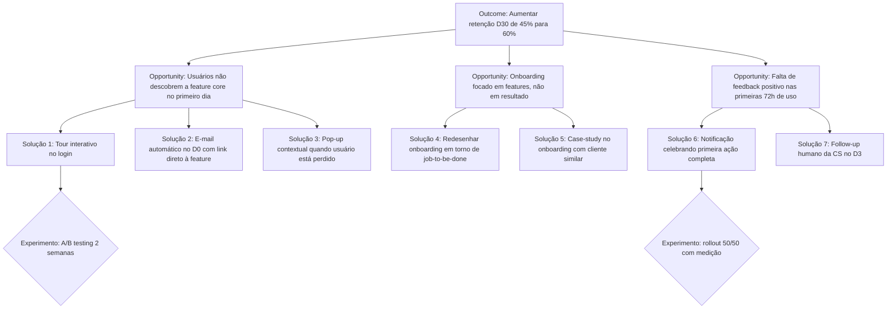
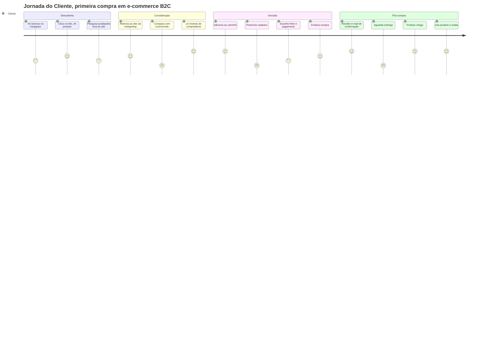

## APÊNDICE A — TEMPLATES PRONTOS PARA USO

> [!note] Como usar
> Esse apêndice reúne todos os templates operacionais referenciados ao longo do livro. Cada template tem indicação da fase ou apêndice de origem. Copie, adapte ao seu contexto e preencha. Templates são ponto de partida, não camisa-de-força. Se o formato não funcionar para o seu negócio, modifique. O que importa é o raciocínio que o template força, não a forma exata.

> [!important] Família discovery — A.2, A.27, A.28, A.29 e A.30
> Cinco dos templates deste apêndice formam um conjunto coerente de artefatos de discovery, cada um para um tipo distinto de conversa. Confundi-los é o erro clássico que o IGNIÇÃO denuncia: tratar opinião de especialista como evidência de cliente, ou conselho de advisor como dado de mercado. Use o template certo para o tipo certo. A tabela e a regra de ouro abaixo guiam a escolha.

| Template | Use quando… | NÃO use quando… |
|---|---|---|
| **A.2 — Entrevista de Problema** | Está validando se um problema existe, com que frequência, e quão doloroso é, na vida de um cliente potencial. [[#FASE 3 — DESCOBERTA DO PROBLEMA\|Fase 3]]. | Já tem produto e quer validar solução. Está buscando opinião de quem não sofre o problema. |
| **A.27 — Conversa com Especialista de Mercado** | Quer mapear setor, dinâmicas competitivas, pontos cegos, tendências regulatórias. A pessoa conhece o mercado — não necessariamente é cliente dele. | Quer saber se *o cliente* tem dor. Especialista opina; cliente prova com comportamento. |
| **A.28 — Conversa com Advisor** | Tem decisão específica em cima da mesa e quer conselho tático/estratégico de alguém com experiência relevante. | Ainda está explorando. Advisor é para refinar decisão, não para descobrir o problema. |
| **A.29 — JTBD Switch Interview** | A pessoa **trocou** de solução (deixou um concorrente, largou um processo manual, migrou de ferramenta). Foco no momento da troca, com as 4 forças de Moesta. | A pessoa nunca trocou de nada — não há "switch" para investigar. Use A.2. |
| **A.30 — Consolidação de Rodada** | Rodou 15-30 entrevistas e precisa sintetizar o agregado para decidir avanço de fase: perseverar, pivotar problema, pivotar cliente ou abandonar. | Ainda está no meio da coleta. Consolidar cedo vicia a análise — espere a rodada fechar. |

**Regra de ouro.** Apenas A.2 e A.29 geram evidência de comportamento de cliente. A.27 e A.28 informam como construir, não se há mercado. A.30 é quem decide avanço de fase — nenhuma entrevista individual decide sozinha.

### A.1 Declaração Inicial da Ideia (Fase 2)

```
DECLARAÇÃO INICIAL DA IDEIA
Versão: ___ | Data: ___

1. PROBLEMA (3 frases, sem mencionar sua solução)
___________________________________________
___________________________________________

2. PARA QUEM (descrição específica e filtrável)
___________________________________________

3. ALTERNATIVA ATUAL (como o cliente resolve hoje)
___________________________________________

4. SOLUÇÃO PROPOSTA (capacidades, não features)
___________________________________________

5. POR QUE PODE FUNCIONAR (3-5 razões/hipóteses)
1) _______________________________________
2) _______________________________________
3) _______________________________________

6. O QUE EU NÃO SEI (10-20 incertezas)
1) _______________________________________
...
```

### A.2 Entrevista de Problema (Fase 3)

> [!important] Disciplina central
> Nesta entrevista você **não fala da sua solução**. Você escuta. No momento em que apresenta a ideia, o entrevistado reage à ideia em vez de descrever a realidade dele — e você perde a evidência limpa.

Este template tem duas partes. A **Parte A** é o roteiro para consultar *durante* a conversa (deixe aberto na tela ou imprima). A **Parte B** é a síntese para preencher *depois* — idealmente nas 24h seguintes, enquanto a memória está fresca. As duas formam um único artefato: roteiro sem síntese vira entrevista perdida; síntese sem roteiro vira interpretação livre. Use as duas em todas as entrevistas da rodada.

#### Parte A — Roteiro da Entrevista (uso durante a conversa)

**Duração alvo:** 30-45 min · **Balanço de fala:** o entrevistado fala a maior parte do tempo. Se você se pegar falando mais que ele em qualquer trecho de 5 minutos, volte a fazer perguntas abertas.

**Abertura (2 min)**

> "Oi, obrigado pelo tempo. Antes de começar: não estou aqui pra te vender nada. Estou pesquisando como [público-alvo] lidam com [área ampla], porque quero entender se existe um problema real antes de construir qualquer coisa. Vou fazer perguntas abertas, sem respostas certas. Posso gravar pra transcrever depois? A gravação fica privada."

**Contexto (5 min)**

- Me conta um pouco sobre o que você faz no dia a dia.
- Quanto tempo você está nesse papel / nessa empresa?
- Quem mais na sua rotina está envolvido em [área ampla]?

**Exploração (10 min) — *ainda sem falar da sua solução***

- Me descreve como funciona a rotina quando [atividade relacionada ao problema].
- Quais são as partes mais chatas dessa rotina?
- Me conta a última vez que algo deu errado nisso.

**Aprofundamento por problema mencionado (10-15 min)**

Para cada problema que a pessoa citar espontaneamente:

- Me fala mais sobre isso.
- Quando foi a última vez que aconteceu?
- O que você fez?
- Quanto tempo / dinheiro isso custou?
- O que acontece se você simplesmente **não** resolver? *(mapeia escalação)*

**Tentativas de solução (5 min)**

- O que você já tentou pra resolver?
- Funcionou? Por que parou ou continua usando?
- **Já gastou dinheiro (ferramenta, consultor, pessoa extra) pra resolver isso?**
- Quanto? Por quanto tempo?

**Encerramento (3 min)**

- Tem mais alguém que passa por isso e que eu poderia conversar?
- Posso voltar se surgirem mais perguntas?
- Topa ver um protótipo em 30-60 dias e dar sua opinião?

**NÃO PERGUNTAR (lista de proibições)**

- "Você pagaria R$X por isso?"
- "Se existisse Y, você usaria?"
- "Você acha que isso seria útil?"
- "Eu tive uma ideia, o que você acha?"
- "Você não acharia melhor se…?"
- Qualquer pergunta que comece com hipótese sua a ser validada pelo entrevistado.

#### Parte B — Síntese Pós-Entrevista

##### Metadados

| Campo | Valor |
|---|---|
| **ID** | `ENTR-[AAAA-MM-DD]-[##]` |
| **Data e hora** | `[DD/MM/AAAA — HH:MM]` |
| **Duração real** | `[min]` |
| **Formato** | `[ ] Remoto  [ ] Presencial` |
| **Gravação (com consentimento)** | `[link ou "não gravada"]` |
| **Transcrição** | `[link]` |
| **Entrevistador** | `[Nome]` |
| **Anotador (se houver)** | `[Nome]` |
| **Relação com a hipótese** | `[ID da hipótese em teste, se formal]` |

##### Perfil do Entrevistado e Aderência ao ICP

| Campo | Valor |
|---|---|
| **Nome** | `[...]` |
| **Papel / cargo** | `[...]` |
| **Empresa / contexto** | `[...]` |
| **Porte do negócio** | `[nº funcionários / faturamento / estágio — seja específico]` |
| **Localização** | `[cidade / estado / país]` |
| **Fonte do contato** | `[rede pessoal / LinkedIn / indicação / cold outreach]` |
| **Vínculo pessoal com o entrevistador?** | `[ ] Não  [ ] Sim` — *se sim: atenção a viés de cortesia nas respostas.* |
| **Aderente ao ICP hipotético?** | `[ ] Sim  [ ] Parcial  [ ] Não` |

> *Se "Não", a entrevista vale como aprendizado mas **não conta** para o denominador de validação (regra da [[#FASE 3 — DESCOBERTA DO PROBLEMA|Fase 3]]).*

##### 1. Contexto e rotina

> *Não pergunte sobre o problema ainda. Deixe a pessoa descrever o mundo dela. Pergunte sobre rotina, responsabilidades, ferramentas, periodicidade. Aqui você calibra o universo onde o problema vive.*

**Descrição geral.** `[Descreva em prosa o que a pessoa faz. Use as palavras dela. 3-5 linhas.]`

**Processo atual mapeado em fases.** *Se o problema investigado tem a forma de um processo ou workflow (recrutamento, compra, onboarding, fechamento, reconciliação, etc.), documente em fases numeradas. Isso ancora onde cada dor acontece — a mesma pessoa pode ter dor forte na Fase 2 e nenhuma na Fase 5. Sem esse mapa, você registra "dor em recrutamento" quando na verdade é "dor em triagem inicial", que é outro problema.*

- **Fase 1 — `[nome curto]`:** `[o que acontece, quem faz, com que ferramenta, quanto tempo leva]`
- **Fase 2 — `[nome curto]`:** `[...]`
- **Fase 3 — `[nome curto]`:** `[...]`
- **Fase 4 — `[nome curto]`:** `[...]`

*(adicione ou remova fases conforme o caso)*

**Ferramentas e stack atual.**

- `[ferramenta — para que usa]`
- `[...]`

##### 2. Problemas mencionados (o que foi dito — não o que você interpretou)

> *Para cada problema que emergiu na conversa, preencha um bloco. **Crítico:** documente apenas o que o entrevistado disse espontaneamente ou em resposta a pergunta aberta. Problemas que você "provocou" com pergunta tendenciosa valem zero.*

**Problema A — `[título curto, nas palavras do entrevistado se possível]`**

- **Descrição literal:** `[...]`
- **Era esperado ou inesperado?** `[ ] Esperado (ligado à hipótese em teste)  [ ] Inesperado (surgiu e não estávamos procurando — pode ser o ouro do discovery)`
- **Em qual fase do processo ocorre?** `[Fase 1 / Fase 2 / transversal / fora do processo mapeado]`
- **Menção foi espontânea ou provocada?** `[ ] Espontânea  [ ] Provocada por pergunta aberta  [ ] Provocada por pergunta tendenciosa (descartar)`
- **Frequência observável:** `[diária / semanal / mensal / esporádica]`
- **Última ocorrência (comportamento passado):** `[quando? o que aconteceu?]`
- **Custo atual (tempo / dinheiro / energia):** `[número ou descrição concreta]`
- **Emoção observada:** `[exemplo: frustração, resignação, vergonha, medo — use a palavra que cabe]`
- **Tentativas anteriores de resolver:** `[o que já tentou? funcionou? por que parou ou continuou?]`
- **Já gastou dinheiro para resolver?** `[ ] Não  [ ] Sim — quanto? em que? por quanto tempo?]` — *sinal operacional mais limpo de dor. Dinheiro já gasto > promessa de pagar.*
- **Escalação — o que piora se NÃO resolver?** `[perde cliente / perde contrato / multa / perde emprego / nada concreto]` — *separa urgência real de incômodo crônico.*

**Problema B — `[...]`** `[bloco com mesma estrutura do Problema A]`

**Problema C — `[...]`** `[bloco com mesma estrutura do Problema A]`

##### 3. Verbatim (citações literais)

> *Transcreva exatamente o que a pessoa falou, entre aspas. Mínimo 3 citações marcantes. Verbatim é ouro — serve de evidência em deck interno, no pitch, no roadmap.*

1. > *"[citação literal]"* — sobre `[Problema A]`
2. > *"[citação literal]"* — sobre `[Problema B]`
3. > *"[citação literal]"* — sobre `[tema]`
4. > *"[citação literal]"* — sobre `[tema]`

##### 4. Vocabulário do cliente

> *Anote as palavras e expressões **exatas** que a pessoa usou para descrever o problema, a rotina e as soluções atuais. Não parafraseie. Esse vocabulário vai direto para o marketing, para a landing page e para o roteiro de vendas depois — se você usa a linguagem do cliente, ele se reconhece; se você usa a sua, ele ignora.*

| Como a pessoa chama | Contexto em que usou |
|---|---|
| `[palavra / expressão exata]` | `[o que ela estava descrevendo]` |
| `[...]` | `[...]` |
| `[...]` | `[...]` |

**Termos que ela *não* usou e que nós estávamos prontos a usar:** `[...]` — *se a pessoa não usa a nossa palavra, provavelmente estamos falando a linguagem errada.*

##### 5. Hierarquia de sinais coletados

> *Classifique a evidência desta entrevista pelo tipo de sinal. **Esta tabela é o filtro central do Mom Test:** só os três primeiros tipos movem decisão — os três últimos enganam.*

| Sinal | Peso | O que veio nesta entrevista? |
|---|---|---|
| **Comportamento passado** ("semana passada gastei 4h nisso") | Alto | `[...]` |
| **Tentativas anteriores de solução** ("usei X, Y e Z, nada resolveu") | Alto | `[...]` |
| **Métricas de custo** (tempo, dinheiro, energia já gastos) | Alto | `[...]` |
| **Ideias soltas** ("seria legal se tivesse X") | Baixo-médio | `[...]` |
| **Hipóteses futuras** ("eu pagaria por isso") | Baixo | `[...]` — *não usar para decisão* |
| **Elogios** ("que ideia legal!") | Zero | `[...]` — *descartar* |

##### 6. Classificação de Pain Level

> *Atribua **um único nível** ao entrevistado. Padrão de Pain Level 4+ em volume (tipicamente ≥5 entrevistas) é o que move a tese; uma entrevista isolada em nível 3 não descarta a investigação, só ainda não confirma.*

- [ ] **Nível 1** — Tem o problema, mas não sabe que tem.
- [ ] **Nível 2** — Sabe que tem, mas tolera. Não vai pagar sozinho.
- [ ] **Nível 3** — Está ativamente procurando solução. Lead quente.
- [ ] **Nível 4** — Já improvisou gambiarra (planilha Frankenstein, processo manual, ferramenta adaptada). Forte evidência de que pagaria.
- [ ] **Nível 5** — Tem orçamento comprometido ou facilmente acessível para comprar solução. Cliente ideal.

> *Nível 5 se verifica por **sinal indireto**, nunca por pergunta direta sobre disposição a pagar (que é armadilha e está na lista de proibições da Parte A). Pistas válidas: a pessoa mencionou espontaneamente valor já gasto, contratação de alguém para resolver, mensalidade paga em ferramenta análoga, verba carimbada no orçamento do ano.*

**Justificativa da classificação:** `[1-2 linhas com a evidência direta — não interpretação — que sustenta a nota.]`

##### 7. Observações do entrevistador

> *Separadas dos fatos. Use itálico. Aqui entram sua leitura da linguagem corporal, tom, nível de energia e suspeitas. Fatos acima; interpretação aqui.*

*`[...]`*

*`[...]`*

##### 8. Armadilhas — autoavaliação pós-entrevista

> *Esta seção verifica se as proibições da Parte A foram respeitadas. Marque honestamente o que aconteceu.*

- [ ] Cheguei a apresentar minha solução em algum momento? — *se sim, dados após esse ponto devem ser lidos com ceticismo.*
- [ ] Fiz pergunta tendenciosa tipo "você não acharia melhor se…"?
- [ ] Fiz pergunta hipotética sobre o futuro ("você usaria X?", "pagaria Y?")?
- [ ] Em algum trecho de 5 min, falei mais que o entrevistado?
- [ ] Filtrei o que ouvi para confirmar tese que eu já tinha?
- [ ] Tratei uma fala apaixonada como equivalente a um padrão de 10 entrevistas?

> *Cada marca acima contamina parte da evidência. Anote **quais achados ficam sob suspeita** em função dessas contaminações:* `[...]`

##### 9. Refinamento do ICP

> *ICP não muda a cada entrevista — muda quando padrão aparece em 5-10 conversas. Esta seção registra sinais individuais que, acumulados com os de outras entrevistas, podem mover o recorte. Exemplo: a hipótese original do iFood era "redes grandes"; entrevistas acumuladas refinaram para "restaurantes pequenos sem telemarketing".*

**Sub-segmento mais agudo observado nesta entrevista.** *Dentro do perfil entrevistado, o que parece correlacionado com sofrer mais? Porte? Setor? Senioridade? Estágio? Tempo no cargo? Stack? Volume? Anote o recorte que se destacou.*

`[Ex: "padarias com 3+ lojas sentem; com 1-2 não" — ou — "só operadores que fazem a reconciliação manualmente, não quem tem financeiro dedicado"]`

**Esta entrevista sugere algum refino de ICP?**

- [ ] **Estreitou** — ICP ficou mais específico. Novo recorte: `[...]`
- [ ] **Ampliou** — ICP precisa incluir um perfil que não tínhamos mapeado: `[...]`
- [ ] **Mudou de direção** — perfil entrevistado era hipótese, mas a dor real aparece em outro lugar: `[...]`
- [ ] **Confirmou** — ICP atual permanece. Esta entrevista não muda o recorte.

##### 10. Indicações (snowball)

- **Outras pessoas que passam por isso e que podemos conversar:** `[nome — contato — por que foi indicado]`
- **Posso voltar para nova conversa?** `[ ] Sim  [ ] Não`
- **Topa ver um protótipo em 30-60 dias?** `[ ] Sim  [ ] Não`

##### 11. Decisão pós-entrevista individual

> *Uma única entrevista não decide nada — mas cada entrevista move a agulha. Marque para onde ela moveu.*

- [ ] **Reforça** a hipótese de problema em teste
- [ ] **Enfraquece** a hipótese
- [ ] **Ambígua** — precisa de mais dados
- [ ] **Falso positivo identificado** (pessoa disse que tem o problema mas o comportamento refuta)

**Justificativa (2-3 linhas):** `[...]`

##### 12. Próximos passos de investigação

> *Distintos de "ações internas de produto". Aqui registramos **perguntas novas que esta entrevista gerou** e que informam a próxima entrevista, uma pesquisa desk, ou um dado a buscar externamente. É o espírito iterativo do discovery: cada conversa afina a próxima.*

**Perguntas a incluir em próximas entrevistas.**

- `[...]`
- `[...]`

**Dados a buscar externamente (pesquisa desk, benchmark, números de mercado).**

- `[...]`
- `[...]`

**Perfis diferentes a entrevistar para cruzar padrões.** *"Esta dor é padrão no setor ou é específica desta empresa? Preciso falar com alguém de porte X ou região Y para comparar."*

- `[...]`

##### Anexos

- Gravação: `[link]`
- Transcrição: `[link]`
- Artefatos compartilhados pelo entrevistado (prints, planilhas): `[link]`
- Entrevistas relacionadas: `[ENTR-..., ENTR-...]`

*Preenchido por `[Nome]` em `[DD/MM/AAAA]`.*

> [!tip] Consolidação da rodada
> Cada entrevista preenchida pela Parte B é uma linha do agregado. A decisão de avanço de fase não sai daqui — sai do **A.30 (Consolidação de Rodada)**, que cruza Pain Level, padrões, workarounds e vocabulário das 15-30 entrevistas para decidir perseverar, pivotar problema, pivotar cliente ou abandonar.

### A.3 Banco de Hipóteses — modelo de planilha (Fase 6)

| ID | Tipo | Hipótese | Porquê importa | Critério validação | Método | Custo | Status | Resultado |
|----|------|----------|----------------|-------------------|--------|-------|--------|-----------|
| H01 | Problema | Donos de restaurante perdem ≥3h/semana com conciliação de frete | Se falso, o problema não é dolorido o suficiente | ≥60% dos 20 entrevistados menciona espontaneamente | Entrevistas de problema | R$0 + 3 semanas | Em teste |, |
| H02 | Monetização | ICP pagará ≥R$149/mês pela solução | Determina viabilidade do modelo | ≥15% conversão em landing page com oferta | Smoke test + pré-venda | R$1.500 + 3 semanas | Nova |, |

### A.4 Cartão de Experimento (Fase 7)

```
EXPERIMENTO #___
Data planejada: ___ a ___

HIPÓTESE TESTADA
___________________________________________

PERGUNTA CENTRAL
___________________________________________

DESENHO (passo a passo)
1) _______________________________________
2) _______________________________________
3) _______________________________________

PÚBLICO
Quantidade: _____ Perfil: _____________
Como alcanço: ___________________________

MÉTRICA PRINCIPAL
___________________________________________

CRITÉRIO DE SUCESSO (antes de ver resultado)
Validar se: ________________________________
Refutar se: _______________________________

DURAÇÃO E CUSTO
Tempo: _____ dias Custo: R$ _____

RISCOS E VIESES
___________________________________________

RESULTADO (preencher depois)
___________________________________________

DECISÃO
 Persevere Ajuste Pivote Abandone

APRENDIZADOS
___________________________________________
```

### A.5 Persona com dados (Fase 4)

```
PERSONA: [nome fictício]

Contexto profissional/pessoal
___________________________________________

Perfil demográfico
___________________________________________

Motivações principais (do que se importa)
1) _______________________________________
2) _______________________________________

Frustrações principais
1) _______________________________________
2) _______________________________________

Comportamentos observados (não declarados)
1) _______________________________________
2) _______________________________________

Ferramentas/canais/fontes que usa
___________________________________________

JTBDs prioritários
1) Quando _____, eu quero _____, para que _____.
2) Quando _____, eu quero _____, para que _____.

Citação verbatim representativa
"___________________________________________"

Base de evidência: [quantas entrevistas, quais]
```

### A.6 Especificação de MVP (Fase 9)

```
ESPECIFICAÇÃO DO MVP
Versão: ___ | Data: ___

PROPOSTA DE VALOR (uma frase)
___________________________________________

PERSONA FOCO (beachhead)
___________________________________________

JTBDs PRINCIPAIS A RESOLVER
1) _______________________________________
2) _______________________________________

MUST HAVES (máximo 15)
□ _______________________________________
□ _______________________________________
...

SHOULD HAVES (roadmap pós-MVP)
□ _______________________________________

COULD HAVES (se tempo permitir)
□ _______________________________________

WON'T HAVES (explicitamente fora)
× _______________________________________

CRITÉRIOS DE SUCESSO DO MVP (após 90 dias)
- Usuários ativos: _____
- Retenção D30: _____
- Conversão trial → pago: _____
- NPS mínimo: _____

FAIXA DE PREÇO PLANEJADA
R$ ____ a R$ ____

CANAIS DE AQUISIÇÃO INICIAIS
1) _______________________________________
2) _______________________________________

PRAZO DE DESENVOLVIMENTO
Início: ___ Lançamento: ___

ORÇAMENTO
R$ _____
```

### A.7 Árvore de Teoria — Story Tree (Fase 2B)

```
ÁRVORE DE TEORIA, v___ Data: ___/___/___

PERGUNTAS-ÂNCORA:

(a) Qual problema ou fenômeno você está observando?
____________________________________________________________
____________________________________________________________

(b) Por que isso está acontecendo? (causas-raízes)
____________________________________________________________
____________________________________________________________

(c) O que você poderia fazer a respeito? (caminhos de solução)
____________________________________________________________
____________________________________________________________

ATRIBUTOS (elementos com realização incerta):

ID | Atributo | Crença sobre realização (0-100%)
----|-----------------------------------|-----------------------------------
A1 | |
A2 | |
A3 | |
A4 | |
A5 | |
A6 | |
A7 | |
A8 | |
...

RELAÇÕES CAUSAIS (A → B):

De | Para | Direção do efeito | Confiança (alta/média/baixa) | Evidência prévia
------|-------|-------------------|------------------------------|------------------
A1 | A2 | + ou - | |
A2 | A3 | + ou - | |
...

ATRIBUTOS BET-THE-COMPANY (2 a 5):

Marque os atributos cuja refutação destruiria a ideia inteira:
[ ] A___ Justificativa: __________________________________
[ ] A___ Justificativa: __________________________________
[ ] A___ Justificativa: __________________________________

TESTE DE PARCIMÔNIA:

Quais atributos eu posso remover sem perder poder explicativo?
Removidos nesta versão: _________________________________

TESTE DE ALTERNATIVA:

Teoria alternativa (explicação diferente para o mesmo fenômeno):
____________________________________________________________
Principais atributos diferentes: _________________________
Como saberei qual teoria é melhor: _______________________

VALIDAÇÃO EXTERNA:

Três pessoas que conseguiram repetir minha teoria com as próprias palavras:
1) _______________________ Data: ___
2) _______________________ Data: ___
3) _______________________ Data: ___
```

### A.8 Mapa Causal — DAG Simplificado (Fase 2B)

Use esta representação quando quiser uma visão mais precisa e probabilística da teoria. É o passo seguinte ao Story Tree, para empreendedores que já dominam o básico.

```
MAPA CAUSAL, v___

Instruções:
1) Liste atributos em caixas.
2) Desenhe setas apenas em uma direção (sem ciclos).
3) Sobre cada seta, anote a probabilidade subjetiva de que a relação seja verdadeira.
4) Sobre cada nó, anote a probabilidade subjetiva de que aquele atributo se realize.

Representação textual (desenhe no papel ou ferramenta de diagrama):

 [Atributo A] P(A)=___%
 |
 | P(A→B)=___%
 v
 [Atributo B] P(B|A)=___%
 |
 | P(B→C)=___%
 v
 [Atributo C] P(C|B)=___% <-- bet-the-company

VERIFICAÇÃO:

[ ] Não há setas circulares (A→B→A).
[ ] Cada nó tem uma probabilidade marginal estimada.
[ ] Cada seta tem uma probabilidade condicional estimada.
[ ] Os nós bet-the-company estão destacados.
[ ] Existe ao menos uma folha terminal (nó sem saída) que representa o outcome final (ex.: "cliente paga", "cliente adota").

CÁLCULO DE PLAUSIBILIDADE GERAL (opcional):

Multiplicando as probabilidades ao longo do caminho crítico:
P(caminho) = P(A) × P(A→B) × P(B→C) ×... = ___%

Interpretação: se o resultado for <10%, sua ideia está assumindo
uma cadeia muito frágil. Se >70%, provavelmente você está otimista
demais. Sweet spot inicial: entre 15% e 50%.
```

### A.9 Theory Map — Conexão com Business Model Canvas (Fase 2B)

Use este template quando já preencheu um BMC ou Lean Canvas e precisa transformá-lo em teoria causal.

```
THEORY MAP, Conexão BMC ↔ Teoria v___

Para cada bloco do BMC, responda as três perguntas:

BLOCO: SEGMENTOS DE CLIENTES
(i) Quem exatamente? ____________________________________
(ii) Qual atributo da minha árvore este bloco representa? A___
(iii) Como se conecta causalmente com os outros blocos?
 Afeta: _____________________________________________
 É afetado por: _____________________________________

BLOCO: PROPOSTA DE VALOR
(i) Valor concreto oferecido? __________________________
(ii) Qual atributo? A___
(iii) Conexões causais:
 Afeta: _____________________________________________
 É afetado por: _____________________________________

BLOCO: CANAIS
(i) Quais canais? _______________________________________
(ii) Qual atributo? A___
(iii) Conexões causais:
 Afeta: _____________________________________________
 É afetado por: _____________________________________

BLOCO: RELACIONAMENTO COM CLIENTES
(i) Tipo de relação? ____________________________________
(ii) Qual atributo? A___
(iii) Conexões causais: ________________________________

BLOCO: FONTES DE RECEITA
(i) Como monetiza? ______________________________________
(ii) Qual atributo? A___
(iii) Conexões causais: ________________________________

BLOCO: RECURSOS-CHAVE
(i) O que é indispensável? ______________________________
(ii) Qual atributo? A___
(iii) Conexões causais: ________________________________

BLOCO: ATIVIDADES-CHAVE
(i) Quais ações? ________________________________________
(ii) Qual atributo? A___
(iii) Conexões causais: ________________________________

BLOCO: PARCEIROS-CHAVE
(i) Quem? _______________________________________________
(ii) Qual atributo? A___
(iii) Conexões causais: ________________________________

BLOCO: ESTRUTURA DE CUSTOS
(i) Principais custos? __________________________________
(ii) Qual atributo? A___
(iii) Conexões causais: ________________________________

DIAGNÓSTICO:

[ ] Existe algum bloco do BMC sem atributo correspondente na árvore?
 Se sim, o BMC tem um item sem justificativa teórica. Remova ou
 adicione à árvore.

[ ] Existe algum atributo da árvore sem bloco correspondente no BMC?
 Se sim, seu modelo de negócio está incompleto. Reabra o BMC.

[ ] Blocos do BMC que eu removi após este exercício:
 _______________________________________________________

[ ] Atributos da árvore que surgiram durante este exercício:
 _______________________________________________________
```

### A.10 Hypothesis Canvas (Fases 5 + 6)

Template central para conectar teoria, hipótese, evidência e avaliação. Use um canvas por hipótese prioritária. Preencha os blocos superior e médio **antes** de coletar dado, os blocos inferiores são preenchidos **após** a coleta, respeitando a ordem indicada.

```
╔══════════════════════════════════════════════════════════╗
║ HYPOTHESIS CANVAS #___ ║
╠════════════════════════════╦═════════════════════════════╣
║ TEORIA ║ HIPÓTESE ║
║ Qual parte da sua árvore ║ Afirmação falsificável a ║
║ esta hipótese testa? ║ testar: ║
║ ║ ║
║ Atributo/seta: ___________ ║ ___________________________ ║
║ Importância (1-5): _______ ║ ___________________________ ║
║ É bet-the-company? S / N ║ ___________________________ ║
╠════════════════════════════╬═════════════════════════════╣
║ EVIDÊNCIA ║ MEDIDAS ║
║ Como vou coletar? ║ O que especificamente vou ║
║ [ ] Entrevista ║ contar? ║
║ [ ] Questionário ║ ║
║ [ ] Landing page ║ Pergunta/evento: __________ ║
║ [ ] Pré-venda ║ Respostas possíveis: ______ ║
║ [ ] Concierge ║ Fórmula da medida: ________ ║
║ [ ] Wizard of Oz ║ ___________________________ ║
║ [ ] A/B test ║ ║
║ [ ] Fake door ║ Medidas ALTERNATIVAS que eu ║
║ [ ] Outro: _______ ║ descartei e por quê: ______ ║
║ ║ ___________________________ ║
║ Público-alvo: ____________ ║ ║
║ Tamanho planejado: _______ ║ ║
║ Duração: _________________ ║ ║
║ Custo: R$ ________________ ║ ║
╠════════════════════════════╩═════════════════════════════╣
║ THRESHOLD (preencher ANTES de olhar os dados) ║
║ ║
║ Minha crença subjetiva Resultado mínimo para ║
║ sobre o valor real: considerar SUPORTADA: ║
║ ║
║ [ __________ ] [ __________ ] ║
║ ║
║ Resultado que considerarei REFUTADO: ║
║ [ __________ ] ║
║ ║
║ Zona INCONCLUSIVA (exige novo experimento): ║
║ entre [ ______ ] e [ ______ ] ║
║ ║
║ Justificativa do threshold: _____________________________ ║
║ __________________________________________________________ ║
╠════════════════════════════════════════════════════════════╣
║ DUE DILIGENCE DA AMOSTRA (antes de comparar com threshold)║
║ ║
║ Tamanho efetivo coletado: _____ ║
║ Adequado para o tipo de teste? [ ] Sim [ ] Não ║
║ ║
║ A amostra representa o ICP? [ ] Sim [ ] Parcial [ ] Não ║
║ Vieses identificados: ____________________________________║
║ ___________________________________________________________║
║ ║
║ AJUSTE DO THRESHOLD: ║
║ [ ] Mantido ║
║ [ ] Aumentado para ______ (amostra favorece a hipótese) ║
║ [ ] Diminuído para ______ (amostra desfavorece hipótese) ║
║ Justificativa do ajuste: ________________________________ ║
╠════════════════════════════╦═════════════════════════════╣
║ AVALIAÇÃO ║ DECISÃO ║
║ ║ ║
║ Resultado observado: ║ [ ] Perseverar ║
║ [ _____________ ] ║ [ ] Pivotar ║
║ ║ [ ] Mais dados ║
║ Vs. threshold ajustado: ║ [ ] Abandonar ║
║ [ ] SUPORTADA ║ ║
║ [ ] REFUTADA ║ Próxima ação concreta: ║
║ [ ] INCONCLUSIVA ║ __________________________ ║
║ ║ __________________________ ║
║ Explicação alternativa ║ ║
║ plausível? ______________ ║ Impacto na árvore de teoria:║
║ ________________________ ║ __________________________ ║
║ ║ __________________________ ║
╚════════════════════════════╩═════════════════════════════╝

Data de preenchimento inicial: ___/___/___
Data de conclusão: ___/___/___
Assinatura do empreendedor: _______________________________
```

**Observação sobre o Hypothesis Canvas**: o propósito dele é forçar o empreendedor a tornar visível cada passo do raciocínio. O canvas não é decorativo, se algum bloco estiver em branco quando o experimento começa, é porque esse passo não foi pensado. E um experimento iniciado com passos não pensados é um experimento que vai produzir conclusões erradas, mesmo se o resultado parecer claro.

### A.11 Teste de Precisão do Comprador (Fase 5)

Use este template para validar o elemento #4 da Anatomia da Cunha (Dono do Orçamento) antes de avançar para a [[#FASE 6 — FORMULAÇÃO RIGOROSA DE HIPÓTESES|Fase 6]]. É exercício de 10-15 minutos, se demora mais, o próprio atraso já é o diagnóstico.

```
TESTE DE PRECISÃO DO COMPRADOR, v___ Data: ___/___/___

A FRASE QUE NÃO DEVE TRAVAR:

"Nós vendemos para [CARGO] em [TIPO DE EMPRESA] porque essa pessoa
é responsável por [RESULTADO ESPECÍFICO] e controla
[ORÇAMENTO ESPECÍFICO]."

MINHA VERSÃO:

CARGO (nominal, existente no organograma do cliente):
___________________________________________________________

TIPO DE EMPRESA (tamanho + setor + segmento):
___________________________________________________________

RESULTADO ESPECÍFICO (pelo qual esse cargo responde):
___________________________________________________________

ORÇAMENTO ESPECÍFICO (rubrica + faixa de valor):
___________________________________________________________

CRITÉRIOS DE APROVAÇÃO (3 checks obrigatórios):

[ ] (1) Frase escrita em menos de 30 segundos, sem rascunhar
 variações para audiências diferentes.

[ ] (2) Cargo é REAL e existente no organograma típico do ICP
 (não usar "decisor", "stakeholder", "gestor", "líder").

[ ] (3) Orçamento é RUBRICA EXISTENTE no cliente
 (não criar rubrica nova para comprar de você:
 rubricas novas triplicam o ciclo de decisão).

SE REPROVOU:

Qual item travou? __________________________________________

Hipótese sobre o motivo
(ex.: venda depende de múltiplos papéis, ICP ainda misturado,
comprador econômico não conhecido, produto exige nova rubrica):
___________________________________________________________
___________________________________________________________

Próxima ação
(voltar à Fase 4 com foco em qual pergunta específica?):
___________________________________________________________

CHECK DE SEPARAÇÃO DE PAPÉIS (B2B):

No meu contexto, Usuário, Campeão Interno e Comprador
Econômico são:

[ ] A mesma pessoa (contexto B2C ou SMB muito pequeno).
[ ] Duas pessoas distintas, especifique:
 Usuário/Campeão: ___________________________
 Comprador Econômico: ___________________________
[ ] Três pessoas distintas, especifique cada uma:
 Usuário: ___________________________
 Campeão Interno: ___________________________
 Comprador Econômico: ___________________________

VALIDAÇÃO EXTERNA:

Três pessoas independentes que conseguiram repetir a frase
sem ajuste e a consideraram plausível para o ICP:

1) _______________________ Data: ___/___/___
2) _______________________ Data: ___/___/___
3) _______________________ Data: ___/___/___
```

**Observação sobre o Teste de Precisão do Comprador**: reprovar neste teste raramente significa que sua ideia é ruim, significa que a pesquisa de usuário da [[#FASE 4 — PESQUISA COM USUÁRIOS (CUSTOMER DISCOVERY APROFUNDADO)|Fase 4]] ficou centrada em quem usa o produto e não em quem paga pelo produto. Em B2B, são quase sempre pessoas diferentes, e essa diferença é o motivo mais comum de ciclo de venda travado. Reprovação aqui é um presente: revela a lacuna antes dela custar meses de vendas fracassadas.

### A.12 Canvas da Cunha (Fase 5)

Use este template como entregável final da [[#FASE 5 — MAPEAMENTO DE MERCADO E CONCORRÊNCIA|Fase 5]]. Ele consolida os quatro elementos da Anatomia da Cunha, o Teste do Grupo de WhatsApp e a comparação com a alternativa atual. Preencha **antes** de avançar para a [[#FASE 6 — FORMULAÇÃO RIGOROSA DE HIPÓTESES|Fase 6]], sem ele, as hipóteses da fase seguinte não terão ancoragem no mercado específico que você escolheu atacar.

```
CANVAS DA CUNHA, v___ Data: ___/___/___

ICP (preciso): _______________________________________
 _______________________________________

Dor específica: _______________________________________
(1 fluxo de trabalho) _______________________________________

Resultado mensurável: _____________________________________
(escolha 1-2 categorias: receita / custo / risco / tempo)
Métrica do resultado: _____________________________________
(ex.: "reduz de 4h para 15min por semana")

Dono do orçamento: _______________________________________
(cargo + nível hierárquico)

Teste do grupo de WhatsApp:
Quantas pessoas específicas eu consigo listar nominalmente
como potenciais primeiros clientes? _____
[ ] Cunha aprovada (100-300 pessoas listáveis).
[ ] Cunha muito larga (refinar).

Alternativa atual (o que o cliente faz hoje):
___________________________________________________________

Por que eu sou melhor do que a alternativa atual
(em 1 frase, com número se possível):
___________________________________________________________

VERIFICAÇÕES COMPLEMENTARES:

[ ] Teste de Precisão do Comprador (template A.11) aprovado.
[ ] Nenhum ou no máximo 1 dos 4 sinais de escopo instável presentes.
[ ] Distinção Cunha vs Plataforma compreendida, a ideia é vendável
 como cunha autônoma, sem depender de promessa de roadmap futuro.

VALIDAÇÃO EXTERNA:

Três pessoas independentes (mentor, cliente-alvo, investidor)
que confirmaram a Cunha como plausível e bem definida:

1) _______________________ Data: ___/___/___
2) _______________________ Data: ___/___/___
3) _______________________ Data: ___/___/___
```

**Observação sobre o Canvas da Cunha**: o canvas sozinho é um artefato morto se não passar pelos três testes acima (Precisão do Comprador, ausência de escopo instável, independência de plataforma). Cada um desses testes revela um tipo diferente de fragilidade oculta. Canvas preenchido + três testes aprovados = autorização para avançar à [[#FASE 6 — FORMULAÇÃO RIGOROSA DE HIPÓTESES|Fase 6]]. Canvas preenchido mas algum teste reprovado = refinar antes de avançar, não pular.

### A.19 Tabela de técnicas de validação por tipo de hipótese (Fases 2-9)

Esta tabela resume as técnicas de coleta de evidência mais usadas no manual, organizadas pelo tipo de hipótese que cada uma testa melhor. Inspirada na Tabela 1 de Coali et al. (2024), com ajustes para operadores brasileiros.

| Técnica | Descrição | Melhor para... | Amostra típica | Onde no manual |
|---|---|---|---|---|
| **Entrevistas 1-a-1** | Conversas estruturadas de 30-60 min com perguntas no estilo Mom Test | Desenvolvimento de teoria ([[#FASE 2B — CONSTRUÇÃO DA TEORIA DO NEGÓCIO|Fase 2B]]), validação de problema ([[#FASE 3 — DESCOBERTA DO PROBLEMA|Fase 3]]), mecanismos causais da dor ([[#FASE 4 — PESQUISA COM USUÁRIOS (CUSTOMER DISCOVERY APROFUNDADO)|Fase 4]]) | 15-30 entrevistados | [[#FASE 3 — DESCOBERTA DO PROBLEMA|Fase 3]]-3 |
| **Questionários (surveys)** | Série de perguntas fechadas em escala, distribuídas em grupos maiores | Validação de problema em escala, validação de atratividade de proposta | 100-500 respondentes | [[#FASE 3 — DESCOBERTA DO PROBLEMA|Fase 3]] late, 5-6 |
| **Landing page / smoke test** | Página descrevendo o produto antes dele existir, mede conversão de interesse | Validação de proposta de valor, teste de canal de aquisição, "fake door" | 500-5.000 visitantes | [[#FASE 7 — EXPERIMENTOS DE VALIDAÇÃO DO PROBLEMA|Fase 7]] |
| **Pré-venda** | Aceitar pagamento antecipado sem produto pronto | Teste máximo de Willingness to Pay, elimina viés de "eu pagaria" declarado | 10+ pagamentos reais | [[#FASE 7 — EXPERIMENTOS DE VALIDAÇÃO DO PROBLEMA|Fase 7]] |
| **Concierge / Wizard of Oz** | Entregar manualmente o valor que a solução automatizaria | Validar solução antes de build, aprender requisitos reais de uso | 3-10 clientes durante 4-8 semanas | [[#FASE 8 — IDEAÇÃO E PROTOTIPAGEM DE SOLUÇÕES|Fase 8]]-8 |
| **Protótipo interativo** | Versão clicável/funcional parcial submetida a uso real | Validação de fluxo de solução, identificação de pontos de atrito | 8-15 usuários qualitativo | [[#FASE 8 — IDEAÇÃO E PROTOTIPAGEM DE SOLUÇÕES|Fase 8]] |
| **MVP real** | Versão funcional mínima em produção com usuários pagantes | Validação de valor em uso prolongado, retenção, economics | 10+ usuários pagantes, 8-12 semanas | [[#FASE 10 — MVP E EXPERIMENTOS DE MERCADO|Fase 10]] |
| **Teste A/B** | Comparação experimental controlada entre 2+ versões | Comparação de features, proposta de valor ou pricing, identificação de causalidade | Centenas a milhares de exposições | [[#FASE 10 — MVP E EXPERIMENTOS DE MERCADO|Fase 10]], 13C |

**Regra de escolha rápida**: quanto menos evidência você tem sobre o problema, mais qualitativa deve ser a técnica (entrevistas > questionários > A/B test). Quanto mais avançada a validação, mais quantitativa (A/B test > questionário > entrevistas). Landing page, pré-venda e concierge ficam no meio, são qualitativas em amostra e quantitativas em conversão.

**Nota de tradução vocabular, Problem / Offer / Solution validation (Ries, 2011).** Quem vem da literatura do Lean Startup encontrará três tipos distintos de validação que este manual cobre mas não nomeia sempre de forma unificada. A correspondência é:

- **Problem validation** (o problema é real, agudo, no ICP certo?) = Fases 2, 3 e parte da 6.
- **Offer validation** (a proposta de valor é atrativa? o cliente quer comprar isso?) = [[#FASE 7 — EXPERIMENTOS DE VALIDAÇÃO DO PROBLEMA|Fase 7]] late, 7 e 8.
- **Solution validation** (a solução específica funciona, escala, tem economics?) = Fases 8, 9 e 10.

Essa distinção importa operacionalmente: falhar na **Problem validation** exige pivotar de ICP ou problema (volta à [[#FASE 3 — DESCOBERTA DO PROBLEMA|Fase 3]]). Falhar na **Offer validation** pode significar que o problema está certo mas a proposta de valor ou o preço estão errados (volta à [[#FASE 6 — FORMULAÇÃO RIGOROSA DE HIPÓTESES|Fase 6]] ou 7). Falhar na **Solution validation** sugere que o problema e a oferta estão ok, mas a execução da solução não, iterar dentro da [[#FASE 9 — TESTES DE SOLUÇÃO E USABILIDADE|Fase 9]]-9 costuma bastar. Saber qual das três está quebrando muda a decisão de pivot vs. iterate.

### A.13 Matriz de Parcerias ([[#APÊNDICE CX — CANAIS INDIRETOS E PARCERIAS: PARCERIAS, FRANQUIAS, CHANNEL|Apêndice CX]])

Documento único para gestão de pipeline de parcerias. Atualizar mensalmente.

| # | Parceiro | Tipo (1-5) | Estágio | Métrica sucesso 90d | Sponsor do lado deles | Sponsor nosso | Próximo passo | Data próximo passo | Status |
|---|---|---|---|---|---|---|---|---|---|
| 1 | | | Prospecção / Discovery / POC / Contrato / Ativo / Encerrada | | | | | | Verde / Amarelo / Vermelho |

Preencher com 5-15 parcerias ativamente em movimento. Parcerias em "standby há 2+ trimestres" devem ser encerradas formalmente ou reativadas, não deixar zumbis.

### A.14 Plano de Financiamento Não-Diluitivo ([[#APÊNDICE P — FINANCIAMENTO NÃO-DILUITIVO|Apêndice P]])

Documento de 2-3 páginas, revisão semestral.

**Necessidade de caixa nos próximos 18 meses:**
- Cenário conservador: R$ _____
- Cenário realista: R$ _____
- Cenário pessimista: R$ _____

**Composição planejada:**

| Fonte | Valor (R$) | % do total | Janela | Status |
|---|---|---|---|---|
| Caixa atual | | |, | Ativo |
| Receita orgânica prevista | | | 18m |, |
| Incentivos fiscais (Lei do Bem etc.) | | | 12m | Planejado / Em análise |
| Grants/editais (Finep, BNDES, FAPESP) | | | 3-9m |, |
| Antecipação de recebíveis | | | Contínuo |, |
| Venture Debt | | |, |, |
| RBF | | |, |, |
| Equity (rodada) | | |, |, |
| **Total** | | 100% | | |

**Decisões-chave:**
- Qual o gap a cobrir, após receita orgânica?
- Qual a ordem de ataque (priorizar não-diluitivo antes de equity)?
- Quais covenants/condições são aceitáveis?
- Quais garantias corporativas ou pessoais estão na mesa?

**Próximos 90 dias:**
1. _____
2. _____
3. _____

### A.15 Plano de Marca e PR ([[#APÊNDICE CQ — MARCA, PR E POSICIONAMENTO DE LONGO PRAZO|Apêndice CQ]])

Documento vivo de 4-6 páginas, revisão trimestral.

**Narrativa Oficial (uma página):**
- Para quem somos a primeira escolha, e por quê?
- Qual mudança no mundo justifica existirmos agora?
- Qual é a "inimiga declarada"?

**Cadência do fundador:**
- LinkedIn: [X posts/semana]
- Newsletter: [quinzenal/mensal, tamanho]
- Podcasts: [X por trimestre]

**Relações com imprensa:**
- Lista viva de 10-20 jornalistas-chave (nome, veículo, última interação, status relação)
- Press releases: calendário + critério de release

**Conteúdo institucional:**
- Blog: [X posts/mês]
- Recursos baixáveis: [X por ano]
- Estudos setoriais próprios: [cronograma]

**Eventos:**
- Que patrocinamos: [lista]
- Em quais falamos: [lista]
- Próprios: [cronograma]

**Métricas mensais:**
- Share of Voice: _____
- Branded Search: _____
- Direct Traffic: _____
- Cobertura editorial: _____
- Pipeline atribuído a marca/referência: _____
- NPS: _____

### A.16 Mapa de Modos — Founder Mode vs Manager Mode ([[#APÊNDICE R — FOUNDER MODE, DELEGAÇÃO E QUANDO PARAR DE FAZER|Apêndice R]])

Documento de 2 páginas, revisão semestral, compartilhado com C-level.

| Domínio | Modo atual (Founder / Manager / Híbrido) | Gatilho para mudar | Delegado atual | Revisitar em |
|---|---|---|---|---|
| Produto e roadmap | | | | |
| Engenharia | | | | |
| Design e UX | | | | |
| Vendas, top 10 contas | | | | |
| Vendas, base | | | | |
| Marketing de marca | | | | |
| Marketing performance | | | | |
| Finanças/captação | | | | |
| Jurídico | | | | |
| Operações | | | | |
| Pessoas/RH | | | | |
| Atendimento a cliente | | | | |
| Parcerias estratégicas | | | | |

**Teste de honestidade** (responder por escrito, para si mesmo):
- Em quais domínios estou em Founder Mode porque agrega valor diferencial, e em quais por vício de controle?
- Em quais estou em Manager Mode porque delega bem, e em quais por não querer dizer "não"?

**Mecanismos ativos de preservação de Founder Mode:**
- [ ] Skip-level 1:1s mensais?
- [ ] Office hours semanais?
- [ ] Cliente-tour mensal?
- [ ] Desafios rotativos trimestrais?

### A.17 Pitch Deck SCQA — Esqueleto ([[#APÊNDICE V — CAPTAÇÃO DE EQUITY, PITCH E RELACIONAMENTO COM INVESTIDORES|Apêndice V]])

Documento Google Slides ou Keynote de 12-15 slides, estrutura sugerida:

**Slide 1, Capa**
- Nome da empresa + logo
- Tagline de 1 frase
- Data | Nome do fundador | Papel

**Slide 2, Tagline expandida (opcional)**
- Uma frase: "[Empresa] é [categoria] para [ICP] que faz [job] de forma [diferencial]."

**Slide 3, SITUAÇÃO (S do SCQA)**
- 3-5 dados do mercado atual
- TAM e crescimento
- Estrutura do mercado (fragmentação, concentração, comportamento)

**Slide 4, COMPLICAÇÃO (C do SCQA)**
- O problema específico que o mercado atual não resolve
- Quantificação (dor em R$, tempo, fricção)
- Uma quote de cliente real (opcional, mas forte)

**Slide 5, QUESTÃO (Q do SCQA)**
- Pergunta central que a situação + complicação levantam
- Janela de "por que agora"

**Slide 6, RESPOSTA / Produto (A do SCQA, início)**
- O que a empresa faz
- Screenshot real (não mockup)
- Mecanismo (como funciona), não lista de features

**Slide 7, Tração**
- ARR/MRR atual + crescimento MoM/YoY
- Número de clientes + churn mensal
- NPS ou outra métrica de satisfação
- Coortes de retenção (gráfico)

**Slide 8, Modelo de Negócio / Unit Economics**
- Ticket médio (ACV)
- Margem bruta
- LTV : CAC e payback
- Observação sobre como escalam

**Slide 9, Go-to-Market**
- Canais validados com % da aquisição
- CAC por canal
- Plano de expansão 12-18 meses

**Slide 10, Competição**
- Mapa competitivo (grid 2x2 ou tabela comparativa)
- Diferenciação em dimensão não-óbvia
- Moat estrutural

**Slide 11, Time**
- Fundadores (background relevante, 2-3 linhas cada)
- Contratações-chave recentes
- "Por que este time ganha" em 1 frase

**Slide 12, Projeção Financeira**
- 3-5 anos: receita, margem, burn, headcount
- Premissas por trás
- 3 cenários (pessimista, realista, otimista)

**Slide 13, Rodada**
- Valor captando e estágio (Seed / Série A / etc.)
- Uso de capital (% produto, time, marketing, etc.)
- Milestones que atingem com capital
- Cronograma para próxima rodada

**Slide 14, Contato / Ask**
- Próximos passos sugeridos
- Informações de contato
- O que estão buscando além de capital (conselheiros, intros, etc.)

**Slide 15, Apêndice (opcional)**
- Cap table detalhado
- Roadmap de produto
- Análise competitiva detalhada
- Casos de uso reais

---

### A.18 Investor Update Mensal — Template ([[#APÊNDICE V — CAPTAÇÃO DE EQUITY, PITCH E RELACIONAMENTO COM INVESTIDORES|Apêndice V]])

E-mail mensal para todos os investidores. Enviar no mesmo dia de cada mês (ex.: sempre dia 5).

```
Assunto: [Empresa], Update [Mês/Ano]

Olá investidores,

**TL;DR:**
[2-3 frases sintetizando o mais importante do mês]

**MÉTRICAS-CHAVE**
- MRR/ARR: R$ X (crescimento Y% MoM)
- Clientes: N total (+X novos, -Y churn)
- Churn mensal: Z%
- Burn: R$ W / mês
- Runway: M meses
- North Star [métrica]: [número] (+X% MoM)

**DESTAQUES DO MÊS**
1. [Conquista operacional concreta]
2. [Movimento estratégico ou parceria]
3. [Contratação-chave ou perda relevante]
4. [Outro destaque, se houver]

**DESAFIOS**
1. [Problema honesto 1, o que está fazendo a respeito]
2. [Problema honesto 2, o que está fazendo a respeito]

**PEDIDOS DE AJUDA**
1. [Intro específica: "conhecem alguém em [empresa/função]?"]
2. [Candidato: "buscando [perfil] para [posição]"]
3. [Feedback: "queremos input sobre [decisão estratégica]"]

**PRÓXIMOS 30 DIAS**
1. [Objetivo mensurável 1]
2. [Objetivo mensurável 2]
3. [Objetivo mensurável 3]

Como sempre, estão à disposição para conversas.

Abraço,
[Nome]
CEO, [Empresa]
```

Regras:
- Enviar mesmo dia do mês, sempre.
- Mesmas métricas, todo update (não trocar sem contexto).
- Pedidos específicos, não "ajuda geral".
- Transparência em desafios, não maquiar.
- Manter formato consistente para leitura rápida.

---

## Templates preenchidos com casos brasileiros

Esta seção traz versões preenchidas de templates-chave do [[#APÊNDICE A — TEMPLATES PRONTOS PARA USO|Apêndice A]] com exemplos baseados em empresas brasileiras reais. Cada template em branco tem sua utilidade, mas aprendizado de verdade vem de ver a ferramenta aplicada a caso concreto, não abstratamente. Os casos abaixo são reconstruções aproximadas baseadas em informação pública, números e detalhes específicos foram simplificados para fins didáticos.

### A.20 Business Model Canvas preenchido — Nubank (2014)

| Segmentos de Clientes | Proposta de Valor | Canais | Relacionamento com Clientes | Fontes de Receita |
|---|---|---|---|---|
| Brasileiros 25-40 anos, urbanos, insatisfeitos com banco tradicional | Cartão de crédito sem anuidade, gerenciado 100% por app, sem burocracia, atendimento humano via chat | App mobile (iOS + Android), landing page, marketing digital orgânico, convite por fila de espera viral | Self-service via app, suporte humano on-demand via chat, comunicação pelo nome próprio | Intercâmbio (percentual sobre transações), juros rotativo, futuro: receitas adjacentes (lending, investimento) |

| Recursos-Chave | Atividades-Chave | Parcerias-Chave | Estrutura de Custos |
|---|---|---|---|
| Equipe técnica (engenharia, produto, design), licenças regulatórias (IP, adquirência), capital, algoritmos de credit scoring | Desenvolvimento de produto tecnológico, aquisição de clientes, gestão de risco de crédito, atendimento ao cliente | Bandeiras (Mastercard, Visa), processadoras de pagamento, reguladores (BACEN), fornecedores de infraestrutura cloud | Salários de tecnologia (majoritário), atendimento, marketing, provisões de risco de crédito, compliance |

**Insight do caso:** o BMC do Nubank em 2014 mostra um modelo surpreendentemente enxuto, poucos blocos complexos, foco em um único produto (cartão) e um único segmento. A disciplina foi não adicionar produtos/segmentos antes de dominar o primeiro. Expansão para conta corrente, lending, investimentos só aconteceu depois de 2017, com cartão já dominando.

---

### A.21 Lean Canvas preenchido — QuintoAndar (2015)

| Problema | Segmentos de Clientes | Proposta Única de Valor |
|---|---|---|
| Alugar apartamento em SP exige fiador, três meses de caução, vistoria agressiva, burocracia de cartório, semanas de sofrimento para alugar algo que você só vai ver por 1-2 anos | Inquilinos: jovens profissionais classe A/B em SP, primeira ou segunda experiência de aluguel. Proprietários: pessoas físicas com 1-3 imóveis, não imobiliária | Alugue em horas, sem fiador, sem caução exagerada, 100% online |

| Solução | Canais | Métricas-Chave |
|---|---|---|
| Plataforma online, seguro substituindo fiador, vistoria digital, contrato digital assinado remotamente, pagamento de aluguel e boleto automatizado | Tráfego orgânico via SEO, parcerias com portais imobiliários, marketing digital (Facebook, Google), indicação boca a boca | Contratos assinados/mês, tempo médio da busca à assinatura. NPS, churn de locatários, ticket médio (aluguel médio) |

| Vantagem Injusta | Estrutura de Custos | Fontes de Receita |
|---|---|---|
| Dados proprietários de locatários (comportamento de pagamento histórico) permitem underwriting de seguro próprio, concorrentes novos precisariam anos para acumular | Tecnologia e produto, marketing e aquisição, operação de vistorias, sinistros de seguro, equipe de matching | Taxa de administração sobre aluguel mensal, comissão de corretagem sobre assinatura inicial, eventualmente, produtos financeiros adjacentes |

**Insight do caso:** note que o problema é altamente específico (SP, jovens profissionais, fiador), não "imóveis no Brasil". Isso é wedge theory em ação. A expansão para outras cidades e para aluguel de outros perfis veio depois, construída sobre base específica dominada.

---

### A.22 Value Proposition Canvas preenchido — Wellhub (2016, B2B)

**Customer Profile**: Head de RH de empresa média (200-1000 funcionários)

| Customer Jobs | Pains | Gains |
|---|---|---|
| Oferecer benefício que ajude retenção | Caro contratar academia única que não atende todos os funcionários | Retenção mensurável melhor |
| Gerenciar programa de bem-estar sem overhead interno | Funcionários pedem benefício de academia mas subsídio direto é complicado (tributário, equidade) | Marca empregadora fortalecida |
| Prestar contas à diretoria sobre ROI de benefício | Difícil medir uso real e impacto em produtividade/saúde | Dados de engajamento para relatório ao C-level |
| Atender perfis diversos (academia, yoga, crossfit, natação) sem caos administrativo | Negociar com múltiplos fornecedores consome tempo | Benefício percebido pelo funcionário sem esforço administrativo |

**Value Map**: Wellhub (o que oferece)

| Products & Services | Pain Relievers | Gain Creators |
|---|---|---|
| Plataforma empresarial com acesso a milhares de academias via assinatura | Uma única assinatura cobre todas academias (flexibilidade sem multiplicação de contratos) | Benefício percebido pelo funcionário gera retenção mensurável |
| Dashboard de uso para RH | Plataforma administra matrícula, pagamento, cancelamento (zero overhead para RH) | Oferta diversa (academia, yoga, pilates, natação, crossfit) atende diferentes perfis de funcionário |
| App para funcionário escolher academia | Estrutura tributária correta (benefício registrado corretamente) | Dados de uso para relatórios executivos sobre engagement e ROI |
| Suporte para RH e funcionário | Negociação consolidada com uma empresa só (em vez de 50 academias) | Fortalecimento da marca empregadora |

**Fit analysis:** correspondência forte entre quase todos os Pains/Gains e Pain Relievers/Gain Creators. Note que a oferta não precisa inovar radicalmente, apenas eliminar as fricções específicas que o RH enfrentava no modelo tradicional. Value proposition forte quando há fit preciso, não quando há "features impressionantes".

---

### A.23 Diagrama de Opportunity Solution Tree (Teresa Torres) — exemplo em SaaS brasileiro



**Uso:** o topo da árvore é o outcome desejado (métrica mensurável). Opportunities são hipóteses sobre o que, se resolvido, moveria o outcome. Solutions são experimentos específicos para cada opportunity. A disciplina é nunca pular direto de outcome para solution, sempre explicitar qual opportunity a solução tenta endereçar.

---

### A.24 Customer Journey Map em Mermaid — compra em e-commerce brasileiro

> [!note] Compatibilidade — tipo journey, renderiza com plugin Mermaid atualizado



**Uso:** mapas de jornada revelam pontos de fricção (notas baixas) que exigem investigação. Neste exemplo, "comparar com concorrente" e "preencher cadastro" são as friccções mais dolorosas, candidatas a otimização prioritária.

---

### A.25 Story Map exemplo — MVP de app de entrega regional

Horizontal (jornada): cliente *Descobre* → *Seleciona loja* → *Escolhe produtos* → *Paga* → *Acompanha* → *Recebe*

| Atividade | Essencial (Release 1) | Intermediário (Release 2) | Avançado (Release 3) |
|---|---|---|---|
| Descobre | Busca por CEP | Ordenação por distância | Recomendação personalizada |
| Seleciona loja | Lista com foto e nota média | Filtro por categoria | Favoritos e histórico |
| Escolhe produtos | Cardápio simples, uma foto por item | Variações (tamanho, sabor) | Personalização detalhada, combos |
| Paga | Cartão de crédito via gateway | PIX + carteira digital | Cashback, cupons, parcelamento |
| Acompanha | Status em texto (recebido, em preparo, saindo) | Mapa em tempo real | Chat com entregador |
| Recebe | Confirmação por SMS | Avaliação da entrega | Foto do produto na entrega |

**Insight:** Release 1 corta horizontalmente a jornada inteira, cliente consegue fazer todo o fluxo, mesmo que limitado. Release 1 é MVP de verdade. A tentação de começar por "release vertical" (construir todo o módulo de pagamento primeiro) é erro clássico: não entrega valor completo até o último release.

---

### A.26 Template de OKRs trimestral preenchido — scaleup brasileira em PMF

**Objetivo 1: Transformar retention em motor de crescimento sustentável**

- KR1: Aumentar retenção D30 de 45% para 58% (medido em cohort trimestral)
- KR2: Reduzir churn mensal de 8% para 5%
- KR3: Elevar NPS de 32 para 45

**Objetivo 2: Abrir canal de crescimento indirecto escalável**

- KR1: Fechar 3 parcerias estratégicas com volume mínimo de 500 usuários/mês cada
- KR2: Lançar programa de indicação com taxa de conversão >= 15%
- KR3: Atingir 30% de aquisição mensal via canais não-pagos (vs 12% atual)

**Objetivo 3: Profissionalizar operação de produto**

- KR1: Implementar descoberta contínua com 3 entrevistas de usuário por PM por semana
- KR2: Rodar 8 experimentos controlados (A/B) no trimestre com resultado decisivo
- KR3: Documentar roadmap priorizado usando RICE para todos os features de prioridade P0/P1

**Insight do exemplo:** OKRs boas são *mensuráveis* (números específicos), *desafiadoras* (se você atinge 100%, provavelmente foram fáceis demais, atingir 70% é sucesso), e *alinhadas* entre si (neste caso, retenção melhor viabiliza programa de indicação, ambos viabilizam canal sustentável). Três objetivos é o máximo recomendado por ciclo, mais que isso dilui foco.

---

### A.27 Conversa com Especialista de Mercado (mapa de setor · Fases 3-5)

> [!important] Disciplina central
> Aqui você **quer opinião** — é legítimo. Mas opinião de especialista é hipótese a testar, não evidência de cliente. O erro é tratar "o especialista disse X" como validação. A especialista conhece o mercado; quem prova o mercado é o cliente com a carteira.

Use quando precisa mapear setor, dinâmicas competitivas, pontos cegos e tendências regulatórias — a pessoa conhece o mercado, não necessariamente é cliente dele. Não use para saber se *o cliente* tem dor; para isso o instrumento é A.2. Como o A.2, este template tem Parte A (roteiro durante) e Parte B (síntese pós-conversa, idealmente em 24h).

#### Parte A — Roteiro da Conversa (uso durante)

**Duração alvo:** 45-60 min · **Balanço de fala:** o especialista fala mais que você, mas aqui é legítimo intervir para confrontar e pedir exemplos específicos.

**Abertura (3 min)**

> "Obrigado pelo tempo. Estou pesquisando [setor/dinâmica] porque estou construindo uma tese sobre [resumo em uma frase]. Quero muito ouvir onde você acha que estou errado, quais sinais eu não estou vendo e que anti-cases você já viu. Posso gravar?"

**Calibração (5 min)**

- Há quanto tempo você está nesse setor?
- Em quais posições você viu a dinâmica de perto?
- O que mudou no setor nos últimos 3 anos?

**Mapa do setor (10 min)**

- Quem são os players relevantes hoje, e por que cada um ainda existe?
- Qual é a dinâmica competitiva dominante — preço, tecnologia, canal, rede, regulação?
- Que ciclos e sazonalidades afetam o setor?

**Confronto à nossa tese (15-20 min — seção mais valiosa).** *Esta é a seção mais importante. Se a pessoa só elogia, você perdeu a conversa.*

- Nossa hipótese é [X]. **Onde você acha que está mais fraca?**
- Que premissas dessa tese são não-triviais — o que teria que ser verdade pra ela funcionar?
- Você já viu alguém tentar algo parecido? O que aconteceu?
- Se isso fosse fácil, por que ninguém fez ainda?

**Especificidades de contexto (5 min)**

- Que particularidades regulatórias / tributárias / culturais do Brasil mudam essa tese?
- Como funciona o capital nesse setor no Brasil?

**Pontos cegos e redes (5 min)**

- O que eu ainda não perguntei e deveria?
- Outras pessoas com quem eu deveria conversar?
- Leituras / relatórios que você recomendaria?

**Encerramento (2 min)**

- Posso voltar com dúvidas?
- Topa receber o resumo do que aprendi em 48h?

**NÃO CONFUNDIR**

- Opinião informada ≠ dado de cliente. Anotar como opinião, não como validação.
- Elogio à tese é ruído — se não houve pushback, a conversa foi incompleta.
- "Eu sempre vi assim" ≠ "isso se aplica ao seu caso". Heurística do veterano precisa de fit específico.

#### Parte B — Síntese Pós-Conversa

##### Metadados

| Campo | Valor |
|---|---|
| **ID** | `ESP-[AAAA-MM-DD]-[##]` |
| **Data e hora** | `[DD/MM/AAAA]` |
| **Duração** | `[min]` |
| **Formato** | `[ ] Remoto  [ ] Presencial` |
| **Entrevistador(es)** | `[Nome]` |
| **Gravação / transcrição** | `[link]` |
| **Conflito de interesse?** | `[ ] Nenhum  [ ] Consultor pago  [ ] Investidor no setor  [ ] Trabalha em concorrente  [ ] Outro]` — *descrever* |

##### Perfil do Especialista

| Campo | Valor |
|---|---|
| **Nome** | `[...]` |
| **Posição atual / papel** | `[...]` |
| **Tempo na área** | `[...]` |
| **Credenciais relevantes** | `[empresas onde atuou, publicações, deals, etc.]` |
| **Recorte de expertise** | `[técnico / comercial / regulatório / financeiro / operacional]` |
| **Por que esta pessoa?** | `[1-2 linhas sobre a adequação dela à pergunta em aberto]` |

##### 1. Objetivo da conversa

**Qual hipótese de mercado estamos testando?** `[...]`

**O que precisamos sair sabendo?**

- `[...]`
- `[...]`
- `[...]`

**O que já presumíamos e queríamos ver se ela confirma ou refuta?**

- `[...]`
- `[...]`

##### 2. Mapa do setor (na visão dela)

**Players relevantes e como se posicionam.**

| Player | Posicionamento | Vantagens | Fraquezas |
|---|---|---|---|
| `[...]` | `[...]` | `[...]` | `[...]` |

**Dinâmica competitiva dominante hoje.** `[preço? tecnologia? canal? marca? rede? regulatório?]`

**Tendências relevantes (3-5 anos).**

- `[...]`
- `[...]`

**Ciclos e sazonalidades do setor.** `[...]`

##### 3. Onde o especialista acha que estamos errados

> *Esta é a seção mais valiosa. Pergunte explicitamente: "onde você acha que nossa tese está mais fraca?" Se a pessoa só elogia, você perdeu a conversa.*

- **Fragilidade apontada 1:** `[...]`
- **Fragilidade apontada 2:** `[...]`
- **Fragilidade apontada 3:** `[...]`

**Anti-cases mencionados (onde tese parecida já falhou).**

| Empresa / caso | O que tentou | Por que quebrou |
|---|---|---|
| `[...]` | `[...]` | `[...]` |

##### 4. "What would have to be true" para a nossa tese

> *Pergunta enquadradora útil em conversa com especialista: "para essa tese dar certo, o que teria que ser verdade sobre o mercado, cliente, regulação, tecnologia?"*

Premissas que a pessoa identificou como *críticas e não-triviais*:

1. `[premissa — e por que é não-trivial]`
2. `[...]`
3. `[...]`

##### 5. Especificidades contextuais (Brasil, setor, regulatório)

> *Especialistas brasileiros valem muito por capturar o que livro importado ignora: tributação real, ciclo de capital local, cultura de negócio, governo.*

- **Regulatório / tributário:** `[...]`
- **Canais dominantes no Brasil:** `[...]`
- **Dinâmica de capital / investidores relevantes:** `[...]`
- **Relação com governo / compras públicas (se aplicável):** `[...]`
- **Padrões culturais que afetam adoção:** `[...]`

##### 6. Hierarquia de sinais da conversa

> *Especialista mistura cinco tipos de afirmação em qualquer conversa — e elas **não têm o mesmo peso**. Classificar o que ouvimos força leitura crítica pós-conversa. Quanto mais alto na tabela, mais peso na decisão.*

| Tipo de sinal | Peso | O que veio nesta conversa? |
|---|---|---|
| **Dado verificável** (estatística, relatório, regulação, fonte pública nomeada) | Alto | `[...]` |
| **Caso pessoal vivido** (ela mesma operou, decidiu, observou de perto — com detalhe específico) | Alto | `[...]` |
| **Opinião informada** (tese construída com base em padrão repetido observado, mas sem dado formal) | Médio | `[...]` |
| **Intuição de veterano** ("tenho a sensação de que…", reconhecimento de padrão sem articulação clara) | Baixo-médio | `[...]` — *tratar como hipótese a testar* |
| **Heurística genérica** ("eu sempre acho que…", máxima aplicada sem fit específico ao nosso caso) | Baixo | `[...]` — *descartar para decisão* |

**Fatos verificáveis a checar depois.** *Listar aqui especificamente o que cai na primeira linha — porque tem que ir para a fila de verificação.*

| Afirmação | Fonte sugerida | Responsável | Prazo |
|---|---|---|---|
| `[...]` | `[link / órgão / relatório]` | `[Nome]` | `[DD/MM]` |

##### 7. Pontos cegos identificados

> *"Coisas que eu não sabia que não sabia." Catalogue aqui temas que só apareceram porque a pessoa levantou.*

- `[...]`
- `[...]`

##### 8. Vocabulário setorial

> *Especialistas dominam o jargão do setor. Capturar como a tribo realmente se expressa vale para marketing, pitch a investidor e conversa com próximo especialista.*

| Termo / expressão | O que significa na prática do setor |
|---|---|
| `[termo exato]` | `[...]` |
| `[...]` | `[...]` |

##### 9. Citações marcantes

> *Não com o mesmo peso da Entrevista de Problema, mas guardar frases bem articuladas do especialista ajuda a reutilizar em deck e memorando interno.*

1. > *"[citação]"*
2. > *"[citação]"*

##### 10. Armadilhas — autoavaliação pós-conversa

> *Marque honestamente o que aconteceu. Cada item contamina parte da evidência coletada.*

- [ ] Tratei elogio à tese como validação?
- [ ] Aceitei "eu sempre vi assim" sem pedir caso específico?
- [ ] Confundi opinião informada com dado verificável?
- [ ] Deixei passar contradição entre o que ela disse agora e o que disse antes?
- [ ] Não pedi pushback explícito — só ouvi concordância?
- [ ] Entrei na conversa sem tese clara a confrontar, e saí com "muitas perspectivas" em vez de direção?

**Achados sob suspeita em função dessas contaminações:** `[...]`

##### 11. Referências, leituras e redes

- **Livros / papers / relatórios indicados:** `[...]`
- **Outras pessoas que deveríamos conversar:** `[nome — por quê — se topa fazer intro]`
- **Eventos / comunidades relevantes:** `[...]`

##### 12. Ações internas pós-conversa

**Hipóteses que mudaram.**

- `[hipótese X — como mudou]`

**Hipóteses novas geradas.**

- `[...]`

**Outras ações.**

| Ação | Responsável | Prazo |
|---|---|---|
| `[...]` | `[Nome]` | `[DD/MM]` |

**Follow-up com a pessoa.**

- [ ] Agradecer e compartilhar resumo (dentro de 48h)
- [ ] Compartilhar material prometido: `[...]`
- [ ] Convidar para conversa futura em: `[gatilho / data]`
- [ ] Avaliar como advisor formal? `[ ] Sim  [ ] Não`

##### 13. Próximos passos de investigação

> *Perguntas novas que esta conversa gerou. Especialistas tipicamente abrem mais frentes do que fecham — registre as frentes abertas para não perder o fio.*

**Perguntas a explorar com outros especialistas.** `[...]`

**Dados a buscar externamente.** `[...]`

**Hipóteses de mercado a testar com cliente (entrevista de problema A.2).** `[...]`

*Preenchido por `[Nome]` em `[DD/MM/AAAA]`.*

---

### A.28 Conversa com Advisor (decisão específica · tradeoffs)

> [!important] Disciplina central
> Advisor é para **refinar decisão que já está em cima da mesa**, não para descobrir o problema. Se você não consegue nomear a decisão em uma frase, você não está pronto para essa conversa — volte para A.2 (entrevista de problema) ou A.27 (especialista). Pareamento natural com o [[#APÊNDICE AL — REDE, MENTORES E ADVISORS — COMO CONSTRUIR O CAPITAL HUMANO DO EMPREENDEDOR|Apêndice AL]], que cobre como construir e formalizar a relação com advisors. Este template é o que se usa **dentro** da conversa, depois que o advisor já está no jogo.

#### Parte A — Roteiro da Conversa (uso durante)

**Duração alvo:** 60-90 min · **Balanço de fala:** advisor fala bastante, mas você conduz — prepare a pauta e volte a ela quando a conversa derivar.

**Abertura (3 min)**

> "Obrigado pelo tempo. A decisão que temos em cima da mesa é [frase única]. As opções são [A, B, C]. Meu objetivo nessa conversa é ouvir como você veria o problema, que contra-argumentos você enxerga, e que casos parecidos você já viu. Posso gravar para o time ouvir depois?"

**Contexto (5 min)**

- Apresentar em 3 minutos: onde estamos, a decisão, o que tentamos, o que já descartamos e por quê.
- Confirmar que a pessoa teve acesso ao material prévio, ou resumir o que ela não viu.

**Reenquadramento (10 min — antes de pedir recomendação).** *Frequentemente o valor do advisor está em reformular a pergunta, não em responder a que você trouxe.*

- Do jeito que eu descrevi, a decisão parece a decisão certa a tomar? Ou você formularia diferente?
- Que pergunta anterior a essa nós ainda não respondemos?

**Recomendação e raciocínio (15 min)**

- Qual é sua recomendação? (Forçar decisão binária: A, B ou C, não "depende".)
- Qual é a convicção — alta, média, baixa?
- Me leva pelo raciocínio — o que te fez chegar aí?

**Objeções e condições de reversão (10 min).** *Advisor bom lista o que pode dar errado com a própria recomendação. Se não ouviu objeção nenhuma, pergunte explicitamente.*

- Se você estivesse no nosso lugar, o que te faria mudar de ideia?
- Em que condições essa recomendação deixaria de valer?
- Já viu essa recomendação dar errado? Quando?

**Casos análogos (10 min)**

- Você já viu empresa parecida tomar decisão parecida? O que rolou?
- Onde o caso que você está citando **não** se aplica ao nosso?

**Riscos e pontos cegos (5 min)**

- Que riscos nós não estamos pesando?
- Que riscos você acha que estamos superdimensionando?

**Encerramento (3 min)**

- O que você faria nos próximos 30 dias se fosse nós?
- Topa reportar o resultado dessa decisão em [prazo]?

**NÃO FAZER**

- Pedir recomendação sem apresentar o problema com rigor — vira conversa de opinião genérica.
- Engolir a recomendação sem confronto — advisor não decide por você.
- Confundir "já vi isso" com "isso se aplica aqui".
- Tratar heurística pessoal ("eu sempre fiz X") como lei do setor.

#### Parte B — Síntese Pós-Conversa

##### Metadados

| Campo | Valor |
|---|---|
| **ID** | `ADV-[AAAA-MM-DD]-[##]` |
| **Data e hora** | `[DD/MM/AAAA]` |
| **Duração** | `[min]` |
| **Formato** | `[ ] Remoto  [ ] Presencial` |
| **Participantes internos** | `[Nome(s)]` |
| **Gravação / notas compartilhadas** | `[link]` |
| **Tipo de relação** | `[ ] Board member  [ ] Advisor formal com equity  [ ] Advisor informal  [ ] Consultor remunerado  [ ] Mentor pontual]` |
| **Remuneração / contrato** | `[equity %, fee, pro bono, etc.]` |
| **Conflitos de interesse conhecidos** | `[...]` |

##### Perfil do Advisor

| Campo | Valor |
|---|---|
| **Nome** | `[...]` |
| **Trajetória curta** | `[2-3 linhas sobre empresas, papéis, resultados relevantes]` |
| **Por que esta pessoa para esta decisão?** | `[fit específico — experiência prévia, rede, especialidade]` |
| **Já tomou decisão parecida?** | `[ ] Sim — detalhe  [ ] Análoga  [ ] Não, mas observou de perto]` |

##### 1. Decisão em pauta

**A decisão, em uma frase.** *Teste: se você não consegue enquadrar em uma frase com verbo claro, a conversa vai para todo lado. Volte e afie antes.*

`[Ex: "Devemos levantar Series A agora com US$ 8M em termos X, ou esperar 9 meses com mais tração?"]`

**Janela de decisão.**

- **Prazo que temos para decidir:** `[...]`
- **Custo de adiar:** `[...]`
- **Reversibilidade:** `[ ] Reversível  [ ] Parcialmente reversível  [ ] Irreversível]`

**Opções em cima da mesa.**

| Opção | Descrição curta | Quem defende internamente |
|---|---|---|
| A | `[...]` | `[...]` |
| B | `[...]` | `[...]` |
| C (status quo) | `[...]` | `[...]` |

##### 2. Contexto compartilhado antes da conversa

> *O advisor recebeu briefing? Leu material? Quanto viu dos números? Isso modula o peso da recomendação.*

- **Material enviado antes:** `[link ou descrição]`
- **Tempo de preparo da pessoa:** `[...]`
- **Lacunas que ficaram — o que ela não viu:** `[...]`

##### 3. Como o advisor reenquadrou o problema

> *Frequentemente o valor do advisor não está na resposta — está no reenquadramento. "Vocês estão fazendo a pergunta errada" vale mais do que "a resposta é B".*

**Ela viu a decisão diferente de como chegamos?** `[ ] Sim, de forma significativa  [ ] Sim, em aspecto pontual  [ ] Não, viu igual`

**Qual foi o reenquadramento? (se houve)** `[...]`

##### 4. Recomendação

**Recomendação principal (em uma frase).** `[...]`

**Convicção do advisor.** `[ ] Alta ("eu faria isso")  [ ] Média ("tendo a achar que…")  [ ] Baixa ("não tenho certeza, mas considere…")`

**Linha de raciocínio (principais porquês).**

1. `[...]`
2. `[...]`
3. `[...]`

##### 5. Objeções e contra-argumentos levantados

> *Advisor bom lista o que pode dar errado com a própria recomendação. Se você não ouviu objeção nenhuma, ou ela foi frouxa ou você não perguntou.*

- **Contra-argumento 1:** `[...]`
- **Contra-argumento 2:** `[...]`
- **Condições em que a recomendação mudaria:** `[...]`

##### 6. Tradeoffs destacados

| Tradeoff | O que ganhamos | O que perdemos |
|---|---|---|
| `[...]` | `[...]` | `[...]` |
| `[...]` | `[...]` | `[...]` |

##### 7. Casos e analogias citadas

> *"Já vi isso acontecer em [empresa X]" é o ativo central do advisor. Registre — inclusive para comparar entre advisors sobre a mesma decisão.*

| Caso / empresa | O que rolou | Como se aplica ao nosso caso | Como não se aplica |
|---|---|---|---|
| `[...]` | `[...]` | `[...]` | `[...]` |

##### 8. Riscos destacados

- **Riscos que não havíamos pesado:** `[...]`
- **Riscos que já víamos mas foram amplificados:** `[...]`
- **Riscos que ela acha que estamos superdimensionando:** `[...]`

##### 9. Separação fato vs. opinião vs. heurística pessoal

> *Advisor mistura três coisas em qualquer conversa: fato (verificável), opinião (tese informada) e heurística pessoal ("eu sempre fiz assim"). Separar ajuda a decidir o que pesar.*

**Fatos citados (checáveis).** `[...]`

**Opiniões (com base em experiência mas não necessariamente generalizáveis).** `[...]`

**Heurísticas pessoais (padrão pessoal da pessoa, tratar com cautela).** `[...]`

##### 10. Vocabulário e quadros mentais

> *Advisor bom traz quadros mentais (frameworks, analogias, axiomas) que organizam a decisão. Registre os que ressoaram — você vai reutilizar em pitch, board e nas próximas conversas internas.*

| Termo / framework / analogia | Como ela usou |
|---|---|
| `[...]` | `[...]` |

##### 11. Armadilhas — autoavaliação pós-conversa

> *Marque honestamente. Advisor tem autoridade natural — isso contamina a escuta se você não checar.*

- [ ] Engoli a recomendação sem confronto porque a pessoa tem muita credibilidade?
- [ ] Tratei caso pessoal dela como generalizável sem verificar o fit com nosso contexto?
- [ ] Aceitei heurística pessoal ("eu sempre fiz assim") como lei do setor?
- [ ] Pedi recomendação sem ter apresentado a decisão com rigor?
- [ ] Deixei de pedir objeção / contra-argumento explicitamente?
- [ ] Confundi convicção dela com qualidade do argumento?

**Achados sob suspeita:** `[...]`

##### 12. Nossa posição pós-conversa

> *Tão importante quanto ouvir é registrar o que fizemos com o que ouvimos. Advisor não decide por nós. Decidimos nós, informados por ela.*

**Frente à recomendação.**

- [ ] **Aceitamos integralmente** — justificativa: `[...]`
- [ ] **Aceitamos com modificação** — modificação e por quê: `[...]`
- [ ] **Rejeitamos** — justificativa: `[...]`
- [ ] **Adiamos decisão** — o que falta saber antes: `[...]`

**Convicção interna após a conversa.** `[ ] Aumentou  [ ] Diminuiu  [ ] Mesma, melhor argumentada  [ ] Gerou confusão — precisamos reprocessar]`

##### 13. Ações acordadas

| Ação | Responsável | Prazo |
|---|---|---|
| `[...]` | `[Nome]` | `[DD/MM]` |

**Follow-up com o advisor.**

- [ ] Enviar resumo desta conversa em até 48h (com o que decidimos, inclusive quando decidimos diferente da recomendação)
- [ ] Reportar resultado da decisão em: `[prazo]`
- [ ] Próxima conversa agendada? `[data / gatilho]`

##### 14. Reflexão interna (pós-conversa, sem o advisor)

> *Fazer 30 min depois da conversa, só com o time interno. Três perguntas.*

**O que foi sinal e o que foi ruído nesta conversa?** `[...]`

**Onde ela pode estar errada em função do viés dela (experiência datada, setor diferente, ego)?** `[...]`

**Se seguirmos a recomendação e der errado, conseguimos explicar por que parecia razoável na hora?** `[...]`

##### 15. Próximos passos de investigação

> *Perguntas que esta conversa gerou e que precisam ser respondidas antes da próxima rodada de decisão.*

**Outras fontes a consultar antes de decidir.**

- `[outro advisor com viés complementar / especialista no tema / dado externo]`
- `[...]`

**Dados internos a levantar.** `[...]`

**Se decidirmos, o que precisa estar pronto?** `[...]`

*Preenchido por `[Nome]` em `[DD/MM/AAAA]`.*

---

### A.29 JTBD Switch Interview (entrevista de troca · Fase 4)

> [!important] Disciplina central
> Esta entrevista **só se aplica a quem trocou** — deixou um concorrente, largou um processo manual, migrou de ferramenta, mudou de fornecedor. O foco **não é** na rotina atual nem na dor genérica: é no **momento específico** em que a pessoa decidiu que o velho não servia mais. Sem um switch real para investigar, use o A.2.

A Switch Interview é o instrumento da escola JTBD de Bob Moesta para reconstruir o momento da decisão. Pareia diretamente com a [[#FASE 4 — PESQUISA COM USUÁRIOS (CUSTOMER DISCOVERY APROFUNDADO)|Fase 4]], onde JTBDs são formulados pela primeira vez. Use quando entrevistados na rodada da Fase 3 mencionam que trocaram de algo — esses entrevistados merecem uma segunda conversa, agora estruturada pelas 4 forças (push, pull, anxiety, habit). Como os outros templates da família, tem Parte A (roteiro durante) e Parte B (síntese pós).

#### Parte A — Roteiro da Entrevista (uso durante a conversa)

**Duração alvo:** 45-60 min · **Balanço de fala:** o entrevistado fala a maior parte do tempo. Se você se pegar falando mais que ele em qualquer trecho de 5 minutos, volte a fazer perguntas abertas.

**Abertura (2 min)**

> "Oi, obrigado pelo tempo. Estou pesquisando como pessoas como você decidiram trocar de [categoria antiga] para [categoria nova]. Não estou te vendendo nada — quero entender a história dessa decisão em detalhe, o que estava acontecendo antes, o que mudou, como foi. Posso gravar?"

**Linha do tempo da troca (15 min).** *O coração da Switch Interview: reconstruir a timeline específica, de trás pra frente. A pessoa comprou uma coisa nova num momento específico. Quando foi? O que estava acontecendo antes?*

- Quando você começou a usar [nova solução]?
- Antes dela, o que você usava? Por quanto tempo?
- Quando foi a **primeira vez** que você pensou "isso aqui não está funcionando"? Me conta essa cena.
- Entre esse momento e quando você realmente trocou, quanto tempo passou?
- O que aconteceu nesse meio-tempo?

**O momento do empurrão (push) — 10 min.** *O que estava acontecendo com a solução antiga que empurrou a pessoa pra fora dela?*

- Me conta a gota d'água. Qual foi o episódio específico?
- Antes dessa gota, o que te irritava no dia a dia da [solução antiga]?
- Tinha algo que você fazia pra contornar o problema? O que?
- Você reclamou com alguém? Com quem? O que eles disseram?

**O momento da atração (pull) — 10 min.** *O que puxou a pessoa pra nova solução? Como ela soube que existia?*

- Como você conheceu [nova solução]? Foi busca ativa ou veio até você?
- O que chamou sua atenção no primeiro contato?
- O que você **imaginava** que a nova solução ia fazer por você? (Essa imagem mental, lá atrás.)
- Chegou a considerar outras opções nessa hora? Quais? Por que essas?

**Ansiedades e hábitos (10 min).** *As duas forças de resistência: medo da mudança (ansiedade) e inércia do jeito antigo (hábito).*

- O que te preocupava sobre trocar?
- Teve algum momento em que você quase desistiu da troca? O que trouxe você de volta?
- Que parte da rotina antiga você sentiu falta depois?
- Alguém foi contra a troca? Como você lidou?

**Implementação e resultado (8 min)**

- Como foi a primeira semana com a nova solução?
- Faltou algo que você esperava e não veio?
- Hoje, retrospectivamente, a troca valeu? Em que medida?
- Em que condições você voltaria pra solução antiga?

**Encerramento (3 min)**

- Tem outras pessoas que passaram por troca parecida e que eu poderia conversar?
- Posso voltar se surgirem mais perguntas?

**NÃO PERGUNTAR**

- "Se a [nova solução] tivesse [feature X], seria melhor?" — *hipótese futura, contamina dado.*
- "O que você acharia de um produto que fizesse Y?" — *apresentação de ideia disfarçada.*
- "Por que você escolheu?" em genérico — *pergunta muito aberta gera racionalização pós-hoc.*

#### Parte B — Síntese Pós-Entrevista

##### Metadados

| Campo | Valor |
|---|---|
| **ID** | `JTBD-[AAAA-MM-DD]-[##]` |
| **Data e hora** | `[DD/MM/AAAA]` |
| **Duração real** | `[min]` |
| **Formato** | `[ ] Remoto  [ ] Presencial` |
| **Gravação (com consentimento)** | `[link]` |
| **Transcrição** | `[link]` |
| **Entrevistador** | `[Nome]` |

##### Perfil e contexto da troca

| Campo | Valor |
|---|---|
| **Nome / empresa do entrevistado** | `[...]` |
| **Papel / cargo** | `[...]` |
| **Porte do negócio** | `[nº funcionários / faturamento / estágio]` |
| **Localização** | `[cidade / estado / país]` |
| **Solução antiga** | `[o que usava antes — nome específico, não categoria]` |
| **Solução nova** | `[para onde migrou]` |
| **Data da troca** | `[mês/ano]` |
| **Tempo na solução antiga antes de trocar** | `[...]` |
| **Tempo na solução nova até hoje** | `[...]` |
| **Decisor da troca** | `[ela mesma / chefe / time / comitê]` |

##### 1. Timeline da troca

> *Reconstrua em 4 marcos. Seja específico com datas, episódios, gatilhos. A timeline é o núcleo da Switch Interview.*

| Marco | Quando | O que aconteceu |
|---|---|---|
| **Primeiro pensamento** ("isso não está funcionando") | `[...]` | `[...]` |
| **Evento de ativação** (gota d'água) | `[...]` | `[...]` |
| **Decisão de trocar** | `[...]` | `[...]` |
| **Primeira utilização da solução nova** | `[...]` | `[...]` |

**Intervalo entre "primeiro pensamento" e "decisão de trocar":** `[quanto tempo passou? o que aconteceu no meio?]`

##### 2. As quatro forças (Moesta)

> *Toda troca é resultado de quatro forças simultâneas. Duas empurram para fora do velho e atraem para o novo (push e pull); duas resistem à troca (anxiety e habit). Se as forças de mudança não superam as de resistência, não há troca. Esta é a variável central da análise.*

**PUSH — o que empurrou para fora da solução antiga.** `[Falhas, frustrações, episódios específicos. Cite verbatim onde possível.]`

- `[...]`
- `[...]`
- `[...]`

**PULL — o que atraiu para a solução nova.** `[O que a pessoa imaginava que ganharia. Promessa percebida, não funcionalidade listada.]`

- `[...]`
- `[...]`
- `[...]`

**ANXIETY — o que causou ansiedade sobre trocar.** `[Medos, riscos percebidos, objeções de stakeholders. O que quase fez desistir.]`

- `[...]`
- `[...]`

**HABIT — a inércia do jeito antigo.** `[Conforto com rotina conhecida, sunk cost, relacionamentos, dados históricos.]`

- `[...]`
- `[...]`

##### 3. Conjunto de comparação (comparison set)

> *O que a pessoa comparou antes de escolher? A "categoria concorrente" do ponto de vista dela frequentemente não é o que a gente presume. Às vezes nossa concorrência real é Excel + WhatsApp, não o competidor óbvio.*

| Opção considerada | Como soube dela | Por que descartou |
|---|---|---|
| `[nova solução escolhida]` | `[...]` | *(escolhida)* `[por quê?]` |
| `[alternativa A]` | `[...]` | `[...]` |
| `[alternativa B]` | `[...]` | `[...]` |
| `[status quo — ficar com a antiga]` | — | `[por que não ficou?]` |

##### 4. Job to be Done formulado

> *Com base nas 4 forças e no comparison set, formule o job que a pessoa estava contratando a solução nova para cumprir. Estrutura: "Quando [situação], eu quero [motivação], para que [resultado esperado]."*

**Formulação:** `Quando [...], eu quero [...], para que [...]`

**Evidência direta que sustenta essa formulação:** `[cite verbatim ou descreva episódio específico]`

##### 5. Verbatim (citações literais)

1. > *"[citação sobre o push]"*
2. > *"[citação sobre o pull]"*
3. > *"[citação sobre ansiedade]"*
4. > *"[citação sobre a gota d'água]"*

##### 6. Vocabulário do cliente

| Como a pessoa chamou | Contexto |
|---|---|
| `[palavra / expressão exata]` | `[o que descrevia]` |

##### 7. Observações do entrevistador

*`[leitura de linguagem corporal, tom, hesitações, momentos de energia alta/baixa]`*

*`[...]`*

##### 8. Racionalização vs. razão real

> *Pessoas reconstroem as próprias decisões depois que tomam. O que ela diz hoje que foi o motivo pode ser racionalização pós-hoc. Confronte: a razão declarada bate com a timeline reconstruída?*

- **Razão declarada pela pessoa:** `[...]`
- **O que a timeline sugere que foi o motivo real:** `[...]`
- **Divergem?** `[ ] Sim  [ ] Não` — *se sim, descreva a diferença e explique o que a pessoa pode estar racionalizando.*

##### 9. Calibração da nossa narrativa

> *O que esta entrevista faz com a nossa tese de por que as pessoas trocam? Toda Switch Interview deveria mexer em algum dos quatro vetores. Se não mexer, revise a análise.*

- **Push que subestimamos:** `[...]`
- **Pull que estávamos usando e não ressoou:** `[...]`
- **Anxiety que não tínhamos mapeado:** `[...]`
- **Habit mais forte do que imaginávamos:** `[...]`

**Implicação para o posicionamento / mensagem / onboarding:** `[...]`

##### 10. Armadilhas — autoavaliação pós-entrevista

- [ ] Perguntei sobre hipótese futura ("se tivesse X…")?
- [ ] Aceitei a primeira explicação ("troquei porque é melhor") sem pedir o episódio específico?
- [ ] A timeline tem buracos grandes que eu não investiguei?
- [ ] Falei mais de 20% do tempo?
- [ ] Confundi o que ela disse hoje com o que ela pensava na hora da decisão?

**Achados sob suspeita:** `[...]`

##### 11. Indicações (snowball)

- **Outras pessoas que fizeram troca parecida:** `[...]`
- **Posso voltar?** `[ ] Sim  [ ] Não`
- **Topa ver algo que estamos construindo em 30-60 dias?** `[ ] Sim  [ ] Não`

##### 12. Próximos passos de investigação

> *Perguntas novas geradas por esta Switch Interview que informam próximas conversas ou pesquisa externa. Switch Interviews tipicamente geram dois tipos de pergunta: padrões a verificar em outros switchers (a timeline desse cara bate com a do próximo?) e dados de mercado a buscar (qual é o volume real de quem troca, qual é o ciclo médio de decisão no segmento).*

**Perguntas a incluir em próximas Switch Interviews.**

- `[...]`
- `[...]`

**Dados a buscar externamente (mercado, comparação, benchmark).**

- `[...]`
- `[...]`

**Perfis diferentes a entrevistar para cruzar padrões de troca.** `[...]`

##### Anexos

- Gravação: `[link]`
- Transcrição: `[link]`
- Artefatos compartilhados: `[link]`
- Switch Interviews relacionadas: `[JTBD-..., JTBD-...]`

*Preenchido por `[Nome]` em `[DD/MM/AAAA]`.*

---

### A.30 Consolidação de Rodada de Discovery (decisão de avanço · Fase 3 → Fase 4)

> [!important] Disciplina central
> Este não é registro de conversa — é o artefato em que o agregado de entrevistas vira decisão. É aqui que a frase "5 pessoas disseram isso" vira "o problema existe, neste recorte, com esta dor, e devemos perseverar" — ou o contrário. Nenhuma entrevista individual é suficiente para essa decisão; nenhuma consolidação feita **antes** da rodada fechar é confiável, porque viesa as entrevistas restantes. Consolide só quando a rodada terminou.

A.30 é o entregável da [[#FASE 3 — DESCOBERTA DO PROBLEMA|Fase 3]] que sustenta o Mapa de Problemas e a decisão de avanço. Feito em reunião de time (2-4 pessoas) após a rodada fechar, duração típica 2-4h. Deve ser rodado com todas as sínteses individuais (Partes B do A.2, A.29 e, opcionalmente, A.27) abertas e referenciadas. A decisão final registrada aqui tem mais autoridade do que qualquer conversa individual.

#### Metadados da rodada

| Campo | Valor |
|---|---|
| **ID da rodada** | `ROUND-[AAAA-MM]-[##]` |
| **Período coberto** | `[DD/MM a DD/MM]` |
| **Duração total da rodada** | `[semanas]` |
| **Participantes da consolidação** | `[Nomes]` |
| **Data da consolidação** | `[DD/MM/AAAA]` |
| **Status** | `[ ] Rascunho  [ ] Em revisão  [ ] Decisão tomada]` |

#### Hipótese em teste (ao iniciar a rodada)

> *Registre como a hipótese estava formulada **quando a rodada começou**, não como está hoje. O que muda entre o início e o fim é parte do aprendizado.*

**Hipótese de problema.** `[...]`

**ICP hipotético inicial.** `[...]`

**Critério de sucesso da rodada definido no início.** *Exemplo do livro: ≥5 entrevistados em Pain Level 4 ou 5; sub-segmento agudo identificado; padrão de workaround consistente.*

`[...]`

#### Entrevistas consolidadas

> *Rastreabilidade. Liste cada entrevista por ID. Sem esse mapa, a consolidação vira retórica — aqui cada afirmação deve voltar a uma conversa documentada.*

| ID | Tipo | Data | Aderente ao ICP? | Pain Level | Sob suspeita? |
|---|---|---|---|---|---|
| `ENTR-...-01` | Problema (A.2) | `[DD/MM]` | `[Sim / Parcial / Não]` | `[1-5]` | `[ ] Não  [ ] Sim — motivo]` |
| `ENTR-...-02` | Problema (A.2) | `[DD/MM]` | `[...]` | `[...]` | `[...]` |
| `JTBD-...-01` | Switch (A.29) | `[DD/MM]` | `[...]` | — | `[...]` |
| `ESP-...-01` | Especialista (A.27) | `[DD/MM]` | — | — | `[...]` |
| … | | | | | |

**Totais.**

- Entrevistas de Problema (A.2): `[N]` (aderentes ao ICP: `[N]`)
- Switch Interviews (A.29): `[N]`
- Conversas com Especialistas (A.27): `[N]`
- Contaminadas / sob suspeita (a não computar no denominador): `[N]`

##### 1. Distribuição de Pain Level (só entrevistas aderentes ao ICP)

> *Esta é a tabela central da consolidação. Critério do livro para avanço: **≥5 entrevistas em Pain Level 4 ou 5**. Se não chegou nisso, a hipótese de problema ainda não está validada — independente do que "a gente sentiu" nas conversas.*

| Pain Level | Nº de entrevistas | % do total aderente |
|---|---|---|
| 1 — Tem mas não sabe | `[N]` | `[%]` |
| 2 — Sabe mas tolera | `[N]` | `[%]` |
| 3 — Buscando solução | `[N]` | `[%]` |
| 4 — Tem gambiarra rodando | `[N]` | `[%]` |
| 5 — Orçamento comprometido | `[N]` | `[%]` |
| **Total nível 4+** | **`[N]`** | **`[%]`** |

**Atingimos o benchmark de ≥5 em Pain Level 4+?** `[ ] Sim  [ ] Não`

##### 2. Padrões de problema (agregação por problema, não por pessoa)

> *Aqui você agrupa problemas que apareceram em múltiplas entrevistas. A unidade de análise deixa de ser a pessoa e passa a ser o problema recorrente. Um problema citado em 1 entrevista é anedota; em 10, é padrão.*

| Problema | Nº entrevistas que mencionaram | Espontâneo em quantas? | Frequência típica | Custo médio reportado | Pain Level médio dos que citaram |
|---|---|---|---|---|---|
| `[título do problema]` | `[N / total]` | `[N]` | `[diária / semanal / mensal]` | `[tempo / dinheiro]` | `[1-5]` |
| `[...]` | `[...]` | `[...]` | `[...]` | `[...]` | `[...]` |
| `[...]` | `[...]` | `[...]` | `[...]` | `[...]` | `[...]` |

**Problema dominante (mais recorrente + mais severo):** `[...]`

**Problemas "inesperados" que apareceram em mais de uma entrevista (ouro emergente):** `[...]`

##### 3. Workarounds e alternativas dominantes

> *Se múltiplas pessoas resolvem o problema da mesma forma improvisada, você descobriu o concorrente real — frequentemente é Excel, WhatsApp, ou planilha Frankenstein, não a categoria óbvia.*

| Solução atual (workaround) | Nº entrevistas que usam | O que falta / frustra |
|---|---|---|
| `[...]` | `[N / total]` | `[...]` |
| `[...]` | `[...]` | `[...]` |

**Concorrente real identificado no agregado:** `[...]`

**Pessoas que já gastaram dinheiro tentando resolver:** `[N]` *(sinal operacional mais forte do que intenção declarada)*

##### 4. Vocabulário agregado do cliente

> *Cruze os campos "Vocabulário do Cliente" de todas as entrevistas de problema. Termos que aparecem em 3+ conversas são os que o cliente usa de fato. Isto vai direto para a landing page, o pitch e o roteiro de vendas.*

**Termos recorrentes (mencionados por 3+ entrevistados).**

| Termo / expressão | Nº de entrevistas | Contexto típico |
|---|---|---|
| `[...]` | `[N]` | `[...]` |
| `[...]` | `[...]` | `[...]` |

**Termos que NÓS usávamos e que o cliente NÃO usou.** *Se uma palavra que estava no nosso pitch não aparece em nenhuma entrevista, provavelmente ela não ressoa. Candidata a corte.*

- `[...]`
- `[...]`

##### 5. Refinamento do ICP

**ICP inicial (hipótese que entrou na rodada).** `[...]`

**Sub-segmento mais agudo identificado na rodada.** *O recorte dentro do ICP inicial que sofreu mais — mais Pain Level 4+, mais frequência, mais workaround ativo. Exemplo: "padarias com 3+ lojas, não com 1-2".*

`[...]`

**Perfis dentro do ICP inicial que NÃO deram sinal.** *Descartes são tão informativos quanto confirmações. Se um perfil que parecia óbvio não sofreu, o ICP precisa cortar esse perfil.*

- `[perfil] — motivo: [...]`
- `[...]`

**ICP refinado ao final da rodada.** `[nova formulação, mais específica do que a inicial]`

##### 6. Hierarquia de sinais no agregado

> *Some a hierarquia de cada entrevista individual. O balanço entre evidência forte e ruído diz se a rodada foi rica ou rasa.*

| Tipo de sinal | Contagem agregada (quantas entrevistas trouxeram) |
|---|---|
| Comportamento passado concreto | `[N]` |
| Tentativas anteriores de solução | `[N]` |
| Métricas de custo (tempo / dinheiro reportado) | `[N]` |
| Ideias soltas / hipóteses futuras | `[N]` |
| Elogios sem substância | `[N]` |

**Balanço:** `[os sinais fortes dominam / empatam / são minoria em relação ao ruído?]`

##### 7. Análise de contaminação

> *Quantas entrevistas tiveram armadilhas marcadas na autoavaliação pós-entrevista? Achados contaminados precisam ser segregados antes de entrar na decisão.*

| Tipo de contaminação | Nº entrevistas afetadas | Achados específicos sob suspeita |
|---|---|---|
| Apresentei solução durante a conversa | `[N]` | `[...]` |
| Pergunta tendenciosa ou hipotética | `[N]` | `[...]` |
| Falei mais que o entrevistado em trechos | `[N]` | `[...]` |
| Filtrei para confirmar tese prévia | `[N]` | `[...]` |

**Achados descartados dessa consolidação por contaminação:** `[...]`

##### 8. Insights emergentes (só visíveis no agregado)

> *Coisas que nenhuma entrevista individual mostrou, mas que aparecem quando você empilha as 20. Padrões, correlações, contradições. Frequentemente este é o trecho mais valioso da consolidação.*

- **Padrão 1:** `[...]`
- **Padrão 2:** `[...]`
- **Correlação observada:** `[ex: "todos os que sentem mais dor têm mais de 3 anos no cargo"]`
- **Contradição a investigar:** `[...]`

##### 9. Decisão de avanço de fase

> *Use o vocabulário específico do livro. Evite "Hold" ou "Go/No-Go genérico" — cada decisão abaixo dispara uma ação diferente.*

**Decisão.**

- [ ] **Perseverar** — problema validado, ICP refinado, sub-segmento agudo identificado. Avançar para [[#FASE 4 — PESQUISA COM USUÁRIOS (CUSTOMER DISCOVERY APROFUNDADO)|Fase 4]] (Pesquisa Aprofundada) com a hipótese atual.
- [ ] **Pivotar problema** — o problema que estávamos investigando não se confirmou, mas outro emergiu do agregado. Reformular hipótese e rodar nova rodada focada no novo problema.
- [ ] **Pivotar cliente** — o problema existe, mas não no perfil que estávamos investigando. Mudar o ICP e rodar nova rodada com o novo perfil.
- [ ] **Abandonar** — nem problema claro, nem ICP promissor. Liberar recurso, documentar aprendizados, pensar em outra direção.

**Justificativa (5-10 linhas).** *Aponte explicitamente para as tabelas acima: Pain Level, padrões de problema, workarounds, sub-segmento agudo. A decisão tem que ser rastreável à evidência, não à sensação do time.*

`[...]`

**Nível de confiança na decisão.**

- [ ] Alto — evidência clara, benchmark atingido, time alinhado
- [ ] Médio — alguns sinais fortes mas lacunas em áreas específicas (descrever): `[...]`
- [ ] Baixo — decisão forçada por prazo; idealmente precisaríamos de mais: `[...]`

**Votos divergentes do time (se houver).** *Se alguém do time discordou, registre. É memória útil quando a decisão for revisitada em 6 meses.*

- `[Nome] discordou porque: [...]`

##### 10. Próximos passos (por ramo de decisão)

**Se PERSEVERAR.**

- [ ] Atualizar documento de ICP com a versão refinada desta rodada
- [ ] Produzir persona v1 com base no sub-segmento agudo (template [[#A.5 Persona com dados (Fase 4)|A.5]])
- [ ] Avançar para [[#FASE 4 — PESQUISA COM USUÁRIOS (CUSTOMER DISCOVERY APROFUNDADO)|Fase 4]] (Pesquisa Aprofundada)
- [ ] Seguir rodada com Switch Interviews (A.29) focadas no sub-segmento agudo? `[ ] Sim  [ ] Não`
- [ ] Definir experimentos de solução a montar na [[#FASE 5 — MAPEAMENTO DE MERCADO E CONCORRÊNCIA|Fase 5]]: `[...]`

**Se PIVOTAR (problema ou cliente).**

- [ ] Documentar por que a hipótese anterior falhou — aprendizado vale para futuras rodadas
- [ ] Formular nova hipótese: `[...]`
- [ ] Definir escopo da nova rodada: quantas entrevistas, em quanto tempo, com qual perfil
- [ ] Reusar quais contatos / indicações da rodada atual? `[...]`

**Se ABANDONAR.**

- [ ] Escrever post-mortem: o que aprendemos sobre o mercado / cliente que continua valendo
- [ ] Manter rede de contatos viva? `[ ] Sim — como  [ ] Não, encerrar`
- [ ] Próxima tese a explorar (se houver): `[...]`

##### 11. Artefatos a produzir a partir desta consolidação

> *A.30 gera output — documentos novos, não só decisão. Liste o que essa consolidação obriga a produzir.*

| Artefato | Responsável | Prazo | Status |
|---|---|---|---|
| ICP refinado v[N] | `[Nome]` | `[DD/MM]` | `[ ] Pendente  [ ] Em curso  [ ] Feito` |
| Persona v1 (sub-segmento agudo) | `[Nome]` | `[DD/MM]` | `[...]` |
| Landing page com vocabulário do cliente | `[Nome]` | `[DD/MM]` | `[...]` |
| Post-mortem da rodada (aprendizados) | `[Nome]` | `[DD/MM]` | `[...]` |
| Plano da próxima rodada (se pivotar) | `[Nome]` | `[DD/MM]` | `[...]` |

##### 12. Follow-up externo

- [ ] Agradecer todos os entrevistados da rodada com resumo não-confidencial do que aprendemos
- [ ] Convidar entrevistados Pain Level 4+ para lista de early adopters / beta
- [ ] Compartilhar aprendizados com advisors envolvidos (A.28) e pedir reação

##### Anexos

- Todas as sínteses individuais de entrevista: `[links ENTR-..., JTBD-..., ESP-...]`
- Transcrições: `[link de pasta]`
- Planilha de distribuição Pain Level: `[link]`
- Documento de ICP inicial (antes da rodada): `[link]`
- Rodadas anteriores (para comparação): `[ROUND-..., ROUND-...]`

*Consolidado por `[Nomes]` em `[DD/MM/AAAA]`. Versão `[1.0]`.*

---
