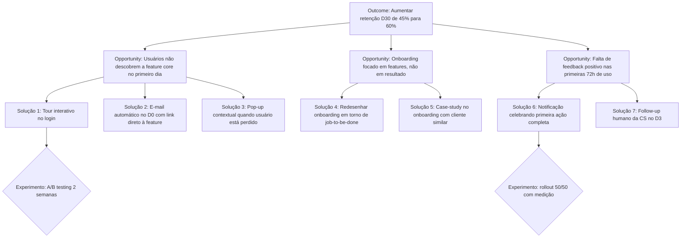
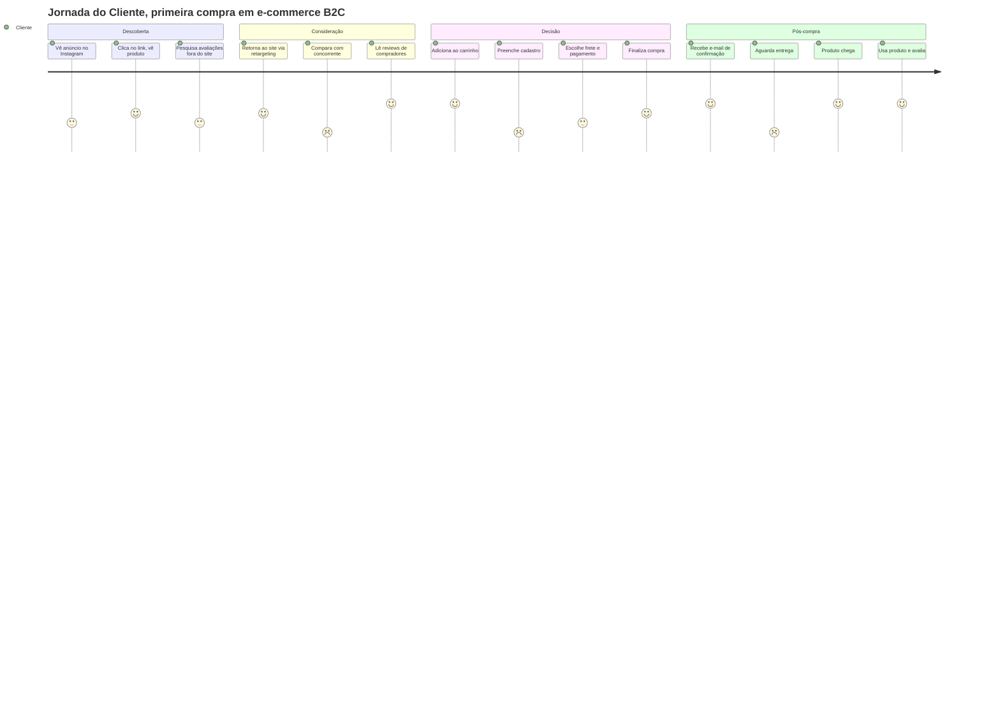

## APÊNDICE A — TEMPLATES PRONTOS PARA USO

> [!note] Como usar
> Esse apêndice reúne todos os templates operacionais referenciados ao longo do livro. Cada template tem indicação da fase ou apêndice de origem. Copie, adapte ao seu contexto e preencha. Templates são ponto de partida, não camisa-de-força. Se o formato não funcionar para o seu negócio, modifique. O que importa é o raciocínio que o template força, não a forma exata.

### A.1 Declaração Inicial da Ideia (Fase 2)

```
DECLARAÇÃO INICIAL DA IDEIA
Versão: ___ | Data: ___

1. PROBLEMA (3 frases, sem mencionar sua solução)
___________________________________________
___________________________________________

2. PARA QUEM (descrição específica e filtrável)
___________________________________________

3. ALTERNATIVA ATUAL (como o cliente resolve hoje)
___________________________________________

4. SOLUÇÃO PROPOSTA (capacidades, não features)
___________________________________________

5. POR QUE PODE FUNCIONAR (3-5 razões/hipóteses)
1) _______________________________________
2) _______________________________________
3) _______________________________________

6. O QUE EU NÃO SEI (10-20 incertezas)
1) _______________________________________
...
```

### A.2 Roteiro de Entrevista de Problema (Fase 3)

```
ROTEIRO, ENTREVISTA DE PROBLEMA
Duração: 30-45 min

[Aquecimento, 2 min]
Oi, obrigado pelo tempo. Esta é uma pesquisa, não uma venda. Posso gravar?

[Contexto, 5 min]
- Me conta um pouco sobre o que você faz no dia a dia.
- Quanto tempo você está nesse papel/nessa empresa?

[Exploração, 10 min]
- Me descreve como funciona a rotina quando [atividade relacionada].
- Quais são as partes mais chatas dessa rotina?
- Me conta a última vez que algo deu errado nisso.

[Aprofundamento, 10 min]
Para cada problema mencionado:
- Me fala mais sobre isso.
- Quando foi a última vez que aconteceu?
- O que você fez?
- Quanto tempo/dinheiro isso custou?

[Tentativas de solução, 5 min]
- O que você já tentou para resolver?
- Funcionou?
- Por que parou? / Por que continua usando?

[Encerramento, 3 min]
- Tem mais alguém que passa por isso e que eu poderia conversar?
- Posso voltar se eu tiver mais perguntas?

NÃO PERGUNTAR:
× Você pagaria X?
× Se existisse Y, você usaria?
× Acha que isso seria útil?
× Eu tive uma ideia, o que você acha?
```

### A.3 Banco de Hipóteses — modelo de planilha (Fase 6)

| ID | Tipo | Hipótese | Porquê importa | Critério validação | Método | Custo | Status | Resultado |
|----|------|----------|----------------|-------------------|--------|-------|--------|-----------|
| H01 | Problema | Donos de restaurante perdem ≥3h/semana com conciliação de frete | Se falso, o problema não é dolorido o suficiente | ≥60% dos 20 entrevistados menciona espontaneamente | Entrevistas de problema | R$0 + 3 semanas | Em teste |, |
| H02 | Monetização | ICP pagará ≥R$149/mês pela solução | Determina viabilidade do modelo | ≥15% conversão em landing page com oferta | Smoke test + pré-venda | R$1.500 + 3 semanas | Nova |, |

### A.4 Cartão de Experimento (Fase 7)

```
EXPERIMENTO #___
Data planejada: ___ a ___

HIPÓTESE TESTADA
___________________________________________

PERGUNTA CENTRAL
___________________________________________

DESENHO (passo a passo)
1) _______________________________________
2) _______________________________________
3) _______________________________________

PÚBLICO
Quantidade: _____ Perfil: _____________
Como alcanço: ___________________________

MÉTRICA PRINCIPAL
___________________________________________

CRITÉRIO DE SUCESSO (antes de ver resultado)
Validar se: ________________________________
Refutar se: _______________________________

DURAÇÃO E CUSTO
Tempo: _____ dias Custo: R$ _____

RISCOS E VIESES
___________________________________________

RESULTADO (preencher depois)
___________________________________________

DECISÃO
 Persevere Ajuste Pivote Abandone

APRENDIZADOS
___________________________________________
```

### A.5 Persona com dados (Fase 4)

```
PERSONA: [nome fictício]

Contexto profissional/pessoal
___________________________________________

Perfil demográfico
___________________________________________

Motivações principais (do que se importa)
1) _______________________________________
2) _______________________________________

Frustrações principais
1) _______________________________________
2) _______________________________________

Comportamentos observados (não declarados)
1) _______________________________________
2) _______________________________________

Ferramentas/canais/fontes que usa
___________________________________________

JTBDs prioritários
1) Quando _____, eu quero _____, para que _____.
2) Quando _____, eu quero _____, para que _____.

Citação verbatim representativa
"___________________________________________"

Base de evidência: [quantas entrevistas, quais]
```

### A.6 Especificação de MVP (Fase 9)

```
ESPECIFICAÇÃO DO MVP
Versão: ___ | Data: ___

PROPOSTA DE VALOR (uma frase)
___________________________________________

PERSONA FOCO (beachhead)
___________________________________________

JTBDs PRINCIPAIS A RESOLVER
1) _______________________________________
2) _______________________________________

MUST HAVES (máximo 15)
□ _______________________________________
□ _______________________________________
...

SHOULD HAVES (roadmap pós-MVP)
□ _______________________________________

COULD HAVES (se tempo permitir)
□ _______________________________________

WON'T HAVES (explicitamente fora)
× _______________________________________

CRITÉRIOS DE SUCESSO DO MVP (após 90 dias)
- Usuários ativos: _____
- Retenção D30: _____
- Conversão trial → pago: _____
- NPS mínimo: _____

FAIXA DE PREÇO PLANEJADA
R$ ____ a R$ ____

CANAIS DE AQUISIÇÃO INICIAIS
1) _______________________________________
2) _______________________________________

PRAZO DE DESENVOLVIMENTO
Início: ___ Lançamento: ___

ORÇAMENTO
R$ _____
```

### A.7 Árvore de Teoria — Story Tree (Fase 2B)

```
ÁRVORE DE TEORIA, v___ Data: ___/___/___

PERGUNTAS-ÂNCORA:

(a) Qual problema ou fenômeno você está observando?
____________________________________________________________
____________________________________________________________

(b) Por que isso está acontecendo? (causas-raízes)
____________________________________________________________
____________________________________________________________

(c) O que você poderia fazer a respeito? (caminhos de solução)
____________________________________________________________
____________________________________________________________

ATRIBUTOS (elementos com realização incerta):

ID | Atributo | Crença sobre realização (0-100%)
----|-----------------------------------|-----------------------------------
A1 | |
A2 | |
A3 | |
A4 | |
A5 | |
A6 | |
A7 | |
A8 | |
...

RELAÇÕES CAUSAIS (A → B):

De | Para | Direção do efeito | Confiança (alta/média/baixa) | Evidência prévia
------|-------|-------------------|------------------------------|------------------
A1 | A2 | + ou - | |
A2 | A3 | + ou - | |
...

ATRIBUTOS BET-THE-COMPANY (2 a 5):

Marque os atributos cuja refutação destruiria a ideia inteira:
[ ] A___ Justificativa: __________________________________
[ ] A___ Justificativa: __________________________________
[ ] A___ Justificativa: __________________________________

TESTE DE PARCIMÔNIA:

Quais atributos eu posso remover sem perder poder explicativo?
Removidos nesta versão: _________________________________

TESTE DE ALTERNATIVA:

Teoria alternativa (explicação diferente para o mesmo fenômeno):
____________________________________________________________
Principais atributos diferentes: _________________________
Como saberei qual teoria é melhor: _______________________

VALIDAÇÃO EXTERNA:

Três pessoas que conseguiram repetir minha teoria com as próprias palavras:
1) _______________________ Data: ___
2) _______________________ Data: ___
3) _______________________ Data: ___
```

### A.8 Mapa Causal — DAG Simplificado (Fase 2B)

Use esta representação quando quiser uma visão mais precisa e probabilística da teoria. É o passo seguinte ao Story Tree, para empreendedores que já dominam o básico.

```
MAPA CAUSAL, v___

Instruções:
1) Liste atributos em caixas.
2) Desenhe setas apenas em uma direção (sem ciclos).
3) Sobre cada seta, anote a probabilidade subjetiva de que a relação seja verdadeira.
4) Sobre cada nó, anote a probabilidade subjetiva de que aquele atributo se realize.

Representação textual (desenhe no papel ou ferramenta de diagrama):

 [Atributo A] P(A)=___%
 |
 | P(A→B)=___%
 v
 [Atributo B] P(B|A)=___%
 |
 | P(B→C)=___%
 v
 [Atributo C] P(C|B)=___% <-- bet-the-company

VERIFICAÇÃO:

[ ] Não há setas circulares (A→B→A).
[ ] Cada nó tem uma probabilidade marginal estimada.
[ ] Cada seta tem uma probabilidade condicional estimada.
[ ] Os nós bet-the-company estão destacados.
[ ] Existe ao menos uma folha terminal (nó sem saída) que representa o outcome final (ex.: "cliente paga", "cliente adota").

CÁLCULO DE PLAUSIBILIDADE GERAL (opcional):

Multiplicando as probabilidades ao longo do caminho crítico:
P(caminho) = P(A) × P(A→B) × P(B→C) ×... = ___%

Interpretação: se o resultado for <10%, sua ideia está assumindo
uma cadeia muito frágil. Se >70%, provavelmente você está otimista
demais. Sweet spot inicial: entre 15% e 50%.
```

### A.9 Theory Map — Conexão com Business Model Canvas (Fase 2B)

Use este template quando já preencheu um BMC ou Lean Canvas e precisa transformá-lo em teoria causal.

```
THEORY MAP, Conexão BMC ↔ Teoria v___

Para cada bloco do BMC, responda as três perguntas:

BLOCO: SEGMENTOS DE CLIENTES
(i) Quem exatamente? ____________________________________
(ii) Qual atributo da minha árvore este bloco representa? A___
(iii) Como se conecta causalmente com os outros blocos?
 Afeta: _____________________________________________
 É afetado por: _____________________________________

BLOCO: PROPOSTA DE VALOR
(i) Valor concreto oferecido? __________________________
(ii) Qual atributo? A___
(iii) Conexões causais:
 Afeta: _____________________________________________
 É afetado por: _____________________________________

BLOCO: CANAIS
(i) Quais canais? _______________________________________
(ii) Qual atributo? A___
(iii) Conexões causais:
 Afeta: _____________________________________________
 É afetado por: _____________________________________

BLOCO: RELACIONAMENTO COM CLIENTES
(i) Tipo de relação? ____________________________________
(ii) Qual atributo? A___
(iii) Conexões causais: ________________________________

BLOCO: FONTES DE RECEITA
(i) Como monetiza? ______________________________________
(ii) Qual atributo? A___
(iii) Conexões causais: ________________________________

BLOCO: RECURSOS-CHAVE
(i) O que é indispensável? ______________________________
(ii) Qual atributo? A___
(iii) Conexões causais: ________________________________

BLOCO: ATIVIDADES-CHAVE
(i) Quais ações? ________________________________________
(ii) Qual atributo? A___
(iii) Conexões causais: ________________________________

BLOCO: PARCEIROS-CHAVE
(i) Quem? _______________________________________________
(ii) Qual atributo? A___
(iii) Conexões causais: ________________________________

BLOCO: ESTRUTURA DE CUSTOS
(i) Principais custos? __________________________________
(ii) Qual atributo? A___
(iii) Conexões causais: ________________________________

DIAGNÓSTICO:

[ ] Existe algum bloco do BMC sem atributo correspondente na árvore?
 Se sim, o BMC tem um item sem justificativa teórica. Remova ou
 adicione à árvore.

[ ] Existe algum atributo da árvore sem bloco correspondente no BMC?
 Se sim, seu modelo de negócio está incompleto. Reabra o BMC.

[ ] Blocos do BMC que eu removi após este exercício:
 _______________________________________________________

[ ] Atributos da árvore que surgiram durante este exercício:
 _______________________________________________________
```

### A.10 Hypothesis Canvas (Fases 5 + 6)

Template central para conectar teoria, hipótese, evidência e avaliação. Use um canvas por hipótese prioritária. Preencha os blocos superior e médio **antes** de coletar dado, os blocos inferiores são preenchidos **após** a coleta, respeitando a ordem indicada.

```
╔══════════════════════════════════════════════════════════╗
║ HYPOTHESIS CANVAS #___ ║
╠════════════════════════════╦═════════════════════════════╣
║ TEORIA ║ HIPÓTESE ║
║ Qual parte da sua árvore ║ Afirmação falsificável a ║
║ esta hipótese testa? ║ testar: ║
║ ║ ║
║ Atributo/seta: ___________ ║ ___________________________ ║
║ Importância (1-5): _______ ║ ___________________________ ║
║ É bet-the-company? S / N ║ ___________________________ ║
╠════════════════════════════╬═════════════════════════════╣
║ EVIDÊNCIA ║ MEDIDAS ║
║ Como vou coletar? ║ O que especificamente vou ║
║ [ ] Entrevista ║ contar? ║
║ [ ] Questionário ║ ║
║ [ ] Landing page ║ Pergunta/evento: __________ ║
║ [ ] Pré-venda ║ Respostas possíveis: ______ ║
║ [ ] Concierge ║ Fórmula da medida: ________ ║
║ [ ] Wizard of Oz ║ ___________________________ ║
║ [ ] A/B test ║ ║
║ [ ] Fake door ║ Medidas ALTERNATIVAS que eu ║
║ [ ] Outro: _______ ║ descartei e por quê: ______ ║
║ ║ ___________________________ ║
║ Público-alvo: ____________ ║ ║
║ Tamanho planejado: _______ ║ ║
║ Duração: _________________ ║ ║
║ Custo: R$ ________________ ║ ║
╠════════════════════════════╩═════════════════════════════╣
║ THRESHOLD (preencher ANTES de olhar os dados) ║
║ ║
║ Minha crença subjetiva Resultado mínimo para ║
║ sobre o valor real: considerar SUPORTADA: ║
║ ║
║ [ __________ ] [ __________ ] ║
║ ║
║ Resultado que considerarei REFUTADO: ║
║ [ __________ ] ║
║ ║
║ Zona INCONCLUSIVA (exige novo experimento): ║
║ entre [ ______ ] e [ ______ ] ║
║ ║
║ Justificativa do threshold: _____________________________ ║
║ __________________________________________________________ ║
╠════════════════════════════════════════════════════════════╣
║ DUE DILIGENCE DA AMOSTRA (antes de comparar com threshold)║
║ ║
║ Tamanho efetivo coletado: _____ ║
║ Adequado para o tipo de teste? [ ] Sim [ ] Não ║
║ ║
║ A amostra representa o ICP? [ ] Sim [ ] Parcial [ ] Não ║
║ Vieses identificados: ____________________________________║
║ ___________________________________________________________║
║ ║
║ AJUSTE DO THRESHOLD: ║
║ [ ] Mantido ║
║ [ ] Aumentado para ______ (amostra favorece a hipótese) ║
║ [ ] Diminuído para ______ (amostra desfavorece hipótese) ║
║ Justificativa do ajuste: ________________________________ ║
╠════════════════════════════╦═════════════════════════════╣
║ AVALIAÇÃO ║ DECISÃO ║
║ ║ ║
║ Resultado observado: ║ [ ] Perseverar ║
║ [ _____________ ] ║ [ ] Pivotar ║
║ ║ [ ] Mais dados ║
║ Vs. threshold ajustado: ║ [ ] Abandonar ║
║ [ ] SUPORTADA ║ ║
║ [ ] REFUTADA ║ Próxima ação concreta: ║
║ [ ] INCONCLUSIVA ║ __________________________ ║
║ ║ __________________________ ║
║ Explicação alternativa ║ ║
║ plausível? ______________ ║ Impacto na árvore de teoria:║
║ ________________________ ║ __________________________ ║
║ ║ __________________________ ║
╚════════════════════════════╩═════════════════════════════╝

Data de preenchimento inicial: ___/___/___
Data de conclusão: ___/___/___
Assinatura do empreendedor: _______________________________
```

**Observação sobre o Hypothesis Canvas**: o propósito dele é forçar o empreendedor a tornar visível cada passo do raciocínio. O canvas não é decorativo, se algum bloco estiver em branco quando o experimento começa, é porque esse passo não foi pensado. E um experimento iniciado com passos não pensados é um experimento que vai produzir conclusões erradas, mesmo se o resultado parecer claro.

### A.11 Teste de Precisão do Comprador (Fase 5)

Use este template para validar o elemento #4 da Anatomia da Cunha (Dono do Orçamento) antes de avançar para a [[#FASE 6 — FORMULAÇÃO RIGOROSA DE HIPÓTESES|Fase 6]]. É exercício de 10-15 minutos, se demora mais, o próprio atraso já é o diagnóstico.

```
TESTE DE PRECISÃO DO COMPRADOR, v___ Data: ___/___/___

A FRASE QUE NÃO DEVE TRAVAR:

"Nós vendemos para [CARGO] em [TIPO DE EMPRESA] porque essa pessoa
é responsável por [RESULTADO ESPECÍFICO] e controla
[ORÇAMENTO ESPECÍFICO]."

MINHA VERSÃO:

CARGO (nominal, existente no organograma do cliente):
___________________________________________________________

TIPO DE EMPRESA (tamanho + setor + segmento):
___________________________________________________________

RESULTADO ESPECÍFICO (pelo qual esse cargo responde):
___________________________________________________________

ORÇAMENTO ESPECÍFICO (rubrica + faixa de valor):
___________________________________________________________

CRITÉRIOS DE APROVAÇÃO (3 checks obrigatórios):

[ ] (1) Frase escrita em menos de 30 segundos, sem rascunhar
 variações para audiências diferentes.

[ ] (2) Cargo é REAL e existente no organograma típico do ICP
 (não usar "decisor", "stakeholder", "gestor", "líder").

[ ] (3) Orçamento é RUBRICA EXISTENTE no cliente
 (não criar rubrica nova para comprar de você:
 rubricas novas triplicam o ciclo de decisão).

SE REPROVOU:

Qual item travou? __________________________________________

Hipótese sobre o motivo
(ex.: venda depende de múltiplos papéis, ICP ainda misturado,
comprador econômico não conhecido, produto exige nova rubrica):
___________________________________________________________
___________________________________________________________

Próxima ação
(voltar à Fase 4 com foco em qual pergunta específica?):
___________________________________________________________

CHECK DE SEPARAÇÃO DE PAPÉIS (B2B):

No meu contexto, Usuário, Campeão Interno e Comprador
Econômico são:

[ ] A mesma pessoa (contexto B2C ou SMB muito pequeno).
[ ] Duas pessoas distintas, especifique:
 Usuário/Campeão: ___________________________
 Comprador Econômico: ___________________________
[ ] Três pessoas distintas, especifique cada uma:
 Usuário: ___________________________
 Campeão Interno: ___________________________
 Comprador Econômico: ___________________________

VALIDAÇÃO EXTERNA:

Três pessoas independentes que conseguiram repetir a frase
sem ajuste e a consideraram plausível para o ICP:

1) _______________________ Data: ___/___/___
2) _______________________ Data: ___/___/___
3) _______________________ Data: ___/___/___
```

**Observação sobre o Teste de Precisão do Comprador**: reprovar neste teste raramente significa que sua ideia é ruim, significa que a pesquisa de usuário da [[#FASE 4 — PESQUISA COM USUÁRIOS (CUSTOMER DISCOVERY APROFUNDADO)|Fase 4]] ficou centrada em quem usa o produto e não em quem paga pelo produto. Em B2B, são quase sempre pessoas diferentes, e essa diferença é o motivo mais comum de ciclo de venda travado. Reprovação aqui é um presente: revela a lacuna antes dela custar meses de vendas fracassadas.

### A.12 Canvas da Cunha (Fase 5)

Use este template como entregável final da [[#FASE 5 — MAPEAMENTO DE MERCADO E CONCORRÊNCIA|Fase 5]]. Ele consolida os quatro elementos da Anatomia da Cunha, o Teste do Grupo de WhatsApp e a comparação com a alternativa atual. Preencha **antes** de avançar para a [[#FASE 6 — FORMULAÇÃO RIGOROSA DE HIPÓTESES|Fase 6]], sem ele, as hipóteses da fase seguinte não terão ancoragem no mercado específico que você escolheu atacar.

```
CANVAS DA CUNHA, v___ Data: ___/___/___

ICP (preciso): _______________________________________
 _______________________________________

Dor específica: _______________________________________
(1 fluxo de trabalho) _______________________________________

Resultado mensurável: _____________________________________
(escolha 1-2 categorias: receita / custo / risco / tempo)
Métrica do resultado: _____________________________________
(ex.: "reduz de 4h para 15min por semana")

Dono do orçamento: _______________________________________
(cargo + nível hierárquico)

Teste do grupo de WhatsApp:
Quantas pessoas específicas eu consigo listar nominalmente
como potenciais primeiros clientes? _____
[ ] Cunha aprovada (100-300 pessoas listáveis).
[ ] Cunha muito larga (refinar).

Alternativa atual (o que o cliente faz hoje):
___________________________________________________________

Por que eu sou melhor do que a alternativa atual
(em 1 frase, com número se possível):
___________________________________________________________

VERIFICAÇÕES COMPLEMENTARES:

[ ] Teste de Precisão do Comprador (template A.11) aprovado.
[ ] Nenhum ou no máximo 1 dos 4 sinais de escopo instável presentes.
[ ] Distinção Cunha vs Plataforma compreendida, a ideia é vendável
 como cunha autônoma, sem depender de promessa de roadmap futuro.

VALIDAÇÃO EXTERNA:

Três pessoas independentes (mentor, cliente-alvo, investidor)
que confirmaram a Cunha como plausível e bem definida:

1) _______________________ Data: ___/___/___
2) _______________________ Data: ___/___/___
3) _______________________ Data: ___/___/___
```

**Observação sobre o Canvas da Cunha**: o canvas sozinho é um artefato morto se não passar pelos três testes acima (Precisão do Comprador, ausência de escopo instável, independência de plataforma). Cada um desses testes revela um tipo diferente de fragilidade oculta. Canvas preenchido + três testes aprovados = autorização para avançar à [[#FASE 6 — FORMULAÇÃO RIGOROSA DE HIPÓTESES|Fase 6]]. Canvas preenchido mas algum teste reprovado = refinar antes de avançar, não pular.

### A.9 Tabela de técnicas de validação por tipo de hipótese (Fases 2-9)

Esta tabela resume as técnicas de coleta de evidência mais usadas no manual, organizadas pelo tipo de hipótese que cada uma testa melhor. Inspirada na Tabela 1 de Coali et al. (2024), com ajustes para operadores brasileiros.

| Técnica | Descrição | Melhor para... | Amostra típica | Onde no manual |
|---|---|---|---|---|
| **Entrevistas 1-a-1** | Conversas estruturadas de 30-60 min com perguntas no estilo Mom Test | Desenvolvimento de teoria ([[#FASE 2B — CONSTRUÇÃO DA TEORIA DO NEGÓCIO|Fase 2B]]), validação de problema ([[#FASE 3 — DESCOBERTA DO PROBLEMA|Fase 3]]), mecanismos causais da dor ([[#FASE 4 — PESQUISA COM USUÁRIOS (CUSTOMER DISCOVERY APROFUNDADO)|Fase 4]]) | 15-30 entrevistados | [[#FASE 3 — DESCOBERTA DO PROBLEMA|Fase 3]]-3 |
| **Questionários (surveys)** | Série de perguntas fechadas em escala, distribuídas em grupos maiores | Validação de problema em escala, validação de atratividade de proposta | 100-500 respondentes | [[#FASE 3 — DESCOBERTA DO PROBLEMA|Fase 3]] late, 5-6 |
| **Landing page / smoke test** | Página descrevendo o produto antes dele existir, mede conversão de interesse | Validação de proposta de valor, teste de canal de aquisição, "fake door" | 500-5.000 visitantes | [[#FASE 7 — EXPERIMENTOS DE VALIDAÇÃO DO PROBLEMA|Fase 7]] |
| **Pré-venda** | Aceitar pagamento antecipado sem produto pronto | Teste máximo de Willingness to Pay, elimina viés de "eu pagaria" declarado | 10+ pagamentos reais | [[#FASE 7 — EXPERIMENTOS DE VALIDAÇÃO DO PROBLEMA|Fase 7]] |
| **Concierge / Wizard of Oz** | Entregar manualmente o valor que a solução automatizaria | Validar solução antes de build, aprender requisitos reais de uso | 3-10 clientes durante 4-8 semanas | [[#FASE 8 — IDEAÇÃO E PROTOTIPAGEM DE SOLUÇÕES|Fase 8]]-8 |
| **Protótipo interativo** | Versão clicável/funcional parcial submetida a uso real | Validação de fluxo de solução, identificação de pontos de atrito | 8-15 usuários qualitativo | [[#FASE 8 — IDEAÇÃO E PROTOTIPAGEM DE SOLUÇÕES|Fase 8]] |
| **MVP real** | Versão funcional mínima em produção com usuários pagantes | Validação de valor em uso prolongado, retenção, economics | 10+ usuários pagantes, 8-12 semanas | [[#FASE 10 — MVP E EXPERIMENTOS DE MERCADO|Fase 10]] |
| **Teste A/B** | Comparação experimental controlada entre 2+ versões | Comparação de features, proposta de valor ou pricing, identificação de causalidade | Centenas a milhares de exposições | [[#FASE 10 — MVP E EXPERIMENTOS DE MERCADO|Fase 10]], 13C |

**Regra de escolha rápida**: quanto menos evidência você tem sobre o problema, mais qualitativa deve ser a técnica (entrevistas > questionários > A/B test). Quanto mais avançada a validação, mais quantitativa (A/B test > questionário > entrevistas). Landing page, pré-venda e concierge ficam no meio, são qualitativas em amostra e quantitativas em conversão.

**Nota de tradução vocabular, Problem / Offer / Solution validation (Ries, 2011).** Quem vem da literatura do Lean Startup encontrará três tipos distintos de validação que este manual cobre mas não nomeia sempre de forma unificada. A correspondência é:

- **Problem validation** (o problema é real, agudo, no ICP certo?) = Fases 2, 3 e parte da 6.
- **Offer validation** (a proposta de valor é atrativa? o cliente quer comprar isso?) = [[#FASE 7 — EXPERIMENTOS DE VALIDAÇÃO DO PROBLEMA|Fase 7]] late, 7 e 8.
- **Solution validation** (a solução específica funciona, escala, tem economics?) = Fases 8, 9 e 10.

Essa distinção importa operacionalmente: falhar na **Problem validation** exige pivotar de ICP ou problema (volta à [[#FASE 3 — DESCOBERTA DO PROBLEMA|Fase 3]]). Falhar na **Offer validation** pode significar que o problema está certo mas a proposta de valor ou o preço estão errados (volta à [[#FASE 6 — FORMULAÇÃO RIGOROSA DE HIPÓTESES|Fase 6]] ou 7). Falhar na **Solution validation** sugere que o problema e a oferta estão ok, mas a execução da solução não, iterar dentro da [[#FASE 9 — TESTES DE SOLUÇÃO E USABILIDADE|Fase 9]]-9 costuma bastar. Saber qual das três está quebrando muda a decisão de pivot vs. iterate.

### A.13 Matriz de Parcerias ([[#APÊNDICE CX — CANAIS INDIRETOS E PARCERIAS: PARCERIAS, FRANQUIAS, CHANNEL|Apêndice CX]])

Documento único para gestão de pipeline de parcerias. Atualizar mensalmente.

| # | Parceiro | Tipo (1-5) | Estágio | Métrica sucesso 90d | Sponsor do lado deles | Sponsor nosso | Próximo passo | Data próximo passo | Status |
|---|---|---|---|---|---|---|---|---|---|
| 1 | | | Prospecção / Discovery / POC / Contrato / Ativo / Encerrada | | | | | | Verde / Amarelo / Vermelho |

Preencher com 5-15 parcerias ativamente em movimento. Parcerias em "standby há 2+ trimestres" devem ser encerradas formalmente ou reativadas, não deixar zumbis.

### A.14 Plano de Financiamento Não-Diluitivo ([[#APÊNDICE P — FINANCIAMENTO NÃO-DILUITIVO|Apêndice P]])

Documento de 2-3 páginas, revisão semestral.

**Necessidade de caixa nos próximos 18 meses:**
- Cenário conservador: R$ _____
- Cenário realista: R$ _____
- Cenário pessimista: R$ _____

**Composição planejada:**

| Fonte | Valor (R$) | % do total | Janela | Status |
|---|---|---|---|---|
| Caixa atual | | |, | Ativo |
| Receita orgânica prevista | | | 18m |, |
| Incentivos fiscais (Lei do Bem etc.) | | | 12m | Planejado / Em análise |
| Grants/editais (Finep, BNDES, FAPESP) | | | 3-9m |, |
| Antecipação de recebíveis | | | Contínuo |, |
| Venture Debt | | |, |, |
| RBF | | |, |, |
| Equity (rodada) | | |, |, |
| **Total** | | 100% | | |

**Decisões-chave:**
- Qual o gap a cobrir, após receita orgânica?
- Qual a ordem de ataque (priorizar não-diluitivo antes de equity)?
- Quais covenants/condições são aceitáveis?
- Quais garantias corporativas ou pessoais estão na mesa?

**Próximos 90 dias:**
1. _____
2. _____
3. _____

### A.15 Plano de Marca e PR ([[#APÊNDICE CQ — MARCA, PR E POSICIONAMENTO DE LONGO PRAZO|Apêndice CQ]])

Documento vivo de 4-6 páginas, revisão trimestral.

**Narrativa Oficial (uma página):**
- Para quem somos a primeira escolha, e por quê?
- Qual mudança no mundo justifica existirmos agora?
- Qual é a "inimiga declarada"?

**Cadência do fundador:**
- LinkedIn: [X posts/semana]
- Newsletter: [quinzenal/mensal, tamanho]
- Podcasts: [X por trimestre]

**Relações com imprensa:**
- Lista viva de 10-20 jornalistas-chave (nome, veículo, última interação, status relação)
- Press releases: calendário + critério de release

**Conteúdo institucional:**
- Blog: [X posts/mês]
- Recursos baixáveis: [X por ano]
- Estudos setoriais próprios: [cronograma]

**Eventos:**
- Que patrocinamos: [lista]
- Em quais falamos: [lista]
- Próprios: [cronograma]

**Métricas mensais:**
- Share of Voice: _____
- Branded Search: _____
- Direct Traffic: _____
- Cobertura editorial: _____
- Pipeline atribuído a marca/referência: _____
- NPS: _____

### A.16 Mapa de Modos — Founder Mode vs Manager Mode ([[#APÊNDICE R — FOUNDER MODE, DELEGAÇÃO E QUANDO PARAR DE FAZER|Apêndice R]])

Documento de 2 páginas, revisão semestral, compartilhado com C-level.

| Domínio | Modo atual (Founder / Manager / Híbrido) | Gatilho para mudar | Delegado atual | Revisitar em |
|---|---|---|---|---|
| Produto e roadmap | | | | |
| Engenharia | | | | |
| Design e UX | | | | |
| Vendas, top 10 contas | | | | |
| Vendas, base | | | | |
| Marketing de marca | | | | |
| Marketing performance | | | | |
| Finanças/captação | | | | |
| Jurídico | | | | |
| Operações | | | | |
| Pessoas/RH | | | | |
| Atendimento a cliente | | | | |
| Parcerias estratégicas | | | | |

**Teste de honestidade** (responder por escrito, para si mesmo):
- Em quais domínios estou em Founder Mode porque agrega valor diferencial, e em quais por vício de controle?
- Em quais estou em Manager Mode porque delega bem, e em quais por não querer dizer "não"?

**Mecanismos ativos de preservação de Founder Mode:**
- [ ] Skip-level 1:1s mensais?
- [ ] Office hours semanais?
- [ ] Cliente-tour mensal?
- [ ] Desafios rotativos trimestrais?

### A.17 Pitch Deck SCQA — Esqueleto ([[#APÊNDICE V — CAPTAÇÃO DE EQUITY, PITCH E RELACIONAMENTO COM INVESTIDORES|Apêndice V]])

Documento Google Slides ou Keynote de 12-15 slides, estrutura sugerida:

**Slide 1, Capa**
- Nome da empresa + logo
- Tagline de 1 frase
- Data | Nome do fundador | Papel

**Slide 2, Tagline expandida (opcional)**
- Uma frase: "[Empresa] é [categoria] para [ICP] que faz [job] de forma [diferencial]."

**Slide 3, SITUAÇÃO (S do SCQA)**
- 3-5 dados do mercado atual
- TAM e crescimento
- Estrutura do mercado (fragmentação, concentração, comportamento)

**Slide 4, COMPLICAÇÃO (C do SCQA)**
- O problema específico que o mercado atual não resolve
- Quantificação (dor em R$, tempo, fricção)
- Uma quote de cliente real (opcional, mas forte)

**Slide 5, QUESTÃO (Q do SCQA)**
- Pergunta central que a situação + complicação levantam
- Janela de "por que agora"

**Slide 6, RESPOSTA / Produto (A do SCQA, início)**
- O que a empresa faz
- Screenshot real (não mockup)
- Mecanismo (como funciona), não lista de features

**Slide 7, Tração**
- ARR/MRR atual + crescimento MoM/YoY
- Número de clientes + churn mensal
- NPS ou outra métrica de satisfação
- Coortes de retenção (gráfico)

**Slide 8, Modelo de Negócio / Unit Economics**
- Ticket médio (ACV)
- Margem bruta
- LTV : CAC e payback
- Observação sobre como escalam

**Slide 9, Go-to-Market**
- Canais validados com % da aquisição
- CAC por canal
- Plano de expansão 12-18 meses

**Slide 10, Competição**
- Mapa competitivo (grid 2x2 ou tabela comparativa)
- Diferenciação em dimensão não-óbvia
- Moat estrutural

**Slide 11, Time**
- Fundadores (background relevante, 2-3 linhas cada)
- Contratações-chave recentes
- "Por que este time ganha" em 1 frase

**Slide 12, Projeção Financeira**
- 3-5 anos: receita, margem, burn, headcount
- Premissas por trás
- 3 cenários (pessimista, realista, otimista)

**Slide 13, Rodada**
- Valor captando e estágio (Seed / Série A / etc.)
- Uso de capital (% produto, time, marketing, etc.)
- Milestones que atingem com capital
- Cronograma para próxima rodada

**Slide 14, Contato / Ask**
- Próximos passos sugeridos
- Informações de contato
- O que estão buscando além de capital (conselheiros, intros, etc.)

**Slide 15, Apêndice (opcional)**
- Cap table detalhado
- Roadmap de produto
- Análise competitiva detalhada
- Casos de uso reais

---

### A.18 Investor Update Mensal — Template ([[#APÊNDICE V — CAPTAÇÃO DE EQUITY, PITCH E RELACIONAMENTO COM INVESTIDORES|Apêndice V]])

E-mail mensal para todos os investidores. Enviar no mesmo dia de cada mês (ex.: sempre dia 5).

```
Assunto: [Empresa], Update [Mês/Ano]

Olá investidores,

**TL;DR:**
[2-3 frases sintetizando o mais importante do mês]

**MÉTRICAS-CHAVE**
- MRR/ARR: R$ X (crescimento Y% MoM)
- Clientes: N total (+X novos, -Y churn)
- Churn mensal: Z%
- Burn: R$ W / mês
- Runway: M meses
- North Star [métrica]: [número] (+X% MoM)

**DESTAQUES DO MÊS**
1. [Conquista operacional concreta]
2. [Movimento estratégico ou parceria]
3. [Contratação-chave ou perda relevante]
4. [Outro destaque, se houver]

**DESAFIOS**
1. [Problema honesto 1, o que está fazendo a respeito]
2. [Problema honesto 2, o que está fazendo a respeito]

**PEDIDOS DE AJUDA**
1. [Intro específica: "conhecem alguém em [empresa/função]?"]
2. [Candidato: "buscando [perfil] para [posição]"]
3. [Feedback: "queremos input sobre [decisão estratégica]"]

**PRÓXIMOS 30 DIAS**
1. [Objetivo mensurável 1]
2. [Objetivo mensurável 2]
3. [Objetivo mensurável 3]

Como sempre, estão à disposição para conversas.

Abraço,
[Nome]
CEO, [Empresa]
```

Regras:
- Enviar mesmo dia do mês, sempre.
- Mesmas métricas, todo update (não trocar sem contexto).
- Pedidos específicos, não "ajuda geral".
- Transparência em desafios, não maquiar.
- Manter formato consistente para leitura rápida.

---

## Templates preenchidos com casos brasileiros

Esta seção traz versões preenchidas de templates-chave do [[#APÊNDICE A — TEMPLATES PRONTOS PARA USO|Apêndice A]] com exemplos baseados em empresas brasileiras reais. Cada template em branco tem sua utilidade, mas aprendizado de verdade vem de ver a ferramenta aplicada a caso concreto, não abstratamente. Os casos abaixo são reconstruções aproximadas baseadas em informação pública, números e detalhes específicos foram simplificados para fins didáticos.

### A.20 Business Model Canvas preenchido — Nubank (2014)

| Segmentos de Clientes | Proposta de Valor | Canais | Relacionamento com Clientes | Fontes de Receita |
|---|---|---|---|---|
| Brasileiros 25-40 anos, urbanos, insatisfeitos com banco tradicional | Cartão de crédito sem anuidade, gerenciado 100% por app, sem burocracia, atendimento humano via chat | App mobile (iOS + Android), landing page, marketing digital orgânico, convite por fila de espera viral | Self-service via app, suporte humano on-demand via chat, comunicação pelo nome próprio | Intercâmbio (percentual sobre transações), juros rotativo, futuro: receitas adjacentes (lending, investimento) |

| Recursos-Chave | Atividades-Chave | Parcerias-Chave | Estrutura de Custos |
|---|---|---|---|
| Equipe técnica (engenharia, produto, design), licenças regulatórias (IP, adquirência), capital, algoritmos de credit scoring | Desenvolvimento de produto tecnológico, aquisição de clientes, gestão de risco de crédito, atendimento ao cliente | Bandeiras (Mastercard, Visa), processadoras de pagamento, reguladores (BACEN), fornecedores de infraestrutura cloud | Salários de tecnologia (majoritário), atendimento, marketing, provisões de risco de crédito, compliance |

**Insight do caso:** o BMC do Nubank em 2014 mostra um modelo surpreendentemente enxuto, poucos blocos complexos, foco em um único produto (cartão) e um único segmento. A disciplina foi não adicionar produtos/segmentos antes de dominar o primeiro. Expansão para conta corrente, lending, investimentos só aconteceu depois de 2017, com cartão já dominando.

---

### A.21 Lean Canvas preenchido — QuintoAndar (2015)

| Problema | Segmentos de Clientes | Proposta Única de Valor |
|---|---|---|
| Alugar apartamento em SP exige fiador, três meses de caução, vistoria agressiva, burocracia de cartório, semanas de sofrimento para alugar algo que você só vai ver por 1-2 anos | Inquilinos: jovens profissionais classe A/B em SP, primeira ou segunda experiência de aluguel. Proprietários: pessoas físicas com 1-3 imóveis, não imobiliária | Alugue em horas, sem fiador, sem caução exagerada, 100% online |

| Solução | Canais | Métricas-Chave |
|---|---|---|
| Plataforma online, seguro substituindo fiador, vistoria digital, contrato digital assinado remotamente, pagamento de aluguel e boleto automatizado | Tráfego orgânico via SEO, parcerias com portais imobiliários, marketing digital (Facebook, Google), indicação boca a boca | Contratos assinados/mês, tempo médio da busca à assinatura. NPS, churn de locatários, ticket médio (aluguel médio) |

| Vantagem Injusta | Estrutura de Custos | Fontes de Receita |
|---|---|---|
| Dados proprietários de locatários (comportamento de pagamento histórico) permitem underwriting de seguro próprio, concorrentes novos precisariam anos para acumular | Tecnologia e produto, marketing e aquisição, operação de vistorias, sinistros de seguro, equipe de matching | Taxa de administração sobre aluguel mensal, comissão de corretagem sobre assinatura inicial, eventualmente, produtos financeiros adjacentes |

**Insight do caso:** note que o problema é altamente específico (SP, jovens profissionais, fiador), não "imóveis no Brasil". Isso é wedge theory em ação. A expansão para outras cidades e para aluguel de outros perfis veio depois, construída sobre base específica dominada.

---

### A.22 Value Proposition Canvas preenchido — Wellhub (2016, B2B)

**Customer Profile**: Head de RH de empresa média (200-1000 funcionários)

| Customer Jobs | Pains | Gains |
|---|---|---|
| Oferecer benefício que ajude retenção | Caro contratar academia única que não atende todos os funcionários | Retenção mensurável melhor |
| Gerenciar programa de bem-estar sem overhead interno | Funcionários pedem benefício de academia mas subsídio direto é complicado (tributário, equidade) | Marca empregadora fortalecida |
| Prestar contas à diretoria sobre ROI de benefício | Difícil medir uso real e impacto em produtividade/saúde | Dados de engajamento para relatório ao C-level |
| Atender perfis diversos (academia, yoga, crossfit, natação) sem caos administrativo | Negociar com múltiplos fornecedores consome tempo | Benefício percebido pelo funcionário sem esforço administrativo |

**Value Map**: Wellhub (o que oferece)

| Products & Services | Pain Relievers | Gain Creators |
|---|---|---|
| Plataforma empresarial com acesso a milhares de academias via assinatura | Uma única assinatura cobre todas academias (flexibilidade sem multiplicação de contratos) | Benefício percebido pelo funcionário gera retenção mensurável |
| Dashboard de uso para RH | Plataforma administra matrícula, pagamento, cancelamento (zero overhead para RH) | Oferta diversa (academia, yoga, pilates, natação, crossfit) atende diferentes perfis de funcionário |
| App para funcionário escolher academia | Estrutura tributária correta (benefício registrado corretamente) | Dados de uso para relatórios executivos sobre engagement e ROI |
| Suporte para RH e funcionário | Negociação consolidada com uma empresa só (em vez de 50 academias) | Fortalecimento da marca empregadora |

**Fit analysis:** correspondência forte entre quase todos os Pains/Gains e Pain Relievers/Gain Creators. Note que a oferta não precisa inovar radicalmente, apenas eliminar as fricções específicas que o RH enfrentava no modelo tradicional. Value proposition forte quando há fit preciso, não quando há "features impressionantes".

---

### A.23 Diagrama de Opportunity Solution Tree (Teresa Torres) — exemplo em SaaS brasileiro



**Uso:** o topo da árvore é o outcome desejado (métrica mensurável). Opportunities são hipóteses sobre o que, se resolvido, moveria o outcome. Solutions são experimentos específicos para cada opportunity. A disciplina é nunca pular direto de outcome para solution, sempre explicitar qual opportunity a solução tenta endereçar.

---

### A.24 Customer Journey Map em Mermaid — compra em e-commerce brasileiro

> [!note] Compatibilidade — tipo journey, renderiza com plugin Mermaid atualizado



**Uso:** mapas de jornada revelam pontos de fricção (notas baixas) que exigem investigação. Neste exemplo, "comparar com concorrente" e "preencher cadastro" são as friccções mais dolorosas, candidatas a otimização prioritária.

---

### A.25 Story Map exemplo — MVP de app de entrega regional

Horizontal (jornada): cliente *Descobre* → *Seleciona loja* → *Escolhe produtos* → *Paga* → *Acompanha* → *Recebe*

| Atividade | Essencial (Release 1) | Intermediário (Release 2) | Avançado (Release 3) |
|---|---|---|---|
| Descobre | Busca por CEP | Ordenação por distância | Recomendação personalizada |
| Seleciona loja | Lista com foto e nota média | Filtro por categoria | Favoritos e histórico |
| Escolhe produtos | Cardápio simples, uma foto por item | Variações (tamanho, sabor) | Personalização detalhada, combos |
| Paga | Cartão de crédito via gateway | PIX + carteira digital | Cashback, cupons, parcelamento |
| Acompanha | Status em texto (recebido, em preparo, saindo) | Mapa em tempo real | Chat com entregador |
| Recebe | Confirmação por SMS | Avaliação da entrega | Foto do produto na entrega |

**Insight:** Release 1 corta horizontalmente a jornada inteira, cliente consegue fazer todo o fluxo, mesmo que limitado. Release 1 é MVP de verdade. A tentação de começar por "release vertical" (construir todo o módulo de pagamento primeiro) é erro clássico: não entrega valor completo até o último release.

---

### A.26 Template de OKRs trimestral preenchido — scaleup brasileira em PMF

**Objetivo 1: Transformar retention em motor de crescimento sustentável**

- KR1: Aumentar retenção D30 de 45% para 58% (medido em cohort trimestral)
- KR2: Reduzir churn mensal de 8% para 5%
- KR3: Elevar NPS de 32 para 45

**Objetivo 2: Abrir canal de crescimento indirecto escalável**

- KR1: Fechar 3 parcerias estratégicas com volume mínimo de 500 usuários/mês cada
- KR2: Lançar programa de indicação com taxa de conversão >= 15%
- KR3: Atingir 30% de aquisição mensal via canais não-pagos (vs 12% atual)

**Objetivo 3: Profissionalizar operação de produto**

- KR1: Implementar descoberta contínua com 3 entrevistas de usuário por PM por semana
- KR2: Rodar 8 experimentos controlados (A/B) no trimestre com resultado decisivo
- KR3: Documentar roadmap priorizado usando RICE para todos os features de prioridade P0/P1

**Insight do exemplo:** OKRs boas são *mensuráveis* (números específicos), *desafiadoras* (se você atinge 100%, provavelmente foram fáceis demais, atingir 70% é sucesso), e *alinhadas* entre si (neste caso, retenção melhor viabiliza programa de indicação, ambos viabilizam canal sustentável). Três objetivos é o máximo recomendado por ciclo, mais que isso dilui foco.


---
