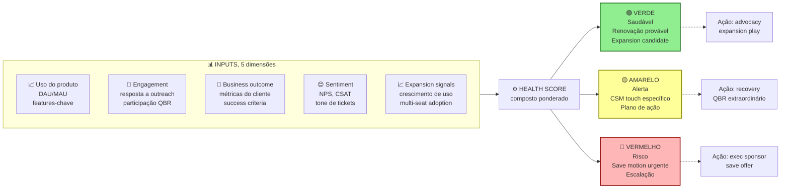
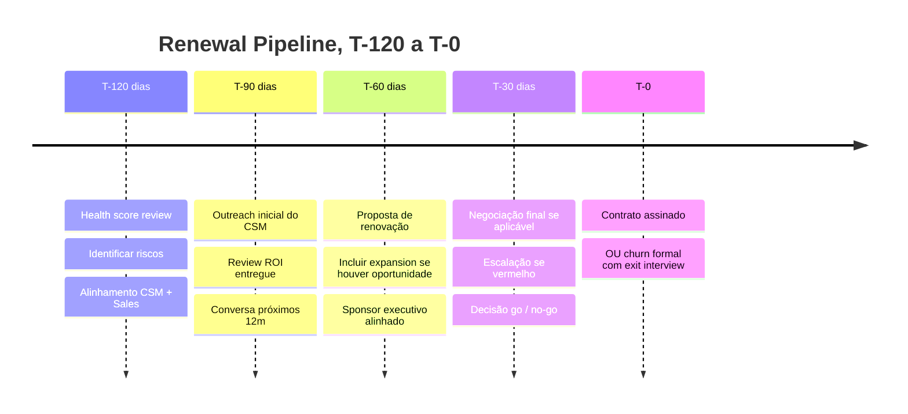

## APÊNDICE AA — CUSTOMER SUCCESS COMO DISCIPLINA

> [!note] Nota de validade
> Os frameworks (estruturas de referência) de CS (Customer Success, sucesso do cliente) — health score, onboarding estruturado, QBR e renewal motion — têm vida útil longa. O que evolui são as ferramentas específicas, as integrações com produto e o uso de IA em CS (previsão de churn, assistentes de CSM). Revisar a cada vinte e quatro meses.

O [[#APÊNDICE CP — SALES: MOTION COMPLETA, DO OUTBOUND AO RENEWAL|Apêndice CP]] cobre Sales (vendas) B2B, do outbound (prospecção ativa) ao closing (fechamento), com expansão para motion enterprise (MEDDIC, Command of the Message, negociação multi-ano). Esse apêndice cobre o que acontece depois: Customer Success como disciplina operacional, que determina se a empresa realmente faz dinheiro em SaaS.

Em SaaS B2B maduro, de sessenta a oitenta por cento do valor total de um cliente vem de expansão e renovação, não da primeira venda. CS é a disciplina que operacionaliza isso. Fundadores que tratam CS como "atendimento" ou "suporte premium" deixam dinheiro na mesa em escala que nenhuma outra ineficiência compete.

### O que esse apêndice cobre

Customer Success é a disciplina de garantir que clientes atinjam os resultados desejados com o produto, convertendo isso em retenção, expansão e advocacy (defesa espontânea da marca). Envolve seis frentes:

Onboarding estruturado (integração inicial nos primeiros trinta a noventa dias do cliente). Health scoring (pontuação de saúde da conta). Renewal motion (gestão estruturada de renovações). Expansion motion (upsell e cross-sell, com base em valor entregue). Churn mitigation (antecipação e resposta a sinais de cancelamento). Advocacy (transformar clientes em referências, cases e referrals).

Os entregáveis são: CS playbook (manual operacional), health score model, QBR template (modelo de revisão trimestral), renewal process e expansion framework.

### POR QUE

A economia de SaaS é simples. O CAC (custo de aquisição de cliente) para conquistar um cliente novo custa cinco a dez vezes mais que expandir um cliente existente. A probabilidade de vender para cliente atual fica em sessenta a setenta por cento. Para lead frio, cinco a vinte por cento. NRR (Net Revenue Retention, retenção líquida de receita) alto — igual ou maior que cento e vinte por cento — é o que separa SaaS com valuation alto de SaaS mediano.

Números de referência. O churn (cancelamento) logo mensal saudável em SaaS PME fica entre um e três por cento. Em enterprise, entre zero vírgula cinco e um vírgula cinco por cento. NRR saudável (base line) é igual ou maior que cem por cento. Forte: igual ou maior que cento e dez por cento. Excepcional: igual ou maior que cento e vinte e cinco por cento. O percentual de receita via expansion em SaaS maduro fica entre trinta e sessenta por cento.

Empresa sem CS estruturado tipicamente tem churn duas a cinco vezes maior do que poderia, NRR menor que cem por cento e nenhum advocacy sistemático.

### Quando usar

[[#FASE 12 — PRODUCT-MARKET FIT|Fase 12]] (pós-PMF inicial). Estruture os primeiros processos de onboarding e suporte.

[[#FASE 14 — ESCALA: TIME, OPERAÇÕES, CRESCIMENTO E CAPITAL|Fase 14]] (Time e Liderança). Contrate o primeiro CSM (Customer Success Manager, gerente de sucesso do cliente).

[[#FASE 14 — ESCALA: TIME, OPERAÇÕES, CRESCIMENTO E CAPITAL|Fase 14]] (Operações em escala). Trate CS como função, com métricas, playbooks e tooling (ferramentas dedicadas).

Série B em diante (se enterprise). Segmente CS em tiers (High-Touch, Tech-Touch, Low-Touch).

### Quem envolve

Estrutura típica de time CS, conforme o estágio.

**[[#FASE 12 — PRODUCT-MARKET FIT|Fase 12]] a 13A (pré-Série A).** O CEO ou founder faz CS pessoalmente até cerca de cinquenta clientes. O primeiro contratado é um Customer Success Manager generalista.

**[[#FASE 14 — ESCALA: TIME, OPERAÇÕES, CRESCIMENTO E CAPITAL|Fase 14]] (Time e Liderança), da escala inicial à Série B (Série A a B).** Head of CS. CSMs segmentados por tier (SMB, Mid-Market, Enterprise). Primeira contratação em CS Operations (processos, tooling e analytics).

**Série B em diante.** VP Customer Success reportando ao CEO ou ao CRO. CSM Team com tiers claros. Implementation Specialists (onboarding dedicado). Suporte (reativo, baseado em tickets) separado de CS (proativo, baseado em conta). Renewals team (às vezes separado de CSM).

> [!important] Distinção crítica entre CS e Support (suporte)
> Support é reativo e transacional — resolve tickets. CS é proativo e estratégico — acompanha conta, antecipa problemas e impulsiona valor. Empresas que confundem os dois tratam CS como "suporte VIP" e perdem a parte estratégica.

### Como executar

#### 1. Onboarding estruturado, os primeiros trinta a noventa dias decidem tudo

Cliente que não ativa em trinta a sessenta dias tem probabilidade de churn três a cinco vezes maior. Onboarding é a disciplina de garantir ativação, e time-to-value curto.

Os componentes de onboarding maduro, em três janelas.

**Primeiros sete dias, ativação.** Kickoff call (uma hora), apresentação, alinhamento de objetivos, e definição de success metrics específicas para esse cliente. Primeira ação de valor (TTV 1), o cliente completa tarefa-chave. Treinamento inicial (vídeo, documentação, ou sessão ao vivo).

**Dias sete a trinta, adoção.** Dois a três check-ins proativos. Monitoramento de uso, o cliente está usando features-chave? Ajuste de configuração baseado em padrão de uso. Primeira win documentada.

**Dias trinta a noventa, expansão inicial.** Revisão de primeiros resultados versus success metrics. Identificação de casos de uso adicionais. Introdução de usuários adicionais na conta (multi-seat). Graduação do onboarding para CSM de base.

Ferramentas. Playbooks em Notion, ou Guru. Check-list de onboarding (CSM platforms. Gainsight, ChurnZero, Totango, Vitally). Automações (e-mails drip, in-product tours).

Métricas de onboarding. Activation rate, percentual que completa ação-chave em trinta dias, alvo igual ou maior que setenta por cento. Time to First Value (TTFV), dias entre signup e primeiro resultado, alvo varia por produto. Onboarding completion, percentual que completa sequência formal, alvo igual ou maior que sessenta por cento. 90-day churn, percentual que cancela em noventa dias, alvo menor que cinco por cento.

#### 2. Health Score, sinal antes do churn

Health score é modelo que prediz saúde da conta. Probabilidade de renovação, expansão, e churn.

As dimensões típicas, em cinco peças. Uso do produto. Logins, features-chave usadas, DAU sobre MAU. Engagement. Abertura de e-mails, resposta a outreach do CSM, e participação em QBR. Sentiment. NPS, CSAT, tickets abertos, e tone de suporte. Business outcome. O cliente está atingindo as métricas que definiu no onboarding? Expansion potential. Crescimento do uso, e upsell triggers.

Health score composto, com triggers por cor.

Cinco dimensões compõem um score único. Triggers automáticos por cor. Verde para advocacy. Amarelo para touch preventivo. Vermelho para escalação com exec sponsor.

Score composto (exemplo simplificado). Verde (saudável), renovação provável, e candidato a expansion. Amarelo (alerta), desengajamento parcial, e o CSM aciona touch específico. Vermelho (risco), intervenção urgente, e save motion acionada.

Automação. As ferramentas de CS permitem health score automatizado, mais triggers de ação. "Se conta fica vermelha por quatorze dias, agendar call de save com CSM, mais escalação para Head of CS, se valor for maior que R$ X."

#### 3. QBR (Quarterly Business Review), o ritual de valor

QBR é reunião trimestral formal, entre CSM, e cliente-chave. Onde se faz cinco coisas. Review de resultados, métricas contratadas versus atingidas. Feedback do cliente, o que está indo bem, e o que precisa de atenção. Roadmap discussion, o que vem no produto, e o que o cliente precisa. Expansion discussion, novos casos de uso, mais seats, e novos produtos. Renewal planning, timeline para a próxima renovação.

Boas práticas. Preparação. O CSM envia deck setenta e duas horas antes. Duração. Sessenta a noventa minutos. Participantes do lado cliente. Champion mais executive sponsor, idealmente. Outcomes. Ações acordadas, e próximo QBR na agenda.

Quando fazer QBR. Contas de ticket alto (R$ 5 mil ou mais por mês em SaaS mid-market, R$ 20 mil ou mais em enterprise). Contas estratégicas (referenceabilidade, e influência). Não fazer QBR em cem por cento da base. Muito caro. Segmentação é chave.

#### 4. Renewal motion, a venda que ninguém vê

Renewal não é "momento de assinar contrato". É processo estruturado, que começa noventa a cento e vinte dias antes da renovação.

Pipeline de renewal. T menos cento e vinte dias, health score review, identificar riscos. T menos noventa dias, outreach inicial do CSM, discussão de ROI entregue, e dos próximos doze meses. T menos sessenta dias, proposta de renovação (se houver expansion opportunity, incluir). T menos trinta dias, negociação final (se aplicável). T zero, contrato assinado, ou cliente em processo de churn.

Pipeline de renewal em forma de timeline.

> [!important] Renewal é processo, não evento
> Renewal é processo de noventa a cento e vinte dias. Não evento pontual. Começar em T menos trinta é tarde demais para salvar contas em risco, ou para capturar expansion. CSM que descobre renewal trinta dias antes garante que perdeu metade do que poderia ter capturado.

Tecnologia. CRM mais CS platform integrados. Visibilidade de renewal pipeline ao nível de Finance, e CEO.

Métricas. Renewal rate (gross), percentual das contas renovando no valor original, ou maior, alvo igual ou maior que noventa por cento. Expansion at renewal, percentual das renovações com expansão, alvo igual ou maior que trinta por cento. Time to renewal resolution, dias entre T menos noventa e a decisão (fechada), alvo igual ou menor que setenta e cinco.

#### 5. Expansion motion, upsell e cross-sell com disciplina

Expansion é distinta de sales inicial. Envolve três tipos. Upsell, mais do mesmo produto (mais seats, ou maior tier). Cross-sell, produto, ou módulo, adicional. Usage expansion, consumo natural cresce (usage-based).

Gatilhos de expansion. Uso do cliente atingindo setenta a oitenta por cento do tier atual. Novos usuários sendo adicionados de forma orgânica. Caso de uso novo mencionado pelo champion. Crescimento da empresa do cliente (nova loja, nova unidade, etc.). Introdução de novo produto pela sua empresa.

Quem conduz. O CSM identifica, e qualifica, oportunidade. Em deals grandes, Account Executive (Sales) pode conduzir fechamento. Em organizações maduras, CS tem quota de expansion.

Playbook. Identificar oportunidade via sinais (uso, QBR, feedback). Quantificar valor ("se você usa X, adicionar Y economiza Z"). Proposta clara, preço, prazo, e condições. Fechamento, pode ser via amendment a contrato existente.

#### 6. Churn mitigation, ação quando sinais aparecem

Tipos de churn. Voluntary, o cliente decide sair, por valor, por preço, ou por fit. Involuntary, payment failure, troca de sistema, ou evento externo.

Mitigação de voluntary. Save offer, desconto temporário, upgrade para tier melhor, ou pausa em vez de cancelamento. Retention calls, executivo (Head of CS, ou CSM sênior) entra em contato. Win-back, ex-cliente sendo recuperado três a seis meses depois (frequentemente, a frustração inicial passou).

Mitigação de involuntary. Payment failure automation, retry inteligente, múltiplos métodos, e notification antes do débito. Credit card update flow, lembrete antes de expiração.

Post-mortem de churn. Toda conta que churnar deve ter exit interview. Padrões emergem.

#### 7. Advocacy, transformar clientes em multiplicadores

Programa de advocacy inclui cinco peças. Referrals, incentivo para o cliente indicar novos. Case studies, o cliente aparece como caso público. Reviews, G2, Capterra, Trustpilot. Speaking opportunities, o cliente no painel do seu evento. Advisory board, clientes-chave dão input em roadmap.

Incentivos. Monetários (comissão, desconto, crédito). Reconhecimento (logo no site, prêmio anual, menção pública). Acesso (beta features, e eventos exclusivos).

> [!warning] Não pedir advocacy a conta amarela ou vermelha
> Advocacy exige conta saudável. Pedir referência a cliente em estado amarelo, ou vermelho, queima o relacionamento, e gera referência negativa. Espere o cliente estar em verde sustentado por três meses, antes de pedir caso público, ou indicação.

#### 8. CS-Led Growth, expansão como motor de receita

CS-Led Growth (CSG) é o modelo onde a função de Customer Success, e não a de Sales ou Marketing, é o principal motor de crescimento de receita. Contrapõe-se ao modelo Sales-Led Growth (crescimento via outbound e ciclos de venda) e ao Product-Led Growth (crescimento via adoção orgânica do produto). Em SaaS B2B maduro com base instalada relevante, CSG frequentemente produz o maior ROI por real investido porque expande receita em clientes que já compraram e já confiam.

**A lógica financeira.** Vender para cliente existente custa 5 a 25 vezes menos do que adquirir novo cliente. Expansion MRR a partir de base existente tem CAC próximo de zero. NRR acima de 110% significa que a empresa cresce sem nenhum novo cliente — cada cliente existente cresce 10% ao ano só via expansion. Para SaaS maduro, NRR é o indicador mais preditivo de enterprise value: cada ponto percentual de NRR representa múltiplos de valuation.

**Mecanismos de CS-Led Growth em seis peças.**

*Expansion motion estruturada*: o CSM tem quota de expansion, não só de renewal. A conversa não é "está tudo bem?" mas "você está usando 40% do que contratou — os outros 60% resolveriam [problema identificado]." Expansion em QBR não é venda — é derivação de valor já entregue para oportunidade adjacente.

*Land and expand deliberado*: vender o mínimo para entrar na conta (land), com plano explícito de expansão por módulo, time, ou uso. Em contratos enterprise, o CSM tem mapa de account com divisões, projetos e potencial de expansão por linha de produto.

*Product-led CS hybrid*: o produto identifica automaticamente sinais de expansion (uso próximo do limite de usuários, features premium sendo testadas mas não contratadas, padrão de uso que indica caso de uso adicional) e dispara playbook de CS. CSM entra com contexto de dados, não em cold call.

*Net Revenue Retention como OKR de CS*: NRR deixa de ser métrica de CS e vira North Star de produto, engenharia e CS simultaneamente. Feature que melhora adoption também melhora NRR. Feature que resolve dor crítica reduz churn. A função de CS passa a ter voz no roadmap de produto como consequência natural.

*Advocacy como canal de aquisição*: CS que cria advocates estruturados (referrals formalizados, case studies, speakers em eventos) fecha o loop entre CS e aquisição. CAC via referral de cliente existente é 60-80% menor do que via outbound. Programa estruturado: advocate → referral → novo logo → novo advocate.

*Executive sponsors*: para contas acima de R$ 50-100k ARR, CSM sênior ou executivo da empresa mantém relacionamento com C-level do cliente. Objetivo: visibilidade de risco de churn, e oportunidade de expansion, antes que apareçam nos dados.

**Quando CSG se torna o motor primário.** Base instalada acima de R$ 5M ARR. NRR atual entre 90-110% (espaço para otimizar). Produto com expansão natural (usuários, módulos, volume, ou regiões). CAC de novos logos crescendo (eficiência de aquisição diminuindo). Equipe de CS com 3+ CSMs que podem ter quota individual de expansion.

> [!tip] CSG não substitui aquisição
> CS-Led Growth é motor de expansão, não motor de aquisição. Empresa que para de adquirir novos logos e aposta só em expansion cria dependência de base que envelhece. O modelo ideal: aquisição traz novos logos em taxa de reposição, CS expande e retém a base, o conjunto gera NRR acima de 115%.

### Métricas

**Retention.** Gross Revenue Retention (GRR), receita retida sem expansion, alvo igual ou maior que noventa e cinco por cento em SaaS maduro. Net Revenue Retention (NRR), receita retida mais expansion, alvo igual ou maior que cento e dez por cento. Logo retention mensal, percentual de clientes retidos MoM. Churn rate (logo, e revenue).

**Adoption.** Activation rate (onboarding), igual ou maior que setenta por cento. Feature adoption, percentual usando features-chave. DAU sobre MAU ratio, engagement frequency.

**Satisfaction.** NPS (trimestral), igual ou maior que quarenta saudável, igual ou maior que sessenta excepcional. CSAT (ticket-level), igual ou maior que quatro vírgula cinco em cinco. Customer Effort Score (CES).

**Expansion.** Expansion MRR, receita adicional em base existente. Expansion at renewal, percentual com expansão. Cross-sell rate, percentual com múltiplos produtos.

**Operacional.** CSM ratio, accounts per CSM (segmentado por tier). Time to respond, e time to resolve. QBR coverage, percentual de contas-alvo com QBR no trimestre.

### Definição de sucesso

CS como disciplina está no padrão quando os oito itens estão em pé.

1. Onboarding estruturado existe, com métricas monitoradas.
2. Health score modelo está implementado, e acionável.
3. QBR acontece com contas-chave trimestralmente.
4. Renewal motion é processo estruturado. Não evento.
5. Expansion é parte do papel do CSM (com quota, ou KPI).
6. NRR igual ou maior que cento e dez por cento sustentado nos últimos doze meses.
7. Programa de advocacy existe, com dez ou mais referências ativas.
8. CS tem visibilidade no board (renewal pipeline, NRR, e health trends).

### Armadilhas

CS como suporte. Confundir função estratégica com atendimento reativo. Perde o papel de expansion, e retention proativo.

CSM sem quota. Sem accountability por expansion, ou renewal, vira "fazer bonito com cliente". Não escala.

Health score sem ação. Score bonito no dashboard, e ninguém age sobre amarelo, ou vermelho.

QBR genérico. Reunião que vira "atualização de status". O cliente cansa, e para de aceitar.

Renewal como surpresa. CSM descobre renewal trinta dias antes. Sem runway para negociar, salvar, ou expandir.

Sem segmentação. Mesma motion para cliente de R$ 500 por mês, e R$ 50 mil por mês. Economicamente ruim.

Ignorar usage data. Monitorar NPS, mas não uso real do produto. NPS pode ser alto enquanto o uso despenca.

Save offers sem limite. Desconto para todo cliente que ameaça sair destrói o preço de mercado.

CS desalinhado com Product. O CSM sabe a pain dos clientes. Mas o feedback não chega ao roadmap.

Pedir advocacy cedo. Cliente no mês 2 ainda não é advocate. Pedir referência destrói relacionamento frágil.

### Checklist

- [ ] Onboarding estruturado, com etapas claras, e métricas definidas?
- [ ] Health score modelo implementado, com triggers de ação?
- [ ] QBR template, e cadência, definidos para contas-chave?
- [ ] Renewal pipeline com visibilidade T menos cento e vinte dias?
- [ ] CSMs têm quota, ou KPI, de expansion definido?
- [ ] Segmentação clara (High-Touch, Tech-Touch, Low-Touch), conforme ticket, ou estratégia?
- [ ] Churn exit interview aplicado a cem por cento das saídas voluntárias?
- [ ] Programa de advocacy ativo, com benefícios claros?
- [ ] CS platform (Gainsight, ChurnZero, Totango, Vitally, ou equivalente) em uso?
- [ ] NRR, e GRR, medidos, e reportados, ao board mensalmente?

### Ver também

[[#APÊNDICE AB — PRODUTO EM ESCALA E DESCOBERTA CONTÍNUA|Apêndice AB]], Produto em escala. [[#APÊNDICE CB — SUBSCRIPTION ECONOMY EM PROFUNDIDADE: ALÉM DO "COBRA MENSALMENTE"|Apêndice CB]], Subscription economy. [[#APÊNDICE CD — MODELAGEM FINANCEIRA COM COHORTS: PROJEÇÕES QUE FUNCIONAM EM EMPRESA RECORRENTE|Apêndice CD]], Cohorts.

---

> [!info] Fases relacionadas
> Referenciado em: Fase 12.

---
