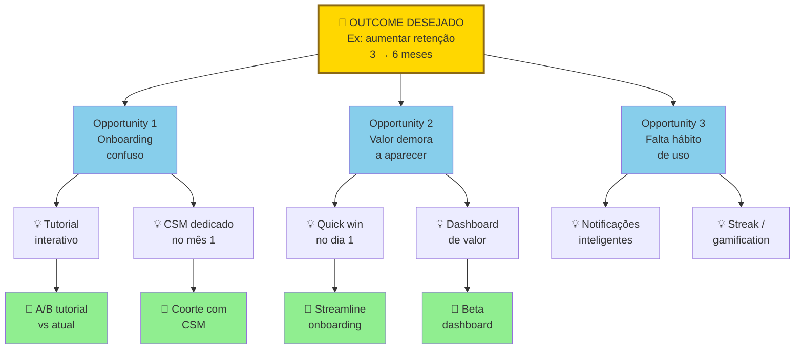
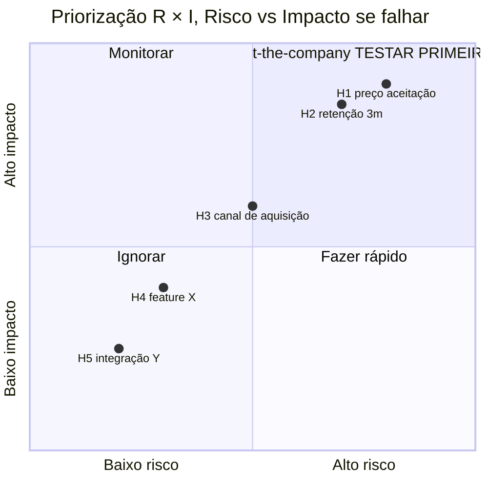
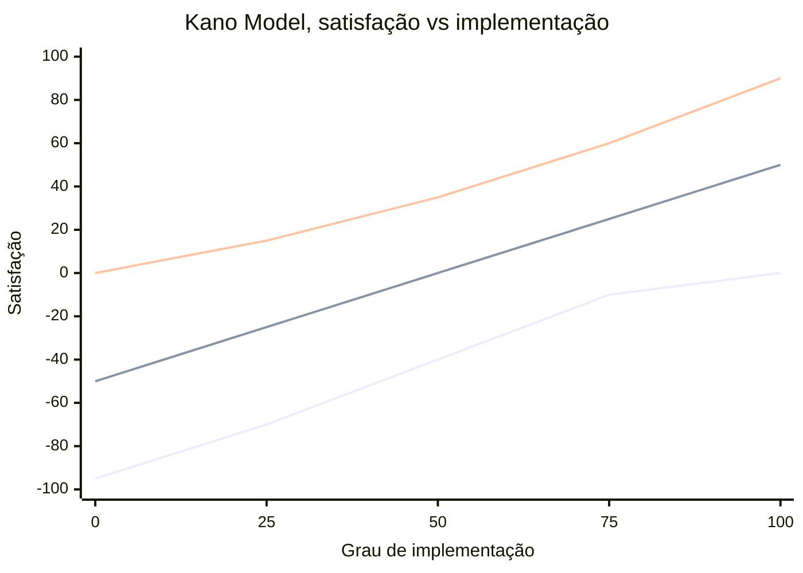

## APÊNDICE AB — PRODUTO EM ESCALA E DESCOBERTA CONTÍNUA

> [!note] Nota de validade
> Os frameworks de descoberta contínua (Teresa Torres), priorização (RICE, Kano, WSJF), Jobs to be Done, e design systems, têm vida útil longa. Ferramentas específicas evoluem a cada dezoito a vinte e quatro meses. Revisar nesse intervalo.

As Fases 2 a 11 cobrem produto até o PMF. Descoberta, validação, MVP, atingir fit. Depois disso, produto vira disciplina contínua, em contexto diferente. Time maior. Múltiplos stakeholders. Roadmap sendo disputado. Sistema complexo. Clientes com expectativas altas. Esse território pós-PMF fica subcoberto no manual até aqui.

Esse apêndice cobre como Product funciona em empresa pós-PMF escalando para cinquenta a duzentas pessoas. Onde a disciplina que fez você chegar até aqui é insuficiente para o que vem a seguir.

### O que esse apêndice cobre

Cinco territórios em Product pós-PMF. Descoberta contínua, pesquisa de usuário não para em PMF, evolui de exploratória para iterativa. Priorização, framework estruturado, não opinião do CEO ou HIPPO. Roadmap, como comunicação de aposta, não contrato de entrega. Design Systems, infraestrutura de UI que permite velocity em escala. Collaboration Product e Engineering, ritos, specs, definition of ready e done.

Os entregáveis são opportunity solution tree viva, framework de priorização aplicado, roadmap de três horizontes, design system documentado, e processo de spec até implementação.

### POR QUE

Empresa em escala precisa de produto como disciplina, não como intuição. O que funcionou no founder sozinho não escala para quatro squads em paralelo. Sem descoberta contínua, a empresa vira feature factory. Constrói o que stakeholders pedem, não o que gera valor.

Priorização sem framework é política. Quem grita mais alto, ou tem mais acesso ao CEO, ganha. Destrói moral, e qualidade. Design sem system vira caos visual. Inconsistência agride o usuário, e consome velocity de engineering. Product e Engineering sem ritos vira retrabalho. Specs vagas. Entregas erradas. Moral em queda.

### Quando usar

[[#FASE 12 — PRODUCT-MARKET FIT|Fase 12]], primeiras disciplinas estruturadas (descoberta contínua, e priorização leve). [[#FASE 14 — ESCALA: TIME, OPERAÇÕES, CRESCIMENTO E CAPITAL|[[#FASE 1 — ENCONTRAR A IDEIA|Fase 1]]4]] com primeiros Product Managers contratados, todos os territórios começam a importar. [[#FASE 14 — ESCALA: TIME, OPERAÇÕES, CRESCIMENTO E CAPITAL|[[#FASE 1 — ENCONTRAR A IDEIA|Fase 1]]4]] com múltiplos squads, Product Ops emerge como função. [[#FASE 14 — ESCALA: TIME, OPERAÇÕES, CRESCIMENTO E CAPITAL|[[#FASE 1 — ENCONTRAR A IDEIA|Fase 1]]4]] em diante, Design System e Platform Product Management.

### Quem envolve

CPO, ou VP Product, lidera disciplina. Product Managers, um PM por squad, e um a dois squads por PM senior. Product Designers, idealmente um designer por squad. User Researchers, um UR para dois a quatro squads em escala. Product Ops, uma pessoa dedicada a partir de cerca de seis PMs. Staff e Principal PMs, para problemas transversais, e iniciativas estratégicas.

### Como executar

#### 1. Descoberta Contínua, framework Teresa Torres

O problema resolvido. Evitar que o produto vire "o que o CEO quer", ou "o que clientes gritam mais alto". Mantendo foco em valor.

Os ingredientes em duas peças. Weekly interviewing habit, a equipe de produto entrevista pelo menos um usuário por semana. Toda semana. Opportunity Solution Tree, árvore visual que conecta outcome desejado (raiz, por exemplo "aumentar retenção de clientes de três para seis meses"), opportunities (galhos, problemas ou necessidades do usuário que, se endereçadas, movem o outcome), solutions (folhas, ideias de produto que endereçam a opportunity), e experiments (testes para validar se a solução move a opportunity).

A estrutura de uma Opportunity Solution Tree.

A árvore é viva, não documento morto. Descoberta semanal adiciona, e refina, nós. Se não atualiza em duas semanas, o hábito morreu.

O processo semanal em cinco passos. Entrevistar um a três usuários em torno do outcome atual. Adicionar opportunities novas na árvore, ou refinar existentes. Gerar solutions para opportunities que parecem promissoras. Escolher experiments para testar solutions. Executar o experiment, medir, ajustar.

> [!important] Papel do CPO em descoberta contínua
> Fazer a árvore viver. Revisão quinzenal. Evitar que vire documento morto. CPO que delega a árvore para PM júnior, e nunca olha de novo, garante que a descoberta vire teatro depois de três meses.

Livro-fonte. *Continuous Discovery Habits*, Teresa Torres.

#### 2. Priorização, frameworks aplicados

Framework define processo, não resultado. O resultado ainda é decisão humana informada.

**RICE (Reach, Impact, Confidence, Effort).** Reach, quantos usuários, ou clientes, afetados em período específico. Impact, quanto cada usuário ou cliente beneficiado (escala um a cinco, ou massive, high, medium, low, minimal). Confidence, quão seguros sobre Reach, e Impact (em percentual). Effort, pessoa-meses estimados. O score é (Reach vezes Impact vezes Confidence) dividido por Effort.

Matriz visual de priorização R x I.

O quadrante superior-direito (alto risco mais alto impacto se falhar) contém hipóteses bet-the-company. Essas são as que, se refutadas, destroem o negócio. Teste-as primeiro. Com mais rigor. Inferior-esquerdo (baixo risco mais baixo impacto), ignore. Não gere experimento. Útil para priorizar lista longa de features com dados.

**WSJF (Weighted Shortest Job First, do SAFe).** O score é (Business Value mais Time Criticality mais Risk Reduction ou Opportunity Enablement) dividido por Job Size. Útil para contexto mais enterprise, com coordenação entre múltiplos squads.

**Kano Model.** Categoriza features em cinco grupos. Basic (must-have), ausência frustra, presença não delighta. Performance, mais é melhor, linear. Delighter, inesperado, cria entusiasmo. Indifferent, o usuário não se importa. Reverse, o usuário prefere ausência.

Curvas do Kano Model (satisfação versus implementação).

> [!note] Compatibilidade — requer Mermaid 10+ (Obsidian 1.4+)

Três curvas principais. A linha inferior (Must-have) tem teto em zero. Ausência frustra, presença não delighta. A linha intermediária (Performance) é linear. Mais é melhor proporcional. A linha superior (Delighter) começa neutra, e sobe forte. Sequência: Basic, depois Performance, depois Delighter. Pular etapa destrói experiência. Útil para balancear "tapar buracos" com "criar amor".

**MoSCoW.** Must, Should, Could, Won't. Simples. Útil para alinhamento rápido de escopo em sprints.

**Opportunity Prioritization (Torres).** Dentro do Opportunity Solution Tree, escolher a próxima opportunity baseado em três critérios. Impacto esperado no outcome. Evidência acumulada (quantas entrevistas validam). Addressability (resolvível por solução factível).

A escolha do framework varia por estágio. [[#FASE 12 — PRODUCT-MARKET FIT|Fase 12]] a 13A, Opportunity mais RICE leve. [[#FASE 14 — ESCALA: TIME, OPERAÇÕES, CRESCIMENTO E CAPITAL|[[#FASE 1 — ENCONTRAR A IDEIA|Fase 1]]4]] (Operações em diante), RICE mais Kano. Enterprise com múltiplos squads, WSJF.

#### 3. Roadmap, comunicação de aposta

O problema clássico. Roadmap virou contrato. Cliente, vendedor, ou board, pede "quando X?". Produto responde data. A data não bate. A confiança erode.

A reformulação é roadmap de três horizontes.

Now (próximas quatro a oito semanas). Comprometido. Data, e escopo, claros. Entrega prevista com alta confiança.

Next (próximos dois a quatro meses). Direção clara. Escopo provável. Não comprometido em data.

Later (seis ou mais meses). Área de foco estratégico. Sem escopo, ou data, específicos.

As regras. Now é "contrato" interno. O time não muda exceto por emergência. Next é conversa regular. Pode mudar conforme aprendizado. Later é visão. Ajustada trimestralmente.

A comunicação. Sales tem acesso, com treinamento sobre o que comunicar externamente. O cliente recebe Now como certeza. Next como provável. Later como visão. O board vê os três com contexto estratégico.

#### 4. Design Systems, infraestrutura visual

Quando implementar. Quando há dois ou mais designers, e dez ou mais engenheiros front-end, trabalhando no mesmo produto.

Os componentes em quatro camadas. Tokens, cores, tipografia, espaçamentos, sombras (variáveis base). Components, botões, inputs, cards, modais, tabelas (composições). Patterns, flows comuns (auth, checkout, onboarding). Documentação, como usar, quando usar, e exemplos.

Storage. Design em Figma, com bibliotecas compartilhadas. Código em biblioteca de componentes em React, Vue, ou Svelte, com Storybook.

Ownership. Inicialmente, design e engineer compartilhados. Em escala, Design Systems Team (uma a três pessoas) full-time.

Ferramentas. Figma, Storybook, Chromatic (visual regression), Tailwind mais shadcn/ui como base comum.

#### 5. Product e Engineering, ritos e specs

**Spec (PRD, Product Requirements Document).** Spec moderno não é "documento de vinte páginas". Em formato moderno, tem seis peças. Problema, um a dois parágrafos sobre o problema, ou opportunity. Success metrics, o que vai mudar, quantificado. User stories, ou JTBD, cenários reais de uso. Scope IN e OUT, explícito. Mocks, ou wireframes, link para o Figma. Open questions, o que ainda precisa decidir. Tamanho ideal, duas a cinco páginas. Mais longo significa que o spec não convergiu.

**Definition of Ready (quando o spec está pronto para dev).** Problema, e solução, claros. Designs (mocks, ou hi-fi) prontos. Success metrics definidas. Scope congelado (mudanças viram nova spec). Engineering teve sessão de Q&A.

**Definition of Done (quando a feature está pronta).** Código em produção. Analytics instrumentado para success metrics. Documentação atualizada. QA passou. Comunicação a clientes, ou a Sales, feita (se aplicável).

**Os ritos.** Product triad weekly (PM mais Design mais Eng lead), sessenta minutos por semana, alinhamento contínuo. Sprint review quinzenal, demo mais feedback. Squad retrospective quinzenal, o que melhorar. Planning semanal, próxima semana, com clareza em cada item.

#### 6. Jobs to be Done aplicado em produto maduro

JTBD ([[#FASE 4 — PESQUISA COM USUÁRIOS (CUSTOMER DISCOVERY APROFUNDADO)|Fase 4]] na descoberta inicial) continua relevante em escala. Mas em forma evoluída.

**Switch interview (Alan Klement).** Entrevistar clientes que recentemente mudaram para o seu produto (de competidor, ou de nenhum produto). Mapear evento gatilho, forças puxando para mudança, forças resistindo à mudança, e forças puxando de volta. Output: entendimento profundo do "job" que o produto está sendo contratado para fazer.

Aplicação em roadmap. Features que reforçam pull forces do job principal valem mais do que features random. Mesmo que populares.

### Métricas

**Descoberta e validação.** Interviews por semana, ou mês, por squad. Opportunities na árvore (status: exploração, validação, ou endereçada). Experiments rodados por trimestre.

**Execução.** Cycle time (spec até produção). Escopo entregue versus planejado por sprint. Bug backlog.

**Impacto.** Impacto em North Star Metric por feature entregue. Adoption rate de novas features. Deprecation rate (features removidas por falta de uso).

**Organização.** PM e eng ratio (alvo de um para seis até um para dez). Design e eng ratio (alvo de um para cinco até um para oito). Squads autônomos (outcome definido, decisão local).

### Definição de sucesso

Produto em escala está no padrão quando os sete itens estão em pé.

1. Descoberta contínua é hábito (entrevistas semanais, OST viva).
2. Priorização usa framework documentado, não política.
3. Roadmap em três horizontes é comunicado, e respeitado.
4. Design System existe, e é usado em oitenta por cento ou mais de novas features.
5. Spec padrão implementado, com Definition of Ready e Done.
6. Squads autônomos operando com outcome claro.
7. Impacto de features é medido. Não suposto.

### Armadilhas

Feature factory. O time constrói o que stakeholders pedem, sem validação. Muito output. Pouco impacto.

Descoberta que para em PMF. "Atingimos PMF, agora é só escalar." Não. Descoberta continua em forma diferente.

Priorização baseada em quem grita. Sem framework, decisão política. Qualidade degrada.

Roadmap como contrato. Prometer data em "Later", e não cumprir. A confiança erode.

Design sem system. Cada feature com variação. UX inconsistente. Velocity destruída.

Spec vago. O engineer adivinha o que o PM queria. Retrabalho.

PM sem tempo para descoberta. Cem por cento do tempo em execution. Vira "project manager", não product.

HIPPO (Highest Paid Person's Opinion). O CEO muda roadmap em conversas de corredor.

Squad sem outcome claro. O time focado em output (features), não em outcome (métrica de negócio).

Métricas de vanity em review. "Lançamos doze features" não é sucesso. "Moveu a métrica X de Y para Z" é.

### Checklist

- [ ] Weekly interviewing habit implementado (todas as squads)?
- [ ] Opportunity Solution Tree existe, e é mantida ativa?
- [ ] Framework de priorização escolhido, e aplicado consistentemente?
- [ ] Roadmap em três horizontes (Now, Next, Later) documentado, e comunicado?
- [ ] Design System implementado, e adotado em novas features?
- [ ] Spec padrão (PRD) definido, com Definition of Ready e Done?
- [ ] Squads autônomos com outcome claro, não apenas lista de features?
- [ ] Product triad (PM, Design, Eng) em cadência semanal?
- [ ] Impacto de features é medido, e reportado?
- [ ] Switch interviews (JTBD aplicado) rodam periodicamente?

### Ver também

[[#APÊNDICE CB — SUBSCRIPTION ECONOMY EM PROFUNDIDADE: ALÉM DO "COBRA MENSALMENTE"|Apêndice CB]], Subscription economy. [[#APÊNDICE CC — PLATAFORMA VS PRODUTO: QUANDO CONSTRUIR PLATAFORMA E QUANDO NÃO|Apêndice CC]], Plataforma versus produto. [[#APÊNDICE AE — MARKETPLACE DYNAMICS E RISCO DE PLATAFORMA|Apêndice AE]], Marketplace dynamics. [[#APÊNDICE AA — CUSTOMER SUCCESS COMO DISCIPLINA|Apêndice AA]], Customer Success.

---
