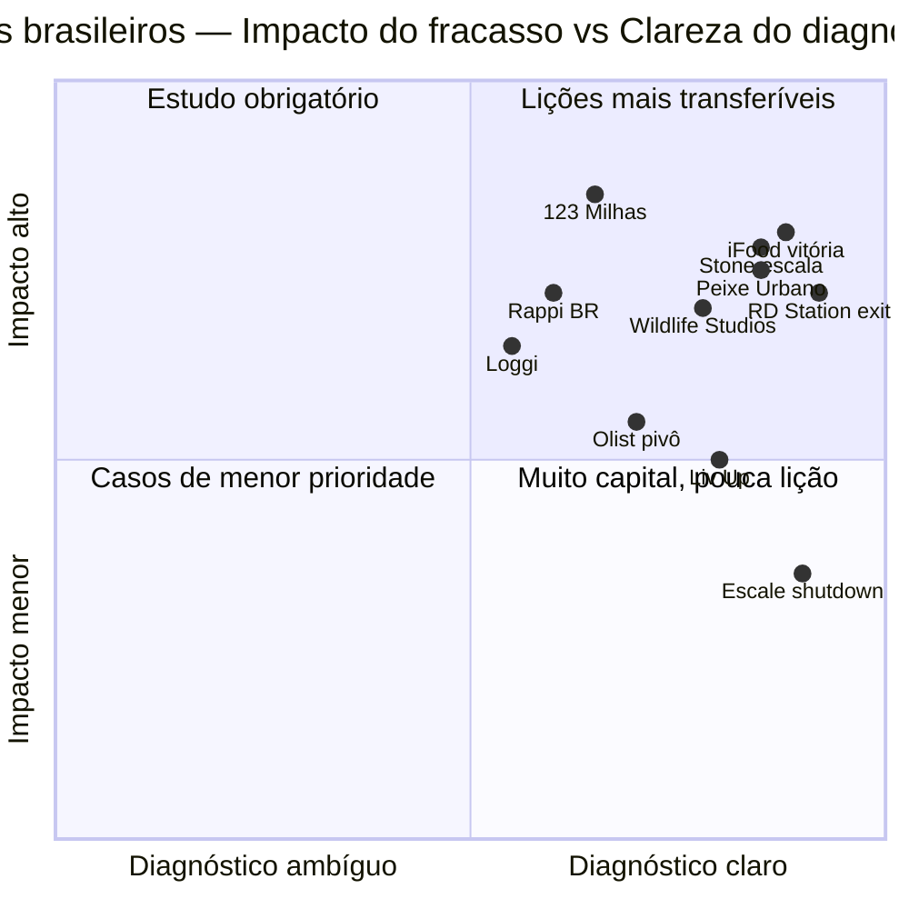

## APÊNDICE BH — POST-MORTEMS BRASILEIROS: CATÁLOGO DE CASOS EM PROFUNDIDADE

> [!note] Nota de integridade
> Esse apêndice complementa o [[#APÊNDICE AI — CASOS DE FRACASSO BRASILEIROS E LIÇÕES|Apêndice AI]] (que é temático e extrai padrões). Aqui, tratamos casos específicos brasileiros em profundidade individual, com nome da empresa, trajetória e análise honesta. Base: material público exclusivamente (reportagens, entrevistas de fundadores, relatórios financeiros de empresas listadas, livros e podcasts publicados). Nenhuma especulação sobre motivações pessoais. Quando contexto completo é desconhecido, declaramos. Propósito é aprender padrões com humildade analítica, não julgar pessoas.

### O que esse apêndice cobre

Catálogo de doze casos brasileiros: colapsos, dificuldades estruturais, vitórias com lições e casos em progresso com sinais ambíguos. Cada caso está estruturado em cinco seções. Contexto: quando, quem, mercado, tese original. Trajetória: marcos, números, eventos-chave. Diagnóstico: o que deu (ou está dando) errado. Contrafactuais: o que poderia ter mudado o curso, com humildade. Lições transferíveis: o que fundador hoje extrai.

### Por que importa

Casos em profundidade complementam padrões. O [[#APÊNDICE AI — CASOS DE FRACASSO BRASILEIROS E LIÇÕES|Apêndice AI]] traz sete padrões, abstratos por necessidade. Esse apêndice traz o tecido concreto: como o padrão se manifesta numa empresa real, quais foram os sinais, como foi a velocidade de degradação.

Empresas brasileiras têm contexto único (macro, regulação, capital, cultura). Cases americanos ensinam estratégia. Cases brasileiros ensinam adaptação local. Fundador aprende mais com fracasso detalhado que com sucesso detalhado, porque sucesso é multicausal e difícil de replicar, enquanto fracasso é diagnóstico com padrões emergentes. E honestidade analítica sobre o ecossistema brasileiro importa: celebrar só sucessos cria mitologia que desserve empreendedores iniciantes.

### Quando usar

Antes da [[#FASE 0 — PREPARAÇÃO DO EMPREENDEDOR|Fase 0]], para calibrar expectativa. Antes de decisão estratégica grande, lendo caso análogo ao que você considera. Em momento de tração forte, lendo casos de empresas que também voavam antes de cair (humildade analítica). Em decisão de captação ou exit, porque os casos ensinam dinâmicas de mercado de capital brasileiro.

### Organização dos casos

Os doze casos estão agrupados por natureza. Cada caso pode ser lido individualmente, a ordem não é estrita.

---

## Grupo 1 — COLAPSOS COM PADRÕES CLAROS

### Caso 1 — Peixe Urbano e o colapso do modelo daily deals

**Contexto:**
Peixe Urbano foi fundada em 2010 por Emerson Andrade, Alex Tabor e Julio Vasconcellos, inspirada no sucesso americano do Groupon. Modelo: email diário ofertando descontos agressivos (30-80%) em restaurantes, beleza, entretenimento, viagens. Cresceu explosivamente no primeiro ano, atingindo milhões de usuários em meses.

**Trajetória:**

- **2010-2011**: crescimento explosivo. Captação de US$ 75M (uma das maiores rodadas seed brasileiras da época). Expansão para 30+ cidades.
- **2011**: negociação com Groupon culmina em aquisição de ~US$ 300M em ações do Groupon pós-IPO.
- **2012-2013**: Groupon globalmente enfrenta queda massiva de ações (pico US$ 26 → vale de US$ 5). Valor de aquisição evapora.
- **2014-2015**: Groupon vende operação brasileira de volta. Peixe Urbano pivota múltiplas vezes.
- **2016**: aquisição por Baidu (Chinesa) por valor não-divulgado, estimativas de mercado apontam para fração do valor original.
- **2019-2020**: Peixe Urbano continua operando mas em escala drasticamente reduzida. Modelo daily deals essencialmente morto globalmente.

**Diagnóstico:**
Mercado daily deals tinha características de bolha: crescimento rápido de ambos os lados (consumidor ama desconto, comércio ama tráfego) sem retenção real. Comércios descobriram problemas estruturais: "caçadores de cupom" não viraram clientes recorrentes. Margem negativa em venda promocional não compensava em vendas subsequentes. Unit economics inexoravelmente degradavam: aquisição de consumidor barata no início, comércios desistiam após 1-2 ciclos, precisava de mais comércios para manter oferta, cada novo comércio adicionava menos valor. Competição global: Groupon, LivingSocial e outras queimaram capital simultaneamente, mercado inteiro descobriu que modelo não sustentava retenção. Timing infeliz do deal Groupon: aquisição em ações de empresa pré-IPO que desabaria, fundadores vendem quando mercado "quente" mas valor resulta em fração do esperado após 24 meses.

**Contrafactuais (com humildade):**

- Pivotar mais cedo para modelo diferente de relacionamento com consumidor? Possivelmente, mas modelo que virou viável (engagement, serviços recorrentes) já estava sendo explorado por outros.
- Vender deal no ponto mais alto em 2011? Deal efetivamente foi assim, problema foi que ações do Groupon despencaram depois.
- Não aceitar pagamento em ações do Groupon? Negociar em dinheiro era difícil dado tamanho do deal.

**Lições transferíveis:**

1. **Crescimento explosivo não é PMF**: é tração inicial potencialmente transitória. Validar retenção em coortes antes de assumir PMF.
2. **Unit economics devem melhorar com escala, não piorar**: se cada novo cliente/comércio custa mais que o anterior, modelo não escala.
3. **Pagamento em ações de empresa pública é risco**: avaliar lockup, volatilidade, trajetória antes de aceitar.
4. **Cuidado com modelos "que todo mundo está fazendo"**: hype global é sinal de possível bolha, maioria não sobrevive.
5. **Diversificação de saída**: dependência de um comprador (Groupon) limitou opções.

---

### Caso 2 — Easy Taxi: pioneira que perdeu a liderança

**Contexto:**
Easy Taxi foi fundada em 2011 no Rio de Janeiro por Tallis Gomes e Daniel Cohen, com Vinicius Gracia e Bernardo Bicalho integrando o time fundador nas primeiras semanas. Primeira a agregar táxis em app no Brasil, anteriormente à entrada de Uber. Rapidamente expandiu para mais de 30 países pelo mundo. Rocket Internet entrou como investidor a partir de 2012 e se tornou parceira-chave da expansão internacional.

**Trajetória:**

- **2011-2013**: crescimento explosivo. Primeira em vários mercados emergentes globais.
- **2013**: captação de US$ 15M (Série A). Expansão agressiva.
- **2014**: Uber entra no Brasil. Inicia transformação da categoria.
- **2014-2015**: captações adicionais ($80M+ totais). Batalhas regulatórias e de mercado em paralelo.
- **2016**: fusão com Cabify, com Easy Taxi operando sob marca Cabify em alguns mercados.
- **2019**: 99 (já adquirida por Didi em 2018 por US$ 600M-1B) e Uber dominam mercado brasileiro. Easy Taxi essencialmente desaparece.
- **2020-2025**: marca Easy Taxi sobrevive em nichos pequenos, operação principal encerrada em mercados maiores.

**Diagnóstico:**
Modelo de agregação sem lock-in real: Easy Taxi conectava táxis existentes a passageiros. Sem switching cost, passageiro ia onde tinha carro mais perto, motorista ia onde tinha corrida. Primeiro a chegar não se traduziu em liderança sustentável. Uber trouxe produto estruturalmente diferente: carros particulares, dispatch algorítmico, preço dinâmico, cashless desde sempre, experiência de usuário superior. Não era "concorrente direto", era categoria adjacente. 99 (inicialmente 99Taxis) também evoluiu: competiu agressivamente, captou capital, foi adquirida pela Didi (que trouxe playbook chinês de intensa competição). Expansão internacional diluiu foco: em 30+ países com operação rasa em cada um vs. concorrentes focados em poucos mercados com profundidade. Pivô tardio: quando tentou replicar modelo Uber (carros particulares), já era tarde, Uber dominava mindshare.

**Contrafactuais:**

- Focar em Brasil e 1-2 LatAm em vez de 30+ países globais? Possivelmente teria construído defensibilidade local mais forte.
- Lançar produto Uber-like antes da Uber chegar? Dependeria de ter visão e capital. Easy Taxi em 2011-2013 estava competindo com outros "agregadores de táxi", não antecipando mercado diferente.
- Merger com 99 mais cedo (em vez de Cabify)? Consolidação doméstica teria criado player mais forte.

**Lições transferíveis:**

1. **Primeiro no mercado não é defensibilidade**. Network effects superficiais (agregação sem lock-in) são fracos.
2. **Produto estruturalmente superior vence first-mover**. Uber não competiu com Easy Taxi, redefiniu categoria.
3. **Expansão geográfica excessiva dilui foco**. Rocket Internet pressionou por 30+ países, resultado foi presença rasa em todos.
4. **Categoria pode mudar embaixo dos seus pés**. Vigilância contínua sobre mudanças estruturais.
5. **Capital é condição necessária mas não suficiente**: Easy Taxi captou muito, não salvou.

---

### Caso 3 — 123 Milhas: colapso de modelo que dependia de crescimento perpétuo

**Contexto:**
123 Milhas foi fundada em 2013 por Ramiro Madeira em Belo Horizonte. Modelo inicial: venda de passagens aéreas com desconto, financiadas por antecipações e contratos com adiantamento dos clientes. Cresceu para virar uma das maiores agências de viagens online do Brasil.

**Trajetória:**

- **2013-2019**: crescimento consistente em nicho de turismo acessível.
- **2020**: pandemia afeta operação mas empresa sobrevive.
- **2021-2022**: crescimento acelerado, faturamento em torno de R$ 2-3 bilhões.
- **2023 (agosto)**: anúncio abrupto de suspensão de pacotes e cancelamento de reservas pagas antecipadamente. Milhares de clientes afetados. R$ 2,3 bilhões em reservas pendentes estimadas.
- **2023 (setembro)**: pedido de recuperação judicial.
- **2024-2025**: recuperação judicial em andamento, disputa judicial com clientes, intervenção de órgãos de defesa do consumidor.

**Diagnóstico:**
Modelo dependia de fluxo de caixa antecipado crescente: clientes pagavam antecipadamente, empresa usava caixa para operar e para campanhas agressivas, sucesso dependia de **sempre entrar mais dinheiro do que sair**. Descasamento fundamental: passagens emitidas no futuro (6-18 meses depois) com dinheiro já gasto. Se fluxo de novos clientes caísse, descasamento viraria insolvência. Crescimento dos ingressos virou dependência: empresa precisava crescer para honrar compromissos antigos. Pirâmide financeira em essência, sem necessariamente intenção de fraude, modelo estruturalmente frágil. Mudanças de mercado: alta dos preços de passagens aéreas, fim de subsídios de pandemia a companhias, custos de combustível, tudo pressionando modelo que já operava em margem fina. Ausência de reservas regulatórias: diferentemente de operadoras formais de turismo, 123 Milhas operava com estrutura societária que não exigia reservas de capital correspondentes a compromissos futuros.

**Contrafactuais:**

- Modelo alternativo com garantia de emissão em janela menor? Reduziria risco mas também reduziria competitividade de preço.
- Estruturação como operadora com reservas técnicas? Mudaria regime regulatório e custos.
- Suspensão controlada de novas vendas em 2022-2023 quando sinais apareciam? Possivelmente, mas teria sinalizado problemas ao mercado e acelerado crise.

**Lições transferíveis:**

1. **Modelos com caixa antecipado e entrega futura são frágeis**. Se fluxo cai, insolvência é imediata.
2. **Regulação existe por razão**. Operadoras de turismo têm reservas exigidas, quem opera fora do regime corre risco maior.
3. **Crescimento obrigatório para sobrevivência é red flag**. Empresas saudáveis conseguem estabilizar em qualquer tamanho.
4. **Transparência com clientes em tempo de crise**: anúncio abrupto destruiu qualquer chance de solução ordenada.
5. **Empresa que não pode fazer pausa sem quebrar é empresa em risco permanente**.

---

### Caso 4 — Hi Technologies: IPO desastroso e lições de governança

**Contexto:**
Hi Technologies (Laboratório Hi Tech) foi fundada em 1985 por Vagner Nardi, focada em diagnóstico médico. Em 2020, na onda de IPOs de empresas ligadas à pandemia, realizou IPO na B3.

**Trajetória:**

- **Pré-IPO (até 2020)**: empresa estabelecida em diagnóstico laboratorial, com expansão em kits de teste durante pandemia.
- **Setembro 2020**: IPO na B3 a R$ 13,50/ação. Captação de ~R$ 700M.
- **Final 2020 - início 2021**: ação sobe para ~R$ 18-20.
- **2021-2022**: problemas começam a emergir. Questionamentos sobre receita, governança, auditoria.
- **2023-2024**: ações em queda livre. Investigações. Suspensão da negociação em momentos.
- **2024-2025**: ações valendo fração do preço de IPO. Processos em curso.

**Diagnóstico:**
Timing de IPO em janela favorável demais: pandemia criou apetite por qualquer empresa de saúde/diagnóstico, premissas otimistas passaram sem escrutínio profundo. Governança pré-IPO insuficiente: empresa familiar transitando para listada precisa de estrutura robusta. Transição pode ter sido apressada. Dependência de receita pandêmica: testes COVID geraram receita excepcional, contração pós-pandemia expôs fragilidade estrutural. Estrutura de controle familiar: não é erro intrínseco, mas exige governança ainda mais rigorosa em empresa listada. Conflitos aparentes entre controle familiar e interesse de acionistas minoritários. Mercado de capital brasileiro: IPO em janela quente vs. empresa genuinamente preparada é distinção importante.

**Contrafactuais:**

- IPO 12-18 meses depois, com estrutura mais robusta e governança madura? Possivelmente teria melhor trajetória pós-listagem.
- Transição para S.A. e profissionalização antes do IPO? Processo exige tempo que janela de mercado não permite.
- Due diligence mais rigorosa por underwriters? Mercado aquecido reduz rigor, é padrão.

**Lições transferíveis:**

1. **Janela de mercado quente não justifica IPO prematuro**. Empresa precisa estar genuinamente pronta.
2. **Governança pré-IPO é investimento, não despesa**. Estrutura robusta protege empresa e fundadores em longo prazo.
3. **Receita extraordinária pandêmica não deve ser extrapolada**. Separar receita recorrente de receita conjuntural.
4. **Transição de empresa familiar para listada exige maturidade de décadas**, não meses.
5. **Mercado brasileiro cobra caro pós-IPO problemático**: confiança institucional perdida leva anos para reconstruir.

---

### Caso 5 — Americanas: fraude contábil e fim de era

**Contexto:**
Americanas S.A. é uma das mais antigas empresas brasileiras (fundada em 1929). Varejista histórica, com operações físicas e digitais, parte do controle do trio 3G Capital (Lemann, Telles, Sicupira) desde 1982. Em janeiro de 2023, empresa divulgou descoberta de "inconsistências contábeis" de ~R$ 20 bilhões, depois revisadas para R$ 40+ bilhões.

**Trajetória (crise):**

- **Janeiro 2023**: CEO recém-empossado (Sergio Rial) divulga "inconsistências contábeis". Ação despenca 80%+ em um dia. Rial renuncia em 10 dias.
- **Janeiro 2023**: pedido de recuperação judicial.
- **Fevereiro-Junho 2023**: investigações avançam. Esquema envolve contabilização indevida de "risco sacado", operações com fornecedores classificadas incorretamente como fluxo operacional, ocultando dívida efetiva.
- **2024-2025**: recuperação judicial em andamento. Acordos com credores. Investigações criminais. Processos contra administradores, auditores (PwC), reguladores.

**Diagnóstico:**
Fraude contábil estruturada por anos: não foi erro, foi prática deliberada de ocultar dívida operacional. Falha de auditoria: auditor externo (PwC) assinou balanços por anos. Mecanismos de controle falharam. Falha de governança: conselho, comitê de auditoria, controladores, múltiplas camadas de governança falharam. Pressão competitiva: varejo físico perdendo para e-commerce, pressão para mostrar desempenho pode ter incentivado distorções. Controladores de peso: 3G Capital é referência global de governança, caso gera questionamentos sobre como fraude passou.

**Contrafactuais:**

- Não é "se fundador tivesse feito diferente", é caso de governança sistêmica falhando. Múltiplos atores (administradores, auditores, conselho) falharam simultaneamente.
- Sistema de denúncias internas mais robusto poderia ter revelado antes? Possivelmente.

**Lições transferíveis:**

1. **Fraude contábil destrói valor irrecuperavelmente e rápido**. R$ 40+ bilhões em valor de mercado evaporaram em dias.
2. **Governança robusta não é garantia contra fraude**, mas é a única defesa estrutural. Sistemas múltiplos de verificação independente são essenciais.
3. **Auditoria externa é segunda linha, não primeira**. Controles internos são primeira linha, auditoria verifica.
4. **Pressão de mercado pode corromper cultura**: quando competir "limpo" parece insuficiente, alguns recorrem a atalhos contábeis.
5. **"Risco sacado" e outras práticas financeiras complexas precisam de controles**: empresa grande tem múltiplos instrumentos, cada um exige controle específico.
6. **Para startup**: estabelecer cultura de transparência contábil **desde o início**. É muito mais fácil criar cultura que corrigir depois.

---

## Grupo 2 — DIFICULDADES ESTRUTURAIS E APRENDIZADOS

### Caso 6 — Kekanto e a featurização por plataformas globais

**Contexto:**
Kekanto foi fundada em 2008 por Eduardo Henrique. Plataforma brasileira de reviews de restaurantes, comércio local, serviços. Modelo semelhante a Yelp e TripAdvisor. Atingiu ~5 milhões de usuários em seu pico.

**Trajetória:**

- **2008-2012**: crescimento em categoria emergente.
- **2012-2014**: expansão, captações. Posição forte em reviews locais no Brasil.
- **2014 em diante**: Google Maps incorpora reviews como feature central. TripAdvisor expande. Foursquare/Swarm no auge. Facebook adiciona recomendações.
- **2015-2018**: declínio gradual de tráfego e engajamento.
- **2018+**: encerramento ou operação residual. Empresa efetivamente desaparece do mainstream.

**Diagnóstico:**
Featurização clássica: categoria "reviews de lugares" virou feature de plataforma dominante (Google Maps) em vez de produto próprio. Usuário já estava na plataforma global para outras coisas: busca no Google, navegação com Google Maps. Reviews integradas ali eliminavam razão para Kekanto. Sem defensibilidade específica: conteúdo (reviews) não tinha efeito de rede forte em dimensão local. Google agregou reviews de múltiplas fontes e dominou. Transição gradual não provocou reação: decline lento é mais difícil de diagnosticar que colapso abrupto. Quando empresa percebeu escala do problema, já era tarde.

**Contrafactuais:**

- Pivotar para nicho vertical (reviews de restaurantes de alta gastronomia, reviews B2B, reviews com componente profissional)? Possivelmente.
- Integrar-se com Google Maps como provedor de dados? Poderia ter virado empresa menor e sustentável.
- Expandir para serviços além de reviews (reservas, pagamentos, fidelidade)? Tentativas foram feitas mas sem escala.

**Lições transferíveis:**

1. **Featurização é risco categorial**. Pergunta constante: "se Google/Amazon/Meta virar isso em feature, sobrevivo?"
2. **Decline gradual é mais difícil de combater que colapso**. Sintomas demoram a ser claros.
3. **Conteúdo gerado por usuários não é moat se plataforma maior pode agregar**. Google indexou reviews de todos.
4. **Network effects precisam ser fortes e locais**: reviews genéricas não têm efeito de rede forte.
5. **Janela para pivô existe mas fecha**: empresa em categoria featurizada tem 2-4 anos tipicamente, depois é exit ou fim.

---

### Caso 7 — Brainn: bootstrap até aquisição

**Contexto:**
Brainn.co foi fundada em 2013 por Andre Castellar e outros, como consultoria digital boutique em Curitiba. Bootstrapped (sem captação de venture capital). Construiu reputação em desenvolvimento de software de qualidade, especialmente em setores regulados (saúde, financeiro).

**Trajetória:**

- **2013-2018**: crescimento orgânico. ~30-50 pessoas. Qualidade reconhecida no ecossistema tech brasileiro.
- **2019**: expansão cuidadosa. ~80 pessoas.
- **2020-2021**: adquirida por DXC Technology (gigante global de serviços). Valor não-divulgado, estimativas apontam para múltiplos saudáveis sobre receita.
- **Pós-aquisição**: integração com DXC. Fundadores permaneceram por período de transição.

**Diagnóstico (sucesso com aprendizados):**

- **Escolha deliberada de bootstrap**: nunca captou VC. Crescimento mais lento mas controle total.
- **Foco em nicho de qualidade**: não competiu em escala, competiu em excelência técnica.
- **Cultura consistente**: baixo turnover, forte engajamento, marca empregadora forte em tech BR.
- **Exit não por urgência, mas por fit estratégico**: DXC trouxe escala internacional que Brainn não conseguiria organicamente.

**Lições transferíveis (no lado positivo):**

1. **Bootstrap é caminho viável** quando mercado e margem permitem. Não é inferior, é diferente.
2. **Nicho de excelência vale mais que escala ruim**. Cliente paga premium por qualidade em serviço profissional.
3. **Cultura pode ser moat sustentável**. Talento top vai onde se sente valorizado.
4. **Exit por estratégia, não por desespero**: melhor posição de negociação.
5. **Cidade secundária pode ser vantagem**: menos competição por talento, custos menores, diferenciação cultural.

**Limitações do modelo:**

- Escala é inerentemente menor. Bootstrap não chega a unicórnio tipicamente.
- Fundadores carregam risco por mais tempo.
- Janela de exit mais estreita (menos compradores naturais para boutique).

---

### Caso 8 — Enjoei: IPO, correção e aprendizado de escala

**Contexto:**
Enjoei foi fundada em 2009 por Tiê Tavares e Ana Luiza McLaren. Marketplace de moda usada com estética curada. Começou como blog, virou plataforma. Posicionamento de "consumo consciente" antes de ser tendência mainstream.

**Trajetória:**

- **2009-2016**: crescimento orgânico, posicionamento único, base fiel.
- **2017-2019**: captações, crescimento acelerado.
- **Novembro 2020**: IPO na B3. Captação R$ 1,1 bilhão. Ação abre a R$ 10,25.
- **2021**: ação sobe para pico ~R$ 20.
- **2022-2023**: correção profunda. Ação cai para ~R$ 0,80-1,50. Market cap evapora de ~R$ 2,5 bilhões para ~R$ 200M.
- **2024-2025**: empresa opera, ajustando estrutura de custos e buscando viabilidade em estrutura mais enxuta.

**Diagnóstico:**
Expansão agressiva pós-IPO: com capital de R$ 1,1 bilhão, empresa investiu pesadamente em crescimento. Marketing, operações, estrutura. Unit economics em pressão: marketplace de moda usada tem ticket baixo, frete caro, margem apertada. Escala não necessariamente melhorou unit economics. Tech stack e operações em expansão rápida: problemas operacionais, reclamações de usuários em volume. Mercado público impiedoso com queda de crescimento: empresa listada enfrenta pressão trimestral. Empresa sobreviveu: diferentemente de casos 1-5, Enjoei continua operando com ajustes. Lição é sobre **calibração**, não colapso total.

**Contrafactuais:**

- IPO menor (captação R$ 300-500M em vez de R$ 1,1 bi)? Teria menos pressão para crescimento agressivo.
- Manutenção de foco em nicho de "consumo consciente" em vez de marketplace amplo? Diferenciação mais sustentável.
- Fase privada mais longa antes de IPO? Modelo mais testado antes de escrutínio público.

**Lições transferíveis:**

1. **IPO não resolve problemas, expõe eles**. Capital público não cria unit economics, requer que já existam.
2. **Pressão trimestral muda incentivos**. Decisões que faziam sentido em privado podem prejudicar em pública.
3. **Marketplace vertical com margem fina precisa de volume absurdo**. Avaliar realisticamente se modelo chega lá.
4. **Diferenciação de nicho pode ser mais defensável que liderança em categoria ampla**.
5. **Sobrevivência é sucesso**: Enjoei continua existindo, calibrou estrutura de custos. Fundadores aprenderam e ajustaram. Caminho não-linear é caminho comum.

---

### Caso 9 — Loggi: hypergrowth e calibração pós-ajuste

**Contexto:**
Loggi foi fundada em 2013 por Fabien Mendez. Serviço de delivery/last-mile, começando com motoboys em São Paulo e expandindo para mercado de encomendas e-commerce. Atingiu status de unicórnio em 2019.

**Trajetória:**

- **2013-2017**: crescimento em nicho de motoboys urbanos.
- **2018-2019**: pivô para e-commerce delivery. Captações crescentes. Unicórnio em 2019 (valuation US$ 1 bi+).
- **2020-2021**: explosão com pandemia. Expansão agressiva. Rumores de IPO iminente.
- **2022-2023**: IPO adiado indefinidamente. Correção de expectativas. Demissões significativas.
- **2024-2025**: empresa opera, focada em eficiência operacional e caminho para lucratividade.

**Diagnóstico:**
Last-mile delivery tem unit economics estruturalmente desafiadoras: frete, operação, escala de logística. Margens são pequenas mesmo em escala. Crescimento pandêmico foi conjuntural: e-commerce cresceu desproporcionalmente, estrutura de custos cresceu proporcional, mercado normalizou e estrutura ficou sobredimensionada. Pressão de valuation: empresa que captou em valuation alto precisa crescer agressivamente ou aceitar down-round. Competição intensa: mercado de last-mile tem múltiplos players (Mercado Livre com logística própria, Correios, entregas nativas de varejistas, múltiplas startups). Ajustes operacionais significativos: demissões, revisão de rotas, foco em eficiência.

**Contrafactuais:**

- Expansão mais conservadora durante pandemia? Difícil, mercado parecia crescer permanentemente.
- IPO em 2021 na janela quente? Possivelmente teria captado mais capital mas também expôs problemas mais cedo.
- Foco em nicho mais rentável (delivery premium, B2B)? Possivelmente maior margem mas menor escala.

**Lições transferíveis:**

1. **Crescimento conjuntural não deve virar estrutural**: se demanda cresceu por razão extraordinária, estrutura não deve assumir permanência.
2. **Unit economics de logística são estruturalmente difíceis**: margem baixa, escala exigida é enorme, competição intensa.
3. **IPO adiado não é fracasso**: ajustar timing é decisão correta se condições não estão prontas.
4. **Correção é dolorosa mas necessária**: demissões em massa são fracasso, mas aceitar cedo é melhor que cortar tarde.
5. **Empresa sobrevive ajustando**: ajuste estrutural não é fim.

---

## Grupo 3 — VITÓRIAS COM LIÇÕES TRANSFERÍVEIS

> [!note] Mapa dos padrões — todos os grupos
> Antes de ler os casos individuais, o mapa abaixo mostra como os doze casos se distribuem pelos sete padrões arquetípicos. Use como guia de navegação rápida.

| Padrão de fracasso | Casos arquetípicos | Fase de risco |
|---|---|---|
| 1. Sem defensibilidade estrutural | Easy Taxi | [[#FASE 5 — MAPEAMENTO DE MERCADO E CONCORRÊNCIA|Fase 5]]-6 |
| 2. PMF falso (retenção não existe) | Peixe Urbano, daily deals | [[#FASE 11 — VALIDAÇÃO DO MODELO DE NEGÓCIO|Fase 11]]-12 |
| 3. Unit economics ruins em escala | Delivery verticais 2014-17, Liv Up | [[#FASE 11 — VALIDAÇÃO DO MODELO DE NEGÓCIO|Fase 11]]-14 |
| 4. Dependência de fundador único | Múltiplos casos | [[#FASE 13 — ESTRUTURAÇÃO JURÍDICA, FINANCEIRA E OPERACIONAL|Fase 13]]-14 |
| 5. Mudança estrutural ignorada | Kekanto, reviews locais | [[#FASE 14 — ESCALA: TIME, OPERAÇÕES, CRESCIMENTO E CAPITAL|Fase 14]]-15 |
| 6. Sobreextensão geográfica precoce | Rappi, múltiplos LatAm | [[#FASE 14 — ESCALA: TIME, OPERAÇÕES, CRESCIMENTO E CAPITAL|Fase 14]] |
| 7. Perda de momentum de produto | Casos variados em escala | [[#FASE 14 — ESCALA: TIME, OPERAÇÕES, CRESCIMENTO E CAPITAL|Fase 14]]-15 |

### Caso 10 — iFood: vitória brutal contra Rappi e lições de execução

**Contexto:**
iFood foi fundada em 2011 por Patrick Sigrist, Felipe Fioravante, Eduardo Baer, Guilherme Bonifácio e Daniel Oliveira. Modelo inicial: agregador de restaurantes para pedidos. Adquirida por Movile (subsidiária da Naspers/Prosus) em 2013. Competiu com múltiplos players, vitória decisiva contra Rappi em 2018-2022 consolidou liderança.

**Trajetória:**

- **2011-2015**: crescimento nacional com consolidação de players locais.
- **2016-2018**: competição com Rappi (colombiana) que entrou agressivamente no BR. iFood respondeu com investimento massivo (Movile/Prosus injetou bilhões).
- **2018-2021**: "guerra de delivery". Ambos queimaram capital. iFood venceu em escala e presença.
- **2022**: Rappi reduziu operação BR substancialmente, iFood consolidou liderança.
- **2023-2025**: iFood em operação dominante, em busca de rentabilidade sustentada.

**Diagnóstico (vitória com contexto):**

- **Backing de Prosus foi fundamental**: capital "paciente" e em volume massivo permitiu suportar guerra prolongada.
- **Execução operacional superior**: iFood aprendeu rápido, adaptou localmente, construiu relações com restaurantes.
- **Cobertura nacional antes de Rappi entrar**: iFood já tinha presença em milhares de cidades. Rappi precisaria expandir em paralelo à competição.
- **Vantagem de dados**: iFood acumulou dados comportamentais por anos antes.
- **Brand local**: "iFood" virou verbo no Brasil ("vou pedir iFood").

**Contrafactuais (lado Rappi):**

- Rappi poderia ter focado só em LatAm fora do BR? Possivelmente, mas ausência do BR era problemática para thesis LatAm.
- Aliança com player local em vez de entrada direta? iFood provavelmente não aceitaria. Uber Eats também tentou e falhou.

**Lições transferíveis:**

1. **Defender liderança em mercado atacado exige capital e execução simultâneos**.
2. **Corporate VC paciente (Prosus) permitiu iFood suportar guerra que outras empresas teriam perdido**.
3. **Primeira escala em mercado doméstico é defensibilidade real** quando network effects existem de verdade (dois lados: restaurantes e consumidores).
4. **Execução é vantagem competitiva quantificável**: melhor app, mais restaurantes, entregas mais rápidas consistentemente ganham.
5. **Brand como substantivo** ("iFoodar") é marca de dominância.

---

### Caso 11 — Nubank: sucesso, mas com lições de trajetória longa

**Contexto:**
Nubank foi fundada em 2013 por David Vélez (colombiano), Cristina Junqueira (brasileira) e Edward Wible (americano). Tese: construir banco digital no Brasil desafiando oligopólio bancário (Itaú, Bradesco, Santander, BB, Caixa). Começou com cartão de crédito sem anuidade.

**Trajetória:**

- **2013-2015**: construção do produto. Lista de espera de centenas de milhares.
- **2015-2018**: crescimento viral. Cartão de crédito digital vira fenômeno.
- **2019-2021**: expansão para conta digital, crédito, investimentos, México, Colômbia.
- **Dezembro 2021**: IPO na NYSE. Valuation pico ~US$ 50 bilhões.
- **2022-2023**: correção macro global afeta ações. Queda significativa no valuation.
- **2024-2025**: recuperação. Empresa atinge lucratividade sustentada. Valuation se recupera parcialmente.

**Lições transferíveis (vitória com contexto):**

1. **Timing de mercado foi importante**: bancos tradicionais tinham NPS baixíssimo e produtos ruins. Janela existia.
2. **Foco em experiência do cliente como moat**: simplicidade, sem anuidade, design, tudo construído contra o que bancos faziam.
3. **Backing de VC internacional top-tier** (Sequoia, Tiger Global, Berkshire Hathaway posteriormente): capital e credibilidade.
4. **Fundador com skin in the game**: David Vélez não brasileiro, vinha de Sequoia, não tinha laços com incumbentes, visão de outsider ajudou.
5. **Persistência em thesis longa**: 8+ anos até IPO. Short-term thinking não funcionaria.
6. **Expansão internacional pós-PMF sólido**: México e Colômbia depois de domínio no Brasil.
7. **Correção pós-IPO é parte da jornada**: empresa madura sobrevive correção de mercado, não-madura quebra.

**Limitações do modelo:**

- Replicar Nubank é praticamente impossível, timing, capital, talento, janela regulatória foram excepcionais.
- Outras fintechs (Inter, C6, Stone) são sucessos também mas em trajetórias próprias.
- Sucesso não é garantia de lucratividade, Nubank atingiu lucratividade só em 2023-2024 após uma década de operação.

---

### Caso 12 — Ebanx: de bootstrapped em Curitiba a IPO adiado

**Contexto:**
Ebanx foi fundada em 2012 por Alphonse Voigt, Wagner Ruiz e João Del Valle em Curitiba. Inicialmente: gateway de pagamento para empresas internacionais venderem no Brasil (cross-border payments). Foco em pagamentos locais (boleto, parcelamento) para e-commerce internacional.

**Trajetória:**

- **2012-2017**: crescimento orgânico, bootstrapped por anos. Foco em cross-border para Brasil.
- **2018-2021**: expansão LatAm. Captações. Atingiu unicórnio.
- **2021**: planejou IPO nos EUA com valuation alvo ~US$ 10 bi.
- **2022**: IPO adiado devido a condições de mercado.
- **2022-2023**: ajustes operacionais, demissões.
- **2024-2025**: empresa opera, processos de exit em avaliação.

**Diagnóstico:**
Bootstrap inicial foi vantagem e limitação: construiu negócio sustentável sem queimar, mas escala demorou. Captação grande em 2021 foi em janela quente: valuations inflados. IPO adiado não é fracasso: empresa continua operacional, ajustando. Modelo tem margem comprimida: processamento de pagamentos é commodity em competição com gigantes (Stripe, Adyen, players locais). Vantagem em LatAm específica: conhecimento profundo de pagamentos locais (boleto, PIX, OXXO) é diferencial difícil de replicar.

**Lições transferíveis:**

1. **Bootstrap longo pode construir negócio real antes de capital**: Ebanx provou viabilidade por 6+ anos antes de grande captação.
2. **Expansão para LatAm como thesis**: fit entre Brasil e outros mercados LatAm em pagamentos é real.
3. **Valuation em janela quente vira âncora quando janela fecha**: captar em múltiplo alto cria pressão difícil de sustentar.
4. **Cidade secundária pode ser vantagem em atração de talento e retenção**: Curitiba tem menos competição por talento tech que São Paulo.
5. **Processos de pagamento são complexos e defensíveis**: Ebanx construiu relações regulatórias e operacionais em cada país ao longo de anos.

---

## PADRÕES TRANSVERSAIS NOS 12 CASOS

Lendo os casos transversalmente, cinco padrões emergem:

**1. Unit economics são destino.** Peixe Urbano, 123 Milhas, delivery verticais, e outros modelos com unit economics problemáticos eventualmente colapsaram ou foram drasticamente ajustados. Loggi, iFood enfrentaram desafios estruturais de margem fina. Sem unit economics que melhoram com escala, capital atrasa mas não evita o desfecho.

**2. Defensibilidade exige esforço deliberado.** Easy Taxi e Kekanto tinham liderança de tempo mas não de estrutura. Uber e Google não eram "concorrentes diretos", redefiniram categorias. Empresas vencedoras (iFood, Nubank) construíram moats ativamente: rede densa, dados proprietários, relacionamento regulatório, experiência superior.

**3. Governança escala mais devagar que operação.** Americanas, Hi Technologies, e outros casos de problemas em empresas listadas ou grandes mostram que governança precisa ser construída ativamente. Crescimento operacional é mais fácil que crescimento de governança.

**4. Janela de mercado importa mas não define.** Nubank aproveitou janela, bancos demoraram a reagir. Mas janela fechada não é desculpa, Brainn venceu em nicho apesar de não ter janela favorável. iFood derrotou Rappi em guerra onde ambos tinham capital.

**5. Correção é regra, não exceção.** Enjoei, Loggi, Ebanx tiveram ajustes significativos sem colapsar. Nubank teve correção pós-IPO e recuperou. Empresas que aprendem a corrigir sobrevivem, que não corrigem morrem.

---

## MÉTRICAS E AUTOAVALIAÇÃO

Use os 12 casos como lente para sua empresa:

| Caso/Padrão | Pergunta para sua empresa | Ação se resposta é "sim" |
|---|---|---|
| Peixe Urbano | Minha tração é retenção real ou novidade+capital? | Medir cohort de 6+ meses |
| Easy Taxi | Sou primeiro sem defensibilidade? | Construir moat ativo |
| 123 Milhas | Dependo de fluxo de caixa crescente para honrar compromissos? | Revisitar modelo urgentemente |
| Hi Technologies | Meu IPO (se planejado) é por janela ou por prontidão? | Adiar se não pronto |
| Americanas | Tenho controles internos independentes da administração? | Implementar antes de crescer |
| Kekanto | Featurização por big tech é ameaça real? | Construir defensibilidade específica |
| Brainn | Bootstrap é viável em meu mercado? | Considerar vs. VC |
| Enjoei | IPO captaria mais do que preciso? | Calibrar captação |
| Loggi | Crescimento atual é conjuntural ou estrutural? | Separar receitas |
| iFood | Liderança em mercado doméstico está consolidada? | Antes de expandir |
| Nubank | Minha thesis sobrevive 8+ anos? | Alongar horizonte |
| Ebanx | Bootstrap pré-capital traz vantagem? | Considerar |

### Definição de sucesso

Você aplicou esse apêndice bem quando identificou três a cinco casos análogos ao seu contexto, extraiu de cada caso relevante uma lição específica transferível, usou padrões transversais para autoavaliação trimestral e compartilhou casos relevantes com time executivo e board.

### Armadilhas

> [!warning] Armadilhas ao estudar post-mortems
> "Não é meu caso" é padrão comum antes do colapso. Cada um desses fundadores provavelmente disse o mesmo em algum momento. Julgar em retrospecto distorce: decisões que parecem óbvias hoje eram ambíguas no momento. Copiar vencedores sem contexto é erro simétrico: Nubank é irrepetível, lições gerais sim, receita específica não. Ignorar casos porque são "grandes demais" é desperdício, porque padrões se manifestam em qualquer tamanho. Leitura de uma só vez é insuficiente: revisitar periodicamente conforme empresa evolui.

> [!tip] Checklist
> Li os doze casos ao menos uma vez? Identifiquei três a cinco mais análogos à minha situação? Extraí lição específica de cada análogo? Revisitei quando empresa atinge milestone importante (primeira captação, cinquenta funcionários, internacionalização, IPO)? Compartilho lições com cofundadores e board? Consigo dizer "o que não faria" tão claramente quanto "o que farei"?

### Ver também

[[#APÊNDICE AI — CASOS DE FRACASSO BRASILEIROS E LIÇÕES|Apêndice AI]] cobre casos de fracasso brasileiros (temático). [[#APÊNDICE CW — CRISE E CONTINUIDADE: PREVENÇÃO, RESPOSTA, RECUPERAÇÃO|Apêndice CW]] cobre crise e recuperação. [[#APÊNDICE BV — LAYOFFS E DOWNSIZING: COMO DEMITIR EM ESCALA SEM DESTRUIR A EMPRESA|Apêndice BV]] cobre layoffs.

> [!info] Fases relacionadas
> Referenciado em: Fase 3, Fase 15.

---
