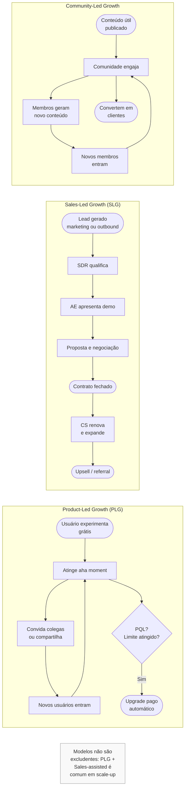

## APÊNDICE CP — SALES: MOTION COMPLETA, DO OUTBOUND AO RENEWAL

Vender é a disciplina operacional mais subestimada pelos fundadores no Brasil. O estereótipo do fundador-técnico genial, que constrói algo incrível e espera o produto vender sozinho, existe porque é verdade em um número pequeno de casos. E falso nos outros noventa e cinco por cento. Se a sua empresa tem qualquer componente B2B (venda entre empresas), você vai vender. O seu time vai vender. E quanto mais cedo você tratar vendas como disciplina (com método, ferramentas, métricas e processo), mais a sua empresa se tornará previsível.

Esse apêndice foi construído para atender três leitores distintos dentro do mesmo fundador. Você que vai fazer a sua primeira venda B2B. Você que tentou vender para uma empresa grande, ou para o governo, e apanhou. E você que está montando uma máquina de vendas para atender clientes pequenos, em volume, via inside sales (vendas internas remotas) ou produto self-serve (autoatendimento). Cada um desses três cenários tem motion (modo de operação comercial) própria. Métricas próprias. E armadilhas específicas. Em empresas de crescimento médio, é comum que os três coexistam.

O apêndice está organizado em quatro partes. A Parte 1 cobre a motion B2B clássica, do outbound (prospecção ativa) ao renewal (renovação). Serve como base para qualquer venda para outra empresa. A Parte 2 trata de enterprise (grandes empresas) e venda para governo, onde o jogo muda. Compradores profissionais. Editais. Contratos de centenas de páginas. Ciclos de um ano ou mais. A Parte 3 cobre SMB (pequenas e médias empresas), inside sales e product-led growth (crescimento puxado pelo produto). É o oposto polar do enterprise. Muitos clientes. Ticket médio baixo. Ciclo curto. Automação. A Parte 4 fecha com Revenue Operations (operações de receita). Em escala, ela costura todas as motion de receita em um sistema único.

---

### Parte 1 — MOTION B2B: DO OUTBOUND AO RENEWAL

#### Por que esse é o ponto de partida

A motion B2B clássica é o esqueleto de qualquer venda entre empresas. Mesmo se a sua empresa termina optando por PLG (crescimento puxado pelo produto), ou focando em enterprise, é provável que nos primeiros meses você esteja fazendo outbound manual. Qualificando leads (potenciais clientes) um a um. Negociando preço em ligações. E aprendendo sobre objeções reais. Esse é o laboratório onde você descobre se existe alguém disposto a pagar pelo que você faz. Essa Parte 1 é o laboratório estruturado.

#### O funil completo

A venda B2B percorre oito estágios definidos. Cada um tem objetivo próprio, critério de avanço, e métrica específica.

**Prospecção.** Gerar lista de contas (ICP, ideal customer profile), e contatos dentro delas. Ferramentas. LinkedIn Sales Navigator, Apollo, Cognism, Lusha. Critério de saída. Lead no CRM, com dados verificados.

**Outreach.** Tentativa de contato. Sequência multi-canal (email mais LinkedIn mais ligação mais, eventualmente, WhatsApp). Ferramentas. Outreach, Salesloft, Lemlist, HubSpot Sequences. Critério de saída. Resposta positiva, ou demonstração de interesse.

**Discovery call.** Primeira conversa estruturada. Descobrir dor real, contexto do comprador, quem decide, budget aproximado, e timeline. Método mais consagrado. SPIN Selling (Situation, Problem, Implication, Need-payoff), de Neil Rackham. Critério de saída. Lead qualificado pelos critérios MEDDIC, ou BANT.

**Demo, ou solução.** Apresentação do produto, contextualizada nas dores descobertas no discovery. Não é demo genérica. É "olha como resolvo X, que você me disse na conversa passada". Critério de saída. Stakeholders relevantes viram, e reagiram.

**Proposta.** Documento formal, ou apresentação, com escopo, preço, timeline, e termos. Em enterprise, envolve custom pricing, descontos, e concessões. Critério de saída. Proposta entregue, e recebida.

**Negociação.** Ajustes finais de preço, termos, e escopo. Aqui aplicam Voss (*Never Split the Difference*), Fisher e Ury (*Getting to Yes*), Ackerman (sequência de contra-ofertas). Critério de saída. Alinhamento mútuo.

**Fechamento.** Assinatura. Pagamento. Início. Critério de saída. Contrato assinado, e primeiro pagamento recebido.

**Pós-venda. Onboarding, depois expansion, depois renewal.** Customer Success leva daqui pra frente (ver [[#APÊNDICE AA — CUSTOMER SUCCESS COMO DISCIPLINA|Apêndice AA]]). Mas a relação entre vendas, e pós-venda, importa. Vendas que prometem o que o produto não entrega destroem CS, destroem renovação, e destroem reputação.

#### Qualificação. BANT, MEDDIC, MEDDPICC

Qualificar significa decidir se vale a pena investir tempo em um lead. A qualificação ruim, investir em leads que não iriam fechar de qualquer jeito, é a forma mais cara de perder tempo comercial.

**BANT** (IBM, anos 60) é o mais antigo, e simples. Budget, Authority, Need, Timeline. Tem orçamento? Tem autoridade de decisão? Tem necessidade real? Tem prazo? Útil para qualificação rápida em vendas transacionais.

**MEDDIC** (criado na Parametric Technology Corporation nos anos 90) é mais rigoroso para venda de médio, e alto, ticket. Metrics (quantificação da dor em números), Economic Buyer (quem assina o cheque), Decision Criteria (o que eles vão comparar), Decision Process (como decidem, em quantas etapas), Identify Pain (a dor específica), Champion (alguém de dentro torcendo por você).

**MEDDPICC** adiciona Paper Process (processo de contrato), e Competition (quem mais está disputando). É o padrão-ouro em enterprise SaaS atualmente. Se você vai vender para empresa grande no Brasil, aprender MEDDPICC é investimento obrigatório.

#### Sales stack brasileira típica

A "pilha" de ferramentas que um time B2B brasileiro de crescimento usa tem mais ou menos esse formato.

CRM. HubSpot, ou Pipedrive, para early stage. Salesforce para enterprise, ou grande volume. Evite planilha além de vinte deals ativos. Você vai perder follow-up. Vai perder deal.

Sales engagement. Outreach, Salesloft, ou HubSpot Sequences. Automatiza sequências, e mede resposta.

Sales intelligence. LinkedIn Sales Navigator (padrão), Apollo, Cognism, Lusha, ZoomInfo. No Brasil, Cortex, e Econodata, têm dados locais.

Conversation intelligence. Gong, Chorus, Clari Copilot. Gravam, e analisam, ligações de venda. Poderosíssimo em escala.

Proposta, e contrato. PandaDoc, DocuSign, ClickSign (BR). Assinatura eletrônica com validade jurídica.

Forecasting, e analytics. Clari, BoostUp, ou dashboards custom em Looker, Tableau, Metabase.

> [!important] Ferramentas não substituem método
> Um time com Salesforce, Gong, e Outreach, mas sem playbook, vende pior do que um time com planilha, e Google Calendar, mas com método claro. Comprar tool antes de ter processo é gasto puro.

#### Funil de métricas, e benchmarks

A tabela abaixo mostra taxas de conversão aproximadas em B2B SaaS médio. Os seus números podem variar. Mas, se variar muito pra baixo, há problema no funil.

| Etapa | Taxa típica de avanço |
|---|---|
| Outreach → resposta positiva | 3-8% |
| Discovery → qualificado | 40-60% |
| Qualificado → demo realizada | 70-85% |
| Demo → proposta entregue | 50-70% |
| Proposta → negociação | 60-80% |
| Negociação → fechamento | 50-70% |
| **Outreach → fechamento (agregado)** | **1-3%** |

O ciclo de venda em B2B SaaS brasileiro varia entre trinta, e cento e oitenta dias, no mid-market. Podendo chegar a duzentos e setenta dias, ou mais, em enterprise. Se o seu ciclo está muito acima dessa faixa, investigue. Qualificação ruim. Produto imaturo. Ou equipe sem método.

#### Comp plan. Como pagar o seu time de vendas

A estrutura padrão de remuneração de vendedor é variável alta. Base salarial mais comissão sobre resultado. No Brasil, CLT típico tem base de cinquenta a setenta por cento do OTE (On-Target Earnings, remuneração esperada se bater cem por cento da meta), e comissão de trinta a cinquenta por cento. PJ tende a ter menos base, e mais variável.

Algumas regras que funcionam.

Comissão linear até cem por cento da meta, acelerada depois. Exemplo. Zero a cem por cento paga uma vez. Cem a cento e cinquenta por cento paga uma vírgula cinco vezes. Acima paga duas vezes. Isso recompensa quem bate, e supera meta. Em vez de quem fica confortável em oitenta por cento.

Pagar por MRR ou ARR. Não por deal. Comissão sobre receita recorrente alinha o vendedor ao cliente que fica. Não ao cliente que fecha, e cancela.

Clawback para churn cedo. Se o cliente cancela nos primeiros três a seis meses, parte da comissão volta. Alinha o vendedor a fechar cliente de verdade. Não a vender para qualquer um.

SPIFFs (bônus pontuais). Para empurrar comportamentos específicos em janelas curtas. "Bônus extra de R$ 2 mil por deal fechado em produto novo X nesse trimestre."

SDRs (Sales Development Reps, os que prospectam, e qualificam) ganham menos que AEs (Account Executives, os que fecham). OTE típica de SDR é quarenta a sessenta por cento da OTE de AE. É função de entrada em vendas. Costuma promover a AE em doze a vinte e quatro meses.

#### Armadilhas da motion B2B

Qualificar mal. O vendedor com pipeline lotado de leads que não iriam comprar de jeito nenhum. Tempo caro.

Descontar sem razão. Dar desconto para fechar, sem o cliente ter pedido. Ou dar desconto na primeira objeção. Você está treinando o mercado a sempre pedir desconto.

Falar mais do que ouvir em discovery. O vendedor que passou mais de quarenta por cento do tempo falando no primeiro call, provavelmente, não entendeu a dor.

Sem champion, avançar de qualquer jeito. Vender para uma empresa onde ninguém de dentro torce por você é venda que encalha em qualquer objeção.

Cadência de follow-up fraca. A média de deals B2B precisa de cinco a doze toques para fechar. O vendedor que desiste no terceiro follow-up perde trinta a quarenta por cento do potencial.

CRM como caixa postal de cada vendedor. Sem disciplina de atualização, você não tem pipeline. Tem ficção.

---

### Parte 2 — ENTERPRISE E VENDA PARA GOVERNO

#### Por que enterprise é outro jogo

Vender para uma empresa grande brasileira (Itaú, Ambev, Petrobras, Natura, Magazine Luiza), ou para um órgão público (Receita, BNDES, Banco Central, prefeitura, secretaria estadual), não é "SMB com ticket maior". É uma motion completamente diferente. Com compradores profissionais. Processos documentados. Lead time (tempo de entrega) mais longo. Requisitos regulatórios. E ticket que justifica tudo isso.

Se a sua empresa está caminhando para enterprise, prepare-se para três mudanças. O ciclo de venda vira de seis a vinte e quatro meses. Você vai precisar dedicar time comercial ao cliente individual. E contratos e compliance (conformidade regulatória) viram disciplina própria.

#### Procurement profissional, e como pensar

A diferença entre SMB, e enterprise, começa na estrutura da contraparte. Em SMB, você fala com o dono, ou com um gestor que decide. Em enterprise, você enfrenta procurement (área de compras), jurídico, segurança da informação, compliance, user (o departamento que vai usar), finance (que vai pagar), e frequentemente comitê de riscos, ou comitê de fornecedores. Cada um tem agenda própria. Critério próprio. Poder de veto próprio. Vender para enterprise é, em boa parte, orquestrar esse tabuleiro.

Princípios para operar em enterprise.

Multi-threading é obrigatório. Se o seu único contato é o usuário, você é extremamente vulnerável. Champion precisa existir. Mas você também precisa de relacionamentos em procurement, em segurança, em jurídico, e em finance. Um grupo de três, ou quatro, pessoas te conhecendo dá segurança contra single point of failure (champion sai da empresa, é realocado, ou muda de opinião).

Procurement não é inimigo. É profissional executando o seu papel. Muitos fundadores brasileiros tratam procurement como "o cara difícil". É a pessoa encarregada de conseguir o melhor preço, e os melhores termos, pra empresa. Respeite o papel, entenda o incentivo, e negocie com elegância.

Processo deles, não seu. Enterprise tem processo documentado de onboarding de fornecedor, de RFP, de POC (prova de conceito), e de contrato. Siga o processo deles. Tentar pular etapa queima a sua credibilidade.

RFI, RFP, RFQ. Três estágios típicos de compra. Request For Information (a empresa explora o mercado). Request For Proposal (a empresa seleciona finalistas). Request For Quote (a empresa decide preço). Responder RFP exige trabalho estruturado. Frequentemente, um time.

#### Venda para governo. A Nova Lei de Licitações

Vender para o governo brasileiro é possível, legítimo, e constitui um mercado enorme. Cerca de quinze por cento do PIB nacional. Também é um mercado com regras próprias, processos burocráticos, e realidade política que altera a dinâmica de negócio. A Nova Lei de Licitações (Lei 14.133/2021) é o marco atual, substituindo a Lei 8.666 de 1993.

Modalidades principais.

Pregão eletrônico. Padrão para aquisição de bens, e serviços, comuns. Menor preço vence, desde que habilitado. Plataforma Comprasnet (federal), ou plataformas estaduais, ou municipais. Ciclo típico. Trinta a noventa dias da publicação ao resultado.

Concorrência. Modalidade para obras, serviços especializados, ou contratações de alta complexidade. O critério pode ser menor preço, melhor técnica, ou técnica-e-preço.

Diálogo competitivo. Novidade da 14.133. O governo conversa com potenciais fornecedores, para desenhar solução, antes de publicar edital. Útil em temas inovadores.

Contratação direta por inexigibilidade, ou dispensa. Situações específicas. Fornecedor único. Emergência. Valor abaixo de teto. Estreito, mas aplicável em compras de startup inovadora em alguns casos. O Marco Legal das Startups (Lei Complementar 182/2021) introduziu o Contrato Público para Solução Inovadora (CPSI), exatamente para isso.

Requisitos documentais típicos. SICAF (Sistema de Cadastramento Unificado de Fornecedores) em dia. CNDs (Certidões Negativas de Débitos) federais, e estaduais. Comprovação de capacidade técnica. Atestados. Declarações de idoneidade. Preparar essa documentação pela primeira vez leva semanas. Mantê-la em dia é trabalho contínuo.

> [!warning] Particularidades de venda para governo
> O pagamento do governo demora. Trinta, sessenta, noventa, às vezes cento e oitenta dias. A sua tesouraria precisa comportar. A política afeta. Mudança de governo reverte prioridades. Os contratos em andamento raramente são cancelados, mas novos podem ser paralisados. O compliance é reforçado. A Lei Anticorrupção (12.846/2013) pune pessoas jurídicas que oferecem vantagem indevida. O seu time comercial precisa saber o que pode, e não pode, fazer em jantar, evento, ou presente. Não subestime.

GovTech brasileiro está crescendo. Iniciativas como InovAtiva Brasil, CPSI, e programas de startups em secretarias, têm facilitado entrada. Procure casos recentes antes de concluir que governo é impossível.

#### Enterprise sales stack

A stack de enterprise sales é semelhante à B2B clássica, com adições.

CRM robusto (Salesforce, ou HubSpot Enterprise). Planilha não sobrevive ciclo de doze meses, com vinte stakeholders no mesmo deal.

Account Mapping. Crossbeam, Reveal. Mapeia, com parceiros, quem toca as mesmas contas.

Value selling tools. Ferramentas de ROI calculator, e business case builder. Em enterprise, o custo do produto é comparado contra valor gerado. Precisa ser articulado em linguagem do CFO do cliente.

Security & compliance repository. SOC 2, ISO 27001, LGPD statement, DPA templates. O cliente enterprise vai pedir antes do primeiro meeting.

#### Comp plan em enterprise

Enterprise sales comp costuma ter quatro características. OTE maior. R$ 300 mil a R$ 800 mil ou mais por ano em AE enterprise no Brasil. Split base e variable mais equilibrado. Cinquenta cinquenta é comum. Quota anual, não trimestral. Os ciclos são longos. Medir trimestralmente penaliza o vendedor trabalhando em deal de doze meses. MBO (Management By Objectives) como complemento. Parte do variável atada a objetivos qualitativos (manter top dez contas ativas, desenvolver relacionamento em X conta estratégica).

---

### Parte 3 — SMB, INSIDE SALES, SELF-SERVE E PRODUCT-LED GROWTH

#### O polo oposto do enterprise

Se enterprise é "poucos clientes, ticket alto, ciclo longo e venda customizada", SMB (pequenas e médias empresas) e PLG (crescimento puxado pelo produto) são "muitos clientes, ticket baixo, ciclo curto e venda padronizada ou automatizada". As motion são tão diferentes que vale pensar nelas como negócios separados, dentro da mesma empresa.

As opções dentro desse polo.

**SMB field sales.** AE com território regional. Visita o cliente. Fecha deal médio (R$ 10 a 100 mil em ARR). Ticket alto pra ser puro inside. Baixo demais pra enterprise.

**Inside sales.** AE remoto. Fecha por telefone, e videoconferência. Sem viagem. Ticket típico, R$ 3 a 30 mil em ARR. Volume maior. Eficiência maior.

**Self-serve.** O cliente se cadastra, testa, e paga. Tudo sem falar com humano. Ticket típico, R$ 50 a 3 mil em MRR. Exige produto fluido. Pricing transparente. Onboarding automatizado.

**Product-Led Growth (PLG).** Produto com viralidade, ou gancho, que traz usuários organicamente. Mercantilização posterior (freemium, premium, enterprise upgrade). Exemplos globais clássicos. Dropbox, Slack, Notion, Figma. No Brasil. Resultados Digitais nos primórdios, RD Station, Conta Azul.

A escolha entre essas opções depende principalmente de quatro fatores. Ticket médio viável. Complexidade do produto. Volume de mercado. Caixa disponível. Não tente PLG com ticket de R$ 50 mil por ano. Ninguém se cadastra, e paga 50 mil, sem falar com ninguém.

#### PLG estruturado. Os conceitos que importam

Se o seu caminho é PLG, alguns conceitos precisam virar fluentes.

**Freemium versus trial.** Freemium. Versão gratuita permanente, com funcionalidade limitada. Upgrade opcional. Viabiliza viralidade. Dilui receita. Trial. Versão completa por tempo limitado (sete a trinta dias). Depois exige pagamento. Converte mais rápido. Menos viral. Híbrido. Freemium com trial temporário de features premium. Mais complexo. Pode confundir pricing.

**Activation, e aha moment.** O momento em que o novo usuário percebe valor pela primeira vez. O objetivo. Reduzir tempo entre signup e aha. Dropbox. Arquivo sincronizado entre dispositivos. Slack. Mensagem enviada em canal de time real. Figma. Arquivo colaborado em tempo real. A sua empresa tem que identificar o aha, e instrumentar para medir quantos usuários atingem.

**PQL (Product Qualified Lead).** Usuário que, pela forma como usa o produto, está sinalizando prontidão para upgrade. Por exemplo. Atingiu limite do plano grátis. Convidou N pessoas. Usou feature premium. Teve N dias de uso consecutivo. PQL é o equivalente PLG do MQL.

**Viral loops.** Mecanismos que fazem usuários trazerem outros usuários. Exemplos. Convite obrigatório, Slack só funciona com outros na empresa. Branding viral, email do Superhuman saindo com "enviado via Superhuman". Incentivo por indicação, Dropbox dando espaço extra por amigo convidado. Colaboração, Figma exigindo compartilhamento, para que o colega possa editar. K-factor acima de um significa crescimento orgânico exponencial. Raro, e valioso.

**Product-led onboarding.** Tutorial in-product, tooltips, e checklists de progresso. Cada usuário avança sozinho. Sem CSM dedicado. Ferramentas. Appcues, Userflow, Pendo, Chameleon.

**Reverse trial.** O usuário começa com todas as features (trial). Algumas desaparecem no dia quatorze. Mas o produto continua funcionando. Converte melhor que trial puro, porque já criou hábito.

#### Volume, e automação

Em SMB, e self-serve, as métricas críticas mudam.

Custo de Aquisição (CAC). Precisa ser baixo. Self-serve típico. CAC de R$ 200 a 2 mil. Payback de seis a dezoito meses.

Conversão de trial, ou freemium, em pagante. Dois a cinco por cento em freemium. Dez a vinte e cinco por cento em trial.

Time to first value (TTFV). Tempo do signup ao aha. Menor é melhor. Conversão melhor.

Automação de onboarding. Emails sequenciais. In-app tours. Demo self-serve. Inside sales pode ter SDR assistindo. Mas o processo é majoritariamente automático.

#### Armadilhas de SMB e PLG

Forçar PLG onde não cabe. Produto complexo, que exige integração, ou treinamento, não se vende self-serve. Não adianta "modernizar" com PLG, se o negócio é consultivo por natureza.

Monetização tardia. Freemium muito generoso atrai usuários que nunca pagam. Encontrar o limite certo entre "gratuito útil o suficiente pra usar", e "pago necessário pra tirar valor real", é ciência.

Descolamento PLG e vendas. Quando o cliente PLG cresce, e precisa de enterprise upgrade, o vendedor entra tarde, e atrapalha. Precisa de motion sales-assisted bem desenhada.

---

### Parte 4 — REVENUE OPERATIONS (REVOPS)

#### Por que RevOps existe

Em empresas pequenas, vendas, marketing e customer success (sucesso do cliente) operam com ferramentas e processos independentes. Em empresas maiores, essa independência vira incompatibilidade. Os dados no CRM (sistema de gestão de clientes) não batem com dados no marketing. O forecast (previsão de receita) não bate com o fechamento. Metas de times diferentes se contradizem. Revenue Operations é a função que resolve isso. O setor que costura vendas, marketing, CS (customer success) e finance (financeiro) em uma engrenagem única de receita previsível.

RevOps virou função formal em SaaS (software como serviço) americano em 2018 a 2020. No Brasil, virou padrão em scale-ups (empresas em escala acelerada) a partir de 2021. Antes disso, funções fragmentadas (Sales Ops, Marketing Ops, CS Ops) tentavam fazer o mesmo de forma descoordenada.

#### O que o time de RevOps faz

**Processos.** Desenha, e documenta, funil de ponta a ponta (do MQL ao renewal). Define estágios, critérios de avanço, e responsabilidades. Orquestra handoffs entre marketing, SDR, AE, e CS.

**Tecnologia.** Dono da sales stack. CRM, sales engagement, marketing automation, CS platform. Decide arquitetura, integrações, e segurança de dados. Evita "shadow IT", cada time comprando a sua ferramenta sem falar com outros.

**Analytics.** KPIs de receita previsível. Pipeline, velocity, win rate, ticket médio, ciclo, churn, NRR, GRR. Forecasting. Previsão de receita trimestral, com metodologia. Deal inspection. Análise qualitativa de deals em pipeline, para identificar riscos.

**Enablement.** Treinamento do time de vendas, e CS, em processos, ferramentas, e playbooks. Mantém sales playbook atualizado. Onboarding de novos vendedores, e CSMs.

**Compensation.** Desenho, e administração, de comp plans. Cálculo de comissões. Alinhamento com finance.

#### Quando montar

Zero a vinte vendedores. Não precisa ainda. Founder, ou Head of Sales, acumula.

Vinte a cinquenta. Primeira contratação de Sales Ops (uma pessoa).

Cinquenta a cento e cinquenta. RevOps vira time (três a seis pessoas), gerenciado por Head of RevOps.

Cento e cinquenta em diante. RevOps é função estratégica, com VP, ou C-level próprio (Chief Revenue Officer, ou Chief Customer Officer).

#### Armadilhas em RevOps

Virar burocracia. RevOps que gasta mais tempo fazendo relatório, do que resolvendo problema.

Brigas territoriais. Sales, Marketing, e CS, resistem a perder controle de "suas" ferramentas. Solução. Mandato claro do CEO.

Dado sem ação. Dashboards bonitos que ninguém usa para decisão.

Over-engineering. Empresa de trinta pessoas com stack de quinze ferramentas integradas. Paga caro pra manter.

---

### CHECKLIST TRANSVERSAL DE VENDAS

Independente de motion (B2B, enterprise, SMB, PLG), qualquer operação de vendas madura tem.

- [ ] ICP definido, escrito, e compartilhado
- [ ] Playbook de vendas versionado, e atualizado
- [ ] Funil, e estágios, com critérios explícitos
- [ ] CRM populado (não fictício), com cadência de atualização
- [ ] Framework de qualificação aplicado consistentemente (BANT, MEDDIC, MEDDPICC)
- [ ] Comp plan alinhado ao comportamento desejado (ARR, não deal, com clawback de churn)
- [ ] Métricas mensais. Pipeline, velocity, win rate, ciclo, conversão por etapa
- [ ] Forecast com metodologia, e hit rate medido
- [ ] Onboarding de novo vendedor, com playbook, mais ramp de noventa dias
- [ ] Handoff vendas para CS documentado
- [ ] Pipeline review semanal, com inspeção qualitativa de deals top
- [ ] Sales training contínuo, não só em onboarding

### Ver também

[[#APÊNDICE CG — GROWTH COMO FUNÇÃO ORGANIZACIONAL: TIME DE GROWTH, BUILD VS HIRE, RELAÇÃO COM PRODUTO|Apêndice CG]], Growth como função organizacional. [[#APÊNDICE AA — CUSTOMER SUCCESS COMO DISCIPLINA|Apêndice AA]], Customer Success como disciplina. [[#APÊNDICE X — PRICING STRATEGY COMO DISCIPLINA|Apêndice X]], Pricing strategy. [[#APÊNDICE CB — SUBSCRIPTION ECONOMY EM PROFUNDIDADE: ALÉM DO "COBRA MENSALMENTE"|Apêndice CB]], Subscription economy. [[#APÊNDICE T — LGPD, COMPLIANCE E GOVERNANÇA DE DADOS|Apêndice T]], LGPD, compliance, e governança de dados. Apêndice de Canais Indiretos, quando parte da venda é via terceiros.

> [!info] Fases relacionadas
> Referenciado em: Fase 10.

---
