## APÊNDICE CZ — CANVASES E MAPAS VISUAIS DE MODELO

> [!note] Como usar
> Este apêndice trata em profundidade dezesseis canvases que aparecem ao longo do livro como ferramentas convocadas em fases específicas. Cada canvas vem com origem histórica, estrutura visual, princípios, instruções de aplicação, exemplo brasileiro preenchido, variações, erros comuns, limites e leitura adicional. A ordem é didática (do mais geral ao mais específico), não a ordem de uso na trajetória. Para saber qual canvas usar em qual fase, veja a tabela de mapeamento ao final desta abertura.

> [!important] Por que canvases merecem apêndice próprio
> Canvas é categoria distinta de framework. Framework é raciocínio (Five Forces, JTBD, AARRR). Canvas é **representação visual de uma página** que força colaboração e expõe inconsistências. A maioria dos canvases neste apêndice nasceu da escola de design thinking aplicada a estratégia (Strategyzer, IDEO, XPLANE) entre 2005 e 2020. Compartilham três traços: (1) cabem em uma folha A3 ou parede; (2) preenchimento é colaborativo, não solo; (3) revelam onde o pensamento ainda está vago. Tratá-los apenas como sub-itens do ferramentário (BG) não capturava nem a teoria nem a prática brasileira.

### Mapa de uso por fase

| Fase | Canvas indicado | Pergunta que responde |
|---|---|---|
| Fase 2 (articulação) | CZ.1 BMC ou CZ.2 Lean Canvas | Como o negócio cria, entrega e captura valor? |
| Fase 2B (teoria) | CZ.16 Theory Map / Story Tree | Quais relações causais sustentam a tese? |
| Fase 3 (descoberta) | CZ.6 Empathy Map | O que o cliente pensa, sente, vê e ouve? |
| Fase 4 (pesquisa) | CZ.6 Empathy Map + CZ.3 VPC + CZ.7 Customer Journey | Como a dor vive em contexto e jornada? |
| Fase 5 (mercado) | CZ.4 Strategy Canvas + CZ.15 Canvas da Cunha | Qual é a curva de valor distinta no mercado? |
| Fase 6 (hipóteses) | CZ.14 Hypothesis Canvas | Como tornar cada aposta falsificável? |
| Fase 7 (experimentos) | CZ.9 Test Card | Como rodar cada teste com critério antes do dado? |
| Fase 8 (ideação) | CZ.5 Opportunity Canvas + CZ.11 MVP Canvas | Quais oportunidades viram MVP? |
| Fase 10 (MVP) | CZ.10 Pirate Canvas (AARRR) | Como o funil real está se comportando? |
| Fase 11 (modelo) | CZ.13 Risk Canvas | Quais riscos podem matar o modelo em escala? |
| Fase 14 (escala) | CZ.8 Team Canvas | Como o time se alinha em propósito e operação? |
| Fase 16 + Apêndice V | CZ.12 Storytelling Canvas | Como narrar o negócio para investidor, time, cliente? |

### Catálogo dos 16 canvases

| # | Canvas | Autor / Origem | Foco |
|---|---|---|---|
| CZ.1 | Business Model Canvas | Osterwalder, 2010 | Modelo de negócio completo |
| CZ.2 | Lean Canvas | Maurya, 2012 | Modelo para startup pré-PMF |
| CZ.3 | Value Proposition Canvas | Osterwalder, 2014 | Encaixe produto-cliente |
| CZ.4 | Strategy Canvas | Kim & Mauborgne, 2005 | Posicionamento competitivo (Blue Ocean) |
| CZ.5 | Opportunity Canvas | Jeff Patton, 2014 | Discovery contínuo de oportunidades |
| CZ.6 | Empathy Map | Dave Gray / XPLANE, 2009 | Compreensão profunda do usuário |
| CZ.7 | Customer Journey Canvas | múltiplas escolas | Jornada do cliente em fases e emoções |
| CZ.8 | Team Canvas | Alex Ivanov, 2015 | Alinhamento de propósito e operação de time |
| CZ.9 | Test Card | Bland & Osterwalder, 2019 | Estruturação de experimento |
| CZ.10 | Pirate Canvas (AARRR) | Dave McClure, 2007 | Funil de aquisição → receita |
| CZ.11 | MVP Canvas | Tristan Kromer | Escopo mínimo testável |
| CZ.12 | Storytelling Canvas | múltiplas | Narrativa estruturada do negócio |
| CZ.13 | Risk Canvas | múltiplas | Mapeamento e priorização de riscos |
| CZ.14 | Hypothesis Canvas | autoral do livro | Hipótese falsificável com threshold |
| CZ.15 | Canvas da Cunha | autoral do livro | Definição de cunha de mercado |
| CZ.16 | Theory Map / Story Tree | autoral do livro | Teoria causal do negócio |

> [!note] Ondas 1, 2 e 3 disponíveis, onda 4 em construção
> Esta versão do livro contém o tratamento completo dos canvases CZ.1 a CZ.7 e CZ.9 a CZ.13 (Onda 1 — Fundamentos; Onda 2 — Discovery e validação; Onda 3 — Métricas, MVP e narrativa). A Onda 4 — Time e Autorais (CZ.8 Team Canvas, CZ.14 Hypothesis Canvas, CZ.15 Canvas da Cunha, CZ.16 Theory Map) — será adicionada em iteração posterior. Os canvases autorais (CZ.14, CZ.15, CZ.16) seguem documentados como templates práticos no [[#APÊNDICE A — TEMPLATES PRONTOS PARA USO|Apêndice A]] (A.10, A.12, A.9 respectivamente) até serem promovidos para tratamento teórico aqui.

---

### CZ.1 — Business Model Canvas (Alexander Osterwalder, 2010)

#### Origem histórica

Alexander Osterwalder propôs o Business Model Canvas (BMC) na tese de doutorado em 2004, na Universidade de Lausanne, sob orientação de Yves Pigneur. A ferramenta foi sistematizada no livro *Business Model Generation* (2010), escrito colaborativamente com 470 co-autores espalhados por 45 países via plataforma online — o livro virou bestseller global e definiu a forma como milhões de empreendedores conversam sobre modelo de negócio. No Brasil, o BMC entrou no currículo de praticamente toda aceleradora, MBA, programa do Sebrae, Endeavor e Distrito a partir de 2012, virando vocabulário comum.

#### O que é

Tela visual de uma página com **nove blocos** que representam, juntos, como uma empresa cria, entrega e captura valor. Os nove blocos são organizados em duas metades: a metade direita (cliente, valor, canais, relacionamento, receita) descreve **a frente do negócio**; a metade esquerda (recursos, atividades, parcerias, custos) descreve **as engrenagens internas**. No centro, conectando as duas, fica a **Proposta de Valor**.

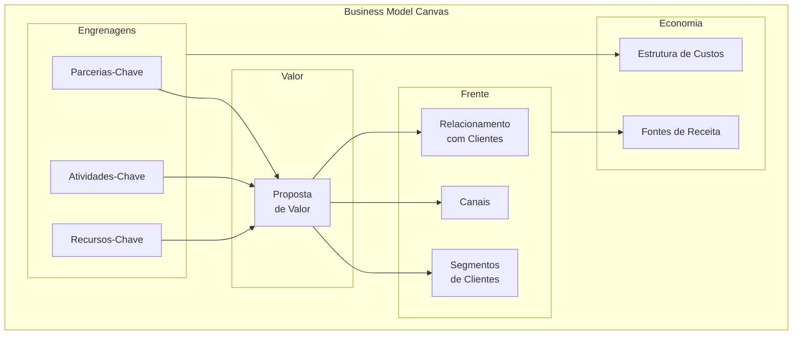

#### Quando usar

Use o BMC nas Fases 2 e 2B do IGNIÇÃO, quando a ideia já tem articulação inicial mas o modelo de negócio ainda precisa ser explicitado. Também use a cada três a seis meses como check-up: revisitar o BMC depois de um trimestre de operação real frequentemente revela inconsistências invisíveis no momento da articulação. Não use o BMC para decidir *se* a ideia é boa — para isso, [[#FASE 3 — DESCOBERTA DO PROBLEMA|Fase 3]] (descoberta com cliente) e [[#FASE 7 — EXPERIMENTOS DE VALIDAÇÃO DO PROBLEMA|Fase 7]] (experimentos) são as ferramentas certas.

#### Princípios

A tese central de Osterwalder é que **modelo de negócio é objeto de design, não de planejamento**. Designar requer iteração rápida, conversa colaborativa e tolerância à ambiguidade temporária. Os nove blocos são interdependentes: mudar um afeta vários, e o valor do BMC está em tornar essa interdependência visível. O canvas é **descritivo** (mapeia o que você entende do negócio), não **prescritivo** (não diz se o modelo é bom). Por isso, ter um BMC coerente não significa ter um negócio viável — apenas ter clareza sobre o que precisa ser testado.

#### Como aplicar

Reúna 2-4 pessoas (cofundadores idealmente, mais 1 mentor externo se possível). Imprima a tela em A1 ou desenhe na parede com fita crepe. Use post-its (cores diferentes para cada bloco). Bloco a bloco, **na ordem que importa**:

1. **Segmentos de Clientes** primeiro — sem cliente, nada mais importa.
2. **Proposta de Valor** — por que esses clientes pagariam.
3. **Canais** — como o cliente descobre, compra, recebe e pede suporte.
4. **Relacionamento** — self-service, comunidade, suporte humano, automação.
5. **Fontes de Receita** — modelo (assinatura, transação, licença, freemium).
6. **Recursos-Chave** — o que a empresa precisa ter (pessoas, tecnologia, IP, capital).
7. **Atividades-Chave** — o que a empresa precisa fazer todo dia.
8. **Parcerias-Chave** — quem a empresa precisa ao lado (fornecedores, integradores, distribuição).
9. **Estrutura de Custos** — onde o dinheiro sai.

Tempo total: 60-120 minutos para a primeira versão. Cada bloco com 3-5 post-its (não parágrafos longos). Revisitar mensalmente nas fases iniciais, trimestralmente depois de PMF.

#### Exemplo brasileiro preenchido — Nubank em 2014

| Bloco | Conteúdo |
|---|---|
| **Segmentos de Clientes** | Brasileiros 25-40 anos, urbanos, classes A/B/C+, insatisfeitos com banco tradicional, familiares com smartphone |
| **Proposta de Valor** | Cartão de crédito sem anuidade, gerenciado 100% por app, sem burocracia, atendimento humano via chat, transparência |
| **Canais** | App mobile (iOS + Android), landing page, marketing digital orgânico, convite por fila de espera viral |
| **Relacionamento** | Self-service via app, suporte humano on-demand via chat, comunicação pelo nome próprio |
| **Fontes de Receita** | Intercâmbio (% sobre cada transação no cartão), juros do rotativo, futuro: receitas adjacentes (lending, investimento) |
| **Recursos-Chave** | Equipe técnica (engenharia, produto, design), licenças regulatórias, capital, algoritmos de credit scoring |
| **Atividades-Chave** | Desenvolvimento de produto digital, aquisição de clientes, gestão de risco de crédito, atendimento |
| **Parcerias-Chave** | Bandeiras (Mastercard, Visa), processadoras de pagamento, BACEN (regulador), provedores cloud |
| **Estrutura de Custos** | Salários de tecnologia (majoritário), atendimento, marketing, provisões de risco de crédito, compliance |

**Insight do caso.** O BMC do Nubank em 2014 mostra um modelo intencionalmente enxuto: poucos blocos com complexidade real (cartão único, segmento único, canal único). A disciplina foi não adicionar produtos ou segmentos antes de dominar o primeiro. Expansão para conta corrente (2017), lending (2019), investimentos (2020) só aconteceu depois de o cartão dominar o segmento original. Empresas que tentam preencher os nove blocos com complexidade simultânea desde o início frequentemente falham por dispersão. BMC bem feito tem cara de simples.

#### Variações e extensões

- **Lean Canvas** (CZ.2): substitui Parcerias, Atividades, Recursos e Relacionamento por Problema, Solução, Métricas-Chave e Vantagem Injusta. Mais útil em estágio pré-PMF.
- **Social Business Model Canvas**: adiciona blocos de impacto social, beneficiários e métricas de impacto.
- **Platform Business Model Canvas**: adapta para marketplaces de dois lados.
- **Sustainable Business Model Canvas (Triple Layer)**: adiciona camadas ambiental e social.

#### Erros comuns

- Preencher sozinho na cabeça em vez de em conversa colaborativa — o valor do BMC está no debate entre múltiplos olhares, não no documento final.
- Tratar como artefato estático, não revisitar — BMC sem atualização perde sentido em três meses.
- Confundir clareza do BMC com validação do mercado — ter BMC bonito não prova que cliente existe.
- Excesso de detalhe em cada bloco — se você precisa de parágrafo para explicar um bloco, a ideia ainda não está clara.
- Forçar um único BMC para múltiplos segmentos muito distintos — cada segmento merece BMC próprio.

#### Quando NÃO usar

Em empresas maduras com modelo estabelecido e operando — frameworks de execução como OGSM, Hoshin Kanri ou Balanced Scorecard servem melhor. Em negócios muito simples (consultoria solo, freelance) — BMC introduz overhead sem valor. Em negócios complexos com várias linhas distintas, não force um único BMC: cada linha precisa do seu.

#### Conexão com outros canvases

O BMC **precede** o Lean Canvas (CZ.2) como ferramenta histórica, mas o Lean Canvas é mais adequado para startup pré-PMF. O **Value Proposition Canvas** (CZ.3) aprofunda o bloco "Proposta de Valor" do BMC, que é tipicamente preenchido de forma vaga. O **Strategy Canvas** (CZ.4) complementa olhando para fora (concorrência), enquanto o BMC olha para dentro (modelo). Em fases iniciais, comece pelo BMC para ter visão de conjunto; depois aprofunde com VPC para a proposta e Strategy Canvas para o posicionamento.

#### Leitura adicional

- *Business Model Generation* (Alexander Osterwalder & Yves Pigneur, 2010).
- *Testing Business Ideas* (David Bland & Alexander Osterwalder, 2019) — manual de validação para cada bloco.
- [strategyzer.com](https://strategyzer.com) — ferramenta online + cursos da equipe original.

---

### CZ.2 — Lean Canvas (Ash Maurya, 2012)

#### Origem histórica

Ash Maurya criou o Lean Canvas em 2010-2012 como adaptação do Business Model Canvas especificamente para startups em estágio inicial, e documentou a ferramenta no livro *Running Lean* (2012, atualizado em 2022 para a 3ª edição). Maurya era fundador serial que aplicou Lean Startup nas próprias empresas e percebeu que o BMC original — desenhado para empresas estabelecidas — não priorizava adequadamente os elementos críticos para quem ainda não tem modelo validado: o problema, a solução, as métricas que provam tração, e a vantagem que sustenta a empresa quando o concorrente acordar. O Lean Canvas substituiu quatro dos nove blocos do BMC para capturar melhor a realidade pré-PMF.

#### O que é

Tela visual de uma página com nove blocos, **inspirada no BMC mas com quatro substituições críticas**: Parcerias-Chave vira **Problema**, Atividades-Chave vira **Solução**, Recursos-Chave vira **Métricas-Chave**, Relacionamento com Clientes vira **Vantagem Injusta**. Os outros cinco blocos permanecem (Segmentos, Proposta Única de Valor, Canais, Estrutura de Custos, Fontes de Receita).

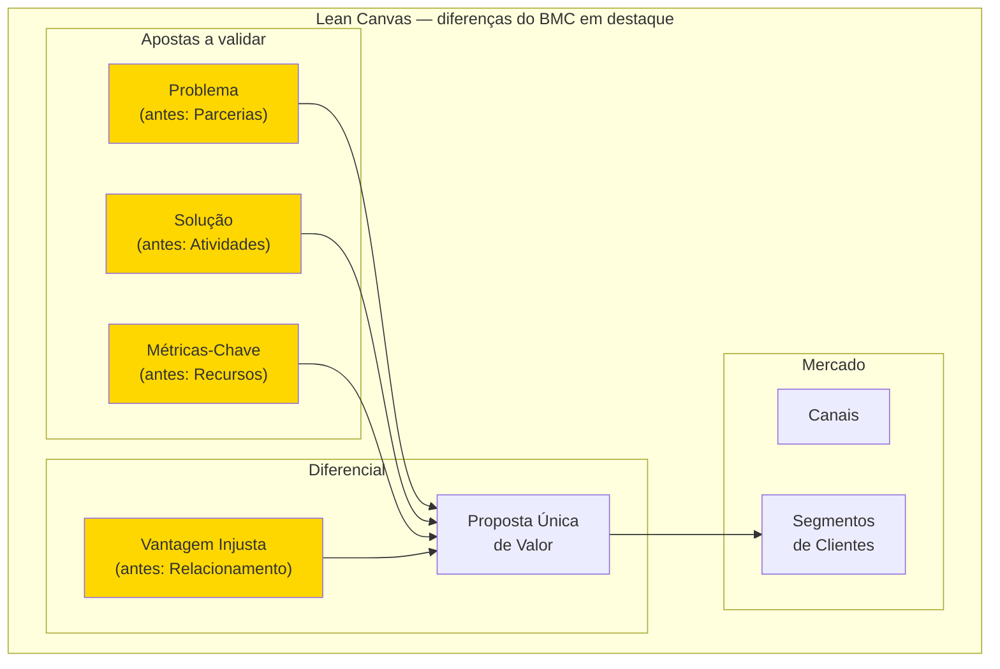

A filosofia subjacente é: startup pré-PMF não tem parcerias estabelecidas (vai construir), não tem atividades-chave definidas (vai descobrir), não tem recursos consolidados (tem capital limitado e tempo) e não tem relacionamento com clientes (não tem clientes ainda). O que tem é hipótese de problema, hipótese de solução, hipótese de métrica e hipótese de vantagem competitiva. O Lean Canvas mapeia exatamente essas hipóteses.

#### Quando usar

Use o Lean Canvas a partir da Fase 1 (encontrar a ideia) até a Fase 12 (PMF). É o canvas certo para todo o estágio de discovery e validação. Depois de PMF declarado, migre para o BMC, que mapeia melhor um modelo já operando. Use também como ferramenta de pivô: cada vez que você considerar pivotar, faça um Lean Canvas novo para a tese alternativa antes de comprometer recursos.

#### Princípios

A tese de Maurya é que **modelo de negócio em startup é hipótese, não plano**. Cada bloco do Lean Canvas corresponde a uma ou mais hipóteses falsificáveis, e a ordem de preenchimento dos blocos espelha a ordem de risco — o que pode matar a startup mais cedo é preenchido primeiro. Por isso, Problema vem antes de Solução: solução para problema inexistente é o erro mais frequente em startup. Vantagem Injusta vem por último: enquanto a startup é pequena, ainda não tem moat — a Vantagem Injusta é o que ela aposta construir.

#### Como aplicar

Reúna 1-3 pessoas (cofundadores). Use uma folha A1 ou ferramenta digital (Miro, FigJam). Preencha **na ordem de risco**, que difere do BMC:

1. **Segmentos de Clientes** primeiro (right side, top) — quem.
2. **Problema** (left side, top) — top 1-3 problemas que o segmento tem.
3. **Proposta Única de Valor** (centro, top) — uma frase única de promessa.
4. **Solução** (left side) — top 3 features que endereçam o problema.
5. **Canais** (right side) — caminhos de aquisição até o segmento.
6. **Fontes de Receita** (right side, bottom) — modelo de monetização.
7. **Estrutura de Custos** (left side, bottom) — onde o dinheiro sai.
8. **Métricas-Chave** (left side, middle) — números que provam tração.
9. **Vantagem Injusta** (right side, middle) — o que torna você inimitável.

Tempo total: 30-60 minutos para o primeiro preenchimento (mais rápido que o BMC porque os blocos são mais específicos). **Faça um Lean Canvas por segmento** — não force um canvas único para múltiplos segmentos com problemas distintos. Revisar a cada experimento concluído (a cada 2-4 semanas em fases iniciais).

#### Exemplo brasileiro preenchido — QuintoAndar em 2015

| Bloco | Conteúdo |
|---|---|
| **Problema** | Alugar apartamento em SP exige fiador, três meses de caução, vistoria agressiva, burocracia de cartório, semanas de sofrimento — para algo que o inquilino só usa 1-2 anos. Para o proprietário: longo período sem renda, risco de inadimplência, complexidade jurídica. |
| **Segmentos de Clientes** | Inquilinos: jovens profissionais classe A/B em SP, primeira ou segunda experiência de aluguel. Proprietários: pessoas físicas com 1-3 imóveis (não imobiliária). |
| **Proposta Única de Valor** | "Alugue em horas, sem fiador, sem caução exagerada, 100% online." |
| **Solução** | Plataforma online de aluguel + seguro substituindo fiador + vistoria digital + contrato digital com assinatura remota + pagamento de aluguel automatizado. |
| **Canais** | SEO orgânico (busca de imóveis), parcerias com portais imobiliários, marketing digital (Facebook, Google), indicação boca a boca. |
| **Fontes de Receita** | Taxa de administração sobre aluguel mensal + comissão de corretagem sobre assinatura inicial + (futuro) produtos financeiros adjacentes. |
| **Estrutura de Custos** | Tecnologia e produto + marketing e aquisição + operação de vistorias + sinistros de seguro + equipe de matching. |
| **Métricas-Chave** | Contratos assinados/mês, tempo médio busca → assinatura, NPS, churn de locatários, ticket médio (aluguel médio). |
| **Vantagem Injusta** | Dados proprietários de comportamento de pagamento de locatários — permitem underwriting de seguro próprio. Concorrentes novos precisariam anos para acumular esses dados. |

**Insight do caso.** O Lean Canvas do QuintoAndar em 2015 mostra como o canvas força a articular a Vantagem Injusta antes que ela exista: em 2015, a empresa ainda **não tinha** os dados proprietários — era a aposta. O canvas registra "se o modelo funcionar, será porque os dados acumulados criam underwriting próprio". Isso virou hipótese a testar (e se confirmou). Empresas que preenchem Vantagem Injusta com generalidades tipo "nosso time é incrível" ou "tecnologia avançada" não estão fazendo o exercício — são placeholders, não apostas. Vantagem Injusta deve ser específica, falsificável e de longo prazo.

#### Variações e extensões

- **Customer Forces Canvas** (também de Maurya): aprofunda a teoria de "forças" que empurram cliente entre soluções (push, pull, anxiety, habit), complementando o Lean Canvas com vista comportamental.
- **Lean Stack** (Maurya): conjunto de canvases conectados (Lean Canvas + Customer Factory Blueprint + Traction Roadmap).

#### Erros comuns

- Tratar Lean Canvas como BMC simplificado — a filosofia é distinta, focada em hipóteses testáveis.
- Preencher Vantagem Injusta com generalidades ("nosso time", "nossa tecnologia") — se qualquer concorrente teria, não é injusta.
- Não articular o Problema de forma específica — "pessoas querem X" não é problema testável; "pessoa tipo Y sofre com Z em contexto W" é.
- Forçar um único Lean Canvas para múltiplos segmentos com problemas diferentes — cada segmento merece canvas próprio.
- Confundir Solução com Proposta Única de Valor — Solução é *o que você constrói*, Proposta de Valor é *a promessa que ressoa para o cliente*.

#### Quando NÃO usar

Em empresas pós-PMF com modelo estabelecido — use BMC. Em projetos internos de empresa grande (intrapreneurship em corporação madura) — Lean Canvas força o framing de "ainda não temos cliente" que pode não bater com a realidade. Em consultoria solo ou freelance — overhead sem retorno.

#### Conexão com outros canvases

O Lean Canvas **se relaciona ao BMC (CZ.1)** como ferramenta complementar para estágios distintos. **Se relaciona ao Hypothesis Canvas (CZ.14)**: cada bloco do Lean Canvas vira uma ou mais entradas no banco de hipóteses. **Se relaciona ao Test Card (CZ.9)**: cada hipótese do Lean Canvas vira um ou mais Test Cards na Fase 7. **Precede o BMC**: depois de PMF, migre.

#### Leitura adicional

- *Running Lean* (Ash Maurya, 2012; 3ª edição em 2022).
- *Scaling Lean* (Ash Maurya, 2016) — aplicação pós-PMF.
- [leanstack.com](https://leanstack.com) — ferramenta online + cursos da equipe.

---

### CZ.3 — Value Proposition Canvas (Alexander Osterwalder, 2014)

#### Origem histórica

O Value Proposition Canvas (VPC) é extensão direta do Business Model Canvas, criado pela mesma equipe (Alexander Osterwalder, Yves Pigneur, Greg Bernarda, Alan Smith) e publicado no livro *Value Proposition Design* (2014). A motivação foi observação de campo: o bloco "Proposta de Valor" do BMC era invariavelmente o mais mal preenchido — fundadores escreviam frases vagas tipo "produto melhor" ou "atendimento de qualidade". Osterwalder concluiu que esse bloco merecia uma ferramenta própria, mais profunda, que forçasse a verificar **explicitamente** o encaixe entre o que o cliente precisa e o que o produto oferece.

#### O que é

Tela visual de duas partes complementares que se encaixam como um quebra-cabeça:

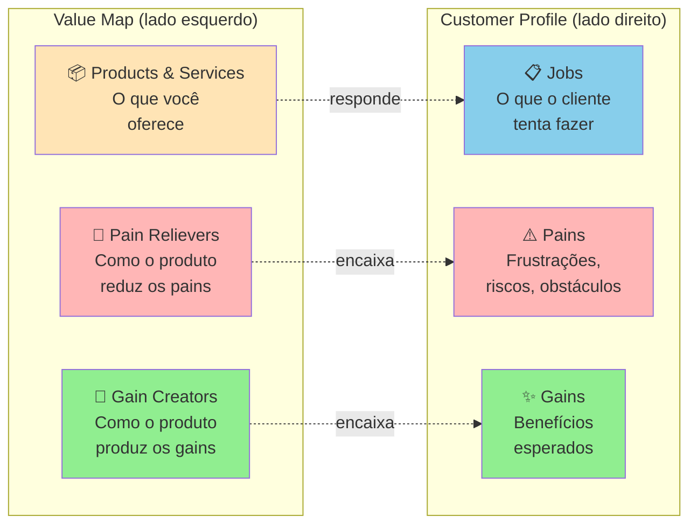

O **Customer Profile** mapeia o cliente em três dimensões: Jobs (tarefas funcionais, sociais, emocionais que tenta cumprir), Pains (o que o frustra, prejudica, ameaça) e Gains (o que ele deseja, espera, sonha). O **Value Map** mapeia o produto em três dimensões espelhadas: Products & Services (o que você oferece), Pain Relievers (como o produto alivia os pains do cliente) e Gain Creators (como o produto produz os gains).

O **fit** acontece quando os Pain Relievers correspondem a Pains reais e os Gain Creators correspondem a Gains que o cliente realmente valoriza. Pain Relievers sem Pain correspondente = features inúteis. Pains sem Pain Reliever = motivos de churn.

#### Quando usar

Use o VPC depois de fazer pesquisa qualitativa real (Fase 4 — entrevistas em profundidade, observação em campo, análise de jornada). É a ferramenta certa para tornar o Dossiê do Usuário (saída da Fase 4) acionável: cada persona vira um Customer Profile, e o produto que está sendo desenhado vira o Value Map. Use também como ferramenta de auditoria: revisitar o VPC a cada três meses pós-MVP revela features que viraram Pain Relievers órfãos (sem Pain real) ou Pains que ficaram sem Pain Reliever construído.

#### Princípios

A tese de Osterwalder é que **proposta de valor não é o que você diz que o produto faz, é a correspondência verificável entre as frustrações/desejos do cliente e o que o seu produto efetivamente alivia/entrega**. Fit não se presume — verifica-se com entrevistas, testes, observação. A falha mais comum em startup não é "produto ruim" — é produto bom atacando problema que o cliente não considera importante. O VPC força essa verificação tornando explícita cada conexão.

#### Como aplicar

**Etapa 1 — Customer Profile (sempre primeiro).** Reúna o que você aprendeu na Fase 4. Para a persona escolhida, liste:

- **Jobs** (5-10): o que ela tenta fazer? Funcionais ("conciliar pagamentos do dia"), sociais ("parecer profissional para a equipe"), emocionais ("ter paz antes de dormir").
- **Pains** (5-10): o que dói? Pode ser frustração ("isso demora 3 horas"), risco ("se eu errar, perco o cliente"), obstáculo ("não tenho como integrar").
- **Gains** (5-10): o que ela quer? Esperados ("uma forma de fazer mais rápido"), desejados ("relatório que impressione o chefe"), inesperados ("automação que eu não sabia ser possível").

**Importante**: NÃO INVENTE. Cada item deve poder ser citado de uma entrevista, observação ou diário de usuário documentado. Customer Profile com Jobs/Pains/Gains intuitivos = VPC teórico.

**Etapa 2 — Value Map.** Liste:

- **Products & Services**: o que você está construindo (ou planeja construir).
- **Pain Relievers**: para cada Pain do cliente, como o produto alivia? Seja específico.
- **Gain Creators**: para cada Gain, como o produto produz? Idem.

**Etapa 3 — Avaliação de fit.** Cada Pain tem Pain Reliever correspondente? Cada Gain tem Gain Creator? Se há Pains sem cobertura, são oportunidades não endereçadas. Se há Pain Relievers sem Pain real, são features potencialmente desperdiçadas.

Tempo: 2-4 horas para a primeira versão (após pesquisa pronta). Cada segmento merece VPC próprio.

#### Exemplo brasileiro preenchido — Wellhub (Gympass) em 2016, B2B

**Customer Profile** — Head de RH de empresa média (200-1000 funcionários):

| Jobs | Pains | Gains |
|---|---|---|
| Oferecer benefício que ajude retenção | Caro contratar academia única que não atende todos | Retenção mensurável melhor |
| Gerenciar programa de bem-estar sem overhead | Funcionários pedem academia mas subsídio direto é complicado (tributário, equidade) | Marca empregadora fortalecida |
| Prestar contas à diretoria sobre ROI | Difícil medir uso real e impacto em produtividade | Dados de engajamento para C-level |
| Atender perfis diversos (academia, yoga, crossfit) sem caos | Negociar com múltiplos fornecedores consome tempo | Benefício percebido sem esforço administrativo |

**Value Map** — Wellhub (Gympass) o que oferecia em 2016:

| Products & Services | Pain Relievers | Gain Creators |
|---|---|---|
| Plataforma empresarial com acesso a milhares de academias via assinatura | Uma assinatura única cobre todas academias (flexibilidade sem multiplicação de contratos) | Benefício percebido pelo funcionário gera retenção mensurável |
| Dashboard de uso para RH | Plataforma administra matrícula, pagamento, cancelamento (zero overhead) | Oferta diversa atende perfis diferentes |
| App para funcionário escolher academia | Estrutura tributária correta (benefício registrado) | Dados de uso para relatórios executivos sobre engagement e ROI |
| Suporte para RH e funcionário | Negociação consolidada com uma empresa só (em vez de 50 academias) | Fortalecimento da marca empregadora |

**Análise de fit.** Encaixe forte entre quase todos os Pains/Gains e os Pain Relievers/Gain Creators. Note que a oferta da Wellhub não inova radicalmente — apenas elimina as fricções específicas que o RH enfrentava no modelo tradicional (negociar com cada academia, gerenciar reembolsos, justificar tributariamente, medir uso). **A lição: value proposition forte não exige features impressionantes — exige fit preciso entre o que o cliente sofre e o que você alivia.**

#### Variações e extensões

- **Job-to-Be-Done Canvas** (Christensen / Moesta): foco mais profundo em Jobs (especialmente as 4 forças de Moesta — push, pull, anxiety, habit). Ver [[#FASE 4 — PESQUISA COM USUÁRIOS (CUSTOMER DISCOVERY APROFUNDADO)|Fase 4]].
- **Empathy Map** (CZ.6): complementar ao Customer Profile, foca em estados internos do cliente (pensa/sente/vê/ouve).
- **VPC for Multi-Sided Markets**: marketplaces fazem um VPC para cada lado (oferta e demanda).

#### Erros comuns

- Preencher Customer Profile com intuições em vez de dados reais — VPC teórico não representa mercado.
- Fazer VPC genérico para "todos os clientes" — segmentos diferentes têm Jobs/Pains/Gains diferentes; cada segmento merece VPC próprio.
- Inflar Gain Creators — listar benefícios que o produto teoricamente poderia entregar mas não entrega ainda.
- Ignorar Pains sem Pain Reliever correspondente — essas lacunas são frequentemente os motivos reais de churn.
- Confundir Products & Services (o que você constrói) com Pain Relievers (como alivia uma dor específica) — o primeiro é descritivo, o segundo é causal.

#### Quando NÃO usar

Em mercados commoditizados com propostas de valor muito padronizadas — VPC adiciona pouco valor onde o cliente já compara só preço e prazo. Em produtos B2B enterprise muito complexos — a "unidade cliente" tem múltiplos stakeholders (usuário final, comprador econômico, sponsor executivo, TI), cada um com seu VPC; a abordagem stakeholder mapping é mais útil.

#### Conexão com outros canvases

O VPC **aprofunda** o bloco "Proposta de Valor" do BMC (CZ.1) — preencher BMC sem antes ter VPC tipicamente produz blocos de Proposta de Valor vazios. **Pareia com o Empathy Map (CZ.6)** para construir o Customer Profile com profundidade emocional. **Alimenta o Lean Canvas (CZ.2)**: os Pains do cliente viram o bloco Problema; os Pain Relievers + Gain Creators viram a Proposta Única de Valor.

#### Leitura adicional

- *Value Proposition Design* (Osterwalder, Pigneur, Bernarda, Smith, 2014).
- *Testing Business Ideas* (David Bland & Alexander Osterwalder, 2019) — como validar cada elemento do VPC.
- [strategyzer.com/canvas/value-proposition-canvas](https://strategyzer.com/canvas/value-proposition-canvas).

---

### CZ.4 — Strategy Canvas (W. Chan Kim & Renée Mauborgne, 2005)

#### Origem histórica

W. Chan Kim e Renée Mauborgne, professores do INSEAD, publicaram *Blue Ocean Strategy* em 2005 após quinze anos de pesquisa empírica analisando 150 movimentos estratégicos em 30 indústrias ao longo de cem anos. A tese central é que **competir em mercado saturado (red ocean) é destrutivo, e criar novo espaço de mercado (blue ocean) é a estratégia vencedora**. O Strategy Canvas é a ferramenta visual central do framework — gráfico que compara curvas de valor de concorrentes para revelar onde existe espaço de diferenciação real, em vez da disputa palmo-a-palmo nas mesmas dimensões. O livro vendeu mais de quatro milhões de cópias e o Strategy Canvas virou referência em planejamento estratégico, embora tenha sido subutilizado em startup brasileira (frequentemente substituído por Porter's Five Forces ou matriz BCG, que são ferramentas distintas).

#### O que é

Gráfico de duas dimensões. **Eixo X**: fatores de competição relevantes no setor (tipicamente 8-15 fatores listados horizontalmente). **Eixo Y**: nível de oferta de cada fator, em escala de baixo a alto. Para cada concorrente (incluindo você), traça-se uma **curva de valor** — uma linha que conecta os pontos representando quanto desse concorrente oferece em cada fator.

```mermaid
xychart-beta
    title "Strategy Canvas — exemplo Cirque du Soleil"
    x-axis "Fatores de competição" [Preço, Estrelas, Animais, Múltiplas-arenas, Risco-físico, Tema, Refinamento, Música-teatro, Atmosfera]
    y-axis "Nível de oferta" 0 --> 10
    line [3, 8, 9, 9, 7, 1, 1, 1, 2]
    line [9, 1, 0, 0, 5, 9, 9, 9, 9]
```

A linha superior representa o circo tradicional (Ringling, Barnum & Bailey): alto em estrelas, animais, múltiplas arenas, risco. A linha inferior representa o Cirque du Soleil: alto em tema, refinamento, música/teatro, atmosfera; baixo em estrelas e animais. Onde as curvas divergem dramaticamente, há diferenciação. Onde se sobrepõem, há comoditização.

A análise associada é o **ERRC Grid** — quatro decisões estratégicas para mover a curva:

- **Eliminate**: que fatores que o setor compete podem ser totalmente eliminados?
- **Reduce**: que fatores podem ser reduzidos abaixo do padrão do setor?
- **Raise**: que fatores devem ser elevados acima do padrão?
- **Create**: que fatores nunca oferecidos pelo setor podem ser criados?

#### Quando usar

Use o Strategy Canvas na Fase 5 (mapeamento de mercado e concorrência) quando o setor parece saturado e você precisa decidir como diferenciar. Também use a cada 18-24 meses como check-up estratégico — concorrência se aproxima da sua curva ao longo do tempo, e o Strategy Canvas revela quando a diferenciação está erodindo. Use também em Fase 15 (reinvenção) quando considerar segunda curva.

#### Princípios

A tese de Kim e Mauborgne é que **competição direta é desperdício de capital**. Se duas empresas oferecem o mesmo conjunto de fatores em níveis ligeiramente diferentes, elas brigam por margem cada vez menor. A saída é **mudar o jogo**, não jogar melhor o mesmo jogo. Para isso, é preciso mapear honestamente o que o setor compete (a maioria não articula explicitamente) e identificar onde você pode oferecer perfil radicalmente distinto. **Diferenciação + Custo Baixo simultâneos** é possível quando você elimina/reduz fatores caros e cria fatores baratos mas valiosos.

#### Como aplicar

**Etapa 1 — Mapear o setor atual.** Liste os 8-15 fatores em que os concorrentes competem. Pergunte: o que o cliente compara antes de comprar? O que aparece nas propagandas? O que aparece nas reviews? Tipicamente: preço, qualidade, marca, conveniência, suporte, customização, velocidade, escala. Seja específico ao seu setor.

**Etapa 2 — Traçar curvas dos concorrentes.** Para cada concorrente principal (3-5), atribua nota 1-10 em cada fator e desenhe a linha. Use dados reais (preço de tabela, NPS, share, reviews) quando disponível.

**Etapa 3 — Aplicar ERRC Grid.** Para cada fator, decida: eliminar, reduzir, elevar, criar. Articule por que (qual job-to-be-done deixa de ser servido vs qual passa a ser).

**Etapa 4 — Traçar a curva nova.** A sua curva deve ser **visualmente distinta** das curvas dos concorrentes. Se ela sobrepõe a média do setor com pequeno offset, não é Blue Ocean — é apenas otimização de Red Ocean.

**Etapa 5 — Validar com cliente.** Mostre as curvas para clientes-alvo. Pergunte: "Se essas duas opções existissem, qual escolheria? Por quê?". Se a resposta é "depende", a diferenciação não é forte o suficiente.

Tempo: 4-8 horas para a primeira versão (exige pesquisa de campo dos concorrentes). Revisar a cada 12-18 meses.

#### Exemplo brasileiro preenchido — Stone vs adquirentes tradicionais (2014)

Em 2014, o setor brasileiro de adquirência (Cielo, Rede, Stone nascente) competia em fatores tipicamente bancários: preço de MDR (taxa por transação), aluguel de máquina, prazo de antecipação, marca, capilaridade. Stone construiu sua curva de valor diferente:

| Fator | Cielo / Rede (média do setor) | Stone (entrante 2014) | Decisão ERRC |
|---|---|---|---|
| MDR (taxa) | 3-4% | 2-3% | Reduce |
| Aluguel da máquina | R$ 50-100/mês | R$ 0 (subsidiado) | Reduce |
| Prazo de antecipação | 30-60 dias | 1 dia (D+1) | Raise |
| Atendimento ao lojista | Call center distante, demora dias | "Ponto-de-Atenção" — humano dedicado, resposta em horas | Raise |
| Capilaridade física | Alta (rede bancária) | Baixa (foco digital) | Reduce |
| Hardware proprietário | Padrão setor (Verifone) | Stone Box (proprietário) | Create |
| Software de gestão integrada | Pouco | Stone Hub (PDV + gestão) | Create |
| Marca corporativa-bancária | Alta | Baixa (mas crescente) | Reduce |

```mermaid
xychart-beta
    title "Strategy Canvas — Stone vs adquirentes tradicionais (2014)"
    x-axis "Fatores" [MDR-baixo, Aluguel-zero, Antecip-rápida, Atendimento, Capilaridade, Hardware-próprio, Software-PDV, Marca-banco]
    y-axis "Nível de oferta" 0 --> 10
    line [3, 2, 4, 3, 9, 2, 2, 9]
    line [8, 9, 9, 9, 4, 9, 9, 4]
```

**Insight do caso.** Stone não venceu fazendo o que Cielo fazia mais barato. Venceu **mudando o que o setor competia**: criou Atendimento Diferenciado (Ponto-de-Atenção, não call center), criou hardware/software próprios para lojistas pequenos (não comprou da Verifone), reduziu o aluguel a zero, antecipou pagamento. O resultado foi uma curva visualmente distinta — comprador de Stone NÃO via Stone como "Cielo mais barata", via como **adquirente diferente**. Isso é Blue Ocean: a Stone não tirava clientes da Cielo apenas via preço, abria mercado novo (lojistas pequenos antes desatendidos pela burocracia bancária). O IPO em 2018 (NASDAQ, valuation US$ 7+ bilhões) validou a aposta.

#### Variações e extensões

- **Pioneer-Migrator-Settler Map**: classifica produtos do portfólio em pioneiros (alta diferenciação, alta margem), migradores (alguma diferenciação) e colonos (commodity). Útil para gestão de portfólio.
- **Six Paths Framework**: seis lentes para identificar Blue Ocean (indústria alternativa, grupos estratégicos, cadeia de compradores, oferta complementar, apelo emocional vs funcional, tendências de tempo).
- **Buyer Utility Map**: cruza ciclo de uso do cliente com seis utilidades (produtividade, simplicidade, conveniência, risco, diversão, sustentabilidade).

#### Erros comuns

- Listar fatores genéricos (preço, qualidade) em vez de fatores específicos do setor.
- Curva nova "ligeiramente acima" da média do setor — isso é otimização, não Blue Ocean.
- Eliminar/reduzir fatores que clientes ainda valorizam — pesquisar antes, não decidir no escritório.
- Confundir Strategy Canvas com posicionamento de marketing — é estratégia operacional (o que construir), não slogan.
- Não validar a curva nova com cliente antes de comprometer recursos — Blue Ocean teórico que ninguém prefere é apenas oceano vazio.

#### Quando NÃO usar

Em setores muito regulados onde os fatores de competição são fixados por norma (não há liberdade de Eliminar/Reduzir/Raise/Create). Em commoditização extrema onde o cliente realmente só compara preço. Em produtos B2B muito customizados onde cada deal tem fatores distintos — Strategy Canvas pressupõe oferta padronizada.

#### Conexão com outros canvases

O Strategy Canvas **complementa** o BMC (CZ.1): o BMC olha para dentro (modelo), o Strategy Canvas olha para fora (concorrência). **Pareia com o Canvas da Cunha (CZ.15)**: a Cunha define o nicho de entrada; o Strategy Canvas define a curva de valor distinta nesse nicho. **Sucede o VPC (CZ.3)**: depois de entender Pains e Gains do cliente, o Strategy Canvas decide quais Pain Relievers/Gain Creators construir vs eliminar.

#### Leitura adicional

- *Blue Ocean Strategy* (W. Chan Kim & Renée Mauborgne, 2005).
- *Blue Ocean Shift* (Kim & Mauborgne, 2017) — versão com playbook executivo mais detalhado.
- [blueoceanstrategy.com](https://www.blueoceanstrategy.com) — biblioteca de cases e ferramentas.

---

### CZ.5 — Opportunity Canvas (Jeff Patton, 2014)

#### Origem histórica

Jeff Patton, autor de *User Story Mapping* (2014) e referência em product management ágil, criou o Opportunity Canvas como ferramenta para times de produto avaliarem se uma oportunidade vale a pena ser perseguida **antes** de comprometer roadmap. A motivação foi observação prática: PMs e times técnicos pulavam direto da ideia ("vamos construir feature X") para a especificação ("aqui está o PRD"), sem articular *por que* essa oportunidade deveria ser priorizada sobre todas as outras. O Opportunity Canvas força a explicitar a tese da oportunidade — quem ganha o quê, com que custo, contra qual alternativa — em uma página visual antes que se gaste tempo construindo.

#### O que é

Tela visual de uma página com **nove blocos** organizados em torno da pergunta central "vale a pena perseguir esta oportunidade?":

- **Problems / Solutions** (lado esquerdo): qual é o problema; qual é a solução proposta?
- **Users & Customers**: quem usa; quem paga (em B2B podem ser distintos)?
- **Solutions Today**: como o problema é resolvido hoje (concorrentes, workarounds, status quo)?
- **User Value**: que benefício tangível o usuário ganha?
- **Business Problems**: qual problema *do negócio* essa oportunidade resolve (retenção, aquisição, monetização)?
- **Adoption Strategy**: como vamos fazer o usuário descobrir e adotar?
- **Metrics**: quais números medem que está funcionando?
- **Budget**: quanto vamos investir antes de re-avaliar?

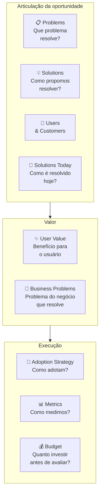

#### Quando usar

Use o Opportunity Canvas na Fase 8 (ideação) e durante todo o ciclo de descoberta contínua pós-PMF. É a ferramenta certa para responder "vale a pena construir essa feature/produto/oportunidade adjacente?" antes de comprometer um trimestre de roadmap. Também use em comitês de priorização: comparar três Opportunity Canvases lado a lado é mais informativo que comparar três PRDs longos.

#### Princípios

A tese de Patton é que **decisão de roadmap é decisão de capital** — cada feature construída custa o custo de oportunidade da feature não construída. O Opportunity Canvas força articular *o trade-off* explicitamente. Diferente do BMC (que descreve o negócio inteiro) e do Lean Canvas (que descreve um modelo a validar), o Opportunity Canvas descreve **uma aposta específica de produto** e pode coexistir com vários outros: uma empresa madura típica tem 10-30 Opportunity Canvases ativos em portfólio.

#### Como aplicar

Reúna PM + tech lead + designer + 1 stakeholder de negócio (RH, vendas, operações) — 4-5 pessoas. Tempo: 60-90 minutos. Comece pelos Problems & Users; só depois vá para Solutions. A ordem importa: começar por Solutions reforça viés de "já sabemos o que construir" e mascara perguntas críticas sobre adoção.

1. **Problems**: descreva o problema sem mencionar a solução. "Usuário tipo X sofre com Y em contexto Z."
2. **Users & Customers**: quem especificamente. Em B2B, distinguir usuário (quem mexe), comprador (quem paga), influenciador (quem decide).
3. **Solutions Today**: como o problema é resolvido hoje? Excel, processo manual, concorrente, "não fazer nada". Liste 3-5 alternativas com prós/contras.
4. **User Value**: o que o usuário ganha que hoje não tem? Específico e mensurável.
5. **Business Problems**: que problema do negócio (retenção, aquisição, monetização, expansion) essa oportunidade endereça?
6. **Solutions**: agora sim, descreva o que vai construir.
7. **Adoption Strategy**: como o usuário descobre, experimenta, adota? In-app, email, CSM, marketing pago?
8. **Metrics**: 2-3 métricas leading + 1 lagging. Se não consegue definir, oportunidade está mal articulada.
9. **Budget**: quanto vai investir (pessoas × tempo + custo de aquisição) antes de reavaliar? Sem budget, Opportunity Canvas vira fantasia.

Tempo total: 60-90 minutos por canvas. Faça antes de comprometer roadmap — não depois.

#### Exemplo brasileiro preenchido — Hotmart, oportunidade "Hotmart Sparkle" para microcreators (2022)

Em 2022, a Hotmart já dominava infoprodutos médios e grandes (creators que vendiam cursos de R$ 300+ a milhares de alunos). Identificou uma oportunidade adjacente: **microcreators** — pessoas com audiência pequena (1-5k seguidores) que queriam monetizar conteúdo curto e barato (R$ 9-49 por item). O Opportunity Canvas dessa aposta:

| Bloco | Conteúdo |
|---|---|
| **Problems** | Microcreators têm audiência pequena mas engajada e querem monetizar, mas o setup atual da Hotmart (criar curso completo com landing page, hospedar conteúdo, configurar afiliados) é overkill para conteúdo de 30-90 minutos a R$ 19. |
| **Users & Customers** | Usuário e cliente são a mesma pessoa: microcreator brasileiro com 1-5k seguidores no Instagram/TikTok, audiência engajada, já tem conteúdo gravado mas não no formato curso. |
| **Solutions Today** | (1) Vender via DM no Instagram com PIX — alta fricção, sem rastreamento. (2) Plataformas estrangeiras (Gumroad) — barreiras de PIX/pagamento BR. (3) Não monetizar — "perder" a audiência. |
| **User Value** | Setup de produto digital em 5 minutos (vs 1-2h da plataforma principal). Pagamento via PIX integrado. Link de venda direto pra bio do Instagram. Sem necessidade de criar landing, configurar funil, integrar afiliados. |
| **Business Problems** | (1) Aquisição: capturar a base de microcreators que ainda não usa Hotmart e que daqui a 3-5 anos pode virar creator médio. (2) Diversificação: reduzir dependência de "top 1000 creators". (3) Defesa de mercado: bloquear entrada de Gumroad/Stan/Ko-fi no Brasil. |
| **Solutions** | "Hotmart Sparkle": fluxo simplificado de criação (3 telas), template de venda mobile-first, pagamento PIX nativo, link de bio gerado automaticamente, sem afiliados/cupons (corte deliberado). |
| **Adoption Strategy** | Indicação de creators existentes (microcreators são frequentemente fans/alunos de creators médios), parcerias com agências de microinfluência, conteúdo orgânico no Instagram da Hotmart focado nesse perfil. |
| **Metrics** | Leading: número de microcreators ativando produto/mês, GMV médio por microcreator, conversão de visitante em comprador no link de bio. Lagging: % de microcreators que migram para a plataforma principal em 12 meses. |
| **Budget** | 1 squad (5 pessoas) por 6 meses para MVP + 4 meses de aquisição inicial = ~R$ 1.5M. Reavaliar em 10 meses: se GMV mensal não chegar a R$ 2M ou 5k microcreators ativos, descontinuar. |

**Insight do caso.** O bloco mais valioso aqui é o **Business Problems** explícito — articula que essa oportunidade não é "feature legal", é resposta a três problemas estratégicos da Hotmart (aquisição de creators emergentes, diversificação de dependência, defesa de mercado). Sem essa articulação, "Hotmart Sparkle" pareceria projeto secundário; com ela, fica claro por que merece squad dedicado. **A lição: Opportunity Canvas força distinguir oportunidade-de-produto de oportunidade-de-negócio. Feature sem business problem definido raramente sobrevive a corte de roadmap.**

#### Variações e extensões

- **Lean UX Canvas** (Jeff Gothelf): variação focada em times UX-driven, com bloco de hipóteses explícito.
- **Product Discovery Canvas** (Roman Pichler): variação para PMs em ambientes ágeis, com ênfase em assumptions e experimentos.
- **Now/Next/Later Roadmap**: complementa o Opportunity Canvas — uma vez que a oportunidade vale a pena, onde no roadmap ela entra?

#### Erros comuns

- Pular Problems & Users e ir direto para Solutions — viés de "já sei o que construir" mascara perguntas críticas.
- Articular User Value em features ("vamos ter um botão de X") em vez de benefícios ("o usuário consegue Y em Z minutos vs hoje em W horas").
- Esquecer Business Problems — oportunidade que ajuda só o usuário sem resolver problema do negócio é caridade, não estratégia.
- Definir Metrics só lagging (GMV, retenção D90) sem leading — leva 3-6 meses para saber se está funcionando.
- Não definir Budget de saída — oportunidade roda indefinidamente sem reavaliação, consumindo time.

#### Quando NÃO usar

Em decisões muito pequenas (mudar copy de um botão, ajustar layout) — overhead de canvas não compensa. Em decisões muito grandes e estruturais (entrar em novo país, lançar segunda linha de produto) — use BMC (CZ.1) ou Lean Canvas (CZ.2), que dão visão de modelo completo. Em ambientes onde o roadmap é ditado de fora (clientes enterprise B2B com contratos) — espaço de manobra limitado torna o canvas teatro.

#### Conexão com outros canvases

O Opportunity Canvas **sucede o BMC/Lean** (CZ.1/2): depois que o modelo de negócio está claro, cada oportunidade-feature tem seu Opportunity Canvas próprio. **Pareia com o Hypothesis Canvas (CZ.14)**: cada Opportunity Canvas pode gerar 3-5 hipóteses falsificáveis para validar antes de construir. **Antecede o MVP Canvas (CZ.11)**: depois de aprovada, a oportunidade vira escopo de MVP.

#### Leitura adicional

- *User Story Mapping* (Jeff Patton, 2014).
- *Inspired* (Marty Cagan, 2008/2017) — escola de product discovery contínuo onde o Opportunity Canvas se encaixa.
- [jpattonassociates.com](https://www.jpattonassociates.com) — biblioteca de templates e ensaios de Patton.

---

### CZ.6 — Empathy Map (Dave Gray / XPLANE, 2009)

#### Origem histórica

O Empathy Map foi criado por Dave Gray e a equipe da consultoria XPLANE em torno de 2009 e popularizado no livro *Gamestorming* (Gray, Brown & Macanufo, 2010). Surgiu como ferramenta de design thinking para deslocar conversas sobre cliente do registro demográfico ("nossa persona é mulher, 30-40 anos, classe B") para o registro **comportamental e emocional** ("o que ela vê quando abre o aplicativo de banco no celular pela manhã, antes do café?"). A motivação foi a observação de que personas tradicionais produziam descrições caricatas que não geravam empatia real — Empathy Map força sair do "quem é" e entrar no "como vive".

#### O que é

Tela visual em forma de cruz com **seis quadrantes** organizados ao redor de uma pessoa (avatar central):

- **Pensa & Sente** (centro/cima): o que ocupa a cabeça dessa pessoa? O que a preocupa? O que a entusiasma?
- **Vê** (esquerda): o que ela observa no ambiente — clientes, concorrentes, mercado, mídia?
- **Ouve** (direita): o que ela escuta — chefe, família, amigos, especialistas, mídia?
- **Fala & Faz** (baixo): o que ela diz publicamente? Como age?
- **Pains** (canto inferior esquerdo): medos, frustrações, obstáculos.
- **Gains** (canto inferior direito): desejos, motivações, métricas de sucesso pessoais.

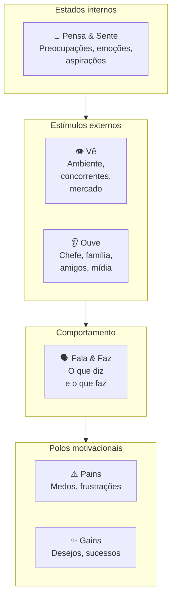

A tese é que comportamento humano é resultado da tensão entre **estímulos** (vê/ouve), **estados internos** (pensa/sente) e **polos motivacionais** (pains/gains). Mapear os seis revela contradições — pessoa que diz X publicamente mas faz Y; pessoa que ouve A do chefe mas é movida por B internamente — e essas contradições são exatamente onde produto novo encontra adoção.

#### Quando usar

Use o Empathy Map na Fase 3 (descoberta) como complemento ao Mom Test — entrevistas de problema capturam comportamento passado; o Empathy Map captura **o universo emocional e contextual** que cerca esse comportamento. Use também na Fase 4 (pesquisa) para construir o Customer Profile do VPC (CZ.3) com profundidade emocional. Em times de produto maduros, faça Empathy Map de cada persona principal a cada 12 meses — clientes mudam, e o mapa fica datado.

#### Princípios

A tese de Gray é que **empatia é capacidade construída, não dom**. Para construir, é preciso processo deliberado: ler verbatim de entrevistas, observar em campo, mapear com a equipe num exercício colaborativo. Empathy Map preenchido só com intuição é ficção. Preenchido com base em pesquisa real, vira ferramenta de tomada de decisão — quando alguém propõe uma feature que contradiz o que está mapeado em "Pains" e "Gains", a contradição fica visível.

#### Como aplicar

Reúna 3-5 pessoas (PM + designer + customer success + 1-2 fundadores). Tempo: 90-120 minutos. **Pré-requisito**: pesquisa real concluída — pelo menos 5-10 entrevistas qualitativas + observação em campo. Sem isso, Empathy Map vira intuição coletiva.

1. **Escolha uma persona específica** — não "nossos clientes em geral", mas "Mariana, dona de padaria de duas unidades em São Paulo". Empathy Map é por pessoa, não por segmento.
2. **Vê** — leia verbatim de entrevistas e observação. O que essa pessoa vê no celular pela manhã? No trabalho? Em casa? Que ambiente físico habita? Que mídia consome?
3. **Ouve** — quem fala com ela? O que esses falantes dizem? Chefe, sócio, família, amigos, podcasts, influenciadores.
4. **Pensa & Sente** — o que ocupa a mente? O que tira o sono? O que entusiasma? Aqui é zona de inferência cuidadosa — ancore em verbatim.
5. **Fala & Faz** — o que ela diz publicamente (LinkedIn, conversas profissionais)? Como age (rotina, decisões observadas)? Há contradição entre os dois?
6. **Pains** — medos específicos, não genéricos. "Tenho medo de quebrar" é vago; "tenho medo de não conseguir pagar a folha do mês 13" é Pain.
7. **Gains** — sucessos pessoais que ela buscaria. "Quero crescer" é vago; "quero abrir terceira unidade até 2027" é Gain.

Tempo: 90-120 min para a primeira versão. Refazer a cada 6-12 meses ou após mudança significativa de mercado.

#### Exemplo brasileiro preenchido — Loggi, persona "Carlos motoboy" (2018)

Quando a Loggi expandiu de courier corporativo para entregas last-mile B2C em 2018, fez Empathy Map dos entregadores parceiros — não dos clientes finais. A descoberta levou a redesenho do app do entregador.

| Quadrante | Conteúdo |
|---|---|
| **Vê** | App da Loggi competindo por atenção com WhatsApp, Uber, iFood, Rappi no celular. Outros motoboys em redes informais comentando preços e rotas. Trânsito de São Paulo em tempo real. Posto de gasolina como ponto de socialização. Estabelecimentos comerciais como "clientes da semana". |
| **Ouve** | Esposa pedindo para "voltar mais cedo". Outros entregadores em grupo de WhatsApp reclamando de plataforma X ou recomendando rota Y. Atendente da Loggi por mensagem (raramente por voz). Clientes finais quando entrega presencial — alguns simpáticos, outros agressivos sobre atraso. |
| **Pensa & Sente** | Ansiedade sobre quanto vai ganhar no fim do dia. Cálculo mental constante de R$/km. Frustração com cancelamentos e endereços errados. Orgulho discreto quando completa entregas difíceis. Cansaço acumulado mas necessidade de não parar. Comparação com outros entregadores — "fulano fez 30 entregas hoje, eu só 22". |
| **Fala & Faz** | Diz publicamente que "trabalha pela liberdade de horário". Faz: aceita corridas das 6h às 22h porque precisa do faturamento. Recusa entregas longas mesmo com bônus se for fim de semana. Compartilha dicas em grupo de WhatsApp mas guarda os melhores estabelecimentos para si. |
| **Pains** | Ganhar menos que o pico do mês passado. Acidente sem cobertura — "se eu cair, fico sem renda". Bateria do celular acabar no meio do dia. Endereço errado em região perigosa. Diarreia/doença sem direito a auxílio. Multas de trânsito que comem ganho do dia. Cliente que não responde interfone. |
| **Gains** | Faturar R$ 3-4k/mês líquido (após combustível e manutenção). Conseguir folga de domingo sem perder ranking. Ter celular novo (ferramenta de trabalho). Comprar moto melhor — sonho de 12-24 meses. Ter dia mais previsível. Ser tratado com respeito por atendentes e clientes. |

**Insight do caso.** O quadrante "Vê" revelou algo crítico: o app da Loggi competia com 4-6 outros apps por atenção do entregador na mesma tela. Times anteriores haviam tratado o app como "ferramenta de trabalho dedicada" — a realidade é que o entregador trocava entre apps ao longo do dia conforme o que pagava melhor naquela janela. Isso levou a três decisões: (1) reduzir tempo de aceite de corrida (de 30s para 15s — entregador estava em outro app); (2) notificações mais agressivas com bônus (não dependendo de ele abrir o app); (3) **comunicação por voz** com atendente em casos críticos (entregador não consegue ler chat enquanto pilota). **A lição: Empathy Map dos não-clientes (parceiros, fornecedores, intermediários) frequentemente revela mais que Empathy Map do cliente final — porque essas pessoas têm múltiplos chefes invisíveis e otimizam por critérios que você não enxerga sem mapear.**

#### Variações e extensões

- **Empathy Map Canvas (atualizado, Dave Gray, 2017)**: versão mais recente que adiciona "Goal" no centro (objetivo da pessoa) e desloca o foco para tarefa-a-realizar — versão JTBD-friendly.
- **Stakeholder Empathy Map**: para B2B enterprise, fazer um Empathy Map para cada stakeholder no processo de compra (usuário, comprador, sponsor, TI).
- **Day-in-the-Life Map**: variação que mapeia 24 horas concretas ao invés de estados gerais.

#### Erros comuns

- Preencher com intuição em vez de pesquisa — Empathy Map sem dado real é projeção coletiva, não empatia.
- Tratar como descrição estática — pessoas mudam; refaça periodicamente.
- Confundir "Vê" com demografia — "Vê" é o ambiente físico/digital específico, não "tem 30 anos".
- Ignorar contradições entre "Fala & Faz" — frequentemente é onde estão as oportunidades de produto.
- Fazer Empathy Map só do cliente ideal — clientes problemáticos ou não-clientes (quem não compra) revelam mais sobre adoção real.

#### Quando NÃO usar

Em decisões puramente técnicas (escolha de stack, refatoração interna). Em mercados B2B muito padronizados onde o "comprador" é processo formal de licitação — Empathy Map do comprador individual tem peso menor que o entendimento do processo de compra. Quando a pesquisa qualitativa é insuficiente — fazer Empathy Map sem 5+ entrevistas por persona produz ficção.

#### Conexão com outros canvases

O Empathy Map **alimenta o Customer Profile do VPC (CZ.3)** — Pains e Gains do Empathy Map se traduzem diretamente em Pains e Gains do VPC. **Pareia com o Customer Journey Canvas (CZ.7)**: Empathy Map é estado; Customer Journey é trajetória. Os dois juntos dão "estado interno em cada momento da jornada". **Antecede o BMC/Lean** (CZ.1/2): entender clientes profundamente vem antes de articular o modelo.

#### Leitura adicional

- *Gamestorming* (Dave Gray, Sunni Brown & James Macanufo, 2010).
- *Updated Empathy Map Canvas* (Gray, blog post, 2017) — a versão revisada com foco em Goal.
- [gamestorming.com](https://gamestorming.com) — biblioteca de templates de Gray.

---

### CZ.7 — Customer Journey Canvas

#### Origem histórica

O Customer Journey Map / Canvas surgiu da convergência de três escolas em meados dos anos 2000: design thinking (IDEO, Stanford d.school), service design (Nordic School, livet Lavrans Løvlie / Ben Reason) e experiência do cliente (Forrester, escola de CX corporativo). Não tem autor único — virou padrão de prática colaborativa entre 2008 e 2015, com formalização no livro *This Is Service Design Doing* (Marc Stickdorn et al., 2018). A motivação foi observação recorrente: empresas otimizavam touchpoints isolados (home page, atendimento, cobrança) sem ver a jornada inteira do cliente, e o resultado eram experiências fragmentadas onde cada ponto funcionava isolado mas o conjunto deixava o cliente confuso ou frustrado.

#### O que é

Tela visual organizada em **eixo horizontal de tempo** (fases da jornada do cliente, da descoberta ao pós-uso) e **eixo vertical de dimensões** (mínimo cinco):

- **Etapa**: nome curto da fase (Descoberta, Consideração, Compra, Onboarding, Uso, Suporte, Renovação).
- **Ação**: o que o cliente faz nessa etapa (concretamente — clica, abre app, liga, fala com).
- **Objetivo**: o que ele tenta cumprir.
- **Pontos de Dor**: onde algo dá errado, demora, frustra.
- **Emoções**: o que ele sente (ansiedade, alívio, raiva, tédio, entusiasmo).
- **Oportunidades**: onde existe espaço para intervenção.

Versões mais avançadas adicionam: ferramentas/canais usados, métricas de sucesso por etapa, KPIs internos, owners do touchpoint, dados quantitativos (NPS por etapa, conversão).

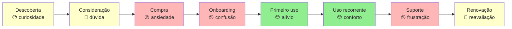

A linha emocional (verde alto / amarelo neutro / vermelho baixo) ao longo da jornada é o output mais valioso: pontos vermelhos consecutivos antecipam churn; pontos verdes isolados cercados de vermelho são "experiências boas no contexto errado".

#### Quando usar

Use o Customer Journey Canvas na Fase 4 (pesquisa) como entregável central — junto com personas e VPC. Use também a cada 12 meses como auditoria operacional pós-PMF: a jornada que funcionava em 2024 frequentemente não funciona em 2026 porque mudaram canais (TikTok, WhatsApp), expectativas (resposta em segundos), regulação (LGPD, PIX). Em momentos de pivô (Fase 15), refaça a jornada antes de qualquer investimento operacional.

#### Princípios

A tese é que **experiência do cliente é uma fita contínua, não pontos isolados**. Times divididos por função (marketing, vendas, sucesso, produto, suporte) tendem a otimizar suas próprias caixinhas e ignorar transições entre etapas. O Customer Journey Canvas força olhar a fita inteira e identificar **o ponto mais fraco** — porque a experiência do cliente é tão boa quanto o pior elo. Cliente que teve compra fácil mas onboarding caótico não fica; cliente que teve onboarding ótimo mas suporte distante churna na primeira dúvida real.

#### Como aplicar

Pré-requisito: 5-15 entrevistas qualitativas + dados quantitativos (analytics, NPS, CSAT). Reúna PM + designer + customer success + 1-2 representantes de marketing/vendas/operações. Tempo: 3-4 horas para a primeira versão.

1. **Defina escopo da jornada** — começo e fim. Comece **antes** do ponto óbvio: se você é SaaS, jornada começa quando cliente percebe o problema, não quando entra no site.
2. **Liste etapas** — 5-10 etapas nomeadas. Use vocabulário do cliente, não interno ("Considera comprar" não "Lead Qualificado").
3. **Para cada etapa**, preencha as 6 dimensões com base em verbatim e dados.
4. **Trace a linha emocional** — atribua emoção dominante a cada etapa.
5. **Identifique pontos críticos** — onde a emoção cai abruptamente, onde há atrito sistemático, onde o cliente abandona.
6. **Liste oportunidades** — para cada ponto crítico, 1-3 intervenções possíveis. Prioriza pelo impacto na linha emocional, não pelo custo de implementação.

Após primeira versão, **valide com 3-5 clientes reais** — peça que olhem o mapa e apontem onde discordam. Customer Journey desenhado sem validação é frequentemente "como queremos que seja", não "como é".

#### Exemplo brasileiro preenchido — iFood, jornada de primeira compra (2017)

Em 2017, o iFood mapeou a jornada de primeira compra para entender por que 40% dos novos cadastros não completavam pedido inicial. O canvas:

| Etapa | Ação | Objetivo | Dor | Emoção | Oportunidade |
|---|---|---|---|---|---|
| **Gatilho** | Sente fome às 19h, vê amigo pedindo via app | Resolver fome rápido | "Será que tem o que eu quero?" | Curiosidade | Hero card mostrando opções na cidade do usuário |
| **Descoberta** | Baixa app, abre primeira vez | Ver o que tem por perto | Tela inicial mostra muitos restaurantes — paralisia de escolha | Sobrecarga | Curadoria "mais pedidos hoje", reduzir opções iniciais |
| **Cadastro** | Preenche nome, email, telefone, endereço | Concluir cadastro rápido | Confirmação de SMS demora, formulário pede CPF (não obrigatório) | Frustração | Reduzir cadastro para email + senha + endereço; CPF só na compra |
| **Busca** | Filtra por categoria ou busca restaurante | Achar comida que quer | Restaurantes que não entregam no endereço aparecem | Decepção | Filtrar por entrega real antes de mostrar |
| **Cardápio** | Abre restaurante, navega cardápio | Escolher prato | Foto baixa qualidade, descrição inconsistente, preço sem ICMS visível | Dúvida | Padronização de cardápios + preço final na lista |
| **Carrinho** | Adiciona itens, vê total | Conferir antes de pagar | Taxa de entrega aparece tarde, "valor mínimo" surge surpresa | Irritação | Mostrar taxa e mínimo desde o cardápio |
| **Pagamento** | Escolhe forma, confirma | Pagar e fechar pedido | Cartão recusado sem explicação, 2FA do banco demora | Ansiedade alta | Aceitar PIX desde 2017, mostrar erro específico, salvar tentativas |
| **Espera** | Acompanha entrega no mapa | Saber quando chega | Mapa não atualiza em tempo real nos primeiros 10min | Inquietação | Streaming de status mais granular, comunicação proativa de atrasos |
| **Recebimento** | Recebe entrega, avalia | Comer e avaliar | Pedido errado / faltando item — sem caminho claro de queixa | Raiva | Botão "tem problema?" no mesmo card do pedido |
| **Pós-uso** | Recebe email pedindo nota | Avaliar (se lembrar) | Email genérico chega 3 dias depois | Apatia | Pedir nota in-app logo após entrega, com 1-tap |

**Insight do caso.** A jornada revelou que **a maior queda de conversão acontecia entre Pagamento e Espera** — clientes davam tudo certo até o pagamento, e quando o cartão era recusado sem explicação, abandonavam. Isso levou a três decisões: (1) PIX como segunda forma de pagamento desde 2017 (5 anos antes do PIX virar mainstream); (2) mensagens de erro específicas ("cartão sem limite" vs "dados incorretos" vs "banco bloqueou"); (3) salvar carrinho mesmo após falha — cliente não precisava recomeçar do zero. **A lição: Customer Journey Canvas frequentemente revela que o problema não está onde a equipe achava (qualidade de cardápio? variedade?) mas em transição específica que ninguém estava monitorando (o segundo entre "click pagar" e "pedido confirmado").**

#### Variações e extensões

- **Service Blueprint**: extensão do Customer Journey adicionando "linha de visibilidade" — o que o cliente vê (frontstage) vs o que acontece nos bastidores (backstage). Útil para ops e suporte.
- **Multi-persona Journey Map**: mesma jornada vista por 2-3 personas distintas (decisor vs usuário em B2B; comprador vs presenteado em B2C).
- **Future-State Journey Map**: jornada como queremos que seja em 12-18 meses, ao lado da atual. Útil para roadmap.

#### Erros comuns

- Mapear a jornada que a empresa quer (frictionless, lógica) em vez da que existe (fragmentada, cheia de workarounds) — desconectado do cliente real.
- Começar muito tarde (no momento da compra) — perde o gatilho que define quem chega ao site.
- Tratar como artefato estático — mercados e canais mudam (rise do TikTok como descoberta, do PIX como pagamento, do WhatsApp como suporte); jornada precisa atualização.
- Otimizar pontos isolados sem ver consequências em pontos seguintes — onboarding mais rápido pode produzir mais churn em 30 dias.
- Não medir — Customer Journey sem dados é hipótese; precisa NPS por etapa, conversão entre etapas, tempo médio em cada etapa.

#### Quando NÃO usar

Em produtos transacionais simples sem relacionamento contínuo (vending machine, compra one-shot de baixo valor) — overhead não compensa. Em mercados B2B enterprise muito longos (ciclo de venda 12+ meses) — Customer Journey vira documento de 50 páginas que ninguém lê; melhor abordar com sequence diagram do processo de compra.

#### Conexão com outros canvases

O Customer Journey Canvas **pareia com o Empathy Map (CZ.6)**: Empathy Map é estado; Customer Journey é trajetória. **Alimenta o VPC (CZ.3)**: pontos de dor da jornada viram Pains do Customer Profile. **Alimenta o Pirate Canvas / AARRR (CZ.10)**: as etapas da jornada mapeiam diretamente para Acquisition → Activation → Retention → Referral → Revenue. **Sucede o BMC (CZ.1)**: BMC mapeia o modelo; Customer Journey mapeia a experiência operacional do cliente dentro desse modelo.

#### Leitura adicional

- *This Is Service Design Doing* (Marc Stickdorn, Markus Edgar Hormess, Adam Lawrence, Jakob Schneider, 2018).
- *Mapping Experiences* (James Kalbach, 2nd ed. 2020) — manual extensivo sobre todos os tipos de mapas de experiência.
- [servicedesigntools.org](https://servicedesigntools.org) — biblioteca de templates open-source.

---

### CZ.9 — Test Card (David Bland & Alexander Osterwalder, 2019)

#### Origem histórica

O Test Card foi formalizado no livro *Testing Business Ideas* (David Bland & Alexander Osterwalder, 2019), parte da família Strategyzer (mesma escola do BMC e VPC). É a sistematização — em formato de cartão único — do que já era prática tácita no Lean Startup desde Eric Ries (2011): para cada hipótese, defina o experimento que vai testá-la **antes** de coletar dados, com critério de sucesso explícito. O Test Card tornou esse exercício replicável: cabe numa folha A5, tem campos fixos, e força o time a articular o critério de sucesso antes do experimento começar (não depois, quando já há viés de confirmação).

O que o livro IGNIÇÃO chama de "Cartão de Experimento" (Template A.4 do Apêndice A) é uma adaptação direta do Test Card, com algumas extensões para o contexto brasileiro (custo em R$, linguagem local). A origem da ferramenta é Strategyzer.

#### O que é

Cartão de uma página com **oito campos** estruturados:

- **ID do experimento** (numeração sequencial).
- **Hipótese testada** (uma frase falsificável copiada do banco de hipóteses).
- **Pergunta central** (o que especificamente queremos responder).
- **Desenho** (passo a passo do experimento).
- **Público** (quantas pessoas, qual perfil, como alcançadas).
- **Métrica principal e critério de sucesso** (definido **antes** de ver dados).
- **Critério de refutação** (o que invalida a hipótese — também antes).
- **Custo e duração** (orçamento e prazo).

Após o experimento, o cartão se completa com:

- **Resultado observado**.
- **Decisão** (Persevere / Pivote / Ajuste / Abandone).
- **Aprendizados** (o que isso nos ensina sobre o modelo).

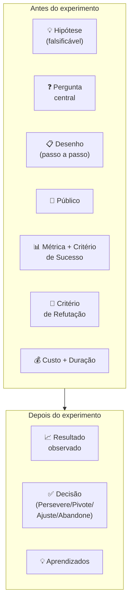

A disciplina central é definir **Critério de Sucesso e Critério de Refutação ANTES** de rodar o experimento. Times que definem critério depois invariavelmente racionalizam os dados a favor da hipótese ("converteu menos do que esperávamos, mas ainda é positivo porque..."). Critério pré-definido evita auto-engano.

#### Quando usar

Use o Test Card na Fase 7 (experimentos de validação do problema) como artefato central — um Test Card por experimento, vivo até o experimento concluir. Use também na Fase 6 (formulação de hipóteses) como follow-up imediato: cada hipótese bet-the-company gera 1-3 Test Cards. Em times pós-PMF com cultura de discovery contínuo, Test Card vira hábito semanal — qualquer feature ou mudança de fluxo gera Test Card antes da implementação.

#### Princípios

A tese de Bland & Osterwalder é que **experimento sem critério pré-definido não é experimento, é demonstração**. Demonstração começa com a conclusão pronta e busca evidência que confirme. Experimento começa com pergunta aberta e aceita qualquer resposta. A diferença é a definição prévia do critério de refutação. Test Card formaliza esse rigor — sem ele, a maioria dos "experimentos" em startup é teatro de método científico.

#### Como aplicar

Para cada hipótese a testar, abrir um Test Card. Tempo de preenchimento: 30-45 min. Participantes: 2-3 pessoas (PM + tech/design + 1 fundador).

1. **Hipótese** — copie da Fase 6, escreva como afirmação falsificável: "X% dos visitantes da landing page se cadastrarão em até 7 dias", não "as pessoas vão gostar".
2. **Pergunta central** — o que estamos testando especificamente? Frequentemente é o coração da hipótese reformulado.
3. **Desenho** — passo a passo do experimento. Concreto: que landing page? Quais ads? Que público?
4. **Público** — N planejado, perfil específico, canal. "100 visitantes ICP via Meta Ads" é diferente de "100 visitantes quaisquer".
5. **Métrica + Critério de Sucesso** — definir **antes**. "Sucesso = 8% de conversão visitante → cadastro em 14 dias."
6. **Critério de Refutação** — também antes. "Abaixo de 2% = hipótese refutada."
7. **Custo e Duração** — R$ X (Ads + ferramenta) + Y dias.
8. **Riscos e vieses** — o que pode distorcer? Tráfego ruim? Dia da semana? Novidade?

Rodar o experimento. Atualizar o cartão com resultado, decisão e aprendizados.

**Regra de ouro**: sucesso e refutação devem ser distintos com zona de incerteza no meio. Entre 2% e 8% no exemplo acima = inconclusivo, exige novo experimento. Sem zona de incerteza, qualquer resultado vira "sucesso" ou "fracasso" por viés.

#### Exemplo brasileiro preenchido — PadariaPro, smoke test de proposta de valor (2024)

Equipe da PadariaPro (caso recorrente do livro) considerava lançar produto de gestão de delivery próprio para padarias artesanais com 1-3 unidades em São Paulo. Antes de construir, rodaram este Test Card:

| Campo | Conteúdo |
|---|---|
| **ID** | EXP-2024-03 |
| **Hipótese testada** | Donos de padaria com 1-3 unidades em SP que fazem delivery próprio têm dor suficiente para pagar R$ 290/mês por software de gestão integrada de pedidos. |
| **Pergunta central** | Visitantes ICP convertem em formulário "quero conhecer" a ≥10%? Dos que preenchem, ≥30% confirmam disposição a pagar R$ 290 em ligação? |
| **Desenho** | (1) Landing page descrevendo o produto como se existisse, com R$ 290/mês destacado e formulário de "quero conhecer". (2) Meta Ads segmentando "donos de padaria em SP" via interesses + lookalike de base de email comprada. (3) Para cada formulário preenchido, ligar em 24h e fazer entrevista de 15 min. |
| **Público** | 100 visitantes ICP (donos/sócios de padaria 1-3 unidades em SP capital), via Meta Ads. Verba de R$ 1.500. |
| **Métrica principal** | Taxa de conversão visitante → formulário preenchido. Sucesso: ≥10%. Refutação: ≤2%. |
| **Métrica secundária** | Dos preenchimentos, % que confirma disposição a pagar R$ 290 em ligação. Sucesso: ≥30%. Refutação: ≤10%. |
| **Critério de Refutação** | Conversão <2% OU confirmação de pagamento <10% = hipótese refutada. Reconsiderar preço ou ICP. |
| **Custo e Duração** | R$ 1.500 em Ads + 14 dias (1 semana de tráfego + 1 semana de ligações) + ~10h do fundador em entrevistas. |
| **Riscos e vieses** | Público frio do Meta pode não bater com ICP real (donos de padaria não usam Meta Ads como ferramenta de descoberta de software B2B). Mitigação: reforçar segmentação por interesses + lookalike. |

**Resultado** (preenchido após 14 dias):

- 47 visitantes ICP confirmados via tag de evento (audience pequena demais, limitação de targeting).
- 12 preencheram formulário (25,5% — acima do critério de sucesso primário).
- 7 atendiam à ligação. Dos 7: 4 confirmaram disposição a R$ 290, 2 a R$ 400, 1 a R$ 590. Confirmação de pagamento: 4/7 = 57% (acima do critério).

**Decisão**: Persevere. Hipótese reforçada — disposição a pagar é maior que o teste assumia (alguns aceitariam R$ 400-590). Próximo experimento: pré-venda paga real (R$ 290 com reembolso garantido) para os 12 do formulário.

**Aprendizados**: (1) ICP via Meta Ads funcionou apesar de ceticismo inicial — segmentação por interesse "padaria artesanal" + lookalike captou perfil certo. (2) Disposição a pagar > preço testado sugere que estamos subprecificando — testar R$ 390 no próximo experimento. (3) Tempo de resposta importa: dos 12 que preencheram, os 5 que não atenderam ligação foram contatados em D+2 (vs D+1 nos 7 atendidos). Diferença de 24h em tempo de resposta queimou 40% da amostra.

**Insight do caso.** A disciplina do Test Card neste exemplo evitou três erros típicos: (1) **viés de confirmação** — sem critério pré-definido, "47 visitantes" pareceria sucesso ou fracasso conforme a vontade do time; com critério, é claramente "amostra menor que planejada, mas suficiente porque conversão alta compensa"; (2) **subestimação de preço** — sem perguntar preço de forma sistemática, a equipe assumiria R$ 290 e nunca testaria preços maiores; (3) **falsa sensação de progresso** — sem "Critério de Refutação" registrado, o time poderia ter levado meses para perceber que algo simples como "responder em 24h" estava destruindo a amostra. **A lição: Test Card não é burocracia — é o equipamento de proteção contra os auto-enganos sistemáticos do empreendedor entusiasmado.**

#### Variações e extensões

- **Learning Card** (Strategyzer): cartão complementar focado em "o que aprendemos" (não "o que testamos"). Útil para destilar insights de múltiplos Test Cards rodados.
- **Assumption Map** (Bland & Osterwalder): grid 2x2 que prioriza quais assumptions virar Test Cards primeiro (importância × evidência atual).
- **Riskiest Assumption Test (RAT)** (Cindy Alvarez / GV Sprint): variação minimalista — só testa a única assumption que mais pode matar o produto.

#### Erros comuns

- Definir critério de sucesso depois de ver resultados — auto-engano garantido.
- Critério vago ("queremos boa adoção") em vez de quantitativo ("≥X% em Y dias") — resultado fica em zona cinza permanente.
- Não definir critério de refutação — só "sucesso" e "ainda não", nunca "refutado", impede aprendizado real.
- Rodar muitos Test Cards em paralelo sem capacidade de analisar — vira teatro de experimentação.
- Confundir Test Card com PRD (Product Requirements Document) — Test Card valida hipótese; PRD especifica construção. São documentos para fases distintas.

#### Quando NÃO usar

Em decisões reversíveis e baratas (pequena mudança de copy, ajuste de preço pontual) — overhead do cartão não compensa. Em decisões que não cabem em hipótese falsificável ("devemos ter cultura mais transparente?") — Test Card não serve para questões de identidade ou valores. Em ambientes onde o time não tem disciplina para parar e analisar antes de avançar — Test Card sem cultura de revisão vira papel.

#### Conexão com outros canvases

O Test Card **sucede o Hypothesis Canvas (CZ.14)**: cada hipótese vira 1-3 Test Cards. **Sucede o Lean Canvas (CZ.2)**: cada bloco do Lean Canvas gera hipóteses, que geram Test Cards. **Antecede o MVP Canvas (CZ.11)**: depois de Test Cards validarem que a oportunidade existe, MVP Canvas define o escopo do que construir. **No livro IGNIÇÃO**, o Test Card é a fonte canônica do "Cartão de Experimento" do Template A.4 — são a mesma ferramenta com nome localizado.

#### Leitura adicional

- *Testing Business Ideas* (David Bland & Alexander Osterwalder, 2019).
- *The Lean Startup* (Eric Ries, 2011) — origem filosófica da disciplina.
- [strategyzer.com/library](https://strategyzer.com/library) — biblioteca de Test Cards preenchidos por categoria.

---

### CZ.10 — Pirate Canvas / AARRR (Dave McClure, 2007)

#### Origem histórica

Dave McClure, fundador do fundo 500 Startups, apresentou o framework AARRR em 2007 num slide deck chamado "Startup Metrics for Pirates" — o acrônimo soa como "ARRRR" de pirata, daí o apelido. O contexto era a explosão de startups web na fase pós-Web 2.0, quando times de produto rastreavam dezenas de métricas sem saber quais importavam. AARRR reorganizou o caos em cinco métricas de ciclo de vida do cliente. O "Pirate Canvas" — ou AARRR Canvas — é a versão visual posterior, que traduz as cinco letras em uma tela preenchível com métricas, canais, e hipóteses organizadas por funil. O framework virou o padrão de facto de métricas early-stage em aceleradoras e fundos de venture capital global, incluindo YC, Antler e os principais VCs brasileiros.

#### O que é

Tela visual em cinco colunas correspondendo às cinco letras do acrônimo:

- **Acquisition (Aquisição)**: como o usuário chega. Canais, CAC, volume por canal.
- **Activation (Ativação)**: primeiro momento de valor — o usuário experimenta o produto e reconhece que funciona. Taxa de ativação, tempo até ativação.
- **Retention (Retenção)**: o usuário volta. D7, D30, coortes, churn mensal.
- **Referral (Indicação)**: o usuário traz outros. NPS, taxa de indicação, viralidade (K-factor).
- **Revenue (Receita)**: o usuário paga. Conversão freemium → pago, ARPU, LTV.

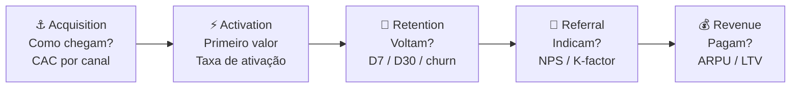

A distinção entre Acquisition e Activation é central: usuário que chegou mas não ativou é desperdício de CAC. A métrica de ativação (o "aha moment") é frequentemente o indicador mais importante do produto — encontrá-la é o trabalho de discovery dos primeiros meses.

#### Quando usar

Use o Pirate Canvas na Fase 10 (MVP e primeiros usuários) como estrutura padrão de instrumentação de métricas. Implante antes de lançar o MVP — não depois. Pós-PMF, use-o mensalmente como dashboard de saúde do funil: onde está a maior queda? Qual etapa tem pior conversão? A etapa com maior vazamento é o foco de crescimento do próximo ciclo. Em Fase 14 (escala), o Pirate Canvas orienta alocação de budget por etapa do funil.

#### Princípios

A tese de McClure é que **times sem modelo de funil explícito otimizam a métrica errada**. Times de produto tendem a focar em Acquisition (visível, fácil de medir, resulta em reuniões celebrando "crescimento") e ignorar Retention (invisível, difícil, mas única que gera crescimento sustentável). AARRR força o time a encarar que crescimento em Acquisition com retenção de 20% no D30 é uma banheira furada — você está enchendo o balde enquanto o buraco cresce. **Retenção precede escala de aquisição.**

#### Como aplicar

Monte o Pirate Canvas em três etapas, nesta ordem:

1. **Defina a métrica de cada etapa** — 1 métrica primária por etapa. Não 5. Uma. Acquisition: CAC médio ponderado por canal. Activation: taxa de usuários que atingem o "aha moment" em X dias. Retention: retenção D30 (ou D7 para apps). Referral: NPS ou taxa de indicação ativa (mês). Revenue: conversão freemium → pago ou ARPU mensal.
2. **Defina o benchmark mínimo** — o que é "saudável" nesta métrica para o seu modelo? SaaS B2B: retenção D30 > 70%. Consumer app: retenção D30 > 25%. Marketplace: depende do lado.
3. **Identifique o maior vazamento** — onde está a maior queda de conversão entre etapas? Esse é o único foco do próximo trimestre. Não mexa nas outras etapas até resolver essa.

Iteração mensal: atualize números, identifique onde o funil mudou, ajuste foco.

#### Exemplo brasileiro preenchido — Conta Simples, aceleração do funil B2B (2021)

A Conta Simples (conta empresarial digital para PMEs brasileiras) tinha problema claro em 2021: Acquisition funcionava bem (CAC baixo via Google Ads B2B + indicação), mas Activation era o gargalo — 60% dos cadastros não ativavam cartão em 14 dias.

| Etapa | Métrica principal | Número | Benchmark alvo | Status |
|---|---|---|---|---|
| **Acquisition** | CAC via canais digitais | R$ 180/cliente | < R$ 250 | ✅ Dentro |
| **Activation** | % completa onboarding + usa cartão em D14 | 40% | > 65% | 🔴 Crítico |
| **Retention** | Retenção D30 (conta ainda ativa e com transação) | 71% | > 70% | ✅ Dentro (marginal) |
| **Referral** | NPS (escala 0-100) | 52 | > 50 | ✅ Dentro |
| **Revenue** | ARPU mensal (receita por conta ativa) | R$ 68 | > R$ 60 | ✅ Dentro |

**O diagnóstico AARRR.** Com esse canvas, ficou claro: o problema não era "crescer" (Acquisition OK), não era "produto ruim" (Retention e NPS OK), e não era "precificação" (ARPU OK). Era **Activation** — usuários chegavam e não ativavam o cartão em 14 dias. Isso revelou dois culpados: (1) o processo KYC (validação regulatória) tinha fricção invisível — três documentos, dois dias de análise manual; (2) o email de onboarding não explicava por que o cartão era o "primeiro valor" da conta.

**As três ações decorrentes:** (1) automatizar 70% do KYC via integração com Receita Federal + Serasa, reduzindo de 2 dias para 4 horas; (2) reescrever o fluxo de onboarding in-app com checklist progressivo (cada step destravava o próximo); (3) enviar WhatsApp (não email) no D2 com link direto para "ativar seu cartão agora". Resultado em 90 dias: Activation subiu de 40% para 67%.

**Insight do caso.** A armadilha clássica sem Pirate Canvas seria investir mais em Acquisition ("vamos crescer mais cadastros"). O canvas mostrou que investir em Acquisition com 40% de Activation significava jogar 60 centavos de cada R$ 1 de CAC no lixo. **A lição: AARRR não é painel de monitoramento — é protocolo de priorização. O maior vazamento do funil vence o debate de roadmap.**

#### Variações e extensões

- **RARRA** (Andrew Chen): reordena para Retention → Activation → Referral → Revenue → Acquisition — enfatiza que Retention deve ser resolvida antes de escalar Acquisition.
- **North Star Metric**: uma única métrica que captura valor entregue ao cliente e prediz crescimento de longo prazo. Complementa o AARRR (que é funil; North Star é foco). Exemplos: Airbnb (noites reservadas), WhatsApp (mensagens enviadas por dia), Spotify (tempo de escuta/mês).
- **Growth Accounting**: decompõe variação de usuários ativos em Novos + Ressuscitados − Churned. Complemento quantitativo ao AARRR.

#### Erros comuns

- Definir múltiplas métricas primárias por etapa — diluição de foco.
- Focar em Acquisition enquanto Retention é crítica — encher banheira furada.
- Usar D7 e D30 intercambiavelmente — D7 mede habit formation, D30 mede stickiness; são perguntas distintas.
- Não segmentar o funil por persona/canal — um funil "médio" pode esconder que canal A tem Activation 80% e canal B tem 15%.
- Tratar AARRR como relatório (olhar uma vez por mês sem decidir nada) em vez de protocolo de priorização.

#### Quando NÃO usar

Em estágio pré-Activation (antes de ter produto em mãos de usuários reais) — métricas de funil não existem ainda. Em produtos com ciclo de venda B2B enterprise muito longo (6-18 meses) — AARRR pressupõe ciclo curto o suficiente para medir D7/D30; em ciclos longos, use pipeline de vendas (stage-by-stage). Em produtos de uso único (compra one-shot sem recorrência) — Retention não se aplica, e o framework perde uma das cinco etapas.

#### Conexão com outros canvases

O Pirate Canvas **alimenta o Lean Canvas (CZ.2)**: métricas do AARRR preenchem os blocos "Métricas-chave" e "Canais" do Lean Canvas com dados reais (não hipóteses). **Sucede o Customer Journey (CZ.7)**: as etapas da jornada do cliente mapeiam diretamente para as etapas do AARRR — Descoberta/Consideration = Acquisition, Onboarding = Activation, Uso recorrente = Retention, Recomendação = Referral, Upgrade = Revenue. **Orienta o MVP Canvas (CZ.11)**: o maior vazamento do AARRR é o foco do próximo MVP de crescimento.

#### Leitura adicional

- *Startup Metrics for Pirates* (Dave McClure, slide deck, 2007) — original disponível publicamente.
- *Hacking Growth* (Sean Ellis & Morgan Brown, 2017) — expansão prática do framework AARRR em equipes de growth.
- *Lean Analytics* (Alistair Croll & Benjamin Yoskovitz, 2013) — benchmarks por modelo de negócio (SaaS, marketplace, e-commerce, mobile app).

---

### CZ.11 — MVP Canvas (Tristan Kromer)

#### Origem histórica

Tristan Kromer, coach de inovação e autor do blog Grasshopper Herder, desenvolveu o MVP Canvas como resposta a uma frustração recorrente: times que "lançavam MVPs" sem definir antecipadamente o que estavam tentando aprender. O MVP Canvas surgiu ao redor de 2013-2015 como artefato estruturado para forçar três definições antes de qualquer linha de código: qual é a hipótese que o MVP testa, quem são os usuários do MVP (não os usuários futuros do produto final), e qual é o critério de sucesso que dirá ao time o que construir a seguir. Kromer parte da premissa de Eric Ries (*The Lean Startup*, 2011) mas torna operacional a pergunta mais ignorada: "MVP de quê, exatamente?"

#### O que é

Tela visual de uma página com **sete blocos** distribuídos em torno da pergunta central "o que estamos aprendendo com este MVP?":

- **Hipótese central**: a crença que o MVP testa — escrita como falsificável.
- **Segmento de usuário do MVP**: não o cliente final do produto, mas o cliente específico que validará *essa hipótese* (pode ser subconjunto menor).
- **Proposta de valor do MVP**: o que o usuário ganha com o MVP — pode ser diferente do produto final.
- **Canais de recrutamento**: como vamos chegar nos usuários deste MVP.
- **Critério de sucesso**: o que precisamos ver para considerar a hipótese validada.
- **Critério de invalidação**: o que precisamos ver para considerar a hipótese refutada.
- **Tipo de MVP**: qual experimento — landing page, concierge, wizard of oz, protótipo clicável, pré-venda, fake door.

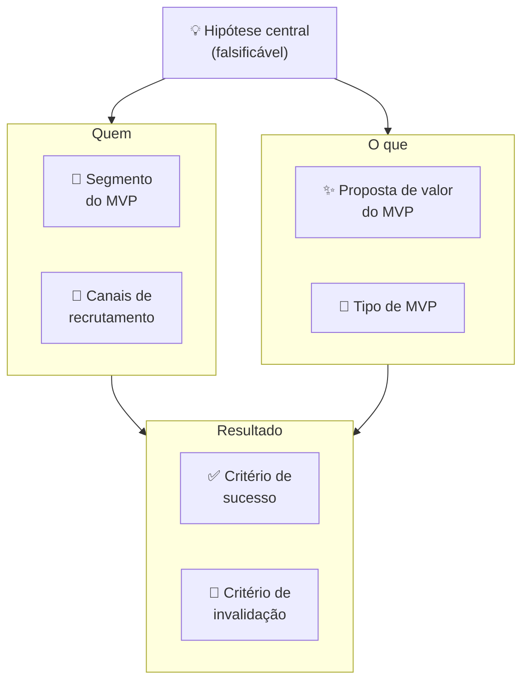

#### Quando usar

Use o MVP Canvas na Fase 8 (prototipagem e MVP) como artefato de entrada — antes de qualquer construção. Para cada MVP que o time planeja lançar, preencha o canvas em 30-45 minutos com as pessoas envolvidas. Em times pós-PMF com discovery contínuo, MVP Canvas precede qualquer sprint de desenvolvimento de feature nova: cada feature experimentada como "MVP de aprendizado" antes de virar permanente.

#### Princípios

A tese de Kromer é que **"MVP" sem hipótese explícita é só produto incompleto**. A maioria dos times chama de MVP qualquer versão inicial do produto, mas "versão inicial" sem hipótese não ensina nada — você lança, alguns usuários gostam, outros não, e o time não sabe o que isso significa. MVP Canvas faz a pergunta que a maioria evita: "Qual crença específica este MVP vai testar? E quando sabemos que foi refutada?" Sem essa resposta, o MVP nunca "falha" — ele simplesmente não tem critério de aprendizado.

#### Como aplicar

Reúna PM + tech lead + designer + fundador. Tempo: 30-45 minutos. **Sequência de preenchimento:**

1. **Hipótese central** — escreva primeiro, antes de falar sobre o MVP em si. "Acredito que [usuário Y] vai [fazer X] por causa de [razão Z]." Teste: a hipótese pode ser refutada? Se não, reescreva.
2. **Segmento do MVP** — quem especificamente vai testar esta hipótese? Pode ser 20 pessoas, não 20.000. Quanto mais estreito o segmento, mais limpa a evidência.
3. **Proposta de valor do MVP** — o que o usuário ganha hoje com esta versão? Não o que o produto promete no futuro — o que o MVP entrega agora.
4. **Canais de recrutamento** — como vai encontrar essas pessoas? "Nossos clientes" é vago; "lista de 50 churned users do último trimestre via email pessoal do founder" é um canal.
5. **Tipo de MVP** — qual é o formato do experimento? Não construa código se um protótipo clicável testa a mesma hipótese em 1/10 do tempo.
6. **Critério de sucesso** — define antes. Número específico.
7. **Critério de invalidação** — define antes. Zona de incerteza entre sucesso e invalidação = inconclusivo.

Após preencher, faça a pergunta de Kromer: "Se o MVP falhar pelo critério de invalidação, o que construímos a seguir?" Se a resposta for "pivotamos para X", o MVP está bem definido. Se a resposta for "não sabemos", a hipótese precisa ser mais específica.

#### Exemplo brasileiro preenchido — Wildlife Studios, MVP de novo mecanismo de monetização (2022)

A Wildlife Studios (São Paulo, one of the largest mobile game studios globally) testou em 2022 um novo mecanismo de monetização para seu jogo *Sniper 3D*: season passes (passe de temporada com recompensas progressivas), alternativa a loot boxes avulsas. O MVP Canvas:

| Bloco | Conteúdo |
|---|---|
| **Hipótese central** | Jogadores de Sniper 3D que compraram ao menos 1 item nos últimos 90 dias pagarão R$ 15 por season pass se perceberem progressão visual clara de recompensas ao longo de 30 dias. |
| **Segmento do MVP** | Cohort de 50.000 jogadores "moderate spenders" (1-3 compras/trimestre, ARPU R$ 18/mês) em mercado brasileiro. Excluídas as duas pontas — free-to-play puro e heavy spenders — para isolar o segmento mais sensível à proposta. |
| **Proposta de valor do MVP** | 30 recompensas progressivas (visuais, skins, boosters) por R$ 15 — previsibilidade de valor vs. loteria de loot box. |
| **Canais de recrutamento** | In-game banner para o cohort selecionado + push notification personalizada no D1 do teste. Sem anúncio externo — experimento contido na base existente. |
| **Tipo de MVP** | Feature real implementada no jogo para o cohort (não protótipo) — o investimento de desenvolvimento era pequeno o suficiente para ser justificado pela potencial monetização. |
| **Critério de sucesso** | ≥12% de conversão do cohort (compra do season pass) nos primeiros 7 dias. ARPU do cohort ≥ R$ 22 em 30 dias (vs. R$ 18 baseline). |
| **Critério de invalidação** | < 6% de conversão em 7 dias OU ARPU < R$ 16 em 30 dias = hipótese refutada. Considerar alternativas de monetização ou repricing. |

**Resultado:** 17% de conversão em D7 (acima do critério de sucesso). ARPU do cohort subiu para R$ 24 em 30 dias. Decisão: Persevere — expandir season pass para todos os usuários ativos + outros jogos do portfólio.

**Insight do caso.** O MVP Canvas forçou a Wildlife a definir o segmento com precisão — testar nos dois extremos (free-to-play puro e heavy spenders) contaminaria o resultado (FTP não compra nada; heavy spenders compram tudo, inclusive o que não funciona). A limpeza do cohort produziu evidência acionável: a proposta funciona para *moderate spenders*, que é exatamente o segmento de maior potencial de upgrade. **A lição: o trabalho mais importante do MVP Canvas é definir quem NÃO entra no experimento — não apenas quem entra.**

#### Variações e extensões

- **Concierge MVP Canvas**: variação específica para MVPs onde o serviço é entregue manualmente (você faz tudo na mão para 10-20 usuários). Canvas adiciona bloco "Script de operação manual".
- **Wizard of Oz Canvas**: variação onde o backend é falso (humano operando). Canvas adiciona bloco "O que o usuário vê" vs. "O que realmente acontece" para mapear a ilusão deliberada.
- **Sprint Goal Canvas** (adaptação ágil): integra MVP Canvas com sprint planning — cada sprint tem um canvas de hipótese + critério.

#### Erros comuns

- Chamar de "MVP" qualquer versão incompleta do produto — MVP sem hipótese é produto inacabado, não experimento.
- Segmento do MVP = segmento total do mercado — dilui o sinal; o experimento não produz evidência limpa.
- Tipo de MVP mais caro que o necessário — se landing page testa a hipótese, não construa produto; se protótipo clicável testa, não escreva código.
- Não definir critério de invalidação — MVP "sempre aprende algo", nunca "falha"; loop de aprendizado não fecha.
- Usar MVP Canvas para justificar construção que já foi decidida — canvas como teatro, não como ferramenta de decisão.

#### Quando NÃO usar

Em produtos altamente regulados onde qualquer versão pública precisa de certificação (healthtech com classe de risco II+, fintech com obrigação de compliance desde o primeiro usuário) — MVP Canvas pressupõe liberdade de lançar versão experimental; em ambientes regulados, o canvas é útil para MVPs internos e simulações. Em produtos onde o custo de construção do MVP mínimo é maior que o custo de validação por entrevistas — entrevista, não construa.

#### Conexão com outros canvases

O MVP Canvas **sucede o Opportunity Canvas (CZ.5)**: a oportunidade aprovada vira hipótese central do MVP Canvas. **Pareia com o Test Card (CZ.9)**: MVP Canvas define o experimento; Test Card registra e acompanha a execução. **Antecede o Pirate Canvas (CZ.10)**: o MVP bem sucedido gera os primeiros dados reais do funil AARRR. **Alimenta o Lean Canvas (CZ.2)**: Proposta de valor validada pelo MVP preenche o bloco "Solução" com dado real.

#### Leitura adicional

- Blog Grasshopper Herder (Tristan Kromer) — onde o MVP Canvas e variações são documentados.
- *The Lean Startup* (Eric Ries, 2011) — fundação filosófica.
- *Continuous Discovery Habits* (Teresa Torres, 2021) — escola de discovery contínuo onde MVP Canvas se integra ao ciclo semanal de produto.

---

### CZ.12 — Storytelling Canvas

#### Origem histórica

Não tem autor único. O Storytelling Canvas emerge da convergência de três tradições ao longo dos anos 2010: (1) o trabalho de Nancy Duarte (*Resonate*, 2010) e Simon Sinek (*Start With Why*, 2009), que sistematizaram estruturas narrativas para comunicação de liderança e pitch; (2) a escola de narrativa estratégica de empresas como Narrative Science e FrameWorks Institute, que estudaram como enquadramento de mensagem afeta percepção de valor; (3) a prática de pitch coaching em aceleradoras (YC, Endeavor, Wayra) onde templates de narrativa viram ferramentas de workshop. O Storytelling Canvas é o artefato visual que condensa essas três tradições — uma tela para construir a narrativa de pitch ou comunicação institucional antes de abrir o PowerPoint.

#### O que é

Tela visual organizada em **oito blocos** que correspondem às oito decisões narrativas centrais:

- **Herói**: quem é o protagonista da história? (O cliente, não a empresa.)
- **Mundo antes**: como era o mundo antes do problema existir — ou o mundo atual do herói, antes da solução.
- **Problema / Tensão**: o que perturba o equilíbrio? Qual a dor do herói?
- **Tentativas falhas**: o que o herói já tentou? Por que não funcionou?
- **A virada**: como a solução entra? Qual é o insight que muda tudo?
- **Mundo depois**: como o mundo do herói muda com a solução?
- **Evidências**: o que prova que a virada é real? (Dados, casos, depoimentos.)
- **Chamada para ação**: o que você quer que o ouvinte faça após ouvir a história?

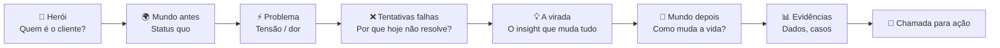

A estrutura segue o arco narrativo clássico de Joseph Campbell (A Jornada do Herói) aplicado ao contexto de produto e pitch — mas com um twist: **o herói não é o fundador nem a empresa, é o cliente**. A empresa é o "guia" (Gandalf, Yoda) que equipa o herói (Frodo, Luke) para vencer o problema.

#### Quando usar

Use o Storytelling Canvas em três contextos: (1) **pitch de investimento** — qualquer conversa com VC, anjo ou processo de aceleração; (2) **comunicação institucional** — lançamento de produto, entrada em novo mercado, apresentação para board; (3) **venda B2B complexa** — a proposta comercial também é uma narrativa, e o Storytelling Canvas ajuda a estruturá-la do ponto de vista do cliente, não do fornecedor. Preencha o canvas antes de criar o deck — a narrativa define a estrutura; o deck é execução.

#### Princípios

A tese unificada de Duarte, Sinek e da escola de pitch é que **dados sem narrativa não mudam comportamento**. O ser humano toma decisões emocionais e as justifica com lógica (Kahneman, *Thinking, Fast and Slow*). Uma história bem construída ativa a decisão emocional; os dados no bloco "Evidências" fornecem a justificativa racional. Inversamente, decks com dados sem narrativa produzem memorização zero — o investidor sai da reunião sem saber "o que essa empresa faz de diferente". O Storytelling Canvas força articular a narrativa primeiro, os dados depois.

#### Como aplicar

Preencha individualmente primeiro (20-30 min), depois valide em grupo (30 min). A sequência importa:

1. **Herói** — descreva o cliente em uma frase: quem é, em que contexto, qual seu papel. Concreto: "Mariana, diretora de RH de empresa com 200 funcionários em SP, responsável por recrutamento de vagas técnicas."
2. **Mundo antes** — como é a vida de Mariana hoje, no contexto do problema? Sem mencionar a solução. Quanto tempo perde? Que ferramentas usa? Com que frustrações convive?
3. **Problema / Tensão** — qual perturbação ela sofre? Qual é a pergunta que ela não consegue responder? Qual é o custo (tempo, dinheiro, emocional) do problema?
4. **Tentativas falhas** — o que ela já tentou? LinkedIn Recruiter (caro, barulhento), indicações (lentas), agências (caras, incertas). Por que cada um falha?
5. **A virada** — como a solução entra? Não "o que o produto faz" — qual insight muda tudo para Mariana? "E se ela tivesse acesso ao candidato passivo certo, antes de ele atualizar o LinkedIn?"
6. **Mundo depois** — como é a vida de Mariana com a solução? Concreto: "Mariana fecha vagas técnicas em 18 dias em vez de 45, sem agência, com candidatos que ela não encontraria no LinkedIn."
7. **Evidências** — dados, casos, resultados de pilotos. "3 clientes beta fecharam 87% das vagas abertas em <20 dias. NPS de 72 entre candidatos."
8. **Chamada para ação** — o que você quer que o ouvinte faça agora? "Assinar pilot de 60 dias com 3 vagas inclusas." Específico, com urgência.

#### Exemplo brasileiro preenchido — Omie (ERP para PMEs), pitch de Series B (2020)

A Omie levantou Series B em 2020 (R$ 52 milhões, Softbank + Redpoint Eventures) com uma narrativa clara. Reconstrução do Storytelling Canvas:

| Bloco | Conteúdo |
|---|---|
| **Herói** | Carlos, dono de empresa contábil com 80 clientes PME em São Paulo. Responsável por fechar a contabilidade de todos os clientes, muitos dos quais usam sistemas diferentes ou planilhas. |
| **Mundo antes** | Carlos passa 40% do seu tempo recoletando dados de cada cliente — nota fiscal em um sistema, fluxo de caixa em planilha, folha em outro fornecedor. Nenhum sistema conversa. Cada cliente usa software diferente. Fechar o balancete mensal exige 3-4 dias de trabalho manual. |
| **Problema / Tensão** | Carlos não consegue escalar — com os 80 clientes atuais já está no limite. Para crescer para 150, precisaria contratar 3 auxiliares. Mas o problema não é falta de mão de obra — é que o modelo de coleta manual é insustentável em qualquer escala. |
| **Tentativas falhas** | Outros ERPs (Totvs, SAP) são caros demais para PME e exigem implementação. Excel é insustentável. ERPs simples de PME não têm API para o escritório contábil acessar dados do cliente. |
| **A virada** | E se o ERP do cliente PME e o sistema do contador fossem o mesmo ambiente? Cliente lança nota, contador vê em tempo real. Fim do mês de coleta. |
| **Mundo depois** | Carlos atende 150 clientes com a mesma equipe de hoje. Balancete fecha em 4 horas. Carlos se torna consultor estratégico dos clientes, não operador de dados. |
| **Evidências** | 12.000 empresas ativas na plataforma. NPS de 76. Churn mensal < 1%. Tempo médio de onboarding: 3 dias (vs. 3 meses de ERPs tradicionais). |
| **Chamada para ação** | Investimento de R$ 52M para expandir de SP para todo o Brasil e dobrar a equipe de CS/produto nos próximos 18 meses. |

**Insight do caso.** O Storytelling Canvas da Omie colocou o **contador como herói** — não o dono de PME, não a Omie. Isso foi uma decisão estratégica deliberada: o contador é o gatekeeper de adoção (ele indica o ERP para o cliente PME, não o contrário). Ao fazer o contador o herói, a narrativa ativa o interesse do investidor *e* do canal de distribuição ao mesmo tempo. **A lição: quem você escolhe como herói define quem vai abraçar a sua narrativa. Em B2B com canais de distribuição, o herói frequentemente não é o usuário final — é o intermediário que decide a adoção.**

#### Variações e extensões

- **Pitch Deck Canvas**: versão que mapeia cada bloco do Storytelling Canvas para um slide do deck — Herói → slide de problema, Virada → slide de solução, Evidências → slide de tração.
- **Press Release Canvas** (Amazon): variação do "trabalhar de trás para frente" da Amazon — escrever o press release do produto *antes* de construí-lo, forçando articular o "Mundo depois" com precisão.
- **One-Pager Canvas**: comprime o Storytelling Canvas em uma única página A4 para comunicação escrita (email para investidor, proposta comercial).

#### Erros comuns

- Fazer a empresa o herói — ouvinte não se importa com a jornada da empresa; se importa com o problema do cliente.
- Pular "Tentativas falhas" — sem esse bloco, a solução não tem contraste; parece mais uma entre muitas.
- "Chamada para ação" vaga ("entre em contato", "vamos conversar") — ouvinte não sabe o próximo passo; taxa de avanço cai.
- Evidências genéricas ("clientes adoram", "crescemos 2x") — não constroem credibilidade; dado específico com contexto é o que convence.
- Usar o mesmo Storytelling Canvas para audiências diferentes — investidor, cliente, parceiro e imprensa têm "Herói" e "Chamada para ação" distintos; o canvas precisa ser refeito para cada audiência.

#### Quando NÃO usar

Em comunicações operacionais internas (status report para time, reunião de sprint) — overhead narrativo não agrega. Em contextos onde a audiência já conhece a narrativa (board recorrente, reunião de acompanhamento) — o canvas é para articular o pitch inicial, não para recapitular.

#### Conexão com outros canvases

O Storytelling Canvas **usa como insumo o BMC (CZ.1)** — os blocos "Segmento de Clientes" e "Proposta de Valor" do BMC alimentam Herói e Virada. **Usa o VPC (CZ.3)** — os Pains do Customer Profile alimentam "Problema / Tensão"; os Gain Creators alimentam "Mundo depois". **Usa métricas do Pirate Canvas (CZ.10)** para o bloco "Evidências" — tração real preenche o que sem AARRR seria só afirmação.

#### Leitura adicional

- *Resonate* (Nancy Duarte, 2010) — estrutura narrativa para apresentações de impacto.
- *Start With Why* (Simon Sinek, 2009) — Golden Circle como framework de narrativa de propósito.
- *Building a StoryBrand* (Donald Miller, 2017) — o cliente como herói, empresa como guia.

---

### CZ.13 — Risk Canvas

#### Origem histórica

O Risk Canvas não tem origem única — emerge da prática de gestão de risco em projetos de inovação e de frameworks como o Risk Register (PMI, PRINCE2) adaptados para o contexto de startup. As versões mais difundidas foram sistematizadas por praticantes de design thinking e lean startup entre 2015 e 2020, a partir da observação de que times de produto tendiam a discutir riscos informalmente, sem estrutura, e invariavelmente esqueciam categorias inteiras (risco regulatório, risco de equipe, risco de modelo) enquanto superestimavam risco técnico. O Risk Canvas operacionaliza a varredura sistemática de risco numa tela visual única, priorizando pelo impacto e pela probabilidade de materialização.

#### O que é

Tela visual organizada em **duas dimensões** — impacto (alto / baixo) × probabilidade (alta / baixa) — com **seis categorias de risco** mapeadas nesse espaço:

- **Risco de mercado**: o problema não existe, não é doloroso, ou o timing está errado.
- **Risco de cliente**: o segmento-alvo não adota, ou o ICP está errado.
- **Risco de solução**: a solução proposta não resolve o problema, ou não é preferida às alternativas.
- **Risco de modelo de negócio**: o CAC é maior que o LTV, ou a monetização não funciona.
- **Risco regulatório**: a regulação bloqueia a operação, ou muda o mercado de forma adversa.
- **Risco de equipe**: falta competência, comprometimento, ou cofundadores divergem.

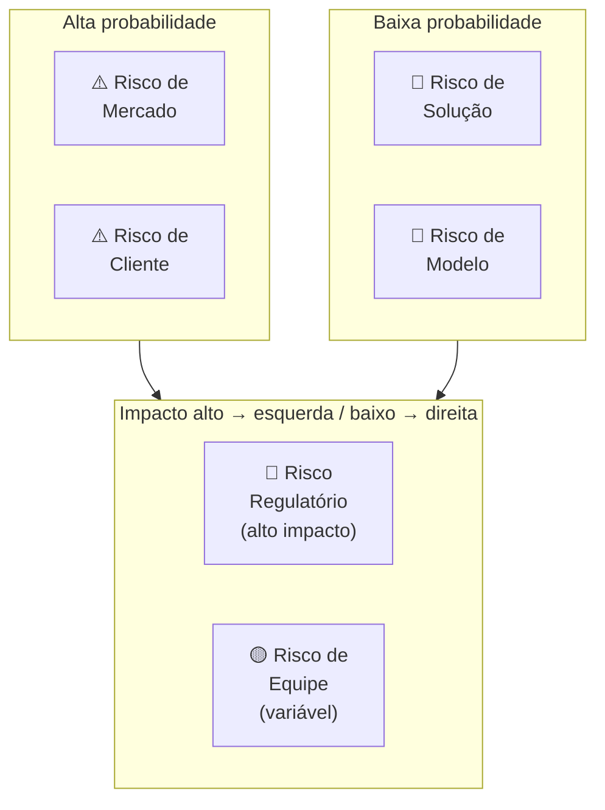

Para cada risco identificado, o canvas registra: **descrição específica**, **probabilidade** (1-5), **impacto** (1-5), **score** (prob × impacto), **mitigação planejada** e **owner** (quem cuida desse risco).

#### Quando usar

Use o Risk Canvas na Fase 11 (modelo de negócio) como check-up antes de comprometer recursos significativos — equipe maior, captação, expansão de canal. Use também antes de cada rodada de captação: investidores farão due diligence em risco; o Risk Canvas mostra que o time já fez o trabalho. Em Fase 15 (reinvenção), refaça o Risk Canvas para a segunda curva — os riscos de uma empresa em escala são diferentes dos de uma startup early-stage.

#### Princípios

A tese central é que **risco não gerenciado não desaparece — cresce silenciosamente**. Times de startup tendem a gerenciar risco de forma reativa (quando o risco se materializa, correm para mitigar) em vez de proativa (antes de se materializar, reduzirem a probabilidade ou o impacto). O Risk Canvas faz o risco visível e priorizado antes da crise. A segunda tese é que **riscos têm donos** — risco sem owner é risco sem mitigação. O canvas força nomear quem é responsável por acompanhar e mitigar cada risco crítico.

#### Como aplicar

Sessão de 2-3 horas com o time fundador completo. **Sequência:**

1. **Brainstorm livre de riscos** (30 min, todos contribuem, sem julgamento) — liste todos os "e se..." que tiram o sono. Foco em completude, não em priorização.
2. **Categorize** — atribua cada risco a uma das seis categorias.
3. **Pontue** — para cada risco, atribua Probabilidade (1-5) e Impacto (1-5). Score = Prob × Impacto. Riscos com score ≥ 15 são críticos.
4. **Priorize os top 5** — concentre energia de mitigação nos 5 com maior score.
5. **Defina mitigação** — para cada top 5: o que podemos fazer para reduzir a probabilidade? O que podemos fazer para reduzir o impacto se ocorrer? Qual experimento ou ação testa isso?
6. **Atribua owners** — cada risco crítico tem uma pessoa responsável por monitorar e executar a mitigação.
7. **Defina revisão** — quando este canvas é revisado? Mínimo trimestral.

#### Exemplo brasileiro preenchido — Méliuz, expansão para cartão de crédito (2020)

A Méliuz (cashback e cupons, listada na B3 em 2020) decidiu expandir para cartão de crédito próprio com Banco Inter. O Risk Canvas antes da decisão:

| Risco | Categoria | Prob | Impacto | Score | Mitigação | Owner |
|---|---|---|---|---|---|---|
| Regulação BACEN exige capital mínimo e demora aprovação | Regulatório | 4 | 5 | 20 | Parceria com banco já licenciado (Inter) ao invés de licença própria | CFO + Jurídico |
| ICP de cashback (comprador online) não usa cartão físico | Cliente | 3 | 4 | 12 | Teste A/B: oferecer cartão para cohort de usuários ativos antes do lançamento geral | CPO |
| CAC do cartão é 5-8x maior que CAC de cashback digital | Modelo | 3 | 5 | 15 | Distribuição cruzada: oferecer cartão apenas para base existente (CAC ≈ 0) nos primeiros 12 meses | CMO |
| Churn de usuários sem limite aprovado mancha a marca | Solução | 2 | 4 | 8 | Política de crédito conservadora nos primeiros 6 meses; comunicação proativa de critérios | COO |
| Time de produto dividido entre dois produtos simultâneos | Equipe | 3 | 3 | 9 | Squad dedicado ao cartão, separado do squad cashback; CPO de cartão contratado externamente | CEO |
| Banco Inter muda condições da parceria | Mercado | 2 | 5 | 10 | Cláusula de exclusividade de 24 meses + direito de first refusal em extensão | CEO + Jurídico |

**Diagnóstico.** Os dois riscos críticos (score ≥ 15): Regulatório (20) e Modelo (15). A mitigação do regulatório foi estrutural — ao invés de licença própria, parceria com banco já licenciado transferiu o risco regulatório para o parceiro especializado. A mitigação do modelo foi comportamental — distribuição exclusivamente para a base existente nos primeiros 12 meses eliminava o CAC de aquisição nova, tornando o unit economics do cartão viável antes de escalar.

**Insight do caso.** O Risk Canvas revelou que o risco mais intuitivo do time (risco de equipe — dividir atenção entre dois produtos) tinha score 9 — alto, mas não o mais crítico. O risco menos óbvio (modelo — CAC 5-8x maior) tinha score 15. Sem o canvas, o time provavelmente teria investido mais energia no risco que estava vendo (equipe) e menos no que não estava calculando explicitamente (CAC do cartão vs. da base digital). **A lição: a função mais importante do Risk Canvas é revelar os riscos que o time não está falando — não documentar os que já estão na cabeça de todos.**

#### Variações e extensões

- **Pre-Mortem** (Gary Klein): exercício complementar — imagem o produto falhou daqui a 12 meses. Por quê? Liste as razões. As razões mais citadas viram inputs do Risk Canvas.
- **Risk Register** (PMI): versão mais formal e detalhada, com campos adicionais (data de identificação, histórico de revisão, plano de contingência). Para projetos maiores ou empresas em expansão.
- **Scenario Planning Canvas**: variação que mapeia três cenários futuros (otimista, base, pessimista) e os riscos específicos de cada um.

#### Erros comuns

- Fazer Risk Canvas só uma vez (no início) e nunca revisar — riscos evoluem; canvas anual é ficcional.
- Risco sem owner — ninguém cuida, risco materializa, time é pego de surpresa.
- Listar riscos genéricos ("risco de mercado") sem especificidade ("nosso ICP não tem budget Q4 por conta do ciclo orçamentário de empresas de capital aberto") — genérico não gera mitigação.
- Focar só em riscos técnicos — times de engenharia subestimam sistematicamente riscos regulatórios, de equipe e de modelo.
- Confundir mitigação com "ter um plano B" — mitigação é ação que reduz probabilidade ou impacto antes da crise; plano B é resposta depois que a crise aconteceu.

#### Quando NÃO usar

Em decisões pequenas e reversíveis (ajuste de preço, mudança de canal) — overhead do canvas não compensa. Em times muito jovens (<3 meses de operação) sem dados suficientes para estimar probabilidade e impacto — nessa fase, a varredura qualitativa de risco (pre-mortem verbal) é mais ágil que o canvas formal.

#### Conexão com outros canvases

O Risk Canvas **complementa o Lean Canvas (CZ.2)**: cada bloco do Lean Canvas gera riscos específicos — "Problema" → risco de mercado, "Solução" → risco de solução, "Canais" → risco de cliente, "Fontes de Receita" → risco de modelo. **Pareia com o Test Card (CZ.9)**: cada risco crítico do canvas pode gerar um Test Card — o experimento que vai testar se o risco é real e qual a magnitude. **Antecede rodadas de captação** (Apêndice V): investidores farão perguntas exatamente sobre os riscos do canvas; chegar à reunião com o canvas preenchido demonstra maturidade de gestão.

#### Leitura adicional

- *The Practice of Risk Management* (Goldman Sachs / Ennis Knupp, 1999) — origem metodológica do risk register.
- *Thinking in Bets* (Annie Duke, 2018) — framework de decisão sob incerteza que complementa o Risk Canvas.
- *Pre-Mortems: A Simple Technique to Save Any Project from Failure* (Gary Klein, HBR, 2007) — artigo seminal sobre pre-mortem como prática.

---
