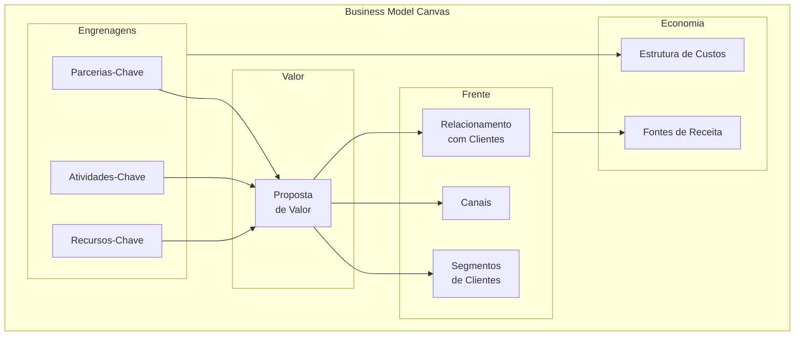
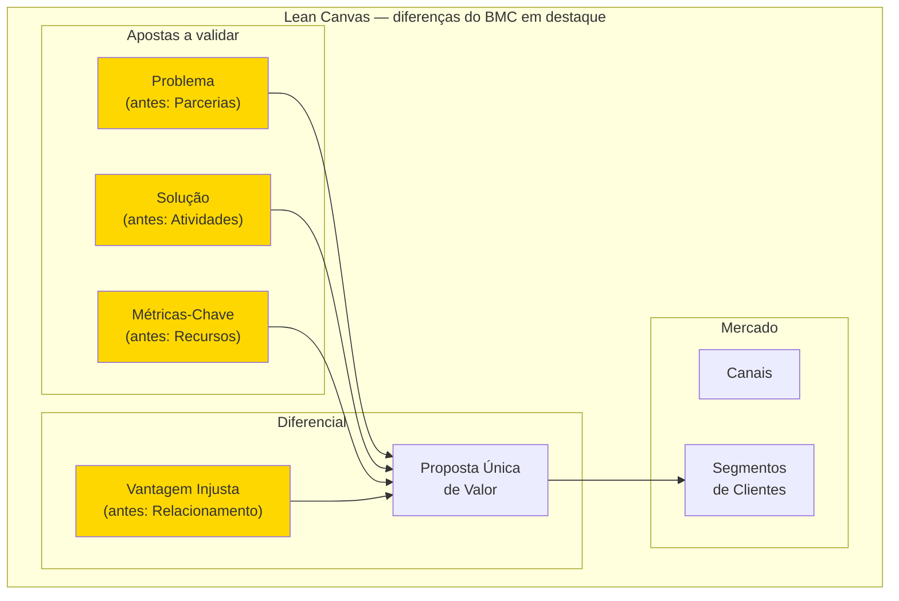
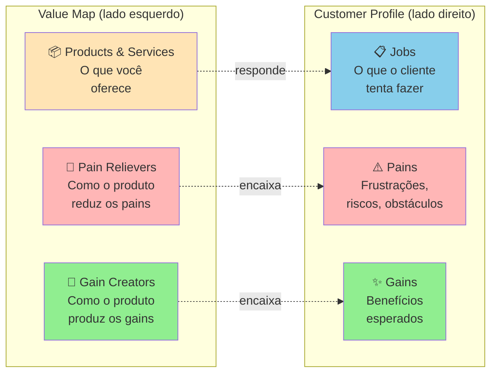

## APÊNDICE CZ — CANVASES E MAPAS VISUAIS DE MODELO

> [!note] Como usar
> Este apêndice trata em profundidade dezesseis canvases que aparecem ao longo do livro como ferramentas convocadas em fases específicas. Cada canvas vem com origem histórica, estrutura visual, princípios, instruções de aplicação, exemplo brasileiro preenchido, variações, erros comuns, limites e leitura adicional. A ordem é didática (do mais geral ao mais específico), não a ordem de uso na trajetória. Para saber qual canvas usar em qual fase, veja a tabela de mapeamento ao final desta abertura.

> [!important] Por que canvases merecem apêndice próprio
> Canvas é categoria distinta de framework. Framework é raciocínio (Five Forces, JTBD, AARRR). Canvas é **representação visual de uma página** que força colaboração e expõe inconsistências. A maioria dos canvases neste apêndice nasceu da escola de design thinking aplicada a estratégia (Strategyzer, IDEO, XPLANE) entre 2005 e 2020. Compartilham três traços: (1) cabem em uma folha A3 ou parede; (2) preenchimento é colaborativo, não solo; (3) revelam onde o pensamento ainda está vago. Tratá-los apenas como sub-itens do ferramentário (BG) não capturava nem a teoria nem a prática brasileira.

### Mapa de uso por fase

| Fase | Canvas indicado | Pergunta que responde |
|---|---|---|
| Fase 2 (articulação) | CZ.1 BMC ou CZ.2 Lean Canvas | Como o negócio cria, entrega e captura valor? |
| Fase 2B (teoria) | CZ.16 Theory Map / Story Tree | Quais relações causais sustentam a tese? |
| Fase 3 (descoberta) | CZ.6 Empathy Map | O que o cliente pensa, sente, vê e ouve? |
| Fase 4 (pesquisa) | CZ.6 Empathy Map + CZ.3 VPC + CZ.7 Customer Journey | Como a dor vive em contexto e jornada? |
| Fase 5 (mercado) | CZ.4 Strategy Canvas + CZ.15 Canvas da Cunha | Qual é a curva de valor distinta no mercado? |
| Fase 6 (hipóteses) | CZ.14 Hypothesis Canvas | Como tornar cada aposta falsificável? |
| Fase 7 (experimentos) | CZ.9 Test Card | Como rodar cada teste com critério antes do dado? |
| Fase 8 (ideação) | CZ.5 Opportunity Canvas + CZ.11 MVP Canvas | Quais oportunidades viram MVP? |
| Fase 10 (MVP) | CZ.10 Pirate Canvas (AARRR) | Como o funil real está se comportando? |
| Fase 11 (modelo) | CZ.13 Risk Canvas | Quais riscos podem matar o modelo em escala? |
| Fase 14 (escala) | CZ.8 Team Canvas | Como o time se alinha em propósito e operação? |
| Fase 16 + Apêndice V | CZ.12 Storytelling Canvas | Como narrar o negócio para investidor, time, cliente? |

### Catálogo dos 16 canvases

| # | Canvas | Autor / Origem | Foco |
|---|---|---|---|
| CZ.1 | Business Model Canvas | Osterwalder, 2010 | Modelo de negócio completo |
| CZ.2 | Lean Canvas | Maurya, 2012 | Modelo para startup pré-PMF |
| CZ.3 | Value Proposition Canvas | Osterwalder, 2014 | Encaixe produto-cliente |
| CZ.4 | Strategy Canvas | Kim & Mauborgne, 2005 | Posicionamento competitivo (Blue Ocean) |
| CZ.5 | Opportunity Canvas | Jeff Patton, 2014 | Discovery contínuo de oportunidades |
| CZ.6 | Empathy Map | Dave Gray / XPLANE, 2009 | Compreensão profunda do usuário |
| CZ.7 | Customer Journey Canvas | múltiplas escolas | Jornada do cliente em fases e emoções |
| CZ.8 | Team Canvas | Alex Ivanov, 2015 | Alinhamento de propósito e operação de time |
| CZ.9 | Test Card | Bland & Osterwalder, 2019 | Estruturação de experimento |
| CZ.10 | Pirate Canvas (AARRR) | Dave McClure, 2007 | Funil de aquisição → receita |
| CZ.11 | MVP Canvas | Tristan Kromer | Escopo mínimo testável |
| CZ.12 | Storytelling Canvas | múltiplas | Narrativa estruturada do negócio |
| CZ.13 | Risk Canvas | múltiplas | Mapeamento e priorização de riscos |
| CZ.14 | Hypothesis Canvas | autoral do livro | Hipótese falsificável com threshold |
| CZ.15 | Canvas da Cunha | autoral do livro | Definição de cunha de mercado |
| CZ.16 | Theory Map / Story Tree | autoral do livro | Teoria causal do negócio |

> [!note] Onda 1 disponível, ondas 2-4 em construção
> Esta versão do livro contém o tratamento completo dos canvases CZ.1 a CZ.4 (Onda 1 — Fundamentos da modelagem). As ondas seguintes — Discovery e Validação (CZ.5-9), Métricas e MVP (CZ.10-13) e Time/Autorais (CZ.8 e CZ.14-16) — serão adicionadas em iterações posteriores do material. Para os canvases CZ.5 a CZ.16, consulte por enquanto as referências bibliográficas indicadas no catálogo acima. Os canvases autorais (CZ.14 Hypothesis Canvas, CZ.15 Canvas da Cunha, CZ.16 Theory Map) seguem documentados como templates práticos no [[#APÊNDICE A — TEMPLATES PRONTOS PARA USO|Apêndice A]] (A.10, A.12, A.9 respectivamente) até serem promovidos para tratamento teórico aqui.

---

### CZ.1 — Business Model Canvas (Alexander Osterwalder, 2010)

#### Origem histórica

Alexander Osterwalder propôs o Business Model Canvas (BMC) na tese de doutorado em 2004, na Universidade de Lausanne, sob orientação de Yves Pigneur. A ferramenta foi sistematizada no livro *Business Model Generation* (2010), escrito colaborativamente com 470 co-autores espalhados por 45 países via plataforma online — o livro virou bestseller global e definiu a forma como milhões de empreendedores conversam sobre modelo de negócio. No Brasil, o BMC entrou no currículo de praticamente toda aceleradora, MBA, programa do Sebrae, Endeavor e Distrito a partir de 2012, virando vocabulário comum.

#### O que é

Tela visual de uma página com **nove blocos** que representam, juntos, como uma empresa cria, entrega e captura valor. Os nove blocos são organizados em duas metades: a metade direita (cliente, valor, canais, relacionamento, receita) descreve **a frente do negócio**; a metade esquerda (recursos, atividades, parcerias, custos) descreve **as engrenagens internas**. No centro, conectando as duas, fica a **Proposta de Valor**.



#### Quando usar

Use o BMC nas Fases 2 e 2B do IGNIÇÃO, quando a ideia já tem articulação inicial mas o modelo de negócio ainda precisa ser explicitado. Também use a cada três a seis meses como check-up: revisitar o BMC depois de um trimestre de operação real frequentemente revela inconsistências invisíveis no momento da articulação. Não use o BMC para decidir *se* a ideia é boa — para isso, [[#FASE 3 — DESCOBERTA DO PROBLEMA|Fase 3]] (descoberta com cliente) e [[#FASE 7 — EXPERIMENTOS DE VALIDAÇÃO DO PROBLEMA|Fase 7]] (experimentos) são as ferramentas certas.

#### Princípios

A tese central de Osterwalder é que **modelo de negócio é objeto de design, não de planejamento**. Designar requer iteração rápida, conversa colaborativa e tolerância à ambiguidade temporária. Os nove blocos são interdependentes: mudar um afeta vários, e o valor do BMC está em tornar essa interdependência visível. O canvas é **descritivo** (mapeia o que você entende do negócio), não **prescritivo** (não diz se o modelo é bom). Por isso, ter um BMC coerente não significa ter um negócio viável — apenas ter clareza sobre o que precisa ser testado.

#### Como aplicar

Reúna 2-4 pessoas (cofundadores idealmente, mais 1 mentor externo se possível). Imprima a tela em A1 ou desenhe na parede com fita crepe. Use post-its (cores diferentes para cada bloco). Bloco a bloco, **na ordem que importa**:

1. **Segmentos de Clientes** primeiro — sem cliente, nada mais importa.
2. **Proposta de Valor** — por que esses clientes pagariam.
3. **Canais** — como o cliente descobre, compra, recebe e pede suporte.
4. **Relacionamento** — self-service, comunidade, suporte humano, automação.
5. **Fontes de Receita** — modelo (assinatura, transação, licença, freemium).
6. **Recursos-Chave** — o que a empresa precisa ter (pessoas, tecnologia, IP, capital).
7. **Atividades-Chave** — o que a empresa precisa fazer todo dia.
8. **Parcerias-Chave** — quem a empresa precisa ao lado (fornecedores, integradores, distribuição).
9. **Estrutura de Custos** — onde o dinheiro sai.

Tempo total: 60-120 minutos para a primeira versão. Cada bloco com 3-5 post-its (não parágrafos longos). Revisitar mensalmente nas fases iniciais, trimestralmente depois de PMF.

#### Exemplo brasileiro preenchido — Nubank em 2014

| Bloco | Conteúdo |
|---|---|
| **Segmentos de Clientes** | Brasileiros 25-40 anos, urbanos, classes A/B/C+, insatisfeitos com banco tradicional, familiares com smartphone |
| **Proposta de Valor** | Cartão de crédito sem anuidade, gerenciado 100% por app, sem burocracia, atendimento humano via chat, transparência |
| **Canais** | App mobile (iOS + Android), landing page, marketing digital orgânico, convite por fila de espera viral |
| **Relacionamento** | Self-service via app, suporte humano on-demand via chat, comunicação pelo nome próprio |
| **Fontes de Receita** | Intercâmbio (% sobre cada transação no cartão), juros do rotativo, futuro: receitas adjacentes (lending, investimento) |
| **Recursos-Chave** | Equipe técnica (engenharia, produto, design), licenças regulatórias, capital, algoritmos de credit scoring |
| **Atividades-Chave** | Desenvolvimento de produto digital, aquisição de clientes, gestão de risco de crédito, atendimento |
| **Parcerias-Chave** | Bandeiras (Mastercard, Visa), processadoras de pagamento, BACEN (regulador), provedores cloud |
| **Estrutura de Custos** | Salários de tecnologia (majoritário), atendimento, marketing, provisões de risco de crédito, compliance |

**Insight do caso.** O BMC do Nubank em 2014 mostra um modelo intencionalmente enxuto: poucos blocos com complexidade real (cartão único, segmento único, canal único). A disciplina foi não adicionar produtos ou segmentos antes de dominar o primeiro. Expansão para conta corrente (2017), lending (2019), investimentos (2020) só aconteceu depois de o cartão dominar o segmento original. Empresas que tentam preencher os nove blocos com complexidade simultânea desde o início frequentemente falham por dispersão. BMC bem feito tem cara de simples.

#### Variações e extensões

- **Lean Canvas** (CZ.2): substitui Parcerias, Atividades, Recursos e Relacionamento por Problema, Solução, Métricas-Chave e Vantagem Injusta. Mais útil em estágio pré-PMF.
- **Social Business Model Canvas**: adiciona blocos de impacto social, beneficiários e métricas de impacto.
- **Platform Business Model Canvas**: adapta para marketplaces de dois lados.
- **Sustainable Business Model Canvas (Triple Layer)**: adiciona camadas ambiental e social.

#### Erros comuns

- Preencher sozinho na cabeça em vez de em conversa colaborativa — o valor do BMC está no debate entre múltiplos olhares, não no documento final.
- Tratar como artefato estático, não revisitar — BMC sem atualização perde sentido em três meses.
- Confundir clareza do BMC com validação do mercado — ter BMC bonito não prova que cliente existe.
- Excesso de detalhe em cada bloco — se você precisa de parágrafo para explicar um bloco, a ideia ainda não está clara.
- Forçar um único BMC para múltiplos segmentos muito distintos — cada segmento merece BMC próprio.

#### Quando NÃO usar

Em empresas maduras com modelo estabelecido e operando — frameworks de execução como OGSM, Hoshin Kanri ou Balanced Scorecard servem melhor. Em negócios muito simples (consultoria solo, freelance) — BMC introduz overhead sem valor. Em negócios complexos com várias linhas distintas, não force um único BMC: cada linha precisa do seu.

#### Conexão com outros canvases

O BMC **precede** o Lean Canvas (CZ.2) como ferramenta histórica, mas o Lean Canvas é mais adequado para startup pré-PMF. O **Value Proposition Canvas** (CZ.3) aprofunda o bloco "Proposta de Valor" do BMC, que é tipicamente preenchido de forma vaga. O **Strategy Canvas** (CZ.4) complementa olhando para fora (concorrência), enquanto o BMC olha para dentro (modelo). Em fases iniciais, comece pelo BMC para ter visão de conjunto; depois aprofunde com VPC para a proposta e Strategy Canvas para o posicionamento.

#### Leitura adicional

- *Business Model Generation* (Alexander Osterwalder & Yves Pigneur, 2010).
- *Testing Business Ideas* (David Bland & Alexander Osterwalder, 2019) — manual de validação para cada bloco.
- [strategyzer.com](https://strategyzer.com) — ferramenta online + cursos da equipe original.

---

### CZ.2 — Lean Canvas (Ash Maurya, 2012)

#### Origem histórica

Ash Maurya criou o Lean Canvas em 2010-2012 como adaptação do Business Model Canvas especificamente para startups em estágio inicial, e documentou a ferramenta no livro *Running Lean* (2012, atualizado em 2022 para a 3ª edição). Maurya era fundador serial que aplicou Lean Startup nas próprias empresas e percebeu que o BMC original — desenhado para empresas estabelecidas — não priorizava adequadamente os elementos críticos para quem ainda não tem modelo validado: o problema, a solução, as métricas que provam tração, e a vantagem que sustenta a empresa quando o concorrente acordar. O Lean Canvas substituiu quatro dos nove blocos do BMC para capturar melhor a realidade pré-PMF.

#### O que é

Tela visual de uma página com nove blocos, **inspirada no BMC mas com quatro substituições críticas**: Parcerias-Chave vira **Problema**, Atividades-Chave vira **Solução**, Recursos-Chave vira **Métricas-Chave**, Relacionamento com Clientes vira **Vantagem Injusta**. Os outros cinco blocos permanecem (Segmentos, Proposta Única de Valor, Canais, Estrutura de Custos, Fontes de Receita).



A filosofia subjacente é: startup pré-PMF não tem parcerias estabelecidas (vai construir), não tem atividades-chave definidas (vai descobrir), não tem recursos consolidados (tem capital limitado e tempo) e não tem relacionamento com clientes (não tem clientes ainda). O que tem é hipótese de problema, hipótese de solução, hipótese de métrica e hipótese de vantagem competitiva. O Lean Canvas mapeia exatamente essas hipóteses.

#### Quando usar

Use o Lean Canvas a partir da Fase 1 (encontrar a ideia) até a Fase 12 (PMF). É o canvas certo para todo o estágio de discovery e validação. Depois de PMF declarado, migre para o BMC, que mapeia melhor um modelo já operando. Use também como ferramenta de pivô: cada vez que você considerar pivotar, faça um Lean Canvas novo para a tese alternativa antes de comprometer recursos.

#### Princípios

A tese de Maurya é que **modelo de negócio em startup é hipótese, não plano**. Cada bloco do Lean Canvas corresponde a uma ou mais hipóteses falsificáveis, e a ordem de preenchimento dos blocos espelha a ordem de risco — o que pode matar a startup mais cedo é preenchido primeiro. Por isso, Problema vem antes de Solução: solução para problema inexistente é o erro mais frequente em startup. Vantagem Injusta vem por último: enquanto a startup é pequena, ainda não tem moat — a Vantagem Injusta é o que ela aposta construir.

#### Como aplicar

Reúna 1-3 pessoas (cofundadores). Use uma folha A1 ou ferramenta digital (Miro, FigJam). Preencha **na ordem de risco**, que difere do BMC:

1. **Segmentos de Clientes** primeiro (right side, top) — quem.
2. **Problema** (left side, top) — top 1-3 problemas que o segmento tem.
3. **Proposta Única de Valor** (centro, top) — uma frase única de promessa.
4. **Solução** (left side) — top 3 features que endereçam o problema.
5. **Canais** (right side) — caminhos de aquisição até o segmento.
6. **Fontes de Receita** (right side, bottom) — modelo de monetização.
7. **Estrutura de Custos** (left side, bottom) — onde o dinheiro sai.
8. **Métricas-Chave** (left side, middle) — números que provam tração.
9. **Vantagem Injusta** (right side, middle) — o que torna você inimitável.

Tempo total: 30-60 minutos para o primeiro preenchimento (mais rápido que o BMC porque os blocos são mais específicos). **Faça um Lean Canvas por segmento** — não force um canvas único para múltiplos segmentos com problemas distintos. Revisar a cada experimento concluído (a cada 2-4 semanas em fases iniciais).

#### Exemplo brasileiro preenchido — QuintoAndar em 2015

| Bloco | Conteúdo |
|---|---|
| **Problema** | Alugar apartamento em SP exige fiador, três meses de caução, vistoria agressiva, burocracia de cartório, semanas de sofrimento — para algo que o inquilino só usa 1-2 anos. Para o proprietário: longo período sem renda, risco de inadimplência, complexidade jurídica. |
| **Segmentos de Clientes** | Inquilinos: jovens profissionais classe A/B em SP, primeira ou segunda experiência de aluguel. Proprietários: pessoas físicas com 1-3 imóveis (não imobiliária). |
| **Proposta Única de Valor** | "Alugue em horas, sem fiador, sem caução exagerada, 100% online." |
| **Solução** | Plataforma online de aluguel + seguro substituindo fiador + vistoria digital + contrato digital com assinatura remota + pagamento de aluguel automatizado. |
| **Canais** | SEO orgânico (busca de imóveis), parcerias com portais imobiliários, marketing digital (Facebook, Google), indicação boca a boca. |
| **Fontes de Receita** | Taxa de administração sobre aluguel mensal + comissão de corretagem sobre assinatura inicial + (futuro) produtos financeiros adjacentes. |
| **Estrutura de Custos** | Tecnologia e produto + marketing e aquisição + operação de vistorias + sinistros de seguro + equipe de matching. |
| **Métricas-Chave** | Contratos assinados/mês, tempo médio busca → assinatura, NPS, churn de locatários, ticket médio (aluguel médio). |
| **Vantagem Injusta** | Dados proprietários de comportamento de pagamento de locatários — permitem underwriting de seguro próprio. Concorrentes novos precisariam anos para acumular esses dados. |

**Insight do caso.** O Lean Canvas do QuintoAndar em 2015 mostra como o canvas força a articular a Vantagem Injusta antes que ela exista: em 2015, a empresa ainda **não tinha** os dados proprietários — era a aposta. O canvas registra "se o modelo funcionar, será porque os dados acumulados criam underwriting próprio". Isso virou hipótese a testar (e se confirmou). Empresas que preenchem Vantagem Injusta com generalidades tipo "nosso time é incrível" ou "tecnologia avançada" não estão fazendo o exercício — são placeholders, não apostas. Vantagem Injusta deve ser específica, falsificável e de longo prazo.

#### Variações e extensões

- **Customer Forces Canvas** (também de Maurya): aprofunda a teoria de "forças" que empurram cliente entre soluções (push, pull, anxiety, habit), complementando o Lean Canvas com vista comportamental.
- **Lean Stack** (Maurya): conjunto de canvases conectados (Lean Canvas + Customer Factory Blueprint + Traction Roadmap).

#### Erros comuns

- Tratar Lean Canvas como BMC simplificado — a filosofia é distinta, focada em hipóteses testáveis.
- Preencher Vantagem Injusta com generalidades ("nosso time", "nossa tecnologia") — se qualquer concorrente teria, não é injusta.
- Não articular o Problema de forma específica — "pessoas querem X" não é problema testável; "pessoa tipo Y sofre com Z em contexto W" é.
- Forçar um único Lean Canvas para múltiplos segmentos com problemas diferentes — cada segmento merece canvas próprio.
- Confundir Solução com Proposta Única de Valor — Solução é *o que você constrói*, Proposta de Valor é *a promessa que ressoa para o cliente*.

#### Quando NÃO usar

Em empresas pós-PMF com modelo estabelecido — use BMC. Em projetos internos de empresa grande (intrapreneurship em corporação madura) — Lean Canvas força o framing de "ainda não temos cliente" que pode não bater com a realidade. Em consultoria solo ou freelance — overhead sem retorno.

#### Conexão com outros canvases

O Lean Canvas **se relaciona ao BMC (CZ.1)** como ferramenta complementar para estágios distintos. **Se relaciona ao Hypothesis Canvas (CZ.14)**: cada bloco do Lean Canvas vira uma ou mais entradas no banco de hipóteses. **Se relaciona ao Test Card (CZ.9)**: cada hipótese do Lean Canvas vira um ou mais Test Cards na Fase 7. **Precede o BMC**: depois de PMF, migre.

#### Leitura adicional

- *Running Lean* (Ash Maurya, 2012; 3ª edição em 2022).
- *Scaling Lean* (Ash Maurya, 2016) — aplicação pós-PMF.
- [leanstack.com](https://leanstack.com) — ferramenta online + cursos da equipe.

---

### CZ.3 — Value Proposition Canvas (Alexander Osterwalder, 2014)

#### Origem histórica

O Value Proposition Canvas (VPC) é extensão direta do Business Model Canvas, criado pela mesma equipe (Alexander Osterwalder, Yves Pigneur, Greg Bernarda, Alan Smith) e publicado no livro *Value Proposition Design* (2014). A motivação foi observação de campo: o bloco "Proposta de Valor" do BMC era invariavelmente o mais mal preenchido — fundadores escreviam frases vagas tipo "produto melhor" ou "atendimento de qualidade". Osterwalder concluiu que esse bloco merecia uma ferramenta própria, mais profunda, que forçasse a verificar **explicitamente** o encaixe entre o que o cliente precisa e o que o produto oferece.

#### O que é

Tela visual de duas partes complementares que se encaixam como um quebra-cabeça:



O **Customer Profile** mapeia o cliente em três dimensões: Jobs (tarefas funcionais, sociais, emocionais que tenta cumprir), Pains (o que o frustra, prejudica, ameaça) e Gains (o que ele deseja, espera, sonha). O **Value Map** mapeia o produto em três dimensões espelhadas: Products & Services (o que você oferece), Pain Relievers (como o produto alivia os pains do cliente) e Gain Creators (como o produto produz os gains).

O **fit** acontece quando os Pain Relievers correspondem a Pains reais e os Gain Creators correspondem a Gains que o cliente realmente valoriza. Pain Relievers sem Pain correspondente = features inúteis. Pains sem Pain Reliever = motivos de churn.

#### Quando usar

Use o VPC depois de fazer pesquisa qualitativa real (Fase 4 — entrevistas em profundidade, observação em campo, análise de jornada). É a ferramenta certa para tornar o Dossiê do Usuário (saída da Fase 4) acionável: cada persona vira um Customer Profile, e o produto que está sendo desenhado vira o Value Map. Use também como ferramenta de auditoria: revisitar o VPC a cada três meses pós-MVP revela features que viraram Pain Relievers órfãos (sem Pain real) ou Pains que ficaram sem Pain Reliever construído.

#### Princípios

A tese de Osterwalder é que **proposta de valor não é o que você diz que o produto faz, é a correspondência verificável entre as frustrações/desejos do cliente e o que o seu produto efetivamente alivia/entrega**. Fit não se presume — verifica-se com entrevistas, testes, observação. A falha mais comum em startup não é "produto ruim" — é produto bom atacando problema que o cliente não considera importante. O VPC força essa verificação tornando explícita cada conexão.

#### Como aplicar

**Etapa 1 — Customer Profile (sempre primeiro).** Reúna o que você aprendeu na Fase 4. Para a persona escolhida, liste:

- **Jobs** (5-10): o que ela tenta fazer? Funcionais ("conciliar pagamentos do dia"), sociais ("parecer profissional para a equipe"), emocionais ("ter paz antes de dormir").
- **Pains** (5-10): o que dói? Pode ser frustração ("isso demora 3 horas"), risco ("se eu errar, perco o cliente"), obstáculo ("não tenho como integrar").
- **Gains** (5-10): o que ela quer? Esperados ("uma forma de fazer mais rápido"), desejados ("relatório que impressione o chefe"), inesperados ("automação que eu não sabia ser possível").

**Importante**: NÃO INVENTE. Cada item deve poder ser citado de uma entrevista, observação ou diário de usuário documentado. Customer Profile com Jobs/Pains/Gains intuitivos = VPC teórico.

**Etapa 2 — Value Map.** Liste:

- **Products & Services**: o que você está construindo (ou planeja construir).
- **Pain Relievers**: para cada Pain do cliente, como o produto alivia? Seja específico.
- **Gain Creators**: para cada Gain, como o produto produz? Idem.

**Etapa 3 — Avaliação de fit.** Cada Pain tem Pain Reliever correspondente? Cada Gain tem Gain Creator? Se há Pains sem cobertura, são oportunidades não endereçadas. Se há Pain Relievers sem Pain real, são features potencialmente desperdiçadas.

Tempo: 2-4 horas para a primeira versão (após pesquisa pronta). Cada segmento merece VPC próprio.

#### Exemplo brasileiro preenchido — Wellhub (Gympass) em 2016, B2B

**Customer Profile** — Head de RH de empresa média (200-1000 funcionários):

| Jobs | Pains | Gains |
|---|---|---|
| Oferecer benefício que ajude retenção | Caro contratar academia única que não atende todos | Retenção mensurável melhor |
| Gerenciar programa de bem-estar sem overhead | Funcionários pedem academia mas subsídio direto é complicado (tributário, equidade) | Marca empregadora fortalecida |
| Prestar contas à diretoria sobre ROI | Difícil medir uso real e impacto em produtividade | Dados de engajamento para C-level |
| Atender perfis diversos (academia, yoga, crossfit) sem caos | Negociar com múltiplos fornecedores consome tempo | Benefício percebido sem esforço administrativo |

**Value Map** — Wellhub (Gympass) o que oferecia em 2016:

| Products & Services | Pain Relievers | Gain Creators |
|---|---|---|
| Plataforma empresarial com acesso a milhares de academias via assinatura | Uma assinatura única cobre todas academias (flexibilidade sem multiplicação de contratos) | Benefício percebido pelo funcionário gera retenção mensurável |
| Dashboard de uso para RH | Plataforma administra matrícula, pagamento, cancelamento (zero overhead) | Oferta diversa atende perfis diferentes |
| App para funcionário escolher academia | Estrutura tributária correta (benefício registrado) | Dados de uso para relatórios executivos sobre engagement e ROI |
| Suporte para RH e funcionário | Negociação consolidada com uma empresa só (em vez de 50 academias) | Fortalecimento da marca empregadora |

**Análise de fit.** Encaixe forte entre quase todos os Pains/Gains e os Pain Relievers/Gain Creators. Note que a oferta da Wellhub não inova radicalmente — apenas elimina as fricções específicas que o RH enfrentava no modelo tradicional (negociar com cada academia, gerenciar reembolsos, justificar tributariamente, medir uso). **A lição: value proposition forte não exige features impressionantes — exige fit preciso entre o que o cliente sofre e o que você alivia.**

#### Variações e extensões

- **Job-to-Be-Done Canvas** (Christensen / Moesta): foco mais profundo em Jobs (especialmente as 4 forças de Moesta — push, pull, anxiety, habit). Ver [[#FASE 4 — PESQUISA COM USUÁRIOS (CUSTOMER DISCOVERY APROFUNDADO)|Fase 4]].
- **Empathy Map** (CZ.6): complementar ao Customer Profile, foca em estados internos do cliente (pensa/sente/vê/ouve).
- **VPC for Multi-Sided Markets**: marketplaces fazem um VPC para cada lado (oferta e demanda).

#### Erros comuns

- Preencher Customer Profile com intuições em vez de dados reais — VPC teórico não representa mercado.
- Fazer VPC genérico para "todos os clientes" — segmentos diferentes têm Jobs/Pains/Gains diferentes; cada segmento merece VPC próprio.
- Inflar Gain Creators — listar benefícios que o produto teoricamente poderia entregar mas não entrega ainda.
- Ignorar Pains sem Pain Reliever correspondente — essas lacunas são frequentemente os motivos reais de churn.
- Confundir Products & Services (o que você constrói) com Pain Relievers (como alivia uma dor específica) — o primeiro é descritivo, o segundo é causal.

#### Quando NÃO usar

Em mercados commoditizados com propostas de valor muito padronizadas — VPC adiciona pouco valor onde o cliente já compara só preço e prazo. Em produtos B2B enterprise muito complexos — a "unidade cliente" tem múltiplos stakeholders (usuário final, comprador econômico, sponsor executivo, TI), cada um com seu VPC; a abordagem stakeholder mapping é mais útil.

#### Conexão com outros canvases

O VPC **aprofunda** o bloco "Proposta de Valor" do BMC (CZ.1) — preencher BMC sem antes ter VPC tipicamente produz blocos de Proposta de Valor vazios. **Pareia com o Empathy Map (CZ.6)** para construir o Customer Profile com profundidade emocional. **Alimenta o Lean Canvas (CZ.2)**: os Pains do cliente viram o bloco Problema; os Pain Relievers + Gain Creators viram a Proposta Única de Valor.

#### Leitura adicional

- *Value Proposition Design* (Osterwalder, Pigneur, Bernarda, Smith, 2014).
- *Testing Business Ideas* (David Bland & Alexander Osterwalder, 2019) — como validar cada elemento do VPC.
- [strategyzer.com/canvas/value-proposition-canvas](https://strategyzer.com/canvas/value-proposition-canvas).

---

### CZ.4 — Strategy Canvas (W. Chan Kim & Renée Mauborgne, 2005)

#### Origem histórica

W. Chan Kim e Renée Mauborgne, professores do INSEAD, publicaram *Blue Ocean Strategy* em 2005 após quinze anos de pesquisa empírica analisando 150 movimentos estratégicos em 30 indústrias ao longo de cem anos. A tese central é que **competir em mercado saturado (red ocean) é destrutivo, e criar novo espaço de mercado (blue ocean) é a estratégia vencedora**. O Strategy Canvas é a ferramenta visual central do framework — gráfico que compara curvas de valor de concorrentes para revelar onde existe espaço de diferenciação real, em vez da disputa palmo-a-palmo nas mesmas dimensões. O livro vendeu mais de quatro milhões de cópias e o Strategy Canvas virou referência em planejamento estratégico, embora tenha sido subutilizado em startup brasileira (frequentemente substituído por Porter's Five Forces ou matriz BCG, que são ferramentas distintas).

#### O que é

Gráfico de duas dimensões. **Eixo X**: fatores de competição relevantes no setor (tipicamente 8-15 fatores listados horizontalmente). **Eixo Y**: nível de oferta de cada fator, em escala de baixo a alto. Para cada concorrente (incluindo você), traça-se uma **curva de valor** — uma linha que conecta os pontos representando quanto desse concorrente oferece em cada fator.

```mermaid
xychart-beta
    title "Strategy Canvas — exemplo Cirque du Soleil"
    x-axis "Fatores de competição" [Preço, Estrelas, Animais, Múltiplas-arenas, Risco-físico, Tema, Refinamento, Música-teatro, Atmosfera]
    y-axis "Nível de oferta" 0 --> 10
    line [3, 8, 9, 9, 7, 1, 1, 1, 2]
    line [9, 1, 0, 0, 5, 9, 9, 9, 9]
```

A linha superior representa o circo tradicional (Ringling, Barnum & Bailey): alto em estrelas, animais, múltiplas arenas, risco. A linha inferior representa o Cirque du Soleil: alto em tema, refinamento, música/teatro, atmosfera; baixo em estrelas e animais. Onde as curvas divergem dramaticamente, há diferenciação. Onde se sobrepõem, há comoditização.

A análise associada é o **ERRC Grid** — quatro decisões estratégicas para mover a curva:

- **Eliminate**: que fatores que o setor compete podem ser totalmente eliminados?
- **Reduce**: que fatores podem ser reduzidos abaixo do padrão do setor?
- **Raise**: que fatores devem ser elevados acima do padrão?
- **Create**: que fatores nunca oferecidos pelo setor podem ser criados?

#### Quando usar

Use o Strategy Canvas na Fase 5 (mapeamento de mercado e concorrência) quando o setor parece saturado e você precisa decidir como diferenciar. Também use a cada 18-24 meses como check-up estratégico — concorrência se aproxima da sua curva ao longo do tempo, e o Strategy Canvas revela quando a diferenciação está erodindo. Use também em Fase 15 (reinvenção) quando considerar segunda curva.

#### Princípios

A tese de Kim e Mauborgne é que **competição direta é desperdício de capital**. Se duas empresas oferecem o mesmo conjunto de fatores em níveis ligeiramente diferentes, elas brigam por margem cada vez menor. A saída é **mudar o jogo**, não jogar melhor o mesmo jogo. Para isso, é preciso mapear honestamente o que o setor compete (a maioria não articula explicitamente) e identificar onde você pode oferecer perfil radicalmente distinto. **Diferenciação + Custo Baixo simultâneos** é possível quando você elimina/reduz fatores caros e cria fatores baratos mas valiosos.

#### Como aplicar

**Etapa 1 — Mapear o setor atual.** Liste os 8-15 fatores em que os concorrentes competem. Pergunte: o que o cliente compara antes de comprar? O que aparece nas propagandas? O que aparece nas reviews? Tipicamente: preço, qualidade, marca, conveniência, suporte, customização, velocidade, escala. Seja específico ao seu setor.

**Etapa 2 — Traçar curvas dos concorrentes.** Para cada concorrente principal (3-5), atribua nota 1-10 em cada fator e desenhe a linha. Use dados reais (preço de tabela, NPS, share, reviews) quando disponível.

**Etapa 3 — Aplicar ERRC Grid.** Para cada fator, decida: eliminar, reduzir, elevar, criar. Articule por que (qual job-to-be-done deixa de ser servido vs qual passa a ser).

**Etapa 4 — Traçar a curva nova.** A sua curva deve ser **visualmente distinta** das curvas dos concorrentes. Se ela sobrepõe a média do setor com pequeno offset, não é Blue Ocean — é apenas otimização de Red Ocean.

**Etapa 5 — Validar com cliente.** Mostre as curvas para clientes-alvo. Pergunte: "Se essas duas opções existissem, qual escolheria? Por quê?". Se a resposta é "depende", a diferenciação não é forte o suficiente.

Tempo: 4-8 horas para a primeira versão (exige pesquisa de campo dos concorrentes). Revisar a cada 12-18 meses.

#### Exemplo brasileiro preenchido — Stone vs adquirentes tradicionais (2014)

Em 2014, o setor brasileiro de adquirência (Cielo, Rede, Stone nascente) competia em fatores tipicamente bancários: preço de MDR (taxa por transação), aluguel de máquina, prazo de antecipação, marca, capilaridade. Stone construiu sua curva de valor diferente:

| Fator | Cielo / Rede (média do setor) | Stone (entrante 2014) | Decisão ERRC |
|---|---|---|---|
| MDR (taxa) | 3-4% | 2-3% | Reduce |
| Aluguel da máquina | R$ 50-100/mês | R$ 0 (subsidiado) | Reduce |
| Prazo de antecipação | 30-60 dias | 1 dia (D+1) | Raise |
| Atendimento ao lojista | Call center distante, demora dias | "Ponto-de-Atenção" — humano dedicado, resposta em horas | Raise |
| Capilaridade física | Alta (rede bancária) | Baixa (foco digital) | Reduce |
| Hardware proprietário | Padrão setor (Verifone) | Stone Box (proprietário) | Create |
| Software de gestão integrada | Pouco | Stone Hub (PDV + gestão) | Create |
| Marca corporativa-bancária | Alta | Baixa (mas crescente) | Reduce |

```mermaid
xychart-beta
    title "Strategy Canvas — Stone vs adquirentes tradicionais (2014)"
    x-axis "Fatores" [MDR-baixo, Aluguel-zero, Antecip-rápida, Atendimento, Capilaridade, Hardware-próprio, Software-PDV, Marca-banco]
    y-axis "Nível de oferta" 0 --> 10
    line [3, 2, 4, 3, 9, 2, 2, 9]
    line [8, 9, 9, 9, 4, 9, 9, 4]
```

**Insight do caso.** Stone não venceu fazendo o que Cielo fazia mais barato. Venceu **mudando o que o setor competia**: criou Atendimento Diferenciado (Ponto-de-Atenção, não call center), criou hardware/software próprios para lojistas pequenos (não comprou da Verifone), reduziu o aluguel a zero, antecipou pagamento. O resultado foi uma curva visualmente distinta — comprador de Stone NÃO via Stone como "Cielo mais barata", via como **adquirente diferente**. Isso é Blue Ocean: a Stone não tirava clientes da Cielo apenas via preço, abria mercado novo (lojistas pequenos antes desatendidos pela burocracia bancária). O IPO em 2018 (NASDAQ, valuation US$ 7+ bilhões) validou a aposta.

#### Variações e extensões

- **Pioneer-Migrator-Settler Map**: classifica produtos do portfólio em pioneiros (alta diferenciação, alta margem), migradores (alguma diferenciação) e colonos (commodity). Útil para gestão de portfólio.
- **Six Paths Framework**: seis lentes para identificar Blue Ocean (indústria alternativa, grupos estratégicos, cadeia de compradores, oferta complementar, apelo emocional vs funcional, tendências de tempo).
- **Buyer Utility Map**: cruza ciclo de uso do cliente com seis utilidades (produtividade, simplicidade, conveniência, risco, diversão, sustentabilidade).

#### Erros comuns

- Listar fatores genéricos (preço, qualidade) em vez de fatores específicos do setor.
- Curva nova "ligeiramente acima" da média do setor — isso é otimização, não Blue Ocean.
- Eliminar/reduzir fatores que clientes ainda valorizam — pesquisar antes, não decidir no escritório.
- Confundir Strategy Canvas com posicionamento de marketing — é estratégia operacional (o que construir), não slogan.
- Não validar a curva nova com cliente antes de comprometer recursos — Blue Ocean teórico que ninguém prefere é apenas oceano vazio.

#### Quando NÃO usar

Em setores muito regulados onde os fatores de competição são fixados por norma (não há liberdade de Eliminar/Reduzir/Raise/Create). Em commoditização extrema onde o cliente realmente só compara preço. Em produtos B2B muito customizados onde cada deal tem fatores distintos — Strategy Canvas pressupõe oferta padronizada.

#### Conexão com outros canvases

O Strategy Canvas **complementa** o BMC (CZ.1): o BMC olha para dentro (modelo), o Strategy Canvas olha para fora (concorrência). **Pareia com o Canvas da Cunha (CZ.15)**: a Cunha define o nicho de entrada; o Strategy Canvas define a curva de valor distinta nesse nicho. **Sucede o VPC (CZ.3)**: depois de entender Pains e Gains do cliente, o Strategy Canvas decide quais Pain Relievers/Gain Creators construir vs eliminar.

#### Leitura adicional

- *Blue Ocean Strategy* (W. Chan Kim & Renée Mauborgne, 2005).
- *Blue Ocean Shift* (Kim & Mauborgne, 2017) — versão com playbook executivo mais detalhado.
- [blueoceanstrategy.com](https://www.blueoceanstrategy.com) — biblioteca de cases e ferramentas.

---
