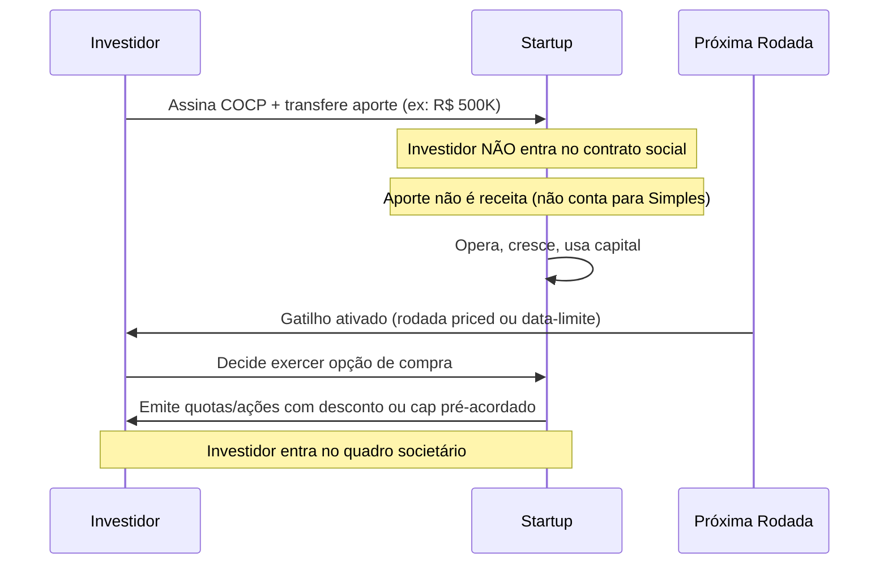
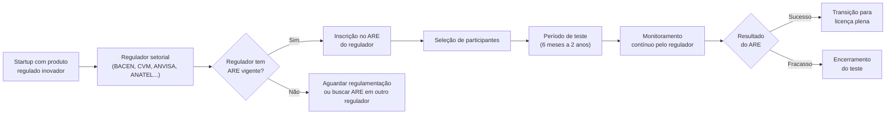

## APÊNDICE DA — MARCO LEGAL DAS STARTUPS: LC 182/2021

> [!note] Nota de validade
> A Lei Complementar 182/2021 foi promulgada em junho de 2021. Valores de receita bruta, limites de dispensa de licitação, e regulamentações setoriais do ARE podem ser atualizados por decreto ou resolução posterior. Este apêndice reflete o cenário de abril de 2026. Revisar anualmente com advogado especializado em direito empresarial e startups.

A [[#FASE 13 — ESTRUTURAÇÃO JURÍDICA, FINANCEIRA E OPERACIONAL|Fase 13]] cobre constituição, cap table (quadro societário), e vesting (período de aquisição progressiva da participação). O [[#APÊNDICE AH — CONTRATOS E ASPECTOS LEGAIS OPERACIONAIS|Apêndice AH]] cobre contratos operacionais, e IP (propriedade intelectual). O [[#APÊNDICE W — CONTABILIDADE, TRIBUTÁRIO E REGIMES FISCAIS PARA STARTUP BRASILEIRA|Apêndice W]] cobre tributário. O [[#APÊNDICE V — CAPTAÇÃO DE EQUITY, PITCH E RELACIONAMENTO COM INVESTIDORES|Apêndice V]] cobre captação. Este apêndice cobre a Lei Complementar 182/2021 — o marco legal das startups — com foco nos instrumentos que ela criou, e em como usá-los na prática.

### O que esse apêndice cobre

Quatro instrumentos criados ou formalizados pela LC 182/2021.

1. **COCP** — Contrato de Opção de Compra de Participação. O equivalente brasileiro do SAFE (Simple Agreement for Future Equity, ou acordo simples para equity futuro) americano.
2. **Investidor-anjo formalizado** — Proteções legais e limites do aporte pré-societário.
3. **ARE** — Ambiente Regulatório Experimental. Sandbox (ambiente isolado de teste) setorial.
4. **Dispensa de licitação** — Como órgãos públicos contratam startups sem processo licitatório completo.

Mais: a definição legal de startup, e o que muda, ou não muda, na prática do dia a dia.

### POR QUE

Antes da LC 182/2021, o fundador brasileiro usava instrumentos improvisados para captação pré-seed e seed (rodadas iniciais). Mútuo conversível com cláusulas customizadas. SAFE adaptado para o direito brasileiro sem base legal clara. Investidor-anjo sem proteção contra responsabilidade societária.

A lei criou instrumentos nativos. Usar o COCP em vez de um SAFE adaptado não é apenas elegância jurídica. É segurança legal para ambas as partes. Menos risco em due diligence (auditoria prévia à transação). Menos argumento para desconto de valuation (avaliação da empresa).

Para govtech, a dispensa de licitação abriu um mercado de R$ 2 trilhões de gastos públicos anuais para startups com menos de dez anos.

O ARE é subutilizado, mas resolve o problema que mata fintech, healthtech, e edtech antes de começar: como testar produto regulado sem licença completa.

### Quando usar

[[#FASE 0 — PREPARAÇÃO DO EMPREENDEDOR|Fase 0]] a [[#FASE 2 — ARTICULAÇÃO E CAPTURA DA IDEIA|Fase 2]]. Verificar se a empresa já se enquadra, ou pode enquadrar, na definição de startup da lei.

[[#FASE 13 — ESTRUTURAÇÃO JURÍDICA, FINANCEIRA E OPERACIONAL|Fase 13]]. COCP como instrumento para investidores-anjo, e pré-seed. Estruturar antes da primeira captação.

[[#FASE 7 — EXPERIMENTOS DE VALIDAÇÃO DO PROBLEMA|Fase 7]] a [[#FASE 10 — MVP E EXPERIMENTOS DE MERCADO|Fase 10]] em setores regulados. ARE para testar produto sem licença plena.

[[#FASE 10 — MVP E EXPERIMENTOS DE MERCADO|Fase 10]] em diante para negócios B2G. Dispensa de licitação como canal de aquisição.

---

### A definição legal de startup

O art. 4º da LC 182/2021 define startup como pessoa jurídica com **até dez anos de constituição**, **receita bruta anual de até R$ 16 milhões** no exercício social anterior, que declare utilizar modelos de negócios inovadores para a geração de produtos ou serviços, ou que desenvolva produto ou serviço com potencial de ruptura em segmento existente ou novo.

> [!warning] O critério de inovação é autodeclaratório
> A lei não exige certificação externa para qualificar como startup inovadora. A empresa declara. Mas em caso de autuação ou disputa contratual, a autodeclaração precisa ter substância. Manter documentação que comprove o caráter inovador: roadmap de produto, registros de pesquisa e desenvolvimento, propriedade intelectual depositada, ou literatura técnica de suporte.

**Formas jurídicas elegíveis.** LTDA, S/A, EIRELI (extinta, mas empresas constituídas antes de 2021 mantêm o status), e sociedades cooperativas.

**O que não conta para o limite de receita.** Receita de subsidiárias ou coligadas pode ser consolidada, dependendo da estrutura. Consultar contador antes de assumir elegibilidade.

**O limite de dez anos.** Conta da data de constituição, não da data de operação. Uma empresa constituída em 2015 e operando desde 2020 tem menos anos elegíveis do que parece.

---

### COCP — Contrato de Opção de Compra de Participação

#### O que é

O COCP é um contrato pelo qual o investidor faz um aporte financeiro na startup sem se tornar sócio imediatamente. Em troca, recebe o **direito de opção** de comprar participação societária no futuro, em condições pré-definidas no contrato.

O SAFE americano (Simple Agreement for Future Equity) é o equivalente funcional. A diferença técnica: o SAFE converte automaticamente ao atingir o gatilho (próxima rodada priced, ou data). O COCP é uma opção — o investidor **decide se exerce ou não** no momento da conversão.

#### Como funciona na prática

**Elementos obrigatórios do COCP.**

| Cláusula | O que define |
|---|---|
| Valor do aporte | Capital transferido imediatamente |
| Prazo da opção | Período máximo para exercício (máx. 7 anos pela lei) |
| Gatilho de conversão | Próxima rodada priced, data fixa, ou evento específico |
| Cap de valuation | Valuation máximo para cálculo da participação |
| Desconto | % de desconto sobre o preço da próxima rodada |
| Condições de exercício | Quóruns, documentação, notificação |
| Direitos do optante | Informativos (sim), votos (não, antes do exercício) |

#### Comparativo: COCP vs. SAFE vs. Mútuo Conversível

| Critério | COCP | SAFE (adaptado) | Mútuo Conversível |
|---|---|---|---|
| Base legal brasileira | ✅ LC 182/2021 | ❌ Adaptação contratual | ✅ Código Civil |
| Natureza | Opção de equity | Futuro equity | Dívida conversível |
| Investidor é sócio? | Não, até exercício | Não, até conversão | Não (é credor) |
| Gera IOF? | Não | Não (estrutura equity) | Sim (operação de crédito) |
| Conta para limite Simples? | Não | Depende da estrutura | Não (empréstimo) |
| Responsabilidade do investidor | Limitada ao aporte | Limitada | Limitada |
| Risco de requalificação tributária | Baixo | Médio (sem lei) | Médio (juros e IOF) |
| Conforto em DD | Alto (base legal clara) | Médio | Alto |

> [!tip] Quando usar COCP vs. mútuo conversível
> COCP é preferível quando o investidor está confortável com equity puro e não quer retorno de dívida. Mútuo conversível é útil quando o investidor quer proteção adicional como credor (prioridade em liquidação), ou quando há dúvida sobre o enquadramento na definição de startup da lei.

#### Exemplo brasileiro preenchido

**Empresa**: Plantio.AI, startup de agritech com dois anos de constituição.
**Investidor**: Angel brasileiro com perfil de ex-fundador.
**Situação**: Rodada pré-seed de R$ 400 mil, antes de produto em produção.

Cláusulas do COCP:
- Aporte: R$ 400.000 (transferência imediata, sem emissão de quotas)
- Cap de valuation: R$ 6 milhões (pré-money da próxima rodada)
- Desconto: 20% sobre o preço da próxima rodada priced
- Gatilho: próxima rodada ≥ R$ 1 milhão, ou 36 meses da data de assinatura
- Prazo máximo: 5 anos
- Direitos informativos: acesso mensal a MRR, burn, e headcount

Na próxima rodada (18 meses depois), a startup levanta Série Seed de R$ 2 milhões com valuation pré-money de R$ 8 milhões. O investidor exerce a opção. Calcula-se a participação com base no menor entre: (a) cap de R$ 6M, ou (b) 80% do valuation da rodada (R$ 6,4M). Usa-se o cap (R$ 6M). R$ 400K ÷ R$ 6M = 6,67% de participação.

#### Armadilhas do COCP

**Cap mal calibrado.** Cap muito alto faz o investidor receber participação menor que o esperado (como se não houvesse cap). Cap muito baixo gera diluição excessiva para o fundador em rodadas futuras.

**Sem data-limite.** COCP sem gatilho temporal cria incerteza estrutural. O investidor tem opção aberta indefinidamente. Sempre incluir prazo máximo.

**Ignorar o impacto em rodadas futuras.** COCP no cap table cria "shadow dilution". VCs em seed e Série A calculam participação fully-diluted, incluindo COCPs não convertidos. Modelar o impacto antes de emitir.

**Investidor exercendo fora do momento certo.** COCP dá ao investidor a escolha de exercer. Se a empresa performar bem e o investidor segurar a opção, pode haver tensão no momento de uma rodada que requer cap table limpo.

---

### Investidor-anjo formalizado

A LC 182/2021 manteve e expandiu a figura do investidor-anjo, originalmente regulada pela LC 155/2016 para empresas do Simples Nacional.

#### Proteções legais

O investidor-anjo **não é sócio**. Não consta no contrato social. Não tem direito a voto em assembleia. Não responde por dívidas, obrigações tributárias, trabalhistas, ou de qualquer natureza da empresa — mesmo em falência ou desconsideração da personalidade jurídica.

Em troca, pode:
- Receber remuneração de até **50% dos lucros** da empresa, proporcional ao aporte, por até 5 anos.
- Participar de reuniões de diretoria como observador.
- Ter acesso a informações financeiras.
- Alienar o aporte para terceiros (com direito de preferência dos sócios).

**Prazo máximo**: 7 anos para resgate do aporte.

> [!important] Diferença entre investidor-anjo e COCP
> Investidor-anjo, nos termos da LC 182, é um instrumento de participação nos lucros sem entrada societária — é mais parecido com um contrato de mútuo com upside em lucros do que com equity. O COCP é explicitamente um instrumento de equity futuro. Para quem quer participação no cap table, o COCP é o instrumento certo. Para quem quer retorno em lucros sem entrar na sociedade, o formato de investidor-anjo se aplica melhor.

---

### ARE — Ambiente Regulatório Experimental

#### O que é

O ARE (arts. 26 a 35 da LC 182/2021) cria a base legal para que **reguladores setoriais autorizem startups a testar produtos inovadores em ambiente controlado**, por tempo determinado, sem precisar cumprir todos os requisitos regulatórios normais.

É o sandbox regulatório formalizado na lei federal. Antes da LC 182, alguns reguladores já tinham sandbox próprio (BACEN, CVM). A lei deu cobertura legal uniforme e criou incentivo para que outros reguladores adotem o modelo.

#### Como funciona

**Reguladores que implementaram ARE até 2026.**

| Regulador | Setor | Status |
|---|---|---|
| BACEN | Fintech, pagamentos, crédito | Ativo (SFN e SPB) |
| CVM | Securities, tokens, crowdfunding | Ativo (Res. CVM 29/2021 e posteriores) |
| ANATEL | Telecom, conectividade | Em implementação |
| ANS | Planos de saúde, healthtech | Discussão regulatória |
| ANVISA | Dispositivos médicos, softwares de saúde | Parcial (via RDC 657) |
| SUSEP | Insurtech, seguro digital | Ativo (Res. CNSP 407/2021) |

> [!warning] ARE não é dispensa automática de licença
> Participar de um ARE não significa operar livremente. O regulador define escopo restrito: número máximo de clientes, volume máximo de transações, prazo determinado, obrigações de reporte. Operação fora dessas condições pode gerar autuação mesmo dentro do ARE.

#### Quando faz sentido buscar o ARE

- Produto que requer licença para operar em escala, mas que ainda não está maduro o suficiente para o processo completo de licenciamento.
- Validação técnica com usuários reais antes de investir no processo regulatório pleno.
- Mercados onde o licenciamento pleno leva 18 a 36 meses (fintech, healthtech, seguro).

**Quando não faz sentido.** Se o produto pode ser testado sem regulação (B2B puro, software de gestão interna, marketplace sem intermediação financeira), o ARE é complexidade desnecessária.

---

### Dispensa de licitação para startups

#### O que é

O art. 20 da LC 182/2021 autoriza órgãos e entidades da administração pública a **contratar startups diretamente**, sem licitação, para o desenvolvimento ou a execução experimental de soluções inovadoras.

Combinado com a Lei 14.133/2021 (Nova Lei de Licitações), abre um caminho estruturado para govtech que não existia antes de 2021.

#### Como funciona na prática

O poder público não compra produto pronto. Ele contrata o **desenvolvimento ou teste de solução inovadora**. O processo é:

1. Órgão público publica **chamada pública** com o problema a ser resolvido.
2. Startups apresentam propostas técnicas e comerciais.
3. Comissão técnica avalia e seleciona (até três startups, em geral, para teste paralelo).
4. Contrato de desenvolvimento ou piloto é assinado sem licitação formal.
5. Após validação, pode seguir para contratação plena (que aí pode ou não exigir licitação dependendo do valor).

**Limites de valor.** A lei remete aos limites da Lei 14.133/2021, que são atualizados por decreto. Verificar o valor vigente de dispensa de licitação para inovação no momento da contratação. Como referência: em 2026, o limite geral de dispensa (obras e serviços comuns) era de R$ 57,5 mil, mas para contratação de soluções inovadoras via startup há previsão de valores maiores nas regulamentações específicas dos órgãos.

> [!tip] Govtech como canal de aquisição subestimado
> Prefeituras, estados, autarquias, e fundações públicas têm orçamentos dedicados a inovação. Muitos estão ativamente buscando startups para resolver problemas de gestão, saúde pública, mobilidade, e educação. O custo de aquisição via dispensa de licitação é zero (sem comissão de canal). O risco é o ciclo longo, e a dependência de um único cliente grande. Ver [[#APÊNDICE CP — SALES: MOTION COMPLETA, DO OUTBOUND AO RENEWAL|Apêndice CP]] para gestão de concentração de receita.

#### Quem já fez

**Empresa**: DataH, startup de analytics para saúde pública.
**Contratante**: Secretaria Municipal de Saúde de Belo Horizonte.
**Mecanismo**: Chamada pública via ARE-like interno, contrato de piloto sem licitação, valor de R$ 180 mil para 6 meses.
**Resultado**: Contrato pleno de R$ 1,2 milhão após validação do piloto, via contratação direta (enquadrada como serviços de tecnologia especializada).

---

### O que a lei não resolve

**Tributação de stock options**. A LC 182/2021 não alterou o tratamento tributário de opções de compra para colaboradores. A discussão sobre IRPF vs. ganho de capital em exercício de opções continua indefinida na jurisprudência administrativa. Ver [[#APÊNDICE DB — STOCK OPTIONS E ESOP NO BRASIL|Apêndice DB]].

**Propriedade intelectual**. A lei não cria regras de IP para startups. Patentes, marcas, e cessão de código seguem legislação própria. Ver [[#APÊNDICE DC — PROPRIEDADE INTELECTUAL E INPI|Apêndice DC]].

**Due diligence do COCP**. Usar COCP não elimina obrigações de disclosure. Investidor ainda pode questionar informações prestadas no momento da assinatura. Prepare data room mesmo para rodadas pré-seed.

**Governança interna**. A lei não resolve disputas entre cofundadores. Acordo de sócios robusto continua sendo necessário. Ver [[#FASE 13 — ESTRUTURAÇÃO JURÍDICA, FINANCEIRA E OPERACIONAL|Fase 13]].

**Acesso automático ao Simples Nacional**. Enquadrar-se como startup pela LC 182 não garante elegibilidade ao Simples. Os critérios do Simples (receita, atividade, vedações) são independentes. Ver [[#APÊNDICE W — CONTABILIDADE, TRIBUTÁRIO E REGIMES FISCAIS PARA STARTUP BRASILEIRA|Apêndice W]].

---

### Armadilhas comuns

**Assumir que todo aporte pré-seed pode ser COCP**. Se o investidor é pessoa física com menos de R$ 10 milhões de patrimônio financeiro, há restrições de CVM sobre ofertas não registradas. Verificar enquadramento na Instrução CVM (ICVM 88/2022, crowdfunding, ou isenções específicas de oferta privada restrita).

**COCP sem advogado**. A lei criou o instrumento, mas a minuta precisa ser feita por especialista. Cláusulas de anti-diluição, drag-along parcial para o optante, e proteção em down round não estão automaticamente incluídas na lei — são negociadas contratualmente.

**Confundir ARE com licença provisória**. Startup em ARE não pode fazer publicidade como se fosse empresa licenciada. Violação das condições do ARE pode resultar em encerramento imediato e bloqueio de futura solicitação de licença.

**Govtech sem gestão de concentração**. Contrato público é receita recorrente frágil. Troca de gestão municipal cancela projetos. Nunca depender de um único contrato público para mais de 40% da receita total na fase inicial.

**Ignorar o prazo dos dez anos**. Empresa que constituiu como startup em 2018 e cresceu bem pode perder elegibilidade à LC 182 em 2028. Planejar transição antes — especialmente se houver ARE vigente ou contratos de dispensa em andamento.

> [!info] Fases relacionadas
> Referenciado em: Fase 13.

---

### Conexão com outros apêndices

| Tópico | Apêndice |
|---|---|
| Estruturação societária, vesting, cap table | [[#FASE 13 — ESTRUTURAÇÃO JURÍDICA, FINANCEIRA E OPERACIONAL|Fase 13]] |
| Contratos operacionais, IP assignment | [[#APÊNDICE AH — CONTRATOS E ASPECTOS LEGAIS OPERACIONAIS|Apêndice AH]] |
| Tributário, Simples Nacional, Lucro Presumido | [[#APÊNDICE W — CONTABILIDADE, TRIBUTÁRIO E REGIMES FISCAIS PARA STARTUP BRASILEIRA|Apêndice W]] |
| Captação de equity, pitch, term sheet | [[#APÊNDICE V — CAPTAÇÃO DE EQUITY, PITCH E RELACIONAMENTO COM INVESTIDORES|Apêndice V]] |
| Financiamento não-diluitivo, BNDES, Finep | [[#APÊNDICE P — FINANCIAMENTO NÃO-DILUITIVO|Apêndice P]] |
| Stock options e ESOP | [[#APÊNDICE DB — STOCK OPTIONS E ESOP NO BRASIL|Apêndice DB]] |
| Propriedade intelectual, INPI | [[#APÊNDICE DC — PROPRIEDADE INTELECTUAL E INPI|Apêndice DC]] |
| Govtech, venda para governo | [[#APÊNDICE CP — SALES: MOTION COMPLETA, DO OUTBOUND AO RENEWAL|Apêndice CP]] |
| Regulação setorial (fintech, healthtech, agritech) | [[#APÊNDICE AW — REGULATÓRIO SETORIAL BRASILEIRO|Apêndice AW]] |

### Leitura adicional

- **LC 182/2021** — texto integral no site do Planalto. Leitura direta obrigatória antes de usar qualquer instrumento.
- **Regulamentação ARE por regulador** — cada regulador publica edital próprio. Monitorar BACEN, CVM, SUSEP, e ANS.
- **Startup Law (a.k.a. JOBS Act)** — equivalente americano para referência comparativa. Não tem aplicação direta no Brasil.
- **Deloitte / PwC / KPMG** — relatórios anuais sobre ecossistema de inovação e regulação no Brasil.
- **ABStartups** — publica atualizações sobre impacto da lei no ecossistema nacional.
