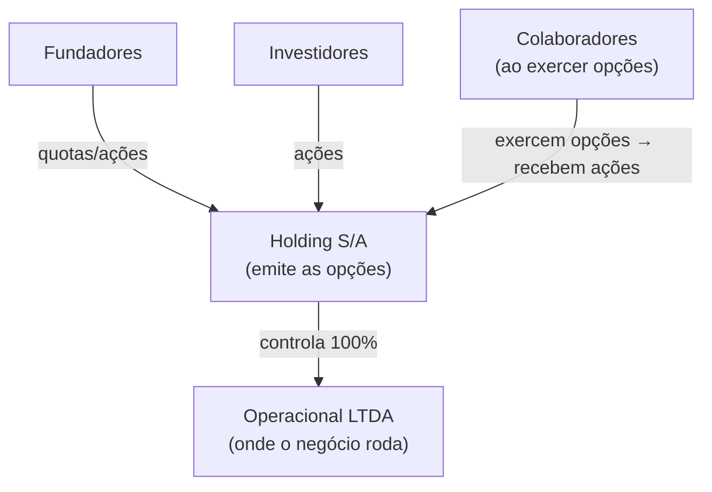

## APÊNDICE DB — STOCK OPTIONS E ESOP NO BRASIL

> [!note] Nota de validade
> A tributação de stock options no Brasil é objeto de disputa administrativa e judicial ativa. O CARF tem proferido decisões em ambas as direções — natureza remuneratória vs. mercantil — e o tema pode ser pacificado por lei ou por decisão do STJ a qualquer momento. Este apêndice reflete o entendimento predominante em abril de 2026. Revisar com advogado tributarista especializado antes de estruturar qualquer plano.

A [[#FASE 13 — ESTRUTURAÇÃO JURÍDICA, FINANCEIRA E OPERACIONAL|Fase 13]] cobre cap table, vesting de fundadores, e estrutura societária. O [[#APÊNDICE DA — MARCO LEGAL DAS STARTUPS: LC 182/2021|Apêndice DA]] cobre o COCP e o investidor-anjo. O [[#APÊNDICE W — CONTABILIDADE, TRIBUTÁRIO E REGIMES FISCAIS PARA STARTUP BRASILEIRA|Apêndice W]] cobre tributação operacional. Este apêndice cobre os instrumentos de equity para colaboradores — stock options, phantom shares, RSUs — com foco na estruturação jurídica e no principal problema prático: tributação.

### O que esse apêndice cobre

Quatro camadas.

1. **Os instrumentos**. Diferenças entre stock option, phantom share, RSU, e warrant. Quando usar cada um.
2. **Tributação**. O debate entre natureza remuneratória e mercantil. O que determina qual regra se aplica. Como estruturar para reduzir risco.
3. **Estruturação do plano**. Vesting, cliff, aceleração, good/bad leaver, tamanho do pool.
4. **Operação**. Gestão do cap table, ferramentas, momento de emitir opções.

### POR QUE

Equidade é a única moeda que uma startup em estágio inicial usa para atrair e reter talento de qualidade sem destruir o caixa. Engenheiro sênior que custaria R$ 30 mil por mês em salário pode aceitar R$ 18 mil com opções bem estruturadas. Não porque aceita pagar a diferença — mas porque acredita no upside.

O problema: sem estrutura correta, o que deveria ser instrumento de alinhamento vira passivo tributário descoberto em due diligence. Ou pior, a empresa chega a um exit e o colaborador descobre que o ganho que esperava vai para a Receita Federal de formas que ninguém explicou.

Entender os instrumentos e a tributação não é burocracia. É respeito por quem está construindo junto.

### Quando usar

[[#FASE 13 — ESTRUTURAÇÃO JURÍDICA, FINANCEIRA E OPERACIONAL|Fase 13]]. Criar o plano de opções antes das primeiras contratações técnicas sênior.

[[#FASE 14 — ESCALA: TIME, OPERAÇÕES, CRESCIMENTO E CAPITAL|Fase 14]]. Revisitar o pool, conceder refresh grants para retenção, e preparar o plano para due diligence de Série B.

Pré-exit. Comunicar claramente a colaboradores o valor esperado, o cronograma de exercício, e a tributação antes que a notícia de M&A ou IPO gere expectativas descontroladas.

---

### Os instrumentos disponíveis

#### 1. Stock option (opção de compra)

O colaborador recebe o **direito de comprar** participação da empresa no futuro, a um preço pré-determinado (preço de exercício), após cumprir condições de vesting.

**Mecânica**: concessão → vesting → exercício → venda (ou hold).

- No exercício, o colaborador paga o preço de exercício e recebe as ações/quotas.
- O ganho real ocorre na venda posterior (diferença entre preço de venda e preço de exercício).
- Se a empresa não crescer, a opção pode valer zero (risco real de perda — relevante para tributação, ver abaixo).

**Formas jurídicas**. Em S/A: regulado pelo art. 168, §3º da Lei 6.404/76, aprovado em assembleia. Em LTDA: sem regulação específica, estruturado via contrato de opção anexo ao contrato social, mais flexível mas com menos precedentes jurídicos.

#### 2. Phantom share (ação fantasma)

O colaborador não recebe ações reais. Recebe uma **promessa de pagamento em dinheiro** equivalente ao valor econômico de determinada participação em um evento de liquidez (M&A, IPO, ou pagamento de dividendos extraordinários).

**Quando faz sentido**. Startup em LTDA early-stage que não quer emitir quotas reais antes de ter estrutura societária definida. Empresa que quer simular equity sem diluir founders ou complicar o cap table.

**Desvantagem principal**. Tributado como remuneração (bônus) no momento do pagamento — sem discussão sobre natureza mercantil. IRRF na fonte + contribuição previdenciária.

#### 3. RSU — Restricted Stock Unit

O colaborador recebe uma **promessa de ações futuras**, sem preço de exercício. No vesting, as ações são entregues automaticamente. Não há escolha de exercer ou não.

**Diferença da stock option**. Na opção, o colaborador pode decidir não exercer se o preço de mercado caiu abaixo do preço de exercício. Na RSU, o vesting entrega ações independente do valor atual — todo o valor da RSU é ganho tributável no vesting.

**Quando faz sentido**. Empresas em estágio avançado (pós-PMF, pré-IPO) onde há liquidez clara no horizonte. Menos comum em early-stage no Brasil.

#### 4. Warrant

Instrumento híbrido: opção emitida para investidores, advisors, ou parceiros estratégicos — não para colaboradores típicos. Funciona como opção com preço de exercício, mas sem vínculo empregatício. Mais comum em negociações de dívida conversível ou parcerias estratégicas.

#### Comparativo dos instrumentos

| Instrumento | Diluição imediata | Risco de perda (para o colaborador) | Tributação | Complexidade jurídica |
|---|---|---|---|---|
| Stock option | Não (só no exercício) | Sim (pode valer zero) | Disputada (mercantil ou remuneração) | Média-alta |
| Phantom share | Não (nunca emite ações) | Não (recebe cash) | Remuneração (IRRF + INSS) | Baixa |
| RSU | Não (só no vesting) | Não (ações entregues automaticamente) | Remuneração no vesting | Média |
| Warrant | Não (só no exercício) | Sim | Ganho de capital | Baixa |

---

### Tributação — o debate central

Este é o ponto mais crítico e mais mal compreendido do ecossistema brasileiro.

#### As duas posições

**Posição 1 — Natureza remuneratória (Receita Federal).**
O ganho na concessão ou exercício de stock options é remuneração disfarçada. Incide IRRF na fonte, como se fosse salário. Também incide contribuição previdenciária (INSS patronal e do empregado). Base: o plano é condicional ao emprego, cria retenção, e o preço de exercício frequentemente está abaixo do valor de mercado.

**Posição 2 — Natureza mercantil (doutrina tributária majoritária).**
A stock option é um contrato bilateral com risco real de perda. O colaborador paga pelo direito de compra (ou assume o risco de que a opção vire pó). O ganho econômico só materializa na venda das ações, e deve ser tributado como ganho de capital (15% a 22,5% de IRPF, apurado pelo próprio contribuinte na GCAP).

#### O que o CARF tem decidido

O Conselho Administrativo de Recursos Fiscais tem decisões nas duas direções. Os critérios que definem para qual lado a decisão pende:

| Critério | Indica natureza mercantil | Indica natureza remuneratória |
|---|---|---|
| Preço de exercício | Próximo ao valor justo (FMV) | Muito abaixo do mercado (subsidiado) |
| Risco de perda | Real — pode valer zero | Nulo — garantia de retorno |
| Vinculação ao emprego | Separada — advisor ou investidor também recebe | Exclusiva — só colaboradores CLT ativos |
| Quem arca com o custo | Colaborador paga para exercer | Empresa subsidia o exercício |
| Transferibilidade | Pode ceder a terceiros | Intransferível, só para o titular |

> [!warning] Não existe estrutura 100% segura em 2026
> Mesmo com plano bem estruturado, a Receita pode autuar. O risco zero não existe. O que existe é um plano com argumentos defensáveis de natureza mercantil — que reduz a probabilidade de autuação e aumenta a chance de vitória em eventual recurso no CARF ou judicial. Consultar advogado tributarista antes de emitir opções.

#### Estruturação para minimizar risco tributário

Quatro medidas que fortalecem a tese de natureza mercantil.

**1. Preço de exercício baseado em valor justo.** Definir o preço de exercício com base em laudo de avaliação (FMV — Fair Market Value) da empresa. No Brasil não há obrigação legal equivalente ao 409A americano, mas ter um laudo externo produzido por advisory de M&A ou big four é o principal argumento defensivo.

**2. Risco real de perda.** O colaborador deve pagar pelo exercício (não receber de graça). Mesmo que o preço seja simbólico, deve existir. E o plano não deve garantir retorno mínimo.

**3. Plano não exclusivo a CLT ativos.** Se advisors externos, investidores-anjo, e parceiros estratégicos também recebem opções no mesmo plano, o caráter remuneratório fica enfraquecido — o instrumento claramente não é só salário disfarçado.

**4. Holding para emissão das opções.** Estrutura comum em startups pré-Série A com ambição de crescimento: criar uma holding (S/A) que detém a operacional (LTDA). As opções são emitidas pela holding. Quando exercidas, o colaborador vira sócio da holding, não da operacional. Vantagem adicional: facilita o Delaware Flip no caso de internacionalização.



---

### Estruturando o plano de opções (ESOP)

#### Documentos necessários

1. **Plano de Opções** (documento-mãe): define regras gerais — pool total, tipos de beneficiários, condições de vesting, eventos de aceleração, definição de good/bad leaver, e procedimento de exercício.
2. **Contrato de Opção Individual** (por colaborador): especifica o número de opções concedidas, o preço de exercício, o cronograma de vesting, e referencia o Plano geral.
3. **Aprovação societária**: em S/A, assembleia. Em LTDA, alteração do contrato social ou deliberação de sócios.

#### Vesting: cliff e cronograma

**Estrutura padrão (4 anos com cliff de 1 ano).**

```
Mês 0    → Concessão. Nenhuma opção vested.
Mês 12   → Cliff. 25% das opções vestem de uma vez.
Mês 13–48 → Vesting mensal. 1/36 das opções restantes por mês.
Mês 48   → 100% vested.
```

**Por que cliff de 1 ano?** Protege a empresa de conceder equity para colaboradores que saem rápido. Também alinha incentivos: o colaborador sabe que precisa passar pelo cliff para ter algum valor.

**Variações comuns no Brasil.**
- 3 anos com cliff de 6 meses: para contratações sênior em early-stage que têm poder de barganha.
- 2 anos com cliff de 1 ano: para advisors e colaboradores de curto prazo.
- Sem cliff para cofundadores (já têm equity direto, não opção).

#### Aceleração

**Single-trigger**: aceleração automática em mudança de controle (M&A, fusão). Todas as opções vestem imediatamente quando o deal fecha.

**Problema do single-trigger para a empresa**: o acquirer sabe que no dia do closing todo o equity vesta imediatamente. Isso reduz o retention incentive pós-aquisição. Muitos acquirers descontam no preço ou exigem novo plano de retenção — o que dilui mais os founders.

**Double-trigger**: aceleração apenas se houver (1) mudança de controle E (2) demissão sem justa causa (ou rebaixamento de função) dentro de 12 a 24 meses após o evento.

> [!tip] Double-trigger é o padrão em startups bem assessoradas
> Single-trigger parece mais generoso para o colaborador, mas na prática aumenta o custo da aquisição para o acquirer — e isso reduz o preço total do deal. Double-trigger é melhor para todos se o colaborador realmente quer ficar após o exit.

#### Good leaver / bad leaver

Define o que acontece com as opções quando o colaborador sai.

| Situação | Good leaver | Bad leaver |
|---|---|---|
| Exemplos | Demissão sem justa causa, doença, morte | Demissão por justa causa, violação de NDA, concorrência |
| Opções vested | Pode exercer dentro do prazo (90–180 dias) | Empresa recompra pelo preço de exercício (ou perde) |
| Opções não-vested | Canceladas | Canceladas |

**Prazo de exercício pós-saída**. Padrão americano é 90 dias. No Brasil, recomenda-se 180 dias para dar ao colaborador tempo de resolver a situação tributária e financeira do exercício.

#### Tamanho do option pool

| Estágio | Pool recomendado (fully diluted) | Observação |
|---|---|---|
| Pré-seed / seed | 10–15% | Suficiente para primeiras 5–10 contratações técnicas |
| Série A | 15–20% | Investidores geralmente exigem expansão do pool pré-closing |
| Série B+ | 5–10% de refresh | Pool consome com o crescimento do time |

> [!warning] Pool "fully diluted" vs. "pós-investimento"
> Investidores calculam participação fully diluted — incluindo o option pool. Um pool de 15% antes da rodada significa que founders e investidores existentes já estão diluídos por esse pool antes de o novo investidor entrar. Sempre modelar o cap table com o pool incluído antes de negociar valuation.

---

### Gestão do cap table

#### O que manter atualizado

- Número total de quotas/ações emitidas.
- Opções concedidas (por colaborador, com data, preço de exercício, cronograma de vesting).
- Opções exercidas (convertidas em ações reais).
- Opções canceladas (colaboradores que saíram antes do vesting).
- COCPs e outros instrumentos conversíveis.
- Participação fully diluted de cada sócio e grupo (founders, investidores, option pool).

#### Ferramentas disponíveis no Brasil

| Ferramenta | Origem | Adequação BR | Custo |
|---|---|---|---|
| Captable.io | Brasil | Alta | Pago |
| Pulso | Brasil | Alta | Pago |
| CartaHQ (Carta) | EUA | Média (adaptação manual) | Pago |
| Planilha própria | — | Funciona até ~20 titulares | Grátis |

Para startups até Série A, planilha bem estruturada com controle de datas e cenários de diluição é suficiente. A partir de Série A, ferramenta dedicada evita erros em cálculos de liquidation preference e waterfall em exits.

#### Refresh grants

Colaboradores que se aproximam do fim do vesting (anos 3–4) perdem o incentivo de permanecer. Refresh grant é uma nova concessão de opções — com novo cronograma de vesting — para reengajar.

**Timing**: conceder quando o colaborador ainda tem 12–18 meses de vesting original restante. Não esperar até o fim.

**Tamanho**: tipicamente 25–50% do grant original, dependendo do desempenho e do estágio da empresa.

---

### Phantom shares na prática

Para startups que ainda não querem estruturar S/A ou emitir quotas, phantom shares são a saída operacional mais simples.

**Como funciona o pagamento.** Define-se um percentual econômico virtual (ex: 0,5% da empresa). Em um evento de liquidez — M&A, distribuição extraordinária — o colaborador recebe em dinheiro o equivalente a 0,5% do valor total recebido pelos sócios.

**Contrato necessário.** Acordo de phantom shares com: definição do percentual, eventos de liquidez que ativam o pagamento, vesting análogo ao de opções, e good/bad leaver.

**Tributação**. No pagamento: IRRF na fonte como remuneração variável (tabela progressiva, até 27,5%) + INSS (se colaborador CLT). Não há debate tributário — é remuneração clara.

**Quando migrar para opções reais.** Ao fechar Série A e ter S/A estruturada, converter phantom shares para stock options reais permite que o colaborador tenha instrumento com melhor tratamento tributário potencial.

---

### Armadilhas comuns

**Emitir opções sem plano formal.** Promessa verbal ou e-mail informal não é vinculante da forma esperada. Em litígio trabalhista, o colaborador pode questionar se a opção era parte da remuneração — e a empresa não tem documento que defina os termos. Sempre formalizar.

**Não comunicar a tributação esperada.** Colaborador que recebe opções acredita que o upside é X. Na hora do exit, descobre que vai pagar IRPF sobre X e ficar com Y. A percepção de traição destrói o efeito motivacional retroativamente — e pode virar litígio. Comunicar tributação esperada no ato da concessão.

**Pool insuficiente para contratações futuras.** Founders que não criam pool grande o suficiente descobrem que precisam diluir mais na Série A do que planejado para expandir o pool. Criar pool com horizonte de 18–24 meses de contratações planejadas.

**Preço de exercício desatualizado.** Definir preço de exercício em seed e nunca atualizar. Quando a empresa cresce 10x, o preço de exercício é ínfimo — o que fortalece o argumento da Receita de que é remuneração disfarçada. Fazer laudo de FMV a cada rodada e para novas concessões.

**Vesting sem cliff para primeiras contratações.** Colaborador número 3 sai no mês 8. Sem cliff, já tem 8/48 de equity vested. Com cliff de 1 ano, saída no mês 8 resulta em equity zero. O cliff protege a concentração de equity em quem fica e constrói.

**Esquecer o exercício pós-saída.** Colaborador com 3 anos de vesting sai da empresa. Tem 90 dias para exercer. Não avisa ninguém, não é avisado, prazo vence, perde as opções. A empresa não tem obrigação de avisar ativamente — mas perda de equity por prazo expirado cria má reputação. Implementar processo de notificação formal ao desligar colaboradores com opções vested.

**Não modelar o cap table fully diluted antes de cada rodada.** Founders chegam à Série A achando que têm 40% da empresa. Com o option pool existente, os COCPs, e o novo pool exigido pelo VC, calculado fully diluted, têm 28%. A surpresa na hora do term sheet destrói negociação. Modelar sempre.

---

### Conexão com outros apêndices

| Tópico | Apêndice |
|---|---|
| Cap table, vesting de fundadores, estrutura S/A vs LTDA | [[#FASE 13 — ESTRUTURAÇÃO JURÍDICA, FINANCEIRA E OPERACIONAL|Fase 13]] |
| Marco Legal das Startups, COCP para investidores | [[#APÊNDICE DA — MARCO LEGAL DAS STARTUPS: LC 182/2021|Apêndice DA]] |
| Tributação geral, regimes fiscais | [[#APÊNDICE W — CONTABILIDADE, TRIBUTÁRIO E REGIMES FISCAIS PARA STARTUP BRASILEIRA|Apêndice W]] |
| Captação, term sheet, liquidation preference | [[#APÊNDICE V — CAPTAÇÃO DE EQUITY, PITCH E RELACIONAMENTO COM INVESTIDORES|Apêndice V]] |
| Executive hiring, pacotes de compensação C-level | [[#APÊNDICE BN — EXECUTIVE HIRING|Apêndice BN]] |
| Performance reviews e compensação total | [[#APÊNDICE BZ — PERFORMANCE REVIEWS|Apêndice BZ]] |
| Layoffs e encerramento de vesting | [[#APÊNDICE BV — LAYOFFS E DOWNSIZING|Apêndice BV]] |
| M&A e liquidation events | [[#FASE 16 — EXIT STRATEGY|Fase 16]] |

### Leitura adicional

- **Lei 6.404/1976 (Lei das S/A), art. 168** — base legal para planos de opção em sociedades anônimas.
- **Acórdãos do CARF** — buscar por "plano de opção de compra de ações natureza" no portal do CARF para acompanhar a jurisprudência atual.
- **"Stock Options no Brasil" — Gustavo Brigagão (ABDF)** — análise tributária referenciada na doutrina.
- **Carta / Captable.io** — documentação de como modelar cap table com opções e cenários de diluição.
- **YC SAFE and Option Pool Primer** — referência conceitual (não aplicável diretamente ao direito brasileiro, mas útil para o modelo mental).
