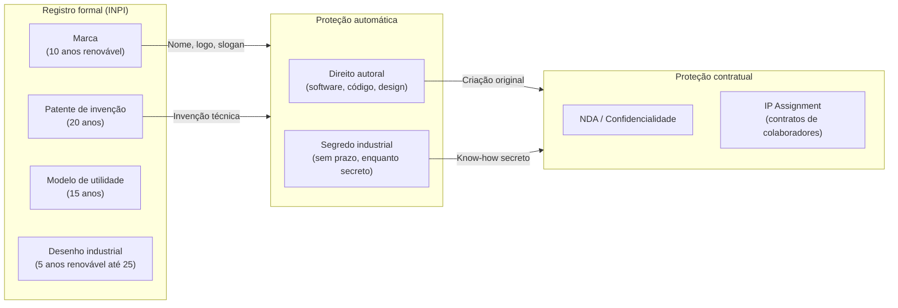
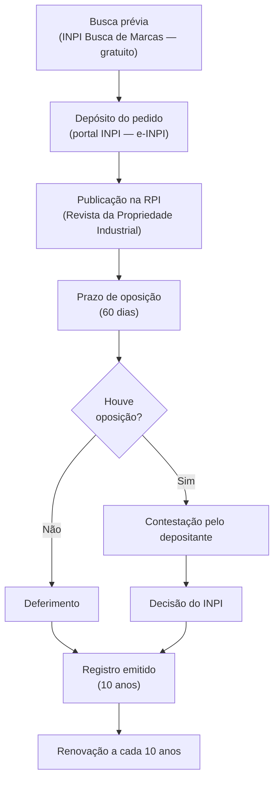

## APÊNDICE DC — PROPRIEDADE INTELECTUAL E INPI

> [!note] Nota de validade
> Taxas do INPI, prazos processuais, e decisões sobre patenteabilidade de software mudam por resolução administrativa. Este apêndice reflete o cenário de abril de 2026. Verificar tabela de retribuições vigente no site do INPI antes de qualquer depósito. A interpretação sobre software patents no Brasil continua evoluindo — acompanhar as Diretrizes de Exame de Patentes do INPI.

O [[#APÊNDICE AH — CONTRATOS E ASPECTOS LEGAIS OPERACIONAIS|Apêndice AH]] cobre IP assignment em contratos. O [[#APÊNDICE BE — OPEN SOURCE COMO ESTRATÉGIA|Apêndice BE]] cobre open source como modelo de negócio. O [[#APÊNDICE CA — HARDWARE E DEEP TECH|Apêndice CA]] cobre patentes em deep tech e hardware. Este apêndice cobre a disciplina completa de propriedade intelectual — o que registrar, quando, como, a que custo, e o que acontece quando você não registra e deveria ter registrado.

### O que esse apêndice cobre

Quatro instrumentos de PI e sua aplicação prática em startups.

1. **Marca**. Registro no INPI, classes, estratégia de proteção, e expansão internacional.
2. **Patente e modelo de utilidade**. Quando patenteiam o quê, processo, custos, e software patents no Brasil.
3. **Segredo industrial**. Quando é melhor não patentear. Como proteger.
4. **Direito autoral e IP assignment**. Código, design, e conteúdo. Como garantir que pertence à empresa.

### POR QUE

PI mal estruturado mata exits. O due diligence de M&A descobre três categorias de problema que fazem acquirers pedir desconto ou saírem do deal: passivo trabalhista, dívida fiscal, e PI sem ownership claro.

Uma startup que construiu produto por quatro anos com freelancers sem cláusula de cessão de direitos pode perder a titularidade do próprio código. Uma startup que não registrou a marca pode ser forçada a rebrandear na hora de expandir para outro estado — porque alguém registrou o nome antes. Uma startup de deep tech que não depositou patente antes de publicar artigo acadêmico perdeu o direito de prioridade.

PI não é só proteção ofensiva. É higiene operacional básica.

### Quando usar

[[#FASE 2 — ARTICULAÇÃO E CAPTURA DA IDEIA|Fase 2]]. Busca prévia de marca antes de nomear a empresa. Verificar se o nome está disponível no INPI e nos principais domínios.

[[#FASE 13 — ESTRUTURAÇÃO JURÍDICA, FINANCEIRA E OPERACIONAL|Fase 13]]. Depositar pedido de marca. Revisar todos os contratos de colaboradores para cláusula de IP assignment. Fazer inventário de PI.

[[#FASE 14 — ESCALA: TIME, OPERAÇÕES, CRESCIMENTO E CAPITAL|Fase 14]] (pré-Série B). Preparar dossier de PI para due diligence. Avaliar estratégia de patentes se relevante para o modelo.

Antes de qualquer publicação científica ou apresentação pública de tecnologia inédita. Depositar pedido de patente antes de tornar a invenção pública — a publicação elimina o direito de prioridade.

---

### Mapa dos instrumentos de PI

---

### Marca

#### Por que registrar primeiro

Marca é o ativo de PI mais relevante para a maioria das startups de software. Não porque protege tecnologia — mas porque protege o relacionamento com o mercado. Nome, logo, e tagline são o ponto de contato. Perder o direito a eles depois de construir audiência é devastador.

O sistema brasileiro de marcas é declaratório: **quem registra primeiro, tem prioridade** — não quem usou primeiro. Uma empresa pode usar um nome por dois anos sem registro, e perder para um concorrente que registrou depois mas antes do pedido da startup.

#### Classes: o que registrar

O INPI usa a Classificação de Nice (45 classes para produtos e serviços). Startups de tech tipicamente precisam de:

| Classe | Descrição resumida | Relevante para |
|---|---|---|
| 9 | Software, apps, hardware eletrônico | Todo produto tech |
| 42 | Serviços de TI, SaaS, cloud, design | Todo serviço tech |
| 35 | Publicidade, gestão empresarial, e-commerce | Marketplaces, B2B SaaS |
| 36 | Serviços financeiros, fintech | Fintech, insurtech |
| 38 | Telecomunicações, mensageria | Comunicação, telecom |
| 44 | Serviços médicos, healthtech | Healthtech |
| 41 | Educação, entretenimento | Edtech, jogos |

**Quanto custa**. Em 2026, cada pedido de marca no INPI custava aproximadamente R$ 355 para micro/pequena empresa (50% de desconto sobre a taxa padrão de R$ 710). Cada classe é um pedido separado. Uma startup que registra nas classes 9 e 42 paga ~R$ 710 no depósito.

#### O processo passo a passo

**Tempo total**: 12 a 36 meses. Pode ser mais longo se houver oposição ou exigências.

**Prioridade de depósito**: do dia do depósito em diante, a startup tem prioridade sobre qualquer pedido posterior para marca idêntica ou similar na mesma classe. Não precisa esperar o registro para ter prioridade.

> [!tip] Registrar o nome antes de lançar publicamente
> O ideal é depositar o pedido de marca antes do lançamento do produto, ou simultaneamente. O custo (~R$ 700–1.400 para duas classes) é mínimo comparado ao rebranding forçado depois de tração.

#### Busca prévia

Antes de depositar, buscar no [buscamar.inpi.gov.br](https://buscamar.inpi.gov.br) se há marca idêntica ou similar registrada na mesma classe. Busca gratuita.

Também verificar: domínios (.com.br, .com), redes sociais, e registro de CNPJ com nome idêntico na Junta Comercial.

#### Expansão internacional

**Madrid Protocol** (Protocolo de Madri): sistema centralizado da WIPO para registrar marcas em múltiplos países com uma única solicitação. Brasil é membro desde 2019.

Como funciona: depositar no INPI a marca base brasileira → solicitar extensão internacional via Madrid → escolher países designados → cada país examina de forma independente.

Custo: taxa básica da WIPO (~CHF 653 + taxas por país designado). Mais barato do que depositar individualmente em cada país.

**Quando usar**: ao iniciar expansão para EUA, União Europeia, ou outros mercados relevantes. Não antes — é custo sem retorno se o mercado ainda não está confirmado.

---

### Patentes e modelos de utilidade

#### Quando patentear

Patente protege **invenção técnica** — um novo processo, produto, ou método com aplicação industrial. No Brasil, a Lei 9.279/1996 (LPI) define os requisitos: novidade, atividade inventiva, e aplicação industrial.

**Startup de software puro**: barra de patenteabilidade alta. O INPI não concede patente para software como tal (algoritmo, método matemático, ou regra de negócio puras). Mas concede para **invenção implementada por computador** com efeito técnico identificável — ou seja, o software que controla uma máquina, otimiza um processo físico, ou produz efeito técnico além do computacional.

| Tipo de startup | Relevância de patente |
|---|---|
| SaaS puro (CRM, ERP, analytics) | Baixa — software como tal não é patenteável |
| Fintech com algoritmo de decisão | Média — se houver efeito técnico demonstrável |
| Healthtech com diagnóstico por IA | Alta — método diagnóstico com efeito técnico |
| Hardware + software (IoT, dispositivo médico) | Alta — invenção híbrida |
| Deep tech, biotech, agritech | Alta — invenção técnica clara |
| Marketplace, plataforma digital | Baixa — modelo de negócio não é patenteável |

#### Modelo de utilidade

Proteção para **melhoria funcional de objeto** de uso prático (não para processo ou método). Mais rápido e mais barato que patente de invenção. Relevante para hardware com forma física nova. Não se aplica a software.

#### O processo de patente

**Depósito**: protocolar no INPI via e-INPI com relatório descritivo, reivindicações, resumo, e desenhos (se aplicável).

**Exame**: após o depósito, o pedido fica em sigilo por 18 meses, depois é publicado. O examinador pode fazer exigências (office actions). O depositante responde. Processo de exame pode levar 4 a 10 anos no INPI (backlog histórico).

**Custos aproximados (2026)**:
- Depósito de patente de invenção (ME/EPP): ~R$ 255
- Pedido de exame: ~R$ 640
- Anuidades (por ano, a partir do 3º ano): R$ 120 a R$ 2.000 dependendo do ano
- Total até concessão (sem advogado): R$ 2.000 a R$ 5.000
- Com escritório de PI especializado: R$ 15.000 a R$ 50.000+ dependendo da complexidade

> [!important] O depósito cria a data de prioridade — não espere o exame
> A proteção conta da data do depósito, não da concessão. Depositar cedo estabelece a prioridade. Mesmo que o exame demore anos, a data do depósito é o marco legal de anterioridade.

#### PCT — Patente Internacional

O Patent Cooperation Treaty permite um único depósito que vale como pedido em até 153 países membros. O depositante tem 30 meses (a partir da data de prioridade nacional) para entrar nas fases nacionais dos países escolhidos.

**Quando usar**: quando há real intenção de operar ou licenciar em múltiplos mercados. Uma patente concedida no Brasil tem valor limitado se o produto for vendido globalmente. PCT é o passo para proteção real nos EUA (USPTO), Europa (EPO), China (CNIPA), e outros.

**Custo do PCT**: USD 1.500 a USD 3.000 (taxa da WIPO + taxas de busca). Mais fases nacionais (USD 3.000–10.000 por país, com advogado local).

---

### Segredo industrial

#### Quando é melhor do que patentear

A patente revela a invenção ao público (requisito de disclosure). Em troca de proteção temporária (20 anos), a empresa publica o método completo. Após 20 anos, qualquer um pode usar livremente.

O segredo industrial não tem prazo — dura enquanto o segredo for mantido. E não revela nada ao concorrente. O trade-off:

| Critério | Patente | Segredo industrial |
|---|---|---|
| Prazo de proteção | 20 anos | Ilimitado (enquanto secreto) |
| Disclosure | Obrigatório | Zero |
| Proteção contra reverse engineering | Sim (uso ilegal) | Não (se descoberto independentemente) |
| Proteção contra vazamento interno | Não (qualquer um pode usar após vencer) | Sim (via NDA e controles) |
| Custo de manutenção | Anuidades anuais | Controles internos + NDAs |

**Casos onde segredo supera patente**: algoritmos que não podem ser reverse-engineered facilmente (fórmula Coca-Cola, algoritmos de ranking do Google, modelos de ML proprietários). Processos que evoluem rapidamente e estariam obsoletos antes da concessão da patente. Situações onde revelar o método ensinaria ao concorrente mais do que a proteção vale.

#### Como proteger o segredo industrial

1. **NDA (Non-Disclosure Agreement)** com todos os colaboradores, fornecedores, e parceiros que têm acesso.
2. **Controle de acesso** granular: só quem precisa sabe o que precisa saber.
3. **Documentação de segredo**: registrar internamente quais informações são consideradas segredo industrial, com data e descrição. Cria evidência de que o segredo existia e era tratado como tal.
4. **Cláusula de devolução**: ao sair, colaborador devolve ou destrói todos os materiais com informação confidencial.
5. **Auditoria de acesso**: log de quem acessou o quê e quando.

---

### Direito autoral e software

#### Proteção automática

Código-fonte é protegido automaticamente pela Lei 9.609/1998 (Lei do Software) desde o momento da criação — sem necessidade de registro. O autor (ou a empresa, se criado por colaborador em contrato de trabalho) tem direitos exclusivos de reprodução, distribuição, e modificação.

**Registro voluntário no INPI**: existe, mas não é obrigatório. Cria evidência de anterioridade em disputas futuras. Custo baixo (~R$ 80). Vale em situações de litígio onde a data de criação é disputada.

#### Obra de colaborador CLT

O art. 4º da Lei 9.609/1998 estabelece: o software criado por empregado durante a vigência do contrato de trabalho, utilizando recursos da empresa, pertence ao empregador — independente de cláusula contratual específica.

Mas a proteção automática tem limites. Só vale para o que foi criado **nos limites do contrato de trabalho**. Software criado em tempo pessoal, com recursos pessoais, e sem relação com o objeto da empresa, pertence ao colaborador.

**Boa prática**: cláusula explícita de IP assignment no contrato CLT que esclareça o escopo — especialmente em empresas de tecnologia onde a linha entre "trabalho" e "projeto pessoal" é frequentemente disputada.

#### Obra de PJ e freelancer

Aqui não há proteção automática. O contrato precisa ter **cessão explícita de direitos patrimoniais**. Sem cessão no contrato, o freelancer retém os direitos sobre o código que escreveu — mesmo tendo sido pago por ele.

**Cláusula mínima necessária**:

> *"O PRESTADOR cede, em caráter irrevogável e irretratável, com exclusividade, todos os direitos patrimoniais de autor sobre as obras criadas no âmbito deste contrato, incluindo código-fonte, documentação, e materiais derivados, para a CONTRATANTE, que poderá utilizá-los, reproduzi-los, modificá-los, e sublicenciá-los sem qualquer restrição."*

> [!warning] Código de freelancer sem cessão é PI de risco
> Em due diligence de M&A ou Série A, o acquirer ou investidor vai perguntar sobre chain of title de todo o código-fonte. Se partes foram escritas por freelancers sem cessão, isso cria risco legal que pode travar o deal ou gerar desconto. Retroativamente regularizar é possível, mas requer localizar e convencer cada freelancer a assinar — o que nem sempre é viável.

#### Código open source: risco de contaminação

O uso de bibliotecas open source com licenças **copyleft** (GPL, LGPL, AGPL) pode contaminar o código proprietário. A GPL, por exemplo, exige que qualquer software que incorpore código GPL seja distribuído também sob GPL — ou seja, o código da startup se tornaria obrigatoriamente open source.

**Licenças "permissivas"** (MIT, Apache 2.0, BSD) não têm esse problema. Podem ser usadas em software proprietário sem restrição.

**Inventário de open source**: em pré-Série A, fazer um FOSS (Free and Open Source Software) audit — listar todas as bibliotecas usadas, verificar as licenças, e identificar riscos de copyleft. Ferramentas: FOSSA, Black Duck, ou análise manual com `license-checker`.

---

### IP Assignment: como fazer certo

O IP assignment é a cláusula que garante que tudo criado por colaboradores pertence à empresa. Sem ela, o IP pode estar espalhado entre ex-funcionários, freelancers, e cofundadores que saíram.

#### Checklist de IP assignment por tipo de colaborador

| Tipo | Documento | Cláusula obrigatória |
|---|---|---|
| Fundador | Acordo de fundadores (Founder Agreement) | IP assignment + non-compete + non-solicit |
| CLT | Contrato de trabalho | IP assignment explícito (reforça lei, clarifica escopo) |
| Estagiário | Termo de estágio | IP assignment explícito (lei de estágio não garante automaticamente) |
| PJ / Freelancer | Contrato de prestação de serviços | Cessão explícita de direitos patrimoniais |
| Advisor | Contrato de advisory | IP assignment para qualquer material criado |
| Pesquisador universitário | Contrato de pesquisa aplicada | IP assignment + licença para publicação acadêmica |

#### Regularização retroativa

Se a empresa tem código antigo com IP assignment ausente, é possível regularizar:
1. Identificar todos os colaboradores que criaram IP sem cessão.
2. Para CLT ativos: assinar adendo ao contrato com cessão retroativa.
3. Para ex-CLT e ex-PJ: contatar e solicitar assinatura de cessão autônoma.
4. Documentar todas as tentativas (mesmo as malsucedidas) para evidenciar due diligence.

---

### PI em due diligence

O que qualquer investidor ou acquirer vai examinar:

**1. Ownership do código-fonte (chain of title)**. Todo colaborador que escreveu código assinou IP assignment? Há freelancers sem cessão? Founders que saíram cederam o IP deles?

**2. Registro de marca**. A marca está registrada? Há conflitos com marcas similares registradas por terceiros? A marca está registrada nas classes corretas?

**3. Patentes e pedidos pendentes**. Há pedidos de patente? Estão em ordem? Há anuidades em atraso (que causariam o arquivamento do pedido)?

**4. Open source compliance**. O software usa bibliotecas GPL ou AGPL em produtos proprietários? Há conflito de licença?

**5. Litigância de PI**. Há ações judiciais ou administrativas envolvendo PI da empresa? Há cartas de C&D (cease and desist) recebidas?

**6. NDAs assinados**. Há NDAs com todos os parceiros, fornecedores, e colaboradores com acesso a informação confidencial?

> [!important] PI como valor em M&A
> Em aquisições de tech, o IP é frequentemente o principal ativo. Um acquirer comprando uma startup de R$ 50M pode estar pagando R$ 40M pelo código, marca, e patentes — e R$ 10M pelo time e receita. Problema de ownership no IP pode reduzir o valor percebido em 30–70%.

---

### Estratégia de PI para startups em diferentes estágios

| Estágio | Prioridade de PI | Ação concreta |
|---|---|---|
| Pré-seed (ideia, nome) | Baixa-Média | Busca prévia de marca. Depositar pedido quando tiver CNPJ. |
| Seed (produto em construção) | Média | Registrar marca. IP assignment em todos os contratos. FOSS audit. |
| Série A (PMF, escala inicial) | Alta | Inventário completo de PI. Regularizar retroativo. Avaliar patente se relevante. |
| Série B+ (crescimento) | Alta | Madrid Protocol se internacionalizando. Estratégia defensiva de patentes (deep tech). |
| Pré-exit (M&A ou IPO) | Crítica | PI data room completo. Resolver todo conflito de ownership antes de entrar em processo de venda. |

---

### Armadilhas comuns

**Registrar a marca só no Brasil e não internacionalizar.** Empresa cresce, decide entrar nos EUA, e descobre que outra empresa já registrou o mesmo nome para a mesma classe. Rebranding forçado em mercado estrangeiro custa muito mais do que o Madrid Protocol teria custado antes.

**Publicar artigo científico antes de depositar patente.** A publicação coloca a invenção em domínio público. O direito de prioridade exige que o depósito preceda qualquer divulgação pública. Ordem correta: depositar → depois publicar.

**Usar nome no mercado sem registrar.** A startup cresceu, a marca tem valor, e aí um concorrente registra. O concorrente tem prioridade. A startup precisa provar uso anterior (não há proteção automática por uso no Brasil — o sistema é de registro).

**Não incluir IP assignment em contratos de estagiários.** A Lei de Estágio não tem disposição automática de ownership de IP como a CLT tem. Estagiário sem cláusula pode reivindicar direitos sobre código que escreveu.

**Acumular anuidades em atraso em patente.** Patente com pedido em andamento requer pagamento de anuidades a partir do 3º ano. Falta de pagamento causa arquivamento do pedido. Há possibilidade de restauração, mas com custo adicional e risco. Monitorar datas de anuidade com calendar automatizado.

**Confundir registro de software no INPI com patente.** Registro de software cria prova de anterioridade, mas não protege a funcionalidade ou o algoritmo — apenas a expressão específica do código. Não impede que alguém crie software diferente com função idêntica.

---

### Conexão com outros apêndices

| Tópico | Apêndice |
|---|---|
| IP assignment em contratos (visão geral de contratos) | [[#APÊNDICE AH — CONTRATOS E ASPECTOS LEGAIS OPERACIONAIS|Apêndice AH]] |
| Open source como modelo estratégico de negócio | [[#APÊNDICE BE — OPEN SOURCE COMO ESTRATÉGIA|Apêndice BE]] |
| Patentes em deep tech, hardware, e TRL | [[#APÊNDICE CA — HARDWARE E DEEP TECH|Apêndice CA]] |
| PI em biotecnologia, ANVISA, ensaios | [[#APÊNDICE CM — BIOTECH E HEALTHTECH|Apêndice CM]] |
| Estruturação societária, constituição de S/A | [[#FASE 13 — ESTRUTURAÇÃO JURÍDICA, FINANCEIRA E OPERACIONAL|Fase 13]] |
| Marco Legal das Startups, COCP | [[#APÊNDICE DA — MARCO LEGAL DAS STARTUPS: LC 182/2021|Apêndice DA]] |
| Expansão internacional, estrutura holding | [[#APÊNDICE CU — INTERNACIONALIZAÇÃO|Apêndice CU]] |
| M&A, due diligence como vendedor | [[#FASE 16 — EXIT STRATEGY|Fase 16]] |

### Leitura adicional

- **Lei 9.279/1996 (LPI)** — Lei de Propriedade Industrial: marcas, patentes, desenhos industriais, e segredo industrial.
- **Lei 9.609/1998** — Lei do Software: direito autoral aplicado a programas de computador.
- **Diretrizes de Exame de Patentes do INPI** — documento que define como o INPI examina pedidos de patente de software (atualizado periodicamente, buscar versão mais recente).
- **Portal e-INPI** — para depósito de marcas, patentes, e consulta de status.
- **WIPO Madrid Monitor** — para acompanhar pedidos internacionais via Madrid Protocol.
- **"Patentes de Software no Brasil" — ABPI** — análise setorial sobre estado atual da jurisprudência.
