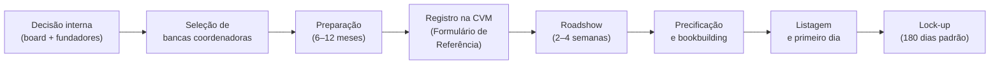
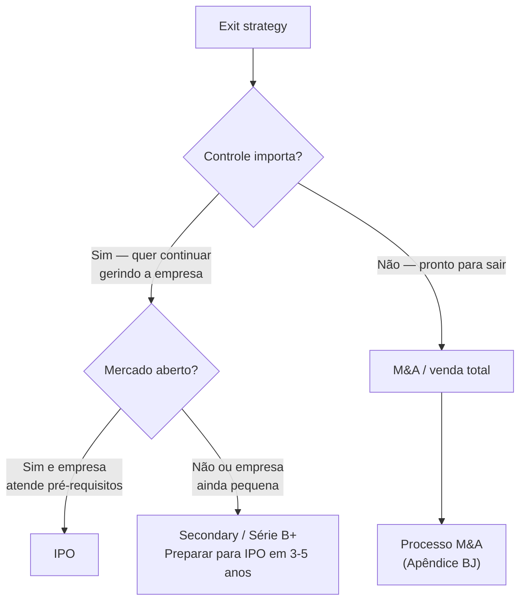

## APÊNDICE DE — IPO NO BRASIL: QUANDO, COMO E O QUE MUDA

> [!note] Posição no livro
> Este apêndice complementa a [[fases/fase-16|Fase 16 — Exit Strategy]]. Cobre o IPO como caminho específico de exit, com foco no contexto brasileiro (B3, CVM, Novo Mercado). M&A como caminho de exit está na Fase 16 e no [[apendice-bj|Apêndice BJ]].

---

### IPO não é o objetivo — é um instrumento

A maioria dos fundadores que contempla IPO o trata como meta de chegada. É um erro. IPO é um instrumento de liquidez e de acesso a capital público, com custo operacional permanente e restrições significativas de governança. Algumas empresas ficam melhores depois do IPO. Muitas ficam piores, porque foram a mercado cedo demais ou pelos motivos errados.

A pergunta certa não é "quando vou abrir capital?" mas "o IPO é o melhor caminho para os meus objetivos específicos neste momento?".

---

### Pré-requisitos reais para um IPO no Brasil

O regulatório (CVM, B3) tem requisitos mínimos. O mercado tem requisitos implícitos muito mais altos.

**Requisitos regulatórios (B3 Novo Mercado — padrão de referência):**

- Free float mínimo de 25% após o IPO
- Apenas ações ordinárias (ON) com tag along de 100%
- Board com mínimo 20% de conselheiros independentes (mínimo 5 membros)
- Auditoria por empresa independente registrada na CVM
- Divulgação em inglês de documentos relevantes

**Requisitos de mercado (não formais, mas determinantes):**

- Receita anual recorrente ou previsível acima de R$ 300–500M (orientação geral para IPOs viáveis no Novo Mercado; 2024–2026)
- Histórico de 3 anos de demonstrações financeiras auditadas
- EBITDA positivo ou trajetória clara de rentabilidade nos próximos 12–18 meses
- Governança corporativa já funcionando (board independente, comitê de auditoria)
- Time de CFO e IR experientes em mercado de capitais
- Story coerente para investidor institucional: por que IPO agora, qual o uso dos recursos

> [!warning] O mercado brasileiro é pequeno e sazonal
> A janela de IPOs no Brasil abre e fecha com o humor macroeconômico. 2020–2021 foram anos excepcionais. 2022–2024 foram praticamente fechados. Planejar IPO sem levar em conta esse ciclo é ingenuidade operacional.

---

### Estrutura do processo de IPO

**Duração total:** 12–24 meses do início da preparação até a listagem.

---

### As três fases internas de preparação

#### Fase 1 — Decisão e estruturação (meses 1–6)

- Alinhamento do board e dos sócios relevantes sobre a decisão
- Avaliação interna: a empresa está pronta? O mercado está receptivo?
- Seleção de coordenadores (bancos de investimento): BTG, XP, Itaú BBA, Goldman, JPMorgan são os mais frequentes em IPOs brasileiros
- Seleção de advogados (empresa e bancas têm assessores separados)
- Auditores: BigFour é padrão para mercado de capitais
- Reestruturação societária se necessário (holding, conversão de LTDA para SA, etc.)

#### Fase 2 — Preparação técnica (meses 6–18)

- Elaboração do Formulário de Referência (documento regulatório central da CVM — equivalente ao S-1 americano)
- Auditoria dos últimos 3 exercícios em padrão IFRS
- Construção ou fortalecimento do time de IR (Investor Relations)
- Road show de aquecimento com investidores institucionais (não-deal roadshow)
- Governança: eleição do board definitivo, instalação de comitês
- Estrutura de incentivos pós-IPO: ESOP adaptado para empresa pública

#### Fase 3 — Execução do IPO (meses 18–24)

- Protocolo na CVM: início do prazo regulatório (~30 dias para análise)
- Prospecto preliminar (red herring): versão pública sem preço
- Roadshow formal: apresentações para investidores institucionais em São Paulo, Rio, Nova York, Londres (para IPOs com tranche internacional)
- Bookbuilding: formação do livro de ordens e definição da faixa de preço
- Precificação: definição do preço final com as bancas
- Liquidação: D+2 após precificação
- Lock-up: fundadores e investidores anteriores ficam impedidos de vender por 180 dias

---

### Custos do IPO

**Custos de transação (one-time):**

| Item | Estimativa |
|---|---|
| Comissão de coordenação (bancas) | 3,5–5% do valor captado |
| Advogados (empresa + bancas) | R$ 5–15M dependendo da complexidade |
| Auditoria | R$ 2–5M |
| CVM, B3 e custos regulatórios | R$ 500K–2M |
| Roadshow, marketing e impressão | R$ 1–3M |
| **Total estimado para IPO de R$ 500M** | **R$ 25–40M** |

**Custos recorrentes (pós-IPO, anuais):**

| Item | Estimativa |
|---|---|
| Equipe de IR (2–5 pessoas) | R$ 3–8M |
| Auditoria externa contínua | R$ 2–4M |
| Relações com reguladores e compliance | R$ 1–3M |
| Custos de listagem B3 | R$ 100–500K |
| Assessoria jurídica contínua | R$ 1–3M |
| **Total recorrente estimado** | **R$ 7–18M/ano** |

> [!important] O custo real é o tempo do fundador
> CEO de empresa pública passa 20–30% do tempo em atividades de IR: calls com analistas, apresentações em conferências, comentários de resultados trimestrais. Isso é tempo que não vai para produto, clientes ou time. Para empresas em aceleração, esse custo de oportunidade é muitas vezes maior que os custos financeiros.

---

### O que muda depois do IPO

**Governança:**
- Resultados financeiros divulgados trimestralmente (ITR) e anualmente (DFP)
- Qualquer fato relevante deve ser divulgado imediatamente ao mercado
- Insider trading tem consequências criminais — não apenas civis
- Períodos de silêncio (blackout) antes de divulgação de resultados

**Gestão:**
- Pressão por resultados trimestrais pode distorcer decisões de longo prazo
- Decisões estratégicas que antes levavam dias agora levam semanas (board, compliance, disclosure)
- Ativistas acionários: em empresas com free float relevante, fundos ativistas podem exigir mudanças de estratégia ou de management

**Fundadores:**
- Riqueza "no papel" — ações não vendem livremente no lock-up
- Após lock-up: necessidade de plan 10b5-1 (ou equivalente brasileiro) para vender sem acusação de insider trading
- Remuneração e benefícios passam a ser públicos

---

### Alternativas ao IPO tradicional no Brasil

| Alternativa | O que é | Quando considerar |
|---|---|---|
| **Follow-on** | Emissão de novas ações por empresa já listada | Quando precisa de capital mas não quer diluição de fundadores via novo IPO |
| **CRA/CRI/Debentures** | Dívida pública sem abrir capital | Quando precisa de capital sem diluição — para agritech, real estate, infra |
| **SPAC** | Special Purpose Acquisition Company | Incomum no Brasil; mais relevante para empresas com planos de listagem nos EUA |
| **BDR** | Brazilian Depositary Receipt | Empresa listada no exterior com BDRs na B3 — para empresas com estrutura holding no exterior |
| **Listagem direta nos EUA** | NYSE ou NASDAQ via F-1 (empresa estrangeira) | Para empresas com receita significativa em dólar e tese global |

---

### IPO vs. M&A — a escolha no momento certo

| Critério | Favorece IPO | Favorece M&A |
|---|---|---|
| Tamanho | > R$ 500M de receita anual | Qualquer tamanho |
| Controle | Fundador quer continuar gerindo | Fundador quer sair ou reduzir exposição |
| Liquidez necessária | Parcial (lock-up 180 dias) | Total (closing em 3–6 meses) |
| Mercado | Janela aberta, tese clara para público | Independente do ciclo macro |
| Governança | Empresa já tem board e compliance funcionando | Adquirente assume a governança |
| Prêmio de controle | Não existe em IPO | Adquirente paga prêmio de controle típico de 20–40% |

> [!info] Fases relacionadas
> Referenciado em: Fase 16.

---

### Armadilhas

1. **Abrir capital para resolver problema de produto ou de mercado.** Capital resolve problema de capital. Não resolve PMF fraco, churn alto ou margem negativa.
2. **IPO sem governança real.** CVM e B3 aprovam no papel. Mercado pune na precificação.
3. **Subestimar o custo de manutenção.** Fundadores calculam o custo do IPO, não o custo de ser público.
4. **Lock-up como único plano de liquidez.** Prepare o plano de venda com antecedência e com assessoria jurídica especializada.
5. **Ignorar o ciclo macro.** IPO em janela fechada destrói valor — melhor esperar ou encontrar alternativa.
6. **CFO sem experiência em mercado de capitais.** CFO de startup privada e CFO de empresa pública são perfis diferentes.

**Ver também:** [[fases/fase-16|Fase 16 — Exit]], [[apendice-bj|Apêndice BJ — M&A]], [[apendice-ba|Apêndice BA — Secondary e Liquidez de Founder]], [[apendice-am|Apêndice AM — Board e Governance]]
