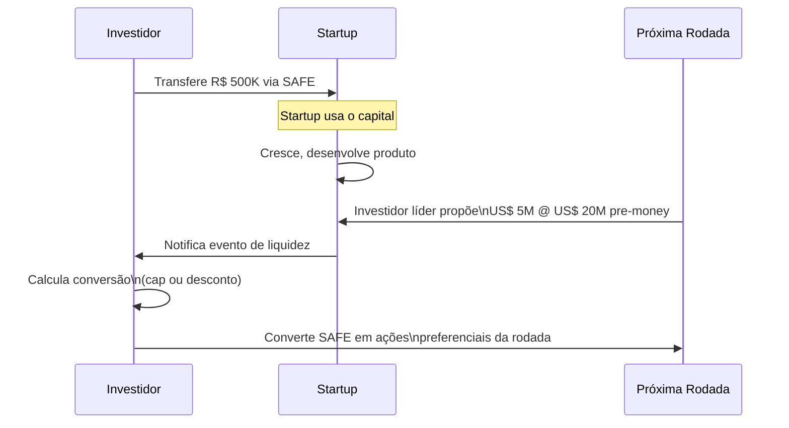

## APÊNDICE DF — INSTRUMENTOS DE CAPTAÇÃO: SAFE, NOTA CONVERSÍVEL E MÚTUO CONVERSÍVEL

> [!note] Posição no livro
> Este apêndice detalha os instrumentos de captação pré-equity (antes da entrada formal do investidor no quadro societário) usados em rodadas iniciais. O processo completo de captação está no [[apendice-v|Apêndice V]]. O COCP (Contrato de Opção de Compra de Participação, instrumento específico do marco legal das startups brasileiro) está no [[apendice-da|Apêndice DA]]. Stock options (opções de compra de ações) e ESOP (Employee Stock Ownership Plan, ou plano de participação acionária para colaboradores) estão no [[apendice-db|Apêndice DB]].

---

### O problema de captar com equity no early stage

Em rodadas pré-seed e seed (estágios iniciais), ambas as partes têm informação insuficiente para precificar a empresa com confiança. O fundador acha que vale mais; o investidor acha que o risco não justifica o valuation (avaliação da empresa) pedido. Negociar equity direto trava o processo.

Instrumentos de captação diferida resolvem isso: o dinheiro entra agora, a conversão em equity acontece na próxima rodada, quando há mais informação (produto mais desenvolvido, primeiros clientes, outros investidores precificando). O investidor entra com desconto ou cap (teto de valuation) como compensação pelo risco de entrar antes.

---

### Os quatro instrumentos principais

| Instrumento | Origem | Tem vencimento? | Gera juros? | Converte em | Regulação brasileira |
|---|---|---|---|---|---|
| **SAFE** (Simple Agreement for Future Equity) | Y Combinator (2013) | Não | Não | Equity na próxima rodada | Sem lei específica; contrato civil |
| **Nota Conversível** | EUA (Convertible Note) | Sim (12–24 meses) | Sim (6–12% a.a. típico) | Equity na próxima rodada ou resgate | Sem lei específica; contrato civil |
| **Mútuo Conversível** | Brasil | Sim | Sim (CDI + spread) | Equity ou repagamento | Código Civil; IOF incide |
| **COCP** (Contrato de Opção de Compra de Participação) | LC 182/2021 | Até 7 anos | Não | Opção de compra de equity | Marco Legal das Startups |

> Para detalhes do COCP, ver [[apendice-da|Apêndice DA — Marco Legal das Startups]].

---

### SAFE — Simple Agreement for Future Equity

#### Como funciona

O SAFE é o instrumento mais simples: o investidor entrega o dinheiro hoje em troca do direito de receber ações no futuro, quando ocorrer um "evento de liquidez" (próxima rodada de equity, venda da empresa, ou — em algumas versões — IPO).

Não há vencimento. Não há juros. Não há data em que o fundador precisa "pagar de volta". O investidor aceita o risco de que a empresa pode nunca ter um evento de liquidez, ou pode ter um evento desfavorável.



#### Termos principais

**Cap (valuation cap):** Teto de valuation no qual o SAFE converte. Se o cap é R$ 10M e a rodada acontece a R$ 20M pre-money, o investidor converte como se o valuation fosse R$ 10M — ou seja, recebe o dobro das ações que receberia sem cap.

**Desconto:** O SAFE converte com desconto sobre o preço da próxima rodada. Desconto de 20% em uma rodada a R$ 10/ação significa que o SAFE converte a R$ 8/ação.

**Quando cap e desconto coexistem:** O investidor converte pelo que for mais favorável (menor preço de conversão).

**Exemplo numérico:**

```
SAFE: R$ 500K | Cap: R$ 8M | Desconto: 20%

Próxima rodada: R$ 2M @ R$ 16M pre-money (R$ 8/ação)

Via cap:     R$ 500K / (R$ 8M / # ações) = preço implícito = R$ 4/ação
Via desconto: R$ 8/ação × (1 - 20%) = R$ 6,40/ação

Investidor usa o cap → converte a R$ 4/ação
R$ 500K / R$ 4 = 125.000 ações

Novo investidor paga R$ 8/ação → recebe 250.000 ações por R$ 2M
```

#### Versões de SAFE

| Versão | Característica | Quando usar |
|---|---|---|
| **Pre-money SAFE** (padrão YC 2018+) | Cap é sobre valuation pre-money; múltiplos SAFEs não se diluem entre si | Padrão atual nos EUA; crescentemente adotado no Brasil |
| **Post-money SAFE** | Cap é sobre valuation incluindo o próprio SAFE; dilui fundadores mais claramente | Mais transparente para o fundador; facilita cálculo do cap table |
| **SAFE sem cap** (apenas desconto) | Sem teto de valuation; investidor confia na empresa precificar bem | Só faz sentido se a empresa tem poder de barganha considerável |

> [!warning] SAFE no Brasil tem nuances jurídicas
> O SAFE americano foi desenhado para Delaware C-Corp. No contexto brasileiro (LTDA ou SA), há questões abertas sobre: se caracteriza ou não mútuo (com implicação de IOF), se a opção de conversão é executável judicialmente, e como tratar a preferência de liquidação em caso de venda. Use advogado com experiência em venture brasileiro.

---

### Nota Conversível (Convertible Note)

#### Como funciona

A nota conversível é, tecnicamente, dívida: o investidor empresta dinheiro com prazo de vencimento e taxa de juros. A diferença de um empréstimo comum é que ela foi desenhada para converter em equity — não para ser paga em dinheiro.

Se a rodada de equity acontecer antes do vencimento, a nota converte (com desconto e/ou cap, como no SAFE). Se não acontecer, o investidor pode exigir o pagamento — o que geralmente força uma negociação e uma prorrogação.

#### Termos principais

- **Principal:** valor do aporte
- **Taxa de juros:** acumula sobre o principal durante o prazo (típico: 6–12% a.a.); converte junto com o principal
- **Vencimento (maturity):** prazo para conversão ou repagamento (típico: 18–24 meses)
- **Desconto:** igual ao SAFE — sobre o preço da próxima rodada
- **Cap:** igual ao SAFE — teto de valuation para conversão

#### SAFE vs. Nota Conversível

| Aspecto | SAFE | Nota Conversível |
|---|---|---|
| Natureza jurídica | Contrato sui generis de equity futuro | Dívida conversível |
| Vencimento | Não | Sim — cria obrigação de converter ou pagar |
| Juros | Não | Sim — acumula, converte junto |
| Pressão sobre fundador | Menor | Maior (vencimento cria deadline) |
| Proteção ao investidor | Menor | Maior (pode exigir repagamento) |
| Uso típico | Pré-seed e seed sem pressão de tempo | Seed com investidor mais conservador |
| Complexidade jurídica | Menor | Maior |

> [!tip] Qual usar?
> Se você tem poder de barganha (múltiplos interessados), prefira SAFE — é mais simples e menos coercitivo. Se o investidor insiste em nota conversível, negocie prazo de vencimento longo (24 meses) e cláusula de prorrogação automática mediante acordo de 60% dos detentores.

---

### Mútuo Conversível (instrumento brasileiro)

O mútuo conversível é o equivalente nacional da nota conversível — um contrato de empréstimo com opção de conversão em equity. É amplamente usado porque os advogados brasileiros de venture têm mais familiaridade com ele do que com SAFEs.

**Particularidades brasileiras:**

- **IOF:** Mútuos entre pessoas jurídicas ou com pessoas físicas são sujeitos a IOF. Para mútuo PF → PJ (investidor pessoa física para startup), a alíquota pode ser 0,5% a.d. sobre o saldo — custo relevante em empréstimos de prazo mais longo.
- **Taxa de juros:** Deve ser explicitada no contrato. Sem taxa explícita, aplica-se a SELIC.
- **Código Civil:** O mútuo é disciplinado pelo Código Civil (arts. 586–592). Discussão jurídica sobre se a opção de conversão é válida como condição potestativa pura depende de como o contrato é redigido.

**Quando o IOF pode ser evitado:**
- Mútuo PJ → PJ com prazo definido: alíquota reduzida
- Uso do COCP (Marco Legal das Startups) em vez do mútuo conversível: COCP é explicitamente isento de IOF para investimentos em startups (ver [[apendice-da|Apêndice DA]])

---

### Acumulação de instrumentos pré-rodada (stacking)

É comum uma startup captar múltiplos SAFEs ou notas de diferentes investidores antes da Série A. Isso cria complexidade no cap table.

**Problema do stacking:**

```
Fundadores: 70%
SAFE 1 (R$ 500K, cap R$ 8M): pendente
SAFE 2 (R$ 300K, cap R$ 10M): pendente
SAFE 3 (R$ 200K, sem cap, 20% desconto): pendente

Na Série A @ R$ 20M pre-money:
→ SAFE 1 converte primeiro (cap mais baixo = mais ações)
→ SAFE 2 converte depois
→ SAFE 3 converte com desconto
→ Cada conversão dilui os fundadores e os demais SAFEs
→ Resultado final muito diferente do que fundadores esperavam
```

**Mitigação:**

- Modele o cap table em cada cenário antes de assinar cada SAFE
- Limite o total de capital captado em instrumentos diferidos a 15–20% do valuation alvo da próxima rodada
- Use a mesma versão de SAFE (pre-money ou post-money) para todos os investidores de uma rodada
- Ferramentas: Carta, Pulley, Capshare permitem simular conversões

---

### Checklist de negociação para o fundador

**Antes de assinar qualquer instrumento:**

- [ ] Qual o cap? Está alinhado com o valuation que pretendo na próxima rodada?
- [ ] Qual o desconto? Como interage com o cap (qual é mais favorável ao investidor)?
- [ ] Há pro-rata rights (direito de participar da próxima rodada)?
- [ ] Se nota conversível: qual o vencimento? Há cláusula de prorrogação?
- [ ] O instrumento tem direitos de informação (relatórios mensais obrigatórios)?
- [ ] Há direito de veto ou aprovação sobre decisões operacionais? (Evite)
- [ ] Modelei o cap table pós-conversão em três cenários: rodada pequena, esperada e grande?
- [ ] Advogado com experiência em venture revisou o documento?

> [!info] Fases relacionadas
> Referenciado em: Fase 16.

---

### Armadilhas

1. **Cap muito baixo.** Atrai investidores mas destrói o cap table se a empresa performar bem. Em conversão a valuation alto, o investidor ganha muito, o fundador perde muito.
2. **Nota com vencimento curto.** 12 meses não é suficiente para construir o produto e fechar uma rodada. Negocie 18–24 meses.
3. **Stacking descontrolado.** Cinco SAFEs de cinco investidores diferentes, com caps diferentes, sem modelar o cap table final.
4. **Pro-rata aberta para todos.** Investidores com pro-rata direito em todas as rodadas futuras tornam a próxima rodada mais difícil de fechar — o lead quer concentrar.
5. **Ignorar o IOF.** Em mútuo conversível com PF, o IOF pode custar mais do que os juros.

**Ver também:** [[apendice-da|Apêndice DA — Marco Legal e COCP]], [[apendice-v|Apêndice V — Captação]], [[apendice-ce|Apêndice CE — Valuation]], [[apendice-db|Apêndice DB — Stock Options e ESOP]]
