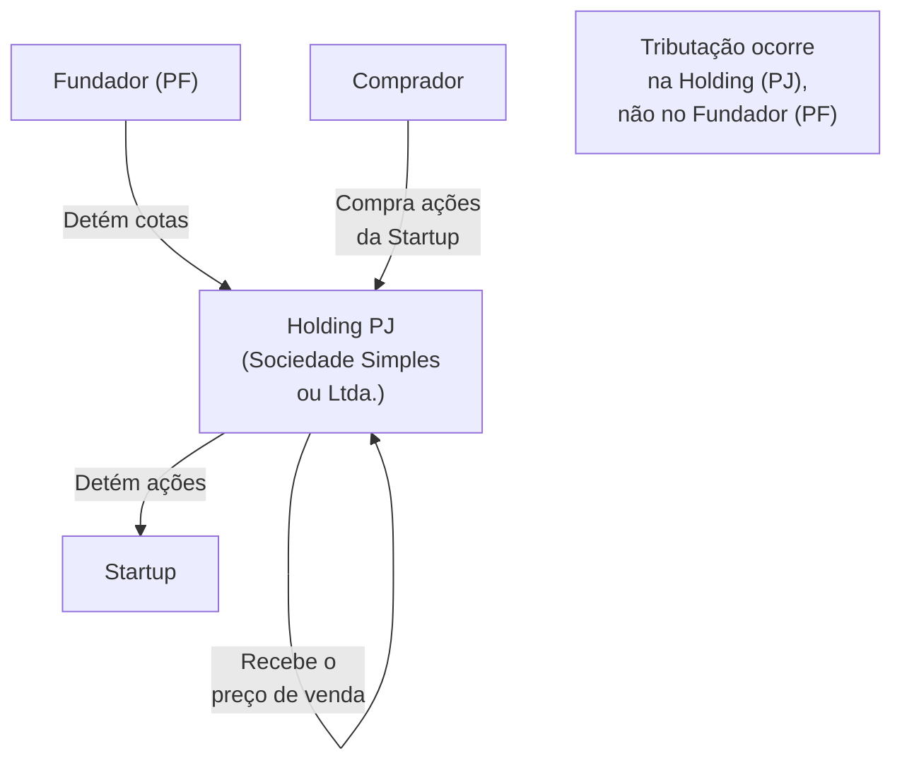

## APÊNDICE DG — TRIBUTAÇÃO DO EXIT PARA FUNDADORES BRASILEIROS

> [!note] Aviso legal
> Este apêndice é material educacional, não assessoria tributária. Alíquotas, bases de cálculo e regimes especiais mudam com frequência no Brasil. Antes de qualquer transação de exit, consulte advogado tributarista e planejador patrimonial com experiência em participações societárias. Decisões tomadas sem planejamento prévio podem resultar em carga tributária irreversível.

> [!note] Posição no livro
> Complementa a [[fases/fase-16|Fase 16 — Exit]], o [[apendice-bj|Apêndice BJ — M&A]] e o [[apendice-ba|Apêndice BA — Secondary]]. Foco em tributação do fundador pessoa física (PF) e das estruturas de holding mais comuns.

---

### O problema tributário do exit

Um fundador que vendeu sua participação em uma startup por R$ 50M pode chegar às mãos com R$ 35–40M ou com R$ 45–48M, dependendo exclusivamente de decisões de estrutura tomadas anos antes da venda. A diferença não é fraude — é planejamento (ou a ausência dele).

O Brasil tributa ganho de capital de forma progressiva, mas com diversas estruturas que alteram substancialmente a carga efetiva. Entender o básico é obrigação do fundador, não privilégio do rico.

---

### Ganho de capital — fundador pessoa física

#### Regra geral

Quando uma pessoa física vende participação societária, o ganho é tributado como ganho de capital:

| Faixa de ganho líquido | Alíquota |
|---|---|
| Até R$ 5 milhões | 15% |
| De R$ 5M a R$ 10M | 17,5% |
| De R$ 10M a R$ 30M | 20% |
| Acima de R$ 30M | 22,5% |

**Base de cálculo:** Preço de venda menos custo de aquisição (o valor pelo qual as cotas/ações foram adquiridas ou integralizadas).

**Exemplo:**

```
Fundador fundou a empresa em 2020 com custo de integralização de R$ 10.000.
Vende participação em 2026 por R$ 20.000.000.

Ganho líquido = R$ 20.000.000 - R$ 10.000 = R$ 19.990.000

Tributação progressiva:
  Até R$ 5M:        R$ 5.000.000 × 15%  = R$ 750.000
  R$ 5M a R$ 10M:   R$ 5.000.000 × 17,5% = R$ 875.000
  R$ 10M a R$ 19,99M: R$ 9.990.000 × 20% = R$ 1.998.000

Total IRPF = R$ 3.623.000 (≈ 18,1% efetivo)
```

**Prazo de recolhimento:** Até o último dia útil do mês seguinte à alienação (não espera o IR anual).

---

### Holding familiar — planejamento antes do exit

A estrutura mais comum de planejamento patrimonial para fundadores é a constituição de uma holding (pessoa jurídica) para deter a participação na startup antes da venda.

#### Como funciona



#### Tributação da venda pela holding

Se a holding for optante do **Lucro Real**, o ganho na venda de participações é tributado como:

- **IRPJ:** 15% sobre o lucro
- **CSLL:** 9% sobre o lucro
- **Adicional de IRPJ:** 10% sobre lucro acima de R$ 240K/ano
- **Total aproximado:** 34% sobre o ganho

Se a holding for optante do **Lucro Presumido** com atividade de participações (holding pura), a base presumida para ganho de capital é 8% da receita bruta (para algumas atividades) — mas ganhos de capital são tributados integralmente.

> [!warning] Holding não é sempre melhor
> Para ganhos menores (abaixo de R$ 5M), a alíquota de PF (15%) pode ser mais favorável que a tributação da PJ (34%). A vantagem da holding aparece em ganhos maiores **e** quando há planejamento de reinvestimento do capital antes da distribuição para o sócio.

#### Quando a holding é vantajosa

1. **Diferimento:** O lucro na venda pode permanecer na holding (sem distribuição) e ser reinvestido em outros ativos sem tributação imediata para o sócio PF.
2. **Reinvestimento em FIIS, ações, ou outros negócios:** O capital dentro da holding cresce sem a tributação de IRPF que ocorreria se distribuído.
3. **Planejamento sucessório:** Holding facilita doação de cotas com cláusulas de incomunicabilidade, inalienabilidade e usufruto vitalício.

#### Quando a holding não resolve

1. **Criada depois que a startup já tem valor.** Transferir participação de PF para holding quando a empresa já vale muito gera evento tributável na transferência.
2. **Holding criada muito próxima do exit.** Receita Federal pode questionar o propósito negocial — planejamento tardio tem risco de ser desconsiderado.
3. **Custos de manutenção.** Holding tem IRPJ, CSLL, contabilidade, abertura e encerramento — para patrimônios pequenos, o custo pode superar o benefício.

---

### Estrutura offshore — quando e como

Alguns fundadores brasileiros constituem estruturas no exterior (BVI, Cayman, Delaware) para deter a participação na startup antes de uma venda ou IPO.

#### Contexto legal

A Receita Federal exige que **pessoas físicas residentes no Brasil** declarem ativos no exterior (CBE — Declaração de Capitais Brasileiros no Exterior). A existência de estrutura offshore é perfeitamente legal — a tributação sobre os rendimentos é que deve ser observada.

#### Tributação de rendimentos de offshore

Desde a Lei 14.754/2023, entidades controladas no exterior por pessoas físicas residentes no Brasil têm seus lucros tributados **anualmente** pelo IRPF (15% para lucros distribuídos ou retidos em entidade "transparente"). Antes dessa lei, havia diferimento indefinido — que não existe mais.

> [!important] A lei offshore mudou o jogo
> Antes de 2024 (efeitos da Lei 14.754/2023), holding offshore era estratégia de diferimento significativo. Após a lei, a vantagem se reduziu substancialmente para residentes no Brasil. Planejamento offshore deve ser revisitado com tributarista à luz desta mudança.

#### Quando offshore ainda faz sentido

- Fundador que planeja mudar de residência fiscal antes do exit (ver seção abaixo)
- Empresa com operações reais e substanciais no exterior
- Estrutura de captura de investimento estrangeiro (Cayman para fundo americano investir em startup brasileira)

---

### Mudança de residência fiscal antes do exit

A estratégia mais agressiva — e legal — disponível para fundadores com grande ganho esperado é a **mudança de residência fiscal** antes da venda.

#### Como funciona

Um fundador que se torna residente fiscal em outro país **antes** de vender sua participação pode ser tributado pelas regras desse país, não do Brasil. Países com tributação favorável para ganho de capital incluem Portugal (NHR), Emirados Árabes (0%), Estados Unidos (depende da estrutura), entre outros.

> [!warning] Saída do Brasil exige cuidado
> A Receita Federal tributa o **ganho de capital latente** no momento da saída definitiva do Brasil (tributação de saída — "exit tax"). O fundador que já detém participação valorizada e sai do Brasil precisa calcular e recolher o imposto sobre a valorização até a data de saída, mesmo sem vender. Depois da saída, ganhos futuros são tributados pelo país de destino.

#### Países frequentemente usados por fundadores brasileiros

| País | Regime para novos residentes | Tributação de ganho de capital |
|---|---|---|
| **Portugal** | NHR (Non-Habitual Resident) — 10 anos | Varia por tipo; ganhos de capital de ações podem ser isentos ou reduzidos |
| **Emirados Árabes** | Residência disponível via imóvel ou empresa | 0% imposto de renda (2023+, imposto corporativo não se aplica a PF) |
| **Uruguai** | Residência simples; regime territorial | Ganho de capital de fonte estrangeira pode ser isento |
| **Irlanda** | Favorável para IP e holdings | Ganho de capital: 33%, mas com isenções específicas |

> [!note] Não existe solução universal
> Cada estrutura tem suas próprias regras, prazos mínimos de residência e riscos de planejamento abusivo. Planejamento de mudança de residência fiscal deve ser feito com pelo menos 2–3 anos de antecedência do exit esperado, com assessoria especializada.

---

### Tributação de stock options no exit

Quando fundadores ou funcionários têm stock options que se convertem em ações e são vendidas no exit, a tributação depende da classificação:

**Se as opções forem tratadas como remuneração (tese da Receita Federal):**
- A diferença entre valor de mercado e preço de exercício é tributada como rendimento do trabalho no momento do exercício (IRPF progressivo até 27,5% + encargos previdenciários potenciais)
- O ganho posterior (entre exercício e venda) é tributado como ganho de capital

**Se as opções forem tratadas como investimento (tese favorável ao contribuinte):**
- Tributação somente no exit, como ganho de capital (tabela progressiva de 15–22,5%)
- Base: preço pago no exercício (strike price)

A disputa está em aberto. Para detalhes, ver [[apendice-db|Apêndice DB — Stock Options e ESOP]].

---

### Cronograma de planejamento tributário

| Horizonte até exit esperado | O que fazer |
|---|---|
| > 3 anos | Avaliação da estrutura atual; decisão sobre holding; planejamento sucessório; consideração de mudança de residência se for o caso |
| 2–3 anos | Formação da holding (se for o caso) com tempo de maturação; revisão do cap table e estrutura societária |
| 1–2 anos | Revisão com tributarista; simulação de carga em diferentes estruturas de exit (total vs. parcial, earnout, swap de ações) |
| 6–12 meses | Documentação de custo de aquisição; organização de comprovantes históricos; due diligence interna |
| < 6 meses | Nenhuma mudança estrutural relevante é recomendada — risco de questionamento de propósito negocial |

> [!info] Fases relacionadas
> Referenciado em: Fase 16.

---

### Armadilhas

1. **Não documentar o custo de aquisição.** Sem documentação, a Receita Federal pode presumir custo zero — tributando o valor total da venda como ganho.
2. **Criar holding perto do exit.** Planejamento tardio tem risco jurídico e custo de transferência.
3. **Confundir offshore com planejamento completo.** A lei de 2023 mudou as regras; estrutura criada antes pode não funcionar como esperado.
4. **Negligenciar o estado civil.** Regime de casamento (comunhão universal, parcial) afeta quem é o "proprietário" das cotas — com implicações tributárias e sucessórias.
5. **Earnout sem planejamento.** Parte do preço recebida em parcelas futuras é tributada no recebimento — o planejamento precisa levar isso em conta.
6. **Swap de ações sem avaliar tributação.** Em M&A onde o fundador recebe ações do adquirente em vez de dinheiro, há questões sobre o momento de tributação.

**Ver também:** [[fases/fase-16|Fase 16 — Exit]], [[apendice-bj|Apêndice BJ — M&A]], [[apendice-ba|Apêndice BA — Secondary]], [[apendice-db|Apêndice DB — Stock Options e ESOP]], [[apendice-w|Apêndice W — Tributário]]
