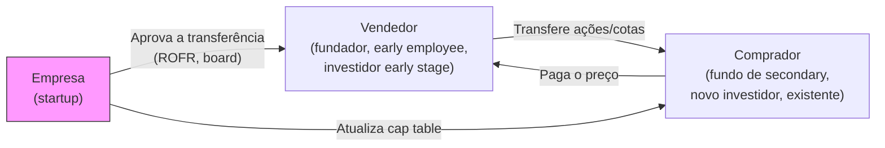

## APÊNDICE DH — MERCADO SECUNDÁRIO E LIQUIDEZ ANTECIPADA PARA FOUNDERS E EARLY EMPLOYEES

> [!note] Posição no livro
> Este apêndice complementa o [[apendice-ba|Apêndice BA — Secondary e Liquidez de Founder]] (liquidez via secondary no cap table existente) e a [[fases/fase-16|Fase 16 — Exit]]. Foco específico no mercado secundário brasileiro: como funciona, quem compra, quem vende, e as restrições práticas.

---

### Por que liquidez antecipada importa

A narrativa do startup é simples: fundador cria empresa, espera 7–10 anos, vende por bilhões. A realidade é mais complicada.

Um fundador com 30% de uma empresa que vale R$ 80M no papel pode ter patrimônio líquido disponível de R$ 0 — se o dinheiro está preso em equity não-liquidável, tem cotação baseada no último round, e não há exit à vista. Para funcionários sênior que receberam opções como parte da compensação, a situação pode ser ainda mais crítica: precisam de capital para comprar imóvel, educar filhos, ou simplesmente diversificar.

Secondary não é sinal de descrença no negócio. É gestão de risco pessoal. O mesmo fundador que vende 5% do seu stake para diversificar pode estar 100% comprometido com a empresa pelos próximos 10 anos.

---

### Como funciona o mercado secundário

No mercado secundário, ações de empresas privadas são transferidas entre o titular original e um comprador, sem que a empresa emita novas ações. A empresa não recebe capital — quem recebe é o vendedor.



**Partes envolvidas:**
- **Vendedor:** quem detém as ações (fundador, employee, investidor early)
- **Comprador:** fundo de secondary, outro investidor existente, ou novo investidor estratégico
- **Empresa:** não recebe capital, mas precisa aprovar a transferência (via ROFR e board)

---

### Mecanismos de restrição à venda (o que impede a liquidez)

A maioria dos contratos societários de startups contém cláusulas que dificultam ou impedem transferências sem aprovação:

**ROFR (Right of First Refusal):** Antes de vender para terceiros, o vendedor deve oferecer as ações para a empresa e/ou para os investidores existentes nas mesmas condições. Se eles passarem, a venda para terceiros pode prosseguir.

**Direito de co-venda (tag-along):** Se um sócio majoritário vende, os minoritários têm direito de vender junto nas mesmas condições.

**Aprovação do board:** Muitos acordos de sócios exigem aprovação do board para qualquer transferência.

**Lock-up:** Em rounds recentes, acordos podem proibir vendas por período determinado (6–24 meses após o investimento).

**Restrição de classe:** Ações preferenciais geralmente têm transferência mais restrita do que ordinárias.

> [!important] ROFR é o mecanismo mais relevante na prática
> Se a empresa exercer o ROFR, a venda para terceiros não acontece. Para secondary funcionar, o ROFR deve ou não ser exercido, ou o comprador deve ser o próprio detentor do ROFR (investidor existente).

---

### Quem compra secondary no Brasil

O mercado secundário brasileiro ainda é limitado comparado aos EUA, mas cresce com a maturação do ecossistema.

**Fundos especializados em secondary:**

Poucos fundos brasileiros operam especificamente em secondary de startups. Os mais ativos incluem gestoras de PE/VC que fazem secondary como parte de portfólio diversificado. Nos EUA, fundos como Forge, SecondMark, Carta Liquidity, e Equity Zen têm plataformas dedicadas — no Brasil, o processo é mais OTC (over-the-counter).

**Investidores da rodada seguinte:**

Muitas transações de secondary acontecem "embutidas" em rodadas primárias. O novo investidor (lead da Série B, por exemplo) compra uma parte das ações dos fundadores como condição para liderar a rodada. Isso é chamado de "founder liquidity" e é crescentemente comum.

**Investidores existentes:**

Alguns investidores do cap table exercem o ROFR para concentrar posição, ou aceitam participar de transações de secondary entre rodadas quando a empresa cresce consistentemente.

**Family offices e HNWIs:**

Para empresas de crescimento comprovado, family offices brasileiros compraram participações em secondary com valuation baseado no último round (ou com desconto).

---

### Precificação no secondary

Ao contrário de ações públicas, não há mercado centralizado. O preço é negociado, com referência no último valuation da rodada primária.

**Fatores que definem o desconto sobre o último round:**

| Fator | Impacto no desconto |
|---|---|
| Tempo desde o último round | Mais tempo = maior incerteza = desconto maior |
| Crescimento das métricas desde o último round | Crescimento forte = desconto menor |
| Liquidez esperada (exit próximo?) | Exit iminente = desconto menor |
| Tipo de ação (preferencial vs. ordinária) | Ordinária tem desconto maior — preferencial tem proteções |
| Concentração (% do cap table sendo vendida) | Bloco grande = desconto para acomodar tamanho |
| Restrições contratuais (ROFR, lock-up) | Mais restrições = desconto maior pelo risco de não fechar |

**Desconto típico observado no mercado:**
- Empresa em trajetória forte, secondary embutido em rodada: 10–20% de desconto
- Transação standalone entre rounds: 20–40% de desconto
- Empresa com métricas estagnadas ou sem exit visível: 40–60% ou transação não-viável

---

### O processo de uma transação secondary

**Passo 1 — Verificação do contrato societário**

Antes de qualquer conversa com comprador, o vendedor deve revisar o acordo de sócios e o estatuto para entender:
- Há ROFR? Em favor de quem (empresa, investidores, todos)?
- Há aprovação de board necessária?
- Há lock-up vigente?
- Há cláusulas de drag-along ou tag-along relevantes?

**Passo 2 — Alinhamento com a empresa**

Falar com o CEO ou board antes de buscar comprador. Razões:
- A empresa pode querer facilitar (recompra própria, ou secondary embutido em round)
- Ou pode bloquear — melhor saber antes de gastar tempo com compradores
- Empresas boas-fé facilitam secondary para fundadores e early employees; isso melhora retenção

**Passo 3 — Identificação de comprador**

- Verificar se investidores existentes têm interesse
- Buscar assessor financeiro especializado (poucos no Brasil — geralmente são as próprias corretoras do ecossistema VC)
- Plataformas internacionais (Forge, Equity Zen) operam com brasileiros em casos específicos

**Passo 4 — Due diligence do comprador**

O comprador vai querer financials recentes, informações do cap table, e confirmação de que as ações são livres de ônus. NDA antes de qualquer compartilhamento.

**Passo 5 — Negociação e documentação**

- SPA (Share Purchase Agreement): contrato de compra e venda
- Representações e garantias do vendedor (que as ações são livres de penhora, sem litígio pendente)
- Aceitação do ROFR pelos detentores do direito (formalmente)
- Aprovação do board (se necessária pelo estatuto)

**Passo 6 — Atualização do cap table**

A empresa atualiza o registro societário (JUCESP ou equivalente para LTDA; livro de ações para SA) para refletir o novo titular.

---

### Secondary embutido em rodada primária ("founder liquidity")

A estrutura mais comum e mais limpa de secondary no Brasil é o founder liquidity embutido numa rodada primária de equity.

**Como funciona:**

```
Série B — R$ 30M

Estrutura:
  R$ 25M novo capital (primary): empresa emite novas ações
  R$ 5M secondary: fundadores vendem ações existentes ao novo investidor

Resultado:
  Empresa recebe R$ 25M para crescimento
  Fundadores recebem R$ 5M em liquidez pessoal
  Novo investidor tem posição total que justifica o esforço da rodada
```

**Por que fundos aceitam:**

- Founder alinhado (que sobreviveu ao processo e está comprometido) é mais valioso
- Fundo em early stage: founder que tem contas pessoais pagas pensa melhor
- Sinaliza confiança do fundador no negócio (ninguém vende 5% se acredita que vai valer 10x)

**O que investidores anteriores pensam:**

- Dilui a posição deles se o secondary for do fundador (sem nova emissão)
- Mas founder que saiu da pressão financeira extrema tende a tomar decisões melhores

> [!tip] Tamanho de secondary em rodada
> Mercado informal: secondary de 10–20% do valor total da rodada é razoável para fundador seed-stage. Acima de 30% começa a gerar questionamento sobre comprometimento. O benchmark americano é similar.

---

### Considerações tributárias do secondary

Transação de secondary pelo fundador pessoa física: ganho de capital tributado conforme [[apendice-dg|Apêndice DG — Tributação do Exit]].

Pontos específicos:

- O "custo de aquisição" é o valor de integralização original — geralmente muito baixo
- Resultado: quase todo o valor recebido é ganho líquido tributável
- Prazo de recolhimento: último dia útil do mês seguinte à transação

Para early employees com stock options:
- Tributação depende da classificação (remuneratória vs. mercantil) — ver [[apendice-db|Apêndice DB]]
- O preço de exercício (strike price) é o custo de aquisição para fins de ganho de capital

> [!info] Fases relacionadas
> Referenciado em: Fase 16.

---

### Armadilhas

1. **Buscar comprador antes de verificar ROFR.** Empresa ou investidores exercem o ROFR e a transação não fecha — mas a negativa já é pública.
2. **Vender sem alinhamento com o board.** Mesmo que seja legalmente possível, relação com o board deteriora.
3. **Desconto muito agressivo.** Vender a 50% de desconto do último round pode sinalizar ao mercado que o fundador não acredita no valuation.
4. **Comprador sem experiência com ativos ilíquidos.** Comprador que entra sem entender as restrições pode exigir liquidez que não existe.
5. **Não documentar o custo original.** Sem comprovação do valor pago na integralização, base de cálculo do ganho de capital fica em risco.

**Ver também:** [[apendice-ba|Apêndice BA — Secondary]], [[fases/fase-16|Fase 16 — Exit]], [[apendice-dg|Apêndice DG — Tributação do Exit]], [[apendice-db|Apêndice DB — Stock Options]]
