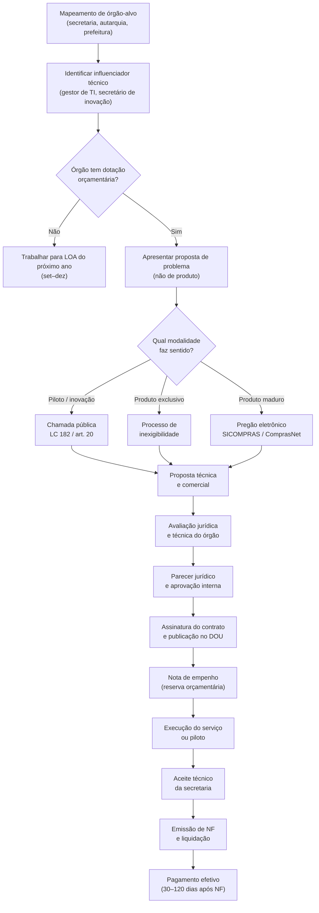

## APÊNDICE DK — GOVTECH: STARTUP VENDENDO PARA GOVERNO

> [!note] Nota de validade
> Valores de dispensa de licitação e limites de contratação são reajustados periodicamente por decreto federal. Os valores citados refletem o cenário de maio de 2026, com base nos reajustes da Lei 14.133/2021 e regulamentações vigentes. Verificar atualização antes de qualquer processo de contratação. O Marco Legal das Startups (LC 182/2021) é a âncora legal principal — ver [[#APÊNDICE DA — MARCO LEGAL DAS STARTUPS: LC 182/2021|Apêndice DA]] para o instrumento em detalhe.

Governo é o maior comprador do Brasil. O setor público gasta mais de R$ 2 trilhões por ano. Saúde, educação, segurança, mobilidade, assistência social, fiscalização tributária — todos operam sobre tecnologia envelhecida, processos manuais e baixa eficiência. O gap entre o que o setor público precisa e o que consegue contratar via TI tradicional é onde a govtech vive.

Mas governo é cliente diferente de tudo o que uma startup conhece. O ciclo de venda é longo. O processo de compra é burocrático por design. O pagamento pode atrasar meses. E a troca de prefeito ou secretário pode desfazer um contrato assinado.

Este apêndice é um playbook operacional para fundar, vender e crescer no setor público brasileiro.

### Por que governo é cliente especial

Quatro características distinguem o governo de qualquer cliente privado.

**Ciclo de compra anual e orçamento pré-definido.** O governo federal, estadual e municipal opera com lei orçamentária anual (LOA). O dinheiro disponível para contratar uma startup está ou não está na LOA. Secretaria sem dotação orçamentária não contrata, mesmo que queira. O ciclo é: setembro a dezembro é o momento de influenciar a LOA do ano seguinte. Janeiro a abril é o momento de fazer o processo de contratação. Maio a agosto é quando o contrato começa a rodar. Essa sazonalidade rígida muda o modelo de go-to-market inteiro.

**Compliance intenso por obrigação constitucional.** A administração pública opera sob o princípio da legalidade: só pode fazer o que a lei expressamente autoriza. Isso significa que toda contratação tem trâmites formais: parecer jurídico, aprovação de comitê, publicação no Diário Oficial. Não existe "assinar agora e regularizar depois" no setor público.

**Stakeholders múltiplos e decisão não-linear.** No privado, o CEO decide. No governo, a decisão passa por técnico, gestor intermediário, jurídico, controle interno, secretário ou prefeito, e às vezes câmara de vereadores. Cada um tem poder de veto. Nenhum tem poder de dizer "sim" sozinho.

**Empenho não é pagamento.** Este é o ponto que mais surpreende fundadores govtech. O contrato assinado gera uma nota de empenho — reserva orçamentária. Mas o pagamento efetivo ocorre após entrega do serviço, emissão de nota fiscal, aceite técnico da secretaria, e processamento contábil. Na prática, o prazo entre entrega e recebimento varia de 30 a 120 dias. Startups com caixa curto quebram esperando receber do governo.

> [!warning] Empenho não é dinheiro em conta
> Muitos fundadores govtech cometem o erro de contar com receita de contratos públicos no fluxo de caixa antes do recebimento efetivo. Empenho é compromisso orçamentário, não liquidez. Planejar com 60 a 90 dias de gap entre entrega e pagamento. Ter reserva de caixa antes de fechar contratos públicos.

### Marco Legal das Startups: LC 182/2021

A Lei Complementar 182/2021 mudou a equação para startups que querem vender para governo. Antes dela, contratar startup era juridicamente difícil para o gestor público — qualquer contratação direta sem licitação gerava risco de autuação pelo TCU ou TCE.

O art. 20 da LC 182 criou a base legal explícita para contratação de startups por dispensa de licitação, para desenvolvimento ou teste de soluções inovadoras. O gestor que usa esse mecanismo tem amparo legal claro. Isso reduziu o medo institucional de contratar startups.

Além da dispensa, a lei criou o **Contrato de Opção de Compra de Participação (COCP)**, que permite ao governo participar em startups como investidor — instrumento ainda pouco explorado, mas previsto.

O art. 30 especificamente autoriza a **dispensa de licitação para contratação de startups**, limitada a:

- Startups com até dez anos de constituição.
- Receita bruta anual de até R$ 16 milhões no exercício anterior.
- Objeto voltado a desenvolvimento ou teste de solução inovadora.
- Contrato de caráter experimental ou de validação.

> [!important] O gestor precisa de coragem institucional
> A lei existe, mas muitos gestores ainda têm medo de usar. TCU e TCEs fiscalizam com rigor. Governos mais inovadores (Minas Gerais, São Paulo, Rio Grande do Sul, Ceará, prefeituras como BH, SP, Porto Alegre) têm mais familiaridade com o mecanismo. Prefeituras pequenas raramente usam. Mapear o perfil de inovação do órgão antes de investir no pipeline.

### Modalidades de contratação

Governo não tem uma única forma de comprar. Há pelo menos cinco modalidades relevantes para startups, cada uma com lógica, valor e complexidade diferentes.

| Modalidade | Limite de valor | Complexidade | Prazo típico | Melhor para |
|---|---|---|---|---|
| Dispensa de licitação (inovação) | Variável por regulamentação (referência: R$ 57,5K para serviços comuns; inovação tem previsão específica) | Baixa | 30–90 dias | Piloto, MVP, validação inicial |
| Inexigibilidade | Sem limite de valor | Média | 45–120 dias | Fornecedor exclusivo, solução singular |
| Pregão eletrônico | Sem limite | Alta | 90–180 dias | Produto padronizado, escalável |
| Concurso público de inovação | Sem limite (prêmio) | Média | 60–180 dias | Soluções para desafio específico |
| Sandbox ARE (ARE setorial) | Variável por regulador | Média | 90–360 dias | Healthtech, fintech, edtech regulados |

> [!tip] Dispensa para inovação vs. dispensa comum
> A dispensa de licitação comum (para serviços de baixo valor) é uma coisa. A dispensa para inovação via LC 182 é outra. A segunda tem objeto específico (solução inovadora), processo distinto (chamada pública com avaliação técnica) e não depende de limite de valor pequeno. Fundador que só conhece a dispensa comum perde a principal porta de entrada govtech.

**Dispensa de licitação para inovação.** É o mecanismo central da LC 182. O órgão publica uma chamada pública descrevendo o problema que precisa resolver. Startups apresentam propostas. Uma comissão técnica avalia e seleciona — normalmente até três startups para pilotos paralelos. O contrato é assinado sem licitação formal. Valor máximo definido pelo órgão, com amparo na regulamentação específica.

**Inexigibilidade.** Quando a startup tem solução sem concorrente equivalente no mercado. Exige justificativa técnica robusta. Risco: qualquer concorrente pode questionar. Funciona bem para startups com patente ou tecnologia genuinamente proprietária.

**Pregão eletrônico.** Licitação plena com disputa de preço. Burocracia alta, prazo longo, mas sem limite de valor. Adequado para startup que já tem produto maduro, quer escala, e pode competir por preço. Empresas de edtech que fornecem para o FNDE/MEC frequentemente operam via pregão.

**Concurso público de inovação.** Edital com desafio técnico específico, premiação por solução. Não é contratação direta, mas é porta de entrada. Algumas prefeituras e estados usam como primeiro passo antes da contratação.

**Sandbox ARE (Ambiente Regulatório Experimental).** Para healthtech, edtech e outras verticais reguladas, o ARE setorial permite operar em ambiente controlado com flexibilização de requisitos regulatórios. Ver [[#APÊNDICE DA — MARCO LEGAL DAS STARTUPS: LC 182/2021|Apêndice DA]] e [[#APÊNDICE AW — REGULATÓRIO SETORIAL BRASILEIRO|Apêndice AW]].

### Fluxo de contratação pública para startup

### Pipeline de vendas para governo

Vender para governo é menos sobre "produto" e mais sobre "problema". O gestor público não compra tecnologia — ele compra solução para problema político (eleição, CPI, corte de gastos) ou operacional (fila de espera, erro de cadastro, fraude).

**Etapa 1 — Mapeamento de influenciadores.** Toda contratação pública tem um influenciador técnico antes de chegar ao decisor formal. Gerente de TI, superintendente de inovação, assessor da secretaria. Esse influenciador molda o edital, define requisitos, e tem peso decisivo na avaliação técnica. Identificar quem é e construir relacionamento antes de qualquer processo formal.

**Etapa 2 — Mapeamento de dotação orçamentária.** Antes de investir tempo em um órgão, verificar se há dotação orçamentária disponível ou em planejamento. Portal da Transparência, SIAFI, e relatórios de execução orçamentária são públicos. Órgão sem orçamento não contrata.

**Etapa 3 — Construção de caso de uso documentado.** O decisor público não pode correr risco reputacional. Ele precisa de evidência de que a solução funciona antes de assinar. Oferecer piloto gratuito ou subsidiado, documentar resultados com métricas, obter declaração do gestor técnico. Esse caso de uso é a principal ferramenta de vendas para o próximo órgão.

**Etapa 4 — Adequação ao processo licitatório.** Cada modalidade tem exigências documentais diferentes. Regularidade fiscal federal, estadual e municipal é obrigatória. Certidões negativas de débito (CND) precisam estar em dia. Startups no Simples Nacional têm processo mais simples. Criar checklist documental e manter sempre atualizado.

**Etapa 5 — Gestão pós-contrato.** Contrato assinado não é trabalho concluído. O gestor público tem medo de errar. Precisa de suporte frequente, relatórios documentados, e evidência contínua de que a solução está funcionando. Essa relação de suporte estreito é o que garante renovação e expansão para outros órgãos.

> [!tip] A prefeitura é a porta de entrada
> Municípios têm orçamentos menores, processos mais simples, e decisores mais acessíveis. Uma startups govtech típica começa com duas ou três prefeituras médias (100–500 mil habitantes), valida o modelo, e usa esses contratos como referência para secretarias estaduais e ministérios. Nunca começar pelo governo federal.

### Casos brasileiros

**SoftDesign e cidade inteligente em Porto Alegre.** A SoftDesign foi uma das primeiras consultorias de tecnologia brasileiras a estruturar projeto de cidade inteligente para o município de Porto Alegre, desenvolvendo soluções de dados para mobilidade urbana via contratação direta com a prefeitura. O caso foi referência para o modelo de contratação pública de startups de TI no Rio Grande do Sul.

**Healthtech e telehealth pós-COVID.** A pandemia de 2020 criou abertura sem precedente para healthtechs no setor público. Municípios que jamais considerariam contratar startup de telemedicina passaram a aceitar pilotos emergenciais. Várias startups (entre elas Conexa Saúde, Docway e outras de menor porte) estabeleceram contratos com secretarias municipais de saúde via dispensa emergencial que depois foram formalizados. A lição: crises regulatórias criam janelas de contratação. Monitorar.

**Edtech e FNDE/MEC.** O Fundo Nacional de Desenvolvimento da Educação (FNDE) opera os maiores programas de aquisição de material didático e tecnologia educacional do país. Startups de edtech que conseguem homologação pelo MEC acessam um mercado de escala nacional via pregão. O processo é longo (12 a 24 meses de homologação), mas o contrato resultante pode ser de dezenas de milhões de reais com dezenas de prefeituras.

**Govtech de fiscalização tributária.** Prefeituras têm problema crônico de evasão de ISS e IPTU. Startups de análise de dados para fiscalização tributária (como Celcoin em parte de suas soluções, e fintechs B2G especializadas) acessam prefeituras via inexigibilidade, justificando solução tecnológica proprietária para cruzamento de dados.

### Métricas específicas de govtech

Governança de govtech exige métricas diferentes de B2B privado.

| Métrica | Definição | Benchmark govtech |
|---|---|---|
| CAC público vs. privado | Custo de aquisição de cliente público (ciclo longo) | CAC público é 3–5x maior em tempo, mas potencialmente menor em $ se processo de chamada pública é orgânico |
| Ciclo médio de venda | Da primeira reunião ao empenho | 6 a 18 meses (vs. 1–3 meses B2B privado) |
| Tempo médio de pagamento | Da entrega ao recebimento | 45–90 dias em municípios, 60–120 dias em estados |
| Concentração de receita pública | % do total da receita oriunda do setor público | Alarme acima de 40% em contrato único; saudável até 60% distribuído |
| Taxa de renovação de contrato | Contratos que renovam após vencimento | Abaixo de 60% é sinal de dependência de gestor específico |
| Número de órgãos ativos | Diversificação de base pública | Mínimo 3 órgãos independentes antes de levantar capital |

> [!warning] CAC público subestimado
> Fundadores govtech calculam o CAC contando só tempo comercial. O custo real inclui: customização de proposta técnica, adequação documental, espera de processo, reuniões com múltiplos stakeholders. Para contratos abaixo de R$ 200K, o CAC público frequentemente torna a unidade econômica negativa no primeiro ano. O modelo funciona em renovação e expansão, não em primeiro contrato.

### Armadilhas

> [!warning] Armadilhas de govtech
> **Dependência de um único contrato público.** Governo troca de gestor a cada eleição. Contratos podem não ser renovados por razões políticas, não técnicas. Startup com 70% da receita em um contrato municipal está a um mandato de fechar.
>
> **Confundir proposta com contrato.** Proposta apresentada, elogiada, e "aprovada" pelo gestor ainda não é contrato. Enquanto não houver empenho publicado no Diário Oficial, não há contrato. Não contratar funcionários nem fazer investimentos com base em proposta não formalizada.
>
> **Atraso de pagamento como problema de sobrevivência.** Startup com burn rate de R$ 150K/mês e contrato público de R$ 400K/trimestre que paga com 90 dias de atraso tem problema de caixa real. Calcular o capital de giro necessário para sobreviver ao gap de pagamento antes de assinar.
>
> **Mudança de governo cancela contrato.** Especialmente em nível municipal e estadual. Contratos de tecnologia são frequentemente revisados ou cancelados no primeiro ano de novo governo. Incluir no modelo financeiro um cenário de não-renovação de 30% dos contratos públicos a cada ciclo eleitoral.
>
> **Customização que vira armadilha.** Governo frequentemente pede customizações específicas que tornam o produto difícil de replicar para outros órgãos. Aceitar customização tem custo de divergência de produto. Definir política clara: customizações que se tornam features do produto (aceitar) vs. customizações exclusivas (cobrar ou recusar).
>
> **Não entender o motivador real do gestor.** Gestor público não tem bônus de desempenho. Tem risco de carreira. O que o motiva é evitar problema, não maximizar resultado. Proposta que apresenta risco tem menos tração que proposta que apresenta segurança com evidência de funcionamento.

### Conexão com outros apêndices

| Tópico | Apêndice |
|---|---|
| Marco Legal das Startups, COCP, ARE, dispensa de licitação | [[#APÊNDICE DA — MARCO LEGAL DAS STARTUPS: LC 182/2021|Apêndice DA]] |
| Regulatório setorial (healthtech, edtech, fintech) | [[#APÊNDICE AW — REGULATÓRIO SETORIAL BRASILEIRO|Apêndice AW]] |
| Captação de equity e investidores especializados em govtech | [[#APÊNDICE V — CAPTAÇÃO DE EQUITY, PITCH E RELACIONAMENTO COM INVESTIDORES|Apêndice V]] |
| Financiamento não-diluitivo, BNDES, Finep para produto público | [[#APÊNDICE P — FINANCIAMENTO NÃO-DILUITIVO|Apêndice P]] |
| Sales motion completa, concentração de receita | [[#APÊNDICE CP — SALES: MOTION COMPLETA, DO OUTBOUND AO RENEWAL|Apêndice CP]] |

### Leitura adicional

- **LC 182/2021** — texto integral no Portal do Planalto. Leitura obrigatória antes de qualquer processo via art. 20.
- **Lei 14.133/2021 (Nova Lei de Licitações)** — substituiu a Lei 8.666/1993. Govtech precisa entender a nova arquitetura de contratação pública.
- **ComprasNet / PNCP** — Portal Nacional de Contratações Públicas. Onde todos os editais federais são publicados.
- **GovTech Brasil (ABStartups)** — grupo de trabalho com mapeamento de oportunidades e casos de sucesso nacionais.
- **CUBO Govtech** e **Tempest GovTech** — aceleradoras e programas especializados em startups de governo.
- **Relatório de Inovação do TCU** — documenta melhores práticas e casos de contratação pública de inovação auditados.
