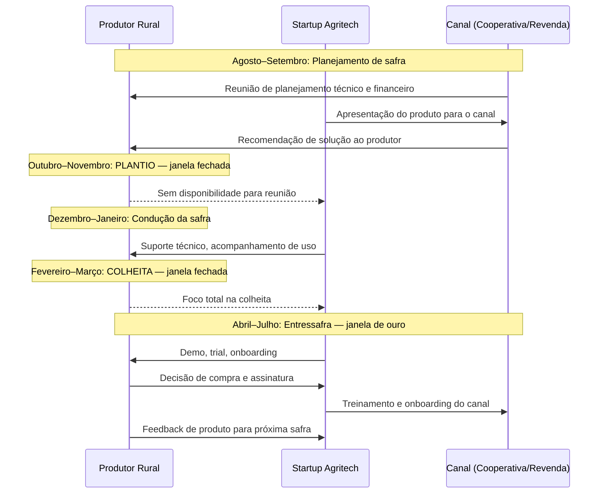
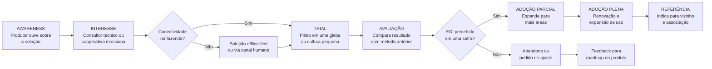

## APÊNDICE DL — AGRITECH: PLAYBOOK PARA O CAMPO BRASILEIRO

> [!note] Nota de validade
> Dados de PIB agropecuário, safra, e instrumentos de crédito rural (CPR, CRA, Fiagro, BNDES) mudam anualmente. Este apêndice reflete o cenário de maio de 2026. Condições de mercado do agronegócio são voláteis — preço de commodity, câmbio, e clima impactam diretamente o orçamento do produtor. Revisar os dados macroeconômicos do setor no início de cada ano-safra.

O Brasil é uma das maiores potências agrícolas do mundo. O agronegócio responde por cerca de 25% do PIB, mais de 40% das exportações, e emprega aproximadamente 30% da força de trabalho. São mais de 5 milhões de propriedades rurais cadastradas no Cadastro Ambiental Rural (CAR). A soja brasileira alimenta o gado europeu e a indústria alimentícia asiática. O frango e a carne bovina brasileiros chegam a mais de 150 países.

Esse tamanho cria oportunidade. Mas também cria complexidade. O campo brasileiro não é uniforme. Uma fazenda de 10.000 hectares no Mato Grosso produzindo soja com precisão agrícola é cliente radicalmente diferente de um agricultor familiar com 5 hectares no Sul produzindo milho para subsistência. Esses dois segmentos exigem produtos diferentes, canais diferentes, ciclos diferentes, e modelos de negócio diferentes.

Agritech (startup voltada ao agronegócio) que não segmenta direito morre tentando servir a todos.

### Contexto: a potência agrícola com brecha tecnológica

O paradoxo da agritech brasileira é evidente nos números. O Brasil tem:

- Segunda maior área agricultável do mundo, com enorme fronteira ainda expansível no Cerrado.
- Segunda maior frota de tratores da América Latina, com penetração crescente de precisão agrícola.
- Embrapa, uma das maiores instituições de pesquisa agrícola pública do mundo, com centenas de cultivares desenvolvidas.
- Crédito rural via SNCR (Sistema Nacional de Crédito Rural) de R$ 400+ bilhões anuais, o maior da história recente.

E ao mesmo tempo:

- Conectividade 4G em menos de 50% das propriedades rurais brasileiras.
- Mais de 50% dos agricultores familiares sem acesso a internet de qualidade na propriedade.
- Penetração de software de gestão agrícola em menos de 15% das propriedades médias.
- Alta dependência de relações pessoais e confiança acumulada em décadas para adoção de qualquer nova tecnologia.

A brecha tecnológica não é falta de demanda. É combinação de conectividade, confiança, e ciclo de adoção lento que define o ritmo da agritech no Brasil.

### Segmentação: três mercados dentro de um

O erro mais comum de fundadores agritech é tratar o produtor rural como segmento único. Na prática são três mercados com go-to-market radicalmente diferente.

| Segmento | Definição | Número aproximado | Ticket médio (ano) | Ciclo de venda | Canal adequado |
|---|---|---|---|---|---|
| Grande produtor | Fazendas > 500 ha (soja, milho, cana, algodão, boi gordo) | ~80.000 produtores | R$ 30K–300K | 3–9 meses | Venda direta, consultor técnico |
| Médio produtor | 50–500 ha, diversificado ou especializado | ~500.000 produtores | R$ 3K–30K | 2–6 meses | Revendas, cooperativas, distribuidor |
| Agricultor familiar | < 50 ha, subsistência ou nicho | ~4,5M produtores | R$ 200–3K | 6–18 meses | Cooperativas, Emater, ATER pública |

**Grande produtor.** É o early adopter da agritech. Tem acesso a capital, tem gestor técnico na fazenda (agrônomo, consultor), e está disposto a pagar por tecnologia que comprove ROI rápido. CAC é alto porque o ciclo de venda é longo e exige múltiplas visitas. Mas LTV é alto, churn é baixo (custo de troca é alto), e NPS tende a ser excelente quando a solução funciona. Startups como Agrosmart, Solinftec e Strider começaram no grande produtor por essa razão.

**Médio produtor.** É o segmento de crescimento. Tem adoção crescente de tecnologia, mas não tem orçamento para produtos premium nem equipe técnica interna para implementar soluções complexas. Acessa tecnologia via canal (cooperativa, revenda, integradoras). O produto precisa ser simples de usar, com suporte local, e preço acessível. A startup que só vende para grandes produtores não cresce porque esse mercado é finito. A que consegue adaptar o produto para o médio via canal escala.

**Agricultor familiar.** É o maior em número, menor em ticket. Go-to-market via mercado privado raramente funciona — o preço que o agricultor familiar pode pagar não cobre CAC de venda direta. O modelo que funciona é parceria com cooperativas, Emater (extensão rural pública), e programas governamentais (Pronaf, PAA). Startups que atendem esse segmento frequentemente têm receita mista: governo subsidia parcialmente, cooperativa distribui, agricultor paga parcela menor.

> [!important] Escolher segmento primeiro
> Startups agritech que tentam servir todos os segmentos ao mesmo tempo não têm produto para nenhum deles. As melhores agritechs brasileiras escolheram segmento específico, dominaram o canal certo para aquele segmento, e expandiram depois. Strider focou no grande produtor de soja. Agrosmart focou em culturas de alto valor (café, laranja, cana) com produtores médio-grandes. AgroRadar focou em médio produtor via cooperativa. A escolha inicial de segmento define o canal, o produto, e o modelo de negócio.

### Canal de distribuição: o gatekeeper que muitos ignoram

O maior erro de fundadores agritech com background tech é tentar distribuir diretamente para o produtor rural. O campo tem canais consolidados com décadas de relacionamento, crédito, e confiança acumulada. Ignorar esses canais é como tentar vender software empresarial ignorando os resellers.

**Cooperativas.** Há mais de 1.500 cooperativas agropecuárias no Brasil (OCB/MAPA). Elas compram insumos, financiam safra, armazenam produção, e vendem para os cooperados. A cooperativa que distribui uma solução agritech carrega o endosso mais poderoso possível — é a instituição em que o produtor deposita a colheita e de quem recebe crédito. Parceria com cooperativas dá acesso a carteiras de mil a cinquenta mil produtores de uma vez. O modelo: licença branca (a startup fornece, a cooperativa vende sob sua marca) ou co-branded, com revenue share de 20–40%.

**Revendas agropecuárias.** São os distribuidores de insumos (sementes, defensivos, fertilizantes). Há mais de 30.000 revendas no Brasil (ABAG e ANDAV). O vendedor de revenda visita o produtor na fazenda toda semana. Essa relação de confiança pessoal é o ativo mais valioso da cadeia. Produto agritech que o vendedor de revenda pode recomendar com convicção tem vantagem brutal. Modelo de comercialização: comissão por licença vendida (10–25%), ou produto gratuito para o produtor como ferramenta de retenção da revenda.

**Integradoras.** No setor de aves e suínos, integradoras como BRF, JBS, Aurora, e Seara contratam produtores para criar animais com padrões definidos. Essas integradoras têm contato direto com dezenas de milhares de produtores integrados. Parceria com integradora para distribuir solução de gestão ou monitoramento pode atingir escala rápida. Cuidado: integradora quer exclusividade e margem alta.

**Consultor técnico (agrônomo independente).** No segmento de grandes produtores, o consultor técnico é o influenciador com poder de recomendar ou bloquear qualquer produto. Ele visita a fazenda toda semana, conhece o produtor há anos, e tem autoridade técnica. Programa de parceria com consultores (comissão, acesso antecipado a features, suporte dedicado) é estratégia de distribuição subestimada. Agrosmart e Strider usaram explicitamente esse canal.

> [!tip] O canal é o produto
> Em agritech, a decisão de canal é tão estratégica quanto a decisão de produto. Canal errado mata startup certa. Produto mediocre com canal certo cresce. Antes de definir roadmap de produto, definir canal e construir o produto em torno das necessidades do parceiro de canal.

### Sazonalidade: o relógio que não para

O campo opera no tempo da safra. Não no tempo do fundador.

A soja — a principal commodity da agritech brasileira — tem ciclo definido:

- **Agosto–setembro**: planejamento da safra, definição de insumos, negociação de crédito rural. Decisões de tecnologia para a safra seguinte são tomadas aqui.
- **Outubro–novembro**: plantio. Produtor está na lavoura 16 horas por dia. Não atende reunião de vendas.
- **Fevereiro–março**: colheita. Mesmo ritmo do plantio. Ninguém toma decisão de compra.
- **Abril–julho**: entressafra. É a janela de ouro para vendas, implementação, treinamento, e renovação.

Startup agritech que fecha deals em novembro não fecha deals. Startup que não entende o calendário da safra principal do seu cliente-alvo constrói pipeline no momento errado e perde a janela de vendas.

> [!warning] Erro de timing custa um ano inteiro
> Em agritech, errar o timing de lançamento ou da abordagem comercial não custa um mês — custa um ciclo de safra inteiro (6 a 12 meses). Startup que lança produto em outubro (plantio da soja) não tem segunda chance antes de abril. Planejar lançamentos e campanhas de vendas para a entressafra. Produtos que exigem 30 a 60 dias de onboarding precisam começar em abril para estar funcionando em agosto.

### Regulatório: o mapa do campo regulado

Agritech opera em mercado fortemente regulado pelo MAPA (Ministério da Agricultura, Pecuária e Abastecimento) e por outras agências.

**MAPA.** Fiscaliza registro de defensivos agrícolas, sementes, fertilizantes, e bioinsumos. Startup que desenvolve produto biológico (controle biológico, inoculante) ou hardware relacionado a aplicação de agroquímicos precisa de registro específico. Prazo: 12 a 36 meses. Custo: R$ 200K a R$ 1M dependendo da categoria.

**Embrapa como parceiro estratégico.** A Empresa Brasileira de Pesquisa Agropecuária (Embrapa) desenvolve tecnologia agropecuária há cinco décadas. Para agritechs de deep tech (biotech agrícola, genômica, sensoriamento remoto), parceria com Embrapa via licenciamento de cultivares ou acordos de transferência de tecnologia é caminho validado. A Embrapa tem unidades descentralizadas por bioma e cultura — 43 unidades distribuídas pelo Brasil. Prospectar a unidade relevante para a cultura-alvo.

**SNCR (Sistema Nacional de Crédito Rural).** O SNCR é a estrutura que viabiliza crédito para o produtor rural via bancos públicos e cooperativas de crédito. Startups que integram dados de crédito rural (Banco do Brasil, Sicredi, Sicoob, Cresol) na plataforma aumentam valor percebido. Startups que querem operar como plataforma de crédito rural precisam de autorização do BACEN ou operar via parceria com instituição financeira autorizada.

**Pronaf.** O Programa Nacional de Fortalecimento da Agricultura Familiar é o principal instrumento de crédito para o agricultor familiar. Startups de agritech para pequenos produtores que conseguem integrar seus produtos ao fluxo de crédito do Pronaf têm vantagem de adoção massiva. O Pronaf financia não só insumos mas tecnologia e assistência técnica — via ATER (Assistência Técnica e Extensão Rural).

> [!important] Registro MAPA não é opcional
> Startup que desenvolve produto biológico ou produto de aplicação agrícola sem registro MAPA não pode comercializar legalmente. Descobrir isso depois de produto desenvolvido é catastrófico. Mapear exigências regulatórias do MAPA nos primeiros três meses de desenvolvimento.

### Funding agrícola: instrumentos específicos do campo

O agronegócio tem instrumentos de financiamento próprios que startups de outras verticais desconhecem.

**CPR — Cédula de Produto Rural.** Título de crédito emitido pelo produtor comprometendo entrega futura de produto agrícola. Pode ser física (compromisso de entrega do produto) ou financeira (compromisso de pagamento em dinheiro). Startup que vende para produtor pode usar CPR como instrumento de pagamento diferido alinhado ao ciclo de safra. Plataformas como LandBank e AgroCredit estruturam CPRs para startups e produtores.

**CRA — Certificado de Recebíveis do Agronegócio.** Título de securitização lastreado em recebíveis do agronegócio. Agritechs com carteira de clientes produtores rurais podem estruturar CRAs para antecipar recebíveis. Instrumento de capital de giro sem diluição de equity. Mínimo de carteira para estruturar: tipicamente R$ 5–10M em recebíveis.

**FNO / FCO — Fundos Constitucionais.** O Fundo Constitucional de Financiamento do Norte (FNO) e do Centro-Oeste (FCO) financiam empreendimentos na Amazônia, Centro-Oeste, e Cerrado, incluindo agrotech. Taxas subsidiadas, prazos longos. Acessíveis via Banco da Amazônia (FNO) e BB/Caixa (FCO).

**Fiagro — Fundo de Investimento nas Cadeias Produtivas Agroindustriais.** Criado pela Lei 14.130/2021, o Fiagro é o instrumento mais novo de funding para o agronegócio. Funciona como um FII (Fundo Imobiliário) mas voltado a ativos do agro (terra, CPR, CRA, recebíveis). Startups agritech com modelo de capital-intensivo (compra de terra, armazenagem) podem ser objeto de Fiagros. Investimento mínimo de gestores de Fiagro em startups agritech ainda é incipiente, mas crescente.

**BNDES crédito rural e BNDES Fundo Clima.** O BNDES opera linhas específicas para inovação no agronegócio: BNDES Agro (via agentes financeiros credenciados), BNDES Fundo Clima (para soluções de adaptação à mudança climática em agro), e PRONAF para startups que prestam serviços para agricultores familiares. Ver [[#APÊNDICE P — FINANCIAMENTO NÃO-DILUITIVO|Apêndice P]] para detalhes de acesso.

### Jornada de adoção do produtor rural

O produtor rural tem curva de adoção diferente de qualquer segmento B2B urbano. Confiança é construída em anos, não em demos.

A fase mais crítica é a de TRIAL. O produtor não arrisca a safra inteira. Ele testa em uma gleba pequena, em uma cultura secundária, ou em uma área marginal. A startup precisa garantir que o piloto gera resultado mensurável em um ciclo de safra — e que esse resultado é documentado e comunicado de forma que o produtor possa contar para outros.

### Casos brasileiros

**Agrosmart.** Fundada em 2014 em Campinas, a Agrosmart desenvolveu sensores IoT para monitoramento de microclima e solo em campo. Focou inicialmente em culturas de alto valor (café, laranja, cana-de-açúcar), onde o produtor tem margem para investir em precisão. Construiu canal via consultores técnicos especializados antes de expandir para cooperativas. Foi adquirida pela Trimble Agriculture em 2021, um dos primeiros exits relevantes de agritech brasileira.

**Solinftec.** Robótica e automação para colheita de cana-de-açúcar no interior de São Paulo. Fundada em 2012, a Solinftec desenvolveu o robô ALICE para monitoramento de operações em usinas sucroalcooleiras. Modelo B2B para grandes grupos (Raízen, Copersucar, Biosev). Captou rodadas com fundos americanos e recebeu aporte da Bunge. Exemplo de agritech de deep tech com foco em segmento específico (sucroalcooleiro) e cliente de grande porte.

**Strider.** Plataforma de gestão de pragas e defensivos agrícolas para grandes produtores de soja, milho, e algodão. Fundada em 2013, a Strider focou no problema de tomada de decisão de aplicação de defensivos — um dos maiores custos variáveis do grande produtor. Canal principal: consultores técnicos independentes. Foi adquirida pela Syngenta em 2016, primeiro grande exit de agritech brasileira.

**Agrotools.** Plataforma de inteligência de dados agrícolas para análise de mercado, rastreabilidade, e ESG no agronegócio. Fundada em 2013, a Agrotools combina sensoriamento remoto (satélite) com dados de campo para análise de risco de portfólio agrícola. Clientes incluem bancos (análise de crédito rural), seguradoras, e grandes tradings. Modelo de dados como serviço com ticket alto e ciclo de venda corporativo.

**AgroRadar.** Startup de gestão agrícola para médio produtor, com foco em usabilidade simplificada e distribuição via cooperativas. Exemplo de pivot de segmento bem executado: começou tentando atender o grande produtor, migrou para o médio via cooperativa depois de perceber que o grande produtor já tinha soluções consolidadas. O canal cooperativa foi o diferencial.

### Armadilhas

> [!warning] Armadilhas de agritech
> **Subestimar o distribuidor como gatekeeper.** Startup que lança produto diretamente ao produtor sem endosso do canal enfrenta resistência mesmo com produto superior. O consultor técnico e a revenda são os árbitros de confiança do campo. Produto sem endorsement do canal leva anos para penetrar. Produto com endorsement penetra em uma safra.
>
> **Tecnologia que exige conectividade onde não há 4G.** Produto que funciona perfeitamente em São Paulo e trava em fazenda no Piauí não é produto para o campo brasileiro. Toda solução agritech precisa ter modo offline, sincronização assíncrona, e fallback por SMS ou celular 2G. Testar na pior condição de conectividade antes de lançar, não depois.
>
> **Ciclo anual que pune erro de timing.** Fundador que começa abordagem comercial em outubro (plantio) não tem segunda chance antes de abril. Seis meses perdidos. Startup com capital escasso que erra o timing de vendas por um ciclo pode não sobreviver.
>
> **Relação de confiança que demora anos.** O produtor rural não compra de desconhecido. Ele compra de quem conhece, de quem indicou alguém que conhece, ou de quem o consultor técnico endossou. Startup que espera vender na primeira reunião vai ficar esperando. O ciclo de construção de confiança no campo é de 12 a 36 meses. Planejar o ciclo de vendas com essa realidade.
>
> **Precificar pela lógica de SaaS urbano.** Produtor rural compra por ROI demonstrado por safra, não por feature list. Pricing baseado em "R$ X/mês" não comunica valor para produtor que pensa em resultado por hectare. Traduzir sempre o preço em: "R$ X por hectare por safra, que se paga se você reduzir aplicação de defensivo em Y%."
>
> **Ignorar que o comprador é diferente do usuário.** Em grandes fazendas, quem decide a compra é o dono ou CEO da fazenda. Quem usa é o gerente agrícola ou operador. Quem influencia é o consultor técnico. São três pessoas distintas. Startup que apresenta o produto só para um deles perde o negócio.

### Conexão com outros apêndices

| Tópico | Apêndice |
|---|---|
| Regulatório setorial, MAPA, ANVISA, bioinsumos | [[#APÊNDICE AW — REGULATÓRIO SETORIAL BRASILEIRO|Apêndice AW]] |
| Hardware, IoT no campo, deep tech com IP | [[#APÊNDICE CA — HARDWARE E DEEP TECH: CONSTRUIR NEGÓCIO COM FABRICAÇÃO, IP E HORIZONTES LONGOS|Apêndice CA]] |
| Financiamento não-diluitivo, BNDES, Finep, grants agro | [[#APÊNDICE P — FINANCIAMENTO NÃO-DILUITIVO|Apêndice P]] |
| Canal de distribuição e sales B2B complexa | [[#APÊNDICE CP — SALES: MOTION COMPLETA, DO OUTBOUND AO RENEWAL|Apêndice CP]] |
| Marco Legal das Startups, COCP para captação rural | [[#APÊNDICE DA — MARCO LEGAL DAS STARTUPS: LC 182/2021|Apêndice DA]] |

### Leitura adicional

- **Embrapa** — portal de transferência de tecnologia e acordos de licenciamento. Ponto de partida para agritech de deep tech.
- **OCB (Organização das Cooperativas Brasileiras)** — mapa de cooperativas por estado e por segmento. Essencial para desenho de canal.
- **MAPA — Registros de defensivos e bioinsumos** — sistema de consulta de registros vigentes e em tramitação.
- **BNDES Agro** — portal de linhas de crédito e programas de inovação para o agronegócio.
- **Relatório Agribusiness Brasil (Rabobank)** — análise anual de tendências e investimentos no agronegócio brasileiro.
- **ABAgri (Associação Brasileira de Agritech)** — benchmark de mercado, eventos setoriais, mapeamento de startups.
- **AgFunder Brasil** — relatório anual de investimentos em agritech na América Latina.
