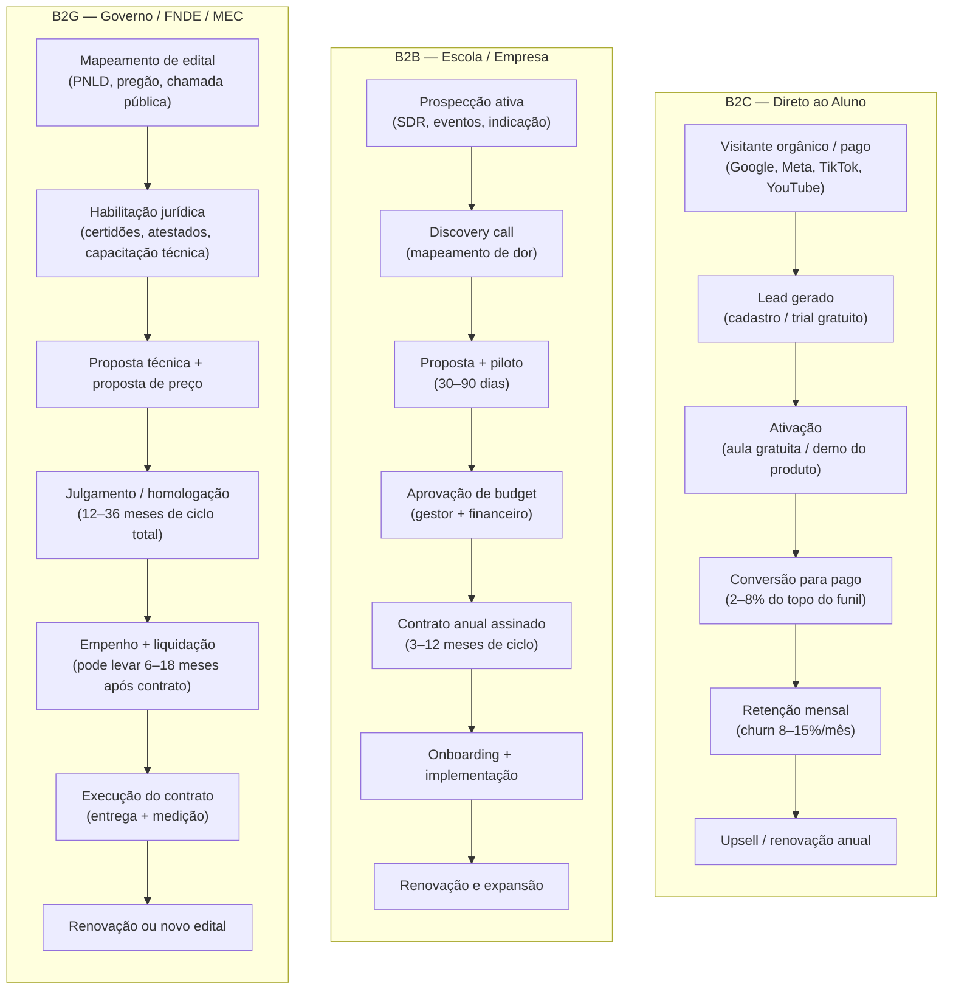

## APÊNDICE DM — EDTECH: PLAYBOOK PARA TECNOLOGIA DE EDUCAÇÃO NO BRASIL

> [!note] Posição no livro
> Este apêndice é referência para fundadores de startups de educação e tecnologia no Brasil. Conecta-se ao [[apendice-aw|Apêndice AW — Regulatório]], ao [[apendice-cb|Apêndice CB — Subscription Economy]] e ao [[apendice-dk|Apêndice DK — Govtech e B2G]].

---

### O mercado

O Brasil tem um dos maiores mercados de educação do mundo. Estimado em mais de R$ 200 bilhões por ano entre ensino público e privado em todos os níveis. Para contexto: são 47 milhões de alunos na educação básica, 9 milhões no ensino superior privado, 2 milhões no ensino profissionalizante e um mercado corporativo de treinamento que movimenta R$ 15–20 bilhões anuais apenas nas grandes empresas.

O mercado é estruturalmente fragmentado. Existem mais de 300 grupos de ensino privado no Brasil, a maioria com menos de 5 mil alunos. Os quatro maiores grupos (Kroton/Cogna, Estácio/Yduqs, Anima, Ser Educacional) concentram cerca de 30% do ensino superior privado — mas isso ainda deixa 70% pulverizado. Na educação básica, a fragmentação é ainda maior: mais de 140 mil escolas privadas no país, com a maioria sendo microempresas ou pequenas empresas familiares.

Para a edtech (startup de tecnologia para educação), essa fragmentação cria tanto oportunidade (mercado grande sem consolidador tecnológico claro) quanto dificuldade (ciclo de venda longo, tickets pequenos, maturidade tecnológica desigual entre clientes).

**Quatro segmentos, quatro jogos diferentes:**

- **Educação básica (K-12, do infantil ao ensino médio):** 180 dias letivos obrigatórios, currículo nacional (BNCC), regulação estadual e municipal, tomador de decisão é a secretaria de educação (público) ou o dono/gestor da escola (privado). Ticket baixo por aluno, volume alto.

- **Ensino superior:** MEC regula autorização e reconhecimento de cursos. EAD (ensino a distância) cresceu de 20% para 60%+ das matrículas após 2019. Grandes grupos são compradores institucionais com processos de procurement (compras corporativas).

- **Profissionalizante e técnico:** SENAI, SENAC e sistema S têm recursos próprios. PRONATEC distribui vagas via governo. Público de adultos que quer empregabilidade rápida, não diploma.

- **Corporativo (L&D, learning and development, ou treinamento e desenvolvimento):** Comprado pelo RH ou pela área de negócio. Decisão baseada em outcome — resultado mensurável (certificação, NPS de treinamento, redução de turnover, ou rotatividade). Ciclo de venda de 3–12 meses em empresas médias a grandes.

---

### Os três modelos de negócio

#### Modelo B2C — Direto ao consumidor

Vende para o aluno final. Assinatura mensal, curso avulso ou pacote de preparação para prova.

**Perfil:** Vestibular, certificações (OAB, concursos, CFA), idiomas, habilidades digitais, conteúdo complementar escolar.

**Unit economics típico:**

- CAC: R$ 80–350 (Google Ads e Meta para cursos populares; R$ 500–1.200 para EAD de nicho técnico)
- Ticket médio: R$ 39–199/mês (assinatura) ou R$ 197–2.990 (curso avulso)
- Churn mensal: 8–15% para assinaturas. Alto porque há sazonalidade forte
- LTV: Frequentemente menor do que o CAC em modelos puramente transacionais
- Margem bruta: 60–80% (conteúdo digital tem custo marginal baixo)

**Sazonalidade é assassina no B2C:**

- Janeiro/fevereiro: pico de matrículas, pico de conversão para cursos preparatórios
- Julho: segunda janela de matrícula, cursinho semestral
- Agosto/setembro: ENEM. Volume máximo de buscas por preparatório
- Outubro/novembro: pós-ENEM, queda brusca. Cursinhos tradicionais desaparecem da conversa

Um negócio B2C de preparação para vestibular que não tiver estratégia para os meses de outubro a março ou vai morrer de caixa ou vai ter um negócio irreconhecivelmente menor nos meses fora de pico.

> [!warning] Churn sazonal esconde retenção real
> Uma edtech B2C com churn de 12% ao mês pode ter retenção de 88% no mês — mas se medir por cohort, vai descobrir que 60% dos alunos de janeiro cancelaram antes de abril. O churn sazonal (aluno que atingiu o objetivo: passou no vestibular, passou na certificação) não é o mesmo que churn por insatisfação. Misturar os dois produz diagnóstico errado e solução errada.

#### Modelo B2B — Venda para instituições

Vende para escolas, faculdades, empresas. A instituição paga e distribui para seus alunos ou funcionários.

**Perfil:** Plataforma LMS, sistema de gestão escolar, conteúdo licenciado, assessment, analytics de aprendizagem, ERP educacional.

**Unit economics típico:**

- Ciclo de venda: 3–12 meses para escola privada pequena; 6–24 meses para grupo de ensino
- Ticket médio anual: R$ 15–120 por aluno/ano (conteúdo licenciado) ou R$ 50K–500K/ano (plataforma enterprise)
- Churn anual: 10–25% (alta em escola pequena; baixa em contrato enterprise com integração profunda)
- LTV: Alto quando há integração no sistema da escola. Custo de troca é real
- Margem bruta: 55–70% para software puro; 40–55% se inclui serviço de implementação

**O ciclo de venda B2B tem sazonalidade própria:**

- Fevereiro/março: gestor escolar está no meio do ano letivo, sem tempo. Não é hora de fechar
- Maio/junho: janela de budget para o próximo ano. Aqui se planta a semente
- Julho/agosto: decisões de compra para começar em janeiro. Janela principal
- Outubro/novembro: fechamento de contratos com implementação para janeiro

#### Modelo B2G — Venda para governo

Vende para prefeituras, estados, governo federal, autarquias como FNDE, SENAI, SENAC.

**Perfil:** Material didático digital (PNLD), plataforma de EAD para servidores públicos, sistema de avaliação escolar, conteúdo para escolas municipais.

**Unit economics típico:**

- Ciclo de venda: 12–36 meses. Licitação, homologação, empenho, liquidação
- Ticket total: R$ 500K–200M por contrato (PNLD pode chegar a R$ bilhões)
- Churn: Quase zero se o contrato for executado. O risco é não renovação por mudança de governo ou corte orçamentário
- Margem bruta: 40–65% (alta em conteúdo digital; mais comprimida em contratos com entrega física)
- Previsibilidade: Alta quando o contrato existe. Baixíssima antes de ganhar a licitação

> [!important] B2G: receita garantida, burocracia máxima
> Empresas que ganham contratos com o FNDE ou estados podem ter receita previsível por 3–5 anos. Mas o caminho até chegar lá exige capital de giro para suportar 12–36 meses de ciclo de venda sem receita, equipe de relações governamentais, experiência em licitação (Lei 14.133/2021 — nova lei de licitações) e capacidade de emitir nota fiscal conforme as exigências específicas de cada ente federativo. Não é jogo para empresa sem caixa ou sem sócio que entenda o setor público.

---

### Diagrama: comparativo de funil B2C vs. B2B vs. B2G



---

### Tabela: comparativo por modelo de negócio

| Dimensão | B2C (assinatura) | B2C (curso avulso) | B2B escola/empresa | B2G governo |
|---|---|---|---|---|
| **Ticket médio mensal** | R$ 39–199 | R$ 197–2.990 (único) | R$ 3K–50K/mês | R$ 50K–5M/mês (contrato) |
| **Ciclo de venda** | Dias (self-service) | Dias | 3–12 meses | 12–36 meses |
| **Churn esperado** | 8–15%/mês | N/A (transação única) | 10–25%/ano | <5%/ano (risco político) |
| **Margem bruta** | 60–80% | 65–85% | 55–70% | 40–65% |
| **CAC típico** | R$ 80–1.200 | R$ 50–800 | R$ 3K–30K | R$ 50K–500K+ |
| **LTV/CAC** | 1,5–4x (frágil) | 1–3x | 4–15x | 5–20x (quando ganha) |
| **Previsibilidade de receita** | Média (churn sazonal) | Baixa | Alta após contrato | Alta durante contrato |
| **Complexidade regulatória** | Baixa (conteúdo livre) | Baixa | Média (EAD, MEC) | Altíssima |

---

### Regulatório: o que muda dependendo do produto

#### Ensino livre vs. ensino regulado

A primeira decisão de qualquer edtech é: o produto precisa de autorização do MEC?

**Ensino livre** (não precisa de MEC): cursos de extensão, preparatório para vestibular, habilidades técnicas (programação, design, Excel), idiomas, certificações corporativas. A empresa pode vender, cobrar e operar livremente. A maioria das edtechs B2C e B2B de treinamento corporativo está aqui.

**Ensino regulado** (precisa de autorização do MEC/INEP): graduação, pós-graduação lato sensu (MBA, especialização), cursos técnicos de nível médio (SENAI/SENAC ou escolas técnicas privadas), educação básica credenciada. Aqui entram as regras da LDB (Lei 9.394/1996) e das portarias do MEC.

> [!warning] Produto que parece livre mas é regulado
> Oferecer "pós-graduação" sem autorização do MEC é infração. Oferecer certificados com aparência de credencial oficial (ex: "Certificado de Especialista em X") sem a regulação correspondente pode configurar propaganda enganosa e gerar autuação pelo MEC. Fundadores de edtech que querem escalar devem definir explicitamente se o produto é ensino livre ou regulado — e se for regulado, qual é o caminho de autorização.

#### EAD regulamentado — Portaria MEC 2.117/2019

Para cursos de graduação e pós-graduação com modalidade EAD, a Portaria 2.117/2019 é a referência principal. Ela permite que IES (Instituições de Ensino Superior) autorizadas pelo MEC ofereçam até 40% da carga horária de cursos presenciais a distância — e cursos 100% EAD nos polos credenciados. Os grandes grupos de ensino (Estácio, Kroton, Anima) cresceram agressivamente nesse modelo a partir de 2020.

Para uma edtech que quer criar seu próprio curso de graduação EAD do zero, o caminho é: credenciamento como IES (3–5 anos, alto custo), ou parceria com IES já credenciada (modelo de marca branca ou joint venture educacional).

#### PRONATEC e formação profissional

O PRONATEC (Programa Nacional de Acesso ao Ensino Técnico e Emprego) é o principal programa federal de formação técnica. Operado pelo MEC em parceria com o sistema S (SENAI, SENAC, SENAF), institutos federais e escolas técnicas credenciadas. Para uma edtech acessar recursos do PRONATEC, precisa ser operadora credenciada — processo longo e com exigências de infraestrutura física.

#### PNLD — Programa Nacional do Livro e do Material Didático

O PNLD é o maior programa de compra de material didático do mundo (são mais de 30 milhões de alunos na rede pública). Para participar, a editora ou edtech precisa submeter obras ao processo de avaliação do MEC, que ocorre por ciclos (a cada 3–4 anos por segmento). O processo inclui análise pedagógica, conformidade com a BNCC e adequação ao público. É lento e exigente — mas uma aprovação no PNLD garante contratos de R$ milhões.

---

### Casos brasileiros

**Descomplica:** Começou como B2C de preparação para vestibular (YouTube + plataforma própria). Construiu base de usuários massiva com conteúdo gratuito. Criou modelo de assinatura mensal acessível (R$ 39–59/mês). Em 2019, adquiriu autorização de IES e começou a oferecer graduação EAD (movimento B2C → regulado). Em 2021, levantou R$ 720M em rodada Series D liderada por SoftBank, valendo ~R$ 2B. O movimento do Descomplica é o clássico: escala em B2C livre → monetização por assinatura → expansão para ensino regulado (que tem LTV muito maior, porque o aluno fica 4 anos na graduação).

**Alura:** Plataforma de cursos de tecnologia. Começou estritamente B2C — desenvolvedor individual comprando cursos de programação. Com o crescimento do mercado de tech no Brasil (2018–2022), as empresas começaram a comprar assinaturas para seus times (B2B). Hoje o Alura for Business (B2B enterprise) é parte central do negócio: contrato anual por assento, com gerente de conta e relatório de progresso. O case ilustra o caminho B2C → B2B enterprise em edtech técnica: a base de usuários B2C funciona como prova de conceito e source of truth de engajamento para vender para o RH corporativo.

**Hotmart:** Não é edtech no sentido estrito — é plataforma de marketplace para criadores de conteúdo digital. Produtores (infoprodutores) criam cursos e vendem via Hotmart, que fica com 9,9% + taxa de processamento de cada transação. A escala é impressionante: mais de 300 mil criadores ativos, mais de 40 países. O modelo é B2B2C (a empresa vende para o criador, que vende para o aluno). Não há regulação MEC porque os produtos são ensino livre. O risco do Hotmart é reputacional: a plataforma hospeda produtos de qualidade muito variável, incluindo o mercado de "guru de autoajuda".

**Duolingo no Brasil:** O Brasil é o segundo maior mercado do Duolingo no mundo (atrás dos EUA). O produto é gratuito com anúncios (B2C freemium), com opção Super Duolingo (R$ 35–49/mês sem anúncios e com recursos adicionais). O CAC do Duolingo no Brasil é extraordinariamente baixo porque o produto é viral por design (gamificação, streak, competição entre amigos). A conversão para pago é baixa (~5%), mas o volume de usuários (dezenas de milhões no Brasil) torna o negócio viável. O Duolingo não compete com cursos de idiomas regulamentados — é entretenimento educativo.

**Estácio/Kroton como incumbentes:** Os grandes grupos de ensino superior têm múltiplas funções no ecossistema de edtech: são compradores de tecnologia (LMS, ERP educacional, analytics), são concorrentes diretos de edtechs que entram em ensino superior regulado, e são potenciais adquirentes de startups. A Kroton/Cogna montou um fundo de corporate venture (Cogna Ventures) justamente para ter acesso a tecnologia que não conseguiria construir internamente.

---

### Sazonalidade: o calendário do mercado

```text
Jan  ★★★★★  Matrículas. Pico de conversão B2C. Onboarding de clientes B2B.
Fev  ★★★★☆  Início das aulas. Corpo docente ocupado. Venda B2B difícil.
Mar  ★★★☆☆  Rotina estabelecida. Oportunidade de venda para datas de avaliação.
Abr  ★★★☆☆  Mid-term. Engajamento cai em plataformas B2C.
Mai  ★★★★☆  Budget planning para o próximo ano começa em escolas. Semear pipeline B2B.
Jun  ★★★☆☆  Meio do semestre. Preparação para ENEM começa.
Jul  ★★★★★  Matrículas 2º semestre. Segunda janela B2C. Decisões de compra B2B para janeiro.
Ago  ★★★★★  ENEM aproxima. Pico de busca por preparatório. Volume máximo B2C.
Set  ★★★★★  ENEM. Volume máximo. Conversão máxima para cursinhos.
Out  ★★☆☆☆  Pós-ENEM: queda brusca. Foco em fechamento B2B para janeiro.
Nov  ★★★☆☆  Corporativo: fim de orçamento. Budget de L&D precisa ser gasto antes de dez/31.
Dez  ★★☆☆☆  Recesso. Quase nada fecha. Planejamento do ano seguinte.
```

> [!tip] Novembro é o Q4 do mercado corporativo
> Empresas com budget de treinamento não utilizado precisam gastá-lo antes do fechamento do exercício. Uma edtech B2B que faz pipeline corporativo entre agosto e outubro e fecha em novembro captura esse janela. É análogo ao Q4 de SaaS enterprise — mas específico do segmento de L&D.

---

### Unit economics aprofundado por modelo

#### B2C: o problema do CAC sazonal

O CAC de uma edtech B2C flutua radicalmente ao longo do ano. Em agosto (pré-ENEM), todos os competidores estão no leilão do Google Ads. O CPC para palavras-chave de "cursinho online", "preparatório ENEM" e "vestibular" dobra ou triplica. O fundador que calcula CAC médio anual está escondendo que adquiriu metade dos clientes a custo três vezes maior no pico sazonal.

Métricas que importam no B2C de edtech:

- **CAC por cohort de aquisição** (não apenas CAC médio anual)
- **LTV por objetivo** (aluno de vestibular tem LTV limitado a 12–24 meses; aluno de certificação profissional pode renovar por anos)
- **Contribution margin após sazonalidade** (cobrir custos fixos nos meses de baixo volume)
- **NPS por outcome** (aluno que passou no vestibular tem NPS altíssimo e vira referência; aluno que não passou tem NPS baixo independentemente da qualidade do produto)

#### B2B: o valor do custo de troca

O B2B de edtech tem um mecanismo de defesa poderoso quando o produto está integrado: custo de troca. Uma escola que usa o LMS para controlar frequência, notas, comunicação com pais e relatórios pedagógicos não troca de fornecedor facilmente. Esse lock-in é o que justifica ciclos de venda longos (vale o esforço quando o cliente fica 5–10 anos) e permite expansão de ticket ao longo do tempo.

O risco inverso é que o lock-in dificulta a venda inicial. A escola sabe que está comprando por muitos anos e quer certeza antes de assinar. Isso explica por que pilotos gratuitos de 30–90 dias são padrão no mercado B2B de edtech.

---

### Armadilhas específicas de edtech

**1. Regulação trava o produto digital no ensino formal**

Uma edtech que desenvolve conteúdo inovador para sala de aula descobre que a escola pública usa currículo aprovado pela secretaria de educação — que só incorpora material após processo de avaliação que dura 1–2 anos. O produto pode ser excelente. A inovação pedagógica pode ser comprovada. Mas a escola não pode adotar sem autorização. Isso não significa que B2G de conteúdo é inviável — significa que o ciclo de vendas é muito mais longo do que o fundador imagina quando entra no mercado.

**2. Confundir engajamento com aprendizagem**

Gamificação gera engajamento. Engajamento não garante aprendizagem. Uma edtech que mede sucesso por "minutos gastos na plataforma" ou "número de aulas completadas" pode estar criando uma métrica de vaidade. O que o mercado corporativo e o governo cada vez mais pedem é evidência de resultado: nota melhorou, empregabilidade aumentou, certificação conquistada. Startups que não desenvolvem métricas de outcome vão perder contratos para quem tem.

**3. Comparar unit economics de B2C com B2B como se fossem o mesmo negócio**

CAC de R$ 500 em B2C (para um cliente que paga R$ 59/mês) pode ser inviável. CAC de R$ 500 em B2B (para uma escola que paga R$ 5.000/mês por 5 anos) é excepcional. Fundadores que migram de B2C para B2B carregam a mentalidade de CAC baixo e assustam com o custo de um vendedor enterprise — sem entender que o LTV compensa amplamente.

**4. Não separar receita de conteúdo de receita de tecnologia**

Empresas que vendem tanto conteúdo quanto plataforma têm dois P&Ls distintos: conteúdo tem alta margem mas fecha valor e fica obsoleto; tecnologia tem CAC alto mas gera receita recorrente e LTV longo. Misturar os dois no mesmo modelo financeiro produz métricas enganosas.

**5. Ignorar inadimplência no B2B pequeno**

Escola particular pequena é uma das categorias de maior inadimplência no Brasil. Uma edtech que vendeu para 500 escolas pequenas e não tem processo de cobrança pode ter 20–30% de inadimplência no portfólio — destruindo a margem que parecia saudável no Excel.

---

### Checklist para fundadores de edtech

- [ ] Produto é ensino livre ou ensino regulado? Se regulado, qual o caminho de credenciamento?
- [ ] Qual modelo de negócio principal: B2C, B2B, B2G ou híbrido?
- [ ] O unit economics foi calculado por cohort sazonal, não apenas pela média anual?
- [ ] Há estratégia para os meses de baixo volume (outubro a fevereiro para vestibular)?
- [ ] Para B2B: o produto tem custo de troca real que justifique o ciclo de venda longo?
- [ ] Para B2G: há capital de giro para sustentar 12–36 meses de ciclo sem receita?
- [ ] As métricas de sucesso incluem outcome de aprendizagem, não apenas engajamento?
- [ ] A sazonalidade do mercado corporativo (novembro) está mapeada no pipeline?
- [ ] Para EAD regulado: a Portaria 2.117/2019 foi lida e os requisitos de polos EAD entendidos?

---

**Ver também:** [[apendice-aw|Apêndice AW — Regulatório Geral]], [[apendice-cb|Apêndice CB — Subscription Economy]], [[apendice-dk|Apêndice DK — Govtech e B2G]]
