## APÊNDICE DN — CLEANTECH E ESG: STARTUPS DE IMPACTO AMBIENTAL NO BRASIL

> [!note] Posição no livro
> Este apêndice é referência para fundadores de startups com tese ambiental ou de impacto. Conecta-se ao [[apendice-af|Apêndice AF — ESG]], ao [[apendice-ca|Apêndice CA — Deep Tech]] e ao [[apendice-p|Apêndice P — Financiamento Não-Diluitivo]].

---

### O Brasil como player global em cleantech (tecnologia limpa)

O Brasil tem posição singular no mercado global de cleantech (tecnologia limpa). Não por acidente. A combinação vem de dotação natural com décadas de política industrial específica.

**Os ativos:**

- Maior biodiversidade do planeta: 20% da água doce superficial do mundo, 60% da Amazônia, Cerrado, Pantanal e Mata Atlântica como sumidouros de carbono
- Quarta maior capacidade de energia renovável do mundo (hidro + eólica + solar)
- Matriz elétrica com mais de 85% de fontes renováveis — entre as mais limpas de qualquer grande economia
- Maior produtor mundial de etanol de cana-de-açúcar: 30% da produção global
- Agronegócio com potencial único de carbono: 200 milhões de hectares em produção, com crescente demanda por práticas sustentáveis certificadas
- Mercado de créditos de carbono florestais: mais de 60% dos projetos REDD+ do mundo estão no Brasil

A oportunidade total endereçável para cleantech no Brasil é estimada em R$ 1–2 trilhões ao longo da próxima década — incluindo transição energética, mobilidade elétrica, agro sustentável, gestão de resíduos e mercado de carbono.

Isso não significa que é fácil. Regulação fragmentada, risco político alto, custo de capital elevado e lacuna histórica de infraestrutura (infrastructure gap) tornam o mercado tão complexo quanto atrativo.

---

### Segmentos: seis teses diferentes

#### Energia solar (microgeração e fazendas solares)

O segmento mais maduro do cleantech brasileiro. A Lei 14.300/2022 (Marco Legal da Micro e Minigeração Distribuída) definiu as regras para sistemas de até 5 MW conectados à rede — e abriu mercado para instaladores, financiadores, gestores de energia solar e plataformas de marketplace de energia.

Dois submercados distintos:

- **Microgeração distribuída (residencial e pequenas empresas):** sistema de 3–15 kWp instalado no telhado. Mercado de massa. CAC é custo de vendas do instalador. Prazo de retorno: 4–7 anos. Financiamento via BNDES Finame Solar ou crédito privado (Solfácil, Bloxs, BV Financeira).

- **Fazendas solares (utility scale):** plantas de 1–500 MW. Capital intensivo (R$ 2M–2B por projeto). Receita via PPA (Power Purchase Agreement) de longo prazo com distribuidoras ou consumidores livre. Financiamento via project finance.

Para startups: a oportunidade está em software de gestão de energia (EMS), plataformas de financiamento solar, marketplaces de energia, IoT para monitoramento de performance e plataformas de autoprodução compartilhada (novo modelo habilitado pela Lei 14.300).

#### Energia eólica

Brasil é o quinto maior produtor de energia eólica do mundo. Concentrado no Nordeste (ventos constantes e previsíveis). O mercado de construção de novos parques é dominado por grandes players (Voltalia, Enel Green Power, Casa dos Ventos, Omega Energia). Para startups: software de previsão de vento, otimização de operação e manutenção preditiva (O&M), gestão de contratos de energia e plataformas de financiamento de projetos pequenos.

#### Mobilidade elétrica

Mercado ainda inicial no Brasil. Frota de veículos elétricos representa menos de 1% do total (contra 20–30% em países escandinavos). Os obstáculos são: preço alto dos veículos (sem incentivo fiscal federal consolidado), infraestrutura de carregamento escassa e matriz de distribuição elétrica sem capacidade de suportar carregamento em massa sem upgrades.

Oportunidade real para startups:

- Gestão de frotas elétricas para empresas (ônibus, delivery, logística)
- Infraestrutura de recarga (CPO — Charge Point Operators)
- Plataformas de roaming de carregamento
- Software de otimização de carregamento para utilities
- Conversão de frotas de combustão para elétrico (especialmente motocicletas de entrega)

#### Agro sustentável

O agronegócio responde por 25% do PIB brasileiro — e é tanto o maior emissor de carbono do país quanto o maior gerador de créditos de carbono potenciais. A tese: tecnologia que ajuda o produtor a adotar práticas sustentáveis (plantio direto, integração lavoura-pecuária-floresta, recuperação de pastagens degradadas) pode gerar créditos de carbono certificados E aumentar produtividade.

Startups relevantes aqui incluem: plataformas de MRV (Monitoramento, Reporte e Verificação) para créditos de carbono agrícola, soluções de manejo de precisão que reduzem emissão de N2O, bioinsumos que substituem fertilizantes sintéticos, e plataformas de rastreabilidade de supply chain sustentável.

#### Gestão de resíduos e economia circular

O Brasil gera 80 milhões de toneladas de resíduos sólidos por ano. Apenas 1–2% é efetivamente reciclado (contra 20–30% em países europeus). A Lei 12.305/2010 (Política Nacional de Resíduos Sólidos) estabeleceu o marco regulatório, mas sua implementação é fragmentada.

Oportunidades: plataformas de logística reversa, marketplaces de resíduos industriais (um produtor vende o resíduo de outro como insumo), soluções de upcycling, gestão de aterros com captura de biogás e plataformas de compliance de responsabilidade compartilhada.

#### Créditos de carbono

O segmento mais complexo e de maior potencial de receita imediata para startups brasileiras. Detalhado na seção específica abaixo.

---

### Mercado de carbono: VCM vs. regulado

Esta é a distinção mais importante para qualquer fundador que queira operar em carbono.

#### VCM — Mercado Voluntário de Carbono

Empresas compram créditos de carbono voluntariamente para compensar emissões ou atingir metas de net zero. Os padrões dominantes são Verra (VCS — Verified Carbon Standard) e Gold Standard. No Brasil, a maioria dos projetos é de evitamento de desmatamento (REDD+) ou de projetos de energia renovável.

**Como funciona:**

1. Dono do projeto (fazendeiro, comunidade indígena, empresa) contrata consultor para desenvolver o projeto segundo um metodologia aprovada
2. Consultor independente acreditado pela Verra ou Gold Standard faz a verificação
3. Créditos são registrados no Verra Registry (1 crédito = 1 tonelada de CO2 evitada ou removida)
4. Créditos são vendidos no mercado (corretoras, brokers, bolsas como Xpansiv) para compradores finais

**Preço de carbono no Brasil (VCM, 2024–2025):**

- Créditos REDD+ de baixa integridade: USD 1–5/tCO2
- Créditos REDD+ certificados com co-benefícios (comunidades, biodiversidade): USD 8–20/tCO2
- Créditos de energia renovável (solar/eólica): USD 1–3/tCO2
- Créditos de alta integridade (CORSIA eligible, high biodiversity): USD 15–50/tCO2

> [!warning] O mercado voluntário está sob pressão
> A partir de 2022–2023, o mercado voluntário passou por crise de credibilidade. Investigações jornalísticas (Guardian, Zeit) questionaram a integridade de créditos REDD+ de grandes projetos na Amazônia. Compradores corporativos estão mais exigentes: querem créditos com alta integridade, metodologias robustas e co-benefícios verificáveis. Projetos de baixa qualidade estão perdendo valor. Para startups de MRV (mensuração e verificação), isso é uma oportunidade: há demanda por melhor transparência e rastreabilidade.

#### SBCE — Sistema Brasileiro de Comércio de Emissões (mercado regulado)

O Brasil aprovou a criação do SBCE em 2023 (Lei 15.042/2024, regulamentada via decreto em implementação). O mercado regulado ainda está em fase de implantação, com previsão de operação plena para 2026–2028. Quando operacional, empresas de setores com metas obrigatórias de redução de emissões (energia, cimento, siderurgia, química) precisarão comprar ou vender licenças de emissão.

O SBCE cria oportunidade para:
- Plataformas de compliance de emissões
- Consultores e ferramentas de inventário de GEE (Gases de Efeito Estufa)
- Corretoras e market makers do mercado regulado
- Plataformas de integração entre VCM e SBCE

> [!important] Não confunda VCM com SBCE
> Créditos do mercado voluntário (Verra, Gold Standard) não são automaticamente aceitos no mercado regulado e vice-versa. São regimes distintos, com regras distintas. Projetos que geram créditos hoje no VCM podem ou não ter reconhecimento no SBCE — isso dependerá das regras de transição que o governo brasileiro vai definir. Fundadores que planejam negócio em carbono precisam ser explícitos sobre qual mercado estão endereçando.

---

### Diagrama: cadeia de valor de crédito de carbono

```mermaid
flowchart LR
    A["Dono do projeto\n(fazendeiro, comunidade,\nempresa florestal)"] --> B["Desenvolvimento\ndo projeto\n(metodologia Verra/\nGold Standard)"]
    B --> C["Validação\n(auditor independente\nacreditado)"]
    C --> D["Implementação\n(3–5 anos de monitoramento\ncontinuado)"]
    D --> E["Verificação periódica\n(a cada 1–3 anos)"]
    E --> F["Emissão de créditos\n(registro no Verra\nou Gold Standard)"]
    F --> G["Venda no VCM\n(broker, bolsa,\nvenda direta)"]
    G --> H["Comprador final\n(empresa para\ncompensação de emissões)"]
    H --> I["Aposentadoria\ndo crédito\n(cancelamento no registro)"]

    style A fill:#2d5a27,color:#fff
    style D fill:#2d5a27,color:#fff
    style I fill:#1a3a75,color:#fff
```

---

### Tabela: segmentos de cleantech — maturidade, funding e regulação

| Segmento | Maturidade de mercado | Funding disponível | Regulação crítica | Ticket de receita típico |
|---|---|---|---|---|
| **Energia solar (microgeração)** | Maduro | Alto (BNDES, BV, bancos privados) | ANEEL, Lei 14.300/2022 | R$ 20–200K por projeto residencial/comercial |
| **Energia solar (utility scale)** | Maduro | Alto (project finance, infra) | ANEEL, leilões EPE | R$ 50M–2B por usina |
| **Energia eólica** | Maduro | Alto (project finance) | ANEEL, Ibama | R$ 100M–3B por parque |
| **Mobilidade elétrica** | Inicial/emergente | Médio (CVCs, estratégico) | CONTRAN, INMETRO, ANEEL | R$ 100K–10M por projeto |
| **Agro sustentável / carbono agrícola** | Emergente | Crescente (VCM, BNDES) | MAPA, SBCE (futuro) | USD 5–25/tCO2 |
| **Gestão de resíduos** | Fragmentado | Baixo–médio | PNRS, lei municipal | R$ 500K–50M por contrato |
| **Créditos de carbono (REDD+)** | Em transformação | Médio (impacto, soberano) | SBCE, Verra, Gold Standard | USD 1–50/tCO2 |
| **Economia circular (B2B)** | Emergente | Baixo | PNRS, legislação setorial | R$ 50K–5M por contrato |
| **Biocombustíveis** | Maduro (etanol), emergente (SAF, H2) | Alto para SAF/H2 | ANP, RenovaBio | Contrato de longo prazo |

---

### Funding específico para cleantech

O cleantech tem fontes de capital distintas do SaaS ou do fintech. Entender cada uma é crítico.

**BNDES Fundo Clima:** Principal instrumento público de financiamento climático no Brasil. Linhas para energia renovável, eficiência energética, mobilidade elétrica e projetos de carbono. Taxas abaixo do mercado (TLP ou SELIC reduzida). Prazo de até 20 anos. Exige garantias reais para grandes volumes. Processo lento (6–18 meses para aprovação de projetos grandes).

**Finep Green / Finep Clima:** Recursos não-reembolsáveis (subvenção) e reembolsáveis para inovação em tecnologia limpa. Mais acessível para startups em estágio inicial do que o BNDES. Exige histórico de P&D e equipe técnica qualificada.

**Fundos de impacto:** Vox Capital, Bemtevi Investimentos, MOV Investimentos, Gaia Impact. Tickets de R$ 1–15M. Avaliam tanto retorno financeiro quanto impacto ambiental mensurado. Ciclo de decisão mais rápido do que BNDES. Expectativa de retorno de mercado (não é filantropia), com restrição a setores com externalidade negativa.

**Green bonds e CRA/CRI sustentáveis:** Instrumentos de dívida com uso de recursos vinculado a projetos verdes. Grandes emissores são utilities e empresas de agro. Para startups, acesso é indireto (via securitização de recebíveis de projetos de energia ou carbono).

**Blended finance:** Combinação de capital concessionário (governo, fundações, multilaterais) com capital privado para reduzir o risco de projetos que o mercado ainda não financia sozinho. Estrutura comum em projetos de mobilidade elétrica em áreas remotas ou de economia circular em cadeias de baixa renda. IFC (International Finance Corporation) e BID Invest são os principais multilaterais com mandato para blended finance no Brasil.

**CVCs estratégicos:** Raízen Ventures, Vibra Energia, Equatorial, EDP Ventures. Interesse em startups de tecnologia de energia, mobilidade, carbono e eficiência. Ticket de R$ 2–30M. Vantagem: acesso a infraestrutura e clientes do investidor. Risco: conflito de interesse se o investidor for também concorrente potencial.

> [!tip] BNDES Fundo Clima como alavanca, não como base
> Startups que constroem o modelo de negócio assumindo que o BNDES vai aprovar o projeto em 6 meses se frustram quando demora 18. Use funding público como alavanca sobre capital privado já comprometido — não como primeira fonte de capital.

---

### ESG como estratégia de produto: greenwashing vs. impacto real

ESG virou buzzword. Para cleantech, isso é um problema: qualquer empresa pode dizer que tem produto "sustentável" sem ter nada mensurável para mostrar.

**A diferença que importa:**

Greenwashing é quando a comunicação ambiental supera o impacto real. Pode ser intencional (marketing enganoso) ou não intencional (empresa genuína que não sabe medir o impacto). O CONAR no Brasil e a SEC nos EUA (para empresas listadas com operações internacionais) estão aumentando a fiscalização sobre claims de sustentabilidade.

Impacto real é quando há metodologia auditável, dados transparentes e metas específicas com baseline definido.

**Frameworks de reporte:**

- **GRI (Global Reporting Initiative):** Padrão mais usado no Brasil para relatório de sustentabilidade. Modular, adaptável por setor. Usado por Petrobras, Vale, Natura, Ambev. Para startups, as GRI Standards para PMEs são o ponto de entrada.

- **SASB (Sustainability Accounting Standards Board):** Foco em métricas financeiramente materiais por setor. Mais adotado por investidores institucionais americanos. Complementar ao GRI.

- **TCFD (Task Force on Climate-related Financial Disclosures):** Framework específico para disclosure de riscos climáticos financeiros. Em vias de se tornar obrigatório para empresas de capital aberto no Brasil via resolução CVM.

- **B Corp:** Certificação privada da B Lab. Avalia impacto social e ambiental em governança, trabalhadores, comunidade, meio ambiente e clientes. Mais de 400 empresas certificadas no Brasil. Requer pontuação mínima de 80 pontos (de 200) na avaliação BIA (B Impact Assessment) e mudança estatutária (empresa de impacto pelo Código Civil). Útil como diferenciador de mercado, principalmente para B2B com compradores ESG-conscious.

> [!warning] B Corp não é substituto de métrica de impacto
> A certificação B Corp atesta que a empresa tem boas práticas. Não atesta que tem impacto ambiental mensurável e crescente. Para cleantech que quer acessar fundos de impacto, a exigência é de teoria de mudança explícita + métricas de impacto com coleta de dados verificável. "Somos B Corp" não é suficiente.

---

### Casos brasileiros

**Voltalia:** Grupo franco-brasileiro com projetos de energia solar e eólica no Brasil. Exemplo de empresa que construiu portfólio diversificado de geração renovável combinando leilões de energia (B2G) e PPAs com grandes consumidores industriais (B2B). A operação brasileira é uma das maiores da empresa globalmente.

**Raízen (Shell + Cosan):** Joint venture que opera a maior plataforma de biocombustíveis do mundo com etanol de cana-de-açúcar. Está desenvolvendo E2G (etanol de segunda geração, a partir do bagaço) e está entrando em SAF (Sustainable Aviation Fuel — combustível sustentável de aviação), uma das teses mais quentes da transição energética global (acordo de descarbonização da aviação — CORSIA). Caso de empresa incumbente investindo em inovação cleantech como defesa de posição de mercado.

**Carbonext:** Startup brasileira de créditos de carbono florestal. Atua na gestão de projetos REDD+ em propriedades privadas e comunidades no Pará e no Amazonas, fazendo o intermediário entre o dono da floresta e o comprador corporativo. Levantou funding de fundos de impacto internacionais. Exemplo de startup de carbono que está apostando em alta integridade (metodologias rigorosas, co-benefícios verificados) como diferencial num mercado sob pressão de credibilidade.

**Lixo Zero:** Plataforma de gestão de resíduos e logística reversa para empresas. Conecta geradoras de resíduo a recicladores, emite relatório de destinação para fins de compliance (PNRS) e oferece dashboard de sustentabilidade para o RH/ESG do cliente. Modelo B2B com receita de serviço (gestão do processo) e potencial de créditos de carbono em projetos de desvio de aterro.

**Mobil2u:** Startup de mobilidade elétrica focada em conversão de motos de delivery para elétrico e gestão de frotas para plataformas de entrega (iFood, Rappi, Loggi). A tese é que motoristas de delivery são os maiores consumidores de combustível urbano per capita — e que converter essa frota é tanto impacto ambiental quanto economia para o entregador.

---

### Regulação crítica: o que o fundador precisa saber

**ANEEL (Agência Nacional de Energia Elétrica):** Regula geração, transmissão, distribuição e comercialização de energia elétrica. Qualquer startup que opere na geração de energia (solar, eólica, biogás) ou na comercialização de energia no mercado livre precisa entender as normativas da ANEEL. A Lei 14.300/2022 é o principal marco recente para microgeração distribuída.

**IBAMA e ICMBio:** Licenciamento ambiental para projetos que afetam o meio ambiente (instalação de parques solares e eólicos, projetos florestais, mineração de lítio). O licenciamento ambiental pode ser a variável de maior risco de prazo num projeto de cleantech: pode levar de 6 meses a 5 anos dependendo do bioma, do tamanho do projeto e da capacidade do órgão licenciador estadual.

**MAPA (Ministério da Agricultura):** Regula práticas agrícolas, incluindo uso de bioinsumos, registro de insumos agrícolas e certificações de produto orgânico/sustentável. Para startups de agro sustentável, a aprovação de novos bioinsumos no MAPA pode ser o gargalo de go-to-market.

**ANP (Agência Nacional do Petróleo):** Regula combustíveis, incluindo biocombustíveis e o RenovaBio (programa de descarbonização do setor de combustíveis). Startups em SAF ou bioquerosene precisam conhecer a regulação ANP.

**Lei 14.300/2022 — Marco do Setor Solar:** Define regras para micro e minigeração distribuída (sistemas até 5 MW conectados à rede de distribuição). Criou o regime de "autoprodução compartilhada" (condomínios solares), eliminou incerteza regulatória que travava investimentos no setor. É o principal catalisador de crescimento do solar distribuído no Brasil nos próximos anos.

---

### Armadilhas específicas de cleantech

**1. Depender de regulação favorável que muda com governo**

O RenovaBio (mistura obrigatória de etanol na gasolina) já teve sua meta ajustada por pressão de grupos de interesse. O PNEC (Plano Nacional de Energia e Clima) muda prioridades a cada governo. Startups que constroem modelo dependendo de incentivo fiscal ou mandato regulatório específico têm risco político alto. O ICMS-Energia para solar, por exemplo, foi alvo de disputa judicial por anos. Modele cenários com e sem o incentivo regulatório.

**2. Subestimar o custo de certificação ambiental**

Certificar um projeto de carbono pela Verra (Verra VCS) custa tipicamente USD 50–200K em consultoria, auditoria e taxas de registro — antes de emitir o primeiro crédito. O prazo vai de 18 a 36 meses. Startups que modelam receita de crédito de carbono no ano 1 sem contar esse custo e prazo chegam ao investidor com projeção irrealista.

**3. Confundir mercado voluntário com mercado regulado de carbono**

São mercados com compradores diferentes, preços diferentes, metodologias diferentes e riscos diferentes. Uma startup que está desenvolvendo projeto para o VCM (Verra) não tem garantia de que seus créditos serão aceitos no SBCE quando o mercado regulado iniciar. Planejar para um mercado e comunicar para o outro é receita de problema com investidor.

**4. Ignorar o risco de additionality**

Projetos de carbono precisam demonstrar "additionality": a redução de emissão só aconteceu por causa do projeto — sem o projeto, as emissões continuariam. Projetos de energia renovável em mercados onde a energia renovável já é economicamente viável sem créditos de carbono perdem additionality. Isso já afetou projetos brasileiros de solar e eólica no VCM.

**5. Confundir impacto com narrativa**

Fundadores de cleantech frequentemente são motivados por propósito genuíno — e isso é uma vantagem. Mas investidores de impacto exigem dados. "Nossa tecnologia vai salvar a Amazônia" sem teoria de mudança estruturada, sem baseline de emissões, sem métrica de additionality verificável é narrativa, não impacto mensurável. O mercado maduro de funding de impacto já distingue os dois.

**6. Subestimar o custo de capital de projetos físicos**

Software cleantech tem economics de SaaS. Projetos físicos (usina solar, parque eólico, planta de biogás) são capital intensivos, com retorno em 10–20 anos e risco de construção. Fundadores que vêm do mundo de software e entram em cleantech físico levam um choque com o ciclo de retorno e a complexidade de project finance.

---

### Checklist para fundadores de cleantech

- [ ] O modelo de negócio é software (cleantech-enabled) ou projeto físico (infraestrutura)? As unit economics são radicalmente diferentes.
- [ ] Se carbono: VCM ou SBCE? A estratégia foi desenhada para o mercado correto?
- [ ] O custo e prazo de certificação ambiental foram modelados antes de projetar receita?
- [ ] Há exposição a risco regulatório específico (incentivo fiscal, mandato de mistura, tarifa subsidiada)?
- [ ] O modelo de impacto tem teoria de mudança explícita, baseline e métrica verificável?
- [ ] As fontes de funding foram mapeadas corretamente (BNDES, Finep, fundos de impacto, blended finance)?
- [ ] O licenciamento ambiental foi estimado com prazo realista (não otimista)?
- [ ] Para agro sustentável: o MAPA e o processo de aprovação de bioinsumos foram considerados?
- [ ] Para mobilidade elétrica: a infraestrutura de carregamento disponível no mercado-alvo foi verificada?
- [ ] A empresa tem capacidade de distinguir greenwashing de impacto real nas comunicações?

---

**Ver também:** [[apendice-af|Apêndice AF — ESG]], [[apendice-ca|Apêndice CA — Deep Tech]], [[apendice-p|Apêndice P — Financiamento Não-Diluitivo]]
