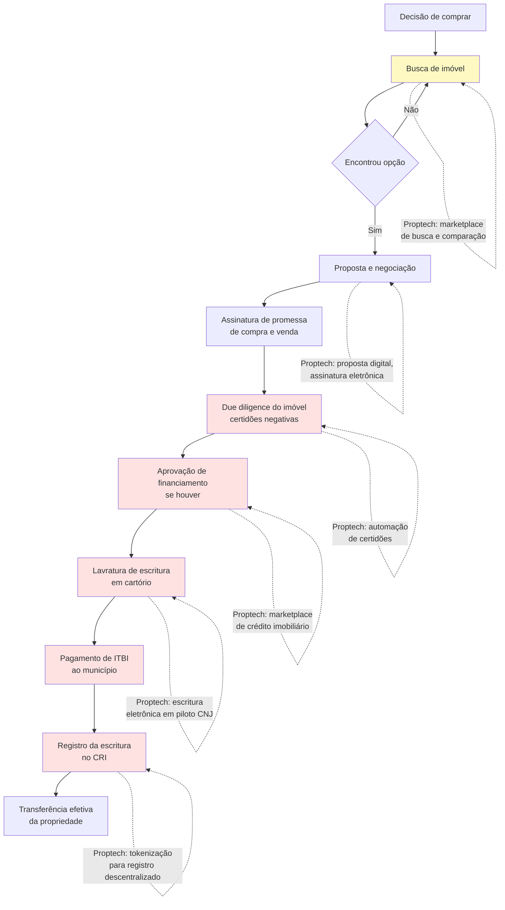

## APÊNDICE DO — PROPTECH: TECNOLOGIA NO MERCADO IMOBILIÁRIO BRASILEIRO

> [!note] Posição no livro
> Relevante para [[apendice-aw|Apêndice AW — Regulatório Setorial]], [[apendice-cj|Apêndice CJ — Tokenização de Ativos]], [[apendice-da|Apêndice DA — Marco Legal das Startups]] e para fundadores que atuam em marketplaces com ativos de alto valor, crédito ou construção civil.

---

### O tamanho do problema e da oportunidade

Proptech (property technology — tecnologia aplicada ao mercado imobiliário) é o foco deste apêndice. O mercado imobiliário brasileiro movimenta mais de R$ 2 trilhões em patrimônio. É o maior ativo individual da maioria das famílias brasileiras. E, ao mesmo tempo, é um dos mercados mais fragmentados, lentos e opacos do país.

Comprar um imóvel no Brasil exige:

- Corretores credenciados pelo CRECI (Conselho Regional de Corretores de Imóveis)
- Registro em cartório (tempo médio: 30–90 dias)
- Escritura lavrada por notário
- Verificação de múltiplas certidões negativas (municipais, estaduais, federais)
- Pagamento de ITBI (Imposto de Transmissão de Bens Imóveis) — variável por município, geralmente 2–3%
- Financiamento via SFH (Sistema Financeiro de Habitação) ou crédito livre

Cada etapa é um ponto de fricção. Cada ponto de fricção é uma oportunidade para proptech.

---

### Contexto regulatório: o que torna o setor complexo

#### CRECI e Lei 6.530/78

A intermediação imobiliária no Brasil é profissão regulamentada. A Lei 6.530/78 e o Decreto 81.871/78 exigem que todo corretor de imóveis seja registrado no CRECI do seu estado. Não basta ter pessoa jurídica — cada corretor-pessoa física precisa de registro individual.

Isso cria uma barreira real para startups que tentam:

- Montar equipe de vendas interna sem corretores registrados
- Operar como plataforma que "conecta compradores e vendedores" sem intermediação de CRECI
- Usar modelos algorítmicos de precificação como substituto da avaliação do corretor

O CRECI tem poder de autuação e cassação. Modelos que ignoram essa regulação encontram resistência organizada do sistema de conselhos.

> [!warning] CRECI como barreira de entrada real
> Diversas startups tentaram operar na zona cinzenta de "marketplace sem intermediação" e receberam notificações do CRECI. O modelo seguro é contratar corretores registrados, fazer parceria com imobiliárias credenciadas ou atuar em segmentos que não se enquadram como intermediação (ferramentas de gestão, crédito, construção).

#### SPE — Sociedade de Propósito Específico

Toda incorporação imobiliária formal no Brasil exige a constituição de uma SPE (Sociedade de Propósito Específico) para cada empreendimento. Isso serve para segregar o patrimônio do empreendimento do patrimônio da incorporadora.

A SPE cria complexidade societária real:

- Cada empreendimento é uma empresa separada
- Abertura, contabilidade e encerramento de cada SPE têm custo fixo
- Investidores externos precisam entrar na SPE (não na holding) para ter direito sobre o ativo específico
- Auditoria e due diligence se multiplicam proporcionalmente ao número de empreendimentos

Para incorporadoras digitais (como Benx), gerenciar dezenas de SPEs simultâneas é desafio de governança e tecnologia.

#### Lei 4.591/64 e o Registro de Incorporação (RFI)

Antes de vender qualquer unidade "na planta", a incorporadora precisa registrar a incorporação no Cartório de Registro de Imóveis. O RFI exige documentação extensa: projeto aprovado pela prefeitura, licenças ambientais, memorial descritivo, alvará de construção, certidões dos terrenos, plantas aprovadas.

Esse processo leva meses. Startups que tentam acelerar o ciclo de vendas frequentemente se veem limitadas pelo tempo de aprovação cartorial — que não é tecnológico, é jurídico-burocrático.

#### RET — Regime Especial de Tributação

Incorporadoras que aderem ao RET (Regime Especial de Tributação) pagam alíquota unificada de 4% sobre a receita bruta (IRPJ + CSLL + PIS + COFINS), em vez do regime normal que pode chegar a 7–8% pelo Lucro Presumido.

A adesão ao RET é por SPE e é irretratável durante a existência da incorporação. Isso significa que a escolha tributária precisa ser feita antes do lançamento e não pode ser revertida.

---

### Segmentos proptech e suas dinâmicas

#### 1. Marketplace de compra, venda e locação

O segmento mais visível. Plataformas que agregam ofertas, conectam interessados e facilitam a transação.

O modelo de receita dominante é comissão sobre a transação (locação: 1 mês de aluguel; venda: 5–6% do valor do imóvel, em geral compartilhada com o corretor). Marketplaces puros de listagem (OLX Imóveis, Viva Real antes da fusão) cobram CPC ou plano mensal da imobiliária.

A grande inovação do QuintoAndar foi remover o fiador da equação da locação. O modelo cobre o risco de inadimplência institucionalmente, cobra taxa do proprietário (equivalente a ~20% do aluguel mensal como seguro/gestão) e entrega certeza de pagamento. Isso destravou um mercado onde proprietários tinham medo de alugar diretamente.

#### 2. Gestão de condomínios

Segmento B2B de ticket médio (R$ 300–800/mês por condomínio). Inclui gestão financeira, comunicação com moradores, controle de acesso, assembleias digitais, reserva de espaços.

Regulatório relevante: a Lei dos Condomínios (Lei 4.591/64 e Código Civil arts. 1.331–1.358) exige síndico (pode ser morador ou profissional) e assembleias com quórum específico. Tecnologia que substitui assembleia presencial entrou em debate durante a pandemia e foi parcialmente regulamentada.

#### 3. Construção — BIM e gestão de obra

Building Information Modeling (BIM) e plataformas de gestão de obra (cronograma, insumos, subempreiteiros, qualidade) são segmento B2B corporativo. Clientes são construtoras e incorporadoras de médio e grande porte.

Ciclo de vendas longo (6–18 meses), mas churn baixo e expansão alta uma vez que o software está integrado aos processos da construtora.

O governo federal publicou a Estratégia BIM BR (Decreto 9.983/2019) tornando BIM obrigatório progressivamente em obras públicas — o que cria demanda institucional.

#### 4. Crédito imobiliário

Segmento com regulação específica do Banco Central e do CMN. Modelos possíveis:

- **Correspondente bancário:** parceria com banco para originar crédito. Requer habilitação como correspondente (Resolução CMN 3.954/2011)
- **Marketplace de crédito:** conecta tomador a múltiplos bancos, sem intermediar o crédito. Menos regulação, menos margem
- **Fintech de crédito próprio:** requer licença de instituição financeira (SCD ou SEP do Banco Central)

A Credihome opera como marketplace de crédito imobiliário, comparando propostas de múltiplos bancos. Não precisa de capital próprio para emprestar, mas depende dos bancos para fechar as operações.

#### 5. Tokenização de imóveis

Imóveis tokenizados via blockchain existem como produto no Brasil desde 2019-2020. A CVM regulamentou via Resolução CVM 88 (2022) a tokenização de ativos imobiliários via CRI tokenizados e FIIs tokenizados.

O modelo mais comum no Brasil é:

1. Imóvel entra em uma SPE
2. SPE emite CRI (Certificado de Recebíveis Imobiliários) lastreado no imóvel
3. CRI é tokenizado e negociado em plataforma digital
4. Investidor compra tokens representando fração do CRI

A regulação de tokenização de imóveis diretamente (sem CRI ou FII como veículo) ainda é incerta — ver [[#APÊNDICE CJ — TOKENIZAÇÃO PARA FOUNDERS: ATIVOS DIGITAIS, SECURITY TOKENS E QUANDO NÃO É HYPE|Apêndice CJ]] (security tokens, ativos digitais e o que é regulado em 2026).

#### 6. Property management

Gestão operacional de imóveis para proprietários: precificação dinâmica, manutenção, comunicação com inquilinos, contabilidade de aluguéis. Modelo parecido com gestão hoteleira, aplicado ao mercado residencial e comercial.

A Housi (do grupo Vitacon) combinou incorporação de unidades compactas com gestão flexível — proprietários compravam unidades já conectadas a plataforma de locação por temporada. O modelo criou dependência forte da plataforma como gestora.

---

### Jornada de compra de imóvel no Brasil: pontos de fricção

> [!note] Gargalo real
> As etapas F, G, H, I e J são onde a jornada trava. A tecnologia resolveu bem a etapa de busca (B) e parcialmente a proposta (D). O cartório, o ITBI e o registro ainda são analógicos, caros e lentos. Startups que atacam essas etapas enfrentam resistência institucional forte — mas também encontram espaço para diferenciação real.

---

### Funding imobiliário: os instrumentos que o fundador precisa conhecer

#### LCI — Letra de Crédito Imobiliário

Título de renda fixa emitido por instituições financeiras lastreado em crédito imobiliário. Isento de IR para pessoa física. Usado por bancos para captar recursos destinados ao crédito imobiliário.

Relevante para startups de crédito imobiliário: bancos parceiros captam via LCI para financiar operações originadas pela startup.

#### CRI — Certificado de Recebíveis Imobiliários

Título de securitização emitido por securitizadoras (não por bancos). Lastreado em recebíveis imobiliários (aluguéis futuros, parcelas de financiamento, etc.). Isento de IR para pessoa física.

Incorporadoras usam CRI para antecipar recebíveis de unidades vendidas. Proptech pode usar CRI para securitizar carteiras de aluguel gerenciadas.

#### FII — Fundo de Investimento Imobiliário

Fundo de investimento que investe em imóveis ou em títulos do setor imobiliário. Negociado em bolsa (B3). Obrigado a distribuir 95% do resultado semestral.

FIIs de "papel" (que investem em CRI/LCI) são diferentes de FIIs de "tijolo" (que investem em imóveis físicos). Proptyechs podem criar FIIs para dar liquidez a portfólio de imóveis gerenciados — mas exige registro na CVM e gestora credenciada.

#### SFH — Sistema Financeiro de Habitação

Sistema com regras específicas do CMN para crédito imobiliário residencial com valor de imóvel até limite determinado (em 2024: R$ 1,5 milhão). Taxa limitada (12% a.a. + TR). Parte do funding vem do FGTS (via FGTS-imóveis e Casa Verde e Amarela).

Startups de crédito imobiliário que querem operar no segmento popular precisam entender as regras do SFH e a elegibilidade do FGTS.

---

### Tabela: segmentos proptech brasileiros

| Segmento | Modelo de receita | Regulação crítica | Caso referência |
|---|---|---|---|
| Marketplace locação | Comissão (% aluguel) + taxa gestão | CRECI (intermediação) | QuintoAndar |
| Marketplace compra/venda | Comissão transacional (5–6%) | CRECI + Lei 6.530 | Loft, OLX Imóveis |
| Gestão de condomínios | SaaS mensal por condomínio | Lei dos Condomínios | Síndico Fácil, Condomob |
| Crédito imobiliário | Comissão bancária (0,5–1,5%) | BC — correspondente bancário | Credihome |
| Construção / BIM | SaaS por projeto ou sede | Decreto BIM BR (obras públicas) | Sienge, Constructi |
| Gestão de obra | SaaS + % economia gerada | CREA (responsável técnico) | Obra Prima, Unaí |
| Tokenização | Taxa de emissão + custódia | CVM 88, Lei 14.430/22 | RealTokens, Liqi |
| Property management | % receita de locação (15–25%) | CRECI (se intermediar) | Housi, Vista |
| Incorporadora digital | Margem de incorporação (15–25%) | SPE, RFI, RET, Lei 4.591 | Benx, Vitacon |

---

### Casos referência

#### QuintoAndar — remover o fiador foi o produto

O insight central do QuintoAndar não foi tecnológico — foi de risco. Ao absorver institucionalmente o risco de inadimplência do inquilino (cobrindo o proprietário em caso de calote), a startup desbloqueou proprietários que tinham imóveis vazios por medo. O produto de tecnologia (app, assinatura digital, gestão de pagamentos) foi viabilizador, não diferencial central.

#### Loft — compra e venda com iBuying adaptado

A Loft tentou o modelo de iBuying (comprar imóvel, reformar, revender) nos EUA como referência, mas adaptou ao Brasil com foco em apartamentos de alto padrão em São Paulo. O modelo intensivo em capital esbarrou em ciclos longos de giro e nos juros altos brasileiros. A empresa pivotou progressivamente para marketplace + serviços ancilares.

#### Credihome — marketplace de crédito sem capital próprio

Modelo de menor risco regulatório: conecta tomador a múltiplos bancos, cobra comissão do banco originador. Não precisa de licença de instituição financeira. A margem é menor, mas o capital necessário também.

#### Housi — moradia flexível como produto

A Housi criou a proposta de valor de "assinar" uma moradia: o morador paga mensalidade e pode se mudar entre unidades Housi sem burocracia. O modelo exige estoque de unidades gerenciadas — o que criou dependência de capital para crescer.

---

### Unit economics de proptech: o que medir

#### Marketplace de locação

A saúde de um marketplace de locação como o QuintoAndar se mede em:

- **Tempo médio de locação:** dias entre o imóvel ser listado e o contrato ser assinado. Mercado informal tradicional: 30–60 dias. Plataforma eficiente: 10–20 dias
- **Taxa de vacância do portfólio gerenciado:** % de imóveis cadastrados que estão sem inquilino. Acima de 10% começa a preocupar proprietários
- **Taxa de inadimplência:** % de aluguéis não pagos no mês. Num modelo em que a plataforma garante o pagamento ao proprietário, esse número vai direto para o resultado
- **Custo de aquisição de imóvel (CAI):** quanto custa trazer um novo imóvel para o portfólio (marketing para proprietários, visita, fotografia, precificação)
- **LTV do imóvel:** receita total gerada pela gestão de um imóvel enquanto ele permanece na plataforma. Um imóvel que fica na plataforma por 5 anos gerando R$ 800/mês produz R$ 48.000 de LTV

A viabilidade do modelo depende de CAI << LTV. Se custa R$ 2.000 para trazer um imóvel e o LTV é R$ 48.000, a unidade é saudável. Se o churn de proprietários é alto (imóvel sai da plataforma em 12 meses), o LTV cai para R$ 9.600 e o modelo fica apertado.

#### Incorporação digital

Para uma incorporadora digital (como Benx ou modelos similares), as métricas centrais são:

- **VSO (Velocidade de Vendas sobre Oferta):** % das unidades lançadas que são vendidas no mês. VSO acima de 15% no lançamento é forte. Abaixo de 8% preocupa
- **Margem bruta de incorporação:** receita total das unidades vendidas menos custo de construção, terreno, financiamento e aprovações. No Brasil, margem bruta de 30–35% é razoável para incorporação vertical. Abaixo de 20% é sinal de estresse
- **Ciclo de obra:** tempo entre lançamento comercial e entrega das chaves. Tipicamente 36–48 meses no Brasil. Cada mês adicional corrói margem pelo custo de capital
- **Distrato:** taxa de desistência de compradores após a assinatura. O Código Civil e a Lei 13.786/2018 regulamentam os direitos do comprador no distrato — para a incorporadora, cada distrato significa recolocar a unidade no mercado com desconto e renegociar com o financiador

#### Crédito imobiliário (marketplace)

Para um marketplace de crédito como a Credihome:

- **Taxa de conversão funnel:** visitante → simulação → proposta solicitada → proposta aprovada → contrato assinado. A conversão de simulação para contrato assinado tipicamente fica entre 5–15%
- **Ticket médio financiado:** o tamanho do financiamento determina a comissão absoluta. Um financiamento de R$ 500.000 com comissão de 1% gera R$ 5.000 de receita. O custo de originar esse lead pode chegar a R$ 1.500–3.000 em mídia paga, o que ainda deixa margem
- **Tempo de fechamento:** quantos dias entre a simulação e a assinatura do contrato. O prazo de análise bancária (21–60 dias) é gargalo que a plataforma não controla, mas pode gerenciar com follow-up automatizado

---

### Armadilhas recorrentes em proptech no Brasil

**1. CRECI como risco subestimado**

Modelos que "apenas conectam" mas na prática intermediam transações imobiliárias são autuados pelo CRECI. A zona cinzenta entre "plataforma de tecnologia" e "corretora digital" é real. Consulte advogado especializado antes de definir o modelo de negócio.

**2. SPE como complexidade operacional**

Cada empreendimento em uma SPE separada parece simples no papel. Na prática, significa abrir, contabilizar e encerrar dezenas de empresas em paralelo. Isso exige equipe jurídica e contábil relevante desde cedo.

**3. Dependência de cartório**

O cartório de registro de imóveis é gargalo analógico em um setor que tenta digitalizar. A escritura eletrônica avançou (CNJ habilitou cartórios para lavrar escrituras eletrônicas), mas o registro ainda exige comparecimento físico em muitos estados. Tempo e custo de cartório precisam entrar no modelo financeiro — e não são triviais.

**4. Capital intensivo em iBuying**

O modelo de comprar imóveis para revender (iBuying) é altamente sensível a juros. No Brasil, com taxa Selic historicamente alta, o custo de carregar imóvel no balanço é proibitivo para a maioria dos ciclos de mercado.

**5. Regulação estadual heterogênea**

CRECI é estadual. ITBI é municipal. Legislação de parcelamento do solo é municipal. Uma startup que quer operar nacionalmente precisa navegar regulação diferente em cada estado — o que multiplica o custo de compliance.

> [!tip] Estratégia de entrada
> As proptechs brasileiras que tiveram mais sucesso começaram em São Paulo (maior mercado, regulação mais desenvolvida) e só expandiram quando o modelo estava comprovado. Expansão prematura para mercados regionais com infraestrutura cartorial e regulação distintas costuma ser armadilha de capital.

---

### Conexões no livro

- **Apêndice AW — Regulatório Setorial:** framework geral para navegar setores regulados
- **Apêndice CJ — Tokenização de Ativos:** tokenização imobiliária como caso específico
- **Apêndice DA — Marco Legal das Startups:** como o Marco Legal afeta estruturas de inovação em setores regulados
- **Apêndice AE — Marketplace Dynamics:** dinâmicas de dois lados aplicadas a marketplaces imobiliários
