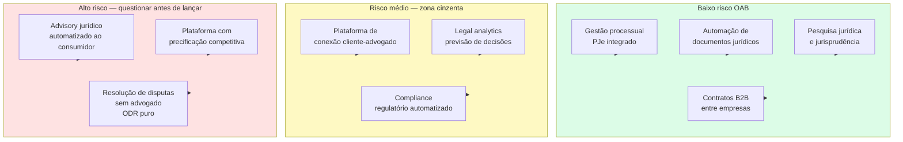

## APÊNDICE DP — LEGALTECH: TECNOLOGIA JURÍDICA NO BRASIL

> [!note] Posição no livro
> Relevante para [[apendice-ah|Apêndice AH — Contratos e Aspectos Legais]], [[apendice-dc|Apêndice DC — Propriedade Intelectual]], [[apendice-t|Apêndice T — LGPD e Privacidade]] e para fundadores que desenvolvem ferramentas para escritórios de advocacia, departamentos jurídicos ou acesso à Justiça.

---

### O tamanho do problema

Legaltech (tecnologia aplicada ao setor jurídico) opera num mercado de escala incomum. O Brasil tem mais de 1,3 milhão de advogados registrados na OAB — a maior advocacia do mundo em números absolutos, superando os EUA. O Judiciário carrega estoque de mais de 80 milhões de processos em tramitação. O custo de um litígio civil de médio porte, considerando honorários, custas e tempo, ultrapassa R$ 50 mil com facilidade.

Esse cenário cria três mercados distintos para legaltech:

1. **Ferramentas para advogados:** software que aumenta produtividade de escritórios e departamentos jurídicos
2. **Acesso à Justiça:** plataformas que reduzem a distância entre o cidadão comum e serviços jurídicos
3. **Compliance e risco:** tecnologia que ajuda empresas a identificar e mitigar riscos jurídicos e regulatórios

Cada mercado tem dinâmicas e riscos regulatórios distintos.

---

### O regulador central: a OAB

A Ordem dos Advogados do Brasil é simultaneamente:

- Entidade de classe (defesa dos interesses dos advogados)
- Regulador da profissão (poder disciplinar, ética, publicidade)
- Poder de veto informal sobre inovação que afeta a advocacia

O Estatuto da OAB (Lei 8.906/94) e o Código de Ética e Disciplina estabelecem regras que impactam diretamente como startups podem operar:

#### Art. 16 do EOAB: vedação de participação de não-advogados

Sociedades de advocacia não podem ter sócios que não sejam advogados. Isso significa que uma startup de tecnologia **não pode ser sócia de um escritório de advocacia**. Modelos como os de firmas de serviços jurídicos integrados nos EUA (onde fundo de PE pode investir em escritório) são proibidos no Brasil.

Isso limita os modelos possíveis:

- Startup vende software **para** escritório (permitido)
- Startup cria plataforma que **conecta** clientes a advogados (permitido com restrições)
- Startup **presta** serviço jurídico usando advogados contratados como CLT ou PJ (zona cinzenta — OAB questiona se configura captação irregular)

#### Provimento 205/2021: publicidade de advogados

O Código de Ética proíbe captação de clientes "mercantilizada". O Provimento 205/2021 atualizou as regras para o ambiente digital e permite:

- Site institucional com informações do escritório
- Redes sociais com conteúdo informativo e educacional
- Patrocínio de anúncios online desde que sem cunho "sensacionalista"

O que continua proibido:

- Promessa de resultado ("garantimos que você vai ganhar")
- Comparação com outros escritórios
- Captação via telemarketing ativo
- Participação em plataformas que façam leilão de clientes para o menor honorário

> [!warning] Plataformas de marketplace de advogados
> Modelos que conectam clientes a advogados competindo por preço são considerados pela OAB como captação irregular. Diversas startups nesse modelo receberam notificações do Conselho Federal da OAB. O modelo seguro é a plataforma de **matching por especialidade** (não por preço) com advogado controlando integralmente a relação com o cliente.

---

### Mapa de segmentos legaltech × risco regulatório

> [!note] A linha tênue do advisory automatizado
> Sistemas que respondem perguntas jurídicas ao consumidor final (como DoNotPay nos EUA) operam em zona de alto risco no Brasil. A OAB interpreta isso como exercício ilegal da profissão. O caminho mais seguro é o sistema apresentar a resposta como "informação educacional" e recomendar consulta a advogado — o que limita muito o valor percebido pelo usuário.

---

### Segmentos em detalhe

#### 1. Automação de documentos

O segmento mais maduro e menos controverso. Ferramentas que permitem gerar contratos, petições e pareceres a partir de templates com variáveis dinâmicas.

O modelo de receita predominante é SaaS (R$ 200–2.000/mês por escritório, dependendo do volume). O comprador é o escritório ou departamento jurídico de empresa — não o advogado individual.

A Contraktor opera no segmento de contratos B2B: qualquer empresa pode criar, enviar e assinar contratos digitalmente sem envolver advogado. O produto não presta serviço jurídico — apenas automatiza a operação documental.

#### 2. Gestão de processos e integração com PJe

O PJe (Processo Judicial Eletrônico) é o sistema oficial de tramitação processual na maior parte dos tribunais federais e estaduais. Tem API parcialmente documentada e padrões de integração variáveis por tribunal.

Startups como Projuris e 99Juris constroem cima do PJe e outros sistemas tribunalícios para dar ao escritório uma visão unificada dos processos, com alertas de prazos e automação de tarefas.

O risco técnico é a instabilidade e fragmentação dos sistemas dos tribunais — cada TJ (Tribunal de Justiça estadual) tem sua própria implementação, com diferenças relevantes de formato e protocolo.

> [!warning] Scraping de dados processuais
> Extrair dados processuais via scraping dos portais dos tribunais viola os termos de uso da maioria deles. Tribunais como o TJSP e o TRF proibiram explicitamente acesso automatizado não autorizado. Além do risco jurídico, a dependência de scraping cria fragilidade técnica: mudança de layout derruba o produto. Use as APIs oficiais onde existirem e monitore os termos de cada tribunal.

#### 3. Pesquisa jurídica e legal analytics

O JusBrasil construiu a maior base de jurisprudência e legislação do Brasil, com acesso freemium para advogados e estudantes. O modelo de receita é SaaS para escritórios e assinaturas premium.

Legal analytics — prever probabilidade de sucesso em determinado tipo de demanda com base em histórico de decisões do tribunal ou do juiz — é segmento mais sofisticado. Empresas como Nerit e Tikal Tech operam nesse espaço com machine learning aplicado a dados de processos.

Risco: dados processuais com partes identificadas podem conter informações pessoais sensíveis. A LGPD se aplica ao tratamento dessas informações — mesmo que sejam públicas nos autos, seu reuso em base de dados estruturada exige base legal.

#### 4. Contratos inteligentes e blockchain

Contratos autoexecutáveis em blockchain têm uso limitado no direito civil brasileiro. O Código Civil exige para muitos atos jurídicos forma específica (escritura pública, testemunhas, registro). Um smart contract não substitui escritura pública de compra de imóvel.

O uso prático no Brasil está em contratos B2B de execução simples (pagamento automático ao atingir milestone mensurável on-chain) e em instrumentos financeiros tokenizados (ver [[#APÊNDICE CJ — TOKENIZAÇÃO PARA FOUNDERS: ATIVOS DIGITAIS, SECURITY TOKENS E QUANDO NÃO É HYPE|Apêndice CJ]] — security tokens e instrumentos financeiros tokenizados).

#### 5. Compliance regulatório automatizado

Ferramentas que monitoram publicações do Diário Oficial, CVM, Banco Central, ANATEL, ANVISA e demais reguladores e alertam a empresa sobre mudanças relevantes.

Segmento B2B com ticket médio alto (R$ 2.000–20.000/mês). Comprador é o jurídico ou o compliance de empresas médias e grandes. Ciclo de vendas longo mas churn baixo.

A Nerit opera nesse espaço com monitoramento regulatório automatizado para empresas reguladas.

#### 6. Acesso à Justiça e ODR

Online Dispute Resolution: resolução de disputas de forma digital, sem necessidade de processo judicial. Aplicável a disputas de consumo, contratos comerciais simples e cobranças.

No Brasil, câmaras arbitrais e câmaras de mediação operam nesse espaço (parcialmente). A arbitragem tem base legal sólida (Lei 9.307/96 — Lei de Arbitragem). A mediação extrajudicial foi regulamentada pela Lei 13.140/2015.

O risco do ODR puro (sem advogado) é que consumidores desassistidos juridicamente podem aceitar acordos desfavoráveis. A OAB critica modelos que excluem advogados da equação como contrários ao interesse do jurisdicionado.

---

### Tabela: modelos de negócio legaltech

| Modelo | Quem compra | Risco OAB | Ticket médio mensal |
|---|---|---|---|
| SaaS gestão processual | Escritório / Depto. jurídico | Baixo | R$ 500–5.000 |
| Automação de documentos | Empresa B2B / Escritório | Baixo | R$ 200–3.000 |
| Pesquisa jurídica / analytics | Advogado / Escritório | Baixo | R$ 100–2.000 |
| Compliance regulatório | Empresa regulada (médio/grande) | Baixo | R$ 2.000–20.000 |
| Conexão cliente-advogado | Consumidor final | Médio-alto | R$ 0 (comissão) |
| Advisory jurídico automatizado | Consumidor final / PME | Alto | R$ 50–500 |
| ODR sem advogado | Consumidor / Empresa | Alto | % do acordo |
| LegalOps corporativo | Jurídico corporativo enterprise | Baixo | R$ 5.000–50.000 |

---

### Casos referência brasileiros

#### JusBrasil — a maior base jurídica do Brasil

Começou como agregador de jurisprudência gratuito e construiu audiência massiva (mais de 8 milhões de usuários mensais em 2023). Monetiza via planos premium para advogados com funcionalidades de pesquisa avançada e alertas de processos.

O modelo freemium com audiência massiva cria barreira de dados: quanto mais decisões, mais relevante a base; quanto mais relevante a base, mais usuários.

#### Projuris — gestão processual para escritórios médios

SaaS de gestão de processos com integração a múltiplos tribunais. Posicionado para escritórios de 10–200 advogados que precisam de controle de prazos e dashboards de carteira.

O desafio é a fragmentação dos tribunais: o produto precisa manter integração com dezenas de sistemas com padrões distintos, o que cria custo de engenharia contínuo.

#### Contraktor — contratos sem dor de cabeça

Foco em PMEs que precisam criar, enviar e assinar contratos sem envolver advogado para cada operação. O produto é B2B e evita deliberadamente a prestação de serviço jurídico — vende eficiência operacional, não assessoria.

Essa posição deliberada (ferramenta, não advogado digital) é o que mantém o modelo fora do radar da OAB.

#### 99Juris — analytics jurídico

Foco em analytics processual para empresas com grande volume de litígios (bancos, seguradoras, telecom). Permite identificar padrões de sucesso/fracasso por tipo de demanda, comarca, juiz. Orientado ao jurídico corporativo, não ao escritório de advocacia.

#### Jurídico Certo — acesso à Justiça com advogados reais

Plataforma que conecta consumidores a advogados para consultas e contratos simples. O modelo evita o "leilão de preços" proibido pela OAB ao focar em matching por especialidade e deixar o advogado definir seus honorários de forma autônoma.

---

### Referências internacionais — o que adapta ao Brasil

#### LegalZoom (EUA)

Documentos jurídicos padronizados para pessoa física e pequena empresa: abertura de empresa, testamento, divórcio não contestado. Opera em estados onde o exercício da advocacia é menos restrito.

**O que não adapta ao Brasil:** a OAB proibiria o serviço de elaboração de documentos jurídicos sem advogado responsável. O modelo de LegalZoom no Brasil precisaria ter advogados como responsáveis técnicos pelos documentos gerados.

**O que adapta:** a ideia de produtos jurídicos padronizados a preço acessível para demandas repetitivas tem mercado. Com advogados no backend (como prestadores de revisão), é possível criar algo análogo.

#### DoNotPay (EUA)

"O primeiro advogado robô": sistema de IA que orienta consumidores em disputas simples (multas, cancelamentos, chargebacks). Cresceu como curiosidade tecnológica, mas enfrentou questionamentos sobre exercício ilegal da advocacia.

**O que não adapta ao Brasil:** advisory jurídico automatizado ao consumidor final enfrenta oposição direta da OAB e enquadramento como exercício ilegal da profissão.

**O que adapta:** a ideia de guiar o usuário no processo (não praticar o ato jurídico por ele) tem aplicação. Ferramentas de orientação para Juizado Especial Cível (JEC — pequenas causas) que informam sobre direitos e documentação necessária operam nessa linha com menor risco.

> [!tip] A regra prática
> No Brasil, o ponto de segurança é: a ferramenta pode informar, organizar e automatizar. Quando a ferramenta começa a **recomendar** o que o usuário deve fazer juridicamente no caso específico dele, entra na zona de risco de exercício ilegal da profissão. A diferença entre "isso é o que a lei diz" e "isso é o que você deve fazer no seu caso" é a fronteira que a OAB monitora.

---

### O movimento de LegalOps corporativo

LegalOps (Legal Operations) é a gestão profissional do departamento jurídico de uma empresa como unidade de negócio — com métricas, orçamento controlado, processos documentados e tecnologia.

Nos EUA, a função de CLO (Chief Legal Officer) evoluiu para incluir um COO jurídico ou um LegalOps Manager dedicado. No Brasil, o movimento chegou com atraso mas está acelerando em empresas de médio porte que cresceram rápido e precisam profissionalizar o jurídico.

O que um departamento jurídico compra em LegalOps:

- **Contratos:** criação, aprovação, assinatura, arquivo e renovação automatizados. Ferramentas como Ironclad (EUA) e Contraktor (Brasil) atacam esse segmento
- **Gestão de advogados externos:** painéis de controle de horas faturadas, aprovação de notas, comparativo de custo por tipo de demanda e por escritório. Empresas com R$ 1M+/ano em honorários externos têm ROI direto nesse controle
- **Compliance normativo:** monitoramento de mudanças regulatórias e alertas automáticos. Crítico para setores regulados (saúde, financeiro, telecomunicações, alimentos)
- **Matter management:** gestão centralizada de todos os assuntos jurídicos ativos, com status, responsável, prazo e custo acumulado
- **eBilling:** faturamento eletrônico padronizado de escritórios externos, com validação automática de UTBMS (códigos de atividade jurídica) — padrão ainda pouco adotado no Brasil mas com crescimento

O ticket médio para soluções de LegalOps corporativo varia de R$ 3.000 a R$ 50.000/mês dependendo do porte do departamento jurídico e dos módulos contratados. O ciclo de vendas é longo (6–12 meses para grandes empresas) mas o churn é baixíssimo — departamentos jurídicos têm alta resistência à troca de sistema depois que os processos estão integrados.

> [!note] Oportunidade de expansão
> O mercado de LegalOps ainda é pouco desenvolvido no Brasil comparado aos EUA e Europa. As grandes empresas brasileiras (especialmente as de capital aberto, que têm CVM para responder) são o alvo natural. Fintechs, healthtechs e empresas de e-commerce que cresceram rápido e agora precisam de governança jurídica são o mercado emergente.

---

### Inteligência Artificial aplicada ao direito brasileiro

A chegada de modelos de linguagem de grande porte (LLMs) abriu uma nova camada de possibilidades e riscos para o setor jurídico.

**O que os LLMs fazem bem em contexto jurídico:**

- Sumarização de contratos longos e extração de cláusulas relevantes
- Geração de minutas a partir de parâmetros fornecidos
- Pesquisa de jurisprudência com síntese dos fundamentos recorrentes
- Revisão de documentos para identificar inconsistências e cláusulas ausentes
- Tradução jurídica (contratos internacionais, due diligence cross-border)

**O que os LLMs fazem mal e que o produto não pode prometer:**

- Precisão factual em jurisprudência recente (alucinações são frequentes em referências específicas de acórdãos)
- Raciocínio estratégico sobre o caso concreto (o LLM não conhece o histórico processual completo nem o perfil do juiz)
- Garantia de que o resultado da ação será aquele previsto (o que a OAB já proibia antes dos LLMs)

A forma responsável de integrar IA a produtos jurídicos no Brasil é como ferramenta de **aumento de produtividade do advogado**, não como substituto. O advogado revisa, valida e assina. A IA gera o rascunho, pesquisa os precedentes e alerta sobre inconsistências.

Startups que vendem "IA que substitui advogado" como proposição de valor enfrentam resistência da OAB e, mais importante, responsabilidade quando o output do sistema estiver errado.

---

### Armadilhas recorrentes em legaltech no Brasil

**1. Subestimar a OAB como regulador ativo**

A OAB tem Conselho Federal e 27 seccionais estaduais. Quando um modelo de negócio ameaça a renda dos advogados, a OAB reage. Isso não é burocracia passiva — é pressão ativa com poder de interdição.

**2. Tentar substituir o advogado em vez de equipá-lo**

As legatechs que cresceram no Brasil equipam advogados. As que tentaram substituí-los esbarraram em resistência regulatória e cultural. O advogado é simultaneamente o regulador (via OAB), o canal de distribuição e, em muitos casos, o usuário final. Competir com ele raramente termina bem.

**3. Dependência de scraping de tribunais**

Além do risco jurídico (violação de termos de uso), scraping cria dependência técnica frágil. Mudança de layout derruba o produto. Crescimento de usuários sobrecarrega o site do tribunal e pode gerar bloqueio de IP. O caminho correto é pressionar por APIs abertas (movimento que está evoluindo no CNJ) e usar as APIs disponíveis.

**4. LGPD e dados processuais**

Processos judiciais são públicos, mas os dados das partes têm proteção da LGPD. Construir base de dados com CPF, endereço, situação processual de pessoas físicas sem base legal adequada é risco real de autuação pela ANPD.

**5. Ciclo de vendas para escritórios**

Escritórios de advocacia tradicionais têm ciclo de vendas longo, decisão por sócio-sênior e resistência cultural a mudanças de processo. Startups que projetam crescimento rápido em escritórios tradicionais frequentemente se frustram. O crescimento mais rápido está em departamentos jurídicos corporativos e em escritórios jovens.

---

### Conexões no livro

- **Apêndice AH — Contratos e Aspectos Legais:** base para entender o mercado que as legaltechs servem
- **Apêndice DC — Propriedade Intelectual:** proteção de software e dados produzidos por legaltech
- **Apêndice T — LGPD e Privacidade:** tratamento de dados processuais e pessoais em plataformas jurídicas
- **Apêndice AW — Regulatório Setorial:** framework geral para navegar setores com reguladores ativos
