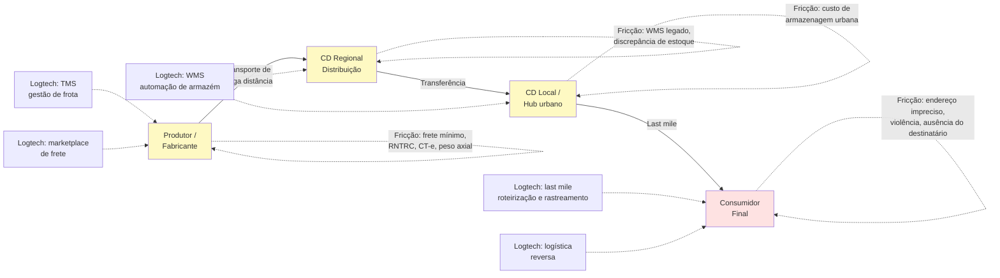

## APÊNDICE DQ — LOGTECH: TECNOLOGIA EM LOGÍSTICA E SUPPLY CHAIN NO BRASIL

> [!note] Posição no livro
> Relevante para [[apendice-ae|Apêndice AE — Marketplace Dynamics]], [[apendice-aw|Apêndice AW — Regulatório Setorial]], [[apendice-ck|Apêndice CK — Modelos B2B2C]] e para fundadores que operam em e-commerce, agro, indústria ou qualquer negócio onde o produto precisa se mover fisicamente.

---

### O problema de escala continental

Logtech (tecnologia aplicada à logística e cadeia de suprimentos) lida com um problema brasileiro estrutural. O Brasil tem 8,5 milhões de km². É o 5º maior país do mundo em área e o 7º em PIB. Mas sua infraestrutura de transporte e logística não acompanhou essa dimensão.

O custo logístico no Brasil representa entre 12% e 15% do PIB — comparado a cerca de 8% nos EUA e 10% na média da Europa. Essa diferença não é acidental: é estrutural.

**Os motivos são conhecidos:**

- Dependência excessiva de rodovias (65% da carga transportada no Brasil é por caminhão, contra 27% nos EUA, que usa muito mais ferrovia e hidrovia)
- Malha ferroviária precária e fragmentada — cerca de 30.000 km de ferrovias, contra mais de 200.000 km nos EUA
- Portos lentos e caros (custo de operação portuária no Brasil é 2–3x o de portos asiáticos de referência)
- Concentração de infraestrutura no eixo Sul-Sudeste
- Alta informalidade nos transportadores autônomos

Cada um desses fatores é um problema que tecnologia pode atacar parcialmente — e também é um risco que startups de logística precisam precificar.

---

### Contexto regulatório

#### ANTT e o transportador autônomo de carga (TAC)

A ANTT (Agência Nacional de Transportes Terrestres) regula o transporte rodoviário de cargas. Todo transportador autônomo precisa estar inscrito no RNTRC (Registro Nacional de Transportadores Rodoviários de Cargas), mantido pela ANTT.

A Lei 11.442/2007 regulamentou o transporte autônomo de cargas e criou o TAC (Transportador Autônomo de Cargas), figura jurídica distinta da empresa transportadora.

Para startups de marketplace de fretes (como CargoX), isso significa que os motoristas cadastrados precisam ter RNTRC válido. Plataformas que aceitam motoristas sem RNTRC estão sujeitas a autuação e responsabilização por cargas transportadas irregularmente.

> [!warning] RNTRC e responsabilidade da plataforma
> Se a plataforma intermedeia um frete e o transportador não tem RNTRC, a responsabilidade pelo transporte irregular pode recair sobre a plataforma. Verifique o status do RNTRC de cada motorista no cadastro — e automatize a verificação periódica, pois o registro pode ser suspenso.

#### Nota fiscal eletrônica (NF-e) e CT-e

Toda movimentação de mercadorias no Brasil exige nota fiscal eletrônica (NF-e) ou Conhecimento de Transporte Eletrônico (CT-e). Isso não é opcional — a fiscalização de carga nas rodovias verifica documentação eletrônica.

Para startups de gestão logística, isso significa integração com os sistemas da SEFAZ (Secretaria da Fazenda Estadual) de múltiplos estados — cada um com sua API, prazo de processamento e regras de cancelamento.

#### ANVISA para cold chain

Transporte de alimentos, medicamentos e outros produtos regulados pela ANVISA exige condições específicas de temperatura, rastreabilidade e documentação. Veículos de transporte refrigerado precisam de habilitação específica.

Startups de logística de alimentos (incluindo dark kitchens com entrega própria) e de medicamentos precisam incorporar os requisitos da ANVISA desde o design do produto — não como afterthought.

#### Lei do frete mínimo (Lei 13.703/2018)

Após a greve dos caminhoneiros de 2018, o governo criou tabela de frete mínimo para transporte rodoviário de cargas. A tabela é definida pela ANTT por tipo de carga e distância.

Para marketplaces de frete: o preço negociado na plataforma não pode ser inferior à tabela de frete mínimo. Plataformas que facilitavam "leilão de fretes" abaixo do mínimo foram autuadas. Isso limita o espaço para competição por preço e desloca a diferenciação para confiabilidade, rastreamento e prazo.

---

### Cadeia logística típica no Brasil

> [!note] Last mile como campo de batalha
> A última milha — do hub urbano ao consumidor final — concentra os maiores custos unitários e os problemas mais difíceis. No Brasil, endereços imprecisos (CEP que cobre quadra inteira), violência urbana em regiões de risco, alta densidade de pedestres em centros e informalidade de destinatários tornam a última milha significativamente mais cara do que em países comparáveis.

---

### Segmentos logtech e suas dinâmicas

#### 1. TMS — Transportation Management System

Software de gestão de frotas e transporte. Inclui roteirização, controle de custo por viagem, manutenção preventiva de frota, gestão de motoristas e integração com NF-e/CT-e.

Comprador típico: empresas de transporte de médio e grande porte, ou embarcadores (indústrias e distribuidoras) que gerenciam frota própria ou contratada.

Ticket médio: R$ 1.000–30.000/mês dependendo do porte da frota. Modelo SaaS com módulos adicionais.

#### 2. Last mile delivery

O segmento mais competitivo e com maior queima de capital. Inclui:

- Delivery de e-commerce (Loggi, Total Express, Jadlog)
- Delivery de alimentos (iFood, Rappi — integrados verticalmente)
- Entrega expressa corporativa

O modelo de unit economics crítico é o custo por entrega. No Brasil, o custo médio de uma entrega last mile para e-commerce varia de R$ 8 a R$ 25 dependendo da distância, densidade urbana e nível de serviço.

A Loggi construiu posição dominante em São Paulo a partir de entrega de documentos e expandiu para e-commerce. O modelo de gig (entregadores autônomos) cria flexibilidade operacional mas gera risco trabalhista crescente — ver seção de armadilhas.

#### 3. Marketplace de frete

Plataformas que conectam embarcadores a transportadores autônomos ou pequenas transportadoras. O modelo é similar a Uber aplicado ao frete: embarcador posta a carga, transportadores aceitam, plataforma cobra take rate (4–12% sobre o valor do frete).

A CargoX é a referência brasileira nesse segmento. O desafio operacional é manter a qualidade do serviço com motoristas autônomos e verificar continuamente a conformidade regulatória (RNTRC, seguro de carga, CNH categoria adequada).

#### 4. WMS — Warehouse Management System

Gestão de armazéns: recebimento, conferência, armazenagem, separação de pedidos (picking) e expedição. Integrado a TMS e ao ERP do cliente.

O mercado é dominado por grandes players (SAP WM, Oracle WMS) na enterprise, com espaço para SaaS mid-market. Empresas de fulfillment (que operam armazéns para terceiros) são clientes relevantes.

#### 5. Rastreamento e visibilidade

Plataformas de track & trace que consolidam eventos de múltiplas transportadoras e exibem status em tempo real para o embarcador e para o destinatário final.

Modelo de receita: SaaS por volume de eventos rastreados ou por transportadora integrada. A Intelipost opera nesse espaço como camada de abstração entre e-commerce e múltiplas transportadoras.

#### 6. Logística reversa

Coleta de devoluções, gestão de RMA (Return Merchandise Authorization), reprocessamento e descarte adequado. Ganha relevância com o crescimento do e-commerce e com regulação de logística reversa de embalagens (Política Nacional de Resíduos Sólidos — Lei 12.305/2010).

Segmento ainda emergente como produto standalone. Grandes players de last mile incluem reversa como módulo adicional.

#### 7. Cold chain

Cadeia de frio: transporte e armazenagem de produtos que requerem temperatura controlada. Inclui alimentos perecíveis, medicamentos, vacinas, flores.

Regulação ANVISA impõe requisitos rígidos de temperatura, registro de desvios e rastreabilidade. Startups nesse segmento precisam de hardware (sensores IoT de temperatura) integrado ao software de gestão.

---

### Tabela: segmentos logtech brasileiros

| Segmento | Modelo de receita | Desafio operacional crítico | Caso referência |
|---|---|---|---|
| TMS / gestão de frota | SaaS por módulo ou veículo | Integração com NF-e de múltiplos estados | Intelipost, unico |
| Last mile delivery | Custo por entrega (cobrado do embarcador) | Custo unitário × volume mínimo rentável | Loggi, Total Express |
| Marketplace de frete | Take rate (4–12%) sobre o frete | Verificação RNTRC, qualidade do transportador | CargoX |
| WMS | SaaS por armazém ou por pedido | Integração com ERPs legados do cliente | Depositar, uWMS |
| Rastreamento / visibilidade | SaaS por volume de eventos ou transações | Integração com 50–100+ transportadoras | Intelipost |
| Logística reversa | Por coleta ou SaaS integrado | Fluxo reverso é menos previsível que forward | Kangu, Mandaê |
| Cold chain | SaaS + hardware IoT | Uptime dos sensores, conformidade ANVISA | Temp-Guard, Sensorweb |
| Micromobilidade (last mile urbano) | Assinatura mensal da bicicleta / patinete | Manutenção de frota, vandalismo | Tembici |

---

### Unit economics específicos de logtech

#### Marketplace de frete — take rate

O take rate sustentável em marketplace de frete no Brasil está entre 4% e 10% do valor do frete bruto. Abaixo de 4%, a plataforma não cobre custos de suporte e verificação regulatória. Acima de 12%, transportadores migram para acordos diretos com embarcadores frequentes.

A chave é o volume: com baixo volume, o marketplace não tem liquidez suficiente para cobrir todas as rotas; com alto volume, surgem transportadores que tentam sair da plataforma.

Métricas de saúde de um marketplace de frete:

- **Taxa de match:** % das cargas postadas que encontram transportador em menos de X horas
- **Taxa de conclusão:** % dos fretes iniciados que são concluídos sem incidente
- **Repeat rate:** % de embarcadores que usam a plataforma mais de uma vez por mês
- **Custo de verificação por transportador:** quanto custa validar RNTRC, seguro, CNH

#### Last mile — custo por entrega

O custo por entrega em last mile inclui:

- Custo do entregador (gig ou CLT): 40–60% do custo total
- Combustível ou recarga (para elétrico / bicicleta): 5–15%
- Custo de hub urbano e handling: 10–20%
- Tentativas frustradas (destinatário ausente, endereço errado): 10–20% de sobrecusto em média
- Custo de suporte e atendimento a ocorrências: 5–10%

No Brasil, a taxa de insucesso na primeira tentativa de entrega pode chegar a 20–30% em cidades com endereçamento precário — contra 5–10% nos EUA. Isso sozinho representa diferença de 15–25% no custo total da operação.

#### Armazenagem — giro de estoque

Para operadores de fulfillment (que armazenam estoque de e-commerce de terceiros), a métrica central é o giro: quantos dias, em média, um SKU fica no armazém antes de ser vendido e expedido.

Giro alto (< 15 dias) = armazém produtivo, receita por m² relevante.
Giro baixo (> 60 dias) = capital imobilizado do cliente, pressão para cobrar armazenagem adicional.

A cobrança ideal separa:

- Taxa de recebimento (por item ou por SKU)
- Taxa de picking e embalagem (por pedido)
- Armazenagem (por pallete-dia ou m²-dia)
- Expedição (por pedido, integrada à transportadora)

---

### Casos referência

#### Loggi — do documento ao e-commerce

A Loggi começou em 2013 com entrega de documentos jurídicos em São Paulo (prazo curtíssimo, cliente B2B disposto a pagar). Expandiu para e-commerce quando o mercado cresceu. Tornou-se uma das maiores operadoras de last mile do Brasil, com hubs em capitais e cidades médias.

O modelo de gig economy (entregadores de bicicleta e moto autônomos) deu flexibilidade operacional mas cria tensão trabalhista crescente — ver armadilhas.

#### CargoX — matching de frete com tecnologia

A CargoX criou marketplace de frete rodoviário de cargas, conectando embarcadores industriais (açúcar, grãos, insumos) a caminhoneiros autônomos e pequenas transportadoras.

O diferencial foi a automação da verificação regulatória (RNTRC, seguro) e a transparência de preço — em um mercado onde os fretes eram negociados manualmente por telefone.

#### Intelipost — camada de integração para e-commerce

Posicionamento como "middleware" logístico: o e-commerce integra uma única API da Intelipost e acessa múltiplas transportadoras. A plataforma consolida rastreamento, calcula tarifas e gerencia ocorrências.

Modelo de receita SaaS com cobrança por volume de etiquetas e envios. Beneficia de efeito de rede à medida que mais transportadoras e mais e-commerces entram na plataforma.

#### Tembici — micromobilidade como first e last mile

A Tembici opera bicicletas compartilhadas em grandes cidades brasileiras (BikeItaú em São Paulo, Rio, Brasília; Bike Giro em outras cidades). O uso cresce tanto para lazer quanto para deslocamento urbano e, crescentemente, para última milha de entregadores.

O modelo B2G (patrocínio de banco ou prefeitura) sustenta a infraestrutura, com monetização adicional via assinaturas mensais de usuários.

#### Mandaê — fulfillment para PMEs

Fulfillment terceirizado para pequenos e médios e-commerces: recebe o estoque, armazena, separa e expede. O lojista não precisa de armazém próprio.

O modelo compete diretamente com o fulfillment do Mercado Livre (MELI) e da Amazon. A diferença é que a Mandaê atende e-commerces que vendem em múltiplos canais (próprio + marketplaces), não apenas no marketplace da plataforma dona do fulfillment.

---

### Armadilhas recorrentes em logtech no Brasil

**1. Risco trabalhista do modelo gig**

A Justiça do Trabalho brasileira tem reconhecido, progressivamente, vínculo empregatício entre plataformas de entrega e seus entregadores. Decisões do TST (especialmente após 2022) apontam que, quando a plataforma controla preço, rota, jornada e penalidades, o entregador é empregado — não autônomo.

O risco não é hipotético: há passivos trabalhistas bilionários sendo discutidos nas principais plataformas de delivery. Startups que replicam o modelo sem precificar esse passivo potencial podem encontrar dívida trabalhista maior do que o negócio vale.

> [!important] Precifique o risco trabalhista desde o início
> O modelo de gig pode ser a única forma de ter escala operacional inicialmente. Mas construa reservas para o cenário de reconhecimento de vínculo empregatício. Consulte advogado trabalhista com experiência em plataformas digitais antes de definir o modelo de contratação.

**2. Concentração geográfica no eixo SP-RJ**

É tentador construir o modelo em São Paulo, onde a densidade urbana, o volume de e-commerce e a infraestrutura são melhores. O problema é que o eixo SP-RJ representa menos de 30% da população e do território brasileiro. Quando a startup tenta expandir para o Nordeste, Norte ou Centro-Oeste, frequentemente descobre que o modelo de unit economics não funciona nas mesmas condições.

**3. Violência e risco de carga**

O Brasil tem uma das maiores taxas de roubo de carga do mundo. São Paulo, Rio de Janeiro e regiões de fronteira têm índices que impactam diretamente o custo do seguro de carga e as rotas possíveis.

Para marketplaces de frete, o seguro de carga é obrigatório para o transportador (RCTR-C — Responsabilidade Civil do Transportador Rodoviário de Cargas). Para plataformas de last mile, o risco de roubo de moto/bicicleta do entregador é custo operacional real.

**4. Informalidade do motorista como risco de qualidade**

Cerca de 65% dos caminhoneiros no Brasil são autônomos. Muitos operam com documentação irregular, veículos fora da manutenção adequada ou sem o RNTRC atualizado. Aceitar motoristas informais para cobrir rotas é tentador mas cria risco regulatório e de sinistro.

**5. Importação de peças e custo Brasil**

Veículos de logística (caminhões, vans, equipamentos de armazém) têm componentes que dependem de importação. O custo Brasil (impostos de importação, taxa de câmbio, tempo de desembaraço alfandegário) impacta o custo de manutenção de frota de forma relevante. Startups que operam frota própria precisam precificar esse custo desde o início.

**6. Heterogeneidade regional de infraestrutura**

Uma solução de TMS ou WMS desenvolvida para rotas entre capitais no Sul-Sudeste pode falhar completamente no Norte, onde parte das rotas é fluvial, estradas são precárias e a cobertura de telefonia 4G é fragmentada. Não assuma que o que funciona em São Paulo funciona no Brasil.

> [!tip] Estratégia de expansão regional
> Startups de logtech bem-sucedidas no Brasil tipicamente adicionam uma região por vez, adaptando o modelo de operação (parceiros locais, cobertura de seguro diferenciada, tipo de veículo) antes de avançar. Expansão nacional acelerada em logística frequentemente termina em burn de capital sem produto-mercado fit regional.

---

### Conexões no livro

- **Apêndice AE — Marketplace Dynamics:** dinâmicas de dois lados aplicadas a marketplaces de frete
- **Apêndice AW — Regulatório Setorial:** ANTT, ANVISA e regulação de transportes no framework geral
- **Apêndice CK — Modelos B2B2C:** quando a logtech vende para empresa mas serve o consumidor final
- **Apêndice DA — Marco Legal das Startups:** estruturas jurídicas para operações de gig economy e transporte
