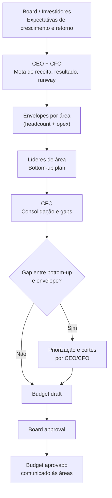

## APÊNDICE EC — PLANEJAMENTO FINANCEIRO E ORÇAMENTO

> [!note] Nota de validade
> As práticas de budgeting (orçamentação) descritas aqui são estáveis como disciplina. O que muda com o tempo: ferramentas de FP&A — Financial Planning & Analysis, ou planejamento e análise financeira — (Anaplan, Mosaic, Pigment, etc.), taxas de encargos trabalhistas (sujeitas à legislação), e benchmarks de headcount (referências de tamanho de equipe) por estágio. Este apêndice reflete o cenário de abril de 2026. Revise benchmarks salariais e encargos anualmente.

O [[apendice-an|Apêndice AN]] cobre modelagem financeira: como construir projeções a partir de drivers operacionais. O [[apendice-dr|Apêndice DR]] cobre demonstrativos: como ler o que já aconteceu. Este apêndice cobre o planejamento financeiro: como transformar a visão do negócio em orçamento aprovado, operado por times com autonomia, e revisado com frequência suficiente para ser útil.

### O que esse apêndice cobre

Três instrumentos distintos que fundadores frequentemente confundem.

1. **Modelo financeiro**: projeção de cenários futuros a partir de drivers (variáveis operacionais que dirigem o resultado). Instrumento de análise. Produza quando necessário — pré-captação, decisão estratégica, ou início de trimestre.
2. **Demonstrativos financeiros**: registro contábil do passado. Instrumento de auditoria e compliance (conformidade regulatória). O contador produz mensalmente.
3. **Orçamento (budget)**: plano operacional aprovado para um período, com metas por área, envelope de gastos, e resultado esperado. Instrumento de gestão. Produza uma vez por ano, revise trimestralmente.

Os três se alimentam. O modelo define as hipóteses. O orçamento operacionaliza o plano. Os demonstrativos reportam o que realmente aconteceu.

### Por que o orçamento importa

Sem orçamento aprovado, cada contratação é uma negociação. Cada pedido de investimento em marketing é uma discussão ad hoc. O CEO passa o tempo arbitrando alocações em vez de executar.

Com orçamento aprovado, o time opera com autonomia dentro de limites claros. O líder de engenharia sabe que tem envelope para contratar três pessoas no segundo trimestre. O time de marketing sabe que tem R$ 150 mil para o semestre. Não precisam pedir aprovação para cada decisão dentro do envelope.

O orçamento também cria linguagem comum entre fundador, CFO, e board. Quando o resultado sai diferente do esperado, a conversa é sobre desvio do plano — não sobre o que o plano deveria ter sido.

> [!important] Orçamento não é previsão. É compromisso.
> Modelo financeiro é o que você acredita que vai acontecer. Orçamento é o que você se compromete a alcançar — e dentro de quais limites de gasto. Confundir os dois leva a orçamentos que ninguém cumpre, ou a gastos autorizados que ninguém questiona porque "o modelo dizia isso".

---

### Bottom-up vs. top-down: como o orçamento é construído

Existem duas formas puras e uma híbrida.

#### Top-down

O CEO (ou board) define o crescimento esperado para o ano e distribui envelopes para cada área. "Vamos crescer 80%. Vendas recebe R$ 4 milhões de orçamento. Engenharia recebe R$ 6 milhões. G&A recebe R$ 2 milhões."

**Quando funciona**: empresa em estágio inicial sem estrutura para bottom-up, ou quando o board impõe restrições de capital rígidas que tornam o processo bottom-up inútil (qualquer proposta que saia dos parâmetros será rejeitada de qualquer forma).

**Problemas**: as áreas recebem envelopes sem validar se são executáveis. Headcount plan descolado da realidade. Resistência dos times por não terem participado.

#### Bottom-up

Cada área submete suas necessidades de pessoal, ferramentas, e operação para atingir a meta de negócio. O CFO consolida. O resultado é apresentado ao CEO e ao board.

**Quando funciona**: empresa com mais de 50 pessoas, onde os líderes têm contexto operacional que o CEO não tem mais em nível granular.

**Problemas**: áreas tendem a pedir mais do que precisam (budget maximization). O processo de consolidação é longo. O total raramente cabe no envelope disponível, gerando rodadas de corte que desgastam as áreas.

#### Híbrido (o mais comum e saudável)

1. **Top-down define a direção**: CEO e CFO estabelecem as metas de crescimento, resultado esperado, e o envelope total disponível.
2. **Bottom-up valida a viabilidade**: cada área constrói seu plano dentro do envelope, mostrando o que consegue entregar e o que precisaria de capital adicional para ir além.
3. **Calibração**: CFO e CEO revisam, priorizam, e aprovam o plano consolidado. Board aprova ou pede ajustes.



---

### Headcount plan como driver principal

Em startups de tecnologia, 60 a 80% dos custos totais são pessoas — salários, encargos, benefícios, e custos associados. Isso significa que a decisão de contratação é a decisão orçamentária mais importante que existe.

#### Custo real de uma contratação

O salário bruto é apenas o ponto de partida.

| Componente | Referência (CLT) |
|---|---|
| Salário Bruto | Base |
| Encargos patronais (FGTS, INSS patronal, RAT, SEST/SENAT, salário educação) | ~35-40% do salário bruto |
| 13º salário + 1/3 de férias | ~11% do salário bruto |
| Vale-transporte, alimentação, plano de saúde, odonto | R$ 500 a R$ 2.000/mês |
| Equipamento (notebook, periféricos) | R$ 3.000 a R$ 8.000 (amortizado em 2-3 anos) |
| Licenças de software por cabeça (GitHub, Slack, Figma, etc.) | R$ 200 a R$ 600/mês |
| Espaço físico ou auxílio home office | R$ 100 a R$ 500/mês |

> [!warning] Regra prática de custo total
> Para um planejamento conservador em CLT, use fator multiplicador de 1,7 a 1,8x sobre o salário bruto para chegar ao custo total mensal. Um engenheiro com salário bruto de R$ 12.000 custa, na prática, entre R$ 20.000 e R$ 22.000 por mês para a empresa.

**Para PJ ou cooperativa**, o fator de encargos é menor (sem FGTS, INSS patronal patronal, 13º como obrigação), mas o risco de vínculo empregatício reconhecido pela Justiça do Trabalho é real. O custo jurídico potencial precisa ser precificado.

#### Como montar o headcount plan por departamento

Para cada área, o headcount plan responde a quatro perguntas:

1. Qual o headcount atual?
2. Quais posições serão abertas, em qual trimestre?
3. Qual o motivo de cada contratação (substituição, crescimento, nova função)?
4. Qual o salário médio esperado por nível?

```text
Exemplo: headcount plan de Engenharia, 2026

Função               | Q1 | Q2 | Q3 | Q4 | Salário médio (bruto)
---------------------|----|----|----|----|----------------------
Eng. Backend Sr      |  4 |  4 |  5 |  5 | R$ 14.000
Eng. Backend Pl      |  2 |  3 |  3 |  4 | R$ 9.000
Eng. Frontend Sr     |  2 |  2 |  3 |  3 | R$ 13.000
Eng. Frontend Pl     |  1 |  2 |  2 |  2 | R$ 8.500
Tech Lead            |  1 |  1 |  2 |  2 | R$ 18.000
QA / SDET            |  1 |  1 |  1 |  2 | R$ 8.000
DevOps / SRE         |  1 |  1 |  1 |  1 | R$ 15.000
---------------------|----|----|----|----|----------------------
Total headcount      | 12 | 14 | 17 | 19 |
Custo total (×1,75)  |    |    |    |    | (calcular por mês)
```

#### Quando contratar: antes da necessidade vs. just-in-time

**Antes da necessidade** é a lógica de startup em hipercrescimento: contratar antecipado para não travar escala. O risco é contratar para crescimento que não vem, aumentando o burn sem justificativa.

**Just-in-time** é contratar quando o gargalo já apareceu. Mais conservador, preserva runway. O risco é que contratação leva de 30 a 90 dias entre início do processo e onboarding produtivo — o gargalo pode durar meses.

**Regra prática**: para posições críticas de engenharia e produto, abrir o processo com dois a três meses de antecedência em relação à necessidade. Para posições de vendas, abrir quando o pipeline já justifica o adicional de headcount (não antes). Para G&A, contratar just-in-time.

---

### Estrutura do orçamento anual

Um orçamento bem estruturado tem cinco blocos.

#### Bloco 1: Receita por produto, segmento, e canal

```text
Receita                    | Q1     | Q2     | Q3     | Q4     | Total
---------------------------|--------|--------|--------|--------|-------
Produto A — assinatura     | 500K   | 600K   | 720K   | 850K   | 2.67M
Produto B — one-time       | 100K   | 80K    | 120K   | 150K   | 450K
Serviços profissionais     | 50K    | 60K    | 70K    | 80K    | 260K
---------------------------|--------|--------|--------|--------|-------
Receita Bruta Total        | 650K   | 740K   | 910K   | 1.08M  | 3.38M
(-) Deduções (impostos)    | (65K)  | (74K)  | (91K)  | (108K) | (338K)
= Receita Líquida          | 585K   | 666K   | 819K   | 972K   | 3.04M
```

#### Bloco 2: COGS por componente

Mapear o custo de entrega por linha de receita: hosting/infraestrutura, licenças de terceiros, suporte de primeiro nível, processamento de pagamentos, e headcount de CS técnico que é alocado em COGS (não em G&A).

#### Bloco 3: Despesas por departamento e categoria

| Departamento | Headcount (EoY) | Payroll | Opex | Total |
|---|---|---|---|---|
| Engenharia & Produto | 19 | 2.8M | 400K | 3.2M |
| Vendas & Marketing | 12 | 1.6M | 600K | 2.2M |
| Customer Success | 8 | 960K | 100K | 1.06M |
| G&A | 5 | 550K | 350K | 900K |
| **Total** | **44** | **5.91M** | **1.45M** | **7.36M** |

#### Bloco 4: Capex vs. Opex

Capex (Capital Expenditure) é gasto que cria ativo de longo prazo: servidores, equipamentos, desenvolvimento de software capitalizado, aquisições. Vai ao balanço, não à DRE diretamente — é depreciado/amortizado ao longo do tempo.

Opex (Operational Expenditure) é gasto operacional recorrente: salários, aluguel, SaaS, marketing. Vai à DRE no período em que ocorre.

Em startups de software, a maioria dos gastos é Opex. Capex costuma ser pequeno (servidores se não usar cloud, ou desenvolvimento capitalizado). Mas a distinção importa para entender o EBITDA real: empresa que capitaliza agressivamente o desenvolvimento interno pode ter EBITDA artificialmente alto.

#### Bloco 5: Resultado esperado e runway implícito

```text
Receita Líquida             3.04M
(-) COGS                   (1.10M)
= Lucro Bruto               1.94M   → Margem Bruta: 63.8%
(-) Despesas Operacionais  (7.36M)
= EBITDA                   (5.42M)  → Burn mensal médio: R$ 452K
                                    → Runway com R$ 8M em caixa: 17.7 meses
```

---

### O processo de planejamento

#### Quando começar

O processo de budget para o ano seguinte começa em setembro ou outubro. Mais cedo que isso, as premissas são voláteis demais. Mais tarde, o budget não estará aprovado quando o ano virar.

**Calendário típico de planejamento.**

| Período | Atividade |
|---|---|
| Setembro | CFO e CEO definem premissas macro (crescimento esperado, envelope de caixa disponível, meta de runway) |
| Outubro | Líderes de área recebem envelope e constroem bottom-up plan |
| Novembro 1ª quinzena | CFO consolida, identifica gaps, e propõe ajustes |
| Novembro 2ª quinzena | Rodada de calibração com líderes: o que fica, o que corta, o que vai para contingência |
| Dezembro 1ª quinzena | Budget draft apresentado ao board |
| Dezembro 2ª quinzena | Board aprova (com ou sem ajustes) |
| Janeiro | Budget comunicado a todos os times. Líderes operam com autonomia dentro dos envelopes aprovados. |

#### Quem participa em cada estágio

| Estágio | Participantes |
|---|---|
| Premissas macro | CEO, CFO, board (expectativas de retorno e crescimento) |
| Envelope por área | CEO, CFO |
| Bottom-up por departamento | Líderes de área com seus diretos |
| Consolidação e gaps | CFO |
| Calibração | CEO, CFO, líderes de área |
| Aprovação | Board |
| Comunicação | CEO para toda a empresa |

#### Como calibrar entre ambição e realismo

**Armadilha 1: Budget agressivo demais.**

Board aprova crescimento de 120% porque o modelo mostra que é possível. Mas o time de vendas sabe que o pipeline não suporta. Resultado: empresa corta custo no Q3 para compensar receita que não veio, atrasa produto, e perde talentos que percebem a dissonância.

**Armadilha 2: Budget conservador demais.**

Para evitar pressão, o fundador submete budget que sabe que vai bater. Board fica confortável. Mas a empresa deixa de contratar e investir na janela certa. Concorrente toma o mercado.

**Calibração saudável**: o budget base deve ser alcançável com 70-80% de probabilidade, dado o pipeline e os recursos planejados. Cenário upside existe no modelo, mas não é o budget aprovado. O board aprova o base, não o upside.

#### O que fazer quando as áreas pedem mais do que a empresa pode dar

É o cenário padrão. Sempre há mais demanda por recursos do que recursos disponíveis.

Processo de priorização:

1. Separar pedidos em três categorias: (a) essencial para manter o negócio funcionando, (b) necessário para atingir a meta, (c) desejável se houver capital adicional.
2. Financiar completamente a categoria (a). Financiar parcialmente a categoria (b) com base no ROI esperado de cada investimento. Categoria (c) vai para lista de contingência.
3. Documentar o que foi cortado e por quê — isso evita retrabalho em discussões futuras e mantém credibilidade com os líderes.

---

### Reforecast: quando e como revisar o budget

#### Budget original vs. reforecast

**Budget original (Base Budget)** é o plano aprovado em dezembro para o ano seguinte. É o compromisso com o board. Não muda ao longo do ano — mesmo que a realidade mude, o budget original permanece como referência histórica de intenção.

**Reforecast** é uma nova projeção de como o ano vai terminar, dado o que já aconteceu e o que se sabe sobre o restante do ano. Não substitui o budget — convive com ele como coluna adicional de comparação.

```text
Comparação típica em dashboard de board:

Linha         | Budget | Q1 Real | Q2 Real | Q3 Fore | Q4 Fore | Full Year Fore | Full Year Budget | Δ%
-------------|--------|---------|---------|---------|---------|----------------|------------------|----
Receita Liq. | 3.04M  | 720K    | 800K    | 850K    | 920K    | 3.29M          | 3.04M            | +8%
EBITDA       |(5.42M) |(1.35M)  |(1.20M)  |(1.10M)  |(0.95M)  |(4.60M)         |(5.42M)           | +15%
```

#### Quando fazer reforecast

Dois gatilhos:

1. **Gatilho temporal**: trimestralmente. No final de Q1, atualizar projeção para o ano completo. Idem Q2 e Q3.
2. **Gatilho de desvio**: quando qualquer linha-chave (receita ou EBITDA) desvia mais de 10-15% do budget por dois meses consecutivos. Esperar o trimestre acabar para reportar um desvio que já é evidente desde o primeiro mês é gerenciar para trás.

#### Rolling forecast vs. budget anual fixo

| Característica | Budget Anual Fixo | Rolling Forecast (12M contínuos) |
|---|---|---|
| Horizonte | 12 meses fixos (jan-dez) | Sempre 12 meses à frente |
| Frequência de atualização | Anual (+ reforecast trimestral) | Mensal ou trimestral |
| Complexidade operacional | Menor | Maior (exige processo FP&A robusto) |
| Relevância em ambientes voláteis | Pode perder relevância em Q3-Q4 | Mantém-se relevante o ano todo |
| Adoção em startups BR | Padrão na maioria | Comum em Series B+ com CFO dedicado |

Rolling forecast é mais poderoso em negócios com alta variabilidade ou sazonalidade. Para a maioria das startups brasileiras até Series A, o budget anual com reforecast trimestral é suficiente.

#### Como comunicar reforecast para o board sem perder credibilidade

O reforecast que vai na direção certa (receita acima, burn abaixo) é fácil de comunicar. O problema é o contrário.

Três princípios para comunicar desvio negativo com credibilidade:

1. **Antecipar, não surpreender.** Board que descobre desvio pelo número, sem explicação prévia, perde confiança no fundador. O sinal de alerta deve chegar antes do número. "Estamos vendo pressão em X, projetamos que o Q2 vai fechar abaixo do budget — atualizo na board meeting."

2. **Causa raiz, não desculpa.** "O mercado desacelerou" não é causa raiz. "A taxa de conversão de trial para pago caiu de 18% para 12% em março, investigamos e identificamos problema de onboarding que está sendo corrigido" é causa raiz.

3. **Ação corretiva com prazo.** Desvio sem plano de ação é desorganização. Desvio com plano de ação é gestão. "Estamos cortando R$ 80K de opex no Q3, adiando duas contratações de vendas para Q4, e esperamos fechar o ano R$ 300K abaixo do budget original — com o reforecast aprovado de R$ 2.74M."

---

### Variações e análise de desvio

#### O que reportar para o board

Para cada linha material do orçamento, o relatório de variação inclui:

1. **Variação absoluta**: R$ acima ou abaixo do budget (ex: R$ -120K em receita).
2. **Variação percentual**: % de desvio (ex: -4,2% abaixo do budget).
3. **Causa raiz**: identificação do driver que explica o desvio.
4. **Ação corretiva**: o que está sendo feito, por quem, até quando.

#### Desvio de receita vs. desvio de custo: impactos diferentes

Desvio de receita negativo de R$ 200K significa que a empresa vai ter R$ 200K a menos para gastar — e o impacto no EBITDA é de R$ 200K direto (descontando margem variável, pode ser R$ 140-160K de impacto real no caixa).

Desvio de custo positivo (gastou menos que o budget) de R$ 200K pode parecer bom, mas merece análise: foi porque contratações atrasaram? Porque o time não executou o plano de marketing? Economizar custo por não executar o plano não é eficiência — é subexecução.

> [!warning] A armadilha de estar "no budget" cortando custo quando receita falha
> Empresa que corta R$ 500K de opex para compensar R$ 500K de miss de receita pode reportar EBITDA dentro do budget. Mas pagou com três meses de atraso de produto e pipeline de vendas menor. O board vê o número verde. O fundador sabe que o negócio foi para trás. Transparência sobre esse trade-off é parte do trabalho do CEO.

---

### Budget em diferentes estágios

#### Pré-Series A: orçamento informal

Antes de levantar uma rodada formal, o "orçamento" é basicamente uma resposta à pergunta: quanto runway temos e em que ritmo estamos queimando?

O instrumento correto é simples:

- Caixa atual
- Burn mensal (médio dos últimos três meses)
- Runway = Caixa / Burn
- Próximas doze semanas: quais despesas relevantes vêm aí? (Contratações planejadas, renovações de contrato, impostos trimestrais)

Formalizar budget anual neste estágio é overhead desnecessário. O fundador deve saber o burn de cor, não precisar consultar planilha para responder.

#### Series A: primeiro orçamento formal

Com capital de R$ 5-20M e time de 15-40 pessoas, o budget formal se torna necessário. As principais razões:

1. O board — agora com investidor institucional — espera o budget no início do ano e comparação real vs. orçado nas board meetings.
2. Com líderes de área (Head de Eng, Head de Vendas, Head de CS), é preciso dar autonomia com limites claros.
3. Com mais headcount, as decisões de contratação são suficientemente grandes para merecer planejamento formal.

Estrutura do budget em Series A: DRE simplificada (receita, COGS, despesas por área), headcount plan, e projeção de caixa. Não precisa ser mais sofisticado que isso.

#### Series B+: orçamento por departamento, eficiência como métrica secundária

Com mais de R$ 30M levantados e time de 60-150 pessoas, o budget ganha camadas:

- Orçamento por departamento com linha de responsabilidade clara
- Análise de eficiência (receita por cabeça, CAC por canal, margem por produto)
- Capex separado de Opex com decisões de capitalização de software
- Sensitivity analysis formal para o board

Neste estágio, contratar o primeiro FP&A dedicado (Financial Planning & Analysis) faz sentido. O CFO define a estratégia, o FP&A mantém o modelo, produz os relatórios mensais, e prepara os pacotes do board.

#### Quando contratar o primeiro FP&A

| Sinal | Ação |
|---|---|
| Budget não é atualizado mensalmente por falta de tempo do CFO | Contratar FP&A analista |
| Board meeting consome 3+ dias de prep do CFO todo trimestre | Contratar FP&A analista |
| Series B levantada ou em curso | FP&A sênior ou Head de FP&A |
| Empresa com múltiplos produtos ou segmentos com P&Ls separados | FP&A sênior ou manager |
| CFO passou a delegar análises de variação para o fundador | Urgência: contratar agora |

---

### Template de estrutura: DRE por trimestre com variação

A tabela abaixo representa a estrutura mínima de um relatório de budget vs. realizado para apresentação ao board.

```text
                     | Budget  | Q1 Real | Var. R$ | Var. % | Forecast FY | Budget FY | Var. FY %
---------------------|---------|---------|---------|--------|-------------|-----------|----------
RECEITA
Receita Bruta        |   750K  |   720K  |  -30K   |  -4%   |    3.05M    |   3.38M   |   -10%
(-) Deduções         |  (75K)  |  (72K)  |   +3K   |  +4%   |   (305K)    |  (338K)   |   +10%
= Receita Líquida    |   675K  |   648K  |  -27K   |  -4%   |    2.74M    |   3.04M   |   -10%

COGS
(-) Infraestrutura   |  (90K)  |  (85K)  |   +5K   |  +6%   |   (370K)    |  (375K)   |    +1%
(-) Headcount COGS   | (110K)  | (108K)  |   +2K   |  +2%   |   (430K)    |  (445K)   |    +3%
= Lucro Bruto        |   475K  |   455K  |  -20K   |  -4%   |    1.94M    |   2.22M   |   -13%
Margem Bruta %       |  70.4%  |  70.2%  |   -0.2pp|        |    70.8%    |   73.0%   |

DESPESAS
(-) Engenharia       | (260K)  | (255K)  |   +5K   |  +2%   |   (1.05M)   |  (1.04M)  |    -1%
(-) Vendas & Mkt     | (220K)  | (240K)  |  -20K   |  -9%   |   (960K)    |  (880K)   |    -9%
(-) CS               | (105K)  | (100K)  |   +5K   |  +5%   |   (410K)    |  (420K)   |    +2%
(-) G&A              |  (90K)  |  (88K)  |   +2K   |  +2%   |   (355K)    |  (360K)   |    +1%

= EBITDA             | (200K)  | (228K)  |  -28K   | -14%   |   (835K)    |  (482K)   |   -73%
Margem EBITDA %      | -29.6%  | -35.2%  |  -5.5pp |        |   -30.5%    |  -15.9%   |

CAIXA
Caixa Inicial        |  8.00M  |  8.00M  |    -    |        |    8.00M    |   8.00M   |
+/- Burn do período  | (200K)  | (228K)  |  -28K   |        |   (4.40M)   |  (3.00M)  |
= Caixa Projetado EoY|  5.00M  |   n/a   |         |        |    3.60M    |   5.00M   |
Runway (meses)       |   25.0  |   n/a   |         |        |    19.4     |   25.0    |
```

> [!note] Como usar esse template
> Preencher mensalmente. Colunas de "Real" são dados do sistema contábil. Colunas de "Forecast" são atualização manual ou do modelo financeiro. A variação percentual de FY é o número que o board vai questionar — ter causa raiz pronta para qualquer variação acima de 5%.

---

### Ver também:

- [[apendice-dr|Apêndice DR — Demonstrativos Financeiros para o Fundador]]
- [[apendice-an|Apêndice AN — Modelagem Financeira Operacional]]
- [[apendice-am|Apêndice AM — Board e Governance]]
- [[apendice-at|Apêndice AT — Gestão de Caixa]]
