## APÊNDICE F — ABORDAGEM CIENTÍFICA vs LEAN STARTUP: QUANDO USAR CADA UMA

Esse manual se baseia na abordagem científica ao empreendedorismo (Camuffo et al., 2020, 2024. Felin et al., 2024. Coali et al., 2024), que tem pontos em comum com o Lean Startup (Ries, 2011. Blank, 2013. Maurya, 2016) mas se distingue em aspectos importantes. Entender essas diferenças ajuda você a escolher a ferramenta certa para cada tipo de decisão.

### Fundamentação acadêmica, as duas tradições por trás dos frameworks

Para entender por que esses dois frameworks coexistem (e por que nenhum é "certo" isoladamente), vale saber a linhagem intelectual de cada um. Ott et al. (2017) categoriza as abordagens à tomada de decisão em incerteza em duas famílias.

A primeira família é a das *cognition-based approaches* (abordagens baseadas em cognição). Elas pressupõem que decisores conseguem compreender o mercado e o comportamento do cliente ao raciocinar através de modelos mentais e estruturas cognitivas. A estratégia emerge de uma representação mental clara do problema. Os principais autores são Csaszar (2018), Csaszar e Laureiro-Martínez (2018), Csaszar e Levinthal (2016), Gary e Wood (2011), Walsh (1995), Felin e Zenger (2009, 2017), Ehrig e Schmidt (2022). O insight central é simples: pensar primeiro (teoria, atributos, causas), agir depois. Uma boa representação cognitiva reduz o espaço de busca.

A segunda família é a das *action-based approaches* (abordagens baseadas em ação). Elas pressupõem que a estratégia se forma iterativamente a partir do feedback de um conjunto inicial de ações. O aprendizado emerge da experimentação controlada. Os autores principais são Ries (2011), Blank (2013), Bingham e Davis (2012), Bingham e Eisenhardt (2011). O insight central inverte o anterior: fazer primeiro (MVP, experimentos), aprender depois. O contato com o mercado gera dados que o modelo mental não consegue antecipar.

A abordagem científica é uma síntese (Ott e Eisenhardt, 2020. Camuffo et al., 2020, 2024). Ela começa cognition-based (teoria, atributos, hipóteses) e passa a action-based (experimentos, evidência, avaliação). As duas tradições não são mutuamente exclusivas. São complementares quando integradas. O Lean Startup enfatiza fortemente a tradição action-based. A abordagem científica integra as duas com igual peso.

### Evidência empírica, os RCTs que mudaram a discussão

A abordagem científica não é só filosofia. Tem evidência empírica robusta de múltiplos RCTs (Randomized Controlled Trials) que comparam empreendedores treinados para usar a abordagem científica com grupos de controle que usam abordagens tradicionais.

Camuffo et al. (2020) fizeram o primeiro RCT, com cento e dezesseis startups italianas. Empreendedores treinados na abordagem científica apresentaram seleção de projetos melhor e performance de receita superior.

Camuffo et al. (2024) replicaram em escala muito maior, com mais de setecentos e cinquenta empreendedores early-stage em quatro países e quatro cortes temporais. Os resultados foram consistentes em três dimensões: taxa maior de terminação de projetos (sinal de seleção mais honesta, não de fraqueza), pivôs mais focados (em vez de mudanças aleatórias) e receita realizada superior no período de observação.

Agarwal et al. (2024) rodaram um RCT na Tanzânia, no setor agrícola, com foco em theory-building. Empreendedores treinados em scientific approach com ênfase em teoria tiveram performance econômica superior e fizeram mudanças mais holísticas no modelo de negócio.

Novelli e Spina (2024) analisaram a moderação por estágio. O benefício da abordagem científica varia conforme o estágio de desenvolvimento do modelo de negócio. Empreendedores com modelo já parcialmente comprometido se beneficiam rapidamente (ajuste fino). Empreendedores ainda muito cedo são "puxados de volta à prancheta" com aumento temporário de incerteza epistêmica, mas com retornos positivos de longo prazo.

Coali et al. (2024), em análise longitudinal, mostraram que empreendedores científicos não descartam projetos melhores. Não há viés de excesso de terminação. Os projetos selecionados são, em média, melhores que os do grupo de controle, com performance superior persistente anos após o treinamento.

> [!info] Implicações para o leitor
> Quando esse manual insiste em formulação de teoria antes de teste, em thresholds ex-ante, em due diligence de amostra, não é rigor por rigor. É tradução de achados empíricos que mostram diferenças mensuráveis de performance entre empreendedores que aplicam esses princípios e os que pulam direto para "construir e ver". A abordagem tem custo (tempo de teorização, desconforto de falsificar suas próprias teses), mas o retorno é sistemático.

### Pontos em comum

Ambas as abordagens recusam a ideia de plano de negócios extenso como ponto de partida. Tratam o empreendedor como alguém que precisa sair do prédio e buscar evidência real no mercado. Usam hipóteses testáveis e experimentação como motor de aprendizado. Preferem falhar cedo e barato a falhar tarde e caro. E valorizam MVPs e iteração.

### Diferenças fundamentais

| Dimensão | Lean Startup | Abordagem Científica |
|---|---|---|
| **Ponto de partida** | Hipóteses sobre o modelo de negócio (BMC/Lean Canvas) | Teoria causal explícita dos atributos e suas relações (Árvore de Teoria, DAG) |
| **Premissa sobre o cliente** | Assimetria de **informação**: o cliente tem conhecimento que o empreendedor precisa extrair | Assimetria de **crenças**: empreendedor e cliente têm representações diferentes do mundo, e a do empreendedor pode gerar valor novo |
| **Função da teoria** | Geralmente implícita, teoria emerge dos testes | Explícita e anterior, teoria guia quais testes vale a pena fazer |
| **Escolha de experimentos** | Iterativa, "construir-medir-aprender" baseado em aprendizado recente | Deliberada, experimentos escolhidos para testar os atributos bet-the-company primeiro |
| **Papel da probabilidade** | Pouco formalizado | Explícito, empreendedor atribui crenças subjetivas antes de testar |
| **Threshold de decisão** | Frequentemente formado após olhar os dados | Definido ex-ante e ajustado apenas por due diligence da amostra |
| **Resposta a resultado negativo** | Pivotar rápido para próxima hipótese | Comparar com a teoria completa, pivô pode ser dentro da teoria, mudança de teoria, ou abandono |
| **Natureza** | Mais adaptativa e representacional (espelhar o mercado existente) | Mais generativa (criar novas fontes de valor a partir de uma visão teórica) |

### Quando cada abordagem brilha

O Lean Startup é mais útil quando o problema é relativamente estruturado e há exemplos de negócios similares no mercado. Quando o custo marginal de experimentar é muito baixo (produto cem por cento digital, com usuários abundantes). Quando você tem muitos dados disponíveis sobre comportamento do mercado. Quando a solução é incremental, não radical. E quando a velocidade de iteração é mais importante que a profundidade de uma única decisão. Exemplo típico: app de produtividade em mercado com dezenas de concorrentes, onde a questão é "qual feature específica resolve melhor?".

A abordagem científica é mais útil quando o problema é Knightiano, com alta incerteza, poucos precedentes e nenhum mercado comparável. Quando experimentar é caro (produto físico, regulado, B2B enterprise). Quando as decisões são "low-frequency, high-impact" e erros grandes têm consequência grande. Quando a solução é potencialmente radical ou depende de mudança de comportamento. Quando você precisa reduzir o espaço de solução antes de gastar dinheiro em testes. Exemplo típico: hardware médico, novo mercado em país emergente, plataforma B2B com venda consultiva longa, biotecnologia.

### Como combinar as duas

Na prática, os bons empreendedores usam as duas de forma integrada.

Comece científico nas Fases 0 a 6 desse manual. Gaste tempo na teoria, atributos, hipóteses, thresholds. Isso reduz drasticamente o risco de testar a coisa errada nos meses seguintes.

Vire lean quando a teoria central estiver validada, nas Fases 7 a 10. Uma vez que você sabe que o problema é real, o ICP está certo, e há disposição a pagar, o ciclo construir-medir-aprender se torna muito eficaz. A teoria já filtrou as apostas ruins, agora é hora de iterar rapidamente sobre os detalhes.

Volte ao modo científico em decisões estratégicas grandes na [[#FASE 11 — VALIDAÇÃO DO MODELO DE NEGÓCIO|Fase 11]] em diante. Quando precisar decidir sobre novo mercado, expansão internacional, novo produto, rodada de investimento ou mudança significativa de modelo, volte à árvore de teoria. Essas são novamente decisões de baixa frequência e alto impacto.

> [!warning] O erro mais comum
> Aplicar lean onde a abordagem científica é necessária (iterar muito sem teoria produz confusão e custo). Ou abordagem científica onde lean bastaria (teorizar demais quando o problema já está bem definido desacelera o aprendizado). Conheça seu contexto.

### Glossário comparativo rápido

"Hipótese" no Lean Startup é tipicamente sobre o modelo de negócio (por exemplo, "clientes B2B vão adotar auto-serviço"). Na abordagem científica, hipóteses são derivadas explicitamente de uma teoria causal sobre atributos do problema e da solução.

"Pivot" no Lean Startup é uma mudança de direção após aprendizado. Na abordagem científica, o pivô é informado pela teoria alternativa já mapeada. Você já sabia quais eram as direções possíveis.

"MVP" no Lean Startup é um produto mínimo que gera aprendizado. Na abordagem científica, o MVP é um experimento específico que testa uma hipótese específica derivada da teoria. Não é uma versão genérica do produto.

"Validado" no Lean Startup tende a significar "resultado positivo no último experimento". Na abordagem científica, validação é a convergência entre a teoria inicial, os resultados ajustados por due diligence da amostra, e a comparação com explicações alternativas.

### Como os três frameworks desse manual se relacionam

O manual articula três frameworks complementares. Empreendedores iniciantes às vezes se confundem sobre qual usar quando. Esse mapa esclarece.

O primeiro é a Abordagem Científica ao Empreendedorismo (Coali, Camuffo, Novelli, Spina e outros). É uma metodologia acadêmica de tomada de decisão baseada em teoria explícita mais hipóteses falsificáveis mais evidência rigorosa mais avaliação objetiva. Aparece na Introdução (com os cinco princípios), na [[#FASE 2B — CONSTRUÇÃO DA TEORIA DO NEGÓCIO|Fase 2B]] (teoria), na [[#FASE 6 — FORMULAÇÃO RIGOROSA DE HIPÓTESES|Fase 6]] (hipóteses), na [[#FASE 7 — EXPERIMENTOS DE VALIDAÇÃO DO PROBLEMA|Fase 7]] (experimentos mais due diligence mais thresholds), e como ossatura metodológica de todas as fases. As ferramentas centrais são Story Tree, DAG, Theory Map, Hypothesis Canvas. Priorize esse framework em decisões de alta incerteza e alto impacto (contextos Knightianos), em estágios iniciais, em deeptech, em B2B enterprise com ciclo longo.

O segundo é o Operacional-prático (YC, Antler, João Prado, Blank, Maurya). Reúne heurísticas e frameworks de operadores de campo para diagnosticar qualidade de ideia, estreitar foco, e tomar decisões rápidas. Aparece nos filtros de problema ideal ([[#FASE 3 — DESCOBERTA DO PROBLEMA|Fase 3]]), Pain Levels ([[#FASE 3 — DESCOBERTA DO PROBLEMA|Fase 3]]), Estratégia da Cunha ([[#FASE 5 — MAPEAMENTO DE MERCADO E CONCORRÊNCIA|Fase 5]]), Sistema H/E ([[#FASE 6 — FORMULAÇÃO RIGOROSA DE HIPÓTESES|Fase 6]]), Ciclo MVP em três fases ([[#FASE 10 — MVP E EXPERIMENTOS DE MERCADO|Fase 10]]), Framework de Decisão por Gates ([[#APÊNDICE G — FRAMEWORK DE DECISÃO POR GATES (PROBLEM CORE + SCALE LEVERS + EXPLORATORY)|Apêndice G]]). Ferramentas centrais: Canvas da Cunha, scorecard de dez gates, Mom Test cheat sheet. Priorize esse framework para avaliação rápida de ideia, tomada de decisão sobre captação ou expansão, e diagnóstico de saúde do negócio em qualquer momento.

O terceiro é a Jornada PSF para PMF para Escala (Maurya, Moore, Ries). É o modelo de estágios pelo qual toda startup passa, cada um com clientes-alvo, métricas e focos diferentes. Aparece na distinção PSF versus PMF na [[#FASE 12 — PRODUCT-MARKET FIT|Fase 12]], no ciclo de saturação de dezoito meses, na transição entre Fases 10 e 11. Ferramentas centrais: Sean Ellis Test, escolha de canvas por estágio (Opportunity Canvas para Lean Canvas para BMC). Priorize quando precisar saber em que ponto do ciclo você está e qual é o próximo milestone realista.

Como os três se encaixam na prática? No começo (Fases 0 a 1B), o Framework 1 (científico) domina. Você constrói teoria explícita com atributos e causas. O Framework 2 ajuda a filtrar se o problema tem qualidade (seis dimensões YC, cinco heartfelt). O Framework 3 te situa: você está em pré-PSF, começando o ciclo.

Na descoberta de problema e mercado (Fases 2 a 4), o Framework 2 domina na execução (Mom Test, Pain Levels, Cunha). O Framework 1 garante rigor metodológico (entrevistas estruturadas, saturação, evidência diferente de opinião). O Framework 3 é referência silenciosa, ainda pré-PSF.

Nas hipóteses e experimentos (Fases 5 e 6), os Frameworks 1 e 2 se fundem. O Framework 1 dá a disciplina (falsificabilidade, threshold ex-ante, due diligence de amostra). O Framework 2 dá a priorização operacional (R vezes I e H sobre E). O Framework 3 diz em qual tipo de validação você está (problema, oferta, ou solução).

Na construção de solução e MVP (Fases 7 a 9), o Framework 2 domina (ciclo MVP em três fases). O Framework 1 entra quando você precisa decidir entre alternativas competidoras (DAG comparando duas teorias da solução). O Framework 3 te diz: você está atravessando pré-PSF para PSF.

Na validação de modelo e PMF (Fases 10 e 11), o Framework 3 domina (PSF para PMF com métricas e sinais). O Framework 2 entra no Framework de Decisão por Gates ([[#APÊNDICE G — FRAMEWORK DE DECISÃO POR GATES (PROBLEM CORE + SCALE LEVERS + EXPLORATORY)|Apêndice G]]). O Framework 1 é revisitado toda vez que uma decisão estratégica grande é feita (captar, expandir, pivotar).

Na estruturação e escala (Fases 12 e 13), os três frameworks quase desaparecem e entram outros (governança, finanças, recrutamento). Mas voltam em pontos específicos. Por exemplo, ao abrir novo mercado, você retorna ao Framework 1 (teoria do novo mercado) e ao Framework 2 (cunha do novo mercado).

> [!question] Confusões comuns entre as ferramentas
> "Uso R vezes I ou H sobre E para priorizar hipóteses?" Os dois, para propósitos diferentes. R vezes I (Risco vezes Incerteza) prioriza o que testar primeiro, quais hipóteses podem matar o negócio se falharem. H sobre E (Hypothesis Strength sobre Evidence Strength) informa quando investir capital. Não invista em nada com H abaixo de sete ou E abaixo de seis.
>
> "Fase 7 e Fase 10 ambas falam em Landing Page e Concierge. Preciso fazer duas vezes?" Não. Fase 6 usa essas técnicas para validar problema (dor existe? é dolorida? tem disposição a pagar?). Fase 9 usa as mesmas técnicas dentro do ciclo MVP para validar solução (a feature X realmente resolve? em qual versão?). Mesma ferramenta, pergunta diferente.
>
> "Sean Ellis quarenta por cento aparece em várias fases. É a mesma medida?" Sim, mas aplicada em escopos diferentes. Na Fase 10, você mede em cerca de dez usuários pioneiros para detectar sinal precoce. Na Fase 12, em centenas, para confirmar PMF. Na descrição PSF, pode ser aplicado ao nicho inicial (cerca de vinte evangelists). O threshold de quarenta por cento é o mesmo, a população muda.
>
> "Pain Level, CRL, PSF/PMF, Moore's Chasm, qual taxonomia devo usar para meus clientes?" Use em conjunto. Pain Level (um a cinco) classifica cada entrevistado individualmente. CRL (um a sete) classifica a maturidade da sua relação com o mercado como um todo (útil em editais). PSF/PMF classifica o estágio da sua startup. Moore classifica em qual onda de adoção você está (early adopters, early majority, late majority).
>
> "Árvore de teoria é o mesmo que Business Model Canvas?" Não. BMC é um inventário de blocos (o que você tem). Árvore de teoria é uma rede causal (por que funciona). O Theory Map ([[#APÊNDICE A — TEMPLATES PRONTOS PARA USO|Apêndice A]].9) conecta os dois explicitamente.

Tabela de tradução entre taxonomias de cliente e produto:

| Pain Level | CRL | PSF/PMF | Moore's Chasm |
|---|---|---|---|
| 1 (tem problema, nem sabe) | CRL 1 | Pré-descoberta | — |
| 2 (sabe que tem) | CRL 2 | Descoberta | — |
| 3 (procurando solução) | CRL 3 | Pré-PSF / Descoberta | Innovator |
| 4 (improvisou solução feia) | CRL 4 | PSF em validação | Early adopter |
| 5 (orçamento comprometido) | CRL 5-6 | PSF validado / PMF inicial | Early adopter / Early majority |
| — | CRL 7 | PMF estabelecido | Early majority |

> [!important] Regra final dos três frameworks
> Nenhum dos três é suficiente sozinho. Um empreendedor que só usa o Framework 1 (científico) teoriza demais e age pouco. Um que só usa o Framework 2 (operacional) toma atalhos e acumula decisões mal-fundamentadas. Um que só usa o Framework 3 (jornada) acerta o estágio mas não sabe o que fazer dentro dele. Os três são necessários e se reforçam mutuamente.

### Escolha de canvas por estágio: Opportunity, Lean, BMC

Uma confusão recorrente entre empreendedores iniciantes é qual "canvas" usar. Existem vários, e a maioria os trata como intercambiáveis. Não são. Cada canvas é otimizado para um estágio diferente do negócio. Usar o canvas errado no estágio errado produz documentos que parecem estruturados mas não ajudam em decisão nenhuma.

Há três canvases principais, e a ordem de uso importa.

O **Opportunity Canvas** é a ferramenta das Fases 1 a 4 (pré-PSF inicial). Seu propósito é avaliar se uma oportunidade específica merece investimento de desenvolvimento, antes de escrever a primeira linha de código. O foco é granular: usuários e clientes, problemas, soluções atuais, ideia de solução, o que os usuários vão fazer para obter valor, estratégia de adoção, métricas de usuário, desafios de negócio, budget, impacto de negócio. Use quando você tem uma ideia preliminar e precisa decidir se a oportunidade vale o custo de desenvolvimento. É útil em empresas estabelecidas com muitas ideias competindo por recursos e em startups em pré-seed avaliando pivots. Não use em negócios já em validação avançada. O Opportunity Canvas fica estreito para representar um modelo de negócio completo.

O **Lean Canvas** é a ferramenta das Fases 5 a 10 (alta incerteza, MVP, validação de modelo). Seu propósito é estruturar hipóteses de negócio sob alta incerteza, com foco em aprender rápido. Substitui o BMC quando o que importa é testar o problema e a solução antes de otimizar o modelo. Os nove blocos são Problema, Solução, Métricas-Chave, Proposta Única de Valor, Vantagem Injusta (esses cinco substituem os blocos do BMC focados em execução), mais Segmentos de Clientes, Canais, Estrutura de Custos e Fontes de Receita. Use em startup em estágio inicial, com alta incerteza sobre problema, cliente ou solução. Iterações rápidas (revise semanalmente ou quinzenalmente). Não use em negócios com modelo já validado, onde o foco é execução e expansão, ou em conversas com parceiros estratégicos corporativos que querem ver o BMC "sério".

O **Business Model Canvas (BMC)** é a ferramenta da [[#FASE 11 — VALIDAÇÃO DO MODELO DE NEGÓCIO|Fase 11]] em diante (pós-PSF, estruturação, escala e revisão no ciclo longo). Seu propósito é descrever o modelo de negócio já funcionando de forma compreensível para stakeholders externos. É visão macro, parceiros, canais de escala, estrutura de custos. Os nove blocos são Parceiros-Chave, Atividades-Chave, Recursos-Chave, Proposta de Valor, Relacionamento com Clientes, Canais, Segmentos de Clientes, Estrutura de Custos e Fontes de Receita. Use quando o negócio tem PMF confirmado, está buscando investimento Série A ou superior, está buscando parcerias estratégicas, ou está consolidando operação. Use também na [[#FASE 14 — ESCALA: TIME, OPERAÇÕES, CRESCIMENTO E CAPITAL|Fase 14]] (reinvenção) para revisar explicitamente o modelo vigente antes de desenhar a segunda curva, e na [[#FASE 15 — REINVENÇÃO E SEGUNDA CURVA|Fase 15]] (exit) como documento de referência para due diligence e equity story. Não use em estágios iniciais de incerteza. O BMC incentiva otimização prematura porque seus blocos assumem que você já sabe o modelo, quando o ponto de uma startup inicial é descobri-lo. Na [[#FASE 15 — REINVENÇÃO E SEGUNDA CURVA|Fase 15]], quando a segunda curva exige testar hipóteses novas sob alta incerteza, volte ao Lean Canvas para a curva nova enquanto mantém o BMC para o negócio principal.

> [!warning] O erro típico do iniciante
> Começar direto pelo BMC porque é o mais famoso. Resultado: nove blocos preenchidos com suposições disfarçadas de fatos, que ninguém testa depois. O caminho correto é subir na escada de canvases conforme a incerteza diminui.

| Estágio | Canvas principal | Por que |
|---|---|---|
| Ideia solta, múltiplas oportunidades competindo | Opportunity Canvas | Decidir qual oportunidade priorizar |
| Validação de problema e solução em curso | Lean Canvas | Estruturar hipóteses para teste |
| PSF confirmado, preparando PMF e captação | BMC | Comunicar modelo a stakeholders externos |
| Reinvenção ([[#FASE 15 — REINVENÇÃO E SEGUNDA CURVA|Fase 15]]), segunda curva em exploração | Lean Canvas (para a curva nova) e BMC (para o core) em paralelo | Curva nova volta a ter incerteza alta, core existente precisa de clareza para stakeholders |
| Exit ([[#FASE 16 — EXIT STRATEGY|Fase 16]]), preparação e execução | BMC como referência canônica | Base para due diligence, tax structuring e equity story |

Cada canvas é a ferramenta certa para o seu momento. Usar o canvas errado não é neutro. É atraso disfarçado de produtividade.

Vale notar que canvases não se substituem completamente. Mesmo depois de ter BMC, você revisita Lean Canvas ao entrar em novo segmento de mercado (a incerteza volta a subir). E mesmo depois de Lean Canvas, você revisita Opportunity Canvas ao avaliar se vale expandir para produto adjacente. É uma escada, mas você pode descer degraus conforme a incerteza do problema aumenta.

### Sobre o quarto framework: Idea, Wedge, Scale (Antler)

Até aqui esse apêndice articulou três frameworks como ossatura metodológica do manual: o Científico, o Operacional-prático, e a Jornada PSF para PMF para Escala. Um leitor atento notará, no [[#APÊNDICE L — IDEA → WEDGE → SCALE: O FRAMEWORK ANTLER COMO LENTE TRANSVERSAL|Apêndice L]], a apresentação de um quarto framework: *Idea, Wedge, Scale*, derivado do corpo de pensamento da Antler. Por que a contagem muda entre os dois apêndices?

A razão é editorial, não contradição. O framework Antler é parte do Framework 2 (Operacional-prático, junto com YC, João Prado, Blank, Maurya) em sentido estrito. Mas sua síntese de três estágios é densa o bastante, e está integrada de forma profunda o bastante ao manual (Fases 3, 4, 6, 8, 13C, 14), para merecer tratamento próprio como lente transversal. O [[#APÊNDICE L — IDEA → WEDGE → SCALE: O FRAMEWORK ANTLER COMO LENTE TRANSVERSAL|Apêndice L]] não substitui o que esse [[#APÊNDICE F — ABORDAGEM CIENTÍFICA vs LEAN STARTUP: QUANDO USAR CADA UMA|Apêndice F]] descreve. Ele complementa, dando ao leitor um mapa consolidado de onde cada elemento Antler vive e como usá-lo em paralelo com os outros três.

Ordem prática de uso: esse [[#APÊNDICE F — ABORDAGEM CIENTÍFICA vs LEAN STARTUP: QUANDO USAR CADA UMA|Apêndice F]] é o mapa metodológico (como decidir). O [[#APÊNDICE L — IDEA → WEDGE → SCALE: O FRAMEWORK ANTLER COMO LENTE TRANSVERSAL|Apêndice L]] é o mapa sequencial (o que fazer em que ordem). Ambos descrevem a mesma realidade por lentes diferentes.

---

### Como os três frameworks se reconciliam fase a fase

Esse apêndice já cobriu a integração entre os frameworks científico (João Prado), operacional (YC e Antler), e descoberta contínua (Teresa Torres). Essa seção adiciona uma matriz de uso específico: em qual fase cada framework deve ser mais enfatizado, sem que os outros desapareçam.

```mermaid
flowchart LR
 subgraph Fund["Fases 0-1B"]
 F1A["📚 CIENTÍFICO<br/>protagonista"]
 F1B["⚙️ OPERACIONAL<br/>apoio"]
 F1C["🔍 DESCOBERTA<br/>apoio"]
 end

 subgraph Desc["Fases 2-4"]
 D1A["📚 CIENTÍFICO<br/>apoio"]
 D1B["⚙️ OPERACIONAL<br/>protagonista"]
 D1C["🔍 DESCOBERTA<br/>crescente"]
 end

 subgraph Hip["Fases 5-6"]
 H1A["📚 CIENTÍFICO<br/>protagonista"]
 H1B["⚙️ OPERACIONAL<br/>apoio"]
 H1C["🔍 DESCOBERTA<br/>apoio"]
 end

 subgraph Sol["Fases 7-11"]
 S1A["📚 CIENTÍFICO<br/>apoio"]
 S1B["⚙️ OPERACIONAL<br/>protagonista"]
 S1C["🔍 DESCOBERTA<br/>crescente"]
 end

 subgraph Esc["Fases 12-15"]
 E1A["📚 CIENTÍFICO<br/>pontual"]
 E1B["⚙️ OPERACIONAL<br/>forte"]
 E1C["🔍 DESCOBERTA<br/>PROTAGONISTA"]
 end

 Fund --> Desc --> Hip --> Sol --> Esc

 style F1A fill:#87CEEB,stroke:#2C5F7C,stroke-width:3px
 style H1A fill:#87CEEB,stroke:#2C5F7C,stroke-width:3px
 style D1B fill:#FFD700,stroke:#8B6914,stroke-width:3px
 style S1B fill:#FFD700,stroke:#8B6914,stroke-width:3px
 style E1C fill:#90EE90,stroke:#1F6F1F,stroke-width:3px
```

Como interpretar. Nas Fases 0 a 1B (Fundação), há protagonismo do científico (teoria explícita, modelos causais, árvore de teoria). Os outros apoiam mas não são centrais. Você está pensando antes de agir.

Nas Fases 2 a 4 (Descoberta), há protagonismo do operacional (YC mom test, filtros de problema ideal, Pain Levels, cunha). A ciência apoia com estrutura. A descoberta contínua começa a ser construída como hábito.

Nas Fases 5 e 6 (Hipóteses), o protagonismo do científico volta (hipóteses falsificáveis, H sobre E scoring, threshold ex-ante, decisão baseada em evidência). O operacional apoia com filtros práticos. A descoberta continua.

Nas Fases 7 a 11 (Solução e Validação), há protagonismo do operacional (MVP em três etapas, AARRR, sistema de métricas, Sean Ellis). A ciência ajuda em decisões críticas. A descoberta contínua já virou hábito permanente.

Nas Fases 12 a 15 (Escala), a descoberta contínua vira protagonista. Agora é disciplina permanente do time de produto. O operacional continua forte. O científico aparece em decisões estratégicas (novas categorias, pivôs, rodadas grandes).

> [!important] Princípio geral
> Nenhum framework desaparece em nenhuma fase. O que muda é qual está em primeiro plano. Fundador iniciante que usa só um framework em todas as fases está sub-otimizando. Reconhecer em qual modo estar e quando trocar é parte do método.

> [!info] Fases relacionadas
> Referenciado em: Fase 1, Fase 2.

---
