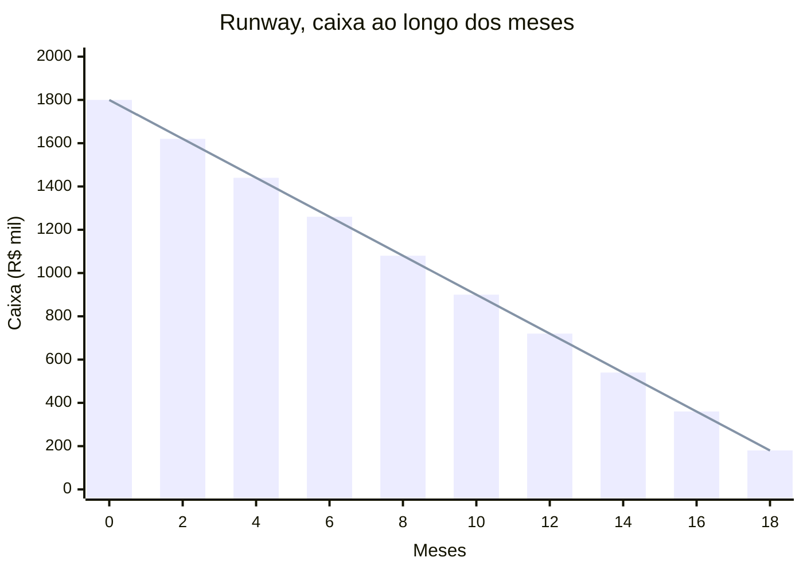

## APÊNDICE — ÍNDICE REMISSIVO

Índice alfabético curado dos tópicos mais buscados, apontando para o local canônico onde cada um é tratado em profundidade. Não exaustivo, foca em 150 termos essenciais. Use em complemento ao Sumário (que dá a estrutura completa) e ao Glossário (que dá definições).

### A
- **AARRR (Pirate Metrics)**: BG.12.1, aplicação em [[#FASE 14 — ESCALA: TIME, OPERAÇÕES, CRESCIMENTO E CAPITAL|Fase 14]]
- **A/B Testing rigoroso**: BG.8.4
- **Acordo de sócios**: [[#FASE 0 — PREPARAÇÃO DO EMPREENDEDOR|Fase 0]] (Escolha de sócios), [[#FASE 13 — ESTRUTURAÇÃO JURÍDICA, FINANCEIRA E OPERACIONAL|Fase 13]], [[#APÊNDICE AH — CONTRATOS E ASPECTOS LEGAIS OPERACIONAIS|Apêndice AH]]
- **Aquisição (estratégia)**: [[#FASE 16 — EXIT STRATEGY|Fase 16]] (Exit), [[#APÊNDICE CL — PIVOT: TIPOLOGIA, DECISÃO E EXECUÇÃO|Apêndice CL]]
- **Anti-dilution clauses**: [[#FASE 13 — ESTRUTURAÇÃO JURÍDICA, FINANCEIRA E OPERACIONAL|Fase 13]], [[#APÊNDICE V — CAPTAÇÃO DE EQUITY, PITCH E RELACIONAMENTO COM INVESTIDORES|Apêndice V]]
- **Assumption Mapping**: BG.9.8
- **ARR / MRR**: [[#FASE 11 — VALIDAÇÃO DO MODELO DE NEGÓCIO|Fase 11]], [[#FASE 12 — PRODUCT-MARKET FIT|[[#FASE 1 — ENCONTRAR A IDEIA|Fase 1]]2]], BG.18.1
- **Autoestima do fundador**: [[#FASE 0 — PREPARAÇÃO DO EMPREENDEDOR|Fase 0]], [[#APÊNDICE Y — SAÚDE MENTAL, DINÂMICA DE CO-FOUNDERS E HUMANIDADE DO FUNDADOR|Apêndice Y]]

### B
- **BANT (Budget-Authority-Need-Timeline)**: BG.14.1
- **Blitzscaling**: BG.12.5, quando usar vs não usar [[#FASE 14 — ESCALA: TIME, OPERAÇÕES, CRESCIMENTO E CAPITAL|Fase 14]]
- **Blue Ocean Strategy**: BG.1.8
- **Board (composição, governança)**: [[#FASE 13 — ESTRUTURAÇÃO JURÍDICA, FINANCEIRA E OPERACIONAL|Fase 13]], [[#APÊNDICE CF — PLANEJAMENTO DE RODADA COMO PROCESSO: FUNDRAISING COMO PROJETO ESTRUTURADO|Apêndice CF]]
- **Bootstrap vs VC**: Apêndice dedicado (Parte II). [[#FASE 13 — ESTRUTURAÇÃO JURÍDICA, FINANCEIRA E OPERACIONAL|Fase 13]]
- **Burn Multiple**: BG.18.4
- **Business Model Canvas (BMC)**: BG.2.9, template preenchido A.20 (Nubank)

### C
- **CAC (Customer Acquisition Cost)**: BG.18, [[#FASE 12 — PRODUCT-MARKET FIT|Fase 12]], [[#APÊNDICE AN — MODELAGEM FINANCEIRA OPERACIONAL|Apêndice AN]]
- **Canvas (vários)**: BMC BG.2.9. Lean Canvas BG.2.10. VPC BG.10.10
- **Cap Table**: [[#FASE 13 — ESTRUTURAÇÃO JURÍDICA, FINANCEIRA E OPERACIONAL|Fase 13]], [[#APÊNDICE CF — PLANEJAMENTO DE RODADA COMO PROCESSO: FUNDRAISING COMO PROJETO ESTRUTURADO|Apêndice CF]]
- **Captação (processo completo)**: [[#APÊNDICE V — CAPTAÇÃO DE EQUITY, PITCH E RELACIONAMENTO COM INVESTIDORES|Apêndice V]]
- **Churn**: [[#FASE 12 — PRODUCT-MARKET FIT|Fase 12]], [[#APÊNDICE AA — CUSTOMER SUCCESS COMO DISCIPLINA|Apêndice AA]]
- **Cofundador matching**: [[#FASE 0 — PREPARAÇÃO DO EMPREENDEDOR|Fase 0]] (Encontrar co-fundador)
- **Cold Start Problem**: BG.12.10
- **Comunicação pública do fundador**: [[#APÊNDICE BM — COMUNICAÇÃO PÚBLICA DO FUNDADOR: NARRATIVA, IMPRENSA E PORTA-VOZ|Apêndice BM]]. Apêndice Marca Pessoal
- **Consultoria (como serviço ou modelo)**: [[#FASE 2B — CONSTRUÇÃO DA TEORIA DO NEGÓCIO|Fase 2B]]. [[#APÊNDICE CC — PLATAFORMA VS PRODUTO: QUANDO CONSTRUIR PLATAFORMA E QUANDO NÃO|Apêndice CC]]
- **Contabilidade inicial**: [[#FASE 13 — ESTRUTURAÇÃO JURÍDICA, FINANCEIRA E OPERACIONAL|Fase 13]], [[#APÊNDICE W — CONTABILIDADE, TRIBUTÁRIO E REGIMES FISCAIS PARA STARTUP BRASILEIRA|Apêndice W]]
- **Contratação (primeiros funcionários)**: [[#FASE 14 — ESCALA: TIME, OPERAÇÕES, CRESCIMENTO E CAPITAL|Fase 14]], BG.17.5, Apêndice K
- **Contratos (frameworks)**: [[#APÊNDICE AH — CONTRATOS E ASPECTOS LEGAIS OPERACIONAIS|Apêndice AH]]
- **Crise (gestão de)**: [[#APÊNDICE CM — BIOTECH E HEALTHTECH: PLAYBOOK DE REGULAÇÃO, ENSAIOS E CAPITAL|Apêndice CM]]
- **Cultura organizacional**: Apêndice BD. BG.17.9
- **Customer Development**: BG.10.12
- **Customer Discovery**: [[#FASE 4 — PESQUISA COM USUÁRIOS (CUSTOMER DISCOVERY APROFUNDADO)|Fase 4]]
- **Customer Journey Map**: BG.9.6, exemplo A.24

### D
- **Data (compilação do livro)**: Apêndice sobre Envelhecimento (abril 2026)
- **DCF (Discounted Cash Flow)**: BG.18.9
- **Decisão (frameworks)**: BG.4, BG.5
- **Demissão**: [[#FASE 14 — ESCALA: TIME, OPERAÇÕES, CRESCIMENTO E CAPITAL|Fase 14]] (seção Demitir bem), [[#APÊNDICE CB — SUBSCRIPTION ECONOMY EM PROFUNDIDADE: ALÉM DO "COBRA MENSALMENTE"|Apêndice CB]]
- **Descoberta contínua (Continuous Discovery)**: BG.10.1. [[#APÊNDICE H — TRL E CRL: MATURIDADE TECNOLÓGICA E DE MERCADO|Apêndice H]]
- **Design Sprint**: BG.10.3
- **Design Thinking**: BG.10.5
- **Disciplinas éticas / ESG**: Apêndice sobre Impacto e Ética
- **DORA Metrics**: BG.16.8
- **Due diligence (como alvo)**: [[#APÊNDICE V — CAPTAÇÃO DE EQUITY, PITCH E RELACIONAMENTO COM INVESTIDORES|Apêndice V]]

### E
- **Effectuation**: BG.2.11
- **Empathy Map**: BG.9.5
- **Encerramento voluntário (shutdown)**: [[#FASE 16 — EXIT STRATEGY|Fase 16]] (seção dedicada)
- **Entrevista de usuário (Mom Test)**: BG.6.1. [[#FASE 4 — PESQUISA COM USUÁRIOS (CUSTOMER DISCOVERY APROFUNDADO)|Fase 4]]
- **EOR (Employer of Record)**: [[#APÊNDICE CU — INTERNACIONALIZAÇÃO: ESTRUTURA E PRODUTO PARA MÚLTIPLOS MERCADOS|Apêndice CU]]
- **Equity (divisão inicial)**: [[#FASE 0 — PREPARAÇÃO DO EMPREENDEDOR|Fase 0]], [[#FASE 13 — ESTRUTURAÇÃO JURÍDICA, FINANCEIRA E OPERACIONAL|Fase 13]]
- **Escala (Parte IV da jornada)**: [[#FASE 14 — ESCALA: TIME, OPERAÇÕES, CRESCIMENTO E CAPITAL|Fase 14]] inteira
- **Escolha de investidor**: [[#APÊNDICE V — CAPTAÇÃO DE EQUITY, PITCH E RELACIONAMENTO COM INVESTIDORES|Apêndice V]] (seção dedicada)
- **Ética empreendedora**: Apêndice sobre Ética e Impacto
- **Exit (estratégias)**: [[#FASE 16 — EXIT STRATEGY|Fase 16]]
- **Experimentos controlados**: [[#FASE 7 — EXPERIMENTOS DE VALIDAÇÃO DO PROBLEMA|Fase 7]], BG.8.4

### F
- **Fail-fast / pivotar / matar**: Apêndice Pivot
- **Financeiro (modelagem)**: [[#APÊNDICE AN — MODELAGEM FINANCEIRA OPERACIONAL|Apêndice AN]], BG.18
- **First Principles Thinking**: BG.4.1
- **Fiscal (tributário BR)**: [[#APÊNDICE W — CONTABILIDADE, TRIBUTÁRIO E REGIMES FISCAIS PARA STARTUP BRASILEIRA|Apêndice W]]
- **FMEA (análise de risco)**: BG.5.10
- **Framework de decisão (geral)**: BG.5.5 (DACI/RACI)
- **Fundraising**: [[#APÊNDICE V — CAPTAÇÃO DE EQUITY, PITCH E RELACIONAMENTO COM INVESTIDORES|Apêndice V]], [[#APÊNDICE CF — PLANEJAMENTO DE RODADA COMO PROCESSO: FUNDRAISING COMO PROJETO ESTRUTURADO|Apêndice CF]], [[#APÊNDICE CE — VALUATION METHODS: COMO INVESTIDORES CALCULAM E COMO VOCÊ CALCULA PARA NEGOCIAR|Apêndice CE]]

### G
- **Gestão de tempo do fundador**: [[#FASE 0 — PREPARAÇÃO DO EMPREENDEDOR|Fase 0]], [[#FASE 14 — ESCALA: TIME, OPERAÇÕES, CRESCIMENTO E CAPITAL|Fase 14]]
- **Governança (board, shareholders)**: [[#FASE 13 — ESTRUTURAÇÃO JURÍDICA, FINANCEIRA E OPERACIONAL|Fase 13]], [[#APÊNDICE CF — PLANEJAMENTO DE RODADA COMO PROCESSO: FUNDRAISING COMO PROJETO ESTRUTURADO|Apêndice CF]]
- **Growth (função e práticas)**: [[#APÊNDICE CG — GROWTH COMO FUNÇÃO ORGANIZACIONAL: TIME DE GROWTH, BUILD VS HIRE, RELAÇÃO COM PRODUTO|Apêndice CG]]. BG.12
- **Growth Loops**: BG.12.2

### H
- **Hipóteses (formulação)**: [[#FASE 6 — FORMULAÇÃO RIGOROSA DE HIPÓTESES|Fase 6]]
- **Hiring (primeiros líderes)**: [[#FASE 14 — ESCALA: TIME, OPERAÇÕES, CRESCIMENTO E CAPITAL|Fase 14]], Apêndice K
- **Hoshin Kanri**: BG.3.1

### I
- **IA / IA como acelerador**: [[#APÊNDICE I — IA GENERATIVA COMO ACELERADOR DO EMPREENDEDOR (2026)|Apêndice I]]
- **Ideias (como encontrar)**: [[#FASE 1 — ENCONTRAR A IDEIA|Fase 1]]
- **Impacto (negócio de impacto social)**: Apêndice dedicado
- **Indicadores (KPIs por fase)**: cada fase tem seção própria
- **Internacionalização**: [[#APÊNDICE CU — INTERNACIONALIZAÇÃO: ESTRUTURA E PRODUTO PARA MÚLTIPLOS MERCADOS|Apêndice CU]]
- **Investidores (tipos, critérios)**: [[#APÊNDICE V — CAPTAÇÃO DE EQUITY, PITCH E RELACIONAMENTO COM INVESTIDORES|Apêndice V]]
- **Ishikawa Diagram**: BG.5.8

### J
- **Jobs to Be Done (JTBD)**: BG.11.1. JTBD Switch BG.6.2. ODI BG.11.8
- **Jurídico (estruturação)**: [[#FASE 13 — ESTRUTURAÇÃO JURÍDICA, FINANCEIRA E OPERACIONAL|Fase 13]], [[#APÊNDICE AH — CONTRATOS E ASPECTOS LEGAIS OPERACIONAIS|Apêndice AH]]

### K
- **Kano Model**: BG.11.2

### L
- **Launch (playbook de lançamento)**: [[#FASE 10 — MVP E EXPERIMENTOS DE MERCADO|Fase 10]] (seção dedicada)
- **Lean Canvas**: BG.2.10, template preenchido A.21 (QuintoAndar)
- **Lean Startup (BML Loop)**: BG.10.13
- **LGPD (proteção de dados)**: [[#APÊNDICE CV — SEGURANÇA DA INFORMAÇÃO: DA CERTIFICAÇÃO À ENGENHARIA|Apêndice CV]], vários
- **Liderança**: BG.17 inteiro
- **Liquidation preference**: [[#FASE 13 — ESTRUTURAÇÃO JURÍDICA, FINANCEIRA E OPERACIONAL|Fase 13]], [[#APÊNDICE V — CAPTAÇÃO DE EQUITY, PITCH E RELACIONAMENTO COM INVESTIDORES|Apêndice V]]

### M
- **Marca pessoal do fundador**: Apêndice dedicado
- **Marketplace / efeitos de rede**: BG.12.10 (Cold Start). [[#APÊNDICE CG — GROWTH COMO FUNÇÃO ORGANIZACIONAL: TIME DE GROWTH, BUILD VS HIRE, RELAÇÃO COM PRODUTO|Apêndice CG]]
- **MEDDIC / MEDDPICC**: BG.14.5
- **Mercado (mapeamento)**: [[#FASE 5 — MAPEAMENTO DE MERCADO E CONCORRÊNCIA|Fase 5]]
- **Mom Test**: BG.6.1
- **MVP**: [[#FASE 10 — MVP E EXPERIMENTOS DE MERCADO|Fase 10]] inteira
- **Mulheres fundadoras (casos)**: Apêndice de Diversidade e casos dispersos

### N
- **Negociação (frameworks)**: BG.15 inteiro
- **Never Split the Difference**: BG.15.2
- **North Star Framework**: BG.11.5
- **NPS**: BG.8.5

### O
- **OKRs**: BG.16.1, template A.26
- **Open Innovation**: BG.19.3
- **Operação (primeiros processos)**: [[#FASE 14 — ESCALA: TIME, OPERAÇÕES, CRESCIMENTO E CAPITAL|Fase 14]], [[#APÊNDICE BF — SECOND-TIME FOUNDER|Apêndice BF]] (ops de precisão)
- **Opportunity Solution Tree**: BG.10.2, diagrama A.23
- **Outcome-Driven Innovation (ODI)**: BG.11.8

### P
- **Pareto Analysis**: BG.5.9
- **Parcerias estratégicas**: [[#FASE 14 — ESCALA: TIME, OPERAÇÕES, CRESCIMENTO E CAPITAL|Fase 14]], [[#APÊNDICE CX — CANAIS INDIRETOS E PARCERIAS: PARCERIAS, FRANQUIAS, CHANNEL|Apêndice CX]]
- **Personas**: BG.9.4
- **Pivot**: Apêndice Pivot (tipologia, decisão, execução)
- **PMF (Product-Market Fit)**: [[#FASE 12 — PRODUCT-MARKET FIT|Fase 12]]
- **Positioning**: BG.13.1, BG.13.2 (Dunford)
- **Pré-PMF (navegação)**: Fases 10-11
- **Prestação de contas (board)**: [[#APÊNDICE CF — PLANEJAMENTO DE RODADA COMO PROCESSO: FUNDRAISING COMO PROJETO ESTRUTURADO|Apêndice CF]]
- **Pretotyping**: BG.10.11
- **Pricing**: [[#FASE 11 — VALIDAÇÃO DO MODELO DE NEGÓCIO|Fase 11]], [[#APÊNDICE AN — MODELAGEM FINANCEIRA OPERACIONAL|Apêndice AN]]
- **Priorização (RICE, ICE)**: BG.11.3, BG.11.4
- **Processo de produto**: BG.10. [[#APÊNDICE AB — PRODUTO EM ESCALA E DESCOBERTA CONTÍNUA|Apêndice AB]]
- **Proposta de valor**: BG.10.10 (VPC). [[#FASE 3 — DESCOBERTA DO PROBLEMA|Fase 3]], [[#FASE 6 — FORMULAÇÃO RIGOROSA DE HIPÓTESES|Fase 6]]

### Q
- **Qualidade (processos de)**: BG.5.8-5.10 (Ishikawa, Pareto, FMEA)

### R
- **RACI / DACI / RAPID**: BG.5.5
- **Radical Candor**: BG.17.1
- **Recrutamento**: [[#FASE 14 — ESCALA: TIME, OPERAÇÕES, CRESCIMENTO E CAPITAL|Fase 14]], BG.17.5, Apêndice K
- **Red flags (investidores, sócios, contratações)**: várias fases
- **Referências (como pedir a candidatos)**: [[#FASE 14 — ESCALA: TIME, OPERAÇÕES, CRESCIMENTO E CAPITAL|Fase 14]], BG.17.5
- **Relatório financeiro**: [[#APÊNDICE AN — MODELAGEM FINANCEIRA OPERACIONAL|Apêndice AN]]
- **Retention Analysis**: [[#FASE 12 — PRODUCT-MARKET FIT|Fase 12]], BG.18.2
- **RICE Scoring**: BG.11.3
- **Runway (pessoal e empresa)**: [[#FASE 0 — PREPARAÇÃO DO EMPREENDEDOR|Fase 0]], [[#FASE 11 — VALIDAÇÃO DO MODELO DE NEGÓCIO|[[#FASE 1 — ENCONTRAR A IDEIA|Fase 1]]1]], [[#APÊNDICE AN — MODELAGEM FINANCEIRA OPERACIONAL|Apêndice AN]]

### S
- **SaaS (métricas específicas)**: BG.18 inteiro
- **SAFE (Simple Agreement for Future Equity)**: [[#APÊNDICE V — CAPTAÇÃO DE EQUITY, PITCH E RELACIONAMENTO COM INVESTIDORES|Apêndice V]]
- **Saúde mental do fundador**: [[#APÊNDICE Y — SAÚDE MENTAL, DINÂMICA DE CO-FOUNDERS E HUMANIDADE DO FUNDADOR|Apêndice Y]] inteiro
- **Scaling Up (Rockefeller Habits)**: BG.16.4
- **Segunda curva (reinvenção)**: [[#FASE 15 — REINVENÇÃO E SEGUNDA CURVA|Fase 15]]. BG.19
- **Series A, B, C (captações)**: [[#APÊNDICE V — CAPTAÇÃO DE EQUITY, PITCH E RELACIONAMENTO COM INVESTIDORES|Apêndice V]]
- **Shutdown voluntário**: [[#FASE 16 — EXIT STRATEGY|Fase 16]] (seção dedicada)
- **SIPOC**: BG.16.12
- **Sócios (escolha, conflitos, divórcio)**: [[#FASE 0 — PREPARAÇÃO DO EMPREENDEDOR|Fase 0]], [[#FASE 13 — ESTRUTURAÇÃO JURÍDICA, FINANCEIRA E OPERACIONAL|Fase 13]], [[#APÊNDICE Y — SAÚDE MENTAL, DINÂMICA DE CO-FOUNDERS E HUMANIDADE DO FUNDADOR|Apêndice Y]]
- **Spotify Model**: BG.17.13
- **Story Mapping**: BG.11.7, exemplo A.25
- **SWOT / TOWS**: BG.1.2

### T
- **TAM / SAM / SOM**: [[#FASE 5 — MAPEAMENTO DE MERCADO E CONCORRÊNCIA|Fase 5]]
- **Taxas (tributárias BR)**: [[#APÊNDICE W — CONTABILIDADE, TRIBUTÁRIO E REGIMES FISCAIS PARA STARTUP BRASILEIRA|Apêndice W]]
- **Time (primeiros líderes, C-level)**: [[#FASE 14 — ESCALA: TIME, OPERAÇÕES, CRESCIMENTO E CAPITAL|Fase 14]], Apêndice K
- **Tipos de empresa (ME, EPP, LTDA, SA)**: [[#FASE 13 — ESTRUTURAÇÃO JURÍDICA, FINANCEIRA E OPERACIONAL|Fase 13]], [[#APÊNDICE W — CONTABILIDADE, TRIBUTÁRIO E REGIMES FISCAIS PARA STARTUP BRASILEIRA|Apêndice W]]
- **Tributos**: [[#APÊNDICE W — CONTABILIDADE, TRIBUTÁRIO E REGIMES FISCAIS PARA STARTUP BRASILEIRA|Apêndice W]]

### U
- **Unit economics**: BG.18.1. [[#FASE 11 — VALIDAÇÃO DO MODELO DE NEGÓCIO|Fase 11]]
- **Usabilidade (testes)**: BG.7.1. [[#FASE 9 — TESTES DE SOLUÇÃO E USABILIDADE|Fase 9]]
- **UX Research**: BG.7 inteiro

### V
- **Validação de problema**: [[#FASE 7 — EXPERIMENTOS DE VALIDAÇÃO DO PROBLEMA|Fase 7]]
- **Valuation**: BG.18.9, BG.18.10. [[#APÊNDICE V — CAPTAÇÃO DE EQUITY, PITCH E RELACIONAMENTO COM INVESTIDORES|Apêndice V]]
- **Value Proposition Canvas (VPC)**: BG.10.10, template A.22 (Wellhub)
- **Venture Capital**: [[#APÊNDICE V — CAPTAÇÃO DE EQUITY, PITCH E RELACIONAMENTO COM INVESTIDORES|Apêndice V]]. Apêndice Bootstrap vs VC
- **Vesting**: [[#FASE 0 — PREPARAÇÃO DO EMPREENDEDOR|Fase 0]], [[#FASE 13 — ESTRUTURAÇÃO JURÍDICA, FINANCEIRA E OPERACIONAL|Fase 13]]
- **V2MOM**: BG.16.2

### W
- **Wardley Mapping**: BG.2.5
- **Wedge (wedge theory)**: [[#FASE 1 — ENCONTRAR A IDEIA|Fase 1]], [[#FASE 5 — MAPEAMENTO DE MERCADO E CONCORRÊNCIA|Fase 5]]
- **Working Backwards (Amazon PR-FAQ)**: BG.10.6

### Y
- **YC (Y Combinator) matching e filosofia**: [[#FASE 0 — PREPARAÇÃO DO EMPREENDEDOR|Fase 0]], referências dispersas

---

## GLOSSÁRIO

Termos técnicos usados recorrentemente neste manual, agrupados por tema. Quando um termo aparece pela primeira vez em uma fase, ele é brevemente definido no contexto, aqui está a referência canônica.

### Termos de produto e descoberta

**Cunha (Wedge):** segmento inicial, específico e defensável, escolhido como ponto de ataque ao mercado, a "entrada estreita" pela qual a empresa começa antes de expandir. Ver [[#APÊNDICE L — IDEA → WEDGE → SCALE: O FRAMEWORK ANTLER COMO LENTE TRANSVERSAL|Apêndice L]] e [[#FASE 5 — MAPEAMENTO DE MERCADO E CONCORRÊNCIA|Fase 5]].

**Hipótese falsificável:** afirmação formulada em termos testáveis (SE X, ENTÃO Y, MENSURADO POR Z), cujo teste pode invalidá-la. Ver [[#FASE 6 — FORMULAÇÃO RIGOROSA DE HIPÓTESES|Fase 6]] e [[#APÊNDICE A — TEMPLATES PRONTOS PARA USO|Apêndice A]].3.

**ICP (Ideal Customer Profile):** descrição específica e operacional do tipo de cliente que a empresa serve, não demografia abstrata, mas perfil observável e identificável por nomes reais.

**JTBD (Jobs To Be Done):** abordagem que entende o uso de produto como "contratação" para realizar um trabalho específico (funcional, emocional, social) no contexto do usuário. Ver [[#FASE 4 — PESQUISA COM USUÁRIOS (CUSTOMER DISCOVERY APROFUNDADO)|Fase 4]].

**MVP (Minimum Viable Product):** primeira versão funcional de um produto, concebida com escopo mínimo suficiente para testar uma hipótese central. Ver [[#FASE 10 — MVP E EXPERIMENTOS DE MERCADO|Fase 10]] e [[#APÊNDICE A — TEMPLATES PRONTOS PARA USO|Apêndice A]].6.

**Persona:** representação fictícia mas baseada em dados reais de um segmento de usuário, com contexto, comportamento, motivações. Ver [[#APÊNDICE A — TEMPLATES PRONTOS PARA USO|Apêndice A]].5.

**Pivot / Pivotagem:** mudança deliberada de direção em resposta a aprendizado, pode ser de segmento, produto, canal, modelo de negócio.

**PMF (Product-Market Fit):** estado em que o produto é desejado pelo mercado de forma que o uso cresce organicamente, a retenção se estabiliza em patamar alto, e o churn é baixo. Ver [[#FASE 12 — PRODUCT-MARKET FIT|Fase 12]].

### Termos de economia e finanças do negócio

**ARR (Annual Recurring Revenue):** receita recorrente anualizada, soma de toda receita contratada em base recorrente projetada para 12 meses.

**Burn rate:** velocidade mensal com que a empresa consome caixa, geralmente medida em R$/mês. "Gross burn" é despesa total, "net burn" é despesa menos receita.

**CAC (Customer Acquisition Cost):** custo para adquirir um novo cliente, inclui marketing pago, comissões de vendas, tempo de sales com atribuição.

**Cap table:** tabela que documenta a composição societária (quem detém quanto), incluindo investidores, founders, e pool de ESOP.

**EBITDA:** lucros antes de juros, impostos, depreciação e amortização, proxy para geração de caixa operacional.

**Gross Margin (Margem Bruta):** (Receita - Custo para servir) / Receita. Em SaaS B2B saudável, ≥ 70%.

**LTV (Lifetime Value):** receita total (ou margem) esperada de um cliente ao longo de sua relação com a empresa. LTV = Margem unitária × Vida média do cliente.

**LTV:CAC:** razão entre LTV e CAC, indicador crítico de saúde de unit economics. Alvo: ≥ 3:1, forte: ≥ 5:1.

**MRR (Monthly Recurring Revenue):** receita recorrente mensal, base para cálculo de ARR (MRR × 12) e análise de crescimento.

**NRR (Net Revenue Retention):** receita mantida + expandida na base atual versus 12 meses atrás, expresso em %. Alvo em SaaS: ≥ 110%. PLG maduro: ≥ 120%.

**GRR (Gross Revenue Retention):** receita retida sem considerar expansão. Complementa NRR para distinguir retenção pura de expansão.

**Payback de CAC:** tempo (em meses) para recuperar o CAC via margem de contribuição mensal. Alvo: ≤ 18 meses. SaaS saudável: 12-15.

**Runway:** tempo (em meses) que a empresa consegue operar com o caixa atual no burn atual

**Visualização de runway, o gráfico que você deveria olhar toda semana:**

> [!note] Compatibilidade — requer Mermaid 10+ (Obsidian 1.4+)

*Exemplo: caixa inicial R$ 1,8M, burn R$ 90k/mês → runway 20 meses. Regras operacionais:*
- *≤ 12 meses: começar captação imediatamente (captar leva 3-9 meses).*
- *≤ 6 meses: ou contrato novo assinado ou bridge em closing, não há mais tempo.*
- *≤ 3 meses: modo sobrevivência (cortar tudo o que puder, board aprova).*
- *Negativo: já morreu, não sabe ainda.*

*Não apenas o saldo: também monitore **burn trajectory**, está crescendo? Estável? Receita compensando? Runway é função de duas variáveis (caixa e burn), e ambas se movem.*

**Runway:** meses que o caixa atual cobre no ritmo de burn vigente, sem nova receita. Alvo: ≥ 12 meses, alerta: < 6.

**TAM/SAM/SOM:** Total Addressable Market (mercado total global), Serviceable Addressable Market (endereçável pela empresa), Serviceable Obtainable Market (obtenível realisticamente em 3 anos).

**Ticket médio (ACV, Average Contract Value):** receita média contratada por cliente anualmente.

**Unit Economics:** economia por unidade (cliente, transação, pedido), LTV, CAC, margem, payback. É a base para avaliar se o modelo escala com viabilidade.

### Métricas de produto e uso

**Activation (Ativação):** ação (ou conjunto) que marca quando um usuário novo obteve valor inicial e está propenso a continuar. Varia por produto.

**Churn:** taxa de perda de clientes em um período (mensal geralmente). Churn de 5% a.m. significa perda de 5% da base a cada mês.

**Coorte:** grupo de usuários que entraram em período específico (ex.: "coorte de janeiro"), analisado ao longo do tempo para medir retenção.

**NPS (Net Promoter Score):** indicador de satisfação baseado na pergunta "em uma escala de 0-10, quanto recomendaria?". NPS = % Promotores (9-10) - % Detratores (0-6). Alvo: ≥ 40.

**North Star Metric:** métrica única que melhor expressa o valor entregue pela empresa, foco organizacional.

**Retention (Retenção):** % de usuários que continuam ativos após um tempo desde entrada. Análise por coorte é padrão.

**TTV (Time to Value):** tempo entre primeiro uso e primeiro valor obtido pelo usuário. Em PLG: minutos é alvo, dias é aceitável, semanas é problema.

### Termos de vendas

**Champion:** pessoa dentro da empresa-cliente que defende internamente a compra do produto. Sem champion identificado, deals complexos tendem a morrer.

**Discovery:** primeira fase de venda B2B onde o vendedor investiga dor, contexto, critério de decisão do cliente, sem pitch.

**Funil (Pipeline):** representação das deals em andamento em estágios (lead → qualificado → proposta → negociação → fechado).

**MEDDIC:** framework de qualificação de vendas enterprise, Metrics, Economic buyer, Decision criteria, Decision process, Identify pain, Champion. Ver [[#APÊNDICE CP — SALES: MOTION COMPLETA, DO OUTBOUND AO RENEWAL|Apêndice CP]].

**MQL (Marketing Qualified Lead):** lead qualificado por critério de marketing (ex.: baixou material, atingiu score de engajamento).

**Outbound:** aquisição ativa, iniciada pela empresa (cold call, cold e-mail, LinkedIn outreach). Oposto de Inbound (onde o cliente vem).

**PQL (Product Qualified Lead):** lead qualificado pelo comportamento no próprio produto (ex.: atingiu limite gratuito, convidou múltiplos usuários). Padrão em PLG.

**SQL (Sales Qualified Lead):** lead qualificado por critérios de vendas (BANT ou MEDDIC), pronto para avançar no funil.

**Win Rate:** % de deals qualificados que são fechados.

### Marketing e crescimento

**AARRR (Pirate Metrics):** framework de Dave McClure, Aquisição, Ativação, Retenção, Referência, Receita. Estrutura do funil completo.

**Branded Search:** volume de buscas pelo nome da empresa, indicador de marca viva.

**CAC por canal:** CAC segmentado por fonte de aquisição, varia significativamente entre canais e ao longo do tempo.

**CPA (Cost Per Acquisition):** custo para obter uma ação específica (conversão), geralmente em tráfego pago.

**CTR (Click-Through Rate):** taxa de clique, % de impressões que resultam em clique.

**Direct Traffic:** tráfego web que vem por URL direta (sem referrer). Indicador de marca conhecida.

**PLG (Product-Led Growth):** estratégia em que o próprio produto é motor de aquisição, ativação, retenção e expansão, com mínimo envolvimento humano. Ver expansão no [[#APÊNDICE J — FRAMEWORK DE CANAIS DE AQUISIÇÃO|Apêndice J]].

**PLS (Product-Led Sales):** híbrido, PLG na entrada + camada de sales para expansão enterprise.

**Share of Voice (SOV):** % de menções sobre a marca no setor / total de menções do setor. Indicador de presença de marca.

**Viralidade / K-factor:** taxa com que usuários trazem novos usuários. K > 1 = crescimento viral autossustentado (raro).

### Financiamento e investimento

**Bootstrapping:** crescer o negócio sem capital externo, usando receita orgânica e caixa próprio.

**Diluição:** redução percentual da participação dos sócios atuais quando novo capital é emitido.

**Equity:** participação acionária na empresa, capital "diluitivo" (gera diluição).

**Grant:** recurso não-reembolsável obtido via edital (ex.: Finep, FAPESP, BNDES), não diluitivo, não dívida.

**Pre-money / Post-money:** valuation da empresa antes / depois da rodada. Post-money = Pre-money + novo capital.

**RBF (Revenue-Based Financing):** financiamento onde repayment é atrelado a % de receita até atingir múltiplo acordado.

**SAFE (Simple Agreement for Future Equity):** instrumento pré-rodada que converte em equity em futura captação, origem americana (YC).

**Seed / Série A / Série B / Série C:** etapas progressivas de captação equity. Seed: validação. Série A: escalar PMF. Série B: growth. Série C+: escala institucional.

**Term Sheet:** documento não-vinculante que resume condições principais de uma rodada (valuation, liquidation preference, vesting, board etc.).

**Valuation:** valor atribuído à empresa, base para calcular participação do investidor após rodada.

**Venture Debt:** dívida estruturada para startups, geralmente com warrants associados. Complementa equity, não substitui.

### Governança e proteção

**DPA (Data Processing Agreement):** contrato com operador (terceiro que trata dados pessoais em nome do controlador), exigido pela LGPD. Ver [[#APÊNDICE T — LGPD, COMPLIANCE E GOVERNANÇA DE DADOS|Apêndice T]].

**DPO (Data Protection Officer / Encarregado):** pessoa formalmente designada como responsável por LGPD, canal de contato público obrigatório. Ver [[#APÊNDICE T — LGPD, COMPLIANCE E GOVERNANÇA DE DADOS|Apêndice T]].

**LGPD:** Lei Geral de Proteção de Dados (Lei 13.709/2018), regula tratamento de dados pessoais no Brasil.

**RIPD (Relatório de Impacto à Proteção de Dados):** documento que descreve tratamentos de dados e avaliação de riscos, exigido em certas operações. Ver [[#APÊNDICE T — LGPD, COMPLIANCE E GOVERNANÇA DE DADOS|Apêndice T]].

### Gestão e cultura

**1:1:** reunião recorrente (geralmente semanal) entre líder e liderado, com agenda focada em desenvolvimento, feedback, carreira.

**Founder Mode:** modo operacional em que o fundador atua diretamente em áreas críticas, não só estratégicas, em oposição a "Manager Mode" puro. Ver [[#APÊNDICE R — FOUNDER MODE, DELEGAÇÃO E QUANDO PARAR DE FAZER|Apêndice R]].

**KPI (Key Performance Indicator):** indicador-chave de desempenho, métrica que mede progresso em relação a objetivo.

**Manager Mode:** operar via hierarquia delegada formalmente, padrão clássico de gestão corporativa.

**OKR (Objectives and Key Results):** framework de planejamento, objetivo qualitativo + 2-4 key results mensuráveis. Ciclos trimestrais padrão.

**Skip-level:** reunião entre líder sênior e colaborador direto do liderado deste (pulando 1 nível). Função: ouvir sem filtro hierárquico.

### Estratégia e defensabilidade

**Category Design:** disciplina de nomear, definir e reivindicar uma categoria nova, em oposição a competir em categoria existente. Ver [[#APÊNDICE S — CATEGORY DESIGN|Apêndice S]].

**Moat:** vantagem competitiva estrutural que protege de concorrência (network effects, switching costs, escala, propriedade intelectual, marca).

**Network Effects:** efeito em que valor do produto aumenta à medida que mais usuários se juntam à rede.

**POV (Point of View):** declaração da visão de mundo que sustenta a existência de uma categoria, pilar 1 do Category Design.

**Switching Costs:** custos (financeiros, operacionais, cognitivos) que um cliente incorre para trocar para um concorrente.

*Fim do manual.*

*Para comentar, corrigir ou contribuir com este material, entre em contato via canais do autor.*

---
