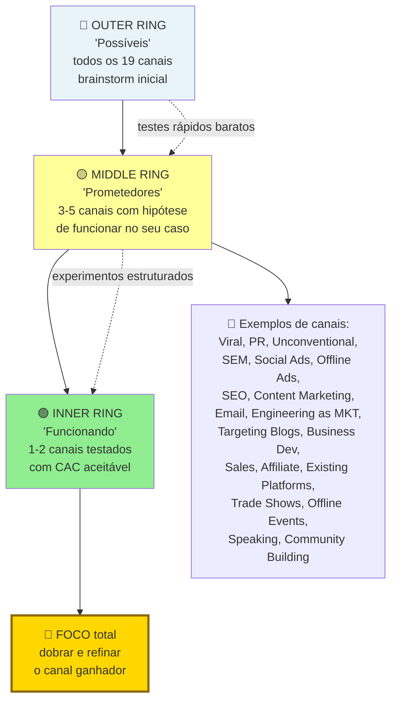
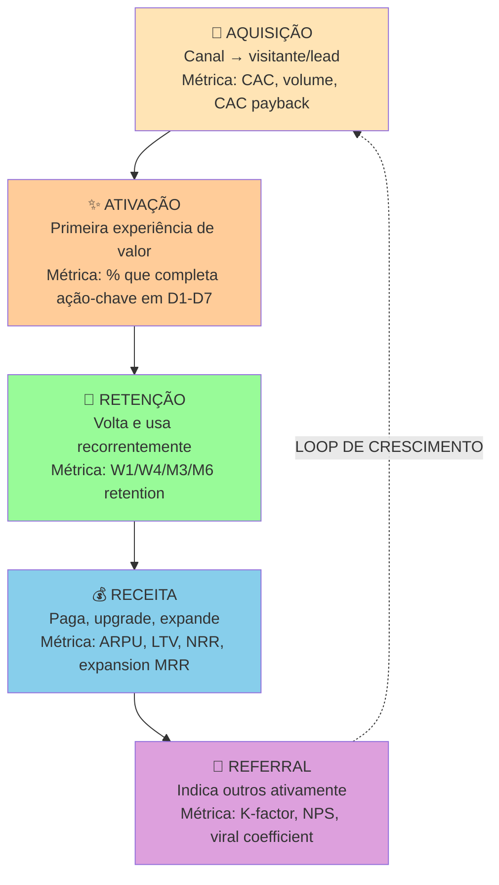

## APÊNDICE J — FRAMEWORK DE CANAIS DE AQUISIÇÃO

Essa lacuna aparece principalmente nas Fases 9, 10, e 11. E é frequentemente o ponto onde empreendedores com produto bom falham comercialmente. Construir produto é tecnicamente desafiador. Achar canal repetível de aquisição é onde a maioria quebra. Esse apêndice fornece o framework.

### Princípio central, canal é pesquisa. Não palpite

A maioria dos fundadores iniciantes testa um a dois canais favoritos (tipicamente Google Ads, Facebook Ads, ou LinkedIn orgânico). Não consegue resultado. E conclui que "marketing não funciona para o meu negócio". A verdade é que eles testaram apenas dez a quinze por cento do espaço possível. O framework a seguir obriga a considerar o espaço inteiro antes de focar.

### Os 19 Canais de Tração (Weinberg & Mares, framework "Bullseye")

1. Viral marketing. Convidar traz mais usuários (por exemplo, Dropbox, e WhatsApp).
2. Relações públicas (PR). Mídia tradicional.
3. PR não-convencional. Stunts, guerrilha, e campanhas memoráveis.
4. Marketing em buscadores (SEM). Google Ads, e Bing Ads.
5. Anúncios em redes sociais. Facebook, Instagram, TikTok, e LinkedIn.
6. Anúncios offline. Rádio, TV, outdoor, e revista.
7. Otimização para buscadores (SEO). Tráfego orgânico em buscadores.
8. Content marketing. Blog, YouTube, podcasts, e newsletters.
9. Email marketing. Listas próprias, e nutrição de leads.
10. Engenharia como marketing. Ferramentas grátis que atraem leads (por exemplo, HubSpot Website Grader).
11. Blogs direcionados. Aparecer em blogs que o público já lê.
12. Desenvolvimento de negócios (BizDev). Parcerias estratégicas.
13. Vendas diretas. Outbound B2B, cold outreach, e SDR.
14. Programas de afiliados. Terceiros vendem para você por comissão.
15. Plataformas existentes. App Stores, marketplaces de plugins, e extensões.
16. Feiras, e eventos. Networking presencial setorial.
17. Eventos offline próprios. Meetups, conferências, e hackathons.
18. Palestras (speaking engagements). Autoridade construída em palco.
19. Construção de comunidade. Comunidade que viraliza o produto (por exemplo, Notion, e Figma).

### Bullseye Framework, como escolher

**Bullseye visualizado. Teste outer, refine middle, foco no inner.**

> [!warning] Erro clássico de orçamento
> Distribuir orçamento em cinco canais simultaneamente "para ver qual funciona". Resultado. Nenhum canal recebe investimento suficiente para sair do ruído. Bullseye. Teste rápido (três a quatro semanas) em três a cinco canais. Escolha um a dois. Foque oitenta por cento do recurso lá.

O método Bullseye tem três anéis. Externo (todos os dezenove canais). Meio (top três candidatos). Interno (um canal vencedor).

**1. Fase de brainstorm.** Para cada um dos dezenove canais, anote uma hipótese concreta de como seria aplicá-lo ao seu negócio. Mesmo que pareça ruim. Exemplo. "Palestras. Posso apresentar em dois meetups do setor X por mês, atingindo cerca de cinquenta decisores por evento". Se a sua primeira reação é "esse canal não se aplica", force-se a elaborar um cenário. Muitos descobrem aplicações inesperadas nessa etapa.

**2. Fase de ranking.** Elimine canais claramente incompatíveis com o seu estágio, CAC, ou LTV (por exemplo, TV é inviável para startup seed B2B SaaS). Dos restantes, escolha os três mais promissores. Critérios. Alcance. O canal consegue tocar o volume de ICPs que você precisa? CAC estimado. Dado LTV que você tem evidência, cabe no canal? Velocidade de feedback. Quanto tempo até saber se está funcionando? Compatibilidade com produto. O canal é apropriado para esse tipo de solução? Diferencial versus concorrentes. Concorrentes saturam esse canal, ou ignoram?

**3. Fase de teste.** Escolha apenas um canal, e teste a sério por trinta a sessenta dias. Com investimento modesto, mas suficiente (tipicamente R$ 5 mil a R$ 20 mil para canais pagos, ou equivalente em horas para canais orgânicos). Meça rigorosamente.

**4. Fase de dobrada, ou pivô.** Se o canal escolhido atingir a métrica-alvo, invista pesado. Se não, teste o próximo do top três.

> [!important] Não teste três canais em paralelo no começo
> Você não tem banda para otimizar três coisas ao mesmo tempo.

### Distinção crítica, PLG versus Sales-led versus Hybrid

O motor primário de aquisição é escolhido por tipo de produto. Não por preferência do fundador.

| Modelo | Quando faz sentido | Canais tipicamente vencedores | Desafios |
|---|---|---|---|
| **Product-Led Growth (PLG)** | Produto de auto-serviço, ticket baixo/médio, adoção individual em B2C ou B2B. Valor perceptível em minutos. | Content/SEO + viral + comunidade + freemium. | Monetização demorada, conversão free → paid baixa, difícil escalar ACV. |
| **Sales-Led Growth (SLG)** | Ticket alto, venda B2B enterprise, ciclo longo, múltiplos decisores. | Vendas diretas (outbound + inbound) + PR + eventos + BizDev. | CAC alto, dependência de vendedores-estrela, lento de escalar. |
| **Hybrid (PLG + SLG)** | Produto auto-serviço no começo (bottom-up), sales fecha contratos enterprise (top-down). Ex.: Slack, Notion, Figma. | Todos os acima, coordenados. | Complexidade organizacional alta, exige time e dados maduros. |

> [!warning] Escolha o modelo que a natureza do produto exige
> Iniciantes com B2B enterprise frequentemente tentam PLG, e falham. Iniciantes com produto de consumo frequentemente contratam vendedor, e falham. Escolha o modelo que a natureza do seu produto exige. Não o que parece "mais moderno".

### Métricas AARRR (Pirate Metrics) por canal

Para cada canal testado, meça as cinco camadas.

1. Acquisition. Quantas pessoas entram (visitantes, leads, ou cliques)?
2. Activation. Quantas tomam a primeira ação significativa (sign-up, demo, ou trial start)?
3. Retention. Quantas voltam (DAU/MAU, retenção de trinta ou noventa dias)?
4. Revenue. Quantas pagam, e quanto (conversão, ARPU, ou ticket médio)?
5. Referral. Quantas indicam outras (taxa de indicação, ou viral coefficient K).

Um canal com alta aquisição, mas baixa ativação, está trazendo o público errado. Um com alta ativação, mas baixa retenção, está prometendo algo que o produto não entrega. Um com alta retenção, mas baixo revenue, está resolvendo problema grátis. A monetização está errada. As métricas AARRR te ajudam a diagnosticar *onde exatamente* o funil está quebrando.

**O funil AARRR com loop de crescimento composto.**

> [!important] Referral fechando o loop
> Referral fechando o loop é o que cria crescimento composto. Sem loop de referral, cada real de receita exige um real proporcional de aquisição. Empresas com K-factor maior que um crescem sem gastar em aquisição.

### Métricas específicas por canal

CAC por canal. Custo total do canal, dividido por novos clientes pagantes via ele.

Payback period por canal. Quantos meses até recuperar o CAC.

Volume mensal sustentável. Quanto o canal entrega por mês, sem degradação.

Saturação estimada. A qual investimento o canal começa a dar retorno decrescente.

Tempo até primeiro resultado. Canais orgânicos, três a seis meses. Pagos, uma a quatro semanas. Vendas diretas, dois a seis meses.

### Armadilhas comuns

"Funnel hacking" dos outros. Copiar canais usados por concorrentes maiores geralmente falha. Porque eles têm orçamentos, e marcas, que você não tem. Copiar estratégia de Nubank para uma fintech seed é receita de queima de caixa.

"O canal está saturado". Frase que esconde falta de criatividade. Todo canal foi "saturado" em algum momento. E operadores criativos sempre encontram ângulos dentro dele.

Ignorar retenção. Canal barato trazendo gente errada custa mais caro do que canal caro trazendo cliente certo. Meça retenção pelo canal de origem.

Atribuição ingênua. O cliente raramente vem de um único canal. Atribuir cem por cento ao último toque, esconde o papel de canais de topo de funil (PR, SEO, e brand).

Diversificar cedo demais. Três canais ruins são piores do que um canal bom. Maturidade de canal igual ou maior que maturidade de produto, em termos de foco.

Dependência de canal único. Quando o canal vencedor atinge maturidade (doze a dezoito meses depois), você precisa ter um segundo canal testado, e crescendo. Planeje a diversificação com antecedência.

> [!note] Nota de validade da seção Product-Led Growth
> PLG como estratégia tem evoluído rapidamente desde 2015 a 2020 (era de ouro), e continua mudando. Em abril de 2026, o ecossistema brasileiro de PLG ainda é relativamente nascente. O que cria oportunidade. E também significa que as melhores práticas mudam rápido. Revisar anualmente. Métricas-padrão evoluem (por exemplo, "activation rate" tem definições diferentes em 2020 versus hoje). Ferramentas de instrumentação (PostHog, Mixpanel, e Amplitude) mudam features relevantes. Modelos híbridos (PLG, mais Sales) evoluem em formato. Os princípios fundamentais (tempo-até-valor, self-serve, e viralidade intrínseca) são mais estáveis.

### EXPANSÃO, PRODUCT-LED GROWTH (PLG)

Os canais pagos, orgânicos, e de parceria, cobertos acima, são motores *externos* de aquisição. Você vai ao cliente. Product-Led Growth é o motor oposto. O próprio produto é o canal de aquisição, ativação, retenção, e expansão. O usuário descobre, tenta, ama, e expande, sem passar por sales humano (ou com envolvimento mínimo).

PLG ganhou proeminência como estratégia dominante em SaaS nos anos 2010 a 2020, com empresas como Slack, Zoom, Calendly, Notion, Figma, Dropbox, e Airtable. Entender PLG não significa que toda startup deveria adotá-lo. Significa entender quando faz sentido, quando não faz, e quais os trade-offs de combiná-lo com motion sales tradicional.

#### Quando PLG funciona

Cinco condições precisam estar substancialmente presentes.

1. **Tempo-até-valor curto (minutos. Não dias).** O usuário precisa experimentar valor na primeira sessão. Se o seu produto só faz sentido depois de duas semanas de onboarding, e configuração, PLG não é para você.
2. **Uso self-serve viável.** O usuário consegue configurar, usar, e obter valor, sem humano do seu lado. O onboarding tem que ser educativo por design. Não por tutorial externo.
3. **Valor individual antes de valor coletivo.** Uma única pessoa obtém valor antes que a equipe inteira adote. Empresa em que PLG exigia adoção de vinte pessoas simultaneamente, raramente funciona.
4. **Viralidade intrínseca, ou loop natural.** Compartilhar, colaborar, ou convidar, é parte do fluxo natural de uso. Calendly espalha porque quem manda link implica compartilhamento. Dropbox idem.
5. **Ticket relativamente baixo em tier de entrada.** Pagar R$ 10 a R$ 300 por mês é decisão individual. Pagar R$ 5 mil por mês não é. PLG puro raramente funciona em tickets enterprise-only.

#### Quando PLG NÃO funciona (ou funciona mal)

O produto exige implementação customizada (integrações complexas, migração de dados, ou treino extenso).

O comprador não é usuário. O diretor compra. O analista usa. Self-serve do usuário não converte. Porque quem paga não experimenta.

Setor conservador com processo de compras formal. Finanças, saúde, e infraestrutura crítica. O processo exige RFP, security review, e jurídico. Self-serve não alcança.

Ticket muito alto, mesmo no tier de entrada.

Valor latente (o cliente só percebe benefício depois de três a seis meses de uso). Paciência que PLG raramente tem.

#### Métricas-chave específicas de PLG

**Time to Value (TTV).** Tempo entre primeiro uso, e primeiro momento de valor real para o usuário. Alvo. Minutos em PLG maduro. Dias em PLG inicial. TTV curto é pré-requisito. Não é métrica a otimizar depois.

**Activation Rate.** Percentual de usuários que completam a "ação de ativação". Definida como ação que correlaciona com retenção de longo prazo. Por exemplo, Slack identificou que equipes que enviavam duas mil mensagens, eram propensas a ficar.

**Product-Qualified Leads (PQL).** Usuários que demonstraram interesse via uso do produto. Não via formulário. PQL pode ser. Ativou X vezes. Adicionou Y membros. Atingiu Z limite gratuito. PQL converte três a dez vezes melhor que MQL clássico em PLG.

**Self-Serve Conversion Rate.** Percentual de usuários em tier gratuito, ou trial, que convertem para pagante, sem fala humana. Alvo em PLG puro. Cinco a vinte e cinco por cento, dependendo do modelo (freemium converte pior em percentual, mas capta mais em absoluto. Trial converte melhor em percentual, mas filtra antes).

**Expansion Revenue.** Receita vinda de crescimento dentro de conta existente (mais usuários, tier superior, ou add-ons). Em PLG maduro, expansão é motor. Trinta a setenta por cento da receita incremental vem de expansão. Não de novos logos.

**Net Revenue Retention (NRR).** Retenção líquida de receita (expansão menos churn). Empresas PLG públicas de ponta têm NRR em faixas altas (acima de cento e vinte por cento). Enquanto NRR abaixo de cem por cento indica que churn supera expansão.

#### Combinando PLG com Sales (Product-Led Sales, PLS)

Empresas que dominam PLG puro em tier baixo, frequentemente adicionam camada sales para expansão enterprise. É o híbrido *Product-Led Sales* (PLS). Padrão típico.

O usuário inicia uso self-serve, no tier gratuito, ou baixo.

O uso cresce na organização (viralidade intrínseca).

Em determinado volume, ou uso, o Sales é notificado (via PQL), para abordar o comprador corporativo, com plano enterprise, SSO, compliance, e suporte.

O Sales não prospecta o "frio". Prospecta onde o uso já existe.

> [!important] PLS resolve o teto estrutural do PLG puro
> PLS resolve o teto estrutural do PLG puro em enterprise (segurança, contratos, e compliance). Sem destruir o motor inicial.

#### Cases brasileiros, e internacionais

**Internacionais clássicos.** Slack, Zoom, Calendly, Notion, Figma, e Canva (que também opera no Brasil). Todos com forte DNA PLG.

**Brasil.** Alguns SaaS brasileiros têm tier self-serve operante (RD Station em tiers menores, Conta Azul, e Sympla para organizadores). Mas PLG puro como motor primário é ainda relativamente raro em SaaS brasileiro. O mercado é mais dominado por motion B2B tradicional, com vendedor. Isso é tanto oportunidade (espaço para novos entrantes com PLG real). Quanto sinal de que o ICP brasileiro tem ritmo de adoção mais conservador.

#### Armadilhas específicas de PLG

Tentar fazer PLG em produto que exige handholding. O usuário não consegue se ativar sozinho. Desiste. Churn em sete dias. PLG exige onboarding extraordinário. Não acessório.

Tier gratuito sem limitação clara. O gratuito vira eterno. Ninguém converte. Limitação natural (seats, uso, ou features) precisa existir, bem desenhada.

Ignorar sinais PQL. O time de produto tem os dados. O sales não usa. Leads de alta intenção passam sem ação.

Tentar vender enterprise em self-serve. Os contratos corporativos exigem negociação, SSO, e SOC 2. Ignorar isso faz deals grandes morrerem no checkout.

Dashboards de analytics insuficientes. PLG sem instrumentação é operação cega. Investir em analytics de produto (Mixpanel, Amplitude, ou PostHog) é pré-requisito.

---

### Exercício aplicado — Diagnóstico organizacional (Fase 14)

A [[#FASE 14 — ESCALA: TIME, OPERAÇÕES, CRESCIMENTO E CAPITAL|[[#FASE 1 — ENCONTRAR A IDEIA|Fase 1]]4]] é a mais longa e mais difícil. Esse exercício ajuda a identificar onde você está no espectro de escala e o que precisa acontecer nos próximos noventa dias.

Passo 1 (30 minutos). Conte pessoas na empresa e use as faixas: abaixo de 20 é empresa-fundador, você conhece todos pelo nome e a cultura é transmitida por osmose diária. De 20 a 50, a primeira estrutura emerge com primeiros líderes de área e processos começando a existir. De 50 a 100 é a transição dolorosa, onde o fundador não consegue mais gerir diretamente todos. De 100 a 250 é scaleup estruturada com gerentes de gerente, processos formais e RH estabelecido. Acima de 250, empresa-organização com hierarquia real e especialização funcional clara.

Passo 2 (60 minutos). Responda honestamente quatro perguntas: você conhece o nome da última pessoa contratada, qual função ela tem e qual problema está resolvendo esta semana? Se uma decisão importante de produto acontecer esta semana, ela chega em você para aprovar ou é tomada sem seu input? Você sabe, sem perguntar ao RH, quem deixou a empresa nos últimos sessenta dias e por quê? Os seus top cinco líderes têm conversas de desenvolvimento de carreira com você pelo menos a cada três meses?

Passo 3 (30 minutos, análise). Respondeu "sim" a todas com empresa abaixo de 50 pessoas: operando bem. Respondeu "sim" a todas com empresa acima de 100: bandeira amarela, você está delegando pouco ou a empresa está pequena demais para o estágio. Respondeu "não" a várias com empresa abaixo de 50: bandeira vermelha, cultura e alinhamento estão em risco, investir em one-on-ones e comunicação. Respondeu "não" a várias com empresa acima de 100: é o esperado, garantir que as pessoas certas estão fazendo essas perguntas a quem reporta direto a elas.

Passo 4 (90 minutos, planejamento). Identifique as três mudanças organizacionais mais urgentes para os próximos noventa dias: contratar VP de Engineering, estruturar o primeiro RH, documentar processo de revisão de performance, criar primeiro framework de valores escritos, demitir alguém cujo encaixe não está funcionando há meses, criar calendário de reuniões recorrentes com lideranças-chave.

Passo 5 (comunicação). Compartilhe o plano com cofundadores e top líderes. Escala sem alinhamento gera caos, alinhamento sem execução gera letargia.

> [!warning] Armadilha específica da fase
> Fundador que resiste a deixar de ser "fundador-operador" vira gargalo. Sintoma: decisões se acumulam, reuniões multiplicam, time demora para executar. Solução: identificar conscientemente quais decisões você deve manter (estratégia, contratações sênior, cap table) e quais deve delegar (operação diária, contratações de nível médio, processos). Escrever a lista é o primeiro passo. Disciplina de seguir é o exercício real.

### O momento 20 a 100 pessoas — a transição mais difícil e menos documentada

Essa é uma das seções mais importantes da [[#FASE 14 — ESCALA: TIME, OPERAÇÕES, CRESCIMENTO E CAPITAL|[[#FASE 1 — ENCONTRAR A IDEIA|Fase 1]]4]], e merece tratamento dedicado porque representa o ponto onde muitas scaleups brasileiras quebram — não por falta de PMF, não por falta de capital, mas por não conseguir fazer a transição organizacional específica desse tamanho.

Abaixo de 20 pessoas, a empresa opera como time estendido. O fundador conhece cada pessoa, participa de cada decisão importante e a cultura é transmitida por osmose diária. Acima de 100, a empresa necessariamente tem estrutura formal, gerentes de gerentes, processos escritos e RH estabelecido. Entre 20 e 100, o fundador vive a transição mais dolorosa da trajetória: tem que deixar de ser "o fundador que sabe tudo" para ser "o CEO que confia em quem sabe". Esse ajuste organizacional é o que separa scaleup bem-sucedida de empresa que quebra em crescimento.

Os quatro pontos de fragilidade específicos desse momento são os seguintes.

O primeiro é a primeira contratação de "gerente de gerente" (em torno de 30 a 50 pessoas). Até aqui o fundador foi o gerente direto de todos os líderes de área. A primeira vez que você contrata alguém que vai gerenciar outros gerentes — tipicamente VP de Engenharia, COO ou Head de Produto sênior — é ponto de inflexão. Essa pessoa vai tomar decisões que você não vai saber sobre elas até semanas depois. Delegação real começa aqui. A contratação errada (VP que não se adapta ou que concentra poder sem performar) é o dano mais frequente desse estágio.

O segundo é a primeira crise de cultura escrita versus praticada (40 a 70 pessoas). Até 30 pessoas, cultura é o que você faz. Depois de 40 a 50, cultura é o que você tolera, e tolerar uma pessoa difícil vira modelo para todas as outras. Fundador que não age rápido em problema cultural aprende com custo alto. A primeira tentativa formal de documentar valores, comportamentos e anti-comportamentos normalmente acontece aqui, e raramente dá certo na primeira tentativa. Luiza Trajano, ao conduzir o Magazine Luiza durante a transformação de varejista tradicional em plataforma digital, construiu cultura que escalou sem perder identidade — comunicação direta com todos os níveis, cafés presenciais com funcionários de loja e presença ativa em redes sociais como canal de liderança. Para fundadores que querem aprender sobre cultura forte em escala, o caso Magazine Luiza é referência obrigatória.

O terceiro é o primeiro RH estruturado (50 a 80 pessoas). Até aqui, contratação foi feita por fundador mais manager de área. Demissões foram eventos raros, geridos diretamente. Avaliações de performance foram conversas informais. Em 50 a 80 pessoas, a ausência de estrutura começa a custar: contratações que não dão certo porque o processo é ad-hoc, demissões que viram processos trabalhistas, avaliações que geram ressentimento sem produzir desenvolvimento real. Contratar RH sênior (não assistente — profissional que vai estruturar políticas) é decisão crítica. Contratar junior cedo demais consome recursos sem resolver. Esperar demais cria dívida de processos cara de reverter.

O quarto é a primeira quebra de "transparência total" (60 a 100 pessoas). Até 50 pessoas, all-hands semanal com dados financeiros abertos era viável. Em 80 ou mais, certas informações precisam ser gerenciadas — nem tudo pode ser compartilhado com todos. A primeira decisão de reduzir transparência é politicamente carregada: funcionários veteranos sentem a perda, novos não notam. Comunicação sobre essa mudança é crítica. Executar em silêncio gera ressentimento silencioso que explode meses depois.

Os sinais de que você está errando nessa fase: taxa de turnover de veteranos subindo (pessoas que estavam há dois ou mais anos começando a sair), recrutamento cada vez mais dependente de você pessoalmente em vez de processos que rodam sem você, decisões voltando para você porque ninguém se sente confortável em decidir, reuniões multiplicando como substituto para clareza de responsabilidades, reclamações em canais informais (DMs, grupos de WhatsApp paralelos) em vez de discussão direta e contratações sênior que não ficam (VPs saindo em seis a doze meses).
- Você sentindo que está gastando mais tempo em gestão de pessoas do que em estratégia ou produto

**Movimentos que funcionam nesse estágio:**

Contrate executive coach para você mesmo, não terapeuta, coach especializado em transição CEO. Pagar R$15-30k/mês por 6-12 meses é investimento que se paga em evitar contratação ruim ou estratégia desalinhada. Ben Horowitz e muitos outros founders de referência usaram coach nesse estágio.

Documente três coisas antes que você esqueça: (a) como você decide (framework explícito de decisão, não apenas intuição), (b) quais são os 5-7 princípios culturais não-negociáveis, (c) quem decide o quê (RACI real, em escrito, atualizado).

Mapeamento explícito de "quem pode ser demitido sem dano existencial à empresa" vs "quem é ponto de falha único". Em startup 20-100 pessoas, tipicamente 5-10 pessoas são críticas a ponto de que a saída delas pararia operação. Mapear isso e mitigar (sucessor em treinamento, documentação crítica, pagamento retentivo) protege a empresa.

Implementar primeira matriz formal de performance avaliation, não complexa, mas existente. Rituais trimestrais onde líderes avaliam time, fundador avalia líderes, e feedback é dado explicitamente. Sem isso, decisões de promoção, compensação e saída viram políticas em vez de mérito.

Revisar valores e comportamentos publicamente a cada ano, não como exercício de marketing, mas como teste de realidade. Luiza Trajano no Magazine Luiza faz revisões abertas com base de funcionários grande, exemplo brasileiro de cultura viva mantida por décadas. Valores que não refletem comportamento atual precisam ser ajustados ou enforcados, fingir que cultura é a escrita quando operação é outra corrói confiança mais do que falta de valores escritos.

**Casos brasileiros instrutivos:** **Magazine Luiza** (Luiza Trajano) fez essa transição há décadas preservando cultura familiar em escala de milhares de funcionários, referência brasileira de liderança em cultura. **Creditas** entre 2018-2020 atravessou essa transição e teve período duro, turnover alto de lideranças, adaptação do fundador. **Resultados Digitais** (pré-fusão) conseguiu transição relativamente suave por investir em cultura escrita cedo. **Wildlife Studios** viveu essa fase em 2020-2022 com desafios documentados publicamente (demissões em escala, recalibração estratégica). Padrão comum: nenhuma das três fez a transição sem turbulência. Turbulência é característica da fase, não sinal de fracasso, mas turbulência sem movimento (contratar coach, documentar cultura, estruturar RH, etc) vira fracasso progressivo.

**Leitura obrigatória para este momento:** *The Hard Things About Hard Things* (Ben Horowitz), *High Output Management* (Andy Grove), *Scaling People* (Claire Hughes Johnson, 2023). Os três foram escritos para fundador transicionando de operador a gestor de gestores.

---

### Transição, Parte II para Parte III

O que você acabou de fazer, ao longo da Parte II (Fases 10 a 14). Construiu o MVP. Validou o modelo de negócio. Atingiu PMF. Estruturou a empresa juridicamente. E entrou na fase de escala. Time, operação, crescimento, capital, e M&A como comprador. A Parte II foi a travessia que separa a startup do scaleup.

O que vem na Parte III. A Parte III não é sequência linear de fases. É referência temática para problemas que só aparecem depois que a empresa já cresceu. Disputas societárias. Crise operacional em escala. Internacionalização. Construção de conselho. Tesouraria em escala. Regulatório setorial. Risco e controles. Os problemas daqui não são sobre começar uma empresa. São sobre manter uma empresa grande funcionando.

> [!important] Como usar a Parte III
> Você não lê a Parte III do começo ao fim. Você consulta o apêndice correspondente quando o problema aparece. O sumário lista todos os apêndices temáticos por categoria. Cada apêndice é autônomo, e foi escrito para ser referência operacional, não leitura sequencial.

---
