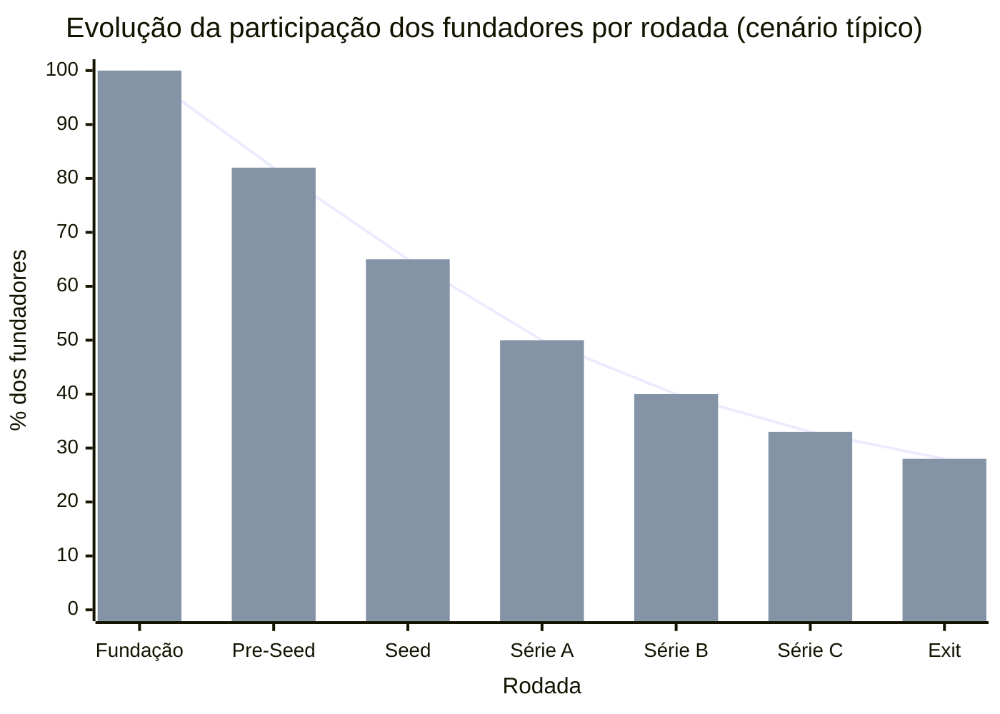
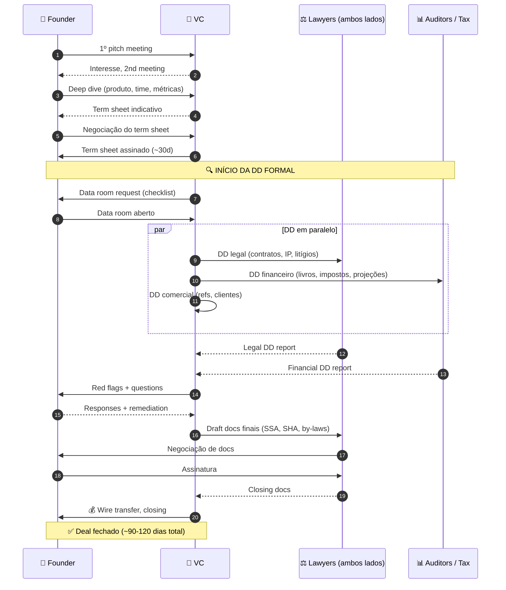

## APÊNDICE V — CAPTAÇÃO DE EQUITY, PITCH E RELACIONAMENTO COM INVESTIDORES

> [!note] Nota de validade
> Esse apêndice reflete práticas de captação de equity no ecossistema brasileiro, e internacional, em abril de 2026. Os fundamentos (narrativa, unit economics, termos-chave de term sheet, cadência de investor update) são estáveis ao longo de dez ou mais anos. O que muda mais rapidamente é a temperatura do mercado de capitais (valuations, e disponibilidade), os termos específicos em voga (por exemplo, participating versus non-participating preference varia por ciclo), e as ferramentas de processo (plataformas de data room, pitch, e investor relations). Revisar anualmente, com atenção especial ao ciclo de mercado vigente ao captar.

O [[#APÊNDICE P — FINANCIAMENTO NÃO-DILUITIVO|Apêndice P]] cobre financiamento não-diluitivo. Dívida, grants, RBF, e antecipação de recebíveis. Esse apêndice cobre financiamento diluitivo. A venda de equity (participação societária), em troca de capital, tipicamente a investidores profissionais (anjos, fundos de venture capital, private equity, corporate venture). Os dois são complementares. Não substitutos. A maior parte das startups que escalam usa combinações dos dois ao longo do tempo.

Esse apêndice é extenso, porque captação é disciplina densa, com muitos pontos não-óbvios. Os fundadores que o tratam de forma amadora tipicamente levantam em condições piores (valuation menor, e termos pesados), consomem tempo excessivo em processos que morrem por má execução, constroem relacionamentos de investor-fundador que envenenam anos, e perdem optionality em rodadas futuras, por erros iniciais.

Os fundadores que tratam captação como disciplina, com preparação séria, processo estruturado, narrativa clara, perguntas praticadas, e relacionamento consistente, captam mais, em condições melhores. E constroem rede de investidores que gera composição ao longo da trajetória.

### Como investidores pensam, duas peças que mudam a perspectiva

Antes de entrar no processo, vale calibrar como o outro lado da mesa pensa. Há dois ensaios de Paul Graham que, quando você os interioriza, fazem captação de equity deixar de ser combate, e virar algo mais parecido com conversa técnica entre pessoas que estão na mesma matemática. Resumo abaixo os dois. Porque respeitar como o VC pensa muda tática de captação profundamente.

**Black Swan Farming, a matemática power-law do VC (Graham, 2012).**

A intuição dominante entre fundadores iniciantes é que VC é "banco que cobra muito". Dão dinheiro esperando retorno razoável, e acompanhamento de governança. Está errado. VC opera dentro de uma matemática radicalmente diferente. De cada dez empresas financiadas por um fundo de early-stage, estatisticamente, uma paga todo o fundo, e gera o lucro. Duas, ou três, empatam. Seis, ou sete, somem. A distribuição de retornos é uma power-law, não uma curva normal. Graham chama isso de "black swan farming". A atividade de investir em coisas que individualmente provavelmente falham, mas que coletivamente se pagam, porque uma, ou outra, vira múltiplo gigante.

Três consequências práticas que isso tem para o fundador.

> [!important] VC não está interessado em "sucesso modesto"
> Se a sua empresa tem potencial teto de R$ 50 milhões, ela não encaixa na matemática de um fundo com tese de múltiplo dez vezes sobre US$ 500 milhões. Não é desprezo. É matemática. Busque investidor cujo fundo faça sentido para a sua escala potencial. Anjo, family office, fundo micro-VC, ou fundo nichado.

Risco baixo é desinteressante para o VC. O fundo precisa de empresas com chance real de serem enormes. Mesmo que tenham alta probabilidade de fracasso. Fundador que, numa reunião, se esforça para "provar que não vai quebrar", está otimizando para o critério errado. O critério correto é. "Se isso der certo, dá certo em escala relevante para o seu fundo?".

Contrato de VC reflete essa matemática. Liquidation preference, anti-dilution, pro-rata rights. Tudo existe para otimizar um portfólio, onde poucas empresas precisam carregar tudo. Entender a origem do termo ajuda a negociá-lo, sem demonização.

O ensaio de Graham também argumenta que os melhores VCs estão dispostos a tolerar ideias que parecem loucas. Porque a ideia que parece óbvia já teria sido feita por alguém, e não geraria o cem vezes. Isso é licença para você não aguar a ideia, para parecer mais conservadora. A sua ideia precisa parecer grande, e levemente maluca, para ser financiável por fundo power-law.

**How to Raise Money, as táticas de Graham (ensaio de 2013, paulgraham.com/fr.html).**

Ensaio denso, que vale leitura integral antes da sua primeira captação. Sumário operacional das táticas que eu achei mais úteis.

Capte em modo fundraising, não "sempre captando". Captação é estado que consome cem por cento do CEO. Não dá para captar, e construir, ao mesmo tempo. Alternar entre modos é mais rentável do que estar em ambos simultaneamente.

Faça você mesmo processo paralelo. Não serial. Marque vinte a trinta reuniões numa janela de duas a três semanas. Não uma por vez. Isso cria urgência real (não fabricada). O segundo investidor sabe que há primeiro em fase avançada. E a concorrência entre eles fecha o round mais rápido, e em melhores condições.

Não estabeleça deadline artificial, se você não pode cumpri-lo. A mentira de "vou fechar semana que vem" morre quando a semana chega, e você continua captando. Reputação queima instantaneamente. Use deadlines reais (sair de caixa, janela de produto, decisão de contratação esperando). Ou não use deadline.

Separe fatos de esperança em projeções. Investidor experiente vê claramente a diferença entre "vendemos para 12 clientes que pagam R$ 8 mil por mês" (fato), e "o TAM é R$ 4 bilhões" (esperança). Quanto mais você enfatizar fato, mais credibilidade ganha. Esperança tem espaço. Mas nomeada como esperança.

"Expected value" da reunião importa. Cada conversa com investidor tem um valor esperado. Probabilidade de checar, vezes tamanho do cheque, vezes contribuição além-dinheiro. Se uma conversa tem expected value baixa (investidor que provavelmente não checa, cheque pequeno, e sem rede útil), declinar educadamente é racional. E libera tempo para conversas melhores.

Captar menos é frequentemente mais fácil que captar mais. Cheques menores vêm de menos pessoas. A diligência é mais leve. O processo, mais rápido. Startup early-stage deve resistir à tentação de "rodada big bang". E preferir captações menores, com frequência maior.

Investidor que diz "não" é favor. "Estamos avaliando" por três semanas destrói runway, e foco. "Não, porque X" libera você para a próxima conversa. Empurre por respostas rápidas. Aprecie o "não" mais do que o "talvez".

Duas lições que eu considero as mais importantes dos dois ensaios juntos.

> [!important] Você não está pedindo dinheiro
> Você está oferecendo uma oportunidade que encaixa na matemática do fundo do outro lado da mesa. Se não encaixa, é porque o fundo está errado. Não você. Encontre o fundo certo.

Captação é um projeto com deadline próprio. Não um estado permanente. Enquanto está captando, você não está construindo. Enquanto não está captando, não fale com VC (exceto em modo relacionamento, via update mensal). Mistura de modos destrói tanto a captação, quanto a construção.

### O que esse apêndice cobre

Captação de equity é um processo (não evento), que envolve quatro frentes.

1. Preparação. Narrativa, pitch deck, modelo financeiro, e data room.
2. Processo. Rodar timeline estruturada, com múltiplos investidores em paralelo.
3. Fechamento. Negociação de term sheet, due diligence, e documentação legal.
4. Relacionamento pós-rodada. Comunicação, governança, e preparação da próxima rodada.

Entregáveis tangíveis. Pitch Deck (doze a quinze slides), estruturado, e adaptável ao público — esqueleto SCQA pronto em [[#APÊNDICE A — TEMPLATES PRONTOS PARA USO|A.17]]. Modelo Financeiro (planilha), com unit economics, projeção três a cinco anos, e cenários. Data Room (pasta estruturada em Google Drive, Notion, ou plataforma dedicada), com documentos organizados. Investor Update mensal, ou bimestral (documento recorrente) — template em [[#APÊNDICE A — TEMPLATES PRONTOS PARA USO|A.18]]. Lista de Investidores-Alvo, com prioridade, status, e pontos de contato.

> [!note] Contexto operacional
> Captação não acontece no vácuo. A [[#FASE 14 — ESCALA: TIME, OPERAÇÕES, CRESCIMENTO E CAPITAL|Fase 14]] é onde a empresa transita de PMF para máquina, e cobre todas as frentes simultâneas (time, operações, crescimento e capital) em que a captação é uma decisão. O [[#APÊNDICE CF — PLANEJAMENTO DE RODADA COMO PROCESSO: FUNDRAISING COMO PROJETO ESTRUTURADO|Apêndice CF]] trata o fundraising como projeto com cronograma e milestones próprios. O [[#APÊNDICE CS — BOOTSTRAP vs VENTURE CAPITAL: A ESCOLHA FUNDACIONAL|Apêndice CS]] trata a decisão anterior — captar equity ou não.

### POR QUE

Três razões pelas quais captação bem-feita muda a trajetória da empresa, para além do capital.

Capital é a parte menor do que você captou. O que realmente importa. A rede do investidor (portfolio, LPs, conselheiros). A credibilidade no mercado (contratações, clientes, imprensa). O acesso a investidores de rodadas futuras. Investidor ruim é capital bom. Mas tudo o resto ausente. Ou pior. Negativo.

Condições de rodada compostas. Valuation baixo em seed, liquidation preference pesada em Série A, e anti-dilution ratchet. Tudo isso compõe ao longo das rodadas. Empresa que fez term sheet ruim no seed descobre, em Série B, que os fundadores têm 18% da empresa, quando deveriam ter 40%. Mudança de jogo.

Relacionamento define optionality em crise. Os momentos difíceis (caixa crítico, pivô, perda de cliente-âncora) são quando você descobre se os investidores estão com você. Investidores que tiveram relacionamento transparente, e recorrente, ajudam em crise. Investidores que foram negligenciados reagem mal, atrasam aprovação de bridge, espalham dúvida no mercado, e bloqueiam opções.

> [!warning] Custo de pular esse apêndice
> Os fundadores que aprendem captação no processo tipicamente desperdiçam dois a quatro meses de runway na primeira rodada (versus seis a dez semanas com preparação), aceitam termos que dificultam rodadas futuras, e constroem relacionamentos de investor-fundador sem rigor profissional. Com consequências que se estendem por anos.

### Quando usar

**Quando captar equity.** O negócio tem motor de crescimento validado, que escala com capital (não "bootstrappa naturalmente"). A janela de mercado é limitada, e velocidade importa (categoria sendo disputada). A necessidade de capital excede a capacidade de dívida razoável (ver [[#APÊNDICE P — FINANCIAMENTO NÃO-DILUITIVO|Apêndice P]]). Há capacidade operacional para absorver capital, sem virar bagunça. O time está pronto para governança formal (board, e reporting).

**Quando NÃO captar equity.** Negócio bootstrap-avel (margens fortes, e crescimento orgânico). Ainda em fase de validação (Fases 2 a 8). Captação antes de PMF tende a destruir valor. O time não está pronto para board, e reporting (ou o fundador não quer esse nível de accountability). Mercado em janela ruim (valuations baixos, e termos pesados), e não é urgente.

**Timeline por estágio:**

| Rodada | Estágio típico | Valor BR típico 2024-2026 | Diluição | Uso |
|---|---|---|---|---|
| Pre-Seed | Ideia + time | R$ 500k-2M | 10-20% | Validar PMF inicial |
| Seed | PSF / primeiros sinais PMF | R$ 2-15M | 15-25% | Escalar para PMF claro |
| Série A | PMF + motor validado | R$ 15-80M | 15-25% | Escalar motor de vendas |
| Série B | Crescimento + unit economics | R$ 80-300M | 15-20% | Escala geográfica / vertical |
| Série C+ | Escala institucional | R$ 300M+ | 10-15% | Maturidade / preparação exit |

Os valores, e diluições, variam significativamente com ciclo de mercado, e setor.



> [!note] Como ler o gráfico
> Fundadores começam com 100% e cada rodada dilui a participação. No cenário típico, ao exit (IPO ou M&A), fundadores têm 25–35% se a trajetória foi eficiente. Valores muito abaixo de 20% no exit sugerem que os termos de rodadas anteriores foram desfavoráveis (liquidation preference excessiva, anti-dilution ratchets, diluição não-planejada). A participação final é consequência acumulada de cada term sheet assinado.

### Quem envolve

**Quem lidera no lado da empresa.** O CEO sempre. Captação é venda. E venda de equity só é feita pelo fundador-CEO. CFO, ou finance lead (se houver), suporta com modelo financeiro, métricas, e due diligence. Jurídico externo, especializado em VC, é obrigatório. Não negociável. Generalista custa caro em rodadas complexas.

**Tipos de investidor no ecossistema brasileiro.**

Anjos (R$ 50 mil a R$ 500 mil por cheque, pré-seed a seed). Operadores experientes, investindo capital próprio. Valor maior. Mentoria, rede, e credibilidade. Busque anjos com experiência operacional no seu setor.

Micro-VCs (fundos pequenos, R$ 500 mil a R$ 3 milhões por cheque, pré-seed a seed). Fundos com até R$ 50 milhões AUM, focados em early-stage. Valor. Mais estruturado que anjo. Menos burocracia que fundo grande.

Seed Funds (R$ 1 a R$ 10 milhões, seed). Canary, Kaszek, Monashees Seed, ACE. Expectativa de pelo menos early PMF, mais time forte.

Early-stage VCs, ou Série A (R$ 10 a R$ 80 milhões). Monashees, Kaszek, Valor, Riverwood, Endeavor Catalyst. Expectativa. PMF claro, mais motor validado.

Growth VCs, ou Série B em diante (R$ 50 milhões em diante). SoftBank LatAm, Tiger Global (quando ativo), General Atlantic. Expectativa. Escala, mais métricas defensáveis.

Corporate Venture (CVC), com tickets variados. Qualcomm Ventures, Globo Ventures, Redpoint eVentures, BTG Pactual. Valor além do capital. Acesso a canais, validação corporativa, e potencial cliente. Risco. Decisão mais lenta. Agenda corporativa pode não alinhar.

Private Equity (tickets grandes, growth, ou pre-IPO). Advent, CVC Capital, Warburg Pincus. Tipicamente para empresas com igual ou maior que R$ 50 milhões de receita, e unit economics maduros.

Family Offices, e investidores institucionais brasileiros. Crescente papel em tech brasileira. Tipicamente investem via fundos de venture, mas cada vez mais direto.

### Como executar

#### 1. Preparação da Narrativa, SCQA

SCQA (Situation, Complication, Question, Answer) é framework de storytelling formalizado por Barbara Minto (ex-McKinsey), no *Pyramid Principle*. É a espinha dorsal de qualquer comunicação persuasiva de negócio. E é particularmente poderoso em pitch, porque força o narrador a estabelecer contexto, tensão, pergunta central, e resposta, de forma sequencial, e clara.

**Estrutura.**

**S, Situação (Situation).** Descrição objetiva do estado atual do mundo, ou mercado. Fatos não contestáveis. Estabelece terreno comum com o investidor.

Exemplo (PadariaPro). "O Brasil tem cerca de 71 mil padarias, das quais cerca de 8 mil são artesanais com múltiplas lojas. Esse segmento cresceu 28% de 2020 a 2024, e movimenta R$ 14 bilhões por ano. São negócios tradicionais em digitalização tardia. 85% ainda fazem gestão de estoque em Excel, ou caderno".

**C, Complicação (Complication).** O que é insatisfatório, perigoso, ou limitante na situação atual. A tensão que torna a situação instável. Precisa ser verificável. Não retórica.

Exemplo. "Padarias com 3-5 lojas perdem em média 12-18% da margem bruta por gestão manual de estoque, ruptura de ingredientes que custa venda, e desperdício de perecíveis. ERPs horizontais não têm integração com fornecedores de padaria artesanal. Sistemas verticais brasileiros focam em caixa, ou balança. Não em gestão de compras. O dono-operador (tipicamente segunda geração, 30-45 anos, e fluente em mobile) passa 6-10 horas por semana apagando incêndios de estoque".

**Q, Questão (Question).** A pergunta central que a situação, mais a complicação, levantam. É o "então o quê?" que o investidor implicitamente está fazendo.

Exemplo. "Como trazer automação de gestão de estoque, mais integração com fornecedores, para padarias artesanais com 3-5 lojas, de forma que o dono adote em 1 semana, e veja retorno claro em 60 dias?".

**A, Resposta (Answer).** O que a empresa é, faz, e prova. A resposta à pergunta. Estrutura típica da resposta. O produto, mais por que funciona, mais evidência de que já funciona.

Exemplo. "Construímos PadariaPro. Um sistema que conecta dono, operação, e fornecedor, via WhatsApp, mais dashboard web, com previsão de demanda baseada em histórico, e confirmação de pedido em 1 clique. Hoje operamos com 103 padarias pagantes em SP, e região metropolitana. Com NPS 48, retenção mensal de 95%, e NRR 112%. A nossa cunha inicial (3-5 lojas, e Sudeste) representa TAM de cerca de 2.500 padarias, e R$ 250 milhões de ARR, em janela de 5-7 anos".

**Como aplicar SCQA ao pitch deck.** Slides 1 e 2 (Capa, mais tagline). Introduz SCQA em versão ultra-condensada. Slide 3 (Situação). S do SCQA como slide próprio. Mostra mercado. Slide 4 (Complicação). C do SCQA. Mostra o problema. Slide 5 (Questão, ou Oportunidade). Q do SCQA. Articula a pergunta que o produto responde. Slide 6 em diante. A do SCQA detalhado. Produto, tração, time, financeiro, e rodada.

> [!warning] Quando o SCQA falha
> Se a Situação é óbvia demais, a Complicação é fraca, a Questão é forçada, ou a Resposta é desproporcional à Complicação declarada, o pitch sente falso. Revisar iterativamente com mentores, antes de apresentar a investidores.

#### 2. Pitch Deck, estrutura de doze a quinze slides

Estrutura consolidada que funciona em oitenta por cento dos casos. Adaptar se setor, ou estágio, exigir variação.

**Slide 1, capa.** Nome da empresa, tagline de uma frase, data, nome do fundador, e papel. Evitar barulho visual.

**Slide 2, tagline (opcional, alguns agrupam com capa).** Uma frase descrevendo o que a empresa faz, e para quem. Exemplo. *"PadariaPro. Software de gestão de estoque, e compras, com integração a fornecedores, para padarias artesanais brasileiras com 3-5 lojas."*

**Slide 3, situação, ou mercado.** Dados do mercado em poucos números. TAM, crescimento, e estrutura (fragmentação, ou concentração).

**Slide 4, complicação, ou problema.** A dor específica que a empresa resolve. Quantificada se possível. Uma quote de cliente real é ouro aqui.

**Slide 5, questão, ou oportunidade.** A pergunta que o mercado está esperando alguém responder. A janela de "por que agora".

**Slide 6, produto, ou solução.** O que a empresa faz. Screenshots reais. Não mockups idealizados. Foco no mecanismo. Não na lista de features.

**Slide 7, tração.** Métricas fortes até hoje. Ordem típica. Número de clientes, receita (ARR ou MRR), crescimento MoM ou YoY, retenção, e NPS. Se pré-receita, métricas proxies (usuários ativos, LOIs, e pilotos).

**Slide 8, modelo de negócio, ou unit economics.** Como ganha dinheiro. Ticket, LTV:CAC, e margem. Números reais se existem. Projeções se não.

**Slide 9, canal de distribuição, ou go-to-market.** Como adquire clientes hoje. Que canais validados. Plano para os próximos 12-18 meses.

**Slide 10, competição, ou diferenciação.** Mapa competitivo (grid 2x2 é clichê, mas funciona). Honesto sobre quem são os concorrentes. O que é moat.

**Slide 11, time.** Fundadores, e contratações-chave. Background relevante. Não CV completo. Por que esse time vai executar.

**Slide 12, projeção financeira.** 3-5 anos. Receita, margem, burn, runway, e unit economics em escala. Premissas por trás.

**Slide 13, rodada.** Quanto está captando, para quê, milestones que atinge com esse capital, e cronograma até a próxima rodada.

**Slide 14, ask, ou contato.** Ponto de contato, e próximos passos.

**Slide 15, apêndice (opcional).** Slides de suporte, que aparecem só se perguntado. Detalhes de métrica, cap table, e roadmap de produto.

> [!tip] Dois pitch decks diferentes
> Teaser (cinco a dez slides). Enviado frio por e-mail, ou LinkedIn. Objetivo, gerar interesse para reunião. Sem informações sensíveis (cap table, e métricas proprietárias). Full (doze a quinze slides). Apresentado em reunião. Mais detalhado. Já pressupõe NDA, ou confiança.

#### 3. As Perguntas Mais Feitas por Investidores

Investidores sérios têm conjunto razoavelmente consistente de perguntas. Preparação significa ter respostas claras para todas, antes da primeira reunião.

**Perguntas sobre mercado.** Qual é o TAM real bottom-up, não top-down? (Mostre o cálculo). Por que agora? Que mudança externa (tecnológica, regulatória, ou comportamental) torna esse o momento? Qual é a velocidade natural do mercado? Está crescendo dez por cento ao ano, ou cinquenta por cento? Quem mais está tentando resolver esse problema?

**Perguntas sobre produto, e diferenciação.** O que especificamente o seu produto faz, que o concorrente X não faz? Qual é o moat daqui a três anos? Se concorrente com dez vezes o seu capital decide atacar, o que acontece? Qual é o insight não-óbvio que vocês têm sobre esse mercado?

**Perguntas sobre tração, e métricas.** Qual é a retenção por coorte, nos últimos doze meses? (Prepare gráfico). Qual é o NRR, e como está evoluindo? Qual é o payback de CAC, e em quais canais? O churn está subindo, estável, ou caindo? Por quê? Qual é o seu North Star Metric, e por que esse?

**Perguntas sobre time.** Por que esse time? Qual é o fundador-market-fit específico? Quais são as próximas três contratações? Quando fecha cada uma? Quem poderia sair, e destruir a empresa? Como vocês se dividem founders? Qual o cap table?

**Perguntas sobre modelo, e unit economics.** Qual é a margem bruta na escala atual? Como evolui em escala? Qual é o CAC por canal? Qual canal escala? Se o ciclo de mercado aperta, como defende o negócio?

**Perguntas sobre captação, e uso de capital.** Com esse capital, onde vocês estão em 18-24 meses? Quais são os três riscos maiores de não atingir esses milestones? Quanto vale a empresa, e por que esse valuation? Quem mais está na rodada? Para o que especificamente o dinheiro vai (percentual em produto, time, marketing)?

**Perguntas sobre exit, ou visão longa.** Qual é o caminho para R$ 1 bilhão de receita? Quem são os compradores potenciais em 5-7 anos? O que precisa ser verdade, para que essa empresa faça IPO?

**Perguntas de stress-test.** Qual é a pior coisa que poderia acontecer com a empresa, nos próximos doze meses? Que suposição-chave do seu plano está mais frágil? Como testa?

> [!important] Como responder bem
> Números concretos, sempre que existam. Sem "muito", "bastante", ou "rápido". Ignorância assumida é melhor que números inventados. "Não sei, mas vou mandar essa análise até sexta" gera confiança. Número falso destrói em due diligence. Tensões reconhecidas. "O churn está em seis por cento, e queremos chegar a quatro. Está sendo o nosso foco trimestral" é mais forte que "o churn está ótimo". Prática. Rodar "mock pitch" com mentores, ou advisors, antes de encontros reais. Gravar, assistir, e ajustar.

#### 4. Rodando o Processo de Rodada

**Timing ideal (16-20 semanas):**

| Semanas | Atividade |
|---|---|
| 1-4 | Preparação: pitch deck v1, modelo financeiro, data room, lista de 30-50 investidores-alvo priorizada. |
| 5-6 | Warm intros: ativação de rede (outros fundadores, investidores atuais, advisors) para introduções calorosas a top 15-20 investidores-alvo. |
| 7-9 | Primeiras reuniões. Não fechar em primeira reunião. Ouvir, refinar pitch. |
| 10-14 | Múltiplos processos em paralelo: partners meetings, due diligence preliminar, references. |
| 15-16 | Term sheets chegando. Negociação. |
| 17-20 | Due diligence final, documentação legal, fechamento. |

**Warm intro versus cold outreach.** Warm intro (via pessoa de confiança do investidor). Taxa de resposta de setenta a noventa por cento. Reunião provável de quarenta a sessenta por cento. Cold outreach (direto, sem intro). Taxa de resposta de três a dez por cento. Reunião provável de um a três por cento.

Warm intro é o padrão. Cold é último recurso, para investidores específicos sem conexão mútua.

**Como conseguir warm intros.** Outros fundadores de portfolio do investidor (melhor fonte). Advisors, ou anjos da empresa, que conheçam o investidor. Colegas anteriores (ex-chefes, ou ex-colegas de empresa forte). LinkedIn com segundo grau, e pedir introdução explícita a contato mútuo. Eventos setoriais (quando possível).

> [!important] Paralelização é obrigatória
> Rodar um investidor de cada vez estica timeline para seis a doze meses, e elimina leverage. Rodar quinze a vinte em paralelo cria competição saudável, e respeita timeline. Calendar-driven. "Temos três term sheets até [data]. Precisamos decidir" é conversa diferente de "estamos captando, sem pressa".

> [!warning] Criação de FOMO sem blefe
> Blefe ("temos cinco term sheets" quando tem um) é descoberto em semanas, e destrói confiança. FOMO real ("estamos em processos avançados com três fundos. Vamos decidir em duas semanas") funciona se for verdade.

#### 5. Data Room, o que incluir

Data room é estruturado em pastas numeradas. Investidores sérios esperam acesso após primeira reunião positiva.

**Estrutura típica.**

1. Visão Geral. Deck atualizado, one-pager, e sumário executivo.
2. Time. CVs dos founders, cap table detalhado, e contratos de vesting.
3. Produto. Arquitetura técnica em alto nível, roadmap doze meses, e métricas de uso.
4. Clientes, e Receita. Contratos de top dez clientes (anonimizados se sensível), análise de coorte, e LTV/CAC detalhado.
5. Unit Economics, e Financeiro. DREs mensais últimos vinte e quatro meses, balanço, projeção 36-60 meses, e modelo financeiro Excel.
6. Legal. Contrato social, atas de deliberação, contratos com fornecedores-chave, IP (marcas, patentes), e compliance LGPD ([[#APÊNDICE T — LGPD, COMPLIANCE E GOVERNANÇA DE DADOS|Apêndice T]]).
7. Governança. Estatuto, acordo de sócios, e decisões relevantes.
8. Pessoas. Organograma, política de compensação, e pipeline de contratação.
9. Métricas detalhadas. KPI dashboards, analytics de produto, e métricas de aquisição por canal.
10. Materiais de mercado. Análise competitiva, pesquisas setoriais, e estudos próprios.

Ferramentas. Google Drive (gratuito, e simples). Notion (mais estruturado). DocSend, Brex Data Room, Carta (para cap table). Em rodadas maiores, plataformas dedicadas (Ansarada, iDeals).

Logs de acesso. Ferramentas como DocSend mostram quem viu cada documento, e por quanto tempo. Útil para priorizar follow-up.

#### 6. Term Sheet, termos-chave

Term sheet é documento não-vinculante (exceto cláusulas específicas como exclusividade, e confidencialidade), que resume condições da rodada. Tamanho típico, três a seis páginas.

**Termos financeiros principais.**

Pre-money valuation. Valor da empresa antes do capital novo. Pre, mais capital, igual a Post-money. Exemplo. R$ 20 milhões pre, mais R$ 5 milhões de rodada, igual a R$ 25 milhões post. O investidor fica com vinte por cento.

Liquidation Preference. Em caso de venda, ou liquidação, quanto o investidor recebe antes dos founders. Padrão saudável. 1x non-participating (o investidor escolhe entre recuperar o cheque, OU converter, e participar pro-rata). Evitar. 2x ou 3x participating (o investidor recupera duas a três vezes, E participa pro-rata. Pode consumir exit inteiro em cenário médio).

Anti-dilution. Proteção do investidor, se rodada futura acontece em valuation menor. Dois tipos. Weighted Average (mais justo), ajuste proporcional. Full Ratchet (pesado), conversão ao preço da rodada nova, mesmo que só uma ação seja emitida a esse preço. Evitar.

Vesting de founders. os fundadores também vestam o seu equity (mesmo já tendo). Padrão. Quatro anos, com um ano de cliff. Acelerações. Single trigger (na venda). Double trigger (venda, mais demissão sem causa). Double trigger é padrão saudável.

Pool de ESOP (Employee Stock Option Pool). Ações reservadas para contratações futuras. Padrão. Dez a quinze por cento pós-rodada. Atenção. ESOP é criado pré-money. Ou seja, dilui founders. Não novos investidores.

**Termos de governança.**

Board seats. Rodadas seed tipicamente três seats (dois founders, mais um investidor). Série A cinco seats (dois founders, mais dois investidores, mais um independente). Série B em diante pode chegar a sete.

Protective Provisions. Lista de decisões que precisam de aprovação do board, ou dos investidores. Padrão. Venda da empresa, emissão de novas ações, dívida acima de X, e mudança no contrato social. Cuidado com provisions muito amplas, que limitam operação.

Information Rights. Direito do investidor a reports. Padrão. Relatório mensal, quarterly report, e annual audited. Quanto mais granular, mais trabalho operacional.

Pro-rata Rights. Direito de investidor participar de rodadas futuras, mantendo percentual. Padrão, sim.

ROFR (Right of First Refusal). Direito de investidor comprar primeiro, se o fundador vender ações. Padrão, sim em ações primárias.

**Termos brasileiros específicos.**

No-shop (exclusividade). Compromisso do fundador de não negociar com outros investidores, após assinar term sheet, por trinta a sessenta dias. Vinculante.

Conversibilidade. Ações preferenciais convertem em ordinárias, em evento de liquidez, ou automaticamente em IPO.

Cláusulas de saída. Drag-along, tag-along, e right of first offer, em venda de controle.

> [!important] Recomendação crítica
> Contrate advogado especializado em VC, antes de assinar qualquer term sheet. Não generalista. Escritórios brasileiros com especialização. Mattos Filho, Machado Meyer, Demarest, Derraik, entre outros. Custo típico em Série A, R$ 80 a R$ 200 mil. Paga-se sozinho em apenas um termo mal-negociado.

#### 7. Due Diligence, o que esperar

**Sequência típica de um processo de DD.**



*Processo típico de rodada com DD em três frentes paralelas. Sem data room organizado desde dia 1, o processo trava aqui. E trava em momento ruim. Term sheet assinado, due diligence expondo fraquezas, e bridge de capital se encerrando.*

Após o term sheet assinado, segue due diligence formal (trinta a quarenta e cinco dias típicos).

**A due diligence tipicamente cobre.**

Financial DD. Revisão de DREs, balanços, fluxo de caixa, reconciliação com sistema contábil, análise de qualidade de receita (não-recorrente versus recorrente), e contratos de top dez clientes.

Legal DD. Revisão de contrato social, todos os contratos relevantes, IP, passivos, e processos.

Tax DD. Obrigações fiscais, contencioso tributário, e benefícios fiscais usados.

HR DD. Contratos de trabalho, políticas, e passivos trabalhistas.

Technical DD. Arquitetura, dívida técnica, e processos de desenvolvimento. Em rodadas seed, ou A, pode ser leve. Em B em diante, fica sério.

Customer DD. Calls com três a cinco clientes da empresa, para validar uso, e satisfação.

Reference checks. Conversas com ex-colegas, ex-investidores, e advisors do fundador.

**Como se preparar.** Data room organizado desde o início da rodada acelera DD significativamente. Avisar cinco clientes-referência, que podem receber ligação. E garantir que são clientes felizes. Listar dez pessoas para reference check, que vão falar bem, e com substância. Não esconder problemas. A DD descobre. Proativo é melhor que reativo.

> [!warning] Armadilha comum
> A DD demora duas a três vezes o planejado, por buracos no data room, mais surpresas. Fechar rodada de R$ 20 milhões em trinta dias é padrão para empresa preparada. Vira noventa dias se a documentação estiver ruim.

### RELACIONAMENTO PÓS-RODADA

A rodada fechou. O dinheiro entrou. Agora começa a parte longa. Os fundadores que tratam fechamento como "fim" fazem pior em todas as próximas rodadas. Os fundadores que tratam fechamento como "começo do relacionamento" constroem redes, que compõem em dez a vinte anos de trajetória.

#### 1. Investor Update, o hábito mais subestimado

Investor update é comunicação recorrente, e estruturada, do CEO para todos os investidores. Frequência padrão. Mensal para early-stage. Bimestral, ou trimestral, para maduros. É o hábito mais underrated da captação. Os fundadores que o mantêm por anos captam melhor nas próximas rodadas, têm acesso a mais recursos informais (intro para clientes, candidatos, e outros investidores), e criam comunidade, em vez de contrato.

**Estrutura típica do Investor Update mensal.**

```text
ASSUNTO: [Empresa], Update [Mês/Ano]

TL;DR: [2-3 frases com o mais importante do mês]

MÉTRICAS-CHAVE:
Receita: R$ X (crescimento Y% MoM)
Clientes: N total (+X novos, -Y churn)
Burn: R$ Z / mês | Runway: M meses
North Star: [número]

DESTAQUES DO MÊS:
1. [Conquista concreta]
2. [Movimento estratégico]
3. [Contratação-chave ou perda]

DESAFIOS:
1. [Problema honesto 1]
2. [Problema honesto 2]

PEDIDOS DE AJUDA:
1. [Intro específica para Y]
2. [Candidato para posição Z]
3. [Feedback sobre decisão estratégica]

PRÓXIMOS 30 DIAS:
1. [Objetivo mensurável 1]
2. [Objetivo mensurável 2]

[Nome]
CEO, [Empresa]
```

**Princípios do bom investor update.**

Transparência radical. Compartilha problemas, junto com conquistas. A tentativa de parecer perfeito destrói credibilidade, quando as coisas quebram (e vão quebrar).

Números consistentes. Mesmas métricas em todo update. Adicionar nova métrica só com contexto.

Pedidos específicos. "Ajudem" é ruim. "Vocês conhecem alguém em [empresa X], em posição de [cargo Y]?" é acionável.

Pontualidade. Mesmo dia do mês, e consistente. Sinal de disciplina.

Tom. Profissional, mas humano. Nem robótico, nem drama.

Ferramentas. E-mail simples funciona perfeitamente (reply-all restringido). Ferramentas especializadas. Visible, Standard Metrics, Carta Investor Updates. Para começar, basta e-mail.

#### 2. Board Governance

Após a rodada, há board formal, ou informal. Como usá-lo bem.

**Reunião de board, estrutura padrão (reunião trimestral, duas a três horas).**

1. Check-in (15 min). Cada membro compartilha estado atual.
2. Métricas, e financials (30 min). O CEO apresenta resultado do trimestre versus OKRs.
3. Tópicos estratégicos (60-90 min). Dois a três tópicos em profundidade. Lista pré-circulada.
4. Decisões pendentes (15 min). O que precisa de aprovação.
5. Executive session (15-30 min). Investidores sozinhos (sem founders). Padrão saudável para discussão franca.

**Material para board, enviado 72 horas antes.** Board deck (10-20 slides), métricas, OKRs, riscos, e decisões. Report detalhado (texto, 5-15 páginas), aprofundamento das áreas. Financials do trimestre, mais projeções.

> [!important] Princípio crítico
> Board não é para o CEO buscar aprovação. É fórum para o CEO buscar input estratégico, e desafio honesto. Trate os membros como recursos. Não como supervisores.

**Quando o board vira problema.** Membro que dá opinião sem ler material (sinal de desengajamento). Membro que tenta operar a empresa (fora do papel). Dinâmica onde decisões acontecem em pre-board calls privadas, e não na reunião. Conflito entre investidores não-endereçado, que trava decisões.

**Como endereçar board disfuncional.** Conversa direta com chair (se houver), ou com cada membro um a um. Em casos extremos, renegociar composição em próxima rodada.

#### 3. Relacionamento Individual com Investidores

Para além de board, e updates formais, os relacionamentos individuais compõem ao longo do tempo.

Coffee, ou call, bimestral, com principais investidores. Informal. Atualização sem agenda fixa.

Pedidos específicos em momentos oportunos. "Estou fechando candidato. Queria a sua opinião sobre oferta". "Clientes desse perfil, conheces alguém na minha network?".

Compartilhamento de contexto. Situações complexas, que não cabem em update formal, mas merecem atenção.

Reciprocidade. Oferecer valor ao investidor também. Intro para startups do seu radar. Feedback sobre teses. Dados de mercado.

> [!warning] Armadilha comum
> CEO que só fala com investidores quando precisa de algo. Cria transacional. Não relacional. Os melhores relacionamentos founder-investor são setenta por cento conversa ampla sobre mercado, indústria, e oportunidades. E trinta por cento pedidos específicos.

#### 4. Gestão de Crise com Investidores (cross-referência [[#APÊNDICE CW — CRISE E CONTINUIDADE: PREVENÇÃO, RESPOSTA, RECUPERAÇÃO|Apêndice CW]])

Em crise, o relacionamento construído previamente é o que determina se os investidores ajudam, ou atrapalham.

**Regras.** Transparência imediata. O investidor descobre primeiro pelo CEO. Não por terceiros. Plano apresentado. "É crise. Aqui está o plano. Preciso de X de vocês". Cadência aumentada. Em crise, semanal (não mensal). Não esconder número ruim. Esconder piora quando sai.

Exemplo condensado de e-mail de crise.

*"Pessoal, estamos enfrentando caixa crítico. Runway caiu para 5 meses, com trajetória atual. Aqui está o plano [detalhes]. Precisamos de bridge round de R$ X até [data], para não parar operação. Quem topa?"*

Investidores que receberam updates honestos por dezoito meses tendem a responder. Investidores que foram negligenciados tendem a atrasar, ou recusar.

#### 5. Captação de Próxima Rodada Começa Dia 1 Pós-Atual

Ciclo típico de startup que escala. Série A fechou, depois 18-24 meses para Série B. Quem começa a captar três meses antes de acabar caixa, capta pior. Quem trabalhou relacionamento desde dia um pós-Série A, tem três a cinco fundos conversando proativamente, quando for hora de captar formalmente.

**Como preparar Série B desde o dia 1 da Série A.** Identificar dez a vinte fundos-alvo de Série B. Reunião de café semestral com cada top cinco. Sem pedir nada. Só update. Convidá-los para board observer, quando possível. Compartilhar updates do investidor, incluindo esses fundos no cc. Construir pipeline de métricas, que cada fundo específico busca, para Série B.

Quando for hora de captar, três dos cinco já conhecem a empresa profundamente. E o processo de term sheet é semanas. Não meses.

### PERGUNTAS A RESPONDER

Temos SCQA articulado, e testado com mentores? Pitch deck de doze a quinze slides está atualizado no último trimestre? Modelo financeiro, com três cenários (pessimista, realista, otimista), existe? Data room organizado permanentemente, e não só durante processo de captação? Lista de trinta a cinquenta investidores-alvo priorizada, com path to warm intro? Respostas preparadas para as trinta perguntas clássicas, praticadas em mock pitch? Investor update mensal é hábito estabelecido, ou só quando convém? Relacionamento com top investidores atuais é transacional, ou relacional? Cronograma realista para próxima rodada está claro no board? Jurídico especializado em VC está contratado, ou em short-list?

### Métricas

Do processo de captação. Tempo total do processo (primeira warm intro até fechamento), alvo igual ou menor que vinte semanas em seed. Igual ou menor que dezesseis semanas em Série A em diante. Taxa de resposta de warm intros, alvo igual ou maior que setenta por cento. Taxa de primeira reunião para segunda reunião, igual ou maior que quarenta por cento, em processo bem-calibrado. Taxa de segunda reunião para term sheet, igual ou maior que vinte por cento. Número de term sheets para escolher, alvo dois a cinco em processos competitivos. Diluição efetiva versus alvo, igual ou menor que cinco por cento acima do alvo, indica processo saudável.

Do relacionamento pós-rodada. Cadência de investor update, mensal consistente. Taxa de resposta dos investidores aos updates, igual ou maior que quarenta por cento. Reuniões individuais por trimestre com top cinco investidores, igual ou maior que uma cada. Pedidos de ajuda feitos, e atendidos, igual ou maior que três por trimestre.

### Definição de sucesso

Captação está no padrão quando os oito itens estão em pé.

1. SCQA articulado, pitch deck atualizado, e modelo financeiro com três cenários.
2. Data room organizado, e mantido permanentemente.
3. Processo de rodada foi conduzido em timeline igual ou menor que vinte semanas.
4. Rodada foi fechada em condições compatíveis com benchmarks do estágio.
5. Term sheet foi revisado por advogado especializado em VC, antes de assinar.
6. Investor update mensal é ritual estabelecido.
7. Reuniões de board acontecem no ritmo acordado, com material enviado com antecedência.
8. Relacionamento com top investidores é relacional. Não transacional.

### Armadilhas

Captar antes de PMF sólido. Quase sempre destrói valor. Valuation baixo, mais pressão investidor, em empresa ainda em descoberta, igual a receita de morte. Bootstrappar, ou não-diluitivo (ver [[#APÊNDICE P — FINANCIAMENTO NÃO-DILUITIVO|Apêndice P]]), até PMF claro.

Warm intro negligenciada. Começar cold em vez de investir duas a três semanas em ativar rede. Cold outreach é último recurso. Não padrão.

Processo serial (um investidor de cada vez). Destrói timing, e leverage. Paralelização é obrigatória.

Blefe em FOMO. Dizer "temos cinco term sheets" quando tem um. Os investidores conversam entre si, e descobrem.

Ignorar termos não-financeiros. Obsessão com valuation, ignorando liquidation preference, anti-dilution, e governança. Liquidation 2x participating pode custar exit inteiro.

Advogado generalista. Pode custar R$ 500 mil a R$ 2 milhões em termos mal-negociados, por economia de R$ 50 a R$ 100 mil em fees.

Esconder problemas em DD. Vai ser descoberto. Fechar negócio escondendo problema destrói confiança. E pode ser quebra de contrato (declarações falsas).

Investor update como obrigação, não ferramenta. Enviar update mecânico, sem pedidos, e sem substância. Desperdiça o único canal estruturado com os seus maiores aliados.

Board como palco de CEO. Usar board para "prestar contas", em vez de buscar input. O board se torna carimbo. Não recurso.

Negligenciar investidores entre rodadas. Só falar quando precisa. Transforma investidor em fornecedor. Deveria ser parceiro.

Captar da pessoa errada, mesmo com cheque bom. Investidor que não entende o setor, não tem rede aplicável, ou tem estilo que conflita com founder. Cheque é temporário. Relacionamento é longo.

Não rodar mock pitch antes de reuniões reais. Apresentar frio para os primeiros investidores é desperdício. O pitch será melhor na quinta reunião. Rodar três a cinco mocks com advisors, antes dos primeiros reais.

Esquecer de preparar próxima rodada. Fechar Série A, e esquecer que Série B começa em dezoito meses. Três meses antes de acabar caixa, começar processo sob pressão.

Confundir valuation alto com sucesso. Valuation muito acima do mercado cria pressão insustentável para próxima rodada. "Down round" é muito pior do que rodada sólida em valuation moderado.

### CHECKLIST DE PARTIDA

Para validar prontidão para captar.

- [ ] PMF confirmado ([[#FASE 12 — PRODUCT-MARKET FIT|Fase 12]] fechada)?
- [ ] Pitch deck atualizado, e testado em três ou mais mock pitches?
- [ ] SCQA articulado em um parágrafo?
- [ ] Modelo financeiro com três cenários existe?
- [ ] Data room organizado, e mantido?
- [ ] Lista de trinta a cinquenta investidores-alvo priorizada, com path to warm intro?
- [ ] Advisors, ou rede, ativados para introduções?
- [ ] Trinta perguntas clássicas têm respostas praticadas?
- [ ] Advogado especializado em VC contratado, ou em short-list?
- [ ] Cronograma realista comunicado ao board, ou advisors?
- [ ] Timeline de 16-20 semanas mapeado com milestones?

> [!warning] Sinal de prematuridade
> Se há três ou mais "não" nos cinco primeiros itens, captação provavelmente é prematura. Priorizar preparação, antes de iniciar warm intros.

### Ver também

[[#APÊNDICE CF — PLANEJAMENTO DE RODADA COMO PROCESSO: FUNDRAISING COMO PROJETO ESTRUTURADO|Apêndice CF]], Planejamento de rodada como processo. [[#APÊNDICE AM — BOARD E GOVERNANCE|Apêndice AM]], Board, e governance. [[#APÊNDICE CE — VALUATION METHODS: COMO INVESTIDORES CALCULAM E COMO VOCÊ CALCULA PARA NEGOCIAR|Apêndice CE]], Valuation methods. [[#APÊNDICE BA — SECONDARY E LIQUIDEZ DE FOUNDER|Apêndice BA]], Secondary, e liquidez de founder. [[#APÊNDICE BB — VENTURE DEBT E REVENUE-BASED FINANCING (RBF)|Apêndice BB]], Venture debt, e RBF.

### Escolhendo o investidor, a diligência do fundador sobre o VC

A maior parte desse apêndice trata de como captar. Pitch, processo, term sheet, e negociação. Essa seção trata de algo logicamente anterior. Como você decide se aceita o cheque, quando o investidor oferece. A diligência é bidirecional. O VC te investiga por quatro a oito semanas antes de assinar. Você deveria fazer o mesmo, por pelo menos metade desse tempo. Na prática, a maioria dos fundadores faz pouco, ou nenhum, desse trabalho. E isso produz alguns dos erros mais caros da trajetória.

Investidor errado, com cheque bom, pode destruir a empresa em três a cinco anos. Board dominado por VC tóxico impõe decisões que quebram produto, esgotam time, e aceleram timeline artificialmente. Investidor certo, com cheque menor, pode ser multiplicador, que salva a empresa em momentos críticos, abre portas, traz co-investidores, introduz primeiros clientes enterprise, e apoia nos momentos difíceis. A assimetria entre bom, e ruim, é gigante. E o custo de escolher mal é alto, porque a saída é praticamente impossível, uma vez comprometido.

**Quatro dimensões de avaliação do VC candidato.**

**1. Histórico operacional, e padrão de decisão.**

Pergunte nas suas conversas iniciais. Quantas empresas do portfólio em estágios similares ao seu? Quais delas ainda estão ativas, versus quebraram? Quantas chegaram a rodadas subsequentes? Percentual que fez exit, versus percentual que ficou no zombie status (viva, mas sem tração)? Esses dados raramente estão públicos. Você precisa perguntar diretamente. Respostas vagas, ou recusa de compartilhar, é sinal.

Além dos números. Como o VC se comporta em crises do portfólio? Ele segue investindo na empresa em rodada de follow-on? Ou abandona na primeira queda? Ele ajuda fundador a pivotar? Ou pressiona por exit fire-sale?

**2. Valor além do cheque, o que o VC realmente entrega.**

Bom VC entrega três tipos de valor. Capital (o cheque). Sinalização (a marca dele atrai talento, co-investidores, e imprensa). E trabalho operacional (apresentações a clientes, apoio em contratação, orientação estratégica, e introduções para rodadas futuras).

Capital é commodity. Cheque de um fundo é igual ao cheque de outro. A sinalização varia muito. Marca forte (Monashees, Kaszek, Valor, Lux no Brasil) abre portas que marca fraca não abre. O trabalho operacional varia enormemente entre partners do mesmo fundo. O partner que será o seu ponto de contato importa mais que o fundo em si.

Pergunte aos fundadores do portfólio. "Quanto tempo o Fulano dá por mês? O que ele efetivamente ajudou a resolver no último ano? Em que momento específico ele fez diferença?". Histórias concretas importam. Generalidades ("o Fulano é ótimo") não.

**3. Expectativa de governance, e controle.**

Cláusulas comuns no term sheet têm impacto enorme na operação. Assentos no board (quantos, com direito a voto em quais decisões), drag-along (capacidade do investidor forçar venda), liquidation preference (ordem de pagamento em exit), anti-dilution (proteção do investidor em rodada subsequente de menor valor), e vesting reset (equity do fundador volta a cliff se sair).

VC agressivo tentará maximizar essas cláusulas. VC razoável aceita padrões de mercado. Entender o que é "padrão" no seu estágio (seed, Série A, B) te protege de aceitar termos, que depois vão travar a sua flexibilidade. Advogado especialista em venture (não advogado generalista) é investimento obrigatório, antes de assinar.

**4. Reputação no ecossistema de founders.**

Fundadores de empresas que quebraram, ou em crise, falam com franqueza sobre VCs que os apoiaram, ou abandonaram. Antes de aceitar cheque, marque conversas de vinte a trinta minutos, com três a cinco fundadores de portfólio. Especialmente os que não estão nos momentos ótimos. Pergunte explicitamente. "Em que situações o VC foi mais útil? Em que foi pior do que você esperava?". Se há relutância em dar referências nessas condições, sinal fraco.

O ecossistema brasileiro de venture é pequeno. Reputação não desaparece. Lista informal de VCs "tóxicos" circula em grupos de founders. Peça aos seus mentores para te indicar essa lista, antes de fechar com alguém.

> [!warning] Red flags que devem acionar extrema cautela
> VC que oferece term sheet com prazo curto para assinar ("vence sexta"). A pressão artificial costuma esconder termos desfavoráveis, que eles esperam que você não leia com atenção. Recusa explícita de conectar você a fundadores do portfólio. Board seat com veto em decisões operacionais amplas (contratação de C-level, pivots, roadmap de produto). É estrutura para microgestão. Liquidation preference acima de 1x non-participating em seed, ou Série A. O mercado padrão é 1x. Acima disso, protege investidor, às custas do fundador. Promessas verbais que não entram no term sheet. "Vamos te ajudar com X" que não está escrito não será entregue. Valuation muito acima do mercado, acompanhado de cláusulas agressivas. O valuation alto vira ancoragem, que te obriga a crescer rápido. As cláusulas garantem que você paga o custo, se não conseguir.

**Quando passar em cheque, mesmo bom.**

Às vezes, o melhor movimento é recusar. Sinais de que vale passar.

Você não confia no partner que vai te acompanhar. O investidor precisa controlar demais para você executar livremente. As cláusulas te prendem em timeline, que pode não fazer sentido em dezoito meses. O cheque vem com co-investidor que você não quer (os VCs muitas vezes trazem parceiros). Você está desconfortável com a tese que o VC te impõe sobre o seu próprio negócio.

Passar em cheque dói no momento. Mas empresa quebrada por investidor errado dói por anos. O ecossistema brasileiro de venture continua a crescer. Se você tem tração, outra oportunidade virá. Fundador sem tração que aceita qualquer cheque por desespero costuma agravar o problema. Não resolvê-lo.

**Checklist rápido antes de aceitar term sheet.**

- [ ] Conversei com três ou mais fundadores do portfólio do VC, dos quais pelo menos um em situação difícil.
- [ ] Entendo exatamente quem será o meu partner de contato, e tenho boa relação com ele, ou ela.
- [ ] Revisei o term sheet com advogado especialista em venture (não generalista).
- [ ] Comparei as cláusulas com pelo menos um outro term sheet recente, no mesmo estágio.
- [ ] Entendo as implicações de cada cláusula em três cenários. Empresa cresce rápido, empresa cresce devagar, e empresa quebra.
- [ ] Confortável com valuation. Nem alto demais (pressiona a rodada subsequente). Nem baixo demais (dilui cedo).
- [ ] Sem red flags conhecidos sobre reputação do VC no ecossistema.
- [ ] Pronto para conviver com esse investidor por cinco a dez anos.

> [!info] Fases relacionadas
> Referenciado em: Fase 16.

---
