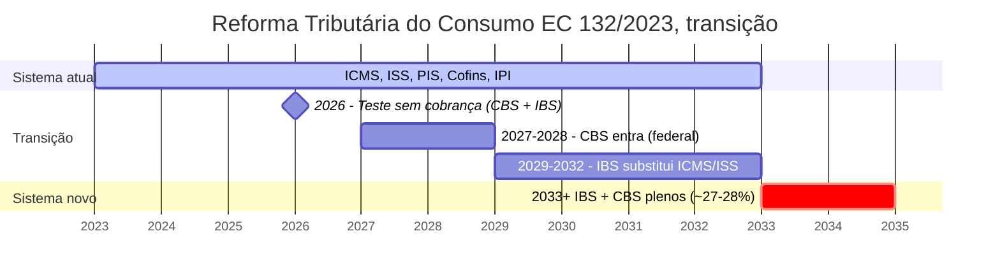

## APÊNDICE W — CONTABILIDADE, TRIBUTÁRIO E REGIMES FISCAIS PARA STARTUP BRASILEIRA

> [!note] Nota de validade
> A legislação tributária brasileira muda frequentemente. Reformas, alíquotas, e regimes especiais. Esse apêndice reflete o cenário de abril de 2026, pós-Reforma Tributária do Consumo (EC 132/2023) em fase de transição (IBS, mais CBS, gradualmente substituindo ICMS, ISS, PIS, Cofins, IPI até 2033). Revisar anualmente, idealmente com contador especializado em startup. Os princípios (separação pessoal/empresarial, documentação, planejamento tributário antecipado) têm vida útil mais longa que alíquotas, e regimes específicos.

A [[#FASE 13 — ESTRUTURAÇÃO JURÍDICA, FINANCEIRA E OPERACIONAL|Fase 13]] cobre constituição da empresa, cap table, e contratos. Esse apêndice aprofunda o que muitos fundadores brasileiros aprendem errado, ou tarde. Contabilidade, e tributação, como disciplinas operacionais. Erros aqui podem gerar passivos de R$ 5 a R$ 50 milhões, descobertos em due diligence. E fazer exit desmoronar por questões que custariam R$ 50 mil para prevenir.

### O que esse apêndice cobre

Três camadas.

1. Contabilidade gerencial, e fiscal. Registro organizado de receitas, despesas, ativos, e passivos. Fechamento mensal. Conciliações. DRE, balanço, e DFC.
2. Tributação. Quais tributos incidem, em que regime, com qual planejamento antecipado.
3. Compliance fiscal. Obrigações acessórias (ECF, ECD, EFD, Sped, DCTF, RAIS, ou eSocial), sem atraso.

Entregáveis. Livros contábeis em dia. DRE mensal. Reconciliações. Sem pendências em receita, estadual, ou municipal. Contador terceirizado (ou interno em escala) como infraestrutura.

### POR QUE

Due diligence em M&A, ou captação, descobre tudo. Dívida oculta, passivo contingente, e crédito tributário não reconhecido. Tudo vira ajuste no valor. O comprador sério sai do deal, ou quer desconto.

Multas crescem em juros, e Selic. Atraso de três anos em obrigação acessória vira quarenta a sessenta por cento sobre tributo devido.

Benefícios fiscais exigem documentação rigorosa. Lei do Bem, incentivos regionais, e SuperSimples. Se não comprovar com papel certo, viram autuação.

> [!important] Planejamento tributário aumenta margem
> Planejamento tributário bem-feito aumenta margem líquida em dois a oito por cento, em SaaS, ou tech. Impacto direto em caixa, e valuation.

### Quando usar

Dia um da empresa. Contador especializado. Não generalista. Não "contador do meu primo".

[[#FASE 12 — PRODUCT-MARKET FIT|Fase 12]]. Decisão de regime tributário, com visão de dezoito a vinte e quatro meses.

[[#FASE 14 — ESCALA: TIME, OPERAÇÕES, CRESCIMENTO E CAPITAL|Fase 14]] (Time, e Liderança, da escala inicial à Série B). Considerar trazer para dentro um controller, ou FP&A. Não substitui contador externo.

Pré-captação Série A em diante. Preparação formal para DD (livros auditados, ou revisados).

Antes de atingir R$ 4,8 milhões de faturamento por ano. Decidir Simples versus Lucro Presumido, antes do próximo ano-calendário.

### Quem envolve

Contador externo especializado em startup. Escritórios como Contabilizei (tecnologia), Conube, e CLM Controller. Especializados setoriais. Valor típico, R$ 1.500 a R$ 5.000 por mês na fase inicial.

Advogado tributarista. Consultivo. Não diário. Acionar em decisões críticas.

Controller interno. Da [[#FASE 14 — ESCALA: TIME, OPERAÇÕES, CRESCIMENTO E CAPITAL|Fase 14]] (Operações) em diante (R$ 120 a R$ 180 mil por ano no Brasil).

FP&A (Financial Planning & Analysis). Série B em diante, para cenários, orçamento, e KPIs financeiros.

Auditoria externa. Série A em diante, ou exigência de investidor (custo R$ 30 a R$ 200 mil por ano).

### Como executar

#### 1. Regimes tributários brasileiros, escolha consciente

Três regimes principais. A escolha é anual (outubro a dezembro, para vigorar no ano seguinte). Raramente revogável no ano.

**Simples Nacional (faturamento até R$ 4,8 milhões por ano).** Alíquota unificada progressiva (seis a trinta e três por cento, no Anexo III, ou V, para serviços, ou tech). Inclui IRPJ, CSLL, IRS, PIS, Cofins, ISS, e INSS patronal. Vantagens. Simplicidade administrativa. Carga relativamente baixa, até cerca de R$ 2 milhões de faturamento. Desvantagens. Teto de faturamento. Algumas atividades excluídas. Não permite certos créditos. Fator R (só anexos III, ou V). Se a folha de pagamento é igual ou maior que vinte e oito por cento do faturamento, cai em anexo mais barato. Relevante em SaaS com time forte.

**Lucro Presumido (faturamento até R$ 78 milhões por ano).** IRPJ, e CSLL, sobre margem presumida (trinta e dois por cento para serviços. Oito por cento para comércio). PIS/Cofins cumulativo (3,65% sobre receita bruta). ISS municipal (dois a cinco por cento, dependendo da cidade, e atividade). Vantagens. Permite créditos em algumas operações. Previsibilidade. Desvantagens. Se a margem real é menor que a margem presumida, paga mais imposto que justo.

**Lucro Real (obrigatório acima de R$ 78 milhões por ano, ou atividades específicas).** IRPJ quinze por cento, mais dez por cento de adicional sobre acima de R$ 20 mil por mês de lucro. CSLL nove por cento sobre lucro. PIS/Cofins não-cumulativo (9,25% combinado, com créditos). ISS municipal. Vantagens. Tributação sobre lucro real. Permite aproveitamento de prejuízos. Créditos amplos. Desvantagens. Complexidade. Auditoria fiscal rigorosa.

> [!tip] Regra prática para regime
> Faturamento menor que R$ 2 milhões por ano, e margem alta. O Simples tende a vencer. R$ 2 a R$ 10 milhões por ano, com margem média (tech SaaS típico). O Lucro Presumido frequentemente vence. Qualquer faturamento com margem baixa, ou alto volume de custos dedutíveis. O Lucro Real vale simulação.

> [!warning] Simulação obrigatória
> Rodar cálculo do próximo ano em cada regime, antes de escolher. Diferenças de R$ 200 a R$ 500 mil por ano, em empresa de R$ 10 milhões de faturamento, são comuns.

#### 2. Reforma Tributária do Consumo, transição 2026-2033

A EC 132/2023 substitui progressivamente ICMS, ISS, PIS, Cofins, e IPI, por IBS (Imposto sobre Bens e Serviços, estadual, e municipal), mais CBS (Contribuição sobre Bens e Serviços, federal). Alíquota combinada projetada, cerca de vinte e sete a vinte e oito por cento.

**Cronograma.** 2026, teste sem cobrança. 2027 a 2028, CBS entra em vigor gradualmente. 2029 a 2032, IBS substitui ICMS, e ISS, progressivamente. 2033, sistema atual totalmente substituído.

**Cronograma visual da transição IBS, mais CBS.**



*Transição escalonada em dez anos. Planejamento empresarial deve incluir cenários de 2027 (CBS entrando), e 2033 (sistema novo totalmente vigente). Simples Nacional terá regime adaptado. Lucro Real terá créditos não-cumulativos mais amplos. Lucro Presumido deixará de existir na forma atual.*

**Impacto em startup.** SaaS hoje pagando ISS de dois a cinco por cento, pode ver carga consumo subir para cerca de vinte e sete por cento. Mas com créditos não-cumulativos mais amplos. Simplificação administrativa (um imposto no lugar de quatro).

> [!important] Planejar cenários 2027 em diante
> Planejar cenários 2027 em diante, agora, com contador tributarista.

#### 3. Tributação de stock options, e planos de incentivo de longo prazo (ILP)

Stock options no Brasil são tema com histórico de disputas regulatórias. O estado da arte em 2026 reflete decisões acumuladas em tribunais administrativos, e judiciais, sobre se o ganho é "natureza mercantil" (ganho de capital), ou "natureza trabalhista" (remuneração salarial). A diferença tributária é enorme. Quinze por cento, versus até 27,5%, mais encargos.

**Natureza mercantil (favorável).** O colaborador paga strike price no exercício (oneroso). Risco genuíno (a opção pode não ter valor. O strike price pode ser superior a preço de mercado). Voluntariedade (não é obrigatório participar). Tempo de vesting razoável (geralmente quatro anos). Sem vinculação direta a desempenho salarial (não é bônus em ações mascarado).

Com esses elementos, o entendimento majoritário em 2026 é tributação como ganho de capital. Quinze a 22,5%, progressivo, sobre o ganho na venda das ações. Favorável ao colaborador.

**Natureza trabalhista (desfavorável).** Plano é essencialmente bônus em ações (sem strike price, ou simbólico). Sem risco real (ações entregues gratuitamente, ou quase). Vinculado diretamente a metas de desempenho, com entrega garantida. Tempo de vesting curto, ou eventos de aceleração frequentes.

Nesse caso, tributação como salário. 7,5 a 27,5% na tabela progressiva, mais INSS (até teto), mais FGTS, mais 13º proporcional, mais encargos patronais.

**Desenho de plano que maximiza chance de classificação mercantil.**

1. Strike price igual ou maior que fair market value, no momento da concessão (FMV pode ser baseado em última rodada, ou valuation formal).
2. Vesting mínimo de quatro anos, com cliff de um ano (padrão internacional).
3. Exercício voluntário. O colaborador decide quando, e se, exerce.
4. Aprovação societária formal do plano (assembleia).
5. Plano como documento corporativo formal (não cláusula em contrato de trabalho).
6. Tratamento contábil em conta de patrimônio líquido. Não em despesa de pessoal.
7. Sem vinculação direta a salário (não é "quinze por cento do salário em ações").
8. Comunicação alinhada. Em documentos internos, e externos, tratar como participação societária.

**Modelos práticos.**

**Plano clássico de Stock Options (padrão YC adaptado).** Concessão de opções com strike price FMV. Vesting quatro anos, com cliff de um ano. Exercício em janela (tipicamente noventa dias após saída. Algumas empresas estendem para sete a dez anos, "long exercise window"). Exercício exige pagamento em dinheiro (salvo "cashless exercise" em eventos de liquidez).

**RSU, Restricted Stock Units.** Direito a receber ações após vesting (sem pagamento de strike). Por natureza, tende mais à classificação trabalhista. Usado mais em empresas listadas, ou pré-IPO. Nas estruturas Delaware Flip, RSUs no nível da holding DE podem ter tratamento diferenciado.

**Phantom Stock (modelo alternativo crescente).** Direito a receber dinheiro equivalente à valorização de ações (sem entregar ações). Tributação clara como bônus em dinheiro (remuneração). Vantagem. Sem diluição societária. Sem complexidade de registro. Desvantagem. Tributariamente desvantajoso (todo ganho é salário). Usado em empresas com sócios que não querem diluir, ou em estágios pré-captação.

**Stock Appreciation Rights (SAR).** Similar ao Phantom Stock. Menos comum no Brasil.

**Profit Sharing, ou Performance Bonus.** Não é equity. É bônus em dinheiro, baseado em lucro. Regido pela Lei 10.101/2000 (PLR). Tributação em tabela própria (mais favorável que salário). Limitado a pagamentos até duas vezes por ano. Não substitui equity. Complementa.

**Eventos tributários em stock options.**

1. Concessão (grant). Geralmente não tributada. Apenas direito de opção futura.
2. Vesting. Geralmente não tributado. Direito se consolida.
3. Exercício (exercise). Sob natureza mercantil. Sem tributação imediata (apenas custo de aquisição igual a strike price). Sob natureza trabalhista. Diferença entre FMV, e strike, é tributada como salário no momento.
4. Venda das ações. Sob natureza mercantil. Ganho de capital (FMV na venda menos strike) tributado a quinze a 22,5%. Sob natureza trabalhista. Venda apenas tributa diferença entre FMV no exercício, e FMV na venda (se existir).

**Em estrutura com Delaware Flip.** Funcionário pode ter opções sobre ações da holding DE. Tributação segue regras americanas no nível da holding. ISOs (Incentive Stock Options), e NSOs (Non-Qualified), têm tratamentos diferentes nos EUA. No Brasil, mesmo sendo ações estrangeiras, ganho de capital em alienação é tributado no Brasil (na declaração do funcionário residente).

**Casos brasileiros com decisões relevantes.** Caso Skyworks, ou Alphabet Brasil. Jurisprudência favorável à natureza mercantil. Caso IBM Brasil. Várias decisões do CARF (Conselho Administrativo de Recursos Fiscais) com vitórias para empresa, em planos bem-desenhados. Caso Petrobras. PLR em ações tratada como salário (como esperado. Era bônus, não opção).

> [!important] Recomendação operacional sobre stock options
> Plano desenhado por tributarista especializado (R$ 20 a R$ 60 mil de projeto). Pareceres tributários antes da implementação. Revisão anual do plano, considerando mudanças regulatórias. Documentação rigorosa de cada concessão, exercício, e vesting. Consciência de que tributação pode mudar. O estado da arte em 2026 pode evoluir em qualquer direção.

**Benchmark de tamanho de ESOP.** Startups em seed. Pool de dez a quinze por cento, reservado para funcionários. Série A. Ampliar para quinze a vinte por cento. Série B a C. Vinte a vinte e cinco por cento. Executivos chave (C-level). 0,5 a três por cento individual. Engineers senior. 0,1 a 0,5 por cento individual. Early employees (cinco a vinte primeiros). 0,5 a dois por cento individual.

#### 4. Benefícios fiscais para startup

**Lei do Bem (Lei 11.196/2005).** Empresa em Lucro Real pode deduzir até duzentos por cento dos gastos com P&D (pesquisa, e desenvolvimento), na apuração de IRPJ, e CSLL. Requer ser do Lucro Real, ter certificação técnica dos projetos, e documentar hora-a-hora. MCTI/SEMPI é o órgão. Benefício típico, R$ 200 mil a R$ 2 milhões de redução de imposto anual, em startup tech de R$ 30 a R$ 150 milhões de faturamento.

> [!warning] Lei do Bem sem documentação
> Sem documentação rigorosa, a autuação é garantida.

**Regionais (SUDAM, SUDENE, ZFM).** SUDAM (Norte), e SUDENE (Nordeste), oferecem redução de IRPJ para empresas em regiões específicas. Até setenta e cinco por cento de redução, por dez anos. Zona Franca de Manaus tem regime próprio (industrial, com vantagens especiais para eletrônicos).

**Setoriais.** Audiovisual. Lei do Audiovisual (Ancine). Cultura. Lei Rouanet. Inovação. Editais BNDES, FINEP, e FAPESP (combinam bem com Lei do Bem).

**Incentivos estaduais.** Vários estados têm programas de atração (Minas, Paraná, RS, Ceará). Vale a pena pesquisar, se expansão geográfica for opção.

#### 5. Rotinas operacionais mensais

**Fechamento contábil (até dia quinze do mês seguinte).** Contas a pagar, e a receber, conciliadas. Extratos bancários reconciliados. Provisões lançadas (férias, 13º, e juros). DRE gerencial produzida, e revisada.

**Obrigações acessórias (não atrasar).** eSocial (mensal). DCTF Mensal (tributos federais). SPED Fiscal (mensal, aplicável conforme regime). ECD, e ECF (anual). Relatórios estaduais, ou municipais (varia).

**Controller check mensal.** Caixa versus DRE (diferença entre regime de caixa, e competência). Margens por produto, ou segmento. Contas em variação acima de dez por cento do mês anterior (investigar).

#### 6. Investimento-anjo no Brasil, mútuo conversível, SAFE-BR, e Lei Complementar 155/2016

Investimento-anjo no Brasil opera sob regime específico, estabelecido pela Lei Complementar 155/2016 (que incluiu Art. 61-A na LC 123/2006). Confirmado posteriormente pela Lei 13.176/2015. O estado da arte em 2026 tem instrumentos maduros. Mas ainda em evolução, comparado a estruturas americanas.

Problema histórico. Antes de 2016, o investidor-anjo em Ltda brasileira tinha risco de desconsideração de personalidade jurídica. Podia ser responsabilizado pessoalmente por dívidas trabalhistas, fiscais, e civis, da empresa. Isso afastava investidores.

LC 155/2016 resolveu. O investidor-anjo NÃO é sócio formal da empresa. Não responde por dívidas da empresa (proteção patrimonial). Participa nos resultados (remuneração até cinquenta por cento do lucro, limitado). Investimento por prazo definido (até sete anos). Possibilidade de conversão em participação societária ao fim do prazo.

#### Mútuo Conversível, instrumento dominante

O que é. Contrato em que o investidor empresta capital à empresa, com direito de converter em participação societária, em evento futuro (geralmente próxima rodada de captação).

**Estrutura típica.** Valor do investimento. R$ 50 mil a R$ 5 milhões em rodadas anjo brasileiras. Prazo. Três a sete anos tipicamente. Taxa de juros. Zero por cento, a IPCA mais quatro por cento (varia muito). Evento de conversão. Próxima rodada acima de valuation, ou volume específico, ou termo do contrato. Desconto em conversão. Quinze a trinta por cento sobre valuation da próxima rodada. Cap de valuation. Limite superior do valuation de conversão (proteção ao anjo). Garantias. Em caso de inadimplência, retorno do principal mais juros.

**Vantagens para empresa.** Rápido. Fechado em dias, ou semanas. Não meses. Não dilui imediatamente. A conversão apenas em evento futuro. Sem governança imediata. O anjo geralmente é conselheiro informal. Barato. Contratos padrões existem (templates Anjos do Brasil, ABVCAP).

**Vantagens para investidor.** Proteção da LC 155/2016. Desconto em conversão (entra mais cedo, por preço melhor). Cap de valuation (se a empresa explode, o anjo não é diluído demais). Juros garantidos em caso de não-conversão.

**Cláusulas críticas em mútuo conversível.**

1. Trigger de conversão automática. Rodada acima de R$ X, e/ou com investidor qualificado.
2. Trigger de conversão opcional. O investidor pode escolher converter em certos eventos.
3. Desconto. Aplicado sobre preço por quota, ou ação, da nova rodada.
4. Valuation cap. Ceiling para proteção, em caso de mega-rodada.
5. MFN (Most Favored Nation). Se o próximo investidor tiver termos melhores, o anjo iguala.
6. Pro-rata rights. Direito de participar de rodadas futuras.
7. Informação. Relatórios periódicos, e inspeção.
8. Tag-along. Se os fundadores venderem, o anjo tem direito de vender também.
9. Anti-diluição. Proteção contra down-rounds.

> [!warning] Armadilhas em mútuo conversível
> Múltiplos mútuos sem coordenação. A conversão simultânea complica cap table. Valuation cap muito baixo. O anjo captura demais em sucesso. Valuation cap muito alto. O anjo não tem proteção real. Conversion trigger mal-definido. Ambiguidade em evento ativa disputa. Prazo sem evento. Ao fim do prazo, a empresa pode não ter capital para quitar. Juros altos. Se não converter, a empresa carrega dívida pesada.

#### SAFE adaptado ao Brasil (SAFE-BR)

SAFE (Simple Agreement for Future Equity). Instrumento criado pela Y Combinator (2013), para investimentos seed nos EUA. É promessa de equity futuro, sem ser dívida formal.

**SAFE nos EUA.** Não é mútuo (sem juros, e sem prazo de quitação). Converte em equity em próxima rodada qualificada. Simplicidade extrema (documento de cerca de cinco páginas). Funciona bem em Delaware LLC, ou Inc.

**Adaptação ao Brasil.** Estrutura SAFE pura não é juridicamente reconhecida no Brasil, como contrato societário. Tentativas de adaptação usam combinação de mútuo conversível, mais promessa de compra futura, mais opções. "SAFE-BR" é termo informal para essas adaptações. Ainda em evolução jurisprudencial.

**Quando SAFE-BR faz sentido.** Investidor internacional que conhece SAFE. Estrutura já em Delaware Flip (SAFE em DE). Rodada muito rápida, onde as partes priorizam simplicidade.

**Quando não faz sentido.** Primeiros anjos brasileiros (mútuo conversível é mais reconhecido). Valores altos com complexidade (mútuo conversível com cláusulas detalhadas é superior).

#### Outros instrumentos

Equity direto (compra de quotas, ou ações). O investidor vira sócio formal. Sem proteção da LC 155/2016 (responde por dívidas proporcionalmente). Usado em rodadas maiores, com investidores sofisticados, e estrutura de S.A.

Convertible Note (nota promissória conversível). Dívida formal, que pode ser convertida. Muito similar ao mútuo conversível, mas com registro diferente. Menos comum em rodadas anjo BR. Mais em venture debt.

Mútuo participativo. Híbrido. Parte mútuo, parte participação. Estrutura complexa. Tributariamente desafiadora. Uso limitado.

#### Termos típicos de rodada anjo BR (2026)

Ticket médio individual. R$ 100 a R$ 500 mil. Rodada anjo completa. R$ 500 mil a R$ 3 milhões. Valuation pré-money. R$ 3 a R$ 20 milhões (varia enormemente por setor, e tração). Desconto em conversão. Vinte a vinte e cinco por cento, comum. Valuation cap. Duas a três vezes o valuation atual. Prazo de conversão. 36 a 60 meses.

**Fontes de investimento-anjo no Brasil.** Anjos individuais. Alta dispersão. Rede de networking. Grupos formais. Anjos do Brasil, Harvard Angels, Gávea Angels, Anjos SP. Programas estruturados. Bossa Nova, DOMO Invest, Canary (seed). Super-anjos. Indivíduos que fazem muitos cheques (Mauricio Benvenutti, Mate Pencz, e outros). Family offices. Crescente em seed BR.

#### Considerações tributárias em investimento-anjo BR

**Para o investidor-anjo pessoa física.** Juros recebidos. Tributados como rendimento (tabela progressiva até 27,5%). Ganho em conversão (diferença entre valor investido, e valor das quotas, ou ações, recebidas). Ganho de capital (quinze a 22,5%). Venda posterior das quotas, ou ações. Ganho de capital.

**Para o investidor-anjo pessoa jurídica.** Juros recebidos. Receita financeira (IRPJ, mais CSLL, mais PIS/Cofins sobre receita). Ganho em conversão, e venda. Depende do regime tributário da PJ.

**Para a empresa.** Recebimento do valor. Não é receita tributável (é capital, ou dívida). Conversão. Não gera fato gerador de IRPJ, ou CSLL (ajuste de capital). Pagamento de juros. Dedutível (se a empresa em Lucro Real).

#### 7. Cap table brasileiro em profundidade

Cap table (capitalization table) é o mapa de propriedade da empresa. Em startup brasileira, a complexidade vem de dois lados. Tipo societário (Ltda versus S.A.), e instrumentos de investimento (mútuos, SAFEs, e opções).

#### Ltda versus S.A., impactos no cap table

**Sociedade Limitada (Ltda).** Capital dividido em quotas (não ações). Transferência de quotas. Requer alteração contratual (assinatura no contrato social). Todos os sócios geralmente constam no contrato social (público). Uma classe única de quotas, na maioria dos casos (dificulta estruturação de preferred shares). Limite informal. Cerca de dez a trinta sócios torna gestão complicada.

**Sociedade Anônima (S.A.).** Capital dividido em ações. Transferência. Via registro no livro de ações (privado, ou via certificadora). Acionistas podem permanecer confidenciais. Múltiplas classes de ações possíveis (ordinárias, preferenciais, com direitos diversos). Estrutura para centenas, ou milhares, de acionistas.

**Quando migrar de Ltda para S.A.** Captação Série A em diante, internacional. Geralmente exigida. Mais de quinze a vinte acionistas planejados. Plano de ESOP significativo (S.A. facilita). Preparação para IPO.

Custo de migração. R$ 30 a R$ 100 mil em advogados, mais custos cartoriais, mais reestruturação societária.

#### Classes de ações em S.A. brasileira

**Ações Ordinárias (ON).** Direito a voto. Dividendos proporcionais. Residuais em liquidação (última classe a receber).

**Ações Preferenciais (PN).** Geralmente sem direito a voto (exceto em casos específicos). Preferência em dividendos (mínimo legal), ou em liquidação. Podem ter direitos especiais (conversibilidade, e participação).

**Classes específicas para investidores.** PN Série A. Preferred stock estilo americano, adaptado. PN Série B (etc.). Classes posteriores, com direitos diferenciados. Liquidation preference. 1x, 2x, ou 3x (ordem de pagamento em exit). Participating versus non-participating. Participating recebe preferência, E participa do residual. Conversion rights. Converter em ON em eventos específicos. Anti-dilution. Broad-based weighted average (comum). Narrow-based. Ratchet (raro). Drag-along. Maioria pode forçar minoria a vender em exit. Tag-along. Minoria tem direito de vender, junto com majoritários.

#### Exemplo de cap table em evolução

**Estágio 0, fundação.**

```text
Fundador A: 60%
Fundador B: 40%
Total: 100%
```

**Estágio 1, após rodada anjo (R$ 1 milhão com mútuo conversível).**

Cap table "formal" (antes da conversão) permanece.

```text
Fundador A: 60%
Fundador B: 40%
```

Mas há pendente. Mútuo conversível R$ 1 milhão a converter em próxima rodada, com desconto vinte por cento, e cap R$ 8 milhões.

**Estágio 2, após Série A (R$ 10 milhões, pre-money R$ 20 milhões).**

Conversão do mútuo. Cap, R$ 8 milhões dividido por R$ 20 milhões, igual a quarenta por cento de desconto implícito via cap. O investidor converte a R$ 8 milhões de valuation. R$ 1 milhão dividido por R$ 8 milhões, igual a 12,5% da empresa, ao investidor anjo.

Nova rodada. R$ 10 milhões pre-money R$ 20 milhões, igual a 10 dividido por 30, igual a 33,3% aos investidores Série A.

Post-money cap table.

```text
Fundador A: 60% × 66,7% × 87,5% = 35,0%
Fundador B: 40% × 66,7% × 87,5% = 23,3%
Anjo: 12,5% × 66,7% = 8,3%
Série A: 33,3%
Total: 100,0%
```

Nota. ESOP pool geralmente criado antes da rodada (dez a quinze por cento). Dilui fundadores.

Pre-rodada, com ESOP quinze por cento.

```text
Fundadores pós-diluição para pool: 85% × distribuição original
Anjos (já diluídos por ESOP): proporcional
ESOP reservado: 15%
```

Post-rodada completa, com tudo.

```text
Fundador A: ~30%
Fundador B: ~20%
Anjo: ~7%
ESOP pool: ~13%
Série A: ~30%
Total: 100%
```

**Estágio 3, Série B, ou C.** Novas rodadas diluem todos proporcionalmente. Os fundadores frequentemente têm cinco a vinte por cento na Série C.

#### Ferramentas de cap table

Carta (cartainc.com). Padrão internacional. Excelente para estrutura Delaware.

Captable.io, e Pulley. Alternativas.

Eqvista, e Shareworks. Opções diferentes.

No Brasil sem flip. Planilha estruturada, mais controle formal via contrato social, ou livro de ações. Menos automatizado. Mais manual.

#### Armadilhas típicas em cap table BR

Diluição invisível. Os fundadores não percebem impacto cumulativo de rodadas.

Classes mal-desenhadas. Preferences muito agressivas em early rounds, complicam later rounds.

Múltiplos mútuos sem coordenação. Conversão simultânea com termos conflitantes.

ESOP pool não-reservado antes da rodada. Dilui fundadores na criação do pool.

Anti-diluição ratchet. Em down-round, o investidor anterior não é diluído. Os fundadores absorvem tudo.

Cláusulas de vesting reverso, sem proteção. O fundador sai, e perde ações rapidamente.

Sem acordo de acionistas formal. Disputas societárias sem resolução clara.

---

### Métricas

Pontualidade em obrigações acessórias. Cem por cento. Nada de "pagou com atraso".

Tempo de fechamento mensal. Alvo igual ou menor que dez dias úteis após fim do mês.

Percentual de reconciliações bancárias completas mensalmente. Cem por cento.

Divergências DRE gerencial versus fiscal. Igual ou menor que cinco por cento.

Créditos tributários recuperáveis identificados. Revisão trimestral.

Tempo para produzir dados em DD. Igual ou menor que uma semana, com data room em dia.

### Definição de sucesso

Disciplina fiscal está no padrão quando os seis itens estão em pé.

1. Contador externo especializado contratado desde dia um.
2. Regime tributário foi escolhido com simulação anual em outubro a dezembro.
3. Fechamento contábil mensal acontece em igual ou menor que dez dias úteis.
4. Sem pendências em órgãos fiscais (Receita Federal, Estado, Município, e INSS).
5. Plano de stock options, se existe, foi desenhado por tributarista especializado.
6. Benefícios fiscais aplicáveis (Lei do Bem, e regionais) estão mapeados, e em uso.

### Armadilhas

Contador generalista, ou família. "Meu tio contador" gera passivos em DD.

Regime tributário errado por preguiça. Escolher Simples só porque "todo mundo começa com Simples", sem simular. Em SaaS com alta margem, o Lucro Presumido pode ser melhor desde R$ 1 milhão de faturamento.

Benefícios fiscais sem documentação. Usar Lei do Bem sem docs de P&D gera autuação.

Stock options como remuneração, sem estrutura tributária. Vira tributação salarial, que destrói o incentivo.

Misturar pessoal, e empresarial. "PIX do CNPJ da empresa pagando Uber pessoal" vira autuação por despesa indedutível, e problema em DD.

Ignorar municipal (ISS). Cada município tem alíquota, e regras próprias. Operação em dez cidades, igual a dez compliances municipais distintos.

Reforma Tributária ignorada. Empresa não se planeja para transição 2027 a 2033, e descobre mudança abrupta de carga.

Não reconhecer prejuízos fiscais acumulados (Lucro Real). Podem compensar lucros futuros. Ativo fiscal ignorado é dinheiro na mesa.

### Checklist

- [ ] Contador especializado em startup contratado?
- [ ] Regime tributário escolhido com simulação formal do próximo ano?
- [ ] Fechamento contábil mensal acontece em igual ou menor que dez dias úteis?
- [ ] Obrigações acessórias (DCTF, eSocial, SPED, ECF, ECD) em dia?
- [ ] Plano de stock options, se houver, foi revisado por tributarista?
- [ ] Benefícios fiscais aplicáveis (Lei do Bem, SUDAM, ou SUDENE, regionais) mapeados?
- [ ] Separação clara de pessoal, e empresarial, com políticas escritas?
- [ ] Reconciliações bancárias cem por cento mensais?
- [ ] Plano de transição da Reforma Tributária (IBS, mais CBS) mapeado?
- [ ] Advogado tributarista identificado, para questões críticas?

### Ver também

[[#APÊNDICE AN — MODELAGEM FINANCEIRA OPERACIONAL|Apêndice AN]], Modelagem financeira. [[#APÊNDICE AT — GESTÃO DE CAIXA EM PROFUNDIDADE|Apêndice AT]], Gestão de caixa. [[#APÊNDICE BY — TESOURARIA EM ESCALA: GESTÃO DE CAIXA MULTI-MOEDA, MULTI-PAÍS E MULTI-CONTA|Apêndice BY]], Tesouraria em escala. [[#APÊNDICE BT — HEDGING CAMBIAL E GESTÃO DE MOEDA MULTICOUNTRY|Apêndice BT]], Hedging cambial.

---

---
