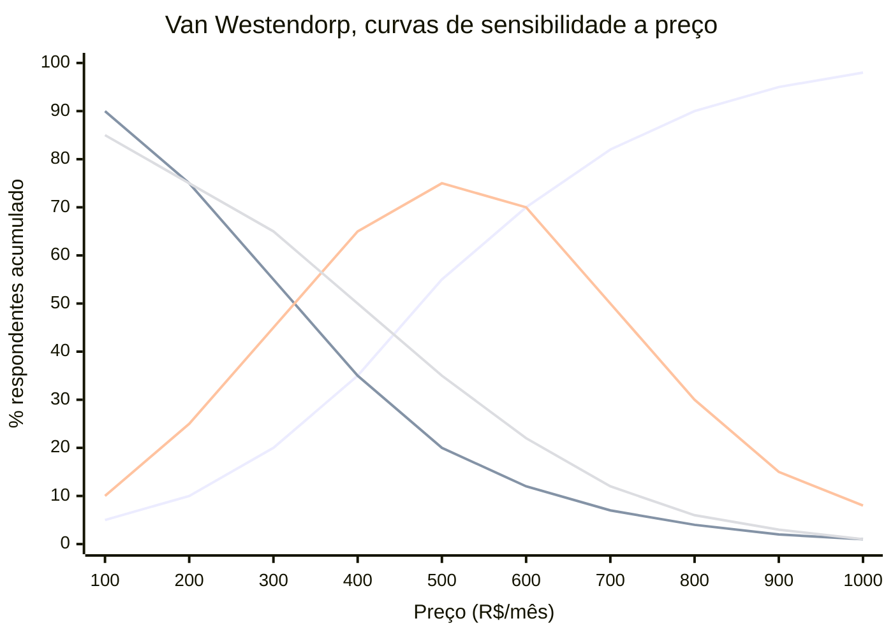

## APÊNDICE X — PRICING STRATEGY COMO DISCIPLINA

> [!note] Nota de validade
> Os princípios de pricing (valor percebido, disposição a pagar, elasticidade, packaging) são estáveis ao longo de décadas. O que muda. Benchmarks setoriais. Padrões de pricing de SaaS versus usage-based versus hybrid. Ferramentas de pricing analytics. Revisar benchmarks a cada dezoito a vinte e quatro meses. A emergência de modelos AI-native em 2024 a 2026 tem trazido novos padrões (usage-based, outcome-based, credit-based) que ainda se estabilizam.

A [[#FASE 11 — VALIDAÇÃO DO MODELO DE NEGÓCIO|Fase 11]] cobre validação do modelo de negócio. Incluindo hipóteses de preço em alto nível. Esse apêndice trata pricing como disciplina operacional contínua. Não decisão única. Pricing é uma das alavancas mais subutilizadas em startup brasileira. Os fundadores tipicamente subprecificam por três a cinco anos antes de acordar. Deixando trinta a sessenta por cento de receita potencial na mesa. Correção de pricing bem-feita pode dobrar ARR sem adicionar cliente. ROI que nenhum movimento operacional iguala.

### O que esse apêndice cobre

Pricing strategy é a disciplina de descobrir, testar, estruturar, e evoluir, preço ao longo do tempo. Envolve quatro frentes. Pesquisa de disposição a pagar (willingness to pay). Estrutura (tiered, usage-based, hybrid, enterprise custom). Packaging (o que está em cada tier, como features mapeiam a valor). Evolução (reajustes anuais, grandfathering, reposicionamento).

Os entregáveis. Documento de pricing com racional (não só tabela de preços). Resultados de testes. Política de reajustes, e descontos. Playbook de negociação para Sales.

### POR QUE

Pricing é a alavanca de maior impacto no valuation. Aumento de dez por cento em preço raramente perde dez por cento de clientes. Efeito líquido. Mais oito a dez por cento em receita. Que vira mais oito a dez por cento em ARR. Que vira mais oito a dez por cento em valuation. Tudo sem custo marginal.

Preço comunica posicionamento. Preço muito baixo sinaliza produto genérico. Preço alto sinaliza valor premium. Mudar preço muda percepção.

Pricing ruim atrai cliente errado. Preço baixo atrai ICP errado (menos pagante, mais exigente). Preço alto filtra ICP de maior LTV.

Captura de valor é tão importante quanto criação. Startups que criam valor, mas capturam pouco, são absorvidas por quem captura bem (classical Porter).

### Quando usar

Primeira definição. [[#FASE 11 — VALIDAÇÃO DO MODELO DE NEGÓCIO|Fase 11]] (modelo de negócio).

Primeiro teste sério. [[#FASE 12 — PRODUCT-MARKET FIT|Fase 12]] (pós-PMF inicial).

Revisão de estrutura. A cada doze a dezoito meses.

Reajuste anual. Obrigatório em SaaS (mínimo IPCA mais um a três pontos percentuais).

Reposicionamento. Quando há expansão de ICP. Novo produto. Ou mudança de posicionamento.

### Quem envolve

CEO, ou founder. Lidera decisão estratégica de pricing.

Finance, ou CFO. Modela impacto de cenários, e simula LTV, e unit economics.

Product. Conecta preço a features, e valor percebido.

Sales. Feedback de negociação, e elasticidade observada.

Consultoria especializada (opcional, para re-pricing grandes). Simon-Kucher, PriceIntelligently (hoje ProfitWell), Pricing I/O. Custo típico, R$ 50 a 300 mil por projeto.

### Como executar

#### 1. Pesquisa de Willingness to Pay

**Van Westendorp Price Sensitivity Meter (PSM).** Metodologia de pesquisa com quatro perguntas a potenciais clientes. A partir de qual preço o produto parece caro demais para considerar? A partir de qual preço o produto parece barato demais (sinal de baixa qualidade)? Qual preço parece caro, mas aceitável? Qual preço parece um bom negócio?

A plotagem cruza as quatro curvas, e revela.

Visualização das quatro curvas do PSM (exemplo ilustrativo).

> [!note] Compatibilidade — requer Mermaid 10+ (Obsidian 1.4+)



Leitura. A curva crescente mais agressiva é "caro demais, nem considero". A curva decrescente mais agressiva é "barato demais, suspeito". As curvas em sino são "aceitável", e "bom negócio". O OPP fica na intersecção das duas primeiras. O RAP é a faixa entre rejeições.

Optimum Price Point (OPP). Onde a intersecção de "caro demais", e "barato demais", está em equilíbrio.

Range of Acceptable Prices (RAP). Faixa entre o ponto de rejeição por barato, e a rejeição por caro.

Amostra mínima. Trinta a cinquenta respostas em ICP definido. Ferramentas. Google Forms, ou Typeform, bastam.

**Value-based pricing, método direto.** Perguntar ao cliente. "Que valor você obtém com o produto em doze meses?" (economia, receita adicional, tempo economizado vezes salário). Precificar em dez a trinta por cento desse valor entregue. Deixa setenta a noventa por cento como ROI claro para o cliente.

> [!important] Gabriel Weinberg, "10x rule"
> Preço onde o cliente percebe valor igual, ou maior, a dez vezes o preço, cria tração orgânica. A relação típica em SaaS B2B maduro. Valor percebido três a oito vezes preço. Produto excepcional, dez vezes ou mais.

#### 1.1 Value-based pricing na prática — como conduzir pesquisa de WTP no Brasil

O Brasil apresenta especificidades que tornam a pesquisa de willingness to pay mais complexa do que em mercados desenvolvidos. Respostas a preços são influenciadas pelo poder de compra regional, pela cultura de barganha, e pela desconfiança histórica com contratos longos.

**Protocolo para pesquisa de WTP no contexto brasileiro.**

Passo 1, definir o ICP com precisão antes de perguntar. Pesquisa de WTP com amostra heterogênea produz dados inúteis. Separar por segmento. PME (faturamento até R$ 20 milhões anuais), mid-market (R$ 20 a R$ 200 milhões), e enterprise (acima de R$ 200 milhões). O ponto ótimo de preço de cada segmento pode variar em três a cinco vezes.

Passo 2, ancorar na conversa de valor antes de introduzir preço. Perguntar diretamente "quanto você pagaria?" sem contexto produz âncoras baixas. A sequência correta é.

Primeiro, "descreva o principal problema que esse produto resolve para você". Segundo, "qual o custo atual desse problema — em tempo de equipe, custo de processo, ou receita perdida?" Terceiro, "se esse problema fosse resolvido completamente, qual seria o benefício em reais nos próximos doze meses?". Quarto, então introduzir as perguntas do PSM.

Passo 3, calibrar respostas ao contexto cultural. Brasileiros tendem a responder com preço mais baixo que o teto real, por hábito cultural de negociação. Pesquisas mostram que o preço efetivamente aceito em transação real é quinze a vinte e cinco por cento acima do declarado em pesquisa. Aplicar esse fator de correção ao interpretar dados de PSM.

Passo 4, validar com teste de preço real. Pesquisa informa direção. Teste com pricing real confirma. Colocar preço na landing page, em cohort pequena, e medir conversão. Diferença entre declarado em pesquisa e comportamento real frequentemente surpreende.

**Ferramentas de pesquisa disponíveis e custo no Brasil.**

Typeform ou Google Forms para PSM estruturado. Custo zero. User Interviews para recrutamento de respondentes qualificados. Custo US$ 25 a US$ 75 por respondente. SurveyMonkey Audience para amostras quantitativas. Custo R$ 80 a R$ 200 por respondente qualificado. Conjoint analysis com ferramentas como Qualtrics. Para empresas com budget de pesquisa, mais de R$ 50 mil por projeto, com resultado mais robusto.

> [!tip] Entrevistas qualitativas valem mais cedo
> Antes de ter escala suficiente para dados quantitativos (mínimo cinquenta respondentes por segmento), entrevistas qualitativas de trinta a quarenta e cinco minutos com dez a quinze prospects do ICP produzem mais insight que survey mal-amostrado. Perguntar sobre valor, custo alternativo, e orçamento disponível, diretamente na conversa.

**Erros mais comuns em pesquisa de WTP no Brasil.**

Pesquisar com clientes atuais que já pagam preço baixo. Eles têm âncora definida. Os dados refletem o preço histórico, não o potencial. Pesquisar com amostra de conveniência (lista de email própria). Frequentemente enviesada para ICP de menor ticket. Usar benchmarks de SaaS americano sem ajuste. Converter dólar por câmbio e assumir que o resultado faz sentido para o mercado brasileiro é erro sistemático.

#### 2. Estrutura de pricing, modelos principais

**Flat Monthly Fee.** Um preço, sem variação. Simples. Funciona em produtos de baixa diferenciação de uso. Exemplo. R$ 290 por mês para PadariaPro.

**Tiered (Good-Better-Best).** Três tiers (raramente quatro ou mais). Estrutura clássica de SaaS. Padrão de adoção em SaaS B2B. Vinte por cento tier baixo, sessenta por cento tier médio, vinte por cento tier alto (lei de 80/20 aplicada). Exemplo. Basic R$ 290, Pro R$ 590, Enterprise R$ 1.290 por mês. Regra de psicologia. O tier do meio deve ser o mais "óbvio". Decoy effect aplicado.

```mermaid
flowchart LR
 subgraph Basic["BASIC<br/>R$ 290/mês<br/>~20% adotam"]
 B1[Essenciais core]
 B2[Support email 48h]
 B3[Até 3 usuários]
 B4[Relatórios básicos]
 end

 subgraph Pro["PRO - âncora<br/>R$ 590/mês<br/>~60% adotam"]
 P1[Tudo do Basic +]
 P2[Integrações avançadas]
 P3[Relatórios customizados]
 P4[Suporte priority 12h]
 P5[Até 15 usuários]
 P6[API access]
 end

 subgraph Ent["ENTERPRISE<br/>R$ 1.290+/mês<br/>~20% adotam"]
 E1[Tudo do Pro +]
 E2[SSO SAML/OIDC]
 E3[SLA contratual 99.9%]
 E4[CSM dedicado]
 E5[Usuários ilimitados]
 E6[Audit logs + compliance]
 end

 Basic -. upgrade.-> Pro
 Pro -. upgrade.-> Ent
```



Decoy effect aplicado. O tier do meio deve ser a escolha "óbvia". Se noventa e cinco por cento escolhem Basic, os tiers estão mal-desenhados. Basic com valor demais. Ou Pro com justificativa fraca.

**Per-User (seat-based).** Preço escala com número de usuários. Padrão em Slack, Notion, Linear. Vantagem. Cresce organicamente com adoção. Desvantagem. O cliente economiza compartilhando contas.

**Usage-based (consumption).** Preço por consumo (API calls, transações, GB de dados). Cresce fortemente entre 2022 e 2026, com produtos AI-native. Vantagem. Alinha preço ao valor entregue, e escala com sucesso do cliente. Desvantagem. Imprevisibilidade de receita, e de custo, para o cliente. Exemplos. Snowflake, Twilio, OpenAI.

**Hybrid (base, mais usage).** Preço mínimo fixo, mais componente variável. Captura melhor valor em base heterogênea. Exemplo. R$ 490 por mês inclui dez mil API calls. R$ 0,05 por call adicional.

**Enterprise Custom.** Sem preço público. Negociação. Acima de ticket de R$ 50 a 100 mil por ano, ou em deals estratégicos. Base. "Floor price" interno, mais flex de vinte a quarenta por cento em negociação.

#### 3. Packaging, como features mapeiam a tiers

Princípios. O tier baixo captura alcance amplo (self-serve, PMEs). Features. Essenciais, sem restrições operacionais severas. O tier médio é onde a maior parte converte. Features. Integrações, relatórios avançados, suporte estendido. O tier alto é para enterprise. Features. SSO, SLA, security compliance, CSM dedicado, custom contracts.

Features que tipicamente são "enterprise-only". SSO (Single Sign-On) via SAML, ou OIDC. Audit logs completos. Controle granular de permissões. Integrações avançadas (API, webhooks com SLA). SOC 2, ou ISO 27001, compliance demonstrado. SLA com penalidade. Account Manager dedicado.

Se as enterprise-only features são o que diferencia o produto, o que está nos tiers menores precisa ser genuinamente útil. Senão, só o tier alto paga. E o funil trava.

#### 4. Pricing para expansão de receita — como estruturas seat-based e usage-based viabilizam NRR acima de 110%

NRR (Net Revenue Retention) acima de 110% é o indicador que separa empresas SaaS medianas de excelentes. Significa que, mesmo sem conquistar um único cliente novo, a receita cresce dez por cento ao ano, organicamente, dentro da base existente. Pricing é o principal mecanismo para isso.

**O que faz o NRR crescer.**

NRR é função de quatro componentes.

```text
NRR = (MRR inicial + Expansion − Contraction − Churn) / MRR inicial × 100
```

Expansion é o driver que o pricing controla diretamente. Expansão acontece quando o cliente usa mais (usage-based), adiciona usuários (seat-based), ou sobe de tier (tiered). Cada estrutura de pricing tem mecânica diferente de expansão.

**Seat-based pricing e expansão orgânica.**

Em modelo seat-based, a empresa cresce junto com o crescimento da equipe do cliente. Cada novo funcionário que usa o produto é uma nova fonte de receita. O mecanismo é quase automático, quando a adoção interna cresce.

Para maximizar expansão por assentos.

Fazer onboarding de toda a equipe do comprador, não só do decisor. A expansão acontece quando usuários além do comprador inicial adotam. Produto "bottom-up" (que o usuário final ama, e puxa adoção interna) é mais expansível que produto "top-down" (comprado por TI, usado a contragosto).

Criar incentivo para adição fácil de assentos. Processo de self-serve para adicionar usuário dentro do produto. Sem burocracia. Cada atrito nesse fluxo é receita perdida.

Cobrar por usuário ativo, não por licença total. Cobrar por licença total incentiva o cliente a consolidar usuários. Cobrar por usuário ativo alinha o preço ao valor entregue e reduz resistência à adoção ampla.

**Usage-based pricing e expansão por consumo.**

Em modelo usage-based, o cliente começa pequeno e expande naturalmente ao longo do tempo, se o produto entrega valor. É o modelo de maior potencial de NRR alto, quando bem executado.

```text
Exemplo de trajetória de expansão de um cliente usage-based:

Mês 1:  100 mil transações × R$ 0,05 = R$ 5.000/mês
Mês 6:  400 mil transações × R$ 0,05 = R$ 20.000/mês
Mês 12: 900 mil transações × R$ 0,05 = R$ 45.000/mês

NRR implícito do cliente: 900%
```

Para viabilizar esse crescimento, o produto precisa ser o "motor" de processamento de algo que cresce com o negócio do cliente. Transações, documentos processados, usuários atendidos, dados armazenados. Se o objeto de cobrança cresce com o sucesso do cliente, o alinhamento de incentivos é perfeito.

**Métricas de expansão para monitorar.**

Expansion MRR percentual. Quanto da variação de MRR vem de expansão versus novos clientes. Alvo em empresas com NRR forte: trinta a cinquenta por cento do crescimento vem de expansão.

Time to expansion. Quanto tempo leva do primeiro contrato até o primeiro upsell. Alvo para mid-market: seis a doze meses. Para enterprise: doze a dezoito meses.

Expansion rate por cohort. De todas as contas adquiridas no mesmo período, qual percentual expandiu nos doze meses seguintes. Empresas com NRR acima de 120% costumam ter taxa de expansão de quarenta a sessenta por cento da base.

> [!important] NRR acima de 110% muda a matemática de captação
> Com NRR de 120%, uma empresa com ARR de R$ 50 milhões cresce R$ 10 milhões por ano sem adicionar cliente. Isso representa o equivalente a oitenta novos clientes de R$ 125 mil cada, sem custo de aquisição. Para o investidor, NRR alto é o dado que mais move múltiplo de valuation em SaaS.

#### 5. Psicologia de preço no mercado brasileiro

O comportamento do comprador brasileiro diante de preços tem características específicas que diferem do mercado americano. Ignorar essas características é deixar conversão na mesa.

**Parcelamento como estrutura de pricing.**

O parcelamento é uma instituição no Brasil. Mais de sessenta por cento das compras de ticket acima de R$ 500 no varejo são parceladas. O hábito migrou para software.

Em SaaS B2C e SMB, oferecer plano anual com parcelamento em doze vezes no cartão (sem juros) aumenta a adesão ao anual em vinte a quarenta por cento, comparado a cobrar anuidade à vista. O fundador precisa modelar o custo financeiro (MDR do cartão, que varia de 1,5% a 3,5% dependendo da adquirente) e incorporar ao preço.

```text
Exemplo de estrutura de pricing com parcelamento:

Plano mensal:    R$ 129/mês    (MRR: R$ 129)
Plano anual:     R$ 99/mês × 12 = R$ 1.188 à vista
                 ou R$ 109/mês × 12 = R$ 1.308 parcelado em 12x
                 (diferença cobre MDR do cartão de ~10%)
```

O cliente percebe economia ao comparar R$ 109 parcelado com R$ 129 mensal. A empresa captura LTV anual garantido. Todos ganham, quando a estrutura está calibrada.

**Psicologia de preço: o efeito do R$97 versus R$100.**

O pricing de charme (charm pricing) funciona no Brasil. Mas com especificidade local: o limiar psicológico não é exatamente igual ao americano.

No Brasil, os limiares mais eficazes observados em produtos de consumo e SMB.

```text
Abaixo de R$ 100:  R$ 97 ou R$ 89 (não R$ 99 — o "9" final é percebido como americano)
Abaixo de R$ 200:  R$ 189 ou R$ 197
Abaixo de R$ 500:  R$ 490 ou R$ 497
Abaixo de R$ 1.000: R$ 970 ou R$ 990
```

Para B2B mid-market, o efeito de charme é menor. Compradores profissionais olham para o total anual, não para o número do mês. A diferença entre R$ 590 e R$ 600 por mês é irrelevante quando o contrato anual é comparado em linha com outros softwares. Nesse segmento, usar preços "limpos" (R$ 600, R$ 1.200, R$ 2.400) comunica profissionalismo.

**Adaptação de preços americanos ao poder de compra brasileiro.**

A regra de "converter dólar pelo câmbio" não funciona. Em 2025, com dólar a R$ 5,80, um SaaS americano de US$ 100 por mês seria R$ 580. Mas o poder de compra do comprador brasileiro é inferior. O coeficiente de ajuste típico, baseado em paridade de poder de compra, é de 0,35 a 0,50 para segmento SMB, e 0,55 a 0,70 para mid-market.

```text
Produto americano: US$ 100/mês
Câmbio: R$ 5,80 → R$ 580/mês (sem ajuste)
Ajuste PPP para SMB (fator 0,40): R$ 232/mês
Ajuste PPP para mid-market (fator 0,60): R$ 348/mês
```

A empresa não precisa cobrar o mínimo. Mas precisa entender que cobrar preço americano integral em mercado brasileiro vai reduzir o pool de compradores para empresas de maior porte, que orçam em dólar ou têm faturamento internacionalizado.

> [!tip] Teste o preço, não calcule o preço
> Qualquer cálculo de ajuste de poder de compra é estimativa. O único dado confiável é a conversão real. Testar dois ou três níveis de preço em landing page separadas, por quatro a seis semanas, com tráfego orgânico ou pago direcionado, produz dado melhor que qualquer modelo teórico.

#### 6. Reajustes anuais, a política que ninguém segue, e todo mundo precisa

Regra mínima para SaaS brasileiro. Reajuste anual igual a IPCA mais um a três pontos percentuais. Cobre inflação, mais captura de valor agregado pelo produto.

Estrutura de comunicação. Comunicar com sessenta a noventa dias de antecedência. Explicar racional (novas features, melhorias, inflação). Oferecer lock-in de um a dois anos, com preço atual, a quem aceitar. Grandfathering. Manter clientes muito antigos no preço antigo, por período limitado (seis a dezoito meses), depois migrar.

Elasticidade típica observada em SaaS B2B. Reajuste de cinco a oito por cento. O churn marginal aumenta zero vírgula cinco a um por cento. A receita líquida sobe. Reajuste de dez a quinze por cento. O churn aumenta dois a quatro por cento. Ainda rende líquido. Reajuste maior que vinte por cento. Perigoso, sem repositioning de valor.

Test-first approach. Aplicar reajuste em coorte pequena (novos clientes) primeiro. Medir conversão, e churn, três a seis meses. Ajustar antes de rolar para a base completa.

#### 7. Descontos, política clara, não improviso

> [!important] Regra de descontos
> Desconto concedido em Sales precisa ter contrapartida. Pagamento anual. Multi-ano. Co-marketing. Case study. Desconto sem contrapartida sinaliza que o preço original era inflado. E destrói preço de mercado.

Estrutura saudável. Desconto anual, pago adiantado. Dez a quinze por cento. Multi-ano (dois anos). Quinze a vinte por cento adicional. Enterprise com compromisso de volume. Negociável, dentro do floor. Nunca, desconto sem contrapartida.

Autoridade de desconto. Rep de Sales. Até dez por cento, sem aprovação. Head of Sales. Até vinte por cento. CEO, ou CFO. Acima de vinte por cento.

#### 8. A/B testing de pricing, quando, e como

Quando faz sentido. Empresa com pelo menos quinhentos leads por mês (base para detectar sinal). Produto self-serve (aplicação em landing page, ou checkout). Mudança incremental (dez a vinte e cinco por cento), não estrutural.

Quando NÃO faz sentido. Enterprise sales (amostra pequena, confounders demais). Mudança estrutural (tier novo, modelo novo). Use research first.

Como. Segmentar tráfego cinquenta cinquenta, por hash de visitor ID. Medir. Conversão, ticket médio, churn de noventa dias, e LTV estimado. Mínimo de quatro a oito semanas, para dado robusto. Ferramentas. Stripe, Chargebee, ferramentas nativas de payment.

Ética, e legal. Evitar cobrar preços diferentes para perfis diferentes, sem justificativa (pode violar CDC). Teste A/B por timing, ou cohort, é aceito.

#### 9. Pricing para diferentes tipos de compradores — como manter integridade de preço entre segmentos

Uma das armadilhas mais comuns em startups brasileiras que crescem para mid-market e enterprise: o mesmo produto começa a ser vendido a preços radicalmente diferentes para compradores distintos, sem estrutura que justifique a diferença. O resultado é erosão de preço, resentimento entre contas, e dificuldade em contratar Sales com clareza.

**Segmentação típica e suas dinâmicas de pricing.**

SMB (pequenas e médias empresas, faturamento até R$ 20 milhões). Características de compra. Decisão rápida (uma a três semanas). Decisor é o dono ou gestor direto. Sensibilidade a preço alta. Ciclo de venda curto. Orçamento típico de software: R$ 500 a R$ 3.000 por mês. Modelo de pricing adequado. Self-serve ou low-touch. Tiered simples. Preço na tabela, sem negociação. Parcelamento disponível.

Mid-market (faturamento R$ 20 a R$ 200 milhões). Características de compra. Decisão em quatro a oito semanas. Múltiplos stakeholders (usuário, TI, financeiro). Sensibilidade moderada. Contrato anual é esperado. Orçamento típico: R$ 2.000 a R$ 20.000 por mês. Modelo de pricing adequado. Inside sales ou AE. Preço público como âncora, com flex de dez a vinte por cento. Contrapartida obrigatória para desconto.

Enterprise (faturamento acima de R$ 200 milhões). Características de compra. Decisão em três a doze meses. Processo de procurement, RFP, jurídico. Sensibilidade a preço menor que a SMB, mas processo mais burocrático. Orçamento típico: R$ 10.000 a R$ 100.000 por mês. Modelo de pricing adequado. Field sales. Preço sem tabela pública. Proposta customizada. Floor price interno, não divulgado.

**Como manter integridade de preço entre segmentos.**

O risco principal é o cliente SMB que descobre que o enterprise vizinho paga menos por assento. Ou o enterprise que percebe que o SMB tem acesso a features que ele paga caro.

Mecanismos para proteger a integridade.

Diferenciar produto genuinamente entre tiers. Enterprise não deve ser "mais do mesmo". Deve ter features que SMB não precisa (SSO, audit logs, SLA, compliance). Se as features enterprise são úteis para SMB, o argumento de preço diferente colapsa.

Manter segmentação explícita de mercado. "Esse produto é para equipes acima de cinquenta usuários" define quem é enterprise por tamanho de equipe, não por orçamento. O cliente SMB não se sente discriminado; simplesmente não é o ICP do tier.

Política de pricing documentada internamente. O Sales precisa saber o floor de cada segmento, e não ter autoridade para cruzar a linha sem aprovação. Sem política documentada, cada vendedor inventa, e o preço de mercado erode.

Evitar "enterprise pricing para SMB que insiste". O SMB que negocia agressivamente e consegue preço enterprise destrói a estrutura. Treinar Sales para responder: "Esse preço requer compromisso de X usuários por Y meses. Faz sentido para a sua estrutura?"

> [!warning] O desconto ad hoc para fechar o trimestre destrói pricing de longo prazo
> Cada desconto não estruturado concedido para bater meta de curto prazo cria precedente. O cliente conta para outros. O Sales aprende que pode sempre "conseguir mais". Em dois a três anos, o price realization cai de noventa por cento para sessenta por cento do tabela, e a empresa está efetivamente cobrando um terço a menos do que deveria. O custo é invisível no curto prazo e devastador no longo.

**Comunicação de preço para diferentes compradores.**

Para SMB. Preço na landing page. Clareza total. Sem surpresa. Self-serve funciona quando o preço é visível e o checkout é simples. O atrito em descobrir o preço mata conversão de SMB.

Para mid-market. Preço na página como âncora ("a partir de R$ X"). Contato com Sales para proposta customizada. Gera percepção de personalização sem abandonar a âncora.

Para enterprise. "Fale com nossa equipe" é aceitável. Enterprise buyers esperam proposta customizada. Preço público pode criar constrangimento em negociação. Mas ter case studies com resultados ("clientes enterprise reduzem custo em X%") substitui o preço como elemento persuasivo.

#### 10. Modelos AI-native de pricing (2024 a 2026)

Emergentes, com produtos que usam LLM.

Credit-based. O cliente compra créditos, que consomem em features AI (por exemplo, Canva, Notion AI).

Outcome-based. Preço por resultado entregue (por exemplo, lead qualificado pelo AI, documento gerado).

Seat mais AI consumption. Seat-based para acesso, mais extra para uso intensivo AI.

Tensão atual. O custo de inferência de LLMs cai rápido (trinta a cinquenta por cento ao ano). Se o preço não acompanha, as margens inflam. Mas o cliente sente abuso, quando compara com alternativas. Mercado ainda se estabilizando.

### Métricas

ACV (Average Contract Value). Deve crescer dez a vinte por cento ao ano em SaaS pós-PMF.

ARPU (Average Revenue Per User). Métrica por conta, ou por usuário.

Price realization. Percentual do preço de lista, efetivamente cobrado. Alvo igual, ou maior, a oitenta por cento, em B2B saudável.

Discount leakage. Desconto médio concedido em deals. Alvo igual, ou menor, a quinze por cento, sem contrapartida.

Elasticidade observada. Churn dividido por variação de preço, em testes.

Expansion MRR percentual. Contribuição de upgrades, e expansão de contas, para crescimento.

Downgrade rate. Percentual que migra para tier inferior. Alvo menor que dois por cento ao ano.

Time to first reajuste. Alvo igual, ou menor, a doze meses, do contrato inicial.

NRR por segmento (SMB, mid-market, enterprise). NRR diferente por segmento revela onde o pricing captura (ou falha em capturar) expansão.

### Definição de sucesso

Pricing como disciplina está no padrão quando os sete itens estão em pé.

1. Documento de pricing (estrutura, mais racional) existe, e é revisado anualmente.
2. Pesquisa de WTP foi feita nos últimos dezoito meses.
3. Política de reajuste anual está implementada (IPCA mais spread).
4. Política de desconto tem autoridade definida, e contrapartida obrigatória.
5. Price realization igual, ou maior, a oitenta por cento, e discount leakage igual, ou menor, a quinze por cento.
6. Tiers têm distribuição de adoção saudável (nem noventa e cinco por cento em baixo, nem vazio em alto).
7. Reajustes não destruíram retenção (churn pós-reajuste igual, ou menor, a mais um por cento do base rate).

### Armadilhas

Subprecificação crônica. "Tenho medo de cobrar mais." Custo. Trinta a sessenta por cento de receita deixada na mesa, por anos. Test cedo. Ajustar. Seguir.

Pricing sem research. Preço decidido por "achismo", ou copiando concorrente. Frequentemente, longe do ótimo, para o seu ICP, e produto.

Mudança de pricing sem grandfathering. Reajustar clientes antigos abruptamente destrói relacionamento.

Tier sem diferencial claro. "Qual a diferença do Basic para Pro?" é resposta confusa em quarenta por cento dos SaaS brasileiros.

Desconto como closer. Virou atalho. Destrói preço de mercado, e sinaliza ao cliente que o preço era inflado.

Não reajustar anualmente. A receita real erode por inflação. Três anos sem reajuste igual a quinze a vinte e cinco por cento de valor perdido.

Copy-paste de pricing americano. R$ igual a US$ vezes cinco raramente funciona. Adaptação a poder de compra brasileiro é obrigatória, em ICP local.

Pricing complexo demais. Sete tiers, três add-ons, quatro modalidades. Os clientes paralisam na escolha. O vendedor não consegue articular. Simplicidade vence.

Não treinar Sales em pricing. O vendedor que não articula valor entra em guerra de preço automaticamente.

Ignorar custo unitário variável em modelo usage-based. Se a margem marginal diminui em escala (custo AI aumenta por usage), o modelo pode virar prejuízo.

Não separar pricing por segmento. Cobrar o mesmo de SMB e enterprise destrói a captura de valor no enterprise e cria expectativa errada no SMB.

Estrutura de parcelamento ignorada. Não oferecer parcelamento em plano anual para SMB e B2C reduz adesão ao anual em vinte a quarenta por cento, diminuindo LTV e previsibilidade de receita.

### Checklist

- [ ] Documento de pricing com estrutura, mais racional, existe, e foi revisado nos últimos doze meses?
- [ ] Pesquisa de WTP (PSM, ou value-based) foi conduzida nos últimos dezoito meses?
- [ ] Pesquisa de WTP foi segmentada por perfil de comprador (SMB, mid-market, enterprise)?
- [ ] Tiers (se aplicável) têm distribuição saudável de adoção?
- [ ] Política de reajuste anual formal implementada?
- [ ] Política de desconto com autoridade, e contrapartida, documentada?
- [ ] Price realization, e discount leakage, medidos mensalmente?
- [ ] Sales treinado em articular valor, e negociar, sem default em desconto?
- [ ] Grandfathering, e comunicação de reajuste, formalizados?
- [ ] Se usage-based. Custo unitário variável mapeado, e margem em escala modelada?
- [ ] Enterprise pricing tem "floor price" interno definido, não só negociação livre?
- [ ] NRR calculado por segmento, e expansão MRR monitorada mensalmente?
- [ ] Estrutura de parcelamento disponível para plano anual em SMB e B2C?
- [ ] Pricing por segmento (SMB versus enterprise) documentado com diferencial de produto justificando diferença de preço?
- [ ] Ajuste de preços a poder de compra brasileiro feito (não só conversão cambial)?

### Ver também

**Ver também:** [[apendice-cb|Apêndice CB]], Subscription economy. [[apendice-ce|Apêndice CE]], Valuation methods. [[apendice-an|Apêndice AN]], Modelagem financeira.

---
