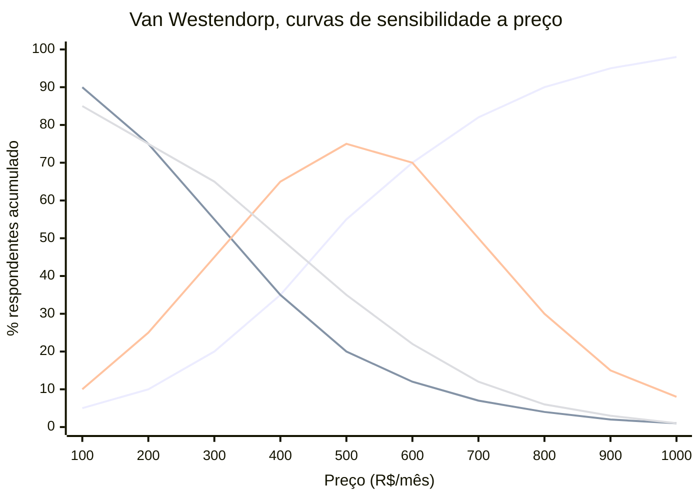

## APÊNDICE X — PRICING STRATEGY COMO DISCIPLINA

> [!note] Nota de validade
> Os princípios de pricing (valor percebido, disposição a pagar, elasticidade, packaging) são estáveis ao longo de décadas. O que muda. Benchmarks setoriais. Padrões de pricing de SaaS versus usage-based versus hybrid. Ferramentas de pricing analytics. Revisar benchmarks a cada dezoito a vinte e quatro meses. A emergência de modelos AI-native em 2024 a 2026 tem trazido novos padrões (usage-based, outcome-based, credit-based) que ainda se estabilizam.

A [[#FASE 11 — VALIDAÇÃO DO MODELO DE NEGÓCIO|Fase 11]] cobre validação do modelo de negócio. Incluindo hipóteses de preço em alto nível. Esse apêndice trata pricing como disciplina operacional contínua. Não decisão única. Pricing é uma das alavancas mais subutilizadas em startup brasileira. Os fundadores tipicamente subprecificam por três a cinco anos antes de acordar. Deixando trinta a sessenta por cento de receita potencial na mesa. Correção de pricing bem-feita pode dobrar ARR sem adicionar cliente. ROI que nenhum movimento operacional iguala.

### O que esse apêndice cobre

Pricing strategy é a disciplina de descobrir, testar, estruturar, e evoluir, preço ao longo do tempo. Envolve quatro frentes. Pesquisa de disposição a pagar (willingness to pay). Estrutura (tiered, usage-based, hybrid, enterprise custom). Packaging (o que está em cada tier, como features mapeiam a valor). Evolução (reajustes anuais, grandfathering, reposicionamento).

Os entregáveis. Documento de pricing com racional (não só tabela de preços). Resultados de testes. Política de reajustes, e descontos. Playbook de negociação para Sales.

### POR QUE

Pricing é a alavanca de maior impacto no valuation. Aumento de dez por cento em preço raramente perde dez por cento de clientes. Efeito líquido. Mais oito a dez por cento em receita. Que vira mais oito a dez por cento em ARR. Que vira mais oito a dez por cento em valuation. Tudo sem custo marginal.

Preço comunica posicionamento. Preço muito baixo sinaliza produto genérico. Preço alto sinaliza valor premium. Mudar preço muda percepção.

Pricing ruim atrai cliente errado. Preço baixo atrai ICP errado (menos pagante, mais exigente). Preço alto filtra ICP de maior LTV.

Captura de valor é tão importante quanto criação. Startups que criam valor, mas capturam pouco, são absorvidas por quem captura bem (classical Porter).

### Quando usar

Primeira definição. [[#FASE 11 — VALIDAÇÃO DO MODELO DE NEGÓCIO|Fase 11]] (modelo de negócio).

Primeiro teste sério. [[#FASE 12 — PRODUCT-MARKET FIT|Fase 12]] (pós-PMF inicial).

Revisão de estrutura. A cada doze a dezoito meses.

Reajuste anual. Obrigatório em SaaS (mínimo IPCA mais um a três pontos percentuais).

Reposicionamento. Quando há expansão de ICP. Novo produto. Ou mudança de posicionamento.

### Quem envolve

CEO, ou founder. Lidera decisão estratégica de pricing.

Finance, ou CFO. Modela impacto de cenários, e simula LTV, e unit economics.

Product. Conecta preço a features, e valor percebido.

Sales. Feedback de negociação, e elasticidade observada.

Consultoria especializada (opcional, para re-pricing grandes). Simon-Kucher, PriceIntelligently (hoje ProfitWell), Pricing I/O. Custo típico, R$ 50 a 300 mil por projeto.

### Como executar

#### 1. Pesquisa de Willingness to Pay

**Van Westendorp Price Sensitivity Meter (PSM).** Metodologia de pesquisa com quatro perguntas a potenciais clientes. A partir de qual preço o produto parece caro demais para considerar? A partir de qual preço o produto parece barato demais (sinal de baixa qualidade)? Qual preço parece caro, mas aceitável? Qual preço parece um bom negócio?

A plotagem cruza as quatro curvas, e revela.

Visualização das quatro curvas do PSM (exemplo ilustrativo).

> [!note] Compatibilidade — requer Mermaid 10+ (Obsidian 1.4+)

Leitura. A curva crescente mais agressiva é "caro demais, nem considero". A curva decrescente mais agressiva é "barato demais, suspeito". As curvas em sino são "aceitável", e "bom negócio". O OPP fica na intersecção das duas primeiras. O RAP é a faixa entre rejeições.

Optimum Price Point (OPP). Onde a intersecção de "caro demais", e "barato demais", está em equilíbrio.

Range of Acceptable Prices (RAP). Faixa entre o ponto de rejeição por barato, e a rejeição por caro.

Amostra mínima. Trinta a cinquenta respostas em ICP definido. Ferramentas. Google Forms, ou Typeform, bastam.

**Value-based pricing, método direto.** Perguntar ao cliente. "Que valor você obtém com o produto em doze meses?" (economia, receita adicional, tempo economizado vezes salário). Precificar em dez a trinta por cento desse valor entregue. Deixa setenta a noventa por cento como ROI claro para o cliente.

> [!important] Gabriel Weinberg, "10x rule"
> Preço onde o cliente percebe valor igual, ou maior, a dez vezes o preço, cria tração orgânica. A relação típica em SaaS B2B maduro. Valor percebido três a oito vezes preço. Produto excepcional, dez vezes ou mais.

#### 2. Estrutura de pricing, modelos principais

**Flat Monthly Fee.** Um preço, sem variação. Simples. Funciona em produtos de baixa diferenciação de uso. Exemplo. R$ 290 por mês para PadariaPro.

**Tiered (Good-Better-Best).** Três tiers (raramente quatro ou mais). Estrutura clássica de SaaS. Padrão de adoção em SaaS B2B. Vinte por cento tier baixo, sessenta por cento tier médio, vinte por cento tier alto (lei de 80/20 aplicada). Exemplo. Basic R$ 290, Pro R$ 590, Enterprise R$ 1.290 por mês. Regra de psicologia. O tier do meio deve ser o mais "óbvio". Decoy effect aplicado.

```mermaid
flowchart LR
 subgraph Basic["🥉 BASIC<br/>R$ 290/mês<br/>~20% adotam"]
 B1[Essenciais core]
 B2[Support email 48h]
 B3[Até 3 usuários]
 B4[Relatórios básicos]
 end

 subgraph Pro["🥈 PRO ⭐ âncora<br/>R$ 590/mês<br/>~60% adotam"]
 P1[Tudo do Basic +]
 P2[Integrações avançadas]
 P3[Relatórios customizados]
 P4[Suporte priority 12h]
 P5[Até 15 usuários]
 P6[API access]
 end

 subgraph Ent["🥇 ENTERPRISE<br/>R$ 1.290+/mês<br/>~20% adotam"]
 E1[Tudo do Pro +]
 E2[SSO SAML/OIDC]
 E3[SLA contratual 99.9%]
 E4[CSM dedicado]
 E5[Usuários ilimitados]
 E6[Audit logs + compliance]
 end

 Basic -. upgrade.-> Pro
 Pro -. upgrade.-> Ent

 style Pro fill:#FFD700,stroke:#8B6914,stroke-width:3px
```

Decoy effect aplicado. O tier do meio deve ser a escolha "óbvia". Se noventa e cinco por cento escolhem Basic, os tiers estão mal-desenhados. Basic com valor demais. Ou Pro com justificativa fraca.

**Per-User (seat-based).** Preço escala com número de usuários. Padrão em Slack, Notion, Linear. Vantagem. Cresce organicamente com adoção. Desvantagem. O cliente economiza compartilhando contas.

**Usage-based (consumption).** Preço por consumo (API calls, transações, GB de dados). Cresce fortemente entre 2022 e 2026, com produtos AI-native. Vantagem. Alinha preço ao valor entregue, e escala com sucesso do cliente. Desvantagem. Imprevisibilidade de receita, e de custo, para o cliente. Exemplos. Snowflake, Twilio, OpenAI.

**Hybrid (base, mais usage).** Preço mínimo fixo, mais componente variável. Captura melhor valor em base heterogênea. Exemplo. R$ 490 por mês inclui dez mil API calls. R$ 0,05 por call adicional.

**Enterprise Custom.** Sem preço público. Negociação. Acima de ticket de R$ 50 a 100 mil por ano, ou em deals estratégicos. Base. "Floor price" interno, mais flex de vinte a quarenta por cento em negociação.

#### 3. Packaging, como features mapeiam a tiers

Princípios. O tier baixo captura alcance amplo (self-serve, PMEs). Features. Essenciais, sem restrições operacionais severas. O tier médio é onde a maior parte converte. Features. Integrações, relatórios avançados, suporte estendido. O tier alto é para enterprise. Features. SSO, SLA, security compliance, CSM dedicado, custom contracts.

Features que tipicamente são "enterprise-only". SSO (Single Sign-On) via SAML, ou OIDC. Audit logs completos. Controle granular de permissões. Integrações avançadas (API, webhooks com SLA). SOC 2, ou ISO 27001, compliance demonstrado. SLA com penalidade. Account Manager dedicado.

Se as enterprise-only features são o que diferencia o produto, o que está nos tiers menores precisa ser genuinamente útil. Senão, só o tier alto paga. E o funil trava.

#### 4. Reajustes anuais, a política que ninguém segue, e todo mundo precisa

Regra mínima para SaaS brasileiro. Reajuste anual igual a IPCA mais um a três pontos percentuais. Cobre inflação, mais captura de valor agregado pelo produto.

Estrutura de comunicação. Comunicar com sessenta a noventa dias de antecedência. Explicar racional (novas features, melhorias, inflação). Oferecer lock-in de um a dois anos, com preço atual, a quem aceitar. Grandfathering. Manter clientes muito antigos no preço antigo, por período limitado (seis a dezoito meses), depois migrar.

Elasticidade típica observada em SaaS B2B. Reajuste de cinco a oito por cento. O churn marginal aumenta zero vírgula cinco a um por cento. A receita líquida sobe. Reajuste de dez a quinze por cento. O churn aumenta dois a quatro por cento. Ainda rende líquido. Reajuste maior que vinte por cento. Perigoso, sem repositioning de valor.

Test-first approach. Aplicar reajuste em coorte pequena (novos clientes) primeiro. Medir conversão, e churn, três a seis meses. Ajustar antes de rolar para a base completa.

#### 5. Descontos, política clara, não improviso

> [!important] Regra de descontos
> Desconto concedido em Sales precisa ter contrapartida. Pagamento anual. Multi-ano. Co-marketing. Case study. Desconto sem contrapartida sinaliza que o preço original era inflado. E destrói preço de mercado.

Estrutura saudável. Desconto anual, pago adiantado. Dez a quinze por cento. Multi-ano (dois anos). Quinze a vinte por cento adicional. Enterprise com compromisso de volume. Negociável, dentro do floor. Nunca, desconto sem contrapartida.

Autoridade de desconto. Rep de Sales. Até dez por cento, sem aprovação. Head of Sales. Até vinte por cento. CEO, ou CFO. Acima de vinte por cento.

#### 6. A/B testing de pricing, quando, e como

Quando faz sentido. Empresa com pelo menos quinhentos leads por mês (base para detectar sinal). Produto self-serve (aplicação em landing page, ou checkout). Mudança incremental (dez a vinte e cinco por cento), não estrutural.

Quando NÃO faz sentido. Enterprise sales (amostra pequena, confounders demais). Mudança estrutural (tier novo, modelo novo). Use research first.

Como. Segmentar tráfego cinquenta cinquenta, por hash de visitor ID. Medir. Conversão, ticket médio, churn de noventa dias, e LTV estimado. Mínimo de quatro a oito semanas, para dado robusto. Ferramentas. Stripe, Chargebee, ferramentas nativas de payment.

Ética, e legal. Evitar cobrar preços diferentes para perfis diferentes, sem justificativa (pode violar CDC). Teste A/B por timing, ou cohort, é aceito.

#### 7. Modelos AI-native de pricing (2024 a 2026)

Emergentes, com produtos que usam LLM.

Credit-based. O cliente compra créditos, que consomem em features AI (por exemplo, Canva, Notion AI).

Outcome-based. Preço por resultado entregue (por exemplo, lead qualificado pelo AI, documento gerado).

Seat mais AI consumption. Seat-based para acesso, mais extra para uso intensivo AI.

Tensão atual. O custo de inferência de LLMs cai rápido (trinta a cinquenta por cento ao ano). Se o preço não acompanha, as margens inflam. Mas o cliente sente abuso, quando compara com alternativas. Mercado ainda se estabilizando.

### Métricas

ACV (Average Contract Value). Deve crescer dez a vinte por cento ao ano em SaaS pós-PMF.

ARPU (Average Revenue Per User). Métrica por conta, ou por usuário.

Price realization. Percentual do preço de lista, efetivamente cobrado. Alvo igual, ou maior, a oitenta por cento, em B2B saudável.

Discount leakage. Desconto médio concedido em deals. Alvo igual, ou menor, a quinze por cento, sem contrapartida.

Elasticidade observada. Churn dividido por variação de preço, em testes.

Expansion MRR percentual. Contribuição de upgrades, e expansão de contas, para crescimento.

Downgrade rate. Percentual que migra para tier inferior. Alvo menor que dois por cento ao ano.

Time to first reajuste. Alvo igual, ou menor, a doze meses, do contrato inicial.

### Definição de sucesso

Pricing como disciplina está no padrão quando os sete itens estão em pé.

1. Documento de pricing (estrutura, mais racional) existe, e é revisado anualmente.
2. Pesquisa de WTP foi feita nos últimos dezoito meses.
3. Política de reajuste anual está implementada (IPCA mais spread).
4. Política de desconto tem autoridade definida, e contrapartida obrigatória.
5. Price realization igual, ou maior, a oitenta por cento, e discount leakage igual, ou menor, a quinze por cento.
6. Tiers têm distribuição de adoção saudável (nem noventa e cinco por cento em baixo, nem vazio em alto).
7. Reajustes não destruíram retenção (churn pós-reajuste igual, ou menor, a mais um por cento do base rate).

### Armadilhas

Subprecificação crônica. "Tenho medo de cobrar mais." Custo. Trinta a sessenta por cento de receita deixada na mesa, por anos. Test cedo. Ajustar. Seguir.

Pricing sem research. Preço decidido por "achismo", ou copiando concorrente. Frequentemente, longe do ótimo, para o seu ICP, e produto.

Mudança de pricing sem grandfathering. Reajustar clientes antigos abruptamente destrói relacionamento.

Tier sem diferencial claro. "Qual a diferença do Basic para Pro?" é resposta confusa em quarenta por cento dos SaaS brasileiros.

Desconto como closer. Virou atalho. Destrói preço de mercado, e sinaliza ao cliente que o preço era inflado.

Não reajustar anualmente. A receita real erode por inflação. Três anos sem reajuste igual a quinze a vinte e cinco por cento de valor perdido.

Copy-paste de pricing americano. R$ igual a US$ vezes cinco raramente funciona. Adaptação a poder de compra brasileiro é obrigatória, em ICP local.

Pricing complexo demais. Sete tiers, três add-ons, quatro modalidades. Os clientes paralisam na escolha. O vendedor não consegue articular. Simplicidade vence.

Não treinar Sales em pricing. O vendedor que não articula valor entra em guerra de preço automaticamente.

Ignorar custo unitário variável em modelo usage-based. Se a margem marginal diminui em escala (custo AI aumenta por usage), o modelo pode virar prejuízo.

### Checklist

- [ ] Documento de pricing com estrutura, mais racional, existe, e foi revisado nos últimos doze meses?
- [ ] Pesquisa de WTP (PSM, ou value-based) foi conduzida nos últimos dezoito meses?
- [ ] Tiers (se aplicável) têm distribuição saudável de adoção?
- [ ] Política de reajuste anual formal implementada?
- [ ] Política de desconto com autoridade, e contrapartida, documentada?
- [ ] Price realization, e discount leakage, medidos mensalmente?
- [ ] Sales treinado em articular valor, e negociar, sem default em desconto?
- [ ] Grandfathering, e comunicação de reajuste, formalizados?
- [ ] Se usage-based. Custo unitário variável mapeado, e margem em escala modelada?
- [ ] Enterprise pricing tem "floor price" interno definido, não só negociação livre?

### Ver também

[[#APÊNDICE CB — SUBSCRIPTION ECONOMY EM PROFUNDIDADE: ALÉM DO "COBRA MENSALMENTE"|Apêndice CB]], Subscription economy. [[#APÊNDICE CE — VALUATION METHODS: COMO INVESTIDORES CALCULAM E COMO VOCÊ CALCULA PARA NEGOCIAR|Apêndice CE]], Valuation methods. [[#APÊNDICE AN — MODELAGEM FINANCEIRA OPERACIONAL|Apêndice AN]], Modelagem financeira.

---
