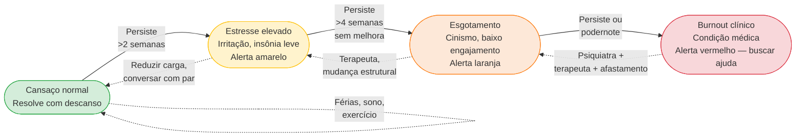

## APÊNDICE Y — SAÚDE MENTAL, DINÂMICA DE CO-FOUNDERS E HUMANIDADE DO FUNDADOR

> [!note] Nota de validade
> Os princípios cobertos aqui (identidade além da empresa, hábitos de recuperação, estrutura de conflito entre sócios, quando buscar ajuda profissional) são atemporais. O que evolui são recursos disponíveis (modalidades de terapia, aplicativos, grupos de peer support, regulamentação de aposentadoria de sócios). Revisar a cada vinte e quatro a trinta e seis meses.

A [[#FASE 0 — PREPARAÇÃO DO EMPREENDEDOR|Fase 0]] toca em preparação pessoal e finanças pessoais. O [[#APÊNDICE CW — CRISE E CONTINUIDADE: PREVENÇÃO, RESPOSTA, RECUPERAÇÃO|Apêndice CW]] menciona perda de founder como um dos seis tipos de crise. Esse apêndice cobre o que falta: a vida interior do fundador ao longo de sete a doze anos de trajetória e a química operacional entre cofounders em momentos difíceis. Não é decoração. É operacional: mais empresas quebram por burnout sem tratamento, depressão não-declarada ou conflito societário mal-resolvido do que por erro estratégico.

A literatura de empreendedorismo trata esses temas como tabu ou como posfácio. Esse apêndice os trata como disciplina, com a mesma seriedade dedicada a unit economics.

### O que esse apêndice cobre

Três territórios. Saúde mental do fundador individualmente: burnout, ansiedade, depressão, isolamento, vícios subclínicos (álcool, trabalho compulsivo, redes). Dinâmica de cofounders: química, conflito produtivo, conflito destrutivo, divórcio societário com dignidade. E relacionamentos externos: parceiro ou parceira, família, amizades, em contexto de empresa que consome tempo e energia em escala não-normal.

Os entregáveis são: hábitos sustentáveis (não "dicas"), estrutura de conversa difícil, rede de apoio com nomes e plano de contingência pessoal.

### Por que importa

Três razões que não são discutidas o suficiente.

Fundador deteriorado toma decisões piores. Privação de sono crônica reduz funcionamento executivo em nível equivalente a embriaguez. Depressão não-tratada distorce percepção de risco, relacionamento e futuro. Empresa não sobrevive muitas decisões ruins seguidas.

Conflito societário silencioso envenena por doze a vinte e quatro meses antes de explodir. Quando explode, a empresa já perdeu velocidade, moral do time e clareza de direção. Muitas startups "que quase deram certo" tinham conflito de cofounders que ninguém endereçou.

Custos pessoais fora da empresa destroem o fundador. Casamento em ruínas, filhos distantes, saúde física declinando, amizades perdidas. Fundador atinge exit financeiro e descobre que o resto da vida ficou em pedaços. Isso não tem que ser assim. É resultado de escolhas, e escolhas podem ser diferentes.

> [!warning] Custo de pular esse apêndice
> Fundador que ignora esse território até quebrar descobre que recuperar anos de abandono é muito mais difícil do que prevenir. Terapia semanal preventiva custa quatrocentos a oitocentos reais por semana. Colapso de burnout em alta temporada custa meses de operação mais custo humano incalculável.

### Quando aplicar

Sempre. Esse apêndice não tem "fase certa para aplicar". É infraestrutura contínua. Momentos especiais incluem crise operacional, rodada intensa, conflito com sócio, perda de pessoa-chave, birthday number (quarenta, quarenta e cinco, cinquenta), nascimento de filho e separação. Qualquer evento de alto impacto pessoal ou profissional é gatilho para revisão consciente.

### Quem envolver

Terapeuta individual, idealmente com experiência em fundadores, executivos de alta demanda ou terapia orientada a desempenho. No Brasil, buscar CFP/APA, especialidades em TCC, ACT ou psicodinâmica conforme preferência pessoal. Peer support group: grupos formais ou informais de fundadores (Endeavor, YPO Forum, peer groups orgânicos). Mentor ou advisor pessoal: alguém que passou por trajetória similar, diferente de advisor de negócio. Médico clínico geral que acompanha anualmente. Parceiro ou parceira e família como parte central da vida, incluindo ativamente. Coach executivo é opcional e com critério — cuidado com coaches sem formação clínica tratando quadros que exigem terapia.

### Como executar

#### 1. Autoconhecimento operacional — reconhecendo próprios padrões

Fundador típico não tem linguagem para descrever seu próprio estado interno. Ferramentas:

**Check-in semanal (5 minutos, dominga a noite):**

- Energia física (0-10): _____
- Clareza mental (0-10): _____
- Conexão emocional com a empresa (0-10): _____
- Conexão emocional com pessoas próximas (0-10): _____
- Qualidade do sono (0-10): _____
- Alguma coisa escondida/ignorada nesta semana? _____

Abaixo de 5 em ≥ 2 categorias por 2 semanas consecutivas = alerta amarelo. Abaixo de 4 em ≥ 3 categorias = alerta vermelho. Ação: conversa com terapeuta ou peer.

**Red flags específicas de burnout (diferentes de cansaço normal):**

- Cinismo crônico sobre trabalho (não ocasional).
- Despersonalização: "eu sinto isso" vira "se sente isso".
- Sensação de ineficácia apesar de esforço intenso.
- Perda de prazer em coisas que antes traziam prazer.
- Sono ruim mesmo quando há tempo.
- Irritação desproporcional a eventos pequenos.
- Desejo crescente de "fugir", bebida, trabalho excessivo, escapismo.

Burnout não é "estou cansado, fim de semana resolve". É condição clínica que frequentemente exige intervenção (terapia, medicação em casos, mudança estrutural de trabalho) para reverter.

#### 2. Hábitos de recuperação — não são luxo

Fundadores que duram dez ou mais anos em trajetória intensa têm hábitos comuns. Não são "dicas de bem-estar" — são infraestrutura operacional.

Sono: meta de sete a oito horas por noite em cinco ou mais dias por semana, com hora fixa de deitar (mesmo nos fins de semana, variação de até uma hora) e zero telas nos trinta a sessenta minutos antes de dormir. Quarto escuro, temperatura entre dezoito e vinte graus. Não é sobre "quantas horas funciona" — é sobre resiliência cumulativa.

Movimento: exercício pelo menos três vezes por semana em qualquer forma que o fundador goste (não "deveria gostar"). Os efeitos são concretos: redução de cortisol, melhora de sono, humor e cognição. Fim de semana sem movimento piora a semana seguinte.

Alimentação e hidratação: não "dieta" — apenas comer comida de verdade regularmente, sem delivery hiper-calórico dominando a semana. Hidratação de dois a três litros por dia tem impacto maior do que a maioria reconhece.

Nutrição mental: alguma prática contemplativa (meditação, oração, journaling) de dez a vinte minutos por dia. Literatura ou mídia fora do mundo de negócios (ficção, poesia, história, cinema). Aprendizado de algo não-instrumental (idioma, instrumento, culinária).

Relacionamento: tempo com parceiro ou parceira e família sem celular, semanalmente. Contato com dois a três amigos próximos mensalmente, não apenas networking profissional. Presença com filhos (se aplicável) que não seja só "tempo compartilhado".

Férias: reais — pelo menos dez dias por ano, sem email. Não "férias ao lado do laptop". Desacoplamento físico e mental da operação. Empresa sobrevive. Se não sobrevive, o sinal é de gargalo organizacional, não de indispensabilidade do fundador.

#### 3. Identidade além da empresa

A frase "a empresa sou eu" é sinal de alarme. Empresa é o que o fundador faz, não o que o fundador é. Quando os dois se fundem, crítica à empresa vira ataque pessoal, decepção com resultado vira colapso existencial e exit ou fechamento vira crise de identidade.

Exercício: escrever dez frases "eu sou _____" sem nenhuma delas mencionar a empresa ou papel profissional. Dificuldade neste exercício é sinal de fusão identidade-empresa.

Construir identidade fora da empresa não é deslealdade com o projeto. É infraestrutura para sustentá-lo por dez anos sem destruir a pessoa que o conduz.

Mantenha sua identidade pequena — complemento intelectual (Paul Graham, 2009)

Graham tem um ensaio curto, *Keep Your Identity Small*, que é complementar útil à ideia de "identidade além da empresa". O argumento é sobre uma forma específica de dano que acontece quando a gente adota identidades fortes, ser "liberal", "conservador", "vegetariano militante", "crypto-maximalista", "anti-crypto", "fundador em série", "early adopter", "techie", "anti-techie". Cada identidade forte que a gente adota **reduz a capacidade de pensar com clareza** sobre o tema correspondente, porque qualquer discussão vira ataque ao "eu" em vez de análise do assunto.

O insight operacional para fundador: **quanto mais identidades fortes você acumula publicamente, menos você consegue mudar de ideia**. E mudar de ideia, sobre produto, sobre mercado, sobre time, sobre estratégia, é exatamente o que a trajetória de fundador exige que você faça o tempo todo. Fundador com identidade pública de "anti-VC" trava quando o negócio precisa de VC, fundador com identidade pública de "maximalista em IA" trava quando precisa reduzir escopo de IA, fundador com identidade de "fundador 100% hands-on" trava quando precisa delegar.

Regra prática derivada: resista a coletar labels públicos sobre si mesmo. Você é "uma pessoa trabalhando em X hoje", não "o CEO-fundador visionário de Y". Quanto mais enxuta a sua identidade pública, maior a sua liberdade interna de reavaliar, aprender, mudar de rumo. Isso vale para postagens em LinkedIn, para conversas em eventos, para entrevistas. Você pode manter convicções profundas sem transformá-las em bandeira de identidade.

Earnestness, fazer algo pelos motivos certos (Graham, 2020)

Há outro ensaio que vale mencionar neste apêndice, embora trate de um aspecto menos visível da trajetória do fundador: *Earnestness* (algo entre "sinceridade" e "seriedade genuína"). Graham argumenta que **fazer algo pelos motivos certos**: curiosidade real pelo problema, cuidado com o cliente, interesse genuíno no ofício, em vez de fazer por status, riqueza, ou para provar algo a alguém, é fator competitivo subestimado em startup.

A razão é prática: trabalho duro por longos períodos sem resultado imediato (o que é a condição normal dos primeiros anos de startup) só é sustentável se há ligação genuína com o trabalho em si. Pessoas que começam startup "para ficar ricas" tipicamente desistem antes dos 5-7 anos, porque o retorno financeiro (quando vem) vem depois disso. Pessoas que começam porque **se importam genuinamente com o problema** conseguem sustentar o ritmo pelo tempo necessário.

Isso não é romantismo. É operacional. E aparece em três dimensões mensuráveis:

Em qualidade da decisão sob pressão: fundador earnest volta à pergunta "o que é certo para o cliente e para a empresa?", fundador não-earnest volta à pergunta "o que parece bom? o que vai me fazer ganhar mais/parecer mais sucesso?". As duas perguntas produzem decisões diferentes, e a diferença compõe ao longo de anos. Em atração de talento: pessoas boas percebem earnestness, não conseguem articular, mas sentem. Fundador earnest atrai primeiros funcionários de qualidade desproporcional aos salários que oferece. Em resiliência à crítica: crítica pública machuca fundador não-earnest porque ataca a fachada, fundador earnest absorve, pergunta "há algo verdadeiro aqui?", e segue. A diferença é enorme em momentos de pressão pública.

Teste simples para autoavaliação: **se você descobrisse amanhã que essa empresa nunca vai ficar grande, mas ainda teria trabalho interessante por 10 anos construindo algo útil para 500 clientes que te pagam bem, você continuaria?** Se sim, você é provavelmente earnest sobre o problema. Se não, você está trabalhando pela recompensa externa, e isso é frágil.

Mean People Fail, caráter como fator competitivo (Graham, 2014)

Um terceiro ensaio vale menção aqui, porque trata de algo que a literatura de startup raramente articula: **ser pessoa ruim, moralmente, também é desvantagem competitiva em startup**: não apenas moral, mas economicamente.

Graham argumenta que isso é mais verdadeiro em startup do que em qualquer outro ambiente, por duas razões:

- **Startup depende desproporcionalmente de aliados.** Primeiros 20 funcionários, primeiros investidores, primeiros parceiros comerciais, primeiros conselheiros, todos escolhem trabalhar com você num momento em que você ainda não tem quase nada a oferecer além de você mesmo. Pessoas com opção escolhem trabalhar com pessoas de quem gostam, pessoas boas têm opção, então startup fundada por pessoa moralmente problemática sistematicamente atrai aliados de qualidade inferior.
- **Reputação em mercado pequeno compõe.** Ecossistema de startup é pequeno. Você faz algo desonesto com investidor, todos os outros investidores daquela tese sabem em 72 horas. Você trata funcionário ou fornecedor mal, isso vira história contada em eventos. A distância entre "mesquinharia invisível" e "vetado em cinco fundos" é menor do que parece.

Graham é honesto: há exceções, pessoas moralmente problemáticas que tiveram sucesso gigante. Mas são exceções raras, e custaram caro em termos humanos, mesmo quando renderam financeiramente. Para a maioria, **ser decente é não só moral, é também estratégia comercial**.

No contexto brasileiro, onde o ecossistema é ainda menor que o americano e a cultura valoriza muito relacionamento pessoal, o efeito é ainda mais intenso. "Fulano é difícil de trabalhar" vira informação pública entre investidores brasileiros em semanas. Investir em caráter, tratar pessoas com dignidade mesmo quando não é obrigatório, ser justo em situações onde podia ser explorador, cumprir compromissos mesmo em custo, é investimento com retorno composto.

#### 4. Dinâmica de cofundadores — química operacional

Cofundadores funcionam quando há complementaridade clara de skills (técnico mais comercial mais domínio), quando discordam com vigor sobre decisão e depois se alinham e executam, quando cada um acredita na integridade do outro mesmo em discordância, quando há canais estruturados de conversa (one-on-one semanal, retrospectiva trimestral) e quando o trabalho está dividido em escopo claro (cada um tem "território" de decisão).

Os sinais de deterioração são reconhecíveis antes do colapso: conversas importantes migrando para canais privados (WhatsApp pessoal em vez de grupo compartilhado), decisões tomadas unilateralmente sem comunicar, evitamento ("vou falar com ele depois" que vira "um dia"), acúmulo de ressentimento não-endereçado, time percebendo tensão e começando a escolher lados, e frases recorrentes como "ele nunca entende" ou "ela sempre faz isso".

O protocolo de conversa difícil entre sócios tem sete passos. Preparar: escrever o que se quer dizer e o que se quer ouvir. Combinar formato: conversa de sessenta a noventa minutos, presencial ou vídeo, sem interrupções. Abertura: cada um fala dez minutos sem interrupção, o outro ouve sem defender. Clarificação: perguntas de entendimento, sem julgamento. Impacto: cada um articula como o que ouviu afetou. Decisões: o que muda, quem faz o que, quando reencontram. Rituais: conversa similar trimestral, pré-agendada, sem esperar crise.

Ferramentas externas: coach executivo com experiência em dinâmicas de sócios (diferente de coach de carreira), mediador em conflitos avançados (pessoa neutra com experiência formal) e advisor compartilhado que tem autoridade moral sobre ambos.

#### 5. Divórcio societário com dignidade

Nem todo cofundador permanece. Cerca de sessenta e cinco por cento dos times fundadores originais têm ao menos uma saída nos primeiros cinco anos. É comum, não é falha moral.

É hora de considerar separação quando há conflito estrutural que não resolve com duas a três conversas sérias, quando a visão de empresa divergiu profundamente sem reconciliação possível, quando estilos de trabalho são incompatíveis em dimensões centrais, ou quando a confiança quebrou por evento específico não-reversível.

Como conduzir com dignidade: conversa pessoal primeiro (entre os sócios, não no board, sem surpresas públicas), advogado especializado para cada lado (depois advogado de deal se consensuado), acordo de saída cobrindo vesting, liquidação de equity não-vestida, não-concorrência e confidencialidade, comunicação coordenada ao time e investidores (respeitosa, factual, sem lavar roupa suja em público), processo de transição de trinta a noventa dias para handoff de responsabilidades e respeito de longo prazo (o mundo do fundador é pequeno, cuidar da reputação de quem está saindo é ética e também estratégia).

> [!warning] Armadilhas do divórcio societário
> Arrastar o conflito por medo de decidir. Decidir sem advogado no calor do momento. Tornar público o que deveria ser privado. Queimar relacionamento futuro por diferença pequena de vesting.

#### 6. Relacionamentos externos — o outro lado do exit

Parceiros, filhos, amigos, pais. Frequentemente tratados como "custo" pelo fundador, tempo que não-pude-dar. Isso é erro de framing.

**Reformulação:** parceiros, filhos, amigos, pais são **infraestrutura da vida pessoal** e **refúgio operacional**: não competidores pelo tempo.

**Práticas concretas:**

- Calendário inclui explicitamente tempo com parceiro(a), filhos, pais. Se não está no calendário, não acontece.
- Zero celular em refeições familiares (zero mesmo, não "rápido de checar").
- Explicar à família, uma vez por ano minimamente, o estado da empresa e da sua energia. Família que entende é família que suporta.
- Atos simbólicos: um aniversário não-esquecido, um apoio em momento difícil, uma presença quando ninguém pede.

#### 7. Quando buscar ajuda profissional

Terapia individual é adequada quando há algum sinal de burnout sustentado por mais de quatro semanas, perda de prazer em coisas que antes traziam prazer, sono ruim crônico, humor irritado, ansioso ou deprimido por períodos longos, ideação de desistência persistente (não "estou cansado"), qualquer pensamento de autoagressão (imediatamente, sem esperar), uso crescente de substâncias para regular estado emocional, conflito relacional importante que não consegue resolver sozinho, ou evento de vida grande (separação, luto, diagnóstico).

Psiquiatra é adequado quando terapeuta recomenda avaliação medicamentosa, quando há quadro depressivo ou ansioso com impacto funcional significativo, ou quando há transtornos específicos diagnosticados (TDAH adulto, TOC, transtorno bipolar).

Grupos de peer support são complemento, não substituto, da terapia. Servem para normalizar experiências (burnout é menos assustador quando outros fundadores descrevem o mesmo) e trocar táticas operacionais específicas.

> [!important] Em crise aguda
> CVV (Centro de Valorização da Vida): 188, vinte e quatro horas, gratuito. Psiquiatra de pronto-atendimento: Hospital Albert Einstein, Hospital Sírio-Libanês, Hospital das Clínicas têm serviços de urgência psiquiátrica em São Paulo. Em ideação ou tentativa de autoagressão: emergência médica, sem hesitação.

### Métricas

Mais qualitativas que quantitativas, mas úteis. Qualidade do sono (horas mais subjetiva de zero a dez), alvo de sete a oito horas com subjetiva igual ou superior a sete. Exercício, pelo menos três sessões por semana. Tempo com parceiro ou parceira e família sem celular, pelo menos oito horas por semana. Contato com amigo próximo, pelo menos uma conversa substantiva por mês. Terapia em frequência consistente (se aplicável). Dias de férias reais por ano, pelo menos dez. Red flags (burnout checklist) presentes: zero sustentados. Conversas estruturadas com cofounders, pelo menos uma por trimestre.

### Definição de sucesso

Saúde mental e relacionamentos estão no padrão quando o fundador mantém identidade e interesses fora da empresa, hábitos de sono, movimento e alimentação são consistentes, terapeuta ou equivalente está ativo e acionável, parceiro ou parceira e família recebem atenção regular (não só "quando sobra tempo"), rituais com cofounders estão estabelecidos (one-on-one semanal, retrospectiva trimestral), red flags de burnout são monitorados e endereçados quando aparecem e férias reais acontecem pelo menos uma vez por ano.

### Armadilhas

> [!warning] Armadilhas de saúde mental e humanidade
> "Eu resolvo com mais força de vontade." Burnout clínico não responde a força de vontade. Requer mudança estrutural ou intervenção.
>
> "Vou cuidar disso depois do exit." Depois do exit você descobre que perdeu o casamento, a saúde e não sabe mais quem é. "Depois" não existe.
>
> "Terapia é para gente com problema grave." Terapia é manutenção preventiva, não cirurgia de emergência.
>
> "Cofounder vai passar." Conflito não endereçado amplifica, não passa. Dezoito a vinte e quatro meses depois explode em momento pior.
>
> Usar bebida, remédio ou trabalho para regular emocional sem tratar causa vira dependência, não solução. Isolar-se na crise ("não posso mostrar fraqueza ao time") é exatamente o momento mais importante para ter alguém fora com quem falar. Comparar-se com fundadores "superman" em redes é armadilha: instagram de fundador mostra highlights, não três da manhã de domingo com insônia. Tratar parceiro ou parceira como coadjuvante da empresa é injusto: pessoa que viveu a trajetória junto merece protagonismo, não papel de apoio.

> [!tip] Checklist
> Terapeuta individual contratado e em uso? Hábitos de sono, movimento e alimentação consistentes nos últimos trinta dias? Identidade articulável fora da empresa (mínimo três dimensões não-profissionais)? Tempo agendado no calendário com parceiro ou parceira e família, semanalmente? One-on-one semanal com cofounders consistente? Retrospectiva trimestral entre sócios acontecendo? Red flags de burnout monitoradas (check-in semanal ou equivalente)? Dois a três amigos próximos com contato mensal substantivo? Férias reais (sem email) tiradas nos últimos doze meses? Plano de contingência pessoal (o que fazer se fundador ficar incapacitado) documentado?

---

### Momentos-chave psicológicos — guidance específico para eventos críticos

O [[#APÊNDICE Y — SAÚDE MENTAL, DINÂMICA DE CO-FOUNDERS E HUMANIDADE DO FUNDADOR|Apêndice Y]] cobre saúde mental como disciplina contínua (burnout, hábitos, cofundadores, relacionamentos). **Esta seção adiciona guidance específico para momentos pontuais** com dinâmica psicológica própria, onde o fundador enfrenta picos de estresse, dúvida, luto, ou mudança de identidade. Cada um merece preparação distinta.

#### Momento 1 — O primeiro "não" importante de investidor

**O que acontece**: investidor que você considerava certo declina a rodada. Pode ser seed, pode ser Série A. Fundador interpreta como validação negativa do negócio inteiro.

**Dinâmica psicológica**:

- Choque inicial → raiva → dúvida profunda → rumination por dias.
- Questionamento de "será que é só comigo?" ou "a ideia não presta?"
- Impulso de re-pitch imediatamente em busca de validação.

**Guidance prático**:

1. **Não responder nas primeiras 24h**. Email de "obrigado pelo retorno" pode esperar. Reação a quente vira queixa ou desespero.
2. **Separar sinal de ruído**: investidor recusa por 1.000 razões (tese do fundo não se encaixa, timing do portfolio, etc.), só uma delas é "ideia é ruim". Maioria não é.
3. **Pedir feedback específico** em 48h: "O que precisaria ser verdade para você investir?" Respostas são aprendizado, ausência de resposta é sinal também (investidor que não respeita o suficiente para responder).
4. **Não confundir "não agora" com "não nunca"**: investidores frequentemente voltam em próxima rodada.
5. **Não discutir com investidor**: convencê-lo a mudar posição raramente funciona e queima relação futura.

**O que isso significa psicologicamente**: a habilidade de processar "não" sem tomar pessoalmente vai ser testada dezenas de vezes na trajetória. Primeiro "não" é o primeiro passo de construção dessa capacidade.

**Conversa com alguém**: cofundador, mentor, terapeuta. Não processar sozinho.

#### Momento 2 — A primeira demissão

**O que acontece**: fundador demite primeiro funcionário. Pode ser por performance, por fit, por redução. Fundador frequentemente carrega culpa como se tivesse "fracassado com essa pessoa".

**Dinâmica psicológica**:

- Ansiedade antecipatória por dias antes.
- Durante: desconforto físico, palavras que falham, racionalização excessiva.
- Depois: alívio misturado com culpa. Ruminação por semanas.
- Frequentemente o primeiro teste de liderança real.

**Guidance prático**:

1. **Fazer rápido uma vez decidido**. Demora cruel para ambas as partes.
2. **Preparar a conversa**: 3-5 sentenças escritas de abertura. Razão clara, não justificativa elaborada.
3. **Sexta-feira ou segunda-feira?** Debate comum. Segunda-feira dá à pessoa semana inteira para começar a processar e buscar próximos passos, sexta dá fim de semana para respirar. Minha leitura: segunda é melhor para a pessoa, sexta é mais confortável para quem demite (o que é sinal de evitar).
4. **Pacote justo**: mínimo CLT + algo, clarear com advogado antes.
5. **Comunicação ao time pequeno**: honestidade proporcional à privacidade, "João decidiu [ou 'decidimos juntos']seguir outros caminhos. Respeitamos sua jornada aqui." Sem detalhes, sem drama.
6. **Luto permitido**: sentir pesar é apropriado. Não é fraqueza, é humanidade. Conversa com mentor, terapeuta.

**Perspectiva**: demitir é parte de liderar. 30-50% das primeiras contratações não se encaixam (não porque pessoas são ruins, porque early startup é caótico). Aprender a fazer bem é habilidade essencial.

#### Momento 3 — O primeiro churn grande

**O que acontece**: cliente-âncora (10-30% da receita) cancela. Pode ser por motivo seu (produto falha), deles (empresa fechando, mudança de direção), ou estrutural (adquirida por concorrente).

**Dinâmica psicológica**:

- Cortisol alto, caixa impactado imediatamente.
- Medo de que seja sinal de início de desagregação (outros clientes seguirão?).
- Impulso de salvá-lo a qualquer custo, incluindo descontos absurdos ou promessas não-executáveis.
- Questionamento de estratégia inteira.

**Guidance prático**:

1. **Reunião de save em 48h**: entender motivo real. Frequentemente não é o que foi dito por primeiro.
2. **Separar razões reversíveis de irreversíveis**: se cliente está fechando, não adianta, se está com gerente novo que prefere alternativa, talvez adiante.
3. **Save offer limitado**: desconto temporário, upgrade, serviço extra. Nunca promessas impossíveis.
4. **Se não reverter, fazer com dignidade**: oferecer transição suave, dados exportáveis, suporte final. Relacionamento futuro importa, 30% dos win-backs acontecem 6-18 meses depois.
5. **Comunicação interna honesta**: time precisa saber, não em drama. "Perdemos cliente X, aqui está o impacto, aqui está o plano."
6. **Post-mortem estruturado**: o que preveniria? Sinais perdidos? Monitoring não implementado? Aprendizado vai para próximos contratos.

**Perspectiva**: primeira perda grande ensina mais do que 10 vitórias. Disciplina de CS ([[#APÊNDICE AA — CUSTOMER SUCCESS COMO DISCIPLINA|Apêndice AA]]) em geral nasce da primeira dor grande.

#### Momento 4 — A primeira crise pública

**O que acontece**: escândalo, breach de dados, cliente insatisfeito fazendo thread viral, notícia negativa. Pode ser totalmente sua culpa ou só parcialmente.

**Dinâmica psicológica**:

- Pânico, sensação de que "tudo pode acabar agora".
- Impulso de responder publicamente imediatamente (frequentemente erro).
- Intrusão na vida pessoal (família, amigos veem, perguntam).
- Cortisol crônico por dias/semanas.

**Guidance prático** ([[#APÊNDICE CW — CRISE E CONTINUIDADE: PREVENÇÃO, RESPOSTA, RECUPERAÇÃO|Apêndice CW]] cobre crise em detalhe, aqui foco no psicológico):

1. **Não responder nos primeiros 60-90 minutos**. Respiração, conversa com cofundador, advogado e/ou PR antes de comunicação.
2. **Se responsabilidade é sua, assumir rápido**: silêncio prolongado vira história maior.
3. **Honestidade > defensividade**: público percebe quando empresa está mentindo ou cobrindo.
4. **Proteger família e time**: comunicar internamente antes do externo. Preparar família para ciclo da mídia.
5. **Suporte profissional**: terapeuta pode ser crítico em crise aguda. Adrenalina e cortisol crônicos destroem sono, clareza, relações.
6. **Não tomar decisões estratégicas grandes durante crise aguda**. Decisões tomadas em pânico geralmente são erradas.

**Perspectiva**: crise pública é um dos pontos mais difíceis da trajetória. Empresas sobrevivem crises, raramente **quebram por crise bem-manejada**. Mas o fundador pode sair psicologicamente marcado se não cuidar. Proteção deliberada da saúde mental durante e após é não-negociável.

#### Momento 5 — O exit (luto do que a empresa foi)

**O que acontece**: venda, IPO, fechamento. Mesmo em exit bem-sucedido financeiramente, fundador frequentemente enfrenta crise de identidade após.

**Dinâmica psicológica**:

- Pré-exit: ansiedade e euforia alternadas.
- Durante negociação (M&A): estresse agudo por 3-9 meses.
- Pós-exit: euforia curta (dias-semanas) → vazio existencial profundo.
- "Quem eu sou agora?", identidade construída ao redor da empresa entrou em crise.
- Sintomas comuns: depressão pós-parto empresarial (fundadores descrevem assim), perda de sentido, dificuldade de re-engajar, tédio crônico.

**Guidance prático**:

1. **Planejar "o que vem depois" antes do exit**. Minimamente: próximos 6 meses de agenda. Próxima empresa, sabático, família, hobbies.
2. **Não decidir próxima empresa nos primeiros 6-12 meses**. Impulso comum, frequentemente é reação ansiosa a vazio, não vontade genuína.
3. **Terapia estruturada**: transições grandes de vida se beneficiam de processo terapêutico. Não opcional, recomendado.
4. **Reconhecer luto**: empresa foi um "filho" emocional por anos. Luto é real. Chorar, se precisar. Processar.
5. **Relacionamentos perdidos**: cofundadores e time com quem você viveu intensidade diária podem se distanciar pós-exit. Normal, mas doloroso.
6. **Uso saudável do dinheiro**: frequentemente exits geram capital que não existia. Gestão financeira pessoal séria ([[#APÊNDICE AJ — DINHEIRO PESSOAL DO FUNDADOR|Apêndice AJ]]) vira crítica. Não gastar impulsivamente nos primeiros 12-24 meses.

**Perspectiva**: fundadores que são bem-sucedidos em múltiplas empresas (serial entrepreneurs saudáveis) frequentemente descrevem 6-18 meses de "travessia do deserto" entre empresas. É processo, não fracasso.

#### Padrão comum a todos os 5 momentos

- **Reação imediata raramente é a melhor**. Dar-se tempo.
- **Isolamento é o inimigo**. Buscar cofundador, mentor, terapeuta, parceiro(a).
- **Separar emoção da análise**. Ambas são válidas, nenhuma sozinha é suficiente para decisão.
- **Saúde física não-opcional**: sono, exercício, alimentação mantêm capacidade cognitiva em momentos difíceis.
- **Linha de emergência**: CVV 188 se em qualquer momento ideação suicida ou crise aguda. Sem hesitação.

### Fechamento por fracasso e lições de encerramento Fechamento por fracasso: dimensão emocional

*Esta seção amplia o [[#APÊNDICE Y — SAÚDE MENTAL, DINÂMICA DE CO-FOUNDERS E HUMANIDADE DO FUNDADOR|Apêndice Y]] (Saúde Mental) com tratamento específico do momento mais difícil da trajetória empreendedora: encerrar uma empresa porque não deu certo. É complementar à dimensão operacional do mesmo evento tratada no [[#APÊNDICE CW — CRISE E CONTINUIDADE: PREVENÇÃO, RESPOSTA, RECUPERAÇÃO|Apêndice CW]].*

### Fechamento por fracasso — o que acontece dentro do fundador

O fechamento de uma empresa por insucesso é evento psicológico de intensidade comparável ao luto por morte, divórcio difícil, ou trauma grave. Não é metáfora, é descrição clínica. Fundadores que passam por esse processo sem preparação psicológica ou suporte apropriado têm maior incidência documentada de depressão, ansiedade severa, esgotamento clínico, abuso de substâncias e, em casos extremos, ideação suicida.

Esse manual, até aqui, cobriu a empresa como projeto profissional e financeiro. Esta seção reconhece o que frequentemente não é discutido publicamente: **fundador que fecha empresa perde muito mais do que capital**. Perde identidade construída ao longo de anos, relações profissionais que se configuraram em torno do projeto, narrativa pessoal pública, rotina diária, senso de propósito, e frequentemente também parte relevante da rede social.

O manual é honesto sobre isso porque silenciar é pior. Fundador que sabe antes o que o aguarda tem chance significativamente maior de atravessar bem.

#### As fases emocionais observáveis

**[[#FASE 2 — ARTICULAÇÃO E CAPTURA DA IDEIA|Fase 2]], Negação operacional (semanas a meses antes do fechamento):**

Empresa já mostra sinais claros de inviabilidade (caixa curto, rodada que não fecha, churn alto, produto que não ganha tração). Fundador intelectualmente sabe, mas emocionalmente trabalha como se ainda desse para virar. Trabalha mais horas, corta gastos pessoais para ajudar empresa, adiciona pivôs desesperados, mantém discurso externo otimista.

Psicologicamente: **dissonância entre o que vê e o que aceita**. Custa em sono, relações próximas, capacidade de decisão. Frequentemente acompanhado de sintomas físicos (insônia, problemas digestivos, tensão muscular crônica).

Sinal de alerta: fundador parou de ser honesto consigo mesmo sobre o estado real da empresa. Se você não consegue dizer em voz alta "a empresa pode fechar em X meses", provavelmente está nessa fase.

**[[#FASE 3 — DESCOBERTA DO PROBLEMA|Fase 3]], Reconhecimento forçado (dias a semanas antes):**

Evento catalisador (rodada rejeitada em definitivo, cliente grande saindo, prazo de caixa ficando curto o suficiente para exigir ação) força fundador a admitir internamente. Momento geralmente solitário, frequentemente durante noite insone, em conversa privada com cofundador, ou depois de reunião específica.

Psicologicamente: **choque contido**. Fundador ainda precisa funcionar operacionalmente, então compartimentaliza. Dor aguda ainda não aflora por completo porque precisa ainda comunicar, encerrar operações, lidar com decisões.

Risco nesta fase: compressão do processo emocional para "depois". Fundador decide "resolver tudo operacionalmente primeiro, depois eu desmorono". Em alguns casos funciona, em muitos, "depois" vira desmoronamento descontrolado meses à frente, quando defesas se exaurem.

**[[#FASE 4 — PESQUISA COM USUÁRIOS (CUSTOMER DISCOVERY APROFUNDADO)|Fase 4]], Execução do fechamento (semanas a meses):**

Fundador está em modo operacional intenso. Comunicando com time, investidores, credores, advogado, parceiros. Pouco tempo para processar emoção.

Psicologicamente: **adrenalina + funcionalidade + desconexão**. É comum sentir-se anestesiado, surreal, "como se não fosse comigo". É defesa psíquica útil no curto prazo, permite funcionar. Perigoso se estender além da necessidade.

Frequentemente acompanhado de: energia compensatória (trabalhar 14h/dia encerrando coisas), apetite irregular, sono fragmentado, irritabilidade com pessoas próximas (cônjuge, filhos, família levam o impacto porque time da empresa é priorizado).

**[[#FASE 5 — MAPEAMENTO DE MERCADO E CONCORRÊNCIA|Fase 5]], Vazio pós-encerramento (dias a semanas após):**

Última reunião aconteceu, CNPJ está sendo baixado, site foi desligado, email corporativo encerrado. Pela primeira vez em anos, fundador acorda sem ter o que fazer pela empresa.

Psicologicamente: **colapso controlado**. Adrenalina baixa, defesas caem. Aqui é onde tipicamente aparece dor intensa que foi adiada. Sintomas comuns: choro inesperado, sensação de vazio, questionamento da própria competência e identidade, raiva (contra si mesmo, contra cofundador, contra investidor, contra "mercado"), vergonha social.

Duração típica: 2-12 semanas de intensidade aguda, outros 3-9 meses de processo mais lento.

Aqui é o ponto de maior risco psicológico. Fundador pode: cair em depressão clínica, isolar-se socialmente, usar álcool ou outras substâncias para anestesiar, tomar decisões pessoais impulsivas (divórcio, mudança drástica de cidade, começar novo negócio sem processar o anterior).

**[[#FASE 6 — FORMULAÇÃO RIGOROSA DE HIPÓTESES|Fase 6]], Reconstrução de identidade (meses a anos):**

Fundador começa a se separar da empresa-que-fechou como identidade. Reconhece aprendizados sem romantização. Começa a considerar o que vem depois.

Psicologicamente: **processo não-linear**. Dias bons e dias ruins. Gradualmente os dias bons se tornam maioria. Retomada de interesses que foram negligenciados durante empresa. Reconexão com relacionamentos que foram deixados em segundo plano.

Sinais de que está acontecendo bem: fundador consegue falar sobre a empresa sem cair em dor aguda, consegue extrair lições sem autoflagelação, começa a ter curiosidade sobre próximos projetos sem pressa compulsiva, humor geral volta a níveis próximos do habitual.

**[[#FASE 7 — EXPERIMENTOS DE VALIDAÇÃO DO PROBLEMA|Fase 7]], Reintegração (6 meses a 2+ anos):**

Fundador reassume vida profissional em formato novo. Pode ser: novo empreendimento (second-time founder, [[#APÊNDICE BF — SECOND-TIME FOUNDER|Apêndice BF]]), emprego em outra empresa (incluindo potencialmente uma que ele mesmo teria sonhado competir contra), função de investidor / advisor, pausa estruturada.

Psicologicamente: **nova identidade integrada**. Empresa que fechou torna-se parte do passado construtor de quem você é, não ferida aberta.

#### Identidade e fracasso — desacoplar fundador de empresa

Fundadores brasileiros frequentemente sofrem mais com fechamento do que fundadores em ecossistemas onde fracasso é mais normalizado (Silicon Valley, Israel). Razões culturais:

- **Estigma social do fracasso no Brasil**: cultura ainda associa fracasso a falha de caráter, não a risco estrutural do empreendedorismo.
- **Identidade enredada com empresa**: fundador de Nome-da-Empresa é "o cara/a cara da Nome-da-Empresa". Empresa fecha, quem ele é?
- **Pressão familiar implícita**: família brasileira frequentemente questiona por que deixou carreira estável para empreender, fracasso amplifica o questionamento.
- **Rede profissional que se organizou em torno da empresa**: cofundadores, investidores, funcionários, parceiros viram pontos de dor, não de suporte.
- **Compromissos financeiros pessoais** (dívida com CNPJ, garantia pessoal em empréstimos, gasto de reserva pessoal) que não somem com fechamento.

**Como trabalhar identidade durante e após fechamento:**

1. **Nomear explicitamente.** "Minha identidade não é essa empresa. Sou pessoa que fundou essa empresa entre ano X e ano Y, isso é parte do meu histórico, não meu nome." Soa trivial, mas reprogramar self-talk leva meses.

2. **Listar identidades pré-empresa e extraprofissionais.** Filho, pai/mãe, cônjuge, amigo, esportista amador, músico, cientista, voluntário, professor, consultor, leitor, viajante. Quanto mais dimensões ativas, menor o estrago quando uma (trabalho) se esvazia.

3. **Distinguir fracasso operacional de fracasso moral.** Empresa falhou por motivos que não têm a ver com seu caráter: timing errado, mercado que mudou, competição que não foi prevista, unit economics que não fecharam. Fracasso moral seria: roubar, trair, violar ética. **Falhar é normal. Falhar com integridade é honroso.**

4. **Fazer o post-mortem pessoal.** Não só "o que errei na empresa" (que é operacional, [[#APÊNDICE CW — CRISE E CONTINUIDADE: PREVENÇÃO, RESPOSTA, RECUPERAÇÃO|Apêndice CW]] e AI cobrem). Mas: "o que aprendi sobre mim? o que descobri que tolero ou não tolero? em que contextos floreço? o que me desgasta?". Esse aprendizado é insumo da próxima fase da vida, mesmo que não seja empreender de novo.

#### Relacionamento próximo durante e após fechamento

Durante a empresa em dificuldade, o cônjuge frequentemente carrega peso emocional que o fundador não pode descarregar no time. Escuta crises diárias, absorve ansiedade, vê o fundador ausente emocionalmente mesmo quando fisicamente presente. Quando a empresa fecha, duas dinâmicas são possíveis. A primeira é alívio compartilhado ("finalmente acabou, vamos respirar") — relação sai mais forte. A segunda é ressentimento acumulado: anos de ausência, sacrifício financeiro, estresse. Quando o fundador está emocionalmente pronto para se reconectar, o cônjuge está exausto.

Para trabalhar a relação durante o fechamento: reconhecer explicitamente ("eu vejo o que você carregou, obrigado, não foi trivial"), pedir ajuda específica em vez de esperar apoio genérico ("preciso de duas horas sozinho hoje para processar, você pode cuidar das crianças?" em vez de "estou mal, me ajuda"), reservar tempo protegido não relacionado à empresa (jantar, passeio, fim de semana em outro lugar). Se a relação está em risco real: terapia de casal antes de esperar a crise.

Filhos pequenos sentem a tensão mesmo sem entender. Adolescentes entendem e frequentemente compartilham a ansiedade. O fundador ausente emocionalmente durante anos de construção continua ausente no fechamento (absorvido no processo). Mudança de padrão de vida (menos viagens, menos gastos, redução de rotina de lazer) impacta diretamente. Para trabalhar: honestidade apropriada à idade ("a empresa que a mamãe/o papai construiu não deu certo, a gente vai ficar bem, mas vai ser diferente por um tempo"), manutenção de rotinas que dão segurança (escola, atividades, horário de jantar) e, para filhos mais velhos, inclusão em nível apropriado sem esconder a ponto de descobrirem por terceiros.

Com pais e família estendida, o fechamento pode virar momento de "eu te disse" potencial. Alguns oferecem suporte genuíno e não-julgador. Outros reciclam ressentimentos antigos ou oferecem sugestões não-solicitadas. A estratégia é controlar a narrativa com uma frase curta, ensaiada e repetível: "a empresa fechou, foi decisão considerada, aprendi X e Y, próximo passo é Z". Quem quer mais detalhe, ganha. Quem quer reciclar críticas, não ganha plataforma. Aceitar que alguns vão apoiar e outros não — investir energia em convencer os que não apoiam é desperdício.

**Co-fundadores:**

Relação entre cofundadores durante fechamento é área de altíssimo risco emocional. Anos de intensidade, sonho compartilhado, decisões impossíveis. Fechamento pode:

- Fortalecer para toda vida, trauma compartilhado que cria vínculo.
- Destruir a relação, culpa, ressentimento, versões diferentes da história, disputa sobre ativos residuais.

**Como trabalhar:**

- **Processar juntos**: reservar tempo especificamente para discutir o que aconteceu, fora de conversa operacional. Vale considerar facilitação por terceiro neutro (mentor sênior, terapeuta organizacional).
- **Acordar narrativa externa**: vocês vão contar a mesma história ou cada um a sua? Se diferentes, pelo menos não-contraditórias.
- **Aceitar distância temporária**: alguns cofundadores precisam de meses longe antes de poder ter relação de amizade novamente. É saudável.
- **Não tomar decisões estruturais** (sobre próximos projetos, sobre divisão de ativos residuais) nos 3-6 meses de maior carga emocional. Pressa aqui gera acordos que ficam.

#### Quando buscar ajuda profissional

O luto saudável de fechamento segue curso reconhecível: dias bons e ruins com tendência gradual de melhora em dois a seis meses, capacidade razoável de dormir, manutenção de relações próximas, capacidade de fazer atividades básicas (comer, higiene, exercício mínimo) e capacidade de falar sobre o que aconteceu, mesmo com dor.

Os sinais de que chegou a hora de buscar ajuda profissional são: dias ruins constantes sem tendência de melhora após oito a doze semanas, insônia crônica ou hipersônia (dormir demais para fugir), abandono de higiene pessoal, alimentação e atividades básicas, isolamento social prolongado (não ver pessoas por semanas), uso crescente de álcool ou outras substâncias para anestesiar, pensamentos persistentes de inutilidade ou culpa irreparável. Pensamento de autolesão ou suicídio: buscar ajuda imediata.

Os recursos no Brasil: psicoterapia individual com psicólogo ou psicanalista com experiência em questões profissionais e empreendedorismo (custos variam, convênios cobrem parcialmente), psiquiatra para avaliação de necessidade de medicação quando sintomas são severos, terapia breve focada de doze a vinte sessões (EMDR, TCC focada em trauma) para processamento de eventos específicos, grupos de apoio para empreendedores (formais em algumas aceleradoras, informais entre fundadores que passaram por fechamento) e CVV (Centro de Valorização da Vida) pelo 188 ou cvv.org.br para crise aguda com ideação suicida — atendimento vinte e quatro horas, gratuito, anônimo.

Procurar ajuda não é sinal de fraqueza. É sinal de saúde e inteligência. Fundadores bem-sucedidos em segunda tentativa frequentemente atribuem parte do sucesso ao processo terapêutico entre a empresa encerrada e a nova.

#### Segunda chance depois de fechamento

O [[#APÊNDICE BF — SECOND-TIME FOUNDER|Apêndice BF]] (Second-Time Founder) cobre o lado operacional da reinvenção. Aqui, o lado psicológico:

**Quando não empreender de novo imediatamente:**

- Se ainda está em [[#FASE 3 — DESCOBERTA DO PROBLEMA|Fase 3]] ou 4 (execução do fechamento ou vazio pós-encerramento), empreender agora vai ser reação compulsiva, não decisão.
- Se dinâmica familiar está instável, nova empresa vai piorar.
- Se saúde física/mental está comprometida, construir de dentro antes de construir fora.
- Se não consegue fazer post-mortem honesto da anterior, vai cometer os mesmos erros em vocabulário novo.

**Quando empreender de novo pode ser saudável:**

- [[#FASE 6 — FORMULAÇÃO RIGOROSA DE HIPÓTESES|Fase 6]] ou 6 processada com integridade.
- Ideia nova vem de curiosidade genuína, não de urgência em provar algo.
- Você consegue articular claramente o que seria diferente dessa vez (operacional e emocionalmente).
- Pessoas próximas relevantes (cônjuge, sócios potenciais, investidores) têm confiança em você, não por mitologia mas por observação do processo recente.

**Alternativas a empreender de novo:**

Fracasso não obriga a empreender novamente. Empreendedorismo **não é ética de vida**: é escolha profissional entre muitas.

- Empregar-se em empresa maior, frequentemente com ganho material e emocional significativo, liberdade de criatividade pode vir de cargo sênior em empresa estável.
- Virar investidor / VC, muitos VCs brasileiros excelentes são ex-empreendedores que fecharam empresa.
- Virar advisor / consultor, construir carreira valiosa sem risco ou intensidade de empresa.
- Pausar, trabalhar menos, recuperar família, ler, viajar, fazer mestrado. Alguns meses ou anos de pausa estruturada dão retorno enorme se bem usados.
- **Empresa familiar ou herança**: voltar a trabalhar no negócio da família se existir ([[#APÊNDICE BI — EMPRESA FAMILIAR E SUCESSÃO: GOVERNANÇA, DINÂMICA E PSICOLOGIA|Apêndice BI]]).

#### Exemplos de fundadores brasileiros que atravessaram fechamento e reinvenção

*Nota: tratamento é cuidadoso, material é público, mas análise respeita privacidade sobre dimensões mais íntimas do processo.*

**Padrões observáveis em trajetórias públicas bem-documentadas:**

Alguns fundadores brasileiros construíram segunda ou terceira empresa depois de fechamento da primeira. Padrões comuns em narrativas públicas:

- Pausa estruturada entre empresas (6-24 meses).
- Aprendizado explicitado em entrevistas, livros, podcasts, processamento público é forma de consolidação.
- Reinvestimento em relações pessoais negligenciadas na primeira rodada.
- Nova empresa com estrutura diferente: mais investidores certos, cofundadores complementares, escopo mais focado.
- Saúde física e mental priorizadas explicitamente (relatos de retomada de atividade física, terapia, mudança de estilo de vida).

**Padrões observáveis em trajetórias de colapso sem reinvenção:**

Outros fundadores não voltaram ao empreendedorismo depois de fechamento. Padrões:

- Desaparecimento da cena pública empresarial.
- Frequentemente emprego em outra empresa, consultoria, ou retorno à família de origem.
- Em casos extremos documentados: processos psicológicos graves, raros casos de suicídio em empreendedorismo brasileiro tornaram-se públicos e aumentaram conscientização sobre o tema.

**O silêncio sobre saúde mental no empreendedorismo brasileiro** diminuiu nos últimos anos mas ainda é significativo. Cada fundador que fala publicamente sobre processo (positivo ou negativo) ajuda outros que virão.

#### Armadilhas específicas da dimensão emocional do fechamento

- **"Ainda dá para virar"**: negação operacional estendida além do ponto de retorno gera dor adicional desnecessária e pode agravar exposição legal/financeira pessoal.
- **Comprimir o processo emocional**: "eu resolvo depois" vira desmoronamento descontrolado.
- **Empreender de novo compulsivamente**: criar nova empresa para não lidar com dor da anterior. Repete ciclo.
- **Culpar única variável**: "foi o investidor/o mercado/o cofundador". Reduz aprendizado.
- **Autoculpa total**: "foi tudo culpa minha". Igualmente não-útil. Causas são sempre multifatoriais.
- **Isolamento social prolongado**: perda de rede de suporte acelera espiral.
- **Automedicação com álcool/substâncias**: anestesia curto prazo, piora médio e longo.
- **Adiar indefinidamente busca de ajuda**: "semana que vem eu procuro terapeuta" repetido por meses.
- **Tratar cônjuge como terapeuta**: descarregar tudo emocional em pessoa próxima sem reciprocidade leva à exaustão da relação.
- **Decisões grandes no auge do vazio**: mudar cidade, pedir divórcio, começar empresa, fazer grande investimento financeiro nos 3-6 meses de maior turbulência emocional. Esperar.

#### Checklist específico para dimensão emocional do fechamento

- [ ] Reconhecimento honesto do estado real da empresa ([[#FASE 1 — ENCONTRAR A IDEIA|Fase 1]] → 2)?
- [ ] Plano explícito para processar o processo, não só executar operacionalmente?
- [ ] Rede de suporte pessoal (3-5 pessoas próximas) ativada e informada?
- [ ] Conversa específica com cônjuge sobre o momento atual e o que vem?
- [ ] Terapeuta identificado, mesmo antes de precisar urgentemente?
- [ ] CVV (188) salvo no telefone, para você ou para quem precisar?
- [ ] Co-fundador(es): processo combinado, não delegado nem improvisado?
- [ ] Decisão consciente de não tomar decisões estruturais pessoais por 3-6 meses?
- [ ] Espaço protegido para atividades não-relacionadas à empresa (esporte, música, natureza, leitura)?
- [ ] Aceitação de que recuperação é não-linear?
- [ ] Disposição para buscar ajuda profissional se sinais de alerta aparecerem?
- [ ] Compaixão consigo mesmo, empreender é atividade com taxa estatística de fracasso alta, falhar é evento, não veredicto?

### A saúde mental ao longo das fases — mapa do que esperar quando

Esse apêndice trata de saúde mental do fundador de forma transversal. Este trecho traz um mapa específico: **qual tipo de fragilidade mental tende a aparecer em qual fase da jornada**. Ter esse mapa antecipado permite reconhecer "estou nessa zona" e pedir ajuda antes de crise aguda, em vez de atribuir cada crise à circunstância específica do momento.

Esses padrões são observados em founders diferentes, em setores diferentes, em décadas diferentes, não são aleatórios. Conhecer o mapa reduz o isolamento que torna a experiência pior ("só eu passo por isso?"), e permite preparo específico.

**[[#FASE 0 — PREPARAÇÃO DO EMPREENDEDOR|Fase 0]] (Preparação), Ansiedade da autoexclusão.** Você está decidindo se é ou não é o tipo de pessoa que deveria empreender. A dúvida é saudável. A forma insalubre aparece como paralisia permanente, procrastinação da decisão por meses, ansiedade generalizada sobre o próprio futuro. Se a ansiedade ultrapassa 3-4 semanas sem resolução, buscar orientação externa (coach, terapeuta, mentor já empreendedor) é apropriado.

**[[#FASE 1 — ENCONTRAR A IDEIA|Fase 1]] (Encontrar a Ideia), Dúvida existencial sobre capacidade de ter ideias boas.** "Todo mundo tem ideias melhores que as minhas." Síndrome do impostor em forma nascente. É comum e passa quando o processo começa a produzir candidatas reais. Se ficar travado em "não tenho ideia boa" por mais de 6 semanas, o problema raramente é ausência de ideia, é algum bloqueio emocional que merece trabalho específico.

**Fases 3-7 (Descoberta do Problema até Validação), Frustração da pesquisa que não vai.** Entrevistas cancelam, usuários não aparecem, hipóteses refutadas ferem o ego, colegas que não empreendem dizem "ainda nisso?". Essa fase é emocionalmente longa, 4 a 8 meses para um fundador iniciante. A forma insalubre: isolamento progressivo, redução de contato com rede, declínio de autoestima. Antídoto: grupo de pares empreendedores (outros na mesma fase), cadência semanal ou quinzenal com mentor que já passou.

**Fases 8-9 (Ideação/Testes), Apego excessivo à solução imaginada.** Depois de meses de pesquisa, você finalmente está construindo. O apego torna doloroso admitir quando o protótipo não funciona como imaginado. Muitos fundadores aqui adoecem de "otimismo compulsivo", insistem em caminho que os dados já refutaram. O adoecimento é negação ativa. Observadores externos (mentor, co-fundador) costumam ver antes do próprio fundador.

**[[#FASE 10 — MVP E EXPERIMENTOS DE MERCADO|Fase 10]] (MVP), Ansiedade da primeira exposição ao mercado.** O produto está rodando. Primeiras pessoas estão usando. Medo do julgamento é universal e intenso. Alguns fundadores não dormem nas primeiras semanas pós-MVP, outros evitam olhar métricas, outros reagem excessivamente a cada feedback negativo. Forma insalubre: paralisia de decisão por excesso de input, obsessão por métricas impossibilitando trabalho normal. Técnica: uma janela diária de 30 min para revisar métricas, fora desse horário não olhar.

**[[#FASE 11 — VALIDAÇÃO DO MODELO DE NEGÓCIO|Fase 11]] (Validação do Modelo), Desesperança se unit economics não fecham.** Alguns descobrem aqui que o modelo nunca ia fechar matematicamente. Outros descobrem que fecha mas exige escala grande que eles não têm capital pra alcançar. Depressão situacional é comum nesse ponto, sensação de "investi 2 anos numa coisa que não vai dar certo". Forma insalubre: ruminação prolongada, incapacidade de pivotar por apego, ou pivotagem caótica por pânico. Decisões importantes nessa fase devem passar por sanity check com pelo menos dois mentores.

**[[#FASE 12 — PRODUCT-MARKET FIT|Fase 12]] (PMF), Ansiedade da responsabilidade repentina.** Bom PMF vem com pressão de escala inesperada. Usuários pedem mais, investidores pedem mais, time pede direção, e você percebeu que não sabe bem como escalar o que está funcionando. Síndrome do impostor em forma madura, "eu só tive sorte, vão descobrir". Extremamente comum. Antídoto parcial: escrever o que de fato funcionou e por quê, transformar intuição tácita em lógica explícita reduz a sensação de "foi sorte".

**[[#FASE 13 — ESTRUTURAÇÃO JURÍDICA, FINANCEIRA E OPERACIONAL|Fase 13]] (Estruturação), Cansaço da formalidade burocrática.** Depois de anos de trabalho criativo, a fase jurídica/tributária é monótona e te expõe a riscos (tributários, trabalhistas, contratuais) que você não viu antes. Alguns fundadores entram em desanimação passageira, "eu assinei pra isso?". Dura 3-6 meses e passa. Delegar o máximo possível dessa fase para profissionais (contador, advogado) e proteger 30-50% do tempo para trabalho de produto preserva a motivação.

**[[#FASE 14 — ESCALA: TIME, OPERAÇÕES, CRESCIMENTO E CAPITAL|Fase 14]] (Escala), Esgotamento crônico e identidade exclusivamente profissional.** Fase mais longa do manual (2-5 anos típicos) e mais propícia a burnout real. Os sintomas vêm devagar, irritabilidade, sono prejudicado, alegria reduzida, pensamento obsessivo com trabalho, relacionamentos familiares deteriorando. Fundadores frequentemente só identificam burnout depois que já estão profundamente nele. Checkpoints regulares com terapeuta (mensal ou quinzenal) funcionam melhor como prevenção do que como tratamento depois da crise.

**[[#FASE 15 — REINVENÇÃO E SEGUNDA CURVA|Fase 15]] (Reinvenção), Crise de identidade do fundador maduro.** Se a primeira curva foi bem, a próxima curva significa desconstruir parte do que te trouxe até aqui. É intelectualmente desafiador e psicologicamente doloroso. Muitos fundadores aqui ou lançam segunda curva reativa (sem convicção) ou travam na primeira. Espaço para reflexão longa, retiros, sabáticos, tempo sem agenda, é o que permite reinvenção genuína.

**[[#FASE 16 — EXIT STRATEGY|Fase 16]] (Exit), Vazio pós-concretização.** O dia depois da venda assinar é, para muitos fundadores, o dia mais emocionalmente estranho da vida. Você tem dinheiro, tempo, liberdade, e não sabe o que fazer com si. Perda de identidade é literal. Depressão pós-exit é documentada academicamente. Preparação começa 12 meses antes: pensar em "o que faço 6 meses pós-exit" evita o vazio de chegar lá sem ideia.

**Transição pós-venture (fora do manual), Adaptação à nova fase de vida.** Aposentadoria compulsória após earnout, mudança de identidade de "founder" para "investidor" ou "advisor", redefinição de propósito. Esta é a fase mais subestimada e menos documentada. Para alguns fundadores, é a mais difícil.

**Princípio geral do mapa.** Cada fase tem sua cor emocional dominante. Conhecer antecipadamente ajuda em dois momentos: quando o sentimento aparece, reconhecê-lo como "comum nesta fase, passa" (não sinal de falha pessoal), e quando ele se intensifica além do padrão esperado, saber que é o momento de buscar suporte profissional específico (terapeuta, psiquiatra, médico). Saúde mental de fundador não é sinal de fraqueza, é ferramenta operacional. Fundador em crise toma decisões piores, demite mal, capta mal, esgota time. Cuidar da própria saúde mental é decisão de negócio, não apenas de bem-estar.

> [!info] Fases relacionadas
> Referenciado em: Fase 0.

---
