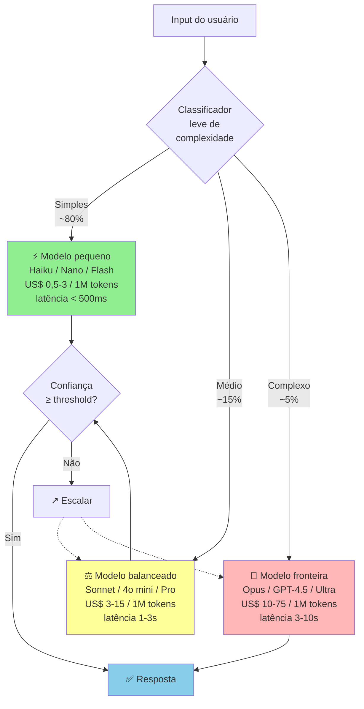
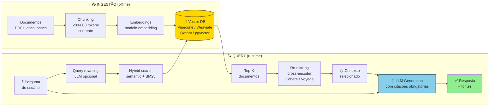

## APÊNDICE Z — AI COMO PARTE DO PRODUTO (AI-NATIVE PRODUCT)

> [!warning] Nota de validade
> Esse é o apêndice que envelhece mais rápido no manual. Panorama de modelos, custos, ferramentas, e práticas de abril de 2026 será parcialmente obsoleto em doze a dezoito meses. Os princípios (avaliação rigorosa, mitigação de alucinação, margem real incluindo custo de inferência) têm vida mais longa. Revisar a cada doze meses.

O [[#APÊNDICE I — IA GENERATIVA COMO ACELERADOR DO EMPREENDEDOR (2026)|Apêndice I]] cobre IA como ferramenta do fundador. Acelerador de produtividade pessoal. Esse apêndice é diferente. Cobre IA como parte do produto que vai a mercado. RAG. Evaluations. Mitigação de alucinação. Seleção de modelo. Economia de inferência. Latência. E tudo que muda quando o LLM é componente crítico do produto, não acessório.

Empresa construindo produto AI-native em 2026 enfrenta disciplinas novas que não existiam em SaaS tradicional. Erros aqui geram produto que alucina em escala. Margens que viram negativas. Latência que mata UX. Ou dependência de um provedor que vira risco estrutural.

### O que esse apêndice cobre

Componentes centrais de produto AI-native, em nove peças.

Model selection. Qual modelo, para qual tarefa, com que trade-offs.

Prompt engineering em produção. Não "prompts espertos". Disciplina operacional.

RAG (Retrieval-Augmented Generation). Quando usar. Como construir. Como medir.

Evaluations. Como medir qualidade de output, de forma sistemática.

Hallucination mitigation. Técnicas para reduzir output confidently wrong.

Cost economics. Custo por query, por usuário, por tier. Como isso afeta margem.

Latency. LLMs são lentos. UX precisa ser desenhada para isso.

Fine-tuning versus RAG versus prompt. Quando cada um.

Observability. Monitorar quality drift, cost drift, e latência em produção.

### POR QUE

Produto AI ruim é pior que produto sem AI. Alucinação em contexto crítico (saúde, jurídico, finanças) é perda de cliente, mais passivo.

Margens desaparecem sem disciplina de custo. Uso intensivo de GPT-4, ou Claude Opus, pode custar R$ 2 a 20 por usuário ativo, por mês. Em SaaS com ticket de R$ 50 por mês, vira prejuízo.

Latência mata adoção. Cinco segundos de resposta em interface conversacional destrói engajamento. UX AI-native exige técnicas específicas.

Dependência de provedor é risco estrutural. Se o seu produto só funciona com GPT-4 da OpenAI, e a OpenAI muda o preço três vezes (já aconteceu), a empresa quebra.

### Quando usar

Esse apêndice aplica quando o LLM é componente central do produto (não auxiliar). Quando o volume de uso é igual ou maior que mil inferências por dia (abaixo disso, o `openai.chat` simples basta). E quando a qualidade do output afeta diretamente retenção, ou monetização.

### Quem envolve

ML/AI Engineer, ou AI Product Engineer. Profissional que entende modelos, prompts, e evals. Pode ser generalist engineer treinado, ou especialista.

Product. Define os casos de uso, thresholds de qualidade, e UX.

Finance, ou CFO. Monitora custo de inferência versus receita.

Ops, ou SRE. Monitora latência, disponibilidade, e quality drift.

### Como executar

#### 1. Model selection, a árvore de decisão básica

Os critérios em quatro peças. Qualidade necessária, para a tarefa, qual patamar mínimo de saída é aceitável? Latência, tempo máximo aceitável na UX. Custo por 1M tokens, input e output. Privacidade, os dados podem sair para API de terceiro?

Panorama em abril de 2026, em mudança rápida.

Modelos de fronteira (mais capazes, mais caros). Claude Opus 4.7, GPT-4.5 e 5, Gemini Ultra. Custo de cerca de US$ 10 a 75 por 1M tokens output. Usar apenas onde a qualidade é crítica.

Modelos balanceados. Claude Sonnet 4.6, GPT-4o mini, Gemini Flash. Custo de US$ 3 a 15 por 1M tokens. "Default" para produção, na maioria dos casos.

Modelos pequenos (fast, cheap). Claude Haiku, GPT-4o nano, Gemini Nano. Custo de US$ 0,5 a 3 por 1M tokens. Tarefas de classificação, extração, e roteamento.

Modelos open-source (self-hosted). Llama 3, Mistral, Qwen. Custo de infra de cerca de US$ 0,5 a 2 por 1M tokens, se bem-operado. Privacidade, mais controle total. Complexidade operacional maior.

A decisão típica. Nunca "sempre Opus para tudo". Queima dinheiro. Nunca "sempre Haiku para tudo". A qualidade fica inconsistente.

A arquitetura de cascata de modelos é o padrão econômico.



A cascata economiza setenta a noventa por cento de custo, em relação a "sempre fronteira". Mantendo qualidade onde importa. Requer classificador leve (heurística, ou modelo pequeno), e confidence scoring para escalar.

A regra. Cascata de modelos. Tentar modelo pequeno. Escalar para maior se a confiança estiver baixa, ou houver falha específica.

#### 2. Prompt engineering em produção

Prompt em produção é código. O tratamento adequado é em quatro pontos.

Versionado. Cada prompt tem versão, histórico, e autor da mudança. Testado. A mudança de prompt passa por eval suite antes de ir a produção. Estruturado. Templates com variáveis, não strings hardcoded. Documentado. Contexto do uso, casos de erro conhecidos, e critério de sucesso.

Ferramentas. LangSmith, PromptLayer, Humanloop, Braintrust. Plataformas de gestão de prompts em produção, com versionamento, e eval, integrados.

> [!important] Regras práticas de prompt em produção
> Prompts em produção em arquivos separados, não strings no código principal. Variáveis de sistema claramente separadas de input de usuário (evita prompt injection). Exemplos few-shot quando a tarefa beneficia (raciocínio, formatação específica). Instruções claras sobre formato de saída (JSON, markdown, etc.), com fallback para parsing falho.

#### 3. RAG, quando e como

Quando usar RAG. Conhecimento específico do cliente (contratos, documentação interna, base de produtos). Informação que muda frequentemente (preços, políticas). Volume de conhecimento maior que o context window do modelo. Necessidade de citar fontes.

Quando NÃO usar RAG. O conhecimento já está no modelo (fatos gerais, línguas, domínio amplo). Volume pequeno de contexto, que cabe em prompt.

Arquitetura RAG moderna (2026), em quatro etapas.

1. Ingestão. Documentos para chunking (parágrafos coerentes, de duzentos a oitocentos tokens), depois embeddings, depois vetores em DB.
2. DB vetorial. Pinecone, Weaviate, Qdrant, pgvector (extension do Postgres), ChromaDB.
3. Retrieval. Consulta para embedding, depois busca semântica top-K, depois re-ranking opcional.
4. Generation. Contexto recuperado mais pergunta, depois LLM, depois resposta.

A arquitetura RAG completa, incluindo técnicas avançadas.



A Vector DB (dourada) é coração da infraestrutura. O LLM (azul) é onde acontece generation. Citações obrigatórias permitem auditoria do que foi efetivamente usado.

Técnicas avançadas. Hybrid search, embedding mais BM25 (keyword). Pega tanto semântica, quanto termos exatos. Re-ranking, modelo cross-encoder para re-ordenar top-K, antes de passar ao LLM (Cohere Rerank, Voyage). Query rewriting, usar LLM para reformular a pergunta do usuário, antes de retrieval. HyDE (Hypothetical Document Embeddings), gerar resposta hipotética primeiro, e usar embedding dela para busca.

Métricas-chave de RAG. Retrieval accuracy, percentual de consultas onde o documento relevante está no top-K. Answer faithfulness, a resposta está efetivamente baseada no contexto recuperado? Answer relevance, a resposta endereça a pergunta?

#### 4. Evaluations, disciplina de medir qualidade

O problema. Como saber se o seu produto AI está funcionando bem?

Não é "testei cinco exemplos manuais, e pareceu ok". É disciplina sistemática.

Componentes de uma eval suite, em quatro partes. Dataset de teste, cinquenta a quinhentos casos representativos, com output esperado. Métricas, exact match, semantic similarity, LLM-as-judge, human eval. Pipeline automatizado, rodar suite em cada mudança de prompt, ou modelo. Tracking histórico, a quality não degradou com mudanças?

Tipos de eval. Automated rule-based, checa formato, presença de palavras-chave, e validação de JSON. LLM-as-judge, outro LLM avalia qualidade. Cuidado com viés do judge. Human eval, avaliação humana de subset. Caro, mas gold standard para temas críticos. A/B em produção, feedback implícito (rating, thumbs up ou down, completion), e explícito.

Ferramentas. LangSmith, Braintrust, Helicone, Arize. Plataformas de LLM observability, e eval.

> [!important] Regra operacional de eval
> Não entra em produção mudança de prompt, ou modelo, que não passou na eval suite com score igual ou maior que o baseline. Sem isso, qualidade degrada por deriva silenciosa, e ninguém percebe até o cliente reclamar.

#### 5. Mitigação de alucinação

Alucinação. Quando o LLM produz resposta plausível, mas factualmente incorreta.

Técnicas, em ordem de eficácia mais custo.

Grounding em RAG. Forçar o modelo a responder baseado em contexto recuperado, não em conhecimento paramétrico. Prompt: "Responda apenas com base no contexto abaixo. Se a resposta não está no contexto, diga 'não sei'."

Structured output. Forçar JSON schema. Reduz invenção de fatos, porque o modelo tem que preencher campos específicos.

Citação obrigatória. Exigir que a resposta cite a passagem específica do contexto. Auditável.

Verification loop. Segundo LLM verifica se a resposta do primeiro está coerente com o contexto.

Confidence scoring. O modelo fornece confiança. Abaixo de threshold, rota para humano, ou fallback.

Fine-tuning, com dataset curado. Última linha de defesa. Caro. Complexo. Mas elimina classes de erro.

Domínios críticos. Saúde, jurídico, finanças, segurança. Nesses, alucinação é inaceitável. A arquitetura deve incluir human-in-the-loop, ou confidence gates rígidos.

#### 6. Custo de inferência, o assassino silencioso

Cálculo padrão.

```
Custo por usuário ativo/mês =
 (inferências/usuário/mês) ×
 (tokens médios/inferência) ×
 (custo por token)
```

Exemplo realista (produto de chat com RAG). Vinte inferências por usuário, por mês. Dois mil tokens de input (contexto mais pergunta), e quinhentos tokens output. Modelo intermediário, US$ 5 por 1M input tokens, e US$ 15 por 1M output tokens.

Custo. 20 vezes (2.000 vezes 5 mais 500 vezes 15) dividido por 1.000.000 igual a US$ 0,35 por usuário, por mês, ou cerca de R$ 1,80.

Parece pequeno. Mas. Power users consomem dez a cinquenta vezes isso. Se dez por cento da base consome cinquenta vezes, o custo efetivo sobe para US$ 1 a 5 por usuário, por mês. Em produto com ticket de US$ 10, a margem só de AI vira cinquenta a noventa por cento.

Técnicas de redução de custo. Caching, respostas idênticas, ou similares, reutilizadas. Reduções de trinta a setenta por cento em workflows repetitivos. Modelo cascata, tentar barato primeiro, e escalar se necessário. Prompt enxuto, cada palavra custa. Auditar prompts por ineficiência. Fine-tuning, modelo pequeno fine-tuned pode substituir modelo grande genérico (até dez vezes menor custo). Rate limiting por tier, freemium com limite, e paid tiers com caps. Monitoramento por usuário, detectar outliers que consomem desproporcionalmente.

#### 7. Latência, UX AI-native

LLMs de fronteira têm latência de um a dez segundos. Em UI interativa, isso destrói a UX.

Técnicas. Streaming, mostrar tokens à medida que são gerados. Percepção de latência menos setenta por cento. Feedback visual, "pensando...", "consultando dados...", animação. O usuário espera, se entende que está acontecendo algo. Otimistic UI, começar a mostrar UI enquanto a resposta é gerada. Pré-computation, responder antes que o usuário peça (por exemplo, sugestões prontas ao abrir tela). Cascata de modelos, modelo rápido para primeira resposta, e modelo melhor em background, se o usuário pedir aprofundamento.

Targets saudáveis. Primeiro token, igual ou menor que um segundo (com streaming). Resposta completa para tarefa curta, igual ou menor que cinco segundos. Tarefas longas (documento, análise), igual ou menor que vinte segundos, com feedback de progresso.

#### 8. Fine-tuning versus RAG versus Prompt, quando cada um

| Técnica | Custo | Tempo | Melhor para |
|---|---|---|---|
| Prompt engineering | Baixo | Horas | Tarefas bem definidas, casos gerais |
| Few-shot prompting | Baixo | Horas | Formatação específica, tom, estilo |
| RAG | Médio | Semanas | Conhecimento específico, informação atualizada |
| Fine-tuning | Alto | Semanas-meses | Padrão muito específico, redução de latência/custo |

A regra. Começar sempre por prompt. Se não funciona, RAG. Fine-tuning só quando há mais de mil exemplos de treino curados, e o ROI justifica.

#### 9. Observability em produção

Em produção, monitorar. Latência (p50, p95, p99). Custo por inferência (agregado, e por usuário). Taxa de erro (timeouts, API errors). Qualidade (quando houver feedback signal: thumbs, rating, completion rate). Quality drift, degradação gradual de qualidade (comum quando o provedor atualiza o modelo silenciosamente).

Ferramentas. Helicone (LLM-specific), Langfuse, Datadog com custom metrics, Grafana.

### Métricas

Custo por usuário ativo, por mês (AI-specific). Alvo, igual ou menor que trinta por cento do ticket mensal.

Latência p95 (primeiro token). Igual ou menor que um segundo e meio.

Qualidade em eval suite. Igual ou maior que oitenta e cinco por cento (definido por produto).

Taxa de fallback ou erro. Igual ou menor que dois por cento das inferências.

Cost per conversion. Custo AI para atingir conversão medida.

Quality drift detection. Alerta em queda igual ou maior que cinco por cento em eval score.

### Definição de sucesso

AI-native está no padrão quando os seis itens estão em pé.

1. Eval suite formal existe, e roda em cada deploy.
2. Custo por usuário está mapeado, e dentro de target de margem.
3. Latency em UI conversacional está sob dois segundos p95, com streaming.
4. Mitigação de alucinação é ativa, não retórica.
5. Observability completo. Latência, custo, qualidade, e drift, monitorados.
6. Não há dependência única de provedor crítico, sem plano B.

### Armadilhas

"GPT-4 funciona, tá bom". Sem eval, não sabe se mantém qualidade quando o provedor atualiza o modelo silenciosamente.

Prompt no meio do código. Não versionado, não testado, e não auditável.

Ignorar custo em base gratuita. Freemium sem cap de inferência vira prejuízo.

Latência desconsiderada no design. UI que assume resposta instantânea quebra em cem por cento dos casos AI-native.

Confiar em output sem verificação em domínio crítico. Saúde, jurídico, ou finanças, sem human-in-loop, é passivo.

Fine-tuning prematuro. Gastar meses fine-tunando, quando prompt mais RAG resolvia.

Dependência cem por cento de um provedor. Quando OpenAI muda preço, ou capacidade, a sua empresa vai junto.

Não medir quality drift. Degradação gradual passa despercebida. O cliente reclama três meses depois.

Prompt injection ignorado. Usuário malicioso consegue extrair system prompt. Instruir o modelo a ignorar regras. Exige defesa.

Hallucination em output estruturado. O modelo preenche campos com dados inventados se o JSON obriga. Validação, e retry, necessários.

### Checklist

- [ ] Model selection foi decidido com critério, não default?
- [ ] Eval suite formal existe, com dataset representativo?
- [ ] Prompts versionados, testados, e documentados?
- [ ] RAG implementado onde faz sentido (não onde não faz)?
- [ ] Custo por usuário, por mês, mapeado, e sob target de margem?
- [ ] Latency p95 sob dois segundos em UI interativa (com streaming)?
- [ ] Técnicas de mitigação de alucinação aplicadas onde crítico?
- [ ] Observability completo. Latência, custo, qualidade, drift?
- [ ] Plano B de provedor mapeado (não dependência única)?
- [ ] Prompt injection defense implementado?
- [ ] Human-in-loop em domínios críticos (saúde, jurídico, finanças)?

---

---
