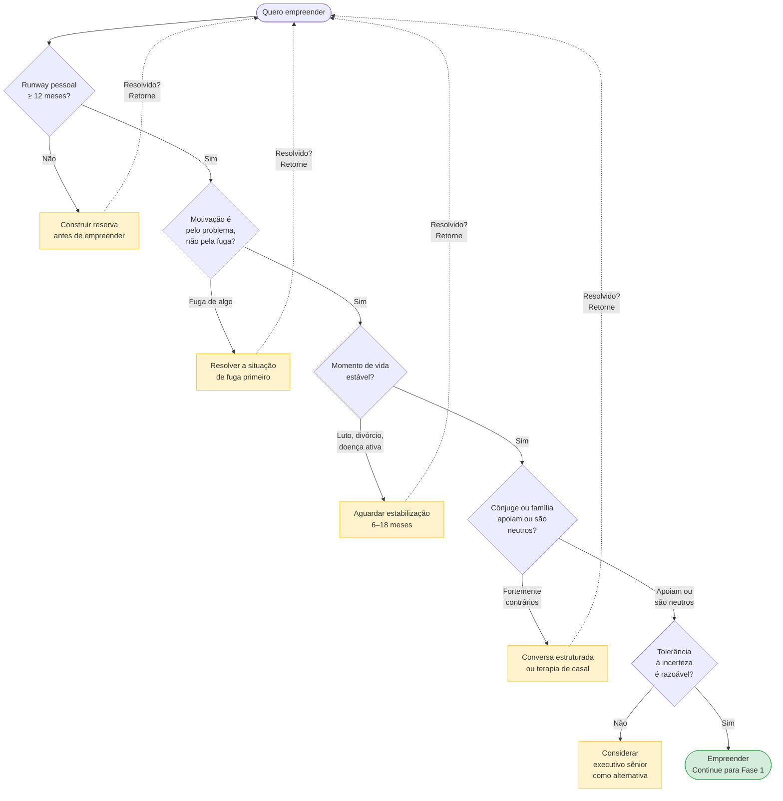
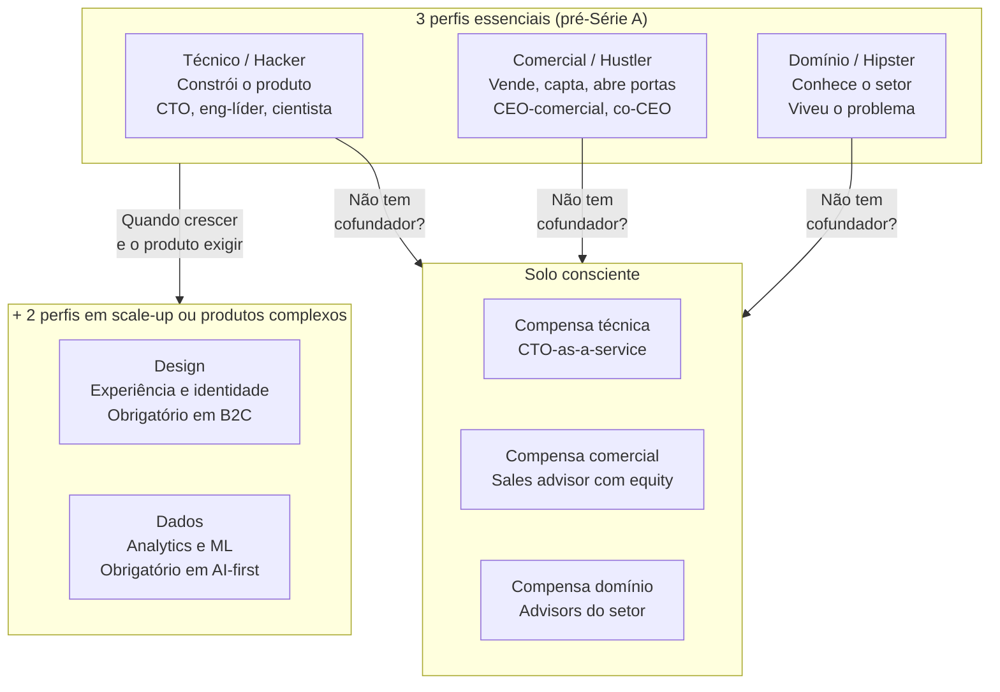

## FASE 0 — PREPARAÇÃO DO EMPREENDEDOR

### O que esse apêndice cobre
Esta é a fase anterior à ideia. O objetivo é preparar a pessoa que vai empreender, não o negócio. Você avalia a sua situação de vida com honestidade. Capacidade financeira, capacidade emocional, tempo disponível, motivações reais, rede de apoio. O entregável é um documento de três a seis páginas, o Dossiê Pessoal do Empreendedor, que responde às perguntas desta fase.

### POR QUE
Empreender não é primariamente um ato técnico. É um ato psicológico e financeiro sustentado por meses ou anos. A maioria das desistências não acontece porque a ideia era ruim. Acontece porque o empreendedor não aguentou a pressão. Ficou sem dinheiro, sem apoio familiar, sem saúde mental. Ou descobriu tarde que queria outra coisa da vida. Pular esta fase significa começar um negócio sobre fundações pessoais frágeis, e qualquer crise do próprio negócio derruba tudo.

### Quando não empreender, um framework honesto de autoexclusão

A maioria dos manuais assume que o leitor já decidiu empreender e ajuda a executar bem. Esta seção é diferente. Lista situações onde empreender agora provavelmente é má ideia, independente de quão boa seja a ideia ou o time. Reconhecer essas situações antes evita sofrimento pessoal, destruição de capital, e desperdício de anos. Não é julgamento. É honestidade.

Você provavelmente não deveria empreender agora se:

1. Suas finanças pessoais estão frágeis. Dívidas pessoais altas no cartão, no rotativo, no financiamento atrasado, sem plano de quitação. Reserva de emergência abaixo de seis meses de despesas. Dependentes financeiros sem outra fonte de renda. Empreender com finanças pessoais frágeis costuma terminar em crise dupla, da empresa e da casa. A sequência melhor é resolver finanças, construir reserva, depois empreender.

2. Você está num período de vida emocionalmente turbulento. Luto recente, divórcio em curso ou recente, mudança de cidade ou país sem adaptação, diagnóstico de saúde sério em curso. A trajetória empreendedora exige resiliência emocional alta. Somada a uma crise pessoal, tende a destruir as duas. Esperar estabilizar é sábio.

3. Sua motivação principal é financeira de curto prazo. Quero ficar rico em três anos. Preciso ganhar muito rápido. Empreender paga mais que CLT. Estatisticamente a maioria dos empreendedores ganha menos que em CLT bem-remunerado pelos primeiros cinco a sete anos. Retorno financeiro real, quando vem, vem em sete a doze. Motivação só financeira costuma desistir antes desse tempo.

4. Você não tolera incerteza. Precisa de rotina, previsibilidade, feedback constante. Sente alta ansiedade em situações ambíguas. Tem dificuldade de dormir com questões não-resolvidas. Empresa em estágio inicial é incerteza por anos. Autoconhecimento aqui é honestidade. Algumas personalidades florescem melhor como executivo sênior em empresa maior.

5. Você não tem nenhum conhecimento específico do problema que quer resolver. A ideia nasceu de observação superficial. Você não conhece o cliente em profundidade. Não tem rede no setor. É possível, mas três a cinco vezes mais difícil. Alguém do setor com menos brilho resolve mais rápido. Se você quer insistir, construa conhecimento e rede do setor por seis a doze meses antes de fundar.

6. Você está empreendendo para provar algo a alguém. Aos pais que dizem "estabilize". Ao chefe que demitiu você. Ao ex-parceiro que duvidou. Motivação externa dessa forma costuma colapsar quando a trajetória fica difícil, e ela vai ficar. Motivação precisa ser interna e pelo problema em si.

7. Seu cônjuge ou companheiro é fortemente contrário. Não apenas preocupado, mas explicitamente contra e resistente mesmo após conversa longa. Empreender contra a oposição do parceiro destrói muitos casamentos. Se você quer insistir mesmo assim, considere terapia de casal antes.

8. Você está no meio de uma trajetória profissional que estava dando certo. Promoção recente, aumento significativo, caminho de liderança em empresa consolidada. Nunca vai ser o "bom momento" de sair do emprego, mas em trajetória ascendente alta o custo de oportunidade é enorme. Isso não significa que você não pode empreender. Significa que precisa de cálculo explícito. Quanto está deixando? O que vai buscar? Decisão com olhos abertos, não impulso.

9. Você tem condição de saúde mental não-tratada. Depressão, ansiedade severa, transtornos específicos sem acompanhamento. A trajetória empreendedora agrava saúde mental frágil. Não é remédio. Tratar primeiro. O [[#APÊNDICE Y — SAÚDE MENTAL, DINÂMICA DE CO-FOUNDERS E HUMANIDADE DO FUNDADOR|Apêndice Y]] detalha.

10. Você quer empreender porque odeia seu emprego atual. Fugir de algo é diferente de ir em direção a algo. Frequentemente a trajetória empreendedora fica mais difícil que o emprego ruim. Resolva o trabalho primeiro. Depois empreenda por motivo positivo, não evasivo.

> [!warning] A regra dos três pontos
> Se três ou mais desses dez pontos são verdade para você, pause. Não desista. Ajuste. Trabalhe nos pontos por seis a vinte e quatro meses antes de empreender. A trajetória depois dessa preparação é significativamente mais sustentável.

### Quando usar
Comece antes de investir qualquer recurso. Tempo acima de uma hora por dia, ou dinheiro, em uma ideia. Termine quando o Dossiê Pessoal estiver preenchido com honestidade, e você tiver clareza financeira (o seu runway pessoal mínimo definido) e clareza de motivação (você sabe por que quer fazer isso). Revisite a cada seis meses, ou sempre que houver mudança de vida significativa. Casamento, filho, doença, mudança de cidade.

### Quem envolve
O executor principal é você, o empreendedor. Os participantes são cônjuge ou companheiro se houver, familiares que dependem financeiramente de você, sócios potenciais. O decisor é exclusivamente você, mas com input real, não cerimonial, de quem compartilha sua vida financeira e emocional.

### Como executar
Execute estas oito tarefas em sequência.

1. Diagnóstico financeiro pessoal, de duas a quatro horas. Levante numa planilha três números. O seu custo de vida mensal mínimo (aluguel, comida, saúde, transporte, educação dos filhos, dívidas), o quanto você precisa para viver com dignidade básica, sem lazer. O seu custo de vida mensal atual, incluindo o padrão que você leva hoje. A sua reserva atual em dinheiro líquido, sem contar imóveis, carros, previdência travada.

> [!tip] Fórmula do Runway Pessoal
> Runway Pessoal = Reserva ÷ Custo mínimo mensal
>
> É o número de meses que você aguenta sem receita. Se é menor que seis meses, você não deve largar o seu emprego para empreender agora. Empreenda em paralelo.

2. Teste de motivação real, uma hora, em silêncio, sem pressa. Responda por escrito, com honestidade brutal. Por que eu quero empreender? Escreva cinco razões. Dessas razões, quais são sobre mim (ego, liberdade, dinheiro) e quais são sobre o problema ou o cliente? Do que eu estou fugindo? Chefe ruim, trabalho tedioso, sensação de fracasso? Cuidado: empreender para fugir de algo é fonte frequente de decisões ruins. Eu faria isso se nunca ficasse rico? Se não, qual é o valor mínimo que precisa sair disso para fazer valer a pena?

3. Inventário de habilidades e gaps, duas horas. Liste em quatro colunas. Habilidades que eu tenho e são relevantes (programação, vendas, design). Habilidades que não tenho e serão críticas (marketing digital, contabilidade, negociação). Como vou cobrir os gaps (aprender, contratar, sócio). Quanto tempo e dinheiro isso custa.

4. Conversa estruturada com quem compartilha a sua vida, uma a duas horas. Se você tem cônjuge, filhos, ou alguém que depende de você, marque uma conversa formal. Não um comentário de jantar. Apresente quanto dinheiro você planeja alocar, qual o prazo que dá a si mesmo antes de reavaliar, qual impacto isso terá na rotina familiar, qual é o plano B se não der certo. Peça uma resposta honesta. Se a pessoa não apoia, trate isso como informação crítica. Não como obstáculo a ser ignorado.

5. Avaliação de saúde física e mental, trinta minutos de reflexão. Como está o seu sono hoje? Você tem alguma condição crônica que pode piorar com estresse? Você tem rede de apoio emocional (amigos, terapeuta, família)? Empreender aumenta sintomas de ansiedade e depressão. Se você já está em tratamento, converse com o seu profissional de saúde antes de aumentar a pressão.

6. Definição de prazo e critérios de desistência, uma hora. Defina de antemão quanto tempo você dá ao projeto antes de reavaliar (sugiro doze meses para a primeira reavaliação formal). Quais sinais de fracasso justificam desistir antes (nenhum cliente pagante depois de seis meses de tentativa ativa, reserva abaixo de X reais). Quais sinais de sucesso justificam acelerar (primeiro cliente pagante recorrente em noventa dias). Esses critérios precisam ser definidos hoje, com a cabeça fria. Depois, no meio da tempestade, você não vai ter objetividade para defini-los.

7. Escolha do modelo de dedicação. Decida entre três caminhos. Full-time, largar tudo e focar, exige runway pessoal de doze meses ou mais e alta tolerância ao risco. Part-time estruturado, manter emprego e dedicar dez a vinte horas por semana ao negócio, é mais lento e mais seguro. Side project exploratório, cinco a dez horas por semana, sem pressão de transformar em empresa, serve para as fases 1 a 4 deste manual.

8. Escrita do Dossiê Pessoal. Consolide tudo acima em um documento simples. Guarde. Releia ao final de cada fase seguinte deste manual. Compare. O que você descobriu no caminho invalida algo desse dossiê? Se sim, atualize.

### O fundador como pessoa, seis ensaios de Paul Graham para calibrar expectativa

A [[#FASE 0 — PREPARAÇÃO DO EMPREENDEDOR|Fase 0]] é sobre preparar a pessoa que vai empreender, não o negócio. Paul Graham tem seis ensaios especificamente sobre essa dimensão. Sobre o tipo de pessoa que tende a ter sucesso em startup, o tipo de pensamento que ajuda, o tipo de armadilha interna que derruba. Não são conselhos de "atitude positiva". São observações baseadas na experiência de ter acompanhado mais de três mil fundadores no Y Combinator, cruzada com padrões identificados em retrospecto.

Reúno os seis em formato consolidado. A [[#FASE 0 — PREPARAÇÃO DO EMPREENDEDOR|Fase 0]] é exatamente onde eles têm maior valor. Antes de você começar a construir qualquer coisa externa, vale internalizar essas calibragens. Os ensaios são curtos. Vale ler os originais. Os links estão no [[#APÊNDICE E — RECURSOS E LEITURAS RECOMENDADAS|Apêndice E]].

#### A ideia dominante na sua cabeça, *The Top Idea in Your Mind* (Graham, 2010)

Graham observou que a maioria das pessoas tem uma única ideia dominante na mente em qualquer momento. É aquela para a qual os pensamentos migram naturalmente quando você está no banho, dirigindo, ou caminhando sem estímulo externo. É o problema em que você pensa sem tentar. E é a fonte de boa parte das suas melhores intuições operacionais e estratégicas.

A implicação para o fundador é concreta. Ser CEO de startup exige que o seu negócio seja a ideia dominante na sua cabeça durante os primeiros anos. Se o problema dominante for outro (um conflito pessoal em aberto, ansiedade financeira não-resolvida, uma briga com ex-sócio, um pleito jurídico, uma dívida não-estruturada), o seu negócio vai sofrer sistematicamente. O tempo de pensar sem tentar está sendo gasto em outro lugar. Você não controla para onde a mente vai no banho. Controla indiretamente, pelo que deixa ou não deixa ficar aberto na sua vida.

Teste simples, feito nos próximos três banhos, sem tentar. Quando a sua mente vagueia, para onde ela vai? Se não é o seu negócio, você tem duas opções. A primeira é fechar o loop do que está ocupando a mente. Resolver o conflito, pagar a dívida, enfrentar a conversa evitada, terminar o processo jurídico. Loops abertos são imãs mentais que roubam a sua capacidade de pensar em trabalho profundo. A segunda é reconhecer que você ainda não está pronto para começar uma startup. Talvez seja sensato resolver a vida pessoal primeiro, antes de somar a ela a carga cognitiva de fundar uma empresa.

Graham identifica dois tipos de pensamento particularmente perigosos para fundadores, porque roubam atenção de forma desproporcional ao benefício. Um é pensamento sobre dinheiro. Captação tende a virar atolamento mental que consome cem por cento do foco por semanas. O outro é pensamento sobre disputas. Brigas ocupam espaço imenso, e pior, têm formato velcro. Parecem ter substância, mas não têm. Se você está hoje no meio de uma captação ou de uma disputa, aceite que o seu trabalho estratégico vai sofrer durante esse período. Não marque outras decisões importantes para acontecerem em paralelo.

> [!important] Regra operacional da Fase 0
> Antes de começar, faça um inventário honesto de loops abertos na sua vida. Dívidas não-renegociadas, conflitos interpessoais, compromissos não-cumpridos, processos incompletos. Feche o máximo possível. Cada loop aberto é imposto mental sobre a sua capacidade futura de ser fundador.

#### Os cinco atributos que o YC procura, *What We Look for in Founders* (Graham, 2010)

Graham escreveu um ensaio listando, de forma direta, os cinco atributos que o Y Combinator aprendeu a identificar como preditores de sucesso em fundador. O notável é o que não está na lista. Inteligência. Não porque seja irrelevante. Graham diz explicitamente que acima de certo limiar ela importa menos que o resto. É que não é diferenciador entre fundadores que conseguiram e fundadores que não conseguiram.

Os cinco atributos, com aplicação para o seu autodiagnóstico na [[#FASE 0 — PREPARAÇÃO DO EMPREENDEDOR|Fase 0]]:

Determinação. Para Graham, o atributo mais importante. Não é vontade de ser rico nem sonho grande. É capacidade de continuar iterando apesar de obstáculos constantes, sem ser desmoralizado por semanas ruins. Teste: pense em algo difícil que você fez por dois anos ou mais seguidos, contra resistência, sem recompensa externa durante boa parte do tempo. Se você tem exemplos concretos disso, bom sinal. Se tem dificuldade em encontrar exemplos, autossuspeite.

Flexibilidade. Contraintuitivamente, é co-requisito com determinação, e frequentemente confundido com o oposto. Graham distingue determinação (persistência mais capacidade de ajustar) de teimosia (persistência mais rigidez). Quem é determinado mas não flexível empurra a ideia errada por anos. Quem é flexível mas não determinado pivota a cada semana. O encontro dos dois é raro. Teste: pense em uma ideia forte sua que você mudou drasticamente nos últimos dois anos por causa de evidência. Se não tem exemplo, você provavelmente está mais na teimosia do que na determinação.

Imaginação. Tipo específico de inteligência. Não é velocidade para resolver problemas definidos. É capacidade de gerar ideias surpreendentes. Graham observa que quase toda ideia boa de startup parece ruim no início. Se parecesse boa, alguém já estaria fazendo. A imaginação que importa é a que produz ideias que parecem um pouco malucas. Teste: quando você propõe algo novo, as reações tendem a ser "interessante" (morno, genérico) ou "isso nunca vai funcionar porque" (específico, vigoroso)? O segundo tipo de reação é frequentemente sinal de ideia com potencial.

Naughtiness. Talvez o termo mais difícil de traduzir. É disposição a quebrar regras que não importam. Não é malícia moral. É leve irreverência. Não é transgredir por transgredir. É não se curvar a regras por respeito à autoridade quando elas não fazem sentido. Sam Altman (Loopt, hoje OpenAI) é o exemplo canônico citado por Graham. Por isso o YC passou a perguntar em entrevistas: conte uma vez em que você hackeou um sistema a seu favor. Não no sentido de invadir computador. No sentido de contornar regras sem substância. Teste: em algum momento do último ano, você desobedeceu uma regra formal porque ela era obviamente burra, e isso deu certo?

Amizade entre cofundadores. Não coleguismo cordial nem parceria profissional. Relação verdadeira, de respeito, que sobrevive ao desacordo forte. Graham observa que startups quebram mais por disputas societárias do que por falha de produto, e a diferença está aqui. Cofundadores que são amigos genuínos antes de serem sócios sobrevivem a conflito, resolvem diferenças sem destruir a relação. Cofundadores que são arranjos estratégicos fragmentam sob pressão. Teste: você pegaria cinco dias de férias junto com o seu cofundador? Se hesitou, cuidado. Para o cenário que você espera não acontecer — disputa, divórcio societário, saída forçada — o [[#APÊNDICE BP — DISPUTA SOCIETÁRIA E SAÍDA DE SÓCIO|Apêndice BP]] cobre prevenção, mediação e mecânica jurídica de saída.

Se você pontua baixo em três ou mais desses cinco, vale pensar seriamente se este é o momento certo para empreender, ou se algum trabalho pessoal antes pode aumentar a sua probabilidade de sucesso. Os atributos são parcialmente treináveis. Não são destino.

#### Relentlessly resourceful, *Relentlessly Resourceful* (Graham, 2009)

Graham escreveu um ensaio curto, de 2009, com a tese mais direta que eu já li sobre fundador. Conseguir reduzir bom fundador a duas palavras levou tempo, ele diz. A resposta é "relentlessly resourceful". Implacavelmente engenhoso.

O conceito é construído em oposição a "hapless". Desamparado. Vítima passiva das circunstâncias. O ponto não é apenas trabalhar muito. Muita gente trabalha muito e continua hapless. É trabalhar muito mais continuar tentando abordagens novas quando as primeiras falham mais nunca aceitar "não tem como" como resposta final. Pessoas hapless são vitimizadas por circunstância. Pessoas relentlessly resourceful torcem circunstância até ela dar jeito.

Graham observa que a diferença aparece operacionalmente em como a pessoa reage a obstáculo. A pessoa hapless recebe um não de investidor, volta para casa, conclui "então não vai dar certo". Tenta canal de aquisição que não funciona, conclui "o canal é ruim". Tem problema técnico difícil, espera que alguém apareça para resolver. A pessoa relentlessly resourceful recebe o não de investidor, pergunta exatamente por quê, ajusta a pitch, tenta outros quinze investidores com a pitch nova. Canal de aquisição falha, ela testa outros oito mecanicamente. Problema técnico difícil, ela estuda do zero, pergunta a dez pessoas, tenta três abordagens.

Para Graham, é o teste mais útil que ele aplicava mentalmente ao conhecer fundador pela primeira vez. Sugere que é também o teste que vale você aplicar a si mesmo e a qualquer cofundador. Quando esta pessoa bate em obstáculo, ela naturalmente vai para "tem que ter um jeito" ou para "não tem como"?

Exercício concreto de [[#FASE 0 — PREPARAÇÃO DO EMPREENDEDOR|Fase 0]]. Liste cinco obstáculos significativos que você enfrentou profissionalmente nos últimos três anos. Para cada um, descreva em três frases. Qual era o obstáculo. Quantas abordagens você tentou antes de achar solução ou desistir. Quem te ajudou ou quem você envolveu. O padrão que emerge: se em três ou mais dos cinco casos você tentou duas abordagens ou menos, ou desistiu sem envolver outras pessoas, provavelmente você ainda não desenvolveu o músculo de "relentlessly resourceful". Isso é desenvolvível. Mas vale você saber que está nesse ponto antes de começar a empreender, para poder desenvolver conscientemente.

Graham termina o ensaio com uma frase que vale guardar.

> [!quote] Paul Graham, *Relentlessly Resourceful* (2009)
> "Make something people want" é o destino. "Be relentlessly resourceful" é como você chega lá.
>
> Se ele estivesse dirigindo uma startup, essa seria a frase que ele colaria no espelho.

#### Contraintuitivo, *Before the Startup* (Graham, 2014)

Graham deu uma palestra em Stanford, em 2014, com o título *Before the Startup*. O conteúdo é todo organizado em torno de uma observação única. Startups são contraintuitivas. Os seus instintos normais sobre como ter sucesso, calibrados pela escola e pelo mundo corporativo, falham em startup. Frequentemente em direção ao oposto do correto. Três pontos valem atenção especial na [[#FASE 0 — PREPARAÇÃO DO EMPREENDEDOR|Fase 0]].

Você não precisa ser expert em startups. Precisa ser expert em usuários.

Fundadores iniciantes ficam ansiosos por aprender sobre startup. Leem livros, vão a eventos, colecionam conselhos. Graham argumenta que isso importa muito menos do que se imagina, e pode ser ativamente distrativo. O que importa de verdade é expertise profunda sobre o cliente e o problema. Zuckerberg não sabia nada sobre startup quando começou o Facebook. Sabia muito sobre o que estudantes universitários queriam de uma rede social. Drew Houston não era expert em captação. Era expert em como ele mesmo queria gerenciar arquivos.

Isso é libertador. Você não precisa esperar aprender sobre startup para começar. Precisa conhecer profundamente quem você vai servir. Isso significa conversar com usuários, observar comportamento, entender contexto. Expertise sobre startup se absorve no processo. Expertise sobre usuários se constrói com intenção.

Gaming the system para de funcionar em startup.

Grande parte do sucesso profissional tradicional envolve gamar sistemas. Dar a impressão certa para o chefe certo, saber se apresentar nas reuniões certas, ser visto fazendo os movimentos certos. No mundo corporativo, isso funciona porque há juízes humanos a convencer. Chefes, clientes internos, diretoria. Em startup não há juiz humano. Há mercado. O mercado não se convence por apresentação elegante. Só por produto que funciona. Usuários não ligam para a sua narrativa. Ligam para o que a sua solução faz por eles.

Graham observa que fundadores com histórico brilhante em estruturas corporativas frequentemente se atrapalham no começo, porque tentam aplicar habilidades de fazer boa impressão onde não há ninguém para se impressionar. Isso é uma calibragem importante da [[#FASE 0 — PREPARAÇÃO DO EMPREENDEDOR|Fase 0]]. Aceite que as habilidades que te fizeram bem-sucedido no corporate podem ser parcialmente irrelevantes nos primeiros anos de startup. Em alguns casos, até prejudiciais. O que importa é construir algo que funciona, e medir isso pela vontade real dos usuários, não pela aprovação de gatekeepers.

Confie na sua intuição sobre pessoas. Desconfie da intuição sobre startup.

O único lugar onde Graham diz explicitamente para confiar na intuição em startup é na avaliação de pessoas. Cofundadores, contratações iniciais, primeiros investidores. Se algo te parece errado sobre uma pessoa, quase sempre está. Se você tem dúvida forte e não consegue articular, aja na dúvida. Raramente se arrepende.

Tudo o resto em startup, o tamanho do mercado, a qualidade da ideia, o que vai funcionar, o que não vai, a sua intuição inicial vai te enganar com frequência. O ambiente é contraintuitivo. Use dados. Use teste. Use evidência externa. Deixe a intuição para onde ela acerta. Gente.

#### Determinação não é teimosia, *The Anatomy of Determination* (Graham, 2009)

Retomo brevemente um ponto já tocado, porque Graham tem um ensaio específico sobre isso e o insight merece registro próprio. Determinação e teimosia parecem iguais de fora, mas são opostas operacionalmente.

Graham usa a analogia do running back do futebol americano. Atleta cujo trabalho é correr para o gol apesar da defesa ativa tentando detê-lo. Running back bom não é o que corre em linha reta e bate nos defensores até cair. É o que tem destino claro (o gol) mas rota flexível. Ele desvia, gira, volta, tenta de novo por outro ângulo, sempre em direção ao mesmo gol. Essa é a forma correta de determinação em startup.

Teimosia é ter rota fixa apesar de a defesa mostrar que ela não funciona. Determinação é ter gol fixo e aceitar rotas novas infinitamente até uma delas funcionar.

Sinais de que você está na teimosia disfarçada de determinação. Você está há meses rodando a mesma abordagem sem resultado, dizendo "só preciso insistir mais". Você se irrita quando alguém questiona a abordagem, não a ideia. Você mede progresso em esforço aplicado em vez de aprendizado gerado. Conversas com cliente te deixam desmoralizado em vez de curioso.

Sinais de determinação saudável. Você muda de rota com frequência, mas mantém o gol fixo por anos. Você busca ativamente evidência contrária à sua abordagem atual. Você mede progresso em incerteza reduzida e hipótese testada, não em tempo investido. Conversas com cliente, mesmo críticas, te animam porque revelam caminho.

A calibragem da [[#FASE 0 — PREPARAÇÃO DO EMPREENDEDOR|Fase 0]]. Se você está começando sem experiência como fundador, é muito provável que a sua primeira intuição de "ser persistente" vai derivar para teimosia. Crie mecanismos externos que forcem revisão. Mentor que pergunta "o que você mudou de opinião neste mês". Ritual mensal de escrever o que aprendeu. Prazo para decisão de pivô com critérios objetivos. Sem esses mecanismos, a gravidade natural do fundador iniciante é rigidez.

#### Sobre autonomia, *You Weren't Meant to Have a Boss* (Graham, 2008)

Um último ensaio vale menção porque toca uma dimensão que raramente é articulada com honestidade. Por que, no fundo, algumas pessoas precisam empreender. Graham argumenta que ter chefe, hierarquia, cadeia de comando, em outras palavras a estrutura corporativa moderna, é arranjo não-natural para humanos. E que algumas pessoas simplesmente não funcionam bem nele. Não é preguiça. Não é rebeldia. Não é vaidade de "ser próprio chefe". É desalinhamento estrutural de temperamento com estrutura.

Isso é observável. Algumas pessoas definham em emprego corporativo bem-pago, e isso não melhora com "trabalhar em empresa melhor". Melhora apenas quando assumem o próprio projeto. Outras florescem em corporate e sofrem empreendendo. É temperamento, e temperamento é pouco moldável.

A calibragem honesta para a [[#FASE 0 — PREPARAÇÃO DO EMPREENDEDOR|Fase 0]]. Empreender não é melhor nem pior que trabalhar em corporate. É adequado a um tipo de pessoa, inadequado a outro. Perguntas úteis. Nos empregos que você teve, você sofria proporcionalmente mais com quem estava acima do que com o trabalho em si? Você tem histórico de fazer coisas sem ninguém pedindo, por conta própria, porque te interessavam? Quando recebe instrução detalhada sobre como fazer algo que você sabe fazer de outro jeito, você consegue seguir a instrução sem sofrer, ou isso te desgasta desproporcionalmente?

Se os padrões apontam para "sim, sofro demais com hierarquia", empreender não é escolha arbitrária. É alinhamento com quem você é. Se os padrões apontam para "funciono bem em estrutura e até aprecio", cuidado com a decisão de empreender por razões externas. Status, narrativa, FOMO. Você pode ser melhor executivo sênior do que fundador, e isso não é derrota.

O ensaio do Graham é útil porque normaliza a necessidade de autonomia como característica legítima, em vez de tratá-la como vaidade ou irresponsabilidade. Para quem está nessa categoria, empreender é menos "grande decisão arriscada" e mais "caminho que se abre quando você aceita quem você é". Para quem não está nessa categoria, vale pensar muito bem antes de pagar o custo da trajetória só porque ela virou status.

### PERGUNTAS A RESPONDER
- Eu tenho runway pessoal de pelo menos seis meses? Sim ou não, com número.
- Por que eu quero empreender, em uma frase clara e honesta?
- As pessoas que compartilham a minha vida financeira estão a bordo? Sim ou não, com registro da conversa.
- Quais habilidades críticas faltam, e como vou adquirir?
- Qual o meu prazo formal de reavaliação?
- Quais são os meus critérios objetivos de desistência e de aceleração?
- Qual o meu modelo de dedicação? Full, part, side?

### Métricas
- Runway pessoal em meses. Idealmente doze ou mais para full-time, seis ou mais para part-time.
- Horas semanais comprometidas. Mínimo de dez para progresso real. Abaixo disso, o projeto definha.
- Nível de apoio da rede próxima, escala de um a cinco autoavaliada, com justificativa escrita.
- Clareza de motivação, autoavaliação de um a cinco. Se você não consegue articular o por quê em uma frase, está baixo.

### Escolha de sócios, a decisão mais irreversível

A [[#FASE 13 — ESTRUTURAÇÃO JURÍDICA, FINANCEIRA E OPERACIONAL|Fase 13]] cobre cap table. O [[#APÊNDICE Y — SAÚDE MENTAL, DINÂMICA DE CO-FOUNDERS E HUMANIDADE DO FUNDADOR|Apêndice Y]] cobre conflito entre sócios. Mas a escolha de sócios acontece antes de tudo isso. E é a decisão mais irreversível que você toma na trajetória empreendedora. Divórcio societário é processo doloroso, caro, que destrói empresas boas e relacionamentos antes sólidos.

Esta seção é sobre como escolher bem, antes do compromisso formal.

Primeira pergunta: você precisa de sócios?

Muitos fundadores bem-sucedidos começaram sozinhos. Sara Blakely na Spanx, Mark Pincus na Zynga nos primeiros anos, Melanie Perkins antes de cofundar a Canva. Sócio único não é defeito. É decisão com trade-offs.

As vantagens de ter sócios: complementaridade de skills (técnico, comercial, domínio), tomada de decisão compartilhada nos momentos difíceis, divisão de trabalho inicial quando capital é escasso, credibilidade maior com investidores. As desvantagens: diluição de equity (de cem por cento para cinquenta ou trinta e três), decisões compartilhadas que atrasam quando urgentes, risco de conflito (cinquenta a sessenta por cento dos times fundadores têm saída de sócios originais em cinco anos), e coordenação permanente mesmo quando um é mais ativo.

A regra prática. Se você consegue fazer setenta por cento do trabalho inicial sozinho, e tem caixa para contratar os trinta por cento que faltam, considere começar solo. Adicione sócio-chave só depois de validar.

Se vai ter sócios, cinco critérios de escolha.

O primeiro é complementaridade de skills. Os dois (ou três) cobrem dimensões distintas: produto e tecnologia, vendas e comercial, domínio do setor, operações e finanças. Se vocês têm skills muito similares, sócio errado.

O segundo é valores alinhados em dimensões centrais. Ambição (tamanho da empresa que querem construir). Timeline (sete anos, quinze anos). Visão de exit (IPO, venda, empresa de geração). Relacionamento com dinheiro (gastar contra poupar, salário contra equity). Relacionamento com risco. Prioridades de vida (família, saúde, tempo). Desalinhamento em qualquer dessas dimensões é conflito garantido em dezoito a trinta e seis meses.

O terceiro é estilo de conflito compatível. Algumas pessoas conflitam aberta e intensamente, e reconciliam rápido. Outras evitam conflito, guardam, explodem mais tarde. Misturar estilos incompatíveis é receita para sofrimento.

O quarto é confiabilidade comprovada. Vocês já trabalharam juntos em projeto sério? Você já viu essa pessoa sob pressão? Em dinheiro e compromisso? Sem evidência empírica, você está apostando em química social, e isso é insuficiente.

O quinto é química pessoal para sete a doze anos. Você aguenta quinhentas reuniões com essa pessoa? Risos em jantares não se traduzem necessariamente em resiliência em crise.

#### Como testar antes de fundar

Três opções, em ordem de preferência.

A primeira opção, e ideal, é projeto curto conjunto. Trabalhar juntos em projeto real (não hipotético) por três a seis meses antes de formalizar. Pode ser consulting conjunto, side project com cliente, hackathon prolongado. O que você está observando: como a pessoa lida com erro, com pressão, com discordância, com dinheiro, com tempo.

A segunda opção é conversas estruturadas intensivas. Oito a doze conversas de duas horas cada sobre história pessoal, finanças, família, ambições, conflitos passados, valores. Use frameworks como o "Relationship Red Flags" do fundador Institute ou o fundador compatibility interview do Nathan Rose. Ir fundo em cada área. Não superficial.

A terceira opção é retiro de alinhamento. Dois a três dias juntos focados em articular missão, valores, papéis, fronteiras. Geralmente melhor depois das opções A ou B, não antes. É complemento, não substituto.

#### Red flags

Sinais de que não é a pessoa certa para fundar com você.

1. Falta de transparência financeira. Evita falar sobre dívidas, histórico de crédito, situação patrimonial.
2. Histórico de relacionamentos rompidos, profissionais ou pessoais, sem auto-crítica.
3. Incapacidade de admitir erro. Sempre foi culpa de outros nas histórias que conta.
4. Urgência excessiva para fundar. "Vamos fazer isso esta semana" não dá tempo para vocês se conhecerem em contexto profissional.
5. Discordância em regime patrimonial. Um quer muito, outro quer médio. Um quer explodir, outro quer lifestyle sustentável.
6. Tratamento diferenciado. Como trata garçom contra como trata CEO. Como tratava você antes do compromisso contra depois.
7. Situação familiar crítica não-endereçada. Conflito conjugal agudo, problema com filhos, saúde mental não-tratada em família próxima.
8. Red flags financeiros específicos. Dívida oculta, litígio em curso, falência recente sem plano, histórico de má gestão de dinheiro próprio.
9. Incapacidade de receber feedback. Reage defensivamente em situações normais de crítica construtiva.
10. Visão incompatível de trabalho. Um quer oitenta horas por semana, outro quarenta, sem conversa explícita.

> [!warning] Regra dos red flags
> Se aparece um red flag, não funde. Não há ideia boa o suficiente para justificar sócio com red flag sério. É mais fácil esperar doze meses e encontrar outro sócio do que desfazer divórcio societário em três anos.

#### Ferramentas e equity split

Duas ferramentas úteis. o fundador/Advisor Standard Template (FAST) é desenhado para advisor mas ajuda a pensar estruturadamente sobre relação de longo prazo. *The Founder's Dilemmas* do Noam Wasserman é livro com frameworks de decisão sobre sócios, equity, e controle.

E acordo de sócios desde o dia um. Vesting agressivo (quatro anos com um ano de cliff), cláusulas de saída, resolução de conflito. O [[#APÊNDICE AH — CONTRATOS E ASPECTOS LEGAIS OPERACIONAIS|Apêndice AH]] cobre detalhes jurídicos.

Sobre equity split, três princípios. Divisão cinquenta-cinquenta exata é comum mas gera conflito em decisões empatadas. Tenha mecanismo de desempate. Divisão proporcional ao valor agregado (quem teve a ideia, quem terá maior esforço, quem trouxe capital) é mais defensável, mas mais difícil de negociar bem. Vesting é não-negociável. Quatro anos com um ano de cliff é padrão. Sem vesting, sócio que sai no mês seis fica com equity integral. Injusto, e problemático em rodadas futuras.

### Matriz de química dos cofundadores, sócio ou solo

Uma das decisões mais consequentes da [[#FASE 0 — PREPARAÇÃO DO EMPREENDEDOR|Fase 0]], frequentemente tratada com menos rigor do que a escolha do mercado, é se você vai empreender sozinho ou com sócios, e quem são eles.

**Dados que contradizem o mito do fundador solo.**

O 10-Year Project da First Round Capital, frequentemente citado pelo programa Antler, mostra que, controlando por setor e estágio, equipes de dois a três cofundadores levantam em média trinta por cento mais investimento na rodada inicial, crescem receita cerca de três vezes mais rápido nos primeiros dezoito meses, têm vinte e cinco por cento mais valuation na rodada seed, e performam aproximadamente cento e sessenta e três por cento melhor em métricas de crescimento agregadas, comparados a fundadores solo.

A literatura tem uma contracorrente importante. O paper "Sole Survivors" (Greenberg e Mollick, Wharton, 2018) analisou cerca de três mil e quinhentas empresas e encontrou que startups de fundador solo sobrevivem mais tempo e atingem maior receita ao longo do tempo. Possivelmente por agilidade decisória e ausência de risco de conflito societário. Os dois resultados não são incompatíveis. O First Round olha trajetória de captação e crescimento. O Wharton olha sobrevivência e receita acumulada. Para o fundador iniciante: time aumenta a probabilidade de captar e crescer rápido. Solo aumenta a probabilidade de durar e operar com lucro. Escolha o critério que importa para a sua tese.

Quem decide ir solo deve fazer isso consciente de que está aceitando handicap em captação e velocidade. Não necessariamente em sucesso final.

**Os três perfis que um time de cofundadores idealmente cobre.**

O founding team ideal combina três especialidades complementares. Se faltar uma, há um buraco que vai doer nos meses seguintes. Se uma pessoa sozinha cobre as três de verdade (raro, mas possível), você pode empreender solo.

O primeiro perfil é o especialista técnico, ou hacker. Constrói o produto. Sabe arquitetar software, hardware, ou o que for o "fazer" do negócio. Em B2B SaaS é o CTO ou eng-líder. Em deeptech é o cientista ou PhD. Em serviços é o especialista em entrega. Sem essa figura, você depende de terceiros caros para construir, e perde controle do core.

O segundo perfil é o especialista comercial, ou hustler. Fecha contratos, levanta capital, abre portas, faz boca-a-boca. Sabe vender. Conforta investidor. Negocia com grandes clientes. Sem essa figura, o produto nasce e morre no porão.

O terceiro perfil é o especialista de domínio, ou hipster. Conhece o setor, os clientes, os fluxos de trabalho, a regulação. Viveu o problema. É o compasso que aponta onde exatamente a dor aperta. Sem essa figura, o time técnico-comercial constrói coisas bonitas para o cliente errado.

**Expansão para cinco elementos em estágios mais maduros.**

Em projetos mais sofisticados, especialmente aqueles com alta carga de experiência do usuário, forte dependência de dados, ou complexidade técnica alta, os três pilares acima se desdobram em cinco elementos de equipe fundadora. A formalização vem do framework Antler para founding teams.

O quarto perfil é o especialista em design. Responsável pela experiência do usuário, interação, posicionamento visual e identidade da marca. Em produtos digitais e consumer, onde cada tela é ponto de contato, ausência de design executivo significa tempo perdido em refatoração depois que o produto já está nas mãos de clientes. Em B2C essa figura é obrigatória. Em B2B emerge em estágio um pouco mais avançado.

O quinto perfil é o especialista em dados. Responsável por infraestrutura de dados, métricas, analytics, e (quando aplicável) modelos de machine learning. Em negócios onde a decisão de produto exige leitura fina de comportamento (mercados de consumo, marketplaces, produtos AI-first), ausência de alguém forte em dados significa operar no escuro. Essa figura frequentemente emerge depois da Série A. Mas em negócios data-heavy deve estar no time fundador.

Como os cinco elementos se relacionam com os três pilares originais. Produto está no cruzamento de Domínio com Design (entende o cliente, prioriza o que construir, define experiência). Domínio do negócio é o pilar Domínio puro (conhece fluxos do setor, regulação, economia unitária do cliente). Design é pilar próprio (experiência de usuário, visual, posicionamento). Engenharia é o pilar Técnico (constrói o produto de forma robusta e escalável). Dados está no cruzamento de Técnico com Estratégico (infraestrutura analítica e decisão baseada em dados).

Quando usar três e quando usar cinco. O padrão de três elementos (Técnico mais Comercial mais Domínio) serve estágios pré-Série A, onde a versatilidade dos fundadores é mais importante que especialização profunda. O padrão de cinco elementos (adicionando Design e Dados) serve estágios de scale-up, ou desde o começo em domínios com alta complexidade de UX (consumer) ou alta dependência de decisão data-driven (AI-first, marketplaces, fintech).

Em estágios iniciais, no entanto, comprimir nas três principais resolve. O risco de over-founding (time fundador de cinco a seis pessoas sem clareza sobre contribuição individual) é frequentemente maior que o risco de under-founding em estágio pré-PMF. Expanda os pilares conforme a operação exige. Não antes.

**Matriz de autoavaliação, use antes de escolher sócios.**

| Capacidade | Você (0-10) | Sócio A (0-10) | Sócio B (0-10) | Cobertura mínima? |
|---|---|---|---|---|
| Construir o produto (técnico) | | | | Alguém ≥ 7 |
| Vender e levantar capital | | | | Alguém ≥ 7 |
| Conhecer profundamente o setor/cliente | | | | Alguém ≥ 7 |

**Regras operacionais para escolha de sócios.**

Busque complementaridade. Evite sobreposição. Dois fundadores técnicos com o mesmo perfil é redundância cara. Três pessoas de vendas sem ninguém que sabe construir é pior ainda.

Diversidade de pensamento é vantagem. Pessoas que pensam de forma diferente geram debate produtivo e decisões mais robustas. Não confunda diversidade com discordância crônica.

Teste química antes do compromisso. Trabalhe em pelo menos um projeto de médio porte (um a três meses) juntos antes de formalizar sociedade. Como a pessoa reage quando dá errado é mais importante do que como reage quando dá certo.

Formalize acordo de sócios desde o dia um. Os detalhes vêm na [[#FASE 13 — ESTRUTURAÇÃO JURÍDICA, FINANCEIRA E OPERACIONAL|Fase 13]]. Mas em espírito: equity percentual, vesting (cliff de um ano e quatro anos de vesting total é padrão), papéis, tomada de decisão em impasses, saída.

Confie, mas documente. Amigos viram desconhecidos quando dinheiro entra. Documentação não é desconfiança. É higiene básica.

**Se você for empreender solo, conscientemente.**

É possível. Mas você precisa substituir o que um cofundador forneceria por mecanismos alternativos. Compense a falta de técnica contratando CTO-as-a-service ou agência de confiança para o MVP. Depois contrate head técnico em tempo cheio antes do PMF. Compense a falta de comercial contratando mentor de vendas ou sales advisor com equity pequeno. Participe de aceleradoras que oferecem conexões de cliente e investidor — o [[#APÊNDICE AK — ACELERADORAS, PROGRAMAS E PARCEIROS INSTITUCIONAIS PARA STARTUP BRASILEIRA|Apêndice AK]] mapeia programas brasileiros e internacionais por estágio. Compense a falta de domínio rodeando-se de advisors do setor com reuniões mensais formais. E tenha disciplina extra para não tomar decisões sozinho no vácuo. Busque ativamente quem discorde antes de decisões grandes. Use IA generativa como amplificador cognitivo no dia a dia ([[#APÊNDICE CT — IA COMO CO-PILOTO DO FUNDADOR (2026)|Apêndice CT]] cobre workflows de IA para escrita, pesquisa e análise do empreendedor).

### SAÍDA DESTA FASE

Você concluiu a [[#FASE 0 — PREPARAÇÃO DO EMPREENDEDOR|Fase 0]] quando os oito critérios abaixo estão cumpridos.

1. O Dossiê Pessoal está escrito, com runway pessoal acima do mínimo para o seu modelo de dedicação, data marcada para reavaliação formal, e rede de apoio íntima consultada e respondendo (mesmo com ressalvas).
2. O texto de "por que empreender" existe, tem entre quinhentas e mil e quinhentas palavras, e foi reescrito ao menos duas vezes.
3. Lista de três advisors informais existe, com nomes reais, não cargos genéricos.
4. Conversa explícita com a pessoa afetada mais próxima aconteceu, e está documentada em um parágrafo.
5. Conversa com pelo menos um fundador com exit, e pelo menos um com falha, aconteceu nos últimos trinta dias.
6. "Fit diferencial" está escrito em um parágrafo, com verbos concretos, não adjetivos.
7. "Ponto de parada" está escrito. Quais métricas ou eventos te fariam encerrar.
8. Compromisso de tempo (horas por semana) está documentado, e o impacto disso na vida atual está mapeado.

> [!warning] Critério de saída
> Se qualquer um desses oito itens falha, não avance. Resolva antes.

**Checklist final.**

- [ ] Escrevi em uma página "por que eu quero empreender" e o texto resistiu a três dias de revisão?
- [ ] Tenho reserva pessoal equivalente a seis meses ou mais das minhas despesas mensais?
- [ ] Mapeei pessoas afetadas pela decisão (cônjuge, pais, dependentes) e tenho concordância explícita delas?
- [ ] Identifiquei o meu "fit diferencial" (setor ou problema onde tenho vantagem) em um parágrafo claro?
- [ ] Tenho três ou mais pessoas de confiança identificadas por nome como advisors informais?
- [ ] Meu estado de saúde física e mental está estável para período de alta demanda?
- [ ] Defini o meu patamar mínimo de renda pessoal aceitável pelos próximos dezoito meses?
- [ ] Sei qual seria o meu "ponto de parada", os sinais que me levariam a encerrar a empreitada?
- [ ] Conversei com pelo menos dois fundadores que já empreenderam (idealmente um com exit e um com falha)?
- [ ] Tenho, por escrito, o compromisso de tempo que vou dedicar (horas por semana) e o impacto disso na minha vida atual?

**Primeiros passos práticos.**

1. Abrir documento em branco e escrever "Por que quero empreender" em uma página, sem editar. Coloque de lado e reescreva em três dias.
2. Construir planilha simples de finanças pessoais. Despesas mensais atuais, reserva disponível, patamar mínimo aceitável por dezoito meses.
3. Agendar três conversas na próxima semana. Cônjuge ou família (a pessoa afetada principal) e dois potenciais advisors.
4. Listar por escrito três setores ou problemas onde você tem "fit diferencial", e por quê.
5. Reservar noventa minutos para conversar com um fundador com exit e um com falha. Pode ser por e-mail assíncrono, se presencial não for viável.

### EXEMPLO PRÁTICO

**Diário de preparação, fundadora fictícia "Mariana", ex-gerente de produto em fintech grande.**

*Dia 1, escrita inicial sobre "por que empreender".*

"Quero empreender porque passei sete anos construindo produtos dentro de empresa grande, vi os cantos de compromisso entre velocidade e qualidade, e acredito que consigo fazer diferente com controle total. Mas também quero ser honesta. Parte do desejo é por reconhecimento, sentir que construí algo meu. Preciso separar os dois motivos, porque o primeiro sustenta sete anos difíceis. O segundo esfria em dezoito meses."

*Dia 4, revisão.*

"Relendo, percebi que escrevi 'acredito que consigo fazer diferente' sem especificar o quê. Em que dimensão eu faria diferente? E para quem? Preciso refinar. A tese é que em SaaS B2B para PMEs brasileiras, a combinação de produto simples mais atendimento humano mais integração com sistemas legados é insuficientemente explorada. Isso é específico o bastante para testar."

*Planilha de finanças pessoais (resumo).*

| Item | Valor mensal |
|---|---|
| Despesas fixas (moradia, alimentação, saúde) | R$ 9.500 |
| Despesas variáveis (lazer, imprevistos) | R$ 1.500 |
| Total mensal mínimo | R$ 11.000 |
| Reserva atual | R$ 95.000 |
| Runway pessoal sem renda nova | 8,6 meses |
| Patamar mínimo de renda aceitável (pró-labore) por 18 meses | R$ 7.000/mês |

*Mapa de advisors informais.*

1. Pedro T., ex-CPO de SaaS. Conheci no trabalho anterior, ofereceu ajuda publicamente em LinkedIn. Ângulo: produto.
2. Ana S., founder em exit de R$ 80 milhões. Conheci em evento, conversamos três vezes. Ângulo: operações e pessoas.
3. Roberto L., advogado tributário especializado em startups, tem conta no meu ex-banco. Ângulo: jurídico e tributário.

### Armadilhas

Otimismo financeiro. Superestimar renda futura e subestimar custos. Multiplique os seus custos esperados por 1,5 e divida a sua receita esperada por 2. Esse é um cenário mais realista que o seu plano base.

Decisão romantizada. Tomar a decisão de empreender em momento emocional. Demissão, aniversário, livro motivacional. Decisões estruturais devem ser tomadas frias.

Ignorar sinais da rede. Quando cônjuge ou família expressa preocupação, muitos empreendedores interpretam como falta de visão. Às vezes é. Muitas vezes é informação válida que o seu ego está filtrando.

Subestimar impacto psicológico. Os primeiros dezoito meses de empreender costumam ser emocionalmente mais intensos que qualquer emprego. Se você não tem estratégias de manejo de estresse, crie agora.

Sociedade feita no impulso. Escolher sócio pela amizade ("meu melhor amigo topou") em vez de complementaridade. A dor aparece quando o negócio dá errado, não quando dá certo.

Sociedade sem acordo formal. "A gente se conhece, não precisa de papel." Precisa. Sempre. Documente antes de faturar o primeiro real.

---

### CASO BRASILEIRO, Fase 0, fundadores do Nubank

Em 2013, três fundadores consideraram criar uma fintech no Brasil para competir com cartões tradicionais. David Vélez tinha background em Morgan Stanley e Sequoia Capital. Cristina Junqueira vinha do Itaú e da consultoria. Edward Wible tinha experiência em produto digital e consultoria internacional.

Antes de começar, eles fizeram quatro coisas. Alinharam runway pessoal. Formalizaram sociedade com vesting. Mapearam complementaridade de perfis (capital de risco e estratégia, banking brasileiro e operações, produto e tecnologia). E garantiram rede de relacionamento com investidores internacionais já construída a partir do passado de Vélez na Sequoia.

Quando levantaram o primeiro capital, tinham preparação pessoal, complementaridade clara, e rede. Foi o que permitiu atrair Sequoia logo nas primeiras rodadas, em valuation muito acima do que fundadores sem essa preparação levantariam.

A lição transferível. Runway financeiro, clareza de complementaridade, e rede pré-existente não são luxo. São ativos que reduzem risco de execução desde o dia 1.

### CASO EXPANDIDO — Nubank: do reconhecimento da dor à validação de modelo

**Contexto.** O Brasil tem historicamente alta concentração bancária. Na primeira metade dos anos 2010, cartões de crédito comerciais cobravam anuidades altas, tinham atendimento ruim, aplicativos pobres, e taxas de juros rotativas entre as mais altas do mundo. Reclamações sobre bancos estavam entre as maiores em serviços ao consumidor.

**Cenário de partida ([[#FASE 0 — PREPARAÇÃO DO EMPREENDEDOR|Fase 0]]).** Em 2013, David Vélez era sócio da Sequoia Capital. Cristina Junqueira, ex-Itaú com profundo conhecimento do sistema bancário brasileiro. Edward Wible, engenheiro americano com expertise em produto digital. Os três cofundadores trouxeram complementaridade completa no escritório de América Latina, com background em Morgan Stanley e formação em Stanford. Frustrado com sua experiência pessoal tentando abrir conta em banco brasileiro (relatou publicamente que demorou meses e envolveu pilhas de documentos), identificou o problema não como "atendimento ruim" isolado, mas como sintoma de **ausência de competição real** num mercado estruturalmente concentrado.

**Preparação fundadora.** Vélez cofundou com Cristina Junqueira (ex-Boston Consulting Group, ex-Itaú) e Edward Wible (engenheiro de produto americano). Os três traziam complementaridade clara: finanças institucionais (Vélez), profundo conhecimento do sistema bancário brasileiro (Junqueira), e produto digital (Wible). Vélez já tinha a rede com investidores globais construída na Sequoia. Junqueira compreendia a operação regulatória brasileira. Wible garantia que o produto seria radicalmente diferente do software bancário tradicional. A primeira rodada teve Sequoia Capital como investidora principal, em condições viabilizadas por confiança pré-existente no sócio, não construída do zero.

**Lição da [[#FASE 0 — PREPARAÇÃO DO EMPREENDEDOR|Fase 0]].** FMF de alto nível não nasceu de paixão genérica por fintech. Nasceu de experiência pessoal com o problema (Vélez como cliente frustrado), somada a rede, capital e complementaridade entre cofundadores. Cada um dos três tinha "por que eu" articulável com profundidade.

**Travessia ao PMF ([[#FASE 12 — PRODUCT-MARKET FIT|Fase 12]]).** O Nubank, fundado por David Vélez, Cristina Junqueira (ex-Itaú, profundo conhecimento do sistema bancário) e Edward Wible, lançou em 2014 o cartão de crédito roxo sem anuidade, totalmente controlado por aplicativo, com atendimento por chat (depois estendido a canais adicionais) que se tornou referência de simpatia. O critério de aprovação era conservador, recusas eram frequentes nos primeiros anos. Em vez de "abrir a torneira", mantiveram o critério rigoroso e aceitaram que a demanda reprimida viraria fila de espera. Centenas de milhares de pessoas se inscreveram para receber o cartão.

A fila virou o principal motor de marketing: cada pessoa esperando convidava amigos em troca de priorização, o cartão roxo, por design visual distinto, gerava comentário espontâneo quando aparecia em mesa de restaurante. NPS ficou consistentemente acima de 80 por anos, patamar mais comum em marcas de luxo que em serviços financeiros.

**Indicadores de PMF.** (1) mercado puxava o produto, não o contrário, a fila era sinal de demanda reprimida, (2) referência espontânea era alta, CAC efetivo caia à medida que a base cresceu, (3) retenção era alta, cliente que entrava raramente voltava a banco tradicional, (4) clientes faziam o marketing pelos fundadores via comentários em redes sociais e mídia espontânea.

**Do PMF à escala.** Nos anos seguintes, expandiram linha de produtos (conta digital, produto de investimentos, seguros, crédito pessoal, conta PJ), entraram em outros países latino-americanos (México, Colômbia), e levantaram rodadas com Tencent, TCV, Tiger e Berkshire Hathaway (que investiu em 2021, pouco antes do IPO, na esteira da confiança institucional que Warren Buffett raramente concede a empresas relativamente jovens). Fizeram IPO na NYSE em dezembro de 2021 sob o ticker NU, em valuation que, no dia do IPO, os colocou entre as instituições financeiras mais valiosas da América Latina.

**Lições transferíveis.**
1. **FMF de alto nível é multifatorial**: background técnico + rede + complementaridade + experiência pessoal com o problema. A ausência de qualquer uma dessas dimensões aumenta significativamente o risco.
2. **Disciplina em critério de aprovação** na fase de PMF sinalizou ao mercado que o produto era "para quem conseguisse", gerando desejo. Apertar critério é contraintuitivo quando há demanda, mas construiu reputação de rigor.
3. **NPS sustentado acima de 80** é raro e gera composto: vira marketing orgânico, reduz CAC, aumenta LTV por referência, e filtra contratações (candidatos querem trabalhar em marcas amadas).
4. **Captação em momentos de força.** Cada rodada foi feita quando o negócio tinha milestone claro e narrativa forte, valuation progressivo, cap table preservando diluição de founders abaixo do padrão para rodadas comparáveis.

---

### Se você decidiu por sócio mas não tem candidato, como encontrar cofundador

**Nota sobre viés de cânone.** O ecossistema brasileiro tem fundadoras mulheres cujas trajetórias valem estudo específico, Cristina Junqueira (cofundadora Nubank), Luiza Trajano (liderança histórica Magazine Luiza), Alice Pena (Sanar, Salvador), Manoela Mitchell (Pipo Saúde), Camila Farani (investidora), entre outras. A literatura e o cânone público tendem a subrepresentar essas jornadas, mas elas existem e oferecem perspectivas operacionais valiosas. Fundadora(o) que busca mentoria ou referência deve ativamente procurar rede diversificada, o viés de cobertura não diminui o valor dessas trajetórias, apenas reduz sua visibilidade.

A seção anterior (Escolha de sócios) trata de como avaliar um candidato que já está no seu círculo próximo. Essa é a situação mais comum e também a mais enviesada, você tende a escolher quem está disponível, não quem é o melhor complemento. Para alguns fundadores, nenhum candidato óbvio existe no networking natural. Este trecho trata dessa situação específica.

Encontrar co-fundador é trabalho de meses, não de semanas. Um dos erros mais comuns é tratar essa busca com pressa: "preciso de alguém porque quero começar". Começar com o sócio errado piora a jornada em 10x se comparado a começar sozinho. Melhor solo por 6 meses e encontrar o sócio certo do que em par errado por 3 anos.

**Os quatro caminhos que efetivamente funcionam:**

**1. Ativar a rede ampliada de forma específica.** Em vez de dizer "procuro sócio" (vago, desencorajador), diga: "estou construindo X (problema específico) para Y (cliente específico), estou procurando uma pessoa com perfil Z (skillset complementar). Conhece alguém?". Listas de pedido concreto ativam memória específica nas pessoas, pedido vago produz "vou pensar" que nunca vira indicação. Mande essa mensagem ativamente para 30-50 pessoas da sua rede estendida ao longo de 2-3 semanas.

**2. Programas estruturados de cofundador matching.** Existem plataformas que literalmente fazem o casamento. **Antler** opera no Brasil e é o mais estruturado, programa residencial de 10 semanas com 80-100 fundadores, durante o qual squads se formam. **Y Combinator Co-Founder Matching** é plataforma online aberta globalmente. **On Deck** fez programas similares (ODF). Universidades como MIT, Stanford, INSEAD têm cursos de empreendedorismo que funcionam como matching, no Brasil, BU21, StartSe, cursos de Fundação Dom Cabral. Aceleradoras também: Distrito, Cubo Itaú, ACE são pontos de encontro.

**3. "Primeiro encontro" via micro-projeto antes de compromisso.** Se você identificou candidato promissor mas não tem confiança suficiente ainda, proponha um mini-projeto de 4-8 semanas, pode ser uma pesquisa de mercado juntos, um protótipo em nível de MVP concierge, ou uma campanha experimental. Sem cap table, sem contrato formal, apenas colaboração intensa. Pessoas que não conseguem trabalhar juntas durante 6 semanas de projeto não vão conseguir durante 6 anos de empresa. Este teste precede compromisso e salva anos.

**4. Eventos de imersão onde founders se concentram.** Hackathons (AngelHack, Startup Weekend, eventos corporativos de hackathon), demo days públicos (Cubo, Distrito, aceleradoras), conferências verticais (Web Summit Rio, VTEX Day, Fenabrave), comunidades locais (grupos de LinkedIn, Slack de founders, Discord). Frequentar consistentemente, não uma vez. A seleção natural faz o trabalho, founders sérios vão aos mesmos lugares.

**Armadilhas específicas da busca por co-fundador:**

- **Escolher por desespero de começar.** Sintoma: você relaxa critérios conforme o tempo passa. Antídoto: tenha lista escrita de critérios mínimos (skillset específico, valores inegociáveis, histórico observável) antes de começar a buscar.
- **Assumir que amigo de longa data é bom co-fundador.** Amizade e parceria empresarial testam dimensões diferentes da relação. O risco de perder o amigo E o negócio em conflito societário é real e comum.
- **Cônjuge como co-fundador sem conversa explícita sobre dinâmica.** Pode funcionar espetacularmente (Mariane e Allan Roberts da Roberts Beleza), pode destruir casamento E empresa simultaneamente. Requer blindagem explícita: decisão de separação de papéis, regras para conflitos, eventual saída de um.
- **Ignorar red flags óbvias por química pessoal forte.** Pessoas carismáticas encantam e nos fazem ignorar gaps de caráter, histórico, ou compatibilidade técnica. Se você está convencido em 1 encontro, desconfie da própria convicção, marque mais 3 encontros em contextos diferentes antes de decidir.
- **Não checar referências.** Peça para conversar com 3-5 pessoas que trabalharam com o candidato. Pergunte: "você trabalharia novamente com ele/ela? Em que contexto sim, em que contexto não?". Hesitação na resposta é informação.

**Mini-checklist de qualificação antes de formalizar:**
- [ ] Trabalhamos juntos em projeto com prazo e entrega por pelo menos 4 semanas.
- [ ] Conversamos explicitamente sobre expectativa de dedicação (tempo integral? part-time? quando vira integral?).
- [ ] Temos visão alinhada sobre aspiração final, empresa lifestyle pequena, scaleup, unicórnio.
- [ ] Conversamos sobre caso de saída (se um quiser sair em 2 anos, como fica?).
- [ ] Conversamos sobre divisão de equity, e nenhum dos dois sentiu ressentimento da conversa.
- [ ] Checamos referências externas pelo menos 3 de cada lado.
- [ ] Conhecemos famílias/parceiros um do outro, parceiros(as) sabem e apoiam o compromisso.
- [ ] Temos contrato societário rascunhado antes de operação começar de fato.

A formalização jurídica e a divisão de equity têm tratamento detalhado na [[#FASE 13 — ESTRUTURAÇÃO JURÍDICA, FINANCEIRA E OPERACIONAL|Fase 13]] (Estruturação) e no [[#APÊNDICE AH — CONTRATOS E ASPECTOS LEGAIS OPERACIONAIS|Apêndice AH]] (Contratos e Aspectos Legais). Aqui, a decisão que importa é quem é o sócio certo, a mecânica legal vem depois.

---

### FERRAMENTAS DESTA FASE

Esta fase é sobre preparação do empreendedor como pessoa. As ferramentas aqui ajudam a tomar a decisão fundamental. Empreender ou não. Quando. Em quê. Detalhamento completo de cada ferramenta no [[#APÊNDICE BG — FERRAMENTÁRIO COMPLETO DO EMPREENDEDOR|Apêndice BG]] (catálogo de cento e quarenta e uma ferramentas em dezenove categorias — não é leitura linear, é referência consultiva: quando o livro citar "ver BG.X.Y", abra direto no item, leia em três a cinco minutos e volte para a fase).

Hedgehog Concept (Jim Collins, *Good to Great*, 2001). Framework para encontrar a interseção de três círculos. No que você pode ser o melhor do mundo. O que impulsiona a sua máquina econômica. O que você ama profundamente. Use para escolher o seu foco empreendedor. Fundador sem hedgehog claro tende a dispersar em múltiplas ideias. Ver BG.3.4.

First Principles Thinking (Aristóteles, popularizado por Elon Musk). Decompor supostas verdades do mundo dos negócios em elementos fundamentais e reconstruir a partir do zero, em vez de raciocinar por analogia ("sempre foi feito assim"). Use antes de aceitar "precisa de MBA", "precisa de cofundador técnico", "precisa de capital". Cada uma dessas pode ser verdade ou não, dependendo de primeiros princípios do *seu* caso. Ver BG.4.1.

Second-Order Thinking (Howard Marks). Considerar consequências de segunda e terceira ordem de uma decisão, não só impacto imediato. Use ao decidir sair do emprego. Não basta "tenho dezoito meses de runway pessoal". Considere: se a startup fracassar, qual currículo fica? Que mercado reage à minha saída? Ver BG.4.2.

Inversion (Carl Jacobi, popularizado por Charlie Munger). Em vez de "como ter sucesso como empreendedor?", pergunte "como garantir que vou fracassar como empreendedor?". Gera lista concreta de armadilhas a evitar. Use na preparação mental antes de começar. Ver BG.4.3.

Pre-mortem (Gary Klein). Exercício de imaginar que a sua empresa já fracassou em dois anos, e descrever por quê, antes de começar. Revela premissas frágeis. Use antes de tomar decisão irreversível de empreender. Ver BG.5.3.

Cynefin Framework (Dave Snowden). Framework para identificar o tipo de decisão que você enfrenta. Clear, Complicated, Complex, Chaotic. Empreender é predominantemente Complex. Exige experimentação, não best practice. Use para calibrar expectativa sobre como a jornada vai se desenrolar. Ver BG.4.7.

McKinsey 7-Step Problem Solving. Simplificado nesta fase. Aplique em "devo empreender? Em quê?", tratando como problema estruturável. Ver BG.5.1 para detalhes.

---

### SÍNTESE DA FASE 0

A [[#FASE 0 — PREPARAÇÃO DO EMPREENDEDOR|Fase 0]] inverte o que a maioria dos manuais faz. Antes da ideia, antes do negócio, antes do mercado, vem a pessoa. Empreender não é primariamente um ato técnico. É um ato psicológico, e financeiro, sustentado por meses, ou anos. A maioria das desistências não acontece porque a ideia era ruim. Acontece porque o fundador não aguentou a pressão, ficou sem dinheiro, sem apoio familiar, ou sem saúde mental. E descobriu tarde que queria outra coisa da vida.

A diferença entre quem faz certo, e quem falha, está na honestidade do diagnóstico inicial. Os dez sinais de "não empreender agora" não são fraqueza. São informação. Quem reconhece três ou mais deles, e ajusta antes de começar, sobrevive à trajetória que viria. Quem ignora, e parte achando que "vai dar certo", costuma quebrar não pelo negócio, mas pelos fundamentos pessoais que nunca foram tratados.

O entregável dessa fase é o Dossiê Pessoal do Empreendedor. Não é documento que se arquiva. É referência viva, revisitada a cada seis meses, ou em mudança de vida significativa. Casamento, filho, doença, mudança de cidade. Quando a [[#FASE 0 — PREPARAÇÃO DO EMPREENDEDOR|Fase 0]] está bem-feita, o resto do livro vira execução. Quando está mal-feita, qualquer crise do negócio derruba tudo.

#fase0 #preparacao #autoconhecimento #cofundadores #runway-pessoal #motivacao

---
