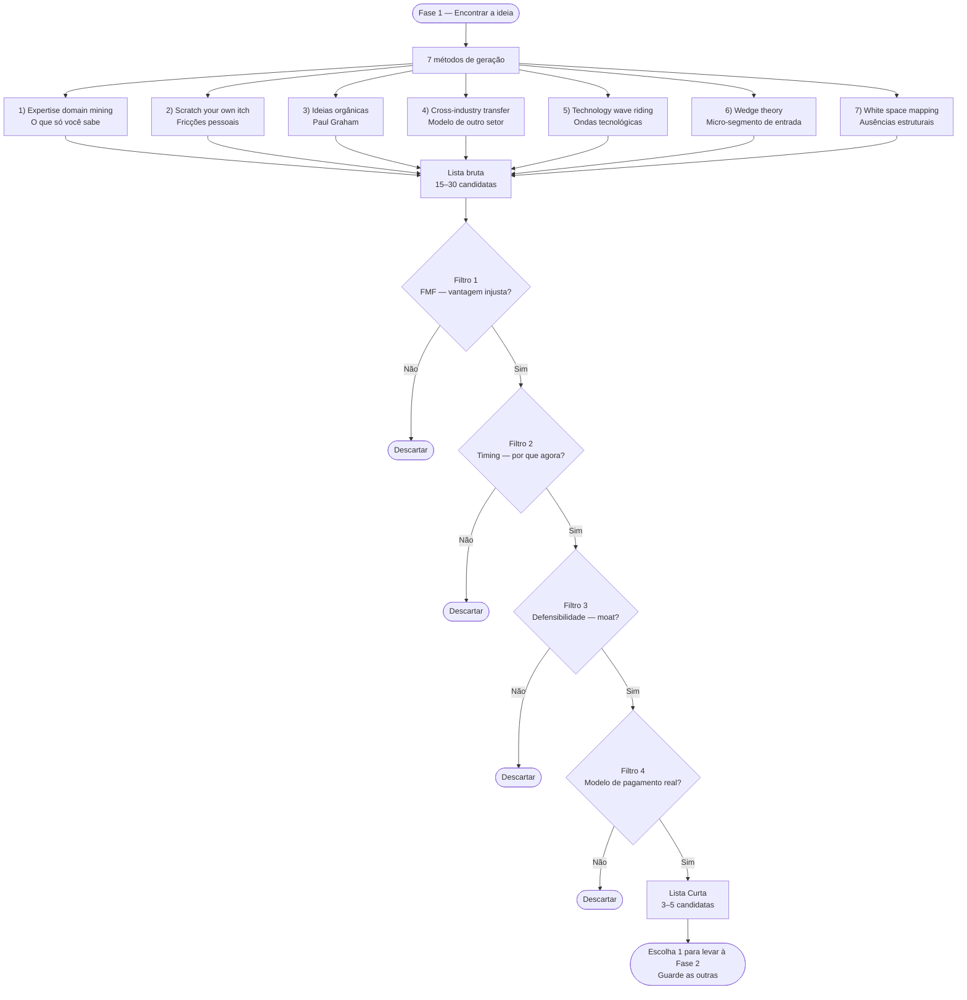
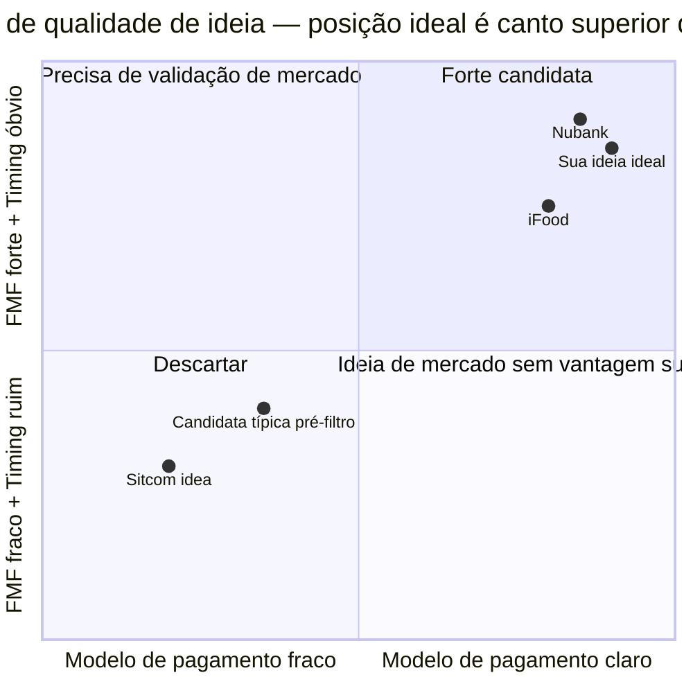
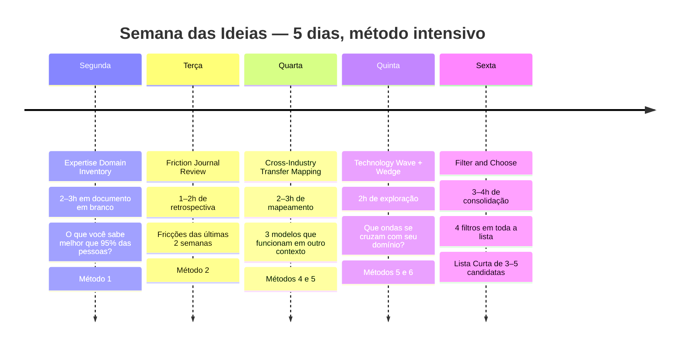

## FASE 1 — ENCONTRAR A IDEIA

### O que esse apêndice cobre

Esta é a fase de geração metódica de uma ideia-candidata que valha o investimento de tempo das fases seguintes. Não é "ter um insight de ducha". É trabalho sistemático com múltiplos métodos, filtros de qualidade e critérios explícitos de escolha. O entregável é uma Lista Curta de Ideias. Três a cinco candidatas filtradas a partir de quinze a trinta geradas, com uma escolhida para levar à [[#FASE 2 — ARTICULAÇÃO E CAPTURA DA IDEIA|Fase 2]]. A [[#FASE 1 — ENCONTRAR A IDEIA|Fase 1]] assume que você já concluiu a [[#FASE 0 — PREPARAÇÃO DO EMPREENDEDOR|Fase 0]] e decidiu que vai empreender, mas ainda não sabe sobre o quê.

A [[#FASE 1 — ENCONTRAR A IDEIA|Fase 1]] é distinta da [[#FASE 8 — IDEAÇÃO E PROTOTIPAGEM DE SOLUÇÕES|Fase 8]], Ideação e Prototipagem de Soluções. A [[#FASE 8 — IDEAÇÃO E PROTOTIPAGEM DE SOLUÇÕES|Fase 8]] trata de gerar soluções técnicas para um problema já testado. A [[#FASE 1 — ENCONTRAR A IDEIA|Fase 1]] trata de gerar a ideia de negócio inicial, antes de qualquer problema estar confirmado. As duas são ideação, mas em momentos e escalas muito diferentes.

> [!abstract] Resumo operacional
> **Entregável:** Lista Curta de duas a quatro páginas com três a cinco ideias-candidatas filtradas a partir de quinze a trinta brutas, com uma escolhida para a Fase 2 e plano B/C documentados.
>
> **Sinais de saída:**
> - Pelo menos quatro dos sete métodos de geração aplicados, produzindo entre quinze e trinta candidatas brutas (não três ou cinco).
> - Os quatro filtros (FMF, timing, defensibilidade, modelo de pagamento) aplicados em ordem com resposta honesta a cada um.
> - Ideia escolhida com resposta clara para "por que eu, por que agora, onde está o moat, quem paga quanto por quê" e justificativa escrita.
> - Pelo menos três pessoas fora da bolha consultadas sobre uma das finalistas, para testar se o problema faz sentido (não a solução).
>
> **Três armadilhas mais comuns:**
> 1. Primeira-ideia-por-cansaço: escolher por fadiga decisória após três ou quatro semanas sem clareza, em vez de levar as três finalistas para um mentor e forçar decisão.
> 2. FOMO de setor quente ("vou fazer algo de IA", "algo de crypto"): aderir ao setor sem articular qual problema específico, qual cliente paga e por que você é a pessoa certa.
> 3. Ideia-gigante-de-plataforma sem cunha: começar como "novo Mercado Livre" ou "plataforma que resolve tudo", em vez de começar pelo wedge específico que depois vira plataforma.

### POR QUE

A qualidade da ideia inicial limita tudo que vem depois. Fundador que escolhe mal na origem passa dois ou três anos testando uma tese que nunca teve chance. Não porque executou mal. Porque a ideia em si era de baixa probabilidade. A pressa em "começar logo" em cima da primeira ideia que apareceu é uma das causas mais subestimadas de fracasso empreendedor. A primeira ideia que vem à cabeça raramente é a melhor. É apenas a mais disponível.

Existe uma diferença importante entre esperar a ideia genial cair (atitude passiva, que pode levar anos) e gerar ideias sistematicamente aplicando métodos e filtros (atitude ativa, que se completa em semanas). Esta fase ensina o segundo caminho.

> [!info] O cálculo de custo-benefício desta fase
> O custo de fazer bem é baixo. Duas a oito semanas de trabalho predominantemente cognitivo, com pouco dinheiro gasto. O custo de pular é potencialmente catastrófico. Anos de vida investidos em uma ideia que não resistia ao primeiro filtro rigoroso, mas que você nunca aplicou antes de começar.

### Quando usar

Comece imediatamente depois da [[#FASE 0 — PREPARAÇÃO DO EMPREENDEDOR|Fase 0]], quando você decidiu que vai empreender mas não tem ideia-candidata, ou tem apenas uma intuição vaga. Termine quando você tem uma ideia-candidata escolhida, descrita em duas a três frases específicas, que passou pelos quatro filtros desta fase. Duração típica de duas a oito semanas. Menos de duas semanas costuma indicar escolha precipitada. Mais de oito costuma indicar paralisia ou perfeccionismo. Qualquer candidata boa o suficiente merece ser levada adiante para teste real. Revisite quando, nas Fases 2 a 6, você concluir que a ideia-candidata não resiste aos testes de problema. Volte à [[#FASE 1 — ENCONTRAR A IDEIA|Fase 1]], escolha outra da Lista Curta, e recomece.

### Quem envolve

Fundador sozinho é o padrão. Geração de ideia é trabalho predominantemente interno. Ninguém conhece as suas experiências, frustrações, expertises e redes melhor que você.

Cofundador potencial, se já existe, participa em paralelo, gerando a própria lista. Depois vocês comparam e discutem. A intersecção das listas costuma revelar padrões interessantes.

Parceiro de debate externo, um mentor, amigo inteligente fora do setor, ex-chefe, serve como caixa de ressonância. Não decide por você. Reage às suas candidatas com perguntas duras.

### Como executar

Sete métodos complementares, não excludentes. Cada fundador tem afinidade maior com um ou dois, mas aplicar os sete força você a explorar terrenos que sozinho você não visitaria. O trabalho ao longo desta fase é gerar candidatas em cada método, consolidar em uma lista única, depois filtrar.

#### 1. Expertise domain mining, começar pelo que você sabe

A primeira fonte de ideias boas é você mesmo. Mais precisamente, o conhecimento que você acumulou ao longo da sua carreira, do seu hobby levado a sério, da família, do bairro, ou de uma dor pessoal repetida. Em alguma área, você sabe mais que noventa e cinco por cento das pessoas. Essa área é o seu primeiro território de busca.

A pergunta-exercício, escrita, em trinta a sessenta minutos: *o que eu aprendi no meu trabalho ou na minha vida que a maioria das pessoas não sabe?* Liste sem filtrar. Detalhes técnicos, pequenas fraudes do setor, ineficiências que todo mundo aceita como normais, fornecedores ruins sem alternativa, processos manuais que poderiam ser automatizados mas ninguém tentou. A cada item, pergunte: *existe alguém que sofre diariamente com isso e pagaria por uma solução?* A maioria dos itens cai no filtro. Os que sobrevivem são candidatas.

Exemplos do próprio ecossistema. David Vélez, Cristina Junqueira e Edward Wible uniram expertises complementares. Vélez vinha de venture capital latino-americano, e os três viveram pessoalmente a experiência frustrante de ser cliente do sistema bancário tradicional no Brasil. Acharam inaceitável a quantidade de fricção para abrir uma conta. O Nubank nasce da intersecção entre expertise em capital de risco e tecnologia, e dor pessoal com banco tradicional. Geraldo Thomaz e Mariano Gomide de Faria trabalharam com software comercial e viram o quanto o e-commerce brasileiro era mal atendido por plataformas existentes. A Vtex surge desse cruzamento entre conhecimento técnico e percepção de mercado abandonado. Marcelo Kalim trabalhou vinte anos em banco de investimento, no BTG, e fez do seu conhecimento profundo da indústria bancária brasileira a base para construir o C6. Não como cópia de Nubank. Como ataque desde dentro ao modelo de banking brasileiro.

A lição. O seu expertise é moat (barreira competitiva difícil de replicar). Ninguém consegue competir com você no que só você viveu.

#### 2. Scratch your own itch, fricções pessoais como matéria-prima

O segundo método é capturar, por um período de duas semanas, toda vez que você diz ou pensa "tinha que existir uma solução pra isso". São as fricções diárias. Serviços ruins que você tolera, processos que detesta repetir, produtos que não existem mas deveriam, informações difíceis de encontrar, decisões sem ferramenta de apoio. Mantenha um caderno ou nota no celular. Sem filtrar. No fim das duas semanas, revise.

Dois filtros críticos separam fricção-matéria-prima de fricção-irrelevante.

O primeiro é frequência e generalização. A fricção acontece com você uma vez por mês ou uma vez por dia? Ela é comum a muitas pessoas, ou só a você no contexto muito específico que você vive? Fricções raras não sustentam negócio. Fricções exclusivas não têm mercado. Fricções frequentes e generalizáveis são ouro.

O segundo é disposição a pagar. Você pagaria para resolvê-la? Quanto? Se a resposta honesta é "não pagaria", cuidado. Ideia construída em cima de fricção que ninguém paga vira hobby. Se você pagaria cinquenta reais por mês, quantas pessoas fariam o mesmo? A matemática aproximada do mercado nasce aqui.

Gabriel Braga e Andre Penha tentaram alugar um apartamento em São Paulo em meados dos anos 2010 e se viram frustrados com o processo. Fiador, três meses de caução, vistoria agressiva, burocracia de cartório. A fricção era frequente (milhões de brasileiros alugam), generalizável (todos sofriam o mesmo processo), com disposição a pagar (as imobiliárias cobravam pesado e as pessoas já pagavam). Dessa fricção pessoal nasceu o Quinto Andar, que não inventou aluguel. Apenas eliminou as fricções mais dolorosas do processo.

#### 3. As ideias orgânicas de Paul Graham

Paul Graham, cofundador do Y Combinator, articulou um conjunto de conceitos sobre geração de ideias que vale estudar em separado. Resumo aqui os três centrais.

**Viva no futuro, depois construa o que está faltando.**

A heurística canônica de Graham é formulada assim. Pessoas na borda de um campo em rápida mudança (programadores usando stack novo, médicos testando terapia emergente, estudantes de área em transformação) vivem, na prática, num futuro que ainda não chegou para a maioria. Elas veem frustrações que ninguém mais vê ainda, porque ninguém mais está nessa fronteira. Se você é uma dessas pessoas, construa o que está faltando. Se não é, chegue a uma fronteira antes de procurar ideias. Seja usuário avançado, especialista de domínio, ou profissional sênior de um setor em transformação.

Isso normalmente leva um a dois anos, não um fim de semana de retiro. A má notícia para quem tem pressa: não há atalho real. A boa notícia: uma vez que você chega à fronteira, boa parte do trabalho de "ter ideia" acontece por conta própria. Você passa a notar o que falta em vez de pensar em abstrato. Graham usa Larry Page como exemplo. Page não inventou search engine. Era genuinamente interessado em search, estava na fronteira do tema, e por isso viu o que todos os outros não viam.

**Ideias orgânicas contra ideias não-orgânicas.**

Graham distingue dois tipos de ideia de startup. As orgânicas resolvem um problema que o fundador mesmo tem. O produto nasce com pelo menos um usuário (o fundador), e provavelmente mais. São mais previsíveis, mais executáveis, mais fáceis de confirmar se funcionam. Têm risco menor de "resolver um problema que ninguém tem". Dropbox começou porque Drew Houston esqueceu o pen-drive várias vezes. Microsoft começou porque Bill Gates queria programar o Altair em algo melhor que machine code. Facebook começou porque Mark Zuckerberg queria que Harvard tivesse um diretório digital de estudantes. Apple começou porque Steve Wozniak queria um computador pessoal. Nenhum começou como "vamos criar uma empresa". Todos começaram como "eu tenho esse problema, quem mais tem?".

As não-orgânicas resolvem problemas que outras pessoas têm. Podem ser ótimas. Mas o risco de "resolver um problema que ninguém tem" é muito maior. Exigem mais entrevistas, mais humildade, mais ceticismo sobre a sua intuição, mais pesquisa de campo.

Se a sua ideia-candidata é orgânica, privilegie. Se não é, aceite o handicap e compense com mais pesquisa com clientes reais nas Fases 3 e 4.

**O contraponto, sitcom ideas.**

Um conceito complementar que vale conhecer. O YC chama de *sitcom ideas* (ideias de novela) aquelas que roteiristas de TV inventariam se um personagem fosse empreendedor. Plausíveis de relance, vagas na substância. Exemplos: app social para um nicho específico, um Uber para X, Airbnb de Y, plataforma de conteúdo para grupo Z.

Teste de sanidade para descartar sitcom. Quantas pessoas específicas e nomeáveis você consegue listar que querem isso agora, com urgência, não "um dia quem sabe"? Se não consegue listar cinco a dez pessoas nomeadas no momento, provavelmente é sitcom, não oportunidade. Se consegue listar, e as pessoas nomeadas te dizem espontaneamente "quando você vai fazer isso?", você está perto de algo real.

> [!quote] A pergunta operacional de Paul Graham
> O que você gostaria que alguém construísse para você?

Responda sem filtrar por mercado ou plausibilidade. A resposta honesta, repetida algumas vezes, costuma revelar candidatas que você nunca classificaria como oportunidade quando olhasse externamente. Por serem pequenas demais, técnicas demais, específicas demais. Dropbox pareceu assim antes de existir. Airbnb pareceu pior ainda. "Três caras alugando colchões de ar para quem vinha a uma conferência." Mínimo. Ridículo. Gigante.

Antes de continuar, responda por escrito, em duas frases cada. Essa minha ideia-candidata é orgânica (eu mesmo tenho o problema) ou não-orgânica? Eu estou na borda de algum campo em transformação, ou estou imaginando um futuro que ainda não vivi? Consigo listar cinco a dez pessoas nomeadas que querem a solução agora?

Se as respostas forem fracas (não-orgânica, não está na borda, não consegue listar pessoas), a sua [[#FASE 2 — ARTICULAÇÃO E CAPTURA DA IDEIA|Fase 2]] vai ser muito mais árdua que o normal. Considere mudar para outra candidata onde as três respostas sejam mais fortes, se tiver na Lista Curta.

**O paradoxo da ambição.**

Há uma dinâmica contraintuitiva que afeta a escolha de ideia, articulada por Graham em *Frighteningly Ambitious Startup Ideas* (2012). Ideias assustadoramente ambiciosas afugentam a maioria dos fundadores por simples auto-filtro: "isso é grande demais para mim". Resultado: a competição por ideias grandes é sistematicamente menor que a competição por ideias pequenas, mesmo sendo as grandes mais valiosas em expectativa.

A consequência prática para a Lista Curta: não descarte uma candidata só porque parece grande demais. A cunha inicial pode ser pequena, mas a visão-teto não precisa ser. Stripe começou como API de pagamento para desenvolvedores (cunha), mas tinha visão-teto de infraestrutura financeira global. Nubank começou como cartão de crédito digital (cunha), mas tinha visão-teto de banco completo para 100 milhões de brasileiros. Se você consegue articular a cunha pequena que leva à visão grande, você tem oportunidade. Se só tem a visão grande sem cunha, tem sonho. "Vou mudar o mundo" sem problema específico não é ambição — é fantasia.

#### 4. Cross-industry transfer, transferência lateral de modelos

O que funcionou em uma indústria pode funcionar em outra. Essa é a fonte de boa parte das startups de sucesso. Não invenção do zero, mas adaptação inteligente de um modelo comprovado para um contexto novo. O iFood é essencialmente transferência do modelo de delivery europeu (Just Eat, Deliveroo) para o Brasil. De forma análoga, a Enjoei (fundada por Ana Luiza McLaren e Tiê Lima em SP) trouxe para cá a dinâmica de marketplace peer-to-peer de moda com identidade visual brasileira. Com adaptações: motoqueiro como categoria operacional brasileira, integração com restaurantes informais, pagamento local. O Mercado Livre é o modelo eBay adaptado para o comércio latino-americano de pessoas físicas. O 99 (antes de ser adquirido pela Didi) é o modelo Uber aplicado a motoristas de táxi brasileiros primeiro, depois motoristas de aplicativo.

A técnica funciona em duas direções.

A direção horizontal pega modelo validado no mesmo país, em outra indústria. Se assinatura mensal funciona em softwares (SaaS), funcionaria em produtos físicos? Sim. Dollar Shave Club, Gousto, Leiturinha. No Brasil, assinatura de produtos da horta (Raízs), de cervejas artesanais (Clube do Malte), de produtos sustentáveis (Livres).

A direção vertical pega o mesmo modelo em país diferente. Se classifieds online funcionaram nos EUA (Craigslist), funcionariam no Brasil? Sim. OLX, trazida da Argentina, replicada aqui. Se rent-a-car baseado em app funciona nos EUA (Turo), funciona para app-based workers brasileiros que não têm carro? Sim. Kovi, com adaptação para o ICP específico de motoristas de Uber e 99 que alugam por semana.

Cuidado importante. O erro clássico desse método é o "Uber for X" genérico. Nem todo serviço de alta frequência se beneficia de modelo sob demanda. Nem toda fricção local exige app. Nem todo modelo americano se adapta sem entender contexto (regulação, poder de compra, comportamento). Cross-industry transfer inteligente exige entendimento profundo do *porquê* o modelo original funcionou, não apenas da mecânica. Uber funcionou porque combinou smartphone com GPS com pagamento cashless com motoristas sem hierarquia de táxi. Remover qualquer um desses pilares quebra o modelo. E "Uber for dogwalking" (sem os pilares principais) é por isso que dezenas morreram.

#### 5. Technology wave riding, ondas tecnológicas como catalisador

Toda grande onda tecnológica abre categorias inteiras de startups que antes não existiam. Mobile (2008-2012) abriu Airbnb, Uber, Instagram, Whatsapp. Cloud computing (2010-2015) abriu praticamente todo o SaaS moderno. Slack, Zoom, Notion, Figma. Marketplaces de serviços (2013-2018) abriram 99, iFood, Rappi. O momento que você está lendo isto é o meio da onda de IA generativa (2022-2028 em estimativa conservadora). Essa onda vai abrir centenas de categorias que ainda não existem.

A pergunta útil nesse método: *qual vertical é muito sensível à capacidade que a tecnologia nova oferece, mas ainda não foi adequadamente endereçado?* Jurídico? Saúde mental? Cobrança? Compliance tributário brasileiro? Educação personalizada? Cada vertical que tem dados, decisões repetitivas, texto, ou julgamento expert é candidata a transformação por IA. A maioria dessas verticais ainda não tem empresas sérias explorando-as no contexto brasileiro específico.

A armadilha desse método é FOMO tecnológico. Decidir fazer "algo com IA" sem problema claro, sem cliente claro, sem diferencial claro, apenas porque IA está quente. Isso produz projetos genéricos que morrem rapidamente. A tecnologia é meio, não fim. Use a onda como lente para descobrir onde a combinação tecnologia nova mais vertical mal atendida mais contexto brasileiro específico cria oportunidade. Ignore a tentação de "startup de IA" genérica.

**Template S-curve para avaliar posição na onda tecnológica.**

A S-curve (curva de adoção tecnológica) descreve o ritmo em que uma tecnologia passa de laboratório para mercado: devagar no início, aceleração no meio, saturação no fim. Antes de apostar em uma tecnologia, responda as cinco perguntas abaixo. A pontuação orienta se é cedo demais, no ponto, ou tarde.

| Pergunta | 1 ponto | 3 pontos | 5 pontos |
|---|---|---|---|
| Maturidade técnica: o que está no estado da arte hoje? | Prova de conceito em lab | Produto funcional mas caro/limitado | Produto funcional e custo viável para empresa |
| Adoção no mercado global: quantas empresas sérias usam em produção? | Menos de 100 | 100-10.000 | Mais de 10.000 |
| Adoção no Brasil: startups brasileiras já estão usando? | Nenhuma relevante | Algumas early adopters | Adoção mainstream começa |
| Infraestrutura de suporte: existe ecossistema (tools, devs, APIs)? | Inexistente — você constrói tudo do zero | Emergindo — ferramentas beta, poucos devs | Maduro — docs completos, mercado de talentos |
| Janela competitiva: quantos outros estão fazendo o mesmo? | Mercado vazio — pode ser cedo demais | Poucos competidores sérios | Competição intensa — pode ser tarde |

**Interpretação da pontuação total (5 a 25 pontos):**

- 5 a 10: tecnologia em Genesis/Custom (Wardley Map — mapa de evolução estratégica de mercados). Oportunidade de pesquisa, não de startup — exceto se você tem vantagem técnica única.
- 11 a 17: zona ideal de entrada. Tecnologia funcional mas mercado ainda em formação. Alta incerteza + alta recompensa potencial.
- 18 a 22: boa oportunidade mas janela fechando. Diferencie pela execução, distribuição ou nicho específico.
- 23 a 25: mercado em commoditização. Difícil de diferenciar pela tecnologia — vencer exige distribuição ou capital.

#### 6. Wedge theory, começar pelo micro-segmento

> [!tip] Apêndice L — Idea → Wedge → Scale (Framework Antler)
> O [[#APÊNDICE L — IDEA → WEDGE → SCALE (FRAMEWORK ANTLER)|Apêndice L]] detalha o framework completo usado pelo programa Antler para guiar founders da ideia bruta até a cunha de entrada — incluindo os critérios para escolher uma wedge defensável e o caminho de expansão para mercado maior. Complementa diretamente o método descrito a seguir.

Mesmo quando você tem intuição grande ("quero reinventar educação no Brasil"), o começo real é pequeno. A wedge (ponto de entrada estreito no mercado) é o segmento específico pelo qual você entra. Não "estudantes brasileiros" (genérico, impossível de atender), mas "estudantes de engenharia do último ano de universidades federais que vão prestar concurso para Petrobras" (específico, endereçável, com dor identificável).

A pergunta-guia: *quem está com mais dor agora nesse problema?* A resposta é sempre um grupo específico com nome e contexto, nunca "todo mundo". Encontrar a wedge é trabalho de redução. Parta da visão grande e filtre por quem tem dor mais aguda, quem tem mais poder de compra, quem é mais fácil de encontrar, quem tem maior probabilidade de virar cliente entusiasmado, e não apenas tolerante.

A wedge dá três vantagens concretas. Primeira, você sabe exatamente quem entrevistar nas Fases 3 e 4. Segunda, você pode prototipar solução específica em vez de plataforma genérica. Terceira, você pode se tornar o fornecedor dominante desse micro-segmento antes de expandir. A história de dezenas de unicórnios é essa. Wedge, dominância da wedge, expansão adjacente, categoria.

Wellhub (anteriormente Gympass) começou como produto para funcionários de grandes empresas (a wedge), não como academia para todos. André Street e Eduardo Pontes, da Stone, começaram com pequenos comerciantes negligenciados pelas maquininhas dos grandes bancos (a wedge), não com "todo mercado de maquininhas".

#### 7. White space mapping, mercados com ausência estrutural

> [!note] Antes de declarar um white space, verifique o campo competitivo com método
> O [[apendice-ee|Apêndice EE — Inteligência Competitiva]] descreve como montar monitoramento contínuo de concorrentes, interpretar análises win/loss e construir battle cards. Aplicado aqui, ajuda a distinguir white space genuíno (ninguém atende) de white space ilusório (alguém já tentou e falhou, ou um grande player está para entrar).

O último método é analítico. Mapeie um setor competitivamente e procure ausências. Monte uma matriz. Os eixos podem ser segmento de cliente por modelo de cobrança, ou canal por tamanho da empresa, ou qualquer dimensão relevante. Plote competidores conhecidos nos quadrantes. Observe os quadrantes vazios. Esses são os white spaces.

A pergunta crítica, que separa white space verdadeiro de ilusão: *se o quadrante está vazio e o modelo é óbvio, por que ninguém ocupou ainda?* Três respostas possíveis, em ordem de frequência.

A primeira é que tentaram e falharam. Alguém já ocupou o quadrante, consumiu capital, não conseguiu unit economics, quebrou. Este é o caso mais comum e o mais instrutivo. Antes de entrar, você precisa entender por que falharam. Se você sabe por que, e sabe o que faria diferente, e o contexto mudou (tecnologia, regulação, comportamento), pode ser oportunidade real. Se não sabe, você vai repetir o erro.

A segunda é que o mercado não existe. O quadrante parece vazio porque ninguém quer o produto daquela maneira. Muitas ideias "white space óbvio" são, na verdade, white space porque não tem cliente. A única forma de saber é fazer a descoberta de problema da [[#FASE 3 — DESCOBERTA DO PROBLEMA|Fase 3]]. Não assuma.

A terceira é que ninguém pensou ainda. Raro. Mercados não-óbvios existem, mas verdadeiro "ninguém pensou" em setor grande é evento raro. Quando acontece, geralmente é porque houve mudança recente (tecnológica, regulatória, demográfica) que abriu um espaço que antes não existia. Esse é o caso bom.

A honestidade sobre qual das três respostas se aplica ao seu white space é o que separa oportunidade real de fantasia de oportunidade.

### Os quatro filtros, depois de gerar, escolher

Depois de aplicar os sete métodos, você deve ter uma lista bruta de quinze a trinta candidatas. A maior parte é ruído e vai ser descartada. Aplique quatro filtros de qualidade, na ordem, eliminando candidatas que não passam em cada um.

O primeiro filtro é founder-market fit. Para cada candidata, responda em uma frase: *por que eu, especificamente, tenho vantagem injusta nesse problema?* Se a resposta honesta é "ninguém me dá vantagem sobre qualquer outro fundador", provavelmente não é a sua ideia. Vantagem injusta pode vir de expertise técnica, rede específica, experiência pessoal, acesso a clientes, acesso a capital, credibilidade no setor, ou alguma combinação. Sem vantagem injusta, você vai competir no mesmo nível de cem outros, e vai perder para um deles.

O segundo filtro é timing. *O que mudou recentemente que torna esta ideia possível agora, e que daqui a cinco anos vai fazer ela parecer óbvia?* Mudança pode ser tecnológica (IA acessível, infraestrutura cloud barata), regulatória (LGPD, reforma tributária, Open Finance), comportamental (adoção de smartphone em classe C, aceitação de remote work), ou econômica (juros alto que favorece ativos X, câmbio que favorece Y). Se você não consegue responder "por que agora", a ideia chegou tarde demais ou cedo demais. Os dois erros custam caro.

O terceiro filtro é defensibilidade. *Se esta ideia funcionar, o que impede um incumbente grande, Nubank, iFood, Mercado Livre, Magazine Luiza, Natura, Google, de copiar em dezoito meses e te esmagar com distribuição superior?* Os moats possíveis são network effects (efeitos de rede — quanto mais usuários, mais valor, como em marketplaces), switching costs (custo de troca — trocar dói, como em software corporativo), economias de escala (você fica mais barato conforme cresce), propriedade intelectual (patente, tecnologia diferenciada), marca (confiança acumulada), efeitos de dados (o seu algoritmo melhora com uso), e acesso exclusivo (contratos, licenças). Ideia sem resposta honesta aqui é ideia de subsídio de capital. Você precisa de muito dinheiro para sobreviver até eventualmente criar moat. E muitas não chegam lá.

O quarto filtro é modelo de pagamento real. *Quem paga, quanto, e por que volta a pagar?* Não o modelo possível no futuro. O modelo que você consegue articular hoje em três frases. Ideias B2C com modelo de receita vago ("fica grátis e monetiza depois com publicidade") são dos piores ofensores. Morrem a maioria. Ideias B2B geralmente têm modelo mais claro. Empresa paga assinatura porque produto economiza custo ou gera receita mensurável. Escreva o modelo por extenso. Se você não consegue, não é porque é complicado. É porque você não pensou ainda.

No fim dos quatro filtros, idealmente você tem três a cinco ideias-candidatas finais. Escolha uma. A que melhor combina founder-market fit forte mais timing óbvio mais moat plausível mais modelo claro, para levar à [[#FASE 2 — ARTICULAÇÃO E CAPTURA DA IDEIA|Fase 2]]. Guarde as outras na Lista Curta. Se a primeira cair nas fases seguintes, você tem para onde voltar.

> [!tip] Apêndice CZ — Canvases e Mapas Visuais de Modelo
> Após escolher a candidata, o Lean Canvas é a ferramenta recomendada para estruturar visualmente o modelo em nove blocos antes de avançar para a Fase 2. Ele força articular Problema, Segmentos, Vantagem Injusta e Modelo de Receita em uma página — o que antecipa e facilita a Declaração Inicial da Ideia. O canvas preenchível, exemplo brasileiro (QuintoAndar 2015) e armadilhas comuns estão em [[#APÊNDICE CZ — CANVASES E MAPAS VISUAIS DE MODELO|CZ.2]].

### Semana das Ideias, exercício prático de cinco dias

Para quem quer método concreto, esta é uma sequência de cinco dias úteis que aplica os métodos acima em dose intensiva. Cada dia tem um foco específico. Não precisa ser feito em cinco dias consecutivos. Pode ser cinco sábados. Mas espaçamento maior do que isso faz você perder o fio.

Segunda, Expertise Domain Inventory, duas a três horas. No Método 1 (descrito acima), concentre-se nas perguntas de expertise e ineficiências do setor. Não filtre. No fim, sublinhe os cinco a dez itens mais promissores.

Terça, Friction Journal Review, uma a duas horas. No Método 2 (descrito acima), aplique os dois filtros críticos — frequência e generalização, e disposição a pagar — sobre as fricções das últimas duas semanas. Se não manteve nota diária, faça a retrospectiva agora.

Quarta, Cross-Industry Transfer Mapping, duas a três horas. Nos Métodos 4 e 5 (descritos acima), escolha três modelos que funcionam em outros países ou setores e imagine adaptações brasileiras. Modelos de partida: assinatura de produtos físicos, marketplace de serviços B2B, data-as-a-service vertical, SaaS para profissão regulamentada brasileira. Para cada, imagine três variações de aplicação.

Quinta, Calibration Conversations, três a quatro conversas de trinta minutos. Marque conversas rápidas com três a quatro pessoas que trabalham em setores que você não conhece. Pergunte, simplesmente: *qual é a coisa mais ineficiente que você faz no trabalho hoje?* Não proponha soluções. Ouça. Anote padrões. Isso alimenta novas candidatas e dá sinal sobre frequência de dores em setores diferentes.

Sexta, Filter & Choose, três a quatro horas. Consolide toda a lista gerada (deve ter vinte a quarenta itens). Aplique os quatro filtros acima, em ordem. Descarte agressivamente. No fim do dia, você tem três a cinco candidatas. Escolha uma para levar à [[#FASE 2 — ARTICULAÇÃO E CAPTURA DA IDEIA|Fase 2]]. Escreva essa ideia escolhida em duas frases específicas: *o problema é X para o cliente Y, a solução inicial é Z*.

Se a semana produziu candidatas mas você não tem clareza sobre qual escolher, marque uma segunda conversa com o seu parceiro de debate. Leve as três finalistas. Discuta por sessenta minutos. A discussão em voz alta com alguém inteligente quase sempre revela qual é a mais promissora.

### Armadilhas específicas desta fase

> [!note] Apêndice D — Armadilhas Mentais e Vieses
> Os erros listados abaixo têm raízes em vieses cognitivos documentados — FOMO de setor, ancoragem na primeira ideia, excesso de confiança. O [[#APÊNDICE D — ARMADILHAS MENTAIS E VIESES COGNITIVOS DO EMPREENDEDOR|Apêndice D]] oferece diagnóstico e contra-medidas para cada viés, útil para revisar antes de aplicar os quatro filtros finais desta fase.

Primeira-ideia-por-cansaço. Você passa três ou quatro semanas na [[#FASE 1 — ENCONTRAR A IDEIA|Fase 1]] sem clareza e decide "vai ser essa mesmo" por fadiga decisória. A pressa de começar tem custo gigante. Uma ideia mal escolhida vai te consumir anos. Se a [[#FASE 1 — ENCONTRAR A IDEIA|Fase 1]] passa das oito semanas sem resolução, o problema provavelmente é paralisia, não falta de boa candidata. Leve as três finalistas para um mentor e force decisão. Mas não escolha por cansaço.

FOMO de setor quente. "IA tá explodindo, vou fazer algo de IA." "Crypto está voltando, vou fazer algo de crypto." Setor quente não é ideia. É contexto. Se você não consegue articular qual problema específico você resolve dentro do setor, qual cliente específico paga, e por que você é a pessoa certa, a adesão ao setor é apenas marketing pessoal, não tese.

Ideia-gigante-de-plataforma. "Vou criar o novo Mercado Livre, o novo Nubank, a plataforma que resolve tudo em X." Ideias que começam como plataforma raramente pegam. Quase sempre começam como produto estreito que depois vira plataforma. Wedge theory existe por um motivo. Plataformas são destino, não ponto de partida.

"Uber for X" genérico. Veja a discussão no método 4. O modelo Uber funciona por razões específicas. Aplicar a mecânica sem entender o porquê produz startup fraca.

Educar o mercado do zero. "Minha ideia é disruptiva, vou ensinar o cliente a querer isso." Possível em tese. Raro na prática. Educar mercado é caríssimo. Você queima capital enquanto os primeiros poucos clientes entendem. A maioria das startups morre antes. Ideias que pegam grande onda comportamental já em curso, e não criam a onda do zero, têm probabilidade muito maior.

Hobby pessoal confundido com demanda de mercado. Você ama café especial, quer abrir a melhor torrefação do Brasil. Mas quantas pessoas, especificamente, pagariam R$ 80 no quilo? Hobby vira negócio com dificuldade. E só quando a paixão encontra um segmento com disposição a pagar. Não assuma que porque você ama, outros vão amar a ponto de pagar premium.

Cópia dos EUA sem entender contexto brasileiro. "Esse modelo explodiu nos EUA, vai explodir aqui." A adaptação brasileira exige entender poder de compra de classe C diferente do consumidor americano médio, regulação (ANVISA, ANATEL, CVM, BCB) que pode travar modelos inteiros, comportamento cultural (baixa disposição a comprar pets online, alta informalidade em pagamentos), e infraestrutura (logística, bancarização, cobertura celular). Pode ser que o modelo precise ser completamente reengenheirado para funcionar aqui.

> [!note] O consumidor brasileiro tem lógica própria que invalida transplantes diretos de modelos estrangeiros
> O [[apendice-ff|Apêndice FF — Psicologia do Consumidor Brasileiro]] cobre comportamento mobile-first, dinâmica de compra da classe C/D e vieses culturais locais. Fundamental antes de filtrar candidatas que dependem de suposições sobre comportamento do cliente brasileiro.

Achismo sem customer conversation. Você passa quatro semanas dentro da sua cabeça sem falar com ninguém do setor da ideia. Customer conversation não é [[#FASE 1 — ENCONTRAR A IDEIA|Fase 1]]. É [[#FASE 3 — DESCOBERTA DO PROBLEMA|Fase 3]]. Mas algumas conversas breves e direcionadas na [[#FASE 1 — ENCONTRAR A IDEIA|Fase 1]], especialmente no dia quinta do exercício acima, filtram muito. Não vire prisioneiro da própria cabeça.

Múltiplas ideias simultâneas. "Estou pensando em três ideias ao mesmo tempo." Na [[#FASE 1 — ENCONTRAR A IDEIA|Fase 1]] isso é ótimo. Quanto mais candidatas, melhor. A partir da [[#FASE 2 — ARTICULAÇÃO E CAPTURA DA IDEIA|Fase 2]], é desastroso. Leve uma. As outras esperam.

### Como fundadores brasileiros encontraram suas ideias

Observando casos brasileiros, alguns padrões se repetem. Não são receitas. São dados reais de que os métodos acima aparecem no histórico real de fundadores bem-sucedidos.

Expertise domain mining puro. Geraldo Thomaz e Mariano Gomide de Faria, da Vtex, eram engenheiros e desenvolvedores que viram o e-commerce brasileiro mal atendido por plataformas existentes. Marcelo Kalim, do C6, trabalhou mais de vinte anos no BTG e conhecia banking brasileiro por dentro. Guilherme Benchimol, da XP, começou como agente autônomo de investimentos, viu de dentro a ineficiência da distribuição de produtos via grandes bancos, e construiu uma plataforma alternativa em Porto Alegre em 2001. Em todos os três, a ideia nasceu da profundidade de conhecimento prévio, não de insight externo.

Scratch your own itch amplificado. Gabriel Braga, do Quinto Andar, sofreu tentando alugar um apartamento em São Paulo. Alessandra Bezerra, da Livup, queria comida saudável entregue em casa e não encontrava oferta boa. Marcus Rosa Gomes, da Buser, viajava de ônibus interestadual no Brasil e via a fricção de cobrança fragmentada. Saiu daí o modelo de fretado coletivo. A dor pessoal genuína, transformada em suposição de mercado mais ampla.

Cross-industry transfer inteligente. Os cofundadores do iFood (Patrick Sigrist, Felipe Fioravante, Eduardo Baer, Guilherme Bonifácio, Daniel Oliveira) observaram o modelo de delivery europeu e adaptaram para o contexto brasileiro, inclusive inventando categorias operacionais como motoqueiro-freelancer em escala. Luiza Trajano transferiu aprendizados de varejo físico familiar (Franca-SP) para plataforma digital. A Magazine Luiza era uma rede varejista tradicional que se tornou uma das maiores plataformas de e-commerce do país sob a sua liderança, combinando loja física e digital antes do omnichannel virar conceito. David Vélez, no Nubank com Cristina Junqueira e Edward Wible, viu modelos de neobanks internacionais (Simple nos EUA, N26 na Europa) e aplicou ao contexto brasileiro de bancário caro e insatisfatório. Em todos, não foi invenção. Foi adaptação bem-feita com entendimento profundo do contexto local.

Wedge theory disciplinada. Cesar Carvalho, do Wellhub, anteriormente Gympass, começou vendendo para funcionários de empresas grandes, não para "academia em geral". André Street e Eduardo Pontes, da Stone, começaram com lojistas pequenos negligenciados pelos bancos, não com "todo mercado de maquininhas". A wedge específica deu tração antes da expansão.

Technology wave riding cedo. Laércio Cosentino fundou a TOTVS (originalmente Microsiga, em 1983, com Ernesto Haberkorn) liderando a onda de software de gestão para empresas brasileiras. Thomaz Srougi fundou o Dr. Consulta com Guilherme Azevedo em 2011, aproveitando a onda de saúde privada acessível em classe C. Romero Rodrigues e cofundadores fundaram o Buscapé em 1998-1999 com Rodrigo Borges, Ronaldo Takahashi e Mario Letelier, primeira startup de comparação de preços online no Brasil. Quem entra cedo em onda real grande tem vantagem quase impossível de alcançar depois.

Nenhum desses fundadores respondeu à pergunta *"qual é a minha ideia?"* em cinco minutos. Todos levaram semanas ou meses de preparação silenciosa antes de comprometer. A [[#FASE 1 — ENCONTRAR A IDEIA|Fase 1]] existe para dar a você o mesmo tempo que eles tiveram, agora com método.

### Entregável desta fase

A Lista Curta de Ideias é um documento de duas a quatro páginas com quatro partes.

A primeira parte é o processo seguido, em uma página. Quais métodos você aplicou, quantas candidatas gerou ao todo, quantas sobreviveram a cada filtro.

A segunda é a lista final, em uma a duas páginas. Três a cinco candidatas, cada uma descrita em três a cinco frases, com respostas breves aos quatro filtros. Por que eu, por que agora, moat, modelo de pagamento.

A terceira é a escolha com justificativa, em um parágrafo. Qual candidata você vai levar à [[#FASE 2 — ARTICULAÇÃO E CAPTURA DA IDEIA|Fase 2]], e por quê.

A quarta é o plano B e C, em meia página. Quais das outras finalistas você levaria em segundo e terceiro lugar, caso a primeira caia em fase subsequente.

Guarde esse documento. Mesmo depois de iniciar a [[#FASE 2 — ARTICULAÇÃO E CAPTURA DA IDEIA|Fase 2]], se em algum momento a ideia escolhida cair, você volta aqui. Não precisa refazer a [[#FASE 1 — ENCONTRAR A IDEIA|Fase 1]] inteira. E em dois ou três anos, quando a sua primeira empresa estiver em algum estágio e você estiver pensando em segunda curva ou próxima empresa, vai reler este documento com ganho significativo de perspectiva.

### Checklist GO/NO-GO

> [!tip] Apêndice G — Framework de Decisão por Gates
> O critério de saída desta fase é uma decisão de gate: avançar ou não com esta ideia. O [[#APÊNDICE G — FRAMEWORK DE DECISÃO POR GATES|Apêndice G]] formaliza como estruturar esse tipo de decisão — com critérios objetivos pré-definidos, evitando que o entusiasmo pelo projeto substitua a evidência como critério de avanço.

> [!note] Apêndice F — Abordagem Científica vs Lean Startup
> Os quatro filtros desta fase e o checklist abaixo têm lógica de falsificação de suposições, não de execução de plano. O [[#APÊNDICE F — ABORDAGEM CIENTÍFICA VERSUS LEAN STARTUP|Apêndice F]] contextualiza essa diferença de mentalidade — importante para quem vem do mundo corporativo e tende a tratar lista de ideias como planejamento estratégico.

Antes de avançar para a [[#FASE 2 — ARTICULAÇÃO E CAPTURA DA IDEIA|Fase 2]], confirme:

- [ ] Apliquei pelo menos quatro dos sete métodos de geração.
- [ ] Gerei entre quinze e trinta candidatas brutas. Não três ou cinco. Se foram poucas, faltou método.
- [ ] Apliquei os quatro filtros em ordem, com resposta honesta a cada um.
- [ ] Tenho três a cinco candidatas finais escritas em três a cinco frases cada.
- [ ] Escolhi uma para levar à [[#FASE 2 — ARTICULAÇÃO E CAPTURA DA IDEIA|Fase 2]], com justificativa escrita.
- [ ] Tenho candidatas B e C como fallback documentadas.
- [ ] Conversei com pelo menos três pessoas fora da minha bolha sobre pelo menos uma das finalistas. Não para confirmar a solução. Para testar se o problema faz sentido.
- [ ] A ideia escolhida tem resposta clara e honesta para *por que eu, por que agora, onde está o moat, quem paga quanto por quê*.
- [ ] Não escolhi por cansaço ou FOMO. Escolhi por convicção relativa às outras candidatas.

> [!warning] Critério de saída
> Se faltou algo, volte. O custo de refazer um método na Fase 1 é pequeno. O custo de avançar com ideia mal escolhida é gigante.

### Métricas de qualidade desta fase

Número de candidatas geradas. Menos de quinze indica pouco esforço de geração. Mais de quarenta indica falta de filtro ou indisciplina. Qualquer extremo costuma reduzir a qualidade da escolha final.

Diversidade de métodos usados. Aplicar apenas um ou dois métodos costuma produzir candidatas enviesadas para o tipo de pensamento do fundador. Quatro a sete métodos aumenta a diversidade de fontes.

Tempo gasto. Entre duas e oito semanas é a janela típica. Muito menos que isso indica decisão precipitada. Muito mais indica paralisia.

Clareza da escolha final. Você consegue escrever em duas frases, sem hesitação, quem é o cliente e qual é o problema? Se não consegue, ainda não tem ideia. Tem intuição.

### FERRAMENTAS DESTA FASE

Na geração e seleção de ideias-candidatas, ferramentas ajudam a sair da intuição em direção ao método e a estressar a candidata antes de comprometer meses ou anos. Oito ferramentas centrais, com cross-ref individual para o tratamento profundo no Apêndice BG.

Idea → Wedge → Scale (Antler) — framework do programa Antler para guiar founders da ideia bruta até a cunha defensável e o caminho de expansão para mercado maior. Use como espinha de raciocínio quando você tem visão grande mas ainda não definiu o ponto de entrada estreito. Detalhamento no [[#APÊNDICE L — IDEA → WEDGE → SCALE (FRAMEWORK ANTLER)|Apêndice L]].

Strategy Canvas (Blue Ocean) — W. Chan Kim e Renée Mauborgne (2005). Mapa visual de competição setorial em fatores; o ERRC Grid (Eliminar, Reduzir, Aumentar, Criar) força repensar a categoria. Use no Método 7 (white space mapping) e quando a ideia parece ser "outro X" ou "Y mas para Z". Ver CZ.4 e BG.1.8.

First Principles Thinking — Aristóteles, popularizado por Elon Musk. Decompor a ideia até suposições fundamentais e reconstruir. Use no Método 1 (Expertise) e antes do Filtro 1 (FMF) para questionar suposições embutidas — precisa ser SaaS? Precisa ser B2B? Precisa ser no Brasil? Ver BG.4.1.

Inversion — Carl Jacobi, popularizado por Charlie Munger. Pergunte "por que esta ideia vai falhar?" antes de "por que vai funcionar?". Use como peneira final antes de mover candidatas para a Lista Curta — lista concreta de evitações é mais útil que entusiasmo abstrato. Ver BG.4.3.

Wardley Mapping — Simon Wardley (2005). Mapa de posicionamento de componentes do negócio em estágios de evolução (Genesis, Custom, Product, Commodity). Use no Método 5 (Technology Wave Riding) para julgar onde está a tecnologia que sua ideia depende — entrar em Genesis é pesquisa, em Commodity é tarde. Ver BG.2.5.

Three Horizons Framework — McKinsey (1999). Separa core (H1, otimizar negócio atual), adjacências (H2, expandir core) e apostas transformacionais (H3, criar futuro). Use ao avaliar se a candidata é H1 (incremental, baixo risco, baixo retorno) ou H3 (transformacional, alto risco, alto retorno) — a escolha tem implicação direta de janela e capital necessário. Ver BG.2.4.

The Mom Test — Rob Fitzpatrick (2013). Método de entrevista de calibração que evita respostas educadas: pergunta sobre comportamento passado e fatos da vida do entrevistado, não opinião sobre a sua ideia. Use nas Calibration Conversations da quinta-feira da Semana das Ideias e ao testar se o problema das finalistas faz sentido fora da sua bolha. Ver BG.6.1.

Lean Canvas e Business Model Canvas — Ash Maurya (2012) e Alexander Osterwalder (2010). Articulação visual do modelo em uma página (nove blocos), citada explicitamente após os quatro filtros. Use após escolher a candidata para forçar articular Problema, Segmentos, Vantagem Injusta e Modelo de Receita antes de avançar para a [[#FASE 2 — ARTICULAÇÃO E CAPTURA DA IDEIA|Fase 2]]. Ver CZ.2 e CZ.1.

---

### SÍNTESE DA FASE 1

A [[#FASE 1 — ENCONTRAR A IDEIA|Fase 1]] confronta um mito caro do imaginário empreendedor. O da ideia genial que cai como insight de ducha. A primeira ideia que vem à cabeça não é a melhor. É apenas a mais disponível. E a pressa em começar logo, em cima da primeira ideia que apareceu, é uma das causas mais subestimadas de fracasso. O fundador passa dois ou três anos testando uma tese que nunca teve chance, não porque executou mal, mas porque a ideia em si era de baixa probabilidade.

A diferença entre quem faz certo e quem falha está na atitude. Esperar a ideia genial cair é atitude passiva, que pode levar anos. Gerar ideias sistematicamente, com múltiplos métodos, e filtrar com critérios explícitos, é atitude ativa, que se completa em duas a oito semanas. Quem aplica os quatro filtros de qualidade nessa fase descarta candidatas que pareciam óbvias, e fica com candidatas que sobreviveram a teste sério. Esse trabalho cognitivo barato evita anos perdidos.

O entregável dessa fase é a Lista Curta. Três a cinco candidatas filtradas, com uma escolhida para a [[#FASE 2 — ARTICULAÇÃO E CAPTURA DA IDEIA|Fase 2]]. A escolha não é definitiva. Se nas Fases 2 a 6, a candidata escolhida não resistir aos testes, você volta à Lista Curta, escolhe outra, e reentra. Por isso a Lista Curta é guardada. Empreender com método é manter as opções vivas, não apostar tudo no primeiro palpite.

# fase1 #ideias #geracao-ideias #problema #oportunidade #filtros

---
