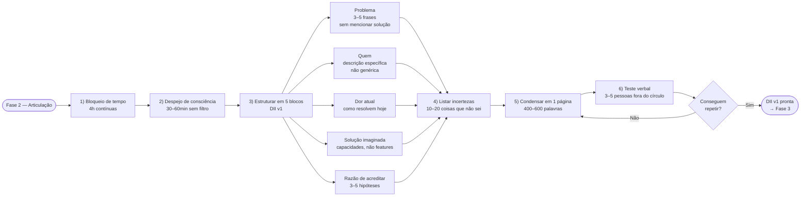

## FASE 2 — ARTICULAÇÃO E CAPTURA DA IDEIA

### O que esse apêndice cobre

Tirar a ideia da cabeça e colocá-la em formato escrito, estruturado, comunicável. O entregável é um documento chamado Declaração Inicial da Ideia. Uma página única que articula cinco coisas. O problema percebido. Quem sofre esse problema. A solução imaginada. Por que você acha que funciona. E tudo o que você não sabe sobre a ideia. A lista de incertezas.

> [!note] Esta fase não é para validar
> Esta fase não é para validar a ideia. É apenas para capturá-la com precisão. Muitos empreendedores "têm uma ideia" há meses, mas nunca a escreveram. Quando tentam escrever, descobrem que havia três ideias misturadas, ou que não sabem explicar o problema, ou que a ideia era só um sentimento vago.

### POR QUE

Tudo o que você não escreve não existe operacionalmente. A articulação força clareza. Clareza revela lacunas. Lacunas são o material de trabalho das próximas fases. Sem esta fase, você entra no processo de validação sem saber exatamente o que está validando, e acaba validando uma versão confusa e movediça da ideia. Pior do que não validar.

Ao listar explicitamente o que você não sabe, você cria a agenda de trabalho das Fases 2 a 6 — cada incerteza vira hipótese falsificável nas Fases 6 e 7.

> [!note] Apêndice F — Abordagem Científica vs Lean Startup
> A lista de incertezas desta fase é o ponto de partida para o ciclo científico de validação que atravessa o livro. O [[#APÊNDICE F — ABORDAGEM CIENTÍFICA VERSUS LEAN STARTUP|Apêndice F]] explica a diferença entre a mentalidade de hipótese falsificável (experimental) e o Lean Startup como método prático — contexto útil para quem entra nesta fase sem clareza sobre o que "validar uma ideia" significa operacionalmente.

### Quando usar

Comece assim que a [[#FASE 1 — ENCONTRAR A IDEIA|Fase 1]] estiver concluída — você sai da Fase 1 com uma Lista Curta de três a cinco candidatas e uma escolhida para articular aqui. As outras ficam guardadas para revisita se a candidata principal não resistir aos filtros das fases seguintes. Termine quando a Declaração couber em uma página, e você conseguir explicá-la verbalmente para um estranho em noventa segundos, e esse estranho conseguir repeti-la de volta com precisão. Revisite ao final de cada fase seguinte, para atualizar com o que foi aprendido.

### Quem envolve

O executor principal é você. Os participantes são três a cinco pessoas que vão ler e dar feedback sobre a clareza da articulação, não sobre se a ideia é boa. Escolha gente que não é do seu setor. Para te forçar a explicar sem jargão. O decisor é você.

### Como executar

> [!tip] Canvas como ferramenta complementar de articulação
> A Declaração Inicial da Ideia (entregável desta fase) é um documento textual de uma página. Para empreendedores que pensam visualmente, dois canvases complementam a articulação: o [[#APÊNDICE CZ — CANVASES E MAPAS VISUAIS DE MODELO|Lean Canvas (CZ.2)]] força mapear o modelo de negócio em nove blocos com foco em hipóteses falsificáveis (Problema, Solução, Métricas, Vantagem Injusta) — apropriado para o estágio pré-PMF que esta fase inicia. Empreendedores em contextos mais maduros ou que querem visão de conjunto podem usar o [[#APÊNDICE CZ — CANVASES E MAPAS VISUAIS DE MODELO|Business Model Canvas (CZ.1)]]. Os dois são opcionais — a DII textual é o entregável obrigatório.

Sete passos em sequência.



O primeiro é bloqueio de tempo. Quatro horas contínuas, ou duas sessões de duas horas (que é melhor que quatro de uma). Tire notificações. Sem celular. Caderno em branco ou documento novo.

O segundo é despejo de consciência. Escreva tudo o que você acha que sabe sobre a ideia, sem estrutura. Problema, cliente, solução, mercado, concorrentes, por que você acha que é diferente. Trinta a sessenta minutos. Não edite. Só escreva.

O terceiro é a segunda passagem, estruturando em cinco blocos:

- **Bloco 1, Problema.** Qual problema específico existe no mundo? Descreva em três a cinco frases, sem mencionar a sua solução. Se você não consegue descrever o problema sem falar da solução, você tem uma solução em busca de problema. Perigoso.

- **Bloco 2, Quem.** Quem tem esse problema? Seja específico. "Pequenas empresas" não é resposta. "Donos de restaurantes com uma a três unidades em capitais brasileiras que fazem delivery próprio" é resposta. Se a sua descrição cabe em cinco palavras genéricas, você ainda não pensou o suficiente.

- **Bloco 3, Dor atual.** Como essa pessoa resolve o problema hoje? Toda pessoa com problema real tem alguma solução hoje, mesmo que ruim. Planilhas, WhatsApp, intuição, ignorar o problema. Descreva a alternativa atual em detalhe. Se você não sabe, isso é a sua primeira incerteza crítica.

- **Bloco 4, Solução imaginada.** O que você quer construir? Descreva em termos de capacidades, não de features. "Um app" não é capacidade. "Uma forma de dar baixa automática em pagamentos de fornecedores a partir do extrato bancário" é capacidade.

- **Bloco 5, Razão de acreditar.** Por que você acha que essa ideia tem mérito? Liste três a cinco razões. Cada razão é uma hipótese que você precisará testar. Seja cético consigo mesmo.

O quarto passo é listar as suas incertezas. Esse passo é o mais importante. Escreva dez a vinte coisas que você não sabe sobre a ideia. Por exemplo: "não sei se donos de restaurante percebem esse problema como prioridade ou como dor de fundo"; "não sei se pagariam mais de R$ 200 por mês por isso"; "não sei se existem concorrentes específicos para esse nicho"; "não sei qual o tamanho do mercado brasileiro"; "não sei se a regulamentação permite o que estou pensando". Essa lista é ouro. Vai virar as hipóteses da [[#FASE 6 — FORMULAÇÃO RIGOROSA DE HIPÓTESES|Fase 6]] e os experimentos da [[#FASE 7 — EXPERIMENTOS DE VALIDAÇÃO DO PROBLEMA|Fase 7]].

O quinto é condensar tudo em uma página só. Use este template (versão formatada no [[#APÊNDICE A — TEMPLATES PRONTOS PARA USO|Apêndice A]]).

> [!note] A clareza da DII depende diretamente da qualidade da escrita
> Uma Declaração com frases longas, jargão técnico ou problema mal separado da solução não passa no teste de transmissão. O [[apendice-ew|Apêndice EW — Comunicação Escrita para Negócios]] cobre princípios de clareza, estrutura de argumento e revisão que se aplicam diretamente à redação dos cinco blocos da DII.

```text
DECLARAÇÃO INICIAL DA IDEIA, v1

Problema: [3 frases, sem mencionar a solução]
Para quem: [descrição específica do cliente]
Alternativa atual: [como resolvem hoje]
Solução proposta: [capacidades, não features]
Por que pode funcionar: [3 a 5 hipóteses]
O que eu não sei: [10 a 20 incertezas]
Data: [hoje]
Versão: 1
```

O sexto é teste de articulação verbal. Apresente a ideia verbalmente para três a cinco pessoas fora do seu contexto. Não amigos próximos nem família. Peça três coisas. Que repitam a ideia com as próprias palavras. Que apontem o que ficou confuso. Que perguntem o que não entenderam. Se as repetições são muito diferentes do que você quis dizer, a sua articulação está ruim. Reescreva.

> [!note] Apresentar a ideia em noventa segundos é habilidade treinável, não talento
> O [[apendice-ex|Apêndice EX — Apresentação e Fala em Público]] cobre estrutura de pitch curto, controle de ansiedade e técnicas de ensaio. O teste verbal desta fase é a primeira versão do pitch que você vai repetir centenas de vezes nas fases seguintes — vale preparar com método desde agora.

O sétimo é arquivar a versão v1. Mantenha para comparar depois. A ideia vai mudar. Observar a evolução é educativo.

### PERGUNTAS A RESPONDER

- Eu consigo descrever o problema sem mencionar a minha solução?
- O meu cliente-alvo está descrito de forma específica o suficiente para eu conseguir encontrá-lo na vida real?
- Eu consigo descrever como o cliente resolve o problema hoje?
- A minha solução está descrita em termos de capacidade (o que ela faz) e não de features (como ela faz)?
- Eu consigo listar dez ou mais coisas que não sei sobre a ideia?
- Pessoas fora do meu círculo conseguem repetir a minha ideia com precisão depois de eu explicar uma vez?

### Métricas

Tamanho da Declaração. Deve caber em uma página, entre quatrocentas e seiscentas palavras. Se passa disso, ainda não está clara.

Tempo de explicação verbal. Idealmente entre sessenta e cento e vinte segundos.

Taxa de repetição correta. Alvo: pelo menos 4 em 5 ouvintes.

Número de incertezas listadas. Mínimo dez. Se você tem menos que isso, está subestimando a sua ignorância.

### SAÍDA DESTA FASE

Você concluiu a [[#FASE 2 — ARTICULAÇÃO E CAPTURA DA IDEIA|Fase 2]] quando os oito critérios abaixo estão cumpridos.

1. A Declaração Inicial da Ideia v1 existe, com os sete campos preenchidos (formato 5W+1H aplicado à ideia, conforme Template A.1).
2. "Para quem" é específico o bastante para que você liste vinte nomes ou empresas reais que se encaixem. Não "PMEs", mas "padarias com duas a cinco lojas em São Paulo capital".
3. "Por que agora" e "por que eu" têm substrato factual (dado, número, experiência), não só adjetivos.
4. Pelo menos três a quatro de cinco ouvintes externos conseguiram repetir a ideia com precisão aceitável, sem precisar de mais que duas perguntas de esclarecimento.
5. Pelo menos uma objeção séria foi recebida, documentada, e endereçada (ou aceita como limitação conhecida).
6. A lista de incertezas tem pelo menos dez itens, incluindo ao menos uma sobre cliente, problema, concorrência, disposição a pagar, e viabilidade técnica.
7. Duas a três suposições-chave estão identificadas. Aquelas que, se falsas, matariam a ideia.
8. Você tem uma explicação verbal de noventa segundos ensaiada e fluida.

**Checklist final.**

- [ ] Escrevi a minha Declaração Inicial da Ideia em uma página (formato 5W+1H aplicado à ideia)?
- [ ] Defini o problema que resolvo em linguagem que um leigo do setor entenderia em trinta segundos?
- [ ] Defini "para quem" em uma frase específica (não "PMEs", mas "padarias com duas a cinco lojas em São Paulo capital")?
- [ ] Defini "como" em alto nível, qual é a mecânica do produto ou serviço?
- [ ] Defini "por que agora", o que mudou no mundo que justifica existir agora?
- [ ] Defini "por que eu", qual a minha vantagem diferencial para fazer isso?
- [ ] Expliquei a ideia para três pessoas fora do meu círculo imediato e elas entenderam sem perguntas óbvias?
- [ ] Recebi pelo menos uma objeção séria que me fez refinar ou defender a ideia?
- [ ] Identifiquei duas a três suposições-chave que, se falsas, matariam a ideia?
- [ ] Tenho um nome de trabalho para a ideia (pode ser provisório) para facilitar comunicação?

**Primeiros passos práticos.**

1. Abrir o Template A.1 (Declaração Inicial da Ideia) e preencher em sessenta a noventa minutos de foco.
2. Enviar a declaração para três pessoas de perfis diferentes (uma do setor, uma leiga, uma potencial usuária) e pedir feedback estruturado.
3. Listar as três suposições-chave que sustentam a ideia. Aquelas que, se falsas, matariam tudo.
4. Refinar "para quem" até caber numa frase verificável. Você consegue listar vinte nomes reais que caem nesse perfil?

### EXEMPLO PRÁTICO

**Declaração Inicial, fictícia, PadariaPro.**

Nome de trabalho: PadariaPro (provisório).

Problema: Padarias artesanais com duas a cinco lojas perdem em média doze a dezoito por cento de margem com ruptura de estoque de ingredientes-chave (farinha de qualidade, manteiga) ou sobra de perecíveis. A gestão manual em Excel ou caderno não escala além de uma loja. Sistemas de ERP para restaurante não têm integração com os fornecedores específicos do setor artesanal.

Para quem: Donos-operadores de padarias artesanais com duas a cinco lojas em São Paulo capital, faturamento de R$ 80 mil a R$ 400 mil por mês por loja, abaixo de quarenta anos, familiarizados com apps no celular. Vinte estabelecimentos possíveis já identificados em Pinheiros, Vila Madalena e Moema.

Alternativa atual: Compras decididas pelo gerente de produção no dia a dia, com base em experiência e caderno de controle manual. Pedidos emergenciais via WhatsApp direto com fornecedores. Sem previsão de demanda ou histórico estruturado. Ruptura de ingrediente é descoberta no início do turno de produção.

Solução proposta: App mobile e web que, conectado a três a cinco fornecedores-chave, gera sugestão automática de pedido baseada em consumo histórico e sazonalidade. O gerente aprova ou ajusta antes de enviar. Assinatura de R$ 290 a R$ 490 por mês por loja.

Por que pode funcionar: PIX e open finance viabilizaram integração com fornecedores que não existia há três anos. Padarias artesanais cresceram vinte e oito por cento no Brasil de 2020 a 2024, com nova geração de donos usando celular como ferramenta de gestão. O problema de ruptura é documentado, recorrente e diretamente mensurável em margem perdida. O fundador tem contatos diretos em três distribuidoras de farinha e conhece o fluxo operacional de dentro.

O que eu não sei: Se donos usam app diretamente ou delegam ao gerente de produção. Se os principais fornecedores aceitam integração por API. Se R$ 290 a R$ 490 por mês é percebido como investimento com retorno claro ou como mais um custo fixo. Quantas padarias com esse perfil existem fora de São Paulo. Se há concorrentes regionais que desconheço. Se a decisão de compra é do dono ou do padeiro-chefe. Se o modelo funciona para padarias que produzem para revenda. Qual o churn esperado no primeiro ano. Se o onboarding precisa ser presencial para funcionar. Quais fornecedores têm API disponível ou aceitariam desenvolver integração.

Data: 2026-05-01
Versão: 1

**Declaração Inicial, caso real, iFood (preenchida retroativamente para 2011).**

Esta versão reconstrói como os fundadores do iFood (Patrick Sigrist, Felipe Fioravante, Eduardo Baer, Guilherme Bonifácio, Daniel Oliveira) poderiam ter preenchido a Declaração Inicial antes do lançamento. Baseada em entrevistas e material público.

Nome de trabalho: iFood.

Problema: Pedir comida em casa no Brasil em 2011 funciona por telefone. Ligar para o restaurante, ditar pedido, esperar quarenta a noventa minutos sem informação de status, pagar em dinheiro contado na porta. Restaurantes pequenos perdem trinta a quarenta por cento do potencial de venda por incapacidade de atender todas as ligações no horário de pico. Não há logística de entrega estruturada para quem não tem frota própria.

Para quem: No lado consumidor, classe A e B em capitais (SP, RJ), vinte e dois a quarenta e cinco anos, smartphone iOS ou Android, hábito de delivery de uma a três vezes por semana. Estimado em quatro a seis milhões de pessoas em 2011. No lado restaurante, estabelecimentos com ticket médio de R$ 30 a R$ 80, sem operação de delivery própria estruturada, dispostos a pagar comissão sobre o pedido.

Alternativa atual: Consumidor guarda cardápios de papel em gaveta, liga direto para o restaurante, paga em dinheiro contado na porta, espera sem rastreamento. Restaurante anota pedido à mão, coordena motoboy por telefone ou usa entregador próprio sem escala. Sem confirmação de entrega, sem histórico de pedidos, sem previsão de demanda.

Solução proposta: Plataforma que agrega cardápios digitais, processa pedidos por app e web, e coordena entrega via rede de motoboys terceirizados. Restaurante recebe pedido em tablet. Consumidor paga com cartão e acompanha status. Modelo de comissão sobre o pedido, sem mensalidade para o restaurante. Cobertura inicial: zona oeste e zona sul de São Paulo.

Por que pode funcionar: Penetração de smartphone em classes A e B passou de dez para trinta e cinco por cento entre 2009 e 2011. Modelo equivalente já comprovado em outros mercados (Just Eat no Reino Unido, Grubhub nos EUA). Nenhum incumbente brasileiro opera o serviço em escala. Pagamento por cartão cresce com e-commerce. Restaurantes têm problema de capacidade documentado no horário de pico.

O que eu não sei: Se restaurantes pequenos topam comissão de dez a quinze por cento dada a margem operacional apertada. Se o consumidor brasileiro aceita pagar com cartão em entrega a domicílio. Se motoboys terceirizados conseguem entregar em quarenta e cinco minutos ou menos de forma consistente. Se restaurantes aceitam mudar o processo de recebimento de pedidos para incluir um tablet. Qual o CAC real para adquirir restaurantes na fase de lançamento. Se os dois lados do marketplace se equilibram na mesma região ao mesmo tempo. Se restaurantes vão exigir exclusividade. Se delivery de comida tem sazonalidade semanal forte o suficiente para criar problema de escala de motoboys. Quais bairros têm densidade suficiente para o primeiro piloto. Se a comissão sustenta o modelo econômico com o custo real do motoboy em São Paulo.

Data: 2011 (reconstituída)
Versão: 1

Comparando os dois casos: PadariaPro mira B2B em nicho profundo (vertical artesanal, cerca de dois mil e quinhentas padarias-alvo no Brasil). iFood mira marketplace bilateral em mercado de massa (milhões de consumidores, dezenas de milhares de restaurantes). Os instrumentos são os mesmos: Declaração Inicial com seis campos preenchidos, alternativa atual descrita com honestidade, lista de dez ou mais incertezas reais, "para quem" verificável com nomes ou perfis concretos. O que muda é a escala e o tipo de incerteza dominante. PadariaPro precisa validar que o nicho compra. iFood precisa validar que dois lados do marketplace aceitam o modelo simultaneamente.

### Armadilhas

> [!note] Apêndice D — Armadilhas Mentais e Vieses
> O enamoramento pela solução e o viés de confirmação (ouvir só o que confirma a tese) são os vieses mais perigosos nesta fase. O [[#APÊNDICE D — ARMADILHAS MENTAIS E VIESES COGNITIVOS DO EMPREENDEDOR|Apêndice D]] oferece diagnóstico estruturado e contra-medidas práticas para cada um — leitura recomendada antes de fazer o teste verbal com os ouvintes externos.

Apresentar a solução como se fosse o problema. "O problema é que não existe um app que X." Não. Esse não é o problema. O problema é o que existia antes do app. Foque na dor. Não na ausência da sua solução.

Público-alvo genérico demais. "Pessoas", "empresas", "profissionais". Generalizações camuflam o fato de que você ainda não sabe quem é o cliente.

Confundir ausência de alternativa com oportunidade. "Ninguém faz isso" geralmente significa "já tentaram e não funciona", ou "ninguém quer". A ausência é sinal de cautela, não de vitória.

Esconder incertezas por orgulho. Se a sua lista de "o que não sei" tem menos de dez itens, você está mentindo para si mesmo. Mais incertezas, mais honestidade.

Enamoramento pela solução. Quando você se apega à solução imaginada, fica cego para sinais de que o problema não existe. Reforce: o problema é mais importante que a solução.

---

### CASO BRASILEIRO, Fase 2, articulação no iFood

Em 2011, a ideia de pedir comida em casa pelo celular em vez de ligar para o restaurante ainda não tinha produto dominante no Brasil. Os fundadores do iFood (Patrick Sigrist, Felipe Fioravante, Eduardo Baer, Guilherme Bonifácio, Daniel Oliveira) articularam a ideia em uma frase simples. "Queremos ser a forma mais fácil de pedir comida no Brasil."

Trabalharam contra duas alternativas teóricas. Ser um agregador de telemarketing (copiando modelos antigos), ou ser uma plataforma digital para restaurantes (novidade no país). A articulação clara permitiu testar cada versão com restaurantes e consumidores, e escolher a direção plataforma-digital. Que viria a ser o caminho consolidado.

Casos como Hotmart (plataforma de infoprodutos, Belo Horizonte) e Sanar (edtech para profissionais de saúde, Salvador, com Alice Pena cofundadora) ilustram articulação de ideia com igual rigor em contextos diferentes. Um em marketplace consumer, outro em edtech vertical, outro em healthtech B2C.

A lição transferível. Ideia bem articulada em uma frase permite comparar contra alternativas e escolher. Ideia vaga permanece em loop de discussão sem decisão.

---

### FERRAMENTAS DESTA FASE

Na articulação da ideia, ferramentas ajudam a estruturar o pensamento inicial e a evitar auto-engano com entusiasmo. Detalhamento completo no [[#APÊNDICE BG — FERRAMENTÁRIO COMPLETO DO EMPREENDEDOR|Apêndice BG]].

First Principles Thinking (Aristóteles, e popularizado por Musk). Questionar suposições escondidas na formulação da ideia. Precisa ser SaaS? Precisa ser B2B? Precisa ser no Brasil? Cada uma é suposição. Use na primeira articulação da ideia, antes de escrever pitch. Ver BG.4.1.

Blue Ocean Strategy (W. Chan Kim e Renée Mauborgne, 2005). Framework para criar espaços de mercado não-contestados. A ferramenta central é o ERRC Grid (Eliminate, Reduce, Raise, Create) aplicado à categoria onde você pensa em entrar. Use quando a ideia parece ser "outro X" ou "Y mas para Z". Blue Ocean força repensar a categoria. Ver BG.1.8.

Playing to Win (Roger Martin e A.G. Lafley, 2013). Cascata de cinco escolhas. Mesmo em ideia inicial, o rascunho das cinco escolhas (aspiração, onde jogar, como vencer, capabilities, sistemas) clarifica rapidamente a ideia. Use no primeiro rascunho de estratégia, mesmo sem pivotagens finais. Ver BG.2.1.

Good Strategy/Bad Strategy (Richard Rumelt, 2011). Diagnose, política, ação. Teste: qual o problema real que você está resolvendo? Qual a política orientadora (a abordagem geral)? Quais ações coerentes? Use quando a ideia parece ser "boa em tudo" ou carente de foco. Ver BG.2.2.

Inversion (Munger). Antes de "por que vai funcionar", pergunte: "por que esta ideia vai falhar?" Use para estressar a ideia antes de investir tempo pesado. Ver BG.4.3.

Pyramid Principle (Barbara Minto, 1978). Estruturar comunicação da ideia. Conclusão primeiro, depois três a cinco argumentos de suporte MECE. Use para escrever o pitch de elevador, ou os primeiros slides. Ver BG.4.4.

---

### SÍNTESE DA FASE 2

A [[#FASE 2 — ARTICULAÇÃO E CAPTURA DA IDEIA|Fase 2]] não é para validar a ideia. É para capturá-la com precisão. Muitos fundadores "têm uma ideia" há meses, mas nunca a escreveram. Quando tentam escrever, descobrem que havia três ideias misturadas, ou que não sabem explicar o problema, ou que a ideia era só sentimento vago. Tudo o que você não escreve não existe operacionalmente. A articulação força clareza, e clareza revela lacunas.

A diferença entre quem faz certo, e quem falha, está em assumir as próprias incertezas. O quinto bloco da Declaração — tudo o que você não sabe — é o mais valioso e o mais negligenciado. Listar incertezas, em vez de mascará-las com confiança, é o que cria a agenda de trabalho das fases seguintes. As suas incertezas de hoje são as suas hipóteses de amanhã.

O entregável é uma página única, capaz de ser explicada verbalmente para um estranho em noventa segundos, e esse estranho consegue repetir de volta com precisão. Esse teste de transmissão é o filtro de clareza. Se a ideia não passa, ela ainda não está pronta para ser validada — está pronta para ser reescrita. A Fase 3 vai usar o "para quem" e a lista de incertezas desta Declaração como ponto de partida para as primeiras entrevistas de descoberta de problema.

# fase2 #articulacao #declaracao-inicial #incertezas #hipoteses #suposicoes-chave

---
