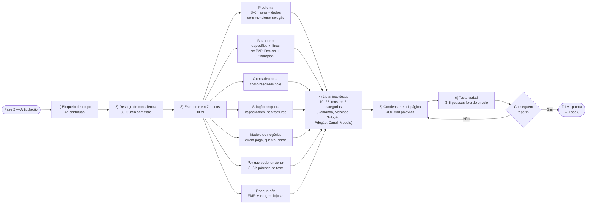

## FASE 2 — ARTICULAÇÃO E CAPTURA DA IDEIA

### O que esse apêndice cobre

Tirar a ideia da cabeça e colocá-la em formato escrito, estruturado, comunicável. O entregável é um documento chamado Declaração Inicial da Ideia. Uma página única que articula cinco coisas. O problema percebido. Quem sofre esse problema. A solução imaginada. Por que você acha que funciona. E tudo o que você não sabe sobre a ideia. A lista de incertezas.

> [!note] Esta fase não é para validar
> Esta fase não é para confirmar se a ideia funciona. É apenas para capturá-la com precisão. Muitos empreendedores "têm uma ideia" há meses, mas nunca a escreveram. Quando tentam escrever, descobrem que havia três ideias misturadas, ou que não sabem explicar o problema, ou que a ideia era só um sentimento vago.

> [!abstract] Resumo operacional
> **Entregável:** Declaração Inicial da Ideia (DII v1) em página única (400 a 800 palavras) com sete blocos preenchidos — Problema, Para quem, Alternativa atual, Solução proposta, Modelo de negócios, Por que pode funcionar e Por que nós (FMF) — mais lista de dez a vinte e cinco incertezas categorizadas em seis buckets (Demanda, Mercado, Solução, Adoção, Canal, Modelo).
>
> **Sinais de saída:**
> - "Para quem" específico ao ponto de você listar vinte nomes ou empresas reais que se encaixam (não "PMEs", mas "padarias com duas a cinco lojas em São Paulo capital"). Em B2B, Decisor Econômico e Champion identificados como papéis distintos com pergunta de qualificação em uma frase para cada.
> - Modelo de negócios articulado em três a cinco frases — quem paga, quanto, como, contra o que compete — mesmo sem dados de mercado ainda.
> - "Por que nós" responde FMF de forma concreta (vantagem injusta articulada em uma a duas frases), separado da tese de mercado.
> - Pelo menos quatro de cinco ouvintes externos repetem a ideia com precisão, sem precisar de mais que duas perguntas de esclarecimento.
> - Lista de incertezas com pelo menos dez itens cobrindo as seis categorias — nenhuma categoria vazia. Duas a três suposições-chave identificadas (as que, se falsas, matariam a ideia) e explicação verbal de noventa segundos ensaiada e fluida.
>
> **Três armadilhas mais comuns:**
> 1. Apresentar a solução como se fosse o problema ("o problema é que não existe um app que X"): o problema é o que existia antes do app, foque na dor, não na ausência da sua solução.
> 2. Público-alvo genérico demais ("pessoas", "empresas", "profissionais"): generalizações camuflam o fato de que você ainda não sabe quem é o cliente.
> 3. Esconder incertezas por orgulho ou deixar uma categoria vazia: se a lista total tem menos de dez itens ou se "Modelo" e "Canal" estão vazios, você está mentindo para si mesmo — mais incertezas, mais honestidade.

### POR QUE

Tudo o que você não escreve não existe operacionalmente. A articulação força clareza. Clareza revela lacunas. Lacunas são o material de trabalho das próximas fases. Sem esta fase, você entra no processo de confirmação sem saber exatamente o que está testando, e acaba testando uma versão confusa e movediça da ideia. Pior do que não testar.

Ao listar explicitamente o que você não sabe, você cria a agenda de trabalho das Fases 2 a 6 — cada incerteza vira uma suposição a testar nas Fases 6 e 7.

> [!note] Apêndice F — Abordagem Científica vs Lean Startup
> A lista de incertezas desta fase é o ponto de partida para o ciclo científico de confirmação que atravessa o livro. O [[#APÊNDICE F — ABORDAGEM CIENTÍFICA VERSUS LEAN STARTUP|Apêndice F]] explica a diferença entre a mentalidade de suposição testável (experimental) e o Lean Startup como método prático — contexto útil para quem entra nesta fase sem clareza sobre o que "validar uma ideia" significa na prática.

### Quando usar

Comece assim que a [[#FASE 1 — ENCONTRAR A IDEIA|Fase 1]] estiver concluída — você sai da Fase 1 com uma Lista Curta de três a cinco candidatas e uma escolhida para articular aqui. As outras ficam guardadas para revisita se a candidata principal não resistir aos filtros das fases seguintes. Termine quando a Declaração couber em uma página, e você conseguir explicá-la verbalmente para um estranho em noventa segundos, e esse estranho conseguir repeti-la de volta com precisão. Revisite ao final de cada fase seguinte, para atualizar com o que foi aprendido.

### Quem envolve

O executor principal é você. Os participantes são três a cinco pessoas que vão ler e dar feedback sobre a clareza da articulação, não sobre se a ideia é boa. Escolha gente que não é do seu setor. Para te forçar a explicar sem jargão. O decisor é você.

### Como executar

> [!tip] Canvas como ferramenta complementar de articulação
> A Declaração Inicial da Ideia (entregável desta fase) é um documento textual de uma página. Para empreendedores que pensam visualmente, dois canvases complementam a articulação: o [[#APÊNDICE CZ — CANVASES E MAPAS VISUAIS DE MODELO|Lean Canvas (CZ.2)]] força mapear o modelo de negócio em nove blocos com foco em suposições testáveis (Problema, Solução, Métricas, Vantagem Injusta) — adequado para o estágio pré-PMF que esta fase inicia. Empreendedores em contextos mais maduros ou que querem visão de conjunto podem usar o [[#APÊNDICE CZ — CANVASES E MAPAS VISUAIS DE MODELO|Business Model Canvas (CZ.1)]]. Os dois são opcionais — a DII textual é o entregável obrigatório.

Sete passos em sequência.



O primeiro é bloqueio de tempo. Quatro horas contínuas, ou duas sessões de duas horas (que é melhor que quatro de uma). Tire notificações. Sem celular. Caderno em branco ou documento novo.

O segundo é despejo de consciência. Escreva tudo o que você acha que sabe sobre a ideia, sem estrutura. Problema, cliente, solução, mercado, concorrentes, por que você acha que é diferente. Trinta a sessenta minutos. Não edite. Só escreva.

O terceiro é a segunda passagem, estruturando em sete blocos:

- **Bloco 1, Problema.** Qual problema específico existe no mundo? Descreva em três a cinco frases, sem mencionar a sua solução. Se você não consegue descrever o problema sem falar da solução, você tem uma solução em busca de problema. Perigoso. Quando possível, ancore o problema em dados públicos (estudos, relatórios, indicadores) — isso evita que o problema seja "achismo do fundador" e prepara o discurso para entrevistas e captação.

- **Bloco 2, Para quem.** Quem tem esse problema? Seja específico. "Pequenas empresas" não é resposta. "Donos de restaurantes com uma a três unidades em capitais brasileiras que fazem delivery próprio" é resposta. Se a sua descrição cabe em cinco palavras genéricas, você ainda não pensou o suficiente. Em ideias B2B, o "Para quem" tem quatro sub-elementos. **Quem é** (filtros objetivos: setor, tamanho, frequência, momento). **Quem NÃO é** (anti-perfil explícito — quem você descarta na primeira chamada e por quê). **Decisor econômico** (papel que aprova o orçamento, com pergunta de qualificação em uma frase). **Champion** (papel que vai operar o produto e vender internamente, com pergunta de qualificação em uma frase). Em ideias B2C, basta o primeiro mais o anti-perfil.

- **Bloco 3, Alternativa atual.** Como essa pessoa resolve o problema hoje? Toda pessoa com problema real tem alguma solução hoje, mesmo que ruim. Planilhas, WhatsApp, intuição, ignorar o problema. Descreva a alternativa atual em detalhe — é o seu concorrente real, não o player que você imagina. Se você não sabe, essa é a sua primeira incerteza crítica.

- **Bloco 4, Solução proposta.** O que você quer construir? Descreva em termos de capacidades, não de funcionalidades específicas. "Um app" não é capacidade. "Uma forma de dar baixa automática em pagamentos de fornecedores a partir do extrato bancário" é capacidade.

- **Bloco 5, Modelo de negócios.** Quem paga, quanto, como, e por quê. Mesmo na DII v1, sem dados de mercado ainda, você precisa articular o modelo em três a cinco frases. Modelo (assinatura, transacional, performance, work-as-a-service), preço-rascunho, gatilho de pagamento, e contra o que você compete (não outro software, mas o custo do analista interno; não a planilha, mas a hora do gestor). Se você não consegue articular um modelo plausível agora, isso não vira mais claro depois — vira mais difícil.

- **Bloco 6, Por que pode funcionar.** Por que você acha que essa tese tem mérito? Liste três a cinco hipóteses sobre o mundo (não sobre você). "Decisores percebem o problema como urgente." "Nenhum incumbente atende esse segmento de forma reconhecida." "O orçamento existe e está mal alocado hoje." Cada hipótese é uma suposição que você precisará testar. Use o formato testável — "[Persona] [verbo] [objeto]" — em vez de afirmações vagas como "o mercado é grande". Seja cético consigo mesmo.

- **Bloco 7, Por que nós.** Founder-Market Fit explícito. Por que VOCÊ é a pessoa certa (ou o time é o time certo) para esse problema agora? Vantagem injusta pode vir de expertise técnica, rede específica, experiência pessoal, acesso a clientes ou capital, credibilidade no setor, ou alguma combinação. Em uma frase ou duas, sem entrar em vídeo motivacional. Sem vantagem articulável, você está competindo no mesmo nível de cem outros e vai perder para um deles.

O quarto passo é listar as suas incertezas, agora categorizadas. Escreva dez a vinte e cinco itens organizados em seis categorias: **Demanda** (o cliente percebe o problema como prioridade?), **Mercado** (o orçamento existe? Onde está alocado hoje? Como o mercado se comporta?), **Solução** (a forma proposta resolve o problema? É a forma certa?), **Adoção** (o cliente vai mudar de comportamento para usar?), **Canal** (como o cliente descobre a oferta? Onde ele está acessível?) e **Modelo** (o pricing é percebido como justo? O ROI é defensável internamente pelo cliente?). Se uma categoria está vazia, você não pensou nela ainda — não é que ela é "sem riscos". Cada incerteza preferencialmente no formato testável "[Persona] [verbo] [objeto]". Essa lista é ouro. Vai virar as suposições da [[#FASE 6 — FORMULAÇÃO RIGOROSA DE HIPÓTESES|Fase 6]] e os experimentos da [[#FASE 7 — EXPERIMENTOS DE VALIDAÇÃO DO PROBLEMA|Fase 7]].

O quinto é condensar tudo em uma página só. Use este template (versão formatada no [[#APÊNDICE A — TEMPLATES PRONTOS PARA USO|Apêndice A]]).

> [!note] A clareza da DII depende diretamente da qualidade da escrita
> Uma Declaração com frases longas, jargão técnico ou problema mal separado da solução não passa no teste de transmissão. O [[apendice-ew|Apêndice EW — Comunicação Escrita para Negócios]] cobre princípios de clareza, estrutura de argumento e revisão que se aplicam diretamente à redação dos cinco blocos da DII.

```text
DECLARAÇÃO INICIAL DA IDEIA, v1

Problema: [3 a 5 frases, ancoradas em dados quando possível, sem mencionar a solução]
Para quem: [descrição específica do cliente, com filtros objetivos. Se B2B, sub-blocos: Quem é / Quem NÃO é / Decisor Econômico / Champion]
Alternativa atual: [como o cliente resolve hoje — planilha, processo manual, concorrente, ignorar]
Solução proposta: [capacidades, não features]
Modelo de negócios: [quem paga, quanto, como, contra o que compete (custo de analista, hora do gestor)]
Por que pode funcionar: [3 a 5 hipóteses sobre o mundo, formato testável]
Por que nós: [Founder-Market Fit em 1-2 frases — vantagem injusta]
O que eu não sei: [10 a 25 incertezas em 6 categorias: Demanda, Mercado, Solução, Adoção, Canal, Modelo]
Data: [hoje]
Versão: 1
```

O sexto é teste de articulação verbal. Apresente a ideia verbalmente para três a cinco pessoas fora do seu contexto. Não amigos próximos nem família. Peça três coisas. Que repitam a ideia com as próprias palavras. Que apontem o que ficou confuso. Que perguntem o que não entenderam. Se as repetições são muito diferentes do que você quis dizer, a sua articulação está ruim. Reescreva.

> [!note] Apresentar a ideia em noventa segundos é habilidade treinável, não talento
> O [[apendice-ex|Apêndice EX — Apresentação e Fala em Público]] cobre estrutura de pitch (apresentação do negócio) curto, controle de ansiedade e técnicas de ensaio. O teste verbal desta fase é a primeira versão do pitch que você vai repetir centenas de vezes nas fases seguintes — vale preparar com método desde agora.

O sétimo é arquivar a versão v1. Mantenha para comparar depois. A ideia vai mudar. Observar a evolução é educativo.

### PERGUNTAS A RESPONDER

- Eu consigo descrever o problema sem mencionar a minha solução?
- O meu cliente-alvo está descrito de forma específica o suficiente para eu conseguir encontrá-lo na vida real?
- Eu consigo descrever como o cliente resolve o problema hoje?
- A minha solução está descrita em termos de capacidade (o que ela faz) e não de funcionalidades específicas (como ela faz)?
- Eu consigo listar dez ou mais coisas que não sei sobre a ideia?
- Pessoas fora do meu círculo conseguem repetir a minha ideia com precisão depois de eu explicar uma vez?

### Métricas

Tamanho da Declaração. Deve caber em uma página, entre quatrocentas e oitocentas palavras (uma janela maior que a de versões anteriores do framework, para acomodar Modelo de negócios e Por que nós sem perder concisão). Se passa disso, ainda não está clara.

Tempo de explicação verbal. Idealmente entre sessenta e cento e vinte segundos.

Taxa de repetição correta. Alvo: pelo menos 4 em 5 ouvintes.

Número de incertezas listadas. Mínimo dez, distribuídas pelas seis categorias (Demanda, Mercado, Solução, Adoção, Canal, Modelo). Se você tem menos que isso, ou se uma categoria está vazia, está subestimando a sua ignorância.

Distribuição entre categorias de incerteza. Nenhuma das seis categorias deve estar vazia. Categoria com zero itens não significa "sem riscos"; significa que você ainda não pensou nela.

### SAÍDA DESTA FASE

Você concluiu a [[#FASE 2 — ARTICULAÇÃO E CAPTURA DA IDEIA|Fase 2]] quando os oito critérios abaixo estão cumpridos.

1. A Declaração Inicial da Ideia v1 existe com os sete blocos preenchidos (Problema, Para quem, Alternativa atual, Solução proposta, Modelo de negócios, Por que pode funcionar, Por que nós) mais a lista de incertezas categorizada, conforme Template A.1.
2. "Para quem" é específico o bastante para que você liste vinte nomes ou empresas reais que se encaixem. Não "PMEs", mas "padarias com duas a cinco lojas em São Paulo capital". Em B2B, Decisor Econômico e Champion separados como papéis distintos, cada um com pergunta de qualificação em uma frase.
3. "Modelo de negócios" articulado em três a cinco frases (quem paga, quanto, como, contra o que compete) e "Por que nós" responde FMF com substrato factual (dado, número, experiência), não só adjetivos.
4. Pelo menos três a quatro de cinco ouvintes externos conseguiram repetir a ideia com precisão aceitável, sem precisar de mais que duas perguntas de esclarecimento.
5. Pelo menos uma objeção séria foi recebida, documentada, e endereçada (ou aceita como limitação conhecida).
6. A lista de incertezas tem pelo menos dez itens distribuídos pelas seis categorias (Demanda, Mercado, Solução, Adoção, Canal, Modelo) — nenhuma categoria vazia.
7. Duas a três suposições-chave estão identificadas. Aquelas que, se falsas, matariam a ideia.
8. Você tem uma explicação verbal de noventa segundos ensaiada e fluida.

**Checklist final.**

- [ ] Escrevi a minha Declaração Inicial da Ideia em uma página com os sete blocos preenchidos (Problema, Para quem, Alternativa atual, Solução proposta, Modelo de negócios, Por que pode funcionar, Por que nós)?
- [ ] Descrevi o problema em linguagem que um leigo do setor entenderia em trinta segundos, ancorado em dados quando possível, sem mencionar a minha solução?
- [ ] Defini "para quem" com filtros objetivos? Em B2B, separei Decisor Econômico e Champion como papéis distintos, com pergunta de qualificação em uma frase para cada?
- [ ] Defini explicitamente quem NÃO é cliente (anti-perfil) e por quê?
- [ ] Descrevi a alternativa atual (planilha, processo manual, concorrente, ignorar) — meu concorrente real, não o que eu imagino?
- [ ] Articulei o modelo de negócios em três a cinco frases — quem paga, quanto, como, contra o que compete (custo de analista, hora do gestor)?
- [ ] Articulei "Por que nós" (FMF) em uma a duas frases com substrato factual — vantagem injusta concreta, não adjetivos?
- [ ] Expliquei a ideia para três pessoas fora do meu círculo imediato e elas entenderam sem perguntas óbvias?
- [ ] Recebi pelo menos uma objeção séria que me fez refinar ou defender a ideia?
- [ ] Tenho lista de incertezas com pelo menos dez itens distribuídos pelas seis categorias (Demanda, Mercado, Solução, Adoção, Canal, Modelo)?
- [ ] Identifiquei duas a três suposições-chave que, se falsas, matariam a ideia?
- [ ] Tenho um nome de trabalho para a ideia (pode ser provisório) para facilitar comunicação?

**Primeiros passos práticos.**

1. Abrir o Template A.1 (Declaração Inicial da Ideia) e preencher em sessenta a noventa minutos de foco.
2. Enviar a declaração para três pessoas de perfis diferentes (uma do setor, uma leiga, uma potencial usuária) e pedir feedback estruturado.
3. Listar as três suposições-chave que sustentam a ideia. Aquelas que, se falsas, matariam tudo.
4. Refinar "para quem" até caber numa frase verificável. Você consegue listar vinte nomes reais que caem nesse perfil?

### EXEMPLO PRÁTICO

**Declaração Inicial, fictícia, PadariaPro.**

Nome de trabalho: PadariaPro (provisório).

Problema: Padarias artesanais com duas a cinco lojas perdem em média doze a dezoito por cento de margem com ruptura de estoque de ingredientes-chave (farinha de qualidade, manteiga) ou sobra de perecíveis. A gestão manual em Excel ou caderno não escala além de uma loja. Sistemas de ERP para restaurante não têm integração com os fornecedores específicos do setor artesanal.

Para quem: Donos-operadores de padarias artesanais com duas a cinco lojas em São Paulo capital, faturamento de R$ 80 mil a R$ 400 mil por mês por loja, abaixo de quarenta anos, familiarizados com apps no celular. Vinte estabelecimentos possíveis já identificados em Pinheiros, Vila Madalena e Moema.

- Quem NÃO é: padarias com uma loja só (volume de compras insuficiente), redes acima de oito lojas (têm comprador profissional dedicado), padarias industriais ou de revenda (modelo de produção diferente), donos acima de cinquenta anos sem familiaridade com apps.
- Decisor econômico: o próprio dono (modelo enxuto, sem CFO ou comitê de compras). Pergunta de qualificação: "Quanto você gastou com farinha no último trimestre, e qual variação mês a mês?" Se ele não sabe sem abrir caderno, é o cliente.
- Champion: padeiro-chefe ou gerente de produção, papel que opera o app no dia a dia. Pergunta de qualificação: "Quando falta farinha boa, o que você faz manualmente que poderia ser automático?"

Alternativa atual: Compras decididas pelo gerente de produção no dia a dia, com base em experiência e caderno de controle manual. Pedidos emergenciais via WhatsApp direto com fornecedores. Sem previsão de demanda ou histórico estruturado. Ruptura de ingrediente é descoberta no início do turno de produção.

Solução proposta: App mobile e web que, conectado a três a cinco fornecedores-chave, gera sugestão automática de pedido baseada em consumo histórico e sazonalidade. O gerente aprova ou ajusta antes de enviar.

Modelo de negócios: SaaS por loja, R$ 290 a R$ 490 por mês com setup isento. Não compete com ERP (faixa de R$ 1.500/mês ou mais), compete com o tempo do gerente de produção e com a margem perdida em ruptura — proposta de ROI: economizar duas a três rupturas por mês paga o produto. Cobrança mensal recorrente em cartão. Take-rate adicional opcional sobre integração com fornecedor (1 a 2 por cento).

Por que pode funcionar: PIX e open finance viabilizaram integração com fornecedores que não existia há três anos. Padarias artesanais cresceram vinte e oito por cento no Brasil de 2020 a 2024, com nova geração de donos usando celular como ferramenta de gestão. O problema de ruptura é documentado, recorrente e diretamente mensurável em margem perdida.

Por que nós: O fundador tem contatos diretos em três distribuidoras de farinha (rede), trabalhou seis anos em ERP de varejo (expertise técnica), e foi sócio de uma padaria por dois anos (experiência operacional pelo lado do cliente). Combinação que nenhum competidor genérico de ERP tem.

O que eu não sei (categorizado em seis buckets):

- Demanda: se donos percebem ruptura como prioridade ou como dor de fundo aceita; se padarias entre uma e duas lojas chegam à dor com volume suficiente.
- Mercado: quantas padarias com esse perfil existem fora de São Paulo; se há concorrentes regionais que desconheço; se ERPs de varejo já estão atacando esse segmento por extensão.
- Solução: se o gerente confia em sugestão automática ou exige controle manual; se três a cinco fornecedores-chave cobrem oitenta por cento das compras (e a long tail é viável); se a integração precisa ser API ou WhatsApp basta.
- Adoção: se o dono usa o app direto ou delega ao gerente; se o onboarding precisa ser presencial para funcionar; se a curva de aprendizado de quatorze dias é aceitável.
- Canal: quais comunidades, eventos ou influenciadores de padaria artesanal funcionam como canal de aquisição; se vendedor de farinha pode virar canal de distribuição via parceria.
- Modelo: se R$ 290-490 por mês é percebido como investimento com ROI claro ou como mais um custo fixo; qual o churn esperado no primeiro ano; se a decisão de compra é do dono ou do padeiro-chefe; se cobrança mensal recorrente versus anual muda a aceitação.

Data: 2026-05-01
Versão: 1

**Declaração Inicial, caso real, iFood (preenchida retroativamente para 2011).**

Esta versão reconstrói como os fundadores do iFood (Patrick Sigrist, Felipe Fioravante, Eduardo Baer, Guilherme Bonifácio, Daniel Oliveira) poderiam ter preenchido a Declaração Inicial antes do lançamento. Baseada em entrevistas e material público.

Nome de trabalho: iFood.

Problema: Pedir comida em casa no Brasil em 2011 funciona por telefone. Ligar para o restaurante, ditar pedido, esperar quarenta a noventa minutos sem informação de status, pagar em dinheiro contado na porta. Restaurantes pequenos perdem trinta a quarenta por cento do potencial de venda por incapacidade de atender todas as ligações no horário de pico. Não há logística de entrega estruturada para quem não tem frota própria.

Para quem: marketplace bilateral. No lado consumidor, classe A e B em capitais (SP, RJ), vinte e dois a quarenta e cinco anos, smartphone iOS ou Android, hábito de delivery de uma a três vezes por semana. Estimado em quatro a seis milhões de pessoas em 2011. No lado restaurante, estabelecimentos com ticket médio de R$ 30 a R$ 80, sem operação de delivery própria estruturada, dispostos a pagar comissão sobre o pedido.

- Quem NÃO é: restaurantes de fine dining (delivery não é canal central), redes grandes com operação própria (já tem solução), regiões fora de SP/RJ no piloto (densidade insuficiente).
- Decisor econômico do lado restaurante: dono-operador de pequeno restaurante (sem comitê, sem procurement). Pergunta de qualificação: "Quantos pedidos por noite você perde por não conseguir atender o telefone no pico?"
- Champion do lado restaurante: gerente ou recepcionista que opera o telefone hoje. Pergunta de qualificação: "Quanto tempo você gasta por dia anotando pedido à mão e coordenando motoboy?"

Alternativa atual: Consumidor guarda cardápios de papel em gaveta, liga direto para o restaurante, paga em dinheiro contado na porta, espera sem rastreamento. Restaurante anota pedido à mão, coordena motoboy por telefone ou usa entregador próprio sem escala. Sem confirmação de entrega, sem histórico de pedidos, sem previsão de demanda.

Solução proposta: Plataforma que agrega cardápios digitais, processa pedidos por app e web, e coordena entrega via rede de motoboys terceirizados. Restaurante recebe pedido em tablet. Consumidor paga com cartão e acompanha status.

Modelo de negócios: comissão de dez a quinze por cento sobre o pedido pago pelo restaurante, sem mensalidade. Take-rate sobe se a plataforma também opera entrega (motoboy próprio). Não compete com cardápio impresso, compete com o custo do motoboy próprio do restaurante e com pedidos perdidos no pico. Cobertura inicial: zona oeste e zona sul de São Paulo.

Por que pode funcionar: Penetração de smartphone em classes A e B passou de dez para trinta e cinco por cento entre 2009 e 2011. Modelo equivalente já comprovado em outros mercados (Just Eat no Reino Unido, Grubhub nos EUA). Nenhum concorrente brasileiro operava o serviço em escala. Pagamento por cartão cresce com e-commerce. Restaurantes têm problema de capacidade documentado no horário de pico.

Por que nós: o time combina experiência em e-commerce (Patrick Sigrist), operação de restaurante e logística urbana (Felipe Fioravante), tecnologia mobile (Eduardo Baer e Daniel Oliveira), e relacionamento comercial com restaurantes (Guilherme Bonifácio). Cinco perfis complementares cobrindo as duas pontas críticas — restaurante e tecnologia — em um mercado onde nenhum incumbente brasileiro tem essa combinação.

O que eu não sei (categorizado em seis buckets):

- Demanda: se consumidor brasileiro percebe esperar quarenta minutos sem rastreamento como problema agudo ou como normal aceito; se restaurantes pequenos vivem o pico como dor real ou como parte natural do negócio.
- Mercado: se os dois lados do marketplace se equilibram na mesma região ao mesmo tempo; quais bairros têm densidade suficiente para o primeiro piloto; se restaurantes vão exigir exclusividade.
- Solução: se motoboys terceirizados conseguem entregar em quarenta e cinco minutos ou menos de forma consistente; se restaurantes aceitam mudar o processo de recebimento para incluir um tablet; se rastreamento em tempo real é necessário ou nice-to-have.
- Adoção: se restaurante adota a plataforma sem suporte presencial; se consumidor abandona o hábito de ligar e adota o app; se a curva de adoção é mais lenta para restaurantes acima de cinquenta anos de idade.
- Canal: como adquirir restaurantes na fase de lançamento (door-to-door, parcerias com fornecedores, eventos); qual o CAC real; se delivery de comida tem sazonalidade semanal forte o suficiente para criar problema de escala de motoboys.
- Modelo: se restaurantes pequenos topam comissão de dez a quinze por cento dada a margem operacional apertada; se o consumidor brasileiro aceita pagar com cartão em entrega a domicílio; se a comissão sustenta o modelo econômico com o custo real do motoboy em São Paulo.

Data: 2011 (reconstituída)
Versão: 1

Comparando os dois casos: PadariaPro mira B2B (vendas de empresa para empresa) em nicho profundo (vertical artesanal, cerca de dois mil e quinhentas padarias-alvo no Brasil). iFood mira marketplace bilateral em mercado de massa (milhões de consumidores, dezenas de milhares de restaurantes). Os instrumentos são os mesmos: DII com sete blocos preenchidos (Problema, Para quem com sub-estrutura B2B, Alternativa atual, Solução proposta, Modelo de negócios articulado, Por que pode funcionar, Por que nós), alternativa atual descrita com honestidade, e lista de dez ou mais incertezas distribuídas pelas seis categorias (Demanda, Mercado, Solução, Adoção, Canal, Modelo). O que muda é a escala e o tipo de incerteza dominante. PadariaPro precisa confirmar que o nicho compra (categoria Demanda + Modelo). iFood precisa confirmar que dois lados do marketplace aceitam o modelo simultaneamente (categoria Mercado + Adoção).

### Armadilhas

> [!note] Apêndice D — Armadilhas Mentais e Vieses
> O enamoramento pela solução e o viés de confirmação (ouvir só o que confirma a tese) são os vieses mais perigosos nesta fase. Leia o [[#APÊNDICE D — ARMADILHAS MENTAIS E VIESES COGNITIVOS DO EMPREENDEDOR|Apêndice D]] antes de fazer o teste verbal com os ouvintes externos — ele oferece diagnóstico estruturado e contramedidas práticas para cada um.

Apresentar a solução como se fosse o problema. "O problema é que não existe um app que X." Não. Esse não é o problema. O problema é o que existia antes do app. Foque na dor. Não na ausência da sua solução.

Público-alvo genérico demais. "Pessoas", "empresas", "profissionais". Generalizações camuflam o fato de que você ainda não sabe quem é o cliente.

Confundir ausência de alternativa com oportunidade. "Ninguém faz isso" geralmente significa "já tentaram e não funciona", ou "ninguém quer". A ausência é sinal de cautela, não de vitória.

Esconder incertezas por orgulho. Se a sua lista de "o que não sei" tem menos de dez itens, você está mentindo para si mesmo. Mais incertezas, mais honestidade.

Categoria de incerteza vazia. Se a categoria Modelo, Canal ou Adoção está com zero itens, você não pensou nelas — não é que estão sem risco. Forçar pelo menos um item por categoria revela o buraco mental.

Modelo de negócios postergado para "quando tiver mais clareza". A clareza não vem depois. Vem ao escrever. Ideias B2C com modelo "fica grátis e monetiza com publicidade depois" são as que mais morrem. Ideias B2B sem articulação de "quem paga, quanto, contra o que" são plano de hobby disfarçado.

FMF disfarçado de tese. "Por que pode funcionar" deve ser sobre o mundo (decisores percebem urgência, mercado tem orçamento). "Por que nós" deve ser sobre você (rede, expertise, experiência). Misturar os dois esconde que você não tem vantagem injusta articulável.

Enamoramento pela solução. Quando você se apega à solução imaginada, fica cego para sinais de que o problema não existe. Reforce: o problema é mais importante que a solução.

---

### CASO BRASILEIRO, Fase 2, articulação no iFood

Em 2011, a ideia de pedir comida em casa pelo celular em vez de ligar para o restaurante ainda não tinha produto dominante no Brasil. Os fundadores do iFood (Patrick Sigrist, Felipe Fioravante, Eduardo Baer, Guilherme Bonifácio, Daniel Oliveira) articularam a ideia em uma frase simples. "Queremos ser a forma mais fácil de pedir comida no Brasil."

Trabalharam contra duas alternativas teóricas. Ser um agregador de telemarketing (copiando modelos antigos), ou ser uma plataforma digital para restaurantes (novidade no país). A articulação clara permitiu testar cada versão com restaurantes e consumidores, e escolher a direção plataforma-digital. Que viria a ser o caminho consolidado.

Casos como Hotmart (plataforma de infoprodutos, Belo Horizonte) e Sanar (edtech para profissionais de saúde, Salvador, com Alice Pena cofundadora) ilustram articulação de ideia com igual rigor em contextos diferentes. Um em marketplace consumer, outro em edtech vertical, outro em healthtech B2C.

A lição transferível. Ideia bem articulada em uma frase permite comparar contra alternativas e escolher. Ideia vaga permanece em loop de discussão sem decisão.

---

### FERRAMENTAS DESTA FASE

Na articulação da ideia, ferramentas ajudam a estruturar o pensamento inicial e a evitar auto-engano com entusiasmo. Detalhamento completo no [[#APÊNDICE BG — FERRAMENTÁRIO COMPLETO DO EMPREENDEDOR|Apêndice BG]].

First Principles Thinking — pensamento a partir dos princípios básicos (Aristóteles, popularizado por Musk). Questione as suposições escondidas na formulação da ideia. Precisa ser SaaS (software vendido por assinatura)? Precisa ser B2B (venda para empresas)? Precisa ser no Brasil? Cada uma é suposição. Use na primeira articulação da ideia, antes de escrever o pitch. Ver BG.4.1.

Blue Ocean Strategy — estratégia do oceano azul (W. Chan Kim e Renée Mauborgne, 2005). Estrutura de referência para criar espaços de mercado sem concorrência direta. A ferramenta central é o ERRC Grid (Eliminar, Reduzir, Aumentar, Criar), aplicado à categoria onde você pensa em entrar. Use quando a ideia parece ser "outro X" ou "Y mas para Z" — o método força repensar a categoria. Ver BG.1.8.

Playing to Win — jogando para vencer (Roger Martin e A.G. Lafley, 2013). Cascata de cinco escolhas estratégicas: aspiração, onde competir, como vencer, capacidades necessárias, sistemas de suporte. Use no primeiro rascunho de estratégia, mesmo sem decisões finais — as cinco perguntas clarificam a ideia rapidamente. Ver BG.2.1.

Good Strategy/Bad Strategy — boa estratégia, má estratégia (Richard Rumelt, 2011). Três elementos: diagnóstico do problema real, política orientadora (a abordagem geral), ações coerentes. Use quando a ideia parece ser "boa em tudo" ou carente de foco. Ver BG.2.2.

Inversion — inversão (Munger). Antes de "por que vai funcionar", pergunte: "por que esta ideia vai falhar?" Use para estressar a ideia antes de investir tempo pesado. Ver BG.4.3.

Pyramid Principle — princípio da pirâmide (Barbara Minto, 1978). Estruture a comunicação da ideia começando pela conclusão, depois apresente três a cinco argumentos de suporte sem sobreposição. Use para escrever o pitch de elevador ou os primeiros slides. Ver BG.4.4.

---

### SÍNTESE DA FASE 2

A [[#FASE 2 — ARTICULAÇÃO E CAPTURA DA IDEIA|Fase 2]] não é para confirmar se a ideia funciona. É para capturá-la com precisão. Muitos fundadores "têm uma ideia" há meses, mas nunca a escreveram. Quando tentam escrever, descobrem que havia três ideias misturadas, ou que não sabem explicar o problema, ou que a ideia era só sentimento vago. Tudo o que você não escreve não existe operacionalmente. A articulação força clareza, e clareza revela lacunas.

A diferença entre quem faz certo, e quem falha, está em assumir as próprias incertezas. O quinto bloco da Declaração — tudo o que você não sabe — é o mais valioso e o mais negligenciado. Listar incertezas, em vez de mascará-las com confiança, é o que cria a agenda de trabalho das fases seguintes. As suas incertezas de hoje são as suas suposições de amanhã.

O entregável é uma página única, capaz de ser explicada verbalmente para um estranho em noventa segundos, e esse estranho consegue repetir de volta com precisão. Esse teste de transmissão é o filtro de clareza. Se a ideia não passa, ela ainda não está pronta para ser testada — está pronta para ser reescrita. A Fase 3 vai usar o "para quem" e a lista de incertezas desta Declaração como ponto de partida para as primeiras entrevistas de descoberta de problema.

# fase2 #articulacao #declaracao-inicial #incertezas #hipoteses #suposicoes-chave

---
