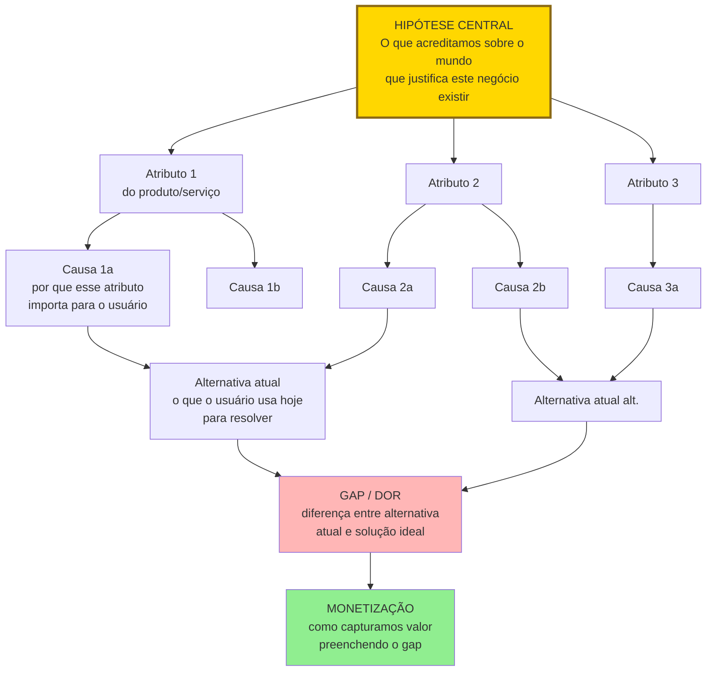

## FASE 2B — CONSTRUÇÃO DA TEORIA DO NEGÓCIO

### O que esse apêndice cobre

Construção de uma representação causal explícita de por que você acredita que a sua ideia vai gerar valor. Na [[#FASE 2 — ARTICULAÇÃO E CAPTURA DA IDEIA|Fase 2]] você capturou a ideia num formato declarativo. Aqui você a decompõe em atributos (fatores com realização futura incerta) e os conecta por meio de relações causais com as suas respectivas crenças subjetivas (o quanto você acha que aquela relação é verdadeira).

O entregável principal é uma Árvore de Teoria, também chamada Story Tree, e/ou um Mapa Causal — DAG (grafo causal direcionado) simplificado. É um diagrama onde cada nó é um atributo e cada seta é uma relação causal com um peso de confiança (baixo, médio, alto, ou probabilidade explícita de zero a cem por cento).

> [!abstract] Resumo operacional
> **Entregável:** Story Tree com oito a quinze atributos e DAG com dez ou mais nós e quinze ou mais relações causais, cada nó com nível de evidência (forte, fraca, nenhuma) e teoria alternativa documentada.
>
> **Sinais de saída:**
> - Cinco ou mais hipóteses formuladas em formato testável "se X, então Y, mensurado por Z", com classificação de impacto e evidência.
> - Dois a cinco nós bet-the-company identificados (alto impacto, baixa evidência) com ordem de teste prioritária para os próximos trinta a sessenta dias.
> - Pelo menos uma teoria alternativa explícita que explica o mesmo fenômeno com atributos ou relações diferentes.
> - Três pessoas independentes conseguem olhar a árvore e explicar com palavras próprias por que você acredita que o negócio funciona.
>
> **Três armadilhas mais comuns:**
> 1. Teoria bonita demais: se tudo se conecta perfeitamente e não há incerteza nenhuma, você construiu narrativa, não teoria — reintroduza honestamente o que não sabe.
> 2. Confundir atributo com solução: "app com dashboard integrado" é solução; o atributo é "disposição do dono a usar dashboard integrado".
> 3. Apego à primeira teoria: se depois de duas horas desenhando você só tem uma versão, está apegado — desenhe duas (a teoria alternativa não é plano B, é objeto de teste paralelo).

A estrutura conceitual da Árvore de Teoria pode ser visualizada assim:

A árvore liga hipótese central, atributos, causas, alternativa atual, gap, monetização. Cada nível precisa ser testável com evidência. Nó sem teste é teoria sem rigor.

### POR QUE

A maior parte dos empreendedores pula direto da ideia para entrevistas e testes. O resultado é conhecido. Eles testam coisas que não importam, e deixam de testar o que é crítico. A teoria explícita resolve esse problema de três formas.

Primeiro, força pensamento estruturado antes de gastar dinheiro. Parte da busca acontece cognitivamente, na escrivaninha, não no mercado. Isso reduz o custo dos experimentos posteriores.

Segundo, revela os atributos realmente críticos. Quando você é obrigado a desenhar a cadeia causal, percebe quais elos são bet-the-company (apostas totais — se falharem, destroem a ideia) e quais são secundários.

Terceiro, permite considerar alternativas. Teoria explícita torna visível que existem outras explicações possíveis para o mesmo fenômeno. Isso abre caminho para pivôs inteligentes e previne apego prematuro à primeira hipótese.

Sem teoria explícita, o seu plano de negócios é uma opinião disfarçada. Com teoria explícita, é um objeto de estudo.

### Quando usar

Comece imediatamente depois de **completar** a Declaração Inicial da Ideia (v1), antes de qualquer entrevista de campo. "Completar" aqui significa cumprir os **oito critérios de saída da [[#FASE 2 — ARTICULAÇÃO E CAPTURA DA IDEIA|Fase 2]]** — DII com 7 campos preenchidos, "para quem" verificável com 20 nomes reais, listas de incertezas e suposições-chave, 3-4 ouvintes externos repetindo com precisão. Não significa "validada com cliente", o que só virá da Fase 3 em diante.

A Fase 2 entrega articulação clara. Esta Fase 2B converte essa articulação em teoria causal testável. A Fase 3 começa a testar com clientes reais.

Termine quando você tem ao menos uma árvore de teoria completa, com oito a quinze atributos, no mínimo três relações causais principais, e alternativas mapeadas. Revisite ao final de cada ciclo de experimentos (Fases 6, 9, 10, 11). A teoria deve evoluir conforme a evidência chega.

### Quem envolve

O executor principal é você. Esse é trabalho cognitivo intransferível. Se há cofundador, os dois fazem juntos — cada um faz a sua versão primeiro, depois consolidam.

Envolva um mentor ou par experiente no papel de devil's advocate (questionador crítico), desafiando cada seta causal.

O decisor é você.

### Como executar

Oito passos.

> [!tip] Theory Map / Story Tree como canvas formal desta fase
> O Story Tree descrito nesta fase tem um canvas dedicado com estrutura formal, pontuação K × I por nó e caso brasileiro (Creditas/BankFacil) em [[#APÊNDICE CZ — CANVASES E MAPAS VISUAIS DE MODELO|CZ.16]]. Use o template preenchível em [[#APÊNDICE A — TEMPLATES PRONTOS PARA USO|A.9]] junto com o canvas para conectar a árvore ao Business Model Canvas.

#### Passo 1, três perguntas-âncora (método Story Tree)

Num papel em branco ou num arquivo de texto, responda por escrito a três perguntas.

A primeira: *qual problema ou fenômeno você está observando?* Descreva o que você vê no mundo que faz você acreditar que há oportunidade. Por exemplo, "donos de pequenos restaurantes gastam entre quatro e seis horas por semana em conciliação manual de faturas de delivery".

A segunda: *por que isso está acontecendo?* Identifique as causas raízes. Por exemplo, "porque cada plataforma (iFood, Rappi, etc) tem seu próprio formato de relatório, o software de gestão não integra, e o dono não tem pessoal administrativo treinado".

A terceira: *o que você poderia fazer a respeito?* Esboce caminhos de solução, sem se comprometer com um ainda. Por exemplo, "automatizar a extração e reconciliação desses relatórios; ou treinar equipes terceirizadas para fazer; ou criar um padrão aberto de dados".

Essas três respostas formam a narrativa mínima da sua teoria.

#### Passo 2, decomposição em atributos

Um atributo é qualquer elemento do problema ou da solução cuja realização futura é incerta. Atributos não são verdades. São apostas. Liste todos os atributos que aparecem nas respostas do passo 1.

Para o caso do restaurante, alguns exemplos: frequência semanal média de conciliação manual; tempo médio gasto por conciliação; disposição do dono a pagar por uma solução; número de plataformas com as quais o restaurante opera; existência e acessibilidade de APIs das plataformas; grau de aversão do dono à adoção de software novo; tamanho do segmento (restaurantes independentes com uma a três unidades no Brasil); disposição das plataformas em cooperar com integradores terceiros.

Não há número certo de atributos. Busque entre oito e quinze. Menos que isso costuma ser análise incompleta. Mais que isso geralmente inclui atributos redundantes ou irrelevantes.

#### Passo 3, conexões causais

Para cada par de atributos, pergunte: *a realização de A afeta a realização de B?* Se sim, desenhe uma seta de A para B. Por exemplo, "número de plataformas" afeta "tempo gasto em conciliação" (quanto mais plataformas, mais tempo). "Tempo gasto em conciliação" afeta "disposição a pagar" (quanto mais dolorido, mais o dono paga). "Aversão à adoção de software" afeta "disposição a pagar" (maior aversão, menor disposição).

Evite setas circulares (A para B e B para A simultaneamente). Se aparecerem, quebre a relação. Geralmente há uma variável intermediária, ou o relacionamento é correlacional, não causal.

#### Passo 4, crenças em cada seta

Para cada relação causal, atribua um grau de confiança. Alta (setenta a cem por cento): você tem evidência prévia robusta — literatura, dados públicos, experiência direta — de que a relação existe. Média (trinta a setenta por cento): é plausível, mas a sua confiança vem principalmente de intuição ou analogia. Baixa (zero a trinta por cento): é uma aposta com pouca base.

Marque também, para cada atributo, qual é a crença sobre sua realização. Por exemplo, "acho oitenta por cento provável que o dono médio gaste mais de quatro horas por semana em conciliação".

Essas crenças são subjetivas e vão parecer arbitrárias. Realmente são. O ponto não é acertar o número. É tornar explícita a sua aposta para depois comparar com o dado real.

#### Passo 5, marcação dos nós bet-the-company

Um nó é bet-the-company quando, se for falso, a ideia inteira morre. Esses são os nós que você testa primeiro nas fases seguintes. No exemplo do restaurante: se o dono não estiver disposto a pagar por uma solução de conciliação, nada mais importa. Esse nó é o primeiro alvo.

#### Passo 6, parcimônia e modularidade

Olhe para a sua árvore e faça duas perguntas. Parcimônia: posso remover algum atributo sem prejudicar o poder explicativo da teoria? Se sim, remova. Mais enxuto é melhor. Modularidade: consigo testar cada ramo da árvore separadamente? Se a árvore só funciona como bloco único, ela não é testável. Quebre em ramos independentes.

##### Os quatro critérios de uma boa teoria (Felin & Zenger, 2017)

Antes de declarar a árvore concluída, aplique quatro testes cumulativos. Uma teoria só sustenta vantagem competitiva se atende aos quatro ao mesmo tempo.

Novidade. A sua teoria representa uma aposta que difere da crença consensual do mercado? Se todo mundo no setor já pensa como você pensa, a teoria não gera valor novo. Ela apenas reproduz conhecimento comum, e o valor resultante já foi capturado pelos incumbentes. Pergunte: *em que ponto específico a minha teoria discorda da teoria implícita dos concorrentes estabelecidos?* Se você não consegue apontar, a sua teoria é derivativa.

Simplicidade. A teoria pode ser explicada em poucas frases, com estrutura causal clara? Teorias que precisam de quinze condições, quatro exceções e três mecanismos secundários para funcionar são teorias frágeis. Complexidade costuma indicar falta de clareza, não sofisticação. Se você não consegue contar a história em noventa segundos, quebre até conseguir.

Falsificabilidade. Existe alguma observação concreta no mundo real que, se você a encontrasse, derrubaria a teoria? Se a resposta é "nenhuma observação poderia me convencer do contrário", você não tem teoria. Tem crença. Para cada atributo bet-the-company, escreva o evento específico que faria você abandonar aquele ramo.

Generalidade. A teoria explica mais do que apenas o caso pontual que te inspirou? Se ela só funciona para o seu exemplo pessoal ou para um cliente específico, não generaliza. E sem generalização, não há mercado escalável. Teste: *a minha teoria prevê comportamento em outras situações do mesmo tipo?* Se a resposta é "só no meu caso específico", reescreva em princípios mais amplos.

> [!warning] Teoria que passa nos quatro critérios é rara
> A maioria das teorias de empreendedores iniciantes falha em pelo menos um dos quatro, normalmente novidade ou generalidade. Se a sua falha, não é problema. Faça mais uma iteração na árvore, reescrevendo os atributos até os quatro critérios serem atendidos.

#### Passo 7, construa uma teoria alternativa

Esse passo é quase sempre pulado por iniciantes. Por isso é a sua maior vantagem se fizer. Escreva uma segunda árvore de teoria que explique o mesmo fenômeno com atributos ou relações diferentes. Por exemplo: e se os donos de restaurante já toleram a conciliação manual e não vão pagar por automação, mas pagariam por um serviço humano que faz para eles? Essa teoria alternativa não é "plano B". É objeto de teste paralelo. Ela protege você de apego a uma narrativa só.

#### Passo 8, conexão com o Business Model Canvas (opcional, via Theory Map)

Se você já usou BMC ou Lean Canvas, monte um Theory Map. Pegue cada bloco do canvas e, para cada um, escreva três coisas: por que aquele elemento está ali; qual atributo da sua árvore de teoria ele representa; qual a relação causal com os outros blocos. Isso conecta os elementos do BMC que normalmente ficam isolados em post-its separados.

### Caso trabalhado, Emily (moda sustentável e ética)

Esse caso é o exemplo canônico usado por Coali et al. (2024) para ilustrar a construção de teoria com atributos, causas, crenças subjetivas, e teoria alternativa explícita. Ajuda a ver como o Story Tree se aplica a contexto B2C com dimensão ética e de sustentabilidade.

Contexto. Emily quer lançar uma marca de roupas sustentáveis e éticas.

Teoria principal, a árvore de Emily. O atributo final é a disposição a pagar por moda sustentável e ética. As causas antecedentes são três. Preocupação ambiental do consumidor (muitas pessoas estão conscientes do impacto ambiental da fast fashion). Preocupação social (condições trabalhistas precárias na indústria têxtil geram desconforto). Escassez de alternativas acessíveis (quem quer alternativa sustentável tipicamente acha caro demais ou os estilos limitados). Os atributos de execução são três. Disponibilidade de materiais sustentáveis com custo viável. Supply chain de fornecedores certificados. Capacidade de design moderno competindo em estilo com fast fashion.

Crenças subjetivas de Emily. Probabilidade de que "consumidores-alvo aceitam um acréscimo de quinze a trinta por cento por sustentabilidade", setenta por cento. Crença alta, mas testável. Probabilidade de que "supply chain sustentável é escalável com crescimento", cinquenta por cento. Crença moderada, principal fonte de risco. Probabilidade de que "design pode competir esteticamente com fast fashion", oitenta por cento. Crença alta, baseada em evidência de marcas como Reformation.

Teoria alternativa de Emily. Uma teoria alternativa muda uma premissa central. E se consumidores declaram interesse em sustentabilidade mas não pagam preço maior de verdade? Esse fenômeno é chamado de say-do gap (lacuna entre o que se diz e o que se faz). Nesse mundo, o negócio precisa igualar o preço da fast fashion, não cobrar a mais. Sustentabilidade vira "bônus invisível" da oferta, não âncora de preço. A estratégia muda radicalmente: foco em eficiência de produção, não em posicionamento premium.

Cada uma das duas teorias gera hipóteses diferentes, experimentos diferentes, e potencialmente empresas diferentes. O valor de ter teoria alternativa explícita: se os primeiros experimentos refutam a teoria principal — por exemplo, consumidores dizem que querem mas compram fast fashion quando colocados à prova — Emily já tem a teoria alternativa mapeada e pode pivotar com direção conhecida, não com pânico.

A lição transferível. Uma teoria com probabilidades subjetivas e uma teoria alternativa documentada transforma o pivô de "crise existencial" em "mudança planejada de rota". Sem teoria alternativa, o empreendedor tende a insistir em teoria única até que não sobre caixa para testar outra.

### Alternativa ao Story Tree, o Value Lab

O Story Tree é a ferramenta padrão deste manual para construção de teoria. Mas não é a única. Value Lab (Felin, Gambardella, Zenger, 2021) é uma ferramenta alternativa, mais voltada à geração de ideias de valor do que à decomposição de uma tese existente.

Story Tree serve quando você já tem uma ideia e quer mapear a cadeia causal de por que ela geraria valor.

Value Lab serve quando você está mais cedo no processo, ainda explorando onde pode haver valor. É um método de quatro quadrantes combinando espaço do problema, espaço da solução, espaço de mercado e espaço de capacidade. Força articulação de novidade e contrarian thinking (pensar contra o consenso do setor).

Use Story Tree quando a ideia já está definida e o foco é testá-la com rigor. Use Value Lab quando ainda está explorando território e quer gerar candidatos de tese antes de escolher um. Na prática, muitos fundadores usam Value Lab na [[#FASE 2 — ARTICULAÇÃO E CAPTURA DA IDEIA|Fase 2]] (antes da articulação final) e Story Tree na [[#FASE 2B — CONSTRUÇÃO DA TEORIA DO NEGÓCIO|Fase 2B]] (depois da articulação).

### PERGUNTAS A RESPONDER

- Qual é a cadeia causal completa que explica por que o meu negócio geraria valor, do problema até a adoção?
- Quais atributos são indispensáveis (bet-the-company) e quais são secundários?
- Quais das minhas setas causais têm evidência real por trás, e quais são pura intuição?
- Existe pelo menos uma teoria alternativa capaz de explicar o mesmo fenômeno?
- Se a minha teoria está correta, que observações no mundo real eu deveria encontrar nas próximas fases? Que observações a contradisseriam?

### Métricas

Número de atributos mapeados. Alvo entre oito e quinze.

Proporção de setas causais com confiança alta. Acima de cinquenta por cento, você provavelmente está se enganando. Abaixo de dez por cento, você ainda sabe muito pouco sobre o problema. Volte para entrevistas exploratórias.

Número de atributos bet-the-company. Idealmente dois a cinco. Se zero, a sua teoria não está testável. Se mais de sete, a sua ideia tem risco acumulado demais para avançar sem quebrar em sub-ideias menores.

Existência de teoria alternativa documentada. Sim ou não. Se não, a fase não está concluída.

### SAÍDA DESTA FASE

Você concluiu a [[#FASE 2B — CONSTRUÇÃO DA TEORIA DO NEGÓCIO|Fase 2B]] quando os oito critérios abaixo estão cumpridos.

1. O Story Tree existe em ferramenta compartilhável, com raiz, tronco e três ou mais galhos principais. É uma árvore de teoria com oito a quinze atributos e suas relações causais explícitas, com confiança atribuída.
2. O DAG existe com dez ou mais nós e quinze ou mais relações causais mapeadas. Cada nó com classificação de evidência atual: forte, fraca, ou nenhuma.
3. Pelo menos uma teoria alternativa está documentada.
4. Cinco ou mais hipóteses estão formuladas em formato testável: "se X, então Y, mensurado por Z".
5. Três nós críticos estão identificados explicitamente. Alto impacto, baixa evidência. São os dois a cinco atributos bet-the-company prioritários nos experimentos.
6. Ordem de teste prioritária está definida para os próximos trinta a sessenta dias.
7. Para cada nó da árvore, você consegue imaginar um experimento (mesmo grosseiro) que o testaria.
8. Três pessoas independentes conseguem olhar a sua árvore e explicar com as próprias palavras por que você acredita que o negócio funciona.

**Checklist final.**

- [ ] Construí a Árvore de Teoria (Story Tree) mapeando raiz, tronco, galhos?
- [ ] Identifiquei no mínimo cinco hipóteses em diferentes níveis da árvore?
- [ ] Construí o DAG (mapa causal) mostrando como crenças influenciam umas às outras?
- [ ] Identifiquei os nós críticos, aqueles que, se falsos, invalidam muitos outros?
- [ ] Conectei a teoria a um canvas de modelo de negócio (BMC ou Lean Canvas)?
- [ ] Cada hipótese tem classificação: desejabilidade, viabilidade técnica, viabilidade financeira, defensabilidade?
- [ ] Cada hipótese tem status: não testada, em teste, validada, ou invalidada?
- [ ] Tenho clareza sobre quais hipóteses precisam ser testadas primeiro (prioridade por risco mais informação)?
- [ ] O documento vivo (Story Tree mais DAG) está em ferramenta compartilhável (Miro, Figma, Notion, planilha)?

**Primeiros passos práticos.**

1. Abrir os Templates A.7 (Story Tree) e A.8 (DAG) e fazer versão inicial em duas horas.
2. Listar todas as crenças implícitas da ideia em modo brainstorm bruto. Depois classificar em níveis da árvore.
3. Para cada nó, marcar a evidência atual. Forte, fraca, nenhuma.
4. Escolher três nós críticos para testar primeiro. Aqueles com alto impacto e baixa evidência.

### EXEMPLO PRÁTICO

**Story Tree, PadariaPro (exemplo condensado).**

Raiz, missão. Reduzir em cinquenta por cento a perda de margem por gestão de estoque em padarias artesanais pequenas do Brasil.

Tronco, tese central. Padarias artesanais com duas a cinco lojas têm perda estrutural de doze a dezoito por cento da margem por gestão manual de estoque. Esse problema é solucionável por software integrado com fornecedores. É um mercado viável, com cinco mil ou mais padarias no Brasil, com disposição a pagar R$ 300 a R$ 500 por mês por loja.

Galhos principais, quatro.

O primeiro galho. O problema existe em escala. As sub-hipóteses são três. A perda é realmente de doze a dezoito por cento. O dono reconhece o problema. O problema é consistente em múltiplas cidades, não só São Paulo.

O segundo galho. A solução técnica é viável. As sub-hipóteses são três. APIs com fornecedores são obteníveis. A previsão de demanda acerta acima de setenta e cinco por cento em padarias. A integração com sistemas legados (balança, caixa) é factível.

O terceiro galho. O modelo de negócio sustenta. As sub-hipóteses são três. CAC (custo de aquisição de cliente) abaixo de R$ 800. Churn abaixo de três por cento ao mês. ACV (receita anual por cliente) de R$ 4.000 a R$ 6.000 por ano por loja é viável.

O quarto galho. O diferencial é defensável. As sub-hipóteses são três. Integrações com fornecedores viram moat (barreira de entrada). ERPs genéricos não entrarão no nicho. Especialistas (sistemas de padaria existentes) não digitalizam rápido o bastante.

Nós críticos identificados. Galho 1, sub-hipótese (a), se a perda é só três a cinco por cento e não doze a dezoito, o valor não compensa o preço. Galho 2, sub-hipótese (a), se fornecedores não fornecem API, o produto vira "mais um ERP" sem diferencial. Galho 3, sub-hipótese (b), se churn passa de seis por cento ao mês, unit economics (economia por unidade) não fecham com o ACV projetado.

Fragmento do DAG, mapa causal. "Dor real ampla" leva a "cliente paga preço projetado", que leva a "ACV viável". "APIs com fornecedores" leva a "diferencial real", que leva a "defensabilidade", que leva a "LTV (valor vitalício do cliente) alto". "Churn abaixo de três por cento" leva a "LTV viável", que leva a "unit economics fecha".

Ordem de teste por risco mais informação. Primeiro, testar a sub-hipótese 1(a). É barato (entrevistas mais análise de dados de dez padarias) e informa tudo o resto. Em paralelo, testar a 2(a), conversando com três fornecedores grandes sobre APIs. A 3(b) só é testável com MVP pagante rodando três meses ou mais. Fica para a [[#FASE 9 — TESTES DE SOLUÇÃO E USABILIDADE|Fase 9]] em diante.

### Armadilhas

Teoria bonita demais. Se tudo se conecta perfeitamente e não há incerteza nenhuma, você não construiu teoria. Construiu narrativa. Reintroduza honestamente o que não sabe.

Confundir atributo com solução. "App com dashboard integrado" não é atributo. É solução. Atributo é "disposição do dono a usar dashboard integrado".

Causalidade inventada. "Economia de tempo causa fidelidade." Talvez. Mas sem dado, é crença. Marque como baixa confiança.

Apego à primeira teoria. Se depois de duas horas desenhando você só tem uma versão, está apegado. Desenhe duas.

Teoria que não gera hipóteses testáveis. Se a sua teoria não pode ser traduzida em hipóteses falsificáveis ([[#FASE 6 — FORMULAÇÃO RIGOROSA DE HIPÓTESES|Fase 6]]), ela é decorativa. Refaça.

Pular para canvas antes de pensar causalmente. O BMC é útil. Mas não é teoria. É inventário. Teoria é a ligação entre os itens do inventário.

---

### CASO BRASILEIRO, Fase 2B, teoria do negócio na Hotmart

Em 2011, o mercado de infoprodutos digitais no Brasil era fragmentado. Criadores vendiam cursos via PagSeguro com experiências ruins. Compradores abandonavam carrinho.

Os fundadores da Hotmart (João Pedro Resende e Mateus Bicalho, em Belo Horizonte) construíram uma teoria explícita. Se criarmos uma plataforma que une pagamento brasileiro mais hospedagem de conteúdo mais programa de afiliados, três coisas vão acontecer. A adoção por criadores vai gerar tráfego orgânico. Afiliados vão trazer escala de vendas sem CAC. Creators vão gerar retenção por receita recorrente.

A teoria explicitou as três causas: unidade de pagamento e hospedagem; afiliados como canal; creators como geradores de receita. E permitiu testar cada uma em sequência. O modelo de afiliados foi o diferencial que consolidou a empresa.

A lição transferível. Teoria explícita permite testar cada premissa isoladamente. Teoria implícita mistura causas e oculta o que deu certo de verdade.

---

### FERRAMENTAS DESTA FASE

Construir teoria do negócio exige raciocínio causal rigoroso. As ferramentas abaixo estruturam esse raciocínio e ajudam a evitar wishful thinking (pensamento ilusório — acreditar no que se quer acreditar), com cross-ref individual para o tratamento profundo no Apêndice BG.

First Principles Thinking (raciocínio por princípios básicos): questione cada suposição da sua teoria. "Clientes vão pagar R$ X." Por que especificamente? Ver BG.4.1.

MECE (mutuamente exclusivo, coletivamente exaustivo): estruture os elementos da teoria em categorias que não se sobrepõem e cobrem o essencial. A sua teoria tem componentes MECE, ou há sobreposição e lacunas? Use para revisar a teoria antes de investir em validação. Ver BG.4.5.

Pyramid Principle (Minto): comunique a teoria em forma estruturada. Conclusão no topo, suporte abaixo. Use para documentar a teoria num formato que investidor ou advisor entenda rápido. Ver BG.4.4.

McKinsey 7-Step Problem Solving (sete passos de resolução de problema): aplique à pergunta central "há negócio aqui?". Defina, estruture, priorize, planeje a análise, analise, sintetize, comunique. Use para desconfirmar a sua própria teoria antes de validar com o mundo. Ver BG.5.1.

5 Whys (Toyota): aplique à cadeia causal da teoria. "Clientes pagarão." Por quê? "Porque o problema é caro." Por que é caro? Continue. Quando a causa-raiz fica sólida, a teoria fica mais sólida também. Ver BG.5.2.

Cynefin Framework (Snowden): uma ferramenta para classificar o tipo de problema que você enfrenta. A sua teoria está em que domínio? Simples (previsível), Complicado (exige expertise), Complexo (exige experimentação), Caótico (caos). Se Complexo, a teoria será refinada por experimentação, não por mais análise. Ver BG.4.7.

Second-Order Thinking (Marks): raciocínio sobre as consequências das consequências. Se a teoria se materializar, quais reações do mercado? Concorrentes reagem? Reguladores? Ver BG.4.2.

---

### SÍNTESE DA FASE 2B

A [[#FASE 2B — CONSTRUÇÃO DA TEORIA DO NEGÓCIO|Fase 2B]] faz uma coisa que a maior parte dos fundadores nunca faz: tornar explícita a teoria do negócio. Não como plano, não como projeção, mas como mapa causal de crenças. Cada nó é um atributo, cada seta é uma relação, cada relação tem peso de confiança. A árvore de teoria é o que permite distinguir o que você acredita por evidência, do que você acredita por desejo, do que você nem percebia que estava acreditando.

A diferença entre quem faz certo e quem falha está em aceitar pesos baixos sem disfarçar. Fundador que pinta toda a árvore de "alta confiança" não está mapeando teoria, está fazendo declaração de fé. Fundador que distingue honestamente as relações de alta confiança das de média, das de baixa, e das de risco bet-the-company, identifica onde precisa investir validação primeiro. Esse é o ponto da [[#FASE 2B — CONSTRUÇÃO DA TEORIA DO NEGÓCIO|Fase 2B]]. Não dar respostas, mas localizar perguntas que valem o trabalho de responder.

O entregável dessa fase muda como as próximas vão ser conduzidas. As Fases 3 a 7 não testam ideia em geral — testam crenças específicas da árvore de teoria, na ordem do risco. Quem pula a [[#FASE 2B — CONSTRUÇÃO DA TEORIA DO NEGÓCIO|Fase 2B]] entra na validação sem saber o que está validando, e acaba testando coisas fáceis de testar em vez de coisas que importam testar. A diferença entre validar bet-the-company primeiro e validar coisas periféricas primeiro costuma ser a diferença entre seis meses de aprendizado real e dois anos de fingimento.

# fase2b #teoria-do-negocio #story-tree #dag #causalidade #falsificacao #bet-the-company

---
