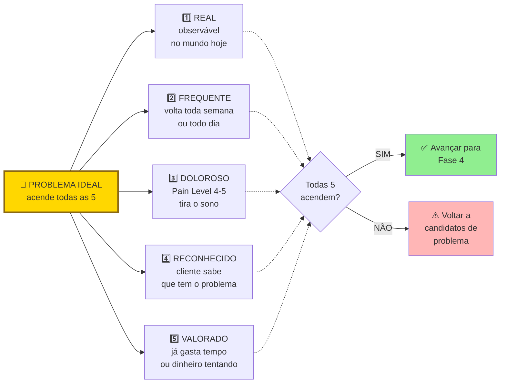
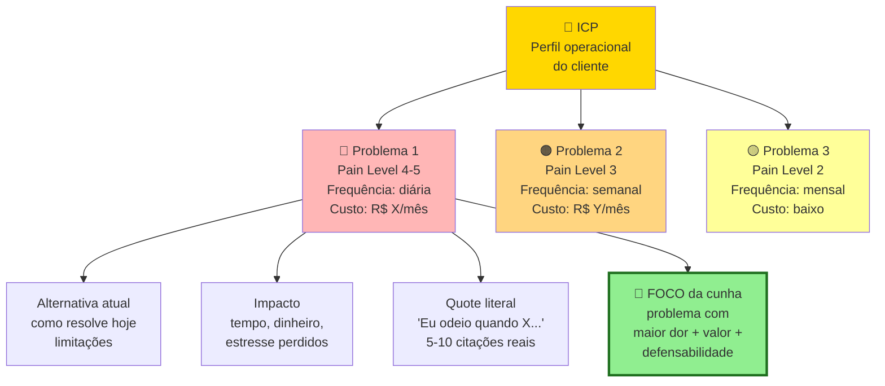

## FASE 3 — DESCOBERTA DO PROBLEMA

> [!info] Stack mínimo da Fase 3
> Para fazer entrevistas com rigor, você não precisa de ferramenta cara. Gratuito ou de baixo custo: gravação em celular ou Google Meet (com permissão explícita do entrevistado), transcrição automática via Whisper (OpenAI) ou Loom (gratuito para uso moderado), planilha simples (Google Sheets ou Notion) para armazenar entrevistas e extrair padrões, formulário de agendamento (Calendly free).
>
> Quando crescer: Dovetail ou EnjoyHQ para organização de pesquisa qualitativa, ferramentas como Grain para gravação integrada.
>
> Não confunda sofisticação de stack com qualidade de pesquisa. Entrevistador ruim com Dovetail extrai menos que entrevistador bom com Google Forms.

### O que esse apêndice cobre

Investigação estruturada para verificar se o problema que você imaginou na [[#FASE 2 — ARTICULAÇÃO E CAPTURA DA IDEIA|Fase 2]] existe de fato na vida das pessoas que você acredita serem seus clientes. Com que frequência ocorre. Quão doloroso é. E quanto as pessoas já fazem para tentar resolvê-lo. O entregável é um relatório chamado Mapa de Problemas, que documenta o problema real (não o imaginado) com evidências de campo.

> [!important] Disciplina central desta fase
> Nesta fase, você ainda não fala da sua solução. Você só escuta. Essa disciplina é difícil, mas crítica. No momento em que você menciona a sua solução, o cliente passa a reagir à ideia em vez de descrever a realidade dele. E você perde a evidência limpa.

### POR QUE

Noventa por cento das startups que falham, falham por construir algo que ninguém quer. Na maioria dos casos, o empreendedor presumiu que o problema existia, sem verificar. A descoberta do problema é a vacina contra esse erro.

O custo de descobrir que o problema não existe antes de construir é uma conversa de café. O custo de descobrir depois de construir é meses ou anos de vida e todo o dinheiro investido.

> [!warning] Não construa uma ponte perfeita no meio do deserto
> Essa frase precisa ficar na sua cabeça em todas as etapas. É muito comum o empreendedor iniciante investir meses esculpindo uma solução elegante para um problema que ninguém realmente tem, ou tem mas não suficientemente. A descoberta do problema é onde você confirma que há gente do lado de lá da ponte.

### QUALIDADE DO PROBLEMA, o filtro que precede tudo

Antes de falar de execução, é preciso entender o que caracteriza um problema vale-a-pena-perseguir. Empreendedores messiânicos, que querem "salvar o mundo em geral", tendem a quebrar. Empreendedores que miram um problema específico e agudo tendem a crescer. Use três filtros em conjunto.

#### Filtro 1, as seis dimensões do problema ideal (framework YC)

Popular. Milhões de pessoas, ou em B2B, muitas empresas de um tipo específico, sofrem com isso.

Crescente. O mercado está crescendo, idealmente vinte por cento ou mais ao ano.

Urgente. O cliente precisa resolver agora, não "eventualmente".

Caro. O problema custa bilhões em agregado, ou a solução atual tem preço alto, justificando que outra solução também tenha preço alto.

Obrigatório. O cliente não tem escolha a não ser resolver. Por questão regulatória, contratual, ou operacional.

Frequente. O cliente encontra o problema repetidamente, diariamente ou semanalmente, não uma vez a cada cinco anos.

Você não precisa das seis dimensões. Mas se faltar a maioria, a sua ideia não tem velocidade de escape. Vai ser difícil gerar tração, atrair investimento, e reduzir custo de aquisição de cliente.

#### Filtro 2, as cinco características de um *heartfelt problem*

Um problema que mexe com o coração acende todas as cinco características abaixo. Visualização:

Se três ou mais características falham, o problema não é heartfelt. É "interessante". Interessante não gera negócio. Heartfelt sim. Teste cada característica com evidência de campo (entrevistas, observação, dados). Nunca com "acho que sim".

As cinco características em detalhe.

Emocional. O problema carrega emoção negativa: frustração, ansiedade, vergonha, medo. Sem emoção, não há urgência de ação.

Funcional. O problema impede o cliente de realizar uma tarefa concreta importante. Não é só um incômodo estético.

Frequente. Reforça o filtro YC. Quanto mais frequente, mais valor percebido na solução.

Urgente. Tem deadline implícito ou explícito. Algo vai dar errado se não resolver.

Inevitável (*unavoidable*). Não há jeito fácil de contornar. Se o cliente pode simplesmente ignorar ou desviar, ele não vai pagar.

#### Filtro 3, a analogia topológica (poço profundo versus poço largo)

Poço largo significa que muita gente usa. "Todo mundo usa o Google."

Poço profundo significa que quem usa, usa várias vezes ao dia. "Usamos o Google múltiplas vezes por dia."

Negócios bilionários tendem a ser profundos *e* largos. Mas iniciantes devem priorizar profundo em um nicho estreito antes de perseguir largura. Um poço profundo em nicho restrito te dá quatro coisas. Clientes que viram evangelistas. Clareza sobre o que construir. Capital intensivo não-necessário. Defensibilidade natural contra concorrentes grandes que ignoram nichos.

> [!tip] Regra operacional do poço profundo
> Se a sua empresa sumisse amanhã, um grupo bem específico de pessoas deveria reclamar muito. Se ninguém reclamaria, você não tem poço. Tem uma poça.

#### Corolário crítico, clientes desesperados e produtos imperfeitos

Uma das verdades menos intuitivas desta fase: em um mercado excelente, definido por clientes desesperados por uma solução, a primeira versão do produto não precisa ser incrível. Só precisa funcionar. Essa é a marca do produto bem-sucedido em fase inicial. Inversamente, em um mercado morno, mesmo um produto excepcional tem dificuldade de ganhar tração.

O que isso significa na prática: se você está obcecado em polir o produto antes de lançar, há boa chance de que esteja mirando o mercado errado. Mercados quentes toleram (e recompensam) produtos capengas. Mercados frios exigem produtos polidos que ainda assim falham em engajar. A obsessão com perfeição técnica é frequentemente fuga de fundador evitando o veredito do mercado real.

Este corolário se conecta a dois conceitos.

O primeiro é o Limiar de Desespero. É o nível mínimo de dor que faz um cliente aceitar um produto imperfeito para resolver o problema. Abaixo desse limiar, ele vai reclamar de cada bug e cancelar. Acima, ele vai pagar mesmo com UI feia, fluxos quebrados, e atendimento via WhatsApp. Operacionalmente, isso significa que você deve mapear o Limiar de Desespero da sua cunha antes de investir em polimento. O Pain Level 5 (orçamento comprometido) é o indicador mais forte de que o cliente está acima do limiar.

O segundo é o "problema chato", também conhecido como Schlep Blindness (Paul Graham, 2012). *Schlep* é palavra em iídiche, hoje de uso comum no inglês, que significa "tarefa tediosa e desagradável". Graham cunhou o termo *Schlep Blindness*, cegueira para schleps, para descrever o padrão pelo qual empreendedores (especialmente técnicos) sistematicamente evitam problemas que envolvem trabalho chato e sem glamour. Regulação. Negociação com bancos. Operação manual. Migração de dados legados. Compliance. Suporte trabalhoso. O inconsciente nem deixa a ideia chegar à consciência. "Isso não é um problema de startup." É exatamente aí que moram as oportunidades mais valiosas. Porque ninguém quer pegá-las.

A lógica é econômica antes de ser poética. Se todo mundo quer evitar certa categoria de trabalho, quem se dispõe a fazer encontra mercado inteiro sem concorrência real. Concorrentes evitam problemas chatos por preguiça, ego, ou risco. Empreendedor que ataca deliberadamente problemas chatos frequentemente encontra menos competição, clientes mais leais (ninguém os atende bem), e margens melhores (ninguém quer o trabalho). Se o seu problema é "sexy" demais, fácil de vender em pitch, fácil de explicar em coquetel, desconfie. Provavelmente você está competindo com cinquenta outros fundadores na mesma fatia.

##### Casos canônicos, schleps que viraram empresas bilionárias

Stripe resolveu pagamentos online. Os irmãos Patrick e John Collison atacaram o schlep que todo desenvolvedor da época reclamava mas ninguém queria consertar. Gateways de pagamento eram infernais de integrar, cheios de burocracia bancária, regulação complexa, KYC, PCI-DSS. Stripe hoje vale mais de US$ 90 bilhões. Graham usa Stripe como exemplo arquetípico no próprio ensaio.

Scale AI resolveu *data labeling*, a rotulagem manual de dados de treino para IA. Alexandr Wang, fundador, mencionou em entrevista que o ensaio de Graham foi inspiração direta. Todo pesquisador de IA sabia que era tarefa necessária. Ninguém queria fazer. Hoje a empresa vale mais de US$ 14 bilhões e é peça essencial para OpenAI, Meta, e o Pentágono.

Figma atacou design colaborativo na nuvem quando a Adobe dominava com software offline. Problema técnico schlep: reconstruir ferramenta profissional de design no navegador, com performance aceitável, parecia trabalho de anos sem recompensa evidente. Ninguém queria. Figma fez. Hoje é categoria.

Uber enfrentou schleps regulatórios e batalhas com sindicatos de táxi que eram exatamente o que fazia concorrentes desistirem. Não era sexy. Era desgastante, caro, litigioso. Foi isso que abriu espaço.

No Brasil, padrões análogos. Empresas que atacaram problemas tributários, regulatórios, de integração com sistemas legados bancários, ou de operação em cidades secundárias. O iFood resolvendo logística em cidades pequenas com motoboys desorganizados. Méliuz e Nuvemshop, na origem, tinham elementos de schlep em comum. Quase toda empresa grande brasileira, se você olhar a origem, atacou algum problema que concorrentes achavam chato demais para resolver.

##### Como usar Schlep Blindness como filtro mental para achar ideias

Em vez de perguntar "que problema eu quero resolver?", pergunte: *que problema eu gostaria que outra pessoa resolvesse para mim?* A resposta frequentemente revela um schlep escondido. Algo que te irrita e que você simplesmente aceitou como "jeito das coisas".

Escaneie o seu próprio dia a dia profissional. Onde você improvisa solução manual? Onde processos são lentos, caros, irritantes? Onde você diz "isso deveria ser automático mas não é"?

Para empreendedor iniciante, desconfie de ideias que pareceram óbvias e rápidas de construir. Se pareceu óbvio, duzentas pessoas tiveram a mesma ideia esta semana. Se pareceu difícil, chato, com hurdles regulatórios ou operacionais, pode ser exatamente a sua oportunidade.

> [!important] A regra combinada
> Persiga problemas chatos com clientes desesperados. Essa combinação, por mais deselegante, é a mais previsível fonte de tração em estágio inicial.

### TESTE DE PRIORIDADE, três perguntas rápidas (Priority Diagnostics)

Antes de avançar, submeta o seu problema a um teste de prioridade em três perguntas. É um diagnóstico operacional importado do programa da Antler. Vale aplicar sobre cada problema-candidato antes de comprometer tempo sério com ele.

> [!question] Pergunta 1, se este problema desaparecesse amanhã, quem notaria?
> Não "quem acharia bom". Quem notaria concretamente, em quarenta e oito horas, sem ninguém avisar. Se a resposta for "as pessoas em geral" ou "todo mundo", o problema não é prioritário para ninguém em específico. Resposta boa: um cargo ou pessoa nomeada, por exemplo "o gerente de operações do setor X", que usa o problema diariamente.

> [!question] Pergunta 2, qual métrica numérica e rastreada mudaria?
> Se o problema é real e prioritário, existe uma métrica que alguém já acompanha que se moveria. Tempo de ciclo. Custo por transação. Taxa de retrabalho. NPS interno. Faturamento por hora. Churn. Se nenhuma métrica rastreada se moveria, o problema pode até existir, mas ninguém tem caso de negócio para resolvê-lo. E portanto ninguém tem budget.

> [!question] Pergunta 3, alguém escalaria o problema para um nível acima?
> Problemas prioritários sobem na hierarquia. Alguém reporta ao chefe. Alguém pede recursos. Alguém marca uma reunião urgente. Se o problema existe mas ninguém o escala, ele está sendo absorvido silenciosamente. Significa que não é urgente o suficiente para forçar mudança de comportamento.

> [!warning] Regra operacional do Teste de Prioridade
> Se você não consegue responder às três perguntas com um nome de cargo, uma métrica específica, e um comportamento de escalada concreto, volte para entrevistas. Problemas que passam nas três perguntas geram urgência de compra. Os que não passam geram apenas interesse educado.

### Quando usar

Comece com a Declaração Inicial da Ideia (v1) da [[#FASE 2 — ARTICULAÇÃO E CAPTURA DA IDEIA|Fase 2]] em mãos e, idealmente, com a árvore de teoria construída na [[#FASE 2B — CONSTRUÇÃO DA TEORIA DO NEGÓCIO|Fase 2B]] — as hipóteses bet-the-company da Fase 2B são exatamente o que você vai testar nas entrevistas aqui. Termine depois de ter realizado entrevistas suficientes para chegar à saturação, o ponto em que novas entrevistas deixam de trazer informação nova. Tipicamente quinze a trinta entrevistas em profundidade. Revisite sempre que mudar de segmento de cliente ou abrir novo mercado.

### Quem envolve

O executor principal é você. Não terceirize entrevistas nesta fase. Quem conduz aprende. Quem lê relatório, não. Os participantes são os entrevistados, pessoas do público-alvo descrito na [[#FASE 2 — ARTICULAÇÃO E CAPTURA DA IDEIA|Fase 2]]. O decisor é você, com base na análise da evidência.

### Como executar

Nove passos.

> [!tip] Empathy Map como complemento ao Mom Test
> Entrevistas Mom Test capturam comportamento passado e revelam onde a dor está. Para registrar o **universo emocional e contextual** que cerca esse comportamento, use o [[#APÊNDICE CZ — CANVASES E MAPAS VISUAIS DE MODELO|Empathy Map (CZ.6)]] como artefato pós-entrevistas. Após 5-10 entrevistas com a mesma persona, reúna PM + designer + customer success e preencha os seis quadrantes (Pensa & Sente, Vê, Ouve, Fala & Faz, Pains, Gains) com base em verbatim. Empathy Map preenchido sem entrevistas é projeção; com entrevistas é a primeira ferramenta que torna empatia auditável. O exemplo de Loggi com persona "Carlos motoboy" em CZ.6 mostra como mapear não-clientes (parceiros, intermediários) frequentemente revela mais que mapear o cliente final.

#### Passo 1, perfil do entrevistado com precisão cirúrgica

Antes de sair entrevistando, escreva os critérios de inclusão e exclusão. Quem incluir: quem atende a tais e tais características. Quem excluir: quem atende a tal característica.

Exemplo ruim: "donos de restaurante". Exemplo bom: "donos ou donas, sócios ou sócias operacionais de restaurantes de uma a três unidades, localizados em capitais brasileiras, que oferecem delivery próprio (não apenas via iFood), com faturamento mensal entre R$ 50 mil e R$ 300 mil, há pelo menos dois anos no mercado".

Esse filtro é o que separa pesquisa útil de pesquisa "perdida no meio".

#### Passo 2, lista de quarenta a sessenta pessoas para abordar

Você precisará abordar três a quatro vezes o número de entrevistas que pretende realizar. Muita gente não responde, não tem tempo, ou não atende aos critérios. Fontes possíveis: LinkedIn com busca filtrada; grupos de WhatsApp e Telegram de nichos específicos; associações e entidades de classe (sindicatos, federações, coletivos); eventos presenciais do setor; introduções via conhecidos ("alguém que conhece alguém"); comunidades online (subreddits, fóruns, Discord); cold outreach estruturado (e-mail direto ou mensagem com proposta clara de trinta minutos).

#### Passo 3, escreva e teste o seu roteiro de entrevista

O roteiro tem dois princípios. Perguntas abertas, nunca fechadas. "Como você decide X?" em vez de "Você decide X dessa forma?". E perguntas sobre o passado, não sobre o futuro. "Na última vez que X aconteceu, o que você fez?" em vez de "Você usaria Y se existisse?". Respostas sobre o futuro são ficção. Sobre o passado, são evidência.

Estrutura sugerida (método Mom Test adaptado).

Aquecimento (dois minutos). Agradeça o tempo, explique que é pesquisa, não venda, peça permissão para gravar.

Contexto do entrevistado (cinco minutos). Quem é, o que faz, qual a rotina.

Exploração do domínio (dez minutos). Perguntas abertas sobre o território onde você imagina o problema, sem mencionar o problema. "Me conta como funciona o seu dia a dia com (atividade relacionada)." "Quais são as partes mais chatas disso?" "Me conta a última vez que você teve um problema com isso."

Aprofundamento (dez minutos). Sempre que algo interessante surgir, pergunte: "Me fala mais sobre isso." E: "Na última vez, como foi?"

Tentativas de solução (cinco minutos). "O que você já tentou fazer para resolver isso? Funcionou? Por que parou?" Se a pessoa nunca tentou resolver, isso é evidência forte de que o problema não é dolorido.

Encerramento (três minutos). "Tem mais alguém que você acha que passa por isso, que eu poderia conversar?" Pedido de indicação.

> [!note] O comportamento do consumidor brasileiro tem padrões que afetam como a dor se manifesta nas entrevistas
> Classe C/D tende a minimizar problemas por norma social de não reclamar; usuários mobile-first descrevem fluxos de forma diferente de quem usa desktop. O [[apendice-ff|Apêndice FF — Psicologia do Consumidor Brasileiro]] detalha esses padrões e ajuda a calibrar o que ouvir nas entrevistas — especialmente a diferença entre dor declarada e dor real.

##### As cinco perguntas canônicas do Mom Test (cheat sheet)

Estas cinco perguntas, adaptadas ao seu domínio, formam um núcleo mínimo para qualquer entrevista de problema. Foram desenhadas para revelar a dor real, focar em comportamento passado em vez de intenção futura, e evitar que você caia na armadilha de vender a sua ideia.

> [!example] Cinco perguntas para entrevista de descoberta de problema
>
> 1. Qual é a parte mais difícil de (fazer a tarefa)? Identifica a dor real na linguagem do cliente, não na sua.
> 2. Me conta sobre a última vez que você encontrou esse problema. Força o entrevistado a descrever comportamento passado, que é evidência, não especulação.
> 3. Por que isso foi tão difícil? Revela as causas raízes que o seu raciocínio de ponta a ponta não consegue supor sozinho.
> 4. O que você já fez para tentar resolver isso? Se o entrevistado não fez absolutamente nada, a dor não é forte o suficiente para gerar negócio.
> 5. O que você não gosta nas soluções que já tentou? A resposta é o rascunho inicial do seu roadmap de produto, com palavras do cliente.

A pergunta bônus, que discrimina Pain Level 4 de Pain Level 5: *o que faria você pagar um pequeno depósito hoje por uma solução para isso?*. Essa pergunta separa interessados genuínos (responde com condições concretas: "se funcionasse com X, se custasse menos que Y") de interessados ornamentais (responde vago: "talvez, dependendo"). Clientes em Pain Level 5 (orçamento comprometido) tendem a dar respostas específicas e acionáveis. Clientes em Pain Level 4 ou menos tendem a hesitar. Use no fim da entrevista, depois de ter mapeado dor em profundidade. Nunca no começo, porque fica leading.

> [!tip] Regra de ouro do entrevistador
> Fale menos, ouça mais. Você não está ali para vender o seu produto. Está ali para interrogar o problema. Se você falou mais de vinte por cento do tempo, fez errado.

##### A armadilha da validação, dado ruim e dado bom

Nem todo "sinal" obtido em entrevista vale igual. Há tipos de resposta que pesam muito diferente.

| Tipo de informação | Peso como evidência | Por quê |
|---|---|---|
| Elogios ("Nossa, que ideia legal!") | Quase zero | Pessoas mentem sobre interesse por educação ou para agradar |
| Hipóteses futuras ("Eu pagaria por isso") | Baixo | Promessas sobre o futuro não se traduzem em compra real |
| Ideias soltas ("Seria legal se tivesse tal funcionalidade") | Baixo a médio | Útil para brainstorm, não para validação |
| Comportamento passado ("Semana passada gastei 4 horas nisso") | Alto | Dado verificável; ações já tomadas são a melhor evidência |
| Tentativas anteriores de solução ("Eu usei X, Y e Z, nenhum resolveu") | Alto | Prova que a dor é forte o suficiente para o cliente já ter agido |
| Métricas de custo (tempo, dinheiro, energia já gastos) | Alto | Traduzem a intensidade real da dor em números |

> [!important] Princípio operacional sobre evidência
> Pessoas mentem sobre interesse, mas não mentem sobre dor. Foque em interrogar a dor, comportamento passado, tentativas de solução, custo atual. Ignore promessas futuras e elogios.

##### Pain Level, classifique cada entrevistado

Ao final de cada entrevista, atribua ao entrevistado uma nota na escala de Pain Level, de um a cinco, que mede o estado dele em relação ao problema.

Nível 1. Tem o problema, mas nem sabe que tem. Não é cliente ainda. No máximo é foco de marketing educacional.

Nível 2. Sabe que tem o problema. Reconhece, mas tolera. Não vai pagar por solução sozinho.

Nível 3. Está ativamente procurando uma solução. Tem deadline na cabeça. É lead quente.

Nível 4. Já improvisou uma solução feia. Planilha Excel gigante, processo manual, Frankenstein de ferramentas. A existência dessa gambiarra é prova de que ele pagaria por algo melhor.

Nível 5. Tem orçamento comprometido ou facilmente acessível para comprar uma solução. Esse é o cliente ideal para a venda inicial e para o PSF (Problem-Solution Fit).

> [!important] Meta de Pain Level desta fase
> Conseguir entrevistar pelo menos cinco pessoas em Pain Level 4 ou 5. Se você não encontrar ninguém nesses níveis, você está testando um problema que o mercado ainda não sentiu o suficiente para pagar. É sinal vermelho. Volte para a Fase 2B (Teoria) e reconsidere o ICP ou a dor.

##### O que não fazer

Não pergunte "você acha que um app que faz X seria útil?". É hipotético, sobre o futuro.

Não pergunte "você pagaria R$ 99 por isso?". Inventa compromisso que a pessoa não vai cumprir.

Nunca diga "eu tive uma ideia de negócio que…". A partir daí, tudo vira cortesia.

Evite perguntas tendenciosas (*leading questions*). "Você não acharia melhor se…" ou "Seria incrível se existisse X, né?". Deixe o entrevistado dizer o que quer. Se você precisa sugerir, não é dor real.

Não misture apelos emocionais ou virtuosos (*virtue signalling*). "Você compraria um produto feito por crianças com deficiência?" Quase ninguém vai dizer não. Mas isso não significa que vai pagar. Mantenha o foco no problema, não em apelos morais que enviesam a resposta.

Não ofereça "crack grátis". "Você gostaria de receber X de graça?" Quase todo mundo diz sim. Isso não valida negócio nenhum. Só valida que as pessoas gostam de coisas grátis.

#### Passo 4, primeiras três entrevistas como teste

Grave (com permissão), transcreva, releia. Identifique três coisas. Quais perguntas funcionaram (geraram respostas longas e ricas). Quais caíram no vazio (respostas curtas, secas). E onde você cedeu à tentação de apresentar a ideia.

Ajuste o roteiro antes de seguir com as próximas.

#### Passo 5, execute quinze a trinta entrevistas no total

Ritmo saudável: três a cinco por semana. Faça sozinho, ou com um parceiro que toma notas enquanto você conduz.

#### Passo 6, registro sistemático

Para cada entrevista, preencha um template padronizado. Nome, papel, empresa (quando aplicável), data. Verbatim, ou seja, citações literais dos momentos mais importantes, exatamente o que a pessoa disse, entre aspas. Problemas mencionados (não os que você interpretou, os que foram ditos). Soluções atuais utilizadas. Quanto tempo, dinheiro, ou energia a pessoa gasta hoje com o problema. Gatilhos emocionais observados (frustração, raiva, resignação). E as suas observações pessoais em itálico, claramente separadas dos fatos.

> [!tip] Use o Template A.2 — Parte B
> O [[#APÊNDICE A — TEMPLATES PRONTOS PARA USO|Template A.2]] tem duas partes: a Parte A é o roteiro que você consulta durante a conversa; a Parte B é a síntese pós-entrevista, com 12 seções que estruturam exatamente o que este Passo 6 pede — metadados, aderência ao ICP, problemas, verbatim, vocabulário, hierarquia de sinais, Pain Level com justificativa, armadilhas (autoavaliação) e refinamento de ICP. Preencha nas 24h seguintes à entrevista, enquanto a memória está fresca. Entrevistas com a Parte B em branco contam como dado perdido.

#### Passo 7, análise depois de cada lote de cinco entrevistas

Não espere terminar tudo para analisar. A cada cinco entrevistas, faça uma síntese parcial. Quais problemas apareceram em mais de cinquenta por cento das entrevistas? Quais padrões de comportamento se repetem? Que hipóteses iniciais foram reforçadas e quais foram abaladas? Quais novos problemas apareceram que você não esperava?

> [!tip] Síntese parcial e final no Template A.30
> O [[#APÊNDICE A — TEMPLATES PRONTOS PARA USO|Template A.30 (Consolidação de Rodada)]] é o artefato dessa síntese. Use uma versão "rascunho" a cada lote de cinco para checar padrões; consolide a versão final só quando a rodada inteira fechar — consolidar antes do fim viesa as entrevistas restantes. A.30 é também o documento que registra a decisão de avanço da fase (perseverar / pivotar problema / pivotar cliente / abandonar).

> [!note] A jornada do cliente é uma estrutura útil para organizar o que as entrevistas revelam
> Enquanto o Mom Test captura incidentes isolados, o [[apendice-dt|Apêndice DT — Customer Experience]] oferece a visão de jornada completa — do momento de consciência do problema ao pós-resolução — incluindo métricas de NPS e churn preditivo. Usar a jornada como mapa mental durante a síntese das entrevistas ajuda a localizar em qual etapa a dor é mais aguda.

#### Passo 7B, separe sintoma de causa raiz — entrevista de raiz causal

O erro mais comum em discovery é documentar sintomas como se fossem problemas. "Meu CRM é uma bagunça" é sintoma. A causa raiz pode ser: processo de vendas mal definido, equipe resistente à adoção de ferramentas, ou dados de entrada inconsistentes vindos de integrações quebradas. Cada causa raiz tem uma solução diferente. Tratar o sintoma sem entender a causa produz produto que não resolve o problema real.

A técnica de entrevista de raiz causal usa três camadas de aprofundamento.

**Camada 1 — o sintoma declarado.** O entrevistado descreve o problema como ele aparece para ele. "Meu relatório de vendas demora três dias para ficar pronto." Anote literalmente — esse é o ponto de partida, não a conclusão.

**Camada 2 — o mecanismo.** Para cada sintoma, pergunte: "Me conta como isso acontece na prática. Quando o relatório atrasa, o que está acontecendo especificamente?" Objetivo: entender o processo, não apenas o resultado. Frequentemente revela que o "problema de relatório" é, na verdade, um problema de input — os dados não chegam na qualidade certa.

**Camada 3 — a causa raiz.** Para cada mecanismo, aplique a pergunta "por quê" até chegar ao elemento que, se resolvido, elimina o sintoma. "Por que os dados chegam inconsistentes? — Porque a equipe de vendas preenche o CRM diferente. — Por que preenche diferente? — Porque não há template padrão e cada vendedor usa o que acha melhor. — Por que não há template padrão? — Porque quando implementaram o CRM dois anos atrás, o gerente de vendas saiu logo depois e ninguém estabeleceu o processo." Causa raiz: falta de processo documentado e owner claro do CRM. Solução: não é um relatório melhor — é um playbook de uso do CRM com responsável.

**Protocolo prático de raiz causal em entrevista:**

1. Deixe o entrevistado descrever o problema livremente (2-3 minutos).
2. Repita o sintoma de volta e peça para detalhar o mecanismo: "Quando você diz X, me conta como isso acontece no dia a dia?"
3. Para cada elemento do mecanismo que parece ser causa, pergunte: "Por que isso acontece?" — até a resposta ser "é como funciona aqui" ou "não sei — nunca perguntei."
4. No final da entrevista, pergunte: "Se você resolvesse esse problema hoje, o que mudaria primeiro — o sistema, o processo, ou a equipe?"

A resposta à última pergunta é ouro. Ela revela onde o entrevistado percebe a alavanca de solução — e frequentemente diverge do que você assumia como desenvolvedor de produto.

**Red flags que indicam sintoma não raiz:**

- A pessoa descreve uma solução ("precisamos de uma dashboard melhor") em vez de um problema. Pergunte: "O que você faria com a dashboard melhor que não consegue fazer agora?"
- O problema "desaparece" quando você pergunta sobre frequência. "Acontece de vez em quando" com dificuldade de quantificar sugere que o problema não é tão dolorido quanto parece.
- A pessoa cita o problema de outra pessoa ("meu chefe reclama que..."). A causa raiz pode estar na dinâmica organizacional, não no processo em si.

#### Passo 8, chegue à saturação

Saturação é o ponto em que entrevista nova deixa de trazer informação nova. Há dois testes complementares: um qualitativo (sentir) e um quantitativo (medir). Os dois apontam para o mesmo fenômeno; use ambos para reduzir auto-engano.

**Teste qualitativo.** Você sente quando chegou. "Ah, é a mesma coisa que o anterior disse." Quando isso acontecer duas ou três vezes seguidas, você chegou.

**Teste quantitativo.** Para cada nova entrevista, conte quantas observações realmente novas (problemas, vocabulário, padrões de comportamento, workarounds) ela trouxe versus repetições do que já apareceu antes. Quando o percentual de novidade fica abaixo de quinze por cento por três entrevistas seguidas, é saturação confirmada.

Os dois critérios devem se confirmar mutuamente. Sentiu saturação mas o quantitativo ainda mostra trinta por cento de novidade? Você está sendo otimista — faça mais cinco. Quantitativo já abaixo de quinze por cento mas você ainda sente "tem coisa nova"? Provavelmente é gosto pelas conversas, não evidência. Pare.

#### Passo 9, produza o Mapa de Problemas

Esse é o entregável central da [[#FASE 3 — DESCOBERTA DO PROBLEMA|Fase 3]]. Estrutura visual:

Um ICP pode ter três a cinco problemas mapeados. O foco é em um, o mais agudo, o de melhor fit. O mapa deve ser atualizado conforme as entrevistas avançam. Não é documento morto.

O documento final tem cinco a dez páginas, com o seguinte conteúdo. Perfil do entrevistado consolidado (ICP refinado). Lista dos problemas identificados, ranqueados por frequência e intensidade. Verbatim marcantes (citações literais) para cada problema. Soluções atuais identificadas e suas deficiências. Disposição emocional, ou seja, quanto as pessoas se importam com o problema. Comparação com a Declaração Inicial v1: o que se confirmou, o que se refutou, o que emergiu que você não esperava. E versão dois da Declaração da Ideia, atualizada com o que foi aprendido.

> [!note] Mapa de Problemas e A.30
> O Mapa de Problemas é a saída visual da rodada — o entregável de comunicação. O [[#APÊNDICE A — TEMPLATES PRONTOS PARA USO|Template A.30]] é a planilha de decisão estruturada que sustenta o Mapa: cruza distribuição de Pain Level, padrões agregados de problema, workarounds dominantes, vocabulário recorrente e sub-segmentos para registrar a decisão de avanço com rastro à evidência. Use os dois — o Mapa para apresentar, A.30 para defender.

### PERGUNTAS A RESPONDER

- O problema que eu imaginei existe na vida real das pessoas que eu esperava?
- Com que frequência esse problema ocorre na vida delas (diário, semanal, mensal, raro)?
- Quão doloroso é, comparado a outros problemas que elas têm?
- O que elas já fazem para resolver? Se não fazem nada, o problema não é dolorido.
- Quanto tempo, dinheiro, ou energia elas já gastam com tentativas atuais?
- Quem exatamente sofre mais com esse problema (sub-segmento mais agudo)?
- Há problemas adjacentes mais dolorosos que eu descobri por acaso?
- Qual é a linguagem que *elas* usam para descrever o problema? Anote as palavras exatas. Você vai usar no seu marketing depois.

### Métricas

Número de entrevistas concluídas. Alvo de quinze a trinta.

Número de entrevistados aderentes ao ICP. Pelo menos doze. Entrevistados fora do perfil contam como aprendizado, mas não como validação.

Frequência de menção espontânea do problema. Em que percentual das entrevistas o problema surgiu sem você precisar provocar? Alvo: cinquenta por cento ou mais para considerar o problema relevante. Setenta por cento ou mais para considerar urgente.

Índice de "já tentou resolver". Em que percentual das entrevistas a pessoa descreveu tentativas ativas de resolver? Alvo: quarenta por cento ou mais. Se as pessoas não estão tentando resolver, não vão pagar por uma nova solução.

Tempo ou dinheiro gasto com o problema hoje. Valor médio informado pelos entrevistados. Serve como proxy de disposição a pagar. Benchmark: R$ 500 por mês ou mais (B2C), ou R$ 5.000 por mês ou mais (B2B), ou cinco horas por semana ou mais de tempo próprio. Indica dor em Pain Level 4 ou 5 (dor real, já consumindo recursos). Abaixo disso, o problema pode existir mas não dói o suficiente para virar negócio.

Índice de saturação. Depois das últimas três entrevistas, quanta informação nova apareceu? Abaixo de quinze por cento indica saturação.

### SAÍDA DESTA FASE

Você concluiu a [[#FASE 3 — DESCOBERTA DO PROBLEMA|Fase 3]] quando os nove critérios abaixo estão cumpridos.

1. Você realizou quinze ou mais entrevistas com pessoas dentro do ICP, gravadas (com consentimento) ou transcritas em tempo real.
2. Você atingiu saturação. Nas últimas três entrevistas, informação nova próxima de zero.
3. Tabela de padrões existe com cinco ou mais dimensões coletadas por entrevistado.
4. Três ou mais padrões de dor consistentes estão documentados, cada um apoiado por cinco ou mais entrevistas.
5. Pelo menos um falso positivo identificado e documentado. Algo que entrevistados disseram querer mas não agiriam para obter.
6. Há evidência de que o problema existe em cinquenta por cento ou mais do ICP entrevistado, e de que é ativamente tratado (pessoas já tentam resolver) em quarenta por cento ou mais.
7. ICP foi ajustado com base no que foi ouvido. Existe registro de "antes versus depois". O sub-segmento mais doloroso está identificado.
8. Mapa de Problemas está escrito, e a Declaração da Ideia foi atualizada para v2 com mudanças explícitas em relação à v1.
9. Decisão explícita tomada: seguir, pivotar (problema ou cliente), ou encerrar. Documentada em um parágrafo.

> [!warning] Se o problema não passou no teste, momento crítico
> Os caminhos são três. Pivotar o problema (algo adjacente emergiu como mais doloroso). Pivotar o cliente (o problema existe, mas em outro perfil). Ou abandonar (volte à Fase 2 com outra ideia). Não avance para a Fase 4 com problema não-validado. Construir sobre problema inexistente é o cemitério das startups.

**Checklist final.**

- [ ] Tenho roteiro de entrevista (Template A.2) revisado, com perguntas abertas, sem linguagem que induz resposta?
- [ ] Realizei quinze ou mais entrevistas com pessoas do perfil ICP hipotético?
- [ ] As entrevistas foram gravadas (com consentimento) ou transcritas em tempo real?
- [ ] Transcrevi/anotei e categorizei as respostas em tabela de padrões?
- [ ] Identifiquei três ou mais padrões de dor consistentes entre múltiplas entrevistas?
- [ ] Identifiquei pelo menos um falso positivo (algo que entrevistados disseram querer mas não agiriam para obter)?
- [ ] Ajustei a minha hipótese de "para quem" com base no que ouvi (ICP ficou mais específico ou mudou)?
- [ ] Decidi explicitamente: continuar com a ideia, pivotar, ou abandonar?

**Primeiros passos práticos.**

1. Agendar cinco entrevistas para esta semana usando rede pessoal, LinkedIn cold outreach, ou grupos de WhatsApp do setor.
2. Revisar o Template A.2 e remover perguntas que induzem resposta ("você gostaria de um app para…?").
3. Criar tabela no Notion ou Google Sheets com colunas: nome, data, padrão de dor 1, padrão 2, padrão 3, solução atual, quanto pagaria.
4. Fazer duas entrevistas piloto, revisar o roteiro com base no que não funcionou, e então agendar as demais.

### EXEMPLO PRÁTICO

**Roteiro de Entrevista de Problema, PadariaPro.**

Abertura (dois minutos). "Oi, [Nome]. Obrigado pelo tempo. Antes de começar: não estou aqui para te vender nada. Estou pesquisando como padarias pequenas gerenciam compras e estoque, porque quero entender se tem um problema real antes de construir uma solução. Vou fazer umas perguntas abertas, sem respostas certas. A gravação fica privada, só para eu transcrever depois. Tudo bem?"

Perguntas de contexto (cinco minutos). Como você virou dono ou operador dessa padaria? Quantas lojas vocês têm hoje? Como a gestão é dividida entre elas? Quem cuida de compra de ingredientes?

Perguntas sobre dor (quinze minutos), sem mencionar produto ou solução. Como vocês decidem hoje quanto de farinha comprar por semana? Me lembra da última vez que sobrou ou faltou algum ingrediente importante. O que aconteceu? Quando isso acontece, qual o impacto, em dinheiro, em tempo, em estresse? Vocês já tentaram alguma ferramenta ou método para resolver? Funcionou? Por que sim, ou por que não? Se você pudesse acordar amanhã e ter uma coisa resolvida no negócio, seria essa, ou outra?

Perguntas sobre comportamento (cinco minutos). Como vocês controlam estoque hoje? (peça para mostrar se possível, caderno, planilha, sistema). Em uma escala de zero a dez, quanto o problema de estoque incomoda?

Fechamento (três minutos). "Última coisa, posso te ligar em trinta dias para te mostrar algo que estou desenhando, e pegar a sua opinião?"

Análise depois de dez entrevistas:

| Entrevistado | Perda financeira/mês | Método atual | Dor real (0-10) | Já pagou para resolver? |
|---|---|---|---|---|
| Padaria A (Pinheiros) | R$ 3.500 | Caderno | 7 | Não, mas pensou em Excel avançado |
| Padaria B (Vila Madá) | R$ 8.000 | Planilha | 9 | Pagou consultor R$ 2k uma vez |
| Padaria C (Moema) | R$ 2.000 | Sistema antigo | 5 | Paga R$ 150/mês ERP que não serve |
| ... | | | | |

Padrão emergente: as padarias que sentem dor 8 ou mais são aquelas com três ou mais lojas. Abaixo disso, dor é 4-6 e pagar não é prioridade. ICP refinado para três a cinco lojas, não duas a cinco como hipótese original.

**Roteiro de Entrevista, caso healthtech B2C (exemplo paralelo).**

Para mostrar como o instrumento se comporta em contexto diferente, eis um fundador hipotético investigando dor de pacientes adultos com diabetes tipo 2 que precisam ajustar dieta e medicação semanalmente. ICP imaginado: brasileiros de quarenta a sessenta e cinco anos, classe B, diagnóstico há dois a cinco anos, residentes em capitais.

Abertura (dois minutos). "Oi, [Nome]. Obrigado pelo tempo. Estou pesquisando como pessoas com diabetes tipo 2 gerenciam o dia a dia da condição. Alimentação, medicamento, consulta. Não estou vendendo nada. Quero entender o que funciona e o que não funciona, antes de pensar em qualquer solução. Tudo o que você falar fica privado. Posso gravar para transcrever depois?"

Perguntas de contexto (cinco minutos). Há quanto tempo você tem o diagnóstico? Como ele aconteceu? Quem cuida de você hoje? Endocrinologista, nutricionista, médico de família? Como é a sua semana típica em relação ao diabetes? O que você faz que outras pessoas sem diabetes não fazem?

Perguntas sobre dor (quinze minutos), sem mencionar produto ou solução. Me conta da última vez que a sua glicemia subiu mais do que devia. O que aconteceu antes? Como você descobriu? Quando você precisa decidir o que comer fora de casa, como decide? Quanto tempo por semana você gasta pensando ou fazendo coisa relacionada ao diabetes? Já tentou algum app, planilha, caderno, ou método para ajudar? Funcionou? Por que parou (se parou)? O que mais te incomoda hoje no dia a dia da condição? E o que a sua família ou parceiro reclama?

Perguntas sobre comportamento (cinco minutos). Pode me mostrar como você anota o que come, ou como acompanha a sua glicemia? (peça a tela do celular ou caderno). Em escala de zero a dez, quanto isso te incomoda? E ouça a resposta sem reagir.

Fechamento (três minutos). "Última coisa, posso te ligar em quatro semanas para te mostrar algo que estou desenhando, e ouvir a sua opinião?"

Análise depois de quinze entrevistas:

| Entrevistado | Tempo gasto/semana | Método atual | Dor real (0-10) | Pagaria por solução? |
|---|---|---|---|---|
| Maria, 52, SP | 5h | Caderno + memória | 7 | Sim, até R$ 50/mês |
| João, 61, RJ | 8h | Planilha do filho | 9 | Sim, até R$ 100/mês |
| Beatriz, 47, BH | 2h | Nada estruturado | 4 | Talvez, se médica recomendar |
| ... | | | | |

Padrão emergente: quem sente dor 8 ou mais tem três anos ou mais de diagnóstico, faz medição diária, e tem complicação concreta (ferida que não cicatriza, ajuste recente de medicação). Quem está nos primeiros doze meses ainda está em "fase de adaptação" e não vê app como prioridade. Primeiro confia no médico, depois talvez incorpore tecnologia. ICP refinado: pacientes diabéticos tipo 2 com três ou mais anos de diagnóstico, em ajuste medicamentoso ativo. Cunha mais estreita que a hipótese original.

**Comparando os dois roteiros.** A estrutura é idêntica. Abertura, contexto, dor (sem mencionar solução), comportamento, fechamento. O que muda é o vocabulário e os artefatos a observar. Caderno de padaria versus aplicativo de glicemia. E a forma como a "dor" se traduz em pagar. Margem perdida na padaria, custo emocional mais gasto com complicação para o paciente. O roteiro de entrevista é o mesmo instrumento, adaptado ao domínio.

### Armadilhas

Entrevistar amigos e família. Eles mentem para te agradar. Exclua qualquer um que tenha relação pessoal.

Falar mais do que ouvir. A regra de ouro é que o entrevistado fala oitenta por cento do tempo. Se você está falando muito, está fazendo errado.

Confirmar em vez de refutar. É tentador ouvir só o que reforça a sua tese. Obrigue-se a procurar ativamente evidência contrária. Se você só encontra confirmação, está enviesando.

Perguntas hipotéticas. "Você usaria X?" produz respostas ficcionais. Sempre ancore no passado real.

Apresentar a solução. No momento em que você mostra a ideia, a conversa muda de tom. A pessoa passa a ser gentil ou crítica com a ideia, não honesta sobre a vida.

Achar que cinco entrevistas bastam. Às vezes bastam, mas você só sabe disso depois de quinze. Não corte caminho.

Generalizar a partir de um ou dois casos marcantes. Uma entrevista apaixonada vale muito menos que um padrão em dez entrevistas.

Ignorar quando o problema é "interessante" mas não dolorido. As pessoas adoram falar sobre ineficiências, mas só pagam para resolver as que doem. Diferencie.

---

### CASO BRASILEIRO, Fase 3, descoberta do problema no iFood com restaurantes pequenos

No início da operação, a equipe do iFood (Patrick Sigrist, Felipe Fioravante, Eduardo Baer, Guilherme Bonifácio, Daniel Oliveira) tinha hipótese de que o principal cliente seria redes grandes de restaurantes. Era a aposta natural. Volume maior, ticket maior, estrutura instalada.

Antes de investir em vendas para grandes redes, com ciclo longo, fizeram dezenas de conversas diretas com donos de restaurantes pequenos. Incluindo visitas e observação de rotina. Não estavam vendendo nada. Estavam mapeando dor.

Descobriram algo contraintuitivo. Restaurantes pequenos tinham dor muito maior. Não tinham time de telemarketing. Atendimento telefônico custava tempo do dono. Pedido errado por ruído na ligação era prejuízo direto. E estavam dispostos a pagar comissão alta em troca do canal. Redes grandes, com estrutura própria, viam o iFood como ameaça à marca.

A lição transferível. Quem tem dor mais aguda paga mais, mesmo que seja cliente "menor". Entrevistar onde a dor é intensa é mais produtivo que entrevistar onde você achava que seriam os clientes.

---

### FERRAMENTAS DESTA FASE

Na descoberta do problema, ferramentas de entrevista e pesquisa são centrais. Mas a maioria delas está no Ferramentário (BG.6, Pesquisa & Descoberta). Nesta fase, disponíveis de imediato:

5 Whys (Sakichi Toyoda, Toyota). Pergunte "por quê?" cinco vezes durante entrevistas, para chegar à causa-raiz do problema (não ao sintoma declarado). Use em toda entrevista de customer discovery. Ver BG.5.2.

MECE. Estruturar os problemas reportados pelos entrevistados em categorias mutuamente exclusivas e coletivamente exaustivas. Evita lista bagunçada de "dores" sem estrutura. Use na consolidação de aprendizados depois de dez a vinte entrevistas. Ver BG.4.5.

First Principles Thinking. Resista à tendência de reformular o problema dos clientes na linguagem da sua solução. Vá ao fundamento. Qual é a dor real, sem fritura de "porque esse cliente precisaria de uma plataforma SaaS com IA"? Ver BG.4.1.

McKinsey 7-Step (passos 1 e 2). Nesta fase, Define e Structure. Articule o problema, depois estruture sub-problemas. Use issue tree MECE. Ver BG.5.1.

Pyramid Principle (Minto). Síntese das entrevistas. Apresente ao time ou aos advisors com a conclusão no topo: "o problema central dos nossos ICPs é X, por três razões: Y1, Y2, Y3". Ver BG.4.4.

> [!note] Ferramentas específicas de entrevista
> Mom Test, JTBD Switch Interviews, Laddering, Contextual Inquiry. Estarão no Ferramentário, BG.6.

---

### Exercício aplicado, mapa do problema (Fase 3)

A [[#FASE 3 — DESCOBERTA DO PROBLEMA|Fase 3]] trata de descoberta de problema. Ler é um movimento. Executar é outro. Este exercício força você a sair da teoria em quatro dias.

#### Dia 1, manhã, 90 minutos

Escreva, sem consultar ninguém, a sua melhor formulação atual do problema que a sua empresa resolverá. Formato: "o problema é X, para o cliente Y, no contexto Z, porque W". Uma frase. Se não coube em uma frase, o problema ainda não está claro.

Documente também as cinco principais suposições embutidas nessa formulação.

#### Dia 1, tarde, 2 horas

Lista de trinta pessoas que poderiam ter esse problema. Mistura: gente que você conhece bem, conhecidos distantes, e gente que você não conhece mas pode alcançar via LinkedIn. Seja específico. Não "empreendedores", mas "fundadores de e-commerce B2C que faturam entre R$ 500 mil e R$ 5 milhões por ano".

#### Dias 2 e 3, quatro conversas de trinta minutos cada

Marque as primeiras quatro conversas com quem topar mais rápido. Siga o Mom Test (BG.6.1) com rigor. Pergunte sobre a vida específica delas. Sobre problemas concretos que enfrentam. Sobre momentos específicos em que o problema apareceu. Não fale da sua solução. Não valide a sua hipótese. Escute. Anote em quatro categorias: o problema aparece? Em que contexto? Como a pessoa resolve hoje? E o quanto isso dói?

#### Dia 4, síntese, 90 minutos

Compare as quatro conversas com a sua formulação inicial do Dia 1. Pergunte-se honestamente: o problema que emergiu é o mesmo que você escreveu? A dor real é maior, menor, ou diferente do que você supôs? Alguma suposição do Dia 1 foi refutada? Qual é a formulação revisada do problema, em uma frase?

> [!tip] Sinal de que o exercício funcionou
> A sua formulação do Dia 4 é diferente da do Dia 1 em pelo menos um aspecto importante. Se ficou idêntica, você provavelmente filtrou as conversas para confirmar o que queria ouvir. Viés de confirmação. Problema comum em fundadores apaixonados.

Repita com mais seis a dez conversas nas duas semanas seguintes. Aos dez ou quinze conversas, padrões emergem. Aos vinte ou trinta, você tem problema validado ou refutado com clareza.

---

### SÍNTESE DA FASE 3

A [[#FASE 3 — DESCOBERTA DO PROBLEMA|Fase 3]] ataca o erro mais caro da indústria de startups. Construir algo que ninguém quer. Noventa por cento das empresas que falham, falham por isso. E na maioria dos casos, o fundador presumiu que o problema existia, sem verificar. A descoberta do problema é a vacina contra esse erro. O custo de descobrir que o problema não existe antes de construir é uma conversa de café. O custo de descobrir depois de construir é meses, ou anos, de vida e todo o dinheiro investido.

A diferença entre quem faz certo, e quem falha, está numa disciplina simples, e quase sempre violada. Não falar da solução. Só escutar. No momento em que você menciona a solução, o cliente passa a reagir à ideia, em vez de descrever a realidade. E você perde a evidência limpa. Aplicar o Mom Test com rigor, perguntar sobre a vida específica do cliente, sobre momentos concretos em que o problema apareceu, sobre o que ele já faz para resolver hoje, é o que separa entrevista útil de entrevista que confirma viés.

O entregável é o Mapa de Problemas. Não é coletânea de citações, é documento que distingue problemas reais (recorrentes, dolorosos, com tentativas de solução já em curso) de problemas imaginados pelo fundador. Quem chega ao fim dessa fase com a formulação do Dia 4 idêntica à do Dia 1 não validou nada. Filtrou as conversas para confirmar o que queria ouvir. A [[#FASE 3 — DESCOBERTA DO PROBLEMA|Fase 3]] bem-feita produz mudança na própria formulação do problema. Quando isso não acontece, a fase precisa ser refeita.

# fase3 #descoberta-do-problema #customer-interview #mom-test #pain-level #schlep-blindness #problema-validado

---
