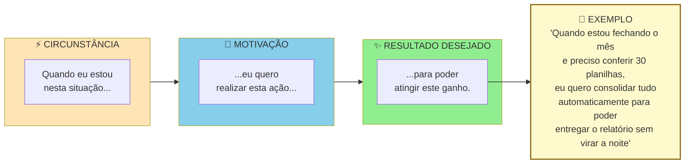
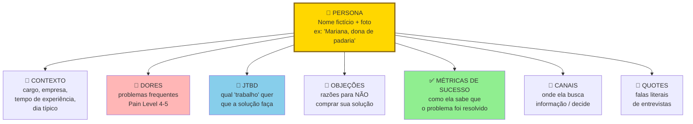

## FASE 4 — PESQUISA COM USUÁRIOS (CUSTOMER DISCOVERY APROFUNDADO)

### O que esse apêndice cobre

A [[#FASE 3 — DESCOBERTA DO PROBLEMA|Fase 3]] descobriu que problemas existem. A [[#FASE 4 — PESQUISA COM USUÁRIOS (CUSTOMER DISCOVERY APROFUNDADO)|Fase 4]] descobre como os usuários vivem esses problemas. Em contexto, com detalhes operacionais, emocionais, e circunstanciais. É pesquisa qualitativa mais profunda. Envolve observação (não só escuta), mapeamento de jornadas do usuário, identificação dos *Jobs to be Done* (JTBD — a tarefa que o cliente realmente quer realizar), e caracterização detalhada de personas baseadas em dados reais.

O entregável é um Dossiê do Usuário. Coletânea de personas, jornadas mapeadas, e formulação clara dos *jobs* que o usuário quer cumprir.

> [!abstract] Resumo operacional
> **Entregável:** Dossiê do Usuário de dez a vinte páginas com duas a quatro personas baseadas em dados, duas a quatro jornadas mapeadas, cinco a dez JTBDs ranqueados, beachhead identificada e Declaração atualizada para v3.
>
> **Sinais de saída:**
> - Dez ou mais entrevistas JTBD de sessenta a noventa minutos (rodada nova, não reaproveitada da Fase 3) com roteiro específico.
> - Cinco ou mais observações em campo (job shadowing) ou análises profundas de artefatos realizadas, com triangulação entre dado declarado e dado observado.
> - Cinco ou mais contextos de uso mapeados (quando, onde, com quem, sob qual pressão), e gatilhos de troca + barreiras à troca documentados.
> - Beachhead escolhida com justificativa baseada em dados (urgência + agudeza + recursos para pagar + alcançabilidade), e em B2B, três papéis (usuário, campeão, comprador econômico) entrevistados separadamente.
>
> **Três armadilhas mais comuns:**
> 1. Criar personas fictícias: sem dados rastreáveis às entrevistas, persona é caricatura que não protege decisões — cada elemento precisa ter evidência apontável.
> 2. Confiar só no que a pessoa diz: pessoas relatam versão idealizada de si — observe em campo (job shadowing) além de escutar, porque entrevista e comportamento real raramente coincidem.
> 3. Pular JTBDs ou trabalhar com persona única e genérica: sem o "job" funcional + emocional + social, você projeta funcionalidades sem saber qual problema resolvem; uma persona só mascara dois ou mais sub-segmentos relevantes.

### POR QUE

Saber que um problema existe não basta para projetar uma solução. Você precisa saber em que contexto ele ocorre, em que sequência de eventos, com quais restrições, com quais emoções, com quais pessoas envolvidas. Soluções projetadas sem esse entendimento se chocam contra a realidade no momento da adoção. "Mas eu não posso usar isso no meio do turno." "Meu chefe nunca ia aprovar." "Isso pressupõe que eu tenho internet, e eu não tenho."

A [[#FASE 4 — PESQUISA COM USUÁRIOS (CUSTOMER DISCOVERY APROFUNDADO)|Fase 4]] também revela os *jobs to be done*: o que as pessoas contratam um produto para fazer por elas. Esse é o único ângulo que impede você de construir funcionalidades irrelevantes.

### Quando usar

Comece assim que a [[#FASE 3 — DESCOBERTA DO PROBLEMA|Fase 3]] validar a existência do problema. Termine quando tiver duas a quatro personas caracterizadas com profundidade, pelo menos três jornadas mapeadas, e uma lista clara de *jobs to be done*. Revisite antes de grandes decisões de produto e antes de entrar em novos segmentos.

> [!important] Esta fase é uma rodada NOVA, não continuação da Fase 3
> As 15-30 entrevistas da [[#FASE 3 — DESCOBERTA DO PROBLEMA|Fase 3]] eram de **escuta ampla** com Mom Test, focadas em validar se o problema existe. As 8-15 sessões aqui são **mais profundas** (60-90 min, contextual inquiry, observação em campo, JTBD) e **adicionais** — não substituem nem reaproveitam as anteriores. Total típico no fim da Fase 4: ~25-45 conversas no agregado. Reentrevistar pessoas da Fase 3 que se encaixam no sub-segmento agudo é válido e até recomendado, mas conta como conversa nova porque o roteiro e o objetivo mudaram.

### Quem envolve

O executor é você, preferencialmente com alguém que possa documentar enquanto você observa ou conversa. Os participantes são oito a quinze usuários dispostos a deixar você observá-los, ou a fazer entrevistas mais longas (sessenta a noventa minutos) em contexto. O decisor é você.

### Como executar

Sete passos.

#### Passo 1, selecione sub-grupos prioritários

Use o ICP refinado da [[#FASE 3 — DESCOBERTA DO PROBLEMA|Fase 3]]. Divida em dois ou três sub-segmentos. Por exemplo, donos que operam sozinhos versus donos que têm gerente. Você vai pesquisar cada sub-segmento separadamente e comparar.

> [!important] Critérios herdados da Fase 3
> Os critérios validados na Fase 3 continuam valendo aqui e devem ser preservados:
>
> - **Pain Level**: priorize entrevistar pessoas em Pain Level 4 ou 5 (já improvisaram gambiarra ou têm orçamento comprometido). Quem está em Pain Level 1-2 dá conversa rica mas não é cliente potencial — gaste-os com moderação.
> - **Frequência espontânea ≥50%**: o problema deve aparecer espontaneamente em pelo menos metade das conversas, sem você provocar. Se em Fase 4 o problema deixa de aparecer espontaneamente, é sinal de que o sub-segmento escolhido não é tão agudo quanto parecia em Fase 3.
> - **Tentativas ativas ≥40%**: pelo menos 40% deve ter tentado resolver de alguma forma (ferramenta, gambiarra, contratação extra). Sem isso, dor não é dolorida o suficiente para gerar disposição a pagar.
>
> O Dossiê do Usuário (saída desta fase, v3 da Declaração) **estende** o Mapa de Problemas (saída da Fase 3, v2) — não substitui. O Mapa documenta *que* problemas existem; o Dossiê documenta *como* o usuário vive esses problemas em contexto, com personas, jornadas e JTBDs.

#### Passo 2, escolha as técnicas de pesquisa apropriadas

Quatro técnicas centrais.

A primeira é entrevista em profundidade, de sessenta a noventa minutos, presencial preferencialmente. Mais longa que a da [[#FASE 3 — DESCOBERTA DO PROBLEMA|Fase 3]]. Use a técnica de *contextual inquiry* (observação do usuário no seu contexto real de trabalho). Peça para a pessoa te mostrar como faz. Abrir a planilha. Navegar pelo sistema. Atender um cliente.

A segunda é observação em campo, o *job shadowing* (acompanhamento presencial da rotina do usuário), de duas a quatro horas. Você acompanha um usuário na rotina real. Observe sem interromper e intervenha só com perguntas pontuais. Anote tudo. O que fez. Quanto tempo. Interrupções. Frustrações. Conversas paralelas.

> [!tip] Por que shadowing revela o que entrevista esconde
> Pessoas subestimam o quanto de tempo gastam em atividades que acham triviais. Em entrevista, elas relatam o que lembram. Em campo, você vê o que de fato acontece. As duas coisas raramente coincidem.

A terceira é diário do usuário, durante uma a duas semanas. Peça a alguns usuários que registrem, durante o período, toda vez que o problema X ocorrer. O que estavam fazendo. Como se sentiram. O que fizeram para resolver. Quanto tempo perderam. Um incentivo (vale-presente) ajuda na adesão.

A quarta é análise de artefatos. Peça para os usuários mostrarem e explicarem os artefatos que usam. Planilhas. Cadernos. Grupos de WhatsApp. Prints. Relatórios. Esses artefatos são registros do comportamento real.

#### Passo 3, conduza o mapeamento de jornada

Para cada persona (perfil semifictício do cliente típico, baseado em dados reais), desenhe em linha do tempo a jornada relacionada ao problema. No mínimo com sete colunas. Etapa (nome da fase da jornada). Ação (o que a pessoa faz). Objetivo (o que ela quer cumprir com aquela ação). Ferramentas atuais (o que usa hoje). Pontos de dor (onde algo dá errado, demora, frustra). Emoções (o que sente: ansiedade, alívio, raiva, tédio). Oportunidades (onde existe espaço para intervenção).

> [!important] Comece a jornada antes do ponto óbvio
> Jornadas devem começar muito antes do ponto onde você imaginaria que o seu produto entraria. Por exemplo, se você está construindo um sistema de gestão de frota, a jornada começa no momento em que o dono decide contratar o motorista. Não quando o motorista já está na rua.

> [!note] O Customer Journey Map é o artefato central desta fase — e o Apêndice DT aprofunda sua aplicação
> O [[apendice-dt|Apêndice DT — Customer Experience]] trata jornada, onboarding, NPS e sinais de churn preditivo como disciplina integrada. O mapeamento que você faz aqui é a versão de descoberta; o Apêndice DT mostra como a mesma jornada evolui para instrumento de retenção e melhoria contínua depois do lançamento.

> [!tip] Customer Journey Canvas e VPC como entregáveis visuais
> O mapa em sete colunas descrito acima é a base do [[#APÊNDICE CZ — CANVASES E MAPAS VISUAIS DE MODELO|Customer Journey Canvas (CZ.7)]]. Para cada persona principal, monte um canvas completo (etapas + ação + objetivo + dor + emoção + oportunidade) com a linha emocional desenhada visualmente — pontos vermelhos consecutivos antecipam churn. O caso iFood 2017 em CZ.7 ilustra como a jornada revelou que **a maior queda de conversão estava em Pagamento** (não em descoberta ou variedade, como o time supunha). Pareie com o [[#APÊNDICE CZ — CANVASES E MAPAS VISUAIS DE MODELO|Empathy Map (CZ.6)]] (estado interno do cliente) e o [[#APÊNDICE CZ — CANVASES E MAPAS VISUAIS DE MODELO|Value Proposition Canvas (CZ.3)]] (Pains/Gains traduzidos em Pain Relievers/Gain Creators do produto): juntos, esses três canvases formam o pacote padrão de entregáveis visuais desta fase.

#### Passo 4, identifique os Jobs to be Done (JTBD)

> [!note] JTBD no Brasil tem dimensões culturais que moldam o job emocional e social
> O job funcional costuma ser universal, mas o job emocional e social variam. No contexto brasileiro, status, relações de confiança e o papel da família na decisão de compra influenciam o que o cliente "contrata" o produto para fazer. O [[apendice-ff|Apêndice FF — Psicologia do Consumidor Brasileiro]] oferece contexto específico para formular JTBDs que reflitam motivações locais reais, não importadas de frameworks americanos.

Para cada persona, pergunte: quando elas "contratam" uma solução (qualquer solução, não a sua), que *trabalho* estão tentando fazer?

JTBDs têm três dimensões. A funcional é o que precisa ser feito operacionalmente. Por exemplo, "conciliar pagamentos do dia". A emocional é como a pessoa quer se sentir. Por exemplo, "ter paz de que nada foi esquecido". A social é como a pessoa quer ser vista. Por exemplo, "parecer profissional para a equipe e os clientes".

Escreva os jobs no formato: "Quando (situação), eu quero (motivação), para que eu consiga (resultado esperado)."

Por exemplo: "Quando encerro o dia no restaurante, eu quero bater o caixa rápido e saber que está tudo certo, para que eu possa ir embora sem levar preocupação para casa."

A estrutura visual:



> [!warning] Um JTBD completo tem três partes
> "Quero automatizar planilhas" está incompleto. Sem circunstância e sem outcome. Solução que atende JTBD bem formulado tende a ser mais específica e mais defensável.

> [!tip] Switch Interview quando o entrevistado trocou de solução
> Quando o entrevistado **trocou** de solução (deixou um concorrente, largou um processo manual, migrou de ferramenta, mudou de fornecedor), entrevista comum de JTBD captura a versão racionalizada da decisão. A Switch Interview de Bob Moesta reconstrói o momento real, mapeando as quatro forças simultâneas — push (o que empurrou para fora do velho), pull (o que atraiu para o novo), anxiety (o que causou medo de trocar) e habit (o que segurava no antigo). Para cada switcher relevante, marque uma segunda conversa com o [[#APÊNDICE A — TEMPLATES PRONTOS PARA USO|Template A.29]]. O que ela formula é um JTBD muito mais específico do que o capturado em conversa única.

#### Passo 4B, síntese qualitativa das entrevistas (técnicas formais)

A diferença entre um empreendedor iniciante e um pesquisador de usuário experiente está aqui. O iniciante "lê as anotações" e tira conclusões com base em memória. O experiente aplica técnicas formais de síntese, que transformam centenas de citações dispersas em padrões claros. Três técnicas a dominar.

##### Affinity mapping — agrupamento por afinidade

Processo físico ou digital (Miro, FigJam, Mural) para encontrar padrões em grandes volumes de dado qualitativo. Cinco passos.

Primeiro, extração de observações atômicas. Para cada entrevista, extraia quinze a quarenta "observações". Cada uma é um fato, citação, ou comportamento específico, escrito em post-it (um por post-it). Por exemplo, "João passa duas horas toda segunda compilando planilhas manualmente". Ou "Maria menciona três vezes que fica ansiosa com prazos de entrega".

Segundo, pool único. Junte todos os post-its de todas as entrevistas em um espaço grande. Quinze entrevistas vezes vinte e cinco observações dão trezentos e setenta e cinco post-its. É o típico.

Terceiro, agrupamento silencioso. A equipe (duas a quatro pessoas) move post-its em silêncio, agrupando por similaridade. Os movimentos podem ser reorganizados. O processo é fluido.

Quarto, nomeação dos grupos. Depois do agrupamento estabilizar, em uma a duas horas, nomeie cada cluster com uma frase curta que captura o tema. Por exemplo: "ansiedade no fechamento do mês"; "retrabalho por falta de integração".

Quinto, priorização dos clusters. Quantos post-its cada cluster tem? Clusters grandes são temas recorrentes. Clusters pequenos mas de alto impacto também importam.

O resultado são cinco a quinze clusters temáticos com número de ocorrências e citações exemplares.

##### Coding e thematic analysis — codificação temática

Método mais rigoroso, vindo da pesquisa qualitativa acadêmica. Cinco passos.

Codificação aberta. Leia cada transcrição linha por linha e atribua "códigos" (tags curtas de uma a três palavras) a trechos relevantes. Por exemplo, "ansiedade_prazo", "retrabalho_manual", "ferramenta_improvisada". Permita códigos emergentes. Não pré-defina a lista.

Revisão e consolidação. Depois de cinco a sete entrevistas codificadas, revise a lista de códigos. Combine sinônimos, elimine duplicatas, refine definições.

Codificação axial. Agrupe códigos relacionados em categorias mais abstratas. Por exemplo, os códigos "ansiedade_prazo", "pressão_chefe", "medo_errar" podem virar a categoria "pressão emocional no fluxo de trabalho".

Tema emergente. Das categorias, destaque três a sete temas que explicam a maioria das observações.

Matriz de saturação. Conte em quantas entrevistas cada tema aparece. Tema presente em sessenta por cento ou mais das entrevistas é provavelmente real. Tema em menos de trinta por cento pode ser ruído ou especificidade de um caso.

Ferramentas pagas: Dovetail, Delve, Atlas.ti. Alternativas grátis: planilha com colunas Quote, Código, Categoria, Tema.

##### Triangulação qualitativa mais quantitativa

> [!tip] Apêndice AO — Dados, Analytics e Experimentação
> A triangulação abaixo é a primeira vez que você produz dados estruturados sobre o cliente. O [[#APÊNDICE AO — DADOS, ANALYTICS E EXPERIMENTAÇÃO|Apêndice AO]] aprofunda como estruturar surveys de validação, interpretar dados de survey com rigor estatístico mínimo, e montar o pipeline de experimentação que sustentará as decisões de produto nas fases posteriores.

Entrevistas sozinhas produzem hipóteses ricas mas estatisticamente frágeis. Survey sozinho produz números sem contexto. Combinar os dois é o padrão-ouro. Três passos.

Primeiro, use entrevistas (dez a trinta) para gerar temas, com os resultados do affinity mapping ou da codificação temática.

Segundo, transforme cada tema em uma a três perguntas de survey quantitativa, aplicada a cem a quinhentos respondentes do mesmo ICP.

Terceiro, compare. Tema que apareceu em setenta por cento das entrevistas e sessenta e cinco por cento do survey está validado. Tema em setenta por cento das entrevistas mas vinte por cento do survey é artefato da amostra. Tema em trinta por cento das entrevistas mas setenta por cento do survey indica que você deve fazer mais entrevistas com o perfil certo.

> [!note] A regra dos cinco usuários, de Nielsen
> A regra dos cinco usuários (Jakob Nielsen) vale para teste de usabilidade especificamente, não para problem discovery. Cinco usuários já capturam cerca de oitenta e cinco por cento dos problemas de usabilidade em um fluxo específico. Acima disso, retorno decrescente. Para descoberta de problema ou domínio (esta fase), quinze a trinta ainda é o padrão correto. Domínios mais amplos exigem mais amostras para atingir saturação.

##### Diário de pesquisa estruturado

Qualquer que seja a técnica, mantenha um diário de pesquisa em formato padronizado. Template mínimo por entrevista:

```text
DIÁRIO DE PESQUISA, Entrevista #___ Data: ___/___/___

Entrevistado:
 Nome (primeiro nome ou anonimizado): _______________
 Perfil (cargo, setor, idade, geo): ___________________
 Canal de recrutamento: ______________________________
 Como foi encontrado: _________________________________

Duração da entrevista: ____ minutos.

Contexto observado:
 Local: ______________________________________________
 Estado emocional aparente: __________________________
 Interrupções, ruídos, sinais não-verbais: __________

Top 3 quotes (verbatim, entre aspas, sem parafrasear):
1. "_______________________________________________"
2. "_______________________________________________"
3. "_______________________________________________"

Problemas mencionados (fatos, não interpretação):
- ____________________________________________________
- ____________________________________________________

Soluções atuais em uso (nomes específicos, comportamento):
- ____________________________________________________

Tentativas de solução no passado:
- ____________________________________________________

Custos atuais do problema (tempo/dinheiro/energia):
- ____________________________________________________

Pain Level estimado (1-5): ____. Por quê?: ____________

Reações emocionais observadas:
- ____________________________________________________

Surpresas (coisas que contradisseram minhas hipóteses):
- ____________________________________________________

Hipóteses novas geradas por esta entrevista:
- ____________________________________________________

Notas pessoais (em itálico, claramente separado do fato):
 _itálico aqui, interpretação minha, pode estar errada_
```

> [!important] Esse diário é o insumo bruto
> Sem esse nível de registro, você está reconstruindo entrevistas pela memória. E memória é enviesada.

#### Passo 5, defina personas com base nos dados coletados

Cada persona deve ter oito elementos. Nome fictício e foto representativa. Dados demográficos básicos. Contexto profissional ou pessoal relevante. Motivações principais. Frustrações principais. Comportamentos-chave observados. Ferramentas, canais, e fontes de informação. JTBDs prioritários. Citação verbatim marcante.

> [!warning] Persona sem dados é ficção bonita e inútil
> Cada elemento da persona precisa ter evidência rastreável das entrevistas. Se você não consegue apontar a entrevista que sustenta cada item, está inventando.

A estrutura visual de uma persona operacional, em contraste com persona demográfica:



Persona operacional não é demografia. "Mulher, trinta e cinco a quarenta e cinco anos, classe B" é inútil. Não ajuda a decidir produto. "Mariana, dona de padaria artesanal de três lojas, gasta duas horas por dia conferindo insumos manualmente" é acionável.

#### Passo 5B, mapeie os três papéis no contexto de compra (crítico em B2B)

Em contextos B2B, uma persona isolada raramente explica o comportamento de compra. Três papéis distintos interagem durante a decisão. Cada um tem motivações, restrições, e critérios próprios. Confundi-los é o erro mais caro em pesquisa de usuário para vendas B2B.

Usuário. Pessoa que vai operar o produto no dia a dia. Avalia ergonomia, encaixe com a rotina, tempo economizado. Tem poder de sabotagem (se odiar, não usa, ou usa mal). Mas raramente tem poder de compra.

Campeão Interno. Pessoa que enxerga valor na solução e está disposta a brigar por ela internamente. É tipicamente um usuário avançado ou um gestor próximo dos usuários. É quem vai marcar a reunião com o decisor, preparar a justificativa, responder pelos riscos. Sem campeão, quase nenhuma venda B2B fecha.

Comprador Econômico. Pessoa com autoridade e orçamento para autorizar o pagamento. Avalia ROI, risco, alinhamento com prioridades corporativas. Raramente vai usar o produto. Frequentemente não conhece os detalhes operacionais.

Três princípios operacionais para a pesquisa desta fase.

Primeiro, entreviste os três papéis separadamente. Misturar em uma entrevista só ("reunião com a empresa X") gera respostas editadas politicamente. Usuários não falam mal da solução se o chefe está presente. Chefes não admitem que não conhecem o workflow se o subordinado está na sala. Separe.

Segundo, monte uma persona distinta para cada papel, não uma persona média. Uma "persona da empresa" é ficção. Persona útil é do papel, porque cada papel toma decisões diferentes com base em critérios diferentes.

Terceiro, identifique quais papéis se sobrepõem e quais permanecem distintos no seu contexto. Em startups muito pequenas (SMB de cinco a vinte funcionários), os três podem ser a mesma pessoa, o dono. Em médias empresas, o usuário costuma estar separado dos outros dois. Em grandes, os três são sempre distintos e podem somar um quarto papel (TI ou Procurement). Saber onde o seu ICP está nessa geometria define quantas personas você constrói.

> [!tip] B2C também pode ter mais de uma persona
> Em B2C, o trio costuma colapsar em uma pessoa só. O próprio consumidor é usuário, decisor, e pagador. Mas há exceções importantes. Produtos para crianças (pais decidem, crianças usam). Saúde de idosos (filhos frequentemente decidem). Presentes (comprador diferente de destinatário). Benefícios corporativos (empresa paga, funcionário usa). Sempre pergunte: a pessoa que usa é a mesma que paga? Se não, você tem pelo menos duas personas.

O entregável deste passo, para cada papel relevante no seu contexto, é uma persona caracterizada com os mesmos elementos do Passo 5. Motivações, frustrações, comportamentos, JTBDs, citação verbatim. Em B2B típico, três personas. Em B2C típico, uma. Em casos especiais de B2C, duas.

#### Passo 6, identifique o sub-ICP mais doloroso

> [!note] ICP, sub-ICP e beachhead — três níveis de granularidade do mesmo conceito
> **ICP** (Ideal Customer Profile): o perfil amplo de cliente potencial, definido na [[#FASE 3 — DESCOBERTA DO PROBLEMA|Fase 3]] (ex: "donos de restaurante de 1-3 unidades em capitais brasileiras com delivery próprio").
> **Sub-ICP** ou **sub-segmento**: recorte mais estreito dentro do ICP onde a dor é mais aguda (ex: "donos que operam sozinhos, sem gerente"), identificado na Fase 3 como sinal e confirmado aqui na Fase 4.
> **Beachhead**: o sub-ICP escolhido como **ponto de entrada no mercado** — a praia onde você desembarca. É o sub-ICP mais doloroso operacionalmente filtrado pelos quatro critérios deste passo (urgência, agudeza, recursos, alcançabilidade).
>
> A relação é: ICP ⊃ sub-ICP ⊃ beachhead. Beachhead é sempre um sub-ICP; nem todo sub-ICP vira beachhead. Os termos não são intercambiáveis: ICP define quem PODE ser cliente; beachhead define quem SERÁ o primeiro cliente.

Entre as personas, qual delas tem o problema mais agudo, com mais urgência, mais recursos para pagar, e é mais fácil de alcançar? Essa é a sua *beachhead* — o ponto de entrada no mercado. Você deve focar nela nas fases seguintes.

#### Passo 7, consolide o Dossiê do Usuário

Documento de dez a vinte páginas. Conteúdo: duas a quatro personas detalhadas; duas a quatro jornadas mapeadas; lista de JTBDs ranqueada por importância e frequência; identificação da beachhead (sub-ICP prioritário); Declaração da Ideia atualizada para v3.

### PERGUNTAS A RESPONDER

- Como o usuário realmente vive a rotina, não como ele diz que vive?
- Quais são os contextos (lugar, horário, estado emocional, pessoas presentes) em que o problema ocorre?
- Quais são os passos concretos da jornada atual?
- Em qual passo da jornada a dor é máxima?
- Quais ferramentas, pessoas, e processos o usuário já mobiliza?
- Que *jobs* o usuário está tentando cumprir (funcional, emocional, social)?
- Qual persona tem a dor mais aguda, e é o melhor ponto de entrada?
- O que o usuário considera "sucesso" no cumprimento do *job*?

### Métricas

Número de observações em campo realizadas. Alvo mínimo de cinco.

Número de personas validadas por dados (não imaginadas). Alvo de duas a quatro.

Número de jornadas mapeadas com profundidade. Alvo de duas a quatro.

Número de JTBDs identificados e ranqueados. Alvo de cinco a dez.

Consistência entre dado declarado e dado observado. Em que percentual das observações o que a pessoa faz bate com o que ela disse que faz? Divergência abaixo de trinta por cento é aceitável (ruído normal de memória e narrativa). Trinta a cinquenta por cento exige triangulação com mais fontes. Cinquenta por cento ou mais indica que a fala é pouco confiável. Priorize o que você observou sobre o que te disseram.

### SAÍDA DESTA FASE

Você concluiu a [[#FASE 4 — PESQUISA COM USUÁRIOS (CUSTOMER DISCOVERY APROFUNDADO)|Fase 4]] quando os oito critérios abaixo estão cumpridos.

1. O Dossiê do Usuário existe, com duas ou mais personas baseadas em dados reais (Template A.5), com seis ou mais atributos comportamentais cada, duas ou mais jornadas mapeadas, e cinco ou mais JTBDs prioritários por ordem de importância.
2. Dez ou mais entrevistas JTBD foram realizadas, com roteiro específico (não a mesma da [[#FASE 3 — DESCOBERTA DO PROBLEMA|Fase 3]]).
3. Cinco ou mais contextos de uso estão mapeados com detalhes. Quando, onde, com quem, sob qual pressão.
4. Cinco ou mais observações em campo (ou equivalente, como análise profunda de artefatos) foram realizadas.
5. A "solução atual não-óbvia" foi identificada. O que as pessoas realmente usam hoje, mesmo que não seja feito para isso.
6. Gatilhos de troca e barreiras estão mapeados em lista.
7. A tese sobre "dor real" foi refinada (antes versus depois com dado), com mais granularidade. Qual job, qual contexto, qual gatilho.
8. Você consegue escolher uma beachhead clara, com justificativa baseada em dados.

**Checklist final.**

- [ ] Aprofundei a pesquisa em dez ou mais novas entrevistas com o ICP refinado da [[#FASE 3 — DESCOBERTA DO PROBLEMA|Fase 3]]?
- [ ] Apliquei técnica de Jobs to Be Done (JTBD) em cinco ou mais entrevistas, e entendi o "job" contratado pelo produto atual?
- [ ] Mapeei "contextos de uso" (quando, onde, com quem, sob qual pressão)?
- [ ] Identifiquei "solução atual não-óbvia", o que as pessoas realmente usam hoje, mesmo que não seja feito para isso?
- [ ] Construí uma a duas personas baseadas em dados das entrevistas (Template A.5), não imaginação?
- [ ] Identifiquei "gatilhos de troca", o que faria alguém mudar da solução atual?
- [ ] Identifiquei barreiras à troca, o que seguraria alguém na solução atual mesmo que a nova fosse melhor?
- [ ] Refinei a minha tese sobre "dor real" com mais granularidade (qual job, qual contexto, qual gatilho)?

**Primeiros passos práticos.**

1. Escolher dez entrevistados da [[#FASE 3 — DESCOBERTA DO PROBLEMA|Fase 3]] que mostraram maior dor, e pedir trinta minutos de follow-up com foco em JTBD.
2. Elaborar a pergunta central JTBD: "Me conta a última vez que você precisou (job), do começo ao fim, em detalhes."
3. Construir uma persona (Template A.5) com dado real, não nome fictício sem base.
4. Mapear, em planilha, os gatilhos de troca e as barreiras identificadas.

### EXEMPLO PRÁTICO

**Entrevista JTBD, PadariaPro.**

A pergunta central: "Me leva para a última vez que você precisou reabastecer o estoque de farinha, passo a passo, do começo ao fim. Quando você percebeu, o que fez, quem envolveu, quanto tempo levou, o que deu errado?"

A resposta bruta de Fábio, dono de três padarias em Campinas:

> "Foi terça passada. O João, gerente da loja 2, me mandou áudio de WhatsApp às 7h. 'Farinha T1 tá acabando, dá pra hoje só.' Eu tava no carro indo pra loja 3. Liguei pro fornecedor, Anaconda, distribuidor regional, e a moça disse que entrega só quinta. Aí liguei pro nosso plano B, o João do Moinho da Serra, que trouxe em quatro horas mas cobrou quinze por cento mais caro. No fim a gente fez a semana, mas o dia 2 foi estresse total, eu tinha três reuniões e tive que virar comprador. Isso acontece umas duas a três vezes por mês, depende. Agora, pra evitar, o gerente geralmente pede mais do que precisa, aí sobra farinha mofando no sábado e a gente perde 200-300 reais por semana. Tô trocando perda por perda."

A análise JTBD da resposta. O job funcional é garantir continuidade de produção sem interrupção. O job emocional é não ser o operador de última hora que apaga incêndio, e não transmitir estresse para a equipe. O job social é ser visto como dono que tem o negócio sob controle pelo gerente e pelos clientes. O contexto: acontece toda semana, é interrupção de foco executivo, envolve duas a três pessoas em média. A solução atual é WhatsApp com gerente mais ligação com fornecedor mais plano B mais caro como contingência. E o "trade de perda por perda" é o ponto-chave. Ou paga mais caro (plano B), ou desperdiça (excesso). Não há caminho sem perda.

A persona resultante, em fragmento. Fábio, trinta e oito anos, padaria artesanal de três lojas em Campinas. Perfil: dono-operador, formação técnica, usa WhatsApp e planilha no celular, desconfiado de apps "modernos" mas adota se ver valor em uma semana. O job contratado é "me devolver horas de foco executivo", mais que "otimizar margem". Se o produto devolver quatro horas por semana do dono, ele paga R$ 400 por mês sem pestanejar. Se só economizar dois por cento de margem, ele questiona.

Os gatilhos de troca observados foram três. Incidente recente de ruptura que causou perda grande (mais de R$ 5 mil), ou cliente insatisfeito. Chegada de nova loja (passar de duas para três, de três para quatro) torna sistema manual inviável. Indicação de par (outro dono de padaria) sobre ferramenta que funcionou.

As barreiras à troca foram três. Percepção de que "a equipe não vai usar". Medo de investir em ferramenta que vira caro sem adoção. Integração com fornecedor atual (relacionamento pessoal) que não entra em sistema digital. Custo fixo mensal que não se sente "tangível", contra a economia, que é difusa.

### Armadilhas

> [!note] Apêndice D — Armadilhas Mentais e Vieses
> Personas fictícias, viés de confirmação na síntese qualitativa e ancoragem na hipótese original são os vieses mais comuns nesta fase. O [[#APÊNDICE D — ARMADILHAS MENTAIS E VIESES COGNITIVOS DO EMPREENDEDOR|Apêndice D]] trata especificamente de vieses de pesquisa — como o efeito halo sobre entrevistados carismáticos e o viés de disponibilidade que faz a última entrevista parecer mais importante que as anteriores.

Criar personas fictícias. Sem dados, persona é caricatura. Força você a dizer "a nossa persona é a Ana, uma dona de restaurante…", mas não protege decisões ruins.

Confiar só no que a pessoa diz. Pessoas relatam uma versão idealizada de si mesmas. Observe além de escutar.

Pular JTBDs. Sem clareza do *job*, você projeta funcionalidades sem saber o problema que resolvem. JTBD é a bússola.

Persona única e genérica. Quase sempre há dois ou mais sub-segmentos relevantes. Uma persona só mascara diferenças importantes.

Perder-se em detalhes irrelevantes. Nem toda informação coletada é útil. Filtre pelo que afeta a decisão de produto.

---

### CASO BRASILEIRO, Fase 4, pesquisa com usuários no QuintoAndar e a dor do fiador

Em 2013, o mercado de aluguel residencial no Brasil tinha fricção enorme. Fiador, vistoria, caução, dois a três meses de processo. Os fundadores do QuintoAndar (Gabriel Braga e André Penha, em São Paulo) fizeram pesquisa qualitativa extensa com inquilinos e proprietários.

Descobriram algo que a hipótese inicial não previa. O ponto mais doloroso era o fiador. Não o valor. A constrangedora necessidade de pedir a alguém. A dor era social, não financeira.

A pesquisa redirecionou a proposta de valor. Em vez de "otimizar o processo de aluguel", posicionaram como "aluguel sem fiador, sem vistoria, sem caução". A dor central virou promessa central. E o produto cresceu nessa direção.

A lição transferível. Pesquisa aprofundada revela qual dor é emocionalmente mais forte, não apenas qual é operacionalmente mais cara. A proposta de valor precisa atacar a dor emocional.

---

### FERRAMENTAS DESTA FASE

Pesquisa aprofundada com usuários exige ferramentas específicas de research. A maioria delas está no Ferramentário (BG.6). Nesta fase, disponíveis de imediato:

5 Whys. Técnica para chegar nas motivações profundas durante entrevistas: você pergunta "por quê?" cinco vezes seguidas até encontrar a causa raiz. Ver BG.5.2.

MECE. Framework para estruturar achados da pesquisa em categorias que não se sobrepõem e não deixam lacunas. Ver BG.4.5.

McKinsey 7-Step (Synthesize). Método para consolidar achados em aprendizados, não fatos soltos. Ver BG.5.1.

Pyramid Principle. Técnica para comunicar achados ao time e aos stakeholders de forma clara e hierarquizada. Ver BG.4.4.

Second-Order Thinking. Exercício para pensar além da resposta direta do usuário. O que eles farão se a solução existir? Como o comportamento mudará? Ver BG.4.2.

> [!note] Métodos consagrados de pesquisa no Ferramentário
> O [[#APÊNDICE BG — FERRAMENTÁRIO COMPLETO DO EMPREENDEDOR|Apêndice BG]].6 adiciona: The Mom Test (Fitzpatrick), JTBD Switch Interviews (Moesta), Contextual Inquiry (Beyer e Holtzblatt), Laddering Technique, Diary Studies, Empathy Mapping (Gray), Customer Journey Mapping, Personas (Cooper), Grounded Theory, Thematic Analysis, e cerca de quinze outros métodos.

---

### SÍNTESE DA FASE 4

A diferença entre quem faz certo e quem falha está em observar, não só perguntar. Entrevista produz evidência declarada. Observação em contexto produz evidência comportamental. As duas são diferentes, e a segunda é mais valiosa.

O entregável é o Dossiê do Usuário. Personas baseadas em dados reais, não em intuição. Jornadas mapeadas com momentos críticos identificados. Lista clara de jobs. Esse dossiê é insumo das Fases 8 e 9, ideação e protótipo.

A [[#FASE 5 — MAPEAMENTO DE MERCADO E CONCORRÊNCIA|Fase 5]] vai usar esse material para posicionar a oportunidade dentro da paisagem competitiva real: quem são os concorrentes, onde está a cunha de entrada, por que o cliente trocaria a alternativa atual por você. Quem ignora a [[#FASE 4 — PESQUISA COM USUÁRIOS (CUSTOMER DISCOVERY APROFUNDADO)|Fase 4]] e pula para "vamos construir" entra na construção sem entender quem vai usar nem em que circunstância. O resultado é produto bem-feito tecnicamente e ignorado por quem deveria adotar.

# fase4 #pesquisa-usuarios #customer-discovery #jtbd #personas #jornada-usuario #affinity-mapping #beachhead

---
