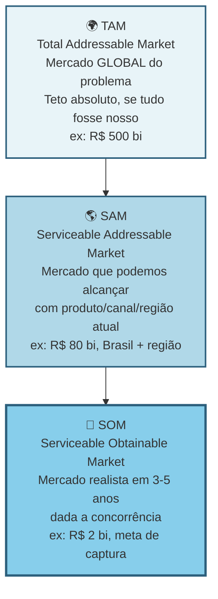
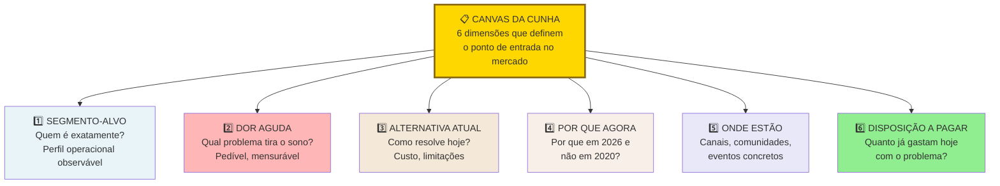
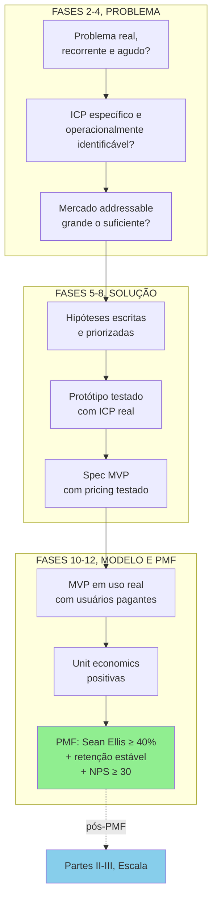

## FASE 5 — MAPEAMENTO DE MERCADO E CONCORRÊNCIA

> [!question] FMF Check da Fase 5
> Você está escolhendo cunha neste momento. Pergunta: o seu fit particular com esta cunha é diferencial inimitável, ou é circunstancial? Se a resposta for "outra pessoa qualquer faria tão bem quanto", reavalie. Founder-market-fit é o que faz o próximo ano de dificuldade valer a pena. É a única coisa que diferencia quem persiste de quem desiste no mês 14.

### O que esse apêndice cobre

Levantamento estruturado do mercado em que você quer entrar. O tamanho. A dinâmica. Os principais atores. As soluções atuais (concorrentes diretos, indiretos, substitutos, alternativas). As tendências. A regulamentação aplicável. As barreiras de entrada.

O entregável é um Dossiê de Mercado. Documento que posiciona a sua oportunidade dentro de uma paisagem realista.

> [!abstract] Resumo operacional
> **Entregável:** Dossiê de Mercado mais Canvas da Cunha preenchido — define ICP preciso, dor específica, dono do orçamento e por que o cliente trocaria a alternativa atual por você.
>
> **Sinais de saída:**
> - TAM, SAM e SOM calculados bottom-up com dados reais e justificativa explícita.
> - Cinco ou mais concorrentes diretos analisados em cinco dimensões cada, mais três indiretos ou substitutos (incluindo status quo).
> - Canvas da Cunha (Template A.12) preenchido e Teste de Precisão do Comprador (Template A.11) com score quatro ou mais sobre seis.
> - Posicionamento em dimensão não-óbvia (não "mais barato" nem "mais features").
> - Você consegue responder em uma frase por que o cliente-alvo trocaria a alternativa atual por você.
>
> **Três armadilhas mais comuns:**
> 1. "Não tenho concorrentes" — você sempre tem, mesmo que seja Excel, papel ou o cliente fazendo sozinho, e ignorar isso cria falsa sensação de oportunidade.
> 2. Top-down preguiçoso — pegar número de relatório e multiplicar por "um por cento é fácil" subestima a brutalidade de conquistar cada ponto de share.
> 3. Ignorar o status quo — a inércia é invencível se a dor não for grande o suficiente, e cunhas fortes substituem coisas que doem, não meras inconveniências.

### POR QUE

Empreendedores apaixonados tendem a acreditar que "não há concorrentes", ou que "o mercado é enorme". Ambas as afirmações são quase sempre falsas. O mapeamento de mercado força você a enxergar a realidade competitiva. Existem soluções (mesmo que ruins). Existem substitutos (incluindo "fazer nada"). Existem players (concorrentes e participantes do mercado) grandes que podem te copiar. Existe regulamentação que pode te inviabilizar.

Sem esse mapa, você empreende às cegas. Com ele, você toma decisões informadas sobre posicionamento, diferenciação, e estratégia.

### Quando usar

Comece em paralelo com a [[#FASE 4 — PESQUISA COM USUÁRIOS (CUSTOMER DISCOVERY APROFUNDADO)|Fase 4]], ou logo depois. Termine quando tiver clareza de onde se posiciona, e de onde vêm os principais riscos competitivos. Revisite pelo menos uma vez a cada seis meses ao longo da vida do negócio. O mercado muda.

### Quem envolve

O executor é você. Os participantes são usuários (para saber o que eles usam), especialistas de setor (para saber a dinâmica do mercado), e advogado (para regulamentação crítica, se aplicável).

### Como executar

Nove passos.

#### Passo 1, defina o mercado corretamente

Mercado não é "software". Não é "restaurantes". Mercado é a intersecção entre tipo de cliente, problema que você resolve, e geografia. Por exemplo: "software de gestão de caixa para restaurantes de pequeno porte em capitais brasileiras que fazem delivery próprio". Isso é um mercado que pode ser estimado.

#### Passo 2, estime o tamanho do mercado (TAM, SAM, SOM)

TAM (mercado total disponível) é o tamanho total do mercado global para o problema. É o teto absoluto.

SAM (mercado que você pode alcançar) é a parte do TAM que a sua empresa pode realisticamente atender — geograficamente, tecnologicamente, regulatoriamente.

SOM (mercado que você pode capturar realisticamente) é a parte do SAM que você pode conquistar nos primeiros três a cinco anos. Em geral, é um percentual pequeno (de um a dez por cento).

A visualização em círculos concêntricos:



> [!warning] O que investidor checa em TAM/SAM/SOM
> Investidor checa consistência. TAM otimista sem SOM realista é sonho. SOM ambicioso sem TAM que sustenta é conta que não fecha. Estime bottom-up (de baixo para cima: número de clientes vezes ticket), não só top-down (de cima para baixo: percentual de mercado externo).

Calcule top-down e bottom-up, e compare. Top-down: dados de mercado públicos (IBGE, Abrasel, associações, relatórios pagos como Statista e Gartner, se acessíveis). Bottom-up: número estimado de clientes vezes a receita anual média por cliente.

Se os dois números divergem muito, há algo errado em uma das estimativas. Investigue.

#### Passo 3, identifique todas as alternativas atuais do usuário

Categorize em quatro grupos.

Concorrentes diretos. Outras soluções que resolvem o mesmo problema da mesma forma. Por exemplo, outros softwares da mesma categoria.

Concorrentes indiretos. Soluções que resolvem o mesmo problema de forma diferente. Por exemplo, planilha de Excel, caderno físico, contador terceirizado.

Substitutos. Ações que eliminam o problema. Por exemplo, o dono decide não oferecer delivery, e evita o problema.

Status quo, ou seja, "não fazer nada". É a alternativa mais poderosa. Por que as pessoas simplesmente aceitam conviver com o problema? Subestimar o status quo é a causa de trinta por cento das startups fracassadas.

> [!important] Sua concorrência real raramente é outra startup
> A concorrência real é o jeito que o trabalho é feito hoje. O Excel do auxiliar administrativo. O grupo de WhatsApp onde o gerente despacha ordens. A planilha que ninguém entende mas todo mundo respeita. O hábito silencioso de ignorar o problema porque "sempre foi assim". Reconhecer isso muda para onde você direciona a comparação competitiva. Você para de comparar features com "a Startup X" e começa a comparar a sua proposta com o comportamento atual do cliente. É nesse comportamento que mora a urgência (ou a falta dela).

Para cada alternativa, levante seis dimensões: quem a oferece; preço; pontos fortes e fracos percebidos (use falas diretas das Fases 3 e 4); posicionamento e público-alvo; tempo de mercado; e a pergunta-chave: por que essa alternativa é tolerada hoje?

Se ninguém está reclamando ativamente, procurando substituto, ou alocando tempo para contornar os defeitos, a dor provavelmente não é grande o suficiente para motivar troca. Cunhas fortes substituem coisas que doem, não coisas apenas inconvenientes.

Mapeie pelo menos as cinco a dez alternativas mais relevantes.

> [!note] Monitorar concorrentes não é tarefa pontual — é sistema contínuo
> O [[apendice-ee|Apêndice EE — Inteligência Competitiva]] cobre como estruturar monitoramento sistemático de mercado, conduzir análises win/loss e produzir battle cards acionáveis. Aplicado a esta fase, transforma o levantamento de alternativas de um documento estático em inteligência viva que alimenta decisões de roadmap e vendas.

> [!tip] Strategy Canvas para visualizar diferenciação
> Listar as alternativas é o primeiro passo. O segundo é decidir como você se posiciona contra elas — e aqui o [[#APÊNDICE CZ — CANVASES E MAPAS VISUAIS DE MODELO|Strategy Canvas (CZ.4)]] de Kim & Mauborgne (Blue Ocean Strategy — ferramenta para identificar mercados sem concorrência direta) é a escolha certa. Liste 8-15 fatores de competição do setor, trace a curva de valor de cada concorrente principal (1-10 em cada fator) e desenhe a curva nova que você quer construir. Curva nova "ligeiramente acima" da média do setor é otimização de Red Ocean (mercado com muita concorrência). Curva visualmente distinta — onde você elimina/reduz fatores que ninguém mais ousa cortar e cria fatores que ninguém oferece — é Blue Ocean. Veja CZ.4 para o caso completo Stone vs adquirentes tradicionais.

#### Passo 4, entenda a dinâmica do mercado

Responda cinco perguntas. O mercado está crescendo, estável, ou encolhendo? (Busque dados dos últimos três a cinco anos.) Existem tendências estruturais? (Digitalização, regulação nova, mudanças demográficas, mudanças de comportamento.) O mercado está concentrado em poucos players grandes, ou é fragmentado? Existem movimentos de consolidação (fusões e aquisições)? Há ciclos sazonais?

#### Passo 5, mapeie os canais de aquisição de clientes usados no setor

Como os players atuais adquirem clientes? Vendas diretas. Parcerias. Marketing digital. Eventos. Boca a boca. Representantes. Isso indica o que provavelmente vai funcionar para você, e onde o custo de aquisição pode ser alto.

> [!tip] Apêndice DU — GTM Playbook
> O [[apendice-du|Apêndice DU — GTM Playbook]] aprofunda a tradução desse mapeamento de canais em estratégia de go-to-market operacional: sequenciamento de canais, modelo de cobertura, playbook de vendas e definição de ICP por canal. Use após concluir este passo para transformar o levantamento em plano executável.

#### Passo 6, levante a regulamentação relevante

Se você atua em saúde, finanças, educação, transporte, alimentação, energia, telecom, ou qualquer setor regulado, há normas que podem inviabilizar a sua solução. Busque as regulamentações federais, estaduais, e municipais aplicáveis. Os órgãos fiscalizadores (ANVISA, BACEN, ANS, ANTT, CVM, e outros, no Brasil). LGPD, se você trata dados pessoais. Exigências tributárias específicas.

> [!tip] Em dúvida sobre regulação, antecipe
> Invista duas a quatro horas de consultoria jurídica agora. É muito mais barato do que descobrir depois que o seu produto é ilegal.

#### Passo 7, identifique barreiras de entrada e vantagens competitivas sustentáveis

O que impede novos concorrentes (incluindo grandes empresas) de te copiar rapidamente? Economias de escala? Network effects (efeitos de rede)? Dados proprietários? Marca? Switching costs (custo de troca para o cliente)?

> [!warning] Execução não é barreira
> Seja realista. "Execução" não é barreira de entrada. Qualquer um pode executar bem. Barreira é estrutural. É o que existe depois que você sai do escritório.

#### Passo 8, faça uma matriz competitiva

A matriz competitiva 2x2 dá clareza instantânea de onde você se encaixa. Exemplo genérico:

```mermaid
quadrantChart
 title Matriz Competitiva, posicionamento no mercado
 x-axis Baixo preço --> Alto preço
 y-axis Baixa profundidade --> Alta profundidade
 quadrant-1 Premium nicho
 quadrant-2 Best-in-class
 quadrant-3 Commodity
 quadrant-4 Generalista caro
 Concorrente A: [0.2, 0.3]
 Concorrente B: [0.6, 0.7]
 Concorrente C: [0.8, 0.4]
 Concorrente D: [0.35, 0.8]
 Você (aposta): [0.45, 0.85]
```

Escolha dois eixos que importam para o ICP, não para você. Preço versus profundidade. DIY versus completo. Generalista versus vertical. Quadrantes vazios são oportunidades. Quadrantes cheios são guerras. Onde você se posiciona define a sua cunha.

Depois complemente a matriz visual com uma tabela comparando você com três a sete concorrentes principais em cinco a dez dimensões relevantes: preço, features, público-alvo, pontos fortes, pontos fracos, diferenciação declarada.

> [!tip] Apêndice S — Category Design
> Se a análise da matriz revelar um quadrante vazio em que nenhum player se posiciona, você pode estar diante de uma oportunidade de criar uma categoria nova — não apenas competir melhor dentro das existentes. O [[apendice-s|Apêndice S — Category Design]] cobre como nomear, enquadrar e liderar uma categoria, baseado no framework de Al Ramadan e colegas. Aplicado aqui, transforma o quadrante vazio de dado descritivo em tese estratégica.

> [!note] Posicionamento de marca é uma das saídas desta fase, não só análise competitiva
> A matriz e o canvas da cunha definem onde você compete. O [[apendice-dx|Apêndice DX — Branding e Posicionamento de Marca]] complementa ao definir como você quer ser percebido nessa posição — território de marca, promessa central e coerência de identidade. Os dois artefatos (cunha + posicionamento) devem ser desenvolvidos em paralelo.

#### Passo 9, sintetize o Dossiê de Mercado

Documento de dez a vinte páginas. Conteúdo: definição precisa do mercado; TAM, SAM, SOM calculados e justificados; lista de alternativas atuais categorizadas; análise de três a sete concorrentes com fichas detalhadas; matriz competitiva; tendências e dinâmicas relevantes; regulamentação mapeada; barreiras de entrada e possíveis vantagens competitivas; canais de aquisição usados no setor; e a sua hipótese de posicionamento (onde você se encaixa, para quem, contra quem).

### PERGUNTAS A RESPONDER

- Qual o tamanho real do meu mercado (SOM em R$)?
- Quem são os meus principais concorrentes diretos, indiretos, e substitutos?
- Por que o meu cliente escolheria a mim, e não a alternativa atual?
- Quais são os três maiores riscos competitivos nos próximos dois anos?
- Existe regulamentação que pode me inviabilizar? Qual?
- Quais canais de aquisição são mais promissores para este mercado?
- Qual vantagem competitiva eu posso construir nos primeiros dezoito meses?
- O mercado está crescendo, ou encolhendo?

### Métricas

SOM estimado em reais por ano. Calculado por pelo menos dois métodos convergentes. Benchmark de ambição para capital de risco: caminho crível para SOM de R$ 100 milhões ou mais em sete a dez anos. SOM abaixo disso pode ser negócio ótimo, mas provavelmente não é case de capital de risco.

Número de concorrentes mapeados. Pelo menos cinco. Entre diretos, indiretos, e substitutos (incluindo o status quo: Excel, papel e caneta, "a pessoa faz sozinha"). Se você achou zero diretos, investigue de novo.

Crescimento anual do mercado (CAGR — taxa de crescimento composta ao ano). Estime mesmo na ausência de relatório pronto. Cruze duas fontes (Google Trends, dados setoriais públicos, proxies (indicadores indiretos) correlatos). Benchmark: CAGR de quinze por cento ou mais em B2B SaaS, e dez por cento ou mais em consumer, sinaliza mercado em expansão. Abaixo de cinco por cento indica mercado estagnado (possível, mas exige estratégia diferente).

Dispersão competitiva. Concentrado se um player tem quarenta por cento ou mais de share, ou se top três somam setenta por cento ou mais. Fragmentado se top cinco somam menos de trinta por cento. Fragmentado favorece entrada por cunha. Concentrado exige diferencial forte ou nicho mal-atendido.

> [!tip] Apêndice X — Pricing Strategy
> A escolha de posicionamento de preço no Passo 8 (eixo horizontal da matriz) deve ser informada por análise de disposição a pagar, não por benchmarking ingênuo de concorrentes. O [[apendice-x|Apêndice X — Pricing Strategy]] cobre modelos de precificação (value-based, cost-plus, freemium, usage-based), teste de sensibilidade a preço (Van Westendorp, Gabor-Granger), e o erro de começar com preço baixo demais que é difícil de reverter.

> [!tip] Canvas da Cunha como entregável central desta fase
> O Canvas da Cunha (CZ.15) operacionaliza a escolha do segmento de entrada: ICP preciso, dor específica (um fluxo de trabalho quebrado), resultado mensurável, dono do orçamento, Teste do Grupo de WhatsApp (100-300 pessoas listáveis por nome) e vantagem sobre a alternativa atual. É o artefato de saída desta fase — sem ele preenchido e aprovado nos três testes complementares (Precisão do Comprador, ausência de escopo instável, independência de plataforma), a Fase 5 não está concluída. Veja origem, estrutura e caso PadariaPro em [[#APÊNDICE CZ — CANVASES E MAPAS VISUAIS DE MODELO|CZ.15]]; template preenchível em [[#APÊNDICE A — TEMPLATES PRONTOS PARA USO|A.12]].

### SAÍDA DESTA FASE

Você concluiu a [[#FASE 5 — MAPEAMENTO DE MERCADO E CONCORRÊNCIA|Fase 5]] quando os oito critérios abaixo estão cumpridos.

1. O Dossiê de Mercado existe e está escrito.
2. TAM, SAM, e SOM foram calculados bottom-up com dados reais (não top-down de relatório genérico), e com justificativas explícitas.
3. Cinco ou mais concorrentes diretos foram mapeados, com análise de cinco ou mais dimensões cada (preço, posicionamento, ICP, pontos fortes e fracos, reação potencial), mais três ou mais concorrentes indiretos ou substitutos.
4. O Canvas da Cunha (Template A.12) está preenchido e coerente, com caminho de expansão pós-cunha esboçado em três horizontes.
5. O Teste de Precisão do Comprador (Template A.11) foi aplicado, com score de quatro ou mais sobre seis.
6. O posicionamento está em dimensão não-óbvia, ou seja, não é "mais barato" nem "mais features".
7. A regulamentação aplicável foi investigada, e você sabe o que fazer para estar em conformidade.
8. Você consegue responder, em uma frase, por que o seu cliente-alvo trocaria a alternativa atual por você.

> [!warning] Se o item 8 não tem resposta, pare
> Se você não consegue responder o item 8, ainda não tem diferencial claro. Volte ao Dossiê do Usuário (saída da [[#FASE 4 — PESQUISA COM USUÁRIOS (CUSTOMER DISCOVERY APROFUNDADO)|Fase 4]]) e ao Mapa de Problemas (saída da [[#FASE 3 — DESCOBERTA DO PROBLEMA|Fase 3]]).

**Checklist final.**

- [ ] Mapeei TAM (mercado total), SAM (mercado endereçável), e SOM (mercado obtenível em três anos) com cálculo bottom-up?
- [ ] Identifiquei cinco ou mais concorrentes diretos, e três ou mais indiretos ou substitutos?
- [ ] Analisei cada concorrente em dimensões: preço, posicionamento, ICP, pontos fortes e fracos?
- [ ] Escolhi a minha cunha (Wedge), o segmento inicial específico onde competir?
- [ ] Apliquei o Canvas da Cunha (Template A.12) com critérios de entrada, valor, e defensabilidade?
- [ ] Fiz o Teste de Precisão do Comprador (Template A.11), e passei em quatro ou mais dos seis critérios?
- [ ] Posicionei a minha oferta em dimensão diferente dos concorrentes (não "mais barato" nem "mais features")?
- [ ] Identifiquei qual concorrente vai reagir se eu crescer, e como?

**Primeiros passos práticos.**

1. Abrir o Template A.12 (Canvas da Cunha) e preencher com a hipótese de segmento inicial.
2. Fazer análise competitiva em planilha. Linhas: cinco a oito concorrentes. Colunas: dimensões (preço, ICP, posicionamento, pontos fortes, pontos fracos, reação potencial).
3. Calcular TAM, SAM, e SOM bottom-up. Número de empresas vezes ticket médio vezes taxa de captura realista em três anos.
4. Aplicar o Teste de Precisão do Comprador (Template A.11). Se falhar em três ou mais critérios, refinar a cunha antes de avançar.

### EXEMPLO PRÁTICO

**Canvas da Cunha, PadariaPro.**

Segmento inicial (cunha). Padarias artesanais com três a cinco lojas, faturamento de R$ 100 mil a R$ 300 mil por mês por loja, em São Paulo capital e região metropolitana.

Por que esse segmento? A dor mais aguda foi identificada na pesquisa. A [[#FASE 4 — PESQUISA COM USUÁRIOS (CUSTOMER DISCOVERY APROFUNDADO)|Fase 4]] mostrou dor 8 ou 9 aqui, contra 4 a 6 em padarias com uma ou duas lojas. O tamanho é viável: cerca de quatrocentas padarias identificáveis nesse perfil em São Paulo (pesquisa em Sympla de eventos de panificação mais ABIP). A capacidade de pagar é boa: dono-operador com margem bruta de quarenta e cinco por cento ou mais, desembolso de R$ 1.200 a R$ 2.000 por mês é viável. E a acessibilidade é alta: a maioria está em três ou quatro bairros identificáveis, e eventos setoriais (Expo Pan) permitem contato direto.

Valor para o segmento. O problema é a perda de R$ 3 mil a R$ 8 mil por mês por loja por gestão manual de estoque, mais quatro a oito horas por semana do dono em pedido. A solução em uma frase: software mais integração com fornecedor que devolve quatro horas por semana ao dono e reduz a perda em sessenta a oitenta por cento. A prova de valor inicial é piloto com três padarias, medindo a redução de perda mês a mês.

Critérios de entrada (barreira baixa). Onboarding em menos de sete dias, sem requisito de TI. Preço em teste: R$ 400 por mês por loja, com início grátis por trinta dias. Integração inicial com dois fornecedores-chave (Anaconda e Moinho da Serra).

Defensabilidade (como ficar seguro depois de entrar). Três fontes. Integrações com fornecedores que demoram três a seis meses para replicar. Dados de demanda acumulados que geram previsão melhor que competidor sem base. Relacionamento com donos (eventos, WhatsApp) que cria efeito de comunidade.

Caminho de expansão pós-cunha. Ano 1: SP capital mais região metropolitana (meta cinquenta padarias). Ano 2: Campinas, Grande Rio, BH. Ano 3: padarias de seis a dez lojas, redes pequenas, e expansão geográfica nacional.

Competidores e reação potencial:

| Competidor | Tipo | Posicionamento | Reação à nossa entrada |
|---|---|---|---|
| SigePro | ERP horizontal | Genérico, pesado | Baixa, não enxerga nicho |
| Zenda | ERP restaurante | Foco em delivery | Média, pode adicionar feature |
| Excel/Caderno | Solução atual | Inércia | Nenhuma |
| Consultoria local | Serviço pontual | Pessoal, caro | Nenhuma ou parceria |

Teste de Precisão do Comprador, fragmento.

- [x] Consigo descrever o comprador em uma frase com quatro ou mais atributos? Sim. "Dono-operador de três a cinco padarias artesanais em SP, trinta a quarenta e cinco anos, adota app se vê valor em uma semana."
- [x] Consigo listar vinte nomes reais? Sim. Vinte e sete nomes mapeados em rede mais ABIP.
- [x] Identifiquei três gatilhos que fariam essa pessoa comprar agora? Sim. Ruptura recente, nova loja, indicação.
- [x] Tenho acesso direto ou via rede a dez ou mais pessoas desse perfil? Sim. Doze contatos diretos mais oito via rede.
- [ ] Já validei disposição a pagar com cinco ou mais pessoas do perfil? Não. Só dois até agora.
- [ ] Consigo vender para esse perfil com discurso de menos de dez minutos? Não testado ainda.

Score quatro sobre seis. A cunha é viável, mas duas dimensões precisam de validação adicional antes de investir em produto.

**Canvas da Cunha, caso real, Stone (preenchida retroativamente para 2012).**

Reconstrução do que poderia ter sido o Canvas da Cunha que André Street e Eduardo Pontes preencheram ao começar a Stone. Baseada em entrevistas, S-1, e cobertura pública da empresa.

Segmento inicial (cunha). Pequenos comerciantes (varejo, serviços) com faturamento mensal de R$ 30 mil a R$ 300 mil, em capitais e cidades de médio porte, insatisfeitos com o atendimento dos quatro grandes adquirentes (Cielo, Rede, GetNet, SafraPay). Foco geográfico inicial: Rio de Janeiro e São Paulo.

Por que esse segmento? A dor mais aguda. PMEs reclamavam de tempo de aprovação de máquina, taxas opacas, e principalmente atendimento. Call center sem resolução. Falta de agente que visitasse o estabelecimento. O tamanho é grande: cerca de cinco milhões de PMEs com aceitação de cartão no Brasil em 2012, das quais cerca de um milhão e meio no perfil-alvo. A capacidade de pagar existe: PMEs já pagam o serviço. O problema é por qual adquirente, não se adquirem. E a acessibilidade era viável via "Green Angels", executivos de venda contratados como representantes locais.

Valor para o segmento. O problema é taxa alta, mais repasse demorado (D+30 era padrão), mais atendimento sem qualidade, mais máquina quebrada sem substituição rápida. A solução em uma frase: maquininha com taxa menor, recebimento em D+1, e atendimento humano de fato. Green Angel visita, troca máquina em vinte e quatro horas, número direto de relacionamento. A prova de valor inicial: os primeiros lojistas que aceitaram fizeram a comparação direta da fatura mensal. Economia visível.

Critérios de entrada (barreira baixa). Onboarding em quarenta e oito horas ou menos (contra cinco a quinze dias dos incumbentes). Sem aluguel da máquina (contra R$ 70 a R$ 130 por mês praticado). Recebimento em D+1 (contra D+30).

Defensabilidade. Três fontes. Rede de Green Angels com relacionamento local, não replicável sem investimento de anos em campo. Custo operacional menor (sem call center terceirizado de baixa qualidade) que vira margem repassada ao lojista. Marca diferenciada por atendimento humano em mercado que tratava cliente como número.

Caminho de expansão pós-cunha. Anos 1 e 2: capitais (RJ, SP, BH, POA). Anos 3 e 4: cidades de médio porte e varejos maiores. Ano 5 em diante: serviços financeiros adicionais (conta digital, crédito), consolidando-se em fintech B2B.

Competidores e reação potencial:

| Competidor | Tipo | Posicionamento | Reação à nossa entrada |
|---|---|---|---|
| Cielo | Líder histórico | Operador estabelecido | Inicial: ignora. Depois: copia atendimento, devagar |
| Rede (Itaú) | Co-líder | Vinculado a banco | Defensiva via banco-mãe |
| GetNet | Médio | Vinculado ao Santander | Similar |
| PagSeguro | Insurgente | Online + microempreendedor individual | Concorrente direto, mira segmento adjacente |

Teste de Precisão do Comprador, fragmento.

- [x] Consigo descrever o comprador em uma frase com quatro ou mais atributos? Sim. "PME com R$ 30 a R$ 300 mil de faturamento mensal, em capital, com aceitação de cartão como canal principal, insatisfeita com atendimento atual."
- [x] Consigo listar vinte nomes reais? Sim, via rede de Green Angels já em formação.
- [x] Identifiquei três gatilhos que fariam essa pessoa comprar agora? Sim. Máquina quebrada, fatura nova chegando, fim de contrato.
- [x] Tenho acesso direto ou via rede a dez ou mais pessoas desse perfil? Sim, dezenas via rede pessoal dos fundadores no setor financeiro.
- [x] Já validei disposição a pagar com cinco ou mais pessoas do perfil? Sim, primeiros pilotos topando taxa renegociada.
- [x] Consigo vender para esse perfil com discurso de menos de dez minutos? Sim. O pitch de "menos taxa, recebimento mais rápido, atendimento que aparece" cabe em cinco minutos.

Score seis sobre seis. A cunha está pronta para investir em produto e operação.

**Comparando os dois canvas.** PadariaPro mira nicho profundo (três a cinco lojas artesanais em SP, cerca de quatrocentos alvos) com cunha geográfica e setorial estreita. Stone mirava nicho amplo (PMEs com cartão, cerca de um milhão e meio de alvos) mas dentro de uma vertical setorial que era essencialmente uma commodity insatisfeita. A diferença não é só de escala. É de tipo de defensibilidade. PadariaPro depende de integração técnica e dados acumulados. Stone dependeu de rede física humana (Green Angels) que era cara para o incumbente replicar. Ambos passam no Teste de Precisão do Comprador. Mas a natureza da cunha leva a estratégias de produto e go-to-market completamente diferentes.

### Armadilhas

"Não tenho concorrentes." Você tem. Mesmo que seja o Excel, o papel e caneta, ou "a pessoa faz sozinha". Não reconhecer isso cria falsa sensação de oportunidade.

Confundir market size com oportunidade. Um mercado de R$ 10 bilhões pode ser péssimo negócio se dominado por dois gigantes bem-financiados. E um nicho de R$ 50 milhões pode ser ótimo se ignorado e você capturar vinte por cento.

Top-down preguiçoso. Pegar um número de relatório e multiplicar por "um por cento é fácil". Cada ponto percentual de mercado é brutalmente difícil de conquistar.

Ignorar o status quo. Como mencionado, o status quo é o concorrente mais comum. A inércia é invencível se a dor não for grande o suficiente.

Regulamentação como detalhe. Setores regulados (saúde, financeiro, educação) têm regras que afundam produtos inteiros. Investigue cedo.

### ESTRATÉGIA DA CUNHA (WEDGE), o trabalho mais importante da Fase 5

No fim desta fase, você precisa responder a pergunta mais prática do empreendedor iniciante: por onde eu começo a vender, exatamente? A resposta tem nome. Estratégia da Cunha (ou Wedge Strategy).

A Cunha é um ponto de entrada no mercado muito restrito e de alta alavancagem. Empresas que tentam "vender para pequenas e médias empresas em geral", ou "para criadores de conteúdo", têm quase sempre resultados ruins. O foco é largo demais. A mensagem é genérica. O custo de aquisição explode. E o produto acaba servindo mal a todo mundo. A alternativa é a Cunha. Entrar por uma fresta muito específica, dominar, e só depois expandir.

#### Anatomia de uma cunha forte, quatro elementos

Se faltar um, não é cunha.

Um ICP claramente definido. Não é "pequenas empresas". É, por exemplo, "gerentes de operação em lojas independentes de óticas, com duas a cinco unidades, no interior de São Paulo e Minas Gerais, que usam sistema de gestão próprio ou planilhas". Precisão cirúrgica.

Uma dor específica. Um fluxo de trabalho recorrente, doloroso, e frustrante. Não é "otimizar o negócio". É, por exemplo, "conciliar vendas de armações com repasse das operadoras de convênios, hoje feito manualmente toda sexta-feira, consumindo cerca de quatro horas de uma pessoa por loja".

Um resultado mensurável e imediato. O que muda na vida daquele ICP quando a dor é resolvida. Quatro categorias contam. Aumento de receita (vendeu mais, subiu ticket, cortou tempo de ciclo de venda). Redução de custo (economizou horas de pessoa, automatizou tarefa cara, reduziu erro caro). Mitigação de risco (evitou multa regulatória, evitou retrabalho, evitou perda de cliente). Economia de tempo (transformou quatro horas em quinze minutos, liberou uma pessoa para outra função). Se o benefício que você vende não cai claramente em uma dessas categorias, o seu pitch vai soar vago. E compras B2B não acontecem por pitch vago.

Um Dono do Orçamento (Economic Buyer) com autoridade para pagar. Quem, nominalmente, no organograma do cliente, tem autoridade e budget para assinar o cheque. Em B2C, é o próprio consumidor. Em B2B, pode ser o sócio-proprietário, o gerente de TI, o diretor financeiro, o head de operações. Depende. Se você não sabe quem é, vai falar com a pessoa errada e gastar meses vendendo para influenciadores em vez de decisores.

#### Teste de Precisão do Comprador, a frase que não pode travar

O elemento quatro da anatomia da cunha (Dono do Orçamento) é o que mais empreendedor iniciante pula. Parece que definir "quem decide" pode ser deixado para depois, quando o produto estiver pronto. É exatamente o contrário. Vender para o não-decisor é a razão número um de ciclos de venda que se arrastam por meses sem fechamento.

Para testar se o seu elemento quatro está preciso, complete a seguinte frase sem hesitar:

> [!important] Frase-teste do Dono do Orçamento
> "Nós vendemos para (CARGO) em (TIPO DE EMPRESA), porque essa pessoa é responsável por (RESULTADO ESPECÍFICO) e controla (ORÇAMENTO ESPECÍFICO)."

Três critérios de aprovação no teste.

Primeiro, você consegue escrever a frase em menos de trinta segundos, sem rascunhar variações.

Segundo, a frase usa cargos reais existentes no organograma do cliente. Não "tomadores de decisão". Não "gestores". Não "stakeholders". Cargo nominal, como "Diretor Financeiro", "Gerente de Operações da Unidade", "Sócio-Administrador".

Terceiro, o orçamento mencionado é uma rubrica existente. Não uma rubrica que o cliente precisaria criar para comprar de você. Se é rubrica nova, o ciclo de decisão é três a cinco vezes mais longo.

Exemplo ficcional, B2B brasileiro: "Nós vendemos para o Gerente de Operações de lojas de óptica com duas a cinco unidades no interior de SP e MG, porque essa pessoa é responsável por fechar a conciliação com operadoras de convênio toda sexta, e controla o orçamento operacional da unidade (tipicamente R$ 800 a R$ 2.500 por mês para ferramentas de gestão)."

Se a sua versão da frase exige asteriscos, exceções, ou "depende do tamanho da empresa", o elemento quatro da sua cunha ainda está instável. Volte às entrevistas ([[#FASE 4 — PESQUISA COM USUÁRIOS (CUSTOMER DISCOVERY APROFUNDADO)|Fase 4]]) com foco em três perguntas: quem autorizou a compra mais recente de algo parecido; quanto gastou; e qual dor específica motivou a liberação do orçamento.

> [!warning] Distinção crítica, repetidamente confundida
> Usuário, Comprador Econômico, e Campeão Interno são pessoas diferentes. O usuário é quem opera o produto no dia a dia. O campeão interno é quem vai brigar internamente para você ser aprovado (geralmente alguém que sofre com o problema mas não controla orçamento). O comprador econômico é quem assina. Vender como se os três fossem a mesma pessoa é o erro operacional mais caro em B2B. Em B2C isso colapsa em uma pessoa só (o próprio consumidor). Mas mesmo em B2C há casos onde usuário e comprador divergem. Produtos para crianças. Saúde de idosos. Presentes.

#### Teste operacional da cunha, "o teste do grupo de WhatsApp"

> [!tip] Se cabe em um grupo, está fina o suficiente
> Se você consegue listar, nominalmente, todas as pessoas-alvo iniciais da sua cunha em um grupo de WhatsApp de cem a trezentas pessoas, a sua cunha está fina o suficiente. Se você precisa de "milhões de pessoas" para rodar o modelo inicial, a sua cunha ainda está larga demais. Reduza até caber num grupo.

#### Por que cunha fina vence cunha larga (mesmo parecendo contraintuitivo)

Focar em um fluxo de trabalho minúsculo de uma persona específica, e ignorar noventa e nove por cento das outras possibilidades, parece arriscado. Como se você estivesse encolhendo o próprio horizonte. Mas fazer isso traz clareza imensa. E isso permite colocar intensidade na direção certa. Intensidade gera tração. Tração gera cinco coisas: clientes-referência que viram evangelistas (vendem por você para os próximos); estudos de caso com números claros (reduziu oitenta por cento do tempo de conciliação); clareza sobre o que construir, e o que não construir; menor custo de aquisição, porque você conhece exatamente o canal e o gancho; e defensibilidade inicial, porque grandes empresas tendem a ignorar nichos pequenos demais.

Depois de dominar a cunha, você pode expandir para nichos adjacentes (horizontal), ou para mais dor do mesmo cliente (vertical). Mas sem dominar a cunha primeiro, qualquer tentativa de expansão resulta em uma empresa sem product-market fit em lugar nenhum.

#### Cunha não é plataforma, a distinção que salva startups

Há uma tentação quase universal em empreendedores iniciantes de descrever a ideia como uma "plataforma". Soa ambicioso, soa escalável, soa investível. Quase sempre é um erro operacional grave. Plataforma e cunha são coisas opostas em estágio inicial. E confundir as duas custa caro.

Cunha é profundidade focada em um único fluxo de trabalho, para um único papel, com um único resultado mensurável. Busca dominância em uma fatia estreita.

Plataforma é amplitude através de fluxos, papéis, e integrações. Pressupõe que a expansão vai acontecer antes que a profundidade tenha sido provada em qualquer frente.

Os quatro custos operacionais de declarar "plataforma" cedo demais.

Ciclo de venda mais longo. Plataformas exigem múltiplos aprovadores dentro do cliente (cada área toca algo diferente), e cada aprovador adiciona semanas ao fechamento. Uma cunha fala com um decisor.

Onboarding mais difícil. Plataformas pressupõem integrações e configurações que dependem de decisões em várias áreas do cliente. Cunha tem onboarding de minutos ou horas.

ROI menos claro. Plataformas prometem ganhos compostos em vários processos, o que é difícil de quantificar antes de adotar. Cunhas mostram economia mensurável em uma rubrica específica do primeiro mês.

Produto construído sobre ar. Plataformas obrigam a equipe a construir muitas capacidades mínimas em paralelo, sem feedback de uso real em nenhuma delas. Cunhas constroem uma coisa bem feita.

> [!important] Plataformas são consequência, não ponto de partida
> Plataformas são tipicamente o resultado de cunhas bem-sucedidas. Stripe começou como "API simples de pagamento online para desenvolvedores", não como "infraestrutura financeira global". Figma começou como "ferramenta de design no navegador para pequenos times de produto", não como "plataforma de colaboração enterprise". OpenAI começou com uma interface conversacional para uso geral, não como infraestrutura de IA enterprise. Cada uma dessas empresas é hoje uma plataforma. Mas a plataforma foi a consequência da cunha dominada, não a aposta inicial.

Se, ao descrever a sua ideia, você sente a necessidade de usar a palavra "plataforma" para que ela pareça grande o suficiente, é sinal de que a cunha ainda não está clara. Uma cunha forte não precisa da palavra "plataforma" para soar relevante. Soa relevante pela dor específica que resolve, e pelo resultado mensurável que entrega.

#### Sinais de escopo instável, diagnóstico rápido

Antes de preencher o Canvas da Cunha, faça um diagnóstico honesto de estabilidade do escopo. Escopo instável é comumente confundido com ambição. Mas na maioria das vezes é o oposto. É falta de escolha. Se o seu posicionamento muda dependendo de quem está na sua frente, a cunha ainda está em expansão, não em refinamento.

Aplique a frase-âncora:

> [!question] Frase-âncora do escopo estável
> "Estamos construindo para (UM PAPEL) lidando com (UM WORKFLOW) em (UM AMBIENTE)."

Essa frase deve soar natural e consistente em toda conversa. Com investidor, com cliente, com engenheiro que você está recrutando, com cônjuge no jantar. Se ela precisa de variações para audiências diferentes, você ainda está servindo múltiplos ICPs, workflows, ou tipos de comprador ao mesmo tempo. Isso é custo puro. Não versatilidade.

Quatro sinais operacionais de escopo instável, em ordem crescente de gravidade.

Mais de um ICP primário. Você tem "SMBs e enterprise", ou "criadores e agências", ou "varejo e food service". Cada ICP dobra o custo de mensagem, de canal de aquisição, e de decisão de roadmap.

Demos diferentes para audiências diferentes. Você prepara uma versão do pitch para investidor, outra para cliente, outra para parceiro — e cada uma enfatiza capacidades diferentes. Sinal de que o produto ainda não tem uso central dominante.

Propostas de valor diferentes por segmento. "Para o segmento A, reduzimos custo. Para o segmento B, aumentamos receita. Para o segmento C, mitigamos risco." Não é versatilidade de produto. É indecisão de estratégia. Cada segmento exige máquina de vendas diferente.

Roadmap abrangendo workflows não relacionados. O backlog de features tem uma feature para automação fiscal, outra para CRM, outra para integração com marketplace, outra para BI. Se essas features não se conectam pela mesma pessoa realizando o mesmo trabalho, você não tem um roadmap. Tem vários produtos competindo pela mesma equipe.

> [!warning] Critério operacional dos sinais de escopo
> Se você reconhecer dois ou mais desses sinais no seu próprio produto hoje, a cunha ainda está instável. Não adianta avançar para a Fase 6 (hipóteses) com cunha instável. Você vai gerar hipóteses conflitantes sobre ICPs diferentes, e cada decisão nas fases seguintes vai te puxar para direções opostas.

A ação corretiva é escolher. Escolher dói, porque toda escolha fecha opções imaginadas. É exatamente por isso que precisa ser feita agora, quando o custo de fechar opções é zero. Não depois, quando o custo vem em forma de produto construído, time contratado, e clientes mal servidos.

#### Entregável, Canvas da Cunha

As seis dimensões do Canvas, em forma visual:



Responda com especificidade cruel. Cada resposta vaga é um ponto fraco futuro. O template textual completo:

```text
CANVAS DA CUNHA, v___

ICP (preciso): _______________________________________
 _______________________________________

Dor específica: _______________________________________
(1 fluxo de trabalho) _______________________________________

Resultado mensurável: _____________________________________
(escolha 1-2 categorias: receita / custo / risco / tempo)
Métrica do resultado: _____________________________________
(ex.: "reduz de 4h para 15min por semana")

Dono do orçamento: _______________________________________
(cargo + nível hierárquico)

Teste do grupo de WhatsApp:
Quantas pessoas específicas eu consigo listar nominalmente
como potenciais primeiros clientes? _____
[ ] Cunha aprovada (100-300 pessoas listáveis).
[ ] Cunha muito larga (refinar).

Alternativa atual (o que o cliente faz hoje):
___________________________________________________________

Por que eu sou melhor do que a alternativa atual
(em 1 frase, com número se possível):
___________________________________________________________
```

Sem esse canvas preenchido, você ainda não sabe o que vai vender, nem para quem, nem por quanto. Não avance para hipóteses ([[#FASE 6 — FORMULAÇÃO RIGOROSA DE HIPÓTESES|Fase 6]]) sem isso resolvido.

### TESTE DE ESTRESSE DA CUNHA, exercício de cinco minutos (Wedge Stress Test)

O Canvas da Cunha é o instrumento estratégico. Esse teste é o instrumento tático. Use-o sempre que você descrever a cunha para alguém (investidor, mentor, cliente) e sentir que perdeu a pessoa. Ou antes de uma reunião importante, para pressionar a própria cunha e ver onde ela racha.

#### Parte 1, escreva em quatro linhas (dois minutos)

Quem é o usuário? Descrito por cargo mais contexto. Por exemplo, "Gerente de contas a pagar em escritório de advocacia de vinte a cem pessoas", não "profissionais de finanças". Se você precisa de duas sentenças para descrever o usuário, ainda está largo.

O que dispara o problema? Qual evento, data, tarefa, ou situação recorrente faz o problema aparecer. Problema sem gatilho não tem urgência. Por exemplo, "todo fim de mês, quando precisa fechar conciliação, e o sistema atual gera quarenta inconsistências que precisam ser revisadas manualmente".

O que acontece se o problema não for resolvido? Consequência concreta. Multa. Demissão. Retrabalho. Cliente perdido. Atraso em entrega. Burn-out do time. Se a resposta é "as coisas seguem como estão", não há dor. Há inconveniência.

O que o usuário faz hoje para contornar? Solução atual, mesmo precária. Planilha. Frankenstein de ferramentas. Estagiário terceirizado. A existência da gambiarra é o sinal mais forte de dor real (Pain Level 4).

#### Parte 2, duas perguntas-faca (três minutos)

Esse conjunto de clientes caberia em um único canal de Slack ou grupo de WhatsApp? Não metaforicamente. Literalmente. A faixa total da cunha vendável é de cem a trezentas pessoas listáveis nominalmente (definição operacional canônica acima). O sub-conjunto que você consegue imaginar reunido no mesmo grupo trocando mensagens sobre o mesmo problema específico é mais estreito, tipicamente trinta a oitenta pessoas. Esse núcleo é quem você conhece de nome, contato direto e contexto. Se você não consegue listar nem esse núcleo, a sua cunha ainda está larga. Reduza.

Se a sua empresa fechasse hoje à noite, quem reclamaria ativamente amanhã de manhã? Não "quem sentiria falta". Quem abriria o notebook, ligaria para alguém, postaria no LinkedIn. Essa lista de pessoas é a sua cunha real. Se a lista tem menos de três pessoas específicas (com nome e cargo), a sua cunha é teórica. Não está aterrada em gente.

> [!tip] Uso operacional do teste
> Rode esse teste sozinho antes de rodá-lo com outra pessoa. Se você mesmo travar em alguma das seis perguntas, não vale envergonhar-se com um mentor. Volte primeiro ao Canvas da Cunha e resolva. O teste existe para você detectar cedo onde a sua narrativa não se sustenta.

### CONCORRÊNCIA REAL, os quatro tipos de substituto que você precisa mapear

Empreendedores iniciantes tendem a listar "concorrentes diretos" (outras startups ou produtos do mesmo tipo) e acham que terminaram a análise competitiva. Não terminaram. O jeito atual como o trabalho é feito hoje cai em quatro categorias bem definidas. Todas precisam ser mapeadas.

#### Tipo 1, planilhas (Excel, Google Sheets, Airtable)

Flexíveis, familiares, baixo custo percebido ("já pago por Office"). Mas manuais, propensas a erro, fragmentadas por pessoa, sem trilha de auditoria. Sinal de oportunidade: o cliente tem uma planilha-mãe com quinze ou mais abas que só ele entende, e entra em pânico quando pensa em sair de férias.

#### Tipo 2, cadeias de e-mail e WhatsApp de trabalho

Fragmentadas, difíceis de rastrear, informação dispersa em caixas de entrada. Sinal de oportunidade: o cliente perde informação importante em e-mails antigos, ou precisa reconstruir o histórico de uma decisão consultando cinco pessoas diferentes.

#### Tipo 3, ferramentas internas construídas ad-hoc

Sistemas caseiros montados por um técnico ou estagiário. Em geral desatualizados, com dívida técnica crescente, dependentes de uma pessoa específica. Sinal de oportunidade: o cliente vive com medo de que "fulano saia" e o sistema pare de funcionar.

#### Tipo 4, SaaS estabelecidos resolvendo problema adjacente

Softwares que o cliente já paga por outro motivo, e que "quase" resolvem o seu problema. É o concorrente mais subestimado. O cliente prefere forçar a ferramenta existente a caber no problema novo do que contratar nova ferramenta. Sinal de oportunidade: o cliente usa quarenta por cento das features de uma ferramenta, e improvisa o resto.

> [!note] Entender por que o consumidor brasileiro tolera soluções ruins é parte da análise competitiva
> No Brasil, inércia de troca é amplificada por desconfiança em novos fornecedores, preferência por relação pessoal e sensibilidade a risco financeiro. O [[apendice-ff|Apêndice FF — Psicologia do Consumidor Brasileiro]] explica esses padrões e ajuda a formular o argumento de troca certo para cada perfil de cliente dentro da sua cunha.

> [!important] A pergunta-chave de competição
> Por que a alternativa atual é tolerada? Se a resposta é "porque funciona suficientemente bem", a sua urgência é fraca, e provavelmente você não tem cunha. Cunhas fortes substituem algo doloroso. Não algo levemente inconveniente. Se os entrevistados descrevem a planilha-mãe rindo ("a minha relação de amor e ódio com aquele Excel maldito"), você tem uma fresta. Se descrevem com indiferença ("funciona, acho"), você não tem.

### Caso trabalhado, Warby Parker das Fases 1 a 5 com o Framework Antler

Esse caso ilustra a aplicação integrada dos Filtros YC mais Heartfelt, das entrevistas, das personas, e da Cunha em um exemplo B2C real.

> [!note] Apêndice L — Framework Antler (Idea → Wedge → Scale)
> O raciocínio do caso abaixo segue a progressão do [[apendice-l|Apêndice L — Framework Antler]]: identificação de problema (Idea), escolha de cunha (Wedge) e escalabilidade estruturada (Scale). O apêndice detalha os filtros de avaliação, os critérios de passagem entre etapas, e como o framework é aplicado em cohorts de fundadores.

Contexto. Warby Parker foi fundada em 2010 por quatro cofundadores na Wharton (Neil Blumenthal, Andrew Hunt, David Gilboa, e Jeffrey Raider), vendendo óculos de grau online. Hoje vale bilhões. A reconstrução abaixo é hipotética. Derivada do ensaio de Greg Coticchia e da Antler.

#### Passo 1, identificação do problema (Fase 2)

Os fundadores começaram observando múltiplas dores simultâneas ao tentar comprar óculos nos EUA. Listadas com falas diretas do público:

- "Óculos são caríssimos, US$ 400 a US$ 1.000 para algo simples."
- "Comprar óculos é um saco. Ir à ótica, aguentar vendedor insistindo, voltar depois."
- "A seleção é avassaladora. Centenas de armações, nenhuma destaca."

Eles não tentaram refinar para um problema cedo demais. Listaram todas as dores. O refinar viria depois.

#### Passo 2, identificação do mercado-alvo (Fase 2/3, com raciocínio por filtros cumulativos)

Quem tem essas dores com maior intensidade? Quem precisa de óculos (cinquenta por cento ou mais da população) é o filtro inicial amplo. Quem é sensível ao preço, mas não aceita marca genérica, exclui compradores de Fendi, inclui compradores educados. Quem valoriza conveniência a ponto de pagar por isso exclui aposentados com tempo livre. Quem é sensível ao estilo exclui compradores puramente funcionais.

A intersecção: jovens profissionais urbanos, com renda média-alta, conscientes de estilo, sem tempo para ir a óticas. Esse virou o ICP inicial. Outros ICPs foram listados como alternativas (pais de crianças que usam óculos, idosos conscientes de preço), prontos para pivô se o primeiro falhasse.

#### Passo 3, construção da hipótese central (Fase 5, virando entrada para Fase 6)

A equipe consolidou toda a pesquisa em uma única frase testável:

> [!quote] Hipótese central do Warby Parker
> "Comprar óculos nos EUA é caro, demorado, e avassalador. Jovens profissionais querem uma forma mais acessível, conveniente, e curada de comprar óculos."

Essa é a formulação de hipótese que a Antler recomenda. Uma frase sobre o problema, uma sobre o desejo do mercado-alvo.

#### Passo 4, teste da hipótese (Fase 7, em prévia)

Eles não construíram produto primeiro. Foram falar com jovens profissionais. A descoberta crítica na conversa: a maioria dos entrevistados se importava mais com conveniência e estilo do que com preço. Muitos tinham bons salários. O insight inesperado mudou o posicionamento. "Óculos bonitos entregues no escritório" virou proposta-âncora, com "mais barato" como bônus, não como âncora central.

Esse tipo de descoberta só aparece em conversas. Nunca em pesquisa secundária.

#### Passo 5, construção do Canvas da Cunha

A Cunha inicial do Warby Parker teria sido aproximadamente:

```text
CANVAS DA CUNHA, Warby Parker v1

ICP (preciso): profissionais urbanos 25-40 anos, renda $60k+,
 conscientes de estilo, nos EUA (começando em NY/SF).

Dor específica: processo de comprar óculos é lento, caro e chato.
 Perder 2-3 idas a shopping + $500+ por par.

Resultado mensurável: economia de tempo (de ~6h para ~30min) +
 economia de ~60-70% no preço +
 sensação de ter óculos "descolados".

Dono do orçamento: o próprio cliente (B2C direto).

Teste do grupo de WhatsApp:
Poderíamos listar ~200 amigos e conhecidos deste perfil
em NYC/SF com interesse declarado? SIM → cunha aprovada.
```

#### Passo 6, lição do caso para o seu contexto

Note o que o Framework Antler não fez no Warby Parker. Não tentou resolver todo o problema da indústria óptica (muito amplo). Não começou com pais ou idosos (cada persona teria empresa diferente). Não construiu produto primeiro, validou com pessoas reais primeiro. E não assumiu que "preço baixo" era o diferencial principal antes de conversar.

> [!important] Aplique o mesmo padrão à sua ideia
> Liste dores completas. Derive ICP por filtros cumulativos. Condense em uma frase. Teste a frase antes de construir qualquer coisa. Ajuste o ICP até a Cunha caber num grupo de WhatsApp. Documente.

---

### CASO BRASILEIRO, Fase 5, cunha na Creditas

Em 2012, o mercado brasileiro de crédito era dominado por bancos com crédito pessoal sem garantia (taxas de cinco a doze por cento ao mês), e crédito com garantia via bancos tradicionais (burocracia alta, meses de processo).

Sergio Furio, fundador da Creditas, fez a escolha que define a empresa. Em vez de competir em "crédito pessoal mais barato" (cunha larga, contra bancos com muito mais capital), escolheu cunha estreita. Crédito com garantia de imóvel ou veículo, online, em dias em vez de meses. ICP inicial claro. Dor específica. Resultado mensurável (taxa muito abaixo do crédito pessoal bancário).

A cunha estreita permitiu três coisas. Construir operação especializada. Estabelecer relação com poucos tipos de cliente. E definir unit economics específicos. A expansão para outras verticais veio depois, apoiada na base.

A lição transferível. Cunha estreita no começo não limita o tamanho final do negócio. Limita o risco inicial e acelera o PMF.

---

### Transição, Fase 5 para Fase 6

O que você acabou de fazer, ao longo das Fases 0 a 5. Preparou-se como fundador. Gerou ideias. Articulou a candidata escolhida. Construiu teoria causal. Descobriu problemas reais no ICP através de entrevistas com saturação. Mapeou o mercado, e definiu cunha.

O que vem nas Fases 6 a 9. Transformar o que você aprendeu em hipóteses testáveis, e planejar experimentos rigorosos para validá-las. Você sai da fase de descoberta aberta (procurando o que não sabe) para entrar na fase de validação estruturada (testando o que acha que sabe).

> [!warning] Base sólida é pré-requisito das Fases 6 a 9
> Se você ainda está incerto sobre qualquer fase anterior, volte. As próximas exigem base sólida. Sem ICP específico, mapa de problemas, e canvas da cunha preenchidos, as hipóteses geradas serão vagas, e os experimentos virão ambíguos.

---

Visão panorâmica das Partes II a V, do problema ao PMF:



Falha em qualquer etapa significa voltar à fase anterior, não pular adiante. Cada nó "não" força retorno à fase predecessora. Mesmo que isso custe três a seis meses.

---

### FERRAMENTAS DESTA FASE

Mapeamento de mercado e concorrência é onde o ferramentário estratégico clássico mais brilha. Fase rica em aplicação de frameworks. Detalhamento no [[#APÊNDICE BG — FERRAMENTÁRIO COMPLETO DO EMPREENDEDOR|Apêndice BG]].

Porter's Five Forces (Michael Porter, 1979). Ferramenta para analisar a atratividade estrutural de uma indústria a partir de cinco forças: novos entrantes, fornecedores, compradores, substitutos, rivalidade. Use para avaliar se o setor é estruturalmente atraente. Ver BG.1.1.

SWOT e TOWS Matrix (Humphrey, anos 1960). Forças, fraquezas, oportunidades, ameaças. E principalmente os cruzamentos TOWS, que geram estratégias a partir da combinação desses quatro elementos. Use no diagnóstico inicial, depois de entender o mercado e ter visão da sua posição potencial. Ver BG.1.2.

PESTEL Analysis. Mapeamento do macroambiente em seis dimensões: Político, Econômico, Social, Tecnológico, Ambiental e Legal. Use para identificar forças macro que impactam o setor e a sua empresa em doze a sessenta meses. Ver BG.1.6.

BCG Growth-Share Matrix (Henderson, 1970). Classificação de produtos ou segmentos em Stars, Cash Cows, Question Marks, Dogs. Use se você já tem múltiplas linhas, ou pensa em expandir o portfólio. Menos útil em produto único. Ver BG.1.3.

Ansoff Matrix (Ansoff, 1957). Quatro estratégias de crescimento por produto vezes mercado: penetração, desenvolvimento de produto, desenvolvimento de mercado, diversificação. Use para mapear opções de crescimento e decidir foco. Ver BG.1.5.

Value Chain Analysis (Porter, 1985). Decomposição das atividades da empresa para identificar onde valor é criado e onde há ineficiência. Compare a sua cadeia de valor com a de concorrentes para encontrar pontos de diferenciação ou de custo. Ver BG.1.7.

Blue Ocean Strategy (Kim e Mauborgne, 2005). ERRC Grid — ferramenta para redefinir a categoria competitiva eliminando, reduzindo, aumentando e criando atributos. Use para criar mercado sem concorrência direta, em vez de competir de frente. Ver BG.1.8.

Playing to Win (Martin e Lafley, 2013). Cascata de cinco escolhas, com ênfase em "onde jogar" (mercado, segmento, geografia) e "como vencer" (diferenciação versus custo). Use para formular estratégia explícita a partir da análise de mercado. Ver BG.2.1.

7 Powers (Hamilton Helmer, 2016). As sete fontes de defensibilidade estrutural: escala, rede, contra-posicionamento, switching costs, marca, recurso monopolizado e poder de processo. Use para responder "que vantagem estrutural podemos construir?", em comparação com os concorrentes. Ver BG.2.3.

Wardley Mapping (Simon Wardley, 2005). Mapa visual de cadeia de valor versus estágio de evolução (genesis, custom, product, commodity). Use em análise estratégica aprofundada, para ver onde investir em custom versus comoditizar. Ver BG.2.5.

Scenario Planning (Royal Dutch Shell, anos 1970). Construir três a quatro cenários futuros plausíveis e testar a estratégia em cada um. Use quando há alta incerteza sobre variáveis críticas (regulação, ciclo econômico, geopolítica). Ver BG.2.6.

Core Competencies (Prahalad e Hamel, 1990). Identificação das competências distintivas que sustentam múltiplos produtos e são difíceis de replicar. Use para validar que a sua estratégia está ancorada em capacidade real, não aspiracional. Ver BG.2.7.

Value Disciplines (Treacy e Wiersema, 1993). Escolha entre três disciplinas: excelência operacional, liderança de produto ou intimidade com o cliente. Domine uma, mantenha padrão nas outras. Use para calibrar posicionamento estratégico. Ver BG.2.8.

---

### SÍNTESE DA FASE 5

A [[#FASE 5 — MAPEAMENTO DE MERCADO E CONCORRÊNCIA|Fase 5]] confronta dois ditos perigosos do fundador apaixonado. "Não há concorrentes." "O mercado é enorme." Ambos quase sempre são falsos. Existem soluções, mesmo que ruins. Existem substitutos, incluindo "fazer nada". Existem players grandes que podem te copiar quando perceberem o sinal. Existe regulamentação que pode te inviabilizar. Sem mapa de mercado, você empreende às cegas. Com ele, decide informado.

O entregável é o Dossiê de Mercado mais o Canvas da Cunha preenchido. O Dossiê não é estático. O mercado muda, novos entrantes aparecem, consolidações acontecem, regulação evolui. Revisitar pelo menos a cada seis meses não é exagero, é higiene. A [[#FASE 6 — FORMULAÇÃO RIGOROSA DE HIPÓTESES|Fase 6]] vai transformar o mapeamento feito aqui em hipóteses testáveis — o Canvas da Cunha vira insumo direto para o Banco de Hipóteses.

# fase5 #mercado #concorrencia #cunha #wedge #tam-sam-som #posicionamento #defensabilidade #blue-ocean

---
