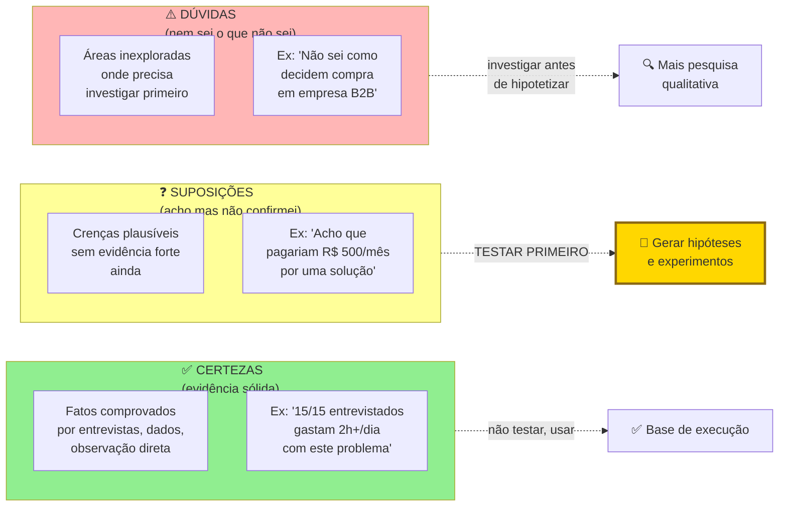
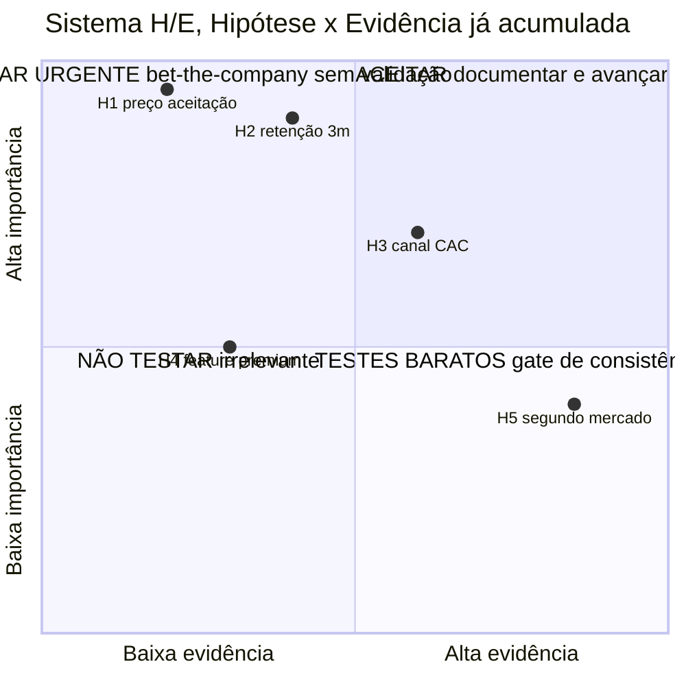

## FASE 6 — FORMULAÇÃO RIGOROSA DE HIPÓTESES

> [!important] Antes de formular hipóteses, faça a Matriz CSD
> CSD significa Certezas, Suposições, Dúvidas. Organiza o seu mapa mental antes de gerar hipóteses. Regra: teste Suposições, não Certezas. Testar Certezas é desperdício. Testar Dúvidas é cedo demais (primeiro descubra do que duvida). Suposições bet-the-company têm prioridade máxima.



### O que esse apêndice cobre

Transformação das incertezas, crenças, e intuições acumuladas nas fases anteriores em hipóteses testáveis. Escritas em formato padronizado, priorizadas por risco e impacto. O entregável é o Banco de Hipóteses. Uma tabela viva que você vai revisitar durante todo o projeto.

### POR QUE

Toda decisão de negócio assume algo sobre o mundo. "O meu cliente vai pagar R$ 99." "O meu canal principal será Instagram." "Empresas maiores compram mais rápido." Cada uma dessas afirmações é uma hipótese. Se você as trata como verdades, constrói sobre areia. Se as escreve como hipóteses, e as testa uma a uma, constrói sobre rocha. Empreender sem hipóteses explícitas é tomar todas as decisões com base em vibração.

A priorização de hipóteses também impede que você desperdice energia testando coisas de pouco impacto. Você quer testar primeiro o que, se for falso, derruba o negócio inteiro. Isso se chama "risco-maior-primeiro".

### Quando usar

Comece imediatamente depois das Fases 2, 3, e 4. Termine quando tiver quinze a trinta hipóteses escritas, priorizadas, e souber quais são as três a cinco "bet-the-company" que vai testar primeiro. Revisite a cada duas a quatro semanas. Hipóteses antigas viram verdades (validadas), ou são refutadas, e novas emergem.

### Quem envolve

O executor é você, e os sócios se houver. Os participantes são mentores ou pessoas experientes que podem ajudar a identificar hipóteses que você não enxerga sozinho. Empreender em câmara de eco é arriscado. O decisor é você.

### Como executar

Seis passos.

#### Passo 1, levante todas as suposições implícitas

Faça uma varredura exaustiva. Categorize as hipóteses em cinco tipos.

Hipóteses de problema. O problema existe mesmo? Para quem? Quão doloroso?

Hipóteses de solução. A solução proposta resolve o problema? Os usuários vão adotá-la?

Hipóteses de cliente e mercado. Quem é o cliente ideal? Como ele decide?

Hipóteses de canal. Como eu alcanço o cliente? Qual canal tem CAC viável?

Hipóteses de monetização e modelo. O cliente vai pagar? Quanto? Com que frequência? LTV maior que CAC?

Para cada tipo, busque pelo menos três a cinco hipóteses. Total alvo: quinze a trinta hipóteses.

#### Passo 2, escreva cada hipótese no formato padronizado

Use esse formato rigoroso:

```text
HIPÓTESE: [afirmação clara e falsificável]
ATRIBUTO DA TEORIA: [qual nó ou seta da sua árvore de teoria esta hipótese testa]
PORQUÊ IMPORTA: [se for falsa, qual impacto no negócio]
PARA VALIDAR PRECISO VER: [critério objetivo e numérico]
MÉTODO: [experimento ou fonte de evidência]
CUSTO ESTIMADO: [tempo + dinheiro]
```

Para entender a diferença entre hipótese ruim e hipótese boa:

> [!warning] Hipótese ruim, impossível de falsificar
> "Os clientes vão gostar do produto." Impossível de testar. "Gostar" não é mensurável.

> [!tip] Hipótese boa, falsificável e numérica
> "Pelo menos trinta por cento dos donos de restaurante do nosso ICP, depois de conhecer a solução por uma página de pré-cadastro, vão deixar e-mail e concordar com cobrança antecipada de R$ 49 para acesso ao beta. Se for falsa, significa que a nossa proposta de valor não é forte o bastante para pagamento antecipado, o que compromete a viabilidade do modelo."

> [!tip] Hypothesis Canvas e Test Card como par de ferramentas
> O formato padronizado acima é o coração do Hypothesis Canvas — registrado como template prático no [[#APÊNDICE A — TEMPLATES PRONTOS PARA USO|Apêndice A (A.10)]] e com tratamento teórico no [[#APÊNDICE CZ — CANVASES E MAPAS VISUAIS DE MODELO|CZ.14]] (em construção). Cada hipótese bet-the-company deve gerar imediatamente 1-3 [[#APÊNDICE CZ — CANVASES E MAPAS VISUAIS DE MODELO|Test Cards (CZ.9)]] como follow-up: o Hypothesis Canvas articula *o que* testar; o Test Card articula *como* testar. A disciplina central do Test Card é definir critério de sucesso e critério de refutação **antes** de rodar o experimento — sem isso, qualquer resultado é racionalizado a favor da hipótese. O caso PadariaPro em CZ.9 mostra como definir zona de incerteza no meio (entre sucesso e refutação) é o que protege contra auto-engano.

#### Passo 3, aplique o critério de falsificabilidade

> [!quote] Karl Popper sobre hipóteses
> Uma afirmação só é científica se for possível imaginar um resultado que a refute.

Toda hipótese sua deve ter um caminho claro de refutação. Se não tiver, não é hipótese. É crença.

##### Teste de isolamento, uma hipótese, um elemento por vez

Esse é um dos erros mais comuns em iniciantes. Empilhar múltiplos elementos numa única hipótese. Quando você testa coisas compostas, é impossível saber qual parte foi refutada.

Exemplo de hipótese composta (ruim): "Mulheres em grandes capitais preferem táxi a bicicleta, e fazem isso por causa do conforto, mesmo pagando mais caro."

Essa hipótese junta três afirmações distintas. Mulheres em grandes capitais preferem táxi a bicicleta. O conforto é o principal fator de decisão. O preço mais alto do táxi é tolerado.

Se você testar tudo junto e quarenta e cinco por cento das entrevistadas concordar, o que isso significa? Nada. Pode ser que preferem táxi por outro motivo que não conforto. Pode ser que conforto importa, mas só para viagens longas. Pode ser que o preço é um limite, e acima de X reais elas voltam para a bicicleta. A hipótese composta esconde todas essas nuances.

A versão atômica (boa) quebra em três hipóteses separadas. Cada uma testável sozinha. Se todas forem validadas, você tem a afirmação conjunta. Se alguma for refutada, você sabe exatamente qual parte da sua teoria precisa ser revisada.

> [!important] Regra do isolamento
> Cada hipótese deve testar um e apenas um atributo, ou uma e apenas uma relação causal da sua árvore de teoria. Se há "e" ou "porque" na frase, provavelmente você precisa quebrá-la.

##### Verifique a conexão com a teoria (integração)

Pegue a sua árvore de teoria ([[#FASE 2B — CONSTRUÇÃO DA TEORIA DO NEGÓCIO|Fase 2B]]) ao lado do Banco de Hipóteses. Para cada hipótese, responda. *Esta hipótese testa qual nó ou seta da árvore?* Se uma hipótese não pode ser mapeada na árvore, ela é órfã. Ou a hipótese é irrelevante, ou a sua árvore está incompleta. Em ambos os casos, corrija.

Esse exercício costuma revelar que o empreendedor criou hipóteses sobre o que é fácil de medir, em vez do que é importante testar. Se sobraram nós bet-the-company na árvore sem hipóteses correspondentes, você está prestes a testar o acessório enquanto deixa o crítico passar.

> [!note] Apêndice EJ — Tomada de Decisão como Disciplina
> Antes de comprometer recursos com as hipóteses bet-the-company, use o [[apendice-ej|Apêndice EJ — Tomada de Decisão como Disciplina]]: hipóteses de alto risco e baixa reversibilidade são decisões Tipo 1 (irreversíveis) e merecem pré-mortem formal antes de qualquer experimento. O apêndice também cobre o framework SPADE para estruturar esse processo em equipe.

#### Passo 4, priorize as hipóteses

Para cada hipótese, atribua duas notas, de um a cinco. Risco (R) é quão grave para o negócio se for falsa? (Cinco mata o negócio. Um é detalhe secundário.) Incerteza (I) é quanta confiança real eu tenho nela hoje? (Cinco é totalmente no escuro. Um é muito fundamentada.)

Calcule Prioridade = R vezes I.

Hipóteses com prioridade igual ou maior que quinze são as suas bet-the-company. Coisas que podem matar o negócio se forem falsas, e que você ainda não testou. Essas vêm primeiro. Hipóteses com prioridade entre oito e quatorze são secundárias. Hipóteses com prioridade abaixo de oito ficam no backlog para depois.

#### Passo 5, monte o Banco de Hipóteses como planilha

Quatorze colunas. ID (H1, H2, e assim por diante). Tipo (Problema, Solução, Cliente, Canal, Monetização). Hipótese (texto completo). Atributo da teoria (vínculo com a árvore da [[#FASE 2B — CONSTRUÇÃO DA TEORIA DO NEGÓCIO|Fase 2B]]). Porquê importa. Critério de validação. Método ou experimento. Custo estimado. Score H (Hipótese) de um a dez, quão forte é o raciocínio teórico antes de qualquer teste? Score E (Evidência) de um a dez, quanta evidência empírica você já tem hoje? Status (Nova, Em teste, Validada, Refutada, Abandonada). Resultado (quando testada). Data de teste. Aprendizado.

> [!important] Essa planilha é o coração operacional do negócio
> Nos próximos seis a doze meses, ela é o documento mais consultado da empresa. Nunca a perca de vista.

##### Sistema H/E, pontuar cada hipótese com duas notas, não uma

Esse é um dos hábitos mais subestimados. Para cada hipótese no Banco, atribua duas notas, de um a dez.

H (Hypothesis Strength) é o quão bem fundamentada a sua hipótese está do ponto de vista teórico. H igual a dez significa que a cadeia causal é clara, consistente com o que se sabe do mercado, análoga a casos de sucesso conhecidos, e faz sentido à luz da sua árvore de teoria. H igual a três significa um palpite, baseado em intuição pessoal, sem lógica rigorosa por trás.

E (Evidence Strength) é o quanto você já tem de evidência empírica a favor (ou contra) essa hipótese hoje, antes de qualquer novo experimento. E igual a dez significa dados robustos, múltiplas entrevistas consistentes, benchmarks quantitativos de setor, pilotos pagos. E igual a um significa nenhuma evidência. Só a sua própria fala.

A visualização do sistema H/E:



H/E responde a duas perguntas. *Essa hipótese é importante?* (H) E *já tenho evidência a favor?* (E). O quadrante superior-esquerdo (H alto e E baixo) é urgência máxima. Evita o erro comum de testar primeiro o que é fácil em vez do que é crítico.

Os dois scores juntos revelam onde você está numa hipótese:

| Perfil (H, E) | Diagnóstico | O que fazer |
|---|---|---|
| H alto, E alto (8, 8) | Hipótese bem fundamentada, e já com evidência | Avançar com investimento ou execução |
| H alto, E baixo (8, 3) | Teoria forte, falta evidência | Prioridade máxima de experimento. É aqui que a próxima rodada de testes precisa estar |
| H baixo, E alto (4, 8) | Fato observado sem teoria clara | Reabrir a árvore de teoria. Por que esse padrão acontece? Sem saber por quê, não dá para escalar |
| H baixo, E baixo (3, 2) | Palpite sem fundamento nem dado | Ou descartar, ou iniciar investigação exploratória. Nunca investir capital |

> [!warning] Regra de ouro do Sistema H/E
> Todo investimento significativo (construir feature, contratar, levantar capital, expandir canal) deve ser precedido por H maior ou igual a sete e E maior ou igual a seis para as hipóteses críticas relacionadas àquela decisão. Se qualquer uma das notas está abaixo desses patamares, corra um experimento (Fase 7) antes.

#### Passo 6, escolha as 3 a 5 primeiras hipóteses para testar

Com base na priorização e no Sistema H/E, pegue as hipóteses bet-the-company com H alto e E baixo. Essas têm o maior retorno por experimento. Teoria robusta, apenas faltando evidência. Vão para a [[#FASE 7 — EXPERIMENTOS DE VALIDAÇÃO DO PROBLEMA|Fase 7]].

### PERGUNTAS A RESPONDER

- Eu identifiquei hipóteses de todas as cinco categorias (problema, solução, cliente, canal, monetização)?
- Cada hipótese é falsificável (tem critério de refutação)?
- Eu classifiquei cada hipótese por risco e incerteza?
- Eu sei quais são as três a cinco hipóteses bet-the-company que preciso testar primeiro?
- Eu tenho método de teste imaginado para cada hipótese prioritária?

### Métricas

Número total de hipóteses catalogadas. Alvo: quinze a trinta.

Distribuição por categoria. Pelo menos três hipóteses em cada uma das cinco categorias.

Percentual de hipóteses com critério quantitativo de validação. Alvo: cem por cento. Se não é mensurável, não é hipótese.

Número de hipóteses bet-the-company identificadas. Alvo: três a cinco.

### SAÍDA DESTA FASE

Você concluiu a [[#FASE 6 — FORMULAÇÃO RIGOROSA DE HIPÓTESES|Fase 6]] quando os sete critérios abaixo estão cumpridos.

1. O Banco de Hipóteses (Template A.3) existe, com vinte ou mais itens classificados nas cinco categorias (problema, solução, cliente, canal, monetização). Todos no formato padronizado (afirmação mais porquê mais critério mais método).
2. Todas as hipóteses estão priorizadas por Risco vezes Incerteza.
3. As cinco a dez hipóteses do topo estão reformuladas em formato rigoroso SE-ENTÃO-MENSURA, com critério de falsificação explícito.
4. Três ou mais Hypothesis Canvas (Template A.10) preenchidos para hipóteses críticas.
5. Hipóteses "caras de errar" estão identificadas e priorizadas no topo. Aquelas cuja invalidação tardia custa muito.
6. O status (não testada, em teste, validada, invalidada) está marcado em todas.
7. As três a cinco hipóteses prioritárias foram escolhidas, e têm métodos de teste iniciais desenhados.

**Checklist final.**

- [ ] Listei todas as hipóteses-chave nas cinco categorias (problema, solução, cliente, canal, monetização)?
- [ ] Priorizei as hipóteses por Risco vezes Incerteza (Banco de Hipóteses, Template A.3)?
- [ ] Formulei cada hipótese priorizada como "Se X, então Y, mensurado por Z, considerado verdadeiro se W"?
- [ ] Defini métrica de falsificação para cada hipótese? O que provaria que é falsa?
- [ ] Documentei hipóteses "caras de errar" separadamente (aquelas cuja invalidação tarde custa muito)?
- [ ] Tenho Hypothesis Canvas (Template A.10) preenchido para as três a cinco hipóteses críticas?
- [ ] Revisei: as minhas hipóteses são realmente falsificáveis, ou são afirmações vagas?

**Primeiros passos práticos.**

1. Abrir o Template A.3 (Banco de Hipóteses) e listar toda hipótese implícita. Vinte a quarenta itens iniciais.
2. Classificar cada hipótese em categoria, status, e prioridade.
3. Reformular as cinco a dez prioritárias em formato falsificável rigoroso.
4. Para cada hipótese das três do topo, preencher Hypothesis Canvas (Template A.10) com detalhamento.

### EXEMPLO PRÁTICO

**Banco de Hipóteses, PadariaPro (fragmento top 10).**

| # | Hipótese | Categoria | Risco | Info | Prior. | Status |
|---|---|---|---|---|---|---|
| H1 | Donos de padaria de três a cinco lojas têm perda de oito por cento ou mais de margem por má gestão de estoque | Problema | Alto | Alto | 1 | Em teste |
| H2 | Donos pagariam R$ 400 por mês por loja se a redução de perda for demonstrada em sessenta dias | Monetização | Alto | Alto | 2 | Não testada |
| H3 | Integração via API com Anaconda é obtenível em noventa dias | Solução | Alto | Médio | 3 | Em teste |
| H4 | Algoritmo de previsão de demanda acerta setenta e cinco por cento ou mais em padaria com histórico de seis meses | Solução | Médio | Alto | 4 | Não testada |
| H5 | Churn igual ou menor a três por cento ao mês depois do ano 1, com NRR igual ou maior a cento e dez por cento | Monetização | Médio | Médio | 5 | Não testada |
| H6 | Dois de cada três donos recomendariam a padarias amigas depois de noventa dias | Cliente | Médio | Médio | 6 | Não testada |
| H7 | Integrações com fornecedores criam moat defensável, concorrente demora seis meses ou mais para replicar | Solução | Médio | Baixo | 7 | Não testada |
| H8 | Onboarding em menos de sete dias é viável sem TI | Solução | Baixo | Alto | 8 | Não testada |
| H9 | Mercado total é igual ou maior a quatrocentas padarias em SP com perfil-alvo | Cliente | Baixo | Alto | 9 | Validada |
| H10 | Canal principal inicial é indicação por dono-amigo | Canal | Médio | Médio | 10 | Não testada |

**Hypothesis Canvas, H1 (problema).**

A hipótese, em formato SE-ENTÃO-MENSURA: "Se oferecermos auditoria gratuita de estoque para donos de padaria de três a cinco lojas em SP, então setenta por cento ou mais dos auditados confirmarão perda de oito por cento ou mais da margem em ingredientes críticos. Mensurado em levantamento de dez padarias. Considerado verdadeiro se sete em dez ou mais confirmam perda de oito por cento ou mais. Considerado falso se quatro em dez ou menos confirmam."

O critério de falsificação tem três faixas. Se apenas quatro em dez ou menos confirmam perda de oito por cento ou mais, a dor não é ampla o bastante para sustentar modelo de negócio. Se cinco a seis em dez confirmam, a cunha precisa ser refinada (só rede maior? Só certo tipo de padaria?). Se sete em dez ou mais, seguir para testar H2 (disposição a pagar).

O experimento vinculado: auditoria gratuita em dez padarias do perfil, sessenta minutos cada, em duas semanas.

> [!warning] Risco de interpretação enviesada
> Donos podem subestimar a perda (vergonha de admitir), ou superestimá-la (para justificar preço de consultoria). Cruze o auto-relato com análise factual de trinta dias de notas fiscais de compra.

### Armadilhas

Hipóteses vagas. "Os clientes vão gostar." Sem número, sem teste.

Só hipóteses de solução. Empreendedores ficam obcecados em testar "a solução funciona?", e esquecem de testar "o cliente paga?", que é a hipótese mais crítica.

Priorizar baixo-risco por ser fácil. Testar primeiro o que é confortável. Princípio: teste primeiro o que pode te matar, não o que é agradável de confirmar.

Esquecer de atualizar. A lista vira zumbi se não for visitada semanalmente. Reserve trinta minutos toda segunda para revisar.

Confundir "não refutada ainda" com "validada". Uma hipótese só é validada quando você tem evidência positiva a favor dela. Não apenas ausência de evidência contra.

---

### CASO BRASILEIRO, Fase 6, hipóteses em startup imobiliária iBuyer

Uma startup imobiliária no modelo iBuyer (compra direta de imóveis para revenda rápida) precisava decidir o diferencial principal. Preço alto. Velocidade de pagamento. Qualidade de serviço.

A decisão foi formal. Em vez de escolher por intuição, formalizaram quinze hipóteses, priorizadas por R vezes I. "Se oferecermos cinco por cento abaixo do valor de mercado, com pagamento em sete dias, X por cento dos vendedores aceitarão." "Se o prazo for três dias em vez de sete, a conversão sobe em Y por cento." "Sellers urgentes (divórcio, mudança de cidade) convertem Z por cento mais que sellers oportunistas."

As hipóteses bet-the-company (conversão por urgência, sensibilidade a preço, velocidade crítica) foram testadas em sequência. Cada experimento com threshold ex-ante. O modelo final priorizou velocidade sobre preço. O oposto da intuição inicial.

A lição transferível. Hipóteses explícitas separam "o que eu acho" de "o que eu testei". A intuição inicial frequentemente é parcialmente certa e parcialmente errada. Só teste separa.

---

### FERRAMENTAS DESTA FASE

Formulação de hipóteses exige rigor. É onde o manual enfatiza disciplina analítica. Dez ferramentas essenciais, todas no [[#APÊNDICE BG — FERRAMENTÁRIO COMPLETO DO EMPREENDEDOR|Apêndice BG]].

McKinsey 7-Step Problem Solving, completo. Aplicar os sete passos ao problema central do negócio. Define (qual a questão estratégica?), Structure (issue tree MECE), Prioritize (oitenta-vinte), Plan (análises necessárias), Conduct (execute), Synthesize (aprendizados), Communicate. Use para estruturação rigorosa da tese do negócio. Ver BG.5.1.

MECE. As suas hipóteses estão mutuamente exclusivas? Coletivamente exaustivas? Hipóteses que se sobrepõem confundem experimentos. Ver BG.4.5.

Pre-mortem (Gary Klein). Para cada hipótese crítica, imaginar "daqui a seis meses, por que essa hipótese foi falsificada?". Revela sinais precoces e critérios de desconfirmação. Use antes de começar experimentos. Ver BG.5.3.

Expected Value e Bayesian Thinking. Para cada hipótese, qual o range de resultados possíveis vezes probabilidades? EV positivo justifica experimento. EV negativo sugere descartar. Use para priorizar entre múltiplas hipóteses competindo por recursos. Ver BG.5.7.

Cost-Benefit Analysis. Para cada experimento proposto, custo (tempo, capital) versus benefício esperado (confiança ganha, valor da decisão). Use para decidir quais hipóteses validar primeiro, e com que investimento. Ver BG.5.6.

Cynefin Framework (Snowden). As suas hipóteses estão em domínio Complicated (análise resolve), ou Complex (só experimentação resolve)? Calibra o método de validação. Ver BG.4.7.

Red Team e Blue Team. Para hipóteses mais críticas, montar red team (interno ou advisors) para ativamente contestá-las antes de investir em validação. Ver BG.5.4.

5 Whys (Toyota). Aplicado a cada hipótese: "por que eu acredito nisso?", cinco vezes. Se a resposta final é "intuição", ou "porque o concorrente faz", a hipótese é fraca. Exige validação urgente. Ver BG.5.2.

Pyramid Principle (Minto). Comunicar hipóteses ao time, advisors, e board em forma estruturada. Hipótese principal no topo. Sub-hipóteses no nível abaixo. Evidências em baixo. Ver BG.4.4.

Inversion (Munger). Para cada hipótese crítica, formular "sob que condições essa hipótese é falsa?". Define o critério de falsificação. Ver BG.4.3.

---

### SÍNTESE DA FASE 6

A [[#FASE 6 — FORMULAÇÃO RIGOROSA DE HIPÓTESES|Fase 6]] transforma um padrão silencioso da operação empreendedora em material de trabalho. Toda decisão de negócio assume algo sobre o mundo. O cliente vai pagar R$ 99. O canal principal será Instagram. Empresas maiores compram mais rápido. Cada uma dessas afirmações é hipótese. Se você as trata como verdades, constrói sobre areia. Se as escreve como hipóteses, e testa uma a uma, constrói sobre rocha. Empreender sem hipóteses explícitas é tomar todas as decisões com base em vibração.

A diferença entre quem faz certo, e quem falha, está na priorização por risco. O Banco de Hipóteses não é lista para checklist. É instrumento de foco. Você quer testar primeiro o que, se for falso, derruba o negócio inteiro. As bet-the-company, três a cinco no início, recebem energia primeiro. Quem desperdiça energia testando hipóteses periféricas, enquanto a hipótese central nunca foi posta à prova, gasta meses validando o errado. E descobre tarde que o pressuposto fundamental nunca tinha sido verificado.

O entregável é tabela viva, não documento que se arquiva. Hipóteses antigas viram verdades validadas, ou são refutadas, e novas emergem ao longo do projeto. Revisitar a cada duas a quatro semanas é higiene. O Banco de Hipóteses é o que estrutura todas as fases seguintes de validação. As Fases 7, 8, 9, 10 não testam ideia em geral. Testam hipóteses específicas, na ordem do risco.

# fase6 #hipoteses #falsificabilidade #csd #bet-the-company #priorizacao #sistema-h-e #banco-hipoteses

---
