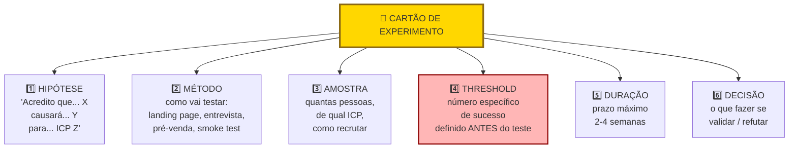

## FASE 7 — EXPERIMENTOS DE VALIDAÇÃO DO PROBLEMA

> [!tip] Stack mínimo da Fase 7
> Para rodar experimentos baratos. Landing pages rápidas: Webflow, Framer, Carrd, Wix (R$ 0 a R$ 100 por mês, segundo o uso). Tráfego pago para testes: Meta Ads (R$ 500 a R$ 3.000 para primeiros testes), Google Ads (similar), LinkedIn Ads (se B2B, mais caro mas direto). Analytics: Google Analytics 4 (gratuito), Hotjar ou Microsoft Clarity (gratuitos para uso moderado) para heatmap. Plausible (alternativa simples e privacy-first). Pagamentos para pré-venda: Stripe, Asaas, Pagar.me, Stone, MercadoPago (cada um com particularidades regulatórias no Brasil). Regra: o stack de experimentação deveria custar menos de R$ 1.000 por mês no começo. Se está caro antes de aprender, algo está errado.

### O que esse apêndice cobre

Execução de experimentos estruturados para testar as hipóteses prioritárias levantadas na [[#FASE 6 — FORMULAÇÃO RIGOROSA DE HIPÓTESES|Fase 6]]. Nesta fase, você ainda foca primariamente em validar o problema e o cliente, não a solução construída. Os experimentos são rápidos, baratos, e desenhados para dar evidência confiável de sim, não, ou talvez.

O entregável é um Relatório de Experimentos. Hipóteses testadas, resultados, aprendizados, e próximos passos.

> [!abstract] Resumo operacional
> **Entregável:** Relatório de Experimentos com três ou mais Cartões de Experimento (Template A.4) executados, threshold ex-ante registrado, decisão (perseverar, pivotar, abandonar) documentada para cada hipótese bet-the-company.
>
> **Sinais de saída:**
> - Três a cinco hipóteses bet-the-company testadas com critério de falsificação numérico pré-definido em cada cartão.
> - Banco de Hipóteses atualizado com status pós-experimento — uma ou mais invalidadas conta como aprendizado.
> - Evidência forte de problema real, disposição a pagar e pelo menos um canal de aquisição possível.
> - Critério mínimo atingido em pelo menos um de três sinais — dez pagamentos antecipados, vinte cartas de intenção, ou cem e-mails qualificados com conversão acima de quinze por cento.
> - Decisão tomada (perseverar, pivotar ou abandonar) e ação iniciada.
>
> **Três armadilhas mais comuns:**
> 1. Critérios de sucesso frouxos definidos depois do resultado — "vou considerar sucesso se alguém demonstrar interesse" transforma o experimento em racionalização.
> 2. Ignorar resultados negativos — desvalorizar dados contrários com "esse grupo não era o público certo" é fugir da verdade que o experimento revelou.
> 3. Esticar prazo ou gastar demais — experimento acima de R$ 3 mil ou mais de duas semanas está mal desenhado, e janela aberta vira espera de resultado conveniente.

### POR QUE

Hipóteses sem experimentos são só listas bonitas. Experimentos transformam suposição em evidência. Rápido e barato é fundamental. Se um experimento demora três meses, ou custa R$ 50 mil, você está gastando demais para aprender uma coisa só. Cada experimento deve gerar uma decisão clara. Continuar. Ajustar. Pivotar. Ou matar.

> [!note] Apêndice F — Científico vs Lean Startup
> O desenho de experimento descrito nesta fase combina rigor do método científico (threshold — ponto de corte numérico pré-definido — ex-ante, falsificabilidade, isolamento de variável) com velocidade do ciclo Lean (Build-Measure-Learn comprimido em dias, não meses). O [[apendice-f|Apêndice F — Científico vs Lean Startup]] detalha quando priorizar profundidade (pré-registro formal, controle de viés) versus velocidade (experimento mais barato possível). A tensão entre os dois é permanente em early-stage; o apêndice oferece critério de decisão.

### Quando usar

Comece assim que a [[#FASE 6 — FORMULAÇÃO RIGOROSA DE HIPÓTESES|Fase 6]] priorizar as primeiras hipóteses. Termine quando as três a cinco hipóteses bet-the-company estiverem validadas ou refutadas com evidência suficiente. Revisite continuamente. O negócio gera novas hipóteses o tempo todo.

### Quem envolve

O executor é você. Alguns experimentos envolvem potenciais clientes, colaboradores externos, ou plataformas pagas (Facebook Ads, Google Ads, Typeform). O decisor é você, com base nos critérios de sucesso pré-definidos.

### Como executar

Dez passos.

#### Passo 1, desenhe cada experimento em cartão antes de executar

Use esse formato:

```text
EXPERIMENTO #N
Hipótese: [copiar da Fase 6]
Pergunta central: [o que especificamente quero responder]
Desenho: [o que vou fazer, passo a passo]
Público: [quantas pessoas, que perfil, como alcanço]
Métrica principal: [o número que vai decidir]
Critério de sucesso: [valor da métrica pra considerar validada]
Critério de refutação: [valor da métrica pra considerar refutada]
Duração: [tempo total]
Custo: [R$ estimado]
Riscos e vieses: [o que pode distorcer o resultado]
Data de início / fim: [planejadas]
```

##### Regra operacional para a duração, a janela de duas a três semanas

Empreendedores iniciantes tendem a desenhar experimentos com "duração aberta" ("vou rodar até ter dados suficientes"), ou com janelas longas demais ("três meses para validar"). Ambos são sintomas do mesmo problema. Medo de decisão.

A regra operacional, derivada da prática de aceleradoras como Antler e Y Combinator: cada experimento da [[#FASE 7 — EXPERIMENTOS DE VALIDAÇÃO DO PROBLEMA|Fase 7]] deve caber numa janela de duas a três semanas. Do desenho à decisão. Dois motivos.

Disciplina de decisão. Experimento com prazo aberto nunca termina. Sempre "precisa de mais uma semana". Janela fechada força você a concluir com o dado disponível. Reconhecer as limitações honestamente, em vez de empurrá-las com a barriga.

Paralelização. Com janelas curtas, você roda quatro a seis experimentos em três meses. Com janelas longas, roda um a dois. A velocidade de aprendizado é composta. Mais iterações dentro do mesmo tempo total geram aprendizados muito superiores.

Há duas exceções legítimas à janela. Experimentos concierge e wizard of oz frequentemente precisam de quatro a oito semanas para revelar valor real. Não force janela curta nesses casos. E experimentos com ciclo de venda B2B enterprise naturalmente exigem seis a doze semanas. A janela aqui aplica-se ao ciclo de decisão do cliente-alvo, não ao seu.

Para qualquer outro tipo de experimento (entrevistas, landing page, fake door, pré-venda direta a PMEs, community test, A/B), se o desenho não cabe em duas a três semanas, o experimento está grande demais. Quebre em dois ou três experimentos menores. Cada um testando um atributo isolado.

> [!important] Defina o critério antes de olhar o resultado
> Se você define depois, vai ajustar o critério para "validar" o que você já queria. Isso é auto-engano.

> [!tip] Test Card: a forma canônica do Cartão de Experimento
> O cartão de experimento descrito acima é a adaptação brasileira do **Test Card** — ferramenta de David Bland & Alexander Osterwalder (Strategyzer, 2019) para documentar hipótese, método, critério e decisão num único cartão antes de rodar qualquer experimento. O tratamento completo está no [[#APÊNDICE CZ — CANVASES E MAPAS VISUAIS DE MODELO|CZ.9]] — origem histórica, princípios, exemplo brasileiro PadariaPro com smoke test (teste rápido de demanda com landing page ou anúncio, antes de construir qualquer coisa) de R$ 1.500 que produziu critério claro de Persevere/Pivote, e variações como Learning Card (cartão de aprendizado — registro estruturado do resultado de um experimento) e Riskiest Assumption Test (RAT) — teste da premissa mais arriscada. A regra de ouro de CZ.9: critério de sucesso e critério de refutação devem ser **distintos com zona de incerteza no meio**. Se você define só "sucesso ≥10%" sem definir "refutação ≤2%", qualquer resultado entre 2 e 10% vira interpretação flexível conforme conveniência do time.

#### Passo 2, escolha os tipos de experimento apropriados

Catálogo dos oito experimentos mais úteis para validação de problema e cliente, antes de construir produto.

##### Problem Interview (entrevista de problema)

Já coberto na [[#FASE 3 — DESCOBERTA DO PROBLEMA|Fase 3]]. Útil também para hipóteses emergentes. Custo baixo. Tempo de uma a duas semanas. Limitação: respostas são opiniões, não ações.

##### Landing Page Test ou Smoke Test (teste rápido de demanda)

Crie uma página que descreve a sua solução como se ela já existisse. Direcione tráfego por Ads ou e-mails a grupos. Meça a taxa de conversão em cadastros de e-mail, pré-pedidos, ou cliques em "quero comprar".

Como medir: conversão de visitante em ação. Benchmarks (referências de mercado) iniciais: conversão maior que cinco por cento em e-mail é sinal bom. Maior que dez por cento é forte. Abaixo de dois por cento, a sua promessa não ressoa. Custo de R$ 500 a R$ 2.000 em Ads, mais um dia para montar a página (use Carrd, Framer, Webflow, Unbounce). Tempo de uma a três semanas. Cuidado: tráfego pago precisa ser bem segmentado. Se o público é ruim, conversão baixa não significa que a ideia é ruim.

##### Concierge Experiment (experimento manual)

Você entrega manualmente o valor que o seu produto promete. Sem automatizar nada. Por exemplo: se o produto seria um app de gestão de frota, você mesmo gerencia a frota de um cliente usando planilha e WhatsApp, cobrando pelo serviço.

Como medir: o cliente percebeu valor? Pagou? Indicou? Custo: o seu tempo, durante duas a oito semanas. Tempo total de quatro a doze semanas. A vantagem é que você descobre os detalhes operacionais que uma entrevista nunca revelaria.

##### Wizard of Oz (produto simulado)

O produto parece funcionar com tecnologia avançada, mas por trás é você fazendo tudo manualmente. Por exemplo: você promete "IA que sugere horários de postagem ideais", e você mesmo, olhando cada cliente, sugere os horários. O cliente nem sabe.

Como medir: o usuário usa a "solução"? Volta? Paga? Custo baixo em construção, alto em tempo operacional. Tempo de quatro a doze semanas.

##### Pre-sale (venda antecipada)

Você vende o produto antes dele existir. Pede pagamento real ou carta de intenção assinada.

Como medir: número de vendas e cartas. Valor arrecadado. Critério forte: dinheiro no bolso é mais que carta de intenção, que é mais que interesse verbal. Custo baixo. Tempo de duas a seis semanas.

> [!important] Pre-sale é o experimento mais revelador de todos
> Se as pessoas pagam antecipado por algo que não existe, você tem evidência forte. Se não pagam, tem informação forte também.

##### Fake Door ou Botão Fantasma (testar interesse sem construir)

Dentro de um produto existente (blog, comunidade), ou de uma página, você coloca um botão que promete uma feature que ainda não construiu. Quando o usuário clica, aparece "em breve" mais formulário.

Como medir: percentual de usuários que clicam. Custo muito baixo. Limitação: mede interesse, não compra.

##### Community Test (teste em comunidade)

Compartilhe a ideia em comunidades relevantes (Reddit, grupos de Facebook, Discord, fóruns especializados). Meça reações genuínas, perguntas, pedidos de acesso.

Como medir: engajamento, comentários, DMs. Custo zero. Limitação: comunidades têm viés. Algumas são positivas demais. Outras cínicas demais.

##### A/B Test (teste comparativo de proposta de valor)

Teste duas ou três formas diferentes de descrever o problema ou a solução, e veja qual converte mais. Útil quando você ainda não sabe como falar com o cliente.

Como medir: conversão relativa. Custo moderado.

##### Guia rápido para escolher a técnica

| Fase de validação | Técnica mais apropriada |
|---|---|
| Entender o problema em profundidade (exploratória) | Entrevistas |
| Dimensionar o problema em escala | Questionários |
| Testar atratividade de uma proposta | Landing Page, Smoke Test, Fake Door |
| Testar disposição real a pagar | Pré-venda |
| Testar se a solução entrega valor de verdade | Concierge, Wizard of Oz |
| Comparar duas versões para identificar qual performa melhor | A/B Test |

Use entrevistas quando você precisa de profundidade e aprendizados qualitativos. Use questionários, landing pages, e pré-vendas quando precisa de números representativos e evidência quantitativa. Os dois tipos são complementares. Não substitutos.

#### Passo 3, operacionalize cada hipótese em uma medida concreta

Esse é a ponte entre teoria e experimento. É onde a maioria dos empreendedores erra. Para cada hipótese prioritária, responda quatro perguntas, nessa ordem.

Qual é a hipótese testável? Texto exato da hipótese da [[#FASE 6 — FORMULAÇÃO RIGOROSA DE HIPÓTESES|Fase 6]].

O que eu vou perguntar ou observar? Pergunta específica no questionário. Ação observada no experimento. Evento rastreado no analytics.

Quais são as respostas ou eventos possíveis? Opções discretas, ou faixas numéricas.

O que eu vou efetivamente contar como medida? Fórmula exata. Por exemplo: "percentual de respondentes que escolheram X ou Y", "taxa de clique no botão Z", "valor médio ofertado em pré-venda".

Exemplo operacionalizado, inspirado no caso MiMoto, do paper de Coali e colegas (2024).

A hipótese: "Tráfego nas grandes capitais é um problema relevante para profissionais." A pergunta no questionário: "Em uma semana típica, quantos dias você fica preso no trânsito no trajeto casa-trabalho?" As respostas possíveis: (a) menos de um dia, (b) um a três dias, (c) três a cinco dias, (d) mais de cinco dias. A medida: percentual de respondentes que escolhem (c) ou (d).

Você pode escolher outra forma de medir (por exemplo, nota de um a sete, ou foco apenas na resposta "mais de cinco dias"). O importante é que a escolha seja feita antes de ver os dados, documentada, e aplicada de forma consistente na análise.

> [!important] Quatro regras de operacionalização
> Conecte a medida à hipótese de forma rastreável. Se alguém te perguntar "por que você escolheu essa métrica e não outra?", você precisa conseguir responder em termos da teoria. Defina ex-ante (antes de coletar). Definir medida depois de ver dados é auto-engano matemático — você vai inevitavelmente escolher a métrica que confirma o que já acredita. Pré-teste as suas perguntas com duas a três pessoas de confiança. Pergunta mal formulada gera lixo. Ajuste antes do campo. Prefira medidas já estabelecidas (KPIs do setor, escalas validadas da literatura de pesquisa) quando existirem, em vez de inventar métricas próprias. A sua métrica só é "nova" se não existir nada comparável.

> [!note] Apêndice EJ — Tomada de Decisão como Disciplina
> A decisão de rodar ou não um experimento — e com que profundidade — é ela mesma uma decisão estruturável. O [[apendice-ej|Apêndice EJ — Tomada de Decisão como Disciplina]] oferece o framework SPADE para documentar critérios antes de agir, e o pré-mortem para antecipar por que um experimento pode produzir conclusão errada. Use especialmente em hipóteses Tipo 1, onde errar o desenho do experimento tem custo alto.

#### Passo 4, defina o threshold antes de começar

Threshold (ponto de corte numérico) é o valor da sua medida a partir do qual a hipótese será considerada suportada. É o que separa decisão baseada em critério de torcida organizada.

Por exemplo: "Vou considerar a hipótese suportada se pelo menos sessenta por cento dos respondentes do meu ICP (perfil de cliente ideal) escolherem a opção (c) ou (d), ou seja, mais de três dias por semana no trânsito."

O threshold é subjetivo. Você define com base na sua teoria e experiência. Mas uma vez definido, é imóvel até os dados serem analisados. Se você mover o threshold depois, o experimento deixa de ser teste de hipótese, e vira confirmação do que você queria.

Documente o threshold no Cartão de Experimento. Se não houver threshold escrito, o experimento não está pronto para rodar.

##### Pré-registro formal, a versão cientificamente rigorosa do threshold ex-ante

Pré-registro é a prática adotada na pesquisa científica moderna (Simmons, Nelson, e Simonsohn, 2011; Wicherts e colegas, 2016) para eliminar o que os pesquisadores chamam de "p-hacking" — a tendência de ajustar análises até encontrar o resultado desejado. Em outras palavras, você decide como vai analisar os dados antes de coletá-los, não depois.

O empreendedor enfrenta exatamente o mesmo viés. Com custo maior. A análise enviesada aqui não produz artigo acadêmico duvidoso. Produz decisão de investimento com o seu próprio capital, baseada em evidência viciada.

Checklist mínimo de pré-registro a documentar antes de iniciar o experimento. Hipótese específica (texto exato, com atributo e direção). Medida operacional (fórmula exata). População-alvo, e critérios de inclusão e exclusão (quem entra no teste, quem não). Tamanho mínimo da amostra (número antes de começar, não "até o que conseguir"). Threshold de decisão (valor numérico exato). Plano de análise (como os dados serão agregados, se haverá subgrupos). O que faria você descartar resultados (contaminação, vazamento de intenção, falha técnica). O que faria você considerar resultado inconclusivo (não apenas "não suportado").

Documente isso em arquivo datado antes de iniciar o experimento. Compartilhe com sócios e advisors. Essa transparência externa cria pressão positiva para não trapacear consigo mesmo.

> [!tip] Por que pré-registro funciona em early-stage
> Pré-registro formal transforma experimento de "procura por evidência que confirme a minha ideia" em "teste imparcial da minha própria crença". É o mecanismo mais efetivo contra autoenganos. E autoenganos são a causa mais comum de decisão empreendedora catastrófica. Em contextos de alta incerteza (early-stage, deeptech, mercados novos), pré-registro é especialmente valioso. O empreendedor tipicamente tem pouca evidência externa para calibrar expectativas, e tende a preencher a incerteza com otimismo motivado.

#### Passo 5, execute

Rode o experimento dentro do prazo planejado. Resista à tentação de esticar o prazo porque o resultado está ruim ("mais tempo vai melhorar"). De mudar o critério de sucesso no meio do caminho. De parar cedo porque o resultado está bom ("já sei, não preciso terminar").

#### Passo 6, faça a due diligence da amostra antes de olhar o resultado

Esse é o passo mais negligenciado por empreendedores. É o mais importante para uma avaliação honesta. Antes de comparar o resultado com o threshold, verifique três coisas.

Tamanho da amostra. Para entrevistas e MVPs qualitativos, dez a quinze pessoas já trazem insight. Para questionários e testes de conversão, você precisa de pelo menos oitenta a cem respostas. Idealmente centenas, se o mercado é massificado. Amostras muito pequenas produzem ruído, não sinal. Se a amostra está pequena, reconheça a limitação e seja mais conservador no próximo passo.

Representatividade. A amostra que você conseguiu reflete o ICP que descreveu na teoria? Mesmo sem amostragem aleatória (quase nunca viável para um empreendedor iniciante), os respondentes precisam ser um "retrato em miniatura" do público-alvo. Se o seu ICP é "donas de pet shop no interior", e oitenta por cento dos respondentes são de capital, a sua amostra está enviesada. Se é "CFOs de empresas de cem ou mais funcionários", e você só conseguiu falar com analistas juniores, você não testou a hipótese real.

Ajuste do threshold se a amostra for enviesada. Se a sua amostra está enviesada para um lado que favorece a hipótese (você testou com early adopters — primeiros adotantes entusiastas — quando o público final é mainstream), aumente o threshold. Seja mais rigoroso. Se está enviesada para um lado que prejudica a hipótese (você testou com um público que não tem o problema na intensidade esperada), considere se o teste faz sentido, ou se deveria ser refeito. Registre o ajuste no Cartão de Experimento, antes de olhar o resultado final.

> [!important] O princípio da avaliação objetiva
> Você reconhece as limitações da evidência, e as incorpora ao critério. Em vez de usar as limitações depois para explicar por que o resultado ruim "não conta".

#### Passo 7, analise com honestidade

Para cada experimento, responda cinco perguntas. Qual o resultado, comparado com o critério pré-definido? A hipótese foi validada, refutada, ou inconclusiva? Quais aprendizados secundários emergiram? Quais novas hipóteses surgiram? O que eu faria diferente da próxima vez?

#### Passo 8, tome decisão clara

Depois de cada experimento, uma das quatro decisões.

Persevere. Hipótese validada. Continue no mesmo caminho.

Pivote. Hipótese refutada. Mude de direção. Cliente, problema, solução, ou canal.

Mais dados. Resultado inconclusivo. Rode variante do experimento.

Abandone. Evidência clara e consistente de que não há negócio aqui.

> [!warning] Não fique em limbo
> Decida.

#### Passo 9, compare o resultado com a teoria, não apenas com o threshold

Esse passo distingue o empreendedor que pensa de forma sistemática do empreendedor meramente "lean". O threshold te diz se a hipótese foi ou não suportada pela amostra. Mas a decisão final deve ser tomada comparando o resultado com a teoria inteira, não apenas com o número isolado.

Pergunte-se. Se a hipótese foi refutada: qual pedaço da minha árvore de teoria precisa ser revisado? Existe uma teoria alternativa (que eu já mapeei na [[#FASE 2B — CONSTRUÇÃO DA TEORIA DO NEGÓCIO|Fase 2B]]) que explica melhor esse resultado? O problema é o atributo específico, a relação causal, ou o ICP escolhido?

Se a hipótese foi suportada: o resultado é consistente com o resto da teoria? Ou há uma explicação alternativa (viés do tráfego pago, comunidade entusiasta atípica) que poderia produzir o mesmo número sem a teoria ser verdadeira?

Se foi inconclusivo: o problema é a amostra, a operacionalização, ou a teoria em si?

> [!quote] Popper sobre evidência refutadora
> Você só pode aprender que está errado por meio de evidência. Nunca pode provar que está certo em definitivo.

Resultados negativos, nesse enquadramento, são informação valiosa. Não fracasso. Um empreendedor que trata toda evidência refutadora como ruído acaba cego para os sinais que mais deveriam fazê-lo repensar.

#### Passo 10, atualize o Banco de Hipóteses, a árvore de teoria, e a Declaração da Ideia

Versione. A Declaração vai para v0.2, v0.3, v0.4. Isso é saudável. Significa que você está aprendendo.

> [!tip] Apêndice CZ — Learning Card (CZ.10)
> Depois de cada experimento, o par natural do Test Card é o [[#APÊNDICE CZ — CANVASES E MAPAS VISUAIS DE MODELO|Learning Card (CZ.10)]] — cartão de uma página que registra o que foi observado (não interpretado), o que foi aprendido, e a decisão tomada (Persevere, Pivote, Abandone). A distinção entre "observação" e "interpretação" no Learning Card é o mecanismo central contra o viés de confirmação pós-experimento. O Banco de Hipóteses atualizado neste passo deve conter o Learning Card de cada experimento concluído.

### PERGUNTAS A RESPONDER

- A hipótese bet-the-company está validada, refutada, ou inconclusiva?
- Qual a evidência concreta? Números, verbatim, observações.
- O que eu aprendi de inesperado?
- Qual a próxima hipótese a testar?
- Continuo, ajusto, pivoto, ou abandono?

### Métricas

As métricas variam por experimento, mas em geral seis se repetem.

Taxa de conversão em landing page ou smoke test. Benchmarks para e-mail cadastrado: maior que cinco por cento é bom, maior que dez por cento é forte, abaixo de dois por cento é fraco.

Taxa de intenção de compra em pré-venda. Mais de vinte por cento dos qualificados demonstrando intenção é forte.

Taxa de conversão em venda antecipada paga. Dois a cinco por cento é sinal moderado. Mais de dez por cento é muito forte.

NPS (Net Promoter Score — índice de lealdade do cliente) ou similar em experimentos concierge. Mais de cinquenta sugere valor percebido.

Retenção de uso em experimentos Wizard of Oz. Se o usuário usa mais de duas vezes por semana, há valor.

Custo por aprendizado. Reais gastos divididos por hipóteses respondidas. Benchmark em early stage: até R$ 500 por hipótese respondida é saudável. Acima de R$ 3.000 sugere experimento mal-desenhado. Volte ao cartão de experimento e simplifique.

Velocidade de aprendizado. Número de hipóteses resolvidas por mês. Benchmark: duas ou mais hipóteses bet-the-company resolvidas por mês em early stage. Quatro ou mais por mês em fase de MVP. Abaixo disso, o ciclo está lento demais para acompanhar o burn.

### CALIBRANDO EXPECTATIVAS, o espectro de resultados e a regra dos nove em dez

Empreendedores iniciantes frequentemente chegam à [[#FASE 7 — EXPERIMENTOS DE VALIDAÇÃO DO PROBLEMA|Fase 7]] esperando que "o experimento vai validar a minha ideia". Essa expectativa está calibrada errada. Entender a distribuição real de resultados é o que separa o fundador que aprende do fundador que se ilude.

Os resultados de experimentos caem em um espectro, inspirado no framework Antler de validação — uma referência usada pela aceleradora global para categorizar a força dos sinais de demanda. Com dois extremos e uma enorme zona intermediária.

O extremo negativo, "spaghetti sandwiches". A ideia teve rejeição clara. Entrevistados demonstraram pouco interesse. Landing page teve conversão baixa. Pré-venda fracassou. A decisão é fácil. Pivotar. Voltar à matriz de Problema versus ICP (Fases 2 e 4) e criar uma nova hipótese para testar.

O extremo positivo, "overnight cult following". A ideia teve adesão extraordinária. Clientes pagaram antecipado sem hesitar. Vieram indicações espontâneas. Early evangelists (clientes que viram o produto e passaram a defendê-lo publicamente) começaram a vender por você. Houve pedido explícito de acesso. A decisão é fácil. Construa a empresa. Esse cenário acontece em aproximadamente uma em cada dez tentativas.

O meio do espectro, "área cinzenta". Resultados fracos, confusos, conflitantes, ou enviesados. Alguns clientes interessados, outros indiferentes. Feedback misto. Esse é o cenário onde a maioria dos empreendedores realmente se encontra. É onde a maioria também se ilude e segue construindo algo que não deveria. A decisão é difícil. Exige critérios explícitos. Não intuição.

> [!important] A regra operacional mais importante deste manual
> Assuma que, em nove de cada dez ciclos de hipótese, experimento, e análise, a conclusão correta será recomeçar ou pivotar, não seguir. Essa é a distribuição de base. Se você está sempre chegando a conclusões que favorecem seguir em frente, quase certamente está torcendo em vez de analisando.

Essa calibração tem três implicações práticas.

A primeira ideia quase certamente não é a ideia final. Se você trabalha numa ideia única e nunca considera pivotar, está negando probabilidade pura. Identifique múltiplos ICPs e múltiplas hipóteses de teoria desde a [[#FASE 2B — CONSTRUÇÃO DA TEORIA DO NEGÓCIO|Fase 2B]] exatamente porque nove em dez vão falhar.

Recomeçar não é fracasso. É o funcionamento normal do processo. O objetivo do manual inteiro é fazer você recomeçar barato, em vez de recomeçar caro. Recomeçar depois de R$ 3 mil gastos em quatro semanas é normal. Recomeçar depois de R$ 300 mil em dois anos é tragédia.

Quando você finalmente estiver naquele um em dez, vai saber. Não é ambíguo. Early adopters evangelizam, pagam antecipado, reclamam quando o produto falha, convidam outros. Se o sinal é ambíguo, você não está no um em dez. Está no meio do espectro.

##### Exemplo concreto do extremo positivo, Soylent

Quando o Soylent foi lançado por Rob Rhinehart em 2013, via crowdfunding, sem existir ainda em escala, os primeiros adotantes não só compravam. Escreviam no fórum. Publicavam receitas próprias. Respondiam dúvidas de outros compradores. Reportavam bugs de formulação. Defendiam a marca publicamente contra críticos. Eram, na prática, funcionários não-pagos da empresa nascente. O que a Antler chama de evangelistas.

Se a sua base de primeiros clientes se comporta assim, sem você ter que puxar, você está naquele um em dez. Se você precisa empurrar cada venda, responder cada objeção sozinho, e os clientes não convidam mais ninguém, você não está. Independentemente do que o seu otimismo te diga.

##### Como navegar o meio do espectro

Não interprete resultados medianos como validação fraca que vai melhorar. Na maior parte das vezes, não melhora.

Aplique os critérios duros da [[#FASE 6 — FORMULAÇÃO RIGOROSA DE HIPÓTESES|Fase 6]]. Dez pagamentos antecipados, vinte cartas de intenção, ou cem e-mails a mais de quinze por cento de conversão. Abaixo disso, você está no meio. E o meio é pivô.

Considere seriamente a teoria alternativa que você mapeou na [[#FASE 2B — CONSTRUÇÃO DA TEORIA DO NEGÓCIO|Fase 2B]]. Ela pode ser o caminho real.

Evite a tentação de "esperar mais um pouco". Prazos esticados quase nunca trazem dados melhores. Trazem mais dados medianos.

> [!warning] O pior não é falhar
> O pior é ficar preso em algo medíocre que não vai a lugar nenhum, consumindo tempo, dinheiro, e moral por meses ou anos.

### SAÍDA DESTA FASE

Você concluiu a [[#FASE 7 — EXPERIMENTOS DE VALIDAÇÃO DO PROBLEMA|Fase 7]] quando os sete critérios abaixo estão cumpridos.

1. As três a cinco hipóteses bet-the-company foram testadas com experimentos apropriados, e três ou mais Cartões de Experimento (Template A.4) foram preenchidos com detalhes dos seis campos.
2. Cada experimento teve critério de falsificação numérico (não subjetivo), pré-definido, e resultado analisado contra o critério.
3. Três ou mais experimentos foram executados, com dados objetivos coletados.
4. O Banco de Hipóteses foi atualizado com status pós-experimento. Uma ou mais hipóteses foram invalidadas (e isso é considerado aprendizado, não falha).
5. A decisão está documentada depois de cada experimento (seguir, refazer, pivotar).
6. Você tem evidência forte de três coisas. O problema é real e doloroso para o ICP. O ICP está disposto a pagar (carta de intenção ou pré-venda). Você tem pelo menos um canal de aquisição possível.
7. Você decidiu entre perseverar, pivotar, ou abandonar, e começou a agir.

> [!important] Critério mais duro
> Você conseguiu pelo menos uma das três coisas seguintes. Dez pagamentos antecipados reais. Vinte cartas de intenção de compra assinadas. Ou cem e-mails qualificados em uma landing page com conversão maior que quinze por cento. Se nenhum desses aconteceu, o problema pode existir, mas não é dolorido o suficiente para virar negócio. Reconsidere antes de construir.
>
> **Por que 15% e não os 5-10% dos benchmarks acima?** Os 5% (bom) e 10% (forte) descritos nos passos anteriores são benchmarks de **leitura de sinal** — indicam que a promessa ressoa o suficiente para continuar testando. Os 15% aqui são critério de **saída de fase** — exigem que o sinal seja inequívoco antes de você comprometer recursos para construir. Conversão entre 10% e 15% é zona ambígua: não invalida a tese, mas exige experimento adicional (preço diferente, segmento mais estreito, oferta mais específica) antes de avançar.

**Checklist final.**

- [ ] Desenhei experimento para cada hipótese prioritária (Cartão de Experimento, Template A.4)?
- [ ] Cada experimento tem hipótese, método, amostra, critério de sucesso, duração, e custo?
- [ ] Escolhi o tipo de experimento correto (landing page, fake door, concierge, Wizard of Oz, protótipo)?
- [ ] Estimei o custo total de experimentação (tempo mais dinheiro) dos próximos trinta a sessenta dias?
- [ ] Executei pelo menos três experimentos, com pelo menos um de cada tipo (adoção, pagamento, uso)?
- [ ] Coletei dados objetivos, não só "senti que deu certo"?
- [ ] Atualizei o Banco de Hipóteses com o resultado (validada, invalidada, inconclusiva)?
- [ ] Tomei decisão explícita depois de cada experimento. Seguir, refazer, ou pivotar?

**Primeiros passos práticos.**

1. Escolher as três hipóteses de maior risco não testadas, e desenhar um experimento para cada (Template A.4).
2. Estimar custo por experimento. Se algum passa de R$ 5.000 ou de trinta dias, questionar se há versão mais barata.
3. Executar o experimento mais barato primeiro. Geralmente landing page ou fake door.
4. Registrar o resultado em planilha, com decisão associada.

### EXEMPLO PRÁTICO

**Cartão de Experimento, PadariaPro, hipótese H2 (disposição a pagar).**

A estrutura visual do Cartão de Experimento (Template A.4):



> [!important] Threshold ex-ante é o elemento não-negociável
> "Vamos ver quantos se interessam", sem número pré-definido, vira racionalização. Três clientes pagantes viram "sinal promissor". Trinta clientes viram "pouco para concluir". Com threshold (doze ou mais conversões em duas semanas, por exemplo), a decisão é automática.

EXPERIMENTO #1

Hipótese: Donos de padaria pagariam R$ 400 por mês por loja pelo PadariaPro se a redução de perda for demonstrada em sessenta dias.

Pergunta central: Qual faixa de preço o dono de padaria com três a cinco lojas aceita pagar por software de gestão de estoque com garantia de resultado em sessenta dias?

Desenho: Criar landing page simples (Framer, quatro horas) com três planos — R$ 290, R$ 400 e R$ 590 por mês por loja. CTA (chamada para ação — botão ou link que convida o visitante a agir) "Quero ser um dos primeiros dez". Formulário pede nome, padaria, número de lojas, telefone e compromisso formal de pagar R$ X se a funcionalidade de previsão de demanda estiver pronta em sessenta dias. Tipo de experimento: Fake Door mais Carta de Intenção de Pagamento. Tráfego via três grupos de WhatsApp de donos de padaria (oitenta membros cada) mais LinkedIn. Para cada lead que preencher o formulário, ligar em quarenta e oito horas para confirmar disposição real.

Público: Donos de padaria com três a cinco lojas em SP. Meta mínima de trinta visitantes que se encaixem no perfil. Canal de recrutamento: grupos de WhatsApp mapeados na Fase 5.

Métrica principal: Taxa de conversão de visitantes ICP em formulários com compromisso de pagamento.

Critério de sucesso: Quinze por cento ou mais dos visitantes ICP preenchem o formulário. Três de cada cinco que atendem à ligação confirmam disposição a pagar R$ 400 por mês.

Critério de refutação: Menos de cinco por cento preenchem o formulário, ou menos de dois em cinco confirmam o preço em chamada. Nesse caso, revisar preço ou proposta de valor antes de continuar.

Duração: Catorze dias.

Custo: R$ 0 em mídia paga. Aproximadamente oito horas de trabalho (quatro horas para a landing page, quatro horas para as ligações de confirmação).

Riscos e vieses: Preencher formulário é barato e não equivale a pagar. Selection bias (viés de seleção): grupos de WhatsApp podem não representar o segmento completo. Confirmação telefônica mitiga o primeiro risco. Instagram ads segmentados em SP como canal paralelo mitiga o segundo.

Data de início / fim: Semana 1 — Semana 2 do mesmo mês.

**Resultado.** Quarenta e sete visitantes ICP. Doze formulários preenchidos (vinte e cinco por cento). Sete ligações realizadas: quatro confirmaram R$ 290, dois confirmaram R$ 400, um confirmou R$ 590.

**Decisão.** R$ 400 uniforme está invalidado. O mercado bifurca. Nova hipótese: tier duplo — R$ 290 entry com funcionalidade básica e R$ 590 premium com integrações adicionais. A hipótese original está refutada.

### Armadilhas

Experimentos desenhados para validar, não para descobrir. Se a pessoa ama o empreendedor, o "experimento" sai positivo. Controle o viés.

Critérios de sucesso frouxos. "Vou considerar sucesso se alguém demonstrar interesse." Quase qualquer coisa vira sucesso. Seja rigoroso.

Ignorar resultados negativos. Muitos empreendedores desvalorizam dados contrários. "Esse grupo não era o público certo." Se você precisa justificar por que o resultado ruim "não conta", está fugindo da verdade.

Gastar muito em experimentos. Se um experimento custa mais de R$ 3.000, ou demora mais de duas semanas, provavelmente está mal desenhado. Vá mais simples.

Testar uma hipótese em vez da outra. Às vezes o que você testa não mede o que você acha. Pré-venda de um produto que não existe testa proposta mais preço mais timing. Não testa se o produto funcionaria. Saiba o que está medindo.

Não documentar o experimento. Sem registro escrito antes e depois, você reconstrói a narrativa para se beneficiar. Escreva antes e depois.

---

### CASO BRASILEIRO, Fase 7, landing page antes de construir em startup de RH

Um fundador de startup de automação em RH tinha ideia de software que mapeava cultura via respostas de funcionários. Antes de gastar seis meses construindo produto, quis validar se as empresas pagariam.

A decisão foi cirúrgica. Criou landing page em dois dias (Webflow). Investiu R$ 3.000 em LinkedIn Ads direcionado para VPs de RH em empresas médias. Ofereceu "diagnóstico de cultura" com preço anunciado.

Em três semanas, quarenta e sete leads qualificados. Doze reuniões realizadas. Três empresas ofereceram pré-pagamento. O experimento custou menos de R$ 5 mil total. Validou tanto a demanda quanto a disposição a pagar, antes de qualquer linha de código.

A lição transferível. Experimento barato antes de construir economiza meses. Pré-venda com pagamento real é o teste mais forte de demanda.

---

### Transição, Fase 7 para Fase 8

O que você acabou de fazer, ao longo das Fases 6 e 7. Gerou hipóteses bet-the-company. Aplicou CSD, H/E, e R vezes I scoring. Desenhou experimentos com threshold ex-ante. Validou (ou refutou) as premissas mais arriscadas do negócio.

O que vem nas Fases 8 e 9. Agora que você sabe que o problema é real, e que as premissas centrais se sustentam, começa o trabalho de explorar soluções. Ideação estruturada. Protótipos. Testes de solução com usuários reais. Você passa de "o problema existe?" para "qual é a melhor resposta para ele?".

> [!warning] Critério para avançar
> Pelo menos três a cinco hipóteses bet-the-company foram testadas e mantidas. Se alguma foi refutada, reavalie a teoria antes de prototipar.

### FERRAMENTAS DESTA FASE

Experimentos de validação do problema são o coração da metodologia. Doze ferramentas de pesquisa qualitativa: JTBD Switch Interviews (BG.6.2), Contextual Inquiry (BG.6.3), In-Depth Interviews (BG.6.6), Laddering Technique e Means-End Chain (BG.6.7), Focus Groups (BG.6.5), Grounded Theory (BG.9.1), Thematic Analysis (BG.9.2), Affinity Diagramming / KJ Method (BG.9.3), Empathy Mapping (BG.9.5), Assumption Mapping (BG.9.8), Pre-mortem (BG.5.3) e Expected Value (BG.5.7).

The Mom Test (Rob Fitzpatrick, 2013). Protocolo de entrevista que evita respostas falsamente positivas. Perguntas sobre vida passada específica, não hipotéticos futuros. Use em toda entrevista de validação de problema. É a ferramenta número um desta fase. Ver BG.6.1.

JTBD Switch Interviews — entrevistas focadas no momento em que o cliente trocou de solução (Bob Moesta). As quatro forças (push, pull, anxiety, habit) revelam motivações reais de compra. Use quando há histórico de clientes que mudaram de solução, ou em entrevistas com clientes de concorrentes. Ver BG.6.2.

Contextual Inquiry — observação contextual (Beyer e Holtzblatt, 1997). Você observa o usuário realizando tarefa real no contexto de trabalho dele, perguntando sobre decisões em tempo real. Os dados incluem o que a pessoa faz, não só o que diz. Use para entender contexto real de uso, gaps invisíveis, workflows complexos. Ver BG.6.3.

Day in the Life e Ethnographic Research (imersão etnográfica). Imersão longa (horas, dias) no ambiente natural do usuário. Captura rotinas, relacionamentos, ambientes físicos, tensões sociais. Use quando o contexto cultural ou operacional é crítico, e não capturável em entrevista pontual. Ver BG.6.4.

In-Depth Interviews (IDIs) — entrevistas individuais em profundidade. Semi-estruturadas, de quarenta e cinco a noventa minutos, explorando temas em profundidade. Base para a maioria das validações qualitativas. Use dez a vinte IDIs para saturação de achados em segmento específico. Ver BG.6.6.

Laddering Technique e Means-End Chain — técnica da escada de valor (Gutman, 1982). "Por que isso importa pra você?" perguntado sucessivamente, até chegar em valores pessoais profundos. Revela motivações que o cliente não articula de primeira. Use quando se suspeita que a decisão de compra é emocional, além de funcional. Ver BG.6.7.

Diary Studies (diários de uso). Participantes registram experiências ao longo de dias ou semanas em formato estruturado. Captura comportamento cotidiano em contexto real. Reduz viés de recall. Use para entender padrões ao longo do tempo (rotinas, sazonalidades, evolução). Ver BG.6.8.

Focus Groups (grupos focais) — (Merton, Krueger). Discussão facilitada em grupo pequeno (seis a dez pessoas). O valor distintivo está na interação entre participantes. Use para explorar diversidade de perspectivas e linguagem do segmento. Cuidado em temas sensíveis. Ver BG.6.5.

Grounded Theory — teoria fundamentada nos dados (Glaser e Strauss, 1967). Você constrói teoria a partir dos dados qualitativos, através de iteração entre coleta e análise. Use em pesquisa profunda, onde queremos entender "por que" algo acontece, não apenas "o que". Ver BG.9.1.

Thematic Analysis — análise temática (Braun e Clarke, 2006). Seis fases sistemáticas para identificar, analisar, e reportar temas em dados qualitativos. Mais rápido que grounded theory. Mais rigoroso que análise casual. Use como método padrão para consolidar achados de dez a vinte entrevistas. Ver BG.9.2.

Affinity Diagramming e KJ Method (Kawakita) — diagrama de afinidade. Técnica visual para organizar grandes volumes de dados qualitativos em grupos temáticos emergentes via post-its. Use para síntese rápida em workshop colaborativo. Ver BG.9.3.

Empathy Mapping (Dave Gray, 2010) — mapa de empatia. Mapa visual de estados internos do usuário em momento específico (vê, ouve, diz, faz, pensa, sente). Use depois de coletar dados, para internalização pela equipe. Ver BG.9.5.

Assumption Mapping (David Bland, 2019) — mapa de premissas. Matriz de certeza versus risco das premissas do negócio. Prioriza o que testar primeiro. Use no início da fase, para definir onde focar a energia de validação. Ver BG.9.8.

Pre-mortem — pré-morte (Gary Klein). Imagine que a validação falhou, e descreva por quê. Use antes de montar o plano de experimentos. Ver BG.5.3.

Expected Value — valor esperado (Pascal e Fermat). Priorize hipóteses por valor esperado vezes probabilidade vezes custo. Ver BG.5.7.

---

### Exercício aplicado, semana de experimentos

A [[#FASE 7 — EXPERIMENTOS DE VALIDAÇÃO DO PROBLEMA|Fase 7]] trata de experimentos de validação de hipóteses. A teoria é clara. A execução exige prática. Esse exercício transforma teoria em trabalho específico da sua semana.

**Preparação, trinta minutos.** Liste todas as hipóteses que a sua empresa depende para funcionar, em formato testável ("se X, então Y, porque Z"). Normalmente, oito a quinze hipóteses emergem. Priorize em ordem de impacto se errada, e de incerteza atual. Escolha três para testar nesta semana.

**Design de experimento, sessenta minutos por hipótese.** Para cada hipótese escolhida, defina quatro coisas. Qual experimento vai validar ou refutar (entrevista, survey, landing page, teste A/B, observação etnográfica)? Qual o threshold de sucesso, em números específicos, não "bom" ou "razoável"? Qual o prazo, ou seja, quando você encerra o experimento? E quem é o responsável pela execução?

**Execução, cinco dias de trabalho.** Rode os três experimentos em paralelo. Documente tudo em um único arquivo. Um documento de experimento por hipótese. Com dados brutos, decisões tomadas, e problemas encontrados.

**Síntese, duas horas na sexta.** Para cada experimento, três perguntas. O threshold foi atingido? A hipótese está validada, refutada, ou inconclusiva? Qual a próxima ação. Dobrar aposta. Ajustar. Descartar. Ou rodar experimento de follow-up.

**Comunicação, trinta minutos.** Compartilhe a síntese com cofundador, e eventualmente com investidores. Documento de uma página por hipótese é suficiente.

> [!tip] Workflow semanal sustentável
> Esse é workflow semanal sustentável. Fazer isso doze semanas seguidas equivale a validar ou refutar trinta a trinta e seis hipóteses. Mais do que a maioria das startups faz no primeiro ano inteiro. Disciplina de execução é o que separa startup que avança de startup que gira em hipóteses.

---

### SÍNTESE DA FASE 7

O entregável é o conjunto de cartões de experimento executados, cada um com decisão documentada (perseverar, pivotar, ou abandonar). Hipóteses testadas, resultados, aprendizados, próximos passos. O que sobrevive aos testes vira insumo da [[#FASE 8 — IDEAÇÃO E PROTOTIPAGEM DE SOLUÇÕES|Fase 8]], que usa os aprendizados para definir a solução. O que é refutado força reabertura da árvore de teoria, e às vezes da escolha de cunha. A [[#FASE 7 — EXPERIMENTOS DE VALIDAÇÃO DO PROBLEMA|Fase 7]] é o ponto onde a teoria do negócio enfrenta o mundo. Quem trata isso com rigor produz aprendizado real. Quem trata como teatro de validação produz documentação para investidor, e nada mais.

# fase7 #experimentos #validacao #threshold #pre-registro #landing-page #pre-venda #fake-door #wizard-of-oz #regra-9-em-10

---
