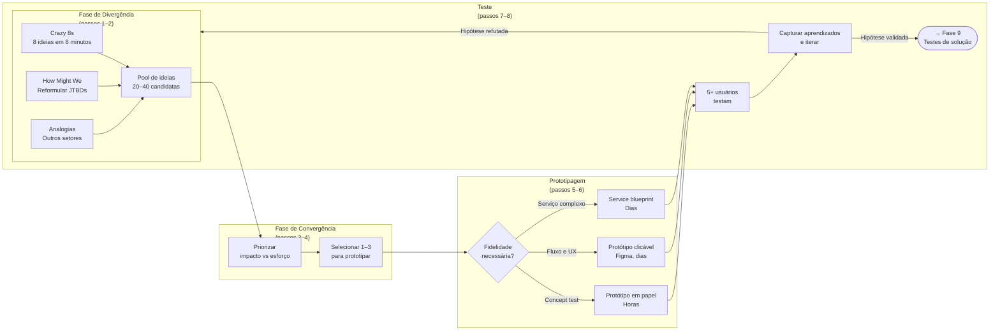

## FASE 8 — IDEAÇÃO E PROTOTIPAGEM DE SOLUÇÕES

> [!question] FMF Check da Fase 8
> As ideias de solução que estão emergindo são fruto da sua experiência única com o problema, ou são soluções genéricas que apareceriam em qualquer brainstorm? Se forem genéricas, provavelmente você não está no founder-market-fit que imagina, ou está no estágio em que precisa mergulhar mais fundo no mercado antes de prototipar. Entrevistar dez operadores experientes do setor antes de prototipar é mais barato que prototipar solução genérica.

### O que esse apêndice cobre

Geração, avaliação e prototipagem de diferentes soluções possíveis para o problema validado. Aqui você não constrói um produto real. Constrói representações: prototipagem em papel, protótipos clicáveis, mockups (telas estáticas de alta fidelidade), storyboards (sequências visuais mostrando o uso em contexto). Para testar a desejabilidade da solução antes de investir em construção.

O entregável é um Dossiê de Solução. Contém três a cinco conceitos de solução avaliados, pelo menos um protótipo interativo, e a recomendação de qual caminho seguir.

> [!abstract] Resumo operacional
> **Entregável:** Dossiê de Solução (Template A.5) com três a cinco conceitos avaliados em Desejabilidade, Viabilidade e Sustentabilidade; pelo menos um protótipo interativo low-fi testado com oito ou mais usuários do ICP; recomendação escrita de qual conceito levar para MVP.
>
> **Sinais de saída:**
> - Dez ou mais ideias geradas em sessão de divergência documentada (Crazy 8s, How Might We, analogias).
> - Matriz Impacto vezes Esforço aplicada com classificação clara dos finalistas.
> - Dois ou mais protótipos low-fi (papel ou Figma) prontos, resolvendo o job central da Fase 4 — não features periféricas.
> - Cinco ou mais (idealmente oito) testes documentados com usuários do ICP, com padrões de uso e reação registrados.
> - Decisão escrita sobre qual conceito vai virar MVP, com lista clara de essencial versus postergável.
>
> **Três armadilhas mais comuns:**
> 1. Apegar-se à primeira ideia e pular a divergência — diverge dói, mas a primeira ideia raramente é a melhor.
> 2. Prototipar com alta fidelidade cedo demais — protótipo bonito esconde problemas de fluxo que o low-fi revelaria em horas.
> 3. Ouvir opinião em vez de observar comportamento — o que importa é onde o usuário trava, não se "achou bonito" ou se "gostou".

### POR QUE

Entre entender o problema e construir a solução, existe um abismo de decisões. Quase todo problema validado pode ser resolvido de várias formas. App. SaaS. Serviço. Marketplace. Hardware. Comunidade. Curso. Pular direto para "app" é a preguiça que custa caro. Explorar alternativas gera insight, e reduz risco.

Prototipagem é a forma mais barata de testar. Com um dia de trabalho, e zero código, você consegue feedback sobre experiência, fluxo, e desejabilidade.

> [!note] Apêndice H — TRL e CRL
> Se a solução candidata envolve tecnologia nova (hardware, deeptech, biotech, energia), o nível de maturidade tecnológica (TRL) e comercial (CRL) é variável crítica antes de escolher qual conceito prototipar. O [[apendice-h|Apêndice H — TRL e CRL]] define os nove níveis de TRL e os estágios de CRL correspondentes, e ajuda a calibrar o escopo do protótipo ao nível de maturidade real — evitando o erro de prototipar solução que requer TRL 6+ quando o projeto está em TRL 2.

> [!note] Apêndice F — Científico vs Lean Startup
> Esta fase aplica a lógica do ciclo Lean em seu ponto mais puro: prototipar barato, testar cedo, iterar. O [[apendice-f|Apêndice F — Científico vs Lean Startup]] situa esse ciclo dentro da distinção entre validação qualitativa (protótipo, teste de fluxo) e validação quantitativa (métricas de uso, dados de retenção). Relevante especialmente para definir quando parar de iterar protótipos e comprometer recursos para o MVP.

### Quando usar

Comece depois da [[#FASE 7 — EXPERIMENTOS DE VALIDAÇÃO DO PROBLEMA|Fase 7]] confirmar que o problema é real. Termine quando tiver um protótipo interativo testado com pelo menos oito usuários, e uma direção clara de qual solução construir. Revisite antes de cada grande decisão de redesign.

### Quem envolve

O executor é você. Com apoio de designer (freelancer ou sócio) se tiver. Os participantes são oito a doze usuários do ICP, para testar protótipos. O decisor é você.

### Como executar

Oito passos.

Não se limite ao que você imaginou. Faça sessões de brainstorm estruturadas. Sozinho ou com duas a três pessoas. Quatro técnicas úteis.

Crazy 8s (oito ideias em oito minutos, uma por minuto). Força quantidade sobre qualidade.

How Might We, "como poderíamos?". Reformule o *job to be done* em três a cinco perguntas abertas. Por exemplo: "Como poderíamos ajudar o dono de restaurante a encerrar o dia sem preocupação?"

Extremos. E se a solução fosse super-premium (R$ 5.000 por mês)? E se fosse de graça? E se fosse física? E se fosse humana (serviço)?

Analogias. Como outros setores resolvem problemas parecidos? O que o Uber ensinou sobre marketplaces pode se aplicar? O que o iFood ensinou sobre logística distribuída?

> [!tip] Meta da divergência
> Quinze a trinta ideias no papel, mesmo que a maioria seja ruim. A qualidade emerge da quantidade.

#### Passo 2, avalie e reduza (convergir)

Avalie cada ideia em três dimensões.

Desejabilidade. O usuário quer isso? Baseado em tudo que você aprendeu nas Fases 2 e 3.

Viabilidade. Você consegue entregar? Capacidades técnicas, financeiras, regulatórias.

Sustentabilidade. O modelo econômico fecha? Preço viável, custo viável, margem razoável.

Dê nota de um a cinco em cada dimensão. Multiplique. Selecione os três a cinco conceitos com maior pontuação.

> [!note] DVS e matriz Impacto-Esforço são complementares
> A avaliação por Desejabilidade, Viabilidade, e Sustentabilidade (DVS) é qualitativa. Útil para reduzir trinta ideias para cinco. Já a matriz Impacto vezes Esforço (que aparece no exemplo prático mais adiante) é visual. Útil para priorizar quais protótipos rodar primeiro entre os finalistas. Use as duas em sequência. Primeiro DVS para filtrar. Depois Impacto-Esforço para ordenar.

#### Passo 3, detalhe os 3 a 5 conceitos escolhidos

Para cada conceito, escreva em uma página seis itens. Nome do conceito (dê nome, facilita comunicação). Descrição em um parágrafo. Principal diferencial. Requisitos técnicos principais. Modelo de monetização imaginado. Principais riscos.

> [!note] Apêndice FF — Psicologia do Consumidor Brasileiro
> A reação do usuário ao protótipo é moldada por fatores que vão além do fluxo. O [[apendice-ff|Apêndice FF — Psicologia do Consumidor Brasileiro]] cobre como o consumidor brasileiro processa proposta de valor — ancoragem de preço, mobile-first, e o peso da confiança percebida na primeira impressão. Leia antes de definir quais elementos incluir no protótipo de teste.

#### Passo 4, escolha 1 ou 2 conceitos para prototipar

Escolha o(s) com maior potencial percebido. Defina o formato do protótipo. Seis opções.

##### Storyboard

Sequência de seis a doze quadros mostrando a pessoa usando a solução em contexto. Útil para validar o fluxo geral.

##### Wireframes em papel ou ferramenta

Wireframes (esboços de tela que mostram estrutura sem detalhes visuais) são úteis para validar arquitetura de informação.

##### Mockups de alta fidelidade

Telas desenhadas com detalhe visual. Figma ou similar.

##### Protótipo clicável

Telas com fluxo de navegação. Pode ser feito em Figma, Marvel, Proto.io.

##### Protótipo em vídeo

Vídeo explicando a solução como se ela existisse. Excelente para testar com público amplo.

##### Protótipo de serviço (service blueprint)

Para negócios de serviço. Mapeie touchpoints (pontos de contato entre cliente e serviço), atores, sistemas, e tempo.

> [!tip] Para a maioria dos casos no início, protótipo clicável em Figma
> É o melhor custo-benefício. Permite testar fluxo real de navegação, sem precisar de código. Designer freelancer faz em dois ou três dias.

#### Passo 5, prepare roteiro de teste de protótipo

Cinco partes na estrutura do roteiro.

Contextualização (dois minutos). Descreva a situação real em que a pessoa estaria usando.

Tarefas (quinze minutos). Dê três a cinco tarefas para a pessoa executar no protótipo. Por exemplo: "Você acabou de fechar o caixa do dia. Use essa ferramenta para checar se houve alguma divergência."

Observação silenciosa. Deixe a pessoa errar. Anote onde ela travou.

Pensar em voz alta. Peça que verbalize o que está pensando enquanto navega.

Perguntas pós-teste (dez minutos). O que foi intuitivo? O que foi confuso? Usaria? Pagaria? Quanto?

> [!note] Apêndice DT — Customer Experience
> O protótipo é o primeiro contato do usuário com a experiência do produto. O [[apendice-dt|Apêndice DT — Customer Experience]] cobre como estruturar o onboarding (processo de ativação do novo usuário) desde o protótipo — o que o usuário precisa entender e sentir nos primeiros minutos determina retenção futura. Use os princípios de onboarding do DT para guiar quais tarefas incluir no roteiro de teste.

#### Passo 6, teste com 8 a 12 usuários do ICP

A partir do oitavo teste, você começa a ver padrões claros. Se você achar que três testes bastam, está ignorando a diversidade de reações.

#### Passo 7, itere o protótipo

Depois de cada ciclo de três a quatro testes, ajuste o protótipo com base nos padrões observados. Teste a nova versão com os próximos três a quatro usuários.

#### Passo 8, consolide no Dossiê de Solução

Documento contendo seis itens. Conceitos gerados e avaliados. Conceitos selecionados, detalhados. Protótipos (ou links). Resumo dos testes com usuários (padrões observados, problemas encontrados, verbatim). Recomendação de conceito a construir, com justificativa. Riscos e incógnitas remanescentes.

> [!tip] Apêndice A — Template do Dossiê de Solução (A.5)
> O [[#APÊNDICE A — TEMPLATES PRONTOS PARA USO|Apêndice A (A.5)]] contém o template preenchível do Dossiê de Solução com os seis campos acima em formato estruturado. Use-o para garantir que a documentação de cada conceito avaliado seja consistente entre si e comparável na tomada de decisão do Passo 4.

### PERGUNTAS A RESPONDER

- Quais são as soluções alternativas possíveis para o problema?
- Qual conceito tem a melhor combinação de desejabilidade, viabilidade, e sustentabilidade?
- Como o usuário reage quando vê uma versão tangível da solução?
- Onde o usuário trava, se confunde, se encanta?
- O que tem que estar necessariamente no MVP? O que pode ficar para depois?
- Qual a linguagem visual e narrativa que o usuário entende e reconhece?

### Métricas

Número de conceitos gerados. Alvo: quinze ou mais no brainstorm inicial.

Número de testes de protótipo realizados. Alvo: oito a doze.

Taxa de conclusão de tarefas sem ajuda. Mais de setenta por cento indica boa clareza do fluxo.

Tempo médio para completar tarefa-chave. Meça e compare com a expectativa pré-teste. Se a execução real exceder a expectativa em cinquenta por cento ou mais, o conceito tem problema de fluxo que o MVP vai herdar se não corrigir.

Indicação de intenção de uso depois de ver o protótipo. Mais de cinquenta por cento dos testados demonstrando intenção real é sinal bom.

Indicação de disposição a pagar depois de ver o protótipo. Pergunte via "quanto faria sentido cobrar por isso?", em vez de "você pagaria?". Setenta por cento ou mais dos testados devem sugerir valor igual ou superior ao seu preço-alvo. Se a maioria sugere abaixo, ou o preço está errado, ou o valor percebido ainda é baixo.

> [!tip] Opportunity Canvas e MVP Canvas como par de ferramentas desta fase
> Antes da sessão de divergência (Passo 1), use o Opportunity Canvas (CZ.5) para estruturar oportunidades por desejabilidade, viabilidade e usabilidade — priorizando onde prototipar. Antes de qualquer linha de código, use o MVP Canvas (CZ.11) para definir hipótese central, segmento do MVP, tipo de artefato mais barato e critério de invalidação. Veja instruções e casos em [[#APÊNDICE CZ — CANVASES E MAPAS VISUAIS DE MODELO|CZ.5]] e [[#APÊNDICE CZ — CANVASES E MAPAS VISUAIS DE MODELO|CZ.11]].

### SAÍDA DESTA FASE

Você concluiu a [[#FASE 8 — IDEAÇÃO E PROTOTIPAGEM DE SOLUÇÕES|Fase 8]] quando os seis critérios abaixo estão cumpridos.

1. Você gerou dez ou mais ideias em sessão de divergência documentada (não prendeu-se à primeira ideia).
2. Você aplicou a Matriz Impacto vezes Esforço com classificação clara.
3. Dois ou mais protótipos low-fi (papel ou Figma) estão prontos, resolvendo o *job* central identificado na [[#FASE 4 — PESQUISA COM USUÁRIOS (CUSTOMER DISCOVERY APROFUNDADO)|Fase 4]]. Não features periféricas.
4. Você realizou e documentou cinco ou mais testes com usuários do ICP (idealmente oito ou mais para confiança maior).
5. Insights qualitativos claros emergem. Não só "gostaram". Padrões de uso e reação estão documentados.
6. Você decidiu qual conceito levar para MVP, com justificativa escrita. E tem lista clara do que é essencial versus postergável.

**Checklist final.**

- [ ] Gerei dez ou mais ideias de solução alternativas, sem ficar com a primeira?
- [ ] Apliquei técnica de divergência (Crazy 8s, brainwriting, SCAMPER) antes de convergir?
- [ ] Classifiquei ideias em dois eixos: impacto e esforço (matriz 2x2)?
- [ ] Escolhi duas ou três ideias para prototipar, não só a "preferida"?
- [ ] Os protótipos são de baixa fidelidade (papel, Figma clicável, sem código)?
- [ ] Os protótipos resolvem o *job* central identificado na [[#FASE 4 — PESQUISA COM USUÁRIOS (CUSTOMER DISCOVERY APROFUNDADO)|Fase 4]], não features periféricas?
- [ ] Mostrei os protótipos para cinco ou mais usuários do ICP?
- [ ] Identifiquei qual solução gera reação mais forte (positiva ou negativa)?

**Primeiros passos práticos.**

1. Reservar duas horas para sessão de ideação. Crazy 8s (oito ideias em oito minutos), mais detalhamento das três melhores.
2. Prototipar em Figma ou em papel as duas a três ideias mais promissoras. Low-fi. Não perca tempo em fidelidade.
3. Agendar cinco sessões com usuários ICP, mostrando os dois ou três protótipos lado a lado, e pedindo reação.
4. Documentar reações. O que chamou atenção. O que confundiu. O que ignoraram.

### EXEMPLO PRÁTICO

**Sessão de ideação, PadariaPro.**

O *job* central, identificado na [[#FASE 4 — PESQUISA COM USUÁRIOS (CUSTOMER DISCOVERY APROFUNDADO)|Fase 4]]: "Me devolver horas de foco executivo, sem aumentar o desperdício."

Crazy 8s, fragmento de oito ideias em oito minutos. App mobile para o gerente fazer pedido por voz. WhatsApp bot que pergunta o estoque diário e faz pedido automático. Dashboard web com previsão mais um clique para confirmar pedido. Etiquetas inteligentes (sensor) em sacos de farinha. Câmera no estoque com visão computacional. E-mail diário com "pedido sugerido" que requer aprovação. Integração com caixa, deduz estoque automaticamente. Parceria com fornecedor: o fornecedor envia semanalmente baseado em consumo.

Matriz Impacto vezes Esforço aplicada às oito ideias. Alto impacto e baixo esforço: a número 2 (WhatsApp bot) e a número 6 (e-mail diário). Prototipar essas duas. Alto impacto mas alto esforço: a número 3 (dashboard) e a número 7 (integração com caixa). Versão reduzida vale prototipar. Descarte inicial: a número 4 (etiquetas — caro, complexo) e a número 5 (câmera — infraestrutura). Guardar para fase pós-PMF.

**Protótipo número 2, WhatsApp Bot (low-fi).**

Sequência de seis mensagens em PDF, simulando o diálogo bot-usuário:

> *Bot:* "Bom dia, Fábio! Segundo o seu histórico, você vai precisar de 120 kg de farinha T1 esta semana. Confirmar pedido com Anaconda por R$ 2.340? (sim/não/ajustar)"
>
> *Usuário:* "Ajustar para 140 kg"
>
> *Bot:* "Ok, 140 kg por R$ 2.730. Confirmar? (sim/não)"
>
> *Usuário:* "Sim"
>
> *Bot:* "Pedido enviado. Entrega quarta-feira."

**Protótipo número 6, E-mail Diário.**

Imagem de um e-mail simulado, com lista de itens sugeridos, quantidades, valores, e dois botões. "Confirmar pedido" e "Ajustar".

**Testes com cinco usuários, reação bruta.**

| Usuário | Reação ao 2 (WhatsApp) | Reação ao 6 (E-mail) | Preferência |
|---|---|---|---|
| Fábio (Campinas) | "Isso é incrível, resolveria o meu dia" | "E-mail eu ignoro" | 2 |
| João (SP) | "Bom, mas e se errar?" | "Mais formal, mais bonito" | Empate |
| Paula (SP) | "O meu gerente não vai usar WhatsApp assim" | "E-mail ninguém abre" | Nenhum |
| Roberto (RM) | "Perfeito, WhatsApp é onde a gente vive" | "Fraco" | 2 |
| Márcia (Campinas) | "Confirmar compra de R$ 2 mil pelo WhatsApp me deixa insegura" | "Mais segurança visual" | 6 |

O aprendizado principal. WhatsApp é preferido pela conveniência, mas gera ansiedade em valores altos. E-mail gera segurança visual, mas tem problema de abertura.

> [!important] O insight crítico do teste
> Talvez a solução seja híbrida. WhatsApp para notificação, mais confirmação em app ou web para compras acima de R$ 1 mil. Não dicotomia entre os dois. Os testes raramente confirmam a hipótese binária. Geralmente revelam síntese inesperada.

### Armadilhas

Apegar-se à primeira ideia. A primeira ideia raramente é a melhor. Divergir antes de convergir dói. Mas paga.

Prototipar com alta fidelidade cedo demais. Um protótipo bonito pode esconder problemas de fluxo. Comece em baixa fidelidade.

Testar com usuários errados. Teste com o ICP. Amigo designer dando feedback não substitui usuário real.

Ouvir opinião em vez de observar comportamento. O que importa é onde o usuário trava. Não se ele "acha bonito".

Usar o teste como confirmação. O objetivo é encontrar problemas, não receber elogios. Se ninguém achou nada errado, você fez um teste fraco.

Construir direto sem prototipar. "Já sei como vai ser." Constatação final: você descobre coisas no protótipo que não imagina na cabeça.

> [!warning] Construir a solução errada para o problema certo
> Antes da Tesla, existiam carros elétricos, e ninguém os queria de forma massiva. Não porque o problema (mobilidade limpa) fosse irreal. Mas porque as montadoras tradicionais assumiram que o cliente trocaria desempenho e estética por consciência ambiental. A Tesla atacou o mesmo problema com uma solução que não pedia essa troca. A lição transferível: validar o problema não te dá cheque em branco sobre a solução. Um problema real comporta várias hipóteses de solução. E apenas algumas delas funcionam. Teste problema e solução separadamente. E desconfie quando o resultado do primeiro se transferir automaticamente para o segundo.

---

### CASO BRASILEIRO, Fase 8, prototipagem com wireframe em papel

A fundadora de uma startup de educação infantil precisava testar o fluxo de uso com crianças antes de investir em desenvolvimento.

A decisão foi simples e barata. Em vez de construir MVP digital, imprimiu telas em papel. Pediu a quinze crianças (cinco de quatro anos, cinco de seis anos, cinco de oito anos) para "usar" o papel. Ela observava como elas interpretavam cada tela.

A descoberta. O fluxo pensado para adulto (menu para categoria para item) não funcionava com crianças de quatro a seis anos. Elas esperavam ver tudo numa tela com imagens grandes. Redesenhou antes de escrever código.

A lição transferível. Protótipo em papel revela falhas de experiência a R$ 50 (custo das impressões) que revelariam a R$ 50 mil depois de desenvolvido.

---

### FERRAMENTAS DESTA FASE

Ideação e prototipagem de soluções exigem ferramentas de divergência mais convergência estruturadas. Nove ferramentas: Design Thinking Double Diamond (BG.10.5), Google Design Sprint (BG.10.3), Working Backwards / PR-FAQ (BG.10.6), Opportunity Solution Tree (BG.10.2), Continuous Discovery Habits (BG.10.1), Dual-Track Agile (BG.10.9), Personas (BG.9.4), Customer Journey Mapping (BG.9.6) e Service Blueprinting (BG.9.7).

Canvases visuais complementares ([[#APÊNDICE CZ — CANVASES E MAPAS VISUAIS DE MODELO|Apêndice CZ]]): CZ.5 (Opportunity Canvas) e CZ.11 (MVP Canvas).

Design Thinking Double Diamond (IDEO e British Design Council, 2005). Processo em quatro fases (Discover, Define, Develop, Deliver), divergindo e convergindo duas vezes. Use em problemas complexos que exigem exploração antes de solução. Ver BG.10.5.

Google Design Sprint (Jake Knapp, 2016). Processo de cinco dias para ir de problema a solução testada com usuários reais. Use em decisões de produto significativas, onde se quer aprendizado rápido antes de compromisso de execução. Ver BG.10.3.

Working Backwards e PR-FAQ (Amazon). Escrever press release final do produto, mais FAQ, antes de construir. Força clareza sobre valor, cliente, e narrativa. Use antes de lançamento de feature ou produto significativo. Ver BG.10.6.

Opportunity Solution Tree (Teresa Torres). Ferramenta visual que conecta resultado desejado, oportunidades de melhoria (dores do cliente), soluções e experimentos em uma árvore. Use para mapear o espaço de soluções antes de priorizar. Ver BG.10.2.

Continuous Discovery Habits (Teresa Torres, 2021). Método de descoberta contínua baseado em entrevistas semanais com usuários, mapeamento de oportunidades e testes de premissas. Use quando o time de produto quer estabelecer ritmo de aprendizado contínuo. Ver BG.10.1.

Dual-Track Agile (Marty Cagan). Dois trilhos paralelos: Discovery (validar o que construir) e Delivery (construir o que foi validado). Use em times maiores (sete ou mais), onde há capacidade de paralelismo. Ver BG.10.9.

Personas (Alan Cooper, 1998). Representações fictícias mas baseadas em dados de segmentos de usuários. Para ideação, personas ajudam a manter foco. Use depois de pesquisa qualitativa da [[#FASE 7 — EXPERIMENTOS DE VALIDAÇÃO DO PROBLEMA|Fase 7]]. Personas são síntese dos dados. Ver BG.9.4.

Customer Journey Mapping (mapa da jornada do cliente). Visualização da jornada do cliente em momentos, emoções e pontos de contato. Use antes de ideação, para localizar oportunidades por fase. Ver BG.9.6.

Service Blueprinting (Shostack, 1984). Mapa detalhado do serviço completo: o que o cliente vê, o que acontece nos bastidores, e os sistemas envolvidos. Use em produtos com componente de serviço significativo. Ver BG.9.7.

---

### SÍNTESE DA FASE 8

O entregável desta fase é o Dossiê de Solução. Três a cinco conceitos avaliados em Desejabilidade, Viabilidade e Sustentabilidade; pelo menos um protótipo interativo testado com oito ou mais usuários; e recomendação escrita de qual caminho seguir. Quem economiza no protótipo descobre os mesmos problemas na construção — em momento mais doloroso e caro de corrigir.

Esse dossiê é o insumo da [[#FASE 9 — TESTES DE SOLUÇÃO E USABILIDADE|Fase 9]], onde o conceito escolhido passa por testes de usabilidade estruturados e se converte em Especificação do MVP. Quem chega à [[#FASE 9 — TESTES DE SOLUÇÃO E USABILIDADE|Fase 9]] sem ter explorado alternativas e sem ter testado protótipo entra na especificação com hipótese implícita não testada. Isso aumenta a chance de retrabalho radical na [[#FASE 10 — MVP E EXPERIMENTOS DE MERCADO|Fase 10]].

# fase8 #ideacao #prototipagem #design-thinking #crazy-8s #wireframe #figma #protótipo-clicavel #service-blueprint

---
