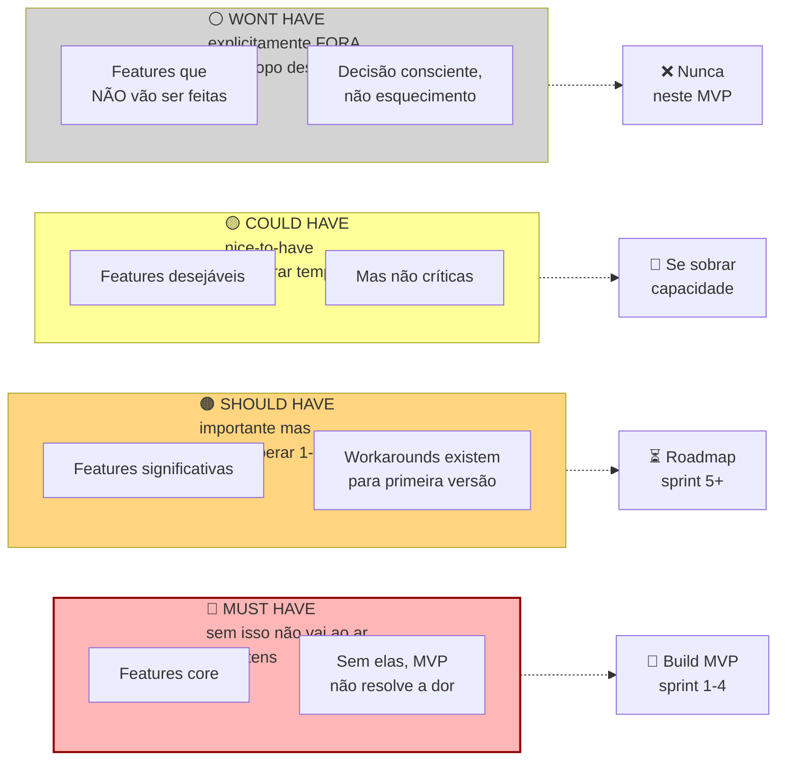

## FASE 9 — TESTES DE SOLUÇÃO E USABILIDADE

### O que esse apêndice cobre

Refinamento iterativo do conceito escolhido por meio de testes de usabilidade estruturados, entrevistas de solução (diferentes das de problema), e validação da proposta de valor em contato com usuários. Nesta fase, você também define os requisitos funcionais mínimos do MVP que será construído na [[#FASE 10 — MVP E EXPERIMENTOS DE MERCADO|Fase 10]].

O entregável é a Especificação do MVP. Documento preciso sobre o que o MVP fará, para quem, com quais limitações, e como medirá sucesso.

### POR QUE

Protótipos testam fluxo e conceito. Mas não testam valor real em uso prolongado. Esta fase aprofunda o teste de solução, e converte aprendizado em requisitos. Sem especificação clara antes de construir, você gasta mais, demora mais, e entrega menos.

### Quando usar

Comece depois da [[#FASE 8 — IDEAÇÃO E PROTOTIPAGEM DE SOLUÇÕES|Fase 8]] escolher o conceito. Termine quando a Especificação do MVP estiver escrita, priorizada, e aprovada por você (e sócios, se houver). Revisite a cada iteração maior do produto.

### Quem envolve

O executor é você. Com designer e tech lead se houver. Os participantes são dez a quinze usuários do ICP, para entrevistas de solução e testes. O decisor é você.

### Como executar

Seis passos.

#### Passo 1, conduza entrevistas de solução

Diferente da entrevista de problema ([[#FASE 3 — DESCOBERTA DO PROBLEMA|Fase 3]]), aqui você mostra o protótipo e pergunta ao usuário, estruturadamente, seis coisas. Se a solução proposta resolve o problema dele. Como ela se compara com o que ele usa hoje. Quanto faria sentido cobrar. Quais features ele sente falta, e quais acha supérfluas. Em que momento da rotina ele usaria. O que o impediria de usar.

Faça dez a quinze dessas entrevistas. Grave, transcreva, analise.

#### Passo 2, aplique a técnica das cinco escalas de valor

Para cada entrevistado, peça que avalie (em escala de um a cinco) a solução em cinco dimensões.

Relevância. "Isso resolve um problema real para você?"

Urgência. "Você precisaria disso nos próximos trinta dias?"

Preferência. "Você prefere essa solução em relação ao que usa hoje?"

Diferenciação. "Você percebe essa solução como diferente das alternativas?"

Disposição a pagar. "Quanto faria sentido cobrar?"

Calcule a média e o desvio-padrão de cada escala.

> [!warning] Urgência abaixo de três é alerta vermelho
> Se a Urgência média ficar abaixo de três, o problema existe mas não é prioridade. Você terá dificuldade de vender. Não é "ainda preciso polir o pitch". É "o problema não é dolorido o suficiente". Volte à Fase 3.

#### Passo 3, faça o teste de cinco segundos (five second test)

Mostre o protótipo ou a página principal por cinco segundos, e tire. Depois pergunte três coisas. O que você entendeu? Para quem é? Qual problema resolve?

Se cinquenta por cento dos testados não conseguem responder bem, o seu posicionamento está confuso. Isso vai matar o seu CAC depois.

> [!note] Apêndice FF — Psicologia do Consumidor Brasileiro
> As respostas nas entrevistas de solução são influenciadas por como a pergunta é feita e em que contexto. O [[apendice-ff|Apêndice FF — Psicologia do Consumidor Brasileiro]] detalha vieses de resposta específicos do consumidor brasileiro — incluindo tendência de superestimar intenção de uso e subestimar sensibilidade a preço — que distorcem as escalas de valor se não forem antecipados.

#### Passo 4, teste de precificação (price sensitivity, Van Westendorp)

Pergunte quatro coisas, nessa ordem.

Em que preço você começaria a achar muito barato? A ponto de desconfiar da qualidade.

Em que preço você começaria a achar barato? Bom negócio.

Em que preço você começaria a achar caro? Mas ainda consideraria.

Em que preço você começaria a achar caro demais? Não consideraria.

Com quinze a vinte respostas, plote as quatro curvas. A intersecção entre "caro" e "barato" indica a faixa de preço psicologicamente aceitável.

> [!tip] Van Westendorp é ponto de partida, não resposta final
> Essa não é a precificação ideal. Mas é um ponto de partida muito melhor do que chutar. Preço real será descoberto em mercado.

#### Passo 4B, aplique product discovery moderno (Marty Cagan e Teresa Torres)

O padrão contemporâneo de product discovery em empresas de tecnologia maduras (Silicon Valley, scale-ups europeias, unicórnios latam) se baseia em quatro princípios que valem a pena incorporar desde cedo.

##### Continuous discovery (Teresa Torres)

Em vez de fazer "fases" de discovery separadas do desenvolvimento, o time mantém contato semanal com clientes (três a cinco entrevistas por semana, por time de produto) permanentemente. Em paralelo com o desenvolvimento. O objetivo é que qualquer decisão de produto seja informada por evidência recente. Não por discovery feito há seis meses.

A implementação mínima tem quatro elementos. Calendário recorrente de entrevistas. Cada product trio (PM mais designer mais tech lead) agenda duas a três conversas com cliente por semana. Recrutamento contínuo. Pool de usuários-teste renovado mensalmente. Use ferramentas como Respondent, UserTesting, ou recrutamento próprio em comunidade. Research Wiki. Todas as aprendizados e quotes vão para repositório central pesquisável. Weekly sync. Time inteiro discute dois a três aprendizados da semana em trinta minutos.

##### Opportunity Solution Tree (OST), de Teresa Torres

Framework visual para conectar outcomes do negócio, oportunidades (dores, desejos, jobs do cliente), soluções, e experimentos. Estrutura:

```text
 OUTCOME DESEJADO
 (ex.: aumentar NRR em 15pp)
 │
 ┌──────────────┼──────────────┐
 │ │ │
 OPORTUNIDADE OPORTUNIDADE OPORTUNIDADE
 (Cliente não (Cliente não (Cliente não
 descobre entende valor sabe do produto
 features) do produto) adjacente)
 │ │ │
 ┌──┴──┐ ┌──┴──┐ ┌──┴──┐
 SOL A SOL B SOL C SOL D SOL E SOL F
 │ │ │ │ │ │
 EXP EXP EXP EXP EXP EXP
```

A lógica. Outcome é o norte. Oportunidades são formas de mover o norte. Soluções são apostas sobre como atacar a oportunidade. Experimentos testam as apostas. O OST previne o erro clássico de "ir direto para solução" sem mapear se a oportunidade é real.

> [!important] Exercício prático antes de adicionar feature
> Antes de adicionar qualquer feature ao MVP, pergunte três coisas. Qual oportunidade do cliente essa feature ataca? Qual outcome de negócio isso move? Se a oportunidade não existir, a feature vira desperdício. Volte ao discovery.

##### Dual-track agile

Em vez de alternar "sprints de discovery" com "sprints de development", rode os dois em paralelo. Discovery track (tipicamente PM mais designer mais tech lead). Continuamente entrevista clientes, prototipa, testa hipóteses. Gera oportunidades validadas e soluções prototipadas. Delivery track (engenheiros). Continuamente constrói soluções já validadas pelo discovery track.

O pipeline funciona como esteira. Discovery produz "backlogged validated solutions". Delivery puxa delas. Evita dois problemas. Engenheiros ficarem sem o que construir, enquanto discovery trabalha. E construir coisas que não foram validadas.

##### User stories com acceptance criteria estruturado (INVEST)

Ao quebrar a solução em itens de trabalho, cada user story deve atender a seis critérios.

Independent. Não depende de outras stories para ser útil.

Negotiable. Detalhes podem ser ajustados em conversa.

Valuable. Entrega valor visível ao usuário final, ou cliente interno.

Estimable. O time consegue estimar esforço com razoável precisão.

Small. Cabe em um sprint (uma a duas semanas). Se não cabe, quebre.

Testable. Tem critérios de aceite objetivos. Pode ser verificado.

Formato padrão:

```text
Como [persona]
Quero [ação / funcionalidade]
Para [benefício concreto]

ACCEPTANCE CRITERIA:
[ ] Dado [estado inicial], quando [ação], então [resultado esperado]
[ ] Dado [outro estado], quando [ação], então [outro resultado]
[ ] [Critérios de UX, performance, segurança específicos]
```

Com acceptance criteria, "definição de pronto" vira auditável. Sem eles, "pronto" vira debate filosófico no planning.

#### Passo 5, mapeie requisitos por ordem de prioridade (MoSCoW)

A priorização MoSCoW para escopo de MVP, em estrutura visual:



A tentação é inflar Must Have para vinte ou trinta itens. MVP com vinte Must Haves não é MVP. É produto mínimo *impossível*.

Lista de requisitos funcionais. Cada um em uma das quatro categorias. Must Have. Sem isso, não há produto. Entra no MVP obrigatoriamente. Should Have. Deveria ter, mas dá para viver um tempo sem. Sprint três pós-MVP. Could Have. Desejável. Entra se houver tempo e capacidade. Won't Have (yet). Explicitamente fora do MVP.

> [!important] Regra dura do MoSCoW
> Um MVP com mais de dez a quinze Must Haves não é MVP. É produto inflado. Se a sua lista passa de quinze, você não dominou o problema ainda. Volte e corte.

#### Passo 6, escreva a Especificação do MVP

Documento contendo dez itens.

Proposta de valor final, em uma frase. Persona foco (beachhead). JTBDs principais a resolver. Lista de Must Haves. Lista de Should e Could Haves (roadmap futuro). Explicitamente: o que o MVP *não* fará (Won't Haves). Critérios de sucesso do MVP (métricas). Faixa de preço planejada. Canais de aquisição planejados. Prazo de desenvolvimento estimado. Orçamento.

### PERGUNTAS A RESPONDER

- A solução proposta resolve o problema de forma percebida como superior pelo ICP?
- Em que faixa de preço ela cabe no orçamento da beachhead?
- Quais são os requisitos absolutamente indispensáveis (Must Haves)?
- Quais seriam dispensáveis no primeiro release?
- Como vou medir sucesso do MVP em noventa dias depois de lançar?
- Quais são os três principais riscos do MVP?

### Métricas

Score médio de Urgência. Quatro ou mais é forte. Três a quatro é aceitável. Abaixo de três é alerta.

Score médio de Preferência sobre alternativa atual. Quatro ou mais é forte.

Taxa de entendimento em cinco segundos. Setenta por cento ou mais é bom.

Faixa de preço aceitável (Van Westendorp). Indica o limite superior para cobrar.

Número de Must Haves. Idealmente cinco a dez. Crítico se mais de quinze.

> [!note] Apêndice DT — Customer Experience
> O teste de solução é o primeiro onboarding real do usuário com o conceito do produto. O [[apendice-dt|Apêndice DT — Customer Experience]] cobre como medir e otimizar time-to-value desde essa fase — o tempo que o usuário leva para perceber o valor central é o dado mais preditivo de retenção futura, e deve ser rastreado já nas sessões de teste da Fase 9.

### GATE DE DIRECIONALIDADE, o teste final antes do MVP

Antes de avançar para a [[#FASE 10 — MVP E EXPERIMENTOS DE MERCADO|Fase 10]] e gastar tempo e dinheiro construindo o MVP, responda em voz alta, para um interlocutor externo (cofundador, mentor, advisor), a seguinte pergunta.

> [!important] A pergunta do gate
> A solução que estamos prestes a construir reduz ou elimina, de forma direta e mensurável, a dor que identificamos na beachhead?

Os três elementos da frase importam, e cada um é um teste por si só.

Reduz ou elimina. Não é "ajuda com", "apoia", "melhora a experiência de". Uma solução que não cruza essa barreira não justifica adoção, nem pagamento. Se você se vê usando verbos fracos para descrever o impacto, provavelmente está vendendo melhoria incremental onde o cliente precisa de ruptura.

De forma direta. A cadeia causal entre usar o produto e sentir a dor diminuir precisa ser curta e óbvia. Se a redução da dor depende de o cliente também mudar comportamento, também treinar a equipe, também integrar com outros sistemas que ele ainda não tem, a cadeia é longa demais para um MVP ganhar adoção.

De forma mensurável. O cliente precisa conseguir medir a redução. Em horas, reais, erros evitados, conversões geradas. Redução "sentida" mas não medida é indistinguível de placebo. E não financia renovação de contrato.

> [!warning] Se algum dos três elementos travar, não avance
> Volte ao Passo 6 da Fase 9 (Especificação do MVP), e corte features que não contribuem diretamente para a redução da dor principal. Um MVP que resolve uma dor com direcionalidade clara supera consistentemente um MVP que resolve várias dores com direcionalidade difusa.

### SCALE READINESS CHECK, antes de acelerar o desenvolvimento

Esse checklist complementa o gate de direcionalidade. Enquanto o gate pergunta "a solução é a certa?", o Scale Readiness Check pergunta "você tem as condições para construir com segurança?". Os cinco itens precisam ser todos verdadeiros antes da [[#FASE 10 — MVP E EXPERIMENTOS DE MERCADO|Fase 10]] começar com intensidade de build.

- [ ] **Um comprador claramente definido.** Você tem nome, cargo, e empresa (ou perfil nomeado no caso B2C) do primeiro comprador. Não "pequenos negócios". Uma lista concreta de cinco a dez pessoas que você saberia chamar hoje para uma demo.
- [ ] **Um workflow doloroso identificado.** Você observou, não só ouviu, o workflow atual. Sabe onde o cliente trava, quantos minutos por semana ele gasta na gambiarra, e quem mais na organização é afetado.
- [ ] **Titularidade de orçamento clara.** Você sabe quem no fluxo comprador autoriza o gasto, de qual rubrica sai o dinheiro, e em que ordem de grandeza (R$ por mês ou por licença). Se a resposta é "a gente descobre depois", você ainda não tem clareza orçamentária suficiente para escalar.
- [ ] **Urgência observável.** Não declarada em entrevista. *Observável em comportamento*. O cliente já está pagando algo hoje para mitigar (mesmo que precariamente), já tentou resolver sozinho, ou tem prazo externo (regulatório, contratual, competitivo) que aperta.
- [ ] **Consciência de que escalar suposições amplifica ineficiência.** Você lista por escrito quais suposições ainda não foram validadas, e se comprometeu a validá-las na [[#FASE 10 — MVP E EXPERIMENTOS DE MERCADO|Fase 10]] sem construir por cima delas. Ignorar essa etapa transforma dívida de suposição em dívida de produto, e cria retrabalho caro.

> [!warning] Se algum dos cinco itens não pode ser marcado, não avance em ritmo de produção
> Continue na Fase 9 em modo de investigação até fechar o item. Escalar desenvolvimento com suposições não-testadas é como colocar mais combustível em um carro que ainda não se sabe se tem direção funcionando. Você só vai chegar mais rápido no lugar errado.

### SAÍDA DESTA FASE

Você concluiu a [[#FASE 9 — TESTES DE SOLUÇÃO E USABILIDADE|Fase 9]] quando os nove critérios abaixo estão cumpridos.

1. Especificação do MVP existe escrita, com todos os campos. Incluindo MoSCoW com cinco a quinze Must Haves.
2. Protótipo de média fidelidade clicável existe, com fluxos principais.
3. Três ou mais tarefas-chave de teste estão definidas, com critério de conclusão.
4. Dez ou mais entrevistas de solução, ou sessões de teste, foram realizadas com think-aloud, e resultados analisados.
5. Friction points estão documentados por tarefa, e por usuário (matriz).
6. Iteração do protótipo aconteceu com base nos testes.
7. Teste de precificação foi feito. Faixa de preço definida com justificativa.
8. Você tem confiança razoável de que o MVP, se bem executado, vai resolver o JTBD principal da beachhead.
9. Você passou no Gate de Direcionalidade, e no Scale Readiness Check.

**Checklist final.**

- [ ] Selecionei o protótipo mais promissor da [[#FASE 8 — IDEAÇÃO E PROTOTIPAGEM DE SOLUÇÕES|Fase 8]] para aprofundar?
- [ ] Desenvolvi protótipo de média fidelidade (clicável, simulando fluxo real)?
- [ ] Escrevi tarefas-chave para teste de usabilidade (três a cinco tarefas que o usuário tentaria completar)?
- [ ] Testei com cinco ou mais usuários do ICP, cada um por quarenta e cinco a sessenta minutos?
- [ ] Observei (não entrevistei), usando o think-aloud protocol?
- [ ] Documentei friction points específicos, não genéricos?
- [ ] Iterei o protótipo pelo menos uma vez com base no feedback?
- [ ] Identifiquei qual funcionalidade é "must-have" para ativação versus "nice-to-have"?

**Primeiros passos práticos.**

1. Escolher a solução vencedora da [[#FASE 8 — IDEAÇÃO E PROTOTIPAGEM DE SOLUÇÕES|Fase 8]], e refinar em Figma clicável (ou Webflow ou Framer, se web).
2. Escrever três a cinco tarefas concretas que um usuário novo tentaria fazer (por exemplo, "faça um pedido de farinha para a próxima semana").
3. Agendar cinco sessões de teste de usabilidade de quarenta e cinco minutos cada.
4. Pedir think-aloud. "Fale em voz alta tudo que está pensando enquanto tenta a tarefa." Observar. Não guiar.

### EXEMPLO PRÁTICO

**Roteiro de teste de usabilidade, PadariaPro (protótipo híbrido WhatsApp mais Web).**

**Briefing ao usuário (cinco minutos).**

> "Oi, [Nome]. Hoje vou te mostrar uma versão não finalizada de uma ferramenta. Quero que você tente usá-la como se fosse a sua rotina, e fale em voz alta tudo que está pensando. Não tem resposta certa. Se você se perder, ótimo. É isso que a gente precisa saber. Posso gravar a tela?"

**Tarefa 1, onboarding inicial (dez minutos).**

> "Você acabou de receber a indicação do PadariaPro. Cadastre a sua padaria e adicione o seu primeiro fornecedor (Anaconda)."

Friction points observados em cinco usuários. Quatro de cinco travaram em "Inserir CNPJ", porque o sistema exigiu formato específico sem indicar. Três de cinco não entenderam o que "vincular fornecedor" significava na tela. Cinco de cinco pularam o campo "Inserir cardápio". Acharam irrelevante para onboarding.

**Tarefa 2, confirmar pedido via WhatsApp (oito minutos).**

> "Chegou uma mensagem do PadariaPro no seu WhatsApp com sugestão de pedido. Confirme."

Observações. Cinco de cinco confirmaram sem problema via "sim". Dois de cinco tentaram "ajustar" e ficaram confusos quando o bot pediu nova quantidade. Não estava claro se era em quilos ou em sacos. Quatro de cinco elogiaram a fluidez.

**Tarefa 3, ajustar pedido recorrente (dez minutos).**

> "Você percebeu que a sua padaria está desperdiçando farinha integral. Ajuste o pedido recorrente para pedir vinte por cento a menos."

Friction points. Cinco de cinco demoraram mais de três minutos para encontrar a configuração. Três de cinco desistiram, e disseram "eu pediria pelo WhatsApp direto". O insight: configurações devem poder ser feitas pelo WhatsApp também. Não só pela web.

**Síntese pós-cinco testes.**

Must-have para ativação. Onboarding em menos de cinco minutos (hoje leva doze a vinte). CNPJ com máscara. Explicação de fornecedor. Pular cardápio opcional.

Funcionalidade crítica a simplificar. Ajuste de pedido recorrente. Mover para WhatsApp com comando natural.

Descarte. Seção "cardápio" não é essencial para MVP. Cortar.

Iteração prioritária. Simplificar onboarding para três passos. CNPJ, depois primeiro fornecedor, depois primeiro pedido teste.

### Armadilhas

Bloat de escopo. Sem disciplina, o MVP cresce. Para cada Must Have, pergunte: "se eu tirasse isso, o produto ainda resolveria o *job* principal?". Se sim, não é Must.

Confiar em "eu pagaria". A resposta é sempre mais generosa na entrevista do que na carteira. Trate com desconto de cinquenta a setenta por cento.

Ignorar quem não usaria. Quando um entrevistado diz "não é para mim", isso é informação. Pergunte por quê. Às vezes revela que o seu ICP está mal definido.

Especificar sem mensuração. "O MVP deve ser intuitivo." O que é intuitivo? Operacionalize em métricas testáveis.

Acreditar que precificação está resolvida. Van Westendorp dá um ponto de partida. Não a resposta final. Preço real será descoberto em mercado.

---

### CASO BRASILEIRO, Fase 9, Gupy e empresas-piloto

Em meados da década de 2010, a Gupy nascia da ideia de Mariana Dias, Bruna Guimarães, e Robinson Idalgo de substituir processos tradicionais de recrutamento por uma plataforma que usasse dados e IA para triagem.

A decisão foi cirúrgica. Antes de abrir comercial amplo, fizeram piloto com cinco a oito empresas-parceiras. Usavam a plataforma com acompanhamento próximo, e iteração semanal. Cada empresa tinha objetivo claro (redução de tempo de contratação, aumento de qualidade de candidato), medido pré e pós.

O resultado foi composto. As iterações cruas, baseadas em uso real, calibraram a plataforma antes do go-to-market geral. As empresas-piloto viraram primeiros cases. Depois evangelistas. Depois canal de referência. A Gupy se tornaria, anos depois, uma das maiores plataformas de recrutamento da América Latina.

A lição transferível. Piloto estruturado com poucas empresas gera aprendizados cem vezes mais úteis que lançamento aberto sem foco. E os primeiros pilotos viram, se bem cuidados, os primeiros vendedores da sua empresa.

---

### Transição, Parte I para Parte II

O que você acabou de fazer, ao longo da Parte I (Fases 0 a 9). Preparou-se como fundador. Gerou ideias com método, e escolheu uma. Articulou a candidata. Construiu teoria causal explícita. Descobriu problemas reais em campo. Mapeou usuários, mercado, e cunha. Formulou hipóteses bet-the-company, e validou as centrais com experimentos rigorosos. Gerou conceitos de solução. Prototipou. Testou com usuários reais. E chegou a uma especificação de MVP com escopo disciplinado (MoSCoW), e pricing testado.

O que vem na Parte II (Fases 10 a 14). Construir o MVP de verdade. Colocar em mercado com usuários reais que pagam (ou pagam com atenção). Medir unit economics. Perseguir Product-Market Fit. Estruturar formalmente a empresa quando os números passam a sustentar. E entrar na fase de escala. A Parte II é a mais longa, e mais difícil, do livro. Três a cinco anos típicos. Onde muitas empresas morrem por três motivos. Escalar antes do PMF. Ficar presa em "quase-PMF" sem reconhecer. Não conseguir unit economics positivas.

> [!important] Sinais de progresso versus sinal de PMF
> Sinal de progresso: usuários pagantes em uso real do MVP. Sinal de PMF: Sean Ellis maior ou igual a quarenta por cento, mais retenção estabilizada, mais crescimento orgânico.

### FERRAMENTAS DESTA FASE

Testes de solução e usabilidade exigem métodos específicos de UX research. Detalhamento no [[#APÊNDICE BG — FERRAMENTÁRIO COMPLETO DO EMPREENDEDOR|Apêndice BG]]. Sete ferramentas centrais.

Usability Testing (Nielsen e Norman). Usuários tentam completar tarefas enquanto o pesquisador observa. Cinco usuários identificam cerca de oitenta e cinco por cento dos problemas. Use em qualquer protótipo ou produto já navegável. É a ferramenta central desta fase. Ver BG.7.1.

Heuristic Evaluation (10 Heurísticas de Nielsen, 1994). Três a cinco especialistas avaliam a interface contra dez princípios consolidados. Rápido e barato para triagem. Use como complemento ao usability testing. Não substitui. Ver BG.7.2.

Cognitive Walkthrough (Polson e Lewis, 1992). Simular mentalmente o que um usuário novato pensaria em cada passo. Foco em learnability. Use para avaliar fluxos de onboarding e first-time experience. Ver BG.7.3.

Card Sorting (Spencer). Usuários organizam cards em categorias próprias. Revela modelo mental. Use no desenho de information architecture e menus. Ver BG.7.4.

Tree Testing (O'Brien). Valida se a hierarquia de navegação funciona. O usuário encontra o que busca só pela estrutura de menus. Use depois do card sorting, para validar a estrutura proposta. Ver BG.7.5.

Think-Aloud Protocol (Ericsson e Simon, 1984). Participante verbaliza pensamentos durante a tarefa. Revela raciocínio em tempo real. Use durante usability testing, como técnica complementar. Ver BG.7.6.

System Usability Scale, SUS (Brooke, 1996). Questionário de dez afirmações. Gera score de zero a cem, comparável com benchmarks globais. Use para medição quantitativa de usabilidade (complementa qualitativo). Benchmark de setor: cerca de sessenta e oito. Ver BG.7.7.

---

### SÍNTESE DA FASE 9

A [[#FASE 9 — TESTES DE SOLUÇÃO E USABILIDADE|Fase 9]] é a última ponte antes da construção. Protótipos testam fluxo, e conceito. Mas não testam valor real em uso prolongado. Essa fase aprofunda o teste de solução, e converte aprendizado em requisitos. Sem especificação clara antes de construir, você gasta mais, demora mais, e entrega menos. Quem entra na [[#FASE 10 — MVP E EXPERIMENTOS DE MERCADO|Fase 10]] sem MVP Spec rigorosa entra com escopo elástico, e descobre tarde que está construindo um produto, não um experimento.

A diferença entre quem faz certo, e quem falha, está em disciplina de escopo. MoSCoW, must-have, should-have, could-have, won't-have, é a ferramenta que separa o MVP do produto sonhado. Pricing testado com Van Westendorp, antes de construir, evita o erro caro de descobrir tarde que o cliente nunca pagaria o que você imaginava cobrar. Especificação INVEST para histórias do MVP impede o "gold-plating" da primeira versão.

O entregável é a Especificação do MVP. Documento preciso sobre o que o MVP fará, para quem, com quais limitações, e como medirá sucesso. Esse documento é contrato com o futuro próximo. A [[#FASE 10 — MVP E EXPERIMENTOS DE MERCADO|Fase 10]] implementa a spec. Quem trata a [[#FASE 9 — TESTES DE SOLUÇÃO E USABILIDADE|Fase 9]] como burocracia, e pula direto para a construção, descobre que estava construindo coisa diferente do que precisava. E retrabalho de MVP custa duas a três vezes mais do que retrabalho de spec.

# fase9 #testes-solucao #usabilidade #van-westendorp #moscow #especificacao-mvp #gate-direcionalidade #scale-readiness #invest

---
