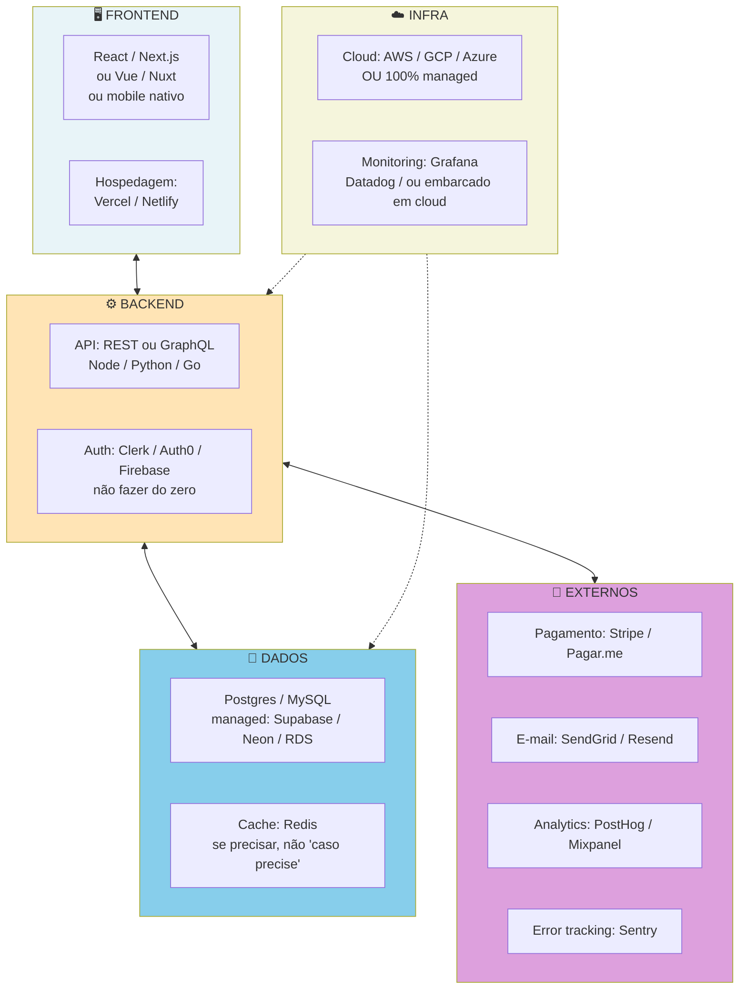
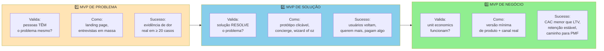

## FASE 10 — MVP E EXPERIMENTOS DE MERCADO

> [!tip] Stack mínimo da Fase 10
> O stack tech do MVP depende muito do produto. Mas a regra é uma: escolher o stack que o time atual consegue manter, não o mais sexy. Para web: frontend (React, Next.js, Vue, ou Svelte se o time tem). Backend (Node.js, Python e Django, Ruby on Rails — comuns e com comunidade brasileira grande). Banco (Postgres, via managed service como Supabase, Neon, ou RDS). Para mobile: React Native ou Flutter (cross-platform), versus nativo (iOS Swift, Android Kotlin) só quando é justificado. Infra: AWS, GCP, ou Azure tradicional. Alternativas mais simples: Vercel (frontend), Railway, Render (fullstack rápido). Autenticação: Auth0, Clerk, Supabase Auth. Pagamento: Stripe (internacional), Asaas ou Pagar.me (Brasil). Regra crítica: usar serviço gerenciado em tudo que não é o seu diferencial. Gastar três meses montando Kubernetes em equipe pequena, em vez de usar Vercel ou Render, é erro típico.
>
> Para produtos dev-tools, infraestrutura ou SaaS técnica: o [[#APÊNDICE BE — OPEN SOURCE COMO ESTRATÉGIA|Apêndice BE]] cobre open source como motor de aquisição (product-led growth via comunidade) e como modelo de negócio (open core, dual licensing, COSS), incluindo casos de empresas que escalaram com essa estratégia.

A arquitetura típica de MVP, com decisões conscientes sobre simplicidade:

> [!important] Princípio da arquitetura no MVP
> Composição de managed services no MVP. DevOps real só depois do PMF. Evite criar o seu próprio auth, criar o seu próprio sistema de e-mail, construir observability do zero. Cada "do-zero" prematuro custa três a seis meses, e quase nunca produz vantagem competitiva.

### O que esse apêndice cobre

Construção e lançamento controlado do MVP (Minimum Viable Product — produto com o mínimo necessário para testar uma hipótese real com usuários reais) com base na Especificação da [[#FASE 9 — TESTES DE SOLUÇÃO E USABILIDADE|Fase 9]]. O objetivo não é vender no grande mercado. É aprender com usuários reais usando um produto real, em ambiente real, pagando preço real (ou aceitando compromisso de pagamento).

O entregável tem dois componentes. MVP em operação, e Relatório de Aprendizado do MVP depois de oito a doze semanas de uso, por dez a cinquenta usuários.

> [!abstract] Resumo operacional
> **Entregável:** MVP em operação mais Relatório de Aprendizado depois de oito a doze semanas com dez a cinquenta usuários reais — North Star Metric definida, analytics instrumentado, decisão entre seguir, iterar ou pivotar documentada.
>
> **Sinais de saída:**
> - Spec de MVP (Template A.6) com escopo dentro e fora explícitos, construído ciclo a ciclo de duas a quatro semanas.
> - Cinco ou mais usuários reais usando o MVP em produção por quatro ou mais semanas (idealmente cinco ou mais pagando recorrentemente).
> - Cenário de sucesso atingido — ativação acima de trinta por cento, retenção D30 acima de quarenta por cento, conversão trial-pago acima de quinze por cento.
> - Conversas semanais com usuários como rotina, com backlog de bugs e pedidos organizado e priorizado.
> - Indicações orgânicas começando a aparecer — uma ou mais para cada dez usuários ativos.
>
> **Três armadilhas mais comuns:**
> 1. MVP que virou produto completo — escopo inflou e demorou nove meses para lançar; isso é V1.0 disfarçado, não MVP.
> 2. Falsa ativação — vaidade de quinhentos cadastros com apenas cinco usuários reais; distinga sempre cadastro de uso.
> 3. Persistir demais ou pivotar cedo demais — seis meses com retenção em zero é negação, mas duas semanas de dados não dá conclusão; respeite a janela de oito a doze semanas.

### POR QUE

Até agora, você trabalhou com evidência declarada (entrevistas) e evidência comportamental limitada (testes de protótipo). O MVP é onde você obtém a evidência mais valiosa: o que as pessoas fazem com um produto real, pago, nas rotinas delas de verdade. Essa evidência é diferente em qualidade. E muitas vezes surpreende.

> [!warning] MVP não é "versão capenga" do produto
> Essa é a confusão mais comum. MVP não é o produto cortado pela metade, com metade dos botões e metade do design. MVP é um processo obsessivo de validação que se concentra em responder duas perguntas por ciclo. Qual é a premissa ou hipótese mais arriscada *neste momento*? Como podemos testá-la com o menor esforço possível?

Um MVP de sucesso não é medido pela elegância do código, nem pelo polimento da interface. É medido pelo quanto de incerteza ele elimina por real investido. Se você gastou R$ 200 mil construindo um MVP e saiu com as mesmas dúvidas que tinha no início, não foi MVP. Foi produto prematuro mal-feito.

### O ciclo MVP em três fases, construir na ordem certa

O ciclo MVP em três etapas, cada uma valida coisa diferente:

> [!warning] Pular etapas é o erro mais comum
> Construir MVP de Negócio sem validar Problema primeiro é escalar CAC em ICP errado. Validar Solução sem ter validado Problema é resolver dor inventada. A ordem importa. Não pule.

Empreendedores iniciantes tendem a pular direto para "MVP em código" e gastar quatro a seis meses e R$ 50 mil a R$ 300 mil antes de qualquer evidência. A alternativa estruturada é fazer o MVP em três fases sequenciais, cada uma testando uma pergunta diferente. Só avance quando a anterior for aprovada.

#### Fase 1 do ciclo, Teste de Demanda (Landing Page)

A pergunta que responde: existe demanda real por essa proposta de valor, a esse preço, nesse ICP?

Como fazer. Crie uma landing page (página de destino — página única para capturar interesse) que descreva a solução como se ela existisse. Direcione tráfego pago (Facebook, Google, LinkedIn Ads), ou orgânico (comunidade, outbound), para essa página. Ofereça um mecanismo de captura: cadastro de e-mail, pré-pedido pago (com reembolso garantido), ou lista de espera.

Métrica primária. Taxa de conversão de visitante em ação. Threshold forte: mais de dez por cento para cadastro, mais de três por cento para pré-pedido pago. Threshold crítico: menos de dois por cento para cadastro significa que o gancho não ressoa.

Custo típico de R$ 500 a R$ 3.000 em tráfego pago, mais alguns dias para montar a página (Carrd, Framer, Webflow, Unbounce). Duração de uma a três semanas. O critério de avanço é demanda confirmada acima do threshold pré-definido.

> [!tip] Apêndice A — Templates operacionais desta fase
> O [[apendice-a|Apêndice A]] inclui o template A.5 (Landing Page de Validação) com estrutura de headline, proposta de valor, CTA e formulário de captura — pronto para adaptar e publicar em Carrd ou Framer sem partir do zero.

#### Fase 2 do ciclo, MVP Concierge (versão manual do produto, entregue à mão pelo fundador)

A pergunta que responde: se entregarmos o valor prometido, o cliente consome, paga, e retorna? A solução realmente *mata* a dor?

Como fazer. Entregue o valor manualmente. Sem automação. Sem código. O cliente não precisa saber que é manual. Se você está fazendo um app de conciliação contábil, use planilha mais WhatsApp mais e-mail. Se é um serviço de curadoria de conteúdo, faça você mesmo a curadoria. Se é consultoria automatizada, dê consultoria humana primeiro.

Métrica primária. Retenção — percentual de usuários que voltam (o cliente volta?), NPS ou satisfação, e disposição a pagar (ele paga pelo serviço mesmo antes de haver "produto"?).

Custo típico: alto em tempo do fundador, baixo em dinheiro. Normalmente quatro a doze semanas. O critério de avanço é pelo menos cinco a dez clientes pagantes que usam regularmente e dizem que ficariam muito decepcionados se o serviço parasse.

#### Fase 3 do ciclo, MVP em Código

A pergunta que responde: a operação que já funciona manualmente pode ser automatizada de forma a reduzir custo e escalar?

Como fazer. Só agora construa o software. Construa apenas as partes do fluxo que você já provou ser valiosas na Fase Concierge. Não invente features. Automatize o que já existia.

Métrica primária. Retenção. Ativação — percentual de usuários que fazem a primeira ação de valor. Receita. CAC. LTV. As métricas de negócio reais.

Custo típico: o mais alto dos três. Semanas ou meses de desenvolvimento. O critério de avanço é métricas melhorando ou estáveis com escala.

> [!important] A ordem importa
> Construir o MVP em código antes do Concierge é como investir em fábrica antes de saber se o produto vende. Construir o Concierge antes da Landing Page é como contratar equipe antes de saber se alguém quer o que você faz.

### Quando usar

Comece depois da [[#FASE 9 — TESTES DE SOLUÇÃO E USABILIDADE|Fase 9]] ter Especificação do MVP aprovada e depois das Fases 1 e 2 do ciclo MVP (Landing e Concierge) terem sido concluídas com evidência positiva. Termine quando você tiver oito a doze semanas de dados de uso, retenção e conversão — tempo suficiente para decidir entre continuar, ajustar ou pivotar. Revisite a cada iteração do produto depois do MVP.

### Quem envolve

O executor é você. Com time técnico (interno, terceirizado, ou sócio). Os participantes são dez a cinquenta usuários pioneiros. O decisor é você.

### Como executar

Nove passos.

> [!tip] MVP Canvas antes de construir qualquer coisa
> Para cada MVP que o time planeja lançar, preencha o [[#APÊNDICE CZ — CANVASES E MAPAS VISUAIS DE MODELO|MVP Canvas (CZ.11)]] de Tristan Kromer em 30-45 minutos antes de qualquer linha de código: qual é a **hipótese central** (falsificável), quem é o **segmento do MVP** (pode ser subconjunto de 20 pessoas, não 20.000), qual é o **tipo de MVP** (landing page, concierge, wizard of oz — use o mais barato que testa a hipótese), e qual é o **critério de invalidação** (não só de sucesso). A pergunta mais importante do canvas: "Se o MVP falhar pelo critério de invalidação, o que construímos a seguir?" Se a resposta for "não sabemos", a hipótese precisa ser mais específica. O caso Wildlife Studios em CZ.11 mostra como definir o segmento com precisão (moderate spenders apenas) produziu evidência limpa que justificou a expansão do feature para toda a base.

#### Passo 1, construa apenas os Must Haves

Resista à tentação de "só acrescentar isso". Cada item extra atrasa e adiciona complexidade que pode não ser necessária. Siga a especificação.

#### Passo 2, defina os critérios de sucesso antes de lançar

Defina por escrito o que você vai considerar "sucesso" depois de oito a doze semanas. Seis itens. Número de usuários ativos. Taxa de retenção (D7, D30, D60). Conversão de trial para pago. NPS ou score de satisfação. Receita total. CAC médio.

Escreva também o que seria "fracasso". A faixa em que você vai considerar o MVP inviável e decidir pivotar.

#### Passo 3, escolha estratégia de lançamento

Quatro estratégias possíveis.

##### Closed beta com lista de espera

A melhor para aprender em ambiente controlado. Dez a trinta usuários pioneiros. Onboarding manual. Contato próximo.

##### Soft launch (lançamento silencioso)

Lançamento público sem grande promoção. Permite ver comportamento natural.

##### Wizard of Oz Beta (simular automação com trabalho humano por trás)

O produto parece funcionar completamente, mas parte é manual por trás. Reduz tempo de desenvolvimento. Você opera manualmente o que vai automatizar depois.

##### Concierge Beta

Entrega do valor quase inteiramente manual, com produto mínimo como interface. Útil para aprender operacionalmente antes de automatizar.

> [!tip] Para a primeira rodada, closed beta com lista de espera
> É quase sempre a melhor opção. Permite controle, aprendizado profundo, e relacionamento direto com cada usuário. Os outros formatos vêm depois, com escala.

> [!note] Apêndice DU — GTM Playbook
> Antes de recrutar os primeiros usuários, defina o motion de aquisição. O [[apendice-du|Apêndice DU — GTM Playbook]] cobre como identificar o ICP com precisão suficiente para o outbound manual desta fase, calcular CAC por canal antes de investir, e estruturar o caminho até o primeiro ARR. Decisões tomadas agora sobre motion (PLG versus SLG) moldam o stack de métricas da Fase 10.

#### Passo 4, onboarding manual intensivo, "Faça Coisas Que Não Escalam"

Nas primeiras semanas, receba cada novo usuário pessoalmente. Ligue. Faça videochamada. Ensine. Pergunte. Esse contato direto é onde mora setenta por cento do aprendizado. Automatizar onboarding cedo é erro clássico.

> [!note] Apêndice DT — Customer Experience
> Onboarding manual intensivo é onde se captura o dado mais valioso sobre time-to-value. O [[apendice-dt|Apêndice DT — Customer Experience]] estrutura como medir o momento exato em que o usuário percebe o valor central — o "aha moment" — e como o NPS pós-onboarding prediz churn (cancelamento — percentual de usuários que param de usar) antes que qualquer métrica de retenção apareça no dashboard.

Esse conjunto de táticas tem nome. *Do Things That Don't Scale*, do ensaio canônico de Paul Graham, da Y Combinator. O princípio é contraintuitivo, mas provado. Nos estágios iniciais, trabalho manual intenso do fundador é o que produz PMF. Porque é o único caminho para aprendizado de alta resolução. Escala vem depois — e só funciona se o que escala foi descoberto artesanalmente primeiro.

Três táticas específicas compõem esse modo de operação.

##### Recrutamento manual de primeiros clientes

Em vez de esperar que marketing digital traga usuários (e gastar R$ 5 mil a R$ 20 mil em ads que convertem a meio por cento), os melhores fundadores abordam pessoas uma a uma. No público-alvo. Por LinkedIn. Por e-mail direto. Por presença em eventos do setor. Ou até presencialmente em cafés.

> [!tip] Apêndice J — Framework de Canais de Aquisição
> O [[apendice-j|Apêndice J]] mapeia todos os canais de aquisição disponíveis — inbound, outbound, eventos, parcerias, viral — com matriz de CAC estimado, velocidade e fit por estágio. Use para priorizar os dois ou três canais que valem testar nesta fase antes de investir em escala.

O exemplo canônico é o Airbnb. Brian Chesky, Joe Gebbia, e Nathan Blecharczyk fotografavam pessoalmente apartamentos dos anfitriões em Nova York para melhorar os anúncios. O Pinterest. Ben Silbermann e Evan Sharp foram literalmente a cafeterias de Palo Alto convidar pessoas para usar.

Esse tipo de recrutamento é demorado e ineficiente por design. E é exatamente por isso que funciona. Os primeiros cinquenta a cem clientes precisam ser adquiridos com atenção cirúrgica que nenhum anúncio pago consegue replicar.

##### Atendimento direto pelos founders

Nas primeiras doze a vinte e quatro semanas, fundadores devem estar na linha de frente do suporte. Não terceirize. Não contrate atendente. Responda você mesmo cada ticket. Pegue cada telefone. Rode cada reunião de onboarding.

O objetivo não é economizar dinheiro. É sentir na pele cada ponto de fricção do usuário em tempo real. O bug que o cliente encontra na quinta-feira vira ajuste no código na sexta.

##### A Máquina de Melhoria

Essa é a tática operacional mais importante desta fase. Para cada usuário nos primeiros dias, execute um ciclo de quatro passos.

Fale com o usuário. Trinta a quarenta e cinco minutos de conversa estruturada antes do onboarding. Quais eram as expectativas dele? O que já tentou? O que espera?

Assista o usuário usar o produto. Compartilhamento de tela, ou presencialmente. Silêncio da sua parte. Observe onde ele hesita, clica errado, fecha a aba com cara de dúvida. Pontos de fricção são invisíveis em métricas. São óbvios em observação.

Corrija os erros imediatamente. Em horas ou dias. Não em semanas. Se três usuários seguidos travam no mesmo lugar, aquele lugar vai para o topo do backlog.

Repita com o próximo usuário.

> [!important] O princípio-raiz da Máquina de Melhoria
> Esse ciclo, repetido vinte a cinquenta vezes nos primeiros meses, comprime em semanas o que produto com roadmap tradicional leva doze a dezoito meses para descobrir. É ineficiente por pessoa. É devastadoramente eficiente por aprendizado gerado. E se o produto não é bom o suficiente na essência dele, nenhuma tática de escala vai te salvar. Aquisição paga, growth hacks, referral loops, tudo isso amplia sinal. Se o sinal é ruim (cliente não ama o produto), amplificar ruim dá mais ruim. A Máquina de Melhoria existe para garantir que o sinal inicial seja excelente *antes* que você gaste energia em amplificar.

#### Passo 5, instrumente o produto para medir

Antes de lançar, garanta que você consegue medir quatro coisas. Eventos-chave (cadastro, primeira ação valiosa, retorno). Funil de conversão (cadastro, ativação, retenção, pagamento). Tempo gasto em cada tela ou fluxo. Abandonos (onde param).

Ferramentas comuns. Escolha uma ou duas. Mixpanel, Amplitude, PostHog. Ou simplesmente logs custom mais planilha.

#### Passo 6, defina cadência de aprendizado

Ritual semanal. Segunda-feira: revisão das métricas da semana anterior. Quarta-feira: call de trinta minutos com um usuário. Sexta-feira: síntese dos aprendizados, mais priorização do que ajustar.

> [!warning] Evite o ciclo tóxico
> "Implementar sem olhar dados, olhar dados uma vez por mês, entrar em pânico, implementar muita coisa." Esse é o caminho mais rápido para queimar capital sem aprender.

#### Passo 7, meça retenção com rigor

Retenção é o indicador mais honesto. Construa uma curva de retenção. A coorte (grupo de usuários com comportamento similar analisado junto): usuários que ativaram na semana X. A medição: percentual dessa coorte que continua ativa em X mais 1 semana, X mais 2 semanas, e por aí vai.

Sinal de valor real: a curva se *estabiliza* (achata) em algum nível não-zero. Sinal de sem-valor: a curva cai para zero em quatro semanas.

Curva que estabiliza em vinte por cento indica que um quinto dos usuários encontrou valor real. Isso é muito melhor do que curva que inicialmente mostra oitenta por cento, mas despenca.

> [!note] Apêndice EH — Revenue Operations
> Com os primeiros usuários em produto, instale o CRM e as definições de pipeline antes de chegar em dez clientes pagantes. O [[apendice-eh|Apêndice EH — Revenue Operations]] cobre como estruturar stages de pipeline, handoffs entre onboarding e expansão, e as métricas de ativação que ligam o comportamento no produto ao forecast de receita. Configurar isso cedo evita retrabalho quando o volume aumentar.

#### Passo 8, valide a disposição real de pagamento

Se você está em trial gratuito, tenha data de cobrança clara. Meça duas coisas. Percentual que converte de trial para pago. E as razões de não-conversão (via entrevista com quem não converteu).

> [!tip] Apêndice X — Pricing
> O [[apendice-x|Apêndice X — Pricing]] cobre modelos de precificação (freemium, por uso, por assento, por resultado), como testar elasticidade de preço com experimentos controlados e os erros mais comuns de pricing em early-stage — inclui o método de van Westendorp para calibrar faixas aceitáveis sem chute.

#### Passo 9, produza o Relatório de Aprendizado

Depois de oito a doze semanas, consolide sete itens. Métricas comparadas com critérios pré-definidos. Aprendizados sobre o produto. Aprendizados sobre o usuário (quem ativa, e quem não ativa). Aprendizados sobre o canal (como os melhores usuários chegaram). Problemas encontrados. Oportunidades descobertas. Recomendação: perseverar, ajustar (iterar), pivotar (mudar estrutura), ou abandonar.

### PERGUNTAS A RESPONDER

- Os usuários adotam o produto (ativação)?
- Os usuários continuam usando (retenção)?
- Os usuários pagam (conversão)?
- Os usuários indicam (referência orgânica)?
- Quem é o "super-usuário" (quem mais usa, mais retém, mais paga)?
- O que faz super-usuários serem diferentes?
- Qual é o "aha moment" que correlaciona com retenção? (Por exemplo, "usuários que executam a ação X na primeira semana retêm três vezes mais.")
- Onde os usuários travam, abandonam, ou se frustram?

### Métricas

> [!tip] Pirate Canvas (AARRR) como estrutura de instrumentação desta fase
> As métricas abaixo mapeiam diretamente para o funil do [[#APÊNDICE CZ — CANVASES E MAPAS VISUAIS DE MODELO|Pirate Canvas / AARRR (CZ.10)]] de Dave McClure (2007): Acquisition (CAC por canal), Activation (aha moment), Retention (D7/D30), Referral (taxa de indicação, NPS), Revenue (conversão, ARPU). Implante o AARRR **antes** de lançar o MVP — não após. A pergunta mais importante: onde está o maior vazamento do funil? Esse é o único foco do próximo ciclo de produto. O caso Conta Simples em CZ.10 mostra como o canvas revelou que o gargalo era Activation (40% → 67%) e não Acquisition — diagnóstico que evitou investir mais CAC numa banheira furada.

**Métricas primárias (candidatas a North Star).**

Usuários ativos semanais (WAU), ou diários (DAU). Dependendo do produto.

Retenção D30. Percentual de usuários que ativaram em T0, e continuam ativos trinta dias depois. Benchmark SaaS B2B: mais de quarenta por cento é bom. Mais de sessenta por cento é forte. *(Por que D30 e não D90? A Fase 10 opera em janela de 8-12 semanas — D30 é o horizonte realista de medição. A [[#FASE 12 — PRODUCT-MARKET FIT|Fase 12]], que entra depois de seis a doze meses de MVP, mede D90 e D180 porque já há tempo de coorte para isso. D30 do MVP e D90 do PMF não competem — são leituras do mesmo fenômeno em horizontes diferentes da operação.)*

Conversão de trial para pago. Mais de quinze por cento é aceitável para SaaS. Mais de trinta por cento é forte.

Churn mensal. Idealmente menos de cinco por cento ao mês. Menos de dois por cento é excelente. Mais de dez por cento é preocupante.

**Métricas secundárias.**

Tempo para "aha moment" (taxa de ativação — percentual de usuários que fazem a primeira ação de valor). Benchmarks por categoria. SaaS: menos de cinco minutos depois do sign-up. Marketplaces: primeira transação em menos de sete dias. Consumer: primeira interação de valor em menos de sessenta segundos.

Net Promoter Score (NPS). Mais de trinta é aceitável. Mais de cinquenta é forte.

Receita recorrente mensal (MRR), se aplicável. Crescimento mês a mês de dez por cento ou mais é saudável em early stage. Vinte por cento ou mais é forte.

Taxa de referência orgânica. Vinte por cento ou mais dos novos usuários vindos de indicação é sinal forte de valor percebido.

**Métricas de saúde operacional.**

Tempo médio de resposta de suporte. Até quatro horas em horário comercial para a primeira resposta. Até vinte e quatro horas para resolução em casos não-críticos.

Bugs críticos em aberto. Zero P0 (sistema fora) e zero P1 (função principal quebrada) com mais de vinte e quatro horas em aberto.

Taxa de erros. Menos de um por cento das transações ou sessões com erro, em produtos transacionais. Menos de zero vírgula um por cento em fluxos de pagamento.

### SAÍDA DESTA FASE

A [[#FASE 10 — MVP E EXPERIMENTOS DE MERCADO|Fase 10]] tem três possíveis desfechos. Todos legítimos.

##### Sucesso claro, siga para a Fase 11

Ativação acima de trinta por cento. Retenção D30 acima de quarenta por cento (ou curva que estabiliza acima de vinte por cento). Conversão de trial para pago acima de quinze por cento, se aplicável. Dez ou mais usuários pagando recorrentemente. Uma ou mais indicações orgânicas para cada dez usuários ativos. Três ou mais usuários dispostos a dar testemunhos espontaneamente.

##### Sinais mistos, itere por mais quatro a oito semanas

Ativação razoável mas retenção fraca. Usuários dizem que gostam, mas não voltam. Alguns super-usuários. Maioria silenciosa.

##### Fracasso claro, pivote ou abandone

Baixa ativação. Curva de retenção desce a zero em duas a quatro semanas. Conversão para pago menos de cinco por cento. Ausência de referência orgânica.

> [!warning] Não empurre MVP que está em fracasso para sucesso com mais marketing
> O problema não é marketing. É produto-mercado. Mais tráfego em cano furado só acelera o vazamento.

**Critérios de saída, você concluiu a [[#FASE 10 — MVP E EXPERIMENTOS DE MERCADO|Fase 10]] (cenário de sucesso) quando:**

1. Spec de MVP (Template A.6) existe, com escopo dentro e fora explícitos.
2. Três ou mais usuários reais usando o MVP em produção por quatro ou mais semanas (idealmente cinco ou mais).
3. North Star Metric definida, e sendo medida semanalmente.
4. Analytics instrumentado desde o dia um.
5. Backlog de bugs e pedidos está organizado, e sendo priorizado.
6. Conversas semanais com usuários são rotina. Não exceção.
7. Indicadores quantitativos do cenário de sucesso estão sendo atingidos.

**Checklist final.**

- [ ] Defini escopo mínimo do MVP. O que fica fora (não "pode ficar fora", *fica* fora)?
- [ ] Escolhi stack tecnológica adequada ao time atual ([[#APÊNDICE I — IA GENERATIVA COMO ACELERADOR DO EMPREENDEDOR (2026)|Apêndice I]], mais o Stack Mínimo)?
- [ ] Construí MVP em ciclos curtos (duas a quatro semanas), com revisão de escopo a cada ciclo?
- [ ] Tenho cinco ou mais usuários reais usando o MVP em produção?
- [ ] Instrumentei analytics básicos (ativação, uso, retenção)?
- [ ] Defini North Star Metric do MVP — o número que mede o valor entregue?
- [ ] Faço conversas semanais com usuários sobre o uso?
- [ ] Documento bugs, pedidos de feature, e aprendizados em backlog organizado?

**Primeiros passos práticos.**

1. Abrir o Template A.6 (Especificação de MVP), e delimitar o escopo. O que está fora é tão importante quanto o que está dentro.
2. Escolher stack com base no Stack Mínimo da [[#FASE 10 — MVP E EXPERIMENTOS DE MERCADO|Fase 10]]. Priorizar serviços gerenciados (Vercel, Supabase, Stripe).
3. Instrumentar analytics desde o dia um. Mixpanel, PostHog, ou Amplitude (free tier).
4. Recrutar os cinco primeiros usuários entre os que participaram dos testes da [[#FASE 9 — TESTES DE SOLUÇÃO E USABILIDADE|Fase 9]]. Combinar onboarding um a um.

### EXEMPLO PRÁTICO

**Especificação de MVP, caso real, Stone v0 (reconstruída para 2012).**

Reconstrução do MVP que André Street e Eduardo Pontes lançaram em 2012, antes da Stone se tornar a empresa de US$ 8 bilhões de market cap pós-IPO. Baseado em entrevistas, no S-1, e em cobertura pública.

A North Star Metric. Número de transações processadas por mês. Métrica única que conecta valor para o lojista (ele vende mais), e receita para a Stone (taxa por transação).

**Escopo dentro do MVP, seis itens.**

Maquininha de cartão homologada para débito e crédito. Hardware terceirizado nas primeiras versões. A engenharia interna de hardware veio depois.

Conta digital simples vinculada à maquininha. Recebimento dos valores em D mais um.

Portal web básico para o lojista ver transações, antecipar recebíveis, e baixar comprovantes.

Green Angel. Executivo de venda contratado como representante local, que visita o lojista, faz onboarding presencial em até quarenta e oito horas, e fica como ponto de contato direto (telefone direto, WhatsApp).

SLA de troca de maquininha em até vinte e quatro horas, em caso de defeito.

Cobertura inicial: duas capitais (Rio de Janeiro e São Paulo).

**Escopo fora do MVP, explicitamente, seis itens.**

Crédito para o lojista (capital de giro, antecipação avançada). Viria nos anos seguintes.

Conta corrente plena (open banking, PIX). Viria ao longo da década.

Integração com ERPs de varejo (TOTVS, SAP). Viria via aquisição da Linx em 2020.

Maquininha proprietária (hardware), produzida internamente. Só depois da validação do modelo comercial.

App mobile completo para o lojista. O primeiro foco era o portal web.

Operação fora de capitais. Viria depois da validação em RJ e SP.

**Stack escolhida (decisões iniciais).**

Hardware. Maquininhas terceirizadas inicialmente (homologação Bacen), com plano de internalização pós-tração.

Backend. Arquitetura desenhada para escala desde o começo (lições do passado dos fundadores em adquirência).

Integração com bandeiras (Visa, Mastercard) e Bacen. O caminho regulatório é caro, e demora meses.

Atendimento humano. Sem call center terceirizado de baixa qualidade no v0. Cada Green Angel cobria geografia limitada, para garantir qualidade.

**Cronograma, do início de 2012 ao primeiro pico.**

Mês um a seis. Estruturação societária, captação inicial, homologação Bacen, contratação dos primeiros Green Angels.

Mês sete a doze. Piloto com os primeiros cem a trezentos lojistas em RJ.

Mês treze a vinte e quatro. Expansão para SP, refinamento da operação Green Angel.

Anos dois a três. Validação de NPS altíssimo no segmento inicial. Expansão geográfica gradual.

**Lojistas-piloto, perfil.**

PMEs com faturamento de R$ 30 mil a R$ 300 mil por mês em transações de cartão. Insatisfeitas com os incumbentes (Cielo, Rede, GetNet). Geralmente porque tiveram experiência ruim de atendimento, ou de demora no recebimento. Sem grandes redes no piloto. Começar pequeno mantém o ciclo de feedback curto, e o aprendizado intenso.

**Métricas mínimas desde o dia um, cinco indicadores.**

Tempo de onboarding. Meta: até quarenta e oito horas, da primeira visita do Green Angel à primeira transação processada.

NPS pós-trinta dias. Meta: maior que setenta. Múltiplo do que os incumbentes praticavam, que era de dez a trinta.

Taxa de retenção. Lojista ainda processando transações em D mais noventa.

Volume de transações processadas por lojista (TPV). Sinal de saúde da operação do cliente.

Custo de aquisição (CAC) por lojista, dado o modelo Green Angel. CAC mais alto que canal digital. Mas LTV justifica.

**O que validou o MVP.**

NPS no perfil-alvo confirmou a hipótese de dor de atendimento como vetor de wedge. Não apenas preço.

Retenção em D mais noventa acima de noventa por cento nos primeiros lojistas. Sinal de produto pegando.

Indicações orgânicas começaram a aparecer. Lojistas satisfeitos chamavam outros (vizinhos do bairro, fornecedores, parceiros), reduzindo CAC ao longo do tempo.

A partir desses sinais, a Stone investiu em escala. Mais Green Angels. Mais capitais. E eventualmente, hardware proprietário.

> [!important] A lição transferível do MVP da Stone
> O MVP da Stone não foi "versão simples da maquininha". Foi a *menor combinação possível* de hardware mais software mais atendimento humano que demonstrava a tese de wedge: PME insatisfeita com incumbente paga premium por atendimento melhor. O que ficou de fora — crédito, app mobile, hardware próprio — entrou só depois que a tese foi validada. Empresas que lançam tudo de uma vez não conseguem isolar o que está funcionando, e o que não está. E gastam capital amplificando feature errada.

### Armadilhas

MVP que virou produto completo. O escopo inflou, demorou nove meses para lançar. Isso não é MVP. É V1.0 disfarçado. Corrija no próximo ciclo.

Ausência de medição. Lançar sem instrumentação. Você fica cego para o que acontece de verdade.

Ignorar quem abandonou. Foco excessivo em quem ficou. Quem saiu tem a informação mais valiosa.

Falsa ativação. Vaidade. Quinhentos cadastros, cinco usuários reais. Distinga cadastro de uso.

Pivotar cedo demais. Duas semanas de dados não dá conclusão. Dê pelo menos oito a doze semanas.

Persistir demais. Seis meses com curva de retenção em zero, e você continua "ajustando detalhes". Isso é negação.

Otimizar feature errada. Se a retenção está fraca, não adianta fazer login mais bonito. Identifique o verdadeiro gap.

---

### CASO BRASILEIRO, Fase 10, Stone, MVP focado e jornada ao IPO

Em 2012, o mercado brasileiro de maquininhas de cartão (adquirência) era dominado por Cielo (Bradesco mais Banco do Brasil) e Rede (Itaú). Taxas historicamente altas. Atendimento reclamado. Pouca competição no segmento de PMEs.

A decisão da Stone, fundada por André Street e Eduardo Pontes, foi cirúrgica. Lançar produto direcionado a pequenas e médias empresas, com proposta simples e agressiva. Taxas menores que as do mercado. Recebimento em menos tempo. Atendimento humano de qualidade. Modelo totalmente diferente do padrão setorial. Não buscaram atender todos os segmentos simultaneamente. Focaram em nichos específicos de PMEs onde os concorrentes eram mais fracos em atendimento.

Centenas de Green Angels, agentes de vendas próprios da Stone, foram treinados com padrões operacionais específicos. Método próximo de franquia de vendas. A operação começou pequena e cresceu mais por qualidade da experiência do cliente do que por grande orçamento de marketing.

Os unit economics foram validados em escala pequena antes de a Stone expandir agressivamente. CAC via Green Angels versus LTV de comerciantes retidos mostrava-se favorável nos perfis certos. Fraude e inadimplência foram contidas com critério rigoroso de onboarding.

Em outubro de 2018, a Stone fez IPO na NASDAQ sob o ticker STNE. Entre os investidores de rodadas anteriores e compradores na oferta estavam nomes como a Berkshire Hathaway, que comprou ações no IPO. Esse movimento foi comentado porque envolvia investimento da Berkshire em empresa tech, algo atípico ao perfil histórico de Buffett e Munger, e atribuído a recomendação do analista Todd Combs.

Nos anos subsequentes, a Stone expandiu para outros produtos financeiros. Software de gestão para varejo, via aquisição da Linx. Serviços bancários. Crédito. A cotação das ações oscilou significativamente com mudanças de mercado, regulação, e macro. Pico em 2020 e 2021 durante a euforia tech. Correção significativa em 2022 a 2024. Fundadores e investidores tiveram liquidez em múltiplos momentos.

**Cinco lições transferíveis.**

MVP focado em segmento específico vence pitch de mercado inteiro. A Stone não tentou ser "a melhor para todos". Foi a melhor para PMEs com atendimento pobre.

Canal de vendas próprio como diferencial. Os Green Angels não eram apenas força comercial. Eram identidade da marca, e canal de informação de mercado constante. A Stone aprendeu sobre o cliente com canal próprio, de forma que concorrentes com canal terceirizado não conseguiam.

Disciplina em unit economics antes de escalar. Validaram que o modelo funcionava em pequena escala antes de expandir agressivamente.

IPO internacional como alavanca. Listar em bolsa dos EUA permitiu acesso a capital institucional global, e valuations que o mercado brasileiro não ofereceria na mesma janela.

Volatilidade é parte do pacote. Empresas em tech que fazem IPO em mercados voláteis vivem em regime de atenção constante a cotação. Liderança madura lida com isso sem reagir operacionalmente ao preço de tela.

---

### FERRAMENTAS DESTA FASE

MVP e experimentos de mercado combinam métodos quantitativos com aprendizado iterativo. Nove ferramentas: Lean Product Playbook (BG.10.8), Stage-Gate Process (BG.10.7), A/B Testing Rigoroso (BG.8.4), MaxDiff Analysis (BG.8.3), Shape Up (BG.10.4), Dual-Track Agile (BG.10.9), Pretotyping (BG.10.11), Build-Measure-Learn Loop (BG.10.13) e Hook Model (BG.12.11) — Nir Eyal, modelo de quatro etapas (trigger, action, variable reward, investment) para projetar produtos com formação de hábito, central na ativação e retenção de MVPs B2C.

Canvases visuais complementares ([[#APÊNDICE CZ — CANVASES E MAPAS VISUAIS DE MODELO|Apêndice CZ]]): CZ.10 (Pirate Canvas / AARRR) e CZ.11 (MVP Canvas).

Lean Product Playbook (Dan Olsen, 2015). Framework iterativo de seis passos para encontrar PMF — parte da hipótese de valor, define o cliente-alvo, especifica as necessidades e testa o produto até atingir o encaixe. Use como guia geral para o ciclo de MVP. Ver BG.10.8.

Stage-Gate Process (Robert Cooper, 1986). Processo de desenvolvimento em estágios separados por gates de decisão — cada gate avalia se o projeto avança, pausa ou é encerrado, evitando investimento em ideias fracas. Versão moderna "Stage-Gate Express" adapta para ciclos rápidos. Use em produtos com múltiplas linhas, ou em empresa com portfólio. Ver BG.10.7.

A/B Testing Rigoroso — teste comparativo entre duas versões de uma funcionalidade ou página para medir qual performa melhor (Ron Kohavi). Experimentos controlados, com cálculo de sample size, significância, e guardrails. Use a partir de volume suficiente (mais de mil eventos por semana), para testar hipóteses específicas. Ver BG.8.4.

Survey Design (Dillman e Krosnick). Técnicas para construir pesquisas sem viés. Use para confirmar em escala quantitativa os achados qualitativos anteriores. Ver BG.8.1.

Conjoint Analysis (Paul Green, 1971). Técnica que decompõe as preferências do usuário para medir o valor relativo de cada atributo do produto. Use para definir pricing, features, e pacotes. Ver BG.8.2.

MaxDiff Analysis (Louviere e Woodworth, 1990). Método que prioriza atributos ou features forçando escolhas entre extremos — o que o usuário mais quer e o que menos importa. Use quando há quinze a trinta features candidatas, e é preciso priorizar com base em dados. Ver BG.8.3.

Shape Up (Ryan Singer, 2019). Ciclos de seis semanas com trabalho preparado antes da execução — a equipe recebe um "shape" (escopo e solução desenhados) e tem autonomia total para entregar. Use em times que querem autonomia e ciclos mais longos que Scrum. Ver BG.10.4.

Dual-Track Agile (Cagan). Metodologia que roda discovery (pesquisa e validação) e delivery (construção) em paralelo — o time de produto nunca para de aprender enquanto o time de engenharia entrega. Ver BG.10.9.

### Launch playbook, do pré-lançamento aos trinta dias depois

A seção anterior da [[#FASE 10 — MVP E EXPERIMENTOS DE MERCADO|Fase 10]] trata do ciclo de construção do MVP. Essa trata especificamente do *lançamento público*: como sair do modo privado ou beta fechado e fazer o produto aparecer no mundo. Entre 2024 e 2026, a mecânica do launch mudou bastante em relação ao período 2010-2020. Muitos founders ainda seguem playbooks desatualizados que produzem resultados fracos.

> [!important] O lançamento não é um evento
> É um período de sessenta a cento e vinte dias que começa semanas antes do dia em que o produto fica público, e continua por quatro a seis semanas depois. Pensar no launch como evento ("vamos lançar segunda!") desperdiça o maior momento de atenção que a sua empresa vai ter no primeiro ano.

Os três atos do lançamento moderno.

#### Ato 1, pré-lançamento (quatro a oito semanas antes)

O pré-lançamento constrói a base de pessoas que vão *ver* o seu lançamento. Sem base, o dia do launch é um grito no vazio. Algumas centenas de visitas. Zero tração. Com base, o dia do launch é um acelerador.

##### Waitlist (lista de espera pré-lançamento)

Se o produto ainda não está público, crie uma página de waitlist (Typeform, Framer, Notion com captura de e-mail) e direcione tráfego para ela. Meta: quinhentos a dois mil e-mails qualificados antes de abrir o produto. A waitlist funciona como lista de distribuição no dia do launch (converte muito melhor que e-mail frio) e como sinalização social ("dois mil pessoas esperando" gera FOMO).

##### Building in public (construir em público)

Postagens regulares do fundador (LinkedIn para B2B Brasil, Twitter para B2B e tech global, Instagram para consumer) documentando a construção. Não venda. Documente. "Essa semana descobrimos que X." "O protótipo falhou em Y, como reconstruímos." "Conversamos com vinte usuários, três padrões apareceram." Essa prática cria uma rede de pessoas que conhece o produto antes de virar cliente e que compartilha o launch organicamente.

> [!tip] Apêndice AR — Content Marketing e SEO
> O [[apendice-ar|Apêndice AR — Content Marketing e SEO]] estrutura como transformar o building-in-public em canal de aquisição orgânica de longo prazo — estratégia editorial, clusters de conteúdo, SEO semântico e distribuição. A diferença entre post que gera buzz e post que gera tráfego composto por dois anos.

##### Rede pessoal aquecida

Mapeie cinquenta a cento e cinquenta pessoas da sua rede que podem amplificar o launch. Outros founders, advisors, primeiros usuários, jornalistas se houver, influencers de nicho. Duas semanas antes do launch, faça uma conversa individual com cada uma. "Vou lançar em [data], posso contar com o seu apoio de compartilhamento?" Pedido específico e antecipado tem taxa de conversão cinco a dez vezes maior que pedido genérico no dia.

##### Kit de launch

Prepare materiais prontos para distribuição antes do launch. Screenshots do produto em formatos ideais para cada plataforma (quadrado para Instagram, horizontal para LinkedIn, vertical para TikTok se relevante). Vídeo demo de sessenta segundos. Texto de apresentação em três tamanhos (tweet, parágrafo de LinkedIn, texto de imprensa de uma página). FAQ antecipando objeções comuns. Links de acesso fácil.

#### Ato 2, dia do launch

O dia específico em que o produto abre ao público. Datas a evitar: segundas-feiras (ninguém está focado), sextas-feiras (o fim de semana absorve atenção), vésperas de feriado. Os dias ideais são terça ou quarta, fora da semana de Black Friday, Copa do Mundo, Olimpíada, ou eventos que consomem atenção.

##### Canais de launch, priorização por setor

> [!tip] Apêndice AY — Marketing de Performance
> O [[apendice-ay|Apêndice AY — Marketing de Performance]] cobre estrutura de campanhas pagas (Meta, Google, LinkedIn), CAC por canal com benchmarks por vertical, atribuição multi-touch e o momento certo de escalar paid — incluindo os sinais de que o canal ainda não está maduro para investimento pesado.

Para produtos de tech ou SaaS dirigidos a founders, developers, e PMs. **Product Hunt** segue sendo o canal primário globalmente. Posicionar para primeiro do dia exige estratégia. Lance às 00:01 PT (04:01 BRT). Tenha vinte a trinta amigos no Product Hunt prontos para upvote nas primeiras duas horas. Responda comentários ao vivo. O fundador precisa estar presente o dia inteiro. Resultado típico: dez mil a cinquenta mil visitantes de alta qualidade em quarenta e oito horas.

Para produtos B2B dirigidos ao mercado brasileiro. **LinkedIn do fundador, mais LinkedIn da empresa**, como canal primário. Post do fundador com storytelling (não anúncio), mais post da empresa com mais detalhes. Comentários e engajamento nas primeiras três horas determinam alcance orgânico. Engajamento de peers em trinta a sessenta minutos pós-publicação multiplica alcance significativamente.

Para produtos consumer brasileiros. **Instagram e TikTok** como primários. LinkedIn secundário. Formato: vídeo vertical de trinta a sessenta segundos mostrando produto em uso (não explicando), com trigger emocional forte.

Para produtos enterprise (ticket alto). **Newsletter de founders e VCs, mais imprensa setorial.** Sem lançamento mass-market. Distribua press release para Brazil Journal, Neofeed, Startups, Exame Setorial quarenta e oito horas antes sob embargo, com pedido de publicação no dia do launch.

**Hacker News** funciona como canal secundário para tech globalmente. As regras: post submetido pelo próprio fundador. Título simples. Sem marketing speak. HN rejeita posts promocionais agressivamente.

**Product Hunt brasileiro e startups locais.** Startups.com.br, StartupStash, comunidades do Slack (Brasil Founders, Product Days), grupos específicos no Discord e Telegram. Audiência menor, mas de alta qualidade.

#### Ato 3, trinta dias depois do launch

O período mais crítico para validar se o launch gerou conversão ou apenas atenção. Monitore as métricas diariamente nos primeiros catorze dias, e semanalmente nos trinta dias seguintes. Seis indicadores.

Tráfego por canal. De onde vieram os visitantes? Quais canais converteram?

Conversão de waitlist (se havia). Percentual da waitlist que virou usuário ativo, ou cliente pagante.

Ativação nas primeiras vinte e quatro horas. Percentual de signups que completaram o evento-aha (a primeira experiência completa do produto) nas primeiras vinte e quatro horas.

Retorno na primeira semana. Percentual de signups que voltaram ao produto em sete dias.

Primeiros tickets de suporte. Padrões de confusão ou problema que surgem nas primeiras duas semanas frequentemente apontam ajustes urgentes no produto.

Feedback qualitativo. Entrevistas de quinze a trinta minutos com dez a quinze usuários nas primeiras quatro semanas. O objetivo é capturar a primeira impressão antes que virem usuários habituados.

##### Armadilhas comuns do launch

Lançar sem waitlist, ou base aquecida. O dia do launch vira silêncio no escritório. Meses de trabalho de produto. Horas de atenção pública desperdiçadas.

Dia do launch sem fundador presente o dia inteiro. Fundador que responde comentários, DMs, e e-mails no dia converte muito mais. Fundador que agendou outro trabalho desperdiça a janela.

Foco exclusivo no dia do launch, sem preparação para o dia seguinte. Muitos produtos têm pico de atenção e depois não têm retenção, porque o onboarding não foi preparado para escala. Testar o onboarding com dez usuários na semana anterior evita esse problema.

Esperar a imprensa ligar. A imprensa, em geral, não acha a sua empresa sozinha. Contate jornalistas específicos duas a três semanas antes, com pitch alinhado ao tipo de história que eles escrevem. Mass press release raramente gera matéria real.

Relançar continuamente. Founders com primeira tentativa fraca tendem a relançar com mudanças pequenas, esperando resultado melhor. Cada "relaunch" perde impacto. Melhor iterar profundamente o produto e esperar seis a doze meses para relançamento significativo — com nova feature, ou novo milestone (Série A, expansão geográfica, novo segmento).

Métrica de vaidade no launch. Signups, downloads, e menções em imprensa são vaidade se não convertem em uso recorrente. Reportar uso recorrente (DAU, retenção semanal) trinta a sessenta dias pós-launch é o teste real.

##### O launch que não precisa acontecer como evento

Algumas empresas crescem sem launch público tradicional. Crescem organicamente por uso e indicação. Com ciclos iterativos silenciosos. A Figma, nos primeiros anos. A Notion, por muito tempo. A Superhuman.

> [!tip] Launches orgânicos são decisão estratégica, não default
> Se a sua estratégia é growth orgânico por PLG (product-led growth), o "launch público" tradicional pode ser contraproducente. Atrai usuários errados que não têm o perfil que o produto vai reter. Nesse caso, replicar o playbook acima seria erro. Ver [[#APÊNDICE CG — GROWTH COMO FUNÇÃO ORGANIZACIONAL: TIME DE GROWTH, BUILD VS HIRE, RELAÇÃO COM PRODUTO|Apêndice CG]] (Growth como função organizacional) para quando PLG sem launch evento faz sentido. E [[#APÊNDICE CP — SALES: MOTION COMPLETA, DO OUTBOUND AO RENEWAL|Apêndice CP]] para produtos enterprise, onde launch público pode nem ser necessário (motion é um a um).

---

### SÍNTESE DA FASE 10

O entregável é o MVP em operação mais o Relatório de Aprendizado depois de oito a doze semanas. Pela primeira vez, você tem evidência do que pessoas reais fazem com produto real, pago, em rotinas reais — e essa evidência é diferente em qualidade de tudo que veio antes: entrevistas, protótipos, testes de usabilidade. Ela muitas vezes surpreende.

Faça coisas que não escalam — atender os primeiros vinte clientes pessoalmente, mesmo sendo ineficiente, é o que produz o aprendizado denso que automação esconde. Esse aprendizado da [[#FASE 10 — MVP E EXPERIMENTOS DE MERCADO|Fase 10]] é insumo direto da [[#FASE 11 — VALIDAÇÃO DO MODELO DE NEGÓCIO|Fase 11]], onde o foco sai do produto e vai para a máquina econômica: CAC, LTV, margem e sustentabilidade.

# fase10 #mvp #ciclo-mvp #faca-coisas-que-nao-escalam #maquina-de-melhoria #stone #green-angel #launch-playbook #product-hunt #product-led-growth

---
