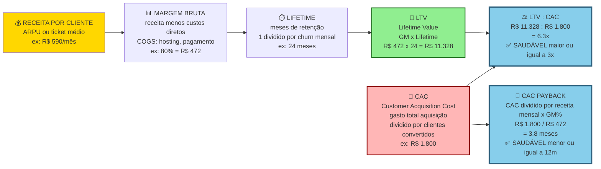
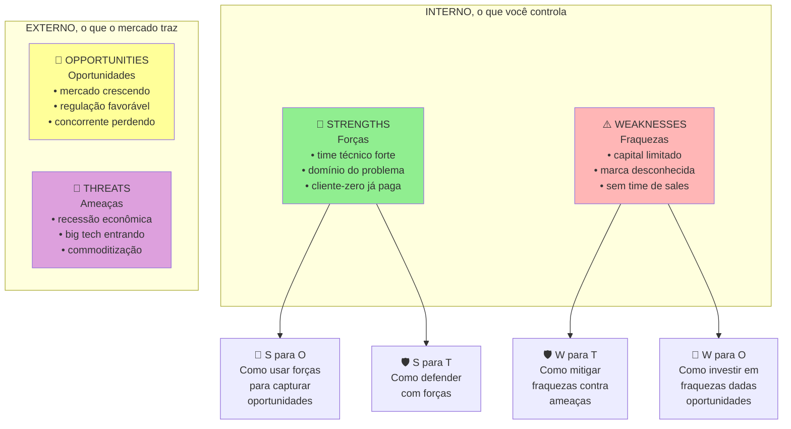

## FASE 11 — VALIDAÇÃO DO MODELO DE NEGÓCIO

A cascata visual de unit economics (economia por unidade — quanto você ganha e gasta por cliente), da receita por cliente à saúde do negócio:

> [!important] Três alvos operacionais inegociáveis
> LTV dividido por CAC maior ou igual a três vezes (abaixo disso, custa mais adquirir do que o cliente vale). CAC payback de até doze meses (em SaaS B2C, até seis meses). Margem bruta de setenta por cento ou mais em SaaS. Falha em qualquer um dos três significa que o modelo ainda não funciona em escala.

A SWOT aplicada ao negócio em validação, em estrutura 2x2 clássica:

> [!tip] SWOT não é "listar coisas"
> É *gerar cruzamentos*. Top-right (S para O) é a sua aposta principal. Bottom-right (W para T) é o seu maior risco. Mitigue, ou seja demolido. Revisar anualmente, ou em mudança estrutural.

> [!question] FMF Check da Fase 11
> O modelo de negócio que emergiu é algo que só você desenharia com o seu conhecimento acumulado, ou é modelo óbvio que qualquer outra pessoa no mesmo mercado chegaria? Modelos óbvios têm concorrência saudando. Não são defensáveis por FMF. Modelos não-óbvios frequentemente parecem estranhos no começo (e por isso outros não tentaram), e revelam-se defensáveis depois. Se o seu modelo parece "o óbvio", revisite.

### O que esse apêndice cobre

Verificação de que o negócio faz sentido economicamente. Que você consegue adquirir clientes por um custo menor do que eles geram de valor ao longo do tempo. Com margem suficiente para sustentar a operação e crescer. Aqui o foco sai do produto e vai para a máquina econômica.

O entregável é o Canvas Financeiro Validado. Modelo com números reais (não estimados) sobre CAC (custo de aquisição de cliente), LTV (valor total gerado por cliente ao longo do tempo), margem, ciclo de vendas, tempo de payback (tempo para recuperar o que você gastou para adquirir o cliente) e sustentabilidade.

> [!abstract] Resumo operacional
> **Entregável:** Canvas Financeiro Validado com CAC, LTV, margem, payback e cenários financeiros baseados em dados reais de operação, mais cap table inicial e diagnóstico Default Alive/Dead.
>
> **Sinais de saída:**
> - LTV/CAC maior ou igual a três em pelo menos um canal validado, com payback abaixo de doze meses.
> - Margem bruta unitária de sessenta por cento ou mais (ou justificada se menor) com break-even em número de clientes calculado.
> - Canal principal de aquisição testado com CAC real (não estimado) e plano claro de redução de CAC ou aumento de LTV.
>
> **Três armadilhas mais comuns:**
> 1. LTV chutado com otimismo, assumindo retenção de cinco anos com base em três meses de dados.
> 2. CAC mascarado por não contar tempo do fundador ou tratar campanhas pontuais como custos fixos.
> 3. Acreditar que margem ruim se corrige com escala quando os custos variáveis estruturalmente são altos.

### POR QUE

Produtos que usuários amam podem levar empresas à falência. Se o CAC é maior do que o LTV, cada cliente adicional destrói valor. Se a margem é baixa demais para cobrir custos operacionais, o negócio não escala. Essa fase valida a viabilidade econômica com dados reais. Não com chutes de planilha.

### Quando usar

Comece depois de oito ou mais semanas de operação do MVP com usuários pagantes. Termine quando você tiver números reais e modelagem sustentável. Ou quando decidir pivotar o modelo. Revisite a cada três a seis meses durante os primeiros três anos.

### Quem envolve

O executor é você. Com apoio de alguém com habilidade em planilhas e modelagem financeira. Os participantes são o contador (para custos) e o sócio financeiro, se houver. O decisor é você.

### Como executar

Dez passos.

#### Passo 1, meça CAC real

CAC (custo de aquisição de cliente) é o gasto total em marketing mais vendas no período, dividido pelos novos clientes pagantes adquiridos no período.

Inclua no "gasto total" quatro coisas. Ads pagos. Salário ou tempo de quem vende ou faz marketing (mesmo você — valorize o seu tempo). Ferramentas (CRM, automação, design). Custos de eventos, brindes e campanhas.

Não inclua os custos de operação do produto em si.

> [!warning] Meça por canal separadamente
> Um canal pode ter CAC baixo, e outro altíssimo. Média esconde. Sem segmentação por canal, você não sabe qual canal está realmente funcionando.

#### Passo 2, calcule LTV (valor total gerado por cliente ao longo do tempo)

A fórmula simples para modelo recorrente (SaaS ou assinatura): LTV é igual à receita média por cliente por mês, vezes a margem bruta (receita menos custo direto), vezes os meses médios de retenção.

A fórmula simples para modelo transacional: LTV é igual à receita média por transação, vezes a margem bruta, vezes a frequência anual, vezes os anos esperados.

> [!tip] Apêndice CB — Subscription Economy
> O [[apendice-cb|Apêndice CB — Subscription Economy]] cobre a mecânica específica de negócios recorrentes: MRR waterfall (new, expansion, contraction, churn), dinâmica de NRR, pricing de tiers e as armadilhas de churns que não aparecem na DRE até ser tarde demais.

No início, você não tem dados históricos longos. Use proxies. A retenção observada nos primeiros três a seis meses, extrapolada com cuidado. A taxa de churn (cancelamento — percentual de clientes que param de pagar) mensal observada — LTV é aproximadamente igual ao ARPU (receita média por usuário) dividido pelo churn (simplificado).

#### Passo 3, meça o tempo de payback de CAC

Payback period (tempo para recuperar o que você gastou para adquirir o cliente) é igual ao CAC dividido pela receita mensal por cliente, vezes a margem.

Esse é o número de meses até você "pagar" o CAC de um cliente. Abaixo de doze meses é bom. Acima de vinte e quatro meses, você precisa de muito capital para crescer.

#### Passo 4, valide a precificação com clientes pagantes

Agora você tem dados reais. Responda quatro perguntas. A precificação atual é percebida como adequada? Há segmentos dispostos a pagar mais por mais valor? Há segmentos que precisam de versão mais barata? Tem espaço para upsell ou cross-sell?

Teste experimentalmente. Aumente o preço para novos clientes em vinte a trinta por cento. Meça a conversão. Introduza tiers (básico, profissional, enterprise). Cobre módulos ou features extras separadamente.

> [!important] Precificação não fica congelada
> Precificação é um dos principais vetores de valor. Não a deixe estática. Reavalie a cada três a seis meses. Pequenos ajustes em preço movem mais EBITDA do que grandes esforços de eficiência operacional.

#### Passo 5, mapeie todos os custos unitários e recorrentes

Quatro categorias. Custos fixos (aluguel, salários, ferramentas, SaaS). Custos variáveis por cliente (infraestrutura, suporte, transação, comissão). Investimentos pontuais (equipamentos, marcas, desenvolvimento). Impostos.

Gross margin (margem bruta — receita menos custo direto, dividido pela receita): SaaS saudável tem mais de setenta por cento. Marketplaces têm mais de trinta por cento. Serviços podem ter menos de cinquenta por cento e ainda ser bom negócio.

#### Passo 6, identifique alavancas de eficiência

Onde você consegue reduzir o CAC? Aumentar o LTV? Melhorar a margem? Quatro alavancas comuns. Canais de aquisição mais baratos (SEO, referência, parcerias). Mecanismos de retenção (melhor onboarding, features stick, comunidade). Upsell e expansão. Automação de suporte e operação.

#### Passo 7, modele o Canvas Financeiro

Planilha contendo cinco itens. Premissas (CAC por canal, LTV por segmento, churn, ARPU). Cenários (conservador, base, otimista). Projeção de dezoito a trinta e seis meses. Ponto de equilíbrio operacional (break-even). Necessidade de capital por cenário.

Isso não é "plano de negócios" para impressionar investidor. É ferramenta para tomar decisões operacionais.

> [!note] Quando construir o primeiro orçamento formal
> O [[apendice-ec|Apêndice EC — Planejamento Financeiro e Orçamento]] cobre o momento certo para montar o primeiro budget estruturado — abordagens top-down versus bottom-up, headcount plan, e como fazer reforecast quando os números divergem das premissas.

> [!note] Forecasting de ARR para validar se o modelo fecha
> O [[apendice-eg|Apêndice EG — Revenue Forecasting]] traz o ARR waterfall, análise de cohorts de receita, modelos baseados em pipeline, e ajustes de sazonalidade brasileira — ferramentas para testar se as premissas do canvas financeiro são alcançáveis.

> [!tip] Apêndice AN — Modelagem Financeira
> O [[apendice-an|Apêndice AN — Modelagem Financeira]] cobre a anatomia completa do modelo financeiro para startups — estrutura de abas, premissas auditáveis, projeção de headcount, sensibilidades e como construir um modelo que investidor consegue revisar sem perguntar o que cada célula faz.

##### Modelo financeiro profissional em três cenários

O plano de uma página é ponto de partida. Modelo financeiro completo em planilha (Excel ou Google Sheets) é obrigatório para qualquer decisão de captação, investimento em time ou canal. O padrão mínimo exige três cenários explícitos com premissas auditáveis.

A estrutura do modelo financeiro tem cinco abas.

**Aba 1, Premissas.** Todas as variáveis que movem o modelo. Crescimento mensal de novos clientes (em percentual). Ticket médio (MRR — Monthly Recurring Revenue, ou receita mensal recorrente — ou ARR — Annual Recurring Revenue, receita anual recorrente — por cliente). Churn mensal (em percentual). NRR (Net Revenue Retention — percentual da receita retida e expandida na base de clientes). CAC por canal. Custo variável por cliente. Custos fixos mensais (folha, tools, office). Timing de contratação por função.

**Aba 2, DRE mensal projetada (dezoito a trinta e seis meses).** As linhas: Nova receita, Expansão, Churn, MRR líquido, Custo variável, Margem de contribuição, Folha, Outros custos fixos, EBITDA e Caixa em mãos. As colunas: mês a mês por dezoito a trinta e seis meses.

> [!note] Leitura dos demonstrativos do próprio negócio
> O [[apendice-dr|Apêndice DR — Demonstrativos Financeiros]] ensina a ler e interpretar DRE gerencial, balanço, DFC e capital de giro — incluindo a diferença prática entre EBITDA e fluxo de caixa livre, que move decisões de runway e captação.

**Aba 3, Três cenários.**

| Cenário | Premissas | Propósito |
|---|---|---|
| **Conservador** | Crescimento menos trinta por cento do esperado, CAC mais vinte por cento, churn mais vinte por cento, atrasos de dois a três meses em milestones. | Qual é o "piso" que me permite operar? Tenho runway aqui? |
| **Base** | Extrapolação honesta dos últimos três a seis meses de dados reais. Sem otimismo nem pessimismo. | Esse é o plano. |
| **Agressivo** | Crescimento mais trinta por cento, CAC menos quinze por cento, novo canal entra, expansão antecipada. | Tenho capacidade de execução se acelerar? Preciso contratar antes? |

> [!warning] Regra operacional do cenário conservador
> O cenário conservador deve mostrar runway (tempo de vida do caixa no ritmo atual de gastos) de dezoito meses ou mais em qualquer momento. Se não mostra, você está sub-capitalizado. Precisa captar, ou cortar custos *agora*.

> [!tip] Apêndice CD — Modelagem com Cohorts
> O [[apendice-cd|Apêndice CD — Modelagem com Cohorts]] mostra como construir a análise de coorte de receita que transforma o churn mensal em projeção de ARR, identifica degradação de coortes antes que apareça na DRE e calcula o LTV real por safra de cliente — base da Aba 4 de sensibilidades abaixo.

**Aba 4, Sensibilidades.**

Teste a saída principal (mês de break-even, EBITDA em vinte e quatro meses, caixa mínimo) contra variações de quatro variáveis. Crescimento (mais ou menos vinte por cento). Ticket médio (mais ou menos quinze por cento). Churn (mais ou menos vinte por cento). CAC (mais ou menos vinte e cinco por cento).

Identifique a variável mais sensível — aquela em que pequenas mudanças movem muito o resultado. Essa variável é prioridade de atenção e medição semanal.

**Aba 5, Break-even analysis.**

Calcule em que mês (e com quanto de ARR) você atinge três marcos. Break-even operacional (receita igual aos custos operacionais). Break-even de caixa (a operação gera caixa sem depender de captação). Break-even acumulado (todo o capital captado está "pago" pela operação).

##### Cap table básico e modelagem de diluição

> [!note] Esta seção é preview operacional para validação do modelo
> A estruturação formal do cap table — vesting, classes de ações, drag-along/tag-along, contrato de sócios completo — é tema da [[#FASE 13 — ESTRUTURAÇÃO JURÍDICA, FINANCEIRA E OPERACIONAL|Fase 13]]. Aqui na Fase 11 o cap table aparece em versão simplificada porque é input direto da modelagem financeira: você precisa saber quantas ações cada sócio tem para projetar diluição em cenários de captação e calcular *runway efetivo após* novas rodadas. É a mesma ferramenta vista por dois ângulos — modelo (aqui) e instrumento jurídico (Fase 13).

Desde a primeira captação, mantenha um cap table (tabela de capital) documentado. A maioria dos fundadores negligencia isso, e acorda em Série B descobrindo que detém vinte e cinco por cento de uma empresa que vai captar mais. Surpresa cara.

A estrutura mínima do cap table:

| Detentor | Classe de ação | Número de ações | Percentual antes desta rodada | Número de ações após | Percentual após |
|---|---|---|---|---|---|
| Fundador 1 | Ordinárias | 4.000.000 | 40,0% | 4.000.000 | 32,0% |
| Fundador 2 | Ordinárias | 3.000.000 | 30,0% | 3.000.000 | 24,0% |
| Pool de opções | Reservado | 1.500.000 | 15,0% | 1.875.000 | 15,0% |
| Investidor anjo | Preferenciais A | 1.500.000 | 15,0% | 1.500.000 | 12,0% |
| Novo investidor (Série A) | Preferenciais B | — | — | 2.125.000 | 17,0% |
| **Total** | | **10.000.000** | **100,0%** | **12.500.000** | **100,0%** |

**Cinco conceitos-chave que o fundador precisa dominar.**

Pré-money valuation. Valor da empresa *antes* do investimento entrar. Por exemplo, R$ 40 milhões pré-money.

Post-money valuation. Pré-money mais o valor captado. Se capta R$ 10 milhões em pré de R$ 40 milhões, o post é R$ 50 milhões.

Percentual de diluição. Percentual de equity que sai dos atuais detentores para o novo investidor. Se o investidor entra por R$ 10 milhões em post de R$ 50 milhões, ele fica com vinte por cento, e todos os demais diluem proporcionalmente.

Pool de opções (option pool). Reserva de equity para contratações futuras. O ponto crítico: se o investidor exige aumento de pool *antes* da rodada (pre-money pool increase), a diluição sai toda dos fundadores. Se o aumento é *depois* (post-money), dilui todos. Negociar isso vale muito dinheiro.

Liquidation preference. Em exit, o investidor preferencial recebe primeiro um múltiplo do investido, antes de fundadores receberem qualquer coisa. "1x non-participating" é padrão saudável. "2x participating" é predatório (o investidor recebe duas vezes, *e* mais a parte pro-rata dele). Negocie cedo.

A modelagem de diluição ao longo de rodadas futuras. Projete (no modelo financeiro, em aba separada) o cap table em três a quatro rodadas futuras hipotéticas.

Exemplo visual de cap table evolutivo, do Seed à Série B:

```mermaid
flowchart LR
 subgraph S1["🌱 SEED<br/>R$ 2M @ R$ 10M pré"]
 SF[Founders: 80%]
 SE1[ESOP: 10%]
 SI[Seed investor: 10%]
 end

 subgraph S2["🚀 SÉRIE A<br/>R$ 15M @ R$ 60M pré<br/>diluição ~20%"]
 AF[Founders: 59%]
 AE[ESOP expandido: 13%]
 AIS[Seed: 8%]
 AIA[Série A: 20%]
 end

 subgraph S3["📈 SÉRIE B<br/>R$ 60M @ R$ 300M pré<br/>diluição ~17%"]
 BF[Founders: 41%]
 BE[ESOP: 14%]
 BIS[Seed: 6%]
 BIA[Série A: 15%]
 BIB[Série B: 24%]
 end

 S1 --> S2 --> S3

 style SF fill:#90EE90
 style AF fill:#FFFF99
 style BF fill:#FFB6B6
```

A diluição típica de founder em trajetória SaaS brasileira: oitenta por cento (Seed), depois cinquenta e nove por cento (Série A), depois quarenta e um por cento (Série B), e por fim vinte e cinco a trinta por cento (Série C ou D). A cor passa de verde a vermelho indicando atenção crescente ao controle de governança. Em torno de trinta a quarenta por cento, começam a faltar votos para decisões fundamentais.

| Rodada | Valor captado | Pré-money | Percentual diluído | Fundador 1 após |
|---|---|---|---|---|
| Hoje | — | — | — | 40,0% |
| Seed (agora) | R$ 3M | R$ 12M | 20% | 32,0% |
| Série A (18m) | R$ 15M | R$ 45M | 25% | 24,0% |
| Série B (36m) | R$ 40M | R$ 150M | 21% | 18,9% |
| Série C (54m) | R$ 80M | R$ 400M | 17% | 15,7% |

> [!important] A lição da diluição saudável
> Mesmo com diluição saudável por rodada (quinze a vinte e cinco por cento), fundadores chegam em Série C com quinze a vinte por cento da empresa. Isso é normal e saudável. Expectativa de reter cinquenta por cento em late stage é fantasia.

As ferramentas recomendadas para cap table. Planilhas (Google Sheets, Excel) para menos de dez detentores. Carta (formerly eShares), Pulley, Ledgy para estruturas mais complexas, ou ESOP (employee stock option plans) formais.

Advogado societário deve revisar o cap table antes de qualquer rodada. Custo típico de R$ 5 mil a R$ 15 mil por revisão. Retorno: evitar erros caros.

#### Passo 8, faça o teste de unit economics

A pergunta central. Se eu parasse de adquirir novos clientes agora, o negócio seria rentável operacionalmente com os clientes atuais?

Se sim, você tem unit economics saudável. Se não, ajuste preço, custo ou churn antes de escalar.

#### Passo 9, aplique a pergunta diagnóstica canônica de Paul Graham, Default Alive ou Default Dead?

Essa é talvez a pergunta mais útil que Paul Graham formulou para fundadores em estágio pós-MVP, em ensaio de 2015. Ele conta que, quando conversa com qualquer startup com mais de oito ou nove meses de operação, a primeira coisa que pergunta é isso. Pelos dados dele, metade dos fundadores não sabe responder. Não é tecnicismo. É diagnóstico primário.

> [!quote] A pergunta de Default Alive / Default Dead
> Assumindo que os meus gastos permaneçam constantes, e o meu crescimento de receita mantenha o padrão dos últimos meses, eu chego à lucratividade com o caixa que tenho hoje? Ou não?

Duas respostas possíveis. Duas realidades muito diferentes.

Default Alive (vivo por padrão). Sim, eu chego, sem precisar de mais dinheiro externo. Tenho controle do meu destino.

Default Dead (morto por padrão). Não, eu vou quebrar antes de virar lucrativo, a menos que alguém escreva outro cheque.

A pergunta é brutal na utilidade porque converte "otimismo vago" em "fato numérico". Você precisa de quatro inputs para responder: despesas atuais, receita atual, taxa de crescimento atual e caixa em mãos. Uma planilha simples projeta mês a mês até caixa zero versus break-even, e dá a resposta. Graham aponta um calculador público (aord.io/calc) útil para o cálculo mecânico.

Por que isso importa operacionalmente.

O fundador Default Alive pode focar em crescimento e novas apostas. Tem liberdade. Pode experimentar, captar em boas condições, escolher parceiros.

O fundador Default Dead deveria estar focado em consertar o problema fundamental. Não em "captar mais dinheiro para esticar runway".

> [!warning] Esticar runway sem consertar o negócio
> Graham é enfático sobre isso. Esticar runway sem consertar o negócio é simplesmente adiar a morte. Não é solução.

##### O Fatal Pinch, a armadilha silenciosa mais perigosa

Graham identifica, num ensaio complementar de 2014, o cenário mais letal que uma startup pode atingir. É a combinação de Default Dead com crescimento lento, tempo insuficiente para corrigir e esperança depositada em investidores. Ele chama de *Fatal Pinch* (o aperto fatal) e argumenta que ele mata mais startups que qualquer fraude, erro técnico ou concorrente. O roteiro é quase sempre o mesmo, em sete passos.

Startup lança produto moderadamente atraente. Não é ruim. Mas não é irresistível.

Crescimento é "ok mas não ótimo". Digamos três a cinco por cento ao mês, não cinco a dez por cento por semana.

Fundador se convence de que a solução é contratar mais gente para "acelerar". Investidor concorda, em entusiasmo compartilhado sem dados sustentando.

Despesas sobem. Crescimento não sobe junto. Porque o produto não é bom o suficiente. E contratar mais gente para "construir o produto" em vez de "evoluir o produto" frequentemente piora.

Runway encolhe rapidamente. Fundador começa a captar.

Investidor olha os números. Burn alto. Crescimento fraco. Time grande. Passa.

Captação falha. Caixa acaba. Empresa morre.

> [!important] A lição crítica do Fatal Pinch
> Ele é quase sempre resolvido pela direção errada. O correto em Default Dead com crescimento fraco quase nunca é contratar. É parar e consertar o produto, para que ele seja genuinamente desejado. Parar de captar. Reduzir time se necessário. Voltar a conversar com cliente. Iterar no produto com time menor e mais focado. Contratar mais pessoas nessa fase é exatamente o oposto do que funciona.

A melhor forma de evitar o Fatal Pinch é fazer a pergunta Default Alive ou Default Dead cedo. Aos oito ou nove meses, não aos dezoito. Fundadores que descobrem estar Default Dead aos dezoito meses têm opções muito piores do que os que descobrem aos nove meses.

#### Passo 10, persiga Ramen Profitable, o milestone subestimado

"Ramen Profitable" é outro conceito canônico de Graham, em ensaio de 2009, que merece tratamento sério aqui. Porque quase nenhum fundador brasileiro prioriza isso. E quase todos deveriam.

Uma startup é ramen-profitable quando gera receita suficiente para cobrir os custos de vida básicos dos fundadores. A origem metafórica é o ramen instantâneo, comida de cerca de R$ 3 por refeição. Não é lucratividade tradicional. Não é escala. Não é sucesso financeiro. É apenas sobrevivência infinita. A empresa pode continuar existindo indefinidamente, sem captar, porque paga o que os fundadores precisam para viver.

Por que ramen-profitable é marco estratégico (e subestimado). Quatro razões.

Tempo infinito. Você não precisa mais de captação para continuar existindo. Pode esperar pelo investidor certo, pelo momento certo do mercado, pela feature que vai destravar tudo. Essa opção — "posso simplesmente esperar" — é ativo estratégico enorme.

Poder de negociação em captação. Fundos preferem dar dinheiro a quem não precisa do dinheiro. Ramen-profitable aumenta valuation e melhora termos, independente da performance operacional. O investidor sabe que não está salvando ninguém. Está apostando.

Redução de estresse psicológico. Muda profundamente a dinâmica interna e com sócios. Desespero e pânico são substituídos por paciência. Decisões ruins tomadas sob pressão de caixa param de acontecer.

Filtro de seriedade. Forçar a equipe a atingir ramen-profitable é disciplina financeira que toda startup deveria ter, e poucas têm. Muitos fundadores pulam esse degrau achando que é "pensamento pequeno". É o oposto. É o primeiro degrau sólido sobre o qual escalar.

> [!important] Regra operacional simples sobre Ramen Profitable
> Se o seu modelo de negócio não permite ramen-profitable em horizonte de doze a dezoito meses (mesmo sem crescer para além disso), o modelo provavelmente tem buraco estrutural. Reconsidere o modelo, não a meta. Empresa que precisa de US$ 50 milhões antes de ser capaz de pagar dois salários mínimos aos fundadores tem problema econômico profundo.

No contexto brasileiro. Ramen-profitable para fundadores brasileiros em São Paulo tipicamente significa receita líquida mensal entre R$ 15 mil e R$ 40 mil. Dependendo de quantos fundadores, despesas pessoais, filhos. É faturamento atingível por muitas startups early-stage com disciplina. Mas que é sistematicamente ignorado em favor de "vamos captar pré-Seed". Que tipicamente traz menos dinheiro total do que doze meses de ramen-profitable consistente.

##### Combinação Default Alive vezes Ramen Profitable vezes Crescimento, matriz operacional

| Situação | Diagnóstico | Ação correta |
|---|---|---|
| Default Alive, ramen-profitable, crescendo cinco a dez por cento ao mês | Posição ideal | Crescer ambiciosamente, captar seletivamente |
| Default Alive, não-ramen-profitable, crescendo forte | Queimando capital, mas racionalmente | Continuar se o capital é abundante e a trajetória é clara |
| Default Dead, crescendo forte | Fundraising será bem-sucedido se não demorar | Captar urgentemente, e negociar bem |
| Default Dead, crescimento fraco (Fatal Pinch) | Crise silenciosa | Parar de contratar, consertar produto, cortar custos, buscar ramen-profitable |
| Ramen-profitable, crescimento estagnado | Solvente, mas sem tração | Reavaliar hipóteses (cunha, ICP, preço) |

Três perguntas de verificação mensal para a gestão de caixa. Aplique a checagem Default Alive ou Default Dead descrita no Passo 9 acima — com números, não com esperança. Verifique se você atingiu Ramen Profitable conforme definido no Passo 10 acima. Se a resposta para as duas anteriores é negativa, qual é o meu plano de noventa dias para mudar isso?

> [!tip] Apêndice AT — Gestão de Caixa
> O [[apendice-at|Apêndice AT — Gestão de Caixa]] aprofunda o ritual mensal de caixa: reconciliação bancária, projeção de 13 semanas, controle de inadimplência e gatilhos de alerta de runway — o processo operacional que transforma o diagnóstico Default Alive/Dead em ação concreta.

### PERGUNTAS A RESPONDER

- Qual é o meu CAC real por canal?
- Qual é o meu LTV real, ou estimado com base em dados?
- LTV dividido por CAC é três ou mais?
- Qual é o tempo de payback?
- Qual é a minha margem bruta?
- Onde posso reduzir CAC? Onde posso aumentar LTV?
- Se eu parar de adquirir novos clientes amanhã, sou lucrativo com os atuais?
- Quanto capital preciso para chegar ao break-even?

### Métricas

> [!tip] Risk Canvas antes de comprometer recursos desta fase
> A validação de unit economics da Fase 11 é o momento de fazer o [[#APÊNDICE CZ — CANVASES E MAPAS VISUAIS DE MODELO|Risk Canvas (CZ.13)]] — varredura sistemática de risco em seis categorias (mercado, cliente, solução, modelo, regulatório, equipe) antes de escalar o modelo. Cada risco recebe Probabilidade × Impacto; os top 5 recebem mitigação e owner. O caso Méliuz em CZ.13 mostra como o canvas revelou que o risco mais crítico não era o que o time discutia (equipe dividida) mas o que não estava calculando explicitamente (CAC do cartão 5-8x maior que o digital). Riscos sem owner não são gerenciados — são empurrados com a barriga até se materializarem.

CAC por canal.

LTV por segmento.

Razão LTV dividido por CAC. Alvo: três ou mais.

Payback de CAC em meses. Alvo: até doze meses.

Margem bruta. Alvo: sessenta por cento ou mais (varia por modelo).

Churn mensal. Alvo: cinco por cento ou menos.

Burn rate (velocidade de gasto mensal): meça gross burn (saída total) e net burn (saída menos entrada). Em empresas pré-PMF, net burn deve ser menor ou igual ao caixa disponível dividido por doze, para sobreviver doze meses. Burn Multiple (net burn dividido por net new ARR) menor ou igual a um vírgula cinco é saudável em SaaS. Acima de três é sinal de eficiência ruim.

Runway em meses (tempo de vida do caixa no ritmo atual de gastos — caixa dividido por net burn). Alvo: doze meses ou mais operacionais sempre disponíveis. Inicie conversas de nova rodada com nove meses ou mais restantes. Menos de seis meses é zona de pânico. Decisões feitas com runway curto são quase sempre ruins.

MRR growth mensal (crescimento de MRR mês a mês), se aplicável.

Net Revenue Retention — NRR (receita da coorte de doze meses atrás hoje, dividida pela receita da mesma coorte naquela época). Cem por cento ou mais indica expansão.

### SAÍDA DESTA FASE

Você concluiu a [[#FASE 11 — VALIDAÇÃO DO MODELO DE NEGÓCIO|Fase 11]] quando os oito critérios abaixo estão cumpridos.

1. Canvas Financeiro existe preenchido com dados reais dos últimos três meses ou mais. E unit economics iniciais foram calculados com dados reais (mesmo com amostra de cinco ou menos).
2. Margem bruta unitária é sessenta por cento ou mais (SaaS típico), ou justificada se menor. Suficiente para sustentar a operação prevista.
3. LTV dividido por CAC é três para um ou mais em cenário realista (idealmente cinco para um ou mais), em pelo menos um canal viável.
4. Payback de doze meses ou menos (tolerável até vinte e quatro em B2B enterprise, com ACV alto e contratos multi-anuais).
5. Break-even em número de clientes está calculado.
6. Canal de aquisição principal está testado com CAC real (não estimado).
7. Plano claro existe para reduzir CAC ou aumentar LTV. Unit economics positivos, ou caminho crível para positivos em prazo razoável.
8. Três suposições "que precisam ser verdade" estão explícitas, e com plano de teste.

**Checklist final.**

- [ ] Validei unit economics iniciais (CAC, LTV, churn, ticket médio), ainda que com dados limitados?
- [ ] Tenho hipótese de modelo de receita específica (SaaS recorrente, transacional, ou híbrido)?
- [ ] Testei dois ou três níveis de preço em pilotos distintos para calibrar elasticidade?
- [ ] Mapeei custos operacionais unitários (custo para servir um cliente por mês)?
- [ ] Projetei margem bruta esperada em escala (cem clientes ou mais)?
- [ ] Identifiquei o canal principal de aquisição com CAC estimado ([[#APÊNDICE J — FRAMEWORK DE CANAIS DE AQUISIÇÃO|Apêndice J]])?
- [ ] Projetei break-even — quantos clientes para cobrir custos fixos?
- [ ] Documentei "o que precisa ser verdade" para o modelo fechar (referência: [[#APÊNDICE D — ARMADILHAS MENTAIS E VIESES|Apêndice D]], ferramenta "What would have to be true")?

**Primeiros passos práticos.**

1. Abrir planilha de unit economics. Preencher com dados reais dos pilotos (mesmo com amostra pequena).
2. Listar os custos unitários. Infraestrutura, atendimento, aquisição estimada.
3. Fazer dois cenários. Pessimista (baseado nos dados atuais) e otimista (extrapolado para cem clientes).
4. Identificar os dois ou três "números que precisam ser verdade" para o modelo sustentar. E plano de teste de cada.

### EXEMPLO PRÁTICO

**Unit Economics, PadariaPro, depois de três meses de piloto com três clientes.**

A receita. Ticket médio mensal por cliente (três lojas cada): R$ 870 por mês (R$ 290 vezes três). Receita total atual: R$ 2.610 por mês. ACV projetado: R$ 10.440 por ano por cliente.

O custo para servir, por cliente, por mês. Infraestrutura (hospedagem mais Z-API proporcional): R$ 35. Atendimento (trinta minutos por mês, vezes R$ 80 por hora): R$ 40. Custo total para servir: R$ 75 por cliente por mês.

A margem unitária. Receita: R$ 870. Custo: R$ 75. Margem bruta: R$ 795. Ou seja, noventa e um por cento — típico de SaaS B2B leve.

O CAC estimado, com base nos três pilotos, e em extrapolação. Canal atual: indicação mais rede pessoal (CAC de aproximadamente R$ 400, em tempo do fundador). Canal projetado pós-PMF: cold outreach mais eventos mais conteúdo (CAC esperado de R$ 1.500 a R$ 2.500).

O LTV estimado, com suposições conservadoras. Churn projetado: três por cento ao mês (vira trinta e seis por cento ao ano), típico de SaaS B2B inicial. Vida média do cliente: vinte e oito meses. LTV (margem vezes vida): R$ 795 vezes 28, ou seja, R$ 22.260.

A razão LTV dividido por CAC, em três cenários. No cenário atual (indicação): 22.260 dividido por 400, ou seja, 55 para 1. Ótimo, mas irreplicável em escala. No cenário pós-PMF (cold outreach): 22.260 dividido por 2.000, ou seja, 11 para 1. Saudável. No cenário pessimista (CAC maior, churn maior): 22.260 dividido por 3.000, ou seja, 7 para 1. Ainda viável.

Os custos fixos mensais atuais. Salários (duas pessoas em parcial): R$ 18.000. Ferramentas e infra base: R$ 2.000. Total: R$ 20.000 por mês.

O break-even. Margem unitária de R$ 795. Clientes para break-even: 20.000 dividido por 795, ou seja, vinte e seis clientes. Se crescer quatro clientes por mês líquido, break-even em mês sete.

**O que precisa ser verdade para o modelo sustentar, três suposições com plano de teste.**

Churn fica em quatro por cento ao mês ou menos no ano um. Se for seis a oito por cento, o LTV cai para R$ 14 mil, e a razão fica apertada. **Teste:** manter conversa semanal com os três primeiros clientes, e medir NPS mensal.

CAC pós-PMF fica em R$ 2.500 ou menos. Se for R$ 4.000 ou mais, o payback estica, e o caixa aperta. **Teste:** depois de alcançar dez clientes orgânicos, tentar cinco por cold outreach, e medir o custo real.

ACV consegue crescer quinze por cento ao ano via expansão. Padarias adicionam lojas, produtos. **Teste:** monitorar expansão em seis a doze meses.

### Armadilhas

LTV chutado com otimismo. Assumir retenção de cinco anos com base em três meses de dados. Use premissas conservadoras.

CAC mascarado. Não contar tempo de fundador, ou campanhas pontuais como fixas. Conte tudo.

Achar que margem ruim se corrige com escala. Às vezes sim. Muitas vezes não. Se os custos variáveis são altos, escala não resolve.

Subestimar churn. Churn pequeno aparentemente (um por cento) composto por meses dá doze por cento anualizado. Composto por anos dá destruição de coorte.

Focar em receita bruta. Receita bruta com margem negativa é veneno. Foque em contribuição.

Ignorar vendas longas. B2B pode ter ciclo de seis a dezoito meses. Modele CAC com esse ciclo. Não com mês único.

---

### CASO BRASILEIRO, Fase 11, validação de unit economics em fintech de crédito consignado

Uma startup de crédito consignado precisava validar se o modelo de originação via correspondentes bancários (vendedores em pequenas cidades) tinha unit economics saudável, antes de escalar.

A decisão foi cirúrgica. Antes de contratar centenas de correspondentes, testaram com dez correspondentes por seis meses. Mediram quatro coisas. CAC (custo por empréstimo originado, incluindo comissão). LTV (margem por empréstimo mais ciclo de recompra). Inadimplência por perfil. Tempo de retorno.

A descoberta. Correspondentes de alguns perfis tinham CAC três vezes maior que outros, sem LTV proporcional. Selecionaram os perfis que funcionavam antes de escalar. Evitando queima de capital em canal ineficiente.

A lição transferível. Unit economics precisam ser provados em escala pequena antes de investir em escala grande. Modelo que "parece saudável no papel" frequentemente não é. Só o teste real revela.

---

### Transição interna, Fase 11 para Fase 12

O que você acabou de fazer na [[#FASE 11 — VALIDAÇÃO DO MODELO DE NEGÓCIO|Fase 11]]. Calculou CAC e LTV reais, com dados (não chutes). Modelou três cenários financeiros. Construiu cap table inicial. Aplicou as três perguntas diagnósticas de Paul Graham (Default Alive ou Default Dead, Fatal Pinch, Ramen Profitable). Definiu as suposições que precisam ser verdade para o modelo sustentar.

O que vem na [[#FASE 12 — PRODUCT-MARKET FIT|Fase 12]]. Product-Market Fit. Onde a métrica não é mais "o modelo funciona em pequena escala?", mas "o produto deveria existir e o mercado responde?". A [[#FASE 12 — PRODUCT-MARKET FIT|Fase 12]] é o gate antes de escalar agressivamente. Sem PMF, escalar é queimar capital. Com PMF, escalar é multiplicar valor.

> [!warning] Critério para avançar
> Unit economics positivos em pelo menos um canal. Margem bruta acima do mínimo do setor. Plano claro de redução de CAC ou aumento de LTV. Default Alive (ou Default Dead com plano de noventa dias). Se não tem isso, fique na Fase 11, ajuste.
>
> **Thresholds operacionais (benchmarks SaaS B2B; ajuste por modelo):**
>
> - **LTV/CAC ≥ 3x** em pelo menos um canal validado.
> - **CAC payback ≤ 12 meses** (até 18 meses tolerável em enterprise; acima disso exige capital pesado).
> - **Churn mensal ≤ 5%** (B2C) ou **≤ 2%** (B2B SaaS); margem bruta ≥ 70% para SaaS, ≥ 50% para serviços, ≥ 30% para físico/marketplace.
> - **Default Alive**: receita atual + crescimento projetado cobre custos antes do runway acabar, sem nova captação.
>
> Se algum desses está fora da faixa em todos os canais testados, o gate da Fase 12 fica fechado — e fechar gate aqui é mais barato que fechar lá.

> [!important] Fase 11 e Fase 12 medem dimensões independentes
> Fase 11 valida **modelo viável** (LTV/CAC saudável, payback aceitável, default alive). Fase 12 valida **produto amado pelo mercado** (Sean Ellis ≥40%, retenção estabilizada, crescimento orgânico). São dimensões ortogonais, não etapas sequenciais. Quatro cenários possíveis no fim da Fase 11:
>
> 1. **Modelo OK + produto amado**: avance para Fase 12 só para confirmar e medir; vá para Fase 13/14 em paralelo. Cenário ideal.
> 2. **Modelo OK + produto não amado**: você tem unit economics mas pouco entusiasmo de cliente. Volte para Fase 4/8/9 antes de escalar — escalar produto não-amado = churn que se mantém só com aquisição cara.
> 3. **Modelo quebrado + produto amado**: cenário comum em early-stage SaaS. Fase 12 vai confirmar PMF, mas Fase 14 (escala) precisa atacar economics primeiro. Pivot de pricing, segmento ou canal antes de captar.
> 4. **Modelo quebrado + produto não amado**: nem PMF, nem viabilidade. Pivote ou abandone — não tente "consertar" pela Fase 12 sozinho.
>
> Resolva primeiro o que está mais quebrado. Não há ordem fixa; o diagnóstico das duas fases junto é que orienta.

### FERRAMENTAS DESTA FASE

Validação do modelo de negócio exige mix de qualitativo e quantitativo. Oito ferramentas centrais, com cross-ref individual para o tratamento profundo no Apêndice BG.

Conjoint Analysis (Paul Green) — técnica que revela o peso relativo de cada atributo do produto na decisão de compra e identifica a disposição a pagar real do cliente. Central para decisões de pricing e positioning. Ver BG.8.2.

A/B Testing Rigoroso (Kohavi). Para validar hipóteses causais em pricing, CTA e onboarding. Ver BG.8.4.

Survey Design (Dillman e Krosnick). Escala a validação para centenas de respondentes. Ver BG.8.1.

Net Promoter Score, NPS (Reichheld, 2003). Métrica de lealdade baseada em pergunta única. Use trimestralmente, como pulse de saúde do cliente. Ver BG.8.5.

Customer Effort Score, CES (Dixon, 2010). Mede o esforço do cliente em interação específica. Correlaciona com lealdade melhor que delight. Use depois de ticket de suporte, onboarding ou renewal. Ver BG.8.6.

Causal Inference, DiD, RDD, Propensity Score (Pearl, Rubin). Inferir causalidade de dados observacionais quando A/B test é impossível. Use para validar impacto de programas já implantados (referral, CS proativo, mudanças de pricing). Ver BG.8.7.

Assumption Mapping (Bland, 2019). Re-mapear premissas do modelo à medida que aprendizado acumula. Ver BG.9.8.

JTBD Framework (Christensen, Moesta, Ulwick) — método de análise que identifica o "trabalho" que o cliente está contratando o produto para fazer, separando o contexto da solução. Ver BG.11.1.

---

### Exercício aplicado, auditoria de unit economics

A [[#FASE 11 — VALIDAÇÃO DO MODELO DE NEGÓCIO|Fase 11]] trata de validação do modelo de negócio. Esse exercício força você a olhar os seus números reais, sem cosmética, e responder se o modelo fecha.

**Pré-requisito.** Você tem pelo menos cem transações ou clientes reais. Ou dados de operação por pelo menos três meses consecutivos.

**Passo 1, calcular CAC real do último trimestre (duas horas).** Some tudo que você gastou em marketing, vendas, ferramentas e salários de aquisição. Esse é X. Conte os clientes novos adquiridos no período. Esse é Y. CAC é X dividido por Y. Segmente por canal: orgânico, paid social, indicação, outbound. CAC varia muito entre eles. Se você não consegue segmentar, o próximo passo é instrumentar tracking.

**Passo 2, calcular LTV real (duas horas).** Multiplique a receita média por cliente por mês pelo tempo médio como cliente (igual ao inverso do churn mensal). Subtraia o custo variável (COGS, atendimento direto) para ter LTV líquido. Segmente por cohort se possível. Os primeiros clientes frequentemente têm dinâmica diferente.

**Passo 3, calcular ratios críticos (uma hora).** LTV dividido por CAC (meta: maior que três para SaaS, varia por setor). Payback period (quantos meses para CAC se pagar, meta: menos de doze a dezoito meses). Burn multiple (net burn dividido por net new ARR, meta: menos de dois em estágio de crescimento).

**Passo 4, decisão honesta.** Se os números estão dentro dos thresholds, você tem permissão de investir em crescimento. Se não estão, *pare*. Escalar um modelo que não fecha é queimar capital. A solução não é "crescer para o valuation". É ajustar até fechar, ou aceitar que não vai fechar e pivotar.

> [!important] Três perguntas diagnósticas no fim da auditoria
> O CAC pode ser reduzido estruturalmente (canal novo, melhor funil)? O LTV pode ser aumentado (upsell, retenção)? Se nenhuma das duas está disponível em seis a doze meses, o modelo está quebrado. Pivot.

**Comunicação.** Compartilhe esses números com cofundador(es) e com o investidor principal. Modelos bons geram conversas fáceis. Modelos ruins geram desculpas. Desculpas são sinal de problema, não de timing errado.

---

### SÍNTESE DA FASE 11

A [[#FASE 11 — VALIDAÇÃO DO MODELO DE NEGÓCIO|Fase 11]] é o capítulo onde a startup deixa de ser projeto interessante e vira — ou não vira — negócio. O foco sai do produto e vai para a máquina econômica: o que foi diagnosticado aqui é se a empresa consegue adquirir clientes por um custo menor do que eles geram de valor, com margem suficiente para sustentar a operação.

O entregável é o Canvas Financeiro Validado com números reais. Esse documento é teste de honestidade. Quem chega à [[#FASE 12 — PRODUCT-MARKET FIT|Fase 12]] sem ter validado a economia real costuma escalar negócio que não fecha — e descobre tarde que estava queimando capital rumo ao precipício. Validar a economia antes de escalar é a diferença entre escalar um negócio que existe e simular escala em negócio que ainda não fecha.

# fase11 #unit-economics #cac #ltv #default-alive #default-dead #fatal-pinch #ramen-profitable #cap-table #burn-multiple

---
