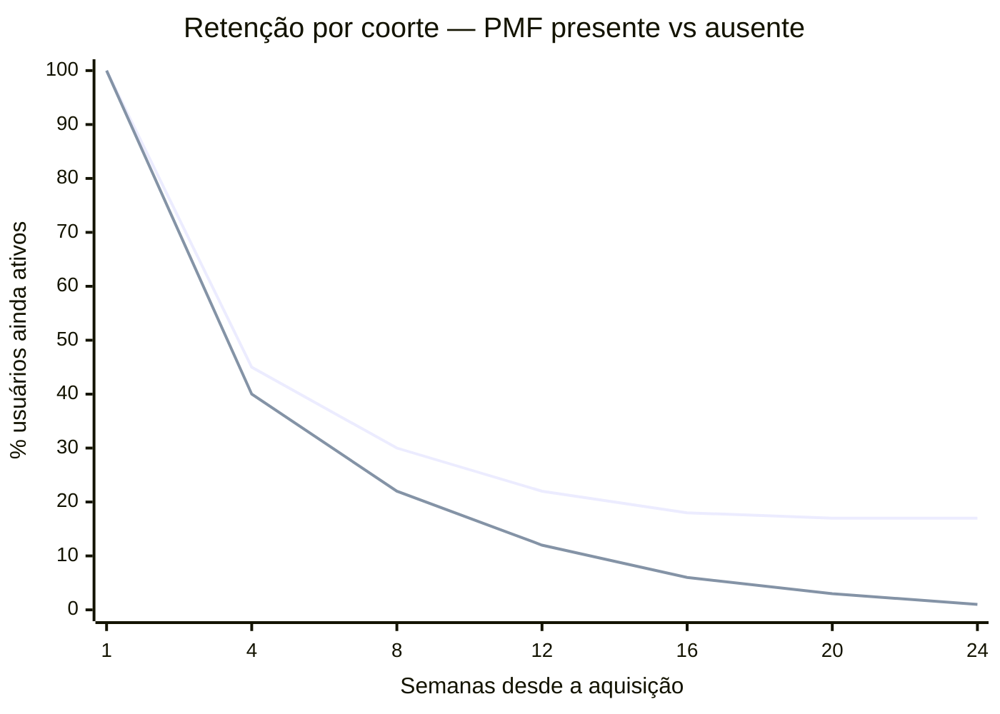

## FASE 12 — PRODUCT-MARKET FIT

### O que esse apêndice cobre

Product-Market Fit é o estado em que você construiu algo que um mercado específico quer tanto que a demanda começa a puxar o negócio. Clientes chegam por boca a boca. A retenção é alta e previsível. As vendas ficam mais fáceis. Usuários reclamam quando o produto tem problemas, sinal de que se importam. Você deixa de empurrar o produto, e começa a ser puxado pelo mercado.

Essa fase não é algo que você "faz". É um estado a ser alcançado por iteração consistente sobre o que foi construído nas fases anteriores. Você sabe que chegou lá quando chegou. E pode medir isso de forma razoavelmente objetiva.

O entregável ao fim dessa fase é um dos dois documentos. Relatório de PMF (se atingido). Ou Plano de Iteração para PMF (se ainda não).

### POR QUE

Sem PMF, toda decisão é prematura. Contratar, captar, escalar marketing, construir cultura, abrir novo mercado. Qualquer uma dessas ações, executada antes do PMF, tem expectativa negativa. Empreendedores que tentam escalar antes do PMF queimam dinheiro e moral na mesma proporção.

Com PMF, as mesmas decisões começam a fazer sentido. O time ganha confiança. O cliente paga sem precisar ser convencido a cada vez. O growth vira engenharia, e não arte. E o capital externo encontra razão para entrar. PMF é o divisor entre a jornada de descoberta e a jornada de crescimento. É, em volume e importância, o marco mais citado, e mais mal-medido, de toda a literatura empreendedora.

Esse é também o ponto em que a imprensa, os investidores, e os próprios founders, querem declarar vitória cedo.

> [!important] A lição mais importante da Fase 12
> Declare PMF quando os números sustentam. Não quando a esperança pede.

### PSF antes de PMF, não confunda as duas coisas

Um dos erros mais caros que fundadores iniciantes cometem é tratar Problem-Solution Fit (PSF) e Product-Market Fit como sinônimos. Ou tratar PSF como "PMF em pequeno". Não são a mesma coisa. São fases distintas. Com clientes distintos, preços distintos, métricas distintas, e estratégias de desenvolvimento distintas. Pular do MVP direto para a tentativa de PMF, sem passar pelo PSF, é como tentar correr uma maratona sem ter corrido dez quilômetros.

A trajetória real é PSF, depois PMF, depois Escala. Cada flecha é uma travessia que pode durar meses, e que precisa de evidências específicas para ser declarada concluída.

A curva de retenção é o sinal mais honesto. Produto sem PMF tem curva que decai para zero — cada nova coorte de usuários vai embora. Produto com PMF tem curva que estabiliza num patamar acima de zero, mesmo que seja 15% ou 20%. Isso significa que uma fração dos usuários encontrou valor real e fica.

> [!note] Como ler o gráfico
> A linha superior representa produto com PMF: retenção cai nas primeiras semanas mas estabiliza em torno de 17%. A inferior é produto sem PMF: continua caindo até quase zero. O formato da curva importa mais que o número absoluto de retenção.

| Dimensão | Problem-Solution Fit (PSF) | Product-Market Fit (PMF) |
|---|---|---|
| **Pergunta que responde** | A minha solução realmente resolve a dor de um grupo específico? | Existe um mercado amplo que quer comprar essa solução de forma repetida? |
| **Cliente-alvo** | Early evangelists em dor aguda. Pequeno grupo disposto a tolerar imperfeições para resolver problema real. | Clientes mainstream, mais aversos a risco. Esperam que o produto "funcione bem" sem maiores defeitos. |
| **Tamanho da base** | Cinco a cinquenta clientes. | Centenas a milhares, crescendo. |
| **Fonte do interesse** | Buscam ativamente uma solução porque a dor aperta. Aceitam MVP manual, concierge, produto capenga. | Descobrem o produto em canais, e decidem se adotam com base em casos e credibilidade. Esperam produto maduro. |
| **Preço** | Cobrado principalmente como ferramenta para aprender sobre disposição a pagar. Margem e lucro não são o foco. | Preço competitivo e consistente, otimizado para maximizar crescimento. Unit economics entram em cena. |
| **Métrica-chave** | Profundidade da resolução. Volta? Usa de verdade? Fica decepcionado se sumir? | Retenção agregada, crescimento orgânico, Sean Ellis acima de quarenta por cento, unit economics, conversão em escala. |
| **Duração típica** | Três a doze meses. Mais em B2B complexo. | Doze a trinta e seis meses depois do PSF. |

> [!important] A diferença entre PSF e PMF, em uma frase
> Em PSF, o empreendedor vai até o cliente oferecer a solução. Em PMF, o mercado começa a vir até o empreendedor puxar a solução. O movimento se inverte.

Os sinais de que você atingiu PSF, e pode então perseguir PMF. Pelo menos cinco clientes pagantes usam o produto recorrentemente (semanal, ou mais frequente). Pelo menos três clientes falam do produto espontaneamente para outras pessoas do mesmo nicho. O Sean Ellis Test, restrito ao nicho inicial, já responde próximo de quarenta por cento. Quando você pergunta a esses clientes "o que você usaria se o nosso produto sumisse amanhã?", eles respondem algo pior — planilha, processo manual, não usar nada — não um concorrente direto. Isso prova a lacuna que você preenche. Começaram a chegar leads por indicação, mesmo que poucos.

Os sinais de que você ainda *não* atingiu PSF, apesar de ter MVP. Clientes usam uma ou duas vezes, e param. Ninguém indica espontaneamente. Você precisa empurrar toda venda com desconto, relacionamento pessoal, ou promessa. Quando um cliente cancela, a resposta é "o produto até é legal, mas..." Qualquer frase que venha depois do "mas" é falta de PSF.

A transição de PSF para PMF tem três passos obrigatórios. Primeiro, ajustar preço para viabilidade de unit economics — o subsídio que funcionou em PSF não se sustenta em escala. Segundo, abrir canais de aquisição repetíveis, não dependentes do fundador pessoalmente buscando leads. Terceiro, expandir o perfil de cliente em ondas concêntricas a partir do ICP inicial. Não tentar atender "todo mundo" de uma vez.

### Os três testes de validação de Geoffrey Moore

Em *Crossing the Chasm*, Geoffrey Moore formaliza que PMF real exige que o produto passe em três testes simultaneamente. Não apenas em um. A maioria dos fundadores que "acha que tem PMF" falhou, sem perceber, em pelo menos um dos três.

#### Desirability, os clientes querem?

Os sinais. Sean Ellis acima de quarenta por cento. Retenção estável. NPS alto. Referências espontâneas.

A pergunta central. Se eu sumisse amanhã, quarenta por cento ou mais dos meus usuários ficariam muito decepcionados?

A falha típica. O produto gera interesse inicial (aquisição boa), mas não retenção (engagement falso, as pessoas vêm e vão).

#### Viability, o negócio ganha dinheiro?

Os sinais. LTV dividido por CAC três ou mais. Payback de doze meses ou menos. Margem bruta saudável. Unit economics positivos.

A pergunta central. Quando eu parar de subsidiar aquisição, o negócio ainda funciona?

A falha típica. Produto amado por usuários, mas com custos de entrega ou aquisição que destroem margem.

#### Feasibility, a empresa consegue entregar em escala?

Os sinais. Processos documentados. Time capaz. Infraestrutura escalável. Operações previsíveis.

A pergunta central. Se amanhã triplicar a demanda, a minha operação aguenta, ou quebra?

A falha típica. Produto desejado, e com boa margem, mas entregue artesanalmente pelo fundador. Operação não escala.

> [!warning] A regra operacional dos três testes
> Declare PMF apenas quando os três testes passarem em paralelo. Produto desejável e viável financeiramente, mas operacionalmente frágil, vira crise de entrega em seis a doze meses — o cliente abandona porque o serviço cai, fica lento, ou inconsistente. Produto desejável e operacionalmente robusto, mas economicamente inviável, vira crise de caixa — você tem fila para o que vende, mas cada venda afunda mais. Produto viável economicamente e operacionalmente, mas não-desejável, vira churn acelerado — eles compram, e saem.

Em cada iteração, aplique o checklist triplo antes de começar a investir pesadamente em marketing pago, expansão geográfica, ou contratações agressivas.

### Ciclo de maturação do PMF, não é permanente

Uma armadilha que atinge até fundadores experientes. Tratar o PMF como estado permanente depois de atingido. Não é. Modelos de crescimento saturam, em média, a cada doze a dezoito meses. Você precisa redesenhar elementos. Seja o ICP (novo segmento). Seja a proposta (nova categoria de valor). Seja o canal (nova forma de aquisição). Seja o preço (novo modelo de monetização).

Fundadores que ficam estáticos vendo o crescimento morrer aprendem tarde demais. Fundadores que anteveem e redesenham entram em novos ciclos de crescimento exponencial.

> [!important] PMF revisitado ao longo de toda a vida da empresa
> A Fase 12 é revisitada ao longo de toda a vida da empresa. Não é evento único. Uma empresa de vinte anos, se ainda existe, provavelmente renovou o PMF dela cinco ou seis vezes.

### Quando usar

Comece depois de seis a doze meses de MVP em operação com iterações, e depois de sinais claros de PSF. Termine quando PMF é atingido segundo os três testes. Ou quando você decide pivotar porque os sinais indicam que o fit não vai chegar nesse produto para esse mercado. Revisite a cada grande mudança (novo segmento, nova geografia, nova vertical), e a cada doze a dezoito meses de qualquer maneira. Modelos saturam.

### Quem envolve

O executor é você, e o time, se houver. Em empresas muito pequenas, o próprio founder faz tudo. Em empresas com time, o fundador é o sintetizador da evidência. O decisor é você. O apoio externo vem de mentores, advisors, e outros fundadores em fase semelhante. São valiosos como caixa de ressonância, especialmente para a decisão "declarar PMF, ou não". Ego contamina diagnóstico.

### Como executar

#### Passo 1, medir PMF quantitativamente

Sete técnicas complementares.

##### Teste dos 40%, Sean Ellis Test

Pergunte aos usuários ativos: "Como você se sentiria se não pudesse mais usar esse produto?" Três opções de resposta. Muito decepcionado. Um pouco decepcionado. Não me importaria.

Se quarenta por cento ou mais respondem "muito decepcionado", você tem forte indicador de PMF. Abaixo de quarenta por cento, ainda não chegou. Embora a direção importe — sair de quinze por cento para trinta por cento em seis meses é sinal muito positivo, mesmo não sendo ainda PMF.

Patamares do Sean Ellis Test, em quatro faixas.

Quarenta por cento ou mais "muito decepcionados". PMF atingido. Somado a retenção estável, e NPS de trinta ou mais, prepare para escala.

Trinta a quarenta por cento. Quase lá. Refine ICP, aprofunde core features, itere antes de escalar.

Vinte a trinta por cento. PSF, não PMF. A solução ressoa parcialmente. Revise proposta de valor. Estreite foco. Identifique subnicho.

Menos de vinte por cento. Não-fit. Considere pivot, ou descontinuação.

> [!warning] Tamanho mínimo da amostra
> Meça com pelo menos quarenta respondentes ativos e representativos do ICP. Escalar com menos de quarenta por cento de "muito decepcionados" destrói unit economics. Escala amplifica problemas, não os resolve.

##### Curva de retenção estabilizada

Esse é o sinal mais importante de PMF. Mais até do que o Sean Ellis. A curva de retenção de coortes mais novas precisa estabilizar em um nível significativamente acima de zero, e se manter estável.

Três padrões de curva, pelos quais você consegue diagnosticar em segundos o que está acontecendo. Curva que cai e continua caindo para zero — produto não tem retenção, não há PMF, o cliente entra, experimenta, vai embora, e não volta. Curva que cai e estabiliza em torno de trinta por cento — fit parcial, provavelmente em subsegmento, e o trabalho é encontrar o nicho onde estabiliza em nível mais alto. Curva que cai e estabiliza em torno de cinquenta por cento ou mais — forte indicador de PMF, e coortes recentes precisam replicar o padrão.

> [!important] A forma da curva importa mais que o número absoluto
> Decaimento contínuo é morte. Estabilização horizontal é vida. Sem estabilização, não há PMF, por definição.

Benchmark de retenção estável esperada por tipo de negócio. SaaS B2B: quarenta por cento ou mais em D90, estável até D180. SaaS B2C, ou consumer subscription: trinta por cento ou mais em D30. Marketplaces: vinte por cento ou mais em D30. Consumer apps (mídia, social, utilitários): vinte por cento ou mais em D30. E-commerce recorrente: depende da frequência de compra.

##### Crescimento orgânico

Se você desliga todo marketing pago hoje, ainda tem novos usuários amanhã? Via boca a boca, referência, SEO natural, mídia espontânea? Empresas com PMF conseguem atingir vinte por cento ou mais da aquisição total via canais orgânicos. Abaixo disso, a demanda não está puxando. Você está gerando por investimento financeiro.

##### NPS elevado e consistente

NPS acima de cinquenta em amostra representativa, com comentários qualitativos que mencionam casos de uso específicos (não apenas "produto bom"), é sinal forte. NPS acima de setenta é raro, e característico de empresas com PMF excepcional. Nubank, QuintoAndar, e RD Station passaram por essa zona em momentos distintos.

##### Demanda puxando você

Usuários entrando em contato pedindo features específicas. Mídia mencionando espontaneamente. Vendedores batendo meta sem dificuldade. Fundador sendo convidado para falar sobre o segmento em eventos e podcasts. Isso é feeling, mas é real. Quando todos esses sinais acontecem simultaneamente, o ambiente muda.

##### Taxa de crescimento semanal, o benchmark canônico de Paul Graham

Em ensaio de 2012, *Startup = Growth*, Paul Graham argumenta que o que define uma startup não é idade, tamanho, tecnologia, ou captação. É crescimento. E crescimento se mede honestamente, semana a semana, no que ele chama de taxa de crescimento semanal composta. É a métrica que o Y Combinator usa internamente para acompanhar batches inteiros. E a partir da qual toda decisão de expansão de investimento é tomada.

A fórmula simples: taxa semanal é igual à receita da semana atual, menos a receita da semana anterior, dividido pela receita da semana anterior.

Os benchmarks canônicos do YC. Referência para startup early-stage com MRR tipicamente entre R$ 25 mil e R$ 250 mil.

| Taxa de crescimento semanal | Interpretação |
|---|---|
| **Um por cento por semana** | Sinal de problema. Você ainda não descobriu o que está fazendo. PMF ausente, ou muito parcial. |
| **Cinco a sete por cento por semana** | Crescimento saudável. Padrão YC. Cerca de doze vezes ao ano. Indica PMF emergente, ou inicial. |
| **Dez por cento por semana** | Excepcional. Cerca de cento e quarenta e duas vezes ao ano. Poucas startups atingem. Sinal inequívoco de forte PMF. |

A métrica mais confiável para medir é receita. Quem paga, paga. Para startups sem monetização ainda, a métrica aproximada é usuários ativos (que correlaciona com receita futura quando monetização começar). Em B2B enterprise com contratos grandes e ciclos longos, suavize com média móvel de quatro a seis semanas. Pulsos individuais podem ser anomalias.

> [!important] O poder da composição que quase todo fundador subestima
> Uma startup faturando R$ 1.000 por mês. Crescendo a um por cento por semana, depois de quatro anos: R$ 7.900 por mês — pequena empresa. Crescendo a cinco por cento por semana, depois de quatro anos: R$ 25 milhões por mês — Série B. Crescendo a dez por cento por semana, depois de quatro anos: fora da escala de planilha (centenas de milhões por mês).

Pequenas diferenças de taxa semanal produzem diferenças astronômicas em três a quatro anos. É por isso que Graham defende escolher uma meta de crescimento semanal e usá-la como critério único para quase toda decisão operacional. "Essa reunião me ajuda a crescer essa semana? Essa feature? Essa contratação?" A pergunta é reducionista de propósito. Em estágio pré-escala, reduzir tudo a uma variável é o que evita dispersão.

A curva S do crescimento. Na prática, crescimento não é linear nem exponencial eternamente. Segue uma curva S. Startup saudável tem três fases.

Início lento (pré-PMF). Crescimento caótico, baixo, oscilante. Você ainda está procurando cunha. A taxa semanal pode ser zero a dois por cento, frequentemente negativa. Muitos fundadores desistem aqui porque confundem início lento com inviabilidade.

Crescimento rápido (PMF para Escala). O meio íngreme da curva, onde os benchmarks de cinco a sete por cento por semana do YC se aplicam. Dura um a quatro anos tipicamente. É a fase em que a empresa é financiável por VC de growth.

Maturação (pós-escala). A curva se achata. Crescimento sustentável passa a ser em percentual anual (vinte a quarenta por cento), não semanal. A empresa deixa de ser startup, e vira incumbente.

A razão pela qual startups entram no YC apostando em estar no início da fase 2 — e a razão pela qual investidores de growth pagam múltiplos altos pela mesma fase — é que ela se estende por anos com composição. Identificar quando você entrou na [[#FASE 2 — ARTICULAÇÃO E CAPTURA DA IDEIA|Fase 2]] (a "inflexão") é das decisões mais importantes de toda a trajetória da empresa. E a taxa de crescimento semanal consistente é o melhor indicador disponível.

##### Por que pequenas diferenças de performance importam tanto, Superlinear Returns

Graham tem um ensaio mais recente, de 2023, *Superlinear Returns*, que explica por que a diferença entre cinco por cento por semana e sete por cento por semana não é quarenta por cento maior. E sim muitos múltiplos maior. E por que essa matemática domina a economia de startups de uma forma que fundadores de primeira viagem quase nunca interiorizam.

A tese central. Em domínios onde há crescimento exponencial, ou thresholds (limiares a serem cruzados), pequenas diferenças de performance geram retornos radicalmente desproporcionais. Não é que "quem trabalha mais ganha mais". É que a função de recompensa é não-linear por natureza.

Duas fontes de superlinearidade.

A primeira é o crescimento exponencial. Startups compostas por crescimento semanal viraram o exemplo canônico. Duas empresas com o mesmo produto partindo do mesmo ponto, uma crescendo cinco por cento por semana e a outra sete por cento por semana, terminam quatro anos depois em ordens de grandeza diferentes. Pequena vantagem compõe até ser enorme. Por isso, em startup, acúmulo lento de pequenas vantagens semanais vale mais que ganhos grandes isolados. O pequeno ganho compõe. O grande ganho não.

A segunda é thresholds, ou limiares. Muitos resultados em mercado são winner-take-all, ou winner-take-most. Você precisa cruzar um limiar para ganhar. E uma vez cruzado, ganha desproporcionalmente. Atingir top três da App Store versus top trinta não é dez vezes melhor. É provavelmente cem vezes melhor. Porque rankings, recomendações, prêmios, imprensa, capital, talento — tudo se empilha acima do threshold.

Quatro consequências práticas da superlinearidade para você.

A sua atenção semanal deve ir para o que compõe. Coisas que criam vantagem recorrente, mesmo que pequena. Boca a boca, SEO, conteúdo, retenção, NPS, ativação — todas compõem. Anúncio pago de performance não compõe. É linear.

Em startup, é melhor estar continuamente no jogo do que fazer explosões episódicas. Explosão não compõe. Presença semanal compõe.

Cuidado com thresholds relevantes no seu mercado. Muitos não são óbvios. Pode ser ficar em lista de top N da categoria. Ser mencionado em mídia específica. Atingir um múltiplo específico de receita para ser financiável no próximo estágio. Atingir volume que gera network effects. Mapeie os thresholds do seu jogo, e otimize para cruzá-los, não para "performance média".

> [!quote] Sobre desigualdade de retornos em ambientes superlineares
> Desigualdade de retornos não é injusta. É matemática. Ambientes com retornos superlineares produzem desigualdade extrema de resultado. Um fundador fica mil vezes mais rico que outro que trabalhou quase tão duro. Aceitar isso como característica do jogo, e não como falha moral do sistema, ajuda a agir sem ressentimento.

> [!important] Regra combinada PMF mais Crescimento mais Superlinearidade
> Sean Ellis acima de quarenta por cento, *e* retenção estabilizada, *e* crescimento semanal de cinco por cento ou mais por oito ou mais semanas, é PMF confirmado. Sean Ellis abaixo de quarenta por cento, *ou* retenção caindo, *ou* crescimento abaixo de dois por cento por semana, é ainda não. Itere. Se o crescimento semanal está entre dois e cinco por cento de forma consistente e crescente por três ou mais meses, você está na virada. Continue iterando. Identifique dois ou três thresholds específicos do seu mercado, e otimize obsessivamente para cruzá-los. O retorno de cruzar um threshold relevante, em startup, é tipicamente maior do que qualquer outra alavanca de curto prazo.

#### Passo 2, identificar o segmento onde PMF aconteceu primeiro

PMF raramente chega para toda a base ao mesmo tempo. Geralmente acontece primeiro em um sub-segmento específico — a sua beachhead, ou algo próximo. Identifique com precisão. Quem são esses usuários? Cargo, setor, tamanho de empresa, localização? O que eles têm em comum? Que problema específico os une? Como chegaram até você? Qual canal funcionou para esse grupo? Que casos de uso eles resolvem com o seu produto?

Esse é o perfil que você deve expandir em ondas concêntricas.

> [!warning] Erro estratégico comum
> Tentar expandir antes de ter o perfil mapeado dilui foco, produto, e marketing em busca de um cliente genérico que não existe.

#### Passo 3, decidir entre três caminhos com base na medição

##### Caminho A, PMF claro

Prossiga para a [[#FASE 13 — ESTRUTURAÇÃO JURÍDICA, FINANCEIRA E OPERACIONAL|[[#FASE 1 — ENCONTRAR A IDEIA|Fase 1]]3]] (estruturação formal), e a [[#FASE 14 — ESCALA: TIME, OPERAÇÕES, CRESCIMENTO E CAPITAL|[[#FASE 1 — ENCONTRAR A IDEIA|Fase 1]]4]] (escala). Mas antes, reserve trinta a sessenta dias para estabilizar operações. A pior coisa que pode acontecer é escalar antes de o suporte, a infraestrutura, e o onboarding estarem prontos.

##### Caminho B, PMF parcial

Alguns usuários adoram. A maioria é indiferente. Foco no sub-segmento que adora. Mate features e mensagens voltadas para o grupo indiferente. Esclareça o posicionamento.

> [!important] Resistência ao recorte é o erro
> Fundadores frequentemente resistem a esse recorte porque parece "perder mercado". É o oposto. Você ganha profundidade e velocidade no nicho que vale.

##### Caminho C, sem PMF

Volte para as Fases 7 a 9. Reconsidere a solução. Talvez pivote para problema adjacente, ou mude o segmento. Não é fracasso. É a função normal dessa fase. Empresas que nunca deveriam ter sido feitas descobrem isso aqui — com dinheiro e moral ainda remanescentes.

#### Passo 4, documentar o "aha moment" e operacionalizar a ativação

O "aha moment" é o ponto específico na jornada do usuário em que ele percebe o valor pela primeira vez. E a partir do qual a probabilidade de retenção cresce drasticamente. Exemplos clássicos. O Slack definiu como "duas mil mensagens enviadas dentro do time". O Facebook como "sete amigos adicionados em dez dias". O Notion como "criar segunda página no primeiro dia". Para a sua empresa, é trabalho de dados — quais ações, em qual prazo, correlacionam com retenção de trinta ou noventa dias?

Depois que você identifica o aha moment, o trabalho é operacionalizar. Quantos usuários atingem? E em quanto tempo? Reestruture o onboarding para levar mais usuários ao aha em menos tempo. Essa é tipicamente a alavanca de maior impacto sobre retenção, antes mesmo de mudar produto.

O funil de ativação típico, em cinco estágios. Visitante para sign-up: conversão esperada de dois a dez por cento (varia muito por canal). Sign-up para onboarding completo: alvo sessenta por cento ou mais. Onboarding para aha moment: alvo cinquenta por cento ou mais. Aha para retorno: alvo setenta por cento ou mais no D7. Retorno para pago, ou expansion: alvo trinta por cento ou mais dos ativos.

#### Passo 5, estabilizar operações para sustentar PMF

Quando o PMF chega, a primeira coisa que tende a quebrar é a operação. O suporte fica sobrecarregado. Bugs se multiplicam. Usuários abandonam por falta de atenção a demandas básicas. Antes de crescer, estabilize cinco coisas.

Processo de suporte escalável. SLA, ferramentas, base de conhecimento, autoatendimento.

Monitoramento técnico. Alertas, painéis, on-call, SLO.

Documentação interna. Novos funcionários conseguindo se orientar sozinhos.

Onboarding padronizado. Tempo e qualidade previsíveis.

Financeiro organizado. Cobrança, fatura, inadimplência. Processos que funcionam sem você.

> [!warning] Falhar em estabilizar aqui leva a uma experiência comum
> A empresa atinge PMF, cresce três a quatro vezes em nove meses, descobre que o crescimento quebrou a operação, e vê o NPS cair de sessenta para vinte. Aí precisa parar, reconstruir, e perder meses.

### Contexto brasileiro, o PMF no Brasil tem peculiaridades

Algumas observações específicas do contexto brasileiro, aplicáveis a fundadores operando aqui.

> [!note] O "NPS alto de brasileiro" é enganoso
> A cultura brasileira tende a responder pesquisas de forma mais generosa que a americana. Por educação. Por evitar conflito. Por não querer criticar quem perguntou. Isso significa que um NPS de cinquenta no Brasil, especialmente em B2C, pode estar "inflado" em relação ao equivalente americano. Complementar com indicador comportamental (retenção) é obrigatório.

Nichos brasileiros saturam rápido. O mercado brasileiro endereçável é, tipicamente, dez a vinte por cento do americano para o mesmo segmento. Consequência prática. PMF em subnicho brasileiro pode significar cem a quinhentos clientes. Não dez mil. Planeje crescimento com esse cap em mente. E pense em expansão (vertical, horizontal, geográfica) desde cedo.

Crescimento orgânico no Brasil depende de cultura relacional. Boca a boca funciona muito no Brasil. Possivelmente mais que em mercados mais transacionais como o americano. Mas funciona melhor em redes pré-existentes. Associações de classe. Grupos de WhatsApp profissionais. Círculos de amizade. Famílias. Empresa que entende e alimenta essas redes atinge crescimento orgânico mais cedo.

Ciclo de decisão B2B brasileiro é mais longo. Em enterprise brasileiro, o ciclo de venda típico é de nove a dezoito meses. PMF em B2B enterprise pode demorar mais a ser reconhecido, porque o sinal (deals recorrentes, renewal) demora a chegar. Paciência e métricas intermediárias são importantes.

Churn brasileiro tem sazonalidade forte. Dezembro a janeiro, e junho a julho, têm picos de churn em muitos setores. Analisar retenção em ciclo de doze meses é mais confiável do que em trimestres isolados.

### Falsos positivos de PMF, o que parece PMF e não é

Os três falsos positivos mais comuns. E como diagnosticar.

#### Falso positivo 1, tração de aquisição sem retenção

Você acabou de rodar uma campanha paga excelente. Aquisição está bombando. Métricas de topo de funil parecem ótimas. Mas em trinta a sessenta dias, a maioria desses usuários evaporou.

Isso não é PMF. É um canal bom.

O teste do diagnóstico. Desligue o canal pago por trinta dias, e veja o que acontece. Se a aquisição evapora com ele, o PMF é circunstancial.

#### Falso positivo 2, cliente ancorado, não puxando

Você tem vinte clientes felizes. Todos originados da sua rede pessoal, ou de relacionamentos diretos. Eles pagam. Usam. Estão satisfeitos. Mas quando você tenta prospectar fora da sua rede, quase ninguém compra.

Isso não é PMF. É venda relacional.

O teste do diagnóstico. Quantos dos clientes atuais vieram sem que você tivesse conexão direta? Se a resposta é "menos de trinta por cento", o produto ainda não prova valor sozinho.

#### Falso positivo 3, PMF local sem escalabilidade

Você tem crescimento sólido em uma cidade, bairro, ou segmento microvertical. Mas quando tenta expandir, cada novo mercado exige reinvenção completa da abordagem.

Isso não é PMF. É fit local.

Frequentemente acontece em serviços regulados (saúde, educação), ou com forte dependência de rede local. É negócio legítimo. Mas exige estratégia diferente de uma máquina de PMF generalizado.

### Comunicar PMF a investidores

Captação de Série A e posterior exige demonstração de PMF. O que o investidor quer ver, e geralmente pede diretamente, em seis itens.

Gráfico de retenção por coorte, mostrando estabilização acima de threshold do setor.

Sean Ellis Test aplicado recentemente, com percentual e tamanho da amostra.

Net Revenue Retention (NRR) em SaaS, com a trajetória dos últimos quatro a oito trimestres.

Pipeline de indicação. Que percentual de novos clientes vem por referência?

Cohort analysis de LTV dividido por CAC. Não apenas média. Mas curva por safra.

Qualitative proof. Cinco a dez quotes de clientes, com permissão, sobre impacto concreto.

> [!warning] Founder que apresenta "temos PMF" sem esses artefatos
> É founder que ainda não mediu PMF rigorosamente. Investidor calibrado percebe em cinco minutos.

### PERGUNTAS A RESPONDER

- Eu atingi PMF? Qual é o indicador mais forte, e mais honesto?
- Se sim, em qual segmento? O que esse segmento tem em comum?
- Qual é o "aha moment" que leva à retenção?
- Se não atingi, o que está faltando? Desejabilidade, diferenciação, canal, ou precificação?
- Estou medindo os três testes (desirability, viability, e feasibility), ou só um?
- Qual é o próximo experimento para chegar lá?
- O meu crescimento orgânico é real? Ou estou dependente de aquisição paga?
- Se eu desligar a dependência do fundador em vendas amanhã, o negócio continua?

### Métricas

Sean Ellis Test. Quarenta por cento ou mais "muito decepcionados".

Retenção estabilizada. Curva achata. Thresholds por modelo. SaaS B2B quarenta por cento ou mais em D90. SaaS B2C trinta por cento ou mais em D30. Marketplaces vinte por cento ou mais em D30.

Crescimento orgânico. Vinte por cento ou mais dos novos usuários sem paid ads.

NPS. Acima de cinquenta.

Net Revenue Retention (SaaS). Cem por cento ou mais.

LTV dividido por CAC. Três ou mais. Com payback de doze meses ou menos.

### SAÍDA DESTA FASE

Você atingiu PMF ([[#FASE 12 — PRODUCT-MARKET FIT|Fase 12]]) quando, simultaneamente, os nove critérios abaixo estão cumpridos.

1. Sean Ellis Test de quarenta por cento ou mais "muito decepcionados", em amostra de trinta ou mais usuários ativos representativos.
2. Curva de retenção mostra estabilização em coortes recentes. Retenção de coorte de seis meses de setenta por cento ou mais em base pagante (benchmark SaaS B2B).
3. NPS de quarenta ou mais (idealmente acima de cinquenta), sustentado por dois ou mais trimestres.
4. Evidência de crescimento orgânico (indicação, boca a boca, inbound espontâneo) de vinte por cento ou mais da aquisição total.
5. Churn mensal de cinco por cento ou menos, sustentado por dois ou mais meses consecutivos.
6. Unit economics positivos. LTV dividido por CAC três ou mais. Payback abaixo de doze meses.
7. Evidência qualitativa documentada. Quotes de usuários. Comportamento espontâneo. Indicações. O time percebe "pull do mercado" em vez de "push constante".
8. Você consegue articular com precisão para quem o produto serve. E para quem *não* serve.
9. Falsos positivos (aquisição sem retenção, cliente ancorado, fit local) foram investigados e descartados.

**Checklist final.**

- [ ] Tenho retenção de coorte analisada (semanal ou mensal) mostrando curva achatando acima do benchmark do meu modelo?
- [ ] NPS dos usuários ativos é quarenta ou mais (típico para PMF inicial), ou justificável se menor?
- [ ] Sean Ellis Test aplicado: quarenta por cento ou mais dos usuários ativos dizem que ficariam "muito decepcionados" sem o produto?
- [ ] Crescimento orgânico (referências, boca a boca) representa vinte por cento ou mais da aquisição?
- [ ] Usuários pagantes atingem "momento aha" em até catorze dias do onboarding?
- [ ] Churn mensal caiu para cinco por cento ou menos em base pagante por dois ou mais meses consecutivos?
- [ ] Evidência qualitativa: usuários pedem features, recomendam, reclamam quando o sistema cai?
- [ ] O time está percebendo "pull do mercado" em vez de "push constante"?
- [ ] Os três testes Moore (desirability, viability, e feasibility) passam simultaneamente?
- [ ] Falsos positivos (aquisição sem retenção, cliente ancorado, fit local) foram investigados?

**Primeiros passos práticos.**

1. Rodar Sean Ellis Test. Enviar uma pergunta aos usuários ativos. "Como você se sentiria se não pudesse mais usar o produto?" Três opções: muito decepcionado, um pouco, ou não me importaria. Alvo: quarenta por cento ou mais "muito decepcionados".
2. Analisar retenção por coorte nos últimos noventa dias. Plotar retenção mês a mês. Identificar se a curva achata.
3. Conversar com cinco dos clientes mais engajados. O que especificamente faz o produto insubstituível?
4. Conversar com dois ou três que churnaram recentemente. O que faltou?
5. Calcular unit economics das coortes dos últimos seis meses.
6. Listar últimos vinte novos clientes, e classificar a origem (orgânico, indicação, pago, ou rede do fundador).

### EXEMPLO PRÁTICO

**Diagnóstico de PMF, caso real, Hotmart, reconstruído para 2014, fim do ano três de operação.**

Reconstrução do diagnóstico que João Pedro Resende e Mateus Bicalho poderiam ter feito no fim de 2014. Momento em que a Hotmart deixou de ser "uma plataforma para o JP vender o próprio ebook", e virou infraestrutura central do mercado brasileiro de infoprodutos. Baseado em entrevistas e cobertura pública.

O contexto. A Hotmart foi fundada em 2011 com produto simples. Download e pagamento online para quem vendia ebooks e cursos digitais. Faturamento inicial: R$ 182 nos primeiros dois meses. Investimento inicial: R$ 300 mil, do prêmio de competição da Buscapé em 2011. Em 2014, começou um padrão. Produtores que ganhavam dinheiro de fato (não centenas, mas dezenas de milhares de reais por mês) traziam outros produtores para a plataforma. Esse era o sinal de que algo mudou.

**Sean Ellis Test, aplicado a cinquenta produtores ativos no fim de 2014.** Sessenta e quatro por cento (32 de 50) responderam "muito decepcionado se não pudesse mais usar". Vinte e dois por cento (11 de 50) "um pouco decepcionado". Catorze por cento (7 de 50) "não me importaria". Resultado: bem acima de quarenta por cento. Sinal claro de PMF no segmento de produtores de infoproduto que faturam R$ 5 mil ou mais por mês.

**Retenção de coorte, produtores que entraram no início de 2014.** Mês um (cadastro): cem por cento. Mês três: setenta e oito por cento (ainda processam ao menos uma venda). Mês seis: sessenta e dois por cento. Mês nove: cinquenta e cinco por cento. Mês doze: cinquenta e um por cento.

A análise. A curva achata acima de cinquenta por cento no mês doze. Em marketplace bilateral de produtor independente, isso é retenção forte. Produtores que ficam tendem a aumentar volume com o tempo, não diminuir.

**NPS dos produtores ativos (2014).** Promotores (9 a 10): 28 de 50. Neutros (7 a 8): 14 de 50. Detratores (0 a 6): 8 de 50. NPS calculado: 28 menos 8, dividido por 50, vezes 100 — igual a quarenta. NPS de quarenta em B2B SaaS já é bom. Em marketplace com produtor independente que pode escolher migrar, é sinal forte.

**Crescimento orgânico no segundo semestre de 2014.** Novos produtores cadastrados: cerca de cento e cinquenta por mês ao final do ano. Cerca de setenta por cento via indicação de produtor existente (afiliados, comunidade do JP, palestras em eventos do setor de marketing digital). Cerca de vinte por cento via conteúdo (blog do JP, vídeos sobre marketing digital). Cerca de dez por cento via paid acquisition. Indicação respondia por mais da metade da aquisição. Sinal canônico de PMF.

**Evidência qualitativa documentada (paráfrase de depoimentos públicos).** Produtores diziam que sem a Hotmart não conseguiriam processar vendas e afiliados na escala que faziam, especialmente nos lançamentos. O conceito de "lançamento" — modelo Erico Rocha de campanha temporal de venda intensiva — começava a explodir, e a Hotmart era a infraestrutura, sem similar competente no Brasil. Produtores reclamavam de bugs, e features faltando, mas não de fundamentos da plataforma. Reclamação era de roadmap. Não de existência do produto.

**Crescimento de receita, em sinais agregados.** A Hotmart triplicou em 2015 (versus 2014), e novamente em 2016. Indicando que o PMF identificado em 2014 era genuíno, e escalável. A equipe cresceu de trinta e cinco para cento e sete funcionários ao longo de 2015, refletindo a pressão de demanda.

**Diagnóstico geral, na perspectiva do fim de 2014.** PMF claro no segmento-alvo (produtores brasileiros de infoproduto faturando R$ 5 mil por mês ou mais). Pull orgânico funcionando, com indicação dominante na aquisição. Retenção forte para padrão de marketplace. NPS positivo e consistente. Detrator persistente: catorze por cento, a investigar se está concentrado em sub-segmento (produtores muito pequenos? infoprodutos de nicho específico?). Próximo desafio: o PMF se sustenta ao expandir geograficamente (LatAm), e ao subir ticket (cursos de R$ 2 mil a R$ 5 mil em vez de ebooks de R$ 47)? Hipóteses a testar nas Fases 13 e 14.

A decisão, em retrospecto. Declarar PMF no segmento brasileiro de produtor de infoproduto. E investir em escala, equipe, infraestrutura técnica para suportar picos de lançamento, e expansão internacional. Foi exatamente o que aconteceu. O triplicamento de equipe em 2015, e as primeiras operações na América Latina, vieram dessa decisão.

> [!important] A lição transferível do diagnóstico Hotmart
> PMF não é métrica única. É convergência de várias métricas independentes (Sean Ellis, retenção, NPS, padrão de aquisição, depoimentos qualitativos) apontando na mesma direção. A Hotmart em 2014 não tinha ainda escala global. Mas tinha todos os sinais convergentes de PMF no nicho-alvo. Quem investe em escala antes dessa convergência queima dinheiro. Quem espera convergência absoluta (impossível) perde a janela.

### Casos brasileiros

#### Nubank e as filas de espera, de 2014 a 2016

No lançamento do cartão Nubank, a demanda superou radicalmente a capacidade de aprovação de cadastros. Formaram-se filas de espera com dezenas de milhares de pessoas. A decisão estratégica foi cirúrgica. Em vez de acelerar aprovação e arriscar inadimplência, mantiveram critério conservador, e transformaram a fila em sinal de PMF, e canal de marketing orgânico (convite para amigos permitia furar fila). O resultado: NPS consistentemente acima de oitenta nos primeiros anos, retenção forte, crescimento orgânico via referência. A fila virou ativo de marketing em vez de passivo operacional. A lição transferível: PMF real se manifesta quando a demanda puxa o negócio.

#### RD Station e o PMF em marketing digital para PME, de 2013 a 2015

A Resultados Digitais atingiu PMF em um segmento específico. PMEs brasileiras precisando organizar marketing digital. O sinal claro foi indicação em volume. Quando usuários passaram a trazer novos clientes sem precisar de push do time comercial, e quando o blog (um dos primeiros hubs de conteúdo de marketing em português) virou fonte de aquisição qualificada. A lição transferível: PMF em conteúdo-rico funciona quando o conteúdo vira produto de aquisição por si só.

#### QuintoAndar e o PMF em aluguel residencial, de 2015 a 2017

O PMF não aconteceu no lançamento. Aconteceu depois de várias iterações do produto, quando o modelo "remover burocracia do aluguel" ressoou em uma massa de inquilinos jovens em São Paulo. O sinal: NPS consistentemente alto, aluguéis fechando sem visitas presenciais, base crescendo via indicação. A lição transferível: em marketplaces, o PMF do lado do usuário ativo (inquilino) veio antes do PMF do lado do provedor (proprietário). E teve que ser trabalhado separadamente.

#### Wellhub e o PMF em benefício corporativo, de 2016 a 2019

O Wellhub começou como marketplace de academias. PMF veio quando o modelo foi reestruturado como benefício corporativo. Empresa paga, funcionário usa. O sinal foi retenção altíssima no B2B2C, e expansão rápida para novos mercados (começou no Brasil, chegou a dezenas de países em poucos anos). A lição transferível: às vezes PMF exige redesenho de quem é o cliente.

#### Caso negativo, a empresa que confundiu tração com PMF

Uma startup brasileira de educação (nome omitido) captou Série A em 2018, baseada em crescimento rápido de usuários. A retenção de trinta dias nunca ultrapassou quinze por cento. Investimento pesado em marketing encobriu o problema por dezoito meses. Quando o paid se tornou insustentável, e a aquisição caiu, a base evaporou. A empresa fechou em 2021. A lição transferível: sem retenção, todo crescimento é aluguel.

### Armadilhas

Confundir tração com PMF. Mil downloads sem retenção não é PMF. Cinquenta usuários viciados é muito mais próximo.

Declarar PMF por ego, ou pressão externa. Empreendedores ávidos por validação, ou pressionados por investidores, declaram PMF cedo demais. Rigor vence otimismo aqui.

Pulverizar-se depois de PMF parcial. Em vez de dobrar no nicho que ama, você tenta agradar a todos. Resultado: dilui PMF parcial, em vez de consolidar.

Achar que PMF é permanente. PMF se perde quando o mercado muda, a concorrência avança, ou você negligencia. É estado a ser mantido, não troféu a guardar.

Ignorar feasibility. Foco apenas em desirability e viability. Quando a escala chega, a operação quebra.

Medir com amostra não-representativa. Sean Ellis Test aplicado só nos clientes mais engajados dá resultado inflado. Amostra aleatória entre ativos é obrigatória.

Declarar PMF baseado em vaidade. Capa de revista, prêmio de startup, lista de Top 100 — nenhum desses são evidência de PMF. Retenção é.

Esperar PMF "cair" sem iteração. PMF é construído, não encontrado. Se há seis meses de operação estável sem PMF, itere no produto, no ICP, ou no canal. Não apenas espere melhorar.

### FERRAMENTAS DESTA FASE

Product-Market Fit exige medir o que importa, e priorizar com rigor. Detalhamento no [[#APÊNDICE BG — FERRAMENTÁRIO COMPLETO DO EMPREENDEDOR|Apêndice BG]] (Ferramentário Completo). Onze ferramentas centrais.

Jobs to Be Done Framework (Christensen, Moesta, Ulwick). Framework analítico. Jobs funcionais, mais emocionais, mais sociais. Importância vezes satisfação. Identifica onde o produto cria valor real versus esforço desperdiçado. Ver BG.11.1.

Kano Model (Noriaki Kano, 1984). Classifica features em Basic, Performance, Excitement, Indifferent, Reverse. Útil para priorizar roadmap pós-PMF. Ver BG.11.2.

RICE Scoring (Intercom). Reach vezes Impact vezes Confidence, dividido por Effort. Priorização pragmática de backlog. Ver BG.11.3.

ICE Scoring (Sean Ellis). Impact vezes Confidence vezes Ease. Mais simples que RICE. Popular em growth. Ver BG.11.4.

North Star Framework (Amplitude, Sean Ellis). Métrica única que captura valor para o cliente, mais input metrics, mais key results. Ver BG.11.5.

HEART Framework (Google). Cinco dimensões de UX. Happiness, Engagement, Adoption, Retention, Task Success. Processo GSM (Goals, Signals, Metrics). Ver BG.11.6.

Customer Journey Mapping. Para otimização pós-PMF, mapear a jornada atual e identificar moments of truth onde investir. Ver BG.9.6.

Personas (Cooper). Base para decisões de segmentação pós-PMF. Ver BG.9.4.

Continuous Discovery Habits (Torres). Ritual de pesquisa contínua. Ver BG.10.1.

Dual-Track Agile (Cagan). Estrutura operacional de descoberta mais entrega. Ver BG.10.9.

Thematic Analysis (Braun, Clarke). Para síntese contínua de feedback de usuários. Ver BG.9.2.

---

### Exercício aplicado, diagnóstico de PMF

PMF é declarado cedo demais em muitas empresas. Esse exercício ajuda a separar real de aparente.

**Teste 1, Sean Ellis Score (duas semanas).** Envie, para cinquenta a cem usuários ativos recentes, uma pergunta. "Como você se sentiria se não pudesse mais usar [produto]?" Quatro opções: muito decepcionado, um pouco decepcionado, não faria diferença, ou não uso mais. Se quarenta por cento ou mais responderem "muito decepcionado", o sinal de PMF é forte. Abaixo de vinte por cento, não há PMF.

**Teste 2, retenção por cohort (analisar duas horas).** Plote a retenção semanal por cohort. Semana um igual a cem por cento, semana dois igual a X por cento, semana três igual a Y por cento. Para ter PMF, a curva deve estabilizar em algum ponto (não ir a zero). Cohorts mais novos devem ter retenção igual ou melhor que cohorts antigos. Se a curva continua caindo até zero em todos os cohorts, não há PMF. Há uso experimental.

**Teste 3, referência orgânica (verificar dados).** Mínimo de quinze a vinte e cinco por cento dos novos clientes vêm por indicação espontânea, ou busca orgânica pelo nome da empresa. Se cem por cento dos novos clientes precisam ser empurrados por ads ou outbound, o mercado não está puxando. Você está empurrando.

**Teste 4, a sua própria ansiedade (honestamente).** Se você para de fazer marketing por trinta dias, o que acontece com a receita recorrente? Cai mais de vinte por cento? Não há PMF. Há inércia sustentada por aquisição paga. Cai menos de dez por cento? O produto está retendo. Entre dez e vinte por cento? Zona cinzenta. Investigue cohort a cohort.

**Síntese.** Para declarar PMF: Sean Ellis de quarenta por cento ou mais, *e* curva de retenção estabilizada, *e* quinze por cento ou mais de novos clientes orgânicos, *e* retenção de receita recorrente sem push. Três de quatro é PMF parcial (em algum segmento). Quatro de quatro é PMF. Nenhum, ou um, é pré-PMF. Continue buscando.

> [!warning] Armadilha do PMF de nicho
> Ter PMF em um segmento pequeno não significa PMF no mercado. Um nicho de cem clientes pagantes muito satisfeitos é wedge (oportunidade). Não é PMF escalável ainda.

---

### SÍNTESE DA FASE 12

A [[#FASE 12 — PRODUCT-MARKET FIT|Fase 12]] marca o divisor mais importante do livro. PMF não é algo que você "faz". É estado a ser alcançado por iteração consistente sobre o que foi construído. Você sabe que chegou lá quando chegou. Antes do PMF, toda decisão é prematura. Contratar. Captar. Escalar marketing. Construir cultura. Abrir novo mercado. Qualquer uma dessas ações, executada antes do PMF, tem expectativa negativa. Empreendedores que tentam escalar antes do PMF queimam dinheiro e moral na mesma proporção.

A diferença entre quem faz certo, e quem falha, está em medir PMF em vez de declarar PMF. A imprensa, os investidores, os próprios fundadores, querem declarar vitória cedo. Mas declarar PMF quando a esperança pede, e não quando os números sustentam, garante escalada de negócio que ainda não fecha. O Sean Ellis Score acima de quarenta por cento, mais curva de retenção estabilizada por cohort, mais quinze por cento ou mais de novos clientes orgânicos, mais resistência a parada de marketing. Quatro testes em conjunto. Três de quatro é PMF parcial em algum segmento. Quatro de quatro é PMF de verdade.

E há a confusão silenciosa entre PSF e PMF. Problem-Solution Fit não é PMF em pequeno. É fase distinta, com clientes distintos, métricas distintas, e estratégia distinta. Pular do MVP direto para tentativa de PMF, sem passar pelo PSF, é como tentar correr maratona sem ter corrido dez quilômetros. Quem confunde os dois tenta escalar PSF como se fosse PMF, e queima capital fingindo crescimento.

#fase12 #pmf #product-market-fit #sean-ellis #moore #psf #hotmart #superlinear-returns #aha-moment #retencao-coorte

---

### Transição, Fase 12 para Fase 13

O que você acabou de fazer ao longo das Fases 10 a 12. Construiu o MVP. Validou o modelo de negócio com dados reais. Atingiu PMF (ou diagnosticou que não atingiu, e está iterando). Esse trecho foi a travessia da descoberta para o mercado real. Saiu de protótipo para produto. Saiu de hipótese para fato.

O que vem nas Fases 13 e 14. A escala. A [[#FASE 13 — ESTRUTURAÇÃO JURÍDICA, FINANCEIRA E OPERACIONAL|[[#FASE 1 — ENCONTRAR A IDEIA|Fase 1]]3]] trata de estruturação jurídica, financeira, e operacional. Constituir a empresa formalmente. Organizar contratos, governança, contabilidade, RH. A [[#FASE 14 — ESCALA: TIME, OPERAÇÕES, CRESCIMENTO E CAPITAL|[[#FASE 1 — ENCONTRAR A IDEIA|Fase 1]]4]] trata da máquina de crescimento. Time, cultura, capital, expansão. Os elementos que sustentam crescimento exponencial pós-PMF.

> [!warning] Pré-condição para escalar
> Estruturar e escalar assumem PMF. Se você está aqui sem PMF sólido, pare e volte. Escalar sem PMF queima capital em ICP errado, contratações erradas, canais errados. A correção posterior custa duas a cinco vezes o desperdício imediato. PMF não é "métrica nice to have". É o gate.

A partir daqui, a empresa tem o que se pode chamar de "trabalho normal". Não mais descobrir a viabilidade. Mas executar bem a máquina que funciona.

---
