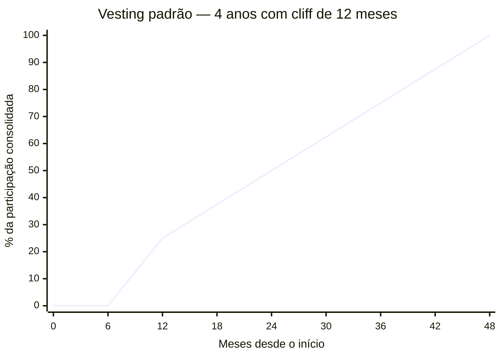

## FASE 13 — ESTRUTURAÇÃO JURÍDICA, FINANCEIRA E OPERACIONAL

### O que esse apêndice cobre

Consolidação das bases formais e operacionais do negócio. O entregável é a empresa estruturada: CNPJ ativo, regime tributário adequado, contratos formais, processos documentados, compliance básico, registros contábeis em dia.

> [!abstract] Resumo operacional
> **Entregável:** Empresa juridicamente constituída e operacionalmente estruturada — tipo societário, regime tributário, cap table com vesting, acordo de sócios, contratos com clientes e colaboradores, programa LGPD ativo e contabilidade mensal em dia.
>
> **Sinais de saída:**
> - Empresa constituída em formato adequado (LTDA ou S.A.) com contrato social revisado por advogado especializado em startups e cap table documentado com vesting de quatro anos com cliff de doze meses.
> - Programa LGPD básico ativo (DPO, bases legais, DPAs com operadores principais) e contratos padronizados com clientes, colaboradores e terceiros críticos.
> - Sistema contábil ativo com fechamento mensal sem pendências, marca em registro no INPI e separação total entre finanças pessoais e empresariais.
>
> **Três armadilhas mais comuns:**
> 1. Postergar formalização sob a lógica de "depois eu resolvo" — dívida fiscal e trabalhista compõe e custa mais resolver depois.
> 2. Acordo de sócios "no aperto de mão" — relações ótimas hoje viram disputas tóxicas no momento de dinheiro ou crise.
> 3. Ignorar LGPD — multas de até dois por cento do faturamento, com exposição reputacional pior que a multa.

### POR QUE

Muitos empreendedores postergam formalização. Acham que é burocracia. Na verdade, a falta de formalização gera riscos concretos. Autuações fiscais. Impossibilidade de emitir notas. Quebra de contratos por falta de amparo jurídico. Perda de funcionários por informalidade. Inviabilidade de captar investimento. Bloqueio de contas bancárias. A estruturação tarda. Mas sempre tem que acontecer. E quanto antes, melhor.

### Quando usar

Comece quando houver clientes pagantes, e receita relevante. Alguns aspectos (CNPJ) podem vir antes, se o modelo exigir emissão de notas. Termine quando os itens críticos desta fase estão concluídos. Revisite anualmente, e a cada marco (novos sócios, captação, expansão).

### Quem envolve

O executor é você. Os participantes são o contador (obrigatório), o advogado (altamente recomendado), e os sócios. O decisor é você.

### Como executar

Dez passos.

#### Passo 1, defina o tipo societário

No Brasil, as formas mais comuns para startups são quatro.

MEI. Limitado a um faturamento anual baixo (verifique o limite atual, que é atualizado periodicamente). Útil no comecinho. Geralmente insuficiente para startups em crescimento.

EIRELI (em extinção na prática), ou Sociedade Unipessoal Limitada. Você é sócio único. Limitada.

LTDA. Mais de um sócio. Mais flexível. Capital social declarado.

S/A. Estrutura para captação robusta. Mais complexa. Obrigatória para IPO.

> [!important] Para a maioria das startups iniciais, LTDA é o ponto ideal
> S/A entra em cena quando há captações de venture capital significativas. Migrar de LTDA para S/A custa entre R$ 15 mil e R$ 40 mil em honorários jurídicos para conversão simples (alteração de tipo societário, sem reestruturação de cap table (tabela de capitalização — quem tem quanto da empresa)). Para migração no contexto de Série A com reestruturação societária completa (classes de ações, ESOP, drag/tag-along, holding), a faixa sobe para R$ 30 mil a R$ 100 mil — esta é a faixa documentada no [[#APÊNDICE W — CONTABILIDADE, TRIBUTÁRIO E REGIMES FISCAIS PARA STARTUP BRASILEIRA|Apêndice W]] e se aplica ao cenário típico em que a migração efetivamente acontece. Em ambos os casos, é trivial — não vale antecipar a estrutura mais pesada.

> [!tip] Apêndice DA — Marco Legal das Startups
> O [[apendice-da|Apêndice DA — Marco Legal das Startups]] (Lei 182/2021) cobre os benefícios específicos para startups: sandbox regulatório, dispensa de licitação para contratar com governo, regime simplificado de dissolução e o enquadramento como "Empresa Inovadora" — relevante para decidir estrutura jurídica e acessar programas de fomento.

#### Passo 2, escolha o regime tributário

No Brasil, três regimes principais.

Simples Nacional. Para receitas anuais até o teto definido em lei (verifique o valor atualizado). Menor complexidade. Alíquotas variam conforme atividade e faturamento.

Lucro Presumido. Para receitas até outro patamar acima do Simples. Bom para algumas atividades com margem alta.

Lucro Real. Obrigatório para receitas acima do limite do Lucro Presumido, e para certas atividades específicas. Mais complexo.

> [!warning] Consulte o seu contador antes de decidir
> A escolha errada pode custar cinco a dez por cento de margem sem necessidade. Os limites e alíquotas dos regimes mudam periodicamente — esse manual aponta a estrutura, não os números do ano corrente.

> [!note] Tributário estratégico para startups
> O [[apendice-en|Apêndice EN — Tributário Estratégico]] cobre o Fator R do Simples Nacional (como a folha afeta o anexo de enquadramento), a Lei do Bem para P&D, e quando a estrutura de holding passa a fazer sentido — decisões com impacto direto na margem líquida dos próximos anos.

#### Passo 3, registre marca e domínio

Três providências.

Registro da marca no INPI (Brasil) para proteger nome e logo. O processo demora doze a vinte e quatro meses. Mas o protocolo já gera direitos.

Registro de domínio. .com.br, .com, e outros relevantes para o negócio.

Se operar internacionalmente, pesquise proteção internacional. Países onde a empresa terá presença, ou onde competidores podem registrar a marca antes.

#### Passo 4, estruture contratos formais

Quatro tipos de contrato.

##### Acordo de sócios, se houver sócios

Obrigatório desde o primeiro dia. Inclua sete itens. Divisão de participação. Vesting de equity (participação societária) — ninguém vira sócio pleno no dia zero, a participação se consolida ao longo de anos. Regras de saída voluntária, involuntária, e morte. Direitos de veto em decisões críticas. Mecanismos de resolução de conflito. Não-compete, e confidencialidade. Cláusula de tag-along, e drag-along, para rodadas futuras.

> [!note] Como funciona o vesting com cliff
> Nos primeiros 12 meses (o cliff (período mínimo antes de começar a adquirir participação)), nada vesta. No mês 13, 25% consolida de uma vez. Dos meses 13 a 48, o restante vesta mensalmente (~2,08% ao mês). Se o fundador sai antes de 12 meses, não leva nada. Se sai no mês 30, leva 50% da participação acordada. Isso protege a empresa de cofundadores que saem cedo mas mantêm participação grande.

> [!tip] Apêndice CZ — Capital Stack / Waterfall (CZ.17)
> Cap table com vesting é o tema central desta fase. O [[#APÊNDICE CZ — CANVASES E MAPAS VISUAIS DE MODELO|Capital Stack / Waterfall Canvas (CZ.17)]] é o mapa visual da estrutura de capital — Common (fundadores), Preferred (investidores com seniority), pool de ESOP, dívida — e do waterfall em cenário de exit (preferences, participation, conversion). Use desde a primeira rodada para que decisões de term sheet (1x participating, anti-dilution full ratchet vs weighted average, ESOP top-up) tenham impacto visualmente claro no que cada parte recebe em diferentes valuations de saída.

> [!warning] Conflito entre sócios é a segunda maior causa de morte de startups no mundo
> Não pule o acordo. Casais que se separam sem contrato pré-nupcial passam por divórcio. Sócios que se separam sem acordo passam por anos de litígio. O [[#APÊNDICE BP — DISPUTA SOCIETÁRIA E SAÍDA DE SÓCIO|Apêndice BP]] cobre prevenção (cláusulas que evitam o conflito), mediação (quando o conflito chega) e mecânica jurídica de saída forçada.

###### Metodologia de divisão de equity entre fundadores

A divisão de equity entre cofundadores é uma das decisões mais carregadas e mais evitadas de Fase 0 e Fase 13. A maioria dos times acaba em 50/50 "para evitar conflito", o que frequentemente cria conflito exatamente porque nunca explicitaram as contribuições e expectativas reais de cada um.

**Os quatro fatores que definem equity justo.**

*Ideia*: quem teve a ideia original? Peso real: baixo a moderado. Ideias sem execução não valem muito — e o produto vai mudar radicalmente até o PMF. Peso sugerido: 5-15% da divisão relativa.

*Comprometimento*: quem está dedicando mais tempo agora e no plano de longo prazo? Full-time vs. part-time faz diferença enorme. Um cofundador part-time por dois anos enquanto o outro está full-time é divisão estruturalmente injusta se o split é 50/50. Peso sugerido: 35-50% da divisão relativa.

*Habilidades e experiência*: quem traz o que a empresa mais precisa agora? CTO que constrói produto sozinho, CFO que levanta a rodada, CEO que fecha os primeiros clientes. Peso sugerido: 25-35% da divisão relativa.

*Capital investido*: quem está colocando dinheiro na empresa? Dinheiro tem preço diferente de suor — mas deve ser considerado, idealmente como conversível ou nota separada, não misturado no equity de fundador. Peso sugerido: variável, geralmente separado do equity de fundador.

**O método Slicing Pie (método de divisão dinâmica de equity baseado em contribuição real) (Mike Moyer, 2012).** Em vez de divisão fixa no começo, o Slicing Pie é um framework dinâmico: cada contribuição (horas, dinheiro, equipamento, IP) gera "fatias" proporcionais ao valor de mercado da contribuição. A divisão real só se consolida quando a empresa começa a gerar caixa ou capta investimento. Vantagem: elimina a especulação sobre quem vai contribuir mais. Desvantagem: exige tracking rigoroso de contribuições e pode criar complexidade se um cofundador sai cedo.

**Processo estruturado de negociação do split.**

Passo 1: cada cofundador, individualmente e sem discussão prévia, responde quatro perguntas por escrito. (a) Qual é a minha contribuição mais crítica para a empresa nos próximos 24 meses? (b) Quantas horas semanais estarei dedicando, por quanto tempo? (c) Que habilidade ou ativo único estou trazendo que seria difícil de contratar no mercado? (d) Qual percentual eu acho justo para mim e por quê?

Passo 2: compare as respostas em reunião facilitada. As divergências revelam expectativas não alinhadas — melhor descobrir agora do que em crise.

Passo 3: chegue a um número com quatro proteções mínimas escritas no acordo: (a) vesting de 4 anos com cliff de 12 meses para todos, (b) cláusula de reverse vesting (equity não consolidado volta para o pool se o sócio sai), (c) mecanismo de compra de equity do sócio que sai (shooting mechanism ou buy-sell agreement), (d) critério explícito de quem tem casting vote em impasse.

**Divisões comuns e quando cada uma faz sentido.**

50/50: funciona quando os cofundadores têm contribuições realmente equivalentes e comprometimento idêntico, e quando há mecanismo de resolução de impasse definido (um tem casting vote em certas categorias).

60/40 ou 70/30: mais honesto em situações onde há diferença clara de comprometimento, ideia, ou habilidade. A diferença de 10-20pp de equity é menos importante do que a clareza de expectativas.

Fundador solo com pool para cofundador futuro: quando você começa sozinho mas antecipa cofundador, reserve 20-30% em pool com vesting para quem entrar formalmente.

> [!tip] Não negocie equity em jantar
> A conversa de divisão de equity deve acontecer em ambiente estruturado, com documentação. Acordos verbais em jantar geram memórias diferentes seis meses depois. Use um template de acordo ou leve para advogado desde o primeiro rascunho.

> [!tip] Apêndice DB — Stock Options para Startups Brasileiras
> O [[apendice-db|Apêndice DB — Stock Options]] cobre a estrutura jurídica e fiscal das opções no Brasil: phantom shares versus opções reais, tratamento tributário no exercício, modelos de plano ESOP e como redigir a carta de oferta de equity para os primeiros funcionários — sem criar passivo fiscal inadvertido.

##### Contrato com clientes

Termos de uso. Contratos de prestação de serviço. SLAs. Revisados por advogado.

> [!note] Contratos em profundidade: MSA, NDA, DPA e IP assignment
> O [[apendice-eu|Apêndice EU — Contratos em Profundidade]] cobre a anatomia de cada contrato essencial para startups — MSA (Master Service Agreement), NDA, DPA (Data Processing Agreement), LOI e acordo de advisor — com as cláusulas críticas, os erros comuns, e o que negociar antes de assinar.

##### Contrato com colaboradores

CLT, PJ, autônomo, estagiário. Cada modalidade tem regras. Informalidade aqui gera passivo trabalhista. O maior risco jurídico de empresas pequenas.

> [!note] Direito do trabalho para startups: CLT vs PJ, eSocial e rescisão
> O [[apendice-el|Apêndice EL — Direito do Trabalho para Startups]] detalha os critérios de vínculo empregatício que transformam PJ em CLT na Justiça do Trabalho, as obrigações do eSocial desde o primeiro funcionário, o tratamento do sobreaviso em times de produto, e o custo real de cada modalidade de rescisão.

> [!note] Como estruturar a compensação dos primeiros funcionários
> O [[apendice-ed|Apêndice ED — Compensação e Benefícios no Brasil]] explica o multiplicador real do salário CLT (1,66x sobre o bruto), como estruturar PLR e equity para os primeiros funcionários, e quais benefícios fazem sentido em cada estágio da empresa.

##### NDAs com terceiros críticos

Parceiros, fornecedores, e potenciais investidores quando apropriado.

> [!tip] Apêndice AH — Contratos Operacionais
> O [[apendice-ah|Apêndice AH — Contratos Operacionais]] cobre os contratos de back-office que ficam fora dos contratos com clientes e colaboradores: fornecedores de tecnologia, acordos de parceria, contratos de coworking, SLAs internos e os itens de due diligence que investidores verificam em Série A — quando contratos mal-redigidos viram obstáculo ao fechamento da rodada.

#### Passo 5, adeque-se à LGPD (se trata dados pessoais)

Cinco providências. Nomeie DPO, ou encarregado. Escreva política de privacidade. Obtenha consentimento apropriado. Mantenha registro de tratamento de dados (ROPA). Tenha processo de resposta a solicitações do titular.

> [!note] Compliance mínimo viável além da LGPD
> O [[apendice-em|Apêndice EM — Compliance e Anticorrupção]] cobre as obrigações da Lei Anticorrupção (Lei 12.846) aplicáveis a startups, o papel do DPO, PLD/CFT para fintechs, e como montar um programa de compliance enxuto — o mínimo exigido por investidores institucionais e clientes enterprise.

#### Passo 6, instale contabilidade em dia

Quatro providências. Contador mensal. Emissão de notas fiscais corretas. Registros contábeis conforme regime. Obrigações acessórias (DCTF, DEFIS, DIRF, conforme aplicável).

> [!tip] Apêndice W — Contabilidade para Startups
> O [[apendice-w|Apêndice W — Contabilidade, Tributário e Regimes Fiscais]] cobre a diferença entre contabilidade gerencial e fiscal, como escolher entre Contabilizei, escritório especializado e controller interno por estágio, e o checklist de obrigações acessórias mensais que o fundador precisa acompanhar — mesmo sem entender contabilidade profundamente.

#### Passo 7, separe finanças pessoais e empresariais

Conta bancária exclusivamente da empresa. Cartão corporativo. Pró-labore definido. Dividendos, se houver, formalizados.

> [!warning] Misturar CPF e CNPJ é caminho para desorganização e risco fiscal
> Empréstimos do sócio para a empresa, ou da empresa para o sócio, sem contrato formal, geram autuação fiscal e descaracterização da pessoa jurídica em caso de litígio. Toda movimentação entre as duas pessoas (física e jurídica) precisa de contrato escrito.

> [!note] Responsabilidade do sócio e do administrador
> O [[apendice-ep|Apêndice EP — Responsabilidade do Sócio e Administrador]] explica quando a desconsideração da personalidade jurídica se aplica, o que configura confusão patrimonial, e as obrigações legais do administrador que justificam a separação rigorosa de contas.

#### Passo 8, estabeleça processos operacionais documentados

Cinco documentos vivos. Onboarding (processo de integração do novo colaborador) de novo cliente. Onboarding de novo funcionário. Processo de suporte. Processo de venda. Políticas internas (gastos, viagens, despesas).

> [!tip] Documente o necessário, não o exaustivo
> Não precisa ser cinquenta páginas. Precisa ser claro e usado. Documento que ninguém lê é teatro de processo. Uma página por processo, em linguagem direta, vale mais do que manual elaborado que ninguém abre.

#### Passo 9, defina estrutura financeira mínima

Quatro itens. Fluxo de caixa mensal projetado para os próximos doze meses. Controle de inadimplência. Reconciliação bancária semanal. Relatório mensal de resultado.

> [!note] Capital de giro ao estruturar e captar a primeira rodada
> O [[apendice-ez|Apêndice EZ — Capital de Giro e Recebíveis]] cobre o Ciclo de Conversão de Caixa, as modalidades de antecipação de recebíveis disponíveis no Brasil, e como o FIDC se encaixa em fintechs e marketplaces — ferramentas para não ficar com caixa represado enquanto o negócio cresce.

#### Passo 10, revise seguros

Quatro modalidades, dependendo do negócio.

Responsabilidade civil. Cobre danos causados a terceiros pela operação.

Seguro de cibersegurança, se trata dados. Cobre custos de incidentes, vazamentos, e respostas regulatórias.

Seguro de erros e omissões (E&O), se oferece serviço profissional. Cobre falhas técnicas que causem prejuízo ao cliente.

Seguro de vida para sócios-chave (key person). Em sociedades pequenas, a perda repentina de um sócio operacional pode quebrar o negócio. O seguro mitiga esse risco para os sócios remanescentes.

> [!note] Coberturas essenciais para startups: D&O, E&O, cyber e Key Man
> O [[apendice-ey|Apêndice EY — Gestão de Risco e Seguros]] detalha quando contratar cada cobertura, o que cada apólice efetivamente protege, e os gatilhos que tornam D&O e Key Man obrigatórios — especialmente após a entrada de investidores no board.

### PERGUNTAS A RESPONDER

- Qual é a estrutura societária adequada?
- Qual regime tributário minimiza carga, e atende requisitos?
- A marca e o domínio estão protegidos?
- Existe acordo de sócios assinado?
- Os contratos com clientes e colaboradores estão formalizados, e revisados?
- Estou em conformidade com a LGPD?
- A contabilidade está em dia?
- As finanças pessoal e empresarial estão separadas?
- Os processos operacionais críticos estão documentados?

### Métricas

Checklist de itens formalizados. Meta: cem por cento.

Taxa de conformidade fiscal. Zero autos de infração em aberto. Zero atrasos em obrigações acessórias (DCTF, DEFIS, SPED) nos últimos seis meses. Certidões negativas federais, estaduais, e municipais válidas.

Tempo de fechamento contábil mensal. Meta: até dez dias depois de fechar o mês.

Cobertura de seguros em relação a riscos críticos. Responsabilidade civil cobrindo pelo menos cinco vezes o faturamento mensal. D&O (diretores e oficiais) contratado a partir de captação Série A, ou quando houver investidores no board. Cibersegurança se trata dados sensíveis.

### SAÍDA DESTA FASE

Você concluiu a [[#FASE 13 — ESTRUTURAÇÃO JURÍDICA, FINANCEIRA E OPERACIONAL|Fase 13]] quando os nove critérios abaixo estão cumpridos.

1. Empresa juridicamente constituída em formato adequado (LTDA ou S.A.), com regime tributário adequado, e contrato social revisado por advogado especializado em startups.
2. Cap table documentado com equity split e vesting dos sócios. Acordo de sócios assinado se há sócios. Padrão de quatro anos com cliff de doze meses.
3. Marca e domínio protegidos. Registro de marca iniciado, ou concluído, no INPI.
4. Contratos com clientes, colaboradores, e terceiros críticos (trabalho CLT ou PJ, termos de uso, SLA, fornecedores) padronizados.
5. Programa de LGPD básico ativo. DPO, bases legais, DPAs com operadores principais. Conformidade documentada e implementada.
6. Sistema contábil ativo (interno ou terceirizado), com fechamento mensal, DRE, e balanço, sem pendências.
7. Plano de contingência financeira e operacional documentado nos últimos doze meses.
8. Finanças pessoal e empresarial totalmente separadas.
9. Processos operacionais-chave documentados.

**Checklist final.**

- [ ] Tenho pessoa jurídica constituída em formato adequado ao estágio (LTDA ou S.A.)?
- [ ] Contrato social ou estatuto revisados por advogado especializado em startups?
- [ ] Cap table documentado com equity split e vesting dos sócios?
- [ ] Sistema contábil ativo (interno ou terceirizado), com fechamento mensal?
- [ ] Contratos de trabalho (CLT ou PJ) padronizados e revisados?
- [ ] Contratos com clientes (termos de uso, SLA, política de privacidade) em vigor?
- [ ] Programa básico de LGPD ativo ([[#APÊNDICE T — LGPD, COMPLIANCE E GOVERNANÇA DE DADOS|Apêndice T]]): DPO, bases legais, DPAs com operadores principais?
- [ ] Plano de contingência financeira e operacional documentado ([[#APÊNDICE CW — CRISE E CONTINUIDADE: PREVENÇÃO, RESPOSTA, RECUPERAÇÃO|Apêndice CW]])?
- [ ] Registro de marca em andamento, ou concluído (INPI)?
- [ ] Separação clara de finanças pessoais e empresariais?

**Primeiros passos práticos.**

1. Contrate advogado especializado em startups (não generalista) para revisar o contrato social e o cap table. Investimento de R$ 3 mil a R$ 10 mil justificável.
2. Formalize o cap table em planilha detalhada, mais o vesting dos sócios (quatro anos com cliff de doze meses é padrão).
3. Contrate contador especializado em startup, ou serviços como Contabilizei, ou Omie mais contador, para começar fechamento mensal.
4. Inicie o registro de marca no INPI. Pode levar oito a dezoito meses. Comece cedo.
5. Redija política de privacidade, mais termos de uso, mais mapeamento LGPD básico.

### EXEMPLO PRÁTICO

**Estruturação, PadariaPro LTDA (exemplo).**

A pessoa jurídica. O formato escolhido foi LTDA (Sociedade Limitada). Adequado até Série A. Migração para S.A. planejada se a rodada superar R$ 5 milhões. CNAE principal: 62.02-3-00 (Desenvolvimento e licenciamento de programas de computador customizáveis). Capital social: R$ 100 mil, com R$ 20 mil integralizados, e R$ 80 mil a integralizar em vinte e quatro meses.

O cap table inicial.

| Sócio | Percentual | Tipo de entrada | Vesting |
|---|---|---|---|
| Mariana (founder, CEO) | 55% | Tempo integral desde dia um | 48 meses, cliff 12m |
| Bruno (cofounder, CTO) | 35% | Tempo integral desde mês três | 48 meses, cliff 12m |
| Pedro (advisor e angel) | 5% | R$ 200 mil investidos em SAFE (pré-rodada) | — |
| ESOP (pool de equity) | 5% | Reservado para futuras contratações-chave | Por grant |

O contador. Terceirizado. Escritório especializado em startups, R$ 1.200 por mês. Fechamento mensal: DRE, e balanço gerencial. Responsável por obrigações fiscais, folha (via ferramenta integrada), e relatório gerencial.

Os contratos. Modelo de contrato PJ uniformizado para os quatro colaboradores atuais. CLT futura planejada depois da Série A. Termo de uso, mais política de privacidade, publicados no site. DPA assinado com AWS, Z-API (WhatsApp), Asaas (pagamentos), e Mailgun (e-mail transacional).

A LGPD ([[#APÊNDICE T — LGPD, COMPLIANCE E GOVERNANÇA DE DADOS|Apêndice T]]). DPO terceirizado (DPO-as-a-Service, R$ 800 por mês). Canal `privacidade@padariapro.com.br` ativo. Mapeamento de tratamentos: catorze operações documentadas, com base legal.

O registro de marca. Pedido no INPI no dia 15 de fevereiro do ano. Protocolo em andamento. Revisão prevista em doze a dezoito meses. "PadariaPro" mais logo, em classe 9 (software) e classe 42 (serviços tecnológicos).

A contingência. Reserva líquida: R$ 150 mil (cerca de três meses de despesas fixas). Plano de contingência de quatro páginas documentado ([[#APÊNDICE CW — CRISE E CONTINUIDADE: PREVENÇÃO, RESPOSTA, RECUPERAÇÃO|Apêndice CW]]), para quatro cenários: caixa crítico, churn explosivo, perda de sócio, e regulatório.

A separação financeira. Conta PJ no Nubank Empresa. Pró-labore dos founders definido em R$ 7.500 por mês (patamar mínimo aceitável definido na [[#FASE 0 — PREPARAÇÃO DO EMPREENDEDOR|Fase 0]]). Nada de "empréstimos entre sócios e empresa" sem contrato formal.

### Armadilhas

"Depois eu resolvo". Dívida fiscal e trabalhista compõe. Deixar para depois quase sempre é mais caro do que lidar agora.

Contador barato demais. Contador ruim custa mais do que contador caro. Escolha bem.

Acordo de sócios "no aperto de mão". Relações ótimas hoje viram disputas tóxicas no momento de dinheiro, ou crise. Formalize.

Ignorar LGPD. As multas vão até dois por cento do faturamento. E a exposição reputacional é pior.

Documentar demais, executar de menos. Processos escritos que ninguém segue são burocracia. Mantenha-os vivos.

---

### CASO BRASILEIRO, Fase 13, o custo de não formalizar cedo

Um padrão recorrente em startups brasileiras. Os fundadores começam a operação sob CNPJ pessoal, ou em modo informal. A receita cresce. Entra um sócio informal. Começam a contratar via PJ sem MEI formal. A decisão típica errada é postergar a formalização por meses ou anos. Assumindo que "é só burocracia".

O resultado típico aparece quando a empresa precisa levantar investimento. Disputas societárias mal-documentadas afloram. Contratações anteriores sem vínculo claro viram passivo trabalhista. A escolha tributária retroativa é limitada, e custa caro.

A lição transferível. Estruturação jurídica e tributária cedo não é excesso de rigor. É higiene básica. Custa semanas no começo. Custa meses ou milhões depois.

---

### FERRAMENTAS DESTA FASE

Estruturação jurídica, financeira e operacional combina negociações críticas com primeiras decisões financeiras estruturais. Nove ferramentas, em três grupos: **Negociação** — Harvard Negotiation, BATNA e ZOPA (BG.15.1), Never Split the Difference (BG.15.2), Getting Past No (BG.15.4); **Decisão e análise financeira** — Cost-Benefit Analysis (BG.5.6), Expected Value e Bayesian Thinking (BG.5.7), Unit Economics (BG.18.1), LTV:CAC Ratio (BG.18.3), Cash Conversion Cycle (BG.18.8) e Burn Multiple (BG.18.4).

Canvases visuais complementares ([[#APÊNDICE CZ — CANVASES E MAPAS VISUAIS DE MODELO|Apêndice CZ]]): CZ.17 (Capital Stack / Waterfall).

##### Negociação (BG.15)

Harvard Negotiation, BATNA e ZOPA (Fisher e Ury, 1981). Framework de negociação baseada em princípios: foca em interesses, opções de ganho mútuo e critérios objetivos — em vez de posições fixas. Use em negociações com sócios sobre equity, primeiros contratos de venda, acordos de fornecedor, discussões com advisors, e investidores seed. Ver BG.15.1.

Never Split the Difference (Chris Voss, 2016). Tactical empathy, mirror, labeling, calibrated questions. Use em negociações emocionais, ou de alta assimetria de poder. Ver BG.15.2.

Getting Past No (William Ury). Cinco passos para lidar com pessoas difíceis. Use em conflitos com cofounder, disputas com fornecedor, e impasses. Ver BG.15.4.

##### Decisão e análise financeira (BG.5 e BG.18)

Cost-Benefit Analysis. Fundamental para decisões de estrutura jurídica (S.A. versus LTDA, holding offshore), e alocação inicial de recursos. Ver BG.5.6.

Expected Value, Bayesian Thinking. Para decisões de pricing inicial, contratação com equity, e planejamento de runway. Ver BG.5.7.

Unit Economics. Análise da rentabilidade por cliente. CAC, LTV, payback period, gross margin. Use desde os primeiros clientes. Decisões de pricing precisam de unit economics minimamente ok. Ver BG.18.1.

LTV dividido por CAC, ou LTV:CAC Ratio (Skok). Saudável é três ou mais. Problemático é menos de um e meio. Segmente por canal, e por vertical. Ver BG.18.3.

Cash Conversion Cycle (CCC). DIO mais DSO menos DPO. Crítico para empresas com inventário, ou que vendem a prazo longo. Ver BG.18.8.

Burn Multiple (David Sacks, 2020). Net Burn dividido por Net New ARR. Menos de uma vez é elite. Mais de três vezes é red flag. Use trimestralmente, especialmente depois dos primeiros rounds de investimento. Ver BG.18.4.

---

### SÍNTESE DA FASE 13

Nessa fase você formalizou o tipo societário (LTDA ou S/A), o regime tributário, o cap table com vesting, o acordo de sócios, os contratos com clientes e colaboradores, o programa LGPD e a contabilidade mensal. A diferença entre quem faz certo e quem falha está em tratar formalização como infraestrutura, não como obstáculo. Escolha de regime tributário tem efeito multimilionário em três a cinco anos. Cap table mal-feita é dor de cabeça em qualquer captação séria. Compliance LGPD é pré-requisito para vender enterprise ou captar Série A institucional.

Com essa base formalizada, a [[#FASE 14 — ESCALA: TIME, OPERAÇÕES, CRESCIMENTO E CAPITAL|Fase 14]] pode ser executada: construir time, operação e máquina de crescimento sem o risco jurídico e tributário de uma empresa ainda informal.

# fase13 #estruturacao #ltda #cap-table #vesting #lgpd #regime-tributario #acordo-de-socios #compliance #contabilidade

---
