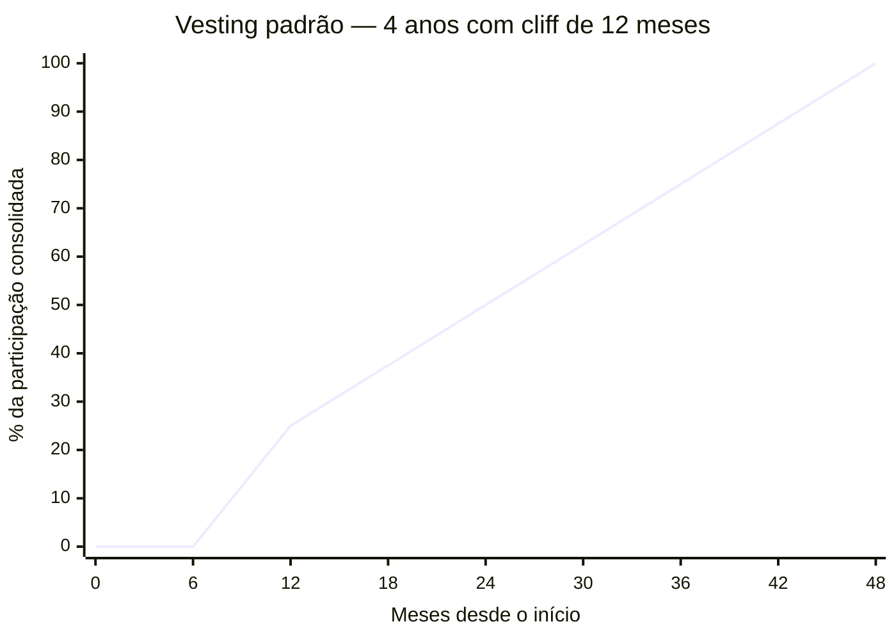

## FASE 13 — ESTRUTURAÇÃO JURÍDICA, FINANCEIRA E OPERACIONAL

### O que esse apêndice cobre
Consolidação das bases formais e operacionais do negócio. Aqui você transforma a operação de "projeto informal" em "empresa estruturada" nos aspectos jurídico, contábil, tributário, trabalhista, e operacional.

O entregável é a empresa estruturada. CNPJ ativo. Regime tributário adequado. Contratos formais. Processos documentados. Compliance básico. Registros contábeis em dia.

### POR QUE
Muitos empreendedores postergam formalização. Acham que é burocracia. Na verdade, a falta de formalização gera riscos concretos. Autuações fiscais. Impossibilidade de emitir notas. Quebra de contratos por falta de amparo jurídico. Perda de funcionários por informalidade. Inviabilidade de captar investimento. Bloqueio de contas bancárias. A estruturação tarda. Mas sempre tem que acontecer. E quanto antes, melhor.

### Quando usar
Comece quando houver clientes pagantes, e receita relevante. Alguns aspectos (CNPJ) podem vir antes, se o modelo exigir emissão de notas. Termine quando os itens críticos dessa fase estão concluídos. Revisite anualmente, e a cada marco (novos sócios, captação, expansão).

### Quem envolve
O executor é você. Os participantes são o contador (obrigatório), o advogado (altamente recomendado), e os sócios. O decisor é você.

### Como executar

Dez passos.

#### Passo 1, defina o tipo societário

No Brasil, as formas mais comuns para startups são quatro.

MEI. Limitado a um faturamento anual baixo (verifique o limite atual, que é atualizado periodicamente). Útil no comecinho. Geralmente insuficiente para startups em crescimento.

EIRELI (em extinção na prática), ou Sociedade Unipessoal Limitada. Você é sócio único. Limitada.

LTDA. Mais de um sócio. Mais flexível. Capital social declarado.

S/A. Estrutura para captação robusta. Mais complexa. Obrigatória para IPO.

> [!important] Para a maioria das startups iniciais, LTDA é o ponto ideal
> S/A entra em cena quando há captações de venture capital significativas. Migrar de LTDA para S/A custa entre R$ 15 mil e R$ 40 mil em honorários jurídicos, mas é trivial — não vale antecipar a estrutura mais pesada.

#### Passo 2, escolha o regime tributário

No Brasil, três regimes principais.

Simples Nacional. Para receitas anuais até o teto definido em lei (verifique o valor atualizado). Menor complexidade. Alíquotas variam conforme atividade e faturamento.

Lucro Presumido. Para receitas até outro patamar acima do Simples. Bom para algumas atividades com margem alta.

Lucro Real. Obrigatório para receitas acima do limite do Lucro Presumido, e para certas atividades específicas. Mais complexo.

> [!warning] Consulte o seu contador antes de decidir
> A escolha errada pode custar cinco a dez por cento de margem sem necessidade. Os limites e alíquotas dos regimes mudam periodicamente — esse manual aponta a estrutura, não os números do ano corrente.

#### Passo 3, registre marca e domínio

Três providências.

Registro da marca no INPI (Brasil) para proteger nome e logo. O processo demora doze a vinte e quatro meses. Mas o protocolo já gera direitos.

Registro de domínio. .com.br, .com, e outros relevantes para o negócio.

Se operar internacionalmente, pesquise proteção internacional. Países onde a empresa terá presença, ou onde competidores podem registrar a marca antes.

#### Passo 4, estruture contratos formais

Quatro tipos de contrato.

##### Acordo de sócios, se houver sócios

Obrigatório desde o primeiro dia. Inclua sete itens. Divisão de participação. Vesting de equity (ninguém vira sócio pleno no dia zero, equity se consolida ao longo de anos). Regras de saída voluntária, involuntária, e morte. Direitos de veto em decisões críticas. Mecanismos de resolução de conflito. Não-compete, e confidencialidade. Cláusula de tag-along, e drag-along, para rodadas futuras.

> [!note] Como funciona o vesting com cliff
> Nos primeiros 12 meses (o cliff), nada vesta. No mês 13, 25% consolida de uma vez. Dos meses 13 a 48, o restante vesta mensalmente (~2,08% ao mês). Se o fundador sai antes de 12 meses, não leva nada. Se sai no mês 30, leva 50% da participação acordada. Isso protege a empresa de cofundadores que saem cedo mas mantêm participação grande.

> [!warning] Conflito entre sócios é a segunda maior causa de morte de startups no mundo
> Não pule o acordo. Casais que se separam sem contrato pré-nupcial passam por divórcio. Sócios que se separam sem acordo passam por anos de litígio.

##### Contrato com clientes

Termos de uso. Contratos de prestação de serviço. SLAs. Revisados por advogado.

##### Contrato com colaboradores

CLT, PJ, autônomo, estagiário. Cada modalidade tem regras. Informalidade aqui gera passivo trabalhista. O maior risco jurídico de empresas pequenas.

##### NDAs com terceiros críticos

Parceiros, fornecedores, e potenciais investidores quando apropriado.

#### Passo 5, adeque-se à LGPD (se trata dados pessoais)

Cinco providências. Nomeie DPO, ou encarregado. Escreva política de privacidade. Obtenha consentimento apropriado. Mantenha registro de tratamento de dados (ROPA). Tenha processo de resposta a solicitações do titular.

#### Passo 6, instale contabilidade em dia

Quatro providências. Contador mensal. Emissão de notas fiscais corretas. Registros contábeis conforme regime. Obrigações acessórias (DCTF, DEFIS, DIRF, conforme aplicável).

#### Passo 7, separe finanças pessoais e empresariais

Conta bancária exclusivamente da empresa. Cartão corporativo. Pró-labore definido. Dividendos, se houver, formalizados.

> [!warning] Misturar CPF e CNPJ é caminho para desorganização e risco fiscal
> Empréstimos do sócio para a empresa, ou da empresa para o sócio, sem contrato formal, geram autuação fiscal e descaracterização da pessoa jurídica em caso de litígio. Toda movimentação entre as duas pessoas (física e jurídica) precisa de contrato escrito.

#### Passo 8, estabeleça processos operacionais documentados

Cinco documentos vivos. Onboarding de novo cliente. Onboarding de novo funcionário. Processo de suporte. Processo de venda. Políticas internas (gastos, viagens, despesas).

> [!tip] Documente o necessário, não o exaustivo
> Não precisa ser cinquenta páginas. Precisa ser claro e usado. Documento que ninguém lê é teatro de processo. Um página por processo, em linguagem direta, vale mais do que manual elaborado que ninguém abre.

#### Passo 9, defina estrutura financeira mínima

Quatro itens. Fluxo de caixa mensal projetado para os próximos doze meses. Controle de inadimplência. Reconciliação bancária semanal. Relatório mensal de resultado.

#### Passo 10, revise seguros

Quatro modalidades, dependendo do negócio.

Responsabilidade civil. Cobre danos causados a terceiros pela operação.

Seguro de cibersegurança, se trata dados. Cobre custos de incidentes, vazamentos, e respostas regulatórias.

Seguro de erros e omissões (E&O), se oferece serviço profissional. Cobre falhas técnicas que causem prejuízo ao cliente.

Seguro de vida para sócios-chave (key person). Em sociedades pequenas, a perda repentina de um sócio operacional pode quebrar o negócio. O seguro mitiga esse risco para os sócios remanescentes.

### PERGUNTAS A RESPONDER
- Qual é a estrutura societária adequada?
- Qual regime tributário minimiza carga, e atende requisitos?
- A marca e o domínio estão protegidos?
- Existe acordo de sócios assinado?
- Os contratos com clientes e colaboradores estão formalizados, e revisados?
- Estou em conformidade com a LGPD?
- A contabilidade está em dia?
- As finanças pessoal e empresarial estão separadas?
- Os processos operacionais críticos estão documentados?

### Métricas

Checklist de itens formalizados. Meta: cem por cento.

Taxa de conformidade fiscal. Zero autos de infração em aberto. Zero atrasos em obrigações acessórias (DCTF, DEFIS, SPED) nos últimos seis meses. Certidões negativas federais, estaduais, e municipais válidas.

Tempo de fechamento contábil mensal. Meta: até dez dias depois de fechar o mês.

Cobertura de seguros em relação a riscos críticos. Responsabilidade civil cobrindo pelo menos cinco vezes o faturamento mensal. D&O (diretores e oficiais) contratado a partir de captação Série A, ou quando houver investidores no board. Cibersegurança se trata dados sensíveis.

### SAÍDA DESTA FASE

Você concluiu a [[#FASE 13 — ESTRUTURAÇÃO JURÍDICA, FINANCEIRA E OPERACIONAL|[[#FASE 1 — ENCONTRAR A IDEIA|Fase 1]]3]] quando os nove critérios abaixo estão cumpridos.

1. Empresa juridicamente constituída em formato adequado (LTDA ou S.A.), com regime tributário adequado, e contrato social revisado por advogado especializado em startups.
2. Cap table documentado com equity split e vesting dos sócios. Acordo de sócios assinado se há sócios. Padrão de quatro anos com cliff de doze meses.
3. Marca e domínio protegidos. Registro de marca iniciado, ou concluído, no INPI.
4. Contratos com clientes, colaboradores, e terceiros críticos (trabalho CLT ou PJ, termos de uso, SLA, fornecedores) padronizados.
5. Programa de LGPD básico ativo. DPO, bases legais, DPAs com operadores principais. Conformidade documentada e implementada.
6. Sistema contábil ativo (interno ou terceirizado), com fechamento mensal, DRE, e balanço, sem pendências.
7. Plano de contingência financeira e operacional documentado nos últimos doze meses.
8. Finanças pessoal e empresarial totalmente separadas.
9. Processos operacionais-chave documentados.

**Checklist final.**

- [ ] Tenho pessoa jurídica constituída em formato adequado ao estágio (LTDA ou S.A.)?
- [ ] Contrato social ou estatuto revisados por advogado especializado em startups?
- [ ] Cap table documentado com equity split e vesting dos sócios?
- [ ] Sistema contábil ativo (interno ou terceirizado), com fechamento mensal?
- [ ] Contratos de trabalho (CLT ou PJ) padronizados e revisados?
- [ ] Contratos com clientes (termos de uso, SLA, política de privacidade) em vigor?
- [ ] Programa básico de LGPD ativo ([[#APÊNDICE T — LGPD, COMPLIANCE E GOVERNANÇA DE DADOS|Apêndice T]]): DPO, bases legais, DPAs com operadores principais?
- [ ] Plano de contingência financeira e operacional documentado ([[#APÊNDICE CW — CRISE E CONTINUIDADE: PREVENÇÃO, RESPOSTA, RECUPERAÇÃO|Apêndice CW]])?
- [ ] Registro de marca em andamento, ou concluído (INPI)?
- [ ] Separação clara de finanças pessoais e empresariais?

**Primeiros passos práticos.**

1. Contratar advogado especializado em startups (não generalista) para revisar o contrato social e o cap table. Investimento de R$ 3 mil a R$ 10 mil justificável.
2. Formalizar o cap table em planilha detalhada, mais o vesting dos sócios (quatro anos com cliff de doze meses é padrão).
3. Contratar contador especializado em startup, ou serviços como Contabilizei, ou Omie mais contador, para começar fechamento mensal.
4. Iniciar registro de marca no INPI. Pode levar oito a dezoito meses. Comece cedo.
5. Redigir política de privacidade, mais termos de uso, mais mapeamento LGPD básico.

### EXEMPLO PRÁTICO

**Estruturação, PadariaPro LTDA (exemplo).**

A pessoa jurídica. O formato escolhido foi LTDA (Sociedade Limitada). Adequado até Série A. Migração para S.A. planejada se a rodada superar R$ 5 milhões. CNAE principal: 62.02-3-00 (Desenvolvimento e licenciamento de programas de computador customizáveis). Capital social: R$ 100 mil, com R$ 20 mil integralizados, e R$ 80 mil a integralizar em vinte e quatro meses.

O cap table inicial.

| Sócio | Percentual | Tipo de entrada | Vesting |
|---|---|---|---|
| Mariana (founder, CEO) | 55% | Tempo integral desde dia um | 48 meses, cliff 12m |
| Bruno (cofounder, CTO) | 35% | Tempo integral desde mês três | 48 meses, cliff 12m |
| Pedro (advisor e angel) | 5% | R$ 200 mil investidos em SAFE (pré-rodada) | — |
| ESOP (pool de equity) | 5% | Reservado para futuras contratações-chave | Por grant |

O contador. Terceirizado. Escritório especializado em startups, R$ 1.200 por mês. Fechamento mensal: DRE, e balanço gerencial. Responsável por obrigações fiscais, folha (via ferramenta integrada), e relatório gerencial.

Os contratos. Modelo de contrato PJ uniformizado para os quatro colaboradores atuais. CLT futura planejada depois da Série A. Termo de uso, mais política de privacidade, publicados no site. DPA assinado com AWS, Z-API (WhatsApp), Asaas (pagamentos), e Mailgun (e-mail transacional).

A LGPD ([[#APÊNDICE T — LGPD, COMPLIANCE E GOVERNANÇA DE DADOS|Apêndice T]]). DPO terceirizado (DPO-as-a-Service, R$ 800 por mês). Canal `privacidade@padariapro.com.br` ativo. Mapeamento de tratamentos: catorze operações documentadas, com base legal.

O registro de marca. Pedido no INPI no dia 15 de fevereiro do ano. Protocolo em andamento. Revisão prevista em doze a dezoito meses. "PadariaPro" mais logo, em classe 9 (software) e classe 42 (serviços tecnológicos).

A contingência. Reserva líquida: R$ 150 mil (cerca de três meses de despesas fixas). Plano de contingência de quatro páginas documentado ([[#APÊNDICE CW — CRISE E CONTINUIDADE: PREVENÇÃO, RESPOSTA, RECUPERAÇÃO|Apêndice CW]]), para quatro cenários: caixa crítico, churn explosivo, perda de sócio, e regulatório.

A separação financeira. Conta PJ no Nubank Empresa. Pró-labore dos founders definido em R$ 7.500 por mês (patamar mínimo aceitável definido na [[#FASE 0 — PREPARAÇÃO DO EMPREENDEDOR|Fase 0]]). Nada de "empréstimos entre sócios e empresa" sem contrato formal.

### Armadilhas

"Depois eu resolvo". Dívida fiscal e trabalhista compõe. Deixar para depois quase sempre é mais caro do que lidar agora.

Contador barato demais. Contador ruim custa mais do que contador caro. Escolha bem.

Acordo de sócios "no aperto de mão". Relações ótimas hoje viram disputas tóxicas no momento de dinheiro, ou crise. Formalize.

Ignorar LGPD. As multas vão até dois por cento do faturamento. E a exposição reputacional é pior.

Documentar demais, executar de menos. Processos escritos que ninguém segue são burocracia. Mantenha-os vivos.

---

### CASO BRASILEIRO, Fase 13, o custo de não formalizar cedo

Um padrão recorrente em startups brasileiras. Os fundadores começam a operação sob CNPJ pessoal, ou em modo informal. A receita cresce. Entra um sócio informal. Começam a contratar via PJ sem MEI formal. A decisão típica errada é postergar a formalização por meses ou anos. Assumindo que "é só burocracia".

O resultado típico aparece quando a empresa precisa levantar investimento. Disputas societárias mal-documentadas afloram. Contratações anteriores sem vínculo claro viram passivo trabalhista. A escolha tributária retroativa é limitada, e custa caro.

A lição transferível. Estruturação jurídica e tributária cedo não é excesso de rigor. É higiene básica. Custa semanas no começo. Custa meses ou milhões depois.

---

### FERRAMENTAS DESTA FASE

Estruturação jurídica, financeira, e operacional combina negociações críticas com primeiras decisões financeiras estruturais. Detalhamento no [[#APÊNDICE BG — FERRAMENTÁRIO COMPLETO DO EMPREENDEDOR|Apêndice BG]]. Nove ferramentas centrais.

##### Negociação (BG.15)

Harvard Negotiation, BATNA e ZOPA (Fisher e Ury, 1981). Principled negotiation. Interesses, opções, critérios objetivos. Use em negociações com sócios sobre equity, primeiros contratos de venda, acordos de fornecedor, discussões com advisors, e investidores seed. Ver BG.15.1.

Never Split the Difference (Chris Voss, 2016). Tactical empathy, mirror, labeling, calibrated questions. Use em negociações emocionais, ou de alta assimetria de poder. Ver BG.15.2.

Getting Past No (William Ury). Cinco passos para pessoas difíceis. Use em conflitos com cofounder, disputas com fornecedor, e impasses. Ver BG.15.4.

##### Decisão e análise financeira (BG.5 e BG.18)

Cost-Benefit Analysis. Fundamental para decisões de estrutura jurídica (S.A. versus LTDA, holding offshore), e alocação inicial de recursos. Ver BG.5.6.

Expected Value, Bayesian Thinking. Para decisões de pricing inicial, contratação com equity, e planejamento de runway. Ver BG.5.7.

Unit Economics. Análise da rentabilidade por cliente. CAC, LTV, payback period, gross margin. Use desde os primeiros clientes. Decisões de pricing precisam de unit economics minimamente ok. Ver BG.18.1.

LTV dividido por CAC, ou LTV:CAC Ratio (Skok). Saudável é três ou mais. Problemático é menos de um e meio. Segmente por canal, e por vertical. Ver BG.18.3.

Cash Conversion Cycle (CCC). DIO mais DSO menos DPO. Crítico para empresas com inventário, ou que vendem a prazo longo. Ver BG.18.8.

Burn Multiple (David Sacks, 2020). Net Burn dividido por Net New ARR. Menos de uma vez é elite. Mais de três vezes é red flag. Use trimestralmente, especialmente depois dos primeiros rounds de investimento. Ver BG.18.4.

---

### SÍNTESE DA FASE 13

A [[#FASE 13 — ESTRUTURAÇÃO JURÍDICA, FINANCEIRA E OPERACIONAL|[[#FASE 1 — ENCONTRAR A IDEIA|Fase 1]]3]] confronta um adiamento comum, e caro. Muitos fundadores postergam a formalização. Acham que é burocracia, ou que "depois resolve". Mas a falta de formalização não é neutra. Gera riscos concretos. Autuações fiscais. Impossibilidade de emitir notas. Quebra de contratos por falta de amparo jurídico. Perda de funcionários por informalidade. Inviabilidade de captar investimento. Bloqueio de contas bancárias. A estruturação tarda. Mas sempre tem que acontecer. E quanto antes, melhor.

A diferença entre quem faz certo, e quem falha, está em tratar formalização como infraestrutura, não como obstáculo. Escolha de regime tributário tem efeito multimilionário em três a cinco anos. Cap table mal-feita no início é dor de cabeça em qualquer captação séria. Acordo de sócios sem drag-along, tag-along, e cláusulas de saída, expõe os fundadores a impasses que paralisam decisões em momento crítico. Compliance LGPD em dia não é luxo, é pré-requisito para vender enterprise, ou captar série A institucional.

O entregável é a empresa estruturada. CNPJ ativo. Regime tributário adequado. Contratos formais. Processos documentados. Compliance básico. Registros contábeis em dia. Esse trabalho parece administrativo, mas é estratégico. Sem ele, as Fases 14 (Escala) e 16 (Exit) ficam impossibilitadas. Quem chega à Série A com cap table embaralhada perde capital próprio em ajustes de última hora. Quem chega ao Exit sem governança madura recebe valuation menor por desconto de risco. Estruturação é o trabalho silencioso que paga em todos os marcos seguintes.

#fase13 #estruturacao #ltda #cap-table #vesting #lgpd #regime-tributario #acordo-de-socios #compliance #contabilidade

---
